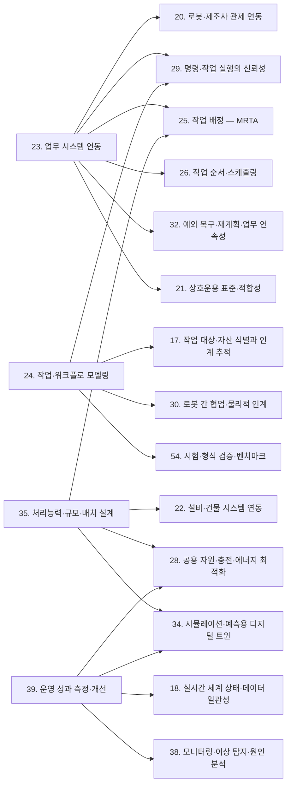

(너의 규칙은 시스템 프롬프트의 agents/shared-rules.md 와 agents/storyteller.md 이다. 아래는 이번 실행의 컨텍스트와 입력이다.)

## 실행 컨텍스트

- run_id: 2026-09-30-14
- date: 2026-09-30
- run_type: area_deep_dive (영역 심화)
- 대상: 2. 사용 사례·요구·책임 범위 (A. 기획·사업)
- 예산:
    - max_search_queries: 30
    - max_sources_per_run: 15
    - new_topic_pages: 1
    - page_updates: 2
    - max_retries: 2
- 환경 알림: web_fetch_available: true · fetch_mode: full
- 언어: ko

## 입력

### runs/2026-09-30-14/target.json

```json
{
  "run_id": "2026-09-30-14",
  "date": "2026-09-30",
  "weekday": "Wed",
  "run_number": 123,
  "run_type": "area_deep_dive",
  "forced": true,
  "target": {
    "area_no": 2,
    "area_name": "2. 사용 사례·요구·책임 범위",
    "category": "A. 기획·사업",
    "category_letter": "A"
  },
  "topic": null,
  "track": null,
  "corrections": [],
  "budget": {
    "max_search_queries": 30,
    "max_sources_per_run": 15,
    "new_topic_pages": 1,
    "page_updates": 2,
    "max_retries": 2
  },
  "priority_reason": null,
  "priority_questions": [],
  "excluded_areas": [],
  "lifted_areas": [],
  "deferred": {
    "monthly_recheck": false,
    "weekly_review": false
  },
  "selection_rationale": "CLI 지정 run_type=area_deep_dive, area=2"
}
```

### runs/2026-09-30-14/research.json

```json
{
  "run_id": "2026-09-30-14",
  "date": "2026-09-30",
  "run_type": "area_deep_dive",
  "target": {
    "area_no": 2,
    "area_name": "2. 사용 사례·요구·책임 범위",
    "category": "A. 기획·사업"
  },
  "gaps": [
    "섹션 3. 왜 중요한가 비어 있음",
    "섹션 4. 핵심 개념과 용어 비어 있음 — 사용 사례 템플릿, 이해관계자 요구사항 명세, 제조사·통합자·사용자 역할, 플릿 제어 수준, 로봇활용 표준공정모델 용어 없음",
    "섹션 5. 적용 사례 (현장 유형 명시) 비어 있음 — 병원·상업 시설·제조 공장·물류창고·실외 사례와 여섯 항목 정리 없음",
    "섹션 6. 대표 접근법과 기술 비어 있음 — 사용자 공동 설계, 현장 직원 면담, 업종별 표준공정 목록, 수요처 주관 실증 구조 근거 없음",
    "섹션 7. 관련 표준·프레임워크·오픈소스 비어 있음 — IEC 62559, ISO/IEC/IEEE 29148, ANSI/A3 R15.08-2, VDA 5050 범위, Open-RMF 플릿 제어 수준, RoMi-H 위치 없음",
    "섹션 8. 대표 연구와 자료 비어 있음",
    "섹션 9. ROP가 직접 맡는 것과 외부와 연계하는 것 (책임 경계 기준) 비어 있음",
    "섹션 10. 다른 연구영역과의 연결 (번호와 이름을 함께 표기) 비어 있음",
    "섹션 11. 열린 질문 비어 있음 — 이 영역에 걸린 기존 열린 질문 0건",
    "프런트매터 related_areas·sources 비어 있음"
  ],
  "research_questions": [
    "로봇에게 어떤 일을 맡기고, 플랫폼은 그중 어디까지 직접 책임질 것인가? [분류원문]",
    "로봇에게 맡길 일을 고르고 요구·수용 기준을 정의할 때 쓰는 방법과 표준(사용 사례 템플릿, 요구공학 표준, 사용자 공동 설계)은 무엇인가? (섹션 4·6·7 겨냥)",
    "현장 유형별로 실제 어떤 일이 로봇에게 맡겨지고 있으며, 어떤 요구·제약·완료 확인 방식이 드러났는가? (섹션 5 겨냥, 병원·상업 시설·제조 공장·물류창고·실외, 한국 사례 우선)",
    "로봇 관제 규격과 오케스트레이션 도구는 플랫폼·제조사 관제·로봇 사이의 책임을 어떻게 나누고, 무엇을 규격 범위 밖에 두는가? (섹션 7·9 겨냥)",
    "안전 표준과 법규는 제조사·통합자·사용자·운영자의 책임을 어떻게 정하는가? (섹션 9·10 겨냥)",
    "한국 정부 사업은 수요처의 사용 사례 발굴과 요구 정의를 어떤 구조로 지원하는가? (섹션 5·6 겨냥, 한국 자료 우선)",
    "어떤 종류의 전문 서비스 로봇 적용이 많이 도입되고 있으며, 도입 동기는 무엇인가? (섹션 3 겨냥)"
  ],
  "findings": [
    {
      "id": "f1",
      "claim": "국제로봇연맹(IFR)의 World Robotics 2025 서비스 로봇 발표에 따르면 2024년 전문 서비스 로봇 판매는 약 20만 대(전년 대비 9% 증가)이며, 적용 분류별로 운송·물류 102,900대(+14%)가 가장 많고 접객 4만2천여 대(-11%), 전문 청소 2만5천여 대(+34%), 농업 약 19,500대(-6%) 순이다.",
      "tag": "사실",
      "source_ids": [
        "ref-1198"
      ],
      "cross_checked": false,
      "confidence": "medium",
      "evidence_excerpt": "IFR 발표문: 2024년 전문 서비스 로봇 판매 거의 200,000대(+9%), 운송·물류 102,900대(+14%), 접객 42,000대 이상(-11%), 전문 청소 25,000대 이상(+34%), 농업 약 19,500대(-6%). 공급사 응답 기준 집계.",
      "as_of": "2025-10",
      "site_type": null,
      "flow_item": null
    },
    {
      "id": "f2",
      "claim": "같은 IFR 발표는 인력 부족을 기업이 전문 서비스 로봇을 쓰는 주요 동기로 들고, 운송·물류 분류에서 서비스형 로봇(RaaS) 방식이 2024년 42% 늘었다고 밝혔다.",
      "tag": "사실",
      "source_ids": [
        "ref-1198"
      ],
      "cross_checked": false,
      "confidence": "medium",
      "evidence_excerpt": "\"staff shortages are a key driver for companies to use robots designed for trained professionals\"; 운송·물류 RaaS 42% 성장.",
      "as_of": "2025-10",
      "site_type": null,
      "flow_item": null
    },
    {
      "id": "f3",
      "claim": "ISO/IEC/IEEE 29148:2018 은 시스템·소프트웨어의 수명주기 전체에 걸쳐 요구사항을 도출·분석·문서화·검증·관리하는 공정과 그 산출 정보 항목(이해관계자 요구사항 명세(StRS) 등)의 내용과 형식을 규정하는 요구공학 표준이다.",
      "tag": "사실",
      "source_ids": [
        "ref-1207"
      ],
      "cross_checked": false,
      "confidence": "medium",
      "evidence_excerpt": "검색 결과 요약 기준: 요구공학 공정과 산출물을 수명주기 전체에 걸쳐 통합적으로 다루며, 요구 공정의 필수 정보 항목과 그 내용을 규정한다. StRS 는 이해관계자 요구를 수용 기준과 함께 담는다.",
      "as_of": "2018",
      "site_type": null,
      "flow_item": null,
      "source_unopened": true
    },
    {
      "id": "f4",
      "claim": "IEC 62559 사용 사례 방법론은 에너지 시스템 요구 도출용 IntelliGrid 방법론에 기반한 IEC PAS 62559:2008 에서 나왔으며, 2부(IEC 62559-2:2015)는 사용 사례·행위자 목록·요구사항 목록의 템플릿을, 3부(IEC 62559-3:2017)는 템플릿 내용을 다른 엔지니어링 시스템으로 옮기는 XML 직렬화 형식을 정의하고, 4부는 표준화와 기업 프로젝트용 모범 사례를 다룬다.",
      "tag": "사실",
      "source_ids": [
        "ref-1206"
      ],
      "cross_checked": false,
      "confidence": "medium",
      "evidence_excerpt": "IEC SyC Smart Energy 페이지: Part 2 \"Definition of the templates for use cases, actor list and requirements list\", Part 3 XML 직렬화, Part 4 표준화·기업 프로젝트 모범 사례. 기원은 IEC PAS 62559:2008(IntelliGrid).",
      "as_of": "2026-09-30",
      "site_type": null,
      "flow_item": null
    },
    {
      "id": "f5",
      "claim": "IEC 62559-2 의 사용 사례·행위자 목록·요구사항 목록 템플릿 구조는 분류 원문 21장의 여섯 항목(시작 조건·작업 대상·수행 자원·제약·완료·인계·예외·성과)으로 ROP 사용 사례를 기술할 때 행위자(로봇·사람·설비)와 요구 목록을 분리해 관리하는 틀로 쓸 수 있을 것으로 보이나, 로봇 오케스트레이션에 적용한 사례는 확인하지 못했다.",
      "tag": "추정",
      "source_ids": [
        "ref-1206"
      ],
      "cross_checked": false,
      "confidence": "low",
      "evidence_excerpt": "IEC 62559 는 스마트그리드·Industrie 4.0 등 시스템 오브 시스템 분야의 사용 사례 기술에 쓰인다고 소개된다. 로봇 적용 사례는 이번 검색에서 찾지 못함.",
      "as_of": "2026-09-30",
      "site_type": null,
      "flow_item": null
    },
    {
      "id": "f6",
      "claim": "ANSI/A3 R15.08-2(2023)는 산업용 이동로봇(IMR) 시스템을 특정 적용에 맞게 바꾸고 특정 현장에 배치할 때의 안전 요구를 다루며, 위험성평가는 IMR 시스템 통합자가 하고, 제조사와 통합자는 사용자에게 사용 정보를 제공하며, 교육과 안전 작업 절차는 사용자 책임이고, 사용자가 시스템을 개조하면 제조사·통합자 역할을 떠맡는다고 정한다.",
      "tag": "사실",
      "source_ids": [
        "ref-1199"
      ],
      "cross_checked": false,
      "confidence": "medium",
      "evidence_excerpt": "\"the risk assessment shall be performed by the IMR system integrator\"; 교육·안전 작업 절차는 사용자 책임, 개조한 사용자는 제조사·통합자 역할을 맡음. 표준 원문 미열람, 전문지 기사 기준.",
      "as_of": "2023-10-26",
      "site_type": null,
      "flow_item": null
    },
    {
      "id": "f7",
      "claim": "VDA 5050 3.0.0 명세는 관제(fleet control)가 이동로봇에 대한 주문 배정, 경로 계산, 막힘 감지·해소, 교통 제어를 맡고 이동로봇은 경로·동작을 실행하며 상태를 계속 보고한다고 나누되, 교통 조율 전략·알고리즘, 안전 요구, 보안 대책, 시운전 같은 프로젝트 수행 절차, 운영자·통합자·제조사 사이의 운영 책임 배분은 명세 범위 밖에 둔다.",
      "tag": "사실",
      "source_ids": [
        "ref-031"
      ],
      "cross_checked": false,
      "confidence": "medium",
      "evidence_excerpt": "공식 저장소 VDA5050_EN.md(3.0.0) 범위 절: 관제 기능(주문 배정·경로 계산·막힘 해소·교통 제어)과 로봇 기능(경로·동작 실행, 상태 보고)을 구분하고 안전·보안·프로젝트 절차·운영 책임을 범위 밖으로 명시.",
      "as_of": "2026-09-30",
      "site_type": null,
      "flow_item": "수행 자원"
    },
    {
      "id": "f8",
      "claim": "Open-RMF 는 제조사 플릿을 연동 수준에 따라 완전 제어(경로를 RMF 가 지정), 신호등(상태와 일시정지·재개만), 읽기 전용(상태 보고만, 공유 공간당 최대 1개 플릿), 인터페이스 없음(공유 공간·자원에서 교착 가능성)으로 나누어 플랫폼이 맡을 수 있는 조율 범위가 연동 수준에 따라 달라진다고 설명한다.",
      "tag": "사실",
      "source_ids": [
        "ref-004"
      ],
      "cross_checked": false,
      "confidence": "medium",
      "evidence_excerpt": "rmf-core 원본: 읽기 전용은 \"any shared space is allowed to have a maximum of just one 'Read Only' fleet in operation\", 인터페이스 없음은 교착 가능성이 높다고 설명.",
      "as_of": "2026-09-30",
      "site_type": null,
      "flow_item": "수행 자원"
    },
    {
      "id": "f9",
      "claim": "로봇 관제 규격이 운영 책임 배분을 범위 밖에 두고(f7) 오케스트레이션 도구의 조율 범위가 제조사 플릿의 연동 수준에 따라 달라지므로(f8), 플랫폼이 직접 책임질 범위는 규격이 정해 주지 않고 사용 사례·현장·제조사 연동 수준마다 도입 단계에서 정해야 하는 것으로 보인다.",
      "tag": "추정",
      "source_ids": [
        "ref-031",
        "ref-004"
      ],
      "cross_checked": false,
      "confidence": "low",
      "evidence_excerpt": "f7 의 범위 밖 항목(운영 책임 배분)과 f8 의 네 연동 수준을 종합한 추정.",
      "as_of": "2026-09-30",
      "site_type": null,
      "flow_item": null
    },
    {
      "id": "f10",
      "claim": "병원 사례로, 독일 샤리테 베를린 의대병원의 RoMi 연구(Friese 외, JMIR Nursing 2026-04)는 간호 인력과 함께 적용 시나리오·능력 요구·평가 기준을 공동으로 정하고, 반휴머노이드 서비스 로봇에 병실 메시지 전달, 소형 물품 배달, 음료 배급의 비임상 업무를 맡겼다.",
      "tag": "사실",
      "source_ids": [
        "ref-1195"
      ],
      "cross_checked": false,
      "confidence": "medium",
      "evidence_excerpt": "간호 인력이 \"codevelopment of application scenarios, capability requirements, and evaluation criteria\"에 참여. 로봇 업무: 정보 전달, 물품 배달, 내장 디스펜서 음료 배급.",
      "as_of": "2026-04-14",
      "site_type": "병원",
      "flow_item": "작업 대상"
    },
    {
      "id": "f11",
      "claim": "같은 연구는 간호사 30명의 기술 사용 목록(TUI) 응답에서 사용 의도가 지각된 유용성(rs=0.74), 접근성(rs=0.628), 사용성(rs=0.505)과 양의 상관을, 회의감(rs=-0.516)과 음의 상관을 보였고, 시스템 능력과 한계의 투명한 전달과 직접 체험 기회가 도입에 필요하다고 결론지었다.",
      "tag": "사실",
      "source_ids": [
        "ref-1195"
      ],
      "cross_checked": false,
      "confidence": "medium",
      "evidence_excerpt": "n=30. 사용성 중앙값 20(3~21 척도), 사용 의도 중앙값 224.5(0~300). 유용성–사용 의도 rs=0.74, P<.001. 이전 로봇 경험에 따른 차이 없음(P=.62).",
      "as_of": "2026-04-14",
      "site_type": "병원",
      "flow_item": "예외·성과"
    },
    {
      "id": "f12",
      "claim": "병원 사례로, 에스토니아 타르투 대학병원 현장 시험(Valner 외, Frontiers in Robotics and AI 2022-08)은 병원 직원과의 협업으로 검체·장비 운반을 자동화 대상으로 정하고, 중환자실 직원이 로봇 터치스크린으로 시작한 혈액 검체 운반을 검사실 직원이 꺼내 터치스크린으로 확인하는 방식으로 완료를 확인했으며, 이기종 로봇 플릿은 RMF 로 조율했다.",
      "tag": "사실",
      "source_ids": [
        "ref-1200"
      ],
      "cross_checked": false,
      "confidence": "medium",
      "evidence_excerpt": "의료진이 검체·의료 장비 운반 같은 부차 업무에 시간을 쓴다는 점을 자동화 기회로 정의. 중환자실→검사실 혈액 검체, 사람이 싣고 꺼내며 터치스크린으로 확인. TIAGo·Jackal 사용.",
      "as_of": "2022-08-23",
      "site_type": "병원",
      "flow_item": "완료·인계"
    },
    {
      "id": "f13",
      "claim": "같은 현장 시험에서는 RFID 카드나 근접 센서로 여는 반자동문, 좁은 복도와 많은 사람이 제약이었고, 직접 만든 문 열기 장치가 전원이 떨어져 사람이 개입했으며, 저자들은 혼잡 대기와 기존 설비의 안전한 연동을 미해결 과제로 남겼다.",
      "tag": "사실",
      "source_ids": [
        "ref-1200"
      ],
      "cross_checked": false,
      "confidence": "medium",
      "evidence_excerpt": "반자동문(RFID·근접 센서), 좁은 복도·인파가 제약. 서보·카드키 문 열기 장치 전원 소진으로 수동 개입. 혼잡 대기와 기존 인프라의 안전한 통합이 미해결 과제.",
      "as_of": "2022-08-23",
      "site_type": "병원",
      "flow_item": "제약"
    },
    {
      "id": "f14",
      "claim": "병원 사례로, 한림대성심병원의 서비스로봇 실증은 약제 배송, 검체 이송, 부서 간 물품 배송, 환자 안내 등을 로봇에게 맡기고 있다.",
      "tag": "사실",
      "source_ids": [
        "ref-1201",
        "ref-1209"
      ],
      "cross_checked": true,
      "confidence": "medium",
      "evidence_excerpt": "ZDNet(2024-09): 약제 배송·검체 이송·부서 내 물품 배송·문서 수거·고중량 물류 이송·실외 배송·환자 안내. 비즈한국(2025-04): 약제·검체 운반, 방역, 환자 안내, 병동 간 물류, 환자 교육.",
      "as_of": "2025-04-10",
      "site_type": "병원",
      "flow_item": "작업 대상"
    },
    {
      "id": "f15",
      "claim": "한림대성심병원의 로봇 운용 규모는 ZDNet 기사(2024-09-19)가 7종 73대·누적 35,492건(2022-08~2024-05)과 서비스로봇 전용 승강기 구축을, 비즈한국 기사(2025-04-10)가 11종 77대를 전해 기준 시점마다 다르게 보도되었다.",
      "tag": "사실",
      "source_ids": [
        "ref-1201",
        "ref-1209"
      ],
      "cross_checked": false,
      "confidence": "low",
      "evidence_excerpt": "ZDNet: 7종 73대, 2022년 8월~2024년 5월 누적 35,492건, 전용 승강기 구축. 비즈한국: 11종 77대. 기준 시점이 다른 보도.",
      "as_of": "2025-04-10",
      "site_type": "병원",
      "flow_item": "수행 자원"
    },
    {
      "id": "f16",
      "claim": "비즈한국 기사에 인용된 한 의대 교수는 검체 이송처럼 시간에 민감한 업무에서는 기존 컨베이어와 사람 운반이 속도와 안전 면에서 로봇보다 낫다는 의견을 냈다.",
      "tag": "의견",
      "source_ids": [
        "ref-1209"
      ],
      "cross_checked": false,
      "confidence": "low",
      "evidence_excerpt": "지원 인력 만족도는 높지만 의료진은 회의적이며, 시간 민감 업무에는 기존 컨베이어·인편이 더 빠르고 안전하다는 교수 발언.",
      "as_of": "2025-04-10",
      "site_type": "병원",
      "flow_item": "예외·성과"
    },
    {
      "id": "f17",
      "claim": "같은 기사는 한국보건산업진흥원 보고서를 인용해 병원의 로봇 도입 장애로 수동 출입문, 건물 구역마다 다른 승강기 시스템, 통로 경사를 들었다.",
      "tag": "사실",
      "source_ids": [
        "ref-1209"
      ],
      "cross_checked": false,
      "confidence": "low",
      "evidence_excerpt": "한국보건산업진흥원 보고서 인용: 수동 출입문, 구역마다 다른 승강기 시스템, 통로 경사가 로봇 접근을 어렵게 함. 보고서 원문 미확인(기사 재인용).",
      "as_of": "2025-04-10",
      "site_type": "병원",
      "flow_item": "제약"
    },
    {
      "id": "f18",
      "claim": "싱가포르는 공공 의료기관에서 시험·배치하는 모든 로봇 시스템이 표준화되고 인정된 플랫폼으로 상호운용되도록 요구하며, 창이종합병원 CHART 가 개발한 RoMi-H 는 기계·제어·중앙(플릿 관리·로봇 간·설비 연동)·통합(API) 네 도메인으로 구성되고 2019-10-31 ROSCon 에서 공개되었다.",
      "tag": "사실",
      "source_ids": [
        "ref-1205"
      ],
      "cross_checked": false,
      "confidence": "medium",
      "evidence_excerpt": "\"all robotics systems tested and subsequently deployed in Public Healthcare Institutions are interoperable via a standardised and recognised International and Singapore platform\"",
      "as_of": "2026-09-30",
      "site_type": "병원",
      "flow_item": "제약"
    },
    {
      "id": "f19",
      "claim": "상업 시설 사례로, 신라스테이 서초·반얀트리 클럽 앤 스파 서울의 호텔 룸서비스 로봇 배송에서 로보티즈는 배송 로봇을 만들고, 카카오모빌리티는 QR 주문과 수요–공급 매칭, 이기종 로봇 통합 관제, 인프라·보안, 운영 컨설팅을 맡는 플랫폼을 제공하며, 호텔은 서비스를 운영한다고 보도되었다.",
      "tag": "사실",
      "source_ids": [
        "ref-1203"
      ],
      "cross_checked": false,
      "confidence": "low",
      "evidence_excerpt": "아시아경제(2026-03-16): 로보티즈=로봇 제조, 카카오모빌리티=플랫폼·통합 관제·운영 컨설팅, 호텔=서비스 운영. 2024년 협약 뒤 상용 서비스.",
      "as_of": "2026-03-16",
      "site_type": "상업 시설",
      "flow_item": "수행 자원"
    },
    {
      "id": "f20",
      "claim": "같은 기사에 따르면 카카오모빌리티는 플랫폼 도입 뒤 일평균 로봇 가동률이 도입 초기 대비 약 8배 오르고 배송 성공률 100%, 룸서비스 매출 약 3배 증가를 이뤘다고 주장한다.",
      "tag": "추정",
      "source_ids": [
        "ref-1203"
      ],
      "cross_checked": false,
      "confidence": "low",
      "evidence_excerpt": "벤더 주장: 가동률 \"약 8배\", 배송 성공률 100%, 룸서비스 매출 약 3배. 측정 기간·산정 방법 미공개.",
      "as_of": "2026-03-16",
      "site_type": "상업 시설",
      "flow_item": "예외·성과",
      "vendor_claim": true
    },
    {
      "id": "f21",
      "claim": "제조 공장 사례로, 산업통상자원부는 2020년 뿌리·섬유·식음료·자동차 업종의 60개 기업을 대상으로 로봇활용 표준공정모델 14종을 개발하고, 표준공정모델 개발·공정개선 컨설팅·실증 보급·재직자 교육·협동로봇 안전인증을 묶은 패키지로 지원한다고 발표했으며, 6개 연구기관이 지원단을 구성했다.",
      "tag": "사실",
      "source_ids": [
        "ref-1196"
      ],
      "cross_checked": false,
      "confidence": "medium",
      "evidence_excerpt": "\"표준공정모델 개발, 공정개선 컨설팅, 실증보급, 재직자 교육 및 협동로봇 안전 인증 등의 패키지 지원\". 14개 모델, 60개 기업, 6개월 구축·운영.",
      "as_of": "2020-06-25",
      "site_type": "제조 공장",
      "flow_item": "시작 조건"
    },
    {
      "id": "f22",
      "claim": "로봇신문 기사(2025-09-15)에 따르면 한국생산기술연구원은 2019년부터 뿌리산업·바이오화학 등 업종의 제조로봇 표준공정모델 64종을 개발해 실증사업에 148건을 공급했고, 2025년 베트남으로 첫 해외 적용을 넓혔다.",
      "tag": "사실",
      "source_ids": [
        "ref-1197"
      ],
      "cross_checked": false,
      "confidence": "low",
      "evidence_excerpt": "한국생산기술연구원 표준공정모델 64종(2019~), 실증사업 공급 148건, 수요기업 제공 135건, 공급기업 제공 89건, 2025년 베트남 적용. 기관별 수치이며 전체 사업 누계와 다를 수 있음.",
      "as_of": "2025-09-15",
      "site_type": "제조 공장",
      "flow_item": null
    },
    {
      "id": "f23",
      "claim": "한국로봇산업진흥원의 서비스로봇 실증사업은 로봇 도입이 필요한 수요처(민간·공공)가 주관기관, 로봇기업이 참여기관이 되는 컨소시엄으로 운영되고, 국비는 로봇 도입 비용의 50% 이내이며 민간 부담 50% 이상 중 수요기관이 25% 이상을 부담하고, 분야는 물류(제조공장·유통물류·음식점·실외배송)·웨어러블·의료·기타다.",
      "tag": "사실",
      "source_ids": [
        "ref-1202"
      ],
      "cross_checked": false,
      "confidence": "medium",
      "evidence_excerpt": "사업 목적 \"수요 중심의 로봇 활용 실증을 통해 시장창출 한계를 극복\". 주관기관=수요처, 참여기관=로봇기업. 절차: 공모→서류·발표·현장평가→선정→협약. (발행일 미확인, 확인일 기준)",
      "as_of": "2026-09-30",
      "site_type": null,
      "flow_item": "수행 자원"
    },
    {
      "id": "f24",
      "claim": "물류창고 사례로, 곽경민 외(로봇학회논문지 17(4), 2022-11)는 물류 서비스를 계약물류·택배·풀필먼트로 나누고 로봇 적용을 이송 자동화(AGV·AMR·ASRS), 핸들링(박스 디팔레타이징·팔레타이징, 낱개 피킹), 지원(트럭 하역, 착용형 기기)으로 분류하며, 물류 특성에 맞는 기술과 운영 방식을 골라야 한다고 보았다.",
      "tag": "사실",
      "source_ids": [
        "ref-1204"
      ],
      "cross_checked": false,
      "confidence": "medium",
      "evidence_excerpt": "초록 기준: 계약물류(팔레트·박스·낱개), 택배(분류·상하차 자동화), 풀필먼트(수백~수천 품목·변동 수요). 로봇 분류 이송·핸들링·지원.",
      "as_of": "2022-11",
      "site_type": "물류창고",
      "flow_item": "작업 대상"
    },
    {
      "id": "f25",
      "claim": "연계 대상: 실외 사례로, 2023-11-17 시행된 개정 지능형로봇법은 운행안전인증(질량 500kg 이하·속도 15km/h 이하 대상, 운행구역 준수·횡단보도 통행 등 16개 시험항목)을 받은 실외이동로봇의 배달·순찰을 허용하고, 보도에서 로봇을 운영하려는 자에게 보험 또는 공제 가입 의무를 부과한다.",
      "tag": "사실",
      "source_ids": [
        "ref-1208"
      ],
      "cross_checked": false,
      "confidence": "medium",
      "evidence_excerpt": "산업통상자원부·경찰청(2023-11-16): 보도 운영자 \"보험 또는 공제 가입 의무를 부과\", 위반 시 범칙금 3만 원. 인증 대상 500kg·15km/h 이하, 16개 시험항목.",
      "as_of": "2023-11-16",
      "site_type": "실외",
      "flow_item": "제약"
    },
    {
      "id": "f26",
      "claim": "확인한 자료를 종합하면 핵심 질문(로봇에게 어떤 일을 맡기고 플랫폼은 어디까지 책임질 것인가)에 대해, 실제 로봇에 맡겨지는 일은 반복적인 비임상·실내 운반과 정보 전달이 중심이며(f1·f10·f12·f14), 시간 민감 업무는 기존 수단이 낫다는 의견도 있어(f16) 일 선정은 현장 사용자와 함께 기준을 정하는 방식이 쓰이고(f10·f12), 플랫폼의 책임 범위는 규격이 정해 주지 않고 제조사 연동 수준·안전 역할·법적 운영자 의무와 함께 도입 단계에서 정해지는 것으로 보인다(f6~f9·f25).",
      "tag": "추정",
      "source_ids": [
        "ref-1198",
        "ref-1195",
        "ref-1200",
        "ref-1201",
        "ref-1209",
        "ref-031",
        "ref-004",
        "ref-1199",
        "ref-1208"
      ],
      "cross_checked": false,
      "confidence": "low",
      "evidence_excerpt": "f1·f10·f12·f14·f16 과 f6~f9·f25 를 종합한 추정.",
      "as_of": "2026-09-30",
      "site_type": null,
      "flow_item": null
    },
    {
      "id": "f27",
      "claim": "확인한 자료를 종합하면 2. 사용 사례·요구·책임 범위에서 ROP가 직접 맡을 것은 오케스트레이션 대상 사용 사례의 목록과 요구 명세(행위자·시작 조건·완료 확인·수용 기준)의 틀(f3·f4·f10), 제조사 플릿마다 연동 수준과 플랫폼이 맡는 조율 범위의 명시(f7·f8), 조달 조건으로서 상호운용 요구의 제시(f18), 현장 사용자와 함께 정한 평가 기준의 관리(f10·f11)로 보인다.",
      "tag": "추정",
      "source_ids": [
        "ref-1207",
        "ref-1206",
        "ref-1195",
        "ref-031",
        "ref-004",
        "ref-1205"
      ],
      "cross_checked": false,
      "confidence": "low",
      "evidence_excerpt": "f3·f4·f7·f8·f10·f11·f18 을 종합한 추정.",
      "as_of": "2026-09-30",
      "site_type": null,
      "flow_item": null
    },
    {
      "id": "f28",
      "claim": "연계 대상: 분류 원문 19장 기준으로 이동로봇 적용의 위험성평가와 사용 정보 제공(통합자·제조사, f6), 보도 운행 로봇의 보험 가입과 인증(운영자·로봇 제조사, f25), 제조 공정 자체의 개선 컨설팅(f21), 전용 승강기·출입문 같은 건물 설비 개조(f13·f14·f17)는 ROP 밖의 주체가 맡고, ROP는 그 결과를 작업·경로·권한 제약과 책임 분담표로 받아 반영하는 것으로 보인다.",
      "tag": "추정",
      "source_ids": [
        "ref-1199",
        "ref-1208",
        "ref-1196",
        "ref-1200",
        "ref-1201",
        "ref-1209"
      ],
      "cross_checked": false,
      "confidence": "low",
      "evidence_excerpt": "분류 원문 19장의 시설·설비 제어, 업종별 조건, 로봇 자체 지능 경계와 f6·f13·f14·f17·f21·f25 를 대조한 추정.",
      "as_of": "2026-09-30",
      "site_type": null,
      "flow_item": null
    },
    {
      "id": "f29",
      "claim": "이 영역은 시장 규모의 1. 기술·시장·업체 동향(f1), 도입 비용 분담과 과금의 3. 경제성·조달·사업 모델(f2·f20·f23), 완료·인계 단계를 표현하는 24. 작업·워크플로 모델링(f12), 제조사 관제 연동 수준의 20. 로봇·제조사 관제 연동(f7·f8), 조달 요구로서의 21. 상호운용 표준·적합성(f18), 문·승강기의 22. 설비·건물 시스템 연동(f13·f14·f17), 통합자 위험성평가의 48. 안전·위험 관리·50. 안전 표준·인증·사고 조사(f6), 운영자 보험·인증의 59. 법·규제·보험·라이선스(f25), 운영 책임 배분의 58. 다사업자 책임·계약·데이터(f7·f19), 사용자 수용성의 60. 노동·수용성·접근성(f11·f16), 현장 조사의 55. 현장 조사·설치·시운전(f13), 적용 현장인 61. 물류창고(f24)·62. 제조 공장(f21·f22)·63. 병원·의료(f10~f18)·64. 상업 시설(f19·f20)·66. 실외(f25)와 이어진다.",
      "tag": "추정",
      "source_ids": [
        "ref-1198",
        "ref-1202",
        "ref-1200",
        "ref-031",
        "ref-004",
        "ref-1205",
        "ref-1199",
        "ref-1208",
        "ref-1203",
        "ref-1195",
        "ref-1209",
        "ref-1204",
        "ref-1196",
        "ref-1197",
        "ref-1201"
      ],
      "cross_checked": false,
      "confidence": "low",
      "evidence_excerpt": "f1~f25 의 근거를 영역별로 대응시킨 추정.",
      "as_of": "2026-09-30",
      "site_type": null,
      "flow_item": null
    }
  ],
  "sources": [
    {
      "id": "ref-004",
      "org": "Open Robotics",
      "title": "RMF Core Overview — Programming Multiple Robots with ROS 2",
      "published": null,
      "url": "https://osrf.github.io/ros2multirobotbook/rmf-core.html",
      "type": "오픈소스 문서",
      "reliability": "medium",
      "accessed": "2026-09-30",
      "summary": "작업·교통 조율, Fleet Adapter, 설비 연동 구조 참고. 이번 실행에서 플릿 연동 수준(완전 제어·신호등·읽기 전용·인터페이스 없음) 절을 확인했다.",
      "fetched": true,
      "fetched_via": "github_raw",
      "fetch_url": "https://raw.githubusercontent.com/osrf/ros2multirobotbook/master/src/rmf-core.md",
      "source_unopened": false
    },
    {
      "id": "ref-031",
      "org": "VDA / VDMA (VDA5050 GitHub)",
      "title": "VDA5050/VDA5050_EN.md — Official Specification document for the VDA 5050",
      "published": null,
      "url": "https://github.com/VDA5050/VDA5050/blob/main/VDA5050_EN.md",
      "type": "표준",
      "reliability": "medium",
      "accessed": "2026-09-30",
      "summary": "VDA 5050 공식 명세(현재 main 3.0.0). 이번 실행에서 관제와 이동로봇의 기능 구분, 범위 밖 항목(안전·보안·프로젝트 절차·운영 책임)을 확인했다.",
      "fetched": true,
      "fetched_via": "github_raw",
      "fetch_url": "https://raw.githubusercontent.com/VDA5050/VDA5050/main/VDA5050_EN.md",
      "source_unopened": false
    },
    {
      "id": "ref-1195",
      "org": "Friese, C., Klebbe, R., & Heimann-Steinert, A. (JMIR Nursing)",
      "title": "Nurses' Evaluation of a Service Robot for Inpatient Care: Technology Acceptance Study",
      "published": "2026-04-14",
      "url": "https://pmc.ncbi.nlm.nih.gov/articles/PMC13078706/",
      "type": "논문",
      "reliability": "high",
      "accessed": "2026-09-30",
      "summary": "샤리테 베를린 RoMi 프로젝트에서 간호 인력과 적용 시나리오·능력 요구·평가 기준을 공동 개발하고 서비스 로봇의 비임상 업무에 대한 간호사 30명의 수용성을 평가했다.",
      "fetched": true,
      "fetched_via": "webfetch",
      "fetch_url": "https://pmc.ncbi.nlm.nih.gov/articles/PMC13078706/",
      "source_unopened": false
    },
    {
      "id": "ref-1196",
      "org": "산업통상자원부 (KDI 경제정보센터 게재)",
      "title": "로봇활용 표준공정모델로 제조산업 전 분야에 로봇보급 본격 착수",
      "published": "2020-06-25",
      "url": "https://eiec.kdi.re.kr/policy/materialView.do?datecount=&num=202113&pg=&pp=20&recommend=&topic=C",
      "type": "정부·연구기관",
      "reliability": "medium",
      "accessed": "2026-09-30",
      "summary": "로봇활용 표준공정모델 14종 개발과 60개 기업 대상 표준공정모델·컨설팅·실증 보급·교육·안전인증 패키지 지원을 알린 정부 보도자료.",
      "fetched": true,
      "fetched_via": "webfetch",
      "fetch_url": "https://eiec.kdi.re.kr/policy/materialView.do?datecount=&num=202113&pg=&pp=20&recommend=&topic=C",
      "source_unopened": false
    },
    {
      "id": "ref-1197",
      "org": "로봇신문",
      "title": "“제조 로봇 표준공정 모델 적용 사업 국내를 넘어 ... (제목 일부만 확인)",
      "published": "2025-09-15",
      "url": "https://www.irobotnews.com/news/articleView.html?idxno=42376",
      "type": "기사",
      "reliability": "low",
      "accessed": "2026-09-30",
      "summary": "한국생산기술연구원의 제조로봇 표준공정모델 개발·공급 누계와 해외(베트남) 확대를 전한 기사.",
      "fetched": true,
      "fetched_via": "webfetch",
      "fetch_url": "https://www.irobotnews.com/news/articleView.html?idxno=42376",
      "source_unopened": false
    },
    {
      "id": "ref-1198",
      "org": "International Federation of Robotics (IFR)",
      "title": "Service Robots See Global Growth Boom",
      "published": "2025-10",
      "url": "https://ifr.org/news/service-robots-see-global-growth-boom/",
      "type": "업계 보고서",
      "reliability": "medium",
      "accessed": "2026-09-30",
      "summary": "World Robotics 2025 서비스 로봇 편 발표문. 2024년 전문 서비스 로봇 적용 분류별 판매량, 인력 부족 동기, RaaS 성장.",
      "fetched": true,
      "fetched_via": "webfetch",
      "fetch_url": "https://ifr.org/news/service-robots-see-global-growth-boom/",
      "source_unopened": false
    },
    {
      "id": "ref-1199",
      "org": "The Robot Report",
      "title": "New AMR safety standard available with release of ANSI/A3 R15.08-2",
      "published": "2023-10-26",
      "url": "https://www.therobotreport.com/new-amr-safety-standard-available-with-release-of-ansi-a3-r15-08-2/",
      "type": "기사",
      "reliability": "medium",
      "accessed": "2026-09-30",
      "summary": "ANSI/A3 R15.08-2(산업용 이동로봇 시스템·적용 안전 요구) 발행 소식과 제조사·통합자·사용자 역할 요약. 표준 원문과 ANSI 블로그는 403 으로 열지 못했고 ANSI 블로그 검색 요약과 내용이 일치한다.",
      "fetched": true,
      "fetched_via": "webfetch",
      "fetch_url": "https://www.therobotreport.com/new-amr-safety-standard-available-with-release-of-ansi-a3-r15-08-2/",
      "source_unopened": false
    },
    {
      "id": "ref-1200",
      "org": "Valner, R., Masnavi, H., Rybalskii, I., Põlluäär, R., Kõiv, E., Aabloo, A., Kruusamäe, K., & Singh, A. K. (Frontiers in Robotics and AI)",
      "title": "Scalable and heterogenous mobile robot fleet-based task automation in crowded hospital environments—a field test",
      "published": "2022-08-23",
      "url": "https://pmc.ncbi.nlm.nih.gov/articles/PMC9445435/",
      "type": "논문",
      "reliability": "high",
      "accessed": "2026-09-30",
      "summary": "타르투 대학병원에서 이기종 이동로봇 플릿을 RMF 로 조율해 중환자실→검사실 혈액 검체 운반을 시험한 현장 연구.",
      "fetched": true,
      "fetched_via": "webfetch",
      "fetch_url": "https://pmc.ncbi.nlm.nih.gov/articles/PMC9445435/",
      "source_unopened": false
    },
    {
      "id": "ref-1201",
      "org": "ZDNet Korea",
      "title": "로봇이 병원에서 뭘 할 수 있는지 답을 찾는 사람들 ... (제목 일부만 확인)",
      "published": "2024-09-19",
      "url": "https://zdnet.co.kr/view/?no=20240919162124",
      "type": "기사",
      "reliability": "low",
      "accessed": "2026-09-30",
      "summary": "한림대성심병원 서비스로봇 실증(7종 73대, 누적 35,492건)과 업무 종류, 전용 승강기 구축, 설비 연동 어려움을 전한 기사.",
      "fetched": true,
      "fetched_via": "webfetch",
      "fetch_url": "https://zdnet.co.kr/view/?no=20240919162124",
      "source_unopened": false
    },
    {
      "id": "ref-1202",
      "org": "한국로봇산업진흥원",
      "title": "서비스로봇 실증사업",
      "published": null,
      "url": "https://www.kiria.org/portal/bizsupt/portalBsuptRoCreIntro.do",
      "type": "정부·연구기관",
      "reliability": "high",
      "accessed": "2026-09-30",
      "summary": "수요처 주관·로봇기업 참여 컨소시엄, 국비·민간 부담 비율, 지원 분야와 선정 절차를 설명한 사업 소개 페이지.",
      "fetched": true,
      "fetched_via": "webfetch",
      "fetch_url": "https://www.kiria.org/portal/bizsupt/portalBsuptRoCreIntro.do",
      "source_unopened": false
    },
    {
      "id": "ref-1203",
      "org": "아시아경제",
      "title": "호텔 룸서비스도 카카오모빌리티 로봇이…\"가동률 ... (제목 일부만 확인)",
      "published": "2026-03-16",
      "url": "https://view.asiae.co.kr/article/2026031610244491183",
      "type": "기사",
      "reliability": "low",
      "accessed": "2026-09-30",
      "summary": "카카오모빌리티·로보티즈의 호텔 룸서비스 로봇 배송 사례와 역할 분담, 회사가 밝힌 가동률·성공률·매출 수치를 전한 기사.",
      "fetched": true,
      "fetched_via": "webfetch",
      "fetch_url": "https://view.asiae.co.kr/article/2026031610244491183",
      "source_unopened": false
    },
    {
      "id": "ref-1204",
      "org": "곽경민, 박범, 고은지, 윤철주, 김경훈 (로봇학회논문지 17(4))",
      "title": "급속 확산되는 물류현장의 로봇적용 사례",
      "published": "2022-11",
      "url": "https://jkros.org/_PR/view/?aidx=34724&bidx=3204",
      "type": "논문",
      "reliability": "medium",
      "accessed": "2026-09-30",
      "summary": "계약물류·택배·풀필먼트 물류 유형별 로봇 적용 사례와 이송·핸들링·지원 로봇 분류를 정리한 국내 학술지 논문(초록 페이지 확인).",
      "fetched": true,
      "fetched_via": "webfetch",
      "fetch_url": "https://jkros.org/_PR/view/?aidx=34724&bidx=3204",
      "source_unopened": false
    },
    {
      "id": "ref-1205",
      "org": "Changi General Hospital, CHART",
      "title": "ROMI-H",
      "published": null,
      "url": "https://www.cgh.com.sg/chart/projects/romi-h",
      "type": "정부·연구기관",
      "reliability": "high",
      "accessed": "2026-09-30",
      "summary": "싱가포르 공공 의료기관 로봇의 상호운용 요구와 RoMi-H 네 도메인 구조, 공개 연혁을 설명한 창이종합병원 CHART 페이지.",
      "fetched": true,
      "fetched_via": "webfetch",
      "fetch_url": "https://www.cgh.com.sg/chart/projects/romi-h",
      "source_unopened": false
    },
    {
      "id": "ref-1206",
      "org": "IEC SyC Smart Energy",
      "title": "IEC 62559 - use case methodology",
      "published": null,
      "url": "https://syc-se.iec.ch/deliveries/iec-62559-use-cases/",
      "type": "표준",
      "reliability": "high",
      "accessed": "2026-09-30",
      "summary": "IEC 62559 사용 사례 방법론의 기원과 1~4부(개념·템플릿·XML 직렬화·모범 사례) 구성을 설명한 IEC 공식 페이지.",
      "fetched": true,
      "fetched_via": "webfetch",
      "fetch_url": "https://syc-se.iec.ch/deliveries/iec-62559-use-cases/",
      "source_unopened": false
    },
    {
      "id": "ref-1207",
      "org": "ISO / IEC / IEEE",
      "title": "ISO/IEC/IEEE 29148:2018 Systems and software engineering — Life cycle processes — Requirements engineering",
      "published": "2018",
      "url": "https://www.iso.org/standard/72089.html",
      "type": "표준",
      "reliability": "medium",
      "accessed": "2026-09-30",
      "summary": "원문 미열람. 요구공학 공정과 산출 정보 항목(StRS·SyRS·SRS 등)을 규정하는 국제 표준. ISO 페이지와 OBP 는 403 으로 열지 못해 검색 결과 요약 기준.",
      "fetched": false,
      "fetched_via": null,
      "fetch_url": null,
      "source_unopened": true
    },
    {
      "id": "ref-1208",
      "org": "산업통상자원부·경찰청 (대한민국 정책브리핑)",
      "title": "‘실외이동로봇’ 보도 통행 가능해진다…배달·... (제목 일부만 확인)",
      "published": "2023-11-16",
      "url": "https://www.korea.kr/news/policyNewsView.do?newsId=148922726",
      "type": "정부·연구기관",
      "reliability": "medium",
      "accessed": "2026-09-30",
      "summary": "개정 지능형로봇법 시행(2023-11-17)으로 운행안전인증 실외이동로봇의 보도 통행과 배달·순찰을 허용하고 운영자 보험 가입 의무를 둔다는 정부 보도자료.",
      "fetched": true,
      "fetched_via": "webfetch",
      "fetch_url": "https://www.korea.kr/news/policyNewsView.do?newsId=148922726",
      "source_unopened": false
    },
    {
      "id": "ref-1209",
      "org": "비즈한국",
      "title": "병원에 늘어나는 ‘로봇’, 의사·간호사도 ... (제목 일부만 확인)",
      "published": "2025-04-10",
      "url": "https://bizhankook.com/articles/29394.html",
      "type": "기사",
      "reliability": "low",
      "accessed": "2026-09-30",
      "summary": "한림대성심병원 등 국내 병원의 서비스 로봇 운용(11종 77대)과 의료진 의견, 한국보건산업진흥원 보고서의 도입 장애 요인을 전한 기사.",
      "fetched": true,
      "fetched_via": "webfetch",
      "fetch_url": "https://bizhankook.com/articles/29394.html",
      "source_unopened": false
    }
  ],
  "page_proposals": [
    {
      "action": "update",
      "path": "docs/categories/planning-and-business/use-cases-requirements-and-scope.md",
      "sections": [
        "3",
        "4",
        "5",
        "6",
        "7",
        "8",
        "9",
        "10",
        "11"
      ],
      "rationale": "섹션 3: f1·f2(적용 분류별 도입 규모와 인력 부족 동기), f9(책임 범위를 규격이 정해 주지 않음), f26(핵심 질문 답, 추정) / 섹션 4: 사용 사례 템플릿 f4, 이해관계자 요구사항 명세 f3, 제조사·통합자·사용자 역할 f6, 플릿 연동 수준 f8, 로봇활용 표준공정모델 f21 / 섹션 5: 병원 — f10(작업 대상: 메시지·물품·음료)·f11(예외·성과: 수용성)·f12(완료·인계: 터치스크린 확인)·f13(제약: 반자동문·인파)·f14·f15(작업 대상·수행 자원)·f16(의견)·f17(제약)·f18(제약: 상호운용 조달 요구), 상업 시설 — f19(수행 자원: 역할 분담)·f20(벤더 주장 병기), 제조 공장 — f21·f22(표준공정모델), 물류창고 — f24(물류 유형·로봇 분류), 실외 — f25(연계 대상: 운행안전인증·운영자 보험). 가정·기타 사례는 찾지 못함을 명시 / 섹션 6: 사용자 공동 설계 f10·f11, 현장 직원 협업 f12, 업종별 표준공정 목록 f21·f22, 수요처 주관 실증 f23, 사용 사례 템플릿 적용 f5(추정) / 섹션 7: IEC 62559 f4, ISO/IEC/IEEE 29148 f3(원문 미열람), ANSI/A3 R15.08-2 f6, VDA 5050 범위 f7, Open-RMF 연동 수준 f8, RoMi-H f18 / 섹션 8: f10~f13·f24 / 섹션 9: f27(직접 범위), f28(연계 대상), f7·f8 / 섹션 10: f29 — 1, 3, 20, 21, 22, 24, 48, 50, 55, 58, 59, 60, 61, 62, 63, 64, 66 / 섹션 11: open_questions_new 5건. 다음 실행 후보: 63. 병원·의료 페이지 5절에 f10~f18, 58. 다사업자 책임·계약·데이터 페이지에 f6·f7·f19 반영."
    }
  ],
  "glossary_candidates": [
    {
      "term_ko": "사용 사례 템플릿",
      "term_en": "Use Case Template (IEC 62559-2)",
      "definition": "IEC 62559-2 가 정한 사용 사례 기술 양식으로, 사용 사례의 목표·시나리오와 함께 행위자 목록과 요구사항 목록을 구조화해 기록하게 한다."
    },
    {
      "term_ko": "이해관계자 요구사항 명세",
      "term_en": "Stakeholder Requirements Specification (StRS)",
      "definition": "ISO/IEC/IEEE 29148 이 정한 요구공학 산출물의 하나로, 사용자와 이해관계자가 시스템에 기대하는 것을 구현 방법 없이 수용 기준과 함께 적은 문서다."
    },
    {
      "term_ko": "로봇활용 표준공정모델",
      "term_en": "Robot Standard Process Model (Korea)",
      "definition": "업종별 제조 공정에 로봇을 적용하는 방법을 표준화한 국내 참조 모델로, 수요기업이 공정을 골라 로봇 도입·실증에 쓰도록 정부 지원 사업과 연계해 개발·보급된다."
    }
  ],
  "open_questions_new": [
    "로봇 오케스트레이션 도입 계약에서 운영자·통합자·로봇 제조사·플랫폼 사업자 사이의 운영 책임을 나누는 책임 분담표나 표준 계약 조항을 공개한 사례가 있는가? | 관련 영역: 2. 사용 사례·요구·책임 범위, 58. 다사업자 책임·계약·데이터 | 근거: f7 | 종류: 일반",
    "병원 검체 이송처럼 시간에 민감한 업무에서 로봇·컨베이어·사람 운반을 같은 조건으로 비교해 로봇에게 맡길 업무를 정한 정량 연구가 있는가? | 관련 영역: 2. 사용 사례·요구·책임 범위, 63. 병원·의료 | 근거: f16 | 종류: 일반",
    "IEC 62559 사용 사례 템플릿이나 ISO/IEC/IEEE 29148 요구 명세 형식을 다중 로봇·로봇 오케스트레이션 사용 사례 정의에 적용한 사례가 있는가? | 관련 영역: 2. 사용 사례·요구·책임 범위, 24. 작업·워크플로 모델링 | 근거: f5 | 종류: 일반",
    "싱가포르 RoMi-H 처럼 공공 조달에서 상호운용 플랫폼 연동을 로봇 도입 요구 조건으로 둔 한국 공공병원·공공기관 사례가 있는가? | 관련 영역: 2. 사용 사례·요구·책임 범위, 21. 상호운용 표준·적합성 | 근거: f18 | 종류: 일반",
    "가정·공동주택과 기타 현장(공공시설·연구실 등)에서 여러 로봇에게 맡길 일과 요구를 사용자와 함께 도출한 연구나 실증 사례가 있는가? | 관련 영역: 2. 사용 사례·요구·책임 범위, 65. 가정·공동주택, 67. 기타 현장 | 근거: f26 | 종류: 일반"
  ],
  "open_questions_resolved": [],
  "self_check": {
    "source_count": 17,
    "cross_checked_count": 1,
    "unverified": [
      "f3 ISO/IEC/IEEE 29148:2018: ISO 페이지·OBP 403 으로 원문 미열람, 범위와 정보 항목은 검색 결과 요약 기준",
      "f6 ANSI/A3 R15.08-2: 표준 원문과 ANSI 블로그 403, 전문지 기사 기준(ANSI 블로그 검색 요약과 내용 일치하나 출처 상한으로 넣지 않음)",
      "f1·f2 IFR 수치: 공식 요약 PDF 는 추출 실패, IFR 뉴스 페이지 기준. 운송·물류 안에서 공공 교통 없는 실내 운송이 가장 중요한 분류라는 서술은 검색 요약에만 있어 넣지 않음",
      "f15 한림대성심병원 규모는 보도 시점마다 달라(7종 73대 대 11종 77대) 최신값 미확인",
      "f17 한국보건산업진흥원 보고서 원문 미확인(기사 재인용)",
      "f20 카카오모빌리티 가동률·성공률·매출 수치는 회사 주장이며 측정 기간·방법 미확인",
      "f22 제조로봇 표준공정모델 전체 누계: 다른 기사 검색 요약의 '2020년부터 109개 공정 + 34개' 수치는 열지 않아 넣지 않았고 한국생산기술연구원 기관 수치(64종)만 기재",
      "IEC 62559-2 템플릿의 세부 필드 목록은 원문 미열람으로 미확인",
      "García 외 서비스 로보틱스 소프트웨어 공학 연구(ESEC/FSE 2020)는 초록에 요구·임무 명세 관련 결과가 없어 넣지 않음",
      "WER 2017 로봇 시스템 요구공학 체계적 매핑 연구와 DTU 병원 운반 업무 사례 연구는 PDF 추출 실패로 넣지 않음",
      "가정·기타 현장의 사용 사례·요구 도출 자료는 찾지 못함"
    ],
    "scope_violations": [
      "f6: 이동로봇 위험성평가·안전 절차 책임은 M. 안전 대분류(48. 안전·위험 관리, 50. 안전 표준·인증·사고 조사)의 내용이므로 이 영역에서는 책임 배분 근거로만 쓰고 f28 에서 '연계 대상: '으로 구분함",
      "f25: 실외 로봇 인증·보험은 원문 19장 '업종별 조건'(실외 차량 등) 연계 대상이므로 claim 을 '연계 대상: '으로 시작함",
      "f13·f14·f17: 전용 승강기·출입문 개조는 원문 19장 '시설·설비 제어' 연계 대상이며 ROP 는 요청·상태 확인 인터페이스만 맡는 것으로 f28 에서 구분함",
      "f21·f22: 제조 공정 자체의 개선 컨설팅은 ROP 범위 밖이며 사용 사례 발굴 방법의 근거로만 제안함"
    ],
    "budget_used": {
      "queries": 16,
      "sources": 15
    },
    "limits": "web_fetch_available: true · fetch_mode full. 검색 16회/30, 신규 출처 15건/15(ref-1195~ref-1209, 예약 구간 안)로 신규 출처 상한에 도달해 ANSI 블로그(R15.08-3-2026)·IFR 서비스 로봇 정의 문서·RoMi-H 등재 프로그램 페이지를 출처로 더하지 못했다. 재사용 2건(ref-004, ref-031): 참고문헌 목록 전체가 입력에 없어 ref-004 값은 researcher.md 예시, ref-031 값은 이전 브리프 2026-09-25-09 출처 표를 따랐고 이번에 GitHub 공식 저장소 원본을 다시 열었다. 원문 열람: 16건 열었고(webfetch 14, github_raw 2) ISO/IEC/IEEE 29148(ref-1207)만 403 으로 못 열어 source_unopened 로 표시했다. PDF 출처(IFR 요약, DTU, WER 2017, ARIA 보고서)는 본문 추출에 실패해 쓰지 않았다. 교차 확인 1건(f14, 한림대성심병원 업무 종류: ZDNet·비즈한국 두 기사). 기사 근거 finding(f15·f16·f17·f19·f20·f22)은 low 로 두었고, 카카오모빌리티 성과 수치(f20)는 vendor_claim: true·태그 추정·'벤더 주장: ' 첫머리로 냈다. 분류 원문 핵심 질문(로봇에게 어떤 일을 맡기고, 플랫폼은 그중 어디까지 직접 책임질 것인가)에는 f26 으로 답했고 결론은 '맡기는 일은 반복적 비임상·실내 운반과 정보 전달이 중심이고 사용자와 함께 선정하며, 플랫폼 책임 범위는 규격이 정하지 않아 제조사 연동 수준·안전 역할·법적 운영자 의무와 함께 도입 단계에서 정해진다'는 추정이다. 현장 유형 사례는 병원(f10~f18)·상업 시설(f19·f20)·제조 공장(f21·f22)·물류창고(f24)·실외(f25)이며 가정·기타는 찾지 못했다. 국내 자료는 산업통상자원부 2건(ref-1196, ref-1208)·한국로봇산업진흥원(ref-1202)·로봇학회논문지(ref-1204)·기사 4건이다. 18. 실시간 세계 상태·데이터 일관성과 34. 시뮬레이션·예측용 디지털 트윈 관련 주장은 내지 않았다. L. AI·학습 기술 관련 finding 없음. 용어집에 이미 있는 플릿 제어 수준·서비스형 로봇·공공 영역 이동로봇·등재 프로그램·실외이동로봇 운행안전인증·의료 로봇 미들웨어 RoMi-H·로봇 친화형 건축물 인증·로봇–작업 적합도 행렬은 후보로 내지 않았다. 입력 누락 없음. 정정 요청 없음. 우선 지정 질문 없음. 이 영역에 걸린 기존 열린 질문 없음."
  }
}
```

### runs/2026-09-30-14/verification.json

```json
{
  "run_id": "2026-09-30-14",
  "stage": "first",
  "verdict": "조건부 승인",
  "claim_checks": [
    {
      "finding_id": "f1",
      "source_exists": true,
      "supports_claim": true,
      "cross_checked": false,
      "tag_decision": "유지",
      "note": "확인: IFR 뉴스 페이지(World Robotics 2025 서비스 로봇 편)를 열어 약 20만 대(+9%), 운송·물류 102,900대(+14%), 접객 42,000대 이상(-11%), 전문 청소 25,000대 이상(+34%), 농업 19,500대(-6%)를 대조했다. 집계 주체인 IFR의 1차 발표라서 단일 출처지만 [사실]을 유지한다. 본문에 2024년 판매 기준과 IFR 발표임을 밝힌다."
    },
    {
      "finding_id": "f2",
      "source_exists": true,
      "supports_claim": true,
      "cross_checked": false,
      "tag_decision": "유지",
      "note": "확인: 인력 부족이 주요 동기라는 문장과 운송·물류 RaaS 42% 성장이 같은 IFR 페이지에 있다. 직접 인용은 이 출처에서 1회만 한다."
    },
    {
      "finding_id": "f3",
      "source_exists": true,
      "supports_claim": true,
      "cross_checked": false,
      "tag_decision": "유지",
      "note": "원문 미열람(ISO 페이지 403). 검색 결과로 ISO OBP 항목과 제목·기관이 일치함을 확인했다. 요구 공정·정보 항목·StRS(수용 기준 포함, 구현 방법 없음) 서술은 스니펫 범위 안이다. 신뢰도는 medium이 상한이다."
    },
    {
      "finding_id": "f4",
      "source_exists": true,
      "supports_claim": true,
      "cross_checked": false,
      "tag_decision": "유지",
      "note": "확인: IEC SyC Smart Energy 페이지에 기원(IEC PAS 62559:2008, IntelliGrid), 2부(2015) 템플릿, 3부(2017) XML 직렬화, 4부 기업 프로젝트 적용 지침이 있다. 1부(2019)는 브리프에 없지만 문제되지 않는다."
    },
    {
      "finding_id": "f5",
      "source_exists": true,
      "supports_claim": true,
      "cross_checked": false,
      "tag_decision": "유지",
      "note": "추정 유지. evidence_excerpt의 'Industrie 4.0'은 IEC 페이지에 없다. 페이지가 드는 적용 분야는 스마트그리드·스마트시티·스마트홈/빌딩·AAL이며, 로봇 적용 언급은 없다."
    },
    {
      "finding_id": "f6",
      "source_exists": true,
      "supports_claim": true,
      "cross_checked": false,
      "tag_decision": "유지",
      "note": "확인: The Robot Report(2023-10-26)에서 위험성평가를 통합자가 한다는 인용과 사용 정보 제공, 사용자의 교육·안전 작업, 개조한 사용자가 제조사·통합자 역할을 맡는다는 내용을 대조했다. 표준 원문은 미열람이고 전문지 기사 기준이다."
    },
    {
      "finding_id": "f7",
      "source_exists": true,
      "supports_claim": true,
      "cross_checked": false,
      "tag_decision": "유지",
      "note": "확인: 입력 원문 data/source_texts/ref-031.txt(VDA 5050 3.0.0)의 5.3절(관제 기능), 5.4절(로봇 기능), 2절(범위 밖 항목: 안전 요구, 교통 관리 로직, 다른 통신 인터페이스, 프로젝트·시운전 절차, 운영 책임, 사이버보안)과 일치한다. 발행일은 미확인이며 3.0.0 판을 기준으로 적는다."
    },
    {
      "finding_id": "f8",
      "source_exists": true,
      "supports_claim": true,
      "cross_checked": false,
      "tag_decision": "유지",
      "note": "확인: 입력 원문 data/source_texts/ref-004.txt(rmf-core.md)의 Fleet adapter type 표(Full Control, Traffic Light, Read Only, No Interface)와 일치한다. 공유 공간당 Read Only 플릿은 최대 1개이고, 인터페이스 없음은 교착 가능성이 크다는 서술도 원문에 있다."
    },
    {
      "finding_id": "f9",
      "source_exists": true,
      "supports_claim": true,
      "cross_checked": false,
      "tag_decision": "유지",
      "note": "f7·f8을 근거로 한 추정이며 두 근거 모두 원문으로 확인했다."
    },
    {
      "finding_id": "f10",
      "source_exists": true,
      "supports_claim": true,
      "cross_checked": false,
      "tag_decision": "유지",
      "note": "확인: PMC 본문에서 샤리테 RoMi 프로젝트, 반휴머노이드 로봇, 정보 전달·물품 배달·음료 배급, 간호 인력의 적용 시나리오·능력 요구·평가 기준 공동 개발을 확인했다."
    },
    {
      "finding_id": "f11",
      "source_exists": true,
      "supports_claim": true,
      "cross_checked": false,
      "tag_decision": "유지",
      "note": "확인: n=30, 상관계수 rs 0.740·0.628·0.505·-0.516과 투명한 전달·직접 체험 결론이 원문과 같다."
    },
    {
      "finding_id": "f12",
      "source_exists": true,
      "supports_claim": true,
      "cross_checked": false,
      "tag_decision": "유지",
      "note": "핵심 내용 확인: 병원 직원과 협업해 검체 운반을 과제로 정했고, 중환자실에서 검사실로 운반했으며, 검사실 직원이 꺼낸 뒤 터치스크린으로 확인했다. 다만 병원 현장에는 TIAGo 한 종만 투입했고 TIAGo·Jackal 이기종 관리는 시험 환경에서 확인했으므로 '이기종 로봇 플릿은 RMF로 조율했다'는 문구를 정정해야 한다."
    },
    {
      "finding_id": "f13",
      "source_exists": true,
      "supports_claim": true,
      "cross_checked": false,
      "tag_decision": "유지",
      "note": "확인: 반자동문(RFID·근접 센서), 좁은 복도·혼잡, 문 열기 장치 전원 소진이 원문에 있다. 저자들은 'Safe integration of legacy infrastructure'와 혼잡 시 안전 구역 대기(RMF 미지원)를 과제로 들었다."
    },
    {
      "finding_id": "f14",
      "source_exists": true,
      "supports_claim": true,
      "cross_checked": true,
      "tag_decision": "유지",
      "note": "확인: ZDNet(2024-09-19)과 비즈한국(2025-04-10) 두 매체가 모두 약제·검체 운반, 물품 배송, 환자 안내를 전해 교차 확인했다. 두 기사가 전하는 업무 목록은 일부 다르다."
    },
    {
      "finding_id": "f15",
      "source_exists": true,
      "supports_claim": true,
      "cross_checked": false,
      "tag_decision": "유지",
      "note": "확인: ZDNet은 7종 73대와 누적 35,492건(2022-08~2024-05 말)과 전용 승강기를, 비즈한국은 11종 77대를 전한다. 기준 시점이 다른 두 값을 모두 제시하고 한쪽을 고르지 않는다."
    },
    {
      "finding_id": "f16",
      "source_exists": true,
      "supports_claim": true,
      "cross_checked": false,
      "tag_decision": "유지",
      "note": "의견 유지. 기사는 발언자를 '상급종합병원의 A 교수'(익명)로 적었고, 검체 이송은 컨베이어·인력 운송이 더 빠르고 안전하며 병원 물류가 복잡하다고 전한다. '시간에 민감한 업무'라는 표현은 기사에 없다(기사에는 '시간이 중요하지 않은 업무'라는 표현이 있다). 발언자 표기와 문구를 정정해야 한다."
    },
    {
      "finding_id": "f17",
      "source_exists": true,
      "supports_claim": true,
      "cross_checked": false,
      "tag_decision": "유지",
      "note": "확인: 기사는 한국보건산업진흥원의 '디지털시대 의료서비스 혁신을 위한 스마트병원 육성방안 연구' 보고서를 인용해 경사 구간, 수동문, 건물이 나뉜 경우 건물마다 다른 회사 승강기를 든다. 보고서 원문은 미확인(재인용)이다. '구역마다 다른 승강기 시스템'은 기사 표현에 맞게 고쳐야 한다."
    },
    {
      "finding_id": "f18",
      "source_exists": true,
      "supports_claim": true,
      "cross_checked": false,
      "tag_decision": "유지",
      "note": "확인: CGH CHART 페이지에 상호운용 요구 문장, 네 도메인(Machine·Control·Central·Integration), 2018-07 발표와 2019-10-31 ROSCon 공개가 있다. 페이지 발행일은 미확인이다."
    },
    {
      "finding_id": "f19",
      "source_exists": true,
      "supports_claim": true,
      "cross_checked": false,
      "tag_decision": "강등",
      "note": "부분 강등. 로보티즈(제조)·카카오모빌리티(플랫폼·배송 서비스 운영)·호텔(서비스 적용·운영)의 역할 분담은 기사 보도로 확인했으므로 [사실](기사 보도)로 둘 수 있다. 플랫폼 기능 목록(QR 주문, 수요–공급 예측, 이기종 통합 관제, 인프라·보안·장애 관리, 운영 컨설팅)은 회사 설명이므로 [추정]으로 낮추고 '벤더 주장'을 병기한다. 기사 표현은 '매칭'이 아니라 '실시간 수요–공급 예측 알고리즘'이다."
    },
    {
      "finding_id": "f20",
      "source_exists": true,
      "supports_claim": true,
      "cross_checked": false,
      "tag_decision": "유지",
      "note": "확인: 기사도 모든 수치를 회사 발표로 적는다. 추정·벤더 주장 표시가 적절하다. 측정 기간과 산정 방법은 미공개다."
    },
    {
      "finding_id": "f21",
      "source_exists": true,
      "supports_claim": true,
      "cross_checked": false,
      "tag_decision": "유지",
      "note": "확인: 산업통상자원부 보도자료(2020-06-25)에 표준공정모델 14개, 뿌리·섬유·식음료·자동차 업종, 60개 기업, 패키지 지원 문구, 지원단 6개 기관이 있다."
    },
    {
      "finding_id": "f22",
      "source_exists": true,
      "supports_claim": true,
      "cross_checked": false,
      "tag_decision": "유지",
      "note": "확인: 로봇신문 기사 제목은 '제조 로봇 표준공정 모델 적용 사업 국내를 넘어 해외 공장까지 진출'(2025-09-15)이다. 64종, 148건, 수요기업 135·공급기업 89, 베트남 적용이 기사와 같다. 기관 수치이며 low를 유지한다."
    },
    {
      "finding_id": "f23",
      "source_exists": true,
      "supports_claim": true,
      "cross_checked": false,
      "tag_decision": "유지",
      "note": "확인: 한국로봇산업진흥원 페이지에서 수요처 주관·로봇기업 참여, 국비는 도입 비용의 50% 이내, 민간 부담은 총사업비의 50% 이상, 수요기관 부담은 25% 이상임을 확인했다. 지원 분야는 '물류·웨어러블·의료·기타'가 아니라 물류(제조공장·유통물류·음식점·실외배송)·웨어러블·의료(수술·재활)·협동로봇·언택트 서비스로 게시돼 있어 정정해야 한다. 게시일은 미확인이며 확인일(2026-09-30)을 기준으로 한다."
    },
    {
      "finding_id": "f24",
      "source_exists": true,
      "supports_claim": true,
      "cross_checked": false,
      "tag_decision": "유지",
      "note": "확인: 로봇학회논문지 17(4), 2022-11-30 초록에 계약물류·택배·풀필먼트, 이송·핸들링·지원(하차 자동화·웨어러블 슈트) 분류, 물류 특성에 맞는 기술·운영 방법 선택이 있다."
    },
    {
      "finding_id": "f25",
      "source_exists": true,
      "supports_claim": true,
      "cross_checked": false,
      "tag_decision": "유지",
      "note": "확인: 정책브리핑(2023-11-16, 산업통상자원부·경찰청)에서 11-17 시행, 500kg·15km/h 이하, 16개 시험항목, 배달·순찰 허용, 보험·공제 가입 의무, 범칙금 3만 원을 확인했다. '연계 대상:' 표시가 적절하다."
    },
    {
      "finding_id": "f26",
      "source_exists": true,
      "supports_claim": true,
      "cross_checked": false,
      "tag_decision": "유지",
      "note": "추정 유지, 문구 정정 필요. f14에 실외 배송이 있어 '실내' 한정은 근거가 없다. f16 인용은 정정한 발언자 표기('상급종합병원의 한 교수 의견')에 맞춘다."
    },
    {
      "finding_id": "f27",
      "source_exists": true,
      "supports_claim": true,
      "cross_checked": false,
      "tag_decision": "유지",
      "note": "추정 유지. 근거 finding(f3·f4·f7·f8·f10·f11·f18)은 모두 확인했다. '플릿 연동 수준'은 용어집 표기 '플릿 제어 수준'으로 통일한다."
    },
    {
      "finding_id": "f28",
      "source_exists": true,
      "supports_claim": true,
      "cross_checked": false,
      "tag_decision": "유지",
      "note": "추정 유지. 분류 원문 19장 경계(시설·설비 제어, 업종별 조건, 로봇 자체 지능)에 맞게 연계 대상을 구분했다."
    },
    {
      "finding_id": "f29",
      "source_exists": true,
      "supports_claim": true,
      "cross_checked": false,
      "tag_decision": "유지",
      "note": "추정 유지. 연결 영역의 번호와 이름이 부록 A와 일치한다."
    }
  ],
  "category_fit": {
    "ok": true,
    "reassign_to": null
  },
  "scope_boundary": {
    "ok": true,
    "issues": []
  },
  "duplication": {
    "ok": true,
    "overlaps": [
      "ref-031(VDA 5050 VDA5050_EN.md)은 같은 날 실행 2026-09-30-13의 ref-1170과 URL이 같다. 이번 페이지는 기존 id인 ref-031을 쓰고, 두 id는 퍼블리셔가 합친다.",
      "ref-004는 참고문헌 목록에 등록된 URL을 입력으로 받지 못했다. 이번 실행이 인용한 RMF Core Overview 장(rmf-core.html)과 같은 문서인지 확인이 필요하다.",
      "f8의 네 단계는 용어집 fleet-control-level(플릿 제어 수준)과 같은 개념이다. 새로 정의하지 말고 용어집에 링크한다.",
      "f18 RoMi-H, f2 RaaS, f25 운행안전인증, f6 위험성평가·사용 정보는 용어집에 이미 있다(robotic-middleware-for-healthcare, robot-as-a-service, outdoor-mobile-robot-operational-safety-certification, risk-assessment, information-for-use). 새로 등록하지 않고 링크한다."
    ]
  },
  "terminology": {
    "ok": false,
    "conflicts": [
      "브리프 f8·f9·f27·f29와 페이지 제안의 '플릿 연동 수준'은 용어집의 '플릿 제어 수준(Fleet Control Level)'과 다른 표기다. 용어집 표기로 통일한다.",
      "용어 후보 '사용 사례 템플릿'의 정의에 있는 '목표·시나리오와 함께'는 이번에 확인한 IEC 페이지 범위(사용 사례·행위자 목록·요구사항 목록 템플릿)를 넘는다. 템플릿 세부 필드는 미확인이다."
    ]
  },
  "quotation_check": {
    "ok": true
  },
  "corrections_applied": [],
  "corrections_rejected": [],
  "required_fixes": [
    "f19: 역할 분담(로보티즈 제조, 카카오모빌리티 플랫폼·배송 서비스 운영, 호텔 서비스 적용·운영)만 [사실](아시아경제 보도)로 쓴다. 플랫폼 기능 목록은 [추정]으로 강등하고 '벤더 주장'을 병기한다. '수요–공급 매칭'은 기사 표현인 '실시간 수요–공급 예측 알고리즘'으로 고친다 — 기능 설명의 출처가 회사 발표이고 독립 확인이 없다.",
    "f16: 발언자를 '의대 교수'에서 '상급종합병원의 한 교수(기사에 익명 표기)'로 고친다. 내용은 '검체 이송은 컨베이어·인력 운송이 더 빠르고 안전하며 병원 물류가 복잡해 로봇이 맡기 어렵다'는 [의견]으로 쓰고 '시간에 민감한 업무'라는 표현은 쓰지 않는다 — 비즈한국 원문과 대조한 결과다.",
    "f26: '반복적인 비임상·실내 운반'에서 '실내'를 빼고, f16 인용은 정정한 발언자 표기에 맞춘다 — f14에 실외 배송이 포함돼 있다.",
    "f12: '이기종 로봇 플릿은 RMF로 조율했다'를 '병원 현장에는 TIAGo를 투입했고, RMF로 TIAGo·Jackal 이기종 로봇을 관리하는 것은 시험 환경에서 확인했다'로 고친다 — Valner 외 원문 기준이다.",
    "f17: '건물 구역마다 다른 승강기 시스템'을 '건물이 나뉜 경우 건물마다 다른 회사의 승강기가 설치돼 통신 연동이 어렵다'로 고친다. 인용된 보고서를 한국보건산업진흥원의 '디지털시대 의료서비스 혁신을 위한 스마트병원 육성방안 연구'로 밝히고 '보고서 원문 미확인(기사 재인용)'을 병기한다.",
    "f23: 지원 분야를 '물류(제조공장·유통물류·음식점·실외배송)·웨어러블·의료(수술·재활)·협동로봇·언택트 서비스'로 고친다. 민간 부담 50% 이상과 수요기관 부담 25% 이상은 '총사업비 대비'로 적고, 기준일은 확인일 2026-09-30으로 둔다 — 한국로봇산업진흥원 게시 내용과 대조했다.",
    "f5: 본문에 'Industrie 4.0'을 적용 분야로 쓰지 않는다. IEC 페이지가 드는 분야는 스마트그리드·스마트시티·스마트홈/빌딩·능동형 생활 보조(AAL)다.",
    "f3(ref-1207): 본문에서 ISO/IEC/IEEE 29148의 내용은 '검색 결과 요약 기준'임을 밝힌다. ref-1207 각주 정의의 접근일 뒤에 ' (원문 미열람)'을 붙이고 reference_updates의 ref-1207 항목에 source_unopened: true를 넣는다 — ISO 페이지 403으로 원문을 열지 못했다.",
    "f6: 본문에서 ANSI/A3 R15.08-2의 역할 규정은 'The Robot Report 기사(2023-10-26)에 따르면'으로 출처를 밝히고 '표준 원문 미열람'을 적는다. 이 내용은 48. 안전·위험 관리, 50. 안전 표준·인증·사고 조사로 연결하는 연계 대상으로만 짧게 다룬다.",
    "f7(ref-031): VDA 5050 내용은 '3.0.0 판 기준'임을 본문에 밝히고 기존 ref-031 각주를 재사용한다(새 id를 만들지 않는다).",
    "f8(ref-004): 각주는 docs/references/ref-004.md의 '각주 형식' 줄을 그대로 쓰고, 본문에 인용 위치(Programming Multiple Robots with ROS 2의 RMF Core Overview 장)를 밝힌다.",
    "용어: '플릿 연동 수준'을 모두 '플릿 제어 수준(Fleet Control Level)'으로 바꾸고 용어집 fleet-control-level에 링크한다. RoMi-H·서비스형 로봇·실외이동로봇 운행안전인증·위험성평가·사용 정보도 기존 용어집 항목에 링크하고 새로 등록하지 않는다.",
    "용어 후보 '사용 사례 템플릿'의 정의를 'IEC 62559-2가 정한 양식으로, 사용 사례·행위자 목록·요구사항 목록을 구조화해 기록하게 한다'로 줄이고 '목표·시나리오'는 뺀다 — 템플릿 세부 필드는 미확인이다.",
    "열린 질문 2번의 '시간에 민감한 업무에서'를 '검체 이송 같은 업무에서'로 고친다 — f16 정정에 맞춘다.",
    "5절: 현장 유형을 병원(f10~f18, f18은 싱가포르 공공 의료기관의 조달 제약)·상업 시설(f19·f20)·제조 공장(f21·f22)·물류창고(f24)·실외(f25, 연계 대상으로 표시)로 나눠 쓰고, 가정·기타 현장 사례는 찾지 못했음을 적는다. f15의 두 규모 수치는 보도 시점과 함께 둘 다 제시한다."
  ],
  "confidence": "medium",
  "verification_note": "판정: 조건부 승인. 확인 29건, 미확인 0건, 교차 확인 1건(f14). 강등: f19의 플랫폼 기능 목록 부분을 사실 → 추정(벤더 주장)으로 낮췄다. 역할 분담 보도는 [사실]로 둔다. 원문 미열람 출처: ref-1207(ISO/IEC/IEEE 29148, 검색 결과 일치로 실재 확인). 정정한 문구: f12(병원 현장은 TIAGo 한 종, 이기종 관리는 시험 환경), f16(발언자 '상급종합병원의 한 교수'), f17(건물마다 다른 회사 승강기), f23(지원 분야), f26('실내' 삭제). 주의: 핵심 수치와 사례가 대부분 단일 출처다. 한국 병원·호텔 사례는 기사 중심이고 카카오모빌리티 성과 수치는 벤더 주장이다. ANSI/A3 R15.08-2는 전문지 기사 기준이다. 플랫폼 책임 범위에 관한 결론(f9·f26·f27·f28)은 추정이다. 가정·기타 현장 사례는 찾지 못했다. ref-031은 같은 날 등록된 ref-1170과 URL이 같아 퍼블리셔가 합쳐야 한다. ref-004는 등록된 URL과 이번에 인용한 RMF Core Overview 장이 같은 문서인지 확인하지 못했다. 정정 요청과 해결 제안된 열린 질문은 없다. 검증 검색 1회(리서치와 합쳐 17회/30).",
  "retry_reason": null
}
```

### docs/categories/planning-and-business/use-cases-requirements-and-scope.md

```markdown
---
title: "2. 사용 사례·요구·책임 범위"
type: area
category: "A. 기획·사업"
area_no: 2
related_areas: []
tags: []
status: seed
created: 2026-09-28
updated: 2026-09-28
sources: []
version: 1
---

[홈](../../index.md) › [A. 기획·사업](index.md) › 2. 사용 사례·요구·책임 범위

# 2. 사용 사례·요구·책임 범위

!!! info "소속 대분류"
    [A. 기획·사업](index.md) — 핵심 질문:
    어떤 일을 로봇에게 맡기고, 무엇을 들여, 어떤 효과를 볼 것인가? [분류원문]

<!-- auto:area-tracks:start -->
<!-- auto:area-tracks:end -->

<!-- auto:page-status:start -->
> 페이지 상태: seed · 신뢰도: 미부여 · 페이지 버전: 1 · 마지막 갱신: 2026-09-28 · 마지막 실행: 없음
<!-- auto:page-status:end -->

## 1. 한 줄 정의

로봇에게 맡길 일과 현장 유형별 요구, 플랫폼이 직접 맡을 범위와 외부에 맡길 범위를 정한다 [분류원문]

이 영역이 다루는 일(2026-09-28 리스트업 기준):

- **책임 범위 정의**: 플랫폼이 직접 맡을 범위와 외부(업무 시스템·로봇 자체 지능·설비 제어·현장 간 운송·업종별 조건)에 맡길 범위를 정한다
- **사용 사례 발굴·요구 정의**: 로봇에게 맡길 일과 성공 기준·수용 기준을 정한다
- **현장 유형별 요구 정리**: 물류창고·제조 공장·병원·상업 시설·가정·실외 같은 현장 유형마다 공통 요구와 고유 요구를 정리한다

## 2. 핵심 질문

로봇에게 어떤 일을 맡기고, 플랫폼은 그중 어디까지 직접 책임질 것인가? [분류원문]

## 3. 왜 중요한가

아직 작성되지 않음

## 4. 핵심 개념과 용어

아직 작성되지 않음

## 5. 적용 사례 (현장 유형 명시)

아직 작성되지 않음

## 6. 대표 접근법과 기술

아직 작성되지 않음

## 7. 관련 표준·프레임워크·오픈소스

아직 작성되지 않음

## 8. 대표 연구와 자료

아직 작성되지 않음

## 9. ROP가 직접 맡는 것과 외부와 연계하는 것 (책임 경계 기준)

아직 작성되지 않음

## 10. 다른 연구영역과의 연결 (번호와 이름을 함께 표기)

아직 작성되지 않음

## 11. 열린 질문

아직 작성되지 않음

## 12. 최근 업데이트 (자동)

<!-- auto:area-recent:start -->
아직 기록된 업데이트가 없다.
<!-- auto:area-recent:end -->

## 13. 참고 자료 (각주)

(아직 각주가 없다. 본문이 작성되면 출처 각주를 여기에 둔다.)
```

### docs/categories/planning-and-business/index.md

````markdown
---
title: "A. 기획·사업"
type: category
status: published
created: 2026-09-24
updated: 2026-09-25
version: 2
sources: [ref-002, ref-023, ref-031, ref-044, ref-049, ref-060, ref-098, ref-101, ref-102, ref-103, ref-104, ref-105, ref-111, ref-115, ref-121, ref-125, ref-129, ref-130, ref-132, ref-133, ref-134, ref-146, ref-148, ref-149]
---

[홈](../../index.md) › A. 기획·사업

# A. 기획·사업

## 핵심 질문

어떤 일을 로봇에게 맡기고, 무엇을 들여, 어떤 효과를 볼 것인가? [분류원문]

## 개요

플랫폼을 들이기 전과 들이는 동안 무엇을 왜 할지 정하는 일. 기술·시장 동향 조사, 사용 사례·요구·책임 범위, 경제성·조달·사업 모델. [분류원문]

## 세부 연구영역

표의 세부 연구영역·무엇을 연구하는가·핵심 질문 열은 원문 그대로이고, 페이지·현재 상태 열은 위키에서 덧붙인 것이다. 현재 상태는 퍼블리셔가 자동으로 갱신한다.

<!-- auto:category-area-table:start -->
| 세부 연구영역 | 무엇을 연구하는가 | 핵심 질문 | 페이지 | 현재 상태 |
|---|---|---|---|---|
| **1. 기술·시장·업체 동향** | 카테고리마다 연구·기사·업체 발표를 모으고, 제품·업체·로봇 종류의 지형을 정리한다 | 어떤 연구·제품·업체가 로봇 오케스트레이션의 흐름을 바꾸고 있는가? | [1. 기술·시장·업체 동향](technology-market-and-vendor-trends.md) | published |
| **2. 사용 사례·요구·책임 범위** | 로봇에게 맡길 일과 현장 유형별 요구, 플랫폼이 직접 맡을 범위와 외부에 맡길 범위를 정한다 | 로봇에게 어떤 일을 맡기고, 플랫폼은 그중 어디까지 직접 책임질 것인가? | [2. 사용 사례·요구·책임 범위](use-cases-requirements-and-scope.md) | seed |
| **3. 경제성·조달·사업 모델** | 투자 효과를 따지고, 로봇·플랫폼을 골라 계약하고, 과금 방식을 정한다 | 도입 비용을 넘는 효과가 나오며, 어떤 로봇과 플랫폼을 어떤 조건으로 들일 것인가? | [3. 경제성·조달·사업 모델](economics-procurement-and-business-models.md) | seed |

[분류원문]
<!-- auto:category-area-table:end -->

## 이 대분류의 핵심 포인트

핵심은 **로봇 개별 성능과 업무 전체 성과를 구분하는 것**이다. 로봇이 물건을 더 빨리 가져와도 다음 단계가 막히면 대기만 늘어날 수 있다. [분류원문]

## 다른 대분류와의 연결

> **이전 분류 기준 내용.** 아래는 이전 분류(7개 대분류)에서 A. 업무·공급망 설계 페이지에 2026-09-25 작성한 연결이다. 대분류 이름은 그때의 것이고, 링크는 새 영역 페이지로 옮겨 두었다. 새 17개 대분류 기준의 연결은 이어지는 조사에서 다시 쓴다.


A. 업무·공급망 설계가 정한 업무는 다른 여섯 대분류의 세부영역으로 넘어가 실행되고 측정된다. 예를 들어 VDA 5050 은 외부 IT 시스템과의 인터페이스를 범위에서 제외하므로, 상위 주문을 로봇 작업 요청으로 번역하는 계층이 넘겨받는 지점이 될 것으로 보인다. [추정][^ref-031][^ref-125]

아래 연결은 게시된 23. 업무 시스템 연동 ~ 39. 운영 성과 측정·개선 페이지에서 검증된 주장을 근거로 한다. 연결 상대 세부영역은 대부분 아직 심화 조사 전이라, 상대편에 관한 서술도 A. 업무·공급망 설계 쪽 근거에 기댄다. 확인일은 2026-09-25이고, 출처별 발행일은 참고 자료 절의 각주에 있다.



### [옛 B. 공통 정보·환경 모델](../robot-ontology/index.md)

- **[24. 작업·워크플로 모델링](../planning-and-optimization/task-and-workflow-modeling.md) ↔ [17. 작업 대상·자산 식별과 인계 추적](../objects-people-and-live-state/work-object-and-asset-identification-and-handover-tracking.md)** — '운반 완료'와 '인수 확인·재고 반영 완료'를 잇는 신호가 여기서 나온다. GS1 핵심 업무 어휘(Core Business Vocabulary, CBV)는 객체가 위치에 도착하는 arriving, 수령자 재고에 추가되는 receiving, 점유·소유가 바뀌는 accepting 을 서로 다른 업무 단계로 정의한다. [사실][^ref-044] VDA 5050 은 drop 동작의 완료를 적재물이 로봇을 떠나고 로봇이 새 적재 상태를 보고한 때로 정의한다. [사실][^ref-031] 로봇 완료 신호는 arriving 수준의 물리적 인도에 가까우므로, 공정 모델의 '인수 확인·재고 반영 완료' 조건은 17. 작업 대상·자산 식별과 인계 추적이 다루는 식별자와 receiving·accepting 이벤트에 기대야 할 것으로 보인다. [추정][^ref-044][^ref-031][^ref-049] 이 구성을 적용한 표준·사례는 확인하지 못했다([열린 질문](../../open-questions.md) oq-001, oq-012).
- **[39. 운영 성과 측정·개선](../field-operations-and-monitoring/operational-performance-measurement-and-improvement.md) ↔ [18. 실시간 세계 상태·데이터 일관성](../objects-people-and-live-state/real-time-world-state-and-data-consistency.md)** — Open-RMF 로봇 상태 스키마는 상태 값(idle·charging·working·error 등), 0~1 범위의 배터리, 현재 작업 id, 운영자가 대응할 문제 목록, 위치, 기록 시각을 담는다. [사실][^ref-148] 이 필드들은 가동률·충전 시간·오류 시간 같은 성과 지표를 계산하는 원천이 될 것으로 보이며, 이 연결은 현재 상태를 표현하는 18. 실시간 세계 상태·데이터 일관성 쪽에 속한다. [추정][^ref-148]

### [옛 C. 연결·실행 기반](../integration/index.md)

- **[23. 업무 시스템 연동](../integration/business-system-integration.md) ↔ [20. 로봇·제조사 관제 연동](../integration/robot-and-vendor-fleet-manager-integration.md)** — VDA 5050 3.0.0 명세는 관제 시스템과 이동로봇 사이 통신에 해당하지 않는 인터페이스, 곧 주변 설비·인프라·외부 IT 시스템과의 인터페이스를 범위에서 뺀다. [사실][^ref-031] 이처럼 로봇 인터페이스가 상위 시스템 연동을 범위 밖에 두므로, 상위 주문을 로봇 작업 요청(Open-RMF 작업 요청 등)으로 번역하는 계층이 두 대분류가 넘겨받는 지점이 될 것으로 보인다. [추정][^ref-031][^ref-125] 이 번역 계층을 규정한 표준은 확인하지 못했다.
- **[23. 업무 시스템 연동](../integration/business-system-integration.md)·[24. 작업·워크플로 모델링](../planning-and-optimization/task-and-workflow-modeling.md) ↔ [29. 명령·작업 실행의 신뢰성](../execution-collaboration-and-recovery/command-and-task-execution-reliability.md)** — 상위 쪽 변경·취소 명령이 로봇 쪽 실행 상태와 만나는 지점이다. B2MML 거래 프로파일은 CHANGE·CANCEL 등의 거래 동사를 정의한다. [사실][^ref-129] OPC UA for ISA-95 Job Control 은 Update·Pause·Resume·Abort·Cancel 등의 작업 지시 메서드를 정의한다. [사실][^ref-130] 로봇 쪽 VDA 5050 은 주문을 수행하는 중에 다른 주문을 받으면 로봇이 OTHER_ORDER_ACTIVE 오류를 경고(WARNING) 수준으로 보고하게 한다. [사실][^ref-031] 취소할 수 없는 동작은 주문 취소(cancelOrder) 뒤에도 실행 중(RUNNING)을 거쳐 완료(FINISHED) 또는 실패(FAILED)로 보고하게 한다. [사실][^ref-031] Open-RMF 작업 상태 스키마는 queued·underway·completed·canceled·killed·failed 등의 상태 값, 시작·종료 시각, 소요 시간 추정, 취소·강제 종료·중단 요청 기록을 담는다. [사실][^ref-111] 이 기록은 두 세부영역이 상위 시스템에 되돌려 줄 결과의 원천이 될 것으로 보인다. [추정][^ref-111]
- **[35. 처리능력·규모·배치 설계](../design-and-simulation/capacity-sizing-and-layout-design.md) ↔ [22. 설비·건물 시스템 연동](../integration/facility-and-building-system-integration.md)** — Open-RMF 데모의 호텔 환경은 승강기 2대, 여러 문, 3개 플릿(로봇 4대)이 다층 건물에서 함께 일하는 구성을 보이고, 공간과 승강기·문 같은 건물 설비를 공유하는 로봇의 교통 관리를 설명한다. [사실][^ref-104] 병원 약품 배송 로봇 사례에서는 승강기 가동률이 높을수록 배송 실패가 많고 배송 시간이 길었다. [사실][^ref-060] 다층 호텔의 배송 로봇 연구는 승강기를 경로 계획 안의 대기·운행 시간으로 모델링했다. [사실][^ref-103] 두 사례는 병원·호텔이며 물류센터 적용 여부는 미확인이다([열린 질문](../../open-questions.md) oq-010). 35. 처리능력·규모·배치 설계은 승강기를 처리능력의 제약 입력으로만 받는다. 승강기 제어 자체는 분류 원문 19장의 시설·설비 제어 경계에 따라 연계 대상이며, ROP 는 22. 설비·건물 시스템 연동을 통해 작업 요청·예약·상태 확인을 맡는다.

### [옛 D. 계획·최적화](../planning-and-optimization/index.md)

- **[23. 업무 시스템 연동](../integration/business-system-integration.md) ↔ [26. 작업 순서·스케줄링](../planning-and-optimization/task-sequencing-and-scheduling.md)** — 웨이브·웨이브리스 출고 지시 정책 연구(Gallien·Weber, 2010)와 동적으로 도착하는 주문의 피킹 재최적화 연구(Lorenz 외, 2025)는 상위 시스템의 출고 지시·우선순위 변경이 작업 순서 결정 문제로 넘어가는 지점을 다루는 것으로 보인다. [추정][^ref-134][^ref-133]
- **[23. 업무 시스템 연동](../integration/business-system-integration.md) ↔ [25. 작업 배정 — MRTA](../planning-and-optimization/task-allocation-mrta.md)** — 작업자가 피킹하고 자율이동로봇(Autonomous Mobile Robot, AMR)이 운반하는 동적 주문 피킹 연구(2025)는 AMR 가용성에 따른 개입 전략을 다룬다. [추정][^ref-132] 이 연구는 주문 변경과 로봇 배정이 맞물리는 사례가 될 것으로 보인다. [추정][^ref-132]
- **[35. 처리능력·규모·배치 설계](../design-and-simulation/capacity-sizing-and-layout-design.md) ↔ [25. 작업 배정 — MRTA](../planning-and-optimization/task-allocation-mrta.md)** — Open-RMF 플릿 어댑터 템플릿 설정은 배터리가 recharge_threshold(예시값 0.10) 아래로 내려간 로봇에게 작업을 맡기지 않게 한다. [사실][^ref-105] 또 충전 목표(recharge_soc), 로봇별 충전기, 작업 종료 후 동작(park·charge·nothing)을 둔다. [사실][^ref-105]
- **[35. 처리능력·규모·배치 설계](../design-and-simulation/capacity-sizing-and-layout-design.md) ↔ [28. 공용 자원·충전·에너지 최적화](../planning-and-optimization/shared-resource-charging-and-energy-optimization.md)** — AMR 물류센터 시뮬레이션 연구(2025)에서는 충전기가 부족하면 큰 지연이, 남으면 불필요한 비용이 생겼다. [사실][^ref-102] 로봇 이동형 풀필먼트 시스템(Robotic Mobile Fulfillment System, RMFS)의 충전·배터리 교환 전략을 비교한 연구(2018)도 있다. [사실][^ref-098]
- **[39. 운영 성과 측정·개선](../field-operations-and-monitoring/operational-performance-measurement-and-improvement.md) ↔ [28. 공용 자원·충전·에너지 최적화](../planning-and-optimization/shared-resource-charging-and-energy-optimization.md)** — Omega(2024)에 실린 연구는 RMFS 에서 동적 우선순위 규칙이 선착순보다 에너지 소비를 3.41% 줄이고 처리량을 26.07% 높였다고 보고했다. [사실][^ref-146] 이 수치는 모델·시뮬레이션 조건의 저자 보고값이며 현장 실측이 아니다. [사실][^ref-146]

### [옛 E. 협업·현장 운영](../execution-collaboration-and-recovery/index.md)

- **[23. 업무 시스템 연동](../integration/business-system-integration.md) ↔ [32. 예외 복구·재계획·업무 연속성](../execution-collaboration-and-recovery/exception-recovery-replanning-and-business-continuity.md)** — 상위 시스템의 취소(CANCEL)가 로봇이 화물을 이미 실은 뒤에 오거나, 취소할 수 없는 동작이 끝까지 수행될 수 있다. [추정][^ref-031][^ref-129] 이 경우 되돌림 작업과 재고 반영이 복구·재계획 과제로 넘어갈 것으로 보인다. [추정][^ref-031][^ref-129] 되돌림 규칙을 정한 표준·사례는 확인하지 못했다([열린 질문](../../open-questions.md) oq-021).
- **[24. 작업·워크플로 모델링](../planning-and-optimization/task-and-workflow-modeling.md) ↔ [30. 로봇 간 협업·물리적 인계](../execution-collaboration-and-recovery/robot-to-robot-collaboration-and-physical-handover.md)** — 공정 모델이 완료 조건으로 삼을 수 있는 인계 확인 신호가 여기에 있다. Open-RMF 배송 작업에서 로봇은 하역 지점의 워크셀(workcell)에 IngestorRequest 를 보내고, IngestorResult 를 받을 때까지 이를 반복한다. [사실][^ref-023] IngestorResult 는 시각, 요청 id, 워크셀 id, 상태(ACKNOWLEDGED·SUCCESS·FAILED)를 담는다. [사실][^ref-049]
- **[39. 운영 성과 측정·개선](../field-operations-and-monitoring/operational-performance-measurement-and-improvement.md) ↔ [38. 모니터링·이상 탐지·원인 분석](../field-operations-and-monitoring/monitoring-anomaly-detection-and-root-cause-analysis.md)** — 제조 처리량의 병목 탐지 방법을 검토한 문헌(2023)과 창고 이벤트 로그에 프로세스 마이닝을 적용한 사례(2015)가 있다. [추정][^ref-115][^ref-149] 이를 로봇 상태 기록에 적용하면 성과 분석과 이상·원인 분석이 같은 로그를 공유할 것으로 보인다. [추정][^ref-115][^ref-149][^ref-148] 이런 적용 연구는 확인하지 못했다([열린 질문](../../open-questions.md) oq-018).

### [옛 F. 도입·검증·유지관리](../verification-deployment-and-lifecycle/index.md)

- **[24. 작업·워크플로 모델링](../planning-and-optimization/task-and-workflow-modeling.md) ↔ [54. 시험·형식 검증·벤치마크](../verification-deployment-and-lifecycle/testing-formal-verification-and-benchmarking.md)** — 워크플로 넷의 건전성(soundness) 판정 복잡도를 다룬 연구(2022)가 있다. [추정][^ref-121] 따라서 공정 모델의 형식적 설계 점검은 형식 검증과 이어질 것으로 보인다. [추정][^ref-121] 물류 로봇 공정에 적용한 사례는 확인하지 못했다.
- **[35. 처리능력·규모·배치 설계](../design-and-simulation/capacity-sizing-and-layout-design.md) ↔ [34. 시뮬레이션·예측용 디지털 트윈](../design-and-simulation/simulation-and-predictive-digital-twin.md)** — RAWSim-O 는 RMFS 운영의 여러 결정 문제가 미치는 효과를 연구하기 위한 이산 사건 시뮬레이션이다. [사실][^ref-101] 이런 도구는 증차·증설처럼 가정한 미래를 실험하는 데 쓰일 것으로 보인다. [추정][^ref-101]
- **[39. 운영 성과 측정·개선](../field-operations-and-monitoring/operational-performance-measurement-and-improvement.md) ↔ [34. 시뮬레이션·예측용 디지털 트윈](../design-and-simulation/simulation-and-predictive-digital-twin.md)** — 우선순위 정책이나 충전 대안을 운영 전에 비교하는 일은 가정한 미래를 실험하는 34. 시뮬레이션·예측용 디지털 트윈 쪽 일이다. 이 일은 현재 상태를 표현하는 18. 실시간 세계 상태·데이터 일관성과 역할을 나눠 연결될 것으로 보인다. [추정][^ref-146][^ref-102]

### [옛 G. 안전·보안·지능·거버넌스](../governance-law-and-society/index.md)

- **[23. 업무 시스템 연동](../integration/business-system-integration.md) ↔ [21. 상호운용 표준·적합성](../integration/interoperability-standards-and-conformance.md)** — ISA-95 계열의 작업 지시 동사·메서드와 VDA 5050·Open-RMF 의 주문·작업 요청을 잇는 표준 매핑은 이번 조사 범위에서 확인되지 않았다. 그래서 번역 규칙을 누가 소유하고 누가 변경을 승인하는지가 상호운용성 거버넌스 과제로 넘어갈 것으로 보인다. [추정][^ref-129][^ref-130][^ref-031][^ref-125] 관련 질문은 [열린 질문](../../open-questions.md) oq-020 이다.

### 아직 다루지 않은 연결

42. 분산 시스템·통신·컴퓨팅 구조, 55. 현장 조사·설치·시운전, 57. 자산·소프트웨어 수명주기 관리, 48. 안전·위험 관리, 51. 인증·권한·격리, 47. AI·학습·적응과 모델 운영과의 연결은 검증된 근거가 아직 없어 싣지 않았다. 해당 세부영역의 조사가 게시되면 보강한다.

## 이 대분류의 자료

<!-- auto:category-sources:start -->
이 대분류의 페이지가 인용했거나 이 대분류 영역과 연결된 출처는 모두 40건이다(논문 12건 · 기사·보고서 13건 · 업체 발표 1건 · 표준·오픈소스·기관 자료 14건). 유형은 참고문헌의 출처 유형을 따르며, 업체 발표는 '벤더 문서' 유형이다. 묶음마다 발행일이 최근인 것부터 10건까지 보이고, 전체 목록은 [참고문헌](../../references/index.md)에 있다.

**논문**

- [ref-060](../../references/ref-060.md) — Lee, Y. 외(Digital Health), Feasibility of autonomous medication delivery robots considering elevator utilization in high-traffic hospital environments (발행 2026)
- [ref-165](../../references/ref-165.md) — Autonomous Robots 게재 서베이(arXiv 2502.03814) 저자, Large Language Models for Multi-Robot Systems: A Survey (발행 2025-02)
- [ref-133](../../references/ref-133.md) — Lorenz, Otto, & Gendreau (Networks, Wiley), Picking Operations in Warehouses With Dynamically Arriving Orders: How Good is Reoptimization? (발행 2025)
- [ref-132](../../references/ref-132.md) — Yu, S., & Srinivas, S., Collaborative Human–Robot Teaming for Dynamic Order Picking: Interventionist strategies for improving warehouse intralogistics operations (발행 2025)
- [ref-102](../../references/ref-102.md) — Springer(FAIM 2025 발표 논문, 저자 미확인), Simulation-Driven Approach for Dimensioning AMR Fleets in Distribution Centre Logistics (발행 2025)
- [ref-146](../../references/ref-146.md) — Omega 게재 논문(저자 미확인), The role of energy consumption in robotic mobile fulfillment systems: Performance evaluation and operating policies with dynamic priority (발행 2024)
- [ref-115](../../references/ref-115.md) — Production & Manufacturing Research 게재 논문(저자 미확인, Chalmers 공개본), Throughput bottleneck detection in manufacturing: a systematic review of the literature on methods and operationalization modes (발행 2023)
- [ref-121](../../references/ref-121.md) — Blondin, M., Mazowiecki, F., & Offtermatt, P. (LICS 2022), The complexity of soundness in workflow nets (발행 2022)
- [ref-098](../../references/ref-098.md) — Zou, B., Gong, Y., de Koster, R., & Xu, X., Evaluating battery charging and swapping strategies in a robotic mobile fulfillment system (발행 2018)
- [ref-149](../../references/ref-149.md) — Springer(학술대회 발표 논문, 저자 미확인), Material Movement Analysis for Warehouse Business Process Improvement with Process Mining: A Case Study (발행 2015)
- 그 밖에 2건

**기사·보고서**

- [ref-909](../../references/ref-909.md) — 서울신문, 부품 배치 '척척' 무거운 짐도 '사뿐'… 아틀라스 2.5만대 로봇 학교 간다 (발행 2026-09-23)
- [ref-908](../../references/ref-908.md) — 아시아경제, CJ대한통운, 물류업계 최초 AI 휴머노이드 상용화 '첫발' (발행 2026-09-03)
- [ref-901](../../references/ref-901.md) — International Federation of Robotics (IFR), Robot Density Surges in Europe, Asia, and Americas (발행 2026-04-08)
- [ref-903](../../references/ref-903.md) — 로봇신문 (한국로봇산업진흥원 '2024년 국내 로봇산업 실태조사 결과 보고서' 요약), [Cover Story] '2024년 국내 로봇산업 실태 조사 결과 보고서' 요약 (발행 2026-01-25)
- [ref-902](../../references/ref-902.md) — International Federation of Robotics (IFR), Top 5 Global Robotics Trends 2026 (발행 2026-01-08)
- [ref-870](../../references/ref-870.md) — 로봇신문, [기업 최전선을 가다-클로봇] 로봇 소프트웨어로 쓰는 ‘피지컬 AI’ 시대의 서막 (발행 2025-11-09)
- [ref-899](../../references/ref-899.md) — International Federation of Robotics (IFR), World Robotics 2025 report – SERVICE ROBOTS – released by IFR (발행 2025-10-07)
- [ref-900](../../references/ref-900.md) — International Federation of Robotics (IFR), World Robotics 2025 report – INDUSTRIAL ROBOTS – released by IFR (발행 2025-09-25)
- [ref-905](../../references/ref-905.md) — Interact Analysis (Ash Sharma), Mobile Robot Market Forecast Revised Downward (발행 2025-07)
- [ref-002](../../references/ref-002.md) — ISA, Update to ISA-95 Standard Addresses Integration of Enterprise and Manufacturing Control Systems (발행 2025)
- 그 밖에 3건

**업체 발표**

- [ref-906](../../references/ref-906.md) — Agility Robotics, Digit Moves Over 100,000 Totes in Commercial Deployment (발행 2025-11-20)

**표준·오픈소스·기관 자료**

- [ref-130](../../references/ref-130.md) — OPC Foundation, UA-Nodeset ISA95-JOBCONTROL — opc.ua.isa95-jobcontrol.nodeset2 (NodeSet2.xml·documentation.csv) (발행 2024-01-31)
- [ref-129](../../references/ref-129.md) — MESA International, B2MML-BatchML/Schema/B2MML-TransactionProfile.xsd (발행 2023)
- [ref-044](../../references/ref-044.md) — GS1, gs1/EPCIS — Ontology/CBV.ttl (Core Business Vocabulary ontology 2.0) (발행 2021-09-30)
- [ref-391](../../references/ref-391.md) — MassRobotics, What Is the MassRobotics AMR Interoperability Standard? (발행 미확인)
- [ref-148](../../references/ref-148.md) — Open Robotics (open-rmf), rmf_api_msgs — rmf_api_msgs/schemas/robot_state.json (발행 미확인)
- [ref-125](../../references/ref-125.md) — Open Robotics (open-rmf), rmf_api_msgs — rmf_api_msgs/schemas/task_request.json (발행 미확인)
- [ref-111](../../references/ref-111.md) — Open Robotics (open-rmf), rmf_api_msgs — rmf_api_msgs/schemas/task_state.json (발행 미확인)
- [ref-105](../../references/ref-105.md) — Open Robotics (open-rmf), fleet_adapter_template — fleet_adapter_template/config.yaml (발행 미확인)
- [ref-104](../../references/ref-104.md) — Open Robotics (open-rmf), rmf_demos — Demonstrations of Open-RMF (README) (발행 미확인)
- [ref-101](../../references/ref-101.md) — Merschformann, M. (RAWSim-O GitHub), RAWSim-O: A simulation framework for Robotic Mobile Fulfillment Systems (README) (발행 미확인)
- 그 밖에 4건
<!-- auto:category-sources:end -->

## 최근 업데이트

<!-- auto:category-recent:start -->
- 2026-09-29 · 갱신 · [1. 기술·시장·업체 동향](technology-market-and-vendor-trends.md) — 섹션 3~11 신규 작성(IFR·국내 실태조사 통계, 제품 지형 세 층, 물류창고·제조 공장·기타 사례 3건, 표준 3건, 자료 10건, 경계 2행, 연결 9개, 열린 질문 4건), 프런트매터 related_areas·tags·confidence·sources·last_run 채움, 13절 각주. 2차: 11절 첫 문장 괄호 정리, 4절 'IT/OT 융합' 표기 통일, 5절 사례 제목의 AMR·RMAC 과 9절 IFR 약어 풀이 (실행 2026-09-29-10)
- 2026-09-29 · 생성 · [1. 기술·시장·업체 동향 — 대표 접근법과 기술](../../topics/2026/2026-09-29-area01-s6.md) — 자동 분리: 1. 기술·시장·업체 동향 의 "6. 대표 접근법과 기술" 절(2,471자)을 옮겼다. 2차: '시장 통계 추적' 첫 단락을 세 단락으로 나눔(내용·태그·각주 동일) (실행 2026-09-29-10)
- 2026-09-29 · 생성 · [1. 기술·시장·업체 동향 — 대표 연구와 자료](../../topics/2026/2026-09-29-area01-s8.md) — 자동 분리: 1. 기술·시장·업체 동향 의 "8. 대표 연구와 자료" 절(1,493자)을 옮겼다. 2차: IFR 동향 항목의 'IT/OT 융합' 표기 통일 (실행 2026-09-29-10)
- 2026-09-29 · 생성 · [1. 기술·시장·업체 동향 — 왜 중요한가](../../topics/2026/2026-09-29-area01-s3.md) — 자동 분리: 1. 기술·시장·업체 동향 의 "3. 왜 중요한가" 절(1,175자)을 옮겼다. 2차: IFR 동향 문장의 'IT/OT 융합' 표기 통일 (실행 2026-09-29-10)
- 2026-09-29 · 생성 · [1. 기술·시장·업체 동향 — 핵심 개념과 용어](../../topics/2026/2026-09-29-area01-s4.md) — 자동 분리: 1. 기술·시장·업체 동향 의 "4. 핵심 개념과 용어" 절(1,162자)을 옮겼다. 2차: 용어 항목 제목·세 줄 요약·3절 첫 문장의 'IT/OT 융합' 표기 통일 (실행 2026-09-29-10)
<!-- auto:category-recent:end -->

## 참고 자료

[^ref-023]: Open Robotics, Workcells - Programming Multiple Robots with ROS 2, 미확인, https://osrf.github.io/ros2multirobotbook/integration_workcells.html, 접근일 2026-09-25
[^ref-031]: VDA / VDMA (VDA5050 GitHub), VDA5050/VDA5050_EN.md — Official Specification document for the VDA 5050, 미확인, https://github.com/VDA5050/VDA5050/blob/main/VDA5050_EN.md, 접근일 2026-09-25
[^ref-044]: GS1, gs1/EPCIS — Ontology/CBV.ttl (Core Business Vocabulary ontology 2.0), 2021-09-30, https://github.com/gs1/EPCIS/blob/master/Ontology/CBV.ttl, 접근일 2026-09-25
[^ref-049]: Open Robotics (open-rmf), rmf_internal_msgs — rmf_ingestor_msgs/msg/IngestorResult.msg, 미확인, https://github.com/open-rmf/rmf_internal_msgs/blob/main/rmf_ingestor_msgs/msg/IngestorResult.msg, 접근일 2026-09-25
[^ref-060]: Lee, Y. 외(Digital Health), Feasibility of autonomous medication delivery robots considering elevator utilization in high-traffic hospital environments, 2026, https://doi.org/10.1177/20552076261437181, 접근일 2026-09-25 (원문 미열람)
[^ref-098]: Zou, B., Gong, Y., de Koster, R., & Xu, X., Evaluating battery charging and swapping strategies in a robotic mobile fulfillment system, 2018, https://www.sciencedirect.com/science/article/abs/pii/S0377221717310901, 접근일 2026-09-25 (원문 미열람)
[^ref-101]: Merschformann, M. (RAWSim-O GitHub), RAWSim-O: A simulation framework for Robotic Mobile Fulfillment Systems (README), 미확인, https://github.com/merschformann/RAWSim-O, 접근일 2026-09-25
[^ref-102]: Springer(FAIM 2025 발표 논문, 저자 미확인), Simulation-Driven Approach for Dimensioning AMR Fleets in Distribution Centre Logistics, 2025, https://link.springer.com/chapter/10.1007/978-3-032-07675-5_69, 접근일 2026-09-25 (원문 미열람)
[^ref-103]: PMC 게재 논문(저자 미확인), The Path Planning Problem of Robotic Delivery in Multi-Floor Hotel Environments, 미확인, https://pmc.ncbi.nlm.nih.gov/articles/PMC11946681/, 접근일 2026-09-25 (원문 미열람)
[^ref-104]: Open Robotics (open-rmf), rmf_demos — Demonstrations of Open-RMF (README), 미확인, https://github.com/open-rmf/rmf_demos, 접근일 2026-09-25
[^ref-105]: Open Robotics (open-rmf), fleet_adapter_template — fleet_adapter_template/config.yaml, 미확인, https://github.com/open-rmf/fleet_adapter_template/blob/main/fleet_adapter_template/config.yaml, 접근일 2026-09-25
[^ref-111]: Open Robotics (open-rmf), rmf_api_msgs — rmf_api_msgs/schemas/task_state.json, 미확인, https://github.com/open-rmf/rmf_api_msgs/blob/main/rmf_api_msgs/schemas/task_state.json, 접근일 2026-09-25
[^ref-115]: Production & Manufacturing Research 게재 논문(저자 미확인, Chalmers 공개본), Throughput bottleneck detection in manufacturing: a systematic review of the literature on methods and operationalization modes, 2023, https://www.tandfonline.com/doi/full/10.1080/21693277.2023.2283031, 접근일 2026-09-25 (원문 미열람)
[^ref-121]: Blondin, M., Mazowiecki, F., & Offtermatt, P. (LICS 2022), The complexity of soundness in workflow nets, 2022, https://arxiv.org/abs/2201.05588, 접근일 2026-09-25 (원문 미열람)
[^ref-125]: Open Robotics (open-rmf), rmf_api_msgs — rmf_api_msgs/schemas/task_request.json, 미확인, https://github.com/open-rmf/rmf_api_msgs/blob/main/rmf_api_msgs/schemas/task_request.json, 접근일 2026-09-25 (원문 미열람)
[^ref-129]: MESA International, B2MML-BatchML/Schema/B2MML-TransactionProfile.xsd, 2023, https://github.com/MESAInternational/B2MML-BatchML/blob/master/Schema/B2MML-TransactionProfile.xsd, 접근일 2026-09-25
[^ref-130]: OPC Foundation, UA-Nodeset ISA95-JOBCONTROL — opc.ua.isa95-jobcontrol.nodeset2 (NodeSet2.xml·documentation.csv), 2024-01-31, https://github.com/OPCFoundation/UA-Nodeset/tree/latest/ISA95-JOBCONTROL, 접근일 2026-09-25
[^ref-132]: Yu, S., & Srinivas, S., Collaborative Human–Robot Teaming for Dynamic Order Picking: Interventionist strategies for improving warehouse intralogistics operations, 2025, https://www.sciencedirect.com/science/article/abs/pii/S1366554525001231, 접근일 2026-09-25 (원문 미열람)
[^ref-133]: Lorenz, Otto, & Gendreau (Networks, Wiley), Picking Operations in Warehouses With Dynamically Arriving Orders: How Good is Reoptimization?, 2025, https://onlinelibrary.wiley.com/doi/full/10.1002/net.22281, 접근일 2026-09-25 (원문 미열람)
[^ref-134]: Gallien, J., & Weber, T. G., To Wave or Not to Wave? Order Release Policies for Warehouses with an Automated Sorter, 2010, https://pubsonline.informs.org/doi/abs/10.1287/msom.1100.0291, 접근일 2026-09-25 (원문 미열람)
[^ref-146]: Omega 게재 논문(저자 미확인), The role of energy consumption in robotic mobile fulfillment systems: Performance evaluation and operating policies with dynamic priority, 2024, https://www.sciencedirect.com/science/article/abs/pii/S0305048324001336, 접근일 2026-09-25 (원문 미열람)
[^ref-148]: Open Robotics (open-rmf), rmf_api_msgs — rmf_api_msgs/schemas/robot_state.json, 미확인, https://github.com/open-rmf/rmf_api_msgs/blob/main/rmf_api_msgs/schemas/robot_state.json, 접근일 2026-09-25
[^ref-149]: Springer(학술대회 발표 논문, 저자 미확인), Material Movement Analysis for Warehouse Business Process Improvement with Process Mining: A Case Study, 2015, https://link.springer.com/chapter/10.1007/978-3-319-19509-4_9, 접근일 2026-09-25 (원문 미열람)
````

### templates/area.md

```markdown
---
title: "{{area_no}}. {{area_name}}"        # 원문 명칭 그대로. 예: "17. 작업 대상·자산 식별과 인계 추적"
type: area
category: "{{category}}"                    # 소속 대분류 원문 명칭. 예: "E. 사물·사람·실시간 상태"
area_no: {{area_no}}                        # 1~67 정수
related_areas: [{{related_areas}}]          # 10절에서 연결한 세부영역 번호. 예: [18, 29, 30]. 없으면 []
tags: [{{tags}}]                            # 핵심 용어 3~6개. 예: [EPCIS, 인계 확인, 자산 추적]. 시드면 []
status: {{status}}                          # seed | draft | verified | published | needs_update | deprecated
confidence: {{confidence}}                  # high | medium | low. 내용 검증 에이전트가 부여. 시드면 이 줄을 뺀다
created: {{created}}                        # YYYY-MM-DD. 페이지를 처음 만든 날
updated: {{updated}}                        # YYYY-MM-DD. 마지막으로 내용을 바꾼 날
sources: [{{sources}}]                      # 이 페이지 각주에 쓴 참고문헌 id. 예: [ref-003, ref-021]. 없으면 []
last_run: {{last_run}}                      # 이 페이지를 마지막으로 다룬 실행 날짜 YYYY-MM-DD. 시드면 이 줄을 뺀다
version: {{version}}                        # 정수. 시드 1, 갱신마다 +1
---
<!--
[템플릿] 세부 연구영역 페이지 (type: area)
경로: docs/categories/<대분류 slug>/<영역 slug>.md  (아래 경로 규약 표. 2026-09-28 개정부터 폴더·파일 이름에 대분류 문자·영역 번호를 붙이지 않는다)
쓰임: 구축 시 시드 생성 → 영역 심화 실행(1주기)에서 3~11절 작성 → 갱신·월간 재검증 실행에서 부분 갱신.
시드 규칙(4.4): 1절·2절의 원문 정의·질문, 소속 대분류, 원문 주석(2절의 "> 원문 주석:" 인용 블록. 예: 17. 작업 대상·자산 식별과 인계 추적의 EPCIS 언급, 14. 도면·BIM에서 지도 만들기·15. 지도·공간·위치 모델·16. 장소 의미·지도 관리의 지도 관리 주석, 18. 실시간 세계 상태·데이터 일관성과 34. 시뮬레이션·예측용 디지털 트윈의 구분, L. AI·학습 기술의 교차 적용 주석, C. 채팅 기반 구성·운영의 엔진 짝 주석), 1절 아래 "이 영역이 다루는 일(2026-09-28 리스트업 기준)" 목록(data/area_items.json)과 옛 영역에서 이어받은 경우의 계보 안내(data/area_lineage.json)만 넣고, 3~11절은 제목만 두고 "아직 작성되지 않음"으로 표시한다. status 는 seed.
분량: 3~11절의 본문 글자 수(공백 포함, 표 구분 기호·각주 정의·프런트매터 제외)를 4,000자 이내로 한다. 넘치면 주제 페이지(docs/topics/)로 분리하고 이 페이지에서는 링크한다.
갱신 규칙: 갱신 실행에서는 기존 본문 중 유지할 부분과 바꿀 부분을 정하고, 브리프에 없는 새 사실을 더하지 않는다. 조건부 승인의 수정 목록은 모두 반영한다. 변경 요약은 pages.json 의 diff_summary 와 changelog_entry 로 내고(12절 최근 업데이트는 퍼블리셔가 채운다) version 을 올린다.
절 제목: 아래 13개 H2 문자열은 사양서 5.4 문구 그대로(괄호 설명 포함)이며 pipeline/checks/protect_source.py 의 AREA_SECTIONS 와 글자 단위로 같다. 괄호까지 포함해 그대로 쓴다. 다르면 "섹션 제목·순서 불일치"로 반려된다.

[공통 규칙] 모든 템플릿에 같은 규칙이 적용된다.
1. 자리 표시: {{...}} 는 모두 실제 값으로 바꾼다. 자리 표시({{ }})가 남은 페이지는 퍼블리셔가 반려한다. 값이 없는 선택 필드는 줄 자체를 지운다.
2. 섹션 제목과 순서는 고정이다. 제목 문구를 바꾸거나, 섹션을 빼거나, 순서를 바꾸지 않는다. 채울 근거가 없는 섹션은 제목 아래에 "아직 작성되지 않음" 한 줄만 둔다. 섹션 안의 소제목(###)은 자유롭게 둘 수 있다.
3. 자동 갱신 영역: auto:<key>:start 와 auto:<key>:end 마커 사이는 퍼블리셔 스크립트가 다시 쓴다. 마커를 지우거나 옮기지 않으며, 마커 사이의 내용은 손대지 않는다(새 페이지에서는 템플릿의 안내 문구를 그대로 둔다). 마커 밖의 본문은 스크립트가 건드리지 않는다.
4. 안내 주석 처리: 이 블록을 포함한 HTML 주석과 프런트매터의 # 주석은 완성 페이지에서 지운다. auto 마커 주석만 남긴다.
5. 문체: 한국어 평서체("~이다/~한다"), 짧은 단락, 전문용어는 첫 등장 시 영문 병기, 약어는 첫 등장 시 풀어 쓴다. 마케팅 표현 금지, 근거 없는 단정 금지. 독자는 로봇·플랫폼·기획 실무자이며 전문가가 아니어도 이해할 수 있어야 한다.
6. 항목 호칭: 대분류·세부영역은 항상 번호와 이름을 함께 쓴다. 예: "17. 작업 대상·자산 식별과 인계 추적", "B. 로봇 온톨로지". "B-7", "2-1", "7번"처럼 코드·번호만으로 부르지 않는다. 표·도식·링크 텍스트 안에서도 같다.
7. 사실 표기: 주장 문장의 끝에 [사실] / [추정] / [의견] 중 하나와 각주를 함께 붙인다. 예: "GS1 EPCIS는 제품·자산의 상태·위치·이동·인계 이벤트를 공유하는 표준이다. [사실][^ref-003]". 트랙 가설은 [가설], 사용자가 experiments/ 에 넣은 실험 결과는 [사용자 실험]으로 표기하고, 둘 다 [사실]로 올리려면 내용 검증 에이전트의 판정이 필요하다. 벤더의 기능·성능 주장은 독립 출처로 확인되기 전까지 [추정]에 "벤더 주장"을 병기한다. 출처 없는 수치·사례는 쓰지 않는다. 핵심 수치는 2개 이상 출처로 교차 확인한다. 확인하지 못한 것은 지어내지 않고 "미확인"으로 남기거나 열린 질문으로 보낸다. 모든 사실에는 기준일(발행일 또는 확인일)을 남긴다. 서로 다른 출처가 충돌하면 한쪽을 고르지 않고 둘 다 제시하고 열린 질문에 올린다. "빠짐없이", "완전", "모든 기능" 같은 표현은 측정 결과(커버리지 지표)가 있을 때만 쓴다.
8. 분류 원문: _source/ROP_연구분야_분류.md 에서 가져온 문장은 한 글자도 바꾸지 않고(굵게·기울임 같은 마크다운 표기와 원문의 [1]~[10] 번호 표기 포함) 문장(또는 표) 끝에 [분류원문] 을 붙인다. 2026-09-28 개정 전 원문(보관본 _source/archive/ROP_SCM_연구분야_분류_2026-09-24.md)의 문장은 옛 영역의 정의·질문·주석을 이력으로 남길 때만 같은 방식으로 옮기고 [옛 분류원문] 을 붙인다. 두 태그 줄 모두 퍼블리셔가 해당 원문과 글자 단위로 대조한다. 원문의 대분류·세부영역 명칭·번호·정의·질문은 변경·축약·병합하지 않는다(B. 로봇 온톨로지, C. 채팅 기반 구성·운영과 그 세부영역 이름도 줄이지 않는다). 세부영역을 새로 만들거나 분류를 확장하지 않는다. 필요해 보이면 열린 질문에 "분류 확장 제안"으로만 기록한다.
9. 각주: 본문에서는 [^ref-003] 형식으로 쓴다. 각주 정의는 페이지 마지막 "참고 자료" 또는 "출처" 섹션에 "[^ref-003]: 기관, 제목, 발행일, URL, 접근일 YYYY-MM-DD" 형식으로 둔다(시드 docs/references/ref-003.md·docs/about/what-is-rop.md 와 같은 형식. 예: "[^ref-003]: GS1, EPCIS and CBV Linked Data Model, 미확인, https://ref.gs1.org/epcis/, 접근일 2026-09-24"). 발행일을 모르면 발행일 자리에 "미확인"을 쓰고, 접근일은 날짜 앞에 "접근일 "을 붙인다. 원문을 열지 못한 출처는 접근일 뒤에 " (원문 미열람)"을 붙인다. 참고문헌 id 는 ref-001 ~ ref-010 이 분류 원문 22장(참고 자료)의 1~10번에 대응한다(ref-001 ASCM SCOR Digital Standard(이전 판 분류가 업무 프로세스 범위를 잡을 때 참고한 자료), ref-002 ISA-95, ref-003 GS1 EPCIS, ref-004 Open-RMF, ref-005 Li et al. Lifelong MAPF, ref-006 Ma et al. MAPD, ref-007 NIST 협업 로봇 성능, ref-008 NIST ARIAC, ref-009 ROS 2 DDS-Security, ref-010 ROS 2 위협 모델). 새 출처는 ref-011 부터 리서치 브리프가 준 id 를 그대로 쓴다. 같은 주장에는 기존 각주를 재사용한다. 출처 원문 직접 인용은 출처당 1회, 짧은 구절만 허용하고 나머지는 요약·재서술한다. 표·그림은 복제하지 않고 필요하면 Mermaid로 직접 그린다.
10. 링크: 이 페이지의 위치 기준 상대 경로 마크다운 링크를 쓰고 .md 확장자를 포함한다. 링크 텍스트는 원문 명칭 그대로 쓴다.
11. 도식: mermaid 코드 펜스를 쓴다. 노드 id 는 영문으로, 표시 이름은 한국어 이름으로 쓴다. 도식 안에서도 번호만 쓰지 말고 이름을 쓴다.
12. 범위 경계: 분류 원문 19장을 기준으로 한다. 외부 연계 영역(수요예측·구매·재무·전사 자원 계획 / 센서 인식·SLAM·로컬 회피·파지·모터·관절 제어 / 승강기·컨베이어·PLC·설비 안전 제어 / 배차·운송계획·운임·국제물류 / 의료·식품·위험물·실외 차량·드론 등의 전문 요구사항)은 "연계 대상"으로 짧게 다루고 ROP 직접 범위처럼 서술하지 않는다.
13. 교차 규칙: L. AI·학습 기술의 AI는 매뉴얼 해석은 4. 이기종 로봇 등록과 55. 현장 조사·설치·시운전, 도면 해석은 14. 도면·BIM에서 지도 만들기, 학습 기반 배정은 25. 작업 배정 — MRTA, 장애 분석은 38. 모니터링·이상 탐지·원인 분석에 적용되는 연구 방법이다. AI 관련 내용은 L. AI·학습 기술의 해당 영역 페이지(예: 45. 문서·도면·장면 이해, 47. AI·학습·적응과 모델 운영)와 적용 대상 영역 페이지 양쪽에 연결한다. 18. 실시간 세계 상태·데이터 일관성(현재 상태를 표현)과 34. 시뮬레이션·예측용 디지털 트윈(가정한 미래를 실험)의 구분을 지킨다. C. 채팅 기반 구성·운영의 채팅 기능은 대화가 부르는 엔진과 짝을 이룬다(맵 작성은 14·15번, 시나리오 구성과 실제 상황 재현은 33·36번, 로봇 구성은 5번, 업무 지시는 25·26번 영역). 채팅 영역을 다루면 짝이 되는 엔진 영역을 함께 연결한다.
14. 날짜는 YYYY-MM-DD(Asia/Seoul). 실행 id 는 YYYY-MM-DD-NN(예 2026-09-25-01). 열린 질문 id 는 oq-001 부터, 트랙 백로그 질문 id 는 q<단계>-<두 자리>(예 q1-01), 참고문헌 id 는 ref-NNN.
15. 현장 유형: 이 위키는 ROP를 구현하고 운영하는 데 관여하는 일 전체의 기술 지형도이며, 물류창고는 현장 유형(물류창고·제조 공장·병원·상업 시설·가정·실외·기타) 가운데 하나다. 적용 사례·예시는 현장 유형 하나를 명시하고 여섯 항목(시작 조건, 작업 대상, 수행 자원, 제약, 완료·인계, 예외·성과, 원문 21장)을 채운다. 물류 흐름(입고~반품)을 모든 영역의 기본 틀로 쓰지 않는다.

[경로 규약] 대분류 폴더와 세부영역 파일. 같은 대분류 안의 세부영역은 파일명만으로, 다른 대분류의 세부영역은 ../<대분류 slug>/<파일>로 링크한다. 홈은 ../../index.md, 열린 질문은 ../../open-questions.md, 현장 유형 매트릭스는 ../../site-matrix.md, 용어집은 ../../glossary/<slug>.md, 참고문헌은 ../../references/ref-NNN.md, 표준 목록은 ../../standards/index.md, 주제 페이지는 ../../topics/YYYY/YYYY-MM-DD-slug.md, 트랙 개요는 ../../tracks/<트랙 slug>/index.md(예: manual-capability-ontology, chat-based-configuration-and-operation, floorplan-recognition) 이다.
| 대분류 | 핵심 질문 | 폴더 (docs/categories/ 아래, index.md 가 대분류 페이지) |
|-|-|-|
| A. 기획·사업 | 어떤 일을 로봇에게 맡기고, 무엇을 들여, 어떤 효과를 볼 것인가? | planning-and-business/ |
| B. 로봇 온톨로지 | 서로 다른 제조사의 로봇을 어떻게 등록하고, 할 수 있는 일을 같은 말로 표현해, 시스템과 쉽게 연결할 것인가? | robot-ontology/ |
| C. 채팅 기반 구성·운영 | 맵 작성, 시나리오 구성, 로봇 구성, 실제 상황 재현, 업무 지시를 비전문 사용자가 대화만으로 할 수 있게 하려면? | chat-based-configuration-and-operation/ |
| D. 공간·지도 모델 | 로봇마다 다른 지도와 건물 도면을 어떻게 하나의 공간으로 만들고 유지할 것인가? | space-and-map-model/ |
| E. 사물·사람·실시간 상태 | 작업 대상·사람·설비·로봇이 지금 어디에 어떤 상태로 있는지 어떻게 믿을 수 있게 알 것인가? | objects-people-and-live-state/ |
| F. 연동 | 제조사 관제·로봇·문·승강기·업무 시스템과 어떻게 확실하게 연결할 것인가? | integration/ |
| G. 계획·최적화 | 누가, 언제, 어디로, 어떤 자원을 써서 일할 것인가? | planning-and-optimization/ |
| H. 실행·협업·예외 복구 | 계획한 일을 여러 로봇과 사람이 함께 끝까지 해내고, 어긋나면 어떻게 이어 갈 것인가? | execution-collaboration-and-recovery/ |
| I. 설계·시뮬레이션 | 현장을 바꾸거나 로봇을 늘리기 전에 가상으로 설계하고 결과를 미리 볼 수 있는가? | design-and-simulation/ |
| J. 현장 운영·관제 | 운영자가 지금 무슨 일이 일어나는지 보고, 이상을 알아차리고, 성과를 확인할 수 있는가? | field-operations-and-monitoring/ |
| K. 플랫폼 아키텍처·인프라 | 플랫폼을 어디에 어떻게 두어야 끊김·확장·다현장 조건에서도 계속 동작하는가? | platform-architecture-and-infrastructure/ |
| L. AI·학습 기술 | 학습·언어 모델 같은 AI 기술을 어디에 쓰고, 그 결과를 어떤 기준으로 믿을 것인가? | ai-and-learning/ |
| M. 안전 | 여러 로봇·사람·설비가 함께 움직일 때 생기는 위험을 어떻게 찾고 막을 것인가? | safety/ |
| N. 보안·개인정보 | 누가 어떤 로봇에 무엇을 시킬 수 있는지 통제하고, 데이터와 사람의 정보를 어떻게 지킬 것인가? | security-and-privacy/ |
| O. 검증·도입·수명주기 | 만든 것을 어떻게 검증하고, 현장에 설치해 넘기고, 오래 바꿔 가며 운영할 것인가? | verification-deployment-and-lifecycle/ |
| P. 거버넌스·법규·사회 | 여러 사업자와 법, 사회적 요구 속에서 책임과 규칙을 어떻게 정할 것인가? | governance-law-and-society/ |
| Q. 현장 유형별 적용 | 현장마다 다른 요구를 플랫폼이 어떻게 받아들이고, 실제로 어디에 어떻게 쓰이고 있는가? | site-type-applications/ |

| 번호 | 세부영역(원문 명칭) | 대분류 | 파일 (docs/categories/ 아래) |
|-|-|-|-|
| 1 | 1. 기술·시장·업체 동향 | A. 기획·사업 | planning-and-business/technology-market-and-vendor-trends.md |
| 2 | 2. 사용 사례·요구·책임 범위 | A. 기획·사업 | planning-and-business/use-cases-requirements-and-scope.md |
| 3 | 3. 경제성·조달·사업 모델 | A. 기획·사업 | planning-and-business/economics-procurement-and-business-models.md |
| 4 | 4. 이기종 로봇 등록 | B. 로봇 온톨로지 | robot-ontology/heterogeneous-robot-registration.md |
| 5 | 5. 로봇 능력·작업 표현 | B. 로봇 온톨로지 | robot-ontology/robot-capability-and-task-representation.md |
| 6 | 6. 온톨로지 기반 시스템·로봇 연동 | B. 로봇 온톨로지 | robot-ontology/ontology-based-system-and-robot-integration.md |
| 7 | 7. 온톨로지 검증·변경 관리 | B. 로봇 온톨로지 | robot-ontology/ontology-verification-and-change-management.md |
| 8 | 8. 채팅으로 맵 작성 | C. 채팅 기반 구성·운영 | chat-based-configuration-and-operation/chat-map-authoring.md |
| 9 | 9. 채팅으로 시나리오 구성 | C. 채팅 기반 구성·운영 | chat-based-configuration-and-operation/chat-scenario-composition.md |
| 10 | 10. 채팅으로 로봇 구성 | C. 채팅 기반 구성·운영 | chat-based-configuration-and-operation/chat-robot-configuration.md |
| 11 | 11. 채팅으로 실제 상황 시뮬레이션 재현 | C. 채팅 기반 구성·운영 | chat-based-configuration-and-operation/chat-real-situation-simulation-replay.md |
| 12 | 12. 채팅으로 업무 지시·오케스트레이션 | C. 채팅 기반 구성·운영 | chat-based-configuration-and-operation/chat-task-instruction-and-orchestration.md |
| 13 | 13. 대화형 기능의 신뢰·기반 | C. 채팅 기반 구성·운영 | chat-based-configuration-and-operation/conversational-trust-and-foundations.md |
| 14 | 14. 도면·BIM에서 지도 만들기 | D. 공간·지도 모델 | space-and-map-model/maps-from-floor-plans-and-bim.md |
| 15 | 15. 지도·공간·위치 모델 | D. 공간·지도 모델 | space-and-map-model/map-space-and-location-model.md |
| 16 | 16. 장소 의미·지도 관리 | D. 공간·지도 모델 | space-and-map-model/place-semantics-and-map-management.md |
| 17 | 17. 작업 대상·자산 식별과 인계 추적 | E. 사물·사람·실시간 상태 | objects-people-and-live-state/work-object-and-asset-identification-and-handover-tracking.md |
| 18 | 18. 실시간 세계 상태·데이터 일관성 | E. 사물·사람·실시간 상태 | objects-people-and-live-state/real-time-world-state-and-data-consistency.md |
| 19 | 19. 사람·보행자 모델 | E. 사물·사람·실시간 상태 | objects-people-and-live-state/people-and-pedestrian-model.md |
| 20 | 20. 로봇·제조사 관제 연동 | F. 연동 | integration/robot-and-vendor-fleet-manager-integration.md |
| 21 | 21. 상호운용 표준·적합성 | F. 연동 | integration/interoperability-standards-and-conformance.md |
| 22 | 22. 설비·건물 시스템 연동 | F. 연동 | integration/facility-and-building-system-integration.md |
| 23 | 23. 업무 시스템 연동 | F. 연동 | integration/business-system-integration.md |
| 24 | 24. 작업·워크플로 모델링 | G. 계획·최적화 | planning-and-optimization/task-and-workflow-modeling.md |
| 25 | 25. 작업 배정 — MRTA | G. 계획·최적화 | planning-and-optimization/task-allocation-mrta.md |
| 26 | 26. 작업 순서·스케줄링 | G. 계획·최적화 | planning-and-optimization/task-sequencing-and-scheduling.md |
| 27 | 27. 다중 로봇 경로·교통 관리 — MAPF | G. 계획·최적화 | planning-and-optimization/multi-robot-path-and-traffic-management-mapf.md |
| 28 | 28. 공용 자원·충전·에너지 최적화 | G. 계획·최적화 | planning-and-optimization/shared-resource-charging-and-energy-optimization.md |
| 29 | 29. 명령·작업 실행의 신뢰성 | H. 실행·협업·예외 복구 | execution-collaboration-and-recovery/command-and-task-execution-reliability.md |
| 30 | 30. 로봇 간 협업·물리적 인계 | H. 실행·협업·예외 복구 | execution-collaboration-and-recovery/robot-to-robot-collaboration-and-physical-handover.md |
| 31 | 31. 사람–로봇 협업 | H. 실행·협업·예외 복구 | execution-collaboration-and-recovery/human-robot-collaboration.md |
| 32 | 32. 예외 복구·재계획·업무 연속성 | H. 실행·협업·예외 복구 | execution-collaboration-and-recovery/exception-recovery-replanning-and-business-continuity.md |
| 33 | 33. 시나리오 모델·편집 | I. 설계·시뮬레이션 | design-and-simulation/scenario-model-and-editing.md |
| 34 | 34. 시뮬레이션·예측용 디지털 트윈 | I. 설계·시뮬레이션 | design-and-simulation/simulation-and-predictive-digital-twin.md |
| 35 | 35. 처리능력·규모·배치 설계 | I. 설계·시뮬레이션 | design-and-simulation/capacity-sizing-and-layout-design.md |
| 36 | 36. 가상 시운전·실제 상황 재현 | I. 설계·시뮬레이션 | design-and-simulation/virtual-commissioning-and-real-situation-replay.md |
| 37 | 37. 관제 화면·실행 기록 | J. 현장 운영·관제 | field-operations-and-monitoring/control-screen-and-execution-records.md |
| 38 | 38. 모니터링·이상 탐지·원인 분석 | J. 현장 운영·관제 | field-operations-and-monitoring/monitoring-anomaly-detection-and-root-cause-analysis.md |
| 39 | 39. 운영 성과 측정·개선 | J. 현장 운영·관제 | field-operations-and-monitoring/operational-performance-measurement-and-improvement.md |
| 40 | 40. 운영 절차·요청 창구 | J. 현장 운영·관제 | field-operations-and-monitoring/operating-procedures-and-request-channels.md |
| 41 | 41. 플랫폼 아키텍처·외부 API | K. 플랫폼 아키텍처·인프라 | platform-architecture-and-infrastructure/platform-architecture-and-external-api.md |
| 42 | 42. 분산 시스템·통신·컴퓨팅 구조 | K. 플랫폼 아키텍처·인프라 | platform-architecture-and-infrastructure/distributed-systems-communication-and-computing.md |
| 43 | 43. 데이터·관측성·배포 | K. 플랫폼 아키텍처·인프라 | platform-architecture-and-infrastructure/data-observability-and-deployment.md |
| 44 | 44. 로봇 기반 모델·언어 모델 계획 | L. AI·학습 기술 | ai-and-learning/robot-foundation-models-and-llm-planning.md |
| 45 | 45. 문서·도면·장면 이해 | L. AI·학습 기술 | ai-and-learning/document-drawing-and-scene-understanding.md |
| 46 | 46. 예측·학습 기반 최적화 | L. AI·학습 기술 | ai-and-learning/prediction-and-learning-based-optimization.md |
| 47 | 47. AI·학습·적응과 모델 운영 | L. AI·학습 기술 | ai-and-learning/ai-learning-adaptation-and-model-operations.md |
| 48 | 48. 안전·위험 관리 | M. 안전 | safety/safety-and-risk-management.md |
| 49 | 49. 사람 근접 안전 | M. 안전 | safety/human-proximity-safety.md |
| 50 | 50. 안전 표준·인증·사고 조사 | M. 안전 | safety/safety-standards-certification-and-incident-investigation.md |
| 51 | 51. 인증·권한·격리 | N. 보안·개인정보 | security-and-privacy/authentication-authorization-and-isolation.md |
| 52 | 52. 통신 보호·위협 관리·감사 | N. 보안·개인정보 | security-and-privacy/communication-protection-threat-management-and-audit.md |
| 53 | 53. 개인정보·영상 데이터 | N. 보안·개인정보 | security-and-privacy/privacy-and-video-data.md |
| 54 | 54. 시험·형식 검증·벤치마크 | O. 검증·도입·수명주기 | verification-deployment-and-lifecycle/testing-formal-verification-and-benchmarking.md |
| 55 | 55. 현장 조사·설치·시운전 | O. 검증·도입·수명주기 | verification-deployment-and-lifecycle/site-survey-installation-and-commissioning.md |
| 56 | 56. 운영 이관·확대·교육 | O. 검증·도입·수명주기 | verification-deployment-and-lifecycle/operations-handover-scale-out-and-training.md |
| 57 | 57. 자산·소프트웨어 수명주기 관리 | O. 검증·도입·수명주기 | verification-deployment-and-lifecycle/asset-and-software-lifecycle-management.md |
| 58 | 58. 다사업자 책임·계약·데이터 | P. 거버넌스·법규·사회 | governance-law-and-society/multi-party-responsibility-contracts-and-data.md |
| 59 | 59. 법·규제·보험·라이선스 | P. 거버넌스·법규·사회 | governance-law-and-society/law-regulation-insurance-and-licensing.md |
| 60 | 60. 노동·수용성·접근성 | P. 거버넌스·법규·사회 | governance-law-and-society/labor-acceptance-and-accessibility.md |
| 61 | 61. 물류창고 | Q. 현장 유형별 적용 | site-type-applications/warehouse.md |
| 62 | 62. 제조 공장 | Q. 현장 유형별 적용 | site-type-applications/manufacturing-plant.md |
| 63 | 63. 병원·의료 | Q. 현장 유형별 적용 | site-type-applications/hospital-and-healthcare.md |
| 64 | 64. 상업 시설 | Q. 현장 유형별 적용 | site-type-applications/commercial-facilities.md |
| 65 | 65. 가정·공동주택 | Q. 현장 유형별 적용 | site-type-applications/home-and-apartment.md |
| 66 | 66. 실외 | Q. 현장 유형별 적용 | site-type-applications/outdoor.md |
| 67 | 67. 기타 현장 | Q. 현장 유형별 적용 | site-type-applications/other-sites.md |
-->
[홈](../../index.md) › [{{category}}](index.md) › {{area_no}}. {{area_name}}

# {{area_no}}. {{area_name}}

!!! info "소속 대분류"
    [{{category}}](index.md) — 핵심 질문:
    {{category_core_question}} [분류원문]
<!-- 4.8: 세부영역 페이지 상단에 소속 대분류와 핵심 질문을 노출한다. 시드 67페이지(예: docs/categories/robot-ontology/robot-capability-and-task-representation.md)·agents/storyteller.md 4.2·agents/verifier.md 11절 항목 3·부록 C 와 같은 세 줄 admonition 블록이다.
1줄: !!! info "소속 대분류"
2줄: 공백 4칸 + 대분류 링크 + " — 핵심 질문:" (콜론에서 줄이 끝난다. 콜론 뒤에 공백을 두지 않는다)
3줄: 공백 4칸 + 분류 원문 1장 표의 핵심 질문 문장 그대로(위 경로 규약의 대분류 표 참고) + " [분류원문]"
예(B. 로봇 온톨로지):
!!! info "소속 대분류"
    [B. 로봇 온톨로지](index.md) — 핵심 질문:
    서로 다른 제조사의 로봇을 어떻게 등록하고, 할 수 있는 일을 같은 말로 표현해, 시스템과 쉽게 연결할 것인가? [분류원문]
3줄은 태그를 뗀 문자열이 분류 원문 표 셀 하나와 글자 단위로 같아야 퍼블리셔 원문 보호 검사(protect_source.py 의 check_area·check_tagged_lines)를 통과한다. 링크와 핵심 질문을 한 줄에 합치면 태그 줄이 원문 셀과 달라져 반려된다. 갱신 실행에서는 입력으로 받은 시드의 이 세 줄을 들여쓰기·줄바꿈 위치까지 한 글자도 바꾸지 않고 그대로 둔다. 2차 검증(verifier.md 항목 3·부록 C)은 이 블록을 입력 시드와 줄바꿈까지 글자 단위로 대조하며, 한 줄로 합치거나 "**소속 대분류:** …" 단락으로 바꾸면 [분류원문] 훼손으로 불통과된다. -->

<!-- auto:area-tracks:start -->
<!-- auto:area-tracks:end -->
<!-- "관련 연구 트랙" 안내. 퍼블리셔가 config/tracks/*.yaml 의 primary_area·related_areas·idea_areas 에서 만든다(연결된 트랙이 없으면 빈 영역). 시드 67페이지 모두 admonition 블록 바로 아래에 이 마커가 있다. 마커를 지우거나 옮기지 않는다. -->

<!-- auto:page-status:start -->
<!-- auto:page-status:end -->
<!-- 페이지 상태 줄은 손으로 쓰지 않는다. 상태의 단일 원천은 프런트매터(status·confidence·version·updated·last_run)이며, 퍼블리셔가 이 마커 안에 "> 페이지 상태: … · 신뢰도: … · 페이지 버전: … · 마지막 갱신: … · 마지막 실행: …" 한 줄을 만든다. 마커 밖에 "페이지 상태:" 나 "> 상태: draft …" 같은 줄을 쓰면 check_frontmatter 가 반려한다. 시드 세부영역에는 이 마커가 없으며, 영역 심화 실행에서 area-tracks 마커 아래(1절 제목 위)에 빈 마커 두 줄을 넣는다. 새 시드를 이 템플릿으로 만들 때는 이 마커를 지운다. -->

## 1. 한 줄 정의

{{definition}} [분류원문]

{{area_items_block}}
<!--
첫 내용 줄: 분류 원문 표의 "무엇을 연구하는가" 칸 문장을 한 글자도 바꾸지 않고 옮기고 끝에 " [분류원문]" 을 붙인다. 예: "물품·자산·도구 같은 작업 대상의 식별·위치·인계 책임을 추적하고, 사람에게 넘길 때 수령인을 확인한다 [분류원문]".
이 절의 첫 내용 줄은 정의 문장 + " [분류원문]" 과 글자 단위로 같아야 한다. 태그 뒤에 각주나 다른 글자를 붙이지 않는다. 원문 주석(현재 원문)은 이 절이 아니라 2절의 인용 블록에 둔다.
{{area_items_block}}: 시드가 넣은 위키 문구를 그대로 둔다(pipeline/scaffold.py area_items_block). (1) "이 영역이 다루는 일(2026-09-28 리스트업 기준):" 과 그 아래 "- **일 이름**: 정의" 목록(data/area_items.json), (2) 옛 영역에서 일부를 이어받은 영역이면 계보 안내 문장(data/area_lineage.json), (3) 옛 영역 본문을 이어받은 영역이면 옛 영역 안내 문장과 옛 정의·질문·주석 인용 블록("> 옛 정의: … [옛 분류원문]", "> 옛 질문: … [옛 분류원문]", "> 옛 원문 주석: … [옛 분류원문]"). 옛 인용 블록은 보관한 옛 원문(_source/archive/ROP_SCM_연구분야_분류_2026-09-24.md)과 글자 단위로 같아야 하며(protect_source.py check_tagged_lines), 이력 기록이므로 에이전트가 고치거나 새 문장을 [옛 분류원문] 으로 태그하지 않는다. 해당 내용이 없는 영역은 이 자리 표시 줄을 지운다.
이 절의 원문 문장과 옛 원문 인용은 에이전트가 수정하지 않는다. 퍼블리셔(pipeline/checks/protect_source.py check_area)가 _source/ 원문과 글자 단위로 대조한다.
-->

## 2. 핵심 질문

{{core_question}} [분류원문]

> 원문 주석: {{source_note_paragraph}} [분류원문]

{{source_note_footnote_sentence}}
<!--
첫 내용 줄은 분류 원문 세부영역 표의 "핵심 질문" 칸 문장 + " [분류원문]" 과 글자 단위로 같아야 한다. 예: "로봇이 도착했을 때 실제로 무엇이 누구에게 넘겨졌는지 어떻게 확인할 것인가? [분류원문]". 수정 금지. (대분류 페이지의 핵심 질문과 다른 문장이다. 소속 대분류의 핵심 질문은 H1 아래 admonition 에 둔다.)
원문 주석: 분류 원문에서 이 세부영역을 "N번"으로 명시해 언급하는 표 아래 문단이 있는 영역은 문단마다 이 절 안에 "> 원문 주석: <문단 그대로> [분류원문]" 인용 블록 하나를 둔다. 해당 영역(2026-09-28 원문 기준): 4. 이기종 로봇 등록, 5. 로봇 능력·작업 표현, 14. 도면·BIM에서 지도 만들기, 15. 지도·공간·위치 모델, 16. 장소 의미·지도 관리, 17. 작업 대상·자산 식별과 인계 추적, 18. 실시간 세계 상태·데이터 일관성, 25. 작업 배정 — MRTA, 26. 작업 순서·스케줄링, 30. 로봇 간 협업·물리적 인계, 33. 시나리오 모델·편집, 34. 시뮬레이션·예측용 디지털 트윈, 36. 가상 시운전·실제 상황 재현, 38. 모니터링·이상 탐지·원인 분석, 55. 현장 조사·설치·시운전. 예: 17. 작업 대상·자산 식별과 인계 추적의 EPCIS 언급, 14~16번의 지도 관리 주석, 18. 실시간 세계 상태·데이터 일관성과 34. 시뮬레이션·예측용 디지털 트윈의 구분, L. AI·학습 기술의 교차 적용 주석("매뉴얼 해석은 4·55번, 도면 해석은 14번, 학습 기반 배정은 25번, 장애 분석은 38번"), C. 채팅 기반 구성·운영의 엔진 짝 주석("맵 작성은 14·15번, 시나리오 구성과 실제 상황 재현은 33·36번, 로봇 구성은 5번, 업무 지시는 25·26번").
굵게 표기와 원문의 [n] 번호를 그대로 두고, 인용 블록은 " [분류원문]" 으로 끝나야 하며 그 뒤에 각주를 붙이지 않는다. 한 문단이 여러 영역을 언급하면 각 영역 페이지에 같은 인용 블록을 둔다. 문단이 여럿인 영역(예: 14. 도면·BIM에서 지도 만들기는 셋, 15. 지도·공간·위치 모델과 25. 작업 배정 — MRTA는 둘)은 인용 블록도 원문 순서대로 그 수만큼 둔다. 원문 주석이 없는 영역은 인용 블록 줄과 각주 문장 줄을 지운다. 정확한 목록은 pipeline/lib/source.py 의 area_notes(번호)가 정한다.
각주: 원문의 [n] 에 대응하는 참고문헌 각주는 인용 블록 밖의 별도 문장에 둔다. 예: "원문의 [3]은 참고문헌 [ref-003](../../references/ref-003.md)에 해당한다.[^ref-003]". 각주 정의는 13절에 둔다. [n] 이 없는 주석이면 각주 문장 줄을 지운다.
퍼블리셔(pipeline/checks/protect_source.py check_area)가 이 절의 첫 줄과 "> 원문 주석:" 인용 블록 목록을 _source/ 원문과 글자 단위로 대조한다. 인용 블록이 1절에 있거나, "원문 주석: "으로 시작하지 않거나, 태그 뒤에 각주가 붙으면 "원문 주석 인용 불일치"로 반려된다.
-->

## 3. 왜 중요한가

{{why_it_matters}}
<!--
2~4개의 짧은 단락. 이 영역이 없으면 ROP를 구현·운영할 때 무엇이 막히는지, 로봇 개별 성능과 업무 전체 성과가 어떻게 갈리는지를 쓴다. 2절의 핵심 질문에서 출발한다. 특정 현장 유형(예: 물류창고)에만 해당하는 이야기로 좁히지 말고, 현장 유형에 따라 달라지는 점이 있으면 어느 현장 유형인지 밝힌다.
주장마다 태그와 각주를 붙인다. 근거가 브리프에 없으면 [의견]으로 쓰거나 쓰지 않는다. 사례·수치는 출처가 있을 때만 쓴다.
-->

## 4. 핵심 개념과 용어

{{key_concepts}}
<!--
형식: "- **용어(영문)** — 한 줄 설명. [태그][^ref]" 목록. 3~8개.
약어는 첫 등장 시 풀어 쓴다. 예: "VDA 5050(독일자동차산업협회 무인운반차 인터페이스)", "WMS(Warehouse Management System, 창고 관리 시스템)". 용어집에 있는 용어는 ../../glossary/<slug>.md 로 링크한다. 새 용어는 pages.json 의 glossary_updates 로도 낸다.
-->

## 5. 적용 사례 (현장 유형 명시)

**현장 유형:** {{site_types}}
<!-- 이 사례가 놓이는 현장 유형을 분류 원문 21장의 일곱 가지(물류창고 / 제조 공장 / 병원 / 상업 시설 / 가정 / 실외 / 기타) 가운데 하나로 명시한다. 예: "병원". 물류창고는 일곱 현장 유형 가운데 하나일 뿐이므로 기본값으로 쓰지 않고, 브리프 근거가 있는 현장 유형을 고른다. 물류창고 사례라면 입고 → 적치 → 보충 → 피킹 → 포장 → 출하 → 반품 중 어느 단계인지를 사례 제목이나 서술에 덧붙일 수 있다. -->

**사례:** {{case_title}}
<!-- 한 현장의 구체적 작업 하나를 제목으로 쓴다. 예: "병원에서 검체를 검사실로 운반", "제조 공장에서 공정 사이 부품 운반". -->

| 항목 | 내용 |
|---|---|
| 시작 조건 | {{trigger}} |
| 작업 대상 | {{object}} |
| 수행 자원 | {{resources}} |
| 제약 | {{constraints}} |
| 완료·인계 | {{completion_handover}} |
| 예외·성과 | {{exception_performance}} |

{{case_narrative}}
<!--
여섯 항목은 분류 원문 21장의 정의를 따른다. 시작 조건: 어떤 요청·이벤트가 작업을 발생시키는가? / 작업 대상: 어떤 물건·공간·정보·사람을 다루는가? / 수행 자원: 로봇·사람·설비 중 누가 어떤 부분을 맡는가? / 제약: 시간·공간·적재량·설비·권한·안전 제약은 무엇인가? / 완료·인계: 무엇이 확인돼야 일이 끝났다고 인정하는가? / 예외·성과: 실패하면 누가 복구하며, 처리량·시간·비용에 어떤 영향을 주는가?
표 아래에 1~3단락으로 사례를 서술한다. 이 영역이 여섯 항목 중 어디에 관여하는지가 드러나야 한다. 실제 도입 사례는 출처 각주와 함께 쓰고, 설명용 가상 사례이면 첫 문장에 밝힌다(예: "다음은 설명을 위한 가상의 사례이다."). 지어낸 현장 수치는 쓰지 않는다.
사례가 여럿이면 "**현장 유형:** … / **사례:** … / 여섯 항목 표 / 서술" 묶음을 사례마다 반복한다(서로 다른 현장 유형의 사례를 우선한다). 2026-09-28 개정 전에 쓴 물류창고 시나리오는 "현장 유형: 물류창고" 사례로 유지한다.
다룬 칸(현장 유형 × 항목)은 pages.json 의 site_matrix_updates 로 함께 낸다(항목마다 site_type·item·link·title. 대분류는 퍼블리셔가 link 에서 정한다). 현장 유형 매트릭스 페이지: ../../site-matrix.md
-->

## 6. 대표 접근법과 기술

{{approaches}}
<!--
소제목(###)별로 접근법을 2~5개 정리한다. 각 접근법: 무엇을 해결하는가, 어떻게 동작하는가, 한계는 무엇인가. 주장마다 태그·각주.
벤더 제품의 기능·성능은 [추정]에 "벤더 주장"을 병기한다. 표·그림은 복제하지 않고 필요하면 mermaid 로 직접 그린다.
-->

## 7. 관련 표준·프레임워크·오픈소스

{{standards}}
<!--
표 형식: | 이름 | 유형(표준 / 오픈소스 / 평가 프로그램 / 프레임워크) | 이 영역과의 관계 | 출처 |. 각 행의 출처 칸에 각주.
표준·규격은 발행 기관의 공식 자료를 근거로 하고, 원문을 못 열었으면 "원문 미열람"을 표기한다. 대체·개정된 표준은 현재 버전을 확인해 기준일을 쓴다. 표준 목록 페이지(../../standards/index.md)와 용어집 링크를 함께 둔다.
-->

## 8. 대표 연구와 자료

{{key_research}}
<!--
목록 형식: "- 저자 또는 기관, 제목(연도) — 한두 문장 요약과 이 영역에서의 의미. [태그][^ref]". 3~8건. 학술 논문·표준·정부·연구기관 보고서를 우선하고 기사·벤더 문서는 보조로 둔다.
-->

## 9. ROP가 직접 맡는 것과 외부와 연계하는 것 (책임 경계 기준)

| 경계 | ROP가 직접 맡는 것 | 외부와 연계하는 것 |
|---|---|---|
| {{boundary_row}} | {{owned}} | {{external}} |

{{boundary_note}}
<!--
분류 원문 19장(ROP가 직접 소유할 범위와 외부 연계 경계)의 다섯 경계(상위 업무 시스템 / 로봇 자체 지능·제어 / 시설·설비 제어 / 현장 간 운송 / 업종별 조건) 중 이 영역에 해당하는 행만 골라 채운다(최소 1행). 이 표는 위키의 열 이름과 영역에 맞게 고쳐 쓴 셀을 섞은 합성 표이므로 행 끝에 [분류원문] 을 붙이지 않는다(원문의 줄도 셀도 아닌 문장에 태그가 붙으면 태그 줄 원문 대조에 실패한다). 원문 19장 표를 열 이름·셀까지 그대로 옮길 때만 표 아래 빈 줄 다음에 [분류원문] 한 줄을 두고, 영역에 맞게 고쳐 쓴 행·문장에는 태그를 붙이지 않고 주장에 [사실]/[추정]/[의견]과 각주를 붙인다. 원문 셀 문구를 인용할 때는 문장 안에 따옴표로 인용하고 범위 경계 페이지(../../about/scope-boundary.md)로 링크한다.
표 아래 1~2단락: 경계가 제품 전략에 따라 이동할 수 있다는 점과, 이 영역에서 이종 제조사를 연결하는 ROP가 어디까지를 인터페이스와 실행 보장으로 맡는지를 쓴다. 외부 연계 영역을 ROP 직접 범위처럼 서술하지 않는다. 범위 경계 페이지: ../../about/scope-boundary.md
-->

## 10. 다른 연구영역과의 연결 (번호와 이름을 함께 표기)

{{connections}}
<!--
목록 형식: "- [18. 실시간 세계 상태·데이터 일관성](real-time-world-state-and-data-consistency.md) — 연결 이유 한 문장"(같은 대분류 E. 사물·사람·실시간 상태 안의 예). 다른 대분류의 영역은 ../<대분류 slug>/<파일>.md 로 링크한다(경로 규약 표 참고).
반드시 번호와 이름을 함께 쓴다. 여기에 적은 번호를 프런트매터 related_areas 에 넣는다.
교차 규칙: AI를 다루면 L. AI·학습 기술의 해당 영역(예: 45. 문서·도면·장면 이해, 47. AI·학습·적응과 모델 운영)을 연결한다. 18. 실시간 세계 상태·데이터 일관성(현재 상태를 표현)과 34. 시뮬레이션·예측용 디지털 트윈(가정한 미래를 실험)의 구분을 지킨다. C. 채팅 기반 구성·운영의 영역이면 짝이 되는 엔진 영역(맵 작성은 14·15번, 시나리오 구성과 실제 상황 재현은 33·36번, 로봇 구성은 5번, 업무 지시는 25·26번)을 연결한다. 현장 유형별 요구·도입 사례는 Q. 현장 유형별 적용의 해당 영역(61. 물류창고 ~ 67. 기타 현장)을 연결한다. 트랙과 관련된 영역이면 트랙 개요(../../tracks/<트랙 slug>/index.md. 예: manual-capability-ontology, chat-based-configuration-and-operation, floorplan-recognition)도 연결한다.
-->

## 11. 열린 질문

{{open_questions}}
<!--
목록 형식: "- **oq-012** (상태: 열림 | 조사 중 | 해결 | 보류 · 제기 2026-09-25 · 실행 2026-09-25-01) 질문 문장". 해결된 질문은 답이 실린 페이지 링크를 덧붙인다.
새 질문·해결된 질문은 pages.json 의 open_question_updates 로도 낸다. 전체 목록: ../../open-questions.md
트랙 전용 질문(q1-01 형식)은 여기에 두지 않고 트랙 백로그(../../tracks/<트랙 slug>/question-backlog.md)로 링크만 둔다.
출처가 충돌한 주장, 확인하지 못한 수치, "분류 확장 제안"은 여기에 질문으로 올린다.
-->

## 12. 최근 업데이트 (자동)

<!-- auto:area-recent:start -->
퍼블리셔가 자동으로 채운다.
<!-- auto:area-recent:end -->
<!-- 퍼블리셔가 이 영역을 다룬 실행과 주제 페이지를 최신순으로 넣는다(날짜 | 실행 id | 변경 요약 | 페이지 링크). 스토리텔러는 마커 사이를 건드리지 않는다. -->

## 13. 참고 자료 (각주)

{{footnotes}}
<!--
각주 정의만 둔다. 형식: "[^ref-003]: GS1, EPCIS and CBV Linked Data Model, 미확인, https://ref.gs1.org/epcis/, 접근일 2026-09-24"(공통 규칙 9). 본문에서 쓴 각주는 모두 여기에 정의하고, 정의만 있고 본문에 없는 각주는 지운다. 프런트매터 sources 와 일치시킨다.
시드 페이지는 2절 원문 주석의 [n] 에 대응하는 각주 정의만 둔다(없으면 "아직 작성되지 않음"). 각주 정의는 이 절에만 두고 [분류원문] 이 붙은 줄에는 붙이지 않는다.
-->
```

### templates/category.md

```markdown
---
title: "{{category}}"                       # 원문 명칭 그대로. 예: "B. 로봇 온톨로지"
type: category
category: "{{category}}"                    # title 과 같은 값
tags: [{{tags}}]                            # 선택. 없으면 []
status: {{status}}                          # seed | published. 시드 대분류 페이지는 seed 이며, "다른 대분류와의 연결"이 채워져 게시되면 published 로 바꾼다 [가정]
created: {{created}}                        # YYYY-MM-DD
updated: {{updated}}                        # YYYY-MM-DD
sources: [{{sources}}]                      # 원문 주석의 [n] 에 대응하는 참고문헌 id. 예: [ref-003]
version: {{version}}                        # 정수
---
<!--
[템플릿] 대분류 페이지 (type: category)
경로: docs/categories/<대분류 slug>/index.md
쓰임: 구축 시 원문 부분(핵심 질문·개요·세부 연구영역·이 대분류의 핵심 포인트)을 채워 만든다. "다른 대분류와의 연결"은 에이전트(스토리텔러)가 관련 영역을 다루는 실행에서 채우고, "세부 연구영역" 표(페이지·현재 상태 열 포함)와 "이 대분류의 자료"(논문·기사·업체 발표·표준 묶음별 출처 목록, 2026-09-28 추가), "최근 업데이트"는 퍼블리셔가 자동 갱신한다.
일곱 섹션(4.3 + 2026-09-28 추가): 핵심 질문 / 개요 / 세부 연구영역 / 이 대분류의 핵심 포인트 / 다른 대분류와의 연결 / 이 대분류의 자료 / 최근 업데이트. 제목·순서 고정. H2 문자열은 사양서 4.3 문구 그대로이며 번호를 붙이지 않는다(pipeline/checks/protect_source.py 의 CATEGORY_SECTIONS 와 글자 단위로 같다. "1. 핵심 질문"처럼 번호를 붙이면 "섹션 제목·순서 불일치"로 반려된다). 각주 정의를 둘 자리로 번호 없는 "참고 자료" 절을 여섯 섹션 뒤에 하나 더 두었다. 이 절은 사양서 4.3 의 여섯 섹션에 없는 구축자 추가 절이다 [가정].

[공통 규칙] 모든 템플릿에 같은 규칙이 적용된다.
1. 자리 표시: {{...}} 는 모두 실제 값으로 바꾼다. 자리 표시({{ }})가 남은 페이지는 퍼블리셔가 반려한다. 값이 없는 선택 필드는 줄 자체를 지운다.
2. 섹션 제목과 순서는 고정이다. 제목 문구를 바꾸거나, 섹션을 빼거나, 순서를 바꾸지 않는다. 채울 근거가 없는 섹션은 제목 아래에 "아직 작성되지 않음" 한 줄만 둔다. 섹션 안의 소제목(###)은 자유롭게 둘 수 있다.
3. 자동 갱신 영역: auto:<key>:start 와 auto:<key>:end 마커 사이는 퍼블리셔 스크립트가 다시 쓴다. 마커를 지우거나 옮기지 않으며, 마커 사이의 내용은 손대지 않는다(새 페이지에서는 템플릿의 안내 문구를 그대로 둔다). 마커 밖의 본문은 스크립트가 건드리지 않는다.
4. 안내 주석 처리: 이 블록을 포함한 HTML 주석과 프런트매터의 # 주석은 완성 페이지에서 지운다. auto 마커 주석만 남긴다.
5. 문체: 한국어 평서체("~이다/~한다"), 짧은 단락, 전문용어는 첫 등장 시 영문 병기, 약어는 첫 등장 시 풀어 쓴다. 마케팅 표현 금지, 근거 없는 단정 금지. 독자는 로봇·플랫폼·기획 실무자이며 전문가가 아니어도 이해할 수 있어야 한다.
6. 항목 호칭: 대분류·세부영역은 항상 번호와 이름을 함께 쓴다. 예: "17. 작업 대상·자산 식별과 인계 추적", "B. 로봇 온톨로지". "B-7", "2-1", "7번"처럼 코드·번호만으로 부르지 않는다. 표·도식·링크 텍스트 안에서도 같다.
7. 사실 표기: 주장 문장의 끝에 [사실] / [추정] / [의견] 중 하나와 각주를 함께 붙인다. 예: "GS1 EPCIS는 제품·자산의 상태·위치·이동·인계 이벤트를 공유하는 표준이다. [사실][^ref-003]". 트랙 가설은 [가설], 사용자가 experiments/ 에 넣은 실험 결과는 [사용자 실험]으로 표기하고, 둘 다 [사실]로 올리려면 내용 검증 에이전트의 판정이 필요하다. 벤더의 기능·성능 주장은 독립 출처로 확인되기 전까지 [추정]에 "벤더 주장"을 병기한다. 출처 없는 수치·사례는 쓰지 않는다. 핵심 수치는 2개 이상 출처로 교차 확인한다. 확인하지 못한 것은 지어내지 않고 "미확인"으로 남기거나 열린 질문으로 보낸다. 모든 사실에는 기준일(발행일 또는 확인일)을 남긴다. 서로 다른 출처가 충돌하면 한쪽을 고르지 않고 둘 다 제시하고 열린 질문에 올린다. "빠짐없이", "완전", "모든 기능" 같은 표현은 측정 결과(커버리지 지표)가 있을 때만 쓴다.
8. 분류 원문: _source/ROP_연구분야_분류.md 에서 가져온 문장은 한 글자도 바꾸지 않고(굵게·기울임 같은 마크다운 표기와 원문의 [1]~[10] 번호 표기 포함) 문장(또는 표) 끝에 [분류원문] 을 붙인다. 2026-09-28 개정 전 원문(보관본 _source/archive/ROP_SCM_연구분야_분류_2026-09-24.md)의 문장은 옛 영역의 정의·질문·주석을 이력으로 남길 때만 같은 방식으로 옮기고 [옛 분류원문] 을 붙인다. 두 태그 줄 모두 퍼블리셔가 해당 원문과 글자 단위로 대조한다. 원문의 대분류·세부영역 명칭·번호·정의·질문은 변경·축약·병합하지 않는다(B. 로봇 온톨로지, C. 채팅 기반 구성·운영과 그 세부영역 이름도 줄이지 않는다). 세부영역을 새로 만들거나 분류를 확장하지 않는다. 필요해 보이면 열린 질문에 "분류 확장 제안"으로만 기록한다.
9. 각주: 본문에서는 [^ref-003] 형식으로 쓴다. 각주 정의는 페이지 마지막 "참고 자료" 또는 "출처" 섹션에 "[^ref-003]: 기관, 제목, 발행일, URL, 접근일 YYYY-MM-DD" 형식으로 둔다(시드 docs/references/ref-003.md·docs/about/what-is-rop.md 와 같은 형식. 예: "[^ref-003]: GS1, EPCIS and CBV Linked Data Model, 미확인, https://ref.gs1.org/epcis/, 접근일 2026-09-24"). 발행일을 모르면 발행일 자리에 "미확인"을 쓰고, 접근일은 날짜 앞에 "접근일 "을 붙인다. 원문을 열지 못한 출처는 접근일 뒤에 " (원문 미열람)"을 붙인다. 참고문헌 id 는 ref-001 ~ ref-010 이 분류 원문 22장(참고 자료)의 1~10번에 대응한다(ref-001 ASCM SCOR Digital Standard(이전 판 분류가 업무 프로세스 범위를 잡을 때 참고한 자료), ref-002 ISA-95, ref-003 GS1 EPCIS, ref-004 Open-RMF, ref-005 Li et al. Lifelong MAPF, ref-006 Ma et al. MAPD, ref-007 NIST 협업 로봇 성능, ref-008 NIST ARIAC, ref-009 ROS 2 DDS-Security, ref-010 ROS 2 위협 모델). 새 출처는 ref-011 부터 리서치 브리프가 준 id 를 그대로 쓴다. 같은 주장에는 기존 각주를 재사용한다. 출처 원문 직접 인용은 출처당 1회, 짧은 구절만 허용하고 나머지는 요약·재서술한다. 표·그림은 복제하지 않고 필요하면 Mermaid로 직접 그린다.
10. 링크: 이 페이지의 위치 기준 상대 경로 마크다운 링크를 쓰고 .md 확장자를 포함한다. 링크 텍스트는 원문 명칭 그대로 쓴다.
11. 도식: mermaid 코드 펜스를 쓴다. 노드 id 는 영문으로, 표시 이름은 한국어 이름으로 쓴다. 도식 안에서도 번호만 쓰지 말고 이름을 쓴다.
12. 범위 경계: 분류 원문 19장을 기준으로 한다. 외부 연계 영역(수요예측·구매·재무·전사 자원 계획 / 센서 인식·SLAM·로컬 회피·파지·모터·관절 제어 / 승강기·컨베이어·PLC·설비 안전 제어 / 배차·운송계획·운임·국제물류 / 의료·식품·위험물·실외 차량·드론 등의 전문 요구사항)은 "연계 대상"으로 짧게 다루고 ROP 직접 범위처럼 서술하지 않는다.
13. 교차 규칙: L. AI·학습 기술의 AI는 매뉴얼 해석은 4. 이기종 로봇 등록과 55. 현장 조사·설치·시운전, 도면 해석은 14. 도면·BIM에서 지도 만들기, 학습 기반 배정은 25. 작업 배정 — MRTA, 장애 분석은 38. 모니터링·이상 탐지·원인 분석에 적용되는 연구 방법이다. AI 관련 내용은 L. AI·학습 기술의 해당 영역 페이지(예: 45. 문서·도면·장면 이해, 47. AI·학습·적응과 모델 운영)와 적용 대상 영역 페이지 양쪽에 연결한다. 18. 실시간 세계 상태·데이터 일관성(현재 상태를 표현)과 34. 시뮬레이션·예측용 디지털 트윈(가정한 미래를 실험)의 구분을 지킨다. C. 채팅 기반 구성·운영의 채팅 기능은 대화가 부르는 엔진과 짝을 이룬다(맵 작성은 14·15번, 시나리오 구성과 실제 상황 재현은 33·36번, 로봇 구성은 5번, 업무 지시는 25·26번 영역). 채팅 영역을 다루면 짝이 되는 엔진 영역을 함께 연결한다.
14. 날짜는 YYYY-MM-DD(Asia/Seoul). 실행 id 는 YYYY-MM-DD-NN(예 2026-09-25-01). 열린 질문 id 는 oq-001 부터, 트랙 백로그 질문 id 는 q<단계>-<두 자리>(예 q1-01), 참고문헌 id 는 ref-NNN.
15. 현장 유형: 이 위키는 ROP를 구현하고 운영하는 데 관여하는 일 전체의 기술 지형도이며, 물류창고는 현장 유형(물류창고·제조 공장·병원·상업 시설·가정·실외·기타) 가운데 하나다. 적용 사례·예시는 현장 유형 하나를 명시하고 여섯 항목(시작 조건, 작업 대상, 수행 자원, 제약, 완료·인계, 예외·성과, 원문 21장)을 채운다. 물류 흐름(입고~반품)을 모든 영역의 기본 틀로 쓰지 않는다.

[경로 규약] 이 페이지에서 홈은 ../../index.md, 같은 대분류의 세부영역은 <파일>.md, 다른 대분류는 ../<대분류 slug>/index.md 이다.
| 대분류 | 핵심 질문 | 폴더 (docs/categories/ 아래, index.md 가 대분류 페이지) |
|-|-|-|
| A. 기획·사업 | 어떤 일을 로봇에게 맡기고, 무엇을 들여, 어떤 효과를 볼 것인가? | planning-and-business/ |
| B. 로봇 온톨로지 | 서로 다른 제조사의 로봇을 어떻게 등록하고, 할 수 있는 일을 같은 말로 표현해, 시스템과 쉽게 연결할 것인가? | robot-ontology/ |
| C. 채팅 기반 구성·운영 | 맵 작성, 시나리오 구성, 로봇 구성, 실제 상황 재현, 업무 지시를 비전문 사용자가 대화만으로 할 수 있게 하려면? | chat-based-configuration-and-operation/ |
| D. 공간·지도 모델 | 로봇마다 다른 지도와 건물 도면을 어떻게 하나의 공간으로 만들고 유지할 것인가? | space-and-map-model/ |
| E. 사물·사람·실시간 상태 | 작업 대상·사람·설비·로봇이 지금 어디에 어떤 상태로 있는지 어떻게 믿을 수 있게 알 것인가? | objects-people-and-live-state/ |
| F. 연동 | 제조사 관제·로봇·문·승강기·업무 시스템과 어떻게 확실하게 연결할 것인가? | integration/ |
| G. 계획·최적화 | 누가, 언제, 어디로, 어떤 자원을 써서 일할 것인가? | planning-and-optimization/ |
| H. 실행·협업·예외 복구 | 계획한 일을 여러 로봇과 사람이 함께 끝까지 해내고, 어긋나면 어떻게 이어 갈 것인가? | execution-collaboration-and-recovery/ |
| I. 설계·시뮬레이션 | 현장을 바꾸거나 로봇을 늘리기 전에 가상으로 설계하고 결과를 미리 볼 수 있는가? | design-and-simulation/ |
| J. 현장 운영·관제 | 운영자가 지금 무슨 일이 일어나는지 보고, 이상을 알아차리고, 성과를 확인할 수 있는가? | field-operations-and-monitoring/ |
| K. 플랫폼 아키텍처·인프라 | 플랫폼을 어디에 어떻게 두어야 끊김·확장·다현장 조건에서도 계속 동작하는가? | platform-architecture-and-infrastructure/ |
| L. AI·학습 기술 | 학습·언어 모델 같은 AI 기술을 어디에 쓰고, 그 결과를 어떤 기준으로 믿을 것인가? | ai-and-learning/ |
| M. 안전 | 여러 로봇·사람·설비가 함께 움직일 때 생기는 위험을 어떻게 찾고 막을 것인가? | safety/ |
| N. 보안·개인정보 | 누가 어떤 로봇에 무엇을 시킬 수 있는지 통제하고, 데이터와 사람의 정보를 어떻게 지킬 것인가? | security-and-privacy/ |
| O. 검증·도입·수명주기 | 만든 것을 어떻게 검증하고, 현장에 설치해 넘기고, 오래 바꿔 가며 운영할 것인가? | verification-deployment-and-lifecycle/ |
| P. 거버넌스·법규·사회 | 여러 사업자와 법, 사회적 요구 속에서 책임과 규칙을 어떻게 정할 것인가? | governance-law-and-society/ |
| Q. 현장 유형별 적용 | 현장마다 다른 요구를 플랫폼이 어떻게 받아들이고, 실제로 어디에 어떻게 쓰이고 있는가? | site-type-applications/ |

| 번호 | 세부영역(원문 명칭) | 대분류 | 파일 (docs/categories/ 아래) |
|-|-|-|-|
| 1 | 1. 기술·시장·업체 동향 | A. 기획·사업 | planning-and-business/technology-market-and-vendor-trends.md |
| 2 | 2. 사용 사례·요구·책임 범위 | A. 기획·사업 | planning-and-business/use-cases-requirements-and-scope.md |
| 3 | 3. 경제성·조달·사업 모델 | A. 기획·사업 | planning-and-business/economics-procurement-and-business-models.md |
| 4 | 4. 이기종 로봇 등록 | B. 로봇 온톨로지 | robot-ontology/heterogeneous-robot-registration.md |
| 5 | 5. 로봇 능력·작업 표현 | B. 로봇 온톨로지 | robot-ontology/robot-capability-and-task-representation.md |
| 6 | 6. 온톨로지 기반 시스템·로봇 연동 | B. 로봇 온톨로지 | robot-ontology/ontology-based-system-and-robot-integration.md |
| 7 | 7. 온톨로지 검증·변경 관리 | B. 로봇 온톨로지 | robot-ontology/ontology-verification-and-change-management.md |
| 8 | 8. 채팅으로 맵 작성 | C. 채팅 기반 구성·운영 | chat-based-configuration-and-operation/chat-map-authoring.md |
| 9 | 9. 채팅으로 시나리오 구성 | C. 채팅 기반 구성·운영 | chat-based-configuration-and-operation/chat-scenario-composition.md |
| 10 | 10. 채팅으로 로봇 구성 | C. 채팅 기반 구성·운영 | chat-based-configuration-and-operation/chat-robot-configuration.md |
| 11 | 11. 채팅으로 실제 상황 시뮬레이션 재현 | C. 채팅 기반 구성·운영 | chat-based-configuration-and-operation/chat-real-situation-simulation-replay.md |
| 12 | 12. 채팅으로 업무 지시·오케스트레이션 | C. 채팅 기반 구성·운영 | chat-based-configuration-and-operation/chat-task-instruction-and-orchestration.md |
| 13 | 13. 대화형 기능의 신뢰·기반 | C. 채팅 기반 구성·운영 | chat-based-configuration-and-operation/conversational-trust-and-foundations.md |
| 14 | 14. 도면·BIM에서 지도 만들기 | D. 공간·지도 모델 | space-and-map-model/maps-from-floor-plans-and-bim.md |
| 15 | 15. 지도·공간·위치 모델 | D. 공간·지도 모델 | space-and-map-model/map-space-and-location-model.md |
| 16 | 16. 장소 의미·지도 관리 | D. 공간·지도 모델 | space-and-map-model/place-semantics-and-map-management.md |
| 17 | 17. 작업 대상·자산 식별과 인계 추적 | E. 사물·사람·실시간 상태 | objects-people-and-live-state/work-object-and-asset-identification-and-handover-tracking.md |
| 18 | 18. 실시간 세계 상태·데이터 일관성 | E. 사물·사람·실시간 상태 | objects-people-and-live-state/real-time-world-state-and-data-consistency.md |
| 19 | 19. 사람·보행자 모델 | E. 사물·사람·실시간 상태 | objects-people-and-live-state/people-and-pedestrian-model.md |
| 20 | 20. 로봇·제조사 관제 연동 | F. 연동 | integration/robot-and-vendor-fleet-manager-integration.md |
| 21 | 21. 상호운용 표준·적합성 | F. 연동 | integration/interoperability-standards-and-conformance.md |
| 22 | 22. 설비·건물 시스템 연동 | F. 연동 | integration/facility-and-building-system-integration.md |
| 23 | 23. 업무 시스템 연동 | F. 연동 | integration/business-system-integration.md |
| 24 | 24. 작업·워크플로 모델링 | G. 계획·최적화 | planning-and-optimization/task-and-workflow-modeling.md |
| 25 | 25. 작업 배정 — MRTA | G. 계획·최적화 | planning-and-optimization/task-allocation-mrta.md |
| 26 | 26. 작업 순서·스케줄링 | G. 계획·최적화 | planning-and-optimization/task-sequencing-and-scheduling.md |
| 27 | 27. 다중 로봇 경로·교통 관리 — MAPF | G. 계획·최적화 | planning-and-optimization/multi-robot-path-and-traffic-management-mapf.md |
| 28 | 28. 공용 자원·충전·에너지 최적화 | G. 계획·최적화 | planning-and-optimization/shared-resource-charging-and-energy-optimization.md |
| 29 | 29. 명령·작업 실행의 신뢰성 | H. 실행·협업·예외 복구 | execution-collaboration-and-recovery/command-and-task-execution-reliability.md |
| 30 | 30. 로봇 간 협업·물리적 인계 | H. 실행·협업·예외 복구 | execution-collaboration-and-recovery/robot-to-robot-collaboration-and-physical-handover.md |
| 31 | 31. 사람–로봇 협업 | H. 실행·협업·예외 복구 | execution-collaboration-and-recovery/human-robot-collaboration.md |
| 32 | 32. 예외 복구·재계획·업무 연속성 | H. 실행·협업·예외 복구 | execution-collaboration-and-recovery/exception-recovery-replanning-and-business-continuity.md |
| 33 | 33. 시나리오 모델·편집 | I. 설계·시뮬레이션 | design-and-simulation/scenario-model-and-editing.md |
| 34 | 34. 시뮬레이션·예측용 디지털 트윈 | I. 설계·시뮬레이션 | design-and-simulation/simulation-and-predictive-digital-twin.md |
| 35 | 35. 처리능력·규모·배치 설계 | I. 설계·시뮬레이션 | design-and-simulation/capacity-sizing-and-layout-design.md |
| 36 | 36. 가상 시운전·실제 상황 재현 | I. 설계·시뮬레이션 | design-and-simulation/virtual-commissioning-and-real-situation-replay.md |
| 37 | 37. 관제 화면·실행 기록 | J. 현장 운영·관제 | field-operations-and-monitoring/control-screen-and-execution-records.md |
| 38 | 38. 모니터링·이상 탐지·원인 분석 | J. 현장 운영·관제 | field-operations-and-monitoring/monitoring-anomaly-detection-and-root-cause-analysis.md |
| 39 | 39. 운영 성과 측정·개선 | J. 현장 운영·관제 | field-operations-and-monitoring/operational-performance-measurement-and-improvement.md |
| 40 | 40. 운영 절차·요청 창구 | J. 현장 운영·관제 | field-operations-and-monitoring/operating-procedures-and-request-channels.md |
| 41 | 41. 플랫폼 아키텍처·외부 API | K. 플랫폼 아키텍처·인프라 | platform-architecture-and-infrastructure/platform-architecture-and-external-api.md |
| 42 | 42. 분산 시스템·통신·컴퓨팅 구조 | K. 플랫폼 아키텍처·인프라 | platform-architecture-and-infrastructure/distributed-systems-communication-and-computing.md |
| 43 | 43. 데이터·관측성·배포 | K. 플랫폼 아키텍처·인프라 | platform-architecture-and-infrastructure/data-observability-and-deployment.md |
| 44 | 44. 로봇 기반 모델·언어 모델 계획 | L. AI·학습 기술 | ai-and-learning/robot-foundation-models-and-llm-planning.md |
| 45 | 45. 문서·도면·장면 이해 | L. AI·학습 기술 | ai-and-learning/document-drawing-and-scene-understanding.md |
| 46 | 46. 예측·학습 기반 최적화 | L. AI·학습 기술 | ai-and-learning/prediction-and-learning-based-optimization.md |
| 47 | 47. AI·학습·적응과 모델 운영 | L. AI·학습 기술 | ai-and-learning/ai-learning-adaptation-and-model-operations.md |
| 48 | 48. 안전·위험 관리 | M. 안전 | safety/safety-and-risk-management.md |
| 49 | 49. 사람 근접 안전 | M. 안전 | safety/human-proximity-safety.md |
| 50 | 50. 안전 표준·인증·사고 조사 | M. 안전 | safety/safety-standards-certification-and-incident-investigation.md |
| 51 | 51. 인증·권한·격리 | N. 보안·개인정보 | security-and-privacy/authentication-authorization-and-isolation.md |
| 52 | 52. 통신 보호·위협 관리·감사 | N. 보안·개인정보 | security-and-privacy/communication-protection-threat-management-and-audit.md |
| 53 | 53. 개인정보·영상 데이터 | N. 보안·개인정보 | security-and-privacy/privacy-and-video-data.md |
| 54 | 54. 시험·형식 검증·벤치마크 | O. 검증·도입·수명주기 | verification-deployment-and-lifecycle/testing-formal-verification-and-benchmarking.md |
| 55 | 55. 현장 조사·설치·시운전 | O. 검증·도입·수명주기 | verification-deployment-and-lifecycle/site-survey-installation-and-commissioning.md |
| 56 | 56. 운영 이관·확대·교육 | O. 검증·도입·수명주기 | verification-deployment-and-lifecycle/operations-handover-scale-out-and-training.md |
| 57 | 57. 자산·소프트웨어 수명주기 관리 | O. 검증·도입·수명주기 | verification-deployment-and-lifecycle/asset-and-software-lifecycle-management.md |
| 58 | 58. 다사업자 책임·계약·데이터 | P. 거버넌스·법규·사회 | governance-law-and-society/multi-party-responsibility-contracts-and-data.md |
| 59 | 59. 법·규제·보험·라이선스 | P. 거버넌스·법규·사회 | governance-law-and-society/law-regulation-insurance-and-licensing.md |
| 60 | 60. 노동·수용성·접근성 | P. 거버넌스·법규·사회 | governance-law-and-society/labor-acceptance-and-accessibility.md |
| 61 | 61. 물류창고 | Q. 현장 유형별 적용 | site-type-applications/warehouse.md |
| 62 | 62. 제조 공장 | Q. 현장 유형별 적용 | site-type-applications/manufacturing-plant.md |
| 63 | 63. 병원·의료 | Q. 현장 유형별 적용 | site-type-applications/hospital-and-healthcare.md |
| 64 | 64. 상업 시설 | Q. 현장 유형별 적용 | site-type-applications/commercial-facilities.md |
| 65 | 65. 가정·공동주택 | Q. 현장 유형별 적용 | site-type-applications/home-and-apartment.md |
| 66 | 66. 실외 | Q. 현장 유형별 적용 | site-type-applications/outdoor.md |
| 67 | 67. 기타 현장 | Q. 현장 유형별 적용 | site-type-applications/other-sites.md |
-->
[홈](../../index.md) › {{category}}

# {{category}}

## 핵심 질문

{{core_question}} [분류원문]
<!-- 분류 원문 1장 표의 "핵심 질문" 칸 문장 그대로. 예: "서로 다른 제조사의 로봇을 어떻게 등록하고, 할 수 있는 일을 같은 말로 표현해, 시스템과 쉽게 연결할 것인가? [분류원문]". 수정 금지. -->

## 개요

{{overview_paragraph}} [분류원문]
<!-- 분류 원문에서 이 대분류 장의 첫 문단(표 위의 문단)을 굵게 표기까지 그대로 옮긴다. 예: "서로 다른 제조사의 로봇을 등록하고, 무엇을 할 수 있는지 공통 모델로 표현하고, 그 모델로 시스템과 로봇이 쉽게 연동되게 하는 온톨로지 기능 전체. [분류원문]". 굵은 표기가 있으면 그대로 두고, 명사형으로 끝나는 문단도 고치지 않는다. -->

## 세부 연구영역

표의 세부 연구영역·무엇을 연구하는가·핵심 질문 열은 원문 그대로이고, 페이지·현재 상태 열은 위키에서 덧붙인 것이다. 현재 상태는 퍼블리셔가 자동으로 갱신한다.

<!-- auto:category-area-table:start -->
| 세부 연구영역 | 무엇을 연구하는가 | 핵심 질문 | 페이지 | 현재 상태 |
|---|---|---|---|---|
| **{{area_no}}. {{area_name}}** | {{what_to_research}} | {{area_question}} | [{{area_no}}. {{area_name}}]({{area_file}}.md) | {{area_status}} |
| **{{area_no}}. {{area_name}}** | {{what_to_research}} | {{area_question}} | [{{area_no}}. {{area_name}}]({{area_file}}.md) | {{area_status}} |
| **{{area_no}}. {{area_name}}** | {{what_to_research}} | {{area_question}} | [{{area_no}}. {{area_name}}]({{area_file}}.md) | {{area_status}} |
| **{{area_no}}. {{area_name}}** | {{what_to_research}} | {{area_question}} | [{{area_no}}. {{area_name}}]({{area_file}}.md) | {{area_status}} |

[분류원문]
<!-- auto:category-area-table:end -->
<!--
원문 표의 행(대분류마다 3~7행)을 모두 그대로 옮기고(앞 3열은 원문 셀과 글자 단위로 같게, 첫 열의 굵은 표기 유지, 첫 열에 링크를 씌우지 않음), "페이지" 열에 세부영역 페이지 링크, "현재 상태" 열에 해당 페이지 프런트매터 status(seed | draft | verified | published | needs_update | deprecated)를 둔다(4.3 의 "링크와 현재 상태 열만 추가"). 표 바로 아래 빈 줄 다음에 [분류원문] 한 줄을 둔다. 퍼블리셔(pipeline/checks/protect_source.py check_category)가 각 행의 앞 3칸과 [분류원문] 줄을 원문과 대조한다.
표 전체는 auto:category-area-table 마커 안에 있고 퍼블리셔(pipeline/lib/render.py render_category_area_table)가 원문 파서와 세부영역 페이지의 status 로 다시 쓴다. 스토리텔러는 마커 사이를 건드리지 않는다. 마커 위의 안내 문장은 마커 밖이므로 그대로 둔다. 이 key 는 사양서에 없는 구축자 추가 key 이며, 시드 대분류 페이지·agents/shared-rules.md 6절의 auto key 목록·퍼블리셔(pipeline/lib/autoregion.py AUTO_KEYS)가 같은 값을 쓴다 [가정 — 사용자 결정 항목: 표 전체를 자동 영역으로 둘지, 표는 마커 밖에 두고 현재 상태 열만 갱신할지].
-->

## 이 대분류의 핵심 포인트

{{key_point_paragraphs}}
<!--
분류 원문에서 이 대분류 장의 표 아래 설명 문단들을 순서대로 모두 옮긴다. 문단마다 끝에 " [분류원문]" 을 붙이고, 그 줄에는 태그 뒤에 아무것도(각주 포함) 붙이지 않는다. 원문의 [n] 번호 표기는 문장 안에 그대로 둔다. 예: "... 참고 표준이다. [3] [분류원문]". 대응 각주 [^ref-00n] 은 이 절이 아니라 "참고 자료" 절의 별도 문장에 둔다. 굵게·기울임 표기를 유지한다. 에이전트는 이 절의 원문 문장을 고치지 않고, 원문 문단 뒤에 자기 문장을 덧붙이지도 않는다.
퍼블리셔(pipeline/checks/protect_source.py check_category)는 이 절에서 " [분류원문]" 으로 끝나는 줄만 모아 원문 문단 목록과 글자 단위로 대조한다. 태그 뒤에 각주를 붙이면 그 줄이 빠져 "핵심 포인트 문단 불일치"로 반려된다.
-->

## 다른 대분류와의 연결

{{category_connections}}
<!--
에이전트가 채운다. 목록 형식: "- [F. 연동](../integration/index.md) — 이 대분류의 어떤 영역이 저 대분류의 어떤 영역과 왜 이어지는지 한두 문장(세부영역은 번호와 이름 함께)". 주장에는 태그·각주. 구축 시에는 "아직 작성되지 않음"으로 둔다.
M. 안전, N. 보안·개인정보, P. 거버넌스·법규·사회처럼 여러 대분류에 걸쳐 적용되는 대분류는 그 적용 관계를 드러낸다. Q. 현장 유형별 적용은 현장마다 다른 요구를 모으고 모든 현장에 공통인 기능은 A~P에 둔다는 원문 취지를 지킨다. L. AI·학습 기술의 교차 규칙(매뉴얼 해석은 4. 이기종 로봇 등록과 55. 현장 조사·설치·시운전, 도면 해석은 14. 도면·BIM에서 지도 만들기, 학습 기반 배정은 25. 작업 배정 — MRTA, 장애 분석은 38. 모니터링·이상 탐지·원인 분석)과 C. 채팅 기반 구성·운영의 엔진 짝(맵 작성은 14·15번, 시나리오 구성과 실제 상황 재현은 33·36번, 로봇 구성은 5번, 업무 지시는 25·26번)을 여기서도 지킨다.
-->

## 이 대분류의 자료

<!-- auto:category-sources:start -->
(퍼블리셔가 자동 생성: 이 대분류 페이지·소속 세부영역·주제 페이지가 인용한 출처를 논문 / 기사·보고서 / 업체 발표(벤더 문서) / 표준·오픈소스·기관 자료로 묶어 최근 발행순으로 보인다)
<!-- auto:category-sources:end -->

## 최근 업데이트

<!-- auto:category-recent:start -->
퍼블리셔가 자동으로 채운다.
<!-- auto:category-recent:end -->
<!-- 퍼블리셔가 이 대분류에 속한 세부영역·주제 페이지의 최근 변경을 최신순으로 넣는다(날짜 | 실행 id | 페이지 | 변경 요약). 마커 사이는 스토리텔러가 건드리지 않는다. -->

## 참고 자료

{{source_footnote_sentences}}

{{footnotes}}
<!-- "이 대분류의 핵심 포인트" 원문 문단의 [n] 에 대응하는 각주를 별도 문장으로 두고(예: "원문의 [3]은 참고문헌 [ref-003](../../references/ref-003.md)에 해당한다.[^ref-003]"), 그 아래에 각주 정의를 둔다. 형식: "[^ref-003]: 기관, 제목, 발행일, URL, 접근일 YYYY-MM-DD". "다른 대분류와의 연결"에서 쓴 각주도 여기에 둔다. 각주가 없으면 "없음". 이 절은 사양서 4.3 의 여섯 섹션 밖의 보조 절로, 5.3 의 각주 정의 자리를 위해 구축자가 추가했으며 번호를 붙이지 않는다 [가정]. -->
```

### docs/references/index.md (요약: 이번 대상 페이지가 인용한 0건 / 전체 1074건. 목록에 없는 출처는 새 id 로 적는다 — 같은 URL 이 이미 있으면 퍼블리셔가 기존 id 로 합친다)

```markdown
| id | 기관 | 제목 | 발행일 | URL | 접근일 | 원문 열람 |
|---|---|---|---|---|---|---|
```

### docs/glossary/index.md (요약: 용어 293개, slug: 한국어 (영어). 정의는 docs/glossary/<slug>.md)

```markdown
- 3d-scene-graph: 3차원 장면 그래프 (3D Scene Graph)
- aas-registry-and-discovery: 자산관리셸 레지스트리·디스커버리 (AAS Registry / Discovery)
- ablation-study: 절제 실험 (Ablation Study)
- action-dependency-graph: 행동 의존 그래프 (Action Dependency Graph (ADG))
- affordance: 어포던스 (Affordance)
- age-of-information: 정보 나이 (Age of Information (AoI))
- agentic-ai: 에이전틱 AI (Agentic AI)
- aggregation-event: 집계 이벤트 (AggregationEvent)
- agv-technical-data-submodel: AGV 기술 데이터 서브모델 (Technical Data for AGV in Intralogistics (IDTA 02047))
- alternative-name: 대체 이름 (Alternative Name (IMDF alt_name))
- amr-assisted-order-picking: AMR 협업 피킹 (AMR-assisted Order Picking)
- approval-fatigue: 승인 피로 (Approval Fatigue (Consent Fatigue))
- ariac: 산업 자동화용 민첩 로봇 경진대회 (Agile Robotics for Industrial Automation Competition (ARIAC))
- artificial-intelligence-management-system: AI 관리 시스템 (Artificial Intelligence Management System (AIMS))
- as-planned-vs-as-built-deviation: 설계–준공 편차 (As-planned vs As-built Deviation)
- assembly-line-feeding-problem: 조립라인 공급 문제 (Assembly Line Feeding Problem (ALFP))
- asset-administration-shell: 자산관리셸 (Asset Administration Shell (AAS))
- association-event: 연결 이벤트 (AssociationEvent)
- asyncapi-specification: AsyncAPI 명세 (AsyncAPI Specification)
- attribute-based-access-control: 속성 기반 접근 통제 (Attribute-Based Access Control (ABAC))
- audit-trail: 감사 추적 (Audit Trail)
- automatic-simulation-model-generation: 자동 시뮬레이션 모델 생성 (Automatic Simulation Model Generation (ASMG))
- automation-bias: 자동화 편향 (Automation Bias)
- b2mml: B2MML (Business To Manufacturing Markup Language (B2MML))
- bag-file: 백 파일 (Bag File (rosbag2))
- battery-swapping: 배터리 교환 (Battery Swapping)
- behavior-tree: 행동 트리 (Behavior Tree)
- block-reference: 블록 참조 (Block Reference (INSERT))
- bpmn: 비즈니스 프로세스 모델 및 표기법 (Business Process Model and Notation (BPMN))
- brainless-robot: 브레인리스 로봇 (Brainless Robot)
- building-information-modeling: 건물 정보 모델링 (Building Information Modeling (BIM))
- building-topology-ontology: 건물 위상 온톨로지 (Building Topology Ontology (BOT))
- business-continuity-management-system: 업무 연속성 관리 시스템 (Business Continuity Management System (BCMS))
- business-location: 업무 위치 (Business Location (EPCIS bizLocation))
- cap-theorem: CAP 정리 (CAP Theorem)
- capabilities-skills-services: 능력·스킬·서비스 모델 (Capabilities, Skills and Services (CSS) Model)
- capability-based-task-allocation: 능력 기반 작업 배정 (Capability-based Task Allocation)
- capability-description-submodel: 능력 기술 서브모델 (Capability Description Submodel (IDTA 02020))
- capability-matchmaking: 능력 매칭 (Capability Matchmaking)
- cbv: 핵심 업무 어휘 (Core Business Vocabulary (CBV))
- cell-based-production: 셀 생산 방식 (Cell-based Production)
- clarification-question: 명확화 질문 (Clarification Question (Follow-up Clarification))
- cloud-robotics: 클라우드 로보틱스 (Cloud Robotics)
- coalition-formation: 연합 형성 (Coalition Formation)
- collaborative-application: 협동 적용 (Collaborative Application)
- collaborative-perception: 협동 인지 (Collaborative Perception)
- common-coordinate-system: 공통 좌표계 (Common Coordinate System (CCS, ISO 21423))
- common-data-environment: 공통 데이터 환경 (Common Data Environment (CDE))
- compensating-transaction: 보상 트랜잭션 (Compensating Transaction)
- competency-question: 역량 질문 (Competency Question (CQ))
- condition-based-maintenance: 상태 기반 정비 (Condition-Based Maintenance (CBM))
- configuration-copilot: 구성 코파일럿 (Configuration Copilot)
- conflict-based-search: 충돌 기반 탐색 (Conflict-Based Search (CBS))
- conformal-prediction: 등각 예측 (Conformal Prediction)
- conformance-test: 적합성 시험 (Conformance Test)
- confused-deputy: 혼란된 대리인 (Confused Deputy)
- consensus-based-bundle-algorithm: 합의 기반 번들 알고리즘 (Consensus-Based Bundle Algorithm (CBBA))
- constrained-decoding: 제약 디코딩 (Constrained Decoding)
- contrastive-explanation: 대조적 설명 (Contrastive Explanation)
- cooperative-object-transport: 협동 운반 (Cooperative Object Transport)
- cora: 로봇·자동화 핵심 온톨로지 (Core Ontology for Robotics and Automation (CORA))
- core-manufacturing-simulation-data: 핵심 제조 시뮬레이션 데이터 (Core Manufacturing Simulation Data (CMSD))
- costmap: 비용 지도 (Costmap)
- crdt: 무충돌 복제 데이터 타입 (Conflict-free Replicated Data Type (CRDT))
- cross-embodiment-learning: 교차 형태 학습 (Cross-embodiment Learning)
- cross-schedule-dependency: 스케줄 간 의존 (Cross-schedule Dependency (XD))
- dds-security: DDS 보안 규격 (DDS Security (DDS-Security))
- deadlock: 교착 (Deadlock)
- decision-focused-learning: 결정 중심 학습 (Decision-Focused Learning)
- digital-nameplate: 디지털 명판 (Digital Nameplate (IDTA 02006))
- digital-shadow: 디지털 섀도 (Digital Shadow)
- digital-thread: 디지털 스레드 (Digital Thread)
- digital-twin-composition: 디지털 트윈 결합 (Digital Twin Composition)
- digital-twin: 디지털 트윈 (Digital Twin)
- discrete-event-simulation: 이산 사건 시뮬레이션 (Discrete Event Simulation (DES))
- dispenser-ingestor: 디스펜서·인제스터 (Dispenser / Ingestor)
- distributed-tracing: 분산 추적 (Distributed Tracing)
- document-layout-analysis: 문서 레이아웃 분석 (Document Layout Analysis)
- drawing-exchange-format: 도면 교환 형식 (Drawing Exchange Format (DXF))
- dual-system-architecture: 이중 시스템 구조 (Dual-system Architecture (System 1 / System 2))
- eclass: ECLASS (ECLASS)
- edit-cost: 편집 비용 (Edit Cost)
- elevator-operating-rate: 승강기 가동률 (Elevator Operating Rate (EOR))
- empanelment-programme: 등재 프로그램 (Empanelment Programme)
- enclave: 인클레이브 (Enclave (SROS 2))
- epcis-error-declaration: 오류 선언 (Error Declaration (EPCIS errorDeclaration))
- epcis: 전자 제품 코드 정보 서비스 (Electronic Product Code Information Services (EPCIS))
- event-driven-rescheduling: 사건 기반 재스케줄링 (Event-driven Rescheduling)
- event-trace: 사건 트레이스 (Event Trace)
- excessive-agency: 과도한 에이전시 (Excessive Agency)
- expected-value-of-perfect-information: 완전 정보의 기대 가치 (Expected Value of Perfect Information (EVPI))
- explicit-implicit-confirmation: 명시적 확인·암시적 확인 (Explicit / Implicit Confirmation)
- failure-explanation: 실패 설명 (Failure Explanation)
- fan-out: 팬아웃 (Fan-out (human-robot team))
- fault-detection-and-diagnosis-fdd: 고장 탐지·진단 (Fault Detection and Diagnosis (FDD))
- fault-injection: 장애 주입 (Fault Injection)
- filter-mask: 필터 마스크 (Filter Mask (Nav2 costmap filter))
- finops: 핀옵스 (FinOps)
- fleet-adapter: 플릿 어댑터 (Fleet Adapter)
- fleet-control-level: 플릿 제어 수준 (Fleet Control Level (Open-RMF: Full Control / Traffic Light / Read Only))
- fleet-management-system: 플릿 관리 시스템 (Fleet Management System (FMS))
- fleet-sizing: 차량 소요대수 산정 (Fleet Sizing)
- floor-plan-recognition: 평면도 인식 (Floor Plan Recognition)
- fog-computing: 포그 컴퓨팅 (Fog Computing)
- frozen-horizon: 동결 구간 (Frozen Horizon (Frozen Zone))
- giai: 글로벌 개별 자산 식별자 (Global Individual Asset Identifier (GIAI))
- goal-condition: 목표 조건 (Goal Condition)
- goods-to-person: 상품-대-사람 (Goods-to-Person (GTP))
- grade-certainty-of-evidence: 근거 확실성 등급 (GRADE (Grading of Recommendations, Assessment, Development and Evaluation))
- grai: 글로벌 반환형 자산 식별자 (Global Returnable Asset Identifier (GRAI))
- graph-edit-distance: 그래프 편집 거리 (Graph Edit Distance (GED))
- guidance-graph: 안내 그래프 (Guidance Graph)
- hallucination: 환각 (Hallucination)
- hddl: 계층 도메인 정의 언어 (Hierarchical Domain Definition Language (HDDL))
- hierarchical-task-network: 계층적 작업 네트워크 (Hierarchical Task Network (HTN))
- high-impact-ai: 고영향 인공지능 (High-impact AI (Korea AI Basic Act))
- human-in-the-loop: 사람 참여 루프 (Human-in-the-Loop (HITL))
- hungarian-method: 헝가리안 방법 (Hungarian Method)
- idempotency-key: 멱등성 키 (Idempotency Key)
- identity-report: 신원 보고 (Identity Report (MassRobotics identityReport))
- iec-common-data-dictionary: IEC 공통 데이터 사전 (IEC Common Data Dictionary (IEC CDD))
- ifc: 산업 기초 클래스 (Industry Foundation Classes (IFC))
- imitation-learning: 모방 학습 (Imitation Learning)
- indoor-mapping-data-format: 실내 지도 데이터 형식 (Indoor Mapping Data Format (IMDF))
- indoor-space-subspacing: 공간 세분화 (Subspacing (Indoor Space Subdivision))
- indoorgml: IndoorGML (IndoorGML)
- industrial-data: 산업데이터 (Industrial Data)
- information-delivery-specification: 정보 전달 명세 (Information Delivery Specification (IDS))
- information-for-use: 사용 정보 (Information for Use (Instructions for Use))
- infrastructure-mounted-sensing: 인프라 장착 센서 (Infrastructure-mounted Sensing)
- intent-recognition: 의도 인식 (Intent Recognition (Intent Detection))
- irdi: 국제 등록 데이터 식별자 (International Registration Data Identifier (IRDI))
- irreducible-infeasible-subset: 기약 불능 제약 집합 (Irreducible Infeasible Subset (IIS))
- isa-95: 기업–제어 시스템 통합 표준 (ISA-95 Enterprise-Control System Integration)
- it-ot-convergence: IT/OT 융합 (IT/OT Convergence)
- jailbreak: 탈옥 (Jailbreak)
- job-shop-scheduling-problem: 작업장 스케줄링 문제 (Job Shop Scheduling Problem (JSSP))
- joint-goal-accuracy: 결합 목표 정확도 (Joint Goal Accuracy (JGA))
- json-schema: JSON 스키마 (JSON Schema)
- keystroke-level-model: 키 입력 수준 모델 (Keystroke-Level Model (KLM))
- lane-closure: 차선 폐쇄 (Lane Closure)
- language-guided-floor-plan-generation: 언어 유도 평면도 생성 (Language-guided Floor Plan Generation)
- latent-failure: 잠재 실패 (Latent Failure)
- layout-interchange-format: 레이아웃 교환 형식 (Layout Interchange Format (LIF))
- level-alignment-fiducial: 층 정렬 기준점 (Fiducial (Level Alignment Fiducial))
- lifelong-mapf: 지속형 다중 에이전트 경로 찾기 (Lifelong Multi-Agent Path Finding (Lifelong MAPF))
- lift-adapter: 승강기 어댑터 (Lift Adapter)
- linear-temporal-logic: 선형 시간 논리 (Linear Temporal Logic (LTL))
- littles-law: 리틀의 법칙 (Little's Law)
- llm-agent: LLM 에이전트 (LLM Agent)
- llm-modulo-framework: LLM-모듈로 프레임워크 (LLM-Modulo Framework)
- location-check-digit: 위치 체크 디지트 (Location Check Digit)
- managed-node: 관리형 노드 (Managed Node (ROS 2 Lifecycle Node))
- map-alignment: 지도 정합 (Map Alignment)
- map-version: 지도 버전 (Map Version (VDA 5050 mapId / mapVersion))
- mapf: 다중 에이전트 경로 찾기 (Multi-Agent Path Finding (MAPF))
- market-based-task-allocation: 시장 기반 작업 배정 (Market-based Task Allocation)
- matter: 매터 (Matter (Connectivity Standards Alliance smart home standard))
- mcap: MCAP (MCAP)
- milp: 혼합 정수 계획 (Mixed Integer Linear Programming (MILP))
- mission-specification-pattern: 미션 명세 패턴 (Mission Specification Pattern)
- mobile-manipulator: 모바일 매니퓰레이터 (Mobile Manipulator)
- mobile-video-information-processing-device: 이동형 영상정보처리기기 (Mobile Video Information Processing Device)
- model-checking: 모델 검사 (Model Checking)
- model-context-protocol: 모델 컨텍스트 프로토콜 (Model Context Protocol (MCP))
- model-registry: 모델 레지스트리 (Model Registry)
- model-substitution-and-routing-dilution: 모델 대체·라우팅 희석 (Model Substitution / Routing Dilution)
- mqtt: 메시지 큐잉 원격 측정 전송 (Message Queuing Telemetry Transport (MQTT))
- mrta: 다중 로봇 작업 배정 (Multi-Robot Task Allocation (MRTA))
- multi-agent-pickup-and-delivery: 다중 에이전트 픽업·배송 (Multi-Agent Pickup and Delivery (MAPD))
- multi-fleet-orchestration: 다중 플릿 오케스트레이션 (Multi-Fleet Orchestration)
- multi-trip-vehicle-routing-problem: 다중 운행 차량 경로 문제 (Multi-Trip Vehicle Routing Problem (MTVRP))
- nearest-vehicle-first-rule: 최근접 차량 우선 규칙 (Nearest Vehicle First (NVF) Rule)
- neuro-symbolic-ai: 신경-기호 AI (Neuro-symbolic AI)
- number-of-clicks: 클릭 수 지표 (Number of Clicks (NoC))
- observability: 관측성 (Observability)
- occupancy-grid-map: 점유 격자 지도 (Occupancy Grid Map (OGM))
- ocel: 객체 중심 이벤트 로그 (Object-Centric Event Log (OCEL))
- ontology-evolution: 온톨로지 진화 (Ontology Evolution)
- ontology-pitfall: 온톨로지 피트폴 (Ontology Pitfall)
- ontology-population: 온톨로지 채우기 (Ontology Population)
- open-rmf: 오픈 RMF (Open-RMF (Open Robotics Middleware Framework))
- openapi-specification: OpenAPI 명세 (OpenAPI Specification (OAS))
- opentelemetry: 오픈텔레메트리 (OpenTelemetry (OTel))
- operating-mode: 운용 모드 (Operating Mode (VDA 5050 operatingMode))
- operating-zone: 운용 구역 (Operating Zone (ISO 3691-4))
- optimality-gap: 최적성 간격 (Optimality Gap)
- order-batching: 주문 배치 (Order Batching)
- outdoor-mobile-robot-operational-safety-certification: 실외이동로봇 운행안전인증 (Outdoor Mobile Robot Operational Safety Certification)
- over-the-air-update: 무선 업데이트 (Over-the-Air Update (OTA))
- overall-equipment-effectiveness: 종합설비효율 (Overall Equipment Effectiveness (OEE))
- panoptic-quality: 파놉틱 품질 (Panoptic Quality (PQ))
- panoptic-symbol-spotting: 파놉틱 심볼 스포팅 (Panoptic Symbol Spotting)
- pass-k: pass^k 지표 (pass^k)
- pddl: 계획 도메인 정의 언어 (Planning Domain Definition Language (PDDL))
- perfect-order-fulfillment: 완전 주문 이행률 (Perfect Order Fulfillment)
- performable-action: 수행 가능 동작 (Performable Action (Open-RMF perform_action))
- personal-delivery-device: 개인 배송 장치 (Personal Delivery Device (PDD))
- plug-and-produce: 플러그 앤 프로듀스 (Plug and Produce)
- post-encroachment-time: 침범 후 시간 (Post-Encroachment Time (PET))
- pre-execution-plan-verification: 사전 실행 계획 검증 (Pre-execution Plan Verification)
- pre-hold-post-condition: 전제·유지·사후 조건 (Pre-, Hold-, Post-condition)
- precedence-constraint: 선후 제약 (Precedence Constraint)
- predictive-maintenance: 예지 정비 (Predictive Maintenance)
- priority-inheritance-with-backtracking: 우선순위 상속·되돌림 (Priority Inheritance with Backtracking (PIBT))
- private-5g-network: 5G 특화망(이음5G) (Private 5G Network (e-Um 5G))
- process-mining: 프로세스 마이닝 (Process Mining)
- prompt-injection: 프롬프트 주입 (Prompt Injection)
- public-area-mobile-robot: 공공 영역 이동로봇 (Public-area Mobile Robot (PMR))
- put-wall: 풋월 (Put Wall)
- raster-to-vector-conversion: 래스터–벡터 변환 (Raster-to-Vector Conversion)
- read-point: 판독 지점 (Read Point (EPCIS readPoint))
- reality-gap: 현실 격차 (Reality Gap (Sim-to-Real Gap))
- regression-testing: 회귀 시험 (Regression Testing)
- release-zone: 해제 구역 (Release Zone)
- remote-controlled-small-vehicle: 원격 조작형 소형차 (Remote-controlled Small Vehicle (遠隔操作型小型車))
- required-and-provided-capability: 요구 능력·제공 능력 (Required Capability / Provided (Offered) Capability)
- resource-constrained-project-scheduling-problem: 자원 제약 프로젝트 스케줄링 문제 (Resource-Constrained Project Scheduling Problem (RCPSP))
- risk-assessment: 위험성평가 (Risk Assessment (ISO 12100))
- roadmap: 경로망 (Roadmap)
- robot-as-a-service: 서비스형 로봇 (Robot-as-a-Service (RaaS))
- robot-density: 로봇 밀도 (Robot Density)
- robot-foundation-model: 로봇 기반 모델 (Robot Foundation Model)
- robot-friendly-building-certification: 로봇 친화형 건축물 인증 (Robot-Friendly Building Certification)
- robot-task-fitness-matrix: 로봇–작업 적합도 행렬 (Robot–Task Fitness Matrix)
- robotic-middleware-for-healthcare: 의료 로봇 미들웨어 RoMi-H (Robotic Middleware for Healthcare (RoMi-H))
- robotic-mobile-fulfillment-system: 로봇 이동형 풀필먼트 시스템 (Robotic Mobile Fulfillment System (RMFS))
- role-based-access-control: 역할 기반 접근 통제 (Role-Based Access Control (RBAC))
- root-cause-analysis-rca: 근본 원인 분석 (Root Cause Analysis (RCA))
- runtime-verification: 런타임 검증 (Runtime Verification)
- safe-interval-path-planning: 안전 구간 경로 계획 (Safe Interval Path Planning (SIPP))
- saga: 사가 (Saga)
- scan-vs-bim: 스캔 대 BIM 비교 (Scan-vs-BIM)
- scenario-reconstruction: 시나리오 재구성 (Scenario Reconstruction)
- schedule-stability: 일정 안정성 (Schedule Stability)
- scor: 공급망 운영 참조 모델 (Supply Chain Operations Reference (SCOR))
- self-driving-laboratory: 자율 실험실 (Self-driving Laboratory (Autonomous Laboratory))
- semantic-id: 의미 식별자 (Semantic ID (semanticId))
- semantic-map: 의미 지도 (Semantic Map)
- semantic-versioning: 의미적 버전 관리 (Semantic Versioning (SemVer))
- semi-open-queueing-network: 반개방형 대기행렬 네트워크 (Semi-Open Queueing Network (SOQN))
- semi-static-object: 반정적 객체 (Semi-static Object)
- service-level-agreement: 서비스 수준 협약 (Service Level Agreement (SLA))
- service-triad: 서비스 삼자 관계 (Service Triad (service robot, customer, frontline employee))
- shacl: 형상 제약 언어 (Shapes Constraint Language (SHACL))
- shifting-bottleneck-detection-active-period-method: 이동 병목 탐지 (Shifting Bottleneck Detection (Active Period Method))
- shuttle-based-storage-and-retrieval-system: 셔틀 기반 저장·회수 시스템 (Shuttle-Based Storage and Retrieval System (SBS/RS))
- signal-temporal-logic: 신호 시간 논리 (Signal Temporal Logic (STL))
- sila-2: SiLA 2 (Standardization in Lab Automation 2 (SiLA 2))
- similarity-transformation: 유사 변환 (Similarity Transformation)
- situation-awareness-based-agent-transparency: 상황 인식 기반 에이전트 투명성 (Situation Awareness-based Agent Transparency (SAT))
- situation-state-tracking: 상황 상태 추적 (Situation State Tracking)
- skill-interface: 스킬 인터페이스 (Skill Interface)
- skill: 스킬 (Skill)
- slot-filling: 슬롯 채우기 (Slot Filling)
- smart-hospital-leading-model: 스마트병원 선도모델 (Smart Hospital Leading Model)
- smart-logistics-center-certification: 스마트물류센터 인증 (Smart Logistics Center Certification)
- software-nameplate: 소프트웨어 명판 (Software Nameplate (IDTA 02007))
- source-grounding: 출처 근거 연결 (Source Grounding)
- space-boundary: 공간 경계 (Space Boundary (IfcRelSpaceBoundary))
- space-graph: 공간 그래프 (Space Graph)
- sscc: 물류 단위 일련 코드 (Serial Shipping Container Code (SSCC))
- state-of-charge: 충전 상태 (State of Charge (SOC))
- state-of-health: 배터리 건강 상태 (State of Health (SOH))
- stpa: 시스템 이론적 프로세스 분석 (System-Theoretic Process Analysis (STPA))
- structured-output: 구조화 출력 (Structured Output)
- success-weighted-by-path-length: 경로 길이 가중 성공률 (Success weighted by Path Length (SPL))
- supervisory-control: 감독 제어 (Supervisory Control)
- table-structure-recognition: 표 구조 인식 (Table Structure Recognition)
- task-decomposition: 작업 분해 (Task Decomposition)
- technology-readiness-level: 기술 성숙도 (Technology Readiness Level (TRL))
- teleoperation: 원격 조작 (Teleoperation)
- time-window: 시간창 (Time Window)
- topological-map: 위상 지도 (Topological Map)
- traversability: 통과 가능성 (Traversability)
- uncertainty-alignment: 불확실도 정렬 (Uncertainty Alignment)
- underspecification: 과소명세 (Underspecification)
- urdf: 통합 로봇 기술 형식 (Unified Robot Description Format (URDF))
- user-simulator: 사용자 시뮬레이터 (User Simulator)
- vda-5050-cancel-order: 주문 취소 즉시 동작 (cancelOrder (VDA 5050 instant action))
- vda-5050-factsheet: VDA 5050 팩트시트 (VDA 5050 factsheet)
- vda-5050: VDA 5050 (VDA 5050)
- verification-and-validation-of-simulation-models: 시뮬레이션 모델 검증·타당성 확인 (Verification and Validation (V&V) of Simulation Models)
- version-iri: 버전 IRI (Version IRI (owl:versionIRI))
- virtual-commissioning: 가상 시운전 (Virtual Commissioning)
- vision-language-action-model: 비전 언어 행동 모델 (Vision-Language-Action Model (VLA))
- voice-picking: 음성 피킹 (Voice-Directed Picking (Voice Picking))
- waveless-order-release: 웨이브리스 출고 지시 (Waveless Order Release)
- webhook: 웹훅 (Webhook)
- wes-wcs-wms-mes-tms: 창고 실행·창고 제어·창고 관리·제조 실행·운송 관리 시스템 (Warehouse Execution System / Warehouse Control System / Warehouse Management System / Manufacturing Execution System / Transportation Management System)
- workflow-net: 워크플로 넷 (Workflow Net (WF-net))
- zone-set: 구역 집합 (Zone Set (VDA 5050 zoneSet))
- zones-and-conduits: 보안 구역과 도관 (Zones and Conduits (IEC 62443))
```

### docs/open-questions.md (요약: 대상 영역 [2] 에 걸린 0건 / 전체 228건)

```markdown
없음
```

### docs/standards/index.md (요약: 262개 — 이름 · 종류 · 발행 기관)

```markdown
- SCOR (SCOR Digital Standard) · 표준 · ASCM(Association for Supply Chain Management)
- ISA-95 (ANSI/ISA-95) · 표준 · ISA(International Society of Automation)
- GS1 EPCIS · 표준 · GS1
- Open-RMF · 오픈소스 · Open Robotics
- ROS 2 DDS-Security (ROS 2 DDS-Security Integration) · 프레임워크 · ROS 2 Design
- ROS 2 위협 모델 (ROS 2 Robotic Systems Threat Model) · 프레임워크 · ROS 2 Design
- NIST 협업 로봇 성능 (Performance of Collaborative Robot Systems) · 평가 프로그램 · NIST(National Institute of Standards and Technology)
- ARIAC · 평가 프로그램 · NIST
- GS1 EPCIS 2.0 (ISO/IEC 19987:2024) · ISO/IEC · GS1 · 표준
- GS1 CBV (Core Business Vocabulary) · GS1 · 표준
- SSCC (Serial Shipping Container Code) · GS1 · 표준
- GS1 Logistic Label Guideline · GS1 · 표준
- GRAI (Global Returnable Asset Identifier) · GS1 · 표준
- GIAI (Global Individual Asset Identifier) · GS1 · 표준
- EPC Tag Data Standard (1.11판) · GS1 · 표준
- VDA 5050 (2.0.0) · VDA(Verband der Automobilindustrie) · 표준
- OpenEPCIS · OpenEPCIS · 오픈소스
- IEEE 1872-2015 Standard Ontologies for Robotics and Automation (CORA) · IEEE · 표준
- IEEE 1872.2-2021 Standard for Autonomous Robotics (AuR) Ontology · IEEE · 표준
- W3C/OGC Semantic Sensor Network Ontology (SSN/SOSA) · W3C / OGC · 표준
- VDA 5050 (3.0.0) · VDA(Verband der Automobilindustrie) · 표준
- MassRobotics AMR Interoperability Standard (1.0) · MassRobotics · 표준
- OPC UA for Robotics Part 1: Vertical Integration (OPC 40010-1) · OPC Foundation / VDMA · 표준
- Information Model for Capabilities, Skills & Services (CSS) · Plattform Industrie 4.0 · 프레임워크
- Oliot EPCIS (GS1 EPCIS/CBV 2.0 오픈소스 구현) · Auto-ID Labs Korea(세종대학교) · 오픈소스
- RAWSim-O · Merschformann, M. (RAWSim-O GitHub) · 오픈소스
- 스마트물류센터 인증제 · 한국교통연구원(인증스마트물류센터) · 평가 프로그램
- BPMN 2.0 (ISO/IEC 19510:2013) · OMG(Object Management Group) · ISO/IEC · 표준
- IEC 62264-3:2016 (ISA-95 Part 3) 제조 운영 관리 활동 모델 · IEC / ISO · 표준
- B2MML (Business To Manufacturing Markup Language, 판 0701) · MESA International · 표준
- OCEL 2.0 (Object-Centric Event Log) · arXiv:2403.01975 저자(미확인) · 표준
- ISO 22400-2:2014 제조 운영 관리 KPI 정의 · ISO · 표준
- WERC DC Measures · WERC(Warehousing Education and Research Council) · 평가 프로그램
- PM4Py · Process Intelligence Solutions · 오픈소스
- OPC UA for ISA-95 Part 4: Job Control (OPC 10031-4, 노드셋 2.0.0) · OPC Foundation / ISA · 표준
- osmAG-from-cad (CAD-to-osmAG 파이프라인) · Zhang, J. (jiajiezhang7 GitHub) · 오픈소스
- Ogm2Pgbm · Vega-Torres, M. A. (MigVega GitHub) · 오픈소스
- ifc2indoorgml · Diakité, A. A. 외 · 오픈소스
- IDTA 02020 Capability Description 1.0 · IDTA(Industrial Digital Twin Association) · 표준
- IDTA 02047 Technical Data for Automated Guided Vehicles 1.0 · IDTA(Industrial Digital Twin Association) · 표준
- CaSkMan · CaSkade-Automation (GitHub) · 오픈소스
- SOMA (Socio-physical Model of Activities) · EASE CRC · 오픈소스
- IEEE 1872.2 AuR 온톨로지 OWL 구현(IndustrialStandard-ODP-IEEE1872-2) · Helmut Schmidt University, Institute of Automation Technology · 오픈소스
- ISO 22166-201:2024 서비스 로봇 모듈 공통 정보 모델 · ISO · 표준
- KS B 7321-2 서비스 로봇 모듈용 정보 모델 — 제2부: 소프트웨어 모듈용 정보 모델 · 국가표준인증통합정보시스템(KSSN) · 표준
- VDMA LIF (Layout Interchange Format) · VDMA · 표준
- IFC 4.3 (Industry Foundation Classes, 개발 저장소 ifc4.3-main) · buildingSMART · 표준
- Nav2 Docking Framework (nav2_docking) · ROS Navigation (Open Navigation) · 오픈소스
- IDTA 02020 Capability Description (AAS 서브모델 1.0) · IDTA(Industrial Digital Twin Association) · 표준
- IDTA 02047 Technical Data for Automated Guided Vehicles (1.0) · IDTA(Industrial Digital Twin Association) · 표준
- AAS Part 3a: Data Specification – IEC 61360 (IDTA-01003-a 3.0.2) · IDTA(Industrial Digital Twin Association) · 표준
- ISO 22166-202:2025 서비스 로봇 소프트웨어 모듈 정보 모델 · ISO · 표준
- KS B 7321-2 로봇 — 서비스 로봇 모듈용 정보 모델 — 제2부: 소프트웨어 모듈용 정보 모델 · 국가표준인증통합정보시스템(KSSN) · 표준
- SkiROS2 · RVMI lab, Aalborg University · 오픈소스
- LIF (Layout Interchange Format) 1.0.0 · VDMA · 표준
- ISO 21423 Industrial mobile robots — Communications and interoperability · ISO · 표준
- IFC 4.3 (IfcSpace) · buildingSMART International · 표준
- OGC IndoorGML 2.0 · OGC · 표준
- ISO 19164:2024 Indoor feature model · ISO · 표준
- GS1 GLN (Global Location Number) · GS1 · 표준
- REP 105 Coordinate Frames for Mobile Platforms · ROS (ros-infrastructure/rep) · 프레임워크
- ROSA (ROS Agent) · NASA Jet Propulsion Laboratory · 오픈소스
- RAI · Robotec.ai · 오픈소스
- free_fleet (Open-RMF 플릿 어댑터) · Open Robotics (open-rmf) · 오픈소스
- ros_amr_interop (VDA5050 커넥터·MassRobotics 송신 노드) · InOrbit · 오픈소스
- Open-RMF fleet_adapter_template · Open Robotics (open-rmf) · 오픈소스
- SLAM Toolbox · Macenski, S. (SteveMacenski GitHub) · 오픈소스
- ROS 2 QoS 정책 (Deadline·Lifespan·Liveliness, Jazzy 문서) · Open Robotics (ROS 2 Documentation) · 오픈소스
- Eclipse Sparkplug (Chapter 5 Operational Behavior) · Eclipse Foundation · 표준
- OPC UA Part 4: Services (7.11 DataValue) · OPC Foundation · 표준
- ISO 23247 제조 디지털 트윈 프레임워크 · ISO (NIST 해설 경유) · 표준
- ROS 2 설계 문서 — ROS on DDS · QoS 정책 · ROS 2 Design · 프레임워크
- rmw_zenoh (Zenoh 기반 ROS 2 미들웨어) · ROS 2 (ros2/rmw_zenoh) · 오픈소스
- KubeEdge · KubeEdge (CNCF) · 오픈소스
- Open-RMF rmf-web (대시보드·API 서버) · Open Robotics (open-rmf) · 오픈소스
- MQTT Version 5.0 · OASIS · 표준
- NIST SP 500-325 Fog Computing Conceptual Model · NIST · 프레임워크
- KS B 7317 이동 로봇의 엘리베이터 탑승을 위한 안전 요구사항 및 평가 방법 · 산업통상자원부 국가기술표준원 · 표준
- Open-RMF 승강기·문 메시지(rmf_internal_msgs의 rmf_lift_msgs·rmf_door_msgs) · Open Robotics (open-rmf) · 오픈소스
- KnowRob (하이브리드 지식 베이스) · KnowRob (knowrob GitHub) · 오픈소스
- IEEE1872-owl (CORA 공개 OWL 번역, 제3자) · srfiorini (IEEE1872-owl GitHub) · 오픈소스
- CityGML 3.0 Part 1: Conceptual Model (OGC 20-010) · OGC · 표준
- IMDF (Indoor Mapping Data Format) 1.0.0 · OGC / Apple · 표준
- BOT (Building Topology Ontology) 0.3.2 · W3C Linked Building Data Community Group · 프레임워크
- ifcOWL · buildingSMART · 표준
- Brick Schema · Brick Consortium · 오픈소스
- ISO 16739-1:2024 (IFC 4.3) · ISO · 표준
- Rasa 폼(Forms, Rasa 3.x) · Rasa Technologies · 오픈소스
- ROS 2 액션 설계(Actions) · ROS 2 Design · 프레임워크
- ROS 2 관리형 노드 수명주기(Managed nodes) · ROS 2 Design · 프레임워크
- Open-RMF rmf_task · Open Robotics (open-rmf) · 오픈소스
- IETF Idempotency-Key HTTP 헤더 초안(draft-ietf-httpapi-idempotency-key-header) · IETF HTTPAPI Working Group · 표준
- OPC UA Part 10: Programs (v1.04) · OPC Foundation · 표준
- ISA-TR88.00.02 Machine and Unit States (PackML) · ISA · 표준
- BehaviorTree.CPP · BehaviorTree (GitHub) · 오픈소스
- OR-Tools CP-SAT (스케줄링 레시피) · Google · 오픈소스
- Open-RMF rmf_task (TaskPlanner·BinaryPriorityScheme) · Open Robotics (open-rmf) · 오픈소스
- rmf_task (Open-RMF 작업 계획기 TaskPlanner) · Open Robotics (open-rmf) · 오픈소스
- ISO 13567-1:2017 CAD 레이어 구성·명명 — Part 1: 개요와 원칙 · ISO · 표준
- 미국 국가 CAD 표준(NCS) AIA CAD 레이어 이름 형식(V5, V6 판 있음) · National Institute of Building Sciences · 표준
- KS F 1542 CAD 도면 작성을 위한 레이어 원칙과 기준 · 국가표준인증통합정보시스템(KSSN) · 표준
- 건설CALS/EC 전자도면 작성표준(V1.1, KCCS-0001-2006) · 한국건설기술연구원(건설CALS 체계) · 표준
- ezdxf (DXF 읽기·쓰기 라이브러리) · Moitzi, M. (mozman/ezdxf GitHub) · 오픈소스
- ECLASS (제품·서비스 분류·속성 사전, Release 15.0·16.0) · ECLASS e.V. · 표준
- IEC 공통 데이터 사전(IEC CDD) · IEC · 표준
- rmf_traffic (Open-RMF 교통 스케줄링·협상 패키지) · Open Robotics (open-rmf) · 오픈소스
- Open-RMF Traffic Editor · Open Robotics · 오픈소스
- MAPF-LRR2023 (League of Robot Runners 2023 팀 해법 WPPL) · DiligentPanda (Team Pikachu, GitHub) · 오픈소스
- SEMI E84 Enhanced Carrier Handoff Parallel I/O Interface · SEMI · 표준
- ASTM F3499-21 A-UGV 도킹 성능 시험 방법 · ASTM International · 표준
- ANSI/A3 R15.08-2-2023 Industrial Mobile Robots — Safety Requirements — Part 2 · ANSI / A3 · 표준
- KS B ISO 10218-2 산업용 로봇의 안전 — 제2부: 로봇 시스템 및 통합 · 국가표준인증통합정보시스템(KSSN) · 표준
- Open-RMF 디스펜서·인제스터 메시지(rmf_internal_msgs의 rmf_dispenser_msgs) · Open Robotics (open-rmf) · 오픈소스
- Open-RMF rmf_traffic (교통 그래프·뮤텍스 그룹) · Open Robotics (open-rmf) · 오픈소스
- Open-RMF rmf_reservation (실험적 예약 라이브러리) · Open Robotics (open-rmf) · 오픈소스
- ISO 3691-4:2023 무인 산업용 트럭과 그 시스템의 안전 요구·검증 · ISO · 표준
- ISO 10218-1·10218-2:2025 산업용 로봇 안전(협동 적용 통합) · ISO (A3 해설 경유) · 표준
- ANSI/A3 R15.08-2 산업용 이동로봇 시스템·적용 안전 표준 · A3(Association for Advancing Automation) · 표준
- 고정식·이동식 산업용 로봇의 협동작업 안전 가이드 · 고용노동부·한국산업안전보건공단 · 프레임워크
- 이동식 협동로봇 안전기준 KS(표준 번호 미확인) · 중소벤처기업부 발표(대구 이동식 협동로봇 규제자유특구) · 표준
- Open-RMF rmf_demos · Open Robotics (open-rmf) · 오픈소스
- IEC 61360-7:2024 교차 도메인 개념 데이터 사전(General items) · IEC · 표준
- IDTA 02003 Generic Frame for Technical Data for Industrial Equipment in Manufacturing (1.2) · IDTA(Industrial Digital Twin Association) · 표준
- Nav2 map_server (ROS 2 지도 서버, 점유 격자 지도 YAML 형식) · ROS Navigation (ros-navigation/navigation2) · 오픈소스
- ROS 2 diagnostics · ROS (ros/diagnostics GitHub) · 오픈소스
- ros2_tracing · ROS 2 (ros2/ros2_tracing GitHub) · 오픈소스
- OpenTelemetry Specification · OpenTelemetry (CNCF) · 오픈소스
- Open-RMF 작업 상태 스키마(rmf_api_msgs task_state) · Open Robotics (open-rmf) · 오픈소스
- Open-RMF 경보 메시지(rmf_task_msgs Alert) · Open Robotics (open-rmf) · 오픈소스
- IFCtoLBD (IFC → 링크드 빌딩 데이터 변환기, 판 2.54.0) · Oraskari, J. (jyrkioraskari GitHub) · 오픈소스
- SHACL (Shapes Constraint Language) · W3C · 표준
- IDS (Information Delivery Specification) · buildingSMART · 표준
- RMF Site Editor (rmf_site) · Open Robotics (open-rmf) · 오픈소스
- ISO 22301:2019 업무 연속성 관리 시스템 요구사항(개정 1:2024 별도) · ISO · 표준
- 기업재난관리표준·재해경감 우수기업 인증제 · 행정안전부 · 평가 프로그램
- 중소규모 사업장 기능연속성계획(BCP) 수립 가이드(2022) · 고용노동부 · 프레임워크
- 보상 트랜잭션 패턴(Compensating Transaction pattern) · Microsoft (Azure Architecture Center) · 프레임워크
- Open-RMF rmf_ros2 플릿 어댑터(RobotUpdateHandle) · Open Robotics (open-rmf) · 오픈소스
- IEEE 1872.1-2024 Standard for Robot Task Representation · IEEE Standards Association · 표준
- Serverless Workflow (Open Workflow Specification) DSL · CNCF Serverless Workflow · 오픈소스
- HDDL (Hierarchical Domain Definition Language) · Höller 외(IPC 2020 계층 계획 부문) · 프레임워크
- FaMe (BPMN 기반 다중 로봇 시스템 개발 틀) · Pettinari, S. (UNICAM PROS) · 오픈소스
- ISO 20607:2019 기계 안전 — 설명서 일반 작성 원칙 · ISO · 표준
- IEC/IEEE 82079-1:2019 제품 사용 정보 작성 — Part 1: 원칙과 일반 요구사항 · IEC / IEEE / ISO · 표준
- OmniDocBench (PDF 문서 파싱 벤치마크) · OpenDataLab · 오픈소스
- ISO 23247-6:2026 제조 디지털 트윈 프레임워크 — 제6부: 디지털 트윈 결합 · ISO · 표준
- KS X ISO 23247 제조를 위한 디지털 트윈 프레임워크(제1부 개요 및 일반 원리 등) · 국가표준인증종합정보센터(KSSN) · 표준
- Open-RMF rmf_simulation (시뮬레이션 플러그인) · Open Robotics (open-rmf) · 오픈소스
- OFacT (Open Factory Twin) · OpenFactoryTwin (Fraunhofer ISST, HSBI, FH Dortmund) · 오픈소스
- League of Robot Runners · League of Robot Runners (Amazon Robotics 후원) · 평가 프로그램
- ASTM F45 위원회(무인 자동 유도 산업 차량) · ASTM International (NIST 참여) · 표준
- KS B ISO 18646-1 서비스 로봇 성능 기준 및 시험방법 — 제1부: 바퀴형 로봇의 이동능력 · 국가표준인증종합정보센터(KSSN) · 표준
- 한국로봇산업진흥원 로봇 시험평가 · 한국로봇산업진흥원(KIRIA) · 평가 프로그램
- ros2_fault_injection · reeceholland (GitHub) · 오픈소스
- ROSMonitoring · University of Liverpool Autonomy and Verification · 오픈소스
- LSMART (Lifelong Scalable Multi-Agent Realistic Testbed) · Yan, J. 외(arXiv 2602.15721) · 오픈소스
- IDTA 02007 Nameplate for Software in Manufacturing (Software Nameplate 1.0) · IDTA(Industrial Digital Twin Association) · 표준
- ISO 17359:2018 기계 상태 감시·진단 일반 지침 · ISO · 표준
- ISO 55000:2024 자산 관리 — 용어·개요·원칙 · ISO (ISO/TC 251) · 표준
- IEC TR 62443-2-3:2015 IACS 환경의 패치 관리 · IEC · 표준
- REP 2000 ROS 2 Releases and Target Platforms · Open Robotics (ROS REP) · 프레임워크
- rmf_simulation (Open-RMF 시뮬레이션 플러그인) · Open Robotics (open-rmf) · 오픈소스
- 협동로봇 설치 작업장 안전인증 · 한국로봇사용자협회 · 평가 프로그램
- ISO 12100:2010 기계 안전 — 설계 일반 원칙 — 위험성평가와 위험 감소 · ISO (CEN EN ISO 12100:2010) · 표준
- KS B ISO/TS 15066 로봇 및 로봇 장치 — 협동로봇 · 국가기술표준원(KSSN) · 표준
- Nav2 Route Server (nav2_route) · ROS Navigation (ros-navigation/navigation2) · 오픈소스
- NIST SP 800-82 Rev. 3 Guide to Operational Technology (OT) Security · NIST · 프레임워크
- Eclipse Mosquitto (MQTT 브로커, mosquitto.conf ACL·인증서 인증) · Eclipse Foundation · 오픈소스
- SROS 2 접근 제어 정책(ROS 2 Access Control Policies) · ROS 2 Design · 프레임워크
- ROS 2 보안 인클레이브(ROS 2 Security Enclaves) · ROS 2 Design · 프레임워크
- KISA 로봇 보안취약점 점검 체크리스트 해설서 · 한국인터넷진흥원(KISA) · 프레임워크
- NIST AI RMF 1.0 (NIST AI 100-1) · NIST · 프레임워크
- ISO/IEC 42001:2023 AI 관리 시스템 · ISO/IEC · 표준
- ISO/IEC 23894:2023 AI 위험관리 지침 · ISO/IEC · 표준
- MLflow 모델 레지스트리 · MLflow (Linux Foundation 오픈소스 프로젝트) · 오픈소스
- LoTa-Bench · lbaa2022 (LoTa-Bench 공식 저장소) · 오픈소스
- AmbiK 데이터셋 · cog-model (AmbiK 저자) · 오픈소스
- SISO CMSD (Core Manufacturing Simulation Data, SISO-STD-008-2010·SISO-STD-008-01-2012) · SISO(Simulation Interoperability Standards Organization) · 표준
- SLAPStack (블록 적재 창고 저장 위치 배정 시뮬레이션) · Rinciog, A. 외 (malerinc/slapstack GitHub) · 오픈소스
- Semantic Versioning 2.0.0 · Semantic Versioning (semver.org) · 프레임워크
- IETF RFC 9745 The Deprecation HTTP Response Header Field · IETF · 표준
- IEC 62443-3-3:2013 시스템 보안 요구사항과 보안 수준 · IEC · 표준
- ISO/IEC 20000-1:2018 서비스 관리 시스템 요구사항 · ISO/IEC · 표준
- KOROS 1148-8:2025 서비스 로봇을 위한 모듈 — 제2-8부: 소프트웨어 모듈용 정보모델 상호운용성 시험 절차 · 한국지능형로봇표준포럼(KOROS) · 표준
- OPC Foundation 인증 프로그램(적합성 시험 도구 CTT·독립 시험소 인증) · OPC Foundation · 평가 프로그램
- Nav2 costmap_2d (비용 지도·비용 지도 필터: 금지 구역·속도 제한) · ROS Navigation (ros-navigation/navigation2) · 오픈소스
- SLAM2REF (라이다 데이터의 기준 지도 다중 세션 정렬 도구) · Vega-Torres, M. A. (MigVega GitHub) · 오픈소스
- Open-RMF rmf_task_ros2 디스패처·입찰 경매자(평가기) · Open Robotics (open-rmf) · 오픈소스
- Rasa 폴백·사람 인계(Fallback and Human Handoff, Rasa 3.x) · Rasa Technologies · 오픈소스
- nudged (2D 유사 변환 추정 라이브러리) · Palonen, A. (axelpale/nudged GitHub) · 오픈소스
- Rasa CALM 대화 복구 패턴(rasa-calm-demo patterns.yml) · Rasa Technologies · 오픈소스
- IfcDiff (IfcOpenShell IFC 모델 비교 도구, v0.8.0 문서) · IfcOpenShell · 오픈소스
- BS EN ISO 19650 Guidance Part C: 공통 데이터 환경(Edition 1) · UK BIM Framework · 프레임워크
- OWASP Top 10 for LLM Applications 2025 (LLM06 Excessive Agency) · OWASP · 프레임워크
- Model Context Protocol 명세 2025-06-18 (Server Features: Tools) · Model Context Protocol (modelcontextprotocol GitHub) · 표준
- LangChain Human-in-the-loop 미들웨어 · LangChain · 오픈소스
- ISO 18646-2:2024 서비스 로봇 성능 기준과 시험 방법 — Part 2: 주행 · ISO · 표준
- ASTM F3244 Standard Test Method for Navigation: Defined Area · ASTM International · 표준
- SSIG (평면도 구조 유사도 지표) · van Engelenburg, C. 외 (caspervanengelenburg GitHub) · 오픈소스
- SLABIM (SLAM–BIM 결합 데이터셋) · HKUST Aerial Robotics Group · 오픈소스
- vda5050-sim (VDA 5050 가상 로봇 플릿 시뮬레이터) · gpue (vda5050-sim GitHub, 개인 저장소) · 오픈소스
- vda-5050-lib.js (가상 AGV 어댑터 포함 VDA 5050 라이브러리) · coatyio · 오픈소스
- τ-bench (도구–에이전트–사용자 상호작용 벤치마크) · sierra-research · 평가 프로그램
- SafeAgentBench (LLM 체화 에이전트 안전 계획 벤치마크) · SafeAgentBench 저자(shengyin1224 공식 저장소) · 평가 프로그램
- JSON Schema Validation (json-schema-spec, main 브랜치 차기판 초안) · JSON Schema (json-schema-org) · 표준
- VAL (PDDL 계획 검증 도구) · KCL-Planning · 오픈소스
- JSONSchemaBench · guidance-ai · 오픈소스
- Model Context Protocol 명세 2025-06-18 (Basic: Authorization) · Model Context Protocol (modelcontextprotocol GitHub) · 표준
- NIST SP 800-162 속성 기반 접근 통제(ABAC) 정의와 고려 사항 · NIST · 프레임워크
- RobotFleet (LLM·MILP 작업 배정기를 둔 중앙 다중 로봇 계획 틀) · therohangupta (RobotFleet 공식 저장소) · 오픈소스
- rosbag2 · ROS 2 (ros2/rosbag2 GitHub) · 오픈소스
- Simod (로그 기반 업무 프로세스 시뮬레이션 모델 자동 발견 도구) · Camargo, M., Dumas, M., & González-Rojas, O. · 오픈소스
- Open-RMF 작업 요청 스키마(rmf_api_msgs task_request) · Open Robotics (open-rmf) · 오픈소스
- Open-RMF 작업 구성(compose 범주)과 단계 API(ros2multirobotbook task_new) · Open Robotics · 오픈소스
- VerifyLLM (LLM 기반 사전 실행 작업 계획 검증 모듈, 코드 공개) · Grigorev, D. S., Kovalev, A. K., & Panov, A. I. (IROS 2025) · 오픈소스
- EU AI Act 제12조 기록 보관 (Regulation (EU) 2024/1689, Article 12 Record-keeping) · European Union (유럽위원회 AI Act Service Desk 게재) · 프레임워크
- 생성형 인공지능(AI) 개발·활용을 위한 개인정보 처리 안내서(2025.8.) · 개인정보보호위원회 · 프레임워크
- 2024 신뢰할 수 있는 인공지능 개발 안내서 — 일반분야 · 과학기술정보통신부·한국정보통신기술협회(TTA) · 프레임워크
- Embodied Agent Interface (체화 의사결정 언어 모델 벤치마크) · Li, M. 외 (NeurIPS 2024 Datasets and Benchmarks) · 평가 프로그램
- langbar (다중 모달 GUI–MCP 아키텍처 참조 구현) · van Dam, H. G. W. · 오픈소스
- IDTA 02006 Digital Nameplate for Industrial Equipment (3.0) · IDTA(Industrial Digital Twin Association) · 표준
- IDTA-01002 Asset Administration Shell Specification — API (3.2.0) · IDTA(Industrial Digital Twin Association) · 표준
- RoMi-H Empanelment Programme (싱가포르 공공 의료기관 시스템 통합사 등재) · Changi General Hospital CHART(Centre for Healthcare Assistive & Robotics Technology) · 평가 프로그램
- CSS 온톨로지 (CaSkade-Automation/CSS, Plattform Industrie 4.0 능력·스킬·서비스 모델의 OWL 구현) · CaSkade-Automation (Helmut Schmidt University, Institute of Automation Technology) · 오픈소스
- OWL 2 Web Ontology Language Structural Specification (Second Edition) · W3C · 표준
- IDTA 서브모델 템플릿 공식 저장소(admin-shell-io/submodel-templates) 판·폐기 규칙 · IDTA(Industrial Digital Twin Association) · 표준
- KGCL (Knowledge Graph Change Language) · Hegde, H. 외 (Database, Oxford) · 프레임워크
- ISO 13482 (서비스 로봇 안전 요구사항) · ISO · 표준
- RoMi-H (Robotic Middleware for Healthcare) · Changi General Hospital CHART(Centre for Healthcare Assistive & Robotics Technology) · 오픈소스
- 서비스로봇 실증사업 · 한국로봇산업진흥원 · 평가 프로그램
- 스마트병원 선도모델(9개 모듈) · 한국보건산업진흥원 스마트병원 확산지원센터 · 프레임워크
- 로봇 친화형 건축물 인증 · 스마트도시협회 · 평가 프로그램
- Matter 1.2 (로봇청소기 장치 유형 포함) · Connectivity Standards Alliance (CSA) · 표준
- 실외이동로봇 운행안전인증 (지능형로봇법 제40조의2) · 한국로봇산업진흥원 · 평가 프로그램
- ISO/TR 4448-1:2024 Public-area mobile robots (PMR) — Part 1: Overview of paradigm · ISO (ISO/TC 204) · 표준
- ISO 4448 시리즈 (Public-area mobile robots, Part 6·9·16 개발 중) · ISO/TC 204 · 표준
- Nav2 GPS 항법 구성 (navsat_transform·두 EKF 융합·rolling 전역 비용 지도) · Open Navigation (Nav2) · 오픈소스
- SiLA 2 (Standardization in Lab Automation 2) · SiLA Consortium · 표준
- ISO 18497-3:2024 부분 자동·반자율·자율 농업기계 안전 — 제3부: 자율 운용 구역 · ISO · 표준
- SS 713 Data Exchange Between Robots, Lifts and Automated Doorways · 싱가포르(발행 기관명 미확인, The Robot Report 보도 기준) · 표준
- TR 130 Interoperability Between Robots and Central Command Systems · 싱가포르(발행 기관명 미확인, The Robot Report 보도 기준) · 표준
- IEEE 1873-2015 Robot Map Data Representation for Navigation · IEEE Standards Association (IEEE RAS) · 표준
- osmAG (OSM 형식 계층형 위상·거리 의미 지도) · Feng, D. 외 (arXiv) · 프레임워크
- Open-RMF 차선 요청 메시지(rmf_fleet_msgs LaneRequest) · Open Robotics (open-rmf) · 오픈소스
- OpenAPI Specification 3.1.0 · OpenAPI Initiative · 표준
- AsyncAPI Specification 3.1.0 · AsyncAPI Initiative · 표준
- FogROS2 (클라우드·포그 로보틱스 플랫폼) · Ichnowski, J., Chen, K., Dharmarajan, K. 외 · 오픈소스
- MCAP (rosbag2 기본 기록 형식, ROS 2 Iron 부터) · Foxglove (ROS 2 채택: Open Robotics) · 오픈소스
- OpenTelemetry 생성형 AI 의미 규약 — 토큰 지표 · OpenTelemetry (CNCF) · 오픈소스
- ros-opentelemetry · szobov (GitHub, 개인 저장소) · 오픈소스
- Mender (OTA 업데이트 관리자) · Northern.tech (mendersoftware) · 오픈소스
- FinOps 프레임워크 (FinOps Phases) · FinOps Foundation · 프레임워크
- FOCUS 1.2 (FinOps 청구 데이터 명세) · FinOps Foundation · 표준
- Open X-Embodiment 데이터셋·RT-X 모델 · Open X-Embodiment Collaboration · 오픈소스
- OpenVLA · Kim, M. J., Pertsch, K., Karamcheti, S. 외 · 오픈소스
- GR00T N1 · NVIDIA · 오픈소스
- POGEMA (협동 다중 에이전트 경로 찾기 벤치마크 플랫폼) · Skrynnik, A. 외 (ICLR 2025) · 평가 프로그램
- ISO 13381-1:2025 기계 상태 감시·진단 — 예지 — Part 1: 일반 지침과 요구사항 · ISO (ISO/TC 108) · 표준
- Docling (AI 기반 문서 변환 오픈소스 도구) · IBM Research · 오픈소스
- LangExtract (원문 위치 근거를 붙이는 LLM 정보 추출 라이브러리) · Google (google/langextract) · 오픈소스
- AECV-Bench (건축·엔지니어링 도면 이해 벤치마크) · Kondratenko, A. 외 (arXiv 2601.04819) · 평가 프로그램
- FloorPlanCAD (파놉틱 심볼 스포팅용 CAD 평면도 데이터셋) · Fan, Z. 외 (arXiv 2105.07147) · 평가 프로그램
```

### runs/2026-09-30-14/docs_tree.txt

```text
about/agents.md
about/how-to-contribute.md
about/idea-mapping.md
about/reading-guide.md
about/research-method.md
about/scope-boundary.md
about/simulator.md
about/what-is-rop.md
categories/ai-and-learning/ai-learning-adaptation-and-model-operations.md
categories/ai-and-learning/document-drawing-and-scene-understanding.md
categories/ai-and-learning/index.md
categories/ai-and-learning/prediction-and-learning-based-optimization.md
categories/ai-and-learning/robot-foundation-models-and-llm-planning.md
categories/chat-based-configuration-and-operation/chat-map-authoring.md
categories/chat-based-configuration-and-operation/chat-real-situation-simulation-replay.md
categories/chat-based-configuration-and-operation/chat-robot-configuration.md
categories/chat-based-configuration-and-operation/chat-scenario-composition.md
categories/chat-based-configuration-and-operation/chat-task-instruction-and-orchestration.md
categories/chat-based-configuration-and-operation/conversational-trust-and-foundations.md
categories/chat-based-configuration-and-operation/index.md
categories/design-and-simulation/capacity-sizing-and-layout-design.md
categories/design-and-simulation/index.md
categories/design-and-simulation/scenario-model-and-editing.md
categories/design-and-simulation/simulation-and-predictive-digital-twin.md
categories/design-and-simulation/virtual-commissioning-and-real-situation-replay.md
categories/execution-collaboration-and-recovery/command-and-task-execution-reliability.md
categories/execution-collaboration-and-recovery/exception-recovery-replanning-and-business-continuity.md
categories/execution-collaboration-and-recovery/human-robot-collaboration.md
categories/execution-collaboration-and-recovery/index.md
categories/execution-collaboration-and-recovery/robot-to-robot-collaboration-and-physical-handover.md
categories/field-operations-and-monitoring/control-screen-and-execution-records.md
categories/field-operations-and-monitoring/index.md
categories/field-operations-and-monitoring/monitoring-anomaly-detection-and-root-cause-analysis.md
categories/field-operations-and-monitoring/operating-procedures-and-request-channels.md
categories/field-operations-and-monitoring/operational-performance-measurement-and-improvement.md
categories/governance-law-and-society/index.md
categories/governance-law-and-society/labor-acceptance-and-accessibility.md
categories/governance-law-and-society/law-regulation-insurance-and-licensing.md
categories/governance-law-and-society/multi-party-responsibility-contracts-and-data.md
categories/integration/business-system-integration.md
categories/integration/facility-and-building-system-integration.md
categories/integration/index.md
categories/integration/interoperability-standards-and-conformance.md
categories/integration/robot-and-vendor-fleet-manager-integration.md
categories/objects-people-and-live-state/index.md
categories/objects-people-and-live-state/people-and-pedestrian-model.md
categories/objects-people-and-live-state/real-time-world-state-and-data-consistency.md
categories/objects-people-and-live-state/work-object-and-asset-identification-and-handover-tracking.md
categories/planning-and-business/economics-procurement-and-business-models.md
categories/planning-and-business/index.md
categories/planning-and-business/technology-market-and-vendor-trends.md
categories/planning-and-business/use-cases-requirements-and-scope.md
categories/planning-and-optimization/index.md
categories/planning-and-optimization/multi-robot-path-and-traffic-management-mapf.md
categories/planning-and-optimization/shared-resource-charging-and-energy-optimization.md
categories/planning-and-optimization/task-allocation-mrta.md
categories/planning-and-optimization/task-and-workflow-modeling.md
categories/planning-and-optimization/task-sequencing-and-scheduling.md
categories/platform-architecture-and-infrastructure/data-observability-and-deployment.md
categories/platform-architecture-and-infrastructure/distributed-systems-communication-and-computing.md
categories/platform-architecture-and-infrastructure/index.md
categories/platform-architecture-and-infrastructure/platform-architecture-and-external-api.md
categories/robot-ontology/heterogeneous-robot-registration.md
categories/robot-ontology/index.md
categories/robot-ontology/ontology-based-system-and-robot-integration.md
categories/robot-ontology/ontology-verification-and-change-management.md
categories/robot-ontology/robot-capability-and-task-representation.md
categories/safety/human-proximity-safety.md
categories/safety/index.md
categories/safety/safety-and-risk-management.md
categories/safety/safety-standards-certification-and-incident-investigation.md
categories/security-and-privacy/authentication-authorization-and-isolation.md
categories/security-and-privacy/communication-protection-threat-management-and-audit.md
categories/security-and-privacy/index.md
categories/security-and-privacy/privacy-and-video-data.md
categories/site-type-applications/commercial-facilities.md
categories/site-type-applications/home-and-apartment.md
categories/site-type-applications/hospital-and-healthcare.md
categories/site-type-applications/index.md
categories/site-type-applications/manufacturing-plant.md
categories/site-type-applications/other-sites.md
categories/site-type-applications/outdoor.md
categories/site-type-applications/warehouse.md
categories/space-and-map-model/index.md
categories/space-and-map-model/map-space-and-location-model.md
categories/space-and-map-model/maps-from-floor-plans-and-bim.md
categories/space-and-map-model/place-semantics-and-map-management.md
categories/verification-deployment-and-lifecycle/asset-and-software-lifecycle-management.md
categories/verification-deployment-and-lifecycle/index.md
categories/verification-deployment-and-lifecycle/operations-handover-scale-out-and-training.md
categories/verification-deployment-and-lifecycle/site-survey-installation-and-commissioning.md
categories/verification-deployment-and-lifecycle/testing-formal-verification-and-benchmarking.md
changelog.md
corrections.md
glossary/3d-scene-graph.md
glossary/aas-registry-and-discovery.md
glossary/ablation-study.md
glossary/action-dependency-graph.md
glossary/affordance.md
glossary/age-of-information.md
glossary/agentic-ai.md
glossary/aggregation-event.md
glossary/agv-technical-data-submodel.md
glossary/alternative-name.md
glossary/amr-assisted-order-picking.md
glossary/approval-fatigue.md
glossary/ariac.md
glossary/artificial-intelligence-management-system.md
glossary/as-planned-vs-as-built-deviation.md
glossary/assembly-line-feeding-problem.md
glossary/asset-administration-shell.md
glossary/association-event.md
glossary/asyncapi-specification.md
glossary/attribute-based-access-control.md
glossary/audit-trail.md
glossary/automatic-simulation-model-generation.md
glossary/automation-bias.md
glossary/b2mml.md
glossary/bag-file.md
glossary/battery-swapping.md
glossary/behavior-tree.md
glossary/block-reference.md
glossary/bpmn.md
glossary/brainless-robot.md
glossary/building-information-modeling.md
glossary/building-topology-ontology.md
glossary/business-continuity-management-system.md
glossary/business-location.md
glossary/cap-theorem.md
glossary/capabilities-skills-services.md
glossary/capability-based-task-allocation.md
glossary/capability-description-submodel.md
glossary/capability-matchmaking.md
glossary/cbv.md
glossary/cell-based-production.md
glossary/clarification-question.md
glossary/cloud-robotics.md
glossary/coalition-formation.md
glossary/collaborative-application.md
glossary/collaborative-perception.md
glossary/common-coordinate-system.md
glossary/common-data-environment.md
glossary/compensating-transaction.md
glossary/competency-question.md
glossary/condition-based-maintenance.md
glossary/configuration-copilot.md
glossary/conflict-based-search.md
glossary/conformal-prediction.md
glossary/conformance-test.md
glossary/confused-deputy.md
glossary/consensus-based-bundle-algorithm.md
glossary/constrained-decoding.md
glossary/contrastive-explanation.md
glossary/cooperative-object-transport.md
glossary/cora.md
glossary/core-manufacturing-simulation-data.md
glossary/costmap.md
glossary/crdt.md
glossary/cross-embodiment-learning.md
glossary/cross-schedule-dependency.md
glossary/dds-security.md
glossary/deadlock.md
glossary/decision-focused-learning.md
glossary/digital-nameplate.md
glossary/digital-shadow.md
glossary/digital-thread.md
glossary/digital-twin-composition.md
glossary/digital-twin.md
glossary/discrete-event-simulation.md
glossary/dispenser-ingestor.md
glossary/distributed-tracing.md
glossary/document-layout-analysis.md
glossary/drawing-exchange-format.md
glossary/dual-system-architecture.md
glossary/eclass.md
glossary/edit-cost.md
glossary/elevator-operating-rate.md
glossary/empanelment-programme.md
glossary/enclave.md
glossary/epcis-error-declaration.md
glossary/epcis.md
glossary/event-driven-rescheduling.md
glossary/event-trace.md
glossary/excessive-agency.md
glossary/expected-value-of-perfect-information.md
glossary/explicit-implicit-confirmation.md
glossary/failure-explanation.md
glossary/fan-out.md
glossary/fault-detection-and-diagnosis-fdd.md
glossary/fault-injection.md
glossary/filter-mask.md
glossary/finops.md
glossary/fleet-adapter.md
glossary/fleet-control-level.md
glossary/fleet-management-system.md
glossary/fleet-sizing.md
glossary/floor-plan-recognition.md
glossary/fog-computing.md
glossary/frozen-horizon.md
glossary/giai.md
glossary/goal-condition.md
glossary/goods-to-person.md
glossary/grade-certainty-of-evidence.md
glossary/grai.md
glossary/graph-edit-distance.md
glossary/guidance-graph.md
glossary/hallucination.md
glossary/hddl.md
glossary/hierarchical-task-network.md
glossary/high-impact-ai.md
glossary/human-in-the-loop.md
glossary/hungarian-method.md
glossary/idempotency-key.md
glossary/identity-report.md
glossary/iec-common-data-dictionary.md
glossary/ifc.md
glossary/imitation-learning.md
glossary/index.md
glossary/indoor-mapping-data-format.md
glossary/indoor-space-subspacing.md
glossary/indoorgml.md
glossary/industrial-data.md
glossary/information-delivery-specification.md
glossary/information-for-use.md
glossary/infrastructure-mounted-sensing.md
glossary/intent-recognition.md
glossary/irdi.md
glossary/irreducible-infeasible-subset.md
glossary/isa-95.md
glossary/it-ot-convergence.md
glossary/jailbreak.md
glossary/job-shop-scheduling-problem.md
glossary/joint-goal-accuracy.md
glossary/json-schema.md
glossary/keystroke-level-model.md
glossary/lane-closure.md
glossary/language-guided-floor-plan-generation.md
glossary/latent-failure.md
glossary/layout-interchange-format.md
glossary/level-alignment-fiducial.md
glossary/lifelong-mapf.md
glossary/lift-adapter.md
glossary/linear-temporal-logic.md
glossary/littles-law.md
glossary/llm-agent.md
glossary/llm-modulo-framework.md
glossary/location-check-digit.md
glossary/managed-node.md
glossary/map-alignment.md
glossary/map-version.md
glossary/mapf.md
glossary/market-based-task-allocation.md
glossary/matter.md
glossary/mcap.md
glossary/milp.md
glossary/mission-specification-pattern.md
glossary/mobile-manipulator.md
glossary/mobile-video-information-processing-device.md
glossary/model-checking.md
glossary/model-context-protocol.md
glossary/model-registry.md
glossary/model-substitution-and-routing-dilution.md
glossary/mqtt.md
glossary/mrta.md
glossary/multi-agent-pickup-and-delivery.md
glossary/multi-fleet-orchestration.md
glossary/multi-trip-vehicle-routing-problem.md
glossary/nearest-vehicle-first-rule.md
glossary/neuro-symbolic-ai.md
glossary/number-of-clicks.md
glossary/observability.md
glossary/occupancy-grid-map.md
glossary/ocel.md
glossary/ontology-evolution.md
glossary/ontology-pitfall.md
glossary/ontology-population.md
glossary/open-rmf.md
glossary/openapi-specification.md
glossary/opentelemetry.md
glossary/operating-mode.md
glossary/operating-zone.md
glossary/optimality-gap.md
glossary/order-batching.md
glossary/outdoor-mobile-robot-operational-safety-certification.md
glossary/over-the-air-update.md
glossary/overall-equipment-effectiveness.md
glossary/panoptic-quality.md
glossary/panoptic-symbol-spotting.md
glossary/pass-k.md
glossary/pddl.md
glossary/perfect-order-fulfillment.md
glossary/performable-action.md
glossary/personal-delivery-device.md
glossary/plug-and-produce.md
glossary/post-encroachment-time.md
glossary/pre-execution-plan-verification.md
glossary/pre-hold-post-condition.md
glossary/precedence-constraint.md
glossary/predictive-maintenance.md
glossary/priority-inheritance-with-backtracking.md
glossary/private-5g-network.md
glossary/process-mining.md
glossary/prompt-injection.md
glossary/public-area-mobile-robot.md
glossary/put-wall.md
glossary/raster-to-vector-conversion.md
glossary/read-point.md
glossary/reality-gap.md
glossary/regression-testing.md
glossary/release-zone.md
glossary/remote-controlled-small-vehicle.md
glossary/required-and-provided-capability.md
glossary/resource-constrained-project-scheduling-problem.md
glossary/risk-assessment.md
glossary/roadmap.md
glossary/robot-as-a-service.md
glossary/robot-density.md
glossary/robot-foundation-model.md
glossary/robot-friendly-building-certification.md
glossary/robot-task-fitness-matrix.md
glossary/robotic-middleware-for-healthcare.md
glossary/robotic-mobile-fulfillment-system.md
glossary/role-based-access-control.md
glossary/root-cause-analysis-rca.md
glossary/runtime-verification.md
glossary/safe-interval-path-planning.md
glossary/saga.md
glossary/scan-vs-bim.md
glossary/scenario-reconstruction.md
glossary/schedule-stability.md
glossary/scor.md
glossary/self-driving-laboratory.md
glossary/semantic-id.md
glossary/semantic-map.md
glossary/semantic-versioning.md
glossary/semi-open-queueing-network.md
glossary/semi-static-object.md
glossary/service-level-agreement.md
glossary/service-triad.md
glossary/shacl.md
glossary/shifting-bottleneck-detection-active-period-method.md
glossary/shuttle-based-storage-and-retrieval-system.md
glossary/signal-temporal-logic.md
glossary/sila-2.md
glossary/similarity-transformation.md
glossary/situation-awareness-based-agent-transparency.md
glossary/situation-state-tracking.md
glossary/skill-interface.md
glossary/skill.md
glossary/slot-filling.md
glossary/smart-hospital-leading-model.md
glossary/smart-logistics-center-certification.md
glossary/software-nameplate.md
glossary/source-grounding.md
glossary/space-boundary.md
glossary/space-graph.md
glossary/sscc.md
glossary/state-of-charge.md
glossary/state-of-health.md
glossary/stpa.md
glossary/structured-output.md
glossary/success-weighted-by-path-length.md
glossary/supervisory-control.md
glossary/table-structure-recognition.md
glossary/task-decomposition.md
glossary/technology-readiness-level.md
glossary/teleoperation.md
glossary/time-window.md
glossary/topological-map.md
glossary/traversability.md
glossary/uncertainty-alignment.md
glossary/underspecification.md
glossary/urdf.md
glossary/user-simulator.md
glossary/vda-5050-cancel-order.md
glossary/vda-5050-factsheet.md
glossary/vda-5050.md
glossary/verification-and-validation-of-simulation-models.md
glossary/version-iri.md
glossary/virtual-commissioning.md
glossary/vision-language-action-model.md
glossary/voice-picking.md
glossary/waveless-order-release.md
glossary/webhook.md
glossary/wes-wcs-wms-mes-tms.md
glossary/workflow-net.md
glossary/zone-set.md
glossary/zones-and-conduits.md
ideas/chat-based-configuration-and-operation.md
ideas/floorplan-recognition.md
ideas/index.md
ideas/robot-capability-ontology.md
index.md
logs/daily/2026-09-25.md
logs/daily/2026-09-26.md
logs/daily/2026-09-29.md
logs/daily/2026-09-30.md
logs/index.md
logs/weekly/2026-W39.md
metrics.md
open-questions.md
references/index.md
references/ref-001.md
references/ref-002.md
references/ref-003.md
references/ref-004.md
references/ref-005.md
references/ref-006.md
references/ref-007.md
references/ref-008.md
references/ref-009.md
references/ref-010.md
references/ref-011.md
references/ref-012.md
references/ref-013.md
references/ref-014.md
references/ref-015.md
references/ref-016.md
references/ref-017.md
references/ref-018.md
references/ref-019.md
references/ref-020.md
references/ref-021.md
references/ref-022.md
references/ref-023.md
references/ref-024.md
references/ref-025.md
references/ref-026.md
references/ref-027.md
references/ref-028.md
references/ref-029.md
references/ref-030.md
references/ref-031.md
references/ref-032.md
references/ref-033.md
references/ref-034.md
references/ref-035.md
references/ref-036.md
references/ref-037.md
references/ref-038.md
references/ref-039.md
references/ref-040.md
references/ref-041.md
references/ref-042.md
references/ref-043.md
references/ref-044.md
references/ref-045.md
references/ref-046.md
references/ref-047.md
references/ref-048.md
references/ref-049.md
references/ref-050.md
references/ref-051.md
references/ref-052.md
references/ref-053.md
references/ref-054.md
references/ref-055.md
references/ref-056.md
references/ref-057.md
references/ref-058.md
references/ref-059.md
references/ref-060.md
references/ref-061.md
references/ref-062.md
references/ref-063.md
references/ref-064.md
references/ref-065.md
references/ref-066.md
references/ref-067.md
references/ref-068.md
references/ref-069.md
references/ref-070.md
references/ref-071.md
references/ref-072.md
references/ref-073.md
references/ref-074.md
references/ref-075.md
references/ref-076.md
references/ref-077.md
references/ref-078.md
references/ref-079.md
references/ref-080.md
references/ref-081.md
references/ref-082.md
references/ref-083.md
references/ref-084.md
references/ref-085.md
references/ref-086.md
references/ref-087.md
references/ref-088.md
references/ref-089.md
references/ref-090.md
references/ref-091.md
references/ref-092.md
references/ref-093.md
references/ref-094.md
references/ref-095.md
references/ref-096.md
references/ref-097.md
references/ref-098.md
references/ref-099.md
references/ref-100.md
references/ref-1000.md
references/ref-1001.md
references/ref-1002.md
references/ref-1003.md
references/ref-1004.md
references/ref-1005.md
references/ref-1006.md
references/ref-1007.md
references/ref-1008.md
references/ref-1009.md
references/ref-101.md
references/ref-1010.md
references/ref-1011.md
references/ref-1012.md
references/ref-1013.md
references/ref-1014.md
references/ref-1015.md
references/ref-1016.md
references/ref-1017.md
references/ref-1018.md
references/ref-1019.md
references/ref-102.md
references/ref-1020.md
references/ref-1021.md
references/ref-1022.md
references/ref-1023.md
references/ref-1024.md
references/ref-1025.md
references/ref-1026.md
references/ref-1027.md
references/ref-1028.md
references/ref-1029.md
references/ref-103.md
references/ref-1030.md
references/ref-1031.md
references/ref-1032.md
references/ref-1033.md
references/ref-1034.md
references/ref-1035.md
references/ref-1036.md
references/ref-1037.md
references/ref-1038.md
references/ref-1039.md
references/ref-104.md
references/ref-1040.md
references/ref-1041.md
references/ref-1042.md
references/ref-1043.md
references/ref-1044.md
references/ref-1045.md
references/ref-1046.md
references/ref-1047.md
references/ref-1048.md
references/ref-1049.md
references/ref-105.md
references/ref-1050.md
references/ref-1051.md
references/ref-1052.md
references/ref-1053.md
references/ref-1054.md
references/ref-1055.md
references/ref-1056.md
references/ref-1057.md
references/ref-1058.md
references/ref-1059.md
references/ref-106.md
references/ref-1060.md
references/ref-1061.md
references/ref-1062.md
references/ref-1063.md
references/ref-1064.md
references/ref-1065.md
references/ref-1066.md
references/ref-1067.md
references/ref-1068.md
references/ref-1069.md
references/ref-107.md
references/ref-1070.md
references/ref-1071.md
references/ref-1072.md
references/ref-1073.md
references/ref-1074.md
references/ref-108.md
references/ref-109.md
references/ref-110.md
references/ref-111.md
references/ref-112.md
references/ref-113.md
references/ref-114.md
references/ref-115.md
references/ref-116.md
references/ref-117.md
references/ref-118.md
references/ref-119.md
references/ref-120.md
references/ref-121.md
references/ref-122.md
references/ref-123.md
references/ref-124.md
references/ref-125.md
references/ref-126.md
references/ref-127.md
references/ref-128.md
references/ref-129.md
references/ref-130.md
references/ref-131.md
references/ref-132.md
references/ref-133.md
references/ref-134.md
references/ref-135.md
references/ref-136.md
references/ref-137.md
references/ref-138.md
references/ref-139.md
references/ref-140.md
references/ref-141.md
references/ref-142.md
references/ref-143.md
references/ref-144.md
references/ref-145.md
references/ref-146.md
references/ref-147.md
references/ref-148.md
references/ref-149.md
references/ref-150.md
references/ref-151.md
references/ref-152.md
references/ref-153.md
references/ref-154.md
references/ref-155.md
references/ref-156.md
references/ref-157.md
references/ref-158.md
references/ref-159.md
references/ref-160.md
references/ref-161.md
references/ref-162.md
references/ref-163.md
references/ref-164.md
references/ref-165.md
references/ref-166.md
references/ref-167.md
references/ref-168.md
references/ref-169.md
references/ref-170.md
references/ref-171.md
references/ref-172.md
references/ref-173.md
references/ref-174.md
references/ref-175.md
references/ref-176.md
references/ref-177.md
references/ref-178.md
references/ref-179.md
references/ref-180.md
references/ref-181.md
references/ref-182.md
references/ref-183.md
references/ref-184.md
references/ref-185.md
references/ref-186.md
references/ref-187.md
references/ref-188.md
references/ref-189.md
references/ref-190.md
references/ref-191.md
references/ref-192.md
references/ref-193.md
references/ref-194.md
references/ref-195.md
references/ref-196.md
references/ref-197.md
references/ref-198.md
references/ref-199.md
references/ref-200.md
references/ref-201.md
references/ref-202.md
references/ref-203.md
references/ref-204.md
references/ref-205.md
references/ref-206.md
references/ref-207.md
references/ref-208.md
references/ref-209.md
references/ref-210.md
references/ref-211.md
references/ref-212.md
references/ref-213.md
references/ref-214.md
references/ref-215.md
references/ref-216.md
references/ref-217.md
references/ref-218.md
references/ref-219.md
references/ref-220.md
references/ref-221.md
references/ref-222.md
references/ref-223.md
references/ref-224.md
references/ref-225.md
references/ref-226.md
references/ref-227.md
references/ref-228.md
references/ref-229.md
references/ref-230.md
references/ref-231.md
references/ref-232.md
references/ref-233.md
references/ref-234.md
references/ref-235.md
references/ref-236.md
references/ref-237.md
references/ref-238.md
references/ref-239.md
references/ref-240.md
references/ref-241.md
references/ref-242.md
references/ref-243.md
references/ref-244.md
references/ref-245.md
references/ref-246.md
references/ref-247.md
references/ref-248.md
references/ref-249.md
references/ref-250.md
references/ref-251.md
references/ref-252.md
references/ref-253.md
references/ref-254.md
references/ref-255.md
references/ref-256.md
references/ref-257.md
references/ref-258.md
references/ref-259.md
references/ref-260.md
references/ref-261.md
references/ref-262.md
references/ref-263.md
references/ref-264.md
references/ref-265.md
references/ref-266.md
references/ref-267.md
references/ref-268.md
references/ref-269.md
references/ref-270.md
references/ref-271.md
references/ref-272.md
references/ref-273.md
references/ref-274.md
references/ref-275.md
references/ref-276.md
references/ref-277.md
references/ref-278.md
references/ref-279.md
references/ref-280.md
references/ref-281.md
references/ref-282.md
references/ref-283.md
references/ref-284.md
references/ref-285.md
references/ref-286.md
references/ref-287.md
references/ref-288.md
references/ref-289.md
references/ref-290.md
references/ref-291.md
references/ref-292.md
references/ref-293.md
references/ref-294.md
references/ref-295.md
references/ref-296.md
references/ref-297.md
references/ref-298.md
references/ref-299.md
references/ref-300.md
references/ref-301.md
references/ref-302.md
references/ref-303.md
references/ref-304.md
references/ref-305.md
references/ref-306.md
references/ref-307.md
references/ref-308.md
references/ref-309.md
references/ref-310.md
references/ref-311.md
references/ref-312.md
references/ref-313.md
references/ref-314.md
references/ref-315.md
references/ref-316.md
references/ref-317.md
references/ref-318.md
references/ref-319.md
references/ref-320.md
references/ref-321.md
references/ref-322.md
references/ref-323.md
references/ref-324.md
references/ref-325.md
references/ref-326.md
references/ref-327.md
references/ref-328.md
references/ref-329.md
references/ref-330.md
references/ref-331.md
references/ref-332.md
references/ref-333.md
references/ref-334.md
references/ref-335.md
references/ref-336.md
references/ref-337.md
references/ref-338.md
references/ref-339.md
references/ref-340.md
references/ref-341.md
references/ref-342.md
references/ref-343.md
references/ref-344.md
references/ref-345.md
references/ref-346.md
references/ref-347.md
references/ref-348.md
references/ref-349.md
references/ref-350.md
references/ref-351.md
references/ref-352.md
references/ref-353.md
references/ref-354.md
references/ref-355.md
references/ref-356.md
references/ref-357.md
references/ref-358.md
references/ref-359.md
references/ref-360.md
references/ref-361.md
references/ref-362.md
references/ref-363.md
references/ref-364.md
references/ref-365.md
references/ref-366.md
references/ref-367.md
references/ref-368.md
references/ref-369.md
references/ref-370.md
references/ref-371.md
references/ref-372.md
references/ref-373.md
references/ref-374.md
references/ref-375.md
references/ref-376.md
references/ref-377.md
references/ref-378.md
references/ref-379.md
references/ref-380.md
references/ref-381.md
references/ref-382.md
references/ref-383.md
references/ref-384.md
references/ref-385.md
references/ref-386.md
references/ref-387.md
references/ref-388.md
references/ref-389.md
references/ref-390.md
references/ref-391.md
references/ref-392.md
references/ref-393.md
references/ref-394.md
references/ref-395.md
references/ref-396.md
references/ref-397.md
references/ref-398.md
references/ref-399.md
references/ref-400.md
references/ref-401.md
references/ref-402.md
references/ref-403.md
references/ref-404.md
references/ref-405.md
references/ref-406.md
references/ref-407.md
references/ref-408.md
references/ref-409.md
references/ref-410.md
references/ref-411.md
references/ref-412.md
references/ref-413.md
references/ref-414.md
references/ref-415.md
references/ref-416.md
references/ref-417.md
references/ref-418.md
references/ref-419.md
references/ref-420.md
references/ref-421.md
references/ref-422.md
references/ref-423.md
references/ref-424.md
references/ref-425.md
references/ref-426.md
references/ref-427.md
references/ref-428.md
references/ref-429.md
references/ref-430.md
references/ref-431.md
references/ref-432.md
references/ref-433.md
references/ref-434.md
references/ref-435.md
references/ref-436.md
references/ref-437.md
references/ref-438.md
references/ref-439.md
references/ref-440.md
references/ref-441.md
references/ref-442.md
references/ref-443.md
references/ref-444.md
references/ref-445.md
references/ref-446.md
references/ref-447.md
references/ref-448.md
references/ref-449.md
references/ref-450.md
references/ref-451.md
references/ref-452.md
references/ref-453.md
references/ref-454.md
references/ref-455.md
references/ref-456.md
references/ref-457.md
references/ref-458.md
references/ref-459.md
references/ref-460.md
references/ref-461.md
references/ref-462.md
references/ref-463.md
references/ref-464.md
references/ref-465.md
references/ref-466.md
references/ref-467.md
references/ref-468.md
references/ref-469.md
references/ref-470.md
references/ref-471.md
references/ref-472.md
references/ref-473.md
references/ref-474.md
references/ref-475.md
references/ref-476.md
references/ref-477.md
references/ref-478.md
references/ref-479.md
references/ref-480.md
references/ref-481.md
references/ref-482.md
references/ref-483.md
references/ref-484.md
references/ref-485.md
references/ref-486.md
references/ref-487.md
references/ref-488.md
references/ref-489.md
references/ref-490.md
references/ref-491.md
references/ref-492.md
references/ref-493.md
references/ref-494.md
references/ref-495.md
references/ref-496.md
references/ref-497.md
references/ref-498.md
references/ref-499.md
references/ref-500.md
references/ref-501.md
references/ref-502.md
references/ref-503.md
references/ref-504.md
references/ref-505.md
references/ref-506.md
references/ref-507.md
references/ref-508.md
references/ref-509.md
references/ref-510.md
references/ref-511.md
references/ref-512.md
references/ref-513.md
references/ref-514.md
references/ref-515.md
references/ref-516.md
references/ref-517.md
references/ref-518.md
references/ref-519.md
references/ref-520.md
references/ref-521.md
references/ref-522.md
references/ref-523.md
references/ref-524.md
references/ref-525.md
references/ref-526.md
references/ref-527.md
references/ref-528.md
references/ref-529.md
references/ref-530.md
references/ref-531.md
references/ref-532.md
references/ref-533.md
references/ref-534.md
references/ref-535.md
references/ref-536.md
references/ref-537.md
references/ref-538.md
references/ref-539.md
references/ref-540.md
references/ref-541.md
references/ref-542.md
references/ref-543.md
references/ref-544.md
references/ref-545.md
references/ref-546.md
references/ref-547.md
references/ref-548.md
references/ref-549.md
references/ref-550.md
references/ref-551.md
references/ref-552.md
references/ref-553.md
references/ref-554.md
references/ref-555.md
references/ref-556.md
references/ref-557.md
references/ref-558.md
references/ref-559.md
references/ref-560.md
references/ref-561.md
references/ref-562.md
references/ref-563.md
references/ref-564.md
references/ref-565.md
references/ref-566.md
references/ref-567.md
references/ref-568.md
references/ref-569.md
references/ref-570.md
references/ref-571.md
references/ref-572.md
references/ref-573.md
references/ref-574.md
references/ref-575.md
references/ref-576.md
references/ref-577.md
references/ref-578.md
references/ref-579.md
references/ref-580.md
references/ref-581.md
references/ref-582.md
references/ref-583.md
references/ref-584.md
references/ref-585.md
references/ref-586.md
references/ref-587.md
references/ref-588.md
references/ref-589.md
references/ref-590.md
references/ref-591.md
references/ref-592.md
references/ref-593.md
references/ref-594.md
references/ref-595.md
references/ref-596.md
references/ref-597.md
references/ref-598.md
references/ref-599.md
references/ref-600.md
references/ref-601.md
references/ref-602.md
references/ref-603.md
references/ref-604.md
references/ref-605.md
references/ref-606.md
references/ref-607.md
references/ref-608.md
references/ref-609.md
references/ref-610.md
references/ref-611.md
references/ref-612.md
references/ref-613.md
references/ref-614.md
references/ref-615.md
references/ref-616.md
references/ref-617.md
references/ref-618.md
references/ref-619.md
references/ref-620.md
references/ref-621.md
references/ref-622.md
references/ref-623.md
references/ref-624.md
references/ref-625.md
references/ref-626.md
references/ref-627.md
references/ref-628.md
references/ref-629.md
references/ref-630.md
references/ref-631.md
references/ref-632.md
references/ref-633.md
references/ref-634.md
references/ref-635.md
references/ref-636.md
references/ref-637.md
references/ref-638.md
references/ref-639.md
references/ref-640.md
references/ref-641.md
references/ref-642.md
references/ref-643.md
references/ref-644.md
references/ref-645.md
references/ref-646.md
references/ref-647.md
references/ref-648.md
references/ref-649.md
references/ref-650.md
references/ref-651.md
references/ref-652.md
references/ref-653.md
references/ref-654.md
references/ref-655.md
references/ref-656.md
references/ref-657.md
references/ref-658.md
references/ref-659.md
references/ref-660.md
references/ref-661.md
references/ref-662.md
references/ref-663.md
references/ref-664.md
references/ref-665.md
references/ref-666.md
references/ref-667.md
references/ref-668.md
references/ref-669.md
references/ref-670.md
references/ref-671.md
references/ref-672.md
references/ref-673.md
references/ref-674.md
references/ref-675.md
references/ref-676.md
references/ref-677.md
references/ref-678.md
references/ref-679.md
references/ref-680.md
references/ref-681.md
references/ref-682.md
references/ref-683.md
references/ref-684.md
references/ref-685.md
references/ref-686.md
references/ref-687.md
references/ref-688.md
references/ref-689.md
references/ref-690.md
references/ref-691.md
references/ref-692.md
references/ref-693.md
references/ref-694.md
references/ref-695.md
references/ref-696.md
references/ref-697.md
references/ref-698.md
references/ref-699.md
references/ref-700.md
references/ref-701.md
references/ref-702.md
references/ref-703.md
references/ref-704.md
references/ref-705.md
references/ref-706.md
references/ref-707.md
references/ref-708.md
references/ref-709.md
references/ref-710.md
references/ref-711.md
references/ref-712.md
references/ref-713.md
references/ref-714.md
references/ref-715.md
references/ref-716.md
references/ref-717.md
references/ref-718.md
references/ref-719.md
references/ref-720.md
references/ref-721.md
references/ref-722.md
references/ref-723.md
references/ref-724.md
references/ref-725.md
references/ref-726.md
references/ref-727.md
references/ref-728.md
references/ref-729.md
references/ref-730.md
references/ref-731.md
references/ref-732.md
references/ref-733.md
references/ref-734.md
references/ref-735.md
references/ref-736.md
references/ref-737.md
references/ref-738.md
references/ref-739.md
references/ref-740.md
references/ref-741.md
references/ref-742.md
references/ref-743.md
references/ref-744.md
references/ref-745.md
references/ref-746.md
references/ref-747.md
references/ref-748.md
references/ref-749.md
references/ref-750.md
references/ref-751.md
references/ref-752.md
references/ref-753.md
references/ref-754.md
references/ref-755.md
references/ref-756.md
references/ref-757.md
references/ref-758.md
references/ref-759.md
references/ref-760.md
references/ref-761.md
references/ref-762.md
references/ref-763.md
references/ref-764.md
references/ref-765.md
references/ref-766.md
references/ref-767.md
references/ref-768.md
references/ref-769.md
references/ref-770.md
references/ref-771.md
references/ref-772.md
references/ref-773.md
references/ref-774.md
references/ref-775.md
references/ref-776.md
references/ref-777.md
references/ref-778.md
references/ref-779.md
references/ref-780.md
references/ref-781.md
references/ref-782.md
references/ref-783.md
references/ref-784.md
references/ref-785.md
references/ref-786.md
references/ref-787.md
references/ref-788.md
references/ref-789.md
references/ref-790.md
references/ref-791.md
references/ref-792.md
references/ref-793.md
references/ref-794.md
references/ref-795.md
references/ref-796.md
references/ref-797.md
references/ref-798.md
references/ref-799.md
references/ref-800.md
references/ref-801.md
references/ref-802.md
references/ref-803.md
references/ref-804.md
references/ref-805.md
references/ref-806.md
references/ref-807.md
references/ref-808.md
references/ref-809.md
references/ref-810.md
references/ref-811.md
references/ref-812.md
references/ref-813.md
references/ref-814.md
references/ref-815.md
references/ref-816.md
references/ref-817.md
references/ref-818.md
references/ref-819.md
references/ref-820.md
references/ref-821.md
references/ref-822.md
references/ref-823.md
references/ref-824.md
references/ref-825.md
references/ref-826.md
references/ref-827.md
references/ref-828.md
references/ref-829.md
references/ref-830.md
references/ref-831.md
references/ref-832.md
references/ref-833.md
references/ref-834.md
references/ref-835.md
references/ref-836.md
references/ref-837.md
references/ref-838.md
references/ref-839.md
references/ref-840.md
references/ref-841.md
references/ref-842.md
references/ref-843.md
references/ref-844.md
references/ref-845.md
references/ref-846.md
references/ref-847.md
references/ref-848.md
references/ref-849.md
references/ref-850.md
references/ref-851.md
references/ref-852.md
references/ref-853.md
references/ref-854.md
references/ref-855.md
references/ref-856.md
references/ref-857.md
references/ref-858.md
references/ref-859.md
references/ref-860.md
references/ref-861.md
references/ref-862.md
references/ref-863.md
references/ref-864.md
references/ref-865.md
references/ref-866.md
references/ref-867.md
references/ref-868.md
references/ref-869.md
references/ref-870.md
references/ref-871.md
references/ref-872.md
references/ref-873.md
references/ref-874.md
references/ref-875.md
references/ref-876.md
references/ref-877.md
references/ref-878.md
references/ref-879.md
references/ref-880.md
references/ref-881.md
references/ref-882.md
references/ref-883.md
references/ref-884.md
references/ref-885.md
references/ref-886.md
references/ref-887.md
references/ref-888.md
references/ref-889.md
references/ref-890.md
references/ref-891.md
references/ref-892.md
references/ref-893.md
references/ref-894.md
references/ref-895.md
references/ref-896.md
references/ref-897.md
references/ref-898.md
references/ref-899.md
references/ref-900.md
references/ref-901.md
references/ref-902.md
references/ref-903.md
references/ref-904.md
references/ref-905.md
references/ref-906.md
references/ref-907.md
references/ref-908.md
references/ref-909.md
references/ref-910.md
references/ref-911.md
references/ref-912.md
references/ref-913.md
references/ref-914.md
references/ref-915.md
references/ref-916.md
references/ref-917.md
references/ref-918.md
references/ref-919.md
references/ref-920.md
references/ref-921.md
references/ref-922.md
references/ref-923.md
references/ref-924.md
references/ref-925.md
references/ref-926.md
references/ref-927.md
references/ref-928.md
references/ref-929.md
references/ref-930.md
references/ref-931.md
references/ref-932.md
references/ref-933.md
references/ref-934.md
references/ref-935.md
references/ref-936.md
references/ref-937.md
references/ref-938.md
references/ref-939.md
references/ref-940.md
references/ref-941.md
references/ref-942.md
references/ref-943.md
references/ref-944.md
references/ref-945.md
references/ref-946.md
references/ref-947.md
references/ref-948.md
references/ref-949.md
references/ref-950.md
references/ref-951.md
references/ref-952.md
references/ref-953.md
references/ref-954.md
references/ref-955.md
references/ref-956.md
references/ref-957.md
references/ref-958.md
references/ref-959.md
references/ref-960.md
references/ref-961.md
references/ref-962.md
references/ref-963.md
references/ref-964.md
references/ref-965.md
references/ref-966.md
references/ref-967.md
references/ref-968.md
references/ref-969.md
references/ref-970.md
references/ref-971.md
references/ref-972.md
references/ref-973.md
references/ref-974.md
references/ref-975.md
references/ref-976.md
references/ref-977.md
references/ref-978.md
references/ref-979.md
references/ref-980.md
references/ref-981.md
references/ref-982.md
references/ref-983.md
references/ref-984.md
references/ref-985.md
references/ref-986.md
references/ref-987.md
references/ref-988.md
references/ref-989.md
references/ref-990.md
references/ref-991.md
references/ref-992.md
references/ref-993.md
references/ref-994.md
references/ref-995.md
references/ref-996.md
references/ref-997.md
references/ref-998.md
references/ref-999.md
site-matrix.md
standards/index.md
topics/2026/2026-09-25-area01-s11.md
topics/2026/2026-09-25-area01-s3.md
topics/2026/2026-09-25-area01-s4.md
topics/2026/2026-09-25-area01-s6.md
topics/2026/2026-09-25-area01-s7.md
topics/2026/2026-09-25-area01-s8.md
topics/2026/2026-09-25-area02-s10.md
topics/2026/2026-09-25-area02-s11.md
topics/2026/2026-09-25-area02-s4.md
topics/2026/2026-09-25-area02-s6.md
topics/2026/2026-09-25-area02-s7.md
topics/2026/2026-09-25-area02-s8.md
topics/2026/2026-09-25-area03-s11.md
topics/2026/2026-09-25-area03-s6.md
topics/2026/2026-09-25-area03-s7.md
topics/2026/2026-09-25-area03-s8.md
topics/2026/2026-09-25-area04-s11.md
topics/2026/2026-09-25-area04-s4.md
topics/2026/2026-09-25-area04-s6.md
topics/2026/2026-09-25-area04-s7.md
topics/2026/2026-09-25-area04-s8.md
topics/2026/2026-09-25-area05-s4.md
topics/2026/2026-09-25-area05-s6.md
topics/2026/2026-09-25-area05-s7.md
topics/2026/2026-09-25-area05-s8.md
topics/2026/2026-09-25-area06-s10.md
topics/2026/2026-09-25-area06-s3.md
topics/2026/2026-09-25-area06-s4.md
topics/2026/2026-09-25-area06-s6.md
topics/2026/2026-09-25-area06-s7.md
topics/2026/2026-09-25-area06-s8.md
topics/2026/2026-09-25-area07-s6.md
topics/2026/2026-09-25-area07-s7.md
topics/2026/2026-09-25-area08-s10.md
topics/2026/2026-09-25-area08-s11.md
topics/2026/2026-09-25-area08-s3.md
topics/2026/2026-09-25-area08-s4.md
topics/2026/2026-09-25-area08-s6.md
topics/2026/2026-09-25-area08-s7.md
topics/2026/2026-09-25-area08-s8.md
topics/2026/2026-09-25-area09-s10.md
topics/2026/2026-09-25-area09-s11.md
topics/2026/2026-09-25-area09-s4.md
topics/2026/2026-09-25-area09-s6.md
topics/2026/2026-09-25-area09-s7.md
topics/2026/2026-09-25-area09-s8.md
topics/2026/2026-09-25-area10-s10.md
topics/2026/2026-09-25-area10-s11.md
topics/2026/2026-09-25-area10-s4.md
topics/2026/2026-09-25-area10-s7.md
topics/2026/2026-09-25-area10-s8.md
topics/2026/2026-09-25-area11-s10.md
topics/2026/2026-09-25-area11-s4.md
topics/2026/2026-09-25-area11-s6.md
topics/2026/2026-09-25-area11-s7.md
topics/2026/2026-09-25-area11-s8.md
topics/2026/2026-09-25-area12-s11.md
topics/2026/2026-09-25-area12-s4.md
topics/2026/2026-09-25-area12-s6.md
topics/2026/2026-09-25-area12-s7.md
topics/2026/2026-09-25-area12-s8.md
topics/2026/2026-09-25-area13-s11.md
topics/2026/2026-09-25-area13-s4.md
topics/2026/2026-09-25-area13-s6.md
topics/2026/2026-09-25-area13-s7.md
topics/2026/2026-09-25-area13-s8.md
topics/2026/2026-09-25-area14-s11.md
topics/2026/2026-09-25-area14-s4.md
topics/2026/2026-09-25-area14-s6.md
topics/2026/2026-09-25-area14-s8.md
topics/2026/2026-09-25-area15-s3.md
topics/2026/2026-09-25-area15-s4.md
topics/2026/2026-09-25-area15-s6.md
topics/2026/2026-09-25-area15-s7.md
topics/2026/2026-09-25-area15-s8.md
topics/2026/2026-09-25-area16-s11.md
topics/2026/2026-09-25-area16-s4.md
topics/2026/2026-09-25-area16-s6.md
topics/2026/2026-09-25-area16-s7.md
topics/2026/2026-09-25-area16-s8.md
topics/2026/2026-09-25-area17-s10.md
topics/2026/2026-09-25-area17-s11.md
topics/2026/2026-09-25-area17-s4.md
topics/2026/2026-09-25-area17-s6.md
topics/2026/2026-09-25-area17-s7.md
topics/2026/2026-09-25-area17-s8.md
topics/2026/2026-09-25-area18-s4.md
topics/2026/2026-09-25-area18-s6.md
topics/2026/2026-09-25-area18-s7.md
topics/2026/2026-09-25-area18-s8.md
topics/2026/2026-09-25-area19-s11.md
topics/2026/2026-09-25-area19-s4.md
topics/2026/2026-09-25-area19-s6.md
topics/2026/2026-09-25-area19-s7.md
topics/2026/2026-09-25-area19-s8.md
topics/2026/2026-09-25-area20-s10.md
topics/2026/2026-09-25-area20-s11.md
topics/2026/2026-09-25-area20-s4.md
topics/2026/2026-09-25-area20-s6.md
topics/2026/2026-09-25-area20-s7.md
topics/2026/2026-09-25-area21-s4.md
topics/2026/2026-09-25-area21-s6.md
topics/2026/2026-09-25-area21-s7.md
topics/2026/2026-09-25-area21-s8.md
topics/2026/2026-09-25-area22-s10.md
topics/2026/2026-09-25-area22-s4.md
topics/2026/2026-09-25-area22-s6.md
topics/2026/2026-09-25-area22-s7.md
topics/2026/2026-09-25-area22-s8.md
topics/2026/2026-09-25-area23-s10.md
topics/2026/2026-09-25-area23-s11.md
topics/2026/2026-09-25-area23-s4.md
topics/2026/2026-09-25-area23-s6.md
topics/2026/2026-09-25-area23-s7.md
topics/2026/2026-09-25-area24-s10.md
topics/2026/2026-09-25-area24-s3.md
topics/2026/2026-09-25-area24-s4.md
topics/2026/2026-09-25-area24-s6.md
topics/2026/2026-09-25-area24-s7.md
topics/2026/2026-09-25-area25-s11.md
topics/2026/2026-09-25-area25-s3.md
topics/2026/2026-09-25-area25-s6.md
topics/2026/2026-09-25-area25-s7.md
topics/2026/2026-09-25-area25-s8.md
topics/2026/2026-09-25-area26-s10.md
topics/2026/2026-09-25-area26-s11.md
topics/2026/2026-09-25-area26-s3.md
topics/2026/2026-09-25-area26-s4.md
topics/2026/2026-09-25-area26-s6.md
topics/2026/2026-09-25-area26-s7.md
topics/2026/2026-09-25-area26-s8.md
topics/2026/2026-09-25-area27-s10.md
topics/2026/2026-09-25-area27-s4.md
topics/2026/2026-09-25-area27-s6.md
topics/2026/2026-09-25-area27-s7.md
topics/2026/2026-09-25-area27-s8.md
topics/2026/2026-09-25-area28-s11.md
topics/2026/2026-09-25-area28-s3.md
topics/2026/2026-09-25-area28-s4.md
topics/2026/2026-09-25-area28-s6.md
topics/2026/2026-09-25-area28-s7.md
topics/2026/2026-09-25-epcis-event-design-for-robot-handover.md
topics/2026/2026-09-25-robot-load-reporting-handover-confirmation.md
topics/2026/2026-09-26-area04-s10.md
topics/2026/2026-09-26-area25-s7.md
topics/2026/2026-09-29-area01-s10.md
topics/2026/2026-09-29-area01-s11.md
topics/2026/2026-09-29-area01-s3.md
topics/2026/2026-09-29-area01-s4.md
topics/2026/2026-09-29-area01-s6.md
topics/2026/2026-09-29-area01-s7.md
topics/2026/2026-09-29-area01-s8.md
topics/2026/2026-09-29-area04-s10.md
topics/2026/2026-09-29-area04-s11.md
topics/2026/2026-09-29-area04-s3.md
topics/2026/2026-09-29-area04-s4.md
topics/2026/2026-09-29-area04-s6.md
topics/2026/2026-09-29-area04-s7.md
topics/2026/2026-09-29-area04-s8.md
topics/2026/2026-09-29-area06-s10.md
topics/2026/2026-09-29-area06-s11.md
topics/2026/2026-09-29-area06-s3.md
topics/2026/2026-09-29-area06-s4.md
topics/2026/2026-09-29-area06-s6.md
topics/2026/2026-09-29-area06-s7.md
topics/2026/2026-09-29-area06-s8.md
topics/2026/2026-09-29-area07-s10.md
topics/2026/2026-09-29-area07-s11.md
topics/2026/2026-09-29-area07-s3.md
topics/2026/2026-09-29-area07-s4.md
topics/2026/2026-09-29-area07-s6.md
topics/2026/2026-09-29-area07-s7.md
topics/2026/2026-09-29-area07-s8.md
topics/2026/2026-09-29-area08-s10.md
topics/2026/2026-09-29-area08-s11.md
topics/2026/2026-09-29-area08-s3.md
topics/2026/2026-09-29-area08-s4.md
topics/2026/2026-09-29-area08-s6.md
topics/2026/2026-09-29-area08-s7.md
topics/2026/2026-09-29-area08-s8.md
topics/2026/2026-09-29-area09-s10.md
topics/2026/2026-09-29-area09-s11.md
topics/2026/2026-09-29-area09-s3.md
topics/2026/2026-09-29-area09-s4.md
topics/2026/2026-09-29-area09-s6.md
topics/2026/2026-09-29-area09-s7.md
topics/2026/2026-09-29-area09-s8.md
topics/2026/2026-09-29-area10-s10.md
topics/2026/2026-09-29-area10-s11.md
topics/2026/2026-09-29-area10-s3.md
topics/2026/2026-09-29-area10-s4.md
topics/2026/2026-09-29-area10-s6.md
topics/2026/2026-09-29-area10-s7.md
topics/2026/2026-09-29-area10-s8.md
topics/2026/2026-09-29-area11-s10.md
topics/2026/2026-09-29-area11-s11.md
topics/2026/2026-09-29-area11-s3.md
topics/2026/2026-09-29-area11-s4.md
topics/2026/2026-09-29-area11-s6.md
topics/2026/2026-09-29-area11-s7.md
topics/2026/2026-09-29-area11-s8.md
topics/2026/2026-09-29-area12-s10.md
topics/2026/2026-09-29-area12-s11.md
topics/2026/2026-09-29-area12-s3.md
topics/2026/2026-09-29-area12-s4.md
topics/2026/2026-09-29-area12-s6.md
topics/2026/2026-09-29-area12-s7.md
topics/2026/2026-09-29-area12-s8.md
topics/2026/2026-09-29-area13-s10.md
topics/2026/2026-09-29-area13-s11.md
topics/2026/2026-09-29-area13-s3.md
topics/2026/2026-09-29-area13-s4.md
topics/2026/2026-09-29-area13-s6.md
topics/2026/2026-09-29-area13-s7.md
topics/2026/2026-09-29-area13-s8.md
topics/2026/2026-09-29-area61-s10.md
topics/2026/2026-09-29-area61-s11.md
topics/2026/2026-09-29-area61-s3.md
topics/2026/2026-09-29-area61-s4.md
topics/2026/2026-09-29-area61-s6.md
topics/2026/2026-09-29-area61-s7.md
topics/2026/2026-09-29-area61-s8.md
topics/2026/2026-09-29-area62-s10.md
topics/2026/2026-09-29-area62-s11.md
topics/2026/2026-09-29-area62-s3.md
topics/2026/2026-09-29-area62-s4.md
topics/2026/2026-09-29-area62-s6.md
topics/2026/2026-09-29-area62-s7.md
topics/2026/2026-09-29-area62-s8.md
topics/2026/2026-09-29-area63-s10.md
topics/2026/2026-09-29-area63-s11.md
topics/2026/2026-09-29-area63-s3.md
topics/2026/2026-09-29-area63-s4.md
topics/2026/2026-09-29-area63-s6.md
topics/2026/2026-09-29-area63-s7.md
topics/2026/2026-09-29-area63-s8.md
topics/2026/2026-09-29-area64-s10.md
topics/2026/2026-09-29-area64-s11.md
topics/2026/2026-09-29-area64-s3.md
topics/2026/2026-09-29-area64-s4.md
topics/2026/2026-09-29-area64-s6.md
topics/2026/2026-09-29-area64-s7.md
topics/2026/2026-09-29-area64-s8.md
topics/2026/2026-09-29-area65-s10.md
topics/2026/2026-09-29-area65-s11.md
topics/2026/2026-09-29-area65-s3.md
topics/2026/2026-09-29-area65-s4.md
topics/2026/2026-09-29-area65-s6.md
topics/2026/2026-09-29-area65-s7.md
topics/2026/2026-09-29-area65-s8.md
topics/2026/2026-09-30-area14-s10.md
topics/2026/2026-09-30-area14-s11.md
topics/2026/2026-09-30-area14-s3.md
topics/2026/2026-09-30-area14-s4.md
topics/2026/2026-09-30-area14-s6.md
topics/2026/2026-09-30-area14-s8.md
topics/2026/2026-09-30-area16-s10.md
topics/2026/2026-09-30-area16-s11.md
topics/2026/2026-09-30-area16-s4.md
topics/2026/2026-09-30-area16-s6.md
topics/2026/2026-09-30-area16-s7.md
topics/2026/2026-09-30-area16-s8.md
topics/2026/2026-09-30-area41-s10.md
topics/2026/2026-09-30-area41-s11.md
topics/2026/2026-09-30-area41-s3.md
topics/2026/2026-09-30-area41-s4.md
topics/2026/2026-09-30-area41-s6.md
topics/2026/2026-09-30-area41-s7.md
topics/2026/2026-09-30-area41-s8.md
topics/2026/2026-09-30-area43-s10.md
topics/2026/2026-09-30-area43-s11.md
topics/2026/2026-09-30-area43-s3.md
topics/2026/2026-09-30-area43-s4.md
topics/2026/2026-09-30-area43-s6.md
topics/2026/2026-09-30-area43-s7.md
topics/2026/2026-09-30-area44-s10.md
topics/2026/2026-09-30-area44-s11.md
topics/2026/2026-09-30-area44-s3.md
topics/2026/2026-09-30-area44-s4.md
topics/2026/2026-09-30-area44-s6.md
topics/2026/2026-09-30-area44-s7.md
topics/2026/2026-09-30-area44-s8.md
topics/2026/2026-09-30-area45-s10.md
topics/2026/2026-09-30-area45-s11.md
topics/2026/2026-09-30-area45-s3.md
topics/2026/2026-09-30-area45-s4.md
topics/2026/2026-09-30-area45-s6.md
topics/2026/2026-09-30-area45-s7.md
topics/2026/2026-09-30-area45-s8.md
topics/2026/2026-09-30-area46-s10.md
topics/2026/2026-09-30-area46-s11.md
topics/2026/2026-09-30-area46-s3.md
topics/2026/2026-09-30-area46-s4.md
topics/2026/2026-09-30-area46-s6.md
topics/2026/2026-09-30-area46-s7.md
topics/2026/2026-09-30-area46-s8.md
topics/2026/2026-09-30-area66-s10.md
topics/2026/2026-09-30-area66-s11.md
topics/2026/2026-09-30-area66-s3.md
topics/2026/2026-09-30-area66-s4.md
topics/2026/2026-09-30-area66-s6.md
topics/2026/2026-09-30-area66-s7.md
topics/2026/2026-09-30-area66-s8.md
topics/2026/2026-09-30-area67-s10.md
topics/2026/2026-09-30-area67-s11.md
topics/2026/2026-09-30-area67-s3.md
topics/2026/2026-09-30-area67-s4.md
topics/2026/2026-09-30-area67-s6.md
topics/2026/2026-09-30-area67-s7.md
topics/2026/2026-09-30-area67-s8.md
topics/index.md
tracks/chat-based-configuration-and-operation/experiments.md
tracks/chat-based-configuration-and-operation/index.md
tracks/chat-based-configuration-and-operation/log.md
tracks/chat-based-configuration-and-operation/question-backlog.md
tracks/chat-based-configuration-and-operation/stage-1-prior-work-and-products.md
tracks/chat-based-configuration-and-operation/stage-10-integrated-verification.md
tracks/chat-based-configuration-and-operation/stage-2-data-and-standards.md
tracks/chat-based-configuration-and-operation/stage-3-implementation-hypothesis.md
tracks/chat-based-configuration-and-operation/stage-4-misinterpretation-safeguards.md
tracks/chat-based-configuration-and-operation/stage-5-verification-and-hypotheses.md
tracks/chat-based-configuration-and-operation/stage-6-chat-map-authoring.md
tracks/chat-based-configuration-and-operation/stage-7-chat-scenario-composition.md
tracks/chat-based-configuration-and-operation/stage-8-chat-robot-configuration.md
tracks/chat-based-configuration-and-operation/stage-9-chat-real-situation-replay.md
tracks/chat-based-configuration-and-operation/task-model-draft.md
tracks/floorplan-recognition/experiments.md
tracks/floorplan-recognition/index.md
tracks/floorplan-recognition/log.md
tracks/floorplan-recognition/question-backlog.md
tracks/floorplan-recognition/space-graph-schema-draft.md
tracks/floorplan-recognition/stage-1-prior-work-and-products.md
tracks/floorplan-recognition/stage-2-data-and-standards.md
tracks/floorplan-recognition/stage-3-implementation-hypothesis.md
tracks/floorplan-recognition/stage-4-map-conversion-and-site-alignment.md
tracks/floorplan-recognition/stage-5-verification-and-hypotheses.md
tracks/manual-capability-ontology/document-type-matrix.md
tracks/manual-capability-ontology/evaluation-and-verification.md
tracks/manual-capability-ontology/experiments.md
tracks/manual-capability-ontology/index.md
tracks/manual-capability-ontology/log.md
tracks/manual-capability-ontology/model-standard-comparison.md
tracks/manual-capability-ontology/ontology-draft.md
tracks/manual-capability-ontology/question-backlog.md
tracks/manual-capability-ontology/stage-1-existing-models-and-standards.md
tracks/manual-capability-ontology/stage-2-document-types.md
tracks/manual-capability-ontology/stage-3-extraction-methods.md
tracks/manual-capability-ontology/stage-4-execution-grounding.md
tracks/manual-capability-ontology/stage-5-completeness-verification.md
tracks/manual-capability-ontology/stage-6-lifecycle-governance.md
tracks/manual-capability-ontology/stage-7-rop-scenarios-and-hypotheses.md
```

### inbox/corrections.md

````markdown
# 정정 요청함 (inbox/corrections.md)

이 파일은 위키 내용에 대한 정정 요청을 모으는 곳이다. 형식, 처리 흐름, 거부되는 경우는 docs/corrections.md(정정 요청 안내)에 있다.

- 한 요청은 `## corr-NNN` 제목으로 시작하는 블록 하나다. id 는 corr-001 부터 순서대로 늘리며, 아래 "요청 목록"에 새 블록을 덧붙인다.
- 필드는 서식의 여섯 줄(페이지, 문제 문장, 근거, 요청일, 요청자, 상태)을 그대로 쓰고 값만 채운다. 각 필드는 한 줄로 쓴다. 페이지·문제 문장·근거·요청일은 빌드 사양서 7.4 의 필드이고, 요청자·상태는 구축자가 더한 것이다. [가정]
- 상태는 요청자가 `open` 으로 쓴다. `applied`(반영됨)·`rejected`(반영하지 않음)는 퍼블리셔가 바꾸고, 그때 "처리 실행"과 "처리 메모" 줄을 덧붙인다.
- 리서치 에이전트는 다음 실행에서 이 파일 전체를 읽는다. 대상 페이지에 걸린 `open` 요청은 반드시 조사 질문에 들어가고, 내용 검증 에이전트가 1차 검증 항목 11(정정 요청 반영 여부)로 확인하며, 처리 결과는 docs/changelog.md(변경 이력)에 남는다.
- 분류 원문의 명칭·번호·정의·질문은 정정 대상이 아니다. 새 주제나 우선 영역은 config/priority.yaml 에 적는다.

## 서식

아래 블록을 복사해 "요청 목록" 끝에 붙이고, 제목의 `corr-NNN` 을 실제 id 로 바꾼 뒤 값을 채운다. 코드 펜스 안의 서식은 요청으로 읽히지 않는다(정정 요청을 읽는 스크립트는 코드 펜스 안의 `## corr-` 줄을 제외해야 한다). [가정]

```markdown
## corr-NNN

- 페이지: docs/<경로>/<파일>.md
- 문제 문장: "페이지에 있는 문장을 태그까지 그대로 옮긴다"
- 근거: 출처 URL 또는 설명
- 요청일: YYYY-MM-DD
- 요청자: 이름 또는 역할
- 상태: open
```

## 요청 목록

(아직 요청이 없다.)
````
