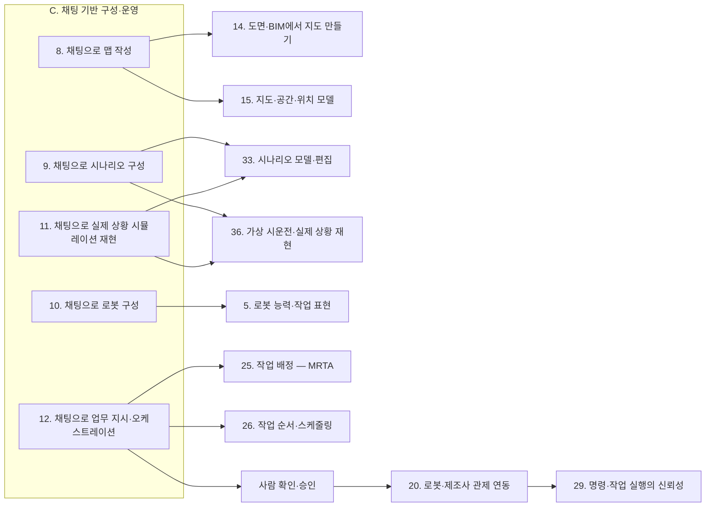

[홈](../../index.md) › C. 채팅 기반 구성·운영

# C. 채팅 기반 구성·운영

## 핵심 질문

맵 작성, 시나리오 구성, 로봇 구성, 실제 상황 재현, 업무 지시를 비전문 사용자가 대화만으로 할 수 있게 하려면? [분류원문]

## 개요

채팅으로 맵을 그리고, 시나리오를 구성하고, 로봇을 구성하고, 실제 상황을 시뮬레이션으로 재현하고, 업무를 지시·관리하는 대화형 기능 전체와 그 신뢰 기반. [분류원문]

## 세부 연구영역

표의 세부 연구영역·무엇을 연구하는가·핵심 질문 열은 원문 그대로이고, 페이지·현재 상태 열은 위키에서 덧붙인 것이다. 현재 상태는 퍼블리셔가 자동으로 갱신한다.

<!-- auto:category-area-table:start -->
| 세부 연구영역 | 무엇을 연구하는가 | 핵심 질문 | 페이지 | 현재 상태 |
|---|---|---|---|---|
| **8. 채팅으로 맵 작성** | 대화로 층·구역·통로·문·승강기·충전 위치를 만들고 고친다 | 공간을 말로 설명하거나 도면을 올리는 것만으로 쓸 수 있는 지도를 만들 수 있는가? | [8. 채팅으로 맵 작성](chat-map-authoring.md) | published |
| **9. 채팅으로 시나리오 구성** | 대화로 할 일·물품·사람·순서·기한·실패 처리 조건을 정한다 | 할 일·사람·순서·실패 처리를 대화로 빠짐없이 정하려면 무엇을 되물어야 하는가? | [9. 채팅으로 시나리오 구성](chat-scenario-composition.md) | published |
| **10. 채팅으로 로봇 구성** | 대화로 투입 로봇의 종류·대수·장비·위치·역할을 정하고 수행 가능 여부를 확인한다 | 어떤 로봇을 몇 대, 어디에, 어떤 역할로 둘지 대화로 정하고 가능 여부를 바로 알 수 있는가? | [10. 채팅으로 로봇 구성](chat-robot-configuration.md) | published |
| **11. 채팅으로 실제 상황 시뮬레이션 재현** | 실제로 있었던 상황을 대화로 시뮬레이션에 재현하고, 재현이 실제와 얼마나 맞는지 보이며, 조건을 바꿔 비교한다 | 실제로 있었던 상황을 대화만으로 시뮬레이션에 재현하고, 조건을 바꿔 비교할 수 있는가? | [11. 채팅으로 실제 상황 시뮬레이션 재현](chat-real-situation-simulation-replay.md) | published |
| **12. 채팅으로 업무 지시·오케스트레이션** | 대화로 일을 지시하면 분해·배정·일정을 계획으로 제안하고, 승인 뒤 실행하며 진행 상황을 설명한다 | 대화로 받은 지시를 확인 가능한 계획으로 바꾸고, 승인 뒤 실행과 진행 설명까지 이어 갈 수 있는가? | [12. 채팅으로 업무 지시·오케스트레이션](chat-task-instruction-and-orchestration.md) | published |
| **13. 대화형 기능의 신뢰·기반** | 오해석 방지, 권한, 모델 연결, 입력 채널, 대화와 화면 편집의 연동, 평가처럼 대화 기능 전체를 믿고 쓰게 하는 기반 | 언어 모델의 해석이 틀려도 잘못된 실행으로 이어지지 않게 하려면 무엇을 갖춰야 하는가? | [13. 대화형 기능의 신뢰·기반](conversational-trust-and-foundations.md) | published |

[분류원문]
<!-- auto:category-area-table:end -->

## 이 대분류의 핵심 포인트

채팅 기능은 대화가 부르는 엔진과 짝을 이룬다. **맵 작성은 14·15번, 시나리오 구성과 실제 상황 재현은 33·36번, 로봇 구성은 5번, 업무 지시는 25·26번**의 기능을 대화로 쓰게 하는 것이다. [분류원문]

대화 결과는 실행 명령이 아니라 계획이다. **사람이 확인·승인한 계획만 실행**되어야 언어 모델의 잘못된 해석이 로봇 동작으로 이어지지 않는다. [분류원문]

## 다른 대분류와의 연결

C. 채팅 기반 구성·운영의 여섯 세부영역은 다른 대분류의 엔진을 부르고, 대화 결과는 사람이 확인·승인한 뒤에야 실행으로 넘어간다(이 대분류의 핵심 포인트에 옮긴 원문 주석). 아래 연결은 게시된 [8. 채팅으로 맵 작성](chat-map-authoring.md) ~ [13. 대화형 기능의 신뢰·기반](conversational-trust-and-foundations.md) 페이지와 A. 기획·사업·B. 로봇 온톨로지·F. 연동·G. 계획·최적화 대분류 연결 절의 검증된 주장을 근거로 정리했다(기준일 2026-10-09). 원문 주석이 짝으로 둔 엔진 영역을 먼저 적고, 이어 승인된 계획만 실행하는 구조가 만나는 대분류, 대화 기능의 신뢰 기반이 기대는 대분류, 현장 유형별 사례, 아직 근거가 없는 연결 순으로 적는다. 근거 대부분은 단일 출처의 재인용이고 추정으로 표시한 주장이 많다.

아래 도식에서 대화 영역에서 엔진 영역으로 가는 화살표는 원문 주석의 짝 엔진이고, 승인 이후의 흐름은 F. 연동·H. 실행·협업·예외 복구 항목의 추정을 그린 것이다.

### 원문 주석이 짝으로 둔 엔진

- [D. 공간·지도 모델](../space-and-map-model/index.md) — [8. 채팅으로 맵 작성](chat-map-authoring.md)의 짝 엔진은 [14. 도면·BIM에서 지도 만들기](../space-and-map-model/maps-from-floor-plans-and-bim.md)와 [15. 지도·공간·위치 모델](../space-and-map-model/map-space-and-location-model.md)이다. CAD 파일에서 로봇 내비게이션용 실내 지도를 자동 생성하는 연구(2025-07)가 있어, 도면 해석 결과가 대화로 지도를 만들고 고치는 일의 입력이 될 것으로 보인다. [추정][^ref-083] Open-RMF(Open Robotics Middleware Framework)의 traffic-editor 빌딩 맵은 실제 거리를 아는 두 점의 미터 값을 사람이 넣어야 축척이 정해지며, 층·승강기·문·차선과 충전·주차 속성을 가진 꼭짓점을 지도 요소로 주석한다(확인일 2026-10-09). [사실][^ref-079] 기반 모델로 위상 지도에 의미 정보를 더하는 SENT Map 연구(2025-11)가 있어, 대화로 붙인 구역·장소 이름과 용도가 [16. 장소 의미·지도 관리](../space-and-map-model/place-semantics-and-map-management.md)의 장소 이름·별칭 체계와 맞물릴 것으로 보인다. [추정][^ref-786]
- [B. 로봇 온톨로지](../robot-ontology/index.md) — [10. 채팅으로 로봇 구성](chat-robot-configuration.md)의 짝 엔진은 [5. 로봇 능력·작업 표현](../robot-ontology/robot-capability-and-task-representation.md)이다. 요구 능력과 제공 능력을 같은 모델로 적는 IDTA 02020 능력 기술 서브모델과, 자산관리셸 능력 모델에서 계획 도메인 정의 언어(Planning Domain Definition Language, PDDL) 계획 문제를 자동 생성하는 연구(2026-06)가 있어, 대화로 정한 로봇 구성의 수행 가능 여부를 확인하는 엔진이 5. 로봇 능력·작업 표현에서 올 것으로 보인다. [추정][^ref-229][^ref-201] VDA 5050 팩트시트는 적재 명세(`loadSets`)와 지원 동작(`mobileRobotActions`)을, Open-RMF 플릿 어댑터 템플릿 설정은 수행 가능한 작업 유형(`task_capabilities`)과 동작 이름(`actions`)을 선언한다(서로 다른 인터페이스의 사례, 확인일 2026-10-09). [사실][^ref-228][^ref-105] 이 두 선언은 [4. 이기종 로봇 등록](../robot-ontology/heterogeneous-robot-registration.md)과 F. 연동의 20. 로봇·제조사 관제 연동 양쪽에서 로봇 구성 대화가 읽을 데이터의 예다. [13. 대화형 기능의 신뢰·기반](conversational-trust-and-foundations.md)은 [6. 온톨로지 기반 시스템·로봇 연동](../robot-ontology/ontology-based-system-and-robot-integration.md)과도 이어진다. Nakajima·Miura(IROS 2024)는 서비스 로봇의 '가져다 줘' 작업에서 언어 모델의 상식 지식을 환경 정보가 담긴 온톨로지로 접지해 환각을 줄이고, 온톨로지만으로는 풀지 못해 사용자에게 되물어야 했던 모호성을 줄이는 결합 시스템을 제안했다(정량 결과는 초록에 없음). [사실][^ref-818]
- [I. 설계·시뮬레이션](../design-and-simulation/index.md) — [9. 채팅으로 시나리오 구성](chat-scenario-composition.md)과 [11. 채팅으로 실제 상황 시뮬레이션 재현](chat-real-situation-simulation-replay.md)의 짝 엔진은 [33. 시나리오 모델·편집](../design-and-simulation/scenario-model-and-editing.md)과 [36. 가상 시운전·실제 상황 재현](../design-and-simulation/virtual-commissioning-and-real-situation-replay.md)이다.
    - 33. 시나리오 모델·편집: 완료 기한·반복·실패 처리 조건은 관제 작업 요청에 자리가 없으므로, 대화로 정한 시나리오는 33. 시나리오 모델·편집의 시나리오 모델에 담고 실행 시점에 G. 계획·최적화의 26. 작업 순서·스케줄링을 거쳐 작업 요청으로 변환해야 할 것으로 보인다(oq-137). [추정][^ref-110][^ref-125]
    - 36. 가상 시운전·실제 상황 재현: DEVS 형식론으로 사양에서 이산 사건 세계 모델을 생성·평가하는 연구(2026-03)와 시뮬레이션 모델·디지털 트윈을 부분 트레이스 조건으로 검증하는 연구(2026-07)가 있어, 36. 가상 시운전·실제 상황 재현의 엔진이 기록에서 시뮬레이터를 만들고 트레이스로 대조하는 일을 맡을 것으로 보인다. [추정][^ref-825][^ref-826] KTH 연구(2026-06)는 자연어 명령을 구조화 작업 계획으로 바꾸고 물리적 실행 가능성을 기호적으로 검증한 뒤, Unity3D 디지털 트윈에서 운영자가 계획을 검토·수정·재검증한 다음에만 실제 로봇에서 실행하는 계획·시운전 구조를 제안했다(정량 결과는 초록에 없음). [사실][^ref-674]
    - 34. 시뮬레이션·예측용 디지털 트윈: 언어 모델 에이전트가 시뮬레이션 모델로 통제 실험을 수행하는 연구(2026-08)와 시뮬레이션으로 언어 모델을 접지하는 Simulation Agent 구조(2025-05)를 보면, 조건을 바꿔 비교하는 일은 가정한 미래를 실험하는 [34. 시뮬레이션·예측용 디지털 트윈](../design-and-simulation/simulation-and-predictive-digital-twin.md) 쪽이고, 재현의 입력이 되는 실제 기록은 현재 상태를 표현하는 E. 사물·사람·실시간 상태의 18. 실시간 세계 상태·데이터 일관성과 실행 기록 쪽에서 오는 것으로 보인다. [추정][^ref-832][^ref-824] 언어 지시로 3차원 체화 AI 환경을 생성하는 Holodeck 연구(2023-12)가 있어 대화로 만든 지도가 34. 시뮬레이션·예측용 디지털 트윈의 초기 환경이 되는 경로가 있을 것으로 보이나, 실제 로봇 현장 지도에 쓴 사례는 확인하지 못했다. [추정][^ref-815] Ko·Lin(2026-09)의 '제안–검증–결정' 흐름에서는 로컬 언어 모델이 만든 라인·작업 조정 후보를 디지털 트윈 시뮬레이션이 평균 164.39초에 검증했고, 시험 사례 18건 가운데 잘못된 입력 8건 중 7건을 검증 단계에서 거부했다(출처가 현장 유형을 밝히지 않은 가상 라인의 결과이므로 특정 현장 사례로 보지 않는다). [사실][^ref-759]
    - 35. 처리능력·규모·배치 설계: 10. 채팅으로 로봇 구성의 대수 결정은 [35. 처리능력·규모·배치 설계](../design-and-simulation/capacity-sizing-and-layout-design.md)와 이어지며, 그 사례는 아래 현장 유형별 사례의 물류창고·제조 공장 항목에 적었다.
- [G. 계획·최적화](../planning-and-optimization/index.md) — [12. 채팅으로 업무 지시·오케스트레이션](chat-task-instruction-and-orchestration.md)의 짝 엔진은 [25. 작업 배정 — MRTA](../planning-and-optimization/task-allocation-mrta.md)와 [26. 작업 순서·스케줄링](../planning-and-optimization/task-sequencing-and-scheduling.md)이다.
    - 25. 작업 배정 — MRTA·26. 작업 순서·스케줄링: SMART-LLM(2023-09)은 상위 작업 지시를 작업 분해→연합 형성→작업 배정의 세 단계로 다중 로봇 작업 계획으로 바꾸며, 각 단계를 소수 예시 프로그램형 프롬프트로 언어 모델에 수행시킨다. [사실][^ref-090] 형식 언어 기반 이기종 로봇 팀 스케줄링(FLEET, 2025-10)과 의존 관계 인지 작업 분해(DART-LLM, 2024-11) 연구를 보면, 언어 모델은 작업 그래프·능력 요구를 만들고 실제 배정·일정은 25. 작업 배정 — MRTA와 26. 작업 순서·스케줄링의 엔진이 계산하는 분담이 될 것으로 보인다. [추정][^ref-242][^ref-059]
    - 24. 작업·워크플로 모델링: 9. 채팅으로 시나리오 구성은 [24. 작업·워크플로 모델링](../planning-and-optimization/task-and-workflow-modeling.md)과도 이어진다. 언어 모델로 공정 모델을 만드는 연구(2024-03)와 텍스트 공정 설명에서 BPMN(Business Process Model and Notation) 모델을 다단계로 생성하는 연구(2026-04)가 있어, 대화로 정한 할 일·순서·실패 처리 조건을 워크플로 모델로 옮겨 유효성을 검사하는 경로가 될 것으로 보인다. [추정][^ref-843][^ref-844]
    - 27. 다중 로봇 경로·교통 관리 — MAPF·28. 공용 자원·충전·에너지 최적화: 8. 채팅으로 맵 작성의 결과는 [27. 다중 로봇 경로·교통 관리 — MAPF](../planning-and-optimization/multi-robot-path-and-traffic-management-mapf.md)와 [28. 공용 자원·충전·에너지 최적화](../planning-and-optimization/shared-resource-charging-and-energy-optimization.md)로 넘어간다. Open-RMF traffic-editor로 주석한 차선·경유점 그래프는 building_map_generator로 주행 그래프로 내보내져 플릿 어댑터의 경로 계획에 쓰이고, 주차·충전기 위치도 같은 지도에 주석된다. [사실][^ref-079]

### 사람이 승인한 계획만 실행하는 구조가 만나는 대분류

- [F. 연동](../integration/index.md) — 승인된 계획은 [20. 로봇·제조사 관제 연동](../integration/robot-and-vendor-fleet-manager-integration.md)의 작업 요청으로 넘어간다.
    - 20. 로봇·제조사 관제 연동: Open-RMF 작업 요청 스키마는 시각·순서 관련 필드로 가장 이른 시작 시각과 우선순위를 두고, 마감 시각이나 다른 작업과의 선후를 지정하는 필드는 두지 않는다(확인일 2026-10-09). [사실][^ref-125] 오픈소스 로보틱스 연합(Open Source Robotics Alliance, OSRA) Interop SIG의 발표 예고 게시글(2026-06-25 작성, 발표 2026-07-02)에 따르면, Nayantra는 Open-RMF REST API를 언어 모델이 부를 수 있는 모델 컨텍스트 프로토콜(Model Context Protocol, MCP) 도구로 감싼 서버로, 에이전트가 짐 픽업·배송 같은 평문 지시를 여러 단계 RMF 임무로 바꾸고 Open-RMF가 이를 Nav2로 보내 Isaac Sim 창고 시뮬레이션의 로봇이 실행한다. [사실][^ref-854] 이 게시글 범위에서는 실행 전 사람 확인·접근통제를 언급하지 않으며, 발표 영상 내용은 확인하지 않았다. [사실][^ref-854]
    - 22. 설비·건물 시스템 연동: [22. 설비·건물 시스템 연동](../integration/facility-and-building-system-integration.md)과의 연결에서, Open-RMF는 작업 실행 중 층 이동이 필요하면 승강기 요청(RequestLift) 단계를 내부에서 자동으로 넣는다. [사실][^ref-110] 대화로 승강기·문을 지도 요소로 등록하고 통과 조건을 제약으로 반영하는 일은 ROP 쪽이고, 승강기 호출·버튼 조작 같은 실제 설비 제어는 외부가 맡는 것으로 보인다. [추정][^ref-079][^ref-104] 분류 원문 19장의 시설·설비 제어 경계에 따라 승강기·문 제어는 연계 대상이며, ROP 몫은 지도 요소 등록·통과 제약 반영·단계 완료 확인이다.
    - 21. 상호운용 표준·적합성: [21. 상호운용 표준·적합성](../integration/interoperability-standards-and-conformance.md)과의 연결에서, 대화로 만든 지도 요소를 Open-RMF 빌딩 맵과 VDMA 레이아웃 교환 형식(Layout Interchange Format, LIF)처럼 서로 다른 플릿 지도 형식으로 내보내야 하나 두 형식 사이의 공식 변환 규칙은 확인하지 못했으므로, 공통 중간 표현이 상호운용 과제로 넘어갈 것으로 보인다(oq-124). [추정][^ref-046][^ref-079]
- [H. 실행·협업·예외 복구](../execution-collaboration-and-recovery/index.md)
    - 29. 명령·작업 실행의 신뢰성: 언어 모델로 로봇 작업 계획을 실행 전에 검증하는 VerifyLLM(2025-07)과 계획의 물리적 실행 가능성을 기호적으로 검증한 뒤 실행하는 KTH 구조(2026-06)를 보면, 승인 전 자동 검증과 승인된 계획의 1회 변환이 [29. 명령·작업 실행의 신뢰성](../execution-collaboration-and-recovery/command-and-task-execution-reliability.md)이 다루는 실행 보장의 앞단이 될 것으로 보인다. [추정][^ref-753][^ref-674]
    - 32. 예외 복구·재계획·업무 연속성: 사건 기반 재계획을 하는 이기종 로봇 팀 계층 계획·실행 연구(CoMuRoS, 2025-11)가 있어, 사람이 승인한 계획이 실행 중 재계획될 때 어느 범위까지 자동 재계획을 허용하고 어디부터 다시 승인받을지가 [32. 예외 복구·재계획·업무 연속성](../execution-collaboration-and-recovery/exception-recovery-replanning-and-business-continuity.md)과의 경계가 될 것으로 보인다(oq-140). [추정][^ref-677] 병원 현장의 재스케줄링·실패 복구 사례는 아래 현장 유형별 사례의 병원 항목에 적었다.
    - 31. 사람–로봇 협업: HMCF(2025-05)는 로봇마다 자기 능력을 아는 언어 모델 에이전트를 두어 이기종 로봇의 작업 배정·실행을 맡기고 사람은 필요할 때만 개입해 감독·검증하는 틀로, 시뮬레이션에서 기존 작업 계획 방법보다 작업 성공률이 4.76% 높았다고 보고했다(단일 출처의 저자 보고값, 승인 절차 세부는 초록에 없음). [사실][^ref-849] 이 연구는 [31. 사람–로봇 협업](../execution-collaboration-and-recovery/human-robot-collaboration.md)의 감독 방식과 이어진다.
- [J. 현장 운영·관제](../field-operations-and-monitoring/index.md)
    - 37. 관제 화면·실행 기록: Open-RMF 작업 상태 스키마가 상태 값·시작·종료 시각·취소·강제 종료·중단 요청 기록을 담으므로, '어디까지 했는지, 왜 멈췄는지'를 대화로 답하는 근거는 [37. 관제 화면·실행 기록](../field-operations-and-monitoring/control-screen-and-execution-records.md)의 실행 기록이 될 것으로 보인다. [추정][^ref-111] 이벤트 로그에서 업무 프로세스 시뮬레이션 모델을 자동 발견하는 연구(2020)가 있고 rosbag2는 로봇 한 대의 ROS 2 통신을 기록·재생하는 수준이므로, 플릿 관제의 실행 기록(작업·배정·위치·사건 시각)을 시나리오 사양으로 바꾸는 변환이 11. 채팅으로 실제 상황 시뮬레이션 재현과 37. 관제 화면·실행 기록을 잇는 지점이 될 것으로 보인다(oq-131). [추정][^ref-828][^ref-831]
    - 38. 모니터링·이상 탐지·원인 분석: REFLECT(2023)는 로봇의 다중 감각 관측을 계층 요약으로 만들고 언어 모델로 실패 원인을 추론해 그 설명으로 언어 기반 계획기가 실패를 바로잡게 하며, 평가용 RoboFail 데이터셋을 만들었다. [사실][^ref-453] 원문 교차 규칙에서 장애 분석은 [38. 모니터링·이상 탐지·원인 분석](../field-operations-and-monitoring/monitoring-anomaly-detection-and-root-cause-analysis.md)에 적용되는 AI 방법이므로, 이 연결은 38. 모니터링·이상 탐지·원인 분석과 L. AI·학습 기술의 44. 로봇 기반 모델·언어 모델 계획 양쪽에 둔다.
- [K. 플랫폼 아키텍처·인프라](../platform-architecture-and-infrastructure/index.md)
    - 41. 플랫폼 아키텍처·외부 API: MCP 명세(2025-06-18)는 도구 호출 전 사용자 동의를 프로토콜이 아니라 호스트의 책임으로 두고, 관제 API를 MCP 도구로 노출한 앞의 공개 발표도 승인 절차를 언급하지 않으므로, 사람 승인 관문을 에이전트·MCP 서버·관제 외부 API 가운데 어디에 둘지가 [41. 플랫폼 아키텍처·외부 API](../platform-architecture-and-infrastructure/platform-architecture-and-external-api.md)의 설계 쟁점이 될 것으로 보인다(oq-141). [추정][^ref-856][^ref-854]
    - 43. 데이터·관측성·배포: OpenTelemetry의 생성형 AI 의미 규약은 별도 저장소로 옮겨져 생성형 AI 클라이언트와 MCP의 스팬·지표·이벤트를 다룬다. [사실][^ref-1239] 지표 문서는 에이전트 호출 시간·추론 호출 수·도구 호출 수(`gen_ai.invoke_agent.tool_calls`)·도구 실행 시간 같은 지표를 모두 개발(Development) 단계로 두고, 토큰 지표는 별도 문서의 `gen_ai.client.inference.usage.*` 로 안내한다(확인일 2026-10-09). [사실][^ref-1240] 개발 단계라 이름·정의가 바뀔 수 있으며, 토큰 지표 이름 차이는 oq-212로 남아 있다. 이 규약은 대화 기능의 호출 기록을 [43. 데이터·관측성·배포](../platform-architecture-and-infrastructure/data-observability-and-deployment.md)의 관측 체계에 넣는 연결 근거다.
    - 42. 분산 시스템·통신·컴퓨팅 구조: 로봇 시스템에서 음성 인식을 온라인 API 대신 로컬 모델로 통합하는 연구를 정리한 서베이(2026-07)와 로컬 언어 모델을 쓴 디지털 트윈 검증 연구(2026-09)가 있어, 음성 인식·언어 모델을 현장 서버·로봇·클라우드 가운데 어디에 둘지가 [42. 분산 시스템·통신·컴퓨팅 구조](../platform-architecture-and-infrastructure/distributed-systems-communication-and-computing.md)의 배치 쟁점과 이어질 것으로 보인다. [추정][^ref-866][^ref-759] 소음·다국어 조건의 음성 인식 강건성 자체는 모델 공급자 쪽 연계 대상으로 두고, 여기서는 배치 위치 쟁점만 다룬다.
- [M. 안전](../safety/index.md) — 언어 모델의 오해석뿐 아니라 프롬프트 주입·탈옥 같은 외부 조작이 도구 호출이나 로봇의 물리 동작으로 이어진다는 위협을 서로 다른 세 발행 주체(OWASP, Robey 외, Huang 외)가 각각 보고했다. [사실][^ref-855][^ref-857][^ref-859] 그래서 12. 채팅으로 업무 지시·오케스트레이션과 13. 대화형 기능의 신뢰·기반은 [48. 안전·위험 관리](../safety/safety-and-risk-management.md)와 맞닿는다. RoboGuard는 공격 프롬프트에서 격리된 신뢰 근간 언어 모델이 미리 정한 안전 규칙을 로봇 환경에 맞는 시간 논리 제약으로 바꾸고, 시간 논리 제어 합성으로 위험할 수 있는 계획을 사용자 선호를 최소한으로 어기며 고치는 2단계 가드레일이다. [사실][^ref-700] 저자들은 최악 조건 탈옥 공격의 시뮬레이션·실세계 실험에서 위험 계획 실행을 92% 초과에서 3% 미만으로 줄였다고 보고했다(arXiv v2 2026-03-03 개정판 초록 기준, 프리프린트 단일 출처의 저자 보고값이며 v1은 92.3%에서 2.5% 미만으로 달리 보고했다). [사실][^ref-700]

### 대화 기능의 신뢰 기반이 기대는 대분류

- [N. 보안·개인정보](../security-and-privacy/index.md)
    - 52. 통신 보호·위협 관리·감사: 위의 M. 안전 항목에 적은 프롬프트 주입·탈옥 위협은 [52. 통신 보호·위협 관리·감사](../security-and-privacy/communication-protection-threat-management-and-audit.md)의 위협 관리 대상이기도 하다.
    - 51. 인증·권한·격리: AI 에이전트의 사용자 권한을 인터페이스부터 강제까지 다룬 연구(2026-07)가 있어, 사용자별로 대화로 지시할 수 있는 로봇·구역·작업의 범위는 [51. 인증·권한·격리](../security-and-privacy/authentication-authorization-and-isolation.md)의 권한 모델에 기대 도구 호출 수준에서 강제해야 할 것으로 보인다. [추정][^ref-867]
    - 대화 기록 의무: EU AI Act 제12조는 고위험 AI 시스템이 수명 동안 사건을 자동으로 기록(로그)할 수 있도록 기술적으로 갖추게 한다(2024-06-13 발행). [사실][^ref-863] ROP 대화 기능이 고위험에 해당하는지와 기록 항목·보존 기간은 열린 질문(oq-143)이며, 법 적용 여부 판단은 운영자·법무가 맡을 연계 대상이다.
    - 53. 개인정보·영상 데이터: 개인정보보호위원회가 2025-08 생성형 AI 개발·활용을 위한 개인정보 처리 안내서를 냈으므로, 대화 기록의 보존·보호 요구는 [53. 개인정보·영상 데이터](../security-and-privacy/privacy-and-video-data.md)의 처리 기준과 함께 정해야 할 것으로 보인다. [추정][^ref-862] 처리의 적법성 판단은 운영자·법무가 맡을 연계 대상이다.
- [L. AI·학습 기술](../ai-and-learning/index.md)
    - 45. 문서·도면·장면 이해: 원문 교차 규칙에서 도면 해석은 14. 도면·BIM에서 지도 만들기에 적용되는 AI 방법이므로, 8. 채팅으로 맵 작성의 도면·공간 해석은 14. 도면·BIM에서 지도 만들기와 [45. 문서·도면·장면 이해](../ai-and-learning/document-drawing-and-scene-understanding.md)에 함께 잇는다. 언어 유도 평면도 생성 데이터셋 연구(2023)와 구조화 평면도 공간 추론 벤치마크(2025-07)가 언어 모델의 공간·물리 제약 준수를 핵심 난점으로 지목하므로, 대화로 만든 지도 요소는 45. 문서·도면·장면 이해 쪽 방법과 기하 검증·사람 확인을 함께 거쳐야 할 것으로 보인다. [추정][^ref-787][^ref-812]
    - 44. 로봇 기반 모델·언어 모델 계획: [44. 로봇 기반 모델·언어 모델 계획](../ai-and-learning/robot-foundation-models-and-llm-planning.md)과의 연결에서, 서로 다른 두 연구 그룹(Ren 외의 KnowNo, Mullen·Manocha의 LBAP)이 언어 모델 계획기의 불확실도를 통계적으로 보정해 확신이 없을 때만 사람에게 되묻는 설계를 각각 보고했다. [사실][^ref-351][^ref-864] 다중 로봇 시스템의 언어 모델 연구 서베이(2025-02)는 연구를 상위 수준 작업 배정·중간 수준 동작 계획·하위 수준 행동 생성·사람 개입의 네 층으로 나누고, 운영자 인지 부담이 정량화되지 않았다고 지적했다. [사실][^ref-165]
    - 47. AI·학습·적응과 모델 운영: [47. AI·학습·적응과 모델 운영](../ai-and-learning/ai-learning-adaptation-and-model-operations.md)과의 연결에서, 언어 모델을 디지털 트윈 모델링에 쓰는 연구 동향 서베이(2025-03-04)는 정확한 모델링을 위한 데이터 부족, 시스템 분석의 비효율, 물리–디지털 상호작용의 설명 부족을 공통 과제로 꼽는다. [사실][^ref-827] 언어 모델 게이트웨이의 모델 대체·라우팅 희석을 블랙박스로 감사하는 연구(2026-07)가 있어, 실제로 응답한 모델을 기록하고 교체를 통제하는 일이 47. AI·학습·적응과 모델 운영, O. 검증·도입·수명주기의 57. 자산·소프트웨어 수명주기 관리, P. 거버넌스·법규·사회의 58. 다사업자 책임·계약·데이터로 이어질 것으로 보인다(oq-145). [추정][^ref-865]
- [O. 검증·도입·수명주기](../verification-deployment-and-lifecycle/index.md)
    - 54. 시험·형식 검증·벤치마크: 시뮬레이션 모델·디지털 트윈을 부분 트레이스 조건으로 검증하는 방법(2026-07)이 있어, 재현이 실제 기록과 '맞는다'고 판정할 지표와 허용 기준, 그 판정의 승인이 [54. 시험·형식 검증·벤치마크](../verification-deployment-and-lifecycle/testing-formal-verification-and-benchmarking.md)의 과제로 넘어갈 것으로 보인다(oq-132). [추정][^ref-826] 실제 도메인의 도구–에이전트–사용자 상호작용을 평가하는 τ-bench(반복 시행 신뢰도 지표 pass^k)와 체화 의사결정에서 언어 모델을 평가하는 Embodied Agent Interface(NeurIPS 2024 데이터셋·벤치마크) 같은 공개 벤치마크가 있다. [사실][^ref-738][^ref-858] 로봇 구성 대화 전용 벤치마크는 미확인이다(oq-127).
    - 55. 현장 조사·설치·시운전: 앞의 I. 설계·시뮬레이션 항목에 적은 KTH 계획·시운전 구조는 [55. 현장 조사·설치·시운전](../verification-deployment-and-lifecycle/site-survey-installation-and-commissioning.md)과도 이어진다. 국내 업체 모빌리오는 공장 순찰 로봇의 라이다 지도(PGM)와 CAD·BIM 도면을 기준점 3개 이상으로 운영자가 정합해 관제 지도로 쓴다고 설명한다(벤더 주장, 2026-08-24). [추정][^ref-817] 도면·센서 지도 정합 결과를 누가 확인하는지가 55. 현장 조사·설치·시운전 단계의 과제로 이어질 것으로 보인다(oq-126). [추정][^ref-817] 라이다 지도 생성 자체는 분류 원문 19장의 로봇 자체 지능·제어 쪽 연계 대상이고, 채팅 맵 작성은 그 결과를 입력으로 받는 쪽이다.
    - 57. 자산·소프트웨어 수명주기 관리: 모델 교체 기록은 위 L. AI·학습 기술 항목처럼 [57. 자산·소프트웨어 수명주기 관리](../verification-deployment-and-lifecycle/asset-and-software-lifecycle-management.md)와 이어진다.
- [P. 거버넌스·법규·사회](../governance-law-and-society/index.md) — 대화 기록 의무(EU AI Act 제12조)는 [59. 법·규제·보험·라이선스](../governance-law-and-society/law-regulation-insurance-and-licensing.md), 모델 공급자 교체 통제는 [58. 다사업자 책임·계약·데이터](../governance-law-and-society/multi-party-responsibility-contracts-and-data.md)와 이어진다(근거는 위 N. 보안·개인정보와 L. AI·학습 기술 항목).
    - 60. 노동·수용성·접근성: [60. 노동·수용성·접근성](../governance-law-and-society/labor-acceptance-and-accessibility.md)과의 연결에서, 보건복지부 정책브리핑(2026-01-28)에 따르면 한국은 무인정보단말기를 설치·운영하는 사업자에게 접근성 검증기준을 지킨 기기 설치를 단계적 의무화를 거쳐 기존 기기까지 전면 적용했고, 바닥면적 50㎡ 미만 소규모 근린생활시설·소상공인 사업장·테이블 주문형 소형 기기는 보조기기·보조 인력·호출벨 가운데 하나로 대신할 수 있게 했다. [사실][^ref-1217] 로봇 현장 단말·채팅 화면이 무인정보단말기에 해당하는지는 이 출처에 없다. [사실][^ref-1217] 해당 여부 판단은 운영자·법무가 맡을 연계 대상이며, 여기서는 60. 노동·수용성·접근성 연결의 근거로만 쓴다. 다국어·성별 집단 간 음성 인식 차이를 다룬 상업 시설 사례는 아래 현장 유형별 사례에 적었다.
- [E. 사물·사람·실시간 상태](../objects-people-and-live-state/index.md) — Open-RMF 작업 구성은 물품 인계를 PickUp·DropOff 단계로 담지만 설비의 인수 결과(IngestorResult)에는 화물 식별자·인계 당사자가 없으므로, 대화로 정한 물품·수령인 조건은 [17. 작업 대상·자산 식별과 인계 추적](../objects-people-and-live-state/work-object-and-asset-identification-and-handover-tracking.md)의 식별·인계 기록과 결합해야 할 것으로 보인다. [추정][^ref-110][^ref-049] 11. 채팅으로 실제 상황 시뮬레이션 재현이 입력으로 받는 실제 기록은 현재 상태를 표현하는 [18. 실시간 세계 상태·데이터 일관성](../objects-people-and-live-state/real-time-world-state-and-data-consistency.md) 쪽이고, 조건을 바꾼 비교는 I. 설계·시뮬레이션의 34. 시뮬레이션·예측용 디지털 트윈 쪽이다(근거는 위 I. 설계·시뮬레이션 항목). 두 영역은 원문 주석대로 구분해 다룬다.
- [A. 기획·사업](../planning-and-business/index.md) — 국내 업체 폴라리스3D는 공장 공정 간 이송 자율이동로봇(Autonomous Mobile Robot, AMR) 대수를 일일 목표 이송 횟수·시간당 적재량·이동 거리·기존 설비 연동 여부로 산정하고 투자 수익을 인건비 절감·생산성 향상으로 계산한다고 설명한다(벤더 주장, 2026-06-12, 제조 공장). [추정][^ref-823] 대화로 대수를 정할 때 처리량과 비용 가운데 어느 목적을 누가 정하는지가 [3. 경제성·조달·사업 모델](../planning-and-business/economics-procurement-and-business-models.md)의 판단과 이어질 것으로 보인다(oq-129). [추정][^ref-823] [1. 기술·시장·업체 동향](../planning-and-business/technology-market-and-vendor-trends.md)과의 연결에서, 확인된 국내 자료는 ETRI의 거대언어모델 기반 로봇 인공지능 기술 동향(2024-02)과 KAIST 연구진의 자연어 로봇 제어 기술 동향(2024-10) 같은 동향 논문이며, 대화로 여러 로봇에 업무를 지시한 국내 운영 사례는 지금까지의 한·영 검색 범위에서 확인되지 않았다(조사 범위의 한계이며 부재를 뜻하지 않는다, oq-142). [추정][^ref-851][^ref-848]

### 현장 유형별 사례

[Q. 현장 유형별 적용](../site-type-applications/index.md)은 현장마다 다른 요구를 모으고, 모든 현장에 공통인 대화 기능은 위의 A. 기획·사업 ~ P. 거버넌스·법규·사회 대분류 연결로 다룬다. 이 대분류의 게시 페이지가 인용한 현장 사례는 다음과 같다.

- **물류창고** — [61. 물류창고](../site-type-applications/warehouse.md): 작업자 피킹(picker-to-parts) 창고의 협동 AMR 대수 산정 연구(2026-06, 단일 석사논문의 시뮬레이션 결과)는 비용 기준 최적 로봇 대 작업자 비율이 수요에 따라 1:1에서 2.5:1로 옮겨 가고, 처리량 기준 산정은 구독형 과금 아래에서 대수를 과대 산정한다고 보고했다. [사실][^ref-822] 10. 채팅으로 로봇 구성과 I. 설계·시뮬레이션의 35. 처리능력·규모·배치 설계를 잇는 근거다.
- **제조 공장** — [62. 제조 공장](../site-type-applications/manufacturing-plant.md): 제조 로봇 플릿·공장 배치의 시나리오 기반 디지털 트윈 연구(2026-07-18)는 기존 공장에서는 혼잡 때문에 플릿 확장 효과가 체감하고, 신규 공장에서는 배치·플릿 규모·역할 비율을 비교해 로봇당 생산성을 줄이지 않고 처리량을 최대 3.5배 높이는 구성을 찾았다고 보고했다('최대 3.5배'는 저자 보고값이며 실제 운영 기록을 재현한 결과가 아니다). [사실][^ref-838] 국내 연구(2021-12)는 무인 운반차(Automated Guided Vehicle, AGV) 자동물류시스템의 설계 검증과 운영 모니터링을 한 디지털트윈으로 묶었다. [사실][^ref-830] 두 연구는 11. 채팅으로 실제 상황 시뮬레이션 재현과 35. 처리능력·규모·배치 설계를 잇는다. 제조 공장의 벤더 사례는 위 A. 기획·사업과 O. 검증·도입·수명주기 항목에 적었다.
- **병원** — [63. 병원·의료](../site-type-applications/hospital-and-healthcare.md): 국내 연구(2025-12-17)는 감염병 환자 도착부터 병원에서 일어나는 전 과정을 시나리오로 정의하고, 간호사 추종 음압 이송 침대 로봇 여러 대의 운용을 연합 디지털 트윈으로 시뮬레이션해 시스템 성능을 검증했다(정량 결과는 미확인). [사실][^ref-837] 병원 보조 로봇 연구는 간호 인력의 자연어 지시를 실행 가능한 작업 순서열로 바꾸고, 실행 중 추가 요청에 유전 알고리즘 기반 준최적 재스케줄링으로 대응하며, 실행 실패를 시각-언어 추론과 AI 제안으로 복구하는 시스템을 Temi 로봇에 배치했다고 보고한 것으로 보인다(원문 미열람(검색 결과 요약 기준), 실행 전 사람 승인 절차 유무는 미확인). [추정][^ref-847] 이 사례는 9. 채팅으로 시나리오 구성·12. 채팅으로 업무 지시·오케스트레이션과 H. 실행·협업·예외 복구의 32. 예외 복구·재계획·업무 연속성을 잇는다.
- **상업 시설** — [64. 상업 시설](../site-type-applications/commercial-facilities.md): 네덜란드 슈퍼마켓 로봇 연구(2025-04-29)는 영어·네덜란드어와 성별 집단으로 음성 인식 기술을 비교해 Whisper가 가장 낮은 단어 오류율을 보였고(참가자 40명), 질의 분류기 정확도 약 87%, 다층 언어 모델 구조가 참가자 16명 평가에서 GPT-4 Turbo보다 13개 항목 중 4개에서 유의하게 높았다고 보고했다. [사실][^ref-868] 13. 대화형 기능의 신뢰·기반과 P. 거버넌스·법규·사회의 60. 노동·수용성·접근성을 잇는 사례다.
- **실외** — [66. 실외](../site-type-applications/outdoor.md): 국내 연구(2022-06)는 공공 지도 서비스 데이터에서 실외 이동 로봇의 전역 경로 계획용 분기점 단위 위상 지도를 만들고 A* 기반 모의실험으로 유효성을 검증해, 이미 있는 외부 데이터가 대화로 만드는 지도의 시작점이 될 수 있음을 보였다. [사실][^ref-811] Argenziano 외(2025-09)는 언어 모델과 자동 계획을 결합해 사람이 자연어로 상위 활동을 지정하고 로봇에게 질문해 과거·현재·미래 행동에 걸친 실행 진행을 확인하는 구조를 실제 정밀 농업 시나리오에서 구현·시험했다. [사실][^ref-850] 앞의 연구는 8. 채팅으로 맵 작성, 뒤의 연구는 12. 채팅으로 업무 지시·오케스트레이션과 J. 현장 운영·관제의 37. 관제 화면·실행 기록을 잇는다.

### 아직 근거가 없는 연결

다음 연결은 후보로만 보이며 게시 페이지에 검증된 근거가 아직 없다.

- E. 사물·사람·실시간 상태의 [19. 사람·보행자 모델](../objects-people-and-live-state/people-and-pedestrian-model.md): 11. 채팅으로 실제 상황 시뮬레이션 재현이 재현할 사람 흐름·혼잡이 후보다.
- D. 공간·지도 모델의 16. 장소 의미·지도 관리와 12. 채팅으로 업무 지시·오케스트레이션 사이의 장소 이름 해석: oq-204로만 남아 있다.
- F. 연동의 [23. 업무 시스템 연동](../integration/business-system-integration.md), H. 실행·협업·예외 복구의 [30. 로봇 간 협업·물리적 인계](../execution-collaboration-and-recovery/robot-to-robot-collaboration-and-physical-handover.md), J. 현장 운영·관제의 [39. 운영 성과 측정·개선](../field-operations-and-monitoring/operational-performance-measurement-and-improvement.md)·[40. 운영 절차·요청 창구](../field-operations-and-monitoring/operating-procedures-and-request-channels.md), M. 안전의 [49. 사람 근접 안전](../safety/human-proximity-safety.md)·[50. 안전 표준·인증·사고 조사](../safety/safety-standards-certification-and-incident-investigation.md), O. 검증·도입·수명주기의 [56. 운영 이관·확대·교육](../verification-deployment-and-lifecycle/operations-handover-scale-out-and-training.md).

### 이 연결에서 남은 질문

- RoboGuard처럼 안전 규칙을 시간 논리 제약으로 바꿔 언어 모델 계획을 고치는 안전 가드레일을 다중 로봇 오케스트레이션의 승인 전 검사에 두면 사람 승인 부담을 얼마나 줄일 수 있으며, 가드레일이 계획을 수정했을 때 무엇을 사람에게 다시 승인받아야 하는가? 이 질문은 승인 단위를 묻는 oq-139, 로봇 대화 지시의 탈옥 방어 효과를 묻는 oq-144와 이어진다. RoboGuard 결과는 oq-144의 부분 진전일 뿐 그 질문을 해결하지 않는다.
- 대화로 실제 상황을 재현할 때 운영 기록에 남은 사람 흐름·혼잡을 시뮬레이션의 보행자 모델 입력으로 옮긴 연구나 사례가 있는가?
- 위 연결에 걸린 기존 질문: oq-124, oq-126, oq-127, oq-129, oq-131, oq-132, oq-137, oq-140, oq-141, oq-142, oq-143, oq-145, oq-204, oq-212. 전체 목록은 [열린 질문](../../open-questions.md)에 있다.

[^ref-046]: VDMA (Intralogistics-2X-LIF GitHub), Layout-Interchange-Format — README (Repository for the Layout Interchange Format (LIF) developed by the VDMA), 2023-09, https://github.com/Intralogistics-2X-LIF/Layout-Interchange-Format, 접근일 2026-09-25 (원문 미열람)
[^ref-049]: Open Robotics (open-rmf), rmf_internal_msgs — rmf_ingestor_msgs/msg/IngestorResult.msg, 미확인, https://github.com/open-rmf/rmf_internal_msgs/blob/main/rmf_ingestor_msgs/msg/IngestorResult.msg, 접근일 2026-10-09
[^ref-059]: Wang, Y. 외(DART-LLM 저자), DART-LLM: Dependency-Aware Multi-Robot Task Decomposition and Execution using Large Language Models, 2024-11, https://arxiv.org/abs/2411.09022, 접근일 2026-09-25 (원문 미열람)
[^ref-079]: Open Robotics, Traffic Editor - Programming Multiple Robots with ROS 2, 미확인, https://osrf.github.io/ros2multirobotbook/traffic-editor.html, 접근일 2026-09-25
[^ref-083]: Zhang, J. 외, Generation of Indoor Open Street Maps for Robot Navigation from CAD Files, 2025-07, https://arxiv.org/abs/2507.00552, 접근일 2026-09-25 (원문 미열람)
[^ref-090]: Kannan, S. S., Venkatesh, V. L. N., & Min, B.-C., SMART-LLM: Smart Multi-Agent Robot Task Planning using Large Language Models, 2023-09-18, https://arxiv.org/abs/2309.10062, 접근일 2026-09-25 (원문 미열람)
[^ref-104]: Open Robotics (open-rmf), rmf_demos — Demonstrations of Open-RMF (README), 미확인, https://github.com/open-rmf/rmf_demos, 접근일 2026-09-25
[^ref-105]: Open Robotics (open-rmf), fleet_adapter_template — fleet_adapter_template/config.yaml, 미확인, https://github.com/open-rmf/fleet_adapter_template/blob/main/fleet_adapter_template/config.yaml, 접근일 2026-09-25
[^ref-110]: Open Robotics, Tasks in RMF (task_new) - Programming Multiple Robots with ROS 2, 미확인, https://osrf.github.io/ros2multirobotbook/task_new.html, 접근일 2026-09-25
[^ref-111]: Open Robotics (open-rmf), rmf_api_msgs — rmf_api_msgs/schemas/task_state.json, 미확인, https://github.com/open-rmf/rmf_api_msgs/blob/main/rmf_api_msgs/schemas/task_state.json, 접근일 2026-09-25
[^ref-125]: Open Robotics (open-rmf), rmf_api_msgs — rmf_api_msgs/schemas/task_request.json, 미확인, https://github.com/open-rmf/rmf_api_msgs/blob/main/rmf_api_msgs/schemas/task_request.json, 접근일 2026-09-25
[^ref-165]: Autonomous Robots 게재 서베이(arXiv 2502.03814) 저자, Large Language Models for Multi-Robot Systems: A Survey, 2025-02, https://arxiv.org/abs/2502.03814, 접근일 2026-09-25 (원문 미열람)
[^ref-201]: Nabizada, H., Wirt, T., Vieira da Silva, L. M., Gehlhoff, F., & Fay, A., From Capability Models to Automated Planning: An AAS-Native Approach for Automatic PDDL Generation, 2026-06, https://arxiv.org/abs/2606.02167, 접근일 2026-09-25 (원문 미열람)
[^ref-228]: VDA / VDMA (VDA5050 GitHub), VDA5050/VDA5050 — json_schemas/factsheet.schema, 미확인, https://github.com/VDA5050/VDA5050/blob/main/json_schemas/factsheet.schema, 접근일 2026-10-09
[^ref-229]: IDTA(Industrial Digital Twin Association), IDTA 02020 Capability Description 1.0 — README (admin-shell-io/submodel-templates), 미확인, https://github.com/admin-shell-io/submodel-templates/tree/main/published/Capability%20Description, 접근일 2026-09-25 (원문 미열람)
[^ref-242]: Rivera, C., Byrd, G., Booker, M., Kemp, B., Gaines, A., Holmes, E., Uplinger, J., de Melo, C. M., & Handelman, D.(JHU APL·JHU·DEVCOM ARL), FLEET: Formal Language-Grounded Scheduling for Heterogeneous Robot Teams, 2025-10, https://arxiv.org/abs/2510.07417, 접근일 2026-09-25 (원문 미열람)
[^ref-351]: Ren, A. Z. 외, Robots That Ask For Help: Uncertainty Alignment for Large Language Model Planners, 2023-07, https://arxiv.org/abs/2307.01928, 접근일 2026-09-25 (원문 미열람)
[^ref-453]: Liu, Z., Bahety, A., & Song, S., REFLECT: Summarizing Robot Experiences for Failure Explanation and Correction, 2023, https://arxiv.org/abs/2306.15724, 접근일 2026-10-09
[^ref-674]: Liu, Z., Fernandez-Ayala, V. N., Wang, T., Qin, Q., Wang, X. V., Dimarogonas, D. V., & Wang, L.(KTH), Agentic Neuro-Symbolic Planning and Commissioning for Human-in-the-Loop Industrial Robotics with Digital Twins, 2026-06-06, https://arxiv.org/abs/2606.08214, 접근일 2026-10-09
[^ref-677]: CoMuRoS 저자(arXiv 2511.22354, Frontiers in Robotics and AI 게재), LLM-Based Generalizable Hierarchical Task Planning and Execution for Heterogeneous Robot Teams with Event-Driven Replanning, 2025-11, https://arxiv.org/abs/2511.22354, 접근일 2026-09-25 (원문 미열람)
[^ref-738]: Yao, S. 외(Sierra, τ-bench 저자), τ-bench: A Benchmark for Tool-Agent-User Interaction in Real-World Domains, 2024-06, https://arxiv.org/abs/2406.12045, 접근일 2026-09-25 (원문 미열람)
[^ref-753]: VerifyLLM 저자(arXiv 2507.05118), VerifyLLM: LLM-Based Pre-Execution Task Plan Verification for Robots, 2025-07, https://arxiv.org/abs/2507.05118, 접근일 2026-09-25 (원문 미열람)
[^ref-759]: Ko, T.-H., & Lin, C.-T.(National Central University), Human-AI Collaboration for Multi-Line Task Adjustment Using Local Large Language Models and a Digital Twin, 2026-09, https://arxiv.org/abs/2609.29061, 접근일 2026-09-25 (원문 미열람)
[^ref-786]: Rajendran Kathirvel, R. S., Chavis, Z. A., Guy, S. J., & Desingh, K., SENT Map -- Semantically Enhanced Topological Maps with Foundation Models, 2025-11-05, https://arxiv.org/abs/2511.03165, 접근일 2026-09-29
[^ref-787]: Leng, S., Zhou, Y., Dupty, M. H., Lee, W. S., Joyce, S. C., & Lu, W., Tell2Design: A Dataset for Language-Guided Floor Plan Generation, 2023, https://arxiv.org/abs/2311.15941, 접근일 2026-09-29
[^ref-811]: 김영재, 김세윤, 김홍준 (대한공간정보학회지), 공공 맵 데이터를 이용한 자율주행 이동 로봇의 전역 경로 계획용 지도 생성 방법에 관한 연구, 2022-06, https://www.dbpia.co.kr/journal/articleDetail?nodeId=NODE11079654, 접근일 2026-09-29
[^ref-812]: Rodionov, F., Eldesokey, A., Birsak, M., Femiani, J., Ghanem, B., & Wonka, P., FloorplanQA: A Benchmark for Spatial Reasoning in LLMs using Structured Representations, 2025-07-10, https://arxiv.org/abs/2507.07644, 접근일 2026-09-29
[^ref-815]: Yang, Y., Sun, F.-Y., Weihs, L. 외 (Allen Institute for AI 등), Holodeck: Language Guided Generation of 3D Embodied AI Environments, 2023-12-14, https://arxiv.org/abs/2312.09067, 접근일 2026-09-29
[^ref-817]: 모빌리오(Mobilio), [최초 공개] 산업용 순찰 로봇, 도면 연동과 센서 관제를 웹 화면 하나로 끝내는 방법, 2026-08-24, https://www.mobilio.io/ko/%eb%aa%a8%eb%b9%8c%eb%a6%ac%ec%98%a4-%ed%86%b5%ed%95%a9-%eb%8c%80%ec%8b%9c%eb%b3%b4%eb%93%9c-%ec%86%94%eb%a3%a8%ec%85%98/, 접근일 2026-09-29
[^ref-818]: Nakajima, H., & Miura, J. (IROS 2024), Combining Ontological Knowledge and Large Language Model for User-Friendly Service Robots, 2024-10-22, https://arxiv.org/abs/2410.16804, 접근일 2026-09-29
[^ref-822]: Howard, T. L. (California Polytechnic State University, 석사논문), A Simulation, Analytical, and Machine-Learning Approach for Collaborative Autonomous Mobile Robot Fleet Sizing in Picker-to-Parts Facilities, 2026-06, https://digitalcommons.calpoly.edu/theses/3387/, 접근일 2026-09-29
[^ref-823]: 폴라리스3D(Polaris3D), AMR 도입 ROI 어떻게 계산할까? 물류 자동화 투자 회수 기간 알아보기, 2026-06-12, https://polaris3d.com/blog/trends/amr-roi-calculator/, 접근일 2026-09-29
[^ref-824]: Kleiman, J., Frank, K., Voyles, J., & Campagna, S., Simulation Agent: A Framework for Integrating Simulation and Large Language Models for Enhanced Decision-Making, 2025-05-19, https://arxiv.org/abs/2505.13761, 접근일 2026-09-29
[^ref-825]: Chen, Z., Zhuang, H., Li, Z., & Li, C., Specification-Driven Generation and Evaluation of Discrete-Event World Models via the DEVS Formalism, 2026-03-04, https://arxiv.org/abs/2603.03784, 접근일 2026-09-29
[^ref-826]: Ghasemloo, M., Eckman, D. J., & Li, Y., Subtrace-Conditional Validation of Simulation Models and Digital Twins, 2026-07-19, https://arxiv.org/abs/2607.17088, 접근일 2026-09-29
[^ref-827]: Yang, L., Luo, S., Cheng, X., & Yu, L., Leveraging Large Language Models for Enhanced Digital Twin Modeling: Trends, Methods, and Challenges, 2025-03-04, https://arxiv.org/abs/2503.02167, 접근일 2026-09-29
[^ref-828]: Camargo, M., Dumas, M., & González-Rojas, O., Automated Discovery of Business Process Simulation Models from Event Logs, 2020, https://arxiv.org/abs/1910.05404, 접근일 2026-09-29
[^ref-830]: 이동건, 송승현, 이찬혁, 노상도(성균관대학교), 윤상문, 이현영(LG전자) (한국CDE학회 논문집 26(4)), 자동물류시스템의 설계 검증 및 운영을 위한 디지털트윈 개발 및 적용, 2021-12, https://www.dbpia.co.kr/journal/articleDetail?nodeId=NODE10671861, 접근일 2026-09-29
[^ref-831]: ROS 2 (ros2/rosbag2 GitHub), rosbag2 — README (Recording and playback of ROS 2 communications), 미확인, https://github.com/ros2/rosbag2, 접근일 2026-09-29
[^ref-832]: Xia, Y., Weyrich, M., Jazdi, N., Stümpfle, J., Sigel, J., Narla, A., Reynolds, G. K., Jawor-Baczynska, A., & Llopart, P., LLM Agents Perform Controlled Experiments Using Simulation Models, 2026-08-22, https://arxiv.org/abs/2608.23622, 접근일 2026-09-29
[^ref-837]: Woo, J., Shin, H., Jeon, C., & Park, S. (Electronics 14(24)), Design and Application of a Nurse-Following Medical Bed Robot with a Negative Pressure Chamber for Patient Transportation in the Hospital: A Korean Case of Federated Digital Twins, 2025-12-17, https://www.mdpi.com/2079-9292/14/24/4954, 접근일 2026-09-29 (원문 미열람)
[^ref-838]: Valiollahi, S., Rodríguez, I., Eriksen, S. N., Zhang, W., Damsgaard, S., & Mogensen, P. (Scientific Reports), Digital twin for scenario-based design evaluation of manufacturing robotic fleets and factory layouts, 2026-07-18, https://www.nature.com/articles/s41598-026-57316-5, 접근일 2026-09-29 (원문 미열람)
[^ref-843]: Kourani, H., Berti, A., Schuster, D., & van der Aalst, W. M. P., Process Modeling With Large Language Models, 2024-03-12, https://arxiv.org/abs/2403.07541, 접근일 2026-09-29
[^ref-844]: Matei, I., Zhenirovskyy, M., Menaka Sekar, P. K., & Wong, H. Y., Automated BPMN Model Generation from Textual Process Descriptions: A Multi-Stage LLM-Driven Approach, 2026-04-13, https://arxiv.org/abs/2604.12105, 접근일 2026-09-29
[^ref-847]: Chiang, Y.-C., Lee, I.-P., Fu, L.-C. 외 (Autonomous Robots 50, Article 28, 2026), Agile assistive hospital robot for suboptimal Task execution in dynamic environments, 2026, https://link.springer.com/article/10.1007/s10514-026-10255-6, 접근일 2026-09-29 (원문 미열람)
[^ref-848]: 손승아, 강태민, 하동수 (한국과학기술원), 정보과학회지 42(10), 자연어 로봇 제어 기술 동향: 분류, 기술, 응용, 2024-10, https://www.dbpia.co.kr/journal/articleDetail?nodeId=NODE11940459, 접근일 2026-09-29 (원문 미열람)
[^ref-849]: Li, Z., Wu, W., Wang, Y., Xu, Y., Hunt, W., & Stein, S., HMCF: A Human-in-the-loop Multi-Robot Collaboration Framework Based on Large Language Models, 2025-05-01, https://arxiv.org/abs/2505.00820, 접근일 2026-09-29
[^ref-850]: Argenziano, F., Umili, E., Leotta, F., & Nardi, D., Defining and Monitoring Complex Robot Activities via LLMs and Symbolic Reasoning, 2025-09-19, https://arxiv.org/abs/2509.16006, 접근일 2026-09-29
[^ref-851]: 한국전자통신연구원(ETRI) 이준기, 박성오, 김낙우, 김은주, 고석갑 (전자통신동향분석 39(1)), 거대언어모델 기반 로봇 인공지능 기술 동향, 2024-02, https://ettrends.etri.re.kr/ettrends/206/0905206009/0905206009.html, 접근일 2026-09-29
[^ref-854]: Open Source Robotics Alliance (OSRA) Interop SIG, Open Robotics Discourse, Interop SIG, 02 July 2026: Natural-Language Control of Open-RMF Fleets via the Model Context Protocol (MCP), 2026-06-25, https://discourse.openrobotics.org/t/interop-sig-02-july-2026-natural-language-control-of-open-rmf-fleets-via-the-model-context-protocol-mcp/55687, 접근일 2026-09-29
[^ref-855]: OWASP GenAI Security Project, OWASP Top 10 for LLM Applications 2025, 2025, https://genai.owasp.org/llm-top-10/, 접근일 2026-09-29
[^ref-856]: Model Context Protocol (Anthropic 주도 오픈소스 프로젝트), Specification — Model Context Protocol (2025-06-18), 2025-06-18, https://modelcontextprotocol.io/specification/2025-06-18, 접근일 2026-09-29
[^ref-857]: Robey, A., Ravichandran, Z., Kumar, V., Hassani, H., & Pappas, G. J., Jailbreaking LLM-Controlled Robots, 2024-11-09, https://arxiv.org/abs/2410.13691, 접근일 2026-09-29
[^ref-858]: Li, M., Zhao, S., Wang, Q., Wang, K., Zhou, Y., Srivastava, S., Gokmen, C., Lee, T., Li, L. E., Zhang, R., Liu, W., Liang, P., Li, F.-F., Mao, J., & Wu, J. (NeurIPS 2024 Datasets and Benchmarks), Embodied Agent Interface: Benchmarking LLMs for Embodied Decision Making, 2025-01-19, https://arxiv.org/abs/2410.07166, 접근일 2026-09-29
[^ref-859]: Huang, X., Karthick V B, S., Chen, T., Bryson, M., Chaffey, T., Chen, H., Choo, K.-K. R., & Manchester, I. R., Trust in LLM-controlled Robotics: a Survey of Security Threats, Defenses and Challenges, 2025-12-17, https://arxiv.org/abs/2601.02377, 접근일 2026-09-29
[^ref-862]: 개인정보보호위원회, 생성형 인공지능(AI) 개발·활용을 위한 개인정보 처리 안내서(2025.8.), 2025-08, https://www.privacy.go.kr/front/bbs/bbsView.do?bbsNo=BBSMSTR_000000000049&bbscttNo=20836, 접근일 2026-09-29
[^ref-863]: European Commission — AI Act Service Desk, Article 12: Record-keeping (Regulation (EU) 2024/1689, Artificial Intelligence Act), 2024-06-13, https://ai-act-service-desk.ec.europa.eu/en/ai-act/article-12, 접근일 2026-09-29
[^ref-864]: Mullen, J. F., Jr., & Manocha, D., Towards Robots That Know When They Need Help: Affordance-Based Uncertainty for Large Language Model Planners, 2025-06-17, https://arxiv.org/abs/2403.13198, 접근일 2026-09-29
[^ref-865]: Zhang, Y., Zhang, Z.-H., & Qin, H., Which Model Is Actually Serving You? IRIS: Budgeted Black-Box Auditing of Model Substitution and Routing Dilution in LLM Gateways, 2026-07-23, https://arxiv.org/abs/2607.20860, 접근일 2026-09-29
[^ref-866]: Li, S., Li, J., Schijve, F., Hu, J., & Barakova, E., Casting Everything to Online API Services? A Survey of Integrating Localized Speech Recognition Models in Robotic Systems, 2026-07-13, https://arxiv.org/abs/2607.11792, 접근일 2026-09-29
[^ref-867]: Michael, A. E., & Roesner, F., How Agents Ask for Permission: User Permissions for AI Agents, from Interfaces to Enforcement, 2026-07-20, https://arxiv.org/abs/2607.13718, 접근일 2026-09-29
[^ref-868]: Nandkumar, C., & Peternel, L. (Delft University of Technology), Frontiers in Robotics and AI, Enhancing supermarket robot interaction: an equitable multi-level LLM conversational interface for handling diverse customer intents, 2025-04-29, https://pmc.ncbi.nlm.nih.gov/articles/PMC12069059/, 접근일 2026-09-29
[^ref-700]: Ravichandran, Z., Robey, A., Kumar, V., Pappas, G. J., & Hassani, H., Safety Guardrails for LLM-Enabled Robots, 2025-03-10(v2 개정 2026-03-03), https://arxiv.org/abs/2503.07885, 접근일 2026-10-09
[^ref-1239]: OpenTelemetry (open-telemetry/semantic-conventions-genai GitHub), semantic-conventions-genai — README, 미확인, https://github.com/open-telemetry/semantic-conventions-genai, 접근일 2026-10-09
[^ref-1240]: OpenTelemetry (open-telemetry/semantic-conventions-genai GitHub), Semantic conventions for generative AI metrics (docs/gen-ai/gen-ai-metrics.md), 미확인, https://github.com/open-telemetry/semantic-conventions-genai/blob/main/docs/gen-ai/gen-ai-metrics.md, 접근일 2026-10-09
[^ref-1217]: 대한민국 정책브리핑 (보건복지부), 장애인 접근성 갖춘 무인정보단말기 설치 의무화 전면 시행, 2026-01-28, https://www.korea.kr/news/policyNewsView.do?newsId=148958690, 접근일 2026-10-09

## 이 대분류의 자료

<!-- auto:category-sources:start -->
이 대분류의 페이지가 인용했거나 이 대분류 영역과 연결된 출처는 모두 89건이다(논문 70건 · 기사·보고서 1건 · 업체 발표 2건 · 표준·오픈소스·기관 자료 16건). 유형은 참고문헌의 출처 유형을 따르며, 업체 발표는 '벤더 문서' 유형이다. 묶음마다 발행일이 최근인 것부터 10건까지 보이고, 전체 목록은 [참고문헌](../../references/index.md)에 있다.

**논문**

- [ref-819](../../references/ref-819.md) — Valerio, D., Kogler, P., Bischof, S., Hubauer, T., & Rangwala, H., Neuro-symbolic AI for Industrial Configuration (발행 2026-09-24)
- [ref-759](../../references/ref-759.md) — Ko, T.-H., & Lin, C.-T.(National Central University), Human-AI Collaboration for Multi-Line Task Adjustment Using Local Large Language Models and a Digital Twin (발행 2026-09)
- [ref-832](../../references/ref-832.md) — Xia, Y., Weyrich, M., Jazdi, N., Stümpfle, J., Sigel, J., Narla, A., Reynolds, G. K., Jawor-Baczynska, A., & Llopart, P., LLM Agents Perform Controlled Experiments Using Simulation Models (발행 2026-08-22)
- [ref-842](../../references/ref-842.md) — Tao, M., Tao, Y., & Wang, P., Intent-Driven Situation Tracking for User-Centric Multi-Turn Agents (발행 2026-08-16)
- [ref-865](../../references/ref-865.md) — Zhang, Y., Zhang, Z.-H., & Qin, H., Which Model Is Actually Serving You? IRIS: Budgeted Black-Box Auditing of Model Substitution and Routing Dilution in LLM Gateways (발행 2026-07-23)
- [ref-841](../../references/ref-841.md) — Tack, J., Laban, P., & Neville, J., LLMs Get Lost in Evolving User Intent (발행 2026-07-22)
- [ref-867](../../references/ref-867.md) — Michael, A. E., & Roesner, F., How Agents Ask for Permission: User Permissions for AI Agents, from Interfaces to Enforcement (발행 2026-07-20)
- [ref-826](../../references/ref-826.md) — Ghasemloo, M., Eckman, D. J., & Li, Y., Subtrace-Conditional Validation of Simulation Models and Digital Twins (발행 2026-07-19)
- [ref-838](../../references/ref-838.md) — Valiollahi, S., Rodríguez, I., Eriksen, S. N., Zhang, W., Damsgaard, S., & Mogensen, P. (Scientific Reports), Digital twin for scenario-based design evaluation of manufacturing robotic fleets and factory layouts (발행 2026-07-18)
- [ref-833](../../references/ref-833.md) — Gao, Y., Miao, W., Piccinini, M., Wang, H., Song, Q., & Betz, J., Chat2Scenic: An Iterative RAG-Based Framework for Scenario Generation in Autonomous Driving (발행 2026-07-15)
- 그 밖에 60건

**기사·보고서**

- [ref-855](../../references/ref-855.md) — OWASP GenAI Security Project, OWASP Top 10 for LLM Applications 2025 (발행 2025)

**업체 발표**

- [ref-817](../../references/ref-817.md) — 모빌리오(Mobilio), [최초 공개] 산업용 순찰 로봇, 도면 연동과 센서 관제를 웹 화면 하나로 끝내는 방법 (발행 2026-08-24)
- [ref-823](../../references/ref-823.md) — 폴라리스3D(Polaris3D), AMR 도입 ROI 어떻게 계산할까? 물류 자동화 투자 회수 기간 알아보기 (발행 2026-06-12)

**표준·오픈소스·기관 자료**

- [ref-854](../../references/ref-854.md) — Open Source Robotics Alliance (OSRA) Interop SIG, Open Robotics Discourse, Interop SIG, 02 July 2026: Natural-Language Control of Open-RMF Fleets via the Model Context Protocol (MCP) (발행 2026-06-25)
- [ref-862](../../references/ref-862.md) — 개인정보보호위원회, 생성형 인공지능(AI) 개발·활용을 위한 개인정보 처리 안내서(2025.8.) (발행 2025-08)
- [ref-856](../../references/ref-856.md) — Model Context Protocol (Anthropic 주도 오픈소스 프로젝트), Specification — Model Context Protocol (2025-06-18) (발행 2025-06-18)
- [ref-863](../../references/ref-863.md) — European Commission — AI Act Service Desk, Article 12: Record-keeping (Regulation (EU) 2024/1689, Artificial Intelligence Act) (발행 2024-06-13)
- [ref-860](../../references/ref-860.md) — 과학기술정보통신부·한국정보통신기술협회(TTA), 2024 신뢰할 수 있는 인공지능 개발 안내서 — 일반분야 (일러두기) (발행 2024-02)
- [ref-851](../../references/ref-851.md) — 한국전자통신연구원(ETRI) 이준기, 박성오, 김낙우, 김은주, 고석갑 (전자통신동향분석 39(1)), 거대언어모델 기반 로봇 인공지능 기술 동향 (발행 2024-02)
- [ref-046](../../references/ref-046.md) — VDMA (Intralogistics-2X-LIF GitHub), Layout-Interchange-Format — README (Repository for the Layout Interchange Format (LIF) developed by the VDMA) (발행 2023-09)
- [ref-831](../../references/ref-831.md) — ROS 2 (ros2/rosbag2 GitHub), rosbag2 — README (Recording and playback of ROS 2 communications) (발행 미확인)
- [ref-229](../../references/ref-229.md) — IDTA(Industrial Digital Twin Association), IDTA 02020 Capability Description 1.0 — README (admin-shell-io/submodel-templates) (발행 미확인)
- [ref-125](../../references/ref-125.md) — Open Robotics (open-rmf), rmf_api_msgs — rmf_api_msgs/schemas/task_request.json (발행 미확인)
- 그 밖에 6건
<!-- auto:category-sources:end -->

## 최근 업데이트

<!-- auto:category-recent:start -->
- 2026-09-29 · 갱신 · [13. 대화형 기능의 신뢰·기반](conversational-trust-and-foundations.md) — 3~11절 신규 작성(seed → draft), 출처 19건(ref-855~ref-868 신규, ref-351·ref-840·ref-165·ref-753 재사용), 상업 시설 사례 1건, 열린 질문 4건 추가, 1차 조건부 승인 수정 7건 이행 (실행 2026-09-29-06)
- 2026-09-29 · 생성 · [13. 대화형 기능의 신뢰·기반 — 대표 접근법과 기술](../../topics/2026/2026-09-29-area13-s6.md) — 자동 분리: 13. 대화형 기능의 신뢰·기반 의 "6. 대표 접근법과 기술" 절(3,607자)을 옮겼다 (실행 2026-09-29-06)
- 2026-09-29 · 생성 · [13. 대화형 기능의 신뢰·기반 — 대표 연구와 자료](../../topics/2026/2026-09-29-area13-s8.md) — 자동 분리: 13. 대화형 기능의 신뢰·기반 의 "8. 대표 연구와 자료" 절(1,988자)을 옮겼다 (실행 2026-09-29-06)
- 2026-09-29 · 생성 · [13. 대화형 기능의 신뢰·기반 — 열린 질문](../../topics/2026/2026-09-29-area13-s11.md) — 자동 분리: 13. 대화형 기능의 신뢰·기반 의 "11. 열린 질문" 절(1,562자)을 옮겼다 (실행 2026-09-29-06)
- 2026-09-29 · 생성 · [13. 대화형 기능의 신뢰·기반 — 핵심 개념과 용어](../../topics/2026/2026-09-29-area13-s4.md) — 자동 분리: 13. 대화형 기능의 신뢰·기반 의 "4. 핵심 개념과 용어" 절(1,495자)을 옮겼다 (실행 2026-09-29-06)
<!-- auto:category-recent:end -->
