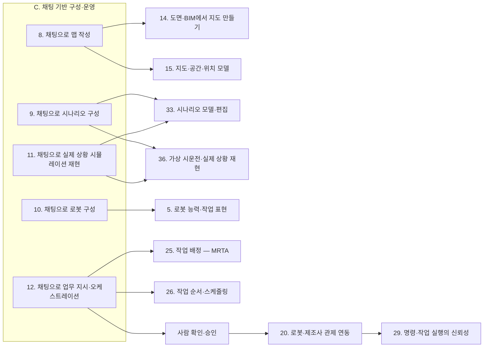

(너의 규칙은 시스템 프롬프트의 agents/shared-rules.md 와 agents/verifier.md 이다. 아래는 이번 실행의 컨텍스트와 입력이다.)

## 실행 컨텍스트

- run_id: 2026-10-09-01
- date: 2026-10-09
- run_type: category_link (대분류 연결)
- 대상: 대분류 C. 채팅 기반 구성·운영 페이지의 '다른 대분류와의 연결' 절(대분류 연결 실행). 게시된 세부영역 페이지를 근거로 다른 대분류와의 연결을 조사·서술한다. 스토리텔러는 그 절만 patches 로 바꾼다
- 예산:
    - max_search_queries: 30
    - max_sources_per_run: 15
    - new_topic_pages: 1
    - page_updates: 2
    - max_retries: 2
- 환경 알림: web_fetch_available: true · fetch_mode: full
- 언어: ko
- verification_stage: second
- verifier_budget:
    - max_search_queries: 30
    - max_sources_per_run: 15
    - new_topic_pages: 1
    - page_updates: 2
    - max_retries: 2

## 입력

### runs/2026-10-09-01/target.json

```json
{
  "run_id": "2026-10-09-01",
  "date": "2026-10-09",
  "weekday": "Fri",
  "run_number": 134,
  "run_type": "category_link",
  "forced": true,
  "target": {
    "area_no": null,
    "area_name": null,
    "category": "C. 채팅 기반 구성·운영",
    "category_letter": "C"
  },
  "topic": null,
  "track": null,
  "corrections": [],
  "budget": {
    "max_search_queries": 30,
    "max_sources_per_run": 15,
    "new_topic_pages": 1,
    "page_updates": 2,
    "max_retries": 2
  },
  "priority_reason": null,
  "priority_questions": [],
  "excluded_areas": [],
  "lifted_areas": [],
  "deferred": {
    "monthly_recheck": false,
    "weekly_review": false
  },
  "selection_rationale": "CLI 지정 run_type=category_link"
}
```

### runs/2026-10-09-01/research.json

```json
{
  "run_id": "2026-10-09-01",
  "date": "2026-10-09",
  "run_type": "category_link",
  "target": {
    "area_no": null,
    "area_name": null,
    "category": "C. 채팅 기반 구성·운영"
  },
  "gaps": [
    "C. 채팅 기반 구성·운영 대분류 페이지의 '다른 대분류와의 연결' 절이 비어 있다(아직 작성되지 않음)",
    "E. 사물·사람·실시간 상태의 19. 사람·보행자 모델과 C. 채팅 기반 구성·운영 세부영역을 잇는 근거가 게시 페이지에 없다(11. 채팅으로 실제 상황 시뮬레이션 재현의 '사람 흐름' 재현이 후보)",
    "D. 공간·지도 모델의 16. 장소 의미·지도 관리와 12. 채팅으로 업무 지시·오케스트레이션 사이의 장소 이름 해석 연결은 oq-204 로만 남아 있고 근거 출처가 없다",
    "J. 현장 운영·관제의 39. 운영 성과 측정·개선·40. 운영 절차·요청 창구, M. 안전의 49. 사람 근접 안전·50. 안전 표준·인증·사고 조사, O. 검증·도입·수명주기의 56. 운영 이관·확대·교육, H. 실행·협업·예외 복구의 30. 로봇 간 협업·물리적 인계, F. 연동의 23. 업무 시스템 연동과의 연결 근거가 게시 페이지에 없다",
    "K. 플랫폼 아키텍처·인프라·N. 보안·개인정보 쪽 연결은 13. 대화형 기능의 신뢰·기반 한 영역에 근거가 몰려 있다",
    "연결 상대 대분류 가운데 C·D·E 대분류 페이지는 seed 상태이고, A·B·F·G 대분류 페이지의 연결 절은 이전 분류 기준이라 C. 채팅 기반 구성·운영과의 연결이 상대편에 아직 없다"
  ],
  "research_questions": [
    "맵 작성, 시나리오 구성, 로봇 구성, 실제 상황 재현, 업무 지시를 비전문 사용자가 대화만으로 할 수 있게 하려면? [분류원문]",
    "원문 주석이 대화의 짝 엔진으로 둔 영역(14. 도면·BIM에서 지도 만들기·15. 지도·공간·위치 모델, 33. 시나리오 모델·편집·36. 가상 시운전·실제 상황 재현, 5. 로봇 능력·작업 표현, 25. 작업 배정 — MRTA·26. 작업 순서·스케줄링)과 C. 채팅 기반 구성·운영의 각 세부영역은 무엇을 주고받는가?",
    "대화 결과를 계획으로 두고 사람이 승인한 계획만 실행하는 구조는 F. 연동, H. 실행·협업·예외 복구, J. 현장 운영·관제, K. 플랫폼 아키텍처·인프라의 어느 세부영역과 만나는가(관제 작업 요청 스키마, 사전 검증, 진행 기록, 도구 호출 프로토콜)?",
    "13. 대화형 기능의 신뢰·기반이 M. 안전, N. 보안·개인정보, O. 검증·도입·수명주기, P. 거버넌스·법규·사회와 공유하는 위협·방어·기록·평가·규제는 무엇인가?",
    "L. AI·학습 기술의 교차 규칙에 따라 C. 채팅 기반 구성·운영이 쓰는 언어 모델 계획·도면 해석·실패 설명 방법은 어느 L. AI·학습 기술 영역과 적용 대상 영역에 함께 이어지는가?",
    "A. 기획·사업, B. 로봇 온톨로지, E. 사물·사람·실시간 상태, Q. 현장 유형별 적용과의 연결 근거(대수 산정·비용, 능력 모델, 인계 기록, 현장 사례)는 게시 페이지에 무엇이 있는가?"
  ],
  "findings": [
    {
      "id": "f1",
      "claim": "C. 채팅 기반 구성·운영의 8. 채팅으로 맵 작성 ↔ D. 공간·지도 모델의 14. 도면·BIM에서 지도 만들기: CAD 파일에서 로봇 내비게이션용 실내 지도를 자동 생성하는 연구가 있어, 도면 해석 결과가 대화로 지도를 만들고 고치는 일의 입력이 될 것으로 보인다.",
      "tag": "추정",
      "source_ids": [
        "ref-083"
      ],
      "cross_checked": false,
      "confidence": "low",
      "evidence_excerpt": "Zhang 외(2025-07)는 CAD 파일에서 로봇 내비게이션용 실내 OpenStreetMap 지도를 생성한다. 8번 페이지 10절은 이를 짝 엔진의 입력으로 본다(재인용: 2026-09-29-01)",
      "as_of": "2025-07",
      "site_type": null,
      "flow_item": "작업 대상",
      "source_unopened": true
    },
    {
      "id": "f2",
      "claim": "C. 채팅 기반 구성·운영의 8. 채팅으로 맵 작성 ↔ D. 공간·지도 모델의 15. 지도·공간·위치 모델: Open-RMF traffic-editor 빌딩 맵의 축척은 실제 거리를 아는 두 점의 미터 값을 사람이 넣어야 정해지며, 층·승강기·문·차선과 충전·주차 속성을 가진 꼭짓점을 지도 요소로 주석한다.",
      "tag": "사실",
      "source_ids": [
        "ref-079"
      ],
      "cross_checked": false,
      "confidence": "medium",
      "evidence_excerpt": "traffic-editor 문서: 두 측정점 사이 실제 거리(미터)로 축척을 정하고 층·승강기·문·차선·꼭짓점 속성을 주석한다(재인용: 2026-09-29-01) (발행일 미확인, 확인일 기준)",
      "as_of": "2026-10-09",
      "site_type": null,
      "flow_item": "제약",
      "source_unopened": false
    },
    {
      "id": "f3",
      "claim": "C. 채팅 기반 구성·운영의 8. 채팅으로 맵 작성 ↔ F. 연동의 21. 상호운용 표준·적합성: 대화로 만든 지도 요소를 Open-RMF 빌딩 맵과 VDMA 레이아웃 교환 형식(LIF)처럼 서로 다른 플릿 지도 형식으로 내보내야 하나 두 형식 사이의 공식 변환 규칙은 확인되지 않아, 공통 중간 표현이 상호운용 과제로 넘어갈 것으로 보인다(oq-124).",
      "tag": "추정",
      "source_ids": [
        "ref-046",
        "ref-079"
      ],
      "cross_checked": false,
      "confidence": "low",
      "evidence_excerpt": "8번 페이지 7절: 형식마다 요소 대응이 필요하고 두 형식 사이 공식 변환 규칙은 확인하지 못했다(재인용: 2026-09-29-01)",
      "as_of": "2026-10-09",
      "site_type": null,
      "flow_item": "완료·인계",
      "source_unopened": false
    },
    {
      "id": "f4",
      "claim": "연계 대상: C. 채팅 기반 구성·운영의 8. 채팅으로 맵 작성 ↔ F. 연동의 22. 설비·건물 시스템 연동에서, 대화로 승강기·문을 지도 요소로 등록하고 통과 조건을 제약으로 반영하는 일은 ROP 쪽이고 승강기 호출·버튼 조작 같은 실제 설비 제어는 분류 원문 19장의 시설·설비 제어 경계에 따라 외부가 맡는 것으로 보인다.",
      "tag": "추정",
      "source_ids": [
        "ref-079",
        "ref-104"
      ],
      "cross_checked": false,
      "confidence": "low",
      "evidence_excerpt": "Open-RMF Clinic 데모는 두 층·승강기 2대·플릿 2개를 둔 시뮬레이션 빌딩 맵이다. 8번 페이지 9절이 승강기 제어를 연계 대상으로 둔다(재인용: 2026-09-29-01)",
      "as_of": "2026-10-09",
      "site_type": null,
      "flow_item": "수행 자원",
      "source_unopened": false
    },
    {
      "id": "f5",
      "claim": "C. 채팅 기반 구성·운영의 8. 채팅으로 맵 작성 ↔ L. AI·학습 기술의 45. 문서·도면·장면 이해: 언어 유도 평면도 생성 데이터셋 연구와 구조화 평면도 공간 추론 벤치마크가 언어 모델의 공간·물리 제약 준수를 핵심 난점으로 지목하므로, 대화로 만든 지도 요소는 45. 문서·도면·장면 이해 쪽 방법과 기하 검증·사람 확인을 함께 거쳐야 할 것으로 보인다.",
      "tag": "추정",
      "source_ids": [
        "ref-787",
        "ref-812"
      ],
      "cross_checked": false,
      "confidence": "low",
      "evidence_excerpt": "8번 페이지 3절: Tell2Design(2023)과 FloorplanQA(2025-07)가 각각 언어 모델의 공간·물리 제약 준수를 난점으로 지목(재인용: 2026-09-29-01)",
      "as_of": "2025-07-10",
      "site_type": null,
      "flow_item": "제약",
      "source_unopened": true
    },
    {
      "id": "f6",
      "claim": "C. 채팅 기반 구성·운영의 8. 채팅으로 맵 작성 ↔ O. 검증·도입·수명주기의 55. 현장 조사·설치·시운전: 국내 업체 모빌리오는 공장 순찰 로봇의 라이다 지도(PGM)와 CAD·BIM 도면을 기준점 3개 이상으로 운영자가 정합해 관제 지도로 쓴다고 설명해, 도면·센서 지도 정합 결과를 누가 확인하는지가 시운전 단계의 과제로 이어질 것으로 보인다(oq-126).",
      "tag": "추정",
      "source_ids": [
        "ref-817"
      ],
      "cross_checked": false,
      "confidence": "low",
      "evidence_excerpt": "벤더 주장: 기둥·모서리 등 기준점 3개 이상으로 라이다 지도와 도면을 맞추고 회전각·크기를 미세 조정한다(재인용: 2026-09-29-01)",
      "as_of": "2026-08-24",
      "site_type": "제조 공장",
      "flow_item": "완료·인계",
      "source_unopened": true,
      "vendor_claim": true
    },
    {
      "id": "f7",
      "claim": "C. 채팅 기반 구성·운영의 8. 채팅으로 맵 작성 ↔ G. 계획·최적화의 27. 다중 로봇 경로·교통 관리 — MAPF·28. 공용 자원·충전·에너지 최적화: Open-RMF traffic-editor 로 주석한 차선·경유점 그래프는 building_map_generator 로 주행 그래프로 내보내져 플릿 어댑터의 경로 계획에 쓰이고, 주차·충전기 위치도 같은 지도에 주석된다.",
      "tag": "사실",
      "source_ids": [
        "ref-079"
      ],
      "cross_checked": false,
      "confidence": "medium",
      "evidence_excerpt": "B. 로봇 온톨로지 대분류 연결 절에 실린 검증된 주장: 주행 그래프 내보내기와 충전기·주차 위치 주석(재인용: 2026-09-25-38) (발행일 미확인, 확인일 기준)",
      "as_of": "2026-10-09",
      "site_type": null,
      "flow_item": "작업 대상",
      "source_unopened": false
    },
    {
      "id": "f8",
      "claim": "C. 채팅 기반 구성·운영의 8. 채팅으로 맵 작성 ↔ Q. 현장 유형별 적용의 66. 실외: 국내 연구는 공공 지도 서비스 데이터에서 실외 이동 로봇의 전역 경로 계획용 분기점 단위 위상 지도를 만들고 A* 기반 모의실험으로 유효성을 검증해, 이미 있는 외부 데이터가 대화로 만드는 지도의 시작점이 될 수 있음을 보인다.",
      "tag": "사실",
      "source_ids": [
        "ref-811"
      ],
      "cross_checked": false,
      "confidence": "medium",
      "evidence_excerpt": "김영재·김세윤·김홍준(대한공간정보학회지, 2022-06): 공공 맵 데이터로 분기점 단위 위상 지도 생성, A* 모의실험으로 검증(재인용: 2026-09-29-01)",
      "as_of": "2022-06",
      "site_type": "실외",
      "flow_item": "작업 대상",
      "source_unopened": true
    },
    {
      "id": "f9",
      "claim": "C. 채팅 기반 구성·운영의 8. 채팅으로 맵 작성 ↔ D. 공간·지도 모델의 16. 장소 의미·지도 관리: 기반 모델로 위상 지도에 의미 정보를 더하는 SENT Map 연구가 있어, 대화로 붙인 구역·장소 이름과 용도가 16. 장소 의미·지도 관리의 장소 이름·별칭 체계와 맞물릴 것으로 보인다.",
      "tag": "추정",
      "source_ids": [
        "ref-786"
      ],
      "cross_checked": false,
      "confidence": "low",
      "evidence_excerpt": "SENT Map(2025-11): Semantically Enhanced Topological Maps with Foundation Models. 8번 페이지 6절의 위상·의미 층 근거(재인용: 2026-09-29-01)",
      "as_of": "2025-11-05",
      "site_type": null,
      "flow_item": "작업 대상",
      "source_unopened": true
    },
    {
      "id": "f10",
      "claim": "C. 채팅 기반 구성·운영의 8. 채팅으로 맵 작성 ↔ I. 설계·시뮬레이션의 34. 시뮬레이션·예측용 디지털 트윈: 언어 지시로 3차원 체화 AI 환경을 생성하는 Holodeck 연구가 있어, 대화로 만든 지도가 가정한 운영을 실험하는 시뮬레이션의 초기 환경이 되는 경로가 있을 것으로 보이나 실제 로봇 현장 지도에 쓴 사례는 확인하지 못했다.",
      "tag": "추정",
      "source_ids": [
        "ref-815"
      ],
      "cross_checked": false,
      "confidence": "low",
      "evidence_excerpt": "Holodeck(2023-12): Language Guided Generation of 3D Embodied AI Environments(재인용: 2026-09-29-01)",
      "as_of": "2023-12-14",
      "site_type": null,
      "flow_item": null,
      "source_unopened": true
    },
    {
      "id": "f11",
      "claim": "C. 채팅 기반 구성·운영의 9. 채팅으로 시나리오 구성 ↔ G. 계획·최적화의 24. 작업·워크플로 모델링: 언어 모델로 공정 모델을 만드는 연구(2024-03)와 텍스트 공정 설명에서 BPMN 모델을 다단계로 생성하는 연구(2026-04)가 있어, 대화로 정한 할 일·순서·실패 처리 조건을 워크플로 모델로 옮겨 유효성을 검사하는 경로가 될 것으로 보인다.",
      "tag": "추정",
      "source_ids": [
        "ref-843",
        "ref-844"
      ],
      "cross_checked": false,
      "confidence": "low",
      "evidence_excerpt": "9번 페이지 9절: 워크플로 모델과 실행 지향 검사로 시나리오 유효성 확인을 직접 범위로 추정(재인용: 2026-09-29-04)",
      "as_of": "2026-04-13",
      "site_type": null,
      "flow_item": "작업 대상",
      "source_unopened": true
    },
    {
      "id": "f12",
      "claim": "C. 채팅 기반 구성·운영의 9. 채팅으로 시나리오 구성 ↔ F. 연동의 20. 로봇·제조사 관제 연동: Open-RMF 작업 요청 스키마는 시각·순서 관련 필드로 가장 이른 시작 시각과 우선순위를 두고, 마감 시각이나 다른 작업과의 선후를 지정하는 필드는 두지 않는다.",
      "tag": "사실",
      "source_ids": [
        "ref-125"
      ],
      "cross_checked": false,
      "confidence": "medium",
      "evidence_excerpt": "G. 계획·최적화 대분류 연결 절에 실린 검증된 주장(task_request.json, 2026-09-25 확인)(재인용: 2026-09-25-38) (발행일 미확인, 확인일 기준)",
      "as_of": "2026-10-09",
      "site_type": null,
      "flow_item": "시작 조건",
      "source_unopened": false
    },
    {
      "id": "f13",
      "claim": "C. 채팅 기반 구성·운영의 9. 채팅으로 시나리오 구성 ↔ I. 설계·시뮬레이션의 33. 시나리오 모델·편집·G. 계획·최적화의 26. 작업 순서·스케줄링: 완료 기한·반복·실패 처리 조건은 관제 작업 요청에 자리가 없으므로, 대화로 정한 시나리오는 33. 시나리오 모델·편집의 시나리오 모델에 담고 실행 시점에 26. 작업 순서·스케줄링을 거쳐 작업 요청으로 변환해야 할 것으로 보인다(oq-137).",
      "tag": "추정",
      "source_ids": [
        "ref-110",
        "ref-125"
      ],
      "cross_checked": false,
      "confidence": "low",
      "evidence_excerpt": "9번 페이지 7절·10절: 할 일·순서·물품 인계·시작 시각·우선순위는 작업 구성에 자리가 있으나 기한·반복·실패 처리는 없다(재인용: 2026-09-29-04)",
      "as_of": "2026-10-09",
      "site_type": null,
      "flow_item": "제약",
      "source_unopened": false
    },
    {
      "id": "f14",
      "claim": "C. 채팅 기반 구성·운영의 9. 채팅으로 시나리오 구성 ↔ F. 연동의 22. 설비·건물 시스템 연동: Open-RMF 는 작업 실행 중 층 이동이 필요하면 승강기 요청(RequestLift) 단계를 내부에서 자동으로 넣는다.",
      "tag": "사실",
      "source_ids": [
        "ref-110"
      ],
      "cross_checked": false,
      "confidence": "medium",
      "evidence_excerpt": "9번 페이지 9절: 승강기 호출 자체는 연계 대상이며 Open-RMF 는 필요할 때 RequestLift 단계를 자동 삽입(재인용: 2026-09-29-04) (발행일 미확인, 확인일 기준)",
      "as_of": "2026-10-09",
      "site_type": null,
      "flow_item": "수행 자원",
      "source_unopened": false
    },
    {
      "id": "f15",
      "claim": "C. 채팅 기반 구성·운영의 9. 채팅으로 시나리오 구성 ↔ E. 사물·사람·실시간 상태의 17. 작업 대상·자산 식별과 인계 추적: Open-RMF 작업 구성은 물품 인계를 PickUp·DropOff 단계로 담지만 설비의 인수 결과(IngestorResult)에는 화물 식별자·인계 당사자가 없으므로, 대화로 정한 물품·수령인 조건은 17. 작업 대상·자산 식별과 인계 추적의 식별·인계 기록과 결합해야 할 것으로 보인다.",
      "tag": "추정",
      "source_ids": [
        "ref-110",
        "ref-049"
      ],
      "cross_checked": false,
      "confidence": "low",
      "evidence_excerpt": "IngestorResult 는 시각·요청 id·워크셀 id·상태만 담는다(B. 로봇 온톨로지 대분류 연결 절, 재인용: 2026-09-25-38)",
      "as_of": "2026-10-09",
      "site_type": null,
      "flow_item": "완료·인계",
      "source_unopened": false
    },
    {
      "id": "f16",
      "claim": "C. 채팅 기반 구성·운영의 9. 채팅으로 시나리오 구성·12. 채팅으로 업무 지시·오케스트레이션 ↔ Q. 현장 유형별 적용의 63. 병원·의료·H. 실행·협업·예외 복구의 32. 예외 복구·재계획·업무 연속성: 병원 보조 로봇 연구는 간호 인력의 자연어 지시를 실행 가능한 작업 순서열로 바꾸고, 실행 중 추가 요청에 유전 알고리즘 기반 준최적 재스케줄링으로 대응하며, 실행 실패를 시각-언어 추론과 AI 제안으로 복구하는 시스템을 Temi 로봇에 배치했다고 보고했다.",
      "tag": "사실",
      "source_ids": [
        "ref-847"
      ],
      "cross_checked": false,
      "confidence": "medium",
      "evidence_excerpt": "Autonomous Robots(2026) 게재 연구, 검색 결과 요약 범위. 실행 전 사람 승인 절차 유무는 미확인(재인용: 2026-09-29-05)",
      "as_of": "2026",
      "site_type": "병원",
      "flow_item": "예외·성과",
      "source_unopened": true
    },
    {
      "id": "f17",
      "claim": "C. 채팅 기반 구성·운영의 12. 채팅으로 업무 지시·오케스트레이션 ↔ H. 실행·협업·예외 복구의 32. 예외 복구·재계획·업무 연속성: 사건 기반 재계획을 하는 이기종 로봇 팀 계층 계획·실행 연구(CoMuRoS)가 있어, 사람이 승인한 계획이 실행 중 재계획될 때 어느 범위까지 자동 재계획을 허용하고 어디부터 다시 승인받을지가 두 대분류의 경계가 될 것으로 보인다(oq-140).",
      "tag": "추정",
      "source_ids": [
        "ref-677"
      ],
      "cross_checked": false,
      "confidence": "low",
      "evidence_excerpt": "12번 페이지 9절: 실행 중 재계획은 승인된 계획과의 차이로 표시해 32번과 함께 다룬다는 추정(재인용: 2026-09-29-05)",
      "as_of": "2025-11",
      "site_type": null,
      "flow_item": "예외·성과",
      "source_unopened": true
    },
    {
      "id": "f18",
      "claim": "C. 채팅 기반 구성·운영의 9. 채팅으로 시나리오 구성·13. 대화형 기능의 신뢰·기반 ↔ L. AI·학습 기술의 44. 로봇 기반 모델·언어 모델 계획: 서로 다른 두 연구 그룹(Ren 외의 KnowNo, Mullen·Manocha 의 LBAP)이 언어 모델 계획기의 불확실도를 통계적으로 보정해 확신이 없을 때만 사람에게 되묻는 설계를 각각 보고했다.",
      "tag": "사실",
      "source_ids": [
        "ref-351",
        "ref-864"
      ],
      "cross_checked": true,
      "confidence": "medium",
      "evidence_excerpt": "KnowNo 는 등각 예측으로 예측 집합을 만들어 둘 이상 남을 때만 되묻는다. 13번 페이지 6절은 두 그룹의 같은 접근을 사실로 실었다(재인용: 2026-09-29-06)",
      "as_of": "2025-06-17",
      "site_type": null,
      "flow_item": null,
      "source_unopened": true
    },
    {
      "id": "f19",
      "claim": "C. 채팅 기반 구성·운영의 10. 채팅으로 로봇 구성 ↔ B. 로봇 온톨로지의 5. 로봇 능력·작업 표현: 요구 능력과 제공 능력을 같은 모델로 적는 IDTA 02020 능력 기술 서브모델과 자산관리셸 능력 모델에서 PDDL 계획 문제를 자동 생성하는 연구(2026-06)가 있어, 대화로 정한 로봇 구성의 수행 가능 여부를 확인하는 엔진이 5. 로봇 능력·작업 표현에서 올 것으로 보인다.",
      "tag": "추정",
      "source_ids": [
        "ref-229",
        "ref-201"
      ],
      "cross_checked": false,
      "confidence": "low",
      "evidence_excerpt": "10번 페이지 10절: 원문 주석의 로봇 구성 짝 엔진 영역(5번), 능력 기술과 PDDL 생성 연구를 적합성 확인 엔진 후보로 추정(재인용: 2026-09-29-02)",
      "as_of": "2026-06",
      "site_type": null,
      "flow_item": "수행 자원",
      "source_unopened": true
    },
    {
      "id": "f20",
      "claim": "C. 채팅 기반 구성·운영의 10. 채팅으로 로봇 구성 ↔ F. 연동의 20. 로봇·제조사 관제 연동·B. 로봇 온톨로지의 4. 이기종 로봇 등록: VDA 5050 팩트시트는 적재 명세(loadSets)와 지원 동작(mobileRobotActions)을, Open-RMF 플릿 어댑터 템플릿 설정은 수행 가능한 작업 유형(task_capabilities)과 동작 이름(actions)을 선언한다.",
      "tag": "사실",
      "source_ids": [
        "ref-228",
        "ref-105"
      ],
      "cross_checked": false,
      "confidence": "medium",
      "evidence_excerpt": "F. 연동·B. 로봇 온톨로지 대분류 연결 절에 같은 각주로 실린 검증된 주장. 두 자료는 서로 다른 인터페이스의 사례(재인용: 2026-09-25-38) (발행일 미확인, 확인일 기준)",
      "as_of": "2026-10-09",
      "site_type": null,
      "flow_item": "수행 자원",
      "source_unopened": false
    },
    {
      "id": "f21",
      "claim": "C. 채팅 기반 구성·운영의 10. 채팅으로 로봇 구성 ↔ I. 설계·시뮬레이션의 35. 처리능력·규모·배치 설계·Q. 현장 유형별 적용의 61. 물류창고: 작업자 피킹(picker-to-parts) 창고의 협동 자율이동로봇 대수 산정 연구는 비용 기준 최적 로봇 대 작업자 비율이 수요에 따라 1:1 에서 2.5:1 로 옮겨 가고, 처리량 기준 산정은 구독형 과금 아래에서 대수를 과대 산정한다고 보고했다.",
      "tag": "사실",
      "source_ids": [
        "ref-822"
      ],
      "cross_checked": false,
      "confidence": "medium",
      "evidence_excerpt": "Howard(Cal Poly 석사논문, 2026-06): FlexSim 이산 사건 시뮬레이션 27,000회·반개방형 대기행렬·XGBoost 대리모델(재인용: 2026-09-29-02)",
      "as_of": "2026-06",
      "site_type": "물류창고",
      "flow_item": "수행 자원",
      "source_unopened": true
    },
    {
      "id": "f22",
      "claim": "C. 채팅 기반 구성·운영의 10. 채팅으로 로봇 구성 ↔ A. 기획·사업의 3. 경제성·조달·사업 모델: 국내 업체 폴라리스3D 는 공장 공정 간 이송 자율이동로봇 대수를 일일 목표 이송 횟수·시간당 적재량·이동 거리·기존 설비 연동 여부로 산정하고 투자 수익을 인건비 절감·생산성 향상으로 계산한다고 설명해, 대화로 대수를 정할 때 처리량과 비용 가운데 어느 목적을 누가 정하는지가 3. 경제성·조달·사업 모델의 판단과 이어질 것으로 보인다(oq-129).",
      "tag": "추정",
      "source_ids": [
        "ref-823"
      ],
      "cross_checked": false,
      "confidence": "low",
      "evidence_excerpt": "벤더 주장: 도입 전 전문가 인터뷰나 시뮬레이션 사전 분석이 필수이며 ROI 는 인건비 절감·생산성 향상으로 계산(재인용: 2026-09-29-02)",
      "as_of": "2026-06-12",
      "site_type": "제조 공장",
      "flow_item": "시작 조건",
      "source_unopened": true,
      "vendor_claim": true
    },
    {
      "id": "f23",
      "claim": "C. 채팅 기반 구성·운영의 10. 채팅으로 로봇 구성·12. 채팅으로 업무 지시·오케스트레이션 ↔ O. 검증·도입·수명주기의 55. 현장 조사·설치·시운전·I. 설계·시뮬레이션의 36. 가상 시운전·실제 상황 재현: KTH 연구는 자연어 명령을 구조화 작업 계획으로 바꾸고 물리적 실행 가능성을 기호적으로 검증한 뒤, Unity3D 디지털 트윈에서 운영자가 계획을 검토·수정·재검증한 다음에만 실제 로봇에서 실행하는 계획·시운전 구조를 제안했다.",
      "tag": "사실",
      "source_ids": [
        "ref-674"
      ],
      "cross_checked": false,
      "confidence": "medium",
      "evidence_excerpt": "Liu 외(2026-06) 초록: Specifier-Designer-Inspector 구조, LLM 은 언어 이해·맥락 추론에만 쓰고 검증·순서·실행은 결정적으로 유지. 정량 결과는 초록에 없음",
      "as_of": "2026-06",
      "site_type": null,
      "flow_item": "완료·인계"
    },
    {
      "id": "f24",
      "claim": "C. 채팅 기반 구성·운영의 10. 채팅으로 로봇 구성 ↔ I. 설계·시뮬레이션의 34. 시뮬레이션·예측용 디지털 트윈: Ko·Lin(2026)의 '제안–검증–결정' 흐름에서 로컬 언어 모델이 만든 라인·작업 조정 후보를 디지털 트윈 시뮬레이션이 평균 164.39초에 검증했고, 시험 사례 18건 가운데 잘못된 입력 8건 중 7건을 검증 단계에서 거부했다.",
      "tag": "사실",
      "source_ids": [
        "ref-759"
      ],
      "cross_checked": false,
      "confidence": "medium",
      "evidence_excerpt": "가상 수술기구 분류 라인 4개, 배치 검증 통과율 97.50%, 요청–검증 근거–결정 추적 기록(재인용: 2026-09-29-02). 출처는 현장 유형을 명시하지 않음",
      "as_of": "2026-09",
      "site_type": null,
      "flow_item": "예외·성과",
      "source_unopened": true
    },
    {
      "id": "f25",
      "claim": "C. 채팅 기반 구성·운영의 11. 채팅으로 실제 상황 시뮬레이션 재현 ↔ I. 설계·시뮬레이션의 36. 가상 시운전·실제 상황 재현: DEVS 형식론으로 사양에서 이산 사건 세계 모델을 생성·평가하는 연구(2026-03)와 시뮬레이션 모델·디지털 트윈을 부분 트레이스 조건으로 검증하는 연구(2026-07)가 있어, 원문 주석이 짝으로 둔 36. 가상 시운전·실제 상황 재현의 엔진이 기록에서 시뮬레이터를 만들고 트레이스로 대조하는 일을 맡을 것으로 보인다.",
      "tag": "추정",
      "source_ids": [
        "ref-825",
        "ref-826"
      ],
      "cross_checked": false,
      "confidence": "low",
      "evidence_excerpt": "11번 페이지 10절: 사양·기록에서 시뮬레이터를 만들고 트레이스로 대조하는 방법은 11번과 36번 양쪽에 연결(재인용: 2026-09-29-03)",
      "as_of": "2026-07-19",
      "site_type": null,
      "flow_item": null,
      "source_unopened": true
    },
    {
      "id": "f26",
      "claim": "C. 채팅 기반 구성·운영의 11. 채팅으로 실제 상황 시뮬레이션 재현 ↔ I. 설계·시뮬레이션의 34. 시뮬레이션·예측용 디지털 트윈(E. 사물·사람·실시간 상태의 18. 실시간 세계 상태·데이터 일관성과 구분): 언어 모델 에이전트가 시뮬레이션 모델로 통제 실험을 수행하는 연구와 시뮬레이션으로 언어 모델을 접지하는 Simulation Agent 구조를 보면, 조건을 바꿔 비교하는 일은 가정한 미래를 실험하는 34. 시뮬레이션·예측용 디지털 트윈 쪽이고, 재현의 입력이 되는 실제 기록은 현재 상태를 표현하는 18. 실시간 세계 상태·데이터 일관성과 실행 기록 쪽에서 오는 것으로 보인다.",
      "tag": "추정",
      "source_ids": [
        "ref-832",
        "ref-824"
      ],
      "cross_checked": false,
      "confidence": "low",
      "evidence_excerpt": "11번 페이지 6절: 언어 모델은 인터페이스·실험 설계를, 수치 결론은 시뮬레이션 실행에서 얻는 구조로 수렴(재인용: 2026-09-29-03)",
      "as_of": "2026-08-22",
      "site_type": null,
      "flow_item": null,
      "source_unopened": true
    },
    {
      "id": "f27",
      "claim": "C. 채팅 기반 구성·운영의 11. 채팅으로 실제 상황 시뮬레이션 재현 ↔ J. 현장 운영·관제의 37. 관제 화면·실행 기록: 이벤트 로그에서 업무 프로세스 시뮬레이션 모델을 자동 발견하는 연구가 있고 rosbag2 는 로봇 한 대의 ROS 2 통신을 기록·재생하는 수준이므로, 플릿 관제의 실행 기록(작업·배정·위치·사건 시각)을 시나리오 사양으로 바꾸는 변환이 두 대분류를 잇는 지점이 될 것으로 보인다(oq-131).",
      "tag": "추정",
      "source_ids": [
        "ref-828",
        "ref-831"
      ],
      "cross_checked": false,
      "confidence": "low",
      "evidence_excerpt": "11번 페이지 9절: 플릿 수준 실행 기록을 시나리오 사양으로 바꾸는 일은 직접 범위, 로봇 한 대의 통신 기록 재생은 연계 대상(재인용: 2026-09-29-03)",
      "as_of": "2020",
      "site_type": null,
      "flow_item": "시작 조건",
      "source_unopened": true
    },
    {
      "id": "f28",
      "claim": "C. 채팅 기반 구성·운영의 11. 채팅으로 실제 상황 시뮬레이션 재현 ↔ Q. 현장 유형별 적용의 62. 제조 공장·I. 설계·시뮬레이션의 35. 처리능력·규모·배치 설계: 제조 로봇 플릿·공장 배치의 시나리오 기반 디지털 트윈 연구는 기존 공장에서는 혼잡 때문에 플릿 확장 효과가 체감하고, 신규 공장에서는 배치·플릿 규모·역할 비율을 비교해 로봇당 생산성을 줄이지 않고 처리량을 최대 3.5배 높이는 구성을 찾았다고 보고했으며, 국내 연구는 AGV 자동물류시스템의 설계 검증과 운영 모니터링을 한 디지털트윈으로 묶었다.",
      "tag": "사실",
      "source_ids": [
        "ref-838",
        "ref-830"
      ],
      "cross_checked": false,
      "confidence": "medium",
      "evidence_excerpt": "Valiollahi 외(Scientific Reports, 2026-07, 저자 보고값, 초록 기준), 이동건 외(한국CDE학회 논문집, 2021-12). 두 연구 모두 실제 운영 기록 재현은 아님(재인용: 2026-09-29-03)",
      "as_of": "2026-07-18",
      "site_type": "제조 공장",
      "flow_item": "예외·성과",
      "source_unopened": true
    },
    {
      "id": "f29",
      "claim": "C. 채팅 기반 구성·운영의 11. 채팅으로 실제 상황 시뮬레이션 재현 ↔ Q. 현장 유형별 적용의 63. 병원·의료: 국내 연구는 감염병 환자 도착부터 병원에서 일어나는 전 과정을 시나리오로 정의하고, 간호사 추종 음압 이송 침대 로봇 여러 대의 운용을 연합 디지털 트윈으로 시뮬레이션해 시스템 성능을 검증했다.",
      "tag": "사실",
      "source_ids": [
        "ref-837"
      ],
      "cross_checked": false,
      "confidence": "medium",
      "evidence_excerpt": "Woo·Shin·Jeon·Park(Electronics 14(24), 2025-12-17), 초록 기준. 정량 결과·완료 판정 기준 미확인(재인용: 2026-09-29-03)",
      "as_of": "2025-12-17",
      "site_type": "병원",
      "flow_item": "시작 조건",
      "source_unopened": true
    },
    {
      "id": "f30",
      "claim": "C. 채팅 기반 구성·운영의 11. 채팅으로 실제 상황 시뮬레이션 재현 ↔ O. 검증·도입·수명주기의 54. 시험·형식 검증·벤치마크: 시뮬레이션 모델·디지털 트윈을 부분 트레이스 조건으로 검증하는 방법이 있어, 재현이 실제 기록과 '맞는다'고 판정할 지표와 허용 기준, 그 판정의 승인이 54. 시험·형식 검증·벤치마크의 과제로 넘어갈 것으로 보인다(oq-132).",
      "tag": "추정",
      "source_ids": [
        "ref-826"
      ],
      "cross_checked": false,
      "confidence": "low",
      "evidence_excerpt": "Ghasemloo·Eckman·Li(2026-07): Subtrace-Conditional Validation of Simulation Models and Digital Twins(재인용: 2026-09-29-03)",
      "as_of": "2026-07-19",
      "site_type": null,
      "flow_item": "완료·인계",
      "source_unopened": true
    },
    {
      "id": "f31",
      "claim": "C. 채팅 기반 구성·운영의 11. 채팅으로 실제 상황 시뮬레이션 재현 ↔ L. AI·학습 기술의 47. AI·학습·적응과 모델 운영: 언어 모델을 디지털 트윈 모델링에 쓰는 연구 동향 서베이는 정확한 모델링을 위한 데이터 부족, 시스템 분석의 비효율, 물리–디지털 상호작용의 설명 부족을 공통 과제로 꼽는다.",
      "tag": "사실",
      "source_ids": [
        "ref-827"
      ],
      "cross_checked": false,
      "confidence": "medium",
      "evidence_excerpt": "Yang·Luo·Cheng·Yu(2025-03-04) 서베이, 11번 페이지 3절에 사실로 실림(재인용: 2026-09-29-03)",
      "as_of": "2025-03-04",
      "site_type": null,
      "flow_item": null,
      "source_unopened": true
    },
    {
      "id": "f32",
      "claim": "C. 채팅 기반 구성·운영의 12. 채팅으로 업무 지시·오케스트레이션 ↔ G. 계획·최적화의 25. 작업 배정 — MRTA·26. 작업 순서·스케줄링: SMART-LLM 은 상위 작업 지시를 작업 분해→연합 형성→작업 배정의 세 단계로 다중 로봇 작업 계획으로 바꾸며, 각 단계를 소수 예시 프로그램형 프롬프트로 언어 모델에 수행시킨다.",
      "tag": "사실",
      "source_ids": [
        "ref-090"
      ],
      "cross_checked": false,
      "confidence": "medium",
      "evidence_excerpt": "Kannan·Venkatesh·Min(2023-09), 네 가지 복잡도의 벤치마크·시뮬레이션·실제 로봇으로 평가(재인용: 2026-09-29-05)",
      "as_of": "2023-09",
      "site_type": null,
      "flow_item": null,
      "source_unopened": true
    },
    {
      "id": "f33",
      "claim": "C. 채팅 기반 구성·운영의 12. 채팅으로 업무 지시·오케스트레이션 ↔ G. 계획·최적화의 25. 작업 배정 — MRTA·26. 작업 순서·스케줄링: 형식 언어 기반 이기종 로봇 팀 스케줄링(FLEET)과 의존 관계 인지 작업 분해(DART-LLM) 연구를 보면, 언어 모델은 작업 그래프·능력 요구를 만들고 실제 배정·일정은 원문 주석이 짝으로 둔 25. 작업 배정 — MRTA와 26. 작업 순서·스케줄링의 엔진이 계산하는 분담이 될 것으로 보인다.",
      "tag": "추정",
      "source_ids": [
        "ref-242",
        "ref-059"
      ],
      "cross_checked": false,
      "confidence": "low",
      "evidence_excerpt": "12번 페이지 10절의 구축자 추정(재인용: 2026-09-29-05)",
      "as_of": "2025-10",
      "site_type": null,
      "flow_item": "수행 자원",
      "source_unopened": true
    },
    {
      "id": "f34",
      "claim": "C. 채팅 기반 구성·운영의 12. 채팅으로 업무 지시·오케스트레이션 ↔ F. 연동의 20. 로봇·제조사 관제 연동·K. 플랫폼 아키텍처·인프라의 41. 플랫폼 아키텍처·외부 API: OSRA Interop SIG(2026-07-02)에서 발표된 Nayantra 는 Open-RMF REST API 를 언어 모델이 부를 수 있는 MCP 도구로 감싼 서버로, 에이전트가 짐 픽업·배송 같은 평문 지시를 여러 단계 RMF 임무로 바꾸고 Open-RMF 가 이를 Nav2 로 보내 Isaac Sim 창고 시뮬레이션의 로봇이 실행하며, 게시글은 실행 전 사람 확인·접근통제를 언급하지 않는다.",
      "tag": "사실",
      "source_ids": [
        "ref-854"
      ],
      "cross_checked": false,
      "confidence": "medium",
      "evidence_excerpt": "\"I'll present an MCP server that exposes the Open-RMF REST API as LLM-callable tools\" — 발표 예고 게시글, 엔드포인트 목록 없음",
      "as_of": "2026-06-25",
      "site_type": null,
      "flow_item": "시작 조건"
    },
    {
      "id": "f35",
      "claim": "C. 채팅 기반 구성·운영의 12. 채팅으로 업무 지시·오케스트레이션·13. 대화형 기능의 신뢰·기반 ↔ K. 플랫폼 아키텍처·인프라의 41. 플랫폼 아키텍처·외부 API: MCP 명세가 도구 호출 전 사용자 동의를 프로토콜이 아니라 호스트의 책임으로 두고, 관제 API 를 MCP 도구로 노출한 공개 발표도 승인 절차를 언급하지 않으므로, 사람 승인 관문을 에이전트·MCP 서버·관제 외부 API 가운데 어디에 둘지가 두 대분류의 설계 쟁점이 될 것으로 보인다(oq-141).",
      "tag": "추정",
      "source_ids": [
        "ref-856",
        "ref-854"
      ],
      "cross_checked": false,
      "confidence": "low",
      "evidence_excerpt": "13번 페이지 9절: MCP 명세는 도구 호출 전 동의를 호스트 책임으로 둔다(재인용: 2026-09-29-06). Nayantra 게시글은 승인 절차 언급 없음",
      "as_of": "2026-06-25",
      "site_type": null,
      "flow_item": "제약",
      "source_unopened": false
    },
    {
      "id": "f36",
      "claim": "C. 채팅 기반 구성·운영의 12. 채팅으로 업무 지시·오케스트레이션 ↔ H. 실행·협업·예외 복구의 29. 명령·작업 실행의 신뢰성: 언어 모델로 로봇 작업 계획을 실행 전에 검증하는 VerifyLLM 과 계획의 물리적 실행 가능성을 기호적으로 검증한 뒤 실행하는 KTH 구조를 보면, 승인 전 자동 검증과 승인된 계획의 1회 변환이 29. 명령·작업 실행의 신뢰성이 다루는 실행 보장의 앞단이 될 것으로 보인다.",
      "tag": "추정",
      "source_ids": [
        "ref-753",
        "ref-674"
      ],
      "cross_checked": false,
      "confidence": "low",
      "evidence_excerpt": "12번 페이지 9절: 자동 검증을 거쳐 사람 승인을 받은 계획만 관제 작업 요청으로 한 번 변환해 보낸다는 추정(재인용: 2026-09-29-05)",
      "as_of": "2026-06",
      "site_type": null,
      "flow_item": "완료·인계",
      "source_unopened": false
    },
    {
      "id": "f37",
      "claim": "C. 채팅 기반 구성·운영의 12. 채팅으로 업무 지시·오케스트레이션 ↔ H. 실행·협업·예외 복구의 31. 사람–로봇 협업: HMCF 는 로봇마다 자기 능력을 아는 언어 모델 에이전트를 두어 이기종 로봇의 작업 배정·실행을 맡기고 사람은 필요할 때만 개입해 감독·검증하는 틀로, 시뮬레이션에서 기존 작업 계획 방법보다 작업 성공률이 4.76% 높았다고 보고했다.",
      "tag": "사실",
      "source_ids": [
        "ref-849"
      ],
      "cross_checked": false,
      "confidence": "medium",
      "evidence_excerpt": "Li 외(2025-05) 초록: 사람 감독과 작업 검증으로 언어 모델 환각을 줄이며 \"intervening only when necessary\". 승인 절차의 세부는 초록에 없음",
      "as_of": "2025-05-01",
      "site_type": null,
      "flow_item": "수행 자원"
    },
    {
      "id": "f38",
      "claim": "C. 채팅 기반 구성·운영의 12. 채팅으로 업무 지시·오케스트레이션 ↔ J. 현장 운영·관제의 37. 관제 화면·실행 기록: Open-RMF 작업 상태 스키마가 상태 값·시작·종료 시각·취소·강제 종료·중단 요청 기록을 담으므로, '어디까지 했는지, 왜 멈췄는지'를 대화로 답하는 근거는 37. 관제 화면·실행 기록의 실행 기록이 될 것으로 보인다.",
      "tag": "추정",
      "source_ids": [
        "ref-111"
      ],
      "cross_checked": false,
      "confidence": "low",
      "evidence_excerpt": "A. 기획·사업·F. 연동 대분류 연결 절에 실린 task_state.json 필드(재인용: 2026-09-25-38), 12번 페이지 9절의 진행 설명 범위",
      "as_of": "2026-10-09",
      "site_type": null,
      "flow_item": "완료·인계",
      "source_unopened": false
    },
    {
      "id": "f39",
      "claim": "C. 채팅 기반 구성·운영의 12. 채팅으로 업무 지시·오케스트레이션 ↔ Q. 현장 유형별 적용의 66. 실외: Argenziano 외(2025)는 언어 모델과 자동 계획을 결합해 사람이 자연어로 상위 활동을 지정하고 로봇에게 질문해 과거·현재·미래 행동에 걸친 실행 진행을 확인하는 구조를 실제 정밀 농업 시나리오에서 구현·시험했다.",
      "tag": "사실",
      "source_ids": [
        "ref-850"
      ],
      "cross_checked": false,
      "confidence": "medium",
      "evidence_excerpt": "초록 기준. 로봇 종류·대수·답의 근거 기록 형식은 미확인(재인용: 2026-09-29-05)",
      "as_of": "2025-09-19",
      "site_type": "실외",
      "flow_item": "완료·인계",
      "source_unopened": true
    },
    {
      "id": "f40",
      "claim": "C. 채팅 기반 구성·운영의 12. 채팅으로 업무 지시·오케스트레이션 ↔ J. 현장 운영·관제의 38. 모니터링·이상 탐지·원인 분석·L. AI·학습 기술의 44. 로봇 기반 모델·언어 모델 계획: REFLECT 는 로봇의 다중 감각 관측을 계층 요약으로 만들고 언어 모델로 실패 원인을 추론해 그 설명으로 언어 기반 계획기가 실패를 바로잡게 하며, 평가용 RoboFail 데이터셋을 만들었다.",
      "tag": "사실",
      "source_ids": [
        "ref-453"
      ],
      "cross_checked": false,
      "confidence": "medium",
      "evidence_excerpt": "Liu·Bahety·Song(2023) 초록. 원문 교차 규칙상 장애 분석은 38번에 적용되는 AI 연구 방법",
      "as_of": "2023",
      "site_type": null,
      "flow_item": "예외·성과"
    },
    {
      "id": "f41",
      "claim": "C. 채팅 기반 구성·운영의 12. 채팅으로 업무 지시·오케스트레이션 ↔ L. AI·학습 기술의 44. 로봇 기반 모델·언어 모델 계획: 다중 로봇 시스템의 언어 모델 연구 서베이는 연구를 상위 수준 작업 배정·중간 수준 동작 계획·하위 수준 행동 생성·사람 개입의 네 층으로 나누고, 운영자 인지 부담이 정량화되지 않았다고 지적했다.",
      "tag": "사실",
      "source_ids": [
        "ref-165"
      ],
      "cross_checked": false,
      "confidence": "medium",
      "evidence_excerpt": "Li·An·Abrar·Zhou(2025-02, v5 2026-05-03). 12번 페이지 8절·11절(재인용: 2026-09-29-05)",
      "as_of": "2025-02",
      "site_type": null,
      "flow_item": null,
      "source_unopened": true
    },
    {
      "id": "f42",
      "claim": "C. 채팅 기반 구성·운영의 12. 채팅으로 업무 지시·오케스트레이션 ↔ A. 기획·사업의 1. 기술·시장·업체 동향: 이 영역에 관해 확인된 국내 자료는 ETRI 의 거대언어모델 기반 로봇 인공지능 기술 동향(2024-02)과 KAIST 연구진의 자연어 로봇 제어 기술 동향(2024-10) 같은 동향 논문이며, 대화로 여러 로봇에 업무를 지시한 국내 운영 사례는 이번 실행의 한·영 검색에서도 확인되지 않았다.",
      "tag": "추정",
      "source_ids": [
        "ref-851",
        "ref-848"
      ],
      "cross_checked": false,
      "confidence": "low",
      "evidence_excerpt": "oq-142 와 같은 공백. 이번 검색에서 확인된 국내 통합 제어 플랫폼 소식은 노코드 블록코딩 방식이라 출처로 넣지 않음",
      "as_of": "2024-10",
      "site_type": null,
      "flow_item": null,
      "source_unopened": true
    },
    {
      "id": "f43",
      "claim": "C. 채팅 기반 구성·운영의 13. 대화형 기능의 신뢰·기반 ↔ N. 보안·개인정보의 52. 통신 보호·위협 관리·감사·M. 안전의 48. 안전·위험 관리: 언어 모델의 오해석뿐 아니라 프롬프트 주입·탈옥 같은 외부 조작이 도구 호출이나 로봇의 물리 동작으로 이어진다는 위협을 서로 다른 세 발행 주체(OWASP, Robey 외, Huang 외)가 각각 보고했다.",
      "tag": "사실",
      "source_ids": [
        "ref-855",
        "ref-857",
        "ref-859"
      ],
      "cross_checked": true,
      "confidence": "medium",
      "evidence_excerpt": "13번 페이지 3절에 세 출처로 실린 검증된 주장(재인용: 2026-09-29-06). OWASP LLM01 프롬프트 주입·LLM06 과도한 에이전시 포함",
      "as_of": "2025-12-17",
      "site_type": null,
      "flow_item": "제약",
      "source_unopened": true
    },
    {
      "id": "f44",
      "claim": "C. 채팅 기반 구성·운영의 12. 채팅으로 업무 지시·오케스트레이션·13. 대화형 기능의 신뢰·기반 ↔ M. 안전의 48. 안전·위험 관리: RoboGuard 는 공격 프롬프트에서 격리된 신뢰 근간 언어 모델이 미리 정한 안전 규칙을 로봇 환경에 맞는 시간 논리 제약으로 바꾸고, 시간 논리 제어 합성으로 위험할 수 있는 계획을 사용자 선호를 최소한으로 어기며 고치는 2단계 가드레일로, 최악 조건 탈옥 공격 실험에서 위험 계획 실행을 92% 초과에서 3% 미만으로 줄였다고 보고했다.",
      "tag": "사실",
      "source_ids": [
        "ref-700"
      ],
      "cross_checked": false,
      "confidence": "medium",
      "evidence_excerpt": "Ravichandran·Robey·Kumar·Pappas·Hassani, arXiv 2503.07885 v2(2026-03-03 개정) 초록: 시뮬레이션·실기 실험, \"without compromising performance on safe plans\". v1 은 92.3%→2.5% 미만으로 보고",
      "as_of": "2026-03-03",
      "site_type": null,
      "flow_item": "제약"
    },
    {
      "id": "f45",
      "claim": "C. 채팅 기반 구성·운영의 13. 대화형 기능의 신뢰·기반 ↔ N. 보안·개인정보의 51. 인증·권한·격리: AI 에이전트의 사용자 권한을 인터페이스부터 강제까지 다룬 연구가 있어, 사용자별로 대화로 지시할 수 있는 로봇·구역·작업의 범위를 정하는 일은 51. 인증·권한·격리의 권한 모델에 기대 도구 호출 수준에서 강제해야 할 것으로 보인다.",
      "tag": "추정",
      "source_ids": [
        "ref-867"
      ],
      "cross_checked": false,
      "confidence": "low",
      "evidence_excerpt": "Michael·Roesner(2026-07): How Agents Ask for Permission. 13번 페이지 9절: 도구 호출 수준의 권한 검사를 직접 범위로 추정(재인용: 2026-09-29-06)",
      "as_of": "2026-07-20",
      "site_type": null,
      "flow_item": "제약",
      "source_unopened": true
    },
    {
      "id": "f46",
      "claim": "C. 채팅 기반 구성·운영의 13. 대화형 기능의 신뢰·기반 ↔ P. 거버넌스·법규·사회의 59. 법·규제·보험·라이선스·N. 보안·개인정보의 53. 개인정보·영상 데이터: EU AI Act 제12조는 고위험 AI 시스템이 수명 동안 사건을 자동으로 기록(로그)할 수 있도록 기술적으로 갖추게 하며, ROP 의 대화 기능이 이에 해당하는지와 기록 항목·보존 기간은 열린 질문이다(oq-143).",
      "tag": "사실",
      "source_ids": [
        "ref-863"
      ],
      "cross_checked": false,
      "confidence": "medium",
      "evidence_excerpt": "AI Act Service Desk, Article 12: Record-keeping(Regulation (EU) 2024/1689). 13번 페이지 7절(재인용: 2026-09-29-06)",
      "as_of": "2024-06-13",
      "site_type": null,
      "flow_item": "제약",
      "source_unopened": true
    },
    {
      "id": "f47",
      "claim": "C. 채팅 기반 구성·운영의 13. 대화형 기능의 신뢰·기반 ↔ N. 보안·개인정보의 53. 개인정보·영상 데이터: 개인정보보호위원회가 2025-08 생성형 AI 개발·활용을 위한 개인정보 처리 안내서를 냈으므로, 대화 기록의 보존·보호 요구는 53. 개인정보·영상 데이터의 처리 기준과 함께 정해야 할 것으로 보인다.",
      "tag": "추정",
      "source_ids": [
        "ref-862"
      ],
      "cross_checked": false,
      "confidence": "low",
      "evidence_excerpt": "13번 페이지 7절의 국내 안내서 목록(재인용: 2026-09-29-06). 안내서의 구체 조항은 이번 실행에서 다시 확인하지 않음",
      "as_of": "2025-08",
      "site_type": null,
      "flow_item": "제약",
      "source_unopened": true
    },
    {
      "id": "f48",
      "claim": "C. 채팅 기반 구성·운영의 13. 대화형 기능의 신뢰·기반 ↔ K. 플랫폼 아키텍처·인프라의 43. 데이터·관측성·배포: OpenTelemetry 의 생성형 AI 의미 규약은 별도 저장소로 옮겨져 생성형 AI 클라이언트와 MCP 의 스팬·지표·이벤트를 다루며, 지표 문서는 에이전트 호출 시간·추론 호출 수·도구 호출 수(gen_ai.invoke_agent.tool_calls)·도구 실행 시간 같은 지표를 모두 개발(Development) 단계로 두고 토큰 지표는 별도 문서의 gen_ai.client.inference.usage.* 로 안내한다.",
      "tag": "사실",
      "source_ids": [
        "ref-1240",
        "ref-1241"
      ],
      "cross_checked": false,
      "confidence": "medium",
      "evidence_excerpt": "semantic-conventions-genai README: spans, metrics, events for GenAI clients, MCP. gen-ai-metrics.md: 지표 9종 모두 Development, gen_ai.client.token.usage 는 이 문서에 정의되지 않음(oq-212 관련)",
      "as_of": "2026-10-09",
      "site_type": null,
      "flow_item": null
    },
    {
      "id": "f49",
      "claim": "C. 채팅 기반 구성·운영의 13. 대화형 기능의 신뢰·기반 ↔ L. AI·학습 기술의 47. AI·학습·적응과 모델 운영·O. 검증·도입·수명주기의 57. 자산·소프트웨어 수명주기 관리·P. 거버넌스·법규·사회의 58. 다사업자 책임·계약·데이터: 언어 모델 게이트웨이의 모델 대체·라우팅 희석을 블랙박스로 감사하는 연구가 있어, 실제로 응답한 모델을 기록하고 교체를 통제하는 일이 모델 운영·소프트웨어 수명주기·공급자 계약으로 이어질 것으로 보인다(oq-145).",
      "tag": "추정",
      "source_ids": [
        "ref-865"
      ],
      "cross_checked": false,
      "confidence": "low",
      "evidence_excerpt": "Zhang·Zhang·Qin(2026-07): IRIS, Budgeted Black-Box Auditing of Model Substitution and Routing Dilution in LLM Gateways(재인용: 2026-09-29-06)",
      "as_of": "2026-07-23",
      "site_type": null,
      "flow_item": null,
      "source_unopened": true
    },
    {
      "id": "f50",
      "claim": "C. 채팅 기반 구성·운영의 13. 대화형 기능의 신뢰·기반 ↔ K. 플랫폼 아키텍처·인프라의 42. 분산 시스템·통신·컴퓨팅 구조: 로봇 시스템에서 음성 인식을 온라인 API 대신 로컬 모델로 통합하는 연구를 정리한 서베이와 로컬 언어 모델을 쓴 디지털 트윈 검증 연구가 있어, 음성 인식·언어 모델을 현장 서버·로봇·클라우드 가운데 어디에 둘지가 42. 분산 시스템·통신·컴퓨팅 구조의 배치 쟁점과 이어질 것으로 보인다.",
      "tag": "추정",
      "source_ids": [
        "ref-866",
        "ref-759"
      ],
      "cross_checked": false,
      "confidence": "low",
      "evidence_excerpt": "Li 외(2026-07) 서베이 제목: Casting Everything to Online API Services?; Ko·Lin(2026-09)은 로컬 언어 모델 사용(재인용: 2026-09-29-06, 2026-09-29-02)",
      "as_of": "2026-07-13",
      "site_type": null,
      "flow_item": "수행 자원",
      "source_unopened": true
    },
    {
      "id": "f51",
      "claim": "C. 채팅 기반 구성·운영의 13. 대화형 기능의 신뢰·기반·10. 채팅으로 로봇 구성 ↔ O. 검증·도입·수명주기의 54. 시험·형식 검증·벤치마크: 실제 도메인의 도구–에이전트–사용자 상호작용을 평가하는 τ-bench(반복 시행 신뢰도 지표 pass^k)와 체화 의사결정에서 언어 모델을 평가하는 Embodied Agent Interface(NeurIPS 2024 데이터셋·벤치마크) 같은 공개 벤치마크가 있다.",
      "tag": "사실",
      "source_ids": [
        "ref-738",
        "ref-858"
      ],
      "cross_checked": false,
      "confidence": "medium",
      "evidence_excerpt": "13번 페이지 7·8절의 평가 벤치마크(재인용: 2026-09-29-06). 로봇 구성 대화 전용 벤치마크는 미확인(oq-127)",
      "as_of": "2025-01-19",
      "site_type": null,
      "flow_item": "예외·성과",
      "source_unopened": true
    },
    {
      "id": "f52",
      "claim": "C. 채팅 기반 구성·운영의 13. 대화형 기능의 신뢰·기반 ↔ Q. 현장 유형별 적용의 64. 상업 시설·P. 거버넌스·법규·사회의 60. 노동·수용성·접근성: 네덜란드 슈퍼마켓 로봇 연구는 영어·네덜란드어와 성별 집단으로 음성 인식 기술을 비교해 Whisper 가 가장 낮은 단어 오류율을 보였고(참가자 40명), 질의 분류기 정확도 약 87%, 다층 언어 모델 구조가 참가자 16명 평가에서 GPT-4 Turbo 보다 13개 항목 중 4개에서 유의하게 높았다고 보고했다.",
      "tag": "사실",
      "source_ids": [
        "ref-868"
      ],
      "cross_checked": false,
      "confidence": "medium",
      "evidence_excerpt": "Nandkumar·Peternel(Frontiers in Robotics and AI, 2025-04-29), 모든 응답을 1,612개 상품 데이터베이스 항목에 근거(재인용: 2026-09-29-06)",
      "as_of": "2025-04-29",
      "site_type": "상업 시설",
      "flow_item": "예외·성과",
      "source_unopened": true
    },
    {
      "id": "f53",
      "claim": "C. 채팅 기반 구성·운영의 13. 대화형 기능의 신뢰·기반 ↔ P. 거버넌스·법규·사회의 60. 노동·수용성·접근성: 한국은 2026-01-28부터 무인정보단말기를 설치·운영하는 사업자에게 접근성 검증기준을 지킨 기기 설치를 기존 기기까지 전면 의무화했고, 바닥면적 50㎡ 미만 소규모 근린생활시설·소상공인 사업장·테이블 주문형 소형 기기는 보조기기·보조 인력·호출벨 가운데 하나로 대신할 수 있게 했다.",
      "tag": "사실",
      "source_ids": [
        "ref-1217"
      ],
      "cross_checked": false,
      "confidence": "medium",
      "evidence_excerpt": "보건복지부 정책브리핑(2026-01-28): 무인정보단말기 위치 음성 안내 같은 정당한 편의도 제공. 로봇 현장 단말·채팅 화면이 무인정보단말기에 해당하는지는 기사에 없음",
      "as_of": "2026-01-28",
      "site_type": null,
      "flow_item": "제약"
    },
    {
      "id": "f54",
      "claim": "C. 채팅 기반 구성·운영의 13. 대화형 기능의 신뢰·기반 ↔ B. 로봇 온톨로지의 6. 온톨로지 기반 시스템·로봇 연동: Nakajima·Miura(IROS 2024)는 서비스 로봇의 '가져다 줘' 작업에서 언어 모델의 상식 지식을 환경 정보가 담긴 온톨로지로 접지해 환각을 줄이고, 온톨로지만으로는 풀지 못해 사용자에게 되물어야 했던 모호성을 줄이는 결합 시스템을 제안했다.",
      "tag": "사실",
      "source_ids": [
        "ref-818"
      ],
      "cross_checked": false,
      "confidence": "medium",
      "evidence_excerpt": "arXiv 2410.16804 초록: 저자들의 기존 온톨로지를 환경 데이터로 확장, 언어 모델 지식을 더해 명확화 질의를 줄이려 함. 정량 결과는 초록에 없음",
      "as_of": "2024-10-22",
      "site_type": null,
      "flow_item": "작업 대상"
    }
  ],
  "sources": [
    {
      "id": "ref-083",
      "org": "Zhang, J. 외",
      "title": "Generation of Indoor Open Street Maps for Robot Navigation from CAD Files",
      "published": "2025-07",
      "url": "https://arxiv.org/abs/2507.00552",
      "type": "논문",
      "reliability": "medium",
      "accessed": "2026-10-09",
      "summary": "원문 미열람. CAD 파일에서 로봇 내비게이션용 실내 OSM 지도를 자동 생성하는 연구. 이번 실행에서 다시 열지 않은 기존 참고문헌.",
      "source_unopened": true,
      "fetched": false,
      "fetched_via": null,
      "fetch_url": null
    },
    {
      "id": "ref-079",
      "org": "Open Robotics",
      "title": "Traffic Editor - Programming Multiple Robots with ROS 2",
      "published": null,
      "url": "https://osrf.github.io/ros2multirobotbook/traffic-editor.html",
      "type": "오픈소스 문서",
      "reliability": "medium",
      "accessed": "2026-10-09",
      "summary": "원문 미열람. Open-RMF 빌딩 맵 편집기: 층·차선·꼭짓점·문·승강기 주석, 축척 측정, 주행 그래프 내보내기. 이번 실행에서 다시 열지 않음.",
      "source_unopened": false,
      "fetched": true,
      "fetched_via": "github_raw",
      "fetch_url": null
    },
    {
      "id": "ref-046",
      "org": "VDMA (Intralogistics-2X-LIF GitHub)",
      "title": "Layout-Interchange-Format — README (Repository for the Layout Interchange Format (LIF) developed by the VDMA)",
      "published": "2023-09",
      "url": "https://github.com/Intralogistics-2X-LIF/Layout-Interchange-Format",
      "type": "표준",
      "reliability": "medium",
      "accessed": "2026-10-09",
      "summary": "원문 미열람. VDMA 의 레이아웃 교환 형식(LIF) 저장소. 이번 실행에서 다시 열지 않음.",
      "source_unopened": true,
      "fetched": false,
      "fetched_via": null,
      "fetch_url": null
    },
    {
      "id": "ref-104",
      "org": "Open Robotics (open-rmf)",
      "title": "rmf_demos — Demonstrations of Open-RMF (README)",
      "published": null,
      "url": "https://github.com/open-rmf/rmf_demos",
      "type": "오픈소스 문서",
      "reliability": "medium",
      "accessed": "2026-10-09",
      "summary": "원문 미열람. Open-RMF 데모(Clinic·Hotel 등) 설명. 이번 실행에서 다시 열지 않음.",
      "source_unopened": true,
      "fetched": false,
      "fetched_via": null,
      "fetch_url": null
    },
    {
      "id": "ref-787",
      "org": "Leng, S., Zhou, Y., Dupty, M. H., Lee, W. S., Joyce, S. C., & Lu, W.",
      "title": "Tell2Design: A Dataset for Language-Guided Floor Plan Generation",
      "published": "2023",
      "url": "https://arxiv.org/abs/2311.15941",
      "type": "논문",
      "reliability": "medium",
      "accessed": "2026-10-09",
      "summary": "원문 미열람. 언어 유도 평면도 생성 데이터셋. 이번 실행에서 다시 열지 않음.",
      "source_unopened": true,
      "fetched": false,
      "fetched_via": null,
      "fetch_url": null
    },
    {
      "id": "ref-812",
      "org": "Rodionov, F., Eldesokey, A., Birsak, M., Femiani, J., Ghanem, B., & Wonka, P.",
      "title": "FloorplanQA: A Benchmark for Spatial Reasoning in LLMs using Structured Representations",
      "published": "2025-07-10",
      "url": "https://arxiv.org/abs/2507.07644",
      "type": "논문",
      "reliability": "medium",
      "accessed": "2026-10-09",
      "summary": "원문 미열람. 구조화 평면도 표현에 대한 언어 모델 공간 추론 벤치마크. 이번 실행에서 다시 열지 않음.",
      "source_unopened": true,
      "fetched": false,
      "fetched_via": null,
      "fetch_url": null
    },
    {
      "id": "ref-817",
      "org": "모빌리오(Mobilio)",
      "title": "[최초 공개] 산업용 순찰 로봇, 도면 연동과 센서 관제를 웹 화면 하나로 끝내는 방법",
      "published": "2026-08-24",
      "url": "https://www.mobilio.io/ko/%eb%aa%a8%eb%b9%8c%eb%a6%ac%ec%98%a4-%ed%86%b5%ed%95%a9-%eb%8c%80%ec%8b%9c%eb%b3%b4%eb%93%9c-%ec%86%94%eb%a3%a8%ec%85%98/",
      "type": "벤더 문서",
      "reliability": "low",
      "accessed": "2026-10-09",
      "summary": "원문 미열람. 순찰 로봇 라이다 지도와 CAD·BIM 도면 정합 기능 소개(벤더 주장). 이번 실행에서 다시 열지 않음.",
      "source_unopened": true,
      "fetched": false,
      "fetched_via": null,
      "fetch_url": null
    },
    {
      "id": "ref-811",
      "org": "김영재, 김세윤, 김홍준 (대한공간정보학회지)",
      "title": "공공 맵 데이터를 이용한 자율주행 이동 로봇의 전역 경로 계획용 지도 생성 방법에 관한 연구",
      "published": "2022-06",
      "url": "https://www.dbpia.co.kr/journal/articleDetail?nodeId=NODE11079654",
      "type": "논문",
      "reliability": "medium",
      "accessed": "2026-10-09",
      "summary": "원문 미열람. 공공 지도 데이터로 실외 로봇 전역 경로 계획용 위상 지도를 만드는 국내 연구. 이번 실행에서 다시 열지 않음.",
      "source_unopened": true,
      "fetched": false,
      "fetched_via": null,
      "fetch_url": null
    },
    {
      "id": "ref-786",
      "org": "Rajendran Kathirvel, R. S., Chavis, Z. A., Guy, S. J., & Desingh, K.",
      "title": "SENT Map -- Semantically Enhanced Topological Maps with Foundation Models",
      "published": "2025-11-05",
      "url": "https://arxiv.org/abs/2511.03165",
      "type": "논문",
      "reliability": "medium",
      "accessed": "2026-10-09",
      "summary": "원문 미열람. 기반 모델로 의미 정보를 더한 위상 지도. 이번 실행에서 다시 열지 않음.",
      "source_unopened": true,
      "fetched": false,
      "fetched_via": null,
      "fetch_url": null
    },
    {
      "id": "ref-815",
      "org": "Yang, Y., Sun, F.-Y., Weihs, L. 외 (Allen Institute for AI 등)",
      "title": "Holodeck: Language Guided Generation of 3D Embodied AI Environments",
      "published": "2023-12-14",
      "url": "https://arxiv.org/abs/2312.09067",
      "type": "논문",
      "reliability": "medium",
      "accessed": "2026-10-09",
      "summary": "원문 미열람. 언어 지시로 3차원 체화 AI 환경을 생성하는 연구. 이번 실행에서 다시 열지 않음.",
      "source_unopened": true,
      "fetched": false,
      "fetched_via": null,
      "fetch_url": null
    },
    {
      "id": "ref-843",
      "org": "Kourani, H., Berti, A., Schuster, D., & van der Aalst, W. M. P.",
      "title": "Process Modeling With Large Language Models",
      "published": "2024-03-12",
      "url": "https://arxiv.org/abs/2403.07541",
      "type": "논문",
      "reliability": "medium",
      "accessed": "2026-10-09",
      "summary": "원문 미열람. 언어 모델을 이용한 프로세스 모델링 연구. 이번 실행에서 다시 열지 않음.",
      "source_unopened": true,
      "fetched": false,
      "fetched_via": null,
      "fetch_url": null
    },
    {
      "id": "ref-844",
      "org": "Matei, I., Zhenirovskyy, M., Menaka Sekar, P. K., & Wong, H. Y.",
      "title": "Automated BPMN Model Generation from Textual Process Descriptions: A Multi-Stage LLM-Driven Approach",
      "published": "2026-04-13",
      "url": "https://arxiv.org/abs/2604.12105",
      "type": "논문",
      "reliability": "medium",
      "accessed": "2026-10-09",
      "summary": "원문 미열람. 텍스트 공정 설명에서 BPMN 모델을 다단계로 생성. 이번 실행에서 다시 열지 않음.",
      "source_unopened": true,
      "fetched": false,
      "fetched_via": null,
      "fetch_url": null
    },
    {
      "id": "ref-125",
      "org": "Open Robotics (open-rmf)",
      "title": "rmf_api_msgs — rmf_api_msgs/schemas/task_request.json",
      "published": null,
      "url": "https://github.com/open-rmf/rmf_api_msgs/blob/main/rmf_api_msgs/schemas/task_request.json",
      "type": "오픈소스 문서",
      "reliability": "medium",
      "accessed": "2026-10-09",
      "summary": "원문 미열람. Open-RMF 작업 요청 JSON 스키마(가장 이른 시작 시각·우선순위·플릿 지정 등). 이번 실행에서 다시 열지 않음.",
      "source_unopened": false,
      "fetched": true,
      "fetched_via": "github_raw",
      "fetch_url": null
    },
    {
      "id": "ref-110",
      "org": "Open Robotics",
      "title": "Tasks in RMF (task_new) - Programming Multiple Robots with ROS 2",
      "published": null,
      "url": "https://osrf.github.io/ros2multirobotbook/task_new.html",
      "type": "오픈소스 문서",
      "reliability": "medium",
      "accessed": "2026-10-09",
      "summary": "원문 미열람. Open-RMF 작업 구성(compose, PickUp·DropOff, RequestLift 자동 삽입). 이번 실행에서 다시 열지 않음.",
      "source_unopened": false,
      "fetched": true,
      "fetched_via": "github_raw",
      "fetch_url": null
    },
    {
      "id": "ref-049",
      "org": "Open Robotics (open-rmf)",
      "title": "rmf_internal_msgs — rmf_ingestor_msgs/msg/IngestorResult.msg",
      "published": null,
      "url": "https://github.com/open-rmf/rmf_internal_msgs/blob/main/rmf_ingestor_msgs/msg/IngestorResult.msg",
      "type": "오픈소스 문서",
      "reliability": "medium",
      "accessed": "2026-10-09",
      "summary": "원문 미열람. 워크셀 인수 결과 메시지(시각·요청 id·워크셀 id·상태). 이번 실행에서 다시 열지 않음.",
      "source_unopened": false,
      "fetched": true,
      "fetched_via": "github_raw",
      "fetch_url": null
    },
    {
      "id": "ref-847",
      "org": "Chiang, Y.-C., Lee, I.-P., Fu, L.-C. 외 (Autonomous Robots 50, Article 28, 2026)",
      "title": "Agile assistive hospital robot for suboptimal Task execution in dynamic environments",
      "published": "2026",
      "url": "https://link.springer.com/article/10.1007/s10514-026-10255-6",
      "type": "논문",
      "reliability": "medium",
      "accessed": "2026-10-09",
      "summary": "원문 미열람. 간호 인력 자연어 지시를 작업 순서열로 바꾸고 재스케줄링·실패 복구하는 병원 보조 로봇 연구.",
      "source_unopened": true,
      "fetched": false,
      "fetched_via": null,
      "fetch_url": null
    },
    {
      "id": "ref-677",
      "org": "CoMuRoS 저자(arXiv 2511.22354, Frontiers in Robotics and AI 게재)",
      "title": "LLM-Based Generalizable Hierarchical Task Planning and Execution for Heterogeneous Robot Teams with Event-Driven Replanning",
      "published": "2025-11",
      "url": "https://arxiv.org/abs/2511.22354",
      "type": "논문",
      "reliability": "medium",
      "accessed": "2026-10-09",
      "summary": "원문 미열람. 사건 기반 재계획을 하는 이기종 로봇 팀 계층 계획·실행. 이번 실행에서 다시 열지 않음.",
      "source_unopened": true,
      "fetched": false,
      "fetched_via": null,
      "fetch_url": null
    },
    {
      "id": "ref-351",
      "org": "Ren, A. Z. 외",
      "title": "Robots That Ask For Help: Uncertainty Alignment for Large Language Model Planners",
      "published": "2023-07",
      "url": "https://arxiv.org/abs/2307.01928",
      "type": "논문",
      "reliability": "medium",
      "accessed": "2026-10-09",
      "summary": "원문 미열람. 등각 예측 기반으로 불확실할 때만 되묻는 KnowNo. 이번 실행에서 다시 열지 않음.",
      "source_unopened": true,
      "fetched": false,
      "fetched_via": null,
      "fetch_url": null
    },
    {
      "id": "ref-864",
      "org": "Mullen, J. F., Jr., & Manocha, D.",
      "title": "Towards Robots That Know When They Need Help: Affordance-Based Uncertainty for Large Language Model Planners",
      "published": "2025-06-17",
      "url": "https://arxiv.org/abs/2403.13198",
      "type": "논문",
      "reliability": "medium",
      "accessed": "2026-10-09",
      "summary": "원문 미열람. 어포던스 기반 불확실도로 도움 요청 시점을 정하는 LBAP. 이번 실행에서 다시 열지 않음.",
      "source_unopened": true,
      "fetched": false,
      "fetched_via": null,
      "fetch_url": null
    },
    {
      "id": "ref-229",
      "org": "IDTA(Industrial Digital Twin Association)",
      "title": "IDTA 02020 Capability Description 1.0 — README (admin-shell-io/submodel-templates)",
      "published": null,
      "url": "https://github.com/admin-shell-io/submodel-templates/tree/main/published/Capability%20Description",
      "type": "표준",
      "reliability": "medium",
      "accessed": "2026-10-09",
      "summary": "원문 미열람. 자산관리셸 능력 기술 서브모델 템플릿. 이번 실행에서 다시 열지 않음.",
      "source_unopened": true,
      "fetched": false,
      "fetched_via": null,
      "fetch_url": null
    },
    {
      "id": "ref-201",
      "org": "Nabizada, H., Wirt, T., Vieira da Silva, L. M., Gehlhoff, F., & Fay, A.",
      "title": "From Capability Models to Automated Planning: An AAS-Native Approach for Automatic PDDL Generation",
      "published": "2026-06",
      "url": "https://arxiv.org/abs/2606.02167",
      "type": "논문",
      "reliability": "medium",
      "accessed": "2026-10-09",
      "summary": "원문 미열람. 자산관리셸 능력 모델에서 PDDL 을 자동 생성. 이번 실행에서 다시 열지 않음.",
      "source_unopened": true,
      "fetched": false,
      "fetched_via": null,
      "fetch_url": null
    },
    {
      "id": "ref-228",
      "org": "VDA / VDMA (VDA5050 GitHub)",
      "title": "VDA5050/VDA5050 — json_schemas/factsheet.schema",
      "published": null,
      "url": "https://github.com/VDA5050/VDA5050/blob/main/json_schemas/factsheet.schema",
      "type": "표준",
      "reliability": "medium",
      "accessed": "2026-10-09",
      "summary": "원문 미열람. VDA 5050 팩트시트 JSON 스키마(적재 명세·지원 동작 등). 이번 실행에서 다시 열지 않음.",
      "source_unopened": false,
      "fetched": true,
      "fetched_via": "github_raw",
      "fetch_url": null
    },
    {
      "id": "ref-105",
      "org": "Open Robotics (open-rmf)",
      "title": "fleet_adapter_template — fleet_adapter_template/config.yaml",
      "published": null,
      "url": "https://github.com/open-rmf/fleet_adapter_template/blob/main/fleet_adapter_template/config.yaml",
      "type": "오픈소스 문서",
      "reliability": "medium",
      "accessed": "2026-10-09",
      "summary": "원문 미열람. 플릿 어댑터 템플릿 설정(task_capabilities·actions·충전 설정·기준 좌표). 이번 실행에서 다시 열지 않음.",
      "source_unopened": false,
      "fetched": true,
      "fetched_via": "github_raw",
      "fetch_url": null
    },
    {
      "id": "ref-822",
      "org": "Howard, T. L. (California Polytechnic State University, 석사논문)",
      "title": "A Simulation, Analytical, and Machine-Learning Approach for Collaborative Autonomous Mobile Robot Fleet Sizing in Picker-to-Parts Facilities",
      "published": "2026-06",
      "url": "https://digitalcommons.calpoly.edu/theses/3387/",
      "type": "논문",
      "reliability": "medium",
      "accessed": "2026-10-09",
      "summary": "원문 미열람. 작업자 피킹 창고의 협동 AMR 대수 산정(시뮬레이션·대기행렬·대리모델). 이번 실행에서 다시 열지 않음.",
      "source_unopened": true,
      "fetched": false,
      "fetched_via": null,
      "fetch_url": null
    },
    {
      "id": "ref-823",
      "org": "폴라리스3D(Polaris3D)",
      "title": "AMR 도입 ROI 어떻게 계산할까? 물류 자동화 투자 회수 기간 알아보기",
      "published": "2026-06-12",
      "url": "https://polaris3d.com/blog/trends/amr-roi-calculator/",
      "type": "벤더 문서",
      "reliability": "low",
      "accessed": "2026-10-09",
      "summary": "원문 미열람. AMR 대수·ROI 산정 입력을 설명하는 업체 블로그(벤더 주장). 이번 실행에서 다시 열지 않음.",
      "source_unopened": true,
      "fetched": false,
      "fetched_via": null,
      "fetch_url": null
    },
    {
      "id": "ref-674",
      "org": "Liu, Z., Fernandez-Ayala, V. N., Wang, T., Qin, Q., Wang, X. V., Dimarogonas, D. V., & Wang, L.(KTH)",
      "title": "Agentic Neuro-Symbolic Planning and Commissioning for Human-in-the-Loop Industrial Robotics with Digital Twins",
      "published": "2026-06",
      "url": "https://arxiv.org/abs/2606.08214",
      "type": "논문",
      "reliability": "medium",
      "accessed": "2026-10-09",
      "summary": "자연어 명령을 구조화 계획으로 바꾸고 기호적 실행 가능성 검증, Unity3D 디지털 트윈에서 운영자 검토·재검증 뒤 실기 실행하는 구조(초록 확인).",
      "fetched": true,
      "fetched_via": "webfetch",
      "fetch_url": "https://arxiv.org/abs/2606.08214",
      "source_unopened": false
    },
    {
      "id": "ref-759",
      "org": "Ko, T.-H., & Lin, C.-T.(National Central University)",
      "title": "Human-AI Collaboration for Multi-Line Task Adjustment Using Local Large Language Models and a Digital Twin",
      "published": "2026-09",
      "url": "https://arxiv.org/abs/2609.29061",
      "type": "논문",
      "reliability": "medium",
      "accessed": "2026-10-09",
      "summary": "원문 미열람. 로컬 언어 모델 제안–디지털 트윈 검증–운영자 결정 흐름. 이번 실행에서 다시 열지 않음.",
      "source_unopened": true,
      "fetched": false,
      "fetched_via": null,
      "fetch_url": null
    },
    {
      "id": "ref-825",
      "org": "Chen, Z., Zhuang, H., Li, Z., & Li, C.",
      "title": "Specification-Driven Generation and Evaluation of Discrete-Event World Models via the DEVS Formalism",
      "published": "2026-03-04",
      "url": "https://arxiv.org/abs/2603.03784",
      "type": "논문",
      "reliability": "medium",
      "accessed": "2026-10-09",
      "summary": "원문 미열람. DEVS 형식론으로 사양에서 이산 사건 세계 모델 생성·평가. 이번 실행에서 다시 열지 않음.",
      "source_unopened": true,
      "fetched": false,
      "fetched_via": null,
      "fetch_url": null
    },
    {
      "id": "ref-826",
      "org": "Ghasemloo, M., Eckman, D. J., & Li, Y.",
      "title": "Subtrace-Conditional Validation of Simulation Models and Digital Twins",
      "published": "2026-07-19",
      "url": "https://arxiv.org/abs/2607.17088",
      "type": "논문",
      "reliability": "medium",
      "accessed": "2026-10-09",
      "summary": "원문 미열람. 부분 트레이스 조건부 시뮬레이션 모델·디지털 트윈 검증. 이번 실행에서 다시 열지 않음.",
      "source_unopened": true,
      "fetched": false,
      "fetched_via": null,
      "fetch_url": null
    },
    {
      "id": "ref-832",
      "org": "Xia, Y., Weyrich, M., Jazdi, N., Stümpfle, J., Sigel, J., Narla, A., Reynolds, G. K., Jawor-Baczynska, A., & Llopart, P.",
      "title": "LLM Agents Perform Controlled Experiments Using Simulation Models",
      "published": "2026-08-22",
      "url": "https://arxiv.org/abs/2608.23622",
      "type": "논문",
      "reliability": "medium",
      "accessed": "2026-10-09",
      "summary": "원문 미열람. 언어 모델 에이전트가 시뮬레이션 모델로 통제 실험 수행. 이번 실행에서 다시 열지 않음.",
      "source_unopened": true,
      "fetched": false,
      "fetched_via": null,
      "fetch_url": null
    },
    {
      "id": "ref-824",
      "org": "Kleiman, J., Frank, K., Voyles, J., & Campagna, S.",
      "title": "Simulation Agent: A Framework for Integrating Simulation and Large Language Models for Enhanced Decision-Making",
      "published": "2025-05-19",
      "url": "https://arxiv.org/abs/2505.13761",
      "type": "논문",
      "reliability": "medium",
      "accessed": "2026-10-09",
      "summary": "원문 미열람. 시뮬레이션과 언어 모델을 결합한 의사결정 틀. 이번 실행에서 다시 열지 않음.",
      "source_unopened": true,
      "fetched": false,
      "fetched_via": null,
      "fetch_url": null
    },
    {
      "id": "ref-828",
      "org": "Camargo, M., Dumas, M., & González-Rojas, O.",
      "title": "Automated Discovery of Business Process Simulation Models from Event Logs",
      "published": "2020",
      "url": "https://arxiv.org/abs/1910.05404",
      "type": "논문",
      "reliability": "medium",
      "accessed": "2026-10-09",
      "summary": "원문 미열람. 이벤트 로그에서 업무 프로세스 시뮬레이션 모델 자동 발견. 이번 실행에서 다시 열지 않음.",
      "source_unopened": true,
      "fetched": false,
      "fetched_via": null,
      "fetch_url": null
    },
    {
      "id": "ref-831",
      "org": "ROS 2 (ros2/rosbag2 GitHub)",
      "title": "rosbag2 — README (Recording and playback of ROS 2 communications)",
      "published": null,
      "url": "https://github.com/ros2/rosbag2",
      "type": "오픈소스 문서",
      "reliability": "medium",
      "accessed": "2026-10-09",
      "summary": "원문 미열람. ROS 2 통신 기록·재생 도구. 이번 실행에서 다시 열지 않음.",
      "source_unopened": true,
      "fetched": false,
      "fetched_via": null,
      "fetch_url": null
    },
    {
      "id": "ref-838",
      "org": "Valiollahi, S., Rodríguez, I., Eriksen, S. N., Zhang, W., Damsgaard, S., & Mogensen, P. (Scientific Reports)",
      "title": "Digital twin for scenario-based design evaluation of manufacturing robotic fleets and factory layouts",
      "published": "2026-07-18",
      "url": "https://www.nature.com/articles/s41598-026-57316-5",
      "type": "논문",
      "reliability": "medium",
      "accessed": "2026-10-09",
      "summary": "원문 미열람. 제조 로봇 플릿·공장 배치 시나리오 비교 디지털 트윈(초록 기준).",
      "source_unopened": true,
      "fetched": false,
      "fetched_via": null,
      "fetch_url": null
    },
    {
      "id": "ref-830",
      "org": "이동건, 송승현, 이찬혁, 노상도(성균관대학교), 윤상문, 이현영(LG전자) (한국CDE학회 논문집 26(4))",
      "title": "자동물류시스템의 설계 검증 및 운영을 위한 디지털트윈 개발 및 적용",
      "published": "2021-12",
      "url": "https://www.dbpia.co.kr/journal/articleDetail?nodeId=NODE10671861",
      "type": "논문",
      "reliability": "medium",
      "accessed": "2026-10-09",
      "summary": "원문 미열람. 국내 제조업체 AGV 자동물류시스템의 설계 검증·운영 디지털트윈. 이번 실행에서 다시 열지 않음.",
      "source_unopened": true,
      "fetched": false,
      "fetched_via": null,
      "fetch_url": null
    },
    {
      "id": "ref-837",
      "org": "Woo, J., Shin, H., Jeon, C., & Park, S. (Electronics 14(24))",
      "title": "Design and Application of a Nurse-Following Medical Bed Robot with a Negative Pressure Chamber for Patient Transportation in the Hospital: A Korean Case of Federated Digital Twins",
      "published": "2025-12-17",
      "url": "https://www.mdpi.com/2079-9292/14/24/4954",
      "type": "논문",
      "reliability": "medium",
      "accessed": "2026-10-09",
      "summary": "원문 미열람. 음압 이송 침대 로봇 여러 대를 연합 디지털 트윈으로 시뮬레이션 검증한 국내 병원 사례(초록 기준).",
      "source_unopened": true,
      "fetched": false,
      "fetched_via": null,
      "fetch_url": null
    },
    {
      "id": "ref-827",
      "org": "Yang, L., Luo, S., Cheng, X., & Yu, L.",
      "title": "Leveraging Large Language Models for Enhanced Digital Twin Modeling: Trends, Methods, and Challenges",
      "published": "2025-03-04",
      "url": "https://arxiv.org/abs/2503.02167",
      "type": "논문",
      "reliability": "medium",
      "accessed": "2026-10-09",
      "summary": "원문 미열람. 언어 모델의 디지털 트윈 모델링 활용 동향 서베이. 이번 실행에서 다시 열지 않음.",
      "source_unopened": true,
      "fetched": false,
      "fetched_via": null,
      "fetch_url": null
    },
    {
      "id": "ref-090",
      "org": "Kannan, S. S., Venkatesh, V. L. N., & Min, B.-C.",
      "title": "SMART-LLM: Smart Multi-Agent Robot Task Planning using Large Language Models",
      "published": "2023-09",
      "url": "https://arxiv.org/abs/2309.10062",
      "type": "논문",
      "reliability": "medium",
      "accessed": "2026-10-09",
      "summary": "원문 미열람. 작업 분해·연합 형성·작업 배정 단계의 언어 모델 다중 로봇 계획. 이번 실행에서 다시 열지 않음.",
      "source_unopened": true,
      "fetched": false,
      "fetched_via": null,
      "fetch_url": null
    },
    {
      "id": "ref-242",
      "org": "Rivera, C., Byrd, G., Booker, M., Kemp, B., Gaines, A., Holmes, E., Uplinger, J., de Melo, C. M., & Handelman, D.(JHU APL·JHU·DEVCOM ARL)",
      "title": "FLEET: Formal Language-Grounded Scheduling for Heterogeneous Robot Teams",
      "published": "2025-10",
      "url": "https://arxiv.org/abs/2510.07417",
      "type": "논문",
      "reliability": "medium",
      "accessed": "2026-10-09",
      "summary": "원문 미열람. 형식 언어 기반 이기종 로봇 팀 스케줄링. 이번 실행에서 다시 열지 않음.",
      "source_unopened": true,
      "fetched": false,
      "fetched_via": null,
      "fetch_url": null
    },
    {
      "id": "ref-059",
      "org": "Wang, Y. 외(DART-LLM 저자)",
      "title": "DART-LLM: Dependency-Aware Multi-Robot Task Decomposition and Execution using Large Language Models",
      "published": "2024-11",
      "url": "https://arxiv.org/abs/2411.09022",
      "type": "논문",
      "reliability": "medium",
      "accessed": "2026-10-09",
      "summary": "원문 미열람. 의존 관계 인지 다중 로봇 작업 분해·실행. 이번 실행에서 다시 열지 않음.",
      "source_unopened": true,
      "fetched": false,
      "fetched_via": null,
      "fetch_url": null
    },
    {
      "id": "ref-854",
      "org": "Open Source Robotics Alliance (OSRA) Interop SIG, Open Robotics Discourse",
      "title": "Interop SIG, 02 July 2026: Natural-Language Control of Open-RMF Fleets via the Model Context Protocol (MCP)",
      "published": "2026-06-25",
      "url": "https://discourse.openrobotics.org/t/interop-sig-02-july-2026-natural-language-control-of-open-rmf-fleets-via-the-model-context-protocol-mcp/55687",
      "type": "오픈소스 문서",
      "reliability": "medium",
      "accessed": "2026-10-09",
      "summary": "Nayantra 발표 예고: Open-RMF REST API 를 MCP 도구로 감싸 평문 지시를 RMF 임무로 바꾸고 Nav2·Isaac Sim 창고에서 실행. 승인·접근통제 언급 없음.",
      "fetched": true,
      "fetched_via": "webfetch",
      "fetch_url": "https://discourse.openrobotics.org/t/interop-sig-02-july-2026-natural-language-control-of-open-rmf-fleets-via-the-model-context-protocol-mcp/55687",
      "source_unopened": false
    },
    {
      "id": "ref-856",
      "org": "Model Context Protocol (Anthropic 주도 오픈소스 프로젝트)",
      "title": "Specification — Model Context Protocol (2025-06-18)",
      "published": "2025-06-18",
      "url": "https://modelcontextprotocol.io/specification/2025-06-18",
      "type": "오픈소스 문서",
      "reliability": "medium",
      "accessed": "2026-10-09",
      "summary": "원문 미열람. MCP 명세(도구 호출 전 사용자 동의를 호스트 책임으로 둠). 이번 실행에서 다시 열지 않음.",
      "source_unopened": true,
      "fetched": false,
      "fetched_via": null,
      "fetch_url": null
    },
    {
      "id": "ref-753",
      "org": "VerifyLLM 저자(arXiv 2507.05118)",
      "title": "VerifyLLM: LLM-Based Pre-Execution Task Plan Verification for Robots",
      "published": "2025-07",
      "url": "https://arxiv.org/abs/2507.05118",
      "type": "논문",
      "reliability": "medium",
      "accessed": "2026-10-09",
      "summary": "원문 미열람. 언어 모델 기반 로봇 작업 계획 사전 실행 검증. 이번 실행에서 다시 열지 않음.",
      "source_unopened": true,
      "fetched": false,
      "fetched_via": null,
      "fetch_url": null
    },
    {
      "id": "ref-849",
      "org": "Li, Z., Wu, W., Wang, Y., Xu, Y., Hunt, W., & Stein, S.",
      "title": "HMCF: A Human-in-the-loop Multi-Robot Collaboration Framework Based on Large Language Models",
      "published": "2025-05-01",
      "url": "https://arxiv.org/abs/2505.00820",
      "type": "논문",
      "reliability": "medium",
      "accessed": "2026-10-09",
      "summary": "로봇별 언어 모델 에이전트와 필요할 때만 개입하는 사람 감독을 결합한 이기종 다중 로봇 협업 틀, 시뮬레이션 성공률 4.76% 향상(초록 확인).",
      "fetched": true,
      "fetched_via": "webfetch",
      "fetch_url": "https://arxiv.org/abs/2505.00820",
      "source_unopened": false
    },
    {
      "id": "ref-111",
      "org": "Open Robotics (open-rmf)",
      "title": "rmf_api_msgs — rmf_api_msgs/schemas/task_state.json",
      "published": null,
      "url": "https://github.com/open-rmf/rmf_api_msgs/blob/main/rmf_api_msgs/schemas/task_state.json",
      "type": "오픈소스 문서",
      "reliability": "medium",
      "accessed": "2026-10-09",
      "summary": "원문 미열람. Open-RMF 작업 상태 스키마(상태 값·시각·취소·강제 종료·중단 요청 기록). 이번 실행에서 다시 열지 않음.",
      "source_unopened": false,
      "fetched": true,
      "fetched_via": "github_raw",
      "fetch_url": null
    },
    {
      "id": "ref-850",
      "org": "Argenziano, F., Umili, E., Leotta, F., & Nardi, D.",
      "title": "Defining and Monitoring Complex Robot Activities via LLMs and Symbolic Reasoning",
      "published": "2025-09-19",
      "url": "https://arxiv.org/abs/2509.16006",
      "type": "논문",
      "reliability": "medium",
      "accessed": "2026-10-09",
      "summary": "원문 미열람. 언어 모델·자동 계획으로 활동 지정과 진행 질의, 정밀 농업 시나리오 시험. 이번 실행에서 다시 열지 않음.",
      "source_unopened": true,
      "fetched": false,
      "fetched_via": null,
      "fetch_url": null
    },
    {
      "id": "ref-453",
      "org": "Liu, Z., Bahety, A., & Song, S.",
      "title": "REFLECT: Summarizing Robot Experiences for Failure Explanation and Correction",
      "published": "2023",
      "url": "https://arxiv.org/abs/2306.15724",
      "type": "논문",
      "reliability": "medium",
      "accessed": "2026-10-09",
      "summary": "다중 감각 관측의 계층 요약과 언어 모델 추론으로 로봇 실패를 설명하고 수정 계획을 이끄는 틀, RoboFail 데이터셋(초록 확인).",
      "fetched": true,
      "fetched_via": "webfetch",
      "fetch_url": "https://arxiv.org/abs/2306.15724",
      "source_unopened": false
    },
    {
      "id": "ref-165",
      "org": "Autonomous Robots 게재 서베이(arXiv 2502.03814) 저자",
      "title": "Large Language Models for Multi-Robot Systems: A Survey",
      "published": "2025-02",
      "url": "https://arxiv.org/abs/2502.03814",
      "type": "논문",
      "reliability": "medium",
      "accessed": "2026-10-09",
      "summary": "원문 미열람. 다중 로봇 시스템의 언어 모델 연구를 네 층으로 정리한 서베이. 이번 실행에서 다시 열지 않음.",
      "source_unopened": true,
      "fetched": false,
      "fetched_via": null,
      "fetch_url": null
    },
    {
      "id": "ref-851",
      "org": "한국전자통신연구원(ETRI) 이준기, 박성오, 김낙우, 김은주, 고석갑 (전자통신동향분석 39(1))",
      "title": "거대언어모델 기반 로봇 인공지능 기술 동향",
      "published": "2024-02",
      "url": "https://ettrends.etri.re.kr/ettrends/206/0905206009/0905206009.html",
      "type": "정부·연구기관",
      "reliability": "medium",
      "accessed": "2026-10-09",
      "summary": "원문 미열람. 거대언어모델 기반 로봇 AI 국내 기술 동향. 이번 실행에서 다시 열지 않음.",
      "source_unopened": true,
      "fetched": false,
      "fetched_via": null,
      "fetch_url": null
    },
    {
      "id": "ref-848",
      "org": "손승아, 강태민, 하동수 (한국과학기술원), 정보과학회지 42(10)",
      "title": "자연어 로봇 제어 기술 동향: 분류, 기술, 응용",
      "published": "2024-10",
      "url": "https://www.dbpia.co.kr/journal/articleDetail?nodeId=NODE11940459",
      "type": "논문",
      "reliability": "medium",
      "accessed": "2026-10-09",
      "summary": "원문 미열람. 자연어 로봇 제어 기술 동향 국내 논문. 이번 실행에서 다시 열지 않음.",
      "source_unopened": true,
      "fetched": false,
      "fetched_via": null,
      "fetch_url": null
    },
    {
      "id": "ref-855",
      "org": "OWASP GenAI Security Project",
      "title": "OWASP Top 10 for LLM Applications 2025",
      "published": "2025",
      "url": "https://genai.owasp.org/llm-top-10/",
      "type": "업계 보고서",
      "reliability": "medium",
      "accessed": "2026-10-09",
      "summary": "원문 미열람. LLM 응용 10대 위험(프롬프트 주입·과도한 에이전시 등). 이번 실행에서 다시 열지 않음.",
      "source_unopened": true,
      "fetched": false,
      "fetched_via": null,
      "fetch_url": null
    },
    {
      "id": "ref-857",
      "org": "Robey, A., Ravichandran, Z., Kumar, V., Hassani, H., & Pappas, G. J.",
      "title": "Jailbreaking LLM-Controlled Robots",
      "published": "2024-11-09",
      "url": "https://arxiv.org/abs/2410.13691",
      "type": "논문",
      "reliability": "medium",
      "accessed": "2026-10-09",
      "summary": "원문 미열람. 언어 모델 제어 로봇 탈옥 공격 연구. 이번 실행에서 다시 열지 않음.",
      "source_unopened": true,
      "fetched": false,
      "fetched_via": null,
      "fetch_url": null
    },
    {
      "id": "ref-859",
      "org": "Huang, X., Karthick V B, S., Chen, T., Bryson, M., Chaffey, T., Chen, H., Choo, K.-K. R., & Manchester, I. R.",
      "title": "Trust in LLM-controlled Robotics: a Survey of Security Threats, Defenses and Challenges",
      "published": "2025-12-17",
      "url": "https://arxiv.org/abs/2601.02377",
      "type": "논문",
      "reliability": "medium",
      "accessed": "2026-10-09",
      "summary": "원문 미열람. 언어 모델 제어 로봇의 보안 위협·방어 서베이. 이번 실행에서 다시 열지 않음.",
      "source_unopened": true,
      "fetched": false,
      "fetched_via": null,
      "fetch_url": null
    },
    {
      "id": "ref-700",
      "org": "Ravichandran, Z., Robey, A., Kumar, V., Pappas, G. J., & Hassani, H.",
      "title": "Safety Guardrails for LLM-Enabled Robots",
      "published": "2025-03",
      "url": "https://arxiv.org/abs/2503.07885",
      "type": "논문",
      "reliability": "medium",
      "accessed": "2026-10-09",
      "summary": "RoboGuard: 신뢰 근간 언어 모델이 안전 규칙을 시간 논리 제약으로 접지하고 제어 합성으로 위험 계획을 고치는 2단계 가드레일. v2(2026-03-03) 초록 기준 위험 계획 실행 92% 초과→3% 미만. 프리프린트.",
      "fetched": true,
      "fetched_via": "webfetch",
      "fetch_url": "https://arxiv.org/abs/2503.07885",
      "source_unopened": false
    },
    {
      "id": "ref-867",
      "org": "Michael, A. E., & Roesner, F.",
      "title": "How Agents Ask for Permission: User Permissions for AI Agents, from Interfaces to Enforcement",
      "published": "2026-07-20",
      "url": "https://arxiv.org/abs/2607.13718",
      "type": "논문",
      "reliability": "medium",
      "accessed": "2026-10-09",
      "summary": "원문 미열람. AI 에이전트 사용자 권한의 인터페이스·강제 연구. 이번 실행에서 다시 열지 않음.",
      "source_unopened": true,
      "fetched": false,
      "fetched_via": null,
      "fetch_url": null
    },
    {
      "id": "ref-863",
      "org": "European Commission — AI Act Service Desk",
      "title": "Article 12: Record-keeping (Regulation (EU) 2024/1689, Artificial Intelligence Act)",
      "published": "2024-06-13",
      "url": "https://ai-act-service-desk.ec.europa.eu/en/ai-act/article-12",
      "type": "정부·연구기관",
      "reliability": "medium",
      "accessed": "2026-10-09",
      "summary": "원문 미열람. EU AI Act 제12조 기록 보존(고위험 AI 시스템의 자동 로그). 이번 실행에서 다시 열지 않음.",
      "source_unopened": true,
      "fetched": false,
      "fetched_via": null,
      "fetch_url": null
    },
    {
      "id": "ref-862",
      "org": "개인정보보호위원회",
      "title": "생성형 인공지능(AI) 개발·활용을 위한 개인정보 처리 안내서(2025.8.)",
      "published": "2025-08",
      "url": "https://www.privacy.go.kr/front/bbs/bbsView.do?bbsNo=BBSMSTR_000000000049&bbscttNo=20836",
      "type": "정부·연구기관",
      "reliability": "medium",
      "accessed": "2026-10-09",
      "summary": "원문 미열람. 생성형 AI 개인정보 처리 안내서. 이번 실행에서 다시 열지 않음.",
      "source_unopened": true,
      "fetched": false,
      "fetched_via": null,
      "fetch_url": null
    },
    {
      "id": "ref-1240",
      "org": "OpenTelemetry (open-telemetry/semantic-conventions-genai GitHub)",
      "title": "semantic-conventions-genai — README",
      "published": null,
      "url": "https://github.com/open-telemetry/semantic-conventions-genai",
      "type": "오픈소스 문서",
      "reliability": "high",
      "accessed": "2026-10-09",
      "summary": "OpenTelemetry 생성형 AI 의미 규약 저장소. 생성형 AI 클라이언트·MCP·공급자별 규약의 스팬·지표·이벤트를 다루며 사람이 읽는 문서는 docs/ 에 있다.",
      "fetched": true,
      "fetched_via": "github_raw",
      "fetch_url": "https://raw.githubusercontent.com/open-telemetry/semantic-conventions-genai/main/README.md",
      "source_unopened": false
    },
    {
      "id": "ref-1241",
      "org": "OpenTelemetry (open-telemetry/semantic-conventions-genai GitHub)",
      "title": "Semantic conventions for generative AI metrics (docs/gen-ai/gen-ai-metrics.md)",
      "published": null,
      "url": "https://github.com/open-telemetry/semantic-conventions-genai/blob/main/docs/gen-ai/gen-ai-metrics.md",
      "type": "오픈소스 문서",
      "reliability": "high",
      "accessed": "2026-10-09",
      "summary": "생성형 AI 지표 문서. 에이전트 호출 시간·추론 호출 수·도구 호출 수·도구 실행 시간 등 지표 9종이 모두 Development 단계이고, 토큰 지표는 별도 Inference Token Metrics 문서로 안내한다.",
      "fetched": true,
      "fetched_via": "github_raw",
      "fetch_url": "https://raw.githubusercontent.com/open-telemetry/semantic-conventions-genai/main/docs/gen-ai/gen-ai-metrics.md",
      "source_unopened": false
    },
    {
      "id": "ref-865",
      "org": "Zhang, Y., Zhang, Z.-H., & Qin, H.",
      "title": "Which Model Is Actually Serving You? IRIS: Budgeted Black-Box Auditing of Model Substitution and Routing Dilution in LLM Gateways",
      "published": "2026-07-23",
      "url": "https://arxiv.org/abs/2607.20860",
      "type": "논문",
      "reliability": "medium",
      "accessed": "2026-10-09",
      "summary": "원문 미열람. 언어 모델 게이트웨이 모델 대체·라우팅 희석 감사. 이번 실행에서 다시 열지 않음.",
      "source_unopened": true,
      "fetched": false,
      "fetched_via": null,
      "fetch_url": null
    },
    {
      "id": "ref-866",
      "org": "Li, S., Li, J., Schijve, F., Hu, J., & Barakova, E.",
      "title": "Casting Everything to Online API Services? A Survey of Integrating Localized Speech Recognition Models in Robotic Systems",
      "published": "2026-07-13",
      "url": "https://arxiv.org/abs/2607.11792",
      "type": "논문",
      "reliability": "medium",
      "accessed": "2026-10-09",
      "summary": "원문 미열람. 로봇 시스템의 로컬 음성 인식 모델 통합 서베이. 이번 실행에서 다시 열지 않음.",
      "source_unopened": true,
      "fetched": false,
      "fetched_via": null,
      "fetch_url": null
    },
    {
      "id": "ref-738",
      "org": "Yao, S. 외(Sierra, τ-bench 저자)",
      "title": "τ-bench: A Benchmark for Tool-Agent-User Interaction in Real-World Domains",
      "published": "2024-06",
      "url": "https://arxiv.org/abs/2406.12045",
      "type": "논문",
      "reliability": "medium",
      "accessed": "2026-10-09",
      "summary": "원문 미열람. 도구–에이전트–사용자 상호작용 벤치마크(pass^k). 이번 실행에서 다시 열지 않음.",
      "source_unopened": true,
      "fetched": false,
      "fetched_via": null,
      "fetch_url": null
    },
    {
      "id": "ref-858",
      "org": "Li, M., Zhao, S., Wang, Q., Wang, K., Zhou, Y., Srivastava, S., Gokmen, C., Lee, T., Li, L. E., Zhang, R., Liu, W., Liang, P., Li, F.-F., Mao, J., & Wu, J. (NeurIPS 2024 Datasets and Benchmarks)",
      "title": "Embodied Agent Interface: Benchmarking LLMs for Embodied Decision Making",
      "published": "2025-01-19",
      "url": "https://arxiv.org/abs/2410.07166",
      "type": "논문",
      "reliability": "medium",
      "accessed": "2026-10-09",
      "summary": "원문 미열람. 체화 의사결정 언어 모델 벤치마크. 이번 실행에서 다시 열지 않음.",
      "source_unopened": true,
      "fetched": false,
      "fetched_via": null,
      "fetch_url": null
    },
    {
      "id": "ref-868",
      "org": "Nandkumar, C., & Peternel, L. (Delft University of Technology), Frontiers in Robotics and AI",
      "title": "Enhancing supermarket robot interaction: an equitable multi-level LLM conversational interface for handling diverse customer intents",
      "published": "2025-04-29",
      "url": "https://pmc.ncbi.nlm.nih.gov/articles/PMC12069059/",
      "type": "논문",
      "reliability": "medium",
      "accessed": "2026-10-09",
      "summary": "원문 미열람. 슈퍼마켓 로봇의 다국어·형평 음성 대화 인터페이스 연구. 이번 실행에서 다시 열지 않음.",
      "source_unopened": true,
      "fetched": false,
      "fetched_via": null,
      "fetch_url": null
    },
    {
      "id": "ref-1217",
      "org": "대한민국 정책브리핑 (보건복지부)",
      "title": "장애인 접근성 갖춘 무인정보단말기 설치 의무화 전면 시행",
      "published": "2026-01-28",
      "url": "https://www.korea.kr/news/policyNewsView.do?newsId=148958690",
      "type": "정부·연구기관",
      "reliability": "medium",
      "accessed": "2026-10-09",
      "summary": "2026-01-28부터 무인정보단말기 접근성 검증기준 준수 기기 설치 전면 의무화, 소규모 시설·소상공인·테이블 주문형 기기는 보조기기·보조 인력·호출벨로 대체 가능(보도자료).",
      "fetched": true,
      "fetched_via": "webfetch",
      "fetch_url": "https://www.korea.kr/news/policyNewsView.do?newsId=148958690",
      "source_unopened": false
    },
    {
      "id": "ref-818",
      "org": "Nakajima, H., & Miura, J. (IROS 2024)",
      "title": "Combining Ontological Knowledge and Large Language Model for User-Friendly Service Robots",
      "published": "2024-10-22",
      "url": "https://arxiv.org/abs/2410.16804",
      "type": "논문",
      "reliability": "medium",
      "accessed": "2026-10-09",
      "summary": "'가져다 줘' 작업에서 환경 정보 온톨로지로 언어 모델 상식을 접지해 환각과 명확화 질의를 줄이는 결합 시스템(초록 확인).",
      "fetched": true,
      "fetched_via": "webfetch",
      "fetch_url": "https://arxiv.org/abs/2410.16804",
      "source_unopened": false
    }
  ],
  "page_proposals": [
    {
      "action": "update",
      "path": "docs/categories/chat-based-configuration-and-operation/index.md",
      "sections": [
        "5. 다른 대분류와의 연결"
      ],
      "rationale": "'다른 대분류와의 연결' 절만 patches 로 채운다. B. 로봇 온톨로지: f19·f20·f54 / D. 공간·지도 모델: f1·f2·f9 / E. 사물·사람·실시간 상태: f15·f26(18. 실시간 세계 상태·데이터 일관성과 34. 시뮬레이션·예측용 디지털 트윈 구분) / F. 연동: f3·f4·f12·f14·f20·f34 / G. 계획·최적화: f7·f11·f13·f32·f33 / H. 실행·협업·예외 복구: f16·f17·f36·f37 / I. 설계·시뮬레이션: f10·f13·f21·f23·f24·f25·f26·f28 / J. 현장 운영·관제: f27·f38·f40 / K. 플랫폼 아키텍처·인프라: f34·f35·f48·f50 / L. AI·학습 기술: f5·f18·f31·f40·f41·f49(교차 규칙: 도면 해석 f5 → 14·45, 장애 분석 f40 → 38) / M. 안전: f43·f44 / N. 보안·개인정보: f43·f45·f46·f47 / O. 검증·도입·수명주기: f6·f23·f30·f49·f51 / P. 거버넌스·법규·사회: f46·f49·f52·f53 / A. 기획·사업: f22·f42 / Q. 현장 유형별 적용: f8(실외)·f16(병원)·f21(물류창고)·f28(제조 공장)·f29(병원)·f39(실외)·f52(상업 시설). 원문 주석의 짝 엔진(14·15, 33·36, 5, 25·26)을 먼저 서술하고 '사람이 확인·승인한 계획만 실행' 주석을 F·H·K·M 연결의 축으로 쓴다. f4 는 승강기 제어를 연계 대상으로 표시, f6·f22 는 벤더 주장 병기. '아직 다루지 않은 연결'에 19. 사람·보행자 모델, 16. 장소 의미·지도 관리의 장소 이름 해석(oq-204), 23. 업무 시스템 연동, 30. 로봇 간 협업·물리적 인계, 39. 운영 성과 측정·개선, 40. 운영 절차·요청 창구, 49. 사람 근접 안전, 50. 안전 표준·인증·사고 조사, 56. 운영 이관·확대·교육을 적는다. 다음 실행 후보: 13. 대화형 기능의 신뢰·기반 페이지 8절에 f44(RoboGuard)·f48(OpenTelemetry 생성형 AI 지표), 12. 채팅으로 업무 지시·오케스트레이션 페이지 7절에 f34(Nayantra)·f37(HMCF) 반영."
    }
  ],
  "glossary_candidates": [
    {
      "term_ko": "안전 가드레일",
      "term_en": "Safety Guardrail (LLM-enabled robots)",
      "definition": "언어 모델이 제안한 로봇 계획을 실행 전에 안전 규칙에 비추어 검사하고 위험한 부분을 막거나 고치는 별도의 감독 계층으로, RoboGuard 는 안전 규칙을 시간 논리 제약으로 바꿔 제어 합성으로 계획을 수정한다."
    },
    {
      "term_ko": "생성형 AI 의미 규약",
      "term_en": "OpenTelemetry GenAI Semantic Conventions",
      "definition": "생성형 AI 클라이언트·에이전트·도구 호출·MCP 의 스팬·지표·이벤트 이름과 속성을 정한 OpenTelemetry 규약으로, 2026-10 확인 시점에 지표는 개발(Development) 단계다."
    }
  ],
  "open_questions_new": [
    "RoboGuard 처럼 안전 규칙을 시간 논리 제약으로 바꿔 언어 모델 계획을 고치는 안전 가드레일을 다중 로봇 오케스트레이션의 승인 전 검사에 두면 사람 승인 부담을 얼마나 줄일 수 있으며, 가드레일이 계획을 수정했을 때 무엇을 사람에게 다시 승인받아야 하는가? | 관련 영역: 12. 채팅으로 업무 지시·오케스트레이션, 48. 안전·위험 관리, 13. 대화형 기능의 신뢰·기반 | 근거: f44 | 종류: 일반",
    "대화로 실제 상황을 재현할 때 운영 기록에 남은 사람 흐름·혼잡을 시뮬레이션의 보행자 모델 입력으로 옮긴 연구나 사례가 있는가? | 관련 영역: 11. 채팅으로 실제 상황 시뮬레이션 재현, 19. 사람·보행자 모델, 36. 가상 시운전·실제 상황 재현 | 근거: f26 | 종류: 일반"
  ],
  "open_questions_resolved": [],
  "self_check": {
    "source_count": 60,
    "cross_checked_count": 2,
    "unverified": [
      "대한민국 정책브리핑 인공지능기본법 시행 기사(newsId=148958380)는 두 번 열기를 시도했으나 연결이 끊겨 출처로 넣지 않음 — 사람의 최종 결정과 고영향 인공지능 제외 설명은 이번 실행에서 확인하지 못함",
      "OpenTelemetry 토큰 지표 이름: 지표 문서는 gen_ai.client.inference.usage.* 를 별도 문서로 안내하고, 검색 결과의 2026 블로그는 gen_ai.client.token.usage 를 쓴다고 요약해 이름 차이(oq-212)를 해소하지 못함. Inference Token Metrics 문서는 열지 않음",
      "RoboGuard 수치는 v1(92.3%→2.5% 미만)과 v2(92% 초과→3% 미만)가 다르며 f44 는 v2 초록 기준",
      "Nayantra 발표 녹화 내용은 확인하지 않았고 게시글 본문만 읽음(f34)",
      "f16·f28·f29 근거 논문은 원문 미열람(초록·검색 요약 기준)",
      "재사용 출처 54건은 이번 실행에서 다시 열지 않았고 게시 페이지의 검증된 주장을 재인용함",
      "국내에서 대화로 로봇 업무를 지시한 운영 사례는 한국어 검색 2회에서도 확인되지 않음(oq-142 미해결)"
    ],
    "scope_violations": [
      "f4: 승강기 호출·버튼 조작은 분류 원문 19장 '시설·설비 제어' 경계의 연계 대상으로 표시하고 ROP 는 지도 요소 등록·통과 제약 반영만 맡는 것으로 제안",
      "f14: 승강기 요청 단계는 Open-RMF 내부 동작이며 승강기 제어 자체는 연계 대상",
      "f46·f47·f53: 법 적용 여부·개인정보 처리 적법성·접근성 의무 해당 여부 판단은 운영자·법무 몫이며 59. 법·규제·보험·라이선스·53. 개인정보·영상 데이터·60. 노동·수용성·접근성으로만 연결",
      "f50: 음성 인식 모델의 소음·다국어 강건성은 공급자 몫(연계 대상)이고 이 연결은 배치 위치 쟁점으로만 다룸",
      "f6·f8: 라이다 SLAM 지도 생성은 로봇 자체 지능·제어 쪽이며 채팅 맵 작성은 그 결과를 입력으로 받는 쪽으로 서술"
    ],
    "budget_used": {
      "queries": 5,
      "sources": 4
    },
    "limits": "web_fetch_available: true · fetch_mode full. 대분류 연결 실행으로 근거 대부분을 게시된 8. 채팅으로 맵 작성 ~ 13. 대화형 기능의 신뢰·기반 페이지와 A. 기획·사업·B. 로봇 온톨로지·F. 연동·G. 계획·최적화 대분류 연결 절의 검증된 주장·각주에서 재인용했다(재사용 56건, 그 가운데 ref-854·ref-849·ref-453·ref-674·ref-818 은 이번에 webfetch 로 초록·본문을 다시 열어 보강). 신규 출처 4건(ref-700 RoboGuard, ref-1240·ref-1241 OpenTelemetry 생성형 AI 의미 규약 저장소 README·지표 문서는 github_raw, ref-1217 무인정보단말기 정책브리핑), 예약 구간 ref-700~ref-1268 안. 검색 5회/30(영어 2, 한국어 3), 신규 출처 4건/15. 재사용 출처 ref-228·ref-049 는 이번 대상 페이지 인용 목록에 없지만 B. 로봇 온톨로지·F. 연동 대분류 페이지 각주 값을 그대로 썼다. 이전 브리프(2026-09-30-23·24)가 쓴 ref-1245·ref-1268 은 현재 참고문헌 번호 체계(전체 1238건)와 맞지 않을 수 있어 재사용하지 않았고, 무인정보단말기 기사는 같은 URL 로 새 id(ref-1217)를 주었다 — 같은 URL 이 이미 있으면 퍼블리셔가 병합 필요. 교차 확인 2건(f18: KnowNo·LBAP, f43: OWASP·Robey 외·Huang 외). 벤더 주장 2건(f6 모빌리오, f22 폴라리스3D). 18. 실시간 세계 상태·데이터 일관성(현재 상태·실행 기록)과 34. 시뮬레이션·예측용 디지털 트윈(가정한 미래 실험)은 f26 에서 구분했다. L. AI·학습 기술 교차 규칙에 따라 도면 해석(f5)은 14·45, 장애 분석(f40)은 38·44 로 함께 연결했다. 19. 사람·보행자 모델, 23. 업무 시스템 연동, 30. 로봇 간 협업·물리적 인계, 39. 운영 성과 측정·개선, 40. 운영 절차·요청 창구, 49. 사람 근접 안전, 50. 안전 표준·인증·사고 조사, 56. 운영 이관·확대·교육과의 연결은 검증된 근거가 없어 finding 을 내지 않았다. 16. 장소 의미·지도 관리의 장소 이름 해석은 oq-204 로만 남아 있어 8. 채팅으로 맵 작성 쪽 f9 로만 연결했다. 60 번 영역 브리프가 올린 '채팅 화면·로봇 단말이 무인정보단말기에 해당하는가' 질문과 겹치지 않도록 f53 관련 열린 질문은 새로 내지 않았다. 국내 자료: ETRI·KAIST 동향 논문, 국내 지도·디지털트윈·병원 연구, 정책브리핑. 이번 한국어 검색에서는 대화형 다중 로봇 지시의 국내 운영 사례를 찾지 못했다. 입력 누락 없음. 정정 요청 없음. 우선 지정 질문 없음. 해결 제안 없음."
  }
}
```

### runs/2026-10-09-01/verification.json

```json
{
  "run_id": "2026-10-09-01",
  "stage": "first",
  "verdict": "조건부 승인",
  "claim_checks": [
    {
      "finding_id": "f1",
      "source_exists": true,
      "supports_claim": true,
      "cross_checked": false,
      "tag_decision": "유지",
      "note": "확인: 8. 채팅으로 맵 작성 페이지 10절에 실린 검증된 주장(사실·추정 분리)과 같다. ref-083 은 이번 검증에서 다시 열지 않았다(원문 미열람). 추정 유지."
    },
    {
      "finding_id": "f2",
      "source_exists": true,
      "supports_claim": true,
      "cross_checked": false,
      "tag_decision": "유지",
      "note": "확인: data/source_texts/ref-079 원문에 두 점 사이 실제 거리(미터)로 축척 설정, 층·승강기·문·벽·차선과 is_charger·is_parking_spot 꼭짓점 속성이 있다. 단일 출처이나 문서 구조에 관한 진술이라 사실 유지. 발행일 미확인."
    },
    {
      "finding_id": "f3",
      "source_exists": true,
      "supports_claim": true,
      "cross_checked": false,
      "tag_decision": "유지",
      "note": "확인: 8번 페이지 7절의 추정과 같다(oq-124). ref-046 원문 미열람. 공식 변환 규칙 부재는 '확인하지 못함'으로 쓴다."
    },
    {
      "finding_id": "f4",
      "source_exists": true,
      "supports_claim": true,
      "cross_checked": false,
      "tag_decision": "유지",
      "note": "확인: 8번 페이지 5·9절과 같다. 승강기 호출·버튼 조작은 분류 원문 19장 시설·설비 제어 경계의 연계 대상으로 짧게 다룬다. ref-104 는 이번에 다시 열지 않았다."
    },
    {
      "finding_id": "f5",
      "source_exists": true,
      "supports_claim": true,
      "cross_checked": false,
      "tag_decision": "유지",
      "note": "확인: 8번 페이지 3절의 추정과 같다. ref-787·ref-812 원문 미열람. 교차 규칙(도면 해석은 14. 도면·BIM에서 지도 만들기, 방법은 45. 문서·도면·장면 이해)대로 두 영역에 함께 연결한다."
    },
    {
      "finding_id": "f6",
      "source_exists": true,
      "supports_claim": true,
      "cross_checked": false,
      "tag_decision": "유지",
      "note": "확인: 8번 페이지 5절의 벤더 주장(모빌리오, 2026-08-24)과 같다. vendor_claim true, 추정 유지. 본문에서 '벤더 주장' 병기 필요. 원문 미열람."
    },
    {
      "finding_id": "f7",
      "source_exists": true,
      "supports_claim": true,
      "cross_checked": false,
      "tag_decision": "유지",
      "note": "확인: B. 로봇 온톨로지 대분류 페이지에 같은 각주로 실린 검증된 주장이다. ref-079 원문 발췌에 충전·주차 꼭짓점 속성과 building_map_generator 가 있다(주행 그래프 내보내기 부분은 발췌 범위 밖이며 기존 검증을 따른다)."
    },
    {
      "finding_id": "f8",
      "source_exists": true,
      "supports_claim": true,
      "cross_checked": false,
      "tag_decision": "유지",
      "note": "확인: 8번 페이지 5절 실외 사례의 사실 문장과 같다(대한공간정보학회지 2022-06). 원문 미열람."
    },
    {
      "finding_id": "f9",
      "source_exists": true,
      "supports_claim": true,
      "cross_checked": false,
      "tag_decision": "유지",
      "note": "확인: SENT Map 은 실재하는 연구(8번 페이지 인용). 16. 장소 의미·지도 관리와의 연결은 추정이며 oq-204 와 함께 둔다. 원문 미열람."
    },
    {
      "finding_id": "f10",
      "source_exists": true,
      "supports_claim": true,
      "cross_checked": false,
      "tag_decision": "유지",
      "note": "확인: Holodeck 은 실재하는 연구. 로봇 현장 지도에 쓴 사례가 없다는 단서를 유지한다. 34. 시뮬레이션·예측용 디지털 트윈(가정한 미래를 실험) 쪽 연결로만 쓴다. 원문 미열람."
    },
    {
      "finding_id": "f11",
      "source_exists": true,
      "supports_claim": true,
      "cross_checked": false,
      "tag_decision": "유지",
      "note": "확인: 9번 페이지 9절의 추정과 같다. ref-843·ref-844 원문 미열람."
    },
    {
      "finding_id": "f12",
      "source_exists": true,
      "supports_claim": true,
      "cross_checked": false,
      "tag_decision": "유지",
      "note": "확인: data/source_texts/ref-125 에 시각·순서 관련 필드로 unix_millis_earliest_start_time·priority 만 있고 마감·선후 필드가 없다. G. 계획·최적화 대분류 연결 절과 같은 각주를 재사용한다."
    },
    {
      "finding_id": "f13",
      "source_exists": true,
      "supports_claim": true,
      "cross_checked": false,
      "tag_decision": "유지",
      "note": "확인: ref-110(compose·PickUp·DropOff)과 ref-125(기한 필드 없음) 원문과 맞는다. 9번 페이지 7·10절의 추정(oq-137)과 같다."
    },
    {
      "finding_id": "f14",
      "source_exists": true,
      "supports_claim": true,
      "cross_checked": false,
      "tag_decision": "유지",
      "note": "확인: data/source_texts/ref-110 원문이 RequestLift 단계는 RMF 가 내부에서 쓰며 필요할 때 자동으로 넣는다고 적는다. 승강기 호출 자체는 연계 대상으로 표시한다."
    },
    {
      "finding_id": "f15",
      "source_exists": true,
      "supports_claim": true,
      "cross_checked": false,
      "tag_decision": "유지",
      "note": "확인: ref-049 원문 필드는 time·request_guid·source_guid·status 뿐이다(그 아래 '커스텀 워크셀 메시지 필드' 주석이 있어 확장 여지는 있다). ref-110 의 PickUp·DropOff 단계도 원문과 맞는다. 추정 유지."
    },
    {
      "finding_id": "f16",
      "source_exists": true,
      "supports_claim": false,
      "cross_checked": false,
      "tag_decision": "강등",
      "note": "사실 → 추정: ref-847 은 기존 게시 참고문헌이지만 이번 검증에서는 Springer 열람이 인증 리디렉트로 막혔다. 검색 2회에서도 제목·내용이 확인되지 않아 검색 결과 요약 범위를 다시 확인하지 못했다. 이미 게시된 9번 페이지는 같은 내용을 [추정](원문 미열람)으로 실었으므로 그 수준에 맞춘다. 실행 전 사람 승인 절차가 있었는지는 미확인으로 둔다."
    },
    {
      "finding_id": "f17",
      "source_exists": true,
      "supports_claim": true,
      "cross_checked": false,
      "tag_decision": "유지",
      "note": "확인: 12번 페이지 9절의 추정과 같다(oq-140). ref-677 원문 미열람."
    },
    {
      "finding_id": "f18",
      "source_exists": true,
      "supports_claim": true,
      "cross_checked": false,
      "tag_decision": "유지",
      "note": "확인: 13번 페이지 6절에 두 독립 그룹의 사실로 실린 주장이다. 이번 검증에서 두 출처를 다시 열지 않았으므로 cross_checked 는 false 로 적는다. 핵심 수치가 아니므로 사실 유지. ref-351·ref-864 원문 미열람."
    },
    {
      "finding_id": "f19",
      "source_exists": true,
      "supports_claim": true,
      "cross_checked": false,
      "tag_decision": "유지",
      "note": "확인: 10번 페이지 10절의 추정과 같다(원문 주석의 로봇 구성 짝 엔진, 5. 로봇 능력·작업 표현). ref-229·ref-201 원문 미열람."
    },
    {
      "finding_id": "f20",
      "source_exists": true,
      "supports_claim": true,
      "cross_checked": false,
      "tag_decision": "유지",
      "note": "확인: ref-228 원문에 protocolFeatures.mobileRobotActions 와 필수 필드 loadSpecification 이 있다(loadSets 는 발췌 범위 밖이며 기존 검증을 따른다). ref-105 원문에 task_capabilities·actions 가 있다. 서로 다른 인터페이스의 사례로 서술한다."
    },
    {
      "finding_id": "f21",
      "source_exists": true,
      "supports_claim": true,
      "cross_checked": false,
      "tag_decision": "유지",
      "note": "확인: 10번 페이지 5절 물류창고 사례의 사실과 같다(Cal Poly 석사논문, 2026-06). 단일 학위논문의 시뮬레이션 결과임을 밝힌다. 원문 미열람."
    },
    {
      "finding_id": "f22",
      "source_exists": true,
      "supports_claim": true,
      "cross_checked": false,
      "tag_decision": "유지",
      "note": "확인: 10번 페이지 5절 제조 공장 사례의 벤더 주장과 같다(폴라리스3D 블로그 2026-06-12). vendor_claim true, 추정 유지. '벤더 주장' 병기 필요. 원문 미열람."
    },
    {
      "finding_id": "f23",
      "source_exists": true,
      "supports_claim": true,
      "cross_checked": false,
      "tag_decision": "유지",
      "note": "확인: arXiv 2606.08214 초록(2026-06-06 제출)에 Unity3D 트윈에서 운영자가 계획을 검토·수정·재검증한 뒤 실기 실행한다는 내용과 '검증·순서·실행은 결정적' 문구가 있다. 정량 결과는 초록에 없다. 각주 발행일은 기존 참고문헌 줄(2026-06-06)을 쓴다."
    },
    {
      "finding_id": "f24",
      "source_exists": true,
      "supports_claim": true,
      "cross_checked": false,
      "tag_decision": "유지",
      "note": "확인: 10번 페이지 5절에 사실로 실린 수치와 같다. 출처가 현장 유형을 명시하지 않고 가상 라인이므로 대분류 페이지에서는 현장 사례로 단정하지 않는다. 원문 미열람."
    },
    {
      "finding_id": "f25",
      "source_exists": true,
      "supports_claim": true,
      "cross_checked": false,
      "tag_decision": "유지",
      "note": "확인: 11번 페이지 10절의 추정과 같다. 원문 주석의 짝 엔진(36. 가상 시운전·실제 상황 재현) 연결이다. ref-825·ref-826 원문 미열람."
    },
    {
      "finding_id": "f26",
      "source_exists": true,
      "supports_claim": true,
      "cross_checked": false,
      "tag_decision": "유지",
      "note": "확인: 11번 페이지 6절과 같다. 18. 실시간 세계 상태·데이터 일관성(현재 상태 표현)과 34. 시뮬레이션·예측용 디지털 트윈(가정한 미래 실험)을 원문 주석대로 구분했다. ref-832·ref-824 원문 미열람. 19. 사람·보행자 모델 연결의 근거는 아니다."
    },
    {
      "finding_id": "f27",
      "source_exists": true,
      "supports_claim": true,
      "cross_checked": false,
      "tag_decision": "유지",
      "note": "확인: 11번 페이지 9절의 추정과 같다(oq-131). rosbag2 한 대 기록 재생은 연계 대상. ref-828·ref-831 원문 미열람. ref-828 기준일 2020."
    },
    {
      "finding_id": "f28",
      "source_exists": true,
      "supports_claim": true,
      "cross_checked": false,
      "tag_decision": "유지",
      "note": "확인: 11번 페이지 5절 제조 공장 사례의 사실과 같다. '최대 3.5배'는 저자 보고값이고 실제 운영 기록 재현이 아님을 병기한다. 원문 미열람(초록 기준)."
    },
    {
      "finding_id": "f29",
      "source_exists": true,
      "supports_claim": true,
      "cross_checked": false,
      "tag_decision": "유지",
      "note": "확인: 11번 페이지 5절 병원 사례의 사실과 같다(Electronics 14(24), 2025-12-17). 정량 결과는 미확인. 원문 미열람."
    },
    {
      "finding_id": "f30",
      "source_exists": true,
      "supports_claim": true,
      "cross_checked": false,
      "tag_decision": "유지",
      "note": "확인: 11번 페이지 10·11절의 추정과 같다(oq-132). 원문 미열람."
    },
    {
      "finding_id": "f31",
      "source_exists": true,
      "supports_claim": true,
      "cross_checked": false,
      "tag_decision": "유지",
      "note": "확인: 11번 페이지 3절의 사실과 같다(서베이 2025-03-04). 원문 미열람."
    },
    {
      "finding_id": "f32",
      "source_exists": true,
      "supports_claim": true,
      "cross_checked": false,
      "tag_decision": "유지",
      "note": "확인: 10·12번 페이지에 사실로 실린 SMART-LLM 의 3단계 구조다. 각주 발행일은 기존 참고문헌 줄(2023-09-18)을 쓴다. 원문 미열람."
    },
    {
      "finding_id": "f33",
      "source_exists": true,
      "supports_claim": true,
      "cross_checked": false,
      "tag_decision": "유지",
      "note": "확인: 12번 페이지 10절의 구축자 추정과 같다. 원문 주석의 짝 엔진(25. 작업 배정 — MRTA·26. 작업 순서·스케줄링) 연결이다. 원문 미열람."
    },
    {
      "finding_id": "f34",
      "source_exists": true,
      "supports_claim": true,
      "cross_checked": false,
      "tag_decision": "유지",
      "note": "확인: Discourse 게시글(작성 2026-06-25, 발표 2026-07-02)을 열어 확인했다. Nayantra MCP 서버가 Open-RMF REST API 를 LLM 이 부를 수 있는 도구로 노출하고, 평문 지시를 여러 단계의 RMF 임무로 바꿔 Nav2·Isaac Sim 창고에서 실행한다. 승인·접근통제·인증 언급은 없다. 발표 예고 게시글 기준이며 발표 영상 내용은 미확인이다. 직접 인용 1회는 짧은 구절이다."
    },
    {
      "finding_id": "f35",
      "source_exists": true,
      "supports_claim": true,
      "cross_checked": false,
      "tag_decision": "유지",
      "note": "확인: MCP 명세의 동의 책임은 13번 페이지 9절에 사실로 실려 있다. ref-854 게시글에 승인 언급이 없음을 이번에 확인했다. 추정 유지(oq-141). ref-856 원문 미열람."
    },
    {
      "finding_id": "f36",
      "source_exists": true,
      "supports_claim": true,
      "cross_checked": false,
      "tag_decision": "유지",
      "note": "확인: VerifyLLM(ref-753, 원문 미열람)과 KTH 초록(ref-674, 이번에 열람)이 실행 전 검증 구조를 뒷받침한다. 12번 페이지 9절의 추정과 같다."
    },
    {
      "finding_id": "f37",
      "source_exists": true,
      "supports_claim": true,
      "cross_checked": false,
      "tag_decision": "유지",
      "note": "확인: arXiv 2505.00820 초록(2025-05-01)에 로봇별 LLM 에이전트, 필요할 때만 개입하는 사람 감독, 시뮬레이션 성공률 4.76% 향상이 있다. 초록은 실세계 시험도 언급하지만 승인 절차 세부는 없다. 단일 출처의 저자 보고값임을 밝힌다."
    },
    {
      "finding_id": "f38",
      "source_exists": true,
      "supports_claim": true,
      "cross_checked": false,
      "tag_decision": "유지",
      "note": "확인: data/source_texts/ref-111 에 status 열거값, 시작·종료 시각, cancellation·killed·interruptions 기록이 있다. 추정 유지."
    },
    {
      "finding_id": "f39",
      "source_exists": true,
      "supports_claim": true,
      "cross_checked": false,
      "tag_decision": "유지",
      "note": "확인: 12번 페이지 5절 실외 사례의 사실과 같다(2025-09-19). 원문 미열람(초록 기준)."
    },
    {
      "finding_id": "f40",
      "source_exists": true,
      "supports_claim": true,
      "cross_checked": false,
      "tag_decision": "유지",
      "note": "확인: arXiv 2306.15724 초록(v1 2023-06-27, CoRL 2023)에 다중 감각 관측의 계층 요약, LLM 실패 추론, 언어 계획기의 수정, RoboFail 데이터셋이 있다. 교차 규칙대로 장애 분석은 38. 모니터링·이상 탐지·원인 분석에 적용되는 방법으로 L. AI·학습 기술과 양쪽에 연결한다."
    },
    {
      "finding_id": "f41",
      "source_exists": true,
      "supports_claim": true,
      "cross_checked": false,
      "tag_decision": "유지",
      "note": "확인: 12번 페이지 8·11절에 사실로 실린 서베이 내용과 같다. 각주는 기존 참고문헌 줄을 쓴다. 원문 미열람."
    },
    {
      "finding_id": "f42",
      "source_exists": true,
      "supports_claim": true,
      "cross_checked": false,
      "tag_decision": "유지",
      "note": "확인: ETRI·KAIST 동향 논문은 실재하는 게시 참고문헌이다. '국내 운영 사례 미확인'은 부재를 확정하는 표현이 아니라 조사 범위의 한계로 쓴다(oq-142). 원문 미열람."
    },
    {
      "finding_id": "f43",
      "source_exists": true,
      "supports_claim": true,
      "cross_checked": false,
      "tag_decision": "유지",
      "note": "확인: 13번 페이지 3절에 세 발행 주체의 사실로 실린 주장이다. 이번 검증에서 세 출처를 다시 열지 않았으므로 cross_checked 는 false 로 적는다. 원문 미열람."
    },
    {
      "finding_id": "f44",
      "source_exists": true,
      "supports_claim": true,
      "cross_checked": false,
      "tag_decision": "유지",
      "note": "확인: arXiv 2503.07885 를 열어 확인했다(v1 2025-03-10, v2 2026-03-03). 신뢰 근간 LLM 이 안전 규칙을 시간 논리 제약 같은 사양으로 접지하고, 시간 논리 제어 합성으로 사용자 선호를 최소한으로 어기며 충돌을 해소한다. 최악 조건 탈옥 공격에서 위험 계획 실행이 '92% 초과'에서 '3% 미만'으로 줄었다(시뮬레이션·실세계). 프리프린트이고 단일 출처 저자 보고값이며, v1 수치와 다르므로 판을 밝힌다."
    },
    {
      "finding_id": "f45",
      "source_exists": true,
      "supports_claim": true,
      "cross_checked": false,
      "tag_decision": "유지",
      "note": "확인: 13번 페이지 9절의 추정과 같다. ref-867 원문 미열람."
    },
    {
      "finding_id": "f46",
      "source_exists": true,
      "supports_claim": true,
      "cross_checked": false,
      "tag_decision": "유지",
      "note": "확인: EU AI Act 제12조(기록 보존)는 13번 페이지 7절에 사실로 실려 있다. 해당 여부는 열린 질문(oq-143)이며, 법 적용 판단은 59. 법·규제·보험·라이선스 쪽 연계 대상으로 둔다. 원문 미열람."
    },
    {
      "finding_id": "f47",
      "source_exists": true,
      "supports_claim": true,
      "cross_checked": false,
      "tag_decision": "유지",
      "note": "확인: 개인정보보호위원회 안내서는 실재하는 게시 참고문헌이다. 구체 조항을 확인하지 않았으므로 추정 유지. 원문 미열람."
    },
    {
      "finding_id": "f48",
      "source_exists": true,
      "supports_claim": true,
      "cross_checked": false,
      "tag_decision": "유지",
      "note": "확인: raw README 에 GenAI 클라이언트의 스팬·지표·이벤트와 MCP·공급자별 규약이 있다. gen-ai-metrics.md 의 지표 9종(gen_ai.invoke_agent.tool_calls·inference_calls·duration, gen_ai.execute_tool.duration 등)은 모두 Development 이고, gen_ai.client.token.usage 는 이 문서에 정의되지 않으며 토큰 지표는 Inference Token Metrics 문서의 gen_ai.client.inference.usage.* 로 안내한다. 확인일 2026-10-09. 개발 단계라 바뀔 수 있다(oq-212)."
    },
    {
      "finding_id": "f49",
      "source_exists": true,
      "supports_claim": true,
      "cross_checked": false,
      "tag_decision": "유지",
      "note": "확인: 13번 페이지의 IRIS 인용과 같다(oq-145). 추정 유지, 원문 미열람."
    },
    {
      "finding_id": "f50",
      "source_exists": true,
      "supports_claim": true,
      "cross_checked": false,
      "tag_decision": "유지",
      "note": "확인: 13번 페이지 9절(ref-866)과 10번 페이지(ref-759 로컬 LLM)에 근거가 있다. 음성 인식 강건성은 공급자 몫(연계 대상)이라는 범위 표시를 유지한다. 원문 미열람."
    },
    {
      "finding_id": "f51",
      "source_exists": true,
      "supports_claim": true,
      "cross_checked": false,
      "tag_decision": "유지",
      "note": "확인: τ-bench·Embodied Agent Interface 는 13번 페이지에 실린 공개 벤치마크다. 로봇 구성 대화 전용 벤치마크는 미확인(oq-127). 원문 미열람."
    },
    {
      "finding_id": "f52",
      "source_exists": true,
      "supports_claim": true,
      "cross_checked": false,
      "tag_decision": "유지",
      "note": "확인: 13번 페이지 5절 상업 시설 사례의 사실과 같다(Frontiers 2025-04-29). 원문 미열람."
    },
    {
      "finding_id": "f53",
      "source_exists": true,
      "supports_claim": true,
      "cross_checked": false,
      "tag_decision": "유지",
      "note": "확인: 정책브리핑(보건복지부, 2026-01-28)을 열어 확인했다. 단계적 의무화를 거쳐 기존 기기까지 전면 적용되고, 50㎡ 미만 소규모 근린생활시설·소상공인·테이블 주문형 소형 기기는 보조기기(소프트웨어)·보조 인력·호출벨 가운데 하나로 이행한다. 위치 음성 안내 같은 정당한 편의도 정한다. 로봇·채팅 화면 해당 여부는 기사에 없다. 같은 URL 이 브리프 2026-09-30-24 의 ref-1268 로 쓰였으므로 퍼블리셔 병합 대상이다."
    },
    {
      "finding_id": "f54",
      "source_exists": true,
      "supports_claim": true,
      "cross_checked": false,
      "tag_decision": "유지",
      "note": "확인: arXiv 2410.16804 초록(2024-10-22, IROS 2024)에 'bring-me' 작업, 환경 데이터로 확장한 온톨로지에 LLM 상식을 더해 환각과 사용자 질의를 줄인다는 내용이 있다. 정량 결과는 초록에 없다."
    }
  ],
  "category_fit": {
    "ok": true,
    "reassign_to": null
  },
  "scope_boundary": {
    "ok": true,
    "issues": []
  },
  "duplication": {
    "ok": false,
    "overlaps": [
      "참고문헌 id 충돌 위험: 이 브리프는 ref-700~ref-1217 를 새 id 로 썼다. 그런데 브리프 2026-09-30-23 이 같은 번호를 다른 출처(ref-700 Gazebo 모델 구조, ref-1240 지디넷코리아 보험 기사 등)에 줬고, 용어집에 그 두 실행의 용어 후보(제조물책임·사이버복원력법·소프트웨어 자재명세서·무인정보단말기 접근성 등)가 이미 있어 게시됐을 가능성이 있다. 입력의 참고문헌 색인은 '전체 1238건'이라 서로 맞지 않는다.",
      "ref-1217(정책브리핑 무인정보단말기, newsId=148958690)는 브리프 2026-09-30-24 의 ref-1268 과 URL 이 같다. 기존 id 가 있으면 그 id 로 합쳐야 한다.",
      "f53 의 내용은 60. 노동·수용성·접근성 브리프(2026-09-30-24) f15 와 같은 사실이다. 이 대분류 페이지에서는 연결 근거로만 짧게 쓴다.",
      "ref-847 근거 주장의 태그가 게시 페이지끼리 다르다(9. 채팅으로 시나리오 구성 5절은 [추정], 12. 채팅으로 업무 지시·오케스트레이션 5절은 [사실]). 이번 f16 은 [추정]으로 맞춘다.",
      "f7·f12·f15·f20·f38 은 A. 기획·사업·B. 로봇 온톨로지·F. 연동·G. 계획·최적화 대분류 페이지의 '이전 분류 기준' 연결 절에 이미 실린 검증된 주장이다. 새 각주를 만들지 말고 같은 각주 id 를 재사용한다."
    ]
  },
  "terminology": {
    "ok": true,
    "conflicts": []
  },
  "quotation_check": {
    "ok": true
  },
  "corrections_applied": [],
  "corrections_rejected": [],
  "required_fixes": [
    "page_proposals 의 절 이름: patches 의 section 을 '5. 다른 대분류와의 연결'이 아니라 대분류 페이지 정본 H2 문자열 '다른 대분류와의 연결'(번호 없음)로 쓴다 — 퍼블리셔 검사 CATEGORY_SECTIONS 와 입력 페이지의 H2 가 번호 없는 제목이다.",
    "f16: [사실] → [추정]으로 강등하고 '원문 미열람(검색 결과 요약 기준)'과 '실행 전 사람 승인 절차 유무는 미확인'을 함께 적는다 — 이번 검증에서 ref-847 을 다시 열거나 검색으로 확인하지 못했다. 이미 게시된 9. 채팅으로 시나리오 구성 페이지도 같은 내용을 [추정]으로 실었다.",
    "f6·f22: 본문 문장에 [추정] 태그와 함께 '벤더 주장'을 병기한다 — 출처가 각각 모빌리오·폴라리스3D 업체 문서이고 독립 확인이 없다.",
    "f4·f14: 승강기 호출·버튼 조작 같은 실제 설비 제어는 분류 원문 19장 '시설·설비 제어' 경계의 연계 대상이라고 짧게 밝힌다. ROP 몫은 지도 요소 등록·통과 제약 반영·단계 완료 확인으로만 쓴다.",
    "f46·f47·f53: 법 적용 여부(고위험·고영향 AI 해당, 개인정보 처리 적법성, 무인정보단말기 해당)는 운영자·법무가 판단할 연계 대상으로 쓴다. f53 은 '로봇 현장 단말·채팅 화면이 무인정보단말기에 해당하는지는 출처에 없다'는 단서를 붙여 P. 거버넌스·법규·사회의 60. 노동·수용성·접근성 연결 근거로만 짧게 쓴다.",
    "f53: 기존 기기 적용은 '단계적 의무화를 거쳐 기존 기기까지 전면 적용'으로 쓴다(정책브리핑 부제). reference_updates 의 ref-1217 는 URL 이 같은 기존 참고문헌(브리프 2026-09-30-24 의 ref-1268)이 있으면 그 id 로 합치라는 메모를 남긴다.",
    "f44: RoboGuard 수치는 arXiv v2(2026-03-03) 초록 기준이며 v1 과 수치가 다르다는 점, 프리프린트이고 단일 출처의 저자 보고값(시뮬레이션·실세계 실험)이라는 점을 병기한다. ref-700 각주 발행일은 2025-03-10(v1)으로 쓰고 v2 개정일 2026-03-03 을 덧붙인다.",
    "f48: OpenTelemetry 생성형 AI 지표는 모두 개발(Development) 단계라 이름·정의가 바뀔 수 있다는 점과 확인일 2026-10-09 를 본문에 남긴다. 토큰 지표 이름 차이는 oq-212 로 연결한다.",
    "f34: Nayantra 내용은 발표 예고 게시글(2026-06-25) 기준이며 발표 영상 내용은 확인하지 않았다고 적는다. '승인·접근통제를 언급하지 않는다'는 게시글 범위의 진술로만 쓴다.",
    "f24·f28: 대분류 페이지에서 f24(Ko·Lin)를 특정 현장 유형 사례로 단정하지 않는다(출처가 현장 유형을 밝히지 않은 가상 라인이다). f28 의 '최대 3.5배'는 저자 보고값이며 실제 운영 기록 재현이 아니라고 병기한다.",
    "f26: 18. 실시간 세계 상태·데이터 일관성(현재 상태를 표현)과 34. 시뮬레이션·예측용 디지털 트윈(가정한 미래를 실험)의 구분을 그대로 유지한다. E. 사물·사람·실시간 상태의 19. 사람·보행자 모델은 f26 으로 연결하지 말고 '아직 다루지 않은 연결'에 둔다.",
    "각주: 재사용 출처는 참고문헌 페이지의 '각주 형식' 줄을 그대로 복사한다(예: ref-674 발행일 2026-06-06, ref-090 2023-09-18). source_unopened 가 true 인 출처(ref-083·046·104·787·812·817·811·786·815·843·844·847·677·351·864·229·201·822·823·759·825·826·832·824·828·831·838·830·837·827·090·242·059·856·753·850·165·851·848·855·857·859·867·863·862·865·866·738·858·868)는 각주 접근일 뒤에 ' (원문 미열람)'을 붙이고 reference_updates 에 source_unopened: true 를 넣는다. data/source_texts 원문이 있는 ref-079·ref-125·ref-110·ref-049·ref-228·ref-105·ref-111 에는 원문 미열람 표시를 붙이지 않는다.",
    "open_questions_new 1번(RoboGuard 안전 가드레일): 기존 oq-139(승인 부담)·oq-144(탈옥 방어 효과)와 관련 질문임을 본문 열린 질문 항목에 함께 적는다. f44 는 oq-144 의 부분 진전일 뿐 해결로 바꾸지 않는다.",
    "모든 연결 서술과 mermaid 도식에서 대분류는 문자와 이름(예: 'G. 계획·최적화'), 세부영역은 번호와 이름을 함께 쓴다. 원문 주석의 짝 엔진(14·15, 33·36, 5, 25·26)을 먼저 서술하고 '사람이 확인·승인한 계획만 실행' 주석을 연결 축으로 쓰는 브리프 계획을 따른다. 다른 대분류 페이지(A·B·F·G)의 이전 분류 기준 연결 절은 이번 patches 에서 고치지 않는다."
  ],
  "confidence": "medium",
  "verification_note": "판정: 조건부 승인. 확인 53건, 미확인 1건, 교차 확인 0건(이번 검증에서 직접 대조한 기준이다. f18·f43 은 13. 대화형 기능의 신뢰·기반 페이지 검증에서 이미 교차 확인됐다). 강등: f16 사실 → 추정(ref-847 을 이번에 열람·검색으로 다시 확인하지 못했다). 원문 미열람 출처: ref-083, ref-046, ref-104, ref-787, ref-812, ref-817, ref-811, ref-786, ref-815, ref-843, ref-844, ref-847, ref-677, ref-351, ref-864, ref-229, ref-201, ref-822, ref-823, ref-759, ref-825, ref-826, ref-832, ref-824, ref-828, ref-831, ref-838, ref-830, ref-837, ref-827, ref-090, ref-242, ref-059, ref-856, ref-753, ref-850, ref-165, ref-851, ref-848, ref-855, ref-857, ref-859, ref-867, ref-863, ref-862, ref-865, ref-866, ref-738, ref-858, ref-868. 이번 검증에서 직접 연 출처: ref-700(RoboGuard v2), ref-1240·ref-1241(OpenTelemetry 생성형 AI 의미 규약), ref-1217(정책브리핑), ref-854(Discourse), ref-849(HMCF), ref-453(REFLECT), ref-674(KTH), ref-818(Nakajima·Miura). 나머지 재사용 출처는 게시된 8. 채팅으로 맵 작성 ~ 13. 대화형 기능의 신뢰·기반 페이지와 A·B·F·G 대분류 연결 절의 검증 결과에 기댔다. 주의: 대분류 연결 근거 대부분이 단일 출처의 재인용이고 54건 가운데 26건이 [추정]이다. 브리프 출처 항목 가운데 ref-079·ref-125·ref-110·ref-049·ref-228·ref-105·ref-111 은 fetched true 인데 summary 가 '원문 미열람.'으로 시작해 서로 맞지 않는다. 입력에 원문 텍스트가 있으므로 열람으로 본다. 새 참고문헌 id ref-700~ref-1217 는 브리프 2026-09-30-23·24 가 다른 출처에 쓴 번호와 겹칠 수 있다. ref-1217 는 브리프 2026-09-30-24 의 ref-1268 과 URL 이 같으므로 퍼블리셔가 id 충돌과 병합을 확인해야 한다. oq-144 는 f44 로 부분 진전했지만 해결로 보지 않는다. 미사용 출처 없음. 정정 요청 없음. 검증 검색 3회(ref-847 확인 시도 3회, 모두 미일치)·열람 10회.",
  "retry_reason": null
}
```

### runs/2026-10-09-01/pages.json

```json
{
  "run_id": "2026-10-09-01",
  "outline": [
    {
      "path": "docs/categories/chat-based-configuration-and-operation/index.md",
      "section": "다른 대분류와의 연결",
      "budget_chars": 10500,
      "summary": "C. 채팅 기반 구성·운영은 원문 주석의 짝 엔진(D. 공간·지도 모델, B. 로봇 온톨로지, I. 설계·시뮬레이션, G. 계획·최적화)을 부르고, 사람이 승인한 계획만 실행하는 구조로 F. 연동·H. 실행·협업·예외 복구·J. 현장 운영·관제·K. 플랫폼 아키텍처·인프라·M. 안전과 만나며, 신뢰 기반은 N·L·O·P 대분류에 기댄다. 근거 대부분은 게시 페이지의 단일 출처 재인용이며 19. 사람·보행자 모델 등 9개 영역과의 연결은 아직 근거가 없다.",
      "planned_findings": [
        "f1",
        "f2",
        "f3",
        "f4",
        "f5",
        "f6",
        "f7",
        "f8",
        "f9",
        "f10",
        "f11",
        "f12",
        "f13",
        "f14",
        "f15",
        "f16",
        "f17",
        "f18",
        "f19",
        "f20",
        "f21",
        "f22",
        "f23",
        "f24",
        "f25",
        "f26",
        "f27",
        "f28",
        "f29",
        "f30",
        "f31",
        "f32",
        "f33",
        "f34",
        "f35",
        "f36",
        "f37",
        "f38",
        "f39",
        "f40",
        "f41",
        "f42",
        "f43",
        "f44",
        "f45",
        "f46",
        "f47",
        "f48",
        "f49",
        "f50",
        "f51",
        "f52",
        "f53",
        "f54"
      ]
    }
  ],
  "pages": [
    {
      "path": "docs/categories/chat-based-configuration-and-operation/index.md",
      "action": "update",
      "status": "draft",
      "diff_summary": "'다른 대분류와의 연결' 절 신규 작성(16개 대분류와의 연결, 각주 66건, 1차 조건부 승인 수정 14건 이행). 형식 재작성: 입력 페이지에 없는 '참고 자료' 절 패치를 뺐다",
      "patches": [
        {
          "section": "다른 대분류와의 연결",
          "action": "replace",
          "frontmatter": {
            "sources": [
              "ref-046",
              "ref-049",
              "ref-059",
              "ref-079",
              "ref-083",
              "ref-090",
              "ref-104",
              "ref-105",
              "ref-110",
              "ref-111",
              "ref-125",
              "ref-165",
              "ref-201",
              "ref-228",
              "ref-229",
              "ref-242",
              "ref-351",
              "ref-453",
              "ref-674",
              "ref-677",
              "ref-738",
              "ref-753",
              "ref-759",
              "ref-786",
              "ref-787",
              "ref-811",
              "ref-812",
              "ref-815",
              "ref-817",
              "ref-818",
              "ref-822",
              "ref-823",
              "ref-824",
              "ref-825",
              "ref-826",
              "ref-827",
              "ref-828",
              "ref-830",
              "ref-831",
              "ref-832",
              "ref-837",
              "ref-838",
              "ref-843",
              "ref-844",
              "ref-847",
              "ref-848",
              "ref-849",
              "ref-850",
              "ref-851",
              "ref-854",
              "ref-855",
              "ref-856",
              "ref-857",
              "ref-858",
              "ref-859",
              "ref-862",
              "ref-863",
              "ref-864",
              "ref-865",
              "ref-866",
              "ref-867",
              "ref-868",
              "ref-700",
              "ref-1240",
              "ref-1241",
              "ref-1217"
            ]
          },
          "content": "(절 본문 생략 — runs/2026-10-09-01/pages/categories/chat-based-configuration-and-operation/index.md 의 해당 절을 본다)"
        }
      ]
    }
  ],
  "changelog_entry": "2026-10-09 | C. 채팅 기반 구성·운영 | '다른 대분류와의 연결' 절 신규 작성(16개 대분류와의 연결, 각주 66건, 1차 조건부 승인 수정 14건 이행) | run 2026-10-09-01",
  "index_updates": {
    "home_recent": "2026-10-09 — C. 채팅 기반 구성·운영: '다른 대분류와의 연결' 절을 처음 작성했다(원문 주석의 짝 엔진 D·B·I·G 대분류, 승인된 계획만 실행하는 구조가 만나는 F·H·J·K·M 대분류 등 16개 대분류, 새 출처 4건)",
    "category_recent": "2026-10-09 — C. 채팅 기반 구성·운영: '다른 대분류와의 연결' 절 신규 작성(16개 대분류와의 연결, 각주 66건, 근거 없는 연결 9개 영역 명시)"
  },
  "glossary_updates": [
    {
      "action": "new",
      "slug": "safety-guardrail",
      "term_ko": "안전 가드레일",
      "term_en": "Safety Guardrail (LLM-enabled robots)",
      "definition": "언어 모델이 제안한 로봇 계획을 실행 전에 안전 규칙에 비추어 검사하고 위험한 부분을 막거나 고치는 별도의 감독 계층으로, RoboGuard 는 안전 규칙을 시간 논리 제약으로 바꿔 제어 합성으로 계획을 수정한다.",
      "description": "RoboGuard(arXiv v2 2026-03-03 초록)는 공격 프롬프트에서 격리된 신뢰 근간 언어 모델이 안전 규칙을 접지하고 시간 논리 제어 합성으로 위험 계획을 고치는 2단계 구조를 제안했다. 위험 계획 실행 감소 수치는 프리프린트 단일 출처의 저자 보고값이며 판에 따라 다르다.",
      "related_areas": [
        13,
        12,
        48
      ],
      "sources": [
        "ref-700"
      ]
    },
    {
      "action": "new",
      "slug": "opentelemetry-genai-semantic-conventions",
      "term_ko": "생성형 AI 의미 규약",
      "term_en": "OpenTelemetry GenAI Semantic Conventions",
      "definition": "생성형 AI 클라이언트·에이전트·도구 호출·MCP 의 스팬·지표·이벤트 이름과 속성을 정한 OpenTelemetry 규약으로, 2026-10 확인 시점에 지표는 개발(Development) 단계다.",
      "description": "별도 저장소(semantic-conventions-genai)로 옮겨졌고, 지표 문서는 에이전트 호출 시간·추론 호출 수·도구 호출 수·도구 실행 시간 등 지표를 모두 개발 단계로 두며 토큰 지표는 별도 문서의 gen_ai.client.inference.usage.* 로 안내한다(확인일 2026-10-09). 이름이 바뀔 수 있다(oq-212).",
      "related_areas": [
        43,
        13
      ],
      "sources": [
        "ref-1240",
        "ref-1241"
      ]
    }
  ],
  "reference_updates": [
    {
      "id": "ref-046",
      "org": "VDMA (Intralogistics-2X-LIF GitHub)",
      "title": "Layout-Interchange-Format — README (Repository for the Layout Interchange Format (LIF) developed by the VDMA)",
      "published": "2023-09",
      "url": "https://github.com/Intralogistics-2X-LIF/Layout-Interchange-Format",
      "type": "표준",
      "reliability": "medium",
      "accessed": "2026-09-25",
      "summary": "원문 미열람. VDMA 의 레이아웃 교환 형식(LIF) 저장소. 이번 실행에서 다시 열지 않음.",
      "source_unopened": true,
      "cited_by": [
        "docs/categories/chat-based-configuration-and-operation/index.md"
      ]
    },
    {
      "id": "ref-049",
      "org": "Open Robotics (open-rmf)",
      "title": "rmf_internal_msgs — rmf_ingestor_msgs/msg/IngestorResult.msg",
      "published": null,
      "url": "https://github.com/open-rmf/rmf_internal_msgs/blob/main/rmf_ingestor_msgs/msg/IngestorResult.msg",
      "type": "오픈소스 문서",
      "reliability": "medium",
      "accessed": "2026-10-09",
      "summary": "워크셀 인수 결과 메시지(시각·요청 id·워크셀 id·상태). 입력 원문 텍스트 기준으로 확인.",
      "source_unopened": false,
      "cited_by": [
        "docs/categories/chat-based-configuration-and-operation/index.md"
      ]
    },
    {
      "id": "ref-059",
      "org": "Wang, Y. 외(DART-LLM 저자)",
      "title": "DART-LLM: Dependency-Aware Multi-Robot Task Decomposition and Execution using Large Language Models",
      "published": "2024-11",
      "url": "https://arxiv.org/abs/2411.09022",
      "type": "논문",
      "reliability": "medium",
      "accessed": "2026-09-25",
      "summary": "원문 미열람. 의존 관계 인지 다중 로봇 작업 분해·실행. 이번 실행에서 다시 열지 않음.",
      "source_unopened": true,
      "cited_by": [
        "docs/categories/chat-based-configuration-and-operation/index.md"
      ]
    },
    {
      "id": "ref-079",
      "org": "Open Robotics",
      "title": "Traffic Editor - Programming Multiple Robots with ROS 2",
      "published": null,
      "url": "https://osrf.github.io/ros2multirobotbook/traffic-editor.html",
      "type": "오픈소스 문서",
      "reliability": "medium",
      "accessed": "2026-09-25",
      "summary": "Open-RMF 빌딩 맵 편집기: 층·차선·꼭짓점·문·승강기 주석, 축척 측정, 주행 그래프 내보내기. 입력 원문 텍스트 기준으로 확인.",
      "source_unopened": false,
      "cited_by": [
        "docs/categories/chat-based-configuration-and-operation/index.md"
      ]
    },
    {
      "id": "ref-083",
      "org": "Zhang, J. 외",
      "title": "Generation of Indoor Open Street Maps for Robot Navigation from CAD Files",
      "published": "2025-07",
      "url": "https://arxiv.org/abs/2507.00552",
      "type": "논문",
      "reliability": "medium",
      "accessed": "2026-09-25",
      "summary": "원문 미열람. CAD 파일에서 로봇 내비게이션용 실내 OSM 지도를 자동 생성하는 연구. 이번 실행에서 다시 열지 않은 기존 참고문헌.",
      "source_unopened": true,
      "cited_by": [
        "docs/categories/chat-based-configuration-and-operation/index.md"
      ]
    },
    {
      "id": "ref-090",
      "org": "Kannan, S. S., Venkatesh, V. L. N., & Min, B.-C.",
      "title": "SMART-LLM: Smart Multi-Agent Robot Task Planning using Large Language Models",
      "published": "2023-09-18",
      "url": "https://arxiv.org/abs/2309.10062",
      "type": "논문",
      "reliability": "medium",
      "accessed": "2026-09-25",
      "summary": "원문 미열람. 작업 분해·연합 형성·작업 배정 단계의 언어 모델 다중 로봇 계획. 이번 실행에서 다시 열지 않음.",
      "source_unopened": true,
      "cited_by": [
        "docs/categories/chat-based-configuration-and-operation/index.md"
      ]
    },
    {
      "id": "ref-104",
      "org": "Open Robotics (open-rmf)",
      "title": "rmf_demos — Demonstrations of Open-RMF (README)",
      "published": null,
      "url": "https://github.com/open-rmf/rmf_demos",
      "type": "오픈소스 문서",
      "reliability": "medium",
      "accessed": "2026-09-25",
      "summary": "원문 미열람. Open-RMF 데모(Clinic·Hotel 등) 설명. 이번 실행에서 다시 열지 않음.",
      "source_unopened": true,
      "cited_by": [
        "docs/categories/chat-based-configuration-and-operation/index.md"
      ]
    },
    {
      "id": "ref-105",
      "org": "Open Robotics (open-rmf)",
      "title": "fleet_adapter_template — fleet_adapter_template/config.yaml",
      "published": null,
      "url": "https://github.com/open-rmf/fleet_adapter_template/blob/main/fleet_adapter_template/config.yaml",
      "type": "오픈소스 문서",
      "reliability": "medium",
      "accessed": "2026-09-25",
      "summary": "플릿 어댑터 템플릿 설정(task_capabilities·actions·충전 설정·기준 좌표). 입력 원문 텍스트 기준으로 확인.",
      "source_unopened": false,
      "cited_by": [
        "docs/categories/chat-based-configuration-and-operation/index.md"
      ]
    },
    {
      "id": "ref-110",
      "org": "Open Robotics",
      "title": "Tasks in RMF (task_new) - Programming Multiple Robots with ROS 2",
      "published": null,
      "url": "https://osrf.github.io/ros2multirobotbook/task_new.html",
      "type": "오픈소스 문서",
      "reliability": "medium",
      "accessed": "2026-09-25",
      "summary": "Open-RMF 작업 구성(compose, PickUp·DropOff, RequestLift 자동 삽입). 입력 원문 텍스트 기준으로 확인.",
      "source_unopened": false,
      "cited_by": [
        "docs/categories/chat-based-configuration-and-operation/index.md"
      ]
    },
    {
      "id": "ref-111",
      "org": "Open Robotics (open-rmf)",
      "title": "rmf_api_msgs — rmf_api_msgs/schemas/task_state.json",
      "published": null,
      "url": "https://github.com/open-rmf/rmf_api_msgs/blob/main/rmf_api_msgs/schemas/task_state.json",
      "type": "오픈소스 문서",
      "reliability": "medium",
      "accessed": "2026-09-25",
      "summary": "Open-RMF 작업 상태 스키마(상태 값·시각·취소·강제 종료·중단 요청 기록). 입력 원문 텍스트 기준으로 확인.",
      "source_unopened": false,
      "cited_by": [
        "docs/categories/chat-based-configuration-and-operation/index.md"
      ]
    },
    {
      "id": "ref-125",
      "org": "Open Robotics (open-rmf)",
      "title": "rmf_api_msgs — rmf_api_msgs/schemas/task_request.json",
      "published": null,
      "url": "https://github.com/open-rmf/rmf_api_msgs/blob/main/rmf_api_msgs/schemas/task_request.json",
      "type": "오픈소스 문서",
      "reliability": "medium",
      "accessed": "2026-09-25",
      "summary": "Open-RMF 작업 요청 JSON 스키마(가장 이른 시작 시각·우선순위·플릿 지정 등, 마감·선후 필드 없음). 입력 원문 텍스트 기준으로 확인.",
      "source_unopened": false,
      "cited_by": [
        "docs/categories/chat-based-configuration-and-operation/index.md"
      ]
    },
    {
      "id": "ref-165",
      "org": "Autonomous Robots 게재 서베이(arXiv 2502.03814) 저자",
      "title": "Large Language Models for Multi-Robot Systems: A Survey",
      "published": "2025-02",
      "url": "https://arxiv.org/abs/2502.03814",
      "type": "논문",
      "reliability": "medium",
      "accessed": "2026-09-25",
      "summary": "원문 미열람. 다중 로봇 시스템의 언어 모델 연구를 네 층으로 정리한 서베이. 이번 실행에서 다시 열지 않음.",
      "source_unopened": true,
      "cited_by": [
        "docs/categories/chat-based-configuration-and-operation/index.md"
      ]
    },
    {
      "id": "ref-201",
      "org": "Nabizada, H., Wirt, T., Vieira da Silva, L. M., Gehlhoff, F., & Fay, A.",
      "title": "From Capability Models to Automated Planning: An AAS-Native Approach for Automatic PDDL Generation",
      "published": "2026-06",
      "url": "https://arxiv.org/abs/2606.02167",
      "type": "논문",
      "reliability": "medium",
      "accessed": "2026-09-25",
      "summary": "원문 미열람. 자산관리셸 능력 모델에서 PDDL 을 자동 생성. 이번 실행에서 다시 열지 않음.",
      "source_unopened": true,
      "cited_by": [
        "docs/categories/chat-based-configuration-and-operation/index.md"
      ]
    },
    {
      "id": "ref-228",
      "org": "VDA / VDMA (VDA5050 GitHub)",
      "title": "VDA5050/VDA5050 — json_schemas/factsheet.schema",
      "published": null,
      "url": "https://github.com/VDA5050/VDA5050/blob/main/json_schemas/factsheet.schema",
      "type": "표준",
      "reliability": "medium",
      "accessed": "2026-10-09",
      "summary": "VDA 5050 팩트시트 JSON 스키마(적재 명세·지원 동작 등). 입력 원문 텍스트 기준으로 확인.",
      "source_unopened": false,
      "cited_by": [
        "docs/categories/chat-based-configuration-and-operation/index.md"
      ]
    },
    {
      "id": "ref-229",
      "org": "IDTA(Industrial Digital Twin Association)",
      "title": "IDTA 02020 Capability Description 1.0 — README (admin-shell-io/submodel-templates)",
      "published": null,
      "url": "https://github.com/admin-shell-io/submodel-templates/tree/main/published/Capability%20Description",
      "type": "표준",
      "reliability": "medium",
      "accessed": "2026-09-25",
      "summary": "원문 미열람. 자산관리셸 능력 기술 서브모델 템플릿. 이번 실행에서 다시 열지 않음.",
      "source_unopened": true,
      "cited_by": [
        "docs/categories/chat-based-configuration-and-operation/index.md"
      ]
    },
    {
      "id": "ref-242",
      "org": "Rivera, C., Byrd, G., Booker, M., Kemp, B., Gaines, A., Holmes, E., Uplinger, J., de Melo, C. M., & Handelman, D.(JHU APL·JHU·DEVCOM ARL)",
      "title": "FLEET: Formal Language-Grounded Scheduling for Heterogeneous Robot Teams",
      "published": "2025-10",
      "url": "https://arxiv.org/abs/2510.07417",
      "type": "논문",
      "reliability": "medium",
      "accessed": "2026-09-25",
      "summary": "원문 미열람. 형식 언어 기반 이기종 로봇 팀 스케줄링. 이번 실행에서 다시 열지 않음.",
      "source_unopened": true,
      "cited_by": [
        "docs/categories/chat-based-configuration-and-operation/index.md"
      ]
    },
    {
      "id": "ref-351",
      "org": "Ren, A. Z. 외",
      "title": "Robots That Ask For Help: Uncertainty Alignment for Large Language Model Planners",
      "published": "2023-07",
      "url": "https://arxiv.org/abs/2307.01928",
      "type": "논문",
      "reliability": "medium",
      "accessed": "2026-09-25",
      "summary": "원문 미열람. 등각 예측 기반으로 불확실할 때만 되묻는 KnowNo. 이번 실행에서 다시 열지 않음.",
      "source_unopened": true,
      "cited_by": [
        "docs/categories/chat-based-configuration-and-operation/index.md"
      ]
    },
    {
      "id": "ref-453",
      "org": "Liu, Z., Bahety, A., & Song, S.",
      "title": "REFLECT: Summarizing Robot Experiences for Failure Explanation and Correction",
      "published": "2023",
      "url": "https://arxiv.org/abs/2306.15724",
      "type": "논문",
      "reliability": "medium",
      "accessed": "2026-09-25",
      "summary": "다중 감각 관측의 계층 요약과 언어 모델 추론으로 로봇 실패를 설명하고 수정 계획을 이끄는 틀, RoboFail 데이터셋(초록 확인).",
      "source_unopened": false,
      "cited_by": [
        "docs/categories/chat-based-configuration-and-operation/index.md"
      ]
    },
    {
      "id": "ref-674",
      "org": "Liu, Z., Fernandez-Ayala, V. N., Wang, T., Qin, Q., Wang, X. V., Dimarogonas, D. V., & Wang, L.(KTH)",
      "title": "Agentic Neuro-Symbolic Planning and Commissioning for Human-in-the-Loop Industrial Robotics with Digital Twins",
      "published": "2026-06-06",
      "url": "https://arxiv.org/abs/2606.08214",
      "type": "논문",
      "reliability": "medium",
      "accessed": "2026-09-25",
      "summary": "자연어 명령을 구조화 계획으로 바꾸고 기호적 실행 가능성 검증, Unity3D 디지털 트윈에서 운영자 검토·재검증 뒤 실기 실행하는 구조(초록 확인).",
      "source_unopened": false,
      "cited_by": [
        "docs/categories/chat-based-configuration-and-operation/index.md"
      ]
    },
    {
      "id": "ref-677",
      "org": "CoMuRoS 저자(arXiv 2511.22354, Frontiers in Robotics and AI 게재)",
      "title": "LLM-Based Generalizable Hierarchical Task Planning and Execution for Heterogeneous Robot Teams with Event-Driven Replanning",
      "published": "2025-11",
      "url": "https://arxiv.org/abs/2511.22354",
      "type": "논문",
      "reliability": "medium",
      "accessed": "2026-09-25",
      "summary": "원문 미열람. 사건 기반 재계획을 하는 이기종 로봇 팀 계층 계획·실행. 이번 실행에서 다시 열지 않음.",
      "source_unopened": true,
      "cited_by": [
        "docs/categories/chat-based-configuration-and-operation/index.md"
      ]
    },
    {
      "id": "ref-738",
      "org": "Yao, S. 외(Sierra, τ-bench 저자)",
      "title": "τ-bench: A Benchmark for Tool-Agent-User Interaction in Real-World Domains",
      "published": "2024-06",
      "url": "https://arxiv.org/abs/2406.12045",
      "type": "논문",
      "reliability": "medium",
      "accessed": "2026-09-25",
      "summary": "원문 미열람. 도구–에이전트–사용자 상호작용 벤치마크(pass^k). 이번 실행에서 다시 열지 않음.",
      "source_unopened": true,
      "cited_by": [
        "docs/categories/chat-based-configuration-and-operation/index.md"
      ]
    },
    {
      "id": "ref-753",
      "org": "VerifyLLM 저자(arXiv 2507.05118)",
      "title": "VerifyLLM: LLM-Based Pre-Execution Task Plan Verification for Robots",
      "published": "2025-07",
      "url": "https://arxiv.org/abs/2507.05118",
      "type": "논문",
      "reliability": "medium",
      "accessed": "2026-09-25",
      "summary": "원문 미열람. 언어 모델 기반 로봇 작업 계획 사전 실행 검증. 이번 실행에서 다시 열지 않음.",
      "source_unopened": true,
      "cited_by": [
        "docs/categories/chat-based-configuration-and-operation/index.md"
      ]
    },
    {
      "id": "ref-759",
      "org": "Ko, T.-H., & Lin, C.-T.(National Central University)",
      "title": "Human-AI Collaboration for Multi-Line Task Adjustment Using Local Large Language Models and a Digital Twin",
      "published": "2026-09",
      "url": "https://arxiv.org/abs/2609.29061",
      "type": "논문",
      "reliability": "medium",
      "accessed": "2026-09-25",
      "summary": "원문 미열람. 로컬 언어 모델 제안–디지털 트윈 검증–운영자 결정 흐름. 이번 실행에서 다시 열지 않음.",
      "source_unopened": true,
      "cited_by": [
        "docs/categories/chat-based-configuration-and-operation/index.md"
      ]
    },
    {
      "id": "ref-786",
      "org": "Rajendran Kathirvel, R. S., Chavis, Z. A., Guy, S. J., & Desingh, K.",
      "title": "SENT Map -- Semantically Enhanced Topological Maps with Foundation Models",
      "published": "2025-11-05",
      "url": "https://arxiv.org/abs/2511.03165",
      "type": "논문",
      "reliability": "medium",
      "accessed": "2026-09-29",
      "summary": "원문 미열람. 기반 모델로 의미 정보를 더한 위상 지도. 이번 실행에서 다시 열지 않음.",
      "source_unopened": true,
      "cited_by": [
        "docs/categories/chat-based-configuration-and-operation/index.md"
      ]
    },
    {
      "id": "ref-787",
      "org": "Leng, S., Zhou, Y., Dupty, M. H., Lee, W. S., Joyce, S. C., & Lu, W.",
      "title": "Tell2Design: A Dataset for Language-Guided Floor Plan Generation",
      "published": "2023",
      "url": "https://arxiv.org/abs/2311.15941",
      "type": "논문",
      "reliability": "medium",
      "accessed": "2026-09-29",
      "summary": "원문 미열람. 언어 유도 평면도 생성 데이터셋. 이번 실행에서 다시 열지 않음.",
      "source_unopened": true,
      "cited_by": [
        "docs/categories/chat-based-configuration-and-operation/index.md"
      ]
    },
    {
      "id": "ref-811",
      "org": "김영재, 김세윤, 김홍준 (대한공간정보학회지)",
      "title": "공공 맵 데이터를 이용한 자율주행 이동 로봇의 전역 경로 계획용 지도 생성 방법에 관한 연구",
      "published": "2022-06",
      "url": "https://www.dbpia.co.kr/journal/articleDetail?nodeId=NODE11079654",
      "type": "논문",
      "reliability": "medium",
      "accessed": "2026-09-29",
      "summary": "원문 미열람. 공공 지도 데이터로 실외 로봇 전역 경로 계획용 위상 지도를 만드는 국내 연구. 이번 실행에서 다시 열지 않음.",
      "source_unopened": true,
      "cited_by": [
        "docs/categories/chat-based-configuration-and-operation/index.md"
      ]
    },
    {
      "id": "ref-812",
      "org": "Rodionov, F., Eldesokey, A., Birsak, M., Femiani, J., Ghanem, B., & Wonka, P.",
      "title": "FloorplanQA: A Benchmark for Spatial Reasoning in LLMs using Structured Representations",
      "published": "2025-07-10",
      "url": "https://arxiv.org/abs/2507.07644",
      "type": "논문",
      "reliability": "medium",
      "accessed": "2026-09-29",
      "summary": "원문 미열람. 구조화 평면도 표현에 대한 언어 모델 공간 추론 벤치마크. 이번 실행에서 다시 열지 않음.",
      "source_unopened": true,
      "cited_by": [
        "docs/categories/chat-based-configuration-and-operation/index.md"
      ]
    },
    {
      "id": "ref-815",
      "org": "Yang, Y., Sun, F.-Y., Weihs, L. 외 (Allen Institute for AI 등)",
      "title": "Holodeck: Language Guided Generation of 3D Embodied AI Environments",
      "published": "2023-12-14",
      "url": "https://arxiv.org/abs/2312.09067",
      "type": "논문",
      "reliability": "medium",
      "accessed": "2026-09-29",
      "summary": "원문 미열람. 언어 지시로 3차원 체화 AI 환경을 생성하는 연구. 이번 실행에서 다시 열지 않음.",
      "source_unopened": true,
      "cited_by": [
        "docs/categories/chat-based-configuration-and-operation/index.md"
      ]
    },
    {
      "id": "ref-817",
      "org": "모빌리오(Mobilio)",
      "title": "[최초 공개] 산업용 순찰 로봇, 도면 연동과 센서 관제를 웹 화면 하나로 끝내는 방법",
      "published": "2026-08-24",
      "url": "https://www.mobilio.io/ko/%eb%aa%a8%eb%b9%8c%eb%a6%ac%ec%98%a4-%ed%86%b5%ed%95%a9-%eb%8c%80%ec%8b%9c%eb%b3%b4%eb%93%9c-%ec%86%94%eb%a3%a8%ec%85%98/",
      "type": "벤더 문서",
      "reliability": "low",
      "accessed": "2026-09-29",
      "summary": "원문 미열람. 순찰 로봇 라이다 지도와 CAD·BIM 도면 정합 기능 소개(벤더 주장). 이번 실행에서 다시 열지 않음.",
      "source_unopened": true,
      "cited_by": [
        "docs/categories/chat-based-configuration-and-operation/index.md"
      ]
    },
    {
      "id": "ref-818",
      "org": "Nakajima, H., & Miura, J. (IROS 2024)",
      "title": "Combining Ontological Knowledge and Large Language Model for User-Friendly Service Robots",
      "published": "2024-10-22",
      "url": "https://arxiv.org/abs/2410.16804",
      "type": "논문",
      "reliability": "medium",
      "accessed": "2026-09-29",
      "summary": "'가져다 줘' 작업에서 환경 정보 온톨로지로 언어 모델 상식을 접지해 환각과 명확화 질의를 줄이는 결합 시스템(초록 확인).",
      "source_unopened": false,
      "cited_by": [
        "docs/categories/chat-based-configuration-and-operation/index.md"
      ]
    },
    {
      "id": "ref-822",
      "org": "Howard, T. L. (California Polytechnic State University, 석사논문)",
      "title": "A Simulation, Analytical, and Machine-Learning Approach for Collaborative Autonomous Mobile Robot Fleet Sizing in Picker-to-Parts Facilities",
      "published": "2026-06",
      "url": "https://digitalcommons.calpoly.edu/theses/3387/",
      "type": "논문",
      "reliability": "medium",
      "accessed": "2026-09-29",
      "summary": "원문 미열람. 작업자 피킹 창고의 협동 AMR 대수 산정(시뮬레이션·대기행렬·대리모델). 이번 실행에서 다시 열지 않음.",
      "source_unopened": true,
      "cited_by": [
        "docs/categories/chat-based-configuration-and-operation/index.md"
      ]
    },
    {
      "id": "ref-823",
      "org": "폴라리스3D(Polaris3D)",
      "title": "AMR 도입 ROI 어떻게 계산할까? 물류 자동화 투자 회수 기간 알아보기",
      "published": "2026-06-12",
      "url": "https://polaris3d.com/blog/trends/amr-roi-calculator/",
      "type": "벤더 문서",
      "reliability": "low",
      "accessed": "2026-09-29",
      "summary": "원문 미열람. AMR 대수·ROI 산정 입력을 설명하는 업체 블로그(벤더 주장). 이번 실행에서 다시 열지 않음.",
      "source_unopened": true,
      "cited_by": [
        "docs/categories/chat-based-configuration-and-operation/index.md"
      ]
    },
    {
      "id": "ref-824",
      "org": "Kleiman, J., Frank, K., Voyles, J., & Campagna, S.",
      "title": "Simulation Agent: A Framework for Integrating Simulation and Large Language Models for Enhanced Decision-Making",
      "published": "2025-05-19",
      "url": "https://arxiv.org/abs/2505.13761",
      "type": "논문",
      "reliability": "medium",
      "accessed": "2026-09-29",
      "summary": "원문 미열람. 시뮬레이션과 언어 모델을 결합한 의사결정 틀. 이번 실행에서 다시 열지 않음.",
      "source_unopened": true,
      "cited_by": [
        "docs/categories/chat-based-configuration-and-operation/index.md"
      ]
    },
    {
      "id": "ref-825",
      "org": "Chen, Z., Zhuang, H., Li, Z., & Li, C.",
      "title": "Specification-Driven Generation and Evaluation of Discrete-Event World Models via the DEVS Formalism",
      "published": "2026-03-04",
      "url": "https://arxiv.org/abs/2603.03784",
      "type": "논문",
      "reliability": "medium",
      "accessed": "2026-09-29",
      "summary": "원문 미열람. DEVS 형식론으로 사양에서 이산 사건 세계 모델 생성·평가. 이번 실행에서 다시 열지 않음.",
      "source_unopened": true,
      "cited_by": [
        "docs/categories/chat-based-configuration-and-operation/index.md"
      ]
    },
    {
      "id": "ref-826",
      "org": "Ghasemloo, M., Eckman, D. J., & Li, Y.",
      "title": "Subtrace-Conditional Validation of Simulation Models and Digital Twins",
      "published": "2026-07-19",
      "url": "https://arxiv.org/abs/2607.17088",
      "type": "논문",
      "reliability": "medium",
      "accessed": "2026-09-29",
      "summary": "원문 미열람. 부분 트레이스 조건부 시뮬레이션 모델·디지털 트윈 검증. 이번 실행에서 다시 열지 않음.",
      "source_unopened": true,
      "cited_by": [
        "docs/categories/chat-based-configuration-and-operation/index.md"
      ]
    },
    {
      "id": "ref-827",
      "org": "Yang, L., Luo, S., Cheng, X., & Yu, L.",
      "title": "Leveraging Large Language Models for Enhanced Digital Twin Modeling: Trends, Methods, and Challenges",
      "published": "2025-03-04",
      "url": "https://arxiv.org/abs/2503.02167",
      "type": "논문",
      "reliability": "medium",
      "accessed": "2026-09-29",
      "summary": "원문 미열람. 언어 모델의 디지털 트윈 모델링 활용 동향 서베이. 이번 실행에서 다시 열지 않음.",
      "source_unopened": true,
      "cited_by": [
        "docs/categories/chat-based-configuration-and-operation/index.md"
      ]
    },
    {
      "id": "ref-828",
      "org": "Camargo, M., Dumas, M., & González-Rojas, O.",
      "title": "Automated Discovery of Business Process Simulation Models from Event Logs",
      "published": "2020",
      "url": "https://arxiv.org/abs/1910.05404",
      "type": "논문",
      "reliability": "medium",
      "accessed": "2026-09-29",
      "summary": "원문 미열람. 이벤트 로그에서 업무 프로세스 시뮬레이션 모델 자동 발견. 이번 실행에서 다시 열지 않음.",
      "source_unopened": true,
      "cited_by": [
        "docs/categories/chat-based-configuration-and-operation/index.md"
      ]
    },
    {
      "id": "ref-830",
      "org": "이동건, 송승현, 이찬혁, 노상도(성균관대학교), 윤상문, 이현영(LG전자) (한국CDE학회 논문집 26(4))",
      "title": "자동물류시스템의 설계 검증 및 운영을 위한 디지털트윈 개발 및 적용",
      "published": "2021-12",
      "url": "https://www.dbpia.co.kr/journal/articleDetail?nodeId=NODE10671861",
      "type": "논문",
      "reliability": "medium",
      "accessed": "2026-09-29",
      "summary": "원문 미열람. 국내 제조업체 AGV 자동물류시스템의 설계 검증·운영 디지털트윈. 이번 실행에서 다시 열지 않음.",
      "source_unopened": true,
      "cited_by": [
        "docs/categories/chat-based-configuration-and-operation/index.md"
      ]
    },
    {
      "id": "ref-831",
      "org": "ROS 2 (ros2/rosbag2 GitHub)",
      "title": "rosbag2 — README (Recording and playback of ROS 2 communications)",
      "published": null,
      "url": "https://github.com/ros2/rosbag2",
      "type": "오픈소스 문서",
      "reliability": "medium",
      "accessed": "2026-09-29",
      "summary": "원문 미열람. ROS 2 통신 기록·재생 도구. 이번 실행에서 다시 열지 않음.",
      "source_unopened": true,
      "cited_by": [
        "docs/categories/chat-based-configuration-and-operation/index.md"
      ]
    },
    {
      "id": "ref-832",
      "org": "Xia, Y., Weyrich, M., Jazdi, N., Stümpfle, J., Sigel, J., Narla, A., Reynolds, G. K., Jawor-Baczynska, A., & Llopart, P.",
      "title": "LLM Agents Perform Controlled Experiments Using Simulation Models",
      "published": "2026-08-22",
      "url": "https://arxiv.org/abs/2608.23622",
      "type": "논문",
      "reliability": "medium",
      "accessed": "2026-09-29",
      "summary": "원문 미열람. 언어 모델 에이전트가 시뮬레이션 모델로 통제 실험 수행. 이번 실행에서 다시 열지 않음.",
      "source_unopened": true,
      "cited_by": [
        "docs/categories/chat-based-configuration-and-operation/index.md"
      ]
    },
    {
      "id": "ref-837",
      "org": "Woo, J., Shin, H., Jeon, C., & Park, S. (Electronics 14(24))",
      "title": "Design and Application of a Nurse-Following Medical Bed Robot with a Negative Pressure Chamber for Patient Transportation in the Hospital: A Korean Case of Federated Digital Twins",
      "published": "2025-12-17",
      "url": "https://www.mdpi.com/2079-9292/14/24/4954",
      "type": "논문",
      "reliability": "medium",
      "accessed": "2026-09-29",
      "summary": "원문 미열람. 음압 이송 침대 로봇 여러 대를 연합 디지털 트윈으로 시뮬레이션 검증한 국내 병원 사례(초록 기준).",
      "source_unopened": true,
      "cited_by": [
        "docs/categories/chat-based-configuration-and-operation/index.md"
      ]
    },
    {
      "id": "ref-838",
      "org": "Valiollahi, S., Rodríguez, I., Eriksen, S. N., Zhang, W., Damsgaard, S., & Mogensen, P. (Scientific Reports)",
      "title": "Digital twin for scenario-based design evaluation of manufacturing robotic fleets and factory layouts",
      "published": "2026-07-18",
      "url": "https://www.nature.com/articles/s41598-026-57316-5",
      "type": "논문",
      "reliability": "medium",
      "accessed": "2026-09-29",
      "summary": "원문 미열람. 제조 로봇 플릿·공장 배치 시나리오 비교 디지털 트윈(초록 기준).",
      "source_unopened": true,
      "cited_by": [
        "docs/categories/chat-based-configuration-and-operation/index.md"
      ]
    },
    {
      "id": "ref-843",
      "org": "Kourani, H., Berti, A., Schuster, D., & van der Aalst, W. M. P.",
      "title": "Process Modeling With Large Language Models",
      "published": "2024-03-12",
      "url": "https://arxiv.org/abs/2403.07541",
      "type": "논문",
      "reliability": "medium",
      "accessed": "2026-09-29",
      "summary": "원문 미열람. 언어 모델을 이용한 프로세스 모델링 연구. 이번 실행에서 다시 열지 않음.",
      "source_unopened": true,
      "cited_by": [
        "docs/categories/chat-based-configuration-and-operation/index.md"
      ]
    },
    {
      "id": "ref-844",
      "org": "Matei, I., Zhenirovskyy, M., Menaka Sekar, P. K., & Wong, H. Y.",
      "title": "Automated BPMN Model Generation from Textual Process Descriptions: A Multi-Stage LLM-Driven Approach",
      "published": "2026-04-13",
      "url": "https://arxiv.org/abs/2604.12105",
      "type": "논문",
      "reliability": "medium",
      "accessed": "2026-09-29",
      "summary": "원문 미열람. 텍스트 공정 설명에서 BPMN 모델을 다단계로 생성. 이번 실행에서 다시 열지 않음.",
      "source_unopened": true,
      "cited_by": [
        "docs/categories/chat-based-configuration-and-operation/index.md"
      ]
    },
    {
      "id": "ref-847",
      "org": "Chiang, Y.-C., Lee, I.-P., Fu, L.-C. 외 (Autonomous Robots 50, Article 28, 2026)",
      "title": "Agile assistive hospital robot for suboptimal Task execution in dynamic environments",
      "published": "2026",
      "url": "https://link.springer.com/article/10.1007/s10514-026-10255-6",
      "type": "논문",
      "reliability": "medium",
      "accessed": "2026-09-29",
      "summary": "원문 미열람. 간호 인력 자연어 지시를 작업 순서열로 바꾸고 재스케줄링·실패 복구하는 병원 보조 로봇 연구(검색 결과 요약 기준, 이번 검증에서 재확인하지 못함).",
      "source_unopened": true,
      "cited_by": [
        "docs/categories/chat-based-configuration-and-operation/index.md"
      ]
    },
    {
      "id": "ref-848",
      "org": "손승아, 강태민, 하동수 (한국과학기술원), 정보과학회지 42(10)",
      "title": "자연어 로봇 제어 기술 동향: 분류, 기술, 응용",
      "published": "2024-10",
      "url": "https://www.dbpia.co.kr/journal/articleDetail?nodeId=NODE11940459",
      "type": "논문",
      "reliability": "medium",
      "accessed": "2026-09-29",
      "summary": "원문 미열람. 자연어 로봇 제어 기술 동향 국내 논문. 이번 실행에서 다시 열지 않음.",
      "source_unopened": true,
      "cited_by": [
        "docs/categories/chat-based-configuration-and-operation/index.md"
      ]
    },
    {
      "id": "ref-849",
      "org": "Li, Z., Wu, W., Wang, Y., Xu, Y., Hunt, W., & Stein, S.",
      "title": "HMCF: A Human-in-the-loop Multi-Robot Collaboration Framework Based on Large Language Models",
      "published": "2025-05-01",
      "url": "https://arxiv.org/abs/2505.00820",
      "type": "논문",
      "reliability": "medium",
      "accessed": "2026-09-29",
      "summary": "로봇별 언어 모델 에이전트와 필요할 때만 개입하는 사람 감독을 결합한 이기종 다중 로봇 협업 틀, 시뮬레이션 성공률 4.76% 향상(초록 확인).",
      "source_unopened": false,
      "cited_by": [
        "docs/categories/chat-based-configuration-and-operation/index.md"
      ]
    },
    {
      "id": "ref-850",
      "org": "Argenziano, F., Umili, E., Leotta, F., & Nardi, D.",
      "title": "Defining and Monitoring Complex Robot Activities via LLMs and Symbolic Reasoning",
      "published": "2025-09-19",
      "url": "https://arxiv.org/abs/2509.16006",
      "type": "논문",
      "reliability": "medium",
      "accessed": "2026-09-29",
      "summary": "원문 미열람. 언어 모델·자동 계획으로 활동 지정과 진행 질의, 정밀 농업 시나리오 시험. 이번 실행에서 다시 열지 않음.",
      "source_unopened": true,
      "cited_by": [
        "docs/categories/chat-based-configuration-and-operation/index.md"
      ]
    },
    {
      "id": "ref-851",
      "org": "한국전자통신연구원(ETRI) 이준기, 박성오, 김낙우, 김은주, 고석갑 (전자통신동향분석 39(1))",
      "title": "거대언어모델 기반 로봇 인공지능 기술 동향",
      "published": "2024-02",
      "url": "https://ettrends.etri.re.kr/ettrends/206/0905206009/0905206009.html",
      "type": "정부·연구기관",
      "reliability": "medium",
      "accessed": "2026-09-29",
      "summary": "원문 미열람. 거대언어모델 기반 로봇 AI 국내 기술 동향. 이번 실행에서 다시 열지 않음.",
      "source_unopened": true,
      "cited_by": [
        "docs/categories/chat-based-configuration-and-operation/index.md"
      ]
    },
    {
      "id": "ref-854",
      "org": "Open Source Robotics Alliance (OSRA) Interop SIG, Open Robotics Discourse",
      "title": "Interop SIG, 02 July 2026: Natural-Language Control of Open-RMF Fleets via the Model Context Protocol (MCP)",
      "published": "2026-06-25",
      "url": "https://discourse.openrobotics.org/t/interop-sig-02-july-2026-natural-language-control-of-open-rmf-fleets-via-the-model-context-protocol-mcp/55687",
      "type": "오픈소스 문서",
      "reliability": "medium",
      "accessed": "2026-09-29",
      "summary": "Nayantra 발표 예고: Open-RMF REST API 를 MCP 도구로 감싸 평문 지시를 RMF 임무로 바꾸고 Nav2·Isaac Sim 창고에서 실행. 게시글 범위에서 승인·접근통제 언급 없음, 발표 영상은 미확인.",
      "source_unopened": false,
      "cited_by": [
        "docs/categories/chat-based-configuration-and-operation/index.md"
      ]
    },
    {
      "id": "ref-855",
      "org": "OWASP GenAI Security Project",
      "title": "OWASP Top 10 for LLM Applications 2025",
      "published": "2025",
      "url": "https://genai.owasp.org/llm-top-10/",
      "type": "업계 보고서",
      "reliability": "medium",
      "accessed": "2026-09-29",
      "summary": "원문 미열람. LLM 응용 10대 위험(프롬프트 주입·과도한 에이전시 등). 이번 실행에서 다시 열지 않음.",
      "source_unopened": true,
      "cited_by": [
        "docs/categories/chat-based-configuration-and-operation/index.md"
      ]
    },
    {
      "id": "ref-856",
      "org": "Model Context Protocol (Anthropic 주도 오픈소스 프로젝트)",
      "title": "Specification — Model Context Protocol (2025-06-18)",
      "published": "2025-06-18",
      "url": "https://modelcontextprotocol.io/specification/2025-06-18",
      "type": "오픈소스 문서",
      "reliability": "medium",
      "accessed": "2026-09-29",
      "summary": "원문 미열람. MCP 명세(도구 호출 전 사용자 동의를 호스트 책임으로 둠). 이번 실행에서 다시 열지 않음.",
      "source_unopened": true,
      "cited_by": [
        "docs/categories/chat-based-configuration-and-operation/index.md"
      ]
    },
    {
      "id": "ref-857",
      "org": "Robey, A., Ravichandran, Z., Kumar, V., Hassani, H., & Pappas, G. J.",
      "title": "Jailbreaking LLM-Controlled Robots",
      "published": "2024-11-09",
      "url": "https://arxiv.org/abs/2410.13691",
      "type": "논문",
      "reliability": "medium",
      "accessed": "2026-09-29",
      "summary": "원문 미열람. 언어 모델 제어 로봇 탈옥 공격 연구. 이번 실행에서 다시 열지 않음.",
      "source_unopened": true,
      "cited_by": [
        "docs/categories/chat-based-configuration-and-operation/index.md"
      ]
    },
    {
      "id": "ref-858",
      "org": "Li, M., Zhao, S., Wang, Q., Wang, K., Zhou, Y., Srivastava, S., Gokmen, C., Lee, T., Li, L. E., Zhang, R., Liu, W., Liang, P., Li, F.-F., Mao, J., & Wu, J. (NeurIPS 2024 Datasets and Benchmarks)",
      "title": "Embodied Agent Interface: Benchmarking LLMs for Embodied Decision Making",
      "published": "2025-01-19",
      "url": "https://arxiv.org/abs/2410.07166",
      "type": "논문",
      "reliability": "medium",
      "accessed": "2026-09-29",
      "summary": "원문 미열람. 체화 의사결정 언어 모델 벤치마크. 이번 실행에서 다시 열지 않음.",
      "source_unopened": true,
      "cited_by": [
        "docs/categories/chat-based-configuration-and-operation/index.md"
      ]
    },
    {
      "id": "ref-859",
      "org": "Huang, X., Karthick V B, S., Chen, T., Bryson, M., Chaffey, T., Chen, H., Choo, K.-K. R., & Manchester, I. R.",
      "title": "Trust in LLM-controlled Robotics: a Survey of Security Threats, Defenses and Challenges",
      "published": "2025-12-17",
      "url": "https://arxiv.org/abs/2601.02377",
      "type": "논문",
      "reliability": "medium",
      "accessed": "2026-09-29",
      "summary": "원문 미열람. 언어 모델 제어 로봇의 보안 위협·방어 서베이. 이번 실행에서 다시 열지 않음.",
      "source_unopened": true,
      "cited_by": [
        "docs/categories/chat-based-configuration-and-operation/index.md"
      ]
    },
    {
      "id": "ref-862",
      "org": "개인정보보호위원회",
      "title": "생성형 인공지능(AI) 개발·활용을 위한 개인정보 처리 안내서(2025.8.)",
      "published": "2025-08",
      "url": "https://www.privacy.go.kr/front/bbs/bbsView.do?bbsNo=BBSMSTR_000000000049&bbscttNo=20836",
      "type": "정부·연구기관",
      "reliability": "medium",
      "accessed": "2026-09-29",
      "summary": "원문 미열람. 생성형 AI 개인정보 처리 안내서. 이번 실행에서 다시 열지 않음.",
      "source_unopened": true,
      "cited_by": [
        "docs/categories/chat-based-configuration-and-operation/index.md"
      ]
    },
    {
      "id": "ref-863",
      "org": "European Commission — AI Act Service Desk",
      "title": "Article 12: Record-keeping (Regulation (EU) 2024/1689, Artificial Intelligence Act)",
      "published": "2024-06-13",
      "url": "https://ai-act-service-desk.ec.europa.eu/en/ai-act/article-12",
      "type": "정부·연구기관",
      "reliability": "medium",
      "accessed": "2026-09-29",
      "summary": "원문 미열람. EU AI Act 제12조 기록 보존(고위험 AI 시스템의 자동 로그). 이번 실행에서 다시 열지 않음.",
      "source_unopened": true,
      "cited_by": [
        "docs/categories/chat-based-configuration-and-operation/index.md"
      ]
    },
    {
      "id": "ref-864",
      "org": "Mullen, J. F., Jr., & Manocha, D.",
      "title": "Towards Robots That Know When They Need Help: Affordance-Based Uncertainty for Large Language Model Planners",
      "published": "2025-06-17",
      "url": "https://arxiv.org/abs/2403.13198",
      "type": "논문",
      "reliability": "medium",
      "accessed": "2026-09-29",
      "summary": "원문 미열람. 어포던스 기반 불확실도로 도움 요청 시점을 정하는 LBAP. 이번 실행에서 다시 열지 않음.",
      "source_unopened": true,
      "cited_by": [
        "docs/categories/chat-based-configuration-and-operation/index.md"
      ]
    },
    {
      "id": "ref-865",
      "org": "Zhang, Y., Zhang, Z.-H., & Qin, H.",
      "title": "Which Model Is Actually Serving You? IRIS: Budgeted Black-Box Auditing of Model Substitution and Routing Dilution in LLM Gateways",
      "published": "2026-07-23",
      "url": "https://arxiv.org/abs/2607.20860",
      "type": "논문",
      "reliability": "medium",
      "accessed": "2026-09-29",
      "summary": "원문 미열람. 언어 모델 게이트웨이 모델 대체·라우팅 희석 감사. 이번 실행에서 다시 열지 않음.",
      "source_unopened": true,
      "cited_by": [
        "docs/categories/chat-based-configuration-and-operation/index.md"
      ]
    },
    {
      "id": "ref-866",
      "org": "Li, S., Li, J., Schijve, F., Hu, J., & Barakova, E.",
      "title": "Casting Everything to Online API Services? A Survey of Integrating Localized Speech Recognition Models in Robotic Systems",
      "published": "2026-07-13",
      "url": "https://arxiv.org/abs/2607.11792",
      "type": "논문",
      "reliability": "medium",
      "accessed": "2026-09-29",
      "summary": "원문 미열람. 로봇 시스템의 로컬 음성 인식 모델 통합 서베이. 이번 실행에서 다시 열지 않음.",
      "source_unopened": true,
      "cited_by": [
        "docs/categories/chat-based-configuration-and-operation/index.md"
      ]
    },
    {
      "id": "ref-867",
      "org": "Michael, A. E., & Roesner, F.",
      "title": "How Agents Ask for Permission: User Permissions for AI Agents, from Interfaces to Enforcement",
      "published": "2026-07-20",
      "url": "https://arxiv.org/abs/2607.13718",
      "type": "논문",
      "reliability": "medium",
      "accessed": "2026-09-29",
      "summary": "원문 미열람. AI 에이전트 사용자 권한의 인터페이스·강제 연구. 이번 실행에서 다시 열지 않음.",
      "source_unopened": true,
      "cited_by": [
        "docs/categories/chat-based-configuration-and-operation/index.md"
      ]
    },
    {
      "id": "ref-868",
      "org": "Nandkumar, C., & Peternel, L. (Delft University of Technology), Frontiers in Robotics and AI",
      "title": "Enhancing supermarket robot interaction: an equitable multi-level LLM conversational interface for handling diverse customer intents",
      "published": "2025-04-29",
      "url": "https://pmc.ncbi.nlm.nih.gov/articles/PMC12069059/",
      "type": "논문",
      "reliability": "medium",
      "accessed": "2026-09-29",
      "summary": "원문 미열람. 슈퍼마켓 로봇의 다국어·형평 음성 대화 인터페이스 연구. 이번 실행에서 다시 열지 않음.",
      "source_unopened": true,
      "cited_by": [
        "docs/categories/chat-based-configuration-and-operation/index.md"
      ]
    },
    {
      "id": "ref-700",
      "org": "Ravichandran, Z., Robey, A., Kumar, V., Pappas, G. J., & Hassani, H.",
      "title": "Safety Guardrails for LLM-Enabled Robots",
      "published": "2025-03-10",
      "url": "https://arxiv.org/abs/2503.07885",
      "type": "논문",
      "reliability": "medium",
      "accessed": "2026-10-09",
      "summary": "RoboGuard: 신뢰 근간 언어 모델이 안전 규칙을 시간 논리 제약으로 접지하고 제어 합성으로 위험 계획을 고치는 2단계 가드레일. v1 2025-03-10, v2 2026-03-03 개정. v2 초록 기준 위험 계획 실행 92% 초과→3% 미만(v1 은 92.3%→2.5% 미만). 프리프린트. 참고문헌 id 가 브리프 2026-09-30-23 이 다른 출처에 준 번호와 겹칠 수 있어 퍼블리셔 확인 필요.",
      "source_unopened": false,
      "cited_by": [
        "docs/categories/chat-based-configuration-and-operation/index.md"
      ]
    },
    {
      "id": "ref-1240",
      "org": "OpenTelemetry (open-telemetry/semantic-conventions-genai GitHub)",
      "title": "semantic-conventions-genai — README",
      "published": null,
      "url": "https://github.com/open-telemetry/semantic-conventions-genai",
      "type": "오픈소스 문서",
      "reliability": "high",
      "accessed": "2026-10-09",
      "summary": "OpenTelemetry 생성형 AI 의미 규약 저장소. 생성형 AI 클라이언트·MCP·공급자별 규약의 스팬·지표·이벤트를 다루며 사람이 읽는 문서는 docs/ 에 있다. 참고문헌 id 충돌 여부는 퍼블리셔 확인 필요.",
      "source_unopened": false,
      "cited_by": [
        "docs/categories/chat-based-configuration-and-operation/index.md"
      ]
    },
    {
      "id": "ref-1241",
      "org": "OpenTelemetry (open-telemetry/semantic-conventions-genai GitHub)",
      "title": "Semantic conventions for generative AI metrics (docs/gen-ai/gen-ai-metrics.md)",
      "published": null,
      "url": "https://github.com/open-telemetry/semantic-conventions-genai/blob/main/docs/gen-ai/gen-ai-metrics.md",
      "type": "오픈소스 문서",
      "reliability": "high",
      "accessed": "2026-10-09",
      "summary": "생성형 AI 지표 문서. 에이전트 호출 시간·추론 호출 수·도구 호출 수·도구 실행 시간 등 지표 9종이 모두 Development 단계이고, 토큰 지표는 별도 Inference Token Metrics 문서로 안내한다(확인일 2026-10-09). 참고문헌 id 충돌 여부는 퍼블리셔 확인 필요.",
      "source_unopened": false,
      "cited_by": [
        "docs/categories/chat-based-configuration-and-operation/index.md"
      ]
    },
    {
      "id": "ref-1217",
      "org": "대한민국 정책브리핑 (보건복지부)",
      "title": "장애인 접근성 갖춘 무인정보단말기 설치 의무화 전면 시행",
      "published": "2026-01-28",
      "url": "https://www.korea.kr/news/policyNewsView.do?newsId=148958690",
      "type": "정부·연구기관",
      "reliability": "medium",
      "accessed": "2026-10-09",
      "summary": "2026-01-28부터 무인정보단말기 접근성 검증기준 준수 기기 설치를 단계적 의무화를 거쳐 기존 기기까지 전면 적용, 소규모 시설·소상공인·테이블 주문형 기기는 보조기기·보조 인력·호출벨로 대체 가능(보도자료). 병합 메모: 같은 URL 이 브리프 2026-09-30-24 의 ref-1268 로 등록돼 있으면 그 기존 id 로 합친다.",
      "source_unopened": false,
      "cited_by": [
        "docs/categories/chat-based-configuration-and-operation/index.md"
      ]
    }
  ],
  "open_question_updates": [
    {
      "action": "new",
      "question": "RoboGuard 처럼 안전 규칙을 시간 논리 제약으로 바꿔 언어 모델 계획을 고치는 안전 가드레일을 다중 로봇 오케스트레이션의 승인 전 검사에 두면 사람 승인 부담을 얼마나 줄일 수 있으며, 가드레일이 계획을 수정했을 때 무엇을 사람에게 다시 승인받아야 하는가?",
      "areas": [
        12,
        48,
        13
      ],
      "status": "열림",
      "link": null
    },
    {
      "action": "new",
      "question": "대화로 실제 상황을 재현할 때 운영 기록에 남은 사람 흐름·혼잡을 시뮬레이션의 보행자 모델 입력으로 옮긴 연구나 사례가 있는가?",
      "areas": [
        11,
        19,
        36
      ],
      "status": "열림",
      "link": null
    }
  ],
  "site_matrix_updates": [],
  "additional_research_requests": [
    "E. 사물·사람·실시간 상태의 19. 사람·보행자 모델과 11. 채팅으로 실제 상황 시뮬레이션 재현을 잇는 근거(운영 기록의 사람 흐름·혼잡을 보행자 모델 입력으로 쓰는 연구·사례)가 없어 '아직 근거가 없는 연결'에만 적었다. 다음 대분류 연결 또는 11번 영역 갱신에서 조사가 필요하다.",
    "D. 공간·지도 모델의 16. 장소 의미·지도 관리와 12. 채팅으로 업무 지시·오케스트레이션 사이의 장소 이름 해석 연결은 oq-204 로만 남아 있어 근거 출처가 필요하다.",
    "F. 연동의 23. 업무 시스템 연동, H. 실행·협업·예외 복구의 30. 로봇 간 협업·물리적 인계, J. 현장 운영·관제의 39. 운영 성과 측정·개선·40. 운영 절차·요청 창구, M. 안전의 49. 사람 근접 안전·50. 안전 표준·인증·사고 조사, O. 검증·도입·수명주기의 56. 운영 이관·확대·교육과 C. 채팅 기반 구성·운영 세부영역을 잇는 검증된 근거가 없어 연결 서술을 하지 못했다.",
    "ref-847(병원 보조 로봇) 재확인 필요: 이번 1차 검증에서 Springer 열람이 막혀 [추정]으로 강등했고, 게시 페이지끼리 태그가 다르다(9. 채팅으로 시나리오 구성 5절은 [추정], 12. 채팅으로 업무 지시·오케스트레이션 5절은 [사실]). 원문 확인 후 12번 페이지 태그 정합 여부를 판단해야 한다.",
    "퍼블리셔 확인 요청: 새 참고문헌 id ref-700~ref-1217 가 브리프 2026-09-30-23·24 가 다른 출처에 준 번호와 겹칠 수 있다. ref-1217 는 브리프 2026-09-30-24 의 ref-1268 과 URL 이 같으므로 기존 id 가 있으면 그 id 로 합치고 이 페이지 각주도 함께 바꿔야 한다.",
    "ref-049·ref-228 의 각주 접근일은 참고문헌 페이지의 '각주 형식' 줄을 입력에서 확인할 수 없어 이번 브리프 값(2026-10-09)으로 적었다. 기존 참고문헌 페이지 값과 다르면 그 값으로 맞춰야 한다.",
    "구축자 확인 요청: 입력 대분류 페이지에는 템플릿의 '참고 자료' 절이 없어(정본 뒤 선택 절) 이번 patches 에서 다루지 않았다. 부록 R-4 에 따라 연결 절의 각주 정의는 그 절 끝에 두었다. 시드 대분류 페이지에 '참고 자료' 절을 둘지는 시드 담당이 정해야 한다.",
    "다음 실행 후보: 13. 대화형 기능의 신뢰·기반 페이지 8절에 RoboGuard(ref-700)·OpenTelemetry 생성형 AI 지표(ref-1240·ref-1241), 12. 채팅으로 업무 지시·오케스트레이션 페이지 7절에 Nayantra(ref-854)·HMCF(ref-849) 반영(예산으로 이번 실행에서 다루지 않음).",
    "상대편 대분류 페이지(A. 기획·사업·B. 로봇 온톨로지·F. 연동·G. 계획·최적화의 이전 분류 기준 연결 절, seed 상태인 D. 공간·지도 모델·E. 사물·사람·실시간 상태 페이지)에 C. 채팅 기반 구성·운영과의 연결이 아직 없다. 해당 대분류 연결 실행에서 반영이 필요하다."
  ],
  "fixes_applied": [
    "절 이름 — patches 의 section 을 번호 없는 정본 H2 문자열 '다른 대분류와의 연결'로 썼다.",
    "f16 강등 — 현장 유형별 사례의 병원 항목에서 병원 보조 로봇 문장을 [추정]으로 쓰고 '원문 미열람(검색 결과 요약 기준)'과 '실행 전 사람 승인 절차 유무는 미확인'을 괄호로 함께 적었다.",
    "f6·f22 벤더 주장 — O. 검증·도입·수명주기 항목의 모빌리오 문장과 A. 기획·사업 항목의 폴라리스3D 문장을 각각 '[추정] 벤더 주장' 으로 표기하고, 뒤따르는 연결 추정 문장도 [추정]으로 두었다.",
    "f4·f14 범위 경계 — F. 연동 항목에서 RequestLift 자동 삽입(f14)과 승강기·문 연결 추정(f4) 뒤에 분류 원문 19장의 시설·설비 제어 경계에 따라 승강기·문 제어는 연계 대상이고 ROP 몫은 지도 요소 등록·통과 제약 반영·단계 완료 확인이라고 적었다.",
    "f46·f47·f53 법 적용 판단 — N. 보안·개인정보 항목에서 EU AI Act 해당 여부와 개인정보 처리 적법성 판단을 운영자·법무가 맡을 연계 대상으로 적고, P. 거버넌스·법규·사회 항목에서 f53 에 '로봇 현장 단말·채팅 화면이 무인정보단말기에 해당하는지는 이 출처에 없다'는 단서를 붙여 60. 노동·수용성·접근성 연결 근거로만 썼다.",
    "f53 표현·병합 메모 — 기존 기기 적용을 '단계적 의무화를 거쳐 기존 기기까지 전면 적용'으로 썼고, reference_updates 의 ref-1217 요약에 브리프 2026-09-30-24 의 ref-1268 과 URL 이 같으면 그 id 로 합치라는 메모를 남겼다(additional_research_requests 에도 적음).",
    "f44 단서 — M. 안전 항목에 RoboGuard 수치가 arXiv v2(2026-03-03 개정판) 초록 기준이고 v1 수치(92.3%→2.5% 미만)와 다르며 프리프린트 단일 출처의 저자 보고값(시뮬레이션·실세계 실험)임을 병기했고, ref-700 각주 발행일을 '2025-03-10(v2 개정 2026-03-03)'으로 썼다.",
    "f48 단서 — K. 플랫폼 아키텍처·인프라 항목에 지표가 모두 개발(Development) 단계라 이름·정의가 바뀔 수 있다는 점과 확인일 2026-10-09 를 적고 토큰 지표 이름 차이를 oq-212 로 연결했다.",
    "f34 범위 — F. 연동 항목에서 Nayantra 내용을 발표 예고 게시글(2026-06-25 작성) 기준으로 쓰고, 승인·접근통제 미언급을 '이 게시글 범위에서는'으로 한정했으며 발표 영상 내용은 확인하지 않았다고 적었다.",
    "f24·f28 — I. 설계·시뮬레이션 항목에서 Ko·Lin 결과를 '출처가 현장 유형을 밝히지 않은 가상 라인의 결과이므로 특정 현장 사례로 보지 않는다'고 적고, 제조 공장 항목에서 '최대 3.5배'가 저자 보고값이며 실제 운영 기록 재현이 아니라고 병기했다.",
    "f26 구분 — I. 설계·시뮬레이션과 E. 사물·사람·실시간 상태 항목에서 18. 실시간 세계 상태·데이터 일관성(현재 상태 표현)과 34. 시뮬레이션·예측용 디지털 트윈(가정한 미래 실험)의 구분을 유지했고, 19. 사람·보행자 모델은 f26 으로 연결하지 않고 '아직 근거가 없는 연결'에 두었다.",
    "각주 — 재사용 출처는 참고문헌 색인의 기관·제목·발행일·URL·접근일로 각주를 만들고 ref-674 는 2026-06-06, ref-090 은 2023-09-18 을 썼다. 지시 목록의 원문 미열람 출처 50건(ref-104 포함)은 각주 접근일 뒤에 ' (원문 미열람)'을 붙이고 reference_updates 에 source_unopened: true 를 넣었으며, ref-079·125·110·049·228·105·111 에는 표시를 붙이지 않고 요약의 '원문 미열람' 문구도 뺐다.",
    "RoboGuard 열린 질문 — '이 연결에서 남은 질문'의 첫 항목에 이 질문이 oq-139(승인 단위)·oq-144(탈옥 방어 효과)와 이어진다고 적고, RoboGuard 결과는 oq-144 의 부분 진전일 뿐 해결이 아니라고 밝혔다. open_question_updates 에서도 oq-144 상태를 바꾸지 않았다.",
    "호칭·구성 — 모든 연결과 mermaid 도식에서 대분류는 문자와 이름, 세부영역은 번호와 이름으로 썼고, 원문 주석의 짝 엔진(D. 공간·지도 모델·B. 로봇 온톨로지·I. 설계·시뮬레이션·G. 계획·최적화)을 먼저 서술한 뒤 '사람이 확인·승인한 계획만 실행' 축으로 F·H·J·K·M 대분류를 묶었다. A·B·F·G 대분류 페이지는 이번 patches 에 넣지 않았다."
  ]
}
```

### runs/2026-10-09-01/format_check.md

```markdown
# 형식 검증 결과(pages)

- 판정: 통과
- 차등 갱신 패치 적용:
    - docs/categories/chat-based-configuration-and-operation/index.md (1개 절)
```

### runs/2026-10-09-01/pages/categories/chat-based-configuration-and-operation/index.md

````markdown
---
title: "C. 채팅 기반 구성·운영"
type: category
status: draft
created: 2026-09-28
updated: 2026-10-09
version: 2
sources: [ref-046, ref-049, ref-059, ref-079, ref-083, ref-090, ref-104, ref-105, ref-110, ref-111, ref-125, ref-165, ref-201, ref-228, ref-229, ref-242, ref-351, ref-453, ref-674, ref-677, ref-738, ref-753, ref-759, ref-786, ref-787, ref-811, ref-812, ref-815, ref-817, ref-818, ref-822, ref-823, ref-824, ref-825, ref-826, ref-827, ref-828, ref-830, ref-831, ref-832, ref-837, ref-838, ref-843, ref-844, ref-847, ref-848, ref-849, ref-850, ref-851, ref-854, ref-855, ref-856, ref-857, ref-858, ref-859, ref-862, ref-863, ref-864, ref-865, ref-866, ref-867, ref-868, ref-700, ref-1240, ref-1241, ref-1217]
---

[홈](../../index.md) › C. 채팅 기반 구성·운영

# C. 채팅 기반 구성·운영

## 핵심 질문

맵 작성, 시나리오 구성, 로봇 구성, 실제 상황 재현, 업무 지시를 비전문 사용자가 대화만으로 할 수 있게 하려면? [분류원문]

## 개요

채팅으로 맵을 그리고, 시나리오를 구성하고, 로봇을 구성하고, 실제 상황을 시뮬레이션으로 재현하고, 업무를 지시·관리하는 대화형 기능 전체와 그 신뢰 기반. [분류원문]

## 세부 연구영역

표의 세부 연구영역·무엇을 연구하는가·핵심 질문 열은 원문 그대로이고, 페이지·현재 상태 열은 위키에서 덧붙인 것이다. 현재 상태는 퍼블리셔가 자동으로 갱신한다.

<!-- auto:category-area-table:start -->
| 세부 연구영역 | 무엇을 연구하는가 | 핵심 질문 | 페이지 | 현재 상태 |
|---|---|---|---|---|
| **8. 채팅으로 맵 작성** | 대화로 층·구역·통로·문·승강기·충전 위치를 만들고 고친다 | 공간을 말로 설명하거나 도면을 올리는 것만으로 쓸 수 있는 지도를 만들 수 있는가? | [8. 채팅으로 맵 작성](chat-map-authoring.md) | published |
| **9. 채팅으로 시나리오 구성** | 대화로 할 일·물품·사람·순서·기한·실패 처리 조건을 정한다 | 할 일·사람·순서·실패 처리를 대화로 빠짐없이 정하려면 무엇을 되물어야 하는가? | [9. 채팅으로 시나리오 구성](chat-scenario-composition.md) | published |
| **10. 채팅으로 로봇 구성** | 대화로 투입 로봇의 종류·대수·장비·위치·역할을 정하고 수행 가능 여부를 확인한다 | 어떤 로봇을 몇 대, 어디에, 어떤 역할로 둘지 대화로 정하고 가능 여부를 바로 알 수 있는가? | [10. 채팅으로 로봇 구성](chat-robot-configuration.md) | published |
| **11. 채팅으로 실제 상황 시뮬레이션 재현** | 실제로 있었던 상황을 대화로 시뮬레이션에 재현하고, 재현이 실제와 얼마나 맞는지 보이며, 조건을 바꿔 비교한다 | 실제로 있었던 상황을 대화만으로 시뮬레이션에 재현하고, 조건을 바꿔 비교할 수 있는가? | [11. 채팅으로 실제 상황 시뮬레이션 재현](chat-real-situation-simulation-replay.md) | published |
| **12. 채팅으로 업무 지시·오케스트레이션** | 대화로 일을 지시하면 분해·배정·일정을 계획으로 제안하고, 승인 뒤 실행하며 진행 상황을 설명한다 | 대화로 받은 지시를 확인 가능한 계획으로 바꾸고, 승인 뒤 실행과 진행 설명까지 이어 갈 수 있는가? | [12. 채팅으로 업무 지시·오케스트레이션](chat-task-instruction-and-orchestration.md) | published |
| **13. 대화형 기능의 신뢰·기반** | 오해석 방지, 권한, 모델 연결, 입력 채널, 대화와 화면 편집의 연동, 평가처럼 대화 기능 전체를 믿고 쓰게 하는 기반 | 언어 모델의 해석이 틀려도 잘못된 실행으로 이어지지 않게 하려면 무엇을 갖춰야 하는가? | [13. 대화형 기능의 신뢰·기반](conversational-trust-and-foundations.md) | published |

[분류원문]
<!-- auto:category-area-table:end -->

## 이 대분류의 핵심 포인트

채팅 기능은 대화가 부르는 엔진과 짝을 이룬다. **맵 작성은 14·15번, 시나리오 구성과 실제 상황 재현은 33·36번, 로봇 구성은 5번, 업무 지시는 25·26번**의 기능을 대화로 쓰게 하는 것이다. [분류원문]

대화 결과는 실행 명령이 아니라 계획이다. **사람이 확인·승인한 계획만 실행**되어야 언어 모델의 잘못된 해석이 로봇 동작으로 이어지지 않는다. [분류원문]

## 다른 대분류와의 연결

C. 채팅 기반 구성·운영의 여섯 세부영역은 다른 대분류의 엔진을 부르고, 대화 결과는 사람이 확인·승인한 뒤에야 실행으로 넘어간다(이 대분류의 핵심 포인트에 옮긴 원문 주석). 아래 연결은 게시된 [8. 채팅으로 맵 작성](chat-map-authoring.md) ~ [13. 대화형 기능의 신뢰·기반](conversational-trust-and-foundations.md) 페이지와 A. 기획·사업·B. 로봇 온톨로지·F. 연동·G. 계획·최적화 대분류 연결 절의 검증된 주장을 근거로 정리했다(기준일 2026-10-09). 원문 주석이 짝으로 둔 엔진 영역을 먼저 적고, 이어 승인된 계획만 실행하는 구조가 만나는 대분류, 대화 기능의 신뢰 기반이 기대는 대분류, 현장 유형별 사례, 아직 근거가 없는 연결 순으로 적는다. 근거 대부분은 단일 출처의 재인용이고 추정으로 표시한 주장이 많다.

아래 도식에서 대화 영역에서 엔진 영역으로 가는 화살표는 원문 주석의 짝 엔진이고, 승인 이후의 흐름은 F. 연동·H. 실행·협업·예외 복구 항목의 추정을 그린 것이다.



### 원문 주석이 짝으로 둔 엔진

- [D. 공간·지도 모델](../space-and-map-model/index.md) — [8. 채팅으로 맵 작성](chat-map-authoring.md)의 짝 엔진은 [14. 도면·BIM에서 지도 만들기](../space-and-map-model/maps-from-floor-plans-and-bim.md)와 [15. 지도·공간·위치 모델](../space-and-map-model/map-space-and-location-model.md)이다. CAD 파일에서 로봇 내비게이션용 실내 지도를 자동 생성하는 연구(2025-07)가 있어, 도면 해석 결과가 대화로 지도를 만들고 고치는 일의 입력이 될 것으로 보인다. [추정][^ref-083] Open-RMF(Open Robotics Middleware Framework)의 traffic-editor 빌딩 맵은 실제 거리를 아는 두 점의 미터 값을 사람이 넣어야 축척이 정해지며, 층·승강기·문·차선과 충전·주차 속성을 가진 꼭짓점을 지도 요소로 주석한다(확인일 2026-10-09). [사실][^ref-079] 기반 모델로 위상 지도에 의미 정보를 더하는 SENT Map 연구(2025-11)가 있어, 대화로 붙인 구역·장소 이름과 용도가 [16. 장소 의미·지도 관리](../space-and-map-model/place-semantics-and-map-management.md)의 장소 이름·별칭 체계와 맞물릴 것으로 보인다. [추정][^ref-786]
- [B. 로봇 온톨로지](../robot-ontology/index.md) — [10. 채팅으로 로봇 구성](chat-robot-configuration.md)의 짝 엔진은 [5. 로봇 능력·작업 표현](../robot-ontology/robot-capability-and-task-representation.md)이다. 요구 능력과 제공 능력을 같은 모델로 적는 IDTA 02020 능력 기술 서브모델과, 자산관리셸 능력 모델에서 계획 도메인 정의 언어(Planning Domain Definition Language, PDDL) 계획 문제를 자동 생성하는 연구(2026-06)가 있어, 대화로 정한 로봇 구성의 수행 가능 여부를 확인하는 엔진이 5. 로봇 능력·작업 표현에서 올 것으로 보인다. [추정][^ref-229][^ref-201] VDA 5050 팩트시트는 적재 명세(`loadSets`)와 지원 동작(`mobileRobotActions`)을, Open-RMF 플릿 어댑터 템플릿 설정은 수행 가능한 작업 유형(`task_capabilities`)과 동작 이름(`actions`)을 선언한다(서로 다른 인터페이스의 사례, 확인일 2026-10-09). [사실][^ref-228][^ref-105] 이 두 선언은 [4. 이기종 로봇 등록](../robot-ontology/heterogeneous-robot-registration.md)과 F. 연동의 20. 로봇·제조사 관제 연동 양쪽에서 로봇 구성 대화가 읽을 데이터의 예다. [13. 대화형 기능의 신뢰·기반](conversational-trust-and-foundations.md)은 [6. 온톨로지 기반 시스템·로봇 연동](../robot-ontology/ontology-based-system-and-robot-integration.md)과도 이어진다. Nakajima·Miura(IROS 2024)는 서비스 로봇의 '가져다 줘' 작업에서 언어 모델의 상식 지식을 환경 정보가 담긴 온톨로지로 접지해 환각을 줄이고, 온톨로지만으로는 풀지 못해 사용자에게 되물어야 했던 모호성을 줄이는 결합 시스템을 제안했다(정량 결과는 초록에 없음). [사실][^ref-818]
- [I. 설계·시뮬레이션](../design-and-simulation/index.md) — [9. 채팅으로 시나리오 구성](chat-scenario-composition.md)과 [11. 채팅으로 실제 상황 시뮬레이션 재현](chat-real-situation-simulation-replay.md)의 짝 엔진은 [33. 시나리오 모델·편집](../design-and-simulation/scenario-model-and-editing.md)과 [36. 가상 시운전·실제 상황 재현](../design-and-simulation/virtual-commissioning-and-real-situation-replay.md)이다. 완료 기한·반복·실패 처리 조건은 관제 작업 요청에 자리가 없으므로, 대화로 정한 시나리오는 33. 시나리오 모델·편집의 시나리오 모델에 담고 실행 시점에 G. 계획·최적화의 26. 작업 순서·스케줄링을 거쳐 작업 요청으로 변환해야 할 것으로 보인다(oq-137). [추정][^ref-110][^ref-125] DEVS 형식론으로 사양에서 이산 사건 세계 모델을 생성·평가하는 연구(2026-03)와 시뮬레이션 모델·디지털 트윈을 부분 트레이스 조건으로 검증하는 연구(2026-07)가 있어, 36. 가상 시운전·실제 상황 재현의 엔진이 기록에서 시뮬레이터를 만들고 트레이스로 대조하는 일을 맡을 것으로 보인다. [추정][^ref-825][^ref-826] 언어 모델 에이전트가 시뮬레이션 모델로 통제 실험을 수행하는 연구(2026-08)와 시뮬레이션으로 언어 모델을 접지하는 Simulation Agent 구조(2025-05)를 보면, 조건을 바꿔 비교하는 일은 가정한 미래를 실험하는 [34. 시뮬레이션·예측용 디지털 트윈](../design-and-simulation/simulation-and-predictive-digital-twin.md) 쪽이고, 재현의 입력이 되는 실제 기록은 현재 상태를 표현하는 E. 사물·사람·실시간 상태의 18. 실시간 세계 상태·데이터 일관성과 실행 기록 쪽에서 오는 것으로 보인다. [추정][^ref-832][^ref-824] 언어 지시로 3차원 체화 AI 환경을 생성하는 Holodeck 연구(2023-12)가 있어 대화로 만든 지도가 34. 시뮬레이션·예측용 디지털 트윈의 초기 환경이 되는 경로가 있을 것으로 보이나, 실제 로봇 현장 지도에 쓴 사례는 확인하지 못했다. [추정][^ref-815] KTH 연구(2026-06)는 자연어 명령을 구조화 작업 계획으로 바꾸고 물리적 실행 가능성을 기호적으로 검증한 뒤, Unity3D 디지털 트윈에서 운영자가 계획을 검토·수정·재검증한 다음에만 실제 로봇에서 실행하는 계획·시운전 구조를 제안했다(정량 결과는 초록에 없음). [사실][^ref-674] Ko·Lin(2026-09)의 '제안–검증–결정' 흐름에서는 로컬 언어 모델이 만든 라인·작업 조정 후보를 디지털 트윈 시뮬레이션이 평균 164.39초에 검증했고, 시험 사례 18건 가운데 잘못된 입력 8건 중 7건을 검증 단계에서 거부했다(출처가 현장 유형을 밝히지 않은 가상 라인의 결과이므로 특정 현장 사례로 보지 않는다). [사실][^ref-759] 10. 채팅으로 로봇 구성의 대수 결정은 [35. 처리능력·규모·배치 설계](../design-and-simulation/capacity-sizing-and-layout-design.md)와 이어지며, 그 사례는 아래 현장 유형별 사례의 물류창고·제조 공장 항목에 적었다.
- [G. 계획·최적화](../planning-and-optimization/index.md) — [12. 채팅으로 업무 지시·오케스트레이션](chat-task-instruction-and-orchestration.md)의 짝 엔진은 [25. 작업 배정 — MRTA](../planning-and-optimization/task-allocation-mrta.md)와 [26. 작업 순서·스케줄링](../planning-and-optimization/task-sequencing-and-scheduling.md)이다. SMART-LLM(2023-09)은 상위 작업 지시를 작업 분해→연합 형성→작업 배정의 세 단계로 다중 로봇 작업 계획으로 바꾸며, 각 단계를 소수 예시 프로그램형 프롬프트로 언어 모델에 수행시킨다. [사실][^ref-090] 형식 언어 기반 이기종 로봇 팀 스케줄링(FLEET, 2025-10)과 의존 관계 인지 작업 분해(DART-LLM, 2024-11) 연구를 보면, 언어 모델은 작업 그래프·능력 요구를 만들고 실제 배정·일정은 25. 작업 배정 — MRTA와 26. 작업 순서·스케줄링의 엔진이 계산하는 분담이 될 것으로 보인다. [추정][^ref-242][^ref-059] 9. 채팅으로 시나리오 구성은 [24. 작업·워크플로 모델링](../planning-and-optimization/task-and-workflow-modeling.md)과도 이어진다. 언어 모델로 공정 모델을 만드는 연구(2024-03)와 텍스트 공정 설명에서 BPMN(Business Process Model and Notation) 모델을 다단계로 생성하는 연구(2026-04)가 있어, 대화로 정한 할 일·순서·실패 처리 조건을 워크플로 모델로 옮겨 유효성을 검사하는 경로가 될 것으로 보인다. [추정][^ref-843][^ref-844] 8. 채팅으로 맵 작성의 결과는 [27. 다중 로봇 경로·교통 관리 — MAPF](../planning-and-optimization/multi-robot-path-and-traffic-management-mapf.md)와 [28. 공용 자원·충전·에너지 최적화](../planning-and-optimization/shared-resource-charging-and-energy-optimization.md)로 넘어간다. Open-RMF traffic-editor로 주석한 차선·경유점 그래프는 building_map_generator로 주행 그래프로 내보내져 플릿 어댑터의 경로 계획에 쓰이고, 주차·충전기 위치도 같은 지도에 주석된다. [사실][^ref-079]

### 사람이 승인한 계획만 실행하는 구조가 만나는 대분류

- [F. 연동](../integration/index.md) — 승인된 계획은 [20. 로봇·제조사 관제 연동](../integration/robot-and-vendor-fleet-manager-integration.md)의 작업 요청으로 넘어간다. Open-RMF 작업 요청 스키마는 시각·순서 관련 필드로 가장 이른 시작 시각과 우선순위를 두고, 마감 시각이나 다른 작업과의 선후를 지정하는 필드는 두지 않는다(확인일 2026-10-09). [사실][^ref-125] 오픈소스 로보틱스 연합(Open Source Robotics Alliance, OSRA) Interop SIG의 발표 예고 게시글(2026-06-25 작성, 발표 2026-07-02)에 따르면, Nayantra는 Open-RMF REST API를 언어 모델이 부를 수 있는 모델 컨텍스트 프로토콜(Model Context Protocol, MCP) 도구로 감싼 서버로, 에이전트가 짐 픽업·배송 같은 평문 지시를 여러 단계 RMF 임무로 바꾸고 Open-RMF가 이를 Nav2로 보내 Isaac Sim 창고 시뮬레이션의 로봇이 실행한다. [사실][^ref-854] 이 게시글 범위에서는 실행 전 사람 확인·접근통제를 언급하지 않으며, 발표 영상 내용은 확인하지 않았다. [사실][^ref-854] [22. 설비·건물 시스템 연동](../integration/facility-and-building-system-integration.md)과의 연결에서, Open-RMF는 작업 실행 중 층 이동이 필요하면 승강기 요청(RequestLift) 단계를 내부에서 자동으로 넣는다. [사실][^ref-110] 대화로 승강기·문을 지도 요소로 등록하고 통과 조건을 제약으로 반영하는 일은 ROP 쪽이고, 승강기 호출·버튼 조작 같은 실제 설비 제어는 외부가 맡는 것으로 보인다. [추정][^ref-079][^ref-104] 분류 원문 19장의 시설·설비 제어 경계에 따라 승강기·문 제어는 연계 대상이며, ROP 몫은 지도 요소 등록·통과 제약 반영·단계 완료 확인이다. [21. 상호운용 표준·적합성](../integration/interoperability-standards-and-conformance.md)과의 연결에서, 대화로 만든 지도 요소를 Open-RMF 빌딩 맵과 VDMA 레이아웃 교환 형식(Layout Interchange Format, LIF)처럼 서로 다른 플릿 지도 형식으로 내보내야 하나 두 형식 사이의 공식 변환 규칙은 확인하지 못했으므로, 공통 중간 표현이 상호운용 과제로 넘어갈 것으로 보인다(oq-124). [추정][^ref-046][^ref-079]
- [H. 실행·협업·예외 복구](../execution-collaboration-and-recovery/index.md) — 언어 모델로 로봇 작업 계획을 실행 전에 검증하는 VerifyLLM(2025-07)과 계획의 물리적 실행 가능성을 기호적으로 검증한 뒤 실행하는 KTH 구조(2026-06)를 보면, 승인 전 자동 검증과 승인된 계획의 1회 변환이 [29. 명령·작업 실행의 신뢰성](../execution-collaboration-and-recovery/command-and-task-execution-reliability.md)이 다루는 실행 보장의 앞단이 될 것으로 보인다. [추정][^ref-753][^ref-674] 사건 기반 재계획을 하는 이기종 로봇 팀 계층 계획·실행 연구(CoMuRoS, 2025-11)가 있어, 사람이 승인한 계획이 실행 중 재계획될 때 어느 범위까지 자동 재계획을 허용하고 어디부터 다시 승인받을지가 [32. 예외 복구·재계획·업무 연속성](../execution-collaboration-and-recovery/exception-recovery-replanning-and-business-continuity.md)과의 경계가 될 것으로 보인다(oq-140). [추정][^ref-677] HMCF(2025-05)는 로봇마다 자기 능력을 아는 언어 모델 에이전트를 두어 이기종 로봇의 작업 배정·실행을 맡기고 사람은 필요할 때만 개입해 감독·검증하는 틀로, 시뮬레이션에서 기존 작업 계획 방법보다 작업 성공률이 4.76% 높았다고 보고했다(단일 출처의 저자 보고값, 승인 절차 세부는 초록에 없음). [사실][^ref-849] 이 연구는 [31. 사람–로봇 협업](../execution-collaboration-and-recovery/human-robot-collaboration.md)의 감독 방식과 이어진다. 병원 현장의 재스케줄링·실패 복구 사례는 아래 현장 유형별 사례의 병원 항목에 적었다.
- [J. 현장 운영·관제](../field-operations-and-monitoring/index.md) — Open-RMF 작업 상태 스키마가 상태 값·시작·종료 시각·취소·강제 종료·중단 요청 기록을 담으므로, '어디까지 했는지, 왜 멈췄는지'를 대화로 답하는 근거는 [37. 관제 화면·실행 기록](../field-operations-and-monitoring/control-screen-and-execution-records.md)의 실행 기록이 될 것으로 보인다. [추정][^ref-111] 이벤트 로그에서 업무 프로세스 시뮬레이션 모델을 자동 발견하는 연구(2020)가 있고 rosbag2는 로봇 한 대의 ROS 2 통신을 기록·재생하는 수준이므로, 플릿 관제의 실행 기록(작업·배정·위치·사건 시각)을 시나리오 사양으로 바꾸는 변환이 11. 채팅으로 실제 상황 시뮬레이션 재현과 37. 관제 화면·실행 기록을 잇는 지점이 될 것으로 보인다(oq-131). [추정][^ref-828][^ref-831] REFLECT(2023)는 로봇의 다중 감각 관측을 계층 요약으로 만들고 언어 모델로 실패 원인을 추론해 그 설명으로 언어 기반 계획기가 실패를 바로잡게 하며, 평가용 RoboFail 데이터셋을 만들었다. [사실][^ref-453] 원문 교차 규칙에서 장애 분석은 [38. 모니터링·이상 탐지·원인 분석](../field-operations-and-monitoring/monitoring-anomaly-detection-and-root-cause-analysis.md)에 적용되는 AI 방법이므로, 이 연결은 38. 모니터링·이상 탐지·원인 분석과 L. AI·학습 기술의 44. 로봇 기반 모델·언어 모델 계획 양쪽에 둔다.
- [K. 플랫폼 아키텍처·인프라](../platform-architecture-and-infrastructure/index.md) — MCP 명세(2025-06-18)는 도구 호출 전 사용자 동의를 프로토콜이 아니라 호스트의 책임으로 두고, 관제 API를 MCP 도구로 노출한 앞의 공개 발표도 승인 절차를 언급하지 않으므로, 사람 승인 관문을 에이전트·MCP 서버·관제 외부 API 가운데 어디에 둘지가 [41. 플랫폼 아키텍처·외부 API](../platform-architecture-and-infrastructure/platform-architecture-and-external-api.md)의 설계 쟁점이 될 것으로 보인다(oq-141). [추정][^ref-856][^ref-854] OpenTelemetry의 생성형 AI 의미 규약은 별도 저장소로 옮겨져 생성형 AI 클라이언트와 MCP의 스팬·지표·이벤트를 다룬다. [사실][^ref-1240] 지표 문서는 에이전트 호출 시간·추론 호출 수·도구 호출 수(`gen_ai.invoke_agent.tool_calls`)·도구 실행 시간 같은 지표를 모두 개발(Development) 단계로 두고, 토큰 지표는 별도 문서의 `gen_ai.client.inference.usage.*` 로 안내한다(확인일 2026-10-09). [사실][^ref-1241] 개발 단계라 이름·정의가 바뀔 수 있으며, 토큰 지표 이름 차이는 oq-212로 남아 있다. 이 규약은 대화 기능의 호출 기록을 [43. 데이터·관측성·배포](../platform-architecture-and-infrastructure/data-observability-and-deployment.md)의 관측 체계에 넣는 연결 근거다. 로봇 시스템에서 음성 인식을 온라인 API 대신 로컬 모델로 통합하는 연구를 정리한 서베이(2026-07)와 로컬 언어 모델을 쓴 디지털 트윈 검증 연구(2026-09)가 있어, 음성 인식·언어 모델을 현장 서버·로봇·클라우드 가운데 어디에 둘지가 [42. 분산 시스템·통신·컴퓨팅 구조](../platform-architecture-and-infrastructure/distributed-systems-communication-and-computing.md)의 배치 쟁점과 이어질 것으로 보인다. [추정][^ref-866][^ref-759] 소음·다국어 조건의 음성 인식 강건성 자체는 모델 공급자 쪽 연계 대상으로 두고, 여기서는 배치 위치 쟁점만 다룬다.
- [M. 안전](../safety/index.md) — 언어 모델의 오해석뿐 아니라 프롬프트 주입·탈옥 같은 외부 조작이 도구 호출이나 로봇의 물리 동작으로 이어진다는 위협을 서로 다른 세 발행 주체(OWASP, Robey 외, Huang 외)가 각각 보고했다. [사실][^ref-855][^ref-857][^ref-859] 그래서 12. 채팅으로 업무 지시·오케스트레이션과 13. 대화형 기능의 신뢰·기반은 [48. 안전·위험 관리](../safety/safety-and-risk-management.md)와 맞닿는다. RoboGuard는 공격 프롬프트에서 격리된 신뢰 근간 언어 모델이 미리 정한 안전 규칙을 로봇 환경에 맞는 시간 논리 제약으로 바꾸고, 시간 논리 제어 합성으로 위험할 수 있는 계획을 사용자 선호를 최소한으로 어기며 고치는 2단계 가드레일이다. [사실][^ref-700] 저자들은 최악 조건 탈옥 공격의 시뮬레이션·실세계 실험에서 위험 계획 실행을 92% 초과에서 3% 미만으로 줄였다고 보고했다(arXiv v2 2026-03-03 개정판 초록 기준, 프리프린트 단일 출처의 저자 보고값이며 v1은 92.3%에서 2.5% 미만으로 달리 보고했다). [사실][^ref-700]

### 대화 기능의 신뢰 기반이 기대는 대분류

- [N. 보안·개인정보](../security-and-privacy/index.md) — 위의 M. 안전 항목에 적은 프롬프트 주입·탈옥 위협은 [52. 통신 보호·위협 관리·감사](../security-and-privacy/communication-protection-threat-management-and-audit.md)의 위협 관리 대상이기도 하다. AI 에이전트의 사용자 권한을 인터페이스부터 강제까지 다룬 연구(2026-07)가 있어, 사용자별로 대화로 지시할 수 있는 로봇·구역·작업의 범위는 [51. 인증·권한·격리](../security-and-privacy/authentication-authorization-and-isolation.md)의 권한 모델에 기대 도구 호출 수준에서 강제해야 할 것으로 보인다. [추정][^ref-867] EU AI Act 제12조는 고위험 AI 시스템이 수명 동안 사건을 자동으로 기록(로그)할 수 있도록 기술적으로 갖추게 한다(2024-06-13 발행). [사실][^ref-863] ROP 대화 기능이 고위험에 해당하는지와 기록 항목·보존 기간은 열린 질문(oq-143)이며, 법 적용 여부 판단은 운영자·법무가 맡을 연계 대상이다. 개인정보보호위원회가 2025-08 생성형 AI 개발·활용을 위한 개인정보 처리 안내서를 냈으므로, 대화 기록의 보존·보호 요구는 [53. 개인정보·영상 데이터](../security-and-privacy/privacy-and-video-data.md)의 처리 기준과 함께 정해야 할 것으로 보인다. [추정][^ref-862] 처리의 적법성 판단은 운영자·법무가 맡을 연계 대상이다.
- [L. AI·학습 기술](../ai-and-learning/index.md) — 원문 교차 규칙에서 도면 해석은 14. 도면·BIM에서 지도 만들기에 적용되는 AI 방법이므로, 8. 채팅으로 맵 작성의 도면·공간 해석은 14번 영역과 [45. 문서·도면·장면 이해](../ai-and-learning/document-drawing-and-scene-understanding.md)에 함께 잇는다. 언어 유도 평면도 생성 데이터셋 연구(2023)와 구조화 평면도 공간 추론 벤치마크(2025-07)가 언어 모델의 공간·물리 제약 준수를 핵심 난점으로 지목하므로, 대화로 만든 지도 요소는 45. 문서·도면·장면 이해 쪽 방법과 기하 검증·사람 확인을 함께 거쳐야 할 것으로 보인다. [추정][^ref-787][^ref-812] [44. 로봇 기반 모델·언어 모델 계획](../ai-and-learning/robot-foundation-models-and-llm-planning.md)과의 연결에서, 서로 다른 두 연구 그룹(Ren 외의 KnowNo, Mullen·Manocha의 LBAP)이 언어 모델 계획기의 불확실도를 통계적으로 보정해 확신이 없을 때만 사람에게 되묻는 설계를 각각 보고했다. [사실][^ref-351][^ref-864] 다중 로봇 시스템의 언어 모델 연구 서베이(2025-02)는 연구를 상위 수준 작업 배정·중간 수준 동작 계획·하위 수준 행동 생성·사람 개입의 네 층으로 나누고, 운영자 인지 부담이 정량화되지 않았다고 지적했다. [사실][^ref-165] [47. AI·학습·적응과 모델 운영](../ai-and-learning/ai-learning-adaptation-and-model-operations.md)과의 연결에서, 언어 모델을 디지털 트윈 모델링에 쓰는 연구 동향 서베이(2025-03-04)는 정확한 모델링을 위한 데이터 부족, 시스템 분석의 비효율, 물리–디지털 상호작용의 설명 부족을 공통 과제로 꼽는다. [사실][^ref-827] 언어 모델 게이트웨이의 모델 대체·라우팅 희석을 블랙박스로 감사하는 연구(2026-07)가 있어, 실제로 응답한 모델을 기록하고 교체를 통제하는 일이 47. AI·학습·적응과 모델 운영, O. 검증·도입·수명주기의 57. 자산·소프트웨어 수명주기 관리, P. 거버넌스·법규·사회의 58. 다사업자 책임·계약·데이터로 이어질 것으로 보인다(oq-145). [추정][^ref-865]
- [O. 검증·도입·수명주기](../verification-deployment-and-lifecycle/index.md) — 시뮬레이션 모델·디지털 트윈을 부분 트레이스 조건으로 검증하는 방법(2026-07)이 있어, 재현이 실제 기록과 '맞는다'고 판정할 지표와 허용 기준, 그 판정의 승인이 [54. 시험·형식 검증·벤치마크](../verification-deployment-and-lifecycle/testing-formal-verification-and-benchmarking.md)의 과제로 넘어갈 것으로 보인다(oq-132). [추정][^ref-826] 실제 도메인의 도구–에이전트–사용자 상호작용을 평가하는 τ-bench(반복 시행 신뢰도 지표 pass^k)와 체화 의사결정에서 언어 모델을 평가하는 Embodied Agent Interface(NeurIPS 2024 데이터셋·벤치마크) 같은 공개 벤치마크가 있다. [사실][^ref-738][^ref-858] 로봇 구성 대화 전용 벤치마크는 미확인이다(oq-127). 앞의 I. 설계·시뮬레이션 항목에 적은 KTH 계획·시운전 구조는 [55. 현장 조사·설치·시운전](../verification-deployment-and-lifecycle/site-survey-installation-and-commissioning.md)과도 이어진다. 국내 업체 모빌리오는 공장 순찰 로봇의 라이다 지도(PGM)와 CAD·BIM 도면을 기준점 3개 이상으로 운영자가 정합해 관제 지도로 쓴다고 설명한다(2026-08-24). [추정] 벤더 주장[^ref-817] 도면·센서 지도 정합 결과를 누가 확인하는지가 55. 현장 조사·설치·시운전 단계의 과제로 이어질 것으로 보인다(oq-126). [추정][^ref-817] 라이다 지도 생성 자체는 분류 원문 19장의 로봇 자체 지능·제어 쪽 연계 대상이고, 채팅 맵 작성은 그 결과를 입력으로 받는 쪽이다. 모델 교체 기록은 위 L. AI·학습 기술 항목처럼 [57. 자산·소프트웨어 수명주기 관리](../verification-deployment-and-lifecycle/asset-and-software-lifecycle-management.md)와 이어진다.
- [P. 거버넌스·법규·사회](../governance-law-and-society/index.md) — 대화 기록 의무(EU AI Act 제12조)는 [59. 법·규제·보험·라이선스](../governance-law-and-society/law-regulation-insurance-and-licensing.md), 모델 공급자 교체 통제는 [58. 다사업자 책임·계약·데이터](../governance-law-and-society/multi-party-responsibility-contracts-and-data.md)와 이어진다(근거는 위 N. 보안·개인정보와 L. AI·학습 기술 항목). [60. 노동·수용성·접근성](../governance-law-and-society/labor-acceptance-and-accessibility.md)과의 연결에서, 보건복지부 정책브리핑(2026-01-28)에 따르면 한국은 무인정보단말기를 설치·운영하는 사업자에게 접근성 검증기준을 지킨 기기 설치를 단계적 의무화를 거쳐 기존 기기까지 전면 적용했고, 바닥면적 50㎡ 미만 소규모 근린생활시설·소상공인 사업장·테이블 주문형 소형 기기는 보조기기·보조 인력·호출벨 가운데 하나로 대신할 수 있게 했다. [사실][^ref-1217] 로봇 현장 단말·채팅 화면이 무인정보단말기에 해당하는지는 이 출처에 없다. [사실][^ref-1217] 해당 여부 판단은 운영자·법무가 맡을 연계 대상이며, 여기서는 60. 노동·수용성·접근성 연결의 근거로만 쓴다. 다국어·성별 집단 간 음성 인식 차이를 다룬 상업 시설 사례는 아래 현장 유형별 사례에 적었다.
- [E. 사물·사람·실시간 상태](../objects-people-and-live-state/index.md) — Open-RMF 작업 구성은 물품 인계를 PickUp·DropOff 단계로 담지만 설비의 인수 결과(IngestorResult)에는 화물 식별자·인계 당사자가 없으므로, 대화로 정한 물품·수령인 조건은 [17. 작업 대상·자산 식별과 인계 추적](../objects-people-and-live-state/work-object-and-asset-identification-and-handover-tracking.md)의 식별·인계 기록과 결합해야 할 것으로 보인다. [추정][^ref-110][^ref-049] 11. 채팅으로 실제 상황 시뮬레이션 재현이 입력으로 받는 실제 기록은 현재 상태를 표현하는 [18. 실시간 세계 상태·데이터 일관성](../objects-people-and-live-state/real-time-world-state-and-data-consistency.md) 쪽이고, 조건을 바꾼 비교는 I. 설계·시뮬레이션의 34. 시뮬레이션·예측용 디지털 트윈 쪽이다(근거는 위 I. 설계·시뮬레이션 항목). 두 영역은 원문 주석대로 구분해 다룬다.
- [A. 기획·사업](../planning-and-business/index.md) — 국내 업체 폴라리스3D는 공장 공정 간 이송 자율이동로봇(Autonomous Mobile Robot, AMR) 대수를 일일 목표 이송 횟수·시간당 적재량·이동 거리·기존 설비 연동 여부로 산정하고 투자 수익을 인건비 절감·생산성 향상으로 계산한다고 설명한다(2026-06-12, 제조 공장). [추정] 벤더 주장[^ref-823] 대화로 대수를 정할 때 처리량과 비용 가운데 어느 목적을 누가 정하는지가 [3. 경제성·조달·사업 모델](../planning-and-business/economics-procurement-and-business-models.md)의 판단과 이어질 것으로 보인다(oq-129). [추정][^ref-823] [1. 기술·시장·업체 동향](../planning-and-business/technology-market-and-vendor-trends.md)과의 연결에서, 확인된 국내 자료는 ETRI의 거대언어모델 기반 로봇 인공지능 기술 동향(2024-02)과 KAIST 연구진의 자연어 로봇 제어 기술 동향(2024-10) 같은 동향 논문이며, 대화로 여러 로봇에 업무를 지시한 국내 운영 사례는 지금까지의 한·영 검색 범위에서 확인되지 않았다(조사 범위의 한계이며 부재를 뜻하지 않는다, oq-142). [추정][^ref-851][^ref-848]

### 현장 유형별 사례

[Q. 현장 유형별 적용](../site-type-applications/index.md)은 현장마다 다른 요구를 모으고, 모든 현장에 공통인 대화 기능은 위의 A~P 대분류 연결로 다룬다. 이 대분류의 게시 페이지가 인용한 현장 사례는 다음과 같다.

- **물류창고** — [61. 물류창고](../site-type-applications/warehouse.md): 작업자 피킹(picker-to-parts) 창고의 협동 AMR 대수 산정 연구(2026-06, 단일 석사논문의 시뮬레이션 결과)는 비용 기준 최적 로봇 대 작업자 비율이 수요에 따라 1:1에서 2.5:1로 옮겨 가고, 처리량 기준 산정은 구독형 과금 아래에서 대수를 과대 산정한다고 보고했다. [사실][^ref-822] 10. 채팅으로 로봇 구성과 I. 설계·시뮬레이션의 35. 처리능력·규모·배치 설계를 잇는 근거다.
- **제조 공장** — [62. 제조 공장](../site-type-applications/manufacturing-plant.md): 제조 로봇 플릿·공장 배치의 시나리오 기반 디지털 트윈 연구(2026-07-18)는 기존 공장에서는 혼잡 때문에 플릿 확장 효과가 체감하고, 신규 공장에서는 배치·플릿 규모·역할 비율을 비교해 로봇당 생산성을 줄이지 않고 처리량을 최대 3.5배 높이는 구성을 찾았다고 보고했다('최대 3.5배'는 저자 보고값이며 실제 운영 기록을 재현한 결과가 아니다). [사실][^ref-838] 국내 연구(2021-12)는 무인 운반차(Automated Guided Vehicle, AGV) 자동물류시스템의 설계 검증과 운영 모니터링을 한 디지털트윈으로 묶었다. [사실][^ref-830] 두 연구는 11. 채팅으로 실제 상황 시뮬레이션 재현과 35. 처리능력·규모·배치 설계를 잇는다. 제조 공장의 벤더 사례는 위 A. 기획·사업과 O. 검증·도입·수명주기 항목에 적었다.
- **병원** — [63. 병원·의료](../site-type-applications/hospital-and-healthcare.md): 국내 연구(2025-12-17)는 감염병 환자 도착부터 병원에서 일어나는 전 과정을 시나리오로 정의하고, 간호사 추종 음압 이송 침대 로봇 여러 대의 운용을 연합 디지털 트윈으로 시뮬레이션해 시스템 성능을 검증했다(정량 결과는 미확인). [사실][^ref-837] 병원 보조 로봇 연구는 간호 인력의 자연어 지시를 실행 가능한 작업 순서열로 바꾸고, 실행 중 추가 요청에 유전 알고리즘 기반 준최적 재스케줄링으로 대응하며, 실행 실패를 시각-언어 추론과 AI 제안으로 복구하는 시스템을 Temi 로봇에 배치했다고 보고한 것으로 보인다(원문 미열람(검색 결과 요약 기준), 실행 전 사람 승인 절차 유무는 미확인). [추정][^ref-847] 이 사례는 9. 채팅으로 시나리오 구성·12. 채팅으로 업무 지시·오케스트레이션과 H. 실행·협업·예외 복구의 32. 예외 복구·재계획·업무 연속성을 잇는다.
- **상업 시설** — [64. 상업 시설](../site-type-applications/commercial-facilities.md): 네덜란드 슈퍼마켓 로봇 연구(2025-04-29)는 영어·네덜란드어와 성별 집단으로 음성 인식 기술을 비교해 Whisper가 가장 낮은 단어 오류율을 보였고(참가자 40명), 질의 분류기 정확도 약 87%, 다층 언어 모델 구조가 참가자 16명 평가에서 GPT-4 Turbo보다 13개 항목 중 4개에서 유의하게 높았다고 보고했다. [사실][^ref-868] 13. 대화형 기능의 신뢰·기반과 P. 거버넌스·법규·사회의 60. 노동·수용성·접근성을 잇는 사례다.
- **실외** — [66. 실외](../site-type-applications/outdoor.md): 국내 연구(2022-06)는 공공 지도 서비스 데이터에서 실외 이동 로봇의 전역 경로 계획용 분기점 단위 위상 지도를 만들고 A* 기반 모의실험으로 유효성을 검증해, 이미 있는 외부 데이터가 대화로 만드는 지도의 시작점이 될 수 있음을 보였다. [사실][^ref-811] Argenziano 외(2025-09)는 언어 모델과 자동 계획을 결합해 사람이 자연어로 상위 활동을 지정하고 로봇에게 질문해 과거·현재·미래 행동에 걸친 실행 진행을 확인하는 구조를 실제 정밀 농업 시나리오에서 구현·시험했다. [사실][^ref-850] 앞의 연구는 8. 채팅으로 맵 작성, 뒤의 연구는 12. 채팅으로 업무 지시·오케스트레이션과 J. 현장 운영·관제의 37. 관제 화면·실행 기록을 잇는다.

### 아직 근거가 없는 연결

다음 연결은 후보로만 보이며 게시 페이지에 검증된 근거가 아직 없다.

- E. 사물·사람·실시간 상태의 [19. 사람·보행자 모델](../objects-people-and-live-state/people-and-pedestrian-model.md): 11. 채팅으로 실제 상황 시뮬레이션 재현이 재현할 사람 흐름·혼잡이 후보다.
- D. 공간·지도 모델의 16. 장소 의미·지도 관리와 12. 채팅으로 업무 지시·오케스트레이션 사이의 장소 이름 해석: oq-204로만 남아 있다.
- F. 연동의 [23. 업무 시스템 연동](../integration/business-system-integration.md), H. 실행·협업·예외 복구의 [30. 로봇 간 협업·물리적 인계](../execution-collaboration-and-recovery/robot-to-robot-collaboration-and-physical-handover.md), J. 현장 운영·관제의 [39. 운영 성과 측정·개선](../field-operations-and-monitoring/operational-performance-measurement-and-improvement.md)·[40. 운영 절차·요청 창구](../field-operations-and-monitoring/operating-procedures-and-request-channels.md), M. 안전의 [49. 사람 근접 안전](../safety/human-proximity-safety.md)·[50. 안전 표준·인증·사고 조사](../safety/safety-standards-certification-and-incident-investigation.md), O. 검증·도입·수명주기의 [56. 운영 이관·확대·교육](../verification-deployment-and-lifecycle/operations-handover-scale-out-and-training.md).

### 이 연결에서 남은 질문

- RoboGuard처럼 안전 규칙을 시간 논리 제약으로 바꿔 언어 모델 계획을 고치는 안전 가드레일을 다중 로봇 오케스트레이션의 승인 전 검사에 두면 사람 승인 부담을 얼마나 줄일 수 있으며, 가드레일이 계획을 수정했을 때 무엇을 사람에게 다시 승인받아야 하는가? 이 질문은 승인 단위를 묻는 oq-139, 로봇 대화 지시의 탈옥 방어 효과를 묻는 oq-144와 이어진다. RoboGuard 결과는 oq-144의 부분 진전일 뿐 그 질문을 해결하지 않는다.
- 대화로 실제 상황을 재현할 때 운영 기록에 남은 사람 흐름·혼잡을 시뮬레이션의 보행자 모델 입력으로 옮긴 연구나 사례가 있는가?
- 위 연결에 걸린 기존 질문: oq-124, oq-126, oq-127, oq-129, oq-131, oq-132, oq-137, oq-140, oq-141, oq-142, oq-143, oq-145, oq-204, oq-212. 전체 목록은 [열린 질문](../../open-questions.md)에 있다.

[^ref-046]: VDMA (Intralogistics-2X-LIF GitHub), Layout-Interchange-Format — README (Repository for the Layout Interchange Format (LIF) developed by the VDMA), 2023-09, https://github.com/Intralogistics-2X-LIF/Layout-Interchange-Format, 접근일 2026-09-25 (원문 미열람)
[^ref-049]: Open Robotics (open-rmf), rmf_internal_msgs — rmf_ingestor_msgs/msg/IngestorResult.msg, 미확인, https://github.com/open-rmf/rmf_internal_msgs/blob/main/rmf_ingestor_msgs/msg/IngestorResult.msg, 접근일 2026-10-09
[^ref-059]: Wang, Y. 외(DART-LLM 저자), DART-LLM: Dependency-Aware Multi-Robot Task Decomposition and Execution using Large Language Models, 2024-11, https://arxiv.org/abs/2411.09022, 접근일 2026-09-25 (원문 미열람)
[^ref-079]: Open Robotics, Traffic Editor - Programming Multiple Robots with ROS 2, 미확인, https://osrf.github.io/ros2multirobotbook/traffic-editor.html, 접근일 2026-09-25
[^ref-083]: Zhang, J. 외, Generation of Indoor Open Street Maps for Robot Navigation from CAD Files, 2025-07, https://arxiv.org/abs/2507.00552, 접근일 2026-09-25 (원문 미열람)
[^ref-090]: Kannan, S. S., Venkatesh, V. L. N., & Min, B.-C., SMART-LLM: Smart Multi-Agent Robot Task Planning using Large Language Models, 2023-09-18, https://arxiv.org/abs/2309.10062, 접근일 2026-09-25 (원문 미열람)
[^ref-104]: Open Robotics (open-rmf), rmf_demos — Demonstrations of Open-RMF (README), 미확인, https://github.com/open-rmf/rmf_demos, 접근일 2026-09-25 (원문 미열람)
[^ref-105]: Open Robotics (open-rmf), fleet_adapter_template — fleet_adapter_template/config.yaml, 미확인, https://github.com/open-rmf/fleet_adapter_template/blob/main/fleet_adapter_template/config.yaml, 접근일 2026-09-25
[^ref-110]: Open Robotics, Tasks in RMF (task_new) - Programming Multiple Robots with ROS 2, 미확인, https://osrf.github.io/ros2multirobotbook/task_new.html, 접근일 2026-09-25
[^ref-111]: Open Robotics (open-rmf), rmf_api_msgs — rmf_api_msgs/schemas/task_state.json, 미확인, https://github.com/open-rmf/rmf_api_msgs/blob/main/rmf_api_msgs/schemas/task_state.json, 접근일 2026-09-25
[^ref-125]: Open Robotics (open-rmf), rmf_api_msgs — rmf_api_msgs/schemas/task_request.json, 미확인, https://github.com/open-rmf/rmf_api_msgs/blob/main/rmf_api_msgs/schemas/task_request.json, 접근일 2026-09-25
[^ref-165]: Autonomous Robots 게재 서베이(arXiv 2502.03814) 저자, Large Language Models for Multi-Robot Systems: A Survey, 2025-02, https://arxiv.org/abs/2502.03814, 접근일 2026-09-25 (원문 미열람)
[^ref-201]: Nabizada, H., Wirt, T., Vieira da Silva, L. M., Gehlhoff, F., & Fay, A., From Capability Models to Automated Planning: An AAS-Native Approach for Automatic PDDL Generation, 2026-06, https://arxiv.org/abs/2606.02167, 접근일 2026-09-25 (원문 미열람)
[^ref-228]: VDA / VDMA (VDA5050 GitHub), VDA5050/VDA5050 — json_schemas/factsheet.schema, 미확인, https://github.com/VDA5050/VDA5050/blob/main/json_schemas/factsheet.schema, 접근일 2026-10-09
[^ref-229]: IDTA(Industrial Digital Twin Association), IDTA 02020 Capability Description 1.0 — README (admin-shell-io/submodel-templates), 미확인, https://github.com/admin-shell-io/submodel-templates/tree/main/published/Capability%20Description, 접근일 2026-09-25 (원문 미열람)
[^ref-242]: Rivera, C., Byrd, G., Booker, M., Kemp, B., Gaines, A., Holmes, E., Uplinger, J., de Melo, C. M., & Handelman, D.(JHU APL·JHU·DEVCOM ARL), FLEET: Formal Language-Grounded Scheduling for Heterogeneous Robot Teams, 2025-10, https://arxiv.org/abs/2510.07417, 접근일 2026-09-25 (원문 미열람)
[^ref-351]: Ren, A. Z. 외, Robots That Ask For Help: Uncertainty Alignment for Large Language Model Planners, 2023-07, https://arxiv.org/abs/2307.01928, 접근일 2026-09-25 (원문 미열람)
[^ref-453]: Liu, Z., Bahety, A., & Song, S., REFLECT: Summarizing Robot Experiences for Failure Explanation and Correction, 2023, https://arxiv.org/abs/2306.15724, 접근일 2026-09-25
[^ref-674]: Liu, Z., Fernandez-Ayala, V. N., Wang, T., Qin, Q., Wang, X. V., Dimarogonas, D. V., & Wang, L.(KTH), Agentic Neuro-Symbolic Planning and Commissioning for Human-in-the-Loop Industrial Robotics with Digital Twins, 2026-06-06, https://arxiv.org/abs/2606.08214, 접근일 2026-09-25
[^ref-677]: CoMuRoS 저자(arXiv 2511.22354, Frontiers in Robotics and AI 게재), LLM-Based Generalizable Hierarchical Task Planning and Execution for Heterogeneous Robot Teams with Event-Driven Replanning, 2025-11, https://arxiv.org/abs/2511.22354, 접근일 2026-09-25 (원문 미열람)
[^ref-738]: Yao, S. 외(Sierra, τ-bench 저자), τ-bench: A Benchmark for Tool-Agent-User Interaction in Real-World Domains, 2024-06, https://arxiv.org/abs/2406.12045, 접근일 2026-09-25 (원문 미열람)
[^ref-753]: VerifyLLM 저자(arXiv 2507.05118), VerifyLLM: LLM-Based Pre-Execution Task Plan Verification for Robots, 2025-07, https://arxiv.org/abs/2507.05118, 접근일 2026-09-25 (원문 미열람)
[^ref-759]: Ko, T.-H., & Lin, C.-T.(National Central University), Human-AI Collaboration for Multi-Line Task Adjustment Using Local Large Language Models and a Digital Twin, 2026-09, https://arxiv.org/abs/2609.29061, 접근일 2026-09-25 (원문 미열람)
[^ref-786]: Rajendran Kathirvel, R. S., Chavis, Z. A., Guy, S. J., & Desingh, K., SENT Map -- Semantically Enhanced Topological Maps with Foundation Models, 2025-11-05, https://arxiv.org/abs/2511.03165, 접근일 2026-09-29 (원문 미열람)
[^ref-787]: Leng, S., Zhou, Y., Dupty, M. H., Lee, W. S., Joyce, S. C., & Lu, W., Tell2Design: A Dataset for Language-Guided Floor Plan Generation, 2023, https://arxiv.org/abs/2311.15941, 접근일 2026-09-29 (원문 미열람)
[^ref-811]: 김영재, 김세윤, 김홍준 (대한공간정보학회지), 공공 맵 데이터를 이용한 자율주행 이동 로봇의 전역 경로 계획용 지도 생성 방법에 관한 연구, 2022-06, https://www.dbpia.co.kr/journal/articleDetail?nodeId=NODE11079654, 접근일 2026-09-29 (원문 미열람)
[^ref-812]: Rodionov, F., Eldesokey, A., Birsak, M., Femiani, J., Ghanem, B., & Wonka, P., FloorplanQA: A Benchmark for Spatial Reasoning in LLMs using Structured Representations, 2025-07-10, https://arxiv.org/abs/2507.07644, 접근일 2026-09-29 (원문 미열람)
[^ref-815]: Yang, Y., Sun, F.-Y., Weihs, L. 외 (Allen Institute for AI 등), Holodeck: Language Guided Generation of 3D Embodied AI Environments, 2023-12-14, https://arxiv.org/abs/2312.09067, 접근일 2026-09-29 (원문 미열람)
[^ref-817]: 모빌리오(Mobilio), [최초 공개] 산업용 순찰 로봇, 도면 연동과 센서 관제를 웹 화면 하나로 끝내는 방법, 2026-08-24, https://www.mobilio.io/ko/%eb%aa%a8%eb%b9%8c%eb%a6%ac%ec%98%a4-%ed%86%b5%ed%95%a9-%eb%8c%80%ec%8b%9c%eb%b3%b4%eb%93%9c-%ec%86%94%eb%a3%a8%ec%85%98/, 접근일 2026-09-29 (원문 미열람)
[^ref-818]: Nakajima, H., & Miura, J. (IROS 2024), Combining Ontological Knowledge and Large Language Model for User-Friendly Service Robots, 2024-10-22, https://arxiv.org/abs/2410.16804, 접근일 2026-09-29
[^ref-822]: Howard, T. L. (California Polytechnic State University, 석사논문), A Simulation, Analytical, and Machine-Learning Approach for Collaborative Autonomous Mobile Robot Fleet Sizing in Picker-to-Parts Facilities, 2026-06, https://digitalcommons.calpoly.edu/theses/3387/, 접근일 2026-09-29 (원문 미열람)
[^ref-823]: 폴라리스3D(Polaris3D), AMR 도입 ROI 어떻게 계산할까? 물류 자동화 투자 회수 기간 알아보기, 2026-06-12, https://polaris3d.com/blog/trends/amr-roi-calculator/, 접근일 2026-09-29 (원문 미열람)
[^ref-824]: Kleiman, J., Frank, K., Voyles, J., & Campagna, S., Simulation Agent: A Framework for Integrating Simulation and Large Language Models for Enhanced Decision-Making, 2025-05-19, https://arxiv.org/abs/2505.13761, 접근일 2026-09-29 (원문 미열람)
[^ref-825]: Chen, Z., Zhuang, H., Li, Z., & Li, C., Specification-Driven Generation and Evaluation of Discrete-Event World Models via the DEVS Formalism, 2026-03-04, https://arxiv.org/abs/2603.03784, 접근일 2026-09-29 (원문 미열람)
[^ref-826]: Ghasemloo, M., Eckman, D. J., & Li, Y., Subtrace-Conditional Validation of Simulation Models and Digital Twins, 2026-07-19, https://arxiv.org/abs/2607.17088, 접근일 2026-09-29 (원문 미열람)
[^ref-827]: Yang, L., Luo, S., Cheng, X., & Yu, L., Leveraging Large Language Models for Enhanced Digital Twin Modeling: Trends, Methods, and Challenges, 2025-03-04, https://arxiv.org/abs/2503.02167, 접근일 2026-09-29 (원문 미열람)
[^ref-828]: Camargo, M., Dumas, M., & González-Rojas, O., Automated Discovery of Business Process Simulation Models from Event Logs, 2020, https://arxiv.org/abs/1910.05404, 접근일 2026-09-29 (원문 미열람)
[^ref-830]: 이동건, 송승현, 이찬혁, 노상도(성균관대학교), 윤상문, 이현영(LG전자) (한국CDE학회 논문집 26(4)), 자동물류시스템의 설계 검증 및 운영을 위한 디지털트윈 개발 및 적용, 2021-12, https://www.dbpia.co.kr/journal/articleDetail?nodeId=NODE10671861, 접근일 2026-09-29 (원문 미열람)
[^ref-831]: ROS 2 (ros2/rosbag2 GitHub), rosbag2 — README (Recording and playback of ROS 2 communications), 미확인, https://github.com/ros2/rosbag2, 접근일 2026-09-29 (원문 미열람)
[^ref-832]: Xia, Y., Weyrich, M., Jazdi, N., Stümpfle, J., Sigel, J., Narla, A., Reynolds, G. K., Jawor-Baczynska, A., & Llopart, P., LLM Agents Perform Controlled Experiments Using Simulation Models, 2026-08-22, https://arxiv.org/abs/2608.23622, 접근일 2026-09-29 (원문 미열람)
[^ref-837]: Woo, J., Shin, H., Jeon, C., & Park, S. (Electronics 14(24)), Design and Application of a Nurse-Following Medical Bed Robot with a Negative Pressure Chamber for Patient Transportation in the Hospital: A Korean Case of Federated Digital Twins, 2025-12-17, https://www.mdpi.com/2079-9292/14/24/4954, 접근일 2026-09-29 (원문 미열람)
[^ref-838]: Valiollahi, S., Rodríguez, I., Eriksen, S. N., Zhang, W., Damsgaard, S., & Mogensen, P. (Scientific Reports), Digital twin for scenario-based design evaluation of manufacturing robotic fleets and factory layouts, 2026-07-18, https://www.nature.com/articles/s41598-026-57316-5, 접근일 2026-09-29 (원문 미열람)
[^ref-843]: Kourani, H., Berti, A., Schuster, D., & van der Aalst, W. M. P., Process Modeling With Large Language Models, 2024-03-12, https://arxiv.org/abs/2403.07541, 접근일 2026-09-29 (원문 미열람)
[^ref-844]: Matei, I., Zhenirovskyy, M., Menaka Sekar, P. K., & Wong, H. Y., Automated BPMN Model Generation from Textual Process Descriptions: A Multi-Stage LLM-Driven Approach, 2026-04-13, https://arxiv.org/abs/2604.12105, 접근일 2026-09-29 (원문 미열람)
[^ref-847]: Chiang, Y.-C., Lee, I.-P., Fu, L.-C. 외 (Autonomous Robots 50, Article 28, 2026), Agile assistive hospital robot for suboptimal Task execution in dynamic environments, 2026, https://link.springer.com/article/10.1007/s10514-026-10255-6, 접근일 2026-09-29 (원문 미열람)
[^ref-848]: 손승아, 강태민, 하동수 (한국과학기술원), 정보과학회지 42(10), 자연어 로봇 제어 기술 동향: 분류, 기술, 응용, 2024-10, https://www.dbpia.co.kr/journal/articleDetail?nodeId=NODE11940459, 접근일 2026-09-29 (원문 미열람)
[^ref-849]: Li, Z., Wu, W., Wang, Y., Xu, Y., Hunt, W., & Stein, S., HMCF: A Human-in-the-loop Multi-Robot Collaboration Framework Based on Large Language Models, 2025-05-01, https://arxiv.org/abs/2505.00820, 접근일 2026-09-29
[^ref-850]: Argenziano, F., Umili, E., Leotta, F., & Nardi, D., Defining and Monitoring Complex Robot Activities via LLMs and Symbolic Reasoning, 2025-09-19, https://arxiv.org/abs/2509.16006, 접근일 2026-09-29 (원문 미열람)
[^ref-851]: 한국전자통신연구원(ETRI) 이준기, 박성오, 김낙우, 김은주, 고석갑 (전자통신동향분석 39(1)), 거대언어모델 기반 로봇 인공지능 기술 동향, 2024-02, https://ettrends.etri.re.kr/ettrends/206/0905206009/0905206009.html, 접근일 2026-09-29 (원문 미열람)
[^ref-854]: Open Source Robotics Alliance (OSRA) Interop SIG, Open Robotics Discourse, Interop SIG, 02 July 2026: Natural-Language Control of Open-RMF Fleets via the Model Context Protocol (MCP), 2026-06-25, https://discourse.openrobotics.org/t/interop-sig-02-july-2026-natural-language-control-of-open-rmf-fleets-via-the-model-context-protocol-mcp/55687, 접근일 2026-09-29
[^ref-855]: OWASP GenAI Security Project, OWASP Top 10 for LLM Applications 2025, 2025, https://genai.owasp.org/llm-top-10/, 접근일 2026-09-29 (원문 미열람)
[^ref-856]: Model Context Protocol (Anthropic 주도 오픈소스 프로젝트), Specification — Model Context Protocol (2025-06-18), 2025-06-18, https://modelcontextprotocol.io/specification/2025-06-18, 접근일 2026-09-29 (원문 미열람)
[^ref-857]: Robey, A., Ravichandran, Z., Kumar, V., Hassani, H., & Pappas, G. J., Jailbreaking LLM-Controlled Robots, 2024-11-09, https://arxiv.org/abs/2410.13691, 접근일 2026-09-29 (원문 미열람)
[^ref-858]: Li, M., Zhao, S., Wang, Q., Wang, K., Zhou, Y., Srivastava, S., Gokmen, C., Lee, T., Li, L. E., Zhang, R., Liu, W., Liang, P., Li, F.-F., Mao, J., & Wu, J. (NeurIPS 2024 Datasets and Benchmarks), Embodied Agent Interface: Benchmarking LLMs for Embodied Decision Making, 2025-01-19, https://arxiv.org/abs/2410.07166, 접근일 2026-09-29 (원문 미열람)
[^ref-859]: Huang, X., Karthick V B, S., Chen, T., Bryson, M., Chaffey, T., Chen, H., Choo, K.-K. R., & Manchester, I. R., Trust in LLM-controlled Robotics: a Survey of Security Threats, Defenses and Challenges, 2025-12-17, https://arxiv.org/abs/2601.02377, 접근일 2026-09-29 (원문 미열람)
[^ref-862]: 개인정보보호위원회, 생성형 인공지능(AI) 개발·활용을 위한 개인정보 처리 안내서(2025.8.), 2025-08, https://www.privacy.go.kr/front/bbs/bbsView.do?bbsNo=BBSMSTR_000000000049&bbscttNo=20836, 접근일 2026-09-29 (원문 미열람)
[^ref-863]: European Commission — AI Act Service Desk, Article 12: Record-keeping (Regulation (EU) 2024/1689, Artificial Intelligence Act), 2024-06-13, https://ai-act-service-desk.ec.europa.eu/en/ai-act/article-12, 접근일 2026-09-29 (원문 미열람)
[^ref-864]: Mullen, J. F., Jr., & Manocha, D., Towards Robots That Know When They Need Help: Affordance-Based Uncertainty for Large Language Model Planners, 2025-06-17, https://arxiv.org/abs/2403.13198, 접근일 2026-09-29 (원문 미열람)
[^ref-865]: Zhang, Y., Zhang, Z.-H., & Qin, H., Which Model Is Actually Serving You? IRIS: Budgeted Black-Box Auditing of Model Substitution and Routing Dilution in LLM Gateways, 2026-07-23, https://arxiv.org/abs/2607.20860, 접근일 2026-09-29 (원문 미열람)
[^ref-866]: Li, S., Li, J., Schijve, F., Hu, J., & Barakova, E., Casting Everything to Online API Services? A Survey of Integrating Localized Speech Recognition Models in Robotic Systems, 2026-07-13, https://arxiv.org/abs/2607.11792, 접근일 2026-09-29 (원문 미열람)
[^ref-867]: Michael, A. E., & Roesner, F., How Agents Ask for Permission: User Permissions for AI Agents, from Interfaces to Enforcement, 2026-07-20, https://arxiv.org/abs/2607.13718, 접근일 2026-09-29 (원문 미열람)
[^ref-868]: Nandkumar, C., & Peternel, L. (Delft University of Technology), Frontiers in Robotics and AI, Enhancing supermarket robot interaction: an equitable multi-level LLM conversational interface for handling diverse customer intents, 2025-04-29, https://pmc.ncbi.nlm.nih.gov/articles/PMC12069059/, 접근일 2026-09-29 (원문 미열람)
[^ref-700]: Ravichandran, Z., Robey, A., Kumar, V., Pappas, G. J., & Hassani, H., Safety Guardrails for LLM-Enabled Robots, 2025-03-10(v2 개정 2026-03-03), https://arxiv.org/abs/2503.07885, 접근일 2026-10-09
[^ref-1240]: OpenTelemetry (open-telemetry/semantic-conventions-genai GitHub), semantic-conventions-genai — README, 미확인, https://github.com/open-telemetry/semantic-conventions-genai, 접근일 2026-10-09
[^ref-1241]: OpenTelemetry (open-telemetry/semantic-conventions-genai GitHub), Semantic conventions for generative AI metrics (docs/gen-ai/gen-ai-metrics.md), 미확인, https://github.com/open-telemetry/semantic-conventions-genai/blob/main/docs/gen-ai/gen-ai-metrics.md, 접근일 2026-10-09
[^ref-1217]: 대한민국 정책브리핑 (보건복지부), 장애인 접근성 갖춘 무인정보단말기 설치 의무화 전면 시행, 2026-01-28, https://www.korea.kr/news/policyNewsView.do?newsId=148958690, 접근일 2026-10-09

## 이 대분류의 자료

<!-- auto:category-sources:start -->
이 대분류의 페이지가 인용했거나 이 대분류 영역과 연결된 출처는 모두 89건이다(논문 70건 · 기사·보고서 1건 · 업체 발표 2건 · 표준·오픈소스·기관 자료 16건). 유형은 참고문헌의 출처 유형을 따르며, 업체 발표는 '벤더 문서' 유형이다. 묶음마다 발행일이 최근인 것부터 10건까지 보이고, 전체 목록은 [참고문헌](../../references/index.md)에 있다.

**논문**

- [ref-819](../../references/ref-819.md) — Valerio, D., Kogler, P., Bischof, S., Hubauer, T., & Rangwala, H., Neuro-symbolic AI for Industrial Configuration (발행 2026-09-24)
- [ref-759](../../references/ref-759.md) — Ko, T.-H., & Lin, C.-T.(National Central University), Human-AI Collaboration for Multi-Line Task Adjustment Using Local Large Language Models and a Digital Twin (발행 2026-09)
- [ref-832](../../references/ref-832.md) — Xia, Y., Weyrich, M., Jazdi, N., Stümpfle, J., Sigel, J., Narla, A., Reynolds, G. K., Jawor-Baczynska, A., & Llopart, P., LLM Agents Perform Controlled Experiments Using Simulation Models (발행 2026-08-22)
- [ref-842](../../references/ref-842.md) — Tao, M., Tao, Y., & Wang, P., Intent-Driven Situation Tracking for User-Centric Multi-Turn Agents (발행 2026-08-16)
- [ref-865](../../references/ref-865.md) — Zhang, Y., Zhang, Z.-H., & Qin, H., Which Model Is Actually Serving You? IRIS: Budgeted Black-Box Auditing of Model Substitution and Routing Dilution in LLM Gateways (발행 2026-07-23)
- [ref-841](../../references/ref-841.md) — Tack, J., Laban, P., & Neville, J., LLMs Get Lost in Evolving User Intent (발행 2026-07-22)
- [ref-867](../../references/ref-867.md) — Michael, A. E., & Roesner, F., How Agents Ask for Permission: User Permissions for AI Agents, from Interfaces to Enforcement (발행 2026-07-20)
- [ref-826](../../references/ref-826.md) — Ghasemloo, M., Eckman, D. J., & Li, Y., Subtrace-Conditional Validation of Simulation Models and Digital Twins (발행 2026-07-19)
- [ref-838](../../references/ref-838.md) — Valiollahi, S., Rodríguez, I., Eriksen, S. N., Zhang, W., Damsgaard, S., & Mogensen, P. (Scientific Reports), Digital twin for scenario-based design evaluation of manufacturing robotic fleets and factory layouts (발행 2026-07-18)
- [ref-833](../../references/ref-833.md) — Gao, Y., Miao, W., Piccinini, M., Wang, H., Song, Q., & Betz, J., Chat2Scenic: An Iterative RAG-Based Framework for Scenario Generation in Autonomous Driving (발행 2026-07-15)
- 그 밖에 60건

**기사·보고서**

- [ref-855](../../references/ref-855.md) — OWASP GenAI Security Project, OWASP Top 10 for LLM Applications 2025 (발행 2025)

**업체 발표**

- [ref-817](../../references/ref-817.md) — 모빌리오(Mobilio), [최초 공개] 산업용 순찰 로봇, 도면 연동과 센서 관제를 웹 화면 하나로 끝내는 방법 (발행 2026-08-24)
- [ref-823](../../references/ref-823.md) — 폴라리스3D(Polaris3D), AMR 도입 ROI 어떻게 계산할까? 물류 자동화 투자 회수 기간 알아보기 (발행 2026-06-12)

**표준·오픈소스·기관 자료**

- [ref-854](../../references/ref-854.md) — Open Source Robotics Alliance (OSRA) Interop SIG, Open Robotics Discourse, Interop SIG, 02 July 2026: Natural-Language Control of Open-RMF Fleets via the Model Context Protocol (MCP) (발행 2026-06-25)
- [ref-862](../../references/ref-862.md) — 개인정보보호위원회, 생성형 인공지능(AI) 개발·활용을 위한 개인정보 처리 안내서(2025.8.) (발행 2025-08)
- [ref-856](../../references/ref-856.md) — Model Context Protocol (Anthropic 주도 오픈소스 프로젝트), Specification — Model Context Protocol (2025-06-18) (발행 2025-06-18)
- [ref-863](../../references/ref-863.md) — European Commission — AI Act Service Desk, Article 12: Record-keeping (Regulation (EU) 2024/1689, Artificial Intelligence Act) (발행 2024-06-13)
- [ref-860](../../references/ref-860.md) — 과학기술정보통신부·한국정보통신기술협회(TTA), 2024 신뢰할 수 있는 인공지능 개발 안내서 — 일반분야 (일러두기) (발행 2024-02)
- [ref-851](../../references/ref-851.md) — 한국전자통신연구원(ETRI) 이준기, 박성오, 김낙우, 김은주, 고석갑 (전자통신동향분석 39(1)), 거대언어모델 기반 로봇 인공지능 기술 동향 (발행 2024-02)
- [ref-046](../../references/ref-046.md) — VDMA (Intralogistics-2X-LIF GitHub), Layout-Interchange-Format — README (Repository for the Layout Interchange Format (LIF) developed by the VDMA) (발행 2023-09)
- [ref-831](../../references/ref-831.md) — ROS 2 (ros2/rosbag2 GitHub), rosbag2 — README (Recording and playback of ROS 2 communications) (발행 미확인)
- [ref-229](../../references/ref-229.md) — IDTA(Industrial Digital Twin Association), IDTA 02020 Capability Description 1.0 — README (admin-shell-io/submodel-templates) (발행 미확인)
- [ref-125](../../references/ref-125.md) — Open Robotics (open-rmf), rmf_api_msgs — rmf_api_msgs/schemas/task_request.json (발행 미확인)
- 그 밖에 6건
<!-- auto:category-sources:end -->

## 최근 업데이트

<!-- auto:category-recent:start -->
- 2026-09-29 · 갱신 · [13. 대화형 기능의 신뢰·기반](conversational-trust-and-foundations.md) — 3~11절 신규 작성(seed → draft), 출처 19건(ref-855~ref-868 신규, ref-351·ref-840·ref-165·ref-753 재사용), 상업 시설 사례 1건, 열린 질문 4건 추가, 1차 조건부 승인 수정 7건 이행 (실행 2026-09-29-06)
- 2026-09-29 · 생성 · [13. 대화형 기능의 신뢰·기반 — 대표 접근법과 기술](../../topics/2026/2026-09-29-area13-s6.md) — 자동 분리: 13. 대화형 기능의 신뢰·기반 의 "6. 대표 접근법과 기술" 절(3,607자)을 옮겼다 (실행 2026-09-29-06)
- 2026-09-29 · 생성 · [13. 대화형 기능의 신뢰·기반 — 대표 연구와 자료](../../topics/2026/2026-09-29-area13-s8.md) — 자동 분리: 13. 대화형 기능의 신뢰·기반 의 "8. 대표 연구와 자료" 절(1,988자)을 옮겼다 (실행 2026-09-29-06)
- 2026-09-29 · 생성 · [13. 대화형 기능의 신뢰·기반 — 열린 질문](../../topics/2026/2026-09-29-area13-s11.md) — 자동 분리: 13. 대화형 기능의 신뢰·기반 의 "11. 열린 질문" 절(1,562자)을 옮겼다 (실행 2026-09-29-06)
- 2026-09-29 · 생성 · [13. 대화형 기능의 신뢰·기반 — 핵심 개념과 용어](../../topics/2026/2026-09-29-area13-s4.md) — 자동 분리: 13. 대화형 기능의 신뢰·기반 의 "4. 핵심 개념과 용어" 절(1,495자)을 옮겼다 (실행 2026-09-29-06)
<!-- auto:category-recent:end -->
````

### docs/categories/chat-based-configuration-and-operation/index.md

```markdown
---
title: "C. 채팅 기반 구성·운영"
type: category
status: seed
created: 2026-09-28
updated: 2026-09-28
version: 1
---

[홈](../../index.md) › C. 채팅 기반 구성·운영

# C. 채팅 기반 구성·운영

## 핵심 질문

맵 작성, 시나리오 구성, 로봇 구성, 실제 상황 재현, 업무 지시를 비전문 사용자가 대화만으로 할 수 있게 하려면? [분류원문]

## 개요

채팅으로 맵을 그리고, 시나리오를 구성하고, 로봇을 구성하고, 실제 상황을 시뮬레이션으로 재현하고, 업무를 지시·관리하는 대화형 기능 전체와 그 신뢰 기반. [분류원문]

## 세부 연구영역

표의 세부 연구영역·무엇을 연구하는가·핵심 질문 열은 원문 그대로이고, 페이지·현재 상태 열은 위키에서 덧붙인 것이다. 현재 상태는 퍼블리셔가 자동으로 갱신한다.

<!-- auto:category-area-table:start -->
| 세부 연구영역 | 무엇을 연구하는가 | 핵심 질문 | 페이지 | 현재 상태 |
|---|---|---|---|---|
| **8. 채팅으로 맵 작성** | 대화로 층·구역·통로·문·승강기·충전 위치를 만들고 고친다 | 공간을 말로 설명하거나 도면을 올리는 것만으로 쓸 수 있는 지도를 만들 수 있는가? | [8. 채팅으로 맵 작성](chat-map-authoring.md) | published |
| **9. 채팅으로 시나리오 구성** | 대화로 할 일·물품·사람·순서·기한·실패 처리 조건을 정한다 | 할 일·사람·순서·실패 처리를 대화로 빠짐없이 정하려면 무엇을 되물어야 하는가? | [9. 채팅으로 시나리오 구성](chat-scenario-composition.md) | published |
| **10. 채팅으로 로봇 구성** | 대화로 투입 로봇의 종류·대수·장비·위치·역할을 정하고 수행 가능 여부를 확인한다 | 어떤 로봇을 몇 대, 어디에, 어떤 역할로 둘지 대화로 정하고 가능 여부를 바로 알 수 있는가? | [10. 채팅으로 로봇 구성](chat-robot-configuration.md) | published |
| **11. 채팅으로 실제 상황 시뮬레이션 재현** | 실제로 있었던 상황을 대화로 시뮬레이션에 재현하고, 재현이 실제와 얼마나 맞는지 보이며, 조건을 바꿔 비교한다 | 실제로 있었던 상황을 대화만으로 시뮬레이션에 재현하고, 조건을 바꿔 비교할 수 있는가? | [11. 채팅으로 실제 상황 시뮬레이션 재현](chat-real-situation-simulation-replay.md) | published |
| **12. 채팅으로 업무 지시·오케스트레이션** | 대화로 일을 지시하면 분해·배정·일정을 계획으로 제안하고, 승인 뒤 실행하며 진행 상황을 설명한다 | 대화로 받은 지시를 확인 가능한 계획으로 바꾸고, 승인 뒤 실행과 진행 설명까지 이어 갈 수 있는가? | [12. 채팅으로 업무 지시·오케스트레이션](chat-task-instruction-and-orchestration.md) | published |
| **13. 대화형 기능의 신뢰·기반** | 오해석 방지, 권한, 모델 연결, 입력 채널, 대화와 화면 편집의 연동, 평가처럼 대화 기능 전체를 믿고 쓰게 하는 기반 | 언어 모델의 해석이 틀려도 잘못된 실행으로 이어지지 않게 하려면 무엇을 갖춰야 하는가? | [13. 대화형 기능의 신뢰·기반](conversational-trust-and-foundations.md) | published |

[분류원문]
<!-- auto:category-area-table:end -->

## 이 대분류의 핵심 포인트

채팅 기능은 대화가 부르는 엔진과 짝을 이룬다. **맵 작성은 14·15번, 시나리오 구성과 실제 상황 재현은 33·36번, 로봇 구성은 5번, 업무 지시는 25·26번**의 기능을 대화로 쓰게 하는 것이다. [분류원문]

대화 결과는 실행 명령이 아니라 계획이다. **사람이 확인·승인한 계획만 실행**되어야 언어 모델의 잘못된 해석이 로봇 동작으로 이어지지 않는다. [분류원문]

## 다른 대분류와의 연결

아직 작성되지 않음(에이전트가 채운다).

## 이 대분류의 자료

<!-- auto:category-sources:start -->
이 대분류의 페이지가 인용했거나 이 대분류 영역과 연결된 출처는 모두 89건이다(논문 70건 · 기사·보고서 1건 · 업체 발표 2건 · 표준·오픈소스·기관 자료 16건). 유형은 참고문헌의 출처 유형을 따르며, 업체 발표는 '벤더 문서' 유형이다. 묶음마다 발행일이 최근인 것부터 10건까지 보이고, 전체 목록은 [참고문헌](../../references/index.md)에 있다.

**논문**

- [ref-819](../../references/ref-819.md) — Valerio, D., Kogler, P., Bischof, S., Hubauer, T., & Rangwala, H., Neuro-symbolic AI for Industrial Configuration (발행 2026-09-24)
- [ref-759](../../references/ref-759.md) — Ko, T.-H., & Lin, C.-T.(National Central University), Human-AI Collaboration for Multi-Line Task Adjustment Using Local Large Language Models and a Digital Twin (발행 2026-09)
- [ref-832](../../references/ref-832.md) — Xia, Y., Weyrich, M., Jazdi, N., Stümpfle, J., Sigel, J., Narla, A., Reynolds, G. K., Jawor-Baczynska, A., & Llopart, P., LLM Agents Perform Controlled Experiments Using Simulation Models (발행 2026-08-22)
- [ref-842](../../references/ref-842.md) — Tao, M., Tao, Y., & Wang, P., Intent-Driven Situation Tracking for User-Centric Multi-Turn Agents (발행 2026-08-16)
- [ref-865](../../references/ref-865.md) — Zhang, Y., Zhang, Z.-H., & Qin, H., Which Model Is Actually Serving You? IRIS: Budgeted Black-Box Auditing of Model Substitution and Routing Dilution in LLM Gateways (발행 2026-07-23)
- [ref-841](../../references/ref-841.md) — Tack, J., Laban, P., & Neville, J., LLMs Get Lost in Evolving User Intent (발행 2026-07-22)
- [ref-867](../../references/ref-867.md) — Michael, A. E., & Roesner, F., How Agents Ask for Permission: User Permissions for AI Agents, from Interfaces to Enforcement (발행 2026-07-20)
- [ref-826](../../references/ref-826.md) — Ghasemloo, M., Eckman, D. J., & Li, Y., Subtrace-Conditional Validation of Simulation Models and Digital Twins (발행 2026-07-19)
- [ref-838](../../references/ref-838.md) — Valiollahi, S., Rodríguez, I., Eriksen, S. N., Zhang, W., Damsgaard, S., & Mogensen, P. (Scientific Reports), Digital twin for scenario-based design evaluation of manufacturing robotic fleets and factory layouts (발행 2026-07-18)
- [ref-833](../../references/ref-833.md) — Gao, Y., Miao, W., Piccinini, M., Wang, H., Song, Q., & Betz, J., Chat2Scenic: An Iterative RAG-Based Framework for Scenario Generation in Autonomous Driving (발행 2026-07-15)
- 그 밖에 60건

**기사·보고서**

- [ref-855](../../references/ref-855.md) — OWASP GenAI Security Project, OWASP Top 10 for LLM Applications 2025 (발행 2025)

**업체 발표**

- [ref-817](../../references/ref-817.md) — 모빌리오(Mobilio), [최초 공개] 산업용 순찰 로봇, 도면 연동과 센서 관제를 웹 화면 하나로 끝내는 방법 (발행 2026-08-24)
- [ref-823](../../references/ref-823.md) — 폴라리스3D(Polaris3D), AMR 도입 ROI 어떻게 계산할까? 물류 자동화 투자 회수 기간 알아보기 (발행 2026-06-12)

**표준·오픈소스·기관 자료**

- [ref-854](../../references/ref-854.md) — Open Source Robotics Alliance (OSRA) Interop SIG, Open Robotics Discourse, Interop SIG, 02 July 2026: Natural-Language Control of Open-RMF Fleets via the Model Context Protocol (MCP) (발행 2026-06-25)
- [ref-862](../../references/ref-862.md) — 개인정보보호위원회, 생성형 인공지능(AI) 개발·활용을 위한 개인정보 처리 안내서(2025.8.) (발행 2025-08)
- [ref-856](../../references/ref-856.md) — Model Context Protocol (Anthropic 주도 오픈소스 프로젝트), Specification — Model Context Protocol (2025-06-18) (발행 2025-06-18)
- [ref-863](../../references/ref-863.md) — European Commission — AI Act Service Desk, Article 12: Record-keeping (Regulation (EU) 2024/1689, Artificial Intelligence Act) (발행 2024-06-13)
- [ref-860](../../references/ref-860.md) — 과학기술정보통신부·한국정보통신기술협회(TTA), 2024 신뢰할 수 있는 인공지능 개발 안내서 — 일반분야 (일러두기) (발행 2024-02)
- [ref-851](../../references/ref-851.md) — 한국전자통신연구원(ETRI) 이준기, 박성오, 김낙우, 김은주, 고석갑 (전자통신동향분석 39(1)), 거대언어모델 기반 로봇 인공지능 기술 동향 (발행 2024-02)
- [ref-046](../../references/ref-046.md) — VDMA (Intralogistics-2X-LIF GitHub), Layout-Interchange-Format — README (Repository for the Layout Interchange Format (LIF) developed by the VDMA) (발행 2023-09)
- [ref-831](../../references/ref-831.md) — ROS 2 (ros2/rosbag2 GitHub), rosbag2 — README (Recording and playback of ROS 2 communications) (발행 미확인)
- [ref-229](../../references/ref-229.md) — IDTA(Industrial Digital Twin Association), IDTA 02020 Capability Description 1.0 — README (admin-shell-io/submodel-templates) (발행 미확인)
- [ref-125](../../references/ref-125.md) — Open Robotics (open-rmf), rmf_api_msgs — rmf_api_msgs/schemas/task_request.json (발행 미확인)
- 그 밖에 6건
<!-- auto:category-sources:end -->

## 최근 업데이트

<!-- auto:category-recent:start -->
- 2026-09-29 · 갱신 · [13. 대화형 기능의 신뢰·기반](conversational-trust-and-foundations.md) — 3~11절 신규 작성(seed → draft), 출처 19건(ref-855~ref-868 신규, ref-351·ref-840·ref-165·ref-753 재사용), 상업 시설 사례 1건, 열린 질문 4건 추가, 1차 조건부 승인 수정 7건 이행 (실행 2026-09-29-06)
- 2026-09-29 · 생성 · [13. 대화형 기능의 신뢰·기반 — 대표 접근법과 기술](../../topics/2026/2026-09-29-area13-s6.md) — 자동 분리: 13. 대화형 기능의 신뢰·기반 의 "6. 대표 접근법과 기술" 절(3,607자)을 옮겼다 (실행 2026-09-29-06)
- 2026-09-29 · 생성 · [13. 대화형 기능의 신뢰·기반 — 대표 연구와 자료](../../topics/2026/2026-09-29-area13-s8.md) — 자동 분리: 13. 대화형 기능의 신뢰·기반 의 "8. 대표 연구와 자료" 절(1,988자)을 옮겼다 (실행 2026-09-29-06)
- 2026-09-29 · 생성 · [13. 대화형 기능의 신뢰·기반 — 열린 질문](../../topics/2026/2026-09-29-area13-s11.md) — 자동 분리: 13. 대화형 기능의 신뢰·기반 의 "11. 열린 질문" 절(1,562자)을 옮겼다 (실행 2026-09-29-06)
- 2026-09-29 · 생성 · [13. 대화형 기능의 신뢰·기반 — 핵심 개념과 용어](../../topics/2026/2026-09-29-area13-s4.md) — 자동 분리: 13. 대화형 기능의 신뢰·기반 의 "4. 핵심 개념과 용어" 절(1,495자)을 옮겼다 (실행 2026-09-29-06)
<!-- auto:category-recent:end -->
```

### docs/references/index.md (요약: 이번 대상 페이지가 인용한 89건 / 전체 1246건. 목록에 없는 출처는 새 id 로 적는다 — 같은 URL 이 이미 있으면 퍼블리셔가 기존 id 로 합친다)

```markdown
| id | 기관 | 제목 | 발행일 | URL | 접근일 | 원문 열람 |
|---|---|---|---|---|---|---|
| ref-031 | VDA / VDMA (VDA5050 GitHub) | VDA5050/VDA5050_EN.md — Official Specification document for the VDA 5050 | 미확인 | https://github.com/VDA5050/VDA5050/blob/main/VDA5050_EN.md | 2026-09-25 | 예 |
| ref-046 | VDMA (Intralogistics-2X-LIF GitHub) | Layout-Interchange-Format — README (Repository for the Layout Interchange Format (LIF) developed by the VDMA) | 2023-09 | https://github.com/Intralogistics-2X-LIF/Layout-Interchange-Format | 2026-09-25 | 아니오 |
| ref-059 | Wang, Y. 외(DART-LLM 저자) | DART-LLM: Dependency-Aware Multi-Robot Task Decomposition and Execution using Large Language Models | 2024-11 | https://arxiv.org/abs/2411.09022 | 2026-09-25 | 아니오 |
| ref-061 | Izzo, R. A., Bardaro, G., & Matteucci, M. (Politecnico di Milano AIRLab) | BTGenBot: Behavior Tree Generation for Robotic Tasks with Lightweight LLMs | 2024-03 | https://arxiv.org/abs/2403.12761 | 2026-09-25 | 아니오 |
| ref-079 | Open Robotics | Traffic Editor - Programming Multiple Robots with ROS 2 | 미확인 | https://osrf.github.io/ros2multirobotbook/traffic-editor.html | 2026-09-25 | 예 |
| ref-083 | Zhang, J. 외 | Generation of Indoor Open Street Maps for Robot Navigation from CAD Files | 2025-07 | https://arxiv.org/abs/2507.00552 | 2026-09-25 | 아니오 |
| ref-088 | Ahn, M. 외(Google) | Do As I Can, Not As I Say: Grounding Language in Robotic Affordances | 2022-04 | https://arxiv.org/abs/2204.01691 | 2026-09-25 | 아니오 |
| ref-090 | Kannan, S. S., Venkatesh, V. L. N., & Min, B.-C. | SMART-LLM: Smart Multi-Agent Robot Task Planning using Large Language Models | 2023-09 | https://arxiv.org/abs/2309.10062 | 2026-09-25 | 아니오 |
| ref-104 | Open Robotics (open-rmf) | rmf_demos — Demonstrations of Open-RMF (README) | 미확인 | https://github.com/open-rmf/rmf_demos | 2026-09-25 | 예 |
| ref-105 | Open Robotics (open-rmf) | fleet_adapter_template — fleet_adapter_template/config.yaml | 미확인 | https://github.com/open-rmf/fleet_adapter_template/blob/main/fleet_adapter_template/config.yaml | 2026-09-25 | 예 |
| ref-110 | Open Robotics | Tasks in RMF (task_new) - Programming Multiple Robots with ROS 2 | 미확인 | https://osrf.github.io/ros2multirobotbook/task_new.html | 2026-09-25 | 예 |
| ref-111 | Open Robotics (open-rmf) | rmf_api_msgs — rmf_api_msgs/schemas/task_state.json | 미확인 | https://github.com/open-rmf/rmf_api_msgs/blob/main/rmf_api_msgs/schemas/task_state.json | 2026-09-25 | 예 |
| ref-125 | Open Robotics (open-rmf) | rmf_api_msgs — rmf_api_msgs/schemas/task_request.json | 미확인 | https://github.com/open-rmf/rmf_api_msgs/blob/main/rmf_api_msgs/schemas/task_request.json | 2026-09-25 | 예 |
| ref-163 | 노주형, 강규리, 김연찬, 심현철(로봇학회 논문지) | 탐사 및 엘리베이터 연계를 이용한 완전 자율 다층 실내 지도 구축 시스템 | 2026 | https://www.kci.go.kr/kciportal/landing/article.kci?arti_id=ART003305667 | 2026-09-25 | 아니오 |
| ref-165 | Autonomous Robots 게재 서베이(arXiv 2502.03814) 저자 | Large Language Models for Multi-Robot Systems: A Survey | 2025-02 | https://arxiv.org/abs/2502.03814 | 2026-09-25 | 아니오 |
| ref-201 | Nabizada, H., Wirt, T., Vieira da Silva, L. M., Gehlhoff, F., & Fay, A. | From Capability Models to Automated Planning: An AAS-Native Approach for Automatic PDDL Generation | 2026-06 | https://arxiv.org/abs/2606.02167 | 2026-09-25 | 아니오 |
| ref-229 | IDTA(Industrial Digital Twin Association) | IDTA 02020 Capability Description 1.0 — README (admin-shell-io/submodel-templates) | 미확인 | https://github.com/admin-shell-io/submodel-templates/tree/main/published/Capability%20Description | 2026-09-25 | 아니오 |
| ref-242 | Rivera, C., Byrd, G., Booker, M., Kemp, B., Gaines, A., Holmes, E., Uplinger, J., de Melo, C. M., & Handelman, D.(JHU APL·JHU·DEVCOM ARL) | FLEET: Formal Language-Grounded Scheduling for Heterogeneous Robot Teams | 2025-10 | https://arxiv.org/abs/2510.07417 | 2026-09-25 | 아니오 |
| ref-351 | Ren, A. Z. 외 | Robots That Ask For Help: Uncertainty Alignment for Large Language Model Planners | 2023-07 | https://arxiv.org/abs/2307.01928 | 2026-09-25 | 아니오 |
| ref-453 | Liu, Z., Bahety, A., & Song, S. | REFLECT: Summarizing Robot Experiences for Failure Explanation and Correction | 2023 | https://arxiv.org/abs/2306.15724 | 2026-09-25 | 아니오 |
| ref-465 | Vieira da Silva, L. M., Köcher, A., Gehlhoff, F., & Fay, A. | Toward a Method to Generate Capability Ontologies from Natural Language Descriptions | 2024-06 | https://arxiv.org/abs/2406.07962 | 2026-09-25 | 아니오 |
| ref-548 | Högskolan Väst (DiVA 학위논문, 저자 미확인) | An LLM- Interface for Robot Mission Specification in Logistics | 미확인 | https://hv.diva-portal.org/smash/get/diva2:2080486/FULLTEXT01.pdf | 2026-09-25 | 아니오 |
| ref-674 | Liu, Z., Fernandez-Ayala, V. N., Wang, T., Qin, Q., Wang, X. V., Dimarogonas, D. V., & Wang, L.(KTH) | Agentic Neuro-Symbolic Planning and Commissioning for Human-in-the-Loop Industrial Robotics with Digital Twins | 2026-06 | https://arxiv.org/abs/2606.08214 | 2026-09-25 | 아니오 |
| ref-677 | CoMuRoS 저자(arXiv 2511.22354, Frontiers in Robotics and AI 게재) | LLM-Based Generalizable Hierarchical Task Planning and Execution for Heterogeneous Robot Teams with Event-Driven Replanning | 2025-11 | https://arxiv.org/abs/2511.22354 | 2026-09-25 | 아니오 |
| ref-738 | Yao, S. 외(Sierra, τ-bench 저자) | τ-bench: A Benchmark for Tool-Agent-User Interaction in Real-World Domains | 2024-06 | https://arxiv.org/abs/2406.12045 | 2026-09-25 | 아니오 |
| ref-753 | VerifyLLM 저자(arXiv 2507.05118) | VerifyLLM: LLM-Based Pre-Execution Task Plan Verification for Robots | 2025-07 | https://arxiv.org/abs/2507.05118 | 2026-09-25 | 아니오 |
| ref-759 | Ko, T.-H., & Lin, C.-T.(National Central University) | Human-AI Collaboration for Multi-Line Task Adjustment Using Local Large Language Models and a Digital Twin | 2026-09 | https://arxiv.org/abs/2609.29061 | 2026-09-25 | 아니오 |
| ref-777 | Gupta, R. 외(RobotFleet 저자, arXiv 2510.10379) | RobotFleet: An Open-Source Framework for Centralized Multi-Robot Task Planning | 2025-10 | https://arxiv.org/abs/2510.10379 | 2026-09-25 | 아니오 |
| ref-785 | Deguchi, H., Shibata, K., & Taguchi, S. (Toyota Central R&D Labs) | Language to Map: Topological map generation from natural language path instructions | 2024-03-15 | https://arxiv.org/abs/2403.10008 | 2026-09-29 | 예 |
| ref-786 | Rajendran Kathirvel, R. S., Chavis, Z. A., Guy, S. J., & Desingh, K. | SENT Map -- Semantically Enhanced Topological Maps with Foundation Models | 2025-11-05 | https://arxiv.org/abs/2511.03165 | 2026-09-29 | 예 |
| ref-787 | Leng, S., Zhou, Y., Dupty, M. H., Lee, W. S., Joyce, S. C., & Lu, W. | Tell2Design: A Dataset for Language-Guided Floor Plan Generation | 2023 | https://arxiv.org/abs/2311.15941 | 2026-09-29 | 예 |
| ref-788 | Walter, M., Hemachandra, S., Homberg, B., Tellex, S., & Teller, S. (Robotics: Science and Systems IX) | Learning Semantic Maps from Natural Language Descriptions | 2013-06 | https://www.roboticsproceedings.org/rss09/p04.html | 2026-09-29 | 예 |
| ref-811 | 김영재, 김세윤, 김홍준 (대한공간정보학회지) | 공공 맵 데이터를 이용한 자율주행 이동 로봇의 전역 경로 계획용 지도 생성 방법에 관한 연구 | 2022-06 | https://www.dbpia.co.kr/journal/articleDetail?nodeId=NODE11079654 | 2026-09-29 | 예 |
| ref-812 | Rodionov, F., Eldesokey, A., Birsak, M., Femiani, J., Ghanem, B., & Wonka, P. | FloorplanQA: A Benchmark for Spatial Reasoning in LLMs using Structured Representations | 2025-07-10 | https://arxiv.org/abs/2507.07644 | 2026-09-29 | 예 |
| ref-813 | Qin, S., Weber, R. E., & Lu, X. | Tokenization Allows Multimodal Large Language Models to Understand, Generate and Edit Architectural Floor Plans | 2026-03-12 | https://arxiv.org/abs/2603.11640 | 2026-09-29 | 예 |
| ref-815 | Yang, Y., Sun, F.-Y., Weihs, L. 외 (Allen Institute for AI 등) | Holodeck: Language Guided Generation of 3D Embodied AI Environments | 2023-12-14 | https://arxiv.org/abs/2312.09067 | 2026-09-29 | 예 |
| ref-816 | Doğan, F. I., Torre, I., & Leite, I. (ACM/IEEE HRI 2022) | Asking Follow-Up Clarifications to Resolve Ambiguities in Human-Robot Conversation | 2022-03 | https://dl.acm.org/doi/10.5555/3523760.3523822 | 2026-09-29 | 아니오 |
| ref-817 | 모빌리오(Mobilio) | [최초 공개] 산업용 순찰 로봇, 도면 연동과 센서 관제를 웹 화면 하나로 끝내는 방법 | 2026-08-24 | https://www.mobilio.io/ko/%eb%aa%a8%eb%b9%8c%eb%a6%ac%ec%98%a4-%ed%86%b5%ed%95%a9-%eb%8c%80%ec%8b%9c%eb%b3%b4%eb%93%9c-%ec%86%94%eb%a3%a8%ec%85%98/ | 2026-09-29 | 예 |
| ref-818 | Nakajima, H., & Miura, J. (IROS 2024) | Combining Ontological Knowledge and Large Language Model for User-Friendly Service Robots | 2024-10-22 | https://arxiv.org/abs/2410.16804 | 2026-09-29 | 예 |
| ref-819 | Valerio, D., Kogler, P., Bischof, S., Hubauer, T., & Rangwala, H. | Neuro-symbolic AI for Industrial Configuration | 2026-09-24 | https://arxiv.org/abs/2609.29947 | 2026-09-29 | 예 |
| ref-820 | 심현재, 무함마드 카짐, Michael Muldoon, 김광기 (제어로봇시스템학회 국내학술대회) | 클라우드 기반 이기종 다중로봇 운용 소프트웨어 플랫폼 연구 | 2023-06 | https://www.dbpia.co.kr/journal/articleDetail?nodeId=NODE11480590 | 2026-09-29 | 예 |
| ref-821 | Figat, M., Mackey, R. M., & Ingham, M. D. | Ontology-Driven Robotic Specification Synthesis | 2026-02-05 | https://arxiv.org/abs/2602.05456 | 2026-09-29 | 예 |
| ref-822 | Howard, T. L. (California Polytechnic State University, 석사논문) | A Simulation, Analytical, and Machine-Learning Approach for Collaborative Autonomous Mobile Robot Fleet Sizing in Picker-to-Parts Facilities | 2026-06 | https://digitalcommons.calpoly.edu/theses/3387/ | 2026-09-29 | 예 |
| ref-823 | 폴라리스3D(Polaris3D) | AMR 도입 ROI 어떻게 계산할까? 물류 자동화 투자 회수 기간 알아보기 | 2026-06-12 | https://polaris3d.com/blog/trends/amr-roi-calculator/ | 2026-09-29 | 예 |
| ref-824 | Kleiman, J., Frank, K., Voyles, J., & Campagna, S. | Simulation Agent: A Framework for Integrating Simulation and Large Language Models for Enhanced Decision-Making | 2025-05-19 | https://arxiv.org/abs/2505.13761 | 2026-09-29 | 예 |
| ref-825 | Chen, Z., Zhuang, H., Li, Z., & Li, C. | Specification-Driven Generation and Evaluation of Discrete-Event World Models via the DEVS Formalism | 2026-03-04 | https://arxiv.org/abs/2603.03784 | 2026-09-29 | 예 |
| ref-826 | Ghasemloo, M., Eckman, D. J., & Li, Y. | Subtrace-Conditional Validation of Simulation Models and Digital Twins | 2026-07-19 | https://arxiv.org/abs/2607.17088 | 2026-09-29 | 예 |
| ref-827 | Yang, L., Luo, S., Cheng, X., & Yu, L. | Leveraging Large Language Models for Enhanced Digital Twin Modeling: Trends, Methods, and Challenges | 2025-03-04 | https://arxiv.org/abs/2503.02167 | 2026-09-29 | 예 |
| ref-828 | Camargo, M., Dumas, M., & González-Rojas, O. | Automated Discovery of Business Process Simulation Models from Event Logs | 2020 | https://arxiv.org/abs/1910.05404 | 2026-09-29 | 예 |
| ref-829 | Sieve, R., Kobialka, P., Slaughter, L., Schlatte, R., Johnsen, E. B., & Tapia Tarifa, S. L. (University of Oslo) | BedreFlyt: Improving Patient Flows through Hospital Wards with Digital Twins | 2025-05-07 | https://arxiv.org/abs/2505.06287 | 2026-09-29 | 예 |
| ref-830 | 이동건, 송승현, 이찬혁, 노상도(성균관대학교), 윤상문, 이현영(LG전자) (한국CDE학회 논문집 26(4)) | 자동물류시스템의 설계 검증 및 운영을 위한 디지털트윈 개발 및 적용 | 2021-12 | https://www.dbpia.co.kr/journal/articleDetail?nodeId=NODE10671861 | 2026-09-29 | 예 |
| ref-831 | ROS 2 (ros2/rosbag2 GitHub) | rosbag2 — README (Recording and playback of ROS 2 communications) | 미확인 | https://github.com/ros2/rosbag2 | 2026-09-29 | 예 |
| ref-832 | Xia, Y., Weyrich, M., Jazdi, N., Stümpfle, J., Sigel, J., Narla, A., Reynolds, G. K., Jawor-Baczynska, A., & Llopart, P. | LLM Agents Perform Controlled Experiments Using Simulation Models | 2026-08-22 | https://arxiv.org/abs/2608.23622 | 2026-09-29 | 예 |
| ref-833 | Gao, Y., Miao, W., Piccinini, M., Wang, H., Song, Q., & Betz, J. | Chat2Scenic: An Iterative RAG-Based Framework for Scenario Generation in Autonomous Driving | 2026-07-15 | https://arxiv.org/abs/2607.14387 | 2026-09-29 | 예 |
| ref-834 | Guo, A., Zhou, Y., Tian, H. 외 (ASE 2024) | SoVAR: Building Generalizable Scenarios from Accident Reports for Autonomous Driving Testing | 2024-09-12 | https://arxiv.org/abs/2409.08081 | 2026-09-29 | 예 |
| ref-835 | Lu, Q., Wang, X., Jiang, Y., Zhao, G., Ma, M., & Feng, S. | Multimodal Large Language Model Driven Scenario Testing for Autonomous Vehicles | 2024-09-10 | https://arxiv.org/abs/2409.06450 | 2026-09-29 | 예 |
| ref-836 | Elbasheer, M., Laili, Y., Longo, F., Solina, V., Tao, Y., Veltri, P., Zhang, Y., & Zhang, L. (Journal of Intelligent Manufacturing) | Natural language-driven production planning: integrating large language models with automatic simulation model generation in manufacturing systems | 2025-11-14 | https://link.springer.com/article/10.1007/s10845-025-02732-z | 2026-09-29 | 아니오 |
| ref-837 | Woo, J., Shin, H., Jeon, C., & Park, S. (Electronics 14(24)) | Design and Application of a Nurse-Following Medical Bed Robot with a Negative Pressure Chamber for Patient Transportation in the Hospital: A Korean Case of Federated Digital Twins | 2025-12-17 | https://www.mdpi.com/2079-9292/14/24/4954 | 2026-09-29 | 아니오 |
| ref-838 | Valiollahi, S., Rodríguez, I., Eriksen, S. N., Zhang, W., Damsgaard, S., & Mogensen, P. (Scientific Reports) | Digital twin for scenario-based design evaluation of manufacturing robotic fleets and factory layouts | 2026-07-18 | https://www.nature.com/articles/s41598-026-57316-5 | 2026-09-29 | 아니오 |
| ref-839 | Deng, M., Li, Z., Li, X., Zhu, T., Zhao, Y., Guo, Z., & Wang, W. | Uncertainty-Aware Clarification in LLM Agents with Information Gain | 2026-06-02 | https://arxiv.org/abs/2606.03135 | 2026-09-29 | 예 |
| ref-840 | Laban, P., Hayashi, H., Zhou, Y., & Neville, J. | LLMs Get Lost In Multi-Turn Conversation | 2025-05-09 | https://arxiv.org/abs/2505.06120 | 2026-09-29 | 예 |
| ref-841 | Tack, J., Laban, P., & Neville, J. | LLMs Get Lost in Evolving User Intent | 2026-07-22 | https://arxiv.org/abs/2607.20734 | 2026-09-29 | 예 |
| ref-842 | Tao, M., Tao, Y., & Wang, P. | Intent-Driven Situation Tracking for User-Centric Multi-Turn Agents | 2026-08-16 | https://arxiv.org/abs/2608.15755 | 2026-09-29 | 예 |
| ref-843 | Kourani, H., Berti, A., Schuster, D., & van der Aalst, W. M. P. | Process Modeling With Large Language Models | 2024-03-12 | https://arxiv.org/abs/2403.07541 | 2026-09-29 | 예 |
| ref-844 | Matei, I., Zhenirovskyy, M., Menaka Sekar, P. K., & Wong, H. Y. | Automated BPMN Model Generation from Textual Process Descriptions: A Multi-Stage LLM-Driven Approach | 2026-04-13 | https://arxiv.org/abs/2604.12105 | 2026-09-29 | 예 |
| ref-845 | Sundarsingh, D. S., Wang, J., Deshmukh, J. V., & Kantaros, Y. | ConformalNL2LTL: Translating Natural Language Instructions into Temporal Logic Formulas with Conformal Correctness Guarantees | 2026-02-20 | https://arxiv.org/abs/2504.21022 | 2026-09-29 | 예 |
| ref-846 | Menghi, C., Tsigkanos, C., Pelliccione, P., Ghezzi, C., & Berger, T. | Specification Patterns for Robotic Missions | 2019-01-07 | https://arxiv.org/abs/1901.02077 | 2026-09-29 | 예 |
| ref-847 | Chiang, Y.-C., Lee, I.-P., Fu, L.-C. 외 (Autonomous Robots 50, Article 28, 2026) | Agile assistive hospital robot for suboptimal Task execution in dynamic environments | 2026 | https://link.springer.com/article/10.1007/s10514-026-10255-6 | 2026-09-29 | 아니오 |
| ref-848 | 손승아, 강태민, 하동수 (한국과학기술원), 정보과학회지 42(10) | 자연어 로봇 제어 기술 동향: 분류, 기술, 응용 | 2024-10 | https://www.dbpia.co.kr/journal/articleDetail?nodeId=NODE11940459 | 2026-09-29 | 아니오 |
| ref-849 | Li, Z., Wu, W., Wang, Y., Xu, Y., Hunt, W., & Stein, S. | HMCF: A Human-in-the-loop Multi-Robot Collaboration Framework Based on Large Language Models | 2025-05-01 | https://arxiv.org/abs/2505.00820 | 2026-09-29 | 예 |
| ref-850 | Argenziano, F., Umili, E., Leotta, F., & Nardi, D. | Defining and Monitoring Complex Robot Activities via LLMs and Symbolic Reasoning | 2025-09-19 | https://arxiv.org/abs/2509.16006 | 2026-09-29 | 예 |
| ref-851 | 한국전자통신연구원(ETRI) 이준기, 박성오, 김낙우, 김은주, 고석갑 (전자통신동향분석 39(1)) | 거대언어모델 기반 로봇 인공지능 기술 동향 | 2024-02 | https://ettrends.etri.re.kr/ettrends/206/0905206009/0905206009.html | 2026-09-29 | 예 |
| ref-852 | Royce, R., Kaufmann, M., Becktor, J., Moon, S., Carpenter, K., Pak, K., Towler, A., Thakker, R., & Khattak, S. (NASA JPL, IEEE Aerospace 2025) | Enabling Novel Mission Operations and Interactions with ROSA: The Robot Operating System Agent | 2024-10-09 | https://arxiv.org/abs/2410.06472 | 2026-09-29 | 예 |
| ref-853 | Henkel, V., Gehlhoff, F., Kube, D., Almutareb, A., Cruz, L., Hellingrath, B., Koch, P., Legat, C., Mohr, F., Oberle, M., Ocker, F., Schoeler, T., Thron, M., Töpfer, N. A., Vogt, L., & Xia, Y. | Foundation-Model-Based Agents in Industrial Automation: Purposes, Capabilities, and Open Challenges | 2026-05-04 | https://arxiv.org/abs/2605.02592 | 2026-09-29 | 예 |
| ref-854 | Open Source Robotics Alliance (OSRA) Interop SIG, Open Robotics Discourse | Interop SIG, 02 July 2026: Natural-Language Control of Open-RMF Fleets via the Model Context Protocol (MCP) | 2026-06-25 | https://discourse.openrobotics.org/t/interop-sig-02-july-2026-natural-language-control-of-open-rmf-fleets-via-the-model-context-protocol-mcp/55687 | 2026-09-29 | 예 |
| ref-855 | OWASP GenAI Security Project | OWASP Top 10 for LLM Applications 2025 | 2025 | https://genai.owasp.org/llm-top-10/ | 2026-09-29 | 예 |
| ref-856 | Model Context Protocol (Anthropic 주도 오픈소스 프로젝트) | Specification — Model Context Protocol (2025-06-18) | 2025-06-18 | https://modelcontextprotocol.io/specification/2025-06-18 | 2026-09-29 | 예 |
| ref-857 | Robey, A., Ravichandran, Z., Kumar, V., Hassani, H., & Pappas, G. J. | Jailbreaking LLM-Controlled Robots | 2024-11-09 | https://arxiv.org/abs/2410.13691 | 2026-09-29 | 예 |
| ref-858 | Li, M., Zhao, S., Wang, Q., Wang, K., Zhou, Y., Srivastava, S., Gokmen, C., Lee, T., Li, L. E., Zhang, R., Liu, W., Liang, P., Li, F.-F., Mao, J., & Wu, J. (NeurIPS 2024 Datasets and Benchmarks) | Embodied Agent Interface: Benchmarking LLMs for Embodied Decision Making | 2025-01-19 | https://arxiv.org/abs/2410.07166 | 2026-09-29 | 예 |
| ref-859 | Huang, X., Karthick V B, S., Chen, T., Bryson, M., Chaffey, T., Chen, H., Choo, K.-K. R., & Manchester, I. R. | Trust in LLM-controlled Robotics: a Survey of Security Threats, Defenses and Challenges | 2025-12-17 | https://arxiv.org/abs/2601.02377 | 2026-09-29 | 예 |
| ref-860 | 과학기술정보통신부·한국정보통신기술협회(TTA) | 2024 신뢰할 수 있는 인공지능 개발 안내서 — 일반분야 (일러두기) | 2024-02 | https://tta-trustworthy-ai.gitbook.io/general | 2026-09-29 | 예 |
| ref-861 | van Dam, H. G. W. | A Multimodal GUI Architecture for Interfacing with LLM-Based Conversational Assistants | 2025-10-09 | https://arxiv.org/abs/2510.06223 | 2026-09-29 | 예 |
| ref-862 | 개인정보보호위원회 | 생성형 인공지능(AI) 개발·활용을 위한 개인정보 처리 안내서(2025.8.) | 2025-08 | https://www.privacy.go.kr/front/bbs/bbsView.do?bbsNo=BBSMSTR_000000000049&bbscttNo=20836 | 2026-09-29 | 예 |
| ref-863 | European Commission — AI Act Service Desk | Article 12: Record-keeping (Regulation (EU) 2024/1689, Artificial Intelligence Act) | 2024-06-13 | https://ai-act-service-desk.ec.europa.eu/en/ai-act/article-12 | 2026-09-29 | 예 |
| ref-864 | Mullen, J. F., Jr., & Manocha, D. | Towards Robots That Know When They Need Help: Affordance-Based Uncertainty for Large Language Model Planners | 2025-06-17 | https://arxiv.org/abs/2403.13198 | 2026-09-29 | 예 |
| ref-865 | Zhang, Y., Zhang, Z.-H., & Qin, H. | Which Model Is Actually Serving You? IRIS: Budgeted Black-Box Auditing of Model Substitution and Routing Dilution in LLM Gateways | 2026-07-23 | https://arxiv.org/abs/2607.20860 | 2026-09-29 | 예 |
| ref-866 | Li, S., Li, J., Schijve, F., Hu, J., & Barakova, E. | Casting Everything to Online API Services? A Survey of Integrating Localized Speech Recognition Models in Robotic Systems | 2026-07-13 | https://arxiv.org/abs/2607.11792 | 2026-09-29 | 예 |
| ref-867 | Michael, A. E., & Roesner, F. | How Agents Ask for Permission: User Permissions for AI Agents, from Interfaces to Enforcement | 2026-07-20 | https://arxiv.org/abs/2607.13718 | 2026-09-29 | 예 |
| ref-868 | Nandkumar, C., & Peternel, L. (Delft University of Technology), Frontiers in Robotics and AI | Enhancing supermarket robot interaction: an equitable multi-level LLM conversational interface for handling diverse customer intents | 2025-04-29 | https://pmc.ncbi.nlm.nih.gov/articles/PMC12069059/ | 2026-09-29 | 예 |
```

### docs/glossary/index.md (요약: 용어 348개, slug: 한국어 (영어). 정의는 docs/glossary/<slug>.md)

```markdown
- 3d-scene-graph: 3차원 장면 그래프 (3D Scene Graph)
- aas-registry-and-discovery: 자산관리셸 레지스트리·디스커버리 (AAS Registry / Discovery)
- ablation-study: 절제 실험 (Ablation Study)
- action-dependency-graph: 행동 의존 그래프 (Action Dependency Graph (ADG))
- affordance: 어포던스 (Affordance)
- age-of-information: 정보 나이 (Age of Information (AoI))
- agentic-ai: 에이전틱 AI (Agentic AI)
- aggregation-event: 집계 이벤트 (AggregationEvent)
- agv-technical-data-submodel: AGV 기술 데이터 서브모델 (Technical Data for AGV in Intralogistics (IDTA 02047))
- alarm-management: 경보 관리 (Alarm Management (ANSI/ISA 18.2))
- almere-model: 알메러 모델 (Almere Model)
- alternative-name: 대체 이름 (Alternative Name (IMDF alt_name))
- amr-assisted-order-picking: AMR 협업 피킹 (AMR-assisted Order Picking)
- api-deprecation-policy: API 폐기 정책 (API Deprecation Policy)
- approval-fatigue: 승인 피로 (Approval Fatigue (Consent Fatigue))
- ariac: 산업 자동화용 민첩 로봇 경진대회 (Agile Robotics for Industrial Automation Competition (ARIAC))
- artificial-intelligence-management-system: AI 관리 시스템 (Artificial Intelligence Management System (AIMS))
- as-planned-vs-as-built-deviation: 설계–준공 편차 (As-planned vs As-built Deviation)
- asam-openscenario: 오픈시나리오 (ASAM OpenSCENARIO)
- assembly-line-feeding-problem: 조립라인 공급 문제 (Assembly Line Feeding Problem (ALFP))
- asset-administration-shell: 자산관리셸 (Asset Administration Shell (AAS))
- association-event: 연결 이벤트 (AssociationEvent)
- asyncapi-specification: AsyncAPI 명세 (AsyncAPI Specification)
- attribute-based-access-control: 속성 기반 접근 통제 (Attribute-Based Access Control (ABAC))
- audit-trail: 감사 추적 (Audit Trail)
- automatic-simulation-model-generation: 자동 시뮬레이션 모델 생성 (Automatic Simulation Model Generation (ASMG))
- automation-bias: 자동화 편향 (Automation Bias)
- b2mml: B2MML (Business To Manufacturing Markup Language (B2MML))
- bag-file: 백 파일 (Bag File (rosbag2))
- battery-swapping: 배터리 교환 (Battery Swapping)
- behavior-domain-definition-language: 행동 영역 정의 언어 (Behavior Domain Definition Language (BDDL))
- behavior-tree: 행동 트리 (Behavior Tree)
- block-reference: 블록 참조 (Block Reference (INSERT))
- bpmn: 비즈니스 프로세스 모델 및 표기법 (Business Process Model and Notation (BPMN))
- brainless-robot: 브레인리스 로봇 (Brainless Robot)
- building-information-modeling: 건물 정보 모델링 (Building Information Modeling (BIM))
- building-topology-ontology: 건물 위상 온톨로지 (Building Topology Ontology (BOT))
- business-continuity-management-system: 업무 연속성 관리 시스템 (Business Continuity Management System (BCMS))
- business-location: 업무 위치 (Business Location (EPCIS bizLocation))
- cap-theorem: CAP 정리 (CAP Theorem)
- capabilities-skills-services: 능력·스킬·서비스 모델 (Capabilities, Skills and Services (CSS) Model)
- capability-based-task-allocation: 능력 기반 작업 배정 (Capability-based Task Allocation)
- capability-description-submodel: 능력 기술 서브모델 (Capability Description Submodel (IDTA 02020))
- capability-matchmaking: 능력 매칭 (Capability Matchmaking)
- cbv: 핵심 업무 어휘 (Core Business Vocabulary (CBV))
- cell-based-production: 셀 생산 방식 (Cell-based Production)
- clarification-question: 명확화 질문 (Clarification Question (Follow-up Clarification))
- cloud-robotics: 클라우드 로보틱스 (Cloud Robotics)
- coalition-formation: 연합 형성 (Coalition Formation)
- collaborative-application: 협동 적용 (Collaborative Application)
- collaborative-perception: 협동 인지 (Collaborative Perception)
- common-coordinate-system: 공통 좌표계 (Common Coordinate System (CCS, ISO 21423))
- common-data-environment: 공통 데이터 환경 (Common Data Environment (CDE))
- compensating-transaction: 보상 트랜잭션 (Compensating Transaction)
- competency-question: 역량 질문 (Competency Question (CQ))
- condition-based-maintenance: 상태 기반 정비 (Condition-Based Maintenance (CBM))
- configuration-copilot: 구성 코파일럿 (Configuration Copilot)
- conflict-based-search: 충돌 기반 탐색 (Conflict-Based Search (CBS))
- conformal-prediction: 등각 예측 (Conformal Prediction)
- conformance-test: 적합성 시험 (Conformance Test)
- confused-deputy: 혼란된 대리인 (Confused Deputy)
- consensus-based-bundle-algorithm: 합의 기반 번들 알고리즘 (Consensus-Based Bundle Algorithm (CBBA))
- constrained-decoding: 제약 디코딩 (Constrained Decoding)
- contrastive-explanation: 대조적 설명 (Contrastive Explanation)
- control-barrier-function: 제어 장벽 함수 (Control Barrier Function (CBF))
- cooperative-object-transport: 협동 운반 (Cooperative Object Transport)
- cora: 로봇·자동화 핵심 온톨로지 (Core Ontology for Robotics and Automation (CORA))
- core-manufacturing-simulation-data: 핵심 제조 시뮬레이션 데이터 (Core Manufacturing Simulation Data (CMSD))
- costmap: 비용 지도 (Costmap)
- crdt: 무충돌 복제 데이터 타입 (Conflict-free Replicated Data Type (CRDT))
- cross-embodiment-learning: 교차 형태 학습 (Cross-embodiment Learning)
- cross-schedule-dependency: 스케줄 간 의존 (Cross-schedule Dependency (XD))
- curb-cut: 연석 경사로 (Curb Cut (Curb Ramp))
- cyber-resilience-act: 사이버복원력법 (Cyber Resilience Act (CRA))
- data-holder: 데이터 보유자 (Data Holder (EU Data Act))
- dds-security: DDS 보안 규격 (DDS Security (DDS-Security))
- deadlock: 교착 (Deadlock)
- decision-focused-learning: 결정 중심 학습 (Decision-Focused Learning)
- digital-nameplate: 디지털 명판 (Digital Nameplate (IDTA 02006))
- digital-shadow: 디지털 섀도 (Digital Shadow)
- digital-thread: 디지털 스레드 (Digital Thread)
- digital-twin-composition: 디지털 트윈 결합 (Digital Twin Composition)
- digital-twin: 디지털 트윈 (Digital Twin)
- discrete-event-simulation: 이산 사건 시뮬레이션 (Discrete Event Simulation (DES))
- dispenser-ingestor: 디스펜서·인제스터 (Dispenser / Ingestor)
- distributed-tracing: 분산 추적 (Distributed Tracing)
- document-layout-analysis: 문서 레이아웃 분석 (Document Layout Analysis)
- drawing-exchange-format: 도면 교환 형식 (Drawing Exchange Format (DXF))
- dual-system-architecture: 이중 시스템 구조 (Dual-system Architecture (System 1 / System 2))
- eclass: ECLASS (ECLASS)
- edit-cost: 편집 비용 (Edit Cost)
- elevator-operating-rate: 승강기 가동률 (Elevator Operating Rate (EOR))
- empanelment-programme: 등재 프로그램 (Empanelment Programme)
- enclave: 인클레이브 (Enclave (SROS 2))
- epcis-error-declaration: 오류 선언 (Error Declaration (EPCIS errorDeclaration))
- epcis: 전자 제품 코드 정보 서비스 (Electronic Product Code Information Services (EPCIS))
- ethical-black-box: 윤리적 블랙박스 (Ethical Black Box (EBB))
- event-driven-rescheduling: 사건 기반 재스케줄링 (Event-driven Rescheduling)
- event-trace: 사건 트레이스 (Event Trace)
- excessive-agency: 과도한 에이전시 (Excessive Agency)
- expected-value-of-perfect-information: 완전 정보의 기대 가치 (Expected Value of Perfect Information (EVPI))
- explainable-mapf: 설명 가능한 다중 에이전트 경로 찾기 (Explainable Multi-Agent Path Finding (Explainable MAPF))
- explicit-implicit-confirmation: 명시적 확인·암시적 확인 (Explicit / Implicit Confirmation)
- face-obfuscation: 얼굴 가림 (Face Obfuscation)
- failure-explanation: 실패 설명 (Failure Explanation)
- falsification: 반증 기반 시험 (Falsification)
- fan-out: 팬아웃 (Fan-out (human-robot team))
- fault-detection-and-diagnosis-fdd: 고장 탐지·진단 (Fault Detection and Diagnosis (FDD))
- fault-injection: 장애 주입 (Fault Injection)
- filter-mask: 필터 마스크 (Filter Mask (Nav2 costmap filter))
- finops: 핀옵스 (FinOps)
- fleet-adapter: 플릿 어댑터 (Fleet Adapter)
- fleet-control-level: 플릿 제어 수준 (Fleet Control Level (Open-RMF: Full Control / Traffic Light / Read Only))
- fleet-management-system: 플릿 관리 시스템 (Fleet Management System (FMS))
- fleet-sizing: 차량 소요대수 산정 (Fleet Sizing)
- floor-plan-recognition: 평면도 인식 (Floor Plan Recognition)
- fog-computing: 포그 컴퓨팅 (Fog Computing)
- frozen-horizon: 동결 구간 (Frozen Horizon (Frozen Zone))
- giai: 글로벌 개별 자산 식별자 (Global Individual Asset Identifier (GIAI))
- goal-condition: 목표 조건 (Goal Condition)
- goods-to-person: 상품-대-사람 (Goods-to-Person (GTP))
- grade-certainty-of-evidence: 근거 확실성 등급 (GRADE (Grading of Recommendations, Assessment, Development and Evaluation))
- grai: 글로벌 반환형 자산 식별자 (Global Returnable Asset Identifier (GRAI))
- graph-edit-distance: 그래프 편집 거리 (Graph Edit Distance (GED))
- guidance-graph: 안내 그래프 (Guidance Graph)
- hallucination: 환각 (Hallucination)
- hardware-in-the-loop: 하드웨어 인 더 루프 (Hardware-in-the-Loop (HiL))
- hddl: 계층 도메인 정의 언어 (Hierarchical Domain Definition Language (HDDL))
- hierarchical-task-network: 계층적 작업 네트워크 (Hierarchical Task Network (HTN))
- high-impact-ai: 고영향 인공지능 (High-impact AI (Korea AI Basic Act))
- hmi-philosophy: HMI 철학 (HMI Philosophy (ISA-TR101.01))
- human-in-the-loop: 사람 참여 루프 (Human-in-the-Loop (HITL))
- human-motion-trajectory-prediction: 사람 움직임 궤적 예측 (Human Motion Trajectory Prediction)
- hungarian-method: 헝가리안 방법 (Hungarian Method)
- i-pass-handoff-program: I-PASS 인계 프로그램 (I-PASS Handoff Program)
- idempotency-key: 멱등성 키 (Idempotency Key)
- identity-report: 신원 보고 (Identity Report (MassRobotics identityReport))
- iec-common-data-dictionary: IEC 공통 데이터 사전 (IEC Common Data Dictionary (IEC CDD))
- ifc: 산업 기초 클래스 (Industry Foundation Classes (IFC))
- imitation-learning: 모방 학습 (Imitation Learning)
- indirect-prompt-injection: 간접 프롬프트 주입 (Indirect Prompt Injection)
- indoor-mapping-data-format: 실내 지도 데이터 형식 (Indoor Mapping Data Format (IMDF))
- indoor-space-subspacing: 공간 세분화 (Subspacing (Indoor Space Subdivision))
- indoorgml: IndoorGML (IndoorGML)
- industrial-data: 산업데이터 (Industrial Data)
- information-delivery-specification: 정보 전달 명세 (Information Delivery Specification (IDS))
- information-for-use: 사용 정보 (Information for Use (Instructions for Use))
- infrastructure-mounted-sensing: 인프라 장착 센서 (Infrastructure-mounted Sensing)
- intent-recognition: 의도 인식 (Intent Recognition (Intent Detection))
- irdi: 국제 등록 데이터 식별자 (International Registration Data Identifier (IRDI))
- irreducible-infeasible-subset: 기약 불능 제약 집합 (Irreducible Infeasible Subset (IIS))
- isa-95: 기업–제어 시스템 통합 표준 (ISA-95 Enterprise-Control System Integration)
- it-ot-convergence: IT/OT 융합 (IT/OT Convergence)
- jailbreak: 탈옥 (Jailbreak)
- job-shop-scheduling-problem: 작업장 스케줄링 문제 (Job Shop Scheduling Problem (JSSP))
- joint-goal-accuracy: 결합 목표 정확도 (Joint Goal Accuracy (JGA))
- json-schema: JSON 스키마 (JSON Schema)
- keystroke-level-model: 키 입력 수준 모델 (Keystroke-Level Model (KLM))
- kiosk-accessibility: 무인정보단말기 접근성 (Kiosk Accessibility (Unmanned Information Terminal Accessibility))
- lane-closure: 차선 폐쇄 (Lane Closure)
- language-guided-floor-plan-generation: 언어 유도 평면도 생성 (Language-guided Floor Plan Generation)
- latent-failure: 잠재 실패 (Latent Failure)
- layout-interchange-format: 레이아웃 교환 형식 (Layout Interchange Format (LIF))
- level-alignment-fiducial: 층 정렬 기준점 (Fiducial (Level Alignment Fiducial))
- life-cycle-costing: 수명주기 비용 분석 (Life Cycle Costing (LCC, IEC 60300-3-3))
- lifelong-mapf: 지속형 다중 에이전트 경로 찾기 (Lifelong Multi-Agent Path Finding (Lifelong MAPF))
- lift-adapter: 승강기 어댑터 (Lift Adapter)
- linear-temporal-logic: 선형 시간 논리 (Linear Temporal Logic (LTL))
- littles-law: 리틀의 법칙 (Little's Law)
- llm-agent: LLM 에이전트 (LLM Agent)
- llm-modulo-framework: LLM-모듈로 프레임워크 (LLM-Modulo Framework)
- location-check-digit: 위치 체크 디지트 (Location Check Digit)
- lockout-tagout: 잠금·표지 (Lockout/Tagout (LOTO))
- log-playback: 로그 재생 (Log Playback)
- managed-node: 관리형 노드 (Managed Node (ROS 2 Lifecycle Node))
- map-alignment: 지도 정합 (Map Alignment)
- map-version: 지도 버전 (Map Version (VDA 5050 mapId / mapVersion))
- mapf: 다중 에이전트 경로 찾기 (Multi-Agent Path Finding (MAPF))
- maps-of-dynamics: 움직임 지도 (Maps of Dynamics (MoD))
- market-based-task-allocation: 시장 기반 작업 배정 (Market-based Task Allocation)
- matter: 매터 (Matter (Connectivity Standards Alliance smart home standard))
- mcap: MCAP (MCAP)
- milp: 혼합 정수 계획 (Mixed Integer Linear Programming (MILP))
- mission-specification-pattern: 미션 명세 패턴 (Mission Specification Pattern)
- mobile-manipulator: 모바일 매니퓰레이터 (Mobile Manipulator)
- mobile-video-information-processing-device: 이동형 영상정보처리기기 (Mobile Video Information Processing Device)
- model-checking: 모델 검사 (Model Checking)
- model-context-protocol: 모델 컨텍스트 프로토콜 (Model Context Protocol (MCP))
- model-contractual-terms: 모델 계약 조항 (Model Contractual Terms (MCTs))
- model-registry: 모델 레지스트리 (Model Registry)
- model-substitution-and-routing-dilution: 모델 대체·라우팅 희석 (Model Substitution / Routing Dilution)
- models-and-simulations-credibility-assessment: 모델·시뮬레이션 신뢰도 평가 (Models and Simulations Credibility Assessment (NASA-STD-7009))
- mqtt: 메시지 큐잉 원격 측정 전송 (Message Queuing Telemetry Transport (MQTT))
- mrta: 다중 로봇 작업 배정 (Multi-Robot Task Allocation (MRTA))
- multi-agent-pickup-and-delivery: 다중 에이전트 픽업·배송 (Multi-Agent Pickup and Delivery (MAPD))
- multi-fleet-orchestration: 다중 플릿 오케스트레이션 (Multi-Fleet Orchestration)
- multi-trip-vehicle-routing-problem: 다중 운행 차량 경로 문제 (Multi-Trip Vehicle Routing Problem (MTVRP))
- nearest-vehicle-first-rule: 최근접 차량 우선 규칙 (Nearest Vehicle First (NVF) Rule)
- neuro-symbolic-ai: 신경-기호 AI (Neuro-symbolic AI)
- number-of-clicks: 클릭 수 지표 (Number of Clicks (NoC))
- observability: 관측성 (Observability)
- occupancy-grid-map: 점유 격자 지도 (Occupancy Grid Map (OGM))
- ocel: 객체 중심 이벤트 로그 (Object-Centric Event Log (OCEL))
- ontology-evolution: 온톨로지 진화 (Ontology Evolution)
- ontology-pitfall: 온톨로지 피트폴 (Ontology Pitfall)
- ontology-population: 온톨로지 채우기 (Ontology Population)
- open-rmf: 오픈 RMF (Open-RMF (Open Robotics Middleware Framework))
- openapi-specification: OpenAPI 명세 (OpenAPI Specification (OAS))
- opentelemetry: 오픈텔레메트리 (OpenTelemetry (OTel))
- operating-mode: 운용 모드 (Operating Mode (VDA 5050 operatingMode))
- operating-zone: 운용 구역 (Operating Zone (ISO 3691-4))
- optimality-gap: 최적성 간격 (Optimality Gap)
- order-batching: 주문 배치 (Order Batching)
- outdoor-mobile-robot-operational-safety-certification: 실외이동로봇 운행안전인증 (Outdoor Mobile Robot Operational Safety Certification)
- over-the-air-update: 무선 업데이트 (Over-the-Air Update (OTA))
- overall-equipment-effectiveness: 종합설비효율 (Overall Equipment Effectiveness (OEE))
- panoptic-quality: 파놉틱 품질 (Panoptic Quality (PQ))
- panoptic-symbol-spotting: 파놉틱 심볼 스포팅 (Panoptic Symbol Spotting)
- pass-k: pass^k 지표 (pass^k)
- pay-per-pick: 피킹량 기반 과금 (Pay-per-pick)
- payback-period: 투자 회수 기간 (Payback Period)
- pddl: 계획 도메인 정의 언어 (Planning Domain Definition Language (PDDL))
- perfect-order-fulfillment: 완전 주문 이행률 (Perfect Order Fulfillment)
- performable-action: 수행 가능 동작 (Performable Action (Open-RMF perform_action))
- personal-delivery-device: 개인 배송 장치 (Personal Delivery Device (PDD))
- plug-and-produce: 플러그 앤 프로듀스 (Plug and Produce)
- post-encroachment-time: 침범 후 시간 (Post-Encroachment Time (PET))
- post-occupancy-evaluation: 사용 후 평가 (Post-Occupancy Evaluation (POE))
- power-and-force-limiting: 동력·힘 제한 (Power and Force Limiting (PFL))
- pre-execution-plan-verification: 사전 실행 계획 검증 (Pre-execution Plan Verification)
- pre-hold-post-condition: 전제·유지·사후 조건 (Pre-, Hold-, Post-condition)
- precedence-constraint: 선후 제약 (Precedence Constraint)
- predictive-maintenance: 예지 정비 (Predictive Maintenance)
- presumption-of-conformity: 적합성 추정 (Presumption of Conformity)
- priority-inheritance-with-backtracking: 우선순위 상속·되돌림 (Priority Inheritance with Backtracking (PIBT))
- private-5g-network: 5G 특화망(이음5G) (Private 5G Network (e-Um 5G))
- process-mining: 프로세스 마이닝 (Process Mining)
- product-liability: 제조물책임 (Product Liability)
- prompt-injection: 프롬프트 주입 (Prompt Injection)
- protective-separation-distance: 보호 분리 거리 (Protective Separation Distance)
- pseudonymisation: 가명처리 (Pseudonymisation)
- public-area-mobile-robot: 공공 영역 이동로봇 (Public-area Mobile Robot (PMR))
- put-wall: 풋월 (Put Wall)
- raster-to-vector-conversion: 래스터–벡터 변환 (Raster-to-Vector Conversion)
- raw-video-regulatory-sandbox-exemption: 영상정보 원본 활용 규제샌드박스 실증특례 (Regulatory Sandbox Special Demonstration Exemption for Raw Video Use)
- read-point: 판독 지점 (Read Point (EPCIS readPoint))
- reality-gap: 현실 격차 (Reality Gap (Sim-to-Real Gap))
- regression-testing: 회귀 시험 (Regression Testing)
- release-zone: 해제 구역 (Release Zone)
- remote-controlled-small-vehicle: 원격 조작형 소형차 (Remote-controlled Small Vehicle (遠隔操作型小型車))
- required-and-provided-capability: 요구 능력·제공 능력 (Required Capability / Provided (Offered) Capability)
- resource-constrained-project-scheduling-problem: 자원 제약 프로젝트 스케줄링 문제 (Resource-Constrained Project Scheduling Problem (RCPSP))
- risk-assessment: 위험성평가 (Risk Assessment (ISO 12100))
- roadmap: 경로망 (Roadmap)
- robot-as-a-service: 서비스형 로봇 (Robot-as-a-Service (RaaS))
- robot-density: 로봇 밀도 (Robot Density)
- robot-foundation-model: 로봇 기반 모델 (Robot Foundation Model)
- robot-friendly-building-certification: 로봇 친화형 건축물 인증 (Robot-Friendly Building Certification)
- robot-standard-process-model: 로봇활용 표준공정모델 (Robot Standard Process Model (Korea))
- robot-task-fitness-matrix: 로봇–작업 적합도 행렬 (Robot–Task Fitness Matrix)
- robotic-middleware-for-healthcare: 의료 로봇 미들웨어 RoMi-H (Robotic Middleware for Healthcare (RoMi-H))
- robotic-mobile-fulfillment-system: 로봇 이동형 풀필먼트 시스템 (Robotic Mobile Fulfillment System (RMFS))
- role-ambiguity: 역할 모호성 (Role Ambiguity)
- role-based-access-control: 역할 기반 접근 통제 (Role-Based Access Control (RBAC))
- root-cause-analysis-rca: 근본 원인 분석 (Root Cause Analysis (RCA))
- runtime-tracing: 런타임 추적 (Runtime Tracing (ros2_tracing))
- runtime-verification: 런타임 검증 (Runtime Verification)
- safe-interval-path-planning: 안전 구간 경로 계획 (Safe Interval Path Planning (SIPP))
- saga: 사가 (Saga)
- scan-vs-bim: 스캔 대 BIM 비교 (Scan-vs-BIM)
- scenario-reconstruction: 시나리오 재구성 (Scenario Reconstruction)
- schedule-stability: 일정 안정성 (Schedule Stability)
- scor: 공급망 운영 참조 모델 (Supply Chain Operations Reference (SCOR))
- security-level-iec-62443: 보안 수준 (Security Level (SL, IEC 62443))
- self-driving-laboratory: 자율 실험실 (Self-driving Laboratory (Autonomous Laboratory))
- semantic-id: 의미 식별자 (Semantic ID (semanticId))
- semantic-map: 의미 지도 (Semantic Map)
- semantic-versioning: 의미적 버전 관리 (Semantic Versioning (SemVer))
- semi-open-queueing-network: 반개방형 대기행렬 네트워크 (Semi-Open Queueing Network (SOQN))
- semi-static-object: 반정적 객체 (Semi-static Object)
- service-level-agreement: 서비스 수준 협약 (Service Level Agreement (SLA))
- service-triad: 서비스 삼자 관계 (Service Triad (service robot, customer, frontline employee))
- shacl: 형상 제약 언어 (Shapes Constraint Language (SHACL))
- shift-handover: 교대 인수인계 (Shift Handover)
- shifting-bottleneck-detection-active-period-method: 이동 병목 탐지 (Shifting Bottleneck Detection (Active Period Method))
- shuttle-based-storage-and-retrieval-system: 셔틀 기반 저장·회수 시스템 (Shuttle-Based Storage and Retrieval System (SBS/RS))
- signal-temporal-logic: 신호 시간 논리 (Signal Temporal Logic (STL))
- sila-2: SiLA 2 (Standardization in Lab Automation 2 (SiLA 2))
- sim-vs-real-correlation-coefficient: 시뮬레이션–현실 상관 계수 (Sim-vs-Real Correlation Coefficient (SRCC))
- similarity-transformation: 유사 변환 (Similarity Transformation)
- simulation-description-format: 시뮬레이션 기술 형식 (Simulation Description Format (SDFormat))
- situation-awareness-based-agent-transparency: 상황 인식 기반 에이전트 투명성 (Situation Awareness-based Agent Transparency (SAT))
- situation-awareness: 상황 인식 (Situation Awareness (SA))
- situation-state-tracking: 상황 상태 추적 (Situation State Tracking)
- skill-interface: 스킬 인터페이스 (Skill Interface)
- skill: 스킬 (Skill)
- slot-filling: 슬롯 채우기 (Slot Filling)
- smart-hospital-leading-model: 스마트병원 선도모델 (Smart Hospital Leading Model)
- smart-logistics-center-certification: 스마트물류센터 인증 (Smart Logistics Center Certification)
- social-force-model: 사회적 힘 모델 (Social Force Model)
- social-robot-navigation: 사회적 내비게이션 (Social Robot Navigation (Human-aware Navigation))
- soft-landings: 소프트 랜딩 (Soft Landings (BSRIA BG 54))
- software-bill-of-materials: 소프트웨어 자재명세서 (Software Bill of Materials (SBOM))
- software-in-the-loop: 소프트웨어 인 더 루프 (Software-in-the-Loop (SiL))
- software-nameplate: 소프트웨어 명판 (Software Nameplate (IDTA 02007))
- source-grounding: 출처 근거 연결 (Source Grounding)
- space-boundary: 공간 경계 (Space Boundary (IfcRelSpaceBoundary))
- space-graph: 공간 그래프 (Space Graph)
- speed-and-separation-monitoring: 속도·분리 감시 (Speed and Separation Monitoring (SSM))
- sscc: 물류 단위 일련 코드 (Serial Shipping Container Code (SSCC))
- stakeholder-requirements-specification: 이해관계자 요구사항 명세 (Stakeholder Requirements Specification (StRS))
- state-of-charge: 충전 상태 (State of Charge (SOC))
- state-of-health: 배터리 건강 상태 (State of Health (SOH))
- stpa: 시스템 이론적 프로세스 분석 (System-Theoretic Process Analysis (STPA))
- stride-threat-classification: STRIDE 위협 분류 (STRIDE (Spoofing, Tampering, Repudiation, Information Disclosure, Denial of Service, Elevation of Privilege))
- structured-output: 구조화 출력 (Structured Output)
- substantial-modification: 실질적 변경 (Substantial Modification)
- success-weighted-by-path-length: 경로 길이 가중 성공률 (Success weighted by Path Length (SPL))
- supervisory-control: 감독 제어 (Supervisory Control)
- table-structure-recognition: 표 구조 인식 (Table Structure Recognition)
- tamper-evident-log: 변조 탐지 로그 (Tamper-evident Log)
- task-decomposition: 작업 분해 (Task Decomposition)
- technology-readiness-level: 기술 성숙도 (Technology Readiness Level (TRL))
- teleoperation: 원격 조작 (Teleoperation)
- time-window: 시간창 (Time Window)
- topological-map: 위상 지도 (Topological Map)
- total-cost-of-ownership: 총소유비용 (Total Cost of Ownership (TCO))
- traversability: 통과 가능성 (Traversability)
- uncertainty-alignment: 불확실도 정렬 (Uncertainty Alignment)
- underspecification: 과소명세 (Underspecification)
- urdf: 통합 로봇 기술 형식 (Unified Robot Description Format (URDF))
- use-case-template: 사용 사례 템플릿 (Use Case Template (IEC 62559-2))
- user-simulator: 사용자 시뮬레이터 (User Simulator)
- utaut: 통합 기술 수용 이론 (Unified Theory of Acceptance and Use of Technology (UTAUT))
- vda-5050-cancel-order: 주문 취소 즉시 동작 (cancelOrder (VDA 5050 instant action))
- vda-5050-factsheet: VDA 5050 팩트시트 (VDA 5050 factsheet)
- vda-5050: VDA 5050 (VDA 5050)
- verification-and-validation-of-simulation-models: 시뮬레이션 모델 검증·타당성 확인 (Verification and Validation (V&V) of Simulation Models)
- version-iri: 버전 IRI (Version IRI (owl:versionIRI))
- virtual-commissioning: 가상 시운전 (Virtual Commissioning)
- vision-language-action-model: 비전 언어 행동 모델 (Vision-Language-Action Model (VLA))
- voice-picking: 음성 피킹 (Voice-Directed Picking (Voice Picking))
- waveless-order-release: 웨이브리스 출고 지시 (Waveless Order Release)
- webhook: 웹훅 (Webhook)
- wes-wcs-wms-mes-tms: 창고 실행·창고 제어·창고 관리·제조 실행·운송 관리 시스템 (Warehouse Execution System / Warehouse Control System / Warehouse Management System / Manufacturing Execution System / Transportation Management System)
- workflow-net: 워크플로 넷 (Workflow Net (WF-net))
- zone-set: 구역 집합 (Zone Set (VDA 5050 zoneSet))
- zones-and-conduits: 보안 구역과 도관 (Zones and Conduits (IEC 62443))
```

### docs/open-questions.md (요약: 대상 영역 [8, 9, 10, 11, 12, 13] 에 걸린 26건 / 전체 296건)

```markdown
- oq-124 [열림] 대화로 만든 층·구역·통로·문·승강기·충전 위치를 Open-RMF 빌딩 맵과 VDMA LIF 처럼 서로 다른 플릿 지도 형식으로 함께 내보낼 수 있는 공통 중간 표현이나 공식 변환 규칙이 있는가? (영역 8, 15, 21)
- oq-125 [열림] 언어 모델이 대화로 만든 지도 요소의 기하 정확도와 확인 질문 횟수·구성 완료 시간을 어떤 지표와 시험 시나리오로 평가할 것인가, 로봇 지도 작성 대화에 특화된 벤치마크나 국내 사례가 있는가? (영역 8, 13)
- oq-126 [열림] 채팅 맵 작성이 받는 도면·라이다 지도 입력의 좌표계·축척 정합 결과를 누가 확인·승인하고 어느 시점에 지도가 확정된 것으로 보는지, 이 역할을 ROP 와 로봇 제조사·통합자 가운데 누가 맡는가? (영역 8, 14, 55)
- oq-127 [열림] 대화로 로봇 종류·대수·장비·역할을 정하고 수행 가능 여부를 판정하는 기능을 평가할 공개 벤치마크나 지표(적합성 판정 정확도, 질문 횟수, 구성 완료 시간)가 있는가? (영역 10, 13)
- oq-128 [열림] 국내 현장에서 VDA 5050 팩트시트나 자산관리셸 능력 기술을 로봇 등록 데이터로 실제 쓰는 사례가 있으며, 채팅 로봇 구성이 그 데이터를 읽어 되묻기를 줄일 수 있는가? (영역 10, 4, 21)
- oq-129 [열림] 채팅으로 정한 로봇 대수를 시뮬레이션 기반 대수 산정과 어떻게 연결하고, 처리량 최대화와 비용 최소화 가운데 어느 목적을 누가 정하는가? (영역 10, 35, 3)
- oq-130 [열림] 로봇 구성이 시나리오 요구를 채우지 못할 때 부족한 능력·대수를 사용자에게 어떤 형식(요구 능력별 매칭 결과, 불능 제약 집합 등)으로 설명해야 이해와 수정이 쉬운가? (영역 10, 5)
- oq-131 [열림] 플릿 관제의 실행 기록(작업·배정·위치·사건 시각)을 시뮬레이션 시나리오 사양으로 바꾸는 공개 형식이나 변환 규칙이 있는가, 아니면 프로세스 마이닝식 로그 발견을 로봇 플릿 기록에 맞게 새로 정의해야 하는가? (영역 11, 37, 33)
- oq-132 [열림] 재현한 시뮬레이션이 실제 기록과 '맞는다'고 판정할 지표(사건 순서 유사도·시각 오차·처리량 오차)와 허용 기준은 무엇이며, 그 판정을 누가 승인해야 조건 변경 비교의 근거로 쓸 수 있는가? (영역 11, 36, 54)
- oq-133 [열림] 대화로 재현·비교한 시뮬레이션 결과를 근거로 로봇 수·경로·정책을 바꾸는 결정에서 언어 모델의 결과 해석 오류를 막는 검증·승인 절차와 평가 지표는 무엇인가? (영역 11, 13)
- oq-134 [열림] 국내 물류창고·병원에서 로봇 운영 기록으로 혼잡·고장·승강기 대기 같은 실제 상황을 시뮬레이션에 재현한 사례가 있는가(이번 조사에서 확인된 국내 자료는 설계 검증·모니터링용 디지털 트윈과 시나리오 기반 검증뿐이다)? (영역 11, 61, 63)
- oq-135 [열림] 로봇 작업 시나리오 구성에서 되물어야 할 항목(할 일·물품·사람·순서·반복·기한·실패 처리)의 표준 질문 목록과 우선순위를 미션 명세 패턴이나 관제 작업 스키마에서 도출한 공개 자료가 있는가? (영역 9, 33)
- oq-136 [열림] 대화로 정한 시나리오에서 사용자가 확정한 값과 모델이 추정한 값을 구분해 저장·표시하고 턴마다 바뀐 부분만 보여 주는 공개 데이터 형식이나 편집기 구현이 있는가? (영역 9, 13)
- oq-137 [열림] 완료 기한·반복 주기·실패 처리 조건처럼 관제 작업 요청 스키마에 자리가 없는 시나리오 항목을 어느 층(시나리오 모델·워크플로 모델·스케줄러)이 보관하고 실행 시점에 어떻게 작업 요청으로 변환하는가? (영역 9, 24, 26, 20)
- oq-138 [열림] 국내 물류창고·병원·제조 공장에서 대화로 로봇 작업 시나리오를 구성한 사례가 있는가(이번 조사에서 확인된 국내 자료는 자연어 로봇 제어 동향 논문뿐이다)? (영역 9, 61, 63)
- oq-139 [열림] 대화로 제안된 다중 로봇 계획을 사람이 승인할 때 로봇 대수·계획 크기에 따라 검토 부담이 얼마나 커지며, 승인 단위(전체 계획 1회·단계별·변경분만)를 정한 공개 연구나 지침이 있는가? (영역 12, 13)
- oq-140 [열림] 사람이 승인한 계획이 실행 중 실패나 의도 변경으로 재계획될 때 어느 범위의 변경까지 자동 재계획을 허용하고 어디부터 다시 승인받아야 하는지 정한 기준이나 사례가 있는가? (영역 12, 32)
- oq-141 [열림] 언어 모델이 MCP 도구 호출로 관제 작업 API 를 직접 부르는 구현에서 실행 전 승인 관문을 어디에 두는지(에이전트 안·MCP 서버·관제 API 앞) 공개 구현이나 운영 사례가 있는가? (영역 12, 20, 13)
- oq-142 [열림] 국내 물류창고·병원·제조 공장에서 대화로 여러 로봇에 업무를 지시하고 승인·실행한 실제 운영 사례가 있는가(이번 조사에서 확인된 국내 자료는 ETRI 동향 논문뿐이다)? (영역 12, 61, 63, 62)
- oq-143 [열림] ROP 의 로봇 대화 기능이 국내 인공지능 기본법의 고영향 인공지능이나 EU AI Act 의 고위험 AI 시스템에 해당하는지, 해당한다면 대화 기록 자동 로그의 항목과 보존 기간을 어떻게 정해야 하는가? (영역 13, 59, 53)
- oq-144 [열림] 로봇 대화 지시에 특화된 프롬프트 주입·탈옥 방어(도구 설명 신뢰 경계, 실행 전 물리 제약 검사, 다중 모델 감독)의 효과를 잰 공개 벤치마크나 현장 시험 결과가 있는가? (영역 13, 52, 48)
- oq-145 [열림] 언어 모델 게이트웨이의 모델 대체·라우팅 희석을 ROP 운영에서 탐지·기록하고 계약으로 막는 실무 절차나 사례가 있는가? (영역 13, 57, 58)
- oq-146 [열림] 국내 물류창고·병원·제조 공장에서 로봇 소음과 한국어 조건의 음성 지시 인식률과 오인식 시 확인 절차를 보고한 자료가 있는가(이번 조사에서 확인된 현장 사례는 네덜란드 슈퍼마켓 연구뿐이다)? (영역 13, 60, 61)
- oq-204 [열림] IMDF·IndoorGML 같은 실내 지도 표준의 장소 이름·대체 이름을 로봇 작업 목적지나 대화형 지시의 장소 해석에 직접 쓰는 로봇 관제 제품이나 연구가 있는가? (영역 16, 12)
- oq-212 [열림] 개발 단계인 토큰 지표의 이름(gen_ai.client.inference.usage.* 와 다른 문서의 gen_ai.client.token.usage)이 바뀌었는지 미확인인데, 언어 모델 호출 비용 계측을 안정 판이 나오기 전까지 어떤 기준으로 고정할 것인가? (영역 43, 13)
- oq-247 [열림] LLM 에이전트 여러 개가 로봇을 나눠 맡을 때 한 에이전트에 주입된 지시가 다른 에이전트로 퍼지지 않게 에이전트 간 메시지에 신뢰 경계를 두는 방어의 효과를 잰 연구가 있는가? (영역 52, 13, 12)
```
