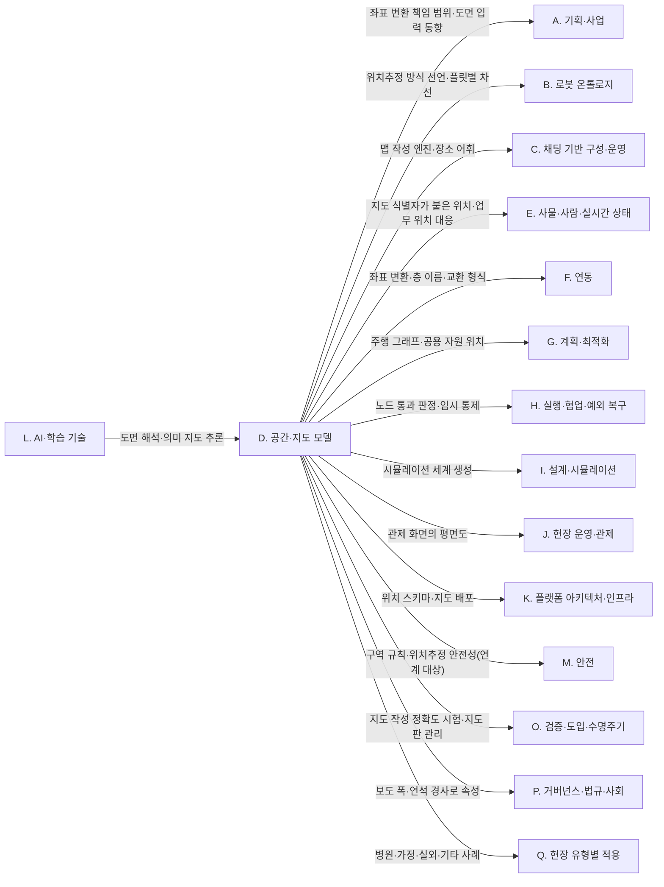

(너의 규칙은 시스템 프롬프트의 agents/shared-rules.md 와 agents/verifier.md 이다. 아래는 이번 실행의 컨텍스트와 입력이다.)

## 실행 컨텍스트

- run_id: 2026-10-09-02
- date: 2026-10-09
- run_type: category_link (대분류 연결)
- 대상: 대분류 D. 공간·지도 모델 페이지의 '다른 대분류와의 연결' 절(대분류 연결 실행). 게시된 세부영역 페이지를 근거로 다른 대분류와의 연결을 조사·서술한다. 스토리텔러는 그 절만 patches 로 바꾼다
- 예산:
    - max_search_queries: 30
    - max_sources_per_run: 15
    - new_topic_pages: 1
    - page_updates: 2
    - max_retries: 2
- 환경 알림: web_fetch_available: true · fetch_mode: full
- 언어: ko
- verification_stage: second
- verifier_budget:
    - max_search_queries: 30
    - max_sources_per_run: 15
    - new_topic_pages: 1
    - page_updates: 2
    - max_retries: 2

## 입력

### runs/2026-10-09-02/target.json

```json
{
  "run_id": "2026-10-09-02",
  "date": "2026-10-09",
  "weekday": "Fri",
  "run_number": 135,
  "run_type": "category_link",
  "forced": true,
  "target": {
    "area_no": null,
    "area_name": null,
    "category": "D. 공간·지도 모델",
    "category_letter": "D"
  },
  "topic": null,
  "track": null,
  "corrections": [],
  "budget": {
    "max_search_queries": 30,
    "max_sources_per_run": 15,
    "new_topic_pages": 1,
    "page_updates": 2,
    "max_retries": 2
  },
  "priority_reason": null,
  "priority_questions": [],
  "excluded_areas": [],
  "lifted_areas": [],
  "deferred": {
    "monthly_recheck": false,
    "weekly_review": false
  },
  "selection_rationale": "CLI 지정 run_type=category_link"
}
```

### runs/2026-10-09-02/research.json

```json
{
  "run_id": "2026-10-09-02",
  "date": "2026-10-09",
  "run_type": "category_link",
  "target": {
    "area_no": null,
    "area_name": null,
    "category": "D. 공간·지도 모델"
  },
  "gaps": [
    "D. 공간·지도 모델 페이지의 '다른 대분류와의 연결' 절 비어 있음(아직 작성되지 않음). 이 대분류는 2026-09-28 개정으로 새로 생겼고 이전 분류 기준 연결 절도 없다",
    "B. 로봇 온톨로지·F. 연동·G. 계획·최적화 대분류 페이지에는 15. 지도·공간·위치 모델과의 연결이 옛 대분류 이름으로 실려 있으나, 14. 도면·BIM에서 지도 만들기와 16. 장소 의미·지도 관리 쪽 연결은 어느 대분류 페이지에도 없음",
    "C. 채팅 기반 구성·운영(맵 작성 교차 규칙), L. AI·학습 기술(도면 해석 교차 규칙), I. 설계·시뮬레이션(시뮬레이션 초기값)과 D. 공간·지도 모델을 잇는 근거가 게시 페이지에 흩어져 있음",
    "K. 플랫폼 아키텍처·인프라(지도 배포), J. 현장 운영·관제(관제 화면의 지도), M. 안전(위치추정 안전성), O. 검증·도입·수명주기(지도 정확도 시험), P. 거버넌스·법규·사회(보도 폭·연석 경사로)와의 연결 근거 없음",
    "N. 보안·개인정보와 D. 공간·지도 모델을 잇는 근거 없음"
  ],
  "research_questions": [
    "로봇마다 다른 지도와 건물 도면을 어떻게 하나의 공간으로 만들고 유지할 것인가? [분류원문]",
    "제조사마다 다른 지도·좌표·층을 어떻게 하나의 공간으로 맞출 것인가? [분류원문]",
    "D. 공간·지도 모델의 세 세부영역(14. 도면·BIM에서 지도 만들기, 15. 지도·공간·위치 모델, 16. 장소 의미·지도 관리)이 만든 지도·좌표·장소 이름은 B. 로봇 온톨로지, E. 사물·사람·실시간 상태, F. 연동, G. 계획·최적화, H. 실행·협업·예외 복구의 어느 세부영역에 어떤 입력으로 넘어가는가?",
    "C. 채팅 기반 구성·운영과 L. AI·학습 기술의 교차 규칙(맵 작성은 14·15번, 도면 해석은 14번)을 뒷받침하는 근거(평면도·텍스트 지도를 해석하는 언어 모델 연구)는 무엇인가?",
    "지도 배포·판 관리(K. 플랫폼 아키텍처·인프라, O. 검증·도입·수명주기), 관제 화면의 지도 표시(J. 현장 운영·관제), 건물 지도로 만든 시뮬레이션(I. 설계·시뮬레이션)은 D. 공간·지도 모델과 어디서 이어지는가?",
    "위치추정 안전성·지도 정확도 시험(M. 안전, O. 검증·도입·수명주기)과 보도 폭·연석 경사로 같은 규제·접근성 조건(P. 거버넌스·법규·사회), 현장 유형별 사례(Q. 현장 유형별 적용)는 D. 공간·지도 모델과 어떻게 이어지는가?"
  ],
  "findings": [
    {
      "id": "f1",
      "claim": "D. 공간·지도 모델의 14. 도면·BIM에서 지도 만들기 ↔ A. 기획·사업의 1. 기술·시장·업체 동향: 국내에서 설계 단계부터 BIM 을 도입하는 건설산업 BIM 활성화 로드맵이 2020-12 공개됐다는 보도가 있어, 로봇 지도 작성에 쓸 수 있는 도면·BIM 입력이 얼마나 늘어나는지가 동향 추적 대상이 될 것으로 보인다(관련 열린 질문 oq-199).",
      "tag": "추정",
      "source_ids": [
        "ref-1013"
      ],
      "cross_checked": false,
      "confidence": "low",
      "evidence_excerpt": "보도 제목 기준: 국토교통부 건설산업 BIM 활성화 로드맵 공개, 설계부터 BIM 100% 도입(엔지니어링데일리, 2020-12-28). 로드맵 세부 일정은 이번에 다시 열지 않았다 (재인용: 2026-09-30-03)",
      "as_of": "2020-12-28",
      "site_type": null,
      "flow_item": null,
      "source_unopened": true
    },
    {
      "id": "f2",
      "claim": "D. 공간·지도 모델의 14. 도면·BIM에서 지도 만들기·15. 지도·공간·위치 모델 ↔ A. 기획·사업의 2. 사용 사례·요구·책임 범위: Open-RMF 는 로봇 좌표계와 RMF 좌표계 사이 변환을 대응점으로 추정하는 반면 BIM 을 사전 지도로 쓰는 위치 추정은 로봇 쪽 기능이므로, ROP 가 좌표 변환 등록·관리를 맡고 SLAM·위치 추정을 제조사에 맡기는 책임 범위 정의가 2. 사용 사례·요구·책임 범위로 넘어가는 것으로 보인다.",
      "tag": "추정",
      "source_ids": [
        "ref-153",
        "ref-1011"
      ],
      "cross_checked": false,
      "confidence": "low",
      "evidence_excerpt": "플릿 어댑터 튜토리얼: 같은 위치를 가리키는 좌표 쌍으로 회전·축척·이동 변환 추정. Hendrikx 외(ICRA 2021): BIM 의미 요소를 로봇 세계 모델로 바꿔 2D LiDAR 위치 추정 (재인용: 2026-09-30-03)",
      "as_of": "2026-10-09",
      "site_type": null,
      "flow_item": "수행 자원"
    },
    {
      "id": "f3",
      "claim": "D. 공간·지도 모델의 15. 지도·공간·위치 모델 ↔ B. 로봇 온톨로지의 4. 이기종 로봇 등록: VDA 5050 팩트시트는 위치추정 방식(localizationTypes: NATURAL·REFLECTOR·RFID·DMC·SPOT·GRID), 경로 계획 방식(navigationTypes), 지원 구역 유형(supportedZones)을 기종 선언으로 두며 지도 자체를 가리키는 전용 필드는 두지 않는다.",
      "tag": "사실",
      "source_ids": [
        "ref-228"
      ],
      "cross_checked": false,
      "confidence": "medium",
      "evidence_excerpt": "factsheet.schema typeSpecification.localizationTypes 'Simplified description of localization type.' navigationTypes: PHYSICAL_LINE_GUIDED·VIRTUAL_LINE_GUIDED·FREELY_NAVIGATING. 지도 관련은 mapId 길이 제한(maximumIdLength)뿐 (발행일 미확인, 확인일 기준)",
      "as_of": "2026-10-09",
      "site_type": null,
      "flow_item": null
    },
    {
      "id": "f4",
      "claim": "D. 공간·지도 모델의 15. 지도·공간·위치 모델 ↔ B. 로봇 온톨로지의 5. 로봇 능력·작업 표현: Open-RMF 교통 편집기에서 차선은 플릿별 주행 그래프(graph_idx) 가운데 하나에 속하고 양방향 여부를 가지므로, 어느 플릿이 어느 통로를 지날 수 있는지가 지도 쪽에 표현된다.",
      "tag": "사실",
      "source_ids": [
        "ref-079"
      ],
      "cross_checked": false,
      "confidence": "medium",
      "evidence_excerpt": "traffic-editor 문서: 차선은 경유점을 잇고 플릿별 주행 그래프 중 하나에 속하며 graph_idx·bidirectional·orientation 속성을 가진다. 그래프가 선택된 때만 차선 편집 가능 (발행일 미확인, 확인일 기준)",
      "as_of": "2026-10-09",
      "site_type": null,
      "flow_item": "제약"
    },
    {
      "id": "f5",
      "claim": "D. 공간·지도 모델의 15. 지도·공간·위치 모델 ↔ B. 로봇 온톨로지의 5. 로봇 능력·작업 표현: 로봇의 외형 다각형(envelopes2d)·크기는 팩트시트에, 지날 수 있는 차선은 지도의 플릿별 그래프에 따로 표현되므로, 5. 로봇 능력·작업 표현이 다루는 환경 조건과 능력의 대조는 두 표현을 잇는 규칙을 ROP 쪽에 두어야 할 것으로 보인다.",
      "tag": "추정",
      "source_ids": [
        "ref-228",
        "ref-079"
      ],
      "cross_checked": false,
      "confidence": "low",
      "evidence_excerpt": "factsheet.schema mobileRobotGeometry.envelopes2d(닫힌 다각형)·physicalParameters(폭·길이·높이), traffic-editor 플릿별 그래프의 차선. 두 문서는 서로를 참조하지 않는다 (발행일 미확인, 확인일 기준)",
      "as_of": "2026-10-09",
      "site_type": null,
      "flow_item": "제약"
    },
    {
      "id": "f6",
      "claim": "D. 공간·지도 모델의 14. 도면·BIM에서 지도 만들기·15. 지도·공간·위치 모델 ↔ C. 채팅 기반 구성·운영의 8. 채팅으로 맵 작성: Open-RMF 교통 편집기는 측정선을 그리기 전까지 기본 축척(1픽셀 = 5cm)을 쓰고, 층 정렬에 일직선이 아닌 두 점 이상의 기준점을 요구하며, 작업 목적지 경유점·문에 이름을 요구하므로, 대화로 맵을 만들 때도 축척·기준점·이름을 사용자에게 확인받는 단계가 남을 것으로 보인다.",
      "tag": "추정",
      "source_ids": [
        "ref-079"
      ],
      "cross_checked": false,
      "confidence": "low",
      "evidence_excerpt": "traffic-editor 문서: 기본 축척 1px=5cm, 측정선으로 실제 거리 지정, 기준점(fiducial)으로 층 축척·위치 정렬, 문은 시뮬레이션에서 동작하려면 이름 필요. 분류 원문 4장 주석은 맵 작성을 14·15번 엔진과 짝짓는다 (발행일 미확인, 확인일 기준)",
      "as_of": "2026-10-09",
      "site_type": null,
      "flow_item": null
    },
    {
      "id": "f7",
      "claim": "D. 공간·지도 모델의 16. 장소 의미·지도 관리 ↔ C. 채팅 기반 구성·운영의 12. 채팅으로 업무 지시·오케스트레이션·13. 대화형 기능의 신뢰·기반: IMDF 의 대체 이름(alt_name)과 Open-RMF 의 이름 붙은 경유점 같은 장소 이름 목록이 대화 지시 속 장소 표현을 해석하고 그 근거를 보여 주는 어휘가 될 것으로 보이며, 이를 직접 쓴 로봇 관제 제품은 확인하지 못했다(oq-204).",
      "tag": "추정",
      "source_ids": [
        "ref-1015",
        "ref-079",
        "ref-1018"
      ],
      "cross_checked": false,
      "confidence": "low",
      "evidence_excerpt": "IMDF 용어집의 alt_name, traffic-editor 의 '작업 목적지 경유점은 이름 필요', osmAG-LLM 의 의미 지도를 언어 모델 추론의 환경 근거로 쓰는 방식 (재인용: 2026-09-30-04)",
      "as_of": "2026-10-09",
      "site_type": null,
      "flow_item": "작업 대상"
    },
    {
      "id": "f8",
      "claim": "D. 공간·지도 모델의 14. 도면·BIM에서 지도 만들기·15. 지도·공간·위치 모델 ↔ C. 채팅 기반 구성·운영의 11. 채팅으로 실제 상황 시뮬레이션 재현: Open-RMF 는 주석한 건물 지도에서 시뮬레이션 세계를 만들므로, 대화로 실제 상황을 재현하려면 그 바탕이 되는 층·문·승강기 지도가 D. 공간·지도 모델에서 먼저 확정돼 있어야 할 것으로 보인다.",
      "tag": "추정",
      "source_ids": [
        "ref-406"
      ],
      "cross_checked": false,
      "confidence": "low",
      "evidence_excerpt": "simulation 문서: building_map_generator gazebo 가 .building.yaml 을 읽어 층별 바닥·벽, 문, 승강기, 워크셀을 담은 Gazebo 세계를 만든다 (발행일 미확인, 확인일 기준)",
      "as_of": "2026-10-09",
      "site_type": null,
      "flow_item": null
    },
    {
      "id": "f9",
      "claim": "D. 공간·지도 모델의 15. 지도·공간·위치 모델 ↔ E. 사물·사람·실시간 상태의 17. 작업 대상·자산 식별과 인계 추적: GS1 EPCIS 온톨로지는 이벤트가 일어난 판독 지점(readPoint)과 객체를 찾을 수 있는 업무 위치(bizLocation)를 따로 정의해, 작업 대상의 위치를 로봇 지도 좌표가 아닌 업무 위치 식별자로 기록한다.",
      "tag": "사실",
      "source_ids": [
        "ref-045"
      ],
      "cross_checked": false,
      "confidence": "medium",
      "evidence_excerpt": "EPCIS.ttl: readPoint '(Optional) The read point at which the event took place.' bizLocation 은 EPC 와 연결된 객체를 찾을 수 있는 업무 위치",
      "as_of": "2021-09-30",
      "site_type": null,
      "flow_item": "작업 대상"
    },
    {
      "id": "f10",
      "claim": "D. 공간·지도 모델의 15. 지도·공간·위치 모델 ↔ E. 사물·사람·실시간 상태의 17. 작업 대상·자산 식별과 인계 추적·F. 연동의 23. 업무 시스템 연동: 업무 쪽 위치(GLN 하위 위치, EPCIS readPoint·bizLocation)와 로봇 쪽 위치(Open-RMF location_2D 의 지도 이름·x·y·yaw)가 서로 다른 체계이므로, 둘을 잇는 대응 표를 ROP 가 관리해야 할 것으로 보인다(oq-029).",
      "tag": "추정",
      "source_ids": [
        "ref-045",
        "ref-162",
        "ref-154"
      ],
      "cross_checked": false,
      "confidence": "low",
      "evidence_excerpt": "GLN 은 도크 문·보관 위치 같은 하위 위치를 식별(원문 미열람, 재인용: 2026-09-25-17). location_2D 는 map·x·y·yaw 를 모두 필수로 둔다",
      "as_of": "2026-10-09",
      "site_type": null,
      "flow_item": "완료·인계",
      "source_unopened": false
    },
    {
      "id": "f11",
      "claim": "D. 공간·지도 모델의 15. 지도·공간·위치 모델 ↔ E. 사물·사람·실시간 상태의 18. 실시간 세계 상태·데이터 일관성: VDA 5050 3.0.0 은 로봇 위치를 지도 식별자(mapId)에 기대어 보고하고, 로봇에 저장된 지도마다 ENABLED·DISABLED 상태를 두되 같은 mapId 에서는 한 판만 ENABLED 로 두며, 위치추정 품질(localizationScore, 0.0~1.0)과 편차 범위(deviationRange)는 기록·시각화 용도로만 정의한다.",
      "tag": "사실",
      "source_ids": [
        "ref-031"
      ],
      "cross_checked": false,
      "confidence": "medium",
      "evidence_excerpt": "VDA5050_EN.md 3.0.0: localizationScore·deviationRange 는 'Only for logging and visualization purposes.' maps 배열의 mapStatus 는 같은 mapId 당 하나만 ENABLED (발행일 미확인, 확인일 기준)",
      "as_of": "2026-10-09",
      "site_type": null,
      "flow_item": null
    },
    {
      "id": "f12",
      "claim": "D. 공간·지도 모델의 15. 지도·공간·위치 모델 ↔ E. 사물·사람·실시간 상태의 18. 실시간 세계 상태·데이터 일관성: 위치 보고가 지도 식별자에 묶이고 VDA 5050 위치추정 품질 값이 기록·시각화 용도로만 정의돼 있으므로, 18. 실시간 세계 상태·데이터 일관성의 현재 상태에는 위치와 함께 지도 식별자·판을 저장해야 하고 위치 신뢰도의 수용 기준은 ROP 가 따로 정해야 할 것으로 보인다(oq-028). 이 연결은 현재 상태 표현이며 가정한 미래를 실험하는 34. 시뮬레이션·예측용 디지털 트윈과 구분한다.",
      "tag": "추정",
      "source_ids": [
        "ref-031",
        "ref-154"
      ],
      "cross_checked": false,
      "confidence": "low",
      "evidence_excerpt": "VDA 5050 의 mapId 기준 위치·기록용 localizationScore, Open-RMF location_2D 의 map 필수 필드를 종합한 추정 (발행일 미확인, 확인일 기준)",
      "as_of": "2026-10-09",
      "site_type": null,
      "flow_item": "완료·인계"
    },
    {
      "id": "f13",
      "claim": "D. 공간·지도 모델의 16. 장소 의미·지도 관리 ↔ E. 사물·사람·실시간 상태의 19. 사람·보행자 모델: Kucner 외(IJRR 42(11), 2023)는 환경의 전형적 움직임 패턴을 의미 정보로 담는 움직임 지도(maps of dynamics)를 정리하고, 로봇이 이를 전역 경로 계획·위치 추정 개선·사람 움직임 예측에 쓸 수 있다고 정리했다.",
      "tag": "사실",
      "source_ids": [
        "ref-1270"
      ],
      "cross_checked": false,
      "confidence": "medium",
      "evidence_excerpt": "초록 기준: MoD 는 궤적이나 짧은 움직임 관측으로 만들며 전역 경로 계획, 위치 추정 개선, 사람 움직임 예측에 쓰인다. 저자들은 실제 로봇에 널리 쓸 만큼 성숙했다고 본다",
      "as_of": "2023-09",
      "site_type": null,
      "flow_item": null
    },
    {
      "id": "f14",
      "claim": "D. 공간·지도 모델의 16. 장소 의미·지도 관리 ↔ E. 사물·사람·실시간 상태의 19. 사람·보행자 모델: 움직임 지도는 장소 지도 위에 덧붙는 시간 의존 층이므로, 장소 목록·지도 판과 사람 흐름 층을 함께 관리하는 방법이 두 영역을 잇는 과제가 될 것으로 보인다.",
      "tag": "추정",
      "source_ids": [
        "ref-1270"
      ],
      "cross_checked": false,
      "confidence": "low",
      "evidence_excerpt": "MoD 는 환경의 움직임 패턴을 지도에 담는 표현(초록 기준). 장소 의미 지도와의 결합 방법은 이번 자료에 없다",
      "as_of": "2023-09",
      "site_type": null,
      "flow_item": null
    },
    {
      "id": "f15",
      "claim": "D. 공간·지도 모델의 15. 지도·공간·위치 모델 ↔ F. 연동의 20. 로봇·제조사 관제 연동: Open-RMF 플릿 어댑터는 로봇 좌표계가 RMF 와 다르면 같은 위치를 가리키는 좌표 쌍으로 회전·축척·이동 변환을 추정하고(대응점 4개 이상 권장), 템플릿 설정은 층별 reference_coordinates 로 이 좌표 쌍을 둔다.",
      "tag": "사실",
      "source_ids": [
        "ref-153",
        "ref-105"
      ],
      "cross_checked": false,
      "confidence": "medium",
      "evidence_excerpt": "Fleet Adapter Tutorial 의 nudged 변환 추정, fleet_adapter_template config.yaml 의 층별 reference_coordinates (재인용: 2026-09-25-17)",
      "as_of": "2026-10-09",
      "site_type": null,
      "flow_item": null
    },
    {
      "id": "f16",
      "claim": "D. 공간·지도 모델의 15. 지도·공간·위치 모델 ↔ F. 연동의 21. 상호운용 표준·적합성: ISO 21423(산업용 이동로봇 통신·상호운용성)은 2026-07-21 부터 단계 60.00(발행 진행 중)으로 표시되고 발행 예정은 2026-10(1판)이며, 범위는 여러 제조사 AMR·플릿 관리 장비·기업 자원 사이의 통신 프로토콜이고 안전 요구와 공공 도로 이동 기계는 제외한다.",
      "tag": "사실",
      "source_ids": [
        "ref-159"
      ],
      "cross_checked": false,
      "confidence": "medium",
      "evidence_excerpt": "ISO 카탈로그(2026-10-09 확인): Stage 60.00 International Standard under publication, 2026-07-21. 'communication protocols enabling interoperability'. 공통 좌표계 내용은 공개 요약에 없다(oq-027)",
      "as_of": "2026-07-21",
      "site_type": null,
      "flow_item": null
    },
    {
      "id": "f17",
      "claim": "D. 공간·지도 모델의 16. 장소 의미·지도 관리 ↔ F. 연동의 21. 상호운용 표준·적합성: VDMA 레이아웃 교환 형식(LIF) 저장소 README 는 1.0.0 판(2023-09)을 트랙 레이아웃(에지·노드·스테이션 묶음)을 무인운반차 통합사가 제3자 중앙 관제에 넘기는 형식으로 설명하고, VDA 5050 인터페이스 정의의 영향을 받았다고 적는다.",
      "tag": "사실",
      "source_ids": [
        "ref-046"
      ],
      "cross_checked": false,
      "confidence": "medium",
      "evidence_excerpt": "LIF README: 'the integrator of the driverless transport vehicles will be able to initially transfer a track layout'. 판·날짜 충돌은 oq-025·oq-078·oq-200 으로 남아 있다",
      "as_of": "2023-09",
      "site_type": null,
      "flow_item": null
    },
    {
      "id": "f18",
      "claim": "D. 공간·지도 모델의 16. 장소 의미·지도 관리 ↔ F. 연동의 21. 상호운용 표준·적합성: 장소·지도 표현을 교환하는 표준으로 OGC 커뮤니티 표준 20-094 로 채택된 실내 지도 데이터 형식(IMDF) 1.0.0(2021-02-18)과 로봇 내비게이션용 지도 데이터 표현을 정한 IEEE 1873-2015(2015-10-26)가 있다.",
      "tag": "사실",
      "source_ids": [
        "ref-1016",
        "ref-1019"
      ],
      "cross_checked": false,
      "confidence": "medium",
      "evidence_excerpt": "OGC 20-094 Indoor Mapping Data Format 1.0.0, IEEE 1873-2015 Standard for Robot Map Data Representation for Navigation. IEEE 1873 의 이후 상태는 oq-202 (재인용: 2026-09-30-04)",
      "as_of": "2021-02-18",
      "site_type": null,
      "flow_item": null,
      "source_unopened": true
    },
    {
      "id": "f19",
      "claim": "D. 공간·지도 모델의 15. 지도·공간·위치 모델 ↔ F. 연동의 22. 설비·건물 시스템 연동: Open-RMF 승강기 상태는 운행 층을 형식 규칙 없는 문자열(available_floors·current_floor·destination_floor)로 나타내고, 교통 편집기는 승강기를 기준 층·운반실 중심·층별 운반실 문으로 정의하며 층마다 운반실 안 경유점을 차선으로 잇게 한다.",
      "tag": "사실",
      "source_ids": [
        "ref-286",
        "ref-079"
      ],
      "cross_checked": false,
      "confidence": "medium",
      "evidence_excerpt": "LiftState.msg: available_floors string[], current_floor string, destination_floor string, 층 이름 형식 규정 없음. traffic-editor: lift 는 reference level·cabin center·per-level cabin doors (발행일 미확인, 확인일 기준)",
      "as_of": "2026-10-09",
      "site_type": null,
      "flow_item": "수행 자원"
    },
    {
      "id": "f20",
      "claim": "D. 공간·지도 모델의 15. 지도·공간·위치 모델 ↔ F. 연동의 22. 설비·건물 시스템 연동: 지도의 층 이름과 승강기가 보고하는 층 이름이 각각 자유 문자열이므로, 두 이름을 맞추는 대응 규칙을 ROP 가 관리해야 할 것으로 보이며 이를 정한 표준은 이번에도 확인하지 못했다(oq-045). 승강기 운행 제어 자체는 원문 19장 시설·설비 제어 경계의 연계 대상이다.",
      "tag": "추정",
      "source_ids": [
        "ref-286",
        "ref-079"
      ],
      "cross_checked": false,
      "confidence": "low",
      "evidence_excerpt": "LiftState 의 층 문자열, traffic-editor 의 층(level) 이름. 국내 승강기–로봇 연동 단체표준의 층 정보 규격은 검색으로 찾지 못했다 (발행일 미확인, 확인일 기준)",
      "as_of": "2026-10-09",
      "site_type": null,
      "flow_item": "제약"
    },
    {
      "id": "f21",
      "claim": "D. 공간·지도 모델의 14. 도면·BIM에서 지도 만들기 ↔ F. 연동의 22. 설비·건물 시스템 연동: IFC 4.3 의 IfcTransportElement 는 승강기·에스컬레이터·무빙워크를 표현하므로, BIM 에서 승강기를 공용 자원 후보로 가져오는 입력이 된다.",
      "tag": "사실",
      "source_ids": [
        "ref-213"
      ],
      "cross_checked": false,
      "confidence": "medium",
      "evidence_excerpt": "IfcTransportElement(ifc4.3-main 개발 브랜치 문서, 게시판 ADD2 와 문구가 다를 수 있음) (재인용: 2026-09-30-03)",
      "as_of": "2026-10-09",
      "site_type": null,
      "flow_item": "작업 대상"
    },
    {
      "id": "f22",
      "claim": "D. 공간·지도 모델의 15. 지도·공간·위치 모델 ↔ G. 계획·최적화의 27. 다중 로봇 경로·교통 관리 — MAPF: Open-RMF 교통 편집기로 주석한 그래프는 building_map_generator 로 주행 그래프로 내보내져 플릿 어댑터의 경로 계획에 쓰인다.",
      "tag": "사실",
      "source_ids": [
        "ref-079"
      ],
      "cross_checked": false,
      "confidence": "medium",
      "evidence_excerpt": "traffic-editor: 주석한 그래프를 building_map_generator 로 navigation graph 로 내보내 rmf_fleet_adapters 가 경로 계획에 쓴다 (발행일 미확인, 확인일 기준)",
      "as_of": "2026-10-09",
      "site_type": null,
      "flow_item": "제약"
    },
    {
      "id": "f23",
      "claim": "D. 공간·지도 모델의 16. 장소 의미·지도 관리 ↔ G. 계획·최적화의 27. 다중 로봇 경로·교통 관리 — MAPF: Open-RMF 차선 요청 메시지(LaneRequest)는 플릿 이름과 열 차선·닫을 차선 목록만 담고, VDA 5050 3.0.0 은 지도 식별자에 묶인 구역 집합(zoneSet)을 관제가 로봇에 보내게 해, 임시 통제가 지도와 따로 교통 계획에 전달된다.",
      "tag": "사실",
      "source_ids": [
        "ref-569",
        "ref-031"
      ],
      "cross_checked": false,
      "confidence": "medium",
      "evidence_excerpt": "LaneRequest.msg: string fleet_name, uint64[] open_lanes, uint64[] close_lanes(주석 없음). VDA 5050: zoneSet 토픽으로 관제→로봇, 구역 집합은 mapId 에 묶인다 (발행일 미확인, 확인일 기준)",
      "as_of": "2026-10-09",
      "site_type": null,
      "flow_item": "제약"
    },
    {
      "id": "f24",
      "claim": "D. 공간·지도 모델의 15. 지도·공간·위치 모델 ↔ G. 계획·최적화의 28. 공용 자원·충전·에너지 최적화: Open-RMF 교통 편집기는 경유점에 충전소(is_charger), 주차 위치(is_parking_spot), 무기한 대기 가능 지점(is_holding_point), 멈추면 안 되는 통과 지점(is_passthrough_point) 속성을 두어 공용 자원의 위치가 지도에서 나온다.",
      "tag": "사실",
      "source_ids": [
        "ref-079"
      ],
      "cross_checked": false,
      "confidence": "medium",
      "evidence_excerpt": "traffic-editor 경유점 속성: is_holding_point(로봇이 무기한 대기 가능), is_parking_spot, is_charger, is_passthrough_point (발행일 미확인, 확인일 기준)",
      "as_of": "2026-10-09",
      "site_type": null,
      "flow_item": "수행 자원"
    },
    {
      "id": "f25",
      "claim": "D. 공간·지도 모델의 16. 장소 의미·지도 관리 ↔ G. 계획·최적화의 24. 작업·워크플로 모델링: Open-RMF 에서 어떤 경유점에서 끝나는 작업을 주려면 그 경유점에 이름이 있어야 하므로, 작업 모델의 목적지는 장소 목록의 이름에 기댄다.",
      "tag": "사실",
      "source_ids": [
        "ref-079"
      ],
      "cross_checked": false,
      "confidence": "medium",
      "evidence_excerpt": "traffic-editor: 경유점에서 끝나는 작업은 그 경유점에 이름을 요구한다 (발행일 미확인, 확인일 기준)",
      "as_of": "2026-10-09",
      "site_type": null,
      "flow_item": "시작 조건"
    },
    {
      "id": "f26",
      "claim": "D. 공간·지도 모델의 15. 지도·공간·위치 모델 ↔ H. 실행·협업·예외 복구의 29. 명령·작업 실행의 신뢰성: VDA 5050 3.0.0 에서 노드 통과는 로봇이 스스로 판단하며, 제어점이 노드의 허용 편차(allowedDeviationXY)와 방향 허용 편차(allowedDeviationTheta) 안에 들면 lastNodeId 를 갱신해 보고하고, 노드 위치는 지도 식별자(mapId)를 기준으로 한다.",
      "tag": "사실",
      "source_ids": [
        "ref-031"
      ],
      "cross_checked": false,
      "confidence": "medium",
      "evidence_excerpt": "VDA5050_EN.md 6.6.2·7.3: 제어점이 allowedDeviationXY 안에 있어야 통과, nodeState 제거와 lastNodeId 갱신으로 보고. nodePosition.mapId 는 위치가 참조하는 지도 (발행일 미확인, 확인일 기준)",
      "as_of": "2026-10-09",
      "site_type": null,
      "flow_item": "완료·인계"
    },
    {
      "id": "f27",
      "claim": "D. 공간·지도 모델의 15. 지도·공간·위치 모델 ↔ H. 실행·협업·예외 복구의 29. 명령·작업 실행의 신뢰성: 도착·통과 판정이 로봇 자신의 지도 좌표와 허용 편차로 이루어지므로, ROP 가 받는 완료 보고의 신뢰성은 제조사 지도와 공통 좌표의 정합, 활성 지도 판의 일치에 기댈 것으로 보인다.",
      "tag": "추정",
      "source_ids": [
        "ref-031",
        "ref-153"
      ],
      "cross_checked": false,
      "confidence": "low",
      "evidence_excerpt": "VDA 5050 노드 통과 규칙과 플릿 어댑터 좌표 변환을 종합한 추정. 합격 기준은 oq-077·oq-198 (발행일 미확인, 확인일 기준)",
      "as_of": "2026-10-09",
      "site_type": null,
      "flow_item": "완료·인계"
    },
    {
      "id": "f28",
      "claim": "D. 공간·지도 모델의 16. 장소 의미·지도 관리 ↔ H. 실행·협업·예외 복구의 32. 예외 복구·재계획·업무 연속성: 차선 폐쇄(LaneRequest)와 구역 집합 교체가 진행 중인 경로를 막을 수 있으므로, 임시 통제의 선언·해제가 재계획을 일으키는 예외 사건이 될 것으로 보인다(운영 절차는 oq-203).",
      "tag": "추정",
      "source_ids": [
        "ref-569",
        "ref-031"
      ],
      "cross_checked": false,
      "confidence": "low",
      "evidence_excerpt": "LaneRequest 의 close_lanes, VDA 5050 BLOCKED 구역. 재계획 동작을 정한 문서는 이번 자료에 없다 (발행일 미확인, 확인일 기준)",
      "as_of": "2026-10-09",
      "site_type": null,
      "flow_item": "예외·성과"
    },
    {
      "id": "f29",
      "claim": "D. 공간·지도 모델의 14. 도면·BIM에서 지도 만들기·15. 지도·공간·위치 모델 ↔ I. 설계·시뮬레이션의 34. 시뮬레이션·예측용 디지털 트윈·36. 가상 시운전·실제 상황 재현: Open-RMF 의 building_map_generator gazebo 는 주석한 건물 지도에서 층별 바닥·벽, 가구, 로봇, 관절·플러그인이 달린 문, 운반실·승강로 문이 있는 승강기, 워크셀(TeleportDispenser·TeleportIngestor)을 담은 Gazebo 세계를 만들고, 문서는 시뮬레이션이 하드웨어 시험보다 시간과 자원을 아낀다고 설명한다.",
      "tag": "사실",
      "source_ids": [
        "ref-406"
      ],
      "cross_checked": false,
      "confidence": "medium",
      "evidence_excerpt": "simulation.md: 'Robots in simulation neither run out of battery nor incur costs when they happen to unfortunately crash into something.' 가정한 상황을 실험하는 쪽이며 18번의 현재 상태 표현과 구분 (발행일 미확인, 확인일 기준)",
      "as_of": "2026-10-09",
      "site_type": null,
      "flow_item": null
    },
    {
      "id": "f30",
      "claim": "D. 공간·지도 모델의 14. 도면·BIM에서 지도 만들기 ↔ I. 설계·시뮬레이션의 34. 시뮬레이션·예측용 디지털 트윈: Byers·RazaviAlavi(2022 MOC Summit)는 BIM 의 형상 데이터를 시뮬레이션 속 가상 로봇에 옮겨 건물에 대한 사전 지식으로 쓰게 했고 사례 연구 1건으로 실용성을 보였으나 정량 결과는 초록에 없다.",
      "tag": "사실",
      "source_ids": [
        "ref-1272"
      ],
      "cross_checked": false,
      "confidence": "medium",
      "evidence_excerpt": "초록 기준: BIM 과 시뮬레이션으로 건물 레이아웃을 모델링해 센서 데이터 분석 부담을 줄이고 항법 정확도·효율을 높일 수 있다고 저자가 주장, 사례 연구 1건",
      "as_of": "2022-09-14",
      "site_type": null,
      "flow_item": null
    },
    {
      "id": "f31",
      "claim": "D. 공간·지도 모델의 14. 도면·BIM에서 지도 만들기 ↔ I. 설계·시뮬레이션의 35. 처리능력·규모·배치 설계: 건물 지도·BIM 형상·트랙 레이아웃을 시뮬레이션 세계로 바꾸는 도구와 연구가 있어, 도면에서 만든 지도가 배치·규모 설계 시뮬레이션의 초기값이 될 것으로 보이나 이를 정량 평가한 자료는 확인하지 못했다.",
      "tag": "추정",
      "source_ids": [
        "ref-406",
        "ref-1272",
        "ref-046"
      ],
      "cross_checked": false,
      "confidence": "low",
      "evidence_excerpt": "building_map_generator gazebo, BIM→가상 로봇 사전 지식(사례 연구 1건), LIF 의 통합사→관제 레이아웃 전달을 종합한 추정",
      "as_of": "2026-10-09",
      "site_type": null,
      "flow_item": null
    },
    {
      "id": "f32",
      "claim": "D. 공간·지도 모델의 16. 장소 의미·지도 관리 ↔ J. 현장 운영·관제의 37. 관제 화면·실행 기록: Open-RMF 웹 대시보드(rmf-web)는 Open-RMF 배치를 보고 제어하는 웹 화면으로, 지도 층의 평면도를 그리며 모든 벽 꼭짓점을 감싸는 경계 상자로 화면 범위를 정한다.",
      "tag": "사실",
      "source_ids": [
        "ref-302"
      ],
      "cross_checked": false,
      "confidence": "medium",
      "evidence_excerpt": "rmf-web README: 'The dashboard uses the bounding box encompassing all wall vertices to create scene boundary for rendering.' 문·승강기 표시는 README 에 없다 (발행일 미확인, 확인일 기준)",
      "as_of": "2026-10-09",
      "site_type": null,
      "flow_item": null
    },
    {
      "id": "f33",
      "claim": "D. 공간·지도 모델의 14. 도면·BIM에서 지도 만들기 ↔ J. 현장 운영·관제의 37. 관제 화면·실행 기록: 국내 업체 모빌리오는 산업용 순찰 로봇의 도면 연동과 센서 관제를 웹 화면 하나로 처리한다고 발표했다(벤더 주장).",
      "tag": "추정",
      "source_ids": [
        "ref-817"
      ],
      "cross_checked": false,
      "confidence": "low",
      "evidence_excerpt": "벤더 주장: 도면 연동과 센서 관제를 웹 화면 하나로 끝내는 방법(모빌리오 블로그, 2026-08-24). 독립 확인 없음 (재인용: 2026-09-30-03)",
      "as_of": "2026-08-24",
      "site_type": null,
      "flow_item": null,
      "vendor_claim": true,
      "source_unopened": true
    },
    {
      "id": "f34",
      "claim": "D. 공간·지도 모델의 15. 지도·공간·위치 모델 ↔ J. 현장 운영·관제의 38. 모니터링·이상 탐지·원인 분석: VDA 5050 이 위치추정 품질과 편차 범위를 기록·시각화 용도로 두므로, 이 값은 제어 판단보다 위치추정 저하를 찾는 모니터링·원인 분석의 입력으로 쓰일 것으로 보인다.",
      "tag": "추정",
      "source_ids": [
        "ref-031"
      ],
      "cross_checked": false,
      "confidence": "low",
      "evidence_excerpt": "localizationScore·deviationRange: 'Only for logging and visualization purposes' 에서 도출한 추정 (발행일 미확인, 확인일 기준)",
      "as_of": "2026-10-09",
      "site_type": null,
      "flow_item": "예외·성과"
    },
    {
      "id": "f35",
      "claim": "D. 공간·지도 모델의 15. 지도·공간·위치 모델 ↔ K. 플랫폼 아키텍처·인프라의 41. 플랫폼 아키텍처·외부 API: Open-RMF API 의 2D 위치 스키마(location_2D)는 지도 이름(map)·x·y·yaw 네 필드를 모두 필수로 두어, 외부 API 가 주고받는 위치에 지도 식별이 항상 붙는다.",
      "tag": "사실",
      "source_ids": [
        "ref-154"
      ],
      "cross_checked": false,
      "confidence": "medium",
      "evidence_excerpt": "location_2D.json: 'A robot's location using 2D coordinates', required: map, x, y, yaw. 속성별 설명 없음 (발행일 미확인, 확인일 기준)",
      "as_of": "2026-10-09",
      "site_type": null,
      "flow_item": null
    },
    {
      "id": "f36",
      "claim": "D. 공간·지도 모델의 16. 장소 의미·지도 관리 ↔ K. 플랫폼 아키텍처·인프라의 43. 데이터·관측성·배포: VDA 5050 3.0.0 에서 지도는 mapId·mapVersion 으로 식별되고, 관제가 downloadMap 즉시 동작(mapId·mapDownloadLink)으로 로봇이 지도 서버에서 받아 가게 하며 enableMap·deleteMap 으로 활성화·삭제하고, 올바른 지도를 활성화하는 책임은 관제에 있다.",
      "tag": "사실",
      "source_ids": [
        "ref-031"
      ],
      "cross_checked": false,
      "confidence": "medium",
      "evidence_excerpt": "VDA5050_EN.md 6.3: 'It is the responsibility of the fleet control to ensure that the correct maps are enabled'. 로봇은 지도를 스스로 지우지 않는다 (발행일 미확인, 확인일 기준)",
      "as_of": "2026-10-09",
      "site_type": null,
      "flow_item": null
    },
    {
      "id": "f37",
      "claim": "D. 공간·지도 모델의 16. 장소 의미·지도 관리 ↔ L. AI·학습 기술의 44. 로봇 기반 모델·언어 모델 계획: 텍스트 기반 계층형 위상 의미 지도 osmAG 의 위상·계층을 미세조정한 LLaMA2 가 ChatGPT-3.5 보다 잘 이해했다는 연구(ROBIO 2024)와, 의미 지도를 환경 근거로 삼아 언어 모델이 물체 위치를 추론하게 하는 osmAG-LLM 연구가 있다.",
      "tag": "사실",
      "source_ids": [
        "ref-1271",
        "ref-1018"
      ],
      "cross_checked": false,
      "confidence": "medium",
      "evidence_excerpt": "Xie·Schwertfeger: osmAG 는 'text-based hierarchical, topometric semantic map representation'. osmAG-LLM: 지도를 주로 환경 근거·맥락으로 쓰는 제로샷 개방 어휘 물체 탐색(초록 기준)",
      "as_of": "2025-07",
      "site_type": null,
      "flow_item": null
    },
    {
      "id": "f38",
      "claim": "D. 공간·지도 모델의 14. 도면·BIM에서 지도 만들기 ↔ L. AI·학습 기술의 45. 문서·도면·장면 이해: 분류 원문의 '도면 해석은 14번' 교차 규칙에 해당하는 연구로, DeFazio 외(2024-09)는 비전 언어 모델이 평면도를 읽어 실내 이동 계획을 세우게 해 9단계 이동 작업에서 0.96 성공률을 보고했으나 지도가 크고 개방 구역이 넓을수록 성능이 떨어졌다.",
      "tag": "사실",
      "source_ids": [
        "ref-076"
      ],
      "cross_checked": false,
      "confidence": "medium",
      "evidence_excerpt": "초록 기준: map parsing 과제에서 9개 이동 동작이 필요한 작업 성공률 0.96, 작은 지도·단순 작업에서 더 좋고 큰 개방 구역에서 저하",
      "as_of": "2024-09",
      "site_type": null,
      "flow_item": null
    },
    {
      "id": "f39",
      "claim": "D. 공간·지도 모델의 14. 도면·BIM에서 지도 만들기 ↔ L. AI·학습 기술의 47. AI·학습·적응과 모델 운영: 평면도 인식의 대표 공개 데이터셋(CubiCasa5K, ResPlan)이 주거 평면도 중심이므로, 병원·공장·물류창고 같은 비주거 도면에 쓰려면 모델 적응·재학습이 필요할 것으로 보인다(oq-196).",
      "tag": "추정",
      "source_ids": [
        "ref-063",
        "ref-071"
      ],
      "cross_checked": false,
      "confidence": "low",
      "evidence_excerpt": "ResPlan: 주거 평면도 17,000건 벡터 그래프 데이터셋(README 제목 기준). CubiCasa5K 는 평면도 이미지 데이터셋(원문 미열람, 재인용: 2026-09-25-17)",
      "as_of": "2025-08",
      "site_type": null,
      "flow_item": null,
      "source_unopened": true
    },
    {
      "id": "f40",
      "claim": "연계 대상: D. 공간·지도 모델의 15. 지도·공간·위치 모델 ↔ M. 안전의 48. 안전·위험 관리: Abdul Hafez 외(IJRR, 2025-05)는 항공에서 쓰던 무결성 위험 지표로 EKF 기반 SLAM 위치추정의 안전성을 정량화했고, 데이터 연관 오류가 위치를 크게 해칠 수 있으며 랜드마크를 늘리면 안전성이 좋아지다가 서로 구별하기 어려울 만큼 빽빽해지면 떨어진다고 보고했다.",
      "tag": "사실",
      "source_ids": [
        "ref-161"
      ],
      "cross_checked": false,
      "confidence": "medium",
      "evidence_excerpt": "초록 기준: 센서 고장을 미지의 결정적 오차로 다루는 무결성 위험 평가, 카이제곱 고장 탐지기와 국소 최근접 이웃 데이터 연관 사용. SLAM 자체는 로봇 쪽 기능",
      "as_of": "2025-05",
      "site_type": null,
      "flow_item": null
    },
    {
      "id": "f41",
      "claim": "D. 공간·지도 모델의 16. 장소 의미·지도 관리 ↔ M. 안전의 48. 안전·위험 관리: VDA 5050 3.0.0 은 구역을 작업 공간의 교통 관리 규칙(BLOCKED·SPEED_LIMIT·RELEASE 등)으로 정의하면서, 문서가 기능·운영·시스템 안전 요구를 정하지 않는다고 밝힌다.",
      "tag": "사실",
      "source_ids": [
        "ref-031"
      ],
      "cross_checked": false,
      "confidence": "medium",
      "evidence_excerpt": "VDA5050_EN.md 2절: 'does not define functional, operational, or system safety requirements.' 구역 집합은 관제가 zoneSet 토픽으로 보낸다 (발행일 미확인, 확인일 기준)",
      "as_of": "2026-10-09",
      "site_type": null,
      "flow_item": "제약"
    },
    {
      "id": "f42",
      "claim": "D. 공간·지도 모델의 15. 지도·공간·위치 모델 ↔ O. 검증·도입·수명주기의 54. 시험·형식 검증·벤치마크: ISO 18646-2:2024(2판, 2024-01-22)는 이동 서비스 로봇의 항법 성능을 자세 정확도·반복성, 장애물 탐지·회피, 경로 편차, 좁은 통로 통과, 지도 작성 정확도로 평가하는 시험 방법을 정하며, 실내 환경 대상이고 안전 요구의 검증에는 쓰지 않는다.",
      "tag": "사실",
      "source_ids": [
        "ref-721"
      ],
      "cross_checked": false,
      "confidence": "medium",
      "evidence_excerpt": "ISO 카탈로그 공개 요약: 'This document is not applicable for the verification or validation of safety requirements.' 부속서 A 는 실외 적용 가능성. 시험 절차 세부는 유료 본문이라 미확인(oq-116)",
      "as_of": "2024-01-22",
      "site_type": null,
      "flow_item": null
    },
    {
      "id": "f43",
      "claim": "D. 공간·지도 모델의 14. 도면·BIM에서 지도 만들기·16. 장소 의미·지도 관리 ↔ O. 검증·도입·수명주기의 55. 현장 조사·설치·시운전과 Q. 현장 유형별 적용의 63. 병원·의료: 에스토니아 타르투 대학병원 현장 시험에서는 Open-RMF 교통 편집기로 평면도에 벽·문·차선·충전소·주요 위치를 주석하고 로봇이 만든 격자 지도를 평면도에 정합했으며, 넓은 구역을 한 번에 매핑하기보다 작은 구역으로 나눠 매핑한 뒤 손으로 합치는 편이 더 정확했다.",
      "tag": "사실",
      "source_ids": [
        "ref-869"
      ],
      "cross_checked": false,
      "confidence": "medium",
      "evidence_excerpt": "Valner 외(Frontiers in Robotics and AI, 2022-08-23): TIAGo 로 SLAM 격자 지도 작성, 반자동 문 두 곳 통과, 중환자실→검사실 혈액 검체 운반 (재인용: 2026-09-30-03)",
      "as_of": "2022-08-23",
      "site_type": "병원",
      "flow_item": "작업 대상",
      "source_unopened": true
    },
    {
      "id": "f44",
      "claim": "D. 공간·지도 모델의 16. 장소 의미·지도 관리 ↔ O. 검증·도입·수명주기의 57. 자산·소프트웨어 수명주기 관리: VDA 5050 의 지도가 판(mapVersion)을 가지고 관제가 내려받기·활성화·삭제를 지시하므로, 지도 판은 로봇별로 배포 상태를 추적해야 하는 운영 자산으로 관리될 것으로 보인다(oq-201).",
      "tag": "추정",
      "source_ids": [
        "ref-031"
      ],
      "cross_checked": false,
      "confidence": "low",
      "evidence_excerpt": "VDA 5050 state 의 maps 배열(mapId·mapVersion·mapStatus)과 downloadMap·enableMap·deleteMap 에서 도출한 추정 (발행일 미확인, 확인일 기준)",
      "as_of": "2026-10-09",
      "site_type": null,
      "flow_item": null
    },
    {
      "id": "f45",
      "claim": "D. 공간·지도 모델의 16. 장소 의미·지도 관리 ↔ P. 거버넌스·법규·사회의 59. 법·규제·보험·라이선스: 2023-07 입법예고된 한국 실외이동로봇 운행 안전기준 개정안은 로봇 폭을 80cm 이하로 하되 운행하려는 보도의 최소 폭이 250cm 이상이면 120cm 까지 허용한다고 보도됐다.",
      "tag": "사실",
      "source_ids": [
        "ref-992"
      ],
      "cross_checked": false,
      "confidence": "low",
      "evidence_excerpt": "지디넷코리아(2023-07-28): 폭 80cm, 보도 최소 폭 250cm 이상이면 120cm, 5도 경사로 주행, 질량별 속도 제한. 입법예고안 기준이라 확정 내용과 다를 수 있다",
      "as_of": "2023-07-28",
      "site_type": "실외",
      "flow_item": "제약"
    },
    {
      "id": "f46",
      "claim": "D. 공간·지도 모델의 16. 장소 의미·지도 관리 ↔ P. 거버넌스·법규·사회의 60. 노동·수용성·접근성: Han 외(CHI 2024)는 이동장애인 15명과 로봇 실무자 8명 면담·공동설계 워크숍에서 이동장애인이 보도 로봇과 보도 공간을 두고 경쟁한다고 느끼고 부족한 연석 경사로 같은 기존 장벽을 겪으며, 두 집단 모두 처음부터 접근성을 반영해야 한다고 보았음을 보고했다.",
      "tag": "사실",
      "source_ids": [
        "ref-1214"
      ],
      "cross_checked": false,
      "confidence": "medium",
      "evidence_excerpt": "초록 기준: 'insufficient curb cuts' 를 이동장애인이 겪는 장벽의 예로 들고, 실무자는 기업이 문제가 생긴 뒤에야 접근성을 다룬다고 말했다",
      "as_of": "2024-04-07",
      "site_type": "실외",
      "flow_item": "제약"
    },
    {
      "id": "f47",
      "claim": "D. 공간·지도 모델의 16. 장소 의미·지도 관리 ↔ P. 거버넌스·법규·사회의 59. 법·규제·보험·라이선스·60. 노동·수용성·접근성: 보도 폭에 따른 로봇 폭 제한과 연석 경사로 같은 접근성 지점이 운행 조건을 바꾸므로, 실외 장소 목록에 보도 폭·연석 경사로·대기 금지 지점 같은 속성을 두어 경로·대기 위치 제약으로 쓰는 일이 16. 장소 의미·지도 관리로 넘어올 것으로 보인다(oq-188). 법 적합성 판단 자체는 운영자·법무 쪽 연계 대상이다.",
      "tag": "추정",
      "source_ids": [
        "ref-992",
        "ref-1214"
      ],
      "cross_checked": false,
      "confidence": "low",
      "evidence_excerpt": "실외이동로봇 운행 안전기준 개정안의 보도 폭 조건과 CHI 2024 연석 경사로 장벽 보고를 종합한 추정",
      "as_of": "2026-10-09",
      "site_type": "실외",
      "flow_item": "제약"
    },
    {
      "id": "f48",
      "claim": "D. 공간·지도 모델의 16. 장소 의미·지도 관리 ↔ Q. 현장 유형별 적용의 65. 가정·공동주택: Narayana 외(IROS 2020)는 실제 가정의 바닥 청소 로봇 수천 대에 배포한 평생 의미 지도에서 주행마다 달라지는 원시 지도로 공간 의미를 옮기고 의미 충돌을 해소하는 방법을 제시했다.",
      "tag": "사실",
      "source_ids": [
        "ref-1021"
      ],
      "cross_checked": false,
      "confidence": "medium",
      "evidence_excerpt": "초록 기준: 동적 물체로 생긴 의미 충돌을 메타 의미 계층으로 찾아 해소, 새로 탐색한 공간의 의미를 더한다. 청소 로봇 제품 쪽 기능 (재인용: 2026-09-30-04)",
      "as_of": "2020-10",
      "site_type": "가정",
      "flow_item": "작업 대상",
      "source_unopened": true
    },
    {
      "id": "f49",
      "claim": "D. 공간·지도 모델의 16. 장소 의미·지도 관리 ↔ Q. 현장 유형별 적용의 67. 기타 현장: 네이버 제2사옥 1784 는 스마트도시협회의 첫 로봇 친화형 건축물 인증을 받았고, 평가위원은 이 건물이 로봇이 인식하는 정밀지도와 측위 인프라를 제공한다고 평가했다고 보도됐다.",
      "tag": "사실",
      "source_ids": [
        "ref-956"
      ],
      "cross_checked": false,
      "confidence": "low",
      "evidence_excerpt": "지디넷코리아(2022-04-11) 보도 기준. 인증 원자료와 평가 항목 목록은 이번에도 확인하지 못했다 (재인용: 2026-09-30-04)",
      "as_of": "2022-04-11",
      "site_type": "기타",
      "flow_item": "수행 자원",
      "source_unopened": true
    }
  ],
  "sources": [
    {
      "id": "ref-031",
      "org": "VDA / VDMA (VDA5050 GitHub)",
      "title": "VDA5050/VDA5050_EN.md — Official Specification document for the VDA 5050",
      "published": null,
      "url": "https://github.com/VDA5050/VDA5050/blob/main/VDA5050_EN.md",
      "type": "표준",
      "reliability": "high",
      "accessed": "2026-10-09",
      "summary": "VDA 5050 3.0.0 명세 원문. 지도 식별·배포(downloadMap·enableMap·deleteMap)와 관제의 지도 활성화 책임, 구역 집합, 노드 통과 허용 편차, 기록용 위치추정 품질 값을 정의한다.",
      "fetched": true,
      "fetched_via": "github_raw",
      "fetch_url": "https://raw.githubusercontent.com/VDA5050/VDA5050/main/VDA5050_EN.md",
      "source_unopened": false
    },
    {
      "id": "ref-228",
      "org": "VDA / VDMA (VDA5050 GitHub)",
      "title": "VDA5050/VDA5050 — json_schemas/factsheet.schema",
      "published": null,
      "url": "https://github.com/VDA5050/VDA5050/blob/main/json_schemas/factsheet.schema",
      "type": "표준",
      "reliability": "high",
      "accessed": "2026-10-09",
      "summary": "VDA 5050 팩트시트 스키마. 위치추정 방식·경로 계획 방식·지원 구역 유형·외형·물리 제원을 기종 선언으로 둔다.",
      "fetched": true,
      "fetched_via": "github_raw",
      "fetch_url": "https://raw.githubusercontent.com/VDA5050/VDA5050/main/json_schemas/factsheet.schema",
      "source_unopened": false
    },
    {
      "id": "ref-406",
      "org": "Open Robotics",
      "title": "Simulation - Programming Multiple Robots with ROS 2",
      "published": null,
      "url": "https://osrf.github.io/ros2multirobotbook/simulation.html",
      "type": "오픈소스 문서",
      "reliability": "high",
      "accessed": "2026-10-09",
      "summary": "building_map_generator 로 건물 지도에서 문·승강기·워크셀을 포함한 Gazebo 시뮬레이션 세계를 만드는 흐름을 설명한다.",
      "fetched": true,
      "fetched_via": "github_raw",
      "fetch_url": "https://raw.githubusercontent.com/osrf/ros2multirobotbook/master/src/simulation.md",
      "source_unopened": false
    },
    {
      "id": "ref-569",
      "org": "Open Robotics (open-rmf)",
      "title": "rmf_internal_msgs — rmf_fleet_msgs/msg/LaneRequest.msg",
      "published": null,
      "url": "https://github.com/open-rmf/rmf_internal_msgs/blob/main/rmf_fleet_msgs/msg/LaneRequest.msg",
      "type": "오픈소스 문서",
      "reliability": "high",
      "accessed": "2026-10-09",
      "summary": "플릿 이름과 열 차선·닫을 차선 목록을 담는 차선 요청 메시지 정의.",
      "fetched": true,
      "fetched_via": "github_raw",
      "fetch_url": "https://raw.githubusercontent.com/open-rmf/rmf_internal_msgs/main/rmf_fleet_msgs/msg/LaneRequest.msg",
      "source_unopened": false
    },
    {
      "id": "ref-286",
      "org": "Open Robotics (open-rmf)",
      "title": "rmf_internal_msgs — rmf_lift_msgs/msg/LiftState.msg",
      "published": null,
      "url": "https://github.com/open-rmf/rmf_internal_msgs/blob/main/rmf_lift_msgs/msg/LiftState.msg",
      "type": "오픈소스 문서",
      "reliability": "high",
      "accessed": "2026-10-09",
      "summary": "승강기 상태 메시지. 층 이름 문자열, 문·운행 상태, 운영 모드, 세션 id 를 담는다.",
      "fetched": true,
      "fetched_via": "github_raw",
      "fetch_url": "https://raw.githubusercontent.com/open-rmf/rmf_internal_msgs/main/rmf_lift_msgs/msg/LiftState.msg",
      "source_unopened": false
    },
    {
      "id": "ref-079",
      "org": "Open Robotics",
      "title": "Traffic Editor - Programming Multiple Robots with ROS 2",
      "published": null,
      "url": "https://osrf.github.io/ros2multirobotbook/traffic-editor.html",
      "type": "오픈소스 문서",
      "reliability": "high",
      "accessed": "2026-10-09",
      "summary": "평면도 위 경유점·차선·문·승강기 주석, 축척·기준점 정렬, 주행 그래프와 시뮬레이션 세계 내보내기를 설명하는 Open-RMF 교통 편집기 문서.",
      "fetched": true,
      "fetched_via": "github_raw",
      "fetch_url": "https://raw.githubusercontent.com/osrf/ros2multirobotbook/master/src/traffic-editor.md",
      "source_unopened": false
    },
    {
      "id": "ref-154",
      "org": "Open Robotics (open-rmf)",
      "title": "rmf_api_msgs — rmf_api_msgs/schemas/location_2D.json",
      "published": null,
      "url": "https://github.com/open-rmf/rmf_api_msgs/blob/main/rmf_api_msgs/schemas/location_2D.json",
      "type": "오픈소스 문서",
      "reliability": "high",
      "accessed": "2026-10-09",
      "summary": "Open-RMF API 의 2D 위치 스키마. map·x·y·yaw 를 모두 필수로 둔다.",
      "fetched": true,
      "fetched_via": "github_raw",
      "fetch_url": "https://raw.githubusercontent.com/open-rmf/rmf_api_msgs/main/rmf_api_msgs/schemas/location_2D.json",
      "source_unopened": false
    },
    {
      "id": "ref-046",
      "org": "VDMA (Intralogistics-2X-LIF GitHub)",
      "title": "Layout-Interchange-Format — README (Repository for the Layout Interchange Format (LIF) developed by the VDMA)",
      "published": "2023-09",
      "url": "https://github.com/Intralogistics-2X-LIF/Layout-Interchange-Format",
      "type": "표준",
      "reliability": "high",
      "accessed": "2026-10-09",
      "summary": "LIF 1.0.0(2023-09) 저장소 README. 무인운반차 통합사가 트랙 레이아웃(에지·노드·스테이션)을 제3자 중앙 관제에 넘기는 형식으로 설명한다.",
      "fetched": true,
      "fetched_via": "github_raw",
      "fetch_url": "https://raw.githubusercontent.com/Intralogistics-2X-LIF/Layout-Interchange-Format/main/README.md",
      "source_unopened": false
    },
    {
      "id": "ref-1018",
      "org": "Xie, F., Schwertfeger, S., & Blum, H. (RA-L 2026 채택, arXiv)",
      "title": "osmAG-LLM: Zero-Shot Open-Vocabulary Object Navigation via Semantic Maps and Large Language Models Reasoning",
      "published": "2025-07",
      "url": "https://arxiv.org/abs/2507.12753",
      "type": "논문",
      "reliability": "medium",
      "accessed": "2026-10-09",
      "summary": "의미 지도를 환경 근거로 삼아 언어 모델이 물체 위치를 추론하는 제로샷 물체 탐색 연구(초록 확인).",
      "fetched": true,
      "fetched_via": "webfetch",
      "fetch_url": "https://arxiv.org/abs/2507.12753",
      "source_unopened": false
    },
    {
      "id": "ref-076",
      "org": "DeFazio, D., Mehta, H., Wang, M., Yang, P., Blackburn, J., & Zhang, S.",
      "title": "Vision Language Models Can Parse Floor Plan Maps",
      "published": "2024-09",
      "url": "https://arxiv.org/abs/2409.12842",
      "type": "논문",
      "reliability": "medium",
      "accessed": "2026-10-09",
      "summary": "비전 언어 모델로 평면도를 해석해 실내 이동 계획을 세우는 연구. 9단계 작업 성공률 0.96, 큰 개방 구역에서 저하(초록 확인).",
      "fetched": true,
      "fetched_via": "webfetch",
      "fetch_url": "https://arxiv.org/abs/2409.12842",
      "source_unopened": false
    },
    {
      "id": "ref-161",
      "org": "Abdul Hafez, O., Joerger, M., & Spenko, M.",
      "title": "Quantifying mobile robot localization safety for an EKF-based SLAM estimator: An integrity monitoring approach",
      "published": "2025-05",
      "url": "https://journals.sagepub.com/doi/10.1177/02783649241287797",
      "type": "논문",
      "reliability": "medium",
      "accessed": "2026-10-09",
      "summary": "항공의 무결성 위험 지표로 EKF 기반 SLAM 위치추정 안전성을 정량화한 IJRR 논문(초록 확인).",
      "fetched": true,
      "fetched_via": "webfetch",
      "fetch_url": "https://journals.sagepub.com/doi/10.1177/02783649241287797",
      "source_unopened": false
    },
    {
      "id": "ref-045",
      "org": "GS1",
      "title": "gs1/EPCIS — Ontology/EPCIS.ttl (EPCIS ontology 2.0)",
      "published": "2021-09-30",
      "url": "https://github.com/gs1/EPCIS/blob/master/Ontology/EPCIS.ttl",
      "type": "표준",
      "reliability": "high",
      "accessed": "2026-10-09",
      "summary": "EPCIS 2.0 온톨로지 원본. readPoint·bizLocation·source/destination 등 이벤트의 위치·이전 어휘를 정의한다.",
      "fetched": true,
      "fetched_via": "github_raw",
      "fetch_url": "https://raw.githubusercontent.com/gs1/EPCIS/master/Ontology/EPCIS.ttl",
      "source_unopened": false
    },
    {
      "id": "ref-1214",
      "org": "Han, H. Z. 외 (Carnegie Mellon University) — CHI '24",
      "title": "Co-design Accessible Public Robots: Insights from People with Mobility Disability, Robotic Practitioners and Their Collaborations",
      "published": "2024-04-07",
      "url": "https://arxiv.org/abs/2404.05050",
      "type": "논문",
      "reliability": "high",
      "accessed": "2026-10-09",
      "summary": "이동장애인 15명·로봇 실무자 8명 면담과 공동설계 워크숍으로 보도 로봇의 접근성 문제를 다룬 CHI 2024 논문(초록 확인).",
      "fetched": true,
      "fetched_via": "webfetch",
      "fetch_url": "https://arxiv.org/abs/2404.05050",
      "source_unopened": false
    },
    {
      "id": "ref-992",
      "org": "지디넷코리아",
      "title": "실외 배달로봇 '시속 15km 이하로'...16가지 안전기준 (제목 일부만 확인)",
      "published": "2023-07-28",
      "url": "https://zdnet.co.kr/view/?no=20230728173101",
      "type": "기사",
      "reliability": "low",
      "accessed": "2026-10-09",
      "summary": "2023-07 입법예고된 실외이동로봇 운행 안전기준(폭·경사로·속도·횡단보도·알림음 등)을 전한 기사.",
      "fetched": true,
      "fetched_via": "webfetch",
      "fetch_url": "https://zdnet.co.kr/view/?no=20230728173101",
      "source_unopened": false
    },
    {
      "id": "ref-159",
      "org": "ISO",
      "title": "ISO 21423 - Robotics — Industrial mobile robots — Communications and interoperability",
      "published": null,
      "url": "https://www.iso.org/standard/86749.html",
      "type": "표준",
      "reliability": "medium",
      "accessed": "2026-10-09",
      "summary": "ISO 카탈로그 페이지. 2026-07-21 단계 60.00(발행 진행 중), 발행 예정 2026-10(1판), 여러 제조사 AMR 상호운용 통신 프로토콜 범위. 표준 본문은 유료라 열지 못했다.",
      "fetched": true,
      "fetched_via": "webfetch",
      "fetch_url": "https://www.iso.org/standard/86749.html",
      "source_unopened": false
    },
    {
      "id": "ref-153",
      "org": "Open Robotics",
      "title": "Fleet Adapter Tutorial - Programming Multiple Robots with ROS 2",
      "published": null,
      "url": "https://osrf.github.io/ros2multirobotbook/integration_fleets_adapter_tutorial.html",
      "type": "오픈소스 문서",
      "reliability": "high",
      "accessed": "2026-10-09",
      "summary": "플릿 어댑터가 로봇 좌표계와 RMF 좌표계 사이 변환을 대응점으로 추정하는 방법 등을 설명한다(이번 실행에서 다시 열지 않음).",
      "fetched": true,
      "fetched_via": "github_raw",
      "fetch_url": null,
      "source_unopened": false
    },
    {
      "id": "ref-105",
      "org": "Open Robotics (open-rmf)",
      "title": "fleet_adapter_template — fleet_adapter_template/config.yaml",
      "published": null,
      "url": "https://github.com/open-rmf/fleet_adapter_template/blob/main/fleet_adapter_template/config.yaml",
      "type": "오픈소스 문서",
      "reliability": "high",
      "accessed": "2026-10-09",
      "summary": "플릿 어댑터 템플릿 설정. 층별 reference_coordinates·충전·작업 설정을 둔다(이번 실행에서 다시 열지 않음).",
      "fetched": true,
      "fetched_via": "github_raw",
      "fetch_url": null,
      "source_unopened": false
    },
    {
      "id": "ref-162",
      "org": "GS1",
      "title": "Identifying a physical location - GLN",
      "published": null,
      "url": "https://www.gs1.org/standards/id-keys/gln/physical-location",
      "type": "표준",
      "reliability": "medium",
      "accessed": "2026-10-09",
      "summary": "원문 미열람. GLN 으로 물리적 위치와 도크 문·보관 위치 같은 하위 위치를 식별하는 GS1 안내.",
      "fetched": false,
      "fetched_via": null,
      "fetch_url": null,
      "source_unopened": true
    },
    {
      "id": "ref-869",
      "org": "Valner, R., Masnavi, H., Rybalskii, I., Põlluäär, R., Kõiv, E., Aabloo, A., Kruusamäe, K., & Singh, A. K. (University of Tartu), Frontiers in Robotics and AI",
      "title": "Scalable and heterogenous mobile robot fleet-based task automation in crowded hospital environments—a field test",
      "published": "2022-08-23",
      "url": "https://www.frontiersin.org/journals/robotics-and-ai/articles/10.3389/frobt.2022.922835/full",
      "type": "논문",
      "reliability": "medium",
      "accessed": "2026-10-09",
      "summary": "타르투 대학병원에서 Open-RMF 로 평면도 주석·지도 정합 뒤 검체 운반을 시험한 현장 연구(이번 실행에서 다시 열지 않음).",
      "fetched": false,
      "fetched_via": null,
      "fetch_url": null,
      "source_unopened": true
    },
    {
      "id": "ref-1016",
      "org": "Open Geospatial Consortium (OGC)",
      "title": "Indoor Mapping Data Format (1.0.0) — OGC Community Standard 20-094",
      "published": "2021-02-18",
      "url": "https://docs.ogc.org/cs/20-094/index.html",
      "type": "표준",
      "reliability": "medium",
      "accessed": "2026-10-09",
      "summary": "OGC 커뮤니티 표준으로 채택된 IMDF 1.0.0(이번 실행에서 다시 열지 않음).",
      "fetched": false,
      "fetched_via": null,
      "fetch_url": null,
      "source_unopened": true
    },
    {
      "id": "ref-1019",
      "org": "IEEE Standards Association (IEEE RAS)",
      "title": "IEEE 1873-2015 — IEEE Standard for Robot Map Data Representation for Navigation",
      "published": "2015-10-26",
      "url": "https://standards.ieee.org/standard/1873-2015.html",
      "type": "표준",
      "reliability": "medium",
      "accessed": "2026-10-09",
      "summary": "로봇 내비게이션용 지도 데이터 표현 표준의 IEEE 소개 페이지(이번 실행에서 다시 열지 않음).",
      "fetched": false,
      "fetched_via": null,
      "fetch_url": null,
      "source_unopened": true
    },
    {
      "id": "ref-1015",
      "org": "Apple (Apple Business Register)",
      "title": "Glossary - Indoor Mapping Data Format",
      "published": null,
      "url": "https://register.apple.com/resources/imdf/glossary",
      "type": "벤더 문서",
      "reliability": "medium",
      "accessed": "2026-10-09",
      "summary": "IMDF 용어집. 대체 이름(alt_name) 등 장소 이름 관련 용어를 정의한다(이번 실행에서 다시 열지 않음).",
      "fetched": false,
      "fetched_via": null,
      "fetch_url": null,
      "source_unopened": true
    },
    {
      "id": "ref-1021",
      "org": "Narayana, M., Kolling, A., Nardelli, L., & Fong, P. (IROS 2020)",
      "title": "Lifelong update of semantic maps in dynamic environments",
      "published": "2020-10",
      "url": "https://arxiv.org/abs/2010.08846",
      "type": "논문",
      "reliability": "medium",
      "accessed": "2026-10-09",
      "summary": "실제 가정의 바닥 청소 로봇 수천 대에 배포한 평생 의미 지도 갱신 연구(이번 실행에서 다시 열지 않음).",
      "fetched": false,
      "fetched_via": null,
      "fetch_url": null,
      "source_unopened": true
    },
    {
      "id": "ref-956",
      "org": "지디넷코리아 (김성현)",
      "title": "네이버 제2사옥, 로봇 친화형 건축물 인증 획득",
      "published": "2022-04-11",
      "url": "https://zdnet.co.kr/view/?no=20220411142336",
      "type": "기사",
      "reliability": "low",
      "accessed": "2026-10-09",
      "summary": "네이버 제2사옥 1784 의 로봇 친화형 건축물 인증 취득 보도(이번 실행에서 다시 열지 않음).",
      "fetched": false,
      "fetched_via": null,
      "fetch_url": null,
      "source_unopened": true
    },
    {
      "id": "ref-1013",
      "org": "엔지니어링데일리",
      "title": "\"설계부터 100% 도입\" 건설산업 BIM 활성화 로드맵 공개",
      "published": "2020-12-28",
      "url": "https://www.engdaily.com/news/articleView.html?idxno=12613",
      "type": "기사",
      "reliability": "low",
      "accessed": "2026-10-09",
      "summary": "국토교통부 건설산업 BIM 활성화 로드맵 공개 보도(이번 실행에서 다시 열지 않음).",
      "fetched": false,
      "fetched_via": null,
      "fetch_url": null,
      "source_unopened": true
    },
    {
      "id": "ref-063",
      "org": "Kalervo, A., Ylioinas, J., Häikiö, M., Karhu, A., & Kannala, J.",
      "title": "CubiCasa5K: A Dataset and an Improved Multi-Task Model for Floorplan Image Analysis",
      "published": "2019-04",
      "url": "https://arxiv.org/abs/1904.01920",
      "type": "논문",
      "reliability": "medium",
      "accessed": "2026-10-09",
      "summary": "원문 미열람. 평면도 이미지 분석용 공개 데이터셋과 다중 작업 모델.",
      "fetched": false,
      "fetched_via": null,
      "fetch_url": null,
      "source_unopened": true
    },
    {
      "id": "ref-071",
      "org": "Agour, M. 외 (ResPlan)",
      "title": "ResPlan — README (ResPlan: A Large-Scale Vector-Graph Dataset of 17,000 Residential Floor Plans)",
      "published": "2025-08",
      "url": "https://github.com/m-agour/ResPlan",
      "type": "오픈소스 문서",
      "reliability": "medium",
      "accessed": "2026-10-09",
      "summary": "원문 미열람. 주거 평면도 17,000건의 벡터 그래프 데이터셋 저장소.",
      "fetched": false,
      "fetched_via": null,
      "fetch_url": null,
      "source_unopened": true
    },
    {
      "id": "ref-817",
      "org": "모빌리오(Mobilio)",
      "title": "[최초 공개] 산업용 순찰 로봇, 도면 연동과 센서 관제를 웹 화면 하나로 끝내는 방법",
      "published": "2026-08-24",
      "url": "https://www.mobilio.io/ko/%eb%aa%a8%eb%b9%8c%eb%a6%ac%ec%98%a4-%ed%86%b5%ed%95%a9-%eb%8c%80%ec%8b%9c%eb%b3%b4%eb%93%9c-%ec%86%94%eb%a3%a8%ec%85%98/",
      "type": "벤더 문서",
      "reliability": "low",
      "accessed": "2026-10-09",
      "summary": "산업용 순찰 로봇의 도면 연동·센서 관제 통합 대시보드를 소개하는 업체 글(이번 실행에서 다시 열지 않음).",
      "fetched": false,
      "fetched_via": null,
      "fetch_url": null,
      "source_unopened": true
    },
    {
      "id": "ref-213",
      "org": "buildingSMART (IFC4.3.x-development GitHub)",
      "title": "IFC 4.3 — IfcTransportElement (개발 브랜치 ifc4.3-main 원본, 게시판 IFC 4.3 ADD2와 문구가 다를 수 있음)",
      "published": null,
      "url": "https://github.com/buildingSMART/IFC4.3.x-development/blob/ifc4.3-main/docs/schemas/core/IfcProductExtension/Entities/IfcTransportElement.md",
      "type": "표준",
      "reliability": "high",
      "accessed": "2026-10-09",
      "summary": "승강기·에스컬레이터·무빙워크 같은 운송 요소를 정의한 IFC 4.3 엔터티 문서(이번 실행에서 다시 열지 않음).",
      "fetched": true,
      "fetched_via": "github_raw",
      "fetch_url": null,
      "source_unopened": false
    },
    {
      "id": "ref-1011",
      "org": "Hendrikx, R. W. M., Pauwels, P., Torta, E., Bruyninckx, H. P. J., & van de Molengraft, M. J. G. (ICRA 2021)",
      "title": "Connecting Semantic Building Information Models and Robotics: An application to 2D LiDAR-based localization",
      "published": "2021",
      "url": "https://research.tue.nl/en/publications/connecting-semantic-building-information-models-and-robotics-an-a/",
      "type": "논문",
      "reliability": "medium",
      "accessed": "2026-10-09",
      "summary": "IFC BIM 의 의미 요소를 로봇 세계 모델로 바꿔 2D LiDAR 위치 추정에 쓴 연구(이번 실행에서 다시 열지 않음).",
      "fetched": false,
      "fetched_via": null,
      "fetch_url": null,
      "source_unopened": true
    },
    {
      "id": "ref-721",
      "org": "ISO",
      "title": "ISO 18646-2:2024 Robotics — Performance criteria and related test methods for service robots — Part 2: Navigation",
      "published": "2024-01-22",
      "url": "https://www.iso.org/standard/82643.html",
      "type": "표준",
      "reliability": "medium",
      "accessed": "2026-10-09",
      "summary": "ISO 카탈로그 공개 요약 확인. 이동 서비스 로봇의 항법 성능(자세 정확도·반복성, 장애물 탐지·회피, 경로 편차, 좁은 통로, 지도 작성 정확도) 시험 방법. 실내 대상, 안전 검증용 아님. 본문은 유료라 열지 못했다.",
      "fetched": true,
      "fetched_via": "webfetch",
      "fetch_url": "https://www.iso.org/standard/82643.html",
      "source_unopened": false
    },
    {
      "id": "ref-1270",
      "org": "Kucner, T. P., Magnusson, M., Mghames, S., Palmieri, L., Verdoja, F., Swaminathan, C. S., Krajník, T., Schaffernicht, E., Bellotto, N., Hanheide, M., & Lilienthal, A. J. (The International Journal of Robotics Research 42(11))",
      "title": "Survey of maps of dynamics for mobile robots",
      "published": "2023-09",
      "url": "https://research.aalto.fi/en/publications/survey-of-maps-of-dynamics-for-mobile-robots/",
      "type": "논문",
      "reliability": "medium",
      "accessed": "2026-10-09",
      "summary": "환경의 전형적 움직임 패턴을 담는 움직임 지도(maps of dynamics)의 분류·응용·과제를 정리한 IJRR 서베이(초록 확인, DOI 10.1177/02783649231190428).",
      "fetched": true,
      "fetched_via": "webfetch",
      "fetch_url": "https://research.aalto.fi/en/publications/survey-of-maps-of-dynamics-for-mobile-robots/",
      "source_unopened": false
    },
    {
      "id": "ref-1271",
      "org": "Xie, F., & Schwertfeger, S. (ROBIO 2024, arXiv)",
      "title": "Empowering Robot Path Planning with Large Language Models: osmAG Map Topology & Hierarchy Comprehension with LLMs",
      "published": "2024-03",
      "url": "https://arxiv.org/abs/2403.08228",
      "type": "논문",
      "reliability": "medium",
      "accessed": "2026-10-09",
      "summary": "텍스트 기반 계층형 위상 의미 지도 osmAG 의 위상·계층을 언어 모델이 이해하는지 시험하고, 미세조정한 LLaMA2 가 ChatGPT-3.5 보다 낫다고 보고한 연구(초록 확인).",
      "fetched": true,
      "fetched_via": "webfetch",
      "fetch_url": "https://arxiv.org/abs/2403.08228",
      "source_unopened": false
    },
    {
      "id": "ref-1272",
      "org": "Byers, G., & RazaviAlavi, S. (Northumbria University), 2022 Modular and Offsite Construction Summit",
      "title": "Layout Modelling of the Built Environment for Autonomous Mobile Robots Using Building Information Modelling (BIM) and Simulation",
      "published": "2022-09-14",
      "url": "https://researchportal.northumbria.ac.uk/en/publications/layout-modelling-of-the-built-environment-for-autonomous-mobile-r/",
      "type": "논문",
      "reliability": "medium",
      "accessed": "2026-10-09",
      "summary": "BIM 형상 데이터를 시뮬레이션 속 가상 로봇의 사전 지식으로 옮긴 방법과 사례 연구 1건(초록 확인, DOI 10.29173/mocs283).",
      "fetched": true,
      "fetched_via": "webfetch",
      "fetch_url": "https://researchportal.northumbria.ac.uk/en/publications/layout-modelling-of-the-built-environment-for-autonomous-mobile-r/",
      "source_unopened": false
    },
    {
      "id": "ref-302",
      "org": "Open Robotics (open-rmf)",
      "title": "rmf-web — README (web-based interface to visualize and control Open-RMF deployments)",
      "published": null,
      "url": "https://github.com/open-rmf/rmf-web",
      "type": "오픈소스 문서",
      "reliability": "high",
      "accessed": "2026-10-09",
      "summary": "Open-RMF 웹 대시보드·API 서버 저장소 README. 대시보드가 지도 층 평면도를 그리고 벽 꼭짓점 경계 상자로 화면 범위를 정한다고 적는다.",
      "fetched": true,
      "fetched_via": "github_raw",
      "fetch_url": "https://raw.githubusercontent.com/open-rmf/rmf-web/main/README.md",
      "source_unopened": false
    }
  ],
  "page_proposals": [
    {
      "action": "update",
      "path": "docs/categories/space-and-map-model/index.md",
      "sections": [
        "5. 다른 대분류와의 연결"
      ],
      "rationale": "대분류 연결 절 신규 작성(patches 로 이 절만 교체): A. 기획·사업(f1·f2), B. 로봇 온톨로지(f3~f5), C. 채팅 기반 구성·운영(f6~f8; 원문 4장 '맵 작성은 14·15번' 교차 규칙), E. 사물·사람·실시간 상태(f9~f14; 18. 실시간 세계 상태·데이터 일관성 연결은 현재 상태 표현으로, I. 설계·시뮬레이션의 34. 시뮬레이션·예측용 디지털 트윈 연결(f29~f31)은 가정한 미래 실험으로 구분), F. 연동(f15~f21), G. 계획·최적화(f22~f25), H. 실행·협업·예외 복구(f26~f28), I. 설계·시뮬레이션(f29~f31), J. 현장 운영·관제(f32~f34; f33 은 벤더 주장 병기), K. 플랫폼 아키텍처·인프라(f35·f36), L. AI·학습 기술(f37~f39; 원문 13장 '도면 해석은 14번' 교차 규칙으로 45. 문서·도면·장면 이해 표기), M. 안전(f40 은 연계 대상 표시, f41), O. 검증·도입·수명주기(f42~f44), P. 거버넌스·법규·사회(f45~f47), Q. 현장 유형별 적용(f43 병원, f45~f47 실외, f48 가정, f49 기타; 물류창고는 LIF(f17)가 현장 유형을 밝히지 않아 사례로 쓰지 않음). '아직 다루지 않은 연결'에 N. 보안·개인정보(51·52·53, 건물 지도의 접근 통제·개인정보 근거 없음), 40. 운영 절차·요청 창구(임시 통제 구역 절차, oq-203), 58. 다사업자 책임·계약·데이터(oq-281), 6. 온톨로지 기반 시스템·로봇 연동·7. 온톨로지 검증·변경 관리, 9·10 번 채팅 영역, 30·31·33·39·42·46·50·56 번 영역을 명시. B·F·G 대분류 페이지에 같은 연결(f15·f19·f22·f24)이 옛 대분류 이름으로 실려 있으므로 같은 각주를 쓴다. 새 각주 정의는 참고 자료 절에 추가."
    }
  ],
  "glossary_candidates": [
    {
      "term_ko": "위치추정 품질 점수",
      "term_en": "Localization Score (VDA 5050 localizationScore)",
      "definition": "로봇이 보고하는 0.0(최저)~1.0(최고)의 위치추정 신뢰 값으로, VDA 5050 3.0.0 은 이를 편차 범위(deviationRange)와 함께 기록·시각화 용도로만 둔다."
    },
    {
      "term_ko": "지도 배포",
      "term_en": "Map Distribution (VDA 5050 downloadMap / enableMap / deleteMap)",
      "definition": "관제가 즉시 동작으로 로봇에게 지도 서버에서 특정 판의 지도를 내려받게 하고, 활성화·삭제를 지시해 로봇마다 올바른 지도 판이 쓰이게 하는 절차다."
    },
    {
      "term_ko": "무결성 위험",
      "term_en": "Integrity Risk",
      "definition": "항공 항법에서 위치 추정 결과를 얼마나 믿을 수 있는지 정량화하는 데 쓰던 성능 지표로, 이동로봇의 SLAM 기반 위치추정 안전성을 평가하는 데도 적용된다."
    }
  ],
  "open_questions_new": [
    "VDA 5050 의 지도 배포(downloadMap·enableMap·deleteMap)로 로봇마다 활성화된 지도 판과 Open-RMF 빌딩 맵·LIF 레이아웃의 판을 ROP 한 곳에서 대응시켜 관리하는 공개 구현이나 운영 절차가 있는가? | 관련 영역: 16. 장소 의미·지도 관리, 43. 데이터·관측성·배포, 57. 자산·소프트웨어 수명주기 관리 | 근거: f36 | 종류: 일반",
    "시간대별 사람 흐름을 담은 움직임 지도(maps of dynamics)를 ROP 의 장소 목록·지도 판과 함께 관리하고 경로·작업 시간 계획에 넘기는 공통 형식이나 현장 사례가 있는가? | 관련 영역: 16. 장소 의미·지도 관리, 19. 사람·보행자 모델, 27. 다중 로봇 경로·교통 관리 — MAPF | 근거: f13 | 종류: 일반",
    "비전 언어 모델의 평면도 해석이 큰 개방 구역에서 성능이 떨어진다는 보고가 물류창고·제조 공장처럼 넓은 개방 구역이 많은 비주거 시설 도면에서 어떤 오류로 나타나는가? | 관련 영역: 14. 도면·BIM에서 지도 만들기, 45. 문서·도면·장면 이해, 61. 물류창고 | 근거: f38 | 종류: 일반"
  ],
  "open_questions_resolved": [],
  "self_check": {
    "source_count": 35,
    "cross_checked_count": 0,
    "unverified": [
      "ISO 21423 발행판의 공통 좌표계 내용 미확인(카탈로그 공개 요약에 없음, oq-027 유지)",
      "ISO 18646-2:2024 의 지도 작성 정확도 시험 절차·기준점 미확인(본문 유료, oq-116 부분 근거만)",
      "국내 승강기–로봇 연동 단체표준·KS B 7317 의 층 정보 규격 검색으로 찾지 못함(oq-045 유지)",
      "로봇 친화형 건축물 인증 지표 논문(KoreaScience PDF) 본문을 읽지 못해 지도·측위 평가 항목 미확인",
      "로봇 지도 개인정보 관련 RO-MAN 2023 논문(Colorado School of Mines)은 PDF 본문을 읽지 못해 제목·내용 미확인으로 넣지 않음. 나머지 근거는 특허·업체 글이라 출처로 쓰지 않음",
      "ref-1270(움직임 지도 서베이)은 E. 사물·사람·실시간 상태 페이지의 기존 ref-1171 과 같은 논문일 수 있으나 기존 URL 을 몰라 새 id 로 적음(퍼블리셔 병합 확인 필요)",
      "ref-045 의 URL 은 ref-044 와 같은 저장소 경로 형식으로 적었으며 참고문헌 목록의 URL 과 일치하는지 이번 입력으로 확인하지 못함",
      "f33 모빌리오 도면 연동 주장은 독립 확인 없음(벤더 주장)",
      "LIF 판·날짜 충돌(oq-025·oq-078·oq-200): README 는 1.0.0·2023-09 만 확인, VDMA 2024-03 쪽은 이번에 확인하지 않음"
    ],
    "scope_violations": [
      "f40: SLAM 위치추정 안전성은 원문 19장 '로봇 자체 지능·제어' 경계의 연계 대상이므로 claim 을 '연계 대상: '으로 시작하고 ROP 는 위치 보고의 수용 기준만 맡는다고 구분",
      "f19·f20·f21: 승강기 운행 제어는 '시설·설비 제어' 경계의 연계 대상이며 ROP 몫은 층 이름 대응·공용 자원 목록으로 한정",
      "f45·f47: 실외 운행 규정의 법적 적합성 판단은 운영자·법무 몫이며 ROP 는 장소 속성·경로 제약 반영만 맡는다고 서술",
      "f48: 가정 청소 로봇의 의미 지도 갱신은 로봇 제품 쪽 기능이므로 현장 유형 사례로만 제안",
      "f2: BIM 기반 위치 추정은 로봇 쪽 연계 대상"
    ],
    "budget_used": {
      "queries": 12,
      "sources": 5
    },
    "limits": "web_fetch_available: true · fetch_mode full. 대분류 연결 실행(R-3). D. 공간·지도 모델은 2026-09-28 개정으로 새로 생긴 대분류라 연결 절이 처음 작성된다. 근거는 게시된 14·15·16 세부영역 페이지와 B. 로봇 온톨로지·F. 연동·G. 계획·최적화 대분류 페이지의 각주를 먼저 재사용했고, 재사용 출처 15건(ref-031·ref-228·ref-406·ref-569·ref-286·ref-079·ref-154·ref-046·ref-045 는 raw.githubusercontent.com, ref-1018·ref-076·ref-161·ref-1214·ref-992·ref-159 는 webfetch)을 이번에 다시 열어 원문 문구로 확인했다. 나머지 재사용 15건은 다시 열지 않았다(ref-063·ref-071·ref-162 는 이전에도 원문 미열람). 새 출처 5건(ref-721~ref-302, 예약 구간 안)은 모두 열었으나 ref-721·ref-159 는 ISO 공개 요약, ref-1270·ref-1271·ref-1272 는 초록만 읽었다. 검색 12회/30, 신규 출처 5건/15. 교차 확인 0건(연결마다 단일 출처이거나 서로 다른 내용). 새로 확인한 핵심: VDA 5050 3.0.0 이 localizationScore·deviationRange 를 기록·시각화 용도로만 두고(f11, oq-028 관련 근거), 지도 배포·활성화 책임을 관제에 둔다(f36). ISO 21423 은 2026-07-21 부터 발행 진행 중(단계 60.00), 발행 예정 2026-10(f16, oq-027 은 좌표계 내용 미확인으로 미해결). ISO 18646-2:2024 가 지도 작성 정확도를 시험 항목에 포함함을 공개 요약으로 확인(f42, oq-116 부분 근거, 해결 아님). 교차 규칙: L. AI·학습 기술의 도면 해석(f38)은 14. 도면·BIM에서 지도 만들기와 45. 문서·도면·장면 이해 양쪽, C. 채팅 기반 구성·운영의 맵 작성(f6)은 14·15번과 짝으로 냈다. 18. 실시간 세계 상태·데이터 일관성(f11·f12, 현재 상태)과 34. 시뮬레이션·예측용 디지털 트윈(f29~f31, 가정한 미래)을 섞지 않았다. 현장 유형 사례는 병원(f43), 실외(f45~f47), 가정(f48), 기타(f49)이며 물류창고·제조 공장·상업 시설 사례는 이번에 확보하지 못했다. N. 보안·개인정보와의 연결은 학술·기관 근거를 찾지 못해 finding 을 내지 않았다(스토리텔러가 '아직 다루지 않은 연결'로 표기). 국내 자료는 엔지니어링데일리·지디넷코리아 두 기사와 모빌리오 업체 글뿐이고, 국토지리정보원 실내공간정보의 로봇 활용(oq-205)과 로봇 친화형 건축물 인증 항목은 확인하지 못했다. 해결된 열린 질문 없음. 정정 요청 없음. 우선 지정 질문 없음. 입력 누락 없음."
  }
}
```

### runs/2026-10-09-02/verification.json

```json
{
  "run_id": "2026-10-09-02",
  "stage": "first",
  "verdict": "조건부 승인",
  "claim_checks": [
    {
      "finding_id": "f1",
      "source_exists": true,
      "supports_claim": true,
      "cross_checked": false,
      "tag_decision": "유지",
      "note": "ref-1013 은 참고문헌 목록에 있다(이번 실행 원문 미열람, 기존 게시 페이지에서 재인용). 보도 제목 범위의 진술이고, 동향 추적 대상이라는 부분은 추정으로 표기돼 있어 적절하다. 기준일 2020-12-28."
    },
    {
      "finding_id": "f2",
      "source_exists": true,
      "supports_claim": true,
      "cross_checked": false,
      "tag_decision": "유지",
      "note": "ref-153 원문(source_texts)에서 nudged 변환 추정과 reference_coordinates 를 확인했다. ref-1011 은 이번 실행 원문 미열람이며 14번 페이지의 검증된 주장을 재인용한 것이다. 책임 범위 정의는 추정이고, BIM 기반 위치 추정을 로봇 쪽 연계 대상으로 둔 것은 원문 19장과 맞는다."
    },
    {
      "finding_id": "f3",
      "source_exists": true,
      "supports_claim": true,
      "cross_checked": false,
      "tag_decision": "유지",
      "note": "factsheet.schema 원문을 열어 확인했다: localizationTypes 의 열거값(NATURAL·REFLECTOR·RFID·DMC·SPOT·GRID), navigationTypes('List of path planning types'), supportedZones. 스키마에서 'map' 이 들어간 속성 이름은 없고, maximumIdLength 설명에 nodePosition.mapId 만 나온다. 발행일 미확인, 확인일 2026-10-09."
    },
    {
      "finding_id": "f4",
      "source_exists": true,
      "supports_claim": true,
      "cross_checked": false,
      "tag_decision": "유지",
      "note": "traffic-editor 원문에서 확인했다: graph_idx(차선이 속한 그래프), bidirectional, orientation 속성이 있고, 차선은 해당 그래프를 traffic 탭에서 먼저 선택해야 편집할 수 있다."
    },
    {
      "finding_id": "f5",
      "source_exists": true,
      "supports_claim": true,
      "cross_checked": false,
      "tag_decision": "유지",
      "note": "envelopes2d(닫힌 단순 다각형)와 physicalParameters(폭·길이·높이)를 원문에서 확인했다. 두 표현을 잇는 규칙을 ROP 쪽에 둔다는 결론은 추정으로 적절하다."
    },
    {
      "finding_id": "f6",
      "source_exists": true,
      "supports_claim": true,
      "cross_checked": false,
      "tag_decision": "유지",
      "note": "traffic-editor 원문에서 확인했다: 기본 축척 1px=5cm, 일직선이 아닌 기준점 두 개 이상, 문은 시뮬레이션에서 동작하려면 이름이 필요하고, 작업이 끝나는 경유점에는 이름을 붙여야 한다. 대화형 맵 작성에 확인 단계가 남는다는 부분은 추정이다. 원문 4장 교차 규칙(맵 작성은 14·15번)과 맞는다."
    },
    {
      "finding_id": "f7",
      "source_exists": true,
      "supports_claim": true,
      "cross_checked": false,
      "tag_decision": "유지",
      "note": "ref-079(경유점 이름 필요)와 ref-1018(초록: 의미 지도를 환경 맥락으로 쓰고 LLM 이 위치를 추론)을 확인했다. ref-1015 는 이번 실행 원문 미열람(16번 페이지 재인용). 제품 미확인을 oq-204 로 둔 추정이므로 적절하다."
    },
    {
      "finding_id": "f8",
      "source_exists": true,
      "supports_claim": true,
      "cross_checked": false,
      "tag_decision": "유지",
      "note": "simulation.md 에서 building_map_generator gazebo 가 .building.yaml 로 문·승강기·워크셀을 담은 세계를 만든다는 것을 확인했다. 재현의 선행 조건이라는 부분은 추정이다."
    },
    {
      "finding_id": "f9",
      "source_exists": true,
      "supports_claim": true,
      "cross_checked": false,
      "tag_decision": "유지",
      "note": "EPCIS.ttl 원문에서 readPoint 설명 '(Optional) The read point at which the event took place.' 를 글자 그대로 확인했고, bizLocation 정의도 확인했다. dct:modified 2021-09-30."
    },
    {
      "finding_id": "f10",
      "source_exists": true,
      "supports_claim": true,
      "cross_checked": false,
      "tag_decision": "유지",
      "note": "location_2D(map·x·y·yaw 필수)와 EPCIS 위치 어휘를 확인했다. ref-162(GLN 하위 위치)는 원문 미열람이다(원문을 연 적 없음, 재인용). 대응 표를 ROP 가 관리한다는 부분은 추정이며 oq-029 와 연결된다."
    },
    {
      "finding_id": "f11",
      "source_exists": true,
      "supports_claim": true,
      "cross_checked": false,
      "tag_decision": "유지",
      "note": "VDA5050_EN.md 3.0.0 원문에서 확인했다: localizationScore 는 0.0~1.0, deviationRange 와 함께 'Only for logging and visualization purposes', mapStatus 는 ENABLED/DISABLED, 같은 mapId 는 한 판만 활성화할 수 있다. 확인일 2026-10-09."
    },
    {
      "finding_id": "f12",
      "source_exists": true,
      "supports_claim": true,
      "cross_checked": false,
      "tag_decision": "유지",
      "note": "f11·f35 의 근거를 종합한 추정이다. 18. 실시간 세계 상태·데이터 일관성(현재 상태)과 34. 시뮬레이션·예측용 디지털 트윈(가정한 미래)을 구분한 문장이 원문 10장 주석과 맞는다. oq-028 과 연결된다."
    },
    {
      "finding_id": "f13",
      "source_exists": true,
      "supports_claim": true,
      "cross_checked": false,
      "tag_decision": "유지",
      "note": "Aalto 연구 포털에서 IJRR 42(11) 977–1006, 2023-09, DOI 10.1177/02783649231190428 를 확인했다. 초록에 MoD 의 용도(전역 경로 계획·위치 추정 개선·사람 움직임 예측)와 '실제 로봇에 널리 쓸 만큼 성숙했다'는 저자 견해가 있다. 같은 논문이 E. 사물·사람·실시간 상태 페이지에 ref-1171 로 이미 등록돼 있어 ref-1270 은 중복 id 다. ref-1171 로 바꾸도록 지시했다."
    },
    {
      "finding_id": "f14",
      "source_exists": true,
      "supports_claim": true,
      "cross_checked": false,
      "tag_decision": "유지",
      "note": "MoD 를 지도 위의 움직임 패턴 층으로 보는 해석은 초록 범위의 추정이다. f13 과 같이 각주를 ref-1171 로 바꿔야 한다."
    },
    {
      "finding_id": "f15",
      "source_exists": true,
      "supports_claim": true,
      "cross_checked": false,
      "tag_decision": "유지",
      "note": "ref-153 원문에서 'A minimum of 4 matching waypoints is recommended' 와 nudged 추정을, ref-105 에서 층별 reference_coordinates 를 확인했다. B. 로봇 온톨로지·F. 연동 페이지에 같은 연결이 같은 각주로 이미 실려 있다."
    },
    {
      "finding_id": "f16",
      "source_exists": true,
      "supports_claim": true,
      "cross_checked": false,
      "tag_decision": "유지",
      "note": "ISO 카탈로그를 2026-10-09 에 열어 확인했다: 단계 60.00(발행 진행 중) 2026-07-21, 발행 예정 2026-10, 1판, 안전 요구와 공공 도로 이동 기계는 범위에서 제외. F. 연동 페이지의 'FDIS 단계, 발행 여부 미확인'(2026-09-25)보다 새로운 정보이므로 기준일을 밝혀야 한다. 곧 발행될 수 있어 월간 재검증 대상이다."
    },
    {
      "finding_id": "f17",
      "source_exists": true,
      "supports_claim": true,
      "cross_checked": false,
      "tag_decision": "유지",
      "note": "LIF README 원문에서 1.0.0(2023-09), 'the integrator of the driverless transport vehicles will be able to initially transfer a track layout', 에지·노드·스테이션 묶음, VDA5050 인터페이스 정의의 영향을 확인했다. 판·날짜 출처 충돌(oq-025·oq-078·oq-200)은 그대로 남아 있다."
    },
    {
      "finding_id": "f18",
      "source_exists": true,
      "supports_claim": true,
      "cross_checked": false,
      "tag_decision": "유지",
      "note": "ref-1016·ref-1019 는 이번 실행에서 원문을 열지 않았고, 참고문헌 목록(이전 실행 열람)과 16번 페이지의 검증된 주장을 재인용했다. IEEE 1873-2015 의 현재 상태는 oq-202 의 전제(2026-03 비활성 보류)와 함께 써야 한다."
    },
    {
      "finding_id": "f19",
      "source_exists": true,
      "supports_claim": true,
      "cross_checked": false,
      "tag_decision": "유지",
      "note": "LiftState.msg 원문에서 available_floors(string[])·current_floor·destination_floor 가 형식 규정이 없는 문자열임을 확인했다. traffic-editor 의 승강기 정의(기준 층, 운반실 중심, 층별 운반실 문, 층마다 운반실 안 경유점을 차선으로 연결)도 확인했다."
    },
    {
      "finding_id": "f20",
      "source_exists": true,
      "supports_claim": true,
      "cross_checked": false,
      "tag_decision": "유지",
      "note": "추정이며, 승강기 운행 제어를 원문 19장의 연계 대상으로 밝혀 범위 경계를 지켰다. oq-045 와 연결된다. 승강기협회 단체표준(F. 연동 페이지, 원문 미확인)과 겹치는지는 미확인이다."
    },
    {
      "finding_id": "f21",
      "source_exists": true,
      "supports_claim": true,
      "cross_checked": false,
      "tag_decision": "유지",
      "note": "IfcTransportElement 원문(ifc4.3-main)에서 'elevator (lift), escalator, moving walkway' 를 확인했다. 뒤쪽의 '공용 자원 후보로 가져오는 입력이 된다'는 원문에 없는 활용 진술이므로 [추정]으로 나눠 쓰게 지시했다."
    },
    {
      "finding_id": "f22",
      "source_exists": true,
      "supports_claim": true,
      "cross_checked": false,
      "tag_decision": "유지",
      "note": "traffic-editor·simulation.md 원문에서 building_map_generator nav 가 플릿 어댑터의 경로 계획용 navigation graph 를 내보낸다는 것을 확인했다. G. 계획·최적화·B. 로봇 온톨로지 페이지에 같은 연결이 이미 있다."
    },
    {
      "finding_id": "f23",
      "source_exists": true,
      "supports_claim": true,
      "cross_checked": false,
      "tag_decision": "유지",
      "note": "LaneRequest.msg(fleet_name·open_lanes·close_lanes, 주석 없음)를 확인했다. VDA 5050 3.0.0 에서 zoneSet 토픽은 관제가 발행하는 선택 토픽이고, 구역 집합은 'associated with a single map referenced through the mapId' 임을 확인했다."
    },
    {
      "finding_id": "f24",
      "source_exists": true,
      "supports_claim": true,
      "cross_checked": false,
      "tag_decision": "유지",
      "note": "traffic-editor 원문에서 경유점 속성 is_holding_point·is_parking_spot·is_charger·is_passthrough_point 를 확인했다. 충전소 지정 속성에 관한 출처 충돌(oq-069)이 있어 함께 표시해야 한다."
    },
    {
      "finding_id": "f25",
      "source_exists": true,
      "supports_claim": true,
      "cross_checked": false,
      "tag_decision": "유지",
      "note": "traffic-editor 원문에 '작업을 끝낼 경유점에는 이름을 붙여야 한다'는 진술이 있음을 확인했다."
    },
    {
      "finding_id": "f26",
      "source_exists": true,
      "supports_claim": true,
      "cross_checked": false,
      "tag_decision": "유지",
      "note": "VDA 5050 3.0.0 원문에서 확인했다: 'The mobile robot decides on its own when a node should count as traversed', allowedDeviationXY·allowedDeviationTheta 조건, nodeState 제거와 lastNodeId 갱신."
    },
    {
      "finding_id": "f27",
      "source_exists": true,
      "supports_claim": true,
      "cross_checked": false,
      "tag_decision": "유지",
      "note": "f26·f15 를 종합한 추정이며 oq-077·oq-198 과 연결된다."
    },
    {
      "finding_id": "f28",
      "source_exists": true,
      "supports_claim": true,
      "cross_checked": false,
      "tag_decision": "유지",
      "note": "close_lanes 와 BLOCKED 구역('Mobile robots shall not enter this zone')을 확인했다. 재계획 동작을 정한 문서가 없다고 밝힌 추정이며 oq-203 과 연결된다."
    },
    {
      "finding_id": "f29",
      "source_exists": true,
      "supports_claim": true,
      "cross_checked": false,
      "tag_decision": "유지",
      "note": "simulation.md 원문에서 확인했다: 층별 바닥·벽 메시, 주석한 모델(예: OfficeChairBlack), 로봇 모델, 관절과 libdoor 플러그인을 단 문, 운반실 프리즘 관절과 운반실·승강로 문을 갖춘 승강기, TeleportDispenser·TeleportIngestor. 짧은 직접 인용 1회('Robots in simulation neither run out of battery …')가 원문과 같다. 34. 시뮬레이션·예측용 디지털 트윈 쪽(가정한 미래)으로 구분돼 있다."
    },
    {
      "finding_id": "f30",
      "source_exists": true,
      "supports_claim": true,
      "cross_checked": false,
      "tag_decision": "유지",
      "note": "Northumbria 포털에서 Byers·RazaviAlavi, 2022 MOC Summit Proceedings 201–208, 2022-09-14, DOI 10.29173/mocs283 를 확인했다. BIM 형상을 시뮬레이션 속 가상 로봇에 옮기는 방법과 사례 연구 1건이 있고, 정량 결과는 초록에 없다."
    },
    {
      "finding_id": "f31",
      "source_exists": true,
      "supports_claim": true,
      "cross_checked": false,
      "tag_decision": "유지",
      "note": "추정이며, 정량 평가 자료가 없다고 명시했다. 35. 처리능력·규모·배치 설계 연결은 가정한 미래 쪽으로 서술해야 한다."
    },
    {
      "finding_id": "f32",
      "source_exists": true,
      "supports_claim": true,
      "cross_checked": false,
      "tag_decision": "유지",
      "note": "rmf-web README 원문에서 확인했다: 'a web-based interface … to visualize and control all aspects of Open-RMF deployments', 벽 꼭짓점 경계 상자로 장면 경계를 정한다는 문장(문제 해결 절). 문·승강기 표시는 README 에 없다."
    },
    {
      "finding_id": "f33",
      "source_exists": true,
      "supports_claim": true,
      "cross_checked": false,
      "tag_decision": "유지",
      "note": "벤더 주장(vendor_claim: true, 증거 첫머리 '벤더 주장: ')이고 [추정]이다. ref-817 은 이번 실행 원문 미열람이며 참고문헌 목록에 있다(2026-09-29 열람). 독립 확인은 없다."
    },
    {
      "finding_id": "f34",
      "source_exists": true,
      "supports_claim": true,
      "cross_checked": false,
      "tag_decision": "유지",
      "note": "'Only for logging and visualization purposes' 에서 도출한 추정이다."
    },
    {
      "finding_id": "f35",
      "source_exists": true,
      "supports_claim": true,
      "cross_checked": false,
      "tag_decision": "유지",
      "note": "location_2D.json 원문에서 required: map·x·y·yaw 와 설명 'A robot's location using 2D coordinates' 를 확인했다. 'Open-RMF 외부 API 가 주고받는 위치에 항상'은 이 스키마를 쓰는 위치로 범위를 좁혀야 한다(수정 지시)."
    },
    {
      "finding_id": "f36",
      "source_exists": true,
      "supports_claim": true,
      "cross_checked": false,
      "tag_decision": "유지",
      "note": "VDA 5050 3.0.0 원문에서 확인했다: downloadMap(mapId·mapDownloadLink, 표 4에 mapVersion, mapHash 는 선택), enableMap·deleteMap(mapId·mapVersion), 'It is the responsibility of the fleet control to ensure that the correct maps are enabled …', 'The mobile robot itself shall not delete maps.'"
    },
    {
      "finding_id": "f37",
      "source_exists": true,
      "supports_claim": true,
      "cross_checked": false,
      "tag_decision": "유지",
      "note": "arXiv 2403.08228(Xie·Schwertfeger, ROBIO 2024 채택, v1 2024-03-13)에서 '미세조정한 LLaMA2 가 ChatGPT-3.5 보다 낫다'를 확인했다. arXiv 2507.12753(RA-L 2026 채택)에서 의미 지도를 환경 맥락으로 쓰는 LLM 추론을 확인했다. L. AI·학습 기술의 44. 로봇 기반 모델·언어 모델 계획과 적용 영역 양쪽에 연결한다."
    },
    {
      "finding_id": "f38",
      "source_exists": true,
      "supports_claim": true,
      "cross_checked": false,
      "tag_decision": "유지",
      "note": "arXiv 2409.12842 초록(v1 2024-09-19, v2 2025-11-24)에서 9개 이동 동작 작업의 성공률 0.96, 작은 지도·단순 작업에서 더 좋고 큰 개방 구역에서 떨어진다는 내용을 확인했다. 원문 13장 교차 규칙(도면 해석은 14번)에 따라 45. 문서·도면·장면 이해와 14. 도면·BIM에서 지도 만들기 양쪽에 표기한다."
    },
    {
      "finding_id": "f39",
      "source_exists": true,
      "supports_claim": true,
      "cross_checked": false,
      "tag_decision": "유지",
      "note": "ref-063·ref-071 은 원문 미열람(원문을 연 적 없음)이고 제목·목록 기준이다. 추정·low 로 적절하며 oq-196 과 연결된다."
    },
    {
      "finding_id": "f40",
      "source_exists": true,
      "supports_claim": true,
      "cross_checked": false,
      "tag_decision": "유지",
      "note": "SAGE 페이지에서 확인했다: IJRR 44(6) 972–988, 온라인 2024-10-19, 호 2025-05. 무결성 위험 지표, EKF·카이제곱 탐지기·국소 최근접 이웃 데이터 연관, 데이터 연관 오류의 영향, 랜드마크 밀도 효과. claim 이 '연계 대상: '으로 시작해 범위 경계를 지켰다."
    },
    {
      "finding_id": "f41",
      "source_exists": true,
      "supports_claim": true,
      "cross_checked": false,
      "tag_decision": "유지",
      "note": "VDA 5050 3.0.0 원문에서 'This document does not define functional, operational, or system safety requirements' 와 구역 유형 BLOCKED·SPEED_LIMIT·RELEASE 등을 확인했다."
    },
    {
      "finding_id": "f42",
      "source_exists": true,
      "supports_claim": true,
      "cross_checked": false,
      "tag_decision": "유지",
      "note": "ISO 카탈로그(2024-01-22, 2판)에서 확인했다: 자세 정확도·반복성, 장애물 탐지·회피, 경로 편차, 좁은 통로 통과, 지도 작성 정확도. 실내 대상, 부속서 A 는 실외 적용 가능성, 'not applicable for the verification or validation of safety requirements'. 시험 절차 세부는 유료 본문이라 미확인이다(oq-116, 해결 아님)."
    },
    {
      "finding_id": "f43",
      "source_exists": true,
      "supports_claim": true,
      "cross_checked": false,
      "tag_decision": "유지",
      "note": "ref-869 는 이번 실행 원문 미열람이며, 14·16번 페이지의 검증된 주장을 재인용했다. 현장 유형 병원이 명시돼 있다."
    },
    {
      "finding_id": "f44",
      "source_exists": true,
      "supports_claim": true,
      "cross_checked": false,
      "tag_decision": "유지",
      "note": "maps 배열과 지도 배포 동작에서 도출한 추정이며 oq-201 과 연결된다."
    },
    {
      "finding_id": "f45",
      "source_exists": true,
      "supports_claim": true,
      "cross_checked": false,
      "tag_decision": "유지",
      "note": "지디넷코리아(2023-07-28)를 열어 확인했다: 폭 80cm 초과 불가, 보도 최소 폭 250cm 이상이면 120cm 허용, 5도 경사로 주행 심사, 질량별 속도 제한. 입법예고 중인 안(의견 제출 2023-08-28까지)이므로 확정 기준이 아니다. 기사 단일 출처, low."
    },
    {
      "finding_id": "f46",
      "source_exists": true,
      "supports_claim": true,
      "cross_checked": false,
      "tag_decision": "유지",
      "note": "arXiv 2404.05050(2024-04-07) 초록에서 확인했다: 이동장애인 15명, 실무자 8명, 공동설계 워크숍 4회, 보도 공간 경쟁, 'insufficient curb cuts', 문제가 생긴 뒤에야 접근성을 다룸, 처음부터 접근성을 반영. ref-1214 는 입력 참고문헌 목록에 없고 보류된 브리프(2026-09-30-24)의 id 를 빌렸다(verification_note 참고)."
    },
    {
      "finding_id": "f47",
      "source_exists": true,
      "supports_claim": true,
      "cross_checked": false,
      "tag_decision": "유지",
      "note": "f45·f46 을 종합한 추정이며, 법 적합성 판단을 연계 대상으로 밝혔다. oq-188 과 연결된다."
    },
    {
      "finding_id": "f48",
      "source_exists": true,
      "supports_claim": true,
      "cross_checked": false,
      "tag_decision": "유지",
      "note": "ref-1021 은 이번 실행 원문 미열람이며 16번 페이지의 검증된 주장을 재인용했다. 청소 로봇 제품 쪽 기능이므로 가정 현장 유형의 사례로만 쓴다."
    },
    {
      "finding_id": "f49",
      "source_exists": true,
      "supports_claim": true,
      "cross_checked": false,
      "tag_decision": "유지",
      "note": "ref-956 은 이번 실행 원문 미열람이며 16번 페이지의 검증된 주장을 재인용했다. 기사 단일 출처이고 인증 원자료는 미확인, low. 현장 유형 기타."
    }
  ],
  "category_fit": {
    "ok": true,
    "reassign_to": null
  },
  "scope_boundary": {
    "ok": true,
    "issues": []
  },
  "duplication": {
    "ok": false,
    "overlaps": [
      "ref-1270(Kucner 외, Survey of maps of dynamics for mobile robots, IJRR 42(11), 2023)은 E. 사물·사람·실시간 상태 페이지에 이미 등록된 ref-1171 과 같은 논문이다. 새 id 를 만들지 말고 ref-1171 을 재사용해야 한다.",
      "ref-1214(Han 외, CHI 2024)는 입력 참고문헌 목록(전체 1238건)에 없다. 보류된 것으로 보이는 실행 2026-09-30-24 브리프의 id 를 '재사용'으로 적었고, 이 번호는 실행 2026-10-09-01 의 예약 구간(ref-1239~ref-1268) 안에 있다. ref-721·ref-1271·ref-1272·ref-302 도 같은 보류 브리프에서 다른 출처에 붙었던 번호이므로 퍼블리셔의 URL 병합·번호 확인이 필요하다.",
      "f15·f19·f22·f24 는 B. 로봇 온톨로지·F. 연동·G. 계획·최적화 페이지의 옛 대분류 이름 연결 절에 같은 각주로 실려 있다. 같은 각주를 재사용한다.",
      "f16(ISO 21423 단계 60.00, 2026-07-21)은 F. 연동 페이지의 'FDIS 단계, 발행 여부 미확인'(2026-09-25) 서술보다 새로운 정보다. 충돌이 아니라 갱신이며 기준일을 밝힌다.",
      "f17 의 LIF 판·날짜는 기존 출처 충돌 oq-025·oq-078·oq-200 에 걸려 있다.",
      "f24 의 충전소 속성은 출처 충돌 oq-069(is_parking_spot 대 is_charger)에 걸려 있다.",
      "새 열린 질문 1(지도 판 대응 관리)은 oq-201 과, 새 질문 3(VLM 평면도 해석의 비주거 시설 오류)은 oq-196 과 일부 겹친다.",
      "f45 의 실외이동로봇 기준은 2023-07 입법예고안 보도다. A. 기획·사업 페이지가 인용한 ref-991(2023-11-16 정책브리핑, 보도 통행 허용)의 확정 내용과 다를 수 있다."
    ]
  },
  "terminology": {
    "ok": true,
    "conflicts": []
  },
  "quotation_check": {
    "ok": true
  },
  "corrections_applied": [],
  "corrections_rejected": [],
  "required_fixes": [
    "page_proposals: 대분류 페이지의 절 제목에는 번호가 없으므로 patches 의 section 을 '5. 다른 대분류와의 연결'이 아니라 '다른 대분류와의 연결'로 한다 — 정본 절 제목(CATEGORY_SECTIONS)과 다르면 퍼블리셔가 반려한다.",
    "참고 자료: D. 공간·지도 모델 페이지에는 '참고 자료' 절이 없다. 각주 정의는 페이지 끝(최근 업데이트 절 뒤)에 '## 참고 자료' 절을 append 패치로 새로 만들어 넣는다(A·B·F·G 대분류 페이지와 같은 위치). 그 밖의 절과 auto 마커는 바꾸지 않는다 — category_link 실행은 연결 절만 바꾸되 각주 정의가 있어야 형식 검증을 통과한다.",
    "대분류 표기: 연결 절의 소제목·링크 텍스트·도식은 새 17개 대분류의 문자와 이름(예: 'F. 연동', 'G. 계획·최적화', 'H. 실행·협업·예외 복구')과 세부영역 번호+이름으로 쓴다. B·F·G 페이지의 옛 대분류 이름(예: 'C. 연결·실행 기반')은 쓰지 않는다 — 분류 개정(2026-09-28) 기준이기 때문이다.",
    "f13·f14: 각주를 ref-1270 대신 ref-1171 로 쓰고 reference_updates 에 ref-1270 을 등록하지 않는다. 각주 정의는 참고문헌 페이지 ref-1171 의 각주 형식 줄을 그대로 쓴다 — 같은 논문(Kucner 외, IJRR 42(11))이 이미 등록돼 있다.",
    "ref-1214: 참고문헌 목록에 없으므로 reference_updates 에 기관·제목(Han 외, CHI '24, Co-design Accessible Public Robots …)·발행일 2024-04-07·URL https://arxiv.org/abs/2404.05050·접근일 2026-10-09 를 모두 채운 새 항목으로 낸다. 기존 등록이라고 가정해 정의를 생략하지 않는다 — 보류된 실행의 id 이기 때문이다.",
    "f21: 'IfcTransportElement 는 승강기·에스컬레이터·무빙워크를 표현한다'는 [사실]로, 'BIM 에서 승강기를 공용 자원 후보로 가져오는 입력이 된다'는 별도 문장의 [추정]으로 나눈다 — 뒤 문장은 원문에 없는 활용 진술이다. 개발 브랜치(ifc4.3-main) 기준이라 게시판 ADD2 와 문구가 다를 수 있다는 단서도 유지한다.",
    "f35: '외부 API 가 주고받는 위치에 지도 식별이 항상 붙는다'를 'location_2D 스키마를 쓰는 위치에는 지도 이름이 필수로 붙는다'로 좁힌다 — 출처는 이 스키마 하나만 정의한다.",
    "f18: IEEE 1873-2015 를 현행 표준으로 단정하지 말고 이후 상태를 열린 질문 oq-202 로 연결해 함께 적는다. ref-1016·ref-1019 각주는 참고문헌 페이지의 각주 형식 줄을 그대로 쓴다 — 이번 실행에서 원문을 다시 열지 않았다.",
    "f16: ISO 21423 의 단계 60.00(2026-07-21)·발행 예정 2026-10 을 '확인일 2026-10-09' 기준과 함께 쓰고, 공통 좌표계 내용은 미확인(oq-027)으로 둔다 — 곧 발행돼 바뀔 수 있는 정보다.",
    "f17: LIF 의 판·날짜는 README 기준 1.0.0(2023-09)이라고만 쓰고, VDMA 2024-03 인용과의 출처 충돌(oq-025·oq-078·oq-200)을 함께 밝힌다 — 한쪽을 고르지 않는다.",
    "f24: 충전소 속성(is_charger)을 쓸 때 출처 충돌 oq-069 를 함께 링크한다.",
    "f45: '2023-07 입법예고안 기준 보도'임을 문장에 유지하고 현행 기준으로 서술하지 않는다. 기준일 2023-07-28.",
    "f33: [추정]에 '벤더 주장'을 병기하고 독립 확인이 없음을 유지한다.",
    "f40·f48·f2: 각각 SLAM 위치추정 안전성, 청소 로봇의 의미 지도 갱신, BIM 기반 위치 추정을 '연계 대상'(로봇 자체 지능·제어)으로 표시하고 ROP 직접 범위처럼 쓰지 않는다.",
    "f12·f29~f31: 18. 실시간 세계 상태·데이터 일관성 연결은 현재 상태 표현으로, 34. 시뮬레이션·예측용 디지털 트윈·35. 처리능력·규모·배치 설계·36. 가상 시운전·실제 상황 재현 연결은 가정한 미래를 실험하는 쪽으로 나눠 쓴다.",
    "f38: 원문 13장 교차 규칙에 따라 45. 문서·도면·장면 이해와 14. 도면·BIM에서 지도 만들기 양쪽을 번호와 이름으로 함께 적는다. f37 은 44. 로봇 기반 모델·언어 모델 계획과 16. 장소 의미·지도 관리 양쪽에 연결한다.",
    "각주: 이번 실행에서 fetched: false 인 출처(ref-162, ref-869, ref-1016, ref-1019, ref-1015, ref-1021, ref-956, ref-1013, ref-063, ref-071, ref-817, ref-1011)는 참고문헌 페이지의 각주 형식 줄을 그대로 쓴다. 원문을 연 적 없는 ref-162·ref-063·ref-071 은 접근일 뒤 ' (원문 미열람)'을 유지하고 reference_updates 에 넣는다면 source_unopened: true 로 한다.",
    "open_questions_new: 첫 질문은 oq-201, 셋째 질문은 oq-196 과의 관계를 연결 절에서 함께 밝혀 같은 질문이 둘로 보이지 않게 한다. 세 항목 모두 형식(네 필드·종류 '일반')은 맞으므로 그대로 등록한다.",
    "아직 다루지 않은 연결: N. 보안·개인정보(51. 인증·권한·격리, 52. 통신 보호·위협 관리·감사, 53. 개인정보·영상 데이터), 40. 운영 절차·요청 창구(oq-203), 58. 다사업자 책임·계약·데이터(oq-281)처럼 브리프가 근거 없음으로 둔 연결은 근거 없음으로만 적고 내용을 추정해 채우지 않는다."
  ],
  "confidence": "medium",
  "verification_note": "판정: 조건부 승인. 확인 49건, 미확인 0건, 교차 확인 0건. 강등: 없음. f21 은 정의(사실)와 활용(추정)으로 나누고 f35 는 적용 범위를 좁히도록 지시했다. 원문 미열람 출처: ref-162·ref-063·ref-071(원문을 연 적 없음). ref-869·ref-1016·ref-1019·ref-1015·ref-1021·ref-956·ref-1013·ref-1011·ref-817 은 이번 실행에서 원문을 다시 열지 않았고, 게시 페이지의 검증된 주장을 재인용했다. 주의: 연결마다 단일 출처라 교차 확인된 핵심 주장이 없다. VDA 5050 3.0.0·Open-RMF 문서·ISO 카탈로그·초록은 2026-10-09 에 원문으로 다시 확인했다. ISO 21423 은 발행 진행 중(2026-07-21 단계 60.00)이라 곧 바뀔 수 있다. 실외 보도 폭 기준은 2023-07 입법예고안 보도다. ref-1270 은 기존 ref-1171 과 같은 논문이라 ref-1171 로 통합한다. ref-1214 와 새 id ref-721·ref-1271~ref-302 은 보류된 실행 2026-09-30-24 에서 다른 출처에 붙었던 번호와 겹치므로 퍼블리셔의 번호·URL 병합 확인이 필요하다. ref-153·ref-105·ref-213 은 fetched: true 인데 fetch_url 이 없다. 입력 원문 텍스트가 있어 인정했으나 브리프 기록은 불완전하다. 이번 검증은 검색을 쓰지 않고 원문 열람으로만 확인했다. 정정 요청 없음. 해결 인정한 열린 질문 없음.",
  "retry_reason": null
}
```

### runs/2026-10-09-02/pages.json

```json
{
  "run_id": "2026-10-09-02",
  "outline": [
    {
      "path": "docs/categories/space-and-map-model/index.md",
      "section": "다른 대분류와의 연결",
      "budget_chars": 9000,
      "summary": "D. 공간·지도 모델의 14·15·16 세부영역이 만든 지도·좌표·층·장소 이름이 A·B·C·E·F·G·H·I·J·K·L·M·O·P·Q 대분류의 세부영역으로 어떤 입력이 되어 넘어가는지 대분류별로 정리한다. 예: 위치 보고는 지도 식별자(mapId)에 묶이고 위치추정 품질은 기록·시각화 용도로만 정의된다. [사실][^ref-031] N. 보안·개인정보 등 근거가 없는 연결은 '아직 다루지 않은 연결'로만 적는다. 이 절에서 쓴 각주 35건의 정의는 페이지 끝 '참고 자료' 절에 둔다(본문 글자 수에 넣지 않음).",
      "planned_findings": [
        "f1",
        "f2",
        "f3",
        "f4",
        "f5",
        "f6",
        "f7",
        "f8",
        "f9",
        "f10",
        "f11",
        "f12",
        "f13",
        "f14",
        "f15",
        "f16",
        "f17",
        "f18",
        "f19",
        "f20",
        "f21",
        "f22",
        "f23",
        "f24",
        "f25",
        "f26",
        "f27",
        "f28",
        "f29",
        "f30",
        "f31",
        "f32",
        "f33",
        "f34",
        "f35",
        "f36",
        "f37",
        "f38",
        "f39",
        "f40",
        "f41",
        "f42",
        "f43",
        "f44",
        "f45",
        "f46",
        "f47",
        "f48",
        "f49"
      ]
    },
    {
      "path": "docs/categories/space-and-map-model/index.md",
      "section": "참고 자료",
      "budget_chars": 0,
      "summary": "'다른 대분류와의 연결' 절에서 쓴 각주 35건의 정의만 둔다. 핵심 포인트 원문 문단에는 [n] 표기가 없어 원문 대응 각주 문장은 두지 않는다."
    }
  ],
  "pages": [
    {
      "path": "docs/categories/space-and-map-model/index.md",
      "action": "update",
      "status": "draft",
      "diff_summary": "'다른 대분류와의 연결' 절 신규 작성(A~Q 가운데 15개 대분류와의 연결, 연결 도식, 아직 다루지 않은 연결), 페이지 끝 '참고 자료' 절 신설과 각주 정의 35건, 프런트매터 category·sources 추가",
      "patches": [
        {
          "section": "다른 대분류와의 연결",
          "action": "replace",
          "frontmatter": {
            "category": "D. 공간·지도 모델",
            "sources": [
              "ref-031",
              "ref-045",
              "ref-046",
              "ref-063",
              "ref-071",
              "ref-076",
              "ref-079",
              "ref-105",
              "ref-153",
              "ref-154",
              "ref-159",
              "ref-161",
              "ref-162",
              "ref-213",
              "ref-228",
              "ref-286",
              "ref-406",
              "ref-569",
              "ref-817",
              "ref-869",
              "ref-956",
              "ref-992",
              "ref-1011",
              "ref-1013",
              "ref-1015",
              "ref-1016",
              "ref-1018",
              "ref-1019",
              "ref-1021",
              "ref-1171",
              "ref-1214",
              "ref-721",
              "ref-1271",
              "ref-1272",
              "ref-302"
            ]
          },
          "content": "(절 본문 생략 — runs/2026-10-09-02/pages/categories/space-and-map-model/index.md 의 해당 절을 본다)"
        },
        {
          "section": "최근 업데이트",
          "action": "append",
          "content": "(절 본문 생략 — runs/2026-10-09-02/pages/categories/space-and-map-model/index.md 의 해당 절을 본다)"
        }
      ]
    }
  ],
  "changelog_entry": "2026-10-09 | D. 공간·지도 모델 | 다른 대분류와의 연결 절 신규 작성(A·B·C·E·F·G·H·I·J·K·L·M·O·P·Q 대분류와의 연결, 아직 다루지 않은 연결 명시), 참고 자료 절 신설과 각주 정의 | run 2026-10-09-02",
  "index_updates": {
    "home_recent": "2026-10-09 — D. 공간·지도 모델: 다른 대분류와의 연결 절 신규 작성(14·15·16 세부영역의 지도·좌표·장소 이름이 15개 대분류로 이어지는 연결, N. 보안·개인정보 등은 근거 없음으로 표시)",
    "category_recent": "2026-10-09 — D. 공간·지도 모델: 다른 대분류와의 연결 절 신규 작성(연결마다 단일 출처, 교차 확인 0건)"
  },
  "glossary_updates": [
    {
      "action": "new",
      "slug": "localization-score",
      "term_ko": "위치추정 품질 점수",
      "term_en": "Localization Score (VDA 5050 localizationScore)",
      "definition": "로봇이 보고하는 0.0(최저)~1.0(최고)의 위치추정 신뢰 값으로, VDA 5050 3.0.0 은 이를 편차 범위(deviationRange)와 함께 기록·시각화 용도로만 둔다.",
      "related_areas": [
        15,
        18,
        38
      ],
      "sources": [
        "ref-031"
      ]
    },
    {
      "action": "new",
      "slug": "map-distribution",
      "term_ko": "지도 배포",
      "term_en": "Map Distribution (VDA 5050 downloadMap / enableMap / deleteMap)",
      "definition": "관제가 즉시 동작으로 로봇에게 지도 서버에서 특정 판의 지도를 내려받게 하고, 활성화·삭제를 지시해 로봇마다 올바른 지도 판이 쓰이게 하는 절차다.",
      "related_areas": [
        16,
        43,
        57
      ],
      "sources": [
        "ref-031"
      ]
    },
    {
      "action": "new",
      "slug": "integrity-risk",
      "term_ko": "무결성 위험",
      "term_en": "Integrity Risk",
      "definition": "항공 항법에서 위치 추정 결과를 얼마나 믿을 수 있는지 정량화하는 데 쓰던 성능 지표로, 이동로봇의 SLAM 기반 위치추정 안전성을 평가하는 데도 적용된다.",
      "related_areas": [
        15,
        48
      ],
      "sources": [
        "ref-161"
      ]
    }
  ],
  "reference_updates": [
    {
      "id": "ref-1214",
      "org": "Han, H. Z. 외 (Carnegie Mellon University) — CHI '24",
      "title": "Co-design Accessible Public Robots: Insights from People with Mobility Disability, Robotic Practitioners and Their Collaborations",
      "published": "2024-04-07",
      "url": "https://arxiv.org/abs/2404.05050",
      "type": "논문",
      "reliability": "high",
      "accessed": "2026-10-09",
      "summary": "이동장애인 15명·로봇 실무자 8명 면담과 공동설계 워크숍으로 보도 로봇의 접근성 문제를 다룬 CHI 2024 논문(초록 확인).",
      "cited_by": [
        "docs/categories/space-and-map-model/index.md"
      ],
      "source_unopened": false
    },
    {
      "id": "ref-721",
      "org": "ISO",
      "title": "ISO 18646-2:2024 Robotics — Performance criteria and related test methods for service robots — Part 2: Navigation",
      "published": "2024-01-22",
      "url": "https://www.iso.org/standard/82643.html",
      "type": "표준",
      "reliability": "medium",
      "accessed": "2026-10-09",
      "summary": "ISO 카탈로그 공개 요약 확인. 이동 서비스 로봇의 항법 성능(자세 정확도·반복성, 장애물 탐지·회피, 경로 편차, 좁은 통로, 지도 작성 정확도) 시험 방법. 실내 대상, 안전 검증용 아님. 본문은 유료라 열지 못했다.",
      "cited_by": [
        "docs/categories/space-and-map-model/index.md"
      ],
      "source_unopened": false
    },
    {
      "id": "ref-1271",
      "org": "Xie, F., & Schwertfeger, S. (ROBIO 2024, arXiv)",
      "title": "Empowering Robot Path Planning with Large Language Models: osmAG Map Topology & Hierarchy Comprehension with LLMs",
      "published": "2024-03",
      "url": "https://arxiv.org/abs/2403.08228",
      "type": "논문",
      "reliability": "medium",
      "accessed": "2026-10-09",
      "summary": "텍스트 기반 계층형 위상 의미 지도 osmAG 의 위상·계층을 언어 모델이 이해하는지 시험하고, 미세조정한 LLaMA2 가 ChatGPT-3.5 보다 낫다고 보고한 연구(초록 확인).",
      "cited_by": [
        "docs/categories/space-and-map-model/index.md"
      ],
      "source_unopened": false
    },
    {
      "id": "ref-1272",
      "org": "Byers, G., & RazaviAlavi, S. (Northumbria University), 2022 Modular and Offsite Construction Summit",
      "title": "Layout Modelling of the Built Environment for Autonomous Mobile Robots Using Building Information Modelling (BIM) and Simulation",
      "published": "2022-09-14",
      "url": "https://researchportal.northumbria.ac.uk/en/publications/layout-modelling-of-the-built-environment-for-autonomous-mobile-r/",
      "type": "논문",
      "reliability": "medium",
      "accessed": "2026-10-09",
      "summary": "BIM 형상 데이터를 시뮬레이션 속 가상 로봇의 사전 지식으로 옮긴 방법과 사례 연구 1건(초록 확인, DOI 10.29173/mocs283).",
      "cited_by": [
        "docs/categories/space-and-map-model/index.md"
      ],
      "source_unopened": false
    },
    {
      "id": "ref-302",
      "org": "Open Robotics (open-rmf)",
      "title": "rmf-web — README (web-based interface to visualize and control Open-RMF deployments)",
      "published": null,
      "url": "https://github.com/open-rmf/rmf-web",
      "type": "오픈소스 문서",
      "reliability": "high",
      "accessed": "2026-10-09",
      "summary": "Open-RMF 웹 대시보드·API 서버 저장소 README. 대시보드가 지도 층 평면도를 그리고 벽 꼭짓점 경계 상자로 화면 범위를 정한다고 적는다.",
      "cited_by": [
        "docs/categories/space-and-map-model/index.md"
      ],
      "source_unopened": false
    },
    {
      "id": "ref-031",
      "org": "VDA / VDMA (VDA5050 GitHub)",
      "title": "VDA5050/VDA5050_EN.md — Official Specification document for the VDA 5050",
      "published": null,
      "url": "https://github.com/VDA5050/VDA5050/blob/main/VDA5050_EN.md",
      "type": "표준",
      "reliability": "high",
      "accessed": "2026-10-09",
      "summary": "VDA 5050 3.0.0 명세 원문. 지도 식별·배포(downloadMap·enableMap·deleteMap)와 관제의 지도 활성화 책임, 구역 집합, 노드 통과 허용 편차, 기록용 위치추정 품질 값을 정의한다.",
      "cited_by": [
        "docs/categories/space-and-map-model/index.md"
      ],
      "source_unopened": false
    },
    {
      "id": "ref-228",
      "org": "VDA / VDMA (VDA5050 GitHub)",
      "title": "VDA5050/VDA5050 — json_schemas/factsheet.schema",
      "published": null,
      "url": "https://github.com/VDA5050/VDA5050/blob/main/json_schemas/factsheet.schema",
      "type": "표준",
      "reliability": "high",
      "accessed": "2026-10-09",
      "summary": "VDA 5050 팩트시트 스키마. 위치추정 방식·경로 계획 방식·지원 구역 유형·외형·물리 제원을 기종 선언으로 둔다.",
      "cited_by": [
        "docs/categories/space-and-map-model/index.md"
      ],
      "source_unopened": false
    },
    {
      "id": "ref-406",
      "org": "Open Robotics",
      "title": "Simulation - Programming Multiple Robots with ROS 2",
      "published": null,
      "url": "https://osrf.github.io/ros2multirobotbook/simulation.html",
      "type": "오픈소스 문서",
      "reliability": "high",
      "accessed": "2026-10-09",
      "summary": "building_map_generator 로 건물 지도에서 문·승강기·워크셀을 포함한 Gazebo 시뮬레이션 세계를 만드는 흐름을 설명한다.",
      "cited_by": [
        "docs/categories/space-and-map-model/index.md"
      ],
      "source_unopened": false
    },
    {
      "id": "ref-569",
      "org": "Open Robotics (open-rmf)",
      "title": "rmf_internal_msgs — rmf_fleet_msgs/msg/LaneRequest.msg",
      "published": null,
      "url": "https://github.com/open-rmf/rmf_internal_msgs/blob/main/rmf_fleet_msgs/msg/LaneRequest.msg",
      "type": "오픈소스 문서",
      "reliability": "high",
      "accessed": "2026-10-09",
      "summary": "플릿 이름과 열 차선·닫을 차선 목록을 담는 차선 요청 메시지 정의.",
      "cited_by": [
        "docs/categories/space-and-map-model/index.md"
      ],
      "source_unopened": false
    },
    {
      "id": "ref-286",
      "org": "Open Robotics (open-rmf)",
      "title": "rmf_internal_msgs — rmf_lift_msgs/msg/LiftState.msg",
      "published": null,
      "url": "https://github.com/open-rmf/rmf_internal_msgs/blob/main/rmf_lift_msgs/msg/LiftState.msg",
      "type": "오픈소스 문서",
      "reliability": "high",
      "accessed": "2026-10-09",
      "summary": "승강기 상태 메시지. 층 이름 문자열, 문·운행 상태, 운영 모드, 세션 id 를 담는다.",
      "cited_by": [
        "docs/categories/space-and-map-model/index.md"
      ],
      "source_unopened": false
    },
    {
      "id": "ref-079",
      "org": "Open Robotics",
      "title": "Traffic Editor - Programming Multiple Robots with ROS 2",
      "published": null,
      "url": "https://osrf.github.io/ros2multirobotbook/traffic-editor.html",
      "type": "오픈소스 문서",
      "reliability": "high",
      "accessed": "2026-10-09",
      "summary": "평면도 위 경유점·차선·문·승강기 주석, 축척·기준점 정렬, 주행 그래프와 시뮬레이션 세계 내보내기를 설명하는 Open-RMF 교통 편집기 문서.",
      "cited_by": [
        "docs/categories/space-and-map-model/index.md"
      ],
      "source_unopened": false
    },
    {
      "id": "ref-154",
      "org": "Open Robotics (open-rmf)",
      "title": "rmf_api_msgs — rmf_api_msgs/schemas/location_2D.json",
      "published": null,
      "url": "https://github.com/open-rmf/rmf_api_msgs/blob/main/rmf_api_msgs/schemas/location_2D.json",
      "type": "오픈소스 문서",
      "reliability": "high",
      "accessed": "2026-10-09",
      "summary": "Open-RMF API 의 2D 위치 스키마. map·x·y·yaw 를 모두 필수로 둔다.",
      "cited_by": [
        "docs/categories/space-and-map-model/index.md"
      ],
      "source_unopened": false
    },
    {
      "id": "ref-046",
      "org": "VDMA (Intralogistics-2X-LIF GitHub)",
      "title": "Layout-Interchange-Format — README (Repository for the Layout Interchange Format (LIF) developed by the VDMA)",
      "published": "2023-09",
      "url": "https://github.com/Intralogistics-2X-LIF/Layout-Interchange-Format",
      "type": "표준",
      "reliability": "high",
      "accessed": "2026-10-09",
      "summary": "LIF 1.0.0(2023-09) 저장소 README. 무인운반차 통합사가 트랙 레이아웃(에지·노드·스테이션)을 제3자 중앙 관제에 넘기는 형식으로 설명한다.",
      "cited_by": [
        "docs/categories/space-and-map-model/index.md"
      ],
      "source_unopened": false
    },
    {
      "id": "ref-045",
      "org": "GS1",
      "title": "gs1/EPCIS — Ontology/EPCIS.ttl (EPCIS ontology 2.0)",
      "published": "2021-09-30",
      "url": "https://github.com/gs1/EPCIS/blob/master/Ontology/EPCIS.ttl",
      "type": "표준",
      "reliability": "high",
      "accessed": "2026-10-09",
      "summary": "EPCIS 2.0 온톨로지 원본. readPoint·bizLocation·source/destination 등 이벤트의 위치·이전 어휘를 정의한다.",
      "cited_by": [
        "docs/categories/space-and-map-model/index.md"
      ],
      "source_unopened": false
    },
    {
      "id": "ref-1018",
      "org": "Xie, F., Schwertfeger, S., & Blum, H. (RA-L 2026 채택, arXiv)",
      "title": "osmAG-LLM: Zero-Shot Open-Vocabulary Object Navigation via Semantic Maps and Large Language Models Reasoning",
      "published": "2025-07",
      "url": "https://arxiv.org/abs/2507.12753",
      "type": "논문",
      "reliability": "medium",
      "accessed": "2026-10-09",
      "summary": "의미 지도를 환경 근거로 삼아 언어 모델이 물체 위치를 추론하는 제로샷 물체 탐색 연구(초록 확인).",
      "cited_by": [
        "docs/categories/space-and-map-model/index.md"
      ],
      "source_unopened": false
    },
    {
      "id": "ref-076",
      "org": "DeFazio, D., Mehta, H., Wang, M., Yang, P., Blackburn, J., & Zhang, S.",
      "title": "Vision Language Models Can Parse Floor Plan Maps",
      "published": "2024-09",
      "url": "https://arxiv.org/abs/2409.12842",
      "type": "논문",
      "reliability": "medium",
      "accessed": "2026-10-09",
      "summary": "비전 언어 모델로 평면도를 해석해 실내 이동 계획을 세우는 연구. 9단계 작업 성공률 0.96, 큰 개방 구역에서 저하(초록 확인).",
      "cited_by": [
        "docs/categories/space-and-map-model/index.md"
      ],
      "source_unopened": false
    },
    {
      "id": "ref-161",
      "org": "Abdul Hafez, O., Joerger, M., & Spenko, M.",
      "title": "Quantifying mobile robot localization safety for an EKF-based SLAM estimator: An integrity monitoring approach",
      "published": "2025-05",
      "url": "https://journals.sagepub.com/doi/10.1177/02783649241287797",
      "type": "논문",
      "reliability": "medium",
      "accessed": "2026-10-09",
      "summary": "항공의 무결성 위험 지표로 EKF 기반 SLAM 위치추정 안전성을 정량화한 IJRR 논문(초록 확인).",
      "cited_by": [
        "docs/categories/space-and-map-model/index.md"
      ],
      "source_unopened": false
    },
    {
      "id": "ref-992",
      "org": "지디넷코리아",
      "title": "실외 배달로봇 '시속 15km 이하로'...16가지 안전기준 (제목 일부만 확인)",
      "published": "2023-07-28",
      "url": "https://zdnet.co.kr/view/?no=20230728173101",
      "type": "기사",
      "reliability": "low",
      "accessed": "2026-10-09",
      "summary": "2023-07 입법예고된 실외이동로봇 운행 안전기준(폭·경사로·속도·횡단보도·알림음 등)을 전한 기사.",
      "cited_by": [
        "docs/categories/space-and-map-model/index.md"
      ],
      "source_unopened": false
    },
    {
      "id": "ref-159",
      "org": "ISO",
      "title": "ISO 21423 - Robotics — Industrial mobile robots — Communications and interoperability",
      "published": null,
      "url": "https://www.iso.org/standard/86749.html",
      "type": "표준",
      "reliability": "medium",
      "accessed": "2026-10-09",
      "summary": "ISO 카탈로그 페이지. 2026-07-21 단계 60.00(발행 진행 중), 발행 예정 2026-10(1판), 여러 제조사 AMR 상호운용 통신 프로토콜 범위. 표준 본문은 유료라 열지 못했다.",
      "cited_by": [
        "docs/categories/space-and-map-model/index.md"
      ],
      "source_unopened": false
    }
  ],
  "open_question_updates": [
    {
      "action": "new",
      "question": "VDA 5050 의 지도 배포(downloadMap·enableMap·deleteMap)로 로봇마다 활성화된 지도 판과 Open-RMF 빌딩 맵·LIF 레이아웃의 판을 ROP 한 곳에서 대응시켜 관리하는 공개 구현이나 운영 절차가 있는가?",
      "areas": [
        16,
        43,
        57
      ],
      "status": "열림",
      "link": null
    },
    {
      "action": "new",
      "question": "시간대별 사람 흐름을 담은 움직임 지도(maps of dynamics)를 ROP 의 장소 목록·지도 판과 함께 관리하고 경로·작업 시간 계획에 넘기는 공통 형식이나 현장 사례가 있는가?",
      "areas": [
        16,
        19,
        27
      ],
      "status": "열림",
      "link": null
    },
    {
      "action": "new",
      "question": "비전 언어 모델의 평면도 해석이 큰 개방 구역에서 성능이 떨어진다는 보고가 물류창고·제조 공장처럼 넓은 개방 구역이 많은 비주거 시설 도면에서 어떤 오류로 나타나는가?",
      "areas": [
        14,
        45,
        61
      ],
      "status": "열림",
      "link": null
    }
  ],
  "site_matrix_updates": [],
  "additional_research_requests": [
    "ref-1171 각주: 참고문헌 페이지 docs/references/ref-1171.md 의 '각주 형식' 줄이 입력에 없어 브리프의 ref-1270 서지(Aalto 연구 포털 URL)로 각주 정의를 만들었다. 퍼블리셔가 ref-1171 페이지의 줄과 다르면 그 줄로 바꾸도록 확인이 필요하다.",
    "D. 공간·지도 모델 대분류 시드 페이지에 '참고 자료' 절이 없어, 이번에는 '최근 업데이트' 절 끝(auto 마커 밖)에 append 패치로 '## 참고 자료' 절을 새로 만들었다. 패치 적용기가 없는 절을 새로 만드는 방식(section 미존재 시 끝에 추가)을 지원하도록, 그리고 다른 대분류 시드에도 '참고 자료' 절이 있는지 pipeline·시드 담당의 확인이 필요하다.",
    "N. 보안·개인정보(51. 인증·권한·격리, 52. 통신 보호·위협 관리·감사, 53. 개인정보·영상 데이터)와 D. 공간·지도 모델을 잇는 근거: 건물 지도·장소 목록의 접근 통제, 로봇 지도에 담기는 개인정보를 다룬 학술·기관 자료가 '다른 대분류와의 연결' 절에 필요하다(RO-MAN 2023 로봇 지도 개인정보 논문 본문 확인 포함).",
    "Q. 현장 유형별 적용의 61. 물류창고, 62. 제조 공장, 64. 상업 시설에서 도면·지도 정합이나 장소 목록·지도 판 관리를 다룬 현장 사례가 연결 절의 Q 항목에 필요하다(현장 유형을 밝힌 출처).",
    "B. 로봇 온톨로지의 6. 온톨로지 기반 시스템·로봇 연동·7. 온톨로지 검증·변경 관리와 장소·지도 표현(IndoorGML·BOT 등)을 잇는 근거, 40. 운영 절차·요청 창구의 임시 통제 구역 운영 절차(oq-203), 58. 다사업자 책임·계약·데이터의 지도 데이터 권리(oq-281)가 연결 절에 필요하다.",
    "ISO 21423 은 2026-10 발행 예정이므로 다음 월간 재검증에서 발행 여부와 공통 좌표계 내용(oq-027)을 다시 확인해야 한다.",
    "ref-1214·ref-721·ref-1271·ref-1272·ref-302 의 id 가 보류된 실행 2026-09-30-24 의 번호와 겹친다는 1차 검증 지적이 있으므로 퍼블리셔의 번호·URL 병합 확인이 필요하다."
  ],
  "fixes_applied": [
    "page_proposals 절 제목 — patches 의 section 을 번호 없는 '다른 대분류와의 연결'로 썼다.",
    "참고 자료 — 페이지 끝(최근 업데이트 절 뒤)에 '## 참고 자료' 절을 새로 만들어 각주 정의 35건을 그 절로 옮겼다. 현재 페이지에 없는 절이라 '최근 업데이트' 절에 append 패치(auto 마커 끝 뒤에 덧붙임)로 넣었고, 마커 사이 내용과 그 밖의 절은 바꾸지 않았다. 연결 절 끝에는 각주가 참고 자료 절에 있다는 한 줄만 남겼다.",
    "대분류 표기 — 연결 절의 소제목·링크 텍스트·도식을 새 17개 대분류의 문자와 이름, 세부영역 번호+이름으로 썼고 옛 대분류 이름은 쓰지 않았다.",
    "f13·f14 — E. 사물·사람·실시간 상태 항목의 두 문장 각주를 ref-1171 로 썼고 reference_updates 에 ref-1270 을 넣지 않았다(ref-1171 페이지의 각주 줄이 입력에 없어 브리프 서지로 정의를 만들고 추가 조사 요청에 적었다).",
    "ref-1214 — reference_updates 에 기관·제목·발행일 2024-04-07·URL·접근일 2026-10-09 를 모두 채운 새 항목으로 냈고 각주 정의도 두었다.",
    "f21 — F. 연동 항목에서 IfcTransportElement 정의를 [사실] 문장(개발 브랜치 ifc4.3-main·ADD2 문구 차이 단서 유지)으로, 공용 자원 후보 입력이라는 활용을 별도 [추정] 문장으로 나눴다.",
    "f35 — K. 플랫폼 아키텍처·인프라 항목을 'location_2D 스키마를 쓰는 위치에는 지도 이름이 필수로 붙는다'로 좁혔다.",
    "f18 — IEEE 1873-2015 를 현행 표준으로 단정하지 않고 이후 상태를 열린 질문 oq-202 로 연결해 같은 문장에 적었으며, ref-1016·ref-1019 각주는 참고문헌 목록의 서지와 이전 접근일(2026-09-30)로 썼다.",
    "f16 — ISO 21423 의 단계 60.00(2026-07-21)·발행 예정 2026-10 을 '확인일 2026-10-09 기준'과 함께 쓰고 공통 좌표계 내용은 미확인(oq-027)으로 두었다.",
    "f17 — LIF 판·날짜를 README 기준 1.0.0(2023-09)으로만 쓰고 VDMA 2024-03 인용과의 출처 충돌(oq-025·oq-078·oq-200)을 한쪽으로 정하지 않고 함께 밝혔다.",
    "f24 — G. 계획·최적화 항목의 충전소 속성 문장 뒤에 출처 충돌 oq-069(is_parking_spot 대 is_charger)를 함께 적었다.",
    "f45 — '2023-07 입법예고안 기준 보도'임과 2023-07-28 기준일을 문장에 유지하고 현행·확정 기준과 다를 수 있다고 적었다.",
    "f33 — J. 현장 운영·관제 항목을 '[추정] 벤더 주장' 으로 표기하고 독립 확인이 없음을 문장에 남겼다.",
    "f40·f48·f2 — SLAM 위치추정 안전성(M. 안전 항목의 '연계 대상' 표시), 청소 로봇의 의미 지도 갱신(Q 항목에서 연계 대상 명시), BIM 기반 위치 추정(A 항목에서 '로봇 자체 지능·제어' 경계의 연계 대상 명시)을 ROP 직접 범위로 쓰지 않았다.",
    "f12·f29~f31 — 18. 실시간 세계 상태·데이터 일관성 연결은 E 항목에 현재 상태 표현으로, 34·35·36 연결은 I 항목 머리에 가정한 미래를 실험하는 쪽이라고 밝혀 나눠 썼다.",
    "f38·f37 — f38 은 L 항목에 45. 문서·도면·장면 이해와 14. 도면·BIM에서 지도 만들기를 함께 적었고(원문 13장 교차 규칙 명시), f37 은 44. 로봇 기반 모델·언어 모델 계획과 16. 장소 의미·지도 관리 양쪽을 한 줄에 연결했다.",
    "각주 — fetched: false 인 출처는 참고문헌 목록의 서지와 이전 접근일로 각주를 썼고, 원문을 연 적 없는 ref-162·ref-063·ref-071 에는 접근일 뒤 ' (원문 미열람)'을 붙였으며 이 출처들은 reference_updates 에 넣지 않았다.",
    "open_questions_new — 세 질문을 형식대로 open_question_updates 에 new 로 등록하고, 연결 절의 O 항목에서 첫 질문과 oq-201 의 관계를, L 항목에서 셋째 질문과 oq-196 의 관계를 밝혔다.",
    "아직 다루지 않은 연결 — N. 보안·개인정보(51·52·53), 40. 운영 절차·요청 창구(oq-203), 58. 다사업자 책임·계약·데이터(oq-281) 등을 근거 없음으로만 적고 내용을 추정해 채우지 않았다.",
    "형식 검증 재작성 — H2 순서를 템플릿(핵심 질문 … 최근 업데이트, 참고 자료)과 맞추기 위해 '## 참고 자료' 절을 페이지 끝에 두고 각주 정의를 연결 절에서 그 절로 옮겼다. 주장·태그·각주 참조는 바꾸지 않았다."
  ]
}
```

### runs/2026-10-09-02/format_check.md

```markdown
# 형식 검증 결과(pages)

- 판정: 통과
- 차등 갱신 패치 적용:
    - docs/categories/space-and-map-model/index.md (2개 절)
```

### runs/2026-10-09-02/pages/categories/space-and-map-model/index.md

````markdown
---
title: "D. 공간·지도 모델"
type: category
status: draft
created: 2026-09-28
updated: 2026-10-09
version: 2
category: "D. 공간·지도 모델"
sources: [ref-031, ref-045, ref-046, ref-063, ref-071, ref-076, ref-079, ref-105, ref-153, ref-154, ref-159, ref-161, ref-162, ref-213, ref-228, ref-286, ref-406, ref-569, ref-817, ref-869, ref-956, ref-992, ref-1011, ref-1013, ref-1015, ref-1016, ref-1018, ref-1019, ref-1021, ref-1171, ref-1214, ref-721, ref-1271, ref-1272, ref-302]
---

[홈](../../index.md) › D. 공간·지도 모델

# D. 공간·지도 모델

## 핵심 질문

로봇마다 다른 지도와 건물 도면을 어떻게 하나의 공간으로 만들고 유지할 것인가? [분류원문]

## 개요

건물 도면·센서 지도·좌표계를 하나의 공간 모델로 만들고, 장소에 의미를 붙이고, 바뀔 때 관리하는 일. [분류원문]

## 세부 연구영역

표의 세부 연구영역·무엇을 연구하는가·핵심 질문 열은 원문 그대로이고, 페이지·현재 상태 열은 위키에서 덧붙인 것이다. 현재 상태는 퍼블리셔가 자동으로 갱신한다.

<!-- auto:category-area-table:start -->
| 세부 연구영역 | 무엇을 연구하는가 | 핵심 질문 | 페이지 | 현재 상태 |
|---|---|---|---|---|
| **14. 도면·BIM에서 지도 만들기** | 평면도·BIM에서 공간과 시설을 인식해 지도 초안을 만들고 현장과 맞춘다 | 이미 있는 도면과 건물 모델에서 로봇이 쓸 지도를 얼마나 자동으로 만들 수 있는가? | [14. 도면·BIM에서 지도 만들기](maps-from-floor-plans-and-bim.md) | published |
| **15. 지도·공간·위치 모델** | 로봇마다 다른 지도·좌표·층을 하나의 공간 모델로 통합하고 위치 신뢰도를 관리한다 | 제조사마다 다른 지도·좌표·층을 어떻게 하나의 공간으로 맞출 것인가? | [15. 지도·공간·위치 모델](map-space-and-location-model.md) | published |
| **16. 장소 의미·지도 관리** | 장소에 이름·용도를 붙이고, 지도를 편집하고, 바뀔 때 버전을 관리한다 | 같은 장소를 모두가 같은 이름으로 부르고, 공간이 바뀌면 지도를 어떻게 따라 바꿀 것인가? | [16. 장소 의미·지도 관리](place-semantics-and-map-management.md) | published |

[분류원문]
<!-- auto:category-area-table:end -->

## 이 대분류의 핵심 포인트

지도는 한 번 만들고 끝나지 않는다. **현장과 도면의 차이 확인(14번), 좌표 정렬과 위치추정 신뢰도(15번), 지도 버전 관리(16번)**가 함께 필요하다. [분류원문]

## 다른 대분류와의 연결

이 절은 D. 공간·지도 모델의 세 세부영역 — [14. 도면·BIM에서 지도 만들기](maps-from-floor-plans-and-bim.md), [15. 지도·공간·위치 모델](map-space-and-location-model.md), [16. 장소 의미·지도 관리](place-semantics-and-map-management.md) — 이 만든 지도·좌표·층·장소 이름이 다른 대분류의 어느 세부영역으로 어떤 입력이 되어 넘어가는지를 대분류별로 정리한다. 근거는 게시된 세부영역 페이지의 검증된 주장과 2026-10-09 실행에서 다시 확인한 출처다. 연결마다 근거 출처가 하나뿐이어서 교차 확인된 주장은 아직 없다. 분류 원문 19장의 경계에 따라 SLAM·위치 추정 같은 로봇 자체 지능·제어와 승강기 운행 같은 시설·설비 제어는 "연계 대상"으로만 적는다. 연결에 걸린 열린 질문은 [열린 질문](../../open-questions.md) 페이지에서 볼 수 있다.



### [A. 기획·사업](../planning-and-business/index.md)

- **14. 도면·BIM에서 지도 만들기 ↔ [1. 기술·시장·업체 동향](../planning-and-business/technology-market-and-vendor-trends.md)**: 국토교통부가 설계 단계부터 BIM을 도입하는 건설산업 BIM 활성화 로드맵을 공개했다는 2020-12-28 보도(보도 제목 기준)가 있어, 로봇 지도 작성에 쓸 수 있는 도면·BIM 입력이 얼마나 늘어나는지가 동향 추적 대상이 될 것으로 보인다(준공 뒤 IFC 모델을 넘겨받는 절차는 열린 질문 oq-199). [추정][^ref-1013]
- **14. 도면·BIM에서 지도 만들기·15. 지도·공간·위치 모델 ↔ [2. 사용 사례·요구·책임 범위](../planning-and-business/use-cases-requirements-and-scope.md)**: Open-RMF는 로봇 좌표계와 RMF 좌표계 사이 변환을 대응점으로 추정하고, BIM을 사전 지도로 쓰는 위치 추정은 로봇 쪽 기능(분류 원문 19장 '로봇 자체 지능·제어' 경계의 연계 대상)이므로, ROP가 좌표 변환 등록·관리를 맡고 SLAM·위치 추정은 제조사에 맡기는 책임 범위 정의가 이 영역으로 넘어가는 것으로 보인다. [추정][^ref-153][^ref-1011]

### [B. 로봇 온톨로지](../robot-ontology/index.md)

- **15. 지도·공간·위치 모델 ↔ [4. 이기종 로봇 등록](../robot-ontology/heterogeneous-robot-registration.md)**: VDA 5050 팩트시트는 위치추정 방식(localizationTypes: NATURAL·REFLECTOR·RFID·DMC·SPOT·GRID), 경로 계획 방식(navigationTypes), 지원 구역 유형(supportedZones)을 기종 선언으로 두며, 지도 자체를 가리키는 전용 필드는 두지 않는다(확인일 2026-10-09). [사실][^ref-228]
- **15. 지도·공간·위치 모델 ↔ [5. 로봇 능력·작업 표현](../robot-ontology/robot-capability-and-task-representation.md)**: Open-RMF 교통 편집기에서 차선은 플릿별 주행 그래프(graph_idx) 가운데 하나에 속하고 양방향 여부를 가지므로, 어느 플릿이 어느 통로를 지날 수 있는지가 지도 쪽에 표현된다(확인일 2026-10-09). [사실][^ref-079] 로봇의 외형 다각형(envelopes2d)·크기는 팩트시트에, 지날 수 있는 차선은 지도의 플릿별 그래프에 따로 표현되므로, 5. 로봇 능력·작업 표현이 다루는 환경 조건과 능력의 대조는 두 표현을 잇는 규칙을 ROP 쪽에 두어야 할 것으로 보인다. [추정][^ref-228][^ref-079]

### [C. 채팅 기반 구성·운영](../chat-based-configuration-and-operation/index.md)

- **14. 도면·BIM에서 지도 만들기·15. 지도·공간·위치 모델 ↔ [8. 채팅으로 맵 작성](../chat-based-configuration-and-operation/chat-map-authoring.md)**: 분류 원문 4장의 교차 규칙상 8. 채팅으로 맵 작성은 14. 도면·BIM에서 지도 만들기·15. 지도·공간·위치 모델을 엔진으로 쓰는데, Open-RMF 교통 편집기는 측정선을 그리기 전까지 기본 축척(1픽셀 = 5cm)을 쓰고, 층 정렬에 일직선이 아닌 두 점 이상의 기준점을 요구하며, 작업 목적지 경유점·문에 이름을 요구하므로, 대화로 맵을 만들 때도 축척·기준점·이름을 사용자에게 확인받는 단계가 남을 것으로 보인다. [추정][^ref-079]
- **16. 장소 의미·지도 관리 ↔ [12. 채팅으로 업무 지시·오케스트레이션](../chat-based-configuration-and-operation/chat-task-instruction-and-orchestration.md)·[13. 대화형 기능의 신뢰·기반](../chat-based-configuration-and-operation/conversational-trust-and-foundations.md)**: IMDF의 대체 이름(alt_name)과 Open-RMF의 이름 붙은 경유점 같은 장소 이름 목록이 대화 지시 속 장소 표현을 해석하고 그 근거를 보여 주는 어휘가 될 것으로 보이며, 이를 직접 쓴 로봇 관제 제품은 확인하지 못했다(열린 질문 oq-204). [추정][^ref-1015][^ref-079][^ref-1018]
- **14. 도면·BIM에서 지도 만들기·15. 지도·공간·위치 모델 ↔ [11. 채팅으로 실제 상황 시뮬레이션 재현](../chat-based-configuration-and-operation/chat-real-situation-simulation-replay.md)**: Open-RMF는 주석한 건물 지도에서 시뮬레이션 세계를 만들므로, 대화로 실제 상황을 재현하려면(원문 4장 교차 규칙상 엔진은 33. 시나리오 모델·편집과 36. 가상 시운전·실제 상황 재현) 그 바탕이 되는 층·문·승강기 지도가 D. 공간·지도 모델에서 먼저 확정돼 있어야 할 것으로 보인다. [추정][^ref-406]

### [E. 사물·사람·실시간 상태](../objects-people-and-live-state/index.md)

- **15. 지도·공간·위치 모델 ↔ [17. 작업 대상·자산 식별과 인계 추적](../objects-people-and-live-state/work-object-and-asset-identification-and-handover-tracking.md)**: GS1 EPCIS 온톨로지(2021-09-30 판)는 이벤트가 일어난 판독 지점(readPoint)과 객체를 찾을 수 있는 업무 위치(bizLocation)를 따로 정의해, 작업 대상의 위치를 로봇 지도 좌표가 아닌 업무 위치 식별자로 기록한다. [사실][^ref-045] 업무 쪽 위치(GLN 하위 위치, EPCIS readPoint·bizLocation)와 로봇 쪽 위치(Open-RMF location_2D의 지도 이름·x·y·yaw)가 서로 다른 체계이므로, 둘을 잇는 대응 표를 ROP가 관리해야 할 것으로 보이며 이 대응 표는 F. 연동의 [23. 업무 시스템 연동](../integration/business-system-integration.md)과도 이어진다(열린 질문 oq-029). [추정][^ref-045][^ref-162][^ref-154]
- **15. 지도·공간·위치 모델 ↔ [18. 실시간 세계 상태·데이터 일관성](../objects-people-and-live-state/real-time-world-state-and-data-consistency.md)**: VDA 5050 3.0.0은 로봇 위치를 지도 식별자(mapId)에 기대어 보고하고, 로봇에 저장된 지도마다 ENABLED·DISABLED 상태를 두되 같은 mapId에서는 한 판만 ENABLED로 두며, 위치추정 품질(localizationScore, 0.0~1.0)과 편차 범위(deviationRange)는 기록·시각화 용도로만 정의한다(확인일 2026-10-09). [사실][^ref-031] 따라서 18. 실시간 세계 상태·데이터 일관성의 현재 상태에는 위치와 함께 지도 식별자·판을 저장해야 하고 위치 신뢰도의 수용 기준은 ROP가 따로 정해야 할 것으로 보이며(열린 질문 oq-028), 이 연결은 현재 상태를 표현하는 쪽이므로 가정한 미래를 실험하는 34. 시뮬레이션·예측용 디지털 트윈과 구분한다. [추정][^ref-031][^ref-154]
- **16. 장소 의미·지도 관리 ↔ [19. 사람·보행자 모델](../objects-people-and-live-state/people-and-pedestrian-model.md)**: Kucner 외(IJRR 42(11), 2023-09)는 환경의 전형적 움직임 패턴을 의미 정보로 담는 움직임 지도(maps of dynamics)를 정리하고, 로봇이 이를 전역 경로 계획·위치 추정 개선·사람 움직임 예측에 쓸 수 있다고 정리했다. [사실][^ref-1171] 움직임 지도는 장소 지도 위에 덧붙는 시간 의존 층이므로, 장소 목록·지도 판과 사람 흐름 층을 함께 관리하는 방법이 두 영역을 잇는 과제가 될 것으로 보인다(공통 형식·현장 사례 유무는 이번 실행에서 새 열린 질문으로 올렸다). [추정][^ref-1171]

### [F. 연동](../integration/index.md)

- **15. 지도·공간·위치 모델 ↔ [20. 로봇·제조사 관제 연동](../integration/robot-and-vendor-fleet-manager-integration.md)**: Open-RMF 플릿 어댑터는 로봇 좌표계가 RMF와 다르면 같은 위치를 가리키는 좌표 쌍으로 회전·축척·이동 변환을 추정하고(대응점 4개 이상 권장), 템플릿 설정은 층별 reference_coordinates로 이 좌표 쌍을 둔다. [사실][^ref-153][^ref-105]
- **15. 지도·공간·위치 모델 ↔ [21. 상호운용 표준·적합성](../integration/interoperability-standards-and-conformance.md)**: ISO 21423(산업용 이동로봇 통신·상호운용성)은 확인일 2026-10-09 기준으로 2026-07-21부터 단계 60.00(발행 진행 중)이고 발행 예정은 2026-10(1판)이며, 범위는 여러 제조사 AMR·플릿 관리 장비·기업 자원 사이의 통신 프로토콜이고 안전 요구와 공공 도로 이동 기계는 제외한다. [사실][^ref-159] 공통 좌표계 내용은 카탈로그 공개 요약에 없어 미확인이며(열린 질문 oq-027), 곧 발행되면 바뀔 수 있는 정보다.
- **16. 장소 의미·지도 관리 ↔ [21. 상호운용 표준·적합성](../integration/interoperability-standards-and-conformance.md)**: VDMA 레이아웃 교환 형식(LIF) 저장소 README는 1.0.0 판(2023-09)을 트랙 레이아웃(에지·노드·스테이션 묶음)을 무인운반차 통합사가 제3자 중앙 관제에 넘기는 형식으로 설명하고, VDA 5050 인터페이스 정의의 영향을 받았다고 적는다. [사실][^ref-046] 이 판·날짜는 README 기준으로만 적으며, VDMA 2024-03으로 인용된 판과의 출처 충돌은 한쪽으로 정하지 않고 열린 질문 oq-025·oq-078·oq-200에 남겨 둔다. 장소·지도 표현을 교환하는 표준으로 OGC 커뮤니티 표준 20-094로 채택된 실내 지도 데이터 형식(IMDF) 1.0.0(2021-02-18)과 로봇 내비게이션용 지도 데이터 표현을 정한 IEEE 1873-2015(2015-10-26)가 있으며, IEEE 1873-2015의 이후 상태는 열린 질문 oq-202에서 확인 중이므로 현행 표준으로 단정하지 않는다. [사실][^ref-1016][^ref-1019]
- **15. 지도·공간·위치 모델 ↔ [22. 설비·건물 시스템 연동](../integration/facility-and-building-system-integration.md)**: Open-RMF 승강기 상태는 운행 층을 형식 규칙 없는 문자열(available_floors·current_floor·destination_floor)로 나타내고, 교통 편집기는 승강기를 기준 층·운반실 중심·층별 운반실 문으로 정의하며 층마다 운반실 안 경유점을 차선으로 잇게 한다(확인일 2026-10-09). [사실][^ref-286][^ref-079] 지도의 층 이름과 승강기가 보고하는 층 이름이 각각 자유 문자열이므로 두 이름을 맞추는 대응 규칙을 ROP가 관리해야 할 것으로 보이며, 이를 정한 표준은 확인하지 못했고(열린 질문 oq-045) 승강기 운행 제어 자체는 분류 원문 19장 '시설·설비 제어' 경계의 연계 대상이다. [추정][^ref-286][^ref-079]
- **14. 도면·BIM에서 지도 만들기 ↔ [22. 설비·건물 시스템 연동](../integration/facility-and-building-system-integration.md)**: IFC 4.3의 IfcTransportElement는 승강기·에스컬레이터·무빙워크를 표현한다(개발 브랜치 ifc4.3-main 문서 기준이며 게시판 IFC 4.3 ADD2와 문구가 다를 수 있다). [사실][^ref-213] 이 요소가 BIM에서 승강기를 공용 자원 후보로 가져오는 입력이 될 것으로 보인다. [추정][^ref-213]

### [G. 계획·최적화](../planning-and-optimization/index.md)

- **15. 지도·공간·위치 모델 ↔ [27. 다중 로봇 경로·교통 관리 — MAPF](../planning-and-optimization/multi-robot-path-and-traffic-management-mapf.md)**: Open-RMF 교통 편집기로 주석한 그래프는 building_map_generator로 주행 그래프로 내보내져 플릿 어댑터의 경로 계획에 쓰인다(확인일 2026-10-09). [사실][^ref-079]
- **16. 장소 의미·지도 관리 ↔ [27. 다중 로봇 경로·교통 관리 — MAPF](../planning-and-optimization/multi-robot-path-and-traffic-management-mapf.md)**: Open-RMF 차선 요청 메시지(LaneRequest)는 플릿 이름과 열 차선·닫을 차선 목록만 담고, VDA 5050 3.0.0은 지도 식별자에 묶인 구역 집합(zoneSet)을 관제가 로봇에 보내게 해, 임시 통제가 지도와 따로 교통 계획에 전달된다(확인일 2026-10-09). [사실][^ref-569][^ref-031]
- **15. 지도·공간·위치 모델 ↔ [28. 공용 자원·충전·에너지 최적화](../planning-and-optimization/shared-resource-charging-and-energy-optimization.md)**: Open-RMF 교통 편집기는 경유점에 충전소(is_charger), 주차 위치(is_parking_spot), 무기한 대기 가능 지점(is_holding_point), 멈추면 안 되는 통과 지점(is_passthrough_point) 속성을 두어 공용 자원의 위치가 지도에서 나온다(확인일 2026-10-09). [사실][^ref-079] 충전소를 어느 속성으로 지정하는지는 Open-RMF 문서끼리 출처가 충돌해(is_parking_spot 대 is_charger) 열린 질문 oq-069에 올라 있다.
- **16. 장소 의미·지도 관리 ↔ [24. 작업·워크플로 모델링](../planning-and-optimization/task-and-workflow-modeling.md)**: Open-RMF에서 어떤 경유점에서 끝나는 작업을 주려면 그 경유점에 이름이 있어야 하므로, 작업 모델의 목적지는 장소 목록의 이름에 기댄다(확인일 2026-10-09). [사실][^ref-079]

### [H. 실행·협업·예외 복구](../execution-collaboration-and-recovery/index.md)

- **15. 지도·공간·위치 모델 ↔ [29. 명령·작업 실행의 신뢰성](../execution-collaboration-and-recovery/command-and-task-execution-reliability.md)**: VDA 5050 3.0.0에서 노드 통과는 로봇이 스스로 판단하며, 제어점이 노드의 허용 편차(allowedDeviationXY)와 방향 허용 편차(allowedDeviationTheta) 안에 들면 lastNodeId를 갱신해 보고하고, 노드 위치는 지도 식별자(mapId)를 기준으로 한다(확인일 2026-10-09). [사실][^ref-031] 도착·통과 판정이 로봇 자신의 지도 좌표와 허용 편차로 이루어지므로, ROP가 받는 완료 보고의 신뢰성은 제조사 지도와 공통 좌표의 정합, 활성 지도 판의 일치에 기댈 것으로 보인다(합격 기준은 열린 질문 oq-077·oq-198). [추정][^ref-031][^ref-153]
- **16. 장소 의미·지도 관리 ↔ [32. 예외 복구·재계획·업무 연속성](../execution-collaboration-and-recovery/exception-recovery-replanning-and-business-continuity.md)**: 차선 폐쇄(LaneRequest)와 구역 집합 교체가 진행 중인 경로를 막을 수 있으므로, 임시 통제의 선언·해제가 재계획을 일으키는 예외 사건이 될 것으로 보이며 재계획 동작을 정한 문서는 이번 자료에 없다(운영 절차는 열린 질문 oq-203). [추정][^ref-569][^ref-031]

### [I. 설계·시뮬레이션](../design-and-simulation/index.md)

아래 연결은 모두 가정한 미래를 실험하는 쪽이며, E. 사물·사람·실시간 상태의 18. 실시간 세계 상태·데이터 일관성(현재 상태 표현)과의 연결과 구분한다.

- **14. 도면·BIM에서 지도 만들기·15. 지도·공간·위치 모델 ↔ [34. 시뮬레이션·예측용 디지털 트윈](../design-and-simulation/simulation-and-predictive-digital-twin.md)·[36. 가상 시운전·실제 상황 재현](../design-and-simulation/virtual-commissioning-and-real-situation-replay.md)**: Open-RMF의 building_map_generator gazebo는 주석한 건물 지도에서 층별 바닥·벽, 가구, 로봇, 관절·플러그인이 달린 문, 운반실·승강로 문이 있는 승강기, 워크셀(TeleportDispenser·TeleportIngestor)을 담은 Gazebo 세계를 만들고, 문서는 시뮬레이션이 하드웨어 시험보다 시간과 자원을 아낀다고 설명한다(확인일 2026-10-09). [사실][^ref-406]
- **14. 도면·BIM에서 지도 만들기 ↔ [34. 시뮬레이션·예측용 디지털 트윈](../design-and-simulation/simulation-and-predictive-digital-twin.md)**: Byers·RazaviAlavi(2022 MOC Summit, 2022-09-14)는 BIM의 형상 데이터를 시뮬레이션 속 가상 로봇에 옮겨 건물에 대한 사전 지식으로 쓰게 했고 사례 연구 1건으로 실용성을 보였으나, 정량 결과는 초록에 없다. [사실][^ref-1272]
- **14. 도면·BIM에서 지도 만들기 ↔ [35. 처리능력·규모·배치 설계](../design-and-simulation/capacity-sizing-and-layout-design.md)**: 건물 지도·BIM 형상·트랙 레이아웃을 시뮬레이션 세계로 바꾸는 도구와 연구가 있어, 도면에서 만든 지도가 배치·규모 설계 시뮬레이션의 초기값이 될 것으로 보이나 이를 정량 평가한 자료는 확인하지 못했다. [추정][^ref-406][^ref-1272][^ref-046]

### [J. 현장 운영·관제](../field-operations-and-monitoring/index.md)

- **16. 장소 의미·지도 관리 ↔ [37. 관제 화면·실행 기록](../field-operations-and-monitoring/control-screen-and-execution-records.md)**: Open-RMF 웹 대시보드(rmf-web)는 Open-RMF 배치를 보고 제어하는 웹 화면으로, 지도 층의 평면도를 그리며 모든 벽 꼭짓점을 감싸는 경계 상자로 화면 범위를 정한다(문·승강기 표시는 README에 없음, 확인일 2026-10-09). [사실][^ref-302]
- **14. 도면·BIM에서 지도 만들기 ↔ [37. 관제 화면·실행 기록](../field-operations-and-monitoring/control-screen-and-execution-records.md)**: 국내 업체 모빌리오는 산업용 순찰 로봇의 도면 연동과 센서 관제를 웹 화면 하나로 처리한다고 2026-08-24 발표했으며, 독립 확인은 없다. [추정] 벤더 주장[^ref-817]
- **15. 지도·공간·위치 모델 ↔ [38. 모니터링·이상 탐지·원인 분석](../field-operations-and-monitoring/monitoring-anomaly-detection-and-root-cause-analysis.md)**: VDA 5050이 위치추정 품질과 편차 범위를 기록·시각화 용도로 두므로, 이 값은 제어 판단보다 위치추정 저하를 찾는 모니터링·원인 분석의 입력으로 쓰일 것으로 보인다. [추정][^ref-031]

### [K. 플랫폼 아키텍처·인프라](../platform-architecture-and-infrastructure/index.md)

- **15. 지도·공간·위치 모델 ↔ [41. 플랫폼 아키텍처·외부 API](../platform-architecture-and-infrastructure/platform-architecture-and-external-api.md)**: Open-RMF API의 2D 위치 스키마(location_2D)는 지도 이름(map)·x·y·yaw 네 필드를 모두 필수로 두므로, 이 스키마를 쓰는 위치에는 지도 이름이 필수로 붙는다(확인일 2026-10-09). [사실][^ref-154]
- **16. 장소 의미·지도 관리 ↔ [43. 데이터·관측성·배포](../platform-architecture-and-infrastructure/data-observability-and-deployment.md)**: VDA 5050 3.0.0에서 지도는 mapId·mapVersion으로 식별되고, 관제가 downloadMap 즉시 동작(mapId·mapDownloadLink)으로 로봇이 지도 서버에서 받아 가게 하며 enableMap·deleteMap으로 활성화·삭제하고, 올바른 지도를 활성화하는 책임은 관제에 있다(확인일 2026-10-09). [사실][^ref-031]

### [L. AI·학습 기술](../ai-and-learning/index.md)

- **16. 장소 의미·지도 관리 ↔ [44. 로봇 기반 모델·언어 모델 계획](../ai-and-learning/robot-foundation-models-and-llm-planning.md)**: 텍스트 기반 계층형 위상 의미 지도 osmAG의 위상·계층을 미세조정한 LLaMA2가 ChatGPT-3.5보다 잘 이해했다는 연구(ROBIO 2024, arXiv 2024-03)와, 의미 지도를 환경 근거로 삼아 언어 모델이 물체 위치를 추론하게 하는 osmAG-LLM 연구(arXiv 2025-07)가 있다. [사실][^ref-1271][^ref-1018]
- **14. 도면·BIM에서 지도 만들기 ↔ [45. 문서·도면·장면 이해](../ai-and-learning/document-drawing-and-scene-understanding.md)**: 분류 원문 13장의 교차 규칙(도면 해석은 14. 도면·BIM에서 지도 만들기에 적용되는 연구 방법)에 해당하는 연구로, DeFazio 외(2024-09)는 비전 언어 모델이 평면도를 읽어 실내 이동 계획을 세우게 해 9단계 이동 작업에서 0.96 성공률을 보고했으나 지도가 크고 개방 구역이 넓을수록 성능이 떨어졌다. [사실][^ref-076] 이 성능 저하가 물류창고·제조 공장처럼 넓은 개방 구역이 많은 비주거 시설 도면에서 어떤 오류로 나타나는지는 이번 실행에서 새 열린 질문으로 올렸으며, 기존 인식 모델의 비주거 도면 성능을 묻는 oq-196과 달리 비전 언어 모델의 오류 양상을 묻는다.
- **14. 도면·BIM에서 지도 만들기 ↔ [47. AI·학습·적응과 모델 운영](../ai-and-learning/ai-learning-adaptation-and-model-operations.md)**: 평면도 인식의 대표 공개 데이터셋(CubiCasa5K, ResPlan)이 주거 평면도 중심이므로, 병원·공장·물류창고 같은 비주거 도면에 쓰려면 모델 적응·재학습이 필요할 것으로 보인다(열린 질문 oq-196). [추정][^ref-063][^ref-071]

### [M. 안전](../safety/index.md)

- **연계 대상 — 15. 지도·공간·위치 모델 ↔ [48. 안전·위험 관리](../safety/safety-and-risk-management.md)** (SLAM 위치추정 자체는 분류 원문 19장 '로봇 자체 지능·제어' 경계): Abdul Hafez 외(IJRR, 2025-05)는 항공에서 쓰던 무결성 위험 지표로 EKF 기반 SLAM 위치추정의 안전성을 정량화했고, 데이터 연관 오류가 위치를 크게 해칠 수 있으며 랜드마크를 늘리면 안전성이 좋아지다가 서로 구별하기 어려울 만큼 빽빽해지면 떨어진다고 보고했다. [사실][^ref-161]
- **16. 장소 의미·지도 관리 ↔ [48. 안전·위험 관리](../safety/safety-and-risk-management.md)**: VDA 5050 3.0.0은 구역을 작업 공간의 교통 관리 규칙(BLOCKED·SPEED_LIMIT·RELEASE 등)으로 정의하면서, 문서가 기능·운영·시스템 안전 요구를 정하지 않는다고 밝힌다(확인일 2026-10-09). [사실][^ref-031]

### [O. 검증·도입·수명주기](../verification-deployment-and-lifecycle/index.md)

- **15. 지도·공간·위치 모델 ↔ [54. 시험·형식 검증·벤치마크](../verification-deployment-and-lifecycle/testing-formal-verification-and-benchmarking.md)**: ISO 18646-2:2024(2판, 2024-01-22)는 이동 서비스 로봇의 항법 성능을 자세 정확도·반복성, 장애물 탐지·회피, 경로 편차, 좁은 통로 통과, 지도 작성 정확도로 평가하는 시험 방법을 정하며, 실내 환경 대상이고 안전 요구의 검증에는 쓰지 않는다(시험 절차 세부는 유료 본문이라 미확인, 열린 질문 oq-116). [사실][^ref-721]
- **14. 도면·BIM에서 지도 만들기·16. 장소 의미·지도 관리 ↔ [55. 현장 조사·설치·시운전](../verification-deployment-and-lifecycle/site-survey-installation-and-commissioning.md)**: 에스토니아 타르투 대학병원 현장 시험에서는 Open-RMF 교통 편집기로 평면도에 벽·문·차선·충전소·주요 위치를 주석하고 로봇이 만든 격자 지도를 평면도에 정합했으며, 넓은 구역을 한 번에 매핑하기보다 작은 구역으로 나눠 매핑한 뒤 손으로 합치는 편이 더 정확했다(2022-08-23 발행). [사실][^ref-869]
- **16. 장소 의미·지도 관리 ↔ [57. 자산·소프트웨어 수명주기 관리](../verification-deployment-and-lifecycle/asset-and-software-lifecycle-management.md)**: VDA 5050의 지도가 판(mapVersion)을 가지고 관제가 내려받기·활성화·삭제를 지시하므로, 지도 판은 로봇별로 배포 상태를 추적해야 하는 운영 자산으로 관리될 것으로 보인다(열린 질문 oq-201). [추정][^ref-031] 로봇마다 활성화된 지도 판과 Open-RMF 빌딩 맵·LIF 레이아웃의 판을 ROP 한 곳에서 대응시켜 관리하는 공개 구현이 있는지는 이번 실행에서 새 열린 질문으로 올렸으며, 지도 판이 바뀔 때 장소 이름·좌표 대응을 옮기는 방법을 묻는 oq-201의 배포 관리 쪽 질문이다.

### [P. 거버넌스·법규·사회](../governance-law-and-society/index.md)

- **16. 장소 의미·지도 관리 ↔ [59. 법·규제·보험·라이선스](../governance-law-and-society/law-regulation-insurance-and-licensing.md)**: 2023-07 입법예고된 한국 실외이동로봇 운행 안전기준 개정안은 로봇 폭을 80cm 이하로 하되 운행하려는 보도의 최소 폭이 250cm 이상이면 120cm까지 허용한다고 2023-07-28 보도됐으며, 입법예고안 기준이라 현행·확정 기준과 다를 수 있다. [사실][^ref-992]
- **16. 장소 의미·지도 관리 ↔ [60. 노동·수용성·접근성](../governance-law-and-society/labor-acceptance-and-accessibility.md)**: Han 외(CHI 2024, 2024-04-07)는 이동장애인 15명과 로봇 실무자 8명 면담·공동설계 워크숍에서 이동장애인이 보도 로봇과 보도 공간을 두고 경쟁한다고 느끼고 부족한 연석 경사로 같은 기존 장벽을 겪으며, 두 집단 모두 처음부터 접근성을 반영해야 한다고 보았음을 보고했다. [사실][^ref-1214]
- **16. 장소 의미·지도 관리 ↔ 59. 법·규제·보험·라이선스·60. 노동·수용성·접근성**: 보도 폭에 따른 로봇 폭 제한과 연석 경사로 같은 접근성 지점이 운행 조건을 바꾸므로, 실외 장소 목록에 보도 폭·연석 경사로·대기 금지 지점 같은 속성을 두어 경로·대기 위치 제약으로 쓰는 일이 16. 장소 의미·지도 관리로 넘어올 것으로 보이며, 법 적합성 판단 자체는 운영자·법무 쪽 연계 대상이다(열린 질문 oq-188). [추정][^ref-992][^ref-1214]

### [Q. 현장 유형별 적용](../site-type-applications/index.md)

현장마다 다른 요구는 Q. 현장 유형별 적용에 모으고 모든 현장에 공통인 기능은 A~P에 둔다는 원문 취지에 따라, 여기에는 D. 공간·지도 모델과 이어지는 현장 사례만 적는다.

- **[63. 병원·의료](../site-type-applications/hospital-and-healthcare.md) (현장 유형: 병원)**: 위 O. 검증·도입·수명주기의 타르투 대학병원 시험은 평면도 주석과 격자 지도 정합을 거쳐 중환자실에서 검사실로 혈액 검체를 운반한 현장 연구다(2022-08-23 발행). [사실][^ref-869]
- **[65. 가정·공동주택](../site-type-applications/home-and-apartment.md) (현장 유형: 가정)**: Narayana 외(IROS 2020)는 실제 가정의 바닥 청소 로봇 수천 대에 배포한 평생 의미 지도에서 주행마다 달라지는 원시 지도로 공간 의미를 옮기고 의미 충돌을 해소하는 방법을 제시했으며, 이는 청소 로봇 제품 쪽 기능이라 ROP에는 연계 대상(로봇 자체 지능·제어)이다. [사실][^ref-1021]
- **[66. 실외](../site-type-applications/outdoor.md) (현장 유형: 실외)**: 위 P. 거버넌스·법규·사회의 보도 폭·연석 경사로 연결이 실외 현장에서 장소 목록에 들어갈 속성 요구다.
- **[67. 기타 현장](../site-type-applications/other-sites.md) (현장 유형: 기타)**: 네이버 제2사옥 1784는 스마트도시협회의 첫 로봇 친화형 건축물 인증을 받았고, 평가위원은 이 건물이 로봇이 인식하는 정밀지도와 측위 인프라를 제공한다고 평가했다고 2022-04-11 보도됐다(인증 원자료와 평가 항목은 미확인). [사실][^ref-956]

### 아직 다루지 않은 연결

다음 연결은 이번 브리프에 근거가 없어 내용을 채우지 않았다. 근거가 생기면 다음 대분류 연결 실행에서 다룬다.

- [N. 보안·개인정보](../security-and-privacy/index.md)의 51. 인증·권한·격리, 52. 통신 보호·위협 관리·감사, 53. 개인정보·영상 데이터: 건물 지도·장소 목록의 접근 통제나 지도에 담기는 개인정보를 다룬 학술·기관 근거를 찾지 못했다.
- J. 현장 운영·관제의 40. 운영 절차·요청 창구: 임시 통제 구역을 누가 선언·승인·해제하는지 정한 근거가 없다(열린 질문 oq-203).
- P. 거버넌스·법규·사회의 58. 다사업자 책임·계약·데이터: 여러 사업자가 함께 만드는 지도 데이터를 다룬 근거가 없다(열린 질문 oq-281).
- B. 로봇 온톨로지의 6. 온톨로지 기반 시스템·로봇 연동·7. 온톨로지 검증·변경 관리, C. 채팅 기반 구성·운영의 9. 채팅으로 시나리오 구성·10. 채팅으로 로봇 구성, H. 실행·협업·예외 복구의 30. 로봇 간 협업·물리적 인계·31. 사람–로봇 협업, I. 설계·시뮬레이션의 33. 시나리오 모델·편집, J. 현장 운영·관제의 39. 운영 성과 측정·개선, K. 플랫폼 아키텍처·인프라의 42. 분산 시스템·통신·컴퓨팅 구조, L. AI·학습 기술의 46. 예측·학습 기반 최적화, M. 안전의 50. 안전 표준·인증·사고 조사, O. 검증·도입·수명주기의 56. 운영 이관·확대·교육.
- Q. 현장 유형별 적용의 61. 물류창고, 62. 제조 공장, 64. 상업 시설: 이번 브리프에 현장 유형을 밝힌 사례가 없다(LIF는 현장 유형을 밝히지 않아 사례로 쓰지 않았다).

이 절에서 쓴 각주의 정의는 페이지 끝 '참고 자료' 절에 있다.

## 이 대분류의 자료

<!-- auto:category-sources:start -->
이 대분류의 페이지가 인용했거나 이 대분류 영역과 연결된 출처는 모두 54건이다(논문 20건 · 기사·보고서 2건 · 업체 발표 1건 · 표준·오픈소스·기관 자료 31건). 유형은 참고문헌의 출처 유형을 따르며, 업체 발표는 '벤더 문서' 유형이다. 묶음마다 발행일이 최근인 것부터 10건까지 보이고, 전체 목록은 [참고문헌](../../references/index.md)에 있다.

**논문**

- [ref-163](../../references/ref-163.md) — 노주형, 강규리, 김연찬, 심현철(로봇학회 논문지), 탐사 및 엘리베이터 연계를 이용한 완전 자율 다층 실내 지도 구축 시스템 (발행 2026)
- [ref-1018](../../references/ref-1018.md) — Xie, F., Schwertfeger, S., & Blum, H. (RA-L 2026 채택, arXiv), osmAG-LLM: Zero-Shot Open-Vocabulary Object Navigation via Semantic Maps and Large Language Models Reasoning (발행 2025-07)
- [ref-083](../../references/ref-083.md) — Zhang, J. 외, Generation of Indoor Open Street Maps for Robot Navigation from CAD Files (발행 2025-07)
- [ref-161](../../references/ref-161.md) — Abdul Hafez, O., Joerger, M., & Spenko, M., Quantifying mobile robot localization safety for an EKF-based SLAM estimator: An integrity monitoring approach (발행 2025-05)
- [ref-073](../../references/ref-073.md) — Luo, R. 외, ArchCAD-400K: A Large-Scale CAD drawings Dataset and New Baseline for Panoptic Symbol Spotting (발행 2025-03)
- [ref-160](../../references/ref-160.md) — Prakhya, S. M., Yang, L., & Liu, Z., Lifelong 3D Mapping Framework for Hand-held & Robot-mounted LiDAR Mapping Systems (발행 2025-01)
- [ref-076](../../references/ref-076.md) — DeFazio, D., Mehta, H., Wang, M., Yang, P., Blackburn, J., & Zhang, S., Vision Language Models Can Parse Floor Plan Maps (발행 2024-09)
- [ref-224](../../references/ref-224.md) — Shaheer, M., Millan-Romera, J. A., Bavle, H., Giberna, M., Sanchez-Lopez, J. L., Civera, J., & Voos, H., Tightly Coupled SLAM with Imprecise Architectural Plans (발행 2024-08)
- [ref-221](../../references/ref-221.md) — Vega Torres, M. A., Braun, A., & Borrmann, A., BIM-SLAM: Integrating BIM Models in Multi-session SLAM for Lifelong Mapping using 3D LiDAR (발행 2024-08)
- [ref-078](../../references/ref-078.md) — Kratochvila, L., de Jong, G., Arkesteijn, M., Zemcik, T., Bilik, S., Horak, K., & Rellermeyer, J. S., Multi-Unit Floor Plan Recognition and Reconstruction Using Improved Semantic Segmentation of Raster-Wise Floor Plans (발행 2024-08)
- 그 밖에 10건

**기사·보고서**

- [ref-956](../../references/ref-956.md) — 지디넷코리아 (김성현), 네이버 제2사옥, 로봇 친화형 건축물 인증 획득 (발행 2022-04-11)
- [ref-1013](../../references/ref-1013.md) — 엔지니어링데일리, "설계부터 100% 도입" 건설산업 BIM 활성화 로드맵 공개 (발행 2020-12-28)

**업체 발표**

- [ref-817](../../references/ref-817.md) — 모빌리오(Mobilio), [최초 공개] 산업용 순찰 로봇, 도면 연동과 센서 관제를 웹 화면 하나로 끝내는 방법 (발행 2026-08-24)

**표준·오픈소스·기관 자료**

- [ref-071](../../references/ref-071.md) — Agour, M. 외 (ResPlan), ResPlan — README (ResPlan: A Large-Scale Vector-Graph Dataset of 17,000 Residential Floor Plans) (발행 2025-08)
- [ref-158](../../references/ref-158.md) — ISO, ISO 19164:2024 - Geographic information — Indoor feature model (발행 2024)
- [ref-070](../../references/ref-070.md) — Hu, S. 외, Raster-to-Graph — README (Raster-to-Graph: Floorplan Recognition via Autoregressive Graph Prediction with an Attention Transformer) (발행 2024)
- [ref-046](../../references/ref-046.md) — VDMA (Intralogistics-2X-LIF GitHub), Layout-Interchange-Format — README (Repository for the Layout Interchange Format (LIF) developed by the VDMA) (발행 2023-09)
- [ref-1012](../../references/ref-1012.md) — AI Hub (한국지능정보사회진흥원) — 구축 주관 에이치씨아이플러스(주), 건축 도면 데이터 (발행 2023-07-26)
- [ref-069](../../references/ref-069.md) — Pizarro, P. N., Hitschfeld, N., & Sipiran, I. (MLSTRUCT), MLStructFP — README (Large-scale multi-unit floor plan dataset for architectural plan analysis and recognition) (발행 2023)
- [ref-1016](../../references/ref-1016.md) — Open Geospatial Consortium (OGC), Indoor Mapping Data Format (1.0.0) — OGC Community Standard 20-094 (발행 2021-02-18)
- [ref-066](../../references/ref-066.md) — FloorPlanCAD 프로젝트(Fan, Z. 외), FloorPlanCAD Dataset — project page (floorplancad.github.io index.md) (발행 2021)
- [ref-064](../../references/ref-064.md) — Zeng, Z., Li, X., Yu, Y. K., & Fu, C.-W., DeepFloorplan — README (Deep Floor Plan Recognition using a Multi-task Network with Room-boundary-Guided Attention) (발행 2019)
- [ref-065](../../references/ref-065.md) — Liu, C., Wu, J., Kohli, P., & Furukawa, Y., FloorplanTransformation — README (Raster-to-Vector: Revisiting Floorplan Transformation) (발행 2017)
- 그 밖에 21건
<!-- auto:category-sources:end -->

## 최근 업데이트

<!-- auto:category-recent:start -->
- 2026-09-30 · 갱신 · [16. 장소 의미·지도 관리](place-semantics-and-map-management.md) — 영역 심화: 3~11절 신규 작성(병원·가정·기타 적용 사례, 장소 목록·지도 버전·구역 집합·차선 폐쇄, 책임 경계, 연결 14개 영역, 열린 질문 9건), 13절 각주, 프런트매터 갱신. 2차 수정: 8절 첫 문장을 이번 브리프 자료 범위로 한정하고 ref-1017 각주 정의 추가 (실행 2026-09-30-04)
- 2026-09-30 · 생성 · [16. 장소 의미·지도 관리 — 대표 접근법과 기술](../../topics/2026/2026-09-30-area16-s6.md) — 자동 분리: 16. 장소 의미·지도 관리 의 "6. 대표 접근법과 기술" 절(2,190자)을 옮겼다 (실행 2026-09-30-04)
- 2026-09-30 · 생성 · [16. 장소 의미·지도 관리 — 열린 질문](../../topics/2026/2026-09-30-area16-s11.md) — 자동 분리: 16. 장소 의미·지도 관리 의 "11. 열린 질문" 절(1,766자)을 옮겼다 (실행 2026-09-30-04)
- 2026-09-30 · 생성 · [16. 장소 의미·지도 관리 — 관련 표준·프레임워크·오픈소스](../../topics/2026/2026-09-30-area16-s7.md) — 자동 분리: 16. 장소 의미·지도 관리 의 "7. 관련 표준·프레임워크·오픈소스" 절(1,125자)을 옮겼다 (실행 2026-09-30-04)
- 2026-09-30 · 생성 · [16. 장소 의미·지도 관리 — 대표 연구와 자료](../../topics/2026/2026-09-30-area16-s8.md) — 자동 분리: 16. 장소 의미·지도 관리 의 "8. 대표 연구와 자료" 절을 옮겼다. 2차 수정: 1절·3절 첫 문장을 이번 브리프 자료 범위로 한정 (실행 2026-09-30-04)
<!-- auto:category-recent:end -->

## 참고 자료

[^ref-031]: VDA / VDMA (VDA5050 GitHub), VDA5050/VDA5050_EN.md — Official Specification document for the VDA 5050, 미확인, https://github.com/VDA5050/VDA5050/blob/main/VDA5050_EN.md, 접근일 2026-10-09
[^ref-045]: GS1, gs1/EPCIS — Ontology/EPCIS.ttl (EPCIS ontology 2.0), 2021-09-30, https://github.com/gs1/EPCIS/blob/master/Ontology/EPCIS.ttl, 접근일 2026-10-09
[^ref-046]: VDMA (Intralogistics-2X-LIF GitHub), Layout-Interchange-Format — README (Repository for the Layout Interchange Format (LIF) developed by the VDMA), 2023-09, https://github.com/Intralogistics-2X-LIF/Layout-Interchange-Format, 접근일 2026-10-09
[^ref-063]: Kalervo, A., Ylioinas, J., Häikiö, M., Karhu, A., & Kannala, J., CubiCasa5K: A Dataset and an Improved Multi-Task Model for Floorplan Image Analysis, 2019-04, https://arxiv.org/abs/1904.01920, 접근일 2026-09-25 (원문 미열람)
[^ref-071]: Agour, M. 외 (ResPlan), ResPlan — README (ResPlan: A Large-Scale Vector-Graph Dataset of 17,000 Residential Floor Plans), 2025-08, https://github.com/m-agour/ResPlan, 접근일 2026-09-25 (원문 미열람)
[^ref-076]: DeFazio, D., Mehta, H., Wang, M., Yang, P., Blackburn, J., & Zhang, S., Vision Language Models Can Parse Floor Plan Maps, 2024-09, https://arxiv.org/abs/2409.12842, 접근일 2026-10-09
[^ref-079]: Open Robotics, Traffic Editor - Programming Multiple Robots with ROS 2, 미확인, https://osrf.github.io/ros2multirobotbook/traffic-editor.html, 접근일 2026-10-09
[^ref-105]: Open Robotics (open-rmf), fleet_adapter_template — fleet_adapter_template/config.yaml, 미확인, https://github.com/open-rmf/fleet_adapter_template/blob/main/fleet_adapter_template/config.yaml, 접근일 2026-09-25
[^ref-153]: Open Robotics, Fleet Adapter Tutorial - Programming Multiple Robots with ROS 2, 미확인, https://osrf.github.io/ros2multirobotbook/integration_fleets_adapter_tutorial.html, 접근일 2026-09-25
[^ref-154]: Open Robotics (open-rmf), rmf_api_msgs — rmf_api_msgs/schemas/location_2D.json, 미확인, https://github.com/open-rmf/rmf_api_msgs/blob/main/rmf_api_msgs/schemas/location_2D.json, 접근일 2026-10-09
[^ref-159]: ISO, ISO 21423 - Robotics — Industrial mobile robots — Communications and interoperability, 미확인, https://www.iso.org/standard/86749.html, 접근일 2026-10-09
[^ref-161]: Abdul Hafez, O., Joerger, M., & Spenko, M., Quantifying mobile robot localization safety for an EKF-based SLAM estimator: An integrity monitoring approach, 2025-05, https://journals.sagepub.com/doi/10.1177/02783649241287797, 접근일 2026-10-09
[^ref-162]: GS1, Identifying a physical location - GLN, 미확인, https://www.gs1.org/standards/id-keys/gln/physical-location, 접근일 2026-09-25 (원문 미열람)
[^ref-213]: buildingSMART (IFC4.3.x-development GitHub), IFC 4.3 — IfcTransportElement (개발 브랜치 ifc4.3-main 원본, 게시판 IFC 4.3 ADD2와 문구가 다를 수 있음), 미확인, https://github.com/buildingSMART/IFC4.3.x-development/blob/ifc4.3-main/docs/schemas/core/IfcProductExtension/Entities/IfcTransportElement.md, 접근일 2026-09-25
[^ref-228]: VDA / VDMA (VDA5050 GitHub), VDA5050/VDA5050 — json_schemas/factsheet.schema, 미확인, https://github.com/VDA5050/VDA5050/blob/main/json_schemas/factsheet.schema, 접근일 2026-10-09
[^ref-286]: Open Robotics (open-rmf), rmf_internal_msgs — rmf_lift_msgs/msg/LiftState.msg, 미확인, https://github.com/open-rmf/rmf_internal_msgs/blob/main/rmf_lift_msgs/msg/LiftState.msg, 접근일 2026-10-09
[^ref-406]: Open Robotics, Simulation - Programming Multiple Robots with ROS 2, 미확인, https://osrf.github.io/ros2multirobotbook/simulation.html, 접근일 2026-10-09
[^ref-569]: Open Robotics (open-rmf), rmf_internal_msgs — rmf_fleet_msgs/msg/LaneRequest.msg, 미확인, https://github.com/open-rmf/rmf_internal_msgs/blob/main/rmf_fleet_msgs/msg/LaneRequest.msg, 접근일 2026-10-09
[^ref-817]: 모빌리오(Mobilio), [최초 공개] 산업용 순찰 로봇, 도면 연동과 센서 관제를 웹 화면 하나로 끝내는 방법, 2026-08-24, https://www.mobilio.io/ko/%eb%aa%a8%eb%b9%8c%eb%a6%ac%ec%98%a4-%ed%86%b5%ed%95%a9-%eb%8c%80%ec%8b%9c%eb%b3%b4%eb%93%9c-%ec%86%94%eb%a3%a8%ec%85%98/, 접근일 2026-09-29
[^ref-869]: Valner, R., Masnavi, H., Rybalskii, I., Põlluäär, R., Kõiv, E., Aabloo, A., Kruusamäe, K., & Singh, A. K. (University of Tartu), Frontiers in Robotics and AI, Scalable and heterogenous mobile robot fleet-based task automation in crowded hospital environments—a field test, 2022-08-23, https://www.frontiersin.org/journals/robotics-and-ai/articles/10.3389/frobt.2022.922835/full, 접근일 2026-09-29
[^ref-956]: 지디넷코리아 (김성현), 네이버 제2사옥, 로봇 친화형 건축물 인증 획득, 2022-04-11, https://zdnet.co.kr/view/?no=20220411142336, 접근일 2026-09-29
[^ref-992]: 지디넷코리아, 실외 배달로봇 '시속 15km 이하로'...16가지 안전기준 (제목 일부만 확인), 2023-07-28, https://zdnet.co.kr/view/?no=20230728173101, 접근일 2026-10-09
[^ref-1011]: Hendrikx, R. W. M., Pauwels, P., Torta, E., Bruyninckx, H. P. J., & van de Molengraft, M. J. G. (ICRA 2021), Connecting Semantic Building Information Models and Robotics: An application to 2D LiDAR-based localization, 2021, https://research.tue.nl/en/publications/connecting-semantic-building-information-models-and-robotics-an-a/, 접근일 2026-09-30
[^ref-1013]: 엔지니어링데일리, "설계부터 100% 도입" 건설산업 BIM 활성화 로드맵 공개, 2020-12-28, https://www.engdaily.com/news/articleView.html?idxno=12613, 접근일 2026-09-30
[^ref-1015]: Apple (Apple Business Register), Glossary - Indoor Mapping Data Format, 미확인, https://register.apple.com/resources/imdf/glossary, 접근일 2026-09-30
[^ref-1016]: Open Geospatial Consortium (OGC), Indoor Mapping Data Format (1.0.0) — OGC Community Standard 20-094, 2021-02-18, https://docs.ogc.org/cs/20-094/index.html, 접근일 2026-09-30
[^ref-1018]: Xie, F., Schwertfeger, S., & Blum, H. (RA-L 2026 채택, arXiv), osmAG-LLM: Zero-Shot Open-Vocabulary Object Navigation via Semantic Maps and Large Language Models Reasoning, 2025-07, https://arxiv.org/abs/2507.12753, 접근일 2026-10-09
[^ref-1019]: IEEE Standards Association (IEEE RAS), IEEE 1873-2015 — IEEE Standard for Robot Map Data Representation for Navigation, 2015-10-26, https://standards.ieee.org/standard/1873-2015.html, 접근일 2026-09-30
[^ref-1021]: Narayana, M., Kolling, A., Nardelli, L., & Fong, P. (IROS 2020), Lifelong update of semantic maps in dynamic environments, 2020-10, https://arxiv.org/abs/2010.08846, 접근일 2026-09-30
[^ref-1171]: Kucner, T. P., Magnusson, M., Mghames, S., Palmieri, L., Verdoja, F., Swaminathan, C. S., Krajník, T., Schaffernicht, E., Bellotto, N., Hanheide, M., & Lilienthal, A. J. (The International Journal of Robotics Research 42(11)), Survey of maps of dynamics for mobile robots, 2023-09, https://research.aalto.fi/en/publications/survey-of-maps-of-dynamics-for-mobile-robots/, 접근일 2026-10-09
[^ref-1214]: Han, H. Z. 외 (Carnegie Mellon University) — CHI '24, Co-design Accessible Public Robots: Insights from People with Mobility Disability, Robotic Practitioners and Their Collaborations, 2024-04-07, https://arxiv.org/abs/2404.05050, 접근일 2026-10-09
[^ref-721]: ISO, ISO 18646-2:2024 Robotics — Performance criteria and related test methods for service robots — Part 2: Navigation, 2024-01-22, https://www.iso.org/standard/82643.html, 접근일 2026-10-09
[^ref-1271]: Xie, F., & Schwertfeger, S. (ROBIO 2024, arXiv), Empowering Robot Path Planning with Large Language Models: osmAG Map Topology & Hierarchy Comprehension with LLMs, 2024-03, https://arxiv.org/abs/2403.08228, 접근일 2026-10-09
[^ref-1272]: Byers, G., & RazaviAlavi, S. (Northumbria University), 2022 Modular and Offsite Construction Summit, Layout Modelling of the Built Environment for Autonomous Mobile Robots Using Building Information Modelling (BIM) and Simulation, 2022-09-14, https://researchportal.northumbria.ac.uk/en/publications/layout-modelling-of-the-built-environment-for-autonomous-mobile-r/, 접근일 2026-10-09
[^ref-302]: Open Robotics (open-rmf), rmf-web — README (web-based interface to visualize and control Open-RMF deployments), 미확인, https://github.com/open-rmf/rmf-web, 접근일 2026-10-09
````

### docs/categories/space-and-map-model/index.md

```markdown
---
title: "D. 공간·지도 모델"
type: category
status: seed
created: 2026-09-28
updated: 2026-09-28
version: 1
---

[홈](../../index.md) › D. 공간·지도 모델

# D. 공간·지도 모델

## 핵심 질문

로봇마다 다른 지도와 건물 도면을 어떻게 하나의 공간으로 만들고 유지할 것인가? [분류원문]

## 개요

건물 도면·센서 지도·좌표계를 하나의 공간 모델로 만들고, 장소에 의미를 붙이고, 바뀔 때 관리하는 일. [분류원문]

## 세부 연구영역

표의 세부 연구영역·무엇을 연구하는가·핵심 질문 열은 원문 그대로이고, 페이지·현재 상태 열은 위키에서 덧붙인 것이다. 현재 상태는 퍼블리셔가 자동으로 갱신한다.

<!-- auto:category-area-table:start -->
| 세부 연구영역 | 무엇을 연구하는가 | 핵심 질문 | 페이지 | 현재 상태 |
|---|---|---|---|---|
| **14. 도면·BIM에서 지도 만들기** | 평면도·BIM에서 공간과 시설을 인식해 지도 초안을 만들고 현장과 맞춘다 | 이미 있는 도면과 건물 모델에서 로봇이 쓸 지도를 얼마나 자동으로 만들 수 있는가? | [14. 도면·BIM에서 지도 만들기](maps-from-floor-plans-and-bim.md) | published |
| **15. 지도·공간·위치 모델** | 로봇마다 다른 지도·좌표·층을 하나의 공간 모델로 통합하고 위치 신뢰도를 관리한다 | 제조사마다 다른 지도·좌표·층을 어떻게 하나의 공간으로 맞출 것인가? | [15. 지도·공간·위치 모델](map-space-and-location-model.md) | published |
| **16. 장소 의미·지도 관리** | 장소에 이름·용도를 붙이고, 지도를 편집하고, 바뀔 때 버전을 관리한다 | 같은 장소를 모두가 같은 이름으로 부르고, 공간이 바뀌면 지도를 어떻게 따라 바꿀 것인가? | [16. 장소 의미·지도 관리](place-semantics-and-map-management.md) | published |

[분류원문]
<!-- auto:category-area-table:end -->

## 이 대분류의 핵심 포인트

지도는 한 번 만들고 끝나지 않는다. **현장과 도면의 차이 확인(14번), 좌표 정렬과 위치추정 신뢰도(15번), 지도 버전 관리(16번)**가 함께 필요하다. [분류원문]

## 다른 대분류와의 연결

아직 작성되지 않음(에이전트가 채운다).

## 이 대분류의 자료

<!-- auto:category-sources:start -->
이 대분류의 페이지가 인용했거나 이 대분류 영역과 연결된 출처는 모두 54건이다(논문 20건 · 기사·보고서 2건 · 업체 발표 1건 · 표준·오픈소스·기관 자료 31건). 유형은 참고문헌의 출처 유형을 따르며, 업체 발표는 '벤더 문서' 유형이다. 묶음마다 발행일이 최근인 것부터 10건까지 보이고, 전체 목록은 [참고문헌](../../references/index.md)에 있다.

**논문**

- [ref-163](../../references/ref-163.md) — 노주형, 강규리, 김연찬, 심현철(로봇학회 논문지), 탐사 및 엘리베이터 연계를 이용한 완전 자율 다층 실내 지도 구축 시스템 (발행 2026)
- [ref-1018](../../references/ref-1018.md) — Xie, F., Schwertfeger, S., & Blum, H. (RA-L 2026 채택, arXiv), osmAG-LLM: Zero-Shot Open-Vocabulary Object Navigation via Semantic Maps and Large Language Models Reasoning (발행 2025-07)
- [ref-083](../../references/ref-083.md) — Zhang, J. 외, Generation of Indoor Open Street Maps for Robot Navigation from CAD Files (발행 2025-07)
- [ref-161](../../references/ref-161.md) — Abdul Hafez, O., Joerger, M., & Spenko, M., Quantifying mobile robot localization safety for an EKF-based SLAM estimator: An integrity monitoring approach (발행 2025-05)
- [ref-073](../../references/ref-073.md) — Luo, R. 외, ArchCAD-400K: A Large-Scale CAD drawings Dataset and New Baseline for Panoptic Symbol Spotting (발행 2025-03)
- [ref-160](../../references/ref-160.md) — Prakhya, S. M., Yang, L., & Liu, Z., Lifelong 3D Mapping Framework for Hand-held & Robot-mounted LiDAR Mapping Systems (발행 2025-01)
- [ref-076](../../references/ref-076.md) — DeFazio, D., Mehta, H., Wang, M., Yang, P., Blackburn, J., & Zhang, S., Vision Language Models Can Parse Floor Plan Maps (발행 2024-09)
- [ref-224](../../references/ref-224.md) — Shaheer, M., Millan-Romera, J. A., Bavle, H., Giberna, M., Sanchez-Lopez, J. L., Civera, J., & Voos, H., Tightly Coupled SLAM with Imprecise Architectural Plans (발행 2024-08)
- [ref-221](../../references/ref-221.md) — Vega Torres, M. A., Braun, A., & Borrmann, A., BIM-SLAM: Integrating BIM Models in Multi-session SLAM for Lifelong Mapping using 3D LiDAR (발행 2024-08)
- [ref-078](../../references/ref-078.md) — Kratochvila, L., de Jong, G., Arkesteijn, M., Zemcik, T., Bilik, S., Horak, K., & Rellermeyer, J. S., Multi-Unit Floor Plan Recognition and Reconstruction Using Improved Semantic Segmentation of Raster-Wise Floor Plans (발행 2024-08)
- 그 밖에 10건

**기사·보고서**

- [ref-956](../../references/ref-956.md) — 지디넷코리아 (김성현), 네이버 제2사옥, 로봇 친화형 건축물 인증 획득 (발행 2022-04-11)
- [ref-1013](../../references/ref-1013.md) — 엔지니어링데일리, "설계부터 100% 도입" 건설산업 BIM 활성화 로드맵 공개 (발행 2020-12-28)

**업체 발표**

- [ref-817](../../references/ref-817.md) — 모빌리오(Mobilio), [최초 공개] 산업용 순찰 로봇, 도면 연동과 센서 관제를 웹 화면 하나로 끝내는 방법 (발행 2026-08-24)

**표준·오픈소스·기관 자료**

- [ref-071](../../references/ref-071.md) — Agour, M. 외 (ResPlan), ResPlan — README (ResPlan: A Large-Scale Vector-Graph Dataset of 17,000 Residential Floor Plans) (발행 2025-08)
- [ref-158](../../references/ref-158.md) — ISO, ISO 19164:2024 - Geographic information — Indoor feature model (발행 2024)
- [ref-070](../../references/ref-070.md) — Hu, S. 외, Raster-to-Graph — README (Raster-to-Graph: Floorplan Recognition via Autoregressive Graph Prediction with an Attention Transformer) (발행 2024)
- [ref-046](../../references/ref-046.md) — VDMA (Intralogistics-2X-LIF GitHub), Layout-Interchange-Format — README (Repository for the Layout Interchange Format (LIF) developed by the VDMA) (발행 2023-09)
- [ref-1012](../../references/ref-1012.md) — AI Hub (한국지능정보사회진흥원) — 구축 주관 에이치씨아이플러스(주), 건축 도면 데이터 (발행 2023-07-26)
- [ref-069](../../references/ref-069.md) — Pizarro, P. N., Hitschfeld, N., & Sipiran, I. (MLSTRUCT), MLStructFP — README (Large-scale multi-unit floor plan dataset for architectural plan analysis and recognition) (발행 2023)
- [ref-1016](../../references/ref-1016.md) — Open Geospatial Consortium (OGC), Indoor Mapping Data Format (1.0.0) — OGC Community Standard 20-094 (발행 2021-02-18)
- [ref-066](../../references/ref-066.md) — FloorPlanCAD 프로젝트(Fan, Z. 외), FloorPlanCAD Dataset — project page (floorplancad.github.io index.md) (발행 2021)
- [ref-064](../../references/ref-064.md) — Zeng, Z., Li, X., Yu, Y. K., & Fu, C.-W., DeepFloorplan — README (Deep Floor Plan Recognition using a Multi-task Network with Room-boundary-Guided Attention) (발행 2019)
- [ref-065](../../references/ref-065.md) — Liu, C., Wu, J., Kohli, P., & Furukawa, Y., FloorplanTransformation — README (Raster-to-Vector: Revisiting Floorplan Transformation) (발행 2017)
- 그 밖에 21건
<!-- auto:category-sources:end -->

## 최근 업데이트

<!-- auto:category-recent:start -->
- 2026-09-30 · 갱신 · [16. 장소 의미·지도 관리](place-semantics-and-map-management.md) — 영역 심화: 3~11절 신규 작성(병원·가정·기타 적용 사례, 장소 목록·지도 버전·구역 집합·차선 폐쇄, 책임 경계, 연결 14개 영역, 열린 질문 9건), 13절 각주, 프런트매터 갱신. 2차 수정: 8절 첫 문장을 이번 브리프 자료 범위로 한정하고 ref-1017 각주 정의 추가 (실행 2026-09-30-04)
- 2026-09-30 · 생성 · [16. 장소 의미·지도 관리 — 대표 접근법과 기술](../../topics/2026/2026-09-30-area16-s6.md) — 자동 분리: 16. 장소 의미·지도 관리 의 "6. 대표 접근법과 기술" 절(2,190자)을 옮겼다 (실행 2026-09-30-04)
- 2026-09-30 · 생성 · [16. 장소 의미·지도 관리 — 열린 질문](../../topics/2026/2026-09-30-area16-s11.md) — 자동 분리: 16. 장소 의미·지도 관리 의 "11. 열린 질문" 절(1,766자)을 옮겼다 (실행 2026-09-30-04)
- 2026-09-30 · 생성 · [16. 장소 의미·지도 관리 — 관련 표준·프레임워크·오픈소스](../../topics/2026/2026-09-30-area16-s7.md) — 자동 분리: 16. 장소 의미·지도 관리 의 "7. 관련 표준·프레임워크·오픈소스" 절(1,125자)을 옮겼다 (실행 2026-09-30-04)
- 2026-09-30 · 생성 · [16. 장소 의미·지도 관리 — 대표 연구와 자료](../../topics/2026/2026-09-30-area16-s8.md) — 자동 분리: 16. 장소 의미·지도 관리 의 "8. 대표 연구와 자료" 절을 옮겼다. 2차 수정: 1절·3절 첫 문장을 이번 브리프 자료 범위로 한정 (실행 2026-09-30-04)
<!-- auto:category-recent:end -->
```

### docs/references/index.md (요약: 이번 대상 페이지가 인용한 54건 / 전체 1242건. 목록에 없는 출처는 새 id 로 적는다 — 같은 URL 이 이미 있으면 퍼블리셔가 기존 id 로 합친다)

```markdown
| id | 기관 | 제목 | 발행일 | URL | 접근일 | 원문 열람 |
|---|---|---|---|---|---|---|
| ref-031 | VDA / VDMA (VDA5050 GitHub) | VDA5050/VDA5050_EN.md — Official Specification document for the VDA 5050 | 미확인 | https://github.com/VDA5050/VDA5050/blob/main/VDA5050_EN.md | 2026-09-25 | 예 |
| ref-046 | VDMA (Intralogistics-2X-LIF GitHub) | Layout-Interchange-Format — README (Repository for the Layout Interchange Format (LIF) developed by the VDMA) | 2023-09 | https://github.com/Intralogistics-2X-LIF/Layout-Interchange-Format | 2026-09-25 | 아니오 |
| ref-051 | VDA / VDMA (VDA5050 GitHub) | VDA5050/VDA5050 — json_schemas/state.schema | 미확인 | https://github.com/VDA5050/VDA5050/blob/main/json_schemas/state.schema | 2026-09-25 | 예 |
| ref-063 | Kalervo, A., Ylioinas, J., Häikiö, M., Karhu, A., & Kannala, J. | CubiCasa5K: A Dataset and an Improved Multi-Task Model for Floorplan Image Analysis | 2019-04 | https://arxiv.org/abs/1904.01920 | 2026-09-25 | 아니오 |
| ref-064 | Zeng, Z., Li, X., Yu, Y. K., & Fu, C.-W. | DeepFloorplan — README (Deep Floor Plan Recognition using a Multi-task Network with Room-boundary-Guided Attention) | 2019 | https://github.com/zlzeng/DeepFloorplan | 2026-09-25 | 아니오 |
| ref-065 | Liu, C., Wu, J., Kohli, P., & Furukawa, Y. | FloorplanTransformation — README (Raster-to-Vector: Revisiting Floorplan Transformation) | 2017 | https://github.com/art-programmer/FloorplanTransformation | 2026-09-25 | 아니오 |
| ref-066 | FloorPlanCAD 프로젝트(Fan, Z. 외) | FloorPlanCAD Dataset — project page (floorplancad.github.io index.md) | 2021 | https://floorplancad.github.io/ | 2026-09-25 | 아니오 |
| ref-067 | Fan, Z., Zhu, L., Li, H., Chen, X., Zhu, S., & Tan, P. | FloorPlanCAD: A Large-Scale CAD Drawing Dataset for Panoptic Symbol Spotting | 2021-05 | https://arxiv.org/abs/2105.07147 | 2026-09-25 | 아니오 |
| ref-069 | Pizarro, P. N., Hitschfeld, N., & Sipiran, I. (MLSTRUCT) | MLStructFP — README (Large-scale multi-unit floor plan dataset for architectural plan analysis and recognition) | 2023 | https://github.com/MLSTRUCT/MLStructFP | 2026-09-25 | 아니오 |
| ref-070 | Hu, S. 외 | Raster-to-Graph — README (Raster-to-Graph: Floorplan Recognition via Autoregressive Graph Prediction with an Attention Transformer) | 2024 | https://github.com/SizheHu/Raster-to-Graph | 2026-09-25 | 아니오 |
| ref-071 | Agour, M. 외 (ResPlan) | ResPlan — README (ResPlan: A Large-Scale Vector-Graph Dataset of 17,000 Residential Floor Plans) | 2025-08 | https://github.com/m-agour/ResPlan | 2026-09-25 | 아니오 |
| ref-073 | Luo, R. 외 | ArchCAD-400K: A Large-Scale CAD drawings Dataset and New Baseline for Panoptic Symbol Spotting | 2025-03 | https://arxiv.org/abs/2503.22346 | 2026-09-25 | 아니오 |
| ref-074 | 한국지능정보사회진흥원(AI Hub) | 건축 도면 데이터 | 미확인 | https://aihub.or.kr/aihubdata/data/view.do?dataSetSn=71465 | 2026-09-25 | 아니오 |
| ref-076 | DeFazio, D., Mehta, H., Wang, M., Yang, P., Blackburn, J., & Zhang, S. | Vision Language Models Can Parse Floor Plan Maps | 2024-09 | https://arxiv.org/abs/2409.12842 | 2026-09-25 | 아니오 |
| ref-078 | Kratochvila, L., de Jong, G., Arkesteijn, M., Zemcik, T., Bilik, S., Horak, K., & Rellermeyer, J. S. | Multi-Unit Floor Plan Recognition and Reconstruction Using Improved Semantic Segmentation of Raster-Wise Floor Plans | 2024-08 | https://arxiv.org/abs/2408.01526 | 2026-09-25 | 아니오 |
| ref-079 | Open Robotics | Traffic Editor - Programming Multiple Robots with ROS 2 | 미확인 | https://osrf.github.io/ros2multirobotbook/traffic-editor.html | 2026-09-25 | 예 |
| ref-080 | Open Robotics | Navigation Maps (integration_nav-maps) - Programming Multiple Robots with ROS 2 | 미확인 | https://osrf.github.io/ros2multirobotbook/integration_nav-maps.html | 2026-09-25 | 예 |
| ref-081 | Vega-Torres, M. A. 외 | Occupancy Grid Map to Pose Graph-based Map: Robust BIM-based 2D-LiDAR Localization for Lifelong Indoor Navigation in Changing and Dynamic Environments | 2023-08 | https://arxiv.org/abs/2308.05443 | 2026-09-25 | 아니오 |
| ref-083 | Zhang, J. 외 | Generation of Indoor Open Street Maps for Robot Navigation from CAD Files | 2025-07 | https://arxiv.org/abs/2507.00552 | 2026-09-25 | 아니오 |
| ref-105 | Open Robotics (open-rmf) | fleet_adapter_template — fleet_adapter_template/config.yaml | 미확인 | https://github.com/open-rmf/fleet_adapter_template/blob/main/fleet_adapter_template/config.yaml | 2026-09-25 | 예 |
| ref-148 | Open Robotics (open-rmf) | rmf_api_msgs — rmf_api_msgs/schemas/robot_state.json | 미확인 | https://github.com/open-rmf/rmf_api_msgs/blob/main/rmf_api_msgs/schemas/robot_state.json | 2026-09-25 | 예 |
| ref-153 | Open Robotics | Fleet Adapter Tutorial - Programming Multiple Robots with ROS 2 | 미확인 | https://osrf.github.io/ros2multirobotbook/integration_fleets_adapter_tutorial.html | 2026-09-25 | 예 |
| ref-154 | Open Robotics (open-rmf) | rmf_api_msgs — rmf_api_msgs/schemas/location_2D.json | 미확인 | https://github.com/open-rmf/rmf_api_msgs/blob/main/rmf_api_msgs/schemas/location_2D.json | 2026-09-25 | 예 |
| ref-155 | ROS (ros-infrastructure/rep) | REP 105 -- Coordinate Frames for Mobile Platforms | 미확인 | https://www.ros.org/reps/rep-0105.html | 2026-09-25 | 예 |
| ref-156 | buildingSMART International | IFC 4.3 documentation — IfcSpace (IFC4.3.x-development) | 미확인 | https://github.com/buildingSMART/IFC4.3.x-development/blob/ifc4.3-main/docs/schemas/core/IfcProductExtension/Entities/IfcSpace.md | 2026-09-25 | 예 |
| ref-157 | OGC IndoorGML SWG (opengeospatial/IndoorGML-SWG GitHub) | IndoorGML-SWG — README and OGC IndoorGML 2.0 Part 2a – XML Encoding (26-042, Candidate SWG Draft) | 미확인 | https://github.com/opengeospatial/IndoorGML-SWG | 2026-09-25 | 예 |
| ref-158 | ISO | ISO 19164:2024 - Geographic information — Indoor feature model | 2024 | https://www.iso.org/standard/83153.html | 2026-09-25 | 아니오 |
| ref-159 | ISO | ISO 21423 - Robotics — Industrial mobile robots — Communications and interoperability | 미확인 | https://www.iso.org/standard/86749.html | 2026-09-25 | 아니오 |
| ref-160 | Prakhya, S. M., Yang, L., & Liu, Z. | Lifelong 3D Mapping Framework for Hand-held & Robot-mounted LiDAR Mapping Systems | 2025-01 | https://arxiv.org/abs/2501.18110 | 2026-09-25 | 아니오 |
| ref-161 | Abdul Hafez, O., Joerger, M., & Spenko, M. | Quantifying mobile robot localization safety for an EKF-based SLAM estimator: An integrity monitoring approach | 2025-05 | https://journals.sagepub.com/doi/10.1177/02783649241287797 | 2026-09-25 | 아니오 |
| ref-162 | GS1 | Identifying a physical location - GLN | 미확인 | https://www.gs1.org/standards/id-keys/gln/physical-location | 2026-09-25 | 아니오 |
| ref-163 | 노주형, 강규리, 김연찬, 심현철(로봇학회 논문지) | 탐사 및 엘리베이터 연계를 이용한 완전 자율 다층 실내 지도 구축 시스템 | 2026 | https://www.kci.go.kr/kciportal/landing/article.kci?arti_id=ART003305667 | 2026-09-25 | 아니오 |
| ref-213 | buildingSMART (IFC4.3.x-development GitHub) | IFC 4.3 — IfcTransportElement (개발 브랜치 ifc4.3-main 원본, 게시판 IFC 4.3 ADD2와 문구가 다를 수 있음) | 미확인 | https://github.com/buildingSMART/IFC4.3.x-development/blob/ifc4.3-main/docs/schemas/core/IfcProductExtension/Entities/IfcTransportElement.md | 2026-09-25 | 예 |
| ref-221 | Vega Torres, M. A., Braun, A., & Borrmann, A. | BIM-SLAM: Integrating BIM Models in Multi-session SLAM for Lifelong Mapping using 3D LiDAR | 2024-08 | https://arxiv.org/abs/2408.15870 | 2026-09-25 | 아니오 |
| ref-224 | Shaheer, M., Millan-Romera, J. A., Bavle, H., Giberna, M., Sanchez-Lopez, J. L., Civera, J., & Voos, H. | Tightly Coupled SLAM with Imprecise Architectural Plans | 2024-08 | https://arxiv.org/abs/2408.01737 | 2026-09-25 | 아니오 |
| ref-230 | MassRobotics | MassRobotics-AMR/AMR_Interop_Standard — AMR_Interop_Standard.json | 미확인 | https://github.com/MassRobotics-AMR/AMR_Interop_Standard/blob/main/AMR_Interop_Standard.json | 2026-09-25 | 예 |
| ref-347 | Hughes, N., Chang, Y., Hu, S., Talak, R., Abdulhai, R., Strader, J., & Carlone, L. | Foundations of Spatial Perception for Robotics: Hierarchical Representations and Real-time Systems | 2023-05 | https://arxiv.org/abs/2305.07154 | 2026-09-25 | 아니오 |
| ref-569 | Open Robotics (open-rmf) | rmf_internal_msgs — rmf_fleet_msgs/msg/LaneRequest.msg | 미확인 | https://github.com/open-rmf/rmf_internal_msgs/blob/main/rmf_fleet_msgs/msg/LaneRequest.msg | 2026-09-25 | 예 |
| ref-817 | 모빌리오(Mobilio) | [최초 공개] 산업용 순찰 로봇, 도면 연동과 센서 관제를 웹 화면 하나로 끝내는 방법 | 2026-08-24 | https://www.mobilio.io/ko/%eb%aa%a8%eb%b9%8c%eb%a6%ac%ec%98%a4-%ed%86%b5%ed%95%a9-%eb%8c%80%ec%8b%9c%eb%b3%b4%eb%93%9c-%ec%86%94%eb%a3%a8%ec%85%98/ | 2026-09-29 | 예 |
| ref-869 | Valner, R., Masnavi, H., Rybalskii, I., Põlluäär, R., Kõiv, E., Aabloo, A., Kruusamäe, K., & Singh, A. K. (University of Tartu), Frontiers in Robotics and AI | Scalable and heterogenous mobile robot fleet-based task automation in crowded hospital environments—a field test | 2022-08-23 | https://www.frontiersin.org/journals/robotics-and-ai/articles/10.3389/frobt.2022.922835/full | 2026-09-29 | 예 |
| ref-956 | 지디넷코리아 (김성현) | 네이버 제2사옥, 로봇 친화형 건축물 인증 획득 | 2022-04-11 | https://zdnet.co.kr/view/?no=20220411142336 | 2026-09-29 | 예 |
| ref-1010 | Liu, C., Wu, J., Kohli, P., & Furukawa, Y. (ICCV 2017) | Raster-to-Vector: Revisiting Floorplan Transformation | 2017 | https://art-programmer.github.io/floorplan-transformation.html | 2026-09-30 | 예 |
| ref-1011 | Hendrikx, R. W. M., Pauwels, P., Torta, E., Bruyninckx, H. P. J., & van de Molengraft, M. J. G. (ICRA 2021) | Connecting Semantic Building Information Models and Robotics: An application to 2D LiDAR-based localization | 2021 | https://research.tue.nl/en/publications/connecting-semantic-building-information-models-and-robotics-an-a/ | 2026-09-30 | 예 |
| ref-1012 | AI Hub (한국지능정보사회진흥원) — 구축 주관 에이치씨아이플러스(주) | 건축 도면 데이터 | 2023-07-26 | https://www.aihub.or.kr/aihubdata/data/view.do?currMenu=115&topMenu=100&dataSetSn=71465 | 2026-09-30 | 예 |
| ref-1013 | 엔지니어링데일리 | "설계부터 100% 도입" 건설산업 BIM 활성화 로드맵 공개 | 2020-12-28 | https://www.engdaily.com/news/articleView.html?idxno=12613 | 2026-09-30 | 예 |
| ref-1014 | Apple (Apple Business Register) | Unit - Indoor Mapping Data Format | 미확인 | https://register.apple.com/resources/imdf/types/unit | 2026-09-30 | 예 |
| ref-1015 | Apple (Apple Business Register) | Glossary - Indoor Mapping Data Format | 미확인 | https://register.apple.com/resources/imdf/glossary | 2026-09-30 | 예 |
| ref-1016 | Open Geospatial Consortium (OGC) | Indoor Mapping Data Format (1.0.0) — OGC Community Standard 20-094 | 2021-02-18 | https://docs.ogc.org/cs/20-094/index.html | 2026-09-30 | 예 |
| ref-1017 | Feng, D., Li, C., Zhang, Y., Yu, C., & Schwertfeger, S. (arXiv) | osmAG: Hierarchical Semantic Topometric Area Graph Maps in the OSM Format for Mobile Robotics | 2023-09 | https://arxiv.org/abs/2309.04791 | 2026-09-30 | 예 |
| ref-1018 | Xie, F., Schwertfeger, S., & Blum, H. (RA-L 2026 채택, arXiv) | osmAG-LLM: Zero-Shot Open-Vocabulary Object Navigation via Semantic Maps and Large Language Models Reasoning | 2025-07 | https://arxiv.org/abs/2507.12753 | 2026-09-30 | 예 |
| ref-1019 | IEEE Standards Association (IEEE RAS) | IEEE 1873-2015 — IEEE Standard for Robot Map Data Representation for Navigation | 2015-10-26 | https://standards.ieee.org/standard/1873-2015.html | 2026-09-30 | 예 |
| ref-1020 | 국토지리정보원 | 실내공간정보 | 미확인 | https://www.ngii.go.kr/kor/content.do?sq=324 | 2026-09-30 | 예 |
| ref-1021 | Narayana, M., Kolling, A., Nardelli, L., & Fong, P. (IROS 2020) | Lifelong update of semantic maps in dynamic environments | 2020-10 | https://arxiv.org/abs/2010.08846 | 2026-09-30 | 예 |
| ref-1022 | Stefanini, E., Ciancolini, E., Settimi, A., & Pallottino, L. (Sensors 23(13):6066) | Safe and Robust Map Updating for Long-Term Operations in Dynamic Environments | 2023-06-30 | https://pmc.ncbi.nlm.nih.gov/articles/PMC10346461/ | 2026-09-30 | 예 |
```

### docs/glossary/index.md (요약: 용어 346개, slug: 한국어 (영어). 정의는 docs/glossary/<slug>.md)

```markdown
- 3d-scene-graph: 3차원 장면 그래프 (3D Scene Graph)
- aas-registry-and-discovery: 자산관리셸 레지스트리·디스커버리 (AAS Registry / Discovery)
- ablation-study: 절제 실험 (Ablation Study)
- action-dependency-graph: 행동 의존 그래프 (Action Dependency Graph (ADG))
- affordance: 어포던스 (Affordance)
- age-of-information: 정보 나이 (Age of Information (AoI))
- agentic-ai: 에이전틱 AI (Agentic AI)
- aggregation-event: 집계 이벤트 (AggregationEvent)
- agv-technical-data-submodel: AGV 기술 데이터 서브모델 (Technical Data for AGV in Intralogistics (IDTA 02047))
- almere-model: 알메러 모델 (Almere Model)
- alternative-name: 대체 이름 (Alternative Name (IMDF alt_name))
- amr-assisted-order-picking: AMR 협업 피킹 (AMR-assisted Order Picking)
- api-deprecation-policy: API 폐기 정책 (API Deprecation Policy)
- approval-fatigue: 승인 피로 (Approval Fatigue (Consent Fatigue))
- ariac: 산업 자동화용 민첩 로봇 경진대회 (Agile Robotics for Industrial Automation Competition (ARIAC))
- artificial-intelligence-management-system: AI 관리 시스템 (Artificial Intelligence Management System (AIMS))
- as-planned-vs-as-built-deviation: 설계–준공 편차 (As-planned vs As-built Deviation)
- asam-openscenario: 오픈시나리오 (ASAM OpenSCENARIO)
- assembly-line-feeding-problem: 조립라인 공급 문제 (Assembly Line Feeding Problem (ALFP))
- asset-administration-shell: 자산관리셸 (Asset Administration Shell (AAS))
- association-event: 연결 이벤트 (AssociationEvent)
- asyncapi-specification: AsyncAPI 명세 (AsyncAPI Specification)
- attribute-based-access-control: 속성 기반 접근 통제 (Attribute-Based Access Control (ABAC))
- audit-trail: 감사 추적 (Audit Trail)
- automatic-simulation-model-generation: 자동 시뮬레이션 모델 생성 (Automatic Simulation Model Generation (ASMG))
- automation-bias: 자동화 편향 (Automation Bias)
- b2mml: B2MML (Business To Manufacturing Markup Language (B2MML))
- bag-file: 백 파일 (Bag File (rosbag2))
- battery-swapping: 배터리 교환 (Battery Swapping)
- behavior-domain-definition-language: 행동 영역 정의 언어 (Behavior Domain Definition Language (BDDL))
- behavior-tree: 행동 트리 (Behavior Tree)
- block-reference: 블록 참조 (Block Reference (INSERT))
- bpmn: 비즈니스 프로세스 모델 및 표기법 (Business Process Model and Notation (BPMN))
- brainless-robot: 브레인리스 로봇 (Brainless Robot)
- building-information-modeling: 건물 정보 모델링 (Building Information Modeling (BIM))
- building-topology-ontology: 건물 위상 온톨로지 (Building Topology Ontology (BOT))
- business-continuity-management-system: 업무 연속성 관리 시스템 (Business Continuity Management System (BCMS))
- business-location: 업무 위치 (Business Location (EPCIS bizLocation))
- cap-theorem: CAP 정리 (CAP Theorem)
- capabilities-skills-services: 능력·스킬·서비스 모델 (Capabilities, Skills and Services (CSS) Model)
- capability-based-task-allocation: 능력 기반 작업 배정 (Capability-based Task Allocation)
- capability-description-submodel: 능력 기술 서브모델 (Capability Description Submodel (IDTA 02020))
- capability-matchmaking: 능력 매칭 (Capability Matchmaking)
- cbv: 핵심 업무 어휘 (Core Business Vocabulary (CBV))
- cell-based-production: 셀 생산 방식 (Cell-based Production)
- clarification-question: 명확화 질문 (Clarification Question (Follow-up Clarification))
- cloud-robotics: 클라우드 로보틱스 (Cloud Robotics)
- coalition-formation: 연합 형성 (Coalition Formation)
- collaborative-application: 협동 적용 (Collaborative Application)
- collaborative-perception: 협동 인지 (Collaborative Perception)
- common-coordinate-system: 공통 좌표계 (Common Coordinate System (CCS, ISO 21423))
- common-data-environment: 공통 데이터 환경 (Common Data Environment (CDE))
- compensating-transaction: 보상 트랜잭션 (Compensating Transaction)
- competency-question: 역량 질문 (Competency Question (CQ))
- condition-based-maintenance: 상태 기반 정비 (Condition-Based Maintenance (CBM))
- configuration-copilot: 구성 코파일럿 (Configuration Copilot)
- conflict-based-search: 충돌 기반 탐색 (Conflict-Based Search (CBS))
- conformal-prediction: 등각 예측 (Conformal Prediction)
- conformance-test: 적합성 시험 (Conformance Test)
- confused-deputy: 혼란된 대리인 (Confused Deputy)
- consensus-based-bundle-algorithm: 합의 기반 번들 알고리즘 (Consensus-Based Bundle Algorithm (CBBA))
- constrained-decoding: 제약 디코딩 (Constrained Decoding)
- contrastive-explanation: 대조적 설명 (Contrastive Explanation)
- control-barrier-function: 제어 장벽 함수 (Control Barrier Function (CBF))
- cooperative-object-transport: 협동 운반 (Cooperative Object Transport)
- cora: 로봇·자동화 핵심 온톨로지 (Core Ontology for Robotics and Automation (CORA))
- core-manufacturing-simulation-data: 핵심 제조 시뮬레이션 데이터 (Core Manufacturing Simulation Data (CMSD))
- costmap: 비용 지도 (Costmap)
- crdt: 무충돌 복제 데이터 타입 (Conflict-free Replicated Data Type (CRDT))
- cross-embodiment-learning: 교차 형태 학습 (Cross-embodiment Learning)
- cross-schedule-dependency: 스케줄 간 의존 (Cross-schedule Dependency (XD))
- curb-cut: 연석 경사로 (Curb Cut (Curb Ramp))
- cyber-resilience-act: 사이버복원력법 (Cyber Resilience Act (CRA))
- data-holder: 데이터 보유자 (Data Holder (EU Data Act))
- dds-security: DDS 보안 규격 (DDS Security (DDS-Security))
- deadlock: 교착 (Deadlock)
- decision-focused-learning: 결정 중심 학습 (Decision-Focused Learning)
- digital-nameplate: 디지털 명판 (Digital Nameplate (IDTA 02006))
- digital-shadow: 디지털 섀도 (Digital Shadow)
- digital-thread: 디지털 스레드 (Digital Thread)
- digital-twin-composition: 디지털 트윈 결합 (Digital Twin Composition)
- digital-twin: 디지털 트윈 (Digital Twin)
- discrete-event-simulation: 이산 사건 시뮬레이션 (Discrete Event Simulation (DES))
- dispenser-ingestor: 디스펜서·인제스터 (Dispenser / Ingestor)
- distributed-tracing: 분산 추적 (Distributed Tracing)
- document-layout-analysis: 문서 레이아웃 분석 (Document Layout Analysis)
- drawing-exchange-format: 도면 교환 형식 (Drawing Exchange Format (DXF))
- dual-system-architecture: 이중 시스템 구조 (Dual-system Architecture (System 1 / System 2))
- eclass: ECLASS (ECLASS)
- edit-cost: 편집 비용 (Edit Cost)
- elevator-operating-rate: 승강기 가동률 (Elevator Operating Rate (EOR))
- empanelment-programme: 등재 프로그램 (Empanelment Programme)
- enclave: 인클레이브 (Enclave (SROS 2))
- epcis-error-declaration: 오류 선언 (Error Declaration (EPCIS errorDeclaration))
- epcis: 전자 제품 코드 정보 서비스 (Electronic Product Code Information Services (EPCIS))
- ethical-black-box: 윤리적 블랙박스 (Ethical Black Box (EBB))
- event-driven-rescheduling: 사건 기반 재스케줄링 (Event-driven Rescheduling)
- event-trace: 사건 트레이스 (Event Trace)
- excessive-agency: 과도한 에이전시 (Excessive Agency)
- expected-value-of-perfect-information: 완전 정보의 기대 가치 (Expected Value of Perfect Information (EVPI))
- explainable-mapf: 설명 가능한 다중 에이전트 경로 찾기 (Explainable Multi-Agent Path Finding (Explainable MAPF))
- explicit-implicit-confirmation: 명시적 확인·암시적 확인 (Explicit / Implicit Confirmation)
- face-obfuscation: 얼굴 가림 (Face Obfuscation)
- failure-explanation: 실패 설명 (Failure Explanation)
- falsification: 반증 기반 시험 (Falsification)
- fan-out: 팬아웃 (Fan-out (human-robot team))
- fault-detection-and-diagnosis-fdd: 고장 탐지·진단 (Fault Detection and Diagnosis (FDD))
- fault-injection: 장애 주입 (Fault Injection)
- filter-mask: 필터 마스크 (Filter Mask (Nav2 costmap filter))
- finops: 핀옵스 (FinOps)
- fleet-adapter: 플릿 어댑터 (Fleet Adapter)
- fleet-control-level: 플릿 제어 수준 (Fleet Control Level (Open-RMF: Full Control / Traffic Light / Read Only))
- fleet-management-system: 플릿 관리 시스템 (Fleet Management System (FMS))
- fleet-sizing: 차량 소요대수 산정 (Fleet Sizing)
- floor-plan-recognition: 평면도 인식 (Floor Plan Recognition)
- fog-computing: 포그 컴퓨팅 (Fog Computing)
- frozen-horizon: 동결 구간 (Frozen Horizon (Frozen Zone))
- giai: 글로벌 개별 자산 식별자 (Global Individual Asset Identifier (GIAI))
- goal-condition: 목표 조건 (Goal Condition)
- goods-to-person: 상품-대-사람 (Goods-to-Person (GTP))
- grade-certainty-of-evidence: 근거 확실성 등급 (GRADE (Grading of Recommendations, Assessment, Development and Evaluation))
- grai: 글로벌 반환형 자산 식별자 (Global Returnable Asset Identifier (GRAI))
- graph-edit-distance: 그래프 편집 거리 (Graph Edit Distance (GED))
- guidance-graph: 안내 그래프 (Guidance Graph)
- hallucination: 환각 (Hallucination)
- hardware-in-the-loop: 하드웨어 인 더 루프 (Hardware-in-the-Loop (HiL))
- hddl: 계층 도메인 정의 언어 (Hierarchical Domain Definition Language (HDDL))
- hierarchical-task-network: 계층적 작업 네트워크 (Hierarchical Task Network (HTN))
- high-impact-ai: 고영향 인공지능 (High-impact AI (Korea AI Basic Act))
- hmi-philosophy: HMI 철학 (HMI Philosophy (ISA-TR101.01))
- human-in-the-loop: 사람 참여 루프 (Human-in-the-Loop (HITL))
- human-motion-trajectory-prediction: 사람 움직임 궤적 예측 (Human Motion Trajectory Prediction)
- hungarian-method: 헝가리안 방법 (Hungarian Method)
- i-pass-handoff-program: I-PASS 인계 프로그램 (I-PASS Handoff Program)
- idempotency-key: 멱등성 키 (Idempotency Key)
- identity-report: 신원 보고 (Identity Report (MassRobotics identityReport))
- iec-common-data-dictionary: IEC 공통 데이터 사전 (IEC Common Data Dictionary (IEC CDD))
- ifc: 산업 기초 클래스 (Industry Foundation Classes (IFC))
- imitation-learning: 모방 학습 (Imitation Learning)
- indirect-prompt-injection: 간접 프롬프트 주입 (Indirect Prompt Injection)
- indoor-mapping-data-format: 실내 지도 데이터 형식 (Indoor Mapping Data Format (IMDF))
- indoor-space-subspacing: 공간 세분화 (Subspacing (Indoor Space Subdivision))
- indoorgml: IndoorGML (IndoorGML)
- industrial-data: 산업데이터 (Industrial Data)
- information-delivery-specification: 정보 전달 명세 (Information Delivery Specification (IDS))
- information-for-use: 사용 정보 (Information for Use (Instructions for Use))
- infrastructure-mounted-sensing: 인프라 장착 센서 (Infrastructure-mounted Sensing)
- intent-recognition: 의도 인식 (Intent Recognition (Intent Detection))
- irdi: 국제 등록 데이터 식별자 (International Registration Data Identifier (IRDI))
- irreducible-infeasible-subset: 기약 불능 제약 집합 (Irreducible Infeasible Subset (IIS))
- isa-95: 기업–제어 시스템 통합 표준 (ISA-95 Enterprise-Control System Integration)
- it-ot-convergence: IT/OT 융합 (IT/OT Convergence)
- jailbreak: 탈옥 (Jailbreak)
- job-shop-scheduling-problem: 작업장 스케줄링 문제 (Job Shop Scheduling Problem (JSSP))
- joint-goal-accuracy: 결합 목표 정확도 (Joint Goal Accuracy (JGA))
- json-schema: JSON 스키마 (JSON Schema)
- keystroke-level-model: 키 입력 수준 모델 (Keystroke-Level Model (KLM))
- kiosk-accessibility: 무인정보단말기 접근성 (Kiosk Accessibility (Unmanned Information Terminal Accessibility))
- lane-closure: 차선 폐쇄 (Lane Closure)
- language-guided-floor-plan-generation: 언어 유도 평면도 생성 (Language-guided Floor Plan Generation)
- latent-failure: 잠재 실패 (Latent Failure)
- layout-interchange-format: 레이아웃 교환 형식 (Layout Interchange Format (LIF))
- level-alignment-fiducial: 층 정렬 기준점 (Fiducial (Level Alignment Fiducial))
- life-cycle-costing: 수명주기 비용 분석 (Life Cycle Costing (LCC, IEC 60300-3-3))
- lifelong-mapf: 지속형 다중 에이전트 경로 찾기 (Lifelong Multi-Agent Path Finding (Lifelong MAPF))
- lift-adapter: 승강기 어댑터 (Lift Adapter)
- linear-temporal-logic: 선형 시간 논리 (Linear Temporal Logic (LTL))
- littles-law: 리틀의 법칙 (Little's Law)
- llm-agent: LLM 에이전트 (LLM Agent)
- llm-modulo-framework: LLM-모듈로 프레임워크 (LLM-Modulo Framework)
- location-check-digit: 위치 체크 디지트 (Location Check Digit)
- lockout-tagout: 잠금·표지 (Lockout/Tagout (LOTO))
- log-playback: 로그 재생 (Log Playback)
- managed-node: 관리형 노드 (Managed Node (ROS 2 Lifecycle Node))
- map-alignment: 지도 정합 (Map Alignment)
- map-version: 지도 버전 (Map Version (VDA 5050 mapId / mapVersion))
- mapf: 다중 에이전트 경로 찾기 (Multi-Agent Path Finding (MAPF))
- maps-of-dynamics: 움직임 지도 (Maps of Dynamics (MoD))
- market-based-task-allocation: 시장 기반 작업 배정 (Market-based Task Allocation)
- matter: 매터 (Matter (Connectivity Standards Alliance smart home standard))
- mcap: MCAP (MCAP)
- milp: 혼합 정수 계획 (Mixed Integer Linear Programming (MILP))
- mission-specification-pattern: 미션 명세 패턴 (Mission Specification Pattern)
- mobile-manipulator: 모바일 매니퓰레이터 (Mobile Manipulator)
- mobile-video-information-processing-device: 이동형 영상정보처리기기 (Mobile Video Information Processing Device)
- model-checking: 모델 검사 (Model Checking)
- model-context-protocol: 모델 컨텍스트 프로토콜 (Model Context Protocol (MCP))
- model-contractual-terms: 모델 계약 조항 (Model Contractual Terms (MCTs))
- model-registry: 모델 레지스트리 (Model Registry)
- model-substitution-and-routing-dilution: 모델 대체·라우팅 희석 (Model Substitution / Routing Dilution)
- models-and-simulations-credibility-assessment: 모델·시뮬레이션 신뢰도 평가 (Models and Simulations Credibility Assessment (NASA-STD-7009))
- mqtt: 메시지 큐잉 원격 측정 전송 (Message Queuing Telemetry Transport (MQTT))
- mrta: 다중 로봇 작업 배정 (Multi-Robot Task Allocation (MRTA))
- multi-agent-pickup-and-delivery: 다중 에이전트 픽업·배송 (Multi-Agent Pickup and Delivery (MAPD))
- multi-fleet-orchestration: 다중 플릿 오케스트레이션 (Multi-Fleet Orchestration)
- multi-trip-vehicle-routing-problem: 다중 운행 차량 경로 문제 (Multi-Trip Vehicle Routing Problem (MTVRP))
- nearest-vehicle-first-rule: 최근접 차량 우선 규칙 (Nearest Vehicle First (NVF) Rule)
- neuro-symbolic-ai: 신경-기호 AI (Neuro-symbolic AI)
- number-of-clicks: 클릭 수 지표 (Number of Clicks (NoC))
- observability: 관측성 (Observability)
- occupancy-grid-map: 점유 격자 지도 (Occupancy Grid Map (OGM))
- ocel: 객체 중심 이벤트 로그 (Object-Centric Event Log (OCEL))
- ontology-evolution: 온톨로지 진화 (Ontology Evolution)
- ontology-pitfall: 온톨로지 피트폴 (Ontology Pitfall)
- ontology-population: 온톨로지 채우기 (Ontology Population)
- open-rmf: 오픈 RMF (Open-RMF (Open Robotics Middleware Framework))
- openapi-specification: OpenAPI 명세 (OpenAPI Specification (OAS))
- opentelemetry: 오픈텔레메트리 (OpenTelemetry (OTel))
- operating-mode: 운용 모드 (Operating Mode (VDA 5050 operatingMode))
- operating-zone: 운용 구역 (Operating Zone (ISO 3691-4))
- optimality-gap: 최적성 간격 (Optimality Gap)
- order-batching: 주문 배치 (Order Batching)
- outdoor-mobile-robot-operational-safety-certification: 실외이동로봇 운행안전인증 (Outdoor Mobile Robot Operational Safety Certification)
- over-the-air-update: 무선 업데이트 (Over-the-Air Update (OTA))
- overall-equipment-effectiveness: 종합설비효율 (Overall Equipment Effectiveness (OEE))
- panoptic-quality: 파놉틱 품질 (Panoptic Quality (PQ))
- panoptic-symbol-spotting: 파놉틱 심볼 스포팅 (Panoptic Symbol Spotting)
- pass-k: pass^k 지표 (pass^k)
- pay-per-pick: 피킹량 기반 과금 (Pay-per-pick)
- payback-period: 투자 회수 기간 (Payback Period)
- pddl: 계획 도메인 정의 언어 (Planning Domain Definition Language (PDDL))
- perfect-order-fulfillment: 완전 주문 이행률 (Perfect Order Fulfillment)
- performable-action: 수행 가능 동작 (Performable Action (Open-RMF perform_action))
- personal-delivery-device: 개인 배송 장치 (Personal Delivery Device (PDD))
- plug-and-produce: 플러그 앤 프로듀스 (Plug and Produce)
- post-encroachment-time: 침범 후 시간 (Post-Encroachment Time (PET))
- post-occupancy-evaluation: 사용 후 평가 (Post-Occupancy Evaluation (POE))
- power-and-force-limiting: 동력·힘 제한 (Power and Force Limiting (PFL))
- pre-execution-plan-verification: 사전 실행 계획 검증 (Pre-execution Plan Verification)
- pre-hold-post-condition: 전제·유지·사후 조건 (Pre-, Hold-, Post-condition)
- precedence-constraint: 선후 제약 (Precedence Constraint)
- predictive-maintenance: 예지 정비 (Predictive Maintenance)
- presumption-of-conformity: 적합성 추정 (Presumption of Conformity)
- priority-inheritance-with-backtracking: 우선순위 상속·되돌림 (Priority Inheritance with Backtracking (PIBT))
- private-5g-network: 5G 특화망(이음5G) (Private 5G Network (e-Um 5G))
- process-mining: 프로세스 마이닝 (Process Mining)
- product-liability: 제조물책임 (Product Liability)
- prompt-injection: 프롬프트 주입 (Prompt Injection)
- protective-separation-distance: 보호 분리 거리 (Protective Separation Distance)
- pseudonymisation: 가명처리 (Pseudonymisation)
- public-area-mobile-robot: 공공 영역 이동로봇 (Public-area Mobile Robot (PMR))
- put-wall: 풋월 (Put Wall)
- raster-to-vector-conversion: 래스터–벡터 변환 (Raster-to-Vector Conversion)
- raw-video-regulatory-sandbox-exemption: 영상정보 원본 활용 규제샌드박스 실증특례 (Regulatory Sandbox Special Demonstration Exemption for Raw Video Use)
- read-point: 판독 지점 (Read Point (EPCIS readPoint))
- reality-gap: 현실 격차 (Reality Gap (Sim-to-Real Gap))
- regression-testing: 회귀 시험 (Regression Testing)
- release-zone: 해제 구역 (Release Zone)
- remote-controlled-small-vehicle: 원격 조작형 소형차 (Remote-controlled Small Vehicle (遠隔操作型小型車))
- required-and-provided-capability: 요구 능력·제공 능력 (Required Capability / Provided (Offered) Capability)
- resource-constrained-project-scheduling-problem: 자원 제약 프로젝트 스케줄링 문제 (Resource-Constrained Project Scheduling Problem (RCPSP))
- risk-assessment: 위험성평가 (Risk Assessment (ISO 12100))
- roadmap: 경로망 (Roadmap)
- robot-as-a-service: 서비스형 로봇 (Robot-as-a-Service (RaaS))
- robot-density: 로봇 밀도 (Robot Density)
- robot-foundation-model: 로봇 기반 모델 (Robot Foundation Model)
- robot-friendly-building-certification: 로봇 친화형 건축물 인증 (Robot-Friendly Building Certification)
- robot-standard-process-model: 로봇활용 표준공정모델 (Robot Standard Process Model (Korea))
- robot-task-fitness-matrix: 로봇–작업 적합도 행렬 (Robot–Task Fitness Matrix)
- robotic-middleware-for-healthcare: 의료 로봇 미들웨어 RoMi-H (Robotic Middleware for Healthcare (RoMi-H))
- robotic-mobile-fulfillment-system: 로봇 이동형 풀필먼트 시스템 (Robotic Mobile Fulfillment System (RMFS))
- role-ambiguity: 역할 모호성 (Role Ambiguity)
- role-based-access-control: 역할 기반 접근 통제 (Role-Based Access Control (RBAC))
- root-cause-analysis-rca: 근본 원인 분석 (Root Cause Analysis (RCA))
- runtime-verification: 런타임 검증 (Runtime Verification)
- safe-interval-path-planning: 안전 구간 경로 계획 (Safe Interval Path Planning (SIPP))
- saga: 사가 (Saga)
- scan-vs-bim: 스캔 대 BIM 비교 (Scan-vs-BIM)
- scenario-reconstruction: 시나리오 재구성 (Scenario Reconstruction)
- schedule-stability: 일정 안정성 (Schedule Stability)
- scor: 공급망 운영 참조 모델 (Supply Chain Operations Reference (SCOR))
- security-level-iec-62443: 보안 수준 (Security Level (SL, IEC 62443))
- self-driving-laboratory: 자율 실험실 (Self-driving Laboratory (Autonomous Laboratory))
- semantic-id: 의미 식별자 (Semantic ID (semanticId))
- semantic-map: 의미 지도 (Semantic Map)
- semantic-versioning: 의미적 버전 관리 (Semantic Versioning (SemVer))
- semi-open-queueing-network: 반개방형 대기행렬 네트워크 (Semi-Open Queueing Network (SOQN))
- semi-static-object: 반정적 객체 (Semi-static Object)
- service-level-agreement: 서비스 수준 협약 (Service Level Agreement (SLA))
- service-triad: 서비스 삼자 관계 (Service Triad (service robot, customer, frontline employee))
- shacl: 형상 제약 언어 (Shapes Constraint Language (SHACL))
- shift-handover: 교대 인수인계 (Shift Handover)
- shifting-bottleneck-detection-active-period-method: 이동 병목 탐지 (Shifting Bottleneck Detection (Active Period Method))
- shuttle-based-storage-and-retrieval-system: 셔틀 기반 저장·회수 시스템 (Shuttle-Based Storage and Retrieval System (SBS/RS))
- signal-temporal-logic: 신호 시간 논리 (Signal Temporal Logic (STL))
- sila-2: SiLA 2 (Standardization in Lab Automation 2 (SiLA 2))
- sim-vs-real-correlation-coefficient: 시뮬레이션–현실 상관 계수 (Sim-vs-Real Correlation Coefficient (SRCC))
- similarity-transformation: 유사 변환 (Similarity Transformation)
- simulation-description-format: 시뮬레이션 기술 형식 (Simulation Description Format (SDFormat))
- situation-awareness-based-agent-transparency: 상황 인식 기반 에이전트 투명성 (Situation Awareness-based Agent Transparency (SAT))
- situation-awareness: 상황 인식 (Situation Awareness (SA))
- situation-state-tracking: 상황 상태 추적 (Situation State Tracking)
- skill-interface: 스킬 인터페이스 (Skill Interface)
- skill: 스킬 (Skill)
- slot-filling: 슬롯 채우기 (Slot Filling)
- smart-hospital-leading-model: 스마트병원 선도모델 (Smart Hospital Leading Model)
- smart-logistics-center-certification: 스마트물류센터 인증 (Smart Logistics Center Certification)
- social-force-model: 사회적 힘 모델 (Social Force Model)
- social-robot-navigation: 사회적 내비게이션 (Social Robot Navigation (Human-aware Navigation))
- soft-landings: 소프트 랜딩 (Soft Landings (BSRIA BG 54))
- software-bill-of-materials: 소프트웨어 자재명세서 (Software Bill of Materials (SBOM))
- software-in-the-loop: 소프트웨어 인 더 루프 (Software-in-the-Loop (SiL))
- software-nameplate: 소프트웨어 명판 (Software Nameplate (IDTA 02007))
- source-grounding: 출처 근거 연결 (Source Grounding)
- space-boundary: 공간 경계 (Space Boundary (IfcRelSpaceBoundary))
- space-graph: 공간 그래프 (Space Graph)
- speed-and-separation-monitoring: 속도·분리 감시 (Speed and Separation Monitoring (SSM))
- sscc: 물류 단위 일련 코드 (Serial Shipping Container Code (SSCC))
- stakeholder-requirements-specification: 이해관계자 요구사항 명세 (Stakeholder Requirements Specification (StRS))
- state-of-charge: 충전 상태 (State of Charge (SOC))
- state-of-health: 배터리 건강 상태 (State of Health (SOH))
- stpa: 시스템 이론적 프로세스 분석 (System-Theoretic Process Analysis (STPA))
- stride-threat-classification: STRIDE 위협 분류 (STRIDE (Spoofing, Tampering, Repudiation, Information Disclosure, Denial of Service, Elevation of Privilege))
- structured-output: 구조화 출력 (Structured Output)
- substantial-modification: 실질적 변경 (Substantial Modification)
- success-weighted-by-path-length: 경로 길이 가중 성공률 (Success weighted by Path Length (SPL))
- supervisory-control: 감독 제어 (Supervisory Control)
- table-structure-recognition: 표 구조 인식 (Table Structure Recognition)
- tamper-evident-log: 변조 탐지 로그 (Tamper-evident Log)
- task-decomposition: 작업 분해 (Task Decomposition)
- technology-readiness-level: 기술 성숙도 (Technology Readiness Level (TRL))
- teleoperation: 원격 조작 (Teleoperation)
- time-window: 시간창 (Time Window)
- topological-map: 위상 지도 (Topological Map)
- total-cost-of-ownership: 총소유비용 (Total Cost of Ownership (TCO))
- traversability: 통과 가능성 (Traversability)
- uncertainty-alignment: 불확실도 정렬 (Uncertainty Alignment)
- underspecification: 과소명세 (Underspecification)
- urdf: 통합 로봇 기술 형식 (Unified Robot Description Format (URDF))
- use-case-template: 사용 사례 템플릿 (Use Case Template (IEC 62559-2))
- user-simulator: 사용자 시뮬레이터 (User Simulator)
- utaut: 통합 기술 수용 이론 (Unified Theory of Acceptance and Use of Technology (UTAUT))
- vda-5050-cancel-order: 주문 취소 즉시 동작 (cancelOrder (VDA 5050 instant action))
- vda-5050-factsheet: VDA 5050 팩트시트 (VDA 5050 factsheet)
- vda-5050: VDA 5050 (VDA 5050)
- verification-and-validation-of-simulation-models: 시뮬레이션 모델 검증·타당성 확인 (Verification and Validation (V&V) of Simulation Models)
- version-iri: 버전 IRI (Version IRI (owl:versionIRI))
- virtual-commissioning: 가상 시운전 (Virtual Commissioning)
- vision-language-action-model: 비전 언어 행동 모델 (Vision-Language-Action Model (VLA))
- voice-picking: 음성 피킹 (Voice-Directed Picking (Voice Picking))
- waveless-order-release: 웨이브리스 출고 지시 (Waveless Order Release)
- webhook: 웹훅 (Webhook)
- wes-wcs-wms-mes-tms: 창고 실행·창고 제어·창고 관리·제조 실행·운송 관리 시스템 (Warehouse Execution System / Warehouse Control System / Warehouse Management System / Manufacturing Execution System / Transportation Management System)
- workflow-net: 워크플로 넷 (Workflow Net (WF-net))
- zone-set: 구역 집합 (Zone Set (VDA 5050 zoneSet))
- zones-and-conduits: 보안 구역과 도관 (Zones and Conduits (IEC 62443))
```

### docs/open-questions.md (요약: 대상 영역 [14, 15, 16] 에 걸린 28건 / 전체 294건)

```markdown
- oq-022 [열림] 국내 물류센터에서 설계 도면(CAD·BIM)을 로봇 지도 작성이나 시운전에 실제로 활용한 사례가 있는가, 있다면 도면–현장 차이를 어떻게 확인했는가? (영역 15, 55)
- oq-025 [열림] 출처 충돌: VDMA LIF 의 판과 발행일은 무엇인가(VDA 5050 3.0.0 은 VDMA 2024-03 으로 인용하고, LIF 공식 저장소 README 는 1.0.0 판을 2023-09 로 적는다)? (영역 15, 21)
- oq-027 [열림] ISO 21423 의 공통 좌표계(CCS)는 발행판에서 어떻게 정의되며, VDA 5050 mapId·Open-RMF 지도·층 이름·MassRobotics planarDatum 과 어떻게 대응하는가? (영역 15, 21)
- oq-028 [열림] 제조사마다 계산 방식이 다른 위치추정 신뢰도(VDA 5050 localizationScore 등)나 신뢰도 필드가 없는 로봇의 위치 보고를 ROP 가 같은 기준으로 수용·거부하는 방법이 있는가? (영역 15, 18)
- oq-029 [열림] 국내 물류센터에서 GLN 하위 위치나 WMS 로케이션 코드를 로봇 지도 위 경유점·스테이션과 대응시켜 목적지로 쓰는 사례가 있는가? (영역 15, 17)
- oq-044 [열림] 국내에서 ISO 19164 나 IndoorGML 2.0 을 KS 로 부합화했거나, CityGML 2.0 과 IndoorGML 공간 개념을 원칙으로 둔 실내공간정보 구축 작업규정을 새 판 표준에 맞춰 개정한 사례가 있는가? (영역 15, 21)
- oq-045 [열림] 로봇 지도의 층(level) 이름과 승강기 상태의 층 이름(Open-RMF available_floors 등)을 서로 대응시키는 규칙을 정한 표준이나 공개 구현이 있는가? (영역 15, 22)
- oq-069 [열림] 출처 충돌: Open-RMF 문서는 충전소 지정을 is_parking_spot(지원 작업 문서)과 is_charger(교통 편집기 문서·데모 README) 가운데 어느 속성으로 하는가? (영역 15, 28)
- oq-077 [열림] 제조사 로봇 지도와 공통 관제 지도 사이 지도 정합(대응점 설정)의 오차를 현장 시운전에서 어떤 기준과 시험으로 합격 판정하는가? (영역 15, 54, 55)
- oq-078 [열림] 출처 충돌: 레이아웃 교환 형식(LIF)의 현행 판과 발행일(2023-09 1.0.0 대 VDMA 2024-03)은 무엇인가? (영역 15, 55)
- oq-098 [열림] KS B 7317 이 정한 이동 로봇의 승강기 탑승 단차·틈새 기준값은 무엇이며, 국내 물류센터의 화물용 승강기와 이종 제조사 로봇에 그대로 적용되는가? (영역 15, 22)
- oq-116 [열림] ISO 18646-2:2024 의 지도 작성 정확도 시험은 무엇을 어떤 기준점과 절차로 측정하며, KS 로 부합화되어 국내 물류 로봇 시험에 쓰이는가? (영역 15, 54)
- oq-124 [열림] 대화로 만든 층·구역·통로·문·승강기·충전 위치를 Open-RMF 빌딩 맵과 VDMA LIF 처럼 서로 다른 플릿 지도 형식으로 함께 내보낼 수 있는 공통 중간 표현이나 공식 변환 규칙이 있는가? (영역 8, 15, 21)
- oq-126 [열림] 채팅 맵 작성이 받는 도면·라이다 지도 입력의 좌표계·축척 정합 결과를 누가 확인·승인하고 어느 시점에 지도가 확정된 것으로 보는지, 이 역할을 ROP 와 로봇 제조사·통합자 가운데 누가 맡는가? (영역 8, 14, 55)
- oq-188 [열림] 국내 보도에서 배송·순찰 로봇이 횡단 대기 중 연석 경사로·점자블록을 막지 않도록 하는 대기 위치 규칙이나 접근성 기준(인증 항목·지침)이 있는가? (영역 66, 60, 16)
- oq-190 [열림] 나라·주마다 다른 보도 로봇 규정(속도·크기·신고·보행자 의무)을 경로·속도 제약으로 기계가 읽을 수 있게 표현하는 공통 모델이 있으며, ISO 4448 의 경로 계획 충분성·운행 데이터 기록기 부분이 이를 다루는가? (영역 66, 21, 16)
- oq-193 [열림] 건설 현장처럼 공간이 날마다 바뀌는 곳에서 점검 로봇의 지도와 BIM 을 어떤 주기·방식으로 맞추며, 드론과 지상 로봇을 한 계층에서 함께 운영한 국내 공개 사례가 있는가? (영역 67, 14, 16)
- oq-196 [열림] Raster-to-Vector 의 약 90% 정밀도·재현율 같은 보고된 평면도 인식 성능이 병원·공장·물류창고 같은 비주거 시설 도면에서도 확인됐는가? (영역 14, 45)
- oq-197 [열림] AI Hub 건축 도면 데이터의 라벨(구조 8종·공간 12종·객체 5종)에 충전 위치처럼 로봇 운영에 필요한 클래스가 들어 있는가, 비주거 건물 도면은 얼마나 포함되는가? (영역 14, 45)
- oq-198 [열림] 도면과 로봇 지도의 정합에 쓰는 대응점 수(Open-RMF 4개 이상 권장, 벤더 주장 3개 이상)와 허용 오차를 정한 공통 기준이나 검수 절차가 있는가? (영역 14, 15, 55)
- oq-199 [열림] 국내 공공건축 BIM 적용 확대로 만들어지는 IFC 모델을 준공 뒤 유지관리 단계에서 로봇 운영 지도로 넘겨받는 절차나 요구 수준(공간·문·승강기 정보)이 정해져 있는가? (영역 14, 22)
- oq-200 [열림] 출처 충돌: LIF 의 판·날짜가 저장소 README 기준 1.0.0(2023-09)과 VDA 5050 3.0.0 이 인용한 VDMA 2024-03 으로 다르다. 어느 쪽이 현행이며 두 날짜는 같은 판을 가리키는가? (영역 16, 21)
- oq-201 [열림] 제조사마다 다른 지도 버전(VDA 5050 mapVersion, 제조사 지도 파일)이 바뀔 때 ROP 의 장소 목록에 있는 이름·좌표 대응을 자동으로 옮기고 검수하는 방법이나 산업 현장 사례가 있는가? (영역 16, 15)
- oq-202 [열림] IEEE 1873-2015 가 2026-03 비활성 보류 상태가 된 뒤 로봇 지도 데이터 교환 표준을 잇는 IEEE·ISO 작업이 있는가? (영역 16, 21)
- oq-203 [열림] 공사·청소·감염 관리 같은 임시 통제 구역을 누가 선언·승인하고 언제 해제하는지, VDA 5050 구역 집합이나 Open-RMF 차선 폐쇄를 쓰는 운영 절차를 공개한 병원·상업 시설 사례가 있는가? (영역 16, 40, 63)
- oq-204 [열림] IMDF·IndoorGML 같은 실내 지도 표준의 장소 이름·대체 이름을 로봇 작업 목적지나 대화형 지시의 장소 해석에 직접 쓰는 로봇 관제 제품이나 연구가 있는가? (영역 16, 12)
- oq-205 [열림] 국토지리정보원 실내공간정보(지하철·철도역사 등)를 로봇 운영 지도나 장소 목록의 출발점으로 쓴 국내 사례가 있는가? (영역 16, 67)
- oq-281 [열림] 국내 산업데이터 계약 가이드라인의 표준계약서와 업종별 사례가 로봇 운영 데이터(지도·작업 이력·센서 로그)처럼 여러 사업자가 함께 만드는 데이터를 어떻게 다루는가? (영역 58, 15)
```
