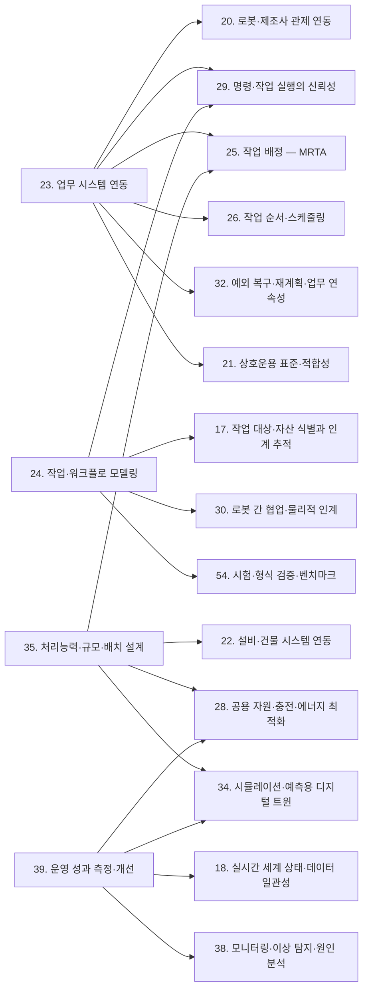
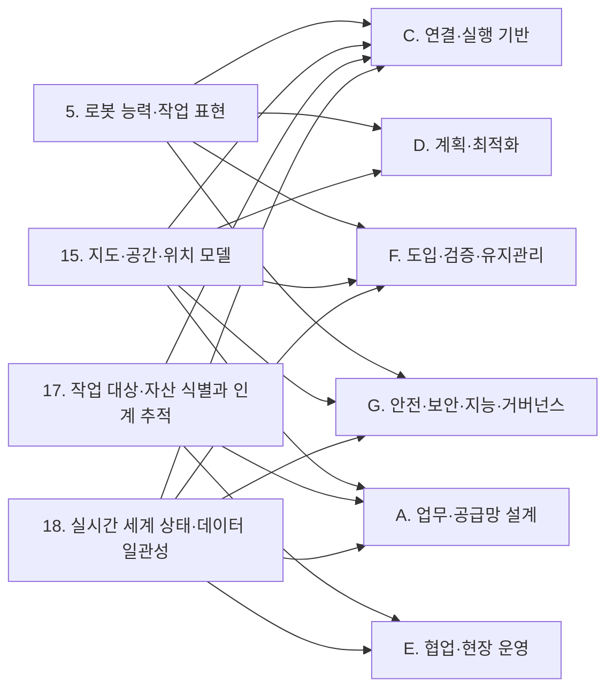
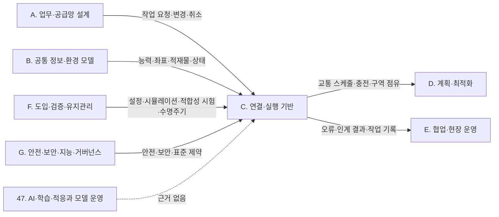
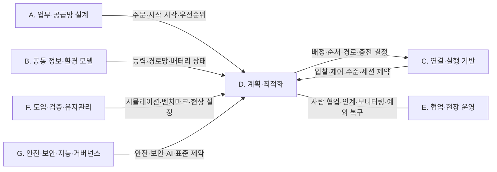
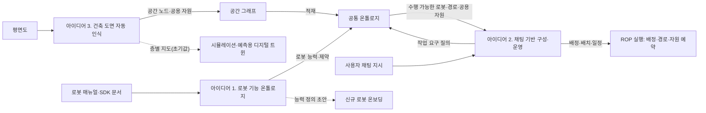

(너의 규칙은 시스템 프롬프트의 agents/shared-rules.md 와 agents/verifier.md 이다. 아래는 이번 실행의 컨텍스트와 입력이다.)

## 실행 컨텍스트

- run_id: 2026-10-09-03
- date: 2026-10-09
- run_type: category_link (대분류 연결)
- 대상: 대분류 E. 사물·사람·실시간 상태 페이지의 '다른 대분류와의 연결' 절(대분류 연결 실행). 게시된 세부영역 페이지를 근거로 다른 대분류와의 연결을 조사·서술한다. 스토리텔러는 그 절만 patches 로 바꾼다
- 예산:
    - max_search_queries: 30
    - max_sources_per_run: 15
    - new_topic_pages: 1
    - page_updates: 2
    - max_retries: 2
- 환경 알림: web_fetch_available: true · fetch_mode: full
- 언어: ko
- verification_stage: first
- verifier_budget:
    - max_search_queries: 30
    - max_sources_per_run: 15
    - new_topic_pages: 1
    - page_updates: 2
    - max_retries: 2

## 입력

### runs/2026-10-09-03/target.json

```json
{
  "run_id": "2026-10-09-03",
  "date": "2026-10-09",
  "weekday": "Fri",
  "run_number": 136,
  "run_type": "category_link",
  "forced": true,
  "target": {
    "area_no": null,
    "area_name": null,
    "category": "E. 사물·사람·실시간 상태",
    "category_letter": "E"
  },
  "topic": null,
  "track": null,
  "corrections": [],
  "budget": {
    "max_search_queries": 30,
    "max_sources_per_run": 15,
    "new_topic_pages": 1,
    "page_updates": 2,
    "max_retries": 2
  },
  "priority_reason": null,
  "priority_questions": [],
  "excluded_areas": [],
  "lifted_areas": [],
  "deferred": {
    "monthly_recheck": false,
    "weekly_review": false
  },
  "selection_rationale": "CLI 지정 run_type=category_link"
}
```

### runs/2026-10-09-03/research.json

```json
{
  "run_id": "2026-10-09-03",
  "date": "2026-10-09",
  "run_type": "category_link",
  "target": {
    "area_no": null,
    "area_name": null,
    "category": "E. 사물·사람·실시간 상태"
  },
  "gaps": [
    "E. 사물·사람·실시간 상태 대분류 페이지의 '다른 대분류와의 연결' 절 비어 있음(아직 작성되지 않음)",
    "A. 기획·사업과 E. 사물·사람·실시간 상태의 세 세부영역을 직접 잇는 검증된 근거가 게시 페이지에 없음",
    "C. 채팅 기반 구성·운영과의 연결 근거가 E 쪽 게시 페이지에 없음 — 이번 실행에서 12. 채팅으로 업무 지시·오케스트레이션 쪽 근거(ref-854)를 보강",
    "17. 작업 대상·자산 식별과 인계 추적의 '수령인 확인'(사람에게 넘길 때)과 N. 보안·개인정보·Q. 현장 유형별 적용을 잇는 근거 없음 — 병원·공동주택·사무 건물 사례를 새로 찾음",
    "L. AI·학습 기술의 45. 문서·도면·장면 이해와 18·19의 연결(oq-227 고정 카메라·로봇 인식 결합)은 근거 미확보",
    "옛 분류 기준으로 다른 대분류 페이지(A·B·F·G)에 E 쪽 영역과의 연결이 실려 있으나 새 17개 대분류 이름으로 다시 정리되지 않음"
  ],
  "research_questions": [
    "작업 대상·사람·설비·로봇이 지금 어디에 어떤 상태로 있는지 어떻게 믿을 수 있게 알 것인가? [분류원문] — 이 답이 다른 대분류의 어느 세부영역으로 넘어가는가?",
    "17. 작업 대상·자산 식별과 인계 추적은 F. 연동(20·22·23), G. 계획·최적화(24), H. 실행·협업·예외 복구(30·32), P. 거버넌스·법규·사회(58)와 어떤 신호·기록을 주고받는가? (oq-001, oq-003, oq-006, oq-036, oq-079 관련)",
    "17. 작업 대상·자산 식별과 인계 추적의 수령인 확인은 병원·공동주택 현장에서 어떤 인증 수단으로 이루어지며 N. 보안·개인정보(51·53)와 어떻게 이어지는가? (oq-180, oq-184 관련)",
    "18. 실시간 세계 상태·데이터 일관성은 B. 로봇 온톨로지(5·6), D. 공간·지도 모델(15), F. 연동(20·22), G. 계획·최적화(28), I. 설계·시뮬레이션(34), J. 현장 운영·관제(38·39), K. 플랫폼 아키텍처·인프라(42·43), M. 안전(48)과 무엇을 주고받는가? (oq-024, oq-028, oq-034, oq-035 관련)",
    "19. 사람·보행자 모델은 D. 공간·지도 모델(15·16), G. 계획·최적화(26·27), H. 실행·협업·예외 복구(31), I. 설계·시뮬레이션(34·36), L. AI·학습 기술(46), M. 안전(49), N. 보안·개인정보(53), O. 검증·도입·수명주기(54), P. 거버넌스·법규·사회(60), Q. 현장 유형별 적용(61·63·64·66)과 어떻게 이어지는가? (oq-256, oq-261, oq-272, oq-273, oq-274 관련)",
    "C. 채팅 기반 구성·운영의 대화형 업무 지시가 18. 실시간 세계 상태·데이터 일관성의 현재 상태를 근거로 쓰는 공개 구현이 있는가?",
    "E. 사물·사람·실시간 상태와 다른 대분류의 연결 가운데 근거가 아직 없는 쌍은 무엇인가? (다루지 않은 연결 목록)"
  ],
  "findings": [
    {
      "id": "f1",
      "claim": "E. 사물·사람·실시간 상태의 17. 작업 대상·자산 식별과 인계 추적 ↔ B. 로봇 온톨로지의 5. 로봇 능력·작업 표현: VDA 5050 팩트시트가 로봇이 취급할 수 있는 적재 유형을 선언하고 상태 메시지의 loadId 가 실제로 실린 적재물을 식별하므로, '이 로봇이 이 적재물을 다룰 수 있는가'를 판단하려면 능력 표현의 적재 유형과 17의 적재물 식별을 같은 어휘로 맞춰야 할 것으로 보이며 공통 어휘는 확인되지 않았다(oq-023).",
      "tag": "추정",
      "source_ids": [
        "ref-228",
        "ref-051"
      ],
      "cross_checked": false,
      "confidence": "low",
      "evidence_excerpt": "B. 로봇 온톨로지 페이지: 팩트시트 loadSets(적재 유형·최대 중량 등). state.schema loadId: 'Unique identification number of the load (e.g., barcode or RFID).' 적재 유형 공통 코드 체계는 미확인.",
      "as_of": "2026-10-09",
      "site_type": null,
      "flow_item": "작업 대상"
    },
    {
      "id": "f2",
      "claim": "E. 사물·사람·실시간 상태의 18. 실시간 세계 상태·데이터 일관성 ↔ B. 로봇 온톨로지의 5. 로봇 능력·작업 표현: Naqvi 외(Scientific Reports, 2025-10-02)는 로봇 능력 온톨로지(RCO)에서 제조사가 공개한 능력 수치와 운용 중 로봇이 실제로 보인 성능을 구분해 연결한다.",
      "tag": "사실",
      "source_ids": [
        "ref-041"
      ],
      "cross_checked": false,
      "confidence": "medium",
      "evidence_excerpt": "검색 요약(PMC·HAL): RCO 는 제조사 명세와 실증 성능 데이터를 잇는 참조 온톨로지로 제조 분야를 대상으로 한다. 본문은 열지 못함(PMC 봇 차단).",
      "as_of": "2025-10-02",
      "site_type": null,
      "flow_item": null,
      "source_unopened": true
    },
    {
      "id": "f3",
      "claim": "E. 사물·사람·실시간 상태의 18. 실시간 세계 상태·데이터 일관성 ↔ B. 로봇 온톨로지의 6. 온톨로지 기반 시스템·로봇 연동: 18이 모은 로봇의 관측 상태(배터리·문제 목록·위치)가 능력의 '지금 실행 가능 여부' 판단과 운용 능력 갱신의 입력이 될 것으로 보이며, 선언 능력과 관측 능력 가운데 무엇을 배정 기준으로 삼을지는 열린 질문(oq-024)으로 남아 있다.",
      "tag": "추정",
      "source_ids": [
        "ref-041",
        "ref-148"
      ],
      "cross_checked": false,
      "confidence": "low",
      "evidence_excerpt": "robot_state.json 은 status·battery(0.0~1.0)·issues·location·unix_millis_time 을 담는다(f17). RCO 는 광고 능력과 운용 능력을 구분(f2).",
      "as_of": "2026-10-09",
      "site_type": null,
      "flow_item": "수행 자원",
      "source_unopened": false
    },
    {
      "id": "f4",
      "claim": "E. 사물·사람·실시간 상태의 18. 실시간 세계 상태·데이터 일관성 ↔ C. 채팅 기반 구성·운영의 12. 채팅으로 업무 지시·오케스트레이션: 2026-07-02 Open Robotics 상호운용 SIG 발표(Nayantra)는 Open-RMF REST API 를 언어 모델이 호출할 수 있는 MCP 도구로 감싸고, 평이한 영어 지시를 여러 단계의 RMF 임무로 바꿔 Nav2 로 보내는 구성을 소개했다.",
      "tag": "사실",
      "source_ids": [
        "ref-854"
      ],
      "cross_checked": false,
      "confidence": "medium",
      "evidence_excerpt": "발표 안내: an MCP server that \"exposes the Open-RMF REST API as LLM-callable tools\". 시연은 NVIDIA Isaac Sim 창고 시뮬레이션. 상태 질의 기능 여부는 안내문에 없음.",
      "as_of": "2026-06-25",
      "site_type": null,
      "flow_item": "시작 조건"
    },
    {
      "id": "f5",
      "claim": "E. 사물·사람·실시간 상태의 18. 실시간 세계 상태·데이터 일관성 ↔ C. 채팅 기반 구성·운영의 12. 채팅으로 업무 지시·오케스트레이션: 대화로 '어디까지 했는가·왜 멈췄는가'에 답하려면 로봇 상태의 시각·상태 값·문제 목록 같은 현재 상태 기록을 근거로 써야 할 것으로 보이나, Open-RMF–MCP 연동이 상태 질의까지 제공하는지는 확인하지 못했다.",
      "tag": "추정",
      "source_ids": [
        "ref-854",
        "ref-148"
      ],
      "cross_checked": false,
      "confidence": "low",
      "evidence_excerpt": "robot_state.json: status(uninitialized·offline·shutdown·idle·charging·working·error), issues, unix_millis_time. MCP 발표 안내는 작업 파견만 명시.",
      "as_of": "2026-10-09",
      "site_type": null,
      "flow_item": "예외·성과"
    },
    {
      "id": "f6",
      "claim": "E. 사물·사람·실시간 상태의 19. 사람·보행자 모델 ↔ C. 채팅 기반 구성·운영의 11. 채팅으로 실제 상황 시뮬레이션 재현·I. 설계·시뮬레이션의 36. 가상 시운전·실제 상황 재현: 실제 운영 기록을 재생해 상황을 재현하면 기록된 사람이 바뀐 조건(로봇 수·배차 정책)에 반응하지 않는 문제가 생기며, 19. 사람·보행자 모델 페이지는 이를 열린 질문(oq-256)으로 두고 기록 재현 시뮬레이터(Waymax)와 사람 행동 시뮬레이터(HuNavSim)를 참고로 든다.",
      "tag": "추정",
      "source_ids": [
        "ref-1128",
        "ref-1179"
      ],
      "cross_checked": false,
      "confidence": "low",
      "evidence_excerpt": "19 페이지 11절: '기록 재현에서 사람을 반응하게 만드는 방법…은 아직 답이 없다'(추정). (재인용: 2026-09-30-20)",
      "as_of": "2026-09-30",
      "site_type": null,
      "flow_item": null,
      "source_unopened": true
    },
    {
      "id": "f7",
      "claim": "E. 사물·사람·실시간 상태의 18. 실시간 세계 상태·데이터 일관성 ↔ D. 공간·지도 모델의 15. 지도·공간·위치 모델: VDA 5050 상태 스키마는 위치추정 품질(localizationScore), 미터 단위 위치 편차 범위(deviationRange), 작업 공간 지도 식별자(mapId)를 두어, 보고된 위치를 얼마나 믿을지(18)와 어느 지도 위의 위치인지(15)가 같은 메시지로 넘어온다.",
      "tag": "사실",
      "source_ids": [
        "ref-051"
      ],
      "cross_checked": false,
      "confidence": "medium",
      "evidence_excerpt": "state.schema(main): localizationScore 'Describes the quality of the localization'; deviationRange 'position deviation range in meters'; mapId 'ID of the map…'. 계산 방식 통일 여부는 oq-028.",
      "as_of": "2026-10-09",
      "site_type": null,
      "flow_item": "제약"
    },
    {
      "id": "f8",
      "claim": "E. 사물·사람·실시간 상태의 17. 작업 대상·자산 식별과 인계 추적 ↔ D. 공간·지도 모델의 15. 지도·공간·위치 모델·16. 장소 의미·지도 관리: GS1 GLN 이 도크 문·보관 위치 같은 하위 위치를 식별할 수 있으므로, 인계 이벤트의 업무 위치와 로봇 지도 위 장소를 대응시키는 계층이 ROP 쪽에 필요할 것으로 보이며 국내 적용 사례는 확인되지 않았다(oq-029).",
      "tag": "추정",
      "source_ids": [
        "ref-162",
        "ref-031"
      ],
      "cross_checked": false,
      "confidence": "low",
      "evidence_excerpt": "B. 로봇 온톨로지 페이지의 같은 연결(추정): GLN 확장 요소는 조직 내부나 거래 당사자 간 합의로만 쓰므로 대응 계층은 ROP 쪽이 맡게 될 것으로 본다. (재인용: 2026-09-25-60)",
      "as_of": "2026-09-25",
      "site_type": null,
      "flow_item": "완료·인계",
      "source_unopened": false
    },
    {
      "id": "f9",
      "claim": "E. 사물·사람·실시간 상태의 19. 사람·보행자 모델 ↔ D. 공간·지도 모델의 15. 지도·공간·위치 모델: 움직임 지도(maps of dynamics)는 공간에 사람의 전형적 움직임 패턴을 덧붙인 지도이며, EU ILIAD 프로젝트는 학습한 사람 흐름에 맞춰 창고 자율 지게차의 경로를 계획했다.",
      "tag": "사실",
      "source_ids": [
        "ref-1171",
        "ref-1180"
      ],
      "cross_checked": false,
      "confidence": "medium",
      "evidence_excerpt": "19 페이지 5절(물류창고): 움직임 지도로 학습한 사람 흐름에 맞춘 경로 계획, 움직임별 사회적 비용으로 속도 제약. (재인용: 2026-09-30-20)",
      "as_of": "2023",
      "site_type": "물류창고",
      "flow_item": "제약",
      "source_unopened": true
    },
    {
      "id": "f10",
      "claim": "E. 사물·사람·실시간 상태의 19. 사람·보행자 모델 ↔ D. 공간·지도 모델의 16. 장소 의미·지도 관리: 한림대학교성심병원은 밤에 인식한 경로가 낮 혼잡에서는 원활하지 않을 수 있다고 보고 로봇 통행 경로와 작업 정지 지점을 전용 스티커로 표시했다(기사 1건 기준).",
      "tag": "사실",
      "source_ids": [
        "ref-1181"
      ],
      "cross_checked": false,
      "confidence": "medium",
      "evidence_excerpt": "조선비즈 2024-07-12: 환자나 휠체어와 마주치면 로봇이 무조건 대기. 사람 혼잡이 장소에 붙는 운영 표시(전용 통로·정지 지점)로 나타난 사례. (재인용: 2026-09-30-20)",
      "as_of": "2024-07-12",
      "site_type": "병원",
      "flow_item": "제약",
      "source_unopened": true
    },
    {
      "id": "f11",
      "claim": "E. 사물·사람·실시간 상태의 17. 작업 대상·자산 식별과 인계 추적 ↔ F. 연동의 20. 로봇·제조사 관제 연동: VDA 5050 상태 스키마의 loads 는 로봇이 현재 취급 중인 적재물을 담고, loadId 는 바코드·RFID 같은 적재물 식별 번호, loadPosition 은 어느 적재 장치를 쓰는지를 나타낸다.",
      "tag": "사실",
      "source_ids": [
        "ref-051"
      ],
      "cross_checked": false,
      "confidence": "medium",
      "evidence_excerpt": "state.schema: loads 'Loads, that are currently handled by the mobile robot.'; loadId '(e.g., barcode or RFID)'. GS1 키 형식 지정은 없음(oq-007).",
      "as_of": "2026-10-09",
      "site_type": null,
      "flow_item": "작업 대상"
    },
    {
      "id": "f12",
      "claim": "E. 사물·사람·실시간 상태의 17. 작업 대상·자산 식별과 인계 추적 ↔ F. 연동의 22. 설비·건물 시스템 연동: Open-RMF 배송 작업에서 로봇은 픽업 지점의 DispenserResult, 하역 지점의 IngestorResult 를 받을 때까지 요청을 되풀이하고, IngestorResult 는 시각·요청 id·워크셀 id·상태(ACKNOWLEDGED·SUCCESS·FAILED)를 담는다.",
      "tag": "사실",
      "source_ids": [
        "ref-023",
        "ref-049"
      ],
      "cross_checked": false,
      "confidence": "medium",
      "evidence_excerpt": "B. 로봇 온톨로지·F. 연동 페이지에 같은 각주로 게시된 사실. (재인용: 2026-09-25-60)",
      "as_of": "2026-09-25",
      "site_type": null,
      "flow_item": "완료·인계"
    },
    {
      "id": "f13",
      "claim": "E. 사물·사람·실시간 상태의 17. 작업 대상·자산 식별과 인계 추적 ↔ F. 연동의 22. 설비·건물 시스템 연동: 설비의 인수 결과에는 화물 식별자·인계 당사자가 없으므로 설비 쪽 SUCCESS 를 17의 식별·인계 기록과 결합해야 '무엇이 누구에게 넘겨졌는지'가 확정될 것으로 보이며, 이를 정한 표준 매핑은 확인되지 않았다(oq-001, oq-061).",
      "tag": "추정",
      "source_ids": [
        "ref-049",
        "ref-014",
        "ref-015"
      ],
      "cross_checked": false,
      "confidence": "low",
      "evidence_excerpt": "IngestorResult 필드: time, request_guid, source_guid, status. EPCIS 는 소유·점유·위치 이전을 source/destination 으로 표현.",
      "as_of": "2026-09-25",
      "site_type": null,
      "flow_item": "완료·인계",
      "source_unopened": false
    },
    {
      "id": "f14",
      "claim": "E. 사물·사람·실시간 상태의 17. 작업 대상·자산 식별과 인계 추적·18. 실시간 세계 상태·데이터 일관성 ↔ F. 연동의 23. 업무 시스템 연동: DeHoratius·Raman(2008)은 한 소매업체 37개 매장 재고 기록의 65%가 실물과 맞지 않았다고 보고했다(소매 매장 조건이며 물류센터 값이 아니다).",
      "tag": "사실",
      "source_ids": [
        "ref-292"
      ],
      "cross_checked": false,
      "confidence": "medium",
      "evidence_excerpt": "18 페이지 5절 시나리오 2의 예외·성과 칸에 게시된 사실(소매 조건 단서 포함). (재인용: 2026-09-25-24)",
      "as_of": "2008",
      "site_type": "상업 시설",
      "flow_item": "예외·성과",
      "source_unopened": true
    },
    {
      "id": "f15",
      "claim": "E. 사물·사람·실시간 상태의 17. 작업 대상·자산 식별과 인계 추적·18. 실시간 세계 상태·데이터 일관성 ↔ F. 연동의 23. 업무 시스템 연동: 로봇이 보고한 적재물 식별 결과와 WMS 재고 기록이 어긋나면 덮어쓰지 않고 두 기록을 함께 보관해 정정 이벤트로 업무 시스템에 되돌리는 것이 두 대분류의 넘겨받는 지점이 될 것으로 보이며, 어느 쪽을 기준으로 삼고 누가 정정하는지는 열린 질문(oq-036)이다.",
      "tag": "추정",
      "source_ids": [
        "ref-292",
        "ref-051",
        "ref-492"
      ],
      "cross_checked": false,
      "confidence": "low",
      "evidence_excerpt": "loadId(로봇 보고), EPCIS errorDeclaration(기록 정정, f26), 재고 기록 부정확성(f14)을 종합한 추론.",
      "as_of": "2026-10-09",
      "site_type": null,
      "flow_item": "예외·성과",
      "source_unopened": false
    },
    {
      "id": "f16",
      "claim": "E. 사물·사람·실시간 상태의 18. 실시간 세계 상태·데이터 일관성 ↔ F. 연동의 22. 설비·건물 시스템 연동: Open-RMF 문 상태(DoorState)는 생성 시각 door_time·문 이름·현재 모드를, 승강기 상태(LiftState)는 생성 시각 lift_time·현재·목적 층·문 상태·운행 상태·현재 모드·제어 세션 id 를 담고, 두 메시지 모두 허용 경과 시간은 정하지 않는다.",
      "tag": "사실",
      "source_ids": [
        "ref-285",
        "ref-286"
      ],
      "cross_checked": false,
      "confidence": "medium",
      "evidence_excerpt": "DoorState.msg: door_time, door_name, current_mode. LiftState.msg: lift_time('when the information was generated'), current_floor, door_state, motion_state, current_mode, session_id. 몇 초까지 믿을지는 oq-034.",
      "as_of": "2026-10-09",
      "site_type": null,
      "flow_item": "제약"
    },
    {
      "id": "f17",
      "claim": "E. 사물·사람·실시간 상태의 18. 실시간 세계 상태·데이터 일관성 ↔ F. 연동의 20. 로봇·제조사 관제 연동: Open-RMF 로봇 상태는 밀리초 유닉스 시각(unix_millis_time), 상태 7종, 0~1 배터리, 운영자가 풀어야 할 문제 목록(issues)을 담고, VDA 5050 상태는 ISO 8601 형식 시각(timestamp)을 담는다.",
      "tag": "사실",
      "source_ids": [
        "ref-148",
        "ref-051"
      ],
      "cross_checked": false,
      "confidence": "medium",
      "evidence_excerpt": "robot_state.json status: uninitialized, offline, shutdown, idle, charging, working, error. state.schema timestamp 'in ISO8601 format (YYYY-MM-DDTHH:mm:ss.fffZ)'.",
      "as_of": "2026-10-09",
      "site_type": null,
      "flow_item": "수행 자원"
    },
    {
      "id": "f18",
      "claim": "E. 사물·사람·실시간 상태의 18. 실시간 세계 상태·데이터 일관성 ↔ F. 연동의 20. 로봇·제조사 관제 연동: 관제 인터페이스마다 시각 표현과 보고 주기가 달라 20의 어댑터가 받은 상태를 18의 공통 시간축으로 옮기는 변환·시계 오차 기준이 필요할 것으로 보이나, 이를 규정한 자료는 확인하지 못했다(oq-035).",
      "tag": "추정",
      "source_ids": [
        "ref-148",
        "ref-051"
      ],
      "cross_checked": false,
      "confidence": "low",
      "evidence_excerpt": "f17 의 두 시각 표현(밀리초 정수 vs ISO 8601 문자열)에서 도출.",
      "as_of": "2026-10-09",
      "site_type": null,
      "flow_item": null
    },
    {
      "id": "f19",
      "claim": "E. 사물·사람·실시간 상태의 17. 작업 대상·자산 식별과 인계 추적 ↔ G. 계획·최적화의 24. 작업·워크플로 모델링: GS1 CBV 는 도착(arriving)·입고(receiving)·인수(accepting)를 서로 다른 업무 단계로 정의하고, VDA 5050 은 하역(drop) 완료를 적재물이 로봇을 떠나 로봇이 새 적재 상태를 보고한 때로 정의한다.",
      "tag": "사실",
      "source_ids": [
        "ref-044",
        "ref-031"
      ],
      "cross_checked": false,
      "confidence": "medium",
      "evidence_excerpt": "A. 기획·사업·B. 로봇 온톨로지 페이지에 같은 각주로 게시된 사실. 로봇 완료(arriving 수준)와 업무 완료(receiving·accepting)의 구분이 24의 완료 조건으로 넘어간다. (재인용: 2026-09-25-60)",
      "as_of": "2021-09-30",
      "site_type": null,
      "flow_item": "완료·인계"
    },
    {
      "id": "f20",
      "claim": "E. 사물·사람·실시간 상태의 18. 실시간 세계 상태·데이터 일관성 ↔ G. 계획·최적화의 28. 공용 자원·충전·에너지 최적화: Open-RMF 로봇 상태는 배터리를 0.0(빈)~1.0(가득)으로, VDA 5050 상태는 powerSupply.stateOfCharge 를 퍼센트로 보고한다.",
      "tag": "사실",
      "source_ids": [
        "ref-148",
        "ref-051"
      ],
      "cross_checked": false,
      "confidence": "medium",
      "evidence_excerpt": "robot_state.json battery 0.0~1.0; state.schema powerSupply.stateOfCharge 'State of Charge in %'. 표현 단위가 다르다.",
      "as_of": "2026-10-09",
      "site_type": null,
      "flow_item": "제약"
    },
    {
      "id": "f21",
      "claim": "E. 사물·사람·실시간 상태의 18. 실시간 세계 상태·데이터 일관성 ↔ G. 계획·최적화의 28. 공용 자원·충전·에너지 최적화: Open-RMF 가 작업을 끝낼 충전량이 부족하면 충전 작업을 일정에 끼워 넣으므로, 충전 계획은 18이 표현하는 현재 배터리 상태를 단위를 맞춰 입력으로 쓰는 것으로 보인다.",
      "tag": "추정",
      "source_ids": [
        "ref-104",
        "ref-148"
      ],
      "cross_checked": false,
      "confidence": "low",
      "evidence_excerpt": "G. 계획·최적화 페이지에 게시된 같은 연결(추정). 현재 상태 표현이며 가정한 미래 실험(34)과 구분. (재인용: 2026-09-25-55)",
      "as_of": "2026-09-25",
      "site_type": null,
      "flow_item": "제약"
    },
    {
      "id": "f22",
      "claim": "E. 사물·사람·실시간 상태의 19. 사람·보행자 모델 ↔ G. 계획·최적화의 27. 다중 로봇 경로·교통 관리 — MAPF: Vintr 외(2022)는 장기 시공간 보행자 흐름 지도를 경로 계획에 쓰고 예상 조우(Expected Encounters)와 예상 경로 길이로 비교했으며, 대학 건물 현장 실험에서 예측형 주행은 불편을 드러낸 사람이 두 세션 모두 0명, 반응형은 2명·1명이었다(40분 세션 4회의 매우 작은 표본).",
      "tag": "사실",
      "source_ids": [
        "ref-1178"
      ],
      "cross_checked": false,
      "confidence": "medium",
      "evidence_excerpt": "19 페이지 5절 기타(UTBM 대학 홀) 사례에 게시된 사실. (재인용: 2026-09-30-20)",
      "as_of": "2022-07-04",
      "site_type": "기타",
      "flow_item": "예외·성과",
      "source_unopened": true
    },
    {
      "id": "f23",
      "claim": "E. 사물·사람·실시간 상태의 19. 사람·보행자 모델 ↔ G. 계획·최적화의 26. 작업 순서·스케줄링: 낮 시간 복도 혼잡과 '무조건 대기' 규칙(병원), 혼잡을 예상해 위치를 정하는 계획(쇼핑몰 연구)처럼 사람 흐름은 로봇 작업 시간과 순서에 영향을 줄 것으로 보이나, 시간대별 혼잡을 작업 시간 추정·스케줄링에 넣어 효과를 측정한 현장 연구는 확인하지 못했다(oq-273).",
      "tag": "추정",
      "source_ids": [
        "ref-1181",
        "ref-1182"
      ],
      "cross_checked": false,
      "confidence": "low",
      "evidence_excerpt": "19 페이지 5절 병원·상업 시설 사례에서 대기 규칙의 처리 시간 영향과 효과 수치는 모두 미확인으로 게시됨.",
      "as_of": "2026-09-30",
      "site_type": null,
      "flow_item": "제약",
      "source_unopened": true
    },
    {
      "id": "f24",
      "claim": "E. 사물·사람·실시간 상태의 17. 작업 대상·자산 식별과 인계 추적 ↔ H. 실행·협업·예외 복구의 30. 로봇 간 협업·물리적 인계: EPCIS 가 소유·점유·위치 이전을 출발지·도착지(source/destination)로 표현하므로, 로봇·설비 사이 물리적 인계의 확인은 17의 식별자·인계 당사자 기록과 결합해야 할 것으로 보인다(oq-001, oq-006).",
      "tag": "추정",
      "source_ids": [
        "ref-049",
        "ref-014",
        "ref-015"
      ],
      "cross_checked": false,
      "confidence": "low",
      "evidence_excerpt": "B. 로봇 온톨로지 페이지에 게시된 같은 연결(추정). 시설 안 로봇 인계를 어떤 bizStep 으로 기록할지는 oq-006. (재인용: 2026-09-25-60)",
      "as_of": "2026-09-25",
      "site_type": null,
      "flow_item": "완료·인계",
      "source_unopened": false
    },
    {
      "id": "f25",
      "claim": "E. 사물·사람·실시간 상태의 17. 작업 대상·자산 식별과 인계 추적 ↔ H. 실행·협업·예외 복구의 32. 예외 복구·재계획·업무 연속성: 팔레트 RFID 태그 판독성이 제품·포장·태그 위치·적재 패턴에 따라 달라진다는 실험 보고가 있어, 판독 실패·오판독 때 인계 보류·재스캔·사람 확인 규칙이 복구 과제로 넘어갈 것으로 보인다(oq-003).",
      "tag": "추정",
      "source_ids": [
        "ref-024"
      ],
      "cross_checked": false,
      "confidence": "low",
      "evidence_excerpt": "Singh 외(2009) 도크 도어 모사 RFID 포털 실험. 17 페이지 8절·B 페이지 연결 절의 추정을 재인용. (재인용: 2026-09-25-60)",
      "as_of": "2009",
      "site_type": null,
      "flow_item": "예외·성과",
      "source_unopened": true
    },
    {
      "id": "f26",
      "claim": "E. 사물·사람·실시간 상태의 17. 작업 대상·자산 식별과 인계 추적 ↔ H. 실행·협업·예외 복구의 32. 예외 복구·재계획·업무 연속성: EPCIS 1.2 는 이미 기록된 이벤트를 오류 선언(errorDeclaration)으로 정정하게 하므로, 고장 로봇에서 회수한 화물의 위치·이벤트 정정이 식별·추적 쪽 기록 규칙에 기대게 된다(oq-079).",
      "tag": "사실",
      "source_ids": [
        "ref-492"
      ],
      "cross_checked": false,
      "confidence": "medium",
      "evidence_excerpt": "옛 E. 협업·현장 운영 대분류 연결 절의 같은 연결(사실, 원문 미열람). (재인용: 2026-09-25-60)",
      "as_of": "2016-09-29",
      "site_type": null,
      "flow_item": "완료·인계",
      "source_unopened": true
    },
    {
      "id": "f27",
      "claim": "E. 사물·사람·실시간 상태의 18. 실시간 세계 상태·데이터 일관성 ↔ H. 실행·협업·예외 복구의 29. 명령·작업 실행의 신뢰성·32. 예외 복구·재계획·업무 연속성: VDA 5050 3.0.0 에서 로봇 연결이 예기치 않게 끊기면 브로커가 MQTT 유언으로 CONNECTION_BROKEN 을 대신 알리고, 로봇은 받은 주문을 유지한 채 마지막으로 해제된 노드까지 수행한다.",
      "tag": "사실",
      "source_ids": [
        "ref-031"
      ],
      "cross_checked": false,
      "confidence": "medium",
      "evidence_excerpt": "18 페이지 5절, F. 연동 페이지 연결 절에 게시된 사실. 끊긴 동안 세계 상태의 로봇 위치는 오래된 값이 된다. (재인용: 2026-09-25-24)",
      "as_of": "2026-09-25",
      "site_type": null,
      "flow_item": "예외·성과"
    },
    {
      "id": "f28",
      "claim": "E. 사물·사람·실시간 상태의 18. 실시간 세계 상태·데이터 일관성·19. 사람·보행자 모델 ↔ H. 실행·협업·예외 복구의 31. 사람–로봇 협업: Riedelbauch·Werner·Henrich(RAAD 2017)는 사람과 함께 쓰는 작업 공간에서 세계 모델의 정보마다 확실도 값을 붙이고, 전역 센서가 감지한 사람 존재에 따라 이 값을 시간에 따라 조정해 로봇이 정보가 아직 유효한지 판단하게 했다.",
      "tag": "사실",
      "source_ids": [
        "ref-1302"
      ],
      "cross_checked": false,
      "confidence": "medium",
      "evidence_excerpt": "초록: \"we annotate pieces of information with certainty values encoding how trustworthy they are\". 전역 센서의 사람 존재 데이터와 손목 카메라 데이터를 결합, 시제품 실험.",
      "as_of": "2017",
      "site_type": null,
      "flow_item": null
    },
    {
      "id": "f29",
      "claim": "E. 사물·사람·실시간 상태의 18. 실시간 세계 상태·데이터 일관성·19. 사람·보행자 모델 ↔ H. 실행·협업·예외 복구의 31. 사람–로봇 협업: 사람이 드나든 구역의 물품·설비 상태는 관측 뒤 바뀌었을 가능성이 높으므로, 19의 사람 위치 정보가 18의 상태 신뢰도를 낮추는 근거로 쓰일 수 있을 것으로 보이나 이동로봇 현장 적용 사례는 확인하지 못했다.",
      "tag": "추정",
      "source_ids": [
        "ref-1302"
      ],
      "cross_checked": false,
      "confidence": "low",
      "evidence_excerpt": "f28 은 고정 작업 공간(조립) 연구이며 물류창고·병원 이동로봇 적용은 미확인.",
      "as_of": "2026-10-09",
      "site_type": null,
      "flow_item": null
    },
    {
      "id": "f30",
      "claim": "E. 사물·사람·실시간 상태의 18. 실시간 세계 상태·데이터 일관성 ↔ I. 설계·시뮬레이션의 34. 시뮬레이션·예측용 디지털 트윈: 제조 분야 분류 자료가 현장 상태가 한 방향으로 자동 반영되는 디지털 섀도와 디지털 트윈을 구분하므로, 18은 현재 상태를 표현하고 34는 그 표현을 복제해 가정한 미래를 실험하는 쪽으로 나누는 것이 분류 원문의 구분과 맞을 것으로 보인다(근거 자료는 제조 대상).",
      "tag": "추정",
      "source_ids": [
        "ref-291",
        "ref-290"
      ],
      "cross_checked": false,
      "confidence": "low",
      "evidence_excerpt": "18 페이지 10절·B 페이지 연결 절에 게시된 추정. (재인용: 2026-09-25-24)",
      "as_of": "2018",
      "site_type": null,
      "flow_item": null,
      "source_unopened": true
    },
    {
      "id": "f31",
      "claim": "E. 사물·사람·실시간 상태의 19. 사람·보행자 모델 ↔ I. 설계·시뮬레이션의 34. 시뮬레이션·예측용 디지털 트윈: HuNavSim 은 사람 인지 내비게이션을 벤치마크하기 위한 ROS 2 사람 이동 시뮬레이터이고, Kidokoro 외(HRI 2013)는 보행자 행동 모델로 가상 주행 상황을 시뮬레이션해 혼잡을 피하는 로봇 위치를 계획했다.",
      "tag": "사실",
      "source_ids": [
        "ref-1179",
        "ref-1182"
      ],
      "cross_checked": false,
      "confidence": "medium",
      "evidence_excerpt": "19 페이지 5절(상업 시설)·7절에 게시된 사실. 사람 행동 모델이 가정한 미래 실험의 입력이 된다. (재인용: 2026-09-30-20)",
      "as_of": "2023-09-13",
      "site_type": null,
      "flow_item": null,
      "source_unopened": true
    },
    {
      "id": "f32",
      "claim": "E. 사물·사람·실시간 상태의 18. 실시간 세계 상태·데이터 일관성 ↔ J. 현장 운영·관제의 38. 모니터링·이상 탐지·원인 분석·39. 운영 성과 측정·개선: 로봇 상태의 상태 값·배터리·문제 목록·시각과 문·승강기 상태의 시각을 한 세계 상태 기록에 모으면, 가동률·충전·오류 시간 지표와 '지연 원인이 로봇인지 문인지' 분석이 같은 기록을 쓰게 될 것으로 보인다.",
      "tag": "추정",
      "source_ids": [
        "ref-148",
        "ref-285",
        "ref-286"
      ],
      "cross_checked": false,
      "confidence": "low",
      "evidence_excerpt": "A. 기획·사업·B. 로봇 온톨로지 페이지의 같은 연결(추정)과 이번에 연 메시지 정의(f16·f17)를 종합.",
      "as_of": "2026-10-09",
      "site_type": null,
      "flow_item": "예외·성과"
    },
    {
      "id": "f33",
      "claim": "E. 사물·사람·실시간 상태의 18. 실시간 세계 상태·데이터 일관성 ↔ K. 플랫폼 아키텍처·인프라의 42. 분산 시스템·통신·컴퓨팅 구조: ROS 2 QoS 의 기한·생존성 정책, Sparkplug 의 노드 종료(NDEATH) 뒤 지표 STALE 표시, VDA 5050 의 MQTT 유언을 통한 연결 끊김 통지처럼 통신 계층에 상태의 오래됨을 알리는 장치가 있다.",
      "tag": "사실",
      "source_ids": [
        "ref-282",
        "ref-287",
        "ref-031"
      ],
      "cross_checked": false,
      "confidence": "medium",
      "evidence_excerpt": "B. 로봇 온톨로지·F. 연동 페이지에 같은 각주로 게시된 사실. 세 출처는 각각 한 장치만 다룬다. (재인용: 2026-09-25-60)",
      "as_of": "2026-09-25",
      "site_type": null,
      "flow_item": "제약"
    },
    {
      "id": "f34",
      "claim": "E. 사물·사람·실시간 상태의 17. 작업 대상·자산 식별과 인계 추적·18. 실시간 세계 상태·데이터 일관성 ↔ K. 플랫폼 아키텍처·인프라의 43. 데이터·관측성·배포: EPCIS 2.0 온톨로지가 발생 시각(eventTime)·기록 시각(recordTime)·UTC 차이를 구분하므로, 실행 기록과 관측 데이터에서도 발생 시각과 수신·기록 시각을 따로 남기는 설계가 두 대분류를 잇는 지점이 될 것으로 보인다.",
      "tag": "추정",
      "source_ids": [
        "ref-045"
      ],
      "cross_checked": false,
      "confidence": "low",
      "evidence_excerpt": "18 페이지 4절: EPCIS 2.0 온톨로지의 eventTime·recordTime·eventTimeZoneOffset 구분(사실). 43 쪽 적용은 추론.",
      "as_of": "2021-09-30",
      "site_type": null,
      "flow_item": null
    },
    {
      "id": "f35",
      "claim": "E. 사물·사람·실시간 상태의 19. 사람·보행자 모델 ↔ L. AI·학습 기술의 46. 예측·학습 기반 최적화: Rudenko 외 서베이가 정리한 사람 움직임 궤적 예측은 19의 가까운 미래 사람 위치 추정 방법이므로, 예측 결과를 경로·배정 비용에 넣는 일이 46과 이어질 것으로 보인다.",
      "tag": "추정",
      "source_ids": [
        "ref-1172"
      ],
      "cross_checked": false,
      "confidence": "low",
      "evidence_excerpt": "19 페이지 3·6절: 궤적 예측·보행자 행동 모델로 가까운 미래를 추정해 경로 비용·속도 제약에 반영(추정).",
      "as_of": "2019-12-17",
      "site_type": null,
      "flow_item": null,
      "source_unopened": true
    },
    {
      "id": "f36",
      "claim": "E. 사물·사람·실시간 상태의 18. 실시간 세계 상태·데이터 일관성 ↔ M. 안전의 48. 안전·위험 관리: Open-RMF 승강기 상태의 현재 모드에는 알 수 없음·사람·AGV·화재·오프라인·비상이 있으며 사람·AGV 모드만 설정할 수 있고 나머지는 읽기 전용이다.",
      "tag": "사실",
      "source_ids": [
        "ref-286"
      ],
      "cross_checked": false,
      "confidence": "medium",
      "evidence_excerpt": "LiftState.msg current_mode 상수 0~5. 탑승 확정 전 최신 모드 확인은 ROP 몫, 승강기 안전 제어는 분류 원문 19장 시설·설비 제어 경계의 연계 대상.",
      "as_of": "2026-10-09",
      "site_type": null,
      "flow_item": "제약"
    },
    {
      "id": "f37",
      "claim": "E. 사물·사람·실시간 상태의 19. 사람·보행자 모델 ↔ M. 안전의 49. 사람 근접 안전: 병원의 '사람·휠체어와 마주치면 무조건 대기' 규칙과 창고의 움직임별 사회적 비용에 따른 속도 제약처럼 사람 흐름 정보는 구역별 대기·속도 규칙으로 49와 이어지며, ROP 는 규칙을 요청·관리하고 사람 검출·안전 정지는 연계 대상으로 로봇이 맡는 경계가 될 것으로 보인다.",
      "tag": "추정",
      "source_ids": [
        "ref-1181",
        "ref-1180"
      ],
      "cross_checked": false,
      "confidence": "low",
      "evidence_excerpt": "19 페이지 9절 책임 경계 표(추정)를 재인용. (재인용: 2026-09-30-20)",
      "as_of": "2026-09-30",
      "site_type": null,
      "flow_item": "제약",
      "source_unopened": true
    },
    {
      "id": "f38",
      "claim": "E. 사물·사람·실시간 상태의 19. 사람·보행자 모델 ↔ N. 보안·개인정보의 53. 개인정보·영상 데이터: ROS 규약 제안 REP-155(Draft, 2022-01-11 작성)는 사람마다 영속 ID 를 두고 얼굴·몸·음성 ID 를 후보 대응으로 연결하며, 이 문서는 개인정보·동의를 다루지 않는다.",
      "tag": "사실",
      "source_ids": [
        "ref-1173"
      ],
      "cross_checked": false,
      "confidence": "medium",
      "evidence_excerpt": "REP-155: person ID 'MUST be a unique ID… permanently associated with a unique person'. 신원 미확인은 anonymous person. 개인정보 언급 없음.",
      "as_of": "2022-01-11",
      "site_type": null,
      "flow_item": "작업 대상"
    },
    {
      "id": "f39",
      "claim": "E. 사물·사람·실시간 상태의 19. 사람·보행자 모델 ↔ N. 보안·개인정보의 53. 개인정보·영상 데이터: 사람 표현의 영속 ID 가 얼굴·음성 인식과 연결될 수 있으므로 ROP 가 보관하는 사람 정보는 구역·시간대 집계·익명화로 두는 것이 두 대분류의 경계가 될 것으로 보이며, 여러 출처의 사람 위치를 합치는 익명화 형식과 촬영 거부 의사 공유 방법은 열린 질문(oq-261, oq-272)이다.",
      "tag": "추정",
      "source_ids": [
        "ref-1173"
      ],
      "cross_checked": false,
      "confidence": "low",
      "evidence_excerpt": "19 페이지 9절의 추정을 재인용. (재인용: 2026-09-30-20)",
      "as_of": "2026-09-30",
      "site_type": null,
      "flow_item": "제약"
    },
    {
      "id": "f40",
      "claim": "E. 사물·사람·실시간 상태의 17. 작업 대상·자산 식별과 인계 추적 ↔ N. 보안·개인정보의 51. 인증·권한·격리: 병원용 운반 로봇 Zena RX(ST Engineering Aethon, 2024-04 출시 발표)는 생체 인식과 직원 PIN 코드로 잠금 칸을 열게 해 권한 있는 직원만 약품·검체를 꺼낼 수 있다고 제조사는 밝힌다.",
      "tag": "추정",
      "source_ids": [
        "ref-1299"
      ],
      "cross_checked": false,
      "confidence": "low",
      "evidence_excerpt": "벤더 주장: \"biometric security and staff pin codes\"; 'Only authorized staff can retrieve the delivery'. 추적·감사 기록·알림 기능은 발표문에 없음.",
      "as_of": "2024-04-29",
      "site_type": "병원",
      "flow_item": "완료·인계",
      "vendor_claim": true
    },
    {
      "id": "f41",
      "claim": "E. 사물·사람·실시간 상태의 17. 작업 대상·자산 식별과 인계 추적 ↔ N. 보안·개인정보의 51. 인증·권한·격리: 2019-10 우아한형제들 본사(서울 잠실) 시범 운영에서 배달 로봇 딜리타워는 라이더가 주문번호 앞 네 자리와 층을 입력하면 승강기로 이동해 고객에게 전화를 걸고, 고객이 휴대전화 번호 뒤 네 자리를 입력해야 음식 칸이 열렸다(기사 기준).",
      "tag": "사실",
      "source_ids": [
        "ref-1300"
      ],
      "cross_checked": false,
      "confidence": "low",
      "evidence_excerpt": "바이라인네트워크 2019-10-17: 두 대 승강기 중 먼저 오는 것을 호출, 사람이 자리를 차지하면 다음 승강기 대기. 배민라이더스 주문만 대상.",
      "as_of": "2019-10-17",
      "site_type": "기타",
      "flow_item": "완료·인계"
    },
    {
      "id": "f42",
      "claim": "E. 사물·사람·실시간 상태의 17. 작업 대상·자산 식별과 인계 추적 ↔ N. 보안·개인정보의 51. 인증·권한·격리: 2020-07 보도에 따르면 딜리타워의 공동주택(포레나 영등포) 도입 계획에서는 라이더와 고객이 모두 로봇 화면에 비밀번호를 눌러 적재함을 열고, 로봇은 도착 시 고객에게 문자와 전화로 알리게 되어 있었다.",
      "tag": "사실",
      "source_ids": [
        "ref-1301"
      ],
      "cross_checked": false,
      "confidence": "low",
      "evidence_excerpt": "경향신문 2020-07-03: 30층 182세대·오피스텔 111실, 이듬해 2월 준공 예정 단지의 계획 단계 보도. 실제 운영 방식 확인은 아님.",
      "as_of": "2020-07-03",
      "site_type": "가정",
      "flow_item": "완료·인계"
    },
    {
      "id": "f43",
      "claim": "E. 사물·사람·실시간 상태의 17. 작업 대상·자산 식별과 인계 추적 ↔ N. 보안·개인정보의 51. 인증·권한·격리·53. 개인정보·영상 데이터: 확인한 사례의 수령인 확인 수단이 생체+PIN(병원), 전화번호 뒤 네 자리(사무 건물), 비밀번호(공동주택 계획)로 서로 달라, 17의 '누구에게 넘겼는가' 기록은 51의 인증 수단과 53의 생체·전화번호 처리에 기대게 될 것으로 보이며, 그 결과가 주문·업무 시스템에 완료 이벤트로 기록되는지는 확인하지 못했다(oq-180, oq-184).",
      "tag": "추정",
      "source_ids": [
        "ref-1299",
        "ref-1300",
        "ref-1301"
      ],
      "cross_checked": false,
      "confidence": "low",
      "evidence_excerpt": "f40~f42 종합. 세 출처 모두 인증 결과의 기록·전송 방식은 다루지 않는다.",
      "as_of": "2026-10-09",
      "site_type": null,
      "flow_item": "완료·인계"
    },
    {
      "id": "f44",
      "claim": "E. 사물·사람·실시간 상태의 19. 사람·보행자 모델 ↔ O. 검증·도입·수명주기의 54. 시험·형식 검증·벤치마크: 사회적 로봇 내비게이션 알고리즘 평가 원칙·지침(Francis 외, 2023)과 장기 시공간 보행자 흐름 지도의 벤치마크 연구(Vintr 외, 2022)가 있어, 사람 모델을 쓴 계획의 효과를 시험하는 방법이 54와 이어진다.",
      "tag": "사실",
      "source_ids": [
        "ref-1079",
        "ref-1178"
      ],
      "cross_checked": false,
      "confidence": "medium",
      "evidence_excerpt": "19 페이지 7·8절에 게시된 자료(평가 지침·벤치마크). (재인용: 2026-09-30-20)",
      "as_of": "2023-06-29",
      "site_type": null,
      "flow_item": null,
      "source_unopened": true
    },
    {
      "id": "f45",
      "claim": "E. 사물·사람·실시간 상태의 19. 사람·보행자 모델 ↔ P. 거버넌스·법규·사회의 60. 노동·수용성·접근성: Han 외(CHI 2024)는 이동장애인 15명·로봇 실무자 8명 면담과 4회 공동설계 워크숍에서 보도 로봇이 들어오면 이동장애인이 보도 공간을 두고 경쟁해야 한다고 느끼며, 부족한 연석 경사로 같은 기존 장벽 위에서 로봇이 운행된다고 보고했다.",
      "tag": "사실",
      "source_ids": [
        "ref-1265"
      ],
      "cross_checked": false,
      "confidence": "medium",
      "evidence_excerpt": "초록: PwMD feel they must \"compete for space on the sidewalk\"; 실무자는 기업이 문제가 생긴 뒤에야 접근성을 다룬다고 인정; 두 집단 모두 처음부터 접근성 통합을 강조.",
      "as_of": "2024-04-07",
      "site_type": "실외",
      "flow_item": "제약"
    },
    {
      "id": "f46",
      "claim": "E. 사물·사람·실시간 상태의 19. 사람·보행자 모델 ↔ P. 거버넌스·법규·사회의 60. 노동·수용성·접근성: 보행 약자가 지나야 하는 연석 경사로·좁은 통로를 사람 흐름 모델의 양보·비정차 구역으로 표현해야 60의 접근성 요구가 경로·대기 위치 제약으로 이어질 것으로 보이나, 국내 기준은 확인하지 못했다(oq-188 관련).",
      "tag": "추정",
      "source_ids": [
        "ref-1265"
      ],
      "cross_checked": false,
      "confidence": "low",
      "evidence_excerpt": "f45 와 60 영역 브리프(2026-09-30-24) f13·f20 의 연석 경사로 대기 위치 추정을 종합. (재인용: 2026-09-30-24)",
      "as_of": "2026-10-09",
      "site_type": "실외",
      "flow_item": "제약"
    },
    {
      "id": "f47",
      "claim": "E. 사물·사람·실시간 상태의 17. 작업 대상·자산 식별과 인계 추적 ↔ P. 거버넌스·법규·사회의 58. 다사업자 책임·계약·데이터: CBV 의 출발지·도착지 유형(owning_party·possessing_party·location)이 소유·점유 이전을 당사자 단위로 기록하므로, 제조사·운영사·화주 사이 인계 책임의 기록 근거가 17의 이벤트에서 나올 것으로 보인다.",
      "tag": "추정",
      "source_ids": [
        "ref-014",
        "ref-015",
        "ref-044"
      ],
      "cross_checked": false,
      "confidence": "low",
      "evidence_excerpt": "17 페이지 4절: CBV 는 source/destination 유형으로 owning_party·possessing_party·location 을 정한다(사실). 다사업자 책임 적용은 추론.",
      "as_of": "2021-09-30",
      "site_type": null,
      "flow_item": "완료·인계",
      "source_unopened": false
    },
    {
      "id": "f48",
      "claim": "연계 대상: E. 사물·사람·실시간 상태의 19. 사람·보행자 모델 ↔ Q. 현장 유형별 적용의 66. 실외 — 행정안전부 인파관리지원시스템은 2023-12-29부터 전국 중점관리지역 100곳에서 이동통신 3사 기지국 접속정보로 인파 밀집도를 추정해 위험 수준에 따라 지자체 공무원에게 경보를 보내며, 실외 로봇 운행 제약과 연동한 사례는 확인되지 않았다(oq-274).",
      "tag": "사실",
      "source_ids": [
        "ref-1177"
      ],
      "cross_checked": false,
      "confidence": "medium",
      "evidence_excerpt": "19 페이지 9절 업종별 조건 행에 연계 대상으로 게시된 사실. (재인용: 2026-09-30-20)",
      "as_of": "2023-12-27",
      "site_type": "실외",
      "flow_item": "시작 조건",
      "source_unopened": true
    },
    {
      "id": "f49",
      "claim": "E. 사물·사람·실시간 상태의 19. 사람·보행자 모델 ↔ Q. 현장 유형별 적용의 61. 물류창고·63. 병원·의료·64. 상업 시설: 게시된 19. 사람·보행자 모델 페이지의 적용 사례는 스웨덴 외레브로 창고의 자율 지게차 플릿(ILIAD), 한림대학교성심병원의 복도 혼잡 대응, 쇼핑몰에서 혼잡을 예상하는 로봇(Kidokoro 외)이다.",
      "tag": "사실",
      "source_ids": [
        "ref-1180",
        "ref-1181",
        "ref-1182"
      ],
      "cross_checked": false,
      "confidence": "medium",
      "evidence_excerpt": "19 페이지 5절. 실외·제조 공장·가정 사례는 찾지 못함으로 게시. (재인용: 2026-09-30-20)",
      "as_of": "2026-09-30",
      "site_type": null,
      "flow_item": null,
      "source_unopened": true
    }
  ],
  "sources": [
    {
      "id": "ref-014",
      "org": "GS1",
      "title": "Core Business Vocabulary (CBV) Standard",
      "published": null,
      "url": "https://ref.gs1.org/standards/cbv/",
      "type": "표준",
      "reliability": "medium",
      "accessed": "2026-10-09",
      "summary": "원문 미열람. CBV 표준. source/destination 유형(owning_party·possessing_party·location)과 업무 단계 어휘를 정한다.",
      "source_unopened": true,
      "fetched": false,
      "fetched_via": null,
      "fetch_url": null
    },
    {
      "id": "ref-015",
      "org": "GS1",
      "title": "EPCIS and CBV Implementation Guideline",
      "published": null,
      "url": "https://www.gs1.org/docs/epc/EPCIS_Guideline.pdf",
      "type": "표준",
      "reliability": "medium",
      "accessed": "2026-10-09",
      "summary": "원문 미열람. EPCIS·CBV 구현 지침. 인계 맥락(소유·점유) 표현 안내.",
      "source_unopened": true,
      "fetched": false,
      "fetched_via": null,
      "fetch_url": null
    },
    {
      "id": "ref-023",
      "org": "Open Robotics",
      "title": "Workcells - Programming Multiple Robots with ROS 2",
      "published": null,
      "url": "https://osrf.github.io/ros2multirobotbook/integration_workcells.html",
      "type": "오픈소스 문서",
      "reliability": "medium",
      "accessed": "2026-10-09",
      "summary": "Open-RMF 워크셀(디스펜서·인제스터) 연동. 배송 작업에서 결과를 받을 때까지 요청을 반복하는 흐름.",
      "fetched": true,
      "fetched_via": "github_raw",
      "fetch_url": null,
      "source_unopened": false
    },
    {
      "id": "ref-024",
      "org": "Singh, J. 외",
      "title": "RFID tag readability issues with palletized loads of consumer goods",
      "published": "2009",
      "url": "https://onlinelibrary.wiley.com/doi/abs/10.1002/pts.864",
      "type": "논문",
      "reliability": "medium",
      "accessed": "2026-10-09",
      "summary": "원문 미열람. 도크 도어 모사 RFID 포털에서 팔레트 태그 판독성이 제품·포장·태그·적재 패턴에 따라 달라짐.",
      "source_unopened": true,
      "fetched": false,
      "fetched_via": null,
      "fetch_url": null
    },
    {
      "id": "ref-031",
      "org": "VDA / VDMA (VDA5050 GitHub)",
      "title": "VDA5050/VDA5050_EN.md — Official Specification document for the VDA 5050",
      "published": null,
      "url": "https://github.com/VDA5050/VDA5050/blob/main/VDA5050_EN.md",
      "type": "표준",
      "reliability": "medium",
      "accessed": "2026-10-09",
      "summary": "VDA 5050 3.0.0 명세 원문. 연결 끊김 통지(MQTT 유언), drop 완료 정의, 연결 단절 시 주문 수행 범위.",
      "fetched": true,
      "fetched_via": "github_raw",
      "fetch_url": null,
      "source_unopened": false
    },
    {
      "id": "ref-041",
      "org": "Naqvi, M. R. 외(Scientific Reports)",
      "title": "Ontology-driven integration of advertised and operational capabilities in robots",
      "published": "2025-10-02",
      "url": "https://www.nature.com/articles/s41598-025-16649-3",
      "type": "논문",
      "reliability": "medium",
      "accessed": "2026-10-09",
      "summary": "원문 미열람. 로봇 능력 온톨로지(RCO)로 제조사 공개 능력과 운용 중 관측 성능을 구분해 연결하는 연구(제조 분야). PMC·HAL 은 봇 차단으로 열지 못함.",
      "source_unopened": true,
      "fetched": false,
      "fetched_via": null,
      "fetch_url": null
    },
    {
      "id": "ref-044",
      "org": "GS1",
      "title": "gs1/EPCIS — Ontology/CBV.ttl (Core Business Vocabulary ontology 2.0)",
      "published": "2021-09-30",
      "url": "https://github.com/gs1/EPCIS/blob/master/Ontology/CBV.ttl",
      "type": "표준",
      "reliability": "medium",
      "accessed": "2026-10-09",
      "summary": "CBV 2.0 온톨로지 파일. arriving·receiving·accepting 업무 단계와 source/destination 유형 정의.",
      "fetched": true,
      "fetched_via": "github_raw",
      "fetch_url": null,
      "source_unopened": false
    },
    {
      "id": "ref-045",
      "org": "GS1",
      "title": "gs1/EPCIS — Ontology/EPCIS.ttl (EPCIS ontology 2.0)",
      "published": "2021-09-30",
      "url": "https://github.com/gs1/EPCIS/blob/master/Ontology/EPCIS.ttl",
      "type": "표준",
      "reliability": "medium",
      "accessed": "2026-10-09",
      "summary": "EPCIS 2.0 온톨로지 파일. eventTime·recordTime·eventTimeZoneOffset 구분.",
      "fetched": true,
      "fetched_via": "github_raw",
      "fetch_url": null,
      "source_unopened": false
    },
    {
      "id": "ref-049",
      "org": "Open Robotics (open-rmf)",
      "title": "rmf_internal_msgs — rmf_ingestor_msgs/msg/IngestorResult.msg",
      "published": null,
      "url": "https://github.com/open-rmf/rmf_internal_msgs/blob/main/rmf_ingestor_msgs/msg/IngestorResult.msg",
      "type": "오픈소스 문서",
      "reliability": "medium",
      "accessed": "2026-10-09",
      "summary": "인제스터 결과 메시지. 시각·요청 id·워크셀 id·상태(ACKNOWLEDGED·SUCCESS·FAILED).",
      "fetched": true,
      "fetched_via": "github_raw",
      "fetch_url": null,
      "source_unopened": false
    },
    {
      "id": "ref-051",
      "org": "VDA / VDMA (VDA5050 GitHub)",
      "title": "VDA5050/VDA5050 — json_schemas/state.schema",
      "published": null,
      "url": "https://github.com/VDA5050/VDA5050/blob/main/json_schemas/state.schema",
      "type": "표준",
      "reliability": "high",
      "accessed": "2026-10-09",
      "summary": "VDA 5050 상태 메시지 JSON 스키마(main). loads·loadId·loadPosition, localizationScore·deviationRange·mapId, powerSupply.stateOfCharge, ISO 8601 timestamp 를 정의.",
      "fetched": true,
      "fetched_via": "github_raw",
      "fetch_url": "https://raw.githubusercontent.com/VDA5050/VDA5050/main/json_schemas/state.schema",
      "source_unopened": false
    },
    {
      "id": "ref-104",
      "org": "Open Robotics (open-rmf)",
      "title": "rmf_demos — Demonstrations of Open-RMF (README)",
      "published": null,
      "url": "https://github.com/open-rmf/rmf_demos",
      "type": "오픈소스 문서",
      "reliability": "medium",
      "accessed": "2026-10-09",
      "summary": "Open-RMF 데모. 충전량 부족 시 충전 작업 삽입, 비상 경보 시 주차 위치 이동 등.",
      "fetched": false,
      "fetched_via": null,
      "fetch_url": null,
      "source_unopened": true
    },
    {
      "id": "ref-148",
      "org": "Open Robotics (open-rmf)",
      "title": "rmf_api_msgs — rmf_api_msgs/schemas/robot_state.json",
      "published": null,
      "url": "https://github.com/open-rmf/rmf_api_msgs/blob/main/rmf_api_msgs/schemas/robot_state.json",
      "type": "오픈소스 문서",
      "reliability": "high",
      "accessed": "2026-10-09",
      "summary": "Open-RMF 로봇 상태 스키마. name, status(7종), task_id, unix_millis_time, location, battery(0~1), issues, commission, mutex_groups.",
      "fetched": true,
      "fetched_via": "github_raw",
      "fetch_url": "https://raw.githubusercontent.com/open-rmf/rmf_api_msgs/main/rmf_api_msgs/schemas/robot_state.json",
      "source_unopened": false
    },
    {
      "id": "ref-162",
      "org": "GS1",
      "title": "Identifying a physical location - GLN",
      "published": null,
      "url": "https://www.gs1.org/standards/id-keys/gln/physical-location",
      "type": "표준",
      "reliability": "medium",
      "accessed": "2026-10-09",
      "summary": "원문 미열람. GLN 으로 물리적 위치(도크 문·보관 위치 등 하위 위치 포함)를 식별하는 안내.",
      "source_unopened": true,
      "fetched": false,
      "fetched_via": null,
      "fetch_url": null
    },
    {
      "id": "ref-228",
      "org": "VDA / VDMA (VDA5050 GitHub)",
      "title": "VDA5050/VDA5050 — json_schemas/factsheet.schema",
      "published": null,
      "url": "https://github.com/VDA5050/VDA5050/blob/main/json_schemas/factsheet.schema",
      "type": "표준",
      "reliability": "medium",
      "accessed": "2026-10-09",
      "summary": "VDA 5050 팩트시트 스키마. 적재 명세(loadSets)·지원 동작 선언.",
      "fetched": true,
      "fetched_via": "github_raw",
      "fetch_url": null,
      "source_unopened": false
    },
    {
      "id": "ref-282",
      "org": "Open Robotics (ROS 2 Documentation)",
      "title": "Quality of Service settings — ROS 2 Documentation: Jazzy",
      "published": null,
      "url": "https://docs.ros.org/en/jazzy/Concepts/Intermediate/About-Quality-of-Service-Settings.html",
      "type": "오픈소스 문서",
      "reliability": "medium",
      "accessed": "2026-10-09",
      "summary": "ROS 2 QoS 정책(기한·수명·생존성)과 이벤트 콜백.",
      "fetched": false,
      "fetched_via": null,
      "fetch_url": null,
      "source_unopened": true
    },
    {
      "id": "ref-285",
      "org": "Open Robotics (open-rmf)",
      "title": "rmf_internal_msgs — rmf_door_msgs/msg/DoorState.msg",
      "published": null,
      "url": "https://github.com/open-rmf/rmf_internal_msgs/blob/main/rmf_door_msgs/msg/DoorState.msg",
      "type": "오픈소스 문서",
      "reliability": "high",
      "accessed": "2026-10-09",
      "summary": "Open-RMF 문 상태 메시지: door_time, door_name, current_mode(DoorMode).",
      "fetched": true,
      "fetched_via": "github_raw",
      "fetch_url": "https://raw.githubusercontent.com/open-rmf/rmf_internal_msgs/main/rmf_door_msgs/msg/DoorState.msg",
      "source_unopened": false
    },
    {
      "id": "ref-286",
      "org": "Open Robotics (open-rmf)",
      "title": "rmf_internal_msgs — rmf_lift_msgs/msg/LiftState.msg",
      "published": null,
      "url": "https://github.com/open-rmf/rmf_internal_msgs/blob/main/rmf_lift_msgs/msg/LiftState.msg",
      "type": "오픈소스 문서",
      "reliability": "high",
      "accessed": "2026-10-09",
      "summary": "Open-RMF 승강기 상태 메시지: lift_time, 층(문자열), door_state, motion_state, current_mode(unknown·human·AGV·fire·offline·emergency; human·AGV 만 설정 가능), session_id.",
      "fetched": true,
      "fetched_via": "github_raw",
      "fetch_url": "https://raw.githubusercontent.com/open-rmf/rmf_internal_msgs/main/rmf_lift_msgs/msg/LiftState.msg",
      "source_unopened": false
    },
    {
      "id": "ref-287",
      "org": "Eclipse Foundation (eclipse-sparkplug GitHub)",
      "title": "Sparkplug Specification — Chapter 5 Operational Behavior (Sparkplug_5_Operational_Behavior.adoc)",
      "published": null,
      "url": "https://github.com/eclipse-sparkplug/sparkplug/blob/master/specification/src/main/asciidoc/chapters/Sparkplug_5_Operational_Behavior.adoc",
      "type": "표준",
      "reliability": "medium",
      "accessed": "2026-10-09",
      "summary": "Sparkplug 운영 동작: 노드 종료(NDEATH) 뒤 지표 STALE 표시.",
      "fetched": true,
      "fetched_via": "github_raw",
      "fetch_url": null,
      "source_unopened": false
    },
    {
      "id": "ref-290",
      "org": "NIST",
      "title": "DIGITAL TWINS FOR ADVANCED MANUFACTURING: THE STANDARDIZED APPROACH",
      "published": null,
      "url": "https://tsapps.nist.gov/publication/get_pdf.cfm?pub_id=957417",
      "type": "정부·연구기관",
      "reliability": "medium",
      "accessed": "2026-10-09",
      "summary": "원문 미열람. ISO 23247 기반 제조 디지털 트윈 표준 접근.",
      "source_unopened": true,
      "fetched": false,
      "fetched_via": null,
      "fetch_url": null
    },
    {
      "id": "ref-291",
      "org": "Kritzinger, W., Karner, M., Traar, G., Henjes, J., & Sihn, W.",
      "title": "Digital Twin in manufacturing: A categorical literature review and classification",
      "published": "2018",
      "url": "https://www.sciencedirect.com/science/article/pii/S2405896318316021",
      "type": "논문",
      "reliability": "medium",
      "accessed": "2026-10-09",
      "summary": "원문 미열람. 디지털 모델·디지털 섀도·디지털 트윈 구분.",
      "source_unopened": true,
      "fetched": false,
      "fetched_via": null,
      "fetch_url": null
    },
    {
      "id": "ref-292",
      "org": "DeHoratius, N., & Raman, A.",
      "title": "Inventory Record Inaccuracy: An Empirical Analysis",
      "published": "2008",
      "url": "https://pubsonline.informs.org/doi/10.1287/mnsc.1070.0789",
      "type": "논문",
      "reliability": "medium",
      "accessed": "2026-10-09",
      "summary": "원문 미열람. 소매업체 37개 매장 재고 기록 부정확성 실증(65%).",
      "source_unopened": true,
      "fetched": false,
      "fetched_via": null,
      "fetch_url": null
    },
    {
      "id": "ref-492",
      "org": "GS1",
      "title": "EPC Information Services (EPCIS) Standard 1.2",
      "published": "2016-09-29",
      "url": "https://www.gs1.org/sites/default/files/docs/epc/EPCIS-Standard-1.2-r-2016-09-29.pdf",
      "type": "표준",
      "reliability": "medium",
      "accessed": "2026-10-09",
      "summary": "원문 미열람. EPCIS 1.2. 오류 선언(errorDeclaration)으로 기록된 이벤트 정정.",
      "source_unopened": true,
      "fetched": false,
      "fetched_via": null,
      "fetch_url": null
    },
    {
      "id": "ref-854",
      "org": "Open Source Robotics Alliance (OSRA) Interop SIG, Open Robotics Discourse",
      "title": "Interop SIG, 02 July 2026: Natural-Language Control of Open-RMF Fleets via the Model Context Protocol (MCP)",
      "published": "2026-06-25",
      "url": "https://discourse.openrobotics.org/t/interop-sig-02-july-2026-natural-language-control-of-open-rmf-fleets-via-the-model-context-protocol-mcp/55687",
      "type": "오픈소스 문서",
      "reliability": "medium",
      "accessed": "2026-10-09",
      "summary": "Open-RMF REST API 를 LLM 호출 도구로 노출하는 MCP 서버와 영어 지시를 다단계 RMF 임무로 바꾸는 에이전트(Nayantra) 발표 안내. Isaac Sim 창고 시연.",
      "fetched": true,
      "fetched_via": "webfetch",
      "fetch_url": "https://discourse.openrobotics.org/t/interop-sig-02-july-2026-natural-language-control-of-open-rmf-fleets-via-the-model-context-protocol-mcp/55687",
      "source_unopened": false
    },
    {
      "id": "ref-1079",
      "org": "Francis, A., Pérez-D'Arpino, C., Li, C. 외 (ACM Transactions on Human-Robot Interaction, arXiv)",
      "title": "Principles and Guidelines for Evaluating Social Robot Navigation Algorithms",
      "published": "2023-06-29",
      "url": "https://arxiv.org/abs/2306.16740",
      "type": "논문",
      "reliability": "medium",
      "accessed": "2026-10-09",
      "summary": "사회적 로봇 내비게이션 평가 원칙·지침.",
      "fetched": false,
      "fetched_via": null,
      "fetch_url": null,
      "source_unopened": true
    },
    {
      "id": "ref-1128",
      "org": "Gulino, C., Fu, J., Luo, W. 외 (Waymo, arXiv)",
      "title": "Waymax: An Accelerated, Data-Driven Simulator for Large-Scale Autonomous Driving Research",
      "published": "2023-10-12",
      "url": "https://arxiv.org/abs/2310.08710",
      "type": "논문",
      "reliability": "medium",
      "accessed": "2026-10-09",
      "summary": "기록 데이터 기반 자율주행 시뮬레이터. 19 페이지에서 기록 재현 방법 참고로 인용.",
      "fetched": false,
      "fetched_via": null,
      "fetch_url": null,
      "source_unopened": true
    },
    {
      "id": "ref-1171",
      "org": "Kucner, T. P., Magnusson, M., Mghames, S., Palmieri, L., Verdoja, F., Swaminathan, C. S., Krajník, T., Schaffernicht, E., Bellotto, N., Hanheide, M., & Lilienthal, A. J. (The International Journal of Robotics Research 42(11))",
      "title": "Survey of maps of dynamics for mobile robots",
      "published": "2023",
      "url": "https://journals.sagepub.com/doi/10.1177/02783649231190428",
      "type": "논문",
      "reliability": "medium",
      "accessed": "2026-10-09",
      "summary": "원문 미열람. 이동로봇용 움직임 지도 서베이.",
      "source_unopened": true,
      "fetched": false,
      "fetched_via": null,
      "fetch_url": null
    },
    {
      "id": "ref-1172",
      "org": "Rudenko, A., Palmieri, L., Herman, M., Kitani, K. M., Gavrila, D. M., & Arras, K. O. (arXiv; IJRR 39(8), 2020)",
      "title": "Human Motion Trajectory Prediction: A Survey",
      "published": "2019-12-17",
      "url": "https://arxiv.org/abs/1905.06113",
      "type": "논문",
      "reliability": "medium",
      "accessed": "2026-10-09",
      "summary": "사람 움직임 궤적 예측 방법 서베이.",
      "fetched": false,
      "fetched_via": null,
      "fetch_url": null,
      "source_unopened": true
    },
    {
      "id": "ref-1173",
      "org": "ROS (ros-infrastructure/rep 저장소), Séverin Lemaignan",
      "title": "REP 155 -- Conventions, Topics, Interfaces for Perception in Human-Robot Interaction",
      "published": "2022-01-11",
      "url": "https://github.com/ros-infrastructure/rep/blob/master/rep-0155.rst",
      "type": "오픈소스 문서",
      "reliability": "medium",
      "accessed": "2026-10-09",
      "summary": "ROS4HRI 규약 제안(Draft). 사람 영속 ID 와 얼굴·몸·음성 ID 의 후보 대응, 익명 사람 표현. 개인정보는 다루지 않음.",
      "fetched": true,
      "fetched_via": "github_raw",
      "fetch_url": "https://raw.githubusercontent.com/ros-infrastructure/rep/master/rep-0155.rst",
      "source_unopened": false
    },
    {
      "id": "ref-1177",
      "org": "행정안전부 (대한민국 정책브리핑)",
      "title": "29일부터 인파관리지원시스템 본격 운영…다중운집 인파사고 예방",
      "published": "2023-12-27",
      "url": "https://www.korea.kr/news/policyNewsView.do?newsId=148924176",
      "type": "정부·연구기관",
      "reliability": "medium",
      "accessed": "2026-10-09",
      "summary": "기지국 접속정보 기반 인파 밀집도 추정·경보 시스템 운영 발표.",
      "fetched": false,
      "fetched_via": null,
      "fetch_url": null,
      "source_unopened": true
    },
    {
      "id": "ref-1178",
      "org": "Vintr, T., Blaha, J., Rektoris, M., Ulrich, J., Rouček, T., Broughton, G., Yan, Z., & Krajník, T. (Frontiers in Robotics and AI)",
      "title": "Toward Benchmarking of Long-Term Spatio-Temporal Maps of Pedestrian Flows for Human-Aware Navigation",
      "published": "2022-07-04",
      "url": "https://www.frontiersin.org/journals/robotics-and-ai/articles/10.3389/frobt.2022.890013/full",
      "type": "논문",
      "reliability": "medium",
      "accessed": "2026-10-09",
      "summary": "장기 시공간 보행자 흐름 지도 벤치마크와 대학 건물 현장 실험.",
      "fetched": false,
      "fetched_via": null,
      "fetch_url": null,
      "source_unopened": true
    },
    {
      "id": "ref-1179",
      "org": "Pérez-Higueras, N., Otero, R., Caballero, F., & Merino, L. (arXiv; IEEE RA-L 2023)",
      "title": "HuNavSim: A ROS 2 Human Navigation Simulator for Benchmarking Human-Aware Robot Navigation",
      "published": "2023-09-13",
      "url": "https://arxiv.org/abs/2305.01303",
      "type": "논문",
      "reliability": "medium",
      "accessed": "2026-10-09",
      "summary": "사람 인지 내비게이션 벤치마크용 ROS 2 사람 이동 시뮬레이터.",
      "fetched": false,
      "fetched_via": null,
      "fetch_url": null,
      "source_unopened": true
    },
    {
      "id": "ref-1180",
      "org": "ILIAD 프로젝트 컨소시엄 (EU Horizon 2020)",
      "title": "Concluding ILIAD",
      "published": "2021-06",
      "url": "https://iliad-project.eu/concluding-iliad/",
      "type": "정부·연구기관",
      "reliability": "medium",
      "accessed": "2026-10-09",
      "summary": "EU ILIAD 프로젝트 종료 보고. 외레브로 창고 자율 지게차 플릿, 사람 흐름 학습 경로 계획.",
      "fetched": false,
      "fetched_via": null,
      "fetch_url": null,
      "source_unopened": true
    },
    {
      "id": "ref-1181",
      "org": "조선비즈 (이정아, 다음 뉴스 게재)",
      "title": "로봇과 인간이 공존하는 병원…약 배달 로봇에 길 비켜주고 엘리베이터도 잡아줘",
      "published": "2024-07-12",
      "url": "https://v.daum.net/v/bc4riunbUE",
      "type": "기사",
      "reliability": "medium",
      "accessed": "2026-10-09",
      "summary": "한림대학교성심병원 로봇 운영 기사. 전용 경로 스티커, 무조건 대기 규칙.",
      "fetched": false,
      "fetched_via": null,
      "fetch_url": null,
      "source_unopened": true
    },
    {
      "id": "ref-1182",
      "org": "Kidokoro, H., Kanda, T., Brščić, D., & Shiomi, M. (ACM/IEEE HRI 2013)",
      "title": "Will I bother here? - A robot anticipating its influence on pedestrian walking comfort",
      "published": "2013-03",
      "url": "https://www.semanticscholar.org/paper/Will-I-bother-here-A-robot-anticipating-its-on-Kidokoro-Kanda/bc0b26f1c13405fd89eb6d280bee739aed5b07a6",
      "type": "논문",
      "reliability": "medium",
      "accessed": "2026-10-09",
      "summary": "원문 미열람. 쇼핑몰에서 보행자 혼잡을 예상해 위치를 계획하는 로봇 연구.",
      "source_unopened": true,
      "fetched": false,
      "fetched_via": null,
      "fetch_url": null
    },
    {
      "id": "ref-1265",
      "org": "Han, H. Z. 외 (Carnegie Mellon University) — CHI '24",
      "title": "Co-design Accessible Public Robots: Insights from People with Mobility Disability, Robotic Practitioners and Their Collaborations",
      "published": "2024-04-07",
      "url": "https://arxiv.org/abs/2404.05050",
      "type": "논문",
      "reliability": "high",
      "accessed": "2026-10-09",
      "summary": "이동장애인·로봇 실무자 면담과 공동설계 워크숍. 보도 공간 경쟁, 연석 경사로 부족, 처음부터 접근성 통합.",
      "fetched": true,
      "fetched_via": "webfetch",
      "fetch_url": "https://arxiv.org/abs/2404.05050",
      "source_unopened": false
    },
    {
      "id": "ref-1299",
      "org": "ST Engineering Aethon (Newswire 게재 보도자료)",
      "title": "ST Engineering Aethon Launches Zena RX, Redefining Secure Delivery of Medications, Specimens and Sensitive Goods in Hospitals",
      "published": "2024-04-29",
      "url": "https://www.newswire.com/news/st-engineering-aethon-launches-zena-rx-redefining-secure-delivery-of-22310264",
      "type": "벤더 문서",
      "reliability": "low",
      "accessed": "2026-10-09",
      "summary": "병원 약제·검사실용 운반 로봇 Zena RX 출시 발표. 생체 인식·직원 PIN, 독립 잠금 칸 4개, 권한 직원만 수령(벤더 주장).",
      "fetched": true,
      "fetched_via": "webfetch",
      "fetch_url": "https://www.newswire.com/news/st-engineering-aethon-launches-zena-rx-redefining-secure-delivery-of-22310264",
      "source_unopened": false
    },
    {
      "id": "ref-1300",
      "org": "바이라인네트워크 (엄지용)",
      "title": "엘리베이터 타는 배달로봇과의 조우",
      "published": "2019-10-17",
      "url": "https://byline.network/2019/10/17-73/",
      "type": "기사",
      "reliability": "low",
      "accessed": "2026-10-09",
      "summary": "우아한형제들 본사(잠실) 딜리타워 시범 운영 체험기. 주문번호·층 입력, 승강기 자율 탑승, 고객 전화번호 뒤 네 자리 입력으로 수령.",
      "fetched": true,
      "fetched_via": "webfetch",
      "fetch_url": "https://byline.network/2019/10/17-73/",
      "source_unopened": false
    },
    {
      "id": "ref-1301",
      "org": "경향신문 (곽희양)",
      "title": "내년 2월 자율주행 로봇이 아파트 내에서 배달 음식 나른다",
      "published": "2020-07-03",
      "url": "https://www.khan.co.kr/article/202007031130001",
      "type": "기사",
      "reliability": "low",
      "accessed": "2026-10-09",
      "summary": "딜리타워의 공동주택(포레나 영등포) 도입 계획 보도. 라이더·고객 비밀번호 입력, 문자·전화 도착 알림.",
      "fetched": true,
      "fetched_via": "webfetch",
      "fetch_url": "https://www.khan.co.kr/article/202007031130001",
      "source_unopened": false
    },
    {
      "id": "ref-1302",
      "org": "Riedelbauch, D., Werner, T., & Henrich, D. (RAAD 2017, Springer)",
      "title": "Supporting a Human-Aware World Model through Sensor Fusion",
      "published": "2017",
      "url": "https://eref.uni-bayreuth.de/92445",
      "type": "논문",
      "reliability": "medium",
      "accessed": "2026-10-09",
      "summary": "사람과 공유하는 작업 공간에서 세계 모델 정보에 확실도 값을 붙이고 사람 존재에 따라 시간적으로 조정하는 방법(바이로이트 대학 저장소 초록 기준, PDF 본문은 추출 실패).",
      "fetched": true,
      "fetched_via": "webfetch",
      "fetch_url": "https://eref.uni-bayreuth.de/92445",
      "source_unopened": false
    }
  ],
  "page_proposals": [
    {
      "action": "update",
      "path": "docs/categories/objects-people-and-live-state/index.md",
      "sections": [
        "5. 다른 대분류와의 연결"
      ],
      "rationale": "대분류 연결 실행: '다른 대분류와의 연결' 절만 patches 로 채움. B. 로봇 온톨로지: f1(17↔5), f2·f3(18↔5·6) / C. 채팅 기반 구성·운영: f4·f5(18↔12), f6(19↔11·36) / D. 공간·지도 모델: f7(18↔15), f8(17↔15·16), f9(19↔15), f10(19↔16) / F. 연동: f11(17↔20), f12·f13(17↔22), f14·f15(17·18↔23), f16(18↔22), f17·f18(18↔20) / G. 계획·최적화: f19(17↔24), f20·f21(18↔28), f22(19↔27), f23(19↔26) / H. 실행·협업·예외 복구: f24(17↔30), f25·f26(17↔32), f27(18↔29·32), f28·f29(18·19↔31) / I. 설계·시뮬레이션: f30(18↔34, 18·34 구분 유지), f31(19↔34) / J. 현장 운영·관제: f32(18↔38·39) / K. 플랫폼 아키텍처·인프라: f33(18↔42), f34(17·18↔43) / L. AI·학습 기술: f35(19↔46) / M. 안전: f36(18↔48), f37(19↔49) / N. 보안·개인정보: f38·f39(19↔53), f40~f43(17↔51·53, 벤더 주장 f40 병기) / O. 검증·도입·수명주기: f44(19↔54) / P. 거버넌스·법규·사회: f45·f46(19↔60), f47(17↔58) / Q. 현장 유형별 적용: f48(19↔66, 연계 대상), f49(19↔61·63·64), 수령인 확인 사례 f40(병원)·f41(기타)·f42(가정). 아직 다루지 않은 연결: A. 기획·사업 전체, 18·19 ↔ 45. 문서·도면·장면 이해(oq-227), 17 ↔ 54·55·57, 37. 관제 화면·실행 기록·40. 운영 절차·요청 창구, 52. 통신 보호·위협 관리·감사, 59. 법·규제·보험·라이선스. 추정 태그 finding 은 추정 그대로, 관련 열린 질문 id 병기."
    }
  ],
  "glossary_candidates": [],
  "open_questions_new": [
    "병원 운반 로봇의 생체 인식·PIN 수령 확인처럼 수령인 인증 결과를 작업 완료·인계 이벤트로 ROP 와 병원 정보 시스템에 남기는 공개 인터페이스나 표준 필드가 있는가? | 관련 영역: 17. 작업 대상·자산 식별과 인계 추적, 51. 인증·권한·격리, 63. 병원·의료 | 근거: f40 | 종류: 일반",
    "사람 존재 정보로 세계 상태 정보의 확실도를 낮추는 방식을 물류창고·병원 같은 이동로봇 현장의 문·통로·적재물 상태 판단에 적용한 연구나 사례가 있는가? | 관련 영역: 18. 실시간 세계 상태·데이터 일관성, 19. 사람·보행자 모델, 31. 사람–로봇 협업 | 근거: f28 | 종류: 일반"
  ],
  "open_questions_resolved": [],
  "self_check": {
    "source_count": 40,
    "cross_checked_count": 0,
    "unverified": [
      "f2 Naqvi 외 논문 본문 미열람(PMC·HAL 봇 차단), 검색 요약 기준",
      "f4 MCP 연동이 로봇·플릿 상태 질의 도구까지 제공하는지 미확인(발표 안내문에 없음)",
      "f40 Zena RX 의 수령 기록·감사 로그 기능 미확인(aethon.com/healthcare-eu 404), 벤더 주장이며 독립 확인 없음",
      "f41·f42 딜리타워 수령 방식이 2019(전화번호 뒤 네 자리, 사무 건물)과 2020(비밀번호, 공동주택 계획) 보도에서 다름 — 시점·현장이 달라 출처 충돌로 올리지 않았고 현재 운영 방식은 미확인",
      "f28 Riedelbauch 외 PDF 본문 추출 실패, 초록 기준",
      "18·19 ↔ 45. 문서·도면·장면 이해(oq-227) 연결 근거 미확보 — 검색 결과에 고정 카메라·로봇 인식 결합 연구가 있었으나 원문을 열지 않아 넣지 않음",
      "A. 기획·사업과의 연결 근거 미확보"
    ],
    "scope_violations": [
      "f36: 승강기 화재·비상 모드 제어와 설비 안전은 분류 원문 19장 시설·설비 제어 경계의 연계 대상, ROP 는 모드 확인만으로 서술",
      "f37: 사람 검출·안전 정지·국소 회피는 로봇 자체 지능·제어의 연계 대상으로 구분",
      "f48: 인파관리지원시스템은 외부 공공 시스템(연계 대상: 표시)",
      "f40: 로봇 본체 잠금 칸·생체 인식은 제조사 기능(벤더 주장), ROP 몫은 인증 결과 수신·기록으로 한정해야 함",
      "f14: 소매 매장 재고 기록 부정확성은 물류센터 값이 아님을 명시"
    ],
    "budget_used": {
      "queries": 7,
      "sources": 4
    },
    "limits": "web_fetch_available: true · fetch_mode full. 대분류 연결 실행으로 근거를 게시된 17. 작업 대상·자산 식별과 인계 추적, 18. 실시간 세계 상태·데이터 일관성, 19. 사람·보행자 모델 페이지와 다른 대분류 페이지(A·B·F·G)의 검증된 주장·각주에서 먼저 찾고(재사용 36건), 빈 연결(C. 채팅 기반 구성·운영, N. 보안·개인정보의 수령인 인증, H. 실행·협업·예외 복구의 31. 사람–로봇 협업)만 새로 조사했다. 검색 7회/30, 신규 출처 4건/15(ref-1299~ref-1302, 예약 구간 안). 재사용 출처 ref-854 는 이번에 원문을 다시 열었다. 원문 열람: github_raw 로 ref-051·ref-148·ref-285·ref-286·ref-1173 을, webfetch 로 ref-854·ref-1265·ref-1299~ref-1302 를 열었다. 나머지 재사용 출처는 이번에 다시 열지 않았다(fetched false). 이전 분류 기준 대분류 연결 절(A·B·F·G 페이지, 옛 E 연결 브리프 2026-09-25-60)에서 재인용한 finding 은 evidence_excerpt 끝에 재인용 실행 id 를 적었다. 교차 확인 0건. 벤더 주장 1건(f40). 한국어 검색 2회(딜리타워·아파트 배송로봇), 국내 자료는 바이라인네트워크·경향신문·정책브리핑(재사용)·조선비즈(재사용). 현장 유형은 물류창고(f9)·병원(f10·f40)·상업 시설(f14)·기타(f22·f41)·가정(f42)·실외(f45·f46·f48)로 나눴다. 18. 실시간 세계 상태·데이터 일관성과 34. 시뮬레이션·예측용 디지털 트윈은 f30·f21 에서 구분했다. L. AI·학습 기술 연결은 f35(46. 예측·학습 기반 최적화)뿐이며 적용 대상 19. 사람·보행자 모델과 함께 제안했다. 새 용어 후보 없음(관련 용어가 용어집에 이미 있음). 기존 열린 질문은 해결하지 못했다(oq-180·oq-184 는 f41·f42 가 수령 인증 수단만 부분 근거로 제공, 완료 이벤트 기록 방식은 미확인). 정정 요청 없음. 우선 지정 질문 없음. 입력 누락 없음."
  }
}
```

### docs/references/index.md (요약: 이번 대상 페이지가 인용한 55건 / 전체 1238건. 목록에 없는 출처는 새 id 로 적는다 — 같은 URL 이 이미 있으면 퍼블리셔가 기존 id 로 합친다)

```markdown
| id | 기관 | 제목 | 발행일 | URL | 접근일 | 원문 열람 |
|---|---|---|---|---|---|---|
| ref-003 | GS1 | EPCIS and CBV Linked Data Model | 미확인 | https://ref.gs1.org/epcis/ | 2026-09-24 | 아니오 |
| ref-004 | Open Robotics | RMF Core Overview — Programming Multiple Robots with ROS 2 | 미확인 | https://osrf.github.io/ros2multirobotbook/rmf-core.html | 2026-09-25 | 예 |
| ref-011 | ISO/IEC | ISO/IEC 19987:2024 - Information technology — EPC Information Services (EPCIS) | 2024-03 | https://www.iso.org/standard/85557.html | 2026-09-25 | 아니오 |
| ref-012 | ISO/IEC | ISO/IEC 19988:2024 - Information technology — GS1 Core Business Vocabulary (CBV) | 2024 | https://www.iso.org/standard/85558.html | 2026-09-25 | 아니오 |
| ref-013 | OpenEPCIS | EPCIS 2.0 and EPCIS 1.2 | OpenEPCIS Docs | 미확인 | https://openepcis.io/docs/epcis/ | 2026-09-25 | 아니오 |
| ref-014 | GS1 | Core Business Vocabulary (CBV) Standard | 미확인 | https://ref.gs1.org/standards/cbv/ | 2026-09-25 | 아니오 |
| ref-015 | GS1 | EPCIS and CBV Implementation Guideline | 미확인 | https://www.gs1.org/docs/epc/EPCIS_Guideline.pdf | 2026-09-25 | 아니오 |
| ref-016 | GS1 | Serial Shipping Container Code (SSCC) | 미확인 | https://www.gs1.org/standards/id-keys/sscc | 2026-09-25 | 아니오 |
| ref-017 | GS1 Korea(대한상공회의소 유통물류진흥원) | SSCC (Serial Shipping Container Code) GS1 Information Vol. 21 | 2019-09 | http://www.gs1kr.org/front/service/File/SSCC%20%EB%B0%9C%EA%B0%84%20%EC%9E%90%EB%A3%8C.pdf | 2026-09-25 | 아니오 |
| ref-018 | GS1 | GS1 Logistic Label Guideline | 미확인 | https://www.gs1.org/docs/tl/GS1_Logistic_Label_Guideline.pdf | 2026-09-25 | 아니오 |
| ref-019 | GS1 | Global Returnable Asset Identifier (GRAI) | 미확인 | https://www.gs1.org/standards/id-keys/grai | 2026-09-25 | 아니오 |
| ref-020 | GS1 | Which GS1 identification key should be used for individual assets used to transport goods? (GS1 GO Customer Service Portal) | 미확인 | https://support.gs1.org/support/solutions/articles/43000734294-which-gs1-identification-key-should-be-used-for-individual-assets-used-to-transport-goods- | 2026-09-25 | 아니오 |
| ref-021 | GS1 | EPC Tag Data Standard | 미확인 | https://www.gs1.org/sites/default/files/docs/epc/GS1_EPC_TDS_i1_11.pdf | 2026-09-25 | 아니오 |
| ref-022 | VDA(Verband der Automobilindustrie) | VDA 5050 Version 2.0.0 — Interface for the communication between automated guided vehicles (AGV) and a master control | 2022-01 | https://www.vda.de/dam/jcr:f0c9c019-1506-4dee-998a-e92723fbf025/EN-VDA5050-V2_0_0.pdf | 2026-09-25 | 아니오 |
| ref-023 | Open Robotics | Workcells - Programming Multiple Robots with ROS 2 | 미확인 | https://osrf.github.io/ros2multirobotbook/integration_workcells.html | 2026-09-25 | 예 |
| ref-024 | Singh, J. 외 | RFID tag readability issues with palletized loads of consumer goods | 2009 | https://onlinelibrary.wiley.com/doi/abs/10.1002/pts.864 | 2026-09-25 | 아니오 |
| ref-030 | W3C / OGC | Semantic Sensor Network Ontology | 2017-10-19 | https://www.w3.org/TR/vocab-ssn/ | 2026-09-25 | 아니오 |
| ref-031 | VDA / VDMA (VDA5050 GitHub) | VDA5050/VDA5050_EN.md — Official Specification document for the VDA 5050 | 미확인 | https://github.com/VDA5050/VDA5050/blob/main/VDA5050_EN.md | 2026-09-25 | 예 |
| ref-032 | VDA(Verband der Automobilindustrie) | Version 3.0 of VDA 5050 released | 2026-04 | https://www.vda.de/en/press/press-releases/2026/260421_PM_VDA_5050_EN | 2026-09-25 | 아니오 |
| ref-044 | GS1 | gs1/EPCIS — Ontology/CBV.ttl (Core Business Vocabulary ontology 2.0) | 2021-09-30 | https://github.com/gs1/EPCIS/blob/master/Ontology/CBV.ttl | 2026-09-25 | 예 |
| ref-045 | GS1 | gs1/EPCIS — Ontology/EPCIS.ttl (EPCIS ontology 2.0) | 2021-09-30 | https://github.com/gs1/EPCIS/blob/master/Ontology/EPCIS.ttl | 2026-09-25 | 예 |
| ref-050 | Auto-ID Labs Korea(세종대학교), Byun, J. | Oliot EPCIS for GS1 EPCIS/CBV 2.0.0 (GitHub JaewookByun/epcis README) | 미확인 | https://github.com/JaewookByun/epcis | 2026-09-25 | 예 |
| ref-051 | VDA / VDMA (VDA5050 GitHub) | VDA5050/VDA5050 — json_schemas/state.schema | 미확인 | https://github.com/VDA5050/VDA5050/blob/main/json_schemas/state.schema | 2026-09-25 | 예 |
| ref-052 | VDA / VDMA (VDA5050 GitHub) | VDA5050/VDA5050 — README.md | 미확인 | https://github.com/VDA5050/VDA5050/blob/main/README.md | 2026-09-25 | 예 |
| ref-148 | Open Robotics (open-rmf) | rmf_api_msgs — rmf_api_msgs/schemas/robot_state.json | 미확인 | https://github.com/open-rmf/rmf_api_msgs/blob/main/rmf_api_msgs/schemas/robot_state.json | 2026-09-25 | 예 |
| ref-282 | Open Robotics (ROS 2 Documentation) | Quality of Service settings — ROS 2 Documentation: Jazzy | 미확인 | https://docs.ros.org/en/jazzy/Concepts/Intermediate/About-Quality-of-Service-Settings.html | 2026-09-25 | 예 |
| ref-283 | Open Robotics | Doors (integration_doors) - Programming Multiple Robots with ROS 2 | 미확인 | https://osrf.github.io/ros2multirobotbook/integration_doors.html | 2026-09-25 | 예 |
| ref-284 | Open Robotics | Lifts (integration_lifts) - Programming Multiple Robots with ROS 2 | 미확인 | https://osrf.github.io/ros2multirobotbook/integration_lifts.html | 2026-09-25 | 예 |
| ref-285 | Open Robotics (open-rmf) | rmf_internal_msgs — rmf_door_msgs/msg/DoorState.msg | 미확인 | https://github.com/open-rmf/rmf_internal_msgs/blob/main/rmf_door_msgs/msg/DoorState.msg | 2026-09-25 | 예 |
| ref-286 | Open Robotics (open-rmf) | rmf_internal_msgs — rmf_lift_msgs/msg/LiftState.msg | 미확인 | https://github.com/open-rmf/rmf_internal_msgs/blob/main/rmf_lift_msgs/msg/LiftState.msg | 2026-09-25 | 예 |
| ref-287 | Eclipse Foundation (eclipse-sparkplug GitHub) | Sparkplug Specification — Chapter 5 Operational Behavior (Sparkplug_5_Operational_Behavior.adoc) | 미확인 | https://github.com/eclipse-sparkplug/sparkplug/blob/master/specification/src/main/asciidoc/chapters/Sparkplug_5_Operational_Behavior.adoc | 2026-09-25 | 예 |
| ref-288 | OPC Foundation | OPC Unified Architecture – Part 4: Services - 7.11 DataValue | 미확인 | https://reference.opcfoundation.org/specs/OPC-10000-4/7.11 | 2026-09-25 | 아니오 |
| ref-289 | Yates, R. D., Sun, Y., Brown, D. R., Kaul, S. K., Modiano, E., & Ulukus, S. | Age of Information: An Introduction and Survey | 2021-05 | https://arxiv.org/abs/2007.08564 | 2026-09-25 | 아니오 |
| ref-290 | NIST | DIGITAL TWINS FOR ADVANCED MANUFACTURING: THE STANDARDIZED APPROACH | 미확인 | https://tsapps.nist.gov/publication/get_pdf.cfm?pub_id=957417 | 2026-09-25 | 아니오 |
| ref-291 | Kritzinger, W., Karner, M., Traar, G., Henjes, J., & Sihn, W. | Digital Twin in manufacturing: A categorical literature review and classification | 2018 | https://www.sciencedirect.com/science/article/pii/S2405896318316021 | 2026-09-25 | 아니오 |
| ref-292 | DeHoratius, N., & Raman, A. | Inventory Record Inaccuracy: An Empirical Analysis | 2008 | https://pubsonline.informs.org/doi/10.1287/mnsc.1070.0789 | 2026-09-25 | 아니오 |
| ref-293 | Massawe, L. V. 외(Sensors) | Reducing False Negative Reads in RFID Data Streams Using an Adaptive Sliding-Window Approach | 2012-03-28 | https://doi.org/10.3390/s120404187 | 2026-09-25 | 아니오 |
| ref-294 | 이동건, 송승현, 이찬혁, 노상도, 윤상문, 이현영(한국CDE학회 논문집) | 자동물류시스템의 설계 검증 및 운영을 위한 디지털트윈 개발 및 적용 | 2021-12 | https://www.kci.go.kr/kciportal/ci/sereArticleSearch/ciSereArtiView.kci?sereArticleSearchBean.artiId=ART002781294 | 2026-09-25 | 아니오 |
| ref-295 | Preguiça, N., Baquero, C., & Shapiro, M. | Conflict-free Replicated Data Types (CRDTs) | 2018-05 | https://arxiv.org/abs/1805.06358 | 2026-09-25 | 아니오 |
| ref-296 | 김지형 | OPC UA를 활용한 이기종 로봇의 실시간 디지털 트윈 설계 및 구현 | 2023 | https://www.kci.go.kr/kciportal/ci/sereArticleSearch/ciSereArtiView.kci?sereArticleSearchBean.artiId=ART002993454 | 2026-09-25 | 아니오 |
| ref-406 | Open Robotics | Simulation - Programming Multiple Robots with ROS 2 | 미확인 | https://osrf.github.io/ros2multirobotbook/simulation.html | 2026-09-25 | 예 |
| ref-1079 | Francis, A., Pérez-D'Arpino, C., Li, C. 외 (ACM Transactions on Human-Robot Interaction, arXiv) | Principles and Guidelines for Evaluating Social Robot Navigation Algorithms | 2023-06-29 | https://arxiv.org/abs/2306.16740 | 2026-09-30 | 예 |
| ref-1128 | Gulino, C., Fu, J., Luo, W. 외 (Waymo, arXiv) | Waymax: An Accelerated, Data-Driven Simulator for Large-Scale Autonomous Driving Research | 2023-10-12 | https://arxiv.org/abs/2310.08710 | 2026-09-30 | 예 |
| ref-1171 | Kucner, T. P., Magnusson, M., Mghames, S., Palmieri, L., Verdoja, F., Swaminathan, C. S., Krajník, T., Schaffernicht, E., Bellotto, N., Hanheide, M., & Lilienthal, A. J. (The International Journal of Robotics Research 42(11)) | Survey of maps of dynamics for mobile robots | 2023 | https://journals.sagepub.com/doi/10.1177/02783649231190428 | 2026-09-30 | 아니오 |
| ref-1172 | Rudenko, A., Palmieri, L., Herman, M., Kitani, K. M., Gavrila, D. M., & Arras, K. O. (arXiv; IJRR 39(8), 2020) | Human Motion Trajectory Prediction: A Survey | 2019-12-17 | https://arxiv.org/abs/1905.06113 | 2026-09-30 | 예 |
| ref-1173 | ROS (ros-infrastructure/rep 저장소), Séverin Lemaignan | REP 155 -- Conventions, Topics, Interfaces for Perception in Human-Robot Interaction | 2022-01-11 | https://github.com/ros-infrastructure/rep/blob/master/rep-0155.rst | 2026-09-30 | 예 |
| ref-1174 | Helbing, D., & Molnár, P. (Physical Review E 51(5)) | Social force model for pedestrian dynamics | 1995-05-01 | https://link.aps.org/doi/10.1103/PhysRevE.51.4282 | 2026-09-30 | 아니오 |
| ref-1175 | Rudenko, A., Kucner, T. P., Swaminathan, C. S., Chadalavada, R. T., Arras, K. O., & Lilienthal, A. J. (arXiv; IEEE RA-L 5(2), 2020) | THÖR: Human-Robot Navigation Data Collection and Accurate Motion Trajectories Dataset | 2019-12-11 | https://arxiv.org/abs/1909.04403 | 2026-09-30 | 예 |
| ref-1176 | ATR (Advanced Telecommunications Research Institute International), Brščić, D. 외 | ATC shopping center tracking dataset | 미확인 | https://dil.atr.jp/crest2010_HRI/ATC_dataset/ | 2026-09-30 | 예 |
| ref-1177 | 행정안전부 (대한민국 정책브리핑) | 29일부터 인파관리지원시스템 본격 운영…다중운집 인파사고 예방 | 2023-12-27 | https://www.korea.kr/news/policyNewsView.do?newsId=148924176 | 2026-09-30 | 예 |
| ref-1178 | Vintr, T., Blaha, J., Rektoris, M., Ulrich, J., Rouček, T., Broughton, G., Yan, Z., & Krajník, T. (Frontiers in Robotics and AI) | Toward Benchmarking of Long-Term Spatio-Temporal Maps of Pedestrian Flows for Human-Aware Navigation | 2022-07-04 | https://www.frontiersin.org/journals/robotics-and-ai/articles/10.3389/frobt.2022.890013/full | 2026-09-30 | 예 |
| ref-1179 | Pérez-Higueras, N., Otero, R., Caballero, F., & Merino, L. (arXiv; IEEE RA-L 2023) | HuNavSim: A ROS 2 Human Navigation Simulator for Benchmarking Human-Aware Robot Navigation | 2023-09-13 | https://arxiv.org/abs/2305.01303 | 2026-09-30 | 예 |
| ref-1180 | ILIAD 프로젝트 컨소시엄 (EU Horizon 2020) | Concluding ILIAD | 2021-06 | https://iliad-project.eu/concluding-iliad/ | 2026-09-30 | 예 |
| ref-1181 | 조선비즈 (이정아, 다음 뉴스 게재) | 로봇과 인간이 공존하는 병원…약 배달 로봇에 길 비켜주고 엘리베이터도 잡아줘 | 2024-07-12 | https://v.daum.net/v/bc4riunbUE | 2026-09-30 | 예 |
| ref-1182 | Kidokoro, H., Kanda, T., Brščić, D., & Shiomi, M. (ACM/IEEE HRI 2013) | Will I bother here? - A robot anticipating its influence on pedestrian walking comfort | 2013-03 | https://www.semanticscholar.org/paper/Will-I-bother-here-A-robot-anticipating-its-on-Kidokoro-Kanda/bc0b26f1c13405fd89eb6d280bee739aed5b07a6 | 2026-09-30 | 아니오 |
```

### docs/glossary/index.md (요약: 용어 346개, slug: 한국어 (영어). 정의는 docs/glossary/<slug>.md)

```markdown
- 3d-scene-graph: 3차원 장면 그래프 (3D Scene Graph)
- aas-registry-and-discovery: 자산관리셸 레지스트리·디스커버리 (AAS Registry / Discovery)
- ablation-study: 절제 실험 (Ablation Study)
- action-dependency-graph: 행동 의존 그래프 (Action Dependency Graph (ADG))
- affordance: 어포던스 (Affordance)
- age-of-information: 정보 나이 (Age of Information (AoI))
- agentic-ai: 에이전틱 AI (Agentic AI)
- aggregation-event: 집계 이벤트 (AggregationEvent)
- agv-technical-data-submodel: AGV 기술 데이터 서브모델 (Technical Data for AGV in Intralogistics (IDTA 02047))
- almere-model: 알메러 모델 (Almere Model)
- alternative-name: 대체 이름 (Alternative Name (IMDF alt_name))
- amr-assisted-order-picking: AMR 협업 피킹 (AMR-assisted Order Picking)
- api-deprecation-policy: API 폐기 정책 (API Deprecation Policy)
- approval-fatigue: 승인 피로 (Approval Fatigue (Consent Fatigue))
- ariac: 산업 자동화용 민첩 로봇 경진대회 (Agile Robotics for Industrial Automation Competition (ARIAC))
- artificial-intelligence-management-system: AI 관리 시스템 (Artificial Intelligence Management System (AIMS))
- as-planned-vs-as-built-deviation: 설계–준공 편차 (As-planned vs As-built Deviation)
- asam-openscenario: 오픈시나리오 (ASAM OpenSCENARIO)
- assembly-line-feeding-problem: 조립라인 공급 문제 (Assembly Line Feeding Problem (ALFP))
- asset-administration-shell: 자산관리셸 (Asset Administration Shell (AAS))
- association-event: 연결 이벤트 (AssociationEvent)
- asyncapi-specification: AsyncAPI 명세 (AsyncAPI Specification)
- attribute-based-access-control: 속성 기반 접근 통제 (Attribute-Based Access Control (ABAC))
- audit-trail: 감사 추적 (Audit Trail)
- automatic-simulation-model-generation: 자동 시뮬레이션 모델 생성 (Automatic Simulation Model Generation (ASMG))
- automation-bias: 자동화 편향 (Automation Bias)
- b2mml: B2MML (Business To Manufacturing Markup Language (B2MML))
- bag-file: 백 파일 (Bag File (rosbag2))
- battery-swapping: 배터리 교환 (Battery Swapping)
- behavior-domain-definition-language: 행동 영역 정의 언어 (Behavior Domain Definition Language (BDDL))
- behavior-tree: 행동 트리 (Behavior Tree)
- block-reference: 블록 참조 (Block Reference (INSERT))
- bpmn: 비즈니스 프로세스 모델 및 표기법 (Business Process Model and Notation (BPMN))
- brainless-robot: 브레인리스 로봇 (Brainless Robot)
- building-information-modeling: 건물 정보 모델링 (Building Information Modeling (BIM))
- building-topology-ontology: 건물 위상 온톨로지 (Building Topology Ontology (BOT))
- business-continuity-management-system: 업무 연속성 관리 시스템 (Business Continuity Management System (BCMS))
- business-location: 업무 위치 (Business Location (EPCIS bizLocation))
- cap-theorem: CAP 정리 (CAP Theorem)
- capabilities-skills-services: 능력·스킬·서비스 모델 (Capabilities, Skills and Services (CSS) Model)
- capability-based-task-allocation: 능력 기반 작업 배정 (Capability-based Task Allocation)
- capability-description-submodel: 능력 기술 서브모델 (Capability Description Submodel (IDTA 02020))
- capability-matchmaking: 능력 매칭 (Capability Matchmaking)
- cbv: 핵심 업무 어휘 (Core Business Vocabulary (CBV))
- cell-based-production: 셀 생산 방식 (Cell-based Production)
- clarification-question: 명확화 질문 (Clarification Question (Follow-up Clarification))
- cloud-robotics: 클라우드 로보틱스 (Cloud Robotics)
- coalition-formation: 연합 형성 (Coalition Formation)
- collaborative-application: 협동 적용 (Collaborative Application)
- collaborative-perception: 협동 인지 (Collaborative Perception)
- common-coordinate-system: 공통 좌표계 (Common Coordinate System (CCS, ISO 21423))
- common-data-environment: 공통 데이터 환경 (Common Data Environment (CDE))
- compensating-transaction: 보상 트랜잭션 (Compensating Transaction)
- competency-question: 역량 질문 (Competency Question (CQ))
- condition-based-maintenance: 상태 기반 정비 (Condition-Based Maintenance (CBM))
- configuration-copilot: 구성 코파일럿 (Configuration Copilot)
- conflict-based-search: 충돌 기반 탐색 (Conflict-Based Search (CBS))
- conformal-prediction: 등각 예측 (Conformal Prediction)
- conformance-test: 적합성 시험 (Conformance Test)
- confused-deputy: 혼란된 대리인 (Confused Deputy)
- consensus-based-bundle-algorithm: 합의 기반 번들 알고리즘 (Consensus-Based Bundle Algorithm (CBBA))
- constrained-decoding: 제약 디코딩 (Constrained Decoding)
- contrastive-explanation: 대조적 설명 (Contrastive Explanation)
- control-barrier-function: 제어 장벽 함수 (Control Barrier Function (CBF))
- cooperative-object-transport: 협동 운반 (Cooperative Object Transport)
- cora: 로봇·자동화 핵심 온톨로지 (Core Ontology for Robotics and Automation (CORA))
- core-manufacturing-simulation-data: 핵심 제조 시뮬레이션 데이터 (Core Manufacturing Simulation Data (CMSD))
- costmap: 비용 지도 (Costmap)
- crdt: 무충돌 복제 데이터 타입 (Conflict-free Replicated Data Type (CRDT))
- cross-embodiment-learning: 교차 형태 학습 (Cross-embodiment Learning)
- cross-schedule-dependency: 스케줄 간 의존 (Cross-schedule Dependency (XD))
- curb-cut: 연석 경사로 (Curb Cut (Curb Ramp))
- cyber-resilience-act: 사이버복원력법 (Cyber Resilience Act (CRA))
- data-holder: 데이터 보유자 (Data Holder (EU Data Act))
- dds-security: DDS 보안 규격 (DDS Security (DDS-Security))
- deadlock: 교착 (Deadlock)
- decision-focused-learning: 결정 중심 학습 (Decision-Focused Learning)
- digital-nameplate: 디지털 명판 (Digital Nameplate (IDTA 02006))
- digital-shadow: 디지털 섀도 (Digital Shadow)
- digital-thread: 디지털 스레드 (Digital Thread)
- digital-twin-composition: 디지털 트윈 결합 (Digital Twin Composition)
- digital-twin: 디지털 트윈 (Digital Twin)
- discrete-event-simulation: 이산 사건 시뮬레이션 (Discrete Event Simulation (DES))
- dispenser-ingestor: 디스펜서·인제스터 (Dispenser / Ingestor)
- distributed-tracing: 분산 추적 (Distributed Tracing)
- document-layout-analysis: 문서 레이아웃 분석 (Document Layout Analysis)
- drawing-exchange-format: 도면 교환 형식 (Drawing Exchange Format (DXF))
- dual-system-architecture: 이중 시스템 구조 (Dual-system Architecture (System 1 / System 2))
- eclass: ECLASS (ECLASS)
- edit-cost: 편집 비용 (Edit Cost)
- elevator-operating-rate: 승강기 가동률 (Elevator Operating Rate (EOR))
- empanelment-programme: 등재 프로그램 (Empanelment Programme)
- enclave: 인클레이브 (Enclave (SROS 2))
- epcis-error-declaration: 오류 선언 (Error Declaration (EPCIS errorDeclaration))
- epcis: 전자 제품 코드 정보 서비스 (Electronic Product Code Information Services (EPCIS))
- ethical-black-box: 윤리적 블랙박스 (Ethical Black Box (EBB))
- event-driven-rescheduling: 사건 기반 재스케줄링 (Event-driven Rescheduling)
- event-trace: 사건 트레이스 (Event Trace)
- excessive-agency: 과도한 에이전시 (Excessive Agency)
- expected-value-of-perfect-information: 완전 정보의 기대 가치 (Expected Value of Perfect Information (EVPI))
- explainable-mapf: 설명 가능한 다중 에이전트 경로 찾기 (Explainable Multi-Agent Path Finding (Explainable MAPF))
- explicit-implicit-confirmation: 명시적 확인·암시적 확인 (Explicit / Implicit Confirmation)
- face-obfuscation: 얼굴 가림 (Face Obfuscation)
- failure-explanation: 실패 설명 (Failure Explanation)
- falsification: 반증 기반 시험 (Falsification)
- fan-out: 팬아웃 (Fan-out (human-robot team))
- fault-detection-and-diagnosis-fdd: 고장 탐지·진단 (Fault Detection and Diagnosis (FDD))
- fault-injection: 장애 주입 (Fault Injection)
- filter-mask: 필터 마스크 (Filter Mask (Nav2 costmap filter))
- finops: 핀옵스 (FinOps)
- fleet-adapter: 플릿 어댑터 (Fleet Adapter)
- fleet-control-level: 플릿 제어 수준 (Fleet Control Level (Open-RMF: Full Control / Traffic Light / Read Only))
- fleet-management-system: 플릿 관리 시스템 (Fleet Management System (FMS))
- fleet-sizing: 차량 소요대수 산정 (Fleet Sizing)
- floor-plan-recognition: 평면도 인식 (Floor Plan Recognition)
- fog-computing: 포그 컴퓨팅 (Fog Computing)
- frozen-horizon: 동결 구간 (Frozen Horizon (Frozen Zone))
- giai: 글로벌 개별 자산 식별자 (Global Individual Asset Identifier (GIAI))
- goal-condition: 목표 조건 (Goal Condition)
- goods-to-person: 상품-대-사람 (Goods-to-Person (GTP))
- grade-certainty-of-evidence: 근거 확실성 등급 (GRADE (Grading of Recommendations, Assessment, Development and Evaluation))
- grai: 글로벌 반환형 자산 식별자 (Global Returnable Asset Identifier (GRAI))
- graph-edit-distance: 그래프 편집 거리 (Graph Edit Distance (GED))
- guidance-graph: 안내 그래프 (Guidance Graph)
- hallucination: 환각 (Hallucination)
- hardware-in-the-loop: 하드웨어 인 더 루프 (Hardware-in-the-Loop (HiL))
- hddl: 계층 도메인 정의 언어 (Hierarchical Domain Definition Language (HDDL))
- hierarchical-task-network: 계층적 작업 네트워크 (Hierarchical Task Network (HTN))
- high-impact-ai: 고영향 인공지능 (High-impact AI (Korea AI Basic Act))
- hmi-philosophy: HMI 철학 (HMI Philosophy (ISA-TR101.01))
- human-in-the-loop: 사람 참여 루프 (Human-in-the-Loop (HITL))
- human-motion-trajectory-prediction: 사람 움직임 궤적 예측 (Human Motion Trajectory Prediction)
- hungarian-method: 헝가리안 방법 (Hungarian Method)
- i-pass-handoff-program: I-PASS 인계 프로그램 (I-PASS Handoff Program)
- idempotency-key: 멱등성 키 (Idempotency Key)
- identity-report: 신원 보고 (Identity Report (MassRobotics identityReport))
- iec-common-data-dictionary: IEC 공통 데이터 사전 (IEC Common Data Dictionary (IEC CDD))
- ifc: 산업 기초 클래스 (Industry Foundation Classes (IFC))
- imitation-learning: 모방 학습 (Imitation Learning)
- indirect-prompt-injection: 간접 프롬프트 주입 (Indirect Prompt Injection)
- indoor-mapping-data-format: 실내 지도 데이터 형식 (Indoor Mapping Data Format (IMDF))
- indoor-space-subspacing: 공간 세분화 (Subspacing (Indoor Space Subdivision))
- indoorgml: IndoorGML (IndoorGML)
- industrial-data: 산업데이터 (Industrial Data)
- information-delivery-specification: 정보 전달 명세 (Information Delivery Specification (IDS))
- information-for-use: 사용 정보 (Information for Use (Instructions for Use))
- infrastructure-mounted-sensing: 인프라 장착 센서 (Infrastructure-mounted Sensing)
- intent-recognition: 의도 인식 (Intent Recognition (Intent Detection))
- irdi: 국제 등록 데이터 식별자 (International Registration Data Identifier (IRDI))
- irreducible-infeasible-subset: 기약 불능 제약 집합 (Irreducible Infeasible Subset (IIS))
- isa-95: 기업–제어 시스템 통합 표준 (ISA-95 Enterprise-Control System Integration)
- it-ot-convergence: IT/OT 융합 (IT/OT Convergence)
- jailbreak: 탈옥 (Jailbreak)
- job-shop-scheduling-problem: 작업장 스케줄링 문제 (Job Shop Scheduling Problem (JSSP))
- joint-goal-accuracy: 결합 목표 정확도 (Joint Goal Accuracy (JGA))
- json-schema: JSON 스키마 (JSON Schema)
- keystroke-level-model: 키 입력 수준 모델 (Keystroke-Level Model (KLM))
- kiosk-accessibility: 무인정보단말기 접근성 (Kiosk Accessibility (Unmanned Information Terminal Accessibility))
- lane-closure: 차선 폐쇄 (Lane Closure)
- language-guided-floor-plan-generation: 언어 유도 평면도 생성 (Language-guided Floor Plan Generation)
- latent-failure: 잠재 실패 (Latent Failure)
- layout-interchange-format: 레이아웃 교환 형식 (Layout Interchange Format (LIF))
- level-alignment-fiducial: 층 정렬 기준점 (Fiducial (Level Alignment Fiducial))
- life-cycle-costing: 수명주기 비용 분석 (Life Cycle Costing (LCC, IEC 60300-3-3))
- lifelong-mapf: 지속형 다중 에이전트 경로 찾기 (Lifelong Multi-Agent Path Finding (Lifelong MAPF))
- lift-adapter: 승강기 어댑터 (Lift Adapter)
- linear-temporal-logic: 선형 시간 논리 (Linear Temporal Logic (LTL))
- littles-law: 리틀의 법칙 (Little's Law)
- llm-agent: LLM 에이전트 (LLM Agent)
- llm-modulo-framework: LLM-모듈로 프레임워크 (LLM-Modulo Framework)
- location-check-digit: 위치 체크 디지트 (Location Check Digit)
- lockout-tagout: 잠금·표지 (Lockout/Tagout (LOTO))
- log-playback: 로그 재생 (Log Playback)
- managed-node: 관리형 노드 (Managed Node (ROS 2 Lifecycle Node))
- map-alignment: 지도 정합 (Map Alignment)
- map-version: 지도 버전 (Map Version (VDA 5050 mapId / mapVersion))
- mapf: 다중 에이전트 경로 찾기 (Multi-Agent Path Finding (MAPF))
- maps-of-dynamics: 움직임 지도 (Maps of Dynamics (MoD))
- market-based-task-allocation: 시장 기반 작업 배정 (Market-based Task Allocation)
- matter: 매터 (Matter (Connectivity Standards Alliance smart home standard))
- mcap: MCAP (MCAP)
- milp: 혼합 정수 계획 (Mixed Integer Linear Programming (MILP))
- mission-specification-pattern: 미션 명세 패턴 (Mission Specification Pattern)
- mobile-manipulator: 모바일 매니퓰레이터 (Mobile Manipulator)
- mobile-video-information-processing-device: 이동형 영상정보처리기기 (Mobile Video Information Processing Device)
- model-checking: 모델 검사 (Model Checking)
- model-context-protocol: 모델 컨텍스트 프로토콜 (Model Context Protocol (MCP))
- model-contractual-terms: 모델 계약 조항 (Model Contractual Terms (MCTs))
- model-registry: 모델 레지스트리 (Model Registry)
- model-substitution-and-routing-dilution: 모델 대체·라우팅 희석 (Model Substitution / Routing Dilution)
- models-and-simulations-credibility-assessment: 모델·시뮬레이션 신뢰도 평가 (Models and Simulations Credibility Assessment (NASA-STD-7009))
- mqtt: 메시지 큐잉 원격 측정 전송 (Message Queuing Telemetry Transport (MQTT))
- mrta: 다중 로봇 작업 배정 (Multi-Robot Task Allocation (MRTA))
- multi-agent-pickup-and-delivery: 다중 에이전트 픽업·배송 (Multi-Agent Pickup and Delivery (MAPD))
- multi-fleet-orchestration: 다중 플릿 오케스트레이션 (Multi-Fleet Orchestration)
- multi-trip-vehicle-routing-problem: 다중 운행 차량 경로 문제 (Multi-Trip Vehicle Routing Problem (MTVRP))
- nearest-vehicle-first-rule: 최근접 차량 우선 규칙 (Nearest Vehicle First (NVF) Rule)
- neuro-symbolic-ai: 신경-기호 AI (Neuro-symbolic AI)
- number-of-clicks: 클릭 수 지표 (Number of Clicks (NoC))
- observability: 관측성 (Observability)
- occupancy-grid-map: 점유 격자 지도 (Occupancy Grid Map (OGM))
- ocel: 객체 중심 이벤트 로그 (Object-Centric Event Log (OCEL))
- ontology-evolution: 온톨로지 진화 (Ontology Evolution)
- ontology-pitfall: 온톨로지 피트폴 (Ontology Pitfall)
- ontology-population: 온톨로지 채우기 (Ontology Population)
- open-rmf: 오픈 RMF (Open-RMF (Open Robotics Middleware Framework))
- openapi-specification: OpenAPI 명세 (OpenAPI Specification (OAS))
- opentelemetry: 오픈텔레메트리 (OpenTelemetry (OTel))
- operating-mode: 운용 모드 (Operating Mode (VDA 5050 operatingMode))
- operating-zone: 운용 구역 (Operating Zone (ISO 3691-4))
- optimality-gap: 최적성 간격 (Optimality Gap)
- order-batching: 주문 배치 (Order Batching)
- outdoor-mobile-robot-operational-safety-certification: 실외이동로봇 운행안전인증 (Outdoor Mobile Robot Operational Safety Certification)
- over-the-air-update: 무선 업데이트 (Over-the-Air Update (OTA))
- overall-equipment-effectiveness: 종합설비효율 (Overall Equipment Effectiveness (OEE))
- panoptic-quality: 파놉틱 품질 (Panoptic Quality (PQ))
- panoptic-symbol-spotting: 파놉틱 심볼 스포팅 (Panoptic Symbol Spotting)
- pass-k: pass^k 지표 (pass^k)
- pay-per-pick: 피킹량 기반 과금 (Pay-per-pick)
- payback-period: 투자 회수 기간 (Payback Period)
- pddl: 계획 도메인 정의 언어 (Planning Domain Definition Language (PDDL))
- perfect-order-fulfillment: 완전 주문 이행률 (Perfect Order Fulfillment)
- performable-action: 수행 가능 동작 (Performable Action (Open-RMF perform_action))
- personal-delivery-device: 개인 배송 장치 (Personal Delivery Device (PDD))
- plug-and-produce: 플러그 앤 프로듀스 (Plug and Produce)
- post-encroachment-time: 침범 후 시간 (Post-Encroachment Time (PET))
- post-occupancy-evaluation: 사용 후 평가 (Post-Occupancy Evaluation (POE))
- power-and-force-limiting: 동력·힘 제한 (Power and Force Limiting (PFL))
- pre-execution-plan-verification: 사전 실행 계획 검증 (Pre-execution Plan Verification)
- pre-hold-post-condition: 전제·유지·사후 조건 (Pre-, Hold-, Post-condition)
- precedence-constraint: 선후 제약 (Precedence Constraint)
- predictive-maintenance: 예지 정비 (Predictive Maintenance)
- presumption-of-conformity: 적합성 추정 (Presumption of Conformity)
- priority-inheritance-with-backtracking: 우선순위 상속·되돌림 (Priority Inheritance with Backtracking (PIBT))
- private-5g-network: 5G 특화망(이음5G) (Private 5G Network (e-Um 5G))
- process-mining: 프로세스 마이닝 (Process Mining)
- product-liability: 제조물책임 (Product Liability)
- prompt-injection: 프롬프트 주입 (Prompt Injection)
- protective-separation-distance: 보호 분리 거리 (Protective Separation Distance)
- pseudonymisation: 가명처리 (Pseudonymisation)
- public-area-mobile-robot: 공공 영역 이동로봇 (Public-area Mobile Robot (PMR))
- put-wall: 풋월 (Put Wall)
- raster-to-vector-conversion: 래스터–벡터 변환 (Raster-to-Vector Conversion)
- raw-video-regulatory-sandbox-exemption: 영상정보 원본 활용 규제샌드박스 실증특례 (Regulatory Sandbox Special Demonstration Exemption for Raw Video Use)
- read-point: 판독 지점 (Read Point (EPCIS readPoint))
- reality-gap: 현실 격차 (Reality Gap (Sim-to-Real Gap))
- regression-testing: 회귀 시험 (Regression Testing)
- release-zone: 해제 구역 (Release Zone)
- remote-controlled-small-vehicle: 원격 조작형 소형차 (Remote-controlled Small Vehicle (遠隔操作型小型車))
- required-and-provided-capability: 요구 능력·제공 능력 (Required Capability / Provided (Offered) Capability)
- resource-constrained-project-scheduling-problem: 자원 제약 프로젝트 스케줄링 문제 (Resource-Constrained Project Scheduling Problem (RCPSP))
- risk-assessment: 위험성평가 (Risk Assessment (ISO 12100))
- roadmap: 경로망 (Roadmap)
- robot-as-a-service: 서비스형 로봇 (Robot-as-a-Service (RaaS))
- robot-density: 로봇 밀도 (Robot Density)
- robot-foundation-model: 로봇 기반 모델 (Robot Foundation Model)
- robot-friendly-building-certification: 로봇 친화형 건축물 인증 (Robot-Friendly Building Certification)
- robot-standard-process-model: 로봇활용 표준공정모델 (Robot Standard Process Model (Korea))
- robot-task-fitness-matrix: 로봇–작업 적합도 행렬 (Robot–Task Fitness Matrix)
- robotic-middleware-for-healthcare: 의료 로봇 미들웨어 RoMi-H (Robotic Middleware for Healthcare (RoMi-H))
- robotic-mobile-fulfillment-system: 로봇 이동형 풀필먼트 시스템 (Robotic Mobile Fulfillment System (RMFS))
- role-ambiguity: 역할 모호성 (Role Ambiguity)
- role-based-access-control: 역할 기반 접근 통제 (Role-Based Access Control (RBAC))
- root-cause-analysis-rca: 근본 원인 분석 (Root Cause Analysis (RCA))
- runtime-verification: 런타임 검증 (Runtime Verification)
- safe-interval-path-planning: 안전 구간 경로 계획 (Safe Interval Path Planning (SIPP))
- saga: 사가 (Saga)
- scan-vs-bim: 스캔 대 BIM 비교 (Scan-vs-BIM)
- scenario-reconstruction: 시나리오 재구성 (Scenario Reconstruction)
- schedule-stability: 일정 안정성 (Schedule Stability)
- scor: 공급망 운영 참조 모델 (Supply Chain Operations Reference (SCOR))
- security-level-iec-62443: 보안 수준 (Security Level (SL, IEC 62443))
- self-driving-laboratory: 자율 실험실 (Self-driving Laboratory (Autonomous Laboratory))
- semantic-id: 의미 식별자 (Semantic ID (semanticId))
- semantic-map: 의미 지도 (Semantic Map)
- semantic-versioning: 의미적 버전 관리 (Semantic Versioning (SemVer))
- semi-open-queueing-network: 반개방형 대기행렬 네트워크 (Semi-Open Queueing Network (SOQN))
- semi-static-object: 반정적 객체 (Semi-static Object)
- service-level-agreement: 서비스 수준 협약 (Service Level Agreement (SLA))
- service-triad: 서비스 삼자 관계 (Service Triad (service robot, customer, frontline employee))
- shacl: 형상 제약 언어 (Shapes Constraint Language (SHACL))
- shift-handover: 교대 인수인계 (Shift Handover)
- shifting-bottleneck-detection-active-period-method: 이동 병목 탐지 (Shifting Bottleneck Detection (Active Period Method))
- shuttle-based-storage-and-retrieval-system: 셔틀 기반 저장·회수 시스템 (Shuttle-Based Storage and Retrieval System (SBS/RS))
- signal-temporal-logic: 신호 시간 논리 (Signal Temporal Logic (STL))
- sila-2: SiLA 2 (Standardization in Lab Automation 2 (SiLA 2))
- sim-vs-real-correlation-coefficient: 시뮬레이션–현실 상관 계수 (Sim-vs-Real Correlation Coefficient (SRCC))
- similarity-transformation: 유사 변환 (Similarity Transformation)
- simulation-description-format: 시뮬레이션 기술 형식 (Simulation Description Format (SDFormat))
- situation-awareness-based-agent-transparency: 상황 인식 기반 에이전트 투명성 (Situation Awareness-based Agent Transparency (SAT))
- situation-awareness: 상황 인식 (Situation Awareness (SA))
- situation-state-tracking: 상황 상태 추적 (Situation State Tracking)
- skill-interface: 스킬 인터페이스 (Skill Interface)
- skill: 스킬 (Skill)
- slot-filling: 슬롯 채우기 (Slot Filling)
- smart-hospital-leading-model: 스마트병원 선도모델 (Smart Hospital Leading Model)
- smart-logistics-center-certification: 스마트물류센터 인증 (Smart Logistics Center Certification)
- social-force-model: 사회적 힘 모델 (Social Force Model)
- social-robot-navigation: 사회적 내비게이션 (Social Robot Navigation (Human-aware Navigation))
- soft-landings: 소프트 랜딩 (Soft Landings (BSRIA BG 54))
- software-bill-of-materials: 소프트웨어 자재명세서 (Software Bill of Materials (SBOM))
- software-in-the-loop: 소프트웨어 인 더 루프 (Software-in-the-Loop (SiL))
- software-nameplate: 소프트웨어 명판 (Software Nameplate (IDTA 02007))
- source-grounding: 출처 근거 연결 (Source Grounding)
- space-boundary: 공간 경계 (Space Boundary (IfcRelSpaceBoundary))
- space-graph: 공간 그래프 (Space Graph)
- speed-and-separation-monitoring: 속도·분리 감시 (Speed and Separation Monitoring (SSM))
- sscc: 물류 단위 일련 코드 (Serial Shipping Container Code (SSCC))
- stakeholder-requirements-specification: 이해관계자 요구사항 명세 (Stakeholder Requirements Specification (StRS))
- state-of-charge: 충전 상태 (State of Charge (SOC))
- state-of-health: 배터리 건강 상태 (State of Health (SOH))
- stpa: 시스템 이론적 프로세스 분석 (System-Theoretic Process Analysis (STPA))
- stride-threat-classification: STRIDE 위협 분류 (STRIDE (Spoofing, Tampering, Repudiation, Information Disclosure, Denial of Service, Elevation of Privilege))
- structured-output: 구조화 출력 (Structured Output)
- substantial-modification: 실질적 변경 (Substantial Modification)
- success-weighted-by-path-length: 경로 길이 가중 성공률 (Success weighted by Path Length (SPL))
- supervisory-control: 감독 제어 (Supervisory Control)
- table-structure-recognition: 표 구조 인식 (Table Structure Recognition)
- tamper-evident-log: 변조 탐지 로그 (Tamper-evident Log)
- task-decomposition: 작업 분해 (Task Decomposition)
- technology-readiness-level: 기술 성숙도 (Technology Readiness Level (TRL))
- teleoperation: 원격 조작 (Teleoperation)
- time-window: 시간창 (Time Window)
- topological-map: 위상 지도 (Topological Map)
- total-cost-of-ownership: 총소유비용 (Total Cost of Ownership (TCO))
- traversability: 통과 가능성 (Traversability)
- uncertainty-alignment: 불확실도 정렬 (Uncertainty Alignment)
- underspecification: 과소명세 (Underspecification)
- urdf: 통합 로봇 기술 형식 (Unified Robot Description Format (URDF))
- use-case-template: 사용 사례 템플릿 (Use Case Template (IEC 62559-2))
- user-simulator: 사용자 시뮬레이터 (User Simulator)
- utaut: 통합 기술 수용 이론 (Unified Theory of Acceptance and Use of Technology (UTAUT))
- vda-5050-cancel-order: 주문 취소 즉시 동작 (cancelOrder (VDA 5050 instant action))
- vda-5050-factsheet: VDA 5050 팩트시트 (VDA 5050 factsheet)
- vda-5050: VDA 5050 (VDA 5050)
- verification-and-validation-of-simulation-models: 시뮬레이션 모델 검증·타당성 확인 (Verification and Validation (V&V) of Simulation Models)
- version-iri: 버전 IRI (Version IRI (owl:versionIRI))
- virtual-commissioning: 가상 시운전 (Virtual Commissioning)
- vision-language-action-model: 비전 언어 행동 모델 (Vision-Language-Action Model (VLA))
- voice-picking: 음성 피킹 (Voice-Directed Picking (Voice Picking))
- waveless-order-release: 웨이브리스 출고 지시 (Waveless Order Release)
- webhook: 웹훅 (Webhook)
- wes-wcs-wms-mes-tms: 창고 실행·창고 제어·창고 관리·제조 실행·운송 관리 시스템 (Warehouse Execution System / Warehouse Control System / Warehouse Management System / Manufacturing Execution System / Transportation Management System)
- workflow-net: 워크플로 넷 (Workflow Net (WF-net))
- zone-set: 구역 집합 (Zone Set (VDA 5050 zoneSet))
- zones-and-conduits: 보안 구역과 도관 (Zones and Conduits (IEC 62443))
```

### docs/open-questions.md (요약: 대상 영역 [17, 18, 19] 에 걸린 23건 / 전체 292건)

```markdown
- oq-001 [열림] 로봇의 적재·하역 완료 신호(VDA 5050 drop 동작 완료, Open-RMF IngestorResult)를 EPCIS 인계 이벤트로 옮기는 표준 매핑이나 공개 구현 사례가 있는가? (영역 17, 20, 30)
- oq-002 [열림] 국내 물류센터에서 SSCC 라벨이나 EPCIS 이벤트를 로봇 작업 결과(적재·하역 완료)와 연결해 운영하는 사례가 있는가? (영역 17, 23)
- oq-003 [열림] 로봇·게이트의 바코드·RFID 판독 실패나 오판독이 생기면 인계 확정을 보류·재스캔·사람 확인 중 어떤 기준으로 처리해야 하는가? (영역 17, 32)
- oq-006 [열림] CBV의 loading·unloading이 운송 수단 적재로 정의되어 있을 때 시설 안 로봇의 적재·운반·하역은 어떤 업무 단계(bizStep) 값이나 사용자 정의 어휘로 기록해야 하는가? (영역 17, 30)
- oq-007 [열림] VDA 5050 3.0.0에서 관제가 loadId를 정할 때 SSCC 같은 GS1 키를 그대로 쓰도록 권고하거나 제약하는 규정이 있는가, 로봇이 판독한 식별자와 다르면 어떻게 보고하는가? (영역 17, 20)
- oq-023 [열림] VDA 5050 팩트시트의 loadType 과 MassRobotics 의 cargoType 이 자유 문자열일 때 팔레트·용기 같은 적재물 유형을 제조사 사이에 같은 의미로 맞출 공통 어휘나 코드 체계가 있는가? (영역 5, 17)
- oq-024 [열림] 제조사가 문서로 선언한 능력(팩트시트·매뉴얼)과 현장에서 관측한 운용 능력(적재 후 속도, 배터리 저하 등)이 다를 때 작업 배정은 어느 값을 기준으로 삼고 능력 모델을 어떻게 갱신하는가? (영역 5, 18, 25)
- oq-028 [열림] 제조사마다 계산 방식이 다른 위치추정 신뢰도(VDA 5050 localizationScore 등)나 신뢰도 필드가 없는 로봇의 위치 보고를 ROP 가 같은 기준으로 수용·거부하는 방법이 있는가? (영역 15, 18)
- oq-029 [열림] 국내 물류센터에서 GLN 하위 위치나 WMS 로케이션 코드를 로봇 지도 위 경유점·스테이션과 대응시켜 목적지로 쓰는 사례가 있는가? (영역 15, 17)
- oq-034 [열림] 문·승강기·충전기 같은 설비 상태 정보를 몇 초까지 믿고 통과·배정을 확정할지 정한 표준이나 국내 현장 기준이 있는가, 없으면 대상별 허용 경과 시간을 어떤 근거로 정할 것인가? (영역 18, 22)
- oq-035 [열림] 상태 보고 주기와 시각 체계가 다른 로봇(VDA 5050 최소 30초 주기의 ISO 8601 시각, Open-RMF 밀리초 시각)이 섞일 때 공통 세계 상태의 시각 동기화 방식과 허용 시계 오차를 규정한 자료나 사례가 있는가? (영역 18, 20, 42)
- oq-036 [열림] 로봇이 보고한 적재물 식별·판독 결과와 WMS 재고 기록이 어긋날 때 어느 쪽을 기준으로 삼고 정정 기록을 누가 발행하는가(국내 물류센터 사례 포함)? (영역 17, 18)
- oq-037 [열림] 출처 충돌: 김지형(2023) 'OPC UA를 활용한 이기종 로봇의 실시간 디지털 트윈 설계 및 구현'의 게재 학술지를 한 검색 요약은 지능정보논문지로, KoreaScience 는 한국인터넷방송통신학회논문지(DOI 10.7236/JIIBC.2023.23.4.189)로 적는다. 어느 쪽이 맞는가? (영역 18)
- oq-061 [열림] 로봇팔·워크셀의 인수 결과와 이동로봇의 적재 상태 보고가 어긋날 때(한쪽은 성공, 다른 쪽은 적재 유지) 어느 신호를 기준으로 인계 완료를 판정하는지 정한 표준이나 현장 사례가 있는가? (영역 18, 30)
- oq-079 [열림] 운반 중 고장 난 로봇에 실린 화물을 사람이나 다른 로봇이 회수할 때 어떤 확인(스캔·무게·위치)으로 재고 위치를 바로잡는지 정한 운영 기준이나 국내 사례가 있는가? (영역 17, 32)
- oq-180 [열림] 식당 서빙로봇과 호텔 배송 로봇은 손님이 음식·물품을 받았는지(완료·인계)를 어떤 방식(무게 감지·버튼·직원 확인·객실 문 앞 알림)으로 확인하며 그 결과가 주문 시스템에 기록되는가? (영역 64, 17)
- oq-184 [열림] 공동주택 배송로봇의 수령 확인(주문자만 꺼낼 수 있는 방식)은 어떤 인증 수단(비밀번호·앱·QR)으로 이루어지며, 그 결과가 배달 앱·택배사 시스템에 완료 이벤트로 어떻게 돌아가는가? (영역 65, 17, 23)
- oq-227 [열림] 하드웨어 동기화가 없는 고정 카메라와 로봇 인식 결과를 하나의 현재 공간 상태로 합칠 때 허용할 시간 차와 좌표 정합 기준을 정한 연구나 제품 문서가 있는가? (영역 45, 18)
- oq-256 [열림] 실제 운영 기록을 재생해 재현한 상황에서 배차 정책이나 로봇 수를 바꿔 비교할 때, 기록된 다른 로봇·사람이 바뀐 조건에 반응하지 않는 문제를 로봇 플릿 재현에서 어떻게 다루는가? (영역 36, 19, 33)
- oq-261 [열림] 피촬영자가 한 로봇에 밝힌 촬영 거부 의사를 같은 현장의 다른 로봇과 플랫폼 기록에 공통으로 반영하는 방법이나 운영 사례가 있는가? (영역 53, 19)
- oq-272 [열림] 여러 제조사 로봇과 설비 센서가 각자 감지한 사람 위치를 하나의 사람 흐름 모델로 합칠 때 좌표·시각·신뢰도·익명화 형식을 정한 공개 규격이나 구현이 있는가? (영역 19, 18, 53)
- oq-273 [열림] 병원·상업 시설·물류창고에서 시간대별 사람 혼잡을 로봇 작업 시간 추정과 배정·스케줄링에 반영해 처리 시간이나 지연 변화를 측정한 현장 연구가 있는가? (영역 19, 26, 63)
- oq-274 [열림] 기지국 기반 인파관리지원시스템 같은 공공 인파 밀집 데이터를 실외 배송로봇의 경로·운행 제한에 연동한 국내 사례나 데이터 제공 조건이 있는가? (영역 19, 66)
```

### inbox/corrections.md

````markdown
# 정정 요청함 (inbox/corrections.md)

이 파일은 위키 내용에 대한 정정 요청을 모으는 곳이다. 형식, 처리 흐름, 거부되는 경우는 docs/corrections.md(정정 요청 안내)에 있다.

- 한 요청은 `## corr-NNN` 제목으로 시작하는 블록 하나다. id 는 corr-001 부터 순서대로 늘리며, 아래 "요청 목록"에 새 블록을 덧붙인다.
- 필드는 서식의 여섯 줄(페이지, 문제 문장, 근거, 요청일, 요청자, 상태)을 그대로 쓰고 값만 채운다. 각 필드는 한 줄로 쓴다. 페이지·문제 문장·근거·요청일은 빌드 사양서 7.4 의 필드이고, 요청자·상태는 구축자가 더한 것이다. [가정]
- 상태는 요청자가 `open` 으로 쓴다. `applied`(반영됨)·`rejected`(반영하지 않음)는 퍼블리셔가 바꾸고, 그때 "처리 실행"과 "처리 메모" 줄을 덧붙인다.
- 리서치 에이전트는 다음 실행에서 이 파일 전체를 읽는다. 대상 페이지에 걸린 `open` 요청은 반드시 조사 질문에 들어가고, 내용 검증 에이전트가 1차 검증 항목 11(정정 요청 반영 여부)로 확인하며, 처리 결과는 docs/changelog.md(변경 이력)에 남는다.
- 분류 원문의 명칭·번호·정의·질문은 정정 대상이 아니다. 새 주제나 우선 영역은 config/priority.yaml 에 적는다.

## 서식

아래 블록을 복사해 "요청 목록" 끝에 붙이고, 제목의 `corr-NNN` 을 실제 id 로 바꾼 뒤 값을 채운다. 코드 펜스 안의 서식은 요청으로 읽히지 않는다(정정 요청을 읽는 스크립트는 코드 펜스 안의 `## corr-` 줄을 제외해야 한다). [가정]

```markdown
## corr-NNN

- 페이지: docs/<경로>/<파일>.md
- 문제 문장: "페이지에 있는 문장을 태그까지 그대로 옮긴다"
- 근거: 출처 URL 또는 설명
- 요청일: YYYY-MM-DD
- 요청자: 이름 또는 역할
- 상태: open
```

## 요청 목록

(아직 요청이 없다.)
````

### config/priority.yaml

```yaml
# config/priority.yaml — 사용자가 지정하는 우선 영역·주제·질문 (빌드 사양서 7.1, 7.4, 8.2)
#
# 비어 있으면 순환 규칙(config/rotation.yaml)만 따른다. 항목이 없는 키는 빈 목록([])으로 둔다.
# 네 키(areas, topics, questions, track_questions)는 빈 목록이라도 모두 있어야 하고, 항목의 필드 이름은 아래 예시와 같아야 한다.
# 항목의 뜻과 반영 시점은 config/README.md 와 docs/about/how-to-contribute.md 에 있다.
#
# 읽는 주체:
#   - pipeline/select_target.*  : areas·topics·questions 로 그날의 대상을 정한다(순환보다 우선, 7.1). questions 는 area_no 영역을 대상으로 올리고, 2주기에는 그 영역의 점수에도 더한다
#   - 리서치·검증 에이전트       : 이 파일 전문이 프롬프트의 "## 입력"에 들어간다. 대상 영역의 questions 는 조사 질문에 포함된다
#   - pipeline/select_target.*  : 트랙 실행의 대상 선정에서 track_questions 를 트랙 백로그(data/tracks/<slug>/backlog.json)에 제기 근거 "사용자"로 먼저 등록하고 그 실행의 질문으로 고른다
#   - 퍼블리셔                   : 대상 선정 뒤에 더해진 track_questions 를 같은 방식으로 등록한다(보완)
#
# area_no 는 1~67 의 세부영역 번호다(2026-09-28 개정 분류, _source/ROP_연구분야_분류.md). 사람이 읽기 쉽도록 주석에 영역 이름을 함께 적는다(예: 17. 작업 대상·자산 식별과 인계 추적).
# 지정한 항목이 처리되면 목록에서 지워도 된다. 지우지 않으면 rotation.yaml 의 priority.skip_if_targeted_within_days 가 지난 뒤 다시 우선된다.
# 우선 지정은 조사 대상을 정할 뿐 검증 규칙과 하루 예산(daily_budget)을 바꾸지 않는다.

# 세부영역을 먼저 다루게 한다. weight 는 대상 선정 점수에 더하는 가중치, reason 은 로그(target.json·일일 로그)에 남는 지정 사유다.
areas: []
# 작성 예시:
# areas:
#   - area_no: 17           # 17. 작업 대상·자산 식별과 인계 추적
#     weight: 10            # 대상 선정 점수에 더하는 가중치
#     reason: "병원·상업 시설의 인계 확인 사례가 부족하다"

# 특정 주제로 주제 조사(run_type topic)를 실행하게 한다. area_no 는 주 연구영역이다.
topics: []
# 작성 예시:
# topics:
#   - title: "작업 대상 인계 확인에 EPCIS 이벤트를 쓰는 방법"
#     area_no: 17           # 주 연구영역: 17. 작업 대상·자산 식별과 인계 추적
#     weight: 8

# 답을 찾게 할 질문이다. area_no 영역을 areas 와 같이 순환보다 먼저 대상으로 올리고(가중치는 rotation.yaml 의 priority.question_weight), 그 영역이 대상이 되면 리서치 에이전트의 조사 질문에 포함된다.
questions: []
# 작성 예시:
# questions:
#   - question: "로봇 도착과 실제 작업 대상 인계를 어떤 이벤트로 구분해 기록하는가?"
#     area_no: 17           # 17. 작업 대상·자산 식별과 인계 추적

# 트랙 백로그에 넣을 질문이다(8.2). 다음 트랙 실행의 대상 선정이 제기 근거 "사용자"로 백로그에 등록해 우선순위를 올린다(8.2).
# 처리 순서: 리서치 에이전트는 트랙 실행마다 현재 단계의 열린 질문 가운데 사용자 지정 → 앞 단계로 되돌아온 질문 → 오래된 순으로 1~3개를 고르므로(6.1),
# 현재 단계에 넣은 사용자 질문이 가장 앞에 온다. 사용자 질문이 여럿이면 priority(high → normal → low), 같으면 파일에 적힌 순이다 [가정].
# stage 가 현재 단계보다 앞이면 되돌아온 질문과 같이 다음 트랙 실행에서 우선 처리하고(8.2), 뒤이면 그 단계가 현재 단계가 될 때 다룬다 [가정].
track_questions: []
# 작성 예시:
# track_questions:
#   - track: manual-capability-ontology   # config/tracks/<slug>.yaml 의 slug
#     stage: 1              # 질문을 넣을 단계 번호(1 ~ 그 트랙의 단계 수: 매뉴얼 기반 로봇 기능 온톨로지 7, 채팅 기반 구성·운영 10, 건축 도면 자동 인식 5). 예: 단계 1. 기존 능력 표현 모델과 표준 조사
#     question: "산업 상호운용 규격의 팩트시트는 적재 제약을 어떤 필드로 기술하는가?"
#     priority: high        # high / normal / low. 사용자 지정 질문이 여럿일 때 고르는 순서에만 쓴다 [가정]
```

### runs/2026-09-30-24/research.md

```markdown
# 리서치 브리프 2026-09-30-24

| 항목 | 값 |
|---|---|
| 실행 id | 2026-09-30-24 |
| 날짜 | 2026-09-30 |
| 실행 유형 | area_deep_dive (영역 심화) |
| 대상 영역 | 60. 노동·수용성·접근성 |
| 대분류 | P. 거버넌스·법규·사회 |

## 갭(비어 있거나 약한 섹션)

- 섹션 3. 왜 중요한가 비어 있음
- 섹션 4. 핵심 개념과 용어 비어 있음 — 기술 수용 모델(UTAUT·Almere 모델), 노사협의·공동결정, 근로자 감시 설비, 무인정보단말기 접근성, 연석 경사로 용어 없음
- 섹션 5. 적용 사례 (현장 유형 명시) 비어 있음 — 물류창고(부상·감시 우려), 병원(작업 흐름 적합성·종사자·환자 만족도), 실외(휠체어 이용자와 보도 로봇) 사례와 여섯 항목 정리 없음
- 섹션 6. 대표 접근법과 기술 비어 있음 — 수용성 측정 모델, 참여 설계(co-design), 직무 설계, 노동자 참여 절차 근거 없음
- 섹션 7. 관련 표준·프레임워크·오픈소스 비어 있음 — ISO/IEC Guide 71, 장애인차별금지법 무인정보단말기 의무, 근로자참여법 제20조, 독일 사업장조직법 제87조 위치 없음
- 섹션 8. 대표 연구와 자료 비어 있음 — 로봇의 고용·임금 효과(미국·한국), 창고 로봇과 부상, 병원 로봇 민족지 연구 없음
- 섹션 9. ROP가 직접 맡는 것과 외부와 연계하는 것 (책임 경계 기준) 비어 있음
- 섹션 10. 다른 연구영역과의 연결 (번호와 이름을 함께 표기) 비어 있음
- 섹션 11. 열린 질문 비어 있음 — 이 영역에 걸린 oq-146, oq-188, oq-266 반영 필요
- 프런트매터 related_areas·sources 비어 있음

## 조사 질문

1. 로봇 도입이 일하는 사람과 이용하는 사람 모두에게 받아들여지는가? [분류원문]
2. 로봇 도입은 고용·임금과 일하는 방식(작업 속도·부상·직무 내용)을 어떻게 바꾸는가(미국·한국 실증 연구, 물류창고 부상 자료)? (섹션 3·5·8 겨냥)
3. 일하는 사람과 이용하는 사람의 로봇 수용성은 어떤 모델로 측정하고, 어떤 요인(작업 흐름 적합성, 감시·데이터, 사회적 상호작용)이 좌우하는가(병원·돌봄·물류창고 사례)? (섹션 4·5·6 겨냥)
4. 고령자·장애인·어린이가 로봇 서비스를 안전하게 쓰고 피할 수 있게 하는 표준·법 의무(ISO/IEC Guide 71, 장애인차별금지법 무인정보단말기 접근성)는 무엇인가? (섹션 7 겨냥, 한국 자료 우선)
5. 보도 로봇이 휠체어 이용자 등 보행 약자의 통행을 막지 않게 하는 설계·운영 기준이나 사례가 있는가? (섹션 5·6 겨냥, oq-188 관련)
6. 로봇 도입과 작업자 데이터 수집에 노동자 참여·협의를 요구하는 법 절차(한국 근로자참여법, 독일 사업장조직법)는 무엇인가? (섹션 6·7 겨냥, oq-266 관련)
7. 노동·수용성·접근성에서 ROP가 직접 맡을 것과 사용자·노사·제조사·법무에 맡길 것의 경계는 어디이며 어느 영역과 연결되는가? (섹션 9·10 겨냥)

## 발견 사항

| id | 태그 | 주장 | 출처 | 교차 확인 | 신뢰도 | 기준일 | 흐름 단계 / 항목 | 표시 |
|---|---|---|---|---|---|---|---|---|
| f1 | [사실] | EU-OSHA(유럽 산업안전보건청)는 2022-06-16 보고서 'Advanced robotics and automation: implications for occupational safety and health'에서 사람과 협업할 수 있는 로봇 시스템의 확산이 노동자의 안전·건강·웰빙과 고용 조건에 주는 영향을 다뤘다. | ref-1277 | 아니오 | medium | 2022-06-16 | — | — |
| f2 | [추정] | EU-OSHA 게시 페이지 요약은 첨단 로봇의 심리사회적 위험으로 고용 불안, 작업 강도 증가, 의사결정 자율성 감소, 탈숙련, 로봇에 대한 신뢰 문제를 들고, 도입 결정에 노동자 참여·인간 중심 설계·교육을 권고하는 것으로 보인다. | ref-1277 | 아니오 | low | 2022-06-16 | 예외·성과 | — |
| f3 | [사실] | 물류창고 사례(미국 아마존 풀필먼트 센터): Burtch·Greenwood·Ravindran(ILR Review, 2025)은 로봇 풀필먼트 센터에서 기존 센터보다 중대 부상이 40% 줄고 비중대 부상이 77% 늘었다고 보고했고, 작업자 온라인 게시글에서는 로봇 센터의 피킹 목표량이 2~3배 높다는 진술이 나왔다. | ref-1264 | 아니오 | medium | 2025-08-26 | 물류창고 / 예외·성과 | — |
| f4 | [의견] | 같은 연구진은 창고 자동화가 위험 작업을 없애는 대신 남은 작업의 다양성을 줄이고 작업 속도를 높여 반복성 긴장 손상 같은 비중대 부상을 늘리므로, 위험이 사라지기보다 재분배되며 직무 설계로 대응해야 한다고 해석한다. | ref-1264 | 아니오 | medium | 2025-08-26 | 물류창고 / 제약 | — |
| f5 | [사실] | 물류창고 사례: Malik·Brandão·Coopamootoo(International Journal of Social Robotics, 2026)는 창고 작업자 12명 반구조화 면담에서 로봇 운영에 딸린 데이터 감시에 대한 우려와 더 주체적인 협업에 대한 요구를 확인하고, 수동 무시(override)·개인정보 통제·감시 활동 알림 같은 작업자 중심 요구를 제시했다. | ref-1278 | 아니오 | medium | 2026 | 물류창고 / 제약 | — |
| f6 | [사실] | Acemoglu·Restrepo(NBER 작업논문 w23285, 2017-03; Journal of Political Economy 2020 게재)는 1990~2007년 미국 통근권역 자료로 노동자 1천 명당 로봇 1대가 늘면 고용률이 약 0.18~0.34%p, 임금이 0.25~0.5% 낮아진다고 추정했다. | ref-1275 | 아니오 | medium | 2017-03 | — | — |
| f7 | [사실] | 한국노동연구원 보고서 '기술 혁신과 노동시장 변화'(2024-12)를 전한 보도에 따르면, 노동자 1천 명당 로봇 6.6대 증가(로봇 노출도 한 단계)마다 고숙련 제조업 노동자의 임금은 2.5%, 고용률은 0.55%p 올랐으나 저숙련 제조업 노동자 임금은 4.5~4.9% 줄었고 45~54세 고용률은 0.37%p 낮아졌다. | ref-1266, ref-1267 | 아니오 | low | 2025-04-01 | — | — |
| f8 | [사실] | 병원 사례(미국): Mutlu·Forlizzi(HRI 2008)의 자율 배송 로봇 TUG 민족지 연구에서 내과 병동은 방해에 대한 낮은 허용도, 인식된 비용과 이득의 불일치, 붐비는 통로의 운행 중단 때문에 로봇이 작업 흐름을 해치고 직원 저항을 불렀지만 산후 병동은 로봇을 작업 흐름과 사회적 맥락에 통합했다. | ref-1151 | 아니오 | medium | 2008 | 병원 / 예외·성과 | — |
| f9 | [사실] | 병원 사례(한국): 한림대성심병원은 2022-08~2024-12 의료서비스로봇 11종 77대를 도입해 51,092건을 사용했고, 2023년 하반기 간호사 109명 조사에서 90% 이상이 단순업무 경감, 94%가 계속 사용을 희망했으며, 입원환자 147명 중 93.9%가 영상 안내가 도움이 됐고 99%가 로봇에 거부감이 없다고 답했다고 보도됐다. | ref-1274 | 아니오 | low | 2025-01-21 | 병원 / 예외·성과 | — |
| f10 | [사실] | Heerink 외(International Journal of Social Robotics 2(4), 2010)의 Almere 모델은 통합 기술 수용 이론(UTAUT)에 사회적 상호작용 변수를 더해 고령자의 보조 소셜 에이전트 수용성을 설명하며, 요양시설과 가정에서 세 가지 에이전트로 시험해 사용 의도 분산의 59~79%, 실제 사용 분산의 49~59%를 설명했다. | ref-1269 | 아니오 | medium | 2010 | — | — |
| f11 | [사실] | 김소라(주관성 연구 63, 2023)는 Q방법론으로 노인 이용자·가족·돌봄서비스 종사자의 돌봄로봇 인식을 '불가피한 대체재', '상호보완적 동반자', '열등한 보조재', '불완전한 경쟁자'의 네 유형으로 나눴다. | ref-1273 | 아니오 | medium | 2023 | — | — |
| f12 | [사실] | 실외 사례(미국): Han 외(CHI 2024)는 이동장애인 15명과 로봇 실무자 8명 면담, 4회의 공동설계 워크숍으로 보도 로봇이 들어오면 이동장애인이 보도 공간을 두고 경쟁한다고 느끼고, 실무자는 기업이 문제가 생긴 뒤에야 접근성을 다룬다고 인정했으며, 두 집단 모두 처음부터 접근성을 통합해야 한다고 보았음을 보고했다. | ref-1265 | 아니오 | medium | 2024-04-07 | 실외 / 제약 | — |
| f13 | [사실] | 같은 연구가 출발점으로 삼은 사례에서 배송 로봇이 연석 경사로에 멈춰 휠체어 이용자의 횡단 후 통행을 막았고 이용자가 이를 공개하자 업체가 로봇 운행을 잠시 중단했으며, 참여자들은 연석 경사로로 다가오는 사람을 감지하면 로봇이 자동으로 경로를 다시 계획하고 스스로 비켜 주차하는 기능을 제안했다. | ref-1265 | 아니오 | medium | 2024-04-07 | 실외 / 예외·성과 | — |
| f14 | [사실] | ISO/IEC Guide 71:2014(2판, 2014-12)는 사람이 쓰는 제품·서비스·건축 환경을 다루는 표준에 접근성 요구를 넣도록 표준 개발자에게 지침을 주며 장애인·어린이·고령자의 접근성 요구를 주로 다룬다. | ref-1276 | 아니오 | medium | 2014-12 | 제약 | 원문 미열람 |
| f15 | [사실] | 한국에서는 2026-01-28부터 무인정보단말기를 설치·운영하는 모든 사업자가 디지털 접근성 지침의 검증 기준을 충족하는 장애인 접근 가능 기기를 제공해야 하며, 바닥면적 50㎡ 미만 시설·소상공인·테이블 주문형 기기는 보조기기·보조 인력·호출벨 등으로 대신할 수 있고, 위반은 장애인 차별에 해당한다. | ref-1268 | 아니오 | medium | 2026-01-28 | 제약 | — |
| f16 | [사실] | 한국 근로자참여 및 협력증진에 관한 법률 제20조 제1항은 노사협의회가 협의할 사항으로 근로자의 채용·배치 및 교육훈련(제2호), 신기계·기술의 도입 또는 작업 공정의 개선(제9호), 사업장 내 근로자 감시 설비의 설치(제14호)를 둔다. | ref-1272 | 아니오 | medium | 2019-07-17 | 시작 조건 | — |
| f17 | [사실] | 독일 사업장조직법(BetrVG) 제87조 제1항 제6호는 법률·단체협약 규정이 없는 한 노동자의 행동이나 성과를 감시하도록 정해진 기술 장치의 도입과 적용에 사업장협의회의 공동결정권을 두고, 합의가 안 되면 중재위원회(Einigungsstelle)가 결정한다. | ref-1271 | 아니오 | medium | 2026-09-30 | 시작 조건 | — |
| f18 | [추정] | f5·f16·f17을 종합하면 로봇 작업과 연결해 개별 작업자의 처리량·위치·행동 데이터를 남기는 오케스트레이션 기능은 한국에서는 노사협의회 협의 사항(신기계 도입, 근로자 감시 설비), 독일에서는 공동결정 대상 감시 장치로 다뤄질 수 있어 도입 전에 노동자 참여 절차가 필요할 가능성이 있으나, 해당 여부는 법적 판단으로 확인하지 못했다. | ref-1278, ref-1272, ref-1271 | 아니오 | low | 2026-09-30 | 제약 | — |
| f19 | [추정] | 확인한 자료를 종합하면 핵심 질문(로봇 도입이 일하는 사람과 이용하는 사람 모두에게 받아들여지는가)의 답은 한 가지가 아니며, 일하는 사람 쪽은 작업 흐름 적합성(f8)·작업 속도와 직무 설계(f3·f4)·데이터 감시(f5)·고용과 숙련 효과(f6·f7)가, 이용하는 사람 쪽은 사회적 상호작용 요인(f10·f11)과 보행 약자의 공간·접근성(f12·f13·f15)이 수용 여부를 가르는 것으로 보이고, 기관 자체 설문은 높은 만족도를 보고한다(f9). | ref-1151, ref-1264, ref-1278, ref-1275, ref-1266, ref-1269, ref-1273, ref-1265, ref-1268, ref-1274 | 아니오 | low | 2026-09-30 | — | — |
| f20 | [추정] | 확인한 자료를 종합하면 60. 노동·수용성·접근성에서 ROP가 직접 맡을 범위는 로봇과 사람의 작업 분담·작업 속도(목표량) 설정을 드러내고 조정할 수 있게 하는 것, 작업자 데이터 수집 범위 표시·감시 알림·수동 무시 같은 작업자 통제 수단을 제공하는 것, 연석 경사로·통로에서 보행 약자에게 양보하고 멈추지 않는 대기 위치 규칙을 경로·작업 제약으로 반영하는 것, 운영자·이용자 화면의 접근성을 갖추는 것으로 보인다. | ref-1264, ref-1278, ref-1265, ref-1268 | 아니오 | low | 2026-09-30 | 제약 | — |
| f21 | [추정] | 연계 대상: 분류 원문 19장 기준으로 고용·임금·재교육 정책, 노사협의·공동결정 절차와 근로자 감시 설비의 적법성 판단(사업주·노동자 대표·법무), 장애인차별금지법 등 접근성 법적 적합성 판단(운영자·법무), 로봇 본체의 물리적 접근성 설계(높이·음성 조작 등 제조사)는 외부가 맡고, ROP는 그 결정을 작업·경로·권한 제약과 화면 설계로 받아 반영하고 근거 기록을 제공하는 쪽인 것으로 보인다. | ref-1272, ref-1271, ref-1268, ref-1265, ref-1266 | 아니오 | low | 2026-09-30 | 수행 자원 | — |
| f22 | [추정] | 이 영역은 작업 분담·속도의 31. 사람–로봇 협업과 25. 작업 배정 — MRTA(f3·f4), 부상의 49. 사람 근접 안전(f3), 작업자 데이터 감시의 53. 개인정보·영상 데이터(f5·f18), 보행 약자와 대기 위치의 19. 사람·보행자 모델과 16. 장소 의미·지도 관리(f12·f13), 목표량 지표의 39. 운영 성과 측정·개선(f3), 교육·도입 절차의 56. 운영 이관·확대·교육(f2·f8), 화면 접근성의 37. 관제 화면·실행 기록과 13. 대화형 기능의 신뢰·기반(f15), 법 의무의 59. 법·규제·보험·라이선스(f15·f16·f17), 효과 추정의 3. 경제성·조달·사업 모델(f6·f7), 적용 현장인 61. 물류창고·63. 병원·의료·66. 실외(f3·f5·f8·f9·f12)와 이어진다. | ref-1264, ref-1278, ref-1265, ref-1277, ref-1151, ref-1268, ref-1272, ref-1271, ref-1275, ref-1266, ref-1274 | 아니오 | low | 2026-09-30 | — | — |

### 근거 발췌

(이전 브리프 요약: 이 소절은 생략했다)
## 출처

| id | 기관 | 제목 | 발행일 | 유형 | 신뢰도 | 접근일 | URL | 원문 미열람 |
|---|---|---|---|---|---|---|---|---|
| ref-1264 | George Mason University Costello College of Business | Warehouse automation hasn't made workers safer — it's just reshuffled risk | 2025-08-26 | 정부·연구기관 | medium | 2026-09-30 | https://business.gmu.edu/news/2025-08/warehouse-automation-hasnt-made-workers-safer-its-just-reshuffled-risk | 아니오 |
| ref-1265 | Han, H. Z. 외 (Carnegie Mellon University) — CHI '24 | Co-design Accessible Public Robots: Insights from People with Mobility Disability, Robotic Practitioners and Their Collaborations | 2024-04-07 | 논문 | high | 2026-09-30 | https://arxiv.org/abs/2404.05050 | 아니오 |
| ref-1266 | 한국경제 | 로봇이 제조업 일자리 뺏는다? 청년·고숙련 … (제목 일부만 확인) | 2025-04-01 | 기사 | low | 2026-09-30 | https://www.hankyung.com/article/2025040138391 | 아니오 |
| ref-1267 | 한국노동연구원 (국회 정책정보 포털 NABIS 게재) | 기술 혁신과 노동시장 변화 | 2024-12 | 정부·연구기관 | medium | 2026-09-30 | https://www.nabis.go.kr/issuReportDetailView.do?menucd=130&gbnCode=P52&refCode=10&poIdx=16861 | 아니오 |
| ref-1268 | 대한민국 정책브리핑 (보건복지부) | 장애인 접근성 갖춘 무인정보단말기 설치 의무화 전면 시행 | 2026-01-28 | 정부·연구기관 | high | 2026-09-30 | https://www.korea.kr/news/policyNewsView.do?newsId=148958690 | 아니오 |
| ref-1269 | Heerink, M., Kröse, B., Evers, V., Wielinga, B. (International Journal of Social Robotics) | Assessing acceptance of assistive social agent technology by older adults: the Almere model | 2010 | 논문 | medium | 2026-09-30 | https://doi.org/10.1007/s12369-010-0068-5 | 아니오 |
| ref-1151 | Mutlu, B., Forlizzi, J. (HRI 2008) | Robots in Organizations: The Role of Workflow, Social, and Environmental Factors in Human-Robot Interaction | 2008 | 논문 | medium | 2026-09-30 | https://pages.cs.wisc.edu/~bilge/pubs/2008/HRI08-Mutlu.pdf | 아니오 |
| ref-1271 | Bundesministerium der Justiz (gesetze-im-internet.de) | Betriebsverfassungsgesetz § 87 Mitbestimmungsrechte | 미확인 | 정부·연구기관 | high | 2026-09-30 | https://www.gesetze-im-internet.de/betrvg/__87.html | 아니오 |
| ref-1272 | 대한민국 국회 (법률 제16320호, 케이스노트 게재) | 근로자참여 및 협력증진에 관한 법률 제20조(협의 사항) | 2019-04-16 | 정부·연구기관 | medium | 2026-09-30 | https://casenote.kr/%EB%B2%95%EB%A0%B9/%EA%B7%BC%EB%A1%9C%EC%9E%90%EC%B0%B8%EC%97%AC_%EB%B0%8F_%ED%98%91%EB%A0%A5%EC%A6%9D%EC%A7%84%EC%97%90_%EA%B4%80%ED%95%9C_%EB%B2%95%EB%A5%A0/%EC%A0%9C20%EC%A1%B0 | 아니오 |
| ref-1273 | 김소라 (주관성 연구, 한국주관성연구학회) | 돌봄로봇에 대한 돌봄서비스 종사자와 사용자의 인식 유형 연구 | 2023 | 논문 | medium | 2026-09-30 | https://www.kci.go.kr/kciportal/ci/sereArticleSearch/ciSereArtiView.kci?sereArticleSearchBean.artiId=ART002970146 | 아니오 |
| ref-1274 | 의협신문 | "로봇이 병원을 돌아다닌다"…의료서비스로봇 5만건 돌파 | 2025-01-21 | 기사 | low | 2026-09-30 | https://www.doctorsnews.co.kr/news/articleView.html?idxno=158208 | 아니오 |
| ref-1275 | Acemoglu, D., Restrepo, P. (NBER) | Robots and Jobs: Evidence from US Labor Markets | 2017-03 | 논문 | medium | 2026-09-30 | https://www.nber.org/papers/w23285 | 아니오 |
| ref-1276 | ISO/IEC | ISO/IEC Guide 71:2014 Guide for addressing accessibility in standards | 2014-12 | 표준 | medium | 2026-09-30 | https://www.iso.org/standard/57385.html | 예 |
| ref-1277 | European Agency for Safety and Health at Work (EU-OSHA) | Advanced robotics and automation: implications for occupational safety and health | 2022-06-16 | 정부·연구기관 | medium | 2026-09-30 | https://osha.europa.eu/en/publications/advanced-robotics-and-automation-implications-occupational-safety-and-health | 아니오 |
| ref-1278 | Malik, M. A. B., Brandão, M., Coopamootoo, K. (International Journal of Social Robotics) | Towards Worker-Centered Warehouse Robots: A User Study on Privacy, Inclusivity and Safety | 2026 | 논문 | medium | 2026-09-30 | https://doi.org/10.1007/s12369-026-01359-1 | 아니오 |

### 출처 요약

(이전 브리프 요약: 이 소절은 생략했다)
## 페이지 제안

| 동작 | 경로 | 섹션 | 이유 |
|---|---|---|---|
| update | docs/categories/governance-law-and-society/labor-acceptance-and-accessibility.md | 3, 4, 5, 6, 7, 8, 9, 10, 11 | 섹션 3: f19(핵심 질문 답, 추정), f3·f4(위험 재분배), f6·f7(고용·임금 효과), f12(보행 약자 공간 경쟁) / 섹션 4: 기술 수용 모델 UTAUT·Almere 모델 f10, 돌봄로봇 인식 유형 f11, 노사협의 협의 사항·근로자 감시 설비 f16, 공동결정 f17, 무인정보단말기 접근성 f15, 연석 경사로 f13, 접근성 대상 집단 f14 / 섹션 5: 물류창고 — f3(예외·성과), f4·f5(제약), 병원 — f8(예외·성과, 미국), f9(예외·성과, 한국), 실외 — f12(제약)·f13(예외·성과). 제조 공장·상업 시설·가정 사례는 찾지 못했음을 명시(f7 은 현장 사례가 아니라 산업 통계) / 섹션 6: 수용성 측정 모델 f10·f11, 참여 설계 f12·f13, 직무 설계 f4, 노동자 참여 절차 f2·f16·f17·f18 / 섹션 7: ISO/IEC Guide 71 f14(원문 미열람), 장애인차별금지법 무인정보단말기 의무 f15, 근로자참여법 제20조 f16, 독일 사업장조직법 제87조 f17 / 섹션 8: f1·f3·f6·f7·f8·f10·f12 / 섹션 9: f20(직접 범위), f21(연계 대상) / 섹션 10: f22 — 3, 13, 16, 19, 25, 31, 37, 39, 49, 53, 56, 59, 61, 63, 66 / 섹션 11: 기존 oq-146·oq-188·oq-266(모두 미해결 유지; oq-188 은 f13 이 해외 사례만 제공, oq-266 은 f8 이 병동 단위 차이만 제공)과 open_questions_new 4건. 다음 실행 후보: 61. 물류창고 페이지에 f3·f5, 66. 실외 페이지에 f12·f13, 63. 병원·의료 페이지에 f8·f9 반영. |

## 용어 후보

| 용어(한글) | 용어(영문) | 한 줄 정의 |
|---|---|---|
| 통합 기술 수용 이론 | Unified Theory of Acceptance and Use of Technology (UTAUT) | 성과 기대·노력 기대·사회적 영향·촉진 조건으로 기술 사용 의도와 실제 사용을 설명하는 기술 수용 모델로, 로봇 수용성 연구의 출발점으로 널리 쓰인다. |
| 알메러 모델 | Almere Model | UTAUT 에 사회적 존재감·신뢰 같은 사회적 상호작용 변수를 더해 고령자의 보조 소셜 로봇·에이전트 수용성을 측정하도록 만든 모델이다(Heerink 외, 2010). |
| 무인정보단말기 접근성 | Kiosk Accessibility (Unmanned Information Terminal Accessibility) | 키오스크 같은 무인정보단말기를 시각·이동 등 장애가 있는 사람도 동등하게 쓸 수 있게 하는 요건으로, 한국은 장애인차별금지법에 따라 2026-01-28부터 모든 설치 사업자에게 의무화했다. |
| 연석 경사로 | Curb Cut (Curb Ramp) | 보도와 차도 사이 턱을 경사로로 낮춘 부분으로, 휠체어·유모차 이용자가 횡단할 때 반드시 지나야 하므로 로봇이 이곳에 멈추면 통행을 막는다. |

## 열린 질문

새로 생긴 질문:

- 서비스 로봇 본체에 달린 터치스크린·주문 화면이나 운영자·이용자용 채팅 화면이 장애인차별금지법상 무인정보단말기에 해당해 접근성 의무를 지는가? | 관련 영역: 60. 노동·수용성·접근성, 59. 법·규제·보험·라이선스, 64. 상업 시설 | 근거: f15 | 종류: 일반
- 오케스트레이션 플랫폼이 로봇 작업과 연결해 개별 작업자의 처리량·위치를 기록하는 기능이 근로자참여법 제20조의 근로자 감시 설비나 독일 사업장조직법 제87조의 감시 장치에 해당해 도입 전 노사협의·공동결정 대상이 되는가? | 관련 영역: 60. 노동·수용성·접근성, 53. 개인정보·영상 데이터, 59. 법·규제·보험·라이선스 | 근거: f18 | 종류: 일반
- 로봇 도입 뒤 늘어난 작업 속도(피킹 목표량)와 비중대 부상 증가를 오케스트레이션의 작업 배정·속도 정책(휴식·작업 순환 반영)으로 줄인 사례나 연구가 있는가? | 관련 영역: 60. 노동·수용성·접근성, 31. 사람–로봇 협업, 25. 작업 배정 — MRTA | 근거: f3 | 종류: 일반
- 국내 병원·물류창고에서 로봇 도입 뒤 종사자 수용성과 직무 변화를 기관 자체 설문이 아닌 독립 연구로 조사한 자료가 있는가? | 관련 영역: 60. 노동·수용성·접근성, 63. 병원·의료, 61. 물류창고 | 근거: f9 | 종류: 일반

해결 제안(판정은 검증 에이전트):

- 없음

## 자체 점검

- 출처 수: 15 · 교차 확인: 0
- 예산 사용량: 검색 20회 · 신규 출처 15건
- 미확인 항목:
    - f2 EU-OSHA 보고서 PDF 본문이 읽히지 않아 심리사회적 위험 목록과 권고를 원문에서 확인하지 못함(게시 페이지 요약 기준, 추정·low)
    - f3 ILR Review 논문 원문(SAGE·SSRN 403) 미열람 — 대학 뉴스 기준이며 데이터 출처(OSHA 사업장 부상 보고 2016~2020)는 검색 요약에만 있어 claim 에서 뺌
    - f6 JPE 게재본 수치(고용률 0.2%p·임금 0.42%)는 검색 요약에만 있어 NBER 작업논문 범위값으로 적음
    - f7 한국노동연구원 보고서 수치는 보도 기준이며 보고서 원문 미열람. 저자 한글 이름 미확인
    - f9 간호사 조사 표본이 보도마다 다름(109명 90% 이상 / 병동 99명 91.9%) — 두 보도가 같은 병원 발표에서 나와 독립 교차 확인 불가
    - f14 ISO/IEC Guide 71 원문·ISO 페이지 403 으로 미열람
    - f16 국가법령정보센터 본문이 열리지 않아 법령 게재 사이트로 확인
    - 시각장애인과 공원 청소 로봇 현장 연구(ACM 2026, 10.1145/3776734.3794493)는 ACM 403 과 출처 상한으로 넣지 않음
    - oq-146(국내 음성 지시 인식률)·oq-188(국내 대기 위치·점자블록 기준)·oq-266(운영 책임 조직 비교) 근거를 찾지 못함
    - 제조 공장·상업 시설·가정 현장의 노동·수용성·접근성 사례 미확인
- 범위 경계 위반 의심:
    - f6·f7: 로봇의 고용·임금 효과는 노동시장 정책 영역이므로 배경 근거로만 쓰고 ROP 직접 범위로 서술하지 않음(f21 연계 대상)
    - f16·f17·f18: 노사협의·공동결정 절차와 감시 설비 적법성 판단은 사업주·노동자 대표·법무의 몫이며 59. 법·규제·보험·라이선스와 겹치므로 규칙 목록으로만 제안
    - f15: 접근성 법 의무 적합성 판단은 운영자·법무 몫이며 로봇에 적용되는지는 열린 질문으로 보냄
    - f13: 로봇 본체의 물리적 접근성 설계(높이 조절·음성 조작)는 제조사 영역이므로 ROP 몫은 경로·대기 위치 제약으로 한정(f20·f21)
- 한계: web_fetch_available: true · fetch_mode full. 검색 20회/30, 신규 출처 15건/15(ref-1264~ref-1278, 예약 구간 안)로 신규 출처 상한에 도달해 시각장애인·공공 로봇 현장 연구, 제조 공장 사례 추가 조사를 하지 못했다. 재사용 출처 없음(참고문헌 목록 요약에 이 영역 인용 0건). 원문 열람: 15건 중 14건을 webfetch 로 열었고 ISO/IEC Guide 71(ref-1276)만 403 으로 미열람이다. 다만 ref-1269·ref-1273·ref-1278 은 초록만, ref-1151 은 PDF 일부만, ref-1277 은 게시 페이지만 읽었다. 교차 확인 0건(한림대성심병원 수치는 같은 병원 발표에서 나온 두 보도라 독립 아님). 벤더 주장 없음. 분류 원문 핵심 질문에는 f19 로 답했고 결론은 '한 가지 답은 없고, 일하는 사람 쪽은 작업 흐름 적합성·작업 속도·데이터 감시·고용 효과가, 이용하는 사람 쪽은 사회적 상호작용과 보행 약자 접근성이 수용을 가르며 기관 자체 설문은 높은 만족을 보고한다'는 추정이다. 현장 유형 사례는 물류창고(f3·f4·f5, 미국·영국계 연구), 병원(f8 미국, f9 한국), 실외(f12·f13 미국)이고 돌봄(f10·f11)은 출처가 현장 유형을 하나로 밝히지 않아 null 로 두었다. 제조 공장·상업 시설·가정 사례는 찾지 못했다. 국내 자료는 한국경제·국회 정책정보(한국노동연구원 보고서)·정책브리핑·근로자참여법·KCI 논문·의협신문이다. 기존 열린 질문 oq-146·oq-188·oq-266 은 해결하지 못했다(oq-188 은 f13 이 해외 연석 경사로 사례만, oq-266 은 f8 이 병동 단위 수용 차이만 제공). L. AI·학습 기술 관련 finding 은 없고, 18. 실시간 세계 상태·데이터 일관성과 34. 시뮬레이션·예측용 디지털 트윈 관련 주장은 내지 않았다. 용어집에 이미 있는 역할 모호성·자동화 편향·공공 영역 이동로봇·서비스 삼자 관계·이동형 영상정보처리기기는 후보로 내지 않았다. 입력 누락 없음. 정정 요청 없음. 우선 지정 질문 없음.
```

### runs/2026-09-30-23/research.md

```markdown
# 리서치 브리프 2026-09-30-23

| 항목 | 값 |
|---|---|
| 실행 id | 2026-09-30-23 |
| 날짜 | 2026-09-30 |
| 실행 유형 | area_deep_dive (영역 심화) |
| 대상 영역 | 59. 법·규제·보험·라이선스 |
| 대분류 | P. 거버넌스·법규·사회 |

## 갭(비어 있거나 약한 섹션)

- 섹션 3. 왜 중요한가 비어 있음
- 섹션 4. 핵심 개념과 용어 비어 있음 — 운행안전인증, 운용자, 책임보험·공제, 제조물(소프트웨어 포함 여부), 사이버복원력법 보고 의무, SBOM·SPDX, 패키지 라이선스 선언 용어 없음
- 섹션 5. 적용 사례 (현장 유형 명시) 비어 있음 — 실외(한국 보도 통행 로봇, 미국 주법 개인 배송 장치)·산업 사업장(산업용 로봇 안전검사) 사례와 여섯 항목 정리 없음
- 섹션 6. 대표 접근법과 기술 비어 있음 — 인증·보험 조건의 운영 제약 반영, 사고·취약점 보고 체계, 라이선스 선언·SBOM 관리 근거 없음
- 섹션 7. 관련 표준·프레임워크·오픈소스 비어 있음 — 지능형로봇법·도로교통법, 산업안전보건법 안전검사, EU 기계류 규정, EU 제조물책임지침, 한국 제조물책임법, 인공지능 기본법, EU 사이버복원력법, 개인정보보호법 제25조의2, ROS 2 REP 2004, SPDX(ISO/IEC 5962) 위치 없음
- 섹션 8. 대표 연구와 자료 비어 있음
- 섹션 9. ROP가 직접 맡는 것과 외부와 연계하는 것 (책임 경계 기준) 비어 있음
- 섹션 10. 다른 연구영역과의 연결 (번호와 이름을 함께 표기) 비어 있음
- 섹션 11. 열린 질문 비어 있음 — 이 영역에 걸린 oq-143, oq-173, oq-186, oq-187, oq-231, oq-239, oq-249, oq-250, oq-262 반영 필요
- 프런트매터 related_areas·sources 비어 있음

## 조사 질문

1. 이 현장에서 로봇을 운영하려면 어떤 법·규제·보험·라이선스를 지켜야 하는가? [분류원문]
2. 실외에서 로봇을 운행할 때 한국(지능형로봇법·도로교통법의 운행안전인증·운용자 의무·보험)과 해외(미국 주법의 개인 배송 장치)는 무엇을 요구하며, 운행안전인증의 심사항목과 인증 대상은 어떻게 정해져 있는가? (섹션 5·7 겨냥, oq-186·oq-187 관련, 한국 자료 우선)
3. 로봇 사고의 책임을 정하는 제조물 책임 법제는 소프트웨어·AI를 어떻게 다루는가(EU 개정 제조물책임지침, 한국 제조물책임법)? (섹션 4·6·7 겨냥)
4. AI 규제와 사이버보안 규제(한국 인공지능 기본법, EU 사이버복원력법)는 로봇 운영 사업자에게 어떤 의무와 시행 일정을 두는가? (섹션 7 겨냥, oq-143 관련)
5. 산업 사업장에서 로봇을 쓸 때 적용되는 기계·안전 규제(산업안전보건법 안전검사, EU 기계류 규정)는 무엇인가? (섹션 5·7 겨냥)
6. 오픈소스·SDK·3D 자산의 라이선스를 지키기 위한 선언·목록화 수단(ROS 2 패키지 라이선스 규칙, SPDX·SBOM, 시뮬레이션 모델 데이터베이스의 라이선스 표기)은 무엇인가? (섹션 6·7 겨냥)
7. 법·규제·보험·라이선스에서 ROP가 직접 맡을 것과 제조사·운영자·보험사·법무에 맡길 것의 경계는 어디이며 어느 영역(개인정보 법 포함, oq-262 관련)과 연결되는가? (섹션 9·10 겨냥)

## 발견 사항

| id | 태그 | 주장 | 출처 | 교차 확인 | 신뢰도 | 기준일 | 흐름 단계 / 항목 | 표시 |
|---|---|---|---|---|---|---|---|---|
| f1 | [사실] | 한국에서는 개정 지능형로봇법과 도로교통법이 2023-11-17부터 시행되어, 운행안전인증을 받은 질량 500kg 이하·최고속도 15km/h 이하의 실외이동로봇이 보행자 지위로 보도를 통행할 수 있게 되었다. | ref-991, ref-980 | 예 | high | 2023-11-16 | 실외 / 제약 | — |
| f2 | [사실] | 개정 도로교통법은 실외이동로봇을 조작·관리하는 운용자에게 정확한 조작과 안전한 운용 의무를 두고, 로봇도 신호위반·무단횡단 금지 같은 보행자 교통규칙을 지키게 하며, 안전운용의무 위반에는 범칙금(3만원)을 부과할 수 있게 했다. | ref-991 | 아니오 | medium | 2023-11-16 | 실외 / 수행 자원 | — |
| f3 | [사실] | 한국에서 운행안전인증을 받은 실외이동로봇을 보도에서 운영하는 자는 인적·물적 손해 배상을 위한 보험 또는 공제에 가입해야 하며, 정부는 한국로봇산업협회를 손해보장사업 실시기관으로 지정했다. | ref-991, ref-1240 | 예 | medium | 2023-11-16 | 실외 / 제약 | — |
| f4 | [사실] | 실외 사례(한국): 한국로봇산업협회는 2024-02 실외이동로봇 손해배상책임 단체보험을 내놓아 로봇 1대당 약 500만원 수준이던 보험료를 30만원대로 낮췄다고 밝혔고, 첫 가입 기업은 뉴빌리티·로보티즈였다. | ref-1240 | 아니오 | low | 2024-02-08 | 실외 / 예외·성과 | — |
| f5 | [사실] | 한국로봇산업진흥원 안내에 따르면 실외이동로봇 운행안전인증은 지능형로봇법 제40조의2에 근거하며, 인증 대상은 실외이동로봇과 그 운행에 필요한 관제장치 조합의 일체이고, 현재 심사항목은 규격 및 운행속도·겉모양·동적 특성·주변 인식·비상정지·방수 성능·횡단보도 통행·관제장치의 8개다. | ref-980 | 아니오 | medium | 2026-09-30 | 실외 / 수행 자원 | — |
| f6 | [사실] | 2023-07 한국로봇산업진흥원이 행정예고한 실외이동로봇 운행 안전기준은 16가지 항목으로, 질량별 속도 제한, 폭 80cm(보도 폭 250cm 이상이면 120cm), 5도 경사로 안정성, 비상정지, 장애물 회피, 횡단보도 신호 준수, 알림음 55~73dB, 등화장치 온도 60도 이하, 방수 IPX4 이상 등을 담았다. | ref-992 | 아니오 | low | 2023-07-28 | 실외 / 제약 | — |
| f7 | [추정] | f5와 f6을 비교하면 실외이동로봇 운행안전인증의 심사 체계가 제정 당시 16가지 안전기준에서 현재 8개 심사항목으로 재편된 것으로 보이나, 개정 시점·근거 고시와 알림음·등화장치·경사로 같은 기존 기준이 어느 항목에 흡수됐는지는 확인하지 못했다. | ref-980, ref-992 | 아니오 | low | 2026-09-30 | 실외 / 제약 | — |
| f8 | [사실] | 실외 사례(미국): 버지니아주법 §46.2-908.1:1은 개인 배송 장치(PDD)가 보도·횡단보도에서 시속 10마일 이하로 운행하고 운영자를 식별하는 표시를 달게 하며, 운영자에게 장치 운행으로 생긴 손해에 대해 최소 10만 달러의 일반배상책임 보험을 유지하게 한다. | ref-1248 | 아니오 | medium | 2026-09-30 | 실외 / 제약 | — |
| f9 | [사실] | EU 개정 제조물책임지침(Directive (EU) 2024/2853)은 2026-12-09 이후 시장에 출시되거나 사용이 개시된 제품에 적용되며, 독립형 소프트웨어·디지털 제조 파일·통합 디지털 요소를 제품에 포함하고, 출시 뒤 제품을 실질적으로 변경한 자를 제조자로 볼 수 있게 한다. | ref-1235 | 아니오 | medium | 2026-03-23 | 예외·성과 | — |
| f10 | [사실] | 같은 지침에서는 결함 있는 소프트웨어나 필요한 보안 업데이트 미제공도 책임 원인이 될 수 있고, 청구인이 그럴듯한 청구를 하면 피고에게 증거 공개를 명할 수 있으며, 공개 의무 불이행 등의 경우 결함이 추정된다. | ref-1235 | 아니오 | medium | 2026-03-23 | 예외·성과 | — |
| f11 | [사실] | 한국 제조물책임법은 제조물을 제조되거나 가공된 동산으로 정의해 소프트웨어를 명시적으로 포함하지 않으므로, 사람의 개입 없이 동작한 자율 시스템 사고에서 소프트웨어 개발자가 제조물 책임을 지는지가 쟁점으로 남아 있다. | ref-1243 | 아니오 | medium | 2024-07 | 예외·성과 | — |
| f12 | [사실] | EU 기계류 규정(Regulation (EU) 2023/1230)은 2027-01-20부터 적용되며, 출시된 기계에 실질적 변경을 한 자를 제조자로 보아 제조자 의무를 지게 한다. | ref-1212, ref-555 | 아니오 | medium | 2023-06-14 | 제약 | 원문 미열람 |
| f13 | [사실] | 한국 인공지능 기본법은 2026-01-22 시행되었고, 정부는 최종 의사결정 권한을 사람이 가지는 경우 고영향 인공지능 분류에서 제외된다고 설명하며, 과태료 등 규제를 최소 1년 이상 유예하고 지원데스크를 운영한다고 밝혔다. | ref-1245 | 아니오 | medium | 2026-09-30 | 제약 | — |
| f14 | [사실] | EU 사이버복원력법(CRA)에 따라 2026-09-11부터 디지털 요소 제품의 제조자는 실제 악용되는 취약점과 중대한 보안 사고를 ENISA 단일 보고 플랫폼을 통해 24시간 안에 조기 경보, 72시간 안에 통지, 이후 최종 보고(취약점은 수정 조치 후 14일, 중대 사고는 1개월)해야 한다. | ref-1236 | 아니오 | medium | 2026-09-11 | 예외·성과 | — |
| f15 | [사실] | 한국 개인정보보호법 제25조의2는 착용형·휴대형·부착·거치형 이동형 영상정보처리기기로 공개된 장소에서 사람을 촬영할 때 불빛·소리·안내판·안내방송 등으로 촬영 사실을 표시하게 하고, 표시했는데 거부 의사가 없는 경우 등에 한해 촬영을 허용한다. | ref-1244 | 아니오 | medium | 2026-09-30 | 제약 | — |
| f16 | [사실] | 고용노동부는 2017-10-29부터 산업용 로봇과 컨베이어를 산업안전보건법상 안전검사 대상에 추가해, 이미 쓰던 설비는 2018-12-31까지 최초 안전검사를 받게 했고, 그 근거로 최근 5년간 산업용 로봇 재해자 221명을 들었다. | ref-1247 | 아니오 | medium | 2017-10-26 | 제약 | — |
| f17 | [사실] | ROS 2 개발자 가이드는 각 패키지에 LICENSE 파일(대개 Apache 2.0, 기존 허용형 라이선스가 있으면 예외)을 두고 모든 소스 파일에 라이선스·저작권 문구를 넣어 자동 린터(ament_copyright)로 검사하게 한다. | ref-1246 | 아니오 | medium | 2026-09-30 | 작업 대상 | — |
| f18 | [사실] | ROS 2 패키지 품질 등급을 정한 REP 2004(2019-12-17 작성, Active)는 품질 수준 1~4 패키지에 선언된 라이선스와 프로젝트 안의 저작권 명시·모든 저자 표기를 요구하고, 수준 5에는 권장만 한다. | ref-1237 | 아니오 | medium | 2019-12-17 | 작업 대상 | — |
| f19 | [사실] | SPDX는 소프트웨어 자재명세서(SBOM)의 출처·라이선스·보안 정보를 교환하는 개방 표준으로 ISO/IEC 5962:2021로 인정되었고, SPDX 라이선스 목록은 라이선스 식별자·예외·라이선스 표현식 문법을 제공한다. | ref-1238 | 아니오 | medium | 2026-09-30 | 작업 대상 | — |
| f20 | [사실] | Gazebo(클래식) 모델 데이터베이스 규칙은 database.config 의 license 요소로 데이터베이스 안 모델의 라이선스를 지정하고 CC BY 3.0 Unported를 권장하며, 각 모델의 model.config 에 작성자 이름·이메일을 필수로 적게 한다. | ref-1239 | 아니오 | medium | 2026-09-30 | 작업 대상 | — |
| f21 | [추정] | 확인한 자료를 종합하면 핵심 질문(이 현장에서 로봇을 운영하려면 어떤 법·규제·보험·라이선스를 지켜야 하는가)의 답은 현장마다 다르며, 실외는 운행 규정·운행안전인증·운용자 의무·의무 보험(한국 f1~f5, 미국 버지니아 f8), 산업 사업장은 기계 안전 규제(한국 안전검사 f16, EU 기계류 규정 f12), 공통으로 AI·사이버보안·개인정보 규제(f13·f14·f15), 사고 책임 법제(f9~f11), 오픈소스·3D 자산 라이선스(f17~f20)가 겹치는 구조로 보이고, 병원·상업 시설·가정 실내 로봇에 특화된 운행 규정은 이번 조사에서 확인하지 못했다. | ref-991, ref-980, ref-1248, ref-1247, ref-1212, ref-1245, ref-1236, ref-1244, ref-1235, ref-1243, ref-1246, ref-1238, ref-1239 | 아니오 | low | 2026-09-30 | — | — |
| f22 | [추정] | 확인한 자료를 종합하면 59. 법·규제·보험·라이선스에서 ROP가 직접 맡을 범위는 로봇별 인증·보험 상태와 인증 조건(관제장치 조합, 속도·질량·운행 구역)을 등록 정보와 작업·경로 제약으로 반영하고, 사고·취약점 보고와 책임 판단에 필요한 실행 기록을 남기며, 촬영 표시 같은 규제 상태를 운영 조건으로 확인하고, 플랫폼 배포물의 라이선스·SBOM 목록을 관리하는 일로 보인다. | ref-980, ref-991, ref-1236, ref-1244, ref-1238, ref-1246 | 아니오 | low | 2026-09-30 | 제약 | — |
| f23 | [추정] | 연계 대상: 분류 원문 19장의 업종별 조건 경계에 따라 인증 취득과 법적 적합성 판단(제조사·운영자), 보험 계약과 보상(운영자·보험사·협회), 제조물 책임 판정(당사자·법원), 개인정보 처리 적법성 판단(개인정보처리자), 사업장 안전검사(사업주)는 외부가 맡고, ROP는 그 결과를 작업·경로·권한 제약으로 받아 반영하고 근거 기록을 제공하는 쪽인 것으로 보인다. | ref-980, ref-1240, ref-1243, ref-1235, ref-1244, ref-1247 | 아니오 | low | 2026-09-30 | 수행 자원 | — |
| f24 | [추정] | 이 영역은 인증·안전검사의 50. 안전 표준·인증·사고 조사(f5·f16), 실외 운행 규정의 66. 실외(f1~f8), 촬영 표시의 53. 개인정보·영상 데이터(f15), 실질적 변경·책임 배분의 58. 다사업자 책임·계약·데이터(f9·f12), AI 규제의 13. 대화형 기능의 신뢰·기반과 47. AI·학습·적응과 모델 운영(f13), 취약점 보고의 52. 통신 보호·위협 관리·감사(f14), 라이선스·SBOM·보안 업데이트의 57. 자산·소프트웨어 수명주기 관리(f10·f17~f19), 인증 정보 등록의 4. 이기종 로봇 등록(f5), 운행 구역 규정의 16. 장소 의미·지도 관리(f6), 3D 자산 라이선스의 36. 가상 시운전·실제 상황 재현(f20), 보험료 부담의 3. 경제성·조달·사업 모델(f4)과 이어진다. | ref-980, ref-1247, ref-991, ref-1244, ref-1235, ref-1212, ref-1245, ref-1236, ref-1246, ref-1237, ref-1238, ref-992, ref-1239, ref-1240 | 아니오 | low | 2026-09-30 | — | — |

### 근거 발췌

(이전 브리프 요약: 이 소절은 생략했다)
## 출처

| id | 기관 | 제목 | 발행일 | 유형 | 신뢰도 | 접근일 | URL | 원문 미열람 |
|---|---|---|---|---|---|---|---|---|
| ref-991 | 대한민국 정책브리핑 (산업통상자원부·경찰청) | ‘실외이동로봇’ 보도 통행 가능해진다…배달·순찰 (제목 일부만 확인) | 2023-11-16 | 정부·연구기관 | medium | 2026-09-30 | https://www.korea.kr/news/policyNewsView.do?newsId=148922726 | 아니오 |
| ref-1235 | Gibson Dunn | EU Product Liability Directive: Responding to Software, AI and Complex Supply Chains | 2026-03-23 | 업계 보고서 | medium | 2026-09-30 | https://www.gibsondunn.com/eu-product-liability-directive-responding-to-software-ai-and-complex-supply-chains/ | 아니오 |
| ref-1236 | European Commission (Shaping Europe's digital future) | Cyber Resilience Act - Reporting obligations | 2026-09-11 | 정부·연구기관 | high | 2026-09-30 | https://digital-strategy.ec.europa.eu/en/policies/cra-reporting | 아니오 |
| ref-1237 | ROS (ros-infrastructure/rep) | REP 2004 -- Package Quality Categories | 2019-12-17 | 오픈소스 문서 | high | 2026-09-30 | https://ros.org/reps/rep-2004.html | 아니오 |
| ref-1238 | SPDX Project (Linux Foundation) | SPDX Overview | 미확인 | 표준 | high | 2026-09-30 | https://spdx.dev/about/overview/ | 아니오 |
| ref-1239 | Open Robotics (Gazebo Classic) | Gazebo : Tutorial : Model structure and requirements | 미확인 | 오픈소스 문서 | high | 2026-09-30 | https://classic.gazebosim.org/tutorials?tut=model_structure | 아니오 |
| ref-1240 | 지디넷코리아 | "실외 이동로봇 필수보험 94% 저렴하게" | 2024-02-08 | 기사 | low | 2026-09-30 | https://zdnet.co.kr/view/?no=20240208201432 | 아니오 |
| ref-980 | 한국로봇산업진흥원 | 실외이동로봇 운행안전인증 | 미확인 | 정부·연구기관 | high | 2026-09-30 | https://www.kiria.org/portal/cert/portalCertEstiSafe.do | 아니오 |
| ref-992 | 지디넷코리아 | 실외 배달로봇 '시속 15km 이하로'...16가지 안전기준 (제목 일부만 확인) | 2023-07-28 | 기사 | low | 2026-09-30 | https://zdnet.co.kr/view/?no=20230728173101 | 아니오 |
| ref-1243 | 김·장 법률사무소 | 인공지능, 소프트웨어 결함으로 인한 제조물책임의 … (제목 일부만 확인) | 2024-07 | 업계 보고서 | medium | 2026-09-30 | https://www.kimchang.com/ko/insights/detail.kc?sch_section=4&idx=29930 | 아니오 |
| ref-1244 | 법제처 찾기쉬운 생활법령정보 | 개인정보보호 > 개인정보의 처리단계별 보호방안 (이동형 영상정보처리기기) (제목 일부만 확인) | 미확인 | 정부·연구기관 | high | 2026-09-30 | https://www.easylaw.go.kr/CSP/CnpClsMain.laf?csmSeq=1257&ccfNo=2&cciNo=3&cnpClsNo=3 | 아니오 |
| ref-1245 | 대한민국 정책브리핑 (과학기술정보통신부) | '인공지능기본법' 22일 시행…생성형 AI 결과물 … (제목 일부만 확인) | 미확인 | 정부·연구기관 | medium | 2026-09-30 | https://www.korea.kr/news/policyNewsView.do?newsId=148958380 | 아니오 |
| ref-1246 | Open Robotics (ROS 2 Documentation) | ROS 2 developer guide | 미확인 | 오픈소스 문서 | high | 2026-09-30 | https://docs.ros.org/en/rolling/The-ROS2-Project/Contributing/Developer-Guide.html | 아니오 |
| ref-1247 | 고용노동부 | 산업용 로봇과 컨베이어도 안전검사 필수 | 2017-10-26 | 정부·연구기관 | medium | 2026-09-30 | https://www.moel.go.kr/news/enews/report/enewsView.do?news_seq=8135 | 아니오 |
| ref-1248 | Commonwealth of Virginia (Code of Virginia) | § 46.2-908.1:1. Personal delivery devices | 미확인 | 정부·연구기관 | high | 2026-09-30 | https://law.lis.virginia.gov/vacode/title46.2/chapter8/section46.2-908.1:1/ | 아니오 |
| ref-555 | European Parliament and Council of the European Union (EUR-Lex) | Regulation (EU) 2023/1230 of the European Parliament and of the Council of 14 June 2023 on machinery | 2023-06-14 | 정부·연구기관 | medium | 2026-09-30 | https://eur-lex.europa.eu/eli/reg/2023/1230/oj/eng | 예 |
| ref-1212 | European Agency for Safety and Health at Work (EU-OSHA) | Regulation 2023/1230/EU - machinery | 미확인 | 정부·연구기관 | medium | 2026-09-30 | https://osha.europa.eu/en/legislation/directive/regulation-20231230eu-machinery | 예 |

### 출처 요약

(이전 브리프 요약: 이 소절은 생략했다)
## 페이지 제안

| 동작 | 경로 | 섹션 | 이유 |
|---|---|---|---|
| update | docs/categories/governance-law-and-society/law-regulation-insurance-and-licensing.md | 3, 4, 5, 6, 7, 8, 9, 10, 11 | 섹션 3: f21(핵심 질문 답, 추정), f9·f11(소프트웨어 사고 책임의 법적 공백·변화), f14(보고 기한) / 섹션 4: 운행안전인증·관제장치 조합 f1·f5, 운용자 f2, 책임보험·공제 f3, 제조물(소프트웨어 포함 여부) f9·f11, 실질적 변경 f9·f12, 사이버복원력법 보고 f14, 이동형 영상정보처리기기 f15, 라이선스 선언·SBOM f17~f19 / 섹션 5: 실외 — f1·f5(제약·수행 자원, 한국)·f2(수행 자원)·f3(제약)·f4(예외·성과)·f6·f7(제약), f8(제약, 미국 버지니아). 산업 사업장 안전검사 f16 은 출처가 현장 유형을 밝히지 않아 현장 유형 미명시로 서술. 물류창고·제조 공장·병원·상업 시설·가정 사례는 찾지 못했음을 명시 / 섹션 6: 인증·보험 조건의 운영 제약 반영 f5·f3·f8, 사고·취약점 보고 체계 f14·f10, 라이선스 선언·자동 검사·SBOM f17~f20 / 섹션 7: 지능형로봇법·도로교통법 f1~f7, 버지니아 PDD 주법 f8, EU 제조물책임지침 f9·f10, 한국 제조물책임법 f11, EU 기계류 규정 f12, 인공지능 기본법 f13, EU 사이버복원력법 f14, 개인정보보호법 제25조의2 f15, 산업안전보건법 안전검사 f16, ROS 2 개발자 가이드·REP 2004 f17·f18, SPDX(ISO/IEC 5962) f19, Gazebo 모델 라이선스 f20 / 섹션 8: f9·f11·f14 / 섹션 9: f22(직접 범위), f23(연계 대상) / 섹션 10: f24 — 3, 4, 13, 16, 36, 47, 50, 52, 53, 57, 58, 66 / 섹션 11: 기존 oq-143·oq-173·oq-186·oq-187·oq-231·oq-239·oq-249·oq-250·oq-262(모두 미해결 유지; oq-186 은 f5·f6·f7 로 현재 8개 항목만 확인, oq-143 은 f13 으로 부분 근거)와 open_questions_new 5건. 다음 실행 후보: 66. 실외 페이지에 f1~f8, 57. 자산·소프트웨어 수명주기 관리 페이지에 f17~f19 반영. |

## 용어 후보

| 용어(한글) | 용어(영문) | 한 줄 정의 |
|---|---|---|
| 제조물책임 | Product Liability | 제조물의 결함으로 생명·신체·재산에 손해가 생겼을 때 제조업자 등이 과실과 관계없이 배상 책임을 지는 제도로, 한국은 제조물책임법, EU는 개정 제조물책임지침(2024/2853)이 정하며 EU 지침은 소프트웨어를 제품에 포함한다. |
| 사이버복원력법 | Cyber Resilience Act (CRA) | 디지털 요소를 가진 제품의 사이버보안 요구사항과 제조자의 취약점·중대 사고 보고 의무(2026-09-11부터)를 정한 EU 규정이다. |
| 소프트웨어 자재명세서 | Software Bill of Materials (SBOM) | 소프트웨어를 이루는 구성 요소와 그 출처·버전·라이선스·보안 정보를 기계가 읽을 수 있게 나열한 목록으로, SPDX(ISO/IEC 5962:2021) 같은 형식으로 교환한다. |
| 오픈소스 소프트웨어 스튜어드 | Open-source Software Steward | EU 사이버복원력법에서 상업 활동에 쓰이는 자유·오픈소스 소프트웨어의 개발을 체계적·지속적으로 지원하는 법인으로, 제조자보다 가벼운 사이버보안·보고 의무를 진다. |

## 열린 질문

새로 생긴 질문:

- 한국 실외이동로봇 책임보험·공제의 최저 가입금액(사망·부상·재물 한도)을 정한 산업통상자원부령 조항과 금액은 무엇인가? | 관련 영역: 59. 법·규제·보험·라이선스, 66. 실외 | 근거: f3 | 종류: 일반
- EU 개정 제조물책임지침에서 여러 제조사 로봇에 명령을 내리는 오케스트레이션 소프트웨어는 결함 제품이나 관련 서비스로 다뤄지는가, 그 소프트웨어의 설정·기능 변경이 실질적 변경에 해당해 플랫폼 사업자가 제조자로 간주될 수 있는가? | 관련 영역: 59. 법·규제·보험·라이선스, 58. 다사업자 책임·계약·데이터 | 근거: f9 | 종류: 일반
- 국내 제조물책임법에 소프트웨어를 제조물로 포함하는 개정안이 발의되거나 통과되었는가, 그리고 로봇 관제·오케스트레이션 소프트웨어의 결함 사고에 관한 국내 판례가 있는가? | 관련 영역: 59. 법·규제·보험·라이선스, 58. 다사업자 책임·계약·데이터 | 근거: f11 | 종류: 일반
- 로봇 오케스트레이션 플랫폼이 EU 사이버복원력법의 디지털 요소 제품 제조자에 해당하는가, 해당하면 로봇 제조사와 플랫폼 사업자 사이에 취약점 보고 의무를 어떻게 나누는가? | 관련 영역: 59. 법·규제·보험·라이선스, 52. 통신 보호·위협 관리·감사, 57. 자산·소프트웨어 수명주기 관리 | 근거: f14 | 종류: 일반
- 시뮬레이션·가상 시운전에 쓰는 3D 자산(로봇 모델·건물 모델)의 라이선스와 저작자 표기를 자산 단위로 추적하는 표준 방법이 있으며, SPDX 로 3D 자산의 라이선스를 기술한 사례가 있는가? | 관련 영역: 59. 법·규제·보험·라이선스, 36. 가상 시운전·실제 상황 재현, 57. 자산·소프트웨어 수명주기 관리 | 근거: f20 | 종류: 일반

해결 제안(판정은 검증 에이전트):

- 없음

## 자체 점검

- 출처 수: 17 · 교차 확인: 2
- 예산 사용량: 검색 17회 · 신규 출처 15건
- 미확인 항목:
    - f3 실외이동로봇 책임보험 가입금액(사망 1억5천만원·부상 3천만원·재물 10억원)은 검색 요약에만 있고 시행규칙 원문을 열지 못해 finding 에서 뺌
    - f4 단체보험 보장 한도 미확인
    - f7 운행안전인증 심사항목이 16가지에서 8개로 바뀐 개정 시점·근거 고시 미확인(oq-186). 검색 요약에 '다시 16개로 재정의'라는 서술이 있었으나 인증기관 페이지(2026-09-30 확인)는 8개를 나열해 확인되지 않은 요약은 쓰지 않음
    - f9·f10 EU 제조물책임지침은 EUR-Lex 원문·PDF 본문이 비어 열지 못해 법률사무소 해설 기준. 오픈소스 예외 조항 미확인
    - f11 김·장 뉴스레터 PDF 본문 미열람, 웹 요약 기준
    - f13 고영향 인공지능의 법정 영역 목록과 사업자 책무 조문은 시행령·가이드라인 원문을 열지 못해 미확인(신·김 뉴스레터 403)
    - f14 오픈소스 스튜어드 보고 의무 시점(2027-12-11)은 집행위원회 페이지 한 곳 기준이며, 제조자 보고 의무 시점과 같다고 적은 다른 요약과 교차 확인하지 못함
    - f15 개인정보보호법 제25조의2 시행일은 출처 요약이 2023-09-15(검색 요약)와 2024-12-03(생활법령 페이지 요약)으로 달라 finding 에 넣지 않음
    - f16 산업용 로봇 정기 안전검사 주기(최초 3년 이내, 이후 2년)는 검색 요약에만 있고 안전보건공단 페이지가 비어 확인하지 못함
    - Open-RMF 저장소 라이선스는 GitHub 페이지 403·raw 경로 404 로 확인하지 못해 넣지 않음
    - 일본 원격조작형 소형차 신고제(2023-04 시행)는 1차 출처를 열지 않아 넣지 않음
    - 병원·상업 시설·가정 실내 로봇의 운행 규정, 승강기 탑승 KS(oq-173), 실내 사람 근접 기준(oq-231)은 이번에 조사하지 못함
- 범위 경계 위반 의심:
    - f16: 산업용 로봇 안전검사는 사업주의 설비 안전 의무이고 원문 19장 '시설·설비 제어'·'업종별 조건' 쪽이므로 규제 사례로만 쓰고 ROP 직접 범위로 서술하지 않음(f23 연계 대상)
    - f9·f10·f11: 제조물 책임의 법적 판정은 당사자·법원 몫이므로 ROP 가 제공할 기록의 근거로만 쓰고 f23 에서 연계 대상으로 둠
    - f15: 영상 촬영 적법성 판단은 53. 개인정보·영상 데이터와 겹치므로 이 영역에서는 규제 목록으로만 다룸
    - f8: 미국 주법은 한국 현장에 바로 적용되지 않으므로 해외 비교 사례로만 제안
- 한계: web_fetch_available: true · fetch_mode full. 검색 17회/30, 신규 출처 15건/15(ref-991~ref-1248, 예약 구간 안)로 신규 출처 상한에 도달했다. 재사용 2건: ref-555·ref-1212(EU 기계류 규정, 이전 브리프 2026-09-30-22 출처 표 값 사용, 이번에 다시 열지 않아 fetched false). 참고문헌 목록 요약에 행이 없어 같은 URL 이 이미 있으면 퍼블리셔 병합 필요. 원문 열람: 신규 15건 모두 열었다(webfetch 13, github_raw 2). ros.org(봇 차단)는 ros-infrastructure/rep, docs.ros.org 는 ros2/ros2_documentation 공식 저장소 원본을 열었다. EUR-Lex(본문 비어 있음)·신·김 뉴스레터(403)·안전보건공단 포털(본문 비어 있음)·Open-RMF GitHub(403)는 열지 못해 출처로 쓰지 않았다. 교차 확인 2건(f1: 정책브리핑·한국로봇산업진흥원, f3: 정책브리핑·지디넷코리아). 벤더 주장 없음. 분류 원문 핵심 질문에는 f21 로 답했고 결론은 '현장마다 다르며 실외는 운행 규정·인증·운용자 의무·의무 보험, 산업 사업장은 기계 안전 규제, 공통으로 AI·사이버보안·개인정보 규제, 제조물 책임, 오픈소스·3D 자산 라이선스가 겹친다'는 추정이다. 현장 유형 사례는 실외(f1~f7 한국, f8 미국)뿐이고 f16(산업용 로봇 안전검사)은 출처가 현장 유형을 밝히지 않아 null 로 두었다. 물류창고·제조 공장·병원·상업 시설·가정 사례는 찾지 못했다. 국내 자료는 정책브리핑(ref-991·ref-1245)·한국로봇산업진흥원(ref-980)·고용노동부(ref-1247)·법제처 생활법령(ref-1244)·김·장(ref-1243)·지디넷코리아(ref-1240·ref-992)다. 기존 열린 질문 9건은 해결하지 못했다(oq-186 은 현재 8개 심사항목만 확인, 개정 시점·흡수 관계 미확인; oq-187 은 인증 대상이 로봇과 관제장치 조합이라는 전제만 재확인; oq-143 은 f13 이 사람의 최종 결정 권한 시 고영향 제외라는 정부 설명만 제공해 부분 근거). L. AI·학습 기술 관련은 f13(인공지능 기본법)을 13. 대화형 기능의 신뢰·기반과 47. AI·학습·적응과 모델 운영에 연결 제안했다(f24). 18. 실시간 세계 상태·데이터 일관성과 34. 시뮬레이션·예측용 디지털 트윈 관련 주장은 내지 않았다. 용어집에 이미 있는 고영향 인공지능·실외이동로봇 운행안전인증·개인 배송 장치·이동형 영상정보처리기기·원격 조작형 소형차·위험성평가는 후보로 내지 않았다. 입력 누락 없음. 정정 요청 없음. 우선 지정 질문 없음.
```

### runs/2026-09-25-60/research.md

```markdown
# 리서치 브리프 2026-09-25-60

| 항목 | 값 |
|---|---|
| 실행 id | 2026-09-25-60 |
| 날짜 | 2026-09-25 |
| 실행 유형 | category_link (대분류 연결) |
| 대상 영역 | 해당 없음 |
| 대분류 | E. 협업·현장 운영 |

## 갭(비어 있거나 약한 섹션)

- E. 협업·현장 운영 대분류 페이지의 '다른 대분류와의 연결' 절 비어 있음(아직 작성되지 않음)
- 20. 예외 복구·재계획·업무 연속성 ↔ 22. 시뮬레이션·예측용 디지털 트윈(제한 운영 처리량 추정, oq-081): 22. 시뮬레이션·예측용 디지털 트윈 페이지가 seed 상태라 게시된 근거 없음
- 17. 로봇 간 협업·물리적 인계·18. 사람–로봇 협업·운영 인터페이스 ↔ 26. 사이버보안·접근권한·개인정보, 24. 자산·소프트웨어 수명주기 관리, 21. 온보딩·설정·현장 시운전: 게시된 E. 협업·현장 운영 세부영역 페이지에 검증된 근거 없음
- 5. 로봇 능력·작업 온톨로지·6. 지도·공간·위치 모델 ↔ E. 협업·현장 운영 세부영역: E 쪽 게시 페이지에 직접 근거 없음

## 조사 질문

1. 계획과 실제가 달라지는 상황에서 일을 어떻게 계속할 것인가? [분류원문]
2. 운반 중 고장 난 로봇의 화물과 남은 주문은 어떻게 처리할까? [분류원문] — 20. 예외 복구·재계획·업무 연속성이 A. 업무·공급망 설계, B. 공통 정보·환경 모델, C. 연결·실행 기반, D. 계획·최적화와 넘겨받는 지점은 무엇인가? (oq-021, oq-038, oq-048, oq-079 관련)
3. 17. 로봇 간 협업·물리적 인계의 인계 확인 신호는 7. 화물·재고·자산 식별과 추적, 10. 설비·건물 시스템 연동, 14. 작업 순서·스케줄링, 23. 시험·형식 검증·벤치마크, 25. 안전·위험 관리와 어떻게 이어지는가? (oq-001, oq-006, oq-042, oq-062, oq-063, oq-064)
4. 18. 사람–로봇 협업·운영 인터페이스는 3. 처리능력·거점·설비 계획, 9. 로봇·제조사 관제 연동, 13. 작업 배정 — MRTA, 25. 안전·위험 관리, 27. AI·학습·적응과 모델 운영과 무엇을 주고받는가? (oq-009, oq-070, oq-072)
5. 19. 모니터링·이상 탐지·원인 분석은 4. 성과·경제성·프로세스 개선, 8. 실시간 세계 상태·데이터 일관성, 9. 로봇·제조사 관제 연동, 10. 설비·건물 시스템 연동, 27. AI·학습·적응과 모델 운영, 28. 표준·상호운용성·다사업자 거버넌스와 어떻게 연결되는가? (oq-018, oq-033, oq-073)
6. E. 협업·현장 운영과 다른 대분류의 연결 가운데 근거가 아직 없는 쌍은 무엇인가? (다루지 않은 연결 목록)

## 발견 사항

| id | 태그 | 주장 | 출처 | 교차 확인 | 신뢰도 | 기준일 | 흐름 단계 / 항목 | 표시 |
|---|---|---|---|---|---|---|---|---|
| f1 | [사실] | E. 협업·현장 운영의 20. 예외 복구·재계획·업무 연속성 ↔ A. 업무·공급망 설계의 1. 주문·업무 시스템 연계: VDA 5050 3.0.0 에서 관제가 주문 취소(cancelOrder)를 보내면 예정된 동작은 취소되어 동작 상태를 FAILED 로 보고한다. | ref-031 | 아니오 | medium | 2026-09-25 | 예외·성과 | — |
| f2 | [추정] | E. 협업·현장 운영의 20. 예외 복구·재계획·업무 연속성 ↔ A. 업무·공급망 설계의 1. 주문·업무 시스템 연계: 상위 시스템의 취소가 로봇이 화물을 실은 뒤에 오면 로봇 쪽 동작 실패 보고만으로는 화물 위치가 정해지지 않으므로, 되돌림 작업과 재고 반영 규칙을 정하는 일이 두 대분류가 넘겨받는 지점이 될 것으로 보이며 이를 정한 표준·사례는 확인되지 않았다(oq-021). | ref-031, ref-489 | 아니오 | low | 2026-09-25 | 예외·성과 | — |
| f3 | [추정] | E. 협업·현장 운영의 17. 로봇 간 협업·물리적 인계 ↔ B. 공통 정보·환경 모델의 7. 화물·재고·자산 식별과 추적: 시설 안 로봇 사이·로봇과 작업대 사이의 물리적 인계는 CBV 의 accepting·receiving 에 가깝고 운송 수단 기준의 loading·unloading 과 맞지 않아, 인계 이벤트의 업무 단계 값을 ROP 쪽에서 정해야 할 것으로 보인다(oq-006). | ref-044 | 아니오 | low | 2021-09-30 | 완료·인계 | 원문 미열람 |
| f4 | [사실] | E. 협업·현장 운영의 20. 예외 복구·재계획·업무 연속성 ↔ B. 공통 정보·환경 모델의 7. 화물·재고·자산 식별과 추적: VDA 5050 상태 스키마의 선택 필드 loads 의 loadId 는 바코드·RFID 같은 적재물 식별 번호로, 멈춘 로봇에 어떤 화물이 실렸는지 관제가 알 수 있게 하지만 적재물을 식별할 수 없는 로봇은 생략할 수 있다. | ref-051 | 아니오 | medium | 2026-09-25 | 피킹 / 작업 대상 | — |
| f5 | [사실] | E. 협업·현장 운영의 20. 예외 복구·재계획·업무 연속성 ↔ B. 공통 정보·환경 모델의 7. 화물·재고·자산 식별과 추적: EPCIS 1.2 는 이미 기록된 이벤트를 오류 선언(errorDeclaration)으로 정정하게 하므로, 회수한 화물의 재고·이벤트 기록 정정이 식별·추적 쪽 기록 규칙에 기대게 된다. | ref-492 | 아니오 | medium | 2016-09-29 | 완료·인계 | 원문 미열람 |
| f6 | [추정] | E. 협업·현장 운영의 19. 모니터링·이상 탐지·원인 분석 ↔ B. 공통 정보·환경 모델의 8. 실시간 세계 상태·데이터 일관성: 지연 원인을 문·로봇·통신으로 가르려면 같은 시각의 문 모드(closed·moving·open·offline·unknown)와 작업 상태(delayed·blocked 등)를 한 시간축에 맞춘 현재 상태 기록이 필요할 것으로 보이며, 이는 현재 상태를 표현하는 쪽이지 가정한 미래를 실험하는 22. 시뮬레이션·예측용 디지털 트윈의 일이 아니다. | ref-313, ref-111 | 아니오 | low | 2026-09-25 | 보충 / 예외·성과 | 원문 미열람 |
| f7 | [사실] | E. 협업·현장 운영의 19. 모니터링·이상 탐지·원인 분석·20. 예외 복구·재계획·업무 연속성 ↔ C. 연결·실행 기반의 9. 로봇·제조사 관제 연동: VDA 5050 상태 스키마의 오류 수준은 WARNING·URGENT·CRITICAL·FATAL 네 값이고, 연결 스키마는 연결 끊김을 CONNECTION_BROKEN 으로 보고한다. | ref-051, ref-449 | 아니오 | medium | 2026-09-25 | 시작 조건 | — |
| f8 | [추정] | E. 협업·현장 운영의 19. 모니터링·이상 탐지·원인 분석 ↔ C. 연결·실행 기반의 9. 로봇·제조사 관제 연동: Open-RMF 작업 상태·VDA 5050 오류·MassRobotics 운용 상태(waitingExternalEvent 등)가 서로 다른 어휘로 보고되어, 이를 ROP 의 공통 원인 범주로 옮기는 매핑이 두 대분류 사이에 필요할 것으로 보이며 공통 매핑 표준은 확인되지 않았다(oq-033). | ref-051, ref-230, ref-111 | 아니오 | low | 2026-09-25 | 예외·성과 | — |
| f9 | [사실] | E. 협업·현장 운영의 19. 모니터링·이상 탐지·원인 분석 ↔ C. 연결·실행 기반의 10. 설비·건물 시스템 연동: Open-RMF 문 노드는 문 상태를 /door_states 로 발행하고 문 어댑터는 진행 중인 로봇 작업을 방해하지 않을 때만 문을 움직이게 하는 상태 감독자 역할을 해, 설비 원인 판정의 근거가 된다. | ref-313, ref-283 | 아니오 | medium | 2026-09-25 | 보충 / 제약 | 원문 미열람 |
| f10 | [사실] | E. 협업·현장 운영의 17. 로봇 간 협업·물리적 인계 ↔ C. 연결·실행 기반의 10. 설비·건물 시스템 연동: Open-RMF 배송 작업에서 로봇은 픽업 지점에서 DispenserResult 를, 하역 지점에서 IngestorResult 를 받을 때까지 요청을 반복해 보내고 워크셀은 /dispenser_states·/ingestor_states 로 상태를 주기적으로 발행하며, 이 흐름은 플릿 어댑터의 perform_deliveries 설정이 켜져야 동작한다. | ref-023 | 아니오 | medium | 2026-09-25 | 보충 / 완료·인계 | — |
| f11 | [추정] | E. 협업·현장 운영의 17. 로봇 간 협업·물리적 인계 ↔ C. 연결·실행 기반의 10. 설비·건물 시스템 연동: 반도체 업종 SEMI E84 처럼 준비–진행–완료를 양쪽이 단계별로 확인하는 인계 신호 구조는 이동로봇–작업대 인계 상태 모델의 참고가 될 수 있으나, VDA 5050 은 주변 설비 인터페이스를 범위에서 제외하고 물류 업종의 제조사 중립 인계 신호 규격은 확인되지 않았다(oq-042, oq-062). | ref-202, ref-203, ref-031 | 아니오 | low | 2026-09-25 | 완료·인계 | — |
| f12 | [사실] | E. 협업·현장 운영의 20. 예외 복구·재계획·업무 연속성 ↔ C. 연결·실행 기반의 11. 분산 시스템·통신·컴퓨팅 구조: VDA 5050 3.0.0 에서 로봇은 브로커와 연결이 끊겨도 주문 정보를 유지하고 마지막으로 해제된 노드까지 주문을 수행한다. | ref-031 | 아니오 | medium | 2026-09-25 | 제약 | — |
| f13 | [사실] | E. 협업·현장 운영의 20. 예외 복구·재계획·업무 연속성 ↔ C. 연결·실행 기반의 12. 명령·작업 실행의 신뢰성: VDA 5050 은 교착(deadlock)과 통신 오류의 탐지·해소를 관제(fleet control)의 기능으로 둔다. | ref-031 | 아니오 | medium | 2026-09-25 | 예외·성과 | — |
| f14 | [추정] | E. 협업·현장 운영의 20. 예외 복구·재계획·업무 연속성 ↔ C. 연결·실행 기반의 12. 명령·작업 실행의 신뢰성: 오류·연결 상태 수신, 주문 일시정지·취소, Open-RMF 로봇 갱신 핸들을 통한 재계획 요청·작업 수락 중지가 실행 신뢰성 계층과 복구 결정이 맞물리는 지점이 될 것으로 보인다. | ref-031, ref-537 | 아니오 | low | 2026-09-25 | 예외·성과 | — |
| f15 | [사실] | E. 협업·현장 운영의 20. 예외 복구·재계획·업무 연속성 ↔ D. 계획·최적화의 15. 다중 로봇 경로·교통 관리 — MAPF: Open-RMF 교통 스케줄은 지연·취소·경로 변경을 반영해 계속 바뀌는 데이터베이스이고, 충돌이 예상되면 관련 플릿 관리자가 서로를 수용하는 경로로 협상한다. | ref-004 | 아니오 | medium | 2026-09-25 | 예외·성과 | — |
| f16 | [사실] | E. 협업·현장 운영의 20. 예외 복구·재계획·업무 연속성 ↔ D. 계획·최적화의 15. 다중 로봇 경로·교통 관리 — MAPF: 지연에 강건한 계획 실행(행동 의존 그래프, Hönig 외 2019)과 지연된 로봇의 통과 순서 재스케줄(Feng 외 2024)이 연구되어, 실행 중 지연 복구가 경로 계획 연구와 이어진다. | ref-188, ref-483 | 아니오 | medium | 2024 | 예외·성과 | 원문 미열람 |
| f17 | [사실] | E. 협업·현장 운영의 20. 예외 복구·재계획·업무 연속성 ↔ D. 계획·최적화의 13. 작업 배정 — MRTA: 작업 의존성·우선순위 선점·고장 복구를 함께 다루는 다중 로봇 작업 배정 방법(Kalempa 외 2021)이 있어, 고장 로봇의 남은 작업 재배정이 배정 문제로 넘어간다. | ref-484 | 아니오 | medium | 2021-09-30 | 수행 자원 | 원문 미열람 |
| f18 | [사실] | E. 협업·현장 운영의 18. 사람–로봇 협업·운영 인터페이스 ↔ D. 계획·최적화의 13. 작업 배정 — MRTA·14. 작업 순서·스케줄링: 사람 피커와 AMR 의 협동 피킹 연구는 두 자원의 조율을 배치 구성·배치 순서와 작업 완료 시각(makespan) 최소화 문제로 다룬다. | ref-467, ref-468 | 아니오 | medium | 2023 | 피킹 / 수행 자원 | 원문 미열람 |
| f19 | [추정] | E. 협업·현장 운영의 17. 로봇 간 협업·물리적 인계 ↔ D. 계획·최적화의 14. 작업 순서·스케줄링·16. 공용 자원·충전·에너지 최적화: 이동로봇 운반과 로봇팔 적치가 선후로 이어지면 스케줄 간 의존이 생기고 인계 스테이션의 도크·버퍼가 공용 자원 제약이 되어 인계 시점을 두 로봇 일정에 함께 맞춰야 할 것으로 보인다. | ref-394, ref-209 | 아니오 | low | 2026-07 | 보충 / 제약 | 원문 미열람 |
| f20 | [사실] | E. 협업·현장 운영의 18. 사람–로봇 협업·운영 인터페이스 ↔ A. 업무·공급망 설계의 3. 처리능력·거점·설비 계획: 협동 피킹 시스템에서 피커와 로봇의 투입 수를 정하는 연구(Yang 외 2026-03)가 있어 인원·로봇 비율 결정이 처리능력 계획과 이어지나, 교대조 단위 결정 여부는 미확인이다(oq-009). | ref-469 | 아니오 | medium | 2026-03 | 피킹 / 수행 자원 | 원문 미열람 |
| f21 | [사실] | E. 협업·현장 운영의 19. 모니터링·이상 탐지·원인 분석 ↔ A. 업무·공급망 설계의 4. 성과·경제성·프로세스 개선: AGV 시스템 병목 탐지 방법 비교 연구(Roser 외 2003)는 가동률·대기 시간 기반 방법에 이동 병목 탐지 대비 한계가 있다고 보고해, 원인·병목 판정 방식이 개선 대상 선정과 이어진다(oq-018). | ref-451 | 아니오 | medium | 2003 | 예외·성과 | 원문 미열람 |
| f22 | [사실] | E. 협업·현장 운영의 18. 사람–로봇 협업·운영 인터페이스 ↔ C. 연결·실행 기반의 9. 로봇·제조사 관제 연동: VDA 5050 상태 메시지는 운용 모드(STARTUP·AUTOMATIC·SEMIAUTOMATIC·INTERVENED·MANUAL·SERVICE·TEACH_IN)와 비상정지 종류(MANUAL·REMOTE·NONE)를 보고해, 사람 개입 상태가 관제 연동을 통해 운영 인터페이스로 들어온다. | ref-051 | 아니오 | medium | 2026-09-25 | 수행 자원 | — |
| f23 | [사실] | E. 협업·현장 운영의 18. 사람–로봇 협업·운영 인터페이스 ↔ C. 연결·실행 기반의 10. 설비·건물 시스템 연동: Open-RMF 데모는 시설 비상 경보 때 로봇을 가장 가까운 주차 위치로 보내는 흐름을 보인다. | ref-104 | 아니오 | medium | 2026-09-25 | 예외·성과 | 원문 미열람 |
| f24 | [사실] | E. 협업·현장 운영의 17. 로봇 간 협업·물리적 인계 ↔ F. 도입·검증·유지관리의 23. 시험·형식 검증·벤치마크: 도킹 정지 위치의 반복성을 확인하는 시험 방법 ASTM F3499-21 이 있고, NIST ARIAC 2025 는 완성 키트를 실은 AGV 를 움직이기 전에 품질 확인 서비스를 호출하게 해 이동 전 인계 확인을 평가한다. | ref-204, ref-008 | 아니오 | medium | 2021 | 완료·인계 | — |
| f25 | [사실] | E. 협업·현장 운영의 17. 로봇 간 협업·물리적 인계 ↔ F. 도입·검증·유지관리의 23. 시험·형식 검증·벤치마크: NIST 협업 로봇 시스템 성능 프로젝트는 사람–로봇·로봇–로봇 협업 팀의 안전성과 효과를 평가하는 방법·지표 개발을 목표로 한다. | ref-007 | 아니오 | medium | 2026-09-25 | — | 원문 미열람 |
| f26 | [사실] | E. 협업·현장 운영의 17. 로봇 간 협업·물리적 인계 ↔ G. 안전·보안·지능·거버넌스의 25. 안전·위험 관리: ANSI/A3 R15.08-2-2023 은 이동 플랫폼에 로봇팔을 단 모바일 매니퓰레이터를 산업용 이동로봇 유형 C 로 다루며 시스템·적용 단위 안전 요구를 정한다. | ref-210 | 아니오 | medium | 2023 | 제약 | 원문 미열람 |
| f27 | [추정] | E. 협업·현장 운영의 17. 로봇 간 협업·물리적 인계·18. 사람–로봇 협업·운영 인터페이스 ↔ G. 안전·보안·지능·거버넌스의 25. 안전·위험 관리: 사람 감지·보호 필드·비상정지 같은 안전 기능은 로봇 제조사·현장 통합사가 갖추고, ROP 는 로봇이 보고한 안전 상태를 표시하고 재개·수동 전환 승인을 작업 흐름에 반영하는 경계가 될 것으로 보인다. | ref-470, ref-051, ref-210 | 아니오 | low | 2026-09-25 | 제약 | — |
| f28 | [사실] | E. 협업·현장 운영의 18. 사람–로봇 협업·운영 인터페이스 ↔ G. 안전·보안·지능·거버넌스의 25. 안전·위험 관리: 국내에서는 고용노동부가 2023-07 고정식·이동식 산업용 로봇의 협동작업 안전 가이드를 배포했고, 중소벤처기업부는 2024-11 대구 규제자유특구 실증을 거쳐 이동식 협동로봇 산업표준이 제정되었다고 발표했다. | ref-473, ref-475 | 아니오 | medium | 2024-11 | 제약 | 원문 미열람 |
| f29 | [사실] | E. 협업·현장 운영의 18. 사람–로봇 협업·운영 인터페이스 ↔ G. 안전·보안·지능·거버넌스의 27. AI·학습·적응과 모델 운영: LLM 계획기가 불확실할 때 사람에게 되묻는 연구(KnowNo, Ren 외 2023)와 사용자 명령을 분류·모호성 해소하는 연구(CLARA, Park 외 2024), 실행 전 안전 게이트 연구(Obi 외 2026-04)가 있어 자연어 지시 인터페이스가 AI 연구 방법과 이어진다. | ref-351, ref-353, ref-417 | 아니오 | medium | 2026-04 | — | 원문 미열람 |
| f30 | [사실] | E. 협업·현장 운영의 19. 모니터링·이상 탐지·원인 분석·18. 사람–로봇 협업·운영 인터페이스 ↔ G. 안전·보안·지능·거버넌스의 27. AI·학습·적응과 모델 운영: 로봇 실패에 대한 설명을 생성해 사용자의 고장 복구 지원을 개선하는 연구(Das 외 2021)가 있어, 분류 원문 8장 교차 규칙의 장애 분석이 원인 분석 결과를 사람에게 전달하는 인터페이스까지 이어진다. | ref-476 | 아니오 | medium | 2021-01 | 예외·성과 | 원문 미열람 |
| f31 | [추정] | E. 협업·현장 운영의 19. 모니터링·이상 탐지·원인 분석 ↔ G. 안전·보안·지능·거버넌스의 28. 표준·상호운용성·다사업자 거버넌스: 표준마다 상태·오류 어휘가 다르고 공통 매핑 표준이 확인되지 않으므로, 이종 플릿의 오류 수준·원인 범주 해석 규칙을 누가 정하고 바꾸는지가 거버넌스 과제로 넘어갈 것으로 보인다(oq-033, oq-073). | ref-051, ref-230, ref-111 | 아니오 | low | 2026-09-25 | — | — |

### 근거 발췌

(이전 브리프 요약: 이 소절은 생략했다)
## 출처

| id | 기관 | 제목 | 발행일 | 유형 | 신뢰도 | 접근일 | URL | 원문 미열람 |
|---|---|---|---|---|---|---|---|---|
| ref-004 | Open Robotics | RMF Core Overview — Programming Multiple Robots with ROS 2 | 미확인 | 오픈소스 문서 | high | 2026-09-25 | https://osrf.github.io/ros2multirobotbook/rmf-core.html | 아니오 |
| ref-007 | NIST | Performance of Collaborative Robot Systems | 미확인 | 정부·연구기관 | medium | 2026-09-25 | https://www.nist.gov/programs-projects/performance-collaborative-robot-systems | 예 |
| ref-008 | NIST | ARIAC Documentation | 미확인 | 정부·연구기관 | medium | 2026-09-25 | https://pages.nist.gov/ARIAC_docs/en/latest/ | 아니오 |
| ref-023 | Open Robotics | Workcells - Programming Multiple Robots with ROS 2 | 미확인 | 오픈소스 문서 | high | 2026-09-25 | https://osrf.github.io/ros2multirobotbook/integration_workcells.html | 아니오 |
| ref-031 | VDA / VDMA (VDA5050 GitHub) | VDA5050/VDA5050_EN.md — Official Specification document for the VDA 5050 | 미확인 | 표준 | high | 2026-09-25 | https://github.com/VDA5050/VDA5050/blob/main/VDA5050_EN.md | 아니오 |
| ref-044 | GS1 | gs1/EPCIS — Ontology/CBV.ttl (Core Business Vocabulary ontology 2.0) | 2021-09-30 | 표준 | medium | 2026-09-25 | https://github.com/gs1/EPCIS/blob/master/Ontology/CBV.ttl | 예 |
| ref-051 | VDA / VDMA (VDA5050 GitHub) | VDA5050/VDA5050 — json_schemas/state.schema | 미확인 | 표준 | high | 2026-09-25 | https://github.com/VDA5050/VDA5050/blob/main/json_schemas/state.schema | 아니오 |
| ref-104 | Open Robotics (open-rmf) | rmf_demos — Demonstrations of Open-RMF (README) | 미확인 | 오픈소스 문서 | medium | 2026-09-25 | https://github.com/open-rmf/rmf_demos | 예 |
| ref-111 | Open Robotics (open-rmf) | rmf_api_msgs — rmf_api_msgs/schemas/task_state.json | 미확인 | 오픈소스 문서 | medium | 2026-09-25 | https://github.com/open-rmf/rmf_api_msgs/blob/main/rmf_api_msgs/schemas/task_state.json | 예 |
| ref-188 | Hönig, W., Kiesel, S. 외 | Persistent and Robust Execution of MAPF Schedules in Warehouses | 2019 | 논문 | medium | 2026-09-25 | https://ieeexplore.ieee.org/abstract/document/8620328/ | 예 |
| ref-202 | SEMI | E08400 - SEMI E84 - Specification for Enhanced Carrier Handoff Parallel I/O Interface | 미확인 | 표준 | medium | 2026-09-25 | https://store-us.semi.org/products/e08400-semi-e84-specification-for-enhanced-carrier-handoff-parallel-i-o-interface | 예 |
| ref-203 | PEER Group | SEMI E84: Carrier Handoff | 미확인 | 벤더 문서 | low | 2026-09-25 | https://www.peergroup.com/definition-of-standard/semi-e84/ | 예 |
| ref-204 | ASTM International | Standard Test Method for Confirming the Docking Performance of A-UGVs (ASTM F3499-21) | 2021 | 표준 | medium | 2026-09-25 | https://www.astm.org/f3499-21.html | 예 |
| ref-209 | Zang, C. 외 | Lifelong Multi-Subsystem Pickup and Delivery with Buffer-Limited Handover Stations | 2026-07 | 논문 | medium | 2026-09-25 | https://arxiv.org/abs/2607.17724 | 예 |
| ref-210 | ANSI / A3(Association for Advancing Automation) | ANSI/A3 R15.08-2-2023 - Industrial Mobile Robots - Safety Requirements - Part 2: Requirements for IMR system(s) and IMR application(s) | 2023 | 표준 | medium | 2026-09-25 | https://webstore.ansi.org/standards/ria/ansia3r15082023 | 예 |
| ref-230 | MassRobotics | MassRobotics-AMR/AMR_Interop_Standard — AMR_Interop_Standard.json | 미확인 | 표준 | medium | 2026-09-25 | https://github.com/MassRobotics-AMR/AMR_Interop_Standard/blob/main/AMR_Interop_Standard.json | 예 |
| ref-283 | Open Robotics | Doors (integration_doors) - Programming Multiple Robots with ROS 2 | 미확인 | 오픈소스 문서 | medium | 2026-09-25 | https://osrf.github.io/ros2multirobotbook/integration_doors.html | 예 |
| ref-313 | Open Robotics (open-rmf) | rmf_internal_msgs — rmf_door_msgs/msg/DoorMode.msg | 미확인 | 오픈소스 문서 | medium | 2026-09-25 | https://github.com/open-rmf/rmf_internal_msgs/blob/main/rmf_door_msgs/msg/DoorMode.msg | 예 |
| ref-351 | Ren, A. Z. 외 | Robots That Ask For Help: Uncertainty Alignment for Large Language Model Planners | 2023-07 | 논문 | medium | 2026-09-25 | https://arxiv.org/abs/2307.01928 | 예 |
| ref-353 | Park, J., Lim, S., Lee, J., Park, S., Chang, M., Yu, Y., & Choi, S. | CLARA: Classifying and Disambiguating User Commands for Reliable Interactive Robotic Agents | 2024 | 논문 | medium | 2026-09-25 | https://arxiv.org/abs/2306.10376 | 예 |
| ref-394 | Korsah, G. A., Stentz, A., & Dias, M. B. | A comprehensive taxonomy for multi-robot task allocation | 2013 | 논문 | medium | 2026-09-25 | https://journals.sagepub.com/doi/10.1177/0278364913496484 | 예 |
| ref-417 | Obi, I., Venkatesh, V. L. N., Wang, W., Wang, R., Suh, D., Amosa, T. I., Jo, W., & Min, B.-C.(Purdue University SMART Lab) | Pre-Execution Safety Gate & Task Safety Contracts for LLM-Controlled Robot Systems | 2026-04 | 논문 | medium | 2026-09-25 | https://arxiv.org/abs/2604.05427 | 예 |
| ref-449 | VDA / VDMA (VDA5050 GitHub) | VDA5050/VDA5050 — json_schemas/connection.schema | 미확인 | 표준 | medium | 2026-09-25 | https://github.com/VDA5050/VDA5050/blob/main/json_schemas/connection.schema | 예 |
| ref-451 | Roser, C., Nakano, M., & Tanaka, M. | Comparison of bottleneck detection methods for AGV systems | 2003 | 논문 | medium | 2026-09-25 | https://keio.elsevierpure.com/en/publications/comparison-of-bottleneck-detection-methods-for-agv-systems/ | 예 |
| ref-467 | Žulj, I., Salewski, H., Goeke, D., & Schneider, M. | Order batching and batch sequencing in an AMR-assisted picker-to-parts system | 2022 | 논문 | medium | 2026-09-25 | https://www.sciencedirect.com/science/article/abs/pii/S0377221721004616 | 예 |
| ref-468 | Löffler, M., Boysen, N., & Schneider, M. | Human-Robot Cooperation: Coordinating Autonomous Mobile Robots and Human Order Pickers | 2023 | 논문 | medium | 2026-09-25 | https://pubsonline.informs.org/doi/10.1287/trsc.2023.1207 | 예 |
| ref-469 | Yang, P., Song, S., Huang, L., Gong, Y., & Shen, Z.-J. M. | Deploying pickers and robots in cobot-based collaborative order picking systems | 2026-03 | 논문 | medium | 2026-09-25 | https://www.tandfonline.com/doi/full/10.1080/24725854.2025.2501036 | 예 |
| ref-470 | ISO | ISO 3691-4:2023 - Industrial trucks — Safety requirements and verification — Part 4: Driverless industrial trucks and their systems | 2023-06 | 표준 | medium | 2026-09-25 | https://www.iso.org/standard/83545.html | 예 |
| ref-473 | 고용노동부 | 고정식 이동식 산업용 로봇의 협동작업 안전 가이드 배포 | 2023-07 | 정부·연구기관 | medium | 2026-09-25 | https://www.moel.go.kr/policy/policydata/view.do?bbs_seq=20230700065 | 예 |
| ref-475 | 중소벤처기업부(대한민국 정책브리핑) | ｢대구 이동식 협동로봇 규제자유특구｣ 산업표준 제정으로, 이동식 협동로봇 상용화 길 열렸다! | 2024-11 | 정부·연구기관 | medium | 2026-09-25 | https://www.korea.kr/briefing/pressReleaseView.do?newsId=156658517 | 예 |
| ref-476 | Das, D., Banerjee, S., & Chernova, S. | Explainable AI for Robot Failures: Generating Explanations that Improve User Assistance in Fault Recovery | 2021-01 | 논문 | medium | 2026-09-25 | https://arxiv.org/abs/2101.01625 | 예 |
| ref-483 | Feng, Y., Paul, A., Chen, Z., & Li, J. | A Real-Time Rescheduling Algorithm for Multi-robot Plan Execution | 2024 | 논문 | medium | 2026-09-25 | https://arxiv.org/abs/2403.18145 | 예 |
| ref-484 | Kalempa, V. C., Piardi, L., Limeira, M., & de Oliveira, A. S. | Multi-Robot Preemptive Task Scheduling with Fault Recovery: A Novel Approach to Automatic Logistics of Smart Factories | 2021-09-30 | 논문 | medium | 2026-09-25 | https://www.mdpi.com/1424-8220/21/19/6536 | 예 |
| ref-489 | Microsoft (MicrosoftDocs/architecture-center) | Compensating Transaction pattern | 2026-04-16 | 벤더 문서 | medium | 2026-09-25 | https://learn.microsoft.com/en-us/azure/architecture/patterns/compensating-transaction | 예 |
| ref-492 | GS1 | EPC Information Services (EPCIS) Standard 1.2 | 2016-09-29 | 표준 | medium | 2026-09-25 | https://www.gs1.org/sites/default/files/docs/epc/EPCIS-Standard-1.2-r-2016-09-29.pdf | 예 |
| ref-537 | Open Robotics (open-rmf) | rmf_ros2 — rmf_fleet_adapter/include/rmf_fleet_adapter/agv/RobotUpdateHandle.hpp | 미확인 | 오픈소스 문서 | medium | 2026-09-25 | https://github.com/open-rmf/rmf_ros2/blob/main/rmf_fleet_adapter/include/rmf_fleet_adapter/agv/RobotUpdateHandle.hpp | 예 |

### 출처 요약

(이전 브리프 요약: 이 소절은 생략했다)
## 페이지 제안

| 동작 | 경로 | 섹션 | 이유 |
|---|---|---|---|
| update | docs/categories/e-collaboration-and-field-operations/index.md | 5. 다른 대분류와의 연결 | 대분류 연결 실행: '다른 대분류와의 연결' 절만 patches 로 채움. A. 업무·공급망 설계: f1·f2(20↔1), f20(18↔3), f21(19↔4) / B. 공통 정보·환경 모델: f3(17↔7), f4·f5(20↔7), f6(19↔8, 8·22 구분 유지) / C. 연결·실행 기반: f7·f8(19·20↔9), f22(18↔9), f9(19↔10), f10·f11(17↔10), f23(18↔10), f12(20↔11), f13·f14(20↔12) / D. 계획·최적화: f15·f16(20↔15), f17(20↔13), f18(18↔13·14), f19(17↔14·16) / F. 도입·검증·유지관리: f24·f25(17↔23) / G. 안전·보안·지능·거버넌스: f26·f27·f28(17·18↔25), f29·f30(18·19↔27, 분류 원문 8장 교차 규칙), f31(19↔28). 아직 다루지 않은 연결: 20↔22(oq-081, 22 페이지 seed), 21·24·26 과의 연결, 5·6 과의 연결. 추정 태그 finding 은 추정 그대로, 관련 열린 질문 id 병기. |

## 용어 후보

- 없음

## 열린 질문

새로 생긴 질문:

- 없음

해결 제안(판정은 검증 에이전트):

- 없음

## 자체 점검

- 출처 수: 35 · 교차 확인: 0
- 예산 사용량: 검색 0회 · 신규 출처 0건
- 미확인 항목:
    - 모든 finding 교차 확인 없음(연결 서술은 게시된 세부영역 페이지의 단일 출처 주장 재인용 중심)
    - 20. 예외 복구·재계획·업무 연속성 ↔ 22. 시뮬레이션·예측용 디지털 트윈 연결 근거 미확보(oq-081)
    - f28: 2024-11 제정 KS 의 번호·내용 미확인(oq-070)
    - ref-007·ref-008·ref-104 등 재사용 출처 원문 이번 실행에서 재열람 안 함
- 범위 경계 위반 의심:
    - f11: SEMI E84 는 업종별 인계 규격(분류 원문 9장 업종별 조건)이므로 참고 사례로만 서술
    - f26·f27·f28: 설비 안전 기능·안전 표준 이행은 로봇 제조사·현장 통합사 몫(연계 대상), ROP 는 상태 표시·승인 흐름만 맡는 것으로 서술
    - f23: 시설 비상정지·설비 안전 제어는 연계 대상, ROP 는 경보 상태 반영만
- 한계: 대분류 연결 실행으로 근거를 게시된 17. 로봇 간 협업·물리적 인계, 18. 사람–로봇 협업·운영 인터페이스, 19. 모니터링·이상 탐지·원인 분석, 20. 예외 복구·재계획·업무 연속성 페이지의 검증된 주장과 각주(기존 참고문헌 재사용)에서 찾았고, 새 출처는 필요하지 않아 WebSearch 0회·신규 출처 0건이다(한국어·영어 신규 검색 없음; 국내 자료는 ref-473·ref-475 재사용). web_fetch_available: false · fetch_mode mirror_only. raw.githubusercontent.com 으로 원문을 다시 연 출처: ref-004(rmf-core), ref-023(workcells), ref-031(VDA 5050 3.0.0 명세), ref-051(state.schema). 나머지 재사용 출처는 원문 미열람 표시, 신뢰도 상한 medium. ref-031 원문 요약 도구는 본문에서 WARNING·CRITICAL 만 언급했으나 state.schema(ref-051) 원문의 errorLevel 열거값이 WARNING·URGENT·CRITICAL·FATAL 이므로 f7 은 ref-051 기준으로 적음. 22. 시뮬레이션·예측용 디지털 트윈·23·24·25·26·27·28 페이지는 seed 상태라 상대편 서술도 E. 협업·현장 운영 쪽 근거에 기댐. 27. AI·학습·적응과 모델 운영 연결(f29·f30)은 교차 규칙에 따라 18·19 적용 대상과 함께 제안. 8. 실시간 세계 상태·데이터 일관성과 22. 시뮬레이션·예측용 디지털 트윈은 f6 에서 구분. 새 열린 질문 없음(관련 질문은 기존 oq-001·006·009·018·021·033·038·042·048·062~064·070·073·079·081 로 이미 등록됨). 정정 요청 없음.
```

### data/source_texts/ref-023.txt (원문 텍스트, fetched_via=inbox 또는 github_raw)

```text
## Workcells

Currently RMF has 2 types of sample workcells, namely: `Dispenser` and `Ingestor`.

| Message Types | ROS2 Topic | Description |
|---------------|------------|-------------|
| `rmf_dispenser_msgs/DispenserRequest` | `/dispenser_reqeusts` | Direct requests subscribed by the dispenser node |
| `rmf_dispenser_msgs/DispenserResult` | `/dispenser_results` |  Result of a dispenser request, published by the dispenser  |
| `rmf_dispenser_msgs/DispenserState` | `/dispenser_states` |  State of the dispenser published by the dispenser periodically |
| `rmf_ingestor_msgs/IngestorRequest` | `/ingestor_requests` |  Direct requests subscribed by the ingestor node |
| `rmf_ingestor_msgs/IngestorResult` | `/ingestor_results` |  Result of a ingestor request, published by the ingestor |
| `rmf_ingestor_msgs/IngestorState` | `/ingestor_states` |  State of the dispenser published by the ingestor periodically |

In `rmf_demos` world, both `TeleportDispenser` and `TeleportIngestor`
[plugins](https://github.com/open-rmf/rmf_simulation/tree/main/rmf_robot_sim_gz_plugins/src) act as workcell adapter nodes.

Workcells currently work alongside with Delivery Task. In `fleet_adapter.lauch.xml`,
`perform_deliveries` needs to be `true` for the robot to accept a delivery task.

A Full Delivery:
1) The robot will first move to the `pickup_waypoint`
2) Requests a `DispenserRequest` till receives a `DispenserResult`. (Done Dispensing)
3) Continue delivery and moves to `dropoff_waypoint`
4) Requests a `IngestorRequest` till receives a `IngestorResult`. (Done Ingesting)
```

### data/source_texts/ref-031.txt (원문 텍스트, fetched_via=inbox 또는 github_raw)

```text


# Interface for the Communication between Mobile Robots and a Fleet Control

## VDA 5050

## Version 3.0.0


# Disclaimer
The following explanations are intended to provide guidance for implementing an interface that enables communication between mobile robots and a fleet management system. They are intended to be freely accessible to all users and are non-binding. Any party choosing to apply these guidelines is responsible for ensuring their correct and appropriate use in each specific case.
Users must consider the applicable state of the art at the time the guidelines are applied. The use of these proposals does not relieve any party of responsibility for its own actions. These statements do not claim to be exhaustive, nor do they constitute an authoritative interpretation of existing laws. They do not replace the need to review and comply with relevant policies, legislation, or regulations.
In addition, the specific characteristics of the respective products and their various potential applications must be considered. All users act at their own risk. Any liability on the part of the VDA and VDMA or any individuals involved in the development or application of these proposals is excluded.
If you identify any inaccuracies in the application of these proposals or potential risks of misinterpretation, please notify the VDA immediately so that any necessary corrections can be made.

**Publisher**
Verband der Automobilindustrie e. V. (VDA)
Behrenstraße 35, 10117 Berlin,
Germany
www.vda.de

**Copyright**
Association of the Automotive Industry (VDA)
Reproduction and any other form of reproduction is only permitted with specification of the source.

Version 3.0.0

## Table of contents
[0 Foreword](#0-foreword)<br>
[1 Introduction](#1-introduction)<br>
[2 Scope](#2-scope)<br>
[3 Definitions](#3-definitions)<br>
  [3.1 Mobile Robot](#31-mobile-robot)<br>
  [3.2 Moving](#32-moving)<br>
  [3.3 Driving](#33-driving)<br>
  [3.4 Automatic driving](#34-automatic-driving)<br>
  [3.5 Manual driving](#35-manual-driving)<br>
  [3.6 Line-guided mobile robot](#36-line-guided-mobile-robot)<br>
  [3.7 Freely navigating mobile robot](#37-freely-navigating-mobile-robot)<br>
[4 Transport protocol](#4-transport-protocol)<br>
  [4.1 Connection handling, security and QoS](#41-connection-handling-security-and-qos)<br>
  [4.2 Topic levels](#42-topic-levels)<br>
  [4.3 Topics for communication](#43-topics-for-communication)<br>
[5 Process and content of communication](#5-process-and-content-of-communication)<br>
  [5.1 General](#51-general)<br>
  [5.2 Implementation Phase](#52-implementation-phase)<br>
  [5.3 Functions of the fleet control](#53-functions-of-the-fleet-control)<br>
  [5.4 Functions of the mobile robots](#54-functions-of-the-mobile-robots)<br>
[6 Protocol specification](#6-protocol-specification)<br>
  [6.1 Order](#61-order)<br>
    [6.1.1 Concept and logic](#611-concept-and-logic)<br>
    [6.1.2 Orders and order updates](#612-orders-and-order-update)<br>
    [6.1.3 Order cancellation](#613-order-cancellation)<br>
    [6.1.4 Order rejection](#614-order-rejection)<br>
    [6.1.5 Corridors](#615-corridors)<br>
  [6.2 Actions](#62-actions)<br>
    [6.2.1 Instant actions](#621-instant-actions)<br>
    [6.2.2 Action blocking types and sequence](#622-action-blocking-types-and-sequence)<br>
    [6.2.3 Predefined actions](#623-predefined-actions)<br>
  [6.3 Maps](#63-maps)<br>
    [6.3.1 Map distribution](#631-map-distribution)<br>
    [6.3.2 Maps in mobile robot state](#632-maps-in-the-mobile-robot-state)<br>
    [6.3.3 Map download](#633-map-download)<br>
    [6.3.4 Enable downloaded maps](#634-enable-downloaded-maps)<br>
    [6.3.5 Delete maps on the mobile robot](#635-delete-maps-on-the-mobile-robot)<br>
  [6.4 Zones](#64-zones)<br>
    [6.4.1 Zone types](#641-zone-types)<br>
    [6.4.2 Zone set transfer](#642-zone-set-transfer)<br>
    [6.4.3 Communication for interactive zones](#643-communication-for-interactive-zones)<br>
    [6.4.4 Interaction between zones](#644-interactions-between-zones)<br>
    [6.4.5 Error handling within zones](#645-error-handling-within-zones)<br>
  [6.5 Connection](#65-connection)<br>
  [6.6 State](#66-state)<br>
    [6.6.1 Concept and logic](#661-concept-and-logic)<br>
    [6.6.2 Traversal of nodes and edges](#662-traversal-of-nodes-and-edges)<br>
    [6.6.3 Base request](#663-base-request)<br>
    [6.6.4 Information](#664-information)<br>
    [6.6.5 Errors](#665-errors)<br>
    [6.6.6 Operating Mode](#666-operating-mode)<br>
    [6.6.7 Clearing the order on the mobile robot](#667-clearing-the-order-on-the-mobile-robot)<br>
    [6.6.8 Idle state of the mobile robot](#668-idle-state-of-the-mobile-robot)<br>
    [6.6.9 Action states](#669-action-states)<br>
    [6.6.10 Request use of Corridors](#6610-request-use-of-corridors)<br>
  [6.7 Visualization](#67-visualization)<br>
  [6.8 Sharing of planned paths for freely navigating mobile robots](#68-sharing-of-planned-paths-for-freely-navigating-mobile-robots)<br>
  [6.9 Request/response mechanism](#69-requestresponse-mechanism)<br>
  [6.10 Factsheet](#610-factsheet)<br>
[7 Message specification](#7-message-specification)<br>
  [7.1 Symbols of the tables and meaning of formatting](#71-symbols-of-the-tables-and-meaning-of-formatting)<br>
    [7.1.1 Optional fields](#711-optional-fields)<br>
    [7.1.2 Permitted characters and field lengths](#712-permitted-characters-and-field-lengths)<br>
    [7.1.3 Notation of fields, topics and enumerations](#713-notation-of-fields-topics-and-enumerations)<br>
    [7.1.4 JSON data types](#714-json-data-types)<br>
  [7.2 Protocol header](#72-protocol-header)<br>
  [7.3 Implementation of the order message](#73-implementation-of-the-order-message)<br>
    [7.3.1 Format of action parameters](#731-format-of-action-parameters)<br>
  [7.4 Implementation of the instantAction message](#74-implementation-of-the-instantaction-message)<br>
  [7.5 Implementation of the response message](#75-implementation-of-the-response-message)<br>
  [7.6 Implementation of the zoneSet message](#76-implementation-of-the-zoneset-message)<br>
  [7.7 Implementation of the connection message](#77-implementation-of-the-connection-message)<br>
  [7.8 Implementation of the state message](#78-implementation-of-the-state-message)<br>
  [7.9 Implementation of the visualization message](#79-implementation-of-the-visualization-message)<br>
  [7.10 Implementation of the factsheet message](#710-implementation-of-the-factsheet-message)<br>

# 0 Foreword

The specification for this interface has been jointly developed by the Verband der Automobilindustrie e. V. (VDA) and the VDMA e. V. (Mechanical Engineering Industry Association).
The VDA represents the German automotive sector, including OEMs and Tier‑1/Tier‑n suppliers, and contributes its expertise in vehicle architectures, system integration, and safety‑critical communication.
The VDMA represents companies across the European mechanical and plant engineering industry and brings extensive knowledge in automation technology, machinery interoperability, and production system standardization.
Both organizations collaborate to ensure that the interface specification reflects current engineering requirements, supports robust and scalable system integration, and enables consistent data exchange across heterogeneous environments. Their joint development process emphasizes harmonized communication models, compatibility with established industrial standards, and long‑term maintainability of cross‑domain interfaces. This cooperation ensures that the resulting specification can be reliably implemented in automotive, machinery, and mixed‑industry applications, supporting high interoperability, operational safety, and future-proof system architectures.
The Institute for Material Handling and Logistics (IFL) at Karlsruhe Institute of Technology (KIT) is part of the department of mechanical engineering and focuses on combining research, teaching, and industrial application. Its interdisciplinary team works on future logistics challenges, including material flow analysis, automation, robotics, digitalization, AI, sustainability, and system design.
The Institute has been commissioned by the VDA and the VDMA to oversee the development of the VDA 5050. It contributes to this process by taking the lead in development, supporting issue review, and managing the official GitHub repository.

# 1 Introduction
This recommendation describes the communication interface for exchanging information between central fleet control and mobile robots.
The objective of this recommendation is to support the integration and efficient operation of mobile robot fleets under the supervision of a centralized fleet control system. This is achieved through the implementation of a standardized, vendor neutral communication interface that ensures interoperability between the fleet control system and individual mobile robots.
Various national technical guidelines and legal frameworks may offer general orientation in this context. They could provide indicative information on aspects such as planning, operation, safety, or coordination of automated systems. In addition, national standards and regulatory provisions may help ensure that technical processes and terminology are considered within a consistent overall framework.
The recommendation uses a semantic versioning schema. Major version changes (x.0.0) typically involve breaking changes, such as the introduction of new non optional fields. Minor version changes (3.x.0) generally introduce new features, for example the addition of an optional parameter for visualization. Patch version changes (3.0.x) usually address smaller corrections, such as fixing typographical errors in the documentation.
Stakeholders are invited to submit proposals for modifications or enhancements to the interface. Such proposals shall be submitted via the GitHub repository at: <https://github.com/vda5050/vda5050>.

# 2 Scope

This document describes a standardized and vendor-neutral communication interface between a fleet control system and mobile robots. Its purpose is to provide a common reference that supports interoperability in environments where multiple mobile robots operate under the coordination of a fleet control system. The use of this specification is optional and non-binding, and its application is at the discretion of the respective stakeholders.

The objectives of this specification are:

- to reduce complexity when connecting mobile robots to a fleet control system.
- to enable the coordinated operation of heterogeneous mobile robot fleets from different manufacturers within a shared physical environment.
- to provide a generic and domain independent set of interface definitions applicable to mobile robots with varying navigation principles, physical dimensions, load handling or manipulation capabilities, and autonomy levels.

This specification does not address the following topics:
…(발췌: 전체 207,642자 중 앞 11,074자)
```

### data/source_texts/ref-044.txt (원문 텍스트, fetched_via=inbox 또는 github_raw)

```text
@prefix cbv:   <https://ref.gs1.org/cbv/> .
@prefix epcis: <https://ref.gs1.org/epcis/> .
@prefix gs1:   <https://gs1.org/voc/> .

@prefix dct:    <http://purl.org/dc/terms/> .
@prefix owl:    <http://www.w3.org/2002/07/owl#> .
@prefix rdf:    <http://www.w3.org/1999/02/22-rdf-syntax-ns#> .
@prefix rdfs:   <http://www.w3.org/2000/01/rdf-schema#> .
@prefix schema: <http://schema.org/> .
@prefix skos:   <http://www.w3.org/2004/02/skos/core#> .
@prefix sw:     <http://www.w3.org/2003/06/sw-vocab-status/ns#> .
@prefix vann:   <http://purl.org/vocab/vann/> .
@prefix xsd:    <http://www.w3.org/2001/XMLSchema#> .

#################### Ontology

cbv: a owl:Ontology;
  rdfs:label "CBV Ontology";
  rdfs:comment """The Comprehensive Business Vocabulary defines various enumerations used by EPCIS.""";
  dct:creator <https://gs1.org/>;
  dct:publisher <https://gs1.org/>;
  dct:created  "2021-06-01"^^xsd:date;
  dct:modified "2021-09-30"^^xsd:date;
  # dct:issued   "2021-06-30"^^xsd:date; # after release
  rdfs:seeAlso epcis:, gs1: ;
  owl:versionInfo "2.0";
  vann:preferredNamespaceUri "https://ref.gs1.org/cbv/";
  vann:preferredNamespacePrefix "cbv".

<https://gs1.org/> a schema:Organization;
  schema:name "GS1";
  schema:description "GS1 is an international organization that sets the global standards in transport and logistics".

#################### Business Transaction Type

cbv:BTT  a                owl:Class , rdfs:Class ;
        rdfs:comment      "These identifiers may be used to populate the type attribute of a bizTransaction element in an EPCIS event."@en ;
        rdfs:isDefinedBy  cbv: ;
        rdfs:label        "Business Transaction Type"@en ;
        rdfs:subClassOf   cbv:TypeCode ;
        sw:term_status    "stable" .

cbv:BTT-bol  a            cbv:BTT ;
        rdfs:comment      "A document issued by a carrier to a shipper, listing and acknowledging receipt of goods for transport and specifying terms of delivery."@en ;
        rdfs:isDefinedBy  cbv: ;
        rdfs:label        "Bill of Lading"@en ;
        owl:sameAs        <urn:epcglobal:cbv:btt:bol> ;
        sw:term_status    "stable" .

cbv:BTT-cert  a           cbv:BTT ;
        rdfs:comment      "A document confirming certain characteristics of an object (e.g. product), person, or organisation, typically issued by a third party."@en ;
        rdfs:isDefinedBy  cbv: ;
        rdfs:label        "Certificate"@en ;
        owl:sameAs        <urn:epcglobal:cbv:btt:cert> ;
        sw:term_status    "stable" .

cbv:BTT-desadv  a         cbv:BTT ;
        rdfs:comment      "A document/message by means of which the seller or consignor informs the consignee about the despatch of goods. \nAlso called an 'Advanced Shipment Notice', but the value `desadv` is always used regardless of local nomenclature."@en ;
        rdfs:isDefinedBy  cbv: ;
        rdfs:label        "Despatch Advice"@en ;
        owl:sameAs        <urn:epcglobal:cbv:btt:desadv> ;
        sw:term_status    "stable" .

cbv:BTT-inv  a            cbv:BTT ;
        rdfs:comment      "A document/message claiming payment for goods or services supplied under conditions agreed by the seller and buyer."@en ;
        rdfs:isDefinedBy  cbv: ;
        rdfs:label        "Invoice"@en ;
        owl:sameAs        <urn:epcglobal:cbv:btt:inv> ;
        sw:term_status    "stable" .

cbv:BTT-pedigree  a       cbv:BTT ;
        rdfs:comment      "A record that traces the ownership or custody and transactions of a product as it moves among various trading partners."@en ;
        rdfs:isDefinedBy  cbv: ;
        rdfs:label        "Pedigree"@en ;
        owl:sameAs        <urn:epcglobal:cbv:btt:pedigree> ;
        sw:term_status    "stable" .

cbv:BTT-po  a             cbv:BTT ;
        rdfs:comment      "A document/message that specifies details for goods and services ordered under conditions agreed by the seller and buyer."@en ;
        rdfs:isDefinedBy  cbv: ;
        rdfs:label        "Purchase Order"@en ;
        owl:sameAs        <urn:epcglobal:cbv:btt:po> ;
        sw:term_status    "stable" .

cbv:BTT-poc  a            cbv:BTT ;
        rdfs:comment      "A document that provides confirmation from an external supplier to the request of a purchaser to deliver a specified quantity of material, or perform a specified service, at a specified price within a specified time. \n(Sometimes internally referred to as a 'Sales Order'.)"@en ;
        rdfs:isDefinedBy  cbv: ;
        rdfs:label        "Purchase Order Confirmation"@en ;
        owl:sameAs        <urn:epcglobal:cbv:btt:poc> ;
        sw:term_status    "stable" .

cbv:BTT-prodorder  a      cbv:BTT ;
        rdfs:comment      "An organisation-internal document or message issued by a producer that initiates a manufacturing process of goods."@en ;
        rdfs:isDefinedBy  cbv: ;
        rdfs:label        "Production Order"@en ;
        owl:sameAs        <urn:epcglobal:cbv:btt:prodorder> ;
        sw:term_status    "stable" .

cbv:BTT-recadv  a         cbv:BTT ;
        rdfs:comment      "A document/message that provides the receiver of the shipment the capability to inform the shipper of actual goods received, compared to what was advised as being sent."@en ;
        rdfs:isDefinedBy  cbv: ;
        rdfs:label        "Receiving Advice"@en ;
        owl:sameAs        <urn:epcglobal:cbv:btt:recadv> ;
        sw:term_status    "stable" .

cbv:BTT-rma  a            cbv:BTT ;
        rdfs:comment      "A document issued by the seller that authorises a buyer to return merchandise for credit determination."@en ;
        rdfs:isDefinedBy  cbv: ;
        rdfs:label        "Return Merchandise Authorisation"@en ;
        owl:sameAs        <urn:epcglobal:cbv:btt:rma> ;
        sw:term_status    "stable" .

cbv:BTT-testprd  a        cbv:BTT ;
        rdfs:comment      "A document that provides a formal specification of a sequence of instructions for the purpose of verifying one or several criteria."@en ;
        rdfs:isDefinedBy  cbv: ;
        rdfs:label        "Test Procedure"@en ;
        owl:sameAs        <urn:epcglobal:cbv:btt:testprd> ;
        sw:term_status    "stable" .

cbv:BTT-testres  a        cbv:BTT ;
        rdfs:comment      "A document that includes the outcome of the execution of a given test procedure."@en ;
        rdfs:isDefinedBy  cbv: ;
        rdfs:label        "Test Result"@en ;
        owl:sameAs        <urn:epcglobal:cbv:btt:testres> ;
        sw:term_status    "stable" .

cbv:BTT-upevt  a        cbv:BTT ;
        rdfs:comment      "Event ID URI(s) of event(s) provided by an upstream supplier, such as packing and shipping events (e.g., as the basis for the inferred completeness of inbound aggregations)."@en ;
        rdfs:isDefinedBy  cbv: ;
        rdfs:label        "Upstream EPCIS Event"@en ;
        owl:sameAs        <urn:epcglobal:cbv:btt:upevt> ;
        sw:term_status    "stable" .

#################### Business Step

cbv:BizStep  a            owl:Class , rdfs:Class ;
        rdfs:comment      "These identifiers populate the bizStep field in an EPCIS event."@en ;
        rdfs:isDefinedBy  cbv: ;
        rdfs:label        "Business Step ID"@en ;
        rdfs:subClassOf   cbv:TypeCode ;
        sw:term_status    "stable" .

cbv:BizStep-accepting
        a                 cbv:BizStep ;
        rdfs:comment      "Denotes a specific activity within a business process where an object changes possession and/or ownership."@en ;
        rdfs:isDefinedBy  cbv: ;
        rdfs:label        "accepting"@en ;
        owl:sameAs        <urn:epcglobal:cbv:bizstep:accepting> ;
        sw:term_status    "stable" ;
        skos:example      "Retailer X unloads a pallet on to the receiving dock. The numbers of cases on the pallet are counted. The pallets are disaggregated from the shipping conveyance. The quantity is verified against the delivery document (Freight Bill or Bill of Lading), notating any over, short or damaged product at the time of delivery. Typically this process releases freight payment and completes the contractual agreement with the carrier of delivering the product/assets to a specified location.\nA parcel carrier drops off five boxes at Distributor Y's DC. A person on the Receiving Dock signs that they accept the five boxes from the parcel carrier.\nA wholesaler is assigned a lot of fish at a fish auction, verifies the quantity and acknowledges receipt.\nA manufacturer's fork lift driver scans the IDs of components which have been removed from a consignment warehouse. In doing so, the components are added to the manufacturer's inventory."@en .

cbv:BizStep-arriving  a   cbv:BizStep ;
        rdfs:comment      "Denotes a specific activity within a business process where an object arrives at a location."@en ;
        rdfs:isDefinedBy  cbv: ;
        rdfs:label        "arriving"@en ;
        owl:sameAs        <urn:epcglobal:cbv:bizstep:arriving> ;
        sw:term_status    "stable" ;
        skos:example      "Truckload of a shipment arrives into a yard. Shipment has not yet been received or accepted."@en .

cbv:BizStep-assembling
        a                 cbv:BizStep ;
        rdfs:comment      "Denotes an activity within a business process whereby one or more objects are combined to create a new finished product. \nIn contrast to transformation, in the output of `assembling` the original objects are still recognisable and/or the process is reversible; hence, `assembling` would be used preferably in an Association Event or, alternatively, an Aggregation Event, but not a Transformation Event."@en ;
        rdfs:isDefinedBy  cbv: ;
        rdfs:label        "assembling"@en ;
        owl:sameAs        <urn:epcglobal:cbv:bizstep:assembling> ;
        sw:term_status    "stable" ;
        skos:example      "Computer parts (hard drive, battery, RAM) assembled into a consumer ready computer\nMaintenance, repair and overhaul processes involving components added to an assembly comprised of multiple parts.\nHealthcare kitting: a surgical kit including drug, syringe, and gauze are combined to create a new 'product': a *kit*."@en .

cbv:BizStep-collecting
        a                 cbv:BizStep ;
        rdfs:comment      "Denotes a specific activity within a business process where an object is picked up and collected for future disposal, recycling or re-used."@en ;
        rdfs:isDefinedBy  cbv: ;
        rdfs:label        "collecting"@en ;
        owl:sameAs        <urn:epcglobal:cbv:bizstep:collecting> ;
        sw:term_status    "stable" ;
        skos:example      "An organisation picks up disposed consumer electronics in an end of life state from various different organisations. After the goods are picked up, they typically are brought back and received into a Collection Centre\nRented or leased pallets are picked up and brought to a collection centre."@en .
…(발췌: 전체 69,067자 중 앞 10,819자)
```

### data/source_texts/ref-045.txt (원문 텍스트, fetched_via=inbox 또는 github_raw)

```text
@prefix epcis:  <https://ref.gs1.org/epcis/> .
@prefix cbv:    <https://ref.gs1.org/cbv/> .
@prefix gs1:    <https://gs1.org/voc/> .

@prefix dct:    <http://purl.org/dc/terms/> .
@prefix owl:    <http://www.w3.org/2002/07/owl#> .
@prefix rdf:    <http://www.w3.org/1999/02/22-rdf-syntax-ns#> .
@prefix rdfs:   <http://www.w3.org/2000/01/rdf-schema#> .
@prefix schema: <http://schema.org/> .
@prefix skos:   <http://www.w3.org/2004/02/skos/core#> .
@prefix sw:     <http://www.w3.org/2003/06/sw-vocab-status/ns#> .
@prefix vann:   <http://purl.org/vocab/vann/> .
@prefix xsd:    <http://www.w3.org/2001/XMLSchema#> .

#################### Ontology

epcis: a owl:Ontology;
  rdfs:label "EPCIS Ontology";
  rdfs:comment """The Electronic Product Code Information System (EPCIS) is a specification for capturing and exchanging event visibility data across the global logistics chain.
Version 2.0 is a major release that adds JSON, JSONLD and RDF payload formats, sensor reports, and other major features.""";
  dct:creator <https://gs1.org/>;
  dct:publisher <https://gs1.org/>;
  dct:created  "2021-06-01"^^xsd:date;
  dct:modified "2021-09-30"^^xsd:date;
  # dct:issued   "2021-06-30"^^xsd:date; # after release
  rdfs:seeAlso cbv:, gs1: ;
  owl:versionInfo "2.0";
  vann:preferredNamespaceUri "https://ref.gs1.org/epcis/";
  vann:preferredNamespacePrefix "epcis".

<https://gs1.org/> a schema:Organization;
  schema:name "GS1";
  schema:description "GS1 is an international organization that sets the global standards in transport and logistics".

#################### Meta-properties

epcis:jsonldLabel a owl:DatatypeProperty , rdf:Property ;
      rdfs:comment      """JSONLD term (alias) used for this property.
The default is the property local name, which is captured in rdfs:label."""@en ;
      rdfs:domain       rdf:Property;
      schema:domainIncludes rdf:Property ;
      rdfs:isDefinedBy  epcis: ;
      rdfs:label        "jsonldLabel" ;
      rdfs:range        xsd:string ;
      schema:rangeIncludes xsd:string ;
      sw:term_status    "stable" .

rdf:type epcis:jsonldLabel "type".

epcis:jsonldUriLabel a owl:DatatypeProperty , rdf:Property ;
      rdfs:comment      """JSONLD term (alias) used for the URI of nodes of this class.
There is no default: many EPCIS classes use blank nodes instead of the standard @id JSONLD term."""@en ;
      rdfs:domain       rdfs:Class;
      schema:domainIncludes rdfs:Class ;
      rdfs:isDefinedBy  epcis: ;
      rdfs:label        "jsonldUriLabel" ;
      rdfs:range        xsd:string ;
      schema:rangeIncludes xsd:string ;
      sw:term_status    "stable" .

#################### Event classes

epcis:EPCISEvent  a       owl:Class , rdfs:Class ;
        rdfs:comment      "A logistics event. This is a common superclass (base type) for all EPCIS events. All of the more specific event types are subclasses of EPCISEvent."@en ;
        rdfs:isDefinedBy  epcis: ;
        rdfs:label        "EPCISEvent" ;
        sw:term_status    "stable" .

epcis:AggregationEvent   a owl:Class , rdfs:Class ;
        rdfs:comment      "The event type AggregationEvent describes events that apply to objects that have been aggregated to one another. In such an event, there is a set of 'contained' objects that have been aggregated within a 'containing' entity that's meant to identify the aggregation itself.  This event type is intended to be used for 'aggregations', meaning an association where there is a strong physical relationship between the containing and the contained objects such that they will all occupy the same location at the same time, until such time as they are disaggregated."@en ;
        rdfs:isDefinedBy  epcis: ;
        rdfs:label        "AggregationEvent" ;
        rdfs:subClassOf   epcis:EPCISEvent ;
        epcis:jsonldUriLabel "eventID";
        sw:term_status    "stable" .

epcis:AssociationEvent   a owl:Class , rdfs:Class ;
        rdfs:comment      "The event type AssociationEvent describes the association or disassociation of one or several physical objects with a parent object or a specific physical location.  Like the AggregationEvent, the AssociationEvent is also used to capture associations where there is a strong physical relationship between the containing and the contained objects such that they will all occupy the same location at the same time, until such time as they are disaggregated. However, the AggregationEvent does not allow for associations of objects with physical locations;  if action is DELETE while omitting the childEPC and childQuantityList field, all contained children are disaggregated from the containing parent. Because there are situations in which associations are more permanent, i.e. beyond the physical flow of goods (e.g. packing/unpacking and loading/unloading), an AssociationEvent SHOULD be used: (a) when objects need to be associated with a physical location or (b) when the parent object could also be subject to other, more temporary associations (i.e. captured using AggregationEvent)."@en ;
        rdfs:isDefinedBy  epcis: ;
        rdfs:label        "AssociationEvent" ;
        rdfs:subClassOf   epcis:EPCISEvent ;
        epcis:jsonldUriLabel "eventID";
        sw:term_status    "stable" .

epcis:ObjectEvent  a      owl:Class , rdfs:Class ;
        rdfs:comment      "An ObjectEvent captures information about an event pertaining to one or more physical or digital objects identified by instance-level (EPC) or class-level (EPC Class) identifiers. In most situations, an ObjectEvent is envisioned to represent an actual observations of objects, but strictly speaking it can be used for any event a Capturing Application wants to assert about objects, including for example capturing the fact that an expected observation failed to occur."@en ;
        rdfs:isDefinedBy  epcis: ;
        rdfs:label        "ObjectEvent" ;
        rdfs:subClassOf   epcis:EPCISEvent ;
        epcis:jsonldUriLabel "eventID";
        sw:term_status    "stable" .

epcis:TransactionEvent   a owl:Class , rdfs:Class ;
        rdfs:comment      "The event type TransactionEvent describes the association or disassociation of physical or digital objects to one or more business transactions. While other event types have an optional bizTransactionList field that may be used to provide context for an event, the TransactionEvent is used to declare in an unequivocal way that certain objects have been associated or disassociated with one or more business transactions as part of the event."@en ;
        rdfs:isDefinedBy  epcis: ;
        rdfs:label        "TransactionEvent" ;
        rdfs:subClassOf   epcis:EPCISEvent ;
        epcis:jsonldUriLabel "eventID";
        sw:term_status    "stable" .

epcis:Transformation a owl:Class , rdfs:Class ;
        rdfs:comment      """A transformation business processes that takes a longer period of time than a single TransformationEvent, so is associated with a series of such events.
When events share the same Transformation, the meaning is that the inputs to any of those events may have contributed in some way to each of the outputs in any of those same events."""@en ;
        rdfs:isDefinedBy  epcis: ;
        rdfs:label        "Transformation" ;
        sw:term_status    "stable" .

epcis:TransformationEvent        a owl:Class , rdfs:Class ;
        rdfs:comment      "A TransformationEvent captures information about an event in which one or more physical or digital objects identified by instance-level (EPC) or class-level (EPC Class) identifiers are fully or partially consumed as inputs and one or more objects identified by instance-level (EPC) or class-level (EPC Class) identifiers are produced as outputs. The TransformationEvent captures the relationship between the inputs and the outputs, such that any of the inputs may have contributed in some way to each of the outputs."@en ;
        rdfs:isDefinedBy  epcis: ;
        rdfs:label        "TransformationEvent" ;
        rdfs:subClassOf   epcis:EPCISEvent ;
        epcis:jsonldUriLabel "eventID";
        sw:term_status    "stable" .

#################### Other classes

epcis:BizTransaction  a   owl:Class , rdfs:Class ;
        rdfs:comment      "Document that describes a particular business transaction. An example is a specific Purchase Order or Despatch Advice. Business Transaction information may be included in EPCIS events to record an event's participation in particular business transactions."@en ;
        rdfs:isDefinedBy  epcis: ;
        rdfs:label        "BizTransaction" ;
        epcis:jsonldUriLabel "bizTransaction";
        sw:term_status    "stable" .

epcis:EPCISDocument a      owl:Class , rdfs:Class ;
        rdfs:comment      "An EPCISDocument is a means to transport a collection of EPCIS events, optionally accompanied by relevant master data, as a single electronic document.  It is used by the concrete bindings of the EPCIS Capture Interface.  In addition, trading partners may by mutual agreement use it as a single electronic document."@en ;
        rdfs:isDefinedBy  epcis: ;
        rdfs:label        "EPCISDocument" ;
        epcis:jsonldUriLabel "id";
        sw:term_status    "stable" .

epcis:EPCISDocumentBody a      owl:Class , rdfs:Class ;
        rdfs:comment      "Intermediate node that is connected to EPCISDocument using epcisBody, and includes a list of events using eventList"@en ;
        rdfs:isDefinedBy  epcis: ;
        rdfs:label        "EPCISDocumentBody" ;
        sw:term_status    "stable" .

epcis:EPCISDocumentHeader a      owl:Class , rdfs:Class ;
        rdfs:comment      "Intermediate node that is connected to EPCISDocument using epcisHeader, and may include master data using masterData"@en ;
        rdfs:isDefinedBy  epcis: ;
        rdfs:label        "EPCISDocumentHeader" ;
        sw:term_status    "stable" .

epcis:ErrorDeclaration   a owl:Class , rdfs:Class ;
        rdfs:comment      "When an event contains an ErrorDeclaration element, it indicates that this event has special semantics: instead of the normal semantics which assert that various things happened and that various things are true following the event, the semantics of this event assert that those prior assertions are in error. An event containing an ErrorDeclaration element SHALL be otherwise identical to a prior event, 'otherwise identical' meaning that all fields of the event other than the ErrorDeclaration element and the value of recordTime are exactly equal to the prior event. (Note that includes the eventID field: the eventID of the error declaration will be equal to the eventID of the prior event or null if the eventID of the prior event is null. This is the sole case where the same non-null eventID may appear in two events.) The semantics of an event containing the ErrorDeclaration element are that all assertions implied by the prior event are considered to be erroneous, as of the specified declarationTime. The prior event is not modified in any way, and subsequent queries will return both the prior event and the error declaration."@en ;
        rdfs:isDefinedBy  epcis: ;
        rdfs:label        "ErrorDeclaration" ;
        sw:term_status    "stable" .
…(발췌: 전체 60,475자 중 앞 11,166자)
```

### data/source_texts/ref-049.txt (원문 텍스트, fetched_via=inbox 또는 github_raw)

```text
builtin_interfaces/Time time

# A unique ID for the request which this result is for
string request_guid

# The unique ID of the workcell that this result was sent from
string source_guid

# Different basic result statuses
uint8 status
uint8 ACKNOWLEDGED=0
uint8 SUCCESS=1
uint8 FAILED=2

# below are custom workcell message fields
```

### data/source_texts/ref-051.txt (원문 텍스트, fetched_via=inbox 또는 github_raw)

```text
{
    "$schema": "https://json-schema.org/draft/2020-12/schema",
    "title": "state",
    "description": "State of the mobile robot.",
    "subtopic": "/state",
    "type": "object",
    "required": [
        "headerId",
        "timestamp",
        "version",
        "manufacturer",
        "serialNumber",
        "orderId",
        "orderUpdateId",
        "lastNodeId",
        "lastNodeSequenceId",
        "nodeStates",
        "edgeStates",
        "driving",
        "actionStates",
        "instantActionStates",
        "powerSupply",
        "operatingMode",
        "errors",
        "safetyState"
    ],
    "properties": {
        "headerId": {
            "type": "integer",
            "description": "headerId of the message. The headerId is defined per topic and incremented by 1 with each sent (but not necessarily received) message."
        },
        "timestamp": {
            "type": "string",
            "format": "date-time",
            "description": "Timestamp in ISO8601 format (YYYY-MM-DDTHH:mm:ss.fffZ).",
            "examples": [
                "1991-03-11T11:40:03.123Z"
            ]
        },
        "version": {
            "type": "string",
            "description": "Version of the protocol [Major].[Minor].[Patch]",
            "examples": [
                "1.3.2"
            ]
        },
        "manufacturer": {
            "type": "string",
            "description": "Manufacturer of the mobile robot"
        },
        "serialNumber": {
            "type": "string",
            "description": "Serial number of the mobile robot."
        },
        "maps":{
            "type": "array",
            "description": "Array of map-objects that are currently stored on the mobile robot.",
            "items": {
				"$ref": "#/definitions/map"
			}
        },
        "zoneSets":{
            "type": "array",
            "description": "Array of zoneSet objects that are currently stored on the mobile robot.",
            "items": {
				"$ref": "#/definitions/zoneSet"
			}
        },
        "orderId": {
            "type": "string",
            "description": "Unique order identification of the current order or the previous finished order. The orderId is kept until a new order is received. Empty string (\"\") if no previous orderId is available."
        },
        "orderUpdateId": {
            "type": "integer",
            "description": "Order Update Identification to identify that an order update has been accepted by the mobile robot. 0 if no previous orderUpdateId is available."
        },
        "lastNodeId": {
            "type": "string",
            "description": "Node ID of last reached node or, if mobile robot is currently on a node, current node (e.g., \"node7\"). Empty string (\"\") if no lastNodeId is available."
        },
        "lastNodeSequenceId": {
            "type": "integer",
            "description": "sequenceId of the last reached node or, if the mobile robot is currently on a node, sequenceId of current node. 0 if no lastNodeSequenceId is available."
        },
		"nodeStates": {
            "type": "array",
            "description": "Array of nodeState-Objects, that need to be traversed for fulfilling the order. Empty list if idle.",
            "items": {
                "$ref": "#/definitions/nodeState"
            }
        },
        "edgeStates": {
            "type": "array",
            "description": "Array of edgeState-Objects, that need to be traversed for fulfilling the order, empty list if idle.",
            "items": {
				"$ref": "#/definitions/edgeState"
			}
        },
        "plannedPath": {
            "$ref": "#/definitions/plannedPath"
        },
        "intermediatePath": {
            "$ref": "#/definitions/intermediatePath"
        },
        "mobileRobotPosition": {
            "$ref": "#/definitions/mobileRobotPosition"
        },
        "velocity": {
            "type": "object",
            "description": "The mobile robot's velocity in mobile robot coordinates",
            "properties": {
                "vx": {
                    "type": "number",
                    "description":"The mobile robot's velocity in its x direction",
                    "unit": "m/s"
                },
                "vy": {
                    "type": "number",
                    "description":"The mobile robot's velocity in its y direction",
                    "unit": "m/s"
                },
                "omega": {
                    "type": "number",
                    "description":"The mobile robot's turning speed around its z axis.",
                    "unit": "rad/s"
                }
            }
        },
        "loads": {
            "type": "array",
            "description": "Loads, that are currently handled by the mobile robot. Optional: If mobile robot cannot determine load state, leave the array out of the state. If the mobile robot can determine the load state, but the array is empty, the mobile robot is considered unloaded.",
            "items": {
                "$ref": "#/definitions/load"
            }
        },
        "driving": {
            "type": "boolean",
            "description": "True: indicates that the mobile robot is driving and/or rotating. Other movements of the mobile robot (e.g., lift movements) are not included here.\nFalse: indicates that the mobile robot is neither driving nor rotating."
        },
        "paused": {
            "type": "boolean",
            "description": "True: mobile robot is currently in a paused state, either because of the push of a physical button on the mobile robot or because of an instantAction. The mobile robot can resume the order.\nFalse: The mobile robot is currently not in a paused state."
        },
        "newBaseRequest": {
            "type": "boolean",
            "description": "True: mobile robot is almost at the end of the base and will reduce speed if no new base is transmitted. Trigger for fleet control to send new base\nFalse: no base update required."
        },
		"zoneRequests": {
            "description": "Array of zoneRequest objects that are currently active on the mobile robot. Empty array if no zone requests are active.",
            "type": "array",
            "items": {
				"$ref": "#/definitions/zoneRequest"
            }
        },
        "edgeRequests": {
            "description": "Array of edgeRequest objects that are currently active on the mobile robot. Empty array if no edge requests are active.",
            "type": "array",
            "items": {
				"$ref": "#/definitions/edgeRequest"
            }
        },
        "distanceSinceLastNode": {
            "type": "number",
            "description": "Used by line guided vehicles to indicate the distance it has been driving past the lastNodeId. Distance is in meters."
        },
        "actionStates": {
            "type": "array",
            "description": "Array of the current actions and the actions which are yet to be finished. This may include actions from previous nodes that are still in progress\nWhen an action is completed, an updated state message is published with actionStatus set to finished and if applicable with the corresponding resultDescriptor. The actionStates are kept until a new order is received.",
            "items": {
                "$ref": "#/definitions/actionState"
            }
        },
        "instantActionStates": {
            "type": "array",
            "description": "Array of all instant action states that the mobile robot received. Empty array if the mobile robot has not received any instant actions. Instant actions are kept in the state until restart or action clearInstantActions is executed.",
            "items": {
                "$ref": "#/definitions/actionState"
            }
        },
        "zoneActionStates": {
            "type": "array",
            "description": "Array of all zone actions that are in an end state or are currently running; sharing upcoming actions is optional. Zone action states are kept in the state message until restart or action clearZoneActions is executed.",
            "items": {
                "$ref": "#/definitions/actionState"
            }
        },
        "powerSupply": {
            "$ref": "#/definitions/powerSupply"
        },
        "operatingMode": {
            "type": "string",
            "description": "Current operating mode of the mobile robot.",
            "enum": [
                "STARTUP",
                "AUTOMATIC",
                "SEMIAUTOMATIC",
                "INTERVENED",
                "MANUAL",
                "SERVICE",
                "TEACH_IN"
            ]
        },
        "errors": {
            "type": "array",
            "description": "Array of error-objects. All active errors of the mobile robot should be in the list. An empty array indicates that the mobile robot has no active errors.",
            "items": {
				"$ref": "#/definitions/error"
            }
        },
        "information": {
            "type": "array",
            "description": "Array of info-objects. An empty array indicates, that the mobile robot has no information. This should only be used for visualization or debugging – it must not be used for logic in fleet control.",
            "items": {
				"$ref": "#/definitions/info"
            }
        },
        "safetyState": {
            "$ref": "#/definitions/safetyState"
        }
    },
    "definitions": {
		"map": {
			"type": "object",
			"title": "map",
			"required": [
				"mapId",
				"mapVersion",
				"mapStatus"
			],
			"properties": {
				"mapId": {
					"type": "string",
					"description": "ID of the map describing a defined area of the mobile robot's workspace."
				},
				"mapVersion": {
					"type": "string",
					"description": "Version of the map."
				},
				"mapDescriptor": {
					"type": "string",
					"description": "A user-defined, human-readable name or descriptor"
				},
				"mapStatus": {
					"type": "string",
					"description": "Information on the status of the map indicating, if a map version is currently used on the mobile robot. ENABLED: Indicates this map is currently active / used on the mobile robot. At most one map with the same mapId can have its status set to ENABLED.<br>DISABLED: Indicates this map version is currently not enabled on the mobile robot and thus could be enabled or deleted by request.",
					"enum": [
						"ENABLED",
						"DISABLED"
					]
				}
			}
		},
		"zoneSet": {
			"type": "object",
			"title": "zoneSet",
			"required": [
				"zoneSetId",
				"mapId",
				"zoneSetStatus"
			],
			"properties": {
				"zoneSetId": {
					"type": "string",
					"description": "Unique identifier of the zone set that is currently enabled for the map.<br> This field shall be left empty only if the mobile robot has no zones defined for the corresponding map."
				},
				"mapId": {
					"type": "string",
					"description": "Identifier of the corresponding map."
				},
				"zoneSetStatus": {
					"type": "string",
					"description": "ENABLED: Indicates this zone set is currently active / used on the mobile robot. At most one zone set for each map can have its status set to ENABLED. DISABLED: Indicates this zone set is currently not enabled on the mobile robot and thus could be enabled or deleted by fleet control.",
					"enum": [
						"ENABLED",
						"DISABLED"
					]
				}
			}
		},
		"nodeState": {
			"type": "object",
			"title": "nodeState",
			"required": [
				"nodeId",
				"sequenceId",
				"released"
			],
			"properties": {
				"nodeId": {
					"type": "string",
					"description": "Unique node identification"
				},
				"sequenceId": {
					"type": "integer",
					"description": "Sequence ID to discern multiple nodes with same nodeId."
				},
				"nodeDescriptor": {
					"type": "string",
					"description": "A user-defined, human-readable name or descriptor."
				},
				"released": {
					"type": "boolean",
					"description": "True: indicates that the node is part of the base. False: indicates that the node is part of the horizon."
				},
				"nodePosition": {
					"type": "object",
					"description": "Node position. Optional: Fleet control has this information. Can be sent additionally, e.g., for debugging purposes.",
					"required": [
						"x",
						"y",
						"mapId"
					],
					"properties": {
						"x": {
							"type": "number"
						},
						"y": {
							"type": "number"
						},
						"theta": {
							"type": "number",
							"unit": "rad",
							"minimum": -3.14159265359,
							"maximum": 3.14159265359
						},
						"mapId": {
							"type": "string"
						}
					}
				}
			}
		},
		"edgeState": {
			"type": "object",
			"required": [
				"edgeId",
				"sequenceId",
				"released"
			],
			"properties": {
				"edgeId": {
					"type": "string",
					"description": "Unique edge identification"
				},
				"sequenceId": {
					"type": "integer",
					"description": "Sequence ID to differentiate between multiple edges with the same edgeId"
				},
				"edgeDescriptor": {
					"type": "string",
					"description": "A user-defined, human-readable name or descriptor."
				},
				"released": {
					"type": "boolean",
					"description": "True indicates that the edge is part of the base. False indicates that the edge is part of the horizon."
				},
				"trajectory": {
					"$ref": "#/definitions/trajectory",
					"description": "Reports the trajectory that has been defined a priori within a layout or was sent for this edge as part of the order."
				}
			}
		},
		"trajectory": {
            "type": "object",
            "description": "The trajectory is to be communicated as a NURBS and is defined in chapter 6.7 Implementation of the Order message. Trajectory segments reach from the point, where the mobile robot starts to enter the edge to the point where it reports that the next node was traversed.",
            "required": [
                "controlPoints"
            ],
            "properties": {
                "degree": {
                    "type": "integer",
…(발췌: 전체 34,440자 중 앞 14,085자)
```

### data/source_texts/ref-148.txt (원문 텍스트, fetched_via=inbox 또는 github_raw)

```text
{
  "$schema": "https://json-schema.org/draft/2020-12/schema",
  "$id": "https://raw.githubusercontent.com/open-rmf/rmf_api_msgs/main/rmf_api_msgs/schemas/robot_state.json",
  "title": "Robot State",
  "description": "The state of a robot",
  "type": "object",
  "properties": {
    "name": { "type": "string" },
    "status": {
      "description": "A simple token representing the status of the robot",
      "type": "string",
      "enum": ["uninitialized", "offline", "shutdown", "idle", "charging", "working", "error"]
    },
    "task_id": {
      "description": "The ID of the task this robot is currently working on. Empty string if the robot is not working on a task.",
      "type": "string"
    },
    "unix_millis_time": { "type": "integer" },
    "location": { "$ref": "location_2D.json" },
    "battery": {
      "description": "State of charge of the battery. Values range from 0.0 (depleted) to 1.0 (fully charged)",
      "type": "number",
      "minimum": 0.0,
      "maximum": 1.0
    },
    "issues": {
      "description": "A list of issues with the robot that operators need to address",
      "type": "array",
      "items": { "$ref": "#/$defs/issue" }
    },
    "commission": { "$ref": "commission.json" },
    "mutex_groups": {
      "description": "Information about the mutex groups that this robot is interacting with",
      "type": "object",
      "properties": {
        "locked": {
          "description": "A list of mutex groups that this robot has currently locked",
          "type": "array",
          "items": { "type": "string" }
        },
        "requesting": {
          "description": "A list of the mutex groups that this robot is currently requesting but has not lockd yet",
          "type": "array",
          "items": { "type": "string" }
        }
      }
    }
  },
  "$defs": {
    "issue": {
      "description": "An issue that an operator needs to respond to (e.g. stuck, lost)",
      "type": "object",
      "properties": {
        "category": {
          "description": "Category of the robot's issue",
          "type": "string"
        },
        "detail": {
          "description": "Detailed information about the issue",
          "anyOf": [
            { "type": "object" },
            { "type": "array" },
            { "type": "string" }
          ]
        }
      }
    }
  }
}
```

### data/source_texts/ref-228.txt (원문 텍스트, fetched_via=inbox 또는 github_raw)

```text
{
    "$schema": "https://json-schema.org/draft/2020-12/schema",
    "title": "Mobile Robot Factsheet",
    "description": "The factsheet provides basic information about a specific mobile robot type series. This information allows comparison of different mobile robot types and can be applied for the planning, dimensioning and simulation of a mobile robot system. The factsheet also includes information about mobile robot communication interfaces which are required for the integration of a mobile robot type series into a VD[M]A-5050-compliant fleet control.",
    "required": [
        "headerId",
        "timestamp",
        "version",
        "manufacturer",
        "serialNumber",
        "typeSpecification",
        "physicalParameters",
        "protocolLimits",
        "protocolFeatures",
        "mobileRobotGeometry",
        "loadSpecification"
    ],
    "subtopic": "/factsheet",
    "type": "object",
    "properties":{
        "headerId": {
            "type": "integer",
            "description": "Header ID of the message. The headerId is defined per topic and incremented by 1 with each sent (but not necessarily received) message.",
            "minimum": 0
        },
        "timestamp": {
            "type": "string",
            "format": "date-time",
            "description": "Timestamp in ISO8601 format (YYYY-MM-DDTHH:mm:ss.fffZ).",
            "examples": [
                "1991-03-11T11:40:03.123Z"
            ]
        },
        "version": {
            "title": "Version",
            "type": "string",
            "description": "Version of the protocol [Major].[Minor].[Patch]",
            "examples": [
                "1.3.2"
            ]
        },
        "manufacturer": {
            "type": "string",
            "description": "Manufacturer of the mobile robot"
        },
        "serialNumber": {
            "type": "string",
            "description": "Serial number of the mobile robot"
        },
        "typeSpecification": {
            "type": "object",
            "required": [
                "seriesName",
                "mobileRobotKinematics",
                "mobileRobotClass",
                "maximumLoadMass",
                "localizationTypes",
                "navigationTypes"
            ],
            "description": "These parameters generally specify the class and the capabilities of the mobile robot",
            "properties": {
                "seriesName": {
                    "type": "string",
                    "description": "Free text generalized series name as specified by manufacturer"
                },
                "seriesDescription": {
                    "type": "string",
                    "description": "Free text human readable description of the mobile robot type series"
                },
                "mobileRobotKinematics": {
                    "type": "string",
                    "description": "Simplified description of mobile robots kinematics-type. Extensible enum: DIFFERENTIAL, OMNIDIRECTIONAL, THREE_WHEEL"
                },
                "mobileRobotClass": {
                    "type": "string",
                    "description": "Simplified description of mobile robot class. Extensible enum: FORKLIFT, CONVEYOR, TUGGER, CARRIER"
                },
                "maximumLoadMass": {
                    "type": "number",
                    "description": "Maximum loadable mass",
                    "unit": "kg",
                    "minimum": 0
                },
                "localizationTypes": {
                    "type": "array",
                    "description": "Simplified description of localization type.",
                    "items": {
                        "type": "string",
                        "description": "Simplified description of localization type. Extensible enum: NATURAL, REFLECTOR, RFID, DMC, SPOT, GRID"
                    }
                },
                "navigationTypes": {
                    "type": "array",
                    "description": "List of path planning types supported by the mobile robot, sorted by priority",
                    "items": {
                        "type": "string",
						"description": "Planning type. Extensible enum: PHYSICAL_LINE_GUIDED, VIRTUAL_LINE_GUIDED, FREELY_NAVIGATING"
                    }
                },
                "supportedZones": {
                    "type": "array",
                    "description": "Array of zone types supported by the mobile robot.",
                    "items": {
                        "type": "string",
                        "enum": [
                            "BLOCKED",
                            "LINE_GUIDED",
                            "RELEASE",
                            "COORDINATED_REPLANNING",
                            "SPEED_LIMIT",
                            "ACTION",
                            "PRIORITY",
                            "PENALTY",
                            "DIRECTED",
                            "BIDIRECTED"
                        ]
                    }
                }
            }
        },
        "physicalParameters": {
            "type": "object",
            "required": [
                "minimumSpeed",
                "maximumSpeed",
                "maximumAcceleration",
                "maximumDeceleration",
                "minimumHeight",
                "maximumHeight",
                "width",
                "length"
            ],
            "description": "These parameters specify the basic physical properties of the mobile robot",
            "properties": {
                "minimumSpeed": {
                    "type": "number",
                    "description": "Minimal controlled continuous speed of the mobile robot",
                    "unit": "m/s",
					"minimum": 0.0
                },
                "maximumSpeed": {
                    "type": "number",
                    "description": "Maximum speed of the mobile robot",
                    "unit": "m/s",
					"minimum": 0.0
                },
                "minimumAngularSpeed": {
                    "type": "number",
                    "description": "Minimal controlled continuous rotation speed of the mobile robot",
                    "unit": "rad/s",
					"minimum": 0.0
                },
                "maximumAngularSpeed": {
                    "type": "number",
                    "description": "Maximum rotation speed of the mobile robot",
                    "unit": "rad/s",
					"minimum": 0.0
                },
                "maximumAcceleration": {
                    "type": "number",
                    "description": "Maximum acceleration with maximum load",
                    "unit": "m/s^2",
					"minimum": 0.0
                },
                "maximumDeceleration": {
                    "type": "number",
                    "description": "Maximum deceleration with maximum load",
                    "unit": "m/s^2"
                },
                "minimumHeight": {
                    "type": "number",
                    "description": "Minimum height of mobile robot",
                    "unit": "m"
                },
                "maximumHeight": {
                    "type": "number",
                    "description": "Maximum height of mobile robot",
                    "unit": "m"
                },
                "width": {
                    "type": "number",
                    "description": "Width of the mobile robot",
                    "unit": "m"
                },
                "length": {
                    "type": "number",
                    "description": "Length of the mobile robot",
                    "unit": "m"
                }
            }
        },
        "protocolLimits": {
            "type": "object",
            "required": [
                "maximumStringLengths",
                "maximumArrayLengths",
                "timing"
            ],
            "description": "This JSON-object describes the protocol limitations of the mobile robot. If a parameter is not defined or set to zero then there is no explicit limit for this parameter.",
            "properties": {
                "maximumStringLengths": {
                    "type": "object",
                    "description": "Maximum lengths of strings",
                    "properties": {
                        "maximumMessageLength": {
                            "type": "integer",
                            "description": "Maximum MQTT Message length",
							"minimum": 0
                        },
                        "maximumTopicSerialLength": {
                            "type": "integer",
                            "description": "Maximum length of serial-number part in MQTT-topics. Affected Parameters: order.serialNumber, instantActions.serialNumber, state.SerialNumber, visualization.serialNumber, connection.serialNumber",
							"minimum": 0
                        },
                        "maximumTopicElementLength": {
                            "type": "integer",
                            "description": "Maximum length of all other parts in MQTT-topics. Affected parameters: order.timestamp, order.version, order.manufacturer, instantActions.timestamp, instantActions.version, instantActions.manufacturer, state.timestamp, state.version, state.manufacturer, visualization.timestamp, visualization.version, visualization.manufacturer, connection.timestamp, connection.version, connection.manufacturer",
							"minimum": 0
                        },
                        "maximumIdLength": {
                            "type": "integer",
                            "description": "Maximum length of ID-Strings. Affected parameters: order.orderId, node.nodeId, nodePosition.mapId, action.actionId, edge.edgeId",
							"minimum": 0
                        },
                        "idNumericalOnly": {
                            "type": "boolean",
                            "description": "If true ID-strings need to contain numerical values only"
                        },
                        "maximumLoadIdLength": {
                            "type": "integer",
                            "description": "Maximum length of loadId Strings",
							"minimum": 0
                        }
                    }
                },
                "maximumArrayLengths": {
                    "type": "object",
                    "description": "Maximum lengths of arrays",
                    "properties": {
                        "order.nodes": {
                            "type": "integer",
                            "description": "Maximum number of nodes per order processable by the mobile robot",
							"minimum": 0
                        },
                        "order.edges": {
                            "type": "integer",
                            "description": "Maximum number of edges per order processable by the mobile robot",
							"minimum": 0
                        },
                        "node.actions": {
                            "type": "integer",
                            "description": "Maximum number of actions per node processable by the mobile robot",
							"minimum": 0
                        },
                        "edge.actions": {
                            "type": "integer",
                            "description": "Maximum number of actions per edge processable by the mobile robot",
							"minimum": 0
                        },
                        "actions.actionsParameters": {
                            "type": "integer",
                            "description": "Maximum number of parameters per action processable by the mobile robot",
							"minimum": 0
                        },
                        "instantActions": {
                            "type": "integer",
                            "description": "Maximum number of instant actions per message processable by the mobile robot",
							"minimum": 0
                        },
                        "trajectory.knotVector": {
                            "type": "integer",
                            "description": "Maximum number of knots per trajectory processable by the mobile robot",
							"minimum": 0
                        },
                        "trajectory.controlPoints": {
                            "type": "integer",
                            "description": "Maximum number of control points per trajectory processable by the mobile robot",
							"minimum": 0
                        },
                        "zoneSet.zones": {
                            "type": "integer",
                            "description": "Maximum number of zones per zoneSet processable by the mobile robot",
							"minimum": 0
                        },
                        "state.nodeStates": {
                            "type": "integer",
                            "description": "Maximum number of nodeStates sent by the mobile robot, maximum number of nodes in base of mobile robot",
							"minimum": 0
                        },
                        "state.edgeStates": {
                            "type": "integer",
                            "description": "Maximum number of edgeStates sent by the mobile robot, maximum number of edges in base of mobile robot",
							"minimum": 0
                        },
                        "state.loads": {
                            "type": "integer",
                            "description": "Maximum number of load-objects sent by the mobile robot",
							"minimum": 0
                        },
                        "state.actionStates": {
                            "type": "integer",
                            "description": "Maximum number of actionStates sent by the mobile robot",
							"minimum": 0
                        },
                        "state.instantActionStates": {
                            "type": "integer",
                            "description": "Maximum number of instantActionStates sent by the mobile robot",
							"minimum": 0
                        },
                        "state.zoneActionStates": {
                            "type": "integer",
                            "description": "Maximum number of zoneActionStates sent by the mobile robot",
							"minimum": 0
                        },
                        "state.errors": {
                            "type": "integer",
                            "description": "Maximum number of errors sent by the mobile robot in one state-message",
							"minimum": 0
                        },
                        "state.information": {
                            "type": "integer",
                            "description": "Maximum number of information objects sent by the mobile robot in one state-message",
							"minimum": 0
                        },
                        "error.errorReferences": {
                            "type": "integer",
                            "description": "Maximum number of error references sent by the mobile robot for each error",
							"minimum": 0
                        },
                        "information.infoReferences": {
                            "type": "integer",
                            "description": "Maximum number of info references sent by the mobile robot for each information",
							"minimum": 0
                        }
                    }
                },
                "timing": {
                    "type": "object",
                    "required": [
                        "minimumOrderInterval",
                        "minimumStateInterval"
                    ],
                    "description": "Timing information",
                    "properties": {
                        "minimumOrderInterval": {
                            "type": "number",
                            "description": "Minimum interval sending order messages to the mobile robot",
                            "unit": "s",
							"minimum": 0.0
                        },
                        "minimumStateInterval": {
                            "type": "number",
                            "description": "Minimum interval for sending state-messages",
                            "unit": "s",
							"minimum": 0.0
                        },
                        "defaultStateInterval": {
                            "type": "number",
                            "description": "Default interval for sending state-messages if not defined, the default value from the main document is used",
                            "unit": "s",
							"minimum": 0.0
                        },
                        "visualizationInterval": {
                            "type": "number",
                            "description": "Default interval for sending messages on visualization topic",
                            "unit": "s",
							"minimum": 0.0
                        }
                    }
                }
…(발췌: 전체 45,983자 중 앞 17,110자)
```

### data/source_texts/ref-285.txt (원문 텍스트, fetched_via=inbox 또는 github_raw)

```text
builtin_interfaces/Time door_time
string door_name
DoorMode current_mode
```

### data/source_texts/ref-286.txt (원문 텍스트, fetched_via=inbox 또는 github_raw)

```text
# lift_time records when the information in this message was generated
builtin_interfaces/Time lift_time

string lift_name

string[] available_floors
string current_floor
string destination_floor

uint8 door_state
uint8 DOOR_CLOSED=0
uint8 DOOR_MOVING=1
uint8 DOOR_OPEN=2

uint8 motion_state
uint8 MOTION_STOPPED=0
uint8 MOTION_UP=1
uint8 MOTION_DOWN=2
uint8 MOTION_UNKNOWN=3

# We can only set human or agv mode, but we can read other modes: fire, etc.
uint8[] available_modes
uint8 current_mode
uint8 MODE_UNKNOWN=0
uint8 MODE_HUMAN=1
uint8 MODE_AGV=2
uint8 MODE_FIRE=3
uint8 MODE_OFFLINE=4
uint8 MODE_EMERGENCY=5
# we can add more "read-only" modes as we come across more of them.

# this field records the session_id that has been granted control of the lift
# until it sends a request with a request_type of REQUEST_END_SESSION
string session_id
```

### data/source_texts/ref-287.txt (원문 텍스트, fetched_via=inbox 또는 github_raw)

```text
////
Copyright © 2016-2021 The Eclipse Foundation, Cirrus Link Solutions, and others

This program and the accompanying materials are made available under the
terms of the Eclipse Public License v. 2.0 which is available at
https://www.eclipse.org/legal/epl-2.0.

SPDX-License-Identifier: EPL-2.0

Sparkplug®, Sparkplug Compatible, and the Sparkplug Logo are trademarks of the Eclipse Foundation.
////

// set default value if assetsdir hasn't been defined
ifndef::assetsdir[:assetsdir:]

[[operational_behavior]]
== Operational Behavior

An MQTT based SCADA system is unique in that the Primary Host Application is not responsible for
establishing and maintaining connections to the Edge Nodes as is the case in most existing legacy
poll/response device protocols. With an MQTT based architecture, both the Host Applications as well
as the Edge Nodes establish MQTT Sessions with one or more central MQTT Servers. This is the desired
functionality as it provides the necessary decoupling from any one application and any given
Edge Node/Device. Additional Sparkplug Host Application MQTT clients can connect and subscribe to
any of the real time data without impacting the Primary Host Application.

Due to the nature of real time SCADA solutions, it is very important for the Primary Host
Application and all connected Edge Nodes to have the MQTT Session state
information for each other. In order to accomplish this the Sparkplug Topic Namespace definitions
for Birth/Death Certificates along with the defined payloads provide both state and context between
the Primary Host Application and the associated Edge Nodes. In most use cases and solution scenarios
there are two main reasons for this "designation" of a Primary Host Application:

[arabic]
. Only the Primary Host Application should have the permission to issue commands to Edge Nodes.
. In high availability and redundancy use cases where multiple MQTT Servers are used, Sparkplug Edge
Nodes need to be aware of whether the Primary Host Application is connected to each MQTT Server in
the infrastructure. If the Primary Host Application STATE shows that an Edge Node is connected to an
MQTT Server that the Primary Host Application is *NOT* connected to, then the Edge Node should
connect to the next available MQTT Server where STATE for the Primary Host Application shows
'online=true'.

[[operational_behavior_timestamps]]
=== Timestamps in Sparkplug

An important aspect of Sparkplug is its use of time. All timestamps must be in Coordinated
Universal Time (UTC). In order to ensure this is the case, all Sparkplug Edge Nodes and Sparkplug
Host Applications must have an accurate mechanism for ensuring their clocks remain accurate. This is
typically left to the system operating system using technologies such as Network Time Protocol
(NTP). Regardless of the mechanism used, ensuring all timestamps are accurate and in UTC is
critical to all timestamps in Sparkplug.

[[operational_behavior_case_sensitivity]]
=== Case Sensitivity in Sparkplug

The MQTT specification states that MQTT topics are case sensitive [MQTTV5-4.7.3]. For example, the
topic a/b is different than A/b. Sparkplug in turn is also case sensitive with regard to both topics
as well as metric names. So, a metric 'temperature' is not the same as the metric 'Temperature'.
However, this generally should be avoided. Many Host Applications may not be able to differentiate
the two metric names as unique. Many databases are case-insensitive and would not be able to handle
this situation well.

* [tck-testable tck-id-case-sensitivity-sparkplug-ids]#[yellow-background]*[tck-id-case-sensitivity-sparkplug-ids] Edge
Nodes in a Sparkplug environment SHOULD NOT have Sparkplug IDs (Group, Edge Node, or Device IDs)
that when converted to lower case match*#
** For example there should not be two different Edge Nodes publishing NBIRTH messages on these two
topics spBv1.0/Group1/NBIRTH/EdgeNode1 and spBv1.0/group1/NBIRTH/edgenode1
* [tck-testable tck-id-case-sensitivity-metric-names]#[yellow-background]*[tck-id-case-sensitivity-metric-names] An
Edge Node SHOULD NOT publish metric names that when converted to all lower case match.*#
** For example a DBIRTH should not contain a metric 'a' and another metric 'A'.

[[operational_behavior_primary_host_application_session_establishment]]
=== Host Application Session Establishment

The Sparkplug Host Application upon startup or reconnect will immediately try to create a Host MQTT
Session with the configured MQTT Server infrastructure. Note that the establishment of an Host
Application MQTT session is asynchronous of any other MQTT Client session. If Edge Nodes are already
connected to the MQTT Server infrastructure, the Sparkplug Host Application will synchronize using
the STATE MQTT topic. If associated Edge Nodes are not connected, the Sparkplug Host Application
will synchronize with the Edge Nodes and their data streams when the Edge Nodes publish their Birth
Certificates. Any Edge Node that has specified this Sparkplug Host Application as its Primary Host
Application will will wait to publish their Birth Certificates until after they receive the STATE
message denoting that the Primary Host application is online.

.Figure 4 - Host Session Establishment
plantuml::{assetsdir}assets/plantuml/host-session-establishment.puml[format=svg, alt="Host Session Establishment"]

The session diagram in Figure 3 - Host Session Establishment shows a very simple topology with a
single MQTT Server. The steps outlined in the session diagram are defined as follows:

[arabic]
. Sparkplug Host Applications will try to create an MQTT Session using the MQTT CONNECT Control
Packet. A Death Certificate is constructed into the MQTT Will Topic and Will Payload of the
CONNECT Control Packet with a Will QoS set to 1 and Will Retain flag set to true.
+
[tck-testable tck-id-message-flow-phid-sparkplug-clean-session-311]#[yellow-background]*[tck-id-message-flow-phid-sparkplug-clean-session-311] The
CONNECT Control Packet for all Sparkplug Host Applications when using MQTT 3.1.1 MUST set the MQTT
'Clean Session' flag to true.*#
+
[tck-testable tck-id-message-flow-phid-sparkplug-clean-session-50]#[yellow-background]*[tck-id-message-flow-phid-sparkplug-clean-session-50] The
CONNECT Control Packet for all Sparkplug Host Applications when using MQTT 5.0 MUST set the the MQTT
'Clean Start' flag to true and the 'Session Expiry Interval' to 0.*#
+
The MQTT CONNECT Control Packet is acknowledged as successful with a valid MQTT CONNACK Control
Packet from the MQTT Server. From this point forward in time, the MQTT Server is ready to deliver a
Host Death Certificate any time the Sparkplug Host Application MQTT Client loses connectivity to the
MQTT Server.

. With the MQTT Session established, Sparkplug Host Application MUST issue an MQTT subscription for
the defined Sparkplug Topic Namespace.
+
[tck-testable tck-id-message-flow-phid-sparkplug-subscription]#[yellow-background]*[tck-id-message-flow-phid-sparkplug-subscription] The
subscription on the Sparkplug Topic Namespace and the STATE topic MUST be done immediately after
successfully establishing the MQTT session and before publishing its own STATE message.*#

. [tck-testable tck-id-message-flow-phid-sparkplug-state-publish]#[yellow-background]*[tck-id-message-flow-phid-sparkplug-state-publish] Once
an MQTT Session has been established, the Sparkplug Host Application subscriptions on the Sparkplug
Topic Namespace have been established and the STATE topic subscription has been established, the
Sparkplug Host Application MUST publish a new STATE message.*#
+
[tck-testable tck-id-message-flow-phid-sparkplug-state-publish-payload]#[yellow-background]*[tck-id-message-flow-phid-sparkplug-state-publish-payload] The
Host Application Birth Certificate Payload MUST be JSON UTF-8 data. It MUST include two key/value
pairs where one key MUST be 'online' and its value is a boolean 'true'. The other key MUST be
'timestamp' and the value MUST be the same value set in the immediately prior MQTT CONNECT packet's
Will Message payload.*#
+
[tck-testable tck-id-message-flow-phid-sparkplug-state-publish-payload-timestamp]#[yellow-background]*[tck-id-message-flow-phid-sparkplug-state-publish-payload-timestamp] The
timestamp value in the Host Application Birth Certificate payload MUST be the same value set in the
immediately prior MQTT CONNECT packet's Will Message payload.*#
+
The Host Application is now ready to start receiving MQTT messages from any connected Edge Node
within the infrastructure. At this point, the Host Application can update the MQTT Client metrics in
the Host Application with a current state of 'online' once each Edge Node publishes its Sparkplug
NBIRTH and DBIRTH messages. Since the Sparkplug Host Application is also relying on the MQTT Session
to the MQTT Server(s), the availability of MQTT Servers to the Host Application is also being
monitored and reflected in the MQTT Client metrics in the Host Application.
. If at any point in time Host Application loses connectivity with the defined MQTT Server(s), the
online=true state of the Server is immediately reflected in the MQTT Client metrics in the Host
Application.
+
[tck-not-testable]#[yellow-background]*All metric data associated with any Sparkplug Edge Node that
was connected to that MQTT Server and known by the Host Application MUST be updated to a STALE data
quality if the Host Application loses connection to the MQTT Server.*#

[tck-testable tck-id-message-flow-hid-sparkplug-state-message-delivered]#[yellow-background]*[tck-id-message-flow-hid-sparkplug-state-message-delivered] After
publishing its own Host Application STATE message, if at any point the Host Application is delivered
a STATE message on its own Host Application ID with a 'online' value of false, it MUST immediately
republish its STATE message to the same MQTT Server with a 'online' value of true and the
'timestamp' set to the same value that was used for the timestamp in its own prior MQTT CONNECT
packet Will Message payload.*#

[[operational_behavior_edge_node_session_establishment]]
=== Edge Node Session Establishment

Prior to sending an NBIRTH message, the MQTT client associated with the Edge Node must subscribe to
receive NCMD messages with the following rules.

* [tck-testable tck-id-message-flow-edge-node-ncmd-subscribe]#[yellow-background]*[tck-id-message-flow-edge-node-ncmd-subscribe] The
MQTT client associated with the Edge Node MUST subscribe to a topic of the form
'spBv1.0/group_id/NCMD/edge_node_id' where group_id is the Sparkplug Group ID and the edge_node_id
is the Sparkplug Edge Node ID for this Edge Node. It MUST subscribe on this topic with a QoS of
1.*#
** This subscription is mandatory as Edge Nodes MUST be able to respond to 'rebirth requests'.

After subscribing, the Edge Node must follow these additional rules.

* [tck-testable tck-id-message-flow-edge-node-birth-publish-connect]#[yellow-background]*[tck-id-message-flow-edge-node-birth-publish-connect] Any
Edge Node in the MQTT infrastructure MUST establish an MQTT Session prior to publishing NBIRTH and
DBIRTH messages.*#
* [tck-testable tck-id-message-flow-edge-node-birth-publish-will-message]#[yellow-background]*[tck-id-message-flow-edge-node-birth-publish-will-message] When
a Sparkplug Edge Node sends its MQTT CONNECT packet, it MUST include a Will Message.*#
* [tck-testable tck-id-message-flow-edge-node-birth-publish-will-message-topic]#[yellow-background]*[tck-id-message-flow-edge-node-birth-publish-will-message-topic] The
Edge Node's MQTT Will Message's topic MUST be of the form 'spBv1.0/group_id/NDEATH/edge_node_id'
where group_id is the Sparkplug Group ID and the edge_node_id is the Sparkplug Edge Node ID for this
Edge Node*#
* [tck-testable tck-id-message-flow-edge-node-birth-publish-will-message-payload]#[yellow-background]*[tck-id-message-flow-edge-node-birth-publish-will-message-payload] The
Edge Node's MQTT Will Message's payload MUST be a Sparkplug Google Protobuf encoded payload.*#
* [tck-testable tck-id-message-flow-edge-node-birth-publish-will-message-payload-bdSeq]#[yellow-background]*[tck-id-message-flow-edge-node-birth-publish-will-message-payload-bdSeq] The
Edge Node's MQTT Will Message's payload MUST include a metric with the name of 'bdSeq', the datatype
of INT64, and the value MUST be incremented by one from the value in the previous MQTT CONNECT
packet unless the value would be greater than 255. If in the previous NBIRTH a value of 255 was
sent, the next MQTT Connect packet Will Message payload bdSeq number value MUST have a value of 0.*#
* [tck-testable tck-id-message-flow-edge-node-birth-publish-will-message-qos]#[yellow-background]*[tck-id-message-flow-edge-node-birth-publish-will-message-qos] The
Edge Node's MQTT Will Message's MQTT QoS MUST be 1.*#
* [tck-testable tck-id-message-flow-edge-node-birth-publish-will-message-will-retained]#[yellow-background]*[tck-id-message-flow-edge-node-birth-publish-will-message-will-retained] The
Edge Node's MQTT Will Message's retained flag MUST be set to false.*#

Edge Nodes can be configured to support the concept of a 'Primary Host Application'. In this case,
the Edge Node must wait until the Primary Host Application is online and subscribed to Sparkplug
messages before the Edge Node publishes its NBIRTH and DBIRTH messages. Specifying a Primary Host is
not required for an Edge Node. But it is often desired. For example say an Edge Node is in a
Sparkplug environment and there is a single consuming Host Application that historizes the data. It
would not be beneficial for the Sparkplug Edge Node to publish data if the Host Application is not
connected and subscribed to messages. Instead, it would be better for the Edge Node to store data
while the Host Application is offline. Once the Host Application is properly connected, it could
then send all of its stored data and continue publishing normally. Once the Sparkplug Edge Node has
successfully connected to the MQTT Server, it must publish a NBIRTH message. The NBIRTH message must
follow the following rules. Note if Primary Host is configured for the Edge Node, it must also wait
until the Primary Host denotes it is online before the Edge Node publishes its NBIRTH message.

* [tck-testable tck-id-message-flow-edge-node-birth-publish-phid-wait]#[yellow-background]*[tck-id-message-flow-edge-node-birth-publish-phid-wait] If
the Edge Node is configured to wait for a Primary Host Application it MUST verify the Primary Host
Application is online via the STATE topic before publishing NBIRTH and DBIRTH messages.*#
** [tck-testable tck-id-message-flow-edge-node-birth-publish-phid-wait-id]#[yellow-background]*[tck-id-message-flow-edge-node-birth-publish-phid-wait-id] If
the Edge Node is configured to wait for a Primary Host Application it MUST validate the Host
Application ID as the last token in the STATE message topic string matches the configured Primary
Host Application ID for this Edge Node.*#
** [tck-testable tck-id-message-flow-edge-node-birth-publish-phid-wait-online]#[yellow-background]*[tck-id-message-flow-edge-node-birth-publish-phid-wait-online] If
the Edge Node is configured to wait for a Primary Host Application it MUST validate the 'online'
boolean flag is true in the STATE message payload before considering the Primary Host Application to
be online and active.*#
** [tck-testable tck-id-message-flow-edge-node-birth-publish-phid-wait-timestamp]#[yellow-background]*[tck-id-message-flow-edge-node-birth-publish-phid-wait-timestamp] If
the Edge Node is configured to wait for a Primary Host Application it MUST validate the timestamp
value is greater than or equal to the previous STATE message timestamp value in the STATE message
payload before considering the Primary Host Application to be online and active. If no previous
STATE message timestamp value has been received by this Edge Node it MUST consider the incoming
STATE message to be the latest/valid.*#
* [tck-testable tck-id-message-flow-edge-node-birth-publish-nbirth-topic]#[yellow-background]*[tck-id-message-flow-edge-node-birth-publish-nbirth-topic] The
Edge Node's NBIRTH MQTT topic MUST be of the form 'spBv1.0/group_id/NBIRTH/edge_node_id' where
group_id is the Sparkplug Group ID and the edge_node_id is the Sparkplug Edge Node ID for this Edge
Node*#
* [tck-testable tck-id-message-flow-edge-node-birth-publish-nbirth-payload]#[yellow-background]*[tck-id-message-flow-edge-node-birth-publish-nbirth-payload] The
Edge Node's NBIRTH payload MUST be a Sparkplug Google Protobuf encoded payload.*#
* [tck-testable tck-id-message-flow-edge-node-birth-publish-nbirth-payload-bdSeq]#[yellow-background]*[tck-id-message-flow-edge-node-birth-publish-nbirth-payload-bdSeq] The
Edge Node's NBIRTH payload MUST include a metric with the name of 'bdSeq' the datatype of INT64 and
the value MUST be the same as the previous MQTT CONNECT packet.*#
* [tck-testable tck-id-message-flow-edge-node-birth-publish-nbirth-qos]#[yellow-background]*[tck-id-message-flow-edge-node-birth-publish-nbirth-qos] The
Edge Node's NBIRTH MQTT QoS MUST be 0.*#
* [tck-testable tck-id-message-flow-edge-node-birth-publish-nbirth-retained]#[yellow-background]*[tck-id-message-flow-edge-node-birth-publish-nbirth-retained] The
Edge Node's NBIRTH retained flag MUST be set to false.*#
* [tck-testable tck-id-message-flow-edge-node-birth-publish-nbirth-payload-seq]#[yellow-background]*[tck-id-message-flow-edge-node-birth-publish-nbirth-payload-seq] The
Edge Node's NBIRTH payload MUST include a 'seq' number that is between 0 and 255 (inclusive).*#
** This will become the starting sequence number which all following messages will include a
sequence number that is one more than the previous up to 255 where it wraps back to zero.
* [tck-testable tck-id-message-flow-edge-node-birth-publish-phid-offline]#[yellow-background]*[tck-id-message-flow-edge-node-birth-publish-phid-offline] If
the Edge Node is configured to wait for a Primary Host Application, it is connected to the MQTT
Server, and receives a STATE message on its configured Primary Host, the timestamp value in the
payload is greater than or equal to the timestamp value included in the prior 'online' STATE
message, and the 'online' value is false, it MUST immediately publish an NDEATH message and
disconnect from the MQTT Server and start the connection establishment process over.*#
** If the Edge Node did not previously receive a STATE message from this Primary Host Application,
it can not check the timestamp value against the previous value. In this case it MUST honor the
'online' boolean status flag as denoted in the payload.

Most implementations of a Sparkplug Edge Node for real time SCADA systems will try to maintain a
persistent MQTT Session with the MQTT Server Infrastructure. But there are use cases where the
MQTT Session does not need to be persistent. In either case, an Edge Node can try to establish an
MQTT Session at any time and is completely asynchronous from any other MQTT Client in the
infrastructure. The only exception to this rule is the use case where there are multiple MQTT
Servers and a Primary Host Application. Note this does not refer to the use of the MQTT 'Clean
Session' flag in MQTT 3.1.1 or the 'Clean Start' flag in MQTT 5.0. All types of MQTT clients (both
Host and Edge Nodes) in a Sparkplug system MUST always set the 'Clean Session' flag in the MQTT
3.1.1 CONNECT packet to true. When using MQTT 5.0 the 'Clean Start' flag must be set to true and the
MQTT 'Session Expiry Interval' to zero.

.Figure 5 - Edge Node MQTT Session Establishment
plantuml::{assetsdir}assets/plantuml/edge-node-mqtt-session-establishment.puml[format=svg, alt="Edge Node MQTT Session Establishment"]

The session diagram in Figure 4 - Edge Node MQTT Session Establishment shows a very simple topology
with a single MQTT Server. The steps outlined in the session diagram are defined as follows:

[arabic]
. The Edge Node MQTT Client will attempt to create an MQTT connection to the available MQTT
Server(s) using the MQTT CONNECT Control Packet.
The Death Certificate constructed into the Will Topic and Will Payload follows the format defined
in section on link:#payloads_ndeath[NDEATH messages].

. The subscription to NCMD level topics ensures that Edge Node targeted messages from the Primary
Host Application are delivered. The subscription to DCMD ensures that device targeted messages from
the Primary Host Application are delivered. In infrastructures with multiple MQTT Servers and a
designated Primary Host Application, the subscription to STATE informs the Edge Node the current
state of the Primary Host Application. At this point the Edge Node has fully completed the steps
required for establishing a valid MQTT Session with the Primary Host Application.

. Once an MQTT Session has been established, the Edge Node MQTT client MUST publish an application
level NBIRTH as defined link:#topics_birth_message_nbirth[here]. At this point, the Primary Host
Application will have all the information required to build out the Edge Node metric structure and
show the Edge Node in an 'online' state once it publishes its NBIRTH and DBIRTH messages.

. If at any point in time the Edge Node MQTT Client loses connectivity to the defined MQTT
Server(s), a Death Certificate (NDEATH) is issued by the MQTT Server on behalf of the Edge Node.
Upon receipt of the Death Certificate with a bdSeq number metric that matches the preceding bdSeq
number in the NBIRTH messages, the Primary Host Application should set the state of the Edge Node
to ‘online=false’ and update all metric timestamps related to this Edge Node. Any defined metrics
will be set to a STALE data quality.

.. The bdSeq number is used to correlate an NBIRTH with a NDEATH. Because the NDEATH is included in
the MQTT CONNECT packet, its timestamp (if included) is not useful to Sparkplug Host Applications.
Instead, a bdSeq number must be included as a metric in the payload of the NDEATH. The same bdSeq
number metric value must also be included in the NBIRTH message published immediately after the MQTT
CONNECT. This allows Host Applications to know that a NDEATH matches a specific NBIRTH message. This
is required because timing with Will Messages may result in NDEATH messages arriving after a
new/next NBIRTH message. The bdSeq number allows Host Applications to know when it must consider the
Edge Node offline.

[[operational_behavior_edge_node_session_termination]]
=== Edge Node Session Termination

[tck-testable tck-id-operational-behavior-edge-node-intentional-disconnect-ndeath]#[yellow-background]*[tck-id-operational-behavior-edge-node-intentional-disconnect-ndeath] When
an Edge Node disconnects intentionally, it MUST publish an NDEATH before terminating the connection.*#

[tck-testable tck-id-operational-behavior-edge-node-intentional-disconnect-packet]#[yellow-background]*[tck-id-operational-behavior-edge-node-intentional-disconnect-packet] Immediately
following the NDEATH publish, a DISCONNECT packet MAY be sent to the MQTT Server.*#

* If an MQTT DISCONNECT packet is sent by the Edge Node, this signals to the MQTT Server that the
Will Message MUST not be delivered by the MQTT Server to subscribers of that message. These
subscribers are typically Sparkplug Host Applications. This is why a Death message MUST be published
before disconnecting from the MQTT Server. It ensures Edge Nodes are notified the Edge Node is now
offline.
* If an MQTT DISCONNECT packet is not sent by the Sparkplug Edge Node, the MQTT Server will
eventually deliver the Will Message (Death Certificate) to the subscribers. However, this can take
some time to occur based on when the MQTT Server detects that the Edge Node is no longer connected.
By sending the Death Certificate before disconnecting without sending an MQTT DISCONNECT packet, we
are ensuring that a Death message will be delivered to subscribing clients promptly. The fact that a
second Death message will arrive when the Will Message is delivered is not significant. This is
because the Will Message Death message will contain a bdSeq number that matches the bdSeq number
that is published by the Edge Node immediately before the disconnect. Because it has a duplicate
bdSeq, the Will Message Death message MUST be ignored by the subscribing Sparkplug Host Application
clients.

This allows the MQTT Server to be notified that the Edge Node is offline and as a result the MQTT
Will Message of the Edge Node will not be delivered by the MQTT Server to subscribed MQTT clients.

When an Edge Node goes offline by sending its NDEATH or if an MQTT Server delivers an NDEATH on
behalf of an Edge Node, it is implied that all of the Edge Node's associated Devices are also
offline. In addition, it is also implied that all metrics in the previous associated NBIRTH and all
DBIRTHs in this Sparkplug session under that Edge Node are now STALE.

For the following normative statements it is up to the designers of the Sparkplug Host Application
with regard to how they 'mark' the Sparkplug Edge Node or Sparkplug Device as 'offline'. It is also
up to the designers of the Sparkplug Host Application on how they 'mark' a metric as STALE. This is
an important aspect of Sparkplug in that an NDEATH means the data was accurate at a time, but now
that the MQTT session has been lost can no longer be considered current or up to date.

Because an NDEATH may be sent on behalf of an Edge Node by an MQTT Server in the MQTT Will Message,
the Sparkplug payload timestamp does not represent the time that the Edge Node actually went
offline. As a result, the timestamp associated with NDEATH events must use the timestamp of receipt
on the Sparkplug Host Application. This is in part why Sparkplug Edge Nodes and Host Applications
must have synced system clocks and all Sparkplug timestamps must be in UTC time.

* [tck-testable tck-id-operational-behavior-edge-node-termination-host-action-ndeath-node-offline]#[yellow-background]*[tck-id-operational-behavior-edge-node-termination-host-action-ndeath-node-offline] Immediately
after receiving an NDEATH from an Edge Node, Host Applications MUST mark the Edge Node as offline
using the current Host Application's system UTC time*#
* [tck-testable tck-id-operational-behavior-edge-node-termination-host-action-ndeath-node-tags-stale]#[yellow-background]*[tck-id-operational-behavior-edge-node-termination-host-action-ndeath-node-tags-stale] Immediately
after receiving an NDEATH from an Edge Node, Host Applications MUST mark all metrics that were
included in the previous NBIRTH as STALE using the current Host Application's system UTC time*#
* [tck-testable tck-id-operational-behavior-edge-node-termination-host-action-ndeath-devices-offline]#[yellow-background]*[tck-id-operational-behavior-edge-node-termination-host-action-ndeath-devices-offline] Immediately
after receiving an NDEATH from an Edge Node, Host Applications MUST mark all Sparkplug Devices
associated with the Edge Node as offline using the current Host Application's system UTC time*#
* [tck-testable tck-id-operational-behavior-edge-node-termination-host-action-ndeath-devices-tags-stale]#[yellow-background]*[tck-id-operational-behavior-edge-node-termination-host-action-ndeath-devices-tags-stale] Immediately
after receiving an NDEATH from an Edge Node, Host Applications MUST mark all of the metrics that
were included with associated Sparkplug Device DBIRTH messages as STALEusing the current Host
Application's system UTC time*#

For the following assertions an 'online STATE message' is one where a Host Application's JSON
payload has the 'online' key's value set to true. An 'offline STATE message' is one where the Host
Application's JSON payload has the 'online' key's value set to false.

If the Edge Node is configured to use a Primary Host Application, it must also watch for 'STATE'
messages from the Primary Host Application via an MQTT subscription. If the Primary Host Application
denotes it is offline, the Edge Node must disconnect from the current MQTT server following these
rules:

* [tck-testable tck-id-operational-behavior-edge-node-termination-host-offline]#[yellow-background]*[tck-id-operational-behavior-edge-node-termination-host-offline] If
the Edge Node is configured to use a Primary Host Application, it MUST disconnect from the current
MQTT Server if the online JSON value is false and the timestamp value is greater than or equal to
the previous online STATE message timestamp value.*#
** [tck-testable tck-id-operational-behavior-edge-node-termination-host-offline-reconnect]#[yellow-background]*[tck-id-operational-behavior-edge-node-termination-host-offline-reconnect] If the Edge
Node disconnects after being in a Sparkplug session due to a valid 'offline STATE message', it MUST
attempt to connect to the next MQTT Server in its connection list to start the session establishment
procedure over again.*#
* [tck-testable tck-id-operational-behavior-edge-node-termination-host-offline-timestamp]#[yellow-background]*[tck-id-operational-behavior-edge-node-termination-host-offline-timestamp] Consider
an Edge Node that is configured to use a Primary Host Application and the Edge Node is connected and
publishing. Then it receives an offline STATE message. It MUST NOT disconnect if the timestamp
value is less than the value from the previous online STATE message.*#
** It must not disconnect because the older timestamp value indicates the Host Application MQTT
session that is being denoted as lost is not the one the current session the Host Application has
established with the MQTT Server. Due to how an MQTT connection can be lost it is possible and
likely that an old Host Application death message could be delivered after a new Host Application
MQTT session is established. In this case, the timestamp value on the incoming death message will
be older than the current timestamp value. For this reason, it must be ignored.

[[operational_behavior_device_session_establishment]]
=== Device Session Establishment

The aim of the Sparkplug Specification is to enable the transport of real time process variable
information from existing and new end devices measuring, monitoring, and controlling a physical
process into an MQTT infrastructure subsequently a Sparkplug Host Application. In the context of
this document an MQTT Device can represent anything from existing legacy poll/response driven PLCs,
RTUs, HART Smart Transmitters, etc., to new generation automation and instrumentation devices that
can implement a conformant MQTT client natively.

The preceding sections in this document detail how the Sparkplug Host Application interacts with the
MQTT Server infrastructure and how that infrastructure interacts with the notion of a Sparkplug
Edge Node. But to a large extent the technical requirements of those pieces of the infrastructure
have already been provided. For most use cases in this market sector the primary focus will be on
the implementation of the Sparkplug Specification between the native device and the Edge Node API’s.

Prior to sending a DBIRTH message, if the Device supports 'writing to outputs' the MQTT client
associated with the Sparkplug Device must subscribe to receive DCMD messages with the following
rules.

* [tck-testable tck-id-message-flow-device-dcmd-subscribe]#[yellow-background]*[tck-id-message-flow-device-dcmd-subscribe] If
the Device supports writing to outputs, the MQTT client associated with the Device MUST subscribe to
a topic of the form 'spBv1.0/group_id/DCMD/edge_node_id/device_id' where group_id is the Sparkplug
Group ID the edge_node_id is the Sparkplug Edge Node ID and the device_id is the Sparkplug Device ID
for this Device. It MUST subscribe on this topic with a QoS of 1.*#

A Device can publish a DBIRTH as long as an NBIRTH has been sent previously and the MQTT session is
active. The DBIRTH message must follow the following rules.

* [tck-testable tck-id-message-flow-device-birth-publish-nbirth-wait]#[yellow-background]*[tck-id-message-flow-device-birth-publish-nbirth-wait] The
NBIRTH message MUST have been sent within the current MQTT session prior to a DBIRTH being
published.*#
* [tck-testable tck-id-message-flow-device-birth-publish-dbirth-topic]#[yellow-background]*[tck-id-message-flow-device-birth-publish-dbirth-topic] The
Device's DBIRTH MQTT topic MUST be of the form 'spBv1.0/group_id/DBIRTH/edge_node_id/device_id'
where group_id is the Sparkplug Group ID the edge_node_id is the Sparkplug Edge Node ID and the
device_id is the Sparkplug Device ID for this Device.*#
* [tck-testable tck-id-message-flow-device-birth-publish-dbirth-match-edge-node-topic]#[yellow-background]*[tck-id-message-flow-device-birth-publish-dbirth-match-edge-node-topic] The
Device's DBIRTH MQTT topic group_id and edge_node_id MUST match the group_id and edge_node_id that
were sent in the prior NBIRTH message for the Edge Node this Device is associated with.*#
* [tck-testable tck-id-message-flow-device-birth-publish-dbirth-payload]#[yellow-background]*[tck-id-message-flow-device-birth-publish-dbirth-payload] The
Device's DBIRTH payload MUST be a Sparkplug Google Protobuf encoded payload.*#
* [tck-testable tck-id-message-flow-device-birth-publish-dbirth-qos]#[yellow-background]*[tck-id-message-flow-device-birth-publish-dbirth-qos] The
Device's DBIRTH MQTT QoS MUST be 0.*#
* [tck-testable tck-id-message-flow-device-birth-publish-dbirth-retained]#[yellow-background]*[tck-id-message-flow-device-birth-publish-dbirth-retained] The
Device's DBIRTH retained flag MUST be set to false.*#
* [tck-testable tck-id-message-flow-device-birth-publish-dbirth-payload-seq]#[yellow-background]*[tck-id-message-flow-device-birth-publish-dbirth-payload-seq] The
Device's DBIRTH payload MUST include a 'seq' number that is between 0 and 255 (inclusive) and be one
more than was included in the prior Sparkplug message sent from the Edge Node associated with this
Device.*#

In order to expose and populate the metrics from any device, the following simple
session diagram outlines the requirements:

.Figure 6 - MQTT Device Session Establishment
plantuml::{assetsdir}assets/plantuml/mqtt-device-session-establishment.puml[format=svg, alt="MQTT Device Session Establishment"]

The session diagram in Figure 5 - MQTT Device Session Establishment shows a simple topology with
all the Sparkplug elements in place i.e. Host Application, MQTT Server(s), Sparkplug Edge Node and
this element, the device element. The steps outlined in the session diagram are defined as follows:

This flow diagram assumes that at least one MQTT Server is available and operational within the
infrastructure. Without at least a single MQTT Server the remainder of the infrastructure is
unavailable.

[arabic]
. Assuming MQTT Server is available.

. Assuming the Primary Host Application established MQTT Session with the MQTT Server(s).

. The Session Establishment of the associated Sparkplug Edge Node is described in
link:#operational_behavior_edge_node_session_establishment[Edge Node Session Establishment]. This
flow diagram assumes that the Edge Node session has already been established with the Primary Host
Application. Depending on the target platform, the Edge Node may be a physical "Edge of Network"
gateway device polling physical legacy devices via Modbus, AB, DNP3.0, HART, etc, an MQTT enabled
sensor or device, or it might be a logical implementation of one of the Eclipse Tahu compatible
implementations for prototype Edge Nodes running on a Raspberry Pi. Regardless of the
implementation, at some point the device interface will need to provide a state and associated
metrics to publish to the MQTT infrastructure.

. State #4 in the session diagram represents the state at which the Edge Node is ready to report all
of its metric data to the MQTT Server(s) as defined in Sparkplug. It is the responsibility of the
Edge Node (logical or physical) to put this information in the form defined in
link:#payloads_dbirth[DBIRTH messages]. Upon receiving the DBIRTH message, the Primary Host
Application can build out the proper metric structure and set the Sparkplug Device to 'online'.

. Following the Sparkplug Specification in link:#payloads_ddata[Device Data Messages] (DDATA), all
subsequent metrics are published to the Primary Host Application on a Report by Exception (RBE)
basis using the DDATA message format. Time based reporting is not explicitly disallowed by the
Sparkplug Specification but it is discouraged and often unnecessary.

. If at any time the Sparkplug Device cannot provide real time information, the Sparkplug
Specification requires that an DDEATH be published. This will inform the Primary Host Application
that all metric information associated with that Sparkplug Device be set to a STALE data quality.

[[operational_behavior_device_session_termination]]
=== Device Session Termination

[tck-testable tck-id-operational-behavior-device-ddeath]#[yellow-background]*[tck-id-operational-behavior-device-ddeath] If
a Sparkplug Edge Node loses connection with an attached Sparkplug Device, it MUST publish a DDEATH
message on behalf of the device.*#

When a Sparkplug Device goes offline by having its DDEATH published by an Edge Node, it allows
Sparkplug Host Applications to know that the Sparkplug Device is no longer reporting current and
accurate values to the Edge Node. Therefore the Edge Node is not able to report live/accurate data
values on behalf of the Sparkplug Device to the MQTT Server or in turn to Sparkplug Host
Applications. As a result the Sparkplug Host Applications must mark the Device as offline and denote
the Sparkplug Device's tags as stale.

For the following normative statements it is up to the designers of the Sparkplug Host Application
with regard to how they 'mark' the Sparkplug Device as 'offline'. It is also up to the designers of
the Sparkplug Host Application on how they 'mark' a metric as STALE. This is an important aspect of
Sparkplug in that an DDEATH means the data was accurate at a time, but now that the connection
between the Sparkplug Edge Node and the Sparkplug Device has been lost can no longer be considered
current or up to date.

The DDEATH is sent on behalf of a Sparkplug Device by a Sparkplug Edge Node. Because of this, the
Sparkplug payload timestamp associated with a DDEATH is considered accurate and must be used as the
timestamp for a Sparkplug Device being marked as offline and for its associated metrics being set to
STALE.

[tck-testable tck-id-operational-behavior-edge-node-termination-host-action-ddeath-devices-offline]#[yellow-background]*[tck-id-operational-behavior-edge-node-termination-host-action-ddeath-devices-offline] Immediately
after receiving an DDEATH from an Edge Node, Host Applications MUST mark the Sparkplug Device
associated with the Edge Node as offline using the timestamp in the DDEATH payload*#

[tck-testable tck-id-operational-behavior-edge-node-termination-host-action-ddeath-devices-tags-stale]#[yellow-background]*[tck-id-operational-behavior-edge-node-termination-host-action-ddeath-devices-tags-stale] Immediately
after receiving an DDEATH from an Edge Node, Host Applications MUST mark all of the metrics that
were included with the associated Sparkplug Device DBIRTH messages as STALE using the timestamp in
the DDEATH payload*#

[[operational_behavior_sparkplug_host_applications]]
=== Sparkplug Host Applications

As noted above, the Sparkplug Host Application has the required permissions to send commands to Edge
Nodes and Sparkplug Devices because Edge Nodes need to know that the Primary Host Application is
connected to the same MQTT Server that it is connected to or to walk to another server in the
infrastructure. Both are common requirements of a mission critical SCADA system.

But unlike legacy SCADA system implementations, all real time process variable information being
published through the MQTT infrastructure is available to any number of additional MQTT Clients in
the business that might be interested in subsets if not all of the real time data.

The only fundamental difference between a Primary Host Application MQTT Client and other Sparkplug
Host Application MQTT Clients is that the Edge Nodes in the infrastructure know to make sure the
Primary Host Application is online before publishing data.

[[operational_behavior_host_application_message_ordering]]
=== Sparkplug Host Application Message Ordering

Sparkplug Host Applications are required to validate the order of messages arriving from Edge Nodes.
This is done using the sequence number which is sent in every NBIRTH, DBIRTH, NDATA, and DDATA
message that comes from an Edge Node. Because these MQTT messages are sent on different topics, it
is possible based on MQTT Server implementations that these messages may arrive at the Sparkplug
Host Application in a different order than they were sent from the Edge Node. This can be especially
common when using clustered MQTT Servers. It is the responsibility of the Sparkplug Host Application
to ensure that all messages arrive within a 'Reorder Timeout'. In typical environments this timeout
can be as little as a couple of seconds. In deployments with very slow networks or clustered MQTT
servers it may need to be longer. In some environments, the MQTT Server may ensure in-order delivery
of QoS0 MQTT messages even across topics. In these cases this timeout could be zero.

For example, if a Sparkplug Host Application receives messages from an Edge Node with sequence
numbers 1, 2, and 4 then at the time the message with a sequence number 4 arrives, a timer SHOULD be
started within the Host Application. This is the start of the Reordering Timeout timer. A message
with sequence number 3 MUST arrive before the Reordering Timeout elapses. If a message with sequence
number 3 does not arrive before the timeout, a Rebirth Request should be sent to the Edge Node. This
ensures that the session state is properly reestablished. If a message with a sequence number of 3
arrives before the Reorder Timeout occurs then the timer can be shutdown and normal operation of the
Host Application can continue.

It is also important to note that depending on the Sparkplug Host Application's purpose it may make
sense to never process messages out of order. It also may make sense to not process a message that
arrived out of sequence if its preceding messages didn't arrive before the Reorder Timeout. These
choices are left to the Sparkplug Host Application developer. For example, a Host Application that
is a time series database may want to insert all data that arrives regardless of the message order.
However, a rules engine Host Application may require that messages are processed in order of their
sequence numbers to preserve the order of events as they occurred at the Edge Node.

* [tck-testable tck-id-operational-behavior-host-reordering-param]#[yellow-background]*[tck-id-operational-behavior-host-reordering-param] Sparkplug
Host Applications SHOULD provide a configurable 'Reorder Timeout' parameter*#
* [tck-testable tck-id-operational-behavior-host-reordering-start]#[yellow-background]*[tck-id-operational-behavior-host-reordering-start] If
a Sparkplug Host Application is configured with a 'reordering timeout' parameter and a message
arrives with an out of order sequence number, the Host Application MUST start a timer denoting the
start of the Reorder Timeout window*#
* [tck-testable tck-id-operational-behavior-host-reordering-rebirth]#[yellow-background]*[tck-id-operational-behavior-host-reordering-rebirth] If
a Sparkplug Host Application is configured with a 'reordering timeout' parameter and the Reorder
Timeout elapses and the missing message(s) have not been received, the Sparkplug Host Application
MUST send an NCMD to the Edge Node with a 'Node Control/Rebirth' request*#
** Non-normative comment: In most cases a 'Primary Host Application' would send a Rebirth Request
but a Non-Primary Host may not
* [tck-testable tck-id-operational-behavior-host-reordering-success]#[yellow-background]*[tck-id-operational-behavior-host-reordering-success] If
the missing message(s) that triggered the start of the Reorder Timeout timer arrive before the
reordering timer elapses, the timer MUST be terminated and normal operation in the Host Application
MUST continue until another out of order message arrives.*#

[[operational_behavior_primary_application_state_in_multiple_mqtt_server_topologies]]
=== Primary Host Application STATE in Multiple MQTT Server Topologies

For implementations with multiple MQTT Servers, there is one additional aspect that needs to be
understood and managed properly. When multiple MQTT Servers are available there is the possibility
of "stranding" an Edge Node if the Primary command/control of the Primary Host Application loses
network connectivity to one of the MQTT Servers. In this instance the Edge Node would stay properly
connected to the MQTT Server publishing information not knowing that Primary Host Application was
not able to receive the messages.

[tck-testable tck-id-operational-behavior-primary-application-state-with-multiple-servers-state-subs]#[yellow-background]*[tck-id-operational-behavior-primary-application-state-with-multiple-servers-state-subs] When
using multiple MQTT Servers and Edge Nodes are configured with a Primary Host Application, the
Primary Host Application instance MUST be configured to publish a STATE Birth Certificate and all
Edge Nodes configured with a Primary Host Application MUST subscribe to this STATE message.*#

[tck-testable tck-id-operational-behavior-primary-application-state-with-multiple-servers-state]#[yellow-background]*[tck-id-operational-behavior-primary-application-state-with-multiple-servers-state] Regardless
of the number of MQTT Servers in a Sparkplug Infrastructure, every time a Primary Host Application
establishes a new MQTT Session with an MQTT Server, the STATE Birth Certificate defined in the
link:#payloads_desc_state[STATE description section] MUST be the first message that is published
after a successful MQTT Session is established with each MQTT Server.*#

Sparkplug Edge Nodes in an infrastructure that provides multiple MQTT Servers can establish a
session to any one of the MQTT Servers.

[tck-testable tck-id-operational-behavior-primary-application-state-with-multiple-servers-single-server]#[yellow-background]*[tck-id-operational-behavior-primary-application-state-with-multiple-servers-single-server] The
Edge Nodes MUST not connected to more than one server at any point in time.*#

Upon establishing a session, the Edge Node should issue a subscription to the STATE message
published by the Primary Host Application. Since the STATE message is published with the MQTT RETAIN
flag set, MQTT will guarantee that the last STATE message is always available. The Edge Node should
examine the JSON payload of this message to ensure that the value of the 'online' key is true. If
the value is false, this indicates the Primary Application has lost its MQTT Session to this
particular MQTT Server.

[tck-testable tck-id-operational-behavior-primary-application-state-with-multiple-servers-walk]#[yellow-background]*[tck-id-operational-behavior-primary-application-state-with-multiple-servers-walk] If
the Primary Host Application is offline as denoted via the STATE MQTT Message, the Edge Node MUST
terminate its session with this MQTT Server and move to the next available MQTT Server that is
available.*#

[tck-testable tck-id-operational-behavior-edge-node-birth-sequence-wait]#[yellow-background]*[tck-id-operational-behavior-edge-node-birth-sequence-wait] The
Edge Node MUST also wait to publish its BIRTH sequence until an online=true STATE message is
received by the Edge Node.*#
This use of the STATE message in this manner ensures that any loss of connectivity between an MQTT Server
and the Primary Host Application does not result in Edge Nodes being "stranded" on an MQTT server
because of network issues. The following message flow diagram outlines how the STATE message is
used when three (3) MQTT Servers are available in the infrastructure:

// suppress inspection "AsciiDocLinkResolve"
.Figure 7 – Primary Host Application STATE flow diagram
plantuml::{assetsdir}assets/plantuml/primary-host-application-state-flow-diagram.puml[format=svg, alt="Primary Host Application STATE flow diagram"]

[arabic]
. When an Edge Node is configured with multiple available MQTT Servers in the infrastructure it
should issue a subscription to the Primary Host Application STATE message. The Edge Nodes are free
to establish an MQTT Session to any of the available servers over any available network at any time
and examine the current STATE value. If the STATE message payload is online=false then the Edge Node
should disconnect and walk to the next available server.

. Upon startup, the configured Primary Host Application's MQTT Client MUST include the Primary Host
Application DEATH Certificate that indicates STATE is online=false with the message RETAIN flag set
to true in the MQTT Will Message. Then the Primary Host Application BIRTH Certificate must be
published with a STATE payload of online=true. In both of these messages the timestamp value must
match each other and represent the current connection time. The timestamp value must be a JSON
number and represent the number of UTC milliseconds since Epoch.

. As the Edge Node walks its available MQTT Server list, it will establish an MQTT Session with a
server that has a STATE message with a JSON payload that has online=true. The Edge Node can stay
connected to this server if its MQTT Session stays intact and it does not receive the Primary Host
Application DEATH Certificate.
…(발췌: 전체 78,622자 중 앞 49,750자)
```

### docs/categories/objects-people-and-live-state/index.md

```markdown
---
title: "E. 사물·사람·실시간 상태"
type: category
status: seed
created: 2026-09-28
updated: 2026-09-28
version: 1
---

[홈](../../index.md) › E. 사물·사람·실시간 상태

# E. 사물·사람·실시간 상태

## 핵심 질문

작업 대상·사람·설비·로봇이 지금 어디에 어떤 상태로 있는지 어떻게 믿을 수 있게 알 것인가? [분류원문]

## 개요

작업 대상과 자산의 식별·인계, 현장의 사람, 로봇·설비·공간의 현재 상태를 믿을 수 있게 관리하는 일. [분류원문]

## 세부 연구영역

표의 세부 연구영역·무엇을 연구하는가·핵심 질문 열은 원문 그대로이고, 페이지·현재 상태 열은 위키에서 덧붙인 것이다. 현재 상태는 퍼블리셔가 자동으로 갱신한다.

<!-- auto:category-area-table:start -->
| 세부 연구영역 | 무엇을 연구하는가 | 핵심 질문 | 페이지 | 현재 상태 |
|---|---|---|---|---|
| **17. 작업 대상·자산 식별과 인계 추적** | 물품·자산·도구 같은 작업 대상의 식별·위치·인계 책임을 추적하고, 사람에게 넘길 때 수령인을 확인한다 | 로봇이 도착했을 때 실제로 무엇이 누구에게 넘겨졌는지 어떻게 확인할 것인가? | [17. 작업 대상·자산 식별과 인계 추적](work-object-and-asset-identification-and-handover-tracking.md) | published |
| **18. 실시간 세계 상태·데이터 일관성** | 로봇·설비·공간·물품의 현재 상태를 통합하고, 관측의 신선도·신뢰도를 관리한다 | 조금 전에 받은 상태 정보를 지금의 판단에 믿고 써도 되는가? | [18. 실시간 세계 상태·데이터 일관성](real-time-world-state-and-data-consistency.md) | published |
| **19. 사람·보행자 모델** | 현장 사람의 위치·흐름·혼잡을 모델링해 계획과 안전에 쓴다 | 현장 사람의 위치와 흐름을 어떻게 알고 계획과 안전에 반영할 것인가? | [19. 사람·보행자 모델](people-and-pedestrian-model.md) | published |

[분류원문]
<!-- auto:category-area-table:end -->

## 이 대분류의 핵심 포인트

**17번은 특히 빠뜨리기 쉽다.** 로봇 위치를 추적하는 것과 작업 대상의 위치·인계 책임을 추적하는 것은 다르다. GS1 EPCIS는 제품·자산의 상태, 위치, 이동, 인계에 관한 이벤트를 공유하는 참고 표준이다. [3] [분류원문]

## 다른 대분류와의 연결

아직 작성되지 않음(에이전트가 채운다).

## 이 대분류의 자료

<!-- auto:category-sources:start -->
이 대분류의 페이지가 인용했거나 이 대분류 영역과 연결된 출처는 모두 58건이다(논문 17건 · 기사·보고서 1건 · 업체 발표 0건 · 표준·오픈소스·기관 자료 40건). 유형은 참고문헌의 출처 유형을 따르며, 업체 발표는 '벤더 문서' 유형이다. 묶음마다 발행일이 최근인 것부터 10건까지 보이고, 전체 목록은 [참고문헌](../../references/index.md)에 있다.

**논문**

- [ref-1128](../../references/ref-1128.md) — Gulino, C., Fu, J., Luo, W. 외 (Waymo, arXiv), Waymax: An Accelerated, Data-Driven Simulator for Large-Scale Autonomous Driving Research (발행 2023-10-12)
- [ref-1179](../../references/ref-1179.md) — Pérez-Higueras, N., Otero, R., Caballero, F., & Merino, L. (arXiv; IEEE RA-L 2023), HuNavSim: A ROS 2 Human Navigation Simulator for Benchmarking Human-Aware Robot Navigation (발행 2023-09-13)
- [ref-1079](../../references/ref-1079.md) — Francis, A., Pérez-D'Arpino, C., Li, C. 외 (ACM Transactions on Human-Robot Interaction, arXiv), Principles and Guidelines for Evaluating Social Robot Navigation Algorithms (발행 2023-06-29)
- [ref-296](../../references/ref-296.md) — 김지형, OPC UA를 활용한 이기종 로봇의 실시간 디지털 트윈 설계 및 구현 (발행 2023)
- [ref-1171](../../references/ref-1171.md) — Kucner, T. P., Magnusson, M., Mghames, S., Palmieri, L., Verdoja, F., Swaminathan, C. S., Krajník, T., Schaffernicht, E., Bellotto, N., Hanheide, M., & Lilienthal, A. J. (The International Journal of Robotics Research 42(11)), Survey of maps of dynamics for mobile robots (발행 2023)
- [ref-1178](../../references/ref-1178.md) — Vintr, T., Blaha, J., Rektoris, M., Ulrich, J., Rouček, T., Broughton, G., Yan, Z., & Krajník, T. (Frontiers in Robotics and AI), Toward Benchmarking of Long-Term Spatio-Temporal Maps of Pedestrian Flows for Human-Aware Navigation (발행 2022-07-04)
- [ref-294](../../references/ref-294.md) — 이동건, 송승현, 이찬혁, 노상도, 윤상문, 이현영(한국CDE학회 논문집), 자동물류시스템의 설계 검증 및 운영을 위한 디지털트윈 개발 및 적용 (발행 2021-12)
- [ref-289](../../references/ref-289.md) — Yates, R. D., Sun, Y., Brown, D. R., Kaul, S. K., Modiano, E., & Ulukus, S., Age of Information: An Introduction and Survey (발행 2021-05)
- [ref-1172](../../references/ref-1172.md) — Rudenko, A., Palmieri, L., Herman, M., Kitani, K. M., Gavrila, D. M., & Arras, K. O. (arXiv; IJRR 39(8), 2020), Human Motion Trajectory Prediction: A Survey (발행 2019-12-17)
- [ref-1175](../../references/ref-1175.md) — Rudenko, A., Kucner, T. P., Swaminathan, C. S., Chadalavada, R. T., Arras, K. O., & Lilienthal, A. J. (arXiv; IEEE RA-L 5(2), 2020), THÖR: Human-Robot Navigation Data Collection and Accurate Motion Trajectories Dataset (발행 2019-12-11)
- 그 밖에 7건

**기사·보고서**

- [ref-1181](../../references/ref-1181.md) — 조선비즈 (이정아, 다음 뉴스 게재), 로봇과 인간이 공존하는 병원…약 배달 로봇에 길 비켜주고 엘리베이터도 잡아줘 (발행 2024-07-12)

**업체 발표**

- 아직 없음

**표준·오픈소스·기관 자료**

- [ref-032](../../references/ref-032.md) — VDA(Verband der Automobilindustrie), Version 3.0 of VDA 5050 released (발행 2026-04)
- [ref-011](../../references/ref-011.md) — ISO/IEC, ISO/IEC 19987:2024 - Information technology — EPC Information Services (EPCIS) (발행 2024-03)
- [ref-012](../../references/ref-012.md) — ISO/IEC, ISO/IEC 19988:2024 - Information technology — GS1 Core Business Vocabulary (CBV) (발행 2024)
- [ref-1177](../../references/ref-1177.md) — 행정안전부 (대한민국 정책브리핑), 29일부터 인파관리지원시스템 본격 운영…다중운집 인파사고 예방 (발행 2023-12-27)
- [ref-1173](../../references/ref-1173.md) — ROS (ros-infrastructure/rep 저장소), Séverin Lemaignan, REP 155 -- Conventions, Topics, Interfaces for Perception in Human-Robot Interaction (발행 2022-01-11)
- [ref-022](../../references/ref-022.md) — VDA(Verband der Automobilindustrie), VDA 5050 Version 2.0.0 — Interface for the communication between automated guided vehicles (AGV) and a master control (발행 2022-01)
- [ref-045](../../references/ref-045.md) — GS1, gs1/EPCIS — Ontology/EPCIS.ttl (EPCIS ontology 2.0) (발행 2021-09-30)
- [ref-044](../../references/ref-044.md) — GS1, gs1/EPCIS — Ontology/CBV.ttl (Core Business Vocabulary ontology 2.0) (발행 2021-09-30)
- [ref-1180](../../references/ref-1180.md) — ILIAD 프로젝트 컨소시엄 (EU Horizon 2020), Concluding ILIAD (발행 2021-06)
- [ref-017](../../references/ref-017.md) — GS1 Korea(대한상공회의소 유통물류진흥원), SSCC (Serial Shipping Container Code) GS1 Information Vol. 21 (발행 2019-09)
- 그 밖에 30건
<!-- auto:category-sources:end -->

## 최근 업데이트

<!-- auto:category-recent:start -->
- 2026-09-30 · 갱신 · [19. 사람·보행자 모델](people-and-pedestrian-model.md) — 영역 심화: 섹션 3~11 신규 작성(현장 유형 사례 4건: 물류창고·병원·상업 시설·기타), 13절 각주, 1차 조건부 승인 수정 16건 이행, 2차 수정: 5절 기타 사례 제약 칸을 비교 지표로 바로잡음·완료·인계 칸 두 곳 미확인·병원 서술의 검증 상태 문장 태그 제거, 7절 요약 문장을 사실·추정으로 분리 (실행 2026-09-30-20)
- 2026-09-30 · 생성 · [19. 사람·보행자 모델 — 대표 접근법과 기술](../../topics/2026/2026-09-30-area19-s6.md) — 자동 분리: 19. 사람·보행자 모델 의 "6. 대표 접근법과 기술" 절을 옮겼다. 2차 수정: 장기 시공간 흐름 지도 첫 문장을 ref-1171 확인 범위(전형적 움직임 패턴 지도)로 고침 (실행 2026-09-30-20)
- 2026-09-30 · 생성 · [19. 사람·보행자 모델 — 핵심 개념과 용어](../../topics/2026/2026-09-30-area19-s4.md) — 자동 분리: 19. 사람·보행자 모델 의 "4. 핵심 개념과 용어" 절을 옮겼다(2차 재실행에서 변경 없음) (실행 2026-09-30-20)
- 2026-09-30 · 생성 · [19. 사람·보행자 모델 — 관련 표준·프레임워크·오픈소스](../../topics/2026/2026-09-30-area19-s7.md) — 자동 분리: 19. 사람·보행자 모델 의 "7. 관련 표준·프레임워크·오픈소스" 절을 옮겼다. 2차 수정: 요약·첫 문장을 REP-155 사실 문장과 종합 판단 추정 문장으로 나눔 (실행 2026-09-30-20)
- 2026-09-30 · 생성 · [19. 사람·보행자 모델 — 대표 연구와 자료](../../topics/2026/2026-09-30-area19-s8.md) — 자동 분리: 19. 사람·보행자 모델 의 "8. 대표 연구와 자료" 절을 옮겼다. 2차 수정: Helbing·Molnár 항목에서 '보행자 시뮬레이션에 널리 쓰이는' 삭제 (실행 2026-09-30-20)
<!-- auto:category-recent:end -->

## 참고 자료

원문의 [3]은 참고문헌 [ref-003](../../references/ref-003.md)에 해당한다.[^ref-003]

[^ref-003]: GS1, EPCIS and CBV Linked Data Model, 미확인, https://ref.gs1.org/epcis/, 접근일 2026-09-28
```

### docs/categories/objects-people-and-live-state/work-object-and-asset-identification-and-handover-tracking.md

```markdown
---
title: "17. 작업 대상·자산 식별과 인계 추적"
type: area
category: "E. 사물·사람·실시간 상태"
area_no: 17
related_areas: [15, 18, 20, 22, 23, 30, 32]
tags: [EPCIS, SSCC, 인계 확인, VDA 5050, 자산 식별]
status: published
confidence: medium
created: 2026-09-24
updated: 2026-09-25
sources: [ref-003, ref-011, ref-012, ref-013, ref-014, ref-015, ref-016, ref-017, ref-018, ref-019, ref-020, ref-021, ref-022, ref-023, ref-024, ref-031, ref-032, ref-044, ref-045, ref-050, ref-051, ref-052]
last_run: 2026-09-25
version: 4
---

[홈](../../index.md) › [E. 사물·사람·실시간 상태](index.md) › 17. 작업 대상·자산 식별과 인계 추적

# 17. 작업 대상·자산 식별과 인계 추적

!!! info "소속 대분류"
    [E. 사물·사람·실시간 상태](index.md) — 핵심 질문:
    작업 대상·사람·설비·로봇이 지금 어디에 어떤 상태로 있는지 어떻게 믿을 수 있게 알 것인가? [분류원문]

<!-- auto:area-tracks:start -->
<!-- auto:area-tracks:end -->

<!-- auto:page-status:start -->
> 페이지 상태: published · 신뢰도: medium · 페이지 버전: 4 · 마지막 갱신: 2026-09-25 · 마지막 실행: 2026-09-25
<!-- auto:page-status:end -->

## 1. 한 줄 정의

물품·자산·도구 같은 작업 대상의 식별·위치·인계 책임을 추적하고, 사람에게 넘길 때 수령인을 확인한다 [분류원문]

이 영역이 다루는 일(2026-09-28 리스트업 기준):

- **작업 대상 식별·추적**: 물품·자산·도구·운반구·검체·세탁물처럼 작업 대상의 식별자·위치·적재 관계를 추적한다
- **인계·책임 기록**: 누가 언제 무엇을 넘겨받았는지 관측 근거와 함께 기록한다
- **이벤트 공통 형식**: 상태·위치·이동·인계 이벤트를 공통 형식으로 주고받는다(GS1 EPCIS 등)
- **수령인 확인**: 물건을 사람에게 넘길 때 받는 사람을 PIN·카드·앱으로 확인하고 인계 기록을 남긴다

이전 분류(2026-09-24)에서 이 페이지는 옛 7번 영역 ‘화물·재고·자산 식별과 추적’(옛 대분류 B. 공통 정보·환경 모델)이었다. 아래는 그때의 원문 정의·질문·주석이며, 보관한 옛 원문과 글자 단위로 같다.

> 옛 정의: 제품·박스·팔레트·운반구·로봇을 식별하고, 적재 관계·위치·인계 이력을 연결 [옛 분류원문]

> 옛 질문: 로봇은 도착했는데 실제로 어떤 팔레트가 인계됐는가? [옛 분류원문]

> 옛 원문 주석: **7번은 SCM 관점에서 특히 빠뜨리기 쉽다.** 로봇 위치를 추적하는 것과 화물의 위치·인계 책임을 추적하는 것은 다르다. GS1 EPCIS는 제품·자산의 상태, 위치, 이동, 인계에 관한 이벤트를 공유하는 참고 표준이다. [3] [옛 분류원문]

이전 분류 기준: 원문의 [3]은 참고문헌 [ref-003](../../references/ref-003.md)에 해당한다.[^ref-003]

## 2. 핵심 질문

로봇이 도착했을 때 실제로 무엇이 누구에게 넘겨졌는지 어떻게 확인할 것인가? [분류원문]

> 원문 주석: **17번은 특히 빠뜨리기 쉽다.** 로봇 위치를 추적하는 것과 작업 대상의 위치·인계 책임을 추적하는 것은 다르다. GS1 EPCIS는 제품·자산의 상태, 위치, 이동, 인계에 관한 이벤트를 공유하는 참고 표준이다. [3] [분류원문]

원문의 [3]은 참고문헌 [ref-003](../../references/ref-003.md)에 해당한다.[^ref-003]

## 3. 왜 중요한가

로봇 관제 인터페이스인 독일자동차산업협회(Verband der Automobilindustrie, VDA)의 VDA 5050과 [Open-RMF(Open Robotics Middleware Framework)](../../glossary/open-rmf.md)는 적재물 식별 결과와 행동 완료를 보고한다(6절). [사실][^ref-022][^ref-023] 소유·책임·점유 이전의 맥락은 EPCIS(Electronic Product Code Information Services) 이벤트의 source/destination 목록으로 표현한다. [사실][^ref-014][^ref-015]

따라서 완료 신호만으로는 어떤 팔레트가 누구에게 인계됐는지 확정하기 어렵고, 화물 식별자·인계 당사자·위치를 담은 이벤트와 결합해야 한다고 본다. 위 사실에서 도출한 추론이며 두 계층을 잇는 표준 매핑은 확인되지 않았다. [추정][^ref-022][^ref-023][^ref-014]

## 4. 핵심 개념과 용어

- **SSCC(Serial Shipping Container Code, 물류 단위 일련 코드)** — 케이스·팔레트·소포 같은 물류 단위를 식별하는 18자리 GS1 키다. [사실][^ref-016][^ref-017]
- **GRAI·GIAI** — 재사용 운반구(팔레트·상자·트레이·케그)는 GRAI(Global Returnable Asset Identifier), 개별 자산(컨테이너·트럭·트레일러)은 GIAI(Global Individual Asset Identifier)로 식별한다. [사실][^ref-019][^ref-020]
- **EPC 인코딩** — EPC 태그 데이터 표준 1.11판은 GS1 키를 RFID(Radio Frequency Identification) 태그에 싣는 인코딩(SSCC-96 등)을 정의한다. [사실][^ref-021]
- **[EPCIS](../../glossary/epcis.md) 이벤트** — EPCIS 2.0은 이벤트 유형 다섯 가지를 둔다. [사실][^ref-013] 집계 이벤트(AggregationEvent)는 케이스를 팔레트에 싣거나 내리는 것처럼 상위(parent)·하위(children) 객체의 물리적 결합·분리를, 2.0에서 도입된 AssociationEvent는 센서를 컨테이너·팔레트 같은 자산에 붙이는 장기 연결을 기록한다. [사실][^ref-013]
- **인계 맥락 유형** — CBV(Core Business Vocabulary, 핵심 업무 어휘)는 source/destination 유형으로 owning_party·possessing_party·location을 정한다. [사실][^ref-014][^ref-015][^ref-044]

## 5. 적용 사례 (현장 유형 명시)

> **현장 유형: 물류창고.** 아래 시나리오는 이전 분류가 모든 영역에 물류 흐름 7단계를 적용하던 때(2026-09-25) 쓴 물류창고 사례다. 다른 현장 유형의 적용 사례는 이어지는 조사에서 더한다.

**물류 흐름 단계:** 출하

**시나리오:** 팔레트를 로봇이 출하 도크 하역 설비로 운반·인계

| 항목 | 내용 |
|---|---|
| 시작 조건 | 팔레트 운반 작업 지시. 기록 이벤트의 업무 단계에는 CBV 표준 값 shipping(출하)이 있다. [사실][^ref-014] |
| 작업 대상 | SSCC가 표시된 팔레트(재사용 운반구면 GRAI로도 식별). [사실][^ref-016][^ref-019] |
| 수행 자원 | 적재 설비가 싣고 로봇이 운반·보고하며 하역 설비가 받는다. 판독은 연계 대상(9절). [추정][^ref-022] |
| 제약 | GS1 Korea 자료(2019-09) 기준 팔레트 바코드 하단은 기단부에서 400~800mm 높이에 둔다. [사실][^ref-017] |
| 완료·인계 | 3절의 추론대로 하역 성공 결과와 로봇의 식별 결과(loadId)를 SSCC와 대조해 인계 이벤트로 남겨야 확정된다고 본다(표준 매핑 미확인). [추정][^ref-022][^ref-023][^ref-014] |
| 예외·성과 | 태그 판독성은 제품·태그·적재 조건에 따라 달라질 수 있다(8절). [추정][^ref-024] 실패 시 처리는 11절 열린 질문이다. |

다음은 설명을 위한 가상의 시나리오이다.

## 6. 대표 접근법과 기술

SSCC는 GS1 물류 라벨(Logistic Label)에 반드시 들어가며 응용식별자(Application Identifier, AI) 00을 붙여 GS1-128 바코드로 표시한다. [사실][^ref-018][^ref-017]

자세한 내용은 주제 페이지 [17. 작업 대상·자산 식별과 인계 추적 — 대표 접근법과 기술](../../topics/2026/2026-09-25-area07-s6.md)에 있다.

## 7. 관련 표준·프레임워크·오픈소스

VDA 5050 공식 저장소 README는 main 브랜치가 최신 발행판(현재 3.0.0)을 담는다고 밝히고, main 명세의 제목도 Version 3.0.0이다(확인일 2026-09-25, 같은 발행 주체의 두 파일이라 독립 교차 확인은 아니다). [사실][^ref-052][^ref-031] 3.0.0은 2026년 발행이며 정확한 날짜는 미확인이다(oq-005). [사실][^ref-032] 이 판은 구역(zone) 개념 등 자율도가 높은 이동로봇 통합을 위한 내용을 더했다. [사실][^ref-031][^ref-032]

자세한 내용은 주제 페이지 [17. 작업 대상·자산 식별과 인계 추적 — 관련 표준·프레임워크·오픈소스](../../topics/2026/2026-09-25-area07-s7.md)에 있다.

## 8. 대표 연구와 자료

- Singh, J. 외, RFID tag readability issues with palletized loads of consumer goods(2009) — 도크 도어를 모사한 RFID 포털 실험에서 팔레트 태그 판독성이 제품·포장 유형, 태그 종류·위치, 적재 패턴에 따라 달라졌다. [추정][^ref-024]
- GS1 Korea, SSCC 안내 자료 Vol. 21(2019-09) — 한국어 SSCC 안내. [사실][^ref-017]
- GS1, EPCIS and CBV Implementation Guideline — 인계 맥락 표현 안내. [사실][^ref-015]

## 9. ROP가 직접 맡는 것과 외부와 연계하는 것 (책임 경계 기준)

| 경계 | ROP가 직접 맡는 것 | 외부와 연계하는 것 |
|---|---|---|
| 로봇 자체 지능·제어 | 로봇이 보고한 적재물 식별 결과(loadId)의 수신·대조·기록 [추정][^ref-022] | 연계 대상: 바코드·RFID 판독과 포털 판독 성능 [추정][^ref-022][^ref-024] |
| 시설·설비 제어 | 적재·하역 설비와 요청·결과를 주고받아 완료를 확인 [추정][^ref-023] | 연계 대상: 설비 자체의 제어 |
| 상위 업무 시스템 | 원문 19장: "주문·납기·재고 제약을 받아 실행하고 결과 반영" | 연계 대상: "수요예측, 구매, 재무, 전사 재고정책" |

이 경계는 제품 전략에 따라 이동할 수 있다([분류 원문 19장](../../about/scope-boundary.md)). 이종 제조사를 연결하는 ROP라면 판독은 제조사에 맡긴다. [추정][^ref-022]

## 10. 다른 연구영역과의 연결 (번호와 이름을 함께 표기)

- [23. 업무 시스템 연동](../integration/business-system-integration.md) — 결과 반영 경계
- [15. 지도·공간·위치 모델](../space-and-map-model/map-space-and-location-model.md) — 인계 위치의 같은 의미
- [18. 실시간 세계 상태·데이터 일관성](real-time-world-state-and-data-consistency.md) — 현재 적재 상태
- [20. 로봇·제조사 관제 연동](../integration/robot-and-vendor-fleet-manager-integration.md) — 적재물 식별 보고 경로
- [22. 설비·건물 시스템 연동](../integration/facility-and-building-system-integration.md) — 적재·하역 설비 요청·결과
- [30. 로봇 간 협업·물리적 인계](../execution-collaboration-and-recovery/robot-to-robot-collaboration-and-physical-handover.md) — 물리적 인계와 화물 식별
- [32. 예외 복구·재계획·업무 연속성](../execution-collaboration-and-recovery/exception-recovery-replanning-and-business-continuity.md) — 판독 실패 시 인계 처리

## 11. 열린 질문

- (상태: 열림) 로봇의 적재·하역 완료 신호(VDA 5050 drop 동작 완료, Open-RMF IngestorResult)를 EPCIS 인계 이벤트로 옮기는 표준 매핑이나 공개 구현 사례가 있는가? — 이번 검색 범위에서는 찾지 못했고, 추론 구조는 [주제 페이지](../../topics/2026/2026-09-25-epcis-event-design-for-robot-handover.md)에 있다.
- (상태: 열림) 국내 물류센터에서 SSCC 라벨이나 EPCIS 이벤트를 로봇 작업 결과(적재·하역 완료)와 연결해 운영하는 사례가 있는가? — 관련 자료: 국내 EPCIS 구현 Oliot EPCIS(7절). 로봇 작업 결과와 연결한 운영 사례는 아니다.
- (상태: 열림) 로봇·게이트의 바코드·RFID 판독 실패나 오판독이 생기면 인계 확정을 보류·재스캔·사람 확인 중 어떤 기준으로 처리해야 하는가?
- (상태: 열림) CBV의 loading·unloading이 운송 수단 적재로 정의되어 있을 때 시설 안 로봇의 적재·운반·하역은 어떤 업무 단계(bizStep) 값이나 사용자 정의 어휘로 기록해야 하는가?
- (상태: 열림) VDA 5050 3.0.0에서 관제가 loadId를 정할 때 SSCC 같은 GS1 키를 그대로 쓰도록 권고하거나 제약하는 규정이 있는가, 로봇이 판독한 식별자와 다르면 어떻게 보고하는가? — 3.0.0 state 스키마의 loadId 설명은 바코드·RFID를 예시로만 들고 GS1 키 형식을 정하지 않으며, 불일치 보고 규정은 확인하지 못했다(부재 확인 아님). [추정][^ref-051]

전체 목록: [열린 질문](../../open-questions.md)

## 12. 최근 업데이트 (자동)

<!-- auto:area-recent:start -->
- 2026-09-25 · 갱신 · [17. 작업 대상·자산 식별과 인계 추적](work-object-and-asset-identification-and-handover-tracking.md) — corr-001 반영: 7절 VDA 5050 행을 현행판 3.0.0·2.0.0 병기로 고치고 열람 표시 수정, 3.0.0 pick·drop 완료 정의와 loads 필드 설명 추가, 발행 시점 문장에 태그·각주. 11절 oq-007 보강(열림 유지). 13절 각주 ref-031·ref-032·ref-051·ref-052 추가. corr-002 거절(분류원문 보호, 1절 변경 없음) (실행 2026-09-25-07)
- 2026-09-25 · 생성 · [17. 작업 대상·자산 식별과 인계 추적 — 관련 표준·프레임워크·오픈소스](../../topics/2026/2026-09-25-area07-s7.md) — 자동 분리: 7. 화물·재고·자산 식별과 추적 의 "7. 관련 표준·프레임워크·오픈소스" 절(1,570자)을 옮겼다 (실행 2026-09-25-07)
- 2026-09-25 · 요약 · [17. 작업 대상·자산 식별과 인계 추적](work-object-and-asset-identification-and-handover-tracking.md) — 7. 화물·재고·자산 식별과 추적: corr-001 반영(7절 VDA 5050 현행판 3.0.0·2.0.0 병기, 두 판 모두 loads·loadId 정의, 열람 표시 수정), corr-002 거절(사유: 분류원문 보호), 11절 oq-007 보강(열림 유지), 용어집 VDA 5050 정의 수정 (실행 2026-09-25-07)
- 2026-09-25 · 정정 · [17. 작업 대상·자산 식별과 인계 추적](work-object-and-asset-identification-and-handover-tracking.md) — 정정 요청 corr-002 거절: 요청 대상 문장은 분류 원문(부록 A)의 세부영역 정의로 [분류원문] 보호 대상이라 정정할 수 없다. 요청이 말한 식별 수단(GS1-128 바코… (실행 2026-09-25-07)
- 2026-09-25 · 정정 · [17. 작업 대상·자산 식별과 인계 추적](work-object-and-asset-identification-and-handover-tracking.md) — 정정 요청 corr-001 반영 (실행 2026-09-25-07)
<!-- auto:area-recent:end -->

## 13. 참고 자료 (각주)

[^ref-003]: GS1, EPCIS and CBV Linked Data Model, 미확인, https://ref.gs1.org/epcis/, 접근일 2026-09-24 (원문 미열람)
[^ref-013]: OpenEPCIS, EPCIS 2.0 and EPCIS 1.2 | OpenEPCIS Docs, 미확인, https://openepcis.io/docs/epcis/, 접근일 2026-09-25 (원문 미열람)
[^ref-014]: GS1, Core Business Vocabulary (CBV) Standard, 미확인, https://ref.gs1.org/standards/cbv/, 접근일 2026-09-25 (원문 미열람)
[^ref-015]: GS1, EPCIS and CBV Implementation Guideline, 미확인, https://www.gs1.org/docs/epc/EPCIS_Guideline.pdf, 접근일 2026-09-25 (원문 미열람)
[^ref-016]: GS1, Serial Shipping Container Code (SSCC), 미확인, https://www.gs1.org/standards/id-keys/sscc, 접근일 2026-09-25 (원문 미열람)
[^ref-017]: GS1 Korea(대한상공회의소 유통물류진흥원), SSCC (Serial Shipping Container Code) GS1 Information Vol. 21, 2019-09, http://www.gs1kr.org/front/service/File/SSCC%20%EB%B0%9C%EA%B0%84%20%EC%9E%90%EB%A3%8C.pdf, 접근일 2026-09-25 (원문 미열람)
[^ref-018]: GS1, GS1 Logistic Label Guideline, 미확인, https://www.gs1.org/docs/tl/GS1_Logistic_Label_Guideline.pdf, 접근일 2026-09-25 (원문 미열람)
[^ref-019]: GS1, Global Returnable Asset Identifier (GRAI), 미확인, https://www.gs1.org/standards/id-keys/grai, 접근일 2026-09-25 (원문 미열람)
[^ref-020]: GS1, Which GS1 identification key should be used for individual assets used to transport goods? (GS1 GO Customer Service Portal), 미확인, https://support.gs1.org/support/solutions/articles/43000734294-which-gs1-identification-key-should-be-used-for-individual-assets-used-to-transport-goods-, 접근일 2026-09-25 (원문 미열람)
[^ref-021]: GS1, EPC Tag Data Standard (1.11판), 미확인, https://www.gs1.org/sites/default/files/docs/epc/GS1_EPC_TDS_i1_11.pdf, 접근일 2026-09-25 (원문 미열람)
[^ref-022]: VDA(Verband der Automobilindustrie), VDA 5050 Version 2.0.0 — Interface for the communication between automated guided vehicles (AGV) and a master control, 2022-01, https://www.vda.de/dam/jcr:f0c9c019-1506-4dee-998a-e92723fbf025/EN-VDA5050-V2_0_0.pdf, 접근일 2026-09-25 (원문 미열람)
[^ref-023]: Open Robotics, Workcells - Programming Multiple Robots with ROS 2, 미확인, https://osrf.github.io/ros2multirobotbook/integration_workcells.html, 접근일 2026-09-25 (원문 미열람)
[^ref-024]: Singh, J. 외, RFID tag readability issues with palletized loads of consumer goods, 2009, https://onlinelibrary.wiley.com/doi/abs/10.1002/pts.864, 접근일 2026-09-25 (원문 미열람)
[^ref-031]: VDA / VDMA (VDA5050 GitHub), VDA5050/VDA5050_EN.md — Official Specification document for the VDA 5050, 미확인, https://github.com/VDA5050/VDA5050/blob/main/VDA5050_EN.md, 접근일 2026-09-25
[^ref-032]: VDA(Verband der Automobilindustrie), Version 3.0 of VDA 5050 released, 2026-04, https://www.vda.de/en/press/press-releases/2026/260421_PM_VDA_5050_EN, 접근일 2026-09-25 (원문 미열람)
[^ref-044]: GS1, gs1/EPCIS — Ontology/CBV.ttl (Core Business Vocabulary ontology 2.0 — GS1 공식 저장소(초안 저장소)의 온톨로지 파일이며 ref.gs1.org 비준판과의 문구 일치는 미확인; 발행일은 온톨로지 수정일), 2021-09-30, https://github.com/gs1/EPCIS/blob/master/Ontology/CBV.ttl, 접근일 2026-09-25
[^ref-051]: VDA / VDMA (VDA5050 GitHub), VDA5050/VDA5050 — json_schemas/state.schema, 미확인, https://github.com/VDA5050/VDA5050/blob/main/json_schemas/state.schema, 접근일 2026-09-25
[^ref-052]: VDA / VDMA (VDA5050 GitHub), VDA5050/VDA5050 — README.md, 미확인, https://github.com/VDA5050/VDA5050/blob/main/README.md, 접근일 2026-09-25
```

### docs/categories/objects-people-and-live-state/real-time-world-state-and-data-consistency.md

```markdown
---
title: "18. 실시간 세계 상태·데이터 일관성"
type: area
category: "E. 사물·사람·실시간 상태"
area_no: 18
related_areas: [5, 15, 17, 20, 22, 27, 34, 38, 42]
tags: [세계 상태, 정보 나이, 발생 시각과 기록 시각, 상태 품질, 정정 이벤트]
status: published
confidence: low
created: 2026-09-24
updated: 2026-09-25
sources: [ref-004, ref-030, ref-031, ref-044, ref-045, ref-051, ref-148, ref-282, ref-283, ref-284, ref-285, ref-286, ref-287, ref-288, ref-289, ref-290, ref-291, ref-292, ref-293, ref-294, ref-295, ref-296]
last_run: 2026-09-25
version: 2
---

[홈](../../index.md) › [E. 사물·사람·실시간 상태](index.md) › 18. 실시간 세계 상태·데이터 일관성

# 18. 실시간 세계 상태·데이터 일관성

!!! info "소속 대분류"
    [E. 사물·사람·실시간 상태](index.md) — 핵심 질문:
    작업 대상·사람·설비·로봇이 지금 어디에 어떤 상태로 있는지 어떻게 믿을 수 있게 알 것인가? [분류원문]

<!-- auto:area-tracks:start -->
!!! note "관련 연구 트랙"
    이 세부영역을 가로지르는 중점 연구 트랙과 확장 아이디어다. 트랙은 분류를 바꾸지 않으며, 트랙에서 확인된 사실은 이 페이지에 반영하도록 제안된다. 전체 매핑은 [확장 아이디어 연결 구조](../../ideas/index.md)에 있다.

    - [매뉴얼 기반 로봇 기능 온톨로지](../../tracks/manual-capability-ontology/index.md) — 함께 필요한 영역(○) · 확장 아이디어: [아이디어 1. 로봇 기능 온톨로지](../../ideas/robot-capability-ontology.md)
    - [채팅 기반 구성·운영](../../tracks/chat-based-configuration-and-operation/index.md) — 함께 필요한 영역(○) · 확장 아이디어: [아이디어 2. 채팅 기반 구성·운영](../../ideas/chat-based-configuration-and-operation.md)
    - [건축 도면 자동 인식](../../tracks/floorplan-recognition/index.md) — 함께 필요한 영역(○) · 확장 아이디어: [아이디어 3. 건축 도면 자동 인식](../../ideas/floorplan-recognition.md)
<!-- auto:area-tracks:end -->

<!-- auto:page-status:start -->
> 페이지 상태: published · 신뢰도: low · 페이지 버전: 2 · 마지막 갱신: 2026-09-25 · 마지막 실행: 2026-09-25
<!-- auto:page-status:end -->

## 1. 한 줄 정의

로봇·설비·공간·물품의 현재 상태를 통합하고, 관측의 신선도·신뢰도를 관리한다 [분류원문]

이 영역이 다루는 일(2026-09-28 리스트업 기준):

- **실시간 세계 상태 통합**: 로봇·설비·공간·물품·사람의 현재 상태를 한곳에 모으고 지연·누락·충돌·불확실성을 관리한다
- **관측 신선도·신뢰도**: 오래되거나 불확실한 관측(예를 들어 30초 전의 문 상태)을 지금의 판단에 써도 되는지 정한다

이전 분류(2026-09-24)에서 이 페이지는 옛 8번 영역 ‘실시간 세계 상태·데이터 일관성’(옛 대분류 B. 공통 정보·환경 모델)이었다. 아래는 그때의 원문 정의·질문·주석이며, 보관한 옛 원문과 글자 단위로 같다.

> 옛 정의: 로봇·설비·공간·화물의 현재 상태를 통합하고, 시간 지연·누락·충돌·불확실성을 관리 [옛 분류원문]

> 옛 질문: 문이 열려 있다는 정보가 30초 전이라면 지금도 통과 가능하다고 볼 수 있을까? [옛 분류원문]

> 옛 원문 주석: 8번의 실시간 모델이 **현재 상태를 표현**한다면, 22번은 그 모델을 이용해 **가정한 미래를 실험**한다. 구분해두면 디지털 트윈이라는 이름 아래 서로 다른 기능이 섞이지 않는다. [옛 분류원문]

## 2. 핵심 질문

조금 전에 받은 상태 정보를 지금의 판단에 믿고 써도 되는가? [분류원문]

> 원문 주석: 18번의 실시간 모델이 **현재 상태를 표현**한다면, 34번은 그 모델을 이용해 **가정한 미래를 실험**한다. 구분해두면 디지털 트윈이라는 이름 아래 서로 다른 기능이 섞이지 않는다. [분류원문]

## 3. 왜 중요한가

이번에 확인한 표준·프레임워크는 시각 필드·주기 발행·메시지 수명·생존성·STALE 표시 같은 장치만 주고 대상별 허용 경과 시간은 정하지 않으므로, 30초 전 '문 열림' 정보로 지금 통과를 확정할지는 ROP가 문·승강기 같은 대상마다 허용 경과 시간을 정하고 이를 넘으면 설비 어댑터에 다시 확인하는 규칙으로 답해야 할 것으로 보인다. [추정][^ref-031][^ref-282][^ref-287][^ref-283][^ref-289]

자세한 내용은 주제 페이지 [18. 실시간 세계 상태·데이터 일관성 — 왜 중요한가](../../topics/2026/2026-09-25-area08-s3.md)에 있다.

## 4. 핵심 개념과 용어

- **정보 나이(Age of Information, AoI)** — 시각 표시된 상태 갱신을 받는 쪽의 정보가 얼마나 최신인지를 재는 지표로, 저지연 사이버물리 시스템의 설계·최적화 연구에서 평가 방법이 정리되어 있다(2021-05 서베이 기준). [사실][^ref-289]
- **발생 시각과 기록 시각** — GS1 EPCIS 2.0 온톨로지는 캡처 애플리케이션이 이벤트가 일어났다고 주장하는 시각(eventTime), 저장소가 이벤트를 기록한 시각(recordTime), 발생 장소의 UTC 차이(eventTimeZoneOffset)를 구분한다. [사실][^ref-045]

자세한 내용은 주제 페이지 [18. 실시간 세계 상태·데이터 일관성 — 핵심 개념과 용어](../../topics/2026/2026-09-25-area08-s4.md)에 있다.

## 5. 적용 사례 (현장 유형 명시)

> **현장 유형: 물류창고.** 아래 시나리오는 이전 분류가 모든 영역에 물류 흐름 7단계를 적용하던 때(2026-09-25) 쓴 물류창고 사례다. 다른 현장 유형의 적용 사례는 이어지는 조사에서 더한다.

다음은 설명을 위한 가상의 시나리오이다. 이 영역은 두 시나리오 모두에서 상태가 언제의 것이고 얼마나 믿을 만한지를 판단하는 제약과 완료·인계 칸에 주로 관여한다.

### 시나리오 1. 입고한 팔레트를 문과 승강기를 지나 적치

**물류 흐름 단계:** 입고 → 적치

**시나리오:** 입고한 팔레트를 방화문과 화물 승강기를 지나 보관 구역으로 운반

| 항목 | 내용 |
|---|---|
| 시작 조건 | 입고 확정된 팔레트에 대해 WMS가 적치 작업을 내린다(설명용 가정). |
| 작업 대상 | 팔레트 1개. VDA 5050 상태 스키마는 로봇이 취급 중인 적재물(loads)을 담으므로 로봇이 실제로 무엇을 싣고 있는지 보고받을 수 있다(3.0.0 판, 공식 저장소 main 기준, 확인일 2026-09-25). [사실][^ref-051] |
| 수행 자원 | 운반 로봇, 문·승강기 어댑터, 연계 대상인 설비 제어. Open-RMF 로봇 상태는 밀리초 단위 시각, 위치, 상태 7종, 문제 목록, 배터리 충전 상태를 한 메시지에 담는다. [사실][^ref-148] |
| 제약 | 이번에 연 Open-RMF 문·승강기 연동 문서 범위에서는 상태 발행 주기나 오래된 상태를 판정하는 규칙을 찾지 못했고, 메시지 정의에는 시각 필드만 있다. [추정][^ref-283][^ref-284] 승강기 상태에는 운영 모드(사람·AGV·화재·오프라인·비상)와 세션 id 가 있다. [사실][^ref-286] |
| 완료·인계 | 입고 단계의 RFID 판독 스트림은 누락·오판독이 섞여 미들웨어 정제가 필요하다. [사실][^ref-293] EPCIS 2.0 온톨로지는 발생 시각(eventTime)과 기록 시각(recordTime)을 구분한다. [사실][^ref-045] |
| 예외·성과 | 로봇 연결이 예기치 않게 끊기면 로봇이 연결 때 등록한 MQTT 유언으로 브로커가 CONNECTION_BROKEN 을 대신 알린다(VDA 5050 3.0.0 판, 공식 저장소 main 기준, 확인일 2026-09-25). [사실][^ref-031] 처리량·시간·비용에 주는 영향 수치는 미확인이다. |

로봇이 방화문 앞에 도착했을 때 ROP가 가진 문 상태가 오래전에 받은 '열림'이라면, 허용 경과 시간을 넘긴 값으로 통과를 확정하지 말고 문 어댑터에 다시 확인해야 할 것으로 보인다. [추정][^ref-031][^ref-282][^ref-287][^ref-283][^ref-289] 승강기도 같은 방식으로 운영 모드가 화재·비상으로 바뀌지 않았는지 최신 상태로 확인한 뒤 탑승을 확정하는 흐름이 될 것으로 보인다. [추정][^ref-286]

### 시나리오 2. 보충 중 재고 기록과 실물의 불일치

**물류 흐름 단계:** 보충

**시나리오:** 피킹 위치를 보충하러 간 로봇이 WMS 기록과 다른 적재물을 보고

| 항목 | 내용 |
|---|---|
| 시작 조건 | WMS 재고 기록상 피킹 위치 수량이 기준 아래로 내려가 보충 작업이 생긴다(설명용 가정). |
| 작업 대상 | 보충용 케이스·팔레트. 로봇이 보고한 적재물과 WMS 기록을 함께 보관해 불일치를 드러내야 할 것으로 보인다. [추정][^ref-292][^ref-051] |
| 수행 자원 | 보충 로봇과 불일치를 확인하는 재고 담당자(설명용 가정). |
| 제약 | 해당 없음 |
| 완료·인계 | 잘못 들어온 완료 보고는 덮어쓰지 않고 정정 기록을 덧붙여야 원 기록과 정정 근거를 함께 추적할 수 있을 것으로 보인다. [추정][^ref-045][^ref-044] |
| 예외·성과 | 소매 자료에서 유추한 것이다: 한 소매업체 37개 매장 재고 기록의 65%가 실물과 맞지 않았다는 보고가 있으나, 이는 소매 매장 조건이며 물류센터 값이 아니다. [사실][^ref-292] 물류센터 재고 기록 정확도는 미확인이다. |

이 시나리오의 불일치 빈도는 소매 연구에서 유추한 것일 뿐이다. 물류센터에서 로봇 관측으로 WMS 재고를 정정한 공개 사례는 이번 조사에서 확인하지 못했다.

## 6. 대표 접근법과 기술

상태의 오래됨을 판정하는 기본 장치는 발행 주기·기한·수명·생존성이며, ROS 2 QoS 는 이를 정책으로 두고 기한 초과·생존성 상실·변경을 이벤트 콜백으로 알린다(Jazzy 판 문서 기준). [사실][^ref-282]

자세한 내용은 주제 페이지 [18. 실시간 세계 상태·데이터 일관성 — 대표 접근법과 기술](../../topics/2026/2026-09-25-area08-s6.md)에 있다.

## 7. 관련 표준·프레임워크·오픈소스

아래 표준·프레임워크는 상태에 시각·품질·연결 정보를 붙이는 장치를 제공하지만, 대상별 허용 경과 시간은 어느 것도 정하지 않는다. [추정][^ref-031][^ref-282][^ref-287][^ref-283][^ref-289] 전체 목록은 [표준·프레임워크 목록](../../standards/index.md)에 있다.

자세한 내용은 주제 페이지 [18. 실시간 세계 상태·데이터 일관성 — 관련 표준·프레임워크·오픈소스](../../topics/2026/2026-09-25-area08-s7.md)에 있다.

## 8. 대표 연구와 자료

이 영역의 연구 자료는 정보의 신선도 지표, 기록과 실물의 불일치, 판독 정제, 복제 상태의 수렴, 디지털 표현의 분류로 나뉜다.

자세한 내용은 주제 페이지 [18. 실시간 세계 상태·데이터 일관성 — 대표 연구와 자료](../../topics/2026/2026-09-25-area08-s8.md)에 있다.

## 9. ROP가 직접 맡는 것과 외부와 연계하는 것 (책임 경계 기준)

ROP의 직접 범위는 로봇 관제 인터페이스(VDA 5050·Open-RMF)의 로봇 상태, 설비 어댑터의 문·승강기 상태, EPCIS 같은 업무 이벤트를 시각·품질 정보와 함께 하나의 세계 상태로 모으고 불일치를 드러내는 것이며, 설비 자체 제어와 센서 융합은 외부에 맡기는 경계가 될 것으로 보인다. [추정][^ref-031][^ref-283][^ref-045]

| 경계 | ROP가 직접 맡는 것 | 외부와 연계하는 것 |
|---|---|---|
| 로봇 자체 지능·제어 | 로봇이 보고한 위치추정 여부·품질 점수·편차 범위·지도 id 와 보고 시각을 받아 그 위치를 얼마나 믿을지 판단한다. [추정][^ref-051] | 연계 대상: 로봇의 위치추정과 그 품질 계산, 센서 융합 |
| 시설·설비 제어 | 문·승강기 상태를 시각과 함께 받아 오래됨을 판정하고, 허용 경과 시간을 넘으면 통과 확정 전에 재확인을 요청한다. [추정][^ref-031][^ref-282][^ref-287][^ref-283][^ref-289] | 연계 대상: 문·승강기 자체 제어와 설비 안전 제어. Open-RMF 에서는 문·승강기 어댑터가 로봇 작업을 방해할 요청을 막는다. [사실][^ref-283][^ref-284] |
| 상위 업무 시스템 | 업무 이벤트를 발생·기록 시각과 함께 세계 상태에 모으고 로봇 관측과의 불일치를 드러낸다. [추정][^ref-031][^ref-283][^ref-045] | 연계 대상: 전사 재고정책 |

분류 원문 19장은 이 경계가 제품 전략에 따라 이동할 수 있다고 적는다([범위 경계](../../about/scope-boundary.md)). 이종 제조사를 연결하는 ROP라면 위치추정·설비 제어는 제조사와 설비에 맡기고, 받은 상태를 얼마나 믿을지 판단하는 규칙과 재확인 절차를 인터페이스로 맡는 구성이 된다.

## 10. 다른 연구영역과의 연결 (번호와 이름을 함께 표기)

이 영역의 현재 상태 표현은 현장과 자동으로 동기화되는 표현(디지털 섀도, ISO 23247 의 동기화된 표현)에 가깝고, 그 표현을 복제해 가정한 미래를 실험하는 쪽은 34. 시뮬레이션·예측용 디지털 트윈의 몫으로 나누는 것이 분류 원문의 구분과 맞을 것으로 보인다(근거 자료는 제조 대상). [추정][^ref-291][^ref-290]

자세한 내용은 주제 페이지 [18. 실시간 세계 상태·데이터 일관성 — 다른 연구영역과의 연결](../../topics/2026/2026-09-25-area08-s10.md)에 있다.

## 11. 열린 질문

이 영역의 가장 큰 공백은 대상별 허용 경과 시간의 근거이며, 아래 질문은 [열린 질문](../../open-questions.md) 목록에도 있다.

자세한 내용은 주제 페이지 [18. 실시간 세계 상태·데이터 일관성 — 열린 질문](../../topics/2026/2026-09-25-area08-s11.md)에 있다.

## 12. 최근 업데이트 (자동)

<!-- auto:area-recent:start -->
- 2026-09-25 · 갱신 · [18. 실시간 세계 상태·데이터 일관성](real-time-world-state-and-data-consistency.md) — 영역 심화: 섹션 3~11 신규 작성, 페이지 상태 자동 영역 표식 추가, 1차 조건부 승인 수정 14건 이행, 2차 수정: 5절 승강기 추론 문장에 [추정] 태그·각주 추가, 완료·인계 칸 EPCIS 문장을 사실 부분만 남김 (실행 2026-09-25-24)
- 2026-09-25 · 생성 · [18. 실시간 세계 상태·데이터 일관성 — 관련 표준·프레임워크·오픈소스](../../topics/2026/2026-09-25-area08-s7.md) — 자동 분리: 8. 실시간 세계 상태·데이터 일관성 의 "7. 관련 표준·프레임워크·오픈소스" 절(1,454자)을 옮겼다(2차 재실행에서 변경 없음) (실행 2026-09-25-24)
- 2026-09-25 · 생성 · [18. 실시간 세계 상태·데이터 일관성 — 핵심 개념과 용어](../../topics/2026/2026-09-25-area08-s4.md) — 자동 분리: 8. 실시간 세계 상태·데이터 일관성 의 "4. 핵심 개념과 용어" 절(1,436자)을 옮겼다(2차 재실행에서 변경 없음) (실행 2026-09-25-24)
- 2026-09-25 · 생성 · [18. 실시간 세계 상태·데이터 일관성 — 대표 접근법과 기술](../../topics/2026/2026-09-25-area08-s6.md) — 자동 분리: 8. 실시간 세계 상태·데이터 일관성 의 "6. 대표 접근법과 기술" 절(1,386자)을 옮겼다(2차 재실행에서 변경 없음) (실행 2026-09-25-24)
- 2026-09-25 · 생성 · [18. 실시간 세계 상태·데이터 일관성 — 대표 연구와 자료](../../topics/2026/2026-09-25-area08-s8.md) — 자동 분리: 8. 실시간 세계 상태·데이터 일관성 의 "8. 대표 연구와 자료" 절(1,250자)을 옮겼다. 2차 수정: Yates 외 항목에서 브리프에 없는 평가 문장을 뺐다 (실행 2026-09-25-24)
<!-- auto:area-recent:end -->

## 13. 참고 자료 (각주)

[^ref-031]: VDA / VDMA (VDA5050 GitHub), VDA5050/VDA5050_EN.md — Official Specification document for the VDA 5050, 미확인, https://github.com/VDA5050/VDA5050/blob/main/VDA5050_EN.md, 접근일 2026-09-25
[^ref-044]: GS1, gs1/EPCIS — Ontology/CBV.ttl (Core Business Vocabulary ontology 2.0), 2021-09-30, https://github.com/gs1/EPCIS/blob/master/Ontology/CBV.ttl, 접근일 2026-09-25
[^ref-045]: GS1, gs1/EPCIS — Ontology/EPCIS.ttl (EPCIS ontology 2.0), 2021-09-30, https://github.com/gs1/EPCIS/blob/master/Ontology/EPCIS.ttl, 접근일 2026-09-25
[^ref-051]: VDA / VDMA (VDA5050 GitHub), VDA5050/VDA5050 — json_schemas/state.schema, 미확인, https://github.com/VDA5050/VDA5050/blob/main/json_schemas/state.schema, 접근일 2026-09-25
[^ref-148]: Open Robotics (open-rmf), rmf_api_msgs — rmf_api_msgs/schemas/robot_state.json, 미확인, https://github.com/open-rmf/rmf_api_msgs/blob/main/rmf_api_msgs/schemas/robot_state.json, 접근일 2026-09-25
[^ref-282]: Open Robotics (ROS 2 Documentation), Quality of Service settings — ROS 2 Documentation: Jazzy, 미확인, https://docs.ros.org/en/jazzy/Concepts/Intermediate/About-Quality-of-Service-Settings.html, 접근일 2026-09-25
[^ref-283]: Open Robotics, Doors (integration_doors) - Programming Multiple Robots with ROS 2, 미확인, https://osrf.github.io/ros2multirobotbook/integration_doors.html, 접근일 2026-09-25
[^ref-284]: Open Robotics, Lifts (integration_lifts) - Programming Multiple Robots with ROS 2, 미확인, https://osrf.github.io/ros2multirobotbook/integration_lifts.html, 접근일 2026-09-25
[^ref-286]: Open Robotics (open-rmf), rmf_internal_msgs — rmf_lift_msgs/msg/LiftState.msg, 미확인, https://github.com/open-rmf/rmf_internal_msgs/blob/main/rmf_lift_msgs/msg/LiftState.msg, 접근일 2026-09-25
[^ref-287]: Eclipse Foundation (eclipse-sparkplug GitHub), Sparkplug Specification — Chapter 5 Operational Behavior (Sparkplug_5_Operational_Behavior.adoc), 미확인, https://github.com/eclipse-sparkplug/sparkplug/blob/master/specification/src/main/asciidoc/chapters/Sparkplug_5_Operational_Behavior.adoc, 접근일 2026-09-25
[^ref-289]: Yates, R. D., Sun, Y., Brown, D. R., Kaul, S. K., Modiano, E., & Ulukus, S., Age of Information: An Introduction and Survey, 2021-05, https://arxiv.org/abs/2007.08564, 접근일 2026-09-25 (원문 미열람)
[^ref-290]: NIST, DIGITAL TWINS FOR ADVANCED MANUFACTURING: THE STANDARDIZED APPROACH, 미확인, https://tsapps.nist.gov/publication/get_pdf.cfm?pub_id=957417, 접근일 2026-09-25 (원문 미열람)
[^ref-291]: Kritzinger, W., Karner, M., Traar, G., Henjes, J., & Sihn, W., Digital Twin in manufacturing: A categorical literature review and classification, 2018, https://www.sciencedirect.com/science/article/pii/S2405896318316021, 접근일 2026-09-25 (원문 미열람)
[^ref-292]: DeHoratius, N., & Raman, A., Inventory Record Inaccuracy: An Empirical Analysis, 2008, https://pubsonline.informs.org/doi/10.1287/mnsc.1070.0789, 접근일 2026-09-25 (원문 미열람)
[^ref-293]: Massawe, L. V. 외(Sensors), Reducing False Negative Reads in RFID Data Streams Using an Adaptive Sliding-Window Approach, 2012-03-28, https://doi.org/10.3390/s120404187, 접근일 2026-09-25 (원문 미열람)
```

### docs/categories/objects-people-and-live-state/people-and-pedestrian-model.md

```markdown
---
title: "19. 사람·보행자 모델"
type: area
category: "E. 사물·사람·실시간 상태"
area_no: 19
related_areas: [15, 16, 18, 26, 27, 31, 34, 36, 46, 49, 53, 54, 61, 63, 64, 66]
tags: [움직임 지도, 사람 궤적 예측, 사회적 힘 모델, 사회적 내비게이션, ROS4HRI]
status: published
confidence: low
created: 2026-09-28
updated: 2026-09-30
sources: [ref-1171, ref-1172, ref-1173, ref-1174, ref-1175, ref-1176, ref-1177, ref-1178, ref-1079, ref-1179, ref-406, ref-1180, ref-1128, ref-1181, ref-1182]
last_run: 2026-09-30
version: 2
---

[홈](../../index.md) › [E. 사물·사람·실시간 상태](index.md) › 19. 사람·보행자 모델

# 19. 사람·보행자 모델

!!! info "소속 대분류"
    [E. 사물·사람·실시간 상태](index.md) — 핵심 질문:
    작업 대상·사람·설비·로봇이 지금 어디에 어떤 상태로 있는지 어떻게 믿을 수 있게 알 것인가? [분류원문]

<!-- auto:area-tracks:start -->
<!-- auto:area-tracks:end -->

<!-- auto:page-status:start -->
> 페이지 상태: published · 신뢰도: low · 페이지 버전: 2 · 마지막 갱신: 2026-09-30 · 마지막 실행: 2026-09-30
<!-- auto:page-status:end -->

## 1. 한 줄 정의

현장 사람의 위치·흐름·혼잡을 모델링해 계획과 안전에 쓴다 [분류원문]

이 영역이 다루는 일(2026-09-28 리스트업 기준):

- **사람·보행자 모델**: 현장 사람의 위치·목적지·멈춤·교차를 모델링해 로봇 계획과 안전에 반영한다
- **사람 흐름·혼잡 추정**: 시간대·구역별 사람의 흐름과 혼잡을 추정해 경로와 작업 시간에 반영한다

## 2. 핵심 질문

현장 사람의 위치와 흐름을 어떻게 알고 계획과 안전에 반영할 것인가? [분류원문]

## 3. 왜 중요한가

확인한 자료를 종합하면, 현장 사람의 위치와 흐름은 로봇 탑재·천장 센서로 사람을 실시간 검출·추적하고, 장기 관측으로 시간대별 흐름 지도(움직임 지도)를 학습하며, 궤적 예측·보행자 행동 모델로 가까운 미래와 가상 상황을 추정해 경로 비용·속도 제약·혼잡 회피·운영 규칙(전용 통로, 무조건 대기)으로 계획과 안전에 반영된다. [추정][^ref-1171][^ref-1172][^ref-1178][^ref-1180]

자세한 내용은 주제 페이지 [19. 사람·보행자 모델 — 왜 중요한가](../../topics/2026/2026-09-30-area19-s3.md)에 있다.

## 4. 핵심 개념과 용어

이 영역의 핵심 개념은 사람 흐름을 저장하는 지도, 가까운 미래 경로를 추정하는 예측, 보행자 행동을 계산하는 모델, 사람 정보를 주고받는 표현 규약이다. [추정][^ref-1171][^ref-1172][^ref-1174][^ref-1173]

자세한 내용은 주제 페이지 [19. 사람·보행자 모델 — 핵심 개념과 용어](../../topics/2026/2026-09-30-area19-s4.md)에 있다.

## 5. 적용 사례 (현장 유형 명시)

근거를 찾은 네 현장 유형(물류창고·병원·상업 시설·기타)의 사례를 나눠 적는다. 현장 유형 × 대분류 적용 사례는 [현장 유형 매트릭스](../../site-matrix.md)에 모인다.

**현장 유형:** 물류창고

**사례:** 창고 자율 지게차 플릿이 작업자 이동 패턴을 반영해 주행(EU ILIAD 프로젝트, 스웨덴 외레브로)

| 항목 | 내용 |
|---|---|
| 시작 조건 | 미확인 |
| 작업 대상 | 창고 작업자의 위치와 현장별 사람 이동 패턴(정보) [사실][^ref-1180] |
| 수행 자원 | 자율 지게차 플릿. 2D·3D 레이저, 컬러·깊이 카메라, 안전조끼 검출 전용 카메라를 결합해 작업자를 검출·추적 [사실][^ref-1180] |
| 제약 | 움직임 지도로 학습한 사람 흐름에 맞춘 경로 계획, 움직임별 사회적 비용으로 계산한 속도 제약 [사실][^ref-1180] |
| 완료·인계 | 미확인 |
| 예외·성과 | 전원 투입부터 첫 임무까지 1시간 미만. 사람 방해·처리 시간에 대한 정량 효과는 미확인 [사실][^ref-1180] |

ILIAD 프로젝트(2021-06 종료)는 외레브로의 Orkla Foods 창고 두 곳(상온·냉장)에서 자율 지게차 플릿을 시연했다. [사실][^ref-1180] 작업자 검출·추적은 로봇 탑재 기능이므로 ROP 관점에서는 연계 대상이고, 이 영역에서 볼 부분은 현장별 사람 이동 패턴을 지도로 학습해 경로 계획에 쓴 점이다. [추정][^ref-1180]

**현장 유형:** 병원

**사례:** 병원 복도에서 운반 로봇이 낮 시간 혼잡에 대응(한림대학교성심병원, 한국)

| 항목 | 내용 |
|---|---|
| 시작 조건 | 미확인 |
| 작업 대상 | 낮 시간 복도의 환자·휠체어와 로봇 통행 경로(사람·공간) [사실][^ref-1181] |
| 수행 자원 | 로봇 7종 73대(기사 기준) [사실][^ref-1181] |
| 제약 | 로봇 통행 경로와 작업 정지 지점에 전용 스티커 표시, 환자나 휠체어와 마주치면 로봇이 무조건 대기 [사실][^ref-1181] |
| 완료·인계 | 미확인 |
| 예외·성과 | 20개월간 서비스 35,492건(기사 기준). 대기 규칙이 처리 시간에 준 영향은 미확인 [사실][^ref-1181] |

조선비즈 기사(2024-07-12)에 따르면 이 병원은 밤에 인식한 경로가 낮의 혼잡에서는 원활하지 않을 수 있다고 보고 경로를 따로 표시했고, 로봇은 환자나 휠체어와 마주치면 “무조건 기다리도록 설계됐다”(기사 1건 기준, 독립 확인 없음). [사실][^ref-1181]

**현장 유형:** 상업 시설

**사례:** 쇼핑몰에서 사람을 모으는 로봇이 보행자 혼잡을 예상해 위치를 계획(Kidokoro 외, HRI 2013)

| 항목 | 내용 |
|---|---|
| 시작 조건 | 미확인 |
| 작업 대상 | 로봇 주변을 지나가는 보행자와 그 흐름(사람) [사실][^ref-1182] |
| 수행 자원 | 사람을 모으는 로봇과, 보행자 행동 모델로 가상 주행 상황을 시뮬레이션하는 계획 기능 [사실][^ref-1182] |
| 제약 | 로봇이 모은 사람 때문에 생기는 혼잡으로 지나가는 보행자의 보행 쾌적성을 해치지 않을 것 [사실][^ref-1182] |
| 완료·인계 | 미확인 |
| 예외·성과 | 노출만 최대화한 로봇에 비해 주변 보행자가 보행 쾌적성을 더 좋게 인식. 효과 수치는 미확인 [사실][^ref-1182] |

이 연구는 혼잡을 예상하고 미리 피하도록 계획하는 방법을 실제 쇼핑몰에서 시험했다(원문 미열람, 검색 결과 기준). [사실][^ref-1182] 같은 상업 시설 유형의 ATC 데이터셋은 로봇 적용 사례가 아니라 보행자 관측 데이터셋이다. 오사카 ATC 쇼핑센터의 약 900㎡ 구역에 천장 3차원 거리 센서 49대를 두어 2012-10-24~2013-11-29 가운데 92일(매주 수·일요일 9:40~20:20) 보행자를 추적했고, 시각·사람 id·위치·높이·속도·이동 방향·몸 방향을 연구 목적으로만 제공한다. [사실][^ref-1176]

**현장 유형:** 기타

**사례:** 대학 건물에서 시간대별 사람 흐름을 따르는 로봇 주행(Vintr 외, 프랑스 UTBM)

| 항목 | 내용 |
|---|---|
| 시작 조건 | 미확인 |
| 작업 대상 | 대학 건물 공간(약 500㎡)의 보행자 흐름. 2019-03 한 달간 3차원 라이다로 600만 건 이상 검출 [사실][^ref-1178] |
| 수행 자원 | 3차원 라이다(Velodyne HDL-32E) 관측과 흐름 지도를 쓰는 이동로봇(기종 미확인) [사실][^ref-1178] |
| 제약 | 시공간 흐름 지도를 쓴 경로 계획. 경로 계획 시뮬레이션에서 예상 조우(Expected Encounters)와 예상 경로 길이로 방법을 비교 [사실][^ref-1178] |
| 완료·인계 | 미확인 |
| 예외·성과 | 불편을 드러낸 사람: 예측형 주행 두 세션 모두 0명, 반응형 주행 2명·1명(40분 세션 네 번, 방법당 두 세션) [사실][^ref-1178] |

2019-12-12~13 UTBM 대학 홀 현장 실험에서 사람 흐름의 시간대 패턴을 따르는 예측형 주행은 두 세션 모두 불편을 드러낸 사람이 0명, 반응형 주행은 2명·1명이었지만, 40분 세션 네 번(방법당 두 세션)의 매우 작은 표본이며 로봇이 없는 대조 측정에서는 통행자 211명 중 불만이 0명이었다. [사실][^ref-1178]

**사례를 찾지 못한 현장 유형:** 실외에서는 이 영역의 로봇 적용 사례를 찾지 못했다. 행정안전부 인파관리지원시스템은 로봇 사례가 아닌 연계 대상으로 9절에서, 자율주행 시뮬레이터 Waymax는 기록 재현 방법 참고로 6절에서 다룬다. 제조 공장·가정 사례도 찾지 못했다.

## 6. 대표 접근법과 기술

사람 위치·흐름을 계획에 반영하는 접근은 실시간 검출·추적, 장기 흐름 지도, 단기 궤적 예측, 보행자 행동 모델, 운영 규칙으로 나뉘며 효과 근거는 소규모 실험·단일 사례 중심이다. [추정][^ref-1178][^ref-1180][^ref-1181]

자세한 내용은 주제 페이지 [19. 사람·보행자 모델 — 대표 접근법과 기술](../../topics/2026/2026-09-30-area19-s6.md)에 있다.

## 7. 관련 표준·프레임워크·오픈소스

사람 표현에는 원문 상태가 Draft(2022-01-11 작성)인 ROS 규약 제안 REP-155(ROS4HRI)가 있다. [사실][^ref-1173] 보행자 시뮬레이션·데이터셋·평가 지침은 오픈소스와 연구 자료 중심이다. [추정][^ref-1179]

자세한 내용은 주제 페이지 [19. 사람·보행자 모델 — 관련 표준·프레임워크·오픈소스](../../topics/2026/2026-09-30-area19-s7.md)에 있다.

## 8. 대표 연구와 자료

대표 자료는 흐름 지도·궤적 예측 서베이, 고전 보행자 모델, 현장 시험 연구, 평가 지침, 기록 재현 시뮬레이터로 나뉜다. [추정][^ref-1171][^ref-1178]

자세한 내용은 주제 페이지 [19. 사람·보행자 모델 — 대표 연구와 자료](../../topics/2026/2026-09-30-area19-s8.md)에 있다.

## 9. ROP가 직접 맡는 것과 외부와 연계하는 것 (책임 경계 기준)

| 경계 | ROP가 직접 맡는 것 | 외부와 연계하는 것 |
|---|---|---|
| 로봇 자체 지능·제어 | 여러 로봇과 설비 센서가 보고한 사람 위치를 공통 좌표·시각·신뢰도로 모으고, 구역·시간대별로 집계·익명화한 사람 흐름·혼잡 모델을 유지해 경로·구역 비용, 작업 시간 추정, 배정·스케줄링에 넘긴다 [추정][^ref-1173][^ref-1178] | 로봇의 온보드 사람 검출·추적, 안전 센서 기반 감속·정지, 국소 회피(연계 대상) [추정][^ref-1180] |
| 로봇 자체 지능·제어(운영 규칙) | 로봇에 대기·우회 같은 운영 규칙을 요청하고, 구역별 속도·진입 제한을 운영 제약으로 관리한다(49. 사람 근접 안전과 연결) [추정][^ref-1181] | 요청받은 규칙을 실제 동작으로 수행하는 로봇 제어(연계 대상) [추정][^ref-1181] |
| 업종별 조건 | 공공 인파 밀집 정보를 받으면 실외 로봇의 경로·운행 제약으로 반영하는 쪽을 맡는다(연동 사례 미확인) [추정][^ref-1177] | 행정안전부 인파관리지원시스템: 2023-12-29부터 전국 중점관리지역 100곳에서 이동통신 3사 기지국 접속정보로 인파 밀집도·혼잡도를 추정하고 협소 도로 비율 같은 공간 특성을 더해 위험도를 산출해 지도에 색으로 표시하며, 위험 수준에 따라 지자체 공무원에게 경보를 보낸다(연계 대상) [사실][^ref-1177] |

이 경계는 제품 전략에 따라 이동할 수 있다. 자사 로봇까지 만드는 회사는 로컬 주행을 포함할 수 있지만, **이종 제조사를 연결하는 ROP는 그 기능을 제조사에 맡기고 인터페이스와 실행 보장을 담당할 수 있다.** [분류원문]

사람 표현의 영속 ID 가 얼굴·음성 인식과 연결될 수 있으므로, ROP가 보관하는 사람 정보는 개인이 아니라 구역·시간대 집계로 두는 것이 이 경계를 지키는 방식으로 보인다. [추정][^ref-1173] 경계 전체는 [범위 경계](../../about/scope-boundary.md) 페이지에 있다.

## 10. 다른 연구영역과의 연결 (번호와 이름을 함께 표기)

이 영역은 현재 사람 위치를 다루는 18. 실시간 세계 상태·데이터 일관성과, 가정한 미래를 실험하는 34. 시뮬레이션·예측용 디지털 트윈 양쪽에 걸치며 둘을 구분해 연결한다. [추정][^ref-1173][^ref-1179]

자세한 내용은 주제 페이지 [19. 사람·보행자 모델 — 다른 연구영역과의 연결](../../topics/2026/2026-09-30-area19-s10.md)에 있다.

## 11. 열린 질문

기록 재현에서 사람을 반응하게 만드는 방법과, 여러 출처의 사람 위치를 통합·익명화하는 형식은 아직 답이 없다. [추정][^ref-1128][^ref-1173]

자세한 내용은 주제 페이지 [19. 사람·보행자 모델 — 열린 질문](../../topics/2026/2026-09-30-area19-s11.md)에 있다.

## 12. 최근 업데이트 (자동)

<!-- auto:area-recent:start -->
- 2026-09-30 · 갱신 · [19. 사람·보행자 모델](people-and-pedestrian-model.md) — 영역 심화: 섹션 3~11 신규 작성(현장 유형 사례 4건: 물류창고·병원·상업 시설·기타), 13절 각주, 1차 조건부 승인 수정 16건 이행, 2차 수정: 5절 기타 사례 제약 칸을 비교 지표로 바로잡음·완료·인계 칸 두 곳 미확인·병원 서술의 검증 상태 문장 태그 제거, 7절 요약 문장을 사실·추정으로 분리 (실행 2026-09-30-20)
- 2026-09-30 · 생성 · [19. 사람·보행자 모델 — 대표 접근법과 기술](../../topics/2026/2026-09-30-area19-s6.md) — 자동 분리: 19. 사람·보행자 모델 의 "6. 대표 접근법과 기술" 절을 옮겼다. 2차 수정: 장기 시공간 흐름 지도 첫 문장을 ref-1171 확인 범위(전형적 움직임 패턴 지도)로 고침 (실행 2026-09-30-20)
- 2026-09-30 · 생성 · [19. 사람·보행자 모델 — 핵심 개념과 용어](../../topics/2026/2026-09-30-area19-s4.md) — 자동 분리: 19. 사람·보행자 모델 의 "4. 핵심 개념과 용어" 절을 옮겼다(2차 재실행에서 변경 없음) (실행 2026-09-30-20)
- 2026-09-30 · 생성 · [19. 사람·보행자 모델 — 관련 표준·프레임워크·오픈소스](../../topics/2026/2026-09-30-area19-s7.md) — 자동 분리: 19. 사람·보행자 모델 의 "7. 관련 표준·프레임워크·오픈소스" 절을 옮겼다. 2차 수정: 요약·첫 문장을 REP-155 사실 문장과 종합 판단 추정 문장으로 나눔 (실행 2026-09-30-20)
- 2026-09-30 · 생성 · [19. 사람·보행자 모델 — 대표 연구와 자료](../../topics/2026/2026-09-30-area19-s8.md) — 자동 분리: 19. 사람·보행자 모델 의 "8. 대표 연구와 자료" 절을 옮겼다. 2차 수정: Helbing·Molnár 항목에서 '보행자 시뮬레이션에 널리 쓰이는' 삭제 (실행 2026-09-30-20)
<!-- auto:area-recent:end -->

## 13. 참고 자료 (각주)

[^ref-1171]: Kucner, T. P., Magnusson, M., Mghames, S., Palmieri, L., Verdoja, F., Swaminathan, C. S., Krajník, T., Schaffernicht, E., Bellotto, N., Hanheide, M., & Lilienthal, A. J. (The International Journal of Robotics Research 42(11)), Survey of maps of dynamics for mobile robots, 2023, https://journals.sagepub.com/doi/10.1177/02783649231190428, 접근일 2026-09-30 (원문 미열람)
[^ref-1172]: Rudenko, A., Palmieri, L., Herman, M., Kitani, K. M., Gavrila, D. M., & Arras, K. O. (arXiv; IJRR 39(8), 2020), Human Motion Trajectory Prediction: A Survey, 2019-12-17, https://arxiv.org/abs/1905.06113, 접근일 2026-09-30
[^ref-1173]: ROS (ros-infrastructure/rep 저장소), Séverin Lemaignan, REP 155 -- Conventions, Topics, Interfaces for Perception in Human-Robot Interaction, 2022-01-11, https://github.com/ros-infrastructure/rep/blob/master/rep-0155.rst, 접근일 2026-09-30
[^ref-1174]: Helbing, D., & Molnár, P. (Physical Review E 51(5)), Social force model for pedestrian dynamics, 1995-05-01, https://link.aps.org/doi/10.1103/PhysRevE.51.4282, 접근일 2026-09-30 (원문 미열람)
[^ref-1176]: ATR (Advanced Telecommunications Research Institute International), Brščić, D. 외, ATC shopping center tracking dataset, 미확인, https://dil.atr.jp/crest2010_HRI/ATC_dataset/, 접근일 2026-09-30
[^ref-1177]: 행정안전부 (대한민국 정책브리핑), 29일부터 인파관리지원시스템 본격 운영…다중운집 인파사고 예방, 2023-12-27, https://www.korea.kr/news/policyNewsView.do?newsId=148924176, 접근일 2026-09-30
[^ref-1178]: Vintr, T., Blaha, J., Rektoris, M., Ulrich, J., Rouček, T., Broughton, G., Yan, Z., & Krajník, T. (Frontiers in Robotics and AI), Toward Benchmarking of Long-Term Spatio-Temporal Maps of Pedestrian Flows for Human-Aware Navigation, 2022-07-04, https://www.frontiersin.org/journals/robotics-and-ai/articles/10.3389/frobt.2022.890013/full, 접근일 2026-09-30
[^ref-1179]: Pérez-Higueras, N., Otero, R., Caballero, F., & Merino, L. (arXiv; IEEE RA-L 2023), HuNavSim: A ROS 2 Human Navigation Simulator for Benchmarking Human-Aware Robot Navigation, 2023-09-13, https://arxiv.org/abs/2305.01303, 접근일 2026-09-30
[^ref-1180]: ILIAD 프로젝트 컨소시엄 (EU Horizon 2020), Concluding ILIAD, 2021-06, https://iliad-project.eu/concluding-iliad/, 접근일 2026-09-30
[^ref-1128]: Gulino, C., Fu, J., Luo, W. 외 (Waymo; arXiv), Waymax: An Accelerated, Data-Driven Simulator for Large-Scale Autonomous Driving Research, 2023-10-12, https://arxiv.org/abs/2310.08710, 접근일 2026-09-30
[^ref-1181]: 조선비즈 (이정아, 다음 뉴스 게재), 로봇과 인간이 공존하는 병원…약 배달 로봇에 길 비켜주고 엘리베이터도 잡아줘, 2024-07-12, https://v.daum.net/v/bc4riunbUE, 접근일 2026-09-30
[^ref-1182]: Kidokoro, H., Kanda, T., Brščić, D., & Shiomi, M. (ACM/IEEE HRI 2013), Will I bother here? - A robot anticipating its influence on pedestrian walking comfort, 2013-03, https://www.semanticscholar.org/paper/Will-I-bother-here-A-robot-anticipating-its-on-Kidokoro-Kanda/bc0b26f1c13405fd89eb6d280bee739aed5b07a6, 접근일 2026-09-30 (원문 미열람)
```

### docs/categories/planning-and-business/index.md

````markdown
---
title: "A. 기획·사업"
type: category
status: published
created: 2026-09-24
updated: 2026-09-25
version: 2
sources: [ref-002, ref-023, ref-031, ref-044, ref-049, ref-060, ref-098, ref-101, ref-102, ref-103, ref-104, ref-105, ref-111, ref-115, ref-121, ref-125, ref-129, ref-130, ref-132, ref-133, ref-134, ref-146, ref-148, ref-149]
---

[홈](../../index.md) › A. 기획·사업

# A. 기획·사업

## 핵심 질문

어떤 일을 로봇에게 맡기고, 무엇을 들여, 어떤 효과를 볼 것인가? [분류원문]

## 개요

플랫폼을 들이기 전과 들이는 동안 무엇을 왜 할지 정하는 일. 기술·시장 동향 조사, 사용 사례·요구·책임 범위, 경제성·조달·사업 모델. [분류원문]

## 세부 연구영역

표의 세부 연구영역·무엇을 연구하는가·핵심 질문 열은 원문 그대로이고, 페이지·현재 상태 열은 위키에서 덧붙인 것이다. 현재 상태는 퍼블리셔가 자동으로 갱신한다.

<!-- auto:category-area-table:start -->
| 세부 연구영역 | 무엇을 연구하는가 | 핵심 질문 | 페이지 | 현재 상태 |
|---|---|---|---|---|
| **1. 기술·시장·업체 동향** | 카테고리마다 연구·기사·업체 발표를 모으고, 제품·업체·로봇 종류의 지형을 정리한다 | 어떤 연구·제품·업체가 로봇 오케스트레이션의 흐름을 바꾸고 있는가? | [1. 기술·시장·업체 동향](technology-market-and-vendor-trends.md) | published |
| **2. 사용 사례·요구·책임 범위** | 로봇에게 맡길 일과 현장 유형별 요구, 플랫폼이 직접 맡을 범위와 외부에 맡길 범위를 정한다 | 로봇에게 어떤 일을 맡기고, 플랫폼은 그중 어디까지 직접 책임질 것인가? | [2. 사용 사례·요구·책임 범위](use-cases-requirements-and-scope.md) | published |
| **3. 경제성·조달·사업 모델** | 투자 효과를 따지고, 로봇·플랫폼을 골라 계약하고, 과금 방식을 정한다 | 도입 비용을 넘는 효과가 나오며, 어떤 로봇과 플랫폼을 어떤 조건으로 들일 것인가? | [3. 경제성·조달·사업 모델](economics-procurement-and-business-models.md) | published |

[분류원문]
<!-- auto:category-area-table:end -->

## 이 대분류의 핵심 포인트

핵심은 **로봇 개별 성능과 업무 전체 성과를 구분하는 것**이다. 로봇이 물건을 더 빨리 가져와도 다음 단계가 막히면 대기만 늘어날 수 있다. [분류원문]

## 다른 대분류와의 연결

> **이전 분류 기준 내용.** 아래는 이전 분류(7개 대분류)에서 A. 업무·공급망 설계 페이지에 2026-09-25 작성한 연결이다. 대분류 이름은 그때의 것이고, 링크는 새 영역 페이지로 옮겨 두었다. 새 17개 대분류 기준의 연결은 이어지는 조사에서 다시 쓴다.


A. 업무·공급망 설계가 정한 업무는 다른 여섯 대분류의 세부영역으로 넘어가 실행되고 측정된다. 예를 들어 VDA 5050 은 외부 IT 시스템과의 인터페이스를 범위에서 제외하므로, 상위 주문을 로봇 작업 요청으로 번역하는 계층이 넘겨받는 지점이 될 것으로 보인다. [추정][^ref-031][^ref-125]

아래 연결은 게시된 23. 업무 시스템 연동 ~ 39. 운영 성과 측정·개선 페이지에서 검증된 주장을 근거로 한다. 연결 상대 세부영역은 대부분 아직 심화 조사 전이라, 상대편에 관한 서술도 A. 업무·공급망 설계 쪽 근거에 기댄다. 확인일은 2026-09-25이고, 출처별 발행일은 참고 자료 절의 각주에 있다.



### [옛 B. 공통 정보·환경 모델](../robot-ontology/index.md)

- **[24. 작업·워크플로 모델링](../planning-and-optimization/task-and-workflow-modeling.md) ↔ [17. 작업 대상·자산 식별과 인계 추적](../objects-people-and-live-state/work-object-and-asset-identification-and-handover-tracking.md)** — '운반 완료'와 '인수 확인·재고 반영 완료'를 잇는 신호가 여기서 나온다. GS1 핵심 업무 어휘(Core Business Vocabulary, CBV)는 객체가 위치에 도착하는 arriving, 수령자 재고에 추가되는 receiving, 점유·소유가 바뀌는 accepting 을 서로 다른 업무 단계로 정의한다. [사실][^ref-044] VDA 5050 은 drop 동작의 완료를 적재물이 로봇을 떠나고 로봇이 새 적재 상태를 보고한 때로 정의한다. [사실][^ref-031] 로봇 완료 신호는 arriving 수준의 물리적 인도에 가까우므로, 공정 모델의 '인수 확인·재고 반영 완료' 조건은 17. 작업 대상·자산 식별과 인계 추적이 다루는 식별자와 receiving·accepting 이벤트에 기대야 할 것으로 보인다. [추정][^ref-044][^ref-031][^ref-049] 이 구성을 적용한 표준·사례는 확인하지 못했다([열린 질문](../../open-questions.md) oq-001, oq-012).
- **[39. 운영 성과 측정·개선](../field-operations-and-monitoring/operational-performance-measurement-and-improvement.md) ↔ [18. 실시간 세계 상태·데이터 일관성](../objects-people-and-live-state/real-time-world-state-and-data-consistency.md)** — Open-RMF 로봇 상태 스키마는 상태 값(idle·charging·working·error 등), 0~1 범위의 배터리, 현재 작업 id, 운영자가 대응할 문제 목록, 위치, 기록 시각을 담는다. [사실][^ref-148] 이 필드들은 가동률·충전 시간·오류 시간 같은 성과 지표를 계산하는 원천이 될 것으로 보이며, 이 연결은 현재 상태를 표현하는 18. 실시간 세계 상태·데이터 일관성 쪽에 속한다. [추정][^ref-148]

### [옛 C. 연결·실행 기반](../integration/index.md)

- **[23. 업무 시스템 연동](../integration/business-system-integration.md) ↔ [20. 로봇·제조사 관제 연동](../integration/robot-and-vendor-fleet-manager-integration.md)** — VDA 5050 3.0.0 명세는 관제 시스템과 이동로봇 사이 통신에 해당하지 않는 인터페이스, 곧 주변 설비·인프라·외부 IT 시스템과의 인터페이스를 범위에서 뺀다. [사실][^ref-031] 이처럼 로봇 인터페이스가 상위 시스템 연동을 범위 밖에 두므로, 상위 주문을 로봇 작업 요청(Open-RMF 작업 요청 등)으로 번역하는 계층이 두 대분류가 넘겨받는 지점이 될 것으로 보인다. [추정][^ref-031][^ref-125] 이 번역 계층을 규정한 표준은 확인하지 못했다.
- **[23. 업무 시스템 연동](../integration/business-system-integration.md)·[24. 작업·워크플로 모델링](../planning-and-optimization/task-and-workflow-modeling.md) ↔ [29. 명령·작업 실행의 신뢰성](../execution-collaboration-and-recovery/command-and-task-execution-reliability.md)** — 상위 쪽 변경·취소 명령이 로봇 쪽 실행 상태와 만나는 지점이다. B2MML 거래 프로파일은 CHANGE·CANCEL 등의 거래 동사를 정의한다. [사실][^ref-129] OPC UA for ISA-95 Job Control 은 Update·Pause·Resume·Abort·Cancel 등의 작업 지시 메서드를 정의한다. [사실][^ref-130] 로봇 쪽 VDA 5050 은 주문을 수행하는 중에 다른 주문을 받으면 로봇이 OTHER_ORDER_ACTIVE 오류를 경고(WARNING) 수준으로 보고하게 한다. [사실][^ref-031] 취소할 수 없는 동작은 주문 취소(cancelOrder) 뒤에도 실행 중(RUNNING)을 거쳐 완료(FINISHED) 또는 실패(FAILED)로 보고하게 한다. [사실][^ref-031] Open-RMF 작업 상태 스키마는 queued·underway·completed·canceled·killed·failed 등의 상태 값, 시작·종료 시각, 소요 시간 추정, 취소·강제 종료·중단 요청 기록을 담는다. [사실][^ref-111] 이 기록은 두 세부영역이 상위 시스템에 되돌려 줄 결과의 원천이 될 것으로 보인다. [추정][^ref-111]
- **[35. 처리능력·규모·배치 설계](../design-and-simulation/capacity-sizing-and-layout-design.md) ↔ [22. 설비·건물 시스템 연동](../integration/facility-and-building-system-integration.md)** — Open-RMF 데모의 호텔 환경은 승강기 2대, 여러 문, 3개 플릿(로봇 4대)이 다층 건물에서 함께 일하는 구성을 보이고, 공간과 승강기·문 같은 건물 설비를 공유하는 로봇의 교통 관리를 설명한다. [사실][^ref-104] 병원 약품 배송 로봇 사례에서는 승강기 가동률이 높을수록 배송 실패가 많고 배송 시간이 길었다. [사실][^ref-060] 다층 호텔의 배송 로봇 연구는 승강기를 경로 계획 안의 대기·운행 시간으로 모델링했다. [사실][^ref-103] 두 사례는 병원·호텔이며 물류센터 적용 여부는 미확인이다([열린 질문](../../open-questions.md) oq-010). 35. 처리능력·규모·배치 설계은 승강기를 처리능력의 제약 입력으로만 받는다. 승강기 제어 자체는 분류 원문 19장의 시설·설비 제어 경계에 따라 연계 대상이며, ROP 는 22. 설비·건물 시스템 연동을 통해 작업 요청·예약·상태 확인을 맡는다.

### [옛 D. 계획·최적화](../planning-and-optimization/index.md)

- **[23. 업무 시스템 연동](../integration/business-system-integration.md) ↔ [26. 작업 순서·스케줄링](../planning-and-optimization/task-sequencing-and-scheduling.md)** — 웨이브·웨이브리스 출고 지시 정책 연구(Gallien·Weber, 2010)와 동적으로 도착하는 주문의 피킹 재최적화 연구(Lorenz 외, 2025)는 상위 시스템의 출고 지시·우선순위 변경이 작업 순서 결정 문제로 넘어가는 지점을 다루는 것으로 보인다. [추정][^ref-134][^ref-133]
- **[23. 업무 시스템 연동](../integration/business-system-integration.md) ↔ [25. 작업 배정 — MRTA](../planning-and-optimization/task-allocation-mrta.md)** — 작업자가 피킹하고 자율이동로봇(Autonomous Mobile Robot, AMR)이 운반하는 동적 주문 피킹 연구(2025)는 AMR 가용성에 따른 개입 전략을 다룬다. [추정][^ref-132] 이 연구는 주문 변경과 로봇 배정이 맞물리는 사례가 될 것으로 보인다. [추정][^ref-132]
- **[35. 처리능력·규모·배치 설계](../design-and-simulation/capacity-sizing-and-layout-design.md) ↔ [25. 작업 배정 — MRTA](../planning-and-optimization/task-allocation-mrta.md)** — Open-RMF 플릿 어댑터 템플릿 설정은 배터리가 recharge_threshold(예시값 0.10) 아래로 내려간 로봇에게 작업을 맡기지 않게 한다. [사실][^ref-105] 또 충전 목표(recharge_soc), 로봇별 충전기, 작업 종료 후 동작(park·charge·nothing)을 둔다. [사실][^ref-105]
- **[35. 처리능력·규모·배치 설계](../design-and-simulation/capacity-sizing-and-layout-design.md) ↔ [28. 공용 자원·충전·에너지 최적화](../planning-and-optimization/shared-resource-charging-and-energy-optimization.md)** — AMR 물류센터 시뮬레이션 연구(2025)에서는 충전기가 부족하면 큰 지연이, 남으면 불필요한 비용이 생겼다. [사실][^ref-102] 로봇 이동형 풀필먼트 시스템(Robotic Mobile Fulfillment System, RMFS)의 충전·배터리 교환 전략을 비교한 연구(2018)도 있다. [사실][^ref-098]
- **[39. 운영 성과 측정·개선](../field-operations-and-monitoring/operational-performance-measurement-and-improvement.md) ↔ [28. 공용 자원·충전·에너지 최적화](../planning-and-optimization/shared-resource-charging-and-energy-optimization.md)** — Omega(2024)에 실린 연구는 RMFS 에서 동적 우선순위 규칙이 선착순보다 에너지 소비를 3.41% 줄이고 처리량을 26.07% 높였다고 보고했다. [사실][^ref-146] 이 수치는 모델·시뮬레이션 조건의 저자 보고값이며 현장 실측이 아니다. [사실][^ref-146]

### [옛 E. 협업·현장 운영](../execution-collaboration-and-recovery/index.md)

- **[23. 업무 시스템 연동](../integration/business-system-integration.md) ↔ [32. 예외 복구·재계획·업무 연속성](../execution-collaboration-and-recovery/exception-recovery-replanning-and-business-continuity.md)** — 상위 시스템의 취소(CANCEL)가 로봇이 화물을 이미 실은 뒤에 오거나, 취소할 수 없는 동작이 끝까지 수행될 수 있다. [추정][^ref-031][^ref-129] 이 경우 되돌림 작업과 재고 반영이 복구·재계획 과제로 넘어갈 것으로 보인다. [추정][^ref-031][^ref-129] 되돌림 규칙을 정한 표준·사례는 확인하지 못했다([열린 질문](../../open-questions.md) oq-021).
- **[24. 작업·워크플로 모델링](../planning-and-optimization/task-and-workflow-modeling.md) ↔ [30. 로봇 간 협업·물리적 인계](../execution-collaboration-and-recovery/robot-to-robot-collaboration-and-physical-handover.md)** — 공정 모델이 완료 조건으로 삼을 수 있는 인계 확인 신호가 여기에 있다. Open-RMF 배송 작업에서 로봇은 하역 지점의 워크셀(workcell)에 IngestorRequest 를 보내고, IngestorResult 를 받을 때까지 이를 반복한다. [사실][^ref-023] IngestorResult 는 시각, 요청 id, 워크셀 id, 상태(ACKNOWLEDGED·SUCCESS·FAILED)를 담는다. [사실][^ref-049]
- **[39. 운영 성과 측정·개선](../field-operations-and-monitoring/operational-performance-measurement-and-improvement.md) ↔ [38. 모니터링·이상 탐지·원인 분석](../field-operations-and-monitoring/monitoring-anomaly-detection-and-root-cause-analysis.md)** — 제조 처리량의 병목 탐지 방법을 검토한 문헌(2023)과 창고 이벤트 로그에 프로세스 마이닝을 적용한 사례(2015)가 있다. [추정][^ref-115][^ref-149] 이를 로봇 상태 기록에 적용하면 성과 분석과 이상·원인 분석이 같은 로그를 공유할 것으로 보인다. [추정][^ref-115][^ref-149][^ref-148] 이런 적용 연구는 확인하지 못했다([열린 질문](../../open-questions.md) oq-018).

### [옛 F. 도입·검증·유지관리](../verification-deployment-and-lifecycle/index.md)

- **[24. 작업·워크플로 모델링](../planning-and-optimization/task-and-workflow-modeling.md) ↔ [54. 시험·형식 검증·벤치마크](../verification-deployment-and-lifecycle/testing-formal-verification-and-benchmarking.md)** — 워크플로 넷의 건전성(soundness) 판정 복잡도를 다룬 연구(2022)가 있다. [추정][^ref-121] 따라서 공정 모델의 형식적 설계 점검은 형식 검증과 이어질 것으로 보인다. [추정][^ref-121] 물류 로봇 공정에 적용한 사례는 확인하지 못했다.
- **[35. 처리능력·규모·배치 설계](../design-and-simulation/capacity-sizing-and-layout-design.md) ↔ [34. 시뮬레이션·예측용 디지털 트윈](../design-and-simulation/simulation-and-predictive-digital-twin.md)** — RAWSim-O 는 RMFS 운영의 여러 결정 문제가 미치는 효과를 연구하기 위한 이산 사건 시뮬레이션이다. [사실][^ref-101] 이런 도구는 증차·증설처럼 가정한 미래를 실험하는 데 쓰일 것으로 보인다. [추정][^ref-101]
- **[39. 운영 성과 측정·개선](../field-operations-and-monitoring/operational-performance-measurement-and-improvement.md) ↔ [34. 시뮬레이션·예측용 디지털 트윈](../design-and-simulation/simulation-and-predictive-digital-twin.md)** — 우선순위 정책이나 충전 대안을 운영 전에 비교하는 일은 가정한 미래를 실험하는 34. 시뮬레이션·예측용 디지털 트윈 쪽 일이다. 이 일은 현재 상태를 표현하는 18. 실시간 세계 상태·데이터 일관성과 역할을 나눠 연결될 것으로 보인다. [추정][^ref-146][^ref-102]

### [옛 G. 안전·보안·지능·거버넌스](../governance-law-and-society/index.md)

- **[23. 업무 시스템 연동](../integration/business-system-integration.md) ↔ [21. 상호운용 표준·적합성](../integration/interoperability-standards-and-conformance.md)** — ISA-95 계열의 작업 지시 동사·메서드와 VDA 5050·Open-RMF 의 주문·작업 요청을 잇는 표준 매핑은 이번 조사 범위에서 확인되지 않았다. 그래서 번역 규칙을 누가 소유하고 누가 변경을 승인하는지가 상호운용성 거버넌스 과제로 넘어갈 것으로 보인다. [추정][^ref-129][^ref-130][^ref-031][^ref-125] 관련 질문은 [열린 질문](../../open-questions.md) oq-020 이다.

### 아직 다루지 않은 연결

42. 분산 시스템·통신·컴퓨팅 구조, 55. 현장 조사·설치·시운전, 57. 자산·소프트웨어 수명주기 관리, 48. 안전·위험 관리, 51. 인증·권한·격리, 47. AI·학습·적응과 모델 운영과의 연결은 검증된 근거가 아직 없어 싣지 않았다. 해당 세부영역의 조사가 게시되면 보강한다.

## 이 대분류의 자료

<!-- auto:category-sources:start -->
이 대분류의 페이지가 인용했거나 이 대분류 영역과 연결된 출처는 모두 68건이다(논문 19건 · 기사·보고서 23건 · 업체 발표 2건 · 표준·오픈소스·기관 자료 24건). 유형은 참고문헌의 출처 유형을 따르며, 업체 발표는 '벤더 문서' 유형이다. 묶음마다 발행일이 최근인 것부터 10건까지 보이고, 전체 목록은 [참고문헌](../../references/index.md)에 있다.

**논문**

- [ref-1104](../../references/ref-1104.md) — Friese, C., Klebbe, R., & Heimann-Steinert, A. (JMIR Nursing), Nurses' Evaluation of a Service Robot for Inpatient Care: Technology Acceptance Study (발행 2026-04-14)
- [ref-1161](../../references/ref-1161.md) — Li, M., Liu, X., Gao, Y., Sun, Y., Li, P., Zhou, L., Wei, M., & Li, L. (Scientific Reports 16), Application management and effectiveness analysis of intelligent logistics robots in hospital drug and specimen delivery scenarios (발행 2026-04)
- [ref-060](../../references/ref-060.md) — Lee, Y. 외(Digital Health), Feasibility of autonomous medication delivery robots considering elevator utilization in high-traffic hospital environments (발행 2026)
- [ref-1160](../../references/ref-1160.md) — Lee, J. S., & Aswani, A. (arXiv), Profit Maximization for a Robotics-as-a-Service Model (발행 2025-09-30)
- [ref-165](../../references/ref-165.md) — Autonomous Robots 게재 서베이(arXiv 2502.03814) 저자, Large Language Models for Multi-Robot Systems: A Survey (발행 2025-02)
- [ref-133](../../references/ref-133.md) — Lorenz, Otto, & Gendreau (Networks, Wiley), Picking Operations in Warehouses With Dynamically Arriving Orders: How Good is Reoptimization? (발행 2025)
- [ref-132](../../references/ref-132.md) — Yu, S., & Srinivas, S., Collaborative Human–Robot Teaming for Dynamic Order Picking: Interventionist strategies for improving warehouse intralogistics operations (발행 2025)
- [ref-102](../../references/ref-102.md) — Springer(FAIM 2025 발표 논문, 저자 미확인), Simulation-Driven Approach for Dimensioning AMR Fleets in Distribution Centre Logistics (발행 2025)
- [ref-1162](../../references/ref-1162.md) — Sivalingam, C. S., & Subramaniam, S. K. (Heliyon), Cobot selection using hybrid AHP-TOPSIS based multi-criteria decision making technique for fuel filter assembly process (발행 2024-02-15)
- [ref-146](../../references/ref-146.md) — Omega 게재 논문(저자 미확인), The role of energy consumption in robotic mobile fulfillment systems: Performance evaluation and operating policies with dynamic priority (발행 2024)
- 그 밖에 9건

**기사·보고서**

- [ref-909](../../references/ref-909.md) — 서울신문, 부품 배치 '척척' 무거운 짐도 '사뿐'… 아틀라스 2.5만대 로봇 학교 간다 (발행 2026-09-23)
- [ref-908](../../references/ref-908.md) — 아시아경제, CJ대한통운, 물류업계 최초 AI 휴머노이드 상용화 '첫발' (발행 2026-09-03)
- [ref-1170](../../references/ref-1170.md) — Modern Materials Handling (Bridget McCrea; Peerless Research Group·MHI 조사), 2026 Intralogistics Robotics Survey: Robotics moves into the mainstream (발행 2026-06-01)
- [ref-901](../../references/ref-901.md) — International Federation of Robotics (IFR), Robot Density Surges in Europe, Asia, and Americas (발행 2026-04-08)
- [ref-1200](../../references/ref-1200.md) — 아시아경제, 호텔 룸서비스도 카카오모빌리티 로봇이…"가동률 ... (제목 일부만 확인) (발행 2026-03-16)
- [ref-903](../../references/ref-903.md) — 로봇신문 (한국로봇산업진흥원 '2024년 국내 로봇산업 실태조사 결과 보고서' 요약), [Cover Story] '2024년 국내 로봇산업 실태 조사 결과 보고서' 요약 (발행 2026-01-25)
- [ref-902](../../references/ref-902.md) — International Federation of Robotics (IFR), Top 5 Global Robotics Trends 2026 (발행 2026-01-08)
- [ref-1166](../../references/ref-1166.md) — 전자신문, 조달청, 2026년 혁신제품 시범구매 기본계획 발표 (발행 2025-12-18)
- [ref-870](../../references/ref-870.md) — 로봇신문, [기업 최전선을 가다-클로봇] 로봇 소프트웨어로 쓰는 ‘피지컬 AI’ 시대의 서막 (발행 2025-11-09)
- [ref-899](../../references/ref-899.md) — International Federation of Robotics (IFR), World Robotics 2025 report – SERVICE ROBOTS – released by IFR (발행 2025-10-07)
- 그 밖에 13건

**업체 발표**

- [ref-906](../../references/ref-906.md) — Agility Robotics, Digit Moves Over 100,000 Totes in Commercial Deployment (발행 2025-11-20)
- [ref-1163](../../references/ref-1163.md) — AutoStore, Buying vs. RaaS: What's the Best Strategy for Investing in Warehouse Robotics? (발행 미확인)

**표준·오픈소스·기관 자료**

- [ref-872](../../references/ref-872.md) — Changi General Hospital, Centre for Healthcare Assistive & Robotics Technology (CHART), RoMi-H Empanelment Programme 2025 (발행 2025-05-01)
- [ref-1158](../../references/ref-1158.md) — Messina, E. & Saidi, K. S. (NIST, National Institute of Standards and Technology), Research Opportunities for Advancing Measurement Science for Manufacturing Robotics (NIST GCR 24-054) (발행 2024-06-07)
- [ref-130](../../references/ref-130.md) — OPC Foundation, UA-Nodeset ISA95-JOBCONTROL — opc.ua.isa95-jobcontrol.nodeset2 (NodeSet2.xml·documentation.csv) (발행 2024-01-31)
- [ref-991](../../references/ref-991.md) — 대한민국 정책브리핑 (산업통상자원부·경찰청), ‘실외이동로봇’ 보도 통행 가능해진다…배달·순찰 등 활용 (발행 2023-11-16)
- [ref-129](../../references/ref-129.md) — MESA International, B2MML-BatchML/Schema/B2MML-TransactionProfile.xsd (발행 2023)
- [ref-044](../../references/ref-044.md) — GS1, gs1/EPCIS — Ontology/CBV.ttl (Core Business Vocabulary ontology 2.0) (발행 2021-09-30)
- [ref-1195](../../references/ref-1195.md) — 산업통상자원부 (KDI 경제정보센터 게재), 로봇활용 표준공정모델로 제조산업 전 분야에 로봇보급 본격 착수 (발행 2020-06-25)
- [ref-1203](../../references/ref-1203.md) — ISO / IEC / IEEE, ISO/IEC/IEEE 29148:2018 Systems and software engineering — Life cycle processes — Requirements engineering (발행 2018)
- [ref-1167](../../references/ref-1167.md) — IEC (International Electrotechnical Commission), IEC 60300-3-3:2017 Dependability management - Part 3-3: Application guide - Life cycle costing (발행 2017-01-27)
- [ref-947](../../references/ref-947.md) — 한국로봇산업진흥원, 서비스로봇 실증사업 (발행 미확인)
- 그 밖에 14건
<!-- auto:category-sources:end -->

## 최근 업데이트

<!-- auto:category-recent:start -->
- 2026-09-30 · 갱신 · [3. 경제성·조달·사업 모델](economics-procurement-and-business-models.md) — 섹션 3~11 신규 작성(현장 유형 사례 5건: 물류창고·제조 공장·병원 2·상업 시설, 표준·제도 6건, 자료 8건, 경계 2행, 연결 16개, 열린 질문 9건), 프런트매터 채움, 13절 각주. 2차: 3절 첫 문장을 설문 범위로 한정, ref-031 접근일 2026-09-30 (실행 2026-09-30-19)
- 2026-09-30 · 생성 · [3. 경제성·조달·사업 모델 — 대표 접근법과 기술](../../topics/2026/2026-09-30-area03-s6.md) — 자동 분리: 3. 경제성·조달·사업 모델 의 "6. 대표 접근법과 기술" 절(1,380자)을 옮겼다. 2차: ref-031 접근일 2026-09-30 (실행 2026-09-30-19)
- 2026-09-30 · 생성 · [3. 경제성·조달·사업 모델 — 대표 연구와 자료](../../topics/2026/2026-09-30-area03-s8.md) — 자동 분리: 3. 경제성·조달·사업 모델 의 "8. 대표 연구와 자료" 절(1,281자)을 옮겼다 (실행 2026-09-30-19)
- 2026-09-30 · 생성 · [3. 경제성·조달·사업 모델 — 열린 질문](../../topics/2026/2026-09-30-area03-s11.md) — 자동 분리: 3. 경제성·조달·사업 모델 의 "11. 열린 질문" 절(1,265자)을 옮겼다 (실행 2026-09-30-19)
- 2026-09-30 · 생성 · [3. 경제성·조달·사업 모델 — 다른 연구영역과의 연결](../../topics/2026/2026-09-30-area03-s10.md) — 자동 분리: 3. 경제성·조달·사업 모델 의 "10. 다른 연구영역과의 연결 (번호와 이름을 함께 표기)" 절(1,106자)을 옮겼다. 2차: ref-031 접근일 2026-09-30 (실행 2026-09-30-19)
<!-- auto:category-recent:end -->

## 참고 자료

[^ref-023]: Open Robotics, Workcells - Programming Multiple Robots with ROS 2, 미확인, https://osrf.github.io/ros2multirobotbook/integration_workcells.html, 접근일 2026-09-25
[^ref-031]: VDA / VDMA (VDA5050 GitHub), VDA5050/VDA5050_EN.md — Official Specification document for the VDA 5050, 미확인, https://github.com/VDA5050/VDA5050/blob/main/VDA5050_EN.md, 접근일 2026-09-25
[^ref-044]: GS1, gs1/EPCIS — Ontology/CBV.ttl (Core Business Vocabulary ontology 2.0), 2021-09-30, https://github.com/gs1/EPCIS/blob/master/Ontology/CBV.ttl, 접근일 2026-09-25
[^ref-049]: Open Robotics (open-rmf), rmf_internal_msgs — rmf_ingestor_msgs/msg/IngestorResult.msg, 미확인, https://github.com/open-rmf/rmf_internal_msgs/blob/main/rmf_ingestor_msgs/msg/IngestorResult.msg, 접근일 2026-09-25
[^ref-060]: Lee, Y. 외(Digital Health), Feasibility of autonomous medication delivery robots considering elevator utilization in high-traffic hospital environments, 2026, https://doi.org/10.1177/20552076261437181, 접근일 2026-09-25 (원문 미열람)
[^ref-098]: Zou, B., Gong, Y., de Koster, R., & Xu, X., Evaluating battery charging and swapping strategies in a robotic mobile fulfillment system, 2018, https://www.sciencedirect.com/science/article/abs/pii/S0377221717310901, 접근일 2026-09-25 (원문 미열람)
[^ref-101]: Merschformann, M. (RAWSim-O GitHub), RAWSim-O: A simulation framework for Robotic Mobile Fulfillment Systems (README), 미확인, https://github.com/merschformann/RAWSim-O, 접근일 2026-09-25
[^ref-102]: Springer(FAIM 2025 발표 논문, 저자 미확인), Simulation-Driven Approach for Dimensioning AMR Fleets in Distribution Centre Logistics, 2025, https://link.springer.com/chapter/10.1007/978-3-032-07675-5_69, 접근일 2026-09-25 (원문 미열람)
[^ref-103]: PMC 게재 논문(저자 미확인), The Path Planning Problem of Robotic Delivery in Multi-Floor Hotel Environments, 미확인, https://pmc.ncbi.nlm.nih.gov/articles/PMC11946681/, 접근일 2026-09-25 (원문 미열람)
[^ref-104]: Open Robotics (open-rmf), rmf_demos — Demonstrations of Open-RMF (README), 미확인, https://github.com/open-rmf/rmf_demos, 접근일 2026-09-25
[^ref-105]: Open Robotics (open-rmf), fleet_adapter_template — fleet_adapter_template/config.yaml, 미확인, https://github.com/open-rmf/fleet_adapter_template/blob/main/fleet_adapter_template/config.yaml, 접근일 2026-09-25
[^ref-111]: Open Robotics (open-rmf), rmf_api_msgs — rmf_api_msgs/schemas/task_state.json, 미확인, https://github.com/open-rmf/rmf_api_msgs/blob/main/rmf_api_msgs/schemas/task_state.json, 접근일 2026-09-25
[^ref-115]: Production & Manufacturing Research 게재 논문(저자 미확인, Chalmers 공개본), Throughput bottleneck detection in manufacturing: a systematic review of the literature on methods and operationalization modes, 2023, https://www.tandfonline.com/doi/full/10.1080/21693277.2023.2283031, 접근일 2026-09-25 (원문 미열람)
[^ref-121]: Blondin, M., Mazowiecki, F., & Offtermatt, P. (LICS 2022), The complexity of soundness in workflow nets, 2022, https://arxiv.org/abs/2201.05588, 접근일 2026-09-25 (원문 미열람)
[^ref-125]: Open Robotics (open-rmf), rmf_api_msgs — rmf_api_msgs/schemas/task_request.json, 미확인, https://github.com/open-rmf/rmf_api_msgs/blob/main/rmf_api_msgs/schemas/task_request.json, 접근일 2026-09-25 (원문 미열람)
[^ref-129]: MESA International, B2MML-BatchML/Schema/B2MML-TransactionProfile.xsd, 2023, https://github.com/MESAInternational/B2MML-BatchML/blob/master/Schema/B2MML-TransactionProfile.xsd, 접근일 2026-09-25
[^ref-130]: OPC Foundation, UA-Nodeset ISA95-JOBCONTROL — opc.ua.isa95-jobcontrol.nodeset2 (NodeSet2.xml·documentation.csv), 2024-01-31, https://github.com/OPCFoundation/UA-Nodeset/tree/latest/ISA95-JOBCONTROL, 접근일 2026-09-25
[^ref-132]: Yu, S., & Srinivas, S., Collaborative Human–Robot Teaming for Dynamic Order Picking: Interventionist strategies for improving warehouse intralogistics operations, 2025, https://www.sciencedirect.com/science/article/abs/pii/S1366554525001231, 접근일 2026-09-25 (원문 미열람)
[^ref-133]: Lorenz, Otto, & Gendreau (Networks, Wiley), Picking Operations in Warehouses With Dynamically Arriving Orders: How Good is Reoptimization?, 2025, https://onlinelibrary.wiley.com/doi/full/10.1002/net.22281, 접근일 2026-09-25 (원문 미열람)
[^ref-134]: Gallien, J., & Weber, T. G., To Wave or Not to Wave? Order Release Policies for Warehouses with an Automated Sorter, 2010, https://pubsonline.informs.org/doi/abs/10.1287/msom.1100.0291, 접근일 2026-09-25 (원문 미열람)
[^ref-146]: Omega 게재 논문(저자 미확인), The role of energy consumption in robotic mobile fulfillment systems: Performance evaluation and operating policies with dynamic priority, 2024, https://www.sciencedirect.com/science/article/abs/pii/S0305048324001336, 접근일 2026-09-25 (원문 미열람)
[^ref-148]: Open Robotics (open-rmf), rmf_api_msgs — rmf_api_msgs/schemas/robot_state.json, 미확인, https://github.com/open-rmf/rmf_api_msgs/blob/main/rmf_api_msgs/schemas/robot_state.json, 접근일 2026-09-25
[^ref-149]: Springer(학술대회 발표 논문, 저자 미확인), Material Movement Analysis for Warehouse Business Process Improvement with Process Mining: A Case Study, 2015, https://link.springer.com/chapter/10.1007/978-3-319-19509-4_9, 접근일 2026-09-25 (원문 미열람)
````

### docs/categories/planning-and-business/technology-market-and-vendor-trends.md (요약)

```markdown
# 1. 기술·시장·업체 동향

소속 대분류: A. 기획·사업 · 상태: published · 신뢰도: medium · 마지막 갱신: 2026-09-29 · 버전: 2

## 1. 한 줄 정의

카테고리마다 연구·기사·업체 발표를 모으고, 제품·업체·로봇 종류의 지형을 정리한다 [분류원문]

이 영역이 다루는 일(2026-09-28 리스트업 기준):

- **기술·연구 동향 조사**: 카테고리마다 논문·기사·업체 발표를 모아 연구와 제품의 흐름을 추적한다
- **시장·업체·제품 지형**: 오케스트레이션·관제·상호운용 제품, 로봇 제조사, 통합 사업자의 지형을 정리한다
- **로봇 종류·형태 지형**: AMR·AGV·로봇팔·모바일 매니퓰레이터·사족 보행·휴머노이드·드론처럼 오케스트레이션 대상 로봇의 종류와 특성 변화를 추적한다

## 2. 핵심 질문

어떤 연구·제품·업체가 로봇 오케스트레이션의 흐름을 바꾸고 있는가? [분류원문]
```

### docs/categories/planning-and-business/use-cases-requirements-and-scope.md (요약)

```markdown
# 2. 사용 사례·요구·책임 범위

소속 대분류: A. 기획·사업 · 상태: published · 신뢰도: medium · 마지막 갱신: 2026-09-30 · 버전: 2

## 1. 한 줄 정의

로봇에게 맡길 일과 현장 유형별 요구, 플랫폼이 직접 맡을 범위와 외부에 맡길 범위를 정한다 [분류원문]

이 영역이 다루는 일(2026-09-28 리스트업 기준):

- **책임 범위 정의**: 플랫폼이 직접 맡을 범위와 외부(업무 시스템·로봇 자체 지능·설비 제어·현장 간 운송·업종별 조건)에 맡길 범위를 정한다
- **사용 사례 발굴·요구 정의**: 로봇에게 맡길 일과 성공 기준·수용 기준을 정한다
- **현장 유형별 요구 정리**: 물류창고·제조 공장·병원·상업 시설·가정·실외 같은 현장 유형마다 공통 요구와 고유 요구를 정리한다

## 2. 핵심 질문

로봇에게 어떤 일을 맡기고, 플랫폼은 그중 어디까지 직접 책임질 것인가? [분류원문]
```

### docs/categories/planning-and-business/economics-procurement-and-business-models.md (요약)

```markdown
# 3. 경제성·조달·사업 모델

소속 대분류: A. 기획·사업 · 상태: published · 신뢰도: medium · 마지막 갱신: 2026-09-30 · 버전: 2

## 1. 한 줄 정의

투자 효과를 따지고, 로봇·플랫폼을 골라 계약하고, 과금 방식을 정한다 [분류원문]

이 영역이 다루는 일(2026-09-28 리스트업 기준):

- **경제성·투자 효과 분석**: 도입 비용·운영비·총소유비용과 기대 효과를 비교해 투자 여부를 판단한다
- **로봇·솔루션 선정·조달**: 요구에 맞춰 로봇과 플랫폼을 평가하고 시범 운영과 계약을 진행한다
- **사업 모델·과금**: 서비스형 로봇(RaaS)·구독·작업당 과금 같은 사업 모델과 사용량 계량을 정한다

이 영역의 일부는 이전 분류(2026-09-24)의 옛 4번 영역 ‘성과·경제성·프로세스 개선’에서 왔다. 그 본문은 [39. 운영 성과 측정·개선](../field-operations-and-monitoring/operational-performance-measurement-and-improvement.md)로 옮겼으며, 이 영역은 그 내용을 출발점으로 삼는다.

## 2. 핵심 질문

도입 비용을 넘는 효과가 나오며, 어떤 로봇과 플랫폼을 어떤 조건으로 들일 것인가? [분류원문]
```

### docs/categories/robot-ontology/index.md

````markdown
---
title: "B. 로봇 온톨로지"
type: category
status: published
created: 2026-09-24
updated: 2026-09-25
version: 2
sources: [ref-003, ref-162, ref-031, ref-044, ref-148, ref-228, ref-105, ref-040, ref-153, ref-051, ref-286, ref-079, ref-023, ref-049, ref-285, ref-284, ref-282, ref-287, ref-236, ref-041, ref-014, ref-015, ref-024, ref-238, ref-239, ref-080, ref-224, ref-291, ref-290, ref-076, ref-234, ref-240, ref-138, ref-159]
---

[홈](../../index.md) › B. 로봇 온톨로지

# B. 로봇 온톨로지

## 핵심 질문

서로 다른 제조사의 로봇을 어떻게 등록하고, 할 수 있는 일을 같은 말로 표현해, 시스템과 쉽게 연결할 것인가? [분류원문]

## 개요

서로 다른 제조사의 로봇을 등록하고, 무엇을 할 수 있는지 공통 모델로 표현하고, 그 모델로 시스템과 로봇이 쉽게 연동되게 하는 온톨로지 기능 전체. [분류원문]

## 세부 연구영역

표의 세부 연구영역·무엇을 연구하는가·핵심 질문 열은 원문 그대로이고, 페이지·현재 상태 열은 위키에서 덧붙인 것이다. 현재 상태는 퍼블리셔가 자동으로 갱신한다.

<!-- auto:category-area-table:start -->
| 세부 연구영역 | 무엇을 연구하는가 | 핵심 질문 | 페이지 | 현재 상태 |
|---|---|---|---|---|
| **4. 이기종 로봇 등록** | 서로 다른 제조사의 로봇을 문서 근거와 함께 등록하고, 사람이 검토·승인한다 | 제조사도 형식도 다른 로봇을 어떻게 빠르고 믿을 수 있게 등록할 것인가? | [4. 이기종 로봇 등록](heterogeneous-robot-registration.md) | published |
| **5. 로봇 능력·작업 표현** | 능력·작업 요구·환경 조건을 공통 어휘로 표현하고 기존 표준과 맞춘다 | 로봇이 할 수 있는 일과 작업이 요구하는 조건을 어떻게 같은 말로 표현할 것인가? | [5. 로봇 능력·작업 표현](robot-capability-and-task-representation.md) | published |
| **6. 온톨로지 기반 시스템·로봇 연동** | 온톨로지로 수행 가능한 로봇을 찾고, 능력을 실제 명령에 묶고, 연동 설정을 자동으로 만든다 | 온톨로지를 이용해 새 로봇과 새 시스템을 손작업 없이 어떻게 연동할 것인가? | [6. 온톨로지 기반 시스템·로봇 연동](ontology-based-system-and-robot-integration.md) | published |
| **7. 온톨로지 검증·변경 관리** | 온톨로지가 빠짐없고 정확한지 검증하고, 문서·펌웨어가 바뀔 때 버전을 관리한다 | 온톨로지가 빠짐없고 정확한지, 문서가 바뀌면 무엇을 다시 확인할지 어떻게 알 것인가? | [7. 온톨로지 검증·변경 관리](ontology-verification-and-change-management.md) | published |

[분류원문]
<!-- auto:category-area-table:end -->

## 이 대분류의 핵심 포인트

같은 기능도 제조사마다 이름·매개변수·실행 조건이 다르다. **능력을 공통 모델로 표현해야** 작업에 맞는 로봇을 질의로 찾고, 새 로봇을 연동할 때 반복 작업을 줄일 수 있다. [분류원문]

## 다른 대분류와의 연결

> **이전 분류 기준 내용.** 아래는 이전 분류(7개 대분류)에서 B. 공통 정보·환경 모델 페이지에 2026-09-25 작성한 연결이다. 대분류 이름은 그때의 것이고, 링크는 새 영역 페이지로 옮겨 두었다. 새 17개 대분류 기준의 연결은 이어지는 조사에서 다시 쓴다.


이 절은 B. 공통 정보·환경 모델의 게시된 세부영역 페이지(5. 로봇 능력·작업 표현, 15. 지도·공간·위치 모델, 17. 작업 대상·자산 식별과 인계 추적, 18. 실시간 세계 상태·데이터 일관성)의 검증된 주장과 각주를 근거로, 이 대분류의 모델이 다른 대분류의 어느 세부영역과 무엇으로 이어지는지 정리한다. 연결 상대 세부영역 가운데 상당수는 아직 본문이 없으므로, 연결의 근거는 이 대분류 쪽 자료에 기댄다.



### [옛 A. 업무·공급망 설계](../planning-and-business/index.md)

- [15. 지도·공간·위치 모델](../space-and-map-model/map-space-and-location-model.md) ↔ [23. 업무 시스템 연동](../integration/business-system-integration.md): GS1 GLN 은 도크 문·보관 위치 같은 하위 위치를 식별할 수 있고 GLN 확장 요소는 조직 내부나 거래 당사자 간 합의로만 쓰므로, 업무 위치와 로봇 지도 장소의 대응은 ROP 쪽 대응 계층이 맡게 될 것으로 보인다. [추정][^ref-162][^ref-031] 국내 사례는 [열린 질문](../../open-questions.md) oq-029 에서 다룬다.
- [17. 작업 대상·자산 식별과 인계 추적](../objects-people-and-live-state/work-object-and-asset-identification-and-handover-tracking.md) ↔ [24. 작업·워크플로 모델링](../planning-and-optimization/task-and-workflow-modeling.md): GS1 CBV 는 도착(arriving)·입고(receiving)·인수(accepting)를 서로 다른 업무 단계로 정의하고, VDA 5050 은 하역(drop) 완료를 적재물이 로봇을 떠나 로봇이 새 적재 상태를 보고한 때로 정의한다. [사실][^ref-044][^ref-031] 같은 연결은 [A. 업무·공급망 설계](../planning-and-business/index.md) 페이지의 다른 대분류와의 연결 절에도 같은 각주로 실려 있다.
- [18. 실시간 세계 상태·데이터 일관성](../objects-people-and-live-state/real-time-world-state-and-data-consistency.md) ↔ [39. 운영 성과 측정·개선](../field-operations-and-monitoring/operational-performance-measurement-and-improvement.md): Open-RMF 로봇 상태 스키마는 상태(idle·charging·working·error 등), 배터리, 현재 작업 id, 문제 목록, 위치, 기록 시각을 담는다. [사실][^ref-148] 이 필드들은 가동률·충전·오류 시간 지표의 원천이 될 것으로 보인다. [추정][^ref-148] 이 연결도 [A. 업무·공급망 설계](../planning-and-business/index.md) 페이지와 같은 각주를 쓴다.

### [옛 C. 연결·실행 기반](../integration/index.md)

- [5. 로봇 능력·작업 표현](robot-capability-and-task-representation.md) ↔ [20. 로봇·제조사 관제 연동](../integration/robot-and-vendor-fleet-manager-integration.md): VDA 5050 팩트시트는 적재 명세(loadSets: 적재 유형·최대 중량·처리 높이·픽·드롭 소요 시간)와 지원 동작(mobileRobotActions)을 선언하고, Open-RMF 플릿 어댑터 템플릿 설정은 수행 가능한 작업 유형(task_capabilities)과 동작 이름(actions)을 선언한다. [사실][^ref-228][^ref-105] 두 자료는 서로 다른 인터페이스의 사례다.
- [5. 로봇 능력·작업 표현](robot-capability-and-task-representation.md) ↔ [29. 명령·작업 실행의 신뢰성](../execution-collaboration-and-recovery/command-and-task-execution-reliability.md): 팩트시트에서 선언한 동작 이름(actionType)이 명령과 완료 보고에 그대로 쓰이고 Open-RMF 어댑터가 로봇 API 의 완료 확인 뒤 완료를 알리므로, 능력 선언이 실행 확인의 기준 어휘가 될 것으로 보인다. [추정][^ref-228][^ref-040]
- [15. 지도·공간·위치 모델](../space-and-map-model/map-space-and-location-model.md) ↔ [20. 로봇·제조사 관제 연동](../integration/robot-and-vendor-fleet-manager-integration.md): Open-RMF 플릿 어댑터는 로봇 좌표계가 RMF 와 다르면 같은 위치를 가리키는 좌표 쌍으로 회전·축척·이동 변환을 추정하며(대응점 4개 이상 권장), 템플릿 설정은 층별 reference_coordinates 로 이 좌표 쌍을 둔다. [사실][^ref-153][^ref-105] 이 작업은 용어집의 [지도 정합](../../glossary/map-alignment.md)에 해당한다. VDA 5050 상태 스키마는 위치추정 품질(localizationScore), 편차 범위(deviationRange), 지도 식별자(mapId)를 두며, 편차를 추정할 수 없는 로봇은 편차 범위를 생략할 수 있다. [사실][^ref-051] 그래서 위치 신뢰도 보고가 제조사 구현에 따라 달라질 수 있다. [추정][^ref-051] 수용 기준은 열린 질문 oq-028 에서 다룬다.
- [15. 지도·공간·위치 모델](../space-and-map-model/map-space-and-location-model.md) ↔ [22. 설비·건물 시스템 연동](../integration/facility-and-building-system-integration.md): Open-RMF 승강기 상태는 층을 층 이름 문자열(available_floors, current_floor, destination_floor)로 나타내므로, 지도의 층 이름과 승강기의 층 이름을 맞추는 대응이 두 대분류 사이에 필요할 것으로 보인다. [추정][^ref-286][^ref-079] 이 대응 규칙은 새 열린 질문으로 올렸고, 공통 좌표계 대응(oq-027)·업무 위치 대응(oq-029)과 함께 본다.
- [17. 작업 대상·자산 식별과 인계 추적](../objects-people-and-live-state/work-object-and-asset-identification-and-handover-tracking.md) ↔ [20. 로봇·제조사 관제 연동](../integration/robot-and-vendor-fleet-manager-integration.md): VDA 5050 상태 스키마의 적재물 목록(loads)은 로봇이 취급 중인 적재물을 담되 적재 상태를 판단할 수 없는 로봇은 생략할 수 있고, 적재물 식별 번호(loadId)는 바코드·RFID 같은 식별 값이며 아직 식별하지 않았으면 비워 둔다. [사실][^ref-051]
- [17. 작업 대상·자산 식별과 인계 추적](../objects-people-and-live-state/work-object-and-asset-identification-and-handover-tracking.md) ↔ [22. 설비·건물 시스템 연동](../integration/facility-and-building-system-integration.md): Open-RMF 배송 작업에서 로봇은 픽업 지점 워크셀에서 DispenserResult 를, 하역 지점 워크셀에서 IngestorResult 를 받을 때까지 요청을 되풀이한다. [사실][^ref-023] IngestorResult 는 시각, 요청 id, 워크셀 id, 상태(ACKNOWLEDGED·SUCCESS·FAILED)를 담는다. [사실][^ref-049]
- [18. 실시간 세계 상태·데이터 일관성](../objects-people-and-live-state/real-time-world-state-and-data-consistency.md) ↔ [22. 설비·건물 시스템 연동](../integration/facility-and-building-system-integration.md): Open-RMF 문·승강기 상태 메시지는 시각 필드(door_time, lift_time)를 담고, 승강기 어댑터는 적절하다고 판단한 요청만 승강기에 전달한다. [사실][^ref-285][^ref-286][^ref-284] 상태 발행 주기나 오래됨 판정 규칙은 이번에 연 승강기 연동 문서 범위에서는 찾지 못했다. [추정][^ref-284]
- [18. 실시간 세계 상태·데이터 일관성](../objects-people-and-live-state/real-time-world-state-and-data-consistency.md) ↔ [42. 분산 시스템·통신·컴퓨팅 구조](../platform-architecture-and-infrastructure/distributed-systems-communication-and-computing.md): ROS 2 QoS 의 기한·생존성 정책, Sparkplug 의 노드 종료(NDEATH) 뒤 지표 STALE 표시, VDA 5050 의 MQTT 유언을 통한 연결 끊김 통지처럼 통신 계층에도 상태의 오래됨을 알리는 장치가 있다. [사실][^ref-282][^ref-287][^ref-031] 세 출처는 각각 한 장치만 다룬다.

### [옛 D. 계획·최적화](../planning-and-optimization/index.md)

- [5. 로봇 능력·작업 표현](robot-capability-and-task-representation.md) ↔ [25. 작업 배정 — MRTA](../planning-and-optimization/task-allocation-mrta.md): 이종 다중 로봇 작업 배정에서 온톨로지 기반 실행 가능성 판정 결과를 배정기와 독립된 입력으로 넘기는 연구가 있다(2026-08 발행). [사실][^ref-236] 제조사가 광고한 능력과 운용 중 관측된 능력을 온톨로지로 구분해 통합하는 연구도 있어, 배정 기준을 어느 값으로 둘지가 두 대분류 사이의 쟁점이 될 것으로 보인다(열린 질문 oq-024). [추정][^ref-041]
- [15. 지도·공간·위치 모델](../space-and-map-model/map-space-and-location-model.md) ↔ [27. 다중 로봇 경로·교통 관리 — MAPF](../planning-and-optimization/multi-robot-path-and-traffic-management-mapf.md): Open-RMF traffic-editor 로 주석한 차선·경유점 그래프는 building_map_generator 로 주행 그래프(navigation graph)로 내보내져 플릿 어댑터의 경로 계획에 쓰인다. [사실][^ref-079]
- [15. 지도·공간·위치 모델](../space-and-map-model/map-space-and-location-model.md) ↔ [28. 공용 자원·충전·에너지 최적화](../planning-and-optimization/shared-resource-charging-and-energy-optimization.md): traffic-editor 는 주차 위치·충전기 위치·승강기·문·층을 지도에 주석하게 하므로, 공용 자원의 위치 정보가 지도 모델에서 나온다. [사실][^ref-079]

### [옛 E. 협업·현장 운영](../execution-collaboration-and-recovery/index.md)

- [17. 작업 대상·자산 식별과 인계 추적](../objects-people-and-live-state/work-object-and-asset-identification-and-handover-tracking.md) ↔ [30. 로봇 간 협업·물리적 인계](../execution-collaboration-and-recovery/robot-to-robot-collaboration-and-physical-handover.md): 설비의 인수 결과에는 화물 식별자·인계 당사자가 없고 EPCIS 는 소유·점유·위치 이전을 출발지·도착지(source/destination)로 표현하므로, 물리적 인계 확인은 17. 작업 대상·자산 식별과 인계 추적의 식별·인계 기록과 결합해야 할 것으로 보인다(열린 질문 oq-001). [추정][^ref-049][^ref-014][^ref-015]
- [17. 작업 대상·자산 식별과 인계 추적](../objects-people-and-live-state/work-object-and-asset-identification-and-handover-tracking.md) ↔ [32. 예외 복구·재계획·업무 연속성](../execution-collaboration-and-recovery/exception-recovery-replanning-and-business-continuity.md): 팔레트 RFID 태그 판독성이 제품·포장·태그 위치·적재 패턴에 따라 달라진다는 2009년 실험 보고가 있어, 판독 실패 때 인계 보류·재스캔·사람 확인 규칙이 복구 과제로 넘어갈 것으로 보인다(열린 질문 oq-003). [추정][^ref-024]
- [18. 실시간 세계 상태·데이터 일관성](../objects-people-and-live-state/real-time-world-state-and-data-consistency.md) ↔ [38. 모니터링·이상 탐지·원인 분석](../field-operations-and-monitoring/monitoring-anomaly-detection-and-root-cause-analysis.md): 로봇 상태의 문제 목록·오류 상태와 설비 상태의 시각 정보를 한 세계 상태에 모으면, 지연 원인이 로봇인지 문인지 구분하는 분석이 같은 상태 기록을 쓰게 될 것으로 보인다. [추정][^ref-148][^ref-285]

### [옛 F. 도입·검증·유지관리](../verification-deployment-and-lifecycle/index.md)

- [5. 로봇 능력·작업 표현](robot-capability-and-task-representation.md) ↔ [55. 현장 조사·설치·시운전](../verification-deployment-and-lifecycle/site-survey-installation-and-commissioning.md): 매뉴얼·로봇 기술 파일을 해석해 능력 모델 초안을 만드는 일은 새 로봇 등록 때 필요한 작업이 될 것으로 보이며, 이는 분류 개정 전 원문 8장의 매뉴얼 해석 교차 규칙과 같은 방향이다. [추정][^ref-238][^ref-239] 온보딩 현장에 적용한 사례는 아직 확인하지 못했다.
- [15. 지도·공간·위치 모델](../space-and-map-model/map-space-and-location-model.md) ↔ [55. 현장 조사·설치·시운전](../verification-deployment-and-lifecycle/site-survey-installation-and-commissioning.md): 도면에서 만든 지도에는 대기 위치 같은 운영 요소와 도면–현장 편차가 자동으로 담기지 않아, 시운전 때 사람의 주석·정렬 단계가 남는 것으로 보인다(열린 질문 oq-022). [추정][^ref-079][^ref-080][^ref-224]
- [18. 실시간 세계 상태·데이터 일관성](../objects-people-and-live-state/real-time-world-state-and-data-consistency.md) ↔ [34. 시뮬레이션·예측용 디지털 트윈](../design-and-simulation/simulation-and-predictive-digital-twin.md): 제조 분야를 대상으로 한 분류 자료는 현장 상태가 한 방향으로 자동 반영되는 [디지털 섀도](../../glossary/digital-shadow.md)와 디지털 트윈을 구분하므로, 18. 실시간 세계 상태·데이터 일관성은 현재 상태 표현을, 34. 시뮬레이션·예측용 디지털 트윈은 그 표현을 복제해 가정한 미래를 실험하는 쪽을 맡는 것이 분류 원문의 구분과 맞을 것으로 보인다. [추정][^ref-291][^ref-290] 근거 자료가 물류가 아닌 제조 대상이라는 한계가 있다.

### [옛 G. 안전·보안·지능·거버넌스](../governance-law-and-society/index.md)

- [5. 로봇 능력·작업 표현](robot-capability-and-task-representation.md) ↔ [47. AI·학습·적응과 모델 운영](../ai-and-learning/ai-learning-adaptation-and-model-operations.md): 대규모 언어 모델(Large Language Model, LLM)로 능력 온톨로지를 생성하는 연구(2024-04)와 로봇 기술 파일(URDF)에서 로봇 온톨로지를 LLM 으로 채우는 연구(2026-06)가 있다. [사실][^ref-238][^ref-239] 매뉴얼 해석의 적용 대상은 위 55. 현장 조사·설치·시운전 연결과 함께 본다.
- [15. 지도·공간·위치 모델](../space-and-map-model/map-space-and-location-model.md) ↔ [47. AI·학습·적응과 모델 운영](../ai-and-learning/ai-learning-adaptation-and-model-operations.md): 비전 언어 모델로 평면도 지도를 해석하는 연구(2024-09)가 있어, 분류 개정 전 원문 8장 교차 규칙의 도면 해석이 두 대분류를 잇는다. [사실][^ref-076]
- [5. 로봇 능력·작업 표현](robot-capability-and-task-representation.md) ↔ [21. 상호운용 표준·적합성](../integration/interoperability-standards-and-conformance.md): 무인운반차 기술 데이터 서브모델 IDTA 02047, 서비스 로봇 모듈 공통 정보 모델 ISO 22166-201(2024-02), 국내 KS B 7321-2 같은 제조사 독립 정보 모델 표준이 있다. [사실][^ref-234][^ref-240][^ref-138] KS 부합화 여부는 열린 질문 oq-004·oq-026 에서 다룬다.
- [15. 지도·공간·위치 모델](../space-and-map-model/map-space-and-location-model.md) ↔ [21. 상호운용 표준·적합성](../integration/interoperability-standards-and-conformance.md): ISO 21423 은 산업용 이동로봇의 통신·상호운용성을 다루는 표준이다. [사실][^ref-159] 그 공통 좌표계가 제조사 지도 식별자와 어떻게 대응하는지는 아직 확인되지 않았다(열린 질문 oq-027).
- [18. 실시간 세계 상태·데이터 일관성](../objects-people-and-live-state/real-time-world-state-and-data-consistency.md) ↔ [48. 안전·위험 관리](../safety/safety-and-risk-management.md): Open-RMF 승강기 상태의 운영 모드에 사람·AGV·화재·오프라인·비상이 있으므로, 탑승 확정 전에 최신 모드를 확인하는 규칙이 안전 조건과 맞물릴 것으로 보인다. [추정][^ref-286] 여기서 ROP 는 상태를 확인하는 범위만 맡고, 설비 안전 제어 자체는 분류 원문 19장 시설·설비 제어 경계의 연계 대상이다.

### 아직 다루지 않은 연결

26. 작업 순서·스케줄링, 31. 사람–로봇 협업, 54. 시험·형식 검증·벤치마크, 57. 자산·소프트웨어 수명주기 관리, 51. 인증·권한·격리 와 이 대분류 세부영역 사이의 연결은 게시 페이지에 검증된 근거가 없어 싣지 않았다. 이 연결은 해당 세부영역 조사가 진행되면 보강한다.

## 이 대분류의 자료

<!-- auto:category-sources:start -->
이 대분류의 페이지가 인용했거나 이 대분류 영역과 연결된 출처는 모두 88건이다(논문 40건 · 기사·보고서 1건 · 업체 발표 0건 · 표준·오픈소스·기관 자료 47건). 유형은 참고문헌의 출처 유형을 따르며, 업체 발표는 '벤더 문서' 유형이다. 묶음마다 발행일이 최근인 것부터 10건까지 보이고, 전체 목록은 [참고문헌](../../references/index.md)에 있다.

**논문**

- [ref-894](../../references/ref-894.md) — Nasir, F., Saeed, M. A., Ehsan, M., Ahmad, S. J., & Altaf, A. M., OntoKG-EQ: A provenance-grounded, competency-question-governed knowledge graph for auditable analyst querying (발행 2026-09-08)
- [ref-236](../../references/ref-236.md) — Electronics(MDPI) 게재 논문(저자 미확인), Semantic Feasibility Reasoning for Heterogeneous Multi-Robot Task Allocation (발행 2026-08-11)
- [ref-239](../../references/ref-239.md) — Dussard, B., & Sarthou, G. (LAAS-CNRS), Extracting Semantics: LLM-Guided Automatic Population of Robot Ontology from URDF (발행 2026-06)
- [ref-201](../../references/ref-201.md) — Nabizada, H., Wirt, T., Vieira da Silva, L. M., Gehlhoff, F., & Fay, A., From Capability Models to Automated Planning: An AAS-Native Approach for Automatic PDDL Generation (발행 2026-06)
- [ref-898](../../references/ref-898.md) — Osmani, A., From Ontology Conformance to Admissible Reconfiguration: A RoSO/SMGI Adequacy Argument for Robotic Service Governance (발행 2026-05-05)
- [ref-896](../../references/ref-896.md) — Alharbi, R., Tamma, V., Payne, T. R., & de Berardinis, J., Characterising LLM-Generated Competency Questions: a Cross-Domain Empirical Study using Open and Closed Models (발행 2026-04-17)
- [ref-895](../../references/ref-895.md) — Abolhasani, M. S., Ba, Y., He, Y., & Pan, R. (Graph Foundation Models @ ICML 2026), Beyond Predefined Schemas: TRACE-KG for Context-Enriched Knowledge Graph Generation (발행 2026-04-03)
- [ref-041](../../references/ref-041.md) — Naqvi, M. R. 외(Scientific Reports), Ontology-driven integration of advertised and operational capabilities in robots (발행 2025-10-02)
- [ref-890](../../references/ref-890.md) — Martorana, M., Urgese, F., Tiddi, I., & Schlobach, S. (Vrije Universiteit Amsterdam), An Ontology for Unified Modeling of Tasks, Actions, Environments, and Capabilities in Personal Service Robotics (발행 2025-09-26)
- [ref-880](../../references/ref-880.md) — Ioannidou, P., Vezakis, I., Haritou, M., Petropoulou, R., Miloulis, S. T., Kouris, I., Bromis, K., Matsopoulos, G. K., & Koutsouris, D. D. (Healthcare, Basel), HEalthcare Robotics' ONtology (HERON): An Upper Ontology for Communication, Collaboration and Safety in Healthcare Robotics (발행 2025-04-30)
- 그 밖에 30건

**기사·보고서**

- [ref-870](../../references/ref-870.md) — 로봇신문, [기업 최전선을 가다-클로봇] 로봇 소프트웨어로 쓰는 ‘피지컬 AI’ 시대의 서막 (발행 2025-11-09)

**업체 발표**

- 아직 없음

**표준·오픈소스·기관 자료**

- [ref-874](../../references/ref-874.md) — OPC Foundation, OPC 40010-1: OPC UA for Robotics — Part 1: Vertical Integration (Version 1.02) (발행 2025-09-08)
- [ref-872](../../references/ref-872.md) — Changi General Hospital, Centre for Healthcare Assistive & Robotics Technology (CHART), RoMi-H Empanelment Programme 2025 (발행 2025-05-01)
- [ref-198](../../references/ref-198.md) — IDTA(Industrial Digital Twin Association), IDTA 02047-1-0 Technical Data for AGV in Intralogistics (발행 2025-03)
- [ref-240](../../references/ref-240.md) — ISO, ISO 22166-201:2024 - Robotics — Modularity for service robots — Part 201: Common information model for modules (발행 2024-02)
- [ref-035](../../references/ref-035.md) — Plattform Industrie 4.0, Information Model for Capabilities, Skills & Services (발행 2022-11)
- [ref-026](../../references/ref-026.md) — IEEE, IEEE 1872.2-2021 - IEEE Standard for Autonomous Robotics (AuR) Ontology (발행 2022)
- [ref-044](../../references/ref-044.md) — GS1, gs1/EPCIS — Ontology/CBV.ttl (Core Business Vocabulary ontology 2.0) (발행 2021-09-30)
- [ref-459](../../references/ref-459.md) — W3C RDF Data Shapes Working Group, Shapes Constraint Language (SHACL) (W3C data-shapes 저장소 편집자 초안으로 확인, 권고안(2017) 본문과 문구가 다를 수 있음) (발행 2017)
- [ref-025](../../references/ref-025.md) — IEEE, 1872-2015 - IEEE Standard Ontologies for Robotics and Automation (발행 2015)
- [ref-886](../../references/ref-886.md) — W3C (OWL Working Group), OWL 2 Web Ontology Language Structural Specification and Functional-Style Syntax (Second Edition) (발행 2012-12-11)
- 그 밖에 37건
<!-- auto:category-sources:end -->

## 최근 업데이트

<!-- auto:category-recent:start -->
- 2026-09-29 · 갱신 · [7. 온톨로지 검증·변경 관리](ontology-verification-and-change-management.md) — 영역 심화: 섹션 3~11 신규 작성(finding 27건 반영, 1차 조건부 승인 수정 13건·2차 수정 4건 이행), 프런트매터 related_areas·tags·confidence·sources·last_run 추가, version 2 (실행 2026-09-29-09)
- 2026-09-29 · 생성 · [7. 온톨로지 검증·변경 관리 — 대표 접근법과 기술](../../topics/2026/2026-09-29-area07-s6.md) — 자동 분리: 7. 온톨로지 검증·변경 관리 의 "6. 대표 접근법과 기술" 절(2,811자)을 옮겼다 (실행 2026-09-29-09)
- 2026-09-29 · 생성 · [7. 온톨로지 검증·변경 관리 — 대표 연구와 자료](../../topics/2026/2026-09-29-area07-s8.md) — 자동 분리: 7. 온톨로지 검증·변경 관리 의 "8. 대표 연구와 자료" 절(1,834자)을 옮겼다 (실행 2026-09-29-09)
- 2026-09-29 · 생성 · [7. 온톨로지 검증·변경 관리 — 핵심 개념과 용어](../../topics/2026/2026-09-29-area07-s4.md) — 자동 분리: 7. 온톨로지 검증·변경 관리 의 "4. 핵심 개념과 용어" 절(1,478자)을 옮겼다 (실행 2026-09-29-09)
- 2026-09-29 · 생성 · [7. 온톨로지 검증·변경 관리 — 열린 질문](../../topics/2026/2026-09-29-area07-s11.md) — 자동 분리: 7. 온톨로지 검증·변경 관리 의 "11. 열린 질문" 절(1,150자)을 옮겼다. 2차 수정: 신규 질문 4번째의 태그를 진술 문장으로 옮김 (실행 2026-09-29-09)
<!-- auto:category-recent:end -->

## 참고 자료

[^ref-162]: GS1, Identifying a physical location - GLN, 미확인, https://www.gs1.org/standards/id-keys/gln/physical-location, 접근일 2026-09-25 (원문 미열람)
[^ref-031]: VDA / VDMA (VDA5050 GitHub), VDA5050/VDA5050_EN.md — Official Specification document for the VDA 5050, 미확인, https://github.com/VDA5050/VDA5050/blob/main/VDA5050_EN.md, 접근일 2026-09-25
[^ref-044]: GS1, gs1/EPCIS — Ontology/CBV.ttl (Core Business Vocabulary ontology 2.0), 2021-09-30, https://github.com/gs1/EPCIS/blob/master/Ontology/CBV.ttl, 접근일 2026-09-25 (원문 미열람)
[^ref-148]: Open Robotics (open-rmf), rmf_api_msgs — rmf_api_msgs/schemas/robot_state.json, 미확인, https://github.com/open-rmf/rmf_api_msgs/blob/main/rmf_api_msgs/schemas/robot_state.json, 접근일 2026-09-25 (원문 미열람)
[^ref-228]: VDA / VDMA (VDA5050 GitHub), VDA5050/VDA5050 — json_schemas/factsheet.schema, 미확인, https://github.com/VDA5050/VDA5050/blob/main/json_schemas/factsheet.schema, 접근일 2026-09-25
[^ref-105]: Open Robotics (open-rmf), fleet_adapter_template — fleet_adapter_template/config.yaml, 미확인, https://github.com/open-rmf/fleet_adapter_template/blob/main/fleet_adapter_template/config.yaml, 접근일 2026-09-25
[^ref-040]: Open Robotics, PerformAction Tutorial - Programming Multiple Robots with ROS 2, 미확인, https://osrf.github.io/ros2multirobotbook/integration_fleets_action_tutorial.html, 접근일 2026-09-25
[^ref-153]: Open Robotics, Fleet Adapter Tutorial - Programming Multiple Robots with ROS 2, 미확인, https://osrf.github.io/ros2multirobotbook/integration_fleets_adapter_tutorial.html, 접근일 2026-09-25
[^ref-051]: VDA / VDMA (VDA5050 GitHub), VDA5050/VDA5050 — json_schemas/state.schema, 미확인, https://github.com/VDA5050/VDA5050/blob/main/json_schemas/state.schema, 접근일 2026-09-25
[^ref-286]: Open Robotics (open-rmf), rmf_internal_msgs — rmf_lift_msgs/msg/LiftState.msg, 미확인, https://github.com/open-rmf/rmf_internal_msgs/blob/main/rmf_lift_msgs/msg/LiftState.msg, 접근일 2026-09-25
[^ref-079]: Open Robotics, Traffic Editor - Programming Multiple Robots with ROS 2, 미확인, https://osrf.github.io/ros2multirobotbook/traffic-editor.html, 접근일 2026-09-25
[^ref-023]: Open Robotics, Workcells - Programming Multiple Robots with ROS 2, 미확인, https://osrf.github.io/ros2multirobotbook/integration_workcells.html, 접근일 2026-09-25
[^ref-049]: Open Robotics (open-rmf), rmf_internal_msgs — rmf_ingestor_msgs/msg/IngestorResult.msg, 미확인, https://github.com/open-rmf/rmf_internal_msgs/blob/main/rmf_ingestor_msgs/msg/IngestorResult.msg, 접근일 2026-09-25
[^ref-285]: Open Robotics (open-rmf), rmf_internal_msgs — rmf_door_msgs/msg/DoorState.msg, 미확인, https://github.com/open-rmf/rmf_internal_msgs/blob/main/rmf_door_msgs/msg/DoorState.msg, 접근일 2026-09-25
[^ref-284]: Open Robotics, Lifts (integration_lifts) - Programming Multiple Robots with ROS 2, 미확인, https://osrf.github.io/ros2multirobotbook/integration_lifts.html, 접근일 2026-09-25
[^ref-282]: Open Robotics (ROS 2 Documentation), Quality of Service settings — ROS 2 Documentation: Jazzy, 미확인, https://docs.ros.org/en/jazzy/Concepts/Intermediate/About-Quality-of-Service-Settings.html, 접근일 2026-09-25 (원문 미열람)
[^ref-287]: Eclipse Foundation (eclipse-sparkplug GitHub), Sparkplug Specification — Chapter 5 Operational Behavior (Sparkplug_5_Operational_Behavior.adoc), 미확인, https://github.com/eclipse-sparkplug/sparkplug/blob/master/specification/src/main/asciidoc/chapters/Sparkplug_5_Operational_Behavior.adoc, 접근일 2026-09-25
[^ref-236]: Electronics(MDPI) 게재 논문(저자 미확인), Semantic Feasibility Reasoning for Heterogeneous Multi-Robot Task Allocation, 2026-08-11, https://doi.org/10.3390/electronics15163562, 접근일 2026-09-25 (원문 미열람)
[^ref-041]: Naqvi, M. R. 외(Scientific Reports), Ontology-driven integration of advertised and operational capabilities in robots, 2025-10-02, https://www.nature.com/articles/s41598-025-16649-3, 접근일 2026-09-25 (원문 미열람)
[^ref-014]: GS1, Core Business Vocabulary (CBV) Standard, 미확인, https://ref.gs1.org/standards/cbv/, 접근일 2026-09-25 (원문 미열람)
[^ref-015]: GS1, EPCIS and CBV Implementation Guideline, 미확인, https://www.gs1.org/docs/epc/EPCIS_Guideline.pdf, 접근일 2026-09-25 (원문 미열람)
[^ref-024]: Singh, J. 외, RFID tag readability issues with palletized loads of consumer goods, 2009, https://onlinelibrary.wiley.com/doi/abs/10.1002/pts.864, 접근일 2026-09-25 (원문 미열람)
[^ref-238]: Vieira da Silva, L. M., Köcher, A., Gehlhoff, F., & Fay, A., On the Use of Large Language Models to Generate Capability Ontologies, 2024-04, https://arxiv.org/abs/2404.17524, 접근일 2026-09-25 (원문 미열람)
[^ref-239]: Dussard, B., & Sarthou, G. (LAAS-CNRS), Extracting Semantics: LLM-Guided Automatic Population of Robot Ontology from URDF, 2026-06, https://arxiv.org/abs/2606.17073, 접근일 2026-09-25 (원문 미열람)
[^ref-080]: Open Robotics, Navigation Maps (integration_nav-maps) - Programming Multiple Robots with ROS 2, 미확인, https://osrf.github.io/ros2multirobotbook/integration_nav-maps.html, 접근일 2026-09-25 (원문 미열람)
[^ref-224]: Shaheer, M., Millan-Romera, J. A., Bavle, H., Giberna, M., Sanchez-Lopez, J. L., Civera, J., & Voos, H., Tightly Coupled SLAM with Imprecise Architectural Plans, 2024-08, https://arxiv.org/abs/2408.01737, 접근일 2026-09-25 (원문 미열람)
[^ref-291]: Kritzinger, W., Karner, M., Traar, G., Henjes, J., & Sihn, W., Digital Twin in manufacturing: A categorical literature review and classification, 2018, https://www.sciencedirect.com/science/article/pii/S2405896318316021, 접근일 2026-09-25 (원문 미열람)
[^ref-290]: NIST, DIGITAL TWINS FOR ADVANCED MANUFACTURING: THE STANDARDIZED APPROACH, 미확인, https://tsapps.nist.gov/publication/get_pdf.cfm?pub_id=957417, 접근일 2026-09-25 (원문 미열람)
[^ref-076]: DeFazio, D., Mehta, H., Wang, M., Yang, P., Blackburn, J., & Zhang, S., Vision Language Models Can Parse Floor Plan Maps, 2024-09, https://arxiv.org/abs/2409.12842, 접근일 2026-09-25 (원문 미열람)
[^ref-234]: IDTA(Industrial Digital Twin Association), IDTA 02047 Technical Data for Automated Guided Vehicles 1.0 — README (admin-shell-io/submodel-templates), 미확인, https://github.com/admin-shell-io/submodel-templates/tree/main/published/Technical%20Data%20for%20Automated%20Guided%20Vehicles, 접근일 2026-09-25 (원문 미열람)
[^ref-240]: ISO, ISO 22166-201:2024 - Robotics — Modularity for service robots — Part 201: Common information model for modules, 2024-02, https://www.iso.org/standard/82334.html, 접근일 2026-09-25 (원문 미열람)
[^ref-138]: 국가표준인증통합정보시스템(KSSN), KS B 7321-2 로봇 — 서비스 로봇 모듈용 정보 모델 — 제2부: 소프트웨어 모듈용 정보 모델, 미확인, https://www.kssn.net/search/stddetail.do?itemNo=K001010147546, 접근일 2026-09-25 (원문 미열람)
[^ref-159]: ISO, ISO 21423 - Robotics — Industrial mobile robots — Communications and interoperability, 미확인, https://www.iso.org/standard/86749.html, 접근일 2026-09-25 (원문 미열람)
````

### docs/categories/robot-ontology/heterogeneous-robot-registration.md (요약)

```markdown
# 4. 이기종 로봇 등록

소속 대분류: B. 로봇 온톨로지 · 상태: published · 신뢰도: medium · 마지막 갱신: 2026-09-29 · 버전: 2

## 1. 한 줄 정의

서로 다른 제조사의 로봇을 문서 근거와 함께 등록하고, 사람이 검토·승인한다 [분류원문]

이 영역이 다루는 일(2026-09-28 리스트업 기준):

- **이기종 로봇 등록**: 제조사·기종·펌웨어·SDK 버전·장착 장비·식별자를 가진 로봇을 플랫폼에 등록하고 등록부로 관리한다
- **기종 제원 기술**: 형상·치수·질량·구동 방식·센서·적재 한계·속도·에너지 특성을 기종 단위로 기술한다(URDF·MJCF·VDA 5050 팩트시트 등)
- **문서에서 능력 추출**: 매뉴얼·SDK·API 문서에서 능력·제약·인터페이스를 뽑아 원문 근거(절·줄·인용)와 함께 능력 정의 초안을 만든다
- **등록 검토·승인**: 추출한 능력을 사람이 원문 근거와 대조해 확정하거나 반려하고, 확인하지 못한 내용은 검토 대기로 남긴다
- **제조사 능력 정보 제공 경로**: 제조사가 능력·제약 정보를 정해진 형식으로 제공하고 갱신하는 절차와 책임을 정한다

이 영역의 일부는 이전 분류(2026-09-24)의 옛 5번 영역 ‘로봇 능력·작업 온톨로지’에서 왔다. 그 본문은 [5. 로봇 능력·작업 표현](robot-capability-and-task-representation.md)로 옮겼으며, 이 영역은 그 내용을 출발점으로 삼는다.

이 영역의 일부는 이전 분류(2026-09-24)의 옛 21번 영역 ‘온보딩·설정·현장 시운전’에서 왔다. 그 본문은 [55. 현장 조사·설치·시운전](../verification-deployment-and-lifecycle/site-survey-installation-and-commissioning.md)로 옮겼으며, 이 영역은 그 내용을 출발점으로 삼는다.

## 2. 핵심 질문

제조사도 형식도 다른 로봇을 어떻게 빠르고 믿을 수 있게 등록할 것인가? [분류원문]

> 원문 주석: AI는 특정 기능 하나에만 해당하지 않는다. **매뉴얼 해석은 4·55번, 도면 해석은 14번, 학습 기반 배정은 25번, 장애 분석은 38번**에 적용되는 연구 방법이다. [분류원문]
```

### docs/categories/robot-ontology/robot-capability-and-task-representation.md (요약)

```markdown
# 5. 로봇 능력·작업 표현

소속 대분류: B. 로봇 온톨로지 · 상태: published · 신뢰도: medium · 마지막 갱신: 2026-09-25 · 버전: 2

## 1. 한 줄 정의

능력·작업 요구·환경 조건을 공통 어휘로 표현하고 기존 표준과 맞춘다 [분류원문]

이 영역이 다루는 일(2026-09-28 리스트업 기준):

- **로봇 능력 표현**: 이동·계단·적재·도어 조작·충전·파지·점검 같은 능력을 매개변수·입출력·전제조건·제약·실패 모드와 함께 공통 모델로 표현한다
- **작업 유형·작업 요구 표현**: 배송·운반·인계·순찰·점검·조작 같은 작업 유형과 각 작업이 요구하는 능력·조건을 능력 모델과 같은 어휘로 표현한다
- **환경 조건과 능력 대조**: 층·문·승강기·계단·충전기 같은 공간 조건을 온톨로지에 함께 담아 로봇별로 지나갈 수 있는 곳과 쓸 수 있는 시설을 판단한다
- **표현 표준 정렬**: 능력·작업 표현을 로봇 온톨로지 표준(IEEE 1872 계열), VDA 5050 팩트시트, 자산 관리 셸 같은 기존 규격과 대응시킨다
- **온톨로지 저장·질의 기반**: 온톨로지를 저장하고 질의하는 기술(그래프 데이터베이스, RDF·OWL, SPARQL, JSON 스키마)을 고르고 성능을 확인한다

이전 분류의 이 영역 가운데 일부는 새 분류에서 [4. 이기종 로봇 등록](heterogeneous-robot-registration.md), [6. 온톨로지 기반 시스템·로봇 연동](ontology-based-system-and-robot-integration.md)(으)로 나뉘었다. 그 영역들은 이 페이지의 본문을 출발점으로 삼는다.

이전 분류(2026-09-24)에서 이 페이지는 옛 5번 영역 ‘로봇 능력·작업 온톨로지’(옛 대분류 B. 공통 정보·환경 모델)이었다. 아래는 그때의 원문 정의·질문·주석이며, 보관한 옛 원문과 글자 단위로 같다.

> 옛 정의: 제조사별 기능·제약·장착 장비·실행 조건을 공통 모델로 표현하고, 작업 요구와 연결 [옛 분류원문]

> 옛 질문: 같은 ‘운반 로봇’ 중 누가 이 화물을 실제로 취급할 수 있는가? [옛 분류원문]

> 옛 원문 주석: 27번의 AI는 특정 기능 하나에만 해당하지 않는다. **매뉴얼 해석은 5·21번, 도면 해석은 6번, 학습 기반 배차는 13번, 장애 분석은 19번**에 적용되는 연구 방법이다. [옛 분류원문]

## 2. 핵심 질문

로봇이 할 수 있는 일과 작업이 요구하는 조건을 어떻게 같은 말로 표현할 것인가? [분류원문]

> 원문 주석: 채팅 기능은 대화가 부르는 엔진과 짝을 이룬다. **맵 작성은 14·15번, 시나리오 구성과 실제 상황 재현은 33·36번, 로봇 구성은 5번, 업무 지시는 25·26번**의 기능을 대화로 쓰게 하는 것이다. [분류원문]
```

### docs/categories/robot-ontology/ontology-based-system-and-robot-integration.md (요약)

```markdown
# 6. 온톨로지 기반 시스템·로봇 연동

소속 대분류: B. 로봇 온톨로지 · 상태: published · 신뢰도: medium · 마지막 갱신: 2026-09-29 · 버전: 2

## 1. 한 줄 정의

온톨로지로 수행 가능한 로봇을 찾고, 능력을 실제 명령에 묶고, 연동 설정을 자동으로 만든다 [분류원문]

이 영역이 다루는 일(2026-09-28 리스트업 기준):

- **능력 기반 로봇 후보 질의**: 작업 요구에 맞는 로봇 후보를 온톨로지 질의로 찾고 근거와 함께 돌려준다
- **능력–실행 연결**: 온톨로지의 능력을 실제 로봇 명령·어댑터·시뮬레이션 기능에 묶고, 검토되지 않은 연결은 실행하지 않는다
- **온톨로지 기반 연동 자동화**: 등록된 능력 모델로 어댑터 설정·명령 매핑·상태 변환 규칙의 초안을 만들어 새 로봇·새 시스템의 연동 공수를 줄인다
- **실행 시점 조건 판단**: 배터리·적재 상태·문과 승강기 상태 같은 현재 상태로 능력을 지금 실행할 수 있는지 판단한다

이 영역의 일부는 이전 분류(2026-09-24)의 옛 5번 영역 ‘로봇 능력·작업 온톨로지’에서 왔다. 그 본문은 [5. 로봇 능력·작업 표현](robot-capability-and-task-representation.md)로 옮겼으며, 이 영역은 그 내용을 출발점으로 삼는다.

## 2. 핵심 질문

온톨로지를 이용해 새 로봇과 새 시스템을 손작업 없이 어떻게 연동할 것인가? [분류원문]
```

### docs/categories/robot-ontology/ontology-verification-and-change-management.md (요약)

```markdown
# 7. 온톨로지 검증·변경 관리

소속 대분류: B. 로봇 온톨로지 · 상태: published · 신뢰도: medium · 마지막 갱신: 2026-09-29 · 버전: 2

## 1. 한 줄 정의

온톨로지가 빠짐없고 정확한지 검증하고, 문서·펌웨어가 바뀔 때 버전을 관리한다 [분류원문]

이 영역이 다루는 일(2026-09-28 리스트업 기준):

- **온톨로지 검증**: 역량 질문, 원문 대조, 지원 단계 표시(문서 확인·구조화·시뮬레이션 연결·어댑터 연결·시뮬레이션 검증·실기 검증)로 완전성과 정확성을 확인한다
- **온톨로지 버전·변경 관리**: 문서·펌웨어 개정에 따라 능력 정의의 버전을 관리하고, 영향받는 작업·현장을 찾아 다시 검증한다

## 2. 핵심 질문

온톨로지가 빠짐없고 정확한지, 문서가 바뀌면 무엇을 다시 확인할지 어떻게 알 것인가? [분류원문]
```

### docs/categories/chat-based-configuration-and-operation/index.md

```markdown
---
title: "C. 채팅 기반 구성·운영"
type: category
status: seed
created: 2026-09-28
updated: 2026-09-28
version: 1
---

[홈](../../index.md) › C. 채팅 기반 구성·운영

# C. 채팅 기반 구성·운영

## 핵심 질문

맵 작성, 시나리오 구성, 로봇 구성, 실제 상황 재현, 업무 지시를 비전문 사용자가 대화만으로 할 수 있게 하려면? [분류원문]

## 개요

채팅으로 맵을 그리고, 시나리오를 구성하고, 로봇을 구성하고, 실제 상황을 시뮬레이션으로 재현하고, 업무를 지시·관리하는 대화형 기능 전체와 그 신뢰 기반. [분류원문]

## 세부 연구영역

표의 세부 연구영역·무엇을 연구하는가·핵심 질문 열은 원문 그대로이고, 페이지·현재 상태 열은 위키에서 덧붙인 것이다. 현재 상태는 퍼블리셔가 자동으로 갱신한다.

<!-- auto:category-area-table:start -->
| 세부 연구영역 | 무엇을 연구하는가 | 핵심 질문 | 페이지 | 현재 상태 |
|---|---|---|---|---|
| **8. 채팅으로 맵 작성** | 대화로 층·구역·통로·문·승강기·충전 위치를 만들고 고친다 | 공간을 말로 설명하거나 도면을 올리는 것만으로 쓸 수 있는 지도를 만들 수 있는가? | [8. 채팅으로 맵 작성](chat-map-authoring.md) | published |
| **9. 채팅으로 시나리오 구성** | 대화로 할 일·물품·사람·순서·기한·실패 처리 조건을 정한다 | 할 일·사람·순서·실패 처리를 대화로 빠짐없이 정하려면 무엇을 되물어야 하는가? | [9. 채팅으로 시나리오 구성](chat-scenario-composition.md) | published |
| **10. 채팅으로 로봇 구성** | 대화로 투입 로봇의 종류·대수·장비·위치·역할을 정하고 수행 가능 여부를 확인한다 | 어떤 로봇을 몇 대, 어디에, 어떤 역할로 둘지 대화로 정하고 가능 여부를 바로 알 수 있는가? | [10. 채팅으로 로봇 구성](chat-robot-configuration.md) | published |
| **11. 채팅으로 실제 상황 시뮬레이션 재현** | 실제로 있었던 상황을 대화로 시뮬레이션에 재현하고, 재현이 실제와 얼마나 맞는지 보이며, 조건을 바꿔 비교한다 | 실제로 있었던 상황을 대화만으로 시뮬레이션에 재현하고, 조건을 바꿔 비교할 수 있는가? | [11. 채팅으로 실제 상황 시뮬레이션 재현](chat-real-situation-simulation-replay.md) | published |
| **12. 채팅으로 업무 지시·오케스트레이션** | 대화로 일을 지시하면 분해·배정·일정을 계획으로 제안하고, 승인 뒤 실행하며 진행 상황을 설명한다 | 대화로 받은 지시를 확인 가능한 계획으로 바꾸고, 승인 뒤 실행과 진행 설명까지 이어 갈 수 있는가? | [12. 채팅으로 업무 지시·오케스트레이션](chat-task-instruction-and-orchestration.md) | published |
| **13. 대화형 기능의 신뢰·기반** | 오해석 방지, 권한, 모델 연결, 입력 채널, 대화와 화면 편집의 연동, 평가처럼 대화 기능 전체를 믿고 쓰게 하는 기반 | 언어 모델의 해석이 틀려도 잘못된 실행으로 이어지지 않게 하려면 무엇을 갖춰야 하는가? | [13. 대화형 기능의 신뢰·기반](conversational-trust-and-foundations.md) | published |

[분류원문]
<!-- auto:category-area-table:end -->

## 이 대분류의 핵심 포인트

채팅 기능은 대화가 부르는 엔진과 짝을 이룬다. **맵 작성은 14·15번, 시나리오 구성과 실제 상황 재현은 33·36번, 로봇 구성은 5번, 업무 지시는 25·26번**의 기능을 대화로 쓰게 하는 것이다. [분류원문]

대화 결과는 실행 명령이 아니라 계획이다. **사람이 확인·승인한 계획만 실행**되어야 언어 모델의 잘못된 해석이 로봇 동작으로 이어지지 않는다. [분류원문]

## 다른 대분류와의 연결

아직 작성되지 않음(에이전트가 채운다).

## 이 대분류의 자료

<!-- auto:category-sources:start -->
이 대분류의 페이지가 인용했거나 이 대분류 영역과 연결된 출처는 모두 89건이다(논문 70건 · 기사·보고서 1건 · 업체 발표 2건 · 표준·오픈소스·기관 자료 16건). 유형은 참고문헌의 출처 유형을 따르며, 업체 발표는 '벤더 문서' 유형이다. 묶음마다 발행일이 최근인 것부터 10건까지 보이고, 전체 목록은 [참고문헌](../../references/index.md)에 있다.

**논문**

- [ref-819](../../references/ref-819.md) — Valerio, D., Kogler, P., Bischof, S., Hubauer, T., & Rangwala, H., Neuro-symbolic AI for Industrial Configuration (발행 2026-09-24)
- [ref-759](../../references/ref-759.md) — Ko, T.-H., & Lin, C.-T.(National Central University), Human-AI Collaboration for Multi-Line Task Adjustment Using Local Large Language Models and a Digital Twin (발행 2026-09)
- [ref-832](../../references/ref-832.md) — Xia, Y., Weyrich, M., Jazdi, N., Stümpfle, J., Sigel, J., Narla, A., Reynolds, G. K., Jawor-Baczynska, A., & Llopart, P., LLM Agents Perform Controlled Experiments Using Simulation Models (발행 2026-08-22)
- [ref-842](../../references/ref-842.md) — Tao, M., Tao, Y., & Wang, P., Intent-Driven Situation Tracking for User-Centric Multi-Turn Agents (발행 2026-08-16)
- [ref-865](../../references/ref-865.md) — Zhang, Y., Zhang, Z.-H., & Qin, H., Which Model Is Actually Serving You? IRIS: Budgeted Black-Box Auditing of Model Substitution and Routing Dilution in LLM Gateways (발행 2026-07-23)
- [ref-841](../../references/ref-841.md) — Tack, J., Laban, P., & Neville, J., LLMs Get Lost in Evolving User Intent (발행 2026-07-22)
- [ref-867](../../references/ref-867.md) — Michael, A. E., & Roesner, F., How Agents Ask for Permission: User Permissions for AI Agents, from Interfaces to Enforcement (발행 2026-07-20)
- [ref-826](../../references/ref-826.md) — Ghasemloo, M., Eckman, D. J., & Li, Y., Subtrace-Conditional Validation of Simulation Models and Digital Twins (발행 2026-07-19)
- [ref-838](../../references/ref-838.md) — Valiollahi, S., Rodríguez, I., Eriksen, S. N., Zhang, W., Damsgaard, S., & Mogensen, P. (Scientific Reports), Digital twin for scenario-based design evaluation of manufacturing robotic fleets and factory layouts (발행 2026-07-18)
- [ref-833](../../references/ref-833.md) — Gao, Y., Miao, W., Piccinini, M., Wang, H., Song, Q., & Betz, J., Chat2Scenic: An Iterative RAG-Based Framework for Scenario Generation in Autonomous Driving (발행 2026-07-15)
- 그 밖에 60건

**기사·보고서**

- [ref-855](../../references/ref-855.md) — OWASP GenAI Security Project, OWASP Top 10 for LLM Applications 2025 (발행 2025)

**업체 발표**

- [ref-817](../../references/ref-817.md) — 모빌리오(Mobilio), [최초 공개] 산업용 순찰 로봇, 도면 연동과 센서 관제를 웹 화면 하나로 끝내는 방법 (발행 2026-08-24)
- [ref-823](../../references/ref-823.md) — 폴라리스3D(Polaris3D), AMR 도입 ROI 어떻게 계산할까? 물류 자동화 투자 회수 기간 알아보기 (발행 2026-06-12)

**표준·오픈소스·기관 자료**

- [ref-854](../../references/ref-854.md) — Open Source Robotics Alliance (OSRA) Interop SIG, Open Robotics Discourse, Interop SIG, 02 July 2026: Natural-Language Control of Open-RMF Fleets via the Model Context Protocol (MCP) (발행 2026-06-25)
- [ref-862](../../references/ref-862.md) — 개인정보보호위원회, 생성형 인공지능(AI) 개발·활용을 위한 개인정보 처리 안내서(2025.8.) (발행 2025-08)
- [ref-856](../../references/ref-856.md) — Model Context Protocol (Anthropic 주도 오픈소스 프로젝트), Specification — Model Context Protocol (2025-06-18) (발행 2025-06-18)
- [ref-863](../../references/ref-863.md) — European Commission — AI Act Service Desk, Article 12: Record-keeping (Regulation (EU) 2024/1689, Artificial Intelligence Act) (발행 2024-06-13)
- [ref-860](../../references/ref-860.md) — 과학기술정보통신부·한국정보통신기술협회(TTA), 2024 신뢰할 수 있는 인공지능 개발 안내서 — 일반분야 (일러두기) (발행 2024-02)
- [ref-851](../../references/ref-851.md) — 한국전자통신연구원(ETRI) 이준기, 박성오, 김낙우, 김은주, 고석갑 (전자통신동향분석 39(1)), 거대언어모델 기반 로봇 인공지능 기술 동향 (발행 2024-02)
- [ref-046](../../references/ref-046.md) — VDMA (Intralogistics-2X-LIF GitHub), Layout-Interchange-Format — README (Repository for the Layout Interchange Format (LIF) developed by the VDMA) (발행 2023-09)
- [ref-831](../../references/ref-831.md) — ROS 2 (ros2/rosbag2 GitHub), rosbag2 — README (Recording and playback of ROS 2 communications) (발행 미확인)
- [ref-229](../../references/ref-229.md) — IDTA(Industrial Digital Twin Association), IDTA 02020 Capability Description 1.0 — README (admin-shell-io/submodel-templates) (발행 미확인)
- [ref-125](../../references/ref-125.md) — Open Robotics (open-rmf), rmf_api_msgs — rmf_api_msgs/schemas/task_request.json (발행 미확인)
- 그 밖에 6건
<!-- auto:category-sources:end -->

## 최근 업데이트

<!-- auto:category-recent:start -->
- 2026-09-29 · 갱신 · [13. 대화형 기능의 신뢰·기반](conversational-trust-and-foundations.md) — 3~11절 신규 작성(seed → draft), 출처 19건(ref-855~ref-868 신규, ref-351·ref-840·ref-165·ref-753 재사용), 상업 시설 사례 1건, 열린 질문 4건 추가, 1차 조건부 승인 수정 7건 이행 (실행 2026-09-29-06)
- 2026-09-29 · 생성 · [13. 대화형 기능의 신뢰·기반 — 대표 접근법과 기술](../../topics/2026/2026-09-29-area13-s6.md) — 자동 분리: 13. 대화형 기능의 신뢰·기반 의 "6. 대표 접근법과 기술" 절(3,607자)을 옮겼다 (실행 2026-09-29-06)
- 2026-09-29 · 생성 · [13. 대화형 기능의 신뢰·기반 — 대표 연구와 자료](../../topics/2026/2026-09-29-area13-s8.md) — 자동 분리: 13. 대화형 기능의 신뢰·기반 의 "8. 대표 연구와 자료" 절(1,988자)을 옮겼다 (실행 2026-09-29-06)
- 2026-09-29 · 생성 · [13. 대화형 기능의 신뢰·기반 — 열린 질문](../../topics/2026/2026-09-29-area13-s11.md) — 자동 분리: 13. 대화형 기능의 신뢰·기반 의 "11. 열린 질문" 절(1,562자)을 옮겼다 (실행 2026-09-29-06)
- 2026-09-29 · 생성 · [13. 대화형 기능의 신뢰·기반 — 핵심 개념과 용어](../../topics/2026/2026-09-29-area13-s4.md) — 자동 분리: 13. 대화형 기능의 신뢰·기반 의 "4. 핵심 개념과 용어" 절(1,495자)을 옮겼다 (실행 2026-09-29-06)
<!-- auto:category-recent:end -->
```

### docs/categories/chat-based-configuration-and-operation/chat-map-authoring.md (요약)

```markdown
# 8. 채팅으로 맵 작성

소속 대분류: C. 채팅 기반 구성·운영 · 상태: published · 신뢰도: medium · 마지막 갱신: 2026-09-29 · 버전: 2

## 1. 한 줄 정의

대화로 층·구역·통로·문·승강기·충전 위치를 만들고 고친다 [분류원문]

이 영역이 다루는 일(2026-09-28 리스트업 기준):

- **채팅으로 맵 작성**: 공간을 글이나 말로 설명하거나 도면·사진을 올리면 대화로 층·구역·통로·문·승강기·충전 위치를 만들고 고친다
- **대화 중 지도 확인·확정**: 대화로 만든 지도를 화면에 보여 주고, 축척·치수·통과 조건처럼 말로 확정할 수 없는 값은 확인 질문으로 받아 확정한다

## 2. 핵심 질문

공간을 말로 설명하거나 도면을 올리는 것만으로 쓸 수 있는 지도를 만들 수 있는가? [분류원문]
```

### docs/categories/chat-based-configuration-and-operation/chat-scenario-composition.md (요약)

```markdown
# 9. 채팅으로 시나리오 구성

소속 대분류: C. 채팅 기반 구성·운영 · 상태: published · 신뢰도: medium · 마지막 갱신: 2026-09-29 · 버전: 2

## 1. 한 줄 정의

대화로 할 일·물품·사람·순서·기한·실패 처리 조건을 정한다 [분류원문]

이 영역이 다루는 일(2026-09-28 리스트업 기준):

- **채팅으로 시나리오 구성**: 할 일·물품·사람·순서·반복·기한·실패 처리 조건을 대화로 정하고, 모자란 조건은 선택지와 이유를 붙인 질문으로 채운다
- **합의 내용 보존·변경 표시**: 대화가 이어져도 이미 합의한 단계를 지우지 않고 바뀐 부분만 반영하며, 사용자가 정한 값을 모델 추정보다 우선한다

## 2. 핵심 질문

할 일·사람·순서·실패 처리를 대화로 빠짐없이 정하려면 무엇을 되물어야 하는가? [분류원문]
```

### docs/categories/chat-based-configuration-and-operation/chat-robot-configuration.md (요약)

```markdown
# 10. 채팅으로 로봇 구성

소속 대분류: C. 채팅 기반 구성·운영 · 상태: published · 신뢰도: medium · 마지막 갱신: 2026-09-29 · 버전: 2

## 1. 한 줄 정의

대화로 투입 로봇의 종류·대수·장비·위치·역할을 정하고 수행 가능 여부를 확인한다 [분류원문]

이 영역이 다루는 일(2026-09-28 리스트업 기준):

- **채팅으로 로봇 구성**: 투입할 로봇의 종류·대수·장착 장비·초기 위치·역할을 대화로 정하고, 온톨로지로 수행 가능 여부를 확인해 알려 준다
- **로봇 구성 적합성 사전 확인**: 대화로 정한 로봇 구성이 시나리오의 작업·공간·시설 조건을 채우는지 실행 전에 확인하고 부족한 능력이나 대수를 알려 준다

## 2. 핵심 질문

어떤 로봇을 몇 대, 어디에, 어떤 역할로 둘지 대화로 정하고 가능 여부를 바로 알 수 있는가? [분류원문]
```

### docs/categories/chat-based-configuration-and-operation/chat-real-situation-simulation-replay.md (요약)

```markdown
# 11. 채팅으로 실제 상황 시뮬레이션 재현

소속 대분류: C. 채팅 기반 구성·운영 · 상태: published · 신뢰도: medium · 마지막 갱신: 2026-09-29 · 버전: 2

## 1. 한 줄 정의

실제로 있었던 상황을 대화로 시뮬레이션에 재현하고, 재현이 실제와 얼마나 맞는지 보이며, 조건을 바꿔 비교한다 [분류원문]

이 영역이 다루는 일(2026-09-28 리스트업 기준):

- **채팅으로 실제 상황 시뮬레이션 재현**: 현장에서 실제로 있었던 상황(혼잡, 고장, 승강기 대기, 사람 흐름)을 대화로 설명하거나 운영 기록을 지정하면 시뮬레이션으로 재현한다
- **대화로 조건 바꿔 비교**: 재현한 상황에서 로봇 수·경로·정책을 대화로 바꿔 다시 돌리고 결과 차이를 설명한다
- **재현 충실도 확인**: 재현한 시뮬레이션이 실제 기록(시각·위치·사건 순서)과 얼마나 맞는지 비교해 보여 주고, 맞지 않는 부분을 알려 준다

## 2. 핵심 질문

실제로 있었던 상황을 대화만으로 시뮬레이션에 재현하고, 조건을 바꿔 비교할 수 있는가? [분류원문]
```

### docs/categories/chat-based-configuration-and-operation/chat-task-instruction-and-orchestration.md (요약)

```markdown
# 12. 채팅으로 업무 지시·오케스트레이션

소속 대분류: C. 채팅 기반 구성·운영 · 상태: published · 신뢰도: medium · 마지막 갱신: 2026-09-29 · 버전: 2

## 1. 한 줄 정의

대화로 일을 지시하면 분해·배정·일정을 계획으로 제안하고, 승인 뒤 실행하며 진행 상황을 설명한다 [분류원문]

이 영역이 다루는 일(2026-09-28 리스트업 기준):

- **채팅으로 업무 지시·오케스트레이션**: 상황과 처리할 일을 입력하면 업무를 파악·분해하고, 적합한 로봇 배정과 일정까지 실행 계획으로 제안한다
- **실행 전 계획 확인·승인**: 대화 결과는 실행 명령이 아니라 계획이며, 사람이 전체 계획을 확인·승인한 뒤에만 한 번 실행된다
- **채팅으로 진행 상황 질의·결과 설명**: 어디까지 했는지, 왜 멈췄는지를 대화로 묻고 실행 기록과 시각을 근거로 답을 받는다

## 2. 핵심 질문

대화로 받은 지시를 확인 가능한 계획으로 바꾸고, 승인 뒤 실행과 진행 설명까지 이어 갈 수 있는가? [분류원문]
```

### docs/categories/chat-based-configuration-and-operation/conversational-trust-and-foundations.md (요약)

```markdown
# 13. 대화형 기능의 신뢰·기반

소속 대분류: C. 채팅 기반 구성·운영 · 상태: published · 신뢰도: medium · 마지막 갱신: 2026-09-29 · 버전: 2

## 1. 한 줄 정의

오해석 방지, 권한, 모델 연결, 입력 채널, 대화와 화면 편집의 연동, 평가처럼 대화 기능 전체를 믿고 쓰게 하는 기반 [분류원문]

이 영역이 다루는 일(2026-09-28 리스트업 기준):

- **오해석 방지·근거 표시**: 해석의 근거(장소·물품·문서 식별자)를 보여 주고, 없는 물품이나 검토되지 않은 문·측정값을 모델이 지어내지 못하게 막는다
- **대화 권한·기록 보호**: 사용자별로 대화로 지시할 수 있는 로봇·구역·작업의 범위를 제한하고 대화 기록을 보존·보호한다
- **언어 모델 연결·교체**: 언어 모델 공급자를 고르고 바꾸며 자격 증명을 보호하고, 모델 장애 때 임의로 다른 모델로 넘기지 않는다
- **대화형 기능 평가**: 해석·분해 정확도, 배정 적합성, 질문 횟수, 구성 완료 시간 같은 지표와 시나리오 시험으로 대화 기능을 평가한다
- **대화와 화면 편집 연동**: 지도에서 고른 장소·로봇 같은 화면 선택이 대화에 그대로 반영되고, 대화로 바꾼 내용이 편집 화면에 바로 보이게 한다
- **음성·다국어·현장 단말 대화**: 현장 사람이 음성·모바일·태블릿과 여러 언어로 지시하고 질문한다

## 2. 핵심 질문

언어 모델의 해석이 틀려도 잘못된 실행으로 이어지지 않게 하려면 무엇을 갖춰야 하는가? [분류원문]
```

### docs/categories/space-and-map-model/index.md

```markdown
---
title: "D. 공간·지도 모델"
type: category
status: seed
created: 2026-09-28
updated: 2026-09-28
version: 1
---

[홈](../../index.md) › D. 공간·지도 모델

# D. 공간·지도 모델

## 핵심 질문

로봇마다 다른 지도와 건물 도면을 어떻게 하나의 공간으로 만들고 유지할 것인가? [분류원문]

## 개요

건물 도면·센서 지도·좌표계를 하나의 공간 모델로 만들고, 장소에 의미를 붙이고, 바뀔 때 관리하는 일. [분류원문]

## 세부 연구영역

표의 세부 연구영역·무엇을 연구하는가·핵심 질문 열은 원문 그대로이고, 페이지·현재 상태 열은 위키에서 덧붙인 것이다. 현재 상태는 퍼블리셔가 자동으로 갱신한다.

<!-- auto:category-area-table:start -->
| 세부 연구영역 | 무엇을 연구하는가 | 핵심 질문 | 페이지 | 현재 상태 |
|---|---|---|---|---|
| **14. 도면·BIM에서 지도 만들기** | 평면도·BIM에서 공간과 시설을 인식해 지도 초안을 만들고 현장과 맞춘다 | 이미 있는 도면과 건물 모델에서 로봇이 쓸 지도를 얼마나 자동으로 만들 수 있는가? | [14. 도면·BIM에서 지도 만들기](maps-from-floor-plans-and-bim.md) | published |
| **15. 지도·공간·위치 모델** | 로봇마다 다른 지도·좌표·층을 하나의 공간 모델로 통합하고 위치 신뢰도를 관리한다 | 제조사마다 다른 지도·좌표·층을 어떻게 하나의 공간으로 맞출 것인가? | [15. 지도·공간·위치 모델](map-space-and-location-model.md) | published |
| **16. 장소 의미·지도 관리** | 장소에 이름·용도를 붙이고, 지도를 편집하고, 바뀔 때 버전을 관리한다 | 같은 장소를 모두가 같은 이름으로 부르고, 공간이 바뀌면 지도를 어떻게 따라 바꿀 것인가? | [16. 장소 의미·지도 관리](place-semantics-and-map-management.md) | published |

[분류원문]
<!-- auto:category-area-table:end -->

## 이 대분류의 핵심 포인트

지도는 한 번 만들고 끝나지 않는다. **현장과 도면의 차이 확인(14번), 좌표 정렬과 위치추정 신뢰도(15번), 지도 버전 관리(16번)**가 함께 필요하다. [분류원문]

## 다른 대분류와의 연결

아직 작성되지 않음(에이전트가 채운다).

## 이 대분류의 자료

<!-- auto:category-sources:start -->
이 대분류의 페이지가 인용했거나 이 대분류 영역과 연결된 출처는 모두 54건이다(논문 20건 · 기사·보고서 2건 · 업체 발표 1건 · 표준·오픈소스·기관 자료 31건). 유형은 참고문헌의 출처 유형을 따르며, 업체 발표는 '벤더 문서' 유형이다. 묶음마다 발행일이 최근인 것부터 10건까지 보이고, 전체 목록은 [참고문헌](../../references/index.md)에 있다.

**논문**

- [ref-163](../../references/ref-163.md) — 노주형, 강규리, 김연찬, 심현철(로봇학회 논문지), 탐사 및 엘리베이터 연계를 이용한 완전 자율 다층 실내 지도 구축 시스템 (발행 2026)
- [ref-1018](../../references/ref-1018.md) — Xie, F., Schwertfeger, S., & Blum, H. (RA-L 2026 채택, arXiv), osmAG-LLM: Zero-Shot Open-Vocabulary Object Navigation via Semantic Maps and Large Language Models Reasoning (발행 2025-07)
- [ref-083](../../references/ref-083.md) — Zhang, J. 외, Generation of Indoor Open Street Maps for Robot Navigation from CAD Files (발행 2025-07)
- [ref-161](../../references/ref-161.md) — Abdul Hafez, O., Joerger, M., & Spenko, M., Quantifying mobile robot localization safety for an EKF-based SLAM estimator: An integrity monitoring approach (발행 2025-05)
- [ref-073](../../references/ref-073.md) — Luo, R. 외, ArchCAD-400K: A Large-Scale CAD drawings Dataset and New Baseline for Panoptic Symbol Spotting (발행 2025-03)
- [ref-160](../../references/ref-160.md) — Prakhya, S. M., Yang, L., & Liu, Z., Lifelong 3D Mapping Framework for Hand-held & Robot-mounted LiDAR Mapping Systems (발행 2025-01)
- [ref-076](../../references/ref-076.md) — DeFazio, D., Mehta, H., Wang, M., Yang, P., Blackburn, J., & Zhang, S., Vision Language Models Can Parse Floor Plan Maps (발행 2024-09)
- [ref-224](../../references/ref-224.md) — Shaheer, M., Millan-Romera, J. A., Bavle, H., Giberna, M., Sanchez-Lopez, J. L., Civera, J., & Voos, H., Tightly Coupled SLAM with Imprecise Architectural Plans (발행 2024-08)
- [ref-221](../../references/ref-221.md) — Vega Torres, M. A., Braun, A., & Borrmann, A., BIM-SLAM: Integrating BIM Models in Multi-session SLAM for Lifelong Mapping using 3D LiDAR (발행 2024-08)
- [ref-078](../../references/ref-078.md) — Kratochvila, L., de Jong, G., Arkesteijn, M., Zemcik, T., Bilik, S., Horak, K., & Rellermeyer, J. S., Multi-Unit Floor Plan Recognition and Reconstruction Using Improved Semantic Segmentation of Raster-Wise Floor Plans (발행 2024-08)
- 그 밖에 10건

**기사·보고서**

- [ref-956](../../references/ref-956.md) — 지디넷코리아 (김성현), 네이버 제2사옥, 로봇 친화형 건축물 인증 획득 (발행 2022-04-11)
- [ref-1013](../../references/ref-1013.md) — 엔지니어링데일리, "설계부터 100% 도입" 건설산업 BIM 활성화 로드맵 공개 (발행 2020-12-28)

**업체 발표**

- [ref-817](../../references/ref-817.md) — 모빌리오(Mobilio), [최초 공개] 산업용 순찰 로봇, 도면 연동과 센서 관제를 웹 화면 하나로 끝내는 방법 (발행 2026-08-24)

**표준·오픈소스·기관 자료**

- [ref-071](../../references/ref-071.md) — Agour, M. 외 (ResPlan), ResPlan — README (ResPlan: A Large-Scale Vector-Graph Dataset of 17,000 Residential Floor Plans) (발행 2025-08)
- [ref-158](../../references/ref-158.md) — ISO, ISO 19164:2024 - Geographic information — Indoor feature model (발행 2024)
- [ref-070](../../references/ref-070.md) — Hu, S. 외, Raster-to-Graph — README (Raster-to-Graph: Floorplan Recognition via Autoregressive Graph Prediction with an Attention Transformer) (발행 2024)
- [ref-046](../../references/ref-046.md) — VDMA (Intralogistics-2X-LIF GitHub), Layout-Interchange-Format — README (Repository for the Layout Interchange Format (LIF) developed by the VDMA) (발행 2023-09)
- [ref-1012](../../references/ref-1012.md) — AI Hub (한국지능정보사회진흥원) — 구축 주관 에이치씨아이플러스(주), 건축 도면 데이터 (발행 2023-07-26)
- [ref-069](../../references/ref-069.md) — Pizarro, P. N., Hitschfeld, N., & Sipiran, I. (MLSTRUCT), MLStructFP — README (Large-scale multi-unit floor plan dataset for architectural plan analysis and recognition) (발행 2023)
- [ref-1016](../../references/ref-1016.md) — Open Geospatial Consortium (OGC), Indoor Mapping Data Format (1.0.0) — OGC Community Standard 20-094 (발행 2021-02-18)
- [ref-066](../../references/ref-066.md) — FloorPlanCAD 프로젝트(Fan, Z. 외), FloorPlanCAD Dataset — project page (floorplancad.github.io index.md) (발행 2021)
- [ref-064](../../references/ref-064.md) — Zeng, Z., Li, X., Yu, Y. K., & Fu, C.-W., DeepFloorplan — README (Deep Floor Plan Recognition using a Multi-task Network with Room-boundary-Guided Attention) (발행 2019)
- [ref-065](../../references/ref-065.md) — Liu, C., Wu, J., Kohli, P., & Furukawa, Y., FloorplanTransformation — README (Raster-to-Vector: Revisiting Floorplan Transformation) (발행 2017)
- 그 밖에 21건
<!-- auto:category-sources:end -->

## 최근 업데이트

<!-- auto:category-recent:start -->
- 2026-09-30 · 갱신 · [16. 장소 의미·지도 관리](place-semantics-and-map-management.md) — 영역 심화: 3~11절 신규 작성(병원·가정·기타 적용 사례, 장소 목록·지도 버전·구역 집합·차선 폐쇄, 책임 경계, 연결 14개 영역, 열린 질문 9건), 13절 각주, 프런트매터 갱신. 2차 수정: 8절 첫 문장을 이번 브리프 자료 범위로 한정하고 ref-1017 각주 정의 추가 (실행 2026-09-30-04)
- 2026-09-30 · 생성 · [16. 장소 의미·지도 관리 — 대표 접근법과 기술](../../topics/2026/2026-09-30-area16-s6.md) — 자동 분리: 16. 장소 의미·지도 관리 의 "6. 대표 접근법과 기술" 절(2,190자)을 옮겼다 (실행 2026-09-30-04)
- 2026-09-30 · 생성 · [16. 장소 의미·지도 관리 — 열린 질문](../../topics/2026/2026-09-30-area16-s11.md) — 자동 분리: 16. 장소 의미·지도 관리 의 "11. 열린 질문" 절(1,766자)을 옮겼다 (실행 2026-09-30-04)
- 2026-09-30 · 생성 · [16. 장소 의미·지도 관리 — 관련 표준·프레임워크·오픈소스](../../topics/2026/2026-09-30-area16-s7.md) — 자동 분리: 16. 장소 의미·지도 관리 의 "7. 관련 표준·프레임워크·오픈소스" 절(1,125자)을 옮겼다 (실행 2026-09-30-04)
- 2026-09-30 · 생성 · [16. 장소 의미·지도 관리 — 대표 연구와 자료](../../topics/2026/2026-09-30-area16-s8.md) — 자동 분리: 16. 장소 의미·지도 관리 의 "8. 대표 연구와 자료" 절을 옮겼다. 2차 수정: 1절·3절 첫 문장을 이번 브리프 자료 범위로 한정 (실행 2026-09-30-04)
<!-- auto:category-recent:end -->
```

### docs/categories/space-and-map-model/maps-from-floor-plans-and-bim.md (요약)

```markdown
# 14. 도면·BIM에서 지도 만들기

소속 대분류: D. 공간·지도 모델 · 상태: published · 신뢰도: medium · 마지막 갱신: 2026-09-30 · 버전: 2

## 1. 한 줄 정의

평면도·BIM에서 공간과 시설을 인식해 지도 초안을 만들고 현장과 맞춘다 [분류원문]

이 영역이 다루는 일(2026-09-28 리스트업 기준):

- **도면 인식**: 평면도(PDF·이미지·CAD)에서 벽·문·승강기·계단·충전 위치를 인식해 층별 지도와 공용 자원 목록의 초안을 만든다
- **BIM·CAD 가져오기**: IFC 같은 건물 정보 모델에서 공간과 시설을 가져온다
- **축척 보정·도면–현장 정합**: 도면 픽셀을 미터로 보정하고, 도면과 센서 지도·현장의 차이를 확인해 맞춘다

이 영역의 일부는 이전 분류(2026-09-24)의 옛 6번 영역 ‘지도·공간·위치 모델’에서 왔다. 그 본문은 [15. 지도·공간·위치 모델](map-space-and-location-model.md)로 옮겼으며, 이 영역은 그 내용을 출발점으로 삼는다.

## 2. 핵심 질문

이미 있는 도면과 건물 모델에서 로봇이 쓸 지도를 얼마나 자동으로 만들 수 있는가? [분류원문]

> 원문 주석: 채팅 기능은 대화가 부르는 엔진과 짝을 이룬다. **맵 작성은 14·15번, 시나리오 구성과 실제 상황 재현은 33·36번, 로봇 구성은 5번, 업무 지시는 25·26번**의 기능을 대화로 쓰게 하는 것이다. [분류원문]

> 원문 주석: 지도는 한 번 만들고 끝나지 않는다. **현장과 도면의 차이 확인(14번), 좌표 정렬과 위치추정 신뢰도(15번), 지도 버전 관리(16번)**가 함께 필요하다. [분류원문]

> 원문 주석: AI는 특정 기능 하나에만 해당하지 않는다. **매뉴얼 해석은 4·55번, 도면 해석은 14번, 학습 기반 배정은 25번, 장애 분석은 38번**에 적용되는 연구 방법이다. [분류원문]
```

### docs/categories/space-and-map-model/map-space-and-location-model.md (요약)

```markdown
# 15. 지도·공간·위치 모델

소속 대분류: D. 공간·지도 모델 · 상태: published · 신뢰도: medium · 마지막 갱신: 2026-09-25 · 버전: 2

## 1. 한 줄 정의

로봇마다 다른 지도·좌표·층을 하나의 공간 모델로 통합하고 위치 신뢰도를 관리한다 [분류원문]

이 영역이 다루는 일(2026-09-28 리스트업 기준):

- **로봇별 지도·좌표계 정렬**: 제조사마다 다른 지도·좌표계·층 표현을 하나의 공통 좌표로 맞춘다
- **다층·수직 이동 모델**: 층·승강기·계단·경사로의 연결과 통과 조건을 모델링한다
- **공간 그래프**: 이동 가능한 공간을 노드·연결·통과 조건의 그래프로 표현한다(IndoorGML 등)
- **위치추정 신뢰도 관리**: 로봇이 보고한 위치를 얼마나 믿을 수 있는지 판단하고 오류를 감지한다
- **실외·광역 지도**: GIS·도로망·위성 위치를 실내 지도와 이어 붙인다

이전 분류의 이 영역 가운데 일부는 새 분류에서 [14. 도면·BIM에서 지도 만들기](maps-from-floor-plans-and-bim.md), [16. 장소 의미·지도 관리](place-semantics-and-map-management.md)(으)로 나뉘었다. 그 영역들은 이 페이지의 본문을 출발점으로 삼는다.

이전 분류(2026-09-24)에서 이 페이지는 옛 6번 영역 ‘지도·공간·위치 모델’(옛 대분류 B. 공통 정보·환경 모델)이었다. 아래는 그때의 원문 정의·질문·주석이며, 보관한 옛 원문과 글자 단위로 같다.

> 옛 정의: BIM·CAD·센서 지도에서 이동 공간과 경로를 만들고, 로봇별 좌표계·층·목적지를 정렬 [옛 분류원문]

> 옛 질문: 제조사마다 다른 지도에서 ‘3층 출하 대기장’을 어떻게 동일한 장소로 인식할까? [옛 분류원문]

> 옛 원문 주석: 6번에는 지도 생성뿐 아니라 **현장과 도면의 차이 확인, 지도 버전 관리, 위치추정 결과의 신뢰도**도 포함해야 한다. [옛 분류원문]

> 옛 원문 주석: 27번의 AI는 특정 기능 하나에만 해당하지 않는다. **매뉴얼 해석은 5·21번, 도면 해석은 6번, 학습 기반 배차는 13번, 장애 분석은 19번**에 적용되는 연구 방법이다. [옛 분류원문]

## 2. 핵심 질문

제조사마다 다른 지도·좌표·층을 어떻게 하나의 공간으로 맞출 것인가? [분류원문]

> 원문 주석: 채팅 기능은 대화가 부르는 엔진과 짝을 이룬다. **맵 작성은 14·15번, 시나리오 구성과 실제 상황 재현은 33·36번, 로봇 구성은 5번, 업무 지시는 25·26번**의 기능을 대화로 쓰게 하는 것이다. [분류원문]

> 원문 주석: 지도는 한 번 만들고 끝나지 않는다. **현장과 도면의 차이 확인(14번), 좌표 정렬과 위치추정 신뢰도(15번), 지도 버전 관리(16번)**가 함께 필요하다. [분류원문]
```

### docs/categories/space-and-map-model/place-semantics-and-map-management.md (요약)

```markdown
# 16. 장소 의미·지도 관리

소속 대분류: D. 공간·지도 모델 · 상태: published · 신뢰도: medium · 마지막 갱신: 2026-09-30 · 버전: 2

## 1. 한 줄 정의

장소에 이름·용도를 붙이고, 지도를 편집하고, 바뀔 때 버전을 관리한다 [분류원문]

이 영역이 다루는 일(2026-09-28 리스트업 기준):

- **장소 의미·이름**: 구역·방·목적지에 이름·별칭·용도를 붙여 업무와 대화에서 같은 장소를 같은 이름으로 가리키게 한다
- **지도 버전·변경 관리**: 배치 변경과 임시 통제 구역을 지도에 반영하고 지도 버전을 관리한다
- **지도·환경 편집기**: 사람이 직접 공간과 시설을 그리고 고치는 편집 화면을 제공한다

이 영역의 일부는 이전 분류(2026-09-24)의 옛 6번 영역 ‘지도·공간·위치 모델’에서 왔다. 그 본문은 [15. 지도·공간·위치 모델](map-space-and-location-model.md)로 옮겼으며, 이 영역은 그 내용을 출발점으로 삼는다.

## 2. 핵심 질문

같은 장소를 모두가 같은 이름으로 부르고, 공간이 바뀌면 지도를 어떻게 따라 바꿀 것인가? [분류원문]

> 원문 주석: 지도는 한 번 만들고 끝나지 않는다. **현장과 도면의 차이 확인(14번), 좌표 정렬과 위치추정 신뢰도(15번), 지도 버전 관리(16번)**가 함께 필요하다. [분류원문]
```

### docs/categories/integration/index.md

````markdown
---
title: "F. 연동"
type: category
status: published
created: 2026-09-24
updated: 2026-09-25
version: 2
sources: [ref-004, ref-009, ref-023, ref-031, ref-049, ref-051, ref-060, ref-079, ref-103, ref-105, ref-111, ref-125, ref-129, ref-130, ref-148, ref-153, ref-159, ref-228, ref-251, ref-253, ref-282, ref-283, ref-284, ref-285, ref-286, ref-287, ref-300, ref-310, ref-312, ref-314, ref-315, ref-316, ref-317, ref-364, ref-365, ref-367, ref-374, ref-405, ref-406, ref-407, ref-408, ref-409]
---

[홈](../../index.md) › F. 연동

# F. 연동

## 핵심 질문

제조사 관제·로봇·문·승강기·업무 시스템과 어떻게 확실하게 연결할 것인가? [분류원문]

## 개요

제조사 관제·로봇, 문·승강기 같은 설비, 업무 시스템과 실제로 연결하고 표준으로 호환성을 확보하는 일. [분류원문]

## 세부 연구영역

표의 세부 연구영역·무엇을 연구하는가·핵심 질문 열은 원문 그대로이고, 페이지·현재 상태 열은 위키에서 덧붙인 것이다. 현재 상태는 퍼블리셔가 자동으로 갱신한다.

<!-- auto:category-area-table:start -->
| 세부 연구영역 | 무엇을 연구하는가 | 핵심 질문 | 페이지 | 현재 상태 |
|---|---|---|---|---|
| **20. 로봇·제조사 관제 연동** | 제조사 API·SDK·관제 시스템과 연결하는 어댑터, 공통 명령·관측 계약, 로봇과 주고받는 통신 방식 | 로봇을 하나씩 직접 움직일지, 제조사 관제에 맡길지, 어떤 방식으로 통신할지 어떻게 정할 것인가? | [20. 로봇·제조사 관제 연동](robot-and-vendor-fleet-manager-integration.md) | published |
| **21. 상호운용 표준·적합성** | 로봇 상호운용 표준을 채택·변환하고 적합성을 시험한다 | 어떤 상호운용 표준을 따르고, 제조사가 그 표준을 지키는지 어떻게 확인할 것인가? | [21. 상호운용 표준·적합성](interoperability-standards-and-conformance.md) | published |
| **22. 설비·건물 시스템 연동** | 문·승강기·출입통제·컨베이어·PLC·고정 센서와 작업을 연계한다 | 문·승강기·설비의 준비와 로봇의 도착을 어떻게 맞출 것인가? | [22. 설비·건물 시스템 연동](facility-and-building-system-integration.md) | published |
| **23. 업무 시스템 연동** | 업무 요청을 받아 작업으로 바꾸고, 진행·완료를 되돌려 반영한다 | 업무 시스템의 요청이 바뀌거나 취소되면 진행 중인 로봇 작업을 어떻게 바꿀 것인가? | [23. 업무 시스템 연동](business-system-integration.md) | published |

[분류원문]
<!-- auto:category-area-table:end -->

## 이 대분류의 핵심 포인트

Open-RMF도 제조사별 Fleet Adapter와 건물 설비 인터페이스를 통해 로봇·문·승강기 등을 연결한다. **로봇 연결과 시설 연결을 함께 보는 것**이 필요하다. [4] [분류원문]

업무 시스템과 현장 운영·제어의 경계를 정리할 때는 ISA-95의 기업–제어 시스템 통합 관점이 참고가 된다. 실제 제품별로 업무 시스템·관제·ROP의 책임은 겹칠 수 있다. [2] [분류원문]

## 다른 대분류와의 연결

> **이전 분류 기준 내용.** 아래는 이전 분류(7개 대분류)에서 C. 연결·실행 기반 페이지에 2026-09-25 작성한 연결이다. 대분류 이름은 그때의 것이고, 링크는 새 영역 페이지로 옮겨 두었다. 새 17개 대분류 기준의 연결은 이어지는 조사에서 다시 쓴다.


C. 연결·실행 기반은 다른 대분류가 정한 업무·모델·계획을 로봇과 설비가 실제로 받는 명령과 상태로 옮기는 자리이므로, 다른 대분류와의 연결은 대부분 "무엇을 넘겨받고 무엇을 되돌려 주는가"의 문제로 나타난다. [의견] 이 절의 연결은 게시된 [20. 로봇·제조사 관제 연동](robot-and-vendor-fleet-manager-integration.md), [22. 설비·건물 시스템 연동](facility-and-building-system-integration.md), [42. 분산 시스템·통신·컴퓨팅 구조](../platform-architecture-and-infrastructure/distributed-systems-communication-and-computing.md), [29. 명령·작업 실행의 신뢰성](../execution-collaboration-and-recovery/command-and-task-execution-reliability.md) 페이지와 A. 업무·공급망 설계·B. 공통 정보·환경 모델 대분류 페이지의 검증된 주장을 다시 쓴 것이 많다. D. 계획·최적화부터 G. 안전·보안·지능·거버넌스까지의 세부영역은 대부분 아직 본문이 없어서, 상대편 쪽 서술도 C. 연결·실행 기반 쪽 근거에 기댄다.



### A. 업무·공급망 설계

[A. 업무·공급망 설계](../planning-and-business/index.md) 쪽에서 본 같은 연결은 그 페이지의 [다른 대분류와의 연결](../planning-and-business/index.md#다른-대분류와의-연결) 절에 같은 태그와 각주로 실려 있다.

- **20. 로봇·제조사 관제 연동 ↔ [23. 업무 시스템 연동](business-system-integration.md)**: VDA 5050 3.0.0 은 외부 IT 시스템과의 인터페이스를 범위에서 제외한다. 그래서 상위 주문을 Open-RMF 작업 요청 같은 로봇 작업 요청으로 번역하는 계층이 두 대분류가 일을 넘겨받는 지점이 될 것으로 보인다. [추정][^ref-031][^ref-125]
- **29. 명령·작업 실행의 신뢰성 ↔ 23. 업무 시스템 연동·[24. 작업·워크플로 모델링](../planning-and-optimization/task-and-workflow-modeling.md)**: 상위 쪽은 B2MML 거래 동사(CHANGE·CANCEL 등)와 OPC UA for ISA-95 Job Control 메서드(Update·Pause·Resume·Abort·Cancel 등)로 변경·취소를 표현한다. 로봇 쪽 Open-RMF 작업 상태는 queued·underway·completed·canceled·killed·failed 같은 상태 값과 취소·강제 종료 요청 기록을 담는다. [사실][^ref-129][^ref-130][^ref-111] 세 자료는 서로 다른 계층의 사례이며 같은 내용을 교차 확인한 것은 아니다.
- **29. 명령·작업 실행의 신뢰성 ↔ 23. 업무 시스템 연동**: Open-RMF 작업 요청·파견 요청 스키마에는 요청자가 정하는 요청 식별자 필드가 없다. 따라서 상위 요청 id 와 작업 id 의 대응을 ROP 쪽에서 보존해 중복을 걸러야 할 것으로 보인다. [추정][^ref-365][^ref-125][^ref-367] 그 대응을 얼마 동안 보존할지는 [열린 질문](../../open-questions.md) oq-046 으로 남아 있다.
- **22. 설비·건물 시스템 연동 ↔ [35. 처리능력·규모·배치 설계](../design-and-simulation/capacity-sizing-and-layout-design.md)**: 병원 약품 배송 로봇 사례에서 승강기 가동률이 높을수록 배송 실패가 많고 시간이 길었으며, 다층 호텔 배송 연구는 승강기를 경로 계획의 대기·운행 시간으로 모델링했다. [사실][^ref-060][^ref-103] 두 사례는 병원·호텔이며 물류센터 적용은 미확인이다(oq-010). 승강기 제어 자체는 분류 원문 19장 '시설·설비 제어' 경계의 연계 대상이며, 35. 처리능력·규모·배치 설계은 이를 제약 입력으로만 받는다. [의견]
- **22. 설비·건물 시스템 연동·42. 분산 시스템·통신·컴퓨팅 구조 ↔ 35. 처리능력·규모·배치 설계**: 국내에서 업무용 건축물 대상 로봇 친화형 건축물 인증을 아파트 단지로 확장한 인증 모델은 건축·시설 설계, 네트워크·시스템, 건축 운영 관리, 로봇 지원 4개 분야의 28개 항목(총점 176점)으로 구성된다(2023년 발행). [사실][^ref-409] 이 모델의 대상은 공동주택(아파트 단지)이며 물류센터가 아니다. 건물 설비와 통신 기반을 로봇 운영 조건으로 평가하는 이런 틀이 거점·설비 계획과 설비·통신 연동을 잇는 근거가 될 수 있다. [추정][^ref-409]
- **42. 분산 시스템·통신·컴퓨팅 구조 ↔ 23. 업무 시스템 연동**: 외부망이 끊긴 동안 현장 관제는 이미 받은 주문을 이어 갈 수 있으나 클라우드 WMS 의 새 주문 수신과 재고 확정은 멈추고, CAP 제약에 따라 재연결 뒤 현장 완료 기록과 WMS 기록을 맞추는 절차가 필요할 것으로 보인다. [추정][^ref-031][^ref-300][^ref-310] 물류센터 운영 기준은 미확인이다(oq-038).

### B. 공통 정보·환경 모델

[B. 공통 정보·환경 모델](../robot-ontology/index.md) 페이지의 [다른 대분류와의 연결](../robot-ontology/index.md#다른-대분류와의-연결) 절에 같은 연결이 같은 각주로 있다.

- **20. 로봇·제조사 관제 연동 ↔ [5. 로봇 능력·작업 표현](../robot-ontology/robot-capability-and-task-representation.md)**: VDA 5050 팩트시트는 적재 명세(loadSets)와 지원 동작(mobileRobotActions)을, Open-RMF [플릿 어댑터](../../glossary/fleet-adapter.md) 템플릿 설정은 수행 가능한 작업 유형(task_capabilities)과 동작 이름(actions)을 선언한다. [사실][^ref-228][^ref-105]
- **20. 로봇·제조사 관제 연동 ↔ [15. 지도·공간·위치 모델](../space-and-map-model/map-space-and-location-model.md)**: 플릿 어댑터는 로봇 좌표계가 RMF 와 다르면 같은 위치를 가리키는 좌표 쌍으로 회전·축척·이동 변환을 추정하고, 템플릿 설정은 층별 reference_coordinates 로 이 좌표 쌍을 둔다. [사실][^ref-153][^ref-105] 이 작업이 용어집의 [지도 정합](../../glossary/map-alignment.md)이다.
- **22. 설비·건물 시스템 연동 ↔ 15. 지도·공간·위치 모델**: Open-RMF 승강기 상태는 층을 층 이름 문자열(available_floors, current_floor, destination_floor)로 나타내므로, 지도의 층 이름과 승강기 층 이름을 맞추는 대응이 필요할 것으로 보인다. [추정][^ref-286][^ref-079] 대응 규칙을 정한 표준은 미확인이다(oq-045).
- **20. 로봇·제조사 관제 연동 ↔ [17. 작업 대상·자산 식별과 인계 추적](../objects-people-and-live-state/work-object-and-asset-identification-and-handover-tracking.md)**: VDA 5050 상태 스키마의 적재물 목록(loads)은 적재 상태를 판단할 수 없는 로봇이 생략할 수 있고, 적재물 식별 번호(loadId)는 바코드·RFID 같은 식별 값이며 아직 식별하지 않았으면 비워 둔다. [사실][^ref-051]
- **22. 설비·건물 시스템 연동 ↔ [18. 실시간 세계 상태·데이터 일관성](../objects-people-and-live-state/real-time-world-state-and-data-consistency.md)**: Open-RMF 문·승강기 상태 메시지는 시각 필드(door_time, lift_time)를 담고, [승강기 어댑터](../../glossary/lift-adapter.md)는 적절하다고 판단한 요청만 승강기에 전달한다. [사실][^ref-285][^ref-286][^ref-284] 상태를 몇 초까지 믿을지 정한 규칙은 미확인이다(oq-034).
- **42. 분산 시스템·통신·컴퓨팅 구조 ↔ 18. 실시간 세계 상태·데이터 일관성**: ROS 2 QoS 의 기한·생존성 정책, Sparkplug 의 노드 종료 뒤 지표 STALE 표시, VDA 5050 의 MQTT 유언을 통한 연결 끊김 통지처럼 통신 계층에 상태의 오래됨을 알리는 장치가 있다. [사실][^ref-282][^ref-287][^ref-031] 이 연결은 현재 상태를 표현하는 쪽이며, 가정한 미래를 실험하는 34. 시뮬레이션·예측용 디지털 트윈과는 아래 F. 도입·검증·유지관리 항목에서 따로 다룬다.

### D. 계획·최적화

- **20. 로봇·제조사 관제 연동 ↔ [27. 다중 로봇 경로·교통 관리 — MAPF](../planning-and-optimization/multi-robot-path-and-traffic-management-mapf.md)**: [D. 계획·최적화](../planning-and-optimization/index.md)의 교통 관리와 관련해, Open-RMF 플릿 어댑터는 로봇의 예상 이동 경로를 시설 전체의 중앙 교통 스케줄에 보고해 플릿 사이 충돌을 찾아 협상하게 하며, 제조사 관제가 허용하는 제어 수준에 따라 전체 제어·신호등·읽기 전용 가운데 하나로 붙는다. [사실][^ref-004][^ref-251] 제어 수준별 교통 성능 차이는 미확인이다(oq-032).
- **20. 로봇·제조사 관제 연동 ↔ [25. 작업 배정 — MRTA](../planning-and-optimization/task-allocation-mrta.md)**: 플릿 어댑터 템플릿 설정은 배터리가 recharge_threshold 아래로 내려간 로봇에게 작업을 맡기지 않게 하고, 충전 목표·로봇별 충전기·작업 종료 후 동작(park·charge·nothing)을 둔다. [사실][^ref-105]
- **22. 설비·건물 시스템 연동 ↔ [28. 공용 자원·충전·에너지 최적화](../planning-and-optimization/shared-resource-charging-and-energy-optimization.md)**: Open-RMF 승강기 요청은 세션 단위로 승강기를 점유하고 AGV 모드에서는 정지 시 문이 열려 있으며, VDA 5050 3.0.0 은 [해제 구역](../../glossary/release-zone.md) 진입 요청에 관제가 허가·대기·철회·거절로 답하게 한다. [사실][^ref-312][^ref-031] 이런 점유·허가 정보가 승강기와 구역을 공용 자원으로 예약·배분하는 입력이 될 것으로 보인다. [추정][^ref-312][^ref-031]
- **29. 명령·작업 실행의 신뢰성 ↔ [26. 작업 순서·스케줄링](../planning-and-optimization/task-sequencing-and-scheduling.md)**: VDA 5050 에서 이미 로봇에 넘긴 기반(base) 경로는 바꿀 수 없으므로, 우선순위 변경에 따른 재정렬은 아직 해제하지 않은 호라이즌 구간과 새 주문에만 적용할 수 있을 것으로 보인다. [추정][^ref-031]

### E. 협업·현장 운영

- **22. 설비·건물 시스템 연동 ↔ [30. 로봇 간 협업·물리적 인계](../execution-collaboration-and-recovery/robot-to-robot-collaboration-and-physical-handover.md)**: [E. 협업·현장 운영](../execution-collaboration-and-recovery/index.md)의 물리적 인계와 관련해, Open-RMF 배송 작업에서 로봇은 하역 지점 워크셀([디스펜서·인제스터](../../glossary/dispenser-ingestor.md))에 IngestorRequest 를 보내고 IngestorResult 를 받을 때까지 반복하며, IngestorResult 는 시각·요청 id·워크셀 id·상태(ACKNOWLEDGED·SUCCESS·FAILED)를 담는다. [사실][^ref-023][^ref-049] 인수 결과를 화물 식별·인계 기록과 잇는 방법은 열린 질문으로 남아 있다(oq-001, oq-042).
- **20. 로봇·제조사 관제 연동 ↔ [32. 예외 복구·재계획·업무 연속성](../execution-collaboration-and-recovery/exception-recovery-replanning-and-business-continuity.md)**: VDA 5050 의 주문 거절 오류(NO_ROUTE_TO_TARGET 등)·연결 단절(CONNECTION_BROKEN)과 Open-RMF 로봇 상태 error 를 공통 예외로 옮긴 뒤 재배정이나 사람 확인으로 넘기는 것이 두 대분류의 인계 지점이 될 것으로 보인다. [추정][^ref-031][^ref-148] 공통 상태·오류 어휘 매핑은 미확인이다(oq-033).
- **29. 명령·작업 실행의 신뢰성 ↔ 32. 예외 복구·재계획·업무 연속성**: Open-RMF 저장소 이슈 #224 는 플릿 어댑터가 재시작되면 배정된 작업이 사라진다고 지적하고, 작업 로그·백업을 SQLite 에 저장해 복구하는 기능이 별도 풀 리퀘스트로 제안되었다고 적는다. [사실][^ref-374] 현재 배포판 반영 여부는 미확인이다(oq-048).
- **42. 분산 시스템·통신·컴퓨팅 구조 ↔ 32. 예외 복구·재계획·업무 연속성**: VDA 5050 3.0.0 에서 로봇은 브로커와 연결이 끊겨도 받은 주문 정보를 유지하고, 명세 표현으로 "fulfills the order up to the last released node", 곧 마지막으로 해제된 노드까지 주문을 수행한다. [사실][^ref-031]
- **29. 명령·작업 실행의 신뢰성 ↔ [38. 모니터링·이상 탐지·원인 분석](../field-operations-and-monitoring/monitoring-anomaly-detection-and-root-cause-analysis.md)**: Open-RMF 작업 상태 기록(취소·강제 종료·중단 요청, 시작·종료 시각)이 이상 탐지와 원인 분석의 입력이 될 것으로 보인다. [추정][^ref-111]

### F. 도입·검증·유지관리

- **20. 로봇·제조사 관제 연동 ↔ [55. 현장 조사·설치·시운전](../verification-deployment-and-lifecycle/site-survey-installation-and-commissioning.md)**: [F. 도입·검증·유지관리](../verification-deployment-and-lifecycle/index.md)의 온보딩과 관련해, 새 플릿을 붙일 때 플릿 어댑터 설정에 층별 기준 좌표 쌍·충전기·지원 작업·동작을 채우는 일이 로봇 등록·지도 설정의 반복 작업이 될 것으로 보인다. [추정][^ref-105][^ref-153] 온보딩 소요를 측정한 자료는 확인하지 못했다.
- **22. 설비·건물 시스템 연동 ↔ [34. 시뮬레이션·예측용 디지털 트윈](../design-and-simulation/simulation-and-predictive-digital-twin.md)**: Open-RMF 문서는 traffic-editor 로 주석한 지도에서 문·승강기·워크셀(TeleportDispenser·TeleportIngestor)을 포함한 시뮬레이션 세계를 생성하고, 여러 플릿의 승강기 요청을 조율하는 lift_supervisor 까지 재현하는 흐름을 제시한다. [사실][^ref-406] 이는 가정한 운영 상황을 가상으로 실험하는 쪽이며, 현재 상태를 표현하는 18. 실시간 세계 상태·데이터 일관성의 문·승강기 상태 메시지와는 구분한다.
- **22. 설비·건물 시스템 연동 ↔ [54. 시험·형식 검증·벤치마크](../verification-deployment-and-lifecycle/testing-formal-verification-and-benchmarking.md)**: 같은 문서는 이렇게 만든 시뮬레이션으로 배치 전에 설비 연동을 시험해 시간과 자원을 아낄 수 있다고 설명한다. [사실][^ref-406]
- **20. 로봇·제조사 관제 연동·29. 명령·작업 실행의 신뢰성 ↔ 54. 시험·형식 검증·벤치마크**: 공개 오픈소스 가운데 VDA 5050 3.0.0 로봇 플릿 시뮬레이터(vda5050-sim)는 주문 수명주기·사전 정의 동작·교통 제어 의미를 명세와 대조하는 적합성 시험 묶음과 고장 주입을 둔다고, MQTT 기록 진단 도구(vda5050-lab)는 반복된 주문·갱신 id, 기반·호라이즌 연결, 재연결 뒤 연결 상태, 취소·동작 수명주기 불일치를 진단한다고 각각 README 에 적는다. [사실][^ref-407][^ref-408] 두 도구는 개인 프로젝트의 자기 기술이며 VDA·VDMA 공식 적합성 시험이 아니다.
- **29. 명령·작업 실행의 신뢰성 ↔ [57. 자산·소프트웨어 수명주기 관리](../verification-deployment-and-lifecycle/asset-and-software-lifecycle-management.md)**: ROS 2 [관리형 노드](../../glossary/managed-node.md)는 Unconfigured·Inactive·Active·Finalized 상태와 configure·activate·deactivate·cleanup·shutdown 같은 전이를 두어, 감독 도구가 모든 구성요소가 올바르게 준비됐는지 확인한 뒤 실행을 허용하게 한다. [사실][^ref-364]

### G. 안전·보안·지능·거버넌스

- **22. 설비·건물 시스템 연동 ↔ [48. 안전·위험 관리](../safety/safety-and-risk-management.md)**: [G. 안전·보안·지능·거버넌스](../governance-law-and-society/index.md)의 안전 관리와 관련해, 국가기술표준원은 2021년 11월 이동 로봇의 엘리베이터 탑승 안전 요구사항과 평가 방법을 정한 KS B 7317 을 제정했고, Open-RMF 승강기 상태의 운영 모드에는 사람·AGV·화재·오프라인·비상이 있다. [사실][^ref-314][^ref-315][^ref-286] ROP 는 운영 모드 확인과 작업·경로 제약 반영만 맡고, 승강기 탑승 안전과 설비 안전 제어 자체는 분류 원문 19장 '시설·설비 제어' 경계의 연계 대상이다. [의견]
- **42. 분산 시스템·통신·컴퓨팅 구조·20. 로봇·제조사 관제 연동 ↔ [51. 인증·권한·격리](../security-and-privacy/authentication-authorization-and-isolation.md)**: ROS 2 는 [DDS 보안 규격](../../glossary/dds-security.md)의 인증(PKI)·접근통제(거버넌스·권한 파일)·암호화 플러그인을 쓴다. Open-RMF 문서는 같은 신원과 접근통제 규칙을 공유하는 프로세스 묶음인 SROS 2 인클레이브로 RMF 구성요소의 권한을 나누고, 웹 대시보드에는 TLS·OIDC 인증을 더한다고 설명한다. [사실][^ref-009][^ref-405]
- **22. 설비·건물 시스템 연동 ↔ 51. 인증·권한·격리**: 로봇 관제가 문·승강기 어댑터에 요청을 보내는 구조에서는 어느 관제 구성요소가 어떤 설비 명령을 낼 수 있는지를 인클레이브·권한 파일 같은 접근통제 단위로 정해야 할 것으로 보인다. [추정][^ref-405][^ref-283][^ref-284] 출입통제 시스템 연동 사례는 미확인이다(oq-043).
- **20. 로봇·제조사 관제 연동 ↔ [21. 상호운용 표준·적합성](interoperability-standards-and-conformance.md)**: 제조사 중립 연동의 기준으로 VDA 5050(관제–이동로봇 통신), MassRobotics AMR 상호운용 표준(상태 보고), 그리고 개발 중인 국제표준 ISO 21423(산업용 이동로봇의 통신·상호운용성, 검색 결과상 FDIS 단계, 발행 여부 미확인)이 있다. [사실][^ref-031][^ref-253][^ref-159]
- **20. 로봇·제조사 관제 연동 ↔ 21. 상호운용 표준·적합성**: 이번에 확인한 VDA 5050 적합성 시험 도구가 제3자 오픈소스뿐이라, 어느 시험 결과를 연동 승인 기준으로 삼고 누가 연동 오류를 판정할지가 거버넌스 과제로 넘어갈 것으로 보인다. [추정][^ref-407][^ref-408][^ref-031] VDA 공식 적합성 인증 절차가 없다는 것은 확정된 사실이 아니다.
- **22. 설비·건물 시스템 연동 ↔ 21. 상호운용 표준·적합성**: 국내에서는 대한승강기협회가 엘리베이터와 로봇의 연동을 위한 단체표준을 제정했다고 전해진다(기사 보도 기준, 단체표준 원문·발행일 미확인). [추정][^ref-316][^ref-317] 표준이 정하는 메시지 내용은 oq-041 로 남아 있다.

### 아직 다루지 않은 연결

- **[47. AI·학습·적응과 모델 운영](../ai-and-learning/ai-learning-adaptation-and-model-operations.md)**: 이번 조사에서 C. 연결·실행 기반의 네 세부영역과 47. AI·학습·적응과 모델 운영을 잇는 검증된 근거를 찾지 못했다. 위의 29. 명령·작업 실행의 신뢰성 ↔ 38. 모니터링·이상 탐지·원인 분석 연결도 AI 기반 장애 분석이 아니라 작업 기록을 입력으로 쓰는 일반 연결로만 적었다.
- **[31. 사람–로봇 협업](../execution-collaboration-and-recovery/human-robot-collaboration.md)**, **[39. 운영 성과 측정·개선](../field-operations-and-monitoring/operational-performance-measurement-and-improvement.md)**: 이번 실행에서는 C. 연결·실행 기반과 잇는 근거를 조사하지 않았다.
- 새로 올린 열린 질문: VDA 5050 공식 적합성 시험·인증 절차의 유무와 제3자 시험 결과의 승인 기준 활용, 그리고 로봇 관제·플릿 어댑터·승강기·문 어댑터에 SROS 2 인클레이브와 권한 파일을 나누는 공개 구성 사례. 두 질문은 [열린 질문](../../open-questions.md) 목록에 등록된다.

## 이 대분류의 자료

<!-- auto:category-sources:start -->
이 대분류의 페이지가 인용했거나 이 대분류 영역과 연결된 출처는 모두 91건이다(논문 12건 · 기사·보고서 10건 · 업체 발표 3건 · 표준·오픈소스·기관 자료 66건). 유형은 참고문헌의 출처 유형을 따르며, 업체 발표는 '벤더 문서' 유형이다. 묶음마다 발행일이 최근인 것부터 10건까지 보이고, 전체 목록은 [참고문헌](../../references/index.md)에 있다.

**논문**

- [ref-260](../../references/ref-260.md) — ScienceDirect 게재 논문(저자 미확인), Heterogeneous multi-agent fleet control system for material handling in a Software-Defined Factory (발행 2026)
- [ref-163](../../references/ref-163.md) — 노주형, 강규리, 김연찬, 심현철(로봇학회 논문지), 탐사 및 엘리베이터 연계를 이용한 완전 자율 다층 실내 지도 구축 시스템 (발행 2026)
- [ref-060](../../references/ref-060.md) — Lee, Y. 외(Digital Health), Feasibility of autonomous medication delivery robots considering elevator utilization in high-traffic hospital environments (발행 2026)
- [ref-321](../../references/ref-321.md) — Electronics(MDPI) 게재 논문(저자 미확인), Efficient Graph-Based Multi-Story Path Planning with Optimized Elevator Selection for Indoor Delivery Robots (발행 2025)
- [ref-136](../../references/ref-136.md) — Applied Sciences(MDPI) 게재 논문 저자(미확인), Integrated Fleet Management of Mobile Robots for Enhancing Industrial Efficiency: A Case Study on Interoperability in Multi-Brand Environments Within the Automotive Sector (발행 2025)
- [ref-133](../../references/ref-133.md) — Lorenz, Otto, & Gendreau (Networks, Wiley), Picking Operations in Warehouses With Dynamically Arriving Orders: How Good is Reoptimization? (발행 2025)
- [ref-132](../../references/ref-132.md) — Yu, S., & Srinivas, S., Collaborative Human–Robot Teaming for Dynamic Order Picking: Interventionist strategies for improving warehouse intralogistics operations (발행 2025)
- [ref-409](../../references/ref-409.md) — 한국 학술지 게재 논문(지적과 국토정보 53(1), 83-105, 저자 미확인), 아파트 단지의 로봇 친화형 환경 인증 모델 개발 (지적과 국토정보 53(1), 83-105) (발행 2023)
- [ref-259](../../references/ref-259.md) — Franke, S., Lünsch, D., Jost, J., & Roidl, M., Identification of requirements and opportunities for new types of standardized interfaces for AGV systems based on the VDA 5050 concept (발행 2023)
- [ref-134](../../references/ref-134.md) — Gallien, J., & Weber, T. G., To Wave or Not to Wave? Order Release Policies for Warehouses with an Automated Sorter (발행 2010)
- 그 밖에 2건

**기사·보고서**

- [ref-264](../../references/ref-264.md) — 머니투데이, "로봇 통합 관제 기술, 인정받았다"..노바테크, 70억원 투자 유치 (발행 2026-07-14)
- [ref-263](../../references/ref-263.md) — 디지털투데이, 카카오모빌리티, 로봇 플랫폼 사업 본격화..."이기종 로봇 통합 운영" (발행 2026-05)
- [ref-137](../../references/ref-137.md) — 머니투데이, 물류센터 관리시스템에 로봇 연동…"물류 자동화 새 표준 만든다" (발행 2025-01)
- [ref-002](../../references/ref-002.md) — ISA, Update to ISA-95 Standard Addresses Integration of Enterprise and Manufacturing Control Systems (발행 2025)
- [ref-320](../../references/ref-320.md) — 파이낸셜뉴스, 현대엘리베이터 '오픈 API' 참여 다각화..."엘리베이터와 로봇 연동" (발행 2023-02)
- [ref-319](../../references/ref-319.md) — 한국경제, 현대엘리베이터, 엘리베이터-로봇 연계 가능한 '오픈 API' 공개 (발행 2022-03)
- [ref-317](../../references/ref-317.md) — 전기신문, 승강기협회 '로봇-승강기 연동 표준개발'로 승강기 4차산업 견인 (발행 미확인)
- [ref-316](../../references/ref-316.md) — 건설기술신문, 승강기협, 엘리베이터-로봇 연동 단체표준 제정 (발행 미확인)
- [ref-261](../../references/ref-261.md) — 헬로티(HelloT), 미르, 다기종 모바일 로봇 연동 SW 어댑터 ‘MiR VDA 5050’ 론칭 (발행 미확인)
- [ref-257](../../references/ref-257.md) — Interact Analysis, AMR Multi-Fleet Orchestration Software Explained (발행 미확인)

**업체 발표**

- [ref-608](../../references/ref-608.md) — OTTO by Rockwell Automation, OTTO Adds VDA 5050 Certifications to Support Mixed-Fleet Deployments (발행 2026-04)
- [ref-318](../../references/ref-318.md) — KONE, KONE Service Robot API (발행 미확인)
- [ref-262](../../references/ref-262.md) — 클로봇(Clobot), 통합 로봇 관제 플랫폼 크롬스[CROMS] (발행 미확인)

**표준·오픈소스·기관 자료**

- [ref-032](../../references/ref-032.md) — VDA(Verband der Automobilindustrie), Version 3.0 of VDA 5050 released (발행 2026-04)
- [ref-710](../../references/ref-710.md) — 한국지능형로봇표준포럼(KOROS), KOROS 1148-8:2025 서비스 로봇을 위한 모듈 - 제2-8부 : 소프트웨어 모듈용 정보모델 상호운용성 시험 절차 (발행 2025-06-04)
- [ref-560](../../references/ref-560.md) — ISO, ISO 10218-2:2025 - Robotics — Safety requirements — Part 2: Industrial robot applications and robot cells (발행 2025-02)
- [ref-135](../../references/ref-135.md) — ASCM, SCOR Digital Standard — Introduction and Front Matter (SCOR Version 14.0, 2025) (발행 2025)
- [ref-704](../../references/ref-704.md) — Open Source Robotics Alliance, Charter of the Open Source Robotics Alliance Project 'Open-RMF' (발행 2024-03)
- [ref-130](../../references/ref-130.md) — OPC Foundation, UA-Nodeset ISA95-JOBCONTROL — opc.ua.isa95-jobcontrol.nodeset2 (NodeSet2.xml·documentation.csv) (발행 2024-01-31)
- [ref-636](../../references/ref-636.md) — European Union (EUR-Lex), Regulation (EU) 2023/2854 of the European Parliament and of the Council of 13 December 2023 on harmonised rules on fair access to and use of data (Data Act) (발행 2023-12-13)
- [ref-129](../../references/ref-129.md) — MESA International, B2MML-BatchML/Schema/B2MML-TransactionProfile.xsd (발행 2023)
- [ref-637](../../references/ref-637.md) — 국가법령정보센터(산업통상자원부), 산업 디지털 전환 촉진법 (법률 제18692호) (발행 2022-01-04)
- [ref-709](../../references/ref-709.md) — 대한민국 정책브리핑(산업통상자원부 국가기술표준원), 국가표준(KS) 제정으로 로봇의 엘리베이터 탑승 돕는다 (발행 2021-11-11)
- 그 밖에 56건
<!-- auto:category-sources:end -->

## 최근 업데이트

<!-- auto:category-recent:start -->
- 2026-09-25 · 갱신 · [21. 상호운용 표준·적합성](interoperability-standards-and-conformance.md) — seed → draft: 3~11절 첫 작성, 페이지 상태 자동 영역 추가, 13절 각주. 2차: 9절 승강기 연계 칸 [추정]으로 정정, ISO 10218-2 적용 범위 미확인 단서 추가, 5절 시작 조건 칸에 가상 설정 표시와 [추정] 태그 추가 (실행 2026-09-25-69)
- 2026-09-25 · 생성 · [21. 상호운용 표준·적합성 — 관련 표준·프레임워크·오픈소스](../../topics/2026/2026-09-25-area28-s7.md) — 자동 분리: 28. 표준·상호운용성·다사업자 거버넌스 의 "7. 관련 표준·프레임워크·오픈소스" 절(1,840자)을 옮겼다 (실행 2026-09-25-69)
- 2026-09-25 · 생성 · [21. 상호운용 표준·적합성 — 대표 접근법과 기술](../../topics/2026/2026-09-25-area28-s6.md) — 자동 분리: 28. 표준·상호운용성·다사업자 거버넌스 의 "6. 대표 접근법과 기술" 절(1,549자)을 옮겼다 (실행 2026-09-25-69)
- 2026-09-25 · 생성 · [21. 상호운용 표준·적합성 — 열린 질문](../../topics/2026/2026-09-25-area28-s11.md) — 자동 분리: 28. 표준·상호운용성·다사업자 거버넌스 의 "11. 열린 질문" 절(1,233자)을 옮겼다 (실행 2026-09-25-69)
- 2026-09-25 · 생성 · [21. 상호운용 표준·적합성 — 핵심 개념과 용어](../../topics/2026/2026-09-25-area28-s4.md) — 자동 분리: 28. 표준·상호운용성·다사업자 거버넌스 의 "4. 핵심 개념과 용어" 절(1,053자)을 옮겼다 (실행 2026-09-25-69)
<!-- auto:category-recent:end -->

## 참고 자료

원문의 [4]는 참고문헌 [ref-004](../../references/ref-004.md)에 해당한다.[^ref-004] 원문의 [2]는 참고문헌 [ref-002](../../references/ref-002.md)에 해당한다.[^ref-002]

[^ref-002]: ISA, Update to ISA-95 Standard Addresses Integration of Enterprise and Manufacturing Control Systems, 2025, https://www.isa.org/news-press-releases/2025/april/update-to-isa-95-standard-addresses-integration-of, 접근일 2026-09-28

[^ref-004]: Open Robotics, RMF Core Overview — Programming Multiple Robots with ROS 2, 미확인, https://osrf.github.io/ros2multirobotbook/rmf-core.html, 접근일 2026-09-24
[^ref-009]: ROS 2 Design, ROS 2 DDS-Security Integration, 미확인, https://design.ros2.org/articles/ros2_dds_security.html, 접근일 2026-09-25
[^ref-023]: Open Robotics, Workcells - Programming Multiple Robots with ROS 2, 미확인, https://osrf.github.io/ros2multirobotbook/integration_workcells.html, 접근일 2026-09-25
[^ref-031]: VDA / VDMA (VDA5050 GitHub), VDA5050/VDA5050_EN.md — Official Specification document for the VDA 5050, 미확인, https://github.com/VDA5050/VDA5050/blob/main/VDA5050_EN.md, 접근일 2026-09-25
[^ref-049]: Open Robotics (open-rmf), rmf_internal_msgs — rmf_ingestor_msgs/msg/IngestorResult.msg, 미확인, https://github.com/open-rmf/rmf_internal_msgs/blob/main/rmf_ingestor_msgs/msg/IngestorResult.msg, 접근일 2026-09-25 (원문 미열람)
[^ref-051]: VDA / VDMA (VDA5050 GitHub), VDA5050/VDA5050 — json_schemas/state.schema, 미확인, https://github.com/VDA5050/VDA5050/blob/main/json_schemas/state.schema, 접근일 2026-09-25 (원문 미열람)
[^ref-060]: Lee, Y. 외(Digital Health), Feasibility of autonomous medication delivery robots considering elevator utilization in high-traffic hospital environments, 2026, https://doi.org/10.1177/20552076261437181, 접근일 2026-09-25 (원문 미열람)
[^ref-079]: Open Robotics, Traffic Editor - Programming Multiple Robots with ROS 2, 미확인, https://osrf.github.io/ros2multirobotbook/traffic-editor.html, 접근일 2026-09-25 (원문 미열람)
[^ref-103]: PMC 게재 논문(저자 미확인), The Path Planning Problem of Robotic Delivery in Multi-Floor Hotel Environments, 미확인, https://pmc.ncbi.nlm.nih.gov/articles/PMC11946681/, 접근일 2026-09-25 (원문 미열람)
[^ref-105]: Open Robotics (open-rmf), fleet_adapter_template — fleet_adapter_template/config.yaml, 미확인, https://github.com/open-rmf/fleet_adapter_template/blob/main/fleet_adapter_template/config.yaml, 접근일 2026-09-25 (원문 미열람)
[^ref-111]: Open Robotics (open-rmf), rmf_api_msgs — rmf_api_msgs/schemas/task_state.json, 미확인, https://github.com/open-rmf/rmf_api_msgs/blob/main/rmf_api_msgs/schemas/task_state.json, 접근일 2026-09-25 (원문 미열람)
[^ref-125]: Open Robotics (open-rmf), rmf_api_msgs — rmf_api_msgs/schemas/task_request.json, 미확인, https://github.com/open-rmf/rmf_api_msgs/blob/main/rmf_api_msgs/schemas/task_request.json, 접근일 2026-09-25 (원문 미열람)
[^ref-129]: MESA International, B2MML-BatchML/Schema/B2MML-TransactionProfile.xsd, 2023, https://github.com/MESAInternational/B2MML-BatchML/blob/master/Schema/B2MML-TransactionProfile.xsd, 접근일 2026-09-25 (원문 미열람)
[^ref-130]: OPC Foundation, UA-Nodeset ISA95-JOBCONTROL — opc.ua.isa95-jobcontrol.nodeset2 (NodeSet2.xml·documentation.csv), 2024-01-31, https://github.com/OPCFoundation/UA-Nodeset/tree/latest/ISA95-JOBCONTROL, 접근일 2026-09-25 (원문 미열람)
[^ref-148]: Open Robotics (open-rmf), rmf_api_msgs — rmf_api_msgs/schemas/robot_state.json, 미확인, https://github.com/open-rmf/rmf_api_msgs/blob/main/rmf_api_msgs/schemas/robot_state.json, 접근일 2026-09-25 (원문 미열람)
[^ref-153]: Open Robotics, Fleet Adapter Tutorial - Programming Multiple Robots with ROS 2, 미확인, https://osrf.github.io/ros2multirobotbook/integration_fleets_adapter_tutorial.html, 접근일 2026-09-25 (원문 미열람)
[^ref-159]: ISO, ISO 21423 - Robotics — Industrial mobile robots — Communications and interoperability, 미확인, https://www.iso.org/standard/86749.html, 접근일 2026-09-25 (원문 미열람)
[^ref-228]: VDA / VDMA (VDA5050 GitHub), VDA5050/VDA5050 — json_schemas/factsheet.schema, 미확인, https://github.com/VDA5050/VDA5050/blob/main/json_schemas/factsheet.schema, 접근일 2026-09-25 (원문 미열람)
[^ref-251]: Open Robotics, Mobile Robot Fleets (integration_fleets) - Programming Multiple Robots with ROS 2, 미확인, https://osrf.github.io/ros2multirobotbook/integration_fleets.html, 접근일 2026-09-25 (원문 미열람)
[^ref-253]: MassRobotics, MassRobotics-AMR/AMR_Interop_Standard — README, 미확인, https://github.com/MassRobotics-AMR/AMR_Interop_Standard, 접근일 2026-09-25 (원문 미열람)
[^ref-282]: Open Robotics (ROS 2 Documentation), Quality of Service settings — ROS 2 Documentation: Jazzy, 미확인, https://docs.ros.org/en/jazzy/Concepts/Intermediate/About-Quality-of-Service-Settings.html, 접근일 2026-09-25 (원문 미열람)
[^ref-283]: Open Robotics, Doors (integration_doors) - Programming Multiple Robots with ROS 2, 미확인, https://osrf.github.io/ros2multirobotbook/integration_doors.html, 접근일 2026-09-25 (원문 미열람)
[^ref-284]: Open Robotics, Lifts (integration_lifts) - Programming Multiple Robots with ROS 2, 미확인, https://osrf.github.io/ros2multirobotbook/integration_lifts.html, 접근일 2026-09-25 (원문 미열람)
[^ref-285]: Open Robotics (open-rmf), rmf_internal_msgs — rmf_door_msgs/msg/DoorState.msg, 미확인, https://github.com/open-rmf/rmf_internal_msgs/blob/main/rmf_door_msgs/msg/DoorState.msg, 접근일 2026-09-25 (원문 미열람)
[^ref-286]: Open Robotics (open-rmf), rmf_internal_msgs — rmf_lift_msgs/msg/LiftState.msg, 미확인, https://github.com/open-rmf/rmf_internal_msgs/blob/main/rmf_lift_msgs/msg/LiftState.msg, 접근일 2026-09-25 (원문 미열람)
[^ref-287]: Eclipse Foundation (eclipse-sparkplug GitHub), Sparkplug Specification — Chapter 5 Operational Behavior (Sparkplug_5_Operational_Behavior.adoc), 미확인, https://github.com/eclipse-sparkplug/sparkplug/blob/master/specification/src/main/asciidoc/chapters/Sparkplug_5_Operational_Behavior.adoc, 접근일 2026-09-25 (원문 미열람)
[^ref-300]: KubeEdge (CNCF, kubeedge GitHub), KubeEdge — README, 미확인, https://github.com/kubeedge/kubeedge, 접근일 2026-09-25 (원문 미열람)
[^ref-310]: Gilbert, S., & Lynch, N., Brewer's conjecture and the feasibility of consistent, available, partition-tolerant web services, 2002-06, https://dl.acm.org/doi/10.1145/564585.564601, 접근일 2026-09-25 (원문 미열람)
[^ref-312]: Open Robotics (open-rmf), rmf_internal_msgs — rmf_lift_msgs/msg/LiftRequest.msg, 미확인, https://github.com/open-rmf/rmf_internal_msgs/blob/main/rmf_lift_msgs/msg/LiftRequest.msg, 접근일 2026-09-25 (원문 미열람)
[^ref-314]: 국가표준인증통합정보시스템(KSSN), KS B 7317 이동 로봇의 엘리베이터 탑승을 위한 안전 요구사항 및 평가 방법, 2021-11, https://www.kssn.net/search/stddetail.do?itemNo=K001010135682, 접근일 2026-09-25 (원문 미열람)
[^ref-315]: 산업통상자원부 국가기술표준원(대한민국 정책브리핑), 국가표준(KS) 제정으로 로봇의 엘리베이터 탑승 돕는다, 2021-11, https://www.korea.kr/briefing/pressReleaseView.do?newsId=156480155, 접근일 2026-09-25 (원문 미열람)
[^ref-316]: 건설기술신문, 승강기협, 엘리베이터-로봇 연동 단체표준 제정, 미확인, https://www.ctman.kr/35296, 접근일 2026-09-25 (원문 미열람)
[^ref-317]: 전기신문, 승강기협회 '로봇-승강기 연동 표준개발'로 승강기 4차산업 견인, 미확인, https://www.electimes.com/news/articleView.html?idxno=320147, 접근일 2026-09-25 (원문 미열람)
[^ref-364]: ROS 2 Design, Managed nodes (ROS 2 Design: node_lifecycle), 미확인, https://design.ros2.org/articles/node_lifecycle.html, 접근일 2026-09-25
[^ref-365]: Open Robotics (open-rmf), rmf_api_msgs — rmf_api_msgs/schemas/dispatch_task_request.json, 미확인, https://github.com/open-rmf/rmf_api_msgs/blob/main/rmf_api_msgs/schemas/dispatch_task_request.json, 접근일 2026-09-25 (원문 미열람)
[^ref-367]: IETF HTTPAPI Working Group (Jena, J., & Dalal, S.), The Idempotency-Key HTTP Header Field (draft-ietf-httpapi-idempotency-key-header), 미확인, https://github.com/ietf-wg-httpapi/idempotency/blob/main/draft-ietf-httpapi-idempotency-key-header.md, 접근일 2026-09-25 (원문 미열람)
[^ref-374]: Open Robotics (open-rmf/rmf_ros2 GitHub), Task recovery when fleet adapter get restarted · Issue #224 · open-rmf/rmf_ros2, 미확인, https://github.com/open-rmf/rmf_ros2/issues/224, 접근일 2026-09-25 (원문 미열람)
[^ref-405]: Open Robotics, Security - Programming Multiple Robots with ROS 2, 미확인, https://osrf.github.io/ros2multirobotbook/security.html, 접근일 2026-09-25
[^ref-406]: Open Robotics, Simulation - Programming Multiple Robots with ROS 2, 미확인, https://osrf.github.io/ros2multirobotbook/simulation.html, 접근일 2026-09-25
[^ref-407]: gpue (GitHub), vda5050-sim — README (Standards-compliant VDA5050 (v3.0.0) robot fleet simulator — MQTT or NATS), 미확인, https://github.com/gpue/vda5050-sim, 접근일 2026-09-25
[^ref-408]: ekusiadadus (GitHub), vda5050-lab — README (Diagnose VDA 5050 order, reconnect, and cancel failures from MQTT traces), 미확인, https://github.com/ekusiadadus/vda5050-lab, 접근일 2026-09-25
[^ref-409]: 한국 학술지 게재 논문(지적과 국토정보 53(1), 83-105, 저자 미확인), 아파트 단지의 로봇 친화형 환경 인증 모델 개발 (지적과 국토정보 53(1), 83-105), 2023, https://www.kci.go.kr/kciportal/landing/article.kci?arti_id=ART002978381, 접근일 2026-09-25 (원문 미열람)
````

### docs/categories/integration/robot-and-vendor-fleet-manager-integration.md (요약)

```markdown
# 20. 로봇·제조사 관제 연동

소속 대분류: F. 연동 · 상태: published · 신뢰도: medium · 마지막 갱신: 2026-09-25 · 버전: 2

## 1. 한 줄 정의

제조사 API·SDK·관제 시스템과 연결하는 어댑터, 공통 명령·관측 계약, 로봇과 주고받는 통신 방식 [분류원문]

이 영역이 다루는 일(2026-09-28 리스트업 기준):

- **로봇·제조사 관제 연동 어댑터**: 제조사 API·SDK·관제 시스템을 연결해 명령·상태·오류를 변환하는 어댑터를 만든다
- **제어 위임 수준 결정**: 로봇을 하나씩 직접 제어할지, 제조사 관제에 임무 단위로 맡길지 정한다
- **공통 명령·관측 계약**: 단위와 시각 기준을 명시한 제조사 중립 명령·관측 형식을 정한다
- **로봇 통신 방식·메시징**: 명령·상태·지도·영상 데이터를 어떤 통신 방식(MQTT·DDS·gRPC·WebRTC 등)과 주기로 주고받을지 정하고 끊김·지연에 대비한다

이전 분류(2026-09-24)에서 이 페이지는 옛 9번 영역 ‘로봇·제조사 관제 연동’(옛 대분류 C. 연결·실행 기반)이었다. 아래는 그때의 원문 정의·질문·주석이며, 보관한 옛 원문과 글자 단위로 같다.

> 옛 정의: 제조사 API·SDK·표준 프로토콜을 연결하고 명령·상태·오류를 변환하는 어댑터 [옛 분류원문]

> 옛 질문: 개별 로봇을 제어할까, 제조사 관제에 미션을 맡길까? [옛 분류원문]

## 2. 핵심 질문

로봇을 하나씩 직접 움직일지, 제조사 관제에 맡길지, 어떤 방식으로 통신할지 어떻게 정할 것인가? [분류원문]
```

### docs/categories/integration/interoperability-standards-and-conformance.md (요약)

```markdown
# 21. 상호운용 표준·적합성

소속 대분류: F. 연동 · 상태: published · 신뢰도: medium · 마지막 갱신: 2026-09-25 · 버전: 2

## 1. 한 줄 정의

로봇 상호운용 표준을 채택·변환하고 적합성을 시험한다 [분류원문]

이 영역이 다루는 일(2026-09-28 리스트업 기준):

- **상호운용 표준 채택**: VDA 5050·MassRobotics 상호운용 표준·Open-RMF·ROS 2·OPC UA 같은 표준을 채택하고 서로 변환한다
- **적합성 시험**: 표준과 연동 규격을 지키는지 시험한다

이전 분류의 이 영역 가운데 일부는 새 분류에서 [58. 다사업자 책임·계약·데이터](../governance-law-and-society/multi-party-responsibility-contracts-and-data.md)(으)로 나뉘었다. 그 영역들은 이 페이지의 본문을 출발점으로 삼는다.

이전 분류(2026-09-24)에서 이 페이지는 옛 28번 영역 ‘표준·상호운용성·다사업자 거버넌스’(옛 대분류 G. 안전·보안·지능·거버넌스)이었다. 아래는 그때의 원문 정의·질문·주석이며, 보관한 옛 원문과 글자 단위로 같다.

> 옛 정의: 공통 규격, 적합성 시험, 제조사 간 책임, 데이터 소유권, API 변경 정책, 서비스 수준과 감사 이력 [옛 분류원문]

> 옛 질문: 제조사·ROP·설비업체 중 누가 연동 오류를 수정하고 변경을 승인할까? [옛 분류원문]

## 2. 핵심 질문

어떤 상호운용 표준을 따르고, 제조사가 그 표준을 지키는지 어떻게 확인할 것인가? [분류원문]
```

### docs/categories/integration/facility-and-building-system-integration.md (요약)

```markdown
# 22. 설비·건물 시스템 연동

소속 대분류: F. 연동 · 상태: published · 신뢰도: medium · 마지막 갱신: 2026-09-25 · 버전: 2

## 1. 한 줄 정의

문·승강기·출입통제·컨베이어·PLC·고정 센서와 작업을 연계한다 [분류원문]

이 영역이 다루는 일(2026-09-28 리스트업 기준):

- **설비·건물 연동**: 문·승강기·출입통제·컨베이어·자동창고·PLC·빌딩 관리 시스템과 작업을 연계한다
- **승강기·문 예약과 연동**: 승강기와 문을 예약하고 로봇의 진입과 설비 상태를 맞물려 확인한다
- **로봇–설비 작업 동기화**: 컨베이어·작업대 준비와 로봇 도착처럼 설비와 로봇의 시점을 맞춘다
- **IoT·고정 센서 연동**: 고정 카메라·출입 센서·환경 센서처럼 로봇 밖의 센서 데이터를 연결한다

이전 분류(2026-09-24)에서 이 페이지는 옛 10번 영역 ‘설비·건물 시스템 연동’(옛 대분류 C. 연결·실행 기반)이었다. 아래는 그때의 원문 정의·질문·주석이며, 보관한 옛 원문과 글자 단위로 같다.

> 옛 정의: 컨베이어, 자동창고, 작업대, PLC, 문, 승강기, 출입통제 시스템과 작업을 연계 [옛 분류원문]

> 옛 질문: 컨베이어 준비와 로봇 도착을 어떻게 맞출까? [옛 분류원문]

## 2. 핵심 질문

문·승강기·설비의 준비와 로봇의 도착을 어떻게 맞출 것인가? [분류원문]
```

### docs/categories/integration/business-system-integration.md (요약)

```markdown
# 23. 업무 시스템 연동

소속 대분류: F. 연동 · 상태: published · 신뢰도: medium · 마지막 갱신: 2026-09-25 · 버전: 2

## 1. 한 줄 정의

업무 요청을 받아 작업으로 바꾸고, 진행·완료를 되돌려 반영한다 [분류원문]

이 영역이 다루는 일(2026-09-28 리스트업 기준):

- **업무 요청 수신·작업 변환**: 작업 요청을 만드는 업무 시스템(ERP·WMS·MES·병원 정보 시스템·호텔 객실 관리·빌딩 관리 등)에서 요청을 받아 로봇 작업으로 바꾼다
- **진행·완료 반영과 요청 변경 처리**: 작업 진행·완료를 업무 시스템에 되돌려 반영하고, 요청의 우선순위 변경·취소를 진행 중인 로봇 작업에 반영한다

이전 분류(2026-09-24)에서 이 페이지는 옛 1번 영역 ‘주문·업무 시스템 연계’(옛 대분류 A. 업무·공급망 설계)이었다. 아래는 그때의 원문 정의·질문·주석이며, 보관한 옛 원문과 글자 단위로 같다.

> 옛 정의: ERP, WMS, MES, WES, TMS의 주문·재고·생산 요청을 받아 작업으로 변환하고, 변경·취소·완료를 다시 반영하는 방법 [옛 분류원문]

> 옛 질문: 출고 우선순위가 바뀌면 이미 진행 중인 로봇 작업을 어떻게 바꿀까? [옛 분류원문]

## 2. 핵심 질문

업무 시스템의 요청이 바뀌거나 취소되면 진행 중인 로봇 작업을 어떻게 바꿀 것인가? [분류원문]
```

### docs/categories/planning-and-optimization/index.md

````markdown
---
title: "G. 계획·최적화"
type: category
status: published
created: 2026-09-24
updated: 2026-09-25
version: 2
sources: [ref-005, ref-006, ref-004, ref-031, ref-051, ref-079, ref-090, ref-104, ref-105, ref-109, ref-117, ref-125, ref-132, ref-133, ref-134, ref-146, ref-168, ref-186, ref-188, ref-199, ref-228, ref-236, ref-237, ref-267, ref-286, ref-312, ref-376, ref-381, ref-385, ref-388, ref-398, ref-399, ref-401, ref-402, ref-403, ref-405, ref-531, ref-533, ref-493, ref-494]
---

[홈](../../index.md) › G. 계획·최적화

# G. 계획·최적화

## 핵심 질문

누가, 언제, 어디로, 어떤 자원을 써서 일할 것인가? [분류원문]

## 개요

작업을 모델링·분해하고, 로봇에 배정하고, 순서·경로·공용 자원·충전을 최적화하는 결정 알고리즘. [분류원문]

## 세부 연구영역

표의 세부 연구영역·무엇을 연구하는가·핵심 질문 열은 원문 그대로이고, 페이지·현재 상태 열은 위키에서 덧붙인 것이다. 현재 상태는 퍼블리셔가 자동으로 갱신한다.

<!-- auto:category-area-table:start -->
| 세부 연구영역 | 무엇을 연구하는가 | 핵심 질문 | 페이지 | 현재 상태 |
|---|---|---|---|---|
| **24. 작업·워크플로 모델링** | 현장 업무를 단계·선후관계·완료 조건으로 정의하고, 계획과 실행이 따를 운영 정책을 정한다 | 현장 업무를 로봇이 실행할 수 있는 단계와 완료 조건으로 어떻게 나눌 것인가? | [24. 작업·워크플로 모델링](task-and-workflow-modeling.md) | published |
| **25. 작업 배정 — MRTA** | 작업을 로봇 또는 로봇 팀에 배정한다 | 가장 가까운 로봇에 맡기는 것이 전체적으로도 유리한가? | [25. 작업 배정 — MRTA](task-allocation-mrta.md) | published |
| **26. 작업 순서·스케줄링** | 순서·시간 제약·긴급 삽입을 다루고, 계속 들어오는 작업에 맞춰 다시 계획한다 | 일이 계속 새로 들어올 때 무엇을 먼저, 언제 할지 어떻게 정할 것인가? | [26. 작업 순서·스케줄링](task-sequencing-and-scheduling.md) | published |
| **27. 다중 로봇 경로·교통 관리 — MAPF** | 여러 로봇의 경로·통과 시점·우선권을 조율한다 | 서로 다른 제조사의 로봇이 좁은 통로에서 마주치면 누가 양보할까? | [27. 다중 로봇 경로·교통 관리 — MAPF](multi-robot-path-and-traffic-management-mapf.md) | published |
| **28. 공용 자원·충전·에너지 최적화** | 공용 자원을 예약·배분하고 충전·에너지를 계획한다 | 로봇들이 동시에 충전하거나 승강기를 기다리는 상황을 어떻게 줄일까? | [28. 공용 자원·충전·에너지 최적화](shared-resource-charging-and-energy-optimization.md) | published |

[분류원문]
<!-- auto:category-area-table:end -->

## 이 대분류의 핵심 포인트

로봇 운영에서는 **작업이 계속 새로 들어오는 조건**이 중요하다. 정해진 목적지까지 한 번 이동하는 문제와 요청이 계속 들어오는 운영은 다르다. 이를 다루는 연구가 *Lifelong MAPF*, *Multi-Agent Pickup and Delivery*이다. [5][6] [분류원문]

## 다른 대분류와의 연결

> **이전 분류 기준 내용.** 아래는 이전 분류(7개 대분류)에서 D. 계획·최적화 페이지에 2026-09-25 작성한 연결이다. 대분류 이름은 그때의 것이고, 링크는 새 영역 페이지로 옮겨 두었다. 새 17개 대분류 기준의 연결은 이어지는 조사에서 다시 쓴다.


D. 계획·최적화의 네 세부영역은 다른 대분류에서 주문·능력·지도·상태를 입력으로 받고, 결정한 배정·순서·경로·충전 계획을 실행 기반에 넘긴다. 아래 연결은 게시된 세부영역 페이지의 검증된 주장과, 이번 실행에서 공식 저장소 원문을 다시 연 자료(확인일 2026-09-25)에 기댄다. 연결 대부분은 단일 출처에 기대고 교차 확인되지 않았다. E. 협업·현장 운영, F. 도입·검증·유지관리, G. 안전·보안·지능·거버넌스의 세부영역 다수가 아직 심화되지 않아 그쪽 연결은 D. 계획·최적화 쪽 근거에 기댄다.



### [옛 A. 업무·공급망 설계](../planning-and-business/index.md)

- **[25. 작업 배정 — MRTA](task-allocation-mrta.md) ↔ [23. 업무 시스템 연동](../integration/business-system-integration.md)**: VDA 5050 명세(3.0.0 판)는 이동로봇에 대한 주문 배정을 관제(fleet control)의 기능으로 두면서, 주변 설비·인프라·외부 IT 시스템과의 인터페이스는 명세 범위에서 뺀다. [사실][^ref-031] 로봇 인터페이스 표준이 상위 시스템 연동을 범위 밖에 두고 Open-RMF 작업 요청에도 마감 필드가 없으므로, 배정의 입력인 주문·납기·출하 마감 제약은 창고 관리 시스템(Warehouse Management System, WMS) 같은 상위 업무 시스템에서 받아 ROP가 배정 기준으로 옮겨야 할 것으로 보인다. [추정][^ref-031][^ref-125] 납기·출하 마감을 정하는 일 자체는 분류 원문 19장의 상위 업무 시스템 경계에 속하는 연계 대상이며, 결합 방법은 [열린 질문](../../open-questions.md) oq-054 로 남아 있다.
- **[26. 작업 순서·스케줄링](task-sequencing-and-scheduling.md) ↔ 23. 업무 시스템 연동**: Open-RMF 작업 요청 스키마는 시각·순서 관련 필드로 가장 이른 시작 시각과 우선순위를 두고, 마감 시각이나 다른 작업과의 선후를 지정하는 필드는 두지 않는다(2026-09-25 확인). [사실][^ref-125] 웨이브·웨이브리스 출고 지시 정책 연구(2010)와 동적으로 도착하는 주문의 피킹 재최적화 연구(2025)는 상위 시스템의 출고 지시·우선순위 변경이 작업 순서 결정 문제로 넘어가는 지점을 다루는 것으로 보인다. [추정][^ref-134][^ref-133]
- **26. 작업 순서·스케줄링 ↔ [24. 작업·워크플로 모델링](task-and-workflow-modeling.md)**: B2MML 공통 스키마의 Dependency1Type 은 두 요소 사이 실행 의존(선후·병행 금지·시작 후 간격 등)을 표현하며, 창고 물류 작업에 적용한 사례는 확인되지 않았다(oq-013). [사실][^ref-117]
- **26. 작업 순서·스케줄링 ↔ [35. 처리능력·규모·배치 설계](../design-and-simulation/capacity-sizing-and-layout-design.md)**: 랙 이동 로봇 작업대의 주문 배치·순서와 랙 도착 순서를 함께 정한 2017년 연구는, 최적화된 주문 처리가 흔한 단순 규칙보다 필요한 로봇 대수를 절반 넘게 줄였다고 보고했다. 이는 저자 계산 실험 조건의 보고값이며 독립 재현은 확인되지 않았다. [사실][^ref-381]
- **26. 작업 순서·스케줄링 ↔ [39. 운영 성과 측정·개선](../field-operations-and-monitoring/operational-performance-measurement-and-improvement.md)**: 풋월 주문 통합 연구(2019)는 빈 방출 순서가 맞지 않으면 포장 작업자가 유휴 대기한다고 보아, 포장 작업자 대기가 순서 결정의 성과 지표로 이어진다(지표 정의는 oq-051). [사실][^ref-385]
- **[28. 공용 자원·충전·에너지 최적화](shared-resource-charging-and-energy-optimization.md) ↔ 35. 처리능력·규모·배치 설계**: 충전 정책 연구(2024)와 창고 충전소 배치 최적화 연구(2024)가 있어, 충전 정책 결정이 충전기 수·위치 같은 설비 계획으로 이어지는 것으로 보인다. [추정][^ref-533][^ref-109]
- **28. 공용 자원·충전·에너지 최적화 ↔ 39. 운영 성과 측정·개선**: Omega 게재 연구(2024)는 로봇 이동형 풀필먼트 시스템에서 동적 우선순위 규칙이 선착순보다 에너지 소비를 3.41% 줄이고 처리량을 26.07% 높였다고 보고했다. 이 값은 모델·시뮬레이션 조건의 저자 보고값으로 현장 실측이 아니며 독립 재현은 확인되지 않았다. [사실][^ref-146]

### [옛 B. 공통 정보·환경 모델](../robot-ontology/index.md)

- **25. 작업 배정 — MRTA ↔ [5. 로봇 능력·작업 표현](../robot-ontology/robot-capability-and-task-representation.md)**: 능력 온톨로지로 이종 로봇·자원의 작업 수행 가능성을 추론해 배정 후보를 정하는 연구가 있다(2022, 2026-08). [사실][^ref-236][^ref-237]
- **28. 공용 자원·충전·에너지 최적화 ↔ 5. 로봇 능력·작업 표현**: VDA 5050 팩트시트는 임계 저충전 수준(criticalLowChargingLevel)과 최소·최대 희망 충전 수준·최소 충전 시간을 로봇 선언으로 두고, Open-RMF 플릿 어댑터 템플릿은 운영 설정 recharge_threshold(예시값 0.10)와 충전 목표 recharge_soc(예시값 1.0)를 둔다(2026-09-25 확인). [사실][^ref-228][^ref-105] 두 값 가운데 무엇을 충전 하한으로 삼을지는 oq-068 로 남아 있다.
- **[27. 다중 로봇 경로·교통 관리 — MAPF](multi-robot-path-and-traffic-management-mapf.md) ↔ [15. 지도·공간·위치 모델](../space-and-map-model/map-space-and-location-model.md)**: Open-RMF traffic-editor 는 차선의 양방향 여부와 대기 지점·충전소·주차 지점 같은 경유점 속성, 문·승강기를 주석하게 하고, 이 그래프를 building_map_generator 로 주행 그래프로 내보내 플릿 어댑터의 경로 계획에 쓰게 한다. [사실][^ref-079]
- **28. 공용 자원·충전·에너지 최적화 ↔ [18. 실시간 세계 상태·데이터 일관성](../objects-people-and-live-state/real-time-world-state-and-data-consistency.md)**: Open-RMF 는 로봇이 작업을 끝낼 충전량이 부족하면 충전 작업을 일정에 끼워 넣으므로, 충전 시점 계획은 로봇이 보고하는 현재 배터리 상태를 입력으로 쓰며, 이 현재 상태 표현은 18. 실시간 세계 상태·데이터 일관성 쪽에 속하는 것으로 보인다. [추정][^ref-104][^ref-051] 이 연결은 현재 상태를 표현하는 쪽이며, 가정한 미래를 실험하는 34. 시뮬레이션·예측용 디지털 트윈 연결(아래 F. 도입·검증·유지관리)과 구분한다.

### [옛 C. 연결·실행 기반](../integration/index.md)

- **25. 작업 배정 — MRTA ↔ [20. 로봇·제조사 관제 연동](../integration/robot-and-vendor-fleet-manager-integration.md)**: Open-RMF 디스패처는 작업 요청을 받으면 모든 플릿 어댑터에 입찰 공고(BidNotice)를 보내고, 처리 가능한 플릿이 비용을 담은 입찰(BidProposal)을 내면 가장 빨리 끝나는 것·가장 낮은 비용 같은 설정 기준으로 비교해 작업을 줄 플릿을 정한다. [사실][^ref-376] 작업 요청 스키마의 fleet_name 필드는 작업을 수행할 수 있는 플릿 이름(하나 또는 목록)을 지정해, 요청 단계에서 배정 후보 플릿을 제한할 수 있게 한다. [사실][^ref-125]
- **27. 다중 로봇 경로·교통 관리 — MAPF ↔ 20. 로봇·제조사 관제 연동**: Open-RMF 는 플릿 연동을 전체 제어·신호등(일시정지·재개)·읽기 전용으로 나누고 공유 공간마다 읽기 전용 플릿을 최대 하나만 허용하며, 충돌이 나면 플릿들이 선호 경로와 상대를 수용하는 경로를 내고 시스템 통합사가 배치한 제3자 판정자가 조합을 고른다. [사실][^ref-004] VDA 5050 은 경로 결정·우선순위·혼잡 처리·교착 해소 같은 교통 조율 전략과 알고리즘을 명세에서 빼면서도, 막힘 탐지·해소와 교통 제어(버퍼 경로·대기 위치)를 관제 기능으로 둔다. [사실][^ref-031]
- **28. 공용 자원·충전·에너지 최적화 ↔ 20. 로봇·제조사 관제 연동**: VDA 5050 은 충전 주문이 운반 주문을 중단시킬 수 있다는 것을 관제의 에너지 관리 기능으로 두고, 과충전 보호는 이동로봇의 책임으로 명시한다. [사실][^ref-031] 과충전 보호는 분류 원문 19장의 로봇 자체 지능·제어 경계에 속하는 연계 대상이며, ROP는 충전 시작·중지 요청과 상태 확인만 맡는다.
- **28. 공용 자원·충전·에너지 최적화 ↔ [22. 설비·건물 시스템 연동](../integration/facility-and-building-system-integration.md)**: Open-RMF 승강기 요청은 요청자 사이에서 유일한 세션 id 로 승강기를 점유하고 세션 종료 요청을 보낼 때까지 제어권이 그 세션에 남으며, AGV 모드에서는 승강기가 정지해 있는 동안 문이 열린 채 유지된다. [사실][^ref-312][^ref-286] 승강기 운행과 설비 안전 제어는 분류 원문 19장의 시설·설비 제어 경계에 속하는 연계 대상이며, ROP는 승강기 세션 요청과 운영 모드 확인만 맡는다.
- **26. 작업 순서·스케줄링 ↔ [29. 명령·작업 실행의 신뢰성](../execution-collaboration-and-recovery/command-and-task-execution-reliability.md)**: VDA 5050 에서 이미 로봇에 넘긴 기반(base) 경로는 바꿀 수 없으므로, 우선순위 변경에 따른 재정렬은 아직 해제하지 않은 호라이즌 구간과 새 주문에만 적용할 수 있을 것으로 보인다. [추정][^ref-031]
- **25. 작업 배정 — MRTA ↔ [42. 분산 시스템·통신·컴퓨팅 구조](../platform-architecture-and-infrastructure/distributed-systems-communication-and-computing.md)**: Lott·Honary(2026-09, 프리프린트, 원문 미열람)는 분산 작업 배정기 6종(CBAA, ACBBA, PI, HIPC, DMCHBA, DGA)을 패킷 손실·페이딩 등 통신 저하 조건에서 비교했다. [사실][^ref-493] 이 비교와 클라우드에 연결된 로봇·로봇그룹의 작업 계획을 다룬 국내 과제 보고서가 있어, 배정 계산을 클라우드·현장 서버·로봇 가운데 어디에 둘지가 두 영역을 잇는 설계 쟁점이 될 것으로 보이나, 물류센터 적용 근거는 없다. [추정][^ref-493][^ref-401]

### [옛 E. 협업·현장 운영](../execution-collaboration-and-recovery/index.md)

- **25. 작업 배정 — MRTA ↔ [31. 사람–로봇 협업](../execution-collaboration-and-recovery/human-robot-collaboration.md)**: 작업자가 피킹하고 자율이동로봇이 운반하는 동적 주문 피킹 연구(2025)가 있어, 로봇 배정이 사람 작업자의 배치와 맞물린다. [사실][^ref-132]
- **26. 작업 순서·스케줄링 ↔ 31. 사람–로봇 협업**: 복수 포장대와 피킹-패킹 전환 정책(작업자가 피킹과 포장 사이를 옮겨 감)의 작업자 스케줄링을 다룬 국내 연구(2025)가 있다(결과 수치는 미확인). [사실][^ref-388]
- **26. 작업 순서·스케줄링 ↔ [30. 로봇 간 협업·물리적 인계](../execution-collaboration-and-recovery/robot-to-robot-collaboration-and-physical-handover.md)**: Open-RMF 배정이 플릿 단위 입찰로 이루어지고 작업 요청 스키마에 작업 간 선후 필드가 없으므로, 피킹 로봇 완료 뒤 운반 로봇 출발 같은 제조사 간 인계 선후는 ROP가 작업 흐름 수준에서 관리해야 할 것으로 보인다(oq-049). [추정][^ref-376][^ref-125]
- **27. 다중 로봇 경로·교통 관리 — MAPF ↔ [32. 예외 복구·재계획·업무 연속성](../execution-collaboration-and-recovery/exception-recovery-replanning-and-business-continuity.md)**: 창고 MAPF 실행 연구(2019)는 지연이 쌓일 때 행동 의존 그래프로 순서를 지키며 실행을 이어가는 방법을 다루어, 계획 유지와 재계획의 판단이 두 영역을 잇는다. [사실][^ref-188]
- **25. 작업 배정 — MRTA ↔ 32. 예외 복구·재계획·업무 연속성**: VDA 5050 에서 브로커 연결이 끊긴 로봇은 받은 주문 정보를 유지한 채 마지막으로 해제된 노드까지 주문을 수행하므로, 통신 단절 때 ROP가 다시 배정할 수 있는 몫은 아직 해제하지 않은 구간과 새 작업으로 한정될 것으로 보인다. [추정][^ref-031]
- **25. 작업 배정 — MRTA ↔ [38. 모니터링·이상 탐지·원인 분석](../field-operations-and-monitoring/monitoring-anomaly-detection-and-root-cause-analysis.md)**: 위치 스푸핑을 다룬 2026-08 프리프린트의 신뢰 인지 모니터는 위치 신뢰도와 작업 실행 행동 증거를 결합해 에이전트를 분류하므로, 실행 기록으로 이상 로봇을 가려 배정 입력에서 빼는 일이 모니터링과 배정을 잇는 지점이 될 것으로 보인다. 이 연구는 GPS 스푸핑 데이터와 택시 수요로 실험했으며 물류센터 적용은 확인되지 않았다. [추정][^ref-494]

### [옛 F. 도입·검증·유지관리](../verification-deployment-and-lifecycle/index.md)

- **25. 작업 배정 — MRTA ↔ [34. 시뮬레이션·예측용 디지털 트윈](../design-and-simulation/simulation-and-predictive-digital-twin.md)**: 로봇 이동형 풀필먼트 시스템(2019)과 국내 자동물류센터의 이산 사건 시뮬레이션 연구가 배정 규칙을 가정한 미래에서 실험하는 도구로 쓰였고, 한 연구에서는 피킹 주문 배정 규칙이 단위 처리량을 크게 바꾸었다. [사실][^ref-398][^ref-402]
- **27. 다중 로봇 경로·교통 관리 — MAPF ↔ 34. 시뮬레이션·예측용 디지털 트윈**: 다중 AGV 시스템의 경로망을 시뮬레이션으로 자동 설계하는 연구(2024)가 있어, 경로망 설계 평가는 가정한 미래를 실험하는 쪽에 속하는 것으로 보인다. [추정][^ref-267]
- **27. 다중 로봇 경로·교통 관리 — MAPF ↔ [55. 현장 조사·설치·시운전](../verification-deployment-and-lifecycle/site-survey-installation-and-commissioning.md)**: 현장 도입 때 플릿별 경로망과 차선 방향, 대기·충전·주차 경유점을 traffic-editor 로 주석해 설정하는 일이 온보딩 작업이 될 것으로 보인다. [추정][^ref-079]
- **27. 다중 로봇 경로·교통 관리 — MAPF ↔ [54. 시험·형식 검증·벤치마크](../verification-deployment-and-lifecycle/testing-formal-verification-and-benchmarking.md)**: MAPF 연구는 정의·변형·벤치마크를 정리한 공통 틀(2019)을 가지고 있으나, 격자·단위 시간 가정의 벤치마크 성과가 실제 물류센터 처리량으로 얼마나 이어지는지는 확인되지 않았다(oq-058). [사실][^ref-186]
- **25. 작업 배정 — MRTA ↔ 54. 시험·형식 검증·벤치마크**: 분산 배정기를 같은 사례 묶음과 통신 조건에서 이동 거리·안정성·계산 부담으로 비교하는 벤치마크(2026-09, 프리프린트)가 있어, 배정 방식 선택을 시험 조건과 함께 평가하는 틀이 된다. [사실][^ref-493]
- **28. 공용 자원·충전·에너지 최적화 ↔ [57. 자산·소프트웨어 수명주기 관리](../verification-deployment-and-lifecycle/asset-and-software-lifecycle-management.md)**: 플릿 수준에서 배터리 건강(열화)을 고려해 자율이동로봇의 일정을 정하는 연구(2026-03)가 있어, 충전·배정 계획이 배터리 열화 관리와 이어진다. [사실][^ref-403]

### [옛 G. 안전·보안·지능·거버넌스](../governance-law-and-society/index.md)

- **28. 공용 자원·충전·에너지 최적화 ↔ [48. 안전·위험 관리](../safety/safety-and-risk-management.md)**: Open-RMF 승강기 상태의 운영 모드에는 사람·AGV·화재·오프라인·비상이 있고(설정은 사람·AGV 모드만 가능), Open-RMF 데모는 비상 경보가 켜지면 모든 로봇을 가장 가까운 주차 위치로 보낸다. [사실][^ref-286][^ref-104] 설비 안전 제어는 분류 원문 19장의 시설·설비 제어 경계에 속하는 연계 대상이며, ROP는 운영 모드를 확인해 계획에 반영하는 쪽을 맡는다.
- **27. 다중 로봇 경로·교통 관리 — MAPF ↔ 48. 안전·위험 관리**: VDA 5050 은 진입 금지·속도 제한·해제·우선·벌점 등 구역 유형을 교통 관리 수단으로 정의하면서, 이 문서가 기능·운영·시스템 안전 요구를 정하지 않으며 안전 표준으로 적용해서는 안 된다고 밝힌다. [사실][^ref-031] 따라서 이 연결은 교통 관리 수단과 안전 기능을 구분하는 지점으로만 다룬다.
- **25. 작업 배정 — MRTA ↔ [51. 인증·권한·격리](../security-and-privacy/authentication-authorization-and-isolation.md)**: 2026-08 프리프린트는 위치 스푸핑으로 오염된 에이전트가 계획 정보와 실행을 어긋나게 하면 롤아웃 기반 다중 로봇 배정·경로 계획의 비용 개선이 사라질 수 있다고 보고, 스푸핑 공격 모델과 탐지된 적대 에이전트를 이후 계획에서 빼는 방법을 제안한다. 실험은 GPS 스푸핑 데이터와 택시 수요로 했으며 물류센터 적용은 확인되지 않았다. [사실][^ref-494] Open-RMF 문서는 같은 신원과 접근통제 규칙을 공유하는 프로세스 묶음인 SROS 2 인클레이브로 구성요소의 권한을 나누고, 웹 대시보드는 TLS 로 제공하며 OIDC 로 사용자 역할을 담은 서명 토큰을 API 서버에 보내 역할에 따라 접근을 허용한다고 설명한다. [사실][^ref-405] 작업 요청이 대시보드·API 서버를 거쳐 디스패처로 들어가고 배정이 플릿의 입찰 비용과 위치 보고에 기대므로, 누가 작업을 요청·우선 지정할 수 있는지와 입찰·위치 보고를 얼마나 믿을지가 배정의 보안 경계가 될 것으로 보인다. 창고 배정의 보안 사례는 찾지 못했다. [추정][^ref-405][^ref-376][^ref-494]
- **25. 작업 배정 — MRTA ↔ [47. AI·학습·적응과 모델 운영](../ai-and-learning/ai-learning-adaptation-and-model-operations.md)**: 분류 개정 전 원문 8장의 교차 규칙은 학습 기반 배차를 25. 작업 배정 — MRTA에 적용되는 47. AI·학습·적응과 모델 운영의 연구 방법으로 둔다. 학습 기반 배차(이종 그래프 어텐션 스케줄러)와 대규모 언어 모델(Large Language Model, LLM) 기반 다중 로봇 작업 배정 연구가 있어 이 교차 규칙에 따라 두 영역이 이어진다. [사실][^ref-399][^ref-090][^ref-168] LLM 배정의 결과 수치는 출처가 충돌해(oq-030) 여기서 쓰지 않는다.
- **27. 다중 로봇 경로·교통 관리 — MAPF ↔ 47. AI·학습·적응과 모델 운영**: 모방 학습을 적용한 지속형 MAPF 연구(2024-10)가 있어, 학습 기반 경로 계획이 두 영역을 잇는다. [사실][^ref-199]
- **28. 공용 자원·충전·에너지 최적화 ↔ 47. AI·학습·적응과 모델 운영**: 자율 피킹 로봇의 충전소 선택·충전 시간 결정에 심층 강화학습을 쓰는 연구(2026-07)가 있어, 학습 기반 충전 결정이 두 영역을 잇는 것으로 보인다. [추정][^ref-531]
- **27. 다중 로봇 경로·교통 관리 — MAPF ↔ [21. 상호운용 표준·적합성](../integration/interoperability-standards-and-conformance.md)**: VDA 5050 은 구역·경로 해제로 교통 규칙을 정하되 조율 전략은 빼고, Open-RMF 는 여러 플릿의 교통 협상에서 시스템 통합사가 배치한 판정자가 조합을 고르게 하므로, 한 현장에서 우선권 판정 규칙을 누가 정하고 승인하는지가 거버넌스 과제로 넘어갈 것으로 보인다(oq-057). [추정][^ref-031][^ref-004]

### 아직 다루지 않은 연결

- [17. 작업 대상·자산 식별과 인계 추적](../objects-people-and-live-state/work-object-and-asset-identification-and-handover-tracking.md)과 D. 계획·최적화를 잇는 근거는 이번 조사에서 확보하지 못했다.
- 42. 분산 시스템·통신·컴퓨팅 구조, 38. 모니터링·이상 탐지·원인 분석, 51. 인증·권한·격리와의 연결은 물류센터 조건이 아닌 2026년 프리프린트 두 편에 기대므로, 물류 현장 근거가 나오면 다시 확인한다.

## 이 대분류의 자료

<!-- auto:category-sources:start -->
이 대분류의 페이지가 인용했거나 이 대분류 영역과 연결된 출처는 모두 108건이다(논문 66건 · 기사·보고서 0건 · 업체 발표 2건 · 표준·오픈소스·기관 자료 40건). 유형은 참고문헌의 출처 유형을 따르며, 업체 발표는 '벤더 문서' 유형이다. 묶음마다 발행일이 최근인 것부터 10건까지 보이고, 전체 목록은 [참고문헌](../../references/index.md)에 있다.

**논문**

- [ref-493](../../references/ref-493.md) — Lott, J., & Honary, V.(University of San Diego), Decentralized Multi-Robot Task Allocation Under Degraded Communication: A Benchmark of Performance, Reliability, and Computation (발행 2026-09)
- [ref-192](../../references/ref-192.md) — Bonetti, A., Proia, S., Guidetti, S., & Sabattini, L., A traffic management system for large and heterogeneous vehicles in narrow industrial environments (발행 2026-09)
- [ref-236](../../references/ref-236.md) — Electronics(MDPI) 게재 논문(저자 미확인), Semantic Feasibility Reasoning for Heterogeneous Multi-Robot Task Allocation (발행 2026-08-11)
- [ref-494](../../references/ref-494.md) — Francos, R. M., Garces, D., Akgün, O. E., Bastian, N. D., & Gil, S.(Harvard·JHU), Trust-Aware Sequential Decision Making and Rollout Planning for Resilient Multi-Robot Systems (발행 2026-08)
- [ref-531](../../references/ref-531.md) — arXiv 2607.05683 저자(미확인), Deep Reinforcement Learning for Dynamic Battery Management of Autonomous Order Pickers (발행 2026-07)
- [ref-403](../../references/ref-403.md) — Li, J., Li, S., Chu, J., Li, W., & Chen, D.(UT Austin), Fleet-Level Battery-Health-Aware Scheduling for Autonomous Mobile Robots (발행 2026-03)
- [ref-116](../../references/ref-116.md) — Filippone, G., Pettinari, S., & Pelliccione, P., Formalisms for Robotic Mission Specification and Execution: A Comparative Analysis (발행 2026-03)
- [ref-060](../../references/ref-060.md) — Lee, Y. 외(Digital Health), Feasibility of autonomous medication delivery robots considering elevator utilization in high-traffic hospital environments (발행 2026)
- [ref-168](../../references/ref-168.md) — Kaitha, S., & Yu, S. 외(arXiv 2512.02810), Phase-Adaptive LLM Framework with Multi-Stage Validation for Construction Robot Task Allocation: A Systematic Benchmark Against Traditional Optimization Algorithms (발행 2025-12)
- [ref-268](../../references/ref-268.md) — Rüdt, M., Enke, C., & Furmans, K. (KIT), Automated Generation of Continuous-Space Roadmaps for Routing Mobile Robot Fleets (v2 제목: Continuous-Space Roadmap Generation for Mobile Robot Fleets with Distance Constraints and Geometry-Aware Discretization) (발행 2025-11)
- 그 밖에 56건

**기사·보고서**

- 아직 없음

**업체 발표**

- [ref-219](../../references/ref-219.md) — Mobile Industrial Robots(MiR) (ManualsLib 게재본), MiR Charge 24V Operating Manual — Setting charging station markers on the map (제조사 공식 사이트가 아닌 매뉴얼 게재 사이트 사본) (발행 미확인)
- [ref-113](../../references/ref-113.md) — Camunda, Messages \| Camunda 8 Docs (camunda-docs: docs/components/concepts/messages.md) (발행 미확인)

**표준·오픈소스·기관 자료**

- [ref-117](../../references/ref-117.md) — MESA International, B2MML-BatchML — Schema/B2MML-Common.xsd (발행 2023)
- [ref-044](../../references/ref-044.md) — GS1, gs1/EPCIS — Ontology/CBV.ttl (Core Business Vocabulary ontology 2.0) (발행 2021-09-30)
- [ref-119](../../references/ref-119.md) — IEC / ISO, IEC 62264-3:2016 - Enterprise-control system integration — Part 3: Activity models of manufacturing operations management (발행 2016)
- [ref-538](../../references/ref-538.md) — Open Robotics (open-rmf), rmf_reservation — Experimental reservation library in rust (GitHub) (발행 미확인)
- [ref-537](../../references/ref-537.md) — Open Robotics (open-rmf), rmf_ros2 — rmf_fleet_adapter/include/rmf_fleet_adapter/agv/RobotUpdateHandle.hpp (발행 미확인)
- [ref-536](../../references/ref-536.md) — Open Robotics (open-rmf), rmf_traffic — rmf_traffic/include/rmf_traffic/agv/Graph.hpp (발행 미확인)
- [ref-405](../../references/ref-405.md) — Open Robotics, Security - Programming Multiple Robots with ROS 2 (발행 미확인)
- [ref-404](../../references/ref-404.md) — Open Robotics (open-rmf), rmf_task — README (발행 미확인)
- [ref-401](../../references/ref-401.md) — KISTI ScienceON 수록 국가R&D 과제 보고서(수행기관 미확인), 클라우드에 연결된 개별 로봇 및 로봇그룹의 작업 계획 기술 개발 (발행 미확인)
- [ref-390](../../references/ref-390.md) — Open Robotics (open-rmf), rmf_task — rmf_task/include/rmf_task/BinaryPriorityScheme.hpp (발행 미확인)
- 그 밖에 30건
<!-- auto:category-sources:end -->

## 최근 업데이트

<!-- auto:category-recent:start -->
- 2026-09-25 · 갱신 · [G. 계획·최적화](index.md) — '다른 대분류와의 연결' 절 신규 작성(A·B·C·E·F·G 여섯 대분류, 아직 다루지 않은 연결에 7. 화물·재고·자산 식별과 추적 명시), '참고 자료' 끝에 새 각주 정의 38건 추가 (실행 2026-09-25-55)
- 2026-09-25 · 요약 · [G. 계획·최적화](index.md) — D. 계획·최적화: '다른 대분류와의 연결' 절 신규 작성(A·B·C·E·F·G 여섯 대분류, 1차 수정 지시 14건 이행) (실행 2026-09-25-55)
- 2026-09-25 · 갱신 · [28. 공용 자원·충전·에너지 최적화](shared-resource-charging-and-energy-optimization.md) — 섹션 3~11 신규 작성(트랙 반영 제안 4건 반영, 1차 수정 지시 13건 이행), 2차 수정: 4·8절 연결 문장 태그 제거, 5절 조사 한계 문장 태그·각주 제거와 oq-010 연결, 6절 첫 문장을 출처 범위로 좁힘 (실행 2026-09-25-40)
- 2026-09-25 · 생성 · [28. 공용 자원·충전·에너지 최적화 — 대표 접근법과 기술](../../topics/2026/2026-09-25-area16-s6.md) — 자동 분리: 16. 공용 자원·충전·에너지 최적화 의 "6. 대표 접근법과 기술" 절을 옮겼다. 2차 수정: 세 줄 요약·본문 첫 문장을 출처 범위(충전 작업 삽입·뮤텍스 그룹·승강기 세션)로 좁혔다 (실행 2026-09-25-40)
- 2026-09-25 · 생성 · [28. 공용 자원·충전·에너지 최적화 — 대표 연구와 자료](../../topics/2026/2026-09-25-area16-s8.md) — 자동 분리: 16. 공용 자원·충전·에너지 최적화 의 "8. 대표 연구와 자료" 절을 옮겼다. 2차 수정: 첫 문장 태그 제거, 병원·호텔 연구 문구를 연관 관계로 고침, ref-535 제목 원문 복원 (실행 2026-09-25-40)
<!-- auto:category-recent:end -->

## 참고 자료

원문의 [5]는 참고문헌 [ref-005](../../references/ref-005.md)에 해당한다.[^ref-005] 원문의 [6]은 참고문헌 [ref-006](../../references/ref-006.md)에 해당한다.[^ref-006]

[^ref-005]: Li, J., Tinka, A., Kiesel, S., Durham, J. W., Kumar, T. K. S., & Koenig, S., Lifelong Multi-Agent Path Finding in Large-Scale Warehouses, 2020, https://arxiv.org/abs/2005.07371, 접근일 2026-09-24
[^ref-006]: Ma, H., Li, J., Kumar, T. K. S., & Koenig, S., Lifelong Multi-Agent Path Finding for Online Pickup and Delivery Tasks, 2017, https://arxiv.org/abs/1705.10868, 접근일 2026-09-24
[^ref-004]: Open Robotics, RMF Core Overview — Programming Multiple Robots with ROS 2, 미확인, https://osrf.github.io/ros2multirobotbook/rmf-core.html, 접근일 2026-09-25
[^ref-031]: VDA / VDMA (VDA5050 GitHub), VDA5050/VDA5050_EN.md — Official Specification document for the VDA 5050, 미확인, https://github.com/VDA5050/VDA5050/blob/main/VDA5050_EN.md, 접근일 2026-09-25
[^ref-051]: VDA / VDMA (VDA5050 GitHub), VDA5050/VDA5050 — json_schemas/state.schema, 미확인, https://github.com/VDA5050/VDA5050/blob/main/json_schemas/state.schema, 접근일 2026-09-25 (원문 미열람)
[^ref-079]: Open Robotics, Traffic Editor - Programming Multiple Robots with ROS 2, 미확인, https://osrf.github.io/ros2multirobotbook/traffic-editor.html, 접근일 2026-09-25
[^ref-090]: Kannan, S. S., Venkatesh, V. L. N., & Min, B.-C., SMART-LLM: Smart Multi-Agent Robot Task Planning using Large Language Models, 2023-09, https://arxiv.org/abs/2309.10062, 접근일 2026-09-25 (원문 미열람)
[^ref-104]: Open Robotics (open-rmf), rmf_demos — Demonstrations of Open-RMF (README), 미확인, https://github.com/open-rmf/rmf_demos, 접근일 2026-09-25
[^ref-105]: Open Robotics (open-rmf), fleet_adapter_template — fleet_adapter_template/config.yaml, 미확인, https://github.com/open-rmf/fleet_adapter_template/blob/main/fleet_adapter_template/config.yaml, 접근일 2026-09-25
[^ref-109]: Stark, H.-G. 외, A Page-Rank-like Approach to Optimal Placement of Charging Stations in a Warehouse, 2024-06, https://arxiv.org/abs/2406.17003, 접근일 2026-09-25 (원문 미열람)
[^ref-117]: MESA International, B2MML-BatchML — Schema/B2MML-Common.xsd, 2023, https://github.com/MESAInternational/B2MML-BatchML/blob/master/Schema/B2MML-Common.xsd, 접근일 2026-09-25 (원문 미열람)
[^ref-125]: Open Robotics (open-rmf), rmf_api_msgs — rmf_api_msgs/schemas/task_request.json, 미확인, https://github.com/open-rmf/rmf_api_msgs/blob/main/rmf_api_msgs/schemas/task_request.json, 접근일 2026-09-25
[^ref-132]: Yu, S., & Srinivas, S., Collaborative Human–Robot Teaming for Dynamic Order Picking: Interventionist strategies for improving warehouse intralogistics operations, 2025, https://www.sciencedirect.com/science/article/abs/pii/S1366554525001231, 접근일 2026-09-25 (원문 미열람)
[^ref-133]: Lorenz, Otto, & Gendreau (Networks, Wiley), Picking Operations in Warehouses With Dynamically Arriving Orders: How Good is Reoptimization?, 2025, https://onlinelibrary.wiley.com/doi/full/10.1002/net.22281, 접근일 2026-09-25 (원문 미열람)
[^ref-134]: Gallien, J., & Weber, T. G., To Wave or Not to Wave? Order Release Policies for Warehouses with an Automated Sorter, 2010, https://pubsonline.informs.org/doi/abs/10.1287/msom.1100.0291, 접근일 2026-09-25 (원문 미열람)
[^ref-146]: Omega 게재 논문(저자 미확인), The role of energy consumption in robotic mobile fulfillment systems: Performance evaluation and operating policies with dynamic priority, 2024, https://www.sciencedirect.com/science/article/abs/pii/S0305048324001336, 접근일 2026-09-25 (원문 미열람)
[^ref-168]: Kaitha, S., & Yu, S. 외(arXiv 2512.02810), Phase-Adaptive LLM Framework with Multi-Stage Validation for Construction Robot Task Allocation: A Systematic Benchmark Against Traditional Optimization Algorithms, 2025-12, https://arxiv.org/abs/2512.02810, 접근일 2026-09-25 (원문 미열람)
[^ref-186]: Stern, R., Sturtevant, N. R., Felner, A., Koenig, S. 외, Multi-Agent Pathfinding: Definitions, Variants, and Benchmarks, 2019-06, https://arxiv.org/abs/1906.08291, 접근일 2026-09-25 (원문 미열람)
[^ref-188]: Hönig, W., Kiesel, S. 외, Persistent and Robust Execution of MAPF Schedules in Warehouses, 2019, https://ieeexplore.ieee.org/abstract/document/8620328/, 접근일 2026-09-25 (원문 미열람)
[^ref-199]: arXiv 2410.21415 저자(미확인), Deploying Ten Thousand Robots: Scalable Imitation Learning for Lifelong Multi-Agent Path Finding, 2024-10, https://arxiv.org/abs/2410.21415, 접근일 2026-09-25 (원문 미열람)
[^ref-228]: VDA / VDMA (VDA5050 GitHub), VDA5050/VDA5050 — json_schemas/factsheet.schema, 미확인, https://github.com/VDA5050/VDA5050/blob/main/json_schemas/factsheet.schema, 접근일 2026-09-25
[^ref-236]: Electronics(MDPI) 게재 논문(저자 미확인), Semantic Feasibility Reasoning for Heterogeneous Multi-Robot Task Allocation, 2026-08-11, https://doi.org/10.3390/electronics15163562, 접근일 2026-09-25 (원문 미열람)
[^ref-237]: Kluge-Wilkes, A. 외(RWTH Aachen WZL), Ontology-based task allocation for heterogeneous resources in Line-less Mobile Assembly Systems, 2022, https://www.techrxiv.org/users/685235/articles/679210-ontology-based-task-allocation-for-heterogeneous-resources-in-line-less-mobile-assembly-systems, 접근일 2026-09-25 (원문 미열람)
[^ref-267]: IEEE 게재 논문 저자(미확인), Simulation-Based Approach for Automatic Roadmap Design in Multi-AGV Systems (IEEE Transactions on Automation Science and Engineering 21(4), 2024 (2023 온라인 공개)), 2024, https://ieeexplore.ieee.org/document/10287275/, 접근일 2026-09-25 (원문 미열람)
[^ref-286]: Open Robotics (open-rmf), rmf_internal_msgs — rmf_lift_msgs/msg/LiftState.msg, 미확인, https://github.com/open-rmf/rmf_internal_msgs/blob/main/rmf_lift_msgs/msg/LiftState.msg, 접근일 2026-09-25
[^ref-312]: Open Robotics (open-rmf), rmf_internal_msgs — rmf_lift_msgs/msg/LiftRequest.msg, 미확인, https://github.com/open-rmf/rmf_internal_msgs/blob/main/rmf_lift_msgs/msg/LiftRequest.msg, 접근일 2026-09-25
[^ref-376]: Open Robotics, Tasks in RMF (task) - Programming Multiple Robots with ROS 2, 미확인, https://osrf.github.io/ros2multirobotbook/task.html, 접근일 2026-09-25
[^ref-381]: Boysen, N., Briskorn, D., & Emde, S., Parts-to-picker based order processing in a rack-moving mobile robots environment, 2017, https://www.sciencedirect.com/science/article/abs/pii/S0377221717302758, 접근일 2026-09-25 (원문 미열람)
[^ref-385]: Boysen, N., Stephan, K., & Weidinger, F., Manual order consolidation with put walls: the batched order bin sequencing problem, 2019, https://www.sciencedirect.com/science/article/pii/S2192437620300315, 접근일 2026-09-25 (원문 미열람)
[^ref-388]: Tran Bo Tao Huong, 이광헌, 홍순도(대한산업공학회지), 복수 포장대와 피킹-패킹 전환 정책을 운영하는 물류센터에서의 작업자 스케줄링, 2025, https://www.kci.go.kr/kciportal/ci/sereArticleSearch/ciSereArtiView.kci?sereArticleSearchBean.artiId=ART003194570, 접근일 2026-09-25 (원문 미열람)
[^ref-398]: Merschformann, M., Lamballais, T., de Koster, R., & Suhl, L., Decision rules for robotic mobile fulfillment systems, 2019, https://www.sciencedirect.com/science/article/pii/S2214716019300946, 접근일 2026-09-25 (원문 미열람)
[^ref-399]: Wang, Z., & Gombolay, M., Heterogeneous graph attention networks for scalable multi-robot scheduling with temporospatial constraints, 미확인, https://link.springer.com/article/10.1007/s10514-021-09997-2, 접근일 2026-09-25 (원문 미열람)
[^ref-401]: KISTI ScienceON 수록 국가R&D 과제 보고서(수행기관 미확인), 클라우드에 연결된 개별 로봇 및 로봇그룹의 작업 계획 기술 개발, 미확인, https://scienceon.kisti.re.kr/srch/selectPORSrchReport.do?cn=TRKO202400003952, 접근일 2026-09-25 (원문 미열람)
[^ref-402]: KISTI ScienceON 수록 논문(저자 미확인), 시뮬레이션과 메타모델을 이용한 자동물류센터 설계 최적화, 미확인, https://scienceon.kisti.re.kr/srch/selectPORSrchArticle.do?cn=JAKO200634515151716, 접근일 2026-09-25 (원문 미열람)
[^ref-403]: Li, J., Li, S., Chu, J., Li, W., & Chen, D.(UT Austin), Fleet-Level Battery-Health-Aware Scheduling for Autonomous Mobile Robots, 2026-03, https://arxiv.org/abs/2603.22731, 접근일 2026-09-25 (원문 미열람)
[^ref-405]: Open Robotics, Security - Programming Multiple Robots with ROS 2, 미확인, https://osrf.github.io/ros2multirobotbook/security.html, 접근일 2026-09-25
[^ref-531]: arXiv 2607.05683 저자(미확인), Deep Reinforcement Learning for Dynamic Battery Management of Autonomous Order Pickers, 2026-07, https://arxiv.org/abs/2607.05683, 접근일 2026-09-25 (원문 미열람)
[^ref-533]: Chen, W., Gong, Y., Chen, Q., & Wang, H., Does battery management matter? Performance evaluation and operating policies in a self-climbing robotic warehouse, 2024-01, https://www.sciencedirect.com/science/article/abs/pii/S0377221723004770, 접근일 2026-09-25 (원문 미열람)
[^ref-493]: Lott, J., & Honary, V.(University of San Diego), Decentralized Multi-Robot Task Allocation Under Degraded Communication: A Benchmark of Performance, Reliability, and Computation, 2026-09, https://arxiv.org/abs/2609.13711, 접근일 2026-09-25 (원문 미열람)
[^ref-494]: Francos, R. M., Garces, D., Akgün, O. E., Bastian, N. D., & Gil, S.(Harvard·JHU), Trust-Aware Sequential Decision Making and Rollout Planning for Resilient Multi-Robot Systems, 2026-08, https://arxiv.org/abs/2608.25690, 접근일 2026-09-25 (원문 미열람)
````

### docs/categories/planning-and-optimization/task-and-workflow-modeling.md (요약)

```markdown
# 24. 작업·워크플로 모델링

소속 대분류: G. 계획·최적화 · 상태: published · 신뢰도: medium · 마지막 갱신: 2026-09-25 · 버전: 2

## 1. 한 줄 정의

현장 업무를 단계·선후관계·완료 조건으로 정의하고, 계획과 실행이 따를 운영 정책을 정한다 [분류원문]

이 영역이 다루는 일(2026-09-28 리스트업 기준):

- **작업·워크플로 모델링**: 현장 업무(운반·배송·순찰·점검·조작·서비스 등)를 단계·선후관계·완료 조건으로 분해해 정의한다
- **동작 완료와 업무 완료 연결**: 로봇의 동작 완료(도착·내려놓음)와 업무 완료(인수 확인·기록 반영)를 구분해 잇는다
- **운영 정책 설정**: 우선순위·운영 시간·구역 규칙·충전 기준 같은 운영 정책을 설정하고 버전으로 관리해 계획과 실행이 따르게 한다

이전 분류(2026-09-24)에서 이 페이지는 옛 2번 영역 ‘공정·워크플로 모델링’(옛 대분류 A. 업무·공급망 설계)이었다. 아래는 그때의 원문 정의·질문·주석이며, 보관한 옛 원문과 글자 단위로 같다.

> 옛 정의: 입고·검수·적치·보충·피킹·이송·생산·포장·출하·반품을 작업 단계로 분해하고, 선후관계와 완료 조건을 정의 [옛 분류원문]

> 옛 질문: ‘운반 완료’와 ‘인수 확인·재고 반영 완료’를 어떻게 연결할까? [옛 분류원문]

## 2. 핵심 질문

현장 업무를 로봇이 실행할 수 있는 단계와 완료 조건으로 어떻게 나눌 것인가? [분류원문]
```

### docs/categories/planning-and-optimization/task-allocation-mrta.md (요약)

```markdown
# 25. 작업 배정 — MRTA

소속 대분류: G. 계획·최적화 · 상태: published · 신뢰도: medium · 마지막 갱신: 2026-09-25 · 버전: 2

## 1. 한 줄 정의

작업을 로봇 또는 로봇 팀에 배정한다 [분류원문]

이 영역이 다루는 일(2026-09-28 리스트업 기준):

- **작업 배정**: 능력·위치·적재량·배터리·기한을 고려해 로봇 또는 로봇 팀에 작업을 배정한다
- **이종 로봇 팀 구성**: 한 작업에 필요한 로봇 조합(운반·팔·순찰 등)을 정한다

이전 분류(2026-09-24)에서 이 페이지는 옛 13번 영역 ‘작업 배정 — MRTA’(옛 대분류 D. 계획·최적화)이었다. 아래는 그때의 원문 정의·질문·주석이며, 보관한 옛 원문과 글자 단위로 같다.

> 옛 정의: 능력·위치·적재량·배터리·납기 등을 고려해 로봇 또는 로봇 팀에 작업을 배정 [옛 분류원문]

> 옛 질문: 가장 가까운 로봇에 맡기는 것이 전체적으로도 유리한가? [옛 분류원문]

> 옛 원문 주석: 27번의 AI는 특정 기능 하나에만 해당하지 않는다. **매뉴얼 해석은 5·21번, 도면 해석은 6번, 학습 기반 배차는 13번, 장애 분석은 19번**에 적용되는 연구 방법이다. [옛 분류원문]

## 2. 핵심 질문

가장 가까운 로봇에 맡기는 것이 전체적으로도 유리한가? [분류원문]

> 원문 주석: 채팅 기능은 대화가 부르는 엔진과 짝을 이룬다. **맵 작성은 14·15번, 시나리오 구성과 실제 상황 재현은 33·36번, 로봇 구성은 5번, 업무 지시는 25·26번**의 기능을 대화로 쓰게 하는 것이다. [분류원문]

> 원문 주석: AI는 특정 기능 하나에만 해당하지 않는다. **매뉴얼 해석은 4·55번, 도면 해석은 14번, 학습 기반 배정은 25번, 장애 분석은 38번**에 적용되는 연구 방법이다. [분류원문]
```

### docs/categories/planning-and-optimization/task-sequencing-and-scheduling.md (요약)

```markdown
# 26. 작업 순서·스케줄링

소속 대분류: G. 계획·최적화 · 상태: published · 신뢰도: medium · 마지막 갱신: 2026-09-25 · 버전: 2

## 1. 한 줄 정의

순서·시간 제약·긴급 삽입을 다루고, 계속 들어오는 작업에 맞춰 다시 계획한다 [분류원문]

이 영역이 다루는 일(2026-09-28 리스트업 기준):

- **작업 순서·스케줄링**: 작업 묶음, 선후관계, 시간 제약, 작업 간 동기화, 긴급 작업 삽입을 다룬다
- **계속 들어오는 작업의 재계획**: 새 작업과 지연이 계속 생기는 조건에서 계획을 이어서 고친다

이전 분류(2026-09-24)에서 이 페이지는 옛 14번 영역 ‘작업 순서·스케줄링’(옛 대분류 D. 계획·최적화)이었다. 아래는 그때의 원문 정의·질문·주석이며, 보관한 옛 원문과 글자 단위로 같다.

> 옛 정의: 주문 묶음, 작업 선후관계, 시간 제약, 공정 간 동기화, 긴급 작업 삽입 [옛 분류원문]

> 옛 질문: 피킹·운반·포장이 서로 기다리지 않게 어떤 순서로 실행할까? [옛 분류원문]

## 2. 핵심 질문

일이 계속 새로 들어올 때 무엇을 먼저, 언제 할지 어떻게 정할 것인가? [분류원문]

> 원문 주석: 채팅 기능은 대화가 부르는 엔진과 짝을 이룬다. **맵 작성은 14·15번, 시나리오 구성과 실제 상황 재현은 33·36번, 로봇 구성은 5번, 업무 지시는 25·26번**의 기능을 대화로 쓰게 하는 것이다. [분류원문]
```

### docs/categories/planning-and-optimization/multi-robot-path-and-traffic-management-mapf.md (요약)

```markdown
# 27. 다중 로봇 경로·교통 관리 — MAPF

소속 대분류: G. 계획·최적화 · 상태: published · 신뢰도: medium · 마지막 갱신: 2026-09-25 · 버전: 2

## 1. 한 줄 정의

여러 로봇의 경로·통과 시점·우선권을 조율한다 [분류원문]

이 영역이 다루는 일(2026-09-28 리스트업 기준):

- **다중 로봇 경로·교통 관리**: 여러 로봇의 경로와 통과 시점을 조율하고 혼잡·교착·우선권을 처리한다
- **이기종 로봇 간 통행 우선권**: 서로 다른 제조사의 로봇이 좁은 통로에서 만날 때 누가 양보할지 정한다

이전 분류(2026-09-24)에서 이 페이지는 옛 15번 영역 ‘다중 로봇 경로·교통 관리 — MAPF’(옛 대분류 D. 계획·최적화)이었다. 아래는 그때의 원문 정의·질문·주석이며, 보관한 옛 원문과 글자 단위로 같다.

> 옛 정의: 여러 로봇의 경로와 통과 시점을 조율하고, 혼잡·교착·우선권을 처리 [옛 분류원문]

> 옛 질문: 서로 다른 제조사의 로봇이 좁은 통로에서 마주치면 누가 양보할까? [옛 분류원문]

## 2. 핵심 질문

서로 다른 제조사의 로봇이 좁은 통로에서 마주치면 누가 양보할까? [분류원문]
```

### docs/categories/planning-and-optimization/shared-resource-charging-and-energy-optimization.md (요약)

```markdown
# 28. 공용 자원·충전·에너지 최적화

소속 대분류: G. 계획·최적화 · 상태: published · 신뢰도: medium · 마지막 갱신: 2026-09-25 · 버전: 2

## 1. 한 줄 정의

공용 자원을 예약·배분하고 충전·에너지를 계획한다 [분류원문]

이 영역이 다루는 일(2026-09-28 리스트업 기준):

- **공용 자원 예약·배분**: 승강기·작업대·대기 공간·버퍼 같은 공용 자원을 예약하고 나눈다
- **충전·에너지 계획**: 충전 시점·충전기 배정·대기열과 작업별 에너지 예산을 계획한다

이전 분류(2026-09-24)에서 이 페이지는 옛 16번 영역 ‘공용 자원·충전·에너지 최적화’(옛 대분류 D. 계획·최적화)이었다. 아래는 그때의 원문 정의·질문·주석이며, 보관한 옛 원문과 글자 단위로 같다.

> 옛 정의: 충전기·승강기·작업대·대기 공간·버퍼의 예약과 배분, 충전 시점과 에너지 사용 계획 [옛 분류원문]

> 옛 질문: 로봇들이 동시에 충전하거나 승강기를 기다리는 상황을 어떻게 줄일까? [옛 분류원문]

## 2. 핵심 질문

로봇들이 동시에 충전하거나 승강기를 기다리는 상황을 어떻게 줄일까? [분류원문]
```

### docs/ideas/index.md

````markdown
---
title: "확장 아이디어 연결 구조"
type: idea
subtype: index
related_areas: [5, 15, 18, 20, 21, 22, 23, 24, 25, 26, 27, 28, 29, 31, 32, 34, 35, 38, 47, 48, 51, 54, 55, 57]
tags: [확장 아이디어, 공통 데이터 모델, 연구영역 매핑]
status: published
created: 2026-09-25
updated: 2026-09-25
version: 1
---

[홈](../index.md) › 확장 아이디어 연결 구조

# 확장 아이디어 연결 구조

이 페이지는 사용자가 제안한 세 확장 아이디어가 서로 어떻게 이어지는지, 무엇을 공통 데이터로 주고받는지, 67개 세부 연구영역과 어떻게 대응하는지를 한곳에 모은다. 아이디어는 분류를 바꾸지 않는다. 17개 대분류·67개 세부 연구영역의 이름·순서·번호·정의는 그대로이고, 아이디어는 세부영역에 연결을 더할 뿐이다. 각 아이디어의 연구는 중점 연구 트랙이 단계적으로 진행하며, 이 페이지의 구조와 데이터 모델은 구축자 제안이다. [가정]

## 세 아이디어

| 아이디어 | 정의(사용자 문구 그대로) | 연구하는 트랙 |
|---|---|---|
| [아이디어 1. 로봇 기능 온톨로지](robot-capability-ontology.md) | 로봇 매뉴얼·SDK 문서에서 로봇별 능력(이동·계단·적재·도어 조작·충전)과 제약을 추출해 온톨로지로 정리. 작업 할당 시 수행 가능한 로봇을 질의로 찾고, 신규 로봇 온보딩 시 능력 정의 초안을 자동 생성 | [매뉴얼 기반 로봇 기능 온톨로지](../tracks/manual-capability-ontology/index.md)(기존 트랙 확장) |
| [아이디어 2. 채팅 기반 구성·운영](chat-based-configuration-and-operation.md) | 사용자가 채팅으로 상황과 처리할 일을 입력하면 AI가 업무를 파악·분해하고, 온톨로지로 적합한 로봇을 찾아 배정·배치한 뒤 작업 진행과 스케줄링을 자동으로 관리 | [채팅 기반 구성·운영](../tracks/chat-based-configuration-and-operation/index.md)(새 트랙) |
| [아이디어 3. 건축 도면 자동 인식](floorplan-recognition.md) | 평면도에서 벽·문·엘리베이터·계단·충전 위치를 인식해 층별 지도와 공용 자원 목록을 자동 생성하고, 공간 그래프로 온톨로지에 적재. 현장 모델링 시간을 줄이고 시뮬레이션 초기값으로 사용 | [건축 도면 자동 인식](../tracks/floorplan-recognition/index.md)(새 트랙) |

## 이어지는 구조

세 아이디어는 하나의 흐름으로 이어진다. 도면 인식(아이디어 3)이 평면도에서 공간과 시설(공간 노드, 공용 자원)을 뽑아 공간 그래프로 온톨로지에 적재하고, 로봇 기능 온톨로지(아이디어 1)가 로봇의 능력과 제약을 같은 온톨로지에 담는다. 챗봇(아이디어 2)은 사용자의 지시를 작업으로 분해한 뒤 그 온톨로지를 질의해 작업을 할 수 있는 로봇과 경로·자원을 고른다. [가정]

이 흐름은 분류 개정 전 원문 10장의 "로봇과 건물 조건을 함께 판단" 아이디어가 가리키는 지점과 겹친다. 원문은 그 중심 연구영역을 [5. 로봇 능력·작업 표현](../categories/robot-ontology/robot-capability-and-task-representation.md), [15. 지도·공간·위치 모델](../categories/space-and-map-model/map-space-and-location-model.md), [18. 실시간 세계 상태·데이터 일관성](../categories/objects-people-and-live-state/real-time-world-state-and-data-consistency.md)으로, 함께 필요한 영역을 [25. 작업 배정 — MRTA](../categories/planning-and-optimization/task-allocation-mrta.md), [28. 공용 자원·충전·에너지 최적화](../categories/planning-and-optimization/shared-resource-charging-and-energy-optimization.md), [48. 안전·위험 관리](../categories/safety/safety-and-risk-management.md)로 둔다(원문 표는 [논의한 아이디어의 연구영역 매핑](../about/idea-mapping.md)에 있다).



## 공통 데이터 모델

세 아이디어가 함께 쓰는 네 요소다. 정의와 속성은 아이디어 정의 문구에서 구축자가 도출한 출발점이며, 각 트랙의 초안([능력 온톨로지 초안](../tracks/manual-capability-ontology/ontology-draft.md), [업무 분해·배정 설계 초안](../tracks/chat-based-configuration-and-operation/task-model-draft.md), [공간 그래프 스키마 초안](../tracks/floorplan-recognition/space-graph-schema-draft.md))이 근거와 함께 고친다. [가정]

| 요소 | 정의 | 주요 속성 | 생산하는 아이디어 | 소비하는 아이디어 |
|---|---|---|---|---|
| 공간 노드 | 로봇이 머물거나 지나가는 공간 단위(층·구역·통로)와 그 사이를 잇는 문·엘리베이터·계단 | 층, 종류, 연결된 노드, 통과 조건, 이름·별칭, 근거 도면 | 아이디어 3 | 아이디어 1(계단·도어 조작 능력과 통과 조건 대조), 아이디어 2(지시 속 장소 해석, 배치 경로) |
| 공용 자원 | 여러 로봇이 나눠 쓰는 시설(엘리베이터, 충전 위치 등) | 종류, 위치(공간 노드), 수용량, 예약·사용 조건, 설비 연동 여부 | 아이디어 3(공용 자원 목록) | 아이디어 1(충전·도어 조작 능력과 대응), 아이디어 2(배치·일정의 자원 예약) |
| 로봇 능력 | 로봇이 수행할 수 있는 기능과 그 제약(범위 능력: 이동·계단·적재·도어 조작·충전) | 기능, 제약, 장착 장비, 실행 조건, 근거 문서 | 아이디어 1 | 아이디어 2(작업 할당 질의), 아이디어 3(로봇별 통과 가능 경로 판단) |
| 작업 | 지시에서 분해된 실행 단위와 그 요구 | 작업 종류, 장소(공간 노드), 대상, 기한·우선순위, 작업 요구(필요 능력·제약), 배정 로봇, 진행 상태 | 아이디어 2 | 아이디어 1(작업 요구와 기능의 대응 질의) |

## 아이디어 사이의 입출력

| 보내는 아이디어 | 받는 아이디어 | 전달하는 것 | 받는 쪽의 쓰임 |
|---|---|---|---|
| 아이디어 3. 건축 도면 자동 인식 | 아이디어 1. 로봇 기능 온톨로지 | 공간 그래프(공간 노드·공용 자원) | 온톨로지에 적재해 로봇 능력(계단·도어 조작·충전)과 공간 조건을 같은 기준으로 대조 |
| 아이디어 3. 건축 도면 자동 인식 | 아이디어 2. 채팅 기반 구성·운영 | 층·구역 이름과 별칭, 경로, 공용 자원 목록 | 지시 속 장소 해석, 배치 경로와 자원 예약 |
| 아이디어 1. 로봇 기능 온톨로지 | 아이디어 2. 채팅 기반 구성·운영 | 작업 할당 질의 결과(수행 가능한 로봇 후보와 근거) | 배정 후보 선택과 배정 근거 설명 |
| 아이디어 2. 채팅 기반 구성·운영 | 아이디어 1. 로봇 기능 온톨로지 | 작업 요구(필요 능력·제약), 질의가 실패한 사례 | 질의 입력, 온톨로지 보강 질문 |
| 아이디어 2. 채팅 기반 구성·운영 | 아이디어 3. 건축 도면 자동 인식 | 해석하지 못한 장소 표현 | 공간 노드 이름·별칭 보강 |

표의 입출력은 구축자가 아이디어 정의에서 도출한 설계 가설이며, 각 트랙의 단계 3(구현 가설 설계)이 근거와 함께 확정하거나 고친다. [가정]

## 67개 세부 연구영역 매핑표

각 칸의 ●는 그 아이디어의 중심 영역, ○는 함께 필요한 영역, 빈칸은 직접 연결이 없음을 뜻한다. 원천은 각 트랙 정의(`config/tracks/*.yaml`)의 `idea_areas`이며, 퍼블리셔가 이 표와 세부영역 페이지 머리의 "관련 연구 트랙" 안내를 같은 원천에서 다시 만든다. 매핑 근거는 각 아이디어 페이지의 "2. 관련 세부 연구영역"과 결정 기록에 있다. 분류 개정 전 원문 10장이 정한 매핑(아이디어 1의 5·9·21·23·24, 아이디어 3의 6·15·21·22)과 8장의 교차 규칙(47. AI·학습·적응과 모델 운영의 문서·도면 해석)은 그대로 따랐고, 나머지는 구축자 제안이다. [가정]

<!-- auto:idea-area-map:start -->
| 대분류 | 세부 연구영역 | [아이디어 1. 로봇 기능 온톨로지](robot-capability-ontology.md) | [아이디어 2. 채팅 기반 구성·운영](chat-based-configuration-and-operation.md) | [아이디어 3. 건축 도면 자동 인식](floorplan-recognition.md) |
|---|---|---|---|---|
| [A. 기획·사업](../categories/planning-and-business/index.md) | [1. 기술·시장·업체 동향](../categories/planning-and-business/technology-market-and-vendor-trends.md) |  |  |  |
| [A. 기획·사업](../categories/planning-and-business/index.md) | [2. 사용 사례·요구·책임 범위](../categories/planning-and-business/use-cases-requirements-and-scope.md) |  |  |  |
| [A. 기획·사업](../categories/planning-and-business/index.md) | [3. 경제성·조달·사업 모델](../categories/planning-and-business/economics-procurement-and-business-models.md) |  |  |  |
| [B. 로봇 온톨로지](../categories/robot-ontology/index.md) | [4. 이기종 로봇 등록](../categories/robot-ontology/heterogeneous-robot-registration.md) | ○ |  |  |
| [B. 로봇 온톨로지](../categories/robot-ontology/index.md) | [5. 로봇 능력·작업 표현](../categories/robot-ontology/robot-capability-and-task-representation.md) | ● | ○ | ○ |
| [B. 로봇 온톨로지](../categories/robot-ontology/index.md) | [6. 온톨로지 기반 시스템·로봇 연동](../categories/robot-ontology/ontology-based-system-and-robot-integration.md) | ○ |  |  |
| [B. 로봇 온톨로지](../categories/robot-ontology/index.md) | [7. 온톨로지 검증·변경 관리](../categories/robot-ontology/ontology-verification-and-change-management.md) | ○ |  |  |
| [C. 채팅 기반 구성·운영](../categories/chat-based-configuration-and-operation/index.md) | [8. 채팅으로 맵 작성](../categories/chat-based-configuration-and-operation/chat-map-authoring.md) |  | ● | ○ |
| [C. 채팅 기반 구성·운영](../categories/chat-based-configuration-and-operation/index.md) | [9. 채팅으로 시나리오 구성](../categories/chat-based-configuration-and-operation/chat-scenario-composition.md) |  | ● |  |
| [C. 채팅 기반 구성·운영](../categories/chat-based-configuration-and-operation/index.md) | [10. 채팅으로 로봇 구성](../categories/chat-based-configuration-and-operation/chat-robot-configuration.md) |  | ● |  |
| [C. 채팅 기반 구성·운영](../categories/chat-based-configuration-and-operation/index.md) | [11. 채팅으로 실제 상황 시뮬레이션 재현](../categories/chat-based-configuration-and-operation/chat-real-situation-simulation-replay.md) |  | ● |  |
| [C. 채팅 기반 구성·운영](../categories/chat-based-configuration-and-operation/index.md) | [12. 채팅으로 업무 지시·오케스트레이션](../categories/chat-based-configuration-and-operation/chat-task-instruction-and-orchestration.md) |  | ● |  |
| [C. 채팅 기반 구성·운영](../categories/chat-based-configuration-and-operation/index.md) | [13. 대화형 기능의 신뢰·기반](../categories/chat-based-configuration-and-operation/conversational-trust-and-foundations.md) |  | ● |  |
| [D. 공간·지도 모델](../categories/space-and-map-model/index.md) | [14. 도면·BIM에서 지도 만들기](../categories/space-and-map-model/maps-from-floor-plans-and-bim.md) |  |  | ● |
| [D. 공간·지도 모델](../categories/space-and-map-model/index.md) | [15. 지도·공간·위치 모델](../categories/space-and-map-model/map-space-and-location-model.md) |  | ○ | ○ |
| [D. 공간·지도 모델](../categories/space-and-map-model/index.md) | [16. 장소 의미·지도 관리](../categories/space-and-map-model/place-semantics-and-map-management.md) |  |  |  |
| [E. 사물·사람·실시간 상태](../categories/objects-people-and-live-state/index.md) | [17. 작업 대상·자산 식별과 인계 추적](../categories/objects-people-and-live-state/work-object-and-asset-identification-and-handover-tracking.md) |  |  |  |
| [E. 사물·사람·실시간 상태](../categories/objects-people-and-live-state/index.md) | [18. 실시간 세계 상태·데이터 일관성](../categories/objects-people-and-live-state/real-time-world-state-and-data-consistency.md) | ○ | ○ | ○ |
| [E. 사물·사람·실시간 상태](../categories/objects-people-and-live-state/index.md) | [19. 사람·보행자 모델](../categories/objects-people-and-live-state/people-and-pedestrian-model.md) |  |  |  |
| [F. 연동](../categories/integration/index.md) | [20. 로봇·제조사 관제 연동](../categories/integration/robot-and-vendor-fleet-manager-integration.md) | ○ |  |  |
| [F. 연동](../categories/integration/index.md) | [21. 상호운용 표준·적합성](../categories/integration/interoperability-standards-and-conformance.md) | ○ |  | ○ |
| [F. 연동](../categories/integration/index.md) | [22. 설비·건물 시스템 연동](../categories/integration/facility-and-building-system-integration.md) | ○ |  | ○ |
| [F. 연동](../categories/integration/index.md) | [23. 업무 시스템 연동](../categories/integration/business-system-integration.md) |  | ○ |  |
| [G. 계획·최적화](../categories/planning-and-optimization/index.md) | [24. 작업·워크플로 모델링](../categories/planning-and-optimization/task-and-workflow-modeling.md) |  | ○ |  |
| [G. 계획·최적화](../categories/planning-and-optimization/index.md) | [25. 작업 배정 — MRTA](../categories/planning-and-optimization/task-allocation-mrta.md) | ○ | ○ |  |
| [G. 계획·최적화](../categories/planning-and-optimization/index.md) | [26. 작업 순서·스케줄링](../categories/planning-and-optimization/task-sequencing-and-scheduling.md) |  | ○ |  |
| [G. 계획·최적화](../categories/planning-and-optimization/index.md) | [27. 다중 로봇 경로·교통 관리 — MAPF](../categories/planning-and-optimization/multi-robot-path-and-traffic-management-mapf.md) |  |  | ○ |
| [G. 계획·최적화](../categories/planning-and-optimization/index.md) | [28. 공용 자원·충전·에너지 최적화](../categories/planning-and-optimization/shared-resource-charging-and-energy-optimization.md) | ○ | ○ | ○ |
| [H. 실행·협업·예외 복구](../categories/execution-collaboration-and-recovery/index.md) | [29. 명령·작업 실행의 신뢰성](../categories/execution-collaboration-and-recovery/command-and-task-execution-reliability.md) | ○ | ○ |  |
| [H. 실행·협업·예외 복구](../categories/execution-collaboration-and-recovery/index.md) | [30. 로봇 간 협업·물리적 인계](../categories/execution-collaboration-and-recovery/robot-to-robot-collaboration-and-physical-handover.md) |  |  |  |
| [H. 실행·협업·예외 복구](../categories/execution-collaboration-and-recovery/index.md) | [31. 사람–로봇 협업](../categories/execution-collaboration-and-recovery/human-robot-collaboration.md) |  | ○ |  |
| [H. 실행·협업·예외 복구](../categories/execution-collaboration-and-recovery/index.md) | [32. 예외 복구·재계획·업무 연속성](../categories/execution-collaboration-and-recovery/exception-recovery-replanning-and-business-continuity.md) |  | ○ |  |
| [I. 설계·시뮬레이션](../categories/design-and-simulation/index.md) | [33. 시나리오 모델·편집](../categories/design-and-simulation/scenario-model-and-editing.md) |  |  |  |
| [I. 설계·시뮬레이션](../categories/design-and-simulation/index.md) | [34. 시뮬레이션·예측용 디지털 트윈](../categories/design-and-simulation/simulation-and-predictive-digital-twin.md) |  |  | ○ |
| [I. 설계·시뮬레이션](../categories/design-and-simulation/index.md) | [35. 처리능력·규모·배치 설계](../categories/design-and-simulation/capacity-sizing-and-layout-design.md) |  |  | ○ |
| [I. 설계·시뮬레이션](../categories/design-and-simulation/index.md) | [36. 가상 시운전·실제 상황 재현](../categories/design-and-simulation/virtual-commissioning-and-real-situation-replay.md) |  |  |  |
| [J. 현장 운영·관제](../categories/field-operations-and-monitoring/index.md) | [37. 관제 화면·실행 기록](../categories/field-operations-and-monitoring/control-screen-and-execution-records.md) |  |  |  |
| [J. 현장 운영·관제](../categories/field-operations-and-monitoring/index.md) | [38. 모니터링·이상 탐지·원인 분석](../categories/field-operations-and-monitoring/monitoring-anomaly-detection-and-root-cause-analysis.md) |  | ○ |  |
| [J. 현장 운영·관제](../categories/field-operations-and-monitoring/index.md) | [39. 운영 성과 측정·개선](../categories/field-operations-and-monitoring/operational-performance-measurement-and-improvement.md) |  |  |  |
| [J. 현장 운영·관제](../categories/field-operations-and-monitoring/index.md) | [40. 운영 절차·요청 창구](../categories/field-operations-and-monitoring/operating-procedures-and-request-channels.md) |  |  |  |
| [K. 플랫폼 아키텍처·인프라](../categories/platform-architecture-and-infrastructure/index.md) | [41. 플랫폼 아키텍처·외부 API](../categories/platform-architecture-and-infrastructure/platform-architecture-and-external-api.md) |  |  |  |
| [K. 플랫폼 아키텍처·인프라](../categories/platform-architecture-and-infrastructure/index.md) | [42. 분산 시스템·통신·컴퓨팅 구조](../categories/platform-architecture-and-infrastructure/distributed-systems-communication-and-computing.md) |  |  |  |
| [K. 플랫폼 아키텍처·인프라](../categories/platform-architecture-and-infrastructure/index.md) | [43. 데이터·관측성·배포](../categories/platform-architecture-and-infrastructure/data-observability-and-deployment.md) |  |  |  |
| [L. AI·학습 기술](../categories/ai-and-learning/index.md) | [44. 로봇 기반 모델·언어 모델 계획](../categories/ai-and-learning/robot-foundation-models-and-llm-planning.md) |  |  |  |
| [L. AI·학습 기술](../categories/ai-and-learning/index.md) | [45. 문서·도면·장면 이해](../categories/ai-and-learning/document-drawing-and-scene-understanding.md) |  |  |  |
| [L. AI·학습 기술](../categories/ai-and-learning/index.md) | [46. 예측·학습 기반 최적화](../categories/ai-and-learning/prediction-and-learning-based-optimization.md) |  |  |  |
| [L. AI·학습 기술](../categories/ai-and-learning/index.md) | [47. AI·학습·적응과 모델 운영](../categories/ai-and-learning/ai-learning-adaptation-and-model-operations.md) | ○ | ○ | ○ |
| [M. 안전](../categories/safety/index.md) | [48. 안전·위험 관리](../categories/safety/safety-and-risk-management.md) | ○ | ○ |  |
| [M. 안전](../categories/safety/index.md) | [49. 사람 근접 안전](../categories/safety/human-proximity-safety.md) |  |  |  |
| [M. 안전](../categories/safety/index.md) | [50. 안전 표준·인증·사고 조사](../categories/safety/safety-standards-certification-and-incident-investigation.md) |  |  |  |
| [N. 보안·개인정보](../categories/security-and-privacy/index.md) | [51. 인증·권한·격리](../categories/security-and-privacy/authentication-authorization-and-isolation.md) |  | ○ |  |
| [N. 보안·개인정보](../categories/security-and-privacy/index.md) | [52. 통신 보호·위협 관리·감사](../categories/security-and-privacy/communication-protection-threat-management-and-audit.md) |  |  |  |
| [N. 보안·개인정보](../categories/security-and-privacy/index.md) | [53. 개인정보·영상 데이터](../categories/security-and-privacy/privacy-and-video-data.md) |  |  |  |
| [O. 검증·도입·수명주기](../categories/verification-deployment-and-lifecycle/index.md) | [54. 시험·형식 검증·벤치마크](../categories/verification-deployment-and-lifecycle/testing-formal-verification-and-benchmarking.md) | ○ | ○ | ○ |
| [O. 검증·도입·수명주기](../categories/verification-deployment-and-lifecycle/index.md) | [55. 현장 조사·설치·시운전](../categories/verification-deployment-and-lifecycle/site-survey-installation-and-commissioning.md) | ○ |  | ○ |
| [O. 검증·도입·수명주기](../categories/verification-deployment-and-lifecycle/index.md) | [56. 운영 이관·확대·교육](../categories/verification-deployment-and-lifecycle/operations-handover-scale-out-and-training.md) |  |  |  |
| [O. 검증·도입·수명주기](../categories/verification-deployment-and-lifecycle/index.md) | [57. 자산·소프트웨어 수명주기 관리](../categories/verification-deployment-and-lifecycle/asset-and-software-lifecycle-management.md) | ○ |  | ○ |
| [P. 거버넌스·법규·사회](../categories/governance-law-and-society/index.md) | [58. 다사업자 책임·계약·데이터](../categories/governance-law-and-society/multi-party-responsibility-contracts-and-data.md) |  |  |  |
| [P. 거버넌스·법규·사회](../categories/governance-law-and-society/index.md) | [59. 법·규제·보험·라이선스](../categories/governance-law-and-society/law-regulation-insurance-and-licensing.md) |  |  |  |
| [P. 거버넌스·법규·사회](../categories/governance-law-and-society/index.md) | [60. 노동·수용성·접근성](../categories/governance-law-and-society/labor-acceptance-and-accessibility.md) |  |  |  |
| [Q. 현장 유형별 적용](../categories/site-type-applications/index.md) | [61. 물류창고](../categories/site-type-applications/warehouse.md) |  |  |  |
| [Q. 현장 유형별 적용](../categories/site-type-applications/index.md) | [62. 제조 공장](../categories/site-type-applications/manufacturing-plant.md) |  |  |  |
| [Q. 현장 유형별 적용](../categories/site-type-applications/index.md) | [63. 병원·의료](../categories/site-type-applications/hospital-and-healthcare.md) |  |  |  |
| [Q. 현장 유형별 적용](../categories/site-type-applications/index.md) | [64. 상업 시설](../categories/site-type-applications/commercial-facilities.md) |  |  |  |
| [Q. 현장 유형별 적용](../categories/site-type-applications/index.md) | [65. 가정·공동주택](../categories/site-type-applications/home-and-apartment.md) |  |  |  |
| [Q. 현장 유형별 적용](../categories/site-type-applications/index.md) | [66. 실외](../categories/site-type-applications/outdoor.md) |  |  |  |
| [Q. 현장 유형별 적용](../categories/site-type-applications/index.md) | [67. 기타 현장](../categories/site-type-applications/other-sites.md) |  |  |  |

● 중심 영역 · ○ 함께 필요한 영역 · 빈칸은 직접 연결 없음. 영역 수:

- 아이디어 1. 로봇 기능 온톨로지: ● 1개 · ○ 15개 · 합계 16개 영역 ([트랙 개요](../tracks/manual-capability-ontology/index.md))
- 아이디어 2. 채팅 기반 구성·운영: ● 6개 · ○ 16개 · 합계 22개 영역 ([트랙 개요](../tracks/chat-based-configuration-and-operation/index.md))
- 아이디어 3. 건축 도면 자동 인식: ● 1개 · ○ 14개 · 합계 15개 영역 ([트랙 개요](../tracks/floorplan-recognition/index.md))
<!-- auto:idea-area-map:end -->

## 관련 페이지

- [논의한 아이디어의 연구영역 매핑](../about/idea-mapping.md) — 분류 개정 전 원문 10장의 표 원문
- [매뉴얼 기반 로봇 기능 온톨로지](../tracks/manual-capability-ontology/index.md), [채팅 기반 구성·운영](../tracks/chat-based-configuration-and-operation/index.md), [건축 도면 자동 인식](../tracks/floorplan-recognition/index.md) — 세 아이디어를 연구하는 중점 연구 트랙
- [에이전트 소개](../about/agents.md) — 트랙 실행과 트랙 조사 비중 설정
````
