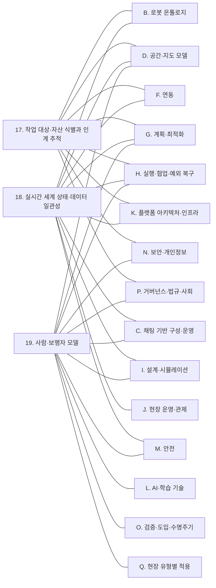

(너의 규칙은 시스템 프롬프트의 agents/shared-rules.md 와 agents/verifier.md 이다. 아래는 이번 실행의 컨텍스트와 입력이다.)

## 실행 컨텍스트

- run_id: 2026-10-09-03
- date: 2026-10-09
- run_type: category_link (대분류 연결)
- 대상: 대분류 E. 사물·사람·실시간 상태 페이지의 '다른 대분류와의 연결' 절(대분류 연결 실행). 게시된 세부영역 페이지를 근거로 다른 대분류와의 연결을 조사·서술한다. 스토리텔러는 그 절만 patches 로 바꾼다
- 예산:
    - max_search_queries: 30
    - max_sources_per_run: 15
    - new_topic_pages: 1
    - page_updates: 2
    - max_retries: 2
- 환경 알림: web_fetch_available: true · fetch_mode: full
- 언어: ko
- verification_stage: second
- verifier_budget:
    - max_search_queries: 30
    - max_sources_per_run: 15
    - new_topic_pages: 1
    - page_updates: 2
    - max_retries: 2

## 입력

### runs/2026-10-09-03/target.json

```json
{
  "run_id": "2026-10-09-03",
  "date": "2026-10-09",
  "weekday": "Fri",
  "run_number": 136,
  "run_type": "category_link",
  "forced": true,
  "target": {
    "area_no": null,
    "area_name": null,
    "category": "E. 사물·사람·실시간 상태",
    "category_letter": "E"
  },
  "topic": null,
  "track": null,
  "corrections": [],
  "budget": {
    "max_search_queries": 30,
    "max_sources_per_run": 15,
    "new_topic_pages": 1,
    "page_updates": 2,
    "max_retries": 2
  },
  "priority_reason": null,
  "priority_questions": [],
  "excluded_areas": [],
  "lifted_areas": [],
  "deferred": {
    "monthly_recheck": false,
    "weekly_review": false
  },
  "selection_rationale": "CLI 지정 run_type=category_link"
}
```

### runs/2026-10-09-03/research.json

```json
{
  "run_id": "2026-10-09-03",
  "date": "2026-10-09",
  "run_type": "category_link",
  "target": {
    "area_no": null,
    "area_name": null,
    "category": "E. 사물·사람·실시간 상태"
  },
  "gaps": [
    "E. 사물·사람·실시간 상태 대분류 페이지의 '다른 대분류와의 연결' 절 비어 있음(아직 작성되지 않음)",
    "A. 기획·사업과 E. 사물·사람·실시간 상태의 세 세부영역을 직접 잇는 검증된 근거가 게시 페이지에 없음",
    "C. 채팅 기반 구성·운영과의 연결 근거가 E 쪽 게시 페이지에 없음 — 이번 실행에서 12. 채팅으로 업무 지시·오케스트레이션 쪽 근거(ref-854)를 보강",
    "17. 작업 대상·자산 식별과 인계 추적의 '수령인 확인'(사람에게 넘길 때)과 N. 보안·개인정보·Q. 현장 유형별 적용을 잇는 근거 없음 — 병원·공동주택·사무 건물 사례를 새로 찾음",
    "L. AI·학습 기술의 45. 문서·도면·장면 이해와 18·19의 연결(oq-227 고정 카메라·로봇 인식 결합)은 근거 미확보",
    "옛 분류 기준으로 다른 대분류 페이지(A·B·F·G)에 E 쪽 영역과의 연결이 실려 있으나 새 17개 대분류 이름으로 다시 정리되지 않음"
  ],
  "research_questions": [
    "작업 대상·사람·설비·로봇이 지금 어디에 어떤 상태로 있는지 어떻게 믿을 수 있게 알 것인가? [분류원문] — 이 답이 다른 대분류의 어느 세부영역으로 넘어가는가?",
    "17. 작업 대상·자산 식별과 인계 추적은 F. 연동(20·22·23), G. 계획·최적화(24), H. 실행·협업·예외 복구(30·32), P. 거버넌스·법규·사회(58)와 어떤 신호·기록을 주고받는가? (oq-001, oq-003, oq-006, oq-036, oq-079 관련)",
    "17. 작업 대상·자산 식별과 인계 추적의 수령인 확인은 병원·공동주택 현장에서 어떤 인증 수단으로 이루어지며 N. 보안·개인정보(51·53)와 어떻게 이어지는가? (oq-180, oq-184 관련)",
    "18. 실시간 세계 상태·데이터 일관성은 B. 로봇 온톨로지(5·6), D. 공간·지도 모델(15), F. 연동(20·22), G. 계획·최적화(28), I. 설계·시뮬레이션(34), J. 현장 운영·관제(38·39), K. 플랫폼 아키텍처·인프라(42·43), M. 안전(48)과 무엇을 주고받는가? (oq-024, oq-028, oq-034, oq-035 관련)",
    "19. 사람·보행자 모델은 D. 공간·지도 모델(15·16), G. 계획·최적화(26·27), H. 실행·협업·예외 복구(31), I. 설계·시뮬레이션(34·36), L. AI·학습 기술(46), M. 안전(49), N. 보안·개인정보(53), O. 검증·도입·수명주기(54), P. 거버넌스·법규·사회(60), Q. 현장 유형별 적용(61·63·64·66)과 어떻게 이어지는가? (oq-256, oq-261, oq-272, oq-273, oq-274 관련)",
    "C. 채팅 기반 구성·운영의 대화형 업무 지시가 18. 실시간 세계 상태·데이터 일관성의 현재 상태를 근거로 쓰는 공개 구현이 있는가?",
    "E. 사물·사람·실시간 상태와 다른 대분류의 연결 가운데 근거가 아직 없는 쌍은 무엇인가? (다루지 않은 연결 목록)"
  ],
  "findings": [
    {
      "id": "f1",
      "claim": "E. 사물·사람·실시간 상태의 17. 작업 대상·자산 식별과 인계 추적 ↔ B. 로봇 온톨로지의 5. 로봇 능력·작업 표현: VDA 5050 팩트시트가 로봇이 취급할 수 있는 적재 유형을 선언하고 상태 메시지의 loadId 가 실제로 실린 적재물을 식별하므로, '이 로봇이 이 적재물을 다룰 수 있는가'를 판단하려면 능력 표현의 적재 유형과 17의 적재물 식별을 같은 어휘로 맞춰야 할 것으로 보이며 공통 어휘는 확인되지 않았다(oq-023).",
      "tag": "추정",
      "source_ids": [
        "ref-228",
        "ref-051"
      ],
      "cross_checked": false,
      "confidence": "low",
      "evidence_excerpt": "B. 로봇 온톨로지 페이지: 팩트시트 loadSets(적재 유형·최대 중량 등). state.schema loadId: 'Unique identification number of the load (e.g., barcode or RFID).' 적재 유형 공통 코드 체계는 미확인.",
      "as_of": "2026-10-09",
      "site_type": null,
      "flow_item": "작업 대상"
    },
    {
      "id": "f2",
      "claim": "E. 사물·사람·실시간 상태의 18. 실시간 세계 상태·데이터 일관성 ↔ B. 로봇 온톨로지의 5. 로봇 능력·작업 표현: Naqvi 외(Scientific Reports, 2025-10-02)는 로봇 능력 온톨로지(RCO)에서 제조사가 공개한 능력 수치와 운용 중 로봇이 실제로 보인 성능을 구분해 연결한다.",
      "tag": "사실",
      "source_ids": [
        "ref-041"
      ],
      "cross_checked": false,
      "confidence": "medium",
      "evidence_excerpt": "검색 요약(PMC·HAL): RCO 는 제조사 명세와 실증 성능 데이터를 잇는 참조 온톨로지로 제조 분야를 대상으로 한다. 본문은 열지 못함(PMC 봇 차단).",
      "as_of": "2025-10-02",
      "site_type": null,
      "flow_item": null,
      "source_unopened": true
    },
    {
      "id": "f3",
      "claim": "E. 사물·사람·실시간 상태의 18. 실시간 세계 상태·데이터 일관성 ↔ B. 로봇 온톨로지의 6. 온톨로지 기반 시스템·로봇 연동: 18이 모은 로봇의 관측 상태(배터리·문제 목록·위치)가 능력의 '지금 실행 가능 여부' 판단과 운용 능력 갱신의 입력이 될 것으로 보이며, 선언 능력과 관측 능력 가운데 무엇을 배정 기준으로 삼을지는 열린 질문(oq-024)으로 남아 있다.",
      "tag": "추정",
      "source_ids": [
        "ref-041",
        "ref-148"
      ],
      "cross_checked": false,
      "confidence": "low",
      "evidence_excerpt": "robot_state.json 은 status·battery(0.0~1.0)·issues·location·unix_millis_time 을 담는다(f17). RCO 는 광고 능력과 운용 능력을 구분(f2).",
      "as_of": "2026-10-09",
      "site_type": null,
      "flow_item": "수행 자원",
      "source_unopened": false
    },
    {
      "id": "f4",
      "claim": "E. 사물·사람·실시간 상태의 18. 실시간 세계 상태·데이터 일관성 ↔ C. 채팅 기반 구성·운영의 12. 채팅으로 업무 지시·오케스트레이션: 2026-07-02 Open Robotics 상호운용 SIG 발표(Nayantra)는 Open-RMF REST API 를 언어 모델이 호출할 수 있는 MCP 도구로 감싸고, 평이한 영어 지시를 여러 단계의 RMF 임무로 바꿔 Nav2 로 보내는 구성을 소개했다.",
      "tag": "사실",
      "source_ids": [
        "ref-854"
      ],
      "cross_checked": false,
      "confidence": "medium",
      "evidence_excerpt": "발표 안내: an MCP server that \"exposes the Open-RMF REST API as LLM-callable tools\". 시연은 NVIDIA Isaac Sim 창고 시뮬레이션. 상태 질의 기능 여부는 안내문에 없음.",
      "as_of": "2026-06-25",
      "site_type": null,
      "flow_item": "시작 조건"
    },
    {
      "id": "f5",
      "claim": "E. 사물·사람·실시간 상태의 18. 실시간 세계 상태·데이터 일관성 ↔ C. 채팅 기반 구성·운영의 12. 채팅으로 업무 지시·오케스트레이션: 대화로 '어디까지 했는가·왜 멈췄는가'에 답하려면 로봇 상태의 시각·상태 값·문제 목록 같은 현재 상태 기록을 근거로 써야 할 것으로 보이나, Open-RMF–MCP 연동이 상태 질의까지 제공하는지는 확인하지 못했다.",
      "tag": "추정",
      "source_ids": [
        "ref-854",
        "ref-148"
      ],
      "cross_checked": false,
      "confidence": "low",
      "evidence_excerpt": "robot_state.json: status(uninitialized·offline·shutdown·idle·charging·working·error), issues, unix_millis_time. MCP 발표 안내는 작업 파견만 명시.",
      "as_of": "2026-10-09",
      "site_type": null,
      "flow_item": "예외·성과"
    },
    {
      "id": "f6",
      "claim": "E. 사물·사람·실시간 상태의 19. 사람·보행자 모델 ↔ C. 채팅 기반 구성·운영의 11. 채팅으로 실제 상황 시뮬레이션 재현·I. 설계·시뮬레이션의 36. 가상 시운전·실제 상황 재현: 실제 운영 기록을 재생해 상황을 재현하면 기록된 사람이 바뀐 조건(로봇 수·배차 정책)에 반응하지 않는 문제가 생기며, 19. 사람·보행자 모델 페이지는 이를 열린 질문(oq-256)으로 두고 기록 재현 시뮬레이터(Waymax)와 사람 행동 시뮬레이터(HuNavSim)를 참고로 든다.",
      "tag": "추정",
      "source_ids": [
        "ref-1128",
        "ref-1179"
      ],
      "cross_checked": false,
      "confidence": "low",
      "evidence_excerpt": "19 페이지 11절: '기록 재현에서 사람을 반응하게 만드는 방법…은 아직 답이 없다'(추정). (재인용: 2026-09-30-20)",
      "as_of": "2026-09-30",
      "site_type": null,
      "flow_item": null,
      "source_unopened": true
    },
    {
      "id": "f7",
      "claim": "E. 사물·사람·실시간 상태의 18. 실시간 세계 상태·데이터 일관성 ↔ D. 공간·지도 모델의 15. 지도·공간·위치 모델: VDA 5050 상태 스키마는 위치추정 품질(localizationScore), 미터 단위 위치 편차 범위(deviationRange), 작업 공간 지도 식별자(mapId)를 두어, 보고된 위치를 얼마나 믿을지(18)와 어느 지도 위의 위치인지(15)가 같은 메시지로 넘어온다.",
      "tag": "사실",
      "source_ids": [
        "ref-051"
      ],
      "cross_checked": false,
      "confidence": "medium",
      "evidence_excerpt": "state.schema(main): localizationScore 'Describes the quality of the localization'; deviationRange 'position deviation range in meters'; mapId 'ID of the map…'. 계산 방식 통일 여부는 oq-028.",
      "as_of": "2026-10-09",
      "site_type": null,
      "flow_item": "제약"
    },
    {
      "id": "f8",
      "claim": "E. 사물·사람·실시간 상태의 17. 작업 대상·자산 식별과 인계 추적 ↔ D. 공간·지도 모델의 15. 지도·공간·위치 모델·16. 장소 의미·지도 관리: GS1 GLN 이 도크 문·보관 위치 같은 하위 위치를 식별할 수 있으므로, 인계 이벤트의 업무 위치와 로봇 지도 위 장소를 대응시키는 계층이 ROP 쪽에 필요할 것으로 보이며 국내 적용 사례는 확인되지 않았다(oq-029).",
      "tag": "추정",
      "source_ids": [
        "ref-162",
        "ref-031"
      ],
      "cross_checked": false,
      "confidence": "low",
      "evidence_excerpt": "B. 로봇 온톨로지 페이지의 같은 연결(추정): GLN 확장 요소는 조직 내부나 거래 당사자 간 합의로만 쓰므로 대응 계층은 ROP 쪽이 맡게 될 것으로 본다. (재인용: 2026-09-25-60)",
      "as_of": "2026-09-25",
      "site_type": null,
      "flow_item": "완료·인계",
      "source_unopened": false
    },
    {
      "id": "f9",
      "claim": "E. 사물·사람·실시간 상태의 19. 사람·보행자 모델 ↔ D. 공간·지도 모델의 15. 지도·공간·위치 모델: 움직임 지도(maps of dynamics)는 공간에 사람의 전형적 움직임 패턴을 덧붙인 지도이며, EU ILIAD 프로젝트는 학습한 사람 흐름에 맞춰 창고 자율 지게차의 경로를 계획했다.",
      "tag": "사실",
      "source_ids": [
        "ref-1171",
        "ref-1180"
      ],
      "cross_checked": false,
      "confidence": "medium",
      "evidence_excerpt": "19 페이지 5절(물류창고): 움직임 지도로 학습한 사람 흐름에 맞춘 경로 계획, 움직임별 사회적 비용으로 속도 제약. (재인용: 2026-09-30-20)",
      "as_of": "2023",
      "site_type": "물류창고",
      "flow_item": "제약",
      "source_unopened": true
    },
    {
      "id": "f10",
      "claim": "E. 사물·사람·실시간 상태의 19. 사람·보행자 모델 ↔ D. 공간·지도 모델의 16. 장소 의미·지도 관리: 한림대학교성심병원은 밤에 인식한 경로가 낮 혼잡에서는 원활하지 않을 수 있다고 보고 로봇 통행 경로와 작업 정지 지점을 전용 스티커로 표시했다(기사 1건 기준).",
      "tag": "사실",
      "source_ids": [
        "ref-1181"
      ],
      "cross_checked": false,
      "confidence": "medium",
      "evidence_excerpt": "조선비즈 2024-07-12: 환자나 휠체어와 마주치면 로봇이 무조건 대기. 사람 혼잡이 장소에 붙는 운영 표시(전용 통로·정지 지점)로 나타난 사례. (재인용: 2026-09-30-20)",
      "as_of": "2024-07-12",
      "site_type": "병원",
      "flow_item": "제약",
      "source_unopened": true
    },
    {
      "id": "f11",
      "claim": "E. 사물·사람·실시간 상태의 17. 작업 대상·자산 식별과 인계 추적 ↔ F. 연동의 20. 로봇·제조사 관제 연동: VDA 5050 상태 스키마의 loads 는 로봇이 현재 취급 중인 적재물을 담고, loadId 는 바코드·RFID 같은 적재물 식별 번호, loadPosition 은 어느 적재 장치를 쓰는지를 나타낸다.",
      "tag": "사실",
      "source_ids": [
        "ref-051"
      ],
      "cross_checked": false,
      "confidence": "medium",
      "evidence_excerpt": "state.schema: loads 'Loads, that are currently handled by the mobile robot.'; loadId '(e.g., barcode or RFID)'. GS1 키 형식 지정은 없음(oq-007).",
      "as_of": "2026-10-09",
      "site_type": null,
      "flow_item": "작업 대상"
    },
    {
      "id": "f12",
      "claim": "E. 사물·사람·실시간 상태의 17. 작업 대상·자산 식별과 인계 추적 ↔ F. 연동의 22. 설비·건물 시스템 연동: Open-RMF 배송 작업에서 로봇은 픽업 지점의 DispenserResult, 하역 지점의 IngestorResult 를 받을 때까지 요청을 되풀이하고, IngestorResult 는 시각·요청 id·워크셀 id·상태(ACKNOWLEDGED·SUCCESS·FAILED)를 담는다.",
      "tag": "사실",
      "source_ids": [
        "ref-023",
        "ref-049"
      ],
      "cross_checked": false,
      "confidence": "medium",
      "evidence_excerpt": "B. 로봇 온톨로지·F. 연동 페이지에 같은 각주로 게시된 사실. (재인용: 2026-09-25-60)",
      "as_of": "2026-09-25",
      "site_type": null,
      "flow_item": "완료·인계"
    },
    {
      "id": "f13",
      "claim": "E. 사물·사람·실시간 상태의 17. 작업 대상·자산 식별과 인계 추적 ↔ F. 연동의 22. 설비·건물 시스템 연동: 설비의 인수 결과에는 화물 식별자·인계 당사자가 없으므로 설비 쪽 SUCCESS 를 17의 식별·인계 기록과 결합해야 '무엇이 누구에게 넘겨졌는지'가 확정될 것으로 보이며, 이를 정한 표준 매핑은 확인되지 않았다(oq-001, oq-061).",
      "tag": "추정",
      "source_ids": [
        "ref-049",
        "ref-014",
        "ref-015"
      ],
      "cross_checked": false,
      "confidence": "low",
      "evidence_excerpt": "IngestorResult 필드: time, request_guid, source_guid, status. EPCIS 는 소유·점유·위치 이전을 source/destination 으로 표현.",
      "as_of": "2026-09-25",
      "site_type": null,
      "flow_item": "완료·인계",
      "source_unopened": false
    },
    {
      "id": "f14",
      "claim": "E. 사물·사람·실시간 상태의 17. 작업 대상·자산 식별과 인계 추적·18. 실시간 세계 상태·데이터 일관성 ↔ F. 연동의 23. 업무 시스템 연동: DeHoratius·Raman(2008)은 한 소매업체 37개 매장 재고 기록의 65%가 실물과 맞지 않았다고 보고했다(소매 매장 조건이며 물류센터 값이 아니다).",
      "tag": "사실",
      "source_ids": [
        "ref-292"
      ],
      "cross_checked": false,
      "confidence": "medium",
      "evidence_excerpt": "18 페이지 5절 시나리오 2의 예외·성과 칸에 게시된 사실(소매 조건 단서 포함). (재인용: 2026-09-25-24)",
      "as_of": "2008",
      "site_type": "상업 시설",
      "flow_item": "예외·성과",
      "source_unopened": true
    },
    {
      "id": "f15",
      "claim": "E. 사물·사람·실시간 상태의 17. 작업 대상·자산 식별과 인계 추적·18. 실시간 세계 상태·데이터 일관성 ↔ F. 연동의 23. 업무 시스템 연동: 로봇이 보고한 적재물 식별 결과와 WMS 재고 기록이 어긋나면 덮어쓰지 않고 두 기록을 함께 보관해 정정 이벤트로 업무 시스템에 되돌리는 것이 두 대분류의 넘겨받는 지점이 될 것으로 보이며, 어느 쪽을 기준으로 삼고 누가 정정하는지는 열린 질문(oq-036)이다.",
      "tag": "추정",
      "source_ids": [
        "ref-292",
        "ref-051",
        "ref-492"
      ],
      "cross_checked": false,
      "confidence": "low",
      "evidence_excerpt": "loadId(로봇 보고), EPCIS errorDeclaration(기록 정정, f26), 재고 기록 부정확성(f14)을 종합한 추론.",
      "as_of": "2026-10-09",
      "site_type": null,
      "flow_item": "예외·성과",
      "source_unopened": false
    },
    {
      "id": "f16",
      "claim": "E. 사물·사람·실시간 상태의 18. 실시간 세계 상태·데이터 일관성 ↔ F. 연동의 22. 설비·건물 시스템 연동: Open-RMF 문 상태(DoorState)는 생성 시각 door_time·문 이름·현재 모드를, 승강기 상태(LiftState)는 생성 시각 lift_time·현재·목적 층·문 상태·운행 상태·현재 모드·제어 세션 id 를 담고, 두 메시지 모두 허용 경과 시간은 정하지 않는다.",
      "tag": "사실",
      "source_ids": [
        "ref-285",
        "ref-286"
      ],
      "cross_checked": false,
      "confidence": "medium",
      "evidence_excerpt": "DoorState.msg: door_time, door_name, current_mode. LiftState.msg: lift_time('when the information was generated'), current_floor, door_state, motion_state, current_mode, session_id. 몇 초까지 믿을지는 oq-034.",
      "as_of": "2026-10-09",
      "site_type": null,
      "flow_item": "제약"
    },
    {
      "id": "f17",
      "claim": "E. 사물·사람·실시간 상태의 18. 실시간 세계 상태·데이터 일관성 ↔ F. 연동의 20. 로봇·제조사 관제 연동: Open-RMF 로봇 상태는 밀리초 유닉스 시각(unix_millis_time), 상태 7종, 0~1 배터리, 운영자가 풀어야 할 문제 목록(issues)을 담고, VDA 5050 상태는 ISO 8601 형식 시각(timestamp)을 담는다.",
      "tag": "사실",
      "source_ids": [
        "ref-148",
        "ref-051"
      ],
      "cross_checked": false,
      "confidence": "medium",
      "evidence_excerpt": "robot_state.json status: uninitialized, offline, shutdown, idle, charging, working, error. state.schema timestamp 'in ISO8601 format (YYYY-MM-DDTHH:mm:ss.fffZ)'.",
      "as_of": "2026-10-09",
      "site_type": null,
      "flow_item": "수행 자원"
    },
    {
      "id": "f18",
      "claim": "E. 사물·사람·실시간 상태의 18. 실시간 세계 상태·데이터 일관성 ↔ F. 연동의 20. 로봇·제조사 관제 연동: 관제 인터페이스마다 시각 표현과 보고 주기가 달라 20의 어댑터가 받은 상태를 18의 공통 시간축으로 옮기는 변환·시계 오차 기준이 필요할 것으로 보이나, 이를 규정한 자료는 확인하지 못했다(oq-035).",
      "tag": "추정",
      "source_ids": [
        "ref-148",
        "ref-051"
      ],
      "cross_checked": false,
      "confidence": "low",
      "evidence_excerpt": "f17 의 두 시각 표현(밀리초 정수 vs ISO 8601 문자열)에서 도출.",
      "as_of": "2026-10-09",
      "site_type": null,
      "flow_item": null
    },
    {
      "id": "f19",
      "claim": "E. 사물·사람·실시간 상태의 17. 작업 대상·자산 식별과 인계 추적 ↔ G. 계획·최적화의 24. 작업·워크플로 모델링: GS1 CBV 는 도착(arriving)·입고(receiving)·인수(accepting)를 서로 다른 업무 단계로 정의하고, VDA 5050 은 하역(drop) 완료를 적재물이 로봇을 떠나 로봇이 새 적재 상태를 보고한 때로 정의한다.",
      "tag": "사실",
      "source_ids": [
        "ref-044",
        "ref-031"
      ],
      "cross_checked": false,
      "confidence": "medium",
      "evidence_excerpt": "A. 기획·사업·B. 로봇 온톨로지 페이지에 같은 각주로 게시된 사실. 로봇 완료(arriving 수준)와 업무 완료(receiving·accepting)의 구분이 24의 완료 조건으로 넘어간다. (재인용: 2026-09-25-60)",
      "as_of": "2021-09-30",
      "site_type": null,
      "flow_item": "완료·인계"
    },
    {
      "id": "f20",
      "claim": "E. 사물·사람·실시간 상태의 18. 실시간 세계 상태·데이터 일관성 ↔ G. 계획·최적화의 28. 공용 자원·충전·에너지 최적화: Open-RMF 로봇 상태는 배터리를 0.0(빈)~1.0(가득)으로, VDA 5050 상태는 powerSupply.stateOfCharge 를 퍼센트로 보고한다.",
      "tag": "사실",
      "source_ids": [
        "ref-148",
        "ref-051"
      ],
      "cross_checked": false,
      "confidence": "medium",
      "evidence_excerpt": "robot_state.json battery 0.0~1.0; state.schema powerSupply.stateOfCharge 'State of Charge in %'. 표현 단위가 다르다.",
      "as_of": "2026-10-09",
      "site_type": null,
      "flow_item": "제약"
    },
    {
      "id": "f21",
      "claim": "E. 사물·사람·실시간 상태의 18. 실시간 세계 상태·데이터 일관성 ↔ G. 계획·최적화의 28. 공용 자원·충전·에너지 최적화: Open-RMF 가 작업을 끝낼 충전량이 부족하면 충전 작업을 일정에 끼워 넣으므로, 충전 계획은 18이 표현하는 현재 배터리 상태를 단위를 맞춰 입력으로 쓰는 것으로 보인다.",
      "tag": "추정",
      "source_ids": [
        "ref-104",
        "ref-148"
      ],
      "cross_checked": false,
      "confidence": "low",
      "evidence_excerpt": "G. 계획·최적화 페이지에 게시된 같은 연결(추정). 현재 상태 표현이며 가정한 미래 실험(34)과 구분. (재인용: 2026-09-25-55)",
      "as_of": "2026-09-25",
      "site_type": null,
      "flow_item": "제약"
    },
    {
      "id": "f22",
      "claim": "E. 사물·사람·실시간 상태의 19. 사람·보행자 모델 ↔ G. 계획·최적화의 27. 다중 로봇 경로·교통 관리 — MAPF: Vintr 외(2022)는 장기 시공간 보행자 흐름 지도를 경로 계획에 쓰고 예상 조우(Expected Encounters)와 예상 경로 길이로 비교했으며, 대학 건물 현장 실험에서 예측형 주행은 불편을 드러낸 사람이 두 세션 모두 0명, 반응형은 2명·1명이었다(40분 세션 4회의 매우 작은 표본).",
      "tag": "사실",
      "source_ids": [
        "ref-1178"
      ],
      "cross_checked": false,
      "confidence": "medium",
      "evidence_excerpt": "19 페이지 5절 기타(UTBM 대학 홀) 사례에 게시된 사실. (재인용: 2026-09-30-20)",
      "as_of": "2022-07-04",
      "site_type": "기타",
      "flow_item": "예외·성과",
      "source_unopened": true
    },
    {
      "id": "f23",
      "claim": "E. 사물·사람·실시간 상태의 19. 사람·보행자 모델 ↔ G. 계획·최적화의 26. 작업 순서·스케줄링: 낮 시간 복도 혼잡과 '무조건 대기' 규칙(병원), 혼잡을 예상해 위치를 정하는 계획(쇼핑몰 연구)처럼 사람 흐름은 로봇 작업 시간과 순서에 영향을 줄 것으로 보이나, 시간대별 혼잡을 작업 시간 추정·스케줄링에 넣어 효과를 측정한 현장 연구는 확인하지 못했다(oq-273).",
      "tag": "추정",
      "source_ids": [
        "ref-1181",
        "ref-1182"
      ],
      "cross_checked": false,
      "confidence": "low",
      "evidence_excerpt": "19 페이지 5절 병원·상업 시설 사례에서 대기 규칙의 처리 시간 영향과 효과 수치는 모두 미확인으로 게시됨.",
      "as_of": "2026-09-30",
      "site_type": null,
      "flow_item": "제약",
      "source_unopened": true
    },
    {
      "id": "f24",
      "claim": "E. 사물·사람·실시간 상태의 17. 작업 대상·자산 식별과 인계 추적 ↔ H. 실행·협업·예외 복구의 30. 로봇 간 협업·물리적 인계: EPCIS 가 소유·점유·위치 이전을 출발지·도착지(source/destination)로 표현하므로, 로봇·설비 사이 물리적 인계의 확인은 17의 식별자·인계 당사자 기록과 결합해야 할 것으로 보인다(oq-001, oq-006).",
      "tag": "추정",
      "source_ids": [
        "ref-049",
        "ref-014",
        "ref-015"
      ],
      "cross_checked": false,
      "confidence": "low",
      "evidence_excerpt": "B. 로봇 온톨로지 페이지에 게시된 같은 연결(추정). 시설 안 로봇 인계를 어떤 bizStep 으로 기록할지는 oq-006. (재인용: 2026-09-25-60)",
      "as_of": "2026-09-25",
      "site_type": null,
      "flow_item": "완료·인계",
      "source_unopened": false
    },
    {
      "id": "f25",
      "claim": "E. 사물·사람·실시간 상태의 17. 작업 대상·자산 식별과 인계 추적 ↔ H. 실행·협업·예외 복구의 32. 예외 복구·재계획·업무 연속성: 팔레트 RFID 태그 판독성이 제품·포장·태그 위치·적재 패턴에 따라 달라진다는 실험 보고가 있어, 판독 실패·오판독 때 인계 보류·재스캔·사람 확인 규칙이 복구 과제로 넘어갈 것으로 보인다(oq-003).",
      "tag": "추정",
      "source_ids": [
        "ref-024"
      ],
      "cross_checked": false,
      "confidence": "low",
      "evidence_excerpt": "Singh 외(2009) 도크 도어 모사 RFID 포털 실험. 17 페이지 8절·B 페이지 연결 절의 추정을 재인용. (재인용: 2026-09-25-60)",
      "as_of": "2009",
      "site_type": null,
      "flow_item": "예외·성과",
      "source_unopened": true
    },
    {
      "id": "f26",
      "claim": "E. 사물·사람·실시간 상태의 17. 작업 대상·자산 식별과 인계 추적 ↔ H. 실행·협업·예외 복구의 32. 예외 복구·재계획·업무 연속성: EPCIS 1.2 는 이미 기록된 이벤트를 오류 선언(errorDeclaration)으로 정정하게 하므로, 고장 로봇에서 회수한 화물의 위치·이벤트 정정이 식별·추적 쪽 기록 규칙에 기대게 된다(oq-079).",
      "tag": "사실",
      "source_ids": [
        "ref-492"
      ],
      "cross_checked": false,
      "confidence": "medium",
      "evidence_excerpt": "옛 E. 협업·현장 운영 대분류 연결 절의 같은 연결(사실, 원문 미열람). (재인용: 2026-09-25-60)",
      "as_of": "2016-09-29",
      "site_type": null,
      "flow_item": "완료·인계",
      "source_unopened": true
    },
    {
      "id": "f27",
      "claim": "E. 사물·사람·실시간 상태의 18. 실시간 세계 상태·데이터 일관성 ↔ H. 실행·협업·예외 복구의 29. 명령·작업 실행의 신뢰성·32. 예외 복구·재계획·업무 연속성: VDA 5050 3.0.0 에서 로봇 연결이 예기치 않게 끊기면 브로커가 MQTT 유언으로 CONNECTION_BROKEN 을 대신 알리고, 로봇은 받은 주문을 유지한 채 마지막으로 해제된 노드까지 수행한다.",
      "tag": "사실",
      "source_ids": [
        "ref-031"
      ],
      "cross_checked": false,
      "confidence": "medium",
      "evidence_excerpt": "18 페이지 5절, F. 연동 페이지 연결 절에 게시된 사실. 끊긴 동안 세계 상태의 로봇 위치는 오래된 값이 된다. (재인용: 2026-09-25-24)",
      "as_of": "2026-09-25",
      "site_type": null,
      "flow_item": "예외·성과"
    },
    {
      "id": "f28",
      "claim": "E. 사물·사람·실시간 상태의 18. 실시간 세계 상태·데이터 일관성·19. 사람·보행자 모델 ↔ H. 실행·협업·예외 복구의 31. 사람–로봇 협업: Riedelbauch·Werner·Henrich(RAAD 2017)는 사람과 함께 쓰는 작업 공간에서 세계 모델의 정보마다 확실도 값을 붙이고, 전역 센서가 감지한 사람 존재에 따라 이 값을 시간에 따라 조정해 로봇이 정보가 아직 유효한지 판단하게 했다.",
      "tag": "사실",
      "source_ids": [
        "ref-1302"
      ],
      "cross_checked": false,
      "confidence": "medium",
      "evidence_excerpt": "초록: \"we annotate pieces of information with certainty values encoding how trustworthy they are\". 전역 센서의 사람 존재 데이터와 손목 카메라 데이터를 결합, 시제품 실험.",
      "as_of": "2017",
      "site_type": null,
      "flow_item": null
    },
    {
      "id": "f29",
      "claim": "E. 사물·사람·실시간 상태의 18. 실시간 세계 상태·데이터 일관성·19. 사람·보행자 모델 ↔ H. 실행·협업·예외 복구의 31. 사람–로봇 협업: 사람이 드나든 구역의 물품·설비 상태는 관측 뒤 바뀌었을 가능성이 높으므로, 19의 사람 위치 정보가 18의 상태 신뢰도를 낮추는 근거로 쓰일 수 있을 것으로 보이나 이동로봇 현장 적용 사례는 확인하지 못했다.",
      "tag": "추정",
      "source_ids": [
        "ref-1302"
      ],
      "cross_checked": false,
      "confidence": "low",
      "evidence_excerpt": "f28 은 고정 작업 공간(조립) 연구이며 물류창고·병원 이동로봇 적용은 미확인.",
      "as_of": "2026-10-09",
      "site_type": null,
      "flow_item": null
    },
    {
      "id": "f30",
      "claim": "E. 사물·사람·실시간 상태의 18. 실시간 세계 상태·데이터 일관성 ↔ I. 설계·시뮬레이션의 34. 시뮬레이션·예측용 디지털 트윈: 제조 분야 분류 자료가 현장 상태가 한 방향으로 자동 반영되는 디지털 섀도와 디지털 트윈을 구분하므로, 18은 현재 상태를 표현하고 34는 그 표현을 복제해 가정한 미래를 실험하는 쪽으로 나누는 것이 분류 원문의 구분과 맞을 것으로 보인다(근거 자료는 제조 대상).",
      "tag": "추정",
      "source_ids": [
        "ref-291",
        "ref-290"
      ],
      "cross_checked": false,
      "confidence": "low",
      "evidence_excerpt": "18 페이지 10절·B 페이지 연결 절에 게시된 추정. (재인용: 2026-09-25-24)",
      "as_of": "2018",
      "site_type": null,
      "flow_item": null,
      "source_unopened": true
    },
    {
      "id": "f31",
      "claim": "E. 사물·사람·실시간 상태의 19. 사람·보행자 모델 ↔ I. 설계·시뮬레이션의 34. 시뮬레이션·예측용 디지털 트윈: HuNavSim 은 사람 인지 내비게이션을 벤치마크하기 위한 ROS 2 사람 이동 시뮬레이터이고, Kidokoro 외(HRI 2013)는 보행자 행동 모델로 가상 주행 상황을 시뮬레이션해 혼잡을 피하는 로봇 위치를 계획했다.",
      "tag": "사실",
      "source_ids": [
        "ref-1179",
        "ref-1182"
      ],
      "cross_checked": false,
      "confidence": "medium",
      "evidence_excerpt": "19 페이지 5절(상업 시설)·7절에 게시된 사실. 사람 행동 모델이 가정한 미래 실험의 입력이 된다. (재인용: 2026-09-30-20)",
      "as_of": "2023-09-13",
      "site_type": null,
      "flow_item": null,
      "source_unopened": true
    },
    {
      "id": "f32",
      "claim": "E. 사물·사람·실시간 상태의 18. 실시간 세계 상태·데이터 일관성 ↔ J. 현장 운영·관제의 38. 모니터링·이상 탐지·원인 분석·39. 운영 성과 측정·개선: 로봇 상태의 상태 값·배터리·문제 목록·시각과 문·승강기 상태의 시각을 한 세계 상태 기록에 모으면, 가동률·충전·오류 시간 지표와 '지연 원인이 로봇인지 문인지' 분석이 같은 기록을 쓰게 될 것으로 보인다.",
      "tag": "추정",
      "source_ids": [
        "ref-148",
        "ref-285",
        "ref-286"
      ],
      "cross_checked": false,
      "confidence": "low",
      "evidence_excerpt": "A. 기획·사업·B. 로봇 온톨로지 페이지의 같은 연결(추정)과 이번에 연 메시지 정의(f16·f17)를 종합.",
      "as_of": "2026-10-09",
      "site_type": null,
      "flow_item": "예외·성과"
    },
    {
      "id": "f33",
      "claim": "E. 사물·사람·실시간 상태의 18. 실시간 세계 상태·데이터 일관성 ↔ K. 플랫폼 아키텍처·인프라의 42. 분산 시스템·통신·컴퓨팅 구조: ROS 2 QoS 의 기한·생존성 정책, Sparkplug 의 노드 종료(NDEATH) 뒤 지표 STALE 표시, VDA 5050 의 MQTT 유언을 통한 연결 끊김 통지처럼 통신 계층에 상태의 오래됨을 알리는 장치가 있다.",
      "tag": "사실",
      "source_ids": [
        "ref-282",
        "ref-287",
        "ref-031"
      ],
      "cross_checked": false,
      "confidence": "medium",
      "evidence_excerpt": "B. 로봇 온톨로지·F. 연동 페이지에 같은 각주로 게시된 사실. 세 출처는 각각 한 장치만 다룬다. (재인용: 2026-09-25-60)",
      "as_of": "2026-09-25",
      "site_type": null,
      "flow_item": "제약"
    },
    {
      "id": "f34",
      "claim": "E. 사물·사람·실시간 상태의 17. 작업 대상·자산 식별과 인계 추적·18. 실시간 세계 상태·데이터 일관성 ↔ K. 플랫폼 아키텍처·인프라의 43. 데이터·관측성·배포: EPCIS 2.0 온톨로지가 발생 시각(eventTime)·기록 시각(recordTime)·UTC 차이를 구분하므로, 실행 기록과 관측 데이터에서도 발생 시각과 수신·기록 시각을 따로 남기는 설계가 두 대분류를 잇는 지점이 될 것으로 보인다.",
      "tag": "추정",
      "source_ids": [
        "ref-045"
      ],
      "cross_checked": false,
      "confidence": "low",
      "evidence_excerpt": "18 페이지 4절: EPCIS 2.0 온톨로지의 eventTime·recordTime·eventTimeZoneOffset 구분(사실). 43 쪽 적용은 추론.",
      "as_of": "2021-09-30",
      "site_type": null,
      "flow_item": null
    },
    {
      "id": "f35",
      "claim": "E. 사물·사람·실시간 상태의 19. 사람·보행자 모델 ↔ L. AI·학습 기술의 46. 예측·학습 기반 최적화: Rudenko 외 서베이가 정리한 사람 움직임 궤적 예측은 19의 가까운 미래 사람 위치 추정 방법이므로, 예측 결과를 경로·배정 비용에 넣는 일이 46과 이어질 것으로 보인다.",
      "tag": "추정",
      "source_ids": [
        "ref-1172"
      ],
      "cross_checked": false,
      "confidence": "low",
      "evidence_excerpt": "19 페이지 3·6절: 궤적 예측·보행자 행동 모델로 가까운 미래를 추정해 경로 비용·속도 제약에 반영(추정).",
      "as_of": "2019-12-17",
      "site_type": null,
      "flow_item": null,
      "source_unopened": true
    },
    {
      "id": "f36",
      "claim": "E. 사물·사람·실시간 상태의 18. 실시간 세계 상태·데이터 일관성 ↔ M. 안전의 48. 안전·위험 관리: Open-RMF 승강기 상태의 현재 모드에는 알 수 없음·사람·AGV·화재·오프라인·비상이 있으며 사람·AGV 모드만 설정할 수 있고 나머지는 읽기 전용이다.",
      "tag": "사실",
      "source_ids": [
        "ref-286"
      ],
      "cross_checked": false,
      "confidence": "medium",
      "evidence_excerpt": "LiftState.msg current_mode 상수 0~5. 탑승 확정 전 최신 모드 확인은 ROP 몫, 승강기 안전 제어는 분류 원문 19장 시설·설비 제어 경계의 연계 대상.",
      "as_of": "2026-10-09",
      "site_type": null,
      "flow_item": "제약"
    },
    {
      "id": "f37",
      "claim": "E. 사물·사람·실시간 상태의 19. 사람·보행자 모델 ↔ M. 안전의 49. 사람 근접 안전: 병원의 '사람·휠체어와 마주치면 무조건 대기' 규칙과 창고의 움직임별 사회적 비용에 따른 속도 제약처럼 사람 흐름 정보는 구역별 대기·속도 규칙으로 49와 이어지며, ROP 는 규칙을 요청·관리하고 사람 검출·안전 정지는 연계 대상으로 로봇이 맡는 경계가 될 것으로 보인다.",
      "tag": "추정",
      "source_ids": [
        "ref-1181",
        "ref-1180"
      ],
      "cross_checked": false,
      "confidence": "low",
      "evidence_excerpt": "19 페이지 9절 책임 경계 표(추정)를 재인용. (재인용: 2026-09-30-20)",
      "as_of": "2026-09-30",
      "site_type": null,
      "flow_item": "제약",
      "source_unopened": true
    },
    {
      "id": "f38",
      "claim": "E. 사물·사람·실시간 상태의 19. 사람·보행자 모델 ↔ N. 보안·개인정보의 53. 개인정보·영상 데이터: ROS 규약 제안 REP-155(Draft, 2022-01-11 작성)는 사람마다 영속 ID 를 두고 얼굴·몸·음성 ID 를 후보 대응으로 연결하며, 이 문서는 개인정보·동의를 다루지 않는다.",
      "tag": "사실",
      "source_ids": [
        "ref-1173"
      ],
      "cross_checked": false,
      "confidence": "medium",
      "evidence_excerpt": "REP-155: person ID 'MUST be a unique ID… permanently associated with a unique person'. 신원 미확인은 anonymous person. 개인정보 언급 없음.",
      "as_of": "2022-01-11",
      "site_type": null,
      "flow_item": "작업 대상"
    },
    {
      "id": "f39",
      "claim": "E. 사물·사람·실시간 상태의 19. 사람·보행자 모델 ↔ N. 보안·개인정보의 53. 개인정보·영상 데이터: 사람 표현의 영속 ID 가 얼굴·음성 인식과 연결될 수 있으므로 ROP 가 보관하는 사람 정보는 구역·시간대 집계·익명화로 두는 것이 두 대분류의 경계가 될 것으로 보이며, 여러 출처의 사람 위치를 합치는 익명화 형식과 촬영 거부 의사 공유 방법은 열린 질문(oq-261, oq-272)이다.",
      "tag": "추정",
      "source_ids": [
        "ref-1173"
      ],
      "cross_checked": false,
      "confidence": "low",
      "evidence_excerpt": "19 페이지 9절의 추정을 재인용. (재인용: 2026-09-30-20)",
      "as_of": "2026-09-30",
      "site_type": null,
      "flow_item": "제약"
    },
    {
      "id": "f40",
      "claim": "E. 사물·사람·실시간 상태의 17. 작업 대상·자산 식별과 인계 추적 ↔ N. 보안·개인정보의 51. 인증·권한·격리: 병원용 운반 로봇 Zena RX(ST Engineering Aethon, 2024-04 출시 발표)는 생체 인식과 직원 PIN 코드로 잠금 칸을 열게 해 권한 있는 직원만 약품·검체를 꺼낼 수 있다고 제조사는 밝힌다.",
      "tag": "추정",
      "source_ids": [
        "ref-1299"
      ],
      "cross_checked": false,
      "confidence": "low",
      "evidence_excerpt": "벤더 주장: \"biometric security and staff pin codes\"; 'Only authorized staff can retrieve the delivery'. 추적·감사 기록·알림 기능은 발표문에 없음.",
      "as_of": "2024-04-29",
      "site_type": "병원",
      "flow_item": "완료·인계",
      "vendor_claim": true
    },
    {
      "id": "f41",
      "claim": "E. 사물·사람·실시간 상태의 17. 작업 대상·자산 식별과 인계 추적 ↔ N. 보안·개인정보의 51. 인증·권한·격리: 2019-10 우아한형제들 본사(서울 잠실) 시범 운영에서 배달 로봇 딜리타워는 라이더가 주문번호 앞 네 자리와 층을 입력하면 승강기로 이동해 고객에게 전화를 걸고, 고객이 휴대전화 번호 뒤 네 자리를 입력해야 음식 칸이 열렸다(기사 기준).",
      "tag": "사실",
      "source_ids": [
        "ref-1300"
      ],
      "cross_checked": false,
      "confidence": "low",
      "evidence_excerpt": "바이라인네트워크 2019-10-17: 두 대 승강기 중 먼저 오는 것을 호출, 사람이 자리를 차지하면 다음 승강기 대기. 배민라이더스 주문만 대상.",
      "as_of": "2019-10-17",
      "site_type": "기타",
      "flow_item": "완료·인계"
    },
    {
      "id": "f42",
      "claim": "E. 사물·사람·실시간 상태의 17. 작업 대상·자산 식별과 인계 추적 ↔ N. 보안·개인정보의 51. 인증·권한·격리: 2020-07 보도에 따르면 딜리타워의 공동주택(포레나 영등포) 도입 계획에서는 라이더와 고객이 모두 로봇 화면에 비밀번호를 눌러 적재함을 열고, 로봇은 도착 시 고객에게 문자와 전화로 알리게 되어 있었다.",
      "tag": "사실",
      "source_ids": [
        "ref-1301"
      ],
      "cross_checked": false,
      "confidence": "low",
      "evidence_excerpt": "경향신문 2020-07-03: 30층 182세대·오피스텔 111실, 이듬해 2월 준공 예정 단지의 계획 단계 보도. 실제 운영 방식 확인은 아님.",
      "as_of": "2020-07-03",
      "site_type": "가정",
      "flow_item": "완료·인계"
    },
    {
      "id": "f43",
      "claim": "E. 사물·사람·실시간 상태의 17. 작업 대상·자산 식별과 인계 추적 ↔ N. 보안·개인정보의 51. 인증·권한·격리·53. 개인정보·영상 데이터: 확인한 사례의 수령인 확인 수단이 생체+PIN(병원), 전화번호 뒤 네 자리(사무 건물), 비밀번호(공동주택 계획)로 서로 달라, 17의 '누구에게 넘겼는가' 기록은 51의 인증 수단과 53의 생체·전화번호 처리에 기대게 될 것으로 보이며, 그 결과가 주문·업무 시스템에 완료 이벤트로 기록되는지는 확인하지 못했다(oq-180, oq-184).",
      "tag": "추정",
      "source_ids": [
        "ref-1299",
        "ref-1300",
        "ref-1301"
      ],
      "cross_checked": false,
      "confidence": "low",
      "evidence_excerpt": "f40~f42 종합. 세 출처 모두 인증 결과의 기록·전송 방식은 다루지 않는다.",
      "as_of": "2026-10-09",
      "site_type": null,
      "flow_item": "완료·인계"
    },
    {
      "id": "f44",
      "claim": "E. 사물·사람·실시간 상태의 19. 사람·보행자 모델 ↔ O. 검증·도입·수명주기의 54. 시험·형식 검증·벤치마크: 사회적 로봇 내비게이션 알고리즘 평가 원칙·지침(Francis 외, 2023)과 장기 시공간 보행자 흐름 지도의 벤치마크 연구(Vintr 외, 2022)가 있어, 사람 모델을 쓴 계획의 효과를 시험하는 방법이 54와 이어진다.",
      "tag": "사실",
      "source_ids": [
        "ref-1079",
        "ref-1178"
      ],
      "cross_checked": false,
      "confidence": "medium",
      "evidence_excerpt": "19 페이지 7·8절에 게시된 자료(평가 지침·벤치마크). (재인용: 2026-09-30-20)",
      "as_of": "2023-06-29",
      "site_type": null,
      "flow_item": null,
      "source_unopened": true
    },
    {
      "id": "f45",
      "claim": "E. 사물·사람·실시간 상태의 19. 사람·보행자 모델 ↔ P. 거버넌스·법규·사회의 60. 노동·수용성·접근성: Han 외(CHI 2024)는 이동장애인 15명·로봇 실무자 8명 면담과 4회 공동설계 워크숍에서 보도 로봇이 들어오면 이동장애인이 보도 공간을 두고 경쟁해야 한다고 느끼며, 부족한 연석 경사로 같은 기존 장벽 위에서 로봇이 운행된다고 보고했다.",
      "tag": "사실",
      "source_ids": [
        "ref-1214"
      ],
      "cross_checked": false,
      "confidence": "medium",
      "evidence_excerpt": "초록: PwMD feel they must \"compete for space on the sidewalk\"; 실무자는 기업이 문제가 생긴 뒤에야 접근성을 다룬다고 인정; 두 집단 모두 처음부터 접근성 통합을 강조.",
      "as_of": "2024-04-07",
      "site_type": "실외",
      "flow_item": "제약"
    },
    {
      "id": "f46",
      "claim": "E. 사물·사람·실시간 상태의 19. 사람·보행자 모델 ↔ P. 거버넌스·법규·사회의 60. 노동·수용성·접근성: 보행 약자가 지나야 하는 연석 경사로·좁은 통로를 사람 흐름 모델의 양보·비정차 구역으로 표현해야 60의 접근성 요구가 경로·대기 위치 제약으로 이어질 것으로 보이나, 국내 기준은 확인하지 못했다(oq-188 관련).",
      "tag": "추정",
      "source_ids": [
        "ref-1214"
      ],
      "cross_checked": false,
      "confidence": "low",
      "evidence_excerpt": "f45 와 60 영역 브리프(2026-09-30-24) f13·f20 의 연석 경사로 대기 위치 추정을 종합. (재인용: 2026-09-30-24)",
      "as_of": "2026-10-09",
      "site_type": "실외",
      "flow_item": "제약"
    },
    {
      "id": "f47",
      "claim": "E. 사물·사람·실시간 상태의 17. 작업 대상·자산 식별과 인계 추적 ↔ P. 거버넌스·법규·사회의 58. 다사업자 책임·계약·데이터: CBV 의 출발지·도착지 유형(owning_party·possessing_party·location)이 소유·점유 이전을 당사자 단위로 기록하므로, 제조사·운영사·화주 사이 인계 책임의 기록 근거가 17의 이벤트에서 나올 것으로 보인다.",
      "tag": "추정",
      "source_ids": [
        "ref-014",
        "ref-015",
        "ref-044"
      ],
      "cross_checked": false,
      "confidence": "low",
      "evidence_excerpt": "17 페이지 4절: CBV 는 source/destination 유형으로 owning_party·possessing_party·location 을 정한다(사실). 다사업자 책임 적용은 추론.",
      "as_of": "2021-09-30",
      "site_type": null,
      "flow_item": "완료·인계",
      "source_unopened": false
    },
    {
      "id": "f48",
      "claim": "연계 대상: E. 사물·사람·실시간 상태의 19. 사람·보행자 모델 ↔ Q. 현장 유형별 적용의 66. 실외 — 행정안전부 인파관리지원시스템은 2023-12-29부터 전국 중점관리지역 100곳에서 이동통신 3사 기지국 접속정보로 인파 밀집도를 추정해 위험 수준에 따라 지자체 공무원에게 경보를 보내며, 실외 로봇 운행 제약과 연동한 사례는 확인되지 않았다(oq-274).",
      "tag": "사실",
      "source_ids": [
        "ref-1177"
      ],
      "cross_checked": false,
      "confidence": "medium",
      "evidence_excerpt": "19 페이지 9절 업종별 조건 행에 연계 대상으로 게시된 사실. (재인용: 2026-09-30-20)",
      "as_of": "2023-12-27",
      "site_type": "실외",
      "flow_item": "시작 조건",
      "source_unopened": true
    },
    {
      "id": "f49",
      "claim": "E. 사물·사람·실시간 상태의 19. 사람·보행자 모델 ↔ Q. 현장 유형별 적용의 61. 물류창고·63. 병원·의료·64. 상업 시설: 게시된 19. 사람·보행자 모델 페이지의 적용 사례는 스웨덴 외레브로 창고의 자율 지게차 플릿(ILIAD), 한림대학교성심병원의 복도 혼잡 대응, 쇼핑몰에서 혼잡을 예상하는 로봇(Kidokoro 외)이다.",
      "tag": "사실",
      "source_ids": [
        "ref-1180",
        "ref-1181",
        "ref-1182"
      ],
      "cross_checked": false,
      "confidence": "medium",
      "evidence_excerpt": "19 페이지 5절. 실외·제조 공장·가정 사례는 찾지 못함으로 게시. (재인용: 2026-09-30-20)",
      "as_of": "2026-09-30",
      "site_type": null,
      "flow_item": null,
      "source_unopened": true
    }
  ],
  "sources": [
    {
      "id": "ref-014",
      "org": "GS1",
      "title": "Core Business Vocabulary (CBV) Standard",
      "published": null,
      "url": "https://ref.gs1.org/standards/cbv/",
      "type": "표준",
      "reliability": "medium",
      "accessed": "2026-10-09",
      "summary": "원문 미열람. CBV 표준. source/destination 유형(owning_party·possessing_party·location)과 업무 단계 어휘를 정한다.",
      "source_unopened": true,
      "fetched": false,
      "fetched_via": null,
      "fetch_url": null
    },
    {
      "id": "ref-015",
      "org": "GS1",
      "title": "EPCIS and CBV Implementation Guideline",
      "published": null,
      "url": "https://www.gs1.org/docs/epc/EPCIS_Guideline.pdf",
      "type": "표준",
      "reliability": "medium",
      "accessed": "2026-10-09",
      "summary": "원문 미열람. EPCIS·CBV 구현 지침. 인계 맥락(소유·점유) 표현 안내.",
      "source_unopened": true,
      "fetched": false,
      "fetched_via": null,
      "fetch_url": null
    },
    {
      "id": "ref-023",
      "org": "Open Robotics",
      "title": "Workcells - Programming Multiple Robots with ROS 2",
      "published": null,
      "url": "https://osrf.github.io/ros2multirobotbook/integration_workcells.html",
      "type": "오픈소스 문서",
      "reliability": "medium",
      "accessed": "2026-10-09",
      "summary": "Open-RMF 워크셀(디스펜서·인제스터) 연동. 배송 작업에서 결과를 받을 때까지 요청을 반복하는 흐름.",
      "fetched": true,
      "fetched_via": "github_raw",
      "fetch_url": null,
      "source_unopened": false
    },
    {
      "id": "ref-024",
      "org": "Singh, J. 외",
      "title": "RFID tag readability issues with palletized loads of consumer goods",
      "published": "2009",
      "url": "https://onlinelibrary.wiley.com/doi/abs/10.1002/pts.864",
      "type": "논문",
      "reliability": "medium",
      "accessed": "2026-10-09",
      "summary": "원문 미열람. 도크 도어 모사 RFID 포털에서 팔레트 태그 판독성이 제품·포장·태그·적재 패턴에 따라 달라짐.",
      "source_unopened": true,
      "fetched": false,
      "fetched_via": null,
      "fetch_url": null
    },
    {
      "id": "ref-031",
      "org": "VDA / VDMA (VDA5050 GitHub)",
      "title": "VDA5050/VDA5050_EN.md — Official Specification document for the VDA 5050",
      "published": null,
      "url": "https://github.com/VDA5050/VDA5050/blob/main/VDA5050_EN.md",
      "type": "표준",
      "reliability": "medium",
      "accessed": "2026-10-09",
      "summary": "VDA 5050 3.0.0 명세 원문. 연결 끊김 통지(MQTT 유언), drop 완료 정의, 연결 단절 시 주문 수행 범위.",
      "fetched": true,
      "fetched_via": "github_raw",
      "fetch_url": null,
      "source_unopened": false
    },
    {
      "id": "ref-041",
      "org": "Naqvi, M. R. 외(Scientific Reports)",
      "title": "Ontology-driven integration of advertised and operational capabilities in robots",
      "published": "2025-10-02",
      "url": "https://www.nature.com/articles/s41598-025-16649-3",
      "type": "논문",
      "reliability": "medium",
      "accessed": "2026-10-09",
      "summary": "원문 미열람. 로봇 능력 온톨로지(RCO)로 제조사 공개 능력과 운용 중 관측 성능을 구분해 연결하는 연구(제조 분야). PMC·HAL 은 봇 차단으로 열지 못함.",
      "source_unopened": true,
      "fetched": false,
      "fetched_via": null,
      "fetch_url": null
    },
    {
      "id": "ref-044",
      "org": "GS1",
      "title": "gs1/EPCIS — Ontology/CBV.ttl (Core Business Vocabulary ontology 2.0)",
      "published": "2021-09-30",
      "url": "https://github.com/gs1/EPCIS/blob/master/Ontology/CBV.ttl",
      "type": "표준",
      "reliability": "medium",
      "accessed": "2026-10-09",
      "summary": "CBV 2.0 온톨로지 파일. arriving·receiving·accepting 업무 단계와 source/destination 유형 정의.",
      "fetched": true,
      "fetched_via": "github_raw",
      "fetch_url": null,
      "source_unopened": false
    },
    {
      "id": "ref-045",
      "org": "GS1",
      "title": "gs1/EPCIS — Ontology/EPCIS.ttl (EPCIS ontology 2.0)",
      "published": "2021-09-30",
      "url": "https://github.com/gs1/EPCIS/blob/master/Ontology/EPCIS.ttl",
      "type": "표준",
      "reliability": "medium",
      "accessed": "2026-10-09",
      "summary": "EPCIS 2.0 온톨로지 파일. eventTime·recordTime·eventTimeZoneOffset 구분.",
      "fetched": true,
      "fetched_via": "github_raw",
      "fetch_url": null,
      "source_unopened": false
    },
    {
      "id": "ref-049",
      "org": "Open Robotics (open-rmf)",
      "title": "rmf_internal_msgs — rmf_ingestor_msgs/msg/IngestorResult.msg",
      "published": null,
      "url": "https://github.com/open-rmf/rmf_internal_msgs/blob/main/rmf_ingestor_msgs/msg/IngestorResult.msg",
      "type": "오픈소스 문서",
      "reliability": "medium",
      "accessed": "2026-10-09",
      "summary": "인제스터 결과 메시지. 시각·요청 id·워크셀 id·상태(ACKNOWLEDGED·SUCCESS·FAILED).",
      "fetched": true,
      "fetched_via": "github_raw",
      "fetch_url": null,
      "source_unopened": false
    },
    {
      "id": "ref-051",
      "org": "VDA / VDMA (VDA5050 GitHub)",
      "title": "VDA5050/VDA5050 — json_schemas/state.schema",
      "published": null,
      "url": "https://github.com/VDA5050/VDA5050/blob/main/json_schemas/state.schema",
      "type": "표준",
      "reliability": "high",
      "accessed": "2026-10-09",
      "summary": "VDA 5050 상태 메시지 JSON 스키마(main). loads·loadId·loadPosition, localizationScore·deviationRange·mapId, powerSupply.stateOfCharge, ISO 8601 timestamp 를 정의.",
      "fetched": true,
      "fetched_via": "github_raw",
      "fetch_url": "https://raw.githubusercontent.com/VDA5050/VDA5050/main/json_schemas/state.schema",
      "source_unopened": false
    },
    {
      "id": "ref-104",
      "org": "Open Robotics (open-rmf)",
      "title": "rmf_demos — Demonstrations of Open-RMF (README)",
      "published": null,
      "url": "https://github.com/open-rmf/rmf_demos",
      "type": "오픈소스 문서",
      "reliability": "medium",
      "accessed": "2026-10-09",
      "summary": "Open-RMF 데모. 충전량 부족 시 충전 작업 삽입, 비상 경보 시 주차 위치 이동 등.",
      "fetched": false,
      "fetched_via": null,
      "fetch_url": null,
      "source_unopened": true
    },
    {
      "id": "ref-148",
      "org": "Open Robotics (open-rmf)",
      "title": "rmf_api_msgs — rmf_api_msgs/schemas/robot_state.json",
      "published": null,
      "url": "https://github.com/open-rmf/rmf_api_msgs/blob/main/rmf_api_msgs/schemas/robot_state.json",
      "type": "오픈소스 문서",
      "reliability": "high",
      "accessed": "2026-10-09",
      "summary": "Open-RMF 로봇 상태 스키마. name, status(7종), task_id, unix_millis_time, location, battery(0~1), issues, commission, mutex_groups.",
      "fetched": true,
      "fetched_via": "github_raw",
      "fetch_url": "https://raw.githubusercontent.com/open-rmf/rmf_api_msgs/main/rmf_api_msgs/schemas/robot_state.json",
      "source_unopened": false
    },
    {
      "id": "ref-162",
      "org": "GS1",
      "title": "Identifying a physical location - GLN",
      "published": null,
      "url": "https://www.gs1.org/standards/id-keys/gln/physical-location",
      "type": "표준",
      "reliability": "medium",
      "accessed": "2026-10-09",
      "summary": "원문 미열람. GLN 으로 물리적 위치(도크 문·보관 위치 등 하위 위치 포함)를 식별하는 안내.",
      "source_unopened": true,
      "fetched": false,
      "fetched_via": null,
      "fetch_url": null
    },
    {
      "id": "ref-228",
      "org": "VDA / VDMA (VDA5050 GitHub)",
      "title": "VDA5050/VDA5050 — json_schemas/factsheet.schema",
      "published": null,
      "url": "https://github.com/VDA5050/VDA5050/blob/main/json_schemas/factsheet.schema",
      "type": "표준",
      "reliability": "medium",
      "accessed": "2026-10-09",
      "summary": "VDA 5050 팩트시트 스키마. 적재 명세(loadSets)·지원 동작 선언.",
      "fetched": true,
      "fetched_via": "github_raw",
      "fetch_url": null,
      "source_unopened": false
    },
    {
      "id": "ref-282",
      "org": "Open Robotics (ROS 2 Documentation)",
      "title": "Quality of Service settings — ROS 2 Documentation: Jazzy",
      "published": null,
      "url": "https://docs.ros.org/en/jazzy/Concepts/Intermediate/About-Quality-of-Service-Settings.html",
      "type": "오픈소스 문서",
      "reliability": "medium",
      "accessed": "2026-10-09",
      "summary": "ROS 2 QoS 정책(기한·수명·생존성)과 이벤트 콜백.",
      "fetched": false,
      "fetched_via": null,
      "fetch_url": null,
      "source_unopened": true
    },
    {
      "id": "ref-285",
      "org": "Open Robotics (open-rmf)",
      "title": "rmf_internal_msgs — rmf_door_msgs/msg/DoorState.msg",
      "published": null,
      "url": "https://github.com/open-rmf/rmf_internal_msgs/blob/main/rmf_door_msgs/msg/DoorState.msg",
      "type": "오픈소스 문서",
      "reliability": "high",
      "accessed": "2026-10-09",
      "summary": "Open-RMF 문 상태 메시지: door_time, door_name, current_mode(DoorMode).",
      "fetched": true,
      "fetched_via": "github_raw",
      "fetch_url": "https://raw.githubusercontent.com/open-rmf/rmf_internal_msgs/main/rmf_door_msgs/msg/DoorState.msg",
      "source_unopened": false
    },
    {
      "id": "ref-286",
      "org": "Open Robotics (open-rmf)",
      "title": "rmf_internal_msgs — rmf_lift_msgs/msg/LiftState.msg",
      "published": null,
      "url": "https://github.com/open-rmf/rmf_internal_msgs/blob/main/rmf_lift_msgs/msg/LiftState.msg",
      "type": "오픈소스 문서",
      "reliability": "high",
      "accessed": "2026-10-09",
      "summary": "Open-RMF 승강기 상태 메시지: lift_time, 층(문자열), door_state, motion_state, current_mode(unknown·human·AGV·fire·offline·emergency; human·AGV 만 설정 가능), session_id.",
      "fetched": true,
      "fetched_via": "github_raw",
      "fetch_url": "https://raw.githubusercontent.com/open-rmf/rmf_internal_msgs/main/rmf_lift_msgs/msg/LiftState.msg",
      "source_unopened": false
    },
    {
      "id": "ref-287",
      "org": "Eclipse Foundation (eclipse-sparkplug GitHub)",
      "title": "Sparkplug Specification — Chapter 5 Operational Behavior (Sparkplug_5_Operational_Behavior.adoc)",
      "published": null,
      "url": "https://github.com/eclipse-sparkplug/sparkplug/blob/master/specification/src/main/asciidoc/chapters/Sparkplug_5_Operational_Behavior.adoc",
      "type": "표준",
      "reliability": "medium",
      "accessed": "2026-10-09",
      "summary": "Sparkplug 운영 동작: 노드 종료(NDEATH) 뒤 지표 STALE 표시.",
      "fetched": true,
      "fetched_via": "github_raw",
      "fetch_url": null,
      "source_unopened": false
    },
    {
      "id": "ref-290",
      "org": "NIST",
      "title": "DIGITAL TWINS FOR ADVANCED MANUFACTURING: THE STANDARDIZED APPROACH",
      "published": null,
      "url": "https://tsapps.nist.gov/publication/get_pdf.cfm?pub_id=957417",
      "type": "정부·연구기관",
      "reliability": "medium",
      "accessed": "2026-10-09",
      "summary": "원문 미열람. ISO 23247 기반 제조 디지털 트윈 표준 접근.",
      "source_unopened": true,
      "fetched": false,
      "fetched_via": null,
      "fetch_url": null
    },
    {
      "id": "ref-291",
      "org": "Kritzinger, W., Karner, M., Traar, G., Henjes, J., & Sihn, W.",
      "title": "Digital Twin in manufacturing: A categorical literature review and classification",
      "published": "2018",
      "url": "https://www.sciencedirect.com/science/article/pii/S2405896318316021",
      "type": "논문",
      "reliability": "medium",
      "accessed": "2026-10-09",
      "summary": "원문 미열람. 디지털 모델·디지털 섀도·디지털 트윈 구분.",
      "source_unopened": true,
      "fetched": false,
      "fetched_via": null,
      "fetch_url": null
    },
    {
      "id": "ref-292",
      "org": "DeHoratius, N., & Raman, A.",
      "title": "Inventory Record Inaccuracy: An Empirical Analysis",
      "published": "2008",
      "url": "https://pubsonline.informs.org/doi/10.1287/mnsc.1070.0789",
      "type": "논문",
      "reliability": "medium",
      "accessed": "2026-10-09",
      "summary": "원문 미열람. 소매업체 37개 매장 재고 기록 부정확성 실증(65%).",
      "source_unopened": true,
      "fetched": false,
      "fetched_via": null,
      "fetch_url": null
    },
    {
      "id": "ref-492",
      "org": "GS1",
      "title": "EPC Information Services (EPCIS) Standard 1.2",
      "published": "2016-09-29",
      "url": "https://www.gs1.org/sites/default/files/docs/epc/EPCIS-Standard-1.2-r-2016-09-29.pdf",
      "type": "표준",
      "reliability": "medium",
      "accessed": "2026-10-09",
      "summary": "원문 미열람. EPCIS 1.2. 오류 선언(errorDeclaration)으로 기록된 이벤트 정정.",
      "source_unopened": true,
      "fetched": false,
      "fetched_via": null,
      "fetch_url": null
    },
    {
      "id": "ref-854",
      "org": "Open Source Robotics Alliance (OSRA) Interop SIG, Open Robotics Discourse",
      "title": "Interop SIG, 02 July 2026: Natural-Language Control of Open-RMF Fleets via the Model Context Protocol (MCP)",
      "published": "2026-06-25",
      "url": "https://discourse.openrobotics.org/t/interop-sig-02-july-2026-natural-language-control-of-open-rmf-fleets-via-the-model-context-protocol-mcp/55687",
      "type": "오픈소스 문서",
      "reliability": "medium",
      "accessed": "2026-10-09",
      "summary": "Open-RMF REST API 를 LLM 호출 도구로 노출하는 MCP 서버와 영어 지시를 다단계 RMF 임무로 바꾸는 에이전트(Nayantra) 발표 안내. Isaac Sim 창고 시연.",
      "fetched": true,
      "fetched_via": "webfetch",
      "fetch_url": "https://discourse.openrobotics.org/t/interop-sig-02-july-2026-natural-language-control-of-open-rmf-fleets-via-the-model-context-protocol-mcp/55687",
      "source_unopened": false
    },
    {
      "id": "ref-1079",
      "org": "Francis, A., Pérez-D'Arpino, C., Li, C. 외 (ACM Transactions on Human-Robot Interaction, arXiv)",
      "title": "Principles and Guidelines for Evaluating Social Robot Navigation Algorithms",
      "published": "2023-06-29",
      "url": "https://arxiv.org/abs/2306.16740",
      "type": "논문",
      "reliability": "medium",
      "accessed": "2026-10-09",
      "summary": "사회적 로봇 내비게이션 평가 원칙·지침.",
      "fetched": false,
      "fetched_via": null,
      "fetch_url": null,
      "source_unopened": true
    },
    {
      "id": "ref-1128",
      "org": "Gulino, C., Fu, J., Luo, W. 외 (Waymo, arXiv)",
      "title": "Waymax: An Accelerated, Data-Driven Simulator for Large-Scale Autonomous Driving Research",
      "published": "2023-10-12",
      "url": "https://arxiv.org/abs/2310.08710",
      "type": "논문",
      "reliability": "medium",
      "accessed": "2026-10-09",
      "summary": "기록 데이터 기반 자율주행 시뮬레이터. 19 페이지에서 기록 재현 방법 참고로 인용.",
      "fetched": false,
      "fetched_via": null,
      "fetch_url": null,
      "source_unopened": true
    },
    {
      "id": "ref-1171",
      "org": "Kucner, T. P., Magnusson, M., Mghames, S., Palmieri, L., Verdoja, F., Swaminathan, C. S., Krajník, T., Schaffernicht, E., Bellotto, N., Hanheide, M., & Lilienthal, A. J. (The International Journal of Robotics Research 42(11))",
      "title": "Survey of maps of dynamics for mobile robots",
      "published": "2023",
      "url": "https://journals.sagepub.com/doi/10.1177/02783649231190428",
      "type": "논문",
      "reliability": "medium",
      "accessed": "2026-10-09",
      "summary": "원문 미열람. 이동로봇용 움직임 지도 서베이.",
      "source_unopened": true,
      "fetched": false,
      "fetched_via": null,
      "fetch_url": null
    },
    {
      "id": "ref-1172",
      "org": "Rudenko, A., Palmieri, L., Herman, M., Kitani, K. M., Gavrila, D. M., & Arras, K. O. (arXiv; IJRR 39(8), 2020)",
      "title": "Human Motion Trajectory Prediction: A Survey",
      "published": "2019-12-17",
      "url": "https://arxiv.org/abs/1905.06113",
      "type": "논문",
      "reliability": "medium",
      "accessed": "2026-10-09",
      "summary": "사람 움직임 궤적 예측 방법 서베이.",
      "fetched": false,
      "fetched_via": null,
      "fetch_url": null,
      "source_unopened": true
    },
    {
      "id": "ref-1173",
      "org": "ROS (ros-infrastructure/rep 저장소), Séverin Lemaignan",
      "title": "REP 155 -- Conventions, Topics, Interfaces for Perception in Human-Robot Interaction",
      "published": "2022-01-11",
      "url": "https://github.com/ros-infrastructure/rep/blob/master/rep-0155.rst",
      "type": "오픈소스 문서",
      "reliability": "medium",
      "accessed": "2026-10-09",
      "summary": "ROS4HRI 규약 제안(Draft). 사람 영속 ID 와 얼굴·몸·음성 ID 의 후보 대응, 익명 사람 표현. 개인정보는 다루지 않음.",
      "fetched": true,
      "fetched_via": "github_raw",
      "fetch_url": "https://raw.githubusercontent.com/ros-infrastructure/rep/master/rep-0155.rst",
      "source_unopened": false
    },
    {
      "id": "ref-1177",
      "org": "행정안전부 (대한민국 정책브리핑)",
      "title": "29일부터 인파관리지원시스템 본격 운영…다중운집 인파사고 예방",
      "published": "2023-12-27",
      "url": "https://www.korea.kr/news/policyNewsView.do?newsId=148924176",
      "type": "정부·연구기관",
      "reliability": "medium",
      "accessed": "2026-10-09",
      "summary": "기지국 접속정보 기반 인파 밀집도 추정·경보 시스템 운영 발표.",
      "fetched": false,
      "fetched_via": null,
      "fetch_url": null,
      "source_unopened": true
    },
    {
      "id": "ref-1178",
      "org": "Vintr, T., Blaha, J., Rektoris, M., Ulrich, J., Rouček, T., Broughton, G., Yan, Z., & Krajník, T. (Frontiers in Robotics and AI)",
      "title": "Toward Benchmarking of Long-Term Spatio-Temporal Maps of Pedestrian Flows for Human-Aware Navigation",
      "published": "2022-07-04",
      "url": "https://www.frontiersin.org/journals/robotics-and-ai/articles/10.3389/frobt.2022.890013/full",
      "type": "논문",
      "reliability": "medium",
      "accessed": "2026-10-09",
      "summary": "장기 시공간 보행자 흐름 지도 벤치마크와 대학 건물 현장 실험.",
      "fetched": false,
      "fetched_via": null,
      "fetch_url": null,
      "source_unopened": true
    },
    {
      "id": "ref-1179",
      "org": "Pérez-Higueras, N., Otero, R., Caballero, F., & Merino, L. (arXiv; IEEE RA-L 2023)",
      "title": "HuNavSim: A ROS 2 Human Navigation Simulator for Benchmarking Human-Aware Robot Navigation",
      "published": "2023-09-13",
      "url": "https://arxiv.org/abs/2305.01303",
      "type": "논문",
      "reliability": "medium",
      "accessed": "2026-10-09",
      "summary": "사람 인지 내비게이션 벤치마크용 ROS 2 사람 이동 시뮬레이터.",
      "fetched": false,
      "fetched_via": null,
      "fetch_url": null,
      "source_unopened": true
    },
    {
      "id": "ref-1180",
      "org": "ILIAD 프로젝트 컨소시엄 (EU Horizon 2020)",
      "title": "Concluding ILIAD",
      "published": "2021-06",
      "url": "https://iliad-project.eu/concluding-iliad/",
      "type": "정부·연구기관",
      "reliability": "medium",
      "accessed": "2026-10-09",
      "summary": "EU ILIAD 프로젝트 종료 보고. 외레브로 창고 자율 지게차 플릿, 사람 흐름 학습 경로 계획.",
      "fetched": false,
      "fetched_via": null,
      "fetch_url": null,
      "source_unopened": true
    },
    {
      "id": "ref-1181",
      "org": "조선비즈 (이정아, 다음 뉴스 게재)",
      "title": "로봇과 인간이 공존하는 병원…약 배달 로봇에 길 비켜주고 엘리베이터도 잡아줘",
      "published": "2024-07-12",
      "url": "https://v.daum.net/v/bc4riunbUE",
      "type": "기사",
      "reliability": "medium",
      "accessed": "2026-10-09",
      "summary": "한림대학교성심병원 로봇 운영 기사. 전용 경로 스티커, 무조건 대기 규칙.",
      "fetched": false,
      "fetched_via": null,
      "fetch_url": null,
      "source_unopened": true
    },
    {
      "id": "ref-1182",
      "org": "Kidokoro, H., Kanda, T., Brščić, D., & Shiomi, M. (ACM/IEEE HRI 2013)",
      "title": "Will I bother here? - A robot anticipating its influence on pedestrian walking comfort",
      "published": "2013-03",
      "url": "https://www.semanticscholar.org/paper/Will-I-bother-here-A-robot-anticipating-its-on-Kidokoro-Kanda/bc0b26f1c13405fd89eb6d280bee739aed5b07a6",
      "type": "논문",
      "reliability": "medium",
      "accessed": "2026-10-09",
      "summary": "원문 미열람. 쇼핑몰에서 보행자 혼잡을 예상해 위치를 계획하는 로봇 연구.",
      "source_unopened": true,
      "fetched": false,
      "fetched_via": null,
      "fetch_url": null
    },
    {
      "id": "ref-1214",
      "org": "Han, H. Z. 외 (Carnegie Mellon University) — CHI '24",
      "title": "Co-design Accessible Public Robots: Insights from People with Mobility Disability, Robotic Practitioners and Their Collaborations",
      "published": "2024-04-07",
      "url": "https://arxiv.org/abs/2404.05050",
      "type": "논문",
      "reliability": "high",
      "accessed": "2026-10-09",
      "summary": "이동장애인·로봇 실무자 면담과 공동설계 워크숍. 보도 공간 경쟁, 연석 경사로 부족, 처음부터 접근성 통합.",
      "fetched": true,
      "fetched_via": "webfetch",
      "fetch_url": "https://arxiv.org/abs/2404.05050",
      "source_unopened": false
    },
    {
      "id": "ref-1299",
      "org": "ST Engineering Aethon (Newswire 게재 보도자료)",
      "title": "ST Engineering Aethon Launches Zena RX, Redefining Secure Delivery of Medications, Specimens and Sensitive Goods in Hospitals",
      "published": "2024-04-29",
      "url": "https://www.newswire.com/news/st-engineering-aethon-launches-zena-rx-redefining-secure-delivery-of-22310264",
      "type": "벤더 문서",
      "reliability": "low",
      "accessed": "2026-10-09",
      "summary": "병원 약제·검사실용 운반 로봇 Zena RX 출시 발표. 생체 인식·직원 PIN, 독립 잠금 칸 4개, 권한 직원만 수령(벤더 주장).",
      "fetched": true,
      "fetched_via": "webfetch",
      "fetch_url": "https://www.newswire.com/news/st-engineering-aethon-launches-zena-rx-redefining-secure-delivery-of-22310264",
      "source_unopened": false
    },
    {
      "id": "ref-1300",
      "org": "바이라인네트워크 (엄지용)",
      "title": "엘리베이터 타는 배달로봇과의 조우",
      "published": "2019-10-17",
      "url": "https://byline.network/2019/10/17-73/",
      "type": "기사",
      "reliability": "low",
      "accessed": "2026-10-09",
      "summary": "우아한형제들 본사(잠실) 딜리타워 시범 운영 체험기. 주문번호·층 입력, 승강기 자율 탑승, 고객 전화번호 뒤 네 자리 입력으로 수령.",
      "fetched": true,
      "fetched_via": "webfetch",
      "fetch_url": "https://byline.network/2019/10/17-73/",
      "source_unopened": false
    },
    {
      "id": "ref-1301",
      "org": "경향신문 (곽희양)",
      "title": "내년 2월 자율주행 로봇이 아파트 내에서 배달 음식 나른다",
      "published": "2020-07-03",
      "url": "https://www.khan.co.kr/article/202007031130001",
      "type": "기사",
      "reliability": "low",
      "accessed": "2026-10-09",
      "summary": "딜리타워의 공동주택(포레나 영등포) 도입 계획 보도. 라이더·고객 비밀번호 입력, 문자·전화 도착 알림.",
      "fetched": true,
      "fetched_via": "webfetch",
      "fetch_url": "https://www.khan.co.kr/article/202007031130001",
      "source_unopened": false
    },
    {
      "id": "ref-1302",
      "org": "Riedelbauch, D., Werner, T., & Henrich, D. (RAAD 2017, Springer)",
      "title": "Supporting a Human-Aware World Model through Sensor Fusion",
      "published": "2017",
      "url": "https://eref.uni-bayreuth.de/92445",
      "type": "논문",
      "reliability": "medium",
      "accessed": "2026-10-09",
      "summary": "사람과 공유하는 작업 공간에서 세계 모델 정보에 확실도 값을 붙이고 사람 존재에 따라 시간적으로 조정하는 방법(바이로이트 대학 저장소 초록 기준, PDF 본문은 추출 실패).",
      "fetched": true,
      "fetched_via": "webfetch",
      "fetch_url": "https://eref.uni-bayreuth.de/92445",
      "source_unopened": false
    }
  ],
  "page_proposals": [
    {
      "action": "update",
      "path": "docs/categories/objects-people-and-live-state/index.md",
      "sections": [
        "5. 다른 대분류와의 연결"
      ],
      "rationale": "대분류 연결 실행: '다른 대분류와의 연결' 절만 patches 로 채움. B. 로봇 온톨로지: f1(17↔5), f2·f3(18↔5·6) / C. 채팅 기반 구성·운영: f4·f5(18↔12), f6(19↔11·36) / D. 공간·지도 모델: f7(18↔15), f8(17↔15·16), f9(19↔15), f10(19↔16) / F. 연동: f11(17↔20), f12·f13(17↔22), f14·f15(17·18↔23), f16(18↔22), f17·f18(18↔20) / G. 계획·최적화: f19(17↔24), f20·f21(18↔28), f22(19↔27), f23(19↔26) / H. 실행·협업·예외 복구: f24(17↔30), f25·f26(17↔32), f27(18↔29·32), f28·f29(18·19↔31) / I. 설계·시뮬레이션: f30(18↔34, 18·34 구분 유지), f31(19↔34) / J. 현장 운영·관제: f32(18↔38·39) / K. 플랫폼 아키텍처·인프라: f33(18↔42), f34(17·18↔43) / L. AI·학습 기술: f35(19↔46) / M. 안전: f36(18↔48), f37(19↔49) / N. 보안·개인정보: f38·f39(19↔53), f40~f43(17↔51·53, 벤더 주장 f40 병기) / O. 검증·도입·수명주기: f44(19↔54) / P. 거버넌스·법규·사회: f45·f46(19↔60), f47(17↔58) / Q. 현장 유형별 적용: f48(19↔66, 연계 대상), f49(19↔61·63·64), 수령인 확인 사례 f40(병원)·f41(기타)·f42(가정). 아직 다루지 않은 연결: A. 기획·사업 전체, 18·19 ↔ 45. 문서·도면·장면 이해(oq-227), 17 ↔ 54·55·57, 37. 관제 화면·실행 기록·40. 운영 절차·요청 창구, 52. 통신 보호·위협 관리·감사, 59. 법·규제·보험·라이선스. 추정 태그 finding 은 추정 그대로, 관련 열린 질문 id 병기."
    }
  ],
  "glossary_candidates": [],
  "open_questions_new": [
    "병원 운반 로봇의 생체 인식·PIN 수령 확인처럼 수령인 인증 결과를 작업 완료·인계 이벤트로 ROP 와 병원 정보 시스템에 남기는 공개 인터페이스나 표준 필드가 있는가? | 관련 영역: 17. 작업 대상·자산 식별과 인계 추적, 51. 인증·권한·격리, 63. 병원·의료 | 근거: f40 | 종류: 일반",
    "사람 존재 정보로 세계 상태 정보의 확실도를 낮추는 방식을 물류창고·병원 같은 이동로봇 현장의 문·통로·적재물 상태 판단에 적용한 연구나 사례가 있는가? | 관련 영역: 18. 실시간 세계 상태·데이터 일관성, 19. 사람·보행자 모델, 31. 사람–로봇 협업 | 근거: f28 | 종류: 일반"
  ],
  "open_questions_resolved": [],
  "self_check": {
    "source_count": 40,
    "cross_checked_count": 0,
    "unverified": [
      "f2 Naqvi 외 논문 본문 미열람(PMC·HAL 봇 차단), 검색 요약 기준",
      "f4 MCP 연동이 로봇·플릿 상태 질의 도구까지 제공하는지 미확인(발표 안내문에 없음)",
      "f40 Zena RX 의 수령 기록·감사 로그 기능 미확인(aethon.com/healthcare-eu 404), 벤더 주장이며 독립 확인 없음",
      "f41·f42 딜리타워 수령 방식이 2019(전화번호 뒤 네 자리, 사무 건물)과 2020(비밀번호, 공동주택 계획) 보도에서 다름 — 시점·현장이 달라 출처 충돌로 올리지 않았고 현재 운영 방식은 미확인",
      "f28 Riedelbauch 외 PDF 본문 추출 실패, 초록 기준",
      "18·19 ↔ 45. 문서·도면·장면 이해(oq-227) 연결 근거 미확보 — 검색 결과에 고정 카메라·로봇 인식 결합 연구가 있었으나 원문을 열지 않아 넣지 않음",
      "A. 기획·사업과의 연결 근거 미확보"
    ],
    "scope_violations": [
      "f36: 승강기 화재·비상 모드 제어와 설비 안전은 분류 원문 19장 시설·설비 제어 경계의 연계 대상, ROP 는 모드 확인만으로 서술",
      "f37: 사람 검출·안전 정지·국소 회피는 로봇 자체 지능·제어의 연계 대상으로 구분",
      "f48: 인파관리지원시스템은 외부 공공 시스템(연계 대상: 표시)",
      "f40: 로봇 본체 잠금 칸·생체 인식은 제조사 기능(벤더 주장), ROP 몫은 인증 결과 수신·기록으로 한정해야 함",
      "f14: 소매 매장 재고 기록 부정확성은 물류센터 값이 아님을 명시"
    ],
    "budget_used": {
      "queries": 7,
      "sources": 4
    },
    "limits": "web_fetch_available: true · fetch_mode full. 대분류 연결 실행으로 근거를 게시된 17. 작업 대상·자산 식별과 인계 추적, 18. 실시간 세계 상태·데이터 일관성, 19. 사람·보행자 모델 페이지와 다른 대분류 페이지(A·B·F·G)의 검증된 주장·각주에서 먼저 찾고(재사용 36건), 빈 연결(C. 채팅 기반 구성·운영, N. 보안·개인정보의 수령인 인증, H. 실행·협업·예외 복구의 31. 사람–로봇 협업)만 새로 조사했다. 검색 7회/30, 신규 출처 4건/15(ref-1299~ref-1302, 예약 구간 안). 재사용 출처 ref-854 는 이번에 원문을 다시 열었다. 원문 열람: github_raw 로 ref-051·ref-148·ref-285·ref-286·ref-1173 을, webfetch 로 ref-854·ref-1214·ref-1299~ref-1302 를 열었다. 나머지 재사용 출처는 이번에 다시 열지 않았다(fetched false). 이전 분류 기준 대분류 연결 절(A·B·F·G 페이지, 옛 E 연결 브리프 2026-09-25-60)에서 재인용한 finding 은 evidence_excerpt 끝에 재인용 실행 id 를 적었다. 교차 확인 0건. 벤더 주장 1건(f40). 한국어 검색 2회(딜리타워·아파트 배송로봇), 국내 자료는 바이라인네트워크·경향신문·정책브리핑(재사용)·조선비즈(재사용). 현장 유형은 물류창고(f9)·병원(f10·f40)·상업 시설(f14)·기타(f22·f41)·가정(f42)·실외(f45·f46·f48)로 나눴다. 18. 실시간 세계 상태·데이터 일관성과 34. 시뮬레이션·예측용 디지털 트윈은 f30·f21 에서 구분했다. L. AI·학습 기술 연결은 f35(46. 예측·학습 기반 최적화)뿐이며 적용 대상 19. 사람·보행자 모델과 함께 제안했다. 새 용어 후보 없음(관련 용어가 용어집에 이미 있음). 기존 열린 질문은 해결하지 못했다(oq-180·oq-184 는 f41·f42 가 수령 인증 수단만 부분 근거로 제공, 완료 이벤트 기록 방식은 미확인). 정정 요청 없음. 우선 지정 질문 없음. 입력 누락 없음."
  }
}
```

### runs/2026-10-09-03/verification.json

```json
{
  "run_id": "2026-10-09-03",
  "stage": "first",
  "verdict": "조건부 승인",
  "claim_checks": [
    {
      "finding_id": "f1",
      "source_exists": true,
      "supports_claim": true,
      "cross_checked": false,
      "tag_decision": "유지",
      "note": "추정 유지. factsheet.schema(입력 원문) 필수 항목 loadSpecification과 state.schema loadId 설명(raw 재열람, 'barcode or RFID' 예시)으로 확인. 공통 어휘 부재는 oq-023과 일치."
    },
    {
      "finding_id": "f2",
      "source_exists": true,
      "supports_claim": true,
      "cross_checked": false,
      "tag_decision": "유지",
      "note": "nature.com은 로그인 리다이렉트로 열지 못함. 검색 결과(PMC·HAL)의 저자·제목·발행일(2025-10-02)·요지(제조사 명세 능력과 실제 성능을 구분·연결하는 RCO, 제조 분야)가 브리프와 일치. 원문 미열람이라 medium 상한, 제조 분야 대상임을 본문에 밝혀야 함."
    },
    {
      "finding_id": "f3",
      "source_exists": true,
      "supports_claim": true,
      "cross_checked": false,
      "tag_decision": "유지",
      "note": "추정 유지. robot_state.json(입력 원문)의 status·battery·issues·location 필드 확인, oq-024 연결 적절."
    },
    {
      "finding_id": "f4",
      "source_exists": true,
      "supports_claim": true,
      "cross_checked": false,
      "tag_decision": "유지",
      "note": "Discourse 게시글 열람(게시 2026-06-25, 발표 2026-07-02). MCP 서버가 Open-RMF REST API를 LLM 호출 도구로 노출, 평이한 영어 지시를 다단계 RMF 임무로 바꿔 Open-RMF를 거쳐 Nav2로 보냄, Isaac Sim 창고 시연, 시스템 이름 Nayantra 모두 확인. 발표 안내문이므로 발표 내용 자체는 미확인이며 발표자(@shashank_br)가 시스템 Nayantra를 소개하는 형식임. 상태 질의 기능 언급 없음 확인. 단일 출처 medium."
    },
    {
      "finding_id": "f5",
      "source_exists": true,
      "supports_claim": true,
      "cross_checked": false,
      "tag_decision": "유지",
      "note": "추정 유지. robot_state.json status 7종·issues·unix_millis_time 확인, MCP 안내문에 상태 질의 언급 없음 재확인."
    },
    {
      "finding_id": "f6",
      "source_exists": true,
      "supports_claim": true,
      "cross_checked": false,
      "tag_decision": "유지",
      "note": "추정 유지. 게시된 19. 사람·보행자 모델 페이지 11절의 추정 문장과 oq-256 재인용. 36. 가상 시운전·실제 상황 재현 연결(34가 아님) 적절."
    },
    {
      "finding_id": "f7",
      "source_exists": true,
      "supports_claim": false,
      "cross_checked": false,
      "tag_decision": "강등",
      "note": "state.schema raw 재열람: localizationScore·deviationRange(미터) 필드 존재는 사실이나 두 필드 모두 선택 필드이고 스키마가 'Only for logging and visualization purposes'로 적는다. '보고된 위치를 얼마나 믿을지 판단에 쓴다'는 해석은 스키마 의도와 어긋나므로 그 부분은 [추정](ROP 쪽 설계 판단)으로 낮춘다. mapId 설명은 'Unique identification of the map'."
    },
    {
      "finding_id": "f8",
      "source_exists": true,
      "supports_claim": true,
      "cross_checked": false,
      "tag_decision": "유지",
      "note": "추정 유지. B. 로봇 온톨로지 페이지 연결 절의 같은 추정 재인용(ref-162 원문 미열람, ref-031). oq-029 연결."
    },
    {
      "finding_id": "f9",
      "source_exists": true,
      "supports_claim": true,
      "cross_checked": false,
      "tag_decision": "유지",
      "note": "19 페이지 5절 물류창고 사례·6절 움직임 지도 정의(2차 수정된 범위 '전형적 움직임 패턴 지도')와 일치. 이번 실행 재열람 없음(ref-1171 원문 미열람, ref-1180 이번 미열람). 용어집 maps-of-dynamics(움직임 지도)와 일치."
    },
    {
      "finding_id": "f10",
      "source_exists": true,
      "supports_claim": true,
      "cross_checked": false,
      "tag_decision": "유지",
      "note": "19 페이지 5절 병원 사례(조선비즈 2024-07-12, 기사 1건 기준)와 일치. 이번 실행 재열람 없음."
    },
    {
      "finding_id": "f11",
      "source_exists": true,
      "supports_claim": true,
      "cross_checked": false,
      "tag_decision": "유지",
      "note": "state.schema raw 재열람: loads 설명, loadId('e.g., barcode or RFID', 식별 못 하면 생략 가능), loadPosition(어느 적재 장치를 쓰는지) 확인. GS1 키 형식 미지정은 oq-007과 일치."
    },
    {
      "finding_id": "f12",
      "source_exists": true,
      "supports_claim": true,
      "cross_checked": false,
      "tag_decision": "유지",
      "note": "입력 원문 ref-023(Full Delivery 절차: DispenserResult·IngestorResult를 받을 때까지 요청 반복)과 ref-049(time·request_guid·source_guid·status ACKNOWLEDGED/SUCCESS/FAILED) 확인. 두 출처는 같은 발행 주체라 독립 교차 확인 아님."
    },
    {
      "finding_id": "f13",
      "source_exists": true,
      "supports_claim": true,
      "cross_checked": false,
      "tag_decision": "유지",
      "note": "추정 유지. IngestorResult에 화물 식별자·당사자 필드가 없음을 입력 원문으로 확인. ref-014·ref-015 원문 미열람. oq-001·oq-061 연결."
    },
    {
      "finding_id": "f14",
      "source_exists": true,
      "supports_claim": true,
      "cross_checked": false,
      "tag_decision": "유지",
      "note": "18 페이지 5절 시나리오 2 예외·성과 칸에 게시된 사실(원문 미열람, 소매 매장 조건). 본문에 '소매 매장 조건이며 물류센터 값이 아니다' 단서를 반드시 유지."
    },
    {
      "finding_id": "f15",
      "source_exists": true,
      "supports_claim": true,
      "cross_checked": false,
      "tag_decision": "유지",
      "note": "추정 유지. loadId·EPCIS errorDeclaration·재고 기록 부정확성 종합 추론, oq-036 연결."
    },
    {
      "finding_id": "f16",
      "source_exists": true,
      "supports_claim": true,
      "cross_checked": false,
      "tag_decision": "유지",
      "note": "입력 원문 DoorState.msg(door_time, door_name, current_mode)·LiftState.msg(lift_time 'when the information in this message was generated', current_floor, destination_floor, door_state, motion_state, current_mode, session_id) 확인. 두 정의 모두 허용 경과 시간 필드 없음. oq-034 연결."
    },
    {
      "finding_id": "f17",
      "source_exists": true,
      "supports_claim": true,
      "cross_checked": false,
      "tag_decision": "유지",
      "note": "입력 원문 robot_state.json(unix_millis_time, status 7종, battery 0.0~1.0, issues)과 state.schema timestamp(ISO8601) 확인. 두 출처는 서로 다른 사실을 다룸."
    },
    {
      "finding_id": "f18",
      "source_exists": true,
      "supports_claim": true,
      "cross_checked": false,
      "tag_decision": "유지",
      "note": "추정 유지. f17 두 시각 표현에서 도출, oq-035 연결."
    },
    {
      "finding_id": "f19",
      "source_exists": true,
      "supports_claim": true,
      "cross_checked": false,
      "tag_decision": "유지",
      "note": "CBV.ttl 입력 원문에서 arriving·accepting 정의 확인(receiving은 발췌 밖이나 A·B 페이지에 같은 각주로 게시됨). VDA 5050 drop 완료 정의는 A·B 페이지 게시 사실 재인용. 두 출처는 서로 다른 사실을 다룸."
    },
    {
      "finding_id": "f20",
      "source_exists": true,
      "supports_claim": true,
      "cross_checked": false,
      "tag_decision": "유지",
      "note": "robot_state.json battery 0.0~1.0(입력 원문), state.schema powerSupply.stateOfCharge 'State of Charge in %'(raw 재열람) 확인."
    },
    {
      "finding_id": "f21",
      "source_exists": true,
      "supports_claim": true,
      "cross_checked": false,
      "tag_decision": "유지",
      "note": "추정 유지. G. 계획·최적화 페이지에 게시된 같은 추정(ref-104 원문 미열람). 18 현재 상태 표현과 34 가정한 미래 실험 구분 유지."
    },
    {
      "finding_id": "f22",
      "source_exists": true,
      "supports_claim": true,
      "cross_checked": false,
      "tag_decision": "유지",
      "note": "19 페이지 5절 기타(UTBM) 사례 수치와 일치, '매우 작은 표본' 단서 포함. 이번 실행 재열람 없음."
    },
    {
      "finding_id": "f23",
      "source_exists": true,
      "supports_claim": true,
      "cross_checked": false,
      "tag_decision": "유지",
      "note": "추정 유지. 19 페이지 병원·상업 시설 사례에서 효과 수치 미확인으로 게시된 내용과 일치, oq-273 연결."
    },
    {
      "finding_id": "f24",
      "source_exists": true,
      "supports_claim": true,
      "cross_checked": false,
      "tag_decision": "유지",
      "note": "추정 유지. B. 로봇 온톨로지 페이지 연결 절의 같은 추정 재인용, oq-001·oq-006."
    },
    {
      "finding_id": "f25",
      "source_exists": true,
      "supports_claim": true,
      "cross_checked": false,
      "tag_decision": "유지",
      "note": "추정 유지. 17 페이지 8절·B 페이지 연결 절의 추정 재인용(ref-024 원문 미열람, 2009), oq-003."
    },
    {
      "finding_id": "f26",
      "source_exists": true,
      "supports_claim": true,
      "cross_checked": false,
      "tag_decision": "유지",
      "note": "이전 브리프 2026-09-25-60 f5의 사실 재인용(ref-492 EPCIS 1.2 원문 미열람). 이번 입력 원문 EPCIS.ttl(ref-045, 2.0)도 ErrorDeclaration이 이전 이벤트를 수정하지 않고 오류로 선언한다고 정의해 내용과 부합. 근거 문구의 '옛 E. 협업·현장 운영' 이름은 본문에 쓰지 않는다."
    },
    {
      "finding_id": "f27",
      "source_exists": true,
      "supports_claim": true,
      "cross_checked": false,
      "tag_decision": "유지",
      "note": "18 페이지 5절·F. 연동 페이지 연결 절에 같은 각주로 게시된 사실(VDA 5050 3.0.0, 공식 저장소 main 기준)."
    },
    {
      "finding_id": "f28",
      "source_exists": true,
      "supports_claim": true,
      "cross_checked": false,
      "tag_decision": "유지",
      "note": "바이로이트 대학 저장소 열람: 제목·저자·RAAD 2017(Springer, pp. 665-672) 일치. 정보마다 확실도 값을 붙이고 전역 센서가 보고한 사람 존재로 시간에 따라 조정하며 로컬 센서와 결합함을 초록으로 확인. 로컬 센서는 'eye-in-hand' 카메라(손목 카메라 아님). 시제품 실험이며 현장 유형 미명시."
    },
    {
      "finding_id": "f29",
      "source_exists": true,
      "supports_claim": true,
      "cross_checked": false,
      "tag_decision": "유지",
      "note": "추정 유지. f28이 고정 작업 공간 연구이고 이동로봇 현장 적용 미확인이라는 단서 포함."
    },
    {
      "finding_id": "f30",
      "source_exists": true,
      "supports_claim": true,
      "cross_checked": false,
      "tag_decision": "유지",
      "note": "추정 유지. 18 페이지 10절·B 페이지 연결 절의 추정 재인용(ref-290·ref-291 원문 미열람, 제조 대상). 18·34 구분 원문 규칙과 맞음."
    },
    {
      "finding_id": "f31",
      "source_exists": true,
      "supports_claim": true,
      "cross_checked": false,
      "tag_decision": "유지",
      "note": "19 페이지 5절(상업 시설)·7절에 게시된 사실. ref-1182 원문 미열람(검색 결과 기준). 가정한 미래 실험(34) 쪽 연결로 서술 적절."
    },
    {
      "finding_id": "f32",
      "source_exists": true,
      "supports_claim": true,
      "cross_checked": false,
      "tag_decision": "유지",
      "note": "추정 유지. 입력 원문 robot_state.json·DoorState·LiftState 필드와 A·B 페이지 같은 추정 종합."
    },
    {
      "finding_id": "f33",
      "source_exists": true,
      "supports_claim": true,
      "cross_checked": false,
      "tag_decision": "유지",
      "note": "Sparkplug 원문(입력)에서 NDEATH 뒤 지표 STALE 표시 확인. ROS 2 QoS(ref-282, 이번 원문 미열람)와 VDA 5050 MQTT 유언(ref-031)은 B·F 페이지에 같은 각주로 게시된 사실. 세 출처는 각각 한 장치만 다룸."
    },
    {
      "finding_id": "f34",
      "source_exists": true,
      "supports_claim": true,
      "cross_checked": false,
      "tag_decision": "유지",
      "note": "추정 유지. eventTime·recordTime 구분은 18 페이지 4절 게시 사실, 43 쪽 적용은 추론."
    },
    {
      "finding_id": "f35",
      "source_exists": true,
      "supports_claim": true,
      "cross_checked": false,
      "tag_decision": "유지",
      "note": "추정 유지. 19 페이지 3·6절 추정 재인용(ref-1172 이번 미열람). L. AI·학습 기술 교차 규칙에 따라 46과 적용 대상 19 양쪽 연결."
    },
    {
      "finding_id": "f36",
      "source_exists": true,
      "supports_claim": true,
      "cross_checked": false,
      "tag_decision": "유지",
      "note": "LiftState.msg 입력 원문: MODE_UNKNOWN~MODE_EMERGENCY 6종, 'We can only set human or agv mode' 확인. 승강기 안전 제어는 원문 19장 시설·설비 제어 경계의 연계 대상으로 서술해야 함."
    },
    {
      "finding_id": "f37",
      "source_exists": true,
      "supports_claim": true,
      "cross_checked": false,
      "tag_decision": "유지",
      "note": "추정 유지. 19 페이지 9절 책임 경계 표 재인용. 사람 검출·안전 정지·국소 회피는 로봇 자체 지능·제어의 연계 대상."
    },
    {
      "finding_id": "f38",
      "source_exists": true,
      "supports_claim": true,
      "cross_checked": false,
      "tag_decision": "유지",
      "note": "REP-155 raw 재열람: Status Draft, Created 11-Jan-2022, person ID는 고유하고 영구 연결(MUST), 얼굴·몸·음성 ID는 /humans/candidate_matches 후보 대응, 익명 사람 표현 확인. 문서에 privacy·consent·GDPR·personal data 언급 없음 확인."
    },
    {
      "finding_id": "f39",
      "source_exists": true,
      "supports_claim": true,
      "cross_checked": false,
      "tag_decision": "유지",
      "note": "추정 유지. 19 페이지 9절 추정 재인용, oq-261·oq-272 연결."
    },
    {
      "finding_id": "f40",
      "source_exists": true,
      "supports_claim": true,
      "cross_checked": false,
      "tag_decision": "유지",
      "note": "Newswire 보도자료 열람: ST Engineering Aethon, 2024-04-29, 'biometric security and staff pin codes', 'Only authorized staff can retrieve the delivery', 독립 잠금 칸 4개 확인. 추적·감사 기록·알림 언급 없음 확인. 벤더 주장(vendor_claim true)으로 [추정] 유지, 독립 확인 없음. 잠금·생체 인식은 로봇 제조사 기능(연계 대상)."
    },
    {
      "finding_id": "f41",
      "source_exists": true,
      "supports_claim": false,
      "cross_checked": false,
      "tag_decision": "강등",
      "note": "바이라인네트워크 2019-10-17 기사 열람: 잠실 본사 시범, 라이더가 주문번호 앞 네 자리·목적 층 입력, 고객이 전화번호 뒤 네 자리 입력으로 음식칸 개방, 두 승강기 중 먼저 오는 것 호출·자리 없으면 다음 승강기 대기, 배민라이더스 주문만 대상은 확인. 그러나 '고객에게 전화를 걸고'는 기사에 없고 '고객을 호출'로만 나온다. 단일 기사(low)이므로 [추정]으로 낮추고 전화 부분은 삭제."
    },
    {
      "finding_id": "f42",
      "source_exists": true,
      "supports_claim": true,
      "cross_checked": false,
      "tag_decision": "유지",
      "note": "경향신문 2020-07-03(곽희양) 열람: 포레나 영등포, 30층·182세대·오피스텔 111실, 이듬해 2월 완공, 라이더·고객 모두 로봇 화면 비밀번호로 적재함 개방, 문자·전화 도착 알림 확인. 계획 단계 보도이며 실제 운영 방식은 미확인이라는 단서 필수. 단일 기사 low."
    },
    {
      "finding_id": "f43",
      "source_exists": true,
      "supports_claim": true,
      "cross_checked": false,
      "tag_decision": "유지",
      "note": "추정 유지. f40~f42 종합. 세 출처 모두 인증 결과의 기록·전송 방식을 다루지 않음 확인(f40 추적·감사 언급 없음). oq-180·oq-184 연결, 해결 아님."
    },
    {
      "finding_id": "f44",
      "source_exists": true,
      "supports_claim": true,
      "cross_checked": false,
      "tag_decision": "유지",
      "note": "19 페이지 7·8절에 게시된 자료(Francis 외 2023 평가 지침, Vintr 외 2022 벤치마크). 이번 실행 재열람 없음."
    },
    {
      "finding_id": "f45",
      "source_exists": true,
      "supports_claim": true,
      "cross_checked": false,
      "tag_decision": "유지",
      "note": "arXiv 초록 열람: 이동장애인 15명·실무자 8명 면담, 공동설계 워크숍 4회, 보도 공간 경쟁, 연석 경사로 부족 같은 기존 장벽, 사후 대응 인정, 처음부터 통합 강조 모두 확인(arXiv 2024-04-07, CHI '24). 60 페이지 브리프 f12와 같은 내용이므로 같은 각주 재사용."
    },
    {
      "finding_id": "f46",
      "source_exists": true,
      "supports_claim": true,
      "cross_checked": false,
      "tag_decision": "유지",
      "note": "추정 유지. 국내 기준 미확인 단서 포함, oq-188 연결."
    },
    {
      "finding_id": "f47",
      "source_exists": true,
      "supports_claim": true,
      "cross_checked": false,
      "tag_decision": "유지",
      "note": "추정 유지. CBV source/destination 유형은 17 페이지 4절 게시 사실, 58 쪽 적용은 추론."
    },
    {
      "finding_id": "f48",
      "source_exists": true,
      "supports_claim": true,
      "cross_checked": false,
      "tag_decision": "유지",
      "note": "19 페이지 9절 업종별 조건 행에 연계 대상으로 게시된 사실과 일치. 외부 공공 시스템이므로 '연계 대상'으로 짧게 서술, 로봇 연동 사례 미확인(oq-274)."
    },
    {
      "finding_id": "f49",
      "source_exists": true,
      "supports_claim": true,
      "cross_checked": false,
      "tag_decision": "유지",
      "note": "19 페이지 5절의 사례 목록과 일치(실외·제조 공장·가정 사례 없음으로 게시). 세 출처는 서로 다른 사례라 교차 확인 아님."
    }
  ],
  "category_fit": {
    "ok": true,
    "reassign_to": null
  },
  "scope_boundary": {
    "ok": true,
    "issues": [
      "f36: 승강기 화재·비상 모드 제어와 설비 안전 제어는 원문 19장 '시설·설비 제어' 경계의 연계 대상 — ROP는 최신 모드 확인과 작업·경로 제약 반영만 맡는 것으로 서술해야 한다",
      "f37: 사람 검출·안전 정지·국소 회피는 '로봇 자체 지능·제어' 경계의 연계 대상 — ROP는 대기·속도 규칙 요청·관리만으로 서술",
      "f40: 잠금 칸·생체 인식·PIN 인증은 로봇 제조사 기능(연계 대상) — ROP 몫은 인증 결과 수신·기록으로 한정",
      "f48: 행정안전부 인파관리지원시스템은 외부 공공 시스템 — '연계 대상'으로 짧게만 서술"
    ]
  },
  "duplication": {
    "ok": true,
    "overlaps": [
      "f12·f19·f24·f25·f33·f8은 B. 로봇 온톨로지 페이지(이전 분류 기준) 연결 절과 같은 주장 — 같은 각주 id 재사용",
      "f12·f16·f27·f33은 F. 연동 페이지 연결 절과 같은 주장 — 같은 각주 재사용",
      "f19·f32는 A. 기획·사업 페이지 연결 절과 같은 주장 — 같은 각주 재사용",
      "f21·f36은 G. 계획·최적화 페이지 연결 절과 같은 주장 — 같은 각주 재사용",
      "f9·f10·f22·f31·f37·f44·f48·f49는 19. 사람·보행자 모델 페이지에 게시된 사실·추정의 재인용 — 태그·단서 그대로 유지",
      "f45는 60. 노동·수용성·접근성 브리프(2026-09-30-24) f12와 같은 출처·내용 — ref-1214 각주 재사용",
      "새 열린 질문 1(병원 수령인 인증 결과 기록)은 oq-180(식당·호텔)·oq-184(공동주택)와 주제가 인접하나 현장 유형이 달라 중복 아님 — 본문에서 세 질문을 함께 언급"
    ]
  },
  "terminology": {
    "ok": true,
    "conflicts": []
  },
  "quotation_check": {
    "ok": false,
    "issues": [
      "ref-1299(f40) evidence_excerpt에 직접 인용 두 구절('biometric security and staff pin codes', 'Only authorized staff can retrieve the delivery')이 있음 — 페이지에서는 출처당 직접 인용 1회 이하",
      "ref-051(f7·f11)·ref-286 등 스키마 설명문을 여러 finding에서 원문 그대로 인용 — 페이지에서는 필드 이름만 쓰고 설명은 재서술"
    ]
  },
  "corrections_applied": [],
  "corrections_rejected": [],
  "required_fixes": [
    "page_proposals 절 이름: 대분류 페이지의 절 제목은 번호 없는 '다른 대분류와의 연결'이다 — patches의 section을 '5. 다른 대분류와의 연결'이 아니라 '다른 대분류와의 연결'로 쓰고 '아직 작성되지 않음(에이전트가 채운다).' 문장을 replace 한다(대분류 정본 제목에 번호가 없다).",
    "참고 자료 절: 연결 절에서 새로 쓰는 각주(ref-014 등 브리프 출처 39건 가운데 실제로 인용한 것)의 정의를 '참고 자료' 절 끝에 append 패치로 더한다 — 현재 이 절에는 ref-003 정의만 있어 각주 정의가 빠진다. 기존 ref-003 줄은 고치지 않는다.",
    "각주 정의 형식: 참고문헌 페이지의 '각주 형식' 줄을 복사하되, 이번 실행에서 원문을 열지 않은 출처(ref-014, ref-015, ref-024, ref-041, ref-104, ref-162, ref-282, ref-290, ref-291, ref-292, ref-492, ref-1079, ref-1128, ref-1171, ref-1172, ref-1177, ref-1178, ref-1179, ref-1180, ref-1181, ref-1182)에 접근일 2026-10-09를 쓰려면 접근일 뒤에 ' (원문 미열람)'을 붙이고, reference_updates의 해당 항목에 source_unopened: true를 넣는다 — 이번 실행 열람 여부와 각주 표시가 어긋나지 않게 한다.",
    "f7: 'VDA 5050 상태 스키마에 위치추정 품질(localizationScore)·미터 단위 편차 범위(deviationRange)·지도 식별자(mapId)가 있다'는 [사실]로 두되, 앞의 두 필드는 선택 필드이고 스키마가 기록·시각화 용도로만 쓴다고 적는다는 단서를 붙이고, '보고된 위치를 얼마나 믿을지 판단하는 데 쓴다'는 부분은 [추정](ROP 쪽 설계 판단)으로 분리한다 — 스키마가 이 필드를 판단 로직용으로 두지 않는다(ref-051 원문). oq-028을 함께 단다.",
    "f41: '고객에게 전화를 걸고'를 지우고 '목적 층에서 고객을 호출하며'로 고친 뒤 문장 전체를 [추정]으로 낮추고 '기사 1건 기준'을 남긴다 — 바이라인네트워크 기사(ref-1300)에는 전화 방식이 나오지 않는다.",
    "f40: [추정]에 '벤더 주장'을 병기하고(제조사 보도자료, 독립 확인 없음), 잠금 칸·생체 인식·PIN 인증은 로봇 제조사 기능으로 연계 대상이며 ROP 몫은 인증 결과 수신·기록이라는 경계를 같은 항목에 적는다. 이 출처의 직접 인용은 1회 이하로 줄인다.",
    "f42: '2020-07 계획 단계 보도이며 실제 운영 방식은 확인하지 못했다'는 단서를 문장에 넣는다 — 경향신문 기사는 준공 전 도입 계획을 전한다.",
    "f4: 출처가 2026-06-25 게시된 발표 안내문(2026-07-02 Interop SIG)임을 밝히고 Nayantra를 MCP 서버·에이전트로 이루어진 시스템 이름으로 적으며, 상태 질의 기능은 안내문에 없다는 점(f5)과 함께 쓴다 — 발표 내용 자체는 열람하지 않았다.",
    "f2: Naqvi 외 연구가 제조 분야 대상이고 원문 미열람(검색 결과 기준)임을 문장 또는 각주에 밝힌다. B. 로봇 온톨로지 페이지의 같은 출처 연결이 [추정]으로 쓰였으므로, 이 연구의 존재·구분 방식만 [사실]로 쓰고 배정 기준 쟁점은 f3처럼 [추정]으로 둔다.",
    "f14: '한 소매업체 37개 매장 조건이며 물류센터 값이 아니다'라는 단서를 그대로 유지한다(18 페이지 게시 문장과 동일).",
    "f28: 로컬 센서를 '손목 카메라'가 아니라 '손 장착(eye-in-hand) 카메라'로 쓰고, 조립용 시제품 실험이며 현장 유형이 명시되지 않았음을 밝힌다 — 바이로이트 저장소 초록 표현.",
    "f36·f37·f48: 승강기 안전 제어, 사람 검출·안전 정지·국소 회피, 공공 인파관리지원시스템은 원문 19장 경계의 '연계 대상'으로 짧게만 쓰고 ROP 직접 범위처럼 서술하지 않는다.",
    "18·34 구분: f21·f30·f31 연결에서 18. 실시간 세계 상태·데이터 일관성은 현재 상태를 표현하고 34. 시뮬레이션·예측용 디지털 트윈은 가정한 미래를 실험한다는 구분을 문장에 유지하고, f6은 34가 아니라 36. 가상 시운전·실제 상황 재현·11. 채팅으로 실제 상황 시뮬레이션 재현과 연결한다.",
    "L. AI·학습 기술 교차 규칙: f35(46. 예측·학습 기반 최적화 ↔ 19. 사람·보행자 모델) 하나만 있음을 밝히고, 45. 문서·도면·장면 이해와 18·19의 연결(oq-227)은 근거가 없어 '아직 다루지 않은 연결'에 넣는다.",
    "명칭 표기: 대분류는 새 17개 대분류의 문자+이름(예: 'H. 실행·협업·예외 복구', 'N. 보안·개인정보')으로만 쓰고, 근거 발췌에 남은 옛 이름('옛 E. 협업·현장 운영', 'B. 공통 정보·환경 모델' 등)과 옛 영역 번호를 본문·도식·링크 텍스트에 쓰지 않는다. 세부영역은 항상 번호와 이름을 함께 쓴다.",
    "인용 길이: 페이지에서 스키마·보도자료 설명문은 필드 이름만 쓰고 재서술하며, 출처당 직접 인용은 1회 이하로 한다(특히 ref-1299, ref-051).",
    "아직 다루지 않은 연결: A. 기획·사업 전체, 18·19 ↔ 45. 문서·도면·장면 이해(oq-227), 17 ↔ 54. 시험·형식 검증·벤치마크·55. 현장 조사·설치·시운전·57. 자산·소프트웨어 수명주기 관리, 37. 관제 화면·실행 기록·40. 운영 절차·요청 창구, 52. 통신 보호·위협 관리·감사, 59. 법·규제·보험·라이선스를 별도 소절로 적는다.",
    "중복 연결: A·B·F·G 대분류 페이지에 이미 같은 각주로 실린 연결(f8·f12·f16·f19·f21·f24·f25·f27·f32·f33·f36)은 새 각주를 만들지 않고 같은 ref id를 쓰며, 같은 연결이 상대 대분류 페이지에도 있음을 링크로 밝힌다.",
    "open_questions_new: 두 항목을 그대로 등록하되, 질문 1의 본문 언급 위치에서 인접한 oq-180·oq-184를 함께 링크한다. oq-180·oq-184는 해결로 바꾸지 않는다(f41·f42는 인증 수단만 부분 근거, 완료 이벤트 기록 미확인)."
  ],
  "confidence": "medium",
  "verification_note": "판정: 조건부 승인. 확인 47건, 미확인 2건, 교차 확인 0건. 강등: f7 사실 → 위치 신뢰 판단 부분만 추정(VDA 5050 스키마가 localizationScore·deviationRange를 기록·시각화 용도의 선택 필드로 둠), f41 사실 → 추정(기사에 '전화' 방식 없음, 해당 부분 삭제). 원문 미열람 출처: ref-014, ref-015, ref-024, ref-041, ref-104, ref-162, ref-282, ref-290, ref-291, ref-292, ref-492, ref-1079, ref-1128, ref-1171, ref-1172, ref-1177, ref-1178, ref-1179, ref-1180, ref-1181, ref-1182(이번 실행 기준, 다수는 게시 페이지 재인용). 주의: 연결의 절반 가까이가 추정이고 사실 주장도 모두 단일 출처라 교차 확인이 없다. 수령인 확인 사례 셋(병원 Zena RX는 벤더 주장, 사무 건물·공동주택 딜리타워는 2019·2020 기사 1건씩, 공동주택은 계획 단계)은 인증 결과를 업무 시스템에 기록하는 방식을 다루지 않는다. A. 기획·사업과 45. 문서·도면·장면 이해 연결은 근거가 없다. 검증은 원문 9건 열람(Discourse·Newswire·바이라인네트워크·경향신문·바이로이트 대학 저장소·REP-155·VDA 5050 state.schema·arXiv)과 검색 1회(Naqvi 외, nature.com 열람 실패)로 했다. 정정 요청 없음.",
  "retry_reason": null
}
```

### runs/2026-10-09-03/pages.json

```json
{
  "run_id": "2026-10-09-03",
  "outline": [
    {
      "path": "docs/categories/objects-people-and-live-state/index.md",
      "section": "다른 대분류와의 연결",
      "budget_chars": 9500,
      "summary": "E. 사물·사람·실시간 상태의 세 세부영역이 B·C·D·F·G·H·I·J·K·L·M·N·O·P·Q 열다섯 대분류와 무엇으로 이어지는지 정리했다. VDA 5050·Open-RMF 상태 메시지의 필드가 F. 연동·G. 계획·최적화와 만나는 지점은 [사실], 운영 판단으로 넘어가는 연결은 대부분 [추정]이다.[^ref-051][^ref-148] A. 기획·사업과 45. 문서·도면·장면 이해 등은 근거가 없어 '아직 다루지 않은 연결'로 남겼다.",
      "planned_findings": [
        "f1",
        "f2",
        "f3",
        "f4",
        "f5",
        "f6",
        "f7",
        "f8",
        "f9",
        "f10",
        "f11",
        "f12",
        "f13",
        "f14",
        "f15",
        "f16",
        "f17",
        "f18",
        "f19",
        "f20",
        "f21",
        "f22",
        "f23",
        "f24",
        "f25",
        "f26",
        "f27",
        "f28",
        "f29",
        "f30",
        "f31",
        "f32",
        "f33",
        "f34",
        "f35",
        "f36",
        "f37",
        "f38",
        "f39",
        "f40",
        "f41",
        "f42",
        "f43",
        "f44",
        "f45",
        "f46",
        "f47",
        "f48",
        "f49"
      ]
    },
    {
      "path": "docs/categories/objects-people-and-live-state/index.md",
      "section": "참고 자료",
      "budget_chars": 0,
      "summary": "연결 절에서 새로 인용한 39개 출처의 각주 정의를 기존 ref-003 정의 뒤에 덧붙인다. 이번 실행에서 원문을 열지 않은 21건에는 접근일 뒤에 '(원문 미열람)'을 붙인다.",
      "planned_findings": []
    }
  ],
  "pages": [
    {
      "path": "docs/categories/objects-people-and-live-state/index.md",
      "action": "update",
      "status": "draft",
      "diff_summary": "'다른 대분류와의 연결' 절 신규 작성(15개 대분류와의 연결, 아직 다루지 않은 연결 목록), '참고 자료' 절에 각주 정의 39건 추가",
      "patches": [
        {
          "section": "다른 대분류와의 연결",
          "action": "replace",
          "frontmatter": {
            "sources": [
              "ref-003",
              "ref-014",
              "ref-015",
              "ref-023",
              "ref-024",
              "ref-031",
              "ref-041",
              "ref-044",
              "ref-045",
              "ref-049",
              "ref-051",
              "ref-104",
              "ref-148",
              "ref-162",
              "ref-228",
              "ref-282",
              "ref-285",
              "ref-286",
              "ref-287",
              "ref-290",
              "ref-291",
              "ref-292",
              "ref-492",
              "ref-854",
              "ref-1079",
              "ref-1128",
              "ref-1171",
              "ref-1172",
              "ref-1173",
              "ref-1177",
              "ref-1178",
              "ref-1179",
              "ref-1180",
              "ref-1181",
              "ref-1182",
              "ref-1214",
              "ref-1299",
              "ref-1300",
              "ref-1301",
              "ref-1302"
            ]
          },
          "content": "(절 본문 생략 — runs/2026-10-09-03/pages/categories/objects-people-and-live-state/index.md 의 해당 절을 본다)"
        },
        {
          "section": "참고 자료",
          "action": "append",
          "content": "(절 본문 생략 — runs/2026-10-09-03/pages/categories/objects-people-and-live-state/index.md 의 해당 절을 본다)"
        }
      ]
    }
  ],
  "changelog_entry": "2026-10-09 | E. 사물·사람·실시간 상태 | '다른 대분류와의 연결' 절 신규 작성(15개 대분류 연결·아직 다루지 않은 연결 목록, f7·f41 강등 반영, 각주 39건 추가) | run 2026-10-09-03",
  "index_updates": {
    "home_recent": "2026-10-09 — E. 사물·사람·실시간 상태: '다른 대분류와의 연결' 절 신규 작성(B~Q 가운데 15개 대분류와의 연결, A. 기획·사업 등은 아직 다루지 않은 연결로 정리)",
    "category_recent": "2026-10-09 — E. 사물·사람·실시간 상태: '다른 대분류와의 연결' 절 신규 작성(17. 작업 대상·자산 식별과 인계 추적의 수령인 확인 사례 3건, 18. 실시간 세계 상태·데이터 일관성의 상태 메시지 연결, 19. 사람·보행자 모델의 계획·안전·접근성 연결)"
  },
  "glossary_updates": [],
  "reference_updates": [
    {
      "id": "ref-014",
      "org": "GS1",
      "title": "Core Business Vocabulary (CBV) Standard",
      "published": null,
      "url": "https://ref.gs1.org/standards/cbv/",
      "type": "표준",
      "reliability": "medium",
      "accessed": "2026-10-09",
      "summary": "원문 미열람. CBV 표준. source/destination 유형(owning_party·possessing_party·location)과 업무 단계 어휘를 정한다.",
      "source_unopened": true,
      "cited_by": [
        "docs/categories/objects-people-and-live-state/index.md"
      ]
    },
    {
      "id": "ref-015",
      "org": "GS1",
      "title": "EPCIS and CBV Implementation Guideline",
      "published": null,
      "url": "https://www.gs1.org/docs/epc/EPCIS_Guideline.pdf",
      "type": "표준",
      "reliability": "medium",
      "accessed": "2026-10-09",
      "summary": "원문 미열람. EPCIS·CBV 구현 지침. 인계 맥락(소유·점유) 표현 안내.",
      "source_unopened": true,
      "cited_by": [
        "docs/categories/objects-people-and-live-state/index.md"
      ]
    },
    {
      "id": "ref-023",
      "org": "Open Robotics",
      "title": "Workcells - Programming Multiple Robots with ROS 2",
      "published": null,
      "url": "https://osrf.github.io/ros2multirobotbook/integration_workcells.html",
      "type": "오픈소스 문서",
      "reliability": "medium",
      "accessed": "2026-10-09",
      "summary": "Open-RMF 워크셀(디스펜서·인제스터) 연동. 배송 작업에서 결과를 받을 때까지 요청을 반복하는 흐름.",
      "source_unopened": false,
      "cited_by": [
        "docs/categories/objects-people-and-live-state/index.md"
      ]
    },
    {
      "id": "ref-024",
      "org": "Singh, J. 외",
      "title": "RFID tag readability issues with palletized loads of consumer goods",
      "published": "2009",
      "url": "https://onlinelibrary.wiley.com/doi/abs/10.1002/pts.864",
      "type": "논문",
      "reliability": "medium",
      "accessed": "2026-10-09",
      "summary": "원문 미열람. 도크 도어 모사 RFID 포털에서 팔레트 태그 판독성이 제품·포장·태그·적재 패턴에 따라 달라짐.",
      "source_unopened": true,
      "cited_by": [
        "docs/categories/objects-people-and-live-state/index.md"
      ]
    },
    {
      "id": "ref-031",
      "org": "VDA / VDMA (VDA5050 GitHub)",
      "title": "VDA5050/VDA5050_EN.md — Official Specification document for the VDA 5050",
      "published": null,
      "url": "https://github.com/VDA5050/VDA5050/blob/main/VDA5050_EN.md",
      "type": "표준",
      "reliability": "medium",
      "accessed": "2026-10-09",
      "summary": "VDA 5050 3.0.0 명세 원문. 연결 끊김 통지(MQTT 유언), drop 완료 정의, 연결 단절 시 주문 수행 범위.",
      "source_unopened": false,
      "cited_by": [
        "docs/categories/objects-people-and-live-state/index.md"
      ]
    },
    {
      "id": "ref-041",
      "org": "Naqvi, M. R. 외(Scientific Reports)",
      "title": "Ontology-driven integration of advertised and operational capabilities in robots",
      "published": "2025-10-02",
      "url": "https://www.nature.com/articles/s41598-025-16649-3",
      "type": "논문",
      "reliability": "medium",
      "accessed": "2026-10-09",
      "summary": "원문 미열람. 로봇 능력 온톨로지(RCO)로 제조사 공개 능력과 운용 중 관측 성능을 구분해 연결하는 연구(제조 분야). PMC·HAL 은 봇 차단으로 열지 못함.",
      "source_unopened": true,
      "cited_by": [
        "docs/categories/objects-people-and-live-state/index.md"
      ]
    },
    {
      "id": "ref-044",
      "org": "GS1",
      "title": "gs1/EPCIS — Ontology/CBV.ttl (Core Business Vocabulary ontology 2.0)",
      "published": "2021-09-30",
      "url": "https://github.com/gs1/EPCIS/blob/master/Ontology/CBV.ttl",
      "type": "표준",
      "reliability": "medium",
      "accessed": "2026-10-09",
      "summary": "CBV 2.0 온톨로지 파일. arriving·receiving·accepting 업무 단계와 source/destination 유형 정의.",
      "source_unopened": false,
      "cited_by": [
        "docs/categories/objects-people-and-live-state/index.md"
      ]
    },
    {
      "id": "ref-045",
      "org": "GS1",
      "title": "gs1/EPCIS — Ontology/EPCIS.ttl (EPCIS ontology 2.0)",
      "published": "2021-09-30",
      "url": "https://github.com/gs1/EPCIS/blob/master/Ontology/EPCIS.ttl",
      "type": "표준",
      "reliability": "medium",
      "accessed": "2026-10-09",
      "summary": "EPCIS 2.0 온톨로지 파일. eventTime·recordTime·eventTimeZoneOffset 구분.",
      "source_unopened": false,
      "cited_by": [
        "docs/categories/objects-people-and-live-state/index.md"
      ]
    },
    {
      "id": "ref-049",
      "org": "Open Robotics (open-rmf)",
      "title": "rmf_internal_msgs — rmf_ingestor_msgs/msg/IngestorResult.msg",
      "published": null,
      "url": "https://github.com/open-rmf/rmf_internal_msgs/blob/main/rmf_ingestor_msgs/msg/IngestorResult.msg",
      "type": "오픈소스 문서",
      "reliability": "medium",
      "accessed": "2026-10-09",
      "summary": "인제스터 결과 메시지. 시각·요청 id·워크셀 id·상태(ACKNOWLEDGED·SUCCESS·FAILED).",
      "source_unopened": false,
      "cited_by": [
        "docs/categories/objects-people-and-live-state/index.md"
      ]
    },
    {
      "id": "ref-051",
      "org": "VDA / VDMA (VDA5050 GitHub)",
      "title": "VDA5050/VDA5050 — json_schemas/state.schema",
      "published": null,
      "url": "https://github.com/VDA5050/VDA5050/blob/main/json_schemas/state.schema",
      "type": "표준",
      "reliability": "high",
      "accessed": "2026-10-09",
      "summary": "VDA 5050 상태 메시지 JSON 스키마(main). loads·loadId·loadPosition, localizationScore·deviationRange(선택 필드, 기록·시각화 용도)·mapId, powerSupply.stateOfCharge, ISO 8601 timestamp 를 정의.",
      "source_unopened": false,
      "cited_by": [
        "docs/categories/objects-people-and-live-state/index.md"
      ]
    },
    {
      "id": "ref-104",
      "org": "Open Robotics (open-rmf)",
      "title": "rmf_demos — Demonstrations of Open-RMF (README)",
      "published": null,
      "url": "https://github.com/open-rmf/rmf_demos",
      "type": "오픈소스 문서",
      "reliability": "medium",
      "accessed": "2026-10-09",
      "summary": "원문 미열람. Open-RMF 데모. 충전량 부족 시 충전 작업 삽입, 비상 경보 시 주차 위치 이동 등.",
      "source_unopened": true,
      "cited_by": [
        "docs/categories/objects-people-and-live-state/index.md"
      ]
    },
    {
      "id": "ref-148",
      "org": "Open Robotics (open-rmf)",
      "title": "rmf_api_msgs — rmf_api_msgs/schemas/robot_state.json",
      "published": null,
      "url": "https://github.com/open-rmf/rmf_api_msgs/blob/main/rmf_api_msgs/schemas/robot_state.json",
      "type": "오픈소스 문서",
      "reliability": "high",
      "accessed": "2026-10-09",
      "summary": "Open-RMF 로봇 상태 스키마. name, status(7종), task_id, unix_millis_time, location, battery(0~1), issues, commission, mutex_groups.",
      "source_unopened": false,
      "cited_by": [
        "docs/categories/objects-people-and-live-state/index.md"
      ]
    },
    {
      "id": "ref-162",
      "org": "GS1",
      "title": "Identifying a physical location - GLN",
      "published": null,
      "url": "https://www.gs1.org/standards/id-keys/gln/physical-location",
      "type": "표준",
      "reliability": "medium",
      "accessed": "2026-10-09",
      "summary": "원문 미열람. GLN 으로 물리적 위치(도크 문·보관 위치 등 하위 위치 포함)를 식별하는 안내.",
      "source_unopened": true,
      "cited_by": [
        "docs/categories/objects-people-and-live-state/index.md"
      ]
    },
    {
      "id": "ref-228",
      "org": "VDA / VDMA (VDA5050 GitHub)",
      "title": "VDA5050/VDA5050 — json_schemas/factsheet.schema",
      "published": null,
      "url": "https://github.com/VDA5050/VDA5050/blob/main/json_schemas/factsheet.schema",
      "type": "표준",
      "reliability": "medium",
      "accessed": "2026-10-09",
      "summary": "VDA 5050 팩트시트 스키마. 적재 명세(loadSets)·지원 동작 선언.",
      "source_unopened": false,
      "cited_by": [
        "docs/categories/objects-people-and-live-state/index.md"
      ]
    },
    {
      "id": "ref-282",
      "org": "Open Robotics (ROS 2 Documentation)",
      "title": "Quality of Service settings — ROS 2 Documentation: Jazzy",
      "published": null,
      "url": "https://docs.ros.org/en/jazzy/Concepts/Intermediate/About-Quality-of-Service-Settings.html",
      "type": "오픈소스 문서",
      "reliability": "medium",
      "accessed": "2026-10-09",
      "summary": "원문 미열람. ROS 2 QoS 정책(기한·수명·생존성)과 이벤트 콜백.",
      "source_unopened": true,
      "cited_by": [
        "docs/categories/objects-people-and-live-state/index.md"
      ]
    },
    {
      "id": "ref-285",
      "org": "Open Robotics (open-rmf)",
      "title": "rmf_internal_msgs — rmf_door_msgs/msg/DoorState.msg",
      "published": null,
      "url": "https://github.com/open-rmf/rmf_internal_msgs/blob/main/rmf_door_msgs/msg/DoorState.msg",
      "type": "오픈소스 문서",
      "reliability": "high",
      "accessed": "2026-10-09",
      "summary": "Open-RMF 문 상태 메시지: door_time, door_name, current_mode(DoorMode).",
      "source_unopened": false,
      "cited_by": [
        "docs/categories/objects-people-and-live-state/index.md"
      ]
    },
    {
      "id": "ref-286",
      "org": "Open Robotics (open-rmf)",
      "title": "rmf_internal_msgs — rmf_lift_msgs/msg/LiftState.msg",
      "published": null,
      "url": "https://github.com/open-rmf/rmf_internal_msgs/blob/main/rmf_lift_msgs/msg/LiftState.msg",
      "type": "오픈소스 문서",
      "reliability": "high",
      "accessed": "2026-10-09",
      "summary": "Open-RMF 승강기 상태 메시지: lift_time, 층(문자열), door_state, motion_state, current_mode(unknown·human·AGV·fire·offline·emergency; human·AGV 만 설정 가능), session_id.",
      "source_unopened": false,
      "cited_by": [
        "docs/categories/objects-people-and-live-state/index.md"
      ]
    },
    {
      "id": "ref-287",
      "org": "Eclipse Foundation (eclipse-sparkplug GitHub)",
      "title": "Sparkplug Specification — Chapter 5 Operational Behavior (Sparkplug_5_Operational_Behavior.adoc)",
      "published": null,
      "url": "https://github.com/eclipse-sparkplug/sparkplug/blob/master/specification/src/main/asciidoc/chapters/Sparkplug_5_Operational_Behavior.adoc",
      "type": "표준",
      "reliability": "medium",
      "accessed": "2026-10-09",
      "summary": "Sparkplug 운영 동작: 노드 종료(NDEATH) 뒤 지표 STALE 표시.",
      "source_unopened": false,
      "cited_by": [
        "docs/categories/objects-people-and-live-state/index.md"
      ]
    },
    {
      "id": "ref-290",
      "org": "NIST",
      "title": "DIGITAL TWINS FOR ADVANCED MANUFACTURING: THE STANDARDIZED APPROACH",
      "published": null,
      "url": "https://tsapps.nist.gov/publication/get_pdf.cfm?pub_id=957417",
      "type": "정부·연구기관",
      "reliability": "medium",
      "accessed": "2026-10-09",
      "summary": "원문 미열람. ISO 23247 기반 제조 디지털 트윈 표준 접근.",
      "source_unopened": true,
      "cited_by": [
        "docs/categories/objects-people-and-live-state/index.md"
      ]
    },
    {
      "id": "ref-291",
      "org": "Kritzinger, W., Karner, M., Traar, G., Henjes, J., & Sihn, W.",
      "title": "Digital Twin in manufacturing: A categorical literature review and classification",
      "published": "2018",
      "url": "https://www.sciencedirect.com/science/article/pii/S2405896318316021",
      "type": "논문",
      "reliability": "medium",
      "accessed": "2026-10-09",
      "summary": "원문 미열람. 디지털 모델·디지털 섀도·디지털 트윈 구분.",
      "source_unopened": true,
      "cited_by": [
        "docs/categories/objects-people-and-live-state/index.md"
      ]
    },
    {
      "id": "ref-292",
      "org": "DeHoratius, N., & Raman, A.",
      "title": "Inventory Record Inaccuracy: An Empirical Analysis",
      "published": "2008",
      "url": "https://pubsonline.informs.org/doi/10.1287/mnsc.1070.0789",
      "type": "논문",
      "reliability": "medium",
      "accessed": "2026-10-09",
      "summary": "원문 미열람. 소매업체 37개 매장 재고 기록 부정확성 실증(65%).",
      "source_unopened": true,
      "cited_by": [
        "docs/categories/objects-people-and-live-state/index.md"
      ]
    },
    {
      "id": "ref-492",
      "org": "GS1",
      "title": "EPC Information Services (EPCIS) Standard 1.2",
      "published": "2016-09-29",
      "url": "https://www.gs1.org/sites/default/files/docs/epc/EPCIS-Standard-1.2-r-2016-09-29.pdf",
      "type": "표준",
      "reliability": "medium",
      "accessed": "2026-10-09",
      "summary": "원문 미열람. EPCIS 1.2. 오류 선언(errorDeclaration)으로 기록된 이벤트 정정.",
      "source_unopened": true,
      "cited_by": [
        "docs/categories/objects-people-and-live-state/index.md"
      ]
    },
    {
      "id": "ref-854",
      "org": "Open Source Robotics Alliance (OSRA) Interop SIG, Open Robotics Discourse",
      "title": "Interop SIG, 02 July 2026: Natural-Language Control of Open-RMF Fleets via the Model Context Protocol (MCP)",
      "published": "2026-06-25",
      "url": "https://discourse.openrobotics.org/t/interop-sig-02-july-2026-natural-language-control-of-open-rmf-fleets-via-the-model-context-protocol-mcp/55687",
      "type": "오픈소스 문서",
      "reliability": "medium",
      "accessed": "2026-10-09",
      "summary": "Open-RMF REST API 를 LLM 호출 도구로 노출하는 MCP 서버와 영어 지시를 다단계 RMF 임무로 바꾸는 에이전트(Nayantra) 발표 안내. Isaac Sim 창고 시연. 상태 질의 기능 언급 없음.",
      "source_unopened": false,
      "cited_by": [
        "docs/categories/objects-people-and-live-state/index.md"
      ]
    },
    {
      "id": "ref-1079",
      "org": "Francis, A., Pérez-D'Arpino, C., Li, C. 외 (ACM Transactions on Human-Robot Interaction, arXiv)",
      "title": "Principles and Guidelines for Evaluating Social Robot Navigation Algorithms",
      "published": "2023-06-29",
      "url": "https://arxiv.org/abs/2306.16740",
      "type": "논문",
      "reliability": "medium",
      "accessed": "2026-10-09",
      "summary": "원문 미열람. 사회적 로봇 내비게이션 평가 원칙·지침.",
      "source_unopened": true,
      "cited_by": [
        "docs/categories/objects-people-and-live-state/index.md"
      ]
    },
    {
      "id": "ref-1128",
      "org": "Gulino, C., Fu, J., Luo, W. 외 (Waymo, arXiv)",
      "title": "Waymax: An Accelerated, Data-Driven Simulator for Large-Scale Autonomous Driving Research",
      "published": "2023-10-12",
      "url": "https://arxiv.org/abs/2310.08710",
      "type": "논문",
      "reliability": "medium",
      "accessed": "2026-10-09",
      "summary": "원문 미열람. 기록 데이터 기반 자율주행 시뮬레이터. 19. 사람·보행자 모델 페이지에서 기록 재현 방법 참고로 인용.",
      "source_unopened": true,
      "cited_by": [
        "docs/categories/objects-people-and-live-state/index.md"
      ]
    },
    {
      "id": "ref-1171",
      "org": "Kucner, T. P., Magnusson, M., Mghames, S., Palmieri, L., Verdoja, F., Swaminathan, C. S., Krajník, T., Schaffernicht, E., Bellotto, N., Hanheide, M., & Lilienthal, A. J. (The International Journal of Robotics Research 42(11))",
      "title": "Survey of maps of dynamics for mobile robots",
      "published": "2023",
      "url": "https://journals.sagepub.com/doi/10.1177/02783649231190428",
      "type": "논문",
      "reliability": "medium",
      "accessed": "2026-10-09",
      "summary": "원문 미열람. 이동로봇용 움직임 지도 서베이.",
      "source_unopened": true,
      "cited_by": [
        "docs/categories/objects-people-and-live-state/index.md"
      ]
    },
    {
      "id": "ref-1172",
      "org": "Rudenko, A., Palmieri, L., Herman, M., Kitani, K. M., Gavrila, D. M., & Arras, K. O. (arXiv; IJRR 39(8), 2020)",
      "title": "Human Motion Trajectory Prediction: A Survey",
      "published": "2019-12-17",
      "url": "https://arxiv.org/abs/1905.06113",
      "type": "논문",
      "reliability": "medium",
      "accessed": "2026-10-09",
      "summary": "원문 미열람. 사람 움직임 궤적 예측 방법 서베이.",
      "source_unopened": true,
      "cited_by": [
        "docs/categories/objects-people-and-live-state/index.md"
      ]
    },
    {
      "id": "ref-1173",
      "org": "ROS (ros-infrastructure/rep 저장소), Séverin Lemaignan",
      "title": "REP 155 -- Conventions, Topics, Interfaces for Perception in Human-Robot Interaction",
      "published": "2022-01-11",
      "url": "https://github.com/ros-infrastructure/rep/blob/master/rep-0155.rst",
      "type": "오픈소스 문서",
      "reliability": "medium",
      "accessed": "2026-10-09",
      "summary": "ROS4HRI 규약 제안(Draft). 사람 영속 ID 와 얼굴·몸·음성 ID 의 후보 대응, 익명 사람 표현. 개인정보는 다루지 않음.",
      "source_unopened": false,
      "cited_by": [
        "docs/categories/objects-people-and-live-state/index.md"
      ]
    },
    {
      "id": "ref-1177",
      "org": "행정안전부 (대한민국 정책브리핑)",
      "title": "29일부터 인파관리지원시스템 본격 운영…다중운집 인파사고 예방",
      "published": "2023-12-27",
      "url": "https://www.korea.kr/news/policyNewsView.do?newsId=148924176",
      "type": "정부·연구기관",
      "reliability": "medium",
      "accessed": "2026-10-09",
      "summary": "원문 미열람. 기지국 접속정보 기반 인파 밀집도 추정·경보 시스템 운영 발표.",
      "source_unopened": true,
      "cited_by": [
        "docs/categories/objects-people-and-live-state/index.md"
      ]
    },
    {
      "id": "ref-1178",
      "org": "Vintr, T., Blaha, J., Rektoris, M., Ulrich, J., Rouček, T., Broughton, G., Yan, Z., & Krajník, T. (Frontiers in Robotics and AI)",
      "title": "Toward Benchmarking of Long-Term Spatio-Temporal Maps of Pedestrian Flows for Human-Aware Navigation",
      "published": "2022-07-04",
      "url": "https://www.frontiersin.org/journals/robotics-and-ai/articles/10.3389/frobt.2022.890013/full",
      "type": "논문",
      "reliability": "medium",
      "accessed": "2026-10-09",
      "summary": "원문 미열람. 장기 시공간 보행자 흐름 지도 벤치마크와 대학 건물 현장 실험.",
      "source_unopened": true,
      "cited_by": [
        "docs/categories/objects-people-and-live-state/index.md"
      ]
    },
    {
      "id": "ref-1179",
      "org": "Pérez-Higueras, N., Otero, R., Caballero, F., & Merino, L. (arXiv; IEEE RA-L 2023)",
      "title": "HuNavSim: A ROS 2 Human Navigation Simulator for Benchmarking Human-Aware Robot Navigation",
      "published": "2023-09-13",
      "url": "https://arxiv.org/abs/2305.01303",
      "type": "논문",
      "reliability": "medium",
      "accessed": "2026-10-09",
      "summary": "원문 미열람. 사람 인지 내비게이션 벤치마크용 ROS 2 사람 이동 시뮬레이터.",
      "source_unopened": true,
      "cited_by": [
        "docs/categories/objects-people-and-live-state/index.md"
      ]
    },
    {
      "id": "ref-1180",
      "org": "ILIAD 프로젝트 컨소시엄 (EU Horizon 2020)",
      "title": "Concluding ILIAD",
      "published": "2021-06",
      "url": "https://iliad-project.eu/concluding-iliad/",
      "type": "정부·연구기관",
      "reliability": "medium",
      "accessed": "2026-10-09",
      "summary": "원문 미열람. EU ILIAD 프로젝트 종료 보고. 외레브로 창고 자율 지게차 플릿, 사람 흐름 학습 경로 계획.",
      "source_unopened": true,
      "cited_by": [
        "docs/categories/objects-people-and-live-state/index.md"
      ]
    },
    {
      "id": "ref-1181",
      "org": "조선비즈 (이정아, 다음 뉴스 게재)",
      "title": "로봇과 인간이 공존하는 병원…약 배달 로봇에 길 비켜주고 엘리베이터도 잡아줘",
      "published": "2024-07-12",
      "url": "https://v.daum.net/v/bc4riunbUE",
      "type": "기사",
      "reliability": "medium",
      "accessed": "2026-10-09",
      "summary": "원문 미열람. 한림대학교성심병원 로봇 운영 기사. 전용 경로 스티커, 무조건 대기 규칙.",
      "source_unopened": true,
      "cited_by": [
        "docs/categories/objects-people-and-live-state/index.md"
      ]
    },
    {
      "id": "ref-1182",
      "org": "Kidokoro, H., Kanda, T., Brščić, D., & Shiomi, M. (ACM/IEEE HRI 2013)",
      "title": "Will I bother here? - A robot anticipating its influence on pedestrian walking comfort",
      "published": "2013-03",
      "url": "https://www.semanticscholar.org/paper/Will-I-bother-here-A-robot-anticipating-its-on-Kidokoro-Kanda/bc0b26f1c13405fd89eb6d280bee739aed5b07a6",
      "type": "논문",
      "reliability": "medium",
      "accessed": "2026-10-09",
      "summary": "원문 미열람. 쇼핑몰에서 보행자 혼잡을 예상해 위치를 계획하는 로봇 연구.",
      "source_unopened": true,
      "cited_by": [
        "docs/categories/objects-people-and-live-state/index.md"
      ]
    },
    {
      "id": "ref-1214",
      "org": "Han, H. Z. 외 (Carnegie Mellon University) — CHI '24",
      "title": "Co-design Accessible Public Robots: Insights from People with Mobility Disability, Robotic Practitioners and Their Collaborations",
      "published": "2024-04-07",
      "url": "https://arxiv.org/abs/2404.05050",
      "type": "논문",
      "reliability": "high",
      "accessed": "2026-10-09",
      "summary": "이동장애인·로봇 실무자 면담과 공동설계 워크숍. 보도 공간 경쟁, 연석 경사로 부족, 처음부터 접근성 통합.",
      "source_unopened": false,
      "cited_by": [
        "docs/categories/objects-people-and-live-state/index.md"
      ]
    },
    {
      "id": "ref-1299",
      "org": "ST Engineering Aethon (Newswire 게재 보도자료)",
      "title": "ST Engineering Aethon Launches Zena RX, Redefining Secure Delivery of Medications, Specimens and Sensitive Goods in Hospitals",
      "published": "2024-04-29",
      "url": "https://www.newswire.com/news/st-engineering-aethon-launches-zena-rx-redefining-secure-delivery-of-22310264",
      "type": "벤더 문서",
      "reliability": "low",
      "accessed": "2026-10-09",
      "summary": "병원 약제·검사실용 운반 로봇 Zena RX 출시 발표. 생체 인식·직원 PIN, 독립 잠금 칸 4개, 권한 직원만 수령(벤더 주장). 추적·감사 기록 언급 없음.",
      "source_unopened": false,
      "cited_by": [
        "docs/categories/objects-people-and-live-state/index.md"
      ]
    },
    {
      "id": "ref-1300",
      "org": "바이라인네트워크 (엄지용)",
      "title": "엘리베이터 타는 배달로봇과의 조우",
      "published": "2019-10-17",
      "url": "https://byline.network/2019/10/17-73/",
      "type": "기사",
      "reliability": "low",
      "accessed": "2026-10-09",
      "summary": "우아한형제들 본사(잠실) 딜리타워 시범 운영 체험기. 주문번호·층 입력, 승강기 자율 탑승, 목적 층에서 고객 호출, 고객 전화번호 뒤 네 자리 입력으로 수령.",
      "source_unopened": false,
      "cited_by": [
        "docs/categories/objects-people-and-live-state/index.md"
      ]
    },
    {
      "id": "ref-1301",
      "org": "경향신문 (곽희양)",
      "title": "내년 2월 자율주행 로봇이 아파트 내에서 배달 음식 나른다",
      "published": "2020-07-03",
      "url": "https://www.khan.co.kr/article/202007031130001",
      "type": "기사",
      "reliability": "low",
      "accessed": "2026-10-09",
      "summary": "딜리타워의 공동주택(포레나 영등포) 도입 계획 보도. 라이더·고객 비밀번호 입력, 문자·전화 도착 알림. 계획 단계 보도.",
      "source_unopened": false,
      "cited_by": [
        "docs/categories/objects-people-and-live-state/index.md"
      ]
    },
    {
      "id": "ref-1302",
      "org": "Riedelbauch, D., Werner, T., & Henrich, D. (RAAD 2017, Springer)",
      "title": "Supporting a Human-Aware World Model through Sensor Fusion",
      "published": "2017",
      "url": "https://eref.uni-bayreuth.de/92445",
      "type": "논문",
      "reliability": "medium",
      "accessed": "2026-10-09",
      "summary": "사람과 공유하는 작업 공간에서 세계 모델 정보에 확실도 값을 붙이고 사람 존재에 따라 시간적으로 조정하며 손 장착(eye-in-hand) 카메라와 결합하는 방법(바이로이트 대학 저장소 초록 기준, PDF 본문은 추출 실패).",
      "source_unopened": false,
      "cited_by": [
        "docs/categories/objects-people-and-live-state/index.md"
      ]
    }
  ],
  "open_question_updates": [
    {
      "action": "new",
      "question": "병원 운반 로봇의 생체 인식·PIN 수령 확인처럼 수령인 인증 결과를 작업 완료·인계 이벤트로 ROP 와 병원 정보 시스템에 남기는 공개 인터페이스나 표준 필드가 있는가?",
      "areas": [
        17,
        51,
        63
      ],
      "status": "열림",
      "link": null
    },
    {
      "action": "new",
      "question": "사람 존재 정보로 세계 상태 정보의 확실도를 낮추는 방식을 물류창고·병원 같은 이동로봇 현장의 문·통로·적재물 상태 판단에 적용한 연구나 사례가 있는가?",
      "areas": [
        18,
        19,
        31
      ],
      "status": "열림",
      "link": null
    }
  ],
  "site_matrix_updates": [
    {
      "site_type": "병원",
      "item": "완료·인계",
      "link": "docs/categories/objects-people-and-live-state/index.md#다른-대분류와의-연결",
      "title": "E. 사물·사람·실시간 상태"
    },
    {
      "site_type": "기타",
      "item": "완료·인계",
      "link": "docs/categories/objects-people-and-live-state/index.md#다른-대분류와의-연결",
      "title": "E. 사물·사람·실시간 상태"
    },
    {
      "site_type": "가정",
      "item": "완료·인계",
      "link": "docs/categories/objects-people-and-live-state/index.md#다른-대분류와의-연결",
      "title": "E. 사물·사람·실시간 상태"
    }
  ],
  "additional_research_requests": [
    "다른 대분류와의 연결 절: A. 기획·사업(1. 기술·시장·업체 동향, 2. 사용 사례·요구·책임 범위, 3. 경제성·조달·사업 모델)과 17. 작업 대상·자산 식별과 인계 추적·18. 실시간 세계 상태·데이터 일관성·19. 사람·보행자 모델을 직접 잇는 검증된 근거가 필요하다(이번 브리프에 없음).",
    "다른 대분류와의 연결 절: 45. 문서·도면·장면 이해와 18. 실시간 세계 상태·데이터 일관성·19. 사람·보행자 모델의 연결(고정 카메라·로봇 인식 결합, oq-227)에 대해 원문을 연 출처가 필요하다.",
    "다른 대분류와의 연결 절: 17. 작업 대상·자산 식별과 인계 추적과 54. 시험·형식 검증·벤치마크·55. 현장 조사·설치·시운전·57. 자산·소프트웨어 수명주기 관리, 37. 관제 화면·실행 기록·40. 운영 절차·요청 창구, 52. 통신 보호·위협 관리·감사, 59. 법·규제·보험·라이선스와의 연결 근거가 없어 '아직 다루지 않은 연결'로 남겼다.",
    "12. 채팅으로 업무 지시·오케스트레이션 연결: Open-RMF–MCP 연동(Nayantra)이 로봇·플릿 상태 질의 도구까지 제공하는지 발표 자료나 저장소로 확인이 필요하다.",
    "17. 작업 대상·자산 식별과 인계 추적 ↔ 51. 인증·권한·격리 연결: Zena RX 의 수령 기록·감사 로그 기능과 딜리타워의 현재 운영 수령 방식에 대한 독립 출처가 필요하다(현재는 벤더 보도자료와 기사 1건씩)."
  ],
  "fixes_applied": [
    "절 이름 — patches 의 section 을 번호 없는 '다른 대분류와의 연결'로 쓰고 '아직 작성되지 않음(에이전트가 채운다).' 문장을 replace 했다.",
    "참고 자료 절 — 연결 절에서 인용한 39개 출처의 각주 정의를 '참고 자료' 절 끝에 append 패치로 더했고 기존 ref-003 줄은 건드리지 않았다.",
    "각주 정의 형식 — 이번 실행에서 원문을 열지 않은 21건(ref-014·015·024·041·104·162·282·290·291·292·492·1079·1128·1171·1172·1177·1178·1179·1180·1181·1182)의 각주 접근일 뒤에 ' (원문 미열람)'을 붙이고 reference_updates 의 해당 항목에 source_unopened: true 를 넣었다.",
    "f7 — D. 공간·지도 모델 항목에서 세 필드 존재를 [사실]로 두되 앞 두 필드가 선택 필드이고 기록·시각화 용도라는 단서를 붙였고, 위치 신뢰 판단 부분을 ROP 쪽 설계 판단의 [추정] 문장으로 분리하고 oq-028 을 달았다.",
    "f41 — N. 보안·개인정보 항목에서 '전화를 걸고'를 지우고 '목적 층에서 고객을 호출하며'로 고쳤으며 문장 전체를 [추정]으로 낮추고 '기사 1건 기준'을 남겼다.",
    "f40 — [추정] 벤더 주장을 병기하고 '제조사 보도자료, 독립 확인 없음'을 밝혔으며, 잠금 칸·생체 인식·PIN 은 제조사 기능으로 연계 대상이고 ROP 몫은 인증 결과 수신·기록이라는 경계 문장을 같은 항목에 두었다. 이 출처의 직접 인용은 쓰지 않았다.",
    "f42 — '2020-07 계획 단계 보도이며 실제 운영 방식은 확인하지 못했다'는 단서를 문장 안에 넣었다.",
    "f4 — 출처가 2026-06-25 게시된 2026-07-02 Interop SIG 발표 안내문임과 발표 내용 자체는 열람하지 않았음을 밝히고, Nayantra 를 MCP 서버와 에이전트로 이루어진 시스템 이름으로 적었으며, 안내문에 상태 질의 기능이 없다는 f5 문장과 함께 썼다.",
    "f2 — Naqvi 외 연구가 제조 분야 대상이고 원문 미열람(검색 결과 기준)임을 문장에 밝히고 연구의 존재·구분 방식만 [사실]로 썼으며, 배정 기준 쟁점은 f3 의 [추정] 문장(oq-024)으로 두었다.",
    "f14 — '한 소매업체 37개 매장 조건이며 물류센터 값이 아니다' 단서를 F. 연동 항목 문장에 그대로 유지했다.",
    "f28 — 로컬 센서를 '손 장착(eye-in-hand) 카메라'로 쓰고 조립용 시제품 실험이며 현장 유형이 명시되지 않았음을 밝혔다.",
    "f36·f37·f48 — 승강기 화재·비상 모드 제어와 설비 안전 제어, 사람 검출·안전 정지·국소 회피, 공공 인파관리지원시스템을 '연계 대상'으로 짧게 적고 ROP 는 모드 확인·규칙 요청·관리만 맡는 것으로 서술했다.",
    "18·34 구분 — 절 머리와 G. 계획·최적화(f21)·I. 설계·시뮬레이션(f30·f31) 항목에 현재 상태 표현과 가정한 미래 실험의 구분을 문장으로 유지했고, f6 은 11. 채팅으로 실제 상황 시뮬레이션 재현·36. 가상 시운전·실제 상황 재현과 연결했다.",
    "L. AI·학습 기술 교차 규칙 — L 항목에 f35(46. 예측·학습 기반 최적화 ↔ 19. 사람·보행자 모델) 하나뿐임을 밝히고 45. 문서·도면·장면 이해 연결(oq-227)을 '아직 다루지 않은 연결'에 넣었다.",
    "명칭 표기 — 대분류는 새 17개 대분류의 문자+이름으로만, 세부영역은 번호와 이름을 함께 썼고 옛 대분류 이름·옛 영역 번호는 본문·도식·링크 텍스트에 쓰지 않았다.",
    "인용 길이 — 스키마·보도자료 설명문은 필드 이름만 쓰고 재서술했으며 페이지에 직접 인용을 두지 않았다(ref-1299·ref-051 포함).",
    "아직 다루지 않은 연결 — A. 기획·사업 전체, 18·19 ↔ 45. 문서·도면·장면 이해(oq-227), 17 ↔ 54·55·57, 37·40, 52, 59 를 '아직 다루지 않은 연결' 소절로 적었다.",
    "중복 연결 — f8·f12·f16·f19·f21·f24·f25·f27·f32·f33·f36 은 기존 ref id 를 그대로 쓰고, 각 항목 뒤에 같은 연결이 실린 A. 기획·사업·B. 로봇 온톨로지·F. 연동·G. 계획·최적화 페이지를 링크로 밝혔다.",
    "open_questions_new — 두 질문을 open_question_updates 에 new 로 등록하고, N. 보안·개인정보 항목의 질문 1 언급 위치에 oq-180·oq-184 를 함께 링크했으며 두 질문은 해결로 바꾸지 않았다."
  ]
}
```

### runs/2026-10-09-03/format_check.md

```markdown
# 형식 검증 결과(pages)

- 판정: 통과
- 차등 갱신 패치 적용:
    - docs/categories/objects-people-and-live-state/index.md (2개 절)
```

### runs/2026-10-09-03/pages/categories/objects-people-and-live-state/index.md

````markdown
---
title: "E. 사물·사람·실시간 상태"
type: category
status: draft
created: 2026-09-28
updated: 2026-10-09
version: 2
sources: [ref-003, ref-014, ref-015, ref-023, ref-024, ref-031, ref-041, ref-044, ref-045, ref-049, ref-051, ref-104, ref-148, ref-162, ref-228, ref-282, ref-285, ref-286, ref-287, ref-290, ref-291, ref-292, ref-492, ref-854, ref-1079, ref-1128, ref-1171, ref-1172, ref-1173, ref-1177, ref-1178, ref-1179, ref-1180, ref-1181, ref-1182, ref-1214, ref-1299, ref-1300, ref-1301, ref-1302]
---

[홈](../../index.md) › E. 사물·사람·실시간 상태

# E. 사물·사람·실시간 상태

## 핵심 질문

작업 대상·사람·설비·로봇이 지금 어디에 어떤 상태로 있는지 어떻게 믿을 수 있게 알 것인가? [분류원문]

## 개요

작업 대상과 자산의 식별·인계, 현장의 사람, 로봇·설비·공간의 현재 상태를 믿을 수 있게 관리하는 일. [분류원문]

## 세부 연구영역

표의 세부 연구영역·무엇을 연구하는가·핵심 질문 열은 원문 그대로이고, 페이지·현재 상태 열은 위키에서 덧붙인 것이다. 현재 상태는 퍼블리셔가 자동으로 갱신한다.

<!-- auto:category-area-table:start -->
| 세부 연구영역 | 무엇을 연구하는가 | 핵심 질문 | 페이지 | 현재 상태 |
|---|---|---|---|---|
| **17. 작업 대상·자산 식별과 인계 추적** | 물품·자산·도구 같은 작업 대상의 식별·위치·인계 책임을 추적하고, 사람에게 넘길 때 수령인을 확인한다 | 로봇이 도착했을 때 실제로 무엇이 누구에게 넘겨졌는지 어떻게 확인할 것인가? | [17. 작업 대상·자산 식별과 인계 추적](work-object-and-asset-identification-and-handover-tracking.md) | published |
| **18. 실시간 세계 상태·데이터 일관성** | 로봇·설비·공간·물품의 현재 상태를 통합하고, 관측의 신선도·신뢰도를 관리한다 | 조금 전에 받은 상태 정보를 지금의 판단에 믿고 써도 되는가? | [18. 실시간 세계 상태·데이터 일관성](real-time-world-state-and-data-consistency.md) | published |
| **19. 사람·보행자 모델** | 현장 사람의 위치·흐름·혼잡을 모델링해 계획과 안전에 쓴다 | 현장 사람의 위치와 흐름을 어떻게 알고 계획과 안전에 반영할 것인가? | [19. 사람·보행자 모델](people-and-pedestrian-model.md) | published |

[분류원문]
<!-- auto:category-area-table:end -->

## 이 대분류의 핵심 포인트

**17번은 특히 빠뜨리기 쉽다.** 로봇 위치를 추적하는 것과 작업 대상의 위치·인계 책임을 추적하는 것은 다르다. GS1 EPCIS는 제품·자산의 상태, 위치, 이동, 인계에 관한 이벤트를 공유하는 참고 표준이다. [3] [분류원문]

## 다른 대분류와의 연결

이 절은 E. 사물·사람·실시간 상태의 세 세부영역([17. 작업 대상·자산 식별과 인계 추적](work-object-and-asset-identification-and-handover-tracking.md), [18. 실시간 세계 상태·데이터 일관성](real-time-world-state-and-data-consistency.md), [19. 사람·보행자 모델](people-and-pedestrian-model.md))이 다른 대분류의 어느 세부영역과 무엇을 주고받는지 정리한다. 근거는 게시된 세부영역 페이지와 다른 대분류 페이지의 검증된 주장, 그리고 대분류 연결 실행 2026-10-09-03 의 조사다.

연결의 절반 가까이가 추정이고 사실 주장도 모두 단일 출처라 교차 확인이 없으므로, 각 문장의 태그를 함께 읽어야 한다. 아래 모든 연결에서 18. 실시간 세계 상태·데이터 일관성은 현재 상태를 표현하고, 34. 시뮬레이션·예측용 디지털 트윈은 가정한 미래를 실험한다는 구분을 지킨다.



### [B. 로봇 온톨로지](../robot-ontology/index.md)

- **17. 작업 대상·자산 식별과 인계 추적 ↔ [5. 로봇 능력·작업 표현](../robot-ontology/robot-capability-and-task-representation.md)**: VDA 5050 팩트시트가 로봇이 취급할 수 있는 적재 유형을 선언하고 상태 메시지의 loadId 가 실제로 실린 적재물을 식별하므로, '이 로봇이 이 적재물을 다룰 수 있는가'를 판단하려면 능력 표현의 적재 유형과 적재물 식별을 같은 어휘로 맞춰야 할 것으로 보이며 공통 어휘는 확인되지 않았다(oq-023). [추정][^ref-228][^ref-051]
- **18. 실시간 세계 상태·데이터 일관성 ↔ 5. 로봇 능력·작업 표현**: Naqvi 외(Scientific Reports, 2025-10-02)는 제조 분야를 대상으로 한 로봇 능력 온톨로지(RCO)에서 제조사가 공개한 능력 수치와 운용 중 로봇이 실제로 보인 성능을 구분해 연결한다(원문 미열람, 검색 결과 기준). [사실][^ref-041]
- **18. 실시간 세계 상태·데이터 일관성 ↔ [6. 온톨로지 기반 시스템·로봇 연동](../robot-ontology/ontology-based-system-and-robot-integration.md)**: 18. 실시간 세계 상태·데이터 일관성이 모은 로봇의 관측 상태(배터리·문제 목록·위치)는 능력의 '지금 실행 가능 여부' 판단과 운용 능력 갱신의 입력이 될 것으로 보이며, 선언 능력과 관측 능력 가운데 무엇을 배정 기준으로 삼을지는 열린 질문 oq-024 로 남아 있다. [추정][^ref-041][^ref-148]

### [C. 채팅 기반 구성·운영](../chat-based-configuration-and-operation/index.md)

C. 채팅 기반 구성·운영의 업무 지시는 25. 작업 배정 — MRTA·26. 작업 순서·스케줄링을, 실제 상황 재현은 33. 시나리오 모델·편집·36. 가상 시운전·실제 상황 재현을 엔진으로 쓴다. 그래서 아래 연결은 G. 계획·최적화와 I. 설계·시뮬레이션 연결과 함께 읽는다.

- **18. 실시간 세계 상태·데이터 일관성 ↔ [12. 채팅으로 업무 지시·오케스트레이션](../chat-based-configuration-and-operation/chat-task-instruction-and-orchestration.md)**: Open Robotics 상호운용 SIG 의 2026-07-02 발표 안내문(2026-06-25 게시)은 Nayantra 를, Open-RMF REST API 를 언어 모델이 호출할 수 있는 도구로 노출하는 모델 컨텍스트 프로토콜(Model Context Protocol, MCP) 서버와 평이한 영어 지시를 여러 단계의 RMF 임무로 바꿔 Open-RMF 를 거쳐 Nav2 로 보내는 에이전트로 이루어진 시스템으로 소개했다(시연은 Isaac Sim 창고 시뮬레이션이며 발표 내용 자체는 열람하지 않았다). [사실][^ref-854] 대화로 '어디까지 했는가·왜 멈췄는가'에 답하려면 로봇 상태의 시각·상태 값·문제 목록 같은 현재 상태 기록을 근거로 써야 할 것으로 보이나, 안내문에는 상태 질의 기능이 나오지 않아 이 연동이 상태 질의까지 제공하는지는 확인하지 못했다. [추정][^ref-854][^ref-148]
- **19. 사람·보행자 모델 ↔ [11. 채팅으로 실제 상황 시뮬레이션 재현](../chat-based-configuration-and-operation/chat-real-situation-simulation-replay.md)·[36. 가상 시운전·실제 상황 재현](../design-and-simulation/virtual-commissioning-and-real-situation-replay.md)**: 실제 운영 기록을 재생해 상황을 재현하면 기록된 사람이 바뀐 조건(로봇 수·배차 정책)에 반응하지 않는 문제가 생기며, 19. 사람·보행자 모델 페이지는 이를 열린 질문 oq-256 으로 두고 기록 재현 시뮬레이터 Waymax 와 사람 행동 시뮬레이터 HuNavSim 을 참고로 든다. [추정][^ref-1128][^ref-1179]

### [D. 공간·지도 모델](../space-and-map-model/index.md)

- **18. 실시간 세계 상태·데이터 일관성 ↔ [15. 지도·공간·위치 모델](../space-and-map-model/map-space-and-location-model.md)**: VDA 5050 상태 스키마에는 위치추정 품질(localizationScore), 미터 단위 위치 편차 범위(deviationRange), 지도 식별자(mapId)가 있으며, 앞의 두 필드는 선택 필드이고 스키마는 이를 기록·시각화 용도로만 둔다고 적는다. [사실][^ref-051] 이 값을 보고된 위치를 얼마나 믿을지 판단하는 데 쓰는 것은 스키마가 정한 용도가 아니라 ROP 쪽 설계 판단이 될 것으로 보이며, 제조사마다 다른 계산 방식을 같은 기준으로 다루는 방법은 열린 질문 oq-028 이다. [추정][^ref-051]
- **17. 작업 대상·자산 식별과 인계 추적 ↔ 15. 지도·공간·위치 모델·[16. 장소 의미·지도 관리](../space-and-map-model/place-semantics-and-map-management.md)**: GS1 GLN 이 도크 문·보관 위치 같은 하위 위치를 식별할 수 있으므로, 인계 이벤트의 업무 위치와 로봇 지도 위 장소를 대응시키는 계층이 ROP 쪽에 필요할 것으로 보이며 국내 적용 사례는 확인되지 않았다(oq-029). [추정][^ref-162][^ref-031] 같은 연결은 [B. 로봇 온톨로지](../robot-ontology/index.md) 페이지의 연결 절에도 있다.
- **19. 사람·보행자 모델 ↔ 15. 지도·공간·위치 모델**: [움직임 지도](../../glossary/maps-of-dynamics.md)(maps of dynamics)는 공간에 사람의 전형적 움직임 패턴을 덧붙인 지도이며, EU ILIAD 프로젝트는 학습한 사람 흐름에 맞춰 물류창고 자율 지게차의 경로를 계획했다. [사실][^ref-1171][^ref-1180]
- **19. 사람·보행자 모델 ↔ 16. 장소 의미·지도 관리**: 병원 현장에서 한림대학교성심병원은 밤에 인식한 경로가 낮 혼잡에서는 원활하지 않을 수 있다고 보고 로봇 통행 경로와 작업 정지 지점을 전용 스티커로 표시했다(2024-07-12 기사 1건 기준). [사실][^ref-1181]

### [F. 연동](../integration/index.md)

- **17. 작업 대상·자산 식별과 인계 추적 ↔ [20. 로봇·제조사 관제 연동](../integration/robot-and-vendor-fleet-manager-integration.md)**: VDA 5050 상태 스키마의 loads 는 로봇이 현재 취급 중인 적재물을 담고, loadId 는 바코드·RFID 같은 적재물 식별 번호, loadPosition 은 어느 적재 장치를 쓰는지를 나타낸다. [사실][^ref-051]
- **17. 작업 대상·자산 식별과 인계 추적 ↔ [22. 설비·건물 시스템 연동](../integration/facility-and-building-system-integration.md)**: Open-RMF 배송 작업에서 로봇은 픽업 지점의 DispenserResult, 하역 지점의 IngestorResult 를 받을 때까지 요청을 되풀이하고, IngestorResult 는 시각·요청 id·워크셀 id·상태(ACKNOWLEDGED·SUCCESS·FAILED)를 담는다. [사실][^ref-023][^ref-049] 설비의 인수 결과에는 화물 식별자·인계 당사자가 없으므로 설비 쪽 SUCCESS 를 식별·인계 기록과 결합해야 '무엇이 누구에게 넘겨졌는지'가 확정될 것으로 보이며, 이를 정한 표준 매핑은 확인되지 않았다(oq-001, oq-061). [추정][^ref-049][^ref-014][^ref-015] 같은 연결은 [B. 로봇 온톨로지](../robot-ontology/index.md)·[F. 연동](../integration/index.md) 페이지의 연결 절에도 있다.
- **17. 작업 대상·자산 식별과 인계 추적·18. 실시간 세계 상태·데이터 일관성 ↔ [23. 업무 시스템 연동](../integration/business-system-integration.md)**: DeHoratius·Raman(2008)은 한 소매업체 37개 매장 재고 기록의 65%가 실물과 맞지 않았다고 보고했다(한 소매업체 37개 매장 조건이며 물류센터 값이 아니다). [사실][^ref-292] 로봇이 보고한 적재물 식별 결과와 창고 관리 시스템(Warehouse Management System, WMS) 재고 기록이 어긋나면 덮어쓰지 않고 두 기록을 함께 보관해 정정 이벤트로 업무 시스템에 되돌리는 것이 두 대분류가 넘겨받는 지점이 될 것으로 보이며, 어느 쪽을 기준으로 삼고 누가 정정하는지는 열린 질문 oq-036 이다. [추정][^ref-292][^ref-051][^ref-492]
- **18. 실시간 세계 상태·데이터 일관성 ↔ 22. 설비·건물 시스템 연동**: Open-RMF 문 상태 메시지(DoorState)는 생성 시각 door_time·문 이름·현재 모드를, 승강기 상태 메시지(LiftState)는 생성 시각 lift_time·현재 층·목적 층·문 상태·운행 상태·현재 모드·제어 세션 id 를 담으며, 두 메시지 모두 허용 경과 시간은 정하지 않는다(몇 초까지 믿을지는 oq-034). [사실][^ref-285][^ref-286] 같은 연결은 [F. 연동](../integration/index.md) 페이지의 연결 절에도 있다.
- **18. 실시간 세계 상태·데이터 일관성 ↔ 20. 로봇·제조사 관제 연동**: Open-RMF 로봇 상태는 밀리초 단위 유닉스 시각(unix_millis_time), 7종 상태 값, 0~1 범위 배터리, 운영자가 풀어야 할 문제 목록(issues)을 담고, VDA 5050 상태는 ISO 8601 형식 시각(timestamp)을 담는다. [사실][^ref-148][^ref-051] 관제 인터페이스마다 시각 표현과 보고 주기가 달라 20. 로봇·제조사 관제 연동의 어댑터가 받은 상태를 공통 시간축으로 옮기는 변환·시계 오차 기준이 필요할 것으로 보이나, 이를 규정한 자료는 확인하지 못했다(oq-035). [추정][^ref-148][^ref-051]

### [G. 계획·최적화](../planning-and-optimization/index.md)

- **17. 작업 대상·자산 식별과 인계 추적 ↔ [24. 작업·워크플로 모델링](../planning-and-optimization/task-and-workflow-modeling.md)**: GS1 CBV 는 도착(arriving)·입고(receiving)·인수(accepting)를 서로 다른 업무 단계로 정의하고(2021-09-30 온톨로지 파일 기준), VDA 5050 은 하역(drop) 완료를 적재물이 로봇을 떠나 로봇이 새 적재 상태를 보고한 때로 정의한다. [사실][^ref-044][^ref-031] 같은 연결은 [A. 기획·사업](../planning-and-business/index.md)·[B. 로봇 온톨로지](../robot-ontology/index.md) 페이지의 연결 절에도 있다.
- **18. 실시간 세계 상태·데이터 일관성 ↔ [28. 공용 자원·충전·에너지 최적화](../planning-and-optimization/shared-resource-charging-and-energy-optimization.md)**: Open-RMF 로봇 상태는 배터리를 0.0(빈)~1.0(가득)으로, VDA 5050 상태는 충전 상태(powerSupply.stateOfCharge)를 퍼센트로 보고한다. [사실][^ref-148][^ref-051] Open-RMF 가 작업을 끝낼 충전량이 부족하면 충전 작업을 일정에 끼워 넣으므로, 충전 계획은 18. 실시간 세계 상태·데이터 일관성이 표현하는 현재 배터리 상태를 단위를 맞춰 입력으로 쓰는 것으로 보이며, 이는 가정한 미래를 실험하는 34. 시뮬레이션·예측용 디지털 트윈과 구분된다. [추정][^ref-104][^ref-148] 같은 연결은 [G. 계획·최적화](../planning-and-optimization/index.md) 페이지의 연결 절에도 있다.
- **19. 사람·보행자 모델 ↔ [27. 다중 로봇 경로·교통 관리 — MAPF](../planning-and-optimization/multi-robot-path-and-traffic-management-mapf.md)**: 기타 현장(대학 건물)에서 Vintr 외(2022)는 장기 시공간 보행자 흐름 지도를 경로 계획에 쓰고 예상 조우와 예상 경로 길이로 비교했으며, 현장 실험에서 불편을 드러낸 사람은 예측형 주행에서 두 세션 모두 0명, 반응형에서 2명·1명이었다(40분 세션 4회의 매우 작은 표본). [사실][^ref-1178]
- **19. 사람·보행자 모델 ↔ [26. 작업 순서·스케줄링](../planning-and-optimization/task-sequencing-and-scheduling.md)**: 낮 시간 복도 혼잡과 '무조건 대기' 규칙(병원), 혼잡을 예상해 위치를 정하는 계획(쇼핑몰 연구)처럼 사람 흐름은 로봇 작업 시간과 순서에 영향을 줄 것으로 보이나, 시간대별 혼잡을 작업 시간 추정·스케줄링에 넣어 효과를 측정한 현장 연구는 확인하지 못했다(oq-273). [추정][^ref-1181][^ref-1182]

### [H. 실행·협업·예외 복구](../execution-collaboration-and-recovery/index.md)

- **17. 작업 대상·자산 식별과 인계 추적 ↔ [30. 로봇 간 협업·물리적 인계](../execution-collaboration-and-recovery/robot-to-robot-collaboration-and-physical-handover.md)**: EPCIS 가 소유·점유·위치 이전을 출발지·도착지(source/destination)로 표현하므로, 로봇·설비 사이 물리적 인계의 확인은 식별자·인계 당사자 기록과 결합해야 할 것으로 보인다(oq-001, oq-006). [추정][^ref-049][^ref-014][^ref-015] 같은 연결은 [B. 로봇 온톨로지](../robot-ontology/index.md) 페이지의 연결 절에도 있다.
- **17. 작업 대상·자산 식별과 인계 추적 ↔ [32. 예외 복구·재계획·업무 연속성](../execution-collaboration-and-recovery/exception-recovery-replanning-and-business-continuity.md)**: 팔레트 RFID 태그 판독성이 제품·포장·태그 위치·적재 패턴에 따라 달라진다는 2009년 실험 보고가 있어, 판독 실패·오판독 때 인계 보류·재스캔·사람 확인 규칙이 복구 과제로 넘어갈 것으로 보인다(oq-003). [추정][^ref-024] 같은 연결은 [B. 로봇 온톨로지](../robot-ontology/index.md) 페이지의 연결 절에도 있다. EPCIS 1.2 는 이미 기록된 이벤트를 오류 선언(errorDeclaration)으로 정정하게 하므로, 고장 로봇에서 회수한 화물의 위치·이벤트 정정이 식별·추적 쪽 기록 규칙에 기대게 된다(oq-079). [사실][^ref-492]
- **18. 실시간 세계 상태·데이터 일관성 ↔ [29. 명령·작업 실행의 신뢰성](../execution-collaboration-and-recovery/command-and-task-execution-reliability.md)·32. 예외 복구·재계획·업무 연속성**: VDA 5050 3.0.0 에서 로봇 연결이 예기치 않게 끊기면 브로커가 MQTT 유언으로 CONNECTION_BROKEN 을 대신 알리고, 로봇은 받은 주문을 유지한 채 마지막으로 해제된 노드까지 수행한다. [사실][^ref-031] 같은 연결은 [F. 연동](../integration/index.md) 페이지의 연결 절에도 있다.
- **18. 실시간 세계 상태·데이터 일관성·19. 사람·보행자 모델 ↔ [31. 사람–로봇 협업](../execution-collaboration-and-recovery/human-robot-collaboration.md)**: Riedelbauch·Werner·Henrich(RAAD 2017)는 사람과 함께 쓰는 작업 공간에서 세계 모델의 정보마다 확실도 값을 붙이고, 전역 센서가 감지한 사람 존재에 따라 이 값을 시간에 따라 조정하며 손 장착(eye-in-hand) 카메라 데이터와 결합해 로봇이 정보가 아직 유효한지 판단하게 했다(조립용 시제품 실험이며 현장 유형은 명시되지 않았다). [사실][^ref-1302] 사람이 드나든 구역의 물품·설비 상태는 관측 뒤 바뀌었을 가능성이 높으므로 19. 사람·보행자 모델의 사람 위치 정보가 18. 실시간 세계 상태·데이터 일관성의 상태 신뢰도를 낮추는 근거로 쓰일 수 있을 것으로 보이나, 이동로봇 현장 적용 사례는 확인하지 못했다. [추정][^ref-1302] 이 방식을 물류창고·병원 같은 이동로봇 현장에 적용한 사례가 있는지는 새 열린 질문으로 올렸다.

### [I. 설계·시뮬레이션](../design-and-simulation/index.md)

- **18. 실시간 세계 상태·데이터 일관성 ↔ [34. 시뮬레이션·예측용 디지털 트윈](../design-and-simulation/simulation-and-predictive-digital-twin.md)**: 제조 분야 분류 자료가 현장 상태가 한 방향으로 자동 반영되는 디지털 섀도와 디지털 트윈을 구분하므로, 18. 실시간 세계 상태·데이터 일관성은 현재 상태를 표현하고 34. 시뮬레이션·예측용 디지털 트윈은 그 표현을 복제해 가정한 미래를 실험하는 쪽으로 나누는 것이 분류 원문의 구분과 맞을 것으로 보인다(근거 자료는 제조 대상). [추정][^ref-291][^ref-290]
- **19. 사람·보행자 모델 ↔ 34. 시뮬레이션·예측용 디지털 트윈**: HuNavSim(2023)은 사람 인지 내비게이션을 벤치마크하기 위한 ROS 2 사람 이동 시뮬레이터이고, Kidokoro 외(HRI 2013)는 보행자 행동 모델로 가상 주행 상황을 시뮬레이션해 혼잡을 피하는 로봇 위치를 계획했다. [사실][^ref-1179][^ref-1182]
- **19. 사람·보행자 모델 ↔ 36. 가상 시운전·실제 상황 재현**: 기록 재현에서 사람이 반응하지 않는 문제는 위 C. 채팅 기반 구성·운영 항목에 적었다(oq-256).

### [J. 현장 운영·관제](../field-operations-and-monitoring/index.md)

- **18. 실시간 세계 상태·데이터 일관성 ↔ [38. 모니터링·이상 탐지·원인 분석](../field-operations-and-monitoring/monitoring-anomaly-detection-and-root-cause-analysis.md)·[39. 운영 성과 측정·개선](../field-operations-and-monitoring/operational-performance-measurement-and-improvement.md)**: 로봇 상태의 상태 값·배터리·문제 목록·시각과 문·승강기 상태의 시각을 한 세계 상태 기록에 모으면, 가동률·충전·오류 시간 지표와 '지연 원인이 로봇인지 문인지' 분석이 같은 기록을 쓰게 될 것으로 보인다. [추정][^ref-148][^ref-285][^ref-286] 같은 연결은 [A. 기획·사업](../planning-and-business/index.md) 페이지의 연결 절에도 있다.

### [K. 플랫폼 아키텍처·인프라](../platform-architecture-and-infrastructure/index.md)

- **18. 실시간 세계 상태·데이터 일관성 ↔ [42. 분산 시스템·통신·컴퓨팅 구조](../platform-architecture-and-infrastructure/distributed-systems-communication-and-computing.md)**: ROS 2 QoS 의 기한·생존성 정책, Sparkplug 의 노드 종료(NDEATH) 뒤 지표 STALE 표시, VDA 5050 의 MQTT 유언을 통한 연결 끊김 통지처럼 통신 계층에 상태의 오래됨을 알리는 장치가 있으며, 세 출처는 각각 한 장치만 다룬다. [사실][^ref-282][^ref-287][^ref-031] 같은 연결은 [B. 로봇 온톨로지](../robot-ontology/index.md)·[F. 연동](../integration/index.md) 페이지의 연결 절에도 있다.
- **17. 작업 대상·자산 식별과 인계 추적·18. 실시간 세계 상태·데이터 일관성 ↔ [43. 데이터·관측성·배포](../platform-architecture-and-infrastructure/data-observability-and-deployment.md)**: EPCIS 2.0 온톨로지가 발생 시각(eventTime)·기록 시각(recordTime)·UTC 차이를 구분하므로, 실행 기록과 관측 데이터에서도 발생 시각과 수신·기록 시각을 따로 남기는 설계가 두 대분류를 잇는 지점이 될 것으로 보인다. [추정][^ref-045]

### [L. AI·학습 기술](../ai-and-learning/index.md)

- **19. 사람·보행자 모델 ↔ [46. 예측·학습 기반 최적화](../ai-and-learning/prediction-and-learning-based-optimization.md)**: Rudenko 외 서베이가 정리한 사람 움직임 궤적 예측은 19. 사람·보행자 모델의 가까운 미래 사람 위치 추정 방법이므로, 예측 결과를 경로·배정 비용에 넣는 일이 46. 예측·학습 기반 최적화와 이어질 것으로 보인다. [추정][^ref-1172]
- 이번 실행에서 근거를 확보한 L. AI·학습 기술 연결은 이 하나뿐이다. 45. 문서·도면·장면 이해와 18. 실시간 세계 상태·데이터 일관성·19. 사람·보행자 모델의 연결(oq-227)은 아래 '아직 다루지 않은 연결'에 둔다.

### [M. 안전](../safety/index.md)

- **18. 실시간 세계 상태·데이터 일관성 ↔ [48. 안전·위험 관리](../safety/safety-and-risk-management.md)**: Open-RMF 승강기 상태의 현재 모드에는 알 수 없음·사람·AGV·화재·오프라인·비상이 있으며 사람·AGV 모드만 설정할 수 있고 나머지는 읽기 전용이다. [사실][^ref-286] 승강기 화재·비상 모드 제어와 설비 안전 제어는 분류 원문 19장 시설·설비 제어 경계의 연계 대상이고, ROP 는 탑승 확정 전에 최신 모드를 확인해 작업·경로 제약에 반영하는 쪽을 맡는 것으로 보인다. [추정][^ref-286] 같은 연결은 [G. 계획·최적화](../planning-and-optimization/index.md) 페이지의 연결 절에도 있다.
- **19. 사람·보행자 모델 ↔ [49. 사람 근접 안전](../safety/human-proximity-safety.md)**: 병원의 '사람·휠체어와 마주치면 무조건 대기' 규칙과 창고의 움직임별 사회적 비용에 따른 속도 제약처럼 사람 흐름 정보는 구역별 대기·속도 규칙으로 49. 사람 근접 안전과 이어지며, ROP 는 규칙을 요청·관리하고 사람 검출·안전 정지·국소 회피는 연계 대상으로 로봇이 맡는 경계가 될 것으로 보인다. [추정][^ref-1181][^ref-1180]

### [N. 보안·개인정보](../security-and-privacy/index.md)

- **19. 사람·보행자 모델 ↔ [53. 개인정보·영상 데이터](../security-and-privacy/privacy-and-video-data.md)**: ROS 규약 제안 REP-155(Draft, 2022-01-11 작성)는 사람마다 영속 ID 를 두고 얼굴·몸·음성 ID 를 후보 대응으로 연결하며, 이 문서는 개인정보·동의를 다루지 않는다. [사실][^ref-1173] 사람 표현의 영속 ID 가 얼굴·음성 인식과 연결될 수 있으므로 ROP 가 보관하는 사람 정보는 구역·시간대 집계·익명화로 두는 것이 두 대분류의 경계가 될 것으로 보이며, 여러 출처의 사람 위치를 합치는 익명화 형식과 촬영 거부 의사 공유 방법은 열린 질문(oq-261, oq-272)이다. [추정][^ref-1173]
- **17. 작업 대상·자산 식별과 인계 추적 ↔ [51. 인증·권한·격리](../security-and-privacy/authentication-authorization-and-isolation.md)**: 17. 작업 대상·자산 식별과 인계 추적의 '사람에게 넘길 때 수령인 확인'은 인증 수단과 이어진다. 병원용 운반 로봇 Zena RX(ST Engineering Aethon, 2024-04-29 출시 발표)는 생체 인식과 직원 PIN 코드로 잠금 칸을 열게 해 권한 있는 직원만 약품·검체를 꺼낼 수 있다고 제조사는 밝힌다(제조사 보도자료, 독립 확인 없음). [추정] 벤더 주장[^ref-1299] 잠금 칸·생체 인식·PIN 인증은 로봇 제조사 기능으로 연계 대상이며, ROP 몫은 그 인증 결과를 받아 인계 기록에 남기는 일로 한정된다. [추정][^ref-1299]
- 2019-10 우아한형제들 본사(서울 잠실) 시범 운영에서 배달 로봇 딜리타워는 라이더가 주문번호 앞 네 자리와 층을 입력하면 승강기로 이동해 목적 층에서 고객을 호출하며, 고객이 휴대전화 번호 뒤 네 자리를 입력해야 음식 칸이 열렸다(기사 1건 기준). [추정][^ref-1300]
- 2020-07 보도에 따르면 딜리타워의 공동주택(포레나 영등포) 도입 계획에서는 라이더와 고객이 모두 로봇 화면에 비밀번호를 눌러 적재함을 열고, 로봇은 도착 시 고객에게 문자와 전화로 알리게 되어 있었다(2020-07 계획 단계 보도이며 실제 운영 방식은 확인하지 못했다). [사실][^ref-1301]
- **17. 작업 대상·자산 식별과 인계 추적 ↔ 51. 인증·권한·격리·53. 개인정보·영상 데이터**: 확인한 사례의 수령인 확인 수단이 생체+PIN(병원), 전화번호 뒤 네 자리(사무 건물), 비밀번호(공동주택 계획)로 서로 달라, '누구에게 넘겼는가' 기록은 51. 인증·권한·격리의 인증 수단과 53. 개인정보·영상 데이터의 생체·전화번호 처리에 기대게 될 것으로 보이며, 그 결과가 주문·업무 시스템에 완료 이벤트로 기록되는지는 확인하지 못했다. [추정][^ref-1299][^ref-1300][^ref-1301] 인접한 열린 질문은 식당·호텔의 수령 확인을 다룬 [oq-180](../../open-questions.md)과 공동주택 배송로봇의 수령 인증을 다룬 [oq-184](../../open-questions.md)이며, 병원 운반 로봇의 수령인 인증 결과를 완료·인계 이벤트로 남기는 공개 인터페이스가 있는지는 새 열린 질문으로 올렸다.

### [O. 검증·도입·수명주기](../verification-deployment-and-lifecycle/index.md)

- **19. 사람·보행자 모델 ↔ [54. 시험·형식 검증·벤치마크](../verification-deployment-and-lifecycle/testing-formal-verification-and-benchmarking.md)**: 사회적 로봇 내비게이션 알고리즘 평가 원칙·지침(Francis 외, 2023)과 장기 시공간 보행자 흐름 지도의 벤치마크 연구(Vintr 외, 2022)가 있어, 사람 모델을 쓴 계획의 효과를 시험하는 방법이 54. 시험·형식 검증·벤치마크와 이어진다. [사실][^ref-1079][^ref-1178]

### [P. 거버넌스·법규·사회](../governance-law-and-society/index.md)

- **19. 사람·보행자 모델 ↔ [60. 노동·수용성·접근성](../governance-law-and-society/labor-acceptance-and-accessibility.md)**: 실외 보도 로봇에 대해 Han 외(CHI 2024)는 이동장애인 15명·로봇 실무자 8명 면담과 4회 공동설계 워크숍에서, 보도 로봇이 들어오면 이동장애인이 보도 공간을 두고 경쟁해야 한다고 느끼며 부족한 연석 경사로 같은 기존 장벽 위에서 로봇이 운행된다고 보고했다. [사실][^ref-1214] 보행 약자가 지나야 하는 연석 경사로·좁은 통로를 사람 흐름 모델의 양보·비정차 구역으로 표현해야 접근성 요구가 경로·대기 위치 제약으로 이어질 것으로 보이나, 국내 기준은 확인하지 못했다(oq-188 관련). [추정][^ref-1214]
- **17. 작업 대상·자산 식별과 인계 추적 ↔ [58. 다사업자 책임·계약·데이터](../governance-law-and-society/multi-party-responsibility-contracts-and-data.md)**: CBV 의 출발지·도착지 유형(owning_party·possessing_party·location)이 소유·점유 이전을 당사자 단위로 기록하므로, 제조사·운영사·화주 사이 인계 책임의 기록 근거가 17. 작업 대상·자산 식별과 인계 추적의 이벤트에서 나올 것으로 보인다. [추정][^ref-014][^ref-015][^ref-044]

### [Q. 현장 유형별 적용](../site-type-applications/index.md)

현장마다 다른 요구는 Q. 현장 유형별 적용에 모으고, 식별·상태·사람 모델처럼 모든 현장에 공통인 기능은 이 대분류에 둔다.

- **19. 사람·보행자 모델 ↔ [61. 물류창고](../site-type-applications/warehouse.md)·[63. 병원·의료](../site-type-applications/hospital-and-healthcare.md)·[64. 상업 시설](../site-type-applications/commercial-facilities.md)**: 게시된 19. 사람·보행자 모델 페이지의 적용 사례는 스웨덴 외레브로 창고의 자율 지게차 플릿(ILIAD), 한림대학교성심병원의 복도 혼잡 대응, 쇼핑몰에서 혼잡을 예상하는 로봇(Kidokoro 외)이다. [사실][^ref-1180][^ref-1181][^ref-1182]
- **19. 사람·보행자 모델 ↔ [66. 실외](../site-type-applications/outdoor.md)**: 연계 대상으로, 행정안전부 인파관리지원시스템은 2023-12-29부터 전국 중점관리지역 100곳에서 이동통신 3사 기지국 접속정보로 인파 밀집도를 추정해 위험 수준에 따라 지자체 공무원에게 경보를 보내며, 실외 로봇 운행 제약과 연동한 사례는 확인되지 않았다(oq-274). [사실][^ref-1177]
- **17. 작업 대상·자산 식별과 인계 추적 ↔ 63. 병원·의료·[65. 가정·공동주택](../site-type-applications/home-and-apartment.md)·[67. 기타 현장](../site-type-applications/other-sites.md)**: 수령인 확인 사례(병원 Zena RX, 공동주택 딜리타워 도입 계획, 사무 건물 딜리타워 시범 운영)는 위 N. 보안·개인정보 항목에 적었다.

### 아직 다루지 않은 연결

다음 연결은 이번 실행까지 검증된 근거가 없어 쓰지 않았다.

- [A. 기획·사업](../planning-and-business/index.md): 17. 작업 대상·자산 식별과 인계 추적, 18. 실시간 세계 상태·데이터 일관성, 19. 사람·보행자 모델을 1. 기술·시장·업체 동향, 2. 사용 사례·요구·책임 범위, 3. 경제성·조달·사업 모델과 직접 잇는 근거.
- L. AI·학습 기술: 18. 실시간 세계 상태·데이터 일관성·19. 사람·보행자 모델과 [45. 문서·도면·장면 이해](../ai-and-learning/document-drawing-and-scene-understanding.md)의 연결(고정 카메라와 로봇 인식 결과의 결합, oq-227).
- O. 검증·도입·수명주기: 17. 작업 대상·자산 식별과 인계 추적과 54. 시험·형식 검증·벤치마크, [55. 현장 조사·설치·시운전](../verification-deployment-and-lifecycle/site-survey-installation-and-commissioning.md), [57. 자산·소프트웨어 수명주기 관리](../verification-deployment-and-lifecycle/asset-and-software-lifecycle-management.md)의 연결.
- J. 현장 운영·관제: [37. 관제 화면·실행 기록](../field-operations-and-monitoring/control-screen-and-execution-records.md), [40. 운영 절차·요청 창구](../field-operations-and-monitoring/operating-procedures-and-request-channels.md)와의 연결.
- N. 보안·개인정보: [52. 통신 보호·위협 관리·감사](../security-and-privacy/communication-protection-threat-management-and-audit.md)와의 연결.
- P. 거버넌스·법규·사회: [59. 법·규제·보험·라이선스](../governance-law-and-society/law-regulation-insurance-and-licensing.md)와의 연결.
- Q. 현장 유형별 적용: 19. 사람·보행자 모델의 게시 사례에는 실외·제조 공장·가정 현장 사례가 아직 없다.

## 이 대분류의 자료

<!-- auto:category-sources:start -->
이 대분류의 페이지가 인용했거나 이 대분류 영역과 연결된 출처는 모두 58건이다(논문 17건 · 기사·보고서 1건 · 업체 발표 0건 · 표준·오픈소스·기관 자료 40건). 유형은 참고문헌의 출처 유형을 따르며, 업체 발표는 '벤더 문서' 유형이다. 묶음마다 발행일이 최근인 것부터 10건까지 보이고, 전체 목록은 [참고문헌](../../references/index.md)에 있다.

**논문**

- [ref-1128](../../references/ref-1128.md) — Gulino, C., Fu, J., Luo, W. 외 (Waymo, arXiv), Waymax: An Accelerated, Data-Driven Simulator for Large-Scale Autonomous Driving Research (발행 2023-10-12)
- [ref-1179](../../references/ref-1179.md) — Pérez-Higueras, N., Otero, R., Caballero, F., & Merino, L. (arXiv; IEEE RA-L 2023), HuNavSim: A ROS 2 Human Navigation Simulator for Benchmarking Human-Aware Robot Navigation (발행 2023-09-13)
- [ref-1079](../../references/ref-1079.md) — Francis, A., Pérez-D'Arpino, C., Li, C. 외 (ACM Transactions on Human-Robot Interaction, arXiv), Principles and Guidelines for Evaluating Social Robot Navigation Algorithms (발행 2023-06-29)
- [ref-296](../../references/ref-296.md) — 김지형, OPC UA를 활용한 이기종 로봇의 실시간 디지털 트윈 설계 및 구현 (발행 2023)
- [ref-1171](../../references/ref-1171.md) — Kucner, T. P., Magnusson, M., Mghames, S., Palmieri, L., Verdoja, F., Swaminathan, C. S., Krajník, T., Schaffernicht, E., Bellotto, N., Hanheide, M., & Lilienthal, A. J. (The International Journal of Robotics Research 42(11)), Survey of maps of dynamics for mobile robots (발행 2023)
- [ref-1178](../../references/ref-1178.md) — Vintr, T., Blaha, J., Rektoris, M., Ulrich, J., Rouček, T., Broughton, G., Yan, Z., & Krajník, T. (Frontiers in Robotics and AI), Toward Benchmarking of Long-Term Spatio-Temporal Maps of Pedestrian Flows for Human-Aware Navigation (발행 2022-07-04)
- [ref-294](../../references/ref-294.md) — 이동건, 송승현, 이찬혁, 노상도, 윤상문, 이현영(한국CDE학회 논문집), 자동물류시스템의 설계 검증 및 운영을 위한 디지털트윈 개발 및 적용 (발행 2021-12)
- [ref-289](../../references/ref-289.md) — Yates, R. D., Sun, Y., Brown, D. R., Kaul, S. K., Modiano, E., & Ulukus, S., Age of Information: An Introduction and Survey (발행 2021-05)
- [ref-1172](../../references/ref-1172.md) — Rudenko, A., Palmieri, L., Herman, M., Kitani, K. M., Gavrila, D. M., & Arras, K. O. (arXiv; IJRR 39(8), 2020), Human Motion Trajectory Prediction: A Survey (발행 2019-12-17)
- [ref-1175](../../references/ref-1175.md) — Rudenko, A., Kucner, T. P., Swaminathan, C. S., Chadalavada, R. T., Arras, K. O., & Lilienthal, A. J. (arXiv; IEEE RA-L 5(2), 2020), THÖR: Human-Robot Navigation Data Collection and Accurate Motion Trajectories Dataset (발행 2019-12-11)
- 그 밖에 7건

**기사·보고서**

- [ref-1181](../../references/ref-1181.md) — 조선비즈 (이정아, 다음 뉴스 게재), 로봇과 인간이 공존하는 병원…약 배달 로봇에 길 비켜주고 엘리베이터도 잡아줘 (발행 2024-07-12)

**업체 발표**

- 아직 없음

**표준·오픈소스·기관 자료**

- [ref-032](../../references/ref-032.md) — VDA(Verband der Automobilindustrie), Version 3.0 of VDA 5050 released (발행 2026-04)
- [ref-011](../../references/ref-011.md) — ISO/IEC, ISO/IEC 19987:2024 - Information technology — EPC Information Services (EPCIS) (발행 2024-03)
- [ref-012](../../references/ref-012.md) — ISO/IEC, ISO/IEC 19988:2024 - Information technology — GS1 Core Business Vocabulary (CBV) (발행 2024)
- [ref-1177](../../references/ref-1177.md) — 행정안전부 (대한민국 정책브리핑), 29일부터 인파관리지원시스템 본격 운영…다중운집 인파사고 예방 (발행 2023-12-27)
- [ref-1173](../../references/ref-1173.md) — ROS (ros-infrastructure/rep 저장소), Séverin Lemaignan, REP 155 -- Conventions, Topics, Interfaces for Perception in Human-Robot Interaction (발행 2022-01-11)
- [ref-022](../../references/ref-022.md) — VDA(Verband der Automobilindustrie), VDA 5050 Version 2.0.0 — Interface for the communication between automated guided vehicles (AGV) and a master control (발행 2022-01)
- [ref-045](../../references/ref-045.md) — GS1, gs1/EPCIS — Ontology/EPCIS.ttl (EPCIS ontology 2.0) (발행 2021-09-30)
- [ref-044](../../references/ref-044.md) — GS1, gs1/EPCIS — Ontology/CBV.ttl (Core Business Vocabulary ontology 2.0) (발행 2021-09-30)
- [ref-1180](../../references/ref-1180.md) — ILIAD 프로젝트 컨소시엄 (EU Horizon 2020), Concluding ILIAD (발행 2021-06)
- [ref-017](../../references/ref-017.md) — GS1 Korea(대한상공회의소 유통물류진흥원), SSCC (Serial Shipping Container Code) GS1 Information Vol. 21 (발행 2019-09)
- 그 밖에 30건
<!-- auto:category-sources:end -->

## 최근 업데이트

<!-- auto:category-recent:start -->
- 2026-09-30 · 갱신 · [19. 사람·보행자 모델](people-and-pedestrian-model.md) — 영역 심화: 섹션 3~11 신규 작성(현장 유형 사례 4건: 물류창고·병원·상업 시설·기타), 13절 각주, 1차 조건부 승인 수정 16건 이행, 2차 수정: 5절 기타 사례 제약 칸을 비교 지표로 바로잡음·완료·인계 칸 두 곳 미확인·병원 서술의 검증 상태 문장 태그 제거, 7절 요약 문장을 사실·추정으로 분리 (실행 2026-09-30-20)
- 2026-09-30 · 생성 · [19. 사람·보행자 모델 — 대표 접근법과 기술](../../topics/2026/2026-09-30-area19-s6.md) — 자동 분리: 19. 사람·보행자 모델 의 "6. 대표 접근법과 기술" 절을 옮겼다. 2차 수정: 장기 시공간 흐름 지도 첫 문장을 ref-1171 확인 범위(전형적 움직임 패턴 지도)로 고침 (실행 2026-09-30-20)
- 2026-09-30 · 생성 · [19. 사람·보행자 모델 — 핵심 개념과 용어](../../topics/2026/2026-09-30-area19-s4.md) — 자동 분리: 19. 사람·보행자 모델 의 "4. 핵심 개념과 용어" 절을 옮겼다(2차 재실행에서 변경 없음) (실행 2026-09-30-20)
- 2026-09-30 · 생성 · [19. 사람·보행자 모델 — 관련 표준·프레임워크·오픈소스](../../topics/2026/2026-09-30-area19-s7.md) — 자동 분리: 19. 사람·보행자 모델 의 "7. 관련 표준·프레임워크·오픈소스" 절을 옮겼다. 2차 수정: 요약·첫 문장을 REP-155 사실 문장과 종합 판단 추정 문장으로 나눔 (실행 2026-09-30-20)
- 2026-09-30 · 생성 · [19. 사람·보행자 모델 — 대표 연구와 자료](../../topics/2026/2026-09-30-area19-s8.md) — 자동 분리: 19. 사람·보행자 모델 의 "8. 대표 연구와 자료" 절을 옮겼다. 2차 수정: Helbing·Molnár 항목에서 '보행자 시뮬레이션에 널리 쓰이는' 삭제 (실행 2026-09-30-20)
<!-- auto:category-recent:end -->

## 참고 자료

원문의 [3]은 참고문헌 [ref-003](../../references/ref-003.md)에 해당한다.[^ref-003]

[^ref-003]: GS1, EPCIS and CBV Linked Data Model, 미확인, https://ref.gs1.org/epcis/, 접근일 2026-09-28

[^ref-014]: GS1, Core Business Vocabulary (CBV) Standard, 미확인, https://ref.gs1.org/standards/cbv/, 접근일 2026-10-09 (원문 미열람)
[^ref-015]: GS1, EPCIS and CBV Implementation Guideline, 미확인, https://www.gs1.org/docs/epc/EPCIS_Guideline.pdf, 접근일 2026-10-09 (원문 미열람)
[^ref-023]: Open Robotics, Workcells - Programming Multiple Robots with ROS 2, 미확인, https://osrf.github.io/ros2multirobotbook/integration_workcells.html, 접근일 2026-10-09
[^ref-024]: Singh, J. 외, RFID tag readability issues with palletized loads of consumer goods, 2009, https://onlinelibrary.wiley.com/doi/abs/10.1002/pts.864, 접근일 2026-10-09 (원문 미열람)
[^ref-031]: VDA / VDMA (VDA5050 GitHub), VDA5050/VDA5050_EN.md — Official Specification document for the VDA 5050, 미확인, https://github.com/VDA5050/VDA5050/blob/main/VDA5050_EN.md, 접근일 2026-10-09
[^ref-041]: Naqvi, M. R. 외(Scientific Reports), Ontology-driven integration of advertised and operational capabilities in robots, 2025-10-02, https://www.nature.com/articles/s41598-025-16649-3, 접근일 2026-10-09 (원문 미열람)
[^ref-044]: GS1, gs1/EPCIS — Ontology/CBV.ttl (Core Business Vocabulary ontology 2.0), 2021-09-30, https://github.com/gs1/EPCIS/blob/master/Ontology/CBV.ttl, 접근일 2026-10-09
[^ref-045]: GS1, gs1/EPCIS — Ontology/EPCIS.ttl (EPCIS ontology 2.0), 2021-09-30, https://github.com/gs1/EPCIS/blob/master/Ontology/EPCIS.ttl, 접근일 2026-10-09
[^ref-049]: Open Robotics (open-rmf), rmf_internal_msgs — rmf_ingestor_msgs/msg/IngestorResult.msg, 미확인, https://github.com/open-rmf/rmf_internal_msgs/blob/main/rmf_ingestor_msgs/msg/IngestorResult.msg, 접근일 2026-10-09
[^ref-051]: VDA / VDMA (VDA5050 GitHub), VDA5050/VDA5050 — json_schemas/state.schema, 미확인, https://github.com/VDA5050/VDA5050/blob/main/json_schemas/state.schema, 접근일 2026-10-09
[^ref-104]: Open Robotics (open-rmf), rmf_demos — Demonstrations of Open-RMF (README), 미확인, https://github.com/open-rmf/rmf_demos, 접근일 2026-10-09 (원문 미열람)
[^ref-148]: Open Robotics (open-rmf), rmf_api_msgs — rmf_api_msgs/schemas/robot_state.json, 미확인, https://github.com/open-rmf/rmf_api_msgs/blob/main/rmf_api_msgs/schemas/robot_state.json, 접근일 2026-10-09
[^ref-162]: GS1, Identifying a physical location - GLN, 미확인, https://www.gs1.org/standards/id-keys/gln/physical-location, 접근일 2026-10-09 (원문 미열람)
[^ref-228]: VDA / VDMA (VDA5050 GitHub), VDA5050/VDA5050 — json_schemas/factsheet.schema, 미확인, https://github.com/VDA5050/VDA5050/blob/main/json_schemas/factsheet.schema, 접근일 2026-10-09
[^ref-282]: Open Robotics (ROS 2 Documentation), Quality of Service settings — ROS 2 Documentation: Jazzy, 미확인, https://docs.ros.org/en/jazzy/Concepts/Intermediate/About-Quality-of-Service-Settings.html, 접근일 2026-10-09 (원문 미열람)
[^ref-285]: Open Robotics (open-rmf), rmf_internal_msgs — rmf_door_msgs/msg/DoorState.msg, 미확인, https://github.com/open-rmf/rmf_internal_msgs/blob/main/rmf_door_msgs/msg/DoorState.msg, 접근일 2026-10-09
[^ref-286]: Open Robotics (open-rmf), rmf_internal_msgs — rmf_lift_msgs/msg/LiftState.msg, 미확인, https://github.com/open-rmf/rmf_internal_msgs/blob/main/rmf_lift_msgs/msg/LiftState.msg, 접근일 2026-10-09
[^ref-287]: Eclipse Foundation (eclipse-sparkplug GitHub), Sparkplug Specification — Chapter 5 Operational Behavior (Sparkplug_5_Operational_Behavior.adoc), 미확인, https://github.com/eclipse-sparkplug/sparkplug/blob/master/specification/src/main/asciidoc/chapters/Sparkplug_5_Operational_Behavior.adoc, 접근일 2026-10-09
[^ref-290]: NIST, DIGITAL TWINS FOR ADVANCED MANUFACTURING: THE STANDARDIZED APPROACH, 미확인, https://tsapps.nist.gov/publication/get_pdf.cfm?pub_id=957417, 접근일 2026-10-09 (원문 미열람)
[^ref-291]: Kritzinger, W., Karner, M., Traar, G., Henjes, J., & Sihn, W., Digital Twin in manufacturing: A categorical literature review and classification, 2018, https://www.sciencedirect.com/science/article/pii/S2405896318316021, 접근일 2026-10-09 (원문 미열람)
[^ref-292]: DeHoratius, N., & Raman, A., Inventory Record Inaccuracy: An Empirical Analysis, 2008, https://pubsonline.informs.org/doi/10.1287/mnsc.1070.0789, 접근일 2026-10-09 (원문 미열람)
[^ref-492]: GS1, EPC Information Services (EPCIS) Standard 1.2, 2016-09-29, https://www.gs1.org/sites/default/files/docs/epc/EPCIS-Standard-1.2-r-2016-09-29.pdf, 접근일 2026-10-09 (원문 미열람)
[^ref-854]: Open Source Robotics Alliance (OSRA) Interop SIG, Open Robotics Discourse, Interop SIG, 02 July 2026: Natural-Language Control of Open-RMF Fleets via the Model Context Protocol (MCP), 2026-06-25, https://discourse.openrobotics.org/t/interop-sig-02-july-2026-natural-language-control-of-open-rmf-fleets-via-the-model-context-protocol-mcp/55687, 접근일 2026-10-09
[^ref-1079]: Francis, A., Pérez-D'Arpino, C., Li, C. 외 (ACM Transactions on Human-Robot Interaction, arXiv), Principles and Guidelines for Evaluating Social Robot Navigation Algorithms, 2023-06-29, https://arxiv.org/abs/2306.16740, 접근일 2026-10-09 (원문 미열람)
[^ref-1128]: Gulino, C., Fu, J., Luo, W. 외 (Waymo, arXiv), Waymax: An Accelerated, Data-Driven Simulator for Large-Scale Autonomous Driving Research, 2023-10-12, https://arxiv.org/abs/2310.08710, 접근일 2026-10-09 (원문 미열람)
[^ref-1171]: Kucner, T. P., Magnusson, M., Mghames, S., Palmieri, L., Verdoja, F., Swaminathan, C. S., Krajník, T., Schaffernicht, E., Bellotto, N., Hanheide, M., & Lilienthal, A. J. (The International Journal of Robotics Research 42(11)), Survey of maps of dynamics for mobile robots, 2023, https://journals.sagepub.com/doi/10.1177/02783649231190428, 접근일 2026-10-09 (원문 미열람)
[^ref-1172]: Rudenko, A., Palmieri, L., Herman, M., Kitani, K. M., Gavrila, D. M., & Arras, K. O. (arXiv; IJRR 39(8), 2020), Human Motion Trajectory Prediction: A Survey, 2019-12-17, https://arxiv.org/abs/1905.06113, 접근일 2026-10-09 (원문 미열람)
[^ref-1173]: ROS (ros-infrastructure/rep 저장소), Séverin Lemaignan, REP 155 -- Conventions, Topics, Interfaces for Perception in Human-Robot Interaction, 2022-01-11, https://github.com/ros-infrastructure/rep/blob/master/rep-0155.rst, 접근일 2026-10-09
[^ref-1177]: 행정안전부 (대한민국 정책브리핑), 29일부터 인파관리지원시스템 본격 운영…다중운집 인파사고 예방, 2023-12-27, https://www.korea.kr/news/policyNewsView.do?newsId=148924176, 접근일 2026-10-09 (원문 미열람)
[^ref-1178]: Vintr, T., Blaha, J., Rektoris, M., Ulrich, J., Rouček, T., Broughton, G., Yan, Z., & Krajník, T. (Frontiers in Robotics and AI), Toward Benchmarking of Long-Term Spatio-Temporal Maps of Pedestrian Flows for Human-Aware Navigation, 2022-07-04, https://www.frontiersin.org/journals/robotics-and-ai/articles/10.3389/frobt.2022.890013/full, 접근일 2026-10-09 (원문 미열람)
[^ref-1179]: Pérez-Higueras, N., Otero, R., Caballero, F., & Merino, L. (arXiv; IEEE RA-L 2023), HuNavSim: A ROS 2 Human Navigation Simulator for Benchmarking Human-Aware Robot Navigation, 2023-09-13, https://arxiv.org/abs/2305.01303, 접근일 2026-10-09 (원문 미열람)
[^ref-1180]: ILIAD 프로젝트 컨소시엄 (EU Horizon 2020), Concluding ILIAD, 2021-06, https://iliad-project.eu/concluding-iliad/, 접근일 2026-10-09 (원문 미열람)
[^ref-1181]: 조선비즈 (이정아, 다음 뉴스 게재), 로봇과 인간이 공존하는 병원…약 배달 로봇에 길 비켜주고 엘리베이터도 잡아줘, 2024-07-12, https://v.daum.net/v/bc4riunbUE, 접근일 2026-10-09 (원문 미열람)
[^ref-1182]: Kidokoro, H., Kanda, T., Brščić, D., & Shiomi, M. (ACM/IEEE HRI 2013), Will I bother here? - A robot anticipating its influence on pedestrian walking comfort, 2013-03, https://www.semanticscholar.org/paper/Will-I-bother-here-A-robot-anticipating-its-on-Kidokoro-Kanda/bc0b26f1c13405fd89eb6d280bee739aed5b07a6, 접근일 2026-10-09 (원문 미열람)
[^ref-1214]: Han, H. Z. 외 (Carnegie Mellon University) — CHI '24, Co-design Accessible Public Robots: Insights from People with Mobility Disability, Robotic Practitioners and Their Collaborations, 2024-04-07, https://arxiv.org/abs/2404.05050, 접근일 2026-10-09
[^ref-1299]: ST Engineering Aethon (Newswire 게재 보도자료), ST Engineering Aethon Launches Zena RX, Redefining Secure Delivery of Medications, Specimens and Sensitive Goods in Hospitals, 2024-04-29, https://www.newswire.com/news/st-engineering-aethon-launches-zena-rx-redefining-secure-delivery-of-22310264, 접근일 2026-10-09
[^ref-1300]: 바이라인네트워크 (엄지용), 엘리베이터 타는 배달로봇과의 조우, 2019-10-17, https://byline.network/2019/10/17-73/, 접근일 2026-10-09
[^ref-1301]: 경향신문 (곽희양), 내년 2월 자율주행 로봇이 아파트 내에서 배달 음식 나른다, 2020-07-03, https://www.khan.co.kr/article/202007031130001, 접근일 2026-10-09
[^ref-1302]: Riedelbauch, D., Werner, T., & Henrich, D. (RAAD 2017, Springer), Supporting a Human-Aware World Model through Sensor Fusion, 2017, https://eref.uni-bayreuth.de/92445, 접근일 2026-10-09
````

### docs/categories/objects-people-and-live-state/index.md

```markdown
---
title: "E. 사물·사람·실시간 상태"
type: category
status: seed
created: 2026-09-28
updated: 2026-09-28
version: 1
---

[홈](../../index.md) › E. 사물·사람·실시간 상태

# E. 사물·사람·실시간 상태

## 핵심 질문

작업 대상·사람·설비·로봇이 지금 어디에 어떤 상태로 있는지 어떻게 믿을 수 있게 알 것인가? [분류원문]

## 개요

작업 대상과 자산의 식별·인계, 현장의 사람, 로봇·설비·공간의 현재 상태를 믿을 수 있게 관리하는 일. [분류원문]

## 세부 연구영역

표의 세부 연구영역·무엇을 연구하는가·핵심 질문 열은 원문 그대로이고, 페이지·현재 상태 열은 위키에서 덧붙인 것이다. 현재 상태는 퍼블리셔가 자동으로 갱신한다.

<!-- auto:category-area-table:start -->
| 세부 연구영역 | 무엇을 연구하는가 | 핵심 질문 | 페이지 | 현재 상태 |
|---|---|---|---|---|
| **17. 작업 대상·자산 식별과 인계 추적** | 물품·자산·도구 같은 작업 대상의 식별·위치·인계 책임을 추적하고, 사람에게 넘길 때 수령인을 확인한다 | 로봇이 도착했을 때 실제로 무엇이 누구에게 넘겨졌는지 어떻게 확인할 것인가? | [17. 작업 대상·자산 식별과 인계 추적](work-object-and-asset-identification-and-handover-tracking.md) | published |
| **18. 실시간 세계 상태·데이터 일관성** | 로봇·설비·공간·물품의 현재 상태를 통합하고, 관측의 신선도·신뢰도를 관리한다 | 조금 전에 받은 상태 정보를 지금의 판단에 믿고 써도 되는가? | [18. 실시간 세계 상태·데이터 일관성](real-time-world-state-and-data-consistency.md) | published |
| **19. 사람·보행자 모델** | 현장 사람의 위치·흐름·혼잡을 모델링해 계획과 안전에 쓴다 | 현장 사람의 위치와 흐름을 어떻게 알고 계획과 안전에 반영할 것인가? | [19. 사람·보행자 모델](people-and-pedestrian-model.md) | published |

[분류원문]
<!-- auto:category-area-table:end -->

## 이 대분류의 핵심 포인트

**17번은 특히 빠뜨리기 쉽다.** 로봇 위치를 추적하는 것과 작업 대상의 위치·인계 책임을 추적하는 것은 다르다. GS1 EPCIS는 제품·자산의 상태, 위치, 이동, 인계에 관한 이벤트를 공유하는 참고 표준이다. [3] [분류원문]

## 다른 대분류와의 연결

아직 작성되지 않음(에이전트가 채운다).

## 이 대분류의 자료

<!-- auto:category-sources:start -->
이 대분류의 페이지가 인용했거나 이 대분류 영역과 연결된 출처는 모두 58건이다(논문 17건 · 기사·보고서 1건 · 업체 발표 0건 · 표준·오픈소스·기관 자료 40건). 유형은 참고문헌의 출처 유형을 따르며, 업체 발표는 '벤더 문서' 유형이다. 묶음마다 발행일이 최근인 것부터 10건까지 보이고, 전체 목록은 [참고문헌](../../references/index.md)에 있다.

**논문**

- [ref-1128](../../references/ref-1128.md) — Gulino, C., Fu, J., Luo, W. 외 (Waymo, arXiv), Waymax: An Accelerated, Data-Driven Simulator for Large-Scale Autonomous Driving Research (발행 2023-10-12)
- [ref-1179](../../references/ref-1179.md) — Pérez-Higueras, N., Otero, R., Caballero, F., & Merino, L. (arXiv; IEEE RA-L 2023), HuNavSim: A ROS 2 Human Navigation Simulator for Benchmarking Human-Aware Robot Navigation (발행 2023-09-13)
- [ref-1079](../../references/ref-1079.md) — Francis, A., Pérez-D'Arpino, C., Li, C. 외 (ACM Transactions on Human-Robot Interaction, arXiv), Principles and Guidelines for Evaluating Social Robot Navigation Algorithms (발행 2023-06-29)
- [ref-296](../../references/ref-296.md) — 김지형, OPC UA를 활용한 이기종 로봇의 실시간 디지털 트윈 설계 및 구현 (발행 2023)
- [ref-1171](../../references/ref-1171.md) — Kucner, T. P., Magnusson, M., Mghames, S., Palmieri, L., Verdoja, F., Swaminathan, C. S., Krajník, T., Schaffernicht, E., Bellotto, N., Hanheide, M., & Lilienthal, A. J. (The International Journal of Robotics Research 42(11)), Survey of maps of dynamics for mobile robots (발행 2023)
- [ref-1178](../../references/ref-1178.md) — Vintr, T., Blaha, J., Rektoris, M., Ulrich, J., Rouček, T., Broughton, G., Yan, Z., & Krajník, T. (Frontiers in Robotics and AI), Toward Benchmarking of Long-Term Spatio-Temporal Maps of Pedestrian Flows for Human-Aware Navigation (발행 2022-07-04)
- [ref-294](../../references/ref-294.md) — 이동건, 송승현, 이찬혁, 노상도, 윤상문, 이현영(한국CDE학회 논문집), 자동물류시스템의 설계 검증 및 운영을 위한 디지털트윈 개발 및 적용 (발행 2021-12)
- [ref-289](../../references/ref-289.md) — Yates, R. D., Sun, Y., Brown, D. R., Kaul, S. K., Modiano, E., & Ulukus, S., Age of Information: An Introduction and Survey (발행 2021-05)
- [ref-1172](../../references/ref-1172.md) — Rudenko, A., Palmieri, L., Herman, M., Kitani, K. M., Gavrila, D. M., & Arras, K. O. (arXiv; IJRR 39(8), 2020), Human Motion Trajectory Prediction: A Survey (발행 2019-12-17)
- [ref-1175](../../references/ref-1175.md) — Rudenko, A., Kucner, T. P., Swaminathan, C. S., Chadalavada, R. T., Arras, K. O., & Lilienthal, A. J. (arXiv; IEEE RA-L 5(2), 2020), THÖR: Human-Robot Navigation Data Collection and Accurate Motion Trajectories Dataset (발행 2019-12-11)
- 그 밖에 7건

**기사·보고서**

- [ref-1181](../../references/ref-1181.md) — 조선비즈 (이정아, 다음 뉴스 게재), 로봇과 인간이 공존하는 병원…약 배달 로봇에 길 비켜주고 엘리베이터도 잡아줘 (발행 2024-07-12)

**업체 발표**

- 아직 없음

**표준·오픈소스·기관 자료**

- [ref-032](../../references/ref-032.md) — VDA(Verband der Automobilindustrie), Version 3.0 of VDA 5050 released (발행 2026-04)
- [ref-011](../../references/ref-011.md) — ISO/IEC, ISO/IEC 19987:2024 - Information technology — EPC Information Services (EPCIS) (발행 2024-03)
- [ref-012](../../references/ref-012.md) — ISO/IEC, ISO/IEC 19988:2024 - Information technology — GS1 Core Business Vocabulary (CBV) (발행 2024)
- [ref-1177](../../references/ref-1177.md) — 행정안전부 (대한민국 정책브리핑), 29일부터 인파관리지원시스템 본격 운영…다중운집 인파사고 예방 (발행 2023-12-27)
- [ref-1173](../../references/ref-1173.md) — ROS (ros-infrastructure/rep 저장소), Séverin Lemaignan, REP 155 -- Conventions, Topics, Interfaces for Perception in Human-Robot Interaction (발행 2022-01-11)
- [ref-022](../../references/ref-022.md) — VDA(Verband der Automobilindustrie), VDA 5050 Version 2.0.0 — Interface for the communication between automated guided vehicles (AGV) and a master control (발행 2022-01)
- [ref-045](../../references/ref-045.md) — GS1, gs1/EPCIS — Ontology/EPCIS.ttl (EPCIS ontology 2.0) (발행 2021-09-30)
- [ref-044](../../references/ref-044.md) — GS1, gs1/EPCIS — Ontology/CBV.ttl (Core Business Vocabulary ontology 2.0) (발행 2021-09-30)
- [ref-1180](../../references/ref-1180.md) — ILIAD 프로젝트 컨소시엄 (EU Horizon 2020), Concluding ILIAD (발행 2021-06)
- [ref-017](../../references/ref-017.md) — GS1 Korea(대한상공회의소 유통물류진흥원), SSCC (Serial Shipping Container Code) GS1 Information Vol. 21 (발행 2019-09)
- 그 밖에 30건
<!-- auto:category-sources:end -->

## 최근 업데이트

<!-- auto:category-recent:start -->
- 2026-09-30 · 갱신 · [19. 사람·보행자 모델](people-and-pedestrian-model.md) — 영역 심화: 섹션 3~11 신규 작성(현장 유형 사례 4건: 물류창고·병원·상업 시설·기타), 13절 각주, 1차 조건부 승인 수정 16건 이행, 2차 수정: 5절 기타 사례 제약 칸을 비교 지표로 바로잡음·완료·인계 칸 두 곳 미확인·병원 서술의 검증 상태 문장 태그 제거, 7절 요약 문장을 사실·추정으로 분리 (실행 2026-09-30-20)
- 2026-09-30 · 생성 · [19. 사람·보행자 모델 — 대표 접근법과 기술](../../topics/2026/2026-09-30-area19-s6.md) — 자동 분리: 19. 사람·보행자 모델 의 "6. 대표 접근법과 기술" 절을 옮겼다. 2차 수정: 장기 시공간 흐름 지도 첫 문장을 ref-1171 확인 범위(전형적 움직임 패턴 지도)로 고침 (실행 2026-09-30-20)
- 2026-09-30 · 생성 · [19. 사람·보행자 모델 — 핵심 개념과 용어](../../topics/2026/2026-09-30-area19-s4.md) — 자동 분리: 19. 사람·보행자 모델 의 "4. 핵심 개념과 용어" 절을 옮겼다(2차 재실행에서 변경 없음) (실행 2026-09-30-20)
- 2026-09-30 · 생성 · [19. 사람·보행자 모델 — 관련 표준·프레임워크·오픈소스](../../topics/2026/2026-09-30-area19-s7.md) — 자동 분리: 19. 사람·보행자 모델 의 "7. 관련 표준·프레임워크·오픈소스" 절을 옮겼다. 2차 수정: 요약·첫 문장을 REP-155 사실 문장과 종합 판단 추정 문장으로 나눔 (실행 2026-09-30-20)
- 2026-09-30 · 생성 · [19. 사람·보행자 모델 — 대표 연구와 자료](../../topics/2026/2026-09-30-area19-s8.md) — 자동 분리: 19. 사람·보행자 모델 의 "8. 대표 연구와 자료" 절을 옮겼다. 2차 수정: Helbing·Molnár 항목에서 '보행자 시뮬레이션에 널리 쓰이는' 삭제 (실행 2026-09-30-20)
<!-- auto:category-recent:end -->

## 참고 자료

원문의 [3]은 참고문헌 [ref-003](../../references/ref-003.md)에 해당한다.[^ref-003]

[^ref-003]: GS1, EPCIS and CBV Linked Data Model, 미확인, https://ref.gs1.org/epcis/, 접근일 2026-09-28
```

### docs/references/index.md (요약: 이번 대상 페이지가 인용한 55건 / 전체 1238건. 목록에 없는 출처는 새 id 로 적는다 — 같은 URL 이 이미 있으면 퍼블리셔가 기존 id 로 합친다)

```markdown
| id | 기관 | 제목 | 발행일 | URL | 접근일 | 원문 열람 |
|---|---|---|---|---|---|---|
| ref-003 | GS1 | EPCIS and CBV Linked Data Model | 미확인 | https://ref.gs1.org/epcis/ | 2026-09-24 | 아니오 |
| ref-004 | Open Robotics | RMF Core Overview — Programming Multiple Robots with ROS 2 | 미확인 | https://osrf.github.io/ros2multirobotbook/rmf-core.html | 2026-09-25 | 예 |
| ref-011 | ISO/IEC | ISO/IEC 19987:2024 - Information technology — EPC Information Services (EPCIS) | 2024-03 | https://www.iso.org/standard/85557.html | 2026-09-25 | 아니오 |
| ref-012 | ISO/IEC | ISO/IEC 19988:2024 - Information technology — GS1 Core Business Vocabulary (CBV) | 2024 | https://www.iso.org/standard/85558.html | 2026-09-25 | 아니오 |
| ref-013 | OpenEPCIS | EPCIS 2.0 and EPCIS 1.2 | OpenEPCIS Docs | 미확인 | https://openepcis.io/docs/epcis/ | 2026-09-25 | 아니오 |
| ref-014 | GS1 | Core Business Vocabulary (CBV) Standard | 미확인 | https://ref.gs1.org/standards/cbv/ | 2026-09-25 | 아니오 |
| ref-015 | GS1 | EPCIS and CBV Implementation Guideline | 미확인 | https://www.gs1.org/docs/epc/EPCIS_Guideline.pdf | 2026-09-25 | 아니오 |
| ref-016 | GS1 | Serial Shipping Container Code (SSCC) | 미확인 | https://www.gs1.org/standards/id-keys/sscc | 2026-09-25 | 아니오 |
| ref-017 | GS1 Korea(대한상공회의소 유통물류진흥원) | SSCC (Serial Shipping Container Code) GS1 Information Vol. 21 | 2019-09 | http://www.gs1kr.org/front/service/File/SSCC%20%EB%B0%9C%EA%B0%84%20%EC%9E%90%EB%A3%8C.pdf | 2026-09-25 | 아니오 |
| ref-018 | GS1 | GS1 Logistic Label Guideline | 미확인 | https://www.gs1.org/docs/tl/GS1_Logistic_Label_Guideline.pdf | 2026-09-25 | 아니오 |
| ref-019 | GS1 | Global Returnable Asset Identifier (GRAI) | 미확인 | https://www.gs1.org/standards/id-keys/grai | 2026-09-25 | 아니오 |
| ref-020 | GS1 | Which GS1 identification key should be used for individual assets used to transport goods? (GS1 GO Customer Service Portal) | 미확인 | https://support.gs1.org/support/solutions/articles/43000734294-which-gs1-identification-key-should-be-used-for-individual-assets-used-to-transport-goods- | 2026-09-25 | 아니오 |
| ref-021 | GS1 | EPC Tag Data Standard | 미확인 | https://www.gs1.org/sites/default/files/docs/epc/GS1_EPC_TDS_i1_11.pdf | 2026-09-25 | 아니오 |
| ref-022 | VDA(Verband der Automobilindustrie) | VDA 5050 Version 2.0.0 — Interface for the communication between automated guided vehicles (AGV) and a master control | 2022-01 | https://www.vda.de/dam/jcr:f0c9c019-1506-4dee-998a-e92723fbf025/EN-VDA5050-V2_0_0.pdf | 2026-09-25 | 아니오 |
| ref-023 | Open Robotics | Workcells - Programming Multiple Robots with ROS 2 | 미확인 | https://osrf.github.io/ros2multirobotbook/integration_workcells.html | 2026-09-25 | 예 |
| ref-024 | Singh, J. 외 | RFID tag readability issues with palletized loads of consumer goods | 2009 | https://onlinelibrary.wiley.com/doi/abs/10.1002/pts.864 | 2026-09-25 | 아니오 |
| ref-030 | W3C / OGC | Semantic Sensor Network Ontology | 2017-10-19 | https://www.w3.org/TR/vocab-ssn/ | 2026-09-25 | 아니오 |
| ref-031 | VDA / VDMA (VDA5050 GitHub) | VDA5050/VDA5050_EN.md — Official Specification document for the VDA 5050 | 미확인 | https://github.com/VDA5050/VDA5050/blob/main/VDA5050_EN.md | 2026-09-25 | 예 |
| ref-032 | VDA(Verband der Automobilindustrie) | Version 3.0 of VDA 5050 released | 2026-04 | https://www.vda.de/en/press/press-releases/2026/260421_PM_VDA_5050_EN | 2026-09-25 | 아니오 |
| ref-044 | GS1 | gs1/EPCIS — Ontology/CBV.ttl (Core Business Vocabulary ontology 2.0) | 2021-09-30 | https://github.com/gs1/EPCIS/blob/master/Ontology/CBV.ttl | 2026-09-25 | 예 |
| ref-045 | GS1 | gs1/EPCIS — Ontology/EPCIS.ttl (EPCIS ontology 2.0) | 2021-09-30 | https://github.com/gs1/EPCIS/blob/master/Ontology/EPCIS.ttl | 2026-09-25 | 예 |
| ref-050 | Auto-ID Labs Korea(세종대학교), Byun, J. | Oliot EPCIS for GS1 EPCIS/CBV 2.0.0 (GitHub JaewookByun/epcis README) | 미확인 | https://github.com/JaewookByun/epcis | 2026-09-25 | 예 |
| ref-051 | VDA / VDMA (VDA5050 GitHub) | VDA5050/VDA5050 — json_schemas/state.schema | 미확인 | https://github.com/VDA5050/VDA5050/blob/main/json_schemas/state.schema | 2026-09-25 | 예 |
| ref-052 | VDA / VDMA (VDA5050 GitHub) | VDA5050/VDA5050 — README.md | 미확인 | https://github.com/VDA5050/VDA5050/blob/main/README.md | 2026-09-25 | 예 |
| ref-148 | Open Robotics (open-rmf) | rmf_api_msgs — rmf_api_msgs/schemas/robot_state.json | 미확인 | https://github.com/open-rmf/rmf_api_msgs/blob/main/rmf_api_msgs/schemas/robot_state.json | 2026-09-25 | 예 |
| ref-282 | Open Robotics (ROS 2 Documentation) | Quality of Service settings — ROS 2 Documentation: Jazzy | 미확인 | https://docs.ros.org/en/jazzy/Concepts/Intermediate/About-Quality-of-Service-Settings.html | 2026-09-25 | 예 |
| ref-283 | Open Robotics | Doors (integration_doors) - Programming Multiple Robots with ROS 2 | 미확인 | https://osrf.github.io/ros2multirobotbook/integration_doors.html | 2026-09-25 | 예 |
| ref-284 | Open Robotics | Lifts (integration_lifts) - Programming Multiple Robots with ROS 2 | 미확인 | https://osrf.github.io/ros2multirobotbook/integration_lifts.html | 2026-09-25 | 예 |
| ref-285 | Open Robotics (open-rmf) | rmf_internal_msgs — rmf_door_msgs/msg/DoorState.msg | 미확인 | https://github.com/open-rmf/rmf_internal_msgs/blob/main/rmf_door_msgs/msg/DoorState.msg | 2026-09-25 | 예 |
| ref-286 | Open Robotics (open-rmf) | rmf_internal_msgs — rmf_lift_msgs/msg/LiftState.msg | 미확인 | https://github.com/open-rmf/rmf_internal_msgs/blob/main/rmf_lift_msgs/msg/LiftState.msg | 2026-09-25 | 예 |
| ref-287 | Eclipse Foundation (eclipse-sparkplug GitHub) | Sparkplug Specification — Chapter 5 Operational Behavior (Sparkplug_5_Operational_Behavior.adoc) | 미확인 | https://github.com/eclipse-sparkplug/sparkplug/blob/master/specification/src/main/asciidoc/chapters/Sparkplug_5_Operational_Behavior.adoc | 2026-09-25 | 예 |
| ref-288 | OPC Foundation | OPC Unified Architecture – Part 4: Services - 7.11 DataValue | 미확인 | https://reference.opcfoundation.org/specs/OPC-10000-4/7.11 | 2026-09-25 | 아니오 |
| ref-289 | Yates, R. D., Sun, Y., Brown, D. R., Kaul, S. K., Modiano, E., & Ulukus, S. | Age of Information: An Introduction and Survey | 2021-05 | https://arxiv.org/abs/2007.08564 | 2026-09-25 | 아니오 |
| ref-290 | NIST | DIGITAL TWINS FOR ADVANCED MANUFACTURING: THE STANDARDIZED APPROACH | 미확인 | https://tsapps.nist.gov/publication/get_pdf.cfm?pub_id=957417 | 2026-09-25 | 아니오 |
| ref-291 | Kritzinger, W., Karner, M., Traar, G., Henjes, J., & Sihn, W. | Digital Twin in manufacturing: A categorical literature review and classification | 2018 | https://www.sciencedirect.com/science/article/pii/S2405896318316021 | 2026-09-25 | 아니오 |
| ref-292 | DeHoratius, N., & Raman, A. | Inventory Record Inaccuracy: An Empirical Analysis | 2008 | https://pubsonline.informs.org/doi/10.1287/mnsc.1070.0789 | 2026-09-25 | 아니오 |
| ref-293 | Massawe, L. V. 외(Sensors) | Reducing False Negative Reads in RFID Data Streams Using an Adaptive Sliding-Window Approach | 2012-03-28 | https://doi.org/10.3390/s120404187 | 2026-09-25 | 아니오 |
| ref-294 | 이동건, 송승현, 이찬혁, 노상도, 윤상문, 이현영(한국CDE학회 논문집) | 자동물류시스템의 설계 검증 및 운영을 위한 디지털트윈 개발 및 적용 | 2021-12 | https://www.kci.go.kr/kciportal/ci/sereArticleSearch/ciSereArtiView.kci?sereArticleSearchBean.artiId=ART002781294 | 2026-09-25 | 아니오 |
| ref-295 | Preguiça, N., Baquero, C., & Shapiro, M. | Conflict-free Replicated Data Types (CRDTs) | 2018-05 | https://arxiv.org/abs/1805.06358 | 2026-09-25 | 아니오 |
| ref-296 | 김지형 | OPC UA를 활용한 이기종 로봇의 실시간 디지털 트윈 설계 및 구현 | 2023 | https://www.kci.go.kr/kciportal/ci/sereArticleSearch/ciSereArtiView.kci?sereArticleSearchBean.artiId=ART002993454 | 2026-09-25 | 아니오 |
| ref-406 | Open Robotics | Simulation - Programming Multiple Robots with ROS 2 | 미확인 | https://osrf.github.io/ros2multirobotbook/simulation.html | 2026-09-25 | 예 |
| ref-1079 | Francis, A., Pérez-D'Arpino, C., Li, C. 외 (ACM Transactions on Human-Robot Interaction, arXiv) | Principles and Guidelines for Evaluating Social Robot Navigation Algorithms | 2023-06-29 | https://arxiv.org/abs/2306.16740 | 2026-09-30 | 예 |
| ref-1128 | Gulino, C., Fu, J., Luo, W. 외 (Waymo, arXiv) | Waymax: An Accelerated, Data-Driven Simulator for Large-Scale Autonomous Driving Research | 2023-10-12 | https://arxiv.org/abs/2310.08710 | 2026-09-30 | 예 |
| ref-1171 | Kucner, T. P., Magnusson, M., Mghames, S., Palmieri, L., Verdoja, F., Swaminathan, C. S., Krajník, T., Schaffernicht, E., Bellotto, N., Hanheide, M., & Lilienthal, A. J. (The International Journal of Robotics Research 42(11)) | Survey of maps of dynamics for mobile robots | 2023 | https://journals.sagepub.com/doi/10.1177/02783649231190428 | 2026-09-30 | 아니오 |
| ref-1172 | Rudenko, A., Palmieri, L., Herman, M., Kitani, K. M., Gavrila, D. M., & Arras, K. O. (arXiv; IJRR 39(8), 2020) | Human Motion Trajectory Prediction: A Survey | 2019-12-17 | https://arxiv.org/abs/1905.06113 | 2026-09-30 | 예 |
| ref-1173 | ROS (ros-infrastructure/rep 저장소), Séverin Lemaignan | REP 155 -- Conventions, Topics, Interfaces for Perception in Human-Robot Interaction | 2022-01-11 | https://github.com/ros-infrastructure/rep/blob/master/rep-0155.rst | 2026-09-30 | 예 |
| ref-1174 | Helbing, D., & Molnár, P. (Physical Review E 51(5)) | Social force model for pedestrian dynamics | 1995-05-01 | https://link.aps.org/doi/10.1103/PhysRevE.51.4282 | 2026-09-30 | 아니오 |
| ref-1175 | Rudenko, A., Kucner, T. P., Swaminathan, C. S., Chadalavada, R. T., Arras, K. O., & Lilienthal, A. J. (arXiv; IEEE RA-L 5(2), 2020) | THÖR: Human-Robot Navigation Data Collection and Accurate Motion Trajectories Dataset | 2019-12-11 | https://arxiv.org/abs/1909.04403 | 2026-09-30 | 예 |
| ref-1176 | ATR (Advanced Telecommunications Research Institute International), Brščić, D. 외 | ATC shopping center tracking dataset | 미확인 | https://dil.atr.jp/crest2010_HRI/ATC_dataset/ | 2026-09-30 | 예 |
| ref-1177 | 행정안전부 (대한민국 정책브리핑) | 29일부터 인파관리지원시스템 본격 운영…다중운집 인파사고 예방 | 2023-12-27 | https://www.korea.kr/news/policyNewsView.do?newsId=148924176 | 2026-09-30 | 예 |
| ref-1178 | Vintr, T., Blaha, J., Rektoris, M., Ulrich, J., Rouček, T., Broughton, G., Yan, Z., & Krajník, T. (Frontiers in Robotics and AI) | Toward Benchmarking of Long-Term Spatio-Temporal Maps of Pedestrian Flows for Human-Aware Navigation | 2022-07-04 | https://www.frontiersin.org/journals/robotics-and-ai/articles/10.3389/frobt.2022.890013/full | 2026-09-30 | 예 |
| ref-1179 | Pérez-Higueras, N., Otero, R., Caballero, F., & Merino, L. (arXiv; IEEE RA-L 2023) | HuNavSim: A ROS 2 Human Navigation Simulator for Benchmarking Human-Aware Robot Navigation | 2023-09-13 | https://arxiv.org/abs/2305.01303 | 2026-09-30 | 예 |
| ref-1180 | ILIAD 프로젝트 컨소시엄 (EU Horizon 2020) | Concluding ILIAD | 2021-06 | https://iliad-project.eu/concluding-iliad/ | 2026-09-30 | 예 |
| ref-1181 | 조선비즈 (이정아, 다음 뉴스 게재) | 로봇과 인간이 공존하는 병원…약 배달 로봇에 길 비켜주고 엘리베이터도 잡아줘 | 2024-07-12 | https://v.daum.net/v/bc4riunbUE | 2026-09-30 | 예 |
| ref-1182 | Kidokoro, H., Kanda, T., Brščić, D., & Shiomi, M. (ACM/IEEE HRI 2013) | Will I bother here? - A robot anticipating its influence on pedestrian walking comfort | 2013-03 | https://www.semanticscholar.org/paper/Will-I-bother-here-A-robot-anticipating-its-on-Kidokoro-Kanda/bc0b26f1c13405fd89eb6d280bee739aed5b07a6 | 2026-09-30 | 아니오 |
```

### docs/glossary/index.md (요약: 용어 346개, slug: 한국어 (영어). 정의는 docs/glossary/<slug>.md)

```markdown
- 3d-scene-graph: 3차원 장면 그래프 (3D Scene Graph)
- aas-registry-and-discovery: 자산관리셸 레지스트리·디스커버리 (AAS Registry / Discovery)
- ablation-study: 절제 실험 (Ablation Study)
- action-dependency-graph: 행동 의존 그래프 (Action Dependency Graph (ADG))
- affordance: 어포던스 (Affordance)
- age-of-information: 정보 나이 (Age of Information (AoI))
- agentic-ai: 에이전틱 AI (Agentic AI)
- aggregation-event: 집계 이벤트 (AggregationEvent)
- agv-technical-data-submodel: AGV 기술 데이터 서브모델 (Technical Data for AGV in Intralogistics (IDTA 02047))
- almere-model: 알메러 모델 (Almere Model)
- alternative-name: 대체 이름 (Alternative Name (IMDF alt_name))
- amr-assisted-order-picking: AMR 협업 피킹 (AMR-assisted Order Picking)
- api-deprecation-policy: API 폐기 정책 (API Deprecation Policy)
- approval-fatigue: 승인 피로 (Approval Fatigue (Consent Fatigue))
- ariac: 산업 자동화용 민첩 로봇 경진대회 (Agile Robotics for Industrial Automation Competition (ARIAC))
- artificial-intelligence-management-system: AI 관리 시스템 (Artificial Intelligence Management System (AIMS))
- as-planned-vs-as-built-deviation: 설계–준공 편차 (As-planned vs As-built Deviation)
- asam-openscenario: 오픈시나리오 (ASAM OpenSCENARIO)
- assembly-line-feeding-problem: 조립라인 공급 문제 (Assembly Line Feeding Problem (ALFP))
- asset-administration-shell: 자산관리셸 (Asset Administration Shell (AAS))
- association-event: 연결 이벤트 (AssociationEvent)
- asyncapi-specification: AsyncAPI 명세 (AsyncAPI Specification)
- attribute-based-access-control: 속성 기반 접근 통제 (Attribute-Based Access Control (ABAC))
- audit-trail: 감사 추적 (Audit Trail)
- automatic-simulation-model-generation: 자동 시뮬레이션 모델 생성 (Automatic Simulation Model Generation (ASMG))
- automation-bias: 자동화 편향 (Automation Bias)
- b2mml: B2MML (Business To Manufacturing Markup Language (B2MML))
- bag-file: 백 파일 (Bag File (rosbag2))
- battery-swapping: 배터리 교환 (Battery Swapping)
- behavior-domain-definition-language: 행동 영역 정의 언어 (Behavior Domain Definition Language (BDDL))
- behavior-tree: 행동 트리 (Behavior Tree)
- block-reference: 블록 참조 (Block Reference (INSERT))
- bpmn: 비즈니스 프로세스 모델 및 표기법 (Business Process Model and Notation (BPMN))
- brainless-robot: 브레인리스 로봇 (Brainless Robot)
- building-information-modeling: 건물 정보 모델링 (Building Information Modeling (BIM))
- building-topology-ontology: 건물 위상 온톨로지 (Building Topology Ontology (BOT))
- business-continuity-management-system: 업무 연속성 관리 시스템 (Business Continuity Management System (BCMS))
- business-location: 업무 위치 (Business Location (EPCIS bizLocation))
- cap-theorem: CAP 정리 (CAP Theorem)
- capabilities-skills-services: 능력·스킬·서비스 모델 (Capabilities, Skills and Services (CSS) Model)
- capability-based-task-allocation: 능력 기반 작업 배정 (Capability-based Task Allocation)
- capability-description-submodel: 능력 기술 서브모델 (Capability Description Submodel (IDTA 02020))
- capability-matchmaking: 능력 매칭 (Capability Matchmaking)
- cbv: 핵심 업무 어휘 (Core Business Vocabulary (CBV))
- cell-based-production: 셀 생산 방식 (Cell-based Production)
- clarification-question: 명확화 질문 (Clarification Question (Follow-up Clarification))
- cloud-robotics: 클라우드 로보틱스 (Cloud Robotics)
- coalition-formation: 연합 형성 (Coalition Formation)
- collaborative-application: 협동 적용 (Collaborative Application)
- collaborative-perception: 협동 인지 (Collaborative Perception)
- common-coordinate-system: 공통 좌표계 (Common Coordinate System (CCS, ISO 21423))
- common-data-environment: 공통 데이터 환경 (Common Data Environment (CDE))
- compensating-transaction: 보상 트랜잭션 (Compensating Transaction)
- competency-question: 역량 질문 (Competency Question (CQ))
- condition-based-maintenance: 상태 기반 정비 (Condition-Based Maintenance (CBM))
- configuration-copilot: 구성 코파일럿 (Configuration Copilot)
- conflict-based-search: 충돌 기반 탐색 (Conflict-Based Search (CBS))
- conformal-prediction: 등각 예측 (Conformal Prediction)
- conformance-test: 적합성 시험 (Conformance Test)
- confused-deputy: 혼란된 대리인 (Confused Deputy)
- consensus-based-bundle-algorithm: 합의 기반 번들 알고리즘 (Consensus-Based Bundle Algorithm (CBBA))
- constrained-decoding: 제약 디코딩 (Constrained Decoding)
- contrastive-explanation: 대조적 설명 (Contrastive Explanation)
- control-barrier-function: 제어 장벽 함수 (Control Barrier Function (CBF))
- cooperative-object-transport: 협동 운반 (Cooperative Object Transport)
- cora: 로봇·자동화 핵심 온톨로지 (Core Ontology for Robotics and Automation (CORA))
- core-manufacturing-simulation-data: 핵심 제조 시뮬레이션 데이터 (Core Manufacturing Simulation Data (CMSD))
- costmap: 비용 지도 (Costmap)
- crdt: 무충돌 복제 데이터 타입 (Conflict-free Replicated Data Type (CRDT))
- cross-embodiment-learning: 교차 형태 학습 (Cross-embodiment Learning)
- cross-schedule-dependency: 스케줄 간 의존 (Cross-schedule Dependency (XD))
- curb-cut: 연석 경사로 (Curb Cut (Curb Ramp))
- cyber-resilience-act: 사이버복원력법 (Cyber Resilience Act (CRA))
- data-holder: 데이터 보유자 (Data Holder (EU Data Act))
- dds-security: DDS 보안 규격 (DDS Security (DDS-Security))
- deadlock: 교착 (Deadlock)
- decision-focused-learning: 결정 중심 학습 (Decision-Focused Learning)
- digital-nameplate: 디지털 명판 (Digital Nameplate (IDTA 02006))
- digital-shadow: 디지털 섀도 (Digital Shadow)
- digital-thread: 디지털 스레드 (Digital Thread)
- digital-twin-composition: 디지털 트윈 결합 (Digital Twin Composition)
- digital-twin: 디지털 트윈 (Digital Twin)
- discrete-event-simulation: 이산 사건 시뮬레이션 (Discrete Event Simulation (DES))
- dispenser-ingestor: 디스펜서·인제스터 (Dispenser / Ingestor)
- distributed-tracing: 분산 추적 (Distributed Tracing)
- document-layout-analysis: 문서 레이아웃 분석 (Document Layout Analysis)
- drawing-exchange-format: 도면 교환 형식 (Drawing Exchange Format (DXF))
- dual-system-architecture: 이중 시스템 구조 (Dual-system Architecture (System 1 / System 2))
- eclass: ECLASS (ECLASS)
- edit-cost: 편집 비용 (Edit Cost)
- elevator-operating-rate: 승강기 가동률 (Elevator Operating Rate (EOR))
- empanelment-programme: 등재 프로그램 (Empanelment Programme)
- enclave: 인클레이브 (Enclave (SROS 2))
- epcis-error-declaration: 오류 선언 (Error Declaration (EPCIS errorDeclaration))
- epcis: 전자 제품 코드 정보 서비스 (Electronic Product Code Information Services (EPCIS))
- ethical-black-box: 윤리적 블랙박스 (Ethical Black Box (EBB))
- event-driven-rescheduling: 사건 기반 재스케줄링 (Event-driven Rescheduling)
- event-trace: 사건 트레이스 (Event Trace)
- excessive-agency: 과도한 에이전시 (Excessive Agency)
- expected-value-of-perfect-information: 완전 정보의 기대 가치 (Expected Value of Perfect Information (EVPI))
- explainable-mapf: 설명 가능한 다중 에이전트 경로 찾기 (Explainable Multi-Agent Path Finding (Explainable MAPF))
- explicit-implicit-confirmation: 명시적 확인·암시적 확인 (Explicit / Implicit Confirmation)
- face-obfuscation: 얼굴 가림 (Face Obfuscation)
- failure-explanation: 실패 설명 (Failure Explanation)
- falsification: 반증 기반 시험 (Falsification)
- fan-out: 팬아웃 (Fan-out (human-robot team))
- fault-detection-and-diagnosis-fdd: 고장 탐지·진단 (Fault Detection and Diagnosis (FDD))
- fault-injection: 장애 주입 (Fault Injection)
- filter-mask: 필터 마스크 (Filter Mask (Nav2 costmap filter))
- finops: 핀옵스 (FinOps)
- fleet-adapter: 플릿 어댑터 (Fleet Adapter)
- fleet-control-level: 플릿 제어 수준 (Fleet Control Level (Open-RMF: Full Control / Traffic Light / Read Only))
- fleet-management-system: 플릿 관리 시스템 (Fleet Management System (FMS))
- fleet-sizing: 차량 소요대수 산정 (Fleet Sizing)
- floor-plan-recognition: 평면도 인식 (Floor Plan Recognition)
- fog-computing: 포그 컴퓨팅 (Fog Computing)
- frozen-horizon: 동결 구간 (Frozen Horizon (Frozen Zone))
- giai: 글로벌 개별 자산 식별자 (Global Individual Asset Identifier (GIAI))
- goal-condition: 목표 조건 (Goal Condition)
- goods-to-person: 상품-대-사람 (Goods-to-Person (GTP))
- grade-certainty-of-evidence: 근거 확실성 등급 (GRADE (Grading of Recommendations, Assessment, Development and Evaluation))
- grai: 글로벌 반환형 자산 식별자 (Global Returnable Asset Identifier (GRAI))
- graph-edit-distance: 그래프 편집 거리 (Graph Edit Distance (GED))
- guidance-graph: 안내 그래프 (Guidance Graph)
- hallucination: 환각 (Hallucination)
- hardware-in-the-loop: 하드웨어 인 더 루프 (Hardware-in-the-Loop (HiL))
- hddl: 계층 도메인 정의 언어 (Hierarchical Domain Definition Language (HDDL))
- hierarchical-task-network: 계층적 작업 네트워크 (Hierarchical Task Network (HTN))
- high-impact-ai: 고영향 인공지능 (High-impact AI (Korea AI Basic Act))
- hmi-philosophy: HMI 철학 (HMI Philosophy (ISA-TR101.01))
- human-in-the-loop: 사람 참여 루프 (Human-in-the-Loop (HITL))
- human-motion-trajectory-prediction: 사람 움직임 궤적 예측 (Human Motion Trajectory Prediction)
- hungarian-method: 헝가리안 방법 (Hungarian Method)
- i-pass-handoff-program: I-PASS 인계 프로그램 (I-PASS Handoff Program)
- idempotency-key: 멱등성 키 (Idempotency Key)
- identity-report: 신원 보고 (Identity Report (MassRobotics identityReport))
- iec-common-data-dictionary: IEC 공통 데이터 사전 (IEC Common Data Dictionary (IEC CDD))
- ifc: 산업 기초 클래스 (Industry Foundation Classes (IFC))
- imitation-learning: 모방 학습 (Imitation Learning)
- indirect-prompt-injection: 간접 프롬프트 주입 (Indirect Prompt Injection)
- indoor-mapping-data-format: 실내 지도 데이터 형식 (Indoor Mapping Data Format (IMDF))
- indoor-space-subspacing: 공간 세분화 (Subspacing (Indoor Space Subdivision))
- indoorgml: IndoorGML (IndoorGML)
- industrial-data: 산업데이터 (Industrial Data)
- information-delivery-specification: 정보 전달 명세 (Information Delivery Specification (IDS))
- information-for-use: 사용 정보 (Information for Use (Instructions for Use))
- infrastructure-mounted-sensing: 인프라 장착 센서 (Infrastructure-mounted Sensing)
- intent-recognition: 의도 인식 (Intent Recognition (Intent Detection))
- irdi: 국제 등록 데이터 식별자 (International Registration Data Identifier (IRDI))
- irreducible-infeasible-subset: 기약 불능 제약 집합 (Irreducible Infeasible Subset (IIS))
- isa-95: 기업–제어 시스템 통합 표준 (ISA-95 Enterprise-Control System Integration)
- it-ot-convergence: IT/OT 융합 (IT/OT Convergence)
- jailbreak: 탈옥 (Jailbreak)
- job-shop-scheduling-problem: 작업장 스케줄링 문제 (Job Shop Scheduling Problem (JSSP))
- joint-goal-accuracy: 결합 목표 정확도 (Joint Goal Accuracy (JGA))
- json-schema: JSON 스키마 (JSON Schema)
- keystroke-level-model: 키 입력 수준 모델 (Keystroke-Level Model (KLM))
- kiosk-accessibility: 무인정보단말기 접근성 (Kiosk Accessibility (Unmanned Information Terminal Accessibility))
- lane-closure: 차선 폐쇄 (Lane Closure)
- language-guided-floor-plan-generation: 언어 유도 평면도 생성 (Language-guided Floor Plan Generation)
- latent-failure: 잠재 실패 (Latent Failure)
- layout-interchange-format: 레이아웃 교환 형식 (Layout Interchange Format (LIF))
- level-alignment-fiducial: 층 정렬 기준점 (Fiducial (Level Alignment Fiducial))
- life-cycle-costing: 수명주기 비용 분석 (Life Cycle Costing (LCC, IEC 60300-3-3))
- lifelong-mapf: 지속형 다중 에이전트 경로 찾기 (Lifelong Multi-Agent Path Finding (Lifelong MAPF))
- lift-adapter: 승강기 어댑터 (Lift Adapter)
- linear-temporal-logic: 선형 시간 논리 (Linear Temporal Logic (LTL))
- littles-law: 리틀의 법칙 (Little's Law)
- llm-agent: LLM 에이전트 (LLM Agent)
- llm-modulo-framework: LLM-모듈로 프레임워크 (LLM-Modulo Framework)
- location-check-digit: 위치 체크 디지트 (Location Check Digit)
- lockout-tagout: 잠금·표지 (Lockout/Tagout (LOTO))
- log-playback: 로그 재생 (Log Playback)
- managed-node: 관리형 노드 (Managed Node (ROS 2 Lifecycle Node))
- map-alignment: 지도 정합 (Map Alignment)
- map-version: 지도 버전 (Map Version (VDA 5050 mapId / mapVersion))
- mapf: 다중 에이전트 경로 찾기 (Multi-Agent Path Finding (MAPF))
- maps-of-dynamics: 움직임 지도 (Maps of Dynamics (MoD))
- market-based-task-allocation: 시장 기반 작업 배정 (Market-based Task Allocation)
- matter: 매터 (Matter (Connectivity Standards Alliance smart home standard))
- mcap: MCAP (MCAP)
- milp: 혼합 정수 계획 (Mixed Integer Linear Programming (MILP))
- mission-specification-pattern: 미션 명세 패턴 (Mission Specification Pattern)
- mobile-manipulator: 모바일 매니퓰레이터 (Mobile Manipulator)
- mobile-video-information-processing-device: 이동형 영상정보처리기기 (Mobile Video Information Processing Device)
- model-checking: 모델 검사 (Model Checking)
- model-context-protocol: 모델 컨텍스트 프로토콜 (Model Context Protocol (MCP))
- model-contractual-terms: 모델 계약 조항 (Model Contractual Terms (MCTs))
- model-registry: 모델 레지스트리 (Model Registry)
- model-substitution-and-routing-dilution: 모델 대체·라우팅 희석 (Model Substitution / Routing Dilution)
- models-and-simulations-credibility-assessment: 모델·시뮬레이션 신뢰도 평가 (Models and Simulations Credibility Assessment (NASA-STD-7009))
- mqtt: 메시지 큐잉 원격 측정 전송 (Message Queuing Telemetry Transport (MQTT))
- mrta: 다중 로봇 작업 배정 (Multi-Robot Task Allocation (MRTA))
- multi-agent-pickup-and-delivery: 다중 에이전트 픽업·배송 (Multi-Agent Pickup and Delivery (MAPD))
- multi-fleet-orchestration: 다중 플릿 오케스트레이션 (Multi-Fleet Orchestration)
- multi-trip-vehicle-routing-problem: 다중 운행 차량 경로 문제 (Multi-Trip Vehicle Routing Problem (MTVRP))
- nearest-vehicle-first-rule: 최근접 차량 우선 규칙 (Nearest Vehicle First (NVF) Rule)
- neuro-symbolic-ai: 신경-기호 AI (Neuro-symbolic AI)
- number-of-clicks: 클릭 수 지표 (Number of Clicks (NoC))
- observability: 관측성 (Observability)
- occupancy-grid-map: 점유 격자 지도 (Occupancy Grid Map (OGM))
- ocel: 객체 중심 이벤트 로그 (Object-Centric Event Log (OCEL))
- ontology-evolution: 온톨로지 진화 (Ontology Evolution)
- ontology-pitfall: 온톨로지 피트폴 (Ontology Pitfall)
- ontology-population: 온톨로지 채우기 (Ontology Population)
- open-rmf: 오픈 RMF (Open-RMF (Open Robotics Middleware Framework))
- openapi-specification: OpenAPI 명세 (OpenAPI Specification (OAS))
- opentelemetry: 오픈텔레메트리 (OpenTelemetry (OTel))
- operating-mode: 운용 모드 (Operating Mode (VDA 5050 operatingMode))
- operating-zone: 운용 구역 (Operating Zone (ISO 3691-4))
- optimality-gap: 최적성 간격 (Optimality Gap)
- order-batching: 주문 배치 (Order Batching)
- outdoor-mobile-robot-operational-safety-certification: 실외이동로봇 운행안전인증 (Outdoor Mobile Robot Operational Safety Certification)
- over-the-air-update: 무선 업데이트 (Over-the-Air Update (OTA))
- overall-equipment-effectiveness: 종합설비효율 (Overall Equipment Effectiveness (OEE))
- panoptic-quality: 파놉틱 품질 (Panoptic Quality (PQ))
- panoptic-symbol-spotting: 파놉틱 심볼 스포팅 (Panoptic Symbol Spotting)
- pass-k: pass^k 지표 (pass^k)
- pay-per-pick: 피킹량 기반 과금 (Pay-per-pick)
- payback-period: 투자 회수 기간 (Payback Period)
- pddl: 계획 도메인 정의 언어 (Planning Domain Definition Language (PDDL))
- perfect-order-fulfillment: 완전 주문 이행률 (Perfect Order Fulfillment)
- performable-action: 수행 가능 동작 (Performable Action (Open-RMF perform_action))
- personal-delivery-device: 개인 배송 장치 (Personal Delivery Device (PDD))
- plug-and-produce: 플러그 앤 프로듀스 (Plug and Produce)
- post-encroachment-time: 침범 후 시간 (Post-Encroachment Time (PET))
- post-occupancy-evaluation: 사용 후 평가 (Post-Occupancy Evaluation (POE))
- power-and-force-limiting: 동력·힘 제한 (Power and Force Limiting (PFL))
- pre-execution-plan-verification: 사전 실행 계획 검증 (Pre-execution Plan Verification)
- pre-hold-post-condition: 전제·유지·사후 조건 (Pre-, Hold-, Post-condition)
- precedence-constraint: 선후 제약 (Precedence Constraint)
- predictive-maintenance: 예지 정비 (Predictive Maintenance)
- presumption-of-conformity: 적합성 추정 (Presumption of Conformity)
- priority-inheritance-with-backtracking: 우선순위 상속·되돌림 (Priority Inheritance with Backtracking (PIBT))
- private-5g-network: 5G 특화망(이음5G) (Private 5G Network (e-Um 5G))
- process-mining: 프로세스 마이닝 (Process Mining)
- product-liability: 제조물책임 (Product Liability)
- prompt-injection: 프롬프트 주입 (Prompt Injection)
- protective-separation-distance: 보호 분리 거리 (Protective Separation Distance)
- pseudonymisation: 가명처리 (Pseudonymisation)
- public-area-mobile-robot: 공공 영역 이동로봇 (Public-area Mobile Robot (PMR))
- put-wall: 풋월 (Put Wall)
- raster-to-vector-conversion: 래스터–벡터 변환 (Raster-to-Vector Conversion)
- raw-video-regulatory-sandbox-exemption: 영상정보 원본 활용 규제샌드박스 실증특례 (Regulatory Sandbox Special Demonstration Exemption for Raw Video Use)
- read-point: 판독 지점 (Read Point (EPCIS readPoint))
- reality-gap: 현실 격차 (Reality Gap (Sim-to-Real Gap))
- regression-testing: 회귀 시험 (Regression Testing)
- release-zone: 해제 구역 (Release Zone)
- remote-controlled-small-vehicle: 원격 조작형 소형차 (Remote-controlled Small Vehicle (遠隔操作型小型車))
- required-and-provided-capability: 요구 능력·제공 능력 (Required Capability / Provided (Offered) Capability)
- resource-constrained-project-scheduling-problem: 자원 제약 프로젝트 스케줄링 문제 (Resource-Constrained Project Scheduling Problem (RCPSP))
- risk-assessment: 위험성평가 (Risk Assessment (ISO 12100))
- roadmap: 경로망 (Roadmap)
- robot-as-a-service: 서비스형 로봇 (Robot-as-a-Service (RaaS))
- robot-density: 로봇 밀도 (Robot Density)
- robot-foundation-model: 로봇 기반 모델 (Robot Foundation Model)
- robot-friendly-building-certification: 로봇 친화형 건축물 인증 (Robot-Friendly Building Certification)
- robot-standard-process-model: 로봇활용 표준공정모델 (Robot Standard Process Model (Korea))
- robot-task-fitness-matrix: 로봇–작업 적합도 행렬 (Robot–Task Fitness Matrix)
- robotic-middleware-for-healthcare: 의료 로봇 미들웨어 RoMi-H (Robotic Middleware for Healthcare (RoMi-H))
- robotic-mobile-fulfillment-system: 로봇 이동형 풀필먼트 시스템 (Robotic Mobile Fulfillment System (RMFS))
- role-ambiguity: 역할 모호성 (Role Ambiguity)
- role-based-access-control: 역할 기반 접근 통제 (Role-Based Access Control (RBAC))
- root-cause-analysis-rca: 근본 원인 분석 (Root Cause Analysis (RCA))
- runtime-verification: 런타임 검증 (Runtime Verification)
- safe-interval-path-planning: 안전 구간 경로 계획 (Safe Interval Path Planning (SIPP))
- saga: 사가 (Saga)
- scan-vs-bim: 스캔 대 BIM 비교 (Scan-vs-BIM)
- scenario-reconstruction: 시나리오 재구성 (Scenario Reconstruction)
- schedule-stability: 일정 안정성 (Schedule Stability)
- scor: 공급망 운영 참조 모델 (Supply Chain Operations Reference (SCOR))
- security-level-iec-62443: 보안 수준 (Security Level (SL, IEC 62443))
- self-driving-laboratory: 자율 실험실 (Self-driving Laboratory (Autonomous Laboratory))
- semantic-id: 의미 식별자 (Semantic ID (semanticId))
- semantic-map: 의미 지도 (Semantic Map)
- semantic-versioning: 의미적 버전 관리 (Semantic Versioning (SemVer))
- semi-open-queueing-network: 반개방형 대기행렬 네트워크 (Semi-Open Queueing Network (SOQN))
- semi-static-object: 반정적 객체 (Semi-static Object)
- service-level-agreement: 서비스 수준 협약 (Service Level Agreement (SLA))
- service-triad: 서비스 삼자 관계 (Service Triad (service robot, customer, frontline employee))
- shacl: 형상 제약 언어 (Shapes Constraint Language (SHACL))
- shift-handover: 교대 인수인계 (Shift Handover)
- shifting-bottleneck-detection-active-period-method: 이동 병목 탐지 (Shifting Bottleneck Detection (Active Period Method))
- shuttle-based-storage-and-retrieval-system: 셔틀 기반 저장·회수 시스템 (Shuttle-Based Storage and Retrieval System (SBS/RS))
- signal-temporal-logic: 신호 시간 논리 (Signal Temporal Logic (STL))
- sila-2: SiLA 2 (Standardization in Lab Automation 2 (SiLA 2))
- sim-vs-real-correlation-coefficient: 시뮬레이션–현실 상관 계수 (Sim-vs-Real Correlation Coefficient (SRCC))
- similarity-transformation: 유사 변환 (Similarity Transformation)
- simulation-description-format: 시뮬레이션 기술 형식 (Simulation Description Format (SDFormat))
- situation-awareness-based-agent-transparency: 상황 인식 기반 에이전트 투명성 (Situation Awareness-based Agent Transparency (SAT))
- situation-awareness: 상황 인식 (Situation Awareness (SA))
- situation-state-tracking: 상황 상태 추적 (Situation State Tracking)
- skill-interface: 스킬 인터페이스 (Skill Interface)
- skill: 스킬 (Skill)
- slot-filling: 슬롯 채우기 (Slot Filling)
- smart-hospital-leading-model: 스마트병원 선도모델 (Smart Hospital Leading Model)
- smart-logistics-center-certification: 스마트물류센터 인증 (Smart Logistics Center Certification)
- social-force-model: 사회적 힘 모델 (Social Force Model)
- social-robot-navigation: 사회적 내비게이션 (Social Robot Navigation (Human-aware Navigation))
- soft-landings: 소프트 랜딩 (Soft Landings (BSRIA BG 54))
- software-bill-of-materials: 소프트웨어 자재명세서 (Software Bill of Materials (SBOM))
- software-in-the-loop: 소프트웨어 인 더 루프 (Software-in-the-Loop (SiL))
- software-nameplate: 소프트웨어 명판 (Software Nameplate (IDTA 02007))
- source-grounding: 출처 근거 연결 (Source Grounding)
- space-boundary: 공간 경계 (Space Boundary (IfcRelSpaceBoundary))
- space-graph: 공간 그래프 (Space Graph)
- speed-and-separation-monitoring: 속도·분리 감시 (Speed and Separation Monitoring (SSM))
- sscc: 물류 단위 일련 코드 (Serial Shipping Container Code (SSCC))
- stakeholder-requirements-specification: 이해관계자 요구사항 명세 (Stakeholder Requirements Specification (StRS))
- state-of-charge: 충전 상태 (State of Charge (SOC))
- state-of-health: 배터리 건강 상태 (State of Health (SOH))
- stpa: 시스템 이론적 프로세스 분석 (System-Theoretic Process Analysis (STPA))
- stride-threat-classification: STRIDE 위협 분류 (STRIDE (Spoofing, Tampering, Repudiation, Information Disclosure, Denial of Service, Elevation of Privilege))
- structured-output: 구조화 출력 (Structured Output)
- substantial-modification: 실질적 변경 (Substantial Modification)
- success-weighted-by-path-length: 경로 길이 가중 성공률 (Success weighted by Path Length (SPL))
- supervisory-control: 감독 제어 (Supervisory Control)
- table-structure-recognition: 표 구조 인식 (Table Structure Recognition)
- tamper-evident-log: 변조 탐지 로그 (Tamper-evident Log)
- task-decomposition: 작업 분해 (Task Decomposition)
- technology-readiness-level: 기술 성숙도 (Technology Readiness Level (TRL))
- teleoperation: 원격 조작 (Teleoperation)
- time-window: 시간창 (Time Window)
- topological-map: 위상 지도 (Topological Map)
- total-cost-of-ownership: 총소유비용 (Total Cost of Ownership (TCO))
- traversability: 통과 가능성 (Traversability)
- uncertainty-alignment: 불확실도 정렬 (Uncertainty Alignment)
- underspecification: 과소명세 (Underspecification)
- urdf: 통합 로봇 기술 형식 (Unified Robot Description Format (URDF))
- use-case-template: 사용 사례 템플릿 (Use Case Template (IEC 62559-2))
- user-simulator: 사용자 시뮬레이터 (User Simulator)
- utaut: 통합 기술 수용 이론 (Unified Theory of Acceptance and Use of Technology (UTAUT))
- vda-5050-cancel-order: 주문 취소 즉시 동작 (cancelOrder (VDA 5050 instant action))
- vda-5050-factsheet: VDA 5050 팩트시트 (VDA 5050 factsheet)
- vda-5050: VDA 5050 (VDA 5050)
- verification-and-validation-of-simulation-models: 시뮬레이션 모델 검증·타당성 확인 (Verification and Validation (V&V) of Simulation Models)
- version-iri: 버전 IRI (Version IRI (owl:versionIRI))
- virtual-commissioning: 가상 시운전 (Virtual Commissioning)
- vision-language-action-model: 비전 언어 행동 모델 (Vision-Language-Action Model (VLA))
- voice-picking: 음성 피킹 (Voice-Directed Picking (Voice Picking))
- waveless-order-release: 웨이브리스 출고 지시 (Waveless Order Release)
- webhook: 웹훅 (Webhook)
- wes-wcs-wms-mes-tms: 창고 실행·창고 제어·창고 관리·제조 실행·운송 관리 시스템 (Warehouse Execution System / Warehouse Control System / Warehouse Management System / Manufacturing Execution System / Transportation Management System)
- workflow-net: 워크플로 넷 (Workflow Net (WF-net))
- zone-set: 구역 집합 (Zone Set (VDA 5050 zoneSet))
- zones-and-conduits: 보안 구역과 도관 (Zones and Conduits (IEC 62443))
```

### docs/open-questions.md (요약: 대상 영역 [17, 18, 19] 에 걸린 23건 / 전체 292건)

```markdown
- oq-001 [열림] 로봇의 적재·하역 완료 신호(VDA 5050 drop 동작 완료, Open-RMF IngestorResult)를 EPCIS 인계 이벤트로 옮기는 표준 매핑이나 공개 구현 사례가 있는가? (영역 17, 20, 30)
- oq-002 [열림] 국내 물류센터에서 SSCC 라벨이나 EPCIS 이벤트를 로봇 작업 결과(적재·하역 완료)와 연결해 운영하는 사례가 있는가? (영역 17, 23)
- oq-003 [열림] 로봇·게이트의 바코드·RFID 판독 실패나 오판독이 생기면 인계 확정을 보류·재스캔·사람 확인 중 어떤 기준으로 처리해야 하는가? (영역 17, 32)
- oq-006 [열림] CBV의 loading·unloading이 운송 수단 적재로 정의되어 있을 때 시설 안 로봇의 적재·운반·하역은 어떤 업무 단계(bizStep) 값이나 사용자 정의 어휘로 기록해야 하는가? (영역 17, 30)
- oq-007 [열림] VDA 5050 3.0.0에서 관제가 loadId를 정할 때 SSCC 같은 GS1 키를 그대로 쓰도록 권고하거나 제약하는 규정이 있는가, 로봇이 판독한 식별자와 다르면 어떻게 보고하는가? (영역 17, 20)
- oq-023 [열림] VDA 5050 팩트시트의 loadType 과 MassRobotics 의 cargoType 이 자유 문자열일 때 팔레트·용기 같은 적재물 유형을 제조사 사이에 같은 의미로 맞출 공통 어휘나 코드 체계가 있는가? (영역 5, 17)
- oq-024 [열림] 제조사가 문서로 선언한 능력(팩트시트·매뉴얼)과 현장에서 관측한 운용 능력(적재 후 속도, 배터리 저하 등)이 다를 때 작업 배정은 어느 값을 기준으로 삼고 능력 모델을 어떻게 갱신하는가? (영역 5, 18, 25)
- oq-028 [열림] 제조사마다 계산 방식이 다른 위치추정 신뢰도(VDA 5050 localizationScore 등)나 신뢰도 필드가 없는 로봇의 위치 보고를 ROP 가 같은 기준으로 수용·거부하는 방법이 있는가? (영역 15, 18)
- oq-029 [열림] 국내 물류센터에서 GLN 하위 위치나 WMS 로케이션 코드를 로봇 지도 위 경유점·스테이션과 대응시켜 목적지로 쓰는 사례가 있는가? (영역 15, 17)
- oq-034 [열림] 문·승강기·충전기 같은 설비 상태 정보를 몇 초까지 믿고 통과·배정을 확정할지 정한 표준이나 국내 현장 기준이 있는가, 없으면 대상별 허용 경과 시간을 어떤 근거로 정할 것인가? (영역 18, 22)
- oq-035 [열림] 상태 보고 주기와 시각 체계가 다른 로봇(VDA 5050 최소 30초 주기의 ISO 8601 시각, Open-RMF 밀리초 시각)이 섞일 때 공통 세계 상태의 시각 동기화 방식과 허용 시계 오차를 규정한 자료나 사례가 있는가? (영역 18, 20, 42)
- oq-036 [열림] 로봇이 보고한 적재물 식별·판독 결과와 WMS 재고 기록이 어긋날 때 어느 쪽을 기준으로 삼고 정정 기록을 누가 발행하는가(국내 물류센터 사례 포함)? (영역 17, 18)
- oq-037 [열림] 출처 충돌: 김지형(2023) 'OPC UA를 활용한 이기종 로봇의 실시간 디지털 트윈 설계 및 구현'의 게재 학술지를 한 검색 요약은 지능정보논문지로, KoreaScience 는 한국인터넷방송통신학회논문지(DOI 10.7236/JIIBC.2023.23.4.189)로 적는다. 어느 쪽이 맞는가? (영역 18)
- oq-061 [열림] 로봇팔·워크셀의 인수 결과와 이동로봇의 적재 상태 보고가 어긋날 때(한쪽은 성공, 다른 쪽은 적재 유지) 어느 신호를 기준으로 인계 완료를 판정하는지 정한 표준이나 현장 사례가 있는가? (영역 18, 30)
- oq-079 [열림] 운반 중 고장 난 로봇에 실린 화물을 사람이나 다른 로봇이 회수할 때 어떤 확인(스캔·무게·위치)으로 재고 위치를 바로잡는지 정한 운영 기준이나 국내 사례가 있는가? (영역 17, 32)
- oq-180 [열림] 식당 서빙로봇과 호텔 배송 로봇은 손님이 음식·물품을 받았는지(완료·인계)를 어떤 방식(무게 감지·버튼·직원 확인·객실 문 앞 알림)으로 확인하며 그 결과가 주문 시스템에 기록되는가? (영역 64, 17)
- oq-184 [열림] 공동주택 배송로봇의 수령 확인(주문자만 꺼낼 수 있는 방식)은 어떤 인증 수단(비밀번호·앱·QR)으로 이루어지며, 그 결과가 배달 앱·택배사 시스템에 완료 이벤트로 어떻게 돌아가는가? (영역 65, 17, 23)
- oq-227 [열림] 하드웨어 동기화가 없는 고정 카메라와 로봇 인식 결과를 하나의 현재 공간 상태로 합칠 때 허용할 시간 차와 좌표 정합 기준을 정한 연구나 제품 문서가 있는가? (영역 45, 18)
- oq-256 [열림] 실제 운영 기록을 재생해 재현한 상황에서 배차 정책이나 로봇 수를 바꿔 비교할 때, 기록된 다른 로봇·사람이 바뀐 조건에 반응하지 않는 문제를 로봇 플릿 재현에서 어떻게 다루는가? (영역 36, 19, 33)
- oq-261 [열림] 피촬영자가 한 로봇에 밝힌 촬영 거부 의사를 같은 현장의 다른 로봇과 플랫폼 기록에 공통으로 반영하는 방법이나 운영 사례가 있는가? (영역 53, 19)
- oq-272 [열림] 여러 제조사 로봇과 설비 센서가 각자 감지한 사람 위치를 하나의 사람 흐름 모델로 합칠 때 좌표·시각·신뢰도·익명화 형식을 정한 공개 규격이나 구현이 있는가? (영역 19, 18, 53)
- oq-273 [열림] 병원·상업 시설·물류창고에서 시간대별 사람 혼잡을 로봇 작업 시간 추정과 배정·스케줄링에 반영해 처리 시간이나 지연 변화를 측정한 현장 연구가 있는가? (영역 19, 26, 63)
- oq-274 [열림] 기지국 기반 인파관리지원시스템 같은 공공 인파 밀집 데이터를 실외 배송로봇의 경로·운행 제한에 연동한 국내 사례나 데이터 제공 조건이 있는가? (영역 19, 66)
```
