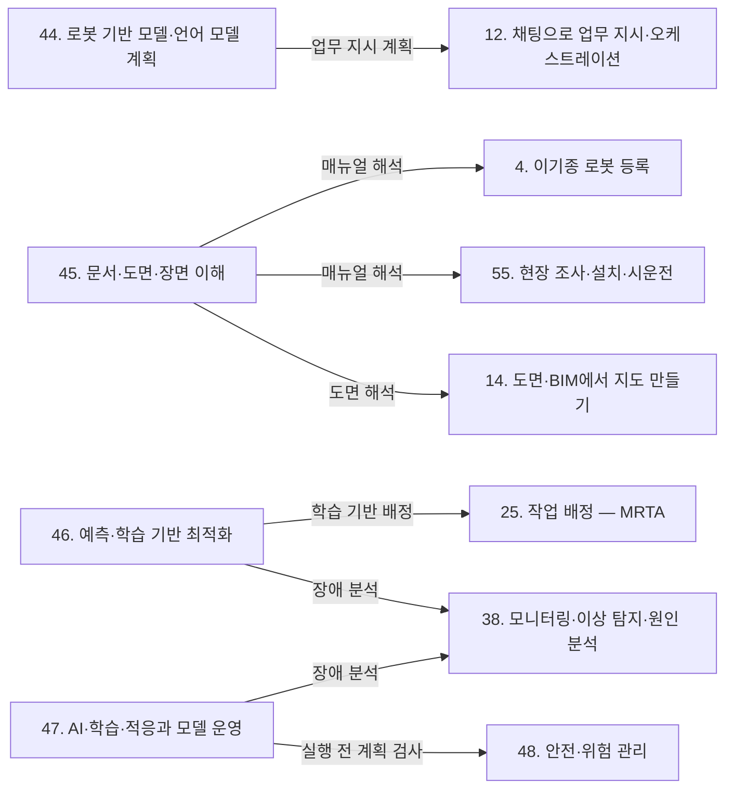

(너의 규칙은 시스템 프롬프트의 agents/shared-rules.md 와 agents/verifier.md 이다. 아래는 이번 실행의 컨텍스트와 입력이다.)

## 실행 컨텍스트

- run_id: 2026-10-09-08
- date: 2026-10-09
- run_type: category_link (대분류 연결)
- 대상: 대분류 L. AI·학습 기술 페이지의 '다른 대분류와의 연결' 절(대분류 연결 실행). 게시된 세부영역 페이지를 근거로 다른 대분류와의 연결을 조사·서술한다. 스토리텔러는 그 절만 patches 로 바꾼다
- 예산:
    - max_search_queries: 30
    - max_sources_per_run: 15
    - new_topic_pages: 1
    - page_updates: 2
    - max_retries: 2
- 환경 알림: web_fetch_available: true · fetch_mode: full
- 언어: ko
- verification_stage: second
- verifier_budget:
    - max_search_queries: 30
    - max_sources_per_run: 15
    - new_topic_pages: 1
    - page_updates: 2
    - max_retries: 2
- retry_count: 1
- max_retries: 2

## 입력

### runs/2026-10-09-08/target.json

```json
{
  "run_id": "2026-10-09-08",
  "date": "2026-10-09",
  "weekday": "Fri",
  "run_number": 141,
  "run_type": "category_link",
  "forced": true,
  "target": {
    "area_no": null,
    "area_name": null,
    "category": "L. AI·학습 기술",
    "category_letter": "L"
  },
  "topic": null,
  "track": null,
  "corrections": [],
  "budget": {
    "max_search_queries": 30,
    "max_sources_per_run": 15,
    "new_topic_pages": 1,
    "page_updates": 2,
    "max_retries": 2
  },
  "priority_reason": null,
  "priority_questions": [],
  "excluded_areas": [],
  "lifted_areas": [],
  "deferred": {
    "monthly_recheck": false,
    "weekly_review": false
  },
  "selection_rationale": "CLI 지정 run_type=category_link"
}
```

### runs/2026-10-09-08/research.json

```json
{
  "run_id": "2026-10-09-08",
  "date": "2026-10-09",
  "run_type": "category_link",
  "target": {
    "area_no": null,
    "area_name": null,
    "category": "L. AI·학습 기술"
  },
  "gaps": [
    "L. AI·학습 기술 대분류 페이지의 '다른 대분류와의 연결' 절이 '아직 작성되지 않음' 상태다. 44. 로봇 기반 모델·언어 모델 계획, 45. 문서·도면·장면 이해, 46. 예측·학습 기반 최적화, 47. AI·학습·적응과 모델 운영과 다른 16개 대분류의 연결이 정리되지 않았다",
    "47. AI·학습·적응과 모델 운영 페이지는 이전 분류(2026-09-25) 기준이라 C. 채팅 기반 구성·운영, J. 현장 운영·관제의 37. 관제 화면·실행 기록, M. 안전, N. 보안·개인정보와 잇는 근거가 약하다",
    "44~47 페이지의 10절(다른 연구영역과의 연결)은 주제 페이지로 분리되어 있고, 대분류 단위로 묶은 연결은 없다",
    "분류 원문 교차 규칙(매뉴얼 해석은 4·55번, 도면 해석은 14번, 학습 기반 배정은 25번, 장애 분석은 38번) 가운데 38. 모니터링·이상 탐지·원인 분석에 대한 AI 기반 장애 분석 근거가 게시 페이지에 거의 없다(F. 연동 페이지도 '근거 없음'으로 남김)",
    "M. 안전·N. 보안·개인정보와 L. AI·학습 기술을 잇는 근거(언어 모델 로봇의 탈옥·가드레일, 영상 데이터의 AI 학습 활용)가 게시 페이지에 없다",
    "P. 거버넌스·법규·사회의 60. 노동·수용성·접근성, J. 현장 운영·관제의 39·40, H. 실행·협업·예외 복구의 30, E. 사물·사람·실시간 상태의 17 과 L. AI·학습 기술을 잇는 근거가 없다"
  ],
  "research_questions": [
    "학습·언어 모델 같은 AI 기술을 어디에 쓰고, 그 결과를 어떤 기준으로 믿을 것인가? [분류원문]",
    "분류 원문 교차 규칙에 따라 45. 문서·도면·장면 이해·46. 예측·학습 기반 최적화·47. AI·학습·적응과 모델 운영의 방법은 B. 로봇 온톨로지(4)·D. 공간·지도 모델(14)·G. 계획·최적화(25)·J. 현장 운영·관제(38)·O. 검증·도입·수명주기(55)에 무엇을 넘기는가?",
    "44. 로봇 기반 모델·언어 모델 계획과 47. AI·학습·적응과 모델 운영은 C. 채팅 기반 구성·운영(8·11·12·13)의 '사람이 확인·승인한 계획만 실행' 원칙과 F. 연동(20)의 플랫폼 API 에 어떻게 이어지는가? (oq-216, oq-217 관련)",
    "46. 예측·학습 기반 최적화의 예측·학습 결과는 E. 사물·사람·실시간 상태(18·19)의 현재 상태 표현, I. 설계·시뮬레이션(34·35·36)의 가정한 미래 실험, F. 연동(23)의 수요예측 경계와 어떻게 나뉘는가? (oq-220, oq-222, oq-223 관련)",
    "언어 모델이 제어하는 로봇의 탈옥·가드레일, AI 장애 진단, 영상 데이터의 AI 학습 활용은 M. 안전(48)·N. 보안·개인정보(51·52·53)·J. 현장 운영·관제(37·38)와 어디서 만나는가? (oq-106, oq-228 관련)",
    "한국 인공지능 기본법·EU AI Act 같은 규제와 AI 관리 표준은 P. 거버넌스·법규·사회(58·59)·A. 기획·사업(2)·O. 검증·도입·수명주기(56·57)와 어떻게 이어지며, 한국 자료는 무엇이 있는가? (oq-105 관련)",
    "L. AI·학습 기술의 적용 사례는 Q. 현장 유형별 적용의 일곱 현장 유형 가운데 어디에 근거가 있는가?"
  ],
  "findings": [
    {
      "id": "f1",
      "claim": "L. AI·학습 기술의 44. 로봇 기반 모델·언어 모델 계획 ↔ A. 기획·사업의 1. 기술·시장·업체 동향: BMW 그룹은 2025년 스파턴버그 공장에 Figure AI 의 휴머노이드 Figure 02 를 배치해 용접 공정용 판금 부품 투입을 맡겼고 BMW X3 3만 대 이상 생산을 도왔다고 밝히나, 같은 보도자료 안에서 배치 기간이 10개월과 11개월로 엇갈린다(oq-219).",
      "tag": "추정",
      "source_ids": [
        "ref-1051"
      ],
      "cross_checked": false,
      "confidence": "low",
      "evidence_excerpt": "벤더 주장: 44. 로봇 기반 모델·언어 모델 계획 5절 제조 공장 사례(게시 페이지)에 실린 BMW 그룹 보도자료(2026-06-25) 내용. Figure AI 자체 발표로 교차 확인하지 못함. (재인용: 2026-09-30-07)",
      "as_of": "2026-06-25",
      "site_type": "제조 공장",
      "flow_item": "수행 자원",
      "source_unopened": true,
      "vendor_claim": true
    },
    {
      "id": "f2",
      "claim": "L. AI·학습 기술의 44. 로봇 기반 모델·언어 모델 계획 ↔ A. 기획·사업의 1. 기술·시장·업체 동향: 헬로티 보도(2025-11-26)에 따르면 로보티즈는 VLA 모델을 넣은 상체형 휴머노이드 AI 워커로 BGF로지스 물류센터 실증(PoC)을 계획하며, 기사가 전한 핵심 공정 자동화율 80% 이상·작업 성공률 90% 이상은 실측이 아닌 목표치다(oq-218).",
      "tag": "추정",
      "source_ids": [
        "ref-1052"
      ],
      "cross_checked": false,
      "confidence": "low",
      "evidence_excerpt": "벤더 주장: 정부 과제 'AI 파운데이션 모델 기반 유통 공정 특화 휴머노이드 로봇 개발' 실증 계획. 입·출고·오발주·분류·피킹·반품 공정 대상. 공개된 측정 결과 없음. (재인용: 2026-09-30-07)",
      "as_of": "2025-11-26",
      "site_type": "물류창고",
      "flow_item": "예외·성과",
      "source_unopened": true,
      "vendor_claim": true
    },
    {
      "id": "f3",
      "claim": "L. AI·학습 기술의 44. 로봇 기반 모델·언어 모델 계획 ↔ A. 기획·사업의 3. 경제성·조달·사업 모델·K. 플랫폼 아키텍처·인프라의 42. 분산 시스템·통신·컴퓨팅 구조: Bruno·Sim·Hagiwara(2026-09, 프리프린트)는 범용 서비스 로봇의 LLM 연쇄 기반 작업 계획에서 로컬 모델과 클라우드 모델을 비교했고, 비교의 동기는 클라우드 API 비용과 지연이었다.",
      "tag": "사실",
      "source_ids": [
        "ref-1043"
      ],
      "cross_checked": false,
      "confidence": "medium",
      "evidence_excerpt": "K. 플랫폼 아키텍처·인프라 대분류 연결 실행의 검증된 주장. 로컬 대 클라우드 LLM 비교, 동기는 API 비용·지연. (재인용: 2026-10-09-06)",
      "as_of": "2026-09",
      "site_type": null,
      "flow_item": null,
      "source_unopened": true
    },
    {
      "id": "f4",
      "claim": "L. AI·학습 기술의 46. 예측·학습 기반 최적화 ↔ A. 기획·사업의 3. 경제성·조달·사업 모델: Howard(Cal Poly 석사논문, 2026-06)는 처리량 최대화 기준의 AMR 대수 산정이 서비스형 로봇(RaaS) 구독 과금에서 플릿을 과대 산정한다고 보고, 대수 산정을 주문 라인당 비용 최소화 문제로 바꿔 시뮬레이션·대기행렬·기계학습 대리 모델을 함께 썼다.",
      "tag": "사실",
      "source_ids": [
        "ref-822"
      ],
      "cross_checked": false,
      "confidence": "medium",
      "evidence_excerpt": "석사논문 초록 기준 저자 보고. 이산 사건 시뮬레이션 27,000회, 반개방형 대기행렬 모델로 설계안 선별, XGBoost 대리 모델. (재인용: 2026-10-09-07)",
      "as_of": "2026-06",
      "site_type": "물류창고",
      "flow_item": "수행 자원",
      "source_unopened": true
    },
    {
      "id": "f5",
      "claim": "L. AI·학습 기술의 47. AI·학습·적응과 모델 운영 ↔ A. 기획·사업의 2. 사용 사례·요구·책임 범위: 한국 인공지능 기본법의 고영향 인공지능 여부는 사업자가 속한 산업이 아니라 AI 가 쓰이는 영역(교통·보건의료 등)으로 판단한다는 해설이 있어, 병원·교통 현장의 로봇 작업 계획·배정에 AI 를 쓸지 정하는 사용 사례 정의 단계에서 고영향 해당 여부를 함께 판단해야 할 것으로 보인다(oq-105).",
      "tag": "추정",
      "source_ids": [
        "ref-1253",
        "ref-620"
      ],
      "cross_checked": false,
      "confidence": "low",
      "evidence_excerpt": "BKL 해설(2025-09-30, 고시·가이드라인 초안 기준): 사람의 생명·신체 안전·기본권에 중대한 영향을 미치는 AI, 영역 예시에 교통·보건의료 포함, 로봇은 언급 없음. 확정 고시와 같은지 미확인.",
      "as_of": "2025-09-30",
      "site_type": null,
      "flow_item": "제약",
      "source_unopened": false
    },
    {
      "id": "f6",
      "claim": "L. AI·학습 기술의 45. 문서·도면·장면 이해 ↔ B. 로봇 온톨로지의 4. 이기종 로봇 등록: 검색 증강 문맥 학습으로 자산관리셸(AAS)용 정보 추출을 개선하는 AAS-RAIL(2026-09)과 대규모 언어 모델 에이전트로 자산관리셸을 생성하는 Xia 외(2024)가 있어, 분류 원문 교차 규칙의 매뉴얼 해석이 등록 정보 작성으로 이어진다.",
      "tag": "사실",
      "source_ids": [
        "ref-1071",
        "ref-1072"
      ],
      "cross_checked": false,
      "confidence": "medium",
      "evidence_excerpt": "45. 문서·도면·장면 이해 3절·9절(게시)이 인용한 두 연구. 교차 규칙: 매뉴얼 해석은 4·55번. 두 연구는 서로 다른 방법(추출 개선, AAS 생성)이며 같은 내용의 교차 확인은 아님.",
      "as_of": "2026-09-07",
      "site_type": null,
      "flow_item": null,
      "source_unopened": true
    },
    {
      "id": "f7",
      "claim": "L. AI·학습 기술의 45. 문서·도면·장면 이해 ↔ B. 로봇 온톨로지의 4. 이기종 로봇 등록·5. 로봇 능력·작업 표현: 로봇 기술 파일(URDF)에서 로봇 온톨로지를 LLM 으로 채우는 연구(Dussard·Sarthou, 2026-06)와 LLM 으로 능력 온톨로지를 생성하는 연구(Vieira da Silva 외, 2024-04)가 있다.",
      "tag": "사실",
      "source_ids": [
        "ref-239",
        "ref-238"
      ],
      "cross_checked": false,
      "confidence": "medium",
      "evidence_excerpt": "B. 로봇 온톨로지 대분류 페이지 연결 절의 [사실] 주장과 같은 각주. (재인용: 2026-09-25 B 대분류 연결 실행)",
      "as_of": "2026-06",
      "site_type": null,
      "flow_item": null,
      "source_unopened": true
    },
    {
      "id": "f8",
      "claim": "L. AI·학습 기술의 45. 문서·도면·장면 이해 ↔ B. 로봇 온톨로지의 7. 온톨로지 검증·변경 관리: 추출 항목마다 원문 위치를 붙이는 출처 근거 연결 도구(LangExtract)를 쓰면 7. 온톨로지 검증·변경 관리의 원문 대조 검증과 사람의 확정·반려가 같은 근거를 공유할 것으로 보이나, 로봇 매뉴얼에 적용한 공개 구현은 확인하지 못했다(oq-147, oq-226).",
      "tag": "추정",
      "source_ids": [
        "ref-1074",
        "ref-1071"
      ],
      "cross_checked": false,
      "confidence": "low",
      "evidence_excerpt": "45. 문서·도면·장면 이해 9절(게시): ROP 직접 범위에 '추출 항목마다 원문 위치를 붙여 사람이 확정·반려하게 하는 검토 흐름' 포함 [추정].",
      "as_of": "2026-10-09",
      "site_type": null,
      "flow_item": "완료·인계",
      "source_unopened": true
    },
    {
      "id": "f9",
      "claim": "L. AI·학습 기술의 44. 로봇 기반 모델·언어 모델 계획 ↔ B. 로봇 온톨로지의 6. 온톨로지 기반 시스템·로봇 연동·F. 연동의 21. 상호운용 표준·적합성: Nabizada 외(2026-06, CASE 2026)는 VDI 3682·IEC 61360-1·IDTA 서브모델로 구성한 자산관리셸 능력 모델에서 PDDL 문제를 자동 생성하고, 출력이 표준 PDDL 이라 어떤 계획기든 쓸 수 있다고 보고했다.",
      "tag": "사실",
      "source_ids": [
        "ref-201"
      ],
      "cross_checked": false,
      "confidence": "medium",
      "evidence_excerpt": "검색 결과 요약 기준(원문 미열람): 능력 모델이 PDDL 요소를 모두 도출할 정보를 담음, 여러 AAS 파일을 공유 객체 저장소로 연결, Festo MPS 500 사례, 구성 요소 AAS 는 수작업 모델링.",
      "as_of": "2026-06",
      "site_type": "제조 공장",
      "flow_item": null,
      "source_unopened": true
    },
    {
      "id": "f10",
      "claim": "L. AI·학습 기술의 44. 로봇 기반 모델·언어 모델 계획 ↔ B. 로봇 온톨로지의 6. 온톨로지 기반 시스템·로봇 연동: LLM+P 가 자연어 문제를 PDDL 로 옮겨 고전 계획기로 풀고 능력 모델에서 PDDL 을 자동 생성하는 연구가 있으므로, PDDL 같은 계획 표현이 언어 모델 계획과 온톨로지 기반 연동을 잇는 인터페이스가 될 것으로 보인다.",
      "tag": "추정",
      "source_ids": [
        "ref-092",
        "ref-201"
      ],
      "cross_checked": false,
      "confidence": "low",
      "evidence_excerpt": "44. 로봇 기반 모델·언어 모델 계획 8절(게시) LLM+P [사실]과 f9 를 결합한 해석. 두 방식을 한 플랫폼에서 결합한 사례는 확인하지 못함.",
      "as_of": "2026-10-09",
      "site_type": null,
      "flow_item": null,
      "source_unopened": true
    },
    {
      "id": "f11",
      "claim": "L. AI·학습 기술의 44. 로봇 기반 모델·언어 모델 계획 ↔ B. 로봇 온톨로지의 5. 로봇 능력·작업 표현: VLA 같은 로봇 기반 모델은 카메라 영상에서 행동을 직접 생성해 미리 정한 스킬 목록 없이 작업을 다루므로, 이런 로봇의 능력을 능력 모델에 어떻게 등록·기술·검증할지가 두 대분류 사이의 열린 쟁점으로 보인다(oq-216).",
      "tag": "추정",
      "source_ids": [
        "ref-1045",
        "ref-1047"
      ],
      "cross_checked": false,
      "confidence": "low",
      "evidence_excerpt": "44. 로봇 기반 모델·언어 모델 계획 5절·9절·11절(게시): 스킬 목록 없이 작업 대상을 다루는 방식 [추정], 등록·검증 방법은 열린 질문.",
      "as_of": "2026-10-09",
      "site_type": null,
      "flow_item": null,
      "source_unopened": true
    },
    {
      "id": "f12",
      "claim": "L. AI·학습 기술의 44. 로봇 기반 모델·언어 모델 계획 ↔ C. 채팅 기반 구성·운영의 12. 채팅으로 업무 지시·오케스트레이션: 언어 모델로 다중 로봇 작업을 계획하는 SMART-LLM(2023-09)과 언어 모델의 해석을 PDDL 로 옮겨 최적 계획기에 맡기는 LLM+P(2023-04)가 있어, 대화 지시를 계획으로 바꾸는 엔진(25. 작업 배정 — MRTA·26. 작업 순서·스케줄링)과 언어 모델 계획이 만난다.",
      "tag": "사실",
      "source_ids": [
        "ref-090",
        "ref-092"
      ],
      "cross_checked": false,
      "confidence": "medium",
      "evidence_excerpt": "44. 로봇 기반 모델·언어 모델 계획 8·9절(게시) 인용 연구. 분류 원문 C 주석: 업무 지시는 25·26번의 기능을 대화로 쓰게 하는 것.",
      "as_of": "2023-09",
      "site_type": null,
      "flow_item": null,
      "source_unopened": true
    },
    {
      "id": "f13",
      "claim": "L. AI·학습 기술의 44. 로봇 기반 모델·언어 모델 계획 ↔ C. 채팅 기반 구성·운영의 12. 채팅으로 업무 지시·오케스트레이션·F. 연동의 20. 로봇·제조사 관제 연동: Open Robotics 상호운용 SIG 의 2026-07-02 발표 안내문은 Open-RMF REST API 를 언어 모델이 호출하는 도구로 노출하는 MCP 서버와 평이한 영어 지시를 여러 단계의 RMF 임무로 바꾸는 에이전트로 이루어진 Nayantra 를 소개했다.",
      "tag": "사실",
      "source_ids": [
        "ref-854"
      ],
      "cross_checked": false,
      "confidence": "medium",
      "evidence_excerpt": "E·K 대분류 연결 절의 검증된 주장과 같은 각주. 시연은 Isaac Sim 창고 시뮬레이션, 발표 내용 자체는 미열람. (재인용: 2026-10-09-06)",
      "as_of": "2026-06-25",
      "site_type": null,
      "flow_item": "시작 조건",
      "source_unopened": true
    },
    {
      "id": "f14",
      "claim": "L. AI·학습 기술의 47. AI·학습·적응과 모델 운영 ↔ C. 채팅 기반 구성·운영의 12. 채팅으로 업무 지시·오케스트레이션·13. 대화형 기능의 신뢰·기반: 언어 모델 계획을 기호 계획기로 검증하고 불확실할 때 사람에게 묻는 장치가 분류 원문 C 주석의 '사람이 확인·승인한 계획만 실행' 원칙을 구현하는 수단이 될 것으로 보이며, 47. AI·학습·적응과 모델 운영은 그 채택 기준을 정하는 쪽을 맡는 것으로 보인다.",
      "tag": "추정",
      "source_ids": [
        "ref-351",
        "ref-092"
      ],
      "cross_checked": false,
      "confidence": "low",
      "evidence_excerpt": "44. 로봇 기반 모델·언어 모델 계획 9절(게시) [추정]: 작업 분해·배정 계획을 기호 계획기·제약 검사로 검증하는 계층과 사람 확인 요청 절차는 C 주석 원칙과 같은 방향.",
      "as_of": "2026-10-09",
      "site_type": null,
      "flow_item": "완료·인계",
      "source_unopened": true
    },
    {
      "id": "f15",
      "claim": "L. AI·학습 기술의 47. AI·학습·적응과 모델 운영 ↔ C. 채팅 기반 구성·운영의 13. 대화형 기능의 신뢰·기반: KnowNo 는 언어 모델 계획기가 필요할 때 사람에게 도움을 요청하게 하고, 'Learning to Ask'(2024-09)는 불분명한 지시를 받은 LLM 에이전트의 되묻기를, AmbiK 는 주방 환경의 모호한 작업 데이터셋을 다룬다.",
      "tag": "사실",
      "source_ids": [
        "ref-351",
        "ref-359",
        "ref-354"
      ],
      "cross_checked": false,
      "confidence": "medium",
      "evidence_excerpt": "47. AI·학습·적응과 모델 운영 5·8절(게시) 인용 자료. KnowNo 는 사람 도움을 줄이는 것을 목표(저자 보고). 세 자료는 서로 다른 내용.",
      "as_of": "2023-07",
      "site_type": null,
      "flow_item": "예외·성과",
      "source_unopened": true
    },
    {
      "id": "f16",
      "claim": "L. AI·학습 기술의 44. 로봇 기반 모델·언어 모델 계획 ↔ C. 채팅 기반 구성·운영의 11. 채팅으로 실제 상황 시뮬레이션 재현·I. 설계·시뮬레이션의 34. 시뮬레이션·예측용 디지털 트윈: Xia 외(2026-08)는 언어 모델 에이전트가 사용자 질의와 기준 구성을 받아 비교 시뮬레이션을 설계·실행하고 결과를 해석해 공정 매개변수 변경을 권고하는 다중 에이전트 틀을 제약 공정 설계에 적용했다.",
      "tag": "사실",
      "source_ids": [
        "ref-832"
      ],
      "cross_checked": false,
      "confidence": "medium",
      "evidence_excerpt": "I. 설계·시뮬레이션 대분류 연결 실행의 주장. ETFA 2026 채택, 로봇 플릿 적용 사례 아님. (재인용: 2026-10-09-07)",
      "as_of": "2026-08-22",
      "site_type": null,
      "flow_item": null,
      "source_unopened": true
    },
    {
      "id": "f17",
      "claim": "L. AI·학습 기술의 45. 문서·도면·장면 이해 ↔ C. 채팅 기반 구성·운영의 8. 채팅으로 맵 작성: DeFazio 외(2024-09)는 비전 언어 모델로 평면도 지도를 해석하는 연구를 냈다.",
      "tag": "사실",
      "source_ids": [
        "ref-076"
      ],
      "cross_checked": false,
      "confidence": "medium",
      "evidence_excerpt": "B. 로봇 온톨로지 대분류 페이지 연결 절 [사실] 주장과 같은 각주: 'Vision Language Models Can Parse Floor Plan Maps'.",
      "as_of": "2024-09",
      "site_type": null,
      "flow_item": null,
      "source_unopened": true
    },
    {
      "id": "f18",
      "claim": "L. AI·학습 기술의 45. 문서·도면·장면 이해 ↔ C. 채팅 기반 구성·운영의 8. 채팅으로 맵 작성: 도면을 올려 대화로 지도를 만드는 기능은 45. 문서·도면·장면 이해의 도면 해석과 14. 도면·BIM에서 지도 만들기·15. 지도·공간·위치 모델의 엔진을 함께 부를 것으로 보이며, 건축·공학 도면 이해 벤치마크가 따로 있을 만큼 해석 오류가 남으므로 확인 질문이 필요할 것으로 보인다.",
      "tag": "추정",
      "source_ids": [
        "ref-076",
        "ref-1073"
      ],
      "cross_checked": false,
      "confidence": "low",
      "evidence_excerpt": "분류 원문 C 주석: 맵 작성은 14·15번. 45 페이지 6절 요약: 어느 갈래도 사람 확인 없이 실행 정보로 쓸 수준은 아닌 것으로 보인다 [추정].",
      "as_of": "2026-10-09",
      "site_type": null,
      "flow_item": null,
      "source_unopened": true
    },
    {
      "id": "f19",
      "claim": "L. AI·학습 기술의 44. 로봇 기반 모델·언어 모델 계획 ↔ C. 채팅 기반 구성·운영의 12. 채팅으로 업무 지시·오케스트레이션·D. 공간·지도 모델의 15. 지도·공간·위치 모델: SayPlan(CoRL 2023)은 언어 모델이 3차원 장면 그래프로 세운 초기 계획을 실행 전에 장면 그래프 시뮬레이터로 확인하고 그 피드백으로 실행 불가능한 동작을 고치는 반복 재계획을 둔다.",
      "tag": "사실",
      "source_ids": [
        "ref-416"
      ],
      "cross_checked": false,
      "confidence": "medium",
      "evidence_excerpt": "최대 3개 층·36개 방·140개 자산·물체 환경, 이동 매니퓰레이터로 평가. (재인용: 2026-10-09-07)",
      "as_of": "2023-07-12",
      "site_type": null,
      "flow_item": null,
      "source_unopened": true
    },
    {
      "id": "f20",
      "claim": "L. AI·학습 기술의 45. 문서·도면·장면 이해 ↔ D. 공간·지도 모델의 14. 도면·BIM에서 지도 만들기: 평면도 영상 분석 데이터셋 CubiCasa5K, CAD 도면 파놉틱 심볼 스포팅 데이터셋 FloorPlanCAD, 국내 AI Hub 건축 도면 데이터가 분류 원문 교차 규칙의 도면 해석 학습·평가 자료로 쓰인다.",
      "tag": "사실",
      "source_ids": [
        "ref-063",
        "ref-067",
        "ref-1012"
      ],
      "cross_checked": false,
      "confidence": "medium",
      "evidence_excerpt": "교차 규칙: 도면 해석은 14번. AI Hub 라벨(구조 8종·공간 12종·객체 5종)에 로봇 운영 클래스가 있는지는 oq-197.",
      "as_of": "2023-07-26",
      "site_type": null,
      "flow_item": null,
      "source_unopened": true
    },
    {
      "id": "f21",
      "claim": "L. AI·학습 기술의 45. 문서·도면·장면 이해 ↔ D. 공간·지도 모델의 14. 도면·BIM에서 지도 만들기·Q. 현장 유형별 적용의 64. 상업 시설: Su 외(Sensors, 2022-03)는 쇼핑몰 평면도 25장의 점포 1,340개를 대상으로 공간 분할 정확도 92.54%, 점포 인식 정확도 90.56%, 전체 검출 정확도 83.81%를 보고했다.",
      "tag": "사실",
      "source_ids": [
        "ref-1066"
      ],
      "cross_checked": false,
      "confidence": "medium",
      "evidence_excerpt": "45. 문서·도면·장면 이해 5절 상업 시설 사례(게시). 층별 안내판 문자 인식 + 2단계 영역 성장 분할. 로봇 현장 배치가 아닌 논문 평가.",
      "as_of": "2022-03-25",
      "site_type": "상업 시설",
      "flow_item": "예외·성과",
      "source_unopened": true
    },
    {
      "id": "f22",
      "claim": "L. AI·학습 기술의 45. 문서·도면·장면 이해 ↔ D. 공간·지도 모델의 14. 도면·BIM에서 지도 만들기: AECV-Bench(2026-01)는 다중 모달 모델의 건축·공학 도면 이해를 평가하는 벤치마크다.",
      "tag": "사실",
      "source_ids": [
        "ref-1073"
      ],
      "cross_checked": false,
      "confidence": "medium",
      "evidence_excerpt": "45 페이지 3·6절(게시) 인용. 제목: Benchmarking Multimodal Models on Architectural and Engineering Drawings Understanding.",
      "as_of": "2026-01-08",
      "site_type": null,
      "flow_item": null,
      "source_unopened": true
    },
    {
      "id": "f23",
      "claim": "L. AI·학습 기술의 45. 문서·도면·장면 이해 ↔ D. 공간·지도 모델의 15. 지도·공간·위치 모델·16. 장소 의미·지도 관리·Q. 현장 유형별 적용의 66. 실외: Strader 외(2025-07)는 개방형 객체 지도를 담은 공유 3차원 장면 그래프로 여러 로봇의 장면 그래프를 융합하고, LLM 이 장면 그래프와 로봇 능력에서 문맥을 뽑아 운영자의 자연어 의도를 PDDL 목표로 바꾸게 해 대규모 실외 환경에서 평가했다.",
      "tag": "사실",
      "source_ids": [
        "ref-1070"
      ],
      "cross_checked": false,
      "confidence": "medium",
      "evidence_excerpt": "45. 문서·도면·장면 이해 5절 실외 사례(게시). 로봇 대수·실험 수치는 초록에 없음.",
      "as_of": "2025-07-10",
      "site_type": "실외",
      "flow_item": "시작 조건",
      "source_unopened": true
    },
    {
      "id": "f24",
      "claim": "L. AI·학습 기술의 44. 로봇 기반 모델·언어 모델 계획 ↔ D. 공간·지도 모델의 16. 장소 의미·지도 관리: osmAG-LLM(2025-07, RA-L 2026)은 계층적 위상·계량 의미 지도를 문맥으로 쓰고 LLM 이 질의에 맞는 후보 장소를 추론하게 해, 물체가 옮겨졌거나 지도에 없는 경우도 찾게 하는 방법이다.",
      "tag": "사실",
      "source_ids": [
        "ref-1018"
      ],
      "cross_checked": false,
      "confidence": "medium",
      "evidence_excerpt": "검색 결과 요약 기준(원문 미열람): 지도 밖 물체도 지도에 있는 물체와 비슷한 성공률로 찾았다고 초록이 보고.",
      "as_of": "2025-07",
      "site_type": null,
      "flow_item": null,
      "source_unopened": true
    },
    {
      "id": "f25",
      "claim": "L. AI·학습 기술의 45. 문서·도면·장면 이해 ↔ E. 사물·사람·실시간 상태의 18. 실시간 세계 상태·데이터 일관성·Q. 현장 유형별 적용의 62. 제조 공장: Brorsson 외(2025-12)가 보고한 대형 상용차 공장 사례에서는 약 8 m 높이 카메라 15대가 로봇 ArUco 표식으로 위치를 계산하고 영상 분할로 장애물을 격자 단위로 구분했으며, 카메라 간 하드웨어 동기화가 없어 생기는 시간 차 오류가 제약으로 꼽혔다.",
      "tag": "사실",
      "source_ids": [
        "ref-308"
      ],
      "cross_checked": false,
      "confidence": "medium",
      "evidence_excerpt": "45 페이지 5절 제조 공장 사례(게시). 로봇 6대, 머플러 약 150 m 운반, 시야 중첩 시 가장 가까운 카메라 결과만 사용.",
      "as_of": "2025-12",
      "site_type": "제조 공장",
      "flow_item": "제약",
      "source_unopened": true
    },
    {
      "id": "f26",
      "claim": "L. AI·학습 기술의 45. 문서·도면·장면 이해 ↔ E. 사물·사람·실시간 상태의 18. 실시간 세계 상태·데이터 일관성: 고정 카메라와 여러 로봇의 인식 결과를 시간·좌표를 맞춰 하나의 공간 상태로 합치는 일은 현재 상태를 표현하는 18. 실시간 세계 상태·데이터 일관성의 입력이 될 것으로 보이며, 가정한 미래를 실험하는 34. 시뮬레이션·예측용 디지털 트윈과는 구분되고, 허용 시간 차·정합 기준은 확인하지 못했다(oq-227).",
      "tag": "추정",
      "source_ids": [
        "ref-308",
        "ref-1070"
      ],
      "cross_checked": false,
      "confidence": "low",
      "evidence_excerpt": "45 페이지 9절(게시) [추정]: 플랫폼 수준 융합이 ROP 직접 범위. 온보드 인식·SLAM 은 연계 대상.",
      "as_of": "2026-10-09",
      "site_type": null,
      "flow_item": null,
      "source_unopened": true
    },
    {
      "id": "f27",
      "claim": "L. AI·학습 기술의 46. 예측·학습 기반 최적화 ↔ E. 사물·사람·실시간 상태의 19. 사람·보행자 모델: Rudenko 외 서베이가 정리한 사람 움직임 궤적 예측은 가까운 미래 사람 위치 추정 방법이므로, 예측 결과를 경로·배정 비용에 넣는 일이 두 영역을 잇는 것으로 보인다.",
      "tag": "추정",
      "source_ids": [
        "ref-1172"
      ],
      "cross_checked": false,
      "confidence": "low",
      "evidence_excerpt": "E. 사물·사람·실시간 상태 대분류 연결 절(게시)의 L 연결 [추정]과 같은 각주. (재인용: 2026-10-09-03)",
      "as_of": "2019-12-17",
      "site_type": null,
      "flow_item": null,
      "source_unopened": true
    },
    {
      "id": "f28",
      "claim": "L. AI·학습 기술의 45. 문서·도면·장면 이해 ↔ F. 연동의 22. 설비·건물 시스템 연동·Q. 현장 유형별 적용의 61. 물류창고: Robinson 외(2026-06)는 실제 창고에서 CCTV 카메라 30대만으로 작업용 주행 장비를 싣지 않은 로봇 4대를 영상 공간에서 계획·제어하고, 시야가 겹치는 카메라 구역을 배타적 자원으로 관리해 충돌·교착을 막는 시연을 보고했다.",
      "tag": "사실",
      "source_ids": [
        "ref-1065"
      ],
      "cross_checked": false,
      "confidence": "medium",
      "evidence_excerpt": "45 페이지 5절 물류창고 사례(게시). 길이 27 m 통로 6개. 저자는 첫 현장 시연이라 밝힘. 9절은 경계가 이동한 사례로 분류.",
      "as_of": "2026-06-04",
      "site_type": "물류창고",
      "flow_item": "제약",
      "source_unopened": true
    },
    {
      "id": "f29",
      "claim": "연계 대상: L. AI·학습 기술의 46. 예측·학습 기반 최적화 ↔ F. 연동의 23. 업무 시스템 연동: CJ대한통운은 이커머스 통합 플랫폼 iFlex 가 AI·빅데이터로 주문 유형별 물량을 예측해 물류센터 인력 배치를 최적화한다고 밝혔으며, 이는 상위 업무 시스템 쪽 수요예측이라 로봇 배정용 요청 예측과의 경계가 열린 질문으로 남아 있다(oq-223).",
      "tag": "추정",
      "source_ids": [
        "ref-1063"
      ],
      "cross_checked": false,
      "confidence": "low",
      "evidence_excerpt": "벤더 주장: 46 페이지 5·9절(게시). 로봇 배정에 쓴 근거는 자료에 없음. 2021-07-28 자사 뉴스룸.",
      "as_of": "2021-07-28",
      "site_type": "물류창고",
      "flow_item": "시작 조건",
      "source_unopened": true,
      "vendor_claim": true
    },
    {
      "id": "f30",
      "claim": "L. AI·학습 기술의 44. 로봇 기반 모델·언어 모델 계획 ↔ F. 연동의 20. 로봇·제조사 관제 연동: NASA JPL 의 ROSA 는 ROS 용 언어 모델 에이전트로 공개되어 있다.",
      "tag": "사실",
      "source_ids": [
        "ref-171"
      ],
      "cross_checked": false,
      "confidence": "medium",
      "evidence_excerpt": "44 페이지 7절(게시): 관련 자원으로 ROS용 언어 모델 에이전트(ROSA) [사실].",
      "as_of": "2026-09-30",
      "site_type": null,
      "flow_item": null,
      "source_unopened": true
    },
    {
      "id": "f31",
      "claim": "L. AI·학습 기술의 46. 예측·학습 기반 최적화 ↔ G. 계획·최적화의 25. 작업 배정 — MRTA: 분류 원문 교차 규칙의 학습 기반 배정에 해당하는 연구로, 어텐션 기반 강화학습으로 창고 다중 로봇 작업 배정을 하는 RTAW(2022-09, ICRA 2023)가 있다.",
      "tag": "사실",
      "source_ids": [
        "ref-623"
      ],
      "cross_checked": false,
      "confidence": "medium",
      "evidence_excerpt": "교차 규칙: 학습 기반 배정은 25번. RTAW 는 시뮬레이션 창고 조건(47 페이지 5절).",
      "as_of": "2022-09",
      "site_type": null,
      "flow_item": null,
      "source_unopened": true
    },
    {
      "id": "f32",
      "claim": "L. AI·학습 기술의 46. 예측·학습 기반 최적화 ↔ G. 계획·최적화의 25. 작업 배정 — MRTA·Q. 현장 유형별 적용의 63. 병원·의료: Garces 외(2026-08, 프리프린트)는 병원 입원 병동의 실제 간호 업무 요청 데이터로 예측 인지형 모델 기반 강화학습을 평가했고, 요청 분포가 바뀌면 최근 예측 오차로 예측 요청을 다시 가중하고 아직 시작하지 않은 배정만 다시 최적화해 대기 시간을 줄였다고 보고했다.",
      "tag": "사실",
      "source_ids": [
        "ref-1062"
      ],
      "cross_checked": false,
      "confidence": "medium",
      "evidence_excerpt": "46 페이지 5절 병원 사례(게시). 즉시 확정은 들어온 요청에만, 표본 미래 요청은 평가에만. 꼬리 지연 지표 개선이 가장 컸다(저자 보고).",
      "as_of": "2026-08",
      "site_type": "병원",
      "flow_item": "예외·성과",
      "source_unopened": true
    },
    {
      "id": "f33",
      "claim": "L. AI·학습 기술의 46. 예측·학습 기반 최적화 ↔ G. 계획·최적화의 25. 작업 배정 — MRTA·27. 다중 로봇 경로·교통 관리 — MAPF: 아마존 연구진의 DeepFleet 은 전 세계 아마존 창고 수십만 대 로봇의 이동 데이터로 학습한 다중 로봇 기반 모델 모음이다.",
      "tag": "사실",
      "source_ids": [
        "ref-1053"
      ],
      "cross_checked": false,
      "confidence": "medium",
      "evidence_excerpt": "46 페이지 5절(게시) [사실]. 2025-08 공개, 2026-04 개정.",
      "as_of": "2025-08",
      "site_type": "물류창고",
      "flow_item": "작업 대상",
      "source_unopened": true
    },
    {
      "id": "f34",
      "claim": "L. AI·학습 기술의 46. 예측·학습 기반 최적화 ↔ G. 계획·최적화의 25. 작업 배정 — MRTA·27. 다중 로봇 경로·교통 관리 — MAPF: 아마존은 DeepFleet 을 혼잡 예측으로 작업 배정과 경로를 조정하는 데 쓰며 로봇 이동 효율을 10% 높였다고 주장한다.",
      "tag": "추정",
      "source_ids": [
        "ref-1054"
      ],
      "cross_checked": false,
      "confidence": "low",
      "evidence_excerpt": "벤더 주장: Amazon Science 블로그(2025-08-11). 독립 측정은 확인하지 못함(46 페이지 5절).",
      "as_of": "2025-08-11",
      "site_type": "물류창고",
      "flow_item": "제약",
      "source_unopened": true,
      "vendor_claim": true
    },
    {
      "id": "f35",
      "claim": "L. AI·학습 기술의 46. 예측·학습 기반 최적화 ↔ G. 계획·최적화의 27. 다중 로봇 경로·교통 관리 — MAPF: 같은 조건 비교에서는 탐색 기반 MAPF 방법이 아직 앞서고, 학습은 탐색·최적화와 결합할 때 개선이 보고되는 것으로 보인다.",
      "tag": "추정",
      "source_ids": [
        "ref-1056",
        "ref-199",
        "ref-1064"
      ],
      "cross_checked": false,
      "confidence": "low",
      "evidence_excerpt": "46 페이지 6절 요약(게시) [추정]. POGEMA 벤치마크, 대규모 모방학습 지속형 MAPF, 안내 그래프 최적화.",
      "as_of": "2026-09-30",
      "site_type": null,
      "flow_item": null,
      "source_unopened": true
    },
    {
      "id": "f36",
      "claim": "L. AI·학습 기술의 46. 예측·학습 기반 최적화 ↔ G. 계획·최적화의 28. 공용 자원·충전·에너지 최적화: Poskart 외(Sensors, 2022-12)는 다중 로봇 시스템의 지능형 임무 계획을 위해 이동로봇 배터리 방전을 여러 매개변수로 예측하는 모델을 제시했다.",
      "tag": "사실",
      "source_ids": [
        "ref-1058"
      ],
      "cross_checked": false,
      "confidence": "medium",
      "evidence_excerpt": "46 페이지 3·9절(게시) 인용. 제목: Multi-Parameter Predictive Model of Mobile Robot's Battery Discharge for Intelligent Mission Planning in Multi-Robot Systems.",
      "as_of": "2022-12-15",
      "site_type": null,
      "flow_item": null,
      "source_unopened": true
    },
    {
      "id": "f37",
      "claim": "L. AI·학습 기술의 44. 로봇 기반 모델·언어 모델 계획 ↔ G. 계획·최적화의 24. 작업·워크플로 모델링·26. 작업 순서·스케줄링: IMR-LLM(2026-03)은 대규모 언어 모델로 산업용 다중 로봇의 작업 계획과 프로그램 생성을 다루는 연구다.",
      "tag": "사실",
      "source_ids": [
        "ref-170"
      ],
      "cross_checked": false,
      "confidence": "medium",
      "evidence_excerpt": "44 페이지 9절(게시): 공정 트리를 따라 저수준 로봇 프로그램까지 생성하는 부분은 로봇 자체 제어에 닿아 ROP 에서는 연계 대상 문맥 [추정].",
      "as_of": "2026-03",
      "site_type": "제조 공장",
      "flow_item": null,
      "source_unopened": true
    },
    {
      "id": "f38",
      "claim": "L. AI·학습 기술의 46. 예측·학습 기반 최적화 ↔ G. 계획·최적화의 26. 작업 순서·스케줄링·25. 작업 배정 — MRTA: Elmachtoub·Grigas 의 Smart 'Predict, then Optimize'(2017)는 예측 모델을 예측 오차가 아니라 그 예측으로 내린 최적화 결정의 품질로 학습시키는 틀이다.",
      "tag": "사실",
      "source_ids": [
        "ref-1061"
      ],
      "cross_checked": false,
      "confidence": "medium",
      "evidence_excerpt": "46 페이지 4절 '결정 중심 학습' 개념의 근거 자료. 로봇 배정·스케줄링 현장 적용은 확인하지 못함.",
      "as_of": "2017-10",
      "site_type": null,
      "flow_item": null,
      "source_unopened": true
    },
    {
      "id": "f39",
      "claim": "L. AI·학습 기술의 47. AI·학습·적응과 모델 운영 ↔ H. 실행·협업·예외 복구의 29. 명령·작업 실행의 신뢰성: Obi 외(2026-04)는 언어 모델이 제어하는 로봇 시스템에 실행 전 안전 게이트와 작업 안전 계약을 두는 방법을 제안했다.",
      "tag": "사실",
      "source_ids": [
        "ref-417"
      ],
      "cross_checked": false,
      "confidence": "medium",
      "evidence_excerpt": "47 페이지 3절(게시)의 '실행 전 안전 판정' 근거. 제목: Pre-Execution Safety Gate & Task Safety Contracts for LLM-Controlled Robot Systems.",
      "as_of": "2026-04",
      "site_type": null,
      "flow_item": "제약",
      "source_unopened": true
    },
    {
      "id": "f40",
      "claim": "L. AI·학습 기술의 47. AI·학습·적응과 모델 운영 ↔ H. 실행·협업·예외 복구의 31. 사람–로봇 협업: 해석이 불확실할 때 사람에게 묻는 장치는 사람–로봇 협업의 개입 지점이 되지만, KnowNo 의 등각 예측 보장은 보정 데이터와 운영 분포가 같다는 조건에 기대므로 지시 분포가 바뀌면 재보정 주기가 문제로 남을 것으로 보인다(oq-107).",
      "tag": "추정",
      "source_ids": [
        "ref-351"
      ],
      "cross_checked": false,
      "confidence": "low",
      "evidence_excerpt": "47 페이지 11절(게시) 열린 질문과 5절 피킹 시나리오의 해석.",
      "as_of": "2026-10-09",
      "site_type": null,
      "flow_item": "예외·성과",
      "source_unopened": true
    },
    {
      "id": "f41",
      "claim": "L. AI·학습 기술의 44. 로봇 기반 모델·언어 모델 계획 ↔ H. 실행·협업·예외 복구의 32. 예외 복구·재계획·업무 연속성·J. 현장 운영·관제의 38. 모니터링·이상 탐지·원인 분석: REFLECT(Liu·Bahety·Song, CoRL 2023)는 다중 감각 관측에서 로봇 경험의 계층적 요약을 만들어 LLM 이 실패 원인을 설명하게 하고, 그 설명을 조건으로 언어 기반 계획기가 실패를 고쳐 작업을 마치는 계획을 만들게 하며, RoboFail 데이터셋으로 평가했다.",
      "tag": "사실",
      "source_ids": [
        "ref-453"
      ],
      "cross_checked": false,
      "confidence": "medium",
      "evidence_excerpt": "arXiv 초록(v4, 2023-10-16) 기준 요약. 단일 로봇 조작 작업이며 다중 로봇 플릿 적용은 아님.",
      "as_of": "2023-06-27",
      "site_type": null,
      "flow_item": "예외·성과"
    },
    {
      "id": "f42",
      "claim": "L. AI·학습 기술의 47. AI·학습·적응과 모델 운영 ↔ J. 현장 운영·관제의 38. 모니터링·이상 탐지·원인 분석: Herrmann 외(2024-10)는 산업용 로봇 시스템 진단 문제 2,500건 이상으로 비공개 벤치마크 SYSDIAGBENCH 를 만들어 언어 모델의 근본 원인 분석을 평가했고, QLoRA 미세조정한 70억 매개변수 모델이 진단 정확도에서 GPT-4 를 앞섰다고 보고했다.",
      "tag": "사실",
      "source_ids": [
        "ref-1340"
      ],
      "cross_checked": false,
      "confidence": "medium",
      "evidence_excerpt": "arXiv 초록 기준: 'QLoRA finetuning ... 7B-parameter model outperform GPT-4' 취지, 사람 전문가 평가로 LLM 평가자 결과 검증. 구체 정확도 수치는 초록에 없음.",
      "as_of": "2024-10-06",
      "site_type": null,
      "flow_item": "예외·성과"
    },
    {
      "id": "f43",
      "claim": "L. AI·학습 기술의 46. 예측·학습 기반 최적화 ↔ I. 설계·시뮬레이션의 34. 시뮬레이션·예측용 디지털 트윈·Q. 현장 유형별 적용의 61. 물류창고: Smit 외(2024-04)는 작업자와 AMR 이 피킹 위치에서 만나는 창고에서 작업자–AMR 배정을 다목적 심층 강화학습으로 정하고, 학습·평가용 이산 사건 시뮬레이션 모델을 만들어 학습 정책이 효율과 작업자 부하 공정성에서 비교 방법을 앞섰다고 보고했다.",
      "tag": "사실",
      "source_ids": [
        "ref-1245"
      ],
      "cross_checked": false,
      "confidence": "medium",
      "evidence_excerpt": "I. 설계·시뮬레이션 대분류 연결 실행의 주장. (재인용: 2026-10-09-07)",
      "as_of": "2024-04-09",
      "site_type": "물류창고",
      "flow_item": "수행 자원",
      "source_unopened": true
    },
    {
      "id": "f44",
      "claim": "L. AI·학습 기술의 46. 예측·학습 기반 최적화 ↔ I. 설계·시뮬레이션의 34. 시뮬레이션·예측용 디지털 트윈: DeepFleet 같은 운영 중 혼잡 예측은 배정·경로 결정에 바로 쓰이는 예측이고 34. 시뮬레이션·예측용 디지털 트윈은 가정한 미래를 실험하는 쪽이므로, 두 기능을 구분해 연결해야 할 것으로 보인다.",
      "tag": "추정",
      "source_ids": [
        "ref-1053",
        "ref-1054"
      ],
      "cross_checked": false,
      "confidence": "low",
      "evidence_excerpt": "46 페이지 6절 주제 페이지(게시)의 DeepFleet·34 구분 문장 [추정](2차 검증에서 [의견]→[추정]).",
      "as_of": "2026-09-30",
      "site_type": null,
      "flow_item": null,
      "source_unopened": true
    },
    {
      "id": "f45",
      "claim": "L. AI·학습 기술의 46. 예측·학습 기반 최적화 ↔ I. 설계·시뮬레이션의 35. 처리능력·규모·배치 설계: Howard(2026)는 반개방형 대기행렬 모델로 설계안을 걸러 내고 XGBoost 대리 모델과 등각 예측 구간으로 추가 시뮬레이션 없이 연속 설계 공간의 비용을 예측했으며, 대기행렬 모델은 시뮬레이션 라인당 비용과 약 5%, 대리 모델은 교차 검증에서 3% 안에서 맞았다고 보고했다.",
      "tag": "사실",
      "source_ids": [
        "ref-822"
      ],
      "cross_checked": false,
      "confidence": "medium",
      "evidence_excerpt": "석사논문 초록의 저자 보고값, 독립 재현 미확인. (재인용: 2026-10-09-07)",
      "as_of": "2026-06",
      "site_type": "물류창고",
      "flow_item": null,
      "source_unopened": true
    },
    {
      "id": "f46",
      "claim": "L. AI·학습 기술의 44. 로봇 기반 모델·언어 모델 계획 ↔ I. 설계·시뮬레이션의 33. 시나리오 모델·편집: Holodeck(CVPR 2024)은 GPT-4 가 장면 구성과 객체 간 공간 관계를 만들고 배치를 최적화해 글 지시로 3D 환경을 생성한다.",
      "tag": "사실",
      "source_ids": [
        "ref-815"
      ],
      "cross_checked": false,
      "confidence": "medium",
      "evidence_excerpt": "생성 장면에서 학습한 에이전트가 처음 보는 환경에서 주행했다고 보고. 생성 환경은 실제 현장 지도가 아님. (재인용: 2026-10-09-07)",
      "as_of": "2023-12-14",
      "site_type": null,
      "flow_item": null,
      "source_unopened": true
    },
    {
      "id": "f47",
      "claim": "L. AI·학습 기술의 47. AI·학습·적응과 모델 운영 ↔ I. 설계·시뮬레이션의 36. 가상 시운전·실제 상황 재현·O. 검증·도입·수명주기의 54. 시험·형식 검증·벤치마크: Kadian 외(RA-L 2020)는 시뮬레이션–현실 상관 계수(SRCC)를 제안하고, LoCoBot PointGoal 주행에서 CVPR 2019 챌린지에서 쓰인 Habitat 설정의 성공률 SRCC 가 0.18 이었으나 시뮬레이션 매개변수 조정으로 0.844 로 높였다고 보고했다.",
      "tag": "사실",
      "source_ids": [
        "ref-1127"
      ],
      "cross_checked": false,
      "confidence": "medium",
      "evidence_excerpt": "I. 설계·시뮬레이션 대분류 연결 실행에서 정정된 표현 그대로. (재인용: 2026-10-09-07)",
      "as_of": "2020-08",
      "site_type": null,
      "flow_item": null,
      "source_unopened": true
    },
    {
      "id": "f48",
      "claim": "L. AI·학습 기술의 47. AI·학습·적응과 모델 운영 ↔ I. 설계·시뮬레이션의 36. 가상 시운전·실제 상황 재현: 학습 정책이 시뮬레이터의 결함을 이용하는 현실 격차가 보고되므로, 학습 정책의 현실 격차 보정은 47. AI·학습·적응과 모델 운영(및 로봇 제조사·시뮬레이션 도구) 쪽이고 36. 가상 시운전·실제 상황 재현은 재현과 실제의 차이 지표를 관리하는 쪽을 맡는 것으로 보인다.",
      "tag": "추정",
      "source_ids": [
        "ref-741",
        "ref-1127"
      ],
      "cross_checked": false,
      "confidence": "low",
      "evidence_excerpt": "I. 설계·시뮬레이션 대분류 연결 실행의 [추정]. (재인용: 2026-10-09-07)",
      "as_of": "2026-10-09",
      "site_type": null,
      "flow_item": null,
      "source_unopened": true
    },
    {
      "id": "f49",
      "claim": "L. AI·학습 기술의 45. 문서·도면·장면 이해 ↔ I. 설계·시뮬레이션의 34. 시뮬레이션·예측용 디지털 트윈: Sommer 외(2023)는 기존 건물 환경의 스캔과 객체 인식을 입력으로 생산 계획용 디지털 트윈을 자동 생성하는 방법을 다룬다.",
      "tag": "사실",
      "source_ids": [
        "ref-241"
      ],
      "cross_checked": false,
      "confidence": "medium",
      "evidence_excerpt": "I. 설계·시뮬레이션 대분류 연결 실행의 주장. (재인용: 2026-10-09-07)",
      "as_of": "2023",
      "site_type": "제조 공장",
      "flow_item": null,
      "source_unopened": true
    },
    {
      "id": "f50",
      "claim": "L. AI·학습 기술의 46. 예측·학습 기반 최적화 ↔ J. 현장 운영·관제의 38. 모니터링·이상 탐지·원인 분석·Q. 현장 유형별 적용의 67. 기타 현장: Pookkuttath 외(Sensors, 2021-12)는 대학 캠퍼스에서 청소 로봇의 IMU 진동 신호를 1차원 합성곱 신경망으로 정상·지형·충돌·조립 풀림·구조 불균형 5종으로 분류해 SLAM 지도에 겹친 예지 정비 지도를 만들고, 실시간 현장 시험 정확도 91%를 보고했다.",
      "tag": "사실",
      "source_ids": [
        "ref-1057"
      ],
      "cross_checked": false,
      "confidence": "medium",
      "evidence_excerpt": "46 페이지 5절 기타 사례(게시). 교차 규칙: 장애 분석은 38번. 정비 팀이 위험 구역 격리·심각도 판단.",
      "as_of": "2021-12-21",
      "site_type": "기타",
      "flow_item": "예외·성과",
      "source_unopened": true
    },
    {
      "id": "f51",
      "claim": "L. AI·학습 기술의 46. 예측·학습 기반 최적화 ↔ J. 현장 운영·관제의 38. 모니터링·이상 탐지·원인 분석·Q. 현장 유형별 적용의 62. 제조 공장: 파이낸셜뉴스가 전한 현대자동차 발표에 따르면 AI 고장예측 시스템이 산업용 로봇팔의 모터 부하·진동·전류 신호로 고장 약 5일 전에 90% 이상 정확도로 이상을 감지한다.",
      "tag": "추정",
      "source_ids": [
        "ref-1059"
      ],
      "cross_checked": false,
      "confidence": "low",
      "evidence_excerpt": "벤더 주장: 기사(2026-05-28)가 전한 회사 주장. 정확도 산정 방법·데이터 규모 미공개. 부품 수준 신호 감시는 연계 대상.",
      "as_of": "2026-05-28",
      "site_type": "제조 공장",
      "flow_item": "시작 조건",
      "source_unopened": true,
      "vendor_claim": true
    },
    {
      "id": "f52",
      "claim": "L. AI·학습 기술의 46. 예측·학습 기반 최적화 ↔ J. 현장 운영·관제의 38. 모니터링·이상 탐지·원인 분석: ISO 13381-1:2025 는 기계 시스템 상태 감시·진단의 예지(prognostics) 일반 지침과 요구사항을 다루는 표준이다.",
      "tag": "사실",
      "source_ids": [
        "ref-1060"
      ],
      "cross_checked": false,
      "confidence": "medium",
      "evidence_excerpt": "46 페이지 7절(게시) 관련 표준. 표준 원문 미열람, ISO 공식 소개 페이지 기준.",
      "as_of": "2025",
      "site_type": null,
      "flow_item": null,
      "source_unopened": true
    },
    {
      "id": "f53",
      "claim": "L. AI·학습 기술의 47. AI·학습·적응과 모델 운영 ↔ J. 현장 운영·관제의 37. 관제 화면·실행 기록: EU AI Act 제12조는 고위험 AI 시스템이 수명 기간 동안 사건 기록(로그)을 자동으로 남길 수 있어야 하고, 위험 상황·실질적 변경 식별, 시판 후 감시, 배포자의 운영 감시에 필요한 사건을 기록하게 한다.",
      "tag": "사실",
      "source_ids": [
        "ref-863"
      ],
      "cross_checked": false,
      "confidence": "medium",
      "evidence_excerpt": "AI Act Service Desk 원문: \"High-risk AI systems shall technically allow for the automatic recording of events (logs) over the lifetime of the system.\" (2026-07-27 통합본 기준)",
      "as_of": "2024-06-13",
      "site_type": null,
      "flow_item": "완료·인계"
    },
    {
      "id": "f54",
      "claim": "L. AI·학습 기술의 47. AI·학습·적응과 모델 운영 ↔ J. 현장 운영·관제의 37. 관제 화면·실행 기록·K. 플랫폼 아키텍처·인프라의 43. 데이터·관측성·배포: ROP 의 AI 구성요소가 EU AI Act 고위험 분류(부속서 I 제품의 안전 구성요소 등)에 들어간다면 37. 관제 화면·실행 기록과 43. 데이터·관측성·배포가 남기는 기록이 제12조 로그 요건을 받쳐야 할 것으로 보이나, 해당 여부 자체가 열린 질문이다(oq-106).",
      "tag": "추정",
      "source_ids": [
        "ref-863",
        "ref-621"
      ],
      "cross_checked": false,
      "confidence": "low",
      "evidence_excerpt": "제12조 원문 확인 + 47 페이지 3절(게시) 고위험 분류 [사실]의 결합 해석. 적용 시점은 개정 논의로 확정하지 않음.",
      "as_of": "2026-10-09",
      "site_type": null,
      "flow_item": null,
      "source_unopened": false
    },
    {
      "id": "f55",
      "claim": "L. AI·학습 기술의 44. 로봇 기반 모델·언어 모델 계획 ↔ K. 플랫폼 아키텍처·인프라의 42. 분산 시스템·통신·컴퓨팅 구조: FogROS2(2022-05)는 ROS 2 로봇의 계산 부담이 큰 작업을 클라우드·포그로 옮겨 실행하는 플랫폼이다.",
      "tag": "사실",
      "source_ids": [
        "ref-304"
      ],
      "cross_checked": false,
      "confidence": "medium",
      "evidence_excerpt": "K. 플랫폼 아키텍처·인프라 대분류 연결 실행의 L 연결 주장. (재인용: 2026-10-09-06)",
      "as_of": "2022-05",
      "site_type": null,
      "flow_item": null,
      "source_unopened": true
    },
    {
      "id": "f56",
      "claim": "L. AI·학습 기술의 47. AI·학습·적응과 모델 운영 ↔ K. 플랫폼 아키텍처·인프라의 43. 데이터·관측성·배포: OpenTelemetry 생성형 AI 의미 규약 저장소는 언어 모델 클라이언트 호출의 토큰 사용량 지표를 정의하며, 이 규약은 아직 개발(Development) 단계다.",
      "tag": "사실",
      "source_ids": [
        "ref-1037"
      ],
      "cross_checked": false,
      "confidence": "medium",
      "evidence_excerpt": "K. 플랫폼 아키텍처·인프라 대분류 연결 실행의 주장. 지표 이름은 안정 판 전이라 고정되지 않음(oq-212). (재인용: 2026-10-09-06)",
      "as_of": "2026-10-09",
      "site_type": null,
      "flow_item": null,
      "source_unopened": true
    },
    {
      "id": "f57",
      "claim": "L. AI·학습 기술의 47. AI·학습·적응과 모델 운영 ↔ K. 플랫폼 아키텍처·인프라의 43. 데이터·관측성·배포·O. 검증·도입·수명주기의 57. 자산·소프트웨어 수명주기 관리: MLflow 모델 레지스트리는 모델 버전과 별칭으로 운영 모델의 교체·되돌림 경로를 관리하게 하는 오픈소스 도구다.",
      "tag": "사실",
      "source_ids": [
        "ref-626"
      ],
      "cross_checked": false,
      "confidence": "medium",
      "evidence_excerpt": "47 페이지 5·9절(게시): 모델 레지스트리의 버전·별칭으로 교체·되돌림 경로를 둔다. 로봇 플랫폼 적용 사례는 확인하지 못함.",
      "as_of": "2026-09-25",
      "site_type": null,
      "flow_item": null,
      "source_unopened": true
    },
    {
      "id": "f58",
      "claim": "L. AI·학습 기술의 47. AI·학습·적응과 모델 운영 ↔ O. 검증·도입·수명주기의 57. 자산·소프트웨어 수명주기 관리: Sculley 외(2015)는 실제 머신러닝 시스템이 일반 코드의 유지보수 문제에 더해 경계 침식, 얽힘, 숨은 피드백 루프, 선언되지 않은 소비자, 데이터 의존성 같은 고유 위험으로 큰 유지 비용을 낳는다고 지적했다.",
      "tag": "사실",
      "source_ids": [
        "ref-624"
      ],
      "cross_checked": false,
      "confidence": "medium",
      "evidence_excerpt": "47 페이지 3절(게시) [사실]과 같은 각주.",
      "as_of": "2015",
      "site_type": null,
      "flow_item": null,
      "source_unopened": true
    },
    {
      "id": "f59",
      "claim": "L. AI·학습 기술의 47. AI·학습·적응과 모델 운영 ↔ O. 검증·도입·수명주기의 54. 시험·형식 검증·벤치마크: Breck 외(Google Research, 2017)의 ML Test Score 는 머신러닝 시스템의 운영 준비 상태와 기술 부채 감소를 점검하는 평가 기준표다.",
      "tag": "사실",
      "source_ids": [
        "ref-625"
      ],
      "cross_checked": false,
      "confidence": "medium",
      "evidence_excerpt": "47 페이지 3·5절(게시) 인용: 교체 전 시험·감시 기준의 근거.",
      "as_of": "2017",
      "site_type": null,
      "flow_item": null,
      "source_unopened": true
    },
    {
      "id": "f60",
      "claim": "L. AI·학습 기술의 44. 로봇 기반 모델·언어 모델 계획 ↔ O. 검증·도입·수명주기의 54. 시험·형식 검증·벤치마크: LoTa-Bench(ICLR 2024)는 언어 지향 작업 계획기를 체화 에이전트 환경에서 평가하는 벤치마크로 공식 저장소가 공개되어 있으나, 현장 제약이 있는 다중 로봇 계획기의 공통 벤치마크는 확인하지 못했다(oq-217).",
      "tag": "사실",
      "source_ids": [
        "ref-541"
      ],
      "cross_checked": false,
      "confidence": "medium",
      "evidence_excerpt": "47 페이지 8절(게시): 공식 저장소 README 로 확인한 자료.",
      "as_of": "2026-09-25",
      "site_type": null,
      "flow_item": null,
      "source_unopened": true
    },
    {
      "id": "f61",
      "claim": "L. AI·학습 기술의 46. 예측·학습 기반 최적화 ↔ O. 검증·도입·수명주기의 54. 시험·형식 검증·벤치마크: POGEMA(ICLR 2025)는 협력 다중 에이전트 경로 찾기의 학습 기반·탐색 기반 방법을 같은 조건에서 비교하는 벤치마크 플랫폼이다.",
      "tag": "사실",
      "source_ids": [
        "ref-1056"
      ],
      "cross_checked": false,
      "confidence": "medium",
      "evidence_excerpt": "46 페이지 6·7절(게시) 인용. 격자 조건의 벤치마크 성과가 현장 처리량으로 이어지는지는 미확인(oq-220).",
      "as_of": "2025-04",
      "site_type": null,
      "flow_item": null,
      "source_unopened": true
    },
    {
      "id": "f62",
      "claim": "L. AI·학습 기술의 45. 문서·도면·장면 이해 ↔ O. 검증·도입·수명주기의 55. 현장 조사·설치·시운전: 분류 원문 교차 규칙의 매뉴얼 해석 대상인 55. 현장 조사·설치·시운전에서는 URDF·자산관리셸에서 능력 정의 초안을 LLM 으로 만드는 방법이 새 로봇 온보딩의 반복 작업을 줄이는 데 쓰일 것으로 보이나, 온보딩 현장에 적용해 소요를 측정한 사례는 확인하지 못했다.",
      "tag": "추정",
      "source_ids": [
        "ref-239",
        "ref-1072"
      ],
      "cross_checked": false,
      "confidence": "low",
      "evidence_excerpt": "교차 규칙: 매뉴얼 해석은 4·55번. B 대분류 연결 절(게시) [추정]과 같은 방향.",
      "as_of": "2026-10-09",
      "site_type": null,
      "flow_item": null,
      "source_unopened": true
    },
    {
      "id": "f63",
      "claim": "L. AI·학습 기술의 44. 로봇 기반 모델·언어 모델 계획 ↔ M. 안전의 48. 안전·위험 관리·N. 보안·개인정보의 52. 통신 보호·위협 관리·감사: Robey 외(2024-10)는 언어 모델이 제어하는 로봇에 해로운 물리 행동을 하게 만드는 탈옥 알고리즘 RoboPAIR 를 제시하고, 자율주행 LLM·GPT-4o 계획기를 쓴 Clearpath Jackal·GPT-3.5 를 연동한 Unitree Go2 에서 공격 성공률이 자주 100%에 이르렀다고 보고했다.",
      "tag": "사실",
      "source_ids": [
        "ref-857"
      ],
      "cross_checked": false,
      "confidence": "medium",
      "evidence_excerpt": "arXiv 초록(v2, 2024-11-09) 기준 요약. 저자는 Go2 결과를 배치된 상용 로봇 시스템의 첫 탈옥 사례라고 밝힘. 화이트·그레이·블랙박스 세 설정.",
      "as_of": "2024-10-17",
      "site_type": null,
      "flow_item": "제약"
    },
    {
      "id": "f64",
      "claim": "L. AI·학습 기술의 44. 로봇 기반 모델·언어 모델 계획 ↔ M. 안전의 48. 안전·위험 관리: Ravichandran 외(2025-03, 2026-03 개정)의 RoboGuard 는 악성 프롬프트에서 격리한 신뢰 기점 LLM 이 미리 정한 안전 규칙을 환경에 맞춰 시간 논리 제약으로 바꾸고, 제어 합성으로 계획과의 충돌을 해소해 최악의 탈옥 공격에서 위험 계획 실행을 92% 이상에서 3% 미만으로 줄였다고 보고했다.",
      "tag": "사실",
      "source_ids": [
        "ref-700"
      ],
      "cross_checked": false,
      "confidence": "medium",
      "evidence_excerpt": "arXiv 초록(v2): \"RoboGuard reduces the execution of unsafe plans from over 92% to below 3% without compromising performance on safe plans.\" v1 수치(92.3%→2.5% 미만)와 표현이 다름.",
      "as_of": "2026-03-03",
      "site_type": null,
      "flow_item": "제약"
    },
    {
      "id": "f65",
      "claim": "L. AI·학습 기술의 47. AI·학습·적응과 모델 운영 ↔ M. 안전의 48. 안전·위험 관리: 실행 전 안전 게이트나 가드레일 같은 계획 검사는 ROP 가 AI 계획을 채택하기 전 검증 단계의 후보가 될 것으로 보이며, 로봇 자체의 안전 기능과 인증은 연계 대상으로 남고, 이런 AI 가 제품 안전 구성요소로 분류되는지는 열린 질문이다(oq-106).",
      "tag": "추정",
      "source_ids": [
        "ref-417",
        "ref-700",
        "ref-621"
      ],
      "cross_checked": false,
      "confidence": "low",
      "evidence_excerpt": "f39·f64 와 47 페이지 3·9절(게시)의 결합 해석. 다중 로봇 플릿 오케스트레이션 계획에 적용한 사례는 확인하지 못함.",
      "as_of": "2026-10-09",
      "site_type": null,
      "flow_item": null,
      "source_unopened": false
    },
    {
      "id": "f66",
      "claim": "L. AI·학습 기술의 47. AI·학습·적응과 모델 운영 ↔ M. 안전의 48. 안전·위험 관리·O. 검증·도입·수명주기의 56. 운영 이관·확대·교육: 태평양(BKL) 해설에 따르면 과기정통부의 고영향 인공지능사업자 책무 고시·가이드라인 초안은 개발 단계에서 사람이 개입할 기준과 긴급 정지 같은 개입 방법을, 운영 단계에서 성능 저하·오류 정기 점검 계획과 관리자 교육·훈련을 요구한다.",
      "tag": "사실",
      "source_ids": [
        "ref-1253"
      ],
      "cross_checked": false,
      "confidence": "medium",
      "evidence_excerpt": "BKL 뉴스레터(2025-09-30): 초안(안) 기준 해설이며 확정 고시와 같은지 미확인. 관리·감독자 성명·연락처 게시 포함.",
      "as_of": "2025-09-30",
      "site_type": null,
      "flow_item": "예외·성과"
    },
    {
      "id": "f67",
      "claim": "L. AI·학습 기술의 45. 문서·도면·장면 이해 ↔ N. 보안·개인정보의 53. 개인정보·영상 데이터·Q. 현장 유형별 적용의 66. 실외: 2026-05-06 ICT 규제샌드박스 심의위원회는 뉴빌리티의 '영상정보 원본 활용 자율주행 배달 로봇 시스템 고도화' 과제에 실증특례를 승인해 배달로봇 카메라 원본 영상을 AI 학습에 쓰게 했고, 연구 목적 내 활용·개인 식별 금지·제3자 제공 금지·전담 조직·보호대책을 조건으로 붙였다.",
      "tag": "사실",
      "source_ids": [
        "ref-1342"
      ],
      "cross_checked": false,
      "confidence": "low",
      "evidence_excerpt": "메트로신문(2026-05-06) 기사 1건 기준. 배경: 이동형 영상정보처리기기 영상은 개인정보라 동의 없이 쓰기 어렵고 연구 예외도 모자이크 처리가 필요. 정부 보도자료 원문 미확인.",
      "as_of": "2026-05-06",
      "site_type": "실외",
      "flow_item": "제약"
    },
    {
      "id": "f68",
      "claim": "L. AI·학습 기술의 45. 문서·도면·장면 이해 ↔ N. 보안·개인정보의 53. 개인정보·영상 데이터·Q. 현장 유형별 적용의 62. 제조 공장: Brorsson 외(2025-12)는 천장 카메라 기반 운반 로봇 사례의 제약으로 작업자·독점 제품·기밀 공정이 영상에 찍히는 개인정보·기밀 문제를 들었다.",
      "tag": "사실",
      "source_ids": [
        "ref-308"
      ],
      "cross_checked": false,
      "confidence": "medium",
      "evidence_excerpt": "45 페이지 5절 제조 공장 사례 제약 칸(게시). 시설 CCTV 목적 외 이용 쟁점은 oq-228.",
      "as_of": "2025-12",
      "site_type": "제조 공장",
      "flow_item": "제약",
      "source_unopened": true
    },
    {
      "id": "f69",
      "claim": "L. AI·학습 기술의 44. 로봇 기반 모델·언어 모델 계획 ↔ N. 보안·개인정보의 51. 인증·권한·격리: 언어 모델 에이전트가 플랫폼 API 를 도구로 호출하는 구조에서는 탈옥된 모델이 해로운 동작을 낼 수 있으므로, 모델에 넘기는 도구·로봇·구역 권한을 최소로 제한하는 접근통제가 두 대분류의 경계가 될 것으로 보인다.",
      "tag": "추정",
      "source_ids": [
        "ref-854",
        "ref-857"
      ],
      "cross_checked": false,
      "confidence": "low",
      "evidence_excerpt": "f13(MCP 로 Open-RMF API 노출)과 f63(탈옥) 결합 해석. 로봇 플릿 플랫폼의 권한 설계 사례는 확인하지 못함.",
      "as_of": "2026-10-09",
      "site_type": null,
      "flow_item": "제약",
      "source_unopened": false
    },
    {
      "id": "f70",
      "claim": "L. AI·학습 기술의 47. AI·학습·적응과 모델 운영 ↔ P. 거버넌스·법규·사회의 59. 법·규제·보험·라이선스: 한국 「인공지능 발전과 신뢰 기반 조성 등에 관한 기본법」과 시행령은 2026-01-22 시행되었고, 사람의 생명·안전·기본권에 중대한 영향을 미칠 수 있는 영역의 AI 를 고영향 인공지능으로 두어 별도 책무를 부과한다.",
      "tag": "사실",
      "source_ids": [
        "ref-620"
      ],
      "cross_checked": false,
      "confidence": "medium",
      "evidence_excerpt": "47 페이지 3절(게시) [사실], 기준일 2026-01-22. 개정 법률 시행일과 고영향 영역 목록은 미확인.",
      "as_of": "2026-01-22",
      "site_type": null,
      "flow_item": null,
      "source_unopened": true
    },
    {
      "id": "f71",
      "claim": "L. AI·학습 기술의 47. AI·학습·적응과 모델 운영 ↔ P. 거버넌스·법규·사회의 59. 법·규제·보험·라이선스·M. 안전의 48. 안전·위험 관리: EU AI Act(Regulation (EU) 2024/1689)는 부속서 I 의 EU 조화 법령(기계류 등) 대상 제품의 안전 구성요소이거나 제품 자체이고 제3자 적합성 평가 대상인 AI 시스템을 고위험 AI 로 분류한다.",
      "tag": "사실",
      "source_ids": [
        "ref-621"
      ],
      "cross_checked": false,
      "confidence": "medium",
      "evidence_excerpt": "47 페이지 3절(게시) [사실]. 적용 시점은 개정(AI Omnibus) 논의로 확정하지 않음.",
      "as_of": "2026-09-25",
      "site_type": null,
      "flow_item": null,
      "source_unopened": true
    },
    {
      "id": "f72",
      "claim": "L. AI·학습 기술의 47. AI·학습·적응과 모델 운영 ↔ P. 거버넌스·법규·사회의 59. 법·규제·보험·라이선스: 태평양(BKL) 해설에 따르면 고영향 인공지능사업자 책무 초안은 위험관리방안(수명주기 전반 준수·주기적 점검), 결과 도출 기준과 학습용 데이터 개요의 설명 방안, 이용자 보호방안을 요구하고 홈페이지 게시와 관련 문서 5년 보관을 정한다.",
      "tag": "사실",
      "source_ids": [
        "ref-1253"
      ],
      "cross_checked": false,
      "confidence": "medium",
      "evidence_excerpt": "BKL 뉴스레터(2025-09-30) 초안 해설. 고영향 판단은 '에너지, 보건의료, 원자력, 교통, 교육 등' 영역 기준.",
      "as_of": "2025-09-30",
      "site_type": null,
      "flow_item": null
    },
    {
      "id": "f73",
      "claim": "L. AI·학습 기술의 47. AI·학습·적응과 모델 운영 ↔ P. 거버넌스·법규·사회의 58. 다사업자 책임·계약·데이터: 고영향 인공지능 책무가 '사업자'에게 부과되므로 로봇 작업 계획·배정 AI 를 ROP 사업자·현장 운영사·로봇 제조사 가운데 누가 개발·이용 사업자로서 책임질지가 다사업자 계약 항목이 될 것으로 보이며, 조직 차원의 AI 관리 체계(ISO/IEC 42001)가 그 운영 틀이 될 수 있어 보인다(oq-105).",
      "tag": "추정",
      "source_ids": [
        "ref-620",
        "ref-618",
        "ref-1253"
      ],
      "cross_checked": false,
      "confidence": "low",
      "evidence_excerpt": "47 페이지 9·11절(게시) [추정]·열린 질문과 BKL 해설의 결합 해석.",
      "as_of": "2026-10-09",
      "site_type": null,
      "flow_item": null,
      "source_unopened": false
    },
    {
      "id": "f74",
      "claim": "L. AI·학습 기술의 47. AI·학습·적응과 모델 운영 ↔ M. 안전의 48. 안전·위험 관리·P. 거버넌스·법규·사회의 58. 다사업자 책임·계약·데이터: AI 위험관리·관리 체계 표준으로 ISO/IEC 42001:2023(AI 관리 시스템), ISO/IEC 23894:2023(AI 위험관리 지침), NIST AI 위험관리 프레임워크(2023-01 발표)가 있다.",
      "tag": "사실",
      "source_ids": [
        "ref-618",
        "ref-619",
        "ref-617"
      ],
      "cross_checked": false,
      "confidence": "medium",
      "evidence_excerpt": "47 페이지 7·9절(게시) 인용. 세 자료는 서로 다른 문서이며 같은 내용의 교차 확인은 아님.",
      "as_of": "2023-02",
      "site_type": null,
      "flow_item": null,
      "source_unopened": true
    },
    {
      "id": "f75",
      "claim": "L. AI·학습 기술의 44. 로봇 기반 모델·언어 모델 계획 ↔ Q. 현장 유형별 적용의 65. 가정·공동주택: Physical Intelligence 의 π0.5(2025-04)는 여러 로봇 데이터·고수준 의미 예측·웹 데이터를 함께 학습해 처음 보는 가정집에서 부엌·침실 정리 같은 장기 작업을 수행했다고 보고했으며, 이는 상용 배치가 아닌 연구 평가다.",
      "tag": "사실",
      "source_ids": [
        "ref-1047"
      ],
      "cross_checked": false,
      "confidence": "medium",
      "evidence_excerpt": "44 페이지 5절 가정 사례(게시) [사실]. 저수준 조작 정책은 연계 대상.",
      "as_of": "2025-04-22",
      "site_type": "가정",
      "flow_item": "작업 대상",
      "source_unopened": true
    }
  ],
  "sources": [
    {
      "id": "ref-857",
      "org": "Robey, A., Ravichandran, Z., Kumar, V., Hassani, H., & Pappas, G. J. (University of Pennsylvania, arXiv)",
      "title": "Jailbreaking LLM-Controlled Robots",
      "published": "2024-10-17",
      "url": "https://arxiv.org/abs/2410.13691",
      "type": "논문",
      "reliability": "medium",
      "accessed": "2026-10-09",
      "summary": "LLM 제어 로봇을 해로운 물리 행동으로 유도하는 탈옥 알고리즘 RoboPAIR 를 제시하고 세 접근 설정(자율주행 LLM, Jackal+GPT-4o, Unitree Go2+GPT-3.5)에서 높은 공격 성공률을 보고한 프리프린트(v2 2024-11-09).",
      "fetched": true,
      "fetched_via": "webfetch",
      "fetch_url": "https://arxiv.org/abs/2410.13691",
      "source_unopened": false
    },
    {
      "id": "ref-700",
      "org": "Ravichandran, Z., Robey, A., Kumar, V., Pappas, G. J., & Hassani, H. (arXiv)",
      "title": "Safety Guardrails for LLM-Enabled Robots",
      "published": "2025-03-10",
      "url": "https://arxiv.org/abs/2503.07885",
      "type": "논문",
      "reliability": "medium",
      "accessed": "2026-10-09",
      "summary": "신뢰 기점 LLM 과 시간 논리 제어 합성으로 LLM 로봇의 위험 계획을 막는 가드레일 RoboGuard 를 제안. v2(2026-03-03)는 위험 계획 실행을 92% 이상에서 3% 미만으로 줄였다고 보고.",
      "fetched": true,
      "fetched_via": "webfetch",
      "fetch_url": "https://arxiv.org/abs/2503.07885",
      "source_unopened": false
    },
    {
      "id": "ref-453",
      "org": "Liu, Z., Bahety, A., & Song, S. (CoRL 2023, arXiv)",
      "title": "REFLECT: Summarizing Robot Experiences for Failure Explanation and Correction",
      "published": "2023-06-27",
      "url": "https://arxiv.org/abs/2306.15724",
      "type": "논문",
      "reliability": "medium",
      "accessed": "2026-10-09",
      "summary": "다중 감각 관측에서 로봇 경험의 계층적 요약을 만들어 LLM 이 실패를 설명하고 그 설명으로 수정 계획을 세우는 틀과 RoboFail 데이터셋. 초록만 확인.",
      "fetched": true,
      "fetched_via": "webfetch",
      "fetch_url": "https://arxiv.org/abs/2306.15724",
      "source_unopened": false
    },
    {
      "id": "ref-1340",
      "org": "Herrmann, J. E., Gopinath, A. M., Norrlöf, M., & Müller, M. N. (arXiv)",
      "title": "Diagnosing Robotics Systems Issues with Large Language Models",
      "published": "2024-10-06",
      "url": "https://arxiv.org/abs/2410.09084",
      "type": "논문",
      "reliability": "medium",
      "accessed": "2026-10-09",
      "summary": "산업용 로봇 시스템 진단 문제 2,500건 이상의 비공개 벤치마크 SYSDIAGBENCH 로 LLM 근본 원인 분석을 평가하고, QLoRA 미세조정 7B 모델이 GPT-4 보다 진단 정확도가 높았다고 보고. 초록만 확인.",
      "fetched": true,
      "fetched_via": "webfetch",
      "fetch_url": "https://arxiv.org/abs/2410.09084",
      "source_unopened": false
    },
    {
      "id": "ref-1253",
      "org": "법무법인 태평양(BKL) AI팀",
      "title": "AI기본법 가이드라인 해설 시리즈 (4) 고영향 인공지능사업자의 책무 관련 고시 및 가이드라인",
      "published": "2025-09-30",
      "url": "https://www.bkl.co.kr/law/insight/newsletter/6248",
      "type": "업계 보고서",
      "reliability": "medium",
      "accessed": "2026-10-09",
      "summary": "과기정통부가 공개한 고영향 인공지능사업자 책무 고시·가이드라인 초안(위험관리·설명·이용자 보호·사람의 관리감독·문서 5년 보관)을 해설한 법무법인 뉴스레터. 초안 기준이며 확정본과의 일치는 미확인.",
      "fetched": true,
      "fetched_via": "webfetch",
      "fetch_url": "https://www.bkl.co.kr/law/insight/newsletter/6248",
      "source_unopened": false
    },
    {
      "id": "ref-1342",
      "org": "메트로신문",
      "title": "AI·커머스·플랫폼 분야 규제 특례 확대…사업화 지원",
      "published": "2026-05-06",
      "url": "https://www.metroseoul.co.kr/article/20260506500296",
      "type": "기사",
      "reliability": "low",
      "accessed": "2026-10-09",
      "summary": "2026-05-06 ICT 규제샌드박스 심의위원회가 뉴빌리티의 원본 영상 AI 학습 배달로봇 과제에 조건부 실증특례를 승인했다는 기사. 정부 보도자료 원문은 확인하지 못함.",
      "fetched": true,
      "fetched_via": "webfetch",
      "fetch_url": "https://www.metroseoul.co.kr/article/20260506500296",
      "source_unopened": false
    },
    {
      "id": "ref-863",
      "org": "European Commission — AI Act Service Desk",
      "title": "Article 12: Record-keeping (Regulation (EU) 2024/1689, Artificial Intelligence Act)",
      "published": "2024-06-13",
      "url": "https://ai-act-service-desk.ec.europa.eu/en/ai-act/article-12",
      "type": "정부·연구기관",
      "reliability": "high",
      "accessed": "2026-10-09",
      "summary": "고위험 AI 시스템의 자동 사건 기록(로그) 의무를 정한 EU AI Act 제12조. 2026-07-27 통합본 기준 공식 페이지를 열어 확인.",
      "fetched": true,
      "fetched_via": "webfetch",
      "fetch_url": "https://ai-act-service-desk.ec.europa.eu/en/ai-act/article-12",
      "source_unopened": false
    },
    {
      "id": "ref-1051",
      "org": "BMW Group",
      "title": "BMW Group advances the use of Physical AI in production with Figure 03 project in Spartanburg",
      "published": "2026-06-25",
      "url": "https://www.press.bmwgroup.com/global/article/detail/T0458778EN/bmw-group-advances-the-use-of-physical-ai-in-production-with-figure-03-project-in-spartanburg?language=en",
      "type": "벤더 문서",
      "reliability": "low",
      "accessed": "2026-10-09",
      "summary": "원문 미열람. BMW 그룹 스파턴버그 공장의 Figure 02 배치 성과와 Figure 03 순서 공급 착수 발표.",
      "fetched": false,
      "fetched_via": null,
      "fetch_url": null,
      "source_unopened": true
    },
    {
      "id": "ref-1052",
      "org": "헬로티",
      "title": "VLA 이식한 로보티즈 'AI 워커', 물류 현장 난제 해결사로 전격 투입",
      "published": "2025-11-26",
      "url": "https://www.hellot.net/news/article.html?no=107567",
      "type": "기사",
      "reliability": "low",
      "accessed": "2026-10-09",
      "summary": "원문 미열람. 로보티즈 AI 워커의 BGF로지스 물류센터 실증 계획과 목표치를 전한 기사.",
      "fetched": false,
      "fetched_via": null,
      "fetch_url": null,
      "source_unopened": true
    },
    {
      "id": "ref-1043",
      "org": "Bruno, L. D. M., Sim, J., & Hagiwara, Y. (arXiv)",
      "title": "Design and Evaluation of LLM Chaining-Based Task Planning for General Purpose Service Robots",
      "published": "2026-09",
      "url": "https://arxiv.org/abs/2609.29043",
      "type": "논문",
      "reliability": "medium",
      "accessed": "2026-10-09",
      "summary": "원문 미열람. 범용 서비스 로봇의 LLM 연쇄 작업 계획에서 로컬·클라우드 모델을 비교한 프리프린트.",
      "fetched": false,
      "fetched_via": null,
      "fetch_url": null,
      "source_unopened": true
    },
    {
      "id": "ref-822",
      "org": "Howard, T. L. (California Polytechnic State University, San Luis Obispo, 석사논문)",
      "title": "A Simulation, Analytical, and Machine-Learning Approach for Collaborative Autonomous Mobile Robot Fleet Sizing in Picker-to-Parts Facilities",
      "published": "2026-06",
      "url": "https://digitalcommons.calpoly.edu/theses/3387",
      "type": "논문",
      "reliability": "medium",
      "accessed": "2026-10-09",
      "summary": "원문 미열람. RaaS 과금 조건의 AMR 대수 산정을 시뮬레이션·대기행렬·대리 모델로 분석한 석사논문.",
      "fetched": false,
      "fetched_via": null,
      "fetch_url": null,
      "source_unopened": true
    },
    {
      "id": "ref-620",
      "org": "국가법령정보센터(과학기술정보통신부)",
      "title": "인공지능 발전과 신뢰 기반 조성 등에 관한 기본법",
      "published": null,
      "url": "https://www.law.go.kr/lsInfoP.do?lsiSeq=268543",
      "type": "정부·연구기관",
      "reliability": "medium",
      "accessed": "2026-10-09",
      "summary": "원문 미열람. 한국 인공지능 기본법. 고영향 인공지능과 사업자 책무를 정한다.",
      "fetched": false,
      "fetched_via": null,
      "fetch_url": null,
      "source_unopened": true
    },
    {
      "id": "ref-1071",
      "org": "Groß, J., & Heidrich, J. (arXiv)",
      "title": "AAS-RAIL: Improving Information Extraction for Asset Administration Shells through Retrieval-Augmented In-Context Learning",
      "published": "2026-09-07",
      "url": "https://arxiv.org/abs/2609.07334",
      "type": "논문",
      "reliability": "medium",
      "accessed": "2026-10-09",
      "summary": "원문 미열람. 검색 증강 문맥 학습으로 자산관리셸 정보 추출을 개선하는 연구.",
      "fetched": false,
      "fetched_via": null,
      "fetch_url": null,
      "source_unopened": true
    },
    {
      "id": "ref-1072",
      "org": "Xia, Y., Xiao, Z., Jazdi, N., & Weyrich, M. (IEEE Access, arXiv)",
      "title": "Generation of Asset Administration Shell with Large Language Model Agents: Toward Semantic Interoperability in Digital Twins in the Context of Industry 4.0",
      "published": "2024-06-24",
      "url": "https://arxiv.org/abs/2403.17209",
      "type": "논문",
      "reliability": "medium",
      "accessed": "2026-10-09",
      "summary": "원문 미열람. LLM 에이전트로 자산관리셸을 생성하는 연구.",
      "fetched": false,
      "fetched_via": null,
      "fetch_url": null,
      "source_unopened": true
    },
    {
      "id": "ref-239",
      "org": "Dussard, B., & Sarthou, G. (LAAS-CNRS)",
      "title": "Extracting Semantics: LLM-Guided Automatic Population of Robot Ontology from URDF",
      "published": "2026-06",
      "url": "https://arxiv.org/abs/2606.17073",
      "type": "논문",
      "reliability": "medium",
      "accessed": "2026-10-09",
      "summary": "원문 미열람. URDF 에서 로봇 온톨로지를 LLM 으로 채우는 연구.",
      "fetched": false,
      "fetched_via": null,
      "fetch_url": null,
      "source_unopened": true
    },
    {
      "id": "ref-238",
      "org": "Vieira da Silva, L. M., Köcher, A., Gehlhoff, F., & Fay, A.",
      "title": "On the Use of Large Language Models to Generate Capability Ontologies",
      "published": "2024-04",
      "url": "https://arxiv.org/abs/2404.17524",
      "type": "논문",
      "reliability": "medium",
      "accessed": "2026-10-09",
      "summary": "원문 미열람. LLM 으로 능력 온톨로지를 생성하는 연구.",
      "fetched": false,
      "fetched_via": null,
      "fetch_url": null,
      "source_unopened": true
    },
    {
      "id": "ref-1074",
      "org": "Google (google/langextract)",
      "title": "LangExtract — README",
      "published": null,
      "url": "https://github.com/google/langextract",
      "type": "오픈소스 문서",
      "reliability": "medium",
      "accessed": "2026-10-09",
      "summary": "원문 미열람. 추출 결과를 원문 위치에 연결하는 LLM 정보 추출 라이브러리.",
      "fetched": false,
      "fetched_via": null,
      "fetch_url": null,
      "source_unopened": true
    },
    {
      "id": "ref-201",
      "org": "Nabizada, H., Wirt, T., Vieira da Silva, L. M., Gehlhoff, F., & Fay, A.",
      "title": "From Capability Models to Automated Planning: An AAS-Native Approach for Automatic PDDL Generation",
      "published": "2026-06",
      "url": "https://arxiv.org/abs/2606.02167",
      "type": "논문",
      "reliability": "medium",
      "accessed": "2026-10-09",
      "summary": "원문 미열람. 자산관리셸 능력 모델에서 PDDL 문제를 자동 생성하는 연구(CASE 2026). 검색 결과 요약으로 확인.",
      "fetched": false,
      "fetched_via": null,
      "fetch_url": null,
      "source_unopened": true
    },
    {
      "id": "ref-092",
      "org": "Liu, B., Jiang, Y., Zhang, X., Liu, Q., Zhang, S., Biswas, J., & Stone, P.",
      "title": "LLM+P: Empowering Large Language Models with Optimal Planning Proficiency",
      "published": "2023-04",
      "url": "https://arxiv.org/abs/2304.11477",
      "type": "논문",
      "reliability": "medium",
      "accessed": "2026-10-09",
      "summary": "원문 미열람. 자연어 문제를 PDDL 로 옮겨 고전 계획기로 푸는 방법.",
      "fetched": false,
      "fetched_via": null,
      "fetch_url": null,
      "source_unopened": true
    },
    {
      "id": "ref-1045",
      "org": "Brohan, A., Brown, N. 외 (Google DeepMind, arXiv)",
      "title": "RT-2: Vision-Language-Action Models Transfer Web Knowledge to Robotic Control",
      "published": "2023-07-28",
      "url": "https://arxiv.org/abs/2307.15818",
      "type": "논문",
      "reliability": "medium",
      "accessed": "2026-10-09",
      "summary": "원문 미열람. 웹 지식을 로봇 제어로 옮기는 시각–언어–행동 모델.",
      "fetched": false,
      "fetched_via": null,
      "fetch_url": null,
      "source_unopened": true
    },
    {
      "id": "ref-1047",
      "org": "Physical Intelligence (Black, K., Finn, C., Levine, S. 외, arXiv)",
      "title": "π0.5: a Vision-Language-Action Model with Open-World Generalization",
      "published": "2025-04-22",
      "url": "https://arxiv.org/abs/2504.16054",
      "type": "논문",
      "reliability": "medium",
      "accessed": "2026-10-09",
      "summary": "원문 미열람. 이질적 과제 공동 학습으로 처음 보는 가정집에서 장기 작업을 수행한 VLA 모델.",
      "fetched": false,
      "fetched_via": null,
      "fetch_url": null,
      "source_unopened": true
    },
    {
      "id": "ref-090",
      "org": "Kannan, S. S., Venkatesh, V. L. N., & Min, B.-C.",
      "title": "SMART-LLM: Smart Multi-Agent Robot Task Planning using Large Language Models",
      "published": "2023-09",
      "url": "https://arxiv.org/abs/2309.10062",
      "type": "논문",
      "reliability": "medium",
      "accessed": "2026-10-09",
      "summary": "원문 미열람. LLM 기반 다중 로봇 작업 계획 연구.",
      "fetched": false,
      "fetched_via": null,
      "fetch_url": null,
      "source_unopened": true
    },
    {
      "id": "ref-854",
      "org": "Open Source Robotics Alliance (OSRA) Interop SIG",
      "title": "Open Robotics Discourse, Interop SIG, 02 July 2026: Natural-Language Control of Open-RMF Fleets via the Model Context Protocol (MCP)",
      "published": "2026-06-25",
      "url": "https://discourse.openrobotics.org/t/interop-sig-02-july-2026-natural-language-control-of-open-rmf-fleets-via-the-model-context-protocol-mcp/55687",
      "type": "오픈소스 문서",
      "reliability": "medium",
      "accessed": "2026-10-09",
      "summary": "원문 미열람. Open-RMF REST API 를 MCP 도구로 노출하는 Nayantra 발표 안내문.",
      "fetched": false,
      "fetched_via": null,
      "fetch_url": null,
      "source_unopened": true
    },
    {
      "id": "ref-351",
      "org": "Ren, A. Z. 외",
      "title": "Robots That Ask For Help: Uncertainty Alignment for Large Language Model Planners",
      "published": "2023-07",
      "url": "https://arxiv.org/abs/2307.01928",
      "type": "논문",
      "reliability": "medium",
      "accessed": "2026-10-09",
      "summary": "원문 미열람. 등각 예측으로 불확실할 때 사람에게 도움을 요청하게 하는 KnowNo.",
      "fetched": false,
      "fetched_via": null,
      "fetch_url": null,
      "source_unopened": true
    },
    {
      "id": "ref-359",
      "org": "Wang, W. 외",
      "title": "Learning to Ask: When LLM Agents Meet Unclear Instruction",
      "published": "2024-09",
      "url": "https://arxiv.org/abs/2409.00557",
      "type": "논문",
      "reliability": "medium",
      "accessed": "2026-10-09",
      "summary": "원문 미열람. 불분명한 지시를 받은 LLM 에이전트의 되묻기 연구.",
      "fetched": false,
      "fetched_via": null,
      "fetch_url": null,
      "source_unopened": true
    },
    {
      "id": "ref-354",
      "org": "cog-model (AmbiK 저자)",
      "title": "AmbiK-dataset — README (AmbiK: Dataset of Ambiguous Tasks in Kitchen Environment)",
      "published": null,
      "url": "https://github.com/cog-model/AmbiK-dataset",
      "type": "오픈소스 문서",
      "reliability": "medium",
      "accessed": "2026-10-09",
      "summary": "원문 미열람. 주방 환경의 모호한 작업 데이터셋.",
      "fetched": false,
      "fetched_via": null,
      "fetch_url": null,
      "source_unopened": true
    },
    {
      "id": "ref-832",
      "org": "Xia, Y., Weyrich, M., Jazdi, N., Stümpfle, J., Sigel, J., Narla, A., Reynolds, G. K., Jawor-Baczynska, A., & Llopart, P.",
      "title": "LLM Agents Perform Controlled Experiments Using Simulation Models",
      "published": "2026-08-22",
      "url": "https://arxiv.org/abs/2608.23622",
      "type": "논문",
      "reliability": "medium",
      "accessed": "2026-10-09",
      "summary": "원문 미열람. LLM 에이전트가 비교 시뮬레이션을 설계·실행·해석하는 다중 에이전트 틀.",
      "fetched": false,
      "fetched_via": null,
      "fetch_url": null,
      "source_unopened": true
    },
    {
      "id": "ref-076",
      "org": "DeFazio, D., Mehta, H., Wang, M., Yang, P., Blackburn, J., & Zhang, S.",
      "title": "Vision Language Models Can Parse Floor Plan Maps",
      "published": "2024-09",
      "url": "https://arxiv.org/abs/2409.12842",
      "type": "논문",
      "reliability": "medium",
      "accessed": "2026-10-09",
      "summary": "원문 미열람. 비전 언어 모델로 평면도 지도를 해석하는 연구.",
      "fetched": false,
      "fetched_via": null,
      "fetch_url": null,
      "source_unopened": true
    },
    {
      "id": "ref-1073",
      "org": "Kondratenko, A., Birhane, M., Hsain, H. E., & Maciocci, G. (arXiv)",
      "title": "AECV-Bench: Benchmarking Multimodal Models on Architectural and Engineering Drawings Understanding",
      "published": "2026-01-08",
      "url": "https://arxiv.org/abs/2601.04819",
      "type": "논문",
      "reliability": "medium",
      "accessed": "2026-10-09",
      "summary": "원문 미열람. 건축·공학 도면 이해 벤치마크.",
      "fetched": false,
      "fetched_via": null,
      "fetch_url": null,
      "source_unopened": true
    },
    {
      "id": "ref-416",
      "org": "Rana, K., Haviland, J., Garg, S., Abou-Chakra, J., Reid, I., & Suenderhauf, N. (CoRL 2023, arXiv)",
      "title": "SayPlan: Grounding Large Language Models using 3D Scene Graphs for Scalable Robot Task Planning",
      "published": "2023-07-12",
      "url": "https://arxiv.org/abs/2307.06135",
      "type": "논문",
      "reliability": "medium",
      "accessed": "2026-10-09",
      "summary": "원문 미열람. 3차원 장면 그래프와 시뮬레이터 피드백으로 LLM 계획을 접지·재계획하는 연구.",
      "fetched": false,
      "fetched_via": null,
      "fetch_url": null,
      "source_unopened": true
    },
    {
      "id": "ref-063",
      "org": "Kalervo, A., Ylioinas, J., Häikiö, M., Karhu, A., & Kannala, J.",
      "title": "CubiCasa5K: A Dataset and an Improved Multi-Task Model for Floorplan Image Analysis",
      "published": "2019-04",
      "url": "https://arxiv.org/abs/1904.01920",
      "type": "논문",
      "reliability": "medium",
      "accessed": "2026-10-09",
      "summary": "원문 미열람. 평면도 영상 분석 데이터셋과 다중 작업 모델.",
      "fetched": false,
      "fetched_via": null,
      "fetch_url": null,
      "source_unopened": true
    },
    {
      "id": "ref-067",
      "org": "Fan, Z., Zhu, L., Li, H., Chen, X., Zhu, S., & Tan, P.",
      "title": "FloorPlanCAD: A Large-Scale CAD Drawing Dataset for Panoptic Symbol Spotting",
      "published": "2021-05",
      "url": "https://arxiv.org/abs/2105.07147",
      "type": "논문",
      "reliability": "medium",
      "accessed": "2026-10-09",
      "summary": "원문 미열람. CAD 도면 파놉틱 심볼 스포팅 데이터셋.",
      "fetched": false,
      "fetched_via": null,
      "fetch_url": null,
      "source_unopened": true
    },
    {
      "id": "ref-1012",
      "org": "AI Hub (한국지능정보사회진흥원) — 구축 주관 에이치씨아이플러스(주)",
      "title": "건축 도면 데이터",
      "published": "2023-07-26",
      "url": "https://www.aihub.or.kr/aihubdata/data/view.do?currMenu=115&topMenu=100&dataSetSn=71465",
      "type": "정부·연구기관",
      "reliability": "medium",
      "accessed": "2026-10-09",
      "summary": "원문 미열람. 국내 건축 도면 인공지능 학습용 데이터셋.",
      "fetched": false,
      "fetched_via": null,
      "fetch_url": null,
      "source_unopened": true
    },
    {
      "id": "ref-1066",
      "org": "Su, M., Shi, W., Zhao, D., Cheng, D., & Zhang, J. (Sensors 22(7))",
      "title": "A High-Precision Method for Segmentation and Recognition of Shopping Mall Plans",
      "published": "2022-03-25",
      "url": "https://pmc.ncbi.nlm.nih.gov/articles/PMC9003070/",
      "type": "논문",
      "reliability": "medium",
      "accessed": "2026-10-09",
      "summary": "원문 미열람. 쇼핑몰 평면도 분할·점포 인식 방법과 정확도.",
      "fetched": false,
      "fetched_via": null,
      "fetch_url": null,
      "source_unopened": true
    },
    {
      "id": "ref-1070",
      "org": "Strader, J., Ray, A., Arkin, J. 외 (arXiv)",
      "title": "Language-Grounded Hierarchical Planning and Execution with Multi-Robot 3D Scene Graphs",
      "published": "2025-07-10",
      "url": "https://arxiv.org/abs/2506.07454",
      "type": "논문",
      "reliability": "medium",
      "accessed": "2026-10-09",
      "summary": "원문 미열람. 다중 로봇 3차원 장면 그래프 융합과 언어 접지 계획.",
      "fetched": false,
      "fetched_via": null,
      "fetch_url": null,
      "source_unopened": true
    },
    {
      "id": "ref-1018",
      "org": "Xie, F., Schwertfeger, S., & Blum, H. (RA-L 2026 채택, arXiv)",
      "title": "osmAG-LLM: Zero-Shot Open-Vocabulary Object Navigation via Semantic Maps and Large Language Models Reasoning",
      "published": "2025-07",
      "url": "https://arxiv.org/abs/2507.12753",
      "type": "논문",
      "reliability": "medium",
      "accessed": "2026-10-09",
      "summary": "원문 미열람. 계층적 의미 지도와 LLM 추론으로 옮겨진·미등록 물체를 찾는 방법. 검색 결과 요약으로 확인.",
      "fetched": false,
      "fetched_via": null,
      "fetch_url": null,
      "source_unopened": true
    },
    {
      "id": "ref-308",
      "org": "Brorsson, E. 외",
      "title": "Infrastructure-based Autonomous Mobile Robots for Internal Logistics -- Challenges and Future Perspectives",
      "published": "2025-12",
      "url": "https://arxiv.org/abs/2512.15215",
      "type": "논문",
      "reliability": "medium",
      "accessed": "2026-10-09",
      "summary": "원문 미열람. 인프라 장착 센서 기반 사내 물류 이동로봇의 기준 아키텍처와 상용차 공장 실배치.",
      "fetched": false,
      "fetched_via": null,
      "fetch_url": null,
      "source_unopened": true
    },
    {
      "id": "ref-1172",
      "org": "Rudenko, A., Palmieri, L., Herman, M., Kitani, K. M., Gavrila, D. M., & Arras, K. O. (arXiv; IJRR 39(8), 2020)",
      "title": "Human Motion Trajectory Prediction: A Survey",
      "published": "2019-12-17",
      "url": "https://arxiv.org/abs/1905.06113",
      "type": "논문",
      "reliability": "medium",
      "accessed": "2026-10-09",
      "summary": "원문 미열람. 사람 움직임 궤적 예측 서베이.",
      "fetched": false,
      "fetched_via": null,
      "fetch_url": null,
      "source_unopened": true
    },
    {
      "id": "ref-1065",
      "org": "Robinson, L., Ramtoula, B., Izaaryene, A., Newman, P., & De Martini, D. (arXiv)",
      "title": "Multi-Robot Planning and Control from CCTV Camera Networks in a Real Warehouse",
      "published": "2026-06-04",
      "url": "https://arxiv.org/abs/2606.06762",
      "type": "논문",
      "reliability": "medium",
      "accessed": "2026-10-09",
      "summary": "원문 미열람. 창고 CCTV 카메라망만으로 여러 로봇을 계획·제어한 시연.",
      "fetched": false,
      "fetched_via": null,
      "fetch_url": null,
      "source_unopened": true
    },
    {
      "id": "ref-1063",
      "org": "CJ대한통운",
      "title": "'AI 혁신 기술'이 이끄는 CJ대한통운의 스마트 물류 혁명",
      "published": "2021-07-28",
      "url": "https://www.cjlogistics.com/ko/newsroom/latest/LT_00000238",
      "type": "벤더 문서",
      "reliability": "low",
      "accessed": "2026-10-09",
      "summary": "원문 미열람. iFlex 의 주문 유형별 물량 예측과 인력 배치 최적화 소개.",
      "fetched": false,
      "fetched_via": null,
      "fetch_url": null,
      "source_unopened": true
    },
    {
      "id": "ref-171",
      "org": "NASA Jet Propulsion Laboratory (nasa-jpl)",
      "title": "ROSA — ROS Agent (GitHub README)",
      "published": null,
      "url": "https://github.com/nasa-jpl/rosa",
      "type": "오픈소스 문서",
      "reliability": "medium",
      "accessed": "2026-10-09",
      "summary": "원문 미열람. ROS 용 언어 모델 에이전트 저장소.",
      "fetched": false,
      "fetched_via": null,
      "fetch_url": null,
      "source_unopened": true
    },
    {
      "id": "ref-623",
      "org": "Agrawal, A. 외",
      "title": "RTAW: An Attention Inspired Reinforcement Learning Method for Multi-Robot Task Allocation in Warehouse Environments",
      "published": "2022-09",
      "url": "https://arxiv.org/abs/2209.05738",
      "type": "논문",
      "reliability": "medium",
      "accessed": "2026-10-09",
      "summary": "원문 미열람. 창고 다중 로봇 작업 배정 강화학습.",
      "fetched": false,
      "fetched_via": null,
      "fetch_url": null,
      "source_unopened": true
    },
    {
      "id": "ref-1062",
      "org": "Garces, D., Castro, S., Haimovich, A., Crowe, B., & Gil, S. (arXiv)",
      "title": "Model-Based Reinforcement Learning for Heterogeneous Multi-Robot Task Assignment Under Distribution Shifts",
      "published": "2026-08",
      "url": "https://arxiv.org/abs/2608.21554",
      "type": "논문",
      "reliability": "medium",
      "accessed": "2026-10-09",
      "summary": "원문 미열람. 병원 간호 업무 요청 데이터로 평가한 예측 인지형 이종 다중 로봇 배정.",
      "fetched": false,
      "fetched_via": null,
      "fetch_url": null,
      "source_unopened": true
    },
    {
      "id": "ref-1053",
      "org": "Agaskar, A., Siva, S., Pickering, W. 외 (Amazon, arXiv)",
      "title": "DeepFleet: Multi-Agent Foundation Models for Mobile Robots",
      "published": "2025-08",
      "url": "https://arxiv.org/abs/2508.08574",
      "type": "논문",
      "reliability": "medium",
      "accessed": "2026-10-09",
      "summary": "원문 미열람. 아마존 창고 로봇 이동 데이터로 학습한 다중 로봇 기반 모델.",
      "fetched": false,
      "fetched_via": null,
      "fetch_url": null,
      "source_unopened": true
    },
    {
      "id": "ref-1054",
      "org": "Amazon Science",
      "title": "Amazon builds first foundation model for multirobot coordination",
      "published": "2025-08-11",
      "url": "https://www.amazon.science/blog/amazon-builds-first-foundation-model-for-multirobot-coordination",
      "type": "벤더 문서",
      "reliability": "low",
      "accessed": "2026-10-09",
      "summary": "원문 미열람. DeepFleet 의 운영 활용과 이동 효율 10% 향상 주장.",
      "fetched": false,
      "fetched_via": null,
      "fetch_url": null,
      "source_unopened": true
    },
    {
      "id": "ref-1056",
      "org": "Skrynnik, A., Andreychuk, A., Borzilov, A., Chernyavskiy, A., Yakovlev, K., & Panov, A. (ICLR 2025, arXiv)",
      "title": "POGEMA: A Benchmark Platform for Cooperative Multi-Agent Pathfinding",
      "published": "2025-04",
      "url": "https://arxiv.org/abs/2407.14931",
      "type": "논문",
      "reliability": "medium",
      "accessed": "2026-10-09",
      "summary": "원문 미열람. 협력 MAPF 의 학습·탐색 기반 방법 비교 벤치마크.",
      "fetched": false,
      "fetched_via": null,
      "fetch_url": null,
      "source_unopened": true
    },
    {
      "id": "ref-199",
      "org": "arXiv 2410.21415 저자(미확인)",
      "title": "Deploying Ten Thousand Robots: Scalable Imitation Learning for Lifelong Multi-Agent Path Finding",
      "published": "2024-10",
      "url": "https://arxiv.org/abs/2410.21415",
      "type": "논문",
      "reliability": "medium",
      "accessed": "2026-10-09",
      "summary": "원문 미열람. 대규모 모방학습 지속형 MAPF.",
      "fetched": false,
      "fetched_via": null,
      "fetch_url": null,
      "source_unopened": true
    },
    {
      "id": "ref-1064",
      "org": "Zhang, Y., Jiang, H., Bhatt, V., Nikolaidis, S., & Li, J. (arXiv, IJCAI 2024)",
      "title": "Guidance Graph Optimization for Lifelong Multi-Agent Path Finding",
      "published": "2024-02",
      "url": "https://arxiv.org/abs/2402.01446",
      "type": "논문",
      "reliability": "medium",
      "accessed": "2026-10-09",
      "summary": "원문 미열람. 지속형 MAPF 의 안내 그래프 최적화.",
      "fetched": false,
      "fetched_via": null,
      "fetch_url": null,
      "source_unopened": true
    },
    {
      "id": "ref-1058",
      "org": "Poskart, B., Iskierka, G., Krot, K., Burduk, R., Gwizdal, P., & Gola, A. (Sensors)",
      "title": "Multi-Parameter Predictive Model of Mobile Robot's Battery Discharge for Intelligent Mission Planning in Multi-Robot Systems",
      "published": "2022-12-15",
      "url": "https://pmc.ncbi.nlm.nih.gov/articles/PMC9786877/",
      "type": "논문",
      "reliability": "medium",
      "accessed": "2026-10-09",
      "summary": "원문 미열람. 다중 로봇 임무 계획용 배터리 방전 예측 모델.",
      "fetched": false,
      "fetched_via": null,
      "fetch_url": null,
      "source_unopened": true
    },
    {
      "id": "ref-170",
      "org": "Su, X., Xu, J., van Kaick, O., Xu, K., & Hu, R.",
      "title": "IMR-LLM: Industrial Multi-Robot Task Planning and Program Generation using Large Language Models",
      "published": "2026-03",
      "url": "https://arxiv.org/abs/2603.02669",
      "type": "논문",
      "reliability": "medium",
      "accessed": "2026-10-09",
      "summary": "원문 미열람. LLM 기반 산업용 다중 로봇 작업 계획과 프로그램 생성.",
      "fetched": false,
      "fetched_via": null,
      "fetch_url": null,
      "source_unopened": true
    },
    {
      "id": "ref-1061",
      "org": "Elmachtoub, A. N., & Grigas, P. (arXiv)",
      "title": "Smart \"Predict, then Optimize\"",
      "published": "2017-10",
      "url": "https://arxiv.org/abs/1710.08005",
      "type": "논문",
      "reliability": "medium",
      "accessed": "2026-10-09",
      "summary": "원문 미열람. 결정 품질로 예측 모델을 학습시키는 SPO 틀.",
      "fetched": false,
      "fetched_via": null,
      "fetch_url": null,
      "source_unopened": true
    },
    {
      "id": "ref-417",
      "org": "Obi, I., Venkatesh, V. L. N., Wang, W., Wang, R., Suh, D., Amosa, T. I., Jo, W., & Min, B.-C.(Purdue University SMART Lab)",
      "title": "Pre-Execution Safety Gate & Task Safety Contracts for LLM-Controlled Robot Systems",
      "published": "2026-04",
      "url": "https://arxiv.org/abs/2604.05427",
      "type": "논문",
      "reliability": "medium",
      "accessed": "2026-10-09",
      "summary": "원문 미열람. LLM 제어 로봇 시스템의 실행 전 안전 게이트와 작업 안전 계약.",
      "fetched": false,
      "fetched_via": null,
      "fetch_url": null,
      "source_unopened": true
    },
    {
      "id": "ref-1245",
      "org": "Smit, I. G., Bukhsh, Z., Pechenizkiy, M., Alogariastos, K., Hendriks, K., & Zhang, Y. (arXiv)",
      "title": "Learning Efficient and Fair Policies for Uncertainty-Aware Collaborative Human-Robot Order Picking",
      "published": "2024-04-09",
      "url": "https://arxiv.org/abs/2404.08006",
      "type": "논문",
      "reliability": "medium",
      "accessed": "2026-10-09",
      "summary": "원문 미열람. 작업자–AMR 배정을 다목적 심층 강화학습과 이산 사건 시뮬레이션으로 다룬 연구.",
      "fetched": false,
      "fetched_via": null,
      "fetch_url": null,
      "source_unopened": true
    },
    {
      "id": "ref-815",
      "org": "Yang, Y., Sun, F.-Y., Weihs, L. 외 (Allen Institute for AI 등)",
      "title": "Holodeck: Language Guided Generation of 3D Embodied AI Environments",
      "published": "2023-12-14",
      "url": "https://arxiv.org/abs/2312.09067",
      "type": "논문",
      "reliability": "medium",
      "accessed": "2026-10-09",
      "summary": "원문 미열람. 글 지시로 3D 환경을 생성하는 연구.",
      "fetched": false,
      "fetched_via": null,
      "fetch_url": null,
      "source_unopened": true
    },
    {
      "id": "ref-1127",
      "org": "Kadian, A., Truong, J., Gokaslan, A., Clegg, A., Wijmans, E., Lee, S., Savva, M., Chernova, S., & Batra, D. (arXiv / IEEE RA-L)",
      "title": "Sim2Real Predictivity: Does Evaluation in Simulation Predict Real-World Performance?",
      "published": "2020-08",
      "url": "https://arxiv.org/abs/1912.06321",
      "type": "논문",
      "reliability": "medium",
      "accessed": "2026-10-09",
      "summary": "원문 미열람. 시뮬레이션–현실 상관 계수(SRCC) 제안.",
      "fetched": false,
      "fetched_via": null,
      "fetch_url": null,
      "source_unopened": true
    },
    {
      "id": "ref-741",
      "org": "Aljalbout, E. 외(University of Zurich·NVIDIA·University of Washington)",
      "title": "The Reality Gap in Robotics: Challenges, Solutions, and Best Practices",
      "published": "2025-10",
      "url": "https://arxiv.org/abs/2510.20808",
      "type": "논문",
      "reliability": "medium",
      "accessed": "2026-10-09",
      "summary": "원문 미열람. 로봇 공학의 현실 격차 서베이.",
      "fetched": false,
      "fetched_via": null,
      "fetch_url": null,
      "source_unopened": true
    },
    {
      "id": "ref-241",
      "org": "Sommer, M., Stjepandić, J., Stobrawa, S., & von Soden, M.",
      "title": "Automated generation of digital twin for a built environment using scan and object detection as input for production planning",
      "published": "2023",
      "url": "https://www.sciencedirect.com/science/article/abs/pii/S2452414X23000353",
      "type": "논문",
      "reliability": "medium",
      "accessed": "2026-10-09",
      "summary": "원문 미열람. 스캔·객체 인식으로 생산 계획용 디지털 트윈을 자동 생성.",
      "fetched": false,
      "fetched_via": null,
      "fetch_url": null,
      "source_unopened": true
    },
    {
      "id": "ref-1057",
      "org": "Pookkuttath, S., Elara, M. R., Sivanantham, V., & Ramalingam, B. (Sensors)",
      "title": "AI-Enabled Predictive Maintenance Framework for Autonomous Mobile Cleaning Robots",
      "published": "2021-12-21",
      "url": "https://pmc.ncbi.nlm.nih.gov/articles/PMC8747287/",
      "type": "논문",
      "reliability": "medium",
      "accessed": "2026-10-09",
      "summary": "원문 미열람. 청소 로봇 진동 분류 기반 예지 정비 지도.",
      "fetched": false,
      "fetched_via": null,
      "fetch_url": null,
      "source_unopened": true
    },
    {
      "id": "ref-1059",
      "org": "파이낸셜뉴스",
      "title": "현대차, '로봇 고장' AI로 잡는다…5일전 90%이상 감지",
      "published": "2026-05-28",
      "url": "https://www.fnnews.com/news/202605280925297568",
      "type": "기사",
      "reliability": "low",
      "accessed": "2026-10-09",
      "summary": "원문 미열람. 현대차 산업용 로봇팔 AI 고장예측 시스템 발표를 전한 기사.",
      "fetched": false,
      "fetched_via": null,
      "fetch_url": null,
      "source_unopened": true
    },
    {
      "id": "ref-1060",
      "org": "ISO (ISO/TC 108)",
      "title": "ISO 13381-1:2025 Condition monitoring and diagnostics of machine systems — Prognostics — Part 1: General guidelines and requirements",
      "published": "2025",
      "url": "https://www.iso.org/standard/88029.html",
      "type": "표준",
      "reliability": "medium",
      "accessed": "2026-10-09",
      "summary": "원문 미열람. 기계 시스템 예지 일반 지침 표준.",
      "fetched": false,
      "fetched_via": null,
      "fetch_url": null,
      "source_unopened": true
    },
    {
      "id": "ref-621",
      "org": "European Commission",
      "title": "AI Act | Shaping Europe's digital future",
      "published": null,
      "url": "https://digital-strategy.ec.europa.eu/en/policies/regulatory-framework-ai",
      "type": "정부·연구기관",
      "reliability": "medium",
      "accessed": "2026-10-09",
      "summary": "원문 미열람. EU AI Act 위험 기반 규제와 고위험 분류 개요.",
      "fetched": false,
      "fetched_via": null,
      "fetch_url": null,
      "source_unopened": true
    },
    {
      "id": "ref-304",
      "org": "Ichnowski, J., Chen, K. 외(UC Berkeley AUTOLAB)",
      "title": "FogROS2: An Adaptive Platform for Cloud and Fog Robotics Using ROS 2",
      "published": "2022-05",
      "url": "https://arxiv.org/abs/2205.09778",
      "type": "논문",
      "reliability": "medium",
      "accessed": "2026-10-09",
      "summary": "원문 미열람. ROS 2 로봇 계산을 클라우드·포그로 옮기는 플랫폼.",
      "fetched": false,
      "fetched_via": null,
      "fetch_url": null,
      "source_unopened": true
    },
    {
      "id": "ref-1037",
      "org": "OpenTelemetry (open-telemetry/semantic-conventions-genai)",
      "title": "semantic-conventions-genai/docs/gen-ai/gen-ai-token-metrics.md",
      "published": null,
      "url": "https://github.com/open-telemetry/semantic-conventions-genai/blob/main/docs/gen-ai/gen-ai-token-metrics.md",
      "type": "오픈소스 문서",
      "reliability": "medium",
      "accessed": "2026-10-09",
      "summary": "원문 미열람. 생성형 AI 클라이언트 토큰 사용량 지표 의미 규약(개발 단계).",
      "fetched": false,
      "fetched_via": null,
      "fetch_url": null,
      "source_unopened": true
    },
    {
      "id": "ref-626",
      "org": "MLflow (Linux Foundation 오픈소스 프로젝트)",
      "title": "ML Model Registry | MLflow AI Platform",
      "published": null,
      "url": "https://mlflow.org/docs/latest/ml/model-registry/",
      "type": "오픈소스 문서",
      "reliability": "medium",
      "accessed": "2026-10-09",
      "summary": "원문 미열람. 모델 버전·별칭 관리 도구 문서.",
      "fetched": false,
      "fetched_via": null,
      "fetch_url": null,
      "source_unopened": true
    },
    {
      "id": "ref-624",
      "org": "Sculley, D. 외",
      "title": "Hidden Technical Debt in Machine Learning Systems",
      "published": "2015",
      "url": "https://papers.nips.cc/paper/5656-hidden-technical-debt-in-machine-learning-systems",
      "type": "논문",
      "reliability": "medium",
      "accessed": "2026-10-09",
      "summary": "원문 미열람. 머신러닝 시스템의 숨은 기술 부채.",
      "fetched": false,
      "fetched_via": null,
      "fetch_url": null,
      "source_unopened": true
    },
    {
      "id": "ref-625",
      "org": "Breck, E. 외 (Google Research)",
      "title": "The ML Test Score: A Rubric for ML Production Readiness and Technical Debt Reduction",
      "published": "2017",
      "url": "https://research.google/pubs/the-ml-test-score-a-rubric-for-ml-production-readiness-and-technical-debt-reduction/",
      "type": "논문",
      "reliability": "medium",
      "accessed": "2026-10-09",
      "summary": "원문 미열람. ML 운영 준비 평가 기준표.",
      "fetched": false,
      "fetched_via": null,
      "fetch_url": null,
      "source_unopened": true
    },
    {
      "id": "ref-541",
      "org": "lbaa2022 (LoTa-Bench 공식 저장소)",
      "title": "LLMTaskPlanning — LoTa-Bench: Benchmarking Language-oriented Task Planners for Embodied Agents (ICLR 2024) (GitHub README)",
      "published": null,
      "url": "https://github.com/lbaa2022/LLMTaskPlanning",
      "type": "오픈소스 문서",
      "reliability": "medium",
      "accessed": "2026-10-09",
      "summary": "원문 미열람. 언어 지향 작업 계획기 벤치마크 저장소.",
      "fetched": false,
      "fetched_via": null,
      "fetch_url": null,
      "source_unopened": true
    },
    {
      "id": "ref-618",
      "org": "ISO/IEC",
      "title": "ISO/IEC 42001:2023 - AI management systems",
      "published": "2023",
      "url": "https://www.iso.org/standard/42001",
      "type": "표준",
      "reliability": "medium",
      "accessed": "2026-10-09",
      "summary": "원문 미열람. AI 관리 시스템 표준.",
      "fetched": false,
      "fetched_via": null,
      "fetch_url": null,
      "source_unopened": true
    },
    {
      "id": "ref-619",
      "org": "ISO/IEC",
      "title": "ISO/IEC 23894:2023 - AI — Guidance on risk management",
      "published": "2023-02",
      "url": "https://www.iso.org/standard/77304.html",
      "type": "표준",
      "reliability": "medium",
      "accessed": "2026-10-09",
      "summary": "원문 미열람. AI 위험관리 지침 표준.",
      "fetched": false,
      "fetched_via": null,
      "fetch_url": null,
      "source_unopened": true
    },
    {
      "id": "ref-617",
      "org": "NIST",
      "title": "NIST Risk Management Framework Aims to Improve Trustworthiness of Artificial Intelligence",
      "published": "2023-01-26",
      "url": "https://nist.gov/news-events/news/2023/01/nist-risk-management-framework-aims-improve-trustworthiness-artificial",
      "type": "정부·연구기관",
      "reliability": "medium",
      "accessed": "2026-10-09",
      "summary": "원문 미열람. NIST AI 위험관리 프레임워크 발표 보도자료.",
      "fetched": false,
      "fetched_via": null,
      "fetch_url": null,
      "source_unopened": true
    }
  ],
  "page_proposals": [
    {
      "action": "update",
      "path": "docs/categories/ai-and-learning/index.md",
      "sections": [
        "5. 다른 대분류와의 연결"
      ],
      "rationale": "category_link: '다른 대분류와의 연결' 절만 patches 로 채운다. 대분류별 finding — A. 기획·사업: f1·f2(1, 벤더 주장), f3(3), f4(3), f5(2, oq-105) / B. 로봇 온톨로지: f6·f7(4·5, 교차 규칙 매뉴얼 해석), f8(7, oq-147), f9·f10(6), f11(5, oq-216) / C. 채팅 기반 구성·운영: f12·f13·f14·f19(12), f15(13), f16(11), f17·f18(8) — 분류 원문 C 주석(맵 작성은 14·15번, 업무 지시는 25·26번)과 '사람이 확인·승인한 계획만 실행' 원칙과 함께 / D. 공간·지도 모델: f20·f21·f22(14, 교차 규칙 도면 해석), f23(15·16), f24(16) / E. 사물·사람·실시간 상태: f25·f26(18, oq-227), f27(19) / F. 연동: f28(22), f29(23, 연계 대상·벤더 주장, oq-223), f13·f30(20), f9(21) / G. 계획·최적화: f31·f32·f33·f34(25, 교차 규칙 학습 기반 배정; f34 벤더 주장), f35(27), f36(28), f37(24·26), f38(26) / H. 실행·협업·예외 복구: f39(29), f40(31, oq-107), f41(32) / I. 설계·시뮬레이션: f43·f44(34), f45(35), f46(33), f47·f48(36), f49(34) / J. 현장 운영·관제: f41·f42·f50·f51·f52(38, 교차 규칙 장애 분석; f51 벤더 주장), f53·f54(37, oq-106) / K. 플랫폼 아키텍처·인프라: f3·f55(42), f56·f57(43) / M. 안전: f63·f64·f65·f66·f71·f74(48) / N. 보안·개인정보: f69(51), f63(52), f67·f68(53, oq-228) / O. 검증·도입·수명주기: f47·f59·f60·f61(54), f62(55), f66(56), f57·f58(57) / P. 거버넌스·법규·사회: f73·f74(58), f70·f71·f72(59) / Q. 현장 유형별 적용: f2·f28·f33·f34·f43(61 물류창고), f1·f25·f51·f68(62 제조 공장), f32(63 병원·의료), f21(64 상업 시설), f75(65 가정·공동주택), f23·f67(66 실외), f50(67 기타 현장). 18. 실시간 세계 상태·데이터 일관성(현재 상태, f26)과 34. 시뮬레이션·예측용 디지털 트윈(가정한 미래, f44)은 구분해 쓴다. 벤더 주장 f1·f2·f29·f34·f51 은 [추정]과 '벤더 주장' 병기. 연계 대상 f29 와 VLA 저수준 정책·로봇 부품 감시·카메라 시스템·안전 인증은 '연계 대상'으로 짧게. 아직 다루지 않은 연결: E. 사물·사람·실시간 상태의 17, H. 실행·협업·예외 복구의 30, J. 현장 운영·관제의 39·40, M. 안전의 49·50, P. 거버넌스·법규·사회의 60. 다음 실행 후보: 47. AI·학습·적응과 모델 운영(이전 분류 기준) 10절에 f39·f42·f53·f63·f64·f66 반영."
    }
  ],
  "glossary_candidates": [
    {
      "term_ko": "안전 가드레일",
      "term_en": "Safety Guardrail (for LLM-enabled robots)",
      "definition": "언어 모델이 만든 로봇 계획이 실행되기 전에 미리 정한 안전 규칙과 대조해 위험한 계획을 막거나 고치는 검사 계층이다."
    },
    {
      "term_ko": "자동 사건 기록",
      "term_en": "Automatic Recording of Events (Logs, EU AI Act Article 12)",
      "definition": "EU AI Act 제12조가 고위험 AI 시스템에 요구하는, 수명 기간 동안 위험 상황 식별·시판 후 감시·운영 감시에 필요한 사건을 자동으로 남기는 기록 기능이다."
    }
  ],
  "open_questions_new": [
    "RoboGuard 같은 언어 모델 로봇용 안전 가드레일을 다중 로봇 플릿의 배정·경로·구역 계획에 적용해 위험 계획 차단율을 측정한 연구나 제품이 있는가? | 관련 영역: 44. 로봇 기반 모델·언어 모델 계획, 48. 안전·위험 관리, 13. 대화형 기능의 신뢰·기반 | 근거: f64 | 종류: 일반",
    "언어 모델 기반 고장 진단(REFLECT, SYSDIAGBENCH)을 제조사가 다른 이동로봇 플릿의 실행 기록·오류 코드에 적용해 원인 분석 정확도를 측정한 사례가 있는가? | 관련 영역: 47. AI·학습·적응과 모델 운영, 38. 모니터링·이상 탐지·원인 분석, 44. 로봇 기반 모델·언어 모델 계획 | 근거: f42 | 종류: 일반",
    "로봇 플랫폼의 AI 구성요소가 EU AI Act 고위험 AI 로 분류되면 제12조 자동 사건 기록 요건을 플랫폼 실행 기록이 충족해야 하는가, 그 기록의 보관 주체는 플랫폼 사업자와 배포자 가운데 누구인가? | 관련 영역: 47. AI·학습·적응과 모델 운영, 37. 관제 화면·실행 기록, 43. 데이터·관측성·배포 | 근거: f54 | 종류: 일반",
    "실외 배달로봇에 승인된 원본 영상 AI 학습 실증특례가 병원·물류창고 같은 실내 현장의 로봇 카메라 영상에도 적용될 수 있는가, 적용 조건은 무엇인가? | 관련 영역: 53. 개인정보·영상 데이터, 45. 문서·도면·장면 이해 | 근거: f67 | 종류: 일반"
  ],
  "open_questions_resolved": [],
  "self_check": {
    "source_count": 69,
    "cross_checked_count": 0,
    "unverified": [
      "f1·f2·f29·f34·f51 벤더 주장 수치·기능은 독립 출처로 확인하지 못함",
      "f5·f66·f72 의 고영향 인공지능 책무 내용은 법무법인 해설(2025-09 초안 기준)이며 확정 시행령·고시 원문 미확인",
      "f67 원본 영상 실증특례는 기사 1건 열람 기준이며 과기정통부·개인정보위 보도자료 원문 미확인",
      "f9 Nabizada 외, f24 osmAG-LLM 은 검색 결과 요약으로만 확인(원문 미열람)",
      "f42 SYSDIAGBENCH 의 구체 정확도 수치와 저자 소속은 초록에 없어 미확인",
      "f63·f64 수치는 저자 보고값, 독립 재현 미확인",
      "OWASP Top 10 for LLM(ref-855)의 과도한 에이전시 항목은 공식 페이지 URL 을 확인하지 못해 쓰지 않음",
      "60. 노동·수용성·접근성, 39. 운영 성과 측정·개선, 40. 운영 절차·요청 창구, 17. 작업 대상·자산 식별과 인계 추적, 30. 로봇 간 협업·물리적 인계, 49. 사람 근접 안전, 50. 안전 표준·인증·사고 조사와 L. AI·학습 기술을 잇는 근거는 확보하지 못함"
    ],
    "scope_violations": [
      "f29: 전사 주문 수요예측은 원문 19장 상위 업무 시스템 경계의 연계 대상 — claim 을 '연계 대상: '으로 시작",
      "f1·f2·f11·f75: VLA 저수준 조작 정책은 로봇 자체 지능·제어 경계의 연계 대상이며, ROP 는 능력·실행 조건 수용과 계획 인터페이스만으로 서술",
      "f37: IMR-LLM 의 저수준 로봇 프로그램 생성은 로봇 자체 제어에 닿아 연계 대상 문맥",
      "f25·f28·f68: CCTV·카메라 설치·동기화는 시설·설비 경계의 연계 대상, ROP 몫은 인식 결과 융합으로 한정",
      "f51·f50: 로봇 부품 수준 진동·전류 감시는 제조사·설비 정비 쪽 연계 대상, ROP 는 예측 결과를 정비·배정에 반영",
      "f63·f64·f65·f71: 로봇 자체 안전 기능·안전 인증은 연계 대상, ROP 는 계획 채택 전 검사 범위로만 서술",
      "f67·f70·f72·f73: 법령 해석·적용 판단은 법무·운영 사업자 몫이며 ROP 는 기록·설명 기능 제공 범위로만 연결"
    ],
    "budget_used": {
      "queries": 13,
      "sources": 6
    },
    "limits": "web_fetch_available: true · fetch_mode full. 대분류 연결(category_link) 실행. 근거는 먼저 게시된 44·45·46·47 페이지와 A·B·E·F·G 대분류 페이지, 이전 브리프(2026-10-09-06, 2026-10-09-07)의 검증된 주장에서 찾고 재사용 출처의 id 를 썼다(재사용 63건, 이번에 다시 열지 않아 fetched false·source_unopened true, 신뢰도 medium 이하). 새로 연 출처는 신규 6건(ref-857~ref-1342, 예약 구간 안)과 재사용 ref-863(EU AI Act 제12조 공식 페이지) 1건이다. 검색 13회/30, 신규 출처 6건/15. 교차 확인 0건(연결 주장 대부분이 단일 출처 또는 서로 다른 내용의 출처 조합). 벤더 주장 5건(f1·f2·f29·f34·f51). 분류 원문 교차 규칙 네 가지(매뉴얼 해석 4·55번: f6·f7·f62, 도면 해석 14번: f20~f22, 학습 기반 배정 25번: f31~f34, 장애 분석 38번: f41·f42·f50~f52)에 근거를 모두 붙였다. 18. 실시간 세계 상태·데이터 일관성(현재 상태, f26)과 34. 시뮬레이션·예측용 디지털 트윈(가정한 미래, f44)을 구분했다. 한국 자료: 신규 ref-1253(법무법인 해설)·ref-1342(기사), 재사용 ref-620·ref-1012·ref-1052·ref-1059·ref-1063. 현장 유형: 물류창고·제조 공장·병원·상업 시설·가정·실외·기타 각 1건 이상. 대분류 페이지 절 번호는 제목 순서(핵심 질문·개요·세부 연구영역·핵심 포인트·다른 대분류와의 연결)에 따라 '5'로 매겼다 [가정]. 열린 질문 oq-105·oq-106·oq-107·oq-147·oq-216·oq-217·oq-218·oq-219·oq-223·oq-227·oq-228 은 부분 근거만 더했고 해결 제안은 없다. ref-1018·ref-201·ref-238·ref-076·ref-1037 등 입력 참고문헌 요약에 없던 재사용 출처는 다른 대분류 페이지·이전 브리프의 각주 값을 썼다. 정정 요청 없음. 우선 지정 질문 없음. 입력 누락 없음."
  }
}
```

### runs/2026-10-09-08/verification.json

```json
{
  "run_id": "2026-10-09-08",
  "stage": "first",
  "verdict": "조건부 승인",
  "claim_checks": [
    {
      "finding_id": "f1",
      "source_exists": true,
      "supports_claim": true,
      "cross_checked": false,
      "tag_decision": "유지",
      "note": "확인: 게시된 44. 로봇 기반 모델·언어 모델 계획 5절의 [추정] 벤더 주장과 같은 내용. ref-1051 이번 실행 재열람 안 함(원문 미열람, 검증 예산). 벤더 주장 병기와 10·11개월 기간 충돌(oq-219) 병기 유지."
    },
    {
      "finding_id": "f2",
      "source_exists": true,
      "supports_claim": true,
      "cross_checked": false,
      "tag_decision": "유지",
      "note": "확인: 44 페이지 5절 게시 주장 재인용. 80%·90%는 실측이 아닌 목표치임을 본문에 유지. ref-1052 원문 미열람(검증 예산), 벤더 주장 병기."
    },
    {
      "finding_id": "f3",
      "source_exists": true,
      "supports_claim": false,
      "cross_checked": false,
      "tag_decision": "강등",
      "note": "검증자가 arXiv 초록(2609.29043, 2026-09-24 제출)을 열람: 로컬 오픈소스·프런티어 클라우드 배치 맥락의 세 모델을 평가한 것은 확인되나, 초록은 접근법의 동기를 단일 프롬프트 계획의 문맥 비대화·'Lost in the Middle'로 들고 API 비용·지연은 언급하지 않는다. '비교의 동기는 클라우드 API 비용과 지연' 부분과 그에 기댄 A. 기획·사업의 3. 경제성·조달·사업 모델 연결은 쓰지 않는다. 남는 '로컬·클라우드 배치 모델을 함께 평가했다'만 K. 플랫폼 아키텍처·인프라의 42. 분산 시스템·통신·컴퓨팅 구조 연결로 [사실] 사용 가능. K 대분류 연결 절(실행 2026-10-09-06)의 같은 문장과 충돌."
    },
    {
      "finding_id": "f4",
      "source_exists": true,
      "supports_claim": true,
      "cross_checked": false,
      "tag_decision": "유지",
      "note": "검증자가 Cal Poly 석사논문 초록 열람(2026-06): RaaS 과금에서 처리량 최대화 기준의 과대 산정, 라인당 비용 최소화, DES·SOQN·XGBoost 대리 모델 확인. 저자 보고값, 독립 재현 없음."
    },
    {
      "finding_id": "f5",
      "source_exists": true,
      "supports_claim": true,
      "cross_checked": false,
      "tag_decision": "유지",
      "note": "검증자 재열람: BKL 해설은 '에너지, 보건의료, 원자력, 교통, 교육 등 특정 영역에서 활용되는' AI를 고영향으로 설명하나 '산업이 아니라 영역'이라는 대비 문장은 없다. 대비 표현을 빼고 해설 문구 범위로 재서술한다. 시행령(안)·고시(안) 초안 기준, 확정본 일치 미확인. 로봇 언급 없음."
    },
    {
      "finding_id": "f6",
      "source_exists": true,
      "supports_claim": true,
      "cross_checked": false,
      "tag_decision": "유지",
      "note": "확인: 45 페이지 게시 인용. 두 연구는 서로 다른 방법이며 교차 확인 아님. '교차 규칙의 매뉴얼 해석이 등록 정보 작성으로 이어진다'는 출처 진술이 아니라 분류 원문 교차 규칙을 가리키는 연결 설명이므로 [사실] 범위에서 분리한다. 원문 미열람(검증 예산)."
    },
    {
      "finding_id": "f7",
      "source_exists": true,
      "supports_claim": true,
      "cross_checked": false,
      "tag_decision": "유지",
      "note": "확인: B. 로봇 온톨로지 대분류 연결 절의 [사실]과 같은 각주(ref-239, ref-238). 원문 미열람(검증 예산)."
    },
    {
      "finding_id": "f8",
      "source_exists": true,
      "supports_claim": true,
      "cross_checked": false,
      "tag_decision": "유지",
      "note": "확인: [추정] 유지. 45 페이지 9절 [추정]과 같은 방향, 로봇 매뉴얼 적용 구현 미확인 병기. 원문 미열람."
    },
    {
      "finding_id": "f9",
      "source_exists": true,
      "supports_claim": true,
      "cross_checked": false,
      "tag_decision": "유지",
      "note": "검증자가 arXiv 초록(2606.02167, 2026-06-01 제출, CASE 2026 채택) 열람: VDI 3682·IEC 61360-1·IDTA 02011·IDTA 02016으로 구성한 AAS 능력 모델에서 PDDL 문제를 자동 생성하고 다중 AAS 구조를 계획 문제로 변환한다는 점 확인. '출력이 표준 PDDL이라 어떤 계획기든 쓸 수 있다'와 Festo MPS 500은 초록에 없으므로 그 구절은 삭제한다."
    },
    {
      "finding_id": "f10",
      "source_exists": true,
      "supports_claim": true,
      "cross_checked": false,
      "tag_decision": "유지",
      "note": "확인: [추정] 유지. f9(축소 후)와 LLM+P 결합 해석, 두 방식 결합 사례 미확인 병기."
    },
    {
      "finding_id": "f11",
      "source_exists": true,
      "supports_claim": true,
      "cross_checked": false,
      "tag_decision": "유지",
      "note": "확인: [추정] 유지, oq-216과 일치. VLA 저수준 정책은 연계 대상 문맥으로만."
    },
    {
      "finding_id": "f12",
      "source_exists": true,
      "supports_claim": true,
      "cross_checked": false,
      "tag_decision": "유지",
      "note": "확인: 44 페이지·G 대분류 페이지 게시 인용. '두 영역이 만난다'는 분류 원문 C 주석(업무 지시는 25·26번)에 기댄 연결 설명. 원문 미열람(검증 예산)."
    },
    {
      "finding_id": "f13",
      "source_exists": true,
      "supports_claim": true,
      "cross_checked": false,
      "tag_decision": "유지",
      "note": "확인: E·K 대분류 연결 절의 검증된 [사실]과 같은 각주(ref-854). 시연은 시뮬레이션, 발표 내용 자체 미열람 병기."
    },
    {
      "finding_id": "f14",
      "source_exists": true,
      "supports_claim": true,
      "cross_checked": false,
      "tag_decision": "유지",
      "note": "확인: [추정] 유지. C 주석의 '사람이 확인·승인한 계획만 실행'은 [분류원문] 문장을 글자 그대로 인용할 때만 그 태그를 쓴다."
    },
    {
      "finding_id": "f15",
      "source_exists": true,
      "supports_claim": true,
      "cross_checked": false,
      "tag_decision": "유지",
      "note": "확인: 47 페이지 게시 인용. 세 자료는 서로 다른 내용, KnowNo 목표는 저자 보고."
    },
    {
      "finding_id": "f16",
      "source_exists": true,
      "supports_claim": true,
      "cross_checked": false,
      "tag_decision": "유지",
      "note": "확인: I. 설계·시뮬레이션 대분류 연결 실행(2026-10-09-07)과 같은 각주. 제약 공정 설계 적용이며 로봇 플릿 사례 아님 병기."
    },
    {
      "finding_id": "f17",
      "source_exists": true,
      "supports_claim": true,
      "cross_checked": false,
      "tag_decision": "유지",
      "note": "확인: B·D 대분류 연결 절과 같은 각주(ref-076)."
    },
    {
      "finding_id": "f18",
      "source_exists": true,
      "supports_claim": true,
      "cross_checked": false,
      "tag_decision": "유지",
      "note": "확인: [추정] 유지. 분류 원문 C 주석(맵 작성은 14·15번)과 연결."
    },
    {
      "finding_id": "f19",
      "source_exists": true,
      "supports_claim": true,
      "cross_checked": false,
      "tag_decision": "유지",
      "note": "확인: I 대분류 연결 실행과 같은 각주(ref-416). 단일 이동 매니퓰레이터 평가."
    },
    {
      "finding_id": "f20",
      "source_exists": true,
      "supports_claim": true,
      "cross_checked": false,
      "tag_decision": "유지",
      "note": "확인: 45·D 페이지 게시 인용, 교차 규칙(도면 해석은 14번). AI Hub 라벨의 로봇 운영 클래스는 oq-197."
    },
    {
      "finding_id": "f21",
      "source_exists": true,
      "supports_claim": true,
      "cross_checked": false,
      "tag_decision": "유지",
      "note": "확인: 45 페이지 5절 게시 수치, 단일 출처 논문 평가값이며 로봇 현장 배치가 아님 병기."
    },
    {
      "finding_id": "f22",
      "source_exists": true,
      "supports_claim": true,
      "cross_checked": false,
      "tag_decision": "유지",
      "note": "확인: 45 페이지 게시 인용, 제목 일치."
    },
    {
      "finding_id": "f23",
      "source_exists": true,
      "supports_claim": true,
      "cross_checked": false,
      "tag_decision": "유지",
      "note": "확인: 45 페이지 5절 실외 사례 게시 주장. 로봇 대수·수치 미확인."
    },
    {
      "finding_id": "f24",
      "source_exists": true,
      "supports_claim": true,
      "cross_checked": false,
      "tag_decision": "유지",
      "note": "확인: D 대분류 연결 절과 같은 각주(ref-1018). 검색 결과 요약 기준(원문 미열람)."
    },
    {
      "finding_id": "f25",
      "source_exists": true,
      "supports_claim": true,
      "cross_checked": false,
      "tag_decision": "유지",
      "note": "확인: 45 페이지 5절 제조 공장 사례 게시. 카메라 설치·동기화는 시설·설비 경계의 연계 대상."
    },
    {
      "finding_id": "f26",
      "source_exists": true,
      "supports_claim": true,
      "cross_checked": false,
      "tag_decision": "유지",
      "note": "확인: [추정] 유지. 18. 실시간 세계 상태·데이터 일관성(현재 상태)과 34. 시뮬레이션·예측용 디지털 트윈(가정한 미래) 구분을 본문에 유지. oq-227."
    },
    {
      "finding_id": "f27",
      "source_exists": true,
      "supports_claim": true,
      "cross_checked": false,
      "tag_decision": "유지",
      "note": "확인: E 대분류 연결 절의 L 연결 [추정]과 같은 각주."
    },
    {
      "finding_id": "f28",
      "source_exists": true,
      "supports_claim": true,
      "cross_checked": false,
      "tag_decision": "유지",
      "note": "확인: 45 페이지 5절 물류창고 사례 게시. 9절은 경계 이동 사례로 분류."
    },
    {
      "finding_id": "f29",
      "source_exists": true,
      "supports_claim": true,
      "cross_checked": false,
      "tag_decision": "유지",
      "note": "확인: [추정] 벤더 주장, '연계 대상'으로 시작. 상위 업무 시스템 수요예측은 원문 19장 외부 연계 영역. oq-223."
    },
    {
      "finding_id": "f30",
      "source_exists": true,
      "supports_claim": true,
      "cross_checked": false,
      "tag_decision": "유지",
      "note": "확인: 44 페이지 7절 [사실] 게시(ref-171, 참고문헌 원문 열람 '예')."
    },
    {
      "finding_id": "f31",
      "source_exists": true,
      "supports_claim": true,
      "cross_checked": false,
      "tag_decision": "유지",
      "note": "확인: 교차 규칙(학습 기반 배정은 25번). 시뮬레이션 창고 조건 병기. 원문 미열람(검증 예산)."
    },
    {
      "finding_id": "f32",
      "source_exists": true,
      "supports_claim": true,
      "cross_checked": false,
      "tag_decision": "유지",
      "note": "확인: 46 페이지 5절 병원 사례 게시, 동료 심사 전 프리프린트·저자 보고."
    },
    {
      "finding_id": "f33",
      "source_exists": true,
      "supports_claim": true,
      "cross_checked": false,
      "tag_decision": "유지",
      "note": "확인: 46 페이지 5절 [사실] 게시. 아마존 연구진 논문이므로 학습 데이터 규모는 저자 보고."
    },
    {
      "finding_id": "f34",
      "source_exists": true,
      "supports_claim": true,
      "cross_checked": false,
      "tag_decision": "유지",
      "note": "확인: [추정] 벤더 주장, 10%는 독립 측정 없음."
    },
    {
      "finding_id": "f35",
      "source_exists": true,
      "supports_claim": true,
      "cross_checked": false,
      "tag_decision": "유지",
      "note": "확인: 46 페이지 6절 [추정] 요약과 같은 범위."
    },
    {
      "finding_id": "f36",
      "source_exists": true,
      "supports_claim": true,
      "cross_checked": false,
      "tag_decision": "유지",
      "note": "확인: 46 페이지 게시 인용, 제목 일치."
    },
    {
      "finding_id": "f37",
      "source_exists": true,
      "supports_claim": true,
      "cross_checked": false,
      "tag_decision": "유지",
      "note": "확인: 44 페이지 게시 인용. 저수준 로봇 프로그램 생성은 로봇 자체 제어 경계의 연계 대상 문맥으로만."
    },
    {
      "finding_id": "f38",
      "source_exists": true,
      "supports_claim": true,
      "cross_checked": false,
      "tag_decision": "유지",
      "note": "확인: 46 페이지 4절 근거 자료. 로봇 현장 적용 미확인 병기."
    },
    {
      "finding_id": "f39",
      "source_exists": true,
      "supports_claim": true,
      "cross_checked": false,
      "tag_decision": "유지",
      "note": "확인: 47 페이지 3절 게시 근거, 제목 일치. 원문 미열람(검증 예산)."
    },
    {
      "finding_id": "f40",
      "source_exists": true,
      "supports_claim": true,
      "cross_checked": false,
      "tag_decision": "유지",
      "note": "확인: [추정] 유지, oq-107과 일치."
    },
    {
      "finding_id": "f41",
      "source_exists": true,
      "supports_claim": true,
      "cross_checked": false,
      "tag_decision": "유지",
      "note": "검증자 열람: arXiv 2306.15724(v1 2023-06-27, v4 2023-10-16, CoRL 2023) 초록에서 계층적 경험 요약·LLM 실패 설명·언어 기반 계획기의 수정·RoboFail 데이터셋 확인. 단일 로봇 조작 작업이며 플릿 적용 아님 병기."
    },
    {
      "finding_id": "f42",
      "source_exists": true,
      "supports_claim": true,
      "cross_checked": false,
      "tag_decision": "유지",
      "note": "검증자 열람: arXiv 2410.09084(2024-10-06) 초록에서 2,500건 이상 보고 이슈의 비공개(proprietary) 벤치마크 SYSDIAGBENCH, QLoRA 7B 모델의 진단 정확도 GPT-4 상회, 사람 전문가 연구로 LLM 평가자 검증 확인. 구체 정확도 수치 없음."
    },
    {
      "finding_id": "f43",
      "source_exists": true,
      "supports_claim": true,
      "cross_checked": false,
      "tag_decision": "유지",
      "note": "확인: I 대분류 연결 실행과 같은 각주(ref-1245). 저자 보고."
    },
    {
      "finding_id": "f44",
      "source_exists": true,
      "supports_claim": true,
      "cross_checked": false,
      "tag_decision": "유지",
      "note": "확인: [추정] 유지. 46 페이지 6절 주제 페이지의 2차 검증 결과([의견]→[추정])와 같다. 18·34 구분 유지."
    },
    {
      "finding_id": "f45",
      "source_exists": true,
      "supports_claim": true,
      "cross_checked": false,
      "tag_decision": "유지",
      "note": "검증자 열람: Howard 초록에서 SOQN 약 5%, XGBoost 대리 모델 교차 검증 약 3%, 등각 예측 구간 확인. 저자 보고값."
    },
    {
      "finding_id": "f46",
      "source_exists": true,
      "supports_claim": true,
      "cross_checked": false,
      "tag_decision": "유지",
      "note": "확인: I 대분류 연결 실행과 같은 각주. 생성 환경은 실제 현장 지도가 아님 병기."
    },
    {
      "finding_id": "f47",
      "source_exists": true,
      "supports_claim": true,
      "cross_checked": false,
      "tag_decision": "유지",
      "note": "확인: I 대분류 연결 실행에서 정정된 SRCC 표현 그대로. 원문 미열람(검증 예산)."
    },
    {
      "finding_id": "f48",
      "source_exists": true,
      "supports_claim": true,
      "cross_checked": false,
      "tag_decision": "유지",
      "note": "확인: [추정] 유지. 현실 격차 보정은 로봇 제조사·시뮬레이션 도구와의 연계 문맥."
    },
    {
      "finding_id": "f49",
      "source_exists": true,
      "supports_claim": true,
      "cross_checked": false,
      "tag_decision": "유지",
      "note": "확인: I 대분류 연결 실행과 같은 각주(ref-241)."
    },
    {
      "finding_id": "f50",
      "source_exists": true,
      "supports_claim": true,
      "cross_checked": false,
      "tag_decision": "유지",
      "note": "확인: 46 페이지 5절 기타 사례 게시, 91%는 저자 보고. 교차 규칙(장애 분석은 38번)."
    },
    {
      "finding_id": "f51",
      "source_exists": true,
      "supports_claim": true,
      "cross_checked": false,
      "tag_decision": "유지",
      "note": "확인: [추정] 벤더 주장. 정확도 산정 방법 미공개. 부품 수준 신호 감시는 연계 대상."
    },
    {
      "finding_id": "f52",
      "source_exists": true,
      "supports_claim": true,
      "cross_checked": false,
      "tag_decision": "유지",
      "note": "확인: 46 페이지 7절 게시. ISO 소개 페이지 기준, 표준 원문 미열람."
    },
    {
      "finding_id": "f53",
      "source_exists": true,
      "supports_claim": true,
      "cross_checked": false,
      "tag_decision": "유지",
      "note": "검증자 열람: AI Act Service Desk 제12조(2026-07-27 EUR-Lex 통합본) — 제1항 수명 기간 자동 사건 기록, 제2항 (a) 제79조(1)의 위험·실질적 변경 식별, (b) 제72조 시판 후 감시, (c) 제26조(5) 운영 감시 확인. Digital Omnibus 개정 표시 없음. 통합본 기준일을 함께 적는다."
    },
    {
      "finding_id": "f54",
      "source_exists": true,
      "supports_claim": true,
      "cross_checked": false,
      "tag_decision": "유지",
      "note": "확인: [추정] 유지, 고위험 해당 여부는 oq-106 열린 질문으로."
    },
    {
      "finding_id": "f55",
      "source_exists": true,
      "supports_claim": true,
      "cross_checked": false,
      "tag_decision": "유지",
      "note": "확인: K 대분류 연결 실행과 같은 각주(ref-304). 원문 미열람."
    },
    {
      "finding_id": "f56",
      "source_exists": true,
      "supports_claim": true,
      "cross_checked": false,
      "tag_decision": "유지",
      "note": "확인: K 대분류 연결 실행과 같은 각주. 규약이 개발(Development) 단계임 병기(oq-212)."
    },
    {
      "finding_id": "f57",
      "source_exists": true,
      "supports_claim": true,
      "cross_checked": false,
      "tag_decision": "유지",
      "note": "확인: 47 페이지 게시. 로봇 플랫폼 적용 사례 미확인."
    },
    {
      "finding_id": "f58",
      "source_exists": true,
      "supports_claim": true,
      "cross_checked": false,
      "tag_decision": "유지",
      "note": "확인: 47 페이지 3절 [사실]과 같은 각주."
    },
    {
      "finding_id": "f59",
      "source_exists": true,
      "supports_claim": true,
      "cross_checked": false,
      "tag_decision": "유지",
      "note": "확인: 47 페이지 게시 인용."
    },
    {
      "finding_id": "f60",
      "source_exists": true,
      "supports_claim": true,
      "cross_checked": false,
      "tag_decision": "유지",
      "note": "확인: 47 페이지 8절 게시(공식 저장소 README). '다중 로봇 공통 벤치마크 미확인'은 출처 진술이 아니라 조사 한계이므로 태그 없이 쓰고 oq-217로 연결."
    },
    {
      "finding_id": "f61",
      "source_exists": true,
      "supports_claim": true,
      "cross_checked": false,
      "tag_decision": "유지",
      "note": "확인: 46 페이지 게시 인용, oq-220."
    },
    {
      "finding_id": "f62",
      "source_exists": true,
      "supports_claim": true,
      "cross_checked": false,
      "tag_decision": "유지",
      "note": "확인: [추정] 유지, 온보딩 소요 측정 사례 미확인 병기."
    },
    {
      "finding_id": "f63",
      "source_exists": true,
      "supports_claim": true,
      "cross_checked": false,
      "tag_decision": "유지",
      "note": "검증자 열람: arXiv 2410.13691(v1 2024-10-17, v2 2024-11-09) 초록에서 세 설정(Dolphins 자율주행 LLM 화이트박스, GPT-4o 계획기 Jackal 그레이박스, GPT-3.5 연동 Go2 블랙박스)과 Go2가 배치된 상용 로봇 시스템의 첫 탈옥 성공이라는 저자 진술 확인. 다만 '자주 100%'는 RoboPAIR와 여러 정적 기준 방법을 함께 가리키므로 주어를 고친다."
    },
    {
      "finding_id": "f64",
      "source_exists": true,
      "supports_claim": true,
      "cross_checked": false,
      "tag_decision": "유지",
      "note": "검증자 열람: arXiv 2503.07885(v1 2025-03-10, v2 2026-03-03) 초록에서 신뢰 기점 LLM·시간 논리 제어 합성, 최악 탈옥 공격에서 위험 계획 실행 92% 초과→3% 미만, 안전 계획 성능 유지 확인. v2 기준임을 밝힌다. 저자 보고값."
    },
    {
      "finding_id": "f65",
      "source_exists": true,
      "supports_claim": true,
      "cross_checked": false,
      "tag_decision": "유지",
      "note": "확인: [추정] 유지. 로봇 자체 안전 기능·인증은 연계 대상, 다중 로봇 플릿 적용 사례 미확인 병기. oq-106."
    },
    {
      "finding_id": "f66",
      "source_exists": true,
      "supports_claim": true,
      "cross_checked": false,
      "tag_decision": "유지",
      "note": "검증자 재열람: 고시(안) 제7조 제1항의 개발 단계 개입 기준·'긴급 정지 등의 개입 방법', 제2항 운영 단계 성능 저하·오류 정기 점검과 관리자 교육·훈련 확인. 시행령(안)·고시(안)·가이드라인(안) 초안 기준(2025-09-30)이며 확정본 일치 미확인."
    },
    {
      "finding_id": "f67",
      "source_exists": true,
      "supports_claim": true,
      "cross_checked": false,
      "tag_decision": "유지",
      "note": "검증자 열람: 메트로신문 2026-05-06 기사에서 ICT 규제샌드박스 심의위원회의 뉴빌리티 실증특례 승인과 부가 조건(연구 목적 내 활용·개인 식별 금지·제3자 제공 금지·관리 조직·단계별 관리 체계·보호대책) 확인. 기사 1건 기준, 정부 보도자료 미확인 병기."
    },
    {
      "finding_id": "f68",
      "source_exists": true,
      "supports_claim": true,
      "cross_checked": false,
      "tag_decision": "유지",
      "note": "확인: 45 페이지 5절 제약 칸 게시. oq-228과 연결."
    },
    {
      "finding_id": "f69",
      "source_exists": true,
      "supports_claim": true,
      "cross_checked": false,
      "tag_decision": "유지",
      "note": "확인: [추정] 유지. f13·f63 결합 해석, 권한 설계 사례 미확인 병기."
    },
    {
      "finding_id": "f70",
      "source_exists": true,
      "supports_claim": true,
      "cross_checked": false,
      "tag_decision": "유지",
      "note": "확인: 47 페이지 3절 [사실]과 같은 각주·기준일 2026-01-22. ref-620 원문 미열람, 고영향 영역 목록 미확인."
    },
    {
      "finding_id": "f71",
      "source_exists": true,
      "supports_claim": true,
      "cross_checked": false,
      "tag_decision": "유지",
      "note": "확인: 47 페이지 3절 [사실]. 적용 시점은 개정 논의로 확정하지 않음 병기. 원문 미열람."
    },
    {
      "finding_id": "f72",
      "source_exists": true,
      "supports_claim": true,
      "cross_checked": false,
      "tag_decision": "유지",
      "note": "검증자 열람: BKL 해설에서 위험관리방안(주기적 점검·갱신), 결과 도출 주요 기준·학습용데이터 개요 설명방안, 이용자 보호방안, 홈페이지 게시, 시행령(안) 제26조 표의 5년 보관 확인. 초안 기준."
    },
    {
      "finding_id": "f73",
      "source_exists": true,
      "supports_claim": true,
      "cross_checked": false,
      "tag_decision": "유지",
      "note": "확인: [추정] 유지. 책무 귀속 판단은 법무·운영 사업자 쪽 연계 대상, oq-105."
    },
    {
      "finding_id": "f74",
      "source_exists": true,
      "supports_claim": true,
      "cross_checked": false,
      "tag_decision": "유지",
      "note": "확인: 47 페이지 게시 인용. 세 자료는 서로 다른 문서이며 발행일은 각주별로 적는다(as_of 2023-02는 대표값). 원문 미열람."
    },
    {
      "finding_id": "f75",
      "source_exists": true,
      "supports_claim": true,
      "cross_checked": false,
      "tag_decision": "유지",
      "note": "확인: 44 페이지 5절 가정 사례 [사실]. 연구 평가이며 상용 배치 아님, 저수준 조작 정책은 연계 대상."
    }
  ],
  "category_fit": {
    "ok": true,
    "reassign_to": null
  },
  "scope_boundary": {
    "ok": true,
    "issues": []
  },
  "duplication": {
    "ok": false,
    "overlaps": [
      "f3 ↔ K. 플랫폼 아키텍처·인프라 대분류 연결 절(실행 2026-10-09-06 f40)의 'Bruno·Sim·Hagiwara 비교의 동기는 클라우드 API 비용과 지연' 문장: 이번 검증에서 초록상 동기는 문맥 비대화·'Lost in the Middle'로 확인되어 충돌한다(이 페이지에는 동기를 쓰지 않는다)",
      "f13·f55·f56 ↔ E·K 대분류 연결 절의 같은 주장·각주(ref-854, ref-304, ref-1037) 재사용",
      "f16·f19·f43·f45·f46·f47·f48·f49 ↔ I. 설계·시뮬레이션 대분류 연결 실행(2026-10-09-07)의 같은 주장·각주 재사용",
      "f7·f17 ↔ B. 로봇 온톨로지 대분류 연결 절, f17·f24 ↔ D. 공간·지도 모델 대분류 연결 절의 L 연결, f27 ↔ E 대분류 연결 절의 L 연결과 같은 주장·각주",
      "f12·f31 ↔ G. 계획·최적화 대분류 연결 절의 47 연결과 같은 각주(ref-090, ref-623)"
    ]
  },
  "terminology": {
    "ok": true,
    "conflicts": []
  },
  "quotation_check": {
    "ok": true
  },
  "corrections_applied": [],
  "corrections_rejected": [],
  "required_fixes": [
    "page_proposals 의 절 이름: L. AI·학습 기술 페이지의 H2 는 번호 없는 '다른 대분류와의 연결'이므로 patches 의 section 을 '5. 다른 대분류와의 연결'이 아니라 '다른 대분류와의 연결'로 쓰고 그 절만 replace 한다 — 대분류 H2 정본(부록 C)에 번호가 없다.",
    "각주 정의 자리: L 페이지에는 '참고 자료' 절이 없으므로, D·E 대분류 페이지처럼 페이지 끝에 '## 참고 자료' 절을 append 해 이번 절이 쓴 각주 정의를 모두 두고, auto 마커(category-area-table, category-sources, category-recent)와 그 사이 내용은 건드리지 않는다 — 각주 참조가 정의 없이 남지 않게 하기 위함이다.",
    "f3: '비교의 동기는 클라우드 API 비용과 지연이었다'와 A. 기획·사업의 3. 경제성·조달·사업 모델 연결을 쓰지 않고, '로컬 오픈소스와 프런티어 클라우드 배치 맥락의 모델을 함께 평가했다'만 K. 플랫폼 아키텍처·인프라의 42. 분산 시스템·통신·컴퓨팅 구조 연결로 [사실][^ref-1043] 표기한다 — 초록이 동기로 문맥 비대화·'Lost in the Middle'을 들고 비용·지연은 언급하지 않는다.",
    "f9: '출력이 표준 PDDL이라 어떤 계획기든 쓸 수 있다고 보고했다' 구절을 삭제하고, 'VDI 3682·IEC 61360-1·IDTA 02011·IDTA 02016 으로 구성한 자산관리셸 능력 모델에서 PDDL 문제를 자동 생성한다(CASE 2026 채택)' 범위로만 [사실][^ref-201] 표기한다 — 그 구절은 초록에 없다.",
    "f63: '공격 성공률이 자주 100%에 이르렀다'의 주어를 'RoboPAIR 와 여러 정적 기준 방법'으로 고치고 어느 설정에서 100%였는지는 미확인으로 둔다 — 초록이 두 방법을 함께 들어 보고한다.",
    "f5: '사업자가 속한 산업이 아니라 AI 가 쓰이는 영역으로 판단한다는 해설' 대비 표현을 빼고 '에너지·보건의료·원자력·교통·교육 등 특정 영역에서 활용되는 AI 를 고영향으로 설명하는 해설'로 고쳐 [추정]을 유지한다 — 해설에 산업과의 대비 문장이 없다.",
    "f5·f66·f72: 문장 안에 '2025-09-30 공개된 시행령(안)·고시(안)·가이드라인(안) 기준이며 확정본과의 일치는 미확인'을 함께 적는다 — ref-1253 은 초안 해설이다.",
    "f1·f2·f29·f34·f51: [추정]에 '벤더 주장'을 병기하고 f2 는 수치가 목표치(실측 아님), f1 은 배치 기간 10·11개월 충돌(oq-219)을 함께 적는다 — 독립 확인이 없는 제조사·도입사·기사 전언이다.",
    "f29·f37·f50·f51·f63·f64·f65·f67·f70~f73 관련 문장: 수요예측·저수준 로봇 프로그램 생성·부품 신호 감시·로봇 자체 안전 기능과 인증·법령 해석은 '연계 대상'으로 짧게 쓰고 ROP 몫은 계획 채택 전 검사·기록·결과 반영으로만 서술한다 — 분류 원문 19장 경계.",
    "f6·f12·f20·f31·f50: '분류 원문 교차 규칙의 …에 해당한다/이어진다'는 출처 진술이 아니므로 태그 없는 연결 설명으로 쓰고, [사실] 태그는 출처가 말한 연구 내용에만 붙인다. 교차 규칙 원문을 옮길 때는 대분류 페이지 '이 대분류의 핵심 포인트'의 [분류원문] 문장을 글자 그대로 쓴다.",
    "f60: '현장 제약이 있는 다중 로봇 계획기의 공통 벤치마크는 확인하지 못했다(oq-217)'는 태그 없이 조사 한계로 쓰고 [사실]은 LoTa-Bench 와 공식 저장소에만 붙인다.",
    "f26·f44: 18. 실시간 세계 상태·데이터 일관성은 현재 상태 표현, 34. 시뮬레이션·예측용 디지털 트윈은 가정한 미래 실험이라는 구분을 해당 문장에 그대로 유지한다.",
    "f53: 기준을 '2026-07-27 EUR-Lex 통합본 기준'으로 적고, 직접 인용은 ref-863 에 한 번만 짧게 쓴다.",
    "f67: 문장 끝에 '기사 1건 기준이며 정부 보도자료는 확인하지 못했다'를 적는다 — 단일 언론 출처다.",
    "재사용 연결(f7·f13·f16·f17·f19·f24·f27·f43·f45~f49·f55·f56): 다른 대분류 페이지와 같은 각주 id 를 그대로 쓰고, E 대분류 페이지처럼 '같은 연결은 … 페이지의 연결 절에도 있다'를 덧붙일 수 있다. 새 각주 id 를 만들지 않는다.",
    "각주 정의: research.json 에서 fetched false 인 출처(ref-857~ref-1342·ref-863 을 뺀 나머지)는 접근일 뒤에 ' (원문 미열람)'을 붙이고 reference_updates 의 해당 항목에 source_unopened: true 를 넣는다.",
    "'아직 다루지 않은 연결'에 근거가 없는 17. 작업 대상·자산 식별과 인계 추적, 30. 로봇 간 협업·물리적 인계, 39. 운영 성과 측정·개선, 40. 운영 절차·요청 창구, 49. 사람 근접 안전, 50. 안전 표준·인증·사고 조사, 60. 노동·수용성·접근성을 번호와 이름으로 적는다."
  ],
  "confidence": "medium",
  "verification_note": "판정: 조건부 승인. 확인 74건, 미확인 1건(f3), 교차 확인 0건. 강등: f3 사실 → 범위 축소(비용·지연 동기와 A. 기획·사업의 3. 경제성·조달·사업 모델 연결 삭제, 로컬·클라우드 모델 평가 사실만 유지). 원문 미열람 출처: 재사용 62건(ref-857~ref-1342·ref-863 을 뺀 전부; 검증 중 ref-201·ref-1043·ref-822 는 초록을 열어 범위를 확인). 주의: 연결 주장은 모두 단일 출처이거나 서로 다른 내용의 출처 조합이라 교차 확인된 주장이 없고, 75건 가운데 22건이 [추정]이며 벤더 주장 5건(f1·f2·f29·f34·f51)이 섞여 있다. 한국 인공지능 기본법 책무(f5·f66·f72)는 2025-09-30 초안 해설 기준이다. RoboPAIR·RoboGuard·SYSDIAGBENCH 수치는 저자 보고값이다. 이번 검증은 검색 0회, 열람 11회로 했다. K. 플랫폼 아키텍처·인프라 대분류 연결 절(실행 2026-10-09-06)의 Bruno·Sim·Hagiwara '비용·지연 동기' 문장은 초록과 맞지 않으므로 다음 갱신 실행에서 재확인을 권한다. 정정 요청 없음.",
  "retry_reason": null
}
```

### runs/2026-10-09-08/pages.json

```json
{
  "run_id": "2026-10-09-08",
  "outline": [
    {
      "path": "docs/categories/ai-and-learning/index.md",
      "section": "다른 대분류와의 연결",
      "budget_chars": 12000,
      "summary": "L. AI·학습 기술의 44~47번 영역은 다른 대분류의 기능에 적용되는 연구 방법이다. 교차 규칙(매뉴얼 해석 4·55, 도면 해석 14, 학습 기반 배정 25, 장애 분석 38)과 C. 채팅 기반 구성·운영의 '사람이 확인·승인한 계획만 실행' 원칙을 축으로 A~K·M~Q 16개 대분류와 이어진다. 연결 근거는 대부분 단일 출처이며 교차 확인된 주장은 없다.",
      "planned_findings": [
        "A: f1·f2(벤더 주장)·f4·f5",
        "B: f6·f7·f8·f9·f10·f11",
        "C: f12·f13·f14·f15·f16·f17·f18·f19",
        "D: f20·f21·f22·f23·f24",
        "E: f25·f26·f27",
        "F: f28·f29·f30",
        "G: f31~f38",
        "H: f39·f40·f41",
        "I: f43~f49",
        "J: f42·f50~f54",
        "K: f3(축소)·f55·f56·f57",
        "M: f63·f64·f65·f66·f71·f74",
        "N: f67·f68·f69",
        "O: f58~f62",
        "P: f70·f72·f73",
        "Q: f75 와 현장 유형별 재인용"
      ]
    },
    {
      "path": "docs/categories/ai-and-learning/index.md",
      "section": "참고 자료",
      "budget_chars": 0,
      "summary": "'다른 대분류와의 연결' 절이 쓴 각주 70건의 정의만 둔다(분량 계산 제외).",
      "planned_findings": []
    }
  ],
  "pages": [
    {
      "path": "docs/categories/ai-and-learning/index.md",
      "action": "update",
      "status": "draft",
      "diff_summary": "'다른 대분류와의 연결' 절 신규 작성(A~K·M~Q 16개 대분류, 교차 규칙 네 갈래와 C 원칙 반영, 미연결 7개 영역 명시), 페이지 끝에 '참고 자료' 절 추가(각주 정의 70건). 2차: 번호만 쓴 항목 제목 2곳 수정, 52번 항목의 근거 없는 해석 문장을 태그 없는 연결 설명으로 교체, 38·12번 항목을 하위 항목으로 나눔, ROS 첫 등장 풀어쓰기",
      "patches": [
        {
          "section": "다른 대분류와의 연결",
          "action": "replace",
          "frontmatter": {
            "sources": [
              "ref-063",
              "ref-067",
              "ref-076",
              "ref-090",
              "ref-092",
              "ref-170",
              "ref-171",
              "ref-199",
              "ref-201",
              "ref-238",
              "ref-239",
              "ref-241",
              "ref-304",
              "ref-308",
              "ref-351",
              "ref-354",
              "ref-359",
              "ref-417",
              "ref-541",
              "ref-617",
              "ref-618",
              "ref-619",
              "ref-620",
              "ref-621",
              "ref-623",
              "ref-624",
              "ref-625",
              "ref-626",
              "ref-741",
              "ref-815",
              "ref-832",
              "ref-854",
              "ref-863",
              "ref-1012",
              "ref-1018",
              "ref-1037",
              "ref-1043",
              "ref-1045",
              "ref-1047",
              "ref-1051",
              "ref-1052",
              "ref-1053",
              "ref-1054",
              "ref-1056",
              "ref-1057",
              "ref-1058",
              "ref-1059",
              "ref-1060",
              "ref-1061",
              "ref-1062",
              "ref-1063",
              "ref-1064",
              "ref-1065",
              "ref-1066",
              "ref-1070",
              "ref-1071",
              "ref-1072",
              "ref-1073",
              "ref-1074",
              "ref-1127",
              "ref-1172",
              "ref-416",
              "ref-1245",
              "ref-822",
              "ref-857",
              "ref-700",
              "ref-453",
              "ref-1340",
              "ref-1253",
              "ref-1342"
            ]
          },
          "content": "(절 본문 생략 — runs/2026-10-09-08/pages/categories/ai-and-learning/index.md 의 해당 절을 본다)"
        },
        {
          "section": "참고 자료",
          "action": "append",
          "content": "(절 본문 생략 — runs/2026-10-09-08/pages/categories/ai-and-learning/index.md 의 해당 절을 본다)"
        }
      ]
    }
  ],
  "changelog_entry": "2026-10-09 | L. AI·학습 기술 | 다른 대분류와의 연결 절 신규 작성(A~K·M~Q 16개 대분류, 교차 규칙 네 갈래·C 원칙 반영, 미연결 7개 영역 명시)과 참고 자료 절 추가 | run 2026-10-09-08",
  "index_updates": {
    "home_recent": "2026-10-09 — L. AI·학습 기술: '다른 대분류와의 연결' 절 작성(16개 대분류와의 연결, 매뉴얼·도면 해석·학습 기반 배정·장애 분석 교차 규칙 근거 정리)",
    "category_recent": "2026-10-09 — L. AI·학습 기술: '다른 대분류와의 연결' 절 신규 작성과 '참고 자료' 절 추가(각주 70건, 교차 확인 주장 없음, 벤더 주장 5건 병기)"
  },
  "glossary_updates": [
    {
      "action": "new",
      "slug": "automatic-recording-of-events",
      "term_ko": "자동 사건 기록",
      "term_en": "Automatic Recording of Events (Logs, EU AI Act Article 12)",
      "definition": "EU AI Act 제12조가 고위험 AI 시스템에 요구하는, 수명 기간 동안 위험 상황 식별·시판 후 감시·운영 감시에 필요한 사건을 자동으로 남기는 기록 기능이다.",
      "description": "2026-07-27 EUR-Lex 통합본 기준. 로봇 플랫폼의 AI 구성요소가 고위험에 해당하는지는 열린 질문이다.",
      "related_areas": [
        47,
        37,
        43
      ],
      "sources": [
        "ref-863"
      ]
    }
  ],
  "reference_updates": [
    {
      "id": "ref-857",
      "org": "Robey, A., Ravichandran, Z., Kumar, V., Hassani, H., & Pappas, G. J. (University of Pennsylvania, arXiv)",
      "title": "Jailbreaking LLM-Controlled Robots",
      "published": "2024-10-17",
      "url": "https://arxiv.org/abs/2410.13691",
      "type": "논문",
      "reliability": "medium",
      "accessed": "2026-10-09",
      "summary": "LLM 제어 로봇을 해로운 물리 행동으로 유도하는 탈옥 알고리즘 RoboPAIR 를 제시하고 세 접근 설정(자율주행 LLM, Jackal+GPT-4o, Unitree Go2+GPT-3.5)에서 높은 공격 성공률을 보고한 프리프린트(v2 2024-11-09).",
      "cited_by": [
        "docs/categories/ai-and-learning/index.md"
      ],
      "source_unopened": false
    },
    {
      "id": "ref-700",
      "org": "Ravichandran, Z., Robey, A., Kumar, V., Pappas, G. J., & Hassani, H. (arXiv)",
      "title": "Safety Guardrails for LLM-Enabled Robots",
      "published": "2025-03-10",
      "url": "https://arxiv.org/abs/2503.07885",
      "type": "논문",
      "reliability": "medium",
      "accessed": "2026-10-09",
      "summary": "신뢰 기점 LLM 과 시간 논리 제어 합성으로 LLM 로봇의 위험 계획을 막는 가드레일 RoboGuard 를 제안. v2(2026-03-03)는 위험 계획 실행을 92% 이상에서 3% 미만으로 줄였다고 보고.",
      "cited_by": [
        "docs/categories/ai-and-learning/index.md"
      ],
      "source_unopened": false
    },
    {
      "id": "ref-453",
      "org": "Liu, Z., Bahety, A., & Song, S. (CoRL 2023, arXiv)",
      "title": "REFLECT: Summarizing Robot Experiences for Failure Explanation and Correction",
      "published": "2023-06-27",
      "url": "https://arxiv.org/abs/2306.15724",
      "type": "논문",
      "reliability": "medium",
      "accessed": "2026-10-09",
      "summary": "다중 감각 관측에서 로봇 경험의 계층적 요약을 만들어 LLM 이 실패를 설명하고 그 설명으로 수정 계획을 세우는 틀과 RoboFail 데이터셋. 초록만 확인.",
      "cited_by": [
        "docs/categories/ai-and-learning/index.md"
      ],
      "source_unopened": false
    },
    {
      "id": "ref-1340",
      "org": "Herrmann, J. E., Gopinath, A. M., Norrlöf, M., & Müller, M. N. (arXiv)",
      "title": "Diagnosing Robotics Systems Issues with Large Language Models",
      "published": "2024-10-06",
      "url": "https://arxiv.org/abs/2410.09084",
      "type": "논문",
      "reliability": "medium",
      "accessed": "2026-10-09",
      "summary": "산업용 로봇 시스템 진단 문제 2,500건 이상의 비공개 벤치마크 SYSDIAGBENCH 로 LLM 근본 원인 분석을 평가하고, QLoRA 미세조정 7B 모델이 GPT-4 보다 진단 정확도가 높았다고 보고. 초록만 확인.",
      "cited_by": [
        "docs/categories/ai-and-learning/index.md"
      ],
      "source_unopened": false
    },
    {
      "id": "ref-1253",
      "org": "법무법인 태평양(BKL) AI팀",
      "title": "AI기본법 가이드라인 해설 시리즈 (4) 고영향 인공지능사업자의 책무 관련 고시 및 가이드라인",
      "published": "2025-09-30",
      "url": "https://www.bkl.co.kr/law/insight/newsletter/6248",
      "type": "업계 보고서",
      "reliability": "medium",
      "accessed": "2026-10-09",
      "summary": "과기정통부가 공개한 고영향 인공지능사업자 책무 고시·가이드라인 초안(위험관리·설명·이용자 보호·사람의 관리감독·문서 5년 보관)을 해설한 법무법인 뉴스레터. 초안 기준이며 확정본과의 일치는 미확인.",
      "cited_by": [
        "docs/categories/ai-and-learning/index.md"
      ],
      "source_unopened": false
    },
    {
      "id": "ref-1342",
      "org": "메트로신문",
      "title": "AI·커머스·플랫폼 분야 규제 특례 확대…사업화 지원",
      "published": "2026-05-06",
      "url": "https://www.metroseoul.co.kr/article/20260506500296",
      "type": "기사",
      "reliability": "low",
      "accessed": "2026-10-09",
      "summary": "2026-05-06 ICT 규제샌드박스 심의위원회가 뉴빌리티의 원본 영상 AI 학습 배달로봇 과제에 조건부 실증특례를 승인했다는 기사. 정부 보도자료 원문은 확인하지 못함.",
      "cited_by": [
        "docs/categories/ai-and-learning/index.md"
      ],
      "source_unopened": false
    },
    {
      "id": "ref-863",
      "org": "European Commission — AI Act Service Desk",
      "title": "Article 12: Record-keeping (Regulation (EU) 2024/1689, Artificial Intelligence Act)",
      "published": "2024-06-13",
      "url": "https://ai-act-service-desk.ec.europa.eu/en/ai-act/article-12",
      "type": "정부·연구기관",
      "reliability": "high",
      "accessed": "2026-10-09",
      "summary": "고위험 AI 시스템의 자동 사건 기록(로그) 의무를 정한 EU AI Act 제12조. 2026-07-27 통합본 기준 공식 페이지를 열어 확인.",
      "cited_by": [
        "docs/categories/ai-and-learning/index.md"
      ],
      "source_unopened": false
    },
    {
      "id": "ref-1051",
      "org": "BMW Group",
      "title": "BMW Group advances the use of Physical AI in production with Figure 03 project in Spartanburg",
      "published": "2026-06-25",
      "url": "https://www.press.bmwgroup.com/global/article/detail/T0458778EN/bmw-group-advances-the-use-of-physical-ai-in-production-with-figure-03-project-in-spartanburg?language=en",
      "type": "벤더 문서",
      "reliability": "low",
      "accessed": "2026-10-09",
      "summary": "원문 미열람. BMW 그룹 스파턴버그 공장의 Figure 02 배치 성과와 Figure 03 순서 공급 착수 발표.",
      "cited_by": [
        "docs/categories/ai-and-learning/index.md"
      ],
      "source_unopened": true
    },
    {
      "id": "ref-1052",
      "org": "헬로티",
      "title": "VLA 이식한 로보티즈 'AI 워커', 물류 현장 난제 해결사로 전격 투입",
      "published": "2025-11-26",
      "url": "https://www.hellot.net/news/article.html?no=107567",
      "type": "기사",
      "reliability": "low",
      "accessed": "2026-10-09",
      "summary": "원문 미열람. 로보티즈 AI 워커의 BGF로지스 물류센터 실증 계획과 목표치를 전한 기사.",
      "cited_by": [
        "docs/categories/ai-and-learning/index.md"
      ],
      "source_unopened": true
    },
    {
      "id": "ref-1043",
      "org": "Bruno, L. D. M., Sim, J., & Hagiwara, Y. (arXiv)",
      "title": "Design and Evaluation of LLM Chaining-Based Task Planning for General Purpose Service Robots",
      "published": "2026-09",
      "url": "https://arxiv.org/abs/2609.29043",
      "type": "논문",
      "reliability": "medium",
      "accessed": "2026-10-09",
      "summary": "원문 미열람. 범용 서비스 로봇의 LLM 연쇄 작업 계획에서 로컬 오픈소스·프런티어 클라우드 배치 맥락의 모델을 함께 평가한 프리프린트.",
      "cited_by": [
        "docs/categories/ai-and-learning/index.md"
      ],
      "source_unopened": true
    },
    {
      "id": "ref-822",
      "org": "Howard, T. L. (California Polytechnic State University, San Luis Obispo, 석사논문)",
      "title": "A Simulation, Analytical, and Machine-Learning Approach for Collaborative Autonomous Mobile Robot Fleet Sizing in Picker-to-Parts Facilities",
      "published": "2026-06",
      "url": "https://digitalcommons.calpoly.edu/theses/3387",
      "type": "논문",
      "reliability": "medium",
      "accessed": "2026-10-09",
      "summary": "원문 미열람. RaaS 과금 조건의 AMR 대수 산정을 시뮬레이션·대기행렬·대리 모델로 분석한 석사논문.",
      "cited_by": [
        "docs/categories/ai-and-learning/index.md"
      ],
      "source_unopened": true
    },
    {
      "id": "ref-620",
      "org": "국가법령정보센터(과학기술정보통신부)",
      "title": "인공지능 발전과 신뢰 기반 조성 등에 관한 기본법",
      "published": null,
      "url": "https://www.law.go.kr/lsInfoP.do?lsiSeq=268543",
      "type": "정부·연구기관",
      "reliability": "medium",
      "accessed": "2026-10-09",
      "summary": "원문 미열람. 한국 인공지능 기본법. 고영향 인공지능과 사업자 책무를 정한다.",
      "cited_by": [
        "docs/categories/ai-and-learning/index.md"
      ],
      "source_unopened": true
    },
    {
      "id": "ref-1071",
      "org": "Groß, J., & Heidrich, J. (arXiv)",
      "title": "AAS-RAIL: Improving Information Extraction for Asset Administration Shells through Retrieval-Augmented In-Context Learning",
      "published": "2026-09-07",
      "url": "https://arxiv.org/abs/2609.07334",
      "type": "논문",
      "reliability": "medium",
      "accessed": "2026-10-09",
      "summary": "원문 미열람. 검색 증강 문맥 학습으로 자산관리셸 정보 추출을 개선하는 연구.",
      "cited_by": [
        "docs/categories/ai-and-learning/index.md"
      ],
      "source_unopened": true
    },
    {
      "id": "ref-1072",
      "org": "Xia, Y., Xiao, Z., Jazdi, N., & Weyrich, M. (IEEE Access, arXiv)",
      "title": "Generation of Asset Administration Shell with Large Language Model Agents: Toward Semantic Interoperability in Digital Twins in the Context of Industry 4.0",
      "published": "2024-06-24",
      "url": "https://arxiv.org/abs/2403.17209",
      "type": "논문",
      "reliability": "medium",
      "accessed": "2026-10-09",
      "summary": "원문 미열람. LLM 에이전트로 자산관리셸을 생성하는 연구.",
      "cited_by": [
        "docs/categories/ai-and-learning/index.md"
      ],
      "source_unopened": true
    },
    {
      "id": "ref-239",
      "org": "Dussard, B., & Sarthou, G. (LAAS-CNRS)",
      "title": "Extracting Semantics: LLM-Guided Automatic Population of Robot Ontology from URDF",
      "published": "2026-06",
      "url": "https://arxiv.org/abs/2606.17073",
      "type": "논문",
      "reliability": "medium",
      "accessed": "2026-10-09",
      "summary": "원문 미열람. URDF 에서 로봇 온톨로지를 LLM 으로 채우는 연구.",
      "cited_by": [
        "docs/categories/ai-and-learning/index.md"
      ],
      "source_unopened": true
    },
    {
      "id": "ref-238",
      "org": "Vieira da Silva, L. M., Köcher, A., Gehlhoff, F., & Fay, A.",
      "title": "On the Use of Large Language Models to Generate Capability Ontologies",
      "published": "2024-04",
      "url": "https://arxiv.org/abs/2404.17524",
      "type": "논문",
      "reliability": "medium",
      "accessed": "2026-10-09",
      "summary": "원문 미열람. LLM 으로 능력 온톨로지를 생성하는 연구.",
      "cited_by": [
        "docs/categories/ai-and-learning/index.md"
      ],
      "source_unopened": true
    },
    {
      "id": "ref-1074",
      "org": "Google (google/langextract)",
      "title": "LangExtract — README",
      "published": null,
      "url": "https://github.com/google/langextract",
      "type": "오픈소스 문서",
      "reliability": "medium",
      "accessed": "2026-10-09",
      "summary": "원문 미열람. 추출 결과를 원문 위치에 연결하는 LLM 정보 추출 라이브러리.",
      "cited_by": [
        "docs/categories/ai-and-learning/index.md"
      ],
      "source_unopened": true
    },
    {
      "id": "ref-201",
      "org": "Nabizada, H., Wirt, T., Vieira da Silva, L. M., Gehlhoff, F., & Fay, A.",
      "title": "From Capability Models to Automated Planning: An AAS-Native Approach for Automatic PDDL Generation",
      "published": "2026-06",
      "url": "https://arxiv.org/abs/2606.02167",
      "type": "논문",
      "reliability": "medium",
      "accessed": "2026-10-09",
      "summary": "원문 미열람. 자산관리셸 능력 모델에서 PDDL 문제를 자동 생성하는 연구(CASE 2026). 검색 결과 요약으로 확인.",
      "cited_by": [
        "docs/categories/ai-and-learning/index.md"
      ],
      "source_unopened": true
    },
    {
      "id": "ref-092",
      "org": "Liu, B., Jiang, Y., Zhang, X., Liu, Q., Zhang, S., Biswas, J., & Stone, P.",
      "title": "LLM+P: Empowering Large Language Models with Optimal Planning Proficiency",
      "published": "2023-04",
      "url": "https://arxiv.org/abs/2304.11477",
      "type": "논문",
      "reliability": "medium",
      "accessed": "2026-10-09",
      "summary": "원문 미열람. 자연어 문제를 PDDL 로 옮겨 고전 계획기로 푸는 방법.",
      "cited_by": [
        "docs/categories/ai-and-learning/index.md"
      ],
      "source_unopened": true
    },
    {
      "id": "ref-1045",
      "org": "Brohan, A., Brown, N. 외 (Google DeepMind, arXiv)",
      "title": "RT-2: Vision-Language-Action Models Transfer Web Knowledge to Robotic Control",
      "published": "2023-07-28",
      "url": "https://arxiv.org/abs/2307.15818",
      "type": "논문",
      "reliability": "medium",
      "accessed": "2026-10-09",
      "summary": "원문 미열람. 웹 지식을 로봇 제어로 옮기는 시각–언어–행동 모델.",
      "cited_by": [
        "docs/categories/ai-and-learning/index.md"
      ],
      "source_unopened": true
    },
    {
      "id": "ref-1047",
      "org": "Physical Intelligence (Black, K., Finn, C., Levine, S. 외, arXiv)",
      "title": "π0.5: a Vision-Language-Action Model with Open-World Generalization",
      "published": "2025-04-22",
      "url": "https://arxiv.org/abs/2504.16054",
      "type": "논문",
      "reliability": "medium",
      "accessed": "2026-10-09",
      "summary": "원문 미열람. 이질적 과제 공동 학습으로 처음 보는 가정집에서 장기 작업을 수행한 VLA 모델.",
      "cited_by": [
        "docs/categories/ai-and-learning/index.md"
      ],
      "source_unopened": true
    },
    {
      "id": "ref-090",
      "org": "Kannan, S. S., Venkatesh, V. L. N., & Min, B.-C.",
      "title": "SMART-LLM: Smart Multi-Agent Robot Task Planning using Large Language Models",
      "published": "2023-09",
      "url": "https://arxiv.org/abs/2309.10062",
      "type": "논문",
      "reliability": "medium",
      "accessed": "2026-10-09",
      "summary": "원문 미열람. LLM 기반 다중 로봇 작업 계획 연구.",
      "cited_by": [
        "docs/categories/ai-and-learning/index.md"
      ],
      "source_unopened": true
    },
    {
      "id": "ref-854",
      "org": "Open Source Robotics Alliance (OSRA) Interop SIG",
      "title": "Open Robotics Discourse, Interop SIG, 02 July 2026: Natural-Language Control of Open-RMF Fleets via the Model Context Protocol (MCP)",
      "published": "2026-06-25",
      "url": "https://discourse.openrobotics.org/t/interop-sig-02-july-2026-natural-language-control-of-open-rmf-fleets-via-the-model-context-protocol-mcp/55687",
      "type": "오픈소스 문서",
      "reliability": "medium",
      "accessed": "2026-10-09",
      "summary": "원문 미열람. Open-RMF REST API 를 MCP 도구로 노출하는 Nayantra 발표 안내문.",
      "cited_by": [
        "docs/categories/ai-and-learning/index.md"
      ],
      "source_unopened": true
    },
    {
      "id": "ref-351",
      "org": "Ren, A. Z. 외",
      "title": "Robots That Ask For Help: Uncertainty Alignment for Large Language Model Planners",
      "published": "2023-07",
      "url": "https://arxiv.org/abs/2307.01928",
      "type": "논문",
      "reliability": "medium",
      "accessed": "2026-10-09",
      "summary": "원문 미열람. 등각 예측으로 불확실할 때 사람에게 도움을 요청하게 하는 KnowNo.",
      "cited_by": [
        "docs/categories/ai-and-learning/index.md"
      ],
      "source_unopened": true
    },
    {
      "id": "ref-359",
      "org": "Wang, W. 외",
      "title": "Learning to Ask: When LLM Agents Meet Unclear Instruction",
      "published": "2024-09",
      "url": "https://arxiv.org/abs/2409.00557",
      "type": "논문",
      "reliability": "medium",
      "accessed": "2026-10-09",
      "summary": "원문 미열람. 불분명한 지시를 받은 LLM 에이전트의 되묻기 연구.",
      "cited_by": [
        "docs/categories/ai-and-learning/index.md"
      ],
      "source_unopened": true
    },
    {
      "id": "ref-354",
      "org": "cog-model (AmbiK 저자)",
      "title": "AmbiK-dataset — README (AmbiK: Dataset of Ambiguous Tasks in Kitchen Environment)",
      "published": null,
      "url": "https://github.com/cog-model/AmbiK-dataset",
      "type": "오픈소스 문서",
      "reliability": "medium",
      "accessed": "2026-10-09",
      "summary": "원문 미열람. 주방 환경의 모호한 작업 데이터셋.",
      "cited_by": [
        "docs/categories/ai-and-learning/index.md"
      ],
      "source_unopened": true
    },
    {
      "id": "ref-832",
      "org": "Xia, Y., Weyrich, M., Jazdi, N., Stümpfle, J., Sigel, J., Narla, A., Reynolds, G. K., Jawor-Baczynska, A., & Llopart, P.",
      "title": "LLM Agents Perform Controlled Experiments Using Simulation Models",
      "published": "2026-08-22",
      "url": "https://arxiv.org/abs/2608.23622",
      "type": "논문",
      "reliability": "medium",
      "accessed": "2026-10-09",
      "summary": "원문 미열람. LLM 에이전트가 비교 시뮬레이션을 설계·실행·해석하는 다중 에이전트 틀.",
      "cited_by": [
        "docs/categories/ai-and-learning/index.md"
      ],
      "source_unopened": true
    },
    {
      "id": "ref-076",
      "org": "DeFazio, D., Mehta, H., Wang, M., Yang, P., Blackburn, J., & Zhang, S.",
      "title": "Vision Language Models Can Parse Floor Plan Maps",
      "published": "2024-09",
      "url": "https://arxiv.org/abs/2409.12842",
      "type": "논문",
      "reliability": "medium",
      "accessed": "2026-10-09",
      "summary": "원문 미열람. 비전 언어 모델로 평면도 지도를 해석하는 연구.",
      "cited_by": [
        "docs/categories/ai-and-learning/index.md"
      ],
      "source_unopened": true
    },
    {
      "id": "ref-1073",
      "org": "Kondratenko, A., Birhane, M., Hsain, H. E., & Maciocci, G. (arXiv)",
      "title": "AECV-Bench: Benchmarking Multimodal Models on Architectural and Engineering Drawings Understanding",
      "published": "2026-01-08",
      "url": "https://arxiv.org/abs/2601.04819",
      "type": "논문",
      "reliability": "medium",
      "accessed": "2026-10-09",
      "summary": "원문 미열람. 건축·공학 도면 이해 벤치마크.",
      "cited_by": [
        "docs/categories/ai-and-learning/index.md"
      ],
      "source_unopened": true
    },
    {
      "id": "ref-416",
      "org": "Rana, K., Haviland, J., Garg, S., Abou-Chakra, J., Reid, I., & Suenderhauf, N. (CoRL 2023, arXiv)",
      "title": "SayPlan: Grounding Large Language Models using 3D Scene Graphs for Scalable Robot Task Planning",
      "published": "2023-07-12",
      "url": "https://arxiv.org/abs/2307.06135",
      "type": "논문",
      "reliability": "medium",
      "accessed": "2026-10-09",
      "summary": "원문 미열람. 3차원 장면 그래프와 시뮬레이터 피드백으로 LLM 계획을 접지·재계획하는 연구.",
      "cited_by": [
        "docs/categories/ai-and-learning/index.md"
      ],
      "source_unopened": true
    },
    {
      "id": "ref-063",
      "org": "Kalervo, A., Ylioinas, J., Häikiö, M., Karhu, A., & Kannala, J.",
      "title": "CubiCasa5K: A Dataset and an Improved Multi-Task Model for Floorplan Image Analysis",
      "published": "2019-04",
      "url": "https://arxiv.org/abs/1904.01920",
      "type": "논문",
      "reliability": "medium",
      "accessed": "2026-10-09",
      "summary": "원문 미열람. 평면도 영상 분석 데이터셋과 다중 작업 모델.",
      "cited_by": [
        "docs/categories/ai-and-learning/index.md"
      ],
      "source_unopened": true
    },
    {
      "id": "ref-067",
      "org": "Fan, Z., Zhu, L., Li, H., Chen, X., Zhu, S., & Tan, P.",
      "title": "FloorPlanCAD: A Large-Scale CAD Drawing Dataset for Panoptic Symbol Spotting",
      "published": "2021-05",
      "url": "https://arxiv.org/abs/2105.07147",
      "type": "논문",
      "reliability": "medium",
      "accessed": "2026-10-09",
      "summary": "원문 미열람. CAD 도면 파놉틱 심볼 스포팅 데이터셋.",
      "cited_by": [
        "docs/categories/ai-and-learning/index.md"
      ],
      "source_unopened": true
    },
    {
      "id": "ref-1012",
      "org": "AI Hub (한국지능정보사회진흥원) — 구축 주관 에이치씨아이플러스(주)",
      "title": "건축 도면 데이터",
      "published": "2023-07-26",
      "url": "https://www.aihub.or.kr/aihubdata/data/view.do?currMenu=115&topMenu=100&dataSetSn=71465",
      "type": "정부·연구기관",
      "reliability": "medium",
      "accessed": "2026-10-09",
      "summary": "원문 미열람. 국내 건축 도면 인공지능 학습용 데이터셋.",
      "cited_by": [
        "docs/categories/ai-and-learning/index.md"
      ],
      "source_unopened": true
    },
    {
      "id": "ref-1066",
      "org": "Su, M., Shi, W., Zhao, D., Cheng, D., & Zhang, J. (Sensors 22(7))",
      "title": "A High-Precision Method for Segmentation and Recognition of Shopping Mall Plans",
      "published": "2022-03-25",
      "url": "https://pmc.ncbi.nlm.nih.gov/articles/PMC9003070/",
      "type": "논문",
      "reliability": "medium",
      "accessed": "2026-10-09",
      "summary": "원문 미열람. 쇼핑몰 평면도 분할·점포 인식 방법과 정확도.",
      "cited_by": [
        "docs/categories/ai-and-learning/index.md"
      ],
      "source_unopened": true
    },
    {
      "id": "ref-1070",
      "org": "Strader, J., Ray, A., Arkin, J. 외 (arXiv)",
      "title": "Language-Grounded Hierarchical Planning and Execution with Multi-Robot 3D Scene Graphs",
      "published": "2025-07-10",
      "url": "https://arxiv.org/abs/2506.07454",
      "type": "논문",
      "reliability": "medium",
      "accessed": "2026-10-09",
      "summary": "원문 미열람. 다중 로봇 3차원 장면 그래프 융합과 언어 접지 계획.",
      "cited_by": [
        "docs/categories/ai-and-learning/index.md"
      ],
      "source_unopened": true
    },
    {
      "id": "ref-1018",
      "org": "Xie, F., Schwertfeger, S., & Blum, H. (RA-L 2026 채택, arXiv)",
      "title": "osmAG-LLM: Zero-Shot Open-Vocabulary Object Navigation via Semantic Maps and Large Language Models Reasoning",
      "published": "2025-07",
      "url": "https://arxiv.org/abs/2507.12753",
      "type": "논문",
      "reliability": "medium",
      "accessed": "2026-10-09",
      "summary": "원문 미열람. 계층적 의미 지도와 LLM 추론으로 옮겨진·미등록 물체를 찾는 방법. 검색 결과 요약으로 확인.",
      "cited_by": [
        "docs/categories/ai-and-learning/index.md"
      ],
      "source_unopened": true
    },
    {
      "id": "ref-308",
      "org": "Brorsson, E. 외",
      "title": "Infrastructure-based Autonomous Mobile Robots for Internal Logistics -- Challenges and Future Perspectives",
      "published": "2025-12",
      "url": "https://arxiv.org/abs/2512.15215",
      "type": "논문",
      "reliability": "medium",
      "accessed": "2026-10-09",
      "summary": "원문 미열람. 인프라 장착 센서 기반 사내 물류 이동로봇의 기준 아키텍처와 상용차 공장 실배치.",
      "cited_by": [
        "docs/categories/ai-and-learning/index.md"
      ],
      "source_unopened": true
    },
    {
      "id": "ref-1172",
      "org": "Rudenko, A., Palmieri, L., Herman, M., Kitani, K. M., Gavrila, D. M., & Arras, K. O. (arXiv; IJRR 39(8), 2020)",
      "title": "Human Motion Trajectory Prediction: A Survey",
      "published": "2019-12-17",
      "url": "https://arxiv.org/abs/1905.06113",
      "type": "논문",
      "reliability": "medium",
      "accessed": "2026-10-09",
      "summary": "원문 미열람. 사람 움직임 궤적 예측 서베이.",
      "cited_by": [
        "docs/categories/ai-and-learning/index.md"
      ],
      "source_unopened": true
    },
    {
      "id": "ref-1065",
      "org": "Robinson, L., Ramtoula, B., Izaaryene, A., Newman, P., & De Martini, D. (arXiv)",
      "title": "Multi-Robot Planning and Control from CCTV Camera Networks in a Real Warehouse",
      "published": "2026-06-04",
      "url": "https://arxiv.org/abs/2606.06762",
      "type": "논문",
      "reliability": "medium",
      "accessed": "2026-10-09",
      "summary": "원문 미열람. 창고 CCTV 카메라망만으로 여러 로봇을 계획·제어한 시연.",
      "cited_by": [
        "docs/categories/ai-and-learning/index.md"
      ],
      "source_unopened": true
    },
    {
      "id": "ref-1063",
      "org": "CJ대한통운",
      "title": "'AI 혁신 기술'이 이끄는 CJ대한통운의 스마트 물류 혁명",
      "published": "2021-07-28",
      "url": "https://www.cjlogistics.com/ko/newsroom/latest/LT_00000238",
      "type": "벤더 문서",
      "reliability": "low",
      "accessed": "2026-10-09",
      "summary": "원문 미열람. iFlex 의 주문 유형별 물량 예측과 인력 배치 최적화 소개.",
      "cited_by": [
        "docs/categories/ai-and-learning/index.md"
      ],
      "source_unopened": true
    },
    {
      "id": "ref-171",
      "org": "NASA Jet Propulsion Laboratory (nasa-jpl)",
      "title": "ROSA — ROS Agent (GitHub README)",
      "published": null,
      "url": "https://github.com/nasa-jpl/rosa",
      "type": "오픈소스 문서",
      "reliability": "medium",
      "accessed": "2026-10-09",
      "summary": "원문 미열람. ROS 용 언어 모델 에이전트 저장소.",
      "cited_by": [
        "docs/categories/ai-and-learning/index.md"
      ],
      "source_unopened": true
    },
    {
      "id": "ref-623",
      "org": "Agrawal, A. 외",
      "title": "RTAW: An Attention Inspired Reinforcement Learning Method for Multi-Robot Task Allocation in Warehouse Environments",
      "published": "2022-09",
      "url": "https://arxiv.org/abs/2209.05738",
      "type": "논문",
      "reliability": "medium",
      "accessed": "2026-10-09",
      "summary": "원문 미열람. 창고 다중 로봇 작업 배정 강화학습.",
      "cited_by": [
        "docs/categories/ai-and-learning/index.md"
      ],
      "source_unopened": true
    },
    {
      "id": "ref-1062",
      "org": "Garces, D., Castro, S., Haimovich, A., Crowe, B., & Gil, S. (arXiv)",
      "title": "Model-Based Reinforcement Learning for Heterogeneous Multi-Robot Task Assignment Under Distribution Shifts",
      "published": "2026-08",
      "url": "https://arxiv.org/abs/2608.21554",
      "type": "논문",
      "reliability": "medium",
      "accessed": "2026-10-09",
      "summary": "원문 미열람. 병원 간호 업무 요청 데이터로 평가한 예측 인지형 이종 다중 로봇 배정.",
      "cited_by": [
        "docs/categories/ai-and-learning/index.md"
      ],
      "source_unopened": true
    },
    {
      "id": "ref-1053",
      "org": "Agaskar, A., Siva, S., Pickering, W. 외 (Amazon, arXiv)",
      "title": "DeepFleet: Multi-Agent Foundation Models for Mobile Robots",
      "published": "2025-08",
      "url": "https://arxiv.org/abs/2508.08574",
      "type": "논문",
      "reliability": "medium",
      "accessed": "2026-10-09",
      "summary": "원문 미열람. 아마존 창고 로봇 이동 데이터로 학습한 다중 로봇 기반 모델.",
      "cited_by": [
        "docs/categories/ai-and-learning/index.md"
      ],
      "source_unopened": true
    },
    {
      "id": "ref-1054",
      "org": "Amazon Science",
      "title": "Amazon builds first foundation model for multirobot coordination",
      "published": "2025-08-11",
      "url": "https://www.amazon.science/blog/amazon-builds-first-foundation-model-for-multirobot-coordination",
      "type": "벤더 문서",
      "reliability": "low",
      "accessed": "2026-10-09",
      "summary": "원문 미열람. DeepFleet 의 운영 활용과 이동 효율 10% 향상 주장.",
      "cited_by": [
        "docs/categories/ai-and-learning/index.md"
      ],
      "source_unopened": true
    },
    {
      "id": "ref-1056",
      "org": "Skrynnik, A., Andreychuk, A., Borzilov, A., Chernyavskiy, A., Yakovlev, K., & Panov, A. (ICLR 2025, arXiv)",
      "title": "POGEMA: A Benchmark Platform for Cooperative Multi-Agent Pathfinding",
      "published": "2025-04",
      "url": "https://arxiv.org/abs/2407.14931",
      "type": "논문",
      "reliability": "medium",
      "accessed": "2026-10-09",
      "summary": "원문 미열람. 협력 MAPF 의 학습·탐색 기반 방법 비교 벤치마크.",
      "cited_by": [
        "docs/categories/ai-and-learning/index.md"
      ],
      "source_unopened": true
    },
    {
      "id": "ref-199",
      "org": "arXiv 2410.21415 저자(미확인)",
      "title": "Deploying Ten Thousand Robots: Scalable Imitation Learning for Lifelong Multi-Agent Path Finding",
      "published": "2024-10",
      "url": "https://arxiv.org/abs/2410.21415",
      "type": "논문",
      "reliability": "medium",
      "accessed": "2026-10-09",
      "summary": "원문 미열람. 대규모 모방학습 지속형 MAPF.",
      "cited_by": [
        "docs/categories/ai-and-learning/index.md"
      ],
      "source_unopened": true
    },
    {
      "id": "ref-1064",
      "org": "Zhang, Y., Jiang, H., Bhatt, V., Nikolaidis, S., & Li, J. (arXiv, IJCAI 2024)",
      "title": "Guidance Graph Optimization for Lifelong Multi-Agent Path Finding",
      "published": "2024-02",
      "url": "https://arxiv.org/abs/2402.01446",
      "type": "논문",
      "reliability": "medium",
      "accessed": "2026-10-09",
      "summary": "원문 미열람. 지속형 MAPF 의 안내 그래프 최적화.",
      "cited_by": [
        "docs/categories/ai-and-learning/index.md"
      ],
      "source_unopened": true
    },
    {
      "id": "ref-1058",
      "org": "Poskart, B., Iskierka, G., Krot, K., Burduk, R., Gwizdal, P., & Gola, A. (Sensors)",
      "title": "Multi-Parameter Predictive Model of Mobile Robot's Battery Discharge for Intelligent Mission Planning in Multi-Robot Systems",
      "published": "2022-12-15",
      "url": "https://pmc.ncbi.nlm.nih.gov/articles/PMC9786877/",
      "type": "논문",
      "reliability": "medium",
      "accessed": "2026-10-09",
      "summary": "원문 미열람. 다중 로봇 임무 계획용 배터리 방전 예측 모델.",
      "cited_by": [
        "docs/categories/ai-and-learning/index.md"
      ],
      "source_unopened": true
    },
    {
      "id": "ref-170",
      "org": "Su, X., Xu, J., van Kaick, O., Xu, K., & Hu, R.",
      "title": "IMR-LLM: Industrial Multi-Robot Task Planning and Program Generation using Large Language Models",
      "published": "2026-03",
      "url": "https://arxiv.org/abs/2603.02669",
      "type": "논문",
      "reliability": "medium",
      "accessed": "2026-10-09",
      "summary": "원문 미열람. LLM 기반 산업용 다중 로봇 작업 계획과 프로그램 생성.",
      "cited_by": [
        "docs/categories/ai-and-learning/index.md"
      ],
      "source_unopened": true
    },
    {
      "id": "ref-1061",
      "org": "Elmachtoub, A. N., & Grigas, P. (arXiv)",
      "title": "Smart \"Predict, then Optimize\"",
      "published": "2017-10",
      "url": "https://arxiv.org/abs/1710.08005",
      "type": "논문",
      "reliability": "medium",
      "accessed": "2026-10-09",
      "summary": "원문 미열람. 결정 품질로 예측 모델을 학습시키는 SPO 틀.",
      "cited_by": [
        "docs/categories/ai-and-learning/index.md"
      ],
      "source_unopened": true
    },
    {
      "id": "ref-417",
      "org": "Obi, I., Venkatesh, V. L. N., Wang, W., Wang, R., Suh, D., Amosa, T. I., Jo, W., & Min, B.-C.(Purdue University SMART Lab)",
      "title": "Pre-Execution Safety Gate & Task Safety Contracts for LLM-Controlled Robot Systems",
      "published": "2026-04",
      "url": "https://arxiv.org/abs/2604.05427",
      "type": "논문",
      "reliability": "medium",
      "accessed": "2026-10-09",
      "summary": "원문 미열람. LLM 제어 로봇 시스템의 실행 전 안전 게이트와 작업 안전 계약.",
      "cited_by": [
        "docs/categories/ai-and-learning/index.md"
      ],
      "source_unopened": true
    },
    {
      "id": "ref-1245",
      "org": "Smit, I. G., Bukhsh, Z., Pechenizkiy, M., Alogariastos, K., Hendriks, K., & Zhang, Y. (arXiv)",
      "title": "Learning Efficient and Fair Policies for Uncertainty-Aware Collaborative Human-Robot Order Picking",
      "published": "2024-04-09",
      "url": "https://arxiv.org/abs/2404.08006",
      "type": "논문",
      "reliability": "medium",
      "accessed": "2026-10-09",
      "summary": "원문 미열람. 작업자–AMR 배정을 다목적 심층 강화학습과 이산 사건 시뮬레이션으로 다룬 연구.",
      "cited_by": [
        "docs/categories/ai-and-learning/index.md"
      ],
      "source_unopened": true
    },
    {
      "id": "ref-815",
      "org": "Yang, Y., Sun, F.-Y., Weihs, L. 외 (Allen Institute for AI 등)",
      "title": "Holodeck: Language Guided Generation of 3D Embodied AI Environments",
      "published": "2023-12-14",
      "url": "https://arxiv.org/abs/2312.09067",
      "type": "논문",
      "reliability": "medium",
      "accessed": "2026-10-09",
      "summary": "원문 미열람. 글 지시로 3D 환경을 생성하는 연구.",
      "cited_by": [
        "docs/categories/ai-and-learning/index.md"
      ],
      "source_unopened": true
    },
    {
      "id": "ref-1127",
      "org": "Kadian, A., Truong, J., Gokaslan, A., Clegg, A., Wijmans, E., Lee, S., Savva, M., Chernova, S., & Batra, D. (arXiv / IEEE RA-L)",
      "title": "Sim2Real Predictivity: Does Evaluation in Simulation Predict Real-World Performance?",
      "published": "2020-08",
      "url": "https://arxiv.org/abs/1912.06321",
      "type": "논문",
      "reliability": "medium",
      "accessed": "2026-10-09",
      "summary": "원문 미열람. 시뮬레이션–현실 상관 계수(SRCC) 제안.",
      "cited_by": [
        "docs/categories/ai-and-learning/index.md"
      ],
      "source_unopened": true
    },
    {
      "id": "ref-741",
      "org": "Aljalbout, E. 외(University of Zurich·NVIDIA·University of Washington)",
      "title": "The Reality Gap in Robotics: Challenges, Solutions, and Best Practices",
      "published": "2025-10",
      "url": "https://arxiv.org/abs/2510.20808",
      "type": "논문",
      "reliability": "medium",
      "accessed": "2026-10-09",
      "summary": "원문 미열람. 로봇 공학의 현실 격차 서베이.",
      "cited_by": [
        "docs/categories/ai-and-learning/index.md"
      ],
      "source_unopened": true
    },
    {
      "id": "ref-241",
      "org": "Sommer, M., Stjepandić, J., Stobrawa, S., & von Soden, M.",
      "title": "Automated generation of digital twin for a built environment using scan and object detection as input for production planning",
      "published": "2023",
      "url": "https://www.sciencedirect.com/science/article/abs/pii/S2452414X23000353",
      "type": "논문",
      "reliability": "medium",
      "accessed": "2026-10-09",
      "summary": "원문 미열람. 스캔·객체 인식으로 생산 계획용 디지털 트윈을 자동 생성.",
      "cited_by": [
        "docs/categories/ai-and-learning/index.md"
      ],
      "source_unopened": true
    },
    {
      "id": "ref-1057",
      "org": "Pookkuttath, S., Elara, M. R., Sivanantham, V., & Ramalingam, B. (Sensors)",
      "title": "AI-Enabled Predictive Maintenance Framework for Autonomous Mobile Cleaning Robots",
      "published": "2021-12-21",
      "url": "https://pmc.ncbi.nlm.nih.gov/articles/PMC8747287/",
      "type": "논문",
      "reliability": "medium",
      "accessed": "2026-10-09",
      "summary": "원문 미열람. 청소 로봇 진동 분류 기반 예지 정비 지도.",
      "cited_by": [
        "docs/categories/ai-and-learning/index.md"
      ],
      "source_unopened": true
    },
    {
      "id": "ref-1059",
      "org": "파이낸셜뉴스",
      "title": "현대차, '로봇 고장' AI로 잡는다…5일전 90%이상 감지",
      "published": "2026-05-28",
      "url": "https://www.fnnews.com/news/202605280925297568",
      "type": "기사",
      "reliability": "low",
      "accessed": "2026-10-09",
      "summary": "원문 미열람. 현대차 산업용 로봇팔 AI 고장예측 시스템 발표를 전한 기사.",
      "cited_by": [
        "docs/categories/ai-and-learning/index.md"
      ],
      "source_unopened": true
    },
    {
      "id": "ref-1060",
      "org": "ISO (ISO/TC 108)",
      "title": "ISO 13381-1:2025 Condition monitoring and diagnostics of machine systems — Prognostics — Part 1: General guidelines and requirements",
      "published": "2025",
      "url": "https://www.iso.org/standard/88029.html",
      "type": "표준",
      "reliability": "medium",
      "accessed": "2026-10-09",
      "summary": "원문 미열람. 기계 시스템 예지 일반 지침 표준.",
      "cited_by": [
        "docs/categories/ai-and-learning/index.md"
      ],
      "source_unopened": true
    },
    {
      "id": "ref-621",
      "org": "European Commission",
      "title": "AI Act | Shaping Europe's digital future",
      "published": null,
      "url": "https://digital-strategy.ec.europa.eu/en/policies/regulatory-framework-ai",
      "type": "정부·연구기관",
      "reliability": "medium",
      "accessed": "2026-10-09",
      "summary": "원문 미열람. EU AI Act 위험 기반 규제와 고위험 분류 개요.",
      "cited_by": [
        "docs/categories/ai-and-learning/index.md"
      ],
      "source_unopened": true
    },
    {
      "id": "ref-304",
      "org": "Ichnowski, J., Chen, K. 외(UC Berkeley AUTOLAB)",
      "title": "FogROS2: An Adaptive Platform for Cloud and Fog Robotics Using ROS 2",
      "published": "2022-05",
      "url": "https://arxiv.org/abs/2205.09778",
      "type": "논문",
      "reliability": "medium",
      "accessed": "2026-10-09",
      "summary": "원문 미열람. ROS 2 로봇 계산을 클라우드·포그로 옮기는 플랫폼.",
      "cited_by": [
        "docs/categories/ai-and-learning/index.md"
      ],
      "source_unopened": true
    },
    {
      "id": "ref-1037",
      "org": "OpenTelemetry (open-telemetry/semantic-conventions-genai)",
      "title": "semantic-conventions-genai/docs/gen-ai/gen-ai-token-metrics.md",
      "published": null,
      "url": "https://github.com/open-telemetry/semantic-conventions-genai/blob/main/docs/gen-ai/gen-ai-token-metrics.md",
      "type": "오픈소스 문서",
      "reliability": "medium",
      "accessed": "2026-10-09",
      "summary": "원문 미열람. 생성형 AI 클라이언트 토큰 사용량 지표 의미 규약(개발 단계).",
      "cited_by": [
        "docs/categories/ai-and-learning/index.md"
      ],
      "source_unopened": true
    },
    {
      "id": "ref-626",
      "org": "MLflow (Linux Foundation 오픈소스 프로젝트)",
      "title": "ML Model Registry | MLflow AI Platform",
      "published": null,
      "url": "https://mlflow.org/docs/latest/ml/model-registry/",
      "type": "오픈소스 문서",
      "reliability": "medium",
      "accessed": "2026-10-09",
      "summary": "원문 미열람. 모델 버전·별칭 관리 도구 문서.",
      "cited_by": [
        "docs/categories/ai-and-learning/index.md"
      ],
      "source_unopened": true
    },
    {
      "id": "ref-624",
      "org": "Sculley, D. 외",
      "title": "Hidden Technical Debt in Machine Learning Systems",
      "published": "2015",
      "url": "https://papers.nips.cc/paper/5656-hidden-technical-debt-in-machine-learning-systems",
      "type": "논문",
      "reliability": "medium",
      "accessed": "2026-10-09",
      "summary": "원문 미열람. 머신러닝 시스템의 숨은 기술 부채.",
      "cited_by": [
        "docs/categories/ai-and-learning/index.md"
      ],
      "source_unopened": true
    },
    {
      "id": "ref-625",
      "org": "Breck, E. 외 (Google Research)",
      "title": "The ML Test Score: A Rubric for ML Production Readiness and Technical Debt Reduction",
      "published": "2017",
      "url": "https://research.google/pubs/the-ml-test-score-a-rubric-for-ml-production-readiness-and-technical-debt-reduction/",
      "type": "논문",
      "reliability": "medium",
      "accessed": "2026-10-09",
      "summary": "원문 미열람. ML 운영 준비 평가 기준표.",
      "cited_by": [
        "docs/categories/ai-and-learning/index.md"
      ],
      "source_unopened": true
    },
    {
      "id": "ref-541",
      "org": "lbaa2022 (LoTa-Bench 공식 저장소)",
      "title": "LLMTaskPlanning — LoTa-Bench: Benchmarking Language-oriented Task Planners for Embodied Agents (ICLR 2024) (GitHub README)",
      "published": null,
      "url": "https://github.com/lbaa2022/LLMTaskPlanning",
      "type": "오픈소스 문서",
      "reliability": "medium",
      "accessed": "2026-10-09",
      "summary": "원문 미열람. 언어 지향 작업 계획기 벤치마크 저장소.",
      "cited_by": [
        "docs/categories/ai-and-learning/index.md"
      ],
      "source_unopened": true
    },
    {
      "id": "ref-618",
      "org": "ISO/IEC",
      "title": "ISO/IEC 42001:2023 - AI management systems",
      "published": "2023",
      "url": "https://www.iso.org/standard/42001",
      "type": "표준",
      "reliability": "medium",
      "accessed": "2026-10-09",
      "summary": "원문 미열람. AI 관리 시스템 표준.",
      "cited_by": [
        "docs/categories/ai-and-learning/index.md"
      ],
      "source_unopened": true
    },
    {
      "id": "ref-619",
      "org": "ISO/IEC",
      "title": "ISO/IEC 23894:2023 - AI — Guidance on risk management",
      "published": "2023-02",
      "url": "https://www.iso.org/standard/77304.html",
      "type": "표준",
      "reliability": "medium",
      "accessed": "2026-10-09",
      "summary": "원문 미열람. AI 위험관리 지침 표준.",
      "cited_by": [
        "docs/categories/ai-and-learning/index.md"
      ],
      "source_unopened": true
    },
    {
      "id": "ref-617",
      "org": "NIST",
      "title": "NIST Risk Management Framework Aims to Improve Trustworthiness of Artificial Intelligence",
      "published": "2023-01-26",
      "url": "https://nist.gov/news-events/news/2023/01/nist-risk-management-framework-aims-improve-trustworthiness-artificial",
      "type": "정부·연구기관",
      "reliability": "medium",
      "accessed": "2026-10-09",
      "summary": "원문 미열람. NIST AI 위험관리 프레임워크 발표 보도자료.",
      "cited_by": [
        "docs/categories/ai-and-learning/index.md"
      ],
      "source_unopened": true
    }
  ],
  "open_question_updates": [
    {
      "action": "new",
      "question": "RoboGuard 같은 언어 모델 로봇용 안전 가드레일을 다중 로봇 플릿의 배정·경로·구역 계획에 적용해 위험 계획 차단율을 측정한 연구나 제품이 있는가?",
      "areas": [
        44,
        48,
        13
      ],
      "status": "열림",
      "link": null
    },
    {
      "action": "new",
      "question": "언어 모델 기반 고장 진단(REFLECT, SYSDIAGBENCH)을 제조사가 다른 이동로봇 플릿의 실행 기록·오류 코드에 적용해 원인 분석 정확도를 측정한 사례가 있는가?",
      "areas": [
        47,
        38,
        44
      ],
      "status": "열림",
      "link": null
    },
    {
      "action": "new",
      "question": "로봇 플랫폼의 AI 구성요소가 EU AI Act 고위험 AI 로 분류되면 제12조 자동 사건 기록 요건을 플랫폼 실행 기록이 충족해야 하는가, 그 기록의 보관 주체는 플랫폼 사업자와 배포자 가운데 누구인가?",
      "areas": [
        47,
        37,
        43
      ],
      "status": "열림",
      "link": null
    },
    {
      "action": "new",
      "question": "실외 배달로봇에 승인된 원본 영상 AI 학습 실증특례가 병원·물류창고 같은 실내 현장의 로봇 카메라 영상에도 적용될 수 있는가, 적용 조건은 무엇인가?",
      "areas": [
        53,
        45
      ],
      "status": "열림",
      "link": null
    }
  ],
  "site_matrix_updates": [],
  "additional_research_requests": [
    "K. 플랫폼 아키텍처·인프라 대분류 페이지 '다른 대분류와의 연결' 절(실행 2026-10-09-06)의 Bruno·Sim·Hagiwara(ref-1043) '비교의 동기는 클라우드 API 비용과 지연' 문장이 초록(동기: 문맥 비대화·Lost in the Middle)과 맞지 않으므로 다음 갱신 실행에서 재확인·정정이 필요하다 — 이 페이지에는 동기를 쓰지 않았다.",
    "L. AI·학습 기술 대분류 페이지 '아직 근거를 찾지 못한 연결'을 채우기 위해 17. 작업 대상·자산 식별과 인계 추적, 30. 로봇 간 협업·물리적 인계, 39. 운영 성과 측정·개선, 40. 운영 절차·요청 창구, 49. 사람 근접 안전, 50. 안전 표준·인증·사고 조사, 60. 노동·수용성·접근성과 44~47번 영역을 잇는 근거 자료가 필요하다.",
    "N. 보안·개인정보의 52. 통신 보호·위협 관리·감사와 L. AI·학습 기술을 잇는 근거(언어 모델 로봇 탈옥을 위협 모델·감사 대상으로 다룬 자료)가 브리프에 없어 이번에는 태그 없는 연결 설명만 두었다. 다음 조사에서 해당 근거가 필요하다.",
    "뉴빌리티 원본 영상 실증특례(ref-1342)는 기사 1건 기준이므로 과기정통부·개인정보보호위원회 보도자료 원문으로 교차 확인이 필요하다(53. 개인정보·영상 데이터 연결의 신뢰도 보강).",
    "고영향 인공지능사업자 책무(ref-1253)는 2025-09-30 초안 해설 기준이므로 확정된 시행령·고시 원문으로 개입 기준·정기 점검·교육·문서 5년 보관 요구가 유지됐는지 확인이 필요하다(M. 안전·O. 검증·도입·수명주기·P. 거버넌스·법규·사회 연결).",
    "다음 47. AI·학습·적응과 모델 운영 갱신 실행에서 10절(이전 분류 기준)에 실행 전 안전 게이트(ref-417), SYSDIAGBENCH(ref-1340), EU AI Act 제12조(ref-863), RoboPAIR(ref-857)·RoboGuard(ref-700), 고영향 책무 초안(ref-1253) 연결을 반영할 것을 제안한다."
  ],
  "fixes_applied": [
    "절 이름 — patches 의 section 을 번호 없는 '다른 대분류와의 연결'로 쓰고 그 절만 replace 했다.",
    "각주 정의 자리 — 페이지 끝에 '참고 자료' 절을 append 로 두어 이번 절이 쓴 각주 70건의 정의를 모두 넣었고, auto 마커(category-area-table, category-sources, category-recent)와 그 사이 내용은 건드리지 않았다.",
    "f3 — 비용·지연 동기와 A. 기획·사업의 3. 경제성·조달·사업 모델 연결을 쓰지 않고, K. 플랫폼 아키텍처·인프라의 42. 분산 시스템·통신·컴퓨팅 구조 항목에 '로컬 오픈소스와 프런티어 클라우드 배치 맥락의 모델을 함께 평가했다'만 [사실][^ref-1043]으로 적었다.",
    "f9 — '어떤 계획기든 쓸 수 있다' 구절을 삭제하고 'VDI 3682·IEC 61360-1·IDTA 02011·IDTA 02016으로 구성한 자산관리셸 능력 모델에서 PDDL 문제를 자동 생성한다(CASE 2026 채택)' 범위로만 B. 로봇 온톨로지 항목에 [사실][^ref-201]로 썼다.",
    "f63 — 주어를 'RoboPAIR와 여러 정적 기준 방법'으로 고치고 '어느 설정에서 100%였는지는 미확인'을 M. 안전 항목 문장에 넣었다.",
    "f5 — '산업이 아니라 영역' 대비 표현을 빼고 '에너지·보건의료·원자력·교통·교육 등 특정 영역에서 활용되는 AI를 고영향으로 설명하는 해설'로 고쳐 [추정]을 유지했다(A. 기획·사업).",
    "f5·f66·f72 — 세 문장 안에 '2025-09-30 공개된 시행령(안)·고시(안)·가이드라인(안) 기준이며 확정본과의 일치는 미확인'을 괄호로 함께 적었다(A·M·P 항목).",
    "f1·f2·f29·f34·f51 — 모두 [추정]에 '벤더 주장'을 병기했고, f2 는 수치가 실측이 아닌 목표치임을, f1 은 배치 기간 10·11개월 충돌(oq-219)을 함께 적었다.",
    "범위 경계 — 수요예측(f29, '연계 대상:'으로 시작), 저수준 로봇 프로그램 생성(f37), 부품 신호 감시(f50·f51), 로봇 자체 안전 기능·인증(f63~f65, M. 안전 도입 문단), 법령 해석(f70~f73)을 '연계 대상'으로 짧게 쓰고 ROP 몫을 계획 채택 전 검사·기록·결과 반영으로만 서술했다.",
    "f6·f12·f20·f31·f50 — 교차 규칙과의 연결은 태그 없는 연결 설명 문장으로 분리하고 [사실]은 출처가 말한 연구 내용에만 붙였다. 교차 규칙 원문은 다시 옮기지 않고 '이 대분류의 핵심 포인트'를 가리켰으며, [분류원문]은 C 주석 문장을 글자 그대로 옮긴 한 줄에만 썼다.",
    "f60 — '현장 제약이 있는 다중 로봇 계획기의 공통 벤치마크는 확인하지 못했다(oq-217)'를 태그 없는 조사 한계 문장으로 쓰고 [사실]은 LoTa-Bench 와 공식 저장소 문장에만 붙였다.",
    "f26·f44 — E. 사물·사람·실시간 상태와 I. 설계·시뮬레이션 항목의 해당 문장에 18. 실시간 세계 상태·데이터 일관성은 현재 상태 표현, 34. 시뮬레이션·예측용 디지털 트윈은 가정한 미래 실험이라는 구분을 그대로 유지했다.",
    "f53 — '2026-07-27 EUR-Lex 통합본 기준'을 문장에 적고 ref-863 직접 인용은 ‘automatic recording of events (logs)’ 한 번만 짧게 썼다.",
    "f67 — 문장 끝에 '기사 1건 기준이며 정부 보도자료는 확인하지 못했다'를 적었다.",
    "재사용 연결 — f7·f13·f16·f17·f19·f24·f27·f43·f45~f49·f55·f56 은 다른 대분류 페이지와 같은 각주 id 를 그대로 썼고, B·D·E·I·K 항목에 '같은 연결은 … 페이지의 연결 절에도 있다'를 덧붙였으며 새 각주 id 는 만들지 않았다.",
    "각주 정의 — research.json 에서 fetched false 인 출처 63건의 각주 정의 접근일 뒤에 ' (원문 미열람)'을 붙였고 reference_updates 의 해당 항목에 source_unopened: true 를 넣었다(ref-857~ref-1342·ref-863 은 false).",
    "미연결 영역 — 절 끝 '아직 근거를 찾지 못한 연결'에 17. 작업 대상·자산 식별과 인계 추적, 30. 로봇 간 협업·물리적 인계, 39. 운영 성과 측정·개선, 40. 운영 절차·요청 창구, 49. 사람 근접 안전, 50. 안전 표준·인증·사고 조사, 60. 노동·수용성·접근성을 번호와 이름으로 적었다.",
    "2차: 번호만 쓴 항목 제목 — J. 현장 운영·관제 항목 제목을 '46. 예측·학습 기반 최적화·47. AI·학습·적응과 모델 운영 ↔ 38. 모니터링·이상 탐지·원인 분석'으로, O. 검증·도입·수명주기 항목 제목을 '44. 로봇 기반 모델·언어 모델 계획·46. 예측·학습 기반 최적화·47. AI·학습·적응과 모델 운영 ↔ 54. 시험·형식 검증·벤치마크'로 고쳤다.",
    "2차: 52번 드리프트 — N. 보안·개인정보의 52. 통신 보호·위협 관리·감사 항목의 [추정][^ref-857] 문장을 지우고 'M. 안전에서 본 RoboPAIR(언어 모델 제어 로봇 탈옥 알고리즘) 결과가 이 영역에도 닿는다.'라는 태그 없는 연결 설명으로 바꿨다(ref-857 각주 정의는 M. 안전 항목에서 계속 쓰이므로 유지).",
    "2차: 용어집 중복 — glossary_updates 에서 slug safety-guardrail 항목을 뺐고 automatic-recording-of-events 항목은 그대로 두었다.",
    "2차: 긴 항목 분할 — J. 현장 운영·관제의 38. 모니터링·이상 탐지·원인 분석 항목을 '언어 모델 진단'(SYSDIAGBENCH·REFLECT, 2문장)과 '예지 정비'(청소 로봇·현대자동차·연계 대상 문장·ISO 13381-1, 4문장) 하위 항목으로, C. 채팅 기반 구성·운영의 12. 채팅으로 업무 지시·오케스트레이션 항목을 '언어 모델 계획'(SMART-LLM·LLM+P)·'Nayantra'·'SayPlan' 하위 항목(각 2문장)으로 나눴다. 문장·태그·각주는 바꾸지 않았다.",
    "2차: 약어 풀어쓰기 — F. 연동의 20. 로봇·제조사 관제 연동 항목에서 ROS 첫 등장을 'ROS(Robot Operating System)'로 풀어 썼다."
  ]
}
```

### runs/2026-10-09-08/format_check.md

```markdown
# 형식 검증 결과(pages)

- 판정: 통과
- 차등 갱신 패치 적용:
    - docs/categories/ai-and-learning/index.md (2개 절)
```

### runs/2026-10-09-08/pages/categories/ai-and-learning/index.md

````markdown
---
title: "L. AI·학습 기술"
type: category
status: draft
created: 2026-09-28
updated: 2026-10-09
version: 2
sources: [ref-063, ref-067, ref-076, ref-090, ref-092, ref-170, ref-171, ref-199, ref-201, ref-238, ref-239, ref-241, ref-304, ref-308, ref-351, ref-354, ref-359, ref-417, ref-541, ref-617, ref-618, ref-619, ref-620, ref-621, ref-623, ref-624, ref-625, ref-626, ref-741, ref-815, ref-832, ref-854, ref-863, ref-1012, ref-1018, ref-1037, ref-1043, ref-1045, ref-1047, ref-1051, ref-1052, ref-1053, ref-1054, ref-1056, ref-1057, ref-1058, ref-1059, ref-1060, ref-1061, ref-1062, ref-1063, ref-1064, ref-1065, ref-1066, ref-1070, ref-1071, ref-1072, ref-1073, ref-1074, ref-1127, ref-1172, ref-416, ref-1245, ref-822, ref-857, ref-700, ref-453, ref-1340, ref-1253, ref-1342]
---

[홈](../../index.md) › L. AI·학습 기술

# L. AI·학습 기술

## 핵심 질문

학습·언어 모델 같은 AI 기술을 어디에 쓰고, 그 결과를 어떤 기준으로 믿을 것인가? [분류원문]

## 개요

로봇 기반 모델·언어 모델, 문서·도면·장면 이해, 예측·학습 기반 최적화, AI 결과의 신뢰와 모델 운영. [분류원문]

## 세부 연구영역

표의 세부 연구영역·무엇을 연구하는가·핵심 질문 열은 원문 그대로이고, 페이지·현재 상태 열은 위키에서 덧붙인 것이다. 현재 상태는 퍼블리셔가 자동으로 갱신한다.

<!-- auto:category-area-table:start -->
| 세부 연구영역 | 무엇을 연구하는가 | 핵심 질문 | 페이지 | 현재 상태 |
|---|---|---|---|---|
| **44. 로봇 기반 모델·언어 모델 계획** | 시각–언어–행동 모델 같은 로봇 기반 모델의 흐름과 언어 모델 기반 작업 계획 | 범용 로봇 모델과 언어 모델은 오케스트레이션의 무엇을 바꾸는가? | [44. 로봇 기반 모델·언어 모델 계획](robot-foundation-models-and-llm-planning.md) | published |
| **45. 문서·도면·장면 이해** | 매뉴얼·도면 해석과 플랫폼 수준의 장면 인식 | 매뉴얼·도면·현장 영상을 AI가 얼마나 정확히 읽어 낼 수 있는가? | [45. 문서·도면·장면 이해](document-drawing-and-scene-understanding.md) | published |
| **46. 예측·학습 기반 최적화** | 학습 기반 배정·경로, 수요·고장 예측 | 학습과 예측이 배정·경로·정비 결정을 실제로 개선하는가? | [46. 예측·학습 기반 최적화](prediction-and-learning-based-optimization.md) | published |
| **47. AI·학습·적응과 모델 운영** | AI 결과를 실행에 쓰는 기준과 불확실성, 모델 운영 | AI가 만든 작업 계획이나 기능 해석을 어떤 기준으로 실행에 사용할까? | [47. AI·학습·적응과 모델 운영](ai-learning-adaptation-and-model-operations.md) | published |

[분류원문]
<!-- auto:category-area-table:end -->

## 이 대분류의 핵심 포인트

AI는 특정 기능 하나에만 해당하지 않는다. **매뉴얼 해석은 4·55번, 도면 해석은 14번, 학습 기반 배정은 25번, 장애 분석은 38번**에 적용되는 연구 방법이다. [분류원문]

## 다른 대분류와의 연결

L. AI·학습 기술의 네 세부영역인 [44. 로봇 기반 모델·언어 모델 계획](robot-foundation-models-and-llm-planning.md), [45. 문서·도면·장면 이해](document-drawing-and-scene-understanding.md), [46. 예측·학습 기반 최적화](prediction-and-learning-based-optimization.md), [47. AI·학습·적응과 모델 운영](ai-learning-adaptation-and-model-operations.md)은 따로 떨어진 기능이라기보다 다른 대분류의 기능에 적용되는 연구 방법이다. 위 '이 대분류의 핵심 포인트'의 교차 규칙대로 매뉴얼 해석은 4. 이기종 로봇 등록과 55. 현장 조사·설치·시운전, 도면 해석은 14. 도면·BIM에서 지도 만들기, 학습 기반 배정은 25. 작업 배정 — MRTA, 장애 분석은 38. 모니터링·이상 탐지·원인 분석으로 이어진다. 아래는 이 네 갈래와 그 밖의 연결을 대분류별로 정리한 것이다.

연결 근거는 게시된 세부영역·대분류 페이지의 검증된 주장과 이번 조사에서 연 자료다. 대부분 단일 출처이거나 서로 다른 내용의 출처를 묶은 것이어서 두 출처로 교차 확인된 주장은 없다. '연계 대상'은 분류 원문 19장이 외부 연계 영역으로 둔 것으로, ROP가 직접 맡지 않는다. 본문의 oq-NNN은 [열린 질문](../../open-questions.md)의 항목이다.



### [A. 기획·사업](../planning-and-business/index.md)

- **44. 로봇 기반 모델·언어 모델 계획 ↔ [1. 기술·시장·업체 동향](../planning-and-business/technology-market-and-vendor-trends.md)**: BMW 그룹은 2026-06-25 보도자료에서 2025년 스파턴버그 공장에 Figure AI의 휴머노이드 Figure 02를 배치해 용접 공정용 판금 부품 투입을 맡겼고 BMW X3 3만 대 이상 생산을 도왔다고 밝혔으나, 같은 자료 안에서 배치 기간이 10개월과 11개월로 엇갈린다(벤더 주장, oq-219). [추정][^ref-1051] 헬로티 보도(2025-11-26)에 따르면 로보티즈는 시각–언어–행동(Vision-Language-Action, VLA) 모델을 넣은 상체형 휴머노이드 AI 워커로 BGF로지스 물류센터 실증(PoC)을 계획하며, 기사가 전한 핵심 공정 자동화율 80% 이상·작업 성공률 90% 이상은 실측이 아닌 목표치다(벤더 주장, oq-218). [추정][^ref-1052] 이런 로봇의 저수준 조작 정책은 로봇 자체 지능·제어 경계의 연계 대상이고, ROP 쪽 연결은 그 능력과 실행 조건을 받아 계획에 쓰는 부분이다.
- **46. 예측·학습 기반 최적화 ↔ [3. 경제성·조달·사업 모델](../planning-and-business/economics-procurement-and-business-models.md)**: Howard(Cal Poly 석사논문, 2026-06)는 처리량 최대화 기준의 자율 이동 로봇(Autonomous Mobile Robot, AMR) 대수 산정이 서비스형 로봇(Robot-as-a-Service, RaaS) 구독 과금에서는 플릿을 과대 산정한다고 보고, 대수 산정을 주문 라인당 비용 최소화 문제로 바꿔 시뮬레이션·대기행렬·기계학습 대리 모델을 함께 썼다. [사실][^ref-822]
- **47. AI·학습·적응과 모델 운영 ↔ [2. 사용 사례·요구·책임 범위](../planning-and-business/use-cases-requirements-and-scope.md)**: 법무법인 태평양(BKL) 해설은 에너지·보건의료·원자력·교통·교육 등 특정 영역에서 활용되는 AI를 한국 인공지능 기본법의 고영향 인공지능으로 설명하므로, 병원·교통 현장의 로봇 작업 계획·배정에 AI를 쓸지 정하는 사용 사례 정의 단계에서 고영향 해당 여부를 함께 판단해야 할 것으로 보인다(해설은 2025-09-30 공개된 시행령(안)·고시(안)·가이드라인(안) 기준이며 확정본과의 일치는 미확인, 로봇 언급은 없음, oq-105). [추정][^ref-1253][^ref-620]

### [B. 로봇 온톨로지](../robot-ontology/index.md)

- **45. 문서·도면·장면 이해 ↔ [4. 이기종 로봇 등록](../robot-ontology/heterogeneous-robot-registration.md)·[5. 로봇 능력·작업 표현](../robot-ontology/robot-capability-and-task-representation.md)**: 검색 증강 문맥 학습으로 자산관리셸(Asset Administration Shell, AAS)용 정보 추출을 개선하는 AAS-RAIL(2026-09)과 대규모 언어 모델(Large Language Model, LLM) 에이전트로 자산관리셸을 생성하는 Xia 외(2024)가 있다. [사실][^ref-1071][^ref-1072] 두 연구는 교차 규칙의 매뉴얼 해석이 등록 정보 작성으로 이어지는 예이며, 방법이 서로 달라 같은 내용을 교차 확인한 것은 아니다. 로봇 기술 파일(Unified Robot Description Format, URDF)에서 로봇 온톨로지를 LLM으로 채우는 연구(Dussard·Sarthou, 2026-06)와 LLM으로 능력 온톨로지를 생성하는 연구(Vieira da Silva 외, 2024-04)도 있다. [사실][^ref-239][^ref-238] 이 두 연구는 4. 이기종 로봇 등록과 5. 로봇 능력·작업 표현 양쪽에 닿으며, 같은 연결은 B. 로봇 온톨로지 페이지의 연결 절에도 있다.
- **45. 문서·도면·장면 이해 ↔ [7. 온톨로지 검증·변경 관리](../robot-ontology/ontology-verification-and-change-management.md)**: 추출 항목마다 원문 위치를 붙이는 출처 근거 연결 도구(LangExtract)를 쓰면 7. 온톨로지 검증·변경 관리의 원문 대조 검증과 사람의 확정·반려가 같은 근거를 공유할 것으로 보이나, 로봇 매뉴얼에 적용한 공개 구현은 확인하지 못했다(oq-147, oq-226). [추정][^ref-1074][^ref-1071]
- **44. 로봇 기반 모델·언어 모델 계획 ↔ [6. 온톨로지 기반 시스템·로봇 연동](../robot-ontology/ontology-based-system-and-robot-integration.md)**: Nabizada 외(2026-06, CASE 2026 채택)는 VDI 3682·IEC 61360-1·IDTA 02011·IDTA 02016으로 구성한 자산관리셸 능력 모델에서 계획 도메인 정의 언어(Planning Domain Definition Language, PDDL) 문제를 자동 생성한다. [사실][^ref-201] 자연어 문제를 PDDL로 옮겨 고전 계획기로 푸는 LLM+P와 함께 보면, PDDL 같은 계획 표현이 언어 모델 계획과 온톨로지 기반 연동을 잇는 인터페이스가 될 것으로 보이나 두 방식을 한 플랫폼에서 결합한 사례는 확인하지 못했다. [추정][^ref-092][^ref-201]
- **44. 로봇 기반 모델·언어 모델 계획 ↔ 5. 로봇 능력·작업 표현**: VLA 같은 로봇 기반 모델은 카메라 영상에서 행동을 직접 생성해 미리 정한 스킬 목록 없이 작업을 다루므로, 이런 로봇의 능력을 능력 모델에 어떻게 등록·기술·검증할지가 두 대분류 사이의 열린 쟁점으로 보인다(oq-216). [추정][^ref-1045][^ref-1047]

### [C. 채팅 기반 구성·운영](../chat-based-configuration-and-operation/index.md)

분류 원문은 C. 채팅 기반 구성·운영의 원칙을 다음과 같이 적는다.

대화 결과는 실행 명령이 아니라 계획이다. **사람이 확인·승인한 계획만 실행**되어야 언어 모델의 잘못된 해석이 로봇 동작으로 이어지지 않는다. [분류원문]

- **44. 로봇 기반 모델·언어 모델 계획 ↔ [12. 채팅으로 업무 지시·오케스트레이션](../chat-based-configuration-and-operation/chat-task-instruction-and-orchestration.md)**:
    - 언어 모델 계획: 언어 모델로 다중 로봇 작업을 계획하는 SMART-LLM(2023-09)과 언어 모델의 해석을 PDDL로 옮겨 최적 계획기에 맡기는 LLM+P(2023-04)가 있다. [사실][^ref-090][^ref-092] 분류 원문 C 주석은 업무 지시를 25. 작업 배정 — MRTA·26. 작업 순서·스케줄링의 기능을 대화로 쓰게 하는 것으로 두므로, 이 연구들은 대화 지시를 계획으로 바꾸는 엔진과 언어 모델 계획이 만나는 자리에 있다.
    - Nayantra: Open Robotics 상호운용 SIG의 2026-07-02 발표 안내문(2026-06-25 게시)은 Open-RMF REST API를 언어 모델이 호출하는 도구로 노출하는 모델 컨텍스트 프로토콜(Model Context Protocol, MCP) 서버와, 평이한 영어 지시를 여러 단계의 RMF 임무로 바꾸는 에이전트로 이루어진 Nayantra를 소개했다(시연은 창고 시뮬레이션이며 발표 내용 자체는 미열람). [사실][^ref-854] 같은 연결은 E. 사물·사람·실시간 상태와 K. 플랫폼 아키텍처·인프라 페이지의 연결 절에도 있다.
    - SayPlan: SayPlan(CoRL 2023)은 언어 모델이 3차원 장면 그래프로 세운 초기 계획을 실행 전에 장면 그래프 시뮬레이터로 확인하고 그 피드백으로 실행 불가능한 동작을 고치는 반복 재계획을 둔다(단일 이동 매니퓰레이터 평가). [사실][^ref-416] 장면 그래프를 계획의 바탕으로 쓴다는 점에서 이 연구는 [15. 지도·공간·위치 모델](../space-and-map-model/map-space-and-location-model.md)과도 닿는다.
- **47. AI·학습·적응과 모델 운영 ↔ 12. 채팅으로 업무 지시·오케스트레이션·[13. 대화형 기능의 신뢰·기반](../chat-based-configuration-and-operation/conversational-trust-and-foundations.md)**: 언어 모델 계획을 기호 계획기로 검증하고 불확실할 때 사람에게 묻는 장치가 위 원칙을 구현하는 수단이 될 것으로 보이며, 47. AI·학습·적응과 모델 운영은 그 채택 기준을 정하는 쪽을 맡는 것으로 보인다. [추정][^ref-351][^ref-092] KnowNo는 언어 모델 계획기가 필요할 때 사람에게 도움을 요청하게 하고(사람 도움을 줄이는 것이 목표라는 점은 저자 보고), ‘Learning to Ask’(2024-09)는 불분명한 지시를 받은 LLM 에이전트의 되묻기를, AmbiK는 주방 환경의 모호한 작업 데이터셋을 다룬다. [사실][^ref-351][^ref-359][^ref-354]
- **44. 로봇 기반 모델·언어 모델 계획 ↔ [11. 채팅으로 실제 상황 시뮬레이션 재현](../chat-based-configuration-and-operation/chat-real-situation-simulation-replay.md)**: Xia 외(2026-08)는 언어 모델 에이전트가 사용자 질의와 기준 구성을 받아 비교 시뮬레이션을 설계·실행하고 결과를 해석해 공정 매개변수 변경을 권고하는 다중 에이전트 틀을 제약 공정 설계에 적용했다(로봇 플릿 사례는 아님). [사실][^ref-832] 대화로 가정한 미래를 실험하는 34. 시뮬레이션·예측용 디지털 트윈을 부르는 형태라는 점에서 I. 설계·시뮬레이션과도 이어진다.
- **45. 문서·도면·장면 이해 ↔ [8. 채팅으로 맵 작성](../chat-based-configuration-and-operation/chat-map-authoring.md)**: DeFazio 외(2024-09)는 비전 언어 모델로 평면도 지도를 해석하는 연구를 냈다. [사실][^ref-076] 도면을 올려 대화로 지도를 만드는 기능은 45. 문서·도면·장면 이해의 도면 해석과 14. 도면·BIM에서 지도 만들기·15. 지도·공간·위치 모델의 엔진을 함께 부를 것으로 보이며, 건축·공학 도면 이해 벤치마크가 따로 있을 만큼 해석 오류가 남으므로 확인 질문이 필요할 것으로 보인다. [추정][^ref-076][^ref-1073]

### [D. 공간·지도 모델](../space-and-map-model/index.md)

- **45. 문서·도면·장면 이해 ↔ [14. 도면·BIM에서 지도 만들기](../space-and-map-model/maps-from-floor-plans-and-bim.md)**: 평면도 영상 분석 데이터셋 CubiCasa5K(2019-04), CAD 도면 파놉틱 심볼 스포팅 데이터셋 FloorPlanCAD(2021-05), 국내 AI Hub 건축 도면 데이터(2023-07-26)가 공개되어 있다. [사실][^ref-063][^ref-067][^ref-1012] 이 자료들은 교차 규칙의 도면 해석을 학습·평가하는 데 쓰이며, AI Hub 라벨에 로봇 운영에 필요한 클래스가 있는지는 oq-197로 남아 있다. Su 외(Sensors, 2022-03)는 쇼핑몰 평면도 25장의 점포 1,340개를 대상으로 공간 분할 정확도 92.54%, 점포 인식 정확도 90.56%, 전체 검출 정확도 83.81%를 보고했다(논문 평가값이며 로봇 현장 배치 결과는 아님). [사실][^ref-1066] AECV-Bench(2026-01)는 다중 모달 모델의 건축·공학 도면 이해를 평가하는 벤치마크다. [사실][^ref-1073]
- **45. 문서·도면·장면 이해 ↔ 15. 지도·공간·위치 모델·[16. 장소 의미·지도 관리](../space-and-map-model/place-semantics-and-map-management.md)**: Strader 외(2025-07)는 개방형 객체 지도를 담은 공유 3차원 장면 그래프로 여러 로봇의 장면 그래프를 융합하고, LLM이 장면 그래프와 로봇 능력에서 문맥을 뽑아 운영자의 자연어 의도를 PDDL 목표로 바꾸게 해 대규모 실외 환경에서 평가했다(로봇 대수·실험 수치는 초록에 없음). [사실][^ref-1070]
- **44. 로봇 기반 모델·언어 모델 계획 ↔ 16. 장소 의미·지도 관리**: osmAG-LLM(2025-07, RA-L 2026)은 계층적 위상·계량 의미 지도를 문맥으로 쓰고 LLM이 질의에 맞는 후보 장소를 추론하게 해, 물체가 옮겨졌거나 지도에 없는 경우도 찾게 하는 방법이다. [사실][^ref-1018] 같은 연결은 D. 공간·지도 모델 페이지의 연결 절에도 있다.

### [E. 사물·사람·실시간 상태](../objects-people-and-live-state/index.md)

- **45. 문서·도면·장면 이해 ↔ [18. 실시간 세계 상태·데이터 일관성](../objects-people-and-live-state/real-time-world-state-and-data-consistency.md)**: Brorsson 외(2025-12)가 보고한 대형 상용차 공장 사례에서는 약 8 m 높이 카메라 15대가 로봇의 ArUco 표식으로 위치를 계산하고 영상 분할로 장애물을 격자 단위로 구분했으며, 카메라 간 하드웨어 동기화가 없어 생기는 시간 차 오류가 제약으로 꼽혔다. [사실][^ref-308] 카메라 설치·동기화 자체는 시설·설비 경계의 연계 대상이다. 고정 카메라와 여러 로봇의 인식 결과를 시간·좌표를 맞춰 하나의 공간 상태로 합치는 일은 현재 상태를 표현하는 18. 실시간 세계 상태·데이터 일관성의 입력이 될 것으로 보이며, 가정한 미래를 실험하는 34. 시뮬레이션·예측용 디지털 트윈과는 구분되고, 허용 시간 차·정합 기준은 확인하지 못했다(oq-227). [추정][^ref-308][^ref-1070]
- **46. 예측·학습 기반 최적화 ↔ [19. 사람·보행자 모델](../objects-people-and-live-state/people-and-pedestrian-model.md)**: Rudenko 외 서베이가 정리한 사람 움직임 궤적 예측은 가까운 미래 사람 위치를 추정하는 방법이므로, 예측 결과를 경로·배정 비용에 넣는 일이 두 영역을 잇는 것으로 보인다. [추정][^ref-1172] 같은 연결은 E. 사물·사람·실시간 상태 페이지의 연결 절에도 있다.

### [F. 연동](../integration/index.md)

- **44. 로봇 기반 모델·언어 모델 계획 ↔ [20. 로봇·제조사 관제 연동](../integration/robot-and-vendor-fleet-manager-integration.md)**: NASA JPL의 ROSA는 ROS(Robot Operating System)용 언어 모델 에이전트로 공개되어 있다. [사실][^ref-171] C. 채팅 기반 구성·운영에서 본 Nayantra도 Open-RMF 플릿 API를 언어 모델의 도구로 노출한다는 점에서 이 영역과 이어진다.
- **44. 로봇 기반 모델·언어 모델 계획 ↔ [21. 상호운용 표준·적합성](../integration/interoperability-standards-and-conformance.md)**: B. 로봇 온톨로지에서 본 Nabizada 외의 PDDL 자동 생성은 표준 기반 능력 모델(VDI 3682·IEC 61360-1·IDTA 서브모델)을 계획 입력으로 쓰므로 표준 적합성과도 닿는다.
- **45. 문서·도면·장면 이해 ↔ [22. 설비·건물 시스템 연동](../integration/facility-and-building-system-integration.md)**: Robinson 외(2026-06)는 실제 창고에서 CCTV 카메라 30대만으로 작업용 주행 장비를 싣지 않은 로봇 4대를 영상 공간에서 계획·제어하고, 시야가 겹치는 카메라 구역을 배타적 자원으로 관리해 충돌·교착을 막는 시연을 보고했다(저자는 첫 현장 시연이라 밝힘). [사실][^ref-1065]
- **46. 예측·학습 기반 최적화 ↔ [23. 업무 시스템 연동](../integration/business-system-integration.md)**: 연계 대상: CJ대한통운은 이커머스 통합 플랫폼 iFlex가 AI·빅데이터로 주문 유형별 물량을 예측해 물류센터 인력 배치를 최적화한다고 밝혔으며(2021-07-28, 벤더 주장), 이는 상위 업무 시스템 쪽 수요예측이라 로봇 배정용 요청 예측과의 경계가 열린 질문으로 남아 있다(oq-223). [추정][^ref-1063]

### [G. 계획·최적화](../planning-and-optimization/index.md)

- **46. 예측·학습 기반 최적화 ↔ [25. 작업 배정 — MRTA](../planning-and-optimization/task-allocation-mrta.md)**: 교차 규칙의 학습 기반 배정이 이 연결이다. 어텐션 기반 강화학습으로 창고 다중 로봇 작업 배정을 하는 RTAW(2022-09, ICRA 2023)가 있다(시뮬레이션 창고 조건). [사실][^ref-623] Garces 외(2026-08, 프리프린트)는 병원 입원 병동의 실제 간호 업무 요청 데이터로 예측 인지형 모델 기반 강화학습을 평가했고, 요청 분포가 바뀌면 최근 예측 오차로 예측 요청을 다시 가중하고 아직 시작하지 않은 배정만 다시 최적화해 대기 시간을 줄였다고 보고했다(저자 보고). [사실][^ref-1062] 아마존 연구진의 DeepFleet은 전 세계 아마존 창고 수십만 대 로봇의 이동 데이터로 학습한 다중 로봇 기반 모델 모음이다(2025-08 공개). [사실][^ref-1053] 아마존은 DeepFleet을 혼잡 예측으로 작업 배정과 경로를 조정하는 데 쓰며 로봇 이동 효율을 10% 높였다고 주장한다(벤더 주장, 독립 측정 미확인). [추정][^ref-1054]
- **46. 예측·학습 기반 최적화 ↔ [27. 다중 로봇 경로·교통 관리 — MAPF](../planning-and-optimization/multi-robot-path-and-traffic-management-mapf.md)**: 같은 조건 비교에서는 탐색 기반 다중 에이전트 경로 찾기(Multi-Agent Path Finding, MAPF) 방법이 아직 앞서고, 학습은 탐색·최적화와 결합할 때 개선이 보고되는 것으로 보인다. [추정][^ref-1056][^ref-199][^ref-1064] 위 DeepFleet의 혼잡 예측도 경로 조정에 쓰인다는 점에서 이 영역에 닿는다.
- **46. 예측·학습 기반 최적화 ↔ [28. 공용 자원·충전·에너지 최적화](../planning-and-optimization/shared-resource-charging-and-energy-optimization.md)**: Poskart 외(Sensors, 2022-12)는 다중 로봇 시스템의 지능형 임무 계획을 위해 이동로봇 배터리 방전을 여러 매개변수로 예측하는 모델을 제시했다. [사실][^ref-1058]
- **44. 로봇 기반 모델·언어 모델 계획 ↔ [24. 작업·워크플로 모델링](../planning-and-optimization/task-and-workflow-modeling.md)·[26. 작업 순서·스케줄링](../planning-and-optimization/task-sequencing-and-scheduling.md)**: IMR-LLM(2026-03)은 대규모 언어 모델로 산업용 다중 로봇의 작업 계획과 프로그램 생성을 다루는 연구다. [사실][^ref-170] 이 가운데 저수준 로봇 프로그램 생성은 로봇 자체 제어에 닿아 연계 대상이고, ROP 쪽 연결은 작업 계획 단계다.
- **46. 예측·학습 기반 최적화 ↔ 26. 작업 순서·스케줄링·25. 작업 배정 — MRTA**: Elmachtoub·Grigas의 Smart ‘Predict, then Optimize’(2017-10)는 예측 모델을 예측 오차가 아니라 그 예측으로 내린 최적화 결정의 품질로 학습시키는 틀이다(로봇 배정·스케줄링 현장 적용은 미확인). [사실][^ref-1061]

### [H. 실행·협업·예외 복구](../execution-collaboration-and-recovery/index.md)

- **47. AI·학습·적응과 모델 운영 ↔ [29. 명령·작업 실행의 신뢰성](../execution-collaboration-and-recovery/command-and-task-execution-reliability.md)**: Obi 외(2026-04)는 언어 모델이 제어하는 로봇 시스템에 실행 전 안전 게이트와 작업 안전 계약을 두는 방법을 제안했다. [사실][^ref-417]
- **47. AI·학습·적응과 모델 운영 ↔ [31. 사람–로봇 협업](../execution-collaboration-and-recovery/human-robot-collaboration.md)**: 해석이 불확실할 때 사람에게 묻는 장치는 사람–로봇 협업의 개입 지점이 되지만, KnowNo의 등각 예측 보장은 보정 데이터와 운영 분포가 같다는 조건에 기대므로 지시 분포가 바뀌면 재보정 주기가 문제로 남을 것으로 보인다(oq-107). [추정][^ref-351]
- **44. 로봇 기반 모델·언어 모델 계획 ↔ [32. 예외 복구·재계획·업무 연속성](../execution-collaboration-and-recovery/exception-recovery-replanning-and-business-continuity.md)**: REFLECT(Liu·Bahety·Song, CoRL 2023)는 다중 감각 관측에서 로봇 경험의 계층적 요약을 만들어 LLM이 실패 원인을 설명하게 하고, 그 설명을 조건으로 언어 기반 계획기가 실패를 고쳐 작업을 마치는 계획을 만들게 하며, RoboFail 데이터셋으로 평가했다(단일 로봇 조작 작업이며 다중 로봇 플릿 적용은 아님). [사실][^ref-453]

### [I. 설계·시뮬레이션](../design-and-simulation/index.md)

- **46. 예측·학습 기반 최적화 ↔ [34. 시뮬레이션·예측용 디지털 트윈](../design-and-simulation/simulation-and-predictive-digital-twin.md)**: Smit 외(2024-04)는 작업자와 AMR이 피킹 위치에서 만나는 창고에서 작업자–AMR 배정을 다목적 심층 강화학습으로 정하고, 학습·평가용 이산 사건 시뮬레이션 모델을 만들어 학습 정책이 효율과 작업자 부하 공정성에서 비교 방법을 앞섰다고 보고했다. [사실][^ref-1245] DeepFleet 같은 운영 중 혼잡 예측은 배정·경로 결정에 바로 쓰이는 예측이고 34. 시뮬레이션·예측용 디지털 트윈은 가정한 미래를 실험하는 쪽이므로, 두 기능을 구분해 연결해야 할 것으로 보인다. [추정][^ref-1053][^ref-1054] 45. 문서·도면·장면 이해 쪽에서는 Sommer 외(2023)가 기존 건물 환경의 스캔과 객체 인식을 입력으로 생산 계획용 디지털 트윈을 자동 생성하는 방법을 다룬다. [사실][^ref-241]
- **46. 예측·학습 기반 최적화 ↔ [35. 처리능력·규모·배치 설계](../design-and-simulation/capacity-sizing-and-layout-design.md)**: Howard(2026)는 반개방형 대기행렬 모델로 설계안을 걸러 내고 XGBoost 대리 모델과 등각 예측 구간으로 추가 시뮬레이션 없이 연속 설계 공간의 비용을 예측했으며, 대기행렬 모델은 시뮬레이션 라인당 비용과 약 5%, 대리 모델은 교차 검증에서 3% 안에서 맞았다고 보고했다(저자 보고값). [사실][^ref-822]
- **44. 로봇 기반 모델·언어 모델 계획 ↔ [33. 시나리오 모델·편집](../design-and-simulation/scenario-model-and-editing.md)**: Holodeck(CVPR 2024)은 GPT-4가 장면 구성과 객체 간 공간 관계를 만들고 배치를 최적화해 글 지시로 3D 환경을 생성한다(생성 환경은 실제 현장 지도가 아님). [사실][^ref-815]
- **47. AI·학습·적응과 모델 운영 ↔ [36. 가상 시운전·실제 상황 재현](../design-and-simulation/virtual-commissioning-and-real-situation-replay.md)**: Kadian 외(RA-L 2020)는 시뮬레이션–현실 상관 계수(Sim-vs-Real Correlation Coefficient, SRCC)를 제안하고, LoCoBot PointGoal 주행에서 CVPR 2019 챌린지에서 쓰인 Habitat 설정의 성공률 SRCC가 0.18이었으나 시뮬레이션 매개변수 조정으로 0.844로 높였다고 보고했다. [사실][^ref-1127] 학습 정책이 시뮬레이터의 결함을 이용하는 현실 격차가 보고되므로, 학습 정책의 현실 격차 보정은 47. AI·학습·적응과 모델 운영(및 로봇 제조사·시뮬레이션 도구) 쪽이고 36. 가상 시운전·실제 상황 재현은 재현과 실제의 차이 지표를 관리하는 쪽을 맡는 것으로 보인다. [추정][^ref-741][^ref-1127] 이 대분류의 연결은 I. 설계·시뮬레이션 페이지의 연결 절에도 같은 각주로 있다.

### [J. 현장 운영·관제](../field-operations-and-monitoring/index.md)

- **46. 예측·학습 기반 최적화·47. AI·학습·적응과 모델 운영 ↔ [38. 모니터링·이상 탐지·원인 분석](../field-operations-and-monitoring/monitoring-anomaly-detection-and-root-cause-analysis.md)**: 교차 규칙의 장애 분석이 이 연결이다.
    - 언어 모델 진단: Herrmann 외(2024-10)는 산업용 로봇 시스템 진단 문제 2,500건 이상으로 비공개 벤치마크 SYSDIAGBENCH를 만들어 언어 모델의 근본 원인 분석을 평가했고, QLoRA 미세조정한 70억 매개변수 모델이 진단 정확도에서 GPT-4를 앞섰다고 보고했다(구체 정확도 수치는 초록에 없음). [사실][^ref-1340] H. 실행·협업·예외 복구에서 본 REFLECT도 실패 원인 설명을 만든다는 점에서 이 영역에 닿는다.
    - 예지 정비: Pookkuttath 외(Sensors, 2021-12)는 대학 캠퍼스에서 청소 로봇의 관성 측정 장치(Inertial Measurement Unit, IMU) 진동 신호를 1차원 합성곱 신경망으로 정상·지형·충돌·조립 풀림·구조 불균형 5종으로 분류해 동시적 위치추정·지도작성(SLAM) 지도에 겹친 예지 정비 지도를 만들고, 실시간 현장 시험 정확도 91%를 보고했다(저자 보고). [사실][^ref-1057] 파이낸셜뉴스가 전한 현대자동차 발표에 따르면 AI 고장예측 시스템이 산업용 로봇팔의 모터 부하·진동·전류 신호로 고장 약 5일 전에 90% 이상 정확도로 이상을 감지한다(2026-05-28, 벤더 주장, 정확도 산정 방법 미공개). [추정][^ref-1059] 부품 수준의 신호 감시는 제조사·설비 정비 쪽 연계 대상이고, ROP 몫은 예측 결과를 정비·배정에 반영하는 데 있다. ISO 13381-1:2025는 기계 시스템 상태 감시·진단의 예지(prognostics) 일반 지침과 요구사항을 다루는 표준이다. [사실][^ref-1060]
- **47. AI·학습·적응과 모델 운영 ↔ [37. 관제 화면·실행 기록](../field-operations-and-monitoring/control-screen-and-execution-records.md)**: EU AI Act 제12조(2026-07-27 EUR-Lex 통합본 기준)는 고위험 AI 시스템이 수명 기간 동안 사건 기록을 자동으로 남길 수 있어야 한다고 정하고(원문 표현 ‘automatic recording of events (logs)’), 위험 상황·실질적 변경 식별, 시판 후 감시, 배포자의 운영 감시에 필요한 사건을 기록하게 한다. [사실][^ref-863] ROP의 AI 구성요소가 EU AI Act 고위험 분류(부속서 I 제품의 안전 구성요소 등)에 들어간다면 37. 관제 화면·실행 기록과 43. 데이터·관측성·배포가 남기는 기록이 제12조 로그 요건을 받쳐야 할 것으로 보이나, 해당 여부 자체가 열린 질문이다(oq-106). [추정][^ref-863][^ref-621]

### [K. 플랫폼 아키텍처·인프라](../platform-architecture-and-infrastructure/index.md)

- **44. 로봇 기반 모델·언어 모델 계획 ↔ [42. 분산 시스템·통신·컴퓨팅 구조](../platform-architecture-and-infrastructure/distributed-systems-communication-and-computing.md)**: Bruno·Sim·Hagiwara(2026-09, 프리프린트)는 범용 서비스 로봇의 LLM 연쇄 기반 작업 계획에서 로컬 오픈소스와 프런티어 클라우드 배치 맥락의 모델을 함께 평가했다. [사실][^ref-1043] FogROS2(2022-05)는 ROS 2 로봇의 계산 부담이 큰 작업을 클라우드·포그로 옮겨 실행하는 플랫폼이다. [사실][^ref-304]
- **47. AI·학습·적응과 모델 운영 ↔ [43. 데이터·관측성·배포](../platform-architecture-and-infrastructure/data-observability-and-deployment.md)**: OpenTelemetry 생성형 AI 의미 규약 저장소는 언어 모델 클라이언트 호출의 토큰 사용량 지표를 정의하며, 이 규약은 아직 개발(Development) 단계다(oq-212). [사실][^ref-1037] MLflow 모델 레지스트리는 모델 버전과 별칭으로 운영 모델의 교체·되돌림 경로를 관리하게 하는 오픈소스 도구다(로봇 플랫폼 적용 사례는 미확인). [사실][^ref-626] FogROS2와 OpenTelemetry 연결은 K. 플랫폼 아키텍처·인프라 페이지의 연결 절에도 같은 각주로 있다.

### [M. 안전](../safety/index.md)

M. 안전은 여러 대분류에 걸쳐 적용되며, L. AI·학습 기술과는 언어 모델이 만든 계획을 실행 전에 어떻게 검사하느냐에서 만난다. 로봇 자체의 안전 기능과 안전 인증은 연계 대상이고, 아래 연결은 ROP가 계획을 채택하기 전 검사 범위로만 읽는다.

- **44. 로봇 기반 모델·언어 모델 계획 ↔ [48. 안전·위험 관리](../safety/safety-and-risk-management.md)**: Robey 외(2024-10)는 언어 모델이 제어하는 로봇에 해로운 물리 행동을 하게 만드는 탈옥 알고리즘 RoboPAIR를 제시하고, 자율주행 LLM, GPT-4o 계획기를 쓴 Clearpath Jackal, GPT-3.5를 연동한 Unitree Go2의 세 설정에서 RoboPAIR와 여러 정적 기준 방법의 공격 성공률이 자주 100%에 이르렀다고 보고했다(어느 설정에서 100%였는지는 미확인, 저자 보고값). [사실][^ref-857] Ravichandran 외(2025-03 v1, 2026-03 v2)의 RoboGuard는 악성 프롬프트에서 격리한 신뢰 기점 LLM이 미리 정한 안전 규칙을 환경에 맞춰 시간 논리 제약으로 바꾸고, 제어 합성으로 계획과의 충돌을 해소해 최악의 탈옥 공격에서 위험 계획 실행을 92% 이상에서 3% 미만으로 줄였다고 보고했다(v2 기준, 저자 보고값). [사실][^ref-700]
- **47. AI·학습·적응과 모델 운영 ↔ 48. 안전·위험 관리**: 실행 전 안전 게이트나 가드레일 같은 계획 검사는 ROP가 AI 계획을 채택하기 전 검증 단계의 후보가 될 것으로 보이며, 로봇 자체의 안전 기능과 인증은 연계 대상으로 남고, 이런 AI가 제품 안전 구성요소로 분류되는지는 열린 질문이다(oq-106). [추정][^ref-417][^ref-700][^ref-621] EU AI Act(Regulation (EU) 2024/1689)는 부속서 I의 EU 조화 법령(기계류 등) 대상 제품의 안전 구성요소이거나 제품 자체이고 제3자 적합성 평가 대상인 AI 시스템을 고위험 AI로 분류한다(적용 시점은 개정 논의로 확정되지 않음). [사실][^ref-621] 태평양(BKL) 해설에 따르면 과기정통부의 고영향 인공지능사업자 책무 고시·가이드라인 초안은 개발 단계에서 사람이 개입할 기준과 긴급 정지 같은 개입 방법을, 운영 단계에서 성능 저하·오류 정기 점검 계획과 관리자 교육·훈련을 요구한다(2025-09-30 공개된 시행령(안)·고시(안)·가이드라인(안) 기준이며 확정본과의 일치는 미확인). [사실][^ref-1253] AI 위험관리·관리 체계 표준으로는 ISO/IEC 42001:2023(AI 관리 시스템), ISO/IEC 23894:2023(AI 위험관리 지침, 2023-02), NIST AI 위험관리 프레임워크(2023-01 발표)가 있다. [사실][^ref-618][^ref-619][^ref-617]

### [N. 보안·개인정보](../security-and-privacy/index.md)

- **44. 로봇 기반 모델·언어 모델 계획 ↔ [51. 인증·권한·격리](../security-and-privacy/authentication-authorization-and-isolation.md)**: 언어 모델 에이전트가 플랫폼 API를 도구로 호출하는 구조에서는 탈옥된 모델이 해로운 동작을 낼 수 있으므로, 모델에 넘기는 도구·로봇·구역 권한을 최소로 제한하는 접근통제가 두 대분류의 경계가 될 것으로 보인다(로봇 플릿 플랫폼의 권한 설계 사례는 미확인). [추정][^ref-854][^ref-857]
- **44. 로봇 기반 모델·언어 모델 계획 ↔ [52. 통신 보호·위협 관리·감사](../security-and-privacy/communication-protection-threat-management-and-audit.md)**: M. 안전에서 본 RoboPAIR(언어 모델 제어 로봇 탈옥 알고리즘) 결과가 이 영역에도 닿는다.
- **45. 문서·도면·장면 이해 ↔ [53. 개인정보·영상 데이터](../security-and-privacy/privacy-and-video-data.md)**: 2026-05-06 ICT 규제샌드박스 심의위원회는 뉴빌리티의 ‘영상정보 원본 활용 자율주행 배달 로봇 시스템 고도화’ 과제에 실증특례를 승인해 배달로봇 카메라 원본 영상을 AI 학습에 쓰게 했고, 연구 목적 내 활용·개인 식별 금지·제3자 제공 금지·전담 조직·보호대책을 조건으로 붙였다(기사 1건 기준이며 정부 보도자료는 확인하지 못했다). [사실][^ref-1342] Brorsson 외(2025-12)는 천장 카메라 기반 운반 로봇 사례의 제약으로 작업자·독점 제품·기밀 공정이 영상에 찍히는 개인정보·기밀 문제를 들었다(oq-228). [사실][^ref-308]

### [O. 검증·도입·수명주기](../verification-deployment-and-lifecycle/index.md)

- **44. 로봇 기반 모델·언어 모델 계획·46. 예측·학습 기반 최적화·47. AI·학습·적응과 모델 운영 ↔ [54. 시험·형식 검증·벤치마크](../verification-deployment-and-lifecycle/testing-formal-verification-and-benchmarking.md)**: Breck 외(Google Research, 2017)의 ML Test Score는 머신러닝 시스템의 운영 준비 상태와 기술 부채 감소를 점검하는 평가 기준표다. [사실][^ref-625] LoTa-Bench(ICLR 2024)는 언어 지향 작업 계획기를 체화 에이전트 환경에서 평가하는 벤치마크로 공식 저장소가 공개되어 있다. [사실][^ref-541] 다만 현장 제약이 있는 다중 로봇 계획기의 공통 벤치마크는 이번 조사에서 확인하지 못했다(oq-217). POGEMA(ICLR 2025)는 협력 다중 에이전트 경로 찾기의 학습 기반·탐색 기반 방법을 같은 조건에서 비교하는 벤치마크 플랫폼이다(격자 조건의 성과가 현장 처리량으로 이어지는지는 미확인, oq-220). [사실][^ref-1056] I. 설계·시뮬레이션에서 본 SRCC도 시뮬레이션 평가가 현실 성능을 얼마나 예측하는지 재는 지표라는 점에서 이 영역에 닿는다.
- **45. 문서·도면·장면 이해 ↔ [55. 현장 조사·설치·시운전](../verification-deployment-and-lifecycle/site-survey-installation-and-commissioning.md)**: 교차 규칙의 매뉴얼 해석 대상인 55. 현장 조사·설치·시운전에서는 URDF·자산관리셸에서 능력 정의 초안을 LLM으로 만드는 방법이 새 로봇 온보딩의 반복 작업을 줄이는 데 쓰일 것으로 보이나, 온보딩 현장에 적용해 소요를 측정한 사례는 확인하지 못했다. [추정][^ref-239][^ref-1072]
- **47. AI·학습·적응과 모델 운영 ↔ [56. 운영 이관·확대·교육](../verification-deployment-and-lifecycle/operations-handover-scale-out-and-training.md)**: M. 안전에서 본 고영향 인공지능사업자 책무 초안의 관리자 교육·훈련 요구가 이 영역의 운영 이관·교육과 이어진다.
- **47. AI·학습·적응과 모델 운영 ↔ [57. 자산·소프트웨어 수명주기 관리](../verification-deployment-and-lifecycle/asset-and-software-lifecycle-management.md)**: Sculley 외(2015)는 실제 머신러닝 시스템이 일반 코드의 유지보수 문제에 더해 경계 침식, 얽힘, 숨은 피드백 루프, 선언되지 않은 소비자, 데이터 의존성 같은 고유 위험으로 큰 유지 비용을 낳는다고 지적했다. [사실][^ref-624] K. 플랫폼 아키텍처·인프라에서 본 MLflow 모델 레지스트리의 교체·되돌림 경로도 이 영역의 모델 수명주기 관리와 이어진다.

### [P. 거버넌스·법규·사회](../governance-law-and-society/index.md)

- **47. AI·학습·적응과 모델 운영 ↔ [59. 법·규제·보험·라이선스](../governance-law-and-society/law-regulation-insurance-and-licensing.md)**: 한국 「인공지능 발전과 신뢰 기반 조성 등에 관한 기본법」과 시행령은 2026-01-22 시행되었고, 사람의 생명·안전·기본권에 중대한 영향을 미칠 수 있는 영역의 AI를 고영향 인공지능으로 두어 별도 책무를 부과한다(개정 법률 시행일과 고영향 영역 목록은 미확인). [사실][^ref-620] 태평양(BKL) 해설에 따르면 고영향 인공지능사업자 책무 초안은 위험관리방안(수명주기 전반 준수·주기적 점검), 결과 도출 기준과 학습용 데이터 개요의 설명 방안, 이용자 보호방안을 요구하고 홈페이지 게시와 관련 문서 5년 보관을 정한다(2025-09-30 공개된 시행령(안)·고시(안)·가이드라인(안) 기준이며 확정본과의 일치는 미확인). [사실][^ref-1253] M. 안전에서 본 EU AI Act의 고위험 분류도 이 영역에 속한다.
- **47. AI·학습·적응과 모델 운영 ↔ [58. 다사업자 책임·계약·데이터](../governance-law-and-society/multi-party-responsibility-contracts-and-data.md)**: 고영향 인공지능 책무가 ‘사업자’에게 부과되므로 로봇 작업 계획·배정 AI를 ROP 사업자·현장 운영사·로봇 제조사 가운데 누가 개발·이용 사업자로서 책임질지가 다사업자 계약 항목이 될 것으로 보이며, 조직 차원의 AI 관리 체계(ISO/IEC 42001)가 그 운영 틀이 될 수 있어 보인다(oq-105). [추정][^ref-620][^ref-618][^ref-1253] 법령 해석과 적용 판단은 법무·운영 사업자 쪽 연계 대상이며, ROP가 맡을 몫은 그 판단에 필요한 기록·설명 기능이다.

### [Q. 현장 유형별 적용](../site-type-applications/index.md)

Q. 현장 유형별 적용은 현장마다 다른 요구를 모으고, 모든 현장에 공통인 기능은 A~P에 둔다. 위 연결의 근거 가운데 현장 유형이 드러난 것은 다음과 같다.

- [61. 물류창고](../site-type-applications/warehouse.md): 로보티즈 AI 워커 실증 계획(목표치, 벤더 주장), CCTV 카메라망만으로 여러 로봇을 계획·제어한 시연, DeepFleet과 그 혼잡 예측(효율 수치는 벤더 주장), 작업자–AMR 배정 강화학습, RaaS 과금 조건의 AMR 대수 산정.
- [62. 제조 공장](../site-type-applications/manufacturing-plant.md): BMW 스파턴버그 공장의 Figure 02 배치(벤더 주장, 기간 충돌), 상용차 공장의 천장 카메라 기반 운반 로봇과 영상의 개인정보·기밀 제약, 현대자동차 로봇팔 고장예측(벤더 주장).
- [63. 병원·의료](../site-type-applications/hospital-and-healthcare.md): 입원 병동 간호 업무 요청 데이터로 평가한 예측 인지형 배정 강화학습.
- [64. 상업 시설](../site-type-applications/commercial-facilities.md): 쇼핑몰 평면도 분할·점포 인식(논문 평가값).
- [65. 가정·공동주택](../site-type-applications/home-and-apartment.md): Physical Intelligence의 π0.5(2025-04)는 여러 로봇 데이터·고수준 의미 예측·웹 데이터를 함께 학습해 처음 보는 가정집에서 부엌·침실 정리 같은 장기 작업을 수행했다고 보고했으며, 이는 상용 배치가 아닌 연구 평가다. [사실][^ref-1047] 저수준 조작 정책은 연계 대상이다.
- [66. 실외](../site-type-applications/outdoor.md): 대규모 실외 환경의 다중 로봇 3차원 장면 그래프와 언어 접지 계획, 배달로봇 원본 영상 AI 학습 실증특례.
- [67. 기타 현장](../site-type-applications/other-sites.md): 대학 캠퍼스 청소 로봇의 진동 기반 예지 정비 지도.

### 아직 근거를 찾지 못한 연결

게시 페이지와 이번 조사에서 L. AI·학습 기술과 잇는 근거를 찾지 못한 세부영역은 17. 작업 대상·자산 식별과 인계 추적, 30. 로봇 간 협업·물리적 인계, 39. 운영 성과 측정·개선, 40. 운영 절차·요청 창구, 49. 사람 근접 안전, 50. 안전 표준·인증·사고 조사, 60. 노동·수용성·접근성이다. 다음 조사에서 근거를 찾으면 이 절에 더한다.

## 이 대분류의 자료

<!-- auto:category-sources:start -->
이 대분류의 페이지가 인용했거나 이 대분류 영역과 연결된 출처는 모두 60건이다(논문 40건 · 기사·보고서 4건 · 업체 발표 3건 · 표준·오픈소스·기관 자료 13건). 유형은 참고문헌의 출처 유형을 따르며, 업체 발표는 '벤더 문서' 유형이다. 묶음마다 발행일이 최근인 것부터 10건까지 보이고, 전체 목록은 [참고문헌](../../references/index.md)에 있다.

**논문**

- [ref-1071](../../references/ref-1071.md) — Groß, J., & Heidrich, J. (arXiv), AAS-RAIL: Improving Information Extraction for Asset Administration Shells through Retrieval-Augmented In-Context Learning (발행 2026-09-07)
- [ref-1062](../../references/ref-1062.md) — Garces, D., Castro, S., Haimovich, A., Crowe, B., & Gil, S. (arXiv), Model-Based Reinforcement Learning for Heterogeneous Multi-Robot Task Assignment Under Distribution Shifts (발행 2026-08)
- [ref-1065](../../references/ref-1065.md) — Robinson, L., Ramtoula, B., Izaaryene, A., Newman, P., & De Martini, D. (arXiv), Multi-Robot Planning and Control from CCTV Camera Networks in a Real Warehouse (발행 2026-06-04)
- [ref-239](../../references/ref-239.md) — Dussard, B., & Sarthou, G. (LAAS-CNRS), Extracting Semantics: LLM-Guided Automatic Population of Robot Ontology from URDF (발행 2026-06)
- [ref-1069](../../references/ref-1069.md) — Modi, G., Buoso, D., Averta, G., & De Martini, D. (arXiv), RGB-only Active 3D Scene Graph Generation for Indoor Mobile Robots (발행 2026-05-18)
- [ref-417](../../references/ref-417.md) — Obi, I., Venkatesh, V. L. N., Wang, W., Wang, R., Suh, D., Amosa, T. I., Jo, W., & Min, B.-C.(Purdue University SMART Lab), Pre-Execution Safety Gate & Task Safety Contracts for LLM-Controlled Robot Systems (발행 2026-04)
- [ref-170](../../references/ref-170.md) — Su, X., Xu, J., van Kaick, O., Xu, K., & Hu, R., IMR-LLM: Industrial Multi-Robot Task Planning and Program Generation using Large Language Models (발행 2026-03)
- [ref-1073](../../references/ref-1073.md) — Kondratenko, A., Birhane, M., Hsain, H. E., & Maciocci, G. (arXiv), AECV-Bench: Benchmarking Multimodal Models on Architectural and Engineering Drawings Understanding (발행 2026-01-08)
- [ref-308](../../references/ref-308.md) — Brorsson, E. 외, Infrastructure-based Autonomous Mobile Robots for Internal Logistics -- Challenges and Future Perspectives (발행 2025-12)
- [ref-1053](../../references/ref-1053.md) — Agaskar, A., Siva, S., Pickering, W. 외 (Amazon, arXiv), DeepFleet: Multi-Agent Foundation Models for Mobile Robots (발행 2025-08)
- 그 밖에 30건

**기사·보고서**

- [ref-627](../../references/ref-627.md) — 머니투데이, 포장은 로봇이, 간선운송은 무인차가…물류현장 스며든 '피지컬 AI' (발행 2026-09-19)
- [ref-1059](../../references/ref-1059.md) — 파이낸셜뉴스, 현대차, '로봇 고장' AI로 잡는다…5일전 90%이상 감지 (발행 2026-05-28)
- [ref-1052](../../references/ref-1052.md) — 헬로티, VLA 이식한 로보티즈 'AI 워커', 물류 현장 난제 해결사로 전격 투입 (발행 2025-11-26)
- [ref-1050](../../references/ref-1050.md) — 지디넷코리아, K-휴머노이드 연합, 출범 3주 만에 협약 4건 성과 (발행 2025-05-01)

**업체 발표**

- [ref-1051](../../references/ref-1051.md) — BMW Group, BMW Group advances the use of Physical AI in production with Figure 03 project in Spartanburg (발행 2026-06-25)
- [ref-1054](../../references/ref-1054.md) — Amazon Science, Amazon builds first foundation model for multirobot coordination (발행 2025-08-11)
- [ref-1063](../../references/ref-1063.md) — CJ대한통운, 'AI 혁신 기술'이 이끄는 CJ대한통운의 스마트 물류 혁명 (발행 2021-07-28)

**표준·오픈소스·기관 자료**

- [ref-1060](../../references/ref-1060.md) — ISO (ISO/TC 108), ISO 13381-1:2025 Condition monitoring and diagnostics of machine systems — Prognostics — Part 1: General guidelines and requirements (발행 2025)
- [ref-1012](../../references/ref-1012.md) — AI Hub (한국지능정보사회진흥원) — 구축 주관 에이치씨아이플러스(주), 건축 도면 데이터 (발행 2023-07-26)
- [ref-619](../../references/ref-619.md) — ISO/IEC, ISO/IEC 23894:2023 - AI — Guidance on risk management (발행 2023-02)
- [ref-617](../../references/ref-617.md) — NIST, NIST Risk Management Framework Aims to Improve Trustworthiness of Artificial Intelligence (발행 2023-01-26)
- [ref-618](../../references/ref-618.md) — ISO/IEC, ISO/IEC 42001:2023 - AI management systems (발행 2023)
- [ref-626](../../references/ref-626.md) — MLflow (Linux Foundation 오픈소스 프로젝트), ML Model Registry \| MLflow AI Platform (발행 미확인)
- [ref-621](../../references/ref-621.md) — European Commission, AI Act \| Shaping Europe's digital future (발행 미확인)
- [ref-620](../../references/ref-620.md) — 국가법령정보센터(과학기술정보통신부), 인공지능 발전과 신뢰 기반 조성 등에 관한 기본법 (발행 미확인)
- [ref-541](../../references/ref-541.md) — lbaa2022 (LoTa-Bench 공식 저장소), LLMTaskPlanning — LoTa-Bench: Benchmarking Language-oriented Task Planners for Embodied Agents (ICLR 2024) (GitHub README) (발행 미확인)
- [ref-513](../../references/ref-513.md) — OpenDataLab (opendatalab/OmniDocBench GitHub), OmniDocBench — README (발행 미확인)
- 그 밖에 3건
<!-- auto:category-sources:end -->

## 최근 업데이트

<!-- auto:category-recent:start -->
- 2026-09-30 · 갱신 · [46. 예측·학습 기반 최적화](prediction-and-learning-based-optimization.md) — 영역 심화: 섹션 3~11 신규 작성(학습 기반 배정·경로, 결정 중심 학습, 배터리·고장 예측, 현장 사례 4종), 각주 14건, 프런트매터 related_areas·tags·sources·confidence 추가(2차 재실행: 이 페이지 본문 변경 없음) (실행 2026-09-30-09)
- 2026-09-30 · 생성 · [46. 예측·학습 기반 최적화 — 대표 접근법과 기술](../../topics/2026/2026-09-30-area46-s6.md) — 자동 분리: 46. 예측·학습 기반 최적화 의 "6. 대표 접근법과 기술" 절(1,868자)을 옮겼다. 2차: DeepFleet·34. 시뮬레이션·예측용 디지털 트윈 구분 문장의 태그를 [의견]에서 [추정]으로 되돌렸다 (실행 2026-09-30-09)
- 2026-09-30 · 생성 · [46. 예측·학습 기반 최적화 — 대표 연구와 자료](../../topics/2026/2026-09-30-area46-s8.md) — 자동 분리: 46. 예측·학습 기반 최적화 의 "8. 대표 연구와 자료" 절(1,712자)을 옮겼다 (실행 2026-09-30-09)
- 2026-09-30 · 생성 · [46. 예측·학습 기반 최적화 — 핵심 개념과 용어](../../topics/2026/2026-09-30-area46-s4.md) — 자동 분리: 46. 예측·학습 기반 최적화 의 "4. 핵심 개념과 용어" 절(1,029자)을 옮겼다 (실행 2026-09-30-09)
- 2026-09-30 · 생성 · [46. 예측·학습 기반 최적화 — 다른 연구영역과의 연결](../../topics/2026/2026-09-30-area46-s10.md) — 자동 분리: 46. 예측·학습 기반 최적화 의 "10. 다른 연구영역과의 연결 (번호와 이름을 함께 표기)" 절(942자)을 옮겼다 (실행 2026-09-30-09)
<!-- auto:category-recent:end -->

## 참고 자료

[^ref-1051]: BMW Group, BMW Group advances the use of Physical AI in production with Figure 03 project in Spartanburg, 2026-06-25, https://www.press.bmwgroup.com/global/article/detail/T0458778EN/bmw-group-advances-the-use-of-physical-ai-in-production-with-figure-03-project-in-spartanburg?language=en, 접근일 2026-10-09 (원문 미열람)
[^ref-1052]: 헬로티, VLA 이식한 로보티즈 'AI 워커', 물류 현장 난제 해결사로 전격 투입, 2025-11-26, https://www.hellot.net/news/article.html?no=107567, 접근일 2026-10-09 (원문 미열람)
[^ref-822]: Howard, T. L. (California Polytechnic State University, San Luis Obispo, 석사논문), A Simulation, Analytical, and Machine-Learning Approach for Collaborative Autonomous Mobile Robot Fleet Sizing in Picker-to-Parts Facilities, 2026-06, https://digitalcommons.calpoly.edu/theses/3387, 접근일 2026-10-09 (원문 미열람)
[^ref-1253]: 법무법인 태평양(BKL) AI팀, AI기본법 가이드라인 해설 시리즈 (4) 고영향 인공지능사업자의 책무 관련 고시 및 가이드라인, 2025-09-30, https://www.bkl.co.kr/law/insight/newsletter/6248, 접근일 2026-10-09
[^ref-620]: 국가법령정보센터(과학기술정보통신부), 인공지능 발전과 신뢰 기반 조성 등에 관한 기본법, 미확인, https://www.law.go.kr/lsInfoP.do?lsiSeq=268543, 접근일 2026-10-09 (원문 미열람)
[^ref-1071]: Groß, J., & Heidrich, J. (arXiv), AAS-RAIL: Improving Information Extraction for Asset Administration Shells through Retrieval-Augmented In-Context Learning, 2026-09-07, https://arxiv.org/abs/2609.07334, 접근일 2026-10-09 (원문 미열람)
[^ref-1072]: Xia, Y., Xiao, Z., Jazdi, N., & Weyrich, M. (IEEE Access, arXiv), Generation of Asset Administration Shell with Large Language Model Agents: Toward Semantic Interoperability in Digital Twins in the Context of Industry 4.0, 2024-06-24, https://arxiv.org/abs/2403.17209, 접근일 2026-10-09 (원문 미열람)
[^ref-239]: Dussard, B., & Sarthou, G. (LAAS-CNRS), Extracting Semantics: LLM-Guided Automatic Population of Robot Ontology from URDF, 2026-06, https://arxiv.org/abs/2606.17073, 접근일 2026-10-09 (원문 미열람)
[^ref-238]: Vieira da Silva, L. M., Köcher, A., Gehlhoff, F., & Fay, A., On the Use of Large Language Models to Generate Capability Ontologies, 2024-04, https://arxiv.org/abs/2404.17524, 접근일 2026-10-09 (원문 미열람)
[^ref-1074]: Google (google/langextract), LangExtract — README, 미확인, https://github.com/google/langextract, 접근일 2026-10-09 (원문 미열람)
[^ref-201]: Nabizada, H., Wirt, T., Vieira da Silva, L. M., Gehlhoff, F., & Fay, A., From Capability Models to Automated Planning: An AAS-Native Approach for Automatic PDDL Generation, 2026-06, https://arxiv.org/abs/2606.02167, 접근일 2026-10-09 (원문 미열람)
[^ref-092]: Liu, B., Jiang, Y., Zhang, X., Liu, Q., Zhang, S., Biswas, J., & Stone, P., LLM+P: Empowering Large Language Models with Optimal Planning Proficiency, 2023-04, https://arxiv.org/abs/2304.11477, 접근일 2026-10-09 (원문 미열람)
[^ref-1045]: Brohan, A., Brown, N. 외 (Google DeepMind, arXiv), RT-2: Vision-Language-Action Models Transfer Web Knowledge to Robotic Control, 2023-07-28, https://arxiv.org/abs/2307.15818, 접근일 2026-10-09 (원문 미열람)
[^ref-1047]: Physical Intelligence (Black, K., Finn, C., Levine, S. 외, arXiv), π0.5: a Vision-Language-Action Model with Open-World Generalization, 2025-04-22, https://arxiv.org/abs/2504.16054, 접근일 2026-10-09 (원문 미열람)
[^ref-090]: Kannan, S. S., Venkatesh, V. L. N., & Min, B.-C., SMART-LLM: Smart Multi-Agent Robot Task Planning using Large Language Models, 2023-09, https://arxiv.org/abs/2309.10062, 접근일 2026-10-09 (원문 미열람)
[^ref-854]: Open Source Robotics Alliance (OSRA) Interop SIG, Open Robotics Discourse, Interop SIG, 02 July 2026: Natural-Language Control of Open-RMF Fleets via the Model Context Protocol (MCP), 2026-06-25, https://discourse.openrobotics.org/t/interop-sig-02-july-2026-natural-language-control-of-open-rmf-fleets-via-the-model-context-protocol-mcp/55687, 접근일 2026-10-09 (원문 미열람)
[^ref-416]: Rana, K., Haviland, J., Garg, S., Abou-Chakra, J., Reid, I., & Suenderhauf, N. (CoRL 2023, arXiv), SayPlan: Grounding Large Language Models using 3D Scene Graphs for Scalable Robot Task Planning, 2023-07-12, https://arxiv.org/abs/2307.06135, 접근일 2026-10-09 (원문 미열람)
[^ref-351]: Ren, A. Z. 외, Robots That Ask For Help: Uncertainty Alignment for Large Language Model Planners, 2023-07, https://arxiv.org/abs/2307.01928, 접근일 2026-10-09 (원문 미열람)
[^ref-359]: Wang, W. 외, Learning to Ask: When LLM Agents Meet Unclear Instruction, 2024-09, https://arxiv.org/abs/2409.00557, 접근일 2026-10-09 (원문 미열람)
[^ref-354]: cog-model (AmbiK 저자), AmbiK-dataset — README (AmbiK: Dataset of Ambiguous Tasks in Kitchen Environment), 미확인, https://github.com/cog-model/AmbiK-dataset, 접근일 2026-10-09 (원문 미열람)
[^ref-832]: Xia, Y., Weyrich, M., Jazdi, N., Stümpfle, J., Sigel, J., Narla, A., Reynolds, G. K., Jawor-Baczynska, A., & Llopart, P., LLM Agents Perform Controlled Experiments Using Simulation Models, 2026-08-22, https://arxiv.org/abs/2608.23622, 접근일 2026-10-09 (원문 미열람)
[^ref-076]: DeFazio, D., Mehta, H., Wang, M., Yang, P., Blackburn, J., & Zhang, S., Vision Language Models Can Parse Floor Plan Maps, 2024-09, https://arxiv.org/abs/2409.12842, 접근일 2026-10-09 (원문 미열람)
[^ref-1073]: Kondratenko, A., Birhane, M., Hsain, H. E., & Maciocci, G. (arXiv), AECV-Bench: Benchmarking Multimodal Models on Architectural and Engineering Drawings Understanding, 2026-01-08, https://arxiv.org/abs/2601.04819, 접근일 2026-10-09 (원문 미열람)
[^ref-063]: Kalervo, A., Ylioinas, J., Häikiö, M., Karhu, A., & Kannala, J., CubiCasa5K: A Dataset and an Improved Multi-Task Model for Floorplan Image Analysis, 2019-04, https://arxiv.org/abs/1904.01920, 접근일 2026-10-09 (원문 미열람)
[^ref-067]: Fan, Z., Zhu, L., Li, H., Chen, X., Zhu, S., & Tan, P., FloorPlanCAD: A Large-Scale CAD Drawing Dataset for Panoptic Symbol Spotting, 2021-05, https://arxiv.org/abs/2105.07147, 접근일 2026-10-09 (원문 미열람)
[^ref-1012]: AI Hub (한국지능정보사회진흥원) — 구축 주관 에이치씨아이플러스(주), 건축 도면 데이터, 2023-07-26, https://www.aihub.or.kr/aihubdata/data/view.do?currMenu=115&topMenu=100&dataSetSn=71465, 접근일 2026-10-09 (원문 미열람)
[^ref-1066]: Su, M., Shi, W., Zhao, D., Cheng, D., & Zhang, J. (Sensors 22(7)), A High-Precision Method for Segmentation and Recognition of Shopping Mall Plans, 2022-03-25, https://pmc.ncbi.nlm.nih.gov/articles/PMC9003070/, 접근일 2026-10-09 (원문 미열람)
[^ref-1070]: Strader, J., Ray, A., Arkin, J. 외 (arXiv), Language-Grounded Hierarchical Planning and Execution with Multi-Robot 3D Scene Graphs, 2025-07-10, https://arxiv.org/abs/2506.07454, 접근일 2026-10-09 (원문 미열람)
[^ref-1018]: Xie, F., Schwertfeger, S., & Blum, H. (RA-L 2026 채택, arXiv), osmAG-LLM: Zero-Shot Open-Vocabulary Object Navigation via Semantic Maps and Large Language Models Reasoning, 2025-07, https://arxiv.org/abs/2507.12753, 접근일 2026-10-09 (원문 미열람)
[^ref-308]: Brorsson, E. 외, Infrastructure-based Autonomous Mobile Robots for Internal Logistics -- Challenges and Future Perspectives, 2025-12, https://arxiv.org/abs/2512.15215, 접근일 2026-10-09 (원문 미열람)
[^ref-1172]: Rudenko, A., Palmieri, L., Herman, M., Kitani, K. M., Gavrila, D. M., & Arras, K. O. (arXiv; IJRR 39(8), 2020), Human Motion Trajectory Prediction: A Survey, 2019-12-17, https://arxiv.org/abs/1905.06113, 접근일 2026-10-09 (원문 미열람)
[^ref-171]: NASA Jet Propulsion Laboratory (nasa-jpl), ROSA — ROS Agent (GitHub README), 미확인, https://github.com/nasa-jpl/rosa, 접근일 2026-10-09 (원문 미열람)
[^ref-1065]: Robinson, L., Ramtoula, B., Izaaryene, A., Newman, P., & De Martini, D. (arXiv), Multi-Robot Planning and Control from CCTV Camera Networks in a Real Warehouse, 2026-06-04, https://arxiv.org/abs/2606.06762, 접근일 2026-10-09 (원문 미열람)
[^ref-1063]: CJ대한통운, 'AI 혁신 기술'이 이끄는 CJ대한통운의 스마트 물류 혁명, 2021-07-28, https://www.cjlogistics.com/ko/newsroom/latest/LT_00000238, 접근일 2026-10-09 (원문 미열람)
[^ref-623]: Agrawal, A. 외, RTAW: An Attention Inspired Reinforcement Learning Method for Multi-Robot Task Allocation in Warehouse Environments, 2022-09, https://arxiv.org/abs/2209.05738, 접근일 2026-10-09 (원문 미열람)
[^ref-1062]: Garces, D., Castro, S., Haimovich, A., Crowe, B., & Gil, S. (arXiv), Model-Based Reinforcement Learning for Heterogeneous Multi-Robot Task Assignment Under Distribution Shifts, 2026-08, https://arxiv.org/abs/2608.21554, 접근일 2026-10-09 (원문 미열람)
[^ref-1053]: Agaskar, A., Siva, S., Pickering, W. 외 (Amazon, arXiv), DeepFleet: Multi-Agent Foundation Models for Mobile Robots, 2025-08, https://arxiv.org/abs/2508.08574, 접근일 2026-10-09 (원문 미열람)
[^ref-1054]: Amazon Science, Amazon builds first foundation model for multirobot coordination, 2025-08-11, https://www.amazon.science/blog/amazon-builds-first-foundation-model-for-multirobot-coordination, 접근일 2026-10-09 (원문 미열람)
[^ref-1056]: Skrynnik, A., Andreychuk, A., Borzilov, A., Chernyavskiy, A., Yakovlev, K., & Panov, A. (ICLR 2025, arXiv), POGEMA: A Benchmark Platform for Cooperative Multi-Agent Pathfinding, 2025-04, https://arxiv.org/abs/2407.14931, 접근일 2026-10-09 (원문 미열람)
[^ref-199]: arXiv 2410.21415 저자(미확인), Deploying Ten Thousand Robots: Scalable Imitation Learning for Lifelong Multi-Agent Path Finding, 2024-10, https://arxiv.org/abs/2410.21415, 접근일 2026-10-09 (원문 미열람)
[^ref-1064]: Zhang, Y., Jiang, H., Bhatt, V., Nikolaidis, S., & Li, J. (arXiv, IJCAI 2024), Guidance Graph Optimization for Lifelong Multi-Agent Path Finding, 2024-02, https://arxiv.org/abs/2402.01446, 접근일 2026-10-09 (원문 미열람)
[^ref-1058]: Poskart, B., Iskierka, G., Krot, K., Burduk, R., Gwizdal, P., & Gola, A. (Sensors), Multi-Parameter Predictive Model of Mobile Robot's Battery Discharge for Intelligent Mission Planning in Multi-Robot Systems, 2022-12-15, https://pmc.ncbi.nlm.nih.gov/articles/PMC9786877/, 접근일 2026-10-09 (원문 미열람)
[^ref-170]: Su, X., Xu, J., van Kaick, O., Xu, K., & Hu, R., IMR-LLM: Industrial Multi-Robot Task Planning and Program Generation using Large Language Models, 2026-03, https://arxiv.org/abs/2603.02669, 접근일 2026-10-09 (원문 미열람)
[^ref-1061]: Elmachtoub, A. N., & Grigas, P. (arXiv), Smart "Predict, then Optimize", 2017-10, https://arxiv.org/abs/1710.08005, 접근일 2026-10-09 (원문 미열람)
[^ref-417]: Obi, I., Venkatesh, V. L. N., Wang, W., Wang, R., Suh, D., Amosa, T. I., Jo, W., & Min, B.-C.(Purdue University SMART Lab), Pre-Execution Safety Gate & Task Safety Contracts for LLM-Controlled Robot Systems, 2026-04, https://arxiv.org/abs/2604.05427, 접근일 2026-10-09 (원문 미열람)
[^ref-453]: Liu, Z., Bahety, A., & Song, S. (CoRL 2023, arXiv), REFLECT: Summarizing Robot Experiences for Failure Explanation and Correction, 2023-06-27, https://arxiv.org/abs/2306.15724, 접근일 2026-10-09
[^ref-1245]: Smit, I. G., Bukhsh, Z., Pechenizkiy, M., Alogariastos, K., Hendriks, K., & Zhang, Y. (arXiv), Learning Efficient and Fair Policies for Uncertainty-Aware Collaborative Human-Robot Order Picking, 2024-04-09, https://arxiv.org/abs/2404.08006, 접근일 2026-10-09 (원문 미열람)
[^ref-241]: Sommer, M., Stjepandić, J., Stobrawa, S., & von Soden, M., Automated generation of digital twin for a built environment using scan and object detection as input for production planning, 2023, https://www.sciencedirect.com/science/article/abs/pii/S2452414X23000353, 접근일 2026-10-09 (원문 미열람)
[^ref-815]: Yang, Y., Sun, F.-Y., Weihs, L. 외 (Allen Institute for AI 등), Holodeck: Language Guided Generation of 3D Embodied AI Environments, 2023-12-14, https://arxiv.org/abs/2312.09067, 접근일 2026-10-09 (원문 미열람)
[^ref-1127]: Kadian, A., Truong, J., Gokaslan, A., Clegg, A., Wijmans, E., Lee, S., Savva, M., Chernova, S., & Batra, D. (arXiv / IEEE RA-L), Sim2Real Predictivity: Does Evaluation in Simulation Predict Real-World Performance?, 2020-08, https://arxiv.org/abs/1912.06321, 접근일 2026-10-09 (원문 미열람)
[^ref-741]: Aljalbout, E. 외(University of Zurich·NVIDIA·University of Washington), The Reality Gap in Robotics: Challenges, Solutions, and Best Practices, 2025-10, https://arxiv.org/abs/2510.20808, 접근일 2026-10-09 (원문 미열람)
[^ref-1340]: Herrmann, J. E., Gopinath, A. M., Norrlöf, M., & Müller, M. N. (arXiv), Diagnosing Robotics Systems Issues with Large Language Models, 2024-10-06, https://arxiv.org/abs/2410.09084, 접근일 2026-10-09
[^ref-1057]: Pookkuttath, S., Elara, M. R., Sivanantham, V., & Ramalingam, B. (Sensors), AI-Enabled Predictive Maintenance Framework for Autonomous Mobile Cleaning Robots, 2021-12-21, https://pmc.ncbi.nlm.nih.gov/articles/PMC8747287/, 접근일 2026-10-09 (원문 미열람)
[^ref-1059]: 파이낸셜뉴스, 현대차, '로봇 고장' AI로 잡는다…5일전 90%이상 감지, 2026-05-28, https://www.fnnews.com/news/202605280925297568, 접근일 2026-10-09 (원문 미열람)
[^ref-1060]: ISO (ISO/TC 108), ISO 13381-1:2025 Condition monitoring and diagnostics of machine systems — Prognostics — Part 1: General guidelines and requirements, 2025, https://www.iso.org/standard/88029.html, 접근일 2026-10-09 (원문 미열람)
[^ref-863]: European Commission — AI Act Service Desk, Article 12: Record-keeping (Regulation (EU) 2024/1689, Artificial Intelligence Act), 2024-06-13, https://ai-act-service-desk.ec.europa.eu/en/ai-act/article-12, 접근일 2026-10-09
[^ref-621]: European Commission, AI Act | Shaping Europe's digital future, 미확인, https://digital-strategy.ec.europa.eu/en/policies/regulatory-framework-ai, 접근일 2026-10-09 (원문 미열람)
[^ref-1043]: Bruno, L. D. M., Sim, J., & Hagiwara, Y. (arXiv), Design and Evaluation of LLM Chaining-Based Task Planning for General Purpose Service Robots, 2026-09, https://arxiv.org/abs/2609.29043, 접근일 2026-10-09 (원문 미열람)
[^ref-304]: Ichnowski, J., Chen, K. 외(UC Berkeley AUTOLAB), FogROS2: An Adaptive Platform for Cloud and Fog Robotics Using ROS 2, 2022-05, https://arxiv.org/abs/2205.09778, 접근일 2026-10-09 (원문 미열람)
[^ref-1037]: OpenTelemetry (open-telemetry/semantic-conventions-genai), semantic-conventions-genai/docs/gen-ai/gen-ai-token-metrics.md, 미확인, https://github.com/open-telemetry/semantic-conventions-genai/blob/main/docs/gen-ai/gen-ai-token-metrics.md, 접근일 2026-10-09 (원문 미열람)
[^ref-626]: MLflow (Linux Foundation 오픈소스 프로젝트), ML Model Registry | MLflow AI Platform, 미확인, https://mlflow.org/docs/latest/ml/model-registry/, 접근일 2026-10-09 (원문 미열람)
[^ref-857]: Robey, A., Ravichandran, Z., Kumar, V., Hassani, H., & Pappas, G. J. (University of Pennsylvania, arXiv), Jailbreaking LLM-Controlled Robots, 2024-10-17, https://arxiv.org/abs/2410.13691, 접근일 2026-10-09
[^ref-700]: Ravichandran, Z., Robey, A., Kumar, V., Pappas, G. J., & Hassani, H. (arXiv), Safety Guardrails for LLM-Enabled Robots, 2025-03-10, https://arxiv.org/abs/2503.07885, 접근일 2026-10-09
[^ref-618]: ISO/IEC, ISO/IEC 42001:2023 - AI management systems, 2023, https://www.iso.org/standard/42001, 접근일 2026-10-09 (원문 미열람)
[^ref-619]: ISO/IEC, ISO/IEC 23894:2023 - AI — Guidance on risk management, 2023-02, https://www.iso.org/standard/77304.html, 접근일 2026-10-09 (원문 미열람)
[^ref-617]: NIST, NIST Risk Management Framework Aims to Improve Trustworthiness of Artificial Intelligence, 2023-01-26, https://nist.gov/news-events/news/2023/01/nist-risk-management-framework-aims-improve-trustworthiness-artificial, 접근일 2026-10-09 (원문 미열람)
[^ref-1342]: 메트로신문, AI·커머스·플랫폼 분야 규제 특례 확대…사업화 지원, 2026-05-06, https://www.metroseoul.co.kr/article/20260506500296, 접근일 2026-10-09
[^ref-625]: Breck, E. 외 (Google Research), The ML Test Score: A Rubric for ML Production Readiness and Technical Debt Reduction, 2017, https://research.google/pubs/the-ml-test-score-a-rubric-for-ml-production-readiness-and-technical-debt-reduction/, 접근일 2026-10-09 (원문 미열람)
[^ref-541]: lbaa2022 (LoTa-Bench 공식 저장소), LLMTaskPlanning — LoTa-Bench: Benchmarking Language-oriented Task Planners for Embodied Agents (ICLR 2024) (GitHub README), 미확인, https://github.com/lbaa2022/LLMTaskPlanning, 접근일 2026-10-09 (원문 미열람)
[^ref-624]: Sculley, D. 외, Hidden Technical Debt in Machine Learning Systems, 2015, https://papers.nips.cc/paper/5656-hidden-technical-debt-in-machine-learning-systems, 접근일 2026-10-09 (원문 미열람)
````

### docs/categories/ai-and-learning/index.md

```markdown
---
title: "L. AI·학습 기술"
type: category
status: seed
created: 2026-09-28
updated: 2026-09-28
version: 1
---

[홈](../../index.md) › L. AI·학습 기술

# L. AI·학습 기술

## 핵심 질문

학습·언어 모델 같은 AI 기술을 어디에 쓰고, 그 결과를 어떤 기준으로 믿을 것인가? [분류원문]

## 개요

로봇 기반 모델·언어 모델, 문서·도면·장면 이해, 예측·학습 기반 최적화, AI 결과의 신뢰와 모델 운영. [분류원문]

## 세부 연구영역

표의 세부 연구영역·무엇을 연구하는가·핵심 질문 열은 원문 그대로이고, 페이지·현재 상태 열은 위키에서 덧붙인 것이다. 현재 상태는 퍼블리셔가 자동으로 갱신한다.

<!-- auto:category-area-table:start -->
| 세부 연구영역 | 무엇을 연구하는가 | 핵심 질문 | 페이지 | 현재 상태 |
|---|---|---|---|---|
| **44. 로봇 기반 모델·언어 모델 계획** | 시각–언어–행동 모델 같은 로봇 기반 모델의 흐름과 언어 모델 기반 작업 계획 | 범용 로봇 모델과 언어 모델은 오케스트레이션의 무엇을 바꾸는가? | [44. 로봇 기반 모델·언어 모델 계획](robot-foundation-models-and-llm-planning.md) | published |
| **45. 문서·도면·장면 이해** | 매뉴얼·도면 해석과 플랫폼 수준의 장면 인식 | 매뉴얼·도면·현장 영상을 AI가 얼마나 정확히 읽어 낼 수 있는가? | [45. 문서·도면·장면 이해](document-drawing-and-scene-understanding.md) | published |
| **46. 예측·학습 기반 최적화** | 학습 기반 배정·경로, 수요·고장 예측 | 학습과 예측이 배정·경로·정비 결정을 실제로 개선하는가? | [46. 예측·학습 기반 최적화](prediction-and-learning-based-optimization.md) | published |
| **47. AI·학습·적응과 모델 운영** | AI 결과를 실행에 쓰는 기준과 불확실성, 모델 운영 | AI가 만든 작업 계획이나 기능 해석을 어떤 기준으로 실행에 사용할까? | [47. AI·학습·적응과 모델 운영](ai-learning-adaptation-and-model-operations.md) | published |

[분류원문]
<!-- auto:category-area-table:end -->

## 이 대분류의 핵심 포인트

AI는 특정 기능 하나에만 해당하지 않는다. **매뉴얼 해석은 4·55번, 도면 해석은 14번, 학습 기반 배정은 25번, 장애 분석은 38번**에 적용되는 연구 방법이다. [분류원문]

## 다른 대분류와의 연결

아직 작성되지 않음(에이전트가 채운다).

## 이 대분류의 자료

<!-- auto:category-sources:start -->
이 대분류의 페이지가 인용했거나 이 대분류 영역과 연결된 출처는 모두 60건이다(논문 40건 · 기사·보고서 4건 · 업체 발표 3건 · 표준·오픈소스·기관 자료 13건). 유형은 참고문헌의 출처 유형을 따르며, 업체 발표는 '벤더 문서' 유형이다. 묶음마다 발행일이 최근인 것부터 10건까지 보이고, 전체 목록은 [참고문헌](../../references/index.md)에 있다.

**논문**

- [ref-1071](../../references/ref-1071.md) — Groß, J., & Heidrich, J. (arXiv), AAS-RAIL: Improving Information Extraction for Asset Administration Shells through Retrieval-Augmented In-Context Learning (발행 2026-09-07)
- [ref-1062](../../references/ref-1062.md) — Garces, D., Castro, S., Haimovich, A., Crowe, B., & Gil, S. (arXiv), Model-Based Reinforcement Learning for Heterogeneous Multi-Robot Task Assignment Under Distribution Shifts (발행 2026-08)
- [ref-1065](../../references/ref-1065.md) — Robinson, L., Ramtoula, B., Izaaryene, A., Newman, P., & De Martini, D. (arXiv), Multi-Robot Planning and Control from CCTV Camera Networks in a Real Warehouse (발행 2026-06-04)
- [ref-239](../../references/ref-239.md) — Dussard, B., & Sarthou, G. (LAAS-CNRS), Extracting Semantics: LLM-Guided Automatic Population of Robot Ontology from URDF (발행 2026-06)
- [ref-1069](../../references/ref-1069.md) — Modi, G., Buoso, D., Averta, G., & De Martini, D. (arXiv), RGB-only Active 3D Scene Graph Generation for Indoor Mobile Robots (발행 2026-05-18)
- [ref-417](../../references/ref-417.md) — Obi, I., Venkatesh, V. L. N., Wang, W., Wang, R., Suh, D., Amosa, T. I., Jo, W., & Min, B.-C.(Purdue University SMART Lab), Pre-Execution Safety Gate & Task Safety Contracts for LLM-Controlled Robot Systems (발행 2026-04)
- [ref-170](../../references/ref-170.md) — Su, X., Xu, J., van Kaick, O., Xu, K., & Hu, R., IMR-LLM: Industrial Multi-Robot Task Planning and Program Generation using Large Language Models (발행 2026-03)
- [ref-1073](../../references/ref-1073.md) — Kondratenko, A., Birhane, M., Hsain, H. E., & Maciocci, G. (arXiv), AECV-Bench: Benchmarking Multimodal Models on Architectural and Engineering Drawings Understanding (발행 2026-01-08)
- [ref-308](../../references/ref-308.md) — Brorsson, E. 외, Infrastructure-based Autonomous Mobile Robots for Internal Logistics -- Challenges and Future Perspectives (발행 2025-12)
- [ref-1053](../../references/ref-1053.md) — Agaskar, A., Siva, S., Pickering, W. 외 (Amazon, arXiv), DeepFleet: Multi-Agent Foundation Models for Mobile Robots (발행 2025-08)
- 그 밖에 30건

**기사·보고서**

- [ref-627](../../references/ref-627.md) — 머니투데이, 포장은 로봇이, 간선운송은 무인차가…물류현장 스며든 '피지컬 AI' (발행 2026-09-19)
- [ref-1059](../../references/ref-1059.md) — 파이낸셜뉴스, 현대차, '로봇 고장' AI로 잡는다…5일전 90%이상 감지 (발행 2026-05-28)
- [ref-1052](../../references/ref-1052.md) — 헬로티, VLA 이식한 로보티즈 'AI 워커', 물류 현장 난제 해결사로 전격 투입 (발행 2025-11-26)
- [ref-1050](../../references/ref-1050.md) — 지디넷코리아, K-휴머노이드 연합, 출범 3주 만에 협약 4건 성과 (발행 2025-05-01)

**업체 발표**

- [ref-1051](../../references/ref-1051.md) — BMW Group, BMW Group advances the use of Physical AI in production with Figure 03 project in Spartanburg (발행 2026-06-25)
- [ref-1054](../../references/ref-1054.md) — Amazon Science, Amazon builds first foundation model for multirobot coordination (발행 2025-08-11)
- [ref-1063](../../references/ref-1063.md) — CJ대한통운, 'AI 혁신 기술'이 이끄는 CJ대한통운의 스마트 물류 혁명 (발행 2021-07-28)

**표준·오픈소스·기관 자료**

- [ref-1060](../../references/ref-1060.md) — ISO (ISO/TC 108), ISO 13381-1:2025 Condition monitoring and diagnostics of machine systems — Prognostics — Part 1: General guidelines and requirements (발행 2025)
- [ref-1012](../../references/ref-1012.md) — AI Hub (한국지능정보사회진흥원) — 구축 주관 에이치씨아이플러스(주), 건축 도면 데이터 (발행 2023-07-26)
- [ref-619](../../references/ref-619.md) — ISO/IEC, ISO/IEC 23894:2023 - AI — Guidance on risk management (발행 2023-02)
- [ref-617](../../references/ref-617.md) — NIST, NIST Risk Management Framework Aims to Improve Trustworthiness of Artificial Intelligence (발행 2023-01-26)
- [ref-618](../../references/ref-618.md) — ISO/IEC, ISO/IEC 42001:2023 - AI management systems (발행 2023)
- [ref-626](../../references/ref-626.md) — MLflow (Linux Foundation 오픈소스 프로젝트), ML Model Registry \| MLflow AI Platform (발행 미확인)
- [ref-621](../../references/ref-621.md) — European Commission, AI Act \| Shaping Europe's digital future (발행 미확인)
- [ref-620](../../references/ref-620.md) — 국가법령정보센터(과학기술정보통신부), 인공지능 발전과 신뢰 기반 조성 등에 관한 기본법 (발행 미확인)
- [ref-541](../../references/ref-541.md) — lbaa2022 (LoTa-Bench 공식 저장소), LLMTaskPlanning — LoTa-Bench: Benchmarking Language-oriented Task Planners for Embodied Agents (ICLR 2024) (GitHub README) (발행 미확인)
- [ref-513](../../references/ref-513.md) — OpenDataLab (opendatalab/OmniDocBench GitHub), OmniDocBench — README (발행 미확인)
- 그 밖에 3건
<!-- auto:category-sources:end -->

## 최근 업데이트

<!-- auto:category-recent:start -->
- 2026-09-30 · 갱신 · [46. 예측·학습 기반 최적화](prediction-and-learning-based-optimization.md) — 영역 심화: 섹션 3~11 신규 작성(학습 기반 배정·경로, 결정 중심 학습, 배터리·고장 예측, 현장 사례 4종), 각주 14건, 프런트매터 related_areas·tags·sources·confidence 추가(2차 재실행: 이 페이지 본문 변경 없음) (실행 2026-09-30-09)
- 2026-09-30 · 생성 · [46. 예측·학습 기반 최적화 — 대표 접근법과 기술](../../topics/2026/2026-09-30-area46-s6.md) — 자동 분리: 46. 예측·학습 기반 최적화 의 "6. 대표 접근법과 기술" 절(1,868자)을 옮겼다. 2차: DeepFleet·34. 시뮬레이션·예측용 디지털 트윈 구분 문장의 태그를 [의견]에서 [추정]으로 되돌렸다 (실행 2026-09-30-09)
- 2026-09-30 · 생성 · [46. 예측·학습 기반 최적화 — 대표 연구와 자료](../../topics/2026/2026-09-30-area46-s8.md) — 자동 분리: 46. 예측·학습 기반 최적화 의 "8. 대표 연구와 자료" 절(1,712자)을 옮겼다 (실행 2026-09-30-09)
- 2026-09-30 · 생성 · [46. 예측·학습 기반 최적화 — 핵심 개념과 용어](../../topics/2026/2026-09-30-area46-s4.md) — 자동 분리: 46. 예측·학습 기반 최적화 의 "4. 핵심 개념과 용어" 절(1,029자)을 옮겼다 (실행 2026-09-30-09)
- 2026-09-30 · 생성 · [46. 예측·학습 기반 최적화 — 다른 연구영역과의 연결](../../topics/2026/2026-09-30-area46-s10.md) — 자동 분리: 46. 예측·학습 기반 최적화 의 "10. 다른 연구영역과의 연결 (번호와 이름을 함께 표기)" 절(942자)을 옮겼다 (실행 2026-09-30-09)
<!-- auto:category-recent:end -->
```

### docs/references/index.md (요약: 이번 대상 페이지가 인용한 60건 / 전체 1271건. 목록에 없는 출처는 새 id 로 적는다 — 같은 URL 이 이미 있으면 퍼블리셔가 기존 id 로 합친다)

```markdown
| id | 기관 | 제목 | 발행일 | URL | 접근일 | 원문 열람 |
|---|---|---|---|---|---|---|
| ref-056 | Liu, J. X. 외 | Grounding Complex Natural Language Commands for Temporal Tasks in Unseen Environments | 2023-02 | https://arxiv.org/abs/2302.11649 | 2026-09-25 | 아니오 |
| ref-063 | Kalervo, A., Ylioinas, J., Häikiö, M., Karhu, A., & Kannala, J. | CubiCasa5K: A Dataset and an Improved Multi-Task Model for Floorplan Image Analysis | 2019-04 | https://arxiv.org/abs/1904.01920 | 2026-09-25 | 아니오 |
| ref-067 | Fan, Z., Zhu, L., Li, H., Chen, X., Zhu, S., & Tan, P. | FloorPlanCAD: A Large-Scale CAD Drawing Dataset for Panoptic Symbol Spotting | 2021-05 | https://arxiv.org/abs/2105.07147 | 2026-09-25 | 아니오 |
| ref-088 | Ahn, M. 외(Google) | Do As I Can, Not As I Say: Grounding Language in Robotic Affordances | 2022-04 | https://arxiv.org/abs/2204.01691 | 2026-09-25 | 아니오 |
| ref-090 | Kannan, S. S., Venkatesh, V. L. N., & Min, B.-C. | SMART-LLM: Smart Multi-Agent Robot Task Planning using Large Language Models | 2023-09 | https://arxiv.org/abs/2309.10062 | 2026-09-25 | 아니오 |
| ref-092 | Liu, B., Jiang, Y., Zhang, X., Liu, Q., Zhang, S., Biswas, J., & Stone, P. | LLM+P: Empowering Large Language Models with Optimal Planning Proficiency | 2023-04 | https://arxiv.org/abs/2304.11477 | 2026-09-25 | 아니오 |
| ref-170 | Su, X., Xu, J., van Kaick, O., Xu, K., & Hu, R. | IMR-LLM: Industrial Multi-Robot Task Planning and Program Generation using Large Language Models | 2026-03 | https://arxiv.org/abs/2603.02669 | 2026-09-25 | 아니오 |
| ref-171 | NASA Jet Propulsion Laboratory (nasa-jpl) | ROSA — ROS Agent (GitHub README) | 미확인 | https://github.com/nasa-jpl/rosa | 2026-09-25 | 예 |
| ref-199 | arXiv 2410.21415 저자(미확인) | Deploying Ten Thousand Robots: Scalable Imitation Learning for Lifelong Multi-Agent Path Finding | 2024-10 | https://arxiv.org/abs/2410.21415 | 2026-09-25 | 아니오 |
| ref-239 | Dussard, B., & Sarthou, G. (LAAS-CNRS) | Extracting Semantics: LLM-Guided Automatic Population of Robot Ontology from URDF | 2026-06 | https://arxiv.org/abs/2606.17073 | 2026-09-25 | 아니오 |
| ref-308 | Brorsson, E. 외 | Infrastructure-based Autonomous Mobile Robots for Internal Logistics -- Challenges and Future Perspectives | 2025-12 | https://arxiv.org/abs/2512.15215 | 2026-09-25 | 아니오 |
| ref-351 | Ren, A. Z. 외 | Robots That Ask For Help: Uncertainty Alignment for Large Language Model Planners | 2023-07 | https://arxiv.org/abs/2307.01928 | 2026-09-25 | 아니오 |
| ref-354 | cog-model (AmbiK 저자) | AmbiK-dataset — README (AmbiK: Dataset of Ambiguous Tasks in Kitchen Environment) | 미확인 | https://github.com/cog-model/AmbiK-dataset | 2026-09-25 | 예 |
| ref-359 | Wang, W. 외 | Learning to Ask: When LLM Agents Meet Unclear Instruction | 2024-09 | https://arxiv.org/abs/2409.00557 | 2026-09-25 | 아니오 |
| ref-417 | Obi, I., Venkatesh, V. L. N., Wang, W., Wang, R., Suh, D., Amosa, T. I., Jo, W., & Min, B.-C.(Purdue University SMART Lab) | Pre-Execution Safety Gate & Task Safety Contracts for LLM-Controlled Robot Systems | 2026-04 | https://arxiv.org/abs/2604.05427 | 2026-09-25 | 아니오 |
| ref-513 | OpenDataLab (opendatalab/OmniDocBench GitHub) | OmniDocBench — README | 미확인 | https://github.com/opendatalab/OmniDocBench | 2026-09-25 | 예 |
| ref-541 | lbaa2022 (LoTa-Bench 공식 저장소) | LLMTaskPlanning — LoTa-Bench: Benchmarking Language-oriented Task Planners for Embodied Agents (ICLR 2024) (GitHub README) | 미확인 | https://github.com/lbaa2022/LLMTaskPlanning | 2026-09-25 | 예 |
| ref-586 | Kambhampati, S., Valmeekam, K., Guan, L., Verma, M., Stechly, K., Bhambri, S., Saldyt, L., & Murthy, A. | LLMs Can't Plan, But Can Help Planning in LLM-Modulo Frameworks | 2024-02 | https://arxiv.org/abs/2402.01817 | 2026-09-25 | 아니오 |
| ref-617 | NIST | NIST Risk Management Framework Aims to Improve Trustworthiness of Artificial Intelligence | 2023-01-26 | https://nist.gov/news-events/news/2023/01/nist-risk-management-framework-aims-improve-trustworthiness-artificial | 2026-09-25 | 아니오 |
| ref-618 | ISO/IEC | ISO/IEC 42001:2023 - AI management systems | 2023 | https://www.iso.org/standard/42001 | 2026-09-25 | 아니오 |
| ref-619 | ISO/IEC | ISO/IEC 23894:2023 - AI — Guidance on risk management | 2023-02 | https://www.iso.org/standard/77304.html | 2026-09-25 | 아니오 |
| ref-620 | 국가법령정보센터(과학기술정보통신부) | 인공지능 발전과 신뢰 기반 조성 등에 관한 기본법 | 미확인 | https://www.law.go.kr/lsInfoP.do?lsiSeq=268543 | 2026-09-25 | 아니오 |
| ref-621 | European Commission | AI Act | Shaping Europe's digital future | 미확인 | https://digital-strategy.ec.europa.eu/en/policies/regulatory-framework-ai | 2026-09-25 | 아니오 |
| ref-622 | Liang, J. 외 | Code as Policies: Language Model Programs for Embodied Control | 2022-09 | https://arxiv.org/abs/2209.07753 | 2026-09-25 | 아니오 |
| ref-623 | Agrawal, A. 외 | RTAW: An Attention Inspired Reinforcement Learning Method for Multi-Robot Task Allocation in Warehouse Environments | 2022-09 | https://arxiv.org/abs/2209.05738 | 2026-09-25 | 아니오 |
| ref-624 | Sculley, D. 외 | Hidden Technical Debt in Machine Learning Systems | 2015 | https://papers.nips.cc/paper/5656-hidden-technical-debt-in-machine-learning-systems | 2026-09-25 | 아니오 |
| ref-625 | Breck, E. 외 (Google Research) | The ML Test Score: A Rubric for ML Production Readiness and Technical Debt Reduction | 2017 | https://research.google/pubs/the-ml-test-score-a-rubric-for-ml-production-readiness-and-technical-debt-reduction/ | 2026-09-25 | 아니오 |
| ref-626 | MLflow (Linux Foundation 오픈소스 프로젝트) | ML Model Registry | MLflow AI Platform | 미확인 | https://mlflow.org/docs/latest/ml/model-registry/ | 2026-09-25 | 아니오 |
| ref-627 | 머니투데이 | 포장은 로봇이, 간선운송은 무인차가…물류현장 스며든 '피지컬 AI' | 2026-09-19 | https://www.mt.co.kr/industry/2026/09/19/2026091818023697394 | 2026-09-25 | 아니오 |
| ref-1012 | AI Hub (한국지능정보사회진흥원) — 구축 주관 에이치씨아이플러스(주) | 건축 도면 데이터 | 2023-07-26 | https://www.aihub.or.kr/aihubdata/data/view.do?currMenu=115&topMenu=100&dataSetSn=71465 | 2026-09-30 | 예 |
| ref-1045 | Brohan, A., Brown, N. 외 (Google DeepMind, arXiv) | RT-2: Vision-Language-Action Models Transfer Web Knowledge to Robotic Control | 2023-07-28 | https://arxiv.org/abs/2307.15818 | 2026-09-30 | 예 |
| ref-1046 | Kim, M. J., Pertsch, K., Karamcheti, S. 외 (arXiv) | OpenVLA: An Open-Source Vision-Language-Action Model | 2024-06-13 | https://arxiv.org/abs/2406.09246 | 2026-09-30 | 예 |
| ref-1047 | Physical Intelligence (Black, K., Finn, C., Levine, S. 외, arXiv) | π0.5: a Vision-Language-Action Model with Open-World Generalization | 2025-04-22 | https://arxiv.org/abs/2504.16054 | 2026-09-30 | 예 |
| ref-1048 | Open X-Embodiment Collaboration (arXiv) | Open X-Embodiment: Robotic Learning Datasets and RT-X Models | 2023-10-13 | https://arxiv.org/abs/2310.08864 | 2026-09-30 | 예 |
| ref-1049 | NVIDIA (Bjorck, J., Castañeda, F. 외, arXiv) | GR00T N1: An Open Foundation Model for Generalist Humanoid Robots | 2025-03-18 | https://arxiv.org/abs/2503.14734 | 2026-09-30 | 예 |
| ref-1050 | 지디넷코리아 | K-휴머노이드 연합, 출범 3주 만에 협약 4건 성과 | 2025-05-01 | https://zdnet.co.kr/view/?no=20250501140356 | 2026-09-30 | 예 |
| ref-1051 | BMW Group | BMW Group advances the use of Physical AI in production with Figure 03 project in Spartanburg | 2026-06-25 | https://www.press.bmwgroup.com/global/article/detail/T0458778EN/bmw-group-advances-the-use-of-physical-ai-in-production-with-figure-03-project-in-spartanburg?language=en | 2026-09-30 | 예 |
| ref-1052 | 헬로티 | VLA 이식한 로보티즈 'AI 워커', 물류 현장 난제 해결사로 전격 투입 | 2025-11-26 | https://www.hellot.net/news/article.html?no=107567 | 2026-09-30 | 예 |
| ref-1053 | Agaskar, A., Siva, S., Pickering, W. 외 (Amazon, arXiv) | DeepFleet: Multi-Agent Foundation Models for Mobile Robots | 2025-08 | https://arxiv.org/abs/2508.08574 | 2026-09-30 | 예 |
| ref-1054 | Amazon Science | Amazon builds first foundation model for multirobot coordination | 2025-08-11 | https://www.amazon.science/blog/amazon-builds-first-foundation-model-for-multirobot-coordination | 2026-09-30 | 예 |
| ref-1055 | Andreychuk, A., Yakovlev, K., Panov, A., & Skrynnik, A. (arXiv) | MAPF-GPT: Imitation Learning for Multi-Agent Pathfinding at Scale | 2024-08 | https://arxiv.org/abs/2409.00134 | 2026-09-30 | 예 |
| ref-1056 | Skrynnik, A., Andreychuk, A., Borzilov, A., Chernyavskiy, A., Yakovlev, K., & Panov, A. (ICLR 2025, arXiv) | POGEMA: A Benchmark Platform for Cooperative Multi-Agent Pathfinding | 2025-04 | https://arxiv.org/abs/2407.14931 | 2026-09-30 | 예 |
| ref-1057 | Pookkuttath, S., Elara, M. R., Sivanantham, V., & Ramalingam, B. (Sensors) | AI-Enabled Predictive Maintenance Framework for Autonomous Mobile Cleaning Robots | 2021-12-21 | https://pmc.ncbi.nlm.nih.gov/articles/PMC8747287/ | 2026-09-30 | 예 |
| ref-1058 | Poskart, B., Iskierka, G., Krot, K., Burduk, R., Gwizdal, P., & Gola, A. (Sensors) | Multi-Parameter Predictive Model of Mobile Robot's Battery Discharge for Intelligent Mission Planning in Multi-Robot Systems | 2022-12-15 | https://pmc.ncbi.nlm.nih.gov/articles/PMC9786877/ | 2026-09-30 | 예 |
| ref-1059 | 파이낸셜뉴스 | 현대차, '로봇 고장' AI로 잡는다…5일전 90%이상 감지 | 2026-05-28 | https://www.fnnews.com/news/202605280925297568 | 2026-09-30 | 예 |
| ref-1060 | ISO (ISO/TC 108) | ISO 13381-1:2025 Condition monitoring and diagnostics of machine systems — Prognostics — Part 1: General guidelines and requirements | 2025 | https://www.iso.org/standard/88029.html | 2026-09-30 | 아니오 |
| ref-1061 | Elmachtoub, A. N., & Grigas, P. (arXiv) | Smart "Predict, then Optimize" | 2017-10 | https://arxiv.org/abs/1710.08005 | 2026-09-30 | 예 |
| ref-1062 | Garces, D., Castro, S., Haimovich, A., Crowe, B., & Gil, S. (arXiv) | Model-Based Reinforcement Learning for Heterogeneous Multi-Robot Task Assignment Under Distribution Shifts | 2026-08 | https://arxiv.org/abs/2608.21554 | 2026-09-30 | 예 |
| ref-1063 | CJ대한통운 | 'AI 혁신 기술'이 이끄는 CJ대한통운의 스마트 물류 혁명 | 2021-07-28 | https://www.cjlogistics.com/ko/newsroom/latest/LT_00000238 | 2026-09-30 | 예 |
| ref-1064 | Zhang, Y., Jiang, H., Bhatt, V., Nikolaidis, S., & Li, J. (arXiv, IJCAI 2024) | Guidance Graph Optimization for Lifelong Multi-Agent Path Finding | 2024-02 | https://arxiv.org/abs/2402.01446 | 2026-09-30 | 예 |
| ref-1065 | Robinson, L., Ramtoula, B., Izaaryene, A., Newman, P., & De Martini, D. (arXiv) | Multi-Robot Planning and Control from CCTV Camera Networks in a Real Warehouse | 2026-06-04 | https://arxiv.org/abs/2606.06762 | 2026-09-30 | 예 |
| ref-1066 | Su, M., Shi, W., Zhao, D., Cheng, D., & Zhang, J. (Sensors 22(7)) | A High-Precision Method for Segmentation and Recognition of Shopping Mall Plans | 2022-03-25 | https://pmc.ncbi.nlm.nih.gov/articles/PMC9003070/ | 2026-09-30 | 예 |
| ref-1067 | Ouyang, L., Qu, Y., Zhou, H. 외 (CVPR 2025, arXiv) | OmniDocBench: Benchmarking Diverse PDF Document Parsing with Comprehensive Annotations | 2025-03-25 | https://arxiv.org/abs/2412.07626 | 2026-09-30 | 예 |
| ref-1068 | Livathinos, N., Auer, C., Lysak, M. 외 (IBM Research, arXiv) | Docling: An Efficient Open-Source Toolkit for AI-driven Document Conversion | 2025-01-27 | https://arxiv.org/abs/2501.17887 | 2026-09-30 | 예 |
| ref-1069 | Modi, G., Buoso, D., Averta, G., & De Martini, D. (arXiv) | RGB-only Active 3D Scene Graph Generation for Indoor Mobile Robots | 2026-05-18 | https://arxiv.org/abs/2605.18197 | 2026-09-30 | 예 |
| ref-1070 | Strader, J., Ray, A., Arkin, J. 외 (arXiv) | Language-Grounded Hierarchical Planning and Execution with Multi-Robot 3D Scene Graphs | 2025-07-10 | https://arxiv.org/abs/2506.07454 | 2026-09-30 | 예 |
| ref-1071 | Groß, J., & Heidrich, J. (arXiv) | AAS-RAIL: Improving Information Extraction for Asset Administration Shells through Retrieval-Augmented In-Context Learning | 2026-09-07 | https://arxiv.org/abs/2609.07334 | 2026-09-30 | 예 |
| ref-1072 | Xia, Y., Xiao, Z., Jazdi, N., & Weyrich, M. (IEEE Access, arXiv) | Generation of Asset Administration Shell with Large Language Model Agents: Toward Semantic Interoperability in Digital Twins in the Context of Industry 4.0 | 2024-06-24 | https://arxiv.org/abs/2403.17209 | 2026-09-30 | 예 |
| ref-1073 | Kondratenko, A., Birhane, M., Hsain, H. E., & Maciocci, G. (arXiv) | AECV-Bench: Benchmarking Multimodal Models on Architectural and Engineering Drawings Understanding | 2026-01-08 | https://arxiv.org/abs/2601.04819 | 2026-09-30 | 예 |
| ref-1074 | Google (google/langextract) | LangExtract — README | 미확인 | https://github.com/google/langextract | 2026-09-30 | 예 |
```

### docs/glossary/index.md (요약: 용어 361개, slug: 한국어 (영어). 정의는 docs/glossary/<slug>.md)

```markdown
- 3d-scene-graph: 3차원 장면 그래프 (3D Scene Graph)
- a-b-update: A/B 업데이트 (A/B Update (Dual Partition Update with Rollback))
- aas-registry-and-discovery: 자산관리셸 레지스트리·디스커버리 (AAS Registry / Discovery)
- ablation-study: 절제 실험 (Ablation Study)
- action-dependency-graph: 행동 의존 그래프 (Action Dependency Graph (ADG))
- affordance: 어포던스 (Affordance)
- age-of-information: 정보 나이 (Age of Information (AoI))
- agentic-ai: 에이전틱 AI (Agentic AI)
- aggregation-event: 집계 이벤트 (AggregationEvent)
- agv-technical-data-submodel: AGV 기술 데이터 서브모델 (Technical Data for AGV in Intralogistics (IDTA 02047))
- alarm-management: 경보 관리 (Alarm Management (ANSI/ISA 18.2))
- almere-model: 알메러 모델 (Almere Model)
- alternative-name: 대체 이름 (Alternative Name (IMDF alt_name))
- amr-assisted-order-picking: AMR 협업 피킹 (AMR-assisted Order Picking)
- api-deprecation-policy: API 폐기 정책 (API Deprecation Policy)
- approval-fatigue: 승인 피로 (Approval Fatigue (Consent Fatigue))
- ariac: 산업 자동화용 민첩 로봇 경진대회 (Agile Robotics for Industrial Automation Competition (ARIAC))
- artificial-intelligence-management-system: AI 관리 시스템 (Artificial Intelligence Management System (AIMS))
- as-planned-vs-as-built-deviation: 설계–준공 편차 (As-planned vs As-built Deviation)
- asam-openscenario: 오픈시나리오 (ASAM OpenSCENARIO)
- assembly-line-feeding-problem: 조립라인 공급 문제 (Assembly Line Feeding Problem (ALFP))
- asset-administration-shell: 자산관리셸 (Asset Administration Shell (AAS))
- association-event: 연결 이벤트 (AssociationEvent)
- asyncapi-specification: AsyncAPI 명세 (AsyncAPI Specification)
- attribute-based-access-control: 속성 기반 접근 통제 (Attribute-Based Access Control (ABAC))
- audit-trail: 감사 추적 (Audit Trail)
- automatic-simulation-model-generation: 자동 시뮬레이션 모델 생성 (Automatic Simulation Model Generation (ASMG))
- automation-bias: 자동화 편향 (Automation Bias)
- b2mml: B2MML (Business To Manufacturing Markup Language (B2MML))
- bag-file: 백 파일 (Bag File (rosbag2))
- battery-swapping: 배터리 교환 (Battery Swapping)
- behavior-domain-definition-language: 행동 영역 정의 언어 (Behavior Domain Definition Language (BDDL))
- behavior-tree: 행동 트리 (Behavior Tree)
- block-reference: 블록 참조 (Block Reference (INSERT))
- bpmn: 비즈니스 프로세스 모델 및 표기법 (Business Process Model and Notation (BPMN))
- brainless-robot: 브레인리스 로봇 (Brainless Robot)
- building-information-modeling: 건물 정보 모델링 (Building Information Modeling (BIM))
- building-topology-ontology: 건물 위상 온톨로지 (Building Topology Ontology (BOT))
- business-continuity-management-system: 업무 연속성 관리 시스템 (Business Continuity Management System (BCMS))
- business-location: 업무 위치 (Business Location (EPCIS bizLocation))
- cap-theorem: CAP 정리 (CAP Theorem)
- capabilities-skills-services: 능력·스킬·서비스 모델 (Capabilities, Skills and Services (CSS) Model)
- capability-based-task-allocation: 능력 기반 작업 배정 (Capability-based Task Allocation)
- capability-description-submodel: 능력 기술 서브모델 (Capability Description Submodel (IDTA 02020))
- capability-matchmaking: 능력 매칭 (Capability Matchmaking)
- cbv: 핵심 업무 어휘 (Core Business Vocabulary (CBV))
- cell-based-production: 셀 생산 방식 (Cell-based Production)
- clarification-question: 명확화 질문 (Clarification Question (Follow-up Clarification))
- cloud-robotics: 클라우드 로보틱스 (Cloud Robotics)
- coalition-formation: 연합 형성 (Coalition Formation)
- collaborative-application: 협동 적용 (Collaborative Application)
- collaborative-perception: 협동 인지 (Collaborative Perception)
- common-coordinate-system: 공통 좌표계 (Common Coordinate System (CCS, ISO 21423))
- common-data-environment: 공통 데이터 환경 (Common Data Environment (CDE))
- compensating-transaction: 보상 트랜잭션 (Compensating Transaction)
- competency-question: 역량 질문 (Competency Question (CQ))
- condition-based-maintenance: 상태 기반 정비 (Condition-Based Maintenance (CBM))
- configuration-copilot: 구성 코파일럿 (Configuration Copilot)
- conflict-based-search: 충돌 기반 탐색 (Conflict-Based Search (CBS))
- conformal-prediction: 등각 예측 (Conformal Prediction)
- conformance-test: 적합성 시험 (Conformance Test)
- confused-deputy: 혼란된 대리인 (Confused Deputy)
- consensus-based-bundle-algorithm: 합의 기반 번들 알고리즘 (Consensus-Based Bundle Algorithm (CBBA))
- constrained-decoding: 제약 디코딩 (Constrained Decoding)
- contrastive-explanation: 대조적 설명 (Contrastive Explanation)
- control-barrier-function: 제어 장벽 함수 (Control Barrier Function (CBF))
- cooperative-object-transport: 협동 운반 (Cooperative Object Transport)
- cora: 로봇·자동화 핵심 온톨로지 (Core Ontology for Robotics and Automation (CORA))
- core-manufacturing-simulation-data: 핵심 제조 시뮬레이션 데이터 (Core Manufacturing Simulation Data (CMSD))
- costmap: 비용 지도 (Costmap)
- crdt: 무충돌 복제 데이터 타입 (Conflict-free Replicated Data Type (CRDT))
- cross-embodiment-learning: 교차 형태 학습 (Cross-embodiment Learning)
- cross-schedule-dependency: 스케줄 간 의존 (Cross-schedule Dependency (XD))
- curb-cut: 연석 경사로 (Curb Cut (Curb Ramp))
- cyber-resilience-act: 사이버복원력법 (Cyber Resilience Act (CRA))
- data-holder: 데이터 보유자 (Data Holder (EU Data Act))
- dds-security: DDS 보안 규격 (DDS Security (DDS-Security))
- deadlock: 교착 (Deadlock)
- decision-focused-learning: 결정 중심 학습 (Decision-Focused Learning)
- digital-nameplate: 디지털 명판 (Digital Nameplate (IDTA 02006))
- digital-shadow: 디지털 섀도 (Digital Shadow)
- digital-thread: 디지털 스레드 (Digital Thread)
- digital-twin-composition: 디지털 트윈 결합 (Digital Twin Composition)
- digital-twin: 디지털 트윈 (Digital Twin)
- discrete-event-simulation: 이산 사건 시뮬레이션 (Discrete Event Simulation (DES))
- dispenser-ingestor: 디스펜서·인제스터 (Dispenser / Ingestor)
- distributed-tracing: 분산 추적 (Distributed Tracing)
- document-layout-analysis: 문서 레이아웃 분석 (Document Layout Analysis)
- drawing-exchange-format: 도면 교환 형식 (Drawing Exchange Format (DXF))
- dual-system-architecture: 이중 시스템 구조 (Dual-system Architecture (System 1 / System 2))
- eclass: ECLASS (ECLASS)
- edit-cost: 편집 비용 (Edit Cost)
- elevator-operating-rate: 승강기 가동률 (Elevator Operating Rate (EOR))
- empanelment-programme: 등재 프로그램 (Empanelment Programme)
- enclave: 인클레이브 (Enclave (SROS 2))
- epcis-error-declaration: 오류 선언 (Error Declaration (EPCIS errorDeclaration))
- epcis: 전자 제품 코드 정보 서비스 (Electronic Product Code Information Services (EPCIS))
- ethical-black-box: 윤리적 블랙박스 (Ethical Black Box (EBB))
- event-driven-rescheduling: 사건 기반 재스케줄링 (Event-driven Rescheduling)
- event-trace: 사건 트레이스 (Event Trace)
- excessive-agency: 과도한 에이전시 (Excessive Agency)
- expected-value-of-perfect-information: 완전 정보의 기대 가치 (Expected Value of Perfect Information (EVPI))
- explainable-mapf: 설명 가능한 다중 에이전트 경로 찾기 (Explainable Multi-Agent Path Finding (Explainable MAPF))
- explicit-implicit-confirmation: 명시적 확인·암시적 확인 (Explicit / Implicit Confirmation)
- face-obfuscation: 얼굴 가림 (Face Obfuscation)
- failure-explanation: 실패 설명 (Failure Explanation)
- falsification: 반증 기반 시험 (Falsification)
- fan-out: 팬아웃 (Fan-out (human-robot team))
- fault-detection-and-diagnosis-fdd: 고장 탐지·진단 (Fault Detection and Diagnosis (FDD))
- fault-injection: 장애 주입 (Fault Injection)
- filter-mask: 필터 마스크 (Filter Mask (Nav2 costmap filter))
- finops: 핀옵스 (FinOps)
- fleet-adapter: 플릿 어댑터 (Fleet Adapter)
- fleet-control-level: 플릿 제어 수준 (Fleet Control Level (Open-RMF: Full Control / Traffic Light / Read Only))
- fleet-management-system: 플릿 관리 시스템 (Fleet Management System (FMS))
- fleet-sizing: 차량 소요대수 산정 (Fleet Sizing)
- floor-plan-recognition: 평면도 인식 (Floor Plan Recognition)
- fog-computing: 포그 컴퓨팅 (Fog Computing)
- frozen-horizon: 동결 구간 (Frozen Horizon (Frozen Zone))
- giai: 글로벌 개별 자산 식별자 (Global Individual Asset Identifier (GIAI))
- goal-condition: 목표 조건 (Goal Condition)
- goods-to-person: 상품-대-사람 (Goods-to-Person (GTP))
- grade-certainty-of-evidence: 근거 확실성 등급 (GRADE (Grading of Recommendations, Assessment, Development and Evaluation))
- grai: 글로벌 반환형 자산 식별자 (Global Returnable Asset Identifier (GRAI))
- graph-edit-distance: 그래프 편집 거리 (Graph Edit Distance (GED))
- guidance-graph: 안내 그래프 (Guidance Graph)
- hallucination: 환각 (Hallucination)
- hardware-in-the-loop: 하드웨어 인 더 루프 (Hardware-in-the-Loop (HiL))
- hddl: 계층 도메인 정의 언어 (Hierarchical Domain Definition Language (HDDL))
- hierarchical-task-network: 계층적 작업 네트워크 (Hierarchical Task Network (HTN))
- high-impact-ai: 고영향 인공지능 (High-impact AI (Korea AI Basic Act))
- hmi-philosophy: HMI 철학 (HMI Philosophy (ISA-TR101.01))
- human-in-the-loop: 사람 참여 루프 (Human-in-the-Loop (HITL))
- human-motion-trajectory-prediction: 사람 움직임 궤적 예측 (Human Motion Trajectory Prediction)
- hungarian-method: 헝가리안 방법 (Hungarian Method)
- i-pass-handoff-program: I-PASS 인계 프로그램 (I-PASS Handoff Program)
- idempotency-key: 멱등성 키 (Idempotency Key)
- identity-report: 신원 보고 (Identity Report (MassRobotics identityReport))
- iec-common-data-dictionary: IEC 공통 데이터 사전 (IEC Common Data Dictionary (IEC CDD))
- ifc: 산업 기초 클래스 (Industry Foundation Classes (IFC))
- imitation-learning: 모방 학습 (Imitation Learning)
- indirect-prompt-injection: 간접 프롬프트 주입 (Indirect Prompt Injection)
- indoor-mapping-data-format: 실내 지도 데이터 형식 (Indoor Mapping Data Format (IMDF))
- indoor-space-subspacing: 공간 세분화 (Subspacing (Indoor Space Subdivision))
- indoorgml: IndoorGML (IndoorGML)
- industrial-data: 산업데이터 (Industrial Data)
- information-delivery-specification: 정보 전달 명세 (Information Delivery Specification (IDS))
- information-for-use: 사용 정보 (Information for Use (Instructions for Use))
- infrastructure-mounted-sensing: 인프라 장착 센서 (Infrastructure-mounted Sensing)
- integrity-risk: 무결성 위험 (Integrity Risk)
- intent-recognition: 의도 인식 (Intent Recognition (Intent Detection))
- irdi: 국제 등록 데이터 식별자 (International Registration Data Identifier (IRDI))
- irreducible-infeasible-subset: 기약 불능 제약 집합 (Irreducible Infeasible Subset (IIS))
- isa-95: 기업–제어 시스템 통합 표준 (ISA-95 Enterprise-Control System Integration)
- it-ot-convergence: IT/OT 융합 (IT/OT Convergence)
- jailbreak: 탈옥 (Jailbreak)
- job-shop-scheduling-problem: 작업장 스케줄링 문제 (Job Shop Scheduling Problem (JSSP))
- joint-goal-accuracy: 결합 목표 정확도 (Joint Goal Accuracy (JGA))
- json-schema: JSON 스키마 (JSON Schema)
- keystroke-level-model: 키 입력 수준 모델 (Keystroke-Level Model (KLM))
- kiosk-accessibility: 무인정보단말기 접근성 (Kiosk Accessibility (Unmanned Information Terminal Accessibility))
- lane-closure: 차선 폐쇄 (Lane Closure)
- language-guided-floor-plan-generation: 언어 유도 평면도 생성 (Language-guided Floor Plan Generation)
- latent-failure: 잠재 실패 (Latent Failure)
- layout-interchange-format: 레이아웃 교환 형식 (Layout Interchange Format (LIF))
- level-alignment-fiducial: 층 정렬 기준점 (Fiducial (Level Alignment Fiducial))
- life-cycle-costing: 수명주기 비용 분석 (Life Cycle Costing (LCC, IEC 60300-3-3))
- lifelong-mapf: 지속형 다중 에이전트 경로 찾기 (Lifelong Multi-Agent Path Finding (Lifelong MAPF))
- lift-adapter: 승강기 어댑터 (Lift Adapter)
- linear-temporal-logic: 선형 시간 논리 (Linear Temporal Logic (LTL))
- littles-law: 리틀의 법칙 (Little's Law)
- llm-agent: LLM 에이전트 (LLM Agent)
- llm-modulo-framework: LLM-모듈로 프레임워크 (LLM-Modulo Framework)
- localization-score: 위치추정 품질 점수 (Localization Score (VDA 5050 localizationScore))
- location-check-digit: 위치 체크 디지트 (Location Check Digit)
- lockout-tagout: 잠금·표지 (Lockout/Tagout (LOTO))
- log-playback: 로그 재생 (Log Playback)
- managed-node: 관리형 노드 (Managed Node (ROS 2 Lifecycle Node))
- management-of-change: 변경 관리 (Management of Change (MOC))
- map-alignment: 지도 정합 (Map Alignment)
- map-distribution: 지도 배포 (Map Distribution (VDA 5050 downloadMap / enableMap / deleteMap))
- map-version: 지도 버전 (Map Version (VDA 5050 mapId / mapVersion))
- mapf: 다중 에이전트 경로 찾기 (Multi-Agent Path Finding (MAPF))
- maps-of-dynamics: 움직임 지도 (Maps of Dynamics (MoD))
- market-based-task-allocation: 시장 기반 작업 배정 (Market-based Task Allocation)
- matter: 매터 (Matter (Connectivity Standards Alliance smart home standard))
- mcap: MCAP (MCAP)
- milp: 혼합 정수 계획 (Mixed Integer Linear Programming (MILP))
- mission-specification-pattern: 미션 명세 패턴 (Mission Specification Pattern)
- mobile-manipulator: 모바일 매니퓰레이터 (Mobile Manipulator)
- mobile-video-information-processing-device: 이동형 영상정보처리기기 (Mobile Video Information Processing Device)
- model-checking: 모델 검사 (Model Checking)
- model-context-protocol: 모델 컨텍스트 프로토콜 (Model Context Protocol (MCP))
- model-contractual-terms: 모델 계약 조항 (Model Contractual Terms (MCTs))
- model-registry: 모델 레지스트리 (Model Registry)
- model-substitution-and-routing-dilution: 모델 대체·라우팅 희석 (Model Substitution / Routing Dilution)
- models-and-simulations-credibility-assessment: 모델·시뮬레이션 신뢰도 평가 (Models and Simulations Credibility Assessment (NASA-STD-7009))
- mqtt-last-will: MQTT 유언 메시지 (MQTT Last Will (Will Message))
- mqtt: 메시지 큐잉 원격 측정 전송 (Message Queuing Telemetry Transport (MQTT))
- mrta: 다중 로봇 작업 배정 (Multi-Robot Task Allocation (MRTA))
- multi-agent-pickup-and-delivery: 다중 에이전트 픽업·배송 (Multi-Agent Pickup and Delivery (MAPD))
- multi-fleet-orchestration: 다중 플릿 오케스트레이션 (Multi-Fleet Orchestration)
- multi-trip-vehicle-routing-problem: 다중 운행 차량 경로 문제 (Multi-Trip Vehicle Routing Problem (MTVRP))
- nearest-vehicle-first-rule: 최근접 차량 우선 규칙 (Nearest Vehicle First (NVF) Rule)
- neuro-symbolic-ai: 신경-기호 AI (Neuro-symbolic AI)
- number-of-clicks: 클릭 수 지표 (Number of Clicks (NoC))
- observability: 관측성 (Observability)
- occupancy-grid-map: 점유 격자 지도 (Occupancy Grid Map (OGM))
- ocel: 객체 중심 이벤트 로그 (Object-Centric Event Log (OCEL))
- ontology-evolution: 온톨로지 진화 (Ontology Evolution)
- ontology-pitfall: 온톨로지 피트폴 (Ontology Pitfall)
- ontology-population: 온톨로지 채우기 (Ontology Population)
- open-rmf: 오픈 RMF (Open-RMF (Open Robotics Middleware Framework))
- openapi-specification: OpenAPI 명세 (OpenAPI Specification (OAS))
- opentelemetry-genai-semantic-conventions: 생성형 AI 의미 규약 (OpenTelemetry GenAI Semantic Conventions)
- opentelemetry: 오픈텔레메트리 (OpenTelemetry (OTel))
- operating-mode: 운용 모드 (Operating Mode (VDA 5050 operatingMode))
- operating-zone: 운용 구역 (Operating Zone (ISO 3691-4))
- optimality-gap: 최적성 간격 (Optimality Gap)
- order-batching: 주문 배치 (Order Batching)
- outdoor-mobile-robot-operational-safety-certification: 실외이동로봇 운행안전인증 (Outdoor Mobile Robot Operational Safety Certification)
- over-the-air-update: 무선 업데이트 (Over-the-Air Update (OTA))
- overall-equipment-effectiveness: 종합설비효율 (Overall Equipment Effectiveness (OEE))
- panoptic-quality: 파놉틱 품질 (Panoptic Quality (PQ))
- panoptic-symbol-spotting: 파놉틱 심볼 스포팅 (Panoptic Symbol Spotting)
- pass-k: pass^k 지표 (pass^k)
- pay-per-pick: 피킹량 기반 과금 (Pay-per-pick)
- payback-period: 투자 회수 기간 (Payback Period)
- pddl: 계획 도메인 정의 언어 (Planning Domain Definition Language (PDDL))
- perfect-order-fulfillment: 완전 주문 이행률 (Perfect Order Fulfillment)
- performable-action: 수행 가능 동작 (Performable Action (Open-RMF perform_action))
- personal-delivery-device: 개인 배송 장치 (Personal Delivery Device (PDD))
- plug-and-produce: 플러그 앤 프로듀스 (Plug and Produce)
- post-encroachment-time: 침범 후 시간 (Post-Encroachment Time (PET))
- post-occupancy-evaluation: 사용 후 평가 (Post-Occupancy Evaluation (POE))
- power-and-force-limiting: 동력·힘 제한 (Power and Force Limiting (PFL))
- pre-execution-plan-verification: 사전 실행 계획 검증 (Pre-execution Plan Verification)
- pre-hold-post-condition: 전제·유지·사후 조건 (Pre-, Hold-, Post-condition)
- precedence-constraint: 선후 제약 (Precedence Constraint)
- predictive-maintenance: 예지 정비 (Predictive Maintenance)
- presumption-of-conformity: 적합성 추정 (Presumption of Conformity)
- priority-inheritance-with-backtracking: 우선순위 상속·되돌림 (Priority Inheritance with Backtracking (PIBT))
- private-5g-network: 5G 특화망(이음5G) (Private 5G Network (e-Um 5G))
- process-mining: 프로세스 마이닝 (Process Mining)
- product-liability: 제조물책임 (Product Liability)
- prompt-injection: 프롬프트 주입 (Prompt Injection)
- protective-separation-distance: 보호 분리 거리 (Protective Separation Distance)
- pseudonymisation: 가명처리 (Pseudonymisation)
- public-area-mobile-robot: 공공 영역 이동로봇 (Public-area Mobile Robot (PMR))
- put-wall: 풋월 (Put Wall)
- raster-to-vector-conversion: 래스터–벡터 변환 (Raster-to-Vector Conversion)
- raw-video-regulatory-sandbox-exemption: 영상정보 원본 활용 규제샌드박스 실증특례 (Regulatory Sandbox Special Demonstration Exemption for Raw Video Use)
- read-point: 판독 지점 (Read Point (EPCIS readPoint))
- reality-gap: 현실 격차 (Reality Gap (Sim-to-Real Gap))
- regression-testing: 회귀 시험 (Regression Testing)
- release-zone: 해제 구역 (Release Zone)
- remote-controlled-small-vehicle: 원격 조작형 소형차 (Remote-controlled Small Vehicle (遠隔操作型小型車))
- required-and-provided-capability: 요구 능력·제공 능력 (Required Capability / Provided (Offered) Capability)
- resource-constrained-project-scheduling-problem: 자원 제약 프로젝트 스케줄링 문제 (Resource-Constrained Project Scheduling Problem (RCPSP))
- risk-assessment: 위험성평가 (Risk Assessment (ISO 12100))
- roadmap: 경로망 (Roadmap)
- robot-as-a-service: 서비스형 로봇 (Robot-as-a-Service (RaaS))
- robot-density: 로봇 밀도 (Robot Density)
- robot-foundation-model: 로봇 기반 모델 (Robot Foundation Model)
- robot-friendly-building-certification: 로봇 친화형 건축물 인증 (Robot-Friendly Building Certification)
- robot-standard-process-model: 로봇활용 표준공정모델 (Robot Standard Process Model (Korea))
- robot-task-fitness-matrix: 로봇–작업 적합도 행렬 (Robot–Task Fitness Matrix)
- robotic-middleware-for-healthcare: 의료 로봇 미들웨어 RoMi-H (Robotic Middleware for Healthcare (RoMi-H))
- robotic-mobile-fulfillment-system: 로봇 이동형 풀필먼트 시스템 (Robotic Mobile Fulfillment System (RMFS))
- role-ambiguity: 역할 모호성 (Role Ambiguity)
- role-based-access-control: 역할 기반 접근 통제 (Role-Based Access Control (RBAC))
- root-cause-analysis-rca: 근본 원인 분석 (Root Cause Analysis (RCA))
- runtime-tracing: 런타임 추적 (Runtime Tracing (ros2_tracing))
- runtime-verification: 런타임 검증 (Runtime Verification)
- safe-interval-path-planning: 안전 구간 경로 계획 (Safe Interval Path Planning (SIPP))
- safety-guardrail: 안전 가드레일 (Safety Guardrail (LLM-enabled robots))
- safety-state-report: 안전 상태 보고 (Safety State (VDA 5050 safetyState))
- saga: 사가 (Saga)
- scan-vs-bim: 스캔 대 BIM 비교 (Scan-vs-BIM)
- scenario-reconstruction: 시나리오 재구성 (Scenario Reconstruction)
- schedule-stability: 일정 안정성 (Schedule Stability)
- scor: 공급망 운영 참조 모델 (Supply Chain Operations Reference (SCOR))
- security-level-iec-62443: 보안 수준 (Security Level (SL, IEC 62443))
- self-driving-laboratory: 자율 실험실 (Self-driving Laboratory (Autonomous Laboratory))
- semantic-id: 의미 식별자 (Semantic ID (semanticId))
- semantic-map: 의미 지도 (Semantic Map)
- semantic-versioning: 의미적 버전 관리 (Semantic Versioning (SemVer))
- semi-open-queueing-network: 반개방형 대기행렬 네트워크 (Semi-Open Queueing Network (SOQN))
- semi-static-object: 반정적 객체 (Semi-static Object)
- service-level-agreement: 서비스 수준 협약 (Service Level Agreement (SLA))
- service-triad: 서비스 삼자 관계 (Service Triad (service robot, customer, frontline employee))
- shacl: 형상 제약 언어 (Shapes Constraint Language (SHACL))
- shift-handover: 교대 인수인계 (Shift Handover)
- shifting-bottleneck-detection-active-period-method: 이동 병목 탐지 (Shifting Bottleneck Detection (Active Period Method))
- shuttle-based-storage-and-retrieval-system: 셔틀 기반 저장·회수 시스템 (Shuttle-Based Storage and Retrieval System (SBS/RS))
- signal-temporal-logic: 신호 시간 논리 (Signal Temporal Logic (STL))
- sila-2: SiLA 2 (Standardization in Lab Automation 2 (SiLA 2))
- sim-vs-real-correlation-coefficient: 시뮬레이션–현실 상관 계수 (Sim-vs-Real Correlation Coefficient (SRCC))
- similarity-transformation: 유사 변환 (Similarity Transformation)
- simulation-description-format: 시뮬레이션 기술 형식 (Simulation Description Format (SDFormat))
- situation-awareness-based-agent-transparency: 상황 인식 기반 에이전트 투명성 (Situation Awareness-based Agent Transparency (SAT))
- situation-awareness: 상황 인식 (Situation Awareness (SA))
- situation-state-tracking: 상황 상태 추적 (Situation State Tracking)
- skill-interface: 스킬 인터페이스 (Skill Interface)
- skill: 스킬 (Skill)
- slot-filling: 슬롯 채우기 (Slot Filling)
- slotcar: 슬롯카 모델 (Slotcar (Open-RMF simulated robot plugin))
- smart-hospital-leading-model: 스마트병원 선도모델 (Smart Hospital Leading Model)
- smart-logistics-center-certification: 스마트물류센터 인증 (Smart Logistics Center Certification)
- social-force-model: 사회적 힘 모델 (Social Force Model)
- social-robot-navigation: 사회적 내비게이션 (Social Robot Navigation (Human-aware Navigation))
- soft-landings: 소프트 랜딩 (Soft Landings (BSRIA BG 54))
- software-bill-of-materials: 소프트웨어 자재명세서 (Software Bill of Materials (SBOM))
- software-in-the-loop: 소프트웨어 인 더 루프 (Software-in-the-Loop (SiL))
- software-nameplate: 소프트웨어 명판 (Software Nameplate (IDTA 02007))
- source-grounding: 출처 근거 연결 (Source Grounding)
- space-boundary: 공간 경계 (Space Boundary (IfcRelSpaceBoundary))
- space-graph: 공간 그래프 (Space Graph)
- speed-and-separation-monitoring: 속도·분리 감시 (Speed and Separation Monitoring (SSM))
- sscc: 물류 단위 일련 코드 (Serial Shipping Container Code (SSCC))
- stakeholder-requirements-specification: 이해관계자 요구사항 명세 (Stakeholder Requirements Specification (StRS))
- state-of-charge: 충전 상태 (State of Charge (SOC))
- state-of-health: 배터리 건강 상태 (State of Health (SOH))
- stpa: 시스템 이론적 프로세스 분석 (System-Theoretic Process Analysis (STPA))
- stride-threat-classification: STRIDE 위협 분류 (STRIDE (Spoofing, Tampering, Repudiation, Information Disclosure, Denial of Service, Elevation of Privilege))
- structured-output: 구조화 출력 (Structured Output)
- substantial-modification: 실질적 변경 (Substantial Modification)
- success-weighted-by-path-length: 경로 길이 가중 성공률 (Success weighted by Path Length (SPL))
- supervisory-control: 감독 제어 (Supervisory Control)
- surrogate-model: 대리 모델 (Surrogate Model)
- synchronization-loss: 동기화 손실 (Synchronization Loss)
- table-structure-recognition: 표 구조 인식 (Table Structure Recognition)
- tamper-evident-log: 변조 탐지 로그 (Tamper-evident Log)
- task-decomposition: 작업 분해 (Task Decomposition)
- technology-readiness-level: 기술 성숙도 (Technology Readiness Level (TRL))
- teleoperation: 원격 조작 (Teleoperation)
- time-window: 시간창 (Time Window)
- topological-map: 위상 지도 (Topological Map)
- total-cost-of-ownership: 총소유비용 (Total Cost of Ownership (TCO))
- traversability: 통과 가능성 (Traversability)
- uncertainty-alignment: 불확실도 정렬 (Uncertainty Alignment)
- underspecification: 과소명세 (Underspecification)
- urdf: 통합 로봇 기술 형식 (Unified Robot Description Format (URDF))
- use-case-template: 사용 사례 템플릿 (Use Case Template (IEC 62559-2))
- user-simulator: 사용자 시뮬레이터 (User Simulator)
- utaut: 통합 기술 수용 이론 (Unified Theory of Acceptance and Use of Technology (UTAUT))
- vda-5050-cancel-order: 주문 취소 즉시 동작 (cancelOrder (VDA 5050 instant action))
- vda-5050-factsheet: VDA 5050 팩트시트 (VDA 5050 factsheet)
- vda-5050: VDA 5050 (VDA 5050)
- verification-and-validation-of-simulation-models: 시뮬레이션 모델 검증·타당성 확인 (Verification and Validation (V&V) of Simulation Models)
- version-iri: 버전 IRI (Version IRI (owl:versionIRI))
- virtual-commissioning: 가상 시운전 (Virtual Commissioning)
- vision-language-action-model: 비전 언어 행동 모델 (Vision-Language-Action Model (VLA))
- voice-picking: 음성 피킹 (Voice-Directed Picking (Voice Picking))
- waveless-order-release: 웨이브리스 출고 지시 (Waveless Order Release)
- webhook: 웹훅 (Webhook)
- wes-wcs-wms-mes-tms: 창고 실행·창고 제어·창고 관리·제조 실행·운송 관리 시스템 (Warehouse Execution System / Warehouse Control System / Warehouse Management System / Manufacturing Execution System / Transportation Management System)
- wireless-safety-rated-emergency-stop: 무선 안전 비상정지 (Wireless Safety-rated Emergency Stop)
- workflow-net: 워크플로 넷 (Workflow Net (WF-net))
- zone-set: 구역 집합 (Zone Set (VDA 5050 zoneSet))
- zones-and-conduits: 보안 구역과 도관 (Zones and Conduits (IEC 62443))
```

### docs/open-questions.md (요약: 대상 영역 [44, 45, 46, 47] 에 걸린 23건 / 전체 313건)

```markdown
- oq-030 [열림] 출처 충돌: LTAA(arXiv 2512.02810) 초록 요약은 로봇 전문화가 강한 설정에서 LLM 배정이 작업 완료율 77%로 전통 기법을 모두 앞섰다고 하지만, 다른 2차 요약은 동적 계획법의 완료율이 더 높다고 적는다. 어느 쪽이 원문 결과인가? (영역 25, 47)
- oq-104 [열림] 창고 이동로봇 플릿의 재배정·재스케줄링 주기에서 LLM 추론 지연이 허용되는 한계를 측정했거나, LLM 을 결정 루프 밖에 둔 운영 사례가 있는가? (영역 26, 47)
- oq-105 [열림] 물류 현장 로봇의 작업 계획·배정에 쓰는 AI 가 한국 인공지능 기본법의 고영향 인공지능 영역에 해당하는가, 해당하면 ROP 사업자와 현장 운영사 중 누가 책무를 지는가? (영역 21, 47)
- oq-106 [열림] LLM 이나 학습 모델이 ROP 의 정지·경로·구역 결정에 관여할 때 EU AI Act 가 말하는 제품 안전 구성요소로 볼 수 있는가? (영역 47, 48)
- oq-107 [열림] KnowNo 의 등각 예측 보장은 보정 데이터와 운영 분포가 같다는 조건에 기대는데, 물류 지시 분포가 계절·고객에 따라 바뀔 때 보정을 얼마나 자주 다시 해야 하는가? (영역 31, 47)
- oq-147 [조사 중] 문서·URDF 에서 추출한 능력 항목마다 매뉴얼의 절·줄 위치를 근거로 붙여 검토자가 원문과 대조해 확정·반려하는 공개 구현이나 연구가 있는가? (영역 4, 45, 7)
- oq-196 [열림] Raster-to-Vector 의 약 90% 정밀도·재현율 같은 보고된 평면도 인식 성능이 병원·공장·물류창고 같은 비주거 시설 도면에서도 확인됐는가? (영역 14, 45)
- oq-197 [열림] AI Hub 건축 도면 데이터의 라벨(구조 8종·공간 12종·객체 5종)에 충전 위치처럼 로봇 운영에 필요한 클래스가 들어 있는가, 비주거 건물 도면은 얼마나 포함되는가? (영역 14, 45)
- oq-216 [열림] 로봇 기반 모델(VLA)을 탑재해 명시적 스킬 목록 없이 학습된 범용 기능을 가진 로봇의 능력을 플랫폼의 능력 모델에 어떻게 등록·기술하고 검증할 것인가? (영역 44, 5)
- oq-217 [열림] 언어 모델 기반 다중 로봇 계획기를 현장 제약(설비·안전·시간창)이 있는 조건에서 비교할 공통 벤치마크나 평가 기준이 있는가? (영역 44, 54)
- oq-218 [열림] 국내 로봇 AI 파운데이션 모델 과제의 물류센터 실증 목표(자동화율 80%, 성공률 90%)에 대한 공개된 측정 결과가 있는가? (영역 44, 61)
- oq-219 [열림] 출처 충돌: BMW 그룹 보도자료(2026-06-25) 안에서 Figure 02의 스파턴버그 배치 기간이 10개월과 11개월로 엇갈리는데, 실제 배치 기간은 얼마인가? (영역 44, 62)
- oq-220 [열림] 학습 기반 배정·경로 정책을 실제 운영 중인 창고나 병원에 적용해 탐색·규칙 기반 방법 대비 개선을 제3자가 측정해 공개한 자료가 있는가? (영역 46, 54)
- oq-221 [열림] 제조사마다 다른 상태·고장 데이터를 내는 이종 로봇 플릿에서 고장 예측 모델을 학습·운영하려면 어떤 공통 데이터 항목이 필요하고 누가 모델을 소유하는가? (영역 46, 38)
- oq-222 [열림] 학습된 배정·경로 정책을 현장에 쓸 때 분포 이동을 감지해 탐색·규칙 기반 정책으로 되돌리는 기준을 정한 연구나 제품이 있는가? (영역 46, 47)
- oq-223 [열림] 46. 예측·학습 기반 최적화의 수요 예측(작업 요청·물동량 예측)과 분류 원문 19장이 외부 연계로 둔 수요예측(상위 업무 시스템)의 경계를 어떻게 나눌 것인가? (영역 46, 23)
- oq-224 [열림] 국내 물류창고·병원·공장에서 로봇 배정·경로에 강화학습·모방학습 같은 학습 기반 방법을 적용한 공개 사례나 연구가 있는가? (영역 46, 61)
- oq-225 [열림] OmniDocBench 같은 공개 문서 파싱 벤치마크에 한국어 문서가 없는데, 한국어 로봇 매뉴얼·설비 도면을 파싱·추출할 때의 정확도를 측정한 자료가 있는가? (영역 45, 4)
- oq-226 [열림] 일반 제품 데이터시트가 아니라 로봇 매뉴얼(능력·실행 조건·오류 코드)을 대상으로 LLM 추출 정확도를 측정한 공개 벤치마크나 연구가 있는가? (영역 45, 5)
- oq-227 [열림] 하드웨어 동기화가 없는 고정 카메라와 로봇 인식 결과를 하나의 현재 공간 상태로 합칠 때 허용할 시간 차와 좌표 정합 기준을 정한 연구나 제품 문서가 있는가? (영역 45, 18)
- oq-228 [열림] 플랫폼이 시설 CCTV 영상을 로봇 운영용 장면 인식에 쓸 때 국내 개인정보 보호 법령의 고정형 영상정보처리기기 규정상 목적 외 이용이나 안내 의무가 문제 되는가? (영역 45, 53)
- oq-299 [열림] 비전 언어 모델의 평면도 해석이 큰 개방 구역에서 성능이 떨어진다는 보고가 물류창고·제조 공장처럼 넓은 개방 구역이 많은 비주거 시설 도면에서 어떤 오류로 나타나는가? (영역 14, 45, 61)
- oq-305 [열림] 대화로 만든 다중 로봇 작업 계획을 사람이 승인하기 전에 시뮬레이션으로 실행 가능성을 미리 확인하는 절차를 플릿 오케스트레이션에 적용한 공개 사례가 있는가? (영역 12, 36, 44)
```

### runs/2026-10-09-08/verification2.json

```json
{
  "run_id": "2026-10-09-08",
  "stage": "second",
  "verdict": "수정 후 재검증",
  "claim_checks": [],
  "category_fit": {
    "ok": true,
    "reassign_to": null
  },
  "scope_boundary": {
    "ok": true,
    "issues": []
  },
  "duplication": {
    "ok": false,
    "overlaps": [
      "glossary_updates 의 safety-guardrail(action new) ↔ 기존 용어집 항목 'safety-guardrail: 안전 가드레일 (Safety Guardrail (LLM-enabled robots))'. slug 와 용어가 같아 신규로 등록하면 중복된다",
      "f3 ↔ K. 플랫폼 아키텍처·인프라 대분류 연결 절(실행 2026-10-09-06)의 Bruno·Sim·Hagiwara '비용·지연 동기' 문장. 이 페이지는 동기를 쓰지 않았고, additional_research_requests 로 재확인을 넘겼다(1차 지시대로)"
    ]
  },
  "terminology": {
    "ok": true,
    "conflicts": []
  },
  "quotation_check": {
    "ok": true
  },
  "corrections_applied": [],
  "corrections_rejected": [],
  "required_fixes": [
    "'다른 대분류와의 연결' 절의 J. 현장 운영·관제 항목 제목 '**46·47 ↔ [38. 모니터링·이상 탐지·원인 분석](…)**'을 '**46. 예측·학습 기반 최적화·47. AI·학습·적응과 모델 운영 ↔ [38. 모니터링·이상 탐지·원인 분석](…)**'으로 고친다. O. 검증·도입·수명주기 항목 제목 '**44·46·47 ↔ [54. 시험·형식 검증·벤치마크](…)**'도 '44. 로봇 기반 모델·언어 모델 계획·46. 예측·학습 기반 최적화·47. AI·학습·적응과 모델 운영 ↔ …'으로 고친다. 공통 규칙 6절은 세부영역을 번호만으로 부르는 것을 금한다.",
    "N. 보안·개인정보의 52. 통신 보호·위협 관리·감사 항목에 있는 'M. 안전에서 본 RoboPAIR 결과는 언어 모델 로봇의 탈옥이 위협 관리의 대상에 들어가야 함을 뜻하는 것으로 보인다. [추정][^ref-857]'에서 태그와 각주를 뗀다. 대신 'M. 안전에서 본 RoboPAIR(언어 모델 제어 로봇 탈옥 알고리즘) 결과가 이 영역에도 닿는다'처럼 태그 없는 연결 설명으로 바꾸거나 문장을 지운다. 브리프의 어떤 finding 에도 '위협 관리 대상이어야 한다'는 해석이 없고, f63·ref-857 은 공격 결과만 보고한다.",
    "glossary_updates 에서 slug safety-guardrail(action new) 항목을 뺀다. 용어집에 같은 slug·용어 '안전 가드레일 (Safety Guardrail (LLM-enabled robots))'가 이미 있다. automatic-recording-of-events 항목은 그대로 둔다.",
    "J. 현장 운영·관제의 38. 모니터링·이상 탐지·원인 분석 항목(7문장)과 C. 채팅 기반 구성·운영의 12. 채팅으로 업무 지시·오케스트레이션 항목(6문장)을 한 항목에 5문장 이하가 되게 하위 항목으로 나눈다. 문장·태그·각주는 바꾸지 않는다. 예를 들어 38번 항목은 언어 모델 진단(SYSDIAGBENCH·REFLECT)과 예지 정비(청소 로봇·현대자동차·ISO 13381-1)로 나누고, 12번 항목은 언어 모델 계획(SMART-LLM·LLM+P), Nayantra, SayPlan 으로 나눈다. 짧은 단락 규칙(문체) 때문이다.",
    "F. 연동의 20. 로봇·제조사 관제 연동 항목에서 ROS 가 처음 나오는 곳을 'ROS(Robot Operating System)'처럼 풀어 쓴다. 약어는 첫 등장 시 풀어 쓴다."
  ],
  "confidence": "medium",
  "verification_note": "판정: 조건부 승인 / 2차 수정 후 재검증. 확인 74건, 미확인 1건(f3), 교차 확인 0건. 강등: f3 사실 → 범위 축소(비용·지연 동기와 A. 기획·사업의 3. 경제성·조달·사업 모델 연결은 삭제하고, 로컬·클라우드 모델을 함께 평가했다는 사실만 K. 플랫폼 아키텍처·인프라의 42. 분산 시스템·통신·컴퓨팅 구조 연결에 유지). 원문 미열람 출처: 재사용 63건(ref-857·ref-700·ref-453·ref-1340·ref-1253·ref-1342·ref-863 을 뺀 전부). 주의: 연결 주장은 모두 단일 출처이거나 서로 다른 내용의 출처를 묶은 것이어서 교차 확인된 주장이 없다. 75건 가운데 22건이 [추정]이고 벤더 주장 5건(f1·f2·f29·f34·f51)이 섞여 있다. 한국 인공지능 기본법 책무(f5·f66·f72)는 2025-09-30 초안 해설 기준이다. RoboPAIR·RoboGuard·SYSDIAGBENCH 수치는 저자 보고값이다. 1차 수정 지시 17건은 모두 이행됐다. 2차에서 고칠 것은 다섯 가지다. 첫째, 번호만 쓴 항목 제목 2곳(J·O)이다. 둘째, N. 보안·개인정보의 52. 통신 보호·위협 관리·감사 항목에 브리프에 없는 해석이 태그·각주와 함께 실린 문장 1건(드리프트)이다. 셋째, 용어집에 이미 있는 '안전 가드레일'을 신규로 등록하려 한 항목이다. 넷째, 5문장을 넘는 항목 2곳이다. 다섯째, ROS 의 첫 등장 풀어쓰기다. [분류원문] 보존(C 주석 인용 포함), 섹션 순서 준수, auto 마커 유지, 링크 유효. 2차 검증은 도구를 쓰지 않았다. 정정 요청 없음.",
  "retry_reason": null
}
```
