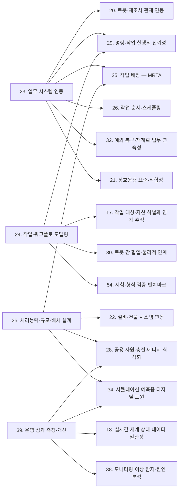
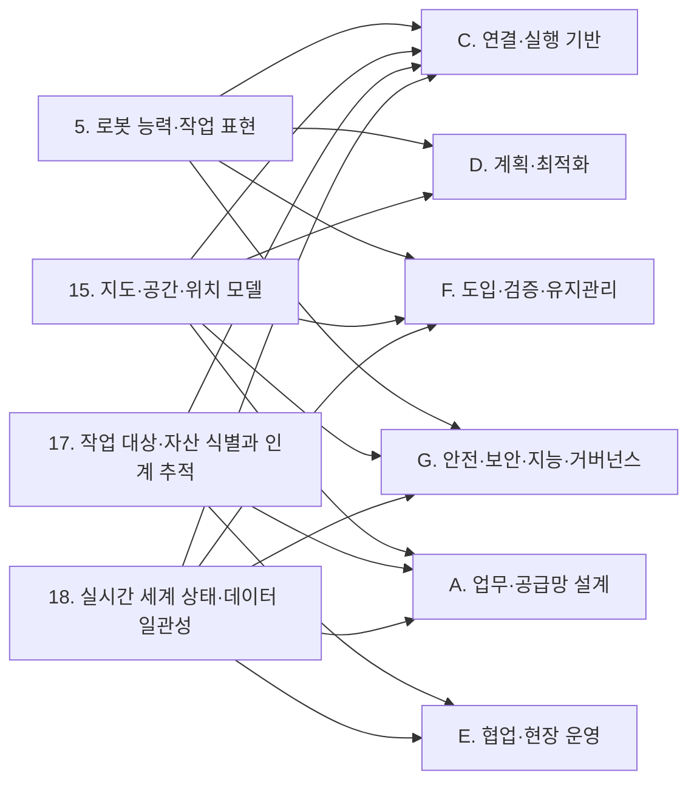
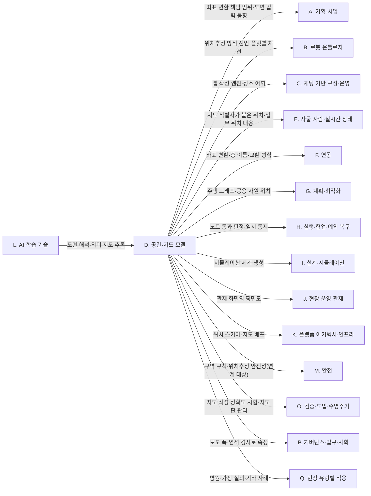
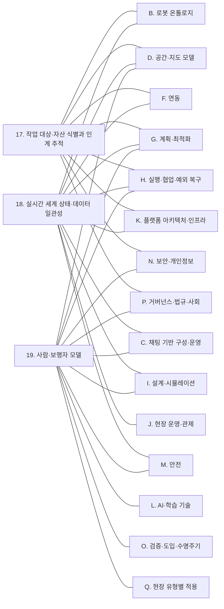
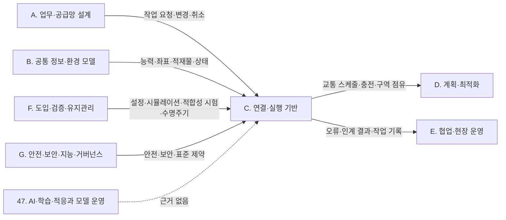
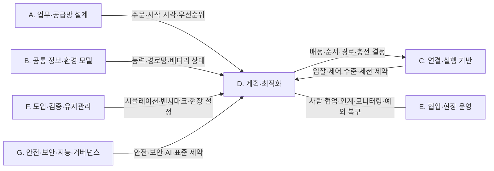
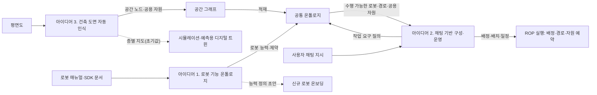

(너의 규칙은 시스템 프롬프트의 agents/shared-rules.md 와 agents/researcher.md 이다. 아래는 이번 실행의 컨텍스트와 입력이다.)

## 실행 컨텍스트

- run_id: 2026-10-09-10
- date: 2026-10-09
- run_type: category_link (대분류 연결)
- 대상: 대분류 N. 보안·개인정보 페이지의 '다른 대분류와의 연결' 절(대분류 연결 실행). 게시된 세부영역 페이지를 근거로 다른 대분류와의 연결을 조사·서술한다. 스토리텔러는 그 절만 patches 로 바꾼다
- 예산:
    - max_search_queries: 30
    - max_sources_per_run: 15
    - new_topic_pages: 1
    - page_updates: 2
    - max_retries: 2
- 환경 알림: web_fetch_available: true · fetch_mode: full
- 언어: ko
- next_ref_id: ref-1367
- 새 출처 id 구간: ref-1367 ~ ref-1396 — 이 실행 전용으로 예약한 번호다(동시에 도는 다른 실행과 겹치지 않는다). 새 출처는 ref-1367 부터 순서대로 쓰고 ref-1396 를 넘기지 않는다. 기존 출처는 참고문헌 목록의 id 를 그대로 쓴다

## 입력

### runs/2026-10-09-10/target.json

```json
{
  "run_id": "2026-10-09-10",
  "date": "2026-10-09",
  "weekday": "Fri",
  "run_number": 143,
  "run_type": "category_link",
  "forced": true,
  "target": {
    "area_no": null,
    "area_name": null,
    "category": "N. 보안·개인정보",
    "category_letter": "N"
  },
  "topic": null,
  "track": null,
  "corrections": [],
  "budget": {
    "max_search_queries": 30,
    "max_sources_per_run": 15,
    "new_topic_pages": 1,
    "page_updates": 2,
    "max_retries": 2
  },
  "priority_reason": null,
  "priority_questions": [],
  "excluded_areas": [],
  "lifted_areas": [],
  "deferred": {
    "monthly_recheck": false,
    "weekly_review": false
  },
  "selection_rationale": "CLI 지정 run_type=category_link"
}
```

### docs/references/index.md (요약: 이번 대상 페이지가 인용한 45건 / 전체 1248건. 목록에 없는 출처는 새 id 로 적는다 — 같은 URL 이 이미 있으면 퍼블리셔가 기존 id 로 합친다)

```markdown
| id | 기관 | 제목 | 발행일 | URL | 접근일 | 원문 열람 |
|---|---|---|---|---|---|---|
| ref-009 | ROS 2 Design | ROS 2 DDS-Security Integration | 미확인 | https://design.ros2.org/articles/ros2_dds_security.html | 2026-09-25 | 예 |
| ref-010 | ROS 2 Design | ROS 2 Robotic Systems Threat Model | 미확인 | https://design.ros2.org/articles/ros2_threat_model.html | 2026-09-25 | 예 |
| ref-031 | VDA / VDMA (VDA5050 GitHub) | VDA5050/VDA5050_EN.md — Official Specification document for the VDA 5050 | 미확인 | https://github.com/VDA5050/VDA5050/blob/main/VDA5050_EN.md | 2026-09-25 | 예 |
| ref-405 | Open Robotics | Security - Programming Multiple Robots with ROS 2 | 미확인 | https://osrf.github.io/ros2multirobotbook/security.html | 2026-09-25 | 예 |
| ref-471 | A3(Association for Advancing Automation) | Updated ISO 10218 | Answers to Frequently Asked Questions (FAQs) | 미확인 | https://www.automate.org/robotics/blogs/updated-iso-10218-faq | 2026-09-25 | 아니오 |
| ref-555 | European Union (EUR-Lex) | Regulation (EU) 2023/1230 of the European Parliament and of the Council on machinery | 2023-06 | https://eur-lex.europa.eu/eli/reg/2023/1230/oj/eng | 2026-09-25 | 아니오 |
| ref-579 | Open Robotics (ROS 2 Design) | ROS 2 Access Control Policies | 2019-08 | https://design.ros2.org/articles/ros2_access_control_policies.html | 2026-09-25 | 예 |
| ref-580 | Open Robotics (ROS 2 Design) | ROS 2 Security Enclaves | 2020-05 | https://design.ros2.org/articles/ros2_security_enclaves.html | 2026-09-25 | 예 |
| ref-581 | Eclipse Foundation (Eclipse Mosquitto) | mosquitto.conf man page | 미확인 | https://mosquitto.org/man/mosquitto-conf-5.html | 2026-09-25 | 예 |
| ref-582 | NIST | NIST SP 800-82 Rev. 3, Guide to Operational Technology (OT) Security | 2023-09 | https://csrc.nist.gov/pubs/sp/800/82/r3/final | 2026-09-25 | 아니오 |
| ref-583 | CISA | Mobile Industrial Robots Vehicles and MiR Fleet Software (ICSA-21-280-02) | 미확인 | https://www.cisa.gov/news-events/ics-advisories/icsa-21-280-02 | 2026-09-25 | 아니오 |
| ref-584 | CSA / IEC (ANSI Webstore) | CAN/CSA IEC 62443-3-3-2017 - Industrial communication networks - Network and system security - Part 3-3: System security requirements and security levels (Adopted IEC 62443-3-3:2013, first edition, 2013-08) | 2013-08 | https://webstore.ansi.org/standards/csa/csaiec624432017-2442576 | 2026-09-25 | 아니오 |
| ref-585 | Jaatun 외(Journal of Cybersecurity and Privacy 6(2), 52) | Security Aspects of Zones and Conduits in IEC 62443 | 2026 | https://www.mdpi.com/2624-800X/6/2/52 | 2026-09-25 | 아니오 |
| ref-587 | 법제처 국가법령정보센터 | 개인정보 보호법 | 미확인 | https://www.law.go.kr/lsEfInfoP.do?lsiSeq=195062 | 2026-09-25 | 아니오 |
| ref-588 | 김·장 법률사무소 | '이동형 영상정보처리기기를 위한 개인영상정보 보호·활용 안내서' 관련 인사이트 | 미확인 | https://www.kimchang.com/ko/insights/detail.kc?sch_section=4&idx=30477 | 2026-09-25 | 아니오 |
| ref-589 | 법제처 국가법령정보센터 | 근로자참여 및 협력증진에 관한 법률 | 미확인 | https://www.law.go.kr/LSW/lsInfoP.do?lsiSeq=105636 | 2026-09-25 | 아니오 |
| ref-590 | 한국인터넷진흥원(KISA) | 로봇 보안취약점 점검 체크리스트 해설서 | 미확인 | https://kisa.or.kr/2060205/form?lang_type=KO&page=&postSeq=36 | 2026-09-25 | 아니오 |
| ref-591 | European Commission (Shaping Europe's digital future) | The Cyber Resilience Act - Summary of the legislative text | 미확인 | https://digital-strategy.ec.europa.eu/en/policies/cra-summary | 2026-09-25 | 아니오 |
| ref-700 | Ravichandran, Z., Robey, A., Kumar, V., Pappas, G. J., & Hassani, H.(IEEE RA-L 2026 채택 표기) | Safety Guardrails for LLM-Enabled Robots | 2025-03 | https://arxiv.org/abs/2503.07885 | 2026-09-25 | 아니오 |
| ref-857 | Robey, A., Ravichandran, Z., Kumar, V., Hassani, H., & Pappas, G. J. | Jailbreaking LLM-Controlled Robots | 2024-11-09 | https://arxiv.org/abs/2410.13691 | 2026-09-29 | 예 |
| ref-968 | MIT Technology Review (Eileen Guo) | A Roomba recorded a woman on the toilet. How did screenshots end up on Facebook? | 2022-12-19 | https://www.technologyreview.com/2022/12/19/1065306/roomba-irobot-robot-vacuums-artificial-intelligence-training-data-privacy/ | 2026-09-29 | 예 |
| ref-969 | 바이라인네트워크 | '로봇청소기' 다수 제품 보안 취약…대응방안은? | 2025-10-31 | https://byline.network/2025/10/31-283/ | 2026-09-29 | 예 |
| ref-1105 | IEC (SyC Smart Energy) | IEC 62443 | 미확인 | https://syc-se.iec.ch/deliveries/cybersecurity-guidelines/security-standards-and-best-practices/iec-62443/ | 2026-09-30 | 예 |
| ref-1106 | OWASP GenAI Security Project | LLM01:2025 Prompt Injection | 미확인 | https://genai.owasp.org/llmrisk/llm01-prompt-injection/ | 2026-09-30 | 예 |
| ref-1107 | CISA (미국 사이버보안·기반시설보안청) | Aethon TUG Home Base Server (ICSA-22-102-05) | 2022-04-12 | https://www.cisa.gov/news-events/ics-advisories/icsa-22-102-05 | 2026-09-30 | 예 |
| ref-1108 | Mayoral-Vilches, V. (Alias Robotics, arXiv) | The Cybersecurity of a Humanoid Robot | 2025-09-17 | https://arxiv.org/abs/2509.14096 | 2026-09-30 | 예 |
| ref-1109 | IES (Integrated Equipment Services) | Machinery Regulation Guide | 2026-08-27 | https://www.ies.co.uk/reference-library/machinery-regulation-guide | 2026-09-30 | 예 |
| ref-1110 | Fernández-Becerra, L., González-Santamarta, M. Á., Guerrero-Higueras, Á. M., Rodríguez-Lera, F. J., & Matellán Olivera, V. (arXiv) | Enhancing Trust in Autonomous Agents: An Architecture for Accountability and Explainability through Blockchain and Large Language Models | 2024-03 | https://arxiv.org/abs/2403.09567 | 2026-09-30 | 예 |
| ref-1111 | 엠에스투데이 | 선박·위성·로봇까지 해킹 표적…정부, ‘피지컬 AI’ 산업 보안 기준 제시 | 2026-03-06 | https://www.mstoday.co.kr/news/articleView.html?idxno=100755 | 2026-09-30 | 예 |
| ref-1112 | Nagaraja, N., Bagari, A., & Bahsi, H. (arXiv) | When Prompts Control Robots: Prompt Injection Attacks in Multi-Agent Robotic Systems | 2026-08 | https://arxiv.org/abs/2608.00747 | 2026-09-30 | 예 |
| ref-1113 | Zhang, W., Kong, X., Dewitt, C., Braunl, T., & Hong, J. B. (arXiv) | A Study on Prompt Injection Attack Against LLM-Integrated Mobile Robotic Systems | 2024-08 | https://arxiv.org/abs/2408.03515 | 2026-09-30 | 예 |
| ref-1114 | Quarta, D., Pogliani, M., Polino, M., Maggi, F., Zanchettin, A. M., & Zanero, S. (IEEE S&P 2017) | An Experimental Security Analysis of an Industrial Robot Controller | 2017 | https://files01.core.ac.uk/download/pdf/84891817.pdf | 2026-09-30 | 아니오 |
| ref-1135 | 개인정보보호위원회 | [현재 안내서] 이동형 영상정보처리기기를 위한 개인영상정보 보호ㆍ활용 안내서(2024.9.) | 2024-10-14 | https://www.pipc.go.kr/np/cop/bbs/selectBoardArticle.do?bbsId=BS217&mCode=G010030000&nttId=10679 | 2026-09-30 | 예 |
| ref-1136 | 정보통신신문 | "자율주행차·로봇 카메라 촬영 시 외부에 표시해야" | 2024-10-14 | https://www.koit.co.kr/news/articleView.html?idxno=125844 | 2026-09-30 | 예 |
| ref-1137 | 개인정보보호위원회 (개인정보 포털) | 개인정보 포털 — 이동형 영상정보처리기기 제도 및 신청방법 안내 | 미확인 | https://www.privacy.go.kr/front/contents/cntntsView.do?contsNo=286 | 2026-09-30 | 예 |
| ref-1138 | 개인정보보호위원회 (대한민국 정책브리핑) | 자율주행차·이동형 로봇 개발에 ‘영상데이터’ 원본 활용 허용 | 2023-11-15 | https://www.korea.kr/news/policyNewsView.do?newsId=148922669 | 2026-09-30 | 예 |
| ref-1139 | 법무법인(유) 세종 | 개인정보보호위원회, 비정형데이터 가명처리 관련 가명정보 처리 가이드라인 개정 (뉴스레터) | 2024-02-08 | https://www.shinkim.com/kor/media/newsletter/2342 | 2026-09-30 | 예 |
| ref-1140 | 경향신문 | 로봇청소기가 우리집 사진 찍어 외부 유출?…6종 ... (제목 일부만 확인) | 2025-09-02 | https://www.khan.co.kr/article/202509021447001 | 2026-09-30 | 예 |
| ref-1141 | 아시아경제 | "로봇청소기 개인정보 관리 대체로 안전…미흡 사례 ... (제목 일부만 확인) | 2026-09-14 | https://view.asiae.co.kr/article/2026091410054053414 | 2026-09-30 | 예 |
| ref-1142 | Raina, N., Somasundaram, G., Zheng, K. 외 (Meta Reality Labs, arXiv) | EgoBlur: Responsible Innovation in Aria | 2023-08-24 | https://arxiv.org/abs/2308.13093 | 2026-09-30 | 예 |
| ref-1143 | Choi, M. 외 (arXiv) | Real-Time Privacy Preservation for Robot Visual Perception | 2025-05-08 | https://arxiv.org/abs/2505.05519 | 2026-09-30 | 예 |
| ref-1144 | Huang, X., Pan, S., Reinhardt, D., & Bennewitz, M. (arXiv) | Designing Privacy-Preserving Visual Perception for Robot Navigation Based on User Privacy Preferences | 2026-04-07 | https://arxiv.org/abs/2604.06382 | 2026-09-30 | 예 |
| ref-1145 | Xu, Y., & Ayday, E. (arXiv) | Seeing Less Is Not Seeing Safely: Privacy Leakage from Task-Scoped Robot Perception Exports | 2026-09-02 | https://arxiv.org/abs/2609.03055 | 2026-09-30 | 예 |
| ref-1146 | Sarfraz, B. M., Saplacan Lindblom, D., Baselizadeh, A., & Torresen, J. (HRI Companion '26) | The Privacy-Preserving Capabilities of a Service Robot in a Scenario-Based Healthcare Setting | 2026-03-16 | https://doi.org/10.1145/3776734.3794481 | 2026-09-30 | 아니오 |
| ref-1147 | European Data Protection Board (EDPB) | Guidelines 3/2019 on processing of personal data through video devices | 2020-01 | https://www.edpb.europa.eu/our-work-tools/our-documents/guidelines/guidelines-32019-processing-personal-data-through-video_en | 2026-09-30 | 예 |
```

### docs/glossary/index.md (요약: 용어 353개, slug: 한국어 (영어). 정의는 docs/glossary/<slug>.md)

```markdown
- 3d-scene-graph: 3차원 장면 그래프 (3D Scene Graph)
- a-b-update: A/B 업데이트 (A/B Update (Dual Partition Update with Rollback))
- aas-registry-and-discovery: 자산관리셸 레지스트리·디스커버리 (AAS Registry / Discovery)
- ablation-study: 절제 실험 (Ablation Study)
- action-dependency-graph: 행동 의존 그래프 (Action Dependency Graph (ADG))
- affordance: 어포던스 (Affordance)
- age-of-information: 정보 나이 (Age of Information (AoI))
- agentic-ai: 에이전틱 AI (Agentic AI)
- aggregation-event: 집계 이벤트 (AggregationEvent)
- agv-technical-data-submodel: AGV 기술 데이터 서브모델 (Technical Data for AGV in Intralogistics (IDTA 02047))
- alarm-management: 경보 관리 (Alarm Management (ANSI/ISA 18.2))
- almere-model: 알메러 모델 (Almere Model)
- alternative-name: 대체 이름 (Alternative Name (IMDF alt_name))
- amr-assisted-order-picking: AMR 협업 피킹 (AMR-assisted Order Picking)
- api-deprecation-policy: API 폐기 정책 (API Deprecation Policy)
- approval-fatigue: 승인 피로 (Approval Fatigue (Consent Fatigue))
- ariac: 산업 자동화용 민첩 로봇 경진대회 (Agile Robotics for Industrial Automation Competition (ARIAC))
- artificial-intelligence-management-system: AI 관리 시스템 (Artificial Intelligence Management System (AIMS))
- as-planned-vs-as-built-deviation: 설계–준공 편차 (As-planned vs As-built Deviation)
- asam-openscenario: 오픈시나리오 (ASAM OpenSCENARIO)
- assembly-line-feeding-problem: 조립라인 공급 문제 (Assembly Line Feeding Problem (ALFP))
- asset-administration-shell: 자산관리셸 (Asset Administration Shell (AAS))
- association-event: 연결 이벤트 (AssociationEvent)
- asyncapi-specification: AsyncAPI 명세 (AsyncAPI Specification)
- attribute-based-access-control: 속성 기반 접근 통제 (Attribute-Based Access Control (ABAC))
- audit-trail: 감사 추적 (Audit Trail)
- automatic-simulation-model-generation: 자동 시뮬레이션 모델 생성 (Automatic Simulation Model Generation (ASMG))
- automation-bias: 자동화 편향 (Automation Bias)
- b2mml: B2MML (Business To Manufacturing Markup Language (B2MML))
- bag-file: 백 파일 (Bag File (rosbag2))
- battery-swapping: 배터리 교환 (Battery Swapping)
- behavior-domain-definition-language: 행동 영역 정의 언어 (Behavior Domain Definition Language (BDDL))
- behavior-tree: 행동 트리 (Behavior Tree)
- block-reference: 블록 참조 (Block Reference (INSERT))
- bpmn: 비즈니스 프로세스 모델 및 표기법 (Business Process Model and Notation (BPMN))
- brainless-robot: 브레인리스 로봇 (Brainless Robot)
- building-information-modeling: 건물 정보 모델링 (Building Information Modeling (BIM))
- building-topology-ontology: 건물 위상 온톨로지 (Building Topology Ontology (BOT))
- business-continuity-management-system: 업무 연속성 관리 시스템 (Business Continuity Management System (BCMS))
- business-location: 업무 위치 (Business Location (EPCIS bizLocation))
- cap-theorem: CAP 정리 (CAP Theorem)
- capabilities-skills-services: 능력·스킬·서비스 모델 (Capabilities, Skills and Services (CSS) Model)
- capability-based-task-allocation: 능력 기반 작업 배정 (Capability-based Task Allocation)
- capability-description-submodel: 능력 기술 서브모델 (Capability Description Submodel (IDTA 02020))
- capability-matchmaking: 능력 매칭 (Capability Matchmaking)
- cbv: 핵심 업무 어휘 (Core Business Vocabulary (CBV))
- cell-based-production: 셀 생산 방식 (Cell-based Production)
- clarification-question: 명확화 질문 (Clarification Question (Follow-up Clarification))
- cloud-robotics: 클라우드 로보틱스 (Cloud Robotics)
- coalition-formation: 연합 형성 (Coalition Formation)
- collaborative-application: 협동 적용 (Collaborative Application)
- collaborative-perception: 협동 인지 (Collaborative Perception)
- common-coordinate-system: 공통 좌표계 (Common Coordinate System (CCS, ISO 21423))
- common-data-environment: 공통 데이터 환경 (Common Data Environment (CDE))
- compensating-transaction: 보상 트랜잭션 (Compensating Transaction)
- competency-question: 역량 질문 (Competency Question (CQ))
- condition-based-maintenance: 상태 기반 정비 (Condition-Based Maintenance (CBM))
- configuration-copilot: 구성 코파일럿 (Configuration Copilot)
- conflict-based-search: 충돌 기반 탐색 (Conflict-Based Search (CBS))
- conformal-prediction: 등각 예측 (Conformal Prediction)
- conformance-test: 적합성 시험 (Conformance Test)
- confused-deputy: 혼란된 대리인 (Confused Deputy)
- consensus-based-bundle-algorithm: 합의 기반 번들 알고리즘 (Consensus-Based Bundle Algorithm (CBBA))
- constrained-decoding: 제약 디코딩 (Constrained Decoding)
- contrastive-explanation: 대조적 설명 (Contrastive Explanation)
- control-barrier-function: 제어 장벽 함수 (Control Barrier Function (CBF))
- cooperative-object-transport: 협동 운반 (Cooperative Object Transport)
- cora: 로봇·자동화 핵심 온톨로지 (Core Ontology for Robotics and Automation (CORA))
- core-manufacturing-simulation-data: 핵심 제조 시뮬레이션 데이터 (Core Manufacturing Simulation Data (CMSD))
- costmap: 비용 지도 (Costmap)
- crdt: 무충돌 복제 데이터 타입 (Conflict-free Replicated Data Type (CRDT))
- cross-embodiment-learning: 교차 형태 학습 (Cross-embodiment Learning)
- cross-schedule-dependency: 스케줄 간 의존 (Cross-schedule Dependency (XD))
- curb-cut: 연석 경사로 (Curb Cut (Curb Ramp))
- cyber-resilience-act: 사이버복원력법 (Cyber Resilience Act (CRA))
- data-holder: 데이터 보유자 (Data Holder (EU Data Act))
- dds-security: DDS 보안 규격 (DDS Security (DDS-Security))
- deadlock: 교착 (Deadlock)
- decision-focused-learning: 결정 중심 학습 (Decision-Focused Learning)
- digital-nameplate: 디지털 명판 (Digital Nameplate (IDTA 02006))
- digital-shadow: 디지털 섀도 (Digital Shadow)
- digital-thread: 디지털 스레드 (Digital Thread)
- digital-twin-composition: 디지털 트윈 결합 (Digital Twin Composition)
- digital-twin: 디지털 트윈 (Digital Twin)
- discrete-event-simulation: 이산 사건 시뮬레이션 (Discrete Event Simulation (DES))
- dispenser-ingestor: 디스펜서·인제스터 (Dispenser / Ingestor)
- distributed-tracing: 분산 추적 (Distributed Tracing)
- document-layout-analysis: 문서 레이아웃 분석 (Document Layout Analysis)
- drawing-exchange-format: 도면 교환 형식 (Drawing Exchange Format (DXF))
- dual-system-architecture: 이중 시스템 구조 (Dual-system Architecture (System 1 / System 2))
- eclass: ECLASS (ECLASS)
- edit-cost: 편집 비용 (Edit Cost)
- elevator-operating-rate: 승강기 가동률 (Elevator Operating Rate (EOR))
- empanelment-programme: 등재 프로그램 (Empanelment Programme)
- enclave: 인클레이브 (Enclave (SROS 2))
- epcis-error-declaration: 오류 선언 (Error Declaration (EPCIS errorDeclaration))
- epcis: 전자 제품 코드 정보 서비스 (Electronic Product Code Information Services (EPCIS))
- ethical-black-box: 윤리적 블랙박스 (Ethical Black Box (EBB))
- event-driven-rescheduling: 사건 기반 재스케줄링 (Event-driven Rescheduling)
- event-trace: 사건 트레이스 (Event Trace)
- excessive-agency: 과도한 에이전시 (Excessive Agency)
- expected-value-of-perfect-information: 완전 정보의 기대 가치 (Expected Value of Perfect Information (EVPI))
- explainable-mapf: 설명 가능한 다중 에이전트 경로 찾기 (Explainable Multi-Agent Path Finding (Explainable MAPF))
- explicit-implicit-confirmation: 명시적 확인·암시적 확인 (Explicit / Implicit Confirmation)
- face-obfuscation: 얼굴 가림 (Face Obfuscation)
- failure-explanation: 실패 설명 (Failure Explanation)
- falsification: 반증 기반 시험 (Falsification)
- fan-out: 팬아웃 (Fan-out (human-robot team))
- fault-detection-and-diagnosis-fdd: 고장 탐지·진단 (Fault Detection and Diagnosis (FDD))
- fault-injection: 장애 주입 (Fault Injection)
- filter-mask: 필터 마스크 (Filter Mask (Nav2 costmap filter))
- finops: 핀옵스 (FinOps)
- fleet-adapter: 플릿 어댑터 (Fleet Adapter)
- fleet-control-level: 플릿 제어 수준 (Fleet Control Level (Open-RMF: Full Control / Traffic Light / Read Only))
- fleet-management-system: 플릿 관리 시스템 (Fleet Management System (FMS))
- fleet-sizing: 차량 소요대수 산정 (Fleet Sizing)
- floor-plan-recognition: 평면도 인식 (Floor Plan Recognition)
- fog-computing: 포그 컴퓨팅 (Fog Computing)
- frozen-horizon: 동결 구간 (Frozen Horizon (Frozen Zone))
- giai: 글로벌 개별 자산 식별자 (Global Individual Asset Identifier (GIAI))
- goal-condition: 목표 조건 (Goal Condition)
- goods-to-person: 상품-대-사람 (Goods-to-Person (GTP))
- grade-certainty-of-evidence: 근거 확실성 등급 (GRADE (Grading of Recommendations, Assessment, Development and Evaluation))
- grai: 글로벌 반환형 자산 식별자 (Global Returnable Asset Identifier (GRAI))
- graph-edit-distance: 그래프 편집 거리 (Graph Edit Distance (GED))
- guidance-graph: 안내 그래프 (Guidance Graph)
- hallucination: 환각 (Hallucination)
- hardware-in-the-loop: 하드웨어 인 더 루프 (Hardware-in-the-Loop (HiL))
- hddl: 계층 도메인 정의 언어 (Hierarchical Domain Definition Language (HDDL))
- hierarchical-task-network: 계층적 작업 네트워크 (Hierarchical Task Network (HTN))
- high-impact-ai: 고영향 인공지능 (High-impact AI (Korea AI Basic Act))
- hmi-philosophy: HMI 철학 (HMI Philosophy (ISA-TR101.01))
- human-in-the-loop: 사람 참여 루프 (Human-in-the-Loop (HITL))
- human-motion-trajectory-prediction: 사람 움직임 궤적 예측 (Human Motion Trajectory Prediction)
- hungarian-method: 헝가리안 방법 (Hungarian Method)
- i-pass-handoff-program: I-PASS 인계 프로그램 (I-PASS Handoff Program)
- idempotency-key: 멱등성 키 (Idempotency Key)
- identity-report: 신원 보고 (Identity Report (MassRobotics identityReport))
- iec-common-data-dictionary: IEC 공통 데이터 사전 (IEC Common Data Dictionary (IEC CDD))
- ifc: 산업 기초 클래스 (Industry Foundation Classes (IFC))
- imitation-learning: 모방 학습 (Imitation Learning)
- indirect-prompt-injection: 간접 프롬프트 주입 (Indirect Prompt Injection)
- indoor-mapping-data-format: 실내 지도 데이터 형식 (Indoor Mapping Data Format (IMDF))
- indoor-space-subspacing: 공간 세분화 (Subspacing (Indoor Space Subdivision))
- indoorgml: IndoorGML (IndoorGML)
- industrial-data: 산업데이터 (Industrial Data)
- information-delivery-specification: 정보 전달 명세 (Information Delivery Specification (IDS))
- information-for-use: 사용 정보 (Information for Use (Instructions for Use))
- infrastructure-mounted-sensing: 인프라 장착 센서 (Infrastructure-mounted Sensing)
- integrity-risk: 무결성 위험 (Integrity Risk)
- intent-recognition: 의도 인식 (Intent Recognition (Intent Detection))
- irdi: 국제 등록 데이터 식별자 (International Registration Data Identifier (IRDI))
- irreducible-infeasible-subset: 기약 불능 제약 집합 (Irreducible Infeasible Subset (IIS))
- isa-95: 기업–제어 시스템 통합 표준 (ISA-95 Enterprise-Control System Integration)
- it-ot-convergence: IT/OT 융합 (IT/OT Convergence)
- jailbreak: 탈옥 (Jailbreak)
- job-shop-scheduling-problem: 작업장 스케줄링 문제 (Job Shop Scheduling Problem (JSSP))
- joint-goal-accuracy: 결합 목표 정확도 (Joint Goal Accuracy (JGA))
- json-schema: JSON 스키마 (JSON Schema)
- keystroke-level-model: 키 입력 수준 모델 (Keystroke-Level Model (KLM))
- kiosk-accessibility: 무인정보단말기 접근성 (Kiosk Accessibility (Unmanned Information Terminal Accessibility))
- lane-closure: 차선 폐쇄 (Lane Closure)
- language-guided-floor-plan-generation: 언어 유도 평면도 생성 (Language-guided Floor Plan Generation)
- latent-failure: 잠재 실패 (Latent Failure)
- layout-interchange-format: 레이아웃 교환 형식 (Layout Interchange Format (LIF))
- level-alignment-fiducial: 층 정렬 기준점 (Fiducial (Level Alignment Fiducial))
- life-cycle-costing: 수명주기 비용 분석 (Life Cycle Costing (LCC, IEC 60300-3-3))
- lifelong-mapf: 지속형 다중 에이전트 경로 찾기 (Lifelong Multi-Agent Path Finding (Lifelong MAPF))
- lift-adapter: 승강기 어댑터 (Lift Adapter)
- linear-temporal-logic: 선형 시간 논리 (Linear Temporal Logic (LTL))
- littles-law: 리틀의 법칙 (Little's Law)
- llm-agent: LLM 에이전트 (LLM Agent)
- llm-modulo-framework: LLM-모듈로 프레임워크 (LLM-Modulo Framework)
- localization-score: 위치추정 품질 점수 (Localization Score (VDA 5050 localizationScore))
- location-check-digit: 위치 체크 디지트 (Location Check Digit)
- lockout-tagout: 잠금·표지 (Lockout/Tagout (LOTO))
- log-playback: 로그 재생 (Log Playback)
- managed-node: 관리형 노드 (Managed Node (ROS 2 Lifecycle Node))
- map-alignment: 지도 정합 (Map Alignment)
- map-distribution: 지도 배포 (Map Distribution (VDA 5050 downloadMap / enableMap / deleteMap))
- map-version: 지도 버전 (Map Version (VDA 5050 mapId / mapVersion))
- mapf: 다중 에이전트 경로 찾기 (Multi-Agent Path Finding (MAPF))
- maps-of-dynamics: 움직임 지도 (Maps of Dynamics (MoD))
- market-based-task-allocation: 시장 기반 작업 배정 (Market-based Task Allocation)
- matter: 매터 (Matter (Connectivity Standards Alliance smart home standard))
- mcap: MCAP (MCAP)
- milp: 혼합 정수 계획 (Mixed Integer Linear Programming (MILP))
- mission-specification-pattern: 미션 명세 패턴 (Mission Specification Pattern)
- mobile-manipulator: 모바일 매니퓰레이터 (Mobile Manipulator)
- mobile-video-information-processing-device: 이동형 영상정보처리기기 (Mobile Video Information Processing Device)
- model-checking: 모델 검사 (Model Checking)
- model-context-protocol: 모델 컨텍스트 프로토콜 (Model Context Protocol (MCP))
- model-contractual-terms: 모델 계약 조항 (Model Contractual Terms (MCTs))
- model-registry: 모델 레지스트리 (Model Registry)
- model-substitution-and-routing-dilution: 모델 대체·라우팅 희석 (Model Substitution / Routing Dilution)
- models-and-simulations-credibility-assessment: 모델·시뮬레이션 신뢰도 평가 (Models and Simulations Credibility Assessment (NASA-STD-7009))
- mqtt-last-will: MQTT 유언 메시지 (MQTT Last Will (Will Message))
- mqtt: 메시지 큐잉 원격 측정 전송 (Message Queuing Telemetry Transport (MQTT))
- mrta: 다중 로봇 작업 배정 (Multi-Robot Task Allocation (MRTA))
- multi-agent-pickup-and-delivery: 다중 에이전트 픽업·배송 (Multi-Agent Pickup and Delivery (MAPD))
- multi-fleet-orchestration: 다중 플릿 오케스트레이션 (Multi-Fleet Orchestration)
- multi-trip-vehicle-routing-problem: 다중 운행 차량 경로 문제 (Multi-Trip Vehicle Routing Problem (MTVRP))
- nearest-vehicle-first-rule: 최근접 차량 우선 규칙 (Nearest Vehicle First (NVF) Rule)
- neuro-symbolic-ai: 신경-기호 AI (Neuro-symbolic AI)
- number-of-clicks: 클릭 수 지표 (Number of Clicks (NoC))
- observability: 관측성 (Observability)
- occupancy-grid-map: 점유 격자 지도 (Occupancy Grid Map (OGM))
- ocel: 객체 중심 이벤트 로그 (Object-Centric Event Log (OCEL))
- ontology-evolution: 온톨로지 진화 (Ontology Evolution)
- ontology-pitfall: 온톨로지 피트폴 (Ontology Pitfall)
- ontology-population: 온톨로지 채우기 (Ontology Population)
- open-rmf: 오픈 RMF (Open-RMF (Open Robotics Middleware Framework))
- openapi-specification: OpenAPI 명세 (OpenAPI Specification (OAS))
- opentelemetry: 오픈텔레메트리 (OpenTelemetry (OTel))
- operating-mode: 운용 모드 (Operating Mode (VDA 5050 operatingMode))
- operating-zone: 운용 구역 (Operating Zone (ISO 3691-4))
- optimality-gap: 최적성 간격 (Optimality Gap)
- order-batching: 주문 배치 (Order Batching)
- outdoor-mobile-robot-operational-safety-certification: 실외이동로봇 운행안전인증 (Outdoor Mobile Robot Operational Safety Certification)
- over-the-air-update: 무선 업데이트 (Over-the-Air Update (OTA))
- overall-equipment-effectiveness: 종합설비효율 (Overall Equipment Effectiveness (OEE))
- panoptic-quality: 파놉틱 품질 (Panoptic Quality (PQ))
- panoptic-symbol-spotting: 파놉틱 심볼 스포팅 (Panoptic Symbol Spotting)
- pass-k: pass^k 지표 (pass^k)
- pay-per-pick: 피킹량 기반 과금 (Pay-per-pick)
- payback-period: 투자 회수 기간 (Payback Period)
- pddl: 계획 도메인 정의 언어 (Planning Domain Definition Language (PDDL))
- perfect-order-fulfillment: 완전 주문 이행률 (Perfect Order Fulfillment)
- performable-action: 수행 가능 동작 (Performable Action (Open-RMF perform_action))
- personal-delivery-device: 개인 배송 장치 (Personal Delivery Device (PDD))
- plug-and-produce: 플러그 앤 프로듀스 (Plug and Produce)
- post-encroachment-time: 침범 후 시간 (Post-Encroachment Time (PET))
- post-occupancy-evaluation: 사용 후 평가 (Post-Occupancy Evaluation (POE))
- power-and-force-limiting: 동력·힘 제한 (Power and Force Limiting (PFL))
- pre-execution-plan-verification: 사전 실행 계획 검증 (Pre-execution Plan Verification)
- pre-hold-post-condition: 전제·유지·사후 조건 (Pre-, Hold-, Post-condition)
- precedence-constraint: 선후 제약 (Precedence Constraint)
- predictive-maintenance: 예지 정비 (Predictive Maintenance)
- presumption-of-conformity: 적합성 추정 (Presumption of Conformity)
- priority-inheritance-with-backtracking: 우선순위 상속·되돌림 (Priority Inheritance with Backtracking (PIBT))
- private-5g-network: 5G 특화망(이음5G) (Private 5G Network (e-Um 5G))
- process-mining: 프로세스 마이닝 (Process Mining)
- product-liability: 제조물책임 (Product Liability)
- prompt-injection: 프롬프트 주입 (Prompt Injection)
- protective-separation-distance: 보호 분리 거리 (Protective Separation Distance)
- pseudonymisation: 가명처리 (Pseudonymisation)
- public-area-mobile-robot: 공공 영역 이동로봇 (Public-area Mobile Robot (PMR))
- put-wall: 풋월 (Put Wall)
- raster-to-vector-conversion: 래스터–벡터 변환 (Raster-to-Vector Conversion)
- raw-video-regulatory-sandbox-exemption: 영상정보 원본 활용 규제샌드박스 실증특례 (Regulatory Sandbox Special Demonstration Exemption for Raw Video Use)
- read-point: 판독 지점 (Read Point (EPCIS readPoint))
- reality-gap: 현실 격차 (Reality Gap (Sim-to-Real Gap))
- regression-testing: 회귀 시험 (Regression Testing)
- release-zone: 해제 구역 (Release Zone)
- remote-controlled-small-vehicle: 원격 조작형 소형차 (Remote-controlled Small Vehicle (遠隔操作型小型車))
- required-and-provided-capability: 요구 능력·제공 능력 (Required Capability / Provided (Offered) Capability)
- resource-constrained-project-scheduling-problem: 자원 제약 프로젝트 스케줄링 문제 (Resource-Constrained Project Scheduling Problem (RCPSP))
- risk-assessment: 위험성평가 (Risk Assessment (ISO 12100))
- roadmap: 경로망 (Roadmap)
- robot-as-a-service: 서비스형 로봇 (Robot-as-a-Service (RaaS))
- robot-density: 로봇 밀도 (Robot Density)
- robot-foundation-model: 로봇 기반 모델 (Robot Foundation Model)
- robot-friendly-building-certification: 로봇 친화형 건축물 인증 (Robot-Friendly Building Certification)
- robot-standard-process-model: 로봇활용 표준공정모델 (Robot Standard Process Model (Korea))
- robot-task-fitness-matrix: 로봇–작업 적합도 행렬 (Robot–Task Fitness Matrix)
- robotic-middleware-for-healthcare: 의료 로봇 미들웨어 RoMi-H (Robotic Middleware for Healthcare (RoMi-H))
- robotic-mobile-fulfillment-system: 로봇 이동형 풀필먼트 시스템 (Robotic Mobile Fulfillment System (RMFS))
- role-ambiguity: 역할 모호성 (Role Ambiguity)
- role-based-access-control: 역할 기반 접근 통제 (Role-Based Access Control (RBAC))
- root-cause-analysis-rca: 근본 원인 분석 (Root Cause Analysis (RCA))
- runtime-tracing: 런타임 추적 (Runtime Tracing (ros2_tracing))
- runtime-verification: 런타임 검증 (Runtime Verification)
- safe-interval-path-planning: 안전 구간 경로 계획 (Safe Interval Path Planning (SIPP))
- saga: 사가 (Saga)
- scan-vs-bim: 스캔 대 BIM 비교 (Scan-vs-BIM)
- scenario-reconstruction: 시나리오 재구성 (Scenario Reconstruction)
- schedule-stability: 일정 안정성 (Schedule Stability)
- scor: 공급망 운영 참조 모델 (Supply Chain Operations Reference (SCOR))
- security-level-iec-62443: 보안 수준 (Security Level (SL, IEC 62443))
- self-driving-laboratory: 자율 실험실 (Self-driving Laboratory (Autonomous Laboratory))
- semantic-id: 의미 식별자 (Semantic ID (semanticId))
- semantic-map: 의미 지도 (Semantic Map)
- semantic-versioning: 의미적 버전 관리 (Semantic Versioning (SemVer))
- semi-open-queueing-network: 반개방형 대기행렬 네트워크 (Semi-Open Queueing Network (SOQN))
- semi-static-object: 반정적 객체 (Semi-static Object)
- service-level-agreement: 서비스 수준 협약 (Service Level Agreement (SLA))
- service-triad: 서비스 삼자 관계 (Service Triad (service robot, customer, frontline employee))
- shacl: 형상 제약 언어 (Shapes Constraint Language (SHACL))
- shift-handover: 교대 인수인계 (Shift Handover)
- shifting-bottleneck-detection-active-period-method: 이동 병목 탐지 (Shifting Bottleneck Detection (Active Period Method))
- shuttle-based-storage-and-retrieval-system: 셔틀 기반 저장·회수 시스템 (Shuttle-Based Storage and Retrieval System (SBS/RS))
- signal-temporal-logic: 신호 시간 논리 (Signal Temporal Logic (STL))
- sila-2: SiLA 2 (Standardization in Lab Automation 2 (SiLA 2))
- sim-vs-real-correlation-coefficient: 시뮬레이션–현실 상관 계수 (Sim-vs-Real Correlation Coefficient (SRCC))
- similarity-transformation: 유사 변환 (Similarity Transformation)
- simulation-description-format: 시뮬레이션 기술 형식 (Simulation Description Format (SDFormat))
- situation-awareness-based-agent-transparency: 상황 인식 기반 에이전트 투명성 (Situation Awareness-based Agent Transparency (SAT))
- situation-awareness: 상황 인식 (Situation Awareness (SA))
- situation-state-tracking: 상황 상태 추적 (Situation State Tracking)
- skill-interface: 스킬 인터페이스 (Skill Interface)
- skill: 스킬 (Skill)
- slot-filling: 슬롯 채우기 (Slot Filling)
- smart-hospital-leading-model: 스마트병원 선도모델 (Smart Hospital Leading Model)
- smart-logistics-center-certification: 스마트물류센터 인증 (Smart Logistics Center Certification)
- social-force-model: 사회적 힘 모델 (Social Force Model)
- social-robot-navigation: 사회적 내비게이션 (Social Robot Navigation (Human-aware Navigation))
- soft-landings: 소프트 랜딩 (Soft Landings (BSRIA BG 54))
- software-bill-of-materials: 소프트웨어 자재명세서 (Software Bill of Materials (SBOM))
- software-in-the-loop: 소프트웨어 인 더 루프 (Software-in-the-Loop (SiL))
- software-nameplate: 소프트웨어 명판 (Software Nameplate (IDTA 02007))
- source-grounding: 출처 근거 연결 (Source Grounding)
- space-boundary: 공간 경계 (Space Boundary (IfcRelSpaceBoundary))
- space-graph: 공간 그래프 (Space Graph)
- speed-and-separation-monitoring: 속도·분리 감시 (Speed and Separation Monitoring (SSM))
- sscc: 물류 단위 일련 코드 (Serial Shipping Container Code (SSCC))
- stakeholder-requirements-specification: 이해관계자 요구사항 명세 (Stakeholder Requirements Specification (StRS))
- state-of-charge: 충전 상태 (State of Charge (SOC))
- state-of-health: 배터리 건강 상태 (State of Health (SOH))
- stpa: 시스템 이론적 프로세스 분석 (System-Theoretic Process Analysis (STPA))
- stride-threat-classification: STRIDE 위협 분류 (STRIDE (Spoofing, Tampering, Repudiation, Information Disclosure, Denial of Service, Elevation of Privilege))
- structured-output: 구조화 출력 (Structured Output)
- substantial-modification: 실질적 변경 (Substantial Modification)
- success-weighted-by-path-length: 경로 길이 가중 성공률 (Success weighted by Path Length (SPL))
- supervisory-control: 감독 제어 (Supervisory Control)
- table-structure-recognition: 표 구조 인식 (Table Structure Recognition)
- tamper-evident-log: 변조 탐지 로그 (Tamper-evident Log)
- task-decomposition: 작업 분해 (Task Decomposition)
- technology-readiness-level: 기술 성숙도 (Technology Readiness Level (TRL))
- teleoperation: 원격 조작 (Teleoperation)
- time-window: 시간창 (Time Window)
- topological-map: 위상 지도 (Topological Map)
- total-cost-of-ownership: 총소유비용 (Total Cost of Ownership (TCO))
- traversability: 통과 가능성 (Traversability)
- uncertainty-alignment: 불확실도 정렬 (Uncertainty Alignment)
- underspecification: 과소명세 (Underspecification)
- urdf: 통합 로봇 기술 형식 (Unified Robot Description Format (URDF))
- use-case-template: 사용 사례 템플릿 (Use Case Template (IEC 62559-2))
- user-simulator: 사용자 시뮬레이터 (User Simulator)
- utaut: 통합 기술 수용 이론 (Unified Theory of Acceptance and Use of Technology (UTAUT))
- vda-5050-cancel-order: 주문 취소 즉시 동작 (cancelOrder (VDA 5050 instant action))
- vda-5050-factsheet: VDA 5050 팩트시트 (VDA 5050 factsheet)
- vda-5050: VDA 5050 (VDA 5050)
- verification-and-validation-of-simulation-models: 시뮬레이션 모델 검증·타당성 확인 (Verification and Validation (V&V) of Simulation Models)
- version-iri: 버전 IRI (Version IRI (owl:versionIRI))
- virtual-commissioning: 가상 시운전 (Virtual Commissioning)
- vision-language-action-model: 비전 언어 행동 모델 (Vision-Language-Action Model (VLA))
- voice-picking: 음성 피킹 (Voice-Directed Picking (Voice Picking))
- waveless-order-release: 웨이브리스 출고 지시 (Waveless Order Release)
- webhook: 웹훅 (Webhook)
- wes-wcs-wms-mes-tms: 창고 실행·창고 제어·창고 관리·제조 실행·운송 관리 시스템 (Warehouse Execution System / Warehouse Control System / Warehouse Management System / Manufacturing Execution System / Transportation Management System)
- workflow-net: 워크플로 넷 (Workflow Net (WF-net))
- zone-set: 구역 집합 (Zone Set (VDA 5050 zoneSet))
- zones-and-conduits: 보안 구역과 도관 (Zones and Conduits (IEC 62443))
```

### docs/open-questions.md (요약: 대상 영역 [51, 52, 53] 에 걸린 31건 / 전체 301건)

```markdown
- oq-043 [열림] 로봇 관제가 출입통제·건물 자동화 시스템(BACnet 등)을 통해 보안문을 여닫는 공개 설계나 국내 사례가 있고, 권한 확인은 누가 하는가? (영역 22, 51)
- oq-056 [열림] 로봇 관제·플릿 어댑터·승강기·문 어댑터에 SROS 2 인클레이브와 권한 파일을 어떤 단위로 나눠 설비 명령 권한을 제한하는지 공개한 구성이나 사례가 있는가? (영역 22, 51)
- oq-082 [열림] 로봇·제조사 관제가 보고하는 위치·배터리·입찰 비용이 오염되거나 위조되었을 때 ROP 는 배정 전에 이를 어떻게 검증하고, 의심 로봇을 배정 후보에서 뺄 기준은 무엇인가? (영역 25, 38, 51)
- oq-099 [열림] 물류센터 내부처럼 공개되지 않은 작업장에서 카메라를 단 로봇이 작업자를 촬영할 때 개인정보 보호법 제25조의2와 근로자 감시 설비 협의 가운데 무엇이 적용되는지 공식 해석이 있는가? (영역 31, 51)
- oq-100 [열림] 외부 유지보수 계정의 권한을 로봇·명령 단위로 나눈 매트릭스(예: 진단은 허용, 이동은 불허)를 공개한 로봇 관제·ROP 구성이나 표준이 있는가? (영역 20, 51)
- oq-101 [열림] 여러 화주가 로봇 플릿을 공유하는 창고에서 고객별 작업·데이터 격리를 오케스트레이션 수준에서 규정한 표준이나 공개 설계가 있는가? (영역 21, 51)
- oq-102 [열림] ISO 10218-1:2025 의 사이버보안 요구는 어느 조항에서 무엇(접근 제한·원격 접속·로그 등)을 요구하며 로봇 관제 연동에 어떤 조건을 주는가? (영역 48, 51)
- oq-103 [열림] EU 기계 규정 부속서 III 1.1.9 의 적용일이 사이버 복원력법(2027-12-11)에 맞춰 연기되는지 확정됐는가? (영역 48, 51)
- oq-113 [열림] ROP 가 VDA 5050 updateCertificate 같은 보안 명령으로 제조사 로봇의 인증서를 교체할 때, 교체 시점·대상 승인과 실패 시 되돌림 책임은 ROP 사업자·제조사·현장 IT 조직 중 누가 지는가? (영역 20, 51, 57)
- oq-121 [열림] 로봇 관제 챗봇의 채팅 지시 기록에 작업자 식별 정보가 담길 때 그 시스템이 개인정보의 안전성 확보조치 기준의 개인정보처리시스템에 해당해 접근권한 기록·접속기록 보관 기준을 적용받는지 공식 해석이 있는가? (관련: oq-099) (영역 31, 51)
- oq-143 [열림] ROP 의 로봇 대화 기능이 국내 인공지능 기본법의 고영향 인공지능이나 EU AI Act 의 고위험 AI 시스템에 해당하는지, 해당한다면 대화 기록 자동 로그의 항목과 보존 기간을 어떻게 정해야 하는가? (영역 13, 59, 53)
- oq-144 [열림] 로봇 대화 지시에 특화된 프롬프트 주입·탈옥 방어(도구 설명 신뢰 경계, 실행 전 물리 제약 검사, 다중 모델 감독)의 효과를 잰 공개 벤치마크나 현장 시험 결과가 있는가? (영역 13, 52, 48)
- oq-171 [열림] 개인정보 보호법 제25조의2(이동형 영상정보처리기기의 운영 제한)의 촬영 사실 표시·촬영 거부 규정이 병원 이송 로봇의 카메라·센서 촬영에 어떻게 적용되며, 환자·방문객 영상을 관제 계층이 어디까지 저장·전송할 수 있는지 법령 원문과 해석 사례로 확인할 수 있는가(이번 조사는 법령 원문을 열지 못했다)? (영역 63, 53)
- oq-181 [열림] 세대 안에서 거주자가 쓰는 가사 로봇·로봇청소기의 영상 수집에는 개인정보 보호법 제25조의2(이동형 영상정보처리기기)가 적용되는가, 아니면 동의 기반 처리 조항만 적용되는가, 그리고 이에 대한 개인정보보호위원회 해석이나 가이드라인이 있는가? (영역 65, 53)
- oq-185 [열림] 소유자가 원격 조작자를 예약해 가정 로봇을 안내하게 하는 방식(1X NEO 등)에서 원격 조작자의 영상 접근·사고 책임을 다루는 국내외 규제·인증 기준이 있는가? (영역 65, 53, 58)
- oq-211 [열림] 로봇 플랫폼이 수집하는 텔레메트리·주행 기록·영상의 보존 기간을 정한 국내 기준이나 운영 사례가 개인정보 접속기록 규정 밖에도 있는가? (영역 43, 53)
- oq-214 [열림] 로봇 플랫폼에 적용될 수 있는 현행 「개인정보의 안전성 확보조치 기준」(2023-6호 이후 개정판)의 접속기록 보관 기간·점검 주기 조항이 2023-6호와 같은가? (영역 43, 53)
- oq-228 [열림] 플랫폼이 시설 CCTV 영상을 로봇 운영용 장면 인식에 쓸 때 국내 개인정보 보호 법령의 고정형 영상정보처리기기 규정상 목적 외 이용이나 안내 의무가 문제 되는가? (영역 45, 53)
- oq-246 [열림] 여러 제조사 플릿 관리 서버와 VDA 5050 브로커·Open-RMF 어댑터를 잇는 ROP 에서 브로커·API 의 상호 인증과 TLS 설정의 최소 요구를 정한 공개 보안 프로파일이 있는가? (영역 52, 20, 21)
- oq-247 [열림] LLM 에이전트 여러 개가 로봇을 나눠 맡을 때 한 에이전트에 주입된 지시가 다른 에이전트로 퍼지지 않게 에이전트 간 메시지에 신뢰 경계를 두는 방어의 효과를 잰 연구가 있는가? (영역 52, 13, 12)
- oq-248 [열림] 명령·승인 감사 기록을 해시 체인·블록체인으로 변조 탐지 가능하게 남길 때 수백 대 로봇 규모의 명령 빈도에서 지연·저장 비용을 측정한 자료가 있는가? (영역 52, 37)
- oq-249 [열림] EU 기계류 규정의 개입 증거 기록·안전 소프트웨어 추적 로그 요구가 개별 기계 밖에서 여러 로봇을 지시하는 오케스트레이션 플랫폼에도 미치는가, 미친다면 기록 책임은 누구에게 있는가? (영역 52, 59, 58)
- oq-250 [열림] KISA 로봇 보안모델(고도화)과 사이버보안 요구사항 해설서는 로봇 통신 암호화·감사 기록·원격 업데이트에 어떤 요구 항목을 두며 다중 로봇 관제 플랫폼을 대상에 포함하는가? (영역 52, 59)
- oq-259 [열림] 여러 제조사 로봇의 영상과 위치 정보를 모아 관제하는 플랫폼 사업자는 개인정보 보호법상 이동형 영상정보처리기기 운영자인가, 현장 운영 사업자의 수탁자인가, 그리고 촬영 표시·거부 의사 처리 의무는 누구에게 있는가? (영역 53, 58)
- oq-260 [열림] 로봇이 플랫폼·클라우드·로그로 내보내는 인지 출력(객체 목록·의미 지도·궤적)의 재식별 위험을 측정하는 공개 평가 기준이나 벤치마크가 있는가? (영역 53, 54)
- oq-261 [열림] 피촬영자가 한 로봇에 밝힌 촬영 거부 의사를 같은 현장의 다른 로봇과 플랫폼 기록에 공통으로 반영하는 방법이나 운영 사례가 있는가? (영역 53, 19)
- oq-262 [열림] 유럽데이터보호이사회(European Data Protection Board, EDPB) 영상 장치 지침 3/2019 를 이동 로봇 카메라에 적용한 유럽 감독기관의 결정이나 해석 사례가 있으며, 보존 기간 권고는 무엇인가? (영역 53, 59)
- oq-272 [열림] 여러 제조사 로봇과 설비 센서가 각자 감지한 사람 위치를 하나의 사람 흐름 모델로 합칠 때 좌표·시각·신뢰도·익명화 형식을 정한 공개 규격이나 구현이 있는가? (영역 19, 18, 53)
- oq-285 [열림] 오케스트레이션 플랫폼이 로봇 작업과 연결해 개별 작업자의 처리량·위치를 기록하는 기능이 근로자참여법 제20조의 근로자 감시 설비나 독일 사업장조직법 제87조의 감시 장치에 해당해 도입 전 노사협의·공동결정 대상이 되는가? (영역 60, 53, 59)
- oq-291 [열림] 로봇 오케스트레이션 플랫폼이 EU 사이버복원력법의 디지털 요소 제품 제조자에 해당하는가, 해당하면 로봇 제조사와 플랫폼 사업자 사이에 취약점 보고 의무를 어떻게 나누는가? (영역 59, 52, 57)
- oq-293 [열림] 병원 운반 로봇의 생체 인식·PIN 수령 확인처럼 수령인 인증 결과를 작업 완료·인계 이벤트로 ROP 와 병원 정보 시스템에 남기는 공개 인터페이스나 표준 필드가 있는가? (영역 17, 51, 63)
```

### config/priority.yaml

```yaml
# config/priority.yaml — 사용자가 지정하는 우선 영역·주제·질문 (빌드 사양서 7.1, 7.4, 8.2)
#
# 비어 있으면 순환 규칙(config/rotation.yaml)만 따른다. 항목이 없는 키는 빈 목록([])으로 둔다.
# 네 키(areas, topics, questions, track_questions)는 빈 목록이라도 모두 있어야 하고, 항목의 필드 이름은 아래 예시와 같아야 한다.
# 항목의 뜻과 반영 시점은 config/README.md 와 docs/about/how-to-contribute.md 에 있다.
#
# 읽는 주체:
#   - pipeline/select_target.*  : areas·topics·questions 로 그날의 대상을 정한다(순환보다 우선, 7.1). questions 는 area_no 영역을 대상으로 올리고, 2주기에는 그 영역의 점수에도 더한다
#   - 리서치·검증 에이전트       : 이 파일 전문이 프롬프트의 "## 입력"에 들어간다. 대상 영역의 questions 는 조사 질문에 포함된다
#   - pipeline/select_target.*  : 트랙 실행의 대상 선정에서 track_questions 를 트랙 백로그(data/tracks/<slug>/backlog.json)에 제기 근거 "사용자"로 먼저 등록하고 그 실행의 질문으로 고른다
#   - 퍼블리셔                   : 대상 선정 뒤에 더해진 track_questions 를 같은 방식으로 등록한다(보완)
#
# area_no 는 1~67 의 세부영역 번호다(2026-09-28 개정 분류, _source/ROP_연구분야_분류.md). 사람이 읽기 쉽도록 주석에 영역 이름을 함께 적는다(예: 17. 작업 대상·자산 식별과 인계 추적).
# 지정한 항목이 처리되면 목록에서 지워도 된다. 지우지 않으면 rotation.yaml 의 priority.skip_if_targeted_within_days 가 지난 뒤 다시 우선된다.
# 우선 지정은 조사 대상을 정할 뿐 검증 규칙과 하루 예산(daily_budget)을 바꾸지 않는다.

# 세부영역을 먼저 다루게 한다. weight 는 대상 선정 점수에 더하는 가중치, reason 은 로그(target.json·일일 로그)에 남는 지정 사유다.
areas: []
# 작성 예시:
# areas:
#   - area_no: 17           # 17. 작업 대상·자산 식별과 인계 추적
#     weight: 10            # 대상 선정 점수에 더하는 가중치
#     reason: "병원·상업 시설의 인계 확인 사례가 부족하다"

# 특정 주제로 주제 조사(run_type topic)를 실행하게 한다. area_no 는 주 연구영역이다.
topics: []
# 작성 예시:
# topics:
#   - title: "작업 대상 인계 확인에 EPCIS 이벤트를 쓰는 방법"
#     area_no: 17           # 주 연구영역: 17. 작업 대상·자산 식별과 인계 추적
#     weight: 8

# 답을 찾게 할 질문이다. area_no 영역을 areas 와 같이 순환보다 먼저 대상으로 올리고(가중치는 rotation.yaml 의 priority.question_weight), 그 영역이 대상이 되면 리서치 에이전트의 조사 질문에 포함된다.
questions: []
# 작성 예시:
# questions:
#   - question: "로봇 도착과 실제 작업 대상 인계를 어떤 이벤트로 구분해 기록하는가?"
#     area_no: 17           # 17. 작업 대상·자산 식별과 인계 추적

# 트랙 백로그에 넣을 질문이다(8.2). 다음 트랙 실행의 대상 선정이 제기 근거 "사용자"로 백로그에 등록해 우선순위를 올린다(8.2).
# 처리 순서: 리서치 에이전트는 트랙 실행마다 현재 단계의 열린 질문 가운데 사용자 지정 → 앞 단계로 되돌아온 질문 → 오래된 순으로 1~3개를 고르므로(6.1),
# 현재 단계에 넣은 사용자 질문이 가장 앞에 온다. 사용자 질문이 여럿이면 priority(high → normal → low), 같으면 파일에 적힌 순이다 [가정].
# stage 가 현재 단계보다 앞이면 되돌아온 질문과 같이 다음 트랙 실행에서 우선 처리하고(8.2), 뒤이면 그 단계가 현재 단계가 될 때 다룬다 [가정].
track_questions: []
# 작성 예시:
# track_questions:
#   - track: manual-capability-ontology   # config/tracks/<slug>.yaml 의 slug
#     stage: 1              # 질문을 넣을 단계 번호(1 ~ 그 트랙의 단계 수: 매뉴얼 기반 로봇 기능 온톨로지 7, 채팅 기반 구성·운영 10, 건축 도면 자동 인식 5). 예: 단계 1. 기존 능력 표현 모델과 표준 조사
#     question: "산업 상호운용 규격의 팩트시트는 적재 제약을 어떤 필드로 기술하는가?"
#     priority: high        # high / normal / low. 사용자 지정 질문이 여럿일 때 고르는 순서에만 쓴다 [가정]
```

### inbox/corrections.md

````markdown
# 정정 요청함 (inbox/corrections.md)

이 파일은 위키 내용에 대한 정정 요청을 모으는 곳이다. 형식, 처리 흐름, 거부되는 경우는 docs/corrections.md(정정 요청 안내)에 있다.

- 한 요청은 `## corr-NNN` 제목으로 시작하는 블록 하나다. id 는 corr-001 부터 순서대로 늘리며, 아래 "요청 목록"에 새 블록을 덧붙인다.
- 필드는 서식의 여섯 줄(페이지, 문제 문장, 근거, 요청일, 요청자, 상태)을 그대로 쓰고 값만 채운다. 각 필드는 한 줄로 쓴다. 페이지·문제 문장·근거·요청일은 빌드 사양서 7.4 의 필드이고, 요청자·상태는 구축자가 더한 것이다. [가정]
- 상태는 요청자가 `open` 으로 쓴다. `applied`(반영됨)·`rejected`(반영하지 않음)는 퍼블리셔가 바꾸고, 그때 "처리 실행"과 "처리 메모" 줄을 덧붙인다.
- 리서치 에이전트는 다음 실행에서 이 파일 전체를 읽는다. 대상 페이지에 걸린 `open` 요청은 반드시 조사 질문에 들어가고, 내용 검증 에이전트가 1차 검증 항목 11(정정 요청 반영 여부)로 확인하며, 처리 결과는 docs/changelog.md(변경 이력)에 남는다.
- 분류 원문의 명칭·번호·정의·질문은 정정 대상이 아니다. 새 주제나 우선 영역은 config/priority.yaml 에 적는다.

## 서식

아래 블록을 복사해 "요청 목록" 끝에 붙이고, 제목의 `corr-NNN` 을 실제 id 로 바꾼 뒤 값을 채운다. 코드 펜스 안의 서식은 요청으로 읽히지 않는다(정정 요청을 읽는 스크립트는 코드 펜스 안의 `## corr-` 줄을 제외해야 한다). [가정]

```markdown
## corr-NNN

- 페이지: docs/<경로>/<파일>.md
- 문제 문장: "페이지에 있는 문장을 태그까지 그대로 옮긴다"
- 근거: 출처 URL 또는 설명
- 요청일: YYYY-MM-DD
- 요청자: 이름 또는 역할
- 상태: open
```

## 요청 목록

(아직 요청이 없다.)
````

### runs/2026-10-09-09/research.md

```markdown
# 리서치 브리프 2026-10-09-09

| 항목 | 값 |
|---|---|
| 실행 id | 2026-10-09-09 |
| 날짜 | 2026-10-09 |
| 실행 유형 | category_link (대분류 연결) |
| 대상 영역 | 해당 없음 |
| 대분류 | M. 안전 |

## 갭(비어 있거나 약한 섹션)

- M. 안전 대분류 페이지의 '다른 대분류와의 연결' 절이 '아직 작성되지 않음' 상태다. 48. 안전·위험 관리, 49. 사람 근접 안전, 50. 안전 표준·인증·사고 조사와 다른 16개 대분류의 연결이 정리되지 않았다
- 48. 안전·위험 관리 페이지는 이전 분류(2026-09-26) 기준이라 C. 채팅 기반 구성·운영, K. 플랫폼 아키텍처·인프라, O. 검증·도입·수명주기의 56. 운영 이관·확대·교육, P. 거버넌스·법규·사회와 잇는 근거가 페이지 안에 없다
- 48·49·50 페이지의 10절(다른 연구영역과의 연결)은 49·50 이 주제 페이지로 분리되어 있고 대분류 단위로 묶인 연결이 없다
- 정지·재개 판단에 쓰는 VDA 5050 안전 상태·운용 모드의 원문 확인과, 관제 통신이 끊겼을 때의 정지 경로(oq-095) 근거가 약하다
- ANSI/A3 R15.08-3(사용자 의무)과 국내 로봇작업 특별교육처럼 운영·교육 쪽 근거(oq-265, oq-275)가 게시 페이지에 없다
- Q. 현장 유형별 적용의 64. 상업 시설에 사람 근접 안전 적용 사례가 없다

## 조사 질문

1. 여러 로봇·사람·설비가 함께 움직일 때 생기는 위험을 어떻게 찾고 막을 것인가? [분류원문]
2. 48. 안전·위험 관리의 정지·재개 판단은 B. 로봇 온톨로지(6)·F. 연동(20·21·22)·H. 실행·협업·예외 복구(29·31·32)·K. 플랫폼 아키텍처·인프라(42)의 어떤 상태·명령·통신 경로에 기대는가? (oq-095, oq-229 관련)
3. 49. 사람 근접 안전의 구역·속도·사람 흐름 규칙은 D. 공간·지도 모델(15·16)·E. 사물·사람·실시간 상태(18·19)·G. 계획·최적화(25·27·28)·I. 설계·시뮬레이션(34·36)과 어떻게 이어지는가?
4. 50. 안전 표준·인증·사고 조사의 표준 개정·인증·사고 기록은 A. 기획·사업(1·2·3)·J. 현장 운영·관제(37·38·40)·N. 보안·개인정보(51·52·53)·O. 검증·도입·수명주기(54·55·56·57)·P. 거버넌스·법규·사회(58·59·60)와 어디서 만나는가? (oq-102, oq-252, oq-254, oq-265, oq-275 관련)
5. 언어 모델이 지시하는 로봇 계획의 안전 검사는 C. 채팅 기반 구성·운영(12·13)과 L. AI·학습 기술(44·47)의 '사람이 확인·승인한 계획만 실행' 원칙과 어떻게 맞물리는가? (oq-106, oq-144 관련)
6. M. 안전의 적용 사례는 Q. 현장 유형별 적용의 일곱 현장 유형 가운데 어디에 근거가 있으며, 한국 법령·인증·사고 자료는 무엇이 있는가?

## 발견 사항

| id | 태그 | 주장 | 출처 | 교차 확인 | 신뢰도 | 기준일 | 흐름 단계 / 항목 | 표시 |
|---|---|---|---|---|---|---|---|---|
| f1 | [사실] | M. 안전의 48. 안전·위험 관리 ↔ A. 기획·사업의 2. 사용 사례·요구·책임 범위: ANSI/A3 R15.08 시리즈는 로봇 자체(1부), 산업용 이동로봇 시스템·적용의 통합(2부, 2023), 사용자의 산업용 이동로봇 적용 사용(3부, 2026)으로 나뉘어 제조사·통합자·사용자의 안전 책임을 부별로 다룬다. | ref-1419, ref-1084 | 아니오 | medium | 2026-09-17 | — | — |
| f2 | [추정] | M. 안전의 48. 안전·위험 관리 ↔ A. 기획·사업의 2. 사용 사례·요구·책임 범위: R15.08 시리즈가 통합자와 사용자의 의무를 따로 두므로, 여러 제조사 로봇을 묶는 ROP 사업자가 현장마다 통합자 역할을 맡는지 사용자의 위험성평가를 지원하는 역할에 머무는지가 책임 범위 정의에 들어가야 할 것으로 보인다(oq-096). | ref-1419, ref-1084, ref-472 | 아니오 | low | 2026-10-09 | — | — |
| f3 | [사실] | M. 안전의 50. 안전 표준·인증·사고 조사 ↔ A. 기획·사업의 1. 기술·시장·업체 동향: 주요 로봇 안전 표준의 개정이 2025~2026년에 몰려 있다. ISO 10218-1/-2 개정판은 2025-02에 나왔고 EN ISO 판의 참조가 2026-09-07 EU 관보에 실렸다. ANSI/A3 R15.08-3 은 A3 판매 페이지 기준 2026-04-23에 발행됐고, ISO 13482 개정판은 2026-09-15 기준 FDIS 단계다. | ref-1116, ref-1420, ref-1117 | 아니오 | medium | 2026-09 | — | — |
| f4 | [사실] | M. 안전의 50. 안전 표준·인증·사고 조사 ↔ A. 기획·사업의 3. 경제성·조달·사업 모델·P. 거버넌스·법규·사회의 59. 법·규제·보험·라이선스: 2023-11-17 시행된 개정 지능형로봇법에 따라 보도에서 실외이동로봇을 운영하는 자는 보험(또는 공제)에 의무 가입해야 한다. 산업통상자원부는 한국로봇산업협회를 손해보장사업 실시기관으로 지정해 보험상품 출시를 지원한다. | ref-1424 | 아니오 | medium | 2023-11-16 | 실외 / 제약 | — |
| f5 | [추정] | M. 안전의 50. 안전 표준·인증·사고 조사 ↔ A. 기획·사업의 3. 경제성·조달·사업 모델: 실외 로봇 도입에서는 보험 가입과 인증 유지가 운영비 항목이 될 것으로 보인다. 인증 단위가 로봇과 관제장치의 조합이므로, 관제를 맡는 ROP 사업자가 운영자 의무 범위에 드는지가 조달·계약 단계의 쟁점이 될 것으로 보인다. | ref-1424, ref-980 | 아니오 | low | 2026-10-09 | 실외 / 제약 | — |
| f6 | [사실] | M. 안전의 48. 안전·위험 관리 ↔ B. 로봇 온톨로지의 6. 온톨로지 기반 시스템·로봇 연동·H. 실행·협업·예외 복구의 29. 명령·작업 실행의 신뢰성: VDA 5050 3.0.0 의 운용 모드 가운데 AUTOMATIC 은 관제가 로봇을 완전히 제어하는 상태, SEMIAUTOMATIC 은 관제가 제어하되 주행 속도를 HMI 가 조정하는 상태다. INTERVENED·MANUAL·STARTUP·SERVICE·TEACH_IN 에서는 관제가 로봇을 제어하지 않는다. | ref-031 | 아니오 | medium | 2026-10-09 | 제약 | — |
| f7 | [추정] | M. 안전의 48. 안전·위험 관리 ↔ B. 로봇 온톨로지의 6. 온톨로지 기반 시스템·로봇 연동: 6. 온톨로지 기반 시스템·로봇 연동의 '실행 시점 조건 판단'에 배터리·적재 상태와 함께 운용 모드와 안전 상태(비상정지·보호 필드 침범)를 넣어야, 관제가 제어권이 없는 로봇에 작업을 내리지 않을 것으로 보인다. | ref-031 | 아니오 | low | 2026-10-09 | 제약 | — |
| f8 | [추정] | M. 안전의 50. 안전 표준·인증·사고 조사 ↔ B. 로봇 온톨로지의 4. 이기종 로봇 등록: 로봇마다 R15.08 유형(A·B·C), 적용 안전 표준과 판, 인증 상태를 등록 정보로 두면 표준 개정과 인증 범위를 배정·경로 제약으로 추적할 수 있을 것으로 보인다. | ref-1419, ref-1116, ref-980 | 아니오 | low | 2026-10-09 | — | — |
| f9 | [사실] | M. 안전의 48. 안전·위험 관리 ↔ C. 채팅 기반 구성·운영의 12. 채팅으로 업무 지시·오케스트레이션: Obi 외(2026-04)는 언어 모델이 제어하는 로봇 시스템에 실행 전 안전 게이트(SafeGate)와 작업 안전 계약을 두는 방법을 제안했다. | ref-417 | 아니오 | medium | 2026-04 | 제약 | 원문 미열람 |
| f10 | [사실] | M. 안전의 48. 안전·위험 관리 ↔ C. 채팅 기반 구성·운영의 13. 대화형 기능의 신뢰·기반: Ravichandran 외의 RoboGuard 에서는 악성 프롬프트와 격리한 신뢰 기점 LLM 이 미리 정한 안전 규칙을 시간 논리 제약으로 바꾸고 제어 합성으로 계획과의 충돌을 푼다. 저자들은 최악의 탈옥 공격에서 위험 계획 실행이 92% 이상에서 3% 미만으로 줄었다고 보고했다. | ref-1338 | 아니오 | medium | 2026-03-03 | 제약 | 원문 미열람 |
| f11 | [사실] | M. 안전의 48. 안전·위험 관리 ↔ C. 채팅 기반 구성·운영의 13. 대화형 기능의 신뢰·기반·N. 보안·개인정보의 52. 통신 보호·위협 관리·감사: Robey 외(2024-10)는 언어 모델이 제어하는 로봇이 해로운 물리 행동을 하도록 만드는 탈옥 알고리즘 RoboPAIR 를 제시했다. GPT-4o 계획기를 쓴 Clearpath Jackal 과 GPT-3.5 를 연동한 Unitree Go2 등에서 공격 성공률이 자주 100%에 이르렀다고 보고했다. | ref-1337 | 아니오 | medium | 2024-10-17 | 제약 | 원문 미열람 |
| f12 | [추정] | M. 안전의 48. 안전·위험 관리 ↔ C. 채팅 기반 구성·운영의 12. 채팅으로 업무 지시·오케스트레이션·13. 대화형 기능의 신뢰·기반: 분류 원문 C 주석의 '사람이 확인·승인한 계획만 실행' 원칙에 실행 전 안전 게이트·가드레일 같은 자동 검사를 더하면, 대화 지시에서 로봇 동작까지 이어지는 경로가 48. 안전·위험 관리의 위험성평가 대상이 될 것으로 보인다. 로봇 자체 안전 기능은 연계 대상으로 남는다. | ref-417, ref-1338 | 아니오 | low | 2026-10-09 | 완료·인계 | 원문 미열람 |
| f13 | [사실] | M. 안전의 48. 안전·위험 관리 ↔ D. 공간·지도 모델의 16. 장소 의미·지도 관리·F. 연동의 21. 상호운용 표준·적합성: VDA 5050 3.0.0 은 기능·운영·시스템 안전 요구를 정하지 않으며, 안전 표준으로 여기거나 적용해서는 안 된다고 범위 절에 적는다. | ref-031 | 아니오 | medium | 2026-10-09 | — | — |
| f14 | [사실] | M. 안전의 49. 사람 근접 안전 ↔ D. 공간·지도 모델의 16. 장소 의미·지도 관리: VDA 5050 3.0.0 의 BLOCKED 구역에는 로봇이 들어가서는 안 되며, 구역 안에 있는 로봇은 멈추고 BLOCKED_ZONE_VIOLATION 오류를 CRITICAL 수준으로 보고한다. SPEED_LIMIT 구역에서는 구역에 들어설 때 이미 최대 속도(m/s) 이하여야 한다. | ref-031 | 아니오 | medium | 2026-10-09 | 제약 | — |
| f15 | [추정] | M. 안전의 49. 사람 근접 안전 ↔ D. 공간·지도 모델의 16. 장소 의미·지도 관리: 지도에 붙은 진입 금지·속도 제한 구역은 VDA 5050 이 정한 교통 관리 규칙이며 안전 기능이 아니다. 따라서 위험성평가에서 이를 위험 감소 조치로 인정받으려면 ISO 3691-4 의 운용 구역 준비와 로봇의 안전 등급 보호 필드 설정에 맞춰야 할 것으로 보인다(oq-229). | ref-031, ref-470 | 아니오 | low | 2026-10-09 | 제약 | — |
| f16 | [사실] | M. 안전의 48. 안전·위험 관리 ↔ D. 공간·지도 모델의 15. 지도·공간·위치 모델: ISO 3691-4:2023 은 무인 산업 차량이 운행하는 구역의 상태가 안전 운용에 큰 영향을 준다고 보고, 운용 구역 준비를 부속서 A 에 둔다. | ref-470 | 아니오 | medium | 2023-06 | 제약 | 원문 미열람 |
| f17 | [사실] | 연계 대상: M. 안전의 48. 안전·위험 관리 ↔ D. 공간·지도 모델의 15. 지도·공간·위치 모델: Abdul Hafez 외(IJRR, 2025-05)는 무결성 위험 지표로 EKF 기반 SLAM 위치추정의 안전성을 정량화했다. 데이터 연관 오류가 위치를 크게 해칠 수 있고, 랜드마크 밀도가 지나치게 높으면 안전성이 오히려 떨어진다고 보고했다. | ref-161 | 아니오 | medium | 2025-05 | — | 원문 미열람 |
| f18 | [사실] | M. 안전의 48. 안전·위험 관리 ↔ E. 사물·사람·실시간 상태의 18. 실시간 세계 상태·데이터 일관성: Open-RMF 승강기 상태(LiftState)의 현재 모드에는 알 수 없음·사람·AGV·화재·오프라인·비상이 있다. 이 가운데 사람·AGV 모드만 설정할 수 있고 나머지는 읽기 전용이다. | ref-286 | 아니오 | medium | 2026-10-09 | 제약 | — |
| f19 | [추정] | M. 안전의 48. 안전·위험 관리 ↔ E. 사물·사람·실시간 상태의 18. 실시간 세계 상태·데이터 일관성: 승강기의 화재·비상 모드 제어는 시설·설비 제어 경계의 연계 대상이다. ROP 는 탑승을 확정하기 전에 최신 모드를 확인해 작업·경로 제약에 반영하는 쪽을 맡는 것으로 보인다. | ref-286 | 아니오 | low | 2026-10-09 | 제약 | — |
| f20 | [사실] | M. 안전의 49. 사람 근접 안전 ↔ E. 사물·사람·실시간 상태의 19. 사람·보행자 모델: 한림대학교성심병원은 밤에 인식한 경로가 낮 혼잡에서는 원활하지 않을 수 있다고 보고, 로봇 통행 경로와 작업 정지 지점을 전용 스티커로 표시했다. | ref-1181 | 아니오 | low | 2024-07-12 | 병원 / 제약 | 원문 미열람 |
| f21 | [추정] | M. 안전의 49. 사람 근접 안전 ↔ E. 사물·사람·실시간 상태의 19. 사람·보행자 모델: 병원의 사람·휠체어 대기 규칙이나 창고의 학습된 사람 흐름처럼 사람 흐름 정보는 구역·시간대별 대기·속도 규칙으로 49. 사람 근접 안전과 이어질 것으로 보인다. 이때 사람 검출·안전 정지는 로봇이 맡는 연계 대상이다. | ref-1181, ref-1180 | 아니오 | low | 2026-10-09 | 제약 | 원문 미열람 |
| f22 | [사실] | M. 안전의 50. 안전 표준·인증·사고 조사 ↔ F. 연동의 22. 설비·건물 시스템 연동: 국가기술표준원은 2021-11 이동 로봇의 엘리베이터 탑승을 위한 안전 요구사항과 평가 방법을 정한 국가표준 KS B 7317 을 제정했다. | ref-945 | 아니오 | medium | 2021-11-11 | 제약 | 원문 미열람 |
| f23 | [사실] | M. 안전의 50. 안전 표준·인증·사고 조사 ↔ F. 연동의 22. 설비·건물 시스템 연동·N. 보안·개인정보의 51. 인증·권한·격리·53. 개인정보·영상 데이터: ISO 13482 개정 초안(ISO/DIS 13482:2024, DIN EN ISO 13482 2024-10 초안)은 구성을 로봇 유형별로 바꾸고 탑승형 로봇 절을 뺐다. 사이버보안, 데이터 보호, 승강기와 협동하는 로봇(참고 부속서 H) 절을 새로 넣었다. | ref-1425 | 아니오 | medium | 2024-10 | — | — |
| f24 | [추정] | M. 안전의 50. 안전 표준·인증·사고 조사 ↔ F. 연동의 22. 설비·건물 시스템 연동: 로봇의 승강기 탑승 안전 요구가 국내 KS 와 서비스 로봇 안전 표준 개정 초안 양쪽에 들어오므로, ROP 는 승강기 연동 요청·운영 모드 확인을 맡고 탑승 안전의 적합성은 로봇·승강기 쪽 표준에 맡기는 경계가 될 것으로 보인다. 개정 초안 내용이 최종판에 남았는지는 확인하지 못했다(oq-254). | ref-945, ref-1425, ref-1117 | 아니오 | low | 2026-10-09 | 제약 | — |
| f25 | [사실] | M. 안전의 48. 안전·위험 관리 ↔ F. 연동의 20. 로봇·제조사 관제 연동: Open-RMF 기능 요청 이슈 #658 은 화재경보가 울리면 로봇들이 주차 위치로 이동하지만, 비상 신호가 대상 플릿을 구분하지 않는 불리언 값이라고 지적한다. | ref-567 | 아니오 | medium | 2025-04-04 | 시작 조건 | 원문 미열람 |
| f26 | [사실] | M. 안전의 50. 안전 표준·인증·사고 조사 ↔ F. 연동의 21. 상호운용 표준·적합성: ISO 21423(산업용 이동로봇 통신·상호운용성)의 범위는 여러 제조사 AMR·플릿 관리 장비·기업 자원 사이의 통신 프로토콜이다. 안전 요구와 공공 도로 이동 기계는 범위에서 뺀다. | ref-159 | 아니오 | medium | 2026-10-09 | — | 원문 미열람 |
| f27 | [추정] | M. 안전의 50. 안전 표준·인증·사고 조사 ↔ F. 연동의 21. 상호운용 표준·적합성: VDA 5050 과 ISO 21423 같은 상호운용 표준이 안전 요구를 범위에서 빼므로, 연동 적합성 시험(21. 상호운용 표준·적합성)과 안전 표준 적합성·인증(50. 안전 표준·인증·사고 조사)은 별도 경로로 관리해야 할 것으로 보인다. | ref-031, ref-159 | 아니오 | low | 2026-10-09 | — | — |
| f28 | [사실] | M. 안전의 49. 사람 근접 안전 ↔ G. 계획·최적화의 25. 작업 배정 — MRTA: Kazemi Eskeri 외(IROS 2025)는 사람과 함께 쓰는 환경에서 사람을 고려하는 다중 로봇 작업 배정 방법을 다뤘다. | ref-1083 | 아니오 | medium | 2025-08-27 | 수행 자원 | 원문 미열람 |
| f29 | [사실] | M. 안전의 48. 안전·위험 관리 ↔ G. 계획·최적화의 28. 공용 자원·충전·에너지 최적화: Open-RMF 데모에서는 비상 경보가 켜지면 모든 로봇을 가장 가까운 주차 위치로 보낸다. | ref-104 | 아니오 | medium | 2026-10-09 | 예외·성과 | 원문 미열람 |
| f30 | [사실] | M. 안전의 48. 안전·위험 관리 ↔ G. 계획·최적화의 27. 다중 로봇 경로·교통 관리 — MAPF: Open-RMF 는 긴급 작업을 높은 우선순위 참여자가 교통 협상을 강제하는 방식으로 다룬다. | ref-004 | 아니오 | medium | 2026-10-09 | 제약 | — |
| f31 | [사실] | M. 안전의 48. 안전·위험 관리 ↔ G. 계획·최적화의 27. 다중 로봇 경로·교통 관리 — MAPF: Reliability Engineering & System Safety 게재 연구(2023)는 다중 이동로봇 운반 작업의 충돌 위험원을 STPA 와 확률 페트리넷(SPN)으로 모델링·분석했다. | ref-565 | 아니오 | medium | 2023 | — | 원문 미열람 |
| f32 | [사실] | M. 안전의 48. 안전·위험 관리 ↔ H. 실행·협업·예외 복구의 29. 명령·작업 실행의 신뢰성: VDA 5050 3.0.0 의 안전 상태(safetyState)는 activeEmergencyStop 을 MANUAL(로봇에서 수동 확인), REMOTE(시설 비상정지를 원격 확인), NONE 으로 보고하고, fieldViolation 으로 레이저·범퍼 같은 보호 필드 침범 여부를 보고한다. | ref-031 | 아니오 | medium | 2026-10-09 | 예외·성과 | — |
| f33 | [추정] | M. 안전의 48. 안전·위험 관리 ↔ H. 실행·협업·예외 복구의 29. 명령·작업 실행의 신뢰성·31. 사람–로봇 협업: ROP 의 재개 지시는 비상정지가 NONE 이고 운용 모드가 AUTOMATIC 으로 돌아온 것을 확인한 뒤에 내려야 할 것으로 보인다. MANUAL 비상정지는 로봇에서 사람이 확인해야 하므로 현장 인력 출동이 복구 절차에 들어갈 것으로 보인다(oq-095). | ref-031 | 아니오 | low | 2026-10-09 | 완료·인계 | — |
| f34 | [사실] | M. 안전의 48. 안전·위험 관리 ↔ H. 실행·협업·예외 복구의 32. 예외 복구·재계획·업무 연속성: VDA 5050 3.0.0 에서 로봇은 브로커와 연결이 끊겨도 받은 주문 정보를 유지하고, 마지막으로 해제된 노드까지 주문을 수행한다. | ref-031 | 아니오 | medium | 2026-10-09 | 예외·성과 | — |
| f35 | [사실] | M. 안전의 50. 안전 표준·인증·사고 조사 ↔ H. 실행·협업·예외 복구의 32. 예외 복구·재계획·업무 연속성·J. 현장 운영·관제의 40. 운영 절차·요청 창구: 2026-09 식품 제조 공장에서 멈춘 제품 적재 로봇을 점검하던 노동자가 끼여 숨진 사고에 대해, 고용노동부 통영지청은 전원 차단·기동스위치 잠금·표지(LOTO)가 실시되지 않았다고 지적했다. | ref-1125 | 아니오 | low | 2026-09-29 | 제조 공장 / 제약 | 원문 미열람 |
| f36 | [사실] | M. 안전의 50. 안전 표준·인증·사고 조사 ↔ H. 실행·협업·예외 복구의 32. 예외 복구·재계획·업무 연속성: 2023-11 농산물유통센터에서 상자를 팔레트로 옮기는 로봇의 센서 오류를 점검하고 프로그램을 고친 뒤 작동을 확인하던 작업자가 로봇에 압착되어 숨졌다. | ref-1124 | 아니오 | low | 2023-11-08 | 물류창고 / 예외·성과 | 원문 미열람 |
| f37 | [추정] | M. 안전의 50. 안전 표준·인증·사고 조사 ↔ H. 실행·협업·예외 복구의 32. 예외 복구·재계획·업무 연속성·J. 현장 운영·관제의 40. 운영 절차·요청 창구: 확인한 두 사망 사고가 모두 점검·작동 확인 같은 비정상 작업 중에 났으므로, ROP 가 정지 뒤 재가동·재개를 지시하기 전에 작업 중인 사람과 잠금 상태를 확인하는 절차가 복구 절차와 운영 절차의 접점이 될 것으로 보인다. | ref-1124, ref-1125, ref-031 | 아니오 | low | 2026-10-09 | 예외·성과 | — |
| f38 | [사실] | M. 안전의 48. 안전·위험 관리 ↔ I. 설계·시뮬레이션의 34. 시뮬레이션·예측용 디지털 트윈·36. 가상 시운전·실제 상황 재현: Huck·Ledermann·Kröger(SPCE 2020)는 사람 모델과 최적화 알고리즘으로 시뮬레이션 안에서 고위험 사람 행동을 만들어, 물리 시제품이 없는 초기 설계 단계의 산업용 로봇 셀에서 작업자 위험을 드러내는 방법을 개념 증명으로 보였다. | ref-1303 | 아니오 | medium | 2020-11-20 | 예외·성과 | 원문 미열람 |
| f39 | [사실] | M. 안전의 49. 사람 근접 안전 ↔ I. 설계·시뮬레이션의 34. 시뮬레이션·예측용 디지털 트윈·E. 사물·사람·실시간 상태의 19. 사람·보행자 모델: Open-RMF 시뮬레이션은 menge 로 가상 사람을 움직이는 선택 기능 crowdsim 을 traffic-editor 에서 켤 수 있고, 예제 공항 터미널 월드가 이를 군중 시뮬레이션에 쓴다. | ref-406 | 아니오 | medium | 2026-10-09 | 상업 시설 / 제약 | — |
| f40 | [사실] | M. 안전의 49. 사람 근접 안전 ↔ I. 설계·시뮬레이션의 34. 시뮬레이션·예측용 디지털 트윈: Rondoni 외(Scientific Reports, 2024-08)는 모의 병원 환경에서 병원 물류 로봇 HOSBOT 과 TIAGo 를 실내 보행 속도에 견줄 만한 0.2·0.6·1.0 m/s 로 주행시켜 7개 지표로 비교했다. 최고 속도에서는 방향 오차가 커졌다. | ref-1081 | 아니오 | medium | 2024-08-07 | 병원 / 제약 | 원문 미열람 |
| f41 | [추정] | 연계 대상: M. 안전의 50. 안전 표준·인증·사고 조사 ↔ I. 설계·시뮬레이션의 36. 가상 시운전·실제 상황 재현: Wind River 인터뷰(2014)는 IEC 61508-7 이 시뮬레이션을 시험 목적의 설비 거동 모사로 정의한다고 인용하고, 기능안전 표준이 안전 확인에 시뮬레이션을 권고한다고 해석했다. 그러나 이동로봇 안전 인증이 시뮬레이션 결과를 근거로 받아들이는 절차는 찾지 못했다. | ref-1312 | 아니오 | low | 2014-11-20 | — | 원문 미열람 |
| f42 | [사실] | M. 안전의 50. 안전 표준·인증·사고 조사 ↔ J. 현장 운영·관제의 37. 관제 화면·실행 기록: Winfield 외(2022-05)는 사회적 로봇의 사고 조사를 위한 윤리적 블랙박스(Ethical Black Box) 개방 표준 초안을 제안했다. | ref-1120 | 아니오 | medium | 2022-05-13 | 예외·성과 | 원문 미열람 |
| f43 | [사실] | M. 안전의 50. 안전 표준·인증·사고 조사 ↔ J. 현장 운영·관제의 38. 모니터링·이상 탐지·원인 분석: Sanders·Sener·Chen(Applied Ergonomics, 2024)은 미국 OSHA 중대 부상 보고(Severe Injury Reports)에서 작업장 로봇 관련 부상을 분석했다. | ref-1122 | 아니오 | medium | 2024 | 예외·성과 | 원문 미열람 |
| f44 | [추정] | M. 안전의 50. 안전 표준·인증·사고 조사 ↔ J. 현장 운영·관제의 37. 관제 화면·실행 기록: 플릿 수준에서 명령·정지·재가동·운용 모드 전환·안전 상태 보고를 시각과 함께 남기는 실행 기록이 사고·아차 사고 조사의 입력이 될 것으로 보인다. 그 최소 항목을 정한 표준은 확인하지 못했다(oq-252). | ref-1120, ref-1122, ref-031 | 아니오 | low | 2026-10-09 | 예외·성과 | — |
| f45 | [사실] | M. 안전의 48. 안전·위험 관리 ↔ J. 현장 운영·관제의 38. 모니터링·이상 탐지·원인 분석·O. 검증·도입·수명주기의 54. 시험·형식 검증·벤치마크: Ferrando 외(2020)의 ROSMonitoring 은 ROS 응용의 형식 속성을 ROS 바깥에서 명세해 실행 중에 검증하는 런타임 검증 틀이다. 여러 ROS 배포판에 옮겨 쓸 수 있고 특정 명세 형식에 묶이지 않는다. | ref-1426 | 아니오 | medium | 2020-12-03 | — | — |
| f46 | [추정] | M. 안전의 48. 안전·위험 관리 ↔ J. 현장 운영·관제의 38. 모니터링·이상 탐지·원인 분석: 진입 금지 구역 위반이나 정지 지시 뒤 응답처럼 안전과 관련된 운영 규칙을 실행 중에 감시하는 런타임 검증이 38. 모니터링·이상 탐지·원인 분석과 48. 안전·위험 관리를 잇는 방법이 될 것으로 보인다. 다만 제조사가 다른 플릿에 적용한 사례는 확인하지 못했다. | ref-1426, ref-031 | 아니오 | low | 2026-10-09 | 예외·성과 | — |
| f47 | [사실] | M. 안전의 50. 안전 표준·인증·사고 조사 ↔ J. 현장 운영·관제의 40. 운영 절차·요청 창구: ANSI/A3 R15.08-3-2026 은 산업용 이동로봇을 운영하는 사용자에게 위험성평가와 그 결과 위험 감소 조치의 유지, 변경 관리, 직원 교육과 안전 작업 절차를 요구한다. | ref-1419, ref-1421 | 예 | medium | 2026-10-04 | — | — |
| f48 | [추정] | M. 안전의 50. 안전 표준·인증·사고 조사 ↔ J. 현장 운영·관제의 40. 운영 절차·요청 창구·O. 검증·도입·수명주기의 56. 운영 이관·확대·교육: R15.08-3 의 사용자 교육·안전 작업 절차 요구는 40. 운영 절차·요청 창구의 현장 절차와 56. 운영 이관·확대·교육의 교육 계획으로 넘어갈 것으로 보인다. 여러 제조사 로봇이 섞인 현장에서 누가 이를 이행하는지는 확인하지 못했다(oq-265). | ref-1419, ref-1421 | 아니오 | low | 2026-10-09 | — | — |
| f49 | [추정] | M. 안전의 48. 안전·위험 관리 ↔ K. 플랫폼 아키텍처·인프라의 42. 분산 시스템·통신·컴퓨팅 구조: FORT Robotics 사례 소개에 따르면, 한 창고의 울타리 친 AMR 구역에서 문에 단 주 제어기가 문이 열리면 모든 로봇에 무선 안전 비상정지를 보낸다. 이 시스템은 ISO 13849 범주 3·PLd 로 설계됐다고 한다. | ref-1422 | 아니오 | low | 2023-05-18 | 물류창고 / 예외·성과 | 벤더 주장 |
| f50 | [추정] | M. 안전의 48. 안전·위험 관리 ↔ K. 플랫폼 아키텍처·인프라의 42. 분산 시스템·통신·컴퓨팅 구조: VDA 5050 은 안전 표준이 아니고, 연결이 끊긴 로봇은 받은 주문을 이어 수행한다. 따라서 플릿 일괄 정지는 관제 메시지 경로가 아니라 그와 독립된 안전 등급 정지 경로에 맡기고, ROP 는 정지 결과를 상태로 받아 작업을 보류·재배정하는 구조가 두 대분류의 경계가 될 것으로 보인다(oq-095). | ref-031, ref-1422 | 아니오 | low | 2026-10-09 | 예외·성과 | — |
| f51 | [사실] | M. 안전의 48. 안전·위험 관리 ↔ L. AI·학습 기술의 47. AI·학습·적응과 모델 운영: EU AI Act(Regulation (EU) 2024/1689)는 부속서 I 의 EU 조화 법령(기계류 등) 대상 제품의 안전 구성요소이거나 제품 자체이면서 제3자 적합성 평가를 받는 AI 시스템을 고위험 AI 로 분류한다. | ref-621 | 아니오 | medium | 2026-10-09 | — | 원문 미열람 |
| f52 | [사실] | M. 안전의 48. 안전·위험 관리 ↔ L. AI·학습 기술의 47. AI·학습·적응과 모델 운영·O. 검증·도입·수명주기의 56. 운영 이관·확대·교육: 법무법인 태평양 해설에 따르면 고영향 인공지능사업자 책무 고시·가이드라인 초안은 개발 단계에서 사람이 개입할 기준과 긴급 정지 같은 개입 방법을 정하게 하고, 운영 단계에서 성능 저하·오류의 정기 점검과 관리자 교육을 요구한다. | ref-1341 | 아니오 | medium | 2025-09-30 | 예외·성과 | 원문 미열람 |
| f53 | [추정] | M. 안전의 48. 안전·위험 관리 ↔ L. AI·학습 기술의 44. 로봇 기반 모델·언어 모델 계획·47. AI·학습·적응과 모델 운영: AI 가 정지·경로·구역 결정에 관여하면 실행 전 안전 게이트 같은 채택 검사는 47. AI·학습·적응과 모델 운영의 채택 기준과 48. 안전·위험 관리의 위험성평가 양쪽에 걸칠 것으로 보인다. 이런 AI 가 제품 안전 구성요소로 분류되는지는 열린 질문이다(oq-106). | ref-621, ref-417 | 아니오 | low | 2026-10-09 | — | 원문 미열람 |
| f54 | [사실] | M. 안전의 50. 안전 표준·인증·사고 조사 ↔ N. 보안·개인정보의 51. 인증·권한·격리·52. 통신 보호·위협 관리·감사: 산업용 로봇 안전 표준 ISO 10218-1/-2 의 2025년 개정판에는 사이버보안 요구가 새로 들어갔다. | ref-1116, ref-1076 | 예 | medium | 2026-09-18 | — | — |
| f55 | [사실] | M. 안전의 50. 안전 표준·인증·사고 조사 ↔ P. 거버넌스·법규·사회의 59. 법·규제·보험·라이선스: EN ISO 10218-1:2025·-2:2025 의 참조는 위원회 시행결정 (EU) 2026/2015 에 따라 2026-09-07 EU 관보에 실려 기계류 지침 2006/42/EC 의 조화 표준이 됐다. | ref-1116 | 아니오 | medium | 2026-09-18 | — | — |
| f56 | [사실] | M. 안전의 48. 안전·위험 관리 ↔ N. 보안·개인정보의 52. 통신 보호·위협 관리·감사: Carr 외(2022)는 ROS 로 구동되는 시스템에서 디지털 트윈에 대한 중간자 공격이 물리 로봇의 실패로 이어질 수 있으며, 이는 산업용 로봇팔과 자율이동로봇 모두에 해당한다고 보고했다. | ref-1304 | 아니오 | medium | 2022-11-17 | — | 원문 미열람 |
| f57 | [추정] | M. 안전의 48. 안전·위험 관리 ↔ N. 보안·개인정보의 51. 인증·권한·격리·53. 개인정보·영상 데이터: 산업용·서비스 로봇 안전 표준에 사이버보안과 데이터 보호가 들어오면서, ROP 가 내리는 원격 정지·재개·구역 변경 명령의 권한 통제와 사람 위치·영상 데이터 처리도 안전 평가 대상이 될 것으로 보인다. | ref-1116, ref-1425 | 아니오 | low | 2026-10-09 | 제약 | — |
| f58 | [사실] | M. 안전의 50. 안전 표준·인증·사고 조사 ↔ O. 검증·도입·수명주기의 55. 현장 조사·설치·시운전: Belzile 외(2025-02)는 ISO 10218, ISO/TS 15066, ANSI/RIA R15.08, ANSI/ITSDF B56.5, CSA Z434 를 검토한 결과, 이동로봇 전용이면서 여러 배치 상황에 적용할 수 있는 표준이 없다고 보았다. 이에 건설 현장 이동로봇 배치 전에 쓸 위험성평가 틀을 제안했다. | ref-563 | 아니오 | medium | 2025-02 | 기타 / 제약 | 원문 미열람 |
| f59 | [사실] | M. 안전의 50. 안전 표준·인증·사고 조사 ↔ O. 검증·도입·수명주기의 56. 운영 이관·확대·교육: 법제처 법령해석 23-0872(2023-11-21)는 산업안전보건법 시행규칙 별표 5 제1호라목 36란의 특별교육 대상 '로봇작업'이 '산업용 로봇'을 쓰는 작업으로 한정되지 않는다고 회답했다. KS B ISO 8373 의 '로봇'이 산업용·서비스용·의료용을 포괄한다는 점을 근거로 들었다. | ref-1423 | 아니오 | medium | 2023-11-21 | 제약 | — |
| f60 | [추정] | M. 안전의 50. 안전 표준·인증·사고 조사 ↔ O. 검증·도입·수명주기의 56. 운영 이관·확대·교육: 법제처 해석에 따르면 서비스·이동 로봇을 쓰는 작업도 로봇작업 특별교육 대상이 될 수 있으므로, ROP 를 들인 현장의 운영 이관 교육 계획에 법정 특별교육 해당 여부 판단이 들어가야 할 것으로 보인다. 고용노동부의 적용 지침은 확인하지 못했다(oq-275). | ref-1423 | 아니오 | low | 2026-10-09 | — | — |
| f61 | [사실] | M. 안전의 48. 안전·위험 관리 ↔ O. 검증·도입·수명주기의 57. 자산·소프트웨어 수명주기 관리: R15.08-3 은 공급자가 배치한 뒤 사용자가 산업용 이동로봇이나 그 적용·운영 환경을 바꾸는 경우에도 사용자의 위험성평가 의무가 적용된다고 한다. | ref-1419 | 아니오 | medium | 2026-09-17 | — | — |
| f62 | [추정] | M. 안전의 48. 안전·위험 관리 ↔ O. 검증·도입·수명주기의 57. 자산·소프트웨어 수명주기 관리: ROP 에서 구역·속도 제한·경로망·운영 정책을 바꾸는 일이 사용자 쪽 변경 관리와 위험성 재평가의 계기가 될 수 있으므로, 설정 변경 이력을 판 단위로 남기고 재평가 필요 여부를 표시하는 기능이 두 영역을 잇는 것으로 보인다(oq-093, oq-282). | ref-1419, ref-031 | 아니오 | low | 2026-10-09 | — | — |
| f63 | [사실] | M. 안전의 49. 사람 근접 안전 ↔ O. 검증·도입·수명주기의 54. 시험·형식 검증·벤치마크: Francis 외(2023)는 사회적 로봇 내비게이션 알고리즘의 평가 원칙과 지침을 정리했다. | ref-1079 | 아니오 | medium | 2023-06-29 | — | 원문 미열람 |
| f64 | [사실] | M. 안전의 48. 안전·위험 관리 ↔ P. 거버넌스·법규·사회의 58. 다사업자 책임·계약·데이터: ANSI/A3 R15.08-2(2023-10)는 산업용 이동로봇 시스템과 적용의 안전 요구를 다루는 2부로 발표됐다. | ref-472, ref-1084 | 아니오 | medium | 2023-10 | — | 원문 미열람 |
| f65 | [사실] | M. 안전의 50. 안전 표준·인증·사고 조사 ↔ P. 거버넌스·법규·사회의 59. 법·규제·보험·라이선스: 실외이동로봇 운행안전인증은 지능형 로봇 개발 및 보급 촉진법 제40조의2 에 근거하며, 인증 절차와 기준은 산업통상자원부 고시(2023-11-17)로 정해졌다. | ref-980, ref-1118 | 아니오 | medium | 2023-11-17 | 실외 / 제약 | 원문 미열람 |
| f66 | [사실] | M. 안전의 49. 사람 근접 안전 ↔ P. 거버넌스·법규·사회의 59. 법·규제·보험·라이선스: 산업안전보건기준에 관한 규칙 제223조(운전 중 위험 방지)는 산업용 로봇의 운전 중 위험 방지 조치를 정한다. 같은 조는 한국산업표준이나 국제 안전기준에 맞는 경우 방책 같은 조치를 생략할 수 있게 한다. | ref-562 | 아니오 | medium | 2023-07-01 | 제약 | 원문 미열람 |
| f67 | [사실] | M. 안전의 49. 사람 근접 안전 ↔ P. 거버넌스·법규·사회의 60. 노동·수용성·접근성: Han 외(CHI 2024)는 이동장애인 15명과 로봇 실무자 8명을 면담하고 공동설계 워크숍을 연 결과, 이동장애인이 보도 로봇과 보도 공간을 두고 경쟁한다고 느끼고 부족한 연석 경사로 같은 기존 장벽 위에서 로봇이 운행된다고 보고했다. | ref-1214 | 아니오 | medium | 2024-04-07 | 실외 / 작업 대상 | 원문 미열람 |
| f68 | [추정] | M. 안전의 49. 사람 근접 안전 ↔ Q. 현장 유형별 적용의 61. 물류창고: 아마존은 자사 풀필먼트 센터에서 직원이 로보틱스 테크 조끼를 켜고 로봇 구역에 들어가면 로봇이 자동으로 감속하거나 경로를 바꾸고, 가까운 로봇은 정지한다고 설명한다. | ref-1080 | 아니오 | low | 2026-10-09 | 물류창고 / 제약 | 원문 미열람, 벤더 주장 |
| f69 | [사실] | M. 안전의 50. 안전 표준·인증·사고 조사 ↔ Q. 현장 유형별 적용의 65. 가정·공동주택: Webb 외(2021)는 지원 주거 아파트에서 넘어진 거주자를 보조 로봇이 직원에게 알리지 못한 모의 사고를, 역할극 증언 면담과 윤리적 블랙박스 기록으로 조사하는 방법을 시험했다. | ref-1121 | 아니오 | medium | 2021-06-29 | 가정 / 예외·성과 | 원문 미열람 |
| f70 | [사실] | M. 안전의 49. 사람 근접 안전 ↔ Q. 현장 유형별 적용의 66. 실외: 한국로봇산업진흥원은 실외이동로봇 운행안전인증 대상을 최고 속도 15km/h 이하·최대 질량 500kg 이하로 두고 주변 인식과 비상정지를 심사하며, 인증 뒤 2년 주기 정기점검을 둔다. | ref-980 | 아니오 | medium | 2026-09-30 | 실외 / 제약 | 원문 미열람 |

### 근거 발췌

(이전 브리프 요약: 이 소절은 생략했다)
## 출처

| id | 기관 | 제목 | 발행일 | 유형 | 신뢰도 | 접근일 | URL | 원문 미열람 |
|---|---|---|---|---|---|---|---|---|
| ref-004 | Open Robotics | RMF Core Overview — Programming Multiple Robots with ROS 2 | 미확인 | 오픈소스 문서 | medium | 2026-10-09 | https://osrf.github.io/ros2multirobotbook/rmf-core.html | 아니오 |
| ref-031 | VDA / VDMA (VDA5050 GitHub) | VDA5050/VDA5050_EN.md — Official Specification document for the VDA 5050 | 미확인 | 표준 | high | 2026-10-09 | https://github.com/VDA5050/VDA5050/blob/main/VDA5050_EN.md | 아니오 |
| ref-104 | Open Robotics (open-rmf) | rmf_demos — Demonstrations of Open-RMF (README) | 미확인 | 오픈소스 문서 | medium | 2026-10-09 | https://github.com/open-rmf/rmf_demos | 예 |
| ref-159 | ISO | ISO 21423 - Robotics — Industrial mobile robots — Communications and interoperability | 미확인 | 표준 | medium | 2026-10-09 | https://www.iso.org/standard/86749.html | 예 |
| ref-161 | Abdul Hafez, O., Joerger, M., & Spenko, M. | Quantifying mobile robot localization safety for an EKF-based SLAM estimator: An integrity monitoring approach | 2025-05 | 논문 | medium | 2026-10-09 | https://journals.sagepub.com/doi/10.1177/02783649241287797 | 예 |
| ref-286 | Open Robotics (open-rmf) | rmf_internal_msgs — rmf_lift_msgs/msg/LiftState.msg | 미확인 | 오픈소스 문서 | medium | 2026-10-09 | https://github.com/open-rmf/rmf_internal_msgs/blob/main/rmf_lift_msgs/msg/LiftState.msg | 아니오 |
| ref-406 | Open Robotics | Simulation - Programming Multiple Robots with ROS 2 | 미확인 | 오픈소스 문서 | medium | 2026-10-09 | https://osrf.github.io/ros2multirobotbook/simulation.html | 아니오 |
| ref-417 | Obi, I., Venkatesh, V. L. N., Wang, W., Wang, R., Suh, D., Amosa, T. I., Jo, W., & Min, B.-C.(Purdue University SMART Lab) | Pre-Execution Safety Gate & Task Safety Contracts for LLM-Controlled Robot Systems | 2026-04 | 논문 | medium | 2026-10-09 | https://arxiv.org/abs/2604.05427 | 예 |
| ref-470 | ISO | ISO 3691-4:2023 - Industrial trucks — Safety requirements and verification — Part 4: Driverless industrial trucks and their systems | 2023-06 | 표준 | medium | 2026-10-09 | https://www.iso.org/standard/83545.html | 예 |
| ref-472 | A3(Association for Advancing Automation) | ANSI/A3 R15.08-2 Safety Standard for Industrial Mobile Robot Systems and Applications Now Available | 2023-10 | 표준 | medium | 2026-10-09 | https://www.automate.org/robotics/news/ansi-a3-r15-08-2-safety-standard-for-industrial-mobile-robot-systems-and-applications-now-available | 예 |
| ref-562 | 국가법령정보센터(고용노동부) | 산업안전보건기준에 관한 규칙 제223조(운전 중 위험 방지) | 2023-07-01 | 정부·연구기관 | medium | 2026-10-09 | https://www.law.go.kr/%EB%B2%95%EB%A0%B9/%EC%82%B0%EC%97%85%EC%95%88%EC%A0%84%EB%B3%B4%EA%B1%B4%EA%B8%B0%EC%A4%80%EC%97%90%EA%B4%80%ED%95%9C%EA%B7%9C%EC%B9%99/(20230701,00367,20221018)/%EC%A0%9C223%EC%A1%B0 | 예 |
| ref-563 | Belzile, B. 외 | From Safety Standards to Safe Operation with Mobile Robotic Systems Deployment | 2025-02 | 논문 | medium | 2026-10-09 | https://arxiv.org/abs/2502.20693 | 예 |
| ref-565 | Reliability Engineering & System Safety (저자 미확인) | Collision hazard modeling and analysis in a multi-mobile robots system transportation task with STPA and SPN | 2023 | 논문 | medium | 2026-10-09 | https://www.sciencedirect.com/science/article/abs/pii/S0951832023000534 | 예 |
| ref-567 | Open-RMF (open-rmf/rmf GitHub) | [Feature request]: Fire alarm separation for different fleets · Issue #658 · open-rmf/rmf | 2025-04-04 | 오픈소스 문서 | medium | 2026-10-09 | https://github.com/open-rmf/rmf/issues/658 | 예 |
| ref-621 | European Commission | AI Act \| Shaping Europe's digital future | 미확인 | 정부·연구기관 | medium | 2026-10-09 | https://digital-strategy.ec.europa.eu/en/policies/regulatory-framework-ai | 예 |
| ref-945 | 산업통상자원부 국가기술표준원 (KDI 경제정보센터 게재) | 국가표준(KS) 제정으로 로봇의 엘리베이터 탑승 돕는다 | 2021-11-11 | 정부·연구기관 | medium | 2026-10-09 | https://eiec.kdi.re.kr/policy/materialView.do?num=220004 | 예 |
| ref-980 | 한국로봇산업진흥원 | 실외이동로봇 운행안전인증 | 미확인 | 정부·연구기관 | medium | 2026-10-09 | https://www.kiria.org/portal/cert/portalCertEstiSafe.do | 예 |
| ref-1076 | Hartmann, D., Hamříková, K., Vysocký, A., Laciok, V., & Bernatík, A. (arXiv) | Evolution of Safety Requirements in Industrial Robotics: Comparative Analysis of ISO 10218-1/2 (2011 vs. 2025) and Integration of ISO/TS 15066 | 2026-02-19 | 논문 | medium | 2026-10-09 | https://arxiv.org/abs/2602.17822 | 예 |
| ref-1079 | Francis, A., Pérez-D'Arpino, C., Li, C. 외 (ACM Transactions on Human-Robot Interaction, arXiv) | Principles and Guidelines for Evaluating Social Robot Navigation Algorithms | 2023-06-29 | 논문 | medium | 2026-10-09 | https://arxiv.org/abs/2306.16740 | 예 |
| ref-1080 | Amazon | Ever wonder how people and robots team up on your Amazon order? | 미확인 | 벤더 문서 | low | 2026-10-09 | https://www.aboutamazon.com/news/operations/ever-wonder-how-people-and-robots-team-up-on-your-amazon-order | 예 |
| ref-1081 | Rondoni 외 (Scientific Reports) | Navigation benchmarking for autonomous mobile robots in hospital environments | 2024-08-07 | 논문 | medium | 2026-10-09 | https://pmc.ncbi.nlm.nih.gov/articles/PMC11306802/ | 예 |
| ref-1083 | Kazemi Eskeri, M., Kyrki, V., Baumann, D., & Kucner, T. P. (IROS 2025, arXiv) | Efficient Human-Aware Task Allocation for Multi-Robot Systems in Shared Environments | 2025-08-27 | 논문 | medium | 2026-10-09 | https://arxiv.org/abs/2508.19731 | 예 |
| ref-1084 | The Robot Report | New AMR safety standard available with release of ANSI/A3 R15.08-2 | 2023-10-26 | 기사 | low | 2026-10-09 | https://www.therobotreport.com/new-amr-safety-standard-available-with-release-of-ansi-a3-r15-08-2/ | 예 |
| ref-1116 | IBF Solutions | New standards for industrial robots EN ISO 10218-1 and -2 | 2026-09-18 | 업계 보고서 | medium | 2026-10-09 | https://www.ibf-solutions.com/en/seminars-and-news/news/new-standards-for-industrial-robots-en-iso-10218-1-and-2 | 아니오 |
| ref-1117 | Institute for Standardization of Serbia (ISS) — ISO 프로젝트 정보 | ISO/FDIS 13482 Robotics — Safety requirements for service robots | 미확인 | 표준 | medium | 2026-10-09 | https://iss.rs/en/project/show/iso:proj:83498 | 예 |
| ref-1118 | 산업통상자원부 | 실외이동로봇 운행안전인증 절차 및 기준 등에 관한 고시 | 2023-11-17 | 정부·연구기관 | medium | 2026-10-09 | https://www.motir.go.kr/kor/article/ATCL0c554f816/64488/view | 예 |
| ref-1120 | Winfield, A. F. T., van Maris, A., Salvini, P., & Jirotka, M. (arXiv) | An Ethical Black Box for Social Robots: a draft Open Standard | 2022-05-13 | 논문 | medium | 2026-10-09 | https://arxiv.org/abs/2205.06564 | 예 |
| ref-1121 | Webb, H., Dumitru, M., van Maris, A., Winkle, K., Jirotka, M., & Winfield, A. (Frontiers in Robotics and AI) | Role-Play as Responsible Robotics: The Virtual Witness Testimony Role-Play Interview for Investigating Hazardous Human-Robot Interactions | 2021-06-29 | 논문 | medium | 2026-10-09 | https://www.frontiersin.org/journals/robotics-and-ai/articles/10.3389/frobt.2021.644336/full | 예 |
| ref-1122 | Sanders, N. E., Sener, E., & Chen, K. B. (Applied Ergonomics 121) | Robot-related injuries in the workplace: An analysis of OSHA Severe Injury Reports | 2024 | 논문 | medium | 2026-10-09 | https://eprints.whiterose.ac.uk/id/eprint/217393/ | 예 |
| ref-1124 | 경향신문 | ‘로봇이 사람을 박스로 인식’ 고성 농산물유통센터서 40대 압착 사망 | 2023-11-08 | 기사 | low | 2026-10-09 | https://www.khan.co.kr/article/202311081103001 | 예 |
| ref-1125 | 경남도민일보 | 오뚜기에스에프 끼임사고, 기본 예방조치 안 지켰다 | 2026-09-29 | 기사 | low | 2026-10-09 | https://www.idomin.com/news/articleView.html?idxno=2015923 | 예 |
| ref-1180 | ILIAD 프로젝트 컨소시엄 (EU Horizon 2020) | Concluding ILIAD | 2021-06 | 정부·연구기관 | medium | 2026-10-09 | https://iliad-project.eu/concluding-iliad/ | 예 |
| ref-1181 | 조선비즈 (이정아, 다음 뉴스 게재) | 로봇과 인간이 공존하는 병원…약 배달 로봇에 길 비켜주고 엘리베이터도 잡아줘 | 2024-07-12 | 기사 | low | 2026-10-09 | https://v.daum.net/v/bc4riunbUE | 예 |
| ref-1214 | Han, H. Z. 외 (Carnegie Mellon University) — CHI '24 | Co-design Accessible Public Robots: Insights from People with Mobility Disability, Robotic Practitioners and Their Collaborations | 2024-04-07 | 논문 | medium | 2026-10-09 | https://arxiv.org/abs/2404.05050 | 예 |
| ref-1303 | Huck, T. P., Ledermann, C., & Kröger, T. (arXiv; SPCE 2020) | Simulation-based Testing for Early Safety-Validation of Robot Systems | 2020-11-20 | 논문 | medium | 2026-10-09 | https://arxiv.org/abs/2011.10294 | 예 |
| ref-1304 | Carr, C., Wang, S., Wang, P., & Han, L. (arXiv) | Attacking Digital Twins of Robotic Systems to Compromise Security and Safety | 2022-11-17 | 논문 | medium | 2026-10-09 | https://arxiv.org/abs/2211.09507 | 예 |
| ref-1312 | Wind River (Engblom, J. 인터뷰, Buchwieser, A.) | Using Simics and Simulation in IEC61508 Safety-Critical Systems – an Interview with Andreas Buchwieser | 2014-11-20 | 벤더 문서 | low | 2026-10-09 | https://www.windriver.com/blog/using-simics-and-simulation-in-iec61508-safety-critical-systems-an-interview-with-andreas-buchwieser | 예 |
| ref-1337 | Robey, A., Ravichandran, Z., Kumar, V., Hassani, H., & Pappas, G. J. (University of Pennsylvania, arXiv) | Jailbreaking LLM-Controlled Robots | 2024-10-17 | 논문 | medium | 2026-10-09 | https://arxiv.org/abs/2410.13691 | 예 |
| ref-1338 | Ravichandran, Z., Robey, A., Kumar, V., Pappas, G. J., & Hassani, H. (arXiv) | Safety Guardrails for LLM-Enabled Robots | 2025-03-10 | 논문 | medium | 2026-10-09 | https://arxiv.org/abs/2503.07885 | 예 |
| ref-1341 | 법무법인 태평양(BKL) AI팀 | AI기본법 가이드라인 해설 시리즈 (4) 고영향 인공지능사업자의 책무 관련 고시 및 가이드라인 | 2025-09-30 | 업계 보고서 | medium | 2026-10-09 | https://www.bkl.co.kr/law/insight/newsletter/6248 | 예 |
| ref-1419 | ANSI (American National Standards Institute) Blog | ANSI/A3 R15.08-3-2026: Industrial Mobile Robot Applications | 2026-09-17 | 표준 | medium | 2026-10-09 | https://blog.ansi.org/?p=190868 | 아니오 |
| ref-1420 | A3(Association for Advancing Automation) | ANSI/A3 R15.08-3-2026, American National Standard for Industrial Mobile Robots – Safety Requirements – Part 3: Use of IMR Applications | 2026-04-23 | 표준 | medium | 2026-10-09 | https://www.automate.org/store/products/ansi-a3-r15-08-3-2026-american-national-standard-for-industrial-mobile-robots-safety-requirements-part-3-use-of-imr-applications-pdf-download | 아니오 |
| ref-1421 | Robotics 24/7 | A3 announces R15.08 Part 3 safety standard for industrial mobile robot users is now available | 2026-10-04 | 기사 | medium | 2026-10-09 | https://www.robotics247.com/article/a3-announces-r15.08-part-3-safety-standard-for-industrial-mobile-robot-users-is-now-available | 아니오 |
| ref-1422 | FORT Robotics (A3 Case Studies 게재) | Case Study: Wireless E-Stopping Improves Safety Around Warehouse AMRs | 2023-05-18 | 벤더 문서 | low | 2026-10-09 | https://www.automate.org/robotics/case-studies/case-study-wireless-e-stopping-improves-safety-around-warehouse-amrs | 아니오 |
| ref-1423 | 법제처 (네플라 위키 게재본) | [법제처 유권해석] 유해하거나 위험한 작업에 필요한 안전보건교육을 추가로 해야 하는 '로봇작업'이 '산업용 로봇을 사용하는 작업'으로 한정되는지 여부(산업안전보건법 시행규칙 별표 5 제1호라목 등 관련) | 2023-11-21 | 정부·연구기관 | medium | 2026-10-09 | https://www.nepla.ai/wiki/근로-직업과-자격/산업안전-중대재해/-유권해석-산업안전보건법-시행규칙-별표-5-안전보건교육-교육대상별-교육내용-제26조제1항-등-관련/-법제처-유권해석-유해하거나-위험한-작업에-필요한-안전보건교육을-추가로-해야-하는-로봇작업-이-산업용-로봇을-사용하는-작업-으로-한정되는지-여부-산업안전보건법-시행규칙-별표-5-제1호라목-등-관련-zr592w1xv96k | 아니오 |
| ref-1424 | 메트로신문 (한용수) | 보도·횡단보도 걷는 배달·순찰 로봇 나온다… 실외이동로봇 시대 개막 | 2023-11-16 | 기사 | medium | 2026-10-09 | https://www.metroseoul.co.kr/article/20231116500208 | 아니오 |
| ref-1425 | DIN Media | DIN EN ISO 13482 - 2024-10 (Draft standard) Robotik - Sicherheitsanforderungen für Serviceroboter (ISO/DIS 13482:2024) | 2024-10 | 표준 | medium | 2026-10-09 | https://www.dinmedia.de/de/norm-entwurf/din-en-iso-13482/384079303 | 아니오 |
| ref-1426 | Ferrando, A., Cardoso, R. C., Fisher, M., Ancona, D., Franceschini, L., & Mascardi, V. (University of Manchester research portal; LNCS) | ROSMonitoring: A Runtime Verification Framework for ROS | 2020-12-03 | 논문 | medium | 2026-10-09 | https://research.manchester.ac.uk/en/publications/rosmonitoring-a-runtime-verification-framework-for-ros/ | 아니오 |

### 출처 요약

(이전 브리프 요약: 이 소절은 생략했다)
## 페이지 제안

| 동작 | 경로 | 섹션 | 이유 |
|---|---|---|---|
| update | docs/categories/safety/index.md | 5. 다른 대분류와의 연결 | category_link: '다른 대분류와의 연결' 절만 patches 로 채운다. 대분류별 finding — A. 기획·사업: f1·f2(2, oq-096), f3(1), f4·f5(3, 실외 보험) / B. 로봇 온톨로지: f6·f7(6, 실행 시점 조건에 운용 모드·안전 상태), f8(4) / C. 채팅 기반 구성·운영: f9(12), f10·f11·f12(13), 분류 원문 C 주석 '사람이 확인·승인한 계획만 실행'과 함께 / D. 공간·지도 모델: f13·f14·f15(16, oq-229), f16(15, oq-170), f17(15, 연계 대상) / E. 사물·사람·실시간 상태: f18·f19(18), f20·f21(19) / F. 연동: f22·f23·f24(22, oq-254), f25(20), f26·f27(21) / G. 계획·최적화: f28(25), f29(28), f30·f31(27) / H. 실행·협업·예외 복구: f32·f33(29·31, oq-095), f34(32), f35·f36·f37(32·40) / I. 설계·시뮬레이션: f38(34·36), f39·f40(34), f41(36, 연계 대상) — 가정한 미래 실험 쪽이며 18. 실시간 세계 상태·데이터 일관성의 현재 상태 표현(f18·f19)과 구분 / J. 현장 운영·관제: f42·f44(37, oq-252), f43·f45·f46(38), f47·f48(40, oq-265) / K. 플랫폼 아키텍처·인프라: f49(벤더 주장)·f50(42, oq-095) / L. AI·학습 기술: f51·f52·f53(47, oq-106) / N. 보안·개인정보: f54·f57(51·52, oq-102), f56(52), f23·f57(53) / O. 검증·도입·수명주기: f45·f63(54), f58(55), f52·f59·f60(56, oq-275), f61·f62(57, oq-093·oq-282) / P. 거버넌스·법규·사회: f2·f64(58), f4·f55·f65·f66(59), f67(60) / Q. 현장 유형별 적용: f36·f49·f68(61 물류창고), f35(62 제조 공장), f20·f40(63 병원·의료), f39(64 상업 시설, 시뮬레이션 예제), f69(65 가정·공동주택), f4·f67·f70(66 실외), f58(67 기타 현장). 벤더 주장 f49·f68 은 [추정]과 '벤더 주장'을 병기하고, 연계 대상 f17·f41 과 로봇 자체 안전 기능·승강기 모드 제어·SLAM 은 '연계 대상'으로 짧게 쓴다. 상호운용 규격(VDA 5050·ISO 21423)은 안전 표준이 아니라는 점(f13·f26)을 유지한다. 아직 다루지 않은 연결: 23. 업무 시스템 연동, 30. 로봇 간 협업·물리적 인계, 39. 운영 성과 측정·개선, 41. 플랫폼 아키텍처·외부 API, 43. 데이터·관측성·배포, 46. 예측·학습 기반 최적화, 64. 상업 시설의 실제 현장 사례. 다음 실행 후보: 48. 안전·위험 관리(이전 분류 기준) 10절에 f32·f33·f47·f61·f54 반영. |

## 용어 후보

| 용어(한글) | 용어(영문) | 한 줄 정의 |
|---|---|---|
| 변경 관리 | Management of Change (MOC) | 설비·적용·운영 환경이나 설정을 바꿀 때 그 변경이 만드는 위험을 다시 평가하고 기록·승인하는 절차로, ANSI/A3 R15.08-3 이 산업용 이동로봇 사용자에게 요구하는 항목 가운데 하나다. |
| 안전 상태 보고 | Safety State (VDA 5050 safetyState) | VDA 5050 상태 메시지에서 로봇이 활성 비상정지의 종류(MANUAL·REMOTE·NONE)와 보호 필드 침범 여부(fieldViolation)를 관제에 알리는 항목이다. |
| 무선 안전 비상정지 | Wireless Safety-rated Emergency Stop | 관제 통신과 별도의 안전 등급 무선 경로로 여러 이동로봇을 한꺼번에 멈추게 하는 비상정지 방식이다. |

## 열린 질문

새로 생긴 질문:

- 관제 통신과 독립된 안전 등급 무선 비상정지(플릿 일괄 정지)를 제조사가 다른 이동로봇 플릿에 적용한 사례가 있으며, 그 정지 결과를 오케스트레이션 플랫폼이 상태로 받아 작업 보류·재배정에 쓰는 인터페이스가 정해져 있는가? | 관련 영역: 48. 안전·위험 관리, 42. 분산 시스템·통신·컴퓨팅 구조, 29. 명령·작업 실행의 신뢰성 | 근거: f49 | 종류: 일반
- ISO 13482 개정 초안(ISO/DIS 13482:2024)의 승강기 협동 로봇 요구(부속서 H)는 국내 KS B 7317 과 어떻게 대응하며, 이 요구가 최종판에 남았는가? | 관련 영역: 50. 안전 표준·인증·사고 조사, 22. 설비·건물 시스템 연동 | 근거: f23 | 종류: 일반
- 진입 금지 구역 위반이나 정지 지시 뒤 응답 같은 안전 관련 운영 규칙을 런타임 검증으로 감시하는 방법을 제조사가 다른 이동로봇 플릿에 적용해 효과를 측정한 연구나 제품이 있는가? | 관련 영역: 48. 안전·위험 관리, 38. 모니터링·이상 탐지·원인 분석, 54. 시험·형식 검증·벤치마크 | 근거: f46 | 종류: 일반
- 실외이동로봇의 운행안전인증 단위에 관제장치가 포함될 때, 관제를 맡는 오케스트레이션 플랫폼 사업자도 지능형로봇법의 운영자 보험 가입 의무 대상이 되는가? | 관련 영역: 59. 법·규제·보험·라이선스, 58. 다사업자 책임·계약·데이터, 66. 실외 | 근거: f5 | 종류: 일반

해결 제안(판정은 검증 에이전트):

- 없음

## 자체 점검

- 출처 수: 48 · 교차 확인: 2
- 예산 사용량: 검색 11회 · 신규 출처 8건
- 미확인 항목:
    - EU 기계류 규정 (EU) 2023/1230 원문(ref-555)을 EUR-Lex 에서 두 번 열었으나 빈 본문이 돌아와 실질적 변경 정의·부속서 III 1.1.9 를 확인하지 못함(finding 으로 내지 않음)
    - Intertek 의 'EN ISO 13482:2026' 표기는 페이지가 403 으로 열리지 않아 쓰지 않음(ref-1117 의 FDIS 단계와 충돌 가능성 미확인)
    - 대한민국 정책브리핑(ref-991)은 ECONNRESET 으로 열지 못해 보험 의무 교차 확인 실패(f4 단일 출처)
    - 법무법인 지평 PDF 는 본문 추출 실패로 쓰지 않음
    - f49·f68 벤더 주장은 독립 출처로 확인하지 못함
    - f3 의 R15.08-3 발행일은 A3 판매 페이지 기준(2026-04-23)이며, 공개 발표(2026-10-04)와 날짜가 다름
    - ISO 10218-1:2025 사이버보안 요구의 조항 번호는 확인하지 못함(oq-102)
    - 산업안전보건법 시행규칙 별표 5 로봇작업 특별교육의 교육 내용·시간은 확인하지 못함
    - 재사용 출처 40건은 이번 실행에서 다시 열지 않음
- 범위 경계 위반 의심:
    - f17: SLAM 위치추정 안전성은 원문 19장 '로봇 자체 지능·제어' 경계라 claim 을 '연계 대상: '으로 시작
    - f41: 기능안전 인증과 시뮬레이션 인정은 인증 기관·제조사 몫이라 '연계 대상: '으로 시작
    - f18·f19·f22·f24: 승강기 모드 제어와 탑승 안전은 시설·설비 제어 경계의 연계 대상이며, ROP 는 확인·요청 범위로만 서술
    - f9~f12·f32·f49: 비상정지 회로·보호 필드·무선 안전 정지 같은 안전 기능은 로봇 제조사·통합자 몫의 연계 대상이며, ROP 는 상태 수신과 작업 보류·재개로만 서술
    - f4·f5·f55·f59·f65·f66: 법령 해석과 적용 판단은 운영 사업자·법무 몫이며, ROP 는 인증·운행 조건을 제약으로 반영하는 범위로만 연결
- 한계: web_fetch_available: true · fetch_mode full. 대분류 연결(category_link) 실행이다. 근거는 먼저 게시된 48·49·50 페이지와 A·B·D·E·F·G 대분류 페이지, 이전 브리프(2026-10-09-07, 2026-10-09-08)의 검증된 주장에서 찾고 재사용 출처 id 를 썼다(재사용 40건, 이번에 다시 연 것은 ref-031(github_raw)·ref-1116(webfetch) 2건이고 나머지 38건은 fetched false·source_unopened true). 신규 출처는 8건(ref-1419~ref-1426, 예약 구간 안)이고 모두 원문 페이지를 열었다. 다만 ref-1419·ref-1420·ref-1425 는 유료 표준의 공식 소개 자료여서 표준 본문은 보지 못했다. 검색 11회/30, 신규 출처 8건/15. 교차 확인 2건(f47 R15.08-3 사용자 의무, f54 ISO 10218 사이버보안). 벤더 주장 2건(f49·f68). 한국 자료: 신규 ref-1423(법제처 해석)·ref-1424(기사), 재사용 ref-562·ref-945·ref-980·ref-1118·ref-1124·ref-1125·ref-1181·ref-1341. 현장 유형: 물류창고·제조 공장·병원·상업 시설(시뮬레이션 예제)·가정·실외·기타 각 1건 이상이며, 상업 시설의 실제 현장 사례는 찾지 못했다. 18. 실시간 세계 상태·데이터 일관성(현재 상태, f18·f19)과 34. 시뮬레이션·예측용 디지털 트윈(가정한 미래, f38·f39)을 구분했다. 분류 원문 교차 규칙에 해당하는 L. AI·학습 기술 연결(f51~f53)은 적용 대상인 48. 안전·위험 관리와 함께 제안했다. 열린 질문 가운데 oq-095(f32·f33·f50), oq-254(f23·f24, 초안 기준), oq-265(f47·f48, 이행 주체 미확인), oq-275(f59·f60, 지침 미확인), oq-102(f54, 조항 미확인), oq-229(f15)에는 부분 근거만 더했고 해결 제안은 없다. 대분류 페이지 절 번호는 제목 순서(핵심 질문·개요·세부 연구영역·핵심 포인트·다른 대분류와의 연결)를 따라 '5'로 매겼다 [가정]. 정정 요청 없음. 우선 지정 질문 없음. 입력 누락 없음.
```

### runs/2026-10-09-08/research.md

```markdown
# 리서치 브리프 2026-10-09-08

| 항목 | 값 |
|---|---|
| 실행 id | 2026-10-09-08 |
| 날짜 | 2026-10-09 |
| 실행 유형 | category_link (대분류 연결) |
| 대상 영역 | 해당 없음 |
| 대분류 | L. AI·학습 기술 |

## 갭(비어 있거나 약한 섹션)

- L. AI·학습 기술 대분류 페이지의 '다른 대분류와의 연결' 절이 '아직 작성되지 않음' 상태다. 44. 로봇 기반 모델·언어 모델 계획, 45. 문서·도면·장면 이해, 46. 예측·학습 기반 최적화, 47. AI·학습·적응과 모델 운영과 다른 16개 대분류의 연결이 정리되지 않았다
- 47. AI·학습·적응과 모델 운영 페이지는 이전 분류(2026-09-25) 기준이라 C. 채팅 기반 구성·운영, J. 현장 운영·관제의 37. 관제 화면·실행 기록, M. 안전, N. 보안·개인정보와 잇는 근거가 약하다
- 44~47 페이지의 10절(다른 연구영역과의 연결)은 주제 페이지로 분리되어 있고, 대분류 단위로 묶은 연결은 없다
- 분류 원문 교차 규칙(매뉴얼 해석은 4·55번, 도면 해석은 14번, 학습 기반 배정은 25번, 장애 분석은 38번) 가운데 38. 모니터링·이상 탐지·원인 분석에 대한 AI 기반 장애 분석 근거가 게시 페이지에 거의 없다(F. 연동 페이지도 '근거 없음'으로 남김)
- M. 안전·N. 보안·개인정보와 L. AI·학습 기술을 잇는 근거(언어 모델 로봇의 탈옥·가드레일, 영상 데이터의 AI 학습 활용)가 게시 페이지에 없다
- P. 거버넌스·법규·사회의 60. 노동·수용성·접근성, J. 현장 운영·관제의 39·40, H. 실행·협업·예외 복구의 30, E. 사물·사람·실시간 상태의 17 과 L. AI·학습 기술을 잇는 근거가 없다

## 조사 질문

1. 학습·언어 모델 같은 AI 기술을 어디에 쓰고, 그 결과를 어떤 기준으로 믿을 것인가? [분류원문]
2. 분류 원문 교차 규칙에 따라 45. 문서·도면·장면 이해·46. 예측·학습 기반 최적화·47. AI·학습·적응과 모델 운영의 방법은 B. 로봇 온톨로지(4)·D. 공간·지도 모델(14)·G. 계획·최적화(25)·J. 현장 운영·관제(38)·O. 검증·도입·수명주기(55)에 무엇을 넘기는가?
3. 44. 로봇 기반 모델·언어 모델 계획과 47. AI·학습·적응과 모델 운영은 C. 채팅 기반 구성·운영(8·11·12·13)의 '사람이 확인·승인한 계획만 실행' 원칙과 F. 연동(20)의 플랫폼 API 에 어떻게 이어지는가? (oq-216, oq-217 관련)
4. 46. 예측·학습 기반 최적화의 예측·학습 결과는 E. 사물·사람·실시간 상태(18·19)의 현재 상태 표현, I. 설계·시뮬레이션(34·35·36)의 가정한 미래 실험, F. 연동(23)의 수요예측 경계와 어떻게 나뉘는가? (oq-220, oq-222, oq-223 관련)
5. 언어 모델이 제어하는 로봇의 탈옥·가드레일, AI 장애 진단, 영상 데이터의 AI 학습 활용은 M. 안전(48)·N. 보안·개인정보(51·52·53)·J. 현장 운영·관제(37·38)와 어디서 만나는가? (oq-106, oq-228 관련)
6. 한국 인공지능 기본법·EU AI Act 같은 규제와 AI 관리 표준은 P. 거버넌스·법규·사회(58·59)·A. 기획·사업(2)·O. 검증·도입·수명주기(56·57)와 어떻게 이어지며, 한국 자료는 무엇이 있는가? (oq-105 관련)
7. L. AI·학습 기술의 적용 사례는 Q. 현장 유형별 적용의 일곱 현장 유형 가운데 어디에 근거가 있는가?

## 발견 사항

| id | 태그 | 주장 | 출처 | 교차 확인 | 신뢰도 | 기준일 | 흐름 단계 / 항목 | 표시 |
|---|---|---|---|---|---|---|---|---|
| f1 | [추정] | L. AI·학습 기술의 44. 로봇 기반 모델·언어 모델 계획 ↔ A. 기획·사업의 1. 기술·시장·업체 동향: BMW 그룹은 2025년 스파턴버그 공장에 Figure AI 의 휴머노이드 Figure 02 를 배치해 용접 공정용 판금 부품 투입을 맡겼고 BMW X3 3만 대 이상 생산을 도왔다고 밝히나, 같은 보도자료 안에서 배치 기간이 10개월과 11개월로 엇갈린다(oq-219). | ref-1051 | 아니오 | low | 2026-06-25 | 제조 공장 / 수행 자원 | 원문 미열람, 벤더 주장 |
| f2 | [추정] | L. AI·학습 기술의 44. 로봇 기반 모델·언어 모델 계획 ↔ A. 기획·사업의 1. 기술·시장·업체 동향: 헬로티 보도(2025-11-26)에 따르면 로보티즈는 VLA 모델을 넣은 상체형 휴머노이드 AI 워커로 BGF로지스 물류센터 실증(PoC)을 계획하며, 기사가 전한 핵심 공정 자동화율 80% 이상·작업 성공률 90% 이상은 실측이 아닌 목표치다(oq-218). | ref-1052 | 아니오 | low | 2025-11-26 | 물류창고 / 예외·성과 | 원문 미열람, 벤더 주장 |
| f3 | [사실] | L. AI·학습 기술의 44. 로봇 기반 모델·언어 모델 계획 ↔ A. 기획·사업의 3. 경제성·조달·사업 모델·K. 플랫폼 아키텍처·인프라의 42. 분산 시스템·통신·컴퓨팅 구조: Bruno·Sim·Hagiwara(2026-09, 프리프린트)는 범용 서비스 로봇의 LLM 연쇄 기반 작업 계획에서 로컬 모델과 클라우드 모델을 비교했고, 비교의 동기는 클라우드 API 비용과 지연이었다. | ref-1043 | 아니오 | medium | 2026-09 | — | 원문 미열람 |
| f4 | [사실] | L. AI·학습 기술의 46. 예측·학습 기반 최적화 ↔ A. 기획·사업의 3. 경제성·조달·사업 모델: Howard(Cal Poly 석사논문, 2026-06)는 처리량 최대화 기준의 AMR 대수 산정이 서비스형 로봇(RaaS) 구독 과금에서 플릿을 과대 산정한다고 보고, 대수 산정을 주문 라인당 비용 최소화 문제로 바꿔 시뮬레이션·대기행렬·기계학습 대리 모델을 함께 썼다. | ref-1315 | 아니오 | medium | 2026-06 | 물류창고 / 수행 자원 | 원문 미열람 |
| f5 | [추정] | L. AI·학습 기술의 47. AI·학습·적응과 모델 운영 ↔ A. 기획·사업의 2. 사용 사례·요구·책임 범위: 한국 인공지능 기본법의 고영향 인공지능 여부는 사업자가 속한 산업이 아니라 AI 가 쓰이는 영역(교통·보건의료 등)으로 판단한다는 해설이 있어, 병원·교통 현장의 로봇 작업 계획·배정에 AI 를 쓸지 정하는 사용 사례 정의 단계에서 고영향 해당 여부를 함께 판단해야 할 것으로 보인다(oq-105). | ref-1341, ref-620 | 아니오 | low | 2025-09-30 | 제약 | — |
| f6 | [사실] | L. AI·학습 기술의 45. 문서·도면·장면 이해 ↔ B. 로봇 온톨로지의 4. 이기종 로봇 등록: 검색 증강 문맥 학습으로 자산관리셸(AAS)용 정보 추출을 개선하는 AAS-RAIL(2026-09)과 대규모 언어 모델 에이전트로 자산관리셸을 생성하는 Xia 외(2024)가 있어, 분류 원문 교차 규칙의 매뉴얼 해석이 등록 정보 작성으로 이어진다. | ref-1071, ref-1072 | 아니오 | medium | 2026-09-07 | — | 원문 미열람 |
| f7 | [사실] | L. AI·학습 기술의 45. 문서·도면·장면 이해 ↔ B. 로봇 온톨로지의 4. 이기종 로봇 등록·5. 로봇 능력·작업 표현: 로봇 기술 파일(URDF)에서 로봇 온톨로지를 LLM 으로 채우는 연구(Dussard·Sarthou, 2026-06)와 LLM 으로 능력 온톨로지를 생성하는 연구(Vieira da Silva 외, 2024-04)가 있다. | ref-239, ref-238 | 아니오 | medium | 2026-06 | — | 원문 미열람 |
| f8 | [추정] | L. AI·학습 기술의 45. 문서·도면·장면 이해 ↔ B. 로봇 온톨로지의 7. 온톨로지 검증·변경 관리: 추출 항목마다 원문 위치를 붙이는 출처 근거 연결 도구(LangExtract)를 쓰면 7. 온톨로지 검증·변경 관리의 원문 대조 검증과 사람의 확정·반려가 같은 근거를 공유할 것으로 보이나, 로봇 매뉴얼에 적용한 공개 구현은 확인하지 못했다(oq-147, oq-226). | ref-1074, ref-1071 | 아니오 | low | 2026-10-09 | 완료·인계 | 원문 미열람 |
| f9 | [사실] | L. AI·학습 기술의 44. 로봇 기반 모델·언어 모델 계획 ↔ B. 로봇 온톨로지의 6. 온톨로지 기반 시스템·로봇 연동·F. 연동의 21. 상호운용 표준·적합성: Nabizada 외(2026-06, CASE 2026)는 VDI 3682·IEC 61360-1·IDTA 서브모델로 구성한 자산관리셸 능력 모델에서 PDDL 문제를 자동 생성하고, 출력이 표준 PDDL 이라 어떤 계획기든 쓸 수 있다고 보고했다. | ref-201 | 아니오 | medium | 2026-06 | 제조 공장 | 원문 미열람 |
| f10 | [추정] | L. AI·학습 기술의 44. 로봇 기반 모델·언어 모델 계획 ↔ B. 로봇 온톨로지의 6. 온톨로지 기반 시스템·로봇 연동: LLM+P 가 자연어 문제를 PDDL 로 옮겨 고전 계획기로 풀고 능력 모델에서 PDDL 을 자동 생성하는 연구가 있으므로, PDDL 같은 계획 표현이 언어 모델 계획과 온톨로지 기반 연동을 잇는 인터페이스가 될 것으로 보인다. | ref-092, ref-201 | 아니오 | low | 2026-10-09 | — | 원문 미열람 |
| f11 | [추정] | L. AI·학습 기술의 44. 로봇 기반 모델·언어 모델 계획 ↔ B. 로봇 온톨로지의 5. 로봇 능력·작업 표현: VLA 같은 로봇 기반 모델은 카메라 영상에서 행동을 직접 생성해 미리 정한 스킬 목록 없이 작업을 다루므로, 이런 로봇의 능력을 능력 모델에 어떻게 등록·기술·검증할지가 두 대분류 사이의 열린 쟁점으로 보인다(oq-216). | ref-1045, ref-1047 | 아니오 | low | 2026-10-09 | — | 원문 미열람 |
| f12 | [사실] | L. AI·학습 기술의 44. 로봇 기반 모델·언어 모델 계획 ↔ C. 채팅 기반 구성·운영의 12. 채팅으로 업무 지시·오케스트레이션: 언어 모델로 다중 로봇 작업을 계획하는 SMART-LLM(2023-09)과 언어 모델의 해석을 PDDL 로 옮겨 최적 계획기에 맡기는 LLM+P(2023-04)가 있어, 대화 지시를 계획으로 바꾸는 엔진(25. 작업 배정 — MRTA·26. 작업 순서·스케줄링)과 언어 모델 계획이 만난다. | ref-090, ref-092 | 아니오 | medium | 2023-09 | — | 원문 미열람 |
| f13 | [사실] | L. AI·학습 기술의 44. 로봇 기반 모델·언어 모델 계획 ↔ C. 채팅 기반 구성·운영의 12. 채팅으로 업무 지시·오케스트레이션·F. 연동의 20. 로봇·제조사 관제 연동: Open Robotics 상호운용 SIG 의 2026-07-02 발표 안내문은 Open-RMF REST API 를 언어 모델이 호출하는 도구로 노출하는 MCP 서버와 평이한 영어 지시를 여러 단계의 RMF 임무로 바꾸는 에이전트로 이루어진 Nayantra 를 소개했다. | ref-854 | 아니오 | medium | 2026-06-25 | 시작 조건 | 원문 미열람 |
| f14 | [추정] | L. AI·학습 기술의 47. AI·학습·적응과 모델 운영 ↔ C. 채팅 기반 구성·운영의 12. 채팅으로 업무 지시·오케스트레이션·13. 대화형 기능의 신뢰·기반: 언어 모델 계획을 기호 계획기로 검증하고 불확실할 때 사람에게 묻는 장치가 분류 원문 C 주석의 '사람이 확인·승인한 계획만 실행' 원칙을 구현하는 수단이 될 것으로 보이며, 47. AI·학습·적응과 모델 운영은 그 채택 기준을 정하는 쪽을 맡는 것으로 보인다. | ref-351, ref-092 | 아니오 | low | 2026-10-09 | 완료·인계 | 원문 미열람 |
| f15 | [사실] | L. AI·학습 기술의 47. AI·학습·적응과 모델 운영 ↔ C. 채팅 기반 구성·운영의 13. 대화형 기능의 신뢰·기반: KnowNo 는 언어 모델 계획기가 필요할 때 사람에게 도움을 요청하게 하고, 'Learning to Ask'(2024-09)는 불분명한 지시를 받은 LLM 에이전트의 되묻기를, AmbiK 는 주방 환경의 모호한 작업 데이터셋을 다룬다. | ref-351, ref-359, ref-354 | 아니오 | medium | 2023-07 | 예외·성과 | 원문 미열람 |
| f16 | [사실] | L. AI·학습 기술의 44. 로봇 기반 모델·언어 모델 계획 ↔ C. 채팅 기반 구성·운영의 11. 채팅으로 실제 상황 시뮬레이션 재현·I. 설계·시뮬레이션의 34. 시뮬레이션·예측용 디지털 트윈: Xia 외(2026-08)는 언어 모델 에이전트가 사용자 질의와 기준 구성을 받아 비교 시뮬레이션을 설계·실행하고 결과를 해석해 공정 매개변수 변경을 권고하는 다중 에이전트 틀을 제약 공정 설계에 적용했다. | ref-832 | 아니오 | medium | 2026-08-22 | — | 원문 미열람 |
| f17 | [사실] | L. AI·학습 기술의 45. 문서·도면·장면 이해 ↔ C. 채팅 기반 구성·운영의 8. 채팅으로 맵 작성: DeFazio 외(2024-09)는 비전 언어 모델로 평면도 지도를 해석하는 연구를 냈다. | ref-076 | 아니오 | medium | 2024-09 | — | 원문 미열람 |
| f18 | [추정] | L. AI·학습 기술의 45. 문서·도면·장면 이해 ↔ C. 채팅 기반 구성·운영의 8. 채팅으로 맵 작성: 도면을 올려 대화로 지도를 만드는 기능은 45. 문서·도면·장면 이해의 도면 해석과 14. 도면·BIM에서 지도 만들기·15. 지도·공간·위치 모델의 엔진을 함께 부를 것으로 보이며, 건축·공학 도면 이해 벤치마크가 따로 있을 만큼 해석 오류가 남으므로 확인 질문이 필요할 것으로 보인다. | ref-076, ref-1073 | 아니오 | low | 2026-10-09 | — | 원문 미열람 |
| f19 | [사실] | L. AI·학습 기술의 44. 로봇 기반 모델·언어 모델 계획 ↔ C. 채팅 기반 구성·운영의 12. 채팅으로 업무 지시·오케스트레이션·D. 공간·지도 모델의 15. 지도·공간·위치 모델: SayPlan(CoRL 2023)은 언어 모델이 3차원 장면 그래프로 세운 초기 계획을 실행 전에 장면 그래프 시뮬레이터로 확인하고 그 피드백으로 실행 불가능한 동작을 고치는 반복 재계획을 둔다. | ref-1305 | 아니오 | medium | 2023-07-12 | — | 원문 미열람 |
| f20 | [사실] | L. AI·학습 기술의 45. 문서·도면·장면 이해 ↔ D. 공간·지도 모델의 14. 도면·BIM에서 지도 만들기: 평면도 영상 분석 데이터셋 CubiCasa5K, CAD 도면 파놉틱 심볼 스포팅 데이터셋 FloorPlanCAD, 국내 AI Hub 건축 도면 데이터가 분류 원문 교차 규칙의 도면 해석 학습·평가 자료로 쓰인다. | ref-063, ref-067, ref-1012 | 아니오 | medium | 2023-07-26 | — | 원문 미열람 |
| f21 | [사실] | L. AI·학습 기술의 45. 문서·도면·장면 이해 ↔ D. 공간·지도 모델의 14. 도면·BIM에서 지도 만들기·Q. 현장 유형별 적용의 64. 상업 시설: Su 외(Sensors, 2022-03)는 쇼핑몰 평면도 25장의 점포 1,340개를 대상으로 공간 분할 정확도 92.54%, 점포 인식 정확도 90.56%, 전체 검출 정확도 83.81%를 보고했다. | ref-1066 | 아니오 | medium | 2022-03-25 | 상업 시설 / 예외·성과 | 원문 미열람 |
| f22 | [사실] | L. AI·학습 기술의 45. 문서·도면·장면 이해 ↔ D. 공간·지도 모델의 14. 도면·BIM에서 지도 만들기: AECV-Bench(2026-01)는 다중 모달 모델의 건축·공학 도면 이해를 평가하는 벤치마크다. | ref-1073 | 아니오 | medium | 2026-01-08 | — | 원문 미열람 |
| f23 | [사실] | L. AI·학습 기술의 45. 문서·도면·장면 이해 ↔ D. 공간·지도 모델의 15. 지도·공간·위치 모델·16. 장소 의미·지도 관리·Q. 현장 유형별 적용의 66. 실외: Strader 외(2025-07)는 개방형 객체 지도를 담은 공유 3차원 장면 그래프로 여러 로봇의 장면 그래프를 융합하고, LLM 이 장면 그래프와 로봇 능력에서 문맥을 뽑아 운영자의 자연어 의도를 PDDL 목표로 바꾸게 해 대규모 실외 환경에서 평가했다. | ref-1070 | 아니오 | medium | 2025-07-10 | 실외 / 시작 조건 | 원문 미열람 |
| f24 | [사실] | L. AI·학습 기술의 44. 로봇 기반 모델·언어 모델 계획 ↔ D. 공간·지도 모델의 16. 장소 의미·지도 관리: osmAG-LLM(2025-07, RA-L 2026)은 계층적 위상·계량 의미 지도를 문맥으로 쓰고 LLM 이 질의에 맞는 후보 장소를 추론하게 해, 물체가 옮겨졌거나 지도에 없는 경우도 찾게 하는 방법이다. | ref-1018 | 아니오 | medium | 2025-07 | — | 원문 미열람 |
| f25 | [사실] | L. AI·학습 기술의 45. 문서·도면·장면 이해 ↔ E. 사물·사람·실시간 상태의 18. 실시간 세계 상태·데이터 일관성·Q. 현장 유형별 적용의 62. 제조 공장: Brorsson 외(2025-12)가 보고한 대형 상용차 공장 사례에서는 약 8 m 높이 카메라 15대가 로봇 ArUco 표식으로 위치를 계산하고 영상 분할로 장애물을 격자 단위로 구분했으며, 카메라 간 하드웨어 동기화가 없어 생기는 시간 차 오류가 제약으로 꼽혔다. | ref-308 | 아니오 | medium | 2025-12 | 제조 공장 / 제약 | 원문 미열람 |
| f26 | [추정] | L. AI·학습 기술의 45. 문서·도면·장면 이해 ↔ E. 사물·사람·실시간 상태의 18. 실시간 세계 상태·데이터 일관성: 고정 카메라와 여러 로봇의 인식 결과를 시간·좌표를 맞춰 하나의 공간 상태로 합치는 일은 현재 상태를 표현하는 18. 실시간 세계 상태·데이터 일관성의 입력이 될 것으로 보이며, 가정한 미래를 실험하는 34. 시뮬레이션·예측용 디지털 트윈과는 구분되고, 허용 시간 차·정합 기준은 확인하지 못했다(oq-227). | ref-308, ref-1070 | 아니오 | low | 2026-10-09 | — | 원문 미열람 |
| f27 | [추정] | L. AI·학습 기술의 46. 예측·학습 기반 최적화 ↔ E. 사물·사람·실시간 상태의 19. 사람·보행자 모델: Rudenko 외 서베이가 정리한 사람 움직임 궤적 예측은 가까운 미래 사람 위치 추정 방법이므로, 예측 결과를 경로·배정 비용에 넣는 일이 두 영역을 잇는 것으로 보인다. | ref-1172 | 아니오 | low | 2019-12-17 | — | 원문 미열람 |
| f28 | [사실] | L. AI·학습 기술의 45. 문서·도면·장면 이해 ↔ F. 연동의 22. 설비·건물 시스템 연동·Q. 현장 유형별 적용의 61. 물류창고: Robinson 외(2026-06)는 실제 창고에서 CCTV 카메라 30대만으로 작업용 주행 장비를 싣지 않은 로봇 4대를 영상 공간에서 계획·제어하고, 시야가 겹치는 카메라 구역을 배타적 자원으로 관리해 충돌·교착을 막는 시연을 보고했다. | ref-1065 | 아니오 | medium | 2026-06-04 | 물류창고 / 제약 | 원문 미열람 |
| f29 | [추정] | 연계 대상: L. AI·학습 기술의 46. 예측·학습 기반 최적화 ↔ F. 연동의 23. 업무 시스템 연동: CJ대한통운은 이커머스 통합 플랫폼 iFlex 가 AI·빅데이터로 주문 유형별 물량을 예측해 물류센터 인력 배치를 최적화한다고 밝혔으며, 이는 상위 업무 시스템 쪽 수요예측이라 로봇 배정용 요청 예측과의 경계가 열린 질문으로 남아 있다(oq-223). | ref-1063 | 아니오 | low | 2021-07-28 | 물류창고 / 시작 조건 | 원문 미열람, 벤더 주장 |
| f30 | [사실] | L. AI·학습 기술의 44. 로봇 기반 모델·언어 모델 계획 ↔ F. 연동의 20. 로봇·제조사 관제 연동: NASA JPL 의 ROSA 는 ROS 용 언어 모델 에이전트로 공개되어 있다. | ref-171 | 아니오 | medium | 2026-09-30 | — | 원문 미열람 |
| f31 | [사실] | L. AI·학습 기술의 46. 예측·학습 기반 최적화 ↔ G. 계획·최적화의 25. 작업 배정 — MRTA: 분류 원문 교차 규칙의 학습 기반 배정에 해당하는 연구로, 어텐션 기반 강화학습으로 창고 다중 로봇 작업 배정을 하는 RTAW(2022-09, ICRA 2023)가 있다. | ref-623 | 아니오 | medium | 2022-09 | — | 원문 미열람 |
| f32 | [사실] | L. AI·학습 기술의 46. 예측·학습 기반 최적화 ↔ G. 계획·최적화의 25. 작업 배정 — MRTA·Q. 현장 유형별 적용의 63. 병원·의료: Garces 외(2026-08, 프리프린트)는 병원 입원 병동의 실제 간호 업무 요청 데이터로 예측 인지형 모델 기반 강화학습을 평가했고, 요청 분포가 바뀌면 최근 예측 오차로 예측 요청을 다시 가중하고 아직 시작하지 않은 배정만 다시 최적화해 대기 시간을 줄였다고 보고했다. | ref-1062 | 아니오 | medium | 2026-08 | 병원 / 예외·성과 | 원문 미열람 |
| f33 | [사실] | L. AI·학습 기술의 46. 예측·학습 기반 최적화 ↔ G. 계획·최적화의 25. 작업 배정 — MRTA·27. 다중 로봇 경로·교통 관리 — MAPF: 아마존 연구진의 DeepFleet 은 전 세계 아마존 창고 수십만 대 로봇의 이동 데이터로 학습한 다중 로봇 기반 모델 모음이다. | ref-1053 | 아니오 | medium | 2025-08 | 물류창고 / 작업 대상 | 원문 미열람 |
| f34 | [추정] | L. AI·학습 기술의 46. 예측·학습 기반 최적화 ↔ G. 계획·최적화의 25. 작업 배정 — MRTA·27. 다중 로봇 경로·교통 관리 — MAPF: 아마존은 DeepFleet 을 혼잡 예측으로 작업 배정과 경로를 조정하는 데 쓰며 로봇 이동 효율을 10% 높였다고 주장한다. | ref-1054 | 아니오 | low | 2025-08-11 | 물류창고 / 제약 | 원문 미열람, 벤더 주장 |
| f35 | [추정] | L. AI·학습 기술의 46. 예측·학습 기반 최적화 ↔ G. 계획·최적화의 27. 다중 로봇 경로·교통 관리 — MAPF: 같은 조건 비교에서는 탐색 기반 MAPF 방법이 아직 앞서고, 학습은 탐색·최적화와 결합할 때 개선이 보고되는 것으로 보인다. | ref-1056, ref-199, ref-1064 | 아니오 | low | 2026-09-30 | — | 원문 미열람 |
| f36 | [사실] | L. AI·학습 기술의 46. 예측·학습 기반 최적화 ↔ G. 계획·최적화의 28. 공용 자원·충전·에너지 최적화: Poskart 외(Sensors, 2022-12)는 다중 로봇 시스템의 지능형 임무 계획을 위해 이동로봇 배터리 방전을 여러 매개변수로 예측하는 모델을 제시했다. | ref-1058 | 아니오 | medium | 2022-12-15 | — | 원문 미열람 |
| f37 | [사실] | L. AI·학습 기술의 44. 로봇 기반 모델·언어 모델 계획 ↔ G. 계획·최적화의 24. 작업·워크플로 모델링·26. 작업 순서·스케줄링: IMR-LLM(2026-03)은 대규모 언어 모델로 산업용 다중 로봇의 작업 계획과 프로그램 생성을 다루는 연구다. | ref-170 | 아니오 | medium | 2026-03 | 제조 공장 | 원문 미열람 |
| f38 | [사실] | L. AI·학습 기술의 46. 예측·학습 기반 최적화 ↔ G. 계획·최적화의 26. 작업 순서·스케줄링·25. 작업 배정 — MRTA: Elmachtoub·Grigas 의 Smart 'Predict, then Optimize'(2017)는 예측 모델을 예측 오차가 아니라 그 예측으로 내린 최적화 결정의 품질로 학습시키는 틀이다. | ref-1061 | 아니오 | medium | 2017-10 | — | 원문 미열람 |
| f39 | [사실] | L. AI·학습 기술의 47. AI·학습·적응과 모델 운영 ↔ H. 실행·협업·예외 복구의 29. 명령·작업 실행의 신뢰성: Obi 외(2026-04)는 언어 모델이 제어하는 로봇 시스템에 실행 전 안전 게이트와 작업 안전 계약을 두는 방법을 제안했다. | ref-417 | 아니오 | medium | 2026-04 | 제약 | 원문 미열람 |
| f40 | [추정] | L. AI·학습 기술의 47. AI·학습·적응과 모델 운영 ↔ H. 실행·협업·예외 복구의 31. 사람–로봇 협업: 해석이 불확실할 때 사람에게 묻는 장치는 사람–로봇 협업의 개입 지점이 되지만, KnowNo 의 등각 예측 보장은 보정 데이터와 운영 분포가 같다는 조건에 기대므로 지시 분포가 바뀌면 재보정 주기가 문제로 남을 것으로 보인다(oq-107). | ref-351 | 아니오 | low | 2026-10-09 | 예외·성과 | 원문 미열람 |
| f41 | [사실] | L. AI·학습 기술의 44. 로봇 기반 모델·언어 모델 계획 ↔ H. 실행·협업·예외 복구의 32. 예외 복구·재계획·업무 연속성·J. 현장 운영·관제의 38. 모니터링·이상 탐지·원인 분석: REFLECT(Liu·Bahety·Song, CoRL 2023)는 다중 감각 관측에서 로봇 경험의 계층적 요약을 만들어 LLM 이 실패 원인을 설명하게 하고, 그 설명을 조건으로 언어 기반 계획기가 실패를 고쳐 작업을 마치는 계획을 만들게 하며, RoboFail 데이터셋으로 평가했다. | ref-1339 | 아니오 | medium | 2023-06-27 | 예외·성과 | — |
| f42 | [사실] | L. AI·학습 기술의 47. AI·학습·적응과 모델 운영 ↔ J. 현장 운영·관제의 38. 모니터링·이상 탐지·원인 분석: Herrmann 외(2024-10)는 산업용 로봇 시스템 진단 문제 2,500건 이상으로 비공개 벤치마크 SYSDIAGBENCH 를 만들어 언어 모델의 근본 원인 분석을 평가했고, QLoRA 미세조정한 70억 매개변수 모델이 진단 정확도에서 GPT-4 를 앞섰다고 보고했다. | ref-1340 | 아니오 | medium | 2024-10-06 | 예외·성과 | — |
| f43 | [사실] | L. AI·학습 기술의 46. 예측·학습 기반 최적화 ↔ I. 설계·시뮬레이션의 34. 시뮬레이션·예측용 디지털 트윈·Q. 현장 유형별 적용의 61. 물류창고: Smit 외(2024-04)는 작업자와 AMR 이 피킹 위치에서 만나는 창고에서 작업자–AMR 배정을 다목적 심층 강화학습으로 정하고, 학습·평가용 이산 사건 시뮬레이션 모델을 만들어 학습 정책이 효율과 작업자 부하 공정성에서 비교 방법을 앞섰다고 보고했다. | ref-1308 | 아니오 | medium | 2024-04-09 | 물류창고 / 수행 자원 | 원문 미열람 |
| f44 | [추정] | L. AI·학습 기술의 46. 예측·학습 기반 최적화 ↔ I. 설계·시뮬레이션의 34. 시뮬레이션·예측용 디지털 트윈: DeepFleet 같은 운영 중 혼잡 예측은 배정·경로 결정에 바로 쓰이는 예측이고 34. 시뮬레이션·예측용 디지털 트윈은 가정한 미래를 실험하는 쪽이므로, 두 기능을 구분해 연결해야 할 것으로 보인다. | ref-1053, ref-1054 | 아니오 | low | 2026-09-30 | — | 원문 미열람 |
| f45 | [사실] | L. AI·학습 기술의 46. 예측·학습 기반 최적화 ↔ I. 설계·시뮬레이션의 35. 처리능력·규모·배치 설계: Howard(2026)는 반개방형 대기행렬 모델로 설계안을 걸러 내고 XGBoost 대리 모델과 등각 예측 구간으로 추가 시뮬레이션 없이 연속 설계 공간의 비용을 예측했으며, 대기행렬 모델은 시뮬레이션 라인당 비용과 약 5%, 대리 모델은 교차 검증에서 3% 안에서 맞았다고 보고했다. | ref-1315 | 아니오 | medium | 2026-06 | 물류창고 | 원문 미열람 |
| f46 | [사실] | L. AI·학습 기술의 44. 로봇 기반 모델·언어 모델 계획 ↔ I. 설계·시뮬레이션의 33. 시나리오 모델·편집: Holodeck(CVPR 2024)은 GPT-4 가 장면 구성과 객체 간 공간 관계를 만들고 배치를 최적화해 글 지시로 3D 환경을 생성한다. | ref-815 | 아니오 | medium | 2023-12-14 | — | 원문 미열람 |
| f47 | [사실] | L. AI·학습 기술의 47. AI·학습·적응과 모델 운영 ↔ I. 설계·시뮬레이션의 36. 가상 시운전·실제 상황 재현·O. 검증·도입·수명주기의 54. 시험·형식 검증·벤치마크: Kadian 외(RA-L 2020)는 시뮬레이션–현실 상관 계수(SRCC)를 제안하고, LoCoBot PointGoal 주행에서 CVPR 2019 챌린지에서 쓰인 Habitat 설정의 성공률 SRCC 가 0.18 이었으나 시뮬레이션 매개변수 조정으로 0.844 로 높였다고 보고했다. | ref-1127 | 아니오 | medium | 2020-08 | — | 원문 미열람 |
| f48 | [추정] | L. AI·학습 기술의 47. AI·학습·적응과 모델 운영 ↔ I. 설계·시뮬레이션의 36. 가상 시운전·실제 상황 재현: 학습 정책이 시뮬레이터의 결함을 이용하는 현실 격차가 보고되므로, 학습 정책의 현실 격차 보정은 47. AI·학습·적응과 모델 운영(및 로봇 제조사·시뮬레이션 도구) 쪽이고 36. 가상 시운전·실제 상황 재현은 재현과 실제의 차이 지표를 관리하는 쪽을 맡는 것으로 보인다. | ref-741, ref-1127 | 아니오 | low | 2026-10-09 | — | 원문 미열람 |
| f49 | [사실] | L. AI·학습 기술의 45. 문서·도면·장면 이해 ↔ I. 설계·시뮬레이션의 34. 시뮬레이션·예측용 디지털 트윈: Sommer 외(2023)는 기존 건물 환경의 스캔과 객체 인식을 입력으로 생산 계획용 디지털 트윈을 자동 생성하는 방법을 다룬다. | ref-241 | 아니오 | medium | 2023 | 제조 공장 | 원문 미열람 |
| f50 | [사실] | L. AI·학습 기술의 46. 예측·학습 기반 최적화 ↔ J. 현장 운영·관제의 38. 모니터링·이상 탐지·원인 분석·Q. 현장 유형별 적용의 67. 기타 현장: Pookkuttath 외(Sensors, 2021-12)는 대학 캠퍼스에서 청소 로봇의 IMU 진동 신호를 1차원 합성곱 신경망으로 정상·지형·충돌·조립 풀림·구조 불균형 5종으로 분류해 SLAM 지도에 겹친 예지 정비 지도를 만들고, 실시간 현장 시험 정확도 91%를 보고했다. | ref-1057 | 아니오 | medium | 2021-12-21 | 기타 / 예외·성과 | 원문 미열람 |
| f51 | [추정] | L. AI·학습 기술의 46. 예측·학습 기반 최적화 ↔ J. 현장 운영·관제의 38. 모니터링·이상 탐지·원인 분석·Q. 현장 유형별 적용의 62. 제조 공장: 파이낸셜뉴스가 전한 현대자동차 발표에 따르면 AI 고장예측 시스템이 산업용 로봇팔의 모터 부하·진동·전류 신호로 고장 약 5일 전에 90% 이상 정확도로 이상을 감지한다. | ref-1059 | 아니오 | low | 2026-05-28 | 제조 공장 / 시작 조건 | 원문 미열람, 벤더 주장 |
| f52 | [사실] | L. AI·학습 기술의 46. 예측·학습 기반 최적화 ↔ J. 현장 운영·관제의 38. 모니터링·이상 탐지·원인 분석: ISO 13381-1:2025 는 기계 시스템 상태 감시·진단의 예지(prognostics) 일반 지침과 요구사항을 다루는 표준이다. | ref-1060 | 아니오 | medium | 2025 | — | 원문 미열람 |
| f53 | [사실] | L. AI·학습 기술의 47. AI·학습·적응과 모델 운영 ↔ J. 현장 운영·관제의 37. 관제 화면·실행 기록: EU AI Act 제12조는 고위험 AI 시스템이 수명 기간 동안 사건 기록(로그)을 자동으로 남길 수 있어야 하고, 위험 상황·실질적 변경 식별, 시판 후 감시, 배포자의 운영 감시에 필요한 사건을 기록하게 한다. | ref-863 | 아니오 | medium | 2024-06-13 | 완료·인계 | — |
| f54 | [추정] | L. AI·학습 기술의 47. AI·학습·적응과 모델 운영 ↔ J. 현장 운영·관제의 37. 관제 화면·실행 기록·K. 플랫폼 아키텍처·인프라의 43. 데이터·관측성·배포: ROP 의 AI 구성요소가 EU AI Act 고위험 분류(부속서 I 제품의 안전 구성요소 등)에 들어간다면 37. 관제 화면·실행 기록과 43. 데이터·관측성·배포가 남기는 기록이 제12조 로그 요건을 받쳐야 할 것으로 보이나, 해당 여부 자체가 열린 질문이다(oq-106). | ref-863, ref-621 | 아니오 | low | 2026-10-09 | — | — |
| f55 | [사실] | L. AI·학습 기술의 44. 로봇 기반 모델·언어 모델 계획 ↔ K. 플랫폼 아키텍처·인프라의 42. 분산 시스템·통신·컴퓨팅 구조: FogROS2(2022-05)는 ROS 2 로봇의 계산 부담이 큰 작업을 클라우드·포그로 옮겨 실행하는 플랫폼이다. | ref-304 | 아니오 | medium | 2022-05 | — | 원문 미열람 |
| f56 | [사실] | L. AI·학습 기술의 47. AI·학습·적응과 모델 운영 ↔ K. 플랫폼 아키텍처·인프라의 43. 데이터·관측성·배포: OpenTelemetry 생성형 AI 의미 규약 저장소는 언어 모델 클라이언트 호출의 토큰 사용량 지표를 정의하며, 이 규약은 아직 개발(Development) 단계다. | ref-1037 | 아니오 | medium | 2026-10-09 | — | 원문 미열람 |
| f57 | [사실] | L. AI·학습 기술의 47. AI·학습·적응과 모델 운영 ↔ K. 플랫폼 아키텍처·인프라의 43. 데이터·관측성·배포·O. 검증·도입·수명주기의 57. 자산·소프트웨어 수명주기 관리: MLflow 모델 레지스트리는 모델 버전과 별칭으로 운영 모델의 교체·되돌림 경로를 관리하게 하는 오픈소스 도구다. | ref-626 | 아니오 | medium | 2026-09-25 | — | 원문 미열람 |
| f58 | [사실] | L. AI·학습 기술의 47. AI·학습·적응과 모델 운영 ↔ O. 검증·도입·수명주기의 57. 자산·소프트웨어 수명주기 관리: Sculley 외(2015)는 실제 머신러닝 시스템이 일반 코드의 유지보수 문제에 더해 경계 침식, 얽힘, 숨은 피드백 루프, 선언되지 않은 소비자, 데이터 의존성 같은 고유 위험으로 큰 유지 비용을 낳는다고 지적했다. | ref-624 | 아니오 | medium | 2015 | — | 원문 미열람 |
| f59 | [사실] | L. AI·학습 기술의 47. AI·학습·적응과 모델 운영 ↔ O. 검증·도입·수명주기의 54. 시험·형식 검증·벤치마크: Breck 외(Google Research, 2017)의 ML Test Score 는 머신러닝 시스템의 운영 준비 상태와 기술 부채 감소를 점검하는 평가 기준표다. | ref-625 | 아니오 | medium | 2017 | — | 원문 미열람 |
| f60 | [사실] | L. AI·학습 기술의 44. 로봇 기반 모델·언어 모델 계획 ↔ O. 검증·도입·수명주기의 54. 시험·형식 검증·벤치마크: LoTa-Bench(ICLR 2024)는 언어 지향 작업 계획기를 체화 에이전트 환경에서 평가하는 벤치마크로 공식 저장소가 공개되어 있으나, 현장 제약이 있는 다중 로봇 계획기의 공통 벤치마크는 확인하지 못했다(oq-217). | ref-541 | 아니오 | medium | 2026-09-25 | — | 원문 미열람 |
| f61 | [사실] | L. AI·학습 기술의 46. 예측·학습 기반 최적화 ↔ O. 검증·도입·수명주기의 54. 시험·형식 검증·벤치마크: POGEMA(ICLR 2025)는 협력 다중 에이전트 경로 찾기의 학습 기반·탐색 기반 방법을 같은 조건에서 비교하는 벤치마크 플랫폼이다. | ref-1056 | 아니오 | medium | 2025-04 | — | 원문 미열람 |
| f62 | [추정] | L. AI·학습 기술의 45. 문서·도면·장면 이해 ↔ O. 검증·도입·수명주기의 55. 현장 조사·설치·시운전: 분류 원문 교차 규칙의 매뉴얼 해석 대상인 55. 현장 조사·설치·시운전에서는 URDF·자산관리셸에서 능력 정의 초안을 LLM 으로 만드는 방법이 새 로봇 온보딩의 반복 작업을 줄이는 데 쓰일 것으로 보이나, 온보딩 현장에 적용해 소요를 측정한 사례는 확인하지 못했다. | ref-239, ref-1072 | 아니오 | low | 2026-10-09 | — | 원문 미열람 |
| f63 | [사실] | L. AI·학습 기술의 44. 로봇 기반 모델·언어 모델 계획 ↔ M. 안전의 48. 안전·위험 관리·N. 보안·개인정보의 52. 통신 보호·위협 관리·감사: Robey 외(2024-10)는 언어 모델이 제어하는 로봇에 해로운 물리 행동을 하게 만드는 탈옥 알고리즘 RoboPAIR 를 제시하고, 자율주행 LLM·GPT-4o 계획기를 쓴 Clearpath Jackal·GPT-3.5 를 연동한 Unitree Go2 에서 공격 성공률이 자주 100%에 이르렀다고 보고했다. | ref-1337 | 아니오 | medium | 2024-10-17 | 제약 | — |
| f64 | [사실] | L. AI·학습 기술의 44. 로봇 기반 모델·언어 모델 계획 ↔ M. 안전의 48. 안전·위험 관리: Ravichandran 외(2025-03, 2026-03 개정)의 RoboGuard 는 악성 프롬프트에서 격리한 신뢰 기점 LLM 이 미리 정한 안전 규칙을 환경에 맞춰 시간 논리 제약으로 바꾸고, 제어 합성으로 계획과의 충돌을 해소해 최악의 탈옥 공격에서 위험 계획 실행을 92% 이상에서 3% 미만으로 줄였다고 보고했다. | ref-1338 | 아니오 | medium | 2026-03-03 | 제약 | — |
| f65 | [추정] | L. AI·학습 기술의 47. AI·학습·적응과 모델 운영 ↔ M. 안전의 48. 안전·위험 관리: 실행 전 안전 게이트나 가드레일 같은 계획 검사는 ROP 가 AI 계획을 채택하기 전 검증 단계의 후보가 될 것으로 보이며, 로봇 자체의 안전 기능과 인증은 연계 대상으로 남고, 이런 AI 가 제품 안전 구성요소로 분류되는지는 열린 질문이다(oq-106). | ref-417, ref-1338, ref-621 | 아니오 | low | 2026-10-09 | — | — |
| f66 | [사실] | L. AI·학습 기술의 47. AI·학습·적응과 모델 운영 ↔ M. 안전의 48. 안전·위험 관리·O. 검증·도입·수명주기의 56. 운영 이관·확대·교육: 태평양(BKL) 해설에 따르면 과기정통부의 고영향 인공지능사업자 책무 고시·가이드라인 초안은 개발 단계에서 사람이 개입할 기준과 긴급 정지 같은 개입 방법을, 운영 단계에서 성능 저하·오류 정기 점검 계획과 관리자 교육·훈련을 요구한다. | ref-1341 | 아니오 | medium | 2025-09-30 | 예외·성과 | — |
| f67 | [사실] | L. AI·학습 기술의 45. 문서·도면·장면 이해 ↔ N. 보안·개인정보의 53. 개인정보·영상 데이터·Q. 현장 유형별 적용의 66. 실외: 2026-05-06 ICT 규제샌드박스 심의위원회는 뉴빌리티의 '영상정보 원본 활용 자율주행 배달 로봇 시스템 고도화' 과제에 실증특례를 승인해 배달로봇 카메라 원본 영상을 AI 학습에 쓰게 했고, 연구 목적 내 활용·개인 식별 금지·제3자 제공 금지·전담 조직·보호대책을 조건으로 붙였다. | ref-1342 | 아니오 | low | 2026-05-06 | 실외 / 제약 | — |
| f68 | [사실] | L. AI·학습 기술의 45. 문서·도면·장면 이해 ↔ N. 보안·개인정보의 53. 개인정보·영상 데이터·Q. 현장 유형별 적용의 62. 제조 공장: Brorsson 외(2025-12)는 천장 카메라 기반 운반 로봇 사례의 제약으로 작업자·독점 제품·기밀 공정이 영상에 찍히는 개인정보·기밀 문제를 들었다. | ref-308 | 아니오 | medium | 2025-12 | 제조 공장 / 제약 | 원문 미열람 |
| f69 | [추정] | L. AI·학습 기술의 44. 로봇 기반 모델·언어 모델 계획 ↔ N. 보안·개인정보의 51. 인증·권한·격리: 언어 모델 에이전트가 플랫폼 API 를 도구로 호출하는 구조에서는 탈옥된 모델이 해로운 동작을 낼 수 있으므로, 모델에 넘기는 도구·로봇·구역 권한을 최소로 제한하는 접근통제가 두 대분류의 경계가 될 것으로 보인다. | ref-854, ref-1337 | 아니오 | low | 2026-10-09 | 제약 | — |
| f70 | [사실] | L. AI·학습 기술의 47. AI·학습·적응과 모델 운영 ↔ P. 거버넌스·법규·사회의 59. 법·규제·보험·라이선스: 한국 「인공지능 발전과 신뢰 기반 조성 등에 관한 기본법」과 시행령은 2026-01-22 시행되었고, 사람의 생명·안전·기본권에 중대한 영향을 미칠 수 있는 영역의 AI 를 고영향 인공지능으로 두어 별도 책무를 부과한다. | ref-620 | 아니오 | medium | 2026-01-22 | — | 원문 미열람 |
| f71 | [사실] | L. AI·학습 기술의 47. AI·학습·적응과 모델 운영 ↔ P. 거버넌스·법규·사회의 59. 법·규제·보험·라이선스·M. 안전의 48. 안전·위험 관리: EU AI Act(Regulation (EU) 2024/1689)는 부속서 I 의 EU 조화 법령(기계류 등) 대상 제품의 안전 구성요소이거나 제품 자체이고 제3자 적합성 평가 대상인 AI 시스템을 고위험 AI 로 분류한다. | ref-621 | 아니오 | medium | 2026-09-25 | — | 원문 미열람 |
| f72 | [사실] | L. AI·학습 기술의 47. AI·학습·적응과 모델 운영 ↔ P. 거버넌스·법규·사회의 59. 법·규제·보험·라이선스: 태평양(BKL) 해설에 따르면 고영향 인공지능사업자 책무 초안은 위험관리방안(수명주기 전반 준수·주기적 점검), 결과 도출 기준과 학습용 데이터 개요의 설명 방안, 이용자 보호방안을 요구하고 홈페이지 게시와 관련 문서 5년 보관을 정한다. | ref-1341 | 아니오 | medium | 2025-09-30 | — | — |
| f73 | [추정] | L. AI·학습 기술의 47. AI·학습·적응과 모델 운영 ↔ P. 거버넌스·법규·사회의 58. 다사업자 책임·계약·데이터: 고영향 인공지능 책무가 '사업자'에게 부과되므로 로봇 작업 계획·배정 AI 를 ROP 사업자·현장 운영사·로봇 제조사 가운데 누가 개발·이용 사업자로서 책임질지가 다사업자 계약 항목이 될 것으로 보이며, 조직 차원의 AI 관리 체계(ISO/IEC 42001)가 그 운영 틀이 될 수 있어 보인다(oq-105). | ref-620, ref-618, ref-1341 | 아니오 | low | 2026-10-09 | — | — |
| f74 | [사실] | L. AI·학습 기술의 47. AI·학습·적응과 모델 운영 ↔ M. 안전의 48. 안전·위험 관리·P. 거버넌스·법규·사회의 58. 다사업자 책임·계약·데이터: AI 위험관리·관리 체계 표준으로 ISO/IEC 42001:2023(AI 관리 시스템), ISO/IEC 23894:2023(AI 위험관리 지침), NIST AI 위험관리 프레임워크(2023-01 발표)가 있다. | ref-618, ref-619, ref-617 | 아니오 | medium | 2023-02 | — | 원문 미열람 |
| f75 | [사실] | L. AI·학습 기술의 44. 로봇 기반 모델·언어 모델 계획 ↔ Q. 현장 유형별 적용의 65. 가정·공동주택: Physical Intelligence 의 π0.5(2025-04)는 여러 로봇 데이터·고수준 의미 예측·웹 데이터를 함께 학습해 처음 보는 가정집에서 부엌·침실 정리 같은 장기 작업을 수행했다고 보고했으며, 이는 상용 배치가 아닌 연구 평가다. | ref-1047 | 아니오 | medium | 2025-04-22 | 가정 / 작업 대상 | 원문 미열람 |

### 근거 발췌

(이전 브리프 요약: 이 소절은 생략했다)
## 출처

| id | 기관 | 제목 | 발행일 | 유형 | 신뢰도 | 접근일 | URL | 원문 미열람 |
|---|---|---|---|---|---|---|---|---|
| ref-1337 | Robey, A., Ravichandran, Z., Kumar, V., Hassani, H., & Pappas, G. J. (University of Pennsylvania, arXiv) | Jailbreaking LLM-Controlled Robots | 2024-10-17 | 논문 | medium | 2026-10-09 | https://arxiv.org/abs/2410.13691 | 아니오 |
| ref-1338 | Ravichandran, Z., Robey, A., Kumar, V., Pappas, G. J., & Hassani, H. (arXiv) | Safety Guardrails for LLM-Enabled Robots | 2025-03-10 | 논문 | medium | 2026-10-09 | https://arxiv.org/abs/2503.07885 | 아니오 |
| ref-1339 | Liu, Z., Bahety, A., & Song, S. (CoRL 2023, arXiv) | REFLECT: Summarizing Robot Experiences for Failure Explanation and Correction | 2023-06-27 | 논문 | medium | 2026-10-09 | https://arxiv.org/abs/2306.15724 | 아니오 |
| ref-1340 | Herrmann, J. E., Gopinath, A. M., Norrlöf, M., & Müller, M. N. (arXiv) | Diagnosing Robotics Systems Issues with Large Language Models | 2024-10-06 | 논문 | medium | 2026-10-09 | https://arxiv.org/abs/2410.09084 | 아니오 |
| ref-1341 | 법무법인 태평양(BKL) AI팀 | AI기본법 가이드라인 해설 시리즈 (4) 고영향 인공지능사업자의 책무 관련 고시 및 가이드라인 | 2025-09-30 | 업계 보고서 | medium | 2026-10-09 | https://www.bkl.co.kr/law/insight/newsletter/6248 | 아니오 |
| ref-1342 | 메트로신문 | AI·커머스·플랫폼 분야 규제 특례 확대…사업화 지원 | 2026-05-06 | 기사 | low | 2026-10-09 | https://www.metroseoul.co.kr/article/20260506500296 | 아니오 |
| ref-863 | European Commission — AI Act Service Desk | Article 12: Record-keeping (Regulation (EU) 2024/1689, Artificial Intelligence Act) | 2024-06-13 | 정부·연구기관 | high | 2026-10-09 | https://ai-act-service-desk.ec.europa.eu/en/ai-act/article-12 | 아니오 |
| ref-1051 | BMW Group | BMW Group advances the use of Physical AI in production with Figure 03 project in Spartanburg | 2026-06-25 | 벤더 문서 | low | 2026-10-09 | https://www.press.bmwgroup.com/global/article/detail/T0458778EN/bmw-group-advances-the-use-of-physical-ai-in-production-with-figure-03-project-in-spartanburg?language=en | 예 |
| ref-1052 | 헬로티 | VLA 이식한 로보티즈 'AI 워커', 물류 현장 난제 해결사로 전격 투입 | 2025-11-26 | 기사 | low | 2026-10-09 | https://www.hellot.net/news/article.html?no=107567 | 예 |
| ref-1043 | Bruno, L. D. M., Sim, J., & Hagiwara, Y. (arXiv) | Design and Evaluation of LLM Chaining-Based Task Planning for General Purpose Service Robots | 2026-09 | 논문 | medium | 2026-10-09 | https://arxiv.org/abs/2609.29043 | 예 |
| ref-1315 | Howard, T. L. (California Polytechnic State University, San Luis Obispo, 석사논문) | A Simulation, Analytical, and Machine-Learning Approach for Collaborative Autonomous Mobile Robot Fleet Sizing in Picker-to-Parts Facilities | 2026-06 | 논문 | medium | 2026-10-09 | https://digitalcommons.calpoly.edu/theses/3387 | 예 |
| ref-620 | 국가법령정보센터(과학기술정보통신부) | 인공지능 발전과 신뢰 기반 조성 등에 관한 기본법 | 미확인 | 정부·연구기관 | medium | 2026-10-09 | https://www.law.go.kr/lsInfoP.do?lsiSeq=268543 | 예 |
| ref-1071 | Groß, J., & Heidrich, J. (arXiv) | AAS-RAIL: Improving Information Extraction for Asset Administration Shells through Retrieval-Augmented In-Context Learning | 2026-09-07 | 논문 | medium | 2026-10-09 | https://arxiv.org/abs/2609.07334 | 예 |
| ref-1072 | Xia, Y., Xiao, Z., Jazdi, N., & Weyrich, M. (IEEE Access, arXiv) | Generation of Asset Administration Shell with Large Language Model Agents: Toward Semantic Interoperability in Digital Twins in the Context of Industry 4.0 | 2024-06-24 | 논문 | medium | 2026-10-09 | https://arxiv.org/abs/2403.17209 | 예 |
| ref-239 | Dussard, B., & Sarthou, G. (LAAS-CNRS) | Extracting Semantics: LLM-Guided Automatic Population of Robot Ontology from URDF | 2026-06 | 논문 | medium | 2026-10-09 | https://arxiv.org/abs/2606.17073 | 예 |
| ref-238 | Vieira da Silva, L. M., Köcher, A., Gehlhoff, F., & Fay, A. | On the Use of Large Language Models to Generate Capability Ontologies | 2024-04 | 논문 | medium | 2026-10-09 | https://arxiv.org/abs/2404.17524 | 예 |
| ref-1074 | Google (google/langextract) | LangExtract — README | 미확인 | 오픈소스 문서 | medium | 2026-10-09 | https://github.com/google/langextract | 예 |
| ref-201 | Nabizada, H., Wirt, T., Vieira da Silva, L. M., Gehlhoff, F., & Fay, A. | From Capability Models to Automated Planning: An AAS-Native Approach for Automatic PDDL Generation | 2026-06 | 논문 | medium | 2026-10-09 | https://arxiv.org/abs/2606.02167 | 예 |
| ref-092 | Liu, B., Jiang, Y., Zhang, X., Liu, Q., Zhang, S., Biswas, J., & Stone, P. | LLM+P: Empowering Large Language Models with Optimal Planning Proficiency | 2023-04 | 논문 | medium | 2026-10-09 | https://arxiv.org/abs/2304.11477 | 예 |
| ref-1045 | Brohan, A., Brown, N. 외 (Google DeepMind, arXiv) | RT-2: Vision-Language-Action Models Transfer Web Knowledge to Robotic Control | 2023-07-28 | 논문 | medium | 2026-10-09 | https://arxiv.org/abs/2307.15818 | 예 |
| ref-1047 | Physical Intelligence (Black, K., Finn, C., Levine, S. 외, arXiv) | π0.5: a Vision-Language-Action Model with Open-World Generalization | 2025-04-22 | 논문 | medium | 2026-10-09 | https://arxiv.org/abs/2504.16054 | 예 |
| ref-090 | Kannan, S. S., Venkatesh, V. L. N., & Min, B.-C. | SMART-LLM: Smart Multi-Agent Robot Task Planning using Large Language Models | 2023-09 | 논문 | medium | 2026-10-09 | https://arxiv.org/abs/2309.10062 | 예 |
| ref-854 | Open Source Robotics Alliance (OSRA) Interop SIG | Open Robotics Discourse, Interop SIG, 02 July 2026: Natural-Language Control of Open-RMF Fleets via the Model Context Protocol (MCP) | 2026-06-25 | 오픈소스 문서 | medium | 2026-10-09 | https://discourse.openrobotics.org/t/interop-sig-02-july-2026-natural-language-control-of-open-rmf-fleets-via-the-model-context-protocol-mcp/55687 | 예 |
| ref-351 | Ren, A. Z. 외 | Robots That Ask For Help: Uncertainty Alignment for Large Language Model Planners | 2023-07 | 논문 | medium | 2026-10-09 | https://arxiv.org/abs/2307.01928 | 예 |
| ref-359 | Wang, W. 외 | Learning to Ask: When LLM Agents Meet Unclear Instruction | 2024-09 | 논문 | medium | 2026-10-09 | https://arxiv.org/abs/2409.00557 | 예 |
| ref-354 | cog-model (AmbiK 저자) | AmbiK-dataset — README (AmbiK: Dataset of Ambiguous Tasks in Kitchen Environment) | 미확인 | 오픈소스 문서 | medium | 2026-10-09 | https://github.com/cog-model/AmbiK-dataset | 예 |
| ref-832 | Xia, Y., Weyrich, M., Jazdi, N., Stümpfle, J., Sigel, J., Narla, A., Reynolds, G. K., Jawor-Baczynska, A., & Llopart, P. | LLM Agents Perform Controlled Experiments Using Simulation Models | 2026-08-22 | 논문 | medium | 2026-10-09 | https://arxiv.org/abs/2608.23622 | 예 |
| ref-076 | DeFazio, D., Mehta, H., Wang, M., Yang, P., Blackburn, J., & Zhang, S. | Vision Language Models Can Parse Floor Plan Maps | 2024-09 | 논문 | medium | 2026-10-09 | https://arxiv.org/abs/2409.12842 | 예 |
| ref-1073 | Kondratenko, A., Birhane, M., Hsain, H. E., & Maciocci, G. (arXiv) | AECV-Bench: Benchmarking Multimodal Models on Architectural and Engineering Drawings Understanding | 2026-01-08 | 논문 | medium | 2026-10-09 | https://arxiv.org/abs/2601.04819 | 예 |
| ref-1305 | Rana, K., Haviland, J., Garg, S., Abou-Chakra, J., Reid, I., & Suenderhauf, N. (CoRL 2023, arXiv) | SayPlan: Grounding Large Language Models using 3D Scene Graphs for Scalable Robot Task Planning | 2023-07-12 | 논문 | medium | 2026-10-09 | https://arxiv.org/abs/2307.06135 | 예 |
| ref-063 | Kalervo, A., Ylioinas, J., Häikiö, M., Karhu, A., & Kannala, J. | CubiCasa5K: A Dataset and an Improved Multi-Task Model for Floorplan Image Analysis | 2019-04 | 논문 | medium | 2026-10-09 | https://arxiv.org/abs/1904.01920 | 예 |
| ref-067 | Fan, Z., Zhu, L., Li, H., Chen, X., Zhu, S., & Tan, P. | FloorPlanCAD: A Large-Scale CAD Drawing Dataset for Panoptic Symbol Spotting | 2021-05 | 논문 | medium | 2026-10-09 | https://arxiv.org/abs/2105.07147 | 예 |
| ref-1012 | AI Hub (한국지능정보사회진흥원) — 구축 주관 에이치씨아이플러스(주) | 건축 도면 데이터 | 2023-07-26 | 정부·연구기관 | medium | 2026-10-09 | https://www.aihub.or.kr/aihubdata/data/view.do?currMenu=115&topMenu=100&dataSetSn=71465 | 예 |
| ref-1066 | Su, M., Shi, W., Zhao, D., Cheng, D., & Zhang, J. (Sensors 22(7)) | A High-Precision Method for Segmentation and Recognition of Shopping Mall Plans | 2022-03-25 | 논문 | medium | 2026-10-09 | https://pmc.ncbi.nlm.nih.gov/articles/PMC9003070/ | 예 |
| ref-1070 | Strader, J., Ray, A., Arkin, J. 외 (arXiv) | Language-Grounded Hierarchical Planning and Execution with Multi-Robot 3D Scene Graphs | 2025-07-10 | 논문 | medium | 2026-10-09 | https://arxiv.org/abs/2506.07454 | 예 |
| ref-1018 | Xie, F., Schwertfeger, S., & Blum, H. (RA-L 2026 채택, arXiv) | osmAG-LLM: Zero-Shot Open-Vocabulary Object Navigation via Semantic Maps and Large Language Models Reasoning | 2025-07 | 논문 | medium | 2026-10-09 | https://arxiv.org/abs/2507.12753 | 예 |
| ref-308 | Brorsson, E. 외 | Infrastructure-based Autonomous Mobile Robots for Internal Logistics -- Challenges and Future Perspectives | 2025-12 | 논문 | medium | 2026-10-09 | https://arxiv.org/abs/2512.15215 | 예 |
| ref-1172 | Rudenko, A., Palmieri, L., Herman, M., Kitani, K. M., Gavrila, D. M., & Arras, K. O. (arXiv; IJRR 39(8), 2020) | Human Motion Trajectory Prediction: A Survey | 2019-12-17 | 논문 | medium | 2026-10-09 | https://arxiv.org/abs/1905.06113 | 예 |
| ref-1065 | Robinson, L., Ramtoula, B., Izaaryene, A., Newman, P., & De Martini, D. (arXiv) | Multi-Robot Planning and Control from CCTV Camera Networks in a Real Warehouse | 2026-06-04 | 논문 | medium | 2026-10-09 | https://arxiv.org/abs/2606.06762 | 예 |
| ref-1063 | CJ대한통운 | 'AI 혁신 기술'이 이끄는 CJ대한통운의 스마트 물류 혁명 | 2021-07-28 | 벤더 문서 | low | 2026-10-09 | https://www.cjlogistics.com/ko/newsroom/latest/LT_00000238 | 예 |
| ref-171 | NASA Jet Propulsion Laboratory (nasa-jpl) | ROSA — ROS Agent (GitHub README) | 미확인 | 오픈소스 문서 | medium | 2026-10-09 | https://github.com/nasa-jpl/rosa | 예 |
| ref-623 | Agrawal, A. 외 | RTAW: An Attention Inspired Reinforcement Learning Method for Multi-Robot Task Allocation in Warehouse Environments | 2022-09 | 논문 | medium | 2026-10-09 | https://arxiv.org/abs/2209.05738 | 예 |
| ref-1062 | Garces, D., Castro, S., Haimovich, A., Crowe, B., & Gil, S. (arXiv) | Model-Based Reinforcement Learning for Heterogeneous Multi-Robot Task Assignment Under Distribution Shifts | 2026-08 | 논문 | medium | 2026-10-09 | https://arxiv.org/abs/2608.21554 | 예 |
| ref-1053 | Agaskar, A., Siva, S., Pickering, W. 외 (Amazon, arXiv) | DeepFleet: Multi-Agent Foundation Models for Mobile Robots | 2025-08 | 논문 | medium | 2026-10-09 | https://arxiv.org/abs/2508.08574 | 예 |
| ref-1054 | Amazon Science | Amazon builds first foundation model for multirobot coordination | 2025-08-11 | 벤더 문서 | low | 2026-10-09 | https://www.amazon.science/blog/amazon-builds-first-foundation-model-for-multirobot-coordination | 예 |
| ref-1056 | Skrynnik, A., Andreychuk, A., Borzilov, A., Chernyavskiy, A., Yakovlev, K., & Panov, A. (ICLR 2025, arXiv) | POGEMA: A Benchmark Platform for Cooperative Multi-Agent Pathfinding | 2025-04 | 논문 | medium | 2026-10-09 | https://arxiv.org/abs/2407.14931 | 예 |
| ref-199 | arXiv 2410.21415 저자(미확인) | Deploying Ten Thousand Robots: Scalable Imitation Learning for Lifelong Multi-Agent Path Finding | 2024-10 | 논문 | medium | 2026-10-09 | https://arxiv.org/abs/2410.21415 | 예 |
| ref-1064 | Zhang, Y., Jiang, H., Bhatt, V., Nikolaidis, S., & Li, J. (arXiv, IJCAI 2024) | Guidance Graph Optimization for Lifelong Multi-Agent Path Finding | 2024-02 | 논문 | medium | 2026-10-09 | https://arxiv.org/abs/2402.01446 | 예 |
| ref-1058 | Poskart, B., Iskierka, G., Krot, K., Burduk, R., Gwizdal, P., & Gola, A. (Sensors) | Multi-Parameter Predictive Model of Mobile Robot's Battery Discharge for Intelligent Mission Planning in Multi-Robot Systems | 2022-12-15 | 논문 | medium | 2026-10-09 | https://pmc.ncbi.nlm.nih.gov/articles/PMC9786877/ | 예 |
| ref-170 | Su, X., Xu, J., van Kaick, O., Xu, K., & Hu, R. | IMR-LLM: Industrial Multi-Robot Task Planning and Program Generation using Large Language Models | 2026-03 | 논문 | medium | 2026-10-09 | https://arxiv.org/abs/2603.02669 | 예 |
| ref-1061 | Elmachtoub, A. N., & Grigas, P. (arXiv) | Smart "Predict, then Optimize" | 2017-10 | 논문 | medium | 2026-10-09 | https://arxiv.org/abs/1710.08005 | 예 |
| ref-417 | Obi, I., Venkatesh, V. L. N., Wang, W., Wang, R., Suh, D., Amosa, T. I., Jo, W., & Min, B.-C.(Purdue University SMART Lab) | Pre-Execution Safety Gate & Task Safety Contracts for LLM-Controlled Robot Systems | 2026-04 | 논문 | medium | 2026-10-09 | https://arxiv.org/abs/2604.05427 | 예 |
| ref-1308 | Smit, I. G., Bukhsh, Z., Pechenizkiy, M., Alogariastos, K., Hendriks, K., & Zhang, Y. (arXiv) | Learning Efficient and Fair Policies for Uncertainty-Aware Collaborative Human-Robot Order Picking | 2024-04-09 | 논문 | medium | 2026-10-09 | https://arxiv.org/abs/2404.08006 | 예 |
| ref-815 | Yang, Y., Sun, F.-Y., Weihs, L. 외 (Allen Institute for AI 등) | Holodeck: Language Guided Generation of 3D Embodied AI Environments | 2023-12-14 | 논문 | medium | 2026-10-09 | https://arxiv.org/abs/2312.09067 | 예 |
| ref-1127 | Kadian, A., Truong, J., Gokaslan, A., Clegg, A., Wijmans, E., Lee, S., Savva, M., Chernova, S., & Batra, D. (arXiv / IEEE RA-L) | Sim2Real Predictivity: Does Evaluation in Simulation Predict Real-World Performance? | 2020-08 | 논문 | medium | 2026-10-09 | https://arxiv.org/abs/1912.06321 | 예 |
| ref-741 | Aljalbout, E. 외(University of Zurich·NVIDIA·University of Washington) | The Reality Gap in Robotics: Challenges, Solutions, and Best Practices | 2025-10 | 논문 | medium | 2026-10-09 | https://arxiv.org/abs/2510.20808 | 예 |
| ref-241 | Sommer, M., Stjepandić, J., Stobrawa, S., & von Soden, M. | Automated generation of digital twin for a built environment using scan and object detection as input for production planning | 2023 | 논문 | medium | 2026-10-09 | https://www.sciencedirect.com/science/article/abs/pii/S2452414X23000353 | 예 |
| ref-1057 | Pookkuttath, S., Elara, M. R., Sivanantham, V., & Ramalingam, B. (Sensors) | AI-Enabled Predictive Maintenance Framework for Autonomous Mobile Cleaning Robots | 2021-12-21 | 논문 | medium | 2026-10-09 | https://pmc.ncbi.nlm.nih.gov/articles/PMC8747287/ | 예 |
| ref-1059 | 파이낸셜뉴스 | 현대차, '로봇 고장' AI로 잡는다…5일전 90%이상 감지 | 2026-05-28 | 기사 | low | 2026-10-09 | https://www.fnnews.com/news/202605280925297568 | 예 |
| ref-1060 | ISO (ISO/TC 108) | ISO 13381-1:2025 Condition monitoring and diagnostics of machine systems — Prognostics — Part 1: General guidelines and requirements | 2025 | 표준 | medium | 2026-10-09 | https://www.iso.org/standard/88029.html | 예 |
| ref-621 | European Commission | AI Act \| Shaping Europe's digital future | 미확인 | 정부·연구기관 | medium | 2026-10-09 | https://digital-strategy.ec.europa.eu/en/policies/regulatory-framework-ai | 예 |
| ref-304 | Ichnowski, J., Chen, K. 외(UC Berkeley AUTOLAB) | FogROS2: An Adaptive Platform for Cloud and Fog Robotics Using ROS 2 | 2022-05 | 논문 | medium | 2026-10-09 | https://arxiv.org/abs/2205.09778 | 예 |
| ref-1037 | OpenTelemetry (open-telemetry/semantic-conventions-genai) | semantic-conventions-genai/docs/gen-ai/gen-ai-token-metrics.md | 미확인 | 오픈소스 문서 | medium | 2026-10-09 | https://github.com/open-telemetry/semantic-conventions-genai/blob/main/docs/gen-ai/gen-ai-token-metrics.md | 예 |
| ref-626 | MLflow (Linux Foundation 오픈소스 프로젝트) | ML Model Registry \| MLflow AI Platform | 미확인 | 오픈소스 문서 | medium | 2026-10-09 | https://mlflow.org/docs/latest/ml/model-registry/ | 예 |
| ref-624 | Sculley, D. 외 | Hidden Technical Debt in Machine Learning Systems | 2015 | 논문 | medium | 2026-10-09 | https://papers.nips.cc/paper/5656-hidden-technical-debt-in-machine-learning-systems | 예 |
| ref-625 | Breck, E. 외 (Google Research) | The ML Test Score: A Rubric for ML Production Readiness and Technical Debt Reduction | 2017 | 논문 | medium | 2026-10-09 | https://research.google/pubs/the-ml-test-score-a-rubric-for-ml-production-readiness-and-technical-debt-reduction/ | 예 |
| ref-541 | lbaa2022 (LoTa-Bench 공식 저장소) | LLMTaskPlanning — LoTa-Bench: Benchmarking Language-oriented Task Planners for Embodied Agents (ICLR 2024) (GitHub README) | 미확인 | 오픈소스 문서 | medium | 2026-10-09 | https://github.com/lbaa2022/LLMTaskPlanning | 예 |
| ref-618 | ISO/IEC | ISO/IEC 42001:2023 - AI management systems | 2023 | 표준 | medium | 2026-10-09 | https://www.iso.org/standard/42001 | 예 |
| ref-619 | ISO/IEC | ISO/IEC 23894:2023 - AI — Guidance on risk management | 2023-02 | 표준 | medium | 2026-10-09 | https://www.iso.org/standard/77304.html | 예 |
| ref-617 | NIST | NIST Risk Management Framework Aims to Improve Trustworthiness of Artificial Intelligence | 2023-01-26 | 정부·연구기관 | medium | 2026-10-09 | https://nist.gov/news-events/news/2023/01/nist-risk-management-framework-aims-improve-trustworthiness-artificial | 예 |

### 출처 요약

(이전 브리프 요약: 이 소절은 생략했다)
## 페이지 제안

| 동작 | 경로 | 섹션 | 이유 |
|---|---|---|---|
| update | docs/categories/ai-and-learning/index.md | 5. 다른 대분류와의 연결 | category_link: '다른 대분류와의 연결' 절만 patches 로 채운다. 대분류별 finding — A. 기획·사업: f1·f2(1, 벤더 주장), f3(3), f4(3), f5(2, oq-105) / B. 로봇 온톨로지: f6·f7(4·5, 교차 규칙 매뉴얼 해석), f8(7, oq-147), f9·f10(6), f11(5, oq-216) / C. 채팅 기반 구성·운영: f12·f13·f14·f19(12), f15(13), f16(11), f17·f18(8) — 분류 원문 C 주석(맵 작성은 14·15번, 업무 지시는 25·26번)과 '사람이 확인·승인한 계획만 실행' 원칙과 함께 / D. 공간·지도 모델: f20·f21·f22(14, 교차 규칙 도면 해석), f23(15·16), f24(16) / E. 사물·사람·실시간 상태: f25·f26(18, oq-227), f27(19) / F. 연동: f28(22), f29(23, 연계 대상·벤더 주장, oq-223), f13·f30(20), f9(21) / G. 계획·최적화: f31·f32·f33·f34(25, 교차 규칙 학습 기반 배정; f34 벤더 주장), f35(27), f36(28), f37(24·26), f38(26) / H. 실행·협업·예외 복구: f39(29), f40(31, oq-107), f41(32) / I. 설계·시뮬레이션: f43·f44(34), f45(35), f46(33), f47·f48(36), f49(34) / J. 현장 운영·관제: f41·f42·f50·f51·f52(38, 교차 규칙 장애 분석; f51 벤더 주장), f53·f54(37, oq-106) / K. 플랫폼 아키텍처·인프라: f3·f55(42), f56·f57(43) / M. 안전: f63·f64·f65·f66·f71·f74(48) / N. 보안·개인정보: f69(51), f63(52), f67·f68(53, oq-228) / O. 검증·도입·수명주기: f47·f59·f60·f61(54), f62(55), f66(56), f57·f58(57) / P. 거버넌스·법규·사회: f73·f74(58), f70·f71·f72(59) / Q. 현장 유형별 적용: f2·f28·f33·f34·f43(61 물류창고), f1·f25·f51·f68(62 제조 공장), f32(63 병원·의료), f21(64 상업 시설), f75(65 가정·공동주택), f23·f67(66 실외), f50(67 기타 현장). 18. 실시간 세계 상태·데이터 일관성(현재 상태, f26)과 34. 시뮬레이션·예측용 디지털 트윈(가정한 미래, f44)은 구분해 쓴다. 벤더 주장 f1·f2·f29·f34·f51 은 [추정]과 '벤더 주장' 병기. 연계 대상 f29 와 VLA 저수준 정책·로봇 부품 감시·카메라 시스템·안전 인증은 '연계 대상'으로 짧게. 아직 다루지 않은 연결: E. 사물·사람·실시간 상태의 17, H. 실행·협업·예외 복구의 30, J. 현장 운영·관제의 39·40, M. 안전의 49·50, P. 거버넌스·법규·사회의 60. 다음 실행 후보: 47. AI·학습·적응과 모델 운영(이전 분류 기준) 10절에 f39·f42·f53·f63·f64·f66 반영. |

## 용어 후보

| 용어(한글) | 용어(영문) | 한 줄 정의 |
|---|---|---|
| 안전 가드레일 | Safety Guardrail (for LLM-enabled robots) | 언어 모델이 만든 로봇 계획이 실행되기 전에 미리 정한 안전 규칙과 대조해 위험한 계획을 막거나 고치는 검사 계층이다. |
| 자동 사건 기록 | Automatic Recording of Events (Logs, EU AI Act Article 12) | EU AI Act 제12조가 고위험 AI 시스템에 요구하는, 수명 기간 동안 위험 상황 식별·시판 후 감시·운영 감시에 필요한 사건을 자동으로 남기는 기록 기능이다. |

## 열린 질문

새로 생긴 질문:

- RoboGuard 같은 언어 모델 로봇용 안전 가드레일을 다중 로봇 플릿의 배정·경로·구역 계획에 적용해 위험 계획 차단율을 측정한 연구나 제품이 있는가? | 관련 영역: 44. 로봇 기반 모델·언어 모델 계획, 48. 안전·위험 관리, 13. 대화형 기능의 신뢰·기반 | 근거: f64 | 종류: 일반
- 언어 모델 기반 고장 진단(REFLECT, SYSDIAGBENCH)을 제조사가 다른 이동로봇 플릿의 실행 기록·오류 코드에 적용해 원인 분석 정확도를 측정한 사례가 있는가? | 관련 영역: 47. AI·학습·적응과 모델 운영, 38. 모니터링·이상 탐지·원인 분석, 44. 로봇 기반 모델·언어 모델 계획 | 근거: f42 | 종류: 일반
- 로봇 플랫폼의 AI 구성요소가 EU AI Act 고위험 AI 로 분류되면 제12조 자동 사건 기록 요건을 플랫폼 실행 기록이 충족해야 하는가, 그 기록의 보관 주체는 플랫폼 사업자와 배포자 가운데 누구인가? | 관련 영역: 47. AI·학습·적응과 모델 운영, 37. 관제 화면·실행 기록, 43. 데이터·관측성·배포 | 근거: f54 | 종류: 일반
- 실외 배달로봇에 승인된 원본 영상 AI 학습 실증특례가 병원·물류창고 같은 실내 현장의 로봇 카메라 영상에도 적용될 수 있는가, 적용 조건은 무엇인가? | 관련 영역: 53. 개인정보·영상 데이터, 45. 문서·도면·장면 이해 | 근거: f67 | 종류: 일반

해결 제안(판정은 검증 에이전트):

- 없음

## 자체 점검

- 출처 수: 69 · 교차 확인: 0
- 예산 사용량: 검색 13회 · 신규 출처 6건
- 미확인 항목:
    - f1·f2·f29·f34·f51 벤더 주장 수치·기능은 독립 출처로 확인하지 못함
    - f5·f66·f72 의 고영향 인공지능 책무 내용은 법무법인 해설(2025-09 초안 기준)이며 확정 시행령·고시 원문 미확인
    - f67 원본 영상 실증특례는 기사 1건 열람 기준이며 과기정통부·개인정보위 보도자료 원문 미확인
    - f9 Nabizada 외, f24 osmAG-LLM 은 검색 결과 요약으로만 확인(원문 미열람)
    - f42 SYSDIAGBENCH 의 구체 정확도 수치와 저자 소속은 초록에 없어 미확인
    - f63·f64 수치는 저자 보고값, 독립 재현 미확인
    - OWASP Top 10 for LLM(ref-855)의 과도한 에이전시 항목은 공식 페이지 URL 을 확인하지 못해 쓰지 않음
    - 60. 노동·수용성·접근성, 39. 운영 성과 측정·개선, 40. 운영 절차·요청 창구, 17. 작업 대상·자산 식별과 인계 추적, 30. 로봇 간 협업·물리적 인계, 49. 사람 근접 안전, 50. 안전 표준·인증·사고 조사와 L. AI·학습 기술을 잇는 근거는 확보하지 못함
- 범위 경계 위반 의심:
    - f29: 전사 주문 수요예측은 원문 19장 상위 업무 시스템 경계의 연계 대상 — claim 을 '연계 대상: '으로 시작
    - f1·f2·f11·f75: VLA 저수준 조작 정책은 로봇 자체 지능·제어 경계의 연계 대상이며, ROP 는 능력·실행 조건 수용과 계획 인터페이스만으로 서술
    - f37: IMR-LLM 의 저수준 로봇 프로그램 생성은 로봇 자체 제어에 닿아 연계 대상 문맥
    - f25·f28·f68: CCTV·카메라 설치·동기화는 시설·설비 경계의 연계 대상, ROP 몫은 인식 결과 융합으로 한정
    - f51·f50: 로봇 부품 수준 진동·전류 감시는 제조사·설비 정비 쪽 연계 대상, ROP 는 예측 결과를 정비·배정에 반영
    - f63·f64·f65·f71: 로봇 자체 안전 기능·안전 인증은 연계 대상, ROP 는 계획 채택 전 검사 범위로만 서술
    - f67·f70·f72·f73: 법령 해석·적용 판단은 법무·운영 사업자 몫이며 ROP 는 기록·설명 기능 제공 범위로만 연결
- 한계: web_fetch_available: true · fetch_mode full. 대분류 연결(category_link) 실행. 근거는 먼저 게시된 44·45·46·47 페이지와 A·B·E·F·G 대분류 페이지, 이전 브리프(2026-10-09-06, 2026-10-09-07)의 검증된 주장에서 찾고 재사용 출처의 id 를 썼다(재사용 63건, 이번에 다시 열지 않아 fetched false·source_unopened true, 신뢰도 medium 이하). 새로 연 출처는 신규 6건(ref-1337~ref-1342, 예약 구간 안)과 재사용 ref-863(EU AI Act 제12조 공식 페이지) 1건이다. 검색 13회/30, 신규 출처 6건/15. 교차 확인 0건(연결 주장 대부분이 단일 출처 또는 서로 다른 내용의 출처 조합). 벤더 주장 5건(f1·f2·f29·f34·f51). 분류 원문 교차 규칙 네 가지(매뉴얼 해석 4·55번: f6·f7·f62, 도면 해석 14번: f20~f22, 학습 기반 배정 25번: f31~f34, 장애 분석 38번: f41·f42·f50~f52)에 근거를 모두 붙였다. 18. 실시간 세계 상태·데이터 일관성(현재 상태, f26)과 34. 시뮬레이션·예측용 디지털 트윈(가정한 미래, f44)을 구분했다. 한국 자료: 신규 ref-1341(법무법인 해설)·ref-1342(기사), 재사용 ref-620·ref-1012·ref-1052·ref-1059·ref-1063. 현장 유형: 물류창고·제조 공장·병원·상업 시설·가정·실외·기타 각 1건 이상. 대분류 페이지 절 번호는 제목 순서(핵심 질문·개요·세부 연구영역·핵심 포인트·다른 대분류와의 연결)에 따라 '5'로 매겼다 [가정]. 열린 질문 oq-105·oq-106·oq-107·oq-147·oq-216·oq-217·oq-218·oq-219·oq-223·oq-227·oq-228 은 부분 근거만 더했고 해결 제안은 없다. ref-1018·ref-201·ref-238·ref-076·ref-1037 등 입력 참고문헌 요약에 없던 재사용 출처는 다른 대분류 페이지·이전 브리프의 각주 값을 썼다. 정정 요청 없음. 우선 지정 질문 없음. 입력 누락 없음.
```

### docs/categories/security-and-privacy/index.md

```markdown
---
title: "N. 보안·개인정보"
type: category
status: seed
created: 2026-09-28
updated: 2026-09-28
version: 1
---

[홈](../../index.md) › N. 보안·개인정보

# N. 보안·개인정보

## 핵심 질문

누가 어떤 로봇에 무엇을 시킬 수 있는지 통제하고, 데이터와 사람의 정보를 어떻게 지킬 것인가? [분류원문]

## 개요

인증·권한·격리, 통신 보호, 위협 관리와 감사 기록, 문서·대화 입력 보안, 개인정보·영상 데이터 보호. [분류원문]

## 세부 연구영역

표의 세부 연구영역·무엇을 연구하는가·핵심 질문 열은 원문 그대로이고, 페이지·현재 상태 열은 위키에서 덧붙인 것이다. 현재 상태는 퍼블리셔가 자동으로 갱신한다.

<!-- auto:category-area-table:start -->
| 세부 연구영역 | 무엇을 연구하는가 | 핵심 질문 | 페이지 | 현재 상태 |
|---|---|---|---|---|
| **51. 인증·권한·격리** | 장비·사용자 인증, 명령 권한, 원격 접속 계정, 고객·현장 격리 | 외부 유지보수 계정이 어느 로봇에 어떤 명령까지 내릴 수 있는가? | [51. 인증·권한·격리](authentication-authorization-and-isolation.md) | published |
| **52. 통신 보호·위협 관리·감사** | 통신 보호, 위협 모델·취약점, 문서·대화 입력 보안, 감사 기록 | 통신·문서·대화를 통한 공격이 로봇 동작으로 이어지지 않게 하려면? | [52. 통신 보호·위협 관리·감사](communication-protection-threat-management-and-audit.md) | published |
| **53. 개인정보·영상 데이터** | 영상·작업자·거주자 데이터 보호, 최소 수집·익명화 | 로봇이 찍은 영상과 사람의 위치 정보를 어디까지 모으고 어떻게 지킬 것인가? | [53. 개인정보·영상 데이터](privacy-and-video-data.md) | published |

[분류원문]
<!-- auto:category-area-table:end -->

## 이 대분류의 핵심 포인트

ROS 2도 인증·암호화·접근권한과 보안 위협 모델을 별도로 다룬다. 기능 연동과 보안 연동은 함께 설계해야 하는 영역이다. [9][10] [분류원문]

## 다른 대분류와의 연결

아직 작성되지 않음(에이전트가 채운다).

## 이 대분류의 자료

<!-- auto:category-sources:start -->
이 대분류의 페이지가 인용했거나 이 대분류 영역과 연결된 출처는 모두 45건이다(논문 13건 · 기사·보고서 11건 · 업체 발표 0건 · 표준·오픈소스·기관 자료 21건). 유형은 참고문헌의 출처 유형을 따르며, 업체 발표는 '벤더 문서' 유형이다. 묶음마다 발행일이 최근인 것부터 10건까지 보이고, 전체 목록은 [참고문헌](../../references/index.md)에 있다.

**논문**

- [ref-1145](../../references/ref-1145.md) — Xu, Y., & Ayday, E. (arXiv), Seeing Less Is Not Seeing Safely: Privacy Leakage from Task-Scoped Robot Perception Exports (발행 2026-09-02)
- [ref-1112](../../references/ref-1112.md) — Nagaraja, N., Bagari, A., & Bahsi, H. (arXiv), When Prompts Control Robots: Prompt Injection Attacks in Multi-Agent Robotic Systems (발행 2026-08)
- [ref-1144](../../references/ref-1144.md) — Huang, X., Pan, S., Reinhardt, D., & Bennewitz, M. (arXiv), Designing Privacy-Preserving Visual Perception for Robot Navigation Based on User Privacy Preferences (발행 2026-04-07)
- [ref-1146](../../references/ref-1146.md) — Sarfraz, B. M., Saplacan Lindblom, D., Baselizadeh, A., & Torresen, J. (HRI Companion '26), The Privacy-Preserving Capabilities of a Service Robot in a Scenario-Based Healthcare Setting (발행 2026-03-16)
- [ref-585](../../references/ref-585.md) — Jaatun 외(Journal of Cybersecurity and Privacy 6(2), 52), Security Aspects of Zones and Conduits in IEC 62443 (발행 2026)
- [ref-1108](../../references/ref-1108.md) — Mayoral-Vilches, V. (Alias Robotics, arXiv), The Cybersecurity of a Humanoid Robot (발행 2025-09-17)
- [ref-1143](../../references/ref-1143.md) — Choi, M. 외 (arXiv), Real-Time Privacy Preservation for Robot Visual Perception (발행 2025-05-08)
- [ref-700](../../references/ref-700.md) — Ravichandran, Z., Robey, A., Kumar, V., Pappas, G. J., & Hassani, H.(IEEE RA-L 2026 채택 표기), Safety Guardrails for LLM-Enabled Robots (발행 2025-03)
- [ref-857](../../references/ref-857.md) — Robey, A., Ravichandran, Z., Kumar, V., Hassani, H., & Pappas, G. J., Jailbreaking LLM-Controlled Robots (발행 2024-11-09)
- [ref-1113](../../references/ref-1113.md) — Zhang, W., Kong, X., Dewitt, C., Braunl, T., & Hong, J. B. (arXiv), A Study on Prompt Injection Attack Against LLM-Integrated Mobile Robotic Systems (발행 2024-08)
- 그 밖에 3건

**기사·보고서**

- [ref-1141](../../references/ref-1141.md) — 아시아경제, "로봇청소기 개인정보 관리 대체로 안전…미흡 사례 ... (제목 일부만 확인) (발행 2026-09-14)
- [ref-1109](../../references/ref-1109.md) — IES (Integrated Equipment Services), Machinery Regulation Guide (발행 2026-08-27)
- [ref-1111](../../references/ref-1111.md) — 엠에스투데이, 선박·위성·로봇까지 해킹 표적…정부, ‘피지컬 AI’ 산업 보안 기준 제시 (발행 2026-03-06)
- [ref-969](../../references/ref-969.md) — 바이라인네트워크, '로봇청소기' 다수 제품 보안 취약…대응방안은? (발행 2025-10-31)
- [ref-1140](../../references/ref-1140.md) — 경향신문, 로봇청소기가 우리집 사진 찍어 외부 유출?…6종 ... (제목 일부만 확인) (발행 2025-09-02)
- [ref-1136](../../references/ref-1136.md) — 정보통신신문, "자율주행차·로봇 카메라 촬영 시 외부에 표시해야" (발행 2024-10-14)
- [ref-1139](../../references/ref-1139.md) — 법무법인(유) 세종, 개인정보보호위원회, 비정형데이터 가명처리 관련 가명정보 처리 가이드라인 개정 (뉴스레터) (발행 2024-02-08)
- [ref-968](../../references/ref-968.md) — MIT Technology Review (Eileen Guo), A Roomba recorded a woman on the toilet. How did screenshots end up on Facebook? (발행 2022-12-19)
- [ref-588](../../references/ref-588.md) — 김·장 법률사무소, '이동형 영상정보처리기기를 위한 개인영상정보 보호·활용 안내서' 관련 인사이트 (발행 미확인)
- [ref-471](../../references/ref-471.md) — A3(Association for Advancing Automation), Updated ISO 10218 \| Answers to Frequently Asked Questions (FAQs) (발행 미확인)
- 그 밖에 1건

**업체 발표**

- 아직 없음

**표준·오픈소스·기관 자료**

- [ref-1135](../../references/ref-1135.md) — 개인정보보호위원회, [현재 안내서] 이동형 영상정보처리기기를 위한 개인영상정보 보호ㆍ활용 안내서(2024.9.) (발행 2024-10-14)
- [ref-1138](../../references/ref-1138.md) — 개인정보보호위원회 (대한민국 정책브리핑), 자율주행차·이동형 로봇 개발에 ‘영상데이터’ 원본 활용 허용 (발행 2023-11-15)
- [ref-582](../../references/ref-582.md) — NIST, NIST SP 800-82 Rev. 3, Guide to Operational Technology (OT) Security (발행 2023-09)
- [ref-555](../../references/ref-555.md) — European Union (EUR-Lex), Regulation (EU) 2023/1230 of the European Parliament and of the Council on machinery (발행 2023-06)
- [ref-1107](../../references/ref-1107.md) — CISA (미국 사이버보안·기반시설보안청), Aethon TUG Home Base Server (ICSA-22-102-05) (발행 2022-04-12)
- [ref-580](../../references/ref-580.md) — Open Robotics (ROS 2 Design), ROS 2 Security Enclaves (발행 2020-05)
- [ref-1147](../../references/ref-1147.md) — European Data Protection Board (EDPB), Guidelines 3/2019 on processing of personal data through video devices (발행 2020-01)
- [ref-579](../../references/ref-579.md) — Open Robotics (ROS 2 Design), ROS 2 Access Control Policies (발행 2019-08)
- [ref-584](../../references/ref-584.md) — CSA / IEC (ANSI Webstore), CAN/CSA IEC 62443-3-3-2017 - Industrial communication networks - Network and system security - Part 3-3: System security requirements and security levels (Adopted IEC 62443-3-3:2013, first edition, 2013-08) (발행 2013-08)
- [ref-591](../../references/ref-591.md) — European Commission (Shaping Europe's digital future), The Cyber Resilience Act - Summary of the legislative text (발행 미확인)
- 그 밖에 11건
<!-- auto:category-sources:end -->

## 최근 업데이트

<!-- auto:category-recent:start -->
- 2026-09-30 · 갱신 · [53. 개인정보·영상 데이터](privacy-and-video-data.md) — seed → draft: 3~11절 첫 작성(제25조의2·이동형 안내서, 목적별 이용·가명처리, 가림·저해상도·출력 필드 기술, 가정·병원·실외 사례, 책임 경계, 연결 16개 영역, 열린 질문 11건), 13절 각주, 1차 수정 15건·2차 수정 4건 반영 (실행 2026-09-30-16)
- 2026-09-30 · 생성 · [53. 개인정보·영상 데이터 — 대표 접근법과 기술](../../topics/2026/2026-09-30-area53-s6.md) — 자동 분리: 53. 개인정보·영상 데이터 의 "6. 대표 접근법과 기술" 절(1,883자)을 옮겼다 (실행 2026-09-30-16)
- 2026-09-30 · 생성 · [53. 개인정보·영상 데이터 — 열린 질문](../../topics/2026/2026-09-30-area53-s11.md) — 자동 분리: 53. 개인정보·영상 데이터 의 "11. 열린 질문" 절을 옮겼다. 2차 수정: 기존 질문 7건을 등록 문장 그대로 옮기고 부분 근거 메모 2건에 [추정]·각주, EDPB 풀어쓰기 (실행 2026-09-30-16)
- 2026-09-30 · 생성 · [53. 개인정보·영상 데이터 — 대표 연구와 자료](../../topics/2026/2026-09-30-area53-s8.md) — 자동 분리: 53. 개인정보·영상 데이터 의 "8. 대표 연구와 자료" 절을 옮겼다. 2차 수정: Xu·Ayday 항목의 플랫폼 필드 설계 연결 문장을 [추정]으로 분리 (실행 2026-09-30-16)
- 2026-09-30 · 생성 · [53. 개인정보·영상 데이터 — 핵심 개념과 용어](../../topics/2026/2026-09-30-area53-s4.md) — 자동 분리: 53. 개인정보·영상 데이터 의 "4. 핵심 개념과 용어" 절(1,008자)을 옮겼다 (실행 2026-09-30-16)
<!-- auto:category-recent:end -->

## 참고 자료

원문의 [9]는 참고문헌 [ref-009](../../references/ref-009.md)에 해당한다.[^ref-009] 원문의 [10]은 참고문헌 [ref-010](../../references/ref-010.md)에 해당한다.[^ref-010]

[^ref-009]: ROS 2 Design, ROS 2 DDS-Security Integration, 미확인, https://design.ros2.org/articles/ros2_dds_security.html, 접근일 2026-09-28
[^ref-010]: ROS 2 Design, ROS 2 Robotic Systems Threat Model, 미확인, https://design.ros2.org/articles/ros2_threat_model.html, 접근일 2026-09-28
```

### docs/categories/security-and-privacy/authentication-authorization-and-isolation.md

```markdown
---
title: "51. 인증·권한·격리"
type: area
category: "N. 보안·개인정보"
area_no: 51
related_areas: [20, 21, 22, 25, 31, 38, 47, 48, 57]
tags: [SROS 2, 접근 제어, VDA 5050, IEC 62443, 원격 유지보수, 개인영상정보]
status: published
confidence: medium
created: 2026-09-24
updated: 2026-09-25
sources: [ref-009, ref-010, ref-031, ref-579, ref-580, ref-405, ref-581, ref-471, ref-582, ref-583, ref-584, ref-585, ref-587, ref-588, ref-589, ref-590, ref-591, ref-555]
last_run: 2026-09-25
version: 2
---

[홈](../../index.md) › [N. 보안·개인정보](index.md) › 51. 인증·권한·격리

# 51. 인증·권한·격리

!!! info "소속 대분류"
    [N. 보안·개인정보](index.md) — 핵심 질문:
    누가 어떤 로봇에 무엇을 시킬 수 있는지 통제하고, 데이터와 사람의 정보를 어떻게 지킬 것인가? [분류원문]

<!-- auto:area-tracks:start -->
!!! note "관련 연구 트랙"
    이 세부영역을 가로지르는 중점 연구 트랙과 확장 아이디어다. 트랙은 분류를 바꾸지 않으며, 트랙에서 확인된 사실은 이 페이지에 반영하도록 제안된다. 전체 매핑은 [확장 아이디어 연결 구조](../../ideas/index.md)에 있다.

    - [채팅 기반 구성·운영](../../tracks/chat-based-configuration-and-operation/index.md) — 함께 필요한 영역(○) · 확장 아이디어: [아이디어 2. 채팅 기반 구성·운영](../../ideas/chat-based-configuration-and-operation.md)
<!-- auto:area-tracks:end -->

<!-- auto:page-status:start -->
> 페이지 상태: published · 신뢰도: medium · 페이지 버전: 2 · 마지막 갱신: 2026-09-25 · 마지막 실행: 2026-09-25
<!-- auto:page-status:end -->

## 1. 한 줄 정의

장비·사용자 인증, 명령 권한, 원격 접속 계정, 고객·현장 격리 [분류원문]

이 영역이 다루는 일(2026-09-28 리스트업 기준):

- **장비·사용자 인증**: 로봇·설비·사용자를 인증한다
- **명령 권한 관리**: 누가 어느 로봇에 어떤 명령까지 내릴 수 있는지 정하고 강제한다
- **원격 접속·유지보수 계정**: 외부 유지보수 계정이 접속할 수 있는 범위와 기록을 관리한다
- **고객·현장 격리**: 고객·현장·방문자별로 데이터와 제어를 분리한다

이전 분류의 이 영역 가운데 일부는 새 분류에서 [52. 통신 보호·위협 관리·감사](communication-protection-threat-management-and-audit.md), [53. 개인정보·영상 데이터](privacy-and-video-data.md)(으)로 나뉘었다. 그 영역들은 이 페이지의 본문을 출발점으로 삼는다.

이전 분류(2026-09-24)에서 이 페이지는 옛 26번 영역 ‘사이버보안·접근권한·개인정보’(옛 대분류 G. 안전·보안·지능·거버넌스)이었다. 아래는 그때의 원문 정의·질문·주석이며, 보관한 옛 원문과 글자 단위로 같다.

> 옛 정의: 장비 인증, 통신 보호, 명령 권한, 원격 접속, 고객별 격리, 영상·작업자 데이터 보호 [옛 분류원문]

> 옛 질문: 외부 유지보수 계정이 어느 로봇에 어떤 명령까지 내릴 수 있는가? [옛 분류원문]

## 2. 핵심 질문

외부 유지보수 계정이 어느 로봇에 어떤 명령까지 내릴 수 있는가? [분류원문]

## 3. 왜 중요한가

ROS 2 위협 모델 초안(DRAFT, 최종 수정 2021-01)은 보안이 꺼진 로봇 시스템에서는 어떤 노드든 어떤 토픽에나 발행할 수 있어 구성요소 신원 위조와 명령 가로채기가 가능하다고 정리한다. [사실][^ref-010] 같은 문서는 기본 자격증명을 쓰는 SSH 같은 원격 접속을 권한 상승 경로로, 카메라 영상과 로그를 보호해야 할 민감 자산으로, 빌드 팜과 서드파티 구성요소를 통한 공급망 위협을 주요 위협으로 든다. [사실][^ref-010]

자세한 내용은 주제 페이지 [51. 인증·권한·격리 — 왜 중요한가](../../topics/2026/2026-09-25-area26-s3.md)에 있다.

## 4. 핵심 개념과 용어

앞 절의 위협에 대응하는 개념은 장비 인증, 명령 권한, 네트워크 분할, 영상 데이터 규정의 네 갈래로 나뉜다. [의견][^ref-009]

자세한 내용은 주제 페이지 [51. 인증·권한·격리 — 핵심 개념과 용어](../../topics/2026/2026-09-25-area26-s4.md)에 있다.

## 5. 적용 사례 (현장 유형 명시)

> **현장 유형: 물류창고.** 아래 시나리오는 이전 분류가 모든 영역에 물류 흐름 7단계를 적용하던 때(2026-09-25) 쓴 물류창고 사례다. 다른 현장 유형의 적용 사례는 이어지는 조사에서 더한다.

다음은 설명을 위한 가상의 시나리오 두 개이며, 명령 권한과 영상 데이터라는 이 영역의 두 축이 물류 흐름의 어느 칸에 제약으로 들어오는지 보인다. [추정][^ref-010]

### 시나리오 1. 원격 유지보수 접속

**물류 흐름 단계:** 출하

**시나리오:** 출하 마감 시간대에 제조사 원격 유지보수 엔지니어가 로봇 한 대의 진단 접속을 요청

| 항목 | 내용 |
|---|---|
| 시작 조건 | 출하 마감 시간대에 AMR 한 대가 오류를 보고하고, 제조사 원격 유지보수 엔지니어가 그 로봇의 진단 접속을 요청한다. |
| 작업 대상 | 출하 도크로 팔레트를 운반하던 AMR 한 대와 그 로봇에 배정돼 있던 출하 작업 |
| 수행 자원 | 외부 유지보수 계정(사람), ROP의 권한 정책, 제조사 관제. 확인한 자료로는 사용자 역할(OIDC ID 토큰), ROS 2 인클레이브별 토픽·서비스·액션 허용·거부, MQTT 클라이언트별 토픽 ACL의 세 층에서 이 계정의 권한을 표현할 수 있다. [추정][^ref-405][^ref-579][^ref-581] |
| 제약 | ROP는 대상 로봇·진단 명령만 허용하고 이동 명령은 막으며 세션을 감사 기록으로 남기는 제약이 필요해 보인다. [추정][^ref-010][^ref-583][^ref-405] |
| 완료·인계 | 위협 모델 초안은 설정 변경·자격증명 사용의 감사를 완화책으로 든다. [사실][^ref-010] 이 시나리오에서는 진단 세션 종료와 감사 기록 저장을 확인한 뒤 로봇을 출하 작업에 되돌리는 것으로 둔다. |
| 예외·성과 | 기본 자격증명을 쓰는 원격 접속은 권한 상승 경로가 될 수 있다. [사실][^ref-010] 공개된 AMR 취약점 권고도 로봇 제어와 서비스 거부 가능성을 보고했다. [사실][^ref-583] 처리량·시간 영향 수치는 미확인이다. |

출하 마감이 가까울수록 현장은 빠른 원격 복구를 원하지만, 유지보수 계정에 로봇 전체 권한을 주면 위협 모델이 말하는 권한 상승 경로가 그대로 열린다. [추정][^ref-010] 이 시나리오에서 ROP가 관여하는 칸은 수행 자원(누가 접속하는가)과 제약(무엇까지 허용하는가)이며, 로봇·명령 단위 유지보수 권한 매트릭스를 규정한 공개 표준은 이번 조사 범위에서 찾지 못했다. [추정][^ref-031]

### 시나리오 2. 카메라 AMR과 도크 작업자

**물류 흐름 단계:** 입고

**시나리오:** 입고 도크에서 카메라를 단 AMR이 팔레트를 받는 동안 작업자가 함께 촬영됨

| 항목 | 내용 |
|---|---|
| 시작 조건 | 입고 트럭이 도크에 도착해 AMR이 하차된 팔레트를 받으러 간다. |
| 작업 대상 | 입고 팔레트와, AMR 카메라가 찍는 도크 작업자 영상. 위협 모델 초안은 카메라 영상을 보호해야 할 민감 자산으로 본다. [사실][^ref-010] |
| 수행 자원 | 카메라를 단 AMR, 도크 작업자, 영상 데이터에 접근하는 관제·운영 계정 |
| 제약 | 근로자참여 및 협력증진에 관한 법률 제20조(협의 사항)는 '사업장 내 근로자 감시 설비의 설치'를 노사협의회 협의 사항으로 둔다(호 번호 미확인). [사실][^ref-589] 물류센터 내부가 개인정보 보호법 제25조의2의 '공개된 장소'인지는 불분명하고 근로자 감시 설비로서 협의 대상이 될 수 있어, 영상 수집·보관·학습 활용 조건이 입고 작업의 제약으로 작용할 것으로 보인다. [추정][^ref-587][^ref-589][^ref-010] |
| 완료·인계 | 해당 없음 |
| 예외·성과 | 해당 없음 |

영상을 AI 학습에 다시 쓰려는 경우도 제약이 붙는다. 개인정보보호위원회의 '이동형 영상정보처리기기를 위한 개인영상정보 보호·활용 안내서'는 자율주행차·배달로봇 등이 촬영 영상을 AI 개발에 쓰려면 기기 외부에 촬영 사실을 표시하고, 공개된 장소의 불특정 다수 영상은 원칙적으로 가명처리 후 활용하며, 원본 활용은 규제샌드박스 실증특례로 안전조치를 지킬 때만 가능하다고 안내한다(법률사무소 해설을 거친 2차 자료이며 안내서 발행일 미확인). [추정][^ref-588] 이 안내가 공개되지 않은 물류센터 내부에도 적용되는지는 공식 해석을 확인하지 못했다. [추정][^ref-587]

## 6. 대표 접근법과 기술

앞 시나리오의 권한 제약을 실제로 구현하는 수단은 미들웨어(ROS 2), 오케스트레이션(Open-RMF), 로봇–관제 규격(VDA 5050)과 메시지 브로커(MQTT)의 층마다 따로 있다. [추정][^ref-405]

자세한 내용은 주제 페이지 [51. 인증·권한·격리 — 대표 접근법과 기술](../../topics/2026/2026-09-25-area26-s6.md)에 있다.

## 7. 관련 표준·프레임워크·오픈소스

접근법마다 기대는 규격·오픈소스와, 요구 수준을 정하는 표준·법규는 다음과 같다. 이 위키가 이번 실행의 출처 상태를 정리하면, 기술 근거는 대부분 단일 공식 문서이고 법규·표준은 검색 요약 기준(원문 미열람)이다. [의견]

자세한 내용은 주제 페이지 [51. 인증·권한·격리 — 관련 표준·프레임워크·오픈소스](../../topics/2026/2026-09-25-area26-s7.md)에 있다.

## 8. 대표 연구와 자료

이 위키가 정리한 이 영역의 판단 근거 자료는 설계 문서·정부 권고·지침이 중심이다. 이번 조사에서 확인한 학술 논문은 IEC 62443 구역·도관 논문(ref-585) 한 건이며, 물류 로봇 보안을 직접 다룬 학술 연구는 확인하지 못했다. [의견][^ref-585]

자세한 내용은 주제 페이지 [51. 인증·권한·격리 — 대표 연구와 자료](../../topics/2026/2026-09-25-area26-s8.md)에 있다.

## 9. ROP가 직접 맡는 것과 외부와 연계하는 것 (책임 경계 기준)

ROP가 직접 맡을 보안 몫은 누가 어느 로봇·설비에 어떤 명령을 내릴 수 있는지의 권한 정책, 외부 유지보수 접속의 중개·감사 기록, 고객별 작업·데이터 격리, 영상 데이터 접근 정책, 로봇 인증서 교체(updateCertificate) 같은 보안 명령의 조율로 보인다. [추정][^ref-031][^ref-405][^ref-010]

| 경계 | ROP가 직접 맡는 것 | 외부와 연계하는 것 |
|---|---|---|
| 로봇 자체 지능·제어 | 명령 권한 정책, 외부 유지보수 접속 중개·감사 기록, 인증서 교체 같은 보안 명령의 조율 [추정][^ref-031][^ref-405][^ref-010] | 연계 대상: 보안 부팅, 펌웨어 서명, 자격증명 보관, 로봇 안전 기능의 사이버보안 설계(제조사 몫) [추정][^ref-010][^ref-583][^ref-471] |
| 시설·설비 제어 | 설비 명령 권한을 누가 확인하는지는 미확인(열린 질문 oq-043·oq-056) | 연계 대상: 안전 PLC 설정 보호(제조사 몫), 네트워크 분할 장비(현장 IT·OT 조직 몫) [추정][^ref-010][^ref-471] |

경계는 제품 전략에 따라 움직인다. 분류 원문 19장은 "이종 제조사를 연결하는 ROP는 그 기능을 제조사에 맡기고 인터페이스와 실행 보장을 담당할 수 있다"고 적는다([범위 경계](../../about/scope-boundary.md)). 이 영역에 대입하면 사용자 신원 제공자와 네트워크 분할 장비는 현장 IT·OT 조직이 맡고, ROP는 그 결과와 인터페이스를 받아 쓰는 쪽으로 보인다. [추정][^ref-010]

고객별 격리는 기존 규격이 비워 둔 몫이다. 확인한 VDA 5050·SROS 2·Open-RMF 문서는 고객(화주)별 작업·데이터 격리를 규정하지 않아, 공유 창고에서 고객별 격리는 인클레이브 범위나 대시보드 역할 같은 일반 수단을 ROP가 조합해 설계해야 할 것으로 보인다(문서를 읽은 범위의 관찰이며 부재 확인은 아님). [추정][^ref-031][^ref-580][^ref-405]

## 10. 다른 연구영역과의 연결 (번호와 이름을 함께 표기)

이 영역은 G. 안전·보안·지능·거버넌스의 다른 영역뿐 아니라 연결·계획·운영 영역에 공통 제약으로 걸린다. [추정][^ref-471]

자세한 내용은 주제 페이지 [51. 인증·권한·격리 — 다른 연구영역과의 연결](../../topics/2026/2026-09-25-area26-s10.md)에 있다.

## 11. 열린 질문

기존 질문 세 건은 이번 실행에서 부분 근거만 얻어 열림으로 유지하고, 새 질문을 더한다. 전체 목록은 [열린 질문](../../open-questions.md)에 있다.

자세한 내용은 주제 페이지 [51. 인증·권한·격리 — 열린 질문](../../topics/2026/2026-09-25-area26-s11.md)에 있다.

## 12. 최근 업데이트 (자동)

<!-- auto:area-recent:start -->
- 2026-09-25 · 갱신 · [51. 인증·권한·격리](authentication-authorization-and-isolation.md) — seed → draft: 3~11절 첫 작성(접근 제어 구조, 규제·한국 개인영상 규정, 출하·입고 시나리오, 경계·연결·열린 질문), 페이지 상태 자동 영역 추가, 13절 각주. 2차: 7절 첫 문장을 [의견]으로 바꾸고 ref-031 각주 제거, 8절 학술 자료 문장 수정 (실행 2026-09-25-64)
- 2026-09-25 · 생성 · [51. 인증·권한·격리 — 대표 접근법과 기술](../../topics/2026/2026-09-25-area26-s6.md) — 자동 분리: 26. 사이버보안·접근권한·개인정보 의 "6. 대표 접근법과 기술" 절(1,606자)을 옮겼다 (실행 2026-09-25-64)
- 2026-09-25 · 생성 · [51. 인증·권한·격리 — 관련 표준·프레임워크·오픈소스](../../topics/2026/2026-09-25-area26-s7.md) — 자동 분리: 26. 사이버보안·접근권한·개인정보 의 "7. 관련 표준·프레임워크·오픈소스" 절을 옮겼다. 2차: 첫 문장을 [의견]으로 바꾸고 ref-031 각주 제거, NIST 행에서 '산업용 IoT' 삭제 (실행 2026-09-25-64)
- 2026-09-25 · 생성 · [51. 인증·권한·격리 — 왜 중요한가](../../topics/2026/2026-09-25-area26-s3.md) — 자동 분리: 26. 사이버보안·접근권한·개인정보 의 "3. 왜 중요한가" 절(1,078자)을 옮겼다 (실행 2026-09-25-64)
- 2026-09-25 · 생성 · [51. 인증·권한·격리 — 열린 질문](../../topics/2026/2026-09-25-area26-s11.md) — 자동 분리: 26. 사이버보안·접근권한·개인정보 의 "11. 열린 질문" 절(1,016자)을 옮겼다 (실행 2026-09-25-64)
<!-- auto:area-recent:end -->

## 13. 참고 자료 (각주)

[^ref-009]: ROS 2 Design, ROS 2 DDS-Security Integration, 2019-07(최종 수정 2020-07), https://design.ros2.org/articles/ros2_dds_security.html, 접근일 2026-09-25
[^ref-010]: ROS 2 Design, ROS 2 Robotic Systems Threat Model, 2019-03(최종 수정 2021-01), https://design.ros2.org/articles/ros2_threat_model.html, 접근일 2026-09-25
[^ref-031]: VDA / VDMA (VDA5050 GitHub), VDA5050/VDA5050 — VDA5050_EN.md (VDA 5050 Version 3.0.0), 미확인, https://github.com/VDA5050/VDA5050/blob/main/VDA5050_EN.md, 접근일 2026-09-25
[^ref-579]: Open Robotics (ROS 2 Design), ROS 2 Access Control Policies, 2019-08(최종 수정 2021-06), https://design.ros2.org/articles/ros2_access_control_policies.html, 접근일 2026-09-25
[^ref-580]: Open Robotics (ROS 2 Design), ROS 2 Security Enclaves, 2020-05(최종 수정 2020-07), https://design.ros2.org/articles/ros2_security_enclaves.html, 접근일 2026-09-25
[^ref-405]: Open Robotics (osrf/ros2multirobotbook), Programming Multiple Robots with ROS 2 — Security, 미확인, https://osrf.github.io/ros2multirobotbook/security.html, 접근일 2026-09-25
[^ref-581]: Eclipse Foundation (Eclipse Mosquitto), mosquitto.conf man page, 미확인, https://mosquitto.org/man/mosquitto-conf-5.html, 접근일 2026-09-25
[^ref-471]: Association for Advancing Automation (A3), Updated ISO 10218 | Answers to Frequently Asked Questions (FAQs), 미확인, https://www.automate.org/robotics/blogs/updated-iso-10218-faq, 접근일 2026-09-25 (원문 미열람)
[^ref-583]: CISA, Mobile Industrial Robots Vehicles and MiR Fleet Software (ICSA-21-280-02), 미확인, https://www.cisa.gov/news-events/ics-advisories/icsa-21-280-02, 접근일 2026-09-25 (원문 미열람)
[^ref-585]: Jaatun 외(Journal of Cybersecurity and Privacy 6(2), 52), Security Aspects of Zones and Conduits in IEC 62443, 2026, https://www.mdpi.com/2624-800X/6/2/52, 접근일 2026-09-25 (원문 미열람)
[^ref-587]: 법제처 국가법령정보센터, 개인정보 보호법, 미확인, https://www.law.go.kr/lsEfInfoP.do?lsiSeq=195062, 접근일 2026-09-25 (원문 미열람)
[^ref-588]: 김·장 법률사무소, '이동형 영상정보처리기기를 위한 개인영상정보 보호·활용 안내서' 관련 인사이트, 미확인, https://www.kimchang.com/ko/insights/detail.kc?sch_section=4&idx=30477, 접근일 2026-09-25 (원문 미열람)
[^ref-589]: 법제처 국가법령정보센터, 근로자참여 및 협력증진에 관한 법률, 미확인, https://www.law.go.kr/LSW/lsInfoP.do?lsiSeq=105636, 접근일 2026-09-25 (원문 미열람)
```

### docs/categories/security-and-privacy/communication-protection-threat-management-and-audit.md

```markdown
---
title: "52. 통신 보호·위협 관리·감사"
type: area
category: "N. 보안·개인정보"
area_no: 52
related_areas: [12, 13, 20, 21, 22, 37, 38, 42, 44, 48, 50, 51, 53, 54, 57, 59, 62, 63, 65]
tags: [SROS 2, 위협 모델, IEC 62443, 프롬프트 주입, 감사 기록]
status: published
confidence: medium
created: 2026-09-28
updated: 2026-09-30
sources: [ref-009, ref-010, ref-1105, ref-857, ref-700, ref-1106, ref-1107, ref-1108, ref-1109, ref-1110, ref-969, ref-1111, ref-1112, ref-1113, ref-031, ref-405, ref-1114]
last_run: 2026-09-30
version: 2
---

[홈](../../index.md) › [N. 보안·개인정보](index.md) › 52. 통신 보호·위협 관리·감사

# 52. 통신 보호·위협 관리·감사

!!! info "소속 대분류"
    [N. 보안·개인정보](index.md) — 핵심 질문:
    누가 어떤 로봇에 무엇을 시킬 수 있는지 통제하고, 데이터와 사람의 정보를 어떻게 지킬 것인가? [분류원문]

<!-- auto:area-tracks:start -->
<!-- auto:area-tracks:end -->

<!-- auto:page-status:start -->
> 페이지 상태: published · 신뢰도: medium · 페이지 버전: 2 · 마지막 갱신: 2026-09-30 · 마지막 실행: 2026-09-30
<!-- auto:page-status:end -->

## 1. 한 줄 정의

통신 보호, 위협 모델·취약점, 문서·대화 입력 보안, 감사 기록 [분류원문]

이 영역이 다루는 일(2026-09-28 리스트업 기준):

- **통신 보호**: 로봇·플랫폼·설비 사이 통신을 암호화하고 무결성을 지킨다(ROS 2 보안 등)
- **보안 위협 모델·취약점 관리**: 위협 모델을 세우고 취약점을 찾아 고친다(ROS 2 위협 모델, IEC 62443 등)
- **문서·대화 입력 보안**: 문서나 대화에 숨은 지시를 명령으로 실행하지 않게 막는다(프롬프트 주입 방지)
- **명령·승인 감사 기록**: 누가 언제 무엇을 지시·승인·변경했는지 지울 수 없게 기록한다

이 영역의 일부는 이전 분류(2026-09-24)의 옛 26번 영역 ‘사이버보안·접근권한·개인정보’에서 왔다. 그 본문은 [51. 인증·권한·격리](authentication-authorization-and-isolation.md)로 옮겼으며, 이 영역은 그 내용을 출발점으로 삼는다.

## 2. 핵심 질문

통신·문서·대화를 통한 공격이 로봇 동작으로 이어지지 않게 하려면? [분류원문]

## 3. 왜 중요한가

ROP는 여러 제조사의 플릿 관리 서버·브로커·로봇을 한곳에 잇기 때문에, 그 연결 가운데 하나가 뚫리면 공격이 곧 로봇 동작으로 이어질 수 있다. [추정][^ref-1107][^ref-031]

자세한 내용은 주제 페이지 [52. 통신 보호·위협 관리·감사 — 왜 중요한가](../../topics/2026/2026-09-30-area52-s3.md)에 있다.

## 4. 핵심 개념과 용어

이 영역의 용어는 통신 보호, 위협 관리, 입력 보안, 감사 기록의 네 갈래로 나눠 보면 이해하기 쉽다. [의견]

자세한 내용은 주제 페이지 [52. 통신 보호·위협 관리·감사 — 핵심 개념과 용어](../../topics/2026/2026-09-30-area52-s4.md)에 있다.

## 5. 적용 사례 (현장 유형 명시)

이 영역의 실제 사례는 병원의 플릿 서버 취약점 공개, 가정의 로봇청소기 보안 점검, 제조 공장의 산업용 로봇 제어기 분석에서 확인된다. [추정][^ref-1107][^ref-969][^ref-1114]

**현장 유형:** 병원

**사례:** 병원 자율이동로봇 TUG의 플릿 서버 취약점 공개(CISA 권고 ICSA-22-102-05, 2022-04-12)

| 항목 | 내용 |
|---|---|
| 시작 조건 | 해당 없음 |
| 작업 대상 | 병원 자율이동로봇 TUG를 제어·통신하는 Aethon TUG Home Base Server(버전 24 이전 전체). [사실][^ref-1107] |
| 수행 자원 | TUG 로봇과 이를 제어·통신하는 Home Base Server. [사실][^ref-1107] |
| 제약 | 권고된 완화책은 버전 24 갱신, 현장 방화벽 활성화 확인, 제어 시스템 기기의 인터넷 비노출·방화벽 뒤 격리, 원격 접속 시 VPN이다. [사실][^ref-1107] 이 가운데 망 조치는 시설 IT/OT 쪽 연계 대상이다. [추정][^ref-1107] |
| 완료·인계 | 해당 없음 |
| 예외·성과 | 인가 누락(CVE-2022-1066·CVE-2022-26423, CVSS 8.2), 인증 없이 웹소켓에 접속해 로봇을 제어할 수 있는 채널(CVE-2022-1070, CVSS 9.8), 교차 사이트 스크립팅 2건이 공개됐고, 악용되면 서비스 거부·로봇 기능 전면 제어·민감 정보 노출이 가능하다. [사실][^ref-1107] |

이 사례에서 이 영역이 관여하는 곳은 작업 대상인 플릿 서버의 통신·권한과, 예외·성과에 드러난 피해 범위다. [추정][^ref-1107] 여러 제조사의 플릿 서버를 잇는 ROP라면 연결하는 서버마다 인증·인가를 확인하고, 방화벽·VPN 같은 망 조치는 병원 IT/OT 쪽과 나눠 맡는 것으로 보인다. [추정][^ref-1107]

**현장 유형:** 가정

**사례:** 국내 판매 로봇청소기 보안 점검(KISA·한국소비자원, 2025년 3~7월)

| 항목 | 내용 |
|---|---|
| 시작 조건 | 해당 없음 |
| 작업 대상 | 로봇청소기가 찍은 집 안 사진·카메라 영상과 사용자 이름·전화번호 같은 개인정보. [추정][^ref-969] |
| 수행 자원 | 로봇청소기 6종과 그 모바일앱(점검 영역: 모바일앱 보안·정책 관리·기기 보안, 40개 항목). [추정][^ref-969] |
| 제약 | 해당 없음 |
| 완료·인계 | 해당 없음 |
| 예외·성과 | 일부 제품(나르왈·드리미·에코백스)에서 사진 열람·카메라 강제 활성화, 미흡한 사용자 인증, 사용자 ID로 이름·전화번호 조회가 확인됐다고 보도됐다(2025-10-31 기사 기준). [추정][^ref-969] |

가정에서는 로봇이 다루는 정보 자체가 사생활이어서, 인증이 약하면 피해가 곧 개인정보·영상 문제로 번지는 것으로 보인다. [추정][^ref-969]

**현장 유형:** 제조 공장

**사례:** 산업용 로봇 제어기 보안 분석(Quarta 외, IEEE Symposium on Security and Privacy 2017)

| 항목 | 내용 |
|---|---|
| 시작 조건 | 해당 없음 |
| 작업 대상 | 널리 쓰이는 산업용 로봇 제어기. [추정][^ref-1114] |
| 수행 자원 | 해당 없음 |
| 제약 | 해당 없음 |
| 완료·인계 | 해당 없음 |
| 예외·성과 | 제어기의 소프트웨어 취약점과 구조적 결함으로 제어 정확성과 작업자 안전 요구를 무너뜨릴 수 있음을 실험으로 보였다(원문 미열람, 검색 결과 요약 기준). [추정][^ref-1114] |

제어기 자체의 보안은 로봇 제조사 쪽 연계 대상이며, ROP에서는 연결 대상 로봇의 위협 근거로 쓴다. [추정][^ref-1114]

물류창고·상업 시설·실외 현장의 통신·감사 사례는 이번 조사에서 확인하지 못했다.

## 6. 대표 접근법과 기술

대표 접근법은 통신 인증·암호화, 위협 모델과 취약점 관리, 대화·문서 입력 방어, 변조 탐지 감사 기록의 네 가지이며, 어느 하나로 공격을 확실히 막는다는 근거가 없어 여러 층을 겹치는 방향으로 보인다. [추정][^ref-700][^ref-1106]

자세한 내용은 주제 페이지 [52. 통신 보호·위협 관리·감사 — 대표 접근법과 기술](../../topics/2026/2026-09-30-area52-s6.md)에 있다.

## 7. 관련 표준·프레임워크·오픈소스

통신 보호에는 ROS 2 계열 문서와 IEC 62443, 입력 보안에는 OWASP 항목, 감사 기록에는 EU 기계류 규정이 주요 기준이 되고 있다. [추정][^ref-009][^ref-1105][^ref-1106][^ref-1109]

| 이름 | 유형 | 이 영역과의 관계 | 출처 |
|---|---|---|---|
| ROS 2 위협 모델(ROS 2 Robotic Systems Threat Model) | 프레임워크 | STRIDE·DREAD로 로봇 시스템 위협과 완화책을 정리한 설계 문서 | [사실][^ref-010] |
| ROS 2 DDS-Security 통합(SROS 2) | 프레임워크 | 인증·접근 통제·암호로 ROS 2 통신을 보호 | [사실][^ref-009] |
| Open-RMF 보안(공식 책 보안 장) | 오픈소스 | ROS 2 부분(SROS 2)과 웹 대시보드(TLS·OIDC·역할 기반 접근 통제)의 두 층 | [사실][^ref-405] |
| VDA 5050 3.0.0 | 표준 | 프로토콜 보안을 브로커 구성에 맡기고 지침 안에서 다루지 않음 | [사실][^ref-031] |
| IEC 62443(62443-3-3 포함) | 표준 | 구역·도관, 보안 수준 SL1~SL4, 일곱 기본 요구 | [사실][^ref-1105] |
| OWASP LLM01:2025 프롬프트 주입 | 프레임워크 | 직접·간접 주입 구분과 완화책 | [사실][^ref-1106] |
| EU 기계류 규정 (EU) 2023/1230 | 프레임워크 | 변조 보호·개입 증거 기록·안전 소프트웨어 판 추적 로그(업계 해설 기준, 2027-01-20 전면 적용) | [사실][^ref-1109] |
| KISA 로봇 분야 보안모델 고도화판·사이버보안 요구사항 해설서 | 프레임워크 | 로봇 제품 개발·수출 때 참고할 보안 자료(원문 미열람, 기사 기준) | [사실][^ref-1111] |

전체 목록은 [표준·프레임워크 목록](../../standards/index.md)에 있다.

## 8. 대표 연구와 자료

대표 자료는 실제 취약점 공개와 로봇 분석, LLM 제어 로봇 공격, 방어·감사 기록 연구로 나뉜다. [의견]

자세한 내용은 주제 페이지 [52. 통신 보호·위협 관리·감사 — 대표 연구와 자료](../../topics/2026/2026-09-30-area52-s8.md)에 있다.

## 9. ROP가 직접 맡는 것과 외부와 연계하는 것 (책임 경계 기준)

이종 제조사를 잇는 ROP는 자신이 여는 연결과 전체 연결 구조의 보안을 맡고, 로봇 제어기·펌웨어와 현장 망 보안은 로봇 제조사와 시설 IT/OT 쪽에 보안 요구를 제시하고 연결 시점에 준수 여부를 확인하는 연계 대상으로 두는 것으로 보인다. [추정][^ref-1114][^ref-1107]

| 경계 | ROP가 직접 맡는 것 | 외부와 연계하는 것 |
|---|---|---|
| 로봇 자체 지능·제어 | 자신이 여는 브로커·API·ROS 2 노드의 통신 인증·암호화와 인클레이브·권한 설정, 연결 시점의 보안 요구 준수 확인. [추정][^ref-009][^ref-405] | 연계 대상: 로봇 제어기·펌웨어의 암호화·서명, 제조사 클라우드 원격 측정(로봇 제조사). [추정][^ref-1114][^ref-1108] |
| 시설·설비 제어 | 여러 제조사 시스템과 현장 망을 포함한 전체 연결 구조의 위협 모델. [추정][^ref-010][^ref-1105] | 연계 대상: 현장 망의 방화벽·VPN·구역 설계(시설 IT/OT 보안). [추정][^ref-1107][^ref-1105] |

ROP가 직접 맡을 범위는 자신이 여는 연결의 통신 보호, 전체 연결 구조의 위협 모델, 채팅·문서 입력과 외부 내용의 분리 및 언어 모델 계획의 실행 전 규칙 검사·사람 승인, 그리고 지시·승인·구성 변경을 변조 탐지 가능하게 남기는 감사 기록으로 보인다. [추정][^ref-009][^ref-010][^ref-700][^ref-1106][^ref-1109][^ref-1110]

분류 원문 19장은 "이 경계는 제품 전략에 따라 이동할 수 있다"고 적는다. 경계의 기준은 [ROP 범위 경계](../../about/scope-boundary.md)에 있다.

## 10. 다른 연구영역과의 연결 (번호와 이름을 함께 표기)

이 영역은 권한·개인정보, 채팅 입력, 플릿 연동, 기록·관제, 언어 모델 계획, 안전, 수명주기, 규제, 현장 유형 영역과 이어진다. [추정][^ref-1107]

자세한 내용은 주제 페이지 [52. 통신 보호·위협 관리·감사 — 다른 연구영역과의 연결](../../topics/2026/2026-09-30-area52-s10.md)에 있다.

## 11. 열린 질문

대화 지시 방어의 현장 효과, 브로커 보안 프로파일, 감사 기록의 규모별 비용과 규제 적용 범위가 아직 열려 있다. 전체 목록은 [열린 질문](../../open-questions.md)에 있다.

자세한 내용은 주제 페이지 [52. 통신 보호·위협 관리·감사 — 열린 질문](../../topics/2026/2026-09-30-area52-s11.md)에 있다.

## 12. 최근 업데이트 (자동)

<!-- auto:area-recent:start -->
- 2026-09-30 · 갱신 · [52. 통신 보호·위협 관리·감사](communication-protection-threat-management-and-audit.md) — seed → draft: 3~11절 첫 작성(통신 인증·암호화, 위협 모델·IEC 62443, LLM 탈옥·프롬프트 주입 방어, 변조 탐지 감사 기록, 병원·가정·제조 공장 적용 사례, 책임 경계, 연결 19개 영역, 열린 질문), 13절 각주 17건. 2차 수정 6건 반영(5·8절 요약 태그, 6절 도식 안내 문장 분리·일반화 문장 한정, 3절 EU 규정 범위, 연계 대상 해석 태그 분리) (실행 2026-09-30-11)
- 2026-09-30 · 생성 · [52. 통신 보호·위협 관리·감사 — 대표 접근법과 기술](../../topics/2026/2026-09-30-area52-s6.md) — 자동 분리: 52. 통신 보호·위협 관리·감사 의 "6. 대표 접근법과 기술" 절(2,109자)을 옮겼다 (실행 2026-09-30-11)
- 2026-09-30 · 생성 · [52. 통신 보호·위협 관리·감사 — 대표 연구와 자료](../../topics/2026/2026-09-30-area52-s8.md) — 자동 분리: 52. 통신 보호·위협 관리·감사 의 "8. 대표 연구와 자료" 절(1,206자)을 옮겼다 (실행 2026-09-30-11)
- 2026-09-30 · 생성 · [52. 통신 보호·위협 관리·감사 — 다른 연구영역과의 연결](../../topics/2026/2026-09-30-area52-s10.md) — 자동 분리: 52. 통신 보호·위협 관리·감사 의 "10. 다른 연구영역과의 연결 (번호와 이름을 함께 표기)" 절(1,102자)을 옮겼다 (실행 2026-09-30-11)
- 2026-09-30 · 생성 · [52. 통신 보호·위협 관리·감사 — 왜 중요한가](../../topics/2026/2026-09-30-area52-s3.md) — 자동 분리: 52. 통신 보호·위협 관리·감사 의 "3. 왜 중요한가" 절(1,079자)을 옮겼다 (실행 2026-09-30-11)
<!-- auto:area-recent:end -->

## 13. 참고 자료 (각주)

[^ref-009]: ROS 2 Design, ROS 2 DDS-Security Integration, 미확인, https://design.ros2.org/articles/ros2_dds_security.html, 접근일 2026-09-28
[^ref-010]: ROS 2 Design, ROS 2 Robotic Systems Threat Model, 미확인, https://design.ros2.org/articles/ros2_threat_model.html, 접근일 2026-09-28
[^ref-1105]: IEC (SyC Smart Energy), IEC 62443, 미확인, https://syc-se.iec.ch/deliveries/cybersecurity-guidelines/security-standards-and-best-practices/iec-62443/, 접근일 2026-09-30
[^ref-700]: Ravichandran, Z., Robey, A. 외 (arXiv), Safety Guardrails for LLM-Enabled Robots, 2025-03, https://arxiv.org/abs/2503.07885, 접근일 2026-09-30
[^ref-1106]: OWASP GenAI Security Project, LLM01:2025 Prompt Injection, 미확인, https://genai.owasp.org/llmrisk/llm01-prompt-injection/, 접근일 2026-09-30
[^ref-1107]: CISA (미국 사이버보안·기반시설보안청), Aethon TUG Home Base Server (ICSA-22-102-05), 2022-04-12, https://www.cisa.gov/news-events/ics-advisories/icsa-22-102-05, 접근일 2026-09-30
[^ref-1108]: Mayoral-Vilches, V. (Alias Robotics, arXiv), The Cybersecurity of a Humanoid Robot, 2025-09-17, https://arxiv.org/abs/2509.14096, 접근일 2026-09-30
[^ref-1109]: IES (Integrated Equipment Services), Machinery Regulation Guide, 2026-08-27, https://www.ies.co.uk/reference-library/machinery-regulation-guide, 접근일 2026-09-30
[^ref-1110]: Fernández-Becerra, L., González-Santamarta, M. Á., Guerrero-Higueras, Á. M., Rodríguez-Lera, F. J., & Matellán Olivera, V. (arXiv), Enhancing Trust in Autonomous Agents: An Architecture for Accountability and Explainability through Blockchain and Large Language Models, 2024-03, https://arxiv.org/abs/2403.09567, 접근일 2026-09-30
[^ref-969]: 바이라인네트워크 (곽중희), ‘로봇청소기’ 다수 제품 보안 취약…대응방안은?, 2025-10-31, https://byline.network/2025/10/31-283/, 접근일 2026-09-30
[^ref-1111]: 엠에스투데이, 선박·위성·로봇까지 해킹 표적…정부, ‘피지컬 AI’ 산업 보안 기준 제시, 2026-03-06, https://www.mstoday.co.kr/news/articleView.html?idxno=100755, 접근일 2026-09-30
[^ref-031]: VDA / VDMA (VDA5050 공식 저장소), VDA 5050 — Interface for the Communication between Mobile Robots and a Fleet Control (VDA5050_EN.md, 3.0.0), 미확인, https://github.com/VDA5050/VDA5050/blob/main/VDA5050_EN.md, 접근일 2026-09-30
[^ref-405]: Open Robotics (Programming Multiple Robots with ROS 2), Security, 미확인, https://osrf.github.io/ros2multirobotbook/security.html, 접근일 2026-09-30
[^ref-1114]: Quarta, D., Pogliani, M., Polino, M., Maggi, F., Zanchettin, A. M., & Zanero, S. (IEEE S&P 2017), An Experimental Security Analysis of an Industrial Robot Controller, 2017, https://files01.core.ac.uk/download/pdf/84891817.pdf, 접근일 2026-09-30 (원문 미열람)
```

### docs/categories/security-and-privacy/privacy-and-video-data.md

```markdown
---
title: "53. 개인정보·영상 데이터"
type: area
category: "N. 보안·개인정보"
area_no: 53
related_areas: [16, 19, 37, 43, 45, 47, 50, 51, 52, 54, 58, 59, 60, 63, 65, 66]
tags: [이동형 영상정보처리기기, 촬영 거부, 가명처리, 얼굴 가림, 작업 한정 인지 출력]
status: published
confidence: medium
created: 2026-09-28
updated: 2026-09-30
sources: [ref-1135, ref-588, ref-1136, ref-1137, ref-1138, ref-1139, ref-1140, ref-1141, ref-968, ref-1142, ref-1143, ref-1144, ref-1145, ref-1146, ref-1147]
last_run: 2026-09-30
version: 2
---

[홈](../../index.md) › [N. 보안·개인정보](index.md) › 53. 개인정보·영상 데이터

# 53. 개인정보·영상 데이터

!!! info "소속 대분류"
    [N. 보안·개인정보](index.md) — 핵심 질문:
    누가 어떤 로봇에 무엇을 시킬 수 있는지 통제하고, 데이터와 사람의 정보를 어떻게 지킬 것인가? [분류원문]

<!-- auto:area-tracks:start -->
<!-- auto:area-tracks:end -->

<!-- auto:page-status:start -->
> 페이지 상태: published · 신뢰도: medium · 페이지 버전: 2 · 마지막 갱신: 2026-09-30 · 마지막 실행: 2026-09-30
<!-- auto:page-status:end -->

## 1. 한 줄 정의

영상·작업자·거주자 데이터 보호, 최소 수집·익명화 [분류원문]

이 영역이 다루는 일(2026-09-28 리스트업 기준):

- **개인정보·영상 데이터 보호**: 카메라 영상과 작업자·환자·거주자 데이터를 보호한다
- **사람 데이터 최소 수집·익명화**: 보행자 위치·영상에서 신원을 떼어 내고 필요한 만큼만 모은다

이 영역의 일부는 이전 분류(2026-09-24)의 옛 26번 영역 ‘사이버보안·접근권한·개인정보’에서 왔다. 그 본문은 [51. 인증·권한·격리](authentication-authorization-and-isolation.md)로 옮겼으며, 이 영역은 그 내용을 출발점으로 삼는다.

## 2. 핵심 질문

로봇이 찍은 영상과 사람의 위치 정보를 어디까지 모으고 어떻게 지킬 것인가? [분류원문]

## 3. 왜 중요한가

로봇 영상은 촬영 장치 자체보다 학습·라벨링 위탁 같은 이차 이용 경로에서 유출 위험이 커지는 것으로 보여, 영상을 모으는 쪽이 이차 이용 목적과 위탁 사슬의 접근 범위를 수집 시점부터 정해 둘 필요가 있다. [추정][^ref-968][^ref-1136][^ref-588]

자세한 내용은 주제 페이지 [53. 개인정보·영상 데이터 — 왜 중요한가](../../topics/2026/2026-09-30-area53-s3.md)에 있다.

## 4. 핵심 개념과 용어

앞 절의 규칙과 기술을 읽으려면 다음 용어가 필요하다.

자세한 내용은 주제 페이지 [53. 개인정보·영상 데이터 — 핵심 개념과 용어](../../topics/2026/2026-09-30-area53-s4.md)에 있다.

## 5. 적용 사례 (현장 유형 명시)

이 영역의 근거는 가정·병원·실외 세 현장 유형에서만 찾았고, 물류창고·제조 공장·상업 시설·기타 현장의 로봇 영상 보호 사례는 이번 조사에서 찾지 못했다.

**현장 유형:** 가정

**사례:** 가정에서 카메라를 단 로봇청소기가 집 안을 촬영하고 사진·영상을 앱과 서버로 보냄

| 항목 | 내용 |
|---|---|
| 시작 조건 | 청소 중 장애물을 인식하려고 사진을 찍거나, 사용자가 앱에서 실시간 영상을 본다 [사실][^ref-1141] |
| 작업 대상 | 집 내부 사진·실시간 영상·음성 명령 같은 정보와 화면에 찍히는 거주자 [사실][^ref-1141][^ref-968] |
| 수행 자원 | 로봇청소기와 제조사의 모바일앱·서버, 개발 단계에서는 학습 데이터 라벨링 위탁 업체 [사실][^ref-1140][^ref-968] |
| 제약 | 앱의 사용자 인증·접근 통제, 동의 처리와 계약 이행 처리의 구분, 서비스 개선용 수집의 사전 거부 선택권, 국외 이전 고지, 국내대리인 지정 [사실][^ref-1140][^ref-1141] |
| 완료·인계 | 실시간 영상은 암호화해 사용자 앱으로 직접 보내고, 장애물 인식 사진은 브랜드별로 다음 청소 때, 이용자가 조회한 뒤, 또는 24시간 후 삭제한다(2026-09 점검 결과 보도 기준) [사실][^ref-1141] |
| 예외·성과 | 인증 미비 제품은 집 사진 노출·카메라 강제 활성화 위험이 있었고, 개발용 기기 영상은 라벨링 위탁 경로로 유출되었다 [사실][^ref-1140][^ref-968]. 처리량·비용 영향은 미확인 |

개인정보보호위원회가 2026-09-14 발표한 로봇청소기 5개 사업자 점검에서는 영상·음성·사진의 개인정보 침해 위험이 확인되지 않았고 음성 명령을 서버에 저장하지 않는 방식이 확인되었으나, 동의와 계약 이행 처리의 구분, 서비스 개선용 수집의 사전 거부 선택권, 국외 이전 고지, 국내대리인 지정은 미흡했다(기사 기준). [사실][^ref-1141] 앞서 2025-09 한국소비자원·한국인터넷진흥원 점검(모바일앱 보안·정책 관리·기기 보안)에서는 나르왈·드리미·에코백스 3개 제품의 사용자 인증 절차 미비가 지적되었고 삼성전자·LG전자 제품은 접근 통제와 업데이트 체계가 양호했다(기사 기준, 기관 보도자료 원문 미확인). [사실][^ref-1140]

해외 사례에서 iRobot은 Scale AI에 200만 장 넘는 이미지를 공유했으며, 시험 참가자 동의와 녹화 중 표시 스티커를 근거로 들었다. [사실][^ref-968] 이 사례에서 앱 인증·기기 보안은 제조사 몫의 연계 대상이고, 이 영역이 관여하는 부분은 영상의 전송 경로·보유 기간과 이차 이용 통제로 보인다. [추정][^ref-1140][^ref-1141][^ref-968]

**현장 유형:** 병원

**사례:** 병원 진료실(모의 시나리오)에서 서비스 로봇이 대상이 아닌 사람의 얼굴을 가림

| 항목 | 내용 |
|---|---|
| 시작 조건 | 미확인 |
| 작업 대상 | 진료실 안 의사·환자와 대상이 아닌 사람의 얼굴 영상 [사실][^ref-1146] |
| 수행 자원 | 의사·환자를 알아보도록 학습한 얼굴 인식으로 대상이 아닌 사람의 얼굴을 가리는 서비스 로봇 [사실][^ref-1146] |
| 제약 | 미확인 |
| 완료·인계 | 미확인 |
| 예외·성과 | 대상이 아닌 사람은 안정적으로 가려졌지만 자세 변화·가림·조명 변화가 인식 신뢰도를 낮춰 보호에 한계가 있었다 [사실][^ref-1146] |

이 사례는 실제 병원 도입이 아니라 진료실을 흉내 낸 모의 시나리오 실험이며, 논문 원문은 열지 못해 검색 결과 요약으로 확인했다. [사실][^ref-1146] 기기 쪽 얼굴 인식·가림은 제조사 쪽 연계 대상이고, 이 영역은 가린 영상인지 여부를 받아 데이터 흐름 규칙에 반영하는 쪽에 관여하는 것으로 보인다. [추정][^ref-1140][^ref-588]

**현장 유형:** 실외

**사례:** 공개된 장소를 다니는 배달로봇의 카메라 촬영

| 항목 | 내용 |
|---|---|
| 시작 조건 | 업무 목적으로 공개된 장소를 이동하며 카메라로 주변을 촬영한다 [사실][^ref-1137][^ref-1136] |
| 작업 대상 | 행인 등 개인을 알아볼 수 있는 영상 [사실][^ref-1135][^ref-1136] |
| 수행 자원 | 배달로봇과 그 운영 사업자, 영상 처리를 위탁받은 수탁자 [사실][^ref-1136] |
| 제약 | 로봇 외부에 촬영 사실과 구체적 내용을 표시하고, 명확히 거부하는 사람의 의사를 받아들여야 한다 [사실][^ref-1136][^ref-588] |
| 완료·인계 | 안내서는 보관·파기 단계에서 보유기간을 정하고 영상정보 보호책임자 지정과 운영방침 공개를 요구한다(법률사무소 요약 기준) [사실][^ref-588] |
| 예외·성과 | 안전 주행 목적으로 찍힌 사고 영상을 사고 원인 파악·보험 처리에 쓰는 것은 수집 목적과 관련성이 있다고 보지만, 가명·익명처리 없이 인공지능 학습에 쓰는 것은 예측 가능성이 있다고 보기 어렵다(자율주행차 등 고속 이동 기기 맥락) [사실][^ref-588] |

안내서 공개 보도(2024-10-14)는 카메라를 단 자율주행차와 배달로봇이 외부에 촬영 사실과 구체적 내용을 표시해야 하고, 영상 처리를 위탁할 때는 보호책임자 지정과 정기 점검이 필요하다고 전했다. [사실][^ref-1136] 외부 표시와 보호책임자 지정은 현장 운영 사업자의 의무이므로 ROP 입장에서는 연계 대상이며, 플랫폼은 로봇별 표시 수단을 기록하고 거부 의사를 여러 로봇에 전달하는 쪽을 맡는 것으로 보인다. [추정][^ref-588][^ref-1136]

## 6. 대표 접근법과 기술

로봇 영상 보호 접근법은 촬영 표시·거부 수용과 목적별 이용 구분 같은 운영 규칙, 기기·수집 단계의 가림·저해상도화, 플랫폼으로 내보내는 출력의 설계로 나눌 수 있으며, 기술마다 인식 오류나 재식별 위험의 한계가 보고되었다. [추정][^ref-588][^ref-1142][^ref-1145]

자세한 내용은 주제 페이지 [53. 개인정보·영상 데이터 — 대표 접근법과 기술](../../topics/2026/2026-09-30-area53-s6.md)에 있다.

## 7. 관련 표준·프레임워크·오픈소스

앞 절의 접근법을 받치는 법령·지침·도구는 다음과 같다. 전체 목록은 [표준·프레임워크 목록](../../standards/index.md)에 있다.

자세한 내용은 주제 페이지 [53. 개인정보·영상 데이터 — 관련 표준·프레임워크·오픈소스](../../topics/2026/2026-09-30-area53-s7.md)에 있다.

## 8. 대표 연구와 자료

기술 연구는 모두 프리프린트·학회 부록 논문이며 초록이나 검색 결과 요약 기준이다.

자세한 내용은 주제 페이지 [53. 개인정보·영상 데이터 — 대표 연구와 자료](../../topics/2026/2026-09-30-area53-s8.md)에 있다.

## 9. ROP가 직접 맡는 것과 외부와 연계하는 것 (책임 경계 기준)

확인한 자료를 종합하면 ROP가 직접 맡을 범위는 등록 정보 기록, 목적별 데이터 흐름·보유 기간 관리, 인지 출력 필드 축소, 거부 의사 전달로 보이고, 기기 쪽 처리와 운영자 의무는 연계 대상이다. [추정][^ref-588][^ref-1145][^ref-1140]

| 경계 | ROP가 직접 맡는 것 | 외부와 연계하는 것 |
|---|---|---|
| 로봇 자체 지능·제어 | 로봇 등록 정보에 카메라 유무·촬영 사실 표시 수단·영상 전송 경로를 기록하고, 로봇이 내보내는 인지 출력의 필드를 과업에 필요한 만큼으로 줄이는 규칙을 둔다 [추정][^ref-1137][^ref-1145] | 연계 대상: 카메라 펌웨어, 기기 쪽 얼굴 검출·가림, 모바일앱 인증은 제조사가 맡는다 [추정][^ref-1140] |
| 업종별 조건 | 사생활 침해 우려 장소(해당 법령 조항은 원문 미확인)를 지도 구역으로 표시해 경로·카메라 모드 제약으로 반영하고, 촬영 거부 의사를 받아 여러 로봇에 전달하는 창구를 둔다 [추정][^ref-588] | 연계 대상: 로봇 외부 촬영 표시 부착과 영상정보 보호책임자 지정·운영방침 공개는 현장 운영 사업자가, 원본 영상 활용 특례 승인은 개인정보보호위원회가 맡는다 [추정][^ref-588][^ref-1136][^ref-1138] |
| 시설·설비 제어 | 시설 쪽 영상의 상태와 이용 여부를 받아 데이터 흐름 규칙에 반영한다 [추정][^ref-588] | 연계 대상: 시설 CCTV 운영은 시설 관리자가 맡는다 [추정][^ref-588] |

표와 별도로, 관제 표시·사고 조사·학습 같은 목적별로 영상·위치 데이터의 흐름과 보유 기간을 나눠 관리하는 일도 ROP 직접 범위로 보인다. [추정][^ref-588][^ref-1141]

이 경계는 제품 전략에 따라 이동할 수 있다([범위 경계](../../about/scope-boundary.md)). 이종 제조사를 연결하는 ROP는 기기 쪽 가림 처리와 앱 보안을 제조사에 맡기고, 그 결과와 상태를 받아 작업·경로·권한 제약과 데이터 흐름 규칙에 반영하는 쪽을 담당하는 것으로 보인다. [추정][^ref-1140][^ref-588][^ref-1138][^ref-1136]

## 10. 다른 연구영역과의 연결 (번호와 이름을 함께 표기)

이 영역은 권한·통신 보안, 지도·사람 모델, 기록·학습 데이터, 법규, 적용 현장과 이어진다.

자세한 내용은 주제 페이지 [53. 개인정보·영상 데이터 — 다른 연구영역과의 연결](../../topics/2026/2026-09-30-area53-s10.md)에 있다.

## 11. 열린 질문

이 영역에 걸린 기존 질문은 모두 열림으로 유지하고, 이번 실행에서 새 질문 4건을 올린다. 전체 목록은 [열린 질문](../../open-questions.md)에 있다.

자세한 내용은 주제 페이지 [53. 개인정보·영상 데이터 — 열린 질문](../../topics/2026/2026-09-30-area53-s11.md)에 있다.

## 12. 최근 업데이트 (자동)

<!-- auto:area-recent:start -->
- 2026-09-30 · 갱신 · [53. 개인정보·영상 데이터](privacy-and-video-data.md) — seed → draft: 3~11절 첫 작성(제25조의2·이동형 안내서, 목적별 이용·가명처리, 가림·저해상도·출력 필드 기술, 가정·병원·실외 사례, 책임 경계, 연결 16개 영역, 열린 질문 11건), 13절 각주, 1차 수정 15건·2차 수정 4건 반영 (실행 2026-09-30-16)
- 2026-09-30 · 생성 · [53. 개인정보·영상 데이터 — 대표 접근법과 기술](../../topics/2026/2026-09-30-area53-s6.md) — 자동 분리: 53. 개인정보·영상 데이터 의 "6. 대표 접근법과 기술" 절(1,883자)을 옮겼다 (실행 2026-09-30-16)
- 2026-09-30 · 생성 · [53. 개인정보·영상 데이터 — 열린 질문](../../topics/2026/2026-09-30-area53-s11.md) — 자동 분리: 53. 개인정보·영상 데이터 의 "11. 열린 질문" 절을 옮겼다. 2차 수정: 기존 질문 7건을 등록 문장 그대로 옮기고 부분 근거 메모 2건에 [추정]·각주, EDPB 풀어쓰기 (실행 2026-09-30-16)
- 2026-09-30 · 생성 · [53. 개인정보·영상 데이터 — 대표 연구와 자료](../../topics/2026/2026-09-30-area53-s8.md) — 자동 분리: 53. 개인정보·영상 데이터 의 "8. 대표 연구와 자료" 절을 옮겼다. 2차 수정: Xu·Ayday 항목의 플랫폼 필드 설계 연결 문장을 [추정]으로 분리 (실행 2026-09-30-16)
- 2026-09-30 · 생성 · [53. 개인정보·영상 데이터 — 핵심 개념과 용어](../../topics/2026/2026-09-30-area53-s4.md) — 자동 분리: 53. 개인정보·영상 데이터 의 "4. 핵심 개념과 용어" 절(1,008자)을 옮겼다 (실행 2026-09-30-16)
<!-- auto:area-recent:end -->

## 13. 참고 자료 (각주)

[^ref-1135]: 개인정보보호위원회, [현재 안내서] 이동형 영상정보처리기기를 위한 개인영상정보 보호ㆍ활용 안내서(2024.9.), 2024-10-14, https://www.pipc.go.kr/np/cop/bbs/selectBoardArticle.do?bbsId=BS217&mCode=G010030000&nttId=10679, 접근일 2026-09-30
[^ref-588]: 김·장 법률사무소, ‘이동형 영상정보처리기기를 위한 개인영상정보 보호·활용 안내서’ 공개 (뉴스레터), 2024-10-14, https://www.kimchang.com/ko/insights/detail.kc?sch_section=4&idx=30477, 접근일 2026-09-30
[^ref-1136]: 정보통신신문, "자율주행차·로봇 카메라 촬영 시 외부에 표시해야", 2024-10-14, https://www.koit.co.kr/news/articleView.html?idxno=125844, 접근일 2026-09-30
[^ref-1137]: 개인정보보호위원회 (개인정보 포털), 개인정보 포털 — 이동형 영상정보처리기기 제도 및 신청방법 안내, 미확인, https://www.privacy.go.kr/front/contents/cntntsView.do?contsNo=286, 접근일 2026-09-30
[^ref-1138]: 개인정보보호위원회 (대한민국 정책브리핑), 자율주행차·이동형 로봇 개발에 ‘영상데이터’ 원본 활용 허용, 2023-11-15, https://www.korea.kr/news/policyNewsView.do?newsId=148922669, 접근일 2026-09-30
[^ref-1140]: 경향신문, 로봇청소기가 우리집 사진 찍어 외부 유출?…6종 ... (제목 일부만 확인), 2025-09-02, https://www.khan.co.kr/article/202509021447001, 접근일 2026-09-30
[^ref-1141]: 아시아경제, "로봇청소기 개인정보 관리 대체로 안전…미흡 사례 ... (제목 일부만 확인), 2026-09-14, https://view.asiae.co.kr/article/2026091410054053414, 접근일 2026-09-30
[^ref-968]: MIT Technology Review, A Roomba recorded a woman on the toilet. How did screenshots end up on Facebook?, 2022-12-19, https://www.technologyreview.com/2022/12/19/1065306/roomba-irobot-robot-vacuums-artificial-intelligence-training-data-privacy/, 접근일 2026-09-30
[^ref-1142]: Raina, N., Somasundaram, G., Zheng, K. 외 (Meta Reality Labs, arXiv), EgoBlur: Responsible Innovation in Aria, 2023-08-24, https://arxiv.org/abs/2308.13093, 접근일 2026-09-30
[^ref-1145]: Xu, Y., & Ayday, E. (arXiv), Seeing Less Is Not Seeing Safely: Privacy Leakage from Task-Scoped Robot Perception Exports, 2026-09-02, https://arxiv.org/abs/2609.03055, 접근일 2026-09-30
[^ref-1146]: Sarfraz, B. M., Saplacan Lindblom, D., Baselizadeh, A., & Torresen, J. (HRI Companion '26), The Privacy-Preserving Capabilities of a Service Robot in a Scenario-Based Healthcare Setting, 2026-03-16, https://doi.org/10.1145/3776734.3794481, 접근일 2026-09-30 (원문 미열람)
```

### docs/categories/planning-and-business/index.md

````markdown
---
title: "A. 기획·사업"
type: category
status: published
created: 2026-09-24
updated: 2026-09-25
version: 2
sources: [ref-002, ref-023, ref-031, ref-044, ref-049, ref-060, ref-098, ref-101, ref-102, ref-103, ref-104, ref-105, ref-111, ref-115, ref-121, ref-125, ref-129, ref-130, ref-132, ref-133, ref-134, ref-146, ref-148, ref-149]
---

[홈](../../index.md) › A. 기획·사업

# A. 기획·사업

## 핵심 질문

어떤 일을 로봇에게 맡기고, 무엇을 들여, 어떤 효과를 볼 것인가? [분류원문]

## 개요

플랫폼을 들이기 전과 들이는 동안 무엇을 왜 할지 정하는 일. 기술·시장 동향 조사, 사용 사례·요구·책임 범위, 경제성·조달·사업 모델. [분류원문]

## 세부 연구영역

표의 세부 연구영역·무엇을 연구하는가·핵심 질문 열은 원문 그대로이고, 페이지·현재 상태 열은 위키에서 덧붙인 것이다. 현재 상태는 퍼블리셔가 자동으로 갱신한다.

<!-- auto:category-area-table:start -->
| 세부 연구영역 | 무엇을 연구하는가 | 핵심 질문 | 페이지 | 현재 상태 |
|---|---|---|---|---|
| **1. 기술·시장·업체 동향** | 카테고리마다 연구·기사·업체 발표를 모으고, 제품·업체·로봇 종류의 지형을 정리한다 | 어떤 연구·제품·업체가 로봇 오케스트레이션의 흐름을 바꾸고 있는가? | [1. 기술·시장·업체 동향](technology-market-and-vendor-trends.md) | published |
| **2. 사용 사례·요구·책임 범위** | 로봇에게 맡길 일과 현장 유형별 요구, 플랫폼이 직접 맡을 범위와 외부에 맡길 범위를 정한다 | 로봇에게 어떤 일을 맡기고, 플랫폼은 그중 어디까지 직접 책임질 것인가? | [2. 사용 사례·요구·책임 범위](use-cases-requirements-and-scope.md) | published |
| **3. 경제성·조달·사업 모델** | 투자 효과를 따지고, 로봇·플랫폼을 골라 계약하고, 과금 방식을 정한다 | 도입 비용을 넘는 효과가 나오며, 어떤 로봇과 플랫폼을 어떤 조건으로 들일 것인가? | [3. 경제성·조달·사업 모델](economics-procurement-and-business-models.md) | published |

[분류원문]
<!-- auto:category-area-table:end -->

## 이 대분류의 핵심 포인트

핵심은 **로봇 개별 성능과 업무 전체 성과를 구분하는 것**이다. 로봇이 물건을 더 빨리 가져와도 다음 단계가 막히면 대기만 늘어날 수 있다. [분류원문]

## 다른 대분류와의 연결

> **이전 분류 기준 내용.** 아래는 이전 분류(7개 대분류)에서 A. 업무·공급망 설계 페이지에 2026-09-25 작성한 연결이다. 대분류 이름은 그때의 것이고, 링크는 새 영역 페이지로 옮겨 두었다. 새 17개 대분류 기준의 연결은 이어지는 조사에서 다시 쓴다.


A. 업무·공급망 설계가 정한 업무는 다른 여섯 대분류의 세부영역으로 넘어가 실행되고 측정된다. 예를 들어 VDA 5050 은 외부 IT 시스템과의 인터페이스를 범위에서 제외하므로, 상위 주문을 로봇 작업 요청으로 번역하는 계층이 넘겨받는 지점이 될 것으로 보인다. [추정][^ref-031][^ref-125]

아래 연결은 게시된 23. 업무 시스템 연동 ~ 39. 운영 성과 측정·개선 페이지에서 검증된 주장을 근거로 한다. 연결 상대 세부영역은 대부분 아직 심화 조사 전이라, 상대편에 관한 서술도 A. 업무·공급망 설계 쪽 근거에 기댄다. 확인일은 2026-09-25이고, 출처별 발행일은 참고 자료 절의 각주에 있다.



### [옛 B. 공통 정보·환경 모델](../robot-ontology/index.md)

- **[24. 작업·워크플로 모델링](../planning-and-optimization/task-and-workflow-modeling.md) ↔ [17. 작업 대상·자산 식별과 인계 추적](../objects-people-and-live-state/work-object-and-asset-identification-and-handover-tracking.md)** — '운반 완료'와 '인수 확인·재고 반영 완료'를 잇는 신호가 여기서 나온다. GS1 핵심 업무 어휘(Core Business Vocabulary, CBV)는 객체가 위치에 도착하는 arriving, 수령자 재고에 추가되는 receiving, 점유·소유가 바뀌는 accepting 을 서로 다른 업무 단계로 정의한다. [사실][^ref-044] VDA 5050 은 drop 동작의 완료를 적재물이 로봇을 떠나고 로봇이 새 적재 상태를 보고한 때로 정의한다. [사실][^ref-031] 로봇 완료 신호는 arriving 수준의 물리적 인도에 가까우므로, 공정 모델의 '인수 확인·재고 반영 완료' 조건은 17. 작업 대상·자산 식별과 인계 추적이 다루는 식별자와 receiving·accepting 이벤트에 기대야 할 것으로 보인다. [추정][^ref-044][^ref-031][^ref-049] 이 구성을 적용한 표준·사례는 확인하지 못했다([열린 질문](../../open-questions.md) oq-001, oq-012).
- **[39. 운영 성과 측정·개선](../field-operations-and-monitoring/operational-performance-measurement-and-improvement.md) ↔ [18. 실시간 세계 상태·데이터 일관성](../objects-people-and-live-state/real-time-world-state-and-data-consistency.md)** — Open-RMF 로봇 상태 스키마는 상태 값(idle·charging·working·error 등), 0~1 범위의 배터리, 현재 작업 id, 운영자가 대응할 문제 목록, 위치, 기록 시각을 담는다. [사실][^ref-148] 이 필드들은 가동률·충전 시간·오류 시간 같은 성과 지표를 계산하는 원천이 될 것으로 보이며, 이 연결은 현재 상태를 표현하는 18. 실시간 세계 상태·데이터 일관성 쪽에 속한다. [추정][^ref-148]

### [옛 C. 연결·실행 기반](../integration/index.md)

- **[23. 업무 시스템 연동](../integration/business-system-integration.md) ↔ [20. 로봇·제조사 관제 연동](../integration/robot-and-vendor-fleet-manager-integration.md)** — VDA 5050 3.0.0 명세는 관제 시스템과 이동로봇 사이 통신에 해당하지 않는 인터페이스, 곧 주변 설비·인프라·외부 IT 시스템과의 인터페이스를 범위에서 뺀다. [사실][^ref-031] 이처럼 로봇 인터페이스가 상위 시스템 연동을 범위 밖에 두므로, 상위 주문을 로봇 작업 요청(Open-RMF 작업 요청 등)으로 번역하는 계층이 두 대분류가 넘겨받는 지점이 될 것으로 보인다. [추정][^ref-031][^ref-125] 이 번역 계층을 규정한 표준은 확인하지 못했다.
- **[23. 업무 시스템 연동](../integration/business-system-integration.md)·[24. 작업·워크플로 모델링](../planning-and-optimization/task-and-workflow-modeling.md) ↔ [29. 명령·작업 실행의 신뢰성](../execution-collaboration-and-recovery/command-and-task-execution-reliability.md)** — 상위 쪽 변경·취소 명령이 로봇 쪽 실행 상태와 만나는 지점이다. B2MML 거래 프로파일은 CHANGE·CANCEL 등의 거래 동사를 정의한다. [사실][^ref-129] OPC UA for ISA-95 Job Control 은 Update·Pause·Resume·Abort·Cancel 등의 작업 지시 메서드를 정의한다. [사실][^ref-130] 로봇 쪽 VDA 5050 은 주문을 수행하는 중에 다른 주문을 받으면 로봇이 OTHER_ORDER_ACTIVE 오류를 경고(WARNING) 수준으로 보고하게 한다. [사실][^ref-031] 취소할 수 없는 동작은 주문 취소(cancelOrder) 뒤에도 실행 중(RUNNING)을 거쳐 완료(FINISHED) 또는 실패(FAILED)로 보고하게 한다. [사실][^ref-031] Open-RMF 작업 상태 스키마는 queued·underway·completed·canceled·killed·failed 등의 상태 값, 시작·종료 시각, 소요 시간 추정, 취소·강제 종료·중단 요청 기록을 담는다. [사실][^ref-111] 이 기록은 두 세부영역이 상위 시스템에 되돌려 줄 결과의 원천이 될 것으로 보인다. [추정][^ref-111]
- **[35. 처리능력·규모·배치 설계](../design-and-simulation/capacity-sizing-and-layout-design.md) ↔ [22. 설비·건물 시스템 연동](../integration/facility-and-building-system-integration.md)** — Open-RMF 데모의 호텔 환경은 승강기 2대, 여러 문, 3개 플릿(로봇 4대)이 다층 건물에서 함께 일하는 구성을 보이고, 공간과 승강기·문 같은 건물 설비를 공유하는 로봇의 교통 관리를 설명한다. [사실][^ref-104] 병원 약품 배송 로봇 사례에서는 승강기 가동률이 높을수록 배송 실패가 많고 배송 시간이 길었다. [사실][^ref-060] 다층 호텔의 배송 로봇 연구는 승강기를 경로 계획 안의 대기·운행 시간으로 모델링했다. [사실][^ref-103] 두 사례는 병원·호텔이며 물류센터 적용 여부는 미확인이다([열린 질문](../../open-questions.md) oq-010). 35. 처리능력·규모·배치 설계은 승강기를 처리능력의 제약 입력으로만 받는다. 승강기 제어 자체는 분류 원문 19장의 시설·설비 제어 경계에 따라 연계 대상이며, ROP 는 22. 설비·건물 시스템 연동을 통해 작업 요청·예약·상태 확인을 맡는다.

### [옛 D. 계획·최적화](../planning-and-optimization/index.md)

- **[23. 업무 시스템 연동](../integration/business-system-integration.md) ↔ [26. 작업 순서·스케줄링](../planning-and-optimization/task-sequencing-and-scheduling.md)** — 웨이브·웨이브리스 출고 지시 정책 연구(Gallien·Weber, 2010)와 동적으로 도착하는 주문의 피킹 재최적화 연구(Lorenz 외, 2025)는 상위 시스템의 출고 지시·우선순위 변경이 작업 순서 결정 문제로 넘어가는 지점을 다루는 것으로 보인다. [추정][^ref-134][^ref-133]
- **[23. 업무 시스템 연동](../integration/business-system-integration.md) ↔ [25. 작업 배정 — MRTA](../planning-and-optimization/task-allocation-mrta.md)** — 작업자가 피킹하고 자율이동로봇(Autonomous Mobile Robot, AMR)이 운반하는 동적 주문 피킹 연구(2025)는 AMR 가용성에 따른 개입 전략을 다룬다. [추정][^ref-132] 이 연구는 주문 변경과 로봇 배정이 맞물리는 사례가 될 것으로 보인다. [추정][^ref-132]
- **[35. 처리능력·규모·배치 설계](../design-and-simulation/capacity-sizing-and-layout-design.md) ↔ [25. 작업 배정 — MRTA](../planning-and-optimization/task-allocation-mrta.md)** — Open-RMF 플릿 어댑터 템플릿 설정은 배터리가 recharge_threshold(예시값 0.10) 아래로 내려간 로봇에게 작업을 맡기지 않게 한다. [사실][^ref-105] 또 충전 목표(recharge_soc), 로봇별 충전기, 작업 종료 후 동작(park·charge·nothing)을 둔다. [사실][^ref-105]
- **[35. 처리능력·규모·배치 설계](../design-and-simulation/capacity-sizing-and-layout-design.md) ↔ [28. 공용 자원·충전·에너지 최적화](../planning-and-optimization/shared-resource-charging-and-energy-optimization.md)** — AMR 물류센터 시뮬레이션 연구(2025)에서는 충전기가 부족하면 큰 지연이, 남으면 불필요한 비용이 생겼다. [사실][^ref-102] 로봇 이동형 풀필먼트 시스템(Robotic Mobile Fulfillment System, RMFS)의 충전·배터리 교환 전략을 비교한 연구(2018)도 있다. [사실][^ref-098]
- **[39. 운영 성과 측정·개선](../field-operations-and-monitoring/operational-performance-measurement-and-improvement.md) ↔ [28. 공용 자원·충전·에너지 최적화](../planning-and-optimization/shared-resource-charging-and-energy-optimization.md)** — Omega(2024)에 실린 연구는 RMFS 에서 동적 우선순위 규칙이 선착순보다 에너지 소비를 3.41% 줄이고 처리량을 26.07% 높였다고 보고했다. [사실][^ref-146] 이 수치는 모델·시뮬레이션 조건의 저자 보고값이며 현장 실측이 아니다. [사실][^ref-146]

### [옛 E. 협업·현장 운영](../execution-collaboration-and-recovery/index.md)

- **[23. 업무 시스템 연동](../integration/business-system-integration.md) ↔ [32. 예외 복구·재계획·업무 연속성](../execution-collaboration-and-recovery/exception-recovery-replanning-and-business-continuity.md)** — 상위 시스템의 취소(CANCEL)가 로봇이 화물을 이미 실은 뒤에 오거나, 취소할 수 없는 동작이 끝까지 수행될 수 있다. [추정][^ref-031][^ref-129] 이 경우 되돌림 작업과 재고 반영이 복구·재계획 과제로 넘어갈 것으로 보인다. [추정][^ref-031][^ref-129] 되돌림 규칙을 정한 표준·사례는 확인하지 못했다([열린 질문](../../open-questions.md) oq-021).
- **[24. 작업·워크플로 모델링](../planning-and-optimization/task-and-workflow-modeling.md) ↔ [30. 로봇 간 협업·물리적 인계](../execution-collaboration-and-recovery/robot-to-robot-collaboration-and-physical-handover.md)** — 공정 모델이 완료 조건으로 삼을 수 있는 인계 확인 신호가 여기에 있다. Open-RMF 배송 작업에서 로봇은 하역 지점의 워크셀(workcell)에 IngestorRequest 를 보내고, IngestorResult 를 받을 때까지 이를 반복한다. [사실][^ref-023] IngestorResult 는 시각, 요청 id, 워크셀 id, 상태(ACKNOWLEDGED·SUCCESS·FAILED)를 담는다. [사실][^ref-049]
- **[39. 운영 성과 측정·개선](../field-operations-and-monitoring/operational-performance-measurement-and-improvement.md) ↔ [38. 모니터링·이상 탐지·원인 분석](../field-operations-and-monitoring/monitoring-anomaly-detection-and-root-cause-analysis.md)** — 제조 처리량의 병목 탐지 방법을 검토한 문헌(2023)과 창고 이벤트 로그에 프로세스 마이닝을 적용한 사례(2015)가 있다. [추정][^ref-115][^ref-149] 이를 로봇 상태 기록에 적용하면 성과 분석과 이상·원인 분석이 같은 로그를 공유할 것으로 보인다. [추정][^ref-115][^ref-149][^ref-148] 이런 적용 연구는 확인하지 못했다([열린 질문](../../open-questions.md) oq-018).

### [옛 F. 도입·검증·유지관리](../verification-deployment-and-lifecycle/index.md)

- **[24. 작업·워크플로 모델링](../planning-and-optimization/task-and-workflow-modeling.md) ↔ [54. 시험·형식 검증·벤치마크](../verification-deployment-and-lifecycle/testing-formal-verification-and-benchmarking.md)** — 워크플로 넷의 건전성(soundness) 판정 복잡도를 다룬 연구(2022)가 있다. [추정][^ref-121] 따라서 공정 모델의 형식적 설계 점검은 형식 검증과 이어질 것으로 보인다. [추정][^ref-121] 물류 로봇 공정에 적용한 사례는 확인하지 못했다.
- **[35. 처리능력·규모·배치 설계](../design-and-simulation/capacity-sizing-and-layout-design.md) ↔ [34. 시뮬레이션·예측용 디지털 트윈](../design-and-simulation/simulation-and-predictive-digital-twin.md)** — RAWSim-O 는 RMFS 운영의 여러 결정 문제가 미치는 효과를 연구하기 위한 이산 사건 시뮬레이션이다. [사실][^ref-101] 이런 도구는 증차·증설처럼 가정한 미래를 실험하는 데 쓰일 것으로 보인다. [추정][^ref-101]
- **[39. 운영 성과 측정·개선](../field-operations-and-monitoring/operational-performance-measurement-and-improvement.md) ↔ [34. 시뮬레이션·예측용 디지털 트윈](../design-and-simulation/simulation-and-predictive-digital-twin.md)** — 우선순위 정책이나 충전 대안을 운영 전에 비교하는 일은 가정한 미래를 실험하는 34. 시뮬레이션·예측용 디지털 트윈 쪽 일이다. 이 일은 현재 상태를 표현하는 18. 실시간 세계 상태·데이터 일관성과 역할을 나눠 연결될 것으로 보인다. [추정][^ref-146][^ref-102]

### [옛 G. 안전·보안·지능·거버넌스](../governance-law-and-society/index.md)

- **[23. 업무 시스템 연동](../integration/business-system-integration.md) ↔ [21. 상호운용 표준·적합성](../integration/interoperability-standards-and-conformance.md)** — ISA-95 계열의 작업 지시 동사·메서드와 VDA 5050·Open-RMF 의 주문·작업 요청을 잇는 표준 매핑은 이번 조사 범위에서 확인되지 않았다. 그래서 번역 규칙을 누가 소유하고 누가 변경을 승인하는지가 상호운용성 거버넌스 과제로 넘어갈 것으로 보인다. [추정][^ref-129][^ref-130][^ref-031][^ref-125] 관련 질문은 [열린 질문](../../open-questions.md) oq-020 이다.

### 아직 다루지 않은 연결

42. 분산 시스템·통신·컴퓨팅 구조, 55. 현장 조사·설치·시운전, 57. 자산·소프트웨어 수명주기 관리, 48. 안전·위험 관리, 51. 인증·권한·격리, 47. AI·학습·적응과 모델 운영과의 연결은 검증된 근거가 아직 없어 싣지 않았다. 해당 세부영역의 조사가 게시되면 보강한다.

## 이 대분류의 자료

<!-- auto:category-sources:start -->
이 대분류의 페이지가 인용했거나 이 대분류 영역과 연결된 출처는 모두 68건이다(논문 19건 · 기사·보고서 23건 · 업체 발표 2건 · 표준·오픈소스·기관 자료 24건). 유형은 참고문헌의 출처 유형을 따르며, 업체 발표는 '벤더 문서' 유형이다. 묶음마다 발행일이 최근인 것부터 10건까지 보이고, 전체 목록은 [참고문헌](../../references/index.md)에 있다.

**논문**

- [ref-1104](../../references/ref-1104.md) — Friese, C., Klebbe, R., & Heimann-Steinert, A. (JMIR Nursing), Nurses' Evaluation of a Service Robot for Inpatient Care: Technology Acceptance Study (발행 2026-04-14)
- [ref-1161](../../references/ref-1161.md) — Li, M., Liu, X., Gao, Y., Sun, Y., Li, P., Zhou, L., Wei, M., & Li, L. (Scientific Reports 16), Application management and effectiveness analysis of intelligent logistics robots in hospital drug and specimen delivery scenarios (발행 2026-04)
- [ref-060](../../references/ref-060.md) — Lee, Y. 외(Digital Health), Feasibility of autonomous medication delivery robots considering elevator utilization in high-traffic hospital environments (발행 2026)
- [ref-1160](../../references/ref-1160.md) — Lee, J. S., & Aswani, A. (arXiv), Profit Maximization for a Robotics-as-a-Service Model (발행 2025-09-30)
- [ref-165](../../references/ref-165.md) — Autonomous Robots 게재 서베이(arXiv 2502.03814) 저자, Large Language Models for Multi-Robot Systems: A Survey (발행 2025-02)
- [ref-133](../../references/ref-133.md) — Lorenz, Otto, & Gendreau (Networks, Wiley), Picking Operations in Warehouses With Dynamically Arriving Orders: How Good is Reoptimization? (발행 2025)
- [ref-132](../../references/ref-132.md) — Yu, S., & Srinivas, S., Collaborative Human–Robot Teaming for Dynamic Order Picking: Interventionist strategies for improving warehouse intralogistics operations (발행 2025)
- [ref-102](../../references/ref-102.md) — Springer(FAIM 2025 발표 논문, 저자 미확인), Simulation-Driven Approach for Dimensioning AMR Fleets in Distribution Centre Logistics (발행 2025)
- [ref-1162](../../references/ref-1162.md) — Sivalingam, C. S., & Subramaniam, S. K. (Heliyon), Cobot selection using hybrid AHP-TOPSIS based multi-criteria decision making technique for fuel filter assembly process (발행 2024-02-15)
- [ref-146](../../references/ref-146.md) — Omega 게재 논문(저자 미확인), The role of energy consumption in robotic mobile fulfillment systems: Performance evaluation and operating policies with dynamic priority (발행 2024)
- 그 밖에 9건

**기사·보고서**

- [ref-909](../../references/ref-909.md) — 서울신문, 부품 배치 '척척' 무거운 짐도 '사뿐'… 아틀라스 2.5만대 로봇 학교 간다 (발행 2026-09-23)
- [ref-908](../../references/ref-908.md) — 아시아경제, CJ대한통운, 물류업계 최초 AI 휴머노이드 상용화 '첫발' (발행 2026-09-03)
- [ref-1170](../../references/ref-1170.md) — Modern Materials Handling (Bridget McCrea; Peerless Research Group·MHI 조사), 2026 Intralogistics Robotics Survey: Robotics moves into the mainstream (발행 2026-06-01)
- [ref-901](../../references/ref-901.md) — International Federation of Robotics (IFR), Robot Density Surges in Europe, Asia, and Americas (발행 2026-04-08)
- [ref-1200](../../references/ref-1200.md) — 아시아경제, 호텔 룸서비스도 카카오모빌리티 로봇이…"가동률 ... (제목 일부만 확인) (발행 2026-03-16)
- [ref-903](../../references/ref-903.md) — 로봇신문 (한국로봇산업진흥원 '2024년 국내 로봇산업 실태조사 결과 보고서' 요약), [Cover Story] '2024년 국내 로봇산업 실태 조사 결과 보고서' 요약 (발행 2026-01-25)
- [ref-902](../../references/ref-902.md) — International Federation of Robotics (IFR), Top 5 Global Robotics Trends 2026 (발행 2026-01-08)
- [ref-1166](../../references/ref-1166.md) — 전자신문, 조달청, 2026년 혁신제품 시범구매 기본계획 발표 (발행 2025-12-18)
- [ref-870](../../references/ref-870.md) — 로봇신문, [기업 최전선을 가다-클로봇] 로봇 소프트웨어로 쓰는 ‘피지컬 AI’ 시대의 서막 (발행 2025-11-09)
- [ref-899](../../references/ref-899.md) — International Federation of Robotics (IFR), World Robotics 2025 report – SERVICE ROBOTS – released by IFR (발행 2025-10-07)
- 그 밖에 13건

**업체 발표**

- [ref-906](../../references/ref-906.md) — Agility Robotics, Digit Moves Over 100,000 Totes in Commercial Deployment (발행 2025-11-20)
- [ref-1163](../../references/ref-1163.md) — AutoStore, Buying vs. RaaS: What's the Best Strategy for Investing in Warehouse Robotics? (발행 미확인)

**표준·오픈소스·기관 자료**

- [ref-872](../../references/ref-872.md) — Changi General Hospital, Centre for Healthcare Assistive & Robotics Technology (CHART), RoMi-H Empanelment Programme 2025 (발행 2025-05-01)
- [ref-1158](../../references/ref-1158.md) — Messina, E. & Saidi, K. S. (NIST, National Institute of Standards and Technology), Research Opportunities for Advancing Measurement Science for Manufacturing Robotics (NIST GCR 24-054) (발행 2024-06-07)
- [ref-130](../../references/ref-130.md) — OPC Foundation, UA-Nodeset ISA95-JOBCONTROL — opc.ua.isa95-jobcontrol.nodeset2 (NodeSet2.xml·documentation.csv) (발행 2024-01-31)
- [ref-991](../../references/ref-991.md) — 대한민국 정책브리핑 (산업통상자원부·경찰청), ‘실외이동로봇’ 보도 통행 가능해진다…배달·순찰 등 활용 (발행 2023-11-16)
- [ref-129](../../references/ref-129.md) — MESA International, B2MML-BatchML/Schema/B2MML-TransactionProfile.xsd (발행 2023)
- [ref-044](../../references/ref-044.md) — GS1, gs1/EPCIS — Ontology/CBV.ttl (Core Business Vocabulary ontology 2.0) (발행 2021-09-30)
- [ref-1195](../../references/ref-1195.md) — 산업통상자원부 (KDI 경제정보센터 게재), 로봇활용 표준공정모델로 제조산업 전 분야에 로봇보급 본격 착수 (발행 2020-06-25)
- [ref-1203](../../references/ref-1203.md) — ISO / IEC / IEEE, ISO/IEC/IEEE 29148:2018 Systems and software engineering — Life cycle processes — Requirements engineering (발행 2018)
- [ref-1167](../../references/ref-1167.md) — IEC (International Electrotechnical Commission), IEC 60300-3-3:2017 Dependability management - Part 3-3: Application guide - Life cycle costing (발행 2017-01-27)
- [ref-947](../../references/ref-947.md) — 한국로봇산업진흥원, 서비스로봇 실증사업 (발행 미확인)
- 그 밖에 14건
<!-- auto:category-sources:end -->

## 최근 업데이트

<!-- auto:category-recent:start -->
- 2026-09-30 · 갱신 · [3. 경제성·조달·사업 모델](economics-procurement-and-business-models.md) — 섹션 3~11 신규 작성(현장 유형 사례 5건: 물류창고·제조 공장·병원 2·상업 시설, 표준·제도 6건, 자료 8건, 경계 2행, 연결 16개, 열린 질문 9건), 프런트매터 채움, 13절 각주. 2차: 3절 첫 문장을 설문 범위로 한정, ref-031 접근일 2026-09-30 (실행 2026-09-30-19)
- 2026-09-30 · 생성 · [3. 경제성·조달·사업 모델 — 대표 접근법과 기술](../../topics/2026/2026-09-30-area03-s6.md) — 자동 분리: 3. 경제성·조달·사업 모델 의 "6. 대표 접근법과 기술" 절(1,380자)을 옮겼다. 2차: ref-031 접근일 2026-09-30 (실행 2026-09-30-19)
- 2026-09-30 · 생성 · [3. 경제성·조달·사업 모델 — 대표 연구와 자료](../../topics/2026/2026-09-30-area03-s8.md) — 자동 분리: 3. 경제성·조달·사업 모델 의 "8. 대표 연구와 자료" 절(1,281자)을 옮겼다 (실행 2026-09-30-19)
- 2026-09-30 · 생성 · [3. 경제성·조달·사업 모델 — 열린 질문](../../topics/2026/2026-09-30-area03-s11.md) — 자동 분리: 3. 경제성·조달·사업 모델 의 "11. 열린 질문" 절(1,265자)을 옮겼다 (실행 2026-09-30-19)
- 2026-09-30 · 생성 · [3. 경제성·조달·사업 모델 — 다른 연구영역과의 연결](../../topics/2026/2026-09-30-area03-s10.md) — 자동 분리: 3. 경제성·조달·사업 모델 의 "10. 다른 연구영역과의 연결 (번호와 이름을 함께 표기)" 절(1,106자)을 옮겼다. 2차: ref-031 접근일 2026-09-30 (실행 2026-09-30-19)
<!-- auto:category-recent:end -->

## 참고 자료

[^ref-023]: Open Robotics, Workcells - Programming Multiple Robots with ROS 2, 미확인, https://osrf.github.io/ros2multirobotbook/integration_workcells.html, 접근일 2026-09-25
[^ref-031]: VDA / VDMA (VDA5050 GitHub), VDA5050/VDA5050_EN.md — Official Specification document for the VDA 5050, 미확인, https://github.com/VDA5050/VDA5050/blob/main/VDA5050_EN.md, 접근일 2026-09-25
[^ref-044]: GS1, gs1/EPCIS — Ontology/CBV.ttl (Core Business Vocabulary ontology 2.0), 2021-09-30, https://github.com/gs1/EPCIS/blob/master/Ontology/CBV.ttl, 접근일 2026-09-25
[^ref-049]: Open Robotics (open-rmf), rmf_internal_msgs — rmf_ingestor_msgs/msg/IngestorResult.msg, 미확인, https://github.com/open-rmf/rmf_internal_msgs/blob/main/rmf_ingestor_msgs/msg/IngestorResult.msg, 접근일 2026-09-25
[^ref-060]: Lee, Y. 외(Digital Health), Feasibility of autonomous medication delivery robots considering elevator utilization in high-traffic hospital environments, 2026, https://doi.org/10.1177/20552076261437181, 접근일 2026-09-25 (원문 미열람)
[^ref-098]: Zou, B., Gong, Y., de Koster, R., & Xu, X., Evaluating battery charging and swapping strategies in a robotic mobile fulfillment system, 2018, https://www.sciencedirect.com/science/article/abs/pii/S0377221717310901, 접근일 2026-09-25 (원문 미열람)
[^ref-101]: Merschformann, M. (RAWSim-O GitHub), RAWSim-O: A simulation framework for Robotic Mobile Fulfillment Systems (README), 미확인, https://github.com/merschformann/RAWSim-O, 접근일 2026-09-25
[^ref-102]: Springer(FAIM 2025 발표 논문, 저자 미확인), Simulation-Driven Approach for Dimensioning AMR Fleets in Distribution Centre Logistics, 2025, https://link.springer.com/chapter/10.1007/978-3-032-07675-5_69, 접근일 2026-09-25 (원문 미열람)
[^ref-103]: PMC 게재 논문(저자 미확인), The Path Planning Problem of Robotic Delivery in Multi-Floor Hotel Environments, 미확인, https://pmc.ncbi.nlm.nih.gov/articles/PMC11946681/, 접근일 2026-09-25 (원문 미열람)
[^ref-104]: Open Robotics (open-rmf), rmf_demos — Demonstrations of Open-RMF (README), 미확인, https://github.com/open-rmf/rmf_demos, 접근일 2026-09-25
[^ref-105]: Open Robotics (open-rmf), fleet_adapter_template — fleet_adapter_template/config.yaml, 미확인, https://github.com/open-rmf/fleet_adapter_template/blob/main/fleet_adapter_template/config.yaml, 접근일 2026-09-25
[^ref-111]: Open Robotics (open-rmf), rmf_api_msgs — rmf_api_msgs/schemas/task_state.json, 미확인, https://github.com/open-rmf/rmf_api_msgs/blob/main/rmf_api_msgs/schemas/task_state.json, 접근일 2026-09-25
[^ref-115]: Production & Manufacturing Research 게재 논문(저자 미확인, Chalmers 공개본), Throughput bottleneck detection in manufacturing: a systematic review of the literature on methods and operationalization modes, 2023, https://www.tandfonline.com/doi/full/10.1080/21693277.2023.2283031, 접근일 2026-09-25 (원문 미열람)
[^ref-121]: Blondin, M., Mazowiecki, F., & Offtermatt, P. (LICS 2022), The complexity of soundness in workflow nets, 2022, https://arxiv.org/abs/2201.05588, 접근일 2026-09-25 (원문 미열람)
[^ref-125]: Open Robotics (open-rmf), rmf_api_msgs — rmf_api_msgs/schemas/task_request.json, 미확인, https://github.com/open-rmf/rmf_api_msgs/blob/main/rmf_api_msgs/schemas/task_request.json, 접근일 2026-09-25 (원문 미열람)
[^ref-129]: MESA International, B2MML-BatchML/Schema/B2MML-TransactionProfile.xsd, 2023, https://github.com/MESAInternational/B2MML-BatchML/blob/master/Schema/B2MML-TransactionProfile.xsd, 접근일 2026-09-25
[^ref-130]: OPC Foundation, UA-Nodeset ISA95-JOBCONTROL — opc.ua.isa95-jobcontrol.nodeset2 (NodeSet2.xml·documentation.csv), 2024-01-31, https://github.com/OPCFoundation/UA-Nodeset/tree/latest/ISA95-JOBCONTROL, 접근일 2026-09-25
[^ref-132]: Yu, S., & Srinivas, S., Collaborative Human–Robot Teaming for Dynamic Order Picking: Interventionist strategies for improving warehouse intralogistics operations, 2025, https://www.sciencedirect.com/science/article/abs/pii/S1366554525001231, 접근일 2026-09-25 (원문 미열람)
[^ref-133]: Lorenz, Otto, & Gendreau (Networks, Wiley), Picking Operations in Warehouses With Dynamically Arriving Orders: How Good is Reoptimization?, 2025, https://onlinelibrary.wiley.com/doi/full/10.1002/net.22281, 접근일 2026-09-25 (원문 미열람)
[^ref-134]: Gallien, J., & Weber, T. G., To Wave or Not to Wave? Order Release Policies for Warehouses with an Automated Sorter, 2010, https://pubsonline.informs.org/doi/abs/10.1287/msom.1100.0291, 접근일 2026-09-25 (원문 미열람)
[^ref-146]: Omega 게재 논문(저자 미확인), The role of energy consumption in robotic mobile fulfillment systems: Performance evaluation and operating policies with dynamic priority, 2024, https://www.sciencedirect.com/science/article/abs/pii/S0305048324001336, 접근일 2026-09-25 (원문 미열람)
[^ref-148]: Open Robotics (open-rmf), rmf_api_msgs — rmf_api_msgs/schemas/robot_state.json, 미확인, https://github.com/open-rmf/rmf_api_msgs/blob/main/rmf_api_msgs/schemas/robot_state.json, 접근일 2026-09-25
[^ref-149]: Springer(학술대회 발표 논문, 저자 미확인), Material Movement Analysis for Warehouse Business Process Improvement with Process Mining: A Case Study, 2015, https://link.springer.com/chapter/10.1007/978-3-319-19509-4_9, 접근일 2026-09-25 (원문 미열람)
````

### docs/categories/planning-and-business/technology-market-and-vendor-trends.md (요약)

```markdown
# 1. 기술·시장·업체 동향

소속 대분류: A. 기획·사업 · 상태: published · 신뢰도: medium · 마지막 갱신: 2026-09-29 · 버전: 2

## 1. 한 줄 정의

카테고리마다 연구·기사·업체 발표를 모으고, 제품·업체·로봇 종류의 지형을 정리한다 [분류원문]

이 영역이 다루는 일(2026-09-28 리스트업 기준):

- **기술·연구 동향 조사**: 카테고리마다 논문·기사·업체 발표를 모아 연구와 제품의 흐름을 추적한다
- **시장·업체·제품 지형**: 오케스트레이션·관제·상호운용 제품, 로봇 제조사, 통합 사업자의 지형을 정리한다
- **로봇 종류·형태 지형**: AMR·AGV·로봇팔·모바일 매니퓰레이터·사족 보행·휴머노이드·드론처럼 오케스트레이션 대상 로봇의 종류와 특성 변화를 추적한다

## 2. 핵심 질문

어떤 연구·제품·업체가 로봇 오케스트레이션의 흐름을 바꾸고 있는가? [분류원문]
```

### docs/categories/planning-and-business/use-cases-requirements-and-scope.md (요약)

```markdown
# 2. 사용 사례·요구·책임 범위

소속 대분류: A. 기획·사업 · 상태: published · 신뢰도: medium · 마지막 갱신: 2026-09-30 · 버전: 2

## 1. 한 줄 정의

로봇에게 맡길 일과 현장 유형별 요구, 플랫폼이 직접 맡을 범위와 외부에 맡길 범위를 정한다 [분류원문]

이 영역이 다루는 일(2026-09-28 리스트업 기준):

- **책임 범위 정의**: 플랫폼이 직접 맡을 범위와 외부(업무 시스템·로봇 자체 지능·설비 제어·현장 간 운송·업종별 조건)에 맡길 범위를 정한다
- **사용 사례 발굴·요구 정의**: 로봇에게 맡길 일과 성공 기준·수용 기준을 정한다
- **현장 유형별 요구 정리**: 물류창고·제조 공장·병원·상업 시설·가정·실외 같은 현장 유형마다 공통 요구와 고유 요구를 정리한다

## 2. 핵심 질문

로봇에게 어떤 일을 맡기고, 플랫폼은 그중 어디까지 직접 책임질 것인가? [분류원문]
```

### docs/categories/planning-and-business/economics-procurement-and-business-models.md (요약)

```markdown
# 3. 경제성·조달·사업 모델

소속 대분류: A. 기획·사업 · 상태: published · 신뢰도: medium · 마지막 갱신: 2026-09-30 · 버전: 2

## 1. 한 줄 정의

투자 효과를 따지고, 로봇·플랫폼을 골라 계약하고, 과금 방식을 정한다 [분류원문]

이 영역이 다루는 일(2026-09-28 리스트업 기준):

- **경제성·투자 효과 분석**: 도입 비용·운영비·총소유비용과 기대 효과를 비교해 투자 여부를 판단한다
- **로봇·솔루션 선정·조달**: 요구에 맞춰 로봇과 플랫폼을 평가하고 시범 운영과 계약을 진행한다
- **사업 모델·과금**: 서비스형 로봇(RaaS)·구독·작업당 과금 같은 사업 모델과 사용량 계량을 정한다

이 영역의 일부는 이전 분류(2026-09-24)의 옛 4번 영역 ‘성과·경제성·프로세스 개선’에서 왔다. 그 본문은 [39. 운영 성과 측정·개선](../field-operations-and-monitoring/operational-performance-measurement-and-improvement.md)로 옮겼으며, 이 영역은 그 내용을 출발점으로 삼는다.

## 2. 핵심 질문

도입 비용을 넘는 효과가 나오며, 어떤 로봇과 플랫폼을 어떤 조건으로 들일 것인가? [분류원문]
```

### docs/categories/robot-ontology/index.md

````markdown
---
title: "B. 로봇 온톨로지"
type: category
status: published
created: 2026-09-24
updated: 2026-09-25
version: 2
sources: [ref-003, ref-162, ref-031, ref-044, ref-148, ref-228, ref-105, ref-040, ref-153, ref-051, ref-286, ref-079, ref-023, ref-049, ref-285, ref-284, ref-282, ref-287, ref-236, ref-041, ref-014, ref-015, ref-024, ref-238, ref-239, ref-080, ref-224, ref-291, ref-290, ref-076, ref-234, ref-240, ref-138, ref-159]
---

[홈](../../index.md) › B. 로봇 온톨로지

# B. 로봇 온톨로지

## 핵심 질문

서로 다른 제조사의 로봇을 어떻게 등록하고, 할 수 있는 일을 같은 말로 표현해, 시스템과 쉽게 연결할 것인가? [분류원문]

## 개요

서로 다른 제조사의 로봇을 등록하고, 무엇을 할 수 있는지 공통 모델로 표현하고, 그 모델로 시스템과 로봇이 쉽게 연동되게 하는 온톨로지 기능 전체. [분류원문]

## 세부 연구영역

표의 세부 연구영역·무엇을 연구하는가·핵심 질문 열은 원문 그대로이고, 페이지·현재 상태 열은 위키에서 덧붙인 것이다. 현재 상태는 퍼블리셔가 자동으로 갱신한다.

<!-- auto:category-area-table:start -->
| 세부 연구영역 | 무엇을 연구하는가 | 핵심 질문 | 페이지 | 현재 상태 |
|---|---|---|---|---|
| **4. 이기종 로봇 등록** | 서로 다른 제조사의 로봇을 문서 근거와 함께 등록하고, 사람이 검토·승인한다 | 제조사도 형식도 다른 로봇을 어떻게 빠르고 믿을 수 있게 등록할 것인가? | [4. 이기종 로봇 등록](heterogeneous-robot-registration.md) | published |
| **5. 로봇 능력·작업 표현** | 능력·작업 요구·환경 조건을 공통 어휘로 표현하고 기존 표준과 맞춘다 | 로봇이 할 수 있는 일과 작업이 요구하는 조건을 어떻게 같은 말로 표현할 것인가? | [5. 로봇 능력·작업 표현](robot-capability-and-task-representation.md) | published |
| **6. 온톨로지 기반 시스템·로봇 연동** | 온톨로지로 수행 가능한 로봇을 찾고, 능력을 실제 명령에 묶고, 연동 설정을 자동으로 만든다 | 온톨로지를 이용해 새 로봇과 새 시스템을 손작업 없이 어떻게 연동할 것인가? | [6. 온톨로지 기반 시스템·로봇 연동](ontology-based-system-and-robot-integration.md) | published |
| **7. 온톨로지 검증·변경 관리** | 온톨로지가 빠짐없고 정확한지 검증하고, 문서·펌웨어가 바뀔 때 버전을 관리한다 | 온톨로지가 빠짐없고 정확한지, 문서가 바뀌면 무엇을 다시 확인할지 어떻게 알 것인가? | [7. 온톨로지 검증·변경 관리](ontology-verification-and-change-management.md) | published |

[분류원문]
<!-- auto:category-area-table:end -->

## 이 대분류의 핵심 포인트

같은 기능도 제조사마다 이름·매개변수·실행 조건이 다르다. **능력을 공통 모델로 표현해야** 작업에 맞는 로봇을 질의로 찾고, 새 로봇을 연동할 때 반복 작업을 줄일 수 있다. [분류원문]

## 다른 대분류와의 연결

> **이전 분류 기준 내용.** 아래는 이전 분류(7개 대분류)에서 B. 공통 정보·환경 모델 페이지에 2026-09-25 작성한 연결이다. 대분류 이름은 그때의 것이고, 링크는 새 영역 페이지로 옮겨 두었다. 새 17개 대분류 기준의 연결은 이어지는 조사에서 다시 쓴다.


이 절은 B. 공통 정보·환경 모델의 게시된 세부영역 페이지(5. 로봇 능력·작업 표현, 15. 지도·공간·위치 모델, 17. 작업 대상·자산 식별과 인계 추적, 18. 실시간 세계 상태·데이터 일관성)의 검증된 주장과 각주를 근거로, 이 대분류의 모델이 다른 대분류의 어느 세부영역과 무엇으로 이어지는지 정리한다. 연결 상대 세부영역 가운데 상당수는 아직 본문이 없으므로, 연결의 근거는 이 대분류 쪽 자료에 기댄다.



### [옛 A. 업무·공급망 설계](../planning-and-business/index.md)

- [15. 지도·공간·위치 모델](../space-and-map-model/map-space-and-location-model.md) ↔ [23. 업무 시스템 연동](../integration/business-system-integration.md): GS1 GLN 은 도크 문·보관 위치 같은 하위 위치를 식별할 수 있고 GLN 확장 요소는 조직 내부나 거래 당사자 간 합의로만 쓰므로, 업무 위치와 로봇 지도 장소의 대응은 ROP 쪽 대응 계층이 맡게 될 것으로 보인다. [추정][^ref-162][^ref-031] 국내 사례는 [열린 질문](../../open-questions.md) oq-029 에서 다룬다.
- [17. 작업 대상·자산 식별과 인계 추적](../objects-people-and-live-state/work-object-and-asset-identification-and-handover-tracking.md) ↔ [24. 작업·워크플로 모델링](../planning-and-optimization/task-and-workflow-modeling.md): GS1 CBV 는 도착(arriving)·입고(receiving)·인수(accepting)를 서로 다른 업무 단계로 정의하고, VDA 5050 은 하역(drop) 완료를 적재물이 로봇을 떠나 로봇이 새 적재 상태를 보고한 때로 정의한다. [사실][^ref-044][^ref-031] 같은 연결은 [A. 업무·공급망 설계](../planning-and-business/index.md) 페이지의 다른 대분류와의 연결 절에도 같은 각주로 실려 있다.
- [18. 실시간 세계 상태·데이터 일관성](../objects-people-and-live-state/real-time-world-state-and-data-consistency.md) ↔ [39. 운영 성과 측정·개선](../field-operations-and-monitoring/operational-performance-measurement-and-improvement.md): Open-RMF 로봇 상태 스키마는 상태(idle·charging·working·error 등), 배터리, 현재 작업 id, 문제 목록, 위치, 기록 시각을 담는다. [사실][^ref-148] 이 필드들은 가동률·충전·오류 시간 지표의 원천이 될 것으로 보인다. [추정][^ref-148] 이 연결도 [A. 업무·공급망 설계](../planning-and-business/index.md) 페이지와 같은 각주를 쓴다.

### [옛 C. 연결·실행 기반](../integration/index.md)

- [5. 로봇 능력·작업 표현](robot-capability-and-task-representation.md) ↔ [20. 로봇·제조사 관제 연동](../integration/robot-and-vendor-fleet-manager-integration.md): VDA 5050 팩트시트는 적재 명세(loadSets: 적재 유형·최대 중량·처리 높이·픽·드롭 소요 시간)와 지원 동작(mobileRobotActions)을 선언하고, Open-RMF 플릿 어댑터 템플릿 설정은 수행 가능한 작업 유형(task_capabilities)과 동작 이름(actions)을 선언한다. [사실][^ref-228][^ref-105] 두 자료는 서로 다른 인터페이스의 사례다.
- [5. 로봇 능력·작업 표현](robot-capability-and-task-representation.md) ↔ [29. 명령·작업 실행의 신뢰성](../execution-collaboration-and-recovery/command-and-task-execution-reliability.md): 팩트시트에서 선언한 동작 이름(actionType)이 명령과 완료 보고에 그대로 쓰이고 Open-RMF 어댑터가 로봇 API 의 완료 확인 뒤 완료를 알리므로, 능력 선언이 실행 확인의 기준 어휘가 될 것으로 보인다. [추정][^ref-228][^ref-040]
- [15. 지도·공간·위치 모델](../space-and-map-model/map-space-and-location-model.md) ↔ [20. 로봇·제조사 관제 연동](../integration/robot-and-vendor-fleet-manager-integration.md): Open-RMF 플릿 어댑터는 로봇 좌표계가 RMF 와 다르면 같은 위치를 가리키는 좌표 쌍으로 회전·축척·이동 변환을 추정하며(대응점 4개 이상 권장), 템플릿 설정은 층별 reference_coordinates 로 이 좌표 쌍을 둔다. [사실][^ref-153][^ref-105] 이 작업은 용어집의 [지도 정합](../../glossary/map-alignment.md)에 해당한다. VDA 5050 상태 스키마는 위치추정 품질(localizationScore), 편차 범위(deviationRange), 지도 식별자(mapId)를 두며, 편차를 추정할 수 없는 로봇은 편차 범위를 생략할 수 있다. [사실][^ref-051] 그래서 위치 신뢰도 보고가 제조사 구현에 따라 달라질 수 있다. [추정][^ref-051] 수용 기준은 열린 질문 oq-028 에서 다룬다.
- [15. 지도·공간·위치 모델](../space-and-map-model/map-space-and-location-model.md) ↔ [22. 설비·건물 시스템 연동](../integration/facility-and-building-system-integration.md): Open-RMF 승강기 상태는 층을 층 이름 문자열(available_floors, current_floor, destination_floor)로 나타내므로, 지도의 층 이름과 승강기의 층 이름을 맞추는 대응이 두 대분류 사이에 필요할 것으로 보인다. [추정][^ref-286][^ref-079] 이 대응 규칙은 새 열린 질문으로 올렸고, 공통 좌표계 대응(oq-027)·업무 위치 대응(oq-029)과 함께 본다.
- [17. 작업 대상·자산 식별과 인계 추적](../objects-people-and-live-state/work-object-and-asset-identification-and-handover-tracking.md) ↔ [20. 로봇·제조사 관제 연동](../integration/robot-and-vendor-fleet-manager-integration.md): VDA 5050 상태 스키마의 적재물 목록(loads)은 로봇이 취급 중인 적재물을 담되 적재 상태를 판단할 수 없는 로봇은 생략할 수 있고, 적재물 식별 번호(loadId)는 바코드·RFID 같은 식별 값이며 아직 식별하지 않았으면 비워 둔다. [사실][^ref-051]
- [17. 작업 대상·자산 식별과 인계 추적](../objects-people-and-live-state/work-object-and-asset-identification-and-handover-tracking.md) ↔ [22. 설비·건물 시스템 연동](../integration/facility-and-building-system-integration.md): Open-RMF 배송 작업에서 로봇은 픽업 지점 워크셀에서 DispenserResult 를, 하역 지점 워크셀에서 IngestorResult 를 받을 때까지 요청을 되풀이한다. [사실][^ref-023] IngestorResult 는 시각, 요청 id, 워크셀 id, 상태(ACKNOWLEDGED·SUCCESS·FAILED)를 담는다. [사실][^ref-049]
- [18. 실시간 세계 상태·데이터 일관성](../objects-people-and-live-state/real-time-world-state-and-data-consistency.md) ↔ [22. 설비·건물 시스템 연동](../integration/facility-and-building-system-integration.md): Open-RMF 문·승강기 상태 메시지는 시각 필드(door_time, lift_time)를 담고, 승강기 어댑터는 적절하다고 판단한 요청만 승강기에 전달한다. [사실][^ref-285][^ref-286][^ref-284] 상태 발행 주기나 오래됨 판정 규칙은 이번에 연 승강기 연동 문서 범위에서는 찾지 못했다. [추정][^ref-284]
- [18. 실시간 세계 상태·데이터 일관성](../objects-people-and-live-state/real-time-world-state-and-data-consistency.md) ↔ [42. 분산 시스템·통신·컴퓨팅 구조](../platform-architecture-and-infrastructure/distributed-systems-communication-and-computing.md): ROS 2 QoS 의 기한·생존성 정책, Sparkplug 의 노드 종료(NDEATH) 뒤 지표 STALE 표시, VDA 5050 의 MQTT 유언을 통한 연결 끊김 통지처럼 통신 계층에도 상태의 오래됨을 알리는 장치가 있다. [사실][^ref-282][^ref-287][^ref-031] 세 출처는 각각 한 장치만 다룬다.

### [옛 D. 계획·최적화](../planning-and-optimization/index.md)

- [5. 로봇 능력·작업 표현](robot-capability-and-task-representation.md) ↔ [25. 작업 배정 — MRTA](../planning-and-optimization/task-allocation-mrta.md): 이종 다중 로봇 작업 배정에서 온톨로지 기반 실행 가능성 판정 결과를 배정기와 독립된 입력으로 넘기는 연구가 있다(2026-08 발행). [사실][^ref-236] 제조사가 광고한 능력과 운용 중 관측된 능력을 온톨로지로 구분해 통합하는 연구도 있어, 배정 기준을 어느 값으로 둘지가 두 대분류 사이의 쟁점이 될 것으로 보인다(열린 질문 oq-024). [추정][^ref-041]
- [15. 지도·공간·위치 모델](../space-and-map-model/map-space-and-location-model.md) ↔ [27. 다중 로봇 경로·교통 관리 — MAPF](../planning-and-optimization/multi-robot-path-and-traffic-management-mapf.md): Open-RMF traffic-editor 로 주석한 차선·경유점 그래프는 building_map_generator 로 주행 그래프(navigation graph)로 내보내져 플릿 어댑터의 경로 계획에 쓰인다. [사실][^ref-079]
- [15. 지도·공간·위치 모델](../space-and-map-model/map-space-and-location-model.md) ↔ [28. 공용 자원·충전·에너지 최적화](../planning-and-optimization/shared-resource-charging-and-energy-optimization.md): traffic-editor 는 주차 위치·충전기 위치·승강기·문·층을 지도에 주석하게 하므로, 공용 자원의 위치 정보가 지도 모델에서 나온다. [사실][^ref-079]

### [옛 E. 협업·현장 운영](../execution-collaboration-and-recovery/index.md)

- [17. 작업 대상·자산 식별과 인계 추적](../objects-people-and-live-state/work-object-and-asset-identification-and-handover-tracking.md) ↔ [30. 로봇 간 협업·물리적 인계](../execution-collaboration-and-recovery/robot-to-robot-collaboration-and-physical-handover.md): 설비의 인수 결과에는 화물 식별자·인계 당사자가 없고 EPCIS 는 소유·점유·위치 이전을 출발지·도착지(source/destination)로 표현하므로, 물리적 인계 확인은 17. 작업 대상·자산 식별과 인계 추적의 식별·인계 기록과 결합해야 할 것으로 보인다(열린 질문 oq-001). [추정][^ref-049][^ref-014][^ref-015]
- [17. 작업 대상·자산 식별과 인계 추적](../objects-people-and-live-state/work-object-and-asset-identification-and-handover-tracking.md) ↔ [32. 예외 복구·재계획·업무 연속성](../execution-collaboration-and-recovery/exception-recovery-replanning-and-business-continuity.md): 팔레트 RFID 태그 판독성이 제품·포장·태그 위치·적재 패턴에 따라 달라진다는 2009년 실험 보고가 있어, 판독 실패 때 인계 보류·재스캔·사람 확인 규칙이 복구 과제로 넘어갈 것으로 보인다(열린 질문 oq-003). [추정][^ref-024]
- [18. 실시간 세계 상태·데이터 일관성](../objects-people-and-live-state/real-time-world-state-and-data-consistency.md) ↔ [38. 모니터링·이상 탐지·원인 분석](../field-operations-and-monitoring/monitoring-anomaly-detection-and-root-cause-analysis.md): 로봇 상태의 문제 목록·오류 상태와 설비 상태의 시각 정보를 한 세계 상태에 모으면, 지연 원인이 로봇인지 문인지 구분하는 분석이 같은 상태 기록을 쓰게 될 것으로 보인다. [추정][^ref-148][^ref-285]

### [옛 F. 도입·검증·유지관리](../verification-deployment-and-lifecycle/index.md)

- [5. 로봇 능력·작업 표현](robot-capability-and-task-representation.md) ↔ [55. 현장 조사·설치·시운전](../verification-deployment-and-lifecycle/site-survey-installation-and-commissioning.md): 매뉴얼·로봇 기술 파일을 해석해 능력 모델 초안을 만드는 일은 새 로봇 등록 때 필요한 작업이 될 것으로 보이며, 이는 분류 개정 전 원문 8장의 매뉴얼 해석 교차 규칙과 같은 방향이다. [추정][^ref-238][^ref-239] 온보딩 현장에 적용한 사례는 아직 확인하지 못했다.
- [15. 지도·공간·위치 모델](../space-and-map-model/map-space-and-location-model.md) ↔ [55. 현장 조사·설치·시운전](../verification-deployment-and-lifecycle/site-survey-installation-and-commissioning.md): 도면에서 만든 지도에는 대기 위치 같은 운영 요소와 도면–현장 편차가 자동으로 담기지 않아, 시운전 때 사람의 주석·정렬 단계가 남는 것으로 보인다(열린 질문 oq-022). [추정][^ref-079][^ref-080][^ref-224]
- [18. 실시간 세계 상태·데이터 일관성](../objects-people-and-live-state/real-time-world-state-and-data-consistency.md) ↔ [34. 시뮬레이션·예측용 디지털 트윈](../design-and-simulation/simulation-and-predictive-digital-twin.md): 제조 분야를 대상으로 한 분류 자료는 현장 상태가 한 방향으로 자동 반영되는 [디지털 섀도](../../glossary/digital-shadow.md)와 디지털 트윈을 구분하므로, 18. 실시간 세계 상태·데이터 일관성은 현재 상태 표현을, 34. 시뮬레이션·예측용 디지털 트윈은 그 표현을 복제해 가정한 미래를 실험하는 쪽을 맡는 것이 분류 원문의 구분과 맞을 것으로 보인다. [추정][^ref-291][^ref-290] 근거 자료가 물류가 아닌 제조 대상이라는 한계가 있다.

### [옛 G. 안전·보안·지능·거버넌스](../governance-law-and-society/index.md)

- [5. 로봇 능력·작업 표현](robot-capability-and-task-representation.md) ↔ [47. AI·학습·적응과 모델 운영](../ai-and-learning/ai-learning-adaptation-and-model-operations.md): 대규모 언어 모델(Large Language Model, LLM)로 능력 온톨로지를 생성하는 연구(2024-04)와 로봇 기술 파일(URDF)에서 로봇 온톨로지를 LLM 으로 채우는 연구(2026-06)가 있다. [사실][^ref-238][^ref-239] 매뉴얼 해석의 적용 대상은 위 55. 현장 조사·설치·시운전 연결과 함께 본다.
- [15. 지도·공간·위치 모델](../space-and-map-model/map-space-and-location-model.md) ↔ [47. AI·학습·적응과 모델 운영](../ai-and-learning/ai-learning-adaptation-and-model-operations.md): 비전 언어 모델로 평면도 지도를 해석하는 연구(2024-09)가 있어, 분류 개정 전 원문 8장 교차 규칙의 도면 해석이 두 대분류를 잇는다. [사실][^ref-076]
- [5. 로봇 능력·작업 표현](robot-capability-and-task-representation.md) ↔ [21. 상호운용 표준·적합성](../integration/interoperability-standards-and-conformance.md): 무인운반차 기술 데이터 서브모델 IDTA 02047, 서비스 로봇 모듈 공통 정보 모델 ISO 22166-201(2024-02), 국내 KS B 7321-2 같은 제조사 독립 정보 모델 표준이 있다. [사실][^ref-234][^ref-240][^ref-138] KS 부합화 여부는 열린 질문 oq-004·oq-026 에서 다룬다.
- [15. 지도·공간·위치 모델](../space-and-map-model/map-space-and-location-model.md) ↔ [21. 상호운용 표준·적합성](../integration/interoperability-standards-and-conformance.md): ISO 21423 은 산업용 이동로봇의 통신·상호운용성을 다루는 표준이다. [사실][^ref-159] 그 공통 좌표계가 제조사 지도 식별자와 어떻게 대응하는지는 아직 확인되지 않았다(열린 질문 oq-027).
- [18. 실시간 세계 상태·데이터 일관성](../objects-people-and-live-state/real-time-world-state-and-data-consistency.md) ↔ [48. 안전·위험 관리](../safety/safety-and-risk-management.md): Open-RMF 승강기 상태의 운영 모드에 사람·AGV·화재·오프라인·비상이 있으므로, 탑승 확정 전에 최신 모드를 확인하는 규칙이 안전 조건과 맞물릴 것으로 보인다. [추정][^ref-286] 여기서 ROP 는 상태를 확인하는 범위만 맡고, 설비 안전 제어 자체는 분류 원문 19장 시설·설비 제어 경계의 연계 대상이다.

### 아직 다루지 않은 연결

26. 작업 순서·스케줄링, 31. 사람–로봇 협업, 54. 시험·형식 검증·벤치마크, 57. 자산·소프트웨어 수명주기 관리, 51. 인증·권한·격리 와 이 대분류 세부영역 사이의 연결은 게시 페이지에 검증된 근거가 없어 싣지 않았다. 이 연결은 해당 세부영역 조사가 진행되면 보강한다.

## 이 대분류의 자료

<!-- auto:category-sources:start -->
이 대분류의 페이지가 인용했거나 이 대분류 영역과 연결된 출처는 모두 88건이다(논문 40건 · 기사·보고서 1건 · 업체 발표 0건 · 표준·오픈소스·기관 자료 47건). 유형은 참고문헌의 출처 유형을 따르며, 업체 발표는 '벤더 문서' 유형이다. 묶음마다 발행일이 최근인 것부터 10건까지 보이고, 전체 목록은 [참고문헌](../../references/index.md)에 있다.

**논문**

- [ref-894](../../references/ref-894.md) — Nasir, F., Saeed, M. A., Ehsan, M., Ahmad, S. J., & Altaf, A. M., OntoKG-EQ: A provenance-grounded, competency-question-governed knowledge graph for auditable analyst querying (발행 2026-09-08)
- [ref-236](../../references/ref-236.md) — Electronics(MDPI) 게재 논문(저자 미확인), Semantic Feasibility Reasoning for Heterogeneous Multi-Robot Task Allocation (발행 2026-08-11)
- [ref-239](../../references/ref-239.md) — Dussard, B., & Sarthou, G. (LAAS-CNRS), Extracting Semantics: LLM-Guided Automatic Population of Robot Ontology from URDF (발행 2026-06)
- [ref-201](../../references/ref-201.md) — Nabizada, H., Wirt, T., Vieira da Silva, L. M., Gehlhoff, F., & Fay, A., From Capability Models to Automated Planning: An AAS-Native Approach for Automatic PDDL Generation (발행 2026-06)
- [ref-898](../../references/ref-898.md) — Osmani, A., From Ontology Conformance to Admissible Reconfiguration: A RoSO/SMGI Adequacy Argument for Robotic Service Governance (발행 2026-05-05)
- [ref-896](../../references/ref-896.md) — Alharbi, R., Tamma, V., Payne, T. R., & de Berardinis, J., Characterising LLM-Generated Competency Questions: a Cross-Domain Empirical Study using Open and Closed Models (발행 2026-04-17)
- [ref-895](../../references/ref-895.md) — Abolhasani, M. S., Ba, Y., He, Y., & Pan, R. (Graph Foundation Models @ ICML 2026), Beyond Predefined Schemas: TRACE-KG for Context-Enriched Knowledge Graph Generation (발행 2026-04-03)
- [ref-041](../../references/ref-041.md) — Naqvi, M. R. 외(Scientific Reports), Ontology-driven integration of advertised and operational capabilities in robots (발행 2025-10-02)
- [ref-890](../../references/ref-890.md) — Martorana, M., Urgese, F., Tiddi, I., & Schlobach, S. (Vrije Universiteit Amsterdam), An Ontology for Unified Modeling of Tasks, Actions, Environments, and Capabilities in Personal Service Robotics (발행 2025-09-26)
- [ref-880](../../references/ref-880.md) — Ioannidou, P., Vezakis, I., Haritou, M., Petropoulou, R., Miloulis, S. T., Kouris, I., Bromis, K., Matsopoulos, G. K., & Koutsouris, D. D. (Healthcare, Basel), HEalthcare Robotics' ONtology (HERON): An Upper Ontology for Communication, Collaboration and Safety in Healthcare Robotics (발행 2025-04-30)
- 그 밖에 30건

**기사·보고서**

- [ref-870](../../references/ref-870.md) — 로봇신문, [기업 최전선을 가다-클로봇] 로봇 소프트웨어로 쓰는 ‘피지컬 AI’ 시대의 서막 (발행 2025-11-09)

**업체 발표**

- 아직 없음

**표준·오픈소스·기관 자료**

- [ref-874](../../references/ref-874.md) — OPC Foundation, OPC 40010-1: OPC UA for Robotics — Part 1: Vertical Integration (Version 1.02) (발행 2025-09-08)
- [ref-872](../../references/ref-872.md) — Changi General Hospital, Centre for Healthcare Assistive & Robotics Technology (CHART), RoMi-H Empanelment Programme 2025 (발행 2025-05-01)
- [ref-198](../../references/ref-198.md) — IDTA(Industrial Digital Twin Association), IDTA 02047-1-0 Technical Data for AGV in Intralogistics (발행 2025-03)
- [ref-240](../../references/ref-240.md) — ISO, ISO 22166-201:2024 - Robotics — Modularity for service robots — Part 201: Common information model for modules (발행 2024-02)
- [ref-035](../../references/ref-035.md) — Plattform Industrie 4.0, Information Model for Capabilities, Skills & Services (발행 2022-11)
- [ref-026](../../references/ref-026.md) — IEEE, IEEE 1872.2-2021 - IEEE Standard for Autonomous Robotics (AuR) Ontology (발행 2022)
- [ref-044](../../references/ref-044.md) — GS1, gs1/EPCIS — Ontology/CBV.ttl (Core Business Vocabulary ontology 2.0) (발행 2021-09-30)
- [ref-459](../../references/ref-459.md) — W3C RDF Data Shapes Working Group, Shapes Constraint Language (SHACL) (W3C data-shapes 저장소 편집자 초안으로 확인, 권고안(2017) 본문과 문구가 다를 수 있음) (발행 2017)
- [ref-025](../../references/ref-025.md) — IEEE, 1872-2015 - IEEE Standard Ontologies for Robotics and Automation (발행 2015)
- [ref-886](../../references/ref-886.md) — W3C (OWL Working Group), OWL 2 Web Ontology Language Structural Specification and Functional-Style Syntax (Second Edition) (발행 2012-12-11)
- 그 밖에 37건
<!-- auto:category-sources:end -->

## 최근 업데이트

<!-- auto:category-recent:start -->
- 2026-09-29 · 갱신 · [7. 온톨로지 검증·변경 관리](ontology-verification-and-change-management.md) — 영역 심화: 섹션 3~11 신규 작성(finding 27건 반영, 1차 조건부 승인 수정 13건·2차 수정 4건 이행), 프런트매터 related_areas·tags·confidence·sources·last_run 추가, version 2 (실행 2026-09-29-09)
- 2026-09-29 · 생성 · [7. 온톨로지 검증·변경 관리 — 대표 접근법과 기술](../../topics/2026/2026-09-29-area07-s6.md) — 자동 분리: 7. 온톨로지 검증·변경 관리 의 "6. 대표 접근법과 기술" 절(2,811자)을 옮겼다 (실행 2026-09-29-09)
- 2026-09-29 · 생성 · [7. 온톨로지 검증·변경 관리 — 대표 연구와 자료](../../topics/2026/2026-09-29-area07-s8.md) — 자동 분리: 7. 온톨로지 검증·변경 관리 의 "8. 대표 연구와 자료" 절(1,834자)을 옮겼다 (실행 2026-09-29-09)
- 2026-09-29 · 생성 · [7. 온톨로지 검증·변경 관리 — 핵심 개념과 용어](../../topics/2026/2026-09-29-area07-s4.md) — 자동 분리: 7. 온톨로지 검증·변경 관리 의 "4. 핵심 개념과 용어" 절(1,478자)을 옮겼다 (실행 2026-09-29-09)
- 2026-09-29 · 생성 · [7. 온톨로지 검증·변경 관리 — 열린 질문](../../topics/2026/2026-09-29-area07-s11.md) — 자동 분리: 7. 온톨로지 검증·변경 관리 의 "11. 열린 질문" 절(1,150자)을 옮겼다. 2차 수정: 신규 질문 4번째의 태그를 진술 문장으로 옮김 (실행 2026-09-29-09)
<!-- auto:category-recent:end -->

## 참고 자료

[^ref-162]: GS1, Identifying a physical location - GLN, 미확인, https://www.gs1.org/standards/id-keys/gln/physical-location, 접근일 2026-09-25 (원문 미열람)
[^ref-031]: VDA / VDMA (VDA5050 GitHub), VDA5050/VDA5050_EN.md — Official Specification document for the VDA 5050, 미확인, https://github.com/VDA5050/VDA5050/blob/main/VDA5050_EN.md, 접근일 2026-09-25
[^ref-044]: GS1, gs1/EPCIS — Ontology/CBV.ttl (Core Business Vocabulary ontology 2.0), 2021-09-30, https://github.com/gs1/EPCIS/blob/master/Ontology/CBV.ttl, 접근일 2026-09-25 (원문 미열람)
[^ref-148]: Open Robotics (open-rmf), rmf_api_msgs — rmf_api_msgs/schemas/robot_state.json, 미확인, https://github.com/open-rmf/rmf_api_msgs/blob/main/rmf_api_msgs/schemas/robot_state.json, 접근일 2026-09-25 (원문 미열람)
[^ref-228]: VDA / VDMA (VDA5050 GitHub), VDA5050/VDA5050 — json_schemas/factsheet.schema, 미확인, https://github.com/VDA5050/VDA5050/blob/main/json_schemas/factsheet.schema, 접근일 2026-09-25
[^ref-105]: Open Robotics (open-rmf), fleet_adapter_template — fleet_adapter_template/config.yaml, 미확인, https://github.com/open-rmf/fleet_adapter_template/blob/main/fleet_adapter_template/config.yaml, 접근일 2026-09-25
[^ref-040]: Open Robotics, PerformAction Tutorial - Programming Multiple Robots with ROS 2, 미확인, https://osrf.github.io/ros2multirobotbook/integration_fleets_action_tutorial.html, 접근일 2026-09-25
[^ref-153]: Open Robotics, Fleet Adapter Tutorial - Programming Multiple Robots with ROS 2, 미확인, https://osrf.github.io/ros2multirobotbook/integration_fleets_adapter_tutorial.html, 접근일 2026-09-25
[^ref-051]: VDA / VDMA (VDA5050 GitHub), VDA5050/VDA5050 — json_schemas/state.schema, 미확인, https://github.com/VDA5050/VDA5050/blob/main/json_schemas/state.schema, 접근일 2026-09-25
[^ref-286]: Open Robotics (open-rmf), rmf_internal_msgs — rmf_lift_msgs/msg/LiftState.msg, 미확인, https://github.com/open-rmf/rmf_internal_msgs/blob/main/rmf_lift_msgs/msg/LiftState.msg, 접근일 2026-09-25
[^ref-079]: Open Robotics, Traffic Editor - Programming Multiple Robots with ROS 2, 미확인, https://osrf.github.io/ros2multirobotbook/traffic-editor.html, 접근일 2026-09-25
[^ref-023]: Open Robotics, Workcells - Programming Multiple Robots with ROS 2, 미확인, https://osrf.github.io/ros2multirobotbook/integration_workcells.html, 접근일 2026-09-25
[^ref-049]: Open Robotics (open-rmf), rmf_internal_msgs — rmf_ingestor_msgs/msg/IngestorResult.msg, 미확인, https://github.com/open-rmf/rmf_internal_msgs/blob/main/rmf_ingestor_msgs/msg/IngestorResult.msg, 접근일 2026-09-25
[^ref-285]: Open Robotics (open-rmf), rmf_internal_msgs — rmf_door_msgs/msg/DoorState.msg, 미확인, https://github.com/open-rmf/rmf_internal_msgs/blob/main/rmf_door_msgs/msg/DoorState.msg, 접근일 2026-09-25
[^ref-284]: Open Robotics, Lifts (integration_lifts) - Programming Multiple Robots with ROS 2, 미확인, https://osrf.github.io/ros2multirobotbook/integration_lifts.html, 접근일 2026-09-25
[^ref-282]: Open Robotics (ROS 2 Documentation), Quality of Service settings — ROS 2 Documentation: Jazzy, 미확인, https://docs.ros.org/en/jazzy/Concepts/Intermediate/About-Quality-of-Service-Settings.html, 접근일 2026-09-25 (원문 미열람)
[^ref-287]: Eclipse Foundation (eclipse-sparkplug GitHub), Sparkplug Specification — Chapter 5 Operational Behavior (Sparkplug_5_Operational_Behavior.adoc), 미확인, https://github.com/eclipse-sparkplug/sparkplug/blob/master/specification/src/main/asciidoc/chapters/Sparkplug_5_Operational_Behavior.adoc, 접근일 2026-09-25
[^ref-236]: Electronics(MDPI) 게재 논문(저자 미확인), Semantic Feasibility Reasoning for Heterogeneous Multi-Robot Task Allocation, 2026-08-11, https://doi.org/10.3390/electronics15163562, 접근일 2026-09-25 (원문 미열람)
[^ref-041]: Naqvi, M. R. 외(Scientific Reports), Ontology-driven integration of advertised and operational capabilities in robots, 2025-10-02, https://www.nature.com/articles/s41598-025-16649-3, 접근일 2026-09-25 (원문 미열람)
[^ref-014]: GS1, Core Business Vocabulary (CBV) Standard, 미확인, https://ref.gs1.org/standards/cbv/, 접근일 2026-09-25 (원문 미열람)
[^ref-015]: GS1, EPCIS and CBV Implementation Guideline, 미확인, https://www.gs1.org/docs/epc/EPCIS_Guideline.pdf, 접근일 2026-09-25 (원문 미열람)
[^ref-024]: Singh, J. 외, RFID tag readability issues with palletized loads of consumer goods, 2009, https://onlinelibrary.wiley.com/doi/abs/10.1002/pts.864, 접근일 2026-09-25 (원문 미열람)
[^ref-238]: Vieira da Silva, L. M., Köcher, A., Gehlhoff, F., & Fay, A., On the Use of Large Language Models to Generate Capability Ontologies, 2024-04, https://arxiv.org/abs/2404.17524, 접근일 2026-09-25 (원문 미열람)
[^ref-239]: Dussard, B., & Sarthou, G. (LAAS-CNRS), Extracting Semantics: LLM-Guided Automatic Population of Robot Ontology from URDF, 2026-06, https://arxiv.org/abs/2606.17073, 접근일 2026-09-25 (원문 미열람)
[^ref-080]: Open Robotics, Navigation Maps (integration_nav-maps) - Programming Multiple Robots with ROS 2, 미확인, https://osrf.github.io/ros2multirobotbook/integration_nav-maps.html, 접근일 2026-09-25 (원문 미열람)
[^ref-224]: Shaheer, M., Millan-Romera, J. A., Bavle, H., Giberna, M., Sanchez-Lopez, J. L., Civera, J., & Voos, H., Tightly Coupled SLAM with Imprecise Architectural Plans, 2024-08, https://arxiv.org/abs/2408.01737, 접근일 2026-09-25 (원문 미열람)
[^ref-291]: Kritzinger, W., Karner, M., Traar, G., Henjes, J., & Sihn, W., Digital Twin in manufacturing: A categorical literature review and classification, 2018, https://www.sciencedirect.com/science/article/pii/S2405896318316021, 접근일 2026-09-25 (원문 미열람)
[^ref-290]: NIST, DIGITAL TWINS FOR ADVANCED MANUFACTURING: THE STANDARDIZED APPROACH, 미확인, https://tsapps.nist.gov/publication/get_pdf.cfm?pub_id=957417, 접근일 2026-09-25 (원문 미열람)
[^ref-076]: DeFazio, D., Mehta, H., Wang, M., Yang, P., Blackburn, J., & Zhang, S., Vision Language Models Can Parse Floor Plan Maps, 2024-09, https://arxiv.org/abs/2409.12842, 접근일 2026-09-25 (원문 미열람)
[^ref-234]: IDTA(Industrial Digital Twin Association), IDTA 02047 Technical Data for Automated Guided Vehicles 1.0 — README (admin-shell-io/submodel-templates), 미확인, https://github.com/admin-shell-io/submodel-templates/tree/main/published/Technical%20Data%20for%20Automated%20Guided%20Vehicles, 접근일 2026-09-25 (원문 미열람)
[^ref-240]: ISO, ISO 22166-201:2024 - Robotics — Modularity for service robots — Part 201: Common information model for modules, 2024-02, https://www.iso.org/standard/82334.html, 접근일 2026-09-25 (원문 미열람)
[^ref-138]: 국가표준인증통합정보시스템(KSSN), KS B 7321-2 로봇 — 서비스 로봇 모듈용 정보 모델 — 제2부: 소프트웨어 모듈용 정보 모델, 미확인, https://www.kssn.net/search/stddetail.do?itemNo=K001010147546, 접근일 2026-09-25 (원문 미열람)
[^ref-159]: ISO, ISO 21423 - Robotics — Industrial mobile robots — Communications and interoperability, 미확인, https://www.iso.org/standard/86749.html, 접근일 2026-09-25 (원문 미열람)
````

### docs/categories/robot-ontology/heterogeneous-robot-registration.md (요약)

```markdown
# 4. 이기종 로봇 등록

소속 대분류: B. 로봇 온톨로지 · 상태: published · 신뢰도: medium · 마지막 갱신: 2026-09-29 · 버전: 2

## 1. 한 줄 정의

서로 다른 제조사의 로봇을 문서 근거와 함께 등록하고, 사람이 검토·승인한다 [분류원문]

이 영역이 다루는 일(2026-09-28 리스트업 기준):

- **이기종 로봇 등록**: 제조사·기종·펌웨어·SDK 버전·장착 장비·식별자를 가진 로봇을 플랫폼에 등록하고 등록부로 관리한다
- **기종 제원 기술**: 형상·치수·질량·구동 방식·센서·적재 한계·속도·에너지 특성을 기종 단위로 기술한다(URDF·MJCF·VDA 5050 팩트시트 등)
- **문서에서 능력 추출**: 매뉴얼·SDK·API 문서에서 능력·제약·인터페이스를 뽑아 원문 근거(절·줄·인용)와 함께 능력 정의 초안을 만든다
- **등록 검토·승인**: 추출한 능력을 사람이 원문 근거와 대조해 확정하거나 반려하고, 확인하지 못한 내용은 검토 대기로 남긴다
- **제조사 능력 정보 제공 경로**: 제조사가 능력·제약 정보를 정해진 형식으로 제공하고 갱신하는 절차와 책임을 정한다

이 영역의 일부는 이전 분류(2026-09-24)의 옛 5번 영역 ‘로봇 능력·작업 온톨로지’에서 왔다. 그 본문은 [5. 로봇 능력·작업 표현](robot-capability-and-task-representation.md)로 옮겼으며, 이 영역은 그 내용을 출발점으로 삼는다.

이 영역의 일부는 이전 분류(2026-09-24)의 옛 21번 영역 ‘온보딩·설정·현장 시운전’에서 왔다. 그 본문은 [55. 현장 조사·설치·시운전](../verification-deployment-and-lifecycle/site-survey-installation-and-commissioning.md)로 옮겼으며, 이 영역은 그 내용을 출발점으로 삼는다.

## 2. 핵심 질문

제조사도 형식도 다른 로봇을 어떻게 빠르고 믿을 수 있게 등록할 것인가? [분류원문]

> 원문 주석: AI는 특정 기능 하나에만 해당하지 않는다. **매뉴얼 해석은 4·55번, 도면 해석은 14번, 학습 기반 배정은 25번, 장애 분석은 38번**에 적용되는 연구 방법이다. [분류원문]
```

### docs/categories/robot-ontology/robot-capability-and-task-representation.md (요약)

```markdown
# 5. 로봇 능력·작업 표현

소속 대분류: B. 로봇 온톨로지 · 상태: published · 신뢰도: medium · 마지막 갱신: 2026-09-25 · 버전: 2

## 1. 한 줄 정의

능력·작업 요구·환경 조건을 공통 어휘로 표현하고 기존 표준과 맞춘다 [분류원문]

이 영역이 다루는 일(2026-09-28 리스트업 기준):

- **로봇 능력 표현**: 이동·계단·적재·도어 조작·충전·파지·점검 같은 능력을 매개변수·입출력·전제조건·제약·실패 모드와 함께 공통 모델로 표현한다
- **작업 유형·작업 요구 표현**: 배송·운반·인계·순찰·점검·조작 같은 작업 유형과 각 작업이 요구하는 능력·조건을 능력 모델과 같은 어휘로 표현한다
- **환경 조건과 능력 대조**: 층·문·승강기·계단·충전기 같은 공간 조건을 온톨로지에 함께 담아 로봇별로 지나갈 수 있는 곳과 쓸 수 있는 시설을 판단한다
- **표현 표준 정렬**: 능력·작업 표현을 로봇 온톨로지 표준(IEEE 1872 계열), VDA 5050 팩트시트, 자산 관리 셸 같은 기존 규격과 대응시킨다
- **온톨로지 저장·질의 기반**: 온톨로지를 저장하고 질의하는 기술(그래프 데이터베이스, RDF·OWL, SPARQL, JSON 스키마)을 고르고 성능을 확인한다

이전 분류의 이 영역 가운데 일부는 새 분류에서 [4. 이기종 로봇 등록](heterogeneous-robot-registration.md), [6. 온톨로지 기반 시스템·로봇 연동](ontology-based-system-and-robot-integration.md)(으)로 나뉘었다. 그 영역들은 이 페이지의 본문을 출발점으로 삼는다.

이전 분류(2026-09-24)에서 이 페이지는 옛 5번 영역 ‘로봇 능력·작업 온톨로지’(옛 대분류 B. 공통 정보·환경 모델)이었다. 아래는 그때의 원문 정의·질문·주석이며, 보관한 옛 원문과 글자 단위로 같다.

> 옛 정의: 제조사별 기능·제약·장착 장비·실행 조건을 공통 모델로 표현하고, 작업 요구와 연결 [옛 분류원문]

> 옛 질문: 같은 ‘운반 로봇’ 중 누가 이 화물을 실제로 취급할 수 있는가? [옛 분류원문]

> 옛 원문 주석: 27번의 AI는 특정 기능 하나에만 해당하지 않는다. **매뉴얼 해석은 5·21번, 도면 해석은 6번, 학습 기반 배차는 13번, 장애 분석은 19번**에 적용되는 연구 방법이다. [옛 분류원문]

## 2. 핵심 질문

로봇이 할 수 있는 일과 작업이 요구하는 조건을 어떻게 같은 말로 표현할 것인가? [분류원문]

> 원문 주석: 채팅 기능은 대화가 부르는 엔진과 짝을 이룬다. **맵 작성은 14·15번, 시나리오 구성과 실제 상황 재현은 33·36번, 로봇 구성은 5번, 업무 지시는 25·26번**의 기능을 대화로 쓰게 하는 것이다. [분류원문]
```

### docs/categories/robot-ontology/ontology-based-system-and-robot-integration.md (요약)

```markdown
# 6. 온톨로지 기반 시스템·로봇 연동

소속 대분류: B. 로봇 온톨로지 · 상태: published · 신뢰도: medium · 마지막 갱신: 2026-09-29 · 버전: 2

## 1. 한 줄 정의

온톨로지로 수행 가능한 로봇을 찾고, 능력을 실제 명령에 묶고, 연동 설정을 자동으로 만든다 [분류원문]

이 영역이 다루는 일(2026-09-28 리스트업 기준):

- **능력 기반 로봇 후보 질의**: 작업 요구에 맞는 로봇 후보를 온톨로지 질의로 찾고 근거와 함께 돌려준다
- **능력–실행 연결**: 온톨로지의 능력을 실제 로봇 명령·어댑터·시뮬레이션 기능에 묶고, 검토되지 않은 연결은 실행하지 않는다
- **온톨로지 기반 연동 자동화**: 등록된 능력 모델로 어댑터 설정·명령 매핑·상태 변환 규칙의 초안을 만들어 새 로봇·새 시스템의 연동 공수를 줄인다
- **실행 시점 조건 판단**: 배터리·적재 상태·문과 승강기 상태 같은 현재 상태로 능력을 지금 실행할 수 있는지 판단한다

이 영역의 일부는 이전 분류(2026-09-24)의 옛 5번 영역 ‘로봇 능력·작업 온톨로지’에서 왔다. 그 본문은 [5. 로봇 능력·작업 표현](robot-capability-and-task-representation.md)로 옮겼으며, 이 영역은 그 내용을 출발점으로 삼는다.

## 2. 핵심 질문

온톨로지를 이용해 새 로봇과 새 시스템을 손작업 없이 어떻게 연동할 것인가? [분류원문]
```

### docs/categories/robot-ontology/ontology-verification-and-change-management.md (요약)

```markdown
# 7. 온톨로지 검증·변경 관리

소속 대분류: B. 로봇 온톨로지 · 상태: published · 신뢰도: medium · 마지막 갱신: 2026-09-29 · 버전: 2

## 1. 한 줄 정의

온톨로지가 빠짐없고 정확한지 검증하고, 문서·펌웨어가 바뀔 때 버전을 관리한다 [분류원문]

이 영역이 다루는 일(2026-09-28 리스트업 기준):

- **온톨로지 검증**: 역량 질문, 원문 대조, 지원 단계 표시(문서 확인·구조화·시뮬레이션 연결·어댑터 연결·시뮬레이션 검증·실기 검증)로 완전성과 정확성을 확인한다
- **온톨로지 버전·변경 관리**: 문서·펌웨어 개정에 따라 능력 정의의 버전을 관리하고, 영향받는 작업·현장을 찾아 다시 검증한다

## 2. 핵심 질문

온톨로지가 빠짐없고 정확한지, 문서가 바뀌면 무엇을 다시 확인할지 어떻게 알 것인가? [분류원문]
```

### docs/categories/chat-based-configuration-and-operation/index.md

```markdown
---
title: "C. 채팅 기반 구성·운영"
type: category
status: seed
created: 2026-09-28
updated: 2026-09-28
version: 1
---

[홈](../../index.md) › C. 채팅 기반 구성·운영

# C. 채팅 기반 구성·운영

## 핵심 질문

맵 작성, 시나리오 구성, 로봇 구성, 실제 상황 재현, 업무 지시를 비전문 사용자가 대화만으로 할 수 있게 하려면? [분류원문]

## 개요

채팅으로 맵을 그리고, 시나리오를 구성하고, 로봇을 구성하고, 실제 상황을 시뮬레이션으로 재현하고, 업무를 지시·관리하는 대화형 기능 전체와 그 신뢰 기반. [분류원문]

## 세부 연구영역

표의 세부 연구영역·무엇을 연구하는가·핵심 질문 열은 원문 그대로이고, 페이지·현재 상태 열은 위키에서 덧붙인 것이다. 현재 상태는 퍼블리셔가 자동으로 갱신한다.

<!-- auto:category-area-table:start -->
| 세부 연구영역 | 무엇을 연구하는가 | 핵심 질문 | 페이지 | 현재 상태 |
|---|---|---|---|---|
| **8. 채팅으로 맵 작성** | 대화로 층·구역·통로·문·승강기·충전 위치를 만들고 고친다 | 공간을 말로 설명하거나 도면을 올리는 것만으로 쓸 수 있는 지도를 만들 수 있는가? | [8. 채팅으로 맵 작성](chat-map-authoring.md) | published |
| **9. 채팅으로 시나리오 구성** | 대화로 할 일·물품·사람·순서·기한·실패 처리 조건을 정한다 | 할 일·사람·순서·실패 처리를 대화로 빠짐없이 정하려면 무엇을 되물어야 하는가? | [9. 채팅으로 시나리오 구성](chat-scenario-composition.md) | published |
| **10. 채팅으로 로봇 구성** | 대화로 투입 로봇의 종류·대수·장비·위치·역할을 정하고 수행 가능 여부를 확인한다 | 어떤 로봇을 몇 대, 어디에, 어떤 역할로 둘지 대화로 정하고 가능 여부를 바로 알 수 있는가? | [10. 채팅으로 로봇 구성](chat-robot-configuration.md) | published |
| **11. 채팅으로 실제 상황 시뮬레이션 재현** | 실제로 있었던 상황을 대화로 시뮬레이션에 재현하고, 재현이 실제와 얼마나 맞는지 보이며, 조건을 바꿔 비교한다 | 실제로 있었던 상황을 대화만으로 시뮬레이션에 재현하고, 조건을 바꿔 비교할 수 있는가? | [11. 채팅으로 실제 상황 시뮬레이션 재현](chat-real-situation-simulation-replay.md) | published |
| **12. 채팅으로 업무 지시·오케스트레이션** | 대화로 일을 지시하면 분해·배정·일정을 계획으로 제안하고, 승인 뒤 실행하며 진행 상황을 설명한다 | 대화로 받은 지시를 확인 가능한 계획으로 바꾸고, 승인 뒤 실행과 진행 설명까지 이어 갈 수 있는가? | [12. 채팅으로 업무 지시·오케스트레이션](chat-task-instruction-and-orchestration.md) | published |
| **13. 대화형 기능의 신뢰·기반** | 오해석 방지, 권한, 모델 연결, 입력 채널, 대화와 화면 편집의 연동, 평가처럼 대화 기능 전체를 믿고 쓰게 하는 기반 | 언어 모델의 해석이 틀려도 잘못된 실행으로 이어지지 않게 하려면 무엇을 갖춰야 하는가? | [13. 대화형 기능의 신뢰·기반](conversational-trust-and-foundations.md) | published |

[분류원문]
<!-- auto:category-area-table:end -->

## 이 대분류의 핵심 포인트

채팅 기능은 대화가 부르는 엔진과 짝을 이룬다. **맵 작성은 14·15번, 시나리오 구성과 실제 상황 재현은 33·36번, 로봇 구성은 5번, 업무 지시는 25·26번**의 기능을 대화로 쓰게 하는 것이다. [분류원문]

대화 결과는 실행 명령이 아니라 계획이다. **사람이 확인·승인한 계획만 실행**되어야 언어 모델의 잘못된 해석이 로봇 동작으로 이어지지 않는다. [분류원문]

## 다른 대분류와의 연결

아직 작성되지 않음(에이전트가 채운다).

## 이 대분류의 자료

<!-- auto:category-sources:start -->
이 대분류의 페이지가 인용했거나 이 대분류 영역과 연결된 출처는 모두 89건이다(논문 70건 · 기사·보고서 1건 · 업체 발표 2건 · 표준·오픈소스·기관 자료 16건). 유형은 참고문헌의 출처 유형을 따르며, 업체 발표는 '벤더 문서' 유형이다. 묶음마다 발행일이 최근인 것부터 10건까지 보이고, 전체 목록은 [참고문헌](../../references/index.md)에 있다.

**논문**

- [ref-819](../../references/ref-819.md) — Valerio, D., Kogler, P., Bischof, S., Hubauer, T., & Rangwala, H., Neuro-symbolic AI for Industrial Configuration (발행 2026-09-24)
- [ref-759](../../references/ref-759.md) — Ko, T.-H., & Lin, C.-T.(National Central University), Human-AI Collaboration for Multi-Line Task Adjustment Using Local Large Language Models and a Digital Twin (발행 2026-09)
- [ref-832](../../references/ref-832.md) — Xia, Y., Weyrich, M., Jazdi, N., Stümpfle, J., Sigel, J., Narla, A., Reynolds, G. K., Jawor-Baczynska, A., & Llopart, P., LLM Agents Perform Controlled Experiments Using Simulation Models (발행 2026-08-22)
- [ref-842](../../references/ref-842.md) — Tao, M., Tao, Y., & Wang, P., Intent-Driven Situation Tracking for User-Centric Multi-Turn Agents (발행 2026-08-16)
- [ref-865](../../references/ref-865.md) — Zhang, Y., Zhang, Z.-H., & Qin, H., Which Model Is Actually Serving You? IRIS: Budgeted Black-Box Auditing of Model Substitution and Routing Dilution in LLM Gateways (발행 2026-07-23)
- [ref-841](../../references/ref-841.md) — Tack, J., Laban, P., & Neville, J., LLMs Get Lost in Evolving User Intent (발행 2026-07-22)
- [ref-867](../../references/ref-867.md) — Michael, A. E., & Roesner, F., How Agents Ask for Permission: User Permissions for AI Agents, from Interfaces to Enforcement (발행 2026-07-20)
- [ref-826](../../references/ref-826.md) — Ghasemloo, M., Eckman, D. J., & Li, Y., Subtrace-Conditional Validation of Simulation Models and Digital Twins (발행 2026-07-19)
- [ref-838](../../references/ref-838.md) — Valiollahi, S., Rodríguez, I., Eriksen, S. N., Zhang, W., Damsgaard, S., & Mogensen, P. (Scientific Reports), Digital twin for scenario-based design evaluation of manufacturing robotic fleets and factory layouts (발행 2026-07-18)
- [ref-833](../../references/ref-833.md) — Gao, Y., Miao, W., Piccinini, M., Wang, H., Song, Q., & Betz, J., Chat2Scenic: An Iterative RAG-Based Framework for Scenario Generation in Autonomous Driving (발행 2026-07-15)
- 그 밖에 60건

**기사·보고서**

- [ref-855](../../references/ref-855.md) — OWASP GenAI Security Project, OWASP Top 10 for LLM Applications 2025 (발행 2025)

**업체 발표**

- [ref-817](../../references/ref-817.md) — 모빌리오(Mobilio), [최초 공개] 산업용 순찰 로봇, 도면 연동과 센서 관제를 웹 화면 하나로 끝내는 방법 (발행 2026-08-24)
- [ref-823](../../references/ref-823.md) — 폴라리스3D(Polaris3D), AMR 도입 ROI 어떻게 계산할까? 물류 자동화 투자 회수 기간 알아보기 (발행 2026-06-12)

**표준·오픈소스·기관 자료**

- [ref-854](../../references/ref-854.md) — Open Source Robotics Alliance (OSRA) Interop SIG, Open Robotics Discourse, Interop SIG, 02 July 2026: Natural-Language Control of Open-RMF Fleets via the Model Context Protocol (MCP) (발행 2026-06-25)
- [ref-862](../../references/ref-862.md) — 개인정보보호위원회, 생성형 인공지능(AI) 개발·활용을 위한 개인정보 처리 안내서(2025.8.) (발행 2025-08)
- [ref-856](../../references/ref-856.md) — Model Context Protocol (Anthropic 주도 오픈소스 프로젝트), Specification — Model Context Protocol (2025-06-18) (발행 2025-06-18)
- [ref-863](../../references/ref-863.md) — European Commission — AI Act Service Desk, Article 12: Record-keeping (Regulation (EU) 2024/1689, Artificial Intelligence Act) (발행 2024-06-13)
- [ref-860](../../references/ref-860.md) — 과학기술정보통신부·한국정보통신기술협회(TTA), 2024 신뢰할 수 있는 인공지능 개발 안내서 — 일반분야 (일러두기) (발행 2024-02)
- [ref-851](../../references/ref-851.md) — 한국전자통신연구원(ETRI) 이준기, 박성오, 김낙우, 김은주, 고석갑 (전자통신동향분석 39(1)), 거대언어모델 기반 로봇 인공지능 기술 동향 (발행 2024-02)
- [ref-046](../../references/ref-046.md) — VDMA (Intralogistics-2X-LIF GitHub), Layout-Interchange-Format — README (Repository for the Layout Interchange Format (LIF) developed by the VDMA) (발행 2023-09)
- [ref-831](../../references/ref-831.md) — ROS 2 (ros2/rosbag2 GitHub), rosbag2 — README (Recording and playback of ROS 2 communications) (발행 미확인)
- [ref-229](../../references/ref-229.md) — IDTA(Industrial Digital Twin Association), IDTA 02020 Capability Description 1.0 — README (admin-shell-io/submodel-templates) (발행 미확인)
- [ref-125](../../references/ref-125.md) — Open Robotics (open-rmf), rmf_api_msgs — rmf_api_msgs/schemas/task_request.json (발행 미확인)
- 그 밖에 6건
<!-- auto:category-sources:end -->

## 최근 업데이트

<!-- auto:category-recent:start -->
- 2026-09-29 · 갱신 · [13. 대화형 기능의 신뢰·기반](conversational-trust-and-foundations.md) — 3~11절 신규 작성(seed → draft), 출처 19건(ref-855~ref-868 신규, ref-351·ref-840·ref-165·ref-753 재사용), 상업 시설 사례 1건, 열린 질문 4건 추가, 1차 조건부 승인 수정 7건 이행 (실행 2026-09-29-06)
- 2026-09-29 · 생성 · [13. 대화형 기능의 신뢰·기반 — 대표 접근법과 기술](../../topics/2026/2026-09-29-area13-s6.md) — 자동 분리: 13. 대화형 기능의 신뢰·기반 의 "6. 대표 접근법과 기술" 절(3,607자)을 옮겼다 (실행 2026-09-29-06)
- 2026-09-29 · 생성 · [13. 대화형 기능의 신뢰·기반 — 대표 연구와 자료](../../topics/2026/2026-09-29-area13-s8.md) — 자동 분리: 13. 대화형 기능의 신뢰·기반 의 "8. 대표 연구와 자료" 절(1,988자)을 옮겼다 (실행 2026-09-29-06)
- 2026-09-29 · 생성 · [13. 대화형 기능의 신뢰·기반 — 열린 질문](../../topics/2026/2026-09-29-area13-s11.md) — 자동 분리: 13. 대화형 기능의 신뢰·기반 의 "11. 열린 질문" 절(1,562자)을 옮겼다 (실행 2026-09-29-06)
- 2026-09-29 · 생성 · [13. 대화형 기능의 신뢰·기반 — 핵심 개념과 용어](../../topics/2026/2026-09-29-area13-s4.md) — 자동 분리: 13. 대화형 기능의 신뢰·기반 의 "4. 핵심 개념과 용어" 절(1,495자)을 옮겼다 (실행 2026-09-29-06)
<!-- auto:category-recent:end -->
```

### docs/categories/chat-based-configuration-and-operation/chat-map-authoring.md (요약)

```markdown
# 8. 채팅으로 맵 작성

소속 대분류: C. 채팅 기반 구성·운영 · 상태: published · 신뢰도: medium · 마지막 갱신: 2026-09-29 · 버전: 2

## 1. 한 줄 정의

대화로 층·구역·통로·문·승강기·충전 위치를 만들고 고친다 [분류원문]

이 영역이 다루는 일(2026-09-28 리스트업 기준):

- **채팅으로 맵 작성**: 공간을 글이나 말로 설명하거나 도면·사진을 올리면 대화로 층·구역·통로·문·승강기·충전 위치를 만들고 고친다
- **대화 중 지도 확인·확정**: 대화로 만든 지도를 화면에 보여 주고, 축척·치수·통과 조건처럼 말로 확정할 수 없는 값은 확인 질문으로 받아 확정한다

## 2. 핵심 질문

공간을 말로 설명하거나 도면을 올리는 것만으로 쓸 수 있는 지도를 만들 수 있는가? [분류원문]
```

### docs/categories/chat-based-configuration-and-operation/chat-scenario-composition.md (요약)

```markdown
# 9. 채팅으로 시나리오 구성

소속 대분류: C. 채팅 기반 구성·운영 · 상태: published · 신뢰도: medium · 마지막 갱신: 2026-09-29 · 버전: 2

## 1. 한 줄 정의

대화로 할 일·물품·사람·순서·기한·실패 처리 조건을 정한다 [분류원문]

이 영역이 다루는 일(2026-09-28 리스트업 기준):

- **채팅으로 시나리오 구성**: 할 일·물품·사람·순서·반복·기한·실패 처리 조건을 대화로 정하고, 모자란 조건은 선택지와 이유를 붙인 질문으로 채운다
- **합의 내용 보존·변경 표시**: 대화가 이어져도 이미 합의한 단계를 지우지 않고 바뀐 부분만 반영하며, 사용자가 정한 값을 모델 추정보다 우선한다

## 2. 핵심 질문

할 일·사람·순서·실패 처리를 대화로 빠짐없이 정하려면 무엇을 되물어야 하는가? [분류원문]
```

### docs/categories/chat-based-configuration-and-operation/chat-robot-configuration.md (요약)

```markdown
# 10. 채팅으로 로봇 구성

소속 대분류: C. 채팅 기반 구성·운영 · 상태: published · 신뢰도: medium · 마지막 갱신: 2026-09-29 · 버전: 2

## 1. 한 줄 정의

대화로 투입 로봇의 종류·대수·장비·위치·역할을 정하고 수행 가능 여부를 확인한다 [분류원문]

이 영역이 다루는 일(2026-09-28 리스트업 기준):

- **채팅으로 로봇 구성**: 투입할 로봇의 종류·대수·장착 장비·초기 위치·역할을 대화로 정하고, 온톨로지로 수행 가능 여부를 확인해 알려 준다
- **로봇 구성 적합성 사전 확인**: 대화로 정한 로봇 구성이 시나리오의 작업·공간·시설 조건을 채우는지 실행 전에 확인하고 부족한 능력이나 대수를 알려 준다

## 2. 핵심 질문

어떤 로봇을 몇 대, 어디에, 어떤 역할로 둘지 대화로 정하고 가능 여부를 바로 알 수 있는가? [분류원문]
```

### docs/categories/chat-based-configuration-and-operation/chat-real-situation-simulation-replay.md (요약)

```markdown
# 11. 채팅으로 실제 상황 시뮬레이션 재현

소속 대분류: C. 채팅 기반 구성·운영 · 상태: published · 신뢰도: medium · 마지막 갱신: 2026-09-29 · 버전: 2

## 1. 한 줄 정의

실제로 있었던 상황을 대화로 시뮬레이션에 재현하고, 재현이 실제와 얼마나 맞는지 보이며, 조건을 바꿔 비교한다 [분류원문]

이 영역이 다루는 일(2026-09-28 리스트업 기준):

- **채팅으로 실제 상황 시뮬레이션 재현**: 현장에서 실제로 있었던 상황(혼잡, 고장, 승강기 대기, 사람 흐름)을 대화로 설명하거나 운영 기록을 지정하면 시뮬레이션으로 재현한다
- **대화로 조건 바꿔 비교**: 재현한 상황에서 로봇 수·경로·정책을 대화로 바꿔 다시 돌리고 결과 차이를 설명한다
- **재현 충실도 확인**: 재현한 시뮬레이션이 실제 기록(시각·위치·사건 순서)과 얼마나 맞는지 비교해 보여 주고, 맞지 않는 부분을 알려 준다

## 2. 핵심 질문

실제로 있었던 상황을 대화만으로 시뮬레이션에 재현하고, 조건을 바꿔 비교할 수 있는가? [분류원문]
```

### docs/categories/chat-based-configuration-and-operation/chat-task-instruction-and-orchestration.md (요약)

```markdown
# 12. 채팅으로 업무 지시·오케스트레이션

소속 대분류: C. 채팅 기반 구성·운영 · 상태: published · 신뢰도: medium · 마지막 갱신: 2026-09-29 · 버전: 2

## 1. 한 줄 정의

대화로 일을 지시하면 분해·배정·일정을 계획으로 제안하고, 승인 뒤 실행하며 진행 상황을 설명한다 [분류원문]

이 영역이 다루는 일(2026-09-28 리스트업 기준):

- **채팅으로 업무 지시·오케스트레이션**: 상황과 처리할 일을 입력하면 업무를 파악·분해하고, 적합한 로봇 배정과 일정까지 실행 계획으로 제안한다
- **실행 전 계획 확인·승인**: 대화 결과는 실행 명령이 아니라 계획이며, 사람이 전체 계획을 확인·승인한 뒤에만 한 번 실행된다
- **채팅으로 진행 상황 질의·결과 설명**: 어디까지 했는지, 왜 멈췄는지를 대화로 묻고 실행 기록과 시각을 근거로 답을 받는다

## 2. 핵심 질문

대화로 받은 지시를 확인 가능한 계획으로 바꾸고, 승인 뒤 실행과 진행 설명까지 이어 갈 수 있는가? [분류원문]
```

### docs/categories/chat-based-configuration-and-operation/conversational-trust-and-foundations.md (요약)

```markdown
# 13. 대화형 기능의 신뢰·기반

소속 대분류: C. 채팅 기반 구성·운영 · 상태: published · 신뢰도: medium · 마지막 갱신: 2026-09-29 · 버전: 2

## 1. 한 줄 정의

오해석 방지, 권한, 모델 연결, 입력 채널, 대화와 화면 편집의 연동, 평가처럼 대화 기능 전체를 믿고 쓰게 하는 기반 [분류원문]

이 영역이 다루는 일(2026-09-28 리스트업 기준):

- **오해석 방지·근거 표시**: 해석의 근거(장소·물품·문서 식별자)를 보여 주고, 없는 물품이나 검토되지 않은 문·측정값을 모델이 지어내지 못하게 막는다
- **대화 권한·기록 보호**: 사용자별로 대화로 지시할 수 있는 로봇·구역·작업의 범위를 제한하고 대화 기록을 보존·보호한다
- **언어 모델 연결·교체**: 언어 모델 공급자를 고르고 바꾸며 자격 증명을 보호하고, 모델 장애 때 임의로 다른 모델로 넘기지 않는다
- **대화형 기능 평가**: 해석·분해 정확도, 배정 적합성, 질문 횟수, 구성 완료 시간 같은 지표와 시나리오 시험으로 대화 기능을 평가한다
- **대화와 화면 편집 연동**: 지도에서 고른 장소·로봇 같은 화면 선택이 대화에 그대로 반영되고, 대화로 바꾼 내용이 편집 화면에 바로 보이게 한다
- **음성·다국어·현장 단말 대화**: 현장 사람이 음성·모바일·태블릿과 여러 언어로 지시하고 질문한다

## 2. 핵심 질문

언어 모델의 해석이 틀려도 잘못된 실행으로 이어지지 않게 하려면 무엇을 갖춰야 하는가? [분류원문]
```

### docs/categories/space-and-map-model/index.md

````markdown
---
title: "D. 공간·지도 모델"
type: category
status: published
created: 2026-09-28
updated: 2026-10-09
version: 2
category: "D. 공간·지도 모델"
sources: [ref-031, ref-045, ref-046, ref-063, ref-071, ref-076, ref-079, ref-105, ref-153, ref-154, ref-159, ref-161, ref-162, ref-213, ref-228, ref-286, ref-406, ref-569, ref-817, ref-869, ref-956, ref-992, ref-1011, ref-1013, ref-1015, ref-1016, ref-1018, ref-1019, ref-1021, ref-1171, ref-1214, ref-721, ref-1270, ref-1271, ref-302]
---

[홈](../../index.md) › D. 공간·지도 모델

# D. 공간·지도 모델

## 핵심 질문

로봇마다 다른 지도와 건물 도면을 어떻게 하나의 공간으로 만들고 유지할 것인가? [분류원문]

## 개요

건물 도면·센서 지도·좌표계를 하나의 공간 모델로 만들고, 장소에 의미를 붙이고, 바뀔 때 관리하는 일. [분류원문]

## 세부 연구영역

표의 세부 연구영역·무엇을 연구하는가·핵심 질문 열은 원문 그대로이고, 페이지·현재 상태 열은 위키에서 덧붙인 것이다. 현재 상태는 퍼블리셔가 자동으로 갱신한다.

<!-- auto:category-area-table:start -->
| 세부 연구영역 | 무엇을 연구하는가 | 핵심 질문 | 페이지 | 현재 상태 |
|---|---|---|---|---|
| **14. 도면·BIM에서 지도 만들기** | 평면도·BIM에서 공간과 시설을 인식해 지도 초안을 만들고 현장과 맞춘다 | 이미 있는 도면과 건물 모델에서 로봇이 쓸 지도를 얼마나 자동으로 만들 수 있는가? | [14. 도면·BIM에서 지도 만들기](maps-from-floor-plans-and-bim.md) | published |
| **15. 지도·공간·위치 모델** | 로봇마다 다른 지도·좌표·층을 하나의 공간 모델로 통합하고 위치 신뢰도를 관리한다 | 제조사마다 다른 지도·좌표·층을 어떻게 하나의 공간으로 맞출 것인가? | [15. 지도·공간·위치 모델](map-space-and-location-model.md) | published |
| **16. 장소 의미·지도 관리** | 장소에 이름·용도를 붙이고, 지도를 편집하고, 바뀔 때 버전을 관리한다 | 같은 장소를 모두가 같은 이름으로 부르고, 공간이 바뀌면 지도를 어떻게 따라 바꿀 것인가? | [16. 장소 의미·지도 관리](place-semantics-and-map-management.md) | published |

[분류원문]
<!-- auto:category-area-table:end -->

## 이 대분류의 핵심 포인트

지도는 한 번 만들고 끝나지 않는다. **현장과 도면의 차이 확인(14번), 좌표 정렬과 위치추정 신뢰도(15번), 지도 버전 관리(16번)**가 함께 필요하다. [분류원문]

## 다른 대분류와의 연결

이 절은 D. 공간·지도 모델의 세 세부영역 — [14. 도면·BIM에서 지도 만들기](maps-from-floor-plans-and-bim.md), [15. 지도·공간·위치 모델](map-space-and-location-model.md), [16. 장소 의미·지도 관리](place-semantics-and-map-management.md) — 이 만든 지도·좌표·층·장소 이름이 다른 대분류의 어느 세부영역으로 어떤 입력이 되어 넘어가는지를 대분류별로 정리한다. 근거는 게시된 세부영역 페이지의 검증된 주장과 2026-10-09 실행에서 다시 확인한 출처다. 연결마다 근거 출처가 하나뿐이어서 교차 확인된 주장은 아직 없다. 분류 원문 19장의 경계에 따라 SLAM·위치 추정 같은 로봇 자체 지능·제어와 승강기 운행 같은 시설·설비 제어는 "연계 대상"으로만 적는다. 연결에 걸린 열린 질문은 [열린 질문](../../open-questions.md) 페이지에서 볼 수 있다.



### [A. 기획·사업](../planning-and-business/index.md)

- **14. 도면·BIM에서 지도 만들기 ↔ [1. 기술·시장·업체 동향](../planning-and-business/technology-market-and-vendor-trends.md)**: 국토교통부가 설계 단계부터 BIM을 도입하는 건설산업 BIM 활성화 로드맵을 공개했다는 2020-12-28 보도(보도 제목 기준)가 있어, 로봇 지도 작성에 쓸 수 있는 도면·BIM 입력이 얼마나 늘어나는지가 동향 추적 대상이 될 것으로 보인다(준공 뒤 IFC 모델을 넘겨받는 절차는 열린 질문 oq-199). [추정][^ref-1013]
- **14. 도면·BIM에서 지도 만들기·15. 지도·공간·위치 모델 ↔ [2. 사용 사례·요구·책임 범위](../planning-and-business/use-cases-requirements-and-scope.md)**: Open-RMF는 로봇 좌표계와 RMF 좌표계 사이 변환을 대응점으로 추정하고, BIM을 사전 지도로 쓰는 위치 추정은 로봇 쪽 기능(분류 원문 19장 '로봇 자체 지능·제어' 경계의 연계 대상)이므로, ROP가 좌표 변환 등록·관리를 맡고 SLAM·위치 추정은 제조사에 맡기는 책임 범위 정의가 이 영역으로 넘어가는 것으로 보인다. [추정][^ref-153][^ref-1011]

### [B. 로봇 온톨로지](../robot-ontology/index.md)

- **15. 지도·공간·위치 모델 ↔ [4. 이기종 로봇 등록](../robot-ontology/heterogeneous-robot-registration.md)**: VDA 5050 팩트시트는 위치추정 방식(localizationTypes: NATURAL·REFLECTOR·RFID·DMC·SPOT·GRID), 경로 계획 방식(navigationTypes), 지원 구역 유형(supportedZones)을 기종 선언으로 두며, 지도 자체를 가리키는 전용 필드는 두지 않는다(확인일 2026-10-09). [사실][^ref-228]
- **15. 지도·공간·위치 모델 ↔ [5. 로봇 능력·작업 표현](../robot-ontology/robot-capability-and-task-representation.md)**: Open-RMF 교통 편집기에서 차선은 플릿별 주행 그래프(graph_idx) 가운데 하나에 속하고 양방향 여부를 가지므로, 어느 플릿이 어느 통로를 지날 수 있는지가 지도 쪽에 표현된다(확인일 2026-10-09). [사실][^ref-079] 로봇의 외형 다각형(envelopes2d)·크기는 팩트시트에, 지날 수 있는 차선은 지도의 플릿별 그래프에 따로 표현되므로, 5. 로봇 능력·작업 표현이 다루는 환경 조건과 능력의 대조는 두 표현을 잇는 규칙을 ROP 쪽에 두어야 할 것으로 보인다. [추정][^ref-228][^ref-079]

### [C. 채팅 기반 구성·운영](../chat-based-configuration-and-operation/index.md)

- **14. 도면·BIM에서 지도 만들기·15. 지도·공간·위치 모델 ↔ [8. 채팅으로 맵 작성](../chat-based-configuration-and-operation/chat-map-authoring.md)**: 분류 원문 4장의 교차 규칙상 8. 채팅으로 맵 작성은 14. 도면·BIM에서 지도 만들기·15. 지도·공간·위치 모델을 엔진으로 쓰는데, Open-RMF 교통 편집기는 측정선을 그리기 전까지 기본 축척(1픽셀 = 5cm)을 쓰고, 층 정렬에 일직선이 아닌 두 점 이상의 기준점을 요구하며, 작업 목적지 경유점·문에 이름을 요구하므로, 대화로 맵을 만들 때도 축척·기준점·이름을 사용자에게 확인받는 단계가 남을 것으로 보인다. [추정][^ref-079]
- **16. 장소 의미·지도 관리 ↔ [12. 채팅으로 업무 지시·오케스트레이션](../chat-based-configuration-and-operation/chat-task-instruction-and-orchestration.md)·[13. 대화형 기능의 신뢰·기반](../chat-based-configuration-and-operation/conversational-trust-and-foundations.md)**: IMDF의 대체 이름(alt_name)과 Open-RMF의 이름 붙은 경유점 같은 장소 이름 목록이 대화 지시 속 장소 표현을 해석하고 그 근거를 보여 주는 어휘가 될 것으로 보이며, 이를 직접 쓴 로봇 관제 제품은 확인하지 못했다(열린 질문 oq-204). [추정][^ref-1015][^ref-079][^ref-1018]
- **14. 도면·BIM에서 지도 만들기·15. 지도·공간·위치 모델 ↔ [11. 채팅으로 실제 상황 시뮬레이션 재현](../chat-based-configuration-and-operation/chat-real-situation-simulation-replay.md)**: Open-RMF는 주석한 건물 지도에서 시뮬레이션 세계를 만들므로, 대화로 실제 상황을 재현하려면(원문 4장 교차 규칙상 엔진은 33. 시나리오 모델·편집과 36. 가상 시운전·실제 상황 재현) 그 바탕이 되는 층·문·승강기 지도가 D. 공간·지도 모델에서 먼저 확정돼 있어야 할 것으로 보인다. [추정][^ref-406]

### [E. 사물·사람·실시간 상태](../objects-people-and-live-state/index.md)

- **15. 지도·공간·위치 모델 ↔ [17. 작업 대상·자산 식별과 인계 추적](../objects-people-and-live-state/work-object-and-asset-identification-and-handover-tracking.md)**: GS1 EPCIS 온톨로지(2021-09-30 판)는 이벤트가 일어난 판독 지점(readPoint)과 객체를 찾을 수 있는 업무 위치(bizLocation)를 따로 정의해, 작업 대상의 위치를 로봇 지도 좌표가 아닌 업무 위치 식별자로 기록한다. [사실][^ref-045] 업무 쪽 위치(GLN 하위 위치, EPCIS readPoint·bizLocation)와 로봇 쪽 위치(Open-RMF location_2D의 지도 이름·x·y·yaw)가 서로 다른 체계이므로, 둘을 잇는 대응 표를 ROP가 관리해야 할 것으로 보이며 이 대응 표는 F. 연동의 [23. 업무 시스템 연동](../integration/business-system-integration.md)과도 이어진다(열린 질문 oq-029). [추정][^ref-045][^ref-162][^ref-154]
- **15. 지도·공간·위치 모델 ↔ [18. 실시간 세계 상태·데이터 일관성](../objects-people-and-live-state/real-time-world-state-and-data-consistency.md)**: VDA 5050 3.0.0은 로봇 위치를 지도 식별자(mapId)에 기대어 보고하고, 로봇에 저장된 지도마다 ENABLED·DISABLED 상태를 두되 같은 mapId에서는 한 판만 ENABLED로 두며, 위치추정 품질(localizationScore, 0.0~1.0)과 편차 범위(deviationRange)는 기록·시각화 용도로만 정의한다(확인일 2026-10-09). [사실][^ref-031] 따라서 18. 실시간 세계 상태·데이터 일관성의 현재 상태에는 위치와 함께 지도 식별자·판을 저장해야 하고 위치 신뢰도의 수용 기준은 ROP가 따로 정해야 할 것으로 보이며(열린 질문 oq-028), 이 연결은 현재 상태를 표현하는 쪽이므로 가정한 미래를 실험하는 34. 시뮬레이션·예측용 디지털 트윈과 구분한다. [추정][^ref-031][^ref-154]
- **16. 장소 의미·지도 관리 ↔ [19. 사람·보행자 모델](../objects-people-and-live-state/people-and-pedestrian-model.md)**: Kucner 외(IJRR 42(11), 2023-09)는 환경의 전형적 움직임 패턴을 의미 정보로 담는 움직임 지도(maps of dynamics)를 정리하고, 로봇이 이를 전역 경로 계획·위치 추정 개선·사람 움직임 예측에 쓸 수 있다고 정리했다. [사실][^ref-1171] 움직임 지도는 장소 지도 위에 덧붙는 시간 의존 층이므로, 장소 목록·지도 판과 사람 흐름 층을 함께 관리하는 방법이 두 영역을 잇는 과제가 될 것으로 보인다(공통 형식·현장 사례 유무는 이번 실행에서 새 열린 질문으로 올렸다). [추정][^ref-1171]

### [F. 연동](../integration/index.md)

- **15. 지도·공간·위치 모델 ↔ [20. 로봇·제조사 관제 연동](../integration/robot-and-vendor-fleet-manager-integration.md)**: Open-RMF 플릿 어댑터는 로봇 좌표계가 RMF와 다르면 같은 위치를 가리키는 좌표 쌍으로 회전·축척·이동 변환을 추정하고(대응점 4개 이상 권장), 템플릿 설정은 층별 reference_coordinates로 이 좌표 쌍을 둔다. [사실][^ref-153][^ref-105]
- **15. 지도·공간·위치 모델 ↔ [21. 상호운용 표준·적합성](../integration/interoperability-standards-and-conformance.md)**: ISO 21423(산업용 이동로봇 통신·상호운용성)은 확인일 2026-10-09 기준으로 2026-07-21부터 단계 60.00(발행 진행 중)이고 발행 예정은 2026-10(1판)이며, 범위는 여러 제조사 AMR·플릿 관리 장비·기업 자원 사이의 통신 프로토콜이고 안전 요구와 공공 도로 이동 기계는 제외한다. [사실][^ref-159] 공통 좌표계 내용은 카탈로그 공개 요약에 없어 미확인이며(열린 질문 oq-027), 곧 발행되면 바뀔 수 있는 정보다.
- **16. 장소 의미·지도 관리 ↔ [21. 상호운용 표준·적합성](../integration/interoperability-standards-and-conformance.md)**: VDMA 레이아웃 교환 형식(LIF) 저장소 README는 1.0.0 판(2023-09)을 트랙 레이아웃(에지·노드·스테이션 묶음)을 무인운반차 통합사가 제3자 중앙 관제에 넘기는 형식으로 설명하고, VDA 5050 인터페이스 정의의 영향을 받았다고 적는다. [사실][^ref-046] 이 판·날짜는 README 기준으로만 적으며, VDMA 2024-03으로 인용된 판과의 출처 충돌은 한쪽으로 정하지 않고 열린 질문 oq-025·oq-078·oq-200에 남겨 둔다. 장소·지도 표현을 교환하는 표준으로 OGC 커뮤니티 표준 20-094로 채택된 실내 지도 데이터 형식(IMDF) 1.0.0(2021-02-18)과 로봇 내비게이션용 지도 데이터 표현을 정한 IEEE 1873-2015(2015-10-26)가 있으며, IEEE 1873-2015의 이후 상태는 열린 질문 oq-202에서 확인 중이므로 현행 표준으로 단정하지 않는다. [사실][^ref-1016][^ref-1019]
- **15. 지도·공간·위치 모델 ↔ [22. 설비·건물 시스템 연동](../integration/facility-and-building-system-integration.md)**: Open-RMF 승강기 상태는 운행 층을 형식 규칙 없는 문자열(available_floors·current_floor·destination_floor)로 나타내고, 교통 편집기는 승강기를 기준 층·운반실 중심·층별 운반실 문으로 정의하며 층마다 운반실 안 경유점을 차선으로 잇게 한다(확인일 2026-10-09). [사실][^ref-286][^ref-079] 지도의 층 이름과 승강기가 보고하는 층 이름이 각각 자유 문자열이므로 두 이름을 맞추는 대응 규칙을 ROP가 관리해야 할 것으로 보이며, 이를 정한 표준은 확인하지 못했고(열린 질문 oq-045) 승강기 운행 제어 자체는 분류 원문 19장 '시설·설비 제어' 경계의 연계 대상이다. [추정][^ref-286][^ref-079]
- **14. 도면·BIM에서 지도 만들기 ↔ [22. 설비·건물 시스템 연동](../integration/facility-and-building-system-integration.md)**: IFC 4.3의 IfcTransportElement는 승강기·에스컬레이터·무빙워크를 표현한다(개발 브랜치 ifc4.3-main 문서 기준이며 게시판 IFC 4.3 ADD2와 문구가 다를 수 있다). [사실][^ref-213] 이 요소가 BIM에서 승강기를 공용 자원 후보로 가져오는 입력이 될 것으로 보인다. [추정][^ref-213]

### [G. 계획·최적화](../planning-and-optimization/index.md)

- **15. 지도·공간·위치 모델 ↔ [27. 다중 로봇 경로·교통 관리 — MAPF](../planning-and-optimization/multi-robot-path-and-traffic-management-mapf.md)**: Open-RMF 교통 편집기로 주석한 그래프는 building_map_generator로 주행 그래프로 내보내져 플릿 어댑터의 경로 계획에 쓰인다(확인일 2026-10-09). [사실][^ref-079]
- **16. 장소 의미·지도 관리 ↔ [27. 다중 로봇 경로·교통 관리 — MAPF](../planning-and-optimization/multi-robot-path-and-traffic-management-mapf.md)**: Open-RMF 차선 요청 메시지(LaneRequest)는 플릿 이름과 열 차선·닫을 차선 목록만 담고, VDA 5050 3.0.0은 지도 식별자에 묶인 구역 집합(zoneSet)을 관제가 로봇에 보내게 해, 임시 통제가 지도와 따로 교통 계획에 전달된다(확인일 2026-10-09). [사실][^ref-569][^ref-031]
- **15. 지도·공간·위치 모델 ↔ [28. 공용 자원·충전·에너지 최적화](../planning-and-optimization/shared-resource-charging-and-energy-optimization.md)**: Open-RMF 교통 편집기는 경유점에 충전소(is_charger), 주차 위치(is_parking_spot), 무기한 대기 가능 지점(is_holding_point), 멈추면 안 되는 통과 지점(is_passthrough_point) 속성을 두어 공용 자원의 위치가 지도에서 나온다(확인일 2026-10-09). [사실][^ref-079] 충전소를 어느 속성으로 지정하는지는 Open-RMF 문서끼리 출처가 충돌해(is_parking_spot 대 is_charger) 열린 질문 oq-069에 올라 있다.
- **16. 장소 의미·지도 관리 ↔ [24. 작업·워크플로 모델링](../planning-and-optimization/task-and-workflow-modeling.md)**: Open-RMF에서 어떤 경유점에서 끝나는 작업을 주려면 그 경유점에 이름이 있어야 하므로, 작업 모델의 목적지는 장소 목록의 이름에 기댄다(확인일 2026-10-09). [사실][^ref-079]

### [H. 실행·협업·예외 복구](../execution-collaboration-and-recovery/index.md)

- **15. 지도·공간·위치 모델 ↔ [29. 명령·작업 실행의 신뢰성](../execution-collaboration-and-recovery/command-and-task-execution-reliability.md)**: VDA 5050 3.0.0에서 노드 통과는 로봇이 스스로 판단하며, 제어점이 노드의 허용 편차(allowedDeviationXY)와 방향 허용 편차(allowedDeviationTheta) 안에 들면 lastNodeId를 갱신해 보고하고, 노드 위치는 지도 식별자(mapId)를 기준으로 한다(확인일 2026-10-09). [사실][^ref-031] 도착·통과 판정이 로봇 자신의 지도 좌표와 허용 편차로 이루어지므로, ROP가 받는 완료 보고의 신뢰성은 제조사 지도와 공통 좌표의 정합, 활성 지도 판의 일치에 기댈 것으로 보인다(합격 기준은 열린 질문 oq-077·oq-198). [추정][^ref-031][^ref-153]
- **16. 장소 의미·지도 관리 ↔ [32. 예외 복구·재계획·업무 연속성](../execution-collaboration-and-recovery/exception-recovery-replanning-and-business-continuity.md)**: 차선 폐쇄(LaneRequest)와 구역 집합 교체가 진행 중인 경로를 막을 수 있으므로, 임시 통제의 선언·해제가 재계획을 일으키는 예외 사건이 될 것으로 보이며 재계획 동작을 정한 문서는 이번 자료에 없다(운영 절차는 열린 질문 oq-203). [추정][^ref-569][^ref-031]

### [I. 설계·시뮬레이션](../design-and-simulation/index.md)

아래 연결은 모두 가정한 미래를 실험하는 쪽이며, E. 사물·사람·실시간 상태의 18. 실시간 세계 상태·데이터 일관성(현재 상태 표현)과의 연결과 구분한다.

- **14. 도면·BIM에서 지도 만들기·15. 지도·공간·위치 모델 ↔ [34. 시뮬레이션·예측용 디지털 트윈](../design-and-simulation/simulation-and-predictive-digital-twin.md)·[36. 가상 시운전·실제 상황 재현](../design-and-simulation/virtual-commissioning-and-real-situation-replay.md)**: Open-RMF의 building_map_generator gazebo는 주석한 건물 지도에서 층별 바닥·벽, 가구, 로봇, 관절·플러그인이 달린 문, 운반실·승강로 문이 있는 승강기, 워크셀(TeleportDispenser·TeleportIngestor)을 담은 Gazebo 세계를 만들고, 문서는 시뮬레이션이 하드웨어 시험보다 시간과 자원을 아낀다고 설명한다(확인일 2026-10-09). [사실][^ref-406]
- **14. 도면·BIM에서 지도 만들기 ↔ [34. 시뮬레이션·예측용 디지털 트윈](../design-and-simulation/simulation-and-predictive-digital-twin.md)**: Byers·RazaviAlavi(2022 MOC Summit, 2022-09-14)는 BIM의 형상 데이터를 시뮬레이션 속 가상 로봇에 옮겨 건물에 대한 사전 지식으로 쓰게 했고 사례 연구 1건으로 실용성을 보였으나, 정량 결과는 초록에 없다. [사실][^ref-1271]
- **14. 도면·BIM에서 지도 만들기 ↔ [35. 처리능력·규모·배치 설계](../design-and-simulation/capacity-sizing-and-layout-design.md)**: 건물 지도·BIM 형상·트랙 레이아웃을 시뮬레이션 세계로 바꾸는 도구와 연구가 있어, 도면에서 만든 지도가 배치·규모 설계 시뮬레이션의 초기값이 될 것으로 보이나 이를 정량 평가한 자료는 확인하지 못했다. [추정][^ref-406][^ref-1271][^ref-046]

### [J. 현장 운영·관제](../field-operations-and-monitoring/index.md)

- **16. 장소 의미·지도 관리 ↔ [37. 관제 화면·실행 기록](../field-operations-and-monitoring/control-screen-and-execution-records.md)**: Open-RMF 웹 대시보드(rmf-web)는 Open-RMF 배치를 보고 제어하는 웹 화면으로, 지도 층의 평면도를 그리며 모든 벽 꼭짓점을 감싸는 경계 상자로 화면 범위를 정한다(문·승강기 표시는 README에 없음, 확인일 2026-10-09). [사실][^ref-302]
- **14. 도면·BIM에서 지도 만들기 ↔ [37. 관제 화면·실행 기록](../field-operations-and-monitoring/control-screen-and-execution-records.md)**: 국내 업체 모빌리오는 산업용 순찰 로봇의 도면 연동과 센서 관제를 웹 화면 하나로 처리한다고 2026-08-24 발표했으며(벤더 주장), 독립 확인은 없다. [추정][^ref-817]
- **15. 지도·공간·위치 모델 ↔ [38. 모니터링·이상 탐지·원인 분석](../field-operations-and-monitoring/monitoring-anomaly-detection-and-root-cause-analysis.md)**: VDA 5050이 위치추정 품질과 편차 범위를 기록·시각화 용도로 두므로, 이 값은 제어 판단보다 위치추정 저하를 찾는 모니터링·원인 분석의 입력으로 쓰일 것으로 보인다. [추정][^ref-031]

### [K. 플랫폼 아키텍처·인프라](../platform-architecture-and-infrastructure/index.md)

- **15. 지도·공간·위치 모델 ↔ [41. 플랫폼 아키텍처·외부 API](../platform-architecture-and-infrastructure/platform-architecture-and-external-api.md)**: Open-RMF API의 2D 위치 스키마(location_2D)는 지도 이름(map)·x·y·yaw 네 필드를 모두 필수로 두므로, 이 스키마를 쓰는 위치에는 지도 이름이 필수로 붙는다(확인일 2026-10-09). [사실][^ref-154]
- **16. 장소 의미·지도 관리 ↔ [43. 데이터·관측성·배포](../platform-architecture-and-infrastructure/data-observability-and-deployment.md)**: VDA 5050 3.0.0에서 지도는 mapId·mapVersion으로 식별되고, 관제가 downloadMap 즉시 동작(mapId·mapDownloadLink)으로 로봇이 지도 서버에서 받아 가게 하며 enableMap·deleteMap으로 활성화·삭제하고, 올바른 지도를 활성화하는 책임은 관제에 있다(확인일 2026-10-09). [사실][^ref-031]

### [L. AI·학습 기술](../ai-and-learning/index.md)

- **16. 장소 의미·지도 관리 ↔ [44. 로봇 기반 모델·언어 모델 계획](../ai-and-learning/robot-foundation-models-and-llm-planning.md)**: 텍스트 기반 계층형 위상 의미 지도 osmAG의 위상·계층을 미세조정한 LLaMA2가 ChatGPT-3.5보다 잘 이해했다는 연구(ROBIO 2024, arXiv 2024-03)와, 의미 지도를 환경 근거로 삼아 언어 모델이 물체 위치를 추론하게 하는 osmAG-LLM 연구(arXiv 2025-07)가 있다. [사실][^ref-1270][^ref-1018]
- **14. 도면·BIM에서 지도 만들기 ↔ [45. 문서·도면·장면 이해](../ai-and-learning/document-drawing-and-scene-understanding.md)**: 분류 원문 13장의 교차 규칙(도면 해석은 14. 도면·BIM에서 지도 만들기에 적용되는 연구 방법)에 해당하는 연구로, DeFazio 외(2024-09)는 비전 언어 모델이 평면도를 읽어 실내 이동 계획을 세우게 해 9단계 이동 작업에서 0.96 성공률을 보고했으나 지도가 크고 개방 구역이 넓을수록 성능이 떨어졌다. [사실][^ref-076] 이 성능 저하가 물류창고·제조 공장처럼 넓은 개방 구역이 많은 비주거 시설 도면에서 어떤 오류로 나타나는지는 이번 실행에서 새 열린 질문으로 올렸으며, 기존 인식 모델의 비주거 도면 성능을 묻는 oq-196과 달리 비전 언어 모델의 오류 양상을 묻는다.
- **14. 도면·BIM에서 지도 만들기 ↔ [47. AI·학습·적응과 모델 운영](../ai-and-learning/ai-learning-adaptation-and-model-operations.md)**: 평면도 인식의 대표 공개 데이터셋(CubiCasa5K, ResPlan)이 주거 평면도 중심이므로, 병원·공장·물류창고 같은 비주거 도면에 쓰려면 모델 적응·재학습이 필요할 것으로 보인다(열린 질문 oq-196). [추정][^ref-063][^ref-071]

### [M. 안전](../safety/index.md)

- **연계 대상 — 15. 지도·공간·위치 모델 ↔ [48. 안전·위험 관리](../safety/safety-and-risk-management.md)** (SLAM 위치추정 자체는 분류 원문 19장 '로봇 자체 지능·제어' 경계): Abdul Hafez 외(IJRR, 2025-05)는 항공에서 쓰던 무결성 위험 지표로 EKF 기반 SLAM 위치추정의 안전성을 정량화했고, 데이터 연관 오류가 위치를 크게 해칠 수 있으며 랜드마크를 늘리면 안전성이 좋아지다가 서로 구별하기 어려울 만큼 빽빽해지면 떨어진다고 보고했다. [사실][^ref-161]
- **16. 장소 의미·지도 관리 ↔ [48. 안전·위험 관리](../safety/safety-and-risk-management.md)**: VDA 5050 3.0.0은 구역을 작업 공간의 교통 관리 규칙(BLOCKED·SPEED_LIMIT·RELEASE 등)으로 정의하면서, 문서가 기능·운영·시스템 안전 요구를 정하지 않는다고 밝힌다(확인일 2026-10-09). [사실][^ref-031]

### [O. 검증·도입·수명주기](../verification-deployment-and-lifecycle/index.md)

- **15. 지도·공간·위치 모델 ↔ [54. 시험·형식 검증·벤치마크](../verification-deployment-and-lifecycle/testing-formal-verification-and-benchmarking.md)**: ISO 18646-2:2024(2판, 2024-01-22)는 이동 서비스 로봇의 항법 성능을 자세 정확도·반복성, 장애물 탐지·회피, 경로 편차, 좁은 통로 통과, 지도 작성 정확도로 평가하는 시험 방법을 정하며, 실내 환경 대상이고 안전 요구의 검증에는 쓰지 않는다(시험 절차 세부는 유료 본문이라 미확인, 열린 질문 oq-116). [사실][^ref-721]
- **14. 도면·BIM에서 지도 만들기·16. 장소 의미·지도 관리 ↔ [55. 현장 조사·설치·시운전](../verification-deployment-and-lifecycle/site-survey-installation-and-commissioning.md)**: 에스토니아 타르투 대학병원 현장 시험에서는 Open-RMF 교통 편집기로 평면도에 벽·문·차선·충전소·주요 위치를 주석하고 로봇이 만든 격자 지도를 평면도에 정합했으며, 넓은 구역을 한 번에 매핑하기보다 작은 구역으로 나눠 매핑한 뒤 손으로 합치는 편이 더 정확했다(2022-08-23 발행). [사실][^ref-869]
- **16. 장소 의미·지도 관리 ↔ [57. 자산·소프트웨어 수명주기 관리](../verification-deployment-and-lifecycle/asset-and-software-lifecycle-management.md)**: VDA 5050의 지도가 판(mapVersion)을 가지고 관제가 내려받기·활성화·삭제를 지시하므로, 지도 판은 로봇별로 배포 상태를 추적해야 하는 운영 자산으로 관리될 것으로 보인다(열린 질문 oq-201). [추정][^ref-031] 로봇마다 활성화된 지도 판과 Open-RMF 빌딩 맵·LIF 레이아웃의 판을 ROP 한 곳에서 대응시켜 관리하는 공개 구현이 있는지는 이번 실행에서 새 열린 질문으로 올렸으며, 지도 판이 바뀔 때 장소 이름·좌표 대응을 옮기는 방법을 묻는 oq-201의 배포 관리 쪽 질문이다.

### [P. 거버넌스·법규·사회](../governance-law-and-society/index.md)

- **16. 장소 의미·지도 관리 ↔ [59. 법·규제·보험·라이선스](../governance-law-and-society/law-regulation-insurance-and-licensing.md)**: 2023-07 입법예고된 한국 실외이동로봇 운행 안전기준 개정안은 로봇 폭을 80cm 이하로 하되 운행하려는 보도의 최소 폭이 250cm 이상이면 120cm까지 허용한다고 2023-07-28 보도됐으며, 입법예고안 기준이라 현행·확정 기준과 다를 수 있다. [사실][^ref-992]
- **16. 장소 의미·지도 관리 ↔ [60. 노동·수용성·접근성](../governance-law-and-society/labor-acceptance-and-accessibility.md)**: Han 외(CHI 2024, 2024-04-07)는 이동장애인 15명과 로봇 실무자 8명 면담·공동설계 워크숍에서 이동장애인이 보도 로봇과 보도 공간을 두고 경쟁한다고 느끼고 부족한 연석 경사로 같은 기존 장벽을 겪으며, 두 집단 모두 처음부터 접근성을 반영해야 한다고 보았음을 보고했다. [사실][^ref-1214]
- **16. 장소 의미·지도 관리 ↔ 59. 법·규제·보험·라이선스·60. 노동·수용성·접근성**: 보도 폭에 따른 로봇 폭 제한과 연석 경사로 같은 접근성 지점이 운행 조건을 바꾸므로, 실외 장소 목록에 보도 폭·연석 경사로·대기 금지 지점 같은 속성을 두어 경로·대기 위치 제약으로 쓰는 일이 16. 장소 의미·지도 관리로 넘어올 것으로 보이며, 법 적합성 판단 자체는 운영자·법무 쪽 연계 대상이다(열린 질문 oq-188). [추정][^ref-992][^ref-1214]

### [Q. 현장 유형별 적용](../site-type-applications/index.md)

현장마다 다른 요구는 Q. 현장 유형별 적용에 모으고 모든 현장에 공통인 기능은 A~P에 둔다는 원문 취지에 따라, 여기에는 D. 공간·지도 모델과 이어지는 현장 사례만 적는다.

- **[63. 병원·의료](../site-type-applications/hospital-and-healthcare.md) (현장 유형: 병원)**: 위 O. 검증·도입·수명주기의 타르투 대학병원 시험은 평면도 주석과 격자 지도 정합을 거쳐 중환자실에서 검사실로 혈액 검체를 운반한 현장 연구다(2022-08-23 발행). [사실][^ref-869]
- **[65. 가정·공동주택](../site-type-applications/home-and-apartment.md) (현장 유형: 가정)**: Narayana 외(IROS 2020)는 실제 가정의 바닥 청소 로봇 수천 대에 배포한 평생 의미 지도에서 주행마다 달라지는 원시 지도로 공간 의미를 옮기고 의미 충돌을 해소하는 방법을 제시했으며, 이는 청소 로봇 제품 쪽 기능이라 ROP에는 연계 대상(로봇 자체 지능·제어)이다. [사실][^ref-1021]
- **[66. 실외](../site-type-applications/outdoor.md) (현장 유형: 실외)**: 위 P. 거버넌스·법규·사회의 보도 폭·연석 경사로 연결이 실외 현장에서 장소 목록에 들어갈 속성 요구가 될 것으로 보인다. [추정][^ref-992][^ref-1214]
- **[67. 기타 현장](../site-type-applications/other-sites.md) (현장 유형: 기타)**: 네이버 제2사옥 1784는 스마트도시협회의 첫 로봇 친화형 건축물 인증을 받았고, 평가위원은 이 건물이 로봇이 인식하는 정밀지도와 측위 인프라를 제공한다고 평가했다고 2022-04-11 보도됐다(인증 원자료와 평가 항목은 미확인). [사실][^ref-956]

### 아직 다루지 않은 연결

다음 연결은 이번 브리프에 근거가 없어 내용을 채우지 않았다. 근거가 생기면 다음 대분류 연결 실행에서 다룬다.

- [N. 보안·개인정보](../security-and-privacy/index.md)의 51. 인증·권한·격리, 52. 통신 보호·위협 관리·감사, 53. 개인정보·영상 데이터: 건물 지도·장소 목록의 접근 통제나 지도에 담기는 개인정보를 다룬 학술·기관 근거를 찾지 못했다.
- J. 현장 운영·관제의 40. 운영 절차·요청 창구: 임시 통제 구역을 누가 선언·승인·해제하는지 정한 근거가 없다(열린 질문 oq-203).
- P. 거버넌스·법규·사회의 58. 다사업자 책임·계약·데이터: 여러 사업자가 함께 만드는 지도 데이터를 다룬 근거가 없다(열린 질문 oq-281).
- B. 로봇 온톨로지의 6. 온톨로지 기반 시스템·로봇 연동·7. 온톨로지 검증·변경 관리, C. 채팅 기반 구성·운영의 9. 채팅으로 시나리오 구성·10. 채팅으로 로봇 구성, H. 실행·협업·예외 복구의 30. 로봇 간 협업·물리적 인계·31. 사람–로봇 협업, I. 설계·시뮬레이션의 33. 시나리오 모델·편집, J. 현장 운영·관제의 39. 운영 성과 측정·개선, K. 플랫폼 아키텍처·인프라의 42. 분산 시스템·통신·컴퓨팅 구조, L. AI·학습 기술의 46. 예측·학습 기반 최적화, M. 안전의 50. 안전 표준·인증·사고 조사, O. 검증·도입·수명주기의 56. 운영 이관·확대·교육.
- Q. 현장 유형별 적용의 61. 물류창고, 62. 제조 공장, 64. 상업 시설: 이번 브리프에 현장 유형을 밝힌 사례가 없다(LIF는 현장 유형을 밝히지 않아 사례로 쓰지 않았다).

이 절에서 쓴 각주의 정의는 페이지 끝 '참고 자료' 절에 있다.

## 이 대분류의 자료

<!-- auto:category-sources:start -->
이 대분류의 페이지가 인용했거나 이 대분류 영역과 연결된 출처는 모두 65건이다(논문 24건 · 기사·보고서 3건 · 업체 발표 1건 · 표준·오픈소스·기관 자료 37건). 유형은 참고문헌의 출처 유형을 따르며, 업체 발표는 '벤더 문서' 유형이다. 묶음마다 발행일이 최근인 것부터 10건까지 보이고, 전체 목록은 [참고문헌](../../references/index.md)에 있다.

**논문**

- [ref-163](../../references/ref-163.md) — 노주형, 강규리, 김연찬, 심현철(로봇학회 논문지), 탐사 및 엘리베이터 연계를 이용한 완전 자율 다층 실내 지도 구축 시스템 (발행 2026)
- [ref-1018](../../references/ref-1018.md) — Xie, F., Schwertfeger, S., & Blum, H. (RA-L 2026 채택, arXiv), osmAG-LLM: Zero-Shot Open-Vocabulary Object Navigation via Semantic Maps and Large Language Models Reasoning (발행 2025-07)
- [ref-083](../../references/ref-083.md) — Zhang, J. 외, Generation of Indoor Open Street Maps for Robot Navigation from CAD Files (발행 2025-07)
- [ref-161](../../references/ref-161.md) — Abdul Hafez, O., Joerger, M., & Spenko, M., Quantifying mobile robot localization safety for an EKF-based SLAM estimator: An integrity monitoring approach (발행 2025-05)
- [ref-073](../../references/ref-073.md) — Luo, R. 외, ArchCAD-400K: A Large-Scale CAD drawings Dataset and New Baseline for Panoptic Symbol Spotting (발행 2025-03)
- [ref-160](../../references/ref-160.md) — Prakhya, S. M., Yang, L., & Liu, Z., Lifelong 3D Mapping Framework for Hand-held & Robot-mounted LiDAR Mapping Systems (발행 2025-01)
- [ref-076](../../references/ref-076.md) — DeFazio, D., Mehta, H., Wang, M., Yang, P., Blackburn, J., & Zhang, S., Vision Language Models Can Parse Floor Plan Maps (발행 2024-09)
- [ref-224](../../references/ref-224.md) — Shaheer, M., Millan-Romera, J. A., Bavle, H., Giberna, M., Sanchez-Lopez, J. L., Civera, J., & Voos, H., Tightly Coupled SLAM with Imprecise Architectural Plans (발행 2024-08)
- [ref-221](../../references/ref-221.md) — Vega Torres, M. A., Braun, A., & Borrmann, A., BIM-SLAM: Integrating BIM Models in Multi-session SLAM for Lifelong Mapping using 3D LiDAR (발행 2024-08)
- [ref-078](../../references/ref-078.md) — Kratochvila, L., de Jong, G., Arkesteijn, M., Zemcik, T., Bilik, S., Horak, K., & Rellermeyer, J. S., Multi-Unit Floor Plan Recognition and Reconstruction Using Improved Semantic Segmentation of Raster-Wise Floor Plans (발행 2024-08)
- 그 밖에 14건

**기사·보고서**

- [ref-992](../../references/ref-992.md) — 지디넷코리아, 실외 배달로봇 '시속 15km 이하로'...16가지 안전기준 (발행 2023-07-28)
- [ref-956](../../references/ref-956.md) — 지디넷코리아 (김성현), 네이버 제2사옥, 로봇 친화형 건축물 인증 획득 (발행 2022-04-11)
- [ref-1013](../../references/ref-1013.md) — 엔지니어링데일리, "설계부터 100% 도입" 건설산업 BIM 활성화 로드맵 공개 (발행 2020-12-28)

**업체 발표**

- [ref-817](../../references/ref-817.md) — 모빌리오(Mobilio), [최초 공개] 산업용 순찰 로봇, 도면 연동과 센서 관제를 웹 화면 하나로 끝내는 방법 (발행 2026-08-24)

**표준·오픈소스·기관 자료**

- [ref-071](../../references/ref-071.md) — Agour, M. 외 (ResPlan), ResPlan — README (ResPlan: A Large-Scale Vector-Graph Dataset of 17,000 Residential Floor Plans) (발행 2025-08)
- [ref-721](../../references/ref-721.md) — ISO, ISO 18646-2:2024 - Robotics — Performance criteria and related test methods for service robots — Part 2: Navigation (발행 2024-01)
- [ref-158](../../references/ref-158.md) — ISO, ISO 19164:2024 - Geographic information — Indoor feature model (발행 2024)
- [ref-070](../../references/ref-070.md) — Hu, S. 외, Raster-to-Graph — README (Raster-to-Graph: Floorplan Recognition via Autoregressive Graph Prediction with an Attention Transformer) (발행 2024)
- [ref-046](../../references/ref-046.md) — VDMA (Intralogistics-2X-LIF GitHub), Layout-Interchange-Format — README (Repository for the Layout Interchange Format (LIF) developed by the VDMA) (발행 2023-09)
- [ref-1012](../../references/ref-1012.md) — AI Hub (한국지능정보사회진흥원) — 구축 주관 에이치씨아이플러스(주), 건축 도면 데이터 (발행 2023-07-26)
- [ref-069](../../references/ref-069.md) — Pizarro, P. N., Hitschfeld, N., & Sipiran, I. (MLSTRUCT), MLStructFP — README (Large-scale multi-unit floor plan dataset for architectural plan analysis and recognition) (발행 2023)
- [ref-045](../../references/ref-045.md) — GS1, gs1/EPCIS — Ontology/EPCIS.ttl (EPCIS ontology 2.0) (발행 2021-09-30)
- [ref-1016](../../references/ref-1016.md) — Open Geospatial Consortium (OGC), Indoor Mapping Data Format (1.0.0) — OGC Community Standard 20-094 (발행 2021-02-18)
- [ref-066](../../references/ref-066.md) — FloorPlanCAD 프로젝트(Fan, Z. 외), FloorPlanCAD Dataset — project page (floorplancad.github.io index.md) (발행 2021)
- 그 밖에 27건
<!-- auto:category-sources:end -->

## 최근 업데이트

<!-- auto:category-recent:start -->
- 2026-10-09 · 갱신 · [D. 공간·지도 모델](index.md) — '다른 대분류와의 연결' 절 신규 작성(A~Q 가운데 15개 대분류와의 연결, 연결 도식, 아직 다루지 않은 연결), 페이지 끝 '참고 자료' 절 신설과 각주 정의 35건, 프런트매터 category·sources 추가. 2차 수정: 66. 실외 줄에 추정 태그·각주, f33 의 '벤더 주장'을 태그 앞으로 이동 (실행 2026-10-09-02)
- 2026-10-09 · 요약 · [D. 공간·지도 모델](index.md) — D. 공간·지도 모델: 다른 대분류와의 연결 절 신규 작성(A·B·C·E·F·G·H·I·J·K·L·M·O·P·Q 대분류와의 연결, 아직 다루지 않은 연결 명시), 참고 자료 절 신설과 각주 정의 (실행 2026-10-09-02)
- 2026-09-30 · 갱신 · [16. 장소 의미·지도 관리](place-semantics-and-map-management.md) — 영역 심화: 3~11절 신규 작성(병원·가정·기타 적용 사례, 장소 목록·지도 버전·구역 집합·차선 폐쇄, 책임 경계, 연결 14개 영역, 열린 질문 9건), 13절 각주, 프런트매터 갱신. 2차 수정: 8절 첫 문장을 이번 브리프 자료 범위로 한정하고 ref-1017 각주 정의 추가 (실행 2026-09-30-04)
- 2026-09-30 · 생성 · [16. 장소 의미·지도 관리 — 대표 접근법과 기술](../../topics/2026/2026-09-30-area16-s6.md) — 자동 분리: 16. 장소 의미·지도 관리 의 "6. 대표 접근법과 기술" 절(2,190자)을 옮겼다 (실행 2026-09-30-04)
- 2026-09-30 · 생성 · [16. 장소 의미·지도 관리 — 열린 질문](../../topics/2026/2026-09-30-area16-s11.md) — 자동 분리: 16. 장소 의미·지도 관리 의 "11. 열린 질문" 절(1,766자)을 옮겼다 (실행 2026-09-30-04)
<!-- auto:category-recent:end -->

## 참고 자료

[^ref-031]: VDA / VDMA (VDA5050 GitHub), VDA5050/VDA5050_EN.md — Official Specification document for the VDA 5050, 미확인, https://github.com/VDA5050/VDA5050/blob/main/VDA5050_EN.md, 접근일 2026-10-09
[^ref-045]: GS1, gs1/EPCIS — Ontology/EPCIS.ttl (EPCIS ontology 2.0), 2021-09-30, https://github.com/gs1/EPCIS/blob/master/Ontology/EPCIS.ttl, 접근일 2026-10-09
[^ref-046]: VDMA (Intralogistics-2X-LIF GitHub), Layout-Interchange-Format — README (Repository for the Layout Interchange Format (LIF) developed by the VDMA), 2023-09, https://github.com/Intralogistics-2X-LIF/Layout-Interchange-Format, 접근일 2026-10-09
[^ref-063]: Kalervo, A., Ylioinas, J., Häikiö, M., Karhu, A., & Kannala, J., CubiCasa5K: A Dataset and an Improved Multi-Task Model for Floorplan Image Analysis, 2019-04, https://arxiv.org/abs/1904.01920, 접근일 2026-09-25 (원문 미열람)
[^ref-071]: Agour, M. 외 (ResPlan), ResPlan — README (ResPlan: A Large-Scale Vector-Graph Dataset of 17,000 Residential Floor Plans), 2025-08, https://github.com/m-agour/ResPlan, 접근일 2026-09-25 (원문 미열람)
[^ref-076]: DeFazio, D., Mehta, H., Wang, M., Yang, P., Blackburn, J., & Zhang, S., Vision Language Models Can Parse Floor Plan Maps, 2024-09, https://arxiv.org/abs/2409.12842, 접근일 2026-10-09
[^ref-079]: Open Robotics, Traffic Editor - Programming Multiple Robots with ROS 2, 미확인, https://osrf.github.io/ros2multirobotbook/traffic-editor.html, 접근일 2026-10-09
[^ref-105]: Open Robotics (open-rmf), fleet_adapter_template — fleet_adapter_template/config.yaml, 미확인, https://github.com/open-rmf/fleet_adapter_template/blob/main/fleet_adapter_template/config.yaml, 접근일 2026-09-25
[^ref-153]: Open Robotics, Fleet Adapter Tutorial - Programming Multiple Robots with ROS 2, 미확인, https://osrf.github.io/ros2multirobotbook/integration_fleets_adapter_tutorial.html, 접근일 2026-09-25
[^ref-154]: Open Robotics (open-rmf), rmf_api_msgs — rmf_api_msgs/schemas/location_2D.json, 미확인, https://github.com/open-rmf/rmf_api_msgs/blob/main/rmf_api_msgs/schemas/location_2D.json, 접근일 2026-10-09
[^ref-159]: ISO, ISO 21423 - Robotics — Industrial mobile robots — Communications and interoperability, 미확인, https://www.iso.org/standard/86749.html, 접근일 2026-10-09
[^ref-161]: Abdul Hafez, O., Joerger, M., & Spenko, M., Quantifying mobile robot localization safety for an EKF-based SLAM estimator: An integrity monitoring approach, 2025-05, https://journals.sagepub.com/doi/10.1177/02783649241287797, 접근일 2026-10-09
[^ref-162]: GS1, Identifying a physical location - GLN, 미확인, https://www.gs1.org/standards/id-keys/gln/physical-location, 접근일 2026-09-25 (원문 미열람)
[^ref-213]: buildingSMART (IFC4.3.x-development GitHub), IFC 4.3 — IfcTransportElement (개발 브랜치 ifc4.3-main 원본, 게시판 IFC 4.3 ADD2와 문구가 다를 수 있음), 미확인, https://github.com/buildingSMART/IFC4.3.x-development/blob/ifc4.3-main/docs/schemas/core/IfcProductExtension/Entities/IfcTransportElement.md, 접근일 2026-09-25
[^ref-228]: VDA / VDMA (VDA5050 GitHub), VDA5050/VDA5050 — json_schemas/factsheet.schema, 미확인, https://github.com/VDA5050/VDA5050/blob/main/json_schemas/factsheet.schema, 접근일 2026-10-09
[^ref-286]: Open Robotics (open-rmf), rmf_internal_msgs — rmf_lift_msgs/msg/LiftState.msg, 미확인, https://github.com/open-rmf/rmf_internal_msgs/blob/main/rmf_lift_msgs/msg/LiftState.msg, 접근일 2026-10-09
[^ref-406]: Open Robotics, Simulation - Programming Multiple Robots with ROS 2, 미확인, https://osrf.github.io/ros2multirobotbook/simulation.html, 접근일 2026-10-09
[^ref-569]: Open Robotics (open-rmf), rmf_internal_msgs — rmf_fleet_msgs/msg/LaneRequest.msg, 미확인, https://github.com/open-rmf/rmf_internal_msgs/blob/main/rmf_fleet_msgs/msg/LaneRequest.msg, 접근일 2026-10-09
[^ref-817]: 모빌리오(Mobilio), [최초 공개] 산업용 순찰 로봇, 도면 연동과 센서 관제를 웹 화면 하나로 끝내는 방법, 2026-08-24, https://www.mobilio.io/ko/%eb%aa%a8%eb%b9%8c%eb%a6%ac%ec%98%a4-%ed%86%b5%ed%95%a9-%eb%8c%80%ec%8b%9c%eb%b3%b4%eb%93%9c-%ec%86%94%eb%a3%a8%ec%85%98/, 접근일 2026-09-29
[^ref-869]: Valner, R., Masnavi, H., Rybalskii, I., Põlluäär, R., Kõiv, E., Aabloo, A., Kruusamäe, K., & Singh, A. K. (University of Tartu), Frontiers in Robotics and AI, Scalable and heterogenous mobile robot fleet-based task automation in crowded hospital environments—a field test, 2022-08-23, https://www.frontiersin.org/journals/robotics-and-ai/articles/10.3389/frobt.2022.922835/full, 접근일 2026-09-29
[^ref-956]: 지디넷코리아 (김성현), 네이버 제2사옥, 로봇 친화형 건축물 인증 획득, 2022-04-11, https://zdnet.co.kr/view/?no=20220411142336, 접근일 2026-09-29
[^ref-992]: 지디넷코리아, 실외 배달로봇 '시속 15km 이하로'...16가지 안전기준 (제목 일부만 확인), 2023-07-28, https://zdnet.co.kr/view/?no=20230728173101, 접근일 2026-10-09
[^ref-1011]: Hendrikx, R. W. M., Pauwels, P., Torta, E., Bruyninckx, H. P. J., & van de Molengraft, M. J. G. (ICRA 2021), Connecting Semantic Building Information Models and Robotics: An application to 2D LiDAR-based localization, 2021, https://research.tue.nl/en/publications/connecting-semantic-building-information-models-and-robotics-an-a/, 접근일 2026-09-30
[^ref-1013]: 엔지니어링데일리, "설계부터 100% 도입" 건설산업 BIM 활성화 로드맵 공개, 2020-12-28, https://www.engdaily.com/news/articleView.html?idxno=12613, 접근일 2026-09-30
[^ref-1015]: Apple (Apple Business Register), Glossary - Indoor Mapping Data Format, 미확인, https://register.apple.com/resources/imdf/glossary, 접근일 2026-09-30
[^ref-1016]: Open Geospatial Consortium (OGC), Indoor Mapping Data Format (1.0.0) — OGC Community Standard 20-094, 2021-02-18, https://docs.ogc.org/cs/20-094/index.html, 접근일 2026-09-30
[^ref-1018]: Xie, F., Schwertfeger, S., & Blum, H. (RA-L 2026 채택, arXiv), osmAG-LLM: Zero-Shot Open-Vocabulary Object Navigation via Semantic Maps and Large Language Models Reasoning, 2025-07, https://arxiv.org/abs/2507.12753, 접근일 2026-10-09
[^ref-1019]: IEEE Standards Association (IEEE RAS), IEEE 1873-2015 — IEEE Standard for Robot Map Data Representation for Navigation, 2015-10-26, https://standards.ieee.org/standard/1873-2015.html, 접근일 2026-09-30
[^ref-1021]: Narayana, M., Kolling, A., Nardelli, L., & Fong, P. (IROS 2020), Lifelong update of semantic maps in dynamic environments, 2020-10, https://arxiv.org/abs/2010.08846, 접근일 2026-09-30
[^ref-1171]: Kucner, T. P., Magnusson, M., Mghames, S., Palmieri, L., Verdoja, F., Swaminathan, C. S., Krajník, T., Schaffernicht, E., Bellotto, N., Hanheide, M., & Lilienthal, A. J. (The International Journal of Robotics Research 42(11)), Survey of maps of dynamics for mobile robots, 2023-09, https://research.aalto.fi/en/publications/survey-of-maps-of-dynamics-for-mobile-robots/, 접근일 2026-10-09
[^ref-1214]: Han, H. Z. 외 (Carnegie Mellon University) — CHI '24, Co-design Accessible Public Robots: Insights from People with Mobility Disability, Robotic Practitioners and Their Collaborations, 2024-04-07, https://arxiv.org/abs/2404.05050, 접근일 2026-10-09
[^ref-721]: ISO, ISO 18646-2:2024 Robotics — Performance criteria and related test methods for service robots — Part 2: Navigation, 2024-01-22, https://www.iso.org/standard/82643.html, 접근일 2026-10-09
[^ref-1270]: Xie, F., & Schwertfeger, S. (ROBIO 2024, arXiv), Empowering Robot Path Planning with Large Language Models: osmAG Map Topology & Hierarchy Comprehension with LLMs, 2024-03, https://arxiv.org/abs/2403.08228, 접근일 2026-10-09
[^ref-1271]: Byers, G., & RazaviAlavi, S. (Northumbria University), 2022 Modular and Offsite Construction Summit, Layout Modelling of the Built Environment for Autonomous Mobile Robots Using Building Information Modelling (BIM) and Simulation, 2022-09-14, https://researchportal.northumbria.ac.uk/en/publications/layout-modelling-of-the-built-environment-for-autonomous-mobile-r/, 접근일 2026-10-09
[^ref-302]: Open Robotics (open-rmf), rmf-web — README (web-based interface to visualize and control Open-RMF deployments), 미확인, https://github.com/open-rmf/rmf-web, 접근일 2026-10-09
````

### docs/categories/space-and-map-model/maps-from-floor-plans-and-bim.md (요약)

```markdown
# 14. 도면·BIM에서 지도 만들기

소속 대분류: D. 공간·지도 모델 · 상태: published · 신뢰도: medium · 마지막 갱신: 2026-09-30 · 버전: 2

## 1. 한 줄 정의

평면도·BIM에서 공간과 시설을 인식해 지도 초안을 만들고 현장과 맞춘다 [분류원문]

이 영역이 다루는 일(2026-09-28 리스트업 기준):

- **도면 인식**: 평면도(PDF·이미지·CAD)에서 벽·문·승강기·계단·충전 위치를 인식해 층별 지도와 공용 자원 목록의 초안을 만든다
- **BIM·CAD 가져오기**: IFC 같은 건물 정보 모델에서 공간과 시설을 가져온다
- **축척 보정·도면–현장 정합**: 도면 픽셀을 미터로 보정하고, 도면과 센서 지도·현장의 차이를 확인해 맞춘다

이 영역의 일부는 이전 분류(2026-09-24)의 옛 6번 영역 ‘지도·공간·위치 모델’에서 왔다. 그 본문은 [15. 지도·공간·위치 모델](map-space-and-location-model.md)로 옮겼으며, 이 영역은 그 내용을 출발점으로 삼는다.

## 2. 핵심 질문

이미 있는 도면과 건물 모델에서 로봇이 쓸 지도를 얼마나 자동으로 만들 수 있는가? [분류원문]

> 원문 주석: 채팅 기능은 대화가 부르는 엔진과 짝을 이룬다. **맵 작성은 14·15번, 시나리오 구성과 실제 상황 재현은 33·36번, 로봇 구성은 5번, 업무 지시는 25·26번**의 기능을 대화로 쓰게 하는 것이다. [분류원문]

> 원문 주석: 지도는 한 번 만들고 끝나지 않는다. **현장과 도면의 차이 확인(14번), 좌표 정렬과 위치추정 신뢰도(15번), 지도 버전 관리(16번)**가 함께 필요하다. [분류원문]

> 원문 주석: AI는 특정 기능 하나에만 해당하지 않는다. **매뉴얼 해석은 4·55번, 도면 해석은 14번, 학습 기반 배정은 25번, 장애 분석은 38번**에 적용되는 연구 방법이다. [분류원문]
```

### docs/categories/space-and-map-model/map-space-and-location-model.md (요약)

```markdown
# 15. 지도·공간·위치 모델

소속 대분류: D. 공간·지도 모델 · 상태: published · 신뢰도: medium · 마지막 갱신: 2026-09-25 · 버전: 2

## 1. 한 줄 정의

로봇마다 다른 지도·좌표·층을 하나의 공간 모델로 통합하고 위치 신뢰도를 관리한다 [분류원문]

이 영역이 다루는 일(2026-09-28 리스트업 기준):

- **로봇별 지도·좌표계 정렬**: 제조사마다 다른 지도·좌표계·층 표현을 하나의 공통 좌표로 맞춘다
- **다층·수직 이동 모델**: 층·승강기·계단·경사로의 연결과 통과 조건을 모델링한다
- **공간 그래프**: 이동 가능한 공간을 노드·연결·통과 조건의 그래프로 표현한다(IndoorGML 등)
- **위치추정 신뢰도 관리**: 로봇이 보고한 위치를 얼마나 믿을 수 있는지 판단하고 오류를 감지한다
- **실외·광역 지도**: GIS·도로망·위성 위치를 실내 지도와 이어 붙인다

이전 분류의 이 영역 가운데 일부는 새 분류에서 [14. 도면·BIM에서 지도 만들기](maps-from-floor-plans-and-bim.md), [16. 장소 의미·지도 관리](place-semantics-and-map-management.md)(으)로 나뉘었다. 그 영역들은 이 페이지의 본문을 출발점으로 삼는다.

이전 분류(2026-09-24)에서 이 페이지는 옛 6번 영역 ‘지도·공간·위치 모델’(옛 대분류 B. 공통 정보·환경 모델)이었다. 아래는 그때의 원문 정의·질문·주석이며, 보관한 옛 원문과 글자 단위로 같다.

> 옛 정의: BIM·CAD·센서 지도에서 이동 공간과 경로를 만들고, 로봇별 좌표계·층·목적지를 정렬 [옛 분류원문]

> 옛 질문: 제조사마다 다른 지도에서 ‘3층 출하 대기장’을 어떻게 동일한 장소로 인식할까? [옛 분류원문]

> 옛 원문 주석: 6번에는 지도 생성뿐 아니라 **현장과 도면의 차이 확인, 지도 버전 관리, 위치추정 결과의 신뢰도**도 포함해야 한다. [옛 분류원문]

> 옛 원문 주석: 27번의 AI는 특정 기능 하나에만 해당하지 않는다. **매뉴얼 해석은 5·21번, 도면 해석은 6번, 학습 기반 배차는 13번, 장애 분석은 19번**에 적용되는 연구 방법이다. [옛 분류원문]

## 2. 핵심 질문

제조사마다 다른 지도·좌표·층을 어떻게 하나의 공간으로 맞출 것인가? [분류원문]

> 원문 주석: 채팅 기능은 대화가 부르는 엔진과 짝을 이룬다. **맵 작성은 14·15번, 시나리오 구성과 실제 상황 재현은 33·36번, 로봇 구성은 5번, 업무 지시는 25·26번**의 기능을 대화로 쓰게 하는 것이다. [분류원문]

> 원문 주석: 지도는 한 번 만들고 끝나지 않는다. **현장과 도면의 차이 확인(14번), 좌표 정렬과 위치추정 신뢰도(15번), 지도 버전 관리(16번)**가 함께 필요하다. [분류원문]
```

### docs/categories/space-and-map-model/place-semantics-and-map-management.md (요약)

```markdown
# 16. 장소 의미·지도 관리

소속 대분류: D. 공간·지도 모델 · 상태: published · 신뢰도: medium · 마지막 갱신: 2026-09-30 · 버전: 2

## 1. 한 줄 정의

장소에 이름·용도를 붙이고, 지도를 편집하고, 바뀔 때 버전을 관리한다 [분류원문]

이 영역이 다루는 일(2026-09-28 리스트업 기준):

- **장소 의미·이름**: 구역·방·목적지에 이름·별칭·용도를 붙여 업무와 대화에서 같은 장소를 같은 이름으로 가리키게 한다
- **지도 버전·변경 관리**: 배치 변경과 임시 통제 구역을 지도에 반영하고 지도 버전을 관리한다
- **지도·환경 편집기**: 사람이 직접 공간과 시설을 그리고 고치는 편집 화면을 제공한다

이 영역의 일부는 이전 분류(2026-09-24)의 옛 6번 영역 ‘지도·공간·위치 모델’에서 왔다. 그 본문은 [15. 지도·공간·위치 모델](map-space-and-location-model.md)로 옮겼으며, 이 영역은 그 내용을 출발점으로 삼는다.

## 2. 핵심 질문

같은 장소를 모두가 같은 이름으로 부르고, 공간이 바뀌면 지도를 어떻게 따라 바꿀 것인가? [분류원문]

> 원문 주석: 지도는 한 번 만들고 끝나지 않는다. **현장과 도면의 차이 확인(14번), 좌표 정렬과 위치추정 신뢰도(15번), 지도 버전 관리(16번)**가 함께 필요하다. [분류원문]
```

### docs/categories/objects-people-and-live-state/index.md

````markdown
---
title: "E. 사물·사람·실시간 상태"
type: category
status: published
created: 2026-09-28
updated: 2026-10-09
version: 2
sources: [ref-003, ref-014, ref-015, ref-023, ref-024, ref-031, ref-041, ref-044, ref-045, ref-049, ref-051, ref-104, ref-148, ref-162, ref-228, ref-282, ref-285, ref-286, ref-287, ref-290, ref-291, ref-292, ref-492, ref-854, ref-1079, ref-1128, ref-1171, ref-1172, ref-1173, ref-1177, ref-1178, ref-1179, ref-1180, ref-1181, ref-1182, ref-1214, ref-1299, ref-1300, ref-1301, ref-1302]
---

[홈](../../index.md) › E. 사물·사람·실시간 상태

# E. 사물·사람·실시간 상태

## 핵심 질문

작업 대상·사람·설비·로봇이 지금 어디에 어떤 상태로 있는지 어떻게 믿을 수 있게 알 것인가? [분류원문]

## 개요

작업 대상과 자산의 식별·인계, 현장의 사람, 로봇·설비·공간의 현재 상태를 믿을 수 있게 관리하는 일. [분류원문]

## 세부 연구영역

표의 세부 연구영역·무엇을 연구하는가·핵심 질문 열은 원문 그대로이고, 페이지·현재 상태 열은 위키에서 덧붙인 것이다. 현재 상태는 퍼블리셔가 자동으로 갱신한다.

<!-- auto:category-area-table:start -->
| 세부 연구영역 | 무엇을 연구하는가 | 핵심 질문 | 페이지 | 현재 상태 |
|---|---|---|---|---|
| **17. 작업 대상·자산 식별과 인계 추적** | 물품·자산·도구 같은 작업 대상의 식별·위치·인계 책임을 추적하고, 사람에게 넘길 때 수령인을 확인한다 | 로봇이 도착했을 때 실제로 무엇이 누구에게 넘겨졌는지 어떻게 확인할 것인가? | [17. 작업 대상·자산 식별과 인계 추적](work-object-and-asset-identification-and-handover-tracking.md) | published |
| **18. 실시간 세계 상태·데이터 일관성** | 로봇·설비·공간·물품의 현재 상태를 통합하고, 관측의 신선도·신뢰도를 관리한다 | 조금 전에 받은 상태 정보를 지금의 판단에 믿고 써도 되는가? | [18. 실시간 세계 상태·데이터 일관성](real-time-world-state-and-data-consistency.md) | published |
| **19. 사람·보행자 모델** | 현장 사람의 위치·흐름·혼잡을 모델링해 계획과 안전에 쓴다 | 현장 사람의 위치와 흐름을 어떻게 알고 계획과 안전에 반영할 것인가? | [19. 사람·보행자 모델](people-and-pedestrian-model.md) | published |

[분류원문]
<!-- auto:category-area-table:end -->

## 이 대분류의 핵심 포인트

**17번은 특히 빠뜨리기 쉽다.** 로봇 위치를 추적하는 것과 작업 대상의 위치·인계 책임을 추적하는 것은 다르다. GS1 EPCIS는 제품·자산의 상태, 위치, 이동, 인계에 관한 이벤트를 공유하는 참고 표준이다. [3] [분류원문]

## 다른 대분류와의 연결

이 절은 E. 사물·사람·실시간 상태의 세 세부영역([17. 작업 대상·자산 식별과 인계 추적](work-object-and-asset-identification-and-handover-tracking.md), [18. 실시간 세계 상태·데이터 일관성](real-time-world-state-and-data-consistency.md), [19. 사람·보행자 모델](people-and-pedestrian-model.md))이 다른 대분류의 어느 세부영역과 무엇을 주고받는지 정리한다. 근거는 게시된 세부영역 페이지와 다른 대분류 페이지의 검증된 주장, 그리고 대분류 연결 실행 2026-10-09-03 의 조사다.

연결의 절반 가까이가 추정이고 사실 주장도 모두 단일 출처라 교차 확인이 없으므로, 각 문장의 태그를 함께 읽어야 한다. 아래 모든 연결에서 18. 실시간 세계 상태·데이터 일관성은 현재 상태를 표현하고, 34. 시뮬레이션·예측용 디지털 트윈은 가정한 미래를 실험한다는 구분을 지킨다.



### [B. 로봇 온톨로지](../robot-ontology/index.md)

- **17. 작업 대상·자산 식별과 인계 추적 ↔ [5. 로봇 능력·작업 표현](../robot-ontology/robot-capability-and-task-representation.md)**: VDA 5050 팩트시트가 로봇이 취급할 수 있는 적재 유형을 선언하고 상태 메시지의 loadId 가 실제로 실린 적재물을 식별하므로, '이 로봇이 이 적재물을 다룰 수 있는가'를 판단하려면 능력 표현의 적재 유형과 적재물 식별을 같은 어휘로 맞춰야 할 것으로 보이며 공통 어휘는 확인되지 않았다(oq-023). [추정][^ref-228][^ref-051]
- **18. 실시간 세계 상태·데이터 일관성 ↔ 5. 로봇 능력·작업 표현**: Naqvi 외(Scientific Reports, 2025-10-02)는 제조 분야를 대상으로 한 로봇 능력 온톨로지(RCO)에서 제조사가 공개한 능력 수치와 운용 중 로봇이 실제로 보인 성능을 구분해 연결한다(원문 미열람, 검색 결과 기준). [사실][^ref-041]
- **18. 실시간 세계 상태·데이터 일관성 ↔ [6. 온톨로지 기반 시스템·로봇 연동](../robot-ontology/ontology-based-system-and-robot-integration.md)**: 18. 실시간 세계 상태·데이터 일관성이 모은 로봇의 관측 상태(배터리·문제 목록·위치)는 능력의 '지금 실행 가능 여부' 판단과 운용 능력 갱신의 입력이 될 것으로 보이며, 선언 능력과 관측 능력 가운데 무엇을 배정 기준으로 삼을지는 열린 질문 oq-024 로 남아 있다. [추정][^ref-041][^ref-148]

### [C. 채팅 기반 구성·운영](../chat-based-configuration-and-operation/index.md)

C. 채팅 기반 구성·운영의 업무 지시는 25. 작업 배정 — MRTA·26. 작업 순서·스케줄링을, 실제 상황 재현은 33. 시나리오 모델·편집·36. 가상 시운전·실제 상황 재현을 엔진으로 쓴다. 그래서 아래 연결은 G. 계획·최적화와 I. 설계·시뮬레이션 연결과 함께 읽는다.

- **18. 실시간 세계 상태·데이터 일관성 ↔ [12. 채팅으로 업무 지시·오케스트레이션](../chat-based-configuration-and-operation/chat-task-instruction-and-orchestration.md)**: Open Robotics 상호운용 SIG 의 2026-07-02 발표 안내문(2026-06-25 게시)은 Nayantra 를, Open-RMF REST API 를 언어 모델이 호출할 수 있는 도구로 노출하는 모델 컨텍스트 프로토콜(Model Context Protocol, MCP) 서버와 평이한 영어 지시를 여러 단계의 RMF 임무로 바꿔 Open-RMF 를 거쳐 Nav2 로 보내는 에이전트로 이루어진 시스템으로 소개했다(시연은 Isaac Sim 창고 시뮬레이션이며 발표 내용 자체는 열람하지 않았다). [사실][^ref-854] 대화로 '어디까지 했는가·왜 멈췄는가'에 답하려면 로봇 상태의 시각·상태 값·문제 목록 같은 현재 상태 기록을 근거로 써야 할 것으로 보이나, 안내문에는 상태 질의 기능이 나오지 않아 이 연동이 상태 질의까지 제공하는지는 확인하지 못했다. [추정][^ref-854][^ref-148]
- **19. 사람·보행자 모델 ↔ [11. 채팅으로 실제 상황 시뮬레이션 재현](../chat-based-configuration-and-operation/chat-real-situation-simulation-replay.md)·[36. 가상 시운전·실제 상황 재현](../design-and-simulation/virtual-commissioning-and-real-situation-replay.md)**: 실제 운영 기록을 재생해 상황을 재현하면 기록된 사람이 바뀐 조건(로봇 수·배차 정책)에 반응하지 않는 문제가 생기며, 19. 사람·보행자 모델 페이지는 이를 열린 질문 oq-256 으로 두고 기록 재현 시뮬레이터 Waymax 와 사람 행동 시뮬레이터 HuNavSim 을 참고로 든다. [추정][^ref-1128][^ref-1179]

### [D. 공간·지도 모델](../space-and-map-model/index.md)

- **18. 실시간 세계 상태·데이터 일관성 ↔ [15. 지도·공간·위치 모델](../space-and-map-model/map-space-and-location-model.md)**: VDA 5050 상태 스키마에는 위치추정 품질(localizationScore), 미터 단위 위치 편차 범위(deviationRange), 지도 식별자(mapId)가 있으며, 앞의 두 필드는 선택 필드이고 스키마는 이를 기록·시각화 용도로만 둔다고 적는다. [사실][^ref-051] 이 값을 보고된 위치를 얼마나 믿을지 판단하는 데 쓰는 것은 스키마가 정한 용도가 아니라 ROP 쪽 설계 판단이 될 것으로 보이며, 제조사마다 다른 계산 방식을 같은 기준으로 다루는 방법은 열린 질문 oq-028 이다. [추정][^ref-051]
- **17. 작업 대상·자산 식별과 인계 추적 ↔ 15. 지도·공간·위치 모델·[16. 장소 의미·지도 관리](../space-and-map-model/place-semantics-and-map-management.md)**: GS1 GLN 이 도크 문·보관 위치 같은 하위 위치를 식별할 수 있으므로, 인계 이벤트의 업무 위치와 로봇 지도 위 장소를 대응시키는 계층이 ROP 쪽에 필요할 것으로 보이며 국내 적용 사례는 확인되지 않았다(oq-029). [추정][^ref-162][^ref-031] 같은 연결은 [B. 로봇 온톨로지](../robot-ontology/index.md) 페이지의 연결 절에도 있다.
- **19. 사람·보행자 모델 ↔ 15. 지도·공간·위치 모델**: [움직임 지도](../../glossary/maps-of-dynamics.md)(maps of dynamics)는 공간에 사람의 전형적 움직임 패턴을 덧붙인 지도이며, EU ILIAD 프로젝트는 학습한 사람 흐름에 맞춰 물류창고 자율 지게차의 경로를 계획했다. [사실][^ref-1171][^ref-1180]
- **19. 사람·보행자 모델 ↔ 16. 장소 의미·지도 관리**: 병원 현장에서 한림대학교성심병원은 밤에 인식한 경로가 낮 혼잡에서는 원활하지 않을 수 있다고 보고 로봇 통행 경로와 작업 정지 지점을 전용 스티커로 표시했다(2024-07-12 기사 1건 기준). [사실][^ref-1181]

### [F. 연동](../integration/index.md)

- **17. 작업 대상·자산 식별과 인계 추적 ↔ [20. 로봇·제조사 관제 연동](../integration/robot-and-vendor-fleet-manager-integration.md)**: VDA 5050 상태 스키마의 loads 는 로봇이 현재 취급 중인 적재물을 담고, loadId 는 바코드·RFID 같은 적재물 식별 번호, loadPosition 은 어느 적재 장치를 쓰는지를 나타낸다. [사실][^ref-051]
- **17. 작업 대상·자산 식별과 인계 추적 ↔ [22. 설비·건물 시스템 연동](../integration/facility-and-building-system-integration.md)**: Open-RMF 배송 작업에서 로봇은 픽업 지점의 DispenserResult, 하역 지점의 IngestorResult 를 받을 때까지 요청을 되풀이하고, IngestorResult 는 시각·요청 id·워크셀 id·상태(ACKNOWLEDGED·SUCCESS·FAILED)를 담는다. [사실][^ref-023][^ref-049] 설비의 인수 결과에는 화물 식별자·인계 당사자가 없으므로 설비 쪽 SUCCESS 를 식별·인계 기록과 결합해야 '무엇이 누구에게 넘겨졌는지'가 확정될 것으로 보이며, 이를 정한 표준 매핑은 확인되지 않았다(oq-001, oq-061). [추정][^ref-049][^ref-014][^ref-015] 같은 연결은 [B. 로봇 온톨로지](../robot-ontology/index.md)·[F. 연동](../integration/index.md) 페이지의 연결 절에도 있다.
- **17. 작업 대상·자산 식별과 인계 추적·18. 실시간 세계 상태·데이터 일관성 ↔ [23. 업무 시스템 연동](../integration/business-system-integration.md)**: DeHoratius·Raman(2008)은 한 소매업체 37개 매장 재고 기록의 65%가 실물과 맞지 않았다고 보고했다(한 소매업체 37개 매장 조건이며 물류센터 값이 아니다). [사실][^ref-292] 로봇이 보고한 적재물 식별 결과와 창고 관리 시스템(Warehouse Management System, WMS) 재고 기록이 어긋나면 덮어쓰지 않고 두 기록을 함께 보관해 정정 이벤트로 업무 시스템에 되돌리는 것이 두 대분류가 넘겨받는 지점이 될 것으로 보이며, 어느 쪽을 기준으로 삼고 누가 정정하는지는 열린 질문 oq-036 이다. [추정][^ref-292][^ref-051][^ref-492]
- **18. 실시간 세계 상태·데이터 일관성 ↔ 22. 설비·건물 시스템 연동**: Open-RMF 문 상태 메시지(DoorState)는 생성 시각 door_time·문 이름·현재 모드를, 승강기 상태 메시지(LiftState)는 생성 시각 lift_time·현재 층·목적 층·문 상태·운행 상태·현재 모드·제어 세션 id 를 담으며, 두 메시지 모두 허용 경과 시간은 정하지 않는다(몇 초까지 믿을지는 oq-034). [사실][^ref-285][^ref-286] 같은 연결은 [F. 연동](../integration/index.md) 페이지의 연결 절에도 있다.
- **18. 실시간 세계 상태·데이터 일관성 ↔ 20. 로봇·제조사 관제 연동**: Open-RMF 로봇 상태는 밀리초 단위 유닉스 시각(unix_millis_time), 7종 상태 값, 0~1 범위 배터리, 운영자가 풀어야 할 문제 목록(issues)을 담고, VDA 5050 상태는 ISO 8601 형식 시각(timestamp)을 담는다. [사실][^ref-148][^ref-051] 관제 인터페이스마다 시각 표현과 보고 주기가 달라 20. 로봇·제조사 관제 연동의 어댑터가 받은 상태를 공통 시간축으로 옮기는 변환·시계 오차 기준이 필요할 것으로 보이나, 이를 규정한 자료는 확인하지 못했다(oq-035). [추정][^ref-148][^ref-051]

### [G. 계획·최적화](../planning-and-optimization/index.md)

- **17. 작업 대상·자산 식별과 인계 추적 ↔ [24. 작업·워크플로 모델링](../planning-and-optimization/task-and-workflow-modeling.md)**: GS1 CBV 는 도착(arriving)·입고(receiving)·인수(accepting)를 서로 다른 업무 단계로 정의하고(2021-09-30 온톨로지 파일 기준), VDA 5050 은 하역(drop) 완료를 적재물이 로봇을 떠나 로봇이 새 적재 상태를 보고한 때로 정의한다. [사실][^ref-044][^ref-031] 같은 연결은 [A. 기획·사업](../planning-and-business/index.md)·[B. 로봇 온톨로지](../robot-ontology/index.md) 페이지의 연결 절에도 있다.
- **18. 실시간 세계 상태·데이터 일관성 ↔ [28. 공용 자원·충전·에너지 최적화](../planning-and-optimization/shared-resource-charging-and-energy-optimization.md)**: Open-RMF 로봇 상태는 배터리를 0.0(빈)~1.0(가득)으로, VDA 5050 상태는 충전 상태(powerSupply.stateOfCharge)를 퍼센트로 보고한다. [사실][^ref-148][^ref-051] Open-RMF 가 작업을 끝낼 충전량이 부족하면 충전 작업을 일정에 끼워 넣으므로, 충전 계획은 18. 실시간 세계 상태·데이터 일관성이 표현하는 현재 배터리 상태를 단위를 맞춰 입력으로 쓰는 것으로 보이며, 이는 가정한 미래를 실험하는 34. 시뮬레이션·예측용 디지털 트윈과 구분된다. [추정][^ref-104][^ref-148] 같은 연결은 [G. 계획·최적화](../planning-and-optimization/index.md) 페이지의 연결 절에도 있다.
- **19. 사람·보행자 모델 ↔ [27. 다중 로봇 경로·교통 관리 — MAPF](../planning-and-optimization/multi-robot-path-and-traffic-management-mapf.md)**: 기타 현장(대학 건물)에서 Vintr 외(2022)는 장기 시공간 보행자 흐름 지도를 경로 계획에 쓰고 예상 조우와 예상 경로 길이로 비교했으며, 현장 실험에서 불편을 드러낸 사람은 예측형 주행에서 두 세션 모두 0명, 반응형에서 2명·1명이었다(40분 세션 4회의 매우 작은 표본). [사실][^ref-1178]
- **19. 사람·보행자 모델 ↔ [26. 작업 순서·스케줄링](../planning-and-optimization/task-sequencing-and-scheduling.md)**: 낮 시간 복도 혼잡과 '무조건 대기' 규칙(병원), 혼잡을 예상해 위치를 정하는 계획(쇼핑몰 연구)처럼 사람 흐름은 로봇 작업 시간과 순서에 영향을 줄 것으로 보이나, 시간대별 혼잡을 작업 시간 추정·스케줄링에 넣어 효과를 측정한 현장 연구는 확인하지 못했다(oq-273). [추정][^ref-1181][^ref-1182]

### [H. 실행·협업·예외 복구](../execution-collaboration-and-recovery/index.md)

- **17. 작업 대상·자산 식별과 인계 추적 ↔ [30. 로봇 간 협업·물리적 인계](../execution-collaboration-and-recovery/robot-to-robot-collaboration-and-physical-handover.md)**: EPCIS 가 소유·점유·위치 이전을 출발지·도착지(source/destination)로 표현하므로, 로봇·설비 사이 물리적 인계의 확인은 식별자·인계 당사자 기록과 결합해야 할 것으로 보인다(oq-001, oq-006). [추정][^ref-049][^ref-014][^ref-015] 같은 연결은 [B. 로봇 온톨로지](../robot-ontology/index.md) 페이지의 연결 절에도 있다.
- **17. 작업 대상·자산 식별과 인계 추적 ↔ [32. 예외 복구·재계획·업무 연속성](../execution-collaboration-and-recovery/exception-recovery-replanning-and-business-continuity.md)**: 팔레트 RFID 태그 판독성이 제품·포장·태그 위치·적재 패턴에 따라 달라진다는 2009년 실험 보고가 있어, 판독 실패·오판독 때 인계 보류·재스캔·사람 확인 규칙이 복구 과제로 넘어갈 것으로 보인다(oq-003). [추정][^ref-024] 같은 연결은 [B. 로봇 온톨로지](../robot-ontology/index.md) 페이지의 연결 절에도 있다. EPCIS 1.2 는 이미 기록된 이벤트를 오류 선언(errorDeclaration)으로 정정하게 하므로, 고장 로봇에서 회수한 화물의 위치·이벤트 정정이 식별·추적 쪽 기록 규칙에 기대게 된다(oq-079). [사실][^ref-492]
- **18. 실시간 세계 상태·데이터 일관성 ↔ [29. 명령·작업 실행의 신뢰성](../execution-collaboration-and-recovery/command-and-task-execution-reliability.md)·32. 예외 복구·재계획·업무 연속성**: VDA 5050 3.0.0 에서 로봇 연결이 예기치 않게 끊기면 브로커가 MQTT 유언으로 CONNECTION_BROKEN 을 대신 알리고, 로봇은 받은 주문을 유지한 채 마지막으로 해제된 노드까지 수행한다. [사실][^ref-031] 같은 연결은 [F. 연동](../integration/index.md) 페이지의 연결 절에도 있다.
- **18. 실시간 세계 상태·데이터 일관성·19. 사람·보행자 모델 ↔ [31. 사람–로봇 협업](../execution-collaboration-and-recovery/human-robot-collaboration.md)**: Riedelbauch·Werner·Henrich(RAAD 2017)는 사람과 함께 쓰는 작업 공간에서 세계 모델의 정보마다 확실도 값을 붙이고, 전역 센서가 감지한 사람 존재에 따라 이 값을 시간에 따라 조정하며 손 장착(eye-in-hand) 카메라 데이터와 결합해 로봇이 정보가 아직 유효한지 판단하게 했다(조립용 시제품 실험이며 현장 유형은 명시되지 않았다). [사실][^ref-1302] 사람이 드나든 구역의 물품·설비 상태는 관측 뒤 바뀌었을 가능성이 높으므로 19. 사람·보행자 모델의 사람 위치 정보가 18. 실시간 세계 상태·데이터 일관성의 상태 신뢰도를 낮추는 근거로 쓰일 수 있을 것으로 보이나, 이동로봇 현장 적용 사례는 확인하지 못했다. [추정][^ref-1302] 이 방식을 물류창고·병원 같은 이동로봇 현장에 적용한 사례가 있는지는 새 열린 질문으로 올렸다.

### [I. 설계·시뮬레이션](../design-and-simulation/index.md)

- **18. 실시간 세계 상태·데이터 일관성 ↔ [34. 시뮬레이션·예측용 디지털 트윈](../design-and-simulation/simulation-and-predictive-digital-twin.md)**: 제조 분야 분류 자료가 현장 상태가 한 방향으로 자동 반영되는 디지털 섀도와 디지털 트윈을 구분하므로, 18. 실시간 세계 상태·데이터 일관성은 현재 상태를 표현하고 34. 시뮬레이션·예측용 디지털 트윈은 그 표현을 복제해 가정한 미래를 실험하는 쪽으로 나누는 것이 분류 원문의 구분과 맞을 것으로 보인다(근거 자료는 제조 대상). [추정][^ref-291][^ref-290]
- **19. 사람·보행자 모델 ↔ 34. 시뮬레이션·예측용 디지털 트윈**: HuNavSim(2023)은 사람 인지 내비게이션을 벤치마크하기 위한 ROS 2 사람 이동 시뮬레이터이고, Kidokoro 외(HRI 2013)는 보행자 행동 모델로 가상 주행 상황을 시뮬레이션해 혼잡을 피하는 로봇 위치를 계획했다. [사실][^ref-1179][^ref-1182]
- **19. 사람·보행자 모델 ↔ 36. 가상 시운전·실제 상황 재현**: 기록 재현에서 사람이 반응하지 않는 문제는 위 C. 채팅 기반 구성·운영 항목에 적었다(oq-256).

### [J. 현장 운영·관제](../field-operations-and-monitoring/index.md)

- **18. 실시간 세계 상태·데이터 일관성 ↔ [38. 모니터링·이상 탐지·원인 분석](../field-operations-and-monitoring/monitoring-anomaly-detection-and-root-cause-analysis.md)·[39. 운영 성과 측정·개선](../field-operations-and-monitoring/operational-performance-measurement-and-improvement.md)**: 로봇 상태의 상태 값·배터리·문제 목록·시각과 문·승강기 상태의 시각을 한 세계 상태 기록에 모으면, 가동률·충전·오류 시간 지표와 '지연 원인이 로봇인지 문인지' 분석이 같은 기록을 쓰게 될 것으로 보인다. [추정][^ref-148][^ref-285][^ref-286] 같은 연결은 [A. 기획·사업](../planning-and-business/index.md) 페이지의 연결 절에도 있다.

### [K. 플랫폼 아키텍처·인프라](../platform-architecture-and-infrastructure/index.md)

- **18. 실시간 세계 상태·데이터 일관성 ↔ [42. 분산 시스템·통신·컴퓨팅 구조](../platform-architecture-and-infrastructure/distributed-systems-communication-and-computing.md)**: ROS 2 QoS 의 기한·생존성 정책, Sparkplug 의 노드 종료(NDEATH) 뒤 지표 STALE 표시, VDA 5050 의 MQTT 유언을 통한 연결 끊김 통지처럼 통신 계층에 상태의 오래됨을 알리는 장치가 있으며, 세 출처는 각각 한 장치만 다룬다. [사실][^ref-282][^ref-287][^ref-031] 같은 연결은 [B. 로봇 온톨로지](../robot-ontology/index.md)·[F. 연동](../integration/index.md) 페이지의 연결 절에도 있다.
- **17. 작업 대상·자산 식별과 인계 추적·18. 실시간 세계 상태·데이터 일관성 ↔ [43. 데이터·관측성·배포](../platform-architecture-and-infrastructure/data-observability-and-deployment.md)**: EPCIS 2.0 온톨로지가 발생 시각(eventTime)·기록 시각(recordTime)·UTC 차이를 구분하므로, 실행 기록과 관측 데이터에서도 발생 시각과 수신·기록 시각을 따로 남기는 설계가 두 대분류를 잇는 지점이 될 것으로 보인다. [추정][^ref-045]

### [L. AI·학습 기술](../ai-and-learning/index.md)

- **19. 사람·보행자 모델 ↔ [46. 예측·학습 기반 최적화](../ai-and-learning/prediction-and-learning-based-optimization.md)**: Rudenko 외 서베이가 정리한 사람 움직임 궤적 예측은 19. 사람·보행자 모델의 가까운 미래 사람 위치 추정 방법이므로, 예측 결과를 경로·배정 비용에 넣는 일이 46. 예측·학습 기반 최적화와 이어질 것으로 보인다. [추정][^ref-1172]
- 이번 실행에서 근거를 확보한 L. AI·학습 기술 연결은 이 하나뿐이다. 45. 문서·도면·장면 이해와 18. 실시간 세계 상태·데이터 일관성·19. 사람·보행자 모델의 연결(oq-227)은 아래 '아직 다루지 않은 연결'에 둔다.

### [M. 안전](../safety/index.md)

- **18. 실시간 세계 상태·데이터 일관성 ↔ [48. 안전·위험 관리](../safety/safety-and-risk-management.md)**: Open-RMF 승강기 상태의 현재 모드에는 알 수 없음·사람·AGV·화재·오프라인·비상이 있으며 사람·AGV 모드만 설정할 수 있고 나머지는 읽기 전용이다. [사실][^ref-286] 승강기 화재·비상 모드 제어와 설비 안전 제어는 분류 원문 19장 시설·설비 제어 경계의 연계 대상이고, ROP 는 탑승 확정 전에 최신 모드를 확인해 작업·경로 제약에 반영하는 쪽을 맡는 것으로 보인다. [추정][^ref-286] 같은 연결은 [G. 계획·최적화](../planning-and-optimization/index.md) 페이지의 연결 절에도 있다.
- **19. 사람·보행자 모델 ↔ [49. 사람 근접 안전](../safety/human-proximity-safety.md)**: 병원의 '사람·휠체어와 마주치면 무조건 대기' 규칙과 창고의 움직임별 사회적 비용에 따른 속도 제약처럼 사람 흐름 정보는 구역별 대기·속도 규칙으로 49. 사람 근접 안전과 이어지며, ROP 는 규칙을 요청·관리하고 사람 검출·안전 정지·국소 회피는 연계 대상으로 로봇이 맡는 경계가 될 것으로 보인다. [추정][^ref-1181][^ref-1180]

### [N. 보안·개인정보](../security-and-privacy/index.md)

- **19. 사람·보행자 모델 ↔ [53. 개인정보·영상 데이터](../security-and-privacy/privacy-and-video-data.md)**: ROS 규약 제안 REP-155(Draft, 2022-01-11 작성)는 사람마다 영속 ID 를 두고 얼굴·몸·음성 ID 를 후보 대응으로 연결하며, 이 문서는 개인정보·동의를 다루지 않는다. [사실][^ref-1173] 사람 표현의 영속 ID 가 얼굴·음성 인식과 연결될 수 있으므로 ROP 가 보관하는 사람 정보는 구역·시간대 집계·익명화로 두는 것이 두 대분류의 경계가 될 것으로 보이며, 여러 출처의 사람 위치를 합치는 익명화 형식과 촬영 거부 의사 공유 방법은 열린 질문(oq-261, oq-272)이다. [추정][^ref-1173]
- **17. 작업 대상·자산 식별과 인계 추적 ↔ [51. 인증·권한·격리](../security-and-privacy/authentication-authorization-and-isolation.md)**: 17. 작업 대상·자산 식별과 인계 추적의 '사람에게 넘길 때 수령인 확인'은 인증 수단과 이어진다. 병원용 운반 로봇 Zena RX(ST Engineering Aethon, 2024-04-29 출시 발표)는 생체 인식과 직원 PIN 코드로 잠금 칸을 열게 해 권한 있는 직원만 약품·검체를 꺼낼 수 있다고 제조사는 밝힌다(제조사 보도자료, 독립 확인 없음). [추정] 벤더 주장[^ref-1299] 잠금 칸·생체 인식·PIN 인증은 로봇 제조사 기능으로 연계 대상이며, ROP 몫은 그 인증 결과를 받아 인계 기록에 남기는 일로 한정된다. [추정][^ref-1299]
- 2019-10 우아한형제들 본사(서울 잠실) 시범 운영에서 배달 로봇 딜리타워는 라이더가 주문번호 앞 네 자리와 층을 입력하면 승강기로 이동해 목적 층에서 고객을 호출하며, 고객이 휴대전화 번호 뒤 네 자리를 입력해야 음식 칸이 열렸다(기사 1건 기준). [추정][^ref-1300]
- 2020-07 보도에 따르면 딜리타워의 공동주택(포레나 영등포) 도입 계획에서는 라이더와 고객이 모두 로봇 화면에 비밀번호를 눌러 적재함을 열고, 로봇은 도착 시 고객에게 문자와 전화로 알리게 되어 있었다(2020-07 계획 단계 보도이며 실제 운영 방식은 확인하지 못했다). [사실][^ref-1301]
- **17. 작업 대상·자산 식별과 인계 추적 ↔ 51. 인증·권한·격리·53. 개인정보·영상 데이터**: 확인한 사례의 수령인 확인 수단이 생체+PIN(병원), 전화번호 뒤 네 자리(사무 건물), 비밀번호(공동주택 계획)로 서로 달라, '누구에게 넘겼는가' 기록은 51. 인증·권한·격리의 인증 수단과 53. 개인정보·영상 데이터의 생체·전화번호 처리에 기대게 될 것으로 보이며, 그 결과가 주문·업무 시스템에 완료 이벤트로 기록되는지는 확인하지 못했다. [추정][^ref-1299][^ref-1300][^ref-1301] 인접한 열린 질문은 식당·호텔의 수령 확인을 다룬 [oq-180](../../open-questions.md)과 공동주택 배송로봇의 수령 인증을 다룬 [oq-184](../../open-questions.md)이며, 병원 운반 로봇의 수령인 인증 결과를 완료·인계 이벤트로 남기는 공개 인터페이스가 있는지는 새 열린 질문으로 올렸다.

### [O. 검증·도입·수명주기](../verification-deployment-and-lifecycle/index.md)

- **19. 사람·보행자 모델 ↔ [54. 시험·형식 검증·벤치마크](../verification-deployment-and-lifecycle/testing-formal-verification-and-benchmarking.md)**: 사회적 로봇 내비게이션 알고리즘 평가 원칙·지침(Francis 외, 2023)과 장기 시공간 보행자 흐름 지도의 벤치마크 연구(Vintr 외, 2022)가 있어, 사람 모델을 쓴 계획의 효과를 시험하는 방법이 54. 시험·형식 검증·벤치마크와 이어진다. [사실][^ref-1079][^ref-1178]

### [P. 거버넌스·법규·사회](../governance-law-and-society/index.md)

- **19. 사람·보행자 모델 ↔ [60. 노동·수용성·접근성](../governance-law-and-society/labor-acceptance-and-accessibility.md)**: 실외 보도 로봇에 대해 Han 외(CHI 2024)는 이동장애인 15명·로봇 실무자 8명 면담과 4회 공동설계 워크숍에서, 보도 로봇이 들어오면 이동장애인이 보도 공간을 두고 경쟁해야 한다고 느끼며 부족한 연석 경사로 같은 기존 장벽 위에서 로봇이 운행된다고 보고했다. [사실][^ref-1214] 보행 약자가 지나야 하는 연석 경사로·좁은 통로를 사람 흐름 모델의 양보·비정차 구역으로 표현해야 접근성 요구가 경로·대기 위치 제약으로 이어질 것으로 보이나, 국내 기준은 확인하지 못했다(oq-188 관련). [추정][^ref-1214]
- **17. 작업 대상·자산 식별과 인계 추적 ↔ [58. 다사업자 책임·계약·데이터](../governance-law-and-society/multi-party-responsibility-contracts-and-data.md)**: CBV 의 출발지·도착지 유형(owning_party·possessing_party·location)이 소유·점유 이전을 당사자 단위로 기록하므로, 제조사·운영사·화주 사이 인계 책임의 기록 근거가 17. 작업 대상·자산 식별과 인계 추적의 이벤트에서 나올 것으로 보인다. [추정][^ref-014][^ref-015][^ref-044]

### [Q. 현장 유형별 적용](../site-type-applications/index.md)

현장마다 다른 요구는 Q. 현장 유형별 적용에 모으고, 식별·상태·사람 모델처럼 모든 현장에 공통인 기능은 이 대분류에 둔다.

- **19. 사람·보행자 모델 ↔ [61. 물류창고](../site-type-applications/warehouse.md)·[63. 병원·의료](../site-type-applications/hospital-and-healthcare.md)·[64. 상업 시설](../site-type-applications/commercial-facilities.md)**: 게시된 19. 사람·보행자 모델 페이지의 적용 사례는 스웨덴 외레브로 창고의 자율 지게차 플릿(ILIAD), 한림대학교성심병원의 복도 혼잡 대응, 쇼핑몰에서 혼잡을 예상하는 로봇(Kidokoro 외)이다. [사실][^ref-1180][^ref-1181][^ref-1182]
- **19. 사람·보행자 모델 ↔ [66. 실외](../site-type-applications/outdoor.md)**: 연계 대상으로, 행정안전부 인파관리지원시스템은 2023-12-29부터 전국 중점관리지역 100곳에서 이동통신 3사 기지국 접속정보로 인파 밀집도를 추정해 위험 수준에 따라 지자체 공무원에게 경보를 보내며, 실외 로봇 운행 제약과 연동한 사례는 확인되지 않았다(oq-274). [사실][^ref-1177]
- **17. 작업 대상·자산 식별과 인계 추적 ↔ 63. 병원·의료·[65. 가정·공동주택](../site-type-applications/home-and-apartment.md)·[67. 기타 현장](../site-type-applications/other-sites.md)**: 수령인 확인 사례(병원 Zena RX, 공동주택 딜리타워 도입 계획, 사무 건물 딜리타워 시범 운영)는 위 N. 보안·개인정보 항목에 적었다.

### 아직 다루지 않은 연결

다음 연결은 이번 실행까지 검증된 근거가 없어 쓰지 않았다.

- [A. 기획·사업](../planning-and-business/index.md): 17. 작업 대상·자산 식별과 인계 추적, 18. 실시간 세계 상태·데이터 일관성, 19. 사람·보행자 모델을 1. 기술·시장·업체 동향, 2. 사용 사례·요구·책임 범위, 3. 경제성·조달·사업 모델과 직접 잇는 근거.
- L. AI·학습 기술: 18. 실시간 세계 상태·데이터 일관성·19. 사람·보행자 모델과 [45. 문서·도면·장면 이해](../ai-and-learning/document-drawing-and-scene-understanding.md)의 연결(고정 카메라와 로봇 인식 결과의 결합, oq-227).
- O. 검증·도입·수명주기: 17. 작업 대상·자산 식별과 인계 추적과 54. 시험·형식 검증·벤치마크, [55. 현장 조사·설치·시운전](../verification-deployment-and-lifecycle/site-survey-installation-and-commissioning.md), [57. 자산·소프트웨어 수명주기 관리](../verification-deployment-and-lifecycle/asset-and-software-lifecycle-management.md)의 연결.
- J. 현장 운영·관제: [37. 관제 화면·실행 기록](../field-operations-and-monitoring/control-screen-and-execution-records.md), [40. 운영 절차·요청 창구](../field-operations-and-monitoring/operating-procedures-and-request-channels.md)와의 연결.
- N. 보안·개인정보: [52. 통신 보호·위협 관리·감사](../security-and-privacy/communication-protection-threat-management-and-audit.md)와의 연결.
- P. 거버넌스·법규·사회: [59. 법·규제·보험·라이선스](../governance-law-and-society/law-regulation-insurance-and-licensing.md)와의 연결.
- Q. 현장 유형별 적용: 19. 사람·보행자 모델의 게시 사례에는 실외·제조 공장·가정 현장 사례가 아직 없다.

## 이 대분류의 자료

<!-- auto:category-sources:start -->
이 대분류의 페이지가 인용했거나 이 대분류 영역과 연결된 출처는 모두 69건이다(논문 20건 · 기사·보고서 3건 · 업체 발표 1건 · 표준·오픈소스·기관 자료 45건). 유형은 참고문헌의 출처 유형을 따르며, 업체 발표는 '벤더 문서' 유형이다. 묶음마다 발행일이 최근인 것부터 10건까지 보이고, 전체 목록은 [참고문헌](../../references/index.md)에 있다.

**논문**

- [ref-041](../../references/ref-041.md) — Naqvi, M. R. 외(Scientific Reports), Ontology-driven integration of advertised and operational capabilities in robots (발행 2025-10-02)
- [ref-1214](../../references/ref-1214.md) — Han, H. Z. 외 (Carnegie Mellon University) — CHI '24, Co-design Accessible Public Robots: Insights from People with Mobility Disability, Robotic Practitioners and Their Collaborations (발행 2024-04-07)
- [ref-1128](../../references/ref-1128.md) — Gulino, C., Fu, J., Luo, W. 외 (Waymo, arXiv), Waymax: An Accelerated, Data-Driven Simulator for Large-Scale Autonomous Driving Research (발행 2023-10-12)
- [ref-1179](../../references/ref-1179.md) — Pérez-Higueras, N., Otero, R., Caballero, F., & Merino, L. (arXiv; IEEE RA-L 2023), HuNavSim: A ROS 2 Human Navigation Simulator for Benchmarking Human-Aware Robot Navigation (발행 2023-09-13)
- [ref-1079](../../references/ref-1079.md) — Francis, A., Pérez-D'Arpino, C., Li, C. 외 (ACM Transactions on Human-Robot Interaction, arXiv), Principles and Guidelines for Evaluating Social Robot Navigation Algorithms (발행 2023-06-29)
- [ref-296](../../references/ref-296.md) — 김지형, OPC UA를 활용한 이기종 로봇의 실시간 디지털 트윈 설계 및 구현 (발행 2023)
- [ref-1171](../../references/ref-1171.md) — Kucner, T. P., Magnusson, M., Mghames, S., Palmieri, L., Verdoja, F., Swaminathan, C. S., Krajník, T., Schaffernicht, E., Bellotto, N., Hanheide, M., & Lilienthal, A. J. (The International Journal of Robotics Research 42(11)), Survey of maps of dynamics for mobile robots (발행 2023)
- [ref-1178](../../references/ref-1178.md) — Vintr, T., Blaha, J., Rektoris, M., Ulrich, J., Rouček, T., Broughton, G., Yan, Z., & Krajník, T. (Frontiers in Robotics and AI), Toward Benchmarking of Long-Term Spatio-Temporal Maps of Pedestrian Flows for Human-Aware Navigation (발행 2022-07-04)
- [ref-294](../../references/ref-294.md) — 이동건, 송승현, 이찬혁, 노상도, 윤상문, 이현영(한국CDE학회 논문집), 자동물류시스템의 설계 검증 및 운영을 위한 디지털트윈 개발 및 적용 (발행 2021-12)
- [ref-289](../../references/ref-289.md) — Yates, R. D., Sun, Y., Brown, D. R., Kaul, S. K., Modiano, E., & Ulukus, S., Age of Information: An Introduction and Survey (발행 2021-05)
- 그 밖에 10건

**기사·보고서**

- [ref-1181](../../references/ref-1181.md) — 조선비즈 (이정아, 다음 뉴스 게재), 로봇과 인간이 공존하는 병원…약 배달 로봇에 길 비켜주고 엘리베이터도 잡아줘 (발행 2024-07-12)
- [ref-1301](../../references/ref-1301.md) — 경향신문 (곽희양), 내년 2월 자율주행 로봇이 아파트 내에서 배달 음식 나른다 (발행 2020-07-03)
- [ref-1300](../../references/ref-1300.md) — 바이라인네트워크 (엄지용), 엘리베이터 타는 배달로봇과의 조우 (발행 2019-10-17)

**업체 발표**

- [ref-1299](../../references/ref-1299.md) — ST Engineering Aethon (Newswire 게재 보도자료), ST Engineering Aethon Launches Zena RX, Redefining Secure Delivery of Medications, Specimens and Sensitive Goods in Hospitals (발행 2024-04-29)

**표준·오픈소스·기관 자료**

- [ref-854](../../references/ref-854.md) — Open Source Robotics Alliance (OSRA) Interop SIG, Open Robotics Discourse, Interop SIG, 02 July 2026: Natural-Language Control of Open-RMF Fleets via the Model Context Protocol (MCP) (발행 2026-06-25)
- [ref-032](../../references/ref-032.md) — VDA(Verband der Automobilindustrie), Version 3.0 of VDA 5050 released (발행 2026-04)
- [ref-011](../../references/ref-011.md) — ISO/IEC, ISO/IEC 19987:2024 - Information technology — EPC Information Services (EPCIS) (발행 2024-03)
- [ref-012](../../references/ref-012.md) — ISO/IEC, ISO/IEC 19988:2024 - Information technology — GS1 Core Business Vocabulary (CBV) (발행 2024)
- [ref-1177](../../references/ref-1177.md) — 행정안전부 (대한민국 정책브리핑), 29일부터 인파관리지원시스템 본격 운영…다중운집 인파사고 예방 (발행 2023-12-27)
- [ref-1173](../../references/ref-1173.md) — ROS (ros-infrastructure/rep 저장소), Séverin Lemaignan, REP 155 -- Conventions, Topics, Interfaces for Perception in Human-Robot Interaction (발행 2022-01-11)
- [ref-022](../../references/ref-022.md) — VDA(Verband der Automobilindustrie), VDA 5050 Version 2.0.0 — Interface for the communication between automated guided vehicles (AGV) and a master control (발행 2022-01)
- [ref-045](../../references/ref-045.md) — GS1, gs1/EPCIS — Ontology/EPCIS.ttl (EPCIS ontology 2.0) (발행 2021-09-30)
- [ref-044](../../references/ref-044.md) — GS1, gs1/EPCIS — Ontology/CBV.ttl (Core Business Vocabulary ontology 2.0) (발행 2021-09-30)
- [ref-1180](../../references/ref-1180.md) — ILIAD 프로젝트 컨소시엄 (EU Horizon 2020), Concluding ILIAD (발행 2021-06)
- 그 밖에 35건
<!-- auto:category-sources:end -->

## 최근 업데이트

<!-- auto:category-recent:start -->
- 2026-10-09 · 갱신 · [E. 사물·사람·실시간 상태](index.md) — '다른 대분류와의 연결' 절 신규 작성(15개 대분류와의 연결, 아직 다루지 않은 연결 목록), '참고 자료' 절에 각주 정의 39건 추가 (실행 2026-10-09-03)
- 2026-10-09 · 요약 · [E. 사물·사람·실시간 상태](index.md) — E. 사물·사람·실시간 상태: '다른 대분류와의 연결' 절 신규 작성(15개 대분류 연결·아직 다루지 않은 연결 목록, f7·f41 강등 반영, 각주 39건 추가) (실행 2026-10-09-03)
- 2026-09-30 · 갱신 · [19. 사람·보행자 모델](people-and-pedestrian-model.md) — 영역 심화: 섹션 3~11 신규 작성(현장 유형 사례 4건: 물류창고·병원·상업 시설·기타), 13절 각주, 1차 조건부 승인 수정 16건 이행, 2차 수정: 5절 기타 사례 제약 칸을 비교 지표로 바로잡음·완료·인계 칸 두 곳 미확인·병원 서술의 검증 상태 문장 태그 제거, 7절 요약 문장을 사실·추정으로 분리 (실행 2026-09-30-20)
- 2026-09-30 · 생성 · [19. 사람·보행자 모델 — 대표 접근법과 기술](../../topics/2026/2026-09-30-area19-s6.md) — 자동 분리: 19. 사람·보행자 모델 의 "6. 대표 접근법과 기술" 절을 옮겼다. 2차 수정: 장기 시공간 흐름 지도 첫 문장을 ref-1171 확인 범위(전형적 움직임 패턴 지도)로 고침 (실행 2026-09-30-20)
- 2026-09-30 · 생성 · [19. 사람·보행자 모델 — 핵심 개념과 용어](../../topics/2026/2026-09-30-area19-s4.md) — 자동 분리: 19. 사람·보행자 모델 의 "4. 핵심 개념과 용어" 절을 옮겼다(2차 재실행에서 변경 없음) (실행 2026-09-30-20)
<!-- auto:category-recent:end -->

## 참고 자료

원문의 [3]은 참고문헌 [ref-003](../../references/ref-003.md)에 해당한다.[^ref-003]

[^ref-003]: GS1, EPCIS and CBV Linked Data Model, 미확인, https://ref.gs1.org/epcis/, 접근일 2026-09-28

[^ref-014]: GS1, Core Business Vocabulary (CBV) Standard, 미확인, https://ref.gs1.org/standards/cbv/, 접근일 2026-10-09 (원문 미열람)
[^ref-015]: GS1, EPCIS and CBV Implementation Guideline, 미확인, https://www.gs1.org/docs/epc/EPCIS_Guideline.pdf, 접근일 2026-10-09 (원문 미열람)
[^ref-023]: Open Robotics, Workcells - Programming Multiple Robots with ROS 2, 미확인, https://osrf.github.io/ros2multirobotbook/integration_workcells.html, 접근일 2026-10-09
[^ref-024]: Singh, J. 외, RFID tag readability issues with palletized loads of consumer goods, 2009, https://onlinelibrary.wiley.com/doi/abs/10.1002/pts.864, 접근일 2026-10-09 (원문 미열람)
[^ref-031]: VDA / VDMA (VDA5050 GitHub), VDA5050/VDA5050_EN.md — Official Specification document for the VDA 5050, 미확인, https://github.com/VDA5050/VDA5050/blob/main/VDA5050_EN.md, 접근일 2026-10-09
[^ref-041]: Naqvi, M. R. 외(Scientific Reports), Ontology-driven integration of advertised and operational capabilities in robots, 2025-10-02, https://www.nature.com/articles/s41598-025-16649-3, 접근일 2026-10-09 (원문 미열람)
[^ref-044]: GS1, gs1/EPCIS — Ontology/CBV.ttl (Core Business Vocabulary ontology 2.0), 2021-09-30, https://github.com/gs1/EPCIS/blob/master/Ontology/CBV.ttl, 접근일 2026-10-09
[^ref-045]: GS1, gs1/EPCIS — Ontology/EPCIS.ttl (EPCIS ontology 2.0), 2021-09-30, https://github.com/gs1/EPCIS/blob/master/Ontology/EPCIS.ttl, 접근일 2026-10-09
[^ref-049]: Open Robotics (open-rmf), rmf_internal_msgs — rmf_ingestor_msgs/msg/IngestorResult.msg, 미확인, https://github.com/open-rmf/rmf_internal_msgs/blob/main/rmf_ingestor_msgs/msg/IngestorResult.msg, 접근일 2026-10-09
[^ref-051]: VDA / VDMA (VDA5050 GitHub), VDA5050/VDA5050 — json_schemas/state.schema, 미확인, https://github.com/VDA5050/VDA5050/blob/main/json_schemas/state.schema, 접근일 2026-10-09
[^ref-104]: Open Robotics (open-rmf), rmf_demos — Demonstrations of Open-RMF (README), 미확인, https://github.com/open-rmf/rmf_demos, 접근일 2026-10-09 (원문 미열람)
[^ref-148]: Open Robotics (open-rmf), rmf_api_msgs — rmf_api_msgs/schemas/robot_state.json, 미확인, https://github.com/open-rmf/rmf_api_msgs/blob/main/rmf_api_msgs/schemas/robot_state.json, 접근일 2026-10-09
[^ref-162]: GS1, Identifying a physical location - GLN, 미확인, https://www.gs1.org/standards/id-keys/gln/physical-location, 접근일 2026-10-09 (원문 미열람)
[^ref-228]: VDA / VDMA (VDA5050 GitHub), VDA5050/VDA5050 — json_schemas/factsheet.schema, 미확인, https://github.com/VDA5050/VDA5050/blob/main/json_schemas/factsheet.schema, 접근일 2026-10-09
[^ref-282]: Open Robotics (ROS 2 Documentation), Quality of Service settings — ROS 2 Documentation: Jazzy, 미확인, https://docs.ros.org/en/jazzy/Concepts/Intermediate/About-Quality-of-Service-Settings.html, 접근일 2026-10-09 (원문 미열람)
[^ref-285]: Open Robotics (open-rmf), rmf_internal_msgs — rmf_door_msgs/msg/DoorState.msg, 미확인, https://github.com/open-rmf/rmf_internal_msgs/blob/main/rmf_door_msgs/msg/DoorState.msg, 접근일 2026-10-09
[^ref-286]: Open Robotics (open-rmf), rmf_internal_msgs — rmf_lift_msgs/msg/LiftState.msg, 미확인, https://github.com/open-rmf/rmf_internal_msgs/blob/main/rmf_lift_msgs/msg/LiftState.msg, 접근일 2026-10-09
[^ref-287]: Eclipse Foundation (eclipse-sparkplug GitHub), Sparkplug Specification — Chapter 5 Operational Behavior (Sparkplug_5_Operational_Behavior.adoc), 미확인, https://github.com/eclipse-sparkplug/sparkplug/blob/master/specification/src/main/asciidoc/chapters/Sparkplug_5_Operational_Behavior.adoc, 접근일 2026-10-09
[^ref-290]: NIST, DIGITAL TWINS FOR ADVANCED MANUFACTURING: THE STANDARDIZED APPROACH, 미확인, https://tsapps.nist.gov/publication/get_pdf.cfm?pub_id=957417, 접근일 2026-10-09 (원문 미열람)
[^ref-291]: Kritzinger, W., Karner, M., Traar, G., Henjes, J., & Sihn, W., Digital Twin in manufacturing: A categorical literature review and classification, 2018, https://www.sciencedirect.com/science/article/pii/S2405896318316021, 접근일 2026-10-09 (원문 미열람)
[^ref-292]: DeHoratius, N., & Raman, A., Inventory Record Inaccuracy: An Empirical Analysis, 2008, https://pubsonline.informs.org/doi/10.1287/mnsc.1070.0789, 접근일 2026-10-09 (원문 미열람)
[^ref-492]: GS1, EPC Information Services (EPCIS) Standard 1.2, 2016-09-29, https://www.gs1.org/sites/default/files/docs/epc/EPCIS-Standard-1.2-r-2016-09-29.pdf, 접근일 2026-10-09 (원문 미열람)
[^ref-854]: Open Source Robotics Alliance (OSRA) Interop SIG, Open Robotics Discourse, Interop SIG, 02 July 2026: Natural-Language Control of Open-RMF Fleets via the Model Context Protocol (MCP), 2026-06-25, https://discourse.openrobotics.org/t/interop-sig-02-july-2026-natural-language-control-of-open-rmf-fleets-via-the-model-context-protocol-mcp/55687, 접근일 2026-10-09
[^ref-1079]: Francis, A., Pérez-D'Arpino, C., Li, C. 외 (ACM Transactions on Human-Robot Interaction, arXiv), Principles and Guidelines for Evaluating Social Robot Navigation Algorithms, 2023-06-29, https://arxiv.org/abs/2306.16740, 접근일 2026-10-09 (원문 미열람)
[^ref-1128]: Gulino, C., Fu, J., Luo, W. 외 (Waymo, arXiv), Waymax: An Accelerated, Data-Driven Simulator for Large-Scale Autonomous Driving Research, 2023-10-12, https://arxiv.org/abs/2310.08710, 접근일 2026-10-09 (원문 미열람)
[^ref-1171]: Kucner, T. P., Magnusson, M., Mghames, S., Palmieri, L., Verdoja, F., Swaminathan, C. S., Krajník, T., Schaffernicht, E., Bellotto, N., Hanheide, M., & Lilienthal, A. J. (The International Journal of Robotics Research 42(11)), Survey of maps of dynamics for mobile robots, 2023, https://journals.sagepub.com/doi/10.1177/02783649231190428, 접근일 2026-10-09 (원문 미열람)
[^ref-1172]: Rudenko, A., Palmieri, L., Herman, M., Kitani, K. M., Gavrila, D. M., & Arras, K. O. (arXiv; IJRR 39(8), 2020), Human Motion Trajectory Prediction: A Survey, 2019-12-17, https://arxiv.org/abs/1905.06113, 접근일 2026-10-09 (원문 미열람)
[^ref-1173]: ROS (ros-infrastructure/rep 저장소), Séverin Lemaignan, REP 155 -- Conventions, Topics, Interfaces for Perception in Human-Robot Interaction, 2022-01-11, https://github.com/ros-infrastructure/rep/blob/master/rep-0155.rst, 접근일 2026-10-09
[^ref-1177]: 행정안전부 (대한민국 정책브리핑), 29일부터 인파관리지원시스템 본격 운영…다중운집 인파사고 예방, 2023-12-27, https://www.korea.kr/news/policyNewsView.do?newsId=148924176, 접근일 2026-10-09 (원문 미열람)
[^ref-1178]: Vintr, T., Blaha, J., Rektoris, M., Ulrich, J., Rouček, T., Broughton, G., Yan, Z., & Krajník, T. (Frontiers in Robotics and AI), Toward Benchmarking of Long-Term Spatio-Temporal Maps of Pedestrian Flows for Human-Aware Navigation, 2022-07-04, https://www.frontiersin.org/journals/robotics-and-ai/articles/10.3389/frobt.2022.890013/full, 접근일 2026-10-09 (원문 미열람)
[^ref-1179]: Pérez-Higueras, N., Otero, R., Caballero, F., & Merino, L. (arXiv; IEEE RA-L 2023), HuNavSim: A ROS 2 Human Navigation Simulator for Benchmarking Human-Aware Robot Navigation, 2023-09-13, https://arxiv.org/abs/2305.01303, 접근일 2026-10-09 (원문 미열람)
[^ref-1180]: ILIAD 프로젝트 컨소시엄 (EU Horizon 2020), Concluding ILIAD, 2021-06, https://iliad-project.eu/concluding-iliad/, 접근일 2026-10-09 (원문 미열람)
[^ref-1181]: 조선비즈 (이정아, 다음 뉴스 게재), 로봇과 인간이 공존하는 병원…약 배달 로봇에 길 비켜주고 엘리베이터도 잡아줘, 2024-07-12, https://v.daum.net/v/bc4riunbUE, 접근일 2026-10-09 (원문 미열람)
[^ref-1182]: Kidokoro, H., Kanda, T., Brščić, D., & Shiomi, M. (ACM/IEEE HRI 2013), Will I bother here? - A robot anticipating its influence on pedestrian walking comfort, 2013-03, https://www.semanticscholar.org/paper/Will-I-bother-here-A-robot-anticipating-its-on-Kidokoro-Kanda/bc0b26f1c13405fd89eb6d280bee739aed5b07a6, 접근일 2026-10-09 (원문 미열람)
[^ref-1214]: Han, H. Z. 외 (Carnegie Mellon University) — CHI '24, Co-design Accessible Public Robots: Insights from People with Mobility Disability, Robotic Practitioners and Their Collaborations, 2024-04-07, https://arxiv.org/abs/2404.05050, 접근일 2026-10-09
[^ref-1299]: ST Engineering Aethon (Newswire 게재 보도자료), ST Engineering Aethon Launches Zena RX, Redefining Secure Delivery of Medications, Specimens and Sensitive Goods in Hospitals, 2024-04-29, https://www.newswire.com/news/st-engineering-aethon-launches-zena-rx-redefining-secure-delivery-of-22310264, 접근일 2026-10-09
[^ref-1300]: 바이라인네트워크 (엄지용), 엘리베이터 타는 배달로봇과의 조우, 2019-10-17, https://byline.network/2019/10/17-73/, 접근일 2026-10-09
[^ref-1301]: 경향신문 (곽희양), 내년 2월 자율주행 로봇이 아파트 내에서 배달 음식 나른다, 2020-07-03, https://www.khan.co.kr/article/202007031130001, 접근일 2026-10-09
[^ref-1302]: Riedelbauch, D., Werner, T., & Henrich, D. (RAAD 2017, Springer), Supporting a Human-Aware World Model through Sensor Fusion, 2017, https://eref.uni-bayreuth.de/92445, 접근일 2026-10-09
````

### docs/categories/objects-people-and-live-state/work-object-and-asset-identification-and-handover-tracking.md (요약)

```markdown
# 17. 작업 대상·자산 식별과 인계 추적

소속 대분류: E. 사물·사람·실시간 상태 · 상태: published · 신뢰도: medium · 마지막 갱신: 2026-09-25 · 버전: 4

## 1. 한 줄 정의

물품·자산·도구 같은 작업 대상의 식별·위치·인계 책임을 추적하고, 사람에게 넘길 때 수령인을 확인한다 [분류원문]

이 영역이 다루는 일(2026-09-28 리스트업 기준):

- **작업 대상 식별·추적**: 물품·자산·도구·운반구·검체·세탁물처럼 작업 대상의 식별자·위치·적재 관계를 추적한다
- **인계·책임 기록**: 누가 언제 무엇을 넘겨받았는지 관측 근거와 함께 기록한다
- **이벤트 공통 형식**: 상태·위치·이동·인계 이벤트를 공통 형식으로 주고받는다(GS1 EPCIS 등)
- **수령인 확인**: 물건을 사람에게 넘길 때 받는 사람을 PIN·카드·앱으로 확인하고 인계 기록을 남긴다

이전 분류(2026-09-24)에서 이 페이지는 옛 7번 영역 ‘화물·재고·자산 식별과 추적’(옛 대분류 B. 공통 정보·환경 모델)이었다. 아래는 그때의 원문 정의·질문·주석이며, 보관한 옛 원문과 글자 단위로 같다.

> 옛 정의: 제품·박스·팔레트·운반구·로봇을 식별하고, 적재 관계·위치·인계 이력을 연결 [옛 분류원문]

> 옛 질문: 로봇은 도착했는데 실제로 어떤 팔레트가 인계됐는가? [옛 분류원문]

> 옛 원문 주석: **7번은 SCM 관점에서 특히 빠뜨리기 쉽다.** 로봇 위치를 추적하는 것과 화물의 위치·인계 책임을 추적하는 것은 다르다. GS1 EPCIS는 제품·자산의 상태, 위치, 이동, 인계에 관한 이벤트를 공유하는 참고 표준이다. [3] [옛 분류원문]

이전 분류 기준: 원문의 [3]은 참고문헌 [ref-003](../../references/ref-003.md)에 해당한다.[^ref-003]

## 2. 핵심 질문

로봇이 도착했을 때 실제로 무엇이 누구에게 넘겨졌는지 어떻게 확인할 것인가? [분류원문]

> 원문 주석: **17번은 특히 빠뜨리기 쉽다.** 로봇 위치를 추적하는 것과 작업 대상의 위치·인계 책임을 추적하는 것은 다르다. GS1 EPCIS는 제품·자산의 상태, 위치, 이동, 인계에 관한 이벤트를 공유하는 참고 표준이다. [3] [분류원문]

원문의 [3]은 참고문헌 [ref-003](../../references/ref-003.md)에 해당한다.[^ref-003]
```

### docs/categories/objects-people-and-live-state/real-time-world-state-and-data-consistency.md (요약)

```markdown
# 18. 실시간 세계 상태·데이터 일관성

소속 대분류: E. 사물·사람·실시간 상태 · 상태: published · 신뢰도: low · 마지막 갱신: 2026-09-25 · 버전: 2

## 1. 한 줄 정의

로봇·설비·공간·물품의 현재 상태를 통합하고, 관측의 신선도·신뢰도를 관리한다 [분류원문]

이 영역이 다루는 일(2026-09-28 리스트업 기준):

- **실시간 세계 상태 통합**: 로봇·설비·공간·물품·사람의 현재 상태를 한곳에 모으고 지연·누락·충돌·불확실성을 관리한다
- **관측 신선도·신뢰도**: 오래되거나 불확실한 관측(예를 들어 30초 전의 문 상태)을 지금의 판단에 써도 되는지 정한다

이전 분류(2026-09-24)에서 이 페이지는 옛 8번 영역 ‘실시간 세계 상태·데이터 일관성’(옛 대분류 B. 공통 정보·환경 모델)이었다. 아래는 그때의 원문 정의·질문·주석이며, 보관한 옛 원문과 글자 단위로 같다.

> 옛 정의: 로봇·설비·공간·화물의 현재 상태를 통합하고, 시간 지연·누락·충돌·불확실성을 관리 [옛 분류원문]

> 옛 질문: 문이 열려 있다는 정보가 30초 전이라면 지금도 통과 가능하다고 볼 수 있을까? [옛 분류원문]

> 옛 원문 주석: 8번의 실시간 모델이 **현재 상태를 표현**한다면, 22번은 그 모델을 이용해 **가정한 미래를 실험**한다. 구분해두면 디지털 트윈이라는 이름 아래 서로 다른 기능이 섞이지 않는다. [옛 분류원문]

## 2. 핵심 질문

조금 전에 받은 상태 정보를 지금의 판단에 믿고 써도 되는가? [분류원문]

> 원문 주석: 18번의 실시간 모델이 **현재 상태를 표현**한다면, 34번은 그 모델을 이용해 **가정한 미래를 실험**한다. 구분해두면 디지털 트윈이라는 이름 아래 서로 다른 기능이 섞이지 않는다. [분류원문]
```

### docs/categories/objects-people-and-live-state/people-and-pedestrian-model.md (요약)

```markdown
# 19. 사람·보행자 모델

소속 대분류: E. 사물·사람·실시간 상태 · 상태: published · 신뢰도: low · 마지막 갱신: 2026-09-30 · 버전: 2

## 1. 한 줄 정의

현장 사람의 위치·흐름·혼잡을 모델링해 계획과 안전에 쓴다 [분류원문]

이 영역이 다루는 일(2026-09-28 리스트업 기준):

- **사람·보행자 모델**: 현장 사람의 위치·목적지·멈춤·교차를 모델링해 로봇 계획과 안전에 반영한다
- **사람 흐름·혼잡 추정**: 시간대·구역별 사람의 흐름과 혼잡을 추정해 경로와 작업 시간에 반영한다

## 2. 핵심 질문

현장 사람의 위치와 흐름을 어떻게 알고 계획과 안전에 반영할 것인가? [분류원문]
```

### docs/categories/integration/index.md

````markdown
---
title: "F. 연동"
type: category
status: published
created: 2026-09-24
updated: 2026-09-25
version: 2
sources: [ref-004, ref-009, ref-023, ref-031, ref-049, ref-051, ref-060, ref-079, ref-103, ref-105, ref-111, ref-125, ref-129, ref-130, ref-148, ref-153, ref-159, ref-228, ref-251, ref-253, ref-282, ref-283, ref-284, ref-285, ref-286, ref-287, ref-300, ref-310, ref-312, ref-314, ref-315, ref-316, ref-317, ref-364, ref-365, ref-367, ref-374, ref-405, ref-406, ref-407, ref-408, ref-409]
---

[홈](../../index.md) › F. 연동

# F. 연동

## 핵심 질문

제조사 관제·로봇·문·승강기·업무 시스템과 어떻게 확실하게 연결할 것인가? [분류원문]

## 개요

제조사 관제·로봇, 문·승강기 같은 설비, 업무 시스템과 실제로 연결하고 표준으로 호환성을 확보하는 일. [분류원문]

## 세부 연구영역

표의 세부 연구영역·무엇을 연구하는가·핵심 질문 열은 원문 그대로이고, 페이지·현재 상태 열은 위키에서 덧붙인 것이다. 현재 상태는 퍼블리셔가 자동으로 갱신한다.

<!-- auto:category-area-table:start -->
| 세부 연구영역 | 무엇을 연구하는가 | 핵심 질문 | 페이지 | 현재 상태 |
|---|---|---|---|---|
| **20. 로봇·제조사 관제 연동** | 제조사 API·SDK·관제 시스템과 연결하는 어댑터, 공통 명령·관측 계약, 로봇과 주고받는 통신 방식 | 로봇을 하나씩 직접 움직일지, 제조사 관제에 맡길지, 어떤 방식으로 통신할지 어떻게 정할 것인가? | [20. 로봇·제조사 관제 연동](robot-and-vendor-fleet-manager-integration.md) | published |
| **21. 상호운용 표준·적합성** | 로봇 상호운용 표준을 채택·변환하고 적합성을 시험한다 | 어떤 상호운용 표준을 따르고, 제조사가 그 표준을 지키는지 어떻게 확인할 것인가? | [21. 상호운용 표준·적합성](interoperability-standards-and-conformance.md) | published |
| **22. 설비·건물 시스템 연동** | 문·승강기·출입통제·컨베이어·PLC·고정 센서와 작업을 연계한다 | 문·승강기·설비의 준비와 로봇의 도착을 어떻게 맞출 것인가? | [22. 설비·건물 시스템 연동](facility-and-building-system-integration.md) | published |
| **23. 업무 시스템 연동** | 업무 요청을 받아 작업으로 바꾸고, 진행·완료를 되돌려 반영한다 | 업무 시스템의 요청이 바뀌거나 취소되면 진행 중인 로봇 작업을 어떻게 바꿀 것인가? | [23. 업무 시스템 연동](business-system-integration.md) | published |

[분류원문]
<!-- auto:category-area-table:end -->

## 이 대분류의 핵심 포인트

Open-RMF도 제조사별 Fleet Adapter와 건물 설비 인터페이스를 통해 로봇·문·승강기 등을 연결한다. **로봇 연결과 시설 연결을 함께 보는 것**이 필요하다. [4] [분류원문]

업무 시스템과 현장 운영·제어의 경계를 정리할 때는 ISA-95의 기업–제어 시스템 통합 관점이 참고가 된다. 실제 제품별로 업무 시스템·관제·ROP의 책임은 겹칠 수 있다. [2] [분류원문]

## 다른 대분류와의 연결

> **이전 분류 기준 내용.** 아래는 이전 분류(7개 대분류)에서 C. 연결·실행 기반 페이지에 2026-09-25 작성한 연결이다. 대분류 이름은 그때의 것이고, 링크는 새 영역 페이지로 옮겨 두었다. 새 17개 대분류 기준의 연결은 이어지는 조사에서 다시 쓴다.


C. 연결·실행 기반은 다른 대분류가 정한 업무·모델·계획을 로봇과 설비가 실제로 받는 명령과 상태로 옮기는 자리이므로, 다른 대분류와의 연결은 대부분 "무엇을 넘겨받고 무엇을 되돌려 주는가"의 문제로 나타난다. [의견] 이 절의 연결은 게시된 [20. 로봇·제조사 관제 연동](robot-and-vendor-fleet-manager-integration.md), [22. 설비·건물 시스템 연동](facility-and-building-system-integration.md), [42. 분산 시스템·통신·컴퓨팅 구조](../platform-architecture-and-infrastructure/distributed-systems-communication-and-computing.md), [29. 명령·작업 실행의 신뢰성](../execution-collaboration-and-recovery/command-and-task-execution-reliability.md) 페이지와 A. 업무·공급망 설계·B. 공통 정보·환경 모델 대분류 페이지의 검증된 주장을 다시 쓴 것이 많다. D. 계획·최적화부터 G. 안전·보안·지능·거버넌스까지의 세부영역은 대부분 아직 본문이 없어서, 상대편 쪽 서술도 C. 연결·실행 기반 쪽 근거에 기댄다.



### A. 업무·공급망 설계

[A. 업무·공급망 설계](../planning-and-business/index.md) 쪽에서 본 같은 연결은 그 페이지의 [다른 대분류와의 연결](../planning-and-business/index.md#다른-대분류와의-연결) 절에 같은 태그와 각주로 실려 있다.

- **20. 로봇·제조사 관제 연동 ↔ [23. 업무 시스템 연동](business-system-integration.md)**: VDA 5050 3.0.0 은 외부 IT 시스템과의 인터페이스를 범위에서 제외한다. 그래서 상위 주문을 Open-RMF 작업 요청 같은 로봇 작업 요청으로 번역하는 계층이 두 대분류가 일을 넘겨받는 지점이 될 것으로 보인다. [추정][^ref-031][^ref-125]
- **29. 명령·작업 실행의 신뢰성 ↔ 23. 업무 시스템 연동·[24. 작업·워크플로 모델링](../planning-and-optimization/task-and-workflow-modeling.md)**: 상위 쪽은 B2MML 거래 동사(CHANGE·CANCEL 등)와 OPC UA for ISA-95 Job Control 메서드(Update·Pause·Resume·Abort·Cancel 등)로 변경·취소를 표현한다. 로봇 쪽 Open-RMF 작업 상태는 queued·underway·completed·canceled·killed·failed 같은 상태 값과 취소·강제 종료 요청 기록을 담는다. [사실][^ref-129][^ref-130][^ref-111] 세 자료는 서로 다른 계층의 사례이며 같은 내용을 교차 확인한 것은 아니다.
- **29. 명령·작업 실행의 신뢰성 ↔ 23. 업무 시스템 연동**: Open-RMF 작업 요청·파견 요청 스키마에는 요청자가 정하는 요청 식별자 필드가 없다. 따라서 상위 요청 id 와 작업 id 의 대응을 ROP 쪽에서 보존해 중복을 걸러야 할 것으로 보인다. [추정][^ref-365][^ref-125][^ref-367] 그 대응을 얼마 동안 보존할지는 [열린 질문](../../open-questions.md) oq-046 으로 남아 있다.
- **22. 설비·건물 시스템 연동 ↔ [35. 처리능력·규모·배치 설계](../design-and-simulation/capacity-sizing-and-layout-design.md)**: 병원 약품 배송 로봇 사례에서 승강기 가동률이 높을수록 배송 실패가 많고 시간이 길었으며, 다층 호텔 배송 연구는 승강기를 경로 계획의 대기·운행 시간으로 모델링했다. [사실][^ref-060][^ref-103] 두 사례는 병원·호텔이며 물류센터 적용은 미확인이다(oq-010). 승강기 제어 자체는 분류 원문 19장 '시설·설비 제어' 경계의 연계 대상이며, 35. 처리능력·규모·배치 설계은 이를 제약 입력으로만 받는다. [의견]
- **22. 설비·건물 시스템 연동·42. 분산 시스템·통신·컴퓨팅 구조 ↔ 35. 처리능력·규모·배치 설계**: 국내에서 업무용 건축물 대상 로봇 친화형 건축물 인증을 아파트 단지로 확장한 인증 모델은 건축·시설 설계, 네트워크·시스템, 건축 운영 관리, 로봇 지원 4개 분야의 28개 항목(총점 176점)으로 구성된다(2023년 발행). [사실][^ref-409] 이 모델의 대상은 공동주택(아파트 단지)이며 물류센터가 아니다. 건물 설비와 통신 기반을 로봇 운영 조건으로 평가하는 이런 틀이 거점·설비 계획과 설비·통신 연동을 잇는 근거가 될 수 있다. [추정][^ref-409]
- **42. 분산 시스템·통신·컴퓨팅 구조 ↔ 23. 업무 시스템 연동**: 외부망이 끊긴 동안 현장 관제는 이미 받은 주문을 이어 갈 수 있으나 클라우드 WMS 의 새 주문 수신과 재고 확정은 멈추고, CAP 제약에 따라 재연결 뒤 현장 완료 기록과 WMS 기록을 맞추는 절차가 필요할 것으로 보인다. [추정][^ref-031][^ref-300][^ref-310] 물류센터 운영 기준은 미확인이다(oq-038).

### B. 공통 정보·환경 모델

[B. 공통 정보·환경 모델](../robot-ontology/index.md) 페이지의 [다른 대분류와의 연결](../robot-ontology/index.md#다른-대분류와의-연결) 절에 같은 연결이 같은 각주로 있다.

- **20. 로봇·제조사 관제 연동 ↔ [5. 로봇 능력·작업 표현](../robot-ontology/robot-capability-and-task-representation.md)**: VDA 5050 팩트시트는 적재 명세(loadSets)와 지원 동작(mobileRobotActions)을, Open-RMF [플릿 어댑터](../../glossary/fleet-adapter.md) 템플릿 설정은 수행 가능한 작업 유형(task_capabilities)과 동작 이름(actions)을 선언한다. [사실][^ref-228][^ref-105]
- **20. 로봇·제조사 관제 연동 ↔ [15. 지도·공간·위치 모델](../space-and-map-model/map-space-and-location-model.md)**: 플릿 어댑터는 로봇 좌표계가 RMF 와 다르면 같은 위치를 가리키는 좌표 쌍으로 회전·축척·이동 변환을 추정하고, 템플릿 설정은 층별 reference_coordinates 로 이 좌표 쌍을 둔다. [사실][^ref-153][^ref-105] 이 작업이 용어집의 [지도 정합](../../glossary/map-alignment.md)이다.
- **22. 설비·건물 시스템 연동 ↔ 15. 지도·공간·위치 모델**: Open-RMF 승강기 상태는 층을 층 이름 문자열(available_floors, current_floor, destination_floor)로 나타내므로, 지도의 층 이름과 승강기 층 이름을 맞추는 대응이 필요할 것으로 보인다. [추정][^ref-286][^ref-079] 대응 규칙을 정한 표준은 미확인이다(oq-045).
- **20. 로봇·제조사 관제 연동 ↔ [17. 작업 대상·자산 식별과 인계 추적](../objects-people-and-live-state/work-object-and-asset-identification-and-handover-tracking.md)**: VDA 5050 상태 스키마의 적재물 목록(loads)은 적재 상태를 판단할 수 없는 로봇이 생략할 수 있고, 적재물 식별 번호(loadId)는 바코드·RFID 같은 식별 값이며 아직 식별하지 않았으면 비워 둔다. [사실][^ref-051]
- **22. 설비·건물 시스템 연동 ↔ [18. 실시간 세계 상태·데이터 일관성](../objects-people-and-live-state/real-time-world-state-and-data-consistency.md)**: Open-RMF 문·승강기 상태 메시지는 시각 필드(door_time, lift_time)를 담고, [승강기 어댑터](../../glossary/lift-adapter.md)는 적절하다고 판단한 요청만 승강기에 전달한다. [사실][^ref-285][^ref-286][^ref-284] 상태를 몇 초까지 믿을지 정한 규칙은 미확인이다(oq-034).
- **42. 분산 시스템·통신·컴퓨팅 구조 ↔ 18. 실시간 세계 상태·데이터 일관성**: ROS 2 QoS 의 기한·생존성 정책, Sparkplug 의 노드 종료 뒤 지표 STALE 표시, VDA 5050 의 MQTT 유언을 통한 연결 끊김 통지처럼 통신 계층에 상태의 오래됨을 알리는 장치가 있다. [사실][^ref-282][^ref-287][^ref-031] 이 연결은 현재 상태를 표현하는 쪽이며, 가정한 미래를 실험하는 34. 시뮬레이션·예측용 디지털 트윈과는 아래 F. 도입·검증·유지관리 항목에서 따로 다룬다.

### D. 계획·최적화

- **20. 로봇·제조사 관제 연동 ↔ [27. 다중 로봇 경로·교통 관리 — MAPF](../planning-and-optimization/multi-robot-path-and-traffic-management-mapf.md)**: [D. 계획·최적화](../planning-and-optimization/index.md)의 교통 관리와 관련해, Open-RMF 플릿 어댑터는 로봇의 예상 이동 경로를 시설 전체의 중앙 교통 스케줄에 보고해 플릿 사이 충돌을 찾아 협상하게 하며, 제조사 관제가 허용하는 제어 수준에 따라 전체 제어·신호등·읽기 전용 가운데 하나로 붙는다. [사실][^ref-004][^ref-251] 제어 수준별 교통 성능 차이는 미확인이다(oq-032).
- **20. 로봇·제조사 관제 연동 ↔ [25. 작업 배정 — MRTA](../planning-and-optimization/task-allocation-mrta.md)**: 플릿 어댑터 템플릿 설정은 배터리가 recharge_threshold 아래로 내려간 로봇에게 작업을 맡기지 않게 하고, 충전 목표·로봇별 충전기·작업 종료 후 동작(park·charge·nothing)을 둔다. [사실][^ref-105]
- **22. 설비·건물 시스템 연동 ↔ [28. 공용 자원·충전·에너지 최적화](../planning-and-optimization/shared-resource-charging-and-energy-optimization.md)**: Open-RMF 승강기 요청은 세션 단위로 승강기를 점유하고 AGV 모드에서는 정지 시 문이 열려 있으며, VDA 5050 3.0.0 은 [해제 구역](../../glossary/release-zone.md) 진입 요청에 관제가 허가·대기·철회·거절로 답하게 한다. [사실][^ref-312][^ref-031] 이런 점유·허가 정보가 승강기와 구역을 공용 자원으로 예약·배분하는 입력이 될 것으로 보인다. [추정][^ref-312][^ref-031]
- **29. 명령·작업 실행의 신뢰성 ↔ [26. 작업 순서·스케줄링](../planning-and-optimization/task-sequencing-and-scheduling.md)**: VDA 5050 에서 이미 로봇에 넘긴 기반(base) 경로는 바꿀 수 없으므로, 우선순위 변경에 따른 재정렬은 아직 해제하지 않은 호라이즌 구간과 새 주문에만 적용할 수 있을 것으로 보인다. [추정][^ref-031]

### E. 협업·현장 운영

- **22. 설비·건물 시스템 연동 ↔ [30. 로봇 간 협업·물리적 인계](../execution-collaboration-and-recovery/robot-to-robot-collaboration-and-physical-handover.md)**: [E. 협업·현장 운영](../execution-collaboration-and-recovery/index.md)의 물리적 인계와 관련해, Open-RMF 배송 작업에서 로봇은 하역 지점 워크셀([디스펜서·인제스터](../../glossary/dispenser-ingestor.md))에 IngestorRequest 를 보내고 IngestorResult 를 받을 때까지 반복하며, IngestorResult 는 시각·요청 id·워크셀 id·상태(ACKNOWLEDGED·SUCCESS·FAILED)를 담는다. [사실][^ref-023][^ref-049] 인수 결과를 화물 식별·인계 기록과 잇는 방법은 열린 질문으로 남아 있다(oq-001, oq-042).
- **20. 로봇·제조사 관제 연동 ↔ [32. 예외 복구·재계획·업무 연속성](../execution-collaboration-and-recovery/exception-recovery-replanning-and-business-continuity.md)**: VDA 5050 의 주문 거절 오류(NO_ROUTE_TO_TARGET 등)·연결 단절(CONNECTION_BROKEN)과 Open-RMF 로봇 상태 error 를 공통 예외로 옮긴 뒤 재배정이나 사람 확인으로 넘기는 것이 두 대분류의 인계 지점이 될 것으로 보인다. [추정][^ref-031][^ref-148] 공통 상태·오류 어휘 매핑은 미확인이다(oq-033).
- **29. 명령·작업 실행의 신뢰성 ↔ 32. 예외 복구·재계획·업무 연속성**: Open-RMF 저장소 이슈 #224 는 플릿 어댑터가 재시작되면 배정된 작업이 사라진다고 지적하고, 작업 로그·백업을 SQLite 에 저장해 복구하는 기능이 별도 풀 리퀘스트로 제안되었다고 적는다. [사실][^ref-374] 현재 배포판 반영 여부는 미확인이다(oq-048).
- **42. 분산 시스템·통신·컴퓨팅 구조 ↔ 32. 예외 복구·재계획·업무 연속성**: VDA 5050 3.0.0 에서 로봇은 브로커와 연결이 끊겨도 받은 주문 정보를 유지하고, 명세 표현으로 "fulfills the order up to the last released node", 곧 마지막으로 해제된 노드까지 주문을 수행한다. [사실][^ref-031]
- **29. 명령·작업 실행의 신뢰성 ↔ [38. 모니터링·이상 탐지·원인 분석](../field-operations-and-monitoring/monitoring-anomaly-detection-and-root-cause-analysis.md)**: Open-RMF 작업 상태 기록(취소·강제 종료·중단 요청, 시작·종료 시각)이 이상 탐지와 원인 분석의 입력이 될 것으로 보인다. [추정][^ref-111]

### F. 도입·검증·유지관리

- **20. 로봇·제조사 관제 연동 ↔ [55. 현장 조사·설치·시운전](../verification-deployment-and-lifecycle/site-survey-installation-and-commissioning.md)**: [F. 도입·검증·유지관리](../verification-deployment-and-lifecycle/index.md)의 온보딩과 관련해, 새 플릿을 붙일 때 플릿 어댑터 설정에 층별 기준 좌표 쌍·충전기·지원 작업·동작을 채우는 일이 로봇 등록·지도 설정의 반복 작업이 될 것으로 보인다. [추정][^ref-105][^ref-153] 온보딩 소요를 측정한 자료는 확인하지 못했다.
- **22. 설비·건물 시스템 연동 ↔ [34. 시뮬레이션·예측용 디지털 트윈](../design-and-simulation/simulation-and-predictive-digital-twin.md)**: Open-RMF 문서는 traffic-editor 로 주석한 지도에서 문·승강기·워크셀(TeleportDispenser·TeleportIngestor)을 포함한 시뮬레이션 세계를 생성하고, 여러 플릿의 승강기 요청을 조율하는 lift_supervisor 까지 재현하는 흐름을 제시한다. [사실][^ref-406] 이는 가정한 운영 상황을 가상으로 실험하는 쪽이며, 현재 상태를 표현하는 18. 실시간 세계 상태·데이터 일관성의 문·승강기 상태 메시지와는 구분한다.
- **22. 설비·건물 시스템 연동 ↔ [54. 시험·형식 검증·벤치마크](../verification-deployment-and-lifecycle/testing-formal-verification-and-benchmarking.md)**: 같은 문서는 이렇게 만든 시뮬레이션으로 배치 전에 설비 연동을 시험해 시간과 자원을 아낄 수 있다고 설명한다. [사실][^ref-406]
- **20. 로봇·제조사 관제 연동·29. 명령·작업 실행의 신뢰성 ↔ 54. 시험·형식 검증·벤치마크**: 공개 오픈소스 가운데 VDA 5050 3.0.0 로봇 플릿 시뮬레이터(vda5050-sim)는 주문 수명주기·사전 정의 동작·교통 제어 의미를 명세와 대조하는 적합성 시험 묶음과 고장 주입을 둔다고, MQTT 기록 진단 도구(vda5050-lab)는 반복된 주문·갱신 id, 기반·호라이즌 연결, 재연결 뒤 연결 상태, 취소·동작 수명주기 불일치를 진단한다고 각각 README 에 적는다. [사실][^ref-407][^ref-408] 두 도구는 개인 프로젝트의 자기 기술이며 VDA·VDMA 공식 적합성 시험이 아니다.
- **29. 명령·작업 실행의 신뢰성 ↔ [57. 자산·소프트웨어 수명주기 관리](../verification-deployment-and-lifecycle/asset-and-software-lifecycle-management.md)**: ROS 2 [관리형 노드](../../glossary/managed-node.md)는 Unconfigured·Inactive·Active·Finalized 상태와 configure·activate·deactivate·cleanup·shutdown 같은 전이를 두어, 감독 도구가 모든 구성요소가 올바르게 준비됐는지 확인한 뒤 실행을 허용하게 한다. [사실][^ref-364]

### G. 안전·보안·지능·거버넌스

- **22. 설비·건물 시스템 연동 ↔ [48. 안전·위험 관리](../safety/safety-and-risk-management.md)**: [G. 안전·보안·지능·거버넌스](../governance-law-and-society/index.md)의 안전 관리와 관련해, 국가기술표준원은 2021년 11월 이동 로봇의 엘리베이터 탑승 안전 요구사항과 평가 방법을 정한 KS B 7317 을 제정했고, Open-RMF 승강기 상태의 운영 모드에는 사람·AGV·화재·오프라인·비상이 있다. [사실][^ref-314][^ref-315][^ref-286] ROP 는 운영 모드 확인과 작업·경로 제약 반영만 맡고, 승강기 탑승 안전과 설비 안전 제어 자체는 분류 원문 19장 '시설·설비 제어' 경계의 연계 대상이다. [의견]
- **42. 분산 시스템·통신·컴퓨팅 구조·20. 로봇·제조사 관제 연동 ↔ [51. 인증·권한·격리](../security-and-privacy/authentication-authorization-and-isolation.md)**: ROS 2 는 [DDS 보안 규격](../../glossary/dds-security.md)의 인증(PKI)·접근통제(거버넌스·권한 파일)·암호화 플러그인을 쓴다. Open-RMF 문서는 같은 신원과 접근통제 규칙을 공유하는 프로세스 묶음인 SROS 2 인클레이브로 RMF 구성요소의 권한을 나누고, 웹 대시보드에는 TLS·OIDC 인증을 더한다고 설명한다. [사실][^ref-009][^ref-405]
- **22. 설비·건물 시스템 연동 ↔ 51. 인증·권한·격리**: 로봇 관제가 문·승강기 어댑터에 요청을 보내는 구조에서는 어느 관제 구성요소가 어떤 설비 명령을 낼 수 있는지를 인클레이브·권한 파일 같은 접근통제 단위로 정해야 할 것으로 보인다. [추정][^ref-405][^ref-283][^ref-284] 출입통제 시스템 연동 사례는 미확인이다(oq-043).
- **20. 로봇·제조사 관제 연동 ↔ [21. 상호운용 표준·적합성](interoperability-standards-and-conformance.md)**: 제조사 중립 연동의 기준으로 VDA 5050(관제–이동로봇 통신), MassRobotics AMR 상호운용 표준(상태 보고), 그리고 개발 중인 국제표준 ISO 21423(산업용 이동로봇의 통신·상호운용성, 검색 결과상 FDIS 단계, 발행 여부 미확인)이 있다. [사실][^ref-031][^ref-253][^ref-159]
- **20. 로봇·제조사 관제 연동 ↔ 21. 상호운용 표준·적합성**: 이번에 확인한 VDA 5050 적합성 시험 도구가 제3자 오픈소스뿐이라, 어느 시험 결과를 연동 승인 기준으로 삼고 누가 연동 오류를 판정할지가 거버넌스 과제로 넘어갈 것으로 보인다. [추정][^ref-407][^ref-408][^ref-031] VDA 공식 적합성 인증 절차가 없다는 것은 확정된 사실이 아니다.
- **22. 설비·건물 시스템 연동 ↔ 21. 상호운용 표준·적합성**: 국내에서는 대한승강기협회가 엘리베이터와 로봇의 연동을 위한 단체표준을 제정했다고 전해진다(기사 보도 기준, 단체표준 원문·발행일 미확인). [추정][^ref-316][^ref-317] 표준이 정하는 메시지 내용은 oq-041 로 남아 있다.

### 아직 다루지 않은 연결

- **[47. AI·학습·적응과 모델 운영](../ai-and-learning/ai-learning-adaptation-and-model-operations.md)**: 이번 조사에서 C. 연결·실행 기반의 네 세부영역과 47. AI·학습·적응과 모델 운영을 잇는 검증된 근거를 찾지 못했다. 위의 29. 명령·작업 실행의 신뢰성 ↔ 38. 모니터링·이상 탐지·원인 분석 연결도 AI 기반 장애 분석이 아니라 작업 기록을 입력으로 쓰는 일반 연결로만 적었다.
- **[31. 사람–로봇 협업](../execution-collaboration-and-recovery/human-robot-collaboration.md)**, **[39. 운영 성과 측정·개선](../field-operations-and-monitoring/operational-performance-measurement-and-improvement.md)**: 이번 실행에서는 C. 연결·실행 기반과 잇는 근거를 조사하지 않았다.
- 새로 올린 열린 질문: VDA 5050 공식 적합성 시험·인증 절차의 유무와 제3자 시험 결과의 승인 기준 활용, 그리고 로봇 관제·플릿 어댑터·승강기·문 어댑터에 SROS 2 인클레이브와 권한 파일을 나누는 공개 구성 사례. 두 질문은 [열린 질문](../../open-questions.md) 목록에 등록된다.

## 이 대분류의 자료

<!-- auto:category-sources:start -->
이 대분류의 페이지가 인용했거나 이 대분류 영역과 연결된 출처는 모두 91건이다(논문 12건 · 기사·보고서 10건 · 업체 발표 3건 · 표준·오픈소스·기관 자료 66건). 유형은 참고문헌의 출처 유형을 따르며, 업체 발표는 '벤더 문서' 유형이다. 묶음마다 발행일이 최근인 것부터 10건까지 보이고, 전체 목록은 [참고문헌](../../references/index.md)에 있다.

**논문**

- [ref-260](../../references/ref-260.md) — ScienceDirect 게재 논문(저자 미확인), Heterogeneous multi-agent fleet control system for material handling in a Software-Defined Factory (발행 2026)
- [ref-163](../../references/ref-163.md) — 노주형, 강규리, 김연찬, 심현철(로봇학회 논문지), 탐사 및 엘리베이터 연계를 이용한 완전 자율 다층 실내 지도 구축 시스템 (발행 2026)
- [ref-060](../../references/ref-060.md) — Lee, Y. 외(Digital Health), Feasibility of autonomous medication delivery robots considering elevator utilization in high-traffic hospital environments (발행 2026)
- [ref-321](../../references/ref-321.md) — Electronics(MDPI) 게재 논문(저자 미확인), Efficient Graph-Based Multi-Story Path Planning with Optimized Elevator Selection for Indoor Delivery Robots (발행 2025)
- [ref-136](../../references/ref-136.md) — Applied Sciences(MDPI) 게재 논문 저자(미확인), Integrated Fleet Management of Mobile Robots for Enhancing Industrial Efficiency: A Case Study on Interoperability in Multi-Brand Environments Within the Automotive Sector (발행 2025)
- [ref-133](../../references/ref-133.md) — Lorenz, Otto, & Gendreau (Networks, Wiley), Picking Operations in Warehouses With Dynamically Arriving Orders: How Good is Reoptimization? (발행 2025)
- [ref-132](../../references/ref-132.md) — Yu, S., & Srinivas, S., Collaborative Human–Robot Teaming for Dynamic Order Picking: Interventionist strategies for improving warehouse intralogistics operations (발행 2025)
- [ref-409](../../references/ref-409.md) — 한국 학술지 게재 논문(지적과 국토정보 53(1), 83-105, 저자 미확인), 아파트 단지의 로봇 친화형 환경 인증 모델 개발 (지적과 국토정보 53(1), 83-105) (발행 2023)
- [ref-259](../../references/ref-259.md) — Franke, S., Lünsch, D., Jost, J., & Roidl, M., Identification of requirements and opportunities for new types of standardized interfaces for AGV systems based on the VDA 5050 concept (발행 2023)
- [ref-134](../../references/ref-134.md) — Gallien, J., & Weber, T. G., To Wave or Not to Wave? Order Release Policies for Warehouses with an Automated Sorter (발행 2010)
- 그 밖에 2건

**기사·보고서**

- [ref-264](../../references/ref-264.md) — 머니투데이, "로봇 통합 관제 기술, 인정받았다"..노바테크, 70억원 투자 유치 (발행 2026-07-14)
- [ref-263](../../references/ref-263.md) — 디지털투데이, 카카오모빌리티, 로봇 플랫폼 사업 본격화..."이기종 로봇 통합 운영" (발행 2026-05)
- [ref-137](../../references/ref-137.md) — 머니투데이, 물류센터 관리시스템에 로봇 연동…"물류 자동화 새 표준 만든다" (발행 2025-01)
- [ref-002](../../references/ref-002.md) — ISA, Update to ISA-95 Standard Addresses Integration of Enterprise and Manufacturing Control Systems (발행 2025)
- [ref-320](../../references/ref-320.md) — 파이낸셜뉴스, 현대엘리베이터 '오픈 API' 참여 다각화..."엘리베이터와 로봇 연동" (발행 2023-02)
- [ref-319](../../references/ref-319.md) — 한국경제, 현대엘리베이터, 엘리베이터-로봇 연계 가능한 '오픈 API' 공개 (발행 2022-03)
- [ref-317](../../references/ref-317.md) — 전기신문, 승강기협회 '로봇-승강기 연동 표준개발'로 승강기 4차산업 견인 (발행 미확인)
- [ref-316](../../references/ref-316.md) — 건설기술신문, 승강기협, 엘리베이터-로봇 연동 단체표준 제정 (발행 미확인)
- [ref-261](../../references/ref-261.md) — 헬로티(HelloT), 미르, 다기종 모바일 로봇 연동 SW 어댑터 ‘MiR VDA 5050’ 론칭 (발행 미확인)
- [ref-257](../../references/ref-257.md) — Interact Analysis, AMR Multi-Fleet Orchestration Software Explained (발행 미확인)

**업체 발표**

- [ref-608](../../references/ref-608.md) — OTTO by Rockwell Automation, OTTO Adds VDA 5050 Certifications to Support Mixed-Fleet Deployments (발행 2026-04)
- [ref-318](../../references/ref-318.md) — KONE, KONE Service Robot API (발행 미확인)
- [ref-262](../../references/ref-262.md) — 클로봇(Clobot), 통합 로봇 관제 플랫폼 크롬스[CROMS] (발행 미확인)

**표준·오픈소스·기관 자료**

- [ref-032](../../references/ref-032.md) — VDA(Verband der Automobilindustrie), Version 3.0 of VDA 5050 released (발행 2026-04)
- [ref-710](../../references/ref-710.md) — 한국지능형로봇표준포럼(KOROS), KOROS 1148-8:2025 서비스 로봇을 위한 모듈 - 제2-8부 : 소프트웨어 모듈용 정보모델 상호운용성 시험 절차 (발행 2025-06-04)
- [ref-560](../../references/ref-560.md) — ISO, ISO 10218-2:2025 - Robotics — Safety requirements — Part 2: Industrial robot applications and robot cells (발행 2025-02)
- [ref-135](../../references/ref-135.md) — ASCM, SCOR Digital Standard — Introduction and Front Matter (SCOR Version 14.0, 2025) (발행 2025)
- [ref-704](../../references/ref-704.md) — Open Source Robotics Alliance, Charter of the Open Source Robotics Alliance Project 'Open-RMF' (발행 2024-03)
- [ref-130](../../references/ref-130.md) — OPC Foundation, UA-Nodeset ISA95-JOBCONTROL — opc.ua.isa95-jobcontrol.nodeset2 (NodeSet2.xml·documentation.csv) (발행 2024-01-31)
- [ref-636](../../references/ref-636.md) — European Union (EUR-Lex), Regulation (EU) 2023/2854 of the European Parliament and of the Council of 13 December 2023 on harmonised rules on fair access to and use of data (Data Act) (발행 2023-12-13)
- [ref-129](../../references/ref-129.md) — MESA International, B2MML-BatchML/Schema/B2MML-TransactionProfile.xsd (발행 2023)
- [ref-637](../../references/ref-637.md) — 국가법령정보센터(산업통상자원부), 산업 디지털 전환 촉진법 (법률 제18692호) (발행 2022-01-04)
- [ref-709](../../references/ref-709.md) — 대한민국 정책브리핑(산업통상자원부 국가기술표준원), 국가표준(KS) 제정으로 로봇의 엘리베이터 탑승 돕는다 (발행 2021-11-11)
- 그 밖에 56건
<!-- auto:category-sources:end -->

## 최근 업데이트

<!-- auto:category-recent:start -->
- 2026-09-25 · 갱신 · [21. 상호운용 표준·적합성](interoperability-standards-and-conformance.md) — seed → draft: 3~11절 첫 작성, 페이지 상태 자동 영역 추가, 13절 각주. 2차: 9절 승강기 연계 칸 [추정]으로 정정, ISO 10218-2 적용 범위 미확인 단서 추가, 5절 시작 조건 칸에 가상 설정 표시와 [추정] 태그 추가 (실행 2026-09-25-69)
- 2026-09-25 · 생성 · [21. 상호운용 표준·적합성 — 관련 표준·프레임워크·오픈소스](../../topics/2026/2026-09-25-area28-s7.md) — 자동 분리: 28. 표준·상호운용성·다사업자 거버넌스 의 "7. 관련 표준·프레임워크·오픈소스" 절(1,840자)을 옮겼다 (실행 2026-09-25-69)
- 2026-09-25 · 생성 · [21. 상호운용 표준·적합성 — 대표 접근법과 기술](../../topics/2026/2026-09-25-area28-s6.md) — 자동 분리: 28. 표준·상호운용성·다사업자 거버넌스 의 "6. 대표 접근법과 기술" 절(1,549자)을 옮겼다 (실행 2026-09-25-69)
- 2026-09-25 · 생성 · [21. 상호운용 표준·적합성 — 열린 질문](../../topics/2026/2026-09-25-area28-s11.md) — 자동 분리: 28. 표준·상호운용성·다사업자 거버넌스 의 "11. 열린 질문" 절(1,233자)을 옮겼다 (실행 2026-09-25-69)
- 2026-09-25 · 생성 · [21. 상호운용 표준·적합성 — 핵심 개념과 용어](../../topics/2026/2026-09-25-area28-s4.md) — 자동 분리: 28. 표준·상호운용성·다사업자 거버넌스 의 "4. 핵심 개념과 용어" 절(1,053자)을 옮겼다 (실행 2026-09-25-69)
<!-- auto:category-recent:end -->

## 참고 자료

원문의 [4]는 참고문헌 [ref-004](../../references/ref-004.md)에 해당한다.[^ref-004] 원문의 [2]는 참고문헌 [ref-002](../../references/ref-002.md)에 해당한다.[^ref-002]

[^ref-002]: ISA, Update to ISA-95 Standard Addresses Integration of Enterprise and Manufacturing Control Systems, 2025, https://www.isa.org/news-press-releases/2025/april/update-to-isa-95-standard-addresses-integration-of, 접근일 2026-09-28

[^ref-004]: Open Robotics, RMF Core Overview — Programming Multiple Robots with ROS 2, 미확인, https://osrf.github.io/ros2multirobotbook/rmf-core.html, 접근일 2026-09-24
[^ref-009]: ROS 2 Design, ROS 2 DDS-Security Integration, 미확인, https://design.ros2.org/articles/ros2_dds_security.html, 접근일 2026-09-25
[^ref-023]: Open Robotics, Workcells - Programming Multiple Robots with ROS 2, 미확인, https://osrf.github.io/ros2multirobotbook/integration_workcells.html, 접근일 2026-09-25
[^ref-031]: VDA / VDMA (VDA5050 GitHub), VDA5050/VDA5050_EN.md — Official Specification document for the VDA 5050, 미확인, https://github.com/VDA5050/VDA5050/blob/main/VDA5050_EN.md, 접근일 2026-09-25
[^ref-049]: Open Robotics (open-rmf), rmf_internal_msgs — rmf_ingestor_msgs/msg/IngestorResult.msg, 미확인, https://github.com/open-rmf/rmf_internal_msgs/blob/main/rmf_ingestor_msgs/msg/IngestorResult.msg, 접근일 2026-09-25 (원문 미열람)
[^ref-051]: VDA / VDMA (VDA5050 GitHub), VDA5050/VDA5050 — json_schemas/state.schema, 미확인, https://github.com/VDA5050/VDA5050/blob/main/json_schemas/state.schema, 접근일 2026-09-25 (원문 미열람)
[^ref-060]: Lee, Y. 외(Digital Health), Feasibility of autonomous medication delivery robots considering elevator utilization in high-traffic hospital environments, 2026, https://doi.org/10.1177/20552076261437181, 접근일 2026-09-25 (원문 미열람)
[^ref-079]: Open Robotics, Traffic Editor - Programming Multiple Robots with ROS 2, 미확인, https://osrf.github.io/ros2multirobotbook/traffic-editor.html, 접근일 2026-09-25 (원문 미열람)
[^ref-103]: PMC 게재 논문(저자 미확인), The Path Planning Problem of Robotic Delivery in Multi-Floor Hotel Environments, 미확인, https://pmc.ncbi.nlm.nih.gov/articles/PMC11946681/, 접근일 2026-09-25 (원문 미열람)
[^ref-105]: Open Robotics (open-rmf), fleet_adapter_template — fleet_adapter_template/config.yaml, 미확인, https://github.com/open-rmf/fleet_adapter_template/blob/main/fleet_adapter_template/config.yaml, 접근일 2026-09-25 (원문 미열람)
[^ref-111]: Open Robotics (open-rmf), rmf_api_msgs — rmf_api_msgs/schemas/task_state.json, 미확인, https://github.com/open-rmf/rmf_api_msgs/blob/main/rmf_api_msgs/schemas/task_state.json, 접근일 2026-09-25 (원문 미열람)
[^ref-125]: Open Robotics (open-rmf), rmf_api_msgs — rmf_api_msgs/schemas/task_request.json, 미확인, https://github.com/open-rmf/rmf_api_msgs/blob/main/rmf_api_msgs/schemas/task_request.json, 접근일 2026-09-25 (원문 미열람)
[^ref-129]: MESA International, B2MML-BatchML/Schema/B2MML-TransactionProfile.xsd, 2023, https://github.com/MESAInternational/B2MML-BatchML/blob/master/Schema/B2MML-TransactionProfile.xsd, 접근일 2026-09-25 (원문 미열람)
[^ref-130]: OPC Foundation, UA-Nodeset ISA95-JOBCONTROL — opc.ua.isa95-jobcontrol.nodeset2 (NodeSet2.xml·documentation.csv), 2024-01-31, https://github.com/OPCFoundation/UA-Nodeset/tree/latest/ISA95-JOBCONTROL, 접근일 2026-09-25 (원문 미열람)
[^ref-148]: Open Robotics (open-rmf), rmf_api_msgs — rmf_api_msgs/schemas/robot_state.json, 미확인, https://github.com/open-rmf/rmf_api_msgs/blob/main/rmf_api_msgs/schemas/robot_state.json, 접근일 2026-09-25 (원문 미열람)
[^ref-153]: Open Robotics, Fleet Adapter Tutorial - Programming Multiple Robots with ROS 2, 미확인, https://osrf.github.io/ros2multirobotbook/integration_fleets_adapter_tutorial.html, 접근일 2026-09-25 (원문 미열람)
[^ref-159]: ISO, ISO 21423 - Robotics — Industrial mobile robots — Communications and interoperability, 미확인, https://www.iso.org/standard/86749.html, 접근일 2026-09-25 (원문 미열람)
[^ref-228]: VDA / VDMA (VDA5050 GitHub), VDA5050/VDA5050 — json_schemas/factsheet.schema, 미확인, https://github.com/VDA5050/VDA5050/blob/main/json_schemas/factsheet.schema, 접근일 2026-09-25 (원문 미열람)
[^ref-251]: Open Robotics, Mobile Robot Fleets (integration_fleets) - Programming Multiple Robots with ROS 2, 미확인, https://osrf.github.io/ros2multirobotbook/integration_fleets.html, 접근일 2026-09-25 (원문 미열람)
[^ref-253]: MassRobotics, MassRobotics-AMR/AMR_Interop_Standard — README, 미확인, https://github.com/MassRobotics-AMR/AMR_Interop_Standard, 접근일 2026-09-25 (원문 미열람)
[^ref-282]: Open Robotics (ROS 2 Documentation), Quality of Service settings — ROS 2 Documentation: Jazzy, 미확인, https://docs.ros.org/en/jazzy/Concepts/Intermediate/About-Quality-of-Service-Settings.html, 접근일 2026-09-25 (원문 미열람)
[^ref-283]: Open Robotics, Doors (integration_doors) - Programming Multiple Robots with ROS 2, 미확인, https://osrf.github.io/ros2multirobotbook/integration_doors.html, 접근일 2026-09-25 (원문 미열람)
[^ref-284]: Open Robotics, Lifts (integration_lifts) - Programming Multiple Robots with ROS 2, 미확인, https://osrf.github.io/ros2multirobotbook/integration_lifts.html, 접근일 2026-09-25 (원문 미열람)
[^ref-285]: Open Robotics (open-rmf), rmf_internal_msgs — rmf_door_msgs/msg/DoorState.msg, 미확인, https://github.com/open-rmf/rmf_internal_msgs/blob/main/rmf_door_msgs/msg/DoorState.msg, 접근일 2026-09-25 (원문 미열람)
[^ref-286]: Open Robotics (open-rmf), rmf_internal_msgs — rmf_lift_msgs/msg/LiftState.msg, 미확인, https://github.com/open-rmf/rmf_internal_msgs/blob/main/rmf_lift_msgs/msg/LiftState.msg, 접근일 2026-09-25 (원문 미열람)
[^ref-287]: Eclipse Foundation (eclipse-sparkplug GitHub), Sparkplug Specification — Chapter 5 Operational Behavior (Sparkplug_5_Operational_Behavior.adoc), 미확인, https://github.com/eclipse-sparkplug/sparkplug/blob/master/specification/src/main/asciidoc/chapters/Sparkplug_5_Operational_Behavior.adoc, 접근일 2026-09-25 (원문 미열람)
[^ref-300]: KubeEdge (CNCF, kubeedge GitHub), KubeEdge — README, 미확인, https://github.com/kubeedge/kubeedge, 접근일 2026-09-25 (원문 미열람)
[^ref-310]: Gilbert, S., & Lynch, N., Brewer's conjecture and the feasibility of consistent, available, partition-tolerant web services, 2002-06, https://dl.acm.org/doi/10.1145/564585.564601, 접근일 2026-09-25 (원문 미열람)
[^ref-312]: Open Robotics (open-rmf), rmf_internal_msgs — rmf_lift_msgs/msg/LiftRequest.msg, 미확인, https://github.com/open-rmf/rmf_internal_msgs/blob/main/rmf_lift_msgs/msg/LiftRequest.msg, 접근일 2026-09-25 (원문 미열람)
[^ref-314]: 국가표준인증통합정보시스템(KSSN), KS B 7317 이동 로봇의 엘리베이터 탑승을 위한 안전 요구사항 및 평가 방법, 2021-11, https://www.kssn.net/search/stddetail.do?itemNo=K001010135682, 접근일 2026-09-25 (원문 미열람)
[^ref-315]: 산업통상자원부 국가기술표준원(대한민국 정책브리핑), 국가표준(KS) 제정으로 로봇의 엘리베이터 탑승 돕는다, 2021-11, https://www.korea.kr/briefing/pressReleaseView.do?newsId=156480155, 접근일 2026-09-25 (원문 미열람)
[^ref-316]: 건설기술신문, 승강기협, 엘리베이터-로봇 연동 단체표준 제정, 미확인, https://www.ctman.kr/35296, 접근일 2026-09-25 (원문 미열람)
[^ref-317]: 전기신문, 승강기협회 '로봇-승강기 연동 표준개발'로 승강기 4차산업 견인, 미확인, https://www.electimes.com/news/articleView.html?idxno=320147, 접근일 2026-09-25 (원문 미열람)
[^ref-364]: ROS 2 Design, Managed nodes (ROS 2 Design: node_lifecycle), 미확인, https://design.ros2.org/articles/node_lifecycle.html, 접근일 2026-09-25
[^ref-365]: Open Robotics (open-rmf), rmf_api_msgs — rmf_api_msgs/schemas/dispatch_task_request.json, 미확인, https://github.com/open-rmf/rmf_api_msgs/blob/main/rmf_api_msgs/schemas/dispatch_task_request.json, 접근일 2026-09-25 (원문 미열람)
[^ref-367]: IETF HTTPAPI Working Group (Jena, J., & Dalal, S.), The Idempotency-Key HTTP Header Field (draft-ietf-httpapi-idempotency-key-header), 미확인, https://github.com/ietf-wg-httpapi/idempotency/blob/main/draft-ietf-httpapi-idempotency-key-header.md, 접근일 2026-09-25 (원문 미열람)
[^ref-374]: Open Robotics (open-rmf/rmf_ros2 GitHub), Task recovery when fleet adapter get restarted · Issue #224 · open-rmf/rmf_ros2, 미확인, https://github.com/open-rmf/rmf_ros2/issues/224, 접근일 2026-09-25 (원문 미열람)
[^ref-405]: Open Robotics, Security - Programming Multiple Robots with ROS 2, 미확인, https://osrf.github.io/ros2multirobotbook/security.html, 접근일 2026-09-25
[^ref-406]: Open Robotics, Simulation - Programming Multiple Robots with ROS 2, 미확인, https://osrf.github.io/ros2multirobotbook/simulation.html, 접근일 2026-09-25
[^ref-407]: gpue (GitHub), vda5050-sim — README (Standards-compliant VDA5050 (v3.0.0) robot fleet simulator — MQTT or NATS), 미확인, https://github.com/gpue/vda5050-sim, 접근일 2026-09-25
[^ref-408]: ekusiadadus (GitHub), vda5050-lab — README (Diagnose VDA 5050 order, reconnect, and cancel failures from MQTT traces), 미확인, https://github.com/ekusiadadus/vda5050-lab, 접근일 2026-09-25
[^ref-409]: 한국 학술지 게재 논문(지적과 국토정보 53(1), 83-105, 저자 미확인), 아파트 단지의 로봇 친화형 환경 인증 모델 개발 (지적과 국토정보 53(1), 83-105), 2023, https://www.kci.go.kr/kciportal/landing/article.kci?arti_id=ART002978381, 접근일 2026-09-25 (원문 미열람)
````

### docs/categories/integration/robot-and-vendor-fleet-manager-integration.md (요약)

```markdown
# 20. 로봇·제조사 관제 연동

소속 대분류: F. 연동 · 상태: published · 신뢰도: medium · 마지막 갱신: 2026-09-25 · 버전: 2

## 1. 한 줄 정의

제조사 API·SDK·관제 시스템과 연결하는 어댑터, 공통 명령·관측 계약, 로봇과 주고받는 통신 방식 [분류원문]

이 영역이 다루는 일(2026-09-28 리스트업 기준):

- **로봇·제조사 관제 연동 어댑터**: 제조사 API·SDK·관제 시스템을 연결해 명령·상태·오류를 변환하는 어댑터를 만든다
- **제어 위임 수준 결정**: 로봇을 하나씩 직접 제어할지, 제조사 관제에 임무 단위로 맡길지 정한다
- **공통 명령·관측 계약**: 단위와 시각 기준을 명시한 제조사 중립 명령·관측 형식을 정한다
- **로봇 통신 방식·메시징**: 명령·상태·지도·영상 데이터를 어떤 통신 방식(MQTT·DDS·gRPC·WebRTC 등)과 주기로 주고받을지 정하고 끊김·지연에 대비한다

이전 분류(2026-09-24)에서 이 페이지는 옛 9번 영역 ‘로봇·제조사 관제 연동’(옛 대분류 C. 연결·실행 기반)이었다. 아래는 그때의 원문 정의·질문·주석이며, 보관한 옛 원문과 글자 단위로 같다.

> 옛 정의: 제조사 API·SDK·표준 프로토콜을 연결하고 명령·상태·오류를 변환하는 어댑터 [옛 분류원문]

> 옛 질문: 개별 로봇을 제어할까, 제조사 관제에 미션을 맡길까? [옛 분류원문]

## 2. 핵심 질문

로봇을 하나씩 직접 움직일지, 제조사 관제에 맡길지, 어떤 방식으로 통신할지 어떻게 정할 것인가? [분류원문]
```

### docs/categories/integration/interoperability-standards-and-conformance.md (요약)

```markdown
# 21. 상호운용 표준·적합성

소속 대분류: F. 연동 · 상태: published · 신뢰도: medium · 마지막 갱신: 2026-09-25 · 버전: 2

## 1. 한 줄 정의

로봇 상호운용 표준을 채택·변환하고 적합성을 시험한다 [분류원문]

이 영역이 다루는 일(2026-09-28 리스트업 기준):

- **상호운용 표준 채택**: VDA 5050·MassRobotics 상호운용 표준·Open-RMF·ROS 2·OPC UA 같은 표준을 채택하고 서로 변환한다
- **적합성 시험**: 표준과 연동 규격을 지키는지 시험한다

이전 분류의 이 영역 가운데 일부는 새 분류에서 [58. 다사업자 책임·계약·데이터](../governance-law-and-society/multi-party-responsibility-contracts-and-data.md)(으)로 나뉘었다. 그 영역들은 이 페이지의 본문을 출발점으로 삼는다.

이전 분류(2026-09-24)에서 이 페이지는 옛 28번 영역 ‘표준·상호운용성·다사업자 거버넌스’(옛 대분류 G. 안전·보안·지능·거버넌스)이었다. 아래는 그때의 원문 정의·질문·주석이며, 보관한 옛 원문과 글자 단위로 같다.

> 옛 정의: 공통 규격, 적합성 시험, 제조사 간 책임, 데이터 소유권, API 변경 정책, 서비스 수준과 감사 이력 [옛 분류원문]

> 옛 질문: 제조사·ROP·설비업체 중 누가 연동 오류를 수정하고 변경을 승인할까? [옛 분류원문]

## 2. 핵심 질문

어떤 상호운용 표준을 따르고, 제조사가 그 표준을 지키는지 어떻게 확인할 것인가? [분류원문]
```

### docs/categories/integration/facility-and-building-system-integration.md (요약)

```markdown
# 22. 설비·건물 시스템 연동

소속 대분류: F. 연동 · 상태: published · 신뢰도: medium · 마지막 갱신: 2026-09-25 · 버전: 2

## 1. 한 줄 정의

문·승강기·출입통제·컨베이어·PLC·고정 센서와 작업을 연계한다 [분류원문]

이 영역이 다루는 일(2026-09-28 리스트업 기준):

- **설비·건물 연동**: 문·승강기·출입통제·컨베이어·자동창고·PLC·빌딩 관리 시스템과 작업을 연계한다
- **승강기·문 예약과 연동**: 승강기와 문을 예약하고 로봇의 진입과 설비 상태를 맞물려 확인한다
- **로봇–설비 작업 동기화**: 컨베이어·작업대 준비와 로봇 도착처럼 설비와 로봇의 시점을 맞춘다
- **IoT·고정 센서 연동**: 고정 카메라·출입 센서·환경 센서처럼 로봇 밖의 센서 데이터를 연결한다

이전 분류(2026-09-24)에서 이 페이지는 옛 10번 영역 ‘설비·건물 시스템 연동’(옛 대분류 C. 연결·실행 기반)이었다. 아래는 그때의 원문 정의·질문·주석이며, 보관한 옛 원문과 글자 단위로 같다.

> 옛 정의: 컨베이어, 자동창고, 작업대, PLC, 문, 승강기, 출입통제 시스템과 작업을 연계 [옛 분류원문]

> 옛 질문: 컨베이어 준비와 로봇 도착을 어떻게 맞출까? [옛 분류원문]

## 2. 핵심 질문

문·승강기·설비의 준비와 로봇의 도착을 어떻게 맞출 것인가? [분류원문]
```

### docs/categories/integration/business-system-integration.md (요약)

```markdown
# 23. 업무 시스템 연동

소속 대분류: F. 연동 · 상태: published · 신뢰도: medium · 마지막 갱신: 2026-09-25 · 버전: 2

## 1. 한 줄 정의

업무 요청을 받아 작업으로 바꾸고, 진행·완료를 되돌려 반영한다 [분류원문]

이 영역이 다루는 일(2026-09-28 리스트업 기준):

- **업무 요청 수신·작업 변환**: 작업 요청을 만드는 업무 시스템(ERP·WMS·MES·병원 정보 시스템·호텔 객실 관리·빌딩 관리 등)에서 요청을 받아 로봇 작업으로 바꾼다
- **진행·완료 반영과 요청 변경 처리**: 작업 진행·완료를 업무 시스템에 되돌려 반영하고, 요청의 우선순위 변경·취소를 진행 중인 로봇 작업에 반영한다

이전 분류(2026-09-24)에서 이 페이지는 옛 1번 영역 ‘주문·업무 시스템 연계’(옛 대분류 A. 업무·공급망 설계)이었다. 아래는 그때의 원문 정의·질문·주석이며, 보관한 옛 원문과 글자 단위로 같다.

> 옛 정의: ERP, WMS, MES, WES, TMS의 주문·재고·생산 요청을 받아 작업으로 변환하고, 변경·취소·완료를 다시 반영하는 방법 [옛 분류원문]

> 옛 질문: 출고 우선순위가 바뀌면 이미 진행 중인 로봇 작업을 어떻게 바꿀까? [옛 분류원문]

## 2. 핵심 질문

업무 시스템의 요청이 바뀌거나 취소되면 진행 중인 로봇 작업을 어떻게 바꿀 것인가? [분류원문]
```

### docs/categories/planning-and-optimization/index.md

````markdown
---
title: "G. 계획·최적화"
type: category
status: published
created: 2026-09-24
updated: 2026-09-25
version: 2
sources: [ref-005, ref-006, ref-004, ref-031, ref-051, ref-079, ref-090, ref-104, ref-105, ref-109, ref-117, ref-125, ref-132, ref-133, ref-134, ref-146, ref-168, ref-186, ref-188, ref-199, ref-228, ref-236, ref-237, ref-267, ref-286, ref-312, ref-376, ref-381, ref-385, ref-388, ref-398, ref-399, ref-401, ref-402, ref-403, ref-405, ref-531, ref-533, ref-493, ref-494]
---

[홈](../../index.md) › G. 계획·최적화

# G. 계획·최적화

## 핵심 질문

누가, 언제, 어디로, 어떤 자원을 써서 일할 것인가? [분류원문]

## 개요

작업을 모델링·분해하고, 로봇에 배정하고, 순서·경로·공용 자원·충전을 최적화하는 결정 알고리즘. [분류원문]

## 세부 연구영역

표의 세부 연구영역·무엇을 연구하는가·핵심 질문 열은 원문 그대로이고, 페이지·현재 상태 열은 위키에서 덧붙인 것이다. 현재 상태는 퍼블리셔가 자동으로 갱신한다.

<!-- auto:category-area-table:start -->
| 세부 연구영역 | 무엇을 연구하는가 | 핵심 질문 | 페이지 | 현재 상태 |
|---|---|---|---|---|
| **24. 작업·워크플로 모델링** | 현장 업무를 단계·선후관계·완료 조건으로 정의하고, 계획과 실행이 따를 운영 정책을 정한다 | 현장 업무를 로봇이 실행할 수 있는 단계와 완료 조건으로 어떻게 나눌 것인가? | [24. 작업·워크플로 모델링](task-and-workflow-modeling.md) | published |
| **25. 작업 배정 — MRTA** | 작업을 로봇 또는 로봇 팀에 배정한다 | 가장 가까운 로봇에 맡기는 것이 전체적으로도 유리한가? | [25. 작업 배정 — MRTA](task-allocation-mrta.md) | published |
| **26. 작업 순서·스케줄링** | 순서·시간 제약·긴급 삽입을 다루고, 계속 들어오는 작업에 맞춰 다시 계획한다 | 일이 계속 새로 들어올 때 무엇을 먼저, 언제 할지 어떻게 정할 것인가? | [26. 작업 순서·스케줄링](task-sequencing-and-scheduling.md) | published |
| **27. 다중 로봇 경로·교통 관리 — MAPF** | 여러 로봇의 경로·통과 시점·우선권을 조율한다 | 서로 다른 제조사의 로봇이 좁은 통로에서 마주치면 누가 양보할까? | [27. 다중 로봇 경로·교통 관리 — MAPF](multi-robot-path-and-traffic-management-mapf.md) | published |
| **28. 공용 자원·충전·에너지 최적화** | 공용 자원을 예약·배분하고 충전·에너지를 계획한다 | 로봇들이 동시에 충전하거나 승강기를 기다리는 상황을 어떻게 줄일까? | [28. 공용 자원·충전·에너지 최적화](shared-resource-charging-and-energy-optimization.md) | published |

[분류원문]
<!-- auto:category-area-table:end -->

## 이 대분류의 핵심 포인트

로봇 운영에서는 **작업이 계속 새로 들어오는 조건**이 중요하다. 정해진 목적지까지 한 번 이동하는 문제와 요청이 계속 들어오는 운영은 다르다. 이를 다루는 연구가 *Lifelong MAPF*, *Multi-Agent Pickup and Delivery*이다. [5][6] [분류원문]

## 다른 대분류와의 연결

> **이전 분류 기준 내용.** 아래는 이전 분류(7개 대분류)에서 D. 계획·최적화 페이지에 2026-09-25 작성한 연결이다. 대분류 이름은 그때의 것이고, 링크는 새 영역 페이지로 옮겨 두었다. 새 17개 대분류 기준의 연결은 이어지는 조사에서 다시 쓴다.


D. 계획·최적화의 네 세부영역은 다른 대분류에서 주문·능력·지도·상태를 입력으로 받고, 결정한 배정·순서·경로·충전 계획을 실행 기반에 넘긴다. 아래 연결은 게시된 세부영역 페이지의 검증된 주장과, 이번 실행에서 공식 저장소 원문을 다시 연 자료(확인일 2026-09-25)에 기댄다. 연결 대부분은 단일 출처에 기대고 교차 확인되지 않았다. E. 협업·현장 운영, F. 도입·검증·유지관리, G. 안전·보안·지능·거버넌스의 세부영역 다수가 아직 심화되지 않아 그쪽 연결은 D. 계획·최적화 쪽 근거에 기댄다.



### [옛 A. 업무·공급망 설계](../planning-and-business/index.md)

- **[25. 작업 배정 — MRTA](task-allocation-mrta.md) ↔ [23. 업무 시스템 연동](../integration/business-system-integration.md)**: VDA 5050 명세(3.0.0 판)는 이동로봇에 대한 주문 배정을 관제(fleet control)의 기능으로 두면서, 주변 설비·인프라·외부 IT 시스템과의 인터페이스는 명세 범위에서 뺀다. [사실][^ref-031] 로봇 인터페이스 표준이 상위 시스템 연동을 범위 밖에 두고 Open-RMF 작업 요청에도 마감 필드가 없으므로, 배정의 입력인 주문·납기·출하 마감 제약은 창고 관리 시스템(Warehouse Management System, WMS) 같은 상위 업무 시스템에서 받아 ROP가 배정 기준으로 옮겨야 할 것으로 보인다. [추정][^ref-031][^ref-125] 납기·출하 마감을 정하는 일 자체는 분류 원문 19장의 상위 업무 시스템 경계에 속하는 연계 대상이며, 결합 방법은 [열린 질문](../../open-questions.md) oq-054 로 남아 있다.
- **[26. 작업 순서·스케줄링](task-sequencing-and-scheduling.md) ↔ 23. 업무 시스템 연동**: Open-RMF 작업 요청 스키마는 시각·순서 관련 필드로 가장 이른 시작 시각과 우선순위를 두고, 마감 시각이나 다른 작업과의 선후를 지정하는 필드는 두지 않는다(2026-09-25 확인). [사실][^ref-125] 웨이브·웨이브리스 출고 지시 정책 연구(2010)와 동적으로 도착하는 주문의 피킹 재최적화 연구(2025)는 상위 시스템의 출고 지시·우선순위 변경이 작업 순서 결정 문제로 넘어가는 지점을 다루는 것으로 보인다. [추정][^ref-134][^ref-133]
- **26. 작업 순서·스케줄링 ↔ [24. 작업·워크플로 모델링](task-and-workflow-modeling.md)**: B2MML 공통 스키마의 Dependency1Type 은 두 요소 사이 실행 의존(선후·병행 금지·시작 후 간격 등)을 표현하며, 창고 물류 작업에 적용한 사례는 확인되지 않았다(oq-013). [사실][^ref-117]
- **26. 작업 순서·스케줄링 ↔ [35. 처리능력·규모·배치 설계](../design-and-simulation/capacity-sizing-and-layout-design.md)**: 랙 이동 로봇 작업대의 주문 배치·순서와 랙 도착 순서를 함께 정한 2017년 연구는, 최적화된 주문 처리가 흔한 단순 규칙보다 필요한 로봇 대수를 절반 넘게 줄였다고 보고했다. 이는 저자 계산 실험 조건의 보고값이며 독립 재현은 확인되지 않았다. [사실][^ref-381]
- **26. 작업 순서·스케줄링 ↔ [39. 운영 성과 측정·개선](../field-operations-and-monitoring/operational-performance-measurement-and-improvement.md)**: 풋월 주문 통합 연구(2019)는 빈 방출 순서가 맞지 않으면 포장 작업자가 유휴 대기한다고 보아, 포장 작업자 대기가 순서 결정의 성과 지표로 이어진다(지표 정의는 oq-051). [사실][^ref-385]
- **[28. 공용 자원·충전·에너지 최적화](shared-resource-charging-and-energy-optimization.md) ↔ 35. 처리능력·규모·배치 설계**: 충전 정책 연구(2024)와 창고 충전소 배치 최적화 연구(2024)가 있어, 충전 정책 결정이 충전기 수·위치 같은 설비 계획으로 이어지는 것으로 보인다. [추정][^ref-533][^ref-109]
- **28. 공용 자원·충전·에너지 최적화 ↔ 39. 운영 성과 측정·개선**: Omega 게재 연구(2024)는 로봇 이동형 풀필먼트 시스템에서 동적 우선순위 규칙이 선착순보다 에너지 소비를 3.41% 줄이고 처리량을 26.07% 높였다고 보고했다. 이 값은 모델·시뮬레이션 조건의 저자 보고값으로 현장 실측이 아니며 독립 재현은 확인되지 않았다. [사실][^ref-146]

### [옛 B. 공통 정보·환경 모델](../robot-ontology/index.md)

- **25. 작업 배정 — MRTA ↔ [5. 로봇 능력·작업 표현](../robot-ontology/robot-capability-and-task-representation.md)**: 능력 온톨로지로 이종 로봇·자원의 작업 수행 가능성을 추론해 배정 후보를 정하는 연구가 있다(2022, 2026-08). [사실][^ref-236][^ref-237]
- **28. 공용 자원·충전·에너지 최적화 ↔ 5. 로봇 능력·작업 표현**: VDA 5050 팩트시트는 임계 저충전 수준(criticalLowChargingLevel)과 최소·최대 희망 충전 수준·최소 충전 시간을 로봇 선언으로 두고, Open-RMF 플릿 어댑터 템플릿은 운영 설정 recharge_threshold(예시값 0.10)와 충전 목표 recharge_soc(예시값 1.0)를 둔다(2026-09-25 확인). [사실][^ref-228][^ref-105] 두 값 가운데 무엇을 충전 하한으로 삼을지는 oq-068 로 남아 있다.
- **[27. 다중 로봇 경로·교통 관리 — MAPF](multi-robot-path-and-traffic-management-mapf.md) ↔ [15. 지도·공간·위치 모델](../space-and-map-model/map-space-and-location-model.md)**: Open-RMF traffic-editor 는 차선의 양방향 여부와 대기 지점·충전소·주차 지점 같은 경유점 속성, 문·승강기를 주석하게 하고, 이 그래프를 building_map_generator 로 주행 그래프로 내보내 플릿 어댑터의 경로 계획에 쓰게 한다. [사실][^ref-079]
- **28. 공용 자원·충전·에너지 최적화 ↔ [18. 실시간 세계 상태·데이터 일관성](../objects-people-and-live-state/real-time-world-state-and-data-consistency.md)**: Open-RMF 는 로봇이 작업을 끝낼 충전량이 부족하면 충전 작업을 일정에 끼워 넣으므로, 충전 시점 계획은 로봇이 보고하는 현재 배터리 상태를 입력으로 쓰며, 이 현재 상태 표현은 18. 실시간 세계 상태·데이터 일관성 쪽에 속하는 것으로 보인다. [추정][^ref-104][^ref-051] 이 연결은 현재 상태를 표현하는 쪽이며, 가정한 미래를 실험하는 34. 시뮬레이션·예측용 디지털 트윈 연결(아래 F. 도입·검증·유지관리)과 구분한다.

### [옛 C. 연결·실행 기반](../integration/index.md)

- **25. 작업 배정 — MRTA ↔ [20. 로봇·제조사 관제 연동](../integration/robot-and-vendor-fleet-manager-integration.md)**: Open-RMF 디스패처는 작업 요청을 받으면 모든 플릿 어댑터에 입찰 공고(BidNotice)를 보내고, 처리 가능한 플릿이 비용을 담은 입찰(BidProposal)을 내면 가장 빨리 끝나는 것·가장 낮은 비용 같은 설정 기준으로 비교해 작업을 줄 플릿을 정한다. [사실][^ref-376] 작업 요청 스키마의 fleet_name 필드는 작업을 수행할 수 있는 플릿 이름(하나 또는 목록)을 지정해, 요청 단계에서 배정 후보 플릿을 제한할 수 있게 한다. [사실][^ref-125]
- **27. 다중 로봇 경로·교통 관리 — MAPF ↔ 20. 로봇·제조사 관제 연동**: Open-RMF 는 플릿 연동을 전체 제어·신호등(일시정지·재개)·읽기 전용으로 나누고 공유 공간마다 읽기 전용 플릿을 최대 하나만 허용하며, 충돌이 나면 플릿들이 선호 경로와 상대를 수용하는 경로를 내고 시스템 통합사가 배치한 제3자 판정자가 조합을 고른다. [사실][^ref-004] VDA 5050 은 경로 결정·우선순위·혼잡 처리·교착 해소 같은 교통 조율 전략과 알고리즘을 명세에서 빼면서도, 막힘 탐지·해소와 교통 제어(버퍼 경로·대기 위치)를 관제 기능으로 둔다. [사실][^ref-031]
- **28. 공용 자원·충전·에너지 최적화 ↔ 20. 로봇·제조사 관제 연동**: VDA 5050 은 충전 주문이 운반 주문을 중단시킬 수 있다는 것을 관제의 에너지 관리 기능으로 두고, 과충전 보호는 이동로봇의 책임으로 명시한다. [사실][^ref-031] 과충전 보호는 분류 원문 19장의 로봇 자체 지능·제어 경계에 속하는 연계 대상이며, ROP는 충전 시작·중지 요청과 상태 확인만 맡는다.
- **28. 공용 자원·충전·에너지 최적화 ↔ [22. 설비·건물 시스템 연동](../integration/facility-and-building-system-integration.md)**: Open-RMF 승강기 요청은 요청자 사이에서 유일한 세션 id 로 승강기를 점유하고 세션 종료 요청을 보낼 때까지 제어권이 그 세션에 남으며, AGV 모드에서는 승강기가 정지해 있는 동안 문이 열린 채 유지된다. [사실][^ref-312][^ref-286] 승강기 운행과 설비 안전 제어는 분류 원문 19장의 시설·설비 제어 경계에 속하는 연계 대상이며, ROP는 승강기 세션 요청과 운영 모드 확인만 맡는다.
- **26. 작업 순서·스케줄링 ↔ [29. 명령·작업 실행의 신뢰성](../execution-collaboration-and-recovery/command-and-task-execution-reliability.md)**: VDA 5050 에서 이미 로봇에 넘긴 기반(base) 경로는 바꿀 수 없으므로, 우선순위 변경에 따른 재정렬은 아직 해제하지 않은 호라이즌 구간과 새 주문에만 적용할 수 있을 것으로 보인다. [추정][^ref-031]
- **25. 작업 배정 — MRTA ↔ [42. 분산 시스템·통신·컴퓨팅 구조](../platform-architecture-and-infrastructure/distributed-systems-communication-and-computing.md)**: Lott·Honary(2026-09, 프리프린트, 원문 미열람)는 분산 작업 배정기 6종(CBAA, ACBBA, PI, HIPC, DMCHBA, DGA)을 패킷 손실·페이딩 등 통신 저하 조건에서 비교했다. [사실][^ref-493] 이 비교와 클라우드에 연결된 로봇·로봇그룹의 작업 계획을 다룬 국내 과제 보고서가 있어, 배정 계산을 클라우드·현장 서버·로봇 가운데 어디에 둘지가 두 영역을 잇는 설계 쟁점이 될 것으로 보이나, 물류센터 적용 근거는 없다. [추정][^ref-493][^ref-401]

### [옛 E. 협업·현장 운영](../execution-collaboration-and-recovery/index.md)

- **25. 작업 배정 — MRTA ↔ [31. 사람–로봇 협업](../execution-collaboration-and-recovery/human-robot-collaboration.md)**: 작업자가 피킹하고 자율이동로봇이 운반하는 동적 주문 피킹 연구(2025)가 있어, 로봇 배정이 사람 작업자의 배치와 맞물린다. [사실][^ref-132]
- **26. 작업 순서·스케줄링 ↔ 31. 사람–로봇 협업**: 복수 포장대와 피킹-패킹 전환 정책(작업자가 피킹과 포장 사이를 옮겨 감)의 작업자 스케줄링을 다룬 국내 연구(2025)가 있다(결과 수치는 미확인). [사실][^ref-388]
- **26. 작업 순서·스케줄링 ↔ [30. 로봇 간 협업·물리적 인계](../execution-collaboration-and-recovery/robot-to-robot-collaboration-and-physical-handover.md)**: Open-RMF 배정이 플릿 단위 입찰로 이루어지고 작업 요청 스키마에 작업 간 선후 필드가 없으므로, 피킹 로봇 완료 뒤 운반 로봇 출발 같은 제조사 간 인계 선후는 ROP가 작업 흐름 수준에서 관리해야 할 것으로 보인다(oq-049). [추정][^ref-376][^ref-125]
- **27. 다중 로봇 경로·교통 관리 — MAPF ↔ [32. 예외 복구·재계획·업무 연속성](../execution-collaboration-and-recovery/exception-recovery-replanning-and-business-continuity.md)**: 창고 MAPF 실행 연구(2019)는 지연이 쌓일 때 행동 의존 그래프로 순서를 지키며 실행을 이어가는 방법을 다루어, 계획 유지와 재계획의 판단이 두 영역을 잇는다. [사실][^ref-188]
- **25. 작업 배정 — MRTA ↔ 32. 예외 복구·재계획·업무 연속성**: VDA 5050 에서 브로커 연결이 끊긴 로봇은 받은 주문 정보를 유지한 채 마지막으로 해제된 노드까지 주문을 수행하므로, 통신 단절 때 ROP가 다시 배정할 수 있는 몫은 아직 해제하지 않은 구간과 새 작업으로 한정될 것으로 보인다. [추정][^ref-031]
- **25. 작업 배정 — MRTA ↔ [38. 모니터링·이상 탐지·원인 분석](../field-operations-and-monitoring/monitoring-anomaly-detection-and-root-cause-analysis.md)**: 위치 스푸핑을 다룬 2026-08 프리프린트의 신뢰 인지 모니터는 위치 신뢰도와 작업 실행 행동 증거를 결합해 에이전트를 분류하므로, 실행 기록으로 이상 로봇을 가려 배정 입력에서 빼는 일이 모니터링과 배정을 잇는 지점이 될 것으로 보인다. 이 연구는 GPS 스푸핑 데이터와 택시 수요로 실험했으며 물류센터 적용은 확인되지 않았다. [추정][^ref-494]

### [옛 F. 도입·검증·유지관리](../verification-deployment-and-lifecycle/index.md)

- **25. 작업 배정 — MRTA ↔ [34. 시뮬레이션·예측용 디지털 트윈](../design-and-simulation/simulation-and-predictive-digital-twin.md)**: 로봇 이동형 풀필먼트 시스템(2019)과 국내 자동물류센터의 이산 사건 시뮬레이션 연구가 배정 규칙을 가정한 미래에서 실험하는 도구로 쓰였고, 한 연구에서는 피킹 주문 배정 규칙이 단위 처리량을 크게 바꾸었다. [사실][^ref-398][^ref-402]
- **27. 다중 로봇 경로·교통 관리 — MAPF ↔ 34. 시뮬레이션·예측용 디지털 트윈**: 다중 AGV 시스템의 경로망을 시뮬레이션으로 자동 설계하는 연구(2024)가 있어, 경로망 설계 평가는 가정한 미래를 실험하는 쪽에 속하는 것으로 보인다. [추정][^ref-267]
- **27. 다중 로봇 경로·교통 관리 — MAPF ↔ [55. 현장 조사·설치·시운전](../verification-deployment-and-lifecycle/site-survey-installation-and-commissioning.md)**: 현장 도입 때 플릿별 경로망과 차선 방향, 대기·충전·주차 경유점을 traffic-editor 로 주석해 설정하는 일이 온보딩 작업이 될 것으로 보인다. [추정][^ref-079]
- **27. 다중 로봇 경로·교통 관리 — MAPF ↔ [54. 시험·형식 검증·벤치마크](../verification-deployment-and-lifecycle/testing-formal-verification-and-benchmarking.md)**: MAPF 연구는 정의·변형·벤치마크를 정리한 공통 틀(2019)을 가지고 있으나, 격자·단위 시간 가정의 벤치마크 성과가 실제 물류센터 처리량으로 얼마나 이어지는지는 확인되지 않았다(oq-058). [사실][^ref-186]
- **25. 작업 배정 — MRTA ↔ 54. 시험·형식 검증·벤치마크**: 분산 배정기를 같은 사례 묶음과 통신 조건에서 이동 거리·안정성·계산 부담으로 비교하는 벤치마크(2026-09, 프리프린트)가 있어, 배정 방식 선택을 시험 조건과 함께 평가하는 틀이 된다. [사실][^ref-493]
- **28. 공용 자원·충전·에너지 최적화 ↔ [57. 자산·소프트웨어 수명주기 관리](../verification-deployment-and-lifecycle/asset-and-software-lifecycle-management.md)**: 플릿 수준에서 배터리 건강(열화)을 고려해 자율이동로봇의 일정을 정하는 연구(2026-03)가 있어, 충전·배정 계획이 배터리 열화 관리와 이어진다. [사실][^ref-403]

### [옛 G. 안전·보안·지능·거버넌스](../governance-law-and-society/index.md)

- **28. 공용 자원·충전·에너지 최적화 ↔ [48. 안전·위험 관리](../safety/safety-and-risk-management.md)**: Open-RMF 승강기 상태의 운영 모드에는 사람·AGV·화재·오프라인·비상이 있고(설정은 사람·AGV 모드만 가능), Open-RMF 데모는 비상 경보가 켜지면 모든 로봇을 가장 가까운 주차 위치로 보낸다. [사실][^ref-286][^ref-104] 설비 안전 제어는 분류 원문 19장의 시설·설비 제어 경계에 속하는 연계 대상이며, ROP는 운영 모드를 확인해 계획에 반영하는 쪽을 맡는다.
- **27. 다중 로봇 경로·교통 관리 — MAPF ↔ 48. 안전·위험 관리**: VDA 5050 은 진입 금지·속도 제한·해제·우선·벌점 등 구역 유형을 교통 관리 수단으로 정의하면서, 이 문서가 기능·운영·시스템 안전 요구를 정하지 않으며 안전 표준으로 적용해서는 안 된다고 밝힌다. [사실][^ref-031] 따라서 이 연결은 교통 관리 수단과 안전 기능을 구분하는 지점으로만 다룬다.
- **25. 작업 배정 — MRTA ↔ [51. 인증·권한·격리](../security-and-privacy/authentication-authorization-and-isolation.md)**: 2026-08 프리프린트는 위치 스푸핑으로 오염된 에이전트가 계획 정보와 실행을 어긋나게 하면 롤아웃 기반 다중 로봇 배정·경로 계획의 비용 개선이 사라질 수 있다고 보고, 스푸핑 공격 모델과 탐지된 적대 에이전트를 이후 계획에서 빼는 방법을 제안한다. 실험은 GPS 스푸핑 데이터와 택시 수요로 했으며 물류센터 적용은 확인되지 않았다. [사실][^ref-494] Open-RMF 문서는 같은 신원과 접근통제 규칙을 공유하는 프로세스 묶음인 SROS 2 인클레이브로 구성요소의 권한을 나누고, 웹 대시보드는 TLS 로 제공하며 OIDC 로 사용자 역할을 담은 서명 토큰을 API 서버에 보내 역할에 따라 접근을 허용한다고 설명한다. [사실][^ref-405] 작업 요청이 대시보드·API 서버를 거쳐 디스패처로 들어가고 배정이 플릿의 입찰 비용과 위치 보고에 기대므로, 누가 작업을 요청·우선 지정할 수 있는지와 입찰·위치 보고를 얼마나 믿을지가 배정의 보안 경계가 될 것으로 보인다. 창고 배정의 보안 사례는 찾지 못했다. [추정][^ref-405][^ref-376][^ref-494]
- **25. 작업 배정 — MRTA ↔ [47. AI·학습·적응과 모델 운영](../ai-and-learning/ai-learning-adaptation-and-model-operations.md)**: 분류 개정 전 원문 8장의 교차 규칙은 학습 기반 배차를 25. 작업 배정 — MRTA에 적용되는 47. AI·학습·적응과 모델 운영의 연구 방법으로 둔다. 학습 기반 배차(이종 그래프 어텐션 스케줄러)와 대규모 언어 모델(Large Language Model, LLM) 기반 다중 로봇 작업 배정 연구가 있어 이 교차 규칙에 따라 두 영역이 이어진다. [사실][^ref-399][^ref-090][^ref-168] LLM 배정의 결과 수치는 출처가 충돌해(oq-030) 여기서 쓰지 않는다.
- **27. 다중 로봇 경로·교통 관리 — MAPF ↔ 47. AI·학습·적응과 모델 운영**: 모방 학습을 적용한 지속형 MAPF 연구(2024-10)가 있어, 학습 기반 경로 계획이 두 영역을 잇는다. [사실][^ref-199]
- **28. 공용 자원·충전·에너지 최적화 ↔ 47. AI·학습·적응과 모델 운영**: 자율 피킹 로봇의 충전소 선택·충전 시간 결정에 심층 강화학습을 쓰는 연구(2026-07)가 있어, 학습 기반 충전 결정이 두 영역을 잇는 것으로 보인다. [추정][^ref-531]
- **27. 다중 로봇 경로·교통 관리 — MAPF ↔ [21. 상호운용 표준·적합성](../integration/interoperability-standards-and-conformance.md)**: VDA 5050 은 구역·경로 해제로 교통 규칙을 정하되 조율 전략은 빼고, Open-RMF 는 여러 플릿의 교통 협상에서 시스템 통합사가 배치한 판정자가 조합을 고르게 하므로, 한 현장에서 우선권 판정 규칙을 누가 정하고 승인하는지가 거버넌스 과제로 넘어갈 것으로 보인다(oq-057). [추정][^ref-031][^ref-004]

### 아직 다루지 않은 연결

- [17. 작업 대상·자산 식별과 인계 추적](../objects-people-and-live-state/work-object-and-asset-identification-and-handover-tracking.md)과 D. 계획·최적화를 잇는 근거는 이번 조사에서 확보하지 못했다.
- 42. 분산 시스템·통신·컴퓨팅 구조, 38. 모니터링·이상 탐지·원인 분석, 51. 인증·권한·격리와의 연결은 물류센터 조건이 아닌 2026년 프리프린트 두 편에 기대므로, 물류 현장 근거가 나오면 다시 확인한다.

## 이 대분류의 자료

<!-- auto:category-sources:start -->
이 대분류의 페이지가 인용했거나 이 대분류 영역과 연결된 출처는 모두 108건이다(논문 66건 · 기사·보고서 0건 · 업체 발표 2건 · 표준·오픈소스·기관 자료 40건). 유형은 참고문헌의 출처 유형을 따르며, 업체 발표는 '벤더 문서' 유형이다. 묶음마다 발행일이 최근인 것부터 10건까지 보이고, 전체 목록은 [참고문헌](../../references/index.md)에 있다.

**논문**

- [ref-493](../../references/ref-493.md) — Lott, J., & Honary, V.(University of San Diego), Decentralized Multi-Robot Task Allocation Under Degraded Communication: A Benchmark of Performance, Reliability, and Computation (발행 2026-09)
- [ref-192](../../references/ref-192.md) — Bonetti, A., Proia, S., Guidetti, S., & Sabattini, L., A traffic management system for large and heterogeneous vehicles in narrow industrial environments (발행 2026-09)
- [ref-236](../../references/ref-236.md) — Electronics(MDPI) 게재 논문(저자 미확인), Semantic Feasibility Reasoning for Heterogeneous Multi-Robot Task Allocation (발행 2026-08-11)
- [ref-494](../../references/ref-494.md) — Francos, R. M., Garces, D., Akgün, O. E., Bastian, N. D., & Gil, S.(Harvard·JHU), Trust-Aware Sequential Decision Making and Rollout Planning for Resilient Multi-Robot Systems (발행 2026-08)
- [ref-531](../../references/ref-531.md) — arXiv 2607.05683 저자(미확인), Deep Reinforcement Learning for Dynamic Battery Management of Autonomous Order Pickers (발행 2026-07)
- [ref-403](../../references/ref-403.md) — Li, J., Li, S., Chu, J., Li, W., & Chen, D.(UT Austin), Fleet-Level Battery-Health-Aware Scheduling for Autonomous Mobile Robots (발행 2026-03)
- [ref-116](../../references/ref-116.md) — Filippone, G., Pettinari, S., & Pelliccione, P., Formalisms for Robotic Mission Specification and Execution: A Comparative Analysis (발행 2026-03)
- [ref-060](../../references/ref-060.md) — Lee, Y. 외(Digital Health), Feasibility of autonomous medication delivery robots considering elevator utilization in high-traffic hospital environments (발행 2026)
- [ref-168](../../references/ref-168.md) — Kaitha, S., & Yu, S. 외(arXiv 2512.02810), Phase-Adaptive LLM Framework with Multi-Stage Validation for Construction Robot Task Allocation: A Systematic Benchmark Against Traditional Optimization Algorithms (발행 2025-12)
- [ref-268](../../references/ref-268.md) — Rüdt, M., Enke, C., & Furmans, K. (KIT), Automated Generation of Continuous-Space Roadmaps for Routing Mobile Robot Fleets (v2 제목: Continuous-Space Roadmap Generation for Mobile Robot Fleets with Distance Constraints and Geometry-Aware Discretization) (발행 2025-11)
- 그 밖에 56건

**기사·보고서**

- 아직 없음

**업체 발표**

- [ref-219](../../references/ref-219.md) — Mobile Industrial Robots(MiR) (ManualsLib 게재본), MiR Charge 24V Operating Manual — Setting charging station markers on the map (제조사 공식 사이트가 아닌 매뉴얼 게재 사이트 사본) (발행 미확인)
- [ref-113](../../references/ref-113.md) — Camunda, Messages \| Camunda 8 Docs (camunda-docs: docs/components/concepts/messages.md) (발행 미확인)

**표준·오픈소스·기관 자료**

- [ref-117](../../references/ref-117.md) — MESA International, B2MML-BatchML — Schema/B2MML-Common.xsd (발행 2023)
- [ref-044](../../references/ref-044.md) — GS1, gs1/EPCIS — Ontology/CBV.ttl (Core Business Vocabulary ontology 2.0) (발행 2021-09-30)
- [ref-119](../../references/ref-119.md) — IEC / ISO, IEC 62264-3:2016 - Enterprise-control system integration — Part 3: Activity models of manufacturing operations management (발행 2016)
- [ref-538](../../references/ref-538.md) — Open Robotics (open-rmf), rmf_reservation — Experimental reservation library in rust (GitHub) (발행 미확인)
- [ref-537](../../references/ref-537.md) — Open Robotics (open-rmf), rmf_ros2 — rmf_fleet_adapter/include/rmf_fleet_adapter/agv/RobotUpdateHandle.hpp (발행 미확인)
- [ref-536](../../references/ref-536.md) — Open Robotics (open-rmf), rmf_traffic — rmf_traffic/include/rmf_traffic/agv/Graph.hpp (발행 미확인)
- [ref-405](../../references/ref-405.md) — Open Robotics, Security - Programming Multiple Robots with ROS 2 (발행 미확인)
- [ref-404](../../references/ref-404.md) — Open Robotics (open-rmf), rmf_task — README (발행 미확인)
- [ref-401](../../references/ref-401.md) — KISTI ScienceON 수록 국가R&D 과제 보고서(수행기관 미확인), 클라우드에 연결된 개별 로봇 및 로봇그룹의 작업 계획 기술 개발 (발행 미확인)
- [ref-390](../../references/ref-390.md) — Open Robotics (open-rmf), rmf_task — rmf_task/include/rmf_task/BinaryPriorityScheme.hpp (발행 미확인)
- 그 밖에 30건
<!-- auto:category-sources:end -->

## 최근 업데이트

<!-- auto:category-recent:start -->
- 2026-09-25 · 갱신 · [G. 계획·최적화](index.md) — '다른 대분류와의 연결' 절 신규 작성(A·B·C·E·F·G 여섯 대분류, 아직 다루지 않은 연결에 7. 화물·재고·자산 식별과 추적 명시), '참고 자료' 끝에 새 각주 정의 38건 추가 (실행 2026-09-25-55)
- 2026-09-25 · 요약 · [G. 계획·최적화](index.md) — D. 계획·최적화: '다른 대분류와의 연결' 절 신규 작성(A·B·C·E·F·G 여섯 대분류, 1차 수정 지시 14건 이행) (실행 2026-09-25-55)
- 2026-09-25 · 갱신 · [28. 공용 자원·충전·에너지 최적화](shared-resource-charging-and-energy-optimization.md) — 섹션 3~11 신규 작성(트랙 반영 제안 4건 반영, 1차 수정 지시 13건 이행), 2차 수정: 4·8절 연결 문장 태그 제거, 5절 조사 한계 문장 태그·각주 제거와 oq-010 연결, 6절 첫 문장을 출처 범위로 좁힘 (실행 2026-09-25-40)
- 2026-09-25 · 생성 · [28. 공용 자원·충전·에너지 최적화 — 대표 접근법과 기술](../../topics/2026/2026-09-25-area16-s6.md) — 자동 분리: 16. 공용 자원·충전·에너지 최적화 의 "6. 대표 접근법과 기술" 절을 옮겼다. 2차 수정: 세 줄 요약·본문 첫 문장을 출처 범위(충전 작업 삽입·뮤텍스 그룹·승강기 세션)로 좁혔다 (실행 2026-09-25-40)
- 2026-09-25 · 생성 · [28. 공용 자원·충전·에너지 최적화 — 대표 연구와 자료](../../topics/2026/2026-09-25-area16-s8.md) — 자동 분리: 16. 공용 자원·충전·에너지 최적화 의 "8. 대표 연구와 자료" 절을 옮겼다. 2차 수정: 첫 문장 태그 제거, 병원·호텔 연구 문구를 연관 관계로 고침, ref-535 제목 원문 복원 (실행 2026-09-25-40)
<!-- auto:category-recent:end -->

## 참고 자료

원문의 [5]는 참고문헌 [ref-005](../../references/ref-005.md)에 해당한다.[^ref-005] 원문의 [6]은 참고문헌 [ref-006](../../references/ref-006.md)에 해당한다.[^ref-006]

[^ref-005]: Li, J., Tinka, A., Kiesel, S., Durham, J. W., Kumar, T. K. S., & Koenig, S., Lifelong Multi-Agent Path Finding in Large-Scale Warehouses, 2020, https://arxiv.org/abs/2005.07371, 접근일 2026-09-24
[^ref-006]: Ma, H., Li, J., Kumar, T. K. S., & Koenig, S., Lifelong Multi-Agent Path Finding for Online Pickup and Delivery Tasks, 2017, https://arxiv.org/abs/1705.10868, 접근일 2026-09-24
[^ref-004]: Open Robotics, RMF Core Overview — Programming Multiple Robots with ROS 2, 미확인, https://osrf.github.io/ros2multirobotbook/rmf-core.html, 접근일 2026-09-25
[^ref-031]: VDA / VDMA (VDA5050 GitHub), VDA5050/VDA5050_EN.md — Official Specification document for the VDA 5050, 미확인, https://github.com/VDA5050/VDA5050/blob/main/VDA5050_EN.md, 접근일 2026-09-25
[^ref-051]: VDA / VDMA (VDA5050 GitHub), VDA5050/VDA5050 — json_schemas/state.schema, 미확인, https://github.com/VDA5050/VDA5050/blob/main/json_schemas/state.schema, 접근일 2026-09-25 (원문 미열람)
[^ref-079]: Open Robotics, Traffic Editor - Programming Multiple Robots with ROS 2, 미확인, https://osrf.github.io/ros2multirobotbook/traffic-editor.html, 접근일 2026-09-25
[^ref-090]: Kannan, S. S., Venkatesh, V. L. N., & Min, B.-C., SMART-LLM: Smart Multi-Agent Robot Task Planning using Large Language Models, 2023-09, https://arxiv.org/abs/2309.10062, 접근일 2026-09-25 (원문 미열람)
[^ref-104]: Open Robotics (open-rmf), rmf_demos — Demonstrations of Open-RMF (README), 미확인, https://github.com/open-rmf/rmf_demos, 접근일 2026-09-25
[^ref-105]: Open Robotics (open-rmf), fleet_adapter_template — fleet_adapter_template/config.yaml, 미확인, https://github.com/open-rmf/fleet_adapter_template/blob/main/fleet_adapter_template/config.yaml, 접근일 2026-09-25
[^ref-109]: Stark, H.-G. 외, A Page-Rank-like Approach to Optimal Placement of Charging Stations in a Warehouse, 2024-06, https://arxiv.org/abs/2406.17003, 접근일 2026-09-25 (원문 미열람)
[^ref-117]: MESA International, B2MML-BatchML — Schema/B2MML-Common.xsd, 2023, https://github.com/MESAInternational/B2MML-BatchML/blob/master/Schema/B2MML-Common.xsd, 접근일 2026-09-25 (원문 미열람)
[^ref-125]: Open Robotics (open-rmf), rmf_api_msgs — rmf_api_msgs/schemas/task_request.json, 미확인, https://github.com/open-rmf/rmf_api_msgs/blob/main/rmf_api_msgs/schemas/task_request.json, 접근일 2026-09-25
[^ref-132]: Yu, S., & Srinivas, S., Collaborative Human–Robot Teaming for Dynamic Order Picking: Interventionist strategies for improving warehouse intralogistics operations, 2025, https://www.sciencedirect.com/science/article/abs/pii/S1366554525001231, 접근일 2026-09-25 (원문 미열람)
[^ref-133]: Lorenz, Otto, & Gendreau (Networks, Wiley), Picking Operations in Warehouses With Dynamically Arriving Orders: How Good is Reoptimization?, 2025, https://onlinelibrary.wiley.com/doi/full/10.1002/net.22281, 접근일 2026-09-25 (원문 미열람)
[^ref-134]: Gallien, J., & Weber, T. G., To Wave or Not to Wave? Order Release Policies for Warehouses with an Automated Sorter, 2010, https://pubsonline.informs.org/doi/abs/10.1287/msom.1100.0291, 접근일 2026-09-25 (원문 미열람)
[^ref-146]: Omega 게재 논문(저자 미확인), The role of energy consumption in robotic mobile fulfillment systems: Performance evaluation and operating policies with dynamic priority, 2024, https://www.sciencedirect.com/science/article/abs/pii/S0305048324001336, 접근일 2026-09-25 (원문 미열람)
[^ref-168]: Kaitha, S., & Yu, S. 외(arXiv 2512.02810), Phase-Adaptive LLM Framework with Multi-Stage Validation for Construction Robot Task Allocation: A Systematic Benchmark Against Traditional Optimization Algorithms, 2025-12, https://arxiv.org/abs/2512.02810, 접근일 2026-09-25 (원문 미열람)
[^ref-186]: Stern, R., Sturtevant, N. R., Felner, A., Koenig, S. 외, Multi-Agent Pathfinding: Definitions, Variants, and Benchmarks, 2019-06, https://arxiv.org/abs/1906.08291, 접근일 2026-09-25 (원문 미열람)
[^ref-188]: Hönig, W., Kiesel, S. 외, Persistent and Robust Execution of MAPF Schedules in Warehouses, 2019, https://ieeexplore.ieee.org/abstract/document/8620328/, 접근일 2026-09-25 (원문 미열람)
[^ref-199]: arXiv 2410.21415 저자(미확인), Deploying Ten Thousand Robots: Scalable Imitation Learning for Lifelong Multi-Agent Path Finding, 2024-10, https://arxiv.org/abs/2410.21415, 접근일 2026-09-25 (원문 미열람)
[^ref-228]: VDA / VDMA (VDA5050 GitHub), VDA5050/VDA5050 — json_schemas/factsheet.schema, 미확인, https://github.com/VDA5050/VDA5050/blob/main/json_schemas/factsheet.schema, 접근일 2026-09-25
[^ref-236]: Electronics(MDPI) 게재 논문(저자 미확인), Semantic Feasibility Reasoning for Heterogeneous Multi-Robot Task Allocation, 2026-08-11, https://doi.org/10.3390/electronics15163562, 접근일 2026-09-25 (원문 미열람)
[^ref-237]: Kluge-Wilkes, A. 외(RWTH Aachen WZL), Ontology-based task allocation for heterogeneous resources in Line-less Mobile Assembly Systems, 2022, https://www.techrxiv.org/users/685235/articles/679210-ontology-based-task-allocation-for-heterogeneous-resources-in-line-less-mobile-assembly-systems, 접근일 2026-09-25 (원문 미열람)
[^ref-267]: IEEE 게재 논문 저자(미확인), Simulation-Based Approach for Automatic Roadmap Design in Multi-AGV Systems (IEEE Transactions on Automation Science and Engineering 21(4), 2024 (2023 온라인 공개)), 2024, https://ieeexplore.ieee.org/document/10287275/, 접근일 2026-09-25 (원문 미열람)
[^ref-286]: Open Robotics (open-rmf), rmf_internal_msgs — rmf_lift_msgs/msg/LiftState.msg, 미확인, https://github.com/open-rmf/rmf_internal_msgs/blob/main/rmf_lift_msgs/msg/LiftState.msg, 접근일 2026-09-25
[^ref-312]: Open Robotics (open-rmf), rmf_internal_msgs — rmf_lift_msgs/msg/LiftRequest.msg, 미확인, https://github.com/open-rmf/rmf_internal_msgs/blob/main/rmf_lift_msgs/msg/LiftRequest.msg, 접근일 2026-09-25
[^ref-376]: Open Robotics, Tasks in RMF (task) - Programming Multiple Robots with ROS 2, 미확인, https://osrf.github.io/ros2multirobotbook/task.html, 접근일 2026-09-25
[^ref-381]: Boysen, N., Briskorn, D., & Emde, S., Parts-to-picker based order processing in a rack-moving mobile robots environment, 2017, https://www.sciencedirect.com/science/article/abs/pii/S0377221717302758, 접근일 2026-09-25 (원문 미열람)
[^ref-385]: Boysen, N., Stephan, K., & Weidinger, F., Manual order consolidation with put walls: the batched order bin sequencing problem, 2019, https://www.sciencedirect.com/science/article/pii/S2192437620300315, 접근일 2026-09-25 (원문 미열람)
[^ref-388]: Tran Bo Tao Huong, 이광헌, 홍순도(대한산업공학회지), 복수 포장대와 피킹-패킹 전환 정책을 운영하는 물류센터에서의 작업자 스케줄링, 2025, https://www.kci.go.kr/kciportal/ci/sereArticleSearch/ciSereArtiView.kci?sereArticleSearchBean.artiId=ART003194570, 접근일 2026-09-25 (원문 미열람)
[^ref-398]: Merschformann, M., Lamballais, T., de Koster, R., & Suhl, L., Decision rules for robotic mobile fulfillment systems, 2019, https://www.sciencedirect.com/science/article/pii/S2214716019300946, 접근일 2026-09-25 (원문 미열람)
[^ref-399]: Wang, Z., & Gombolay, M., Heterogeneous graph attention networks for scalable multi-robot scheduling with temporospatial constraints, 미확인, https://link.springer.com/article/10.1007/s10514-021-09997-2, 접근일 2026-09-25 (원문 미열람)
[^ref-401]: KISTI ScienceON 수록 국가R&D 과제 보고서(수행기관 미확인), 클라우드에 연결된 개별 로봇 및 로봇그룹의 작업 계획 기술 개발, 미확인, https://scienceon.kisti.re.kr/srch/selectPORSrchReport.do?cn=TRKO202400003952, 접근일 2026-09-25 (원문 미열람)
[^ref-402]: KISTI ScienceON 수록 논문(저자 미확인), 시뮬레이션과 메타모델을 이용한 자동물류센터 설계 최적화, 미확인, https://scienceon.kisti.re.kr/srch/selectPORSrchArticle.do?cn=JAKO200634515151716, 접근일 2026-09-25 (원문 미열람)
[^ref-403]: Li, J., Li, S., Chu, J., Li, W., & Chen, D.(UT Austin), Fleet-Level Battery-Health-Aware Scheduling for Autonomous Mobile Robots, 2026-03, https://arxiv.org/abs/2603.22731, 접근일 2026-09-25 (원문 미열람)
[^ref-405]: Open Robotics, Security - Programming Multiple Robots with ROS 2, 미확인, https://osrf.github.io/ros2multirobotbook/security.html, 접근일 2026-09-25
[^ref-531]: arXiv 2607.05683 저자(미확인), Deep Reinforcement Learning for Dynamic Battery Management of Autonomous Order Pickers, 2026-07, https://arxiv.org/abs/2607.05683, 접근일 2026-09-25 (원문 미열람)
[^ref-533]: Chen, W., Gong, Y., Chen, Q., & Wang, H., Does battery management matter? Performance evaluation and operating policies in a self-climbing robotic warehouse, 2024-01, https://www.sciencedirect.com/science/article/abs/pii/S0377221723004770, 접근일 2026-09-25 (원문 미열람)
[^ref-493]: Lott, J., & Honary, V.(University of San Diego), Decentralized Multi-Robot Task Allocation Under Degraded Communication: A Benchmark of Performance, Reliability, and Computation, 2026-09, https://arxiv.org/abs/2609.13711, 접근일 2026-09-25 (원문 미열람)
[^ref-494]: Francos, R. M., Garces, D., Akgün, O. E., Bastian, N. D., & Gil, S.(Harvard·JHU), Trust-Aware Sequential Decision Making and Rollout Planning for Resilient Multi-Robot Systems, 2026-08, https://arxiv.org/abs/2608.25690, 접근일 2026-09-25 (원문 미열람)
````

### docs/categories/planning-and-optimization/task-and-workflow-modeling.md (요약)

```markdown
# 24. 작업·워크플로 모델링

소속 대분류: G. 계획·최적화 · 상태: published · 신뢰도: medium · 마지막 갱신: 2026-09-25 · 버전: 2

## 1. 한 줄 정의

현장 업무를 단계·선후관계·완료 조건으로 정의하고, 계획과 실행이 따를 운영 정책을 정한다 [분류원문]

이 영역이 다루는 일(2026-09-28 리스트업 기준):

- **작업·워크플로 모델링**: 현장 업무(운반·배송·순찰·점검·조작·서비스 등)를 단계·선후관계·완료 조건으로 분해해 정의한다
- **동작 완료와 업무 완료 연결**: 로봇의 동작 완료(도착·내려놓음)와 업무 완료(인수 확인·기록 반영)를 구분해 잇는다
- **운영 정책 설정**: 우선순위·운영 시간·구역 규칙·충전 기준 같은 운영 정책을 설정하고 버전으로 관리해 계획과 실행이 따르게 한다

이전 분류(2026-09-24)에서 이 페이지는 옛 2번 영역 ‘공정·워크플로 모델링’(옛 대분류 A. 업무·공급망 설계)이었다. 아래는 그때의 원문 정의·질문·주석이며, 보관한 옛 원문과 글자 단위로 같다.

> 옛 정의: 입고·검수·적치·보충·피킹·이송·생산·포장·출하·반품을 작업 단계로 분해하고, 선후관계와 완료 조건을 정의 [옛 분류원문]

> 옛 질문: ‘운반 완료’와 ‘인수 확인·재고 반영 완료’를 어떻게 연결할까? [옛 분류원문]

## 2. 핵심 질문

현장 업무를 로봇이 실행할 수 있는 단계와 완료 조건으로 어떻게 나눌 것인가? [분류원문]
```

### docs/categories/planning-and-optimization/task-allocation-mrta.md (요약)

```markdown
# 25. 작업 배정 — MRTA

소속 대분류: G. 계획·최적화 · 상태: published · 신뢰도: medium · 마지막 갱신: 2026-09-25 · 버전: 2

## 1. 한 줄 정의

작업을 로봇 또는 로봇 팀에 배정한다 [분류원문]

이 영역이 다루는 일(2026-09-28 리스트업 기준):

- **작업 배정**: 능력·위치·적재량·배터리·기한을 고려해 로봇 또는 로봇 팀에 작업을 배정한다
- **이종 로봇 팀 구성**: 한 작업에 필요한 로봇 조합(운반·팔·순찰 등)을 정한다

이전 분류(2026-09-24)에서 이 페이지는 옛 13번 영역 ‘작업 배정 — MRTA’(옛 대분류 D. 계획·최적화)이었다. 아래는 그때의 원문 정의·질문·주석이며, 보관한 옛 원문과 글자 단위로 같다.

> 옛 정의: 능력·위치·적재량·배터리·납기 등을 고려해 로봇 또는 로봇 팀에 작업을 배정 [옛 분류원문]

> 옛 질문: 가장 가까운 로봇에 맡기는 것이 전체적으로도 유리한가? [옛 분류원문]

> 옛 원문 주석: 27번의 AI는 특정 기능 하나에만 해당하지 않는다. **매뉴얼 해석은 5·21번, 도면 해석은 6번, 학습 기반 배차는 13번, 장애 분석은 19번**에 적용되는 연구 방법이다. [옛 분류원문]

## 2. 핵심 질문

가장 가까운 로봇에 맡기는 것이 전체적으로도 유리한가? [분류원문]

> 원문 주석: 채팅 기능은 대화가 부르는 엔진과 짝을 이룬다. **맵 작성은 14·15번, 시나리오 구성과 실제 상황 재현은 33·36번, 로봇 구성은 5번, 업무 지시는 25·26번**의 기능을 대화로 쓰게 하는 것이다. [분류원문]

> 원문 주석: AI는 특정 기능 하나에만 해당하지 않는다. **매뉴얼 해석은 4·55번, 도면 해석은 14번, 학습 기반 배정은 25번, 장애 분석은 38번**에 적용되는 연구 방법이다. [분류원문]
```

### docs/categories/planning-and-optimization/task-sequencing-and-scheduling.md (요약)

```markdown
# 26. 작업 순서·스케줄링

소속 대분류: G. 계획·최적화 · 상태: published · 신뢰도: medium · 마지막 갱신: 2026-09-25 · 버전: 2

## 1. 한 줄 정의

순서·시간 제약·긴급 삽입을 다루고, 계속 들어오는 작업에 맞춰 다시 계획한다 [분류원문]

이 영역이 다루는 일(2026-09-28 리스트업 기준):

- **작업 순서·스케줄링**: 작업 묶음, 선후관계, 시간 제약, 작업 간 동기화, 긴급 작업 삽입을 다룬다
- **계속 들어오는 작업의 재계획**: 새 작업과 지연이 계속 생기는 조건에서 계획을 이어서 고친다

이전 분류(2026-09-24)에서 이 페이지는 옛 14번 영역 ‘작업 순서·스케줄링’(옛 대분류 D. 계획·최적화)이었다. 아래는 그때의 원문 정의·질문·주석이며, 보관한 옛 원문과 글자 단위로 같다.

> 옛 정의: 주문 묶음, 작업 선후관계, 시간 제약, 공정 간 동기화, 긴급 작업 삽입 [옛 분류원문]

> 옛 질문: 피킹·운반·포장이 서로 기다리지 않게 어떤 순서로 실행할까? [옛 분류원문]

## 2. 핵심 질문

일이 계속 새로 들어올 때 무엇을 먼저, 언제 할지 어떻게 정할 것인가? [분류원문]

> 원문 주석: 채팅 기능은 대화가 부르는 엔진과 짝을 이룬다. **맵 작성은 14·15번, 시나리오 구성과 실제 상황 재현은 33·36번, 로봇 구성은 5번, 업무 지시는 25·26번**의 기능을 대화로 쓰게 하는 것이다. [분류원문]
```

### docs/categories/planning-and-optimization/multi-robot-path-and-traffic-management-mapf.md (요약)

```markdown
# 27. 다중 로봇 경로·교통 관리 — MAPF

소속 대분류: G. 계획·최적화 · 상태: published · 신뢰도: medium · 마지막 갱신: 2026-09-25 · 버전: 2

## 1. 한 줄 정의

여러 로봇의 경로·통과 시점·우선권을 조율한다 [분류원문]

이 영역이 다루는 일(2026-09-28 리스트업 기준):

- **다중 로봇 경로·교통 관리**: 여러 로봇의 경로와 통과 시점을 조율하고 혼잡·교착·우선권을 처리한다
- **이기종 로봇 간 통행 우선권**: 서로 다른 제조사의 로봇이 좁은 통로에서 만날 때 누가 양보할지 정한다

이전 분류(2026-09-24)에서 이 페이지는 옛 15번 영역 ‘다중 로봇 경로·교통 관리 — MAPF’(옛 대분류 D. 계획·최적화)이었다. 아래는 그때의 원문 정의·질문·주석이며, 보관한 옛 원문과 글자 단위로 같다.

> 옛 정의: 여러 로봇의 경로와 통과 시점을 조율하고, 혼잡·교착·우선권을 처리 [옛 분류원문]

> 옛 질문: 서로 다른 제조사의 로봇이 좁은 통로에서 마주치면 누가 양보할까? [옛 분류원문]

## 2. 핵심 질문

서로 다른 제조사의 로봇이 좁은 통로에서 마주치면 누가 양보할까? [분류원문]
```

### docs/categories/planning-and-optimization/shared-resource-charging-and-energy-optimization.md (요약)

```markdown
# 28. 공용 자원·충전·에너지 최적화

소속 대분류: G. 계획·최적화 · 상태: published · 신뢰도: medium · 마지막 갱신: 2026-09-25 · 버전: 2

## 1. 한 줄 정의

공용 자원을 예약·배분하고 충전·에너지를 계획한다 [분류원문]

이 영역이 다루는 일(2026-09-28 리스트업 기준):

- **공용 자원 예약·배분**: 승강기·작업대·대기 공간·버퍼 같은 공용 자원을 예약하고 나눈다
- **충전·에너지 계획**: 충전 시점·충전기 배정·대기열과 작업별 에너지 예산을 계획한다

이전 분류(2026-09-24)에서 이 페이지는 옛 16번 영역 ‘공용 자원·충전·에너지 최적화’(옛 대분류 D. 계획·최적화)이었다. 아래는 그때의 원문 정의·질문·주석이며, 보관한 옛 원문과 글자 단위로 같다.

> 옛 정의: 충전기·승강기·작업대·대기 공간·버퍼의 예약과 배분, 충전 시점과 에너지 사용 계획 [옛 분류원문]

> 옛 질문: 로봇들이 동시에 충전하거나 승강기를 기다리는 상황을 어떻게 줄일까? [옛 분류원문]

## 2. 핵심 질문

로봇들이 동시에 충전하거나 승강기를 기다리는 상황을 어떻게 줄일까? [분류원문]
```

### docs/ideas/index.md

````markdown
---
title: "확장 아이디어 연결 구조"
type: idea
subtype: index
related_areas: [5, 15, 18, 20, 21, 22, 23, 24, 25, 26, 27, 28, 29, 31, 32, 34, 35, 38, 47, 48, 51, 54, 55, 57]
tags: [확장 아이디어, 공통 데이터 모델, 연구영역 매핑]
status: published
created: 2026-09-25
updated: 2026-09-25
version: 1
---

[홈](../index.md) › 확장 아이디어 연결 구조

# 확장 아이디어 연결 구조

이 페이지는 사용자가 제안한 세 확장 아이디어가 서로 어떻게 이어지는지, 무엇을 공통 데이터로 주고받는지, 67개 세부 연구영역과 어떻게 대응하는지를 한곳에 모은다. 아이디어는 분류를 바꾸지 않는다. 17개 대분류·67개 세부 연구영역의 이름·순서·번호·정의는 그대로이고, 아이디어는 세부영역에 연결을 더할 뿐이다. 각 아이디어의 연구는 중점 연구 트랙이 단계적으로 진행하며, 이 페이지의 구조와 데이터 모델은 구축자 제안이다. [가정]

## 세 아이디어

| 아이디어 | 정의(사용자 문구 그대로) | 연구하는 트랙 |
|---|---|---|
| [아이디어 1. 로봇 기능 온톨로지](robot-capability-ontology.md) | 로봇 매뉴얼·SDK 문서에서 로봇별 능력(이동·계단·적재·도어 조작·충전)과 제약을 추출해 온톨로지로 정리. 작업 할당 시 수행 가능한 로봇을 질의로 찾고, 신규 로봇 온보딩 시 능력 정의 초안을 자동 생성 | [매뉴얼 기반 로봇 기능 온톨로지](../tracks/manual-capability-ontology/index.md)(기존 트랙 확장) |
| [아이디어 2. 채팅 기반 구성·운영](chat-based-configuration-and-operation.md) | 사용자가 채팅으로 상황과 처리할 일을 입력하면 AI가 업무를 파악·분해하고, 온톨로지로 적합한 로봇을 찾아 배정·배치한 뒤 작업 진행과 스케줄링을 자동으로 관리 | [채팅 기반 구성·운영](../tracks/chat-based-configuration-and-operation/index.md)(새 트랙) |
| [아이디어 3. 건축 도면 자동 인식](floorplan-recognition.md) | 평면도에서 벽·문·엘리베이터·계단·충전 위치를 인식해 층별 지도와 공용 자원 목록을 자동 생성하고, 공간 그래프로 온톨로지에 적재. 현장 모델링 시간을 줄이고 시뮬레이션 초기값으로 사용 | [건축 도면 자동 인식](../tracks/floorplan-recognition/index.md)(새 트랙) |

## 이어지는 구조

세 아이디어는 하나의 흐름으로 이어진다. 도면 인식(아이디어 3)이 평면도에서 공간과 시설(공간 노드, 공용 자원)을 뽑아 공간 그래프로 온톨로지에 적재하고, 로봇 기능 온톨로지(아이디어 1)가 로봇의 능력과 제약을 같은 온톨로지에 담는다. 챗봇(아이디어 2)은 사용자의 지시를 작업으로 분해한 뒤 그 온톨로지를 질의해 작업을 할 수 있는 로봇과 경로·자원을 고른다. [가정]

이 흐름은 분류 개정 전 원문 10장의 "로봇과 건물 조건을 함께 판단" 아이디어가 가리키는 지점과 겹친다. 원문은 그 중심 연구영역을 [5. 로봇 능력·작업 표현](../categories/robot-ontology/robot-capability-and-task-representation.md), [15. 지도·공간·위치 모델](../categories/space-and-map-model/map-space-and-location-model.md), [18. 실시간 세계 상태·데이터 일관성](../categories/objects-people-and-live-state/real-time-world-state-and-data-consistency.md)으로, 함께 필요한 영역을 [25. 작업 배정 — MRTA](../categories/planning-and-optimization/task-allocation-mrta.md), [28. 공용 자원·충전·에너지 최적화](../categories/planning-and-optimization/shared-resource-charging-and-energy-optimization.md), [48. 안전·위험 관리](../categories/safety/safety-and-risk-management.md)로 둔다(원문 표는 [논의한 아이디어의 연구영역 매핑](../about/idea-mapping.md)에 있다).



## 공통 데이터 모델

세 아이디어가 함께 쓰는 네 요소다. 정의와 속성은 아이디어 정의 문구에서 구축자가 도출한 출발점이며, 각 트랙의 초안([능력 온톨로지 초안](../tracks/manual-capability-ontology/ontology-draft.md), [업무 분해·배정 설계 초안](../tracks/chat-based-configuration-and-operation/task-model-draft.md), [공간 그래프 스키마 초안](../tracks/floorplan-recognition/space-graph-schema-draft.md))이 근거와 함께 고친다. [가정]

| 요소 | 정의 | 주요 속성 | 생산하는 아이디어 | 소비하는 아이디어 |
|---|---|---|---|---|
| 공간 노드 | 로봇이 머물거나 지나가는 공간 단위(층·구역·통로)와 그 사이를 잇는 문·엘리베이터·계단 | 층, 종류, 연결된 노드, 통과 조건, 이름·별칭, 근거 도면 | 아이디어 3 | 아이디어 1(계단·도어 조작 능력과 통과 조건 대조), 아이디어 2(지시 속 장소 해석, 배치 경로) |
| 공용 자원 | 여러 로봇이 나눠 쓰는 시설(엘리베이터, 충전 위치 등) | 종류, 위치(공간 노드), 수용량, 예약·사용 조건, 설비 연동 여부 | 아이디어 3(공용 자원 목록) | 아이디어 1(충전·도어 조작 능력과 대응), 아이디어 2(배치·일정의 자원 예약) |
| 로봇 능력 | 로봇이 수행할 수 있는 기능과 그 제약(범위 능력: 이동·계단·적재·도어 조작·충전) | 기능, 제약, 장착 장비, 실행 조건, 근거 문서 | 아이디어 1 | 아이디어 2(작업 할당 질의), 아이디어 3(로봇별 통과 가능 경로 판단) |
| 작업 | 지시에서 분해된 실행 단위와 그 요구 | 작업 종류, 장소(공간 노드), 대상, 기한·우선순위, 작업 요구(필요 능력·제약), 배정 로봇, 진행 상태 | 아이디어 2 | 아이디어 1(작업 요구와 기능의 대응 질의) |

## 아이디어 사이의 입출력

| 보내는 아이디어 | 받는 아이디어 | 전달하는 것 | 받는 쪽의 쓰임 |
|---|---|---|---|
| 아이디어 3. 건축 도면 자동 인식 | 아이디어 1. 로봇 기능 온톨로지 | 공간 그래프(공간 노드·공용 자원) | 온톨로지에 적재해 로봇 능력(계단·도어 조작·충전)과 공간 조건을 같은 기준으로 대조 |
| 아이디어 3. 건축 도면 자동 인식 | 아이디어 2. 채팅 기반 구성·운영 | 층·구역 이름과 별칭, 경로, 공용 자원 목록 | 지시 속 장소 해석, 배치 경로와 자원 예약 |
| 아이디어 1. 로봇 기능 온톨로지 | 아이디어 2. 채팅 기반 구성·운영 | 작업 할당 질의 결과(수행 가능한 로봇 후보와 근거) | 배정 후보 선택과 배정 근거 설명 |
| 아이디어 2. 채팅 기반 구성·운영 | 아이디어 1. 로봇 기능 온톨로지 | 작업 요구(필요 능력·제약), 질의가 실패한 사례 | 질의 입력, 온톨로지 보강 질문 |
| 아이디어 2. 채팅 기반 구성·운영 | 아이디어 3. 건축 도면 자동 인식 | 해석하지 못한 장소 표현 | 공간 노드 이름·별칭 보강 |

표의 입출력은 구축자가 아이디어 정의에서 도출한 설계 가설이며, 각 트랙의 단계 3(구현 가설 설계)이 근거와 함께 확정하거나 고친다. [가정]

## 67개 세부 연구영역 매핑표

각 칸의 ●는 그 아이디어의 중심 영역, ○는 함께 필요한 영역, 빈칸은 직접 연결이 없음을 뜻한다. 원천은 각 트랙 정의(`config/tracks/*.yaml`)의 `idea_areas`이며, 퍼블리셔가 이 표와 세부영역 페이지 머리의 "관련 연구 트랙" 안내를 같은 원천에서 다시 만든다. 매핑 근거는 각 아이디어 페이지의 "2. 관련 세부 연구영역"과 결정 기록에 있다. 분류 개정 전 원문 10장이 정한 매핑(아이디어 1의 5·9·21·23·24, 아이디어 3의 6·15·21·22)과 8장의 교차 규칙(47. AI·학습·적응과 모델 운영의 문서·도면 해석)은 그대로 따랐고, 나머지는 구축자 제안이다. [가정]

<!-- auto:idea-area-map:start -->
| 대분류 | 세부 연구영역 | [아이디어 1. 로봇 기능 온톨로지](robot-capability-ontology.md) | [아이디어 2. 채팅 기반 구성·운영](chat-based-configuration-and-operation.md) | [아이디어 3. 건축 도면 자동 인식](floorplan-recognition.md) |
|---|---|---|---|---|
| [A. 기획·사업](../categories/planning-and-business/index.md) | [1. 기술·시장·업체 동향](../categories/planning-and-business/technology-market-and-vendor-trends.md) |  |  |  |
| [A. 기획·사업](../categories/planning-and-business/index.md) | [2. 사용 사례·요구·책임 범위](../categories/planning-and-business/use-cases-requirements-and-scope.md) |  |  |  |
| [A. 기획·사업](../categories/planning-and-business/index.md) | [3. 경제성·조달·사업 모델](../categories/planning-and-business/economics-procurement-and-business-models.md) |  |  |  |
| [B. 로봇 온톨로지](../categories/robot-ontology/index.md) | [4. 이기종 로봇 등록](../categories/robot-ontology/heterogeneous-robot-registration.md) | ○ |  |  |
| [B. 로봇 온톨로지](../categories/robot-ontology/index.md) | [5. 로봇 능력·작업 표현](../categories/robot-ontology/robot-capability-and-task-representation.md) | ● | ○ | ○ |
| [B. 로봇 온톨로지](../categories/robot-ontology/index.md) | [6. 온톨로지 기반 시스템·로봇 연동](../categories/robot-ontology/ontology-based-system-and-robot-integration.md) | ○ |  |  |
| [B. 로봇 온톨로지](../categories/robot-ontology/index.md) | [7. 온톨로지 검증·변경 관리](../categories/robot-ontology/ontology-verification-and-change-management.md) | ○ |  |  |
| [C. 채팅 기반 구성·운영](../categories/chat-based-configuration-and-operation/index.md) | [8. 채팅으로 맵 작성](../categories/chat-based-configuration-and-operation/chat-map-authoring.md) |  | ● | ○ |
| [C. 채팅 기반 구성·운영](../categories/chat-based-configuration-and-operation/index.md) | [9. 채팅으로 시나리오 구성](../categories/chat-based-configuration-and-operation/chat-scenario-composition.md) |  | ● |  |
| [C. 채팅 기반 구성·운영](../categories/chat-based-configuration-and-operation/index.md) | [10. 채팅으로 로봇 구성](../categories/chat-based-configuration-and-operation/chat-robot-configuration.md) |  | ● |  |
| [C. 채팅 기반 구성·운영](../categories/chat-based-configuration-and-operation/index.md) | [11. 채팅으로 실제 상황 시뮬레이션 재현](../categories/chat-based-configuration-and-operation/chat-real-situation-simulation-replay.md) |  | ● |  |
| [C. 채팅 기반 구성·운영](../categories/chat-based-configuration-and-operation/index.md) | [12. 채팅으로 업무 지시·오케스트레이션](../categories/chat-based-configuration-and-operation/chat-task-instruction-and-orchestration.md) |  | ● |  |
| [C. 채팅 기반 구성·운영](../categories/chat-based-configuration-and-operation/index.md) | [13. 대화형 기능의 신뢰·기반](../categories/chat-based-configuration-and-operation/conversational-trust-and-foundations.md) |  | ● |  |
| [D. 공간·지도 모델](../categories/space-and-map-model/index.md) | [14. 도면·BIM에서 지도 만들기](../categories/space-and-map-model/maps-from-floor-plans-and-bim.md) |  |  | ● |
| [D. 공간·지도 모델](../categories/space-and-map-model/index.md) | [15. 지도·공간·위치 모델](../categories/space-and-map-model/map-space-and-location-model.md) |  | ○ | ○ |
| [D. 공간·지도 모델](../categories/space-and-map-model/index.md) | [16. 장소 의미·지도 관리](../categories/space-and-map-model/place-semantics-and-map-management.md) |  |  |  |
| [E. 사물·사람·실시간 상태](../categories/objects-people-and-live-state/index.md) | [17. 작업 대상·자산 식별과 인계 추적](../categories/objects-people-and-live-state/work-object-and-asset-identification-and-handover-tracking.md) |  |  |  |
| [E. 사물·사람·실시간 상태](../categories/objects-people-and-live-state/index.md) | [18. 실시간 세계 상태·데이터 일관성](../categories/objects-people-and-live-state/real-time-world-state-and-data-consistency.md) | ○ | ○ | ○ |
| [E. 사물·사람·실시간 상태](../categories/objects-people-and-live-state/index.md) | [19. 사람·보행자 모델](../categories/objects-people-and-live-state/people-and-pedestrian-model.md) |  |  |  |
| [F. 연동](../categories/integration/index.md) | [20. 로봇·제조사 관제 연동](../categories/integration/robot-and-vendor-fleet-manager-integration.md) | ○ |  |  |
| [F. 연동](../categories/integration/index.md) | [21. 상호운용 표준·적합성](../categories/integration/interoperability-standards-and-conformance.md) | ○ |  | ○ |
| [F. 연동](../categories/integration/index.md) | [22. 설비·건물 시스템 연동](../categories/integration/facility-and-building-system-integration.md) | ○ |  | ○ |
| [F. 연동](../categories/integration/index.md) | [23. 업무 시스템 연동](../categories/integration/business-system-integration.md) |  | ○ |  |
| [G. 계획·최적화](../categories/planning-and-optimization/index.md) | [24. 작업·워크플로 모델링](../categories/planning-and-optimization/task-and-workflow-modeling.md) |  | ○ |  |
| [G. 계획·최적화](../categories/planning-and-optimization/index.md) | [25. 작업 배정 — MRTA](../categories/planning-and-optimization/task-allocation-mrta.md) | ○ | ○ |  |
| [G. 계획·최적화](../categories/planning-and-optimization/index.md) | [26. 작업 순서·스케줄링](../categories/planning-and-optimization/task-sequencing-and-scheduling.md) |  | ○ |  |
| [G. 계획·최적화](../categories/planning-and-optimization/index.md) | [27. 다중 로봇 경로·교통 관리 — MAPF](../categories/planning-and-optimization/multi-robot-path-and-traffic-management-mapf.md) |  |  | ○ |
| [G. 계획·최적화](../categories/planning-and-optimization/index.md) | [28. 공용 자원·충전·에너지 최적화](../categories/planning-and-optimization/shared-resource-charging-and-energy-optimization.md) | ○ | ○ | ○ |
| [H. 실행·협업·예외 복구](../categories/execution-collaboration-and-recovery/index.md) | [29. 명령·작업 실행의 신뢰성](../categories/execution-collaboration-and-recovery/command-and-task-execution-reliability.md) | ○ | ○ |  |
| [H. 실행·협업·예외 복구](../categories/execution-collaboration-and-recovery/index.md) | [30. 로봇 간 협업·물리적 인계](../categories/execution-collaboration-and-recovery/robot-to-robot-collaboration-and-physical-handover.md) |  |  |  |
| [H. 실행·협업·예외 복구](../categories/execution-collaboration-and-recovery/index.md) | [31. 사람–로봇 협업](../categories/execution-collaboration-and-recovery/human-robot-collaboration.md) |  | ○ |  |
| [H. 실행·협업·예외 복구](../categories/execution-collaboration-and-recovery/index.md) | [32. 예외 복구·재계획·업무 연속성](../categories/execution-collaboration-and-recovery/exception-recovery-replanning-and-business-continuity.md) |  | ○ |  |
| [I. 설계·시뮬레이션](../categories/design-and-simulation/index.md) | [33. 시나리오 모델·편집](../categories/design-and-simulation/scenario-model-and-editing.md) |  |  |  |
| [I. 설계·시뮬레이션](../categories/design-and-simulation/index.md) | [34. 시뮬레이션·예측용 디지털 트윈](../categories/design-and-simulation/simulation-and-predictive-digital-twin.md) |  |  | ○ |
| [I. 설계·시뮬레이션](../categories/design-and-simulation/index.md) | [35. 처리능력·규모·배치 설계](../categories/design-and-simulation/capacity-sizing-and-layout-design.md) |  |  | ○ |
| [I. 설계·시뮬레이션](../categories/design-and-simulation/index.md) | [36. 가상 시운전·실제 상황 재현](../categories/design-and-simulation/virtual-commissioning-and-real-situation-replay.md) |  |  |  |
| [J. 현장 운영·관제](../categories/field-operations-and-monitoring/index.md) | [37. 관제 화면·실행 기록](../categories/field-operations-and-monitoring/control-screen-and-execution-records.md) |  |  |  |
| [J. 현장 운영·관제](../categories/field-operations-and-monitoring/index.md) | [38. 모니터링·이상 탐지·원인 분석](../categories/field-operations-and-monitoring/monitoring-anomaly-detection-and-root-cause-analysis.md) |  | ○ |  |
| [J. 현장 운영·관제](../categories/field-operations-and-monitoring/index.md) | [39. 운영 성과 측정·개선](../categories/field-operations-and-monitoring/operational-performance-measurement-and-improvement.md) |  |  |  |
| [J. 현장 운영·관제](../categories/field-operations-and-monitoring/index.md) | [40. 운영 절차·요청 창구](../categories/field-operations-and-monitoring/operating-procedures-and-request-channels.md) |  |  |  |
| [K. 플랫폼 아키텍처·인프라](../categories/platform-architecture-and-infrastructure/index.md) | [41. 플랫폼 아키텍처·외부 API](../categories/platform-architecture-and-infrastructure/platform-architecture-and-external-api.md) |  |  |  |
| [K. 플랫폼 아키텍처·인프라](../categories/platform-architecture-and-infrastructure/index.md) | [42. 분산 시스템·통신·컴퓨팅 구조](../categories/platform-architecture-and-infrastructure/distributed-systems-communication-and-computing.md) |  |  |  |
| [K. 플랫폼 아키텍처·인프라](../categories/platform-architecture-and-infrastructure/index.md) | [43. 데이터·관측성·배포](../categories/platform-architecture-and-infrastructure/data-observability-and-deployment.md) |  |  |  |
| [L. AI·학습 기술](../categories/ai-and-learning/index.md) | [44. 로봇 기반 모델·언어 모델 계획](../categories/ai-and-learning/robot-foundation-models-and-llm-planning.md) |  |  |  |
| [L. AI·학습 기술](../categories/ai-and-learning/index.md) | [45. 문서·도면·장면 이해](../categories/ai-and-learning/document-drawing-and-scene-understanding.md) |  |  |  |
| [L. AI·학습 기술](../categories/ai-and-learning/index.md) | [46. 예측·학습 기반 최적화](../categories/ai-and-learning/prediction-and-learning-based-optimization.md) |  |  |  |
| [L. AI·학습 기술](../categories/ai-and-learning/index.md) | [47. AI·학습·적응과 모델 운영](../categories/ai-and-learning/ai-learning-adaptation-and-model-operations.md) | ○ | ○ | ○ |
| [M. 안전](../categories/safety/index.md) | [48. 안전·위험 관리](../categories/safety/safety-and-risk-management.md) | ○ | ○ |  |
| [M. 안전](../categories/safety/index.md) | [49. 사람 근접 안전](../categories/safety/human-proximity-safety.md) |  |  |  |
| [M. 안전](../categories/safety/index.md) | [50. 안전 표준·인증·사고 조사](../categories/safety/safety-standards-certification-and-incident-investigation.md) |  |  |  |
| [N. 보안·개인정보](../categories/security-and-privacy/index.md) | [51. 인증·권한·격리](../categories/security-and-privacy/authentication-authorization-and-isolation.md) |  | ○ |  |
| [N. 보안·개인정보](../categories/security-and-privacy/index.md) | [52. 통신 보호·위협 관리·감사](../categories/security-and-privacy/communication-protection-threat-management-and-audit.md) |  |  |  |
| [N. 보안·개인정보](../categories/security-and-privacy/index.md) | [53. 개인정보·영상 데이터](../categories/security-and-privacy/privacy-and-video-data.md) |  |  |  |
| [O. 검증·도입·수명주기](../categories/verification-deployment-and-lifecycle/index.md) | [54. 시험·형식 검증·벤치마크](../categories/verification-deployment-and-lifecycle/testing-formal-verification-and-benchmarking.md) | ○ | ○ | ○ |
| [O. 검증·도입·수명주기](../categories/verification-deployment-and-lifecycle/index.md) | [55. 현장 조사·설치·시운전](../categories/verification-deployment-and-lifecycle/site-survey-installation-and-commissioning.md) | ○ |  | ○ |
| [O. 검증·도입·수명주기](../categories/verification-deployment-and-lifecycle/index.md) | [56. 운영 이관·확대·교육](../categories/verification-deployment-and-lifecycle/operations-handover-scale-out-and-training.md) |  |  |  |
| [O. 검증·도입·수명주기](../categories/verification-deployment-and-lifecycle/index.md) | [57. 자산·소프트웨어 수명주기 관리](../categories/verification-deployment-and-lifecycle/asset-and-software-lifecycle-management.md) | ○ |  | ○ |
| [P. 거버넌스·법규·사회](../categories/governance-law-and-society/index.md) | [58. 다사업자 책임·계약·데이터](../categories/governance-law-and-society/multi-party-responsibility-contracts-and-data.md) |  |  |  |
| [P. 거버넌스·법규·사회](../categories/governance-law-and-society/index.md) | [59. 법·규제·보험·라이선스](../categories/governance-law-and-society/law-regulation-insurance-and-licensing.md) |  |  |  |
| [P. 거버넌스·법규·사회](../categories/governance-law-and-society/index.md) | [60. 노동·수용성·접근성](../categories/governance-law-and-society/labor-acceptance-and-accessibility.md) |  |  |  |
| [Q. 현장 유형별 적용](../categories/site-type-applications/index.md) | [61. 물류창고](../categories/site-type-applications/warehouse.md) |  |  |  |
| [Q. 현장 유형별 적용](../categories/site-type-applications/index.md) | [62. 제조 공장](../categories/site-type-applications/manufacturing-plant.md) |  |  |  |
| [Q. 현장 유형별 적용](../categories/site-type-applications/index.md) | [63. 병원·의료](../categories/site-type-applications/hospital-and-healthcare.md) |  |  |  |
| [Q. 현장 유형별 적용](../categories/site-type-applications/index.md) | [64. 상업 시설](../categories/site-type-applications/commercial-facilities.md) |  |  |  |
| [Q. 현장 유형별 적용](../categories/site-type-applications/index.md) | [65. 가정·공동주택](../categories/site-type-applications/home-and-apartment.md) |  |  |  |
| [Q. 현장 유형별 적용](../categories/site-type-applications/index.md) | [66. 실외](../categories/site-type-applications/outdoor.md) |  |  |  |
| [Q. 현장 유형별 적용](../categories/site-type-applications/index.md) | [67. 기타 현장](../categories/site-type-applications/other-sites.md) |  |  |  |

● 중심 영역 · ○ 함께 필요한 영역 · 빈칸은 직접 연결 없음. 영역 수:

- 아이디어 1. 로봇 기능 온톨로지: ● 1개 · ○ 15개 · 합계 16개 영역 ([트랙 개요](../tracks/manual-capability-ontology/index.md))
- 아이디어 2. 채팅 기반 구성·운영: ● 6개 · ○ 16개 · 합계 22개 영역 ([트랙 개요](../tracks/chat-based-configuration-and-operation/index.md))
- 아이디어 3. 건축 도면 자동 인식: ● 1개 · ○ 14개 · 합계 15개 영역 ([트랙 개요](../tracks/floorplan-recognition/index.md))
<!-- auto:idea-area-map:end -->

## 관련 페이지

- [논의한 아이디어의 연구영역 매핑](../about/idea-mapping.md) — 분류 개정 전 원문 10장의 표 원문
- [매뉴얼 기반 로봇 기능 온톨로지](../tracks/manual-capability-ontology/index.md), [채팅 기반 구성·운영](../tracks/chat-based-configuration-and-operation/index.md), [건축 도면 자동 인식](../tracks/floorplan-recognition/index.md) — 세 아이디어를 연구하는 중점 연구 트랙
- [에이전트 소개](../about/agents.md) — 트랙 실행과 트랙 조사 비중 설정
````
