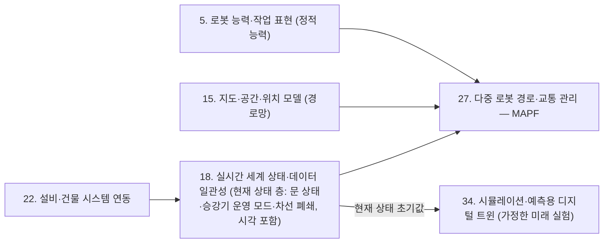

[홈](../../index.md) › [주제](../index.md) › 18. 실시간 세계 상태·데이터 일관성 — 다른 연구영역과의 연결

# 18. 실시간 세계 상태·데이터 일관성 — 다른 연구영역과의 연결

<!-- auto:page-status:start -->
<!-- auto:page-status:end -->

## 1. 세 줄 요약

- 이 영역의 현재 상태 표현은 현장과 자동으로 동기화되는 표현(디지털 섀도, ISO 23247 의 동기화된 표현)에 가깝고, 그 표현을 복제해 가정한 미래를 실험하는 쪽은 34. 시뮬레이션·예측용 디지털 트윈의 몫으로 나누는 것이 분류 원문의 구분과 맞을 것으로 보인다(근거 자료는 제조 대상). [추정][^ref-291][^ref-290]
- 이 페이지는 [18. 실시간 세계 상태·데이터 일관성](../../categories/objects-people-and-live-state/real-time-world-state-and-data-consistency.md) 페이지의 "다른 연구영역과의 연결" 절이 분량 기준을 넘어 옮겨 온 것이다. 원 페이지의 검증을 거친 내용이며 새 주장은 없다.

## 2. 배경

[18. 실시간 세계 상태·데이터 일관성](../../categories/objects-people-and-live-state/real-time-world-state-and-data-consistency.md) 페이지를 쓰는 과정에서 "다른 연구영역과의 연결 (번호와 이름을 함께 표기)" 절의 분량이 세부영역 페이지 기준(4,000자)을 넘어, 내용을 줄이지 않고 이 주제 페이지로 분리했다.

## 3. 본문

이 영역의 현재 상태 표현은 현장과 자동으로 동기화되는 표현(디지털 섀도, ISO 23247 의 동기화된 표현)에 가깝고, 그 표현을 복제해 가정한 미래를 실험하는 쪽은 34. 시뮬레이션·예측용 디지털 트윈의 몫으로 나누는 것이 분류 원문의 구분과 맞을 것으로 보인다(근거 자료는 제조 대상). [추정][^ref-291][^ref-290]

2026-09-25 판에서 정리한 이 절의 기존 연결(디지털 섀도와 34. 시뮬레이션·예측용 디지털 트윈의 구분 등)은 주제 페이지 [18. 실시간 세계 상태·데이터 일관성 — 다른 연구영역과의 연결](2026-09-25-area08-s10.md)에 있다.

### 건축 도면 자동 인식 트랙 반영: 정적 대조와 현재 상태 층

[건축 도면 자동 인식](../../tracks/floorplan-recognition/index.md) 트랙 단계 3 의 반영 제안 두 건(실행 2026-09-25-65, 2026-09-25-70)을 이번 실행의 조사·검증 결과로 반영했다. 제안 원문이 든 어포던스 상태 연구와 IFAC 2024 연구는 다시 확인하지 못해 근거로 쓰지 않았다.

- Open-RMF 의 차선 요청 메시지(LaneRequest)는 플릿 이름과 열 차선 목록(open_lanes)·닫을 차선 목록(close_lanes)만으로 이루어진다. [사실][^ref-569] rmf_traffic 의 LaneClosure 클래스는 그래프 안 차선의 열림·닫힘 상태를 따로 기술하고 차선 번호별로 열기·닫기·열림 확인을 제공한다. [사실][^ref-1278] 두 자료를 함께 보면 차선 요청은 경로망(내비게이션 그래프) 자체를 바꾸지 않고 차선의 통행 가능 여부만 바꾸는 요청이다. [사실][^ref-569][^ref-1278] 용어는 [차선 폐쇄](../../glossary/lane-closure.md)를 참고한다.
- Open-RMF 유지관리자는 정비 중인 승강기·문을 RMF 에 알리는 방법으로 그 승강기·문을 지나는 차선을 닫으라고 권했고, 폐쇄 시점은 통합자가 정하며, 플릿 어댑터가 승강기 상태(lift_states)의 OFFLINE 을 보고 해당 차선을 닫는 구성을 제안했다(2024-01 질의응답 기준). [사실][^ref-1277][^ref-286]
- 로봇이 어디를 지날 수 있는가에 대한 정적 대조([5. 로봇 능력·작업 표현](../../categories/robot-ontology/robot-capability-and-task-representation.md)의 능력, [15. 지도·공간·위치 모델](../../categories/space-and-map-model/map-space-and-location-model.md)의 경로망)와, 지금 그 길이 열려 있는가를 나타내는 현재 상태 층(문 상태, 승강기 운영 모드, 차선 폐쇄)을 분리하고, 18. 실시간 세계 상태·데이터 일관성이 후자를 시각과 함께 공급하는 구성이 Open-RMF 의 설계와 맞을 것으로 보인다. 이때 현재 상태 층의 설비 쪽 입력은 [22. 설비·건물 시스템 연동](../../categories/integration/facility-and-building-system-integration.md)과, 차선 폐쇄를 반영한 경로 계획은 [27. 다중 로봇 경로·교통 관리 — MAPF](../../categories/planning-and-optimization/multi-robot-path-and-traffic-management-mapf.md)와 이어질 것으로 보인다. [추정][^ref-569][^ref-1278][^ref-1277][^ref-286]

### 34. 시뮬레이션·예측용 디지털 트윈에 넘기는 현재 상태

- 기계 수준 온라인 시뮬레이션 체계적 문헌 고찰(Deubert 외, 2024)은 온라인 시뮬레이션이 시스템의 실제 상태로 초기화되어야 하며, 이를 위해 상태 데이터의 명확한 정의·가용성·충분한 품질·충분한 갱신 빈도가 필요하고, 초기화 방식으로 실시스템과 동기화된 상위 시뮬레이션에서 복제하는 방법과 센서·구성요소 상태 측정에서 시작하는 방법이 있다고 정리한다. [사실][^ref-1275]
- 물류창고 현장에서 Galka(WSC 2024)는 SAP EWM 을 쓰는 주문 피킹 시스템의 시뮬레이션 기반 디지털 트윈에서, 빈 부하 상태로 시작하는 기준 모델 대신 실제 시스템의 부하 상태로 동기화하는 초기화 방식을 제안해 과도 거동이 유의하게 개선되었다고 보고했다(초록 기준, 원문 미열람). [사실][^ref-1276]
- 운영 중 예측 시뮬레이션은 실제 상태로 초기화해야 한다는 점을 기계 수준 온라인 시뮬레이션 고찰과 물류창고 피킹 디지털 트윈 연구가 함께 다룬다. [사실][^ref-1275][^ref-1276]
- 초기화한 시뮬레이션으로 가정한 미래를 실험하는 일은 [34. 시뮬레이션·예측용 디지털 트윈](../../categories/design-and-simulation/simulation-and-predictive-digital-twin.md)의 기능이고, 18. 실시간 세계 상태·데이터 일관성은 현재 상태를 시각·품질 정보와 함께 그 초기값으로 넘기는 쪽으로 나누는 것이 분류 원문의 구분과 위 연구들의 초기화 요건(상태 정의·품질·갱신 빈도)에 맞을 것으로 보인다. [추정][^ref-1275][^ref-1276]

아래 도식은 위 두 소절의 추정 구성을 그린 것이며, 확인된 설계가 아니다.

## 4. 현장 시나리오

현장 시나리오는 원 페이지의 [5. 적용 사례 (현장 유형 명시)](../../categories/objects-people-and-live-state/real-time-world-state-and-data-consistency.md) 절에 있다.

## 5. ROP 관점의 시사점

ROP가 직접 맡는 것과 외부와 연계하는 것은 원 페이지의 [9. ROP가 직접 맡는 것과 외부와 연계하는 것 (책임 경계 기준)](../../categories/objects-people-and-live-state/real-time-world-state-and-data-consistency.md) 절에 있다.

## 6. 연결되는 연구영역

- 주 연구영역: [18. 실시간 세계 상태·데이터 일관성](../../categories/objects-people-and-live-state/real-time-world-state-and-data-consistency.md)
- 관련 영역: [5. 로봇 능력·작업 표현](../../categories/robot-ontology/robot-capability-and-task-representation.md), [15. 지도·공간·위치 모델](../../categories/space-and-map-model/map-space-and-location-model.md), [17. 작업 대상·자산 식별과 인계 추적](../../categories/objects-people-and-live-state/work-object-and-asset-identification-and-handover-tracking.md), [20. 로봇·제조사 관제 연동](../../categories/integration/robot-and-vendor-fleet-manager-integration.md), [22. 설비·건물 시스템 연동](../../categories/integration/facility-and-building-system-integration.md), [27. 다중 로봇 경로·교통 관리 — MAPF](../../categories/planning-and-optimization/multi-robot-path-and-traffic-management-mapf.md), [34. 시뮬레이션·예측용 디지털 트윈](../../categories/design-and-simulation/simulation-and-predictive-digital-twin.md), [38. 모니터링·이상 탐지·원인 분석](../../categories/field-operations-and-monitoring/monitoring-anomaly-detection-and-root-cause-analysis.md), [42. 분산 시스템·통신·컴퓨팅 구조](../../categories/platform-architecture-and-infrastructure/distributed-systems-communication-and-computing.md)

## 7. 열린 질문

열린 질문은 원 페이지의 [11. 열린 질문](../../categories/objects-people-and-live-state/real-time-world-state-and-data-consistency.md) 절과 [열린 질문](../../open-questions.md) 페이지에 모은다.

## 8. 출처

[^ref-1275]: Deubert, D., Klingel, L., & Selig, A. (arXiv; The International Journal of Advanced Manufacturing Technology 2024 표기), Online Simulation at Machine Level: A Systematic Review (IJAMT 2024 저널 판 DOI 10.1007/s00170-024-13065-1), 2024-01-15, https://arxiv.org/abs/2401.07841, 접근일 2026-10-09
[^ref-1276]: Galka, S. (Winter Simulation Conference 2024), Reducing Transient Behavior in Simulation-Based Digital Twins: A Novel Initialization Approach for Order Picking Systems, 2024, https://informs-sim.org/wsc24papers/con211.pdf, 접근일 2026-10-09 (원문 미열람)
[^ref-1277]: Open Robotics Discourse (open-rmf 질의응답 #414), How to inform RMF that lift or door are not available? (#414), 2024-01-13, https://discourse.openrobotics.org/t/how-to-inform-rmf-that-lift-or-door-are-not-available-414/44744, 접근일 2026-10-09
[^ref-1278]: Open Robotics (open-rmf, rmf_traffic API 문서), Class LaneClosure — rmf_traffic API documentation, 미확인, https://openrmf.readthedocs.io/projects/rmf-traffic/en/latest/api/classrmf__traffic_1_1agv_1_1LaneClosure.html, 접근일 2026-10-09
[^ref-286]: Open Robotics (open-rmf), rmf_internal_msgs — rmf_lift_msgs/msg/LiftState.msg, 미확인, https://github.com/open-rmf/rmf_internal_msgs/blob/main/rmf_lift_msgs/msg/LiftState.msg, 접근일 2026-10-09
[^ref-290]: NIST, DIGITAL TWINS FOR ADVANCED MANUFACTURING: THE STANDARDIZED APPROACH, 미확인, https://tsapps.nist.gov/publication/get_pdf.cfm?pub_id=957417, 접근일 2026-09-25 (원문 미열람)
[^ref-291]: Kritzinger, W., Karner, M., Traar, G., Henjes, J., & Sihn, W., Digital Twin in manufacturing: A categorical literature review and classification, 2018, https://www.sciencedirect.com/science/article/pii/S2405896318316021, 접근일 2026-09-25 (원문 미열람)
[^ref-569]: Open Robotics (open-rmf), rmf_internal_msgs — rmf_fleet_msgs/msg/LaneRequest.msg, 미확인, https://github.com/open-rmf/rmf_internal_msgs/blob/main/rmf_fleet_msgs/msg/LaneRequest.msg, 접근일 2026-10-09

## 9. 검증 노트

원 페이지와 함께 실행 2026-10-09-11 의 1차·2차 검증을 거쳤다. 분리는 코드가 했고 내용은 바꾸지 않았다.

## 10. 이력

| 날짜 | 실행 id | 변경 |
|---|---|---|
| 2026-10-09 | 2026-10-09-11 | 18. 실시간 세계 상태·데이터 일관성 의 "다른 연구영역과의 연결" 절에서 분리 |
