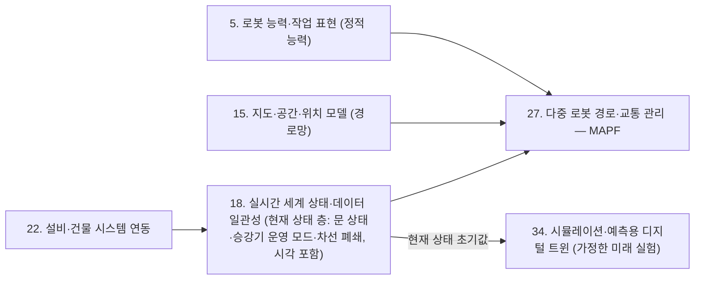

(너의 규칙은 시스템 프롬프트의 agents/shared-rules.md 와 agents/verifier.md 이다. 아래는 이번 실행의 컨텍스트와 입력이다.)

## 실행 컨텍스트

- run_id: 2026-10-09-11
- date: 2026-10-09
- run_type: update (갱신)
- 대상: 18. 실시간 세계 상태·데이터 일관성 (E. 사물·사람·실시간 상태)
- 예산:
    - max_search_queries: 30
    - max_sources_per_run: 15
    - new_topic_pages: 1
    - page_updates: 2
    - max_retries: 2
- 환경 알림: web_fetch_available: true · fetch_mode: full
- 언어: ko
- verification_stage: second
- verifier_budget:
    - max_search_queries: 30
    - max_sources_per_run: 15
    - new_topic_pages: 1
    - page_updates: 2
    - max_retries: 2
- retry_count: 1
- max_retries: 2

## 입력

### runs/2026-10-09-11/target.json

```json
{
  "run_id": "2026-10-09-11",
  "date": "2026-10-09",
  "weekday": "Fri",
  "run_number": 144,
  "run_type": "update",
  "forced": true,
  "target": {
    "area_no": 18,
    "area_name": "18. 실시간 세계 상태·데이터 일관성",
    "category": "E. 사물·사람·실시간 상태",
    "category_letter": "E"
  },
  "topic": null,
  "track": null,
  "corrections": [],
  "budget": {
    "max_search_queries": 30,
    "max_sources_per_run": 15,
    "new_topic_pages": 1,
    "page_updates": 2,
    "max_retries": 2
  },
  "priority_reason": null,
  "priority_questions": [],
  "excluded_areas": [],
  "lifted_areas": [],
  "deferred": {
    "monthly_recheck": false,
    "weekly_review": false
  },
  "selection_rationale": "CLI 지정 run_type=update, area=18"
}
```

### runs/2026-10-09-11/research.json

```json
{
  "run_id": "2026-10-09-11",
  "date": "2026-10-09",
  "run_type": "update",
  "target": {
    "area_no": 18,
    "area_name": "18. 실시간 세계 상태·데이터 일관성",
    "category": "E. 사물·사람·실시간 상태"
  },
  "gaps": [
    "섹션 5. 적용 사례 (현장 유형 명시) — 물류창고 시나리오 2건뿐, 병원·제조 공장·기타 현장 사례 없음",
    "섹션 6. 대표 접근법과 기술 — 시각 필드·QoS 외에 시간이 지날수록 믿음을 낮추는 확률 모델, 허가 만료 시각(lease) 같은 접근이 없음",
    "섹션 7. 관련 표준·프레임워크·오픈소스 — 로봇–승강기·자동문 인터페이스 표준(ISO 초안, 싱가포르 TR 93)과 OPC UA 시각 필드가 원문 확인 없이 비어 있음(ref-288 원문 미열람 상태)",
    "섹션 8. 대표 연구와 자료 — 반정적 대상의 지속성 추정 연구, 운영 중 시뮬레이션 초기화 연구 없음",
    "섹션 9. ROP가 직접 맡는 것과 외부와 연계하는 것 — 위치추정 품질 점수로 신뢰 판단을 한다는 서술이 VDA 5050 원문(로그·시각화 전용 규정)과 맞는지 미확인",
    "섹션 10. 다른 연구영역과의 연결 — 트랙 floorplan-recognition 단계 3 반영 제안 2건(정적 능력 대조와 현재 상태 층 분리, 34. 시뮬레이션·예측용 디지털 트윈에 현재 상태 초기값 공급) 미반영",
    "섹션 11. 열린 질문 — oq-034(설비 상태 허용 경과 시간), oq-035(시각 동기화), oq-028(위치추정 신뢰도), oq-037(출처 충돌)에 새 근거 없음",
    "정정 요청 없음(inbox/corrections.md 비어 있음)"
  ],
  "research_questions": [
    "조금 전에 받은 상태 정보를 지금의 판단에 믿고 써도 되는가? [분류원문]",
    "문·승강기·충전기 같은 설비 상태를 몇 초까지 믿을지 정한 표준·국내 기준이 새로 나왔는가, 로봇–승강기·자동문 인터페이스 표준은 어디까지 와 있는가? (oq-034, 섹션 7·11 겨냥)",
    "상태 보고 주기·시각 체계가 다른 로봇이 섞일 때 시각 동기화와 수신 시각 처리를 어떻게 하는가? (oq-035, 섹션 6 겨냥)",
    "VDA 5050 의 위치추정 품질 정보(localizationScore 등)를 관제 판단 논리에 써도 되는가? (oq-028, 섹션 9 겨냥)",
    "트랙 floorplan-recognition 단계 3 반영 제안: 정적 능력·지도 대조와 현재 상태 층(문 상태, Open-RMF 차선 폐쇄)을 어떻게 나누며, 운영 중 예측 시뮬레이션을 현재 상태로 초기화한다는 연구 근거는 무엇인가? (섹션 10 겨냥)",
    "물류창고 밖의 현장(병원·제조 공장·기타)에서 설비·로봇 상태를 통합하거나 오래된 상태를 다룬 사례는 무엇인가, 한국 자료는 있는가? (섹션 5 겨냥)",
    "오래된 관측을 고정 임계값이 아니라 시간에 따라 믿음을 낮추는 방식으로 다루는 연구가 있는가? (섹션 6·8 겨냥)"
  ],
  "findings": [
    {
      "id": "f1",
      "claim": "Open-RMF 의 rmf_fleet_msgs/LaneRequest 메시지는 플릿 이름과 열 차선 목록(open_lanes)·닫을 차선 목록(close_lanes)만으로 이루어져, 경로망(내비게이션 그래프) 자체를 바꾸지 않고 차선의 통행 가능 여부만 바꾸는 요청이다.",
      "tag": "사실",
      "source_ids": [
        "ref-569"
      ],
      "cross_checked": false,
      "confidence": "medium",
      "evidence_excerpt": "LaneRequest.msg 정의: string fleet_name / uint64[] open_lanes / uint64[] close_lanes (open-rmf/rmf_internal_msgs main 브랜치 원문, 발행일 미확인, 확인일 기준)",
      "as_of": "2026-10-09",
      "site_type": null,
      "flow_item": "제약"
    },
    {
      "id": "f2",
      "claim": "Open-RMF rmf_traffic 의 LaneClosure 클래스는 그래프 안 차선의 폐쇄 상태(열림·닫힘)를 따로 기술하고 차선 번호별로 열기·닫기·열림 확인을 제공한다.",
      "tag": "사실",
      "source_ids": [
        "ref-1453"
      ],
      "cross_checked": false,
      "confidence": "medium",
      "evidence_excerpt": "\"This class describes the closure status of lanes in a Graph, i.e. whether a lane is open or closed.\" (rmf_traffic API 문서, 발행일 미확인, 확인일 기준)",
      "as_of": "2026-10-09",
      "site_type": null,
      "flow_item": "제약"
    },
    {
      "id": "f3",
      "claim": "Open-RMF 유지관리자는 정비 중인 승강기·문을 RMF 에 알리는 방법으로, 그 승강기·문을 지나는 차선을 찾아 닫는 차선 폐쇄 기능을 권했고, 폐쇄 시점은 통합자가 정하며 플릿 어댑터가 승강기 상태(lift_states)의 OFFLINE 을 보고 해당 차선을 닫는 구성을 제안했다.",
      "tag": "사실",
      "source_ids": [
        "ref-1452",
        "ref-286"
      ],
      "cross_checked": false,
      "confidence": "medium",
      "evidence_excerpt": "2024-01-13 답변: lift·door 를 지나는 lane 을 찾아 closed 로 설정. 2024-01-24 답변: 어댑터가 lift_states 를 구독해 OFFLINE 을 보고 nav graph 로 해당 lane 을 닫도록 권함. LiftState 에 MODE_OFFLINE=4 정의",
      "as_of": "2024-01-24",
      "site_type": null,
      "flow_item": "제약"
    },
    {
      "id": "f4",
      "claim": "로봇이 어디를 지날 수 있는가에 대한 정적 대조(5. 로봇 능력·작업 표현의 능력, 15. 지도·공간·위치 모델의 경로망)와, 지금 그 길이 열려 있는가를 나타내는 현재 상태 층(문 상태, 승강기 운영 모드, 차선 폐쇄)을 분리하고 18. 실시간 세계 상태·데이터 일관성이 후자를 시각과 함께 공급하는 구성이 Open-RMF 의 설계와 맞을 것으로 보인다.",
      "tag": "추정",
      "source_ids": [
        "ref-569",
        "ref-1453",
        "ref-1452",
        "ref-286"
      ],
      "cross_checked": false,
      "confidence": "low",
      "evidence_excerpt": "Open-RMF 는 경로망은 그대로 두고 차선 폐쇄 상태를 별도 객체·메시지로 바꾸며, 폐쇄 계기로 승강기 상태를 쓴다(f1~f3 종합). 트랙 floorplan-recognition 단계 3 반영 제안 1(실행 2026-09-25-65)과 같은 방향",
      "as_of": "2026-10-09",
      "site_type": null,
      "flow_item": "제약"
    },
    {
      "id": "f5",
      "claim": "기계 수준 온라인 시뮬레이션 체계적 문헌 고찰(Deubert 외, 2024)은 온라인 시뮬레이션이 시스템의 실제 상태로 초기화되어야 하며, 이를 위해 상태 데이터의 명확한 정의·가용성·충분한 품질·충분한 갱신 빈도가 필요하고, 초기화 방식으로 실시스템과 동기화된 상위 시뮬레이션에서 복제하는 방법과 센서·구성요소 상태 측정에서 시작하는 방법이 있다고 정리한다.",
      "tag": "사실",
      "source_ids": [
        "ref-1449"
      ],
      "cross_checked": false,
      "confidence": "medium",
      "evidence_excerpt": "3.2절 Initialization: \"initialized with the actual state of the system\"(Davis 1998 인용). 전제 4가지(정의·가용성·품질·갱신 빈도, Fowler·Rose 2004 인용). 3.2.1절: 상위 시뮬레이션 복제 또는 센서 측정(Hanisch 외)",
      "as_of": "2024-01-15",
      "site_type": null,
      "flow_item": null
    },
    {
      "id": "f6",
      "claim": "Galka(WSC 2024)는 SAP EWM 을 쓰는 주문 피킹 시스템의 시뮬레이션 기반 디지털 트윈에서, 빈 부하 상태로 시작하는 기준 모델 대신 실제 시스템의 부하 상태로 동기화하는 초기화 방식을 제안해 초기 과도 구간을 크게 줄였다고 보고했다.",
      "tag": "사실",
      "source_ids": [
        "ref-1450"
      ],
      "cross_checked": false,
      "confidence": "medium",
      "evidence_excerpt": "검색 결과의 초록 기준: 실시스템 부하 상태와의 동기화로 재료흐름 시뮬레이션의 과도 거동을 짧은 구간으로 한정, 기준 모델은 'empty' 부하에서 시작, 개선 폭 수치는 미확인(원문 PDF 추출 실패)",
      "as_of": "2024",
      "site_type": "물류창고",
      "flow_item": null,
      "source_unopened": true
    },
    {
      "id": "f7",
      "claim": "운영 중 예측 시뮬레이션은 실제 상태로 초기화해야 한다는 점을 기계 수준 온라인 시뮬레이션 고찰과 물류창고 피킹 디지털 트윈 연구가 함께 다룬다.",
      "tag": "사실",
      "source_ids": [
        "ref-1449",
        "ref-1450"
      ],
      "cross_checked": true,
      "confidence": "medium",
      "evidence_excerpt": "Deubert 외(2024, 실제 상태 초기화·전제 조건)와 Galka(WSC 2024, 실부하 상태 동기화로 과도 구간 단축)가 서로 다른 기관·현장에서 같은 요지를 말함. ref-1450 은 초록만 확인",
      "as_of": "2024",
      "site_type": null,
      "flow_item": null,
      "source_unopened": false
    },
    {
      "id": "f8",
      "claim": "18. 실시간 세계 상태·데이터 일관성은 현재 상태를 시각·품질 정보와 함께 34. 시뮬레이션·예측용 디지털 트윈의 초기값으로 넘기는 쪽이고, 34번은 그 초기값에서 가정한 미래를 실험하는 쪽으로 나누는 것이 분류 원문의 구분과 위 연구들의 초기화 요건(상태 정의·품질·갱신 빈도)에 맞을 것으로 보인다.",
      "tag": "추정",
      "source_ids": [
        "ref-1449",
        "ref-1450"
      ],
      "cross_checked": false,
      "confidence": "low",
      "evidence_excerpt": "트랙 floorplan-recognition 반영 제안 2(실행 2026-09-25-70)가 든 IFAC 2024 연구는 이번에 다시 찾지 못해, 같은 요지의 고찰(ref-1449)과 WSC 2024 연구(ref-1450)로 근거를 대신함",
      "as_of": "2026-10-09",
      "site_type": null,
      "flow_item": null,
      "source_unopened": false
    },
    {
      "id": "f9",
      "claim": "용인세브란스병원은 한국로봇산업진흥원 AI·5G 기반 서비스로봇 융합모델 실증사업으로 로봇 5종 10대를 들였고, 혈액 이송 로봇이 승강기·스피드게이트·자동문과 연동해 통제 구역과 층 사이를 이동하며, 통합반응상황실의 5G 기반 관제 플랫폼이 로봇 상태와 위치를 실시간으로 모니터링한다고 보도되었다.",
      "tag": "사실",
      "source_ids": [
        "ref-1461"
      ],
      "cross_checked": false,
      "confidence": "low",
      "evidence_excerpt": "메디포뉴스 2022-11-18 기사: 2단계 실증, LG전자·리드앤·트위니 참여, 승강기·자동문 센서 인터페이스 적용, IRS(통합반응상황실) 5G 통합관제·서비스 플랫폼",
      "as_of": "2022-11-18",
      "site_type": "병원",
      "flow_item": "수행 자원"
    },
    {
      "id": "f10",
      "claim": "싱가포르 창이종합병원(CGH)의 RoMi-H 는 제조사가 다른 로봇들이 공통 미들웨어로 병원의 기존 승강기·자동문을 함께 쓰게 하며, 새로 들인 로봇도 기존 승강기·자동문과 연동하도록 설정할 수 있고 긴급한 작업을 하는 로봇에 우선권을 준다고 보도되었다.",
      "tag": "사실",
      "source_ids": [
        "ref-1459"
      ],
      "cross_checked": false,
      "confidence": "medium",
      "evidence_excerpt": "Straits Times(SingHealth 게재, 2022-05-28): CGH 는 2015년 로봇 전용 승강기를 지었으나 \"we can't have different robots requiring different lift systems\"라는 이유로 RoMi-H 를 도입",
      "as_of": "2022-05-28",
      "site_type": "병원",
      "flow_item": "수행 자원"
    },
    {
      "id": "f11",
      "claim": "싱가포르 국가 표준 Technical Reference 93(TR 93)은 자율 로봇과 승강기·자동문 같은 건물 설비 사이의 데이터 교환 지침을 정하며, KONE 의 차세대 승강기는 TR 93 에 맞춘 클라우드 연결·개방 API 로 RoMi-H 로봇과 시험 연동되었다.",
      "tag": "사실",
      "source_ids": [
        "ref-1458"
      ],
      "cross_checked": false,
      "confidence": "medium",
      "evidence_excerpt": "CGH 보도자료(2022-05-28): CHART 와 HOPE Technik 이 개발, Heartbeat @ Bedok 에서 차세대 승강기와 로봇 연동, The Galen 시험 공간. TR 93 의 상태 갱신 주기·유효 시간 조항은 미확인",
      "as_of": "2022-05-28",
      "site_type": null,
      "flow_item": null
    },
    {
      "id": "f12",
      "claim": "연계 대상: Schulze 외(Frontiers in Robotics and AI, 2025-02)의 요양 시설·대학 사무 건물 실증에서 로봇은 승강기 문 상태를 자기 라이다로 직접 판단했고, 승강기 문은 6초만 열려 있었으며, 의도하지 않은 층에서 멈춘 이유를 구분하지 못했고, 119건 작업 가운데 문·승강기가 얽힌 작업의 약 14%가 실패했으며 주된 원인은 위치추정·검출 오류였다.",
      "tag": "사실",
      "source_ids": [
        "ref-575"
      ],
      "cross_checked": false,
      "confidence": "medium",
      "evidence_excerpt": "TU Ilmenau, 요양 시설(AWO, 3층 24세대)·대학 건물(Zuse). 승강기 탑승 성공률 93.2%·88.0%, 문 조작 94.8%·88.1%. 문은 \"only stays open for 6 s\", 세 번째 시도 뒤 중단",
      "as_of": "2025-02-25",
      "site_type": "기타",
      "flow_item": "예외·성과"
    },
    {
      "id": "f13",
      "claim": "승강기 문처럼 열림 상태가 수 초만 유지되는 설비에서는 '열림' 정보의 허용 경과 시간을 그 설비의 유지 시간보다 짧게 잡아야 하고, 설비가 보고한 상태와 로봇이 직접 관측한 상태를 함께 확인해야 할 것으로 보인다.",
      "tag": "추정",
      "source_ids": [
        "ref-575",
        "ref-286"
      ],
      "cross_checked": false,
      "confidence": "low",
      "evidence_excerpt": "f12 의 6초 개방과 층 정지 이유 구분 불가 사례, LiftState 의 door_state·current_mode·lift_time 필드를 함께 보고 도출한 추정",
      "as_of": "2026-10-09",
      "site_type": "기타",
      "flow_item": "제약"
    },
    {
      "id": "f14",
      "claim": "김지형(2023)은 두산 로봇팔(Modbus)과 KUKA 로봇팔(UDP 소켓)을 스마트 커넥터로 OPC UA Pub/Sub 서버에 모아 3D 실시간 디지털 트윈으로 연결했으며, 초당 50개 이상 노드 수집과 약 70 fps 렌더링을 보고했으나 종단 간 지연·동기화 오차 수치는 제시하지 않았다.",
      "tag": "사실",
      "source_ids": [
        "ref-1462",
        "ref-296"
      ],
      "cross_checked": false,
      "confidence": "medium",
      "evidence_excerpt": "KoreaScience 수록본: 공장 현장 설비 대상 구조(엣지 장치·CPS 서버), 실험은 엣지 1대·서버 1대 실험실 구성, OPC UA 로 'ms 수준' 통신이라고만 서술. 영문 초록은 본문과 다른 주제(협동로봇 안전 가드)로 표기됨",
      "as_of": "2023-08-31",
      "site_type": "제조 공장",
      "flow_item": null
    },
    {
      "id": "f15",
      "claim": "같은 논문(DOI 10.7236/JIIBC.2023.23.4.189, 23권 4호 189-196쪽, 발행처 국제인공지능학회)을 KCI 는 지능정보논문지로, KoreaScience 는 한국인터넷방송통신학회논문지로 적어, 게재지 이름 충돌(oq-037)은 같은 논문에 대한 두 등재 정보의 차이로 확인된다.",
      "tag": "사실",
      "source_ids": [
        "ref-296",
        "ref-1462"
      ],
      "cross_checked": false,
      "confidence": "medium",
      "evidence_excerpt": "KCI ART002993454: 학술지명 지능정보논문지, Vol.23 No.4 pp.189-196. KoreaScience: The Journal of the Institute of Internet, Broadcasting and Communication, 2023-08-31. DOI·권호·쪽·발행처 동일",
      "as_of": "2026-10-09",
      "site_type": null,
      "flow_item": null
    },
    {
      "id": "f16",
      "claim": "OPC UA 의 DataValue 는 값과 함께 데이터 원천이 붙인 시각(sourceTimestamp), 서버가 값을 받거나 정확하다고 안 시각(serverTimestamp), 품질 상태 코드(Good·Uncertain·Bad)를 담고, 클라이언트는 값을 쓰기 전에 최소한 상태 코드의 심각도를 확인해야 한다.",
      "tag": "사실",
      "source_ids": [
        "ref-288"
      ],
      "cross_checked": false,
      "confidence": "medium",
      "evidence_excerpt": "OPC 10000-4 7.11: serverTimestamp 는 서버가 값을 받았거나 \"knew it to be accurate\" 시각이며 예외 기반 원천은 값이 안 바뀌어도 주기적으로 갱신. stale 이라는 용어는 없음",
      "as_of": "2026-10-09",
      "site_type": null,
      "flow_item": null
    },
    {
      "id": "f17",
      "claim": "W3C SOSA 온톨로지는 관측 활동이 끝난 시각(resultTime)과 관측 결과가 대상에 적용되는 시각(phenomenonTime)을 구분한다.",
      "tag": "사실",
      "source_ids": [
        "ref-030"
      ],
      "cross_checked": false,
      "confidence": "medium",
      "evidence_excerpt": "sosa.ttl(W3C/OGC 작업반 저장소 편집자 초안): resultTime = 관측·작동·표본 활동이 완료된 순간, phenomenonTime = 결과가 FeatureOfInterest 에 적용되는 시각. /TR 권고안 문구와 다를 수 있음",
      "as_of": "2017-10-19",
      "site_type": null,
      "flow_item": null,
      "source_unopened": true
    },
    {
      "id": "f18",
      "claim": "VDA 5050 3.0.0 에서 로봇 상태 메시지는 관련 사건이 생기거나 최소 30초마다 발행되고, 시각은 ISO 8601 UTC 밀리초 형식이며, 이번에 읽은 범위에서 시계 동기화 요구는 찾지 못했고, connection 토픽은 관제가 로봇 상태 점검에 쓰지 말라고 적는다.",
      "tag": "사실",
      "source_ids": [
        "ref-031",
        "ref-051"
      ],
      "cross_checked": false,
      "confidence": "medium",
      "evidence_excerpt": "6.6절: \"when relevant events occur or at least every 30 seconds\". 7.2절 timestamp YYYY-MM-DDTHH:mm:ss.fffZ. 4.3절 connection 토픽은 로봇 health 점검용이 아님",
      "as_of": "2026-10-09",
      "site_type": null,
      "flow_item": null
    },
    {
      "id": "f19",
      "claim": "VDA 5050 3.0.0 에서 관제가 구역·간선 사용 요청을 허가할 때 허가 만료 시각(leaseExpiry)을 붙일 수 있고, 그 시각이 지나면 허가는 무효로 보아 요청 상태를 EXPIRED 로 바꾸며, 관제는 같은 requestId 로 새 만료 시각을 보내 연장한다.",
      "tag": "사실",
      "source_ids": [
        "ref-031"
      ],
      "cross_checked": false,
      "confidence": "medium",
      "evidence_excerpt": "6.4.3·6.9·7.5절: leaseExpiry 는 허가 응답에만, 그 시각까지만 유효. 상태값 REQUESTED·GRANTED·REVOKED·EXPIRED(6.9절은 QUEUED 도 적어 7.8절 열거와 불일치)",
      "as_of": "2026-10-09",
      "site_type": null,
      "flow_item": "제약"
    },
    {
      "id": "f20",
      "claim": "허가에 만료 시각을 붙이는 VDA 5050 의 방식과 연결 상실 시 값을 STALE 로 표시하는 Sparkplug 의 방식을 설비 상태에 적용하면, '문 열림' 같은 관측에 유효 만료 시각을 붙이고 지나면 재확인을 요구하는 규칙으로 허가 경과 시간 문제를 다룰 수 있을 것으로 보인다.",
      "tag": "추정",
      "source_ids": [
        "ref-031",
        "ref-287"
      ],
      "cross_checked": false,
      "confidence": "low",
      "evidence_excerpt": "f19 의 leaseExpiry 와 Sparkplug 5장의 NDEATH 수신 시 모든 지표를 STALE 로 표시하는 규정을 묶은 설계 추정. 설비 상태에 적용한 표준·사례는 미확인",
      "as_of": "2026-10-09",
      "site_type": null,
      "flow_item": "제약"
    },
    {
      "id": "f21",
      "claim": "VDA 5050 3.0.0 은 위치추정 품질 점수(localizationScore)와 편차 범위(deviationRange)를 로그·시각화 용도로만 쓰라고 정하고, 판단에 쓸 수 있는 신호로는 위치추정 여부(localized: true 면 x·y·theta 를 믿을 수 있음)를 둔다.",
      "tag": "사실",
      "source_ids": [
        "ref-031",
        "ref-051"
      ],
      "cross_checked": false,
      "confidence": "medium",
      "evidence_excerpt": "7.8절 mobileRobotPosition: localizationScore [0.0~1.0] \"Only for logging and visualization purposes.\" deviationRange 도 같음. information 배열도 관제 논리에 쓰지 말 것",
      "as_of": "2026-10-09",
      "site_type": null,
      "flow_item": null
    },
    {
      "id": "f22",
      "claim": "VDA 5050 을 따르는 로봇에 대해 ROP 가 위치를 얼마나 믿을지 판단할 때 품질 점수·편차 범위를 판단 논리로 쓰면 규격의 용도 규정과 어긋나므로, 위치추정 여부와 보고 시각, 그리고 설비·다른 로봇 관측과의 대조를 판단 근거로 삼아야 할 것으로 보이며, 이는 현재 페이지 9절의 '품질 점수·편차 범위로 판단' 서술의 수정이 필요함을 뜻한다(oq-028).",
      "tag": "추정",
      "source_ids": [
        "ref-031",
        "ref-051"
      ],
      "cross_checked": false,
      "confidence": "low",
      "evidence_excerpt": "f21 의 용도 제한 규정과 현재 페이지 9절 표('위치추정 여부·품질 점수·편차 범위·지도 id 와 보고 시각을 받아 그 위치를 얼마나 믿을지 판단')를 대조한 결과",
      "as_of": "2026-10-09",
      "site_type": null,
      "flow_item": null
    },
    {
      "id": "f23",
      "claim": "Rosen·Mason·Leonard(ICRA 2016)는 반정적 환경의 특징이 시간이 지나며 남아 있을지 사라질지를 확률 생성 모델로 기술하고, 각 특징이 아직 존재하는지에 대한 믿음을 매 순간 정확히 온라인 계산하는 재귀 베이즈 추정기인 지속성 필터(persistence filter)를 제시했다.",
      "tag": "사실",
      "source_ids": [
        "ref-1454"
      ],
      "cross_checked": false,
      "confidence": "medium",
      "evidence_excerpt": "MIT DSpace 초록: 반정적 특징의 생존 모델이 \"recursive Bayesian estimator, the persistence filter\"를 허용하며, 그래프 기반 지도 작성에 넣어 평생 환경 모델링 틀을 만든다(ICRA 2016, 1063-1070쪽)",
      "as_of": "2016-06",
      "site_type": null,
      "flow_item": null
    },
    {
      "id": "f24",
      "claim": "Perpetua(Saavedra-Ruiz 외, IROS 2025)는 지속성 필터와 출현 필터를 혼합·연결해 반정적 특징이 사라지거나 다시 나타날 확률을 추정하고, 특징 변화에 대한 사전 지식을 넣고 온라인으로 적응하며, 관측 누락에 강하다고 보고했다.",
      "tag": "사실",
      "source_ids": [
        "ref-1455"
      ],
      "cross_checked": false,
      "confidence": "medium",
      "evidence_excerpt": "arXiv 2507.18808 초록: 'persistence'·'emergence' 필터의 혼합을 이어 다중 가설을 추적, 시뮬레이션·실제 데이터에서 유사 방법보다 정확도가 높았다고 보고",
      "as_of": "2025-07-24",
      "site_type": null,
      "flow_item": null
    },
    {
      "id": "f25",
      "claim": "지속성 필터 계열 방법은 '몇 초까지 믿는다'는 고정 임계값 대신 마지막 관측 뒤 시간에 따라 상태 믿음을 낮추는 방식으로 오래된 관측을 다룰 수 있게 하지만, 이번에 확인한 적용 대상은 로봇 지도의 특징이며 문·승강기 같은 설비 상태에 적용한 사례는 찾지 못했다.",
      "tag": "추정",
      "source_ids": [
        "ref-1454",
        "ref-1455"
      ],
      "cross_checked": false,
      "confidence": "low",
      "evidence_excerpt": "f23·f24 의 적용 범위(지도 특징)와 oq-034 의 질문(설비 상태 허용 경과 시간)을 대조한 추정",
      "as_of": "2026-10-09",
      "site_type": null,
      "flow_item": "제약"
    },
    {
      "id": "f26",
      "claim": "ISO/TC 299 의 ISO/AWI 26159-2(로봇 응용을 위한 기반시설 — 승강기·자동문 연동 요구사항)는 2025-11-13 신규 과제로 등록된 초안 단계로, 로봇–승강기·로봇–자동문 연동의 최소 데이터 교환·하드웨어 요구·안전 고려사항과 화재 대피 같은 비상 상황, 정전 같은 비정상 상황의 통신을 다루되 특정 메시지 프로토콜은 범위에서 뺀다.",
      "tag": "사실",
      "source_ids": [
        "ref-1456"
      ],
      "cross_checked": false,
      "confidence": "medium",
      "evidence_excerpt": "ISO 과제 페이지: Stage 20.00(2025-11-13), 작업반 초안 있음, 디지털·접점식 승강기 제어 모두 대상, ISO (DIS) 21423 과 정합 의도. 상태 신선도 요구는 범위 설명에 없음",
      "as_of": "2025-11-13",
      "site_type": null,
      "flow_item": null
    },
    {
      "id": "f27",
      "claim": "ISO/TC 178 의 ISO/CD TS 8100-11(승강기와 다른 시스템의 상호운용)은 2026-08-28 의견 수렴이 끝난 위원회 초안으로, 원격 감시·원격 호출 등록·건물 자동화 연동·로봇(AGV·MAR) 연동의 네 사용 사례를 위한 승강기 상호운용 온톨로지와 안전 관련 기능을 정하고 oneM2M·OPC UA 를 적용 예로 든다.",
      "tag": "사실",
      "source_ids": [
        "ref-1457"
      ],
      "cross_checked": false,
      "confidence": "medium",
      "evidence_excerpt": "ISO 과제 페이지: Stage 30.60(2026-08-28), CD 등록 2026-07-01. 범위 설명에 상태 유효 시간·갱신 주기 언급 없음",
      "as_of": "2026-08-28",
      "site_type": null,
      "flow_item": null
    },
    {
      "id": "f28",
      "claim": "2026-10-09 기준 로봇–승강기·자동문 인터페이스의 국제 표준은 초안 단계이고 공개된 범위 설명과 싱가포르 TR 93 소개 자료 어디에도 설비 상태를 몇 초까지 믿을지 정한 내용은 보이지 않아, oq-034 는 여전히 열린 질문으로 보인다.",
      "tag": "추정",
      "source_ids": [
        "ref-1456",
        "ref-1457",
        "ref-1458"
      ],
      "cross_checked": false,
      "confidence": "low",
      "evidence_excerpt": "f26·f27·f11 의 범위·소개 문구 대조. 표준 본문(유료·초안)은 열지 못함",
      "as_of": "2026-10-09",
      "site_type": null,
      "flow_item": "제약"
    },
    {
      "id": "f29",
      "claim": "Yang·Liew(arXiv, 2025-10)는 정밀 시간 프로토콜(PTP)로 로봇들의 운영체제 시계를 마이크로초 수준으로 맞췄지만, 로봇 컴퓨터(NUC 11)의 무선랜 카드가 PTP 에 필요한 하드웨어 시각 기록을 지원하지 않아 실험 전에 유선 이더넷으로 동기화했다고 적었다.",
      "tag": "사실",
      "source_ids": [
        "ref-1463"
      ],
      "cross_checked": false,
      "confidence": "medium",
      "evidence_excerpt": "arXiv 2510.02624v2 실험 절: PTP 로 \"microsecond-level accuracy\", WiFi NIC 하드웨어 타임스탬프 미지원으로 유선 LAN 에서 사전 동기화(홍콩중문대)",
      "as_of": "2025-10-10",
      "site_type": null,
      "flow_item": null
    },
    {
      "id": "f30",
      "claim": "Sparkplug 사양은 MQTT 브로커가 유언 메시지로 대신 보낸 노드 종료(NDEATH)의 시각은 실제 종료 시각이 아니므로 호스트가 자기 수신 UTC 시각으로 오프라인을 표시하게 하고, 이를 위해 엣지 노드와 호스트의 시계를 NTP 같은 방법으로 맞추도록 요구한다.",
      "tag": "사실",
      "source_ids": [
        "ref-287"
      ],
      "cross_checked": false,
      "confidence": "medium",
      "evidence_excerpt": "5장 Timestamps·Edge Node Session Termination: 모든 시각은 UTC, NDEATH 는 \"timestamp of receipt\" 를 써야 하며 이 때문에 시계 동기화가 필요(NTP 예시)",
      "as_of": "2026-10-09",
      "site_type": null,
      "flow_item": "예외·성과"
    },
    {
      "id": "f31",
      "claim": "무선으로 연결된 이기종 로봇은 마이크로초 수준 동기화를 기대하기 어렵고 VDA 5050 이 시계 동기화를 요구하지 않으므로, ROP 는 로봇이 붙인 시각과 자기 수신 시각을 함께 기록하고 둘의 차이로 시계 오차를 추정해 상태의 경과 시간을 계산하는 방식이 필요할 것으로 보인다(oq-035).",
      "tag": "추정",
      "source_ids": [
        "ref-1463",
        "ref-031",
        "ref-287"
      ],
      "cross_checked": false,
      "confidence": "low",
      "evidence_excerpt": "f29(무선 PTP 한계), f18(VDA 5050 시각 형식만 규정), f30(Sparkplug 수신 시각 규정)을 묶은 설계 추정. 허용 시계 오차를 정한 자료는 미확인",
      "as_of": "2026-10-09",
      "site_type": null,
      "flow_item": null
    }
  ],
  "sources": [
    {
      "id": "ref-030",
      "org": "W3C / OGC",
      "title": "Semantic Sensor Network Ontology",
      "published": "2017-10-19",
      "url": "https://www.w3.org/TR/vocab-ssn/",
      "type": "표준",
      "reliability": "medium",
      "accessed": "2026-10-09",
      "summary": "센서 관측·작동 온톨로지(SSN/SOSA). 이번에는 공식 작업반 저장소의 편집자 초안 sosa.ttl 을 열어 resultTime·phenomenonTime 정의를 확인했다(권고안 문구와 다를 수 있음).",
      "fetched": false,
      "fetched_via": null,
      "fetch_url": "https://raw.githubusercontent.com/w3c/sdw/gh-pages/ssn/integrated/sosa.ttl",
      "source_unopened": true
    },
    {
      "id": "ref-031",
      "org": "VDA / VDMA (VDA5050 GitHub)",
      "title": "VDA5050/VDA5050_EN.md — Official Specification document for the VDA 5050",
      "published": null,
      "url": "https://github.com/VDA5050/VDA5050/blob/main/VDA5050_EN.md",
      "type": "표준",
      "reliability": "high",
      "accessed": "2026-10-09",
      "summary": "VDA 5050 3.0.0 명세 원문. 상태 발행 주기, 시각 형식, 연결 토픽, 허가 만료 시각(leaseExpiry), 위치추정 품질 필드의 용도 제한을 확인했다.",
      "fetched": true,
      "fetched_via": "github_raw",
      "fetch_url": "https://raw.githubusercontent.com/VDA5050/VDA5050/main/VDA5050_EN.md",
      "source_unopened": false
    },
    {
      "id": "ref-051",
      "org": "VDA / VDMA (VDA5050 GitHub)",
      "title": "VDA5050/VDA5050 — json_schemas/state.schema",
      "published": null,
      "url": "https://github.com/VDA5050/VDA5050/blob/main/json_schemas/state.schema",
      "type": "표준",
      "reliability": "high",
      "accessed": "2026-10-09",
      "summary": "VDA 5050 상태 메시지 JSON 스키마. timestamp(ISO 8601), 위치·적재물·운용 모드·안전 상태 필드.",
      "fetched": true,
      "fetched_via": "github_raw",
      "fetch_url": null,
      "source_unopened": false
    },
    {
      "id": "ref-286",
      "org": "Open Robotics (open-rmf)",
      "title": "rmf_internal_msgs — rmf_lift_msgs/msg/LiftState.msg",
      "published": null,
      "url": "https://github.com/open-rmf/rmf_internal_msgs/blob/main/rmf_lift_msgs/msg/LiftState.msg",
      "type": "오픈소스 문서",
      "reliability": "medium",
      "accessed": "2026-10-09",
      "summary": "Open-RMF 승강기 상태 메시지. lift_time, 문 상태, 운행 상태, 운영 모드(사람·AGV·화재·오프라인·비상), 세션 id.",
      "fetched": true,
      "fetched_via": "github_raw",
      "fetch_url": null,
      "source_unopened": false
    },
    {
      "id": "ref-287",
      "org": "Eclipse Foundation (eclipse-sparkplug GitHub)",
      "title": "Sparkplug Specification — Chapter 5 Operational Behavior (Sparkplug_5_Operational_Behavior.adoc)",
      "published": null,
      "url": "https://github.com/eclipse-sparkplug/sparkplug/blob/master/specification/src/main/asciidoc/chapters/Sparkplug_5_Operational_Behavior.adoc",
      "type": "표준",
      "reliability": "medium",
      "accessed": "2026-10-09",
      "summary": "Sparkplug 운영 동작. UTC 시각과 시계 동기화, NDEATH 수신 시각 사용, 연결 상실 시 STALE 품질 표시.",
      "fetched": true,
      "fetched_via": "github_raw",
      "fetch_url": null,
      "source_unopened": false
    },
    {
      "id": "ref-288",
      "org": "OPC Foundation",
      "title": "OPC Unified Architecture – Part 4: Services - 7.11 DataValue",
      "published": null,
      "url": "https://reference.opcfoundation.org/specs/OPC-10000-4/7.11",
      "type": "표준",
      "reliability": "high",
      "accessed": "2026-10-09",
      "summary": "OPC UA DataValue 구조. sourceTimestamp·serverTimestamp·statusCode 의 의미와 클라이언트의 상태 코드 심각도 확인 의무를 이번 실행에서 원문으로 확인했다.",
      "fetched": true,
      "fetched_via": "webfetch",
      "fetch_url": "https://reference.opcfoundation.org/specs/OPC-10000-4/7.11",
      "source_unopened": false
    },
    {
      "id": "ref-296",
      "org": "김지형",
      "title": "OPC UA를 활용한 이기종 로봇의 실시간 디지털 트윈 설계 및 구현",
      "published": "2023",
      "url": "https://www.kci.go.kr/kciportal/ci/sereArticleSearch/ciSereArtiView.kci?sereArticleSearchBean.artiId=ART002993454",
      "type": "논문",
      "reliability": "medium",
      "accessed": "2026-10-09",
      "summary": "KCI 등재 정보. 학술지명을 지능정보논문지(23권 4호, 189-196쪽, DOI 10.7236/JIIBC.2023.23.4.189, 국제인공지능학회)로 적는다.",
      "fetched": true,
      "fetched_via": "webfetch",
      "fetch_url": "https://www.kci.go.kr/kciportal/ci/sereArticleSearch/ciSereArtiView.kci?sereArticleSearchBean.artiId=ART002993454",
      "source_unopened": false
    },
    {
      "id": "ref-1449",
      "org": "Deubert, D., Klingel, L., & Selig, A. (arXiv; The International Journal of Advanced Manufacturing Technology 2024 표기)",
      "title": "Online Simulation at Machine Level: A Systematic Review",
      "published": "2024-01-15",
      "url": "https://arxiv.org/abs/2401.07841",
      "type": "논문",
      "reliability": "medium",
      "accessed": "2026-10-09",
      "summary": "65편을 검토한 기계 수준 온라인 시뮬레이션 체계적 고찰. 실제 상태 초기화의 전제 조건과 초기화 전략(상위 시뮬레이션 복제·센서 측정·관측기·혼합)을 정리한다.",
      "fetched": true,
      "fetched_via": "webfetch",
      "fetch_url": "https://arxiv.org/html/2401.07841v2",
      "source_unopened": false
    },
    {
      "id": "ref-1450",
      "org": "Galka, S. (Winter Simulation Conference 2024)",
      "title": "Reducing Transient Behavior in Simulation-Based Digital Twins: A Novel Initialization Approach for Order Picking Systems",
      "published": "2024",
      "url": "https://informs-sim.org/wsc24papers/con211.pdf",
      "type": "논문",
      "reliability": "medium",
      "accessed": "2026-10-09",
      "summary": "원문 미열람. SAP EWM 을 쓰는 주문 피킹 시스템의 시뮬레이션 기반 디지털 트윈을 실부하 상태로 초기화해 과도 구간을 줄이는 방법(검색 결과의 초록 기준, PDF 본문 추출 실패).",
      "source_unopened": true,
      "fetched": false,
      "fetched_via": null,
      "fetch_url": null
    },
    {
      "id": "ref-569",
      "org": "Open Robotics (open-rmf)",
      "title": "rmf_internal_msgs — rmf_fleet_msgs/msg/LaneRequest.msg",
      "published": null,
      "url": "https://github.com/open-rmf/rmf_internal_msgs/blob/main/rmf_fleet_msgs/msg/LaneRequest.msg",
      "type": "오픈소스 문서",
      "reliability": "high",
      "accessed": "2026-10-09",
      "summary": "Open-RMF 차선 열기·닫기 요청 메시지 정의(fleet_name, open_lanes, close_lanes).",
      "fetched": true,
      "fetched_via": "github_raw",
      "fetch_url": "https://raw.githubusercontent.com/open-rmf/rmf_internal_msgs/main/rmf_fleet_msgs/msg/LaneRequest.msg",
      "source_unopened": false
    },
    {
      "id": "ref-1452",
      "org": "Open Robotics Discourse (open-rmf 질의응답 #414)",
      "title": "How to inform RMF that lift or door are not available? (#414)",
      "published": "2024-01-13",
      "url": "https://discourse.openrobotics.org/t/how-to-inform-rmf-that-lift-or-door-are-not-available-414/44744",
      "type": "오픈소스 문서",
      "reliability": "medium",
      "accessed": "2026-10-09",
      "summary": "정비 중인 승강기·문을 RMF 에 알리는 방법에 대한 질의응답. 유지관리자가 차선 폐쇄와 lift_states OFFLINE 감시를 권한다.",
      "fetched": true,
      "fetched_via": "webfetch",
      "fetch_url": "https://discourse.openrobotics.org/t/how-to-inform-rmf-that-lift-or-door-are-not-available-414/44744",
      "source_unopened": false
    },
    {
      "id": "ref-1453",
      "org": "Open Robotics (open-rmf, rmf_traffic API 문서)",
      "title": "Class LaneClosure — rmf_traffic API documentation",
      "published": null,
      "url": "https://openrmf.readthedocs.io/projects/rmf-traffic/en/latest/api/classrmf__traffic_1_1agv_1_1LaneClosure.html",
      "type": "오픈소스 문서",
      "reliability": "high",
      "accessed": "2026-10-09",
      "summary": "그래프 안 차선의 열림·닫힘 상태를 기술하는 LaneClosure 클래스의 API 설명.",
      "fetched": true,
      "fetched_via": "webfetch",
      "fetch_url": "https://openrmf.readthedocs.io/projects/rmf-traffic/en/latest/api/classrmf__traffic_1_1agv_1_1LaneClosure.html",
      "source_unopened": false
    },
    {
      "id": "ref-1454",
      "org": "Rosen, D. M., Mason, J., & Leonard, J. J. (MIT DSpace; ICRA 2016)",
      "title": "Towards lifelong feature-based mapping in semi-static environments",
      "published": "2016-06",
      "url": "https://dspace.mit.edu/handle/1721.1/107620",
      "type": "논문",
      "reliability": "medium",
      "accessed": "2026-10-09",
      "summary": "반정적 환경 특징의 지속 여부를 추정하는 재귀 베이즈 추정기 지속성 필터를 제시한 ICRA 2016 논문(저장소 초록 확인).",
      "fetched": true,
      "fetched_via": "webfetch",
      "fetch_url": "https://dspace.mit.edu/handle/1721.1/107620",
      "source_unopened": false
    },
    {
      "id": "ref-1455",
      "org": "Saavedra-Ruiz, M., Nashed, S. B., Gauthier, C., & Paull, L. (arXiv; IROS 2025 채택 표기)",
      "title": "Perpetua: Multi-Hypothesis Persistence Modeling for Semi-Static Environments",
      "published": "2025-07-24",
      "url": "https://arxiv.org/abs/2507.18808",
      "type": "논문",
      "reliability": "medium",
      "accessed": "2026-10-09",
      "summary": "지속성·출현 필터를 혼합해 반정적 특징의 소멸·재출현 확률을 추정하는 방법(초록 확인).",
      "fetched": true,
      "fetched_via": "webfetch",
      "fetch_url": "https://arxiv.org/abs/2507.18808",
      "source_unopened": false
    },
    {
      "id": "ref-1456",
      "org": "ISO (ISO/TC 299 Robotics)",
      "title": "ISO/AWI 26159-2 Robotics — Infrastructure for robot applications — Part 2: Requirements for interfacing with lifts (elevators) and automatic doorways",
      "published": null,
      "url": "https://www.iso.org/standard/92741.html",
      "type": "표준",
      "reliability": "medium",
      "accessed": "2026-10-09",
      "summary": "로봇–승강기·자동문 연동 요구사항 표준 과제 페이지(Stage 20.00, 2025-11-13). 범위 설명만 확인했고 초안 본문은 열지 못했다.",
      "fetched": true,
      "fetched_via": "webfetch",
      "fetch_url": "https://www.iso.org/standard/92741.html",
      "source_unopened": false
    },
    {
      "id": "ref-1457",
      "org": "ISO (ISO/TC 178 Lifts, escalators and moving walks)",
      "title": "ISO/CD TS 8100-11 Lifts for the transport of persons and goods — Part 11: Interoperability between lift and other systems",
      "published": null,
      "url": "https://www.iso.org/standard/73063.html",
      "type": "표준",
      "reliability": "medium",
      "accessed": "2026-10-09",
      "summary": "승강기 상호운용 온톨로지 기술 시방서 위원회 초안 과제 페이지(Stage 30.60, 2026-08-28). 범위 설명만 확인했다.",
      "fetched": true,
      "fetched_via": "webfetch",
      "fetch_url": "https://www.iso.org/standard/73063.html",
      "source_unopened": false
    },
    {
      "id": "ref-1458",
      "org": "Changi General Hospital (CGH)",
      "title": "Changi General Hospital, CapitaLand Investment and KONE collaborate to advance the integration of robotics in buildings",
      "published": "2022-05-28",
      "url": "https://www.cgh.com.sg/news/announcements/changi-general-hospital-capitaland-investment-and-kone-collaborate-to-advance-the-integration-of-robotics-in-buildings",
      "type": "정부·연구기관",
      "reliability": "medium",
      "accessed": "2026-10-09",
      "summary": "싱가포르 공공병원 보도자료. 로봇–건물 설비 데이터 교환 국가 표준 TR 93 과 KONE 승강기 연동 시험 공간을 소개한다(보도자료).",
      "fetched": true,
      "fetched_via": "webfetch",
      "fetch_url": "https://www.cgh.com.sg/news/announcements/changi-general-hospital-capitaland-investment-and-kone-collaborate-to-advance-the-integration-of-robotics-in-buildings",
      "source_unopened": false
    },
    {
      "id": "ref-1459",
      "org": "The Straits Times (SingHealth 게재, Wong Shiying)",
      "title": "New software enables different robots to communicate with each other and building infrastructure",
      "published": "2022-05-28",
      "url": "https://www.singhealth.com.sg/news/tomorrows-medicine/new-software-enables-different-robots-to-communicate-with-each-other-and-building-infrastructure",
      "type": "기사",
      "reliability": "medium",
      "accessed": "2026-10-09",
      "summary": "CGH 의 RoMi-H 로 제조사가 다른 로봇이 기존 승강기·자동문을 함께 쓰게 된 배경을 다룬 기사.",
      "fetched": true,
      "fetched_via": "webfetch",
      "fetch_url": "https://www.singhealth.com.sg/news/tomorrows-medicine/new-software-enables-different-robots-to-communicate-with-each-other-and-building-infrastructure",
      "source_unopened": false
    },
    {
      "id": "ref-575",
      "org": "Schulze, P. R., Müller, S., Müller, T., & Gross, H.-M. (TU Ilmenau; Frontiers in Robotics and AI)",
      "title": "On realizing autonomous transport services in multi story buildings with doors and elevators",
      "published": "2025-02-25",
      "url": "https://www.frontiersin.org/journals/robotics-and-ai/articles/10.3389/frobt.2025.1546894/full",
      "type": "논문",
      "reliability": "high",
      "accessed": "2026-10-09",
      "summary": "요양 시설·대학 건물에서 문·승강기를 지나는 자율 운반 서비스 실증. 문·승강기 상태 판단 방식, 실패 원인, 작업 성공률을 보고한다.",
      "fetched": true,
      "fetched_via": "webfetch",
      "fetch_url": "https://www.frontiersin.org/journals/robotics-and-ai/articles/10.3389/frobt.2025.1546894/full",
      "source_unopened": false
    },
    {
      "id": "ref-1461",
      "org": "메디포뉴스 (이형규)",
      "title": "용인세브란스병원, 지능형 의료서비스로봇 생태계 구축",
      "published": "2022-11-18",
      "url": "https://medifonews.com/news/article.html?no=172554",
      "type": "기사",
      "reliability": "low",
      "accessed": "2026-10-09",
      "summary": "용인세브란스병원의 AI·5G 기반 서비스로봇 융합모델 실증(5종 10대, 승강기·자동문·스피드게이트 연동, 5G 통합 관제) 보도.",
      "fetched": true,
      "fetched_via": "webfetch",
      "fetch_url": "https://medifonews.com/news/article.html?no=172554",
      "source_unopened": false
    },
    {
      "id": "ref-1462",
      "org": "김지형 (KoreaScience 수록, 한국인터넷방송통신학회논문지 표기)",
      "title": "OPC UA를 활용한 이기종 로봇의 실시간 디지털 트윈 설계 및 구현 (Design and Implementation of Real-time Digital Twin in Heterogeneous Robots using OPC UA)",
      "published": "2023-08-31",
      "url": "https://koreascience.or.kr/journal/view.jsp?kj=OTNBBE&py=2023&vnc=v23n4&sp=189",
      "type": "논문",
      "reliability": "medium",
      "accessed": "2026-10-09",
      "summary": "DOI 10.7236/JIIBC.2023.23.4.189 가 가리키는 KoreaScience 수록본. OPC UA 기반 이기종 로봇팔 실시간 디지털 트윈 구조와 수집·렌더링 성능을 다룬다.",
      "fetched": true,
      "fetched_via": "webfetch",
      "fetch_url": "https://koreascience.or.kr/journal/view.jsp?kj=OTNBBE&py=2023&vnc=v23n4&sp=189",
      "source_unopened": false
    },
    {
      "id": "ref-1463",
      "org": "Yang, Q., & Liew, S. C. (The Chinese University of Hong Kong, arXiv)",
      "title": "Multi-robot Rigid Formation Navigation via Synchronous Motion and Discrete-time Communication-Control Optimization",
      "published": "2025-10-10",
      "url": "https://arxiv.org/abs/2510.02624",
      "type": "논문",
      "reliability": "medium",
      "accessed": "2026-10-09",
      "summary": "다중 로봇 대형 주행 연구. 실험에서 PTP 시계 동기화를 무선랜 하드웨어 제약 때문에 유선 이더넷으로 수행한 사실을 적는다.",
      "fetched": true,
      "fetched_via": "webfetch",
      "fetch_url": "https://arxiv.org/html/2510.02624",
      "source_unopened": false
    }
  ],
  "page_proposals": [
    {
      "action": "update",
      "path": "docs/categories/objects-people-and-live-state/real-time-world-state-and-data-consistency.md",
      "sections": [
        "5",
        "6",
        "7",
        "8",
        "9",
        "10",
        "11"
      ],
      "rationale": "갱신(update) 차등 반영. 5절 적용 사례(현장 유형 명시): 병원 사례 f9(용인세브란스, 한국)·f10(CGH RoMi-H), 기타 현장 사례 f12·f13(요양 시설·대학 건물, 연계 대상 표시), 제조 공장 사례 f14 — 물류창고 외 현장 유형 보강 / 6절 대표 접근법: f16(OPC UA 원천·서버 시각과 품질 코드), f17(SOSA 관측 시각 구분), f19·f20(허가 만료 시각 방식), f23~f25(지속성 필터 계열), f29~f31(시계 동기화와 수신 시각) / 7절 표준: f26·f27(ISO 초안 2건), f11(싱가포르 TR 93), f16(ref-288 원문 확인), f18·f19·f21(VDA 5050 3.0.0) / 8절 연구: f5~f7(온라인 시뮬레이션 초기화), f12, f14, f23·f24, f29 / 9절 책임 경계: f21·f22 — 현재 표의 '품질 점수·편차 범위로 신뢰 판단' 서술이 VDA 5050 의 '로그·시각화 전용' 규정과 어긋나므로 위치추정 여부·보고 시각·교차 관측 기준으로 고칠 것 / 10절 연결: 트랙 floorplan-recognition 단계 3 반영 제안 2건 검토 결과 — 제안 1(실행 2026-09-25-65) → f1~f4(5. 로봇 능력·작업 표현·15. 지도·공간·위치 모델의 정적 대조와 이 영역의 현재 상태 층 분리, 22. 설비·건물 시스템 연동·27. 다중 로봇 경로·교통 관리 — MAPF 와 차선 폐쇄로 연결; 제안 원문의 f20 어포던스 연구는 이번에 재확인하지 못해 제외), 제안 2(실행 2026-09-25-70) → f5~f8(34. 시뮬레이션·예측용 디지털 트윈에 현재 상태 초기값 공급; 제안이 든 IFAC 2024 연구는 재확인하지 못해 ref-1449·ref-1450 으로 대체, 제안의 옛 번호 '8.'·'22.'는 새 번호 18·34 로 표기) / 11절 열린 질문: oq-034 에 f26~f28, oq-035 에 f18·f29~f31, oq-028 에 f21·f22, oq-037 에 f15 부분 근거(해결 제안 없음)와 새 질문 3건. 다음 실행 후보: 15. 지도·공간·위치 모델 페이지의 위치추정 신뢰도 서술에 f21 반영 검토."
    }
  ],
  "glossary_candidates": [
    {
      "term_ko": "지속성 필터",
      "term_en": "Persistence Filter",
      "definition": "반정적 환경의 특징이 마지막 관측 뒤에도 아직 남아 있을 확률을 시간에 따라 재귀적으로 계산하는 베이즈 추정기다."
    },
    {
      "term_ko": "허가 만료 시각",
      "term_en": "Lease Expiry (VDA 5050 leaseExpiry)",
      "definition": "VDA 5050 에서 관제가 구역·간선 사용 허가에 붙이는 만료 시각으로, 이 시각이 지나면 허가는 무효가 되어 요청 상태가 EXPIRED 로 바뀐다."
    },
    {
      "term_ko": "온라인 시뮬레이션",
      "term_en": "Online Simulation",
      "definition": "운영 중인 실제 시스템의 현재 상태로 초기화하거나 동기화해 가까운 미래의 결과를 예측하는 데 쓰는 시뮬레이션이다."
    },
    {
      "term_ko": "정밀 시간 프로토콜",
      "term_en": "Precision Time Protocol (PTP, IEEE 1588)",
      "definition": "네트워크로 연결된 장치들의 시계를 하드웨어 시각 기록의 도움을 받아 마이크로초 이하 수준으로 맞추는 시계 동기화 프로토콜이다."
    }
  ],
  "open_questions_new": [
    "로봇이 직접 관측한 승강기·문 상태와 설비 제어기가 보고한 상태가 다를 때 어느 쪽을 기준으로 통과·탑승을 확정하는지 정한 표준이나 현장 사례가 있는가? | 관련 영역: 18. 실시간 세계 상태·데이터 일관성, 22. 설비·건물 시스템 연동 | 근거: f13 | 종류: 일반",
    "지속성 필터처럼 마지막 관측 뒤 시간에 따라 믿음을 낮추는 확률 모델을 문·승강기·충전기 같은 설비 상태의 허용 경과 시간 판단에 적용한 연구나 사례가 있는가? | 관련 영역: 18. 실시간 세계 상태·데이터 일관성, 46. 예측·학습 기반 최적화 | 근거: f25 | 종류: 일반",
    "실시간 세계 상태를 예측 시뮬레이션의 초기값으로 넘길 때 어떤 상태 항목·품질·시각 정보를 넘겨야 하는지 정한 인터페이스가 다중 이동로봇 운영에 쓰인 사례가 있는가? | 관련 영역: 18. 실시간 세계 상태·데이터 일관성, 34. 시뮬레이션·예측용 디지털 트윈 | 근거: f8 | 종류: 일반"
  ],
  "open_questions_resolved": [],
  "self_check": {
    "source_count": 22,
    "cross_checked_count": 1,
    "unverified": [
      "트랙 반영 제안 2가 든 IFAC 2024 연구(운영 중 예측 시뮬레이션의 실부하 상태 초기화)를 다시 찾지 못해 다른 출처로 대체함",
      "트랙 반영 제안 1의 어포던스 상태 연구(트랙 실행 2026-09-25-65 의 f20)를 재확인하지 못해 이번 브리프에 넣지 않음",
      "ref-1450 Galka(WSC 2024) PDF 본문 추출 실패, 초록(검색 결과) 범위로만 사용하고 개선 폭 수치 미확인",
      "ISO/AWI 26159-2·ISO/CD TS 8100-11·싱가포르 TR 93 본문 미열람(초안·유료), 상태 신선도 조항 유무 미확인",
      "f9 용인세브란스 사례는 기사 1건 기준이며 교차 확인 못함",
      "f15 oq-037: KCI 와 KoreaScience 가 같은 DOI·권호·쪽·발행처에 서로 다른 학술지명을 적어, 어느 이름이 현재 공식 명칭인지(학술지 명칭 변경 여부) 미확인",
      "VDA 5050 3.0.0 명세 마지막 7,761자는 읽지 않음",
      "국내 로봇–승강기 연동 TTA·KS 표준의 상태 갱신 주기·응답 시간 항목 미확인"
    ],
    "scope_violations": [
      "f12: 승강기 문 상태 라이다 검출·위치추정은 분류 원문 19장 '로봇 자체 지능·제어' 경계라 claim 을 '연계 대상: '으로 시작하고, ROP 쪽 함의는 f13 에서 상태 대조 규칙으로만 서술",
      "f26·f27·f11: 승강기·자동문 제어와 비상 운전은 '시설·설비 제어' 경계의 연계 대상이며, 이 브리프는 데이터 교환 항목(ROP 가 받는 상태)의 범위로만 다룸",
      "f29: 로봇 내부 시계·네트워크 카드는 제조사 몫이며 ROP 는 수신 시각 기록·오차 추정(f31)만 맡는 것으로 서술"
    ],
    "budget_used": {
      "queries": 15,
      "sources": 15
    },
    "limits": "web_fetch_available: true · fetch_mode full. 실행 유형 update 이므로 정정 요청(없음)·빈 절·트랙 반영 제안 2건·대상 영역 열린 질문(oq-028·oq-034·oq-035·oq-037)에 해당하는 것만 조사했다. 검색 15회/30, 신규 출처 15건/15(ref-1449~ref-1463, 예약 구간 안)로 신규 출처 상한에 도달해, 더 찾지 않은 것: 국내 TTA·KS 로봇–승강기 연동 표준 본문, 상업 시설 현장의 상태 통합 사례, 시계 동기화 허용 오차 기준. 신규 출처 가운데 ref-1450 을 뺀 14건은 원문(또는 초록 페이지)을 열었다. 재사용 7건 가운데 ref-031(github_raw)·ref-030(github_raw, 편집자 초안 공식 산출물)·ref-288·ref-296(webfetch)은 이번에 열었고, ref-051·ref-286·ref-287 은 입력의 원문 텍스트(data/source_texts)를 읽었다. 교차 확인 1건(f7: 온라인 시뮬레이션 실제 상태 초기화, 단 ref-1450 은 초록만). 벤더 주장 없음. 한국 자료: ref-1461(용인세브란스, 병원), ref-1462·ref-296(김지형 2023, 제조 공장). 현장 유형: 물류창고(f6), 병원(f9·f10), 제조 공장(f14), 기타(f12·f13 요양 시설·대학 건물). 18. 실시간 세계 상태·데이터 일관성(현재 상태 공급)과 34. 시뮬레이션·예측용 디지털 트윈(가정한 미래 실험)을 f8 에서 구분했다. 트랙 반영 제안 처리: 제안 1(2026-09-25-65) → f1~f4, 제안 2(2026-09-25-70) → f5~f8, 제안 문구의 옛 번호(6·5·8·22)는 새 번호(15·5·18·34)로 바꿔 적었다. 열린 질문 oq-028(f21·f22), oq-034(f26~f28), oq-035(f18·f29~f31), oq-037(f15)에는 부분 근거만 더했고 해결 제안은 없다. f21 은 현재 페이지 9절 표의 서술(품질 점수·편차 범위로 신뢰 판단)과 VDA 5050 원문이 어긋날 수 있음을 보이므로 9절 수정을 제안했다. 입력 누락 없음. 우선 지정 질문 없음."
  }
}
```

### runs/2026-10-09-11/verification.json

```json
{
  "run_id": "2026-10-09-11",
  "stage": "first",
  "verdict": "조건부 승인",
  "claim_checks": [
    {
      "finding_id": "f1",
      "source_exists": true,
      "supports_claim": true,
      "cross_checked": false,
      "tag_decision": "유지",
      "note": "확인: raw.githubusercontent.com 의 LaneRequest.msg 원문이 fleet_name·open_lanes·close_lanes 세 필드뿐임. '경로망 자체를 바꾸지 않는다'는 ref-1453 LaneClosure 설명과 함께 읽은 해석이므로 문장 안에서 근거 범위를 유지할 것. 발행일 미확인."
    },
    {
      "finding_id": "f2",
      "source_exists": true,
      "supports_claim": true,
      "cross_checked": false,
      "tag_decision": "유지",
      "note": "확인: rmf_traffic API 문서가 LaneClosure 를 그래프 안 차선의 열림·닫힘 상태 기술 클래스로 설명하고 is_open·is_closed·open·close 를 제공함. 직접 인용 1회(클래스 설명문)는 짧은 구절로 허용."
    },
    {
      "finding_id": "f3",
      "source_exists": true,
      "supports_claim": true,
      "cross_checked": false,
      "tag_decision": "유지",
      "note": "확인: Discourse #414 에서 mxgrey 가 2024-01-13 lift·door 를 지나는 차선을 닫으라고 권했고, 2024-01-14 폐쇄 시점·방법은 통합자가 정한다고 했으며, 2024-01-24 Python 플릿 어댑터가 lift_states 를 구독해 OFFLINE 을 보고 close_lanes 를 부르라고 권함. LiftState 의 MODE_OFFLINE=4 는 입력 원문(ref-286)으로 확인. ref-1452 의 published 2024-01-13 은 첫 답변일이며 질문 게시일은 미확인."
    },
    {
      "finding_id": "f4",
      "source_exists": true,
      "supports_claim": true,
      "cross_checked": false,
      "tag_decision": "유지",
      "note": "[추정] 유지: f1~f3 에서 도출한 구성 해석. Open-RMF 문서가 정적 대조·현재 상태 층 분리를 이 말로 정한 것은 아님. 트랙 반영 제안 1 의 근거로만 쓰고 [사실]로 올리지 않는다."
    },
    {
      "finding_id": "f5",
      "source_exists": true,
      "supports_claim": true,
      "cross_checked": false,
      "tag_decision": "유지",
      "note": "확인: arXiv HTML v2 3.2절이 실제 상태 초기화, 상태 데이터의 정의·가용성·품질·갱신 빈도 네 전제, 상위 시뮬레이션 복제·센서 측정·관측기·혼합 전략을 적음. arXiv 초록 페이지에 저널 참조 IJAMT(2024), DOI 10.1007/s00170-024-13065-1 이 있음. 검토 편수는 초록이 65편, 본문 선별 결과가 60편으로 서로 다름."
    },
    {
      "finding_id": "f6",
      "source_exists": true,
      "supports_claim": true,
      "cross_checked": false,
      "tag_decision": "유지",
      "note": "원문 미열람(PDF 본문 추출 실패, 검증 측도 같음). 검색 결과의 초록·서지(dblp: WSC 2024, 1434-1445쪽)로 SAP EWM 주문 피킹 시스템, 실부하 상태 동기화, 'empty' 부하로 시작하는 기준 모델, 과도 거동의 '유의한 개선' 보고를 확인. 개선 폭 수치는 미확인이므로 채우지 않는다. 신뢰도 medium 상한."
    },
    {
      "finding_id": "f7",
      "source_exists": true,
      "supports_claim": true,
      "cross_checked": true,
      "tag_decision": "유지",
      "note": "확인: ref-1449(원문 열람, Bosch Rexroth·슈투트가르트대)와 ref-1450(초록만, 다른 저자·현장)이 실제 상태 초기화라는 같은 요지를 말해 독립 교차 확인으로 인정. 다만 ref-1450 이 원문 미열람이므로 브리프의 source_unopened: false 는 맞지 않고, 신뢰도는 medium 을 넘지 않는다."
    },
    {
      "finding_id": "f8",
      "source_exists": true,
      "supports_claim": true,
      "cross_checked": false,
      "tag_decision": "유지",
      "note": "[추정] 유지: 분류 원문 18·34 구분과 f5·f6 초기화 요건을 묶은 해석. 트랙 반영 제안 2 가 든 IFAC 2024 연구는 재확인되지 않았으므로 페이지에 그 연구를 근거로 적지 않는다. ref-1450 원문 미열람 포함."
    },
    {
      "finding_id": "f9",
      "source_exists": true,
      "supports_claim": true,
      "cross_checked": false,
      "tag_decision": "유지",
      "note": "확인(부분 과장 있음): 메디포뉴스 2022-11-18 이형규 기자 기사가 실증사업, 5종 10대, 승강기·스피드게이트·자동문 연동, 통제 구역·층간 이동, 2단계 실증, LG전자·리드앤·트위니 '등' 참여를 적음. 그러나 통합반응상황실 5G 관제 플랫폼의 로봇 상태·위치 실시간 모니터링은 '구축을 진행 중'으로 서술되어 완료된 기능처럼 쓰면 안 됨 — 문구 수정 지시. 기사 1건, 신뢰도 low."
    },
    {
      "finding_id": "f10",
      "source_exists": true,
      "supports_claim": true,
      "cross_checked": false,
      "tag_decision": "유지",
      "note": "확인: SingHealth 게재 Straits Times 기사(2022-05-28, Wong Shiying)가 RoMi-H 로 제조사가 다른 로봇이 기존 승강기·자동문을 쓰고, 새 로봇도 연동하도록 설정할 수 있으며, 더 긴급한 작업의 로봇에 양보하게 한다고 적음. 직접 인용은 CGH 최고경영자 Ng Wai Hoe 의 말로 짧은 구절 1회 허용."
    },
    {
      "finding_id": "f11",
      "source_exists": true,
      "supports_claim": true,
      "cross_checked": false,
      "tag_decision": "유지",
      "note": "확인: CGH 보도자료(2022-05-28)가 TR 93 을 자율 로봇–건물 설비 데이터 교환 지침으로, KONE 차세대 승강기의 클라우드 연결·개방 API 가 TR 93 에 맞춰져 있고 Heartbeat @ Bedok 에서 연동했다고 적음. CGH(CHART)는 RoMi-H·TR 93 개발 주체이므로 '보도자료에 따르면'으로 출처 성격을 밝힌다. TR 93 본문(상태 갱신 주기·유효 시간 조항)은 미열람."
    },
    {
      "finding_id": "f12",
      "source_exists": true,
      "supports_claim": true,
      "cross_checked": false,
      "tag_decision": "유지",
      "note": "확인: Frontiers in Robotics and AI 12권(2025-02-25) 원문에서 라이다로 승강기 문 상태 판단, 문 개방 6초, 정지 층 이유 구분 불가, 119건 작업, 문·승강기가 있을 때 14% 실패, 승강기 93.2%·88.0%, 문 94.8%·88.1%(표 1), 실패 원인(위치추정·검출·장애물 인식/동작 계획 세 갈래)을 확인. 14%는 전체 작업 기준이며 문 수치는 시도 단위일 수 있음. '연계 대상:' 표시 유지."
    },
    {
      "finding_id": "f13",
      "source_exists": true,
      "supports_claim": true,
      "cross_checked": false,
      "tag_decision": "유지",
      "note": "[추정] 유지: f12 사례와 LiftState 의 door_state·current_mode·lift_time(입력 원문 확인)을 묶은 설계 추정. 이를 정한 표준·사례는 없음."
    },
    {
      "finding_id": "f14",
      "source_exists": true,
      "supports_claim": true,
      "cross_checked": false,
      "tag_decision": "유지",
      "note": "확인: KoreaScience 수록본에서 Doosan Modbus·KUKA UDP Socket, Smart Connector, OPC Pub/Sub 서버, 초당 50노드 이상 수집, 70 fps 렌더링, 지연 수치 없음('ms 고속 통신' 정성 표현), 영문 초록이 다른 주제임을 확인. ref-1462 와 ref-296 은 같은 논문의 두 등재본이라 독립 출처가 아니다."
    },
    {
      "finding_id": "f15",
      "source_exists": true,
      "supports_claim": true,
      "cross_checked": false,
      "tag_decision": "유지",
      "note": "확인: KCI(ART002993454)는 지능정보논문지(The Journal of Intelligent Information), KoreaScience 는 한국인터넷방송통신학회논문지로 적고, 둘 다 발행기관 국제인공지능학회, 23권 4호 189-196쪽, DOI 10.7236/JIIBC.2023.23.4.189 로 같음. 어느 쪽이 현재 공식 명칭인지는 미확인이므로 oq-037 은 해결로 바꾸지 않고 부분 근거로만 더한다."
    },
    {
      "finding_id": "f16",
      "source_exists": true,
      "supports_claim": true,
      "cross_checked": false,
      "tag_decision": "유지",
      "note": "확인: OPC 10000-4 7.11(웹 페이지 표기 v1.05.07)에서 sourceTimestamp·serverTimestamp('knew it to be accurate', 값이 안 바뀌어도 주기적 갱신 예시)·StatusCode, 클라이언트가 최소한 StatusCode Severity 를 확인해야 한다는 요구를 확인. 'stale' 은 없음. 이번 실행에서 원문을 열었으므로 이전 각주의 '(원문 미열람)'은 해제 대상."
    },
    {
      "finding_id": "f17",
      "source_exists": true,
      "supports_claim": true,
      "cross_checked": false,
      "tag_decision": "유지",
      "note": "확인: 검증 측에서 raw.githubusercontent.com 의 w3c/sdw gh-pages sosa.ttl 을 열어 resultTime(활동 완료 순간)·phenomenonTime(결과가 FeatureOfInterest 에 적용되는 시각) 정의를 확인. 공식 작업반의 편집자 초안(official_artifact)이며 /TR 권고안 원문은 미열람이므로 각주의 원문 미열람 표시를 유지한다."
    },
    {
      "finding_id": "f18",
      "source_exists": true,
      "supports_claim": true,
      "cross_checked": false,
      "tag_decision": "유지",
      "note": "확인: VDA 5050 3.0.0 원문(github_raw)에서 상태 메시지 '관련 사건 발생 시 또는 최소 30초마다', 7.2절 timestamp 'ISO 8601, UTC; YYYY-MM-DDTHH:mm:ss.fffZ', connection 토픽은 로봇 health 점검에 쓰지 말 것을 확인. 검증 측이 앞 200,000자를 읽었고 시계 동기화·NTP 문구는 찾지 못함(마지막 약 7,700자 미확인)."
    },
    {
      "finding_id": "f19",
      "source_exists": true,
      "supports_claim": true,
      "cross_checked": false,
      "tag_decision": "유지",
      "note": "확인: leaseExpiry 는 GRANTED 응답에만 붙고 그 시각까지 유효, 지나면 requestStatus 를 EXPIRED 로 바꾸고 구역에 들어가지 않으며, 관제가 갱신된 leaseExpiry 로 응답을 다시 보내 연장함. 상태 메시지의 requestStatus 열거는 REQUESTED·GRANTED·REVOKED·EXPIRED 이고 6.9절은 QUEUED 를 적어 불일치 — 브리프 기록과 같음."
    },
    {
      "finding_id": "f20",
      "source_exists": true,
      "supports_claim": true,
      "cross_checked": false,
      "tag_decision": "유지",
      "note": "[추정] 유지: f19 의 leaseExpiry 와 Sparkplug 의 NDEATH 수신 시 STALE 표시(입력 원문 확인)를 설비 상태에 옮긴 설계 추정. 적용 표준·사례 미확인임을 문장에 남긴다."
    },
    {
      "finding_id": "f21",
      "source_exists": true,
      "supports_claim": true,
      "cross_checked": false,
      "tag_decision": "유지",
      "note": "확인: VDA 5050 3.0.0 7.8절에서 localizationScore·deviationRange 가 'Only for logging and visualization purposes', localized 는 x·y·theta 를 믿을 수 있음을 뜻하며, information 배열은 관제 논리에 쓰지 말라고 함. 현재 페이지 9절 표 서술과 어긋나므로 9절 수정 근거로 인정."
    },
    {
      "finding_id": "f22",
      "source_exists": true,
      "supports_claim": true,
      "cross_checked": false,
      "tag_decision": "유지",
      "note": "[추정] 유지: f21 규정과 현재 9절 표를 대조한 결론. '설비·다른 로봇 관측과의 대조'는 규격이 정한 것이 아니라 ROP 설계 제안이다. oq-028 은 해결로 바꾸지 않는다."
    },
    {
      "finding_id": "f23",
      "source_exists": true,
      "supports_claim": true,
      "cross_checked": false,
      "tag_decision": "유지",
      "note": "확인: MIT DSpace 초록 — Rosen·Mason·Leonard, ICRA 2016, 1063-1070쪽, 지속성 필터(재귀 베이즈 추정기), 매 순간 정확한 온라인 믿음 계산, 평생 환경 모델링 틀."
    },
    {
      "finding_id": "f24",
      "source_exists": true,
      "supports_claim": true,
      "cross_checked": false,
      "tag_decision": "유지",
      "note": "확인: arXiv 2507.18808 초록(v1 2025-07-24, IROS 2025 채택 코멘트) — 지속성·출현 필터 혼합 연결, 사전 지식 반영, 다중 가설, 온라인 적응, 관측 누락에 강건, 유사 방법보다 높은 정확도 보고. 정확도는 저자 보고임을 밝힌다."
    },
    {
      "finding_id": "f25",
      "source_exists": true,
      "supports_claim": true,
      "cross_checked": false,
      "tag_decision": "유지",
      "note": "[추정] 유지: f23·f24 의 적용 대상이 지도 특징이고 설비 상태 적용 사례를 찾지 못했다는 범위 진술 포함."
    },
    {
      "finding_id": "f26",
      "source_exists": true,
      "supports_claim": true,
      "cross_checked": false,
      "tag_decision": "유지",
      "note": "확인: ISO 과제 페이지 — ISO/AWI 26159-2, ISO/TC 299, Stage 20.00(2025-11-13), 화재 대피 같은 비상 상황·정전 같은 비정상 상황 통신, 특정 메시지 프로토콜 제외, ISO (DIS) 21423 과 모순되지 않도록 함. 원문은 'digital and discrete lift control systems'이므로 '접점식'은 원문 표현과 다를 수 있어 '디지털·이산(discrete)'으로 고친다. 초안 본문 미열람."
    },
    {
      "finding_id": "f27",
      "source_exists": true,
      "supports_claim": true,
      "cross_checked": false,
      "tag_decision": "유지",
      "note": "확인: ISO 과제 페이지 — ISO/CD TS 8100-11, ISO/TC 178, Stage 30.60(2026-08-28), CD 등록 30.00(2026-07-01), 네 사용 사례(원격 감시·원격 호출 등록·건물 자동화·로봇 AGV/MAR), 상호운용 온톨로지·안전 관련 기능, oneM2M·OPC UA 적용 예."
    },
    {
      "finding_id": "f28",
      "source_exists": true,
      "supports_claim": true,
      "cross_checked": false,
      "tag_decision": "유지",
      "note": "[추정] 유지: 공개된 범위 설명·보도자료만 대조한 결론이며 표준 본문은 미열람. oq-034 는 열린 상태로 둔다."
    },
    {
      "finding_id": "f29",
      "source_exists": true,
      "supports_claim": true,
      "cross_checked": false,
      "tag_decision": "유지",
      "note": "확인: arXiv 2510.02624v2(2025-10-10, 홍콩중문대) 부록 — PTP 로 운영체제 시계를 마이크로초 수준으로 동기화, NUC 11 무선랜 카드가 PTP 하드웨어 시각 기록을 지원하지 않아 실험 전 이더넷 LAN 으로 동기화."
    },
    {
      "finding_id": "f30",
      "source_exists": true,
      "supports_claim": true,
      "cross_checked": false,
      "tag_decision": "유지",
      "note": "확인(입력 원문 텍스트): Sparkplug 5장 — 모든 시각 UTC, NTP 같은 방법으로 시계 정확도 유지, NDEATH 시각은 실제 종료 시각이 아니므로 호스트 수신 시각 사용, 이 때문에 시계 동기화 필요."
    },
    {
      "finding_id": "f31",
      "source_exists": true,
      "supports_claim": true,
      "cross_checked": false,
      "tag_decision": "유지",
      "note": "[추정] 유지: f29·f18·f30 을 묶은 설계 추정. 허용 시계 오차 근거는 미확인이며 oq-035 는 열린 상태로 둔다."
    }
  ],
  "category_fit": {
    "ok": true,
    "reassign_to": null
  },
  "scope_boundary": {
    "ok": true,
    "issues": []
  },
  "duplication": {
    "ok": true,
    "overlaps": [
      "f14·f15: ref-1462(KoreaScience)와 ref-296(KCI)은 같은 DOI 논문의 두 등재본이므로 교차 확인으로 세지 않고, 페이지에서는 기존 ref-296 각주를 재사용하면서 ref-1462 는 게재지 표기 차이를 보이는 데에만 쓴다",
      "f10·f11: ref-1459(SingHealth 게재 기사)와 ref-1458(CGH 보도자료)은 같은 기관 발표를 다룬 것이라 독립 출처가 아니다",
      "f18·f30: VDA 5050 최소 30초 주기와 Sparkplug STALE 표시는 기존 페이지 3절·oq-035 와 같은 출처(ref-031·ref-287)의 내용이므로 기존 각주를 재사용한다",
      "f16: ref-288 은 기존 페이지 sources 에 원문 미열람 상태로 있었다 — 이번 열람 결과로 각주 갱신(새 id 만들지 않음)",
      "f22: 기존 9절 표 '로봇 자체 지능·제어' 행의 '품질 점수·편차 범위로 신뢰 판단' 서술과 VDA 5050 원문 규정(f21)이 충돌한다 — 기존 서술은 검증 당시 [추정]이었고 원문 규정이 더 강한 근거이므로 수정한다"
    ]
  },
  "terminology": {
    "ok": true,
    "conflicts": []
  },
  "quotation_check": {
    "ok": true
  },
  "corrections_applied": [],
  "corrections_rejected": [],
  "required_fixes": [
    "f9: '통합반응상황실의 5G 기반 관제 플랫폼이 로봇 상태와 위치를 실시간으로 모니터링한다'를 '통합반응상황실에 5G 기반 통합 관제 플랫폼을 더해 여러 로봇의 상태·위치를 실시간으로 모니터링하도록 구축을 진행 중이라고 보도되었다(2022-11-18 기준)'로 고친다 — 기사는 이 기능을 진행 중으로 서술한다. 참여 기업은 'LG전자·리드앤·트위니 등'으로 적는다.",
    "f26: '디지털·접점식 승강기 제어'를 '디지털·이산(discrete) 방식 승강기 제어'로 고친다 — ISO 과제 페이지 원문은 'digital and discrete lift control systems'이다.",
    "f6·f7·f8: ref-1450 각주 정의의 접근일 뒤에 ' (원문 미열람)'을 붙이고 reference_updates 의 ref-1450 항목에 source_unopened: true 를 넣는다. f6 의 개선 폭은 수치 없이 '과도 거동이 유의하게 개선되었다고 보고'로만 쓴다 — PDF 본문을 열지 못했고 초록만 확인됐다.",
    "ref-1449: 각주 제목 뒤 서지에 IJAMT(2024) 저널 판 DOI 10.1007/s00170-024-13065-1 을 함께 적을 수 있다. 검토 편수를 본문에 쓰려면 '초록 기준 65편(본문 선별 결과 60편)'으로 둘 다 적고, 아니면 편수를 쓰지 않는다 — 초록과 본문의 수치가 다르다.",
    "f16: ref-288 각주에서 이전의 ' (원문 미열람)' 표시를 빼고 접근일을 2026-10-09 로, 기준을 'OPC 10000-4 v1.05.07 웹 판'으로 밝힌다 — 이번 실행에서 원문을 열어 확인했다.",
    "f17: ref-030 각주는 ' (원문 미열람)'을 유지하고 본문 문장에 'W3C·OGC 작업반 편집자 초안 sosa.ttl 기준(권고안 문구와 다를 수 있음)'을 병기한다 — 권고안(/TR) 원문은 열지 않았다.",
    "9절: '로봇 자체 지능·제어' 행의 ROP 직접 범위를 f21([사실], ref-031)·f22([추정])에 따라 '위치추정 여부(localized)·지도 id·보고 시각을 받아 믿을지 판단하고, 품질 점수·편차 범위는 기록·표시에만 쓴다'는 취지로 고치고, 외부 연계 열의 '연계 대상: 로봇의 위치추정과 그 품질 계산, 센서 융합'은 유지한다 — 기존 서술이 VDA 5050 3.0.0 7.8절 용도 규정과 어긋난다.",
    "10절: 트랙 floorplan-recognition 반영 제안 1(실행 2026-09-25-65)은 f1~f4 로만 반영하고 제안 원문의 어포던스 상태 연구는 재확인되지 않았으므로 쓰지 않는다. 제안 2(실행 2026-09-25-70)는 f5~f8 로 반영하되 제안이 든 IFAC 2024 연구는 페이지에 근거로 적지 않는다. 영역 호칭은 새 번호·이름(5. 로봇 능력·작업 표현, 15. 지도·공간·위치 모델, 18. 실시간 세계 상태·데이터 일관성, 34. 시뮬레이션·예측용 디지털 트윈, 22. 설비·건물 시스템 연동, 27. 다중 로봇 경로·교통 관리 — MAPF)으로 쓴다.",
    "10절·6절: f5~f8 의 온라인 시뮬레이션 초기화는 34. 시뮬레이션·예측용 디지털 트윈의 기능으로 서술하고, 18. 실시간 세계 상태·데이터 일관성은 현재 상태를 시각·품질 정보와 함께 넘기는 쪽([추정], f8)으로만 쓴다 — 분류 원문의 '현재 상태 표현' 대 '가정한 미래 실험' 구분.",
    "5절: 적용 사례를 현장 유형별로 나눈다 — 병원(f9 용인세브란스, f10·f11 CGH RoMi-H), 기타(f12·f13 요양 시설·대학 건물, f12 는 '연계 대상:' 표시와 '14%는 전체 작업 기준' 명시), 제조 공장(f14). f6 은 물류창고 연구 사례이나 34. 시뮬레이션·예측용 디지털 트윈 쪽 내용이므로 5절 사례가 아니라 10절 연결에서만 쓴다. site_matrix_updates 는 실제로 채운 여섯 항목 칸만 낸다.",
    "f10·f11: CGH 사례는 ref-1458(CGH 보도자료)·ref-1459(SingHealth 게재 기사) 두 출처를 독립 교차 확인으로 쓰지 않고, TR 93·KONE 연동은 'CGH 보도자료에 따르면'으로 적는다 — 두 출처가 같은 기관 발표에서 나왔다.",
    "f14·f15: 김지형(2023) 논문은 기존 각주 ref-296 을 재사용하고 ref-1462 는 KoreaScience 표기(한국인터넷방송통신학회논문지)를 보이는 각주로만 쓴다. 11절 oq-037 은 해결로 바꾸지 않고 'KCI 는 지능정보논문지, KoreaScience 는 한국인터넷방송통신학회논문지로 적으며 DOI·권호·쪽·발행기관(국제인공지능학회)은 같다; 현재 공식 명칭은 미확인'을 부분 근거로 덧붙인다.",
    "f4·f8·f13·f20·f22·f25·f28·f31: 모두 [추정]으로 쓰고 '것으로 보인다' 같은 추정 표현을 유지한다 — 설계 추정이며 이를 정한 표준·사례는 확인되지 않았다.",
    "11절: oq-028·oq-034·oq-035·oq-037 은 열림 상태를 유지하고 새 근거(f21·f22, f26~f28, f18·f29~f31, f15)만 덧붙이며, open_questions_new 3건은 브리프 형식 그대로 등록한다."
  ],
  "confidence": "low",
  "verification_note": "판정: 1차 조건부 승인. 확인 31건, 미확인 0건, 교차 확인 1건(f7). 강등: 없음(태그 유지, f9·f26 문구 수정). 원문 미열람 출처: ref-1450(PDF 본문 추출 실패, 초록만 확인), ref-030(권고안 원문 미열람, 작업반 편집자 초안 sosa.ttl 은 확인). 주의: 대상별 허용 경과 시간·허용 시계 오차·위치 신뢰 판단 규칙(f13·f20·f22·f25·f28·f31)은 모두 설계 추정이며, 이를 정한 표준은 2026-10-09 기준 확인되지 않았다. 로봇–승강기·자동문 국제 표준(ISO/AWI 26159-2, ISO/CD TS 8100-11)은 초안 단계이고 범위 설명만 확인했다. 9절의 위치추정 신뢰 판단 서술은 VDA 5050 3.0.0 규정(품질 점수·편차 범위는 기록·시각화 전용)에 맞춰 고친다. 트랙 반영 제안 2건 가운데 어포던스 상태 연구와 IFAC 2024 연구는 재확인되지 않아 반영하지 않는다. 검증 측 검색 1회(리서치 15회 합산 16/30). 브리프 기록 메모: ref-051·ref-286·ref-287 의 fetch_url 이 비어 있고(입력 원문 텍스트 사용), ref-030 은 요약에 열람했다고 적었지만 fetched: false 이며, f7·f8 은 원문 미열람 출처 ref-1450 을 쓰는데도 source_unopened: false 로 적혀 있다. 정정 요청 없음.",
  "retry_reason": null
}
```

### runs/2026-10-09-11/pages.json

```json
{
  "run_id": "2026-10-09-11",
  "outline": [
    {
      "path": "docs/categories/objects-people-and-live-state/real-time-world-state-and-data-consistency.md",
      "section": "5. 적용 사례 (현장 유형 명시)",
      "budget_chars": 5400,
      "summary": "물류창고 가상 시나리오 2건을 그대로 두고 병원 2건(용인세브란스병원 혈액 이송, 싱가포르 CGH RoMi-H), 기타 1건(요양 시설·대학 건물 실증), 제조 공장 1건(OPC UA 이기종 로봇팔 디지털 트윈)을 더한다. 승강기 문은 6초만 열려 있었고 문·승강기가 얽힌 작업의 약 14%가 실패했다(전체 작업 기준). [사실][^ref-575]",
      "planned_findings": [
        "f9",
        "f10",
        "f11",
        "f12",
        "f13",
        "f14"
      ]
    },
    {
      "path": "docs/categories/objects-people-and-live-state/real-time-world-state-and-data-consistency.md",
      "section": "6. 대표 접근법과 기술",
      "budget_chars": 2650,
      "summary": "2026-09-25 판 분리 페이지 링크를 되살리고, 값에 시각·품질을 붙이는 방식(OPC UA DataValue, SOSA), 허가 만료 시각(VDA 5050 leaseExpiry), 시간에 따라 믿음을 낮추는 지속성 필터, 시계 동기화와 수신 시각 기록을 더한다. OPC UA 클라이언트는 값을 쓰기 전에 상태 코드 심각도를 확인해야 한다. [사실][^ref-288]",
      "planned_findings": [
        "f16",
        "f17",
        "f18",
        "f19",
        "f20",
        "f23",
        "f24",
        "f25",
        "f29",
        "f30",
        "f31"
      ]
    },
    {
      "path": "docs/categories/objects-people-and-live-state/real-time-world-state-and-data-consistency.md",
      "section": "7. 관련 표준·프레임워크·오픈소스",
      "budget_chars": 1950,
      "summary": "2026-09-25 판 분리 페이지 링크를 되살리고 VDA 5050 3.0.0, OPC UA 7.11, Sparkplug, SOSA, Open-RMF 차선 폐쇄, ISO/AWI 26159-2, ISO/CD TS 8100-11, 싱가포르 TR 93 을 표로 더한다. 로봇–승강기·자동문 국제 표준은 초안 단계이고 허용 경과 시간 내용은 보이지 않는다. [추정][^ref-1456][^ref-1457][^ref-1458]",
      "planned_findings": [
        "f1",
        "f2",
        "f11",
        "f16",
        "f17",
        "f18",
        "f19",
        "f21",
        "f26",
        "f27",
        "f28",
        "f30"
      ]
    },
    {
      "path": "docs/categories/objects-people-and-live-state/real-time-world-state-and-data-consistency.md",
      "section": "8. 대표 연구와 자료",
      "budget_chars": 1150,
      "summary": "2026-09-25 판 분리 페이지 링크를 되살리고 Schulze 외(2025), 김지형(2023), Rosen 외(2016), Perpetua(2025), Yang·Liew(2025)를 더한다. 지속성 필터는 반정적 특징이 아직 남아 있을 믿음을 재귀 베이즈 추정으로 계산한다. [사실][^ref-1454]",
      "planned_findings": [
        "f12",
        "f14",
        "f23",
        "f24",
        "f29"
      ]
    },
    {
      "path": "docs/categories/objects-people-and-live-state/real-time-world-state-and-data-consistency.md",
      "section": "9. ROP가 직접 맡는 것과 외부와 연계하는 것 (책임 경계 기준)",
      "budget_chars": 1700,
      "summary": "로봇 자체 지능·제어 행을 VDA 5050 3.0.0 7.8절에 맞춰 위치추정 여부·지도 id·보고 시각으로 판단하고 품질 점수·편차 범위는 기록·표시에만 쓰는 것으로 고친다. 규격은 두 값을 로그·시각화 전용으로 둔다. [사실][^ref-031]",
      "planned_findings": [
        "f21",
        "f22"
      ]
    },
    {
      "path": "docs/categories/objects-people-and-live-state/real-time-world-state-and-data-consistency.md",
      "section": "10. 다른 연구영역과의 연결 (번호와 이름을 함께 표기)",
      "budget_chars": 2450,
      "summary": "2026-09-25 판 분리 페이지 링크를 되살리고 건축 도면 자동 인식 트랙 반영 제안 2건을 반영한다: 정적 대조와 현재 상태 층 분리(Open-RMF 차선 폐쇄), 34. 시뮬레이션·예측용 디지털 트윈에 현재 상태 초기값 공급. 18은 현재 상태를 넘기고 34는 가정한 미래를 실험하는 쪽으로 나누는 것이 맞을 것으로 보인다. [추정][^ref-1449][^ref-1450]",
      "planned_findings": [
        "f1",
        "f2",
        "f3",
        "f4",
        "f5",
        "f6",
        "f7",
        "f8"
      ]
    },
    {
      "path": "docs/categories/objects-people-and-live-state/real-time-world-state-and-data-consistency.md",
      "section": "11. 열린 질문",
      "budget_chars": 1850,
      "summary": "2026-09-25 판 분리 페이지(기존 열린 질문 목록) 링크를 되살리고, oq-028·oq-034·oq-035·oq-037 은 열림을 유지하며 새 근거만 붙이고, 새 질문 3건(로봇 관측과 설비 보고의 불일치, 시간 감쇠 믿음 모델의 설비 적용, 시뮬레이션 초기값 인터페이스)을 올린다.",
      "planned_findings": [
        "f13",
        "f15",
        "f18",
        "f20",
        "f21",
        "f22",
        "f25",
        "f26",
        "f27",
        "f28",
        "f29",
        "f30",
        "f31",
        "f8"
      ]
    }
  ],
  "pages": [
    {
      "path": "docs/categories/objects-people-and-live-state/real-time-world-state-and-data-consistency.md",
      "action": "update",
      "status": "draft",
      "diff_summary": "갱신: 5절 병원 2건·기타 1건·제조 공장 1건 적용 사례 추가(물류창고 시나리오 유지), 6·7·8절에 시각·품질·만료·지속성 필터·시계 동기화와 로봇–승강기 표준 초안 추가, 9절 위치 신뢰 판단 행을 VDA 5050 3.0.0 7.8절에 맞춰 수정, 10절 건축 도면 자동 인식 트랙 반영 제안 2건 반영, 11절 기존 열린 질문 4건 근거 추가·새 질문 3건, 6·7·8·10·11절에 2026-09-25 판 분리 페이지 링크 유지, 13절 각주 갱신(ref-288 원문 열람 반영, 신규 15건)·프런트매터 sources 는 기존 22건에 신규·재사용 출처를 더함",
      "patches": [
        {
          "section": "5. 적용 사례 (현장 유형 명시)",
          "action": "replace",
          "content": "(절 본문 생략 — runs/2026-10-09-11/pages/categories/objects-people-and-live-state/real-time-world-state-and-data-consistency.md 의 해당 절을 본다)"
        },
        {
          "section": "6. 대표 접근법과 기술",
          "action": "append",
          "content": "(절 본문 생략 — runs/2026-10-09-11/pages/categories/objects-people-and-live-state/real-time-world-state-and-data-consistency.md 의 해당 절을 본다)"
        },
        {
          "section": "7. 관련 표준·프레임워크·오픈소스",
          "action": "append",
          "content": "(절 본문 생략 — runs/2026-10-09-11/pages/categories/objects-people-and-live-state/real-time-world-state-and-data-consistency.md 의 해당 절을 본다)"
        },
        {
          "section": "8. 대표 연구와 자료",
          "action": "append",
          "content": "(절 본문 생략 — runs/2026-10-09-11/pages/categories/objects-people-and-live-state/real-time-world-state-and-data-consistency.md 의 해당 절을 본다)"
        },
        {
          "section": "9. ROP가 직접 맡는 것과 외부와 연계하는 것 (책임 경계 기준)",
          "action": "replace",
          "content": "(절 본문 생략 — runs/2026-10-09-11/pages/categories/objects-people-and-live-state/real-time-world-state-and-data-consistency.md 의 해당 절을 본다)"
        },
        {
          "section": "10. 다른 연구영역과의 연결 (번호와 이름을 함께 표기)",
          "action": "append",
          "content": "(절 본문 생략 — runs/2026-10-09-11/pages/categories/objects-people-and-live-state/real-time-world-state-and-data-consistency.md 의 해당 절을 본다)"
        },
        {
          "section": "11. 열린 질문",
          "action": "append",
          "content": "(절 본문 생략 — runs/2026-10-09-11/pages/categories/objects-people-and-live-state/real-time-world-state-and-data-consistency.md 의 해당 절을 본다)"
        },
        {
          "section": "13. 참고 자료 (각주)",
          "action": "replace",
          "frontmatter": {
            "sources": [
              "ref-004",
              "ref-030",
              "ref-031",
              "ref-044",
              "ref-045",
              "ref-051",
              "ref-148",
              "ref-282",
              "ref-283",
              "ref-284",
              "ref-285",
              "ref-286",
              "ref-287",
              "ref-288",
              "ref-289",
              "ref-290",
              "ref-291",
              "ref-292",
              "ref-293",
              "ref-294",
              "ref-295",
              "ref-296",
              "ref-1449",
              "ref-1450",
              "ref-569",
              "ref-1452",
              "ref-1453",
              "ref-1454",
              "ref-1455",
              "ref-1456",
              "ref-1457",
              "ref-1458",
              "ref-1459",
              "ref-575",
              "ref-1461",
              "ref-1462",
              "ref-1463"
            ],
            "tags": [
              "세계 상태",
              "정보 나이",
              "발생 시각과 기록 시각",
              "상태 품질",
              "정정 이벤트",
              "시계 동기화"
            ],
            "last_run": "2026-10-09"
          },
          "content": "(절 본문 생략 — runs/2026-10-09-11/pages/categories/objects-people-and-live-state/real-time-world-state-and-data-consistency.md 의 해당 절을 본다)"
        }
      ]
    },
    {
      "path": "docs/topics/2026/2026-10-09-area18-s6.md",
      "action": "create",
      "status": "draft",
      "diff_summary": "자동 분리: 18. 실시간 세계 상태·데이터 일관성 의 \"6. 대표 접근법과 기술\" 절(2,348자)을 옮겼다"
    },
    {
      "path": "docs/topics/2026/2026-10-09-area18-s10.md",
      "action": "create",
      "status": "draft",
      "diff_summary": "자동 분리: 18. 실시간 세계 상태·데이터 일관성 의 \"10. 다른 연구영역과의 연결 (번호와 이름을 함께 표기)\" 절(1,925자)을 옮겼다"
    },
    {
      "path": "docs/topics/2026/2026-10-09-area18-s7.md",
      "action": "create",
      "status": "draft",
      "diff_summary": "자동 분리: 18. 실시간 세계 상태·데이터 일관성 의 \"7. 관련 표준·프레임워크·오픈소스\" 절(1,700자)을 옮겼다"
    },
    {
      "path": "docs/topics/2026/2026-10-09-area18-s11.md",
      "action": "create",
      "status": "draft",
      "diff_summary": "자동 분리: 18. 실시간 세계 상태·데이터 일관성 의 \"11. 열린 질문\" 절(1,638자)을 옮겼다"
    },
    {
      "path": "docs/topics/2026/2026-10-09-area18-s8.md",
      "action": "create",
      "status": "draft",
      "diff_summary": "자동 분리: 18. 실시간 세계 상태·데이터 일관성 의 \"8. 대표 연구와 자료\" 절(1,245자)을 옮겼다"
    }
  ],
  "changelog_entry": "2026-10-09 | 18. 실시간 세계 상태·데이터 일관성 | 갱신: 병원·기타·제조 공장 적용 사례 추가, 시각·품질·만료·지속성 필터·시계 동기화 접근과 로봇–승강기 표준 초안 추가, 9절 위치 신뢰 판단 서술을 VDA 5050 3.0.0 용도 규정에 맞춤, 건축 도면 자동 인식 트랙 반영 제안 2건 반영 | run 2026-10-09-11",
  "index_updates": {
    "home_recent": "2026-10-09 — 18. 실시간 세계 상태·데이터 일관성: 병원·기타·제조 공장 적용 사례 추가, 위치 신뢰 판단 서술을 VDA 5050 3.0.0 규정에 맞춰 수정, 건축 도면 자동 인식 트랙 반영 제안 2건 반영",
    "category_recent": "2026-10-09 — 18. 실시간 세계 상태·데이터 일관성: 적용 사례 4건(병원 2·기타 1·제조 공장 1) 추가, 9절 위치 신뢰 판단 행 수정, 34. 시뮬레이션·예측용 디지털 트윈과의 초기값 연결 정리",
    "area_recent": "2026-10-09 — 18. 실시간 세계 상태·데이터 일관성: 5절 병원·기타·제조 공장 사례, 6~8절 시각·품질·만료·지속성 필터·시계 동기화와 표준 초안, 9절 위치 신뢰 판단 수정, 10절 트랙 반영 제안 2건, 11절 근거 추가·새 질문 3건"
  },
  "glossary_updates": [
    {
      "action": "new",
      "slug": "persistence-filter",
      "term_ko": "지속성 필터",
      "term_en": "Persistence Filter",
      "definition": "반정적 환경의 특징이 마지막 관측 뒤에도 아직 남아 있을 확률을 시간에 따라 재귀적으로 계산하는 베이즈 추정기다.",
      "description": "Rosen·Mason·Leonard(ICRA 2016)가 제시했고, Perpetua(2025)는 지속성 필터와 출현 필터를 혼합해 특징의 소멸·재출현을 함께 추정한다. 확인한 적용 대상은 로봇 지도의 특징이며 설비 상태 적용 사례는 확인되지 않았다.",
      "related_areas": [
        18,
        15
      ],
      "sources": [
        "ref-1454",
        "ref-1455"
      ]
    },
    {
      "action": "new",
      "slug": "lease-expiry",
      "term_ko": "허가 만료 시각",
      "term_en": "Lease Expiry (VDA 5050 leaseExpiry)",
      "definition": "VDA 5050 에서 관제가 구역·간선 사용 허가에 붙이는 만료 시각으로, 이 시각이 지나면 허가는 무효가 되어 요청 상태가 EXPIRED 로 바뀐다.",
      "description": "관제는 같은 requestId 로 새 만료 시각을 보내 허가를 연장한다(VDA 5050 3.0.0).",
      "related_areas": [
        18,
        20,
        27
      ],
      "sources": [
        "ref-031"
      ]
    },
    {
      "action": "new",
      "slug": "online-simulation",
      "term_ko": "온라인 시뮬레이션",
      "term_en": "Online Simulation",
      "definition": "운영 중인 실제 시스템의 현재 상태로 초기화하거나 동기화해 가까운 미래의 결과를 예측하는 데 쓰는 시뮬레이션이다.",
      "description": "초기화에는 상태 데이터의 명확한 정의·가용성·충분한 품질·충분한 갱신 빈도가 필요하다고 정리된다. 예측 실험은 34. 시뮬레이션·예측용 디지털 트윈의 기능으로, 18. 실시간 세계 상태·데이터 일관성은 현재 상태를 초기값으로 넘기는 쪽으로 나누는 것이 분류 원문의 구분과 맞을 것으로 보인다(추정).",
      "related_areas": [
        34,
        18
      ],
      "sources": [
        "ref-1449",
        "ref-1450"
      ]
    },
    {
      "action": "new",
      "slug": "precision-time-protocol",
      "term_ko": "정밀 시간 프로토콜",
      "term_en": "Precision Time Protocol (PTP)",
      "definition": "네트워크로 연결된 장치들의 시계를 하드웨어 시각 기록의 도움을 받아 마이크로초 수준으로 맞추는 시계 동기화 프로토콜이다.",
      "description": "무선랜 카드가 하드웨어 시각 기록을 지원하지 않으면 무선 구간에서 쓰기 어려워, 한 다중 로봇 연구는 실험 전 유선 이더넷으로 동기화했다.",
      "related_areas": [
        18,
        42
      ],
      "sources": [
        "ref-1463"
      ]
    }
  ],
  "reference_updates": [
    {
      "id": "ref-030",
      "org": "W3C / OGC",
      "title": "Semantic Sensor Network Ontology",
      "published": "2017-10-19",
      "url": "https://www.w3.org/TR/vocab-ssn/",
      "type": "표준",
      "reliability": "medium",
      "accessed": "2026-10-09",
      "summary": "센서 관측·작동 온톨로지(SSN/SOSA). 공식 작업반 저장소의 편집자 초안 sosa.ttl 로 resultTime·phenomenonTime 정의를 확인했으며 권고안(/TR) 원문은 열지 않았다.",
      "source_unopened": true,
      "cited_by": [
        "docs/categories/objects-people-and-live-state/real-time-world-state-and-data-consistency.md"
      ]
    },
    {
      "id": "ref-031",
      "org": "VDA / VDMA (VDA5050 GitHub)",
      "title": "VDA5050/VDA5050_EN.md — Official Specification document for the VDA 5050",
      "published": null,
      "url": "https://github.com/VDA5050/VDA5050/blob/main/VDA5050_EN.md",
      "type": "표준",
      "reliability": "high",
      "accessed": "2026-10-09",
      "summary": "VDA 5050 3.0.0 명세 원문. 상태 발행 주기, 시각 형식, 연결 토픽, 허가 만료 시각(leaseExpiry), 위치추정 품질 필드의 용도 제한을 확인했다.",
      "source_unopened": false,
      "cited_by": [
        "docs/categories/objects-people-and-live-state/real-time-world-state-and-data-consistency.md"
      ]
    },
    {
      "id": "ref-051",
      "org": "VDA / VDMA (VDA5050 GitHub)",
      "title": "VDA5050/VDA5050 — json_schemas/state.schema",
      "published": null,
      "url": "https://github.com/VDA5050/VDA5050/blob/main/json_schemas/state.schema",
      "type": "표준",
      "reliability": "high",
      "accessed": "2026-10-09",
      "summary": "VDA 5050 상태 메시지 JSON 스키마. timestamp(ISO 8601), 위치·적재물·운용 모드·안전 상태 필드.",
      "source_unopened": false,
      "cited_by": [
        "docs/categories/objects-people-and-live-state/real-time-world-state-and-data-consistency.md"
      ]
    },
    {
      "id": "ref-286",
      "org": "Open Robotics (open-rmf)",
      "title": "rmf_internal_msgs — rmf_lift_msgs/msg/LiftState.msg",
      "published": null,
      "url": "https://github.com/open-rmf/rmf_internal_msgs/blob/main/rmf_lift_msgs/msg/LiftState.msg",
      "type": "오픈소스 문서",
      "reliability": "medium",
      "accessed": "2026-10-09",
      "summary": "Open-RMF 승강기 상태 메시지. lift_time, 문 상태, 운행 상태, 운영 모드(사람·AGV·화재·오프라인·비상), 세션 id.",
      "source_unopened": false,
      "cited_by": [
        "docs/categories/objects-people-and-live-state/real-time-world-state-and-data-consistency.md"
      ]
    },
    {
      "id": "ref-287",
      "org": "Eclipse Foundation (eclipse-sparkplug GitHub)",
      "title": "Sparkplug Specification — Chapter 5 Operational Behavior (Sparkplug_5_Operational_Behavior.adoc)",
      "published": null,
      "url": "https://github.com/eclipse-sparkplug/sparkplug/blob/master/specification/src/main/asciidoc/chapters/Sparkplug_5_Operational_Behavior.adoc",
      "type": "표준",
      "reliability": "medium",
      "accessed": "2026-10-09",
      "summary": "Sparkplug 운영 동작. UTC 시각과 시계 동기화, NDEATH 수신 시각 사용, 연결 상실 시 STALE 품질 표시.",
      "source_unopened": false,
      "cited_by": [
        "docs/categories/objects-people-and-live-state/real-time-world-state-and-data-consistency.md"
      ]
    },
    {
      "id": "ref-288",
      "org": "OPC Foundation",
      "title": "OPC Unified Architecture – Part 4: Services - 7.11 DataValue",
      "published": null,
      "url": "https://reference.opcfoundation.org/specs/OPC-10000-4/7.11",
      "type": "표준",
      "reliability": "high",
      "accessed": "2026-10-09",
      "summary": "OPC UA DataValue 구조(OPC 10000-4 v1.05.07 웹 판 기준). sourceTimestamp·serverTimestamp·statusCode 의 의미와 클라이언트의 상태 코드 심각도 확인 의무를 이번 실행에서 원문으로 확인했다.",
      "source_unopened": false,
      "cited_by": [
        "docs/categories/objects-people-and-live-state/real-time-world-state-and-data-consistency.md"
      ]
    },
    {
      "id": "ref-296",
      "org": "김지형",
      "title": "OPC UA를 활용한 이기종 로봇의 실시간 디지털 트윈 설계 및 구현",
      "published": "2023",
      "url": "https://www.kci.go.kr/kciportal/ci/sereArticleSearch/ciSereArtiView.kci?sereArticleSearchBean.artiId=ART002993454",
      "type": "논문",
      "reliability": "medium",
      "accessed": "2026-10-09",
      "summary": "KCI 등재 정보. 학술지명을 지능정보논문지(23권 4호, 189-196쪽, DOI 10.7236/JIIBC.2023.23.4.189, 국제인공지능학회)로 적는다. 두산·KUKA 로봇팔을 OPC UA Pub/Sub 으로 모은 실시간 디지털 트윈 연구.",
      "source_unopened": false,
      "cited_by": [
        "docs/categories/objects-people-and-live-state/real-time-world-state-and-data-consistency.md"
      ]
    },
    {
      "id": "ref-1449",
      "org": "Deubert, D., Klingel, L., & Selig, A. (arXiv; The International Journal of Advanced Manufacturing Technology 2024 표기)",
      "title": "Online Simulation at Machine Level: A Systematic Review",
      "published": "2024-01-15",
      "url": "https://arxiv.org/abs/2401.07841",
      "type": "논문",
      "reliability": "medium",
      "accessed": "2026-10-09",
      "summary": "기계 수준 온라인 시뮬레이션 체계적 고찰(IJAMT 2024 저널 판 DOI 10.1007/s00170-024-13065-1). 실제 상태 초기화의 전제 조건과 초기화 전략(상위 시뮬레이션 복제·센서 측정·관측기·혼합)을 정리한다. 검토 편수는 초록 65편, 본문 선별 결과 60편으로 다르다.",
      "source_unopened": false,
      "cited_by": [
        "docs/categories/objects-people-and-live-state/real-time-world-state-and-data-consistency.md"
      ]
    },
    {
      "id": "ref-1450",
      "org": "Galka, S. (Winter Simulation Conference 2024)",
      "title": "Reducing Transient Behavior in Simulation-Based Digital Twins: A Novel Initialization Approach for Order Picking Systems",
      "published": "2024",
      "url": "https://informs-sim.org/wsc24papers/con211.pdf",
      "type": "논문",
      "reliability": "medium",
      "accessed": "2026-10-09",
      "summary": "원문 미열람. SAP EWM 을 쓰는 주문 피킹 시스템의 시뮬레이션 기반 디지털 트윈을 실부하 상태로 초기화해 과도 구간을 줄이는 방법(검색 결과의 초록 기준, PDF 본문 추출 실패, 개선 폭 수치 미확인).",
      "source_unopened": true,
      "cited_by": [
        "docs/categories/objects-people-and-live-state/real-time-world-state-and-data-consistency.md"
      ]
    },
    {
      "id": "ref-569",
      "org": "Open Robotics (open-rmf)",
      "title": "rmf_internal_msgs — rmf_fleet_msgs/msg/LaneRequest.msg",
      "published": null,
      "url": "https://github.com/open-rmf/rmf_internal_msgs/blob/main/rmf_fleet_msgs/msg/LaneRequest.msg",
      "type": "오픈소스 문서",
      "reliability": "high",
      "accessed": "2026-10-09",
      "summary": "Open-RMF 차선 열기·닫기 요청 메시지 정의(fleet_name, open_lanes, close_lanes).",
      "source_unopened": false,
      "cited_by": [
        "docs/categories/objects-people-and-live-state/real-time-world-state-and-data-consistency.md"
      ]
    },
    {
      "id": "ref-1452",
      "org": "Open Robotics Discourse (open-rmf 질의응답 #414)",
      "title": "How to inform RMF that lift or door are not available? (#414)",
      "published": "2024-01-13",
      "url": "https://discourse.openrobotics.org/t/how-to-inform-rmf-that-lift-or-door-are-not-available-414/44744",
      "type": "오픈소스 문서",
      "reliability": "medium",
      "accessed": "2026-10-09",
      "summary": "정비 중인 승강기·문을 RMF 에 알리는 방법에 대한 질의응답. 유지관리자가 차선 폐쇄와 lift_states OFFLINE 감시를 권한다(발행일은 첫 답변일, 질문 게시일 미확인).",
      "source_unopened": false,
      "cited_by": [
        "docs/categories/objects-people-and-live-state/real-time-world-state-and-data-consistency.md"
      ]
    },
    {
      "id": "ref-1453",
      "org": "Open Robotics (open-rmf, rmf_traffic API 문서)",
      "title": "Class LaneClosure — rmf_traffic API documentation",
      "published": null,
      "url": "https://openrmf.readthedocs.io/projects/rmf-traffic/en/latest/api/classrmf__traffic_1_1agv_1_1LaneClosure.html",
      "type": "오픈소스 문서",
      "reliability": "high",
      "accessed": "2026-10-09",
      "summary": "그래프 안 차선의 열림·닫힘 상태를 기술하는 LaneClosure 클래스의 API 설명.",
      "source_unopened": false,
      "cited_by": [
        "docs/categories/objects-people-and-live-state/real-time-world-state-and-data-consistency.md"
      ]
    },
    {
      "id": "ref-1454",
      "org": "Rosen, D. M., Mason, J., & Leonard, J. J. (MIT DSpace; ICRA 2016)",
      "title": "Towards lifelong feature-based mapping in semi-static environments",
      "published": "2016-06",
      "url": "https://dspace.mit.edu/handle/1721.1/107620",
      "type": "논문",
      "reliability": "medium",
      "accessed": "2026-10-09",
      "summary": "반정적 환경 특징의 지속 여부를 추정하는 재귀 베이즈 추정기 지속성 필터를 제시한 ICRA 2016 논문(저장소 초록 확인).",
      "source_unopened": false,
      "cited_by": [
        "docs/categories/objects-people-and-live-state/real-time-world-state-and-data-consistency.md"
      ]
    },
    {
      "id": "ref-1455",
      "org": "Saavedra-Ruiz, M., Nashed, S. B., Gauthier, C., & Paull, L. (arXiv; IROS 2025 채택 표기)",
      "title": "Perpetua: Multi-Hypothesis Persistence Modeling for Semi-Static Environments",
      "published": "2025-07-24",
      "url": "https://arxiv.org/abs/2507.18808",
      "type": "논문",
      "reliability": "medium",
      "accessed": "2026-10-09",
      "summary": "지속성·출현 필터를 혼합해 반정적 특징의 소멸·재출현 확률을 추정하는 방법(초록 확인).",
      "source_unopened": false,
      "cited_by": [
        "docs/categories/objects-people-and-live-state/real-time-world-state-and-data-consistency.md"
      ]
    },
    {
      "id": "ref-1456",
      "org": "ISO (ISO/TC 299 Robotics)",
      "title": "ISO/AWI 26159-2 Robotics — Infrastructure for robot applications — Part 2: Requirements for interfacing with lifts (elevators) and automatic doorways",
      "published": null,
      "url": "https://www.iso.org/standard/92741.html",
      "type": "표준",
      "reliability": "medium",
      "accessed": "2026-10-09",
      "summary": "로봇–승강기·자동문 연동 요구사항 표준 과제 페이지(Stage 20.00, 2025-11-13). 범위 설명만 확인했고 초안 본문은 열지 못했다.",
      "source_unopened": false,
      "cited_by": [
        "docs/categories/objects-people-and-live-state/real-time-world-state-and-data-consistency.md"
      ]
    },
    {
      "id": "ref-1457",
      "org": "ISO (ISO/TC 178 Lifts, escalators and moving walks)",
      "title": "ISO/CD TS 8100-11 Lifts for the transport of persons and goods — Part 11: Interoperability between lift and other systems",
      "published": null,
      "url": "https://www.iso.org/standard/73063.html",
      "type": "표준",
      "reliability": "medium",
      "accessed": "2026-10-09",
      "summary": "승강기 상호운용 온톨로지 기술 시방서 위원회 초안 과제 페이지(Stage 30.60, 2026-08-28). 범위 설명만 확인했다.",
      "source_unopened": false,
      "cited_by": [
        "docs/categories/objects-people-and-live-state/real-time-world-state-and-data-consistency.md"
      ]
    },
    {
      "id": "ref-1458",
      "org": "Changi General Hospital (CGH)",
      "title": "Changi General Hospital, CapitaLand Investment and KONE collaborate to advance the integration of robotics in buildings",
      "published": "2022-05-28",
      "url": "https://www.cgh.com.sg/news/announcements/changi-general-hospital-capitaland-investment-and-kone-collaborate-to-advance-the-integration-of-robotics-in-buildings",
      "type": "정부·연구기관",
      "reliability": "medium",
      "accessed": "2026-10-09",
      "summary": "싱가포르 공공병원 보도자료. 로봇–건물 설비 데이터 교환 국가 표준 TR 93 과 KONE 승강기 연동 시험 공간을 소개한다(보도자료).",
      "source_unopened": false,
      "cited_by": [
        "docs/categories/objects-people-and-live-state/real-time-world-state-and-data-consistency.md"
      ]
    },
    {
      "id": "ref-1459",
      "org": "The Straits Times (SingHealth 게재, Wong Shiying)",
      "title": "New software enables different robots to communicate with each other and building infrastructure",
      "published": "2022-05-28",
      "url": "https://www.singhealth.com.sg/news/tomorrows-medicine/new-software-enables-different-robots-to-communicate-with-each-other-and-building-infrastructure",
      "type": "기사",
      "reliability": "medium",
      "accessed": "2026-10-09",
      "summary": "CGH 의 RoMi-H 로 제조사가 다른 로봇이 기존 승강기·자동문을 함께 쓰게 된 배경을 다룬 기사. CGH 보도자료와 같은 기관 발표에서 나와 독립 교차 확인 출처가 아니다.",
      "source_unopened": false,
      "cited_by": [
        "docs/categories/objects-people-and-live-state/real-time-world-state-and-data-consistency.md"
      ]
    },
    {
      "id": "ref-575",
      "org": "Schulze, P. R., Müller, S., Müller, T., & Gross, H.-M. (TU Ilmenau; Frontiers in Robotics and AI)",
      "title": "On realizing autonomous transport services in multi story buildings with doors and elevators",
      "published": "2025-02-25",
      "url": "https://www.frontiersin.org/journals/robotics-and-ai/articles/10.3389/frobt.2025.1546894/full",
      "type": "논문",
      "reliability": "high",
      "accessed": "2026-10-09",
      "summary": "요양 시설·대학 건물에서 문·승강기를 지나는 자율 운반 서비스 실증. 문·승강기 상태 판단 방식, 실패 원인, 작업 성공률을 보고한다.",
      "source_unopened": false,
      "cited_by": [
        "docs/categories/objects-people-and-live-state/real-time-world-state-and-data-consistency.md"
      ]
    },
    {
      "id": "ref-1461",
      "org": "메디포뉴스 (이형규)",
      "title": "용인세브란스병원, 지능형 의료서비스로봇 생태계 구축",
      "published": "2022-11-18",
      "url": "https://medifonews.com/news/article.html?no=172554",
      "type": "기사",
      "reliability": "low",
      "accessed": "2026-10-09",
      "summary": "용인세브란스병원의 AI·5G 기반 서비스로봇 융합모델 실증(5종 10대, 승강기·자동문·스피드게이트 연동, 5G 통합 관제 구축 진행 중) 보도.",
      "source_unopened": false,
      "cited_by": [
        "docs/categories/objects-people-and-live-state/real-time-world-state-and-data-consistency.md"
      ]
    },
    {
      "id": "ref-1462",
      "org": "김지형 (KoreaScience 수록, 한국인터넷방송통신학회논문지 표기)",
      "title": "OPC UA를 활용한 이기종 로봇의 실시간 디지털 트윈 설계 및 구현 (Design and Implementation of Real-time Digital Twin in Heterogeneous Robots using OPC UA)",
      "published": "2023-08-31",
      "url": "https://koreascience.or.kr/journal/view.jsp?kj=OTNBBE&py=2023&vnc=v23n4&sp=189",
      "type": "논문",
      "reliability": "medium",
      "accessed": "2026-10-09",
      "summary": "DOI 10.7236/JIIBC.2023.23.4.189 가 가리키는 KoreaScience 수록본. ref-296 과 같은 논문의 다른 등재본이며, 위키에서는 게재지 표기 차이(oq-037)를 보이는 데에만 쓴다.",
      "source_unopened": false,
      "cited_by": [
        "docs/categories/objects-people-and-live-state/real-time-world-state-and-data-consistency.md"
      ]
    },
    {
      "id": "ref-1463",
      "org": "Yang, Q., & Liew, S. C. (The Chinese University of Hong Kong, arXiv)",
      "title": "Multi-robot Rigid Formation Navigation via Synchronous Motion and Discrete-time Communication-Control Optimization",
      "published": "2025-10-10",
      "url": "https://arxiv.org/abs/2510.02624",
      "type": "논문",
      "reliability": "medium",
      "accessed": "2026-10-09",
      "summary": "다중 로봇 대형 주행 연구. 실험에서 PTP 시계 동기화를 무선랜 하드웨어 제약 때문에 유선 이더넷으로 수행한 사실을 적는다.",
      "source_unopened": false,
      "cited_by": [
        "docs/categories/objects-people-and-live-state/real-time-world-state-and-data-consistency.md"
      ]
    }
  ],
  "open_question_updates": [
    {
      "action": "new",
      "question": "로봇이 직접 관측한 승강기·문 상태와 설비 제어기가 보고한 상태가 다를 때 어느 쪽을 기준으로 통과·탑승을 확정하는지 정한 표준이나 현장 사례가 있는가?",
      "areas": [
        18,
        22
      ],
      "status": "열림",
      "link": null
    },
    {
      "action": "new",
      "question": "지속성 필터처럼 마지막 관측 뒤 시간에 따라 믿음을 낮추는 확률 모델을 문·승강기·충전기 같은 설비 상태의 허용 경과 시간 판단에 적용한 연구나 사례가 있는가?",
      "areas": [
        18,
        46
      ],
      "status": "열림",
      "link": null
    },
    {
      "action": "new",
      "question": "실시간 세계 상태를 예측 시뮬레이션의 초기값으로 넘길 때 어떤 상태 항목·품질·시각 정보를 넘겨야 하는지 정한 인터페이스가 다중 이동로봇 운영에 쓰인 사례가 있는가?",
      "areas": [
        18,
        34
      ],
      "status": "열림",
      "link": null
    }
  ],
  "site_matrix_updates": [
    {
      "site_type": "병원",
      "item": "작업 대상",
      "link": "docs/categories/objects-people-and-live-state/real-time-world-state-and-data-consistency.md#5-적용-사례-현장-유형-명시",
      "title": "18. 실시간 세계 상태·데이터 일관성"
    },
    {
      "site_type": "병원",
      "item": "수행 자원",
      "link": "docs/categories/objects-people-and-live-state/real-time-world-state-and-data-consistency.md#5-적용-사례-현장-유형-명시",
      "title": "18. 실시간 세계 상태·데이터 일관성"
    },
    {
      "site_type": "병원",
      "item": "제약",
      "link": "docs/categories/objects-people-and-live-state/real-time-world-state-and-data-consistency.md#5-적용-사례-현장-유형-명시",
      "title": "18. 실시간 세계 상태·데이터 일관성"
    },
    {
      "site_type": "기타",
      "item": "수행 자원",
      "link": "docs/categories/objects-people-and-live-state/real-time-world-state-and-data-consistency.md#5-적용-사례-현장-유형-명시",
      "title": "18. 실시간 세계 상태·데이터 일관성"
    },
    {
      "site_type": "기타",
      "item": "제약",
      "link": "docs/categories/objects-people-and-live-state/real-time-world-state-and-data-consistency.md#5-적용-사례-현장-유형-명시",
      "title": "18. 실시간 세계 상태·데이터 일관성"
    },
    {
      "site_type": "기타",
      "item": "예외·성과",
      "link": "docs/categories/objects-people-and-live-state/real-time-world-state-and-data-consistency.md#5-적용-사례-현장-유형-명시",
      "title": "18. 실시간 세계 상태·데이터 일관성"
    },
    {
      "site_type": "제조 공장",
      "item": "작업 대상",
      "link": "docs/categories/objects-people-and-live-state/real-time-world-state-and-data-consistency.md#5-적용-사례-현장-유형-명시",
      "title": "18. 실시간 세계 상태·데이터 일관성"
    },
    {
      "site_type": "제조 공장",
      "item": "수행 자원",
      "link": "docs/categories/objects-people-and-live-state/real-time-world-state-and-data-consistency.md#5-적용-사례-현장-유형-명시",
      "title": "18. 실시간 세계 상태·데이터 일관성"
    },
    {
      "site_type": "제조 공장",
      "item": "제약",
      "link": "docs/categories/objects-people-and-live-state/real-time-world-state-and-data-consistency.md#5-적용-사례-현장-유형-명시",
      "title": "18. 실시간 세계 상태·데이터 일관성"
    },
    {
      "site_type": "제조 공장",
      "item": "예외·성과",
      "link": "docs/categories/objects-people-and-live-state/real-time-world-state-and-data-consistency.md#5-적용-사례-현장-유형-명시",
      "title": "18. 실시간 세계 상태·데이터 일관성"
    }
  ],
  "standards_updates": [
    {
      "name": "ISO/AWI 26159-2 로봇 응용을 위한 기반시설 — 승강기·자동문 연동 요구사항 (초안)",
      "kind": "표준",
      "org": "ISO (ISO/TC 299 Robotics)",
      "url": "https://www.iso.org/standard/92741.html",
      "related_areas": [
        18,
        22
      ],
      "summary": "2025-11-13 신규 과제로 등록된 초안(Stage 20.00). 로봇–승강기·자동문 연동의 최소 데이터 교환·하드웨어 요구·안전 고려와 비상·비정상 상황 통신을 다루고 디지털·이산 방식 승강기 제어를 모두 대상으로 하며 특정 메시지 프로토콜은 범위에서 뺀다.",
      "ref_id": "ref-1456"
    },
    {
      "name": "ISO/CD TS 8100-11 승강기와 다른 시스템의 상호운용 (위원회 초안)",
      "kind": "표준",
      "org": "ISO (ISO/TC 178 Lifts, escalators and moving walks)",
      "url": "https://www.iso.org/standard/73063.html",
      "related_areas": [
        18,
        22
      ],
      "summary": "2026-08-28 의견 수렴이 끝난 위원회 초안(Stage 30.60). 원격 감시·원격 호출 등록·건물 자동화·로봇 연동 네 사용 사례를 위한 승강기 상호운용 온톨로지와 안전 관련 기능을 정하고 oneM2M·OPC UA 를 적용 예로 든다.",
      "ref_id": "ref-1457"
    },
    {
      "name": "싱가포르 Technical Reference 93 (TR 93) 로봇–건물 설비 데이터 교환",
      "kind": "표준",
      "org": "싱가포르 (CGH 보도자료 기준, 발행 기관명 미확인)",
      "url": "https://www.cgh.com.sg/news/announcements/changi-general-hospital-capitaland-investment-and-kone-collaborate-to-advance-the-integration-of-robotics-in-buildings",
      "related_areas": [
        18,
        22
      ],
      "summary": "CGH 보도자료(2022-05-28)에 따르면 자율 로봇과 승강기·자동문 같은 건물 설비 사이의 데이터 교환 지침이며, KONE 차세대 승강기가 TR 93 에 맞춘 개방 API 로 RoMi-H 로봇과 시험 연동되었다. 본문 미열람.",
      "ref_id": "ref-1458"
    }
  ],
  "additional_research_requests": [
    "5절 병원(용인세브란스·CGH)·기타(요양 시설·대학 건물)·제조 공장 사례의 시작 조건·완료·인계 칸: 작업 발생 계기와 완료 확인 방식이 브리프에 없어 '미확인'으로 두었다. 해당 사례의 운영 절차 자료가 필요하다.",
    "oq-034: 싱가포르 TR 93, ISO/AWI 26159-2, ISO/CD TS 8100-11 본문과 국내 TTA·KS 로봇–승강기 연동 표준에 설비 상태 갱신 주기·유효 시간 조항이 있는지 확인이 필요하다(7·11절).",
    "10절: Galka(WSC 2024) 원문을 열어 과도 구간 개선 폭 수치를 확인해야 한다(현재 초록 기준으로만 기술).",
    "10절: 건축 도면 자동 인식 트랙 반영 제안이 든 IFAC 2024 연구(운영 중 예측 시뮬레이션의 실부하 상태 초기화)와 어포던스 상태 연구(트랙 실행 2026-09-25-65 의 f20)를 재확인해야 반영할 수 있다.",
    "6절·oq-035: VDA 5050 3.0.0 명세 마지막 약 7,700자에 시계 동기화 요구가 있는지와 이기종 로봇 환경의 허용 시계 오차 기준 자료가 필요하다.",
    "5절: 상업 시설·가정·실외 현장에서 설비·로봇 상태를 통합하거나 오래된 상태를 다룬 사례가 없어 해당 현장 유형 사례를 조사해야 한다.",
    "다음 실행 후보: 15. 지도·공간·위치 모델 페이지의 위치추정 신뢰도 서술과 용어집 localization-score 정의에 VDA 5050 3.0.0 7.8절 용도 규정(localizationScore·deviationRange 는 로그·시각화 전용) 반영 검토.",
    "pipeline 담당: 자동 분리 코드가 기존 절의 '자세한 내용은 주제 페이지 …' 링크 줄을 새 분리 페이지로 옮기지 않고 버린 것으로 보인다(2차 검증 지적). 이번 재실행에서는 append 패치 첫머리에 다른 문구의 링크 줄을 넣어 보존했으나, 분리 코드가 기존 분리 페이지 링크를 유지하도록 확인이 필요하다."
  ],
  "fixes_applied": [
    "f9 문구 수정 — 5절 사례 3 수행 자원 칸을 '통합반응상황실에 5G 기반 통합 관제 플랫폼을 더해 여러 로봇의 상태·위치를 실시간으로 모니터링하도록 구축을 진행 중이라고 보도되었다(2022-11-18 기준)'로 쓰고 참여 기업을 'LG전자·리드앤·트위니 등'으로 적었다.",
    "f26 문구 수정 — 7절 ISO/AWI 26159-2 행에 '디지털·이산(discrete) 방식 승강기 제어'로 적었다.",
    "f6·f7·f8 ref-1450 — 13절 각주 정의 접근일 뒤에 ' (원문 미열람)'을 붙이고 reference_updates 의 ref-1450 에 source_unopened: true 를 넣었으며, 10절 f6 문장은 수치 없이 '과도 거동이 유의하게 개선되었다고 보고(초록 기준, 원문 미열람)'로만 썼다.",
    "ref-1449 — 13절 각주 제목 뒤에 IJAMT 2024 저널 판 DOI 10.1007/s00170-024-13065-1 을 적었고, 본문에는 검토 편수를 쓰지 않았다.",
    "f16 ref-288 — 13절 각주에서 '(원문 미열람)'을 빼고 접근일을 2026-10-09 로, 제목 뒤에 'OPC 10000-4 v1.05.07 웹 판 기준'을 밝혔으며 6·7절 본문에도 v1.05.07 웹 판을 적었다.",
    "f17 ref-030 — 13절 각주에 ' (원문 미열람)'을 유지하고 6절 문장에 'W3C·OGC 작업반 편집자 초안 sosa.ttl 기준, 권고안 문구와 다를 수 있음'을 병기했다(7절 표에도 편집자 초안 기준 표기).",
    "9절 — 로봇 자체 지능·제어 행을 VDA 5050 3.0.0 용도 규정([사실] ref-031·ref-051)과 '위치추정 여부·지도 id·보고 시각으로 믿을지 판단하고 품질 점수·편차 범위는 기록·표시에만 쓴다'([추정])로 고쳤고, 외부 연계 열 '연계 대상: 로봇의 위치추정과 그 품질 계산, 센서 융합'은 유지했으며 표 아래에 수정 사유를 적었다.",
    "10절 — 트랙 반영 제안 1은 f1~f4 로만, 제안 2는 f5~f8 로만 반영했고 어포던스 상태 연구와 IFAC 2024 연구는 근거로 쓰지 않는다고 밝혔으며, 영역은 5. 로봇 능력·작업 표현, 15. 지도·공간·위치 모델, 18. 실시간 세계 상태·데이터 일관성, 34. 시뮬레이션·예측용 디지털 트윈, 22. 설비·건물 시스템 연동, 27. 다중 로봇 경로·교통 관리 — MAPF 로 표기했다.",
    "10절·6절 — 온라인 시뮬레이션 초기화와 예측 실험은 34. 시뮬레이션·예측용 디지털 트윈의 기능으로, 18. 실시간 세계 상태·데이터 일관성은 현재 상태를 시각·품질 정보와 함께 넘기는 쪽([추정], f8)으로만 썼고 6절에는 시뮬레이션 초기화를 넣지 않았다.",
    "5절 — 사례를 병원(사례 3 용인세브란스 f9, 사례 4 CGH f10·f11), 기타(사례 5 요양 시설·대학 건물 f12·f13, '연계 대상:' 표시와 '이 14%는 전체 작업 기준' 명시), 제조 공장(사례 6 f14)으로 나눴고 f6 은 10절에만 썼으며 site_matrix_updates 는 실제로 채운 칸 10개만 냈다.",
    "f10·f11 — CGH 사례에서 ref-1458·ref-1459 를 교차 확인으로 쓰지 않는다고 본문에 밝히고, TR 93·KONE 연동은 'CGH 보도자료에 따르면'으로 적었다.",
    "f14·f15 — 김지형(2023) 내용은 기존 각주 ref-296 으로만 인용하고 ref-1462 는 11절 oq-037 의 KoreaScience 표기 근거로만 썼으며, oq-037 은 해결로 바꾸지 않고 'KCI 는 지능정보논문지, KoreaScience 는 한국인터넷방송통신학회논문지로 적으며 DOI·권호·쪽·발행기관(국제인공지능학회)은 같다; 현재 공식 명칭은 미확인'을 덧붙였다.",
    "f4·f8·f13·f20·f22·f25·f28·f31 — 모두 [추정] 태그와 '것으로 보인다' 표현으로 썼다(5·6·7·9·10·11절).",
    "11절 — oq-028·oq-034·oq-035·oq-037 은 열림을 유지하고 새 근거만 덧붙였으며, open_questions_new 3건을 open_question_updates 에 new 로 등록하고 11절에도 적었다.",
    "2차: 6·7·8·10·11절 링크 복원 — 각 절 append 패치 내용 첫머리에 2026-09-25 판 분리 페이지(2026-09-25-area08-s6·s7·s8·s10·s11)로 가는 링크 줄을 넣었다. 링크 텍스트는 기존과 같은 '18. 실시간 세계 상태·데이터 일관성 — <절 이름>'이고 경로는 ../../topics/2026/2026-09-25-area08-sN.md 로, 자동 분리 뒤 새 주제 페이지(docs/topics/2026/)로 옮겨져도 같은 대상에 닿는다. 문구는 '2026-09-25 판에서 정리한 … 기존 내용은 주제 페이지 […](…)에 있다'로 써서 분리 코드가 옛 '자세한 내용은' 줄과 혼동해 지우지 않게 했다.",
    "2차: 프런트매터 sources 복원 — 13절 패치 frontmatter.sources 를 기존 22건(ref-004·ref-285·ref-294·ref-295 포함)을 그대로 두고 신규·재사용 출처 15건(ref-1449·ref-1450·ref-569·ref-1452·ref-1453·ref-1454·ref-1455·ref-1456·ref-1457·ref-1458·ref-1459·ref-575·ref-1461·ref-1462·ref-1463)을 더하는 방식으로만 바꿨다.",
    "2차: 용어집 online-simulation — description 을 '예측 실험은 34. 시뮬레이션·예측용 디지털 트윈의 기능으로, 18. 실시간 세계 상태·데이터 일관성은 현재 상태를 초기값으로 넘기는 쪽으로 나누는 것이 분류 원문의 구분과 맞을 것으로 보인다(추정)'로 바꿨다.",
    "분량 초과 자동 분리: 18. 실시간 세계 상태·데이터 일관성 본문 14,992자 > 기준 4,000자 → 5개 절을 주제 페이지로 옮김, 남은 본문 6,926자"
  ]
}
```

### runs/2026-10-09-11/format_check.md

```markdown
# 형식 검증 결과(pages)

- 판정: 통과
- 차등 갱신 패치 적용:
    - docs/categories/objects-people-and-live-state/real-time-world-state-and-data-consistency.md (8개 절)
- 분량 초과 자동 분리:
    - docs/categories/objects-people-and-live-state/real-time-world-state-and-data-consistency.md "6. 대표 접근법과 기술" → docs/topics/2026/2026-10-09-area18-s6.md (2,348자)
    - docs/categories/objects-people-and-live-state/real-time-world-state-and-data-consistency.md "10. 다른 연구영역과의 연결 (번호와 이름을 함께 표기)" → docs/topics/2026/2026-10-09-area18-s10.md (1,925자)
    - docs/categories/objects-people-and-live-state/real-time-world-state-and-data-consistency.md "7. 관련 표준·프레임워크·오픈소스" → docs/topics/2026/2026-10-09-area18-s7.md (1,700자)
    - docs/categories/objects-people-and-live-state/real-time-world-state-and-data-consistency.md "11. 열린 질문" → docs/topics/2026/2026-10-09-area18-s11.md (1,638자)
    - docs/categories/objects-people-and-live-state/real-time-world-state-and-data-consistency.md "8. 대표 연구와 자료" → docs/topics/2026/2026-10-09-area18-s8.md (1,245자)
```

### runs/2026-10-09-11/pages/categories/objects-people-and-live-state/real-time-world-state-and-data-consistency.md

```markdown
---
title: "18. 실시간 세계 상태·데이터 일관성"
type: area
category: "E. 사물·사람·실시간 상태"
area_no: 18
related_areas: [5, 15, 17, 20, 22, 27, 34, 38, 42]
tags: [세계 상태, 정보 나이, 발생 시각과 기록 시각, 상태 품질, 정정 이벤트, 시계 동기화]
status: draft
confidence: low
created: 2026-09-24
updated: 2026-10-09
sources: [ref-004, ref-030, ref-031, ref-044, ref-045, ref-051, ref-148, ref-282, ref-283, ref-284, ref-285, ref-286, ref-287, ref-288, ref-289, ref-290, ref-291, ref-292, ref-293, ref-294, ref-295, ref-296, ref-1449, ref-1450, ref-569, ref-1452, ref-1453, ref-1454, ref-1455, ref-1456, ref-1457, ref-1458, ref-1459, ref-575, ref-1461, ref-1462, ref-1463]
last_run: 2026-10-09
version: 3
---

[홈](../../index.md) › [E. 사물·사람·실시간 상태](index.md) › 18. 실시간 세계 상태·데이터 일관성

# 18. 실시간 세계 상태·데이터 일관성

!!! info "소속 대분류"
    [E. 사물·사람·실시간 상태](index.md) — 핵심 질문:
    작업 대상·사람·설비·로봇이 지금 어디에 어떤 상태로 있는지 어떻게 믿을 수 있게 알 것인가? [분류원문]

<!-- auto:area-tracks:start -->
!!! note "관련 연구 트랙"
    이 세부영역을 가로지르는 중점 연구 트랙과 확장 아이디어다. 트랙은 분류를 바꾸지 않으며, 트랙에서 확인된 사실은 이 페이지에 반영하도록 제안된다. 전체 매핑은 [확장 아이디어 연결 구조](../../ideas/index.md)에 있다.

    - [매뉴얼 기반 로봇 기능 온톨로지](../../tracks/manual-capability-ontology/index.md) — 함께 필요한 영역(○) · 확장 아이디어: [아이디어 1. 로봇 기능 온톨로지](../../ideas/robot-capability-ontology.md)
    - [채팅 기반 구성·운영](../../tracks/chat-based-configuration-and-operation/index.md) — 함께 필요한 영역(○) · 확장 아이디어: [아이디어 2. 채팅 기반 구성·운영](../../ideas/chat-based-configuration-and-operation.md)
    - [건축 도면 자동 인식](../../tracks/floorplan-recognition/index.md) — 함께 필요한 영역(○) · 확장 아이디어: [아이디어 3. 건축 도면 자동 인식](../../ideas/floorplan-recognition.md)
<!-- auto:area-tracks:end -->

<!-- auto:page-status:start -->
> 페이지 상태: published · 신뢰도: low · 페이지 버전: 2 · 마지막 갱신: 2026-09-25 · 마지막 실행: 2026-09-25
<!-- auto:page-status:end -->

## 1. 한 줄 정의

로봇·설비·공간·물품의 현재 상태를 통합하고, 관측의 신선도·신뢰도를 관리한다 [분류원문]

이 영역이 다루는 일(2026-09-28 리스트업 기준):

- **실시간 세계 상태 통합**: 로봇·설비·공간·물품·사람의 현재 상태를 한곳에 모으고 지연·누락·충돌·불확실성을 관리한다
- **관측 신선도·신뢰도**: 오래되거나 불확실한 관측(예를 들어 30초 전의 문 상태)을 지금의 판단에 써도 되는지 정한다

이전 분류(2026-09-24)에서 이 페이지는 옛 8번 영역 ‘실시간 세계 상태·데이터 일관성’(옛 대분류 B. 공통 정보·환경 모델)이었다. 아래는 그때의 원문 정의·질문·주석이며, 보관한 옛 원문과 글자 단위로 같다.

> 옛 정의: 로봇·설비·공간·화물의 현재 상태를 통합하고, 시간 지연·누락·충돌·불확실성을 관리 [옛 분류원문]

> 옛 질문: 문이 열려 있다는 정보가 30초 전이라면 지금도 통과 가능하다고 볼 수 있을까? [옛 분류원문]

> 옛 원문 주석: 8번의 실시간 모델이 **현재 상태를 표현**한다면, 22번은 그 모델을 이용해 **가정한 미래를 실험**한다. 구분해두면 디지털 트윈이라는 이름 아래 서로 다른 기능이 섞이지 않는다. [옛 분류원문]

## 2. 핵심 질문

조금 전에 받은 상태 정보를 지금의 판단에 믿고 써도 되는가? [분류원문]

> 원문 주석: 18번의 실시간 모델이 **현재 상태를 표현**한다면, 34번은 그 모델을 이용해 **가정한 미래를 실험**한다. 구분해두면 디지털 트윈이라는 이름 아래 서로 다른 기능이 섞이지 않는다. [분류원문]

## 3. 왜 중요한가

이번에 확인한 표준·프레임워크는 시각 필드·주기 발행·메시지 수명·생존성·STALE 표시 같은 장치만 주고 대상별 허용 경과 시간은 정하지 않으므로, 30초 전 '문 열림' 정보로 지금 통과를 확정할지는 ROP가 문·승강기 같은 대상마다 허용 경과 시간을 정하고 이를 넘으면 설비 어댑터에 다시 확인하는 규칙으로 답해야 할 것으로 보인다. [추정][^ref-031][^ref-282][^ref-287][^ref-283][^ref-289]

자세한 내용은 주제 페이지 [18. 실시간 세계 상태·데이터 일관성 — 왜 중요한가](../../topics/2026/2026-09-25-area08-s3.md)에 있다.

## 4. 핵심 개념과 용어

- **정보 나이(Age of Information, AoI)** — 시각 표시된 상태 갱신을 받는 쪽의 정보가 얼마나 최신인지를 재는 지표로, 저지연 사이버물리 시스템의 설계·최적화 연구에서 평가 방법이 정리되어 있다(2021-05 서베이 기준). [사실][^ref-289]
- **발생 시각과 기록 시각** — GS1 EPCIS 2.0 온톨로지는 캡처 애플리케이션이 이벤트가 일어났다고 주장하는 시각(eventTime), 저장소가 이벤트를 기록한 시각(recordTime), 발생 장소의 UTC 차이(eventTimeZoneOffset)를 구분한다. [사실][^ref-045]

자세한 내용은 주제 페이지 [18. 실시간 세계 상태·데이터 일관성 — 핵심 개념과 용어](../../topics/2026/2026-09-25-area08-s4.md)에 있다.

## 5. 적용 사례 (현장 유형 명시)

이 절의 사례는 현장 유형별로 나뉜다. 2026-09-25 에 쓴 물류창고 시나리오 2건(설명용 가상 사례) 뒤에, 2026-10-09 실행에서 병원 사례 2건, 기타 현장 사례 1건, 제조 공장 사례 1건을 더했다.

> **현장 유형: 물류창고.** 아래 시나리오는 이전 분류가 모든 영역에 물류 흐름 7단계를 적용하던 때(2026-09-25) 쓴 물류창고 사례다. 다른 현장 유형의 적용 사례는 이어지는 조사에서 더한다.

다음은 설명을 위한 가상의 시나리오이다. 이 영역은 두 시나리오 모두에서 상태가 언제의 것이고 얼마나 믿을 만한지를 판단하는 제약과 완료·인계 칸에 주로 관여한다.

### 시나리오 1. 입고한 팔레트를 문과 승강기를 지나 적치

**물류 흐름 단계:** 입고 → 적치

**시나리오:** 입고한 팔레트를 방화문과 화물 승강기를 지나 보관 구역으로 운반

| 항목 | 내용 |
|---|---|
| 시작 조건 | 입고 확정된 팔레트에 대해 WMS가 적치 작업을 내린다(설명용 가정). |
| 작업 대상 | 팔레트 1개. VDA 5050 상태 스키마는 로봇이 취급 중인 적재물(loads)을 담으므로 로봇이 실제로 무엇을 싣고 있는지 보고받을 수 있다(3.0.0 판, 공식 저장소 main 기준, 확인일 2026-09-25). [사실][^ref-051] |
| 수행 자원 | 운반 로봇, 문·승강기 어댑터, 연계 대상인 설비 제어. Open-RMF 로봇 상태는 밀리초 단위 시각, 위치, 상태 7종, 문제 목록, 배터리 충전 상태를 한 메시지에 담는다. [사실][^ref-148] |
| 제약 | 이번에 연 Open-RMF 문·승강기 연동 문서 범위에서는 상태 발행 주기나 오래된 상태를 판정하는 규칙을 찾지 못했고, 메시지 정의에는 시각 필드만 있다. [추정][^ref-283][^ref-284] 승강기 상태에는 운영 모드(사람·AGV·화재·오프라인·비상)와 세션 id 가 있다. [사실][^ref-286] |
| 완료·인계 | 입고 단계의 RFID 판독 스트림은 누락·오판독이 섞여 미들웨어 정제가 필요하다. [사실][^ref-293] EPCIS 2.0 온톨로지는 발생 시각(eventTime)과 기록 시각(recordTime)을 구분한다. [사실][^ref-045] |
| 예외·성과 | 로봇 연결이 예기치 않게 끊기면 로봇이 연결 때 등록한 MQTT 유언으로 브로커가 CONNECTION_BROKEN 을 대신 알린다(VDA 5050 3.0.0 판, 공식 저장소 main 기준, 확인일 2026-09-25). [사실][^ref-031] 처리량·시간·비용에 주는 영향 수치는 미확인이다. |

로봇이 방화문 앞에 도착했을 때 ROP가 가진 문 상태가 오래전에 받은 '열림'이라면, 허용 경과 시간을 넘긴 값으로 통과를 확정하지 말고 문 어댑터에 다시 확인해야 할 것으로 보인다. [추정][^ref-031][^ref-282][^ref-287][^ref-283][^ref-289] 승강기도 같은 방식으로 운영 모드가 화재·비상으로 바뀌지 않았는지 최신 상태로 확인한 뒤 탑승을 확정하는 흐름이 될 것으로 보인다. [추정][^ref-286]

### 시나리오 2. 보충 중 재고 기록과 실물의 불일치

**물류 흐름 단계:** 보충

**시나리오:** 피킹 위치를 보충하러 간 로봇이 WMS 기록과 다른 적재물을 보고

| 항목 | 내용 |
|---|---|
| 시작 조건 | WMS 재고 기록상 피킹 위치 수량이 기준 아래로 내려가 보충 작업이 생긴다(설명용 가정). |
| 작업 대상 | 보충용 케이스·팔레트. 로봇이 보고한 적재물과 WMS 기록을 함께 보관해 불일치를 드러내야 할 것으로 보인다. [추정][^ref-292][^ref-051] |
| 수행 자원 | 보충 로봇과 불일치를 확인하는 재고 담당자(설명용 가정). |
| 제약 | 해당 없음 |
| 완료·인계 | 잘못 들어온 완료 보고는 덮어쓰지 않고 정정 기록을 덧붙여야 원 기록과 정정 근거를 함께 추적할 수 있을 것으로 보인다. [추정][^ref-045][^ref-044] |
| 예외·성과 | 소매 자료에서 유추한 것이다: 한 소매업체 37개 매장 재고 기록의 65%가 실물과 맞지 않았다는 보고가 있으나, 이는 소매 매장 조건이며 물류센터 값이 아니다. [사실][^ref-292] 물류센터 재고 기록 정확도는 미확인이다. |

이 시나리오의 불일치 빈도는 소매 연구에서 유추한 것일 뿐이다. 물류센터에서 로봇 관측으로 WMS 재고를 정정한 공개 사례는 이번 조사에서 확인하지 못했다.

### 사례 3. 병원 혈액 이송 로봇의 승강기·자동문 연동

**현장 유형:** 병원

**사례:** 용인세브란스병원에서 혈액 이송 로봇이 승강기·스피드게이트·자동문을 지나 통제 구역과 층 사이를 이동

| 항목 | 내용 |
|---|---|
| 시작 조건 | 미확인 |
| 작업 대상 | 혈액. 혈액 이송 로봇이 통제 구역과 층 사이를 이동한다고 보도되었다(2022-11-18 기사 기준). [사실][^ref-1461] |
| 수행 자원 | 한국로봇산업진흥원 AI·5G 기반 서비스로봇 융합모델 실증사업으로 들인 로봇 5종 10대이며, LG전자·리드앤·트위니 등이 참여했다. [사실][^ref-1461] 통합반응상황실에 5G 기반 통합 관제 플랫폼을 더해 여러 로봇의 상태·위치를 실시간으로 모니터링하도록 구축을 진행 중이라고 보도되었다(2022-11-18 기준). [사실][^ref-1461] |
| 제약 | 로봇은 승강기·스피드게이트·자동문과 연동해 통제 구역과 층 사이를 지난다. [사실][^ref-1461] |
| 완료·인계 | 미확인 |
| 예외·성과 | 미확인 |

이 사례는 기사 1건에 기댄 것이며 교차 확인하지 못했다. 관제 플랫폼은 기사 시점에 구축 중이었으므로, 설비·로봇 상태를 실제로 어떻게 모으고 몇 초까지 믿는지는 이 자료로 알 수 없다.

### 사례 4. 병원에서 제조사가 다른 로봇의 승강기·자동문 공용

**현장 유형:** 병원

**사례:** 싱가포르 창이종합병원(Changi General Hospital, CGH)에서 제조사가 다른 로봇들이 기존 승강기·자동문을 함께 사용

| 항목 | 내용 |
|---|---|
| 시작 조건 | 미확인 |
| 작업 대상 | 미확인 |
| 수행 자원 | 제조사가 다른 로봇들이 공통 미들웨어 [RoMi-H](../../glossary/robotic-middleware-for-healthcare.md)(Robotic Middleware for Healthcare)로 병원의 기존 승강기·자동문을 함께 쓰며, 새로 들인 로봇도 기존 승강기·자동문과 연동하도록 설정할 수 있다고 보도되었다(2022-05-28 기준). [사실][^ref-1459] |
| 제약 | 승강기·자동문을 함께 쓸 때 긴급한 작업을 하는 로봇에 우선권을 준다. [사실][^ref-1459] |
| 완료·인계 | 미확인 |
| 예외·성과 | 미확인 |

CGH 보도자료에 따르면 싱가포르 국가 표준 Technical Reference 93(TR 93)은 자율 로봇과 승강기·자동문 같은 건물 설비 사이의 데이터 교환 지침을 정하고, KONE 의 차세대 승강기는 TR 93 에 맞춘 클라우드 연결·개방 API 로 RoMi-H 로봇과 시험 연동되었다(2022-05-28 기준). [사실][^ref-1458] 위 기사와 이 보도자료는 같은 기관 발표에서 나온 것이므로 서로를 교차 확인하는 독립 출처로 보지 않는다. TR 93 본문의 상태 갱신 주기·유효 시간 조항은 확인하지 못했다.

### 사례 5. 요양 시설·대학 건물에서 문·승강기를 지나는 자율 운반

**현장 유형:** 기타

**사례:** 요양 시설과 대학 사무 건물에서 자율 운반 로봇이 문·승강기를 지나 층 사이를 운반(실증 연구)

| 항목 | 내용 |
|---|---|
| 시작 조건 | 미확인 |
| 작업 대상 | 미확인 |
| 수행 자원 | 연계 대상: 로봇이 승강기 문 상태를 자기 라이다로 직접 판단했다(Frontiers in Robotics and AI, 2025-02-25). [사실][^ref-575] |
| 제약 | 승강기 문은 6초만 열려 있었다. [사실][^ref-575] 이처럼 열림 상태가 수 초만 유지되는 설비에서는 '열림' 정보의 허용 경과 시간을 그 설비의 유지 시간보다 짧게 잡아야 할 것으로 보인다. [추정][^ref-575][^ref-286] |
| 완료·인계 | 미확인 |
| 예외·성과 | 연계 대상: 로봇은 승강기가 의도하지 않은 층에서 멈춘 이유를 구분하지 못했고, 119건 작업에서 문·승강기가 얽힌 작업의 약 14%가 실패했으며(이 14%는 전체 작업 기준), 주된 실패 원인은 위치추정·검출 오류였다. [사실][^ref-575] 두 현장의 승강기 탑승 성공률은 93.2%·88.0%, 문 통과 성공률은 94.8%·88.1%로 보고되었다(문 수치는 시도 단위일 수 있다). [사실][^ref-575] |

이 사례의 문 상태 검출과 위치추정은 로봇 자체 지능·제어 경계의 연계 대상이다. ROP 쪽에서는 설비가 보고한 상태(승강기 상태의 문 상태·운영 모드·생성 시각)와 로봇이 직접 관측한 상태를 함께 확인하는 규칙이 필요할 것으로 보인다. [추정][^ref-575][^ref-286]

### 사례 6. 이기종 로봇팔 상태를 OPC UA 로 모은 실시간 디지털 트윈

**현장 유형:** 제조 공장

**사례:** 제조사가 다른 로봇팔 두 대의 상태를 OPC UA Pub/Sub 서버에 모아 3D 실시간 디지털 트윈으로 연결(연구 사례)

| 항목 | 내용 |
|---|---|
| 시작 조건 | 해당 없음 |
| 작업 대상 | 두산 로봇팔과 KUKA 로봇팔의 상태 데이터(정보). [사실][^ref-296] |
| 수행 자원 | 스마트 커넥터가 각 로봇팔 데이터를 OPC UA Pub/Sub 서버에 모으고 3D 실시간 디지털 트윈이 이를 보여 준다. 구조는 공장 현장 설비를 대상으로 했으나 실험은 엣지 장치 1대·서버 1대의 실험실 구성이었다(2023년 논문 기준). [사실][^ref-296] |
| 제약 | 두 로봇팔의 통신 방식이 다르다(두산은 Modbus, KUKA 는 UDP 소켓). [사실][^ref-296] |
| 완료·인계 | 해당 없음 |
| 예외·성과 | 초당 50개 이상 노드 수집과 약 70 fps 렌더링을 보고했으나 종단 간 지연·동기화 오차 수치는 제시하지 않았다. [사실][^ref-296] |

이 연구는 이기종 로봇의 상태를 한곳에 모으는 구조를 보이지만 지연 수치가 없어, 모은 상태가 얼마나 오래된 것인지는 이 자료로 알 수 없다. 이 논문의 게재지 표기 차이는 11절의 oq-037 에 적었다.

## 6. 대표 접근법과 기술

상태의 오래됨을 판정하는 기본 장치는 발행 주기·기한·수명·생존성이며, ROS 2 QoS 는 이를 정책으로 두고 기한 초과·생존성 상실·변경을 이벤트 콜백으로 알린다(Jazzy 판 문서 기준). [사실][^ref-282]

자세한 내용은 주제 페이지 [18. 실시간 세계 상태·데이터 일관성 — 대표 접근법과 기술](../../topics/2026/2026-10-09-area18-s6.md)에 있다.

## 7. 관련 표준·프레임워크·오픈소스

아래 표준·프레임워크는 상태에 시각·품질·연결 정보를 붙이는 장치를 제공하지만, 대상별 허용 경과 시간은 어느 것도 정하지 않는다. [추정][^ref-031][^ref-282][^ref-287][^ref-283][^ref-289] 전체 목록은 [표준·프레임워크 목록](../../standards/index.md)에 있다.

자세한 내용은 주제 페이지 [18. 실시간 세계 상태·데이터 일관성 — 관련 표준·프레임워크·오픈소스](../../topics/2026/2026-10-09-area18-s7.md)에 있다.

## 8. 대표 연구와 자료

이 영역의 연구 자료는 정보의 신선도 지표, 기록과 실물의 불일치, 판독 정제, 복제 상태의 수렴, 디지털 표현의 분류로 나뉜다.

자세한 내용은 주제 페이지 [18. 실시간 세계 상태·데이터 일관성 — 대표 연구와 자료](../../topics/2026/2026-10-09-area18-s8.md)에 있다.

## 9. ROP가 직접 맡는 것과 외부와 연계하는 것 (책임 경계 기준)

ROP의 직접 범위는 로봇 관제 인터페이스(VDA 5050·Open-RMF)의 로봇 상태, 설비 어댑터의 문·승강기 상태, EPCIS 같은 업무 이벤트를 시각·품질 정보와 함께 하나의 세계 상태로 모으고 불일치를 드러내는 것이며, 설비 자체 제어와 센서 융합은 외부에 맡기는 경계가 될 것으로 보인다. [추정][^ref-031][^ref-283][^ref-045]

| 경계 | ROP가 직접 맡는 것 | 외부와 연계하는 것 |
|---|---|---|
| 로봇 자체 지능·제어 | VDA 5050 3.0.0 은 위치추정 품질 점수(localizationScore)·편차 범위(deviationRange)를 로그·시각화 용도로만 쓰라고 정하고, 판단 신호로 위치추정 여부(localized: 참이면 x·y·theta 를 믿을 수 있음)를 둔다. [사실][^ref-031][^ref-051] 그래서 ROP 는 위치추정 여부·지도 id·보고 시각을 받아 그 위치를 믿을지 판단하고 품질 점수·편차 범위는 기록·표시에만 쓰며, 설비·다른 로봇 관측과의 대조를 판단 근거에 더하는 것으로 보인다(이 대조는 규격이 정한 것이 아닌 ROP 설계 제안이다). [추정][^ref-031][^ref-051] | 연계 대상: 로봇의 위치추정과 그 품질 계산, 센서 융합 |
| 시설·설비 제어 | 문·승강기 상태를 시각과 함께 받아 오래됨을 판정하고, 허용 경과 시간을 넘으면 통과 확정 전에 재확인을 요청한다. [추정][^ref-031][^ref-282][^ref-287][^ref-283][^ref-289] | 연계 대상: 문·승강기 자체 제어와 설비 안전 제어. Open-RMF 에서는 문·승강기 어댑터가 로봇 작업을 방해할 요청을 막는다. [사실][^ref-283][^ref-284] |
| 상위 업무 시스템 | 업무 이벤트를 발생·기록 시각과 함께 세계 상태에 모으고 로봇 관측과의 불일치를 드러낸다. [추정][^ref-031][^ref-283][^ref-045] | 연계 대상: 전사 재고정책 |

분류 원문 19장은 이 경계가 제품 전략에 따라 이동할 수 있다고 적는다([범위 경계](../../about/scope-boundary.md)). 이종 제조사를 연결하는 ROP라면 위치추정·설비 제어는 제조사와 설비에 맡기고, 받은 상태를 얼마나 믿을지 판단하는 규칙과 재확인 절차를 인터페이스로 맡는 구성이 된다.

로봇 자체 지능·제어 행은 2026-10-09 실행에서 고쳤다. 2026-09-25 판은 품질 점수·편차 범위로 위치를 얼마나 믿을지 판단한다고 적었으나, VDA 5050 3.0.0 7.8절은 이 두 값을 로그·시각화 용도로만 둔다. [사실][^ref-031] 다른 제조사의 신뢰도 필드를 같은 기준으로 다루는 방법은 열린 질문 oq-028 로 남아 있다.

## 10. 다른 연구영역과의 연결 (번호와 이름을 함께 표기)

이 영역의 현재 상태 표현은 현장과 자동으로 동기화되는 표현(디지털 섀도, ISO 23247 의 동기화된 표현)에 가깝고, 그 표현을 복제해 가정한 미래를 실험하는 쪽은 34. 시뮬레이션·예측용 디지털 트윈의 몫으로 나누는 것이 분류 원문의 구분과 맞을 것으로 보인다(근거 자료는 제조 대상). [추정][^ref-291][^ref-290]

자세한 내용은 주제 페이지 [18. 실시간 세계 상태·데이터 일관성 — 다른 연구영역과의 연결](../../topics/2026/2026-10-09-area18-s10.md)에 있다.

## 11. 열린 질문

이 영역의 가장 큰 공백은 대상별 허용 경과 시간의 근거이며, 아래 질문은 [열린 질문](../../open-questions.md) 목록에도 있다.

자세한 내용은 주제 페이지 [18. 실시간 세계 상태·데이터 일관성 — 열린 질문](../../topics/2026/2026-10-09-area18-s11.md)에 있다.

## 12. 최근 업데이트 (자동)

<!-- auto:area-recent:start -->
- 2026-09-25 · 갱신 · [18. 실시간 세계 상태·데이터 일관성](real-time-world-state-and-data-consistency.md) — 영역 심화: 섹션 3~11 신규 작성, 페이지 상태 자동 영역 표식 추가, 1차 조건부 승인 수정 14건 이행, 2차 수정: 5절 승강기 추론 문장에 [추정] 태그·각주 추가, 완료·인계 칸 EPCIS 문장을 사실 부분만 남김 (실행 2026-09-25-24)
- 2026-09-25 · 생성 · [18. 실시간 세계 상태·데이터 일관성 — 관련 표준·프레임워크·오픈소스](../../topics/2026/2026-09-25-area08-s7.md) — 자동 분리: 8. 실시간 세계 상태·데이터 일관성 의 "7. 관련 표준·프레임워크·오픈소스" 절(1,454자)을 옮겼다(2차 재실행에서 변경 없음) (실행 2026-09-25-24)
- 2026-09-25 · 생성 · [18. 실시간 세계 상태·데이터 일관성 — 핵심 개념과 용어](../../topics/2026/2026-09-25-area08-s4.md) — 자동 분리: 8. 실시간 세계 상태·데이터 일관성 의 "4. 핵심 개념과 용어" 절(1,436자)을 옮겼다(2차 재실행에서 변경 없음) (실행 2026-09-25-24)
- 2026-09-25 · 생성 · [18. 실시간 세계 상태·데이터 일관성 — 대표 접근법과 기술](../../topics/2026/2026-09-25-area08-s6.md) — 자동 분리: 8. 실시간 세계 상태·데이터 일관성 의 "6. 대표 접근법과 기술" 절(1,386자)을 옮겼다(2차 재실행에서 변경 없음) (실행 2026-09-25-24)
- 2026-09-25 · 생성 · [18. 실시간 세계 상태·데이터 일관성 — 대표 연구와 자료](../../topics/2026/2026-09-25-area08-s8.md) — 자동 분리: 8. 실시간 세계 상태·데이터 일관성 의 "8. 대표 연구와 자료" 절(1,250자)을 옮겼다. 2차 수정: Yates 외 항목에서 브리프에 없는 평가 문장을 뺐다 (실행 2026-09-25-24)
<!-- auto:area-recent:end -->

## 13. 참고 자료 (각주)

[^ref-031]: VDA / VDMA (VDA5050 GitHub), VDA5050/VDA5050_EN.md — Official Specification document for the VDA 5050, 미확인, https://github.com/VDA5050/VDA5050/blob/main/VDA5050_EN.md, 접근일 2026-10-09
[^ref-044]: GS1, gs1/EPCIS — Ontology/CBV.ttl (Core Business Vocabulary ontology 2.0), 2021-09-30, https://github.com/gs1/EPCIS/blob/master/Ontology/CBV.ttl, 접근일 2026-09-25
[^ref-045]: GS1, gs1/EPCIS — Ontology/EPCIS.ttl (EPCIS ontology 2.0), 2021-09-30, https://github.com/gs1/EPCIS/blob/master/Ontology/EPCIS.ttl, 접근일 2026-09-25
[^ref-051]: VDA / VDMA (VDA5050 GitHub), VDA5050/VDA5050 — json_schemas/state.schema, 미확인, https://github.com/VDA5050/VDA5050/blob/main/json_schemas/state.schema, 접근일 2026-10-09
[^ref-148]: Open Robotics (open-rmf), rmf_api_msgs — rmf_api_msgs/schemas/robot_state.json, 미확인, https://github.com/open-rmf/rmf_api_msgs/blob/main/rmf_api_msgs/schemas/robot_state.json, 접근일 2026-09-25
[^ref-282]: Open Robotics (ROS 2 Documentation), Quality of Service settings — ROS 2 Documentation: Jazzy, 미확인, https://docs.ros.org/en/jazzy/Concepts/Intermediate/About-Quality-of-Service-Settings.html, 접근일 2026-09-25
[^ref-283]: Open Robotics, Doors (integration_doors) - Programming Multiple Robots with ROS 2, 미확인, https://osrf.github.io/ros2multirobotbook/integration_doors.html, 접근일 2026-09-25
[^ref-284]: Open Robotics, Lifts (integration_lifts) - Programming Multiple Robots with ROS 2, 미확인, https://osrf.github.io/ros2multirobotbook/integration_lifts.html, 접근일 2026-09-25
[^ref-286]: Open Robotics (open-rmf), rmf_internal_msgs — rmf_lift_msgs/msg/LiftState.msg, 미확인, https://github.com/open-rmf/rmf_internal_msgs/blob/main/rmf_lift_msgs/msg/LiftState.msg, 접근일 2026-10-09
[^ref-287]: Eclipse Foundation (eclipse-sparkplug GitHub), Sparkplug Specification — Chapter 5 Operational Behavior (Sparkplug_5_Operational_Behavior.adoc), 미확인, https://github.com/eclipse-sparkplug/sparkplug/blob/master/specification/src/main/asciidoc/chapters/Sparkplug_5_Operational_Behavior.adoc, 접근일 2026-10-09
[^ref-289]: Yates, R. D., Sun, Y., Brown, D. R., Kaul, S. K., Modiano, E., & Ulukus, S., Age of Information: An Introduction and Survey, 2021-05, https://arxiv.org/abs/2007.08564, 접근일 2026-09-25 (원문 미열람)
[^ref-290]: NIST, DIGITAL TWINS FOR ADVANCED MANUFACTURING: THE STANDARDIZED APPROACH, 미확인, https://tsapps.nist.gov/publication/get_pdf.cfm?pub_id=957417, 접근일 2026-09-25 (원문 미열람)
[^ref-291]: Kritzinger, W., Karner, M., Traar, G., Henjes, J., & Sihn, W., Digital Twin in manufacturing: A categorical literature review and classification, 2018, https://www.sciencedirect.com/science/article/pii/S2405896318316021, 접근일 2026-09-25 (원문 미열람)
[^ref-292]: DeHoratius, N., & Raman, A., Inventory Record Inaccuracy: An Empirical Analysis, 2008, https://pubsonline.informs.org/doi/10.1287/mnsc.1070.0789, 접근일 2026-09-25 (원문 미열람)
[^ref-293]: Massawe, L. V. 외(Sensors), Reducing False Negative Reads in RFID Data Streams Using an Adaptive Sliding-Window Approach, 2012-03-28, https://doi.org/10.3390/s120404187, 접근일 2026-09-25 (원문 미열람)
[^ref-296]: 김지형, OPC UA를 활용한 이기종 로봇의 실시간 디지털 트윈 설계 및 구현, 2023, https://www.kci.go.kr/kciportal/ci/sereArticleSearch/ciSereArtiView.kci?sereArticleSearchBean.artiId=ART002993454, 접근일 2026-10-09
[^ref-1458]: Changi General Hospital (CGH), Changi General Hospital, CapitaLand Investment and KONE collaborate to advance the integration of robotics in buildings, 2022-05-28, https://www.cgh.com.sg/news/announcements/changi-general-hospital-capitaland-investment-and-kone-collaborate-to-advance-the-integration-of-robotics-in-buildings, 접근일 2026-10-09
[^ref-1459]: The Straits Times (SingHealth 게재, Wong Shiying), New software enables different robots to communicate with each other and building infrastructure, 2022-05-28, https://www.singhealth.com.sg/news/tomorrows-medicine/new-software-enables-different-robots-to-communicate-with-each-other-and-building-infrastructure, 접근일 2026-10-09
[^ref-575]: Schulze, P. R., Müller, S., Müller, T., & Gross, H.-M. (TU Ilmenau; Frontiers in Robotics and AI), On realizing autonomous transport services in multi story buildings with doors and elevators, 2025-02-25, https://www.frontiersin.org/journals/robotics-and-ai/articles/10.3389/frobt.2025.1546894/full, 접근일 2026-10-09
[^ref-1461]: 메디포뉴스 (이형규), 용인세브란스병원, 지능형 의료서비스로봇 생태계 구축, 2022-11-18, https://medifonews.com/news/article.html?no=172554, 접근일 2026-10-09
```

### docs/categories/objects-people-and-live-state/real-time-world-state-and-data-consistency.md

```markdown
---
title: "18. 실시간 세계 상태·데이터 일관성"
type: area
category: "E. 사물·사람·실시간 상태"
area_no: 18
related_areas: [5, 15, 17, 20, 22, 27, 34, 38, 42]
tags: [세계 상태, 정보 나이, 발생 시각과 기록 시각, 상태 품질, 정정 이벤트]
status: published
confidence: low
created: 2026-09-24
updated: 2026-09-25
sources: [ref-004, ref-030, ref-031, ref-044, ref-045, ref-051, ref-148, ref-282, ref-283, ref-284, ref-285, ref-286, ref-287, ref-288, ref-289, ref-290, ref-291, ref-292, ref-293, ref-294, ref-295, ref-296]
last_run: 2026-09-25
version: 2
---

[홈](../../index.md) › [E. 사물·사람·실시간 상태](index.md) › 18. 실시간 세계 상태·데이터 일관성

# 18. 실시간 세계 상태·데이터 일관성

!!! info "소속 대분류"
    [E. 사물·사람·실시간 상태](index.md) — 핵심 질문:
    작업 대상·사람·설비·로봇이 지금 어디에 어떤 상태로 있는지 어떻게 믿을 수 있게 알 것인가? [분류원문]

<!-- auto:area-tracks:start -->
!!! note "관련 연구 트랙"
    이 세부영역을 가로지르는 중점 연구 트랙과 확장 아이디어다. 트랙은 분류를 바꾸지 않으며, 트랙에서 확인된 사실은 이 페이지에 반영하도록 제안된다. 전체 매핑은 [확장 아이디어 연결 구조](../../ideas/index.md)에 있다.

    - [매뉴얼 기반 로봇 기능 온톨로지](../../tracks/manual-capability-ontology/index.md) — 함께 필요한 영역(○) · 확장 아이디어: [아이디어 1. 로봇 기능 온톨로지](../../ideas/robot-capability-ontology.md)
    - [채팅 기반 구성·운영](../../tracks/chat-based-configuration-and-operation/index.md) — 함께 필요한 영역(○) · 확장 아이디어: [아이디어 2. 채팅 기반 구성·운영](../../ideas/chat-based-configuration-and-operation.md)
    - [건축 도면 자동 인식](../../tracks/floorplan-recognition/index.md) — 함께 필요한 영역(○) · 확장 아이디어: [아이디어 3. 건축 도면 자동 인식](../../ideas/floorplan-recognition.md)
<!-- auto:area-tracks:end -->

<!-- auto:page-status:start -->
> 페이지 상태: published · 신뢰도: low · 페이지 버전: 2 · 마지막 갱신: 2026-09-25 · 마지막 실행: 2026-09-25
<!-- auto:page-status:end -->

## 1. 한 줄 정의

로봇·설비·공간·물품의 현재 상태를 통합하고, 관측의 신선도·신뢰도를 관리한다 [분류원문]

이 영역이 다루는 일(2026-09-28 리스트업 기준):

- **실시간 세계 상태 통합**: 로봇·설비·공간·물품·사람의 현재 상태를 한곳에 모으고 지연·누락·충돌·불확실성을 관리한다
- **관측 신선도·신뢰도**: 오래되거나 불확실한 관측(예를 들어 30초 전의 문 상태)을 지금의 판단에 써도 되는지 정한다

이전 분류(2026-09-24)에서 이 페이지는 옛 8번 영역 ‘실시간 세계 상태·데이터 일관성’(옛 대분류 B. 공통 정보·환경 모델)이었다. 아래는 그때의 원문 정의·질문·주석이며, 보관한 옛 원문과 글자 단위로 같다.

> 옛 정의: 로봇·설비·공간·화물의 현재 상태를 통합하고, 시간 지연·누락·충돌·불확실성을 관리 [옛 분류원문]

> 옛 질문: 문이 열려 있다는 정보가 30초 전이라면 지금도 통과 가능하다고 볼 수 있을까? [옛 분류원문]

> 옛 원문 주석: 8번의 실시간 모델이 **현재 상태를 표현**한다면, 22번은 그 모델을 이용해 **가정한 미래를 실험**한다. 구분해두면 디지털 트윈이라는 이름 아래 서로 다른 기능이 섞이지 않는다. [옛 분류원문]

## 2. 핵심 질문

조금 전에 받은 상태 정보를 지금의 판단에 믿고 써도 되는가? [분류원문]

> 원문 주석: 18번의 실시간 모델이 **현재 상태를 표현**한다면, 34번은 그 모델을 이용해 **가정한 미래를 실험**한다. 구분해두면 디지털 트윈이라는 이름 아래 서로 다른 기능이 섞이지 않는다. [분류원문]

## 3. 왜 중요한가

이번에 확인한 표준·프레임워크는 시각 필드·주기 발행·메시지 수명·생존성·STALE 표시 같은 장치만 주고 대상별 허용 경과 시간은 정하지 않으므로, 30초 전 '문 열림' 정보로 지금 통과를 확정할지는 ROP가 문·승강기 같은 대상마다 허용 경과 시간을 정하고 이를 넘으면 설비 어댑터에 다시 확인하는 규칙으로 답해야 할 것으로 보인다. [추정][^ref-031][^ref-282][^ref-287][^ref-283][^ref-289]

자세한 내용은 주제 페이지 [18. 실시간 세계 상태·데이터 일관성 — 왜 중요한가](../../topics/2026/2026-09-25-area08-s3.md)에 있다.

## 4. 핵심 개념과 용어

- **정보 나이(Age of Information, AoI)** — 시각 표시된 상태 갱신을 받는 쪽의 정보가 얼마나 최신인지를 재는 지표로, 저지연 사이버물리 시스템의 설계·최적화 연구에서 평가 방법이 정리되어 있다(2021-05 서베이 기준). [사실][^ref-289]
- **발생 시각과 기록 시각** — GS1 EPCIS 2.0 온톨로지는 캡처 애플리케이션이 이벤트가 일어났다고 주장하는 시각(eventTime), 저장소가 이벤트를 기록한 시각(recordTime), 발생 장소의 UTC 차이(eventTimeZoneOffset)를 구분한다. [사실][^ref-045]

자세한 내용은 주제 페이지 [18. 실시간 세계 상태·데이터 일관성 — 핵심 개념과 용어](../../topics/2026/2026-09-25-area08-s4.md)에 있다.

## 5. 적용 사례 (현장 유형 명시)

> **현장 유형: 물류창고.** 아래 시나리오는 이전 분류가 모든 영역에 물류 흐름 7단계를 적용하던 때(2026-09-25) 쓴 물류창고 사례다. 다른 현장 유형의 적용 사례는 이어지는 조사에서 더한다.

다음은 설명을 위한 가상의 시나리오이다. 이 영역은 두 시나리오 모두에서 상태가 언제의 것이고 얼마나 믿을 만한지를 판단하는 제약과 완료·인계 칸에 주로 관여한다.

### 시나리오 1. 입고한 팔레트를 문과 승강기를 지나 적치

**물류 흐름 단계:** 입고 → 적치

**시나리오:** 입고한 팔레트를 방화문과 화물 승강기를 지나 보관 구역으로 운반

| 항목 | 내용 |
|---|---|
| 시작 조건 | 입고 확정된 팔레트에 대해 WMS가 적치 작업을 내린다(설명용 가정). |
| 작업 대상 | 팔레트 1개. VDA 5050 상태 스키마는 로봇이 취급 중인 적재물(loads)을 담으므로 로봇이 실제로 무엇을 싣고 있는지 보고받을 수 있다(3.0.0 판, 공식 저장소 main 기준, 확인일 2026-09-25). [사실][^ref-051] |
| 수행 자원 | 운반 로봇, 문·승강기 어댑터, 연계 대상인 설비 제어. Open-RMF 로봇 상태는 밀리초 단위 시각, 위치, 상태 7종, 문제 목록, 배터리 충전 상태를 한 메시지에 담는다. [사실][^ref-148] |
| 제약 | 이번에 연 Open-RMF 문·승강기 연동 문서 범위에서는 상태 발행 주기나 오래된 상태를 판정하는 규칙을 찾지 못했고, 메시지 정의에는 시각 필드만 있다. [추정][^ref-283][^ref-284] 승강기 상태에는 운영 모드(사람·AGV·화재·오프라인·비상)와 세션 id 가 있다. [사실][^ref-286] |
| 완료·인계 | 입고 단계의 RFID 판독 스트림은 누락·오판독이 섞여 미들웨어 정제가 필요하다. [사실][^ref-293] EPCIS 2.0 온톨로지는 발생 시각(eventTime)과 기록 시각(recordTime)을 구분한다. [사실][^ref-045] |
| 예외·성과 | 로봇 연결이 예기치 않게 끊기면 로봇이 연결 때 등록한 MQTT 유언으로 브로커가 CONNECTION_BROKEN 을 대신 알린다(VDA 5050 3.0.0 판, 공식 저장소 main 기준, 확인일 2026-09-25). [사실][^ref-031] 처리량·시간·비용에 주는 영향 수치는 미확인이다. |

로봇이 방화문 앞에 도착했을 때 ROP가 가진 문 상태가 오래전에 받은 '열림'이라면, 허용 경과 시간을 넘긴 값으로 통과를 확정하지 말고 문 어댑터에 다시 확인해야 할 것으로 보인다. [추정][^ref-031][^ref-282][^ref-287][^ref-283][^ref-289] 승강기도 같은 방식으로 운영 모드가 화재·비상으로 바뀌지 않았는지 최신 상태로 확인한 뒤 탑승을 확정하는 흐름이 될 것으로 보인다. [추정][^ref-286]

### 시나리오 2. 보충 중 재고 기록과 실물의 불일치

**물류 흐름 단계:** 보충

**시나리오:** 피킹 위치를 보충하러 간 로봇이 WMS 기록과 다른 적재물을 보고

| 항목 | 내용 |
|---|---|
| 시작 조건 | WMS 재고 기록상 피킹 위치 수량이 기준 아래로 내려가 보충 작업이 생긴다(설명용 가정). |
| 작업 대상 | 보충용 케이스·팔레트. 로봇이 보고한 적재물과 WMS 기록을 함께 보관해 불일치를 드러내야 할 것으로 보인다. [추정][^ref-292][^ref-051] |
| 수행 자원 | 보충 로봇과 불일치를 확인하는 재고 담당자(설명용 가정). |
| 제약 | 해당 없음 |
| 완료·인계 | 잘못 들어온 완료 보고는 덮어쓰지 않고 정정 기록을 덧붙여야 원 기록과 정정 근거를 함께 추적할 수 있을 것으로 보인다. [추정][^ref-045][^ref-044] |
| 예외·성과 | 소매 자료에서 유추한 것이다: 한 소매업체 37개 매장 재고 기록의 65%가 실물과 맞지 않았다는 보고가 있으나, 이는 소매 매장 조건이며 물류센터 값이 아니다. [사실][^ref-292] 물류센터 재고 기록 정확도는 미확인이다. |

이 시나리오의 불일치 빈도는 소매 연구에서 유추한 것일 뿐이다. 물류센터에서 로봇 관측으로 WMS 재고를 정정한 공개 사례는 이번 조사에서 확인하지 못했다.

## 6. 대표 접근법과 기술

상태의 오래됨을 판정하는 기본 장치는 발행 주기·기한·수명·생존성이며, ROS 2 QoS 는 이를 정책으로 두고 기한 초과·생존성 상실·변경을 이벤트 콜백으로 알린다(Jazzy 판 문서 기준). [사실][^ref-282]

자세한 내용은 주제 페이지 [18. 실시간 세계 상태·데이터 일관성 — 대표 접근법과 기술](../../topics/2026/2026-09-25-area08-s6.md)에 있다.

## 7. 관련 표준·프레임워크·오픈소스

아래 표준·프레임워크는 상태에 시각·품질·연결 정보를 붙이는 장치를 제공하지만, 대상별 허용 경과 시간은 어느 것도 정하지 않는다. [추정][^ref-031][^ref-282][^ref-287][^ref-283][^ref-289] 전체 목록은 [표준·프레임워크 목록](../../standards/index.md)에 있다.

자세한 내용은 주제 페이지 [18. 실시간 세계 상태·데이터 일관성 — 관련 표준·프레임워크·오픈소스](../../topics/2026/2026-09-25-area08-s7.md)에 있다.

## 8. 대표 연구와 자료

이 영역의 연구 자료는 정보의 신선도 지표, 기록과 실물의 불일치, 판독 정제, 복제 상태의 수렴, 디지털 표현의 분류로 나뉜다.

자세한 내용은 주제 페이지 [18. 실시간 세계 상태·데이터 일관성 — 대표 연구와 자료](../../topics/2026/2026-09-25-area08-s8.md)에 있다.

## 9. ROP가 직접 맡는 것과 외부와 연계하는 것 (책임 경계 기준)

ROP의 직접 범위는 로봇 관제 인터페이스(VDA 5050·Open-RMF)의 로봇 상태, 설비 어댑터의 문·승강기 상태, EPCIS 같은 업무 이벤트를 시각·품질 정보와 함께 하나의 세계 상태로 모으고 불일치를 드러내는 것이며, 설비 자체 제어와 센서 융합은 외부에 맡기는 경계가 될 것으로 보인다. [추정][^ref-031][^ref-283][^ref-045]

| 경계 | ROP가 직접 맡는 것 | 외부와 연계하는 것 |
|---|---|---|
| 로봇 자체 지능·제어 | 로봇이 보고한 위치추정 여부·품질 점수·편차 범위·지도 id 와 보고 시각을 받아 그 위치를 얼마나 믿을지 판단한다. [추정][^ref-051] | 연계 대상: 로봇의 위치추정과 그 품질 계산, 센서 융합 |
| 시설·설비 제어 | 문·승강기 상태를 시각과 함께 받아 오래됨을 판정하고, 허용 경과 시간을 넘으면 통과 확정 전에 재확인을 요청한다. [추정][^ref-031][^ref-282][^ref-287][^ref-283][^ref-289] | 연계 대상: 문·승강기 자체 제어와 설비 안전 제어. Open-RMF 에서는 문·승강기 어댑터가 로봇 작업을 방해할 요청을 막는다. [사실][^ref-283][^ref-284] |
| 상위 업무 시스템 | 업무 이벤트를 발생·기록 시각과 함께 세계 상태에 모으고 로봇 관측과의 불일치를 드러낸다. [추정][^ref-031][^ref-283][^ref-045] | 연계 대상: 전사 재고정책 |

분류 원문 19장은 이 경계가 제품 전략에 따라 이동할 수 있다고 적는다([범위 경계](../../about/scope-boundary.md)). 이종 제조사를 연결하는 ROP라면 위치추정·설비 제어는 제조사와 설비에 맡기고, 받은 상태를 얼마나 믿을지 판단하는 규칙과 재확인 절차를 인터페이스로 맡는 구성이 된다.

## 10. 다른 연구영역과의 연결 (번호와 이름을 함께 표기)

이 영역의 현재 상태 표현은 현장과 자동으로 동기화되는 표현(디지털 섀도, ISO 23247 의 동기화된 표현)에 가깝고, 그 표현을 복제해 가정한 미래를 실험하는 쪽은 34. 시뮬레이션·예측용 디지털 트윈의 몫으로 나누는 것이 분류 원문의 구분과 맞을 것으로 보인다(근거 자료는 제조 대상). [추정][^ref-291][^ref-290]

자세한 내용은 주제 페이지 [18. 실시간 세계 상태·데이터 일관성 — 다른 연구영역과의 연결](../../topics/2026/2026-09-25-area08-s10.md)에 있다.

## 11. 열린 질문

이 영역의 가장 큰 공백은 대상별 허용 경과 시간의 근거이며, 아래 질문은 [열린 질문](../../open-questions.md) 목록에도 있다.

자세한 내용은 주제 페이지 [18. 실시간 세계 상태·데이터 일관성 — 열린 질문](../../topics/2026/2026-09-25-area08-s11.md)에 있다.

## 12. 최근 업데이트 (자동)

<!-- auto:area-recent:start -->
- 2026-09-25 · 갱신 · [18. 실시간 세계 상태·데이터 일관성](real-time-world-state-and-data-consistency.md) — 영역 심화: 섹션 3~11 신규 작성, 페이지 상태 자동 영역 표식 추가, 1차 조건부 승인 수정 14건 이행, 2차 수정: 5절 승강기 추론 문장에 [추정] 태그·각주 추가, 완료·인계 칸 EPCIS 문장을 사실 부분만 남김 (실행 2026-09-25-24)
- 2026-09-25 · 생성 · [18. 실시간 세계 상태·데이터 일관성 — 관련 표준·프레임워크·오픈소스](../../topics/2026/2026-09-25-area08-s7.md) — 자동 분리: 8. 실시간 세계 상태·데이터 일관성 의 "7. 관련 표준·프레임워크·오픈소스" 절(1,454자)을 옮겼다(2차 재실행에서 변경 없음) (실행 2026-09-25-24)
- 2026-09-25 · 생성 · [18. 실시간 세계 상태·데이터 일관성 — 핵심 개념과 용어](../../topics/2026/2026-09-25-area08-s4.md) — 자동 분리: 8. 실시간 세계 상태·데이터 일관성 의 "4. 핵심 개념과 용어" 절(1,436자)을 옮겼다(2차 재실행에서 변경 없음) (실행 2026-09-25-24)
- 2026-09-25 · 생성 · [18. 실시간 세계 상태·데이터 일관성 — 대표 접근법과 기술](../../topics/2026/2026-09-25-area08-s6.md) — 자동 분리: 8. 실시간 세계 상태·데이터 일관성 의 "6. 대표 접근법과 기술" 절(1,386자)을 옮겼다(2차 재실행에서 변경 없음) (실행 2026-09-25-24)
- 2026-09-25 · 생성 · [18. 실시간 세계 상태·데이터 일관성 — 대표 연구와 자료](../../topics/2026/2026-09-25-area08-s8.md) — 자동 분리: 8. 실시간 세계 상태·데이터 일관성 의 "8. 대표 연구와 자료" 절(1,250자)을 옮겼다. 2차 수정: Yates 외 항목에서 브리프에 없는 평가 문장을 뺐다 (실행 2026-09-25-24)
<!-- auto:area-recent:end -->

## 13. 참고 자료 (각주)

[^ref-031]: VDA / VDMA (VDA5050 GitHub), VDA5050/VDA5050_EN.md — Official Specification document for the VDA 5050, 미확인, https://github.com/VDA5050/VDA5050/blob/main/VDA5050_EN.md, 접근일 2026-09-25
[^ref-044]: GS1, gs1/EPCIS — Ontology/CBV.ttl (Core Business Vocabulary ontology 2.0), 2021-09-30, https://github.com/gs1/EPCIS/blob/master/Ontology/CBV.ttl, 접근일 2026-09-25
[^ref-045]: GS1, gs1/EPCIS — Ontology/EPCIS.ttl (EPCIS ontology 2.0), 2021-09-30, https://github.com/gs1/EPCIS/blob/master/Ontology/EPCIS.ttl, 접근일 2026-09-25
[^ref-051]: VDA / VDMA (VDA5050 GitHub), VDA5050/VDA5050 — json_schemas/state.schema, 미확인, https://github.com/VDA5050/VDA5050/blob/main/json_schemas/state.schema, 접근일 2026-09-25
[^ref-148]: Open Robotics (open-rmf), rmf_api_msgs — rmf_api_msgs/schemas/robot_state.json, 미확인, https://github.com/open-rmf/rmf_api_msgs/blob/main/rmf_api_msgs/schemas/robot_state.json, 접근일 2026-09-25
[^ref-282]: Open Robotics (ROS 2 Documentation), Quality of Service settings — ROS 2 Documentation: Jazzy, 미확인, https://docs.ros.org/en/jazzy/Concepts/Intermediate/About-Quality-of-Service-Settings.html, 접근일 2026-09-25
[^ref-283]: Open Robotics, Doors (integration_doors) - Programming Multiple Robots with ROS 2, 미확인, https://osrf.github.io/ros2multirobotbook/integration_doors.html, 접근일 2026-09-25
[^ref-284]: Open Robotics, Lifts (integration_lifts) - Programming Multiple Robots with ROS 2, 미확인, https://osrf.github.io/ros2multirobotbook/integration_lifts.html, 접근일 2026-09-25
[^ref-286]: Open Robotics (open-rmf), rmf_internal_msgs — rmf_lift_msgs/msg/LiftState.msg, 미확인, https://github.com/open-rmf/rmf_internal_msgs/blob/main/rmf_lift_msgs/msg/LiftState.msg, 접근일 2026-09-25
[^ref-287]: Eclipse Foundation (eclipse-sparkplug GitHub), Sparkplug Specification — Chapter 5 Operational Behavior (Sparkplug_5_Operational_Behavior.adoc), 미확인, https://github.com/eclipse-sparkplug/sparkplug/blob/master/specification/src/main/asciidoc/chapters/Sparkplug_5_Operational_Behavior.adoc, 접근일 2026-09-25
[^ref-289]: Yates, R. D., Sun, Y., Brown, D. R., Kaul, S. K., Modiano, E., & Ulukus, S., Age of Information: An Introduction and Survey, 2021-05, https://arxiv.org/abs/2007.08564, 접근일 2026-09-25 (원문 미열람)
[^ref-290]: NIST, DIGITAL TWINS FOR ADVANCED MANUFACTURING: THE STANDARDIZED APPROACH, 미확인, https://tsapps.nist.gov/publication/get_pdf.cfm?pub_id=957417, 접근일 2026-09-25 (원문 미열람)
[^ref-291]: Kritzinger, W., Karner, M., Traar, G., Henjes, J., & Sihn, W., Digital Twin in manufacturing: A categorical literature review and classification, 2018, https://www.sciencedirect.com/science/article/pii/S2405896318316021, 접근일 2026-09-25 (원문 미열람)
[^ref-292]: DeHoratius, N., & Raman, A., Inventory Record Inaccuracy: An Empirical Analysis, 2008, https://pubsonline.informs.org/doi/10.1287/mnsc.1070.0789, 접근일 2026-09-25 (원문 미열람)
[^ref-293]: Massawe, L. V. 외(Sensors), Reducing False Negative Reads in RFID Data Streams Using an Adaptive Sliding-Window Approach, 2012-03-28, https://doi.org/10.3390/s120404187, 접근일 2026-09-25 (원문 미열람)
```

### runs/2026-10-09-11/pages/topics/2026/2026-10-09-area18-s6.md

```markdown
---
title: "18. 실시간 세계 상태·데이터 일관성 — 대표 접근법과 기술"
type: topic
category: "E. 사물·사람·실시간 상태"
primary_area_no: 18
related_areas: [5, 15, 17, 20, 22, 27, 34, 38, 42]
tags: [분리 페이지]
status: draft
confidence: low
created: 2026-10-09
updated: 2026-10-09
sources: [ref-030, ref-031, ref-051, ref-1454, ref-1455, ref-1463, ref-282, ref-287, ref-288]
last_run: 2026-10-09
version: 1
split_from: docs/categories/objects-people-and-live-state/real-time-world-state-and-data-consistency.md#6
---

[홈](../../index.md) › [주제](../index.md) › 18. 실시간 세계 상태·데이터 일관성 — 대표 접근법과 기술

# 18. 실시간 세계 상태·데이터 일관성 — 대표 접근법과 기술

<!-- auto:page-status:start -->
<!-- auto:page-status:end -->

## 1. 세 줄 요약

- 상태의 오래됨을 판정하는 기본 장치는 발행 주기·기한·수명·생존성이며, ROS 2 QoS 는 이를 정책으로 두고 기한 초과·생존성 상실·변경을 이벤트 콜백으로 알린다(Jazzy 판 문서 기준). [사실][^ref-282]
- 이 페이지는 [18. 실시간 세계 상태·데이터 일관성](../../categories/objects-people-and-live-state/real-time-world-state-and-data-consistency.md) 페이지의 "대표 접근법과 기술" 절이 분량 기준을 넘어 옮겨 온 것이다. 원 페이지의 검증을 거친 내용이며 새 주장은 없다.

## 2. 배경

[18. 실시간 세계 상태·데이터 일관성](../../categories/objects-people-and-live-state/real-time-world-state-and-data-consistency.md) 페이지를 쓰는 과정에서 "대표 접근법과 기술" 절의 분량이 세부영역 페이지 기준(4,000자)을 넘어, 내용을 줄이지 않고 이 주제 페이지로 분리했다.

## 3. 본문

상태의 오래됨을 판정하는 기본 장치는 발행 주기·기한·수명·생존성이며, ROS 2 QoS 는 이를 정책으로 두고 기한 초과·생존성 상실·변경을 이벤트 콜백으로 알린다(Jazzy 판 문서 기준). [사실][^ref-282]


2026-09-25 판에서 정리한 이 절의 기존 내용은 주제 페이지 [18. 실시간 세계 상태·데이터 일관성 — 대표 접근법과 기술](2026-09-25-area08-s6.md)에 있다.

2026-10-09 갱신에서 다음 네 가지 접근을 더했다.

### 값에 붙는 시각과 품질 정보

OPC UA 의 DataValue 는 값과 함께 데이터 원천이 붙인 시각(sourceTimestamp), 서버가 값을 받았거나 정확하다고 안 시각(serverTimestamp), 품질 상태 코드(Good·Uncertain·Bad)를 담고, 클라이언트는 값을 쓰기 전에 최소한 상태 코드의 심각도를 확인해야 한다(OPC 10000-4 v1.05.07 웹 판, 확인일 2026-10-09). [사실][^ref-288] 같은 절은 예외 기반 원천이 값이 바뀌지 않아도 serverTimestamp 를 주기적으로 갱신하는 경우를 들며, 'stale' 이라는 용어는 쓰지 않는다. [사실][^ref-288]

W3C SOSA 온톨로지는 관측 활동이 끝난 시각(resultTime)과 관측 결과가 대상에 적용되는 시각(phenomenonTime)을 구분한다(W3C·OGC 작업반 편집자 초안 sosa.ttl 기준, 권고안 문구와 다를 수 있음). [사실][^ref-030]

### 허가와 관측에 만료 시각을 붙이는 방식

VDA 5050 3.0.0 에서 관제가 구역·간선 사용 요청을 허가할 때 허가 만료 시각(leaseExpiry)을 붙일 수 있고, 그 시각이 지나면 허가는 무효가 되어 요청 상태가 EXPIRED 로 바뀌며, 관제는 같은 requestId 로 새 만료 시각을 보내 연장한다(공식 저장소 main, 확인일 2026-10-09). [사실][^ref-031] 명세 6.9절은 요청 상태로 QUEUED 도 적어 7.8절의 열거(REQUESTED·GRANTED·REVOKED·EXPIRED)와 맞지 않는다. [사실][^ref-031]

이 방식과 연결 상실 시 값을 STALE 로 표시하는 Sparkplug 의 방식을 설비 상태에 옮기면, '문 열림' 같은 관측에 유효 만료 시각을 붙이고 지나면 재확인을 요구하는 규칙으로 허용 경과 시간 문제를 다룰 수 있을 것으로 보이나, 이를 설비 상태에 적용한 표준·사례는 확인하지 못했다. [추정][^ref-031][^ref-287]

### 시간에 따라 믿음을 낮추는 확률 모델

Rosen·Mason·Leonard(ICRA 2016)는 반정적 환경의 특징이 시간이 지나며 남아 있을지 사라질지를 확률 생성 모델로 기술하고, 각 특징이 아직 존재하는지에 대한 믿음을 매 순간 온라인으로 정확히 계산하는 재귀 베이즈 추정기인 지속성 필터(persistence filter)를 제시했다. [사실][^ref-1454] Perpetua(Saavedra-Ruiz 외, IROS 2025 채택 표기)는 지속성 필터와 출현 필터를 혼합·연결해 반정적 특징이 사라지거나 다시 나타날 확률을 추정하고, 특징 변화에 대한 사전 지식을 넣고 온라인으로 적응하며 관측 누락에 강하다고 저자들이 보고했다. [사실][^ref-1455]

이 계열 방법은 '몇 초까지 믿는다'는 고정 임계값 대신 마지막 관측 뒤 시간에 따라 상태 믿음을 낮추는 방식으로 오래된 관측을 다룰 수 있게 할 것으로 보이지만, 이번에 확인한 적용 대상은 로봇 지도의 특징이며 문·승강기 같은 설비 상태에 적용한 사례는 찾지 못했다. [추정][^ref-1454][^ref-1455]

### 시계 동기화와 수신 시각

VDA 5050 3.0.0 에서 로봇 상태 메시지는 관련 사건이 생기거나 최소 30초마다 발행되고, 시각은 ISO 8601 UTC 밀리초 형식이며, connection 토픽은 관제가 로봇 상태 점검에 쓰지 말라고 적는다. 명세의 마지막 약 7,700자를 뺀 범위에서 시계 동기화 요구는 찾지 못했다(확인일 2026-10-09). [사실][^ref-031][^ref-051]

Sparkplug 사양은 MQTT 브로커가 유언 메시지로 대신 보낸 노드 종료(NDEATH)의 시각이 실제 종료 시각이 아니므로 호스트가 자기 수신 UTC 시각으로 오프라인을 표시하게 하고, 이를 위해 엣지 노드와 호스트의 시계를 네트워크 시간 프로토콜(NTP) 같은 방법으로 맞추도록 요구한다. [사실][^ref-287]

Yang·Liew(arXiv, 2025-10)는 정밀 시간 프로토콜(Precision Time Protocol, PTP)로 로봇들의 운영체제 시계를 마이크로초 수준으로 맞췄지만, 로봇 컴퓨터(NUC 11)의 무선랜 카드가 PTP 에 필요한 하드웨어 시각 기록을 지원하지 않아 실험 전에 유선 이더넷으로 동기화했다고 적었다. [사실][^ref-1463]

무선으로 연결된 이기종 로봇은 마이크로초 수준 동기화를 기대하기 어렵고 VDA 5050 이 시계 동기화를 요구하지 않으므로, ROP 는 로봇이 붙인 시각과 자기 수신 시각을 함께 기록하고 둘의 차이로 시계 오차를 추정해 상태의 경과 시간을 계산하는 방식이 필요할 것으로 보인다. 허용 시계 오차를 정한 자료는 확인하지 못했다(oq-035). [추정][^ref-1463][^ref-031][^ref-287]

## 4. 현장 시나리오

현장 시나리오는 원 페이지의 [5. 적용 사례 (현장 유형 명시)](../../categories/objects-people-and-live-state/real-time-world-state-and-data-consistency.md) 절에 있다.

## 5. ROP 관점의 시사점

ROP가 직접 맡는 것과 외부와 연계하는 것은 원 페이지의 [9. ROP가 직접 맡는 것과 외부와 연계하는 것 (책임 경계 기준)](../../categories/objects-people-and-live-state/real-time-world-state-and-data-consistency.md) 절에 있다.

## 6. 연결되는 연구영역

- 주 연구영역: [18. 실시간 세계 상태·데이터 일관성](../../categories/objects-people-and-live-state/real-time-world-state-and-data-consistency.md)
- 관련 영역: [5. 로봇 능력·작업 표현](../../categories/robot-ontology/robot-capability-and-task-representation.md), [15. 지도·공간·위치 모델](../../categories/space-and-map-model/map-space-and-location-model.md), [17. 작업 대상·자산 식별과 인계 추적](../../categories/objects-people-and-live-state/work-object-and-asset-identification-and-handover-tracking.md), [20. 로봇·제조사 관제 연동](../../categories/integration/robot-and-vendor-fleet-manager-integration.md), [22. 설비·건물 시스템 연동](../../categories/integration/facility-and-building-system-integration.md), [27. 다중 로봇 경로·교통 관리 — MAPF](../../categories/planning-and-optimization/multi-robot-path-and-traffic-management-mapf.md), [34. 시뮬레이션·예측용 디지털 트윈](../../categories/design-and-simulation/simulation-and-predictive-digital-twin.md), [38. 모니터링·이상 탐지·원인 분석](../../categories/field-operations-and-monitoring/monitoring-anomaly-detection-and-root-cause-analysis.md), [42. 분산 시스템·통신·컴퓨팅 구조](../../categories/platform-architecture-and-infrastructure/distributed-systems-communication-and-computing.md)

## 7. 열린 질문

열린 질문은 원 페이지의 [11. 열린 질문](../../categories/objects-people-and-live-state/real-time-world-state-and-data-consistency.md) 절과 [열린 질문](../../open-questions.md) 페이지에 모은다.

## 8. 출처

[^ref-030]: W3C / OGC, Semantic Sensor Network Ontology, 2017-10-19, https://www.w3.org/TR/vocab-ssn/, 접근일 2026-10-09 (원문 미열람)
[^ref-031]: VDA / VDMA (VDA5050 GitHub), VDA5050/VDA5050_EN.md — Official Specification document for the VDA 5050, 미확인, https://github.com/VDA5050/VDA5050/blob/main/VDA5050_EN.md, 접근일 2026-10-09
[^ref-051]: VDA / VDMA (VDA5050 GitHub), VDA5050/VDA5050 — json_schemas/state.schema, 미확인, https://github.com/VDA5050/VDA5050/blob/main/json_schemas/state.schema, 접근일 2026-10-09
[^ref-1454]: Rosen, D. M., Mason, J., & Leonard, J. J. (MIT DSpace; ICRA 2016), Towards lifelong feature-based mapping in semi-static environments, 2016-06, https://dspace.mit.edu/handle/1721.1/107620, 접근일 2026-10-09
[^ref-1455]: Saavedra-Ruiz, M., Nashed, S. B., Gauthier, C., & Paull, L. (arXiv; IROS 2025 채택 표기), Perpetua: Multi-Hypothesis Persistence Modeling for Semi-Static Environments, 2025-07-24, https://arxiv.org/abs/2507.18808, 접근일 2026-10-09
[^ref-1463]: Yang, Q., & Liew, S. C. (The Chinese University of Hong Kong, arXiv), Multi-robot Rigid Formation Navigation via Synchronous Motion and Discrete-time Communication-Control Optimization, 2025-10-10, https://arxiv.org/abs/2510.02624, 접근일 2026-10-09
[^ref-282]: Open Robotics (ROS 2 Documentation), Quality of Service settings — ROS 2 Documentation: Jazzy, 미확인, https://docs.ros.org/en/jazzy/Concepts/Intermediate/About-Quality-of-Service-Settings.html, 접근일 2026-09-25
[^ref-287]: Eclipse Foundation (eclipse-sparkplug GitHub), Sparkplug Specification — Chapter 5 Operational Behavior (Sparkplug_5_Operational_Behavior.adoc), 미확인, https://github.com/eclipse-sparkplug/sparkplug/blob/master/specification/src/main/asciidoc/chapters/Sparkplug_5_Operational_Behavior.adoc, 접근일 2026-10-09
[^ref-288]: OPC Foundation, OPC Unified Architecture – Part 4: Services - 7.11 DataValue (OPC 10000-4 v1.05.07 웹 판 기준), 미확인, https://reference.opcfoundation.org/specs/OPC-10000-4/7.11, 접근일 2026-10-09

## 9. 검증 노트

원 페이지와 함께 실행 2026-10-09-11 의 1차·2차 검증을 거쳤다. 분리는 코드가 했고 내용은 바꾸지 않았다.

## 10. 이력

| 날짜 | 실행 id | 변경 |
|---|---|---|
| 2026-10-09 | 2026-10-09-11 | 18. 실시간 세계 상태·데이터 일관성 의 "대표 접근법과 기술" 절에서 분리 |
```

### runs/2026-10-09-11/pages/topics/2026/2026-10-09-area18-s10.md

````markdown
---
title: "18. 실시간 세계 상태·데이터 일관성 — 다른 연구영역과의 연결"
type: topic
category: "E. 사물·사람·실시간 상태"
primary_area_no: 18
related_areas: [5, 15, 17, 20, 22, 27, 34, 38, 42]
tags: [분리 페이지]
status: draft
confidence: low
created: 2026-10-09
updated: 2026-10-09
sources: [ref-1449, ref-1450, ref-1452, ref-1453, ref-286, ref-290, ref-291, ref-569]
last_run: 2026-10-09
version: 1
split_from: docs/categories/objects-people-and-live-state/real-time-world-state-and-data-consistency.md#10
---

[홈](../../index.md) › [주제](../index.md) › 18. 실시간 세계 상태·데이터 일관성 — 다른 연구영역과의 연결

# 18. 실시간 세계 상태·데이터 일관성 — 다른 연구영역과의 연결

<!-- auto:page-status:start -->
<!-- auto:page-status:end -->

## 1. 세 줄 요약

- 이 영역의 현재 상태 표현은 현장과 자동으로 동기화되는 표현(디지털 섀도, ISO 23247 의 동기화된 표현)에 가깝고, 그 표현을 복제해 가정한 미래를 실험하는 쪽은 34. 시뮬레이션·예측용 디지털 트윈의 몫으로 나누는 것이 분류 원문의 구분과 맞을 것으로 보인다(근거 자료는 제조 대상). [추정][^ref-291][^ref-290]
- 이 페이지는 [18. 실시간 세계 상태·데이터 일관성](../../categories/objects-people-and-live-state/real-time-world-state-and-data-consistency.md) 페이지의 "다른 연구영역과의 연결" 절이 분량 기준을 넘어 옮겨 온 것이다. 원 페이지의 검증을 거친 내용이며 새 주장은 없다.

## 2. 배경

[18. 실시간 세계 상태·데이터 일관성](../../categories/objects-people-and-live-state/real-time-world-state-and-data-consistency.md) 페이지를 쓰는 과정에서 "다른 연구영역과의 연결 (번호와 이름을 함께 표기)" 절의 분량이 세부영역 페이지 기준(4,000자)을 넘어, 내용을 줄이지 않고 이 주제 페이지로 분리했다.

## 3. 본문

이 영역의 현재 상태 표현은 현장과 자동으로 동기화되는 표현(디지털 섀도, ISO 23247 의 동기화된 표현)에 가깝고, 그 표현을 복제해 가정한 미래를 실험하는 쪽은 34. 시뮬레이션·예측용 디지털 트윈의 몫으로 나누는 것이 분류 원문의 구분과 맞을 것으로 보인다(근거 자료는 제조 대상). [추정][^ref-291][^ref-290]


2026-09-25 판에서 정리한 이 절의 기존 연결(디지털 섀도와 34. 시뮬레이션·예측용 디지털 트윈의 구분 등)은 주제 페이지 [18. 실시간 세계 상태·데이터 일관성 — 다른 연구영역과의 연결](2026-09-25-area08-s10.md)에 있다.

### 건축 도면 자동 인식 트랙 반영: 정적 대조와 현재 상태 층

[건축 도면 자동 인식](../../tracks/floorplan-recognition/index.md) 트랙 단계 3 의 반영 제안 두 건(실행 2026-09-25-65, 2026-09-25-70)을 이번 실행의 조사·검증 결과로 반영했다. 제안 원문이 든 어포던스 상태 연구와 IFAC 2024 연구는 다시 확인하지 못해 근거로 쓰지 않았다.

- Open-RMF 의 차선 요청 메시지(LaneRequest)는 플릿 이름과 열 차선 목록(open_lanes)·닫을 차선 목록(close_lanes)만으로 이루어진다. [사실][^ref-569] rmf_traffic 의 LaneClosure 클래스는 그래프 안 차선의 열림·닫힘 상태를 따로 기술하고 차선 번호별로 열기·닫기·열림 확인을 제공한다. [사실][^ref-1453] 두 자료를 함께 보면 차선 요청은 경로망(내비게이션 그래프) 자체를 바꾸지 않고 차선의 통행 가능 여부만 바꾸는 요청이다. [사실][^ref-569][^ref-1453] 용어는 [차선 폐쇄](../../glossary/lane-closure.md)를 참고한다.
- Open-RMF 유지관리자는 정비 중인 승강기·문을 RMF 에 알리는 방법으로 그 승강기·문을 지나는 차선을 닫으라고 권했고, 폐쇄 시점은 통합자가 정하며, 플릿 어댑터가 승강기 상태(lift_states)의 OFFLINE 을 보고 해당 차선을 닫는 구성을 제안했다(2024-01 질의응답 기준). [사실][^ref-1452][^ref-286]
- 로봇이 어디를 지날 수 있는가에 대한 정적 대조([5. 로봇 능력·작업 표현](../../categories/robot-ontology/robot-capability-and-task-representation.md)의 능력, [15. 지도·공간·위치 모델](../../categories/space-and-map-model/map-space-and-location-model.md)의 경로망)와, 지금 그 길이 열려 있는가를 나타내는 현재 상태 층(문 상태, 승강기 운영 모드, 차선 폐쇄)을 분리하고, 18. 실시간 세계 상태·데이터 일관성이 후자를 시각과 함께 공급하는 구성이 Open-RMF 의 설계와 맞을 것으로 보인다. 이때 현재 상태 층의 설비 쪽 입력은 [22. 설비·건물 시스템 연동](../../categories/integration/facility-and-building-system-integration.md)과, 차선 폐쇄를 반영한 경로 계획은 [27. 다중 로봇 경로·교통 관리 — MAPF](../../categories/planning-and-optimization/multi-robot-path-and-traffic-management-mapf.md)와 이어질 것으로 보인다. [추정][^ref-569][^ref-1453][^ref-1452][^ref-286]

### 34. 시뮬레이션·예측용 디지털 트윈에 넘기는 현재 상태

- 기계 수준 온라인 시뮬레이션 체계적 문헌 고찰(Deubert 외, 2024)은 온라인 시뮬레이션이 시스템의 실제 상태로 초기화되어야 하며, 이를 위해 상태 데이터의 명확한 정의·가용성·충분한 품질·충분한 갱신 빈도가 필요하고, 초기화 방식으로 실시스템과 동기화된 상위 시뮬레이션에서 복제하는 방법과 센서·구성요소 상태 측정에서 시작하는 방법이 있다고 정리한다. [사실][^ref-1449]
- 물류창고 현장에서 Galka(WSC 2024)는 SAP EWM 을 쓰는 주문 피킹 시스템의 시뮬레이션 기반 디지털 트윈에서, 빈 부하 상태로 시작하는 기준 모델 대신 실제 시스템의 부하 상태로 동기화하는 초기화 방식을 제안해 과도 거동이 유의하게 개선되었다고 보고했다(초록 기준, 원문 미열람). [사실][^ref-1450]
- 운영 중 예측 시뮬레이션은 실제 상태로 초기화해야 한다는 점을 기계 수준 온라인 시뮬레이션 고찰과 물류창고 피킹 디지털 트윈 연구가 함께 다룬다. [사실][^ref-1449][^ref-1450]
- 초기화한 시뮬레이션으로 가정한 미래를 실험하는 일은 [34. 시뮬레이션·예측용 디지털 트윈](../../categories/design-and-simulation/simulation-and-predictive-digital-twin.md)의 기능이고, 18. 실시간 세계 상태·데이터 일관성은 현재 상태를 시각·품질 정보와 함께 그 초기값으로 넘기는 쪽으로 나누는 것이 분류 원문의 구분과 위 연구들의 초기화 요건(상태 정의·품질·갱신 빈도)에 맞을 것으로 보인다. [추정][^ref-1449][^ref-1450]

아래 도식은 위 두 소절의 추정 구성을 그린 것이며, 확인된 설계가 아니다.



## 4. 현장 시나리오

현장 시나리오는 원 페이지의 [5. 적용 사례 (현장 유형 명시)](../../categories/objects-people-and-live-state/real-time-world-state-and-data-consistency.md) 절에 있다.

## 5. ROP 관점의 시사점

ROP가 직접 맡는 것과 외부와 연계하는 것은 원 페이지의 [9. ROP가 직접 맡는 것과 외부와 연계하는 것 (책임 경계 기준)](../../categories/objects-people-and-live-state/real-time-world-state-and-data-consistency.md) 절에 있다.

## 6. 연결되는 연구영역

- 주 연구영역: [18. 실시간 세계 상태·데이터 일관성](../../categories/objects-people-and-live-state/real-time-world-state-and-data-consistency.md)
- 관련 영역: [5. 로봇 능력·작업 표현](../../categories/robot-ontology/robot-capability-and-task-representation.md), [15. 지도·공간·위치 모델](../../categories/space-and-map-model/map-space-and-location-model.md), [17. 작업 대상·자산 식별과 인계 추적](../../categories/objects-people-and-live-state/work-object-and-asset-identification-and-handover-tracking.md), [20. 로봇·제조사 관제 연동](../../categories/integration/robot-and-vendor-fleet-manager-integration.md), [22. 설비·건물 시스템 연동](../../categories/integration/facility-and-building-system-integration.md), [27. 다중 로봇 경로·교통 관리 — MAPF](../../categories/planning-and-optimization/multi-robot-path-and-traffic-management-mapf.md), [34. 시뮬레이션·예측용 디지털 트윈](../../categories/design-and-simulation/simulation-and-predictive-digital-twin.md), [38. 모니터링·이상 탐지·원인 분석](../../categories/field-operations-and-monitoring/monitoring-anomaly-detection-and-root-cause-analysis.md), [42. 분산 시스템·통신·컴퓨팅 구조](../../categories/platform-architecture-and-infrastructure/distributed-systems-communication-and-computing.md)

## 7. 열린 질문

열린 질문은 원 페이지의 [11. 열린 질문](../../categories/objects-people-and-live-state/real-time-world-state-and-data-consistency.md) 절과 [열린 질문](../../open-questions.md) 페이지에 모은다.

## 8. 출처

[^ref-1449]: Deubert, D., Klingel, L., & Selig, A. (arXiv; The International Journal of Advanced Manufacturing Technology 2024 표기), Online Simulation at Machine Level: A Systematic Review (IJAMT 2024 저널 판 DOI 10.1007/s00170-024-13065-1), 2024-01-15, https://arxiv.org/abs/2401.07841, 접근일 2026-10-09
[^ref-1450]: Galka, S. (Winter Simulation Conference 2024), Reducing Transient Behavior in Simulation-Based Digital Twins: A Novel Initialization Approach for Order Picking Systems, 2024, https://informs-sim.org/wsc24papers/con211.pdf, 접근일 2026-10-09 (원문 미열람)
[^ref-1452]: Open Robotics Discourse (open-rmf 질의응답 #414), How to inform RMF that lift or door are not available? (#414), 2024-01-13, https://discourse.openrobotics.org/t/how-to-inform-rmf-that-lift-or-door-are-not-available-414/44744, 접근일 2026-10-09
[^ref-1453]: Open Robotics (open-rmf, rmf_traffic API 문서), Class LaneClosure — rmf_traffic API documentation, 미확인, https://openrmf.readthedocs.io/projects/rmf-traffic/en/latest/api/classrmf__traffic_1_1agv_1_1LaneClosure.html, 접근일 2026-10-09
[^ref-286]: Open Robotics (open-rmf), rmf_internal_msgs — rmf_lift_msgs/msg/LiftState.msg, 미확인, https://github.com/open-rmf/rmf_internal_msgs/blob/main/rmf_lift_msgs/msg/LiftState.msg, 접근일 2026-10-09
[^ref-290]: NIST, DIGITAL TWINS FOR ADVANCED MANUFACTURING: THE STANDARDIZED APPROACH, 미확인, https://tsapps.nist.gov/publication/get_pdf.cfm?pub_id=957417, 접근일 2026-09-25 (원문 미열람)
[^ref-291]: Kritzinger, W., Karner, M., Traar, G., Henjes, J., & Sihn, W., Digital Twin in manufacturing: A categorical literature review and classification, 2018, https://www.sciencedirect.com/science/article/pii/S2405896318316021, 접근일 2026-09-25 (원문 미열람)
[^ref-569]: Open Robotics (open-rmf), rmf_internal_msgs — rmf_fleet_msgs/msg/LaneRequest.msg, 미확인, https://github.com/open-rmf/rmf_internal_msgs/blob/main/rmf_fleet_msgs/msg/LaneRequest.msg, 접근일 2026-10-09

## 9. 검증 노트

원 페이지와 함께 실행 2026-10-09-11 의 1차·2차 검증을 거쳤다. 분리는 코드가 했고 내용은 바꾸지 않았다.

## 10. 이력

| 날짜 | 실행 id | 변경 |
|---|---|---|
| 2026-10-09 | 2026-10-09-11 | 18. 실시간 세계 상태·데이터 일관성 의 "다른 연구영역과의 연결" 절에서 분리 |
````

### runs/2026-10-09-11/pages/topics/2026/2026-10-09-area18-s7.md

```markdown
---
title: "18. 실시간 세계 상태·데이터 일관성 — 관련 표준·프레임워크·오픈소스"
type: topic
category: "E. 사물·사람·실시간 상태"
primary_area_no: 18
related_areas: [5, 15, 17, 20, 22, 27, 34, 38, 42]
tags: [분리 페이지]
status: draft
confidence: low
created: 2026-10-09
updated: 2026-10-09
sources: [ref-030, ref-031, ref-051, ref-1453, ref-1456, ref-1457, ref-1458, ref-282, ref-283, ref-287, ref-288, ref-289, ref-569]
last_run: 2026-10-09
version: 1
split_from: docs/categories/objects-people-and-live-state/real-time-world-state-and-data-consistency.md#7
---

[홈](../../index.md) › [주제](../index.md) › 18. 실시간 세계 상태·데이터 일관성 — 관련 표준·프레임워크·오픈소스

# 18. 실시간 세계 상태·데이터 일관성 — 관련 표준·프레임워크·오픈소스

<!-- auto:page-status:start -->
<!-- auto:page-status:end -->

## 1. 세 줄 요약

- 아래 표준·프레임워크는 상태에 시각·품질·연결 정보를 붙이는 장치를 제공하지만, 대상별 허용 경과 시간은 어느 것도 정하지 않는다. [추정][^ref-031][^ref-282][^ref-287][^ref-283][^ref-289] 전체 목록은 [표준·프레임워크 목록](../../standards/index.md)에 있다.
- 이 페이지는 [18. 실시간 세계 상태·데이터 일관성](../../categories/objects-people-and-live-state/real-time-world-state-and-data-consistency.md) 페이지의 "관련 표준·프레임워크·오픈소스" 절이 분량 기준을 넘어 옮겨 온 것이다. 원 페이지의 검증을 거친 내용이며 새 주장은 없다.

## 2. 배경

[18. 실시간 세계 상태·데이터 일관성](../../categories/objects-people-and-live-state/real-time-world-state-and-data-consistency.md) 페이지를 쓰는 과정에서 "관련 표준·프레임워크·오픈소스" 절의 분량이 세부영역 페이지 기준(4,000자)을 넘어, 내용을 줄이지 않고 이 주제 페이지로 분리했다.

## 3. 본문

아래 표준·프레임워크는 상태에 시각·품질·연결 정보를 붙이는 장치를 제공하지만, 대상별 허용 경과 시간은 어느 것도 정하지 않는다. [추정][^ref-031][^ref-282][^ref-287][^ref-283][^ref-289] 전체 목록은 [표준·프레임워크 목록](../../standards/index.md)에 있다.


2026-09-25 판에서 정리한 이 절의 기존 표준·프레임워크 목록은 주제 페이지 [18. 실시간 세계 상태·데이터 일관성 — 관련 표준·프레임워크·오픈소스](2026-09-25-area08-s7.md)에 있다.

### 2026-10-09 갱신: 시각·품질·만료와 설비 연동 표준

| 이름 | 유형 | 이 영역과의 관계 | 출처 |
|---|---|---|---|
| VDA 5050 3.0.0 | 표준 | 상태 메시지를 관련 사건 발생 시 또는 최소 30초마다 발행하고 시각을 ISO 8601 UTC 밀리초로 적는다. 구역·간선 허가에 만료 시각(leaseExpiry)을 두고, 위치추정 품질 점수·편차 범위는 로그·시각화 전용으로 둔다(확인일 2026-10-09). | [사실][^ref-031][^ref-051] |
| OPC UA Part 4 7.11 DataValue | 표준 | 값에 원천 시각·서버 시각·품질 상태 코드를 붙이고, 클라이언트가 값을 쓰기 전에 상태 코드 심각도를 확인하게 한다(v1.05.07 웹 판). | [사실][^ref-288] |
| Eclipse Sparkplug 5장 운영 동작 | 표준 | 노드 종료(NDEATH)는 호스트의 수신 UTC 시각으로 오프라인을 표시하게 하고 이를 위해 시계 동기화를 요구한다. | [사실][^ref-287] |
| W3C SOSA (SSN) | 표준 | 관측 활동이 끝난 시각(resultTime)과 결과가 대상에 적용되는 시각(phenomenonTime)을 구분한다(작업반 편집자 초안 sosa.ttl 기준). | [사실][^ref-030] |
| Open-RMF 차선 요청(LaneRequest)·차선 폐쇄(LaneClosure) | 오픈소스 | 플릿 이름과 열 차선·닫을 차선 목록만으로 차선의 통행 가능 여부를 바꾸고, 그래프 안 차선의 열림·닫힘 상태를 따로 기술한다. | [사실][^ref-569][^ref-1453] |
| ISO/AWI 26159-2 로봇 응용을 위한 기반시설 — 승강기·자동문 연동 요구사항 | 표준 | 2025-11-13 신규 과제로 등록된 초안 단계(Stage 20.00)다. 로봇–승강기·로봇–자동문 연동의 최소 데이터 교환·하드웨어 요구·안전 고려사항과 화재 대피 같은 비상 상황, 정전 같은 비정상 상황의 통신을 다루고, 디지털·이산(discrete) 방식 승강기 제어를 모두 대상으로 하며, 특정 메시지 프로토콜은 범위에서 뺀다. | [사실][^ref-1456] |
| ISO/CD TS 8100-11 승강기와 다른 시스템의 상호운용 | 표준 | 2026-08-28 의견 수렴이 끝난 위원회 초안(Stage 30.60)이다. 원격 감시·원격 호출 등록·건물 자동화 연동·로봇(원문 표기 AGV·MAR) 연동의 네 사용 사례를 위한 승강기 상호운용 온톨로지와 안전 관련 기능을 정하고 oneM2M·OPC UA 를 적용 예로 든다. | [사실][^ref-1457] |
| 싱가포르 Technical Reference 93(TR 93) | 표준 | CGH 보도자료에 따르면 자율 로봇과 승강기·자동문 같은 건물 설비 사이의 데이터 교환 지침이다(2022-05-28 보도자료 기준, 본문 미열람). | [사실][^ref-1458] |

2026-10-09 기준 로봇–승강기·자동문 인터페이스의 국제 표준은 초안 단계이고, 공개된 범위 설명과 싱가포르 TR 93 소개 자료 어디에도 설비 상태를 몇 초까지 믿을지 정한 내용은 보이지 않아 oq-034 는 여전히 열린 질문으로 보인다. 표준 본문은 열지 못했다. [추정][^ref-1456][^ref-1457][^ref-1458]

## 4. 현장 시나리오

현장 시나리오는 원 페이지의 [5. 적용 사례 (현장 유형 명시)](../../categories/objects-people-and-live-state/real-time-world-state-and-data-consistency.md) 절에 있다.

## 5. ROP 관점의 시사점

ROP가 직접 맡는 것과 외부와 연계하는 것은 원 페이지의 [9. ROP가 직접 맡는 것과 외부와 연계하는 것 (책임 경계 기준)](../../categories/objects-people-and-live-state/real-time-world-state-and-data-consistency.md) 절에 있다.

## 6. 연결되는 연구영역

- 주 연구영역: [18. 실시간 세계 상태·데이터 일관성](../../categories/objects-people-and-live-state/real-time-world-state-and-data-consistency.md)
- 관련 영역: [5. 로봇 능력·작업 표현](../../categories/robot-ontology/robot-capability-and-task-representation.md), [15. 지도·공간·위치 모델](../../categories/space-and-map-model/map-space-and-location-model.md), [17. 작업 대상·자산 식별과 인계 추적](../../categories/objects-people-and-live-state/work-object-and-asset-identification-and-handover-tracking.md), [20. 로봇·제조사 관제 연동](../../categories/integration/robot-and-vendor-fleet-manager-integration.md), [22. 설비·건물 시스템 연동](../../categories/integration/facility-and-building-system-integration.md), [27. 다중 로봇 경로·교통 관리 — MAPF](../../categories/planning-and-optimization/multi-robot-path-and-traffic-management-mapf.md), [34. 시뮬레이션·예측용 디지털 트윈](../../categories/design-and-simulation/simulation-and-predictive-digital-twin.md), [38. 모니터링·이상 탐지·원인 분석](../../categories/field-operations-and-monitoring/monitoring-anomaly-detection-and-root-cause-analysis.md), [42. 분산 시스템·통신·컴퓨팅 구조](../../categories/platform-architecture-and-infrastructure/distributed-systems-communication-and-computing.md)

## 7. 열린 질문

열린 질문은 원 페이지의 [11. 열린 질문](../../categories/objects-people-and-live-state/real-time-world-state-and-data-consistency.md) 절과 [열린 질문](../../open-questions.md) 페이지에 모은다.

## 8. 출처

[^ref-030]: W3C / OGC, Semantic Sensor Network Ontology, 2017-10-19, https://www.w3.org/TR/vocab-ssn/, 접근일 2026-10-09 (원문 미열람)
[^ref-031]: VDA / VDMA (VDA5050 GitHub), VDA5050/VDA5050_EN.md — Official Specification document for the VDA 5050, 미확인, https://github.com/VDA5050/VDA5050/blob/main/VDA5050_EN.md, 접근일 2026-10-09
[^ref-051]: VDA / VDMA (VDA5050 GitHub), VDA5050/VDA5050 — json_schemas/state.schema, 미확인, https://github.com/VDA5050/VDA5050/blob/main/json_schemas/state.schema, 접근일 2026-10-09
[^ref-1453]: Open Robotics (open-rmf, rmf_traffic API 문서), Class LaneClosure — rmf_traffic API documentation, 미확인, https://openrmf.readthedocs.io/projects/rmf-traffic/en/latest/api/classrmf__traffic_1_1agv_1_1LaneClosure.html, 접근일 2026-10-09
[^ref-1456]: ISO (ISO/TC 299 Robotics), ISO/AWI 26159-2 Robotics — Infrastructure for robot applications — Part 2: Requirements for interfacing with lifts (elevators) and automatic doorways, 미확인, https://www.iso.org/standard/92741.html, 접근일 2026-10-09
[^ref-1457]: ISO (ISO/TC 178 Lifts, escalators and moving walks), ISO/CD TS 8100-11 Lifts for the transport of persons and goods — Part 11: Interoperability between lift and other systems, 미확인, https://www.iso.org/standard/73063.html, 접근일 2026-10-09
[^ref-1458]: Changi General Hospital (CGH), Changi General Hospital, CapitaLand Investment and KONE collaborate to advance the integration of robotics in buildings, 2022-05-28, https://www.cgh.com.sg/news/announcements/changi-general-hospital-capitaland-investment-and-kone-collaborate-to-advance-the-integration-of-robotics-in-buildings, 접근일 2026-10-09
[^ref-282]: Open Robotics (ROS 2 Documentation), Quality of Service settings — ROS 2 Documentation: Jazzy, 미확인, https://docs.ros.org/en/jazzy/Concepts/Intermediate/About-Quality-of-Service-Settings.html, 접근일 2026-09-25
[^ref-283]: Open Robotics, Doors (integration_doors) - Programming Multiple Robots with ROS 2, 미확인, https://osrf.github.io/ros2multirobotbook/integration_doors.html, 접근일 2026-09-25
[^ref-287]: Eclipse Foundation (eclipse-sparkplug GitHub), Sparkplug Specification — Chapter 5 Operational Behavior (Sparkplug_5_Operational_Behavior.adoc), 미확인, https://github.com/eclipse-sparkplug/sparkplug/blob/master/specification/src/main/asciidoc/chapters/Sparkplug_5_Operational_Behavior.adoc, 접근일 2026-10-09
[^ref-288]: OPC Foundation, OPC Unified Architecture – Part 4: Services - 7.11 DataValue (OPC 10000-4 v1.05.07 웹 판 기준), 미확인, https://reference.opcfoundation.org/specs/OPC-10000-4/7.11, 접근일 2026-10-09
[^ref-289]: Yates, R. D., Sun, Y., Brown, D. R., Kaul, S. K., Modiano, E., & Ulukus, S., Age of Information: An Introduction and Survey, 2021-05, https://arxiv.org/abs/2007.08564, 접근일 2026-09-25 (원문 미열람)
[^ref-569]: Open Robotics (open-rmf), rmf_internal_msgs — rmf_fleet_msgs/msg/LaneRequest.msg, 미확인, https://github.com/open-rmf/rmf_internal_msgs/blob/main/rmf_fleet_msgs/msg/LaneRequest.msg, 접근일 2026-10-09

## 9. 검증 노트

원 페이지와 함께 실행 2026-10-09-11 의 1차·2차 검증을 거쳤다. 분리는 코드가 했고 내용은 바꾸지 않았다.

## 10. 이력

| 날짜 | 실행 id | 변경 |
|---|---|---|
| 2026-10-09 | 2026-10-09-11 | 18. 실시간 세계 상태·데이터 일관성 의 "관련 표준·프레임워크·오픈소스" 절에서 분리 |
```

### runs/2026-10-09-11/pages/topics/2026/2026-10-09-area18-s11.md

```markdown
---
title: "18. 실시간 세계 상태·데이터 일관성 — 열린 질문"
type: topic
category: "E. 사물·사람·실시간 상태"
primary_area_no: 18
related_areas: [5, 15, 17, 20, 22, 27, 34, 38, 42]
tags: [분리 페이지]
status: draft
confidence: low
created: 2026-10-09
updated: 2026-10-09
sources: [ref-031, ref-051, ref-1454, ref-1455, ref-1456, ref-1457, ref-1458, ref-1462, ref-1463, ref-287, ref-296, ref-575]
last_run: 2026-10-09
version: 1
split_from: docs/categories/objects-people-and-live-state/real-time-world-state-and-data-consistency.md#11
---

[홈](../../index.md) › [주제](../index.md) › 18. 실시간 세계 상태·데이터 일관성 — 열린 질문

# 18. 실시간 세계 상태·데이터 일관성 — 열린 질문

<!-- auto:page-status:start -->
<!-- auto:page-status:end -->

## 1. 세 줄 요약

- 이 영역의 가장 큰 공백은 대상별 허용 경과 시간의 근거이며, 아래 질문은 [열린 질문](../../open-questions.md) 목록에도 있다.
- 이 페이지는 [18. 실시간 세계 상태·데이터 일관성](../../categories/objects-people-and-live-state/real-time-world-state-and-data-consistency.md) 페이지의 "열린 질문" 절이 분량 기준을 넘어 옮겨 온 것이다. 원 페이지의 검증을 거친 내용이며 새 주장은 없다.

## 2. 배경

[18. 실시간 세계 상태·데이터 일관성](../../categories/objects-people-and-live-state/real-time-world-state-and-data-consistency.md) 페이지를 쓰는 과정에서 "열린 질문" 절의 분량이 세부영역 페이지 기준(4,000자)을 넘어, 내용을 줄이지 않고 이 주제 페이지로 분리했다.

## 3. 본문

이 영역의 가장 큰 공백은 대상별 허용 경과 시간의 근거이며, 아래 질문은 [열린 질문](../../open-questions.md) 목록에도 있다.


2026-09-25 판에서 정리한 이 영역의 기존 열린 질문 목록은 주제 페이지 [18. 실시간 세계 상태·데이터 일관성 — 열린 질문](2026-09-25-area08-s11.md)에 있다.

### 2026-10-09 갱신: 기존 질문의 새 근거와 새 질문

아래 기존 질문은 모두 열림 상태를 유지하며, 이번 실행에서는 부분 근거만 더했다. 전체 목록은 [열린 질문](../../open-questions.md)에 있다.

- **oq-028** (상태: 열림 · 근거 추가 실행 2026-10-09-11) 위치추정 신뢰도를 제조사와 무관하게 같은 기준으로 수용·거부하는 방법. VDA 5050 3.0.0 은 localizationScore·deviationRange 를 로그·시각화 용도로만 쓰라고 정하고, 판단 신호로는 위치추정 여부(localized)를 둔다. [사실][^ref-031][^ref-051] 그러므로 위치추정 여부와 보고 시각, 설비·다른 로봇 관측과의 대조를 판단 근거로 삼아야 할 것으로 보이나, 대조 규칙은 규격이 아닌 ROP 설계 제안이다. [추정][^ref-031][^ref-051]
- **oq-034** (상태: 열림 · 근거 추가 실행 2026-10-09-11) 설비 상태의 허용 경과 시간. 로봇–승강기·자동문 국제 표준 두 건(ISO/AWI 26159-2, ISO/CD TS 8100-11)은 초안 단계다. [사실][^ref-1456][^ref-1457] 공개된 범위 설명과 TR 93 소개 자료에는 허용 경과 시간 내용이 보이지 않아 여전히 열린 질문으로 보인다. [추정][^ref-1456][^ref-1457][^ref-1458] 만료 시각 방식과 지속성 필터 계열은 후보 접근으로 보이지만 설비 상태에 적용한 사례는 확인하지 못했다. [추정][^ref-031][^ref-287][^ref-1454][^ref-1455]
- **oq-035** (상태: 열림 · 근거 추가 실행 2026-10-09-11) 시각 동기화와 허용 시계 오차. VDA 5050 3.0.0 은 시각을 ISO 8601 UTC 밀리초로 적게 하지만 읽은 범위에서 시계 동기화 요구는 없었다. [사실][^ref-031] Sparkplug 는 NDEATH 에 호스트 수신 시각을 쓰게 하고 시계 동기화를 요구한다. [사실][^ref-287] 무선랜 카드의 하드웨어 시각 기록 미지원으로 PTP 동기화를 유선에서 한 연구가 있다. [사실][^ref-1463] 로봇 시각과 수신 시각을 함께 기록해 시계 오차를 추정하는 방식이 필요할 것으로 보이나, 허용 오차 근거는 없다. [추정][^ref-1463][^ref-031][^ref-287]
- **oq-037** (상태: 열림 · 근거 추가 실행 2026-10-09-11) 김지형(2023) 논문의 게재지 표기 충돌. KCI 는 지능정보논문지, KoreaScience 는 한국인터넷방송통신학회논문지로 적으며 DOI(10.7236/JIIBC.2023.23.4.189)·권호(23권 4호)·쪽(189-196)·발행기관(국제인공지능학회)은 같다; 현재 공식 명칭은 미확인이다. [사실][^ref-296][^ref-1462]

이번 실행에서 새로 올린 질문(id 는 게시 때 부여된다):

- 로봇이 직접 관측한 승강기·문 상태와 설비 제어기가 보고한 상태가 다를 때 어느 쪽을 기준으로 통과·탑승을 확정하는지 정한 표준이나 현장 사례가 있는가? 근거는 5절 사례 5의 실증 연구다.[^ref-575]
- 지속성 필터처럼 마지막 관측 뒤 시간에 따라 믿음을 낮추는 확률 모델을 문·승강기·충전기 같은 설비 상태의 허용 경과 시간 판단에 적용한 연구나 사례가 있는가?
- 실시간 세계 상태를 예측 시뮬레이션의 초기값으로 넘길 때 어떤 상태 항목·품질·시각 정보를 넘겨야 하는지 정한 인터페이스가 다중 이동로봇 운영에 쓰인 사례가 있는가?

## 4. 현장 시나리오

현장 시나리오는 원 페이지의 [5. 적용 사례 (현장 유형 명시)](../../categories/objects-people-and-live-state/real-time-world-state-and-data-consistency.md) 절에 있다.

## 5. ROP 관점의 시사점

ROP가 직접 맡는 것과 외부와 연계하는 것은 원 페이지의 [9. ROP가 직접 맡는 것과 외부와 연계하는 것 (책임 경계 기준)](../../categories/objects-people-and-live-state/real-time-world-state-and-data-consistency.md) 절에 있다.

## 6. 연결되는 연구영역

- 주 연구영역: [18. 실시간 세계 상태·데이터 일관성](../../categories/objects-people-and-live-state/real-time-world-state-and-data-consistency.md)
- 관련 영역: [5. 로봇 능력·작업 표현](../../categories/robot-ontology/robot-capability-and-task-representation.md), [15. 지도·공간·위치 모델](../../categories/space-and-map-model/map-space-and-location-model.md), [17. 작업 대상·자산 식별과 인계 추적](../../categories/objects-people-and-live-state/work-object-and-asset-identification-and-handover-tracking.md), [20. 로봇·제조사 관제 연동](../../categories/integration/robot-and-vendor-fleet-manager-integration.md), [22. 설비·건물 시스템 연동](../../categories/integration/facility-and-building-system-integration.md), [27. 다중 로봇 경로·교통 관리 — MAPF](../../categories/planning-and-optimization/multi-robot-path-and-traffic-management-mapf.md), [34. 시뮬레이션·예측용 디지털 트윈](../../categories/design-and-simulation/simulation-and-predictive-digital-twin.md), [38. 모니터링·이상 탐지·원인 분석](../../categories/field-operations-and-monitoring/monitoring-anomaly-detection-and-root-cause-analysis.md), [42. 분산 시스템·통신·컴퓨팅 구조](../../categories/platform-architecture-and-infrastructure/distributed-systems-communication-and-computing.md)

## 7. 열린 질문

열린 질문은 원 페이지의 [11. 열린 질문](../../categories/objects-people-and-live-state/real-time-world-state-and-data-consistency.md) 절과 [열린 질문](../../open-questions.md) 페이지에 모은다.

## 8. 출처

[^ref-031]: VDA / VDMA (VDA5050 GitHub), VDA5050/VDA5050_EN.md — Official Specification document for the VDA 5050, 미확인, https://github.com/VDA5050/VDA5050/blob/main/VDA5050_EN.md, 접근일 2026-10-09
[^ref-051]: VDA / VDMA (VDA5050 GitHub), VDA5050/VDA5050 — json_schemas/state.schema, 미확인, https://github.com/VDA5050/VDA5050/blob/main/json_schemas/state.schema, 접근일 2026-10-09
[^ref-1454]: Rosen, D. M., Mason, J., & Leonard, J. J. (MIT DSpace; ICRA 2016), Towards lifelong feature-based mapping in semi-static environments, 2016-06, https://dspace.mit.edu/handle/1721.1/107620, 접근일 2026-10-09
[^ref-1455]: Saavedra-Ruiz, M., Nashed, S. B., Gauthier, C., & Paull, L. (arXiv; IROS 2025 채택 표기), Perpetua: Multi-Hypothesis Persistence Modeling for Semi-Static Environments, 2025-07-24, https://arxiv.org/abs/2507.18808, 접근일 2026-10-09
[^ref-1456]: ISO (ISO/TC 299 Robotics), ISO/AWI 26159-2 Robotics — Infrastructure for robot applications — Part 2: Requirements for interfacing with lifts (elevators) and automatic doorways, 미확인, https://www.iso.org/standard/92741.html, 접근일 2026-10-09
[^ref-1457]: ISO (ISO/TC 178 Lifts, escalators and moving walks), ISO/CD TS 8100-11 Lifts for the transport of persons and goods — Part 11: Interoperability between lift and other systems, 미확인, https://www.iso.org/standard/73063.html, 접근일 2026-10-09
[^ref-1458]: Changi General Hospital (CGH), Changi General Hospital, CapitaLand Investment and KONE collaborate to advance the integration of robotics in buildings, 2022-05-28, https://www.cgh.com.sg/news/announcements/changi-general-hospital-capitaland-investment-and-kone-collaborate-to-advance-the-integration-of-robotics-in-buildings, 접근일 2026-10-09
[^ref-1462]: 김지형 (KoreaScience 수록, 한국인터넷방송통신학회논문지 표기), OPC UA를 활용한 이기종 로봇의 실시간 디지털 트윈 설계 및 구현 (Design and Implementation of Real-time Digital Twin in Heterogeneous Robots using OPC UA), 2023-08-31, https://koreascience.or.kr/journal/view.jsp?kj=OTNBBE&py=2023&vnc=v23n4&sp=189, 접근일 2026-10-09
[^ref-1463]: Yang, Q., & Liew, S. C. (The Chinese University of Hong Kong, arXiv), Multi-robot Rigid Formation Navigation via Synchronous Motion and Discrete-time Communication-Control Optimization, 2025-10-10, https://arxiv.org/abs/2510.02624, 접근일 2026-10-09
[^ref-287]: Eclipse Foundation (eclipse-sparkplug GitHub), Sparkplug Specification — Chapter 5 Operational Behavior (Sparkplug_5_Operational_Behavior.adoc), 미확인, https://github.com/eclipse-sparkplug/sparkplug/blob/master/specification/src/main/asciidoc/chapters/Sparkplug_5_Operational_Behavior.adoc, 접근일 2026-10-09
[^ref-296]: 김지형, OPC UA를 활용한 이기종 로봇의 실시간 디지털 트윈 설계 및 구현, 2023, https://www.kci.go.kr/kciportal/ci/sereArticleSearch/ciSereArtiView.kci?sereArticleSearchBean.artiId=ART002993454, 접근일 2026-10-09
[^ref-575]: Schulze, P. R., Müller, S., Müller, T., & Gross, H.-M. (TU Ilmenau; Frontiers in Robotics and AI), On realizing autonomous transport services in multi story buildings with doors and elevators, 2025-02-25, https://www.frontiersin.org/journals/robotics-and-ai/articles/10.3389/frobt.2025.1546894/full, 접근일 2026-10-09

## 9. 검증 노트

원 페이지와 함께 실행 2026-10-09-11 의 1차·2차 검증을 거쳤다. 분리는 코드가 했고 내용은 바꾸지 않았다.

## 10. 이력

| 날짜 | 실행 id | 변경 |
|---|---|---|
| 2026-10-09 | 2026-10-09-11 | 18. 실시간 세계 상태·데이터 일관성 의 "열린 질문" 절에서 분리 |
```

### runs/2026-10-09-11/pages/topics/2026/2026-10-09-area18-s8.md

```markdown
---
title: "18. 실시간 세계 상태·데이터 일관성 — 대표 연구와 자료"
type: topic
category: "E. 사물·사람·실시간 상태"
primary_area_no: 18
related_areas: [5, 15, 17, 20, 22, 27, 34, 38, 42]
tags: [분리 페이지]
status: draft
confidence: low
created: 2026-10-09
updated: 2026-10-09
sources: [ref-1454, ref-1455, ref-1463, ref-296, ref-575]
last_run: 2026-10-09
version: 1
split_from: docs/categories/objects-people-and-live-state/real-time-world-state-and-data-consistency.md#8
---

[홈](../../index.md) › [주제](../index.md) › 18. 실시간 세계 상태·데이터 일관성 — 대표 연구와 자료

# 18. 실시간 세계 상태·데이터 일관성 — 대표 연구와 자료

<!-- auto:page-status:start -->
<!-- auto:page-status:end -->

## 1. 세 줄 요약

- 이 영역의 연구 자료는 정보의 신선도 지표, 기록과 실물의 불일치, 판독 정제, 복제 상태의 수렴, 디지털 표현의 분류로 나뉜다.
- 이 페이지는 [18. 실시간 세계 상태·데이터 일관성](../../categories/objects-people-and-live-state/real-time-world-state-and-data-consistency.md) 페이지의 "대표 연구와 자료" 절이 분량 기준을 넘어 옮겨 온 것이다. 원 페이지의 검증을 거친 내용이며 새 주장은 없다.

## 2. 배경

[18. 실시간 세계 상태·데이터 일관성](../../categories/objects-people-and-live-state/real-time-world-state-and-data-consistency.md) 페이지를 쓰는 과정에서 "대표 연구와 자료" 절의 분량이 세부영역 페이지 기준(4,000자)을 넘어, 내용을 줄이지 않고 이 주제 페이지로 분리했다.

## 3. 본문

이 영역의 연구 자료는 정보의 신선도 지표, 기록과 실물의 불일치, 판독 정제, 복제 상태의 수렴, 디지털 표현의 분류로 나뉜다.


2026-09-25 판에서 정리한 기존 연구 자료(위 다섯 갈래)는 주제 페이지 [18. 실시간 세계 상태·데이터 일관성 — 대표 연구와 자료](2026-09-25-area08-s8.md)에 있다.

### 2026-10-09 갱신에서 더한 자료

- Schulze, P. R. 외(TU Ilmenau), On realizing autonomous transport services in multi story buildings with doors and elevators(2025) — 연계 대상: 요양 시설·대학 건물에서 문·승강기를 지나는 자율 운반 실증으로, 로봇이 승강기 문 상태를 라이다로 직접 판단했고 승강기 문은 6초만 열려 있었다. [사실][^ref-575] 5절 사례 5에 정리했다.
- 김지형, OPC UA를 활용한 이기종 로봇의 실시간 디지털 트윈 설계 및 구현(2023) — 두산 로봇팔(Modbus)과 KUKA 로봇팔(UDP 소켓)을 OPC UA Pub/Sub 서버에 모아 3D 실시간 디지털 트윈으로 연결했으며, 종단 간 지연·동기화 오차 수치는 제시하지 않았다. [사실][^ref-296]
- Rosen, Mason, Leonard, Towards lifelong feature-based mapping in semi-static environments(ICRA 2016) — 반정적 특징이 아직 남아 있을 믿음을 재귀 베이즈 추정으로 계산하는 지속성 필터를 제시했다. [사실][^ref-1454]
- Saavedra-Ruiz 외, Perpetua: Multi-Hypothesis Persistence Modeling for Semi-Static Environments(2025) — 지속성·출현 필터를 혼합해 반정적 특징의 소멸·재출현 확률을 추정하며, 유사 방법보다 정확도가 높았다고 저자들이 보고했다. [사실][^ref-1455]
- Yang, Liew, Multi-robot Rigid Formation Navigation via Synchronous Motion and Discrete-time Communication-Control Optimization(2025) — 무선랜 카드의 하드웨어 시각 기록 미지원으로 PTP 시계 동기화를 유선 이더넷에서 수행했다는 실험 기록이 있다. [사실][^ref-1463]
- 운영 중 시뮬레이션을 실제 상태로 초기화하는 연구(Deubert 외 2024, Galka 2024)는 34. 시뮬레이션·예측용 디지털 트윈과의 연결로 10절에 정리했다.

## 4. 현장 시나리오

현장 시나리오는 원 페이지의 [5. 적용 사례 (현장 유형 명시)](../../categories/objects-people-and-live-state/real-time-world-state-and-data-consistency.md) 절에 있다.

## 5. ROP 관점의 시사점

ROP가 직접 맡는 것과 외부와 연계하는 것은 원 페이지의 [9. ROP가 직접 맡는 것과 외부와 연계하는 것 (책임 경계 기준)](../../categories/objects-people-and-live-state/real-time-world-state-and-data-consistency.md) 절에 있다.

## 6. 연결되는 연구영역

- 주 연구영역: [18. 실시간 세계 상태·데이터 일관성](../../categories/objects-people-and-live-state/real-time-world-state-and-data-consistency.md)
- 관련 영역: [5. 로봇 능력·작업 표현](../../categories/robot-ontology/robot-capability-and-task-representation.md), [15. 지도·공간·위치 모델](../../categories/space-and-map-model/map-space-and-location-model.md), [17. 작업 대상·자산 식별과 인계 추적](../../categories/objects-people-and-live-state/work-object-and-asset-identification-and-handover-tracking.md), [20. 로봇·제조사 관제 연동](../../categories/integration/robot-and-vendor-fleet-manager-integration.md), [22. 설비·건물 시스템 연동](../../categories/integration/facility-and-building-system-integration.md), [27. 다중 로봇 경로·교통 관리 — MAPF](../../categories/planning-and-optimization/multi-robot-path-and-traffic-management-mapf.md), [34. 시뮬레이션·예측용 디지털 트윈](../../categories/design-and-simulation/simulation-and-predictive-digital-twin.md), [38. 모니터링·이상 탐지·원인 분석](../../categories/field-operations-and-monitoring/monitoring-anomaly-detection-and-root-cause-analysis.md), [42. 분산 시스템·통신·컴퓨팅 구조](../../categories/platform-architecture-and-infrastructure/distributed-systems-communication-and-computing.md)

## 7. 열린 질문

열린 질문은 원 페이지의 [11. 열린 질문](../../categories/objects-people-and-live-state/real-time-world-state-and-data-consistency.md) 절과 [열린 질문](../../open-questions.md) 페이지에 모은다.

## 8. 출처

[^ref-1454]: Rosen, D. M., Mason, J., & Leonard, J. J. (MIT DSpace; ICRA 2016), Towards lifelong feature-based mapping in semi-static environments, 2016-06, https://dspace.mit.edu/handle/1721.1/107620, 접근일 2026-10-09
[^ref-1455]: Saavedra-Ruiz, M., Nashed, S. B., Gauthier, C., & Paull, L. (arXiv; IROS 2025 채택 표기), Perpetua: Multi-Hypothesis Persistence Modeling for Semi-Static Environments, 2025-07-24, https://arxiv.org/abs/2507.18808, 접근일 2026-10-09
[^ref-1463]: Yang, Q., & Liew, S. C. (The Chinese University of Hong Kong, arXiv), Multi-robot Rigid Formation Navigation via Synchronous Motion and Discrete-time Communication-Control Optimization, 2025-10-10, https://arxiv.org/abs/2510.02624, 접근일 2026-10-09
[^ref-296]: 김지형, OPC UA를 활용한 이기종 로봇의 실시간 디지털 트윈 설계 및 구현, 2023, https://www.kci.go.kr/kciportal/ci/sereArticleSearch/ciSereArtiView.kci?sereArticleSearchBean.artiId=ART002993454, 접근일 2026-10-09
[^ref-575]: Schulze, P. R., Müller, S., Müller, T., & Gross, H.-M. (TU Ilmenau; Frontiers in Robotics and AI), On realizing autonomous transport services in multi story buildings with doors and elevators, 2025-02-25, https://www.frontiersin.org/journals/robotics-and-ai/articles/10.3389/frobt.2025.1546894/full, 접근일 2026-10-09

## 9. 검증 노트

원 페이지와 함께 실행 2026-10-09-11 의 1차·2차 검증을 거쳤다. 분리는 코드가 했고 내용은 바꾸지 않았다.

## 10. 이력

| 날짜 | 실행 id | 변경 |
|---|---|---|
| 2026-10-09 | 2026-10-09-11 | 18. 실시간 세계 상태·데이터 일관성 의 "대표 연구와 자료" 절에서 분리 |
```

### docs/references/index.md (요약: 이번 대상 페이지가 인용한 22건 / 전체 1282건. 목록에 없는 출처는 새 id 로 적는다 — 같은 URL 이 이미 있으면 퍼블리셔가 기존 id 로 합친다)

```markdown
| id | 기관 | 제목 | 발행일 | URL | 접근일 | 원문 열람 |
|---|---|---|---|---|---|---|
| ref-004 | Open Robotics | RMF Core Overview — Programming Multiple Robots with ROS 2 | 미확인 | https://osrf.github.io/ros2multirobotbook/rmf-core.html | 2026-09-25 | 예 |
| ref-030 | W3C / OGC | Semantic Sensor Network Ontology | 2017-10-19 | https://www.w3.org/TR/vocab-ssn/ | 2026-09-25 | 아니오 |
| ref-031 | VDA / VDMA (VDA5050 GitHub) | VDA5050/VDA5050_EN.md — Official Specification document for the VDA 5050 | 미확인 | https://github.com/VDA5050/VDA5050/blob/main/VDA5050_EN.md | 2026-09-25 | 예 |
| ref-044 | GS1 | gs1/EPCIS — Ontology/CBV.ttl (Core Business Vocabulary ontology 2.0) | 2021-09-30 | https://github.com/gs1/EPCIS/blob/master/Ontology/CBV.ttl | 2026-09-25 | 예 |
| ref-045 | GS1 | gs1/EPCIS — Ontology/EPCIS.ttl (EPCIS ontology 2.0) | 2021-09-30 | https://github.com/gs1/EPCIS/blob/master/Ontology/EPCIS.ttl | 2026-09-25 | 예 |
| ref-051 | VDA / VDMA (VDA5050 GitHub) | VDA5050/VDA5050 — json_schemas/state.schema | 미확인 | https://github.com/VDA5050/VDA5050/blob/main/json_schemas/state.schema | 2026-09-25 | 예 |
| ref-148 | Open Robotics (open-rmf) | rmf_api_msgs — rmf_api_msgs/schemas/robot_state.json | 미확인 | https://github.com/open-rmf/rmf_api_msgs/blob/main/rmf_api_msgs/schemas/robot_state.json | 2026-09-25 | 예 |
| ref-282 | Open Robotics (ROS 2 Documentation) | Quality of Service settings — ROS 2 Documentation: Jazzy | 미확인 | https://docs.ros.org/en/jazzy/Concepts/Intermediate/About-Quality-of-Service-Settings.html | 2026-09-25 | 예 |
| ref-283 | Open Robotics | Doors (integration_doors) - Programming Multiple Robots with ROS 2 | 미확인 | https://osrf.github.io/ros2multirobotbook/integration_doors.html | 2026-09-25 | 예 |
| ref-284 | Open Robotics | Lifts (integration_lifts) - Programming Multiple Robots with ROS 2 | 미확인 | https://osrf.github.io/ros2multirobotbook/integration_lifts.html | 2026-09-25 | 예 |
| ref-285 | Open Robotics (open-rmf) | rmf_internal_msgs — rmf_door_msgs/msg/DoorState.msg | 미확인 | https://github.com/open-rmf/rmf_internal_msgs/blob/main/rmf_door_msgs/msg/DoorState.msg | 2026-09-25 | 예 |
| ref-286 | Open Robotics (open-rmf) | rmf_internal_msgs — rmf_lift_msgs/msg/LiftState.msg | 미확인 | https://github.com/open-rmf/rmf_internal_msgs/blob/main/rmf_lift_msgs/msg/LiftState.msg | 2026-09-25 | 예 |
| ref-287 | Eclipse Foundation (eclipse-sparkplug GitHub) | Sparkplug Specification — Chapter 5 Operational Behavior (Sparkplug_5_Operational_Behavior.adoc) | 미확인 | https://github.com/eclipse-sparkplug/sparkplug/blob/master/specification/src/main/asciidoc/chapters/Sparkplug_5_Operational_Behavior.adoc | 2026-09-25 | 예 |
| ref-288 | OPC Foundation | OPC Unified Architecture – Part 4: Services - 7.11 DataValue | 미확인 | https://reference.opcfoundation.org/specs/OPC-10000-4/7.11 | 2026-09-25 | 아니오 |
| ref-289 | Yates, R. D., Sun, Y., Brown, D. R., Kaul, S. K., Modiano, E., & Ulukus, S. | Age of Information: An Introduction and Survey | 2021-05 | https://arxiv.org/abs/2007.08564 | 2026-09-25 | 아니오 |
| ref-290 | NIST | DIGITAL TWINS FOR ADVANCED MANUFACTURING: THE STANDARDIZED APPROACH | 미확인 | https://tsapps.nist.gov/publication/get_pdf.cfm?pub_id=957417 | 2026-09-25 | 아니오 |
| ref-291 | Kritzinger, W., Karner, M., Traar, G., Henjes, J., & Sihn, W. | Digital Twin in manufacturing: A categorical literature review and classification | 2018 | https://www.sciencedirect.com/science/article/pii/S2405896318316021 | 2026-09-25 | 아니오 |
| ref-292 | DeHoratius, N., & Raman, A. | Inventory Record Inaccuracy: An Empirical Analysis | 2008 | https://pubsonline.informs.org/doi/10.1287/mnsc.1070.0789 | 2026-09-25 | 아니오 |
| ref-293 | Massawe, L. V. 외(Sensors) | Reducing False Negative Reads in RFID Data Streams Using an Adaptive Sliding-Window Approach | 2012-03-28 | https://doi.org/10.3390/s120404187 | 2026-09-25 | 아니오 |
| ref-294 | 이동건, 송승현, 이찬혁, 노상도, 윤상문, 이현영(한국CDE학회 논문집) | 자동물류시스템의 설계 검증 및 운영을 위한 디지털트윈 개발 및 적용 | 2021-12 | https://www.kci.go.kr/kciportal/ci/sereArticleSearch/ciSereArtiView.kci?sereArticleSearchBean.artiId=ART002781294 | 2026-09-25 | 아니오 |
| ref-295 | Preguiça, N., Baquero, C., & Shapiro, M. | Conflict-free Replicated Data Types (CRDTs) | 2018-05 | https://arxiv.org/abs/1805.06358 | 2026-09-25 | 아니오 |
| ref-296 | 김지형 | OPC UA를 활용한 이기종 로봇의 실시간 디지털 트윈 설계 및 구현 | 2023 | https://www.kci.go.kr/kciportal/ci/sereArticleSearch/ciSereArtiView.kci?sereArticleSearchBean.artiId=ART002993454 | 2026-09-25 | 아니오 |
```

### docs/glossary/index.md (요약: 용어 364개, slug: 한국어 (영어). 정의는 docs/glossary/<slug>.md)

```markdown
- 3d-scene-graph: 3차원 장면 그래프 (3D Scene Graph)
- a-b-update: A/B 업데이트 (A/B Update (Dual Partition Update with Rollback))
- aas-registry-and-discovery: 자산관리셸 레지스트리·디스커버리 (AAS Registry / Discovery)
- ablation-study: 절제 실험 (Ablation Study)
- action-dependency-graph: 행동 의존 그래프 (Action Dependency Graph (ADG))
- actively-exploited-vulnerability: 적극 악용 취약점 (Actively Exploited Vulnerability (EU Cyber Resilience Act))
- affordance: 어포던스 (Affordance)
- age-of-information: 정보 나이 (Age of Information (AoI))
- agentic-ai: 에이전틱 AI (Agentic AI)
- aggregation-event: 집계 이벤트 (AggregationEvent)
- agv-technical-data-submodel: AGV 기술 데이터 서브모델 (Technical Data for AGV in Intralogistics (IDTA 02047))
- alarm-management: 경보 관리 (Alarm Management (ANSI/ISA 18.2))
- almere-model: 알메러 모델 (Almere Model)
- alternative-name: 대체 이름 (Alternative Name (IMDF alt_name))
- amr-assisted-order-picking: AMR 협업 피킹 (AMR-assisted Order Picking)
- api-deprecation-policy: API 폐기 정책 (API Deprecation Policy)
- approval-fatigue: 승인 피로 (Approval Fatigue (Consent Fatigue))
- ariac: 산업 자동화용 민첩 로봇 경진대회 (Agile Robotics for Industrial Automation Competition (ARIAC))
- artificial-intelligence-management-system: AI 관리 시스템 (Artificial Intelligence Management System (AIMS))
- as-planned-vs-as-built-deviation: 설계–준공 편차 (As-planned vs As-built Deviation)
- asam-openscenario: 오픈시나리오 (ASAM OpenSCENARIO)
- assembly-line-feeding-problem: 조립라인 공급 문제 (Assembly Line Feeding Problem (ALFP))
- asset-administration-shell: 자산관리셸 (Asset Administration Shell (AAS))
- association-event: 연결 이벤트 (AssociationEvent)
- asyncapi-specification: AsyncAPI 명세 (AsyncAPI Specification)
- attribute-based-access-control: 속성 기반 접근 통제 (Attribute-Based Access Control (ABAC))
- audit-trail: 감사 추적 (Audit Trail)
- automatic-recording-of-events: 자동 사건 기록 (Automatic Recording of Events (Logs, EU AI Act Article 12))
- automatic-simulation-model-generation: 자동 시뮬레이션 모델 생성 (Automatic Simulation Model Generation (ASMG))
- automation-bias: 자동화 편향 (Automation Bias)
- b2mml: B2MML (Business To Manufacturing Markup Language (B2MML))
- bag-file: 백 파일 (Bag File (rosbag2))
- battery-swapping: 배터리 교환 (Battery Swapping)
- behavior-domain-definition-language: 행동 영역 정의 언어 (Behavior Domain Definition Language (BDDL))
- behavior-tree: 행동 트리 (Behavior Tree)
- block-reference: 블록 참조 (Block Reference (INSERT))
- bpmn: 비즈니스 프로세스 모델 및 표기법 (Business Process Model and Notation (BPMN))
- brainless-robot: 브레인리스 로봇 (Brainless Robot)
- building-information-modeling: 건물 정보 모델링 (Building Information Modeling (BIM))
- building-topology-ontology: 건물 위상 온톨로지 (Building Topology Ontology (BOT))
- business-continuity-management-system: 업무 연속성 관리 시스템 (Business Continuity Management System (BCMS))
- business-location: 업무 위치 (Business Location (EPCIS bizLocation))
- cap-theorem: CAP 정리 (CAP Theorem)
- capabilities-skills-services: 능력·스킬·서비스 모델 (Capabilities, Skills and Services (CSS) Model)
- capability-based-task-allocation: 능력 기반 작업 배정 (Capability-based Task Allocation)
- capability-description-submodel: 능력 기술 서브모델 (Capability Description Submodel (IDTA 02020))
- capability-matchmaking: 능력 매칭 (Capability Matchmaking)
- cbv: 핵심 업무 어휘 (Core Business Vocabulary (CBV))
- cell-based-production: 셀 생산 방식 (Cell-based Production)
- clarification-question: 명확화 질문 (Clarification Question (Follow-up Clarification))
- cloud-robotics: 클라우드 로보틱스 (Cloud Robotics)
- coalition-formation: 연합 형성 (Coalition Formation)
- collaborative-application: 협동 적용 (Collaborative Application)
- collaborative-perception: 협동 인지 (Collaborative Perception)
- common-coordinate-system: 공통 좌표계 (Common Coordinate System (CCS, ISO 21423))
- common-data-environment: 공통 데이터 환경 (Common Data Environment (CDE))
- compensating-transaction: 보상 트랜잭션 (Compensating Transaction)
- competency-question: 역량 질문 (Competency Question (CQ))
- condition-based-maintenance: 상태 기반 정비 (Condition-Based Maintenance (CBM))
- configuration-copilot: 구성 코파일럿 (Configuration Copilot)
- conflict-based-search: 충돌 기반 탐색 (Conflict-Based Search (CBS))
- conformal-prediction: 등각 예측 (Conformal Prediction)
- conformance-test: 적합성 시험 (Conformance Test)
- confused-deputy: 혼란된 대리인 (Confused Deputy)
- consensus-based-bundle-algorithm: 합의 기반 번들 알고리즘 (Consensus-Based Bundle Algorithm (CBBA))
- constrained-decoding: 제약 디코딩 (Constrained Decoding)
- contrastive-explanation: 대조적 설명 (Contrastive Explanation)
- control-barrier-function: 제어 장벽 함수 (Control Barrier Function (CBF))
- cooperative-object-transport: 협동 운반 (Cooperative Object Transport)
- cora: 로봇·자동화 핵심 온톨로지 (Core Ontology for Robotics and Automation (CORA))
- core-manufacturing-simulation-data: 핵심 제조 시뮬레이션 데이터 (Core Manufacturing Simulation Data (CMSD))
- costmap: 비용 지도 (Costmap)
- crdt: 무충돌 복제 데이터 타입 (Conflict-free Replicated Data Type (CRDT))
- cross-embodiment-learning: 교차 형태 학습 (Cross-embodiment Learning)
- cross-schedule-dependency: 스케줄 간 의존 (Cross-schedule Dependency (XD))
- curb-cut: 연석 경사로 (Curb Cut (Curb Ramp))
- cyber-resilience-act: 사이버복원력법 (Cyber Resilience Act (CRA))
- data-holder: 데이터 보유자 (Data Holder (EU Data Act))
- dds-security: DDS 보안 규격 (DDS Security (DDS-Security))
- deadlock: 교착 (Deadlock)
- decision-focused-learning: 결정 중심 학습 (Decision-Focused Learning)
- digital-nameplate: 디지털 명판 (Digital Nameplate (IDTA 02006))
- digital-shadow: 디지털 섀도 (Digital Shadow)
- digital-thread: 디지털 스레드 (Digital Thread)
- digital-twin-composition: 디지털 트윈 결합 (Digital Twin Composition)
- digital-twin: 디지털 트윈 (Digital Twin)
- discrete-event-simulation: 이산 사건 시뮬레이션 (Discrete Event Simulation (DES))
- dispenser-ingestor: 디스펜서·인제스터 (Dispenser / Ingestor)
- distributed-tracing: 분산 추적 (Distributed Tracing)
- document-layout-analysis: 문서 레이아웃 분석 (Document Layout Analysis)
- drawing-exchange-format: 도면 교환 형식 (Drawing Exchange Format (DXF))
- dual-system-architecture: 이중 시스템 구조 (Dual-system Architecture (System 1 / System 2))
- eclass: ECLASS (ECLASS)
- edit-cost: 편집 비용 (Edit Cost)
- elevator-operating-rate: 승강기 가동률 (Elevator Operating Rate (EOR))
- empanelment-programme: 등재 프로그램 (Empanelment Programme)
- enclave: 인클레이브 (Enclave (SROS 2))
- epcis-error-declaration: 오류 선언 (Error Declaration (EPCIS errorDeclaration))
- epcis: 전자 제품 코드 정보 서비스 (Electronic Product Code Information Services (EPCIS))
- ethical-black-box: 윤리적 블랙박스 (Ethical Black Box (EBB))
- event-driven-rescheduling: 사건 기반 재스케줄링 (Event-driven Rescheduling)
- event-trace: 사건 트레이스 (Event Trace)
- excessive-agency: 과도한 에이전시 (Excessive Agency)
- expected-value-of-perfect-information: 완전 정보의 기대 가치 (Expected Value of Perfect Information (EVPI))
- explainable-mapf: 설명 가능한 다중 에이전트 경로 찾기 (Explainable Multi-Agent Path Finding (Explainable MAPF))
- explicit-implicit-confirmation: 명시적 확인·암시적 확인 (Explicit / Implicit Confirmation)
- face-obfuscation: 얼굴 가림 (Face Obfuscation)
- failure-explanation: 실패 설명 (Failure Explanation)
- falsification: 반증 기반 시험 (Falsification)
- fan-out: 팬아웃 (Fan-out (human-robot team))
- fault-detection-and-diagnosis-fdd: 고장 탐지·진단 (Fault Detection and Diagnosis (FDD))
- fault-injection: 장애 주입 (Fault Injection)
- filter-mask: 필터 마스크 (Filter Mask (Nav2 costmap filter))
- finops: 핀옵스 (FinOps)
- fleet-adapter: 플릿 어댑터 (Fleet Adapter)
- fleet-control-level: 플릿 제어 수준 (Fleet Control Level (Open-RMF: Full Control / Traffic Light / Read Only))
- fleet-management-system: 플릿 관리 시스템 (Fleet Management System (FMS))
- fleet-sizing: 차량 소요대수 산정 (Fleet Sizing)
- floor-plan-recognition: 평면도 인식 (Floor Plan Recognition)
- fog-computing: 포그 컴퓨팅 (Fog Computing)
- frozen-horizon: 동결 구간 (Frozen Horizon (Frozen Zone))
- giai: 글로벌 개별 자산 식별자 (Global Individual Asset Identifier (GIAI))
- goal-condition: 목표 조건 (Goal Condition)
- goods-to-person: 상품-대-사람 (Goods-to-Person (GTP))
- grade-certainty-of-evidence: 근거 확실성 등급 (GRADE (Grading of Recommendations, Assessment, Development and Evaluation))
- grai: 글로벌 반환형 자산 식별자 (Global Returnable Asset Identifier (GRAI))
- graph-edit-distance: 그래프 편집 거리 (Graph Edit Distance (GED))
- guidance-graph: 안내 그래프 (Guidance Graph)
- hallucination: 환각 (Hallucination)
- hardware-in-the-loop: 하드웨어 인 더 루프 (Hardware-in-the-Loop (HiL))
- hddl: 계층 도메인 정의 언어 (Hierarchical Domain Definition Language (HDDL))
- hierarchical-task-network: 계층적 작업 네트워크 (Hierarchical Task Network (HTN))
- high-impact-ai: 고영향 인공지능 (High-impact AI (Korea AI Basic Act))
- hmi-philosophy: HMI 철학 (HMI Philosophy (ISA-TR101.01))
- human-in-the-loop: 사람 참여 루프 (Human-in-the-Loop (HITL))
- human-motion-trajectory-prediction: 사람 움직임 궤적 예측 (Human Motion Trajectory Prediction)
- hungarian-method: 헝가리안 방법 (Hungarian Method)
- i-pass-handoff-program: I-PASS 인계 프로그램 (I-PASS Handoff Program)
- idempotency-key: 멱등성 키 (Idempotency Key)
- identity-report: 신원 보고 (Identity Report (MassRobotics identityReport))
- iec-common-data-dictionary: IEC 공통 데이터 사전 (IEC Common Data Dictionary (IEC CDD))
- ifc: 산업 기초 클래스 (Industry Foundation Classes (IFC))
- imitation-learning: 모방 학습 (Imitation Learning)
- indirect-prompt-injection: 간접 프롬프트 주입 (Indirect Prompt Injection)
- indoor-mapping-data-format: 실내 지도 데이터 형식 (Indoor Mapping Data Format (IMDF))
- indoor-space-subspacing: 공간 세분화 (Subspacing (Indoor Space Subdivision))
- indoorgml: IndoorGML (IndoorGML)
- industrial-data: 산업데이터 (Industrial Data)
- information-delivery-specification: 정보 전달 명세 (Information Delivery Specification (IDS))
- information-for-use: 사용 정보 (Information for Use (Instructions for Use))
- infrastructure-mounted-sensing: 인프라 장착 센서 (Infrastructure-mounted Sensing)
- integrity-risk: 무결성 위험 (Integrity Risk)
- intent-recognition: 의도 인식 (Intent Recognition (Intent Detection))
- irdi: 국제 등록 데이터 식별자 (International Registration Data Identifier (IRDI))
- irreducible-infeasible-subset: 기약 불능 제약 집합 (Irreducible Infeasible Subset (IIS))
- isa-95: 기업–제어 시스템 통합 표준 (ISA-95 Enterprise-Control System Integration)
- it-ot-convergence: IT/OT 융합 (IT/OT Convergence)
- jailbreak: 탈옥 (Jailbreak)
- job-shop-scheduling-problem: 작업장 스케줄링 문제 (Job Shop Scheduling Problem (JSSP))
- joint-goal-accuracy: 결합 목표 정확도 (Joint Goal Accuracy (JGA))
- json-schema: JSON 스키마 (JSON Schema)
- keystroke-level-model: 키 입력 수준 모델 (Keystroke-Level Model (KLM))
- kiosk-accessibility: 무인정보단말기 접근성 (Kiosk Accessibility (Unmanned Information Terminal Accessibility))
- lane-closure: 차선 폐쇄 (Lane Closure)
- language-guided-floor-plan-generation: 언어 유도 평면도 생성 (Language-guided Floor Plan Generation)
- latent-failure: 잠재 실패 (Latent Failure)
- layout-interchange-format: 레이아웃 교환 형식 (Layout Interchange Format (LIF))
- level-alignment-fiducial: 층 정렬 기준점 (Fiducial (Level Alignment Fiducial))
- life-cycle-costing: 수명주기 비용 분석 (Life Cycle Costing (LCC, IEC 60300-3-3))
- lifelong-mapf: 지속형 다중 에이전트 경로 찾기 (Lifelong Multi-Agent Path Finding (Lifelong MAPF))
- lift-adapter: 승강기 어댑터 (Lift Adapter)
- linear-temporal-logic: 선형 시간 논리 (Linear Temporal Logic (LTL))
- littles-law: 리틀의 법칙 (Little's Law)
- llm-agent: LLM 에이전트 (LLM Agent)
- llm-modulo-framework: LLM-모듈로 프레임워크 (LLM-Modulo Framework)
- localization-score: 위치추정 품질 점수 (Localization Score (VDA 5050 localizationScore))
- location-check-digit: 위치 체크 디지트 (Location Check Digit)
- lockout-tagout: 잠금·표지 (Lockout/Tagout (LOTO))
- log-playback: 로그 재생 (Log Playback)
- managed-node: 관리형 노드 (Managed Node (ROS 2 Lifecycle Node))
- management-of-change: 변경 관리 (Management of Change (MOC))
- map-alignment: 지도 정합 (Map Alignment)
- map-distribution: 지도 배포 (Map Distribution (VDA 5050 downloadMap / enableMap / deleteMap))
- map-version: 지도 버전 (Map Version (VDA 5050 mapId / mapVersion))
- mapf: 다중 에이전트 경로 찾기 (Multi-Agent Path Finding (MAPF))
- maps-of-dynamics: 움직임 지도 (Maps of Dynamics (MoD))
- market-based-task-allocation: 시장 기반 작업 배정 (Market-based Task Allocation)
- matter: 매터 (Matter (Connectivity Standards Alliance smart home standard))
- mcap: MCAP (MCAP)
- milp: 혼합 정수 계획 (Mixed Integer Linear Programming (MILP))
- mission-specification-pattern: 미션 명세 패턴 (Mission Specification Pattern)
- mobile-manipulator: 모바일 매니퓰레이터 (Mobile Manipulator)
- mobile-video-information-processing-device: 이동형 영상정보처리기기 (Mobile Video Information Processing Device)
- model-checking: 모델 검사 (Model Checking)
- model-context-protocol: 모델 컨텍스트 프로토콜 (Model Context Protocol (MCP))
- model-contractual-terms: 모델 계약 조항 (Model Contractual Terms (MCTs))
- model-registry: 모델 레지스트리 (Model Registry)
- model-substitution-and-routing-dilution: 모델 대체·라우팅 희석 (Model Substitution / Routing Dilution)
- models-and-simulations-credibility-assessment: 모델·시뮬레이션 신뢰도 평가 (Models and Simulations Credibility Assessment (NASA-STD-7009))
- mqtt-last-will: MQTT 유언 메시지 (MQTT Last Will (Will Message))
- mqtt: 메시지 큐잉 원격 측정 전송 (Message Queuing Telemetry Transport (MQTT))
- mrta: 다중 로봇 작업 배정 (Multi-Robot Task Allocation (MRTA))
- multi-agent-pickup-and-delivery: 다중 에이전트 픽업·배송 (Multi-Agent Pickup and Delivery (MAPD))
- multi-fleet-orchestration: 다중 플릿 오케스트레이션 (Multi-Fleet Orchestration)
- multi-trip-vehicle-routing-problem: 다중 운행 차량 경로 문제 (Multi-Trip Vehicle Routing Problem (MTVRP))
- nearest-vehicle-first-rule: 최근접 차량 우선 규칙 (Nearest Vehicle First (NVF) Rule)
- neuro-symbolic-ai: 신경-기호 AI (Neuro-symbolic AI)
- number-of-clicks: 클릭 수 지표 (Number of Clicks (NoC))
- observability: 관측성 (Observability)
- occupancy-grid-map: 점유 격자 지도 (Occupancy Grid Map (OGM))
- ocel: 객체 중심 이벤트 로그 (Object-Centric Event Log (OCEL))
- ontology-evolution: 온톨로지 진화 (Ontology Evolution)
- ontology-pitfall: 온톨로지 피트폴 (Ontology Pitfall)
- ontology-population: 온톨로지 채우기 (Ontology Population)
- open-rmf: 오픈 RMF (Open-RMF (Open Robotics Middleware Framework))
- openapi-specification: OpenAPI 명세 (OpenAPI Specification (OAS))
- opentelemetry-genai-semantic-conventions: 생성형 AI 의미 규약 (OpenTelemetry GenAI Semantic Conventions)
- opentelemetry: 오픈텔레메트리 (OpenTelemetry (OTel))
- operating-mode: 운용 모드 (Operating Mode (VDA 5050 operatingMode))
- operating-zone: 운용 구역 (Operating Zone (ISO 3691-4))
- optimality-gap: 최적성 간격 (Optimality Gap)
- order-batching: 주문 배치 (Order Batching)
- outdoor-mobile-robot-operational-safety-certification: 실외이동로봇 운행안전인증 (Outdoor Mobile Robot Operational Safety Certification)
- over-the-air-update: 무선 업데이트 (Over-the-Air Update (OTA))
- overall-equipment-effectiveness: 종합설비효율 (Overall Equipment Effectiveness (OEE))
- panoptic-quality: 파놉틱 품질 (Panoptic Quality (PQ))
- panoptic-symbol-spotting: 파놉틱 심볼 스포팅 (Panoptic Symbol Spotting)
- pass-k: pass^k 지표 (pass^k)
- pay-per-pick: 피킹량 기반 과금 (Pay-per-pick)
- payback-period: 투자 회수 기간 (Payback Period)
- pddl: 계획 도메인 정의 언어 (Planning Domain Definition Language (PDDL))
- perfect-order-fulfillment: 완전 주문 이행률 (Perfect Order Fulfillment)
- performable-action: 수행 가능 동작 (Performable Action (Open-RMF perform_action))
- personal-delivery-device: 개인 배송 장치 (Personal Delivery Device (PDD))
- plug-and-produce: 플러그 앤 프로듀스 (Plug and Produce)
- post-encroachment-time: 침범 후 시간 (Post-Encroachment Time (PET))
- post-occupancy-evaluation: 사용 후 평가 (Post-Occupancy Evaluation (POE))
- power-and-force-limiting: 동력·힘 제한 (Power and Force Limiting (PFL))
- pre-execution-plan-verification: 사전 실행 계획 검증 (Pre-execution Plan Verification)
- pre-hold-post-condition: 전제·유지·사후 조건 (Pre-, Hold-, Post-condition)
- precedence-constraint: 선후 제약 (Precedence Constraint)
- predictive-maintenance: 예지 정비 (Predictive Maintenance)
- presumption-of-conformity: 적합성 추정 (Presumption of Conformity)
- priority-inheritance-with-backtracking: 우선순위 상속·되돌림 (Priority Inheritance with Backtracking (PIBT))
- private-5g-network: 5G 특화망(이음5G) (Private 5G Network (e-Um 5G))
- process-mining: 프로세스 마이닝 (Process Mining)
- product-liability: 제조물책임 (Product Liability)
- prompt-injection: 프롬프트 주입 (Prompt Injection)
- protective-separation-distance: 보호 분리 거리 (Protective Separation Distance)
- pseudonymisation: 가명처리 (Pseudonymisation)
- public-area-mobile-robot: 공공 영역 이동로봇 (Public-area Mobile Robot (PMR))
- put-wall: 풋월 (Put Wall)
- raster-to-vector-conversion: 래스터–벡터 변환 (Raster-to-Vector Conversion)
- raw-video-regulatory-sandbox-exemption: 영상정보 원본 활용 규제샌드박스 실증특례 (Regulatory Sandbox Special Demonstration Exemption for Raw Video Use)
- read-point: 판독 지점 (Read Point (EPCIS readPoint))
- reality-gap: 현실 격차 (Reality Gap (Sim-to-Real Gap))
- regression-testing: 회귀 시험 (Regression Testing)
- release-zone: 해제 구역 (Release Zone)
- remote-attestation: 원격 증명 (Remote Attestation)
- remote-controlled-small-vehicle: 원격 조작형 소형차 (Remote-controlled Small Vehicle (遠隔操作型小型車))
- required-and-provided-capability: 요구 능력·제공 능력 (Required Capability / Provided (Offered) Capability)
- resource-constrained-project-scheduling-problem: 자원 제약 프로젝트 스케줄링 문제 (Resource-Constrained Project Scheduling Problem (RCPSP))
- risk-assessment: 위험성평가 (Risk Assessment (ISO 12100))
- roadmap: 경로망 (Roadmap)
- robot-as-a-service: 서비스형 로봇 (Robot-as-a-Service (RaaS))
- robot-density: 로봇 밀도 (Robot Density)
- robot-foundation-model: 로봇 기반 모델 (Robot Foundation Model)
- robot-friendly-building-certification: 로봇 친화형 건축물 인증 (Robot-Friendly Building Certification)
- robot-standard-process-model: 로봇활용 표준공정모델 (Robot Standard Process Model (Korea))
- robot-task-fitness-matrix: 로봇–작업 적합도 행렬 (Robot–Task Fitness Matrix)
- robotic-middleware-for-healthcare: 의료 로봇 미들웨어 RoMi-H (Robotic Middleware for Healthcare (RoMi-H))
- robotic-mobile-fulfillment-system: 로봇 이동형 풀필먼트 시스템 (Robotic Mobile Fulfillment System (RMFS))
- role-ambiguity: 역할 모호성 (Role Ambiguity)
- role-based-access-control: 역할 기반 접근 통제 (Role-Based Access Control (RBAC))
- root-cause-analysis-rca: 근본 원인 분석 (Root Cause Analysis (RCA))
- runtime-tracing: 런타임 추적 (Runtime Tracing (ros2_tracing))
- runtime-verification: 런타임 검증 (Runtime Verification)
- safe-interval-path-planning: 안전 구간 경로 계획 (Safe Interval Path Planning (SIPP))
- safety-guardrail: 안전 가드레일 (Safety Guardrail (LLM-enabled robots))
- safety-state-report: 안전 상태 보고 (Safety State (VDA 5050 safetyState))
- saga: 사가 (Saga)
- scan-vs-bim: 스캔 대 BIM 비교 (Scan-vs-BIM)
- scenario-reconstruction: 시나리오 재구성 (Scenario Reconstruction)
- schedule-stability: 일정 안정성 (Schedule Stability)
- scor: 공급망 운영 참조 모델 (Supply Chain Operations Reference (SCOR))
- security-level-iec-62443: 보안 수준 (Security Level (SL, IEC 62443))
- self-driving-laboratory: 자율 실험실 (Self-driving Laboratory (Autonomous Laboratory))
- semantic-id: 의미 식별자 (Semantic ID (semanticId))
- semantic-map: 의미 지도 (Semantic Map)
- semantic-versioning: 의미적 버전 관리 (Semantic Versioning (SemVer))
- semi-open-queueing-network: 반개방형 대기행렬 네트워크 (Semi-Open Queueing Network (SOQN))
- semi-static-object: 반정적 객체 (Semi-static Object)
- service-level-agreement: 서비스 수준 협약 (Service Level Agreement (SLA))
- service-triad: 서비스 삼자 관계 (Service Triad (service robot, customer, frontline employee))
- shacl: 형상 제약 언어 (Shapes Constraint Language (SHACL))
- shift-handover: 교대 인수인계 (Shift Handover)
- shifting-bottleneck-detection-active-period-method: 이동 병목 탐지 (Shifting Bottleneck Detection (Active Period Method))
- shuttle-based-storage-and-retrieval-system: 셔틀 기반 저장·회수 시스템 (Shuttle-Based Storage and Retrieval System (SBS/RS))
- signal-temporal-logic: 신호 시간 논리 (Signal Temporal Logic (STL))
- sila-2: SiLA 2 (Standardization in Lab Automation 2 (SiLA 2))
- sim-vs-real-correlation-coefficient: 시뮬레이션–현실 상관 계수 (Sim-vs-Real Correlation Coefficient (SRCC))
- similarity-transformation: 유사 변환 (Similarity Transformation)
- simulation-description-format: 시뮬레이션 기술 형식 (Simulation Description Format (SDFormat))
- situation-awareness-based-agent-transparency: 상황 인식 기반 에이전트 투명성 (Situation Awareness-based Agent Transparency (SAT))
- situation-awareness: 상황 인식 (Situation Awareness (SA))
- situation-state-tracking: 상황 상태 추적 (Situation State Tracking)
- skill-interface: 스킬 인터페이스 (Skill Interface)
- skill: 스킬 (Skill)
- slot-filling: 슬롯 채우기 (Slot Filling)
- slotcar: 슬롯카 모델 (Slotcar (Open-RMF simulated robot plugin))
- smart-hospital-leading-model: 스마트병원 선도모델 (Smart Hospital Leading Model)
- smart-logistics-center-certification: 스마트물류센터 인증 (Smart Logistics Center Certification)
- social-force-model: 사회적 힘 모델 (Social Force Model)
- social-robot-navigation: 사회적 내비게이션 (Social Robot Navigation (Human-aware Navigation))
- soft-landings: 소프트 랜딩 (Soft Landings (BSRIA BG 54))
- software-bill-of-materials: 소프트웨어 자재명세서 (Software Bill of Materials (SBOM))
- software-in-the-loop: 소프트웨어 인 더 루프 (Software-in-the-Loop (SiL))
- software-nameplate: 소프트웨어 명판 (Software Nameplate (IDTA 02007))
- source-grounding: 출처 근거 연결 (Source Grounding)
- space-boundary: 공간 경계 (Space Boundary (IfcRelSpaceBoundary))
- space-graph: 공간 그래프 (Space Graph)
- speed-and-separation-monitoring: 속도·분리 감시 (Speed and Separation Monitoring (SSM))
- sscc: 물류 단위 일련 코드 (Serial Shipping Container Code (SSCC))
- stakeholder-requirements-specification: 이해관계자 요구사항 명세 (Stakeholder Requirements Specification (StRS))
- state-of-charge: 충전 상태 (State of Charge (SOC))
- state-of-health: 배터리 건강 상태 (State of Health (SOH))
- stpa: 시스템 이론적 프로세스 분석 (System-Theoretic Process Analysis (STPA))
- stride-threat-classification: STRIDE 위협 분류 (STRIDE (Spoofing, Tampering, Repudiation, Information Disclosure, Denial of Service, Elevation of Privilege))
- structured-output: 구조화 출력 (Structured Output)
- substantial-modification: 실질적 변경 (Substantial Modification)
- success-weighted-by-path-length: 경로 길이 가중 성공률 (Success weighted by Path Length (SPL))
- supervisory-control: 감독 제어 (Supervisory Control)
- surrogate-model: 대리 모델 (Surrogate Model)
- synchronization-loss: 동기화 손실 (Synchronization Loss)
- table-structure-recognition: 표 구조 인식 (Table Structure Recognition)
- tamper-evident-log: 변조 탐지 로그 (Tamper-evident Log)
- task-decomposition: 작업 분해 (Task Decomposition)
- technology-readiness-level: 기술 성숙도 (Technology Readiness Level (TRL))
- teleoperation: 원격 조작 (Teleoperation)
- time-window: 시간창 (Time Window)
- topological-map: 위상 지도 (Topological Map)
- total-cost-of-ownership: 총소유비용 (Total Cost of Ownership (TCO))
- traversability: 통과 가능성 (Traversability)
- uncertainty-alignment: 불확실도 정렬 (Uncertainty Alignment)
- underspecification: 과소명세 (Underspecification)
- urdf: 통합 로봇 기술 형식 (Unified Robot Description Format (URDF))
- use-case-template: 사용 사례 템플릿 (Use Case Template (IEC 62559-2))
- user-simulator: 사용자 시뮬레이터 (User Simulator)
- utaut: 통합 기술 수용 이론 (Unified Theory of Acceptance and Use of Technology (UTAUT))
- vda-5050-cancel-order: 주문 취소 즉시 동작 (cancelOrder (VDA 5050 instant action))
- vda-5050-factsheet: VDA 5050 팩트시트 (VDA 5050 factsheet)
- vda-5050: VDA 5050 (VDA 5050)
- verification-and-validation-of-simulation-models: 시뮬레이션 모델 검증·타당성 확인 (Verification and Validation (V&V) of Simulation Models)
- version-iri: 버전 IRI (Version IRI (owl:versionIRI))
- virtual-commissioning: 가상 시운전 (Virtual Commissioning)
- vision-language-action-model: 비전 언어 행동 모델 (Vision-Language-Action Model (VLA))
- voice-picking: 음성 피킹 (Voice-Directed Picking (Voice Picking))
- waveless-order-release: 웨이브리스 출고 지시 (Waveless Order Release)
- webhook: 웹훅 (Webhook)
- wes-wcs-wms-mes-tms: 창고 실행·창고 제어·창고 관리·제조 실행·운송 관리 시스템 (Warehouse Execution System / Warehouse Control System / Warehouse Management System / Manufacturing Execution System / Transportation Management System)
- wireless-safety-rated-emergency-stop: 무선 안전 비상정지 (Wireless Safety-rated Emergency Stop)
- workflow-net: 워크플로 넷 (Workflow Net (WF-net))
- zone-set: 구역 집합 (Zone Set (VDA 5050 zoneSet))
- zones-and-conduits: 보안 구역과 도관 (Zones and Conduits (IEC 62443))
```

### docs/open-questions.md (요약: 대상 영역 [18] 에 걸린 11건 / 전체 321건)

```markdown
- oq-024 [열림] 제조사가 문서로 선언한 능력(팩트시트·매뉴얼)과 현장에서 관측한 운용 능력(적재 후 속도, 배터리 저하 등)이 다를 때 작업 배정은 어느 값을 기준으로 삼고 능력 모델을 어떻게 갱신하는가? (영역 5, 18, 25)
- oq-028 [열림] 제조사마다 계산 방식이 다른 위치추정 신뢰도(VDA 5050 localizationScore 등)나 신뢰도 필드가 없는 로봇의 위치 보고를 ROP 가 같은 기준으로 수용·거부하는 방법이 있는가? (영역 15, 18)
- oq-034 [열림] 문·승강기·충전기 같은 설비 상태 정보를 몇 초까지 믿고 통과·배정을 확정할지 정한 표준이나 국내 현장 기준이 있는가, 없으면 대상별 허용 경과 시간을 어떤 근거로 정할 것인가? (영역 18, 22)
- oq-035 [열림] 상태 보고 주기와 시각 체계가 다른 로봇(VDA 5050 최소 30초 주기의 ISO 8601 시각, Open-RMF 밀리초 시각)이 섞일 때 공통 세계 상태의 시각 동기화 방식과 허용 시계 오차를 규정한 자료나 사례가 있는가? (영역 18, 20, 42)
- oq-036 [열림] 로봇이 보고한 적재물 식별·판독 결과와 WMS 재고 기록이 어긋날 때 어느 쪽을 기준으로 삼고 정정 기록을 누가 발행하는가(국내 물류센터 사례 포함)? (영역 17, 18)
- oq-037 [열림] 출처 충돌: 김지형(2023) 'OPC UA를 활용한 이기종 로봇의 실시간 디지털 트윈 설계 및 구현'의 게재 학술지를 한 검색 요약은 지능정보논문지로, KoreaScience 는 한국인터넷방송통신학회논문지(DOI 10.7236/JIIBC.2023.23.4.189)로 적는다. 어느 쪽이 맞는가? (영역 18)
- oq-061 [열림] 로봇팔·워크셀의 인수 결과와 이동로봇의 적재 상태 보고가 어긋날 때(한쪽은 성공, 다른 쪽은 적재 유지) 어느 신호를 기준으로 인계 완료를 판정하는지 정한 표준이나 현장 사례가 있는가? (영역 18, 30)
- oq-227 [열림] 하드웨어 동기화가 없는 고정 카메라와 로봇 인식 결과를 하나의 현재 공간 상태로 합칠 때 허용할 시간 차와 좌표 정합 기준을 정한 연구나 제품 문서가 있는가? (영역 45, 18)
- oq-272 [열림] 여러 제조사 로봇과 설비 센서가 각자 감지한 사람 위치를 하나의 사람 흐름 모델로 합칠 때 좌표·시각·신뢰도·익명화 형식을 정한 공개 규격이나 구현이 있는가? (영역 19, 18, 53)
- oq-294 [열림] 사람 존재 정보로 세계 상태 정보의 확실도를 낮추는 방식을 물류창고·병원 같은 이동로봇 현장의 문·통로·적재물 상태 판단에 적용한 연구나 사례가 있는가? (영역 18, 19, 31)
- oq-319 [열림] 로봇이 발행 전 단계에서 위조한 텔레메트리를 설비 센서·다른 로봇 관측과 교차 확인해 플릿 수준에서 탐지하는 방법의 효과를 측정한 연구가 있는가? (관련: oq-082) (영역 52, 18, 38)
```

### runs/2026-10-09-11/verification2.json

```json
{
  "run_id": "2026-10-09-11",
  "stage": "second",
  "verdict": "수정 후 재검증",
  "claim_checks": [],
  "category_fit": {
    "ok": true,
    "reassign_to": null
  },
  "scope_boundary": {
    "ok": true,
    "issues": []
  },
  "duplication": {
    "ok": true,
    "overlaps": []
  },
  "terminology": {
    "ok": true,
    "conflicts": []
  },
  "quotation_check": {
    "ok": true
  },
  "corrections_applied": [],
  "corrections_rejected": [],
  "required_fixes": [
    "6·7·8·10·11절: 세부영역 페이지의 각 절이나 새 주제 페이지(2026-10-09-area18-s6·s7·s8·s10·s11)의 3절 첫머리에 기존 링크 줄 '자세한 내용은 주제 페이지 [18. 실시간 세계 상태·데이터 일관성 — <절 이름>](../../topics/2026/2026-09-25-area08-s6.md·s7·s8·s10·s11)에 있다.'를 되살린다. 이유: 지금 산출물에서는 세부영역 페이지에도 새 분리 페이지에도 2026-09-25에 검증·게시된 분리 페이지로 가는 링크가 없다. 그래서 기존 내용(ROS 2 QoS 세부, 대표 연구 다섯 갈래, 디지털 섀도 연결, 기존 열린 질문 목록 등)에 닿을 수 없다. 또 새 주제 페이지의 요약 문장(s8의 '다섯 갈래로 나뉜다' 등)이 그 페이지 본문과 맞지 않는다. 링크 줄은 append 패치 내용에 넣어서 자동 분리 뒤에도 남게 한다.",
    "프런트매터 sources: 기존 페이지에 있던 ref-004·ref-285·ref-294·ref-295를 되살린다. 이유: 브리프와 1차 판정 어디에도 이 출처를 제거할 근거가 없다. 위 수정으로 링크를 되살릴 2026-09-25 분리 페이지가 계속 이 출처들에 기대고 있을 수 있다. 13절 패치의 frontmatter.sources는 기존 22건에 신규·재사용 출처를 더하는 방식으로만 바꾼다.",
    "glossary_updates의 online-simulation 항목: description의 '예측 실험은 34. 시뮬레이션·예측용 디지털 트윈의 기능이고, 18. 실시간 세계 상태·데이터 일관성은 현재 상태를 넘기는 쪽이다'를 '…쪽으로 나누는 것이 분류 원문의 구분과 맞을 것으로 보인다'처럼 추정 표현으로 바꾼다. 이유: 이 진술의 근거인 f8은 [추정]이다. 용어집 설명에서 단정형으로 쓰면 태그를 올린 것과 같다."
  ],
  "confidence": "low",
  "verification_note": "판정: 1차 조건부 승인 / 2차 수정 후 재검증.\n\n**1차 결과:** 확인 31건, 미확인 0건, 교차 확인 1건(f7). 강등: 없음(태그 유지, f9·f26 문구 수정). 원문 미열람 출처: ref-1450(PDF 본문 추출 실패, 초록만 확인), ref-030(권고안 원문 미열람, 작업반 편집자 초안 sosa.ttl은 확인).\n\n**주의:** 대상별 허용 경과 시간, 허용 시계 오차, 위치 신뢰 판단 규칙(f13·f20·f22·f25·f28·f31)은 모두 설계 추정이다. 이를 정한 표준은 2026-10-09 기준 확인되지 않았다. 로봇–승강기·자동문 국제 표준(ISO/AWI 26159-2, ISO/CD TS 8100-11)은 초안 단계이고 범위 설명만 확인했다. 9절의 위치추정 신뢰 판단 서술은 VDA 5050 3.0.0 규정에 맞춰 고쳤다(품질 점수·편차 범위는 기록·시각화 전용). 트랙 반영 제안 2건 가운데 어포던스 상태 연구와 IFAC 2024 연구는 재확인되지 않아 반영하지 않았다. 정정 요청 없음.\n\n**2차 결과:** 드리프트 없음. 1차 수정 지시 14건은 모두 이행됐다(f9 진행 중 표현, f26 이산 방식, ref-1450·ref-030 원문 미열람 표기, ref-288 미열람 표시 해제, 9절 수정, 18번과 34번 구분, 현장 유형별 사례 분리, CGH 두 출처 비독립 명시, oq 4건 열림 유지). [분류원문] 보존, 섹션 순서 준수. 적용 사례 매트릭스 10칸은 표와 일치한다.\n\n**링크 문제:** 6·7·8·10·11절이 새 분리 페이지로 옮겨지면서 2026-09-25 분리 페이지로 가는 링크 5건이 빠졌다. 기존 프런트매터 출처 ref-004·ref-285·ref-294·ref-295도 근거 없이 제거됐다. 링크 누락이 스토리텔러 패치에서 생겼는지 자동 분리 코드에서 생겼는지는 패치 본문이 생략돼 판별하지 못했다. 재실행 뒤에도 같으면 pipeline 담당이 확인해야 한다.\n\n**용어집:** online-simulation 설명이 추정(f8)을 단정형으로 적어 고치게 했다.\n\n**참고:**\n- 사례 5의 '약 14%'는 원문을 다시 열어 확인했다. 모든 작업에 문·승강기가 포함되어 있어 분모는 전체 119건이며, 현재 문구는 원문과 맞는다.\n- 열린 질문 페이지의 새 질문 1의 '근거는 … 사례 5의 실증 연구다.[^ref-575]'는 태그 없이 각주만 붙은 안내 문장이므로 지적하지 않았다.\n\n**후속 제안:** 용어집 localization-score 정의에 VDA 5050 3.0.0 7.8절의 용도 제한(로그·시각화 전용)을 반영할지 다음 갱신 실행에서 검토한다.\n\n검증 측 검색 0회, 열람 1회(ref-575).",
  "retry_reason": null
}
```
