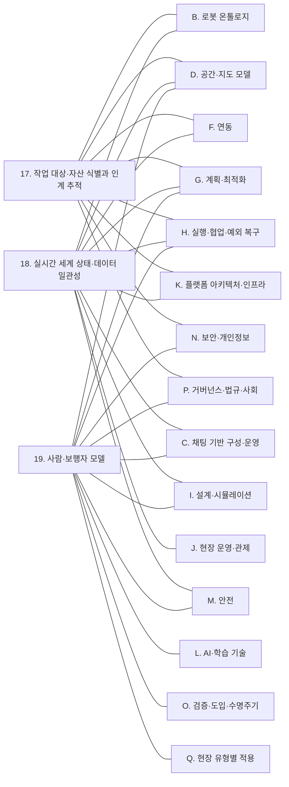

(너의 규칙은 시스템 프롬프트의 agents/shared-rules.md 와 agents/storyteller.md 이다. 아래는 이번 실행의 컨텍스트와 입력이다.)

## 실행 컨텍스트

- run_id: 2026-10-09-12
- date: 2026-10-09
- run_type: update (갱신)
- 대상: 19. 사람·보행자 모델 (E. 사물·사람·실시간 상태)
- 예산:
    - max_search_queries: 30
    - max_sources_per_run: 15
    - new_topic_pages: 1
    - page_updates: 2
    - max_retries: 2
- 환경 알림: web_fetch_available: true · fetch_mode: full
- 언어: ko
- retry_count: 1
- max_retries: 2

## 입력

### runs/2026-10-09-12/target.json

```json
{
  "run_id": "2026-10-09-12",
  "date": "2026-10-09",
  "weekday": "Fri",
  "run_number": 145,
  "run_type": "update",
  "forced": true,
  "target": {
    "area_no": 19,
    "area_name": "19. 사람·보행자 모델",
    "category": "E. 사물·사람·실시간 상태",
    "category_letter": "E"
  },
  "topic": null,
  "track": null,
  "corrections": [],
  "budget": {
    "max_search_queries": 30,
    "max_sources_per_run": 15,
    "new_topic_pages": 1,
    "page_updates": 2,
    "max_retries": 2
  },
  "priority_reason": null,
  "priority_questions": [],
  "excluded_areas": [],
  "lifted_areas": [],
  "deferred": {
    "monthly_recheck": false,
    "weekly_review": false
  },
  "selection_rationale": "CLI 지정 run_type=update, area=19"
}
```

### runs/2026-10-09-12/research.json

```json
{
  "run_id": "2026-10-09-12",
  "date": "2026-10-09",
  "run_type": "update",
  "target": {
    "area_no": 19,
    "area_name": "19. 사람·보행자 모델",
    "category": "E. 사물·사람·실시간 상태"
  },
  "gaps": [
    "정정 요청 없음(inbox/corrections.md 에 대상 페이지 요청 없음). 갱신 실행이므로 원문 미열람·검색 결과 기준 주장의 재확인과 약한 절만 다룬다",
    "섹션 5. 적용 사례 (현장 유형 명시) — 상업 시설 사례(Kidokoro 외, HRI 2013)의 '실제 쇼핑몰 시험'이 원문 미열람·검색 결과 기준이고, 병원 사례는 기사 1건, 실외·제조 공장·가정 사례 없음",
    "섹션 6. 대표 접근법과 기술(주제 페이지로 분리) — 2023 년 이후 움직임 지도 기반 장기 예측·배정 연구와 시설 센서 사람 검출을 교통 제약으로 바꾸는 방식이 없음",
    "섹션 7. 관련 표준·프레임워크·오픈소스(주제 페이지로 분리) — REP-155 의 현재 상태(Draft 여부) 재확인 필요, Open-RMF 의 사람 장애물 메시지·검출 패키지 미기재",
    "섹션 8. 대표 연구와 자료(주제 페이지로 분리) — 움직임 지도 서베이(ref-1171)·Kidokoro 외(ref-1182) 원문 미열람",
    "섹션 9. ROP가 직접 맡는 것과 외부와 연계하는 것 — 직접 범위 서술이 추정뿐이고 오케스트레이션 계층의 구현 사례가 없음",
    "섹션 11. 열린 질문 — oq-272·oq-273·oq-274·oq-298·oq-303 에 근거가 없음"
  ],
  "research_questions": [
    "현장 사람의 위치와 흐름을 어떻게 알고 계획과 안전에 반영할 것인가? [분류원문]",
    "게시 페이지가 원문 미열람·검색 결과 기준으로 둔 주장(Kidokoro 외 쇼핑몰 시험, 움직임 지도 서베이의 정의, REP-155 의 상태, ATC 데이터셋의 추적 방식)은 원문·초록 기준으로 여전히 맞는가? (섹션 5·7·8 재확인)",
    "oq-272 여러 제조사 로봇과 설비 센서가 각자 감지한 사람 위치를 하나의 사람 흐름 모델로 합칠 때 좌표·시각·신뢰도·익명화 형식을 정한 공개 규격이나 구현이 있는가? (섹션 7·9)",
    "oq-273 병원·상업 시설·물류창고에서 시간대별 사람 혼잡을 로봇 작업 시간 추정과 배정·스케줄링에 반영해 처리 시간이나 지연 변화를 측정한 현장 연구가 있는가? (섹션 5·6)",
    "oq-274 공공 인파 밀집 데이터를 실외 배송로봇의 경로·운행 제한에 연동한 국내 사례나 데이터 제공 조건이 있는가? (섹션 5·9)",
    "oq-298 시간대별 사람 흐름을 담은 움직임 지도를 장소 목록·지도 판과 함께 관리하고 경로·작업 시간 계획에 넘기는 공통 형식이나 현장 사례가 있는가? (섹션 6·7)",
    "제조 공장·가정·실외 현장에서 사람 흐름·혼잡을 로봇 운영에 반영한 사례가 있는가? (섹션 5)"
  ],
  "findings": [
    {
      "id": "f1",
      "claim": "ROS 규약 제안 REP-155(ROS4HRI)는 2026-10-09 확인 기준으로도 상태가 Draft, 유형이 Informational 이며, 식별되지 않은 사람을 익명 사람으로 표시하되 그 ID 는 영속을 보장하지 않고, 개인정보·동의는 다루지 않는다.",
      "tag": "사실",
      "source_ids": [
        "ref-1173"
      ],
      "cross_checked": false,
      "confidence": "medium",
      "evidence_excerpt": "원문 머리 필드: Status Draft, Type Informational, Created 11-Jan-2022. 익명 사람은 /anonymous 에 true 를 발행하고 ID 가 영속하지 않을 수 있다. location_confidence 1·0~1·0 규칙. 개인정보·동의 언급 없음(확인일 기준 상태).",
      "as_of": "2026-10-09",
      "site_type": null,
      "flow_item": "작업 대상"
    },
    {
      "id": "f2",
      "claim": "Kucner 외 서베이(IJRR 42(11), 2023-09)의 초록은 움직임 지도를 환경의 전형적 움직임 패턴을 기록한 지도로 정의하고, 궤적이나 짧고 끊긴 움직임 관측으로 만들며 전역 경로 계획·위치추정 개선·사람 움직임 예측에 쓰인다고 하고, 새 분류 체계를 제안하며 이 분야가 실제 적용에 이를 만큼 성숙했지만 빠르게 발전 중이라고 결론짓는다.",
      "tag": "사실",
      "source_ids": [
        "ref-1171"
      ],
      "cross_checked": false,
      "confidence": "medium",
      "evidence_excerpt": "Aalto 연구 포털의 초록(IJRR 42(11) pp. 977–1006, 2023-08-03 온라인): MoD 는 typical motion patterns 를 기록하며, 궤적 또는 끊긴 관측으로 구축, 전역 계획·위치추정·사람 움직임 예측에 사용. 본문 PDF 는 추출 실패로 초록만 확인.",
      "as_of": "2023-09",
      "site_type": null,
      "flow_item": null
    },
    {
      "id": "f3",
      "claim": "Kidokoro 외(HRI 2013)의 초록은 보행자 흐름·보행자 상호작용·보행 쾌적성의 세 모델로 로봇이 사람 사이를 다니는 가상 상황을 시뮬레이션하는 방법을 친근한 순찰(friendly-patrolling) 시나리오에 구현했고, 현장 실험에서 노출만 최대화한 로봇보다 주변 보행자가 보행 쾌적성을 더 좋게 인식했다고 적지만, 실험 장소가 쇼핑몰이라고는 밝히지 않는다.",
      "tag": "사실",
      "source_ids": [
        "ref-1182"
      ],
      "cross_checked": false,
      "confidence": "medium",
      "evidence_excerpt": "OpenAlex 초록 복원(HRI 2013, pp. 259-266): three underlying models — pedestrian flow, pedestrian interaction, walking comfort; 'friendly-patrolling scenario'; field experiment 결과 보행 쾌적성 개선. 초록에 shopping mall 언급 없음.",
      "as_of": "2013-03",
      "site_type": null,
      "flow_item": "제약"
    },
    {
      "id": "f4",
      "claim": "같은 연구의 확장판(Kidokoro 외, IEEE Transactions on Robotics 31(6), 2015)은 로봇 주변 군중 형성 예측·보행 쾌적성 추정·혼잡 사전 회피 계획을 결합해 다음 이동 단계를 고르는 방법을 실제 쇼핑몰에서 시험해, 혼잡으로 인한 로봇의 보행 쾌적성 영향을 줄였다고 초록에 적는다.",
      "tag": "사실",
      "source_ids": [
        "ref-1479"
      ],
      "cross_checked": false,
      "confidence": "medium",
      "evidence_excerpt": "OpenAlex 초록(TRO 31(6) pp. 1419–1431, 2015-11-11): 여러 기본 보행자 행동 모델을 결합해 가상 주행 상황을 시뮬레이션하고 결과로 다음 이동 단계를 선택. 'real shopping mall' 시험에서 쾌적성 영향 감소. 효과 수치는 초록에 없음.",
      "as_of": "2015-11-11",
      "site_type": "상업 시설",
      "flow_item": "제약"
    },
    {
      "id": "f5",
      "claim": "ATC 데이터셋을 공개한 ATR 연구진(Brščić 외, IEEE THMS 43(6), 2013)은 사람 키보다 높게 단 여러 3차원 거리 센서로 넓은 공공 공간에서 사람의 위치·방향·키를 추적하는 방법을 쇼핑센터에 구현했다고 보고했다.",
      "tag": "사실",
      "source_ids": [
        "ref-1480",
        "ref-1176"
      ],
      "cross_checked": false,
      "confidence": "medium",
      "evidence_excerpt": "OpenAlex 초록 복원(THMS 43(6) pp. 522–534, 2013-10-17): 'sensors, which are mounted above human height to have less occlusion'; 단일 센서 추적을 결합해 넓은 구역을 최소 센서로 덮음; 쇼핑센터 환경 구현. 센서 수·면적은 초록에 없음. 데이터셋 페이지와 같은 저자군이라 독립 교차 확인 아님.",
      "as_of": "2013-10-17",
      "site_type": "상업 시설",
      "flow_item": "작업 대상"
    },
    {
      "id": "f6",
      "claim": "Open-RMF 의 장애물 메시지(rmf_obstacle_msgs/Obstacle)는 헤더의 좌표 프레임·시각, 발행 주체(source), 층 이름(level_name), 분류 라벨(예: human), 3차원 경계 상자, 예상 수명(lifetime), 추가·삭제 동작을 담으며, 확인한 정의에는 검출 신뢰도나 익명화를 위한 필드가 없다.",
      "tag": "사실",
      "source_ids": [
        "ref-1484"
      ],
      "cross_checked": false,
      "confidence": "medium",
      "evidence_excerpt": "Obstacle.msg 필드: header(frame_id 기준 측정), id, source, level_name, classification(human, chair 등), bbox, data_resolution, data(옥트리), lifetime, action(ADD·DELETE·DELETEALL). 신뢰도·익명화 필드 없음. (발행일 미확인, 확인일 기준)",
      "as_of": "2026-10-09",
      "site_type": null,
      "flow_item": "작업 대상"
    },
    {
      "id": "f7",
      "claim": "Open-RMF 의 rmf_obstacle 저장소는 기존 CCTV·영상 센서로 군중을 검출하는 용도의 사람 검출 노드(단안 카메라 YOLO-V4, OAK-D 카메라)를 두고, lane_blocker 노드가 /rmf_obstacles 의 장애물이 플릿 주행 차선과 겹치면 차선을 닫았다가 비면 다시 열거나 속도 제한(기본 0.5 m/s)을 건다.",
      "tag": "사실",
      "source_ids": [
        "ref-1485"
      ],
      "cross_checked": false,
      "confidence": "medium",
      "evidence_excerpt": "README: rmf_human_detector 는 sensor_msgs::Image 에 YOLO-V4 로 사람 검출, 용도는 기존 CCTV 로 군중 검출. lane_blocker_node 파라미터 lane_closure_threshold 1, speed_limit_threshold 3, speed_limit 0.5. 개인정보 언급 없음. (발행일 미확인, 확인일 기준)",
      "as_of": "2026-10-09",
      "site_type": null,
      "flow_item": "제약"
    },
    {
      "id": "f8",
      "claim": "f6·f7 에 따르면 시설 카메라의 사람 검출 결과를 층·발행 주체·수명과 함께 모아 여러 플릿의 차선 폐쇄·속도 제한으로 바꾸는 경로가 오케스트레이션 계층(Open-RMF)에 이미 있어 19. 사람·보행자 모델의 ROP 직접 범위 예시가 될 수 있으나, 신뢰도·익명화 형식은 정해져 있지 않아 oq-272 는 부분적으로만 답해진 것으로 보인다.",
      "tag": "추정",
      "source_ids": [
        "ref-1484",
        "ref-1485",
        "ref-1173"
      ],
      "cross_checked": false,
      "confidence": "low",
      "evidence_excerpt": "Open-RMF 장애물 메시지에는 source·level_name·classification·lifetime 이 있고 REP-155 에는 location_confidence 가 있으나, 두 형식 모두 익명화·집계 규칙을 두지 않음(f1·f6·f7 종합).",
      "as_of": "2026-10-09",
      "site_type": null,
      "flow_item": "제약"
    },
    {
      "id": "f9",
      "claim": "Kazemi Eskeri 외(IROS 2025)는 시간대별 사람 존재 확률을 담은 이산 격자형 움직임 지도를 다중 로봇 작업 배정의 확률적 비용에 넣어, ATC 쇼핑몰 데이터의 기록 궤적을 재생한 시뮬레이션에서 임무 완료 시간을 움직임 무시 방법 대비 최대 26%, 기준 방법 대비 최대 19% 줄였다고 보고했으며 실제 로봇 실험은 없다.",
      "tag": "사실",
      "source_ids": [
        "ref-1083"
      ],
      "cross_checked": false,
      "confidence": "medium",
      "evidence_excerpt": "arXiv 초록·HTML: 'time-dependent discrete probabilistic model'; ATC 데이터셋(오사카 쇼핑몰) 궤적을 재생한 'simulated environment'; 로봇은 시뮬레이션 차량. 완료 시간 최대 26%·19% 감소.",
      "as_of": "2025-08-27",
      "site_type": null,
      "flow_item": "예외·성과"
    },
    {
      "id": "f10",
      "claim": "고려대학교 구로병원 연구(Lee 외, Digital Health 12, 2026)는 약제부→응급실 직원 전용 승강기 경로에서 의약품 배송로봇(DOGU IROI)의 비긴급 임무 122건(2025-06-18~29)을 분석해 전체 성공률 87.03%, 승강기 가동률 59.01% 미만에서 95.52% 였고, 실패 14건 가운데 8건이 승강기 탑승·하차 중 막힘이었으며 탑승 인원이 1명 늘 때 실패 오즈비가 1.73 이었다고 보고했다.",
      "tag": "사실",
      "source_ids": [
        "ref-1487"
      ],
      "cross_checked": false,
      "confidence": "medium",
      "evidence_excerpt": "단일 병원·단일 로봇. 실패 원인: 승강기 막힘 8, 복도 자율주행 오류 4, 호출 통신 오류 2. 가동률은 승강기 대기 시간(r=0.458)·이동 시간(r=0.224)과 상관. 임계값 AUC 0.779.",
      "as_of": "2026-03-31",
      "site_type": "병원",
      "flow_item": "예외·성과"
    },
    {
      "id": "f11",
      "claim": "같은 연구는 혼잡이 임계값 아래일 때 로봇 배송을 배정하고, 승강기가 운행 중이며 가동률이 60% 이상이면 출발을 미루도록 권고하며, 59.01% 임계값은 현장 고유값이라 다른 곳에서는 다시 보정해야 한다고 적는다.",
      "tag": "사실",
      "source_ids": [
        "ref-1487"
      ],
      "cross_checked": false,
      "confidence": "medium",
      "evidence_excerpt": "결론: 'robotic medication delivery should be scheduled when congestion is below critical thresholds'. 실무 경계 약 60%, 한계로 단일 병원·단일 기종과 임계값 재보정 필요를 명시.",
      "as_of": "2026-03-31",
      "site_type": "병원",
      "flow_item": "제약"
    },
    {
      "id": "f12",
      "claim": "oq-273 에 대해 f9(쇼핑몰 데이터 기반 시뮬레이션)와 f10·f11(병원 승강기 혼잡의 현장 측정)은 사람 혼잡이 로봇 작업 시간·실패에 주는 영향을 재고 배정 시점에 반영하는 근거가 되지만, 복도·구역 단위의 시간대별 사람 흐름을 작업 시간 추정과 스케줄링에 넣어 현장에서 효과를 잰 연구는 이번에도 찾지 못했다.",
      "tag": "추정",
      "source_ids": [
        "ref-1083",
        "ref-1487"
      ],
      "cross_checked": false,
      "confidence": "low",
      "evidence_excerpt": "f9 는 시뮬레이션뿐이고 f10 의 혼잡 지표는 승강기 가동률·탑승 인원이며 복도 보행자 흐름이 아님.",
      "as_of": "2026-10-09",
      "site_type": null,
      "flow_item": "예외·성과"
    },
    {
      "id": "f13",
      "claim": "Gehrke 외(Transportation Research Interdisciplinary Perspectives 18, 2023)는 미국 노던애리조나대학교 캠퍼스 10곳에서 일주일간 녹화한 영상으로 보도 자율 배송로봇과 보행자·자전거 이용자의 상호작용 빈도·심각도를 침범 후 시간(PET)으로 재고, 중간·위험 충돌의 예측 요인을 모델링했다.",
      "tag": "사실",
      "source_ids": [
        "ref-990"
      ],
      "cross_checked": false,
      "confidence": "medium",
      "evidence_excerpt": "초록: 'one week of field-recorded video from ten locations'; PET 를 충돌·지점 특성의 함수로 모델링; 공유 통로 시설 관리 전략 수립에 쓰려는 목적.",
      "as_of": "2023-03-01",
      "site_type": "실외",
      "flow_item": "제약"
    },
    {
      "id": "f14",
      "claim": "노던애리조나대학교 보도(2023-05-16)에 따르면 이 연구에서 충돌(0초)이 12건 관찰됐고, 보도가 좁고 교차가 많은 지점일수록 위험 상호작용이 많았으며, 연구진은 넓은 보도에서 나란히 주행하도록 경로를 정하고 사람이 많은 지점의 횡단을 줄이며 덜 붐비는 표시된 지점으로 배송하도록 권고했다.",
      "tag": "사실",
      "source_ids": [
        "ref-1482"
      ],
      "cross_checked": false,
      "confidence": "medium",
      "evidence_excerpt": "위험 기준: 공유 지점을 1.5초 안에 지남. 심각한 충돌은 로봇이 보행자 앞을 가로지르거나 추월할 때 대부분 발생. 권고: 'parallel travel' along 'wide sidewalks'. 논문과 같은 기관 보도라 독립 출처 아님.",
      "as_of": "2023-05-16",
      "site_type": "실외",
      "flow_item": "제약"
    },
    {
      "id": "f15",
      "claim": "f13·f14 에 따르면 실외 보도 로봇의 보행자 충돌 위험은 보도 폭·교차 수·사람 활동량 같은 지점 특성과 이어지므로, ROP 가 실외 경로망에 지점별 보행자 활동·폭 속성을 두고 경로·배송 지점 선택의 비용으로 쓰는 방식이 19. 사람·보행자 모델과 27. 다중 로봇 경로·교통 관리 — MAPF 를 잇는 것으로 보인다.",
      "tag": "추정",
      "source_ids": [
        "ref-990",
        "ref-1482"
      ],
      "cross_checked": false,
      "confidence": "low",
      "evidence_excerpt": "연구진 권고(경로·배송 지점 선택)를 플랫폼 경로 비용으로 옮긴 해석이며 오케스트레이션 플랫폼 적용 사례는 미확인.",
      "as_of": "2026-10-09",
      "site_type": "실외",
      "flow_item": "제약"
    },
    {
      "id": "f16",
      "claim": "연계 대상: 2024-08 경기 의왕시 부곡파출소 앞 횡단보도에서 경찰청 실시간 교통신호정보를 현대차·기아 로보틱스랩 관제 시스템과 연동해, 실외 이동로봇이 카메라 신호 인식과 별도로 신호 상태를 실시간으로 받아 횡단보도를 건너는 시연이 열렸다.",
      "tag": "사실",
      "source_ids": [
        "ref-1483"
      ],
      "cross_checked": false,
      "confidence": "low",
      "evidence_excerpt": "보안뉴스(2024-08-10): 경찰청 '실시간 교통신호정보 수집·제공 시스템'을 관제와 연동, 자체 카메라 인식의 이중화. 참여: 의왕시·도로교통공단·현대차·기아. 인파·보행자 수 데이터 언급 없음.",
      "as_of": "2024-08-10",
      "site_type": "실외",
      "flow_item": "시작 조건"
    },
    {
      "id": "f17",
      "claim": "oq-274 에 대해 국내에서는 공공 교통신호 데이터를 실외 로봇 관제 시스템에 연동한 시연(f16)은 확인되지만, 인파관리지원시스템 같은 공공 인파 밀집 데이터를 로봇 경로·운행 제한에 연동한 사례나 데이터 제공 조건은 이번에도 찾지 못했다.",
      "tag": "추정",
      "source_ids": [
        "ref-1483",
        "ref-1177"
      ],
      "cross_checked": false,
      "confidence": "low",
      "evidence_excerpt": "한국어 검색 2회(실외 배송로봇 유동인구·인파 밀집 데이터 연동)에서 사례 없음. 연동 경로(공공 데이터→로봇 관제)의 선례로만 볼 수 있음.",
      "as_of": "2026-10-09",
      "site_type": "실외",
      "flow_item": "시작 조건"
    },
    {
      "id": "f18",
      "claim": "현대자동차·기아와 한림대학교의료원은 2025-04-07 한림대학교성심병원을 시험장으로 병원 맞춤형 배송 로봇과 관제 시스템을 함께 개발·실증하는 협약을 맺으면서 병원을 환자·의료진·휠체어·이동식 침대가 섞인 고밀도 환경으로 규정했으나, 이 발표는 조선비즈 기사(2024-07)의 로봇 대수나 사람·휠체어 앞 대기 규칙을 확인해 주지 않는다.",
      "tag": "사실",
      "source_ids": [
        "ref-1488",
        "ref-1181"
      ],
      "cross_checked": false,
      "confidence": "medium",
      "evidence_excerpt": "현대자동차그룹 보도자료: 고밀도 병원 환경에서 주행 성능·안전성이 핵심, 병원 데이터로 제품 기획·고도화, 로봇 친화 병원 표준·인증체계 공동 수립 계획. 기간은 명시 없음.",
      "as_of": "2025-04-07",
      "site_type": "병원",
      "flow_item": "제약"
    },
    {
      "id": "f19",
      "claim": "Kairos(Catalano 외, arXiv 프리프린트 2026-09-23)는 3차원 장면 그래프의 복셀마다 사람 존재율과 이동 방향 분포를 두고 임의의 미래 시각을 스펙트럼 예측기로 예측해 주행 노드 단위로 모으는 4차원 장면 그래프를 제안했고, 로봇이 모은 캠퍼스·쇼핑몰·11개월 역 구내 데이터로 평가해 사람을 만나는 계획 과제에서 시간 불변 지도보다 같은 성공률로 더 많은 사람을 만났다고 보고했다.",
      "tag": "사실",
      "source_ids": [
        "ref-1486"
      ],
      "cross_checked": false,
      "confidence": "medium",
      "evidence_excerpt": "초록·HTML: voxel 별 'directional mixture and a presence rate', 주행 노드로 집계·흐름 정렬 점수, 코드 공개(github.com/IacopomC/kairos). 계획 과제 목적은 만남 확률(최대화로 읽힘), 동료심사 전.",
      "as_of": "2026-09-23",
      "site_type": null,
      "flow_item": null
    },
    {
      "id": "f20",
      "claim": "oq-298 에 대해 f19 처럼 사람 존재·흐름 예측을 장면 그래프의 장소·주행 노드에 붙이는 연구 구현은 있으나, 움직임 지도를 장소 목록·지도 판과 함께 관리하는 공통 형식이나 현장 운영 사례는 이번에도 찾지 못했다.",
      "tag": "추정",
      "source_ids": [
        "ref-1486",
        "ref-1171"
      ],
      "cross_checked": false,
      "confidence": "low",
      "evidence_excerpt": "Kairos 는 연구 코드이며 지도 판 관리·교환 형식을 다루지 않음. 움직임 지도 ROS 2 패키지 검색 1회에서도 계획기 통합 패키지는 확인하지 못함.",
      "as_of": "2026-10-09",
      "site_type": null,
      "flow_item": null
    },
    {
      "id": "f21",
      "claim": "Zhu 외(arXiv 2025-10-03, IEEE RA-L 표기)는 시간대별 움직임 패턴을 담는 시간 조건부 움직임 지도를 써서 최대 60초 앞의 사람 움직임을 예측해, 실제 데이터셋 두 개에서 학습 기반 방법보다 평균 변위 오차를 최대 50% 줄였다고 보고했다.",
      "tag": "사실",
      "source_ids": [
        "ref-1489"
      ],
      "cross_checked": false,
      "confidence": "medium",
      "evidence_excerpt": "초록: MoD 세 유형 평가, time-conditioned MoD 가 가장 정확, 예측 구간 최대 60초, ADE 최대 50% 개선. 데이터셋 이름은 초록에 없음.",
      "as_of": "2025-10-03",
      "site_type": null,
      "flow_item": null
    },
    {
      "id": "f22",
      "claim": "Open-RMF 시뮬레이션 문서는 하드웨어 시험에서 기록한 데이터로 시뮬레이션 상황을 다시 만들 수 있다고 적고, menge 를 엔진으로 쓰는 선택 기능 crowdsim 을 traffic_editor 에서 켜 airport_terminal 예제에서 가상 사람을 움직이게 하지만, 기록된 사람 흐름을 crowdsim 입력으로 옮기는 방법은 설명하지 않는다.",
      "tag": "사실",
      "source_ids": [
        "ref-406"
      ],
      "cross_checked": false,
      "confidence": "medium",
      "evidence_excerpt": "원문: 'Data logged from hardware trials can be used to recreate the scenario in simulation'. crowdsim 실행 예: airport_terminal.launch.xml use_crowdsim:=1. 기록→보행자 모델 변환 언급 없음.",
      "as_of": "2026-10-09",
      "site_type": null,
      "flow_item": null
    }
  ],
  "sources": [
    {
      "id": "ref-1171",
      "org": "Kucner, T. P., Magnusson, M., Mghames, S., Palmieri, L., Verdoja, F., Swaminathan, C. S., Krajník, T., Schaffernicht, E., Bellotto, N., Hanheide, M., & Lilienthal, A. J. (The International Journal of Robotics Research 42(11))",
      "title": "Survey of maps of dynamics for mobile robots",
      "published": "2023",
      "url": "https://journals.sagepub.com/doi/10.1177/02783649231190428",
      "type": "논문",
      "reliability": "medium",
      "accessed": "2026-10-09",
      "summary": "움직임 지도(MoD)의 정의·분류 체계·응용·열린 문제를 정리한 서베이. 이번 실행에서는 Aalto 연구 포털의 초록을 열어 확인했다(본문 PDF 는 추출 실패).",
      "fetched": true,
      "fetched_via": "webfetch",
      "fetch_url": "https://research.aalto.fi/en/publications/survey-of-maps-of-dynamics-for-mobile-robots/",
      "source_unopened": false
    },
    {
      "id": "ref-1173",
      "org": "ROS (ros-infrastructure/rep 저장소), Séverin Lemaignan",
      "title": "REP 155 -- Conventions, Topics, Interfaces for Perception in Human-Robot Interaction",
      "published": "2022-01-11",
      "url": "https://github.com/ros-infrastructure/rep/blob/master/rep-0155.rst",
      "type": "오픈소스 문서",
      "reliability": "medium",
      "accessed": "2026-10-09",
      "summary": "사람 인지 정보를 ROS 에서 주고받는 규약 제안. 2026-10-09 확인 기준 상태 Draft, 유형 Informational.",
      "fetched": true,
      "fetched_via": "github_raw",
      "fetch_url": "https://raw.githubusercontent.com/ros-infrastructure/rep/master/rep-0155.rst",
      "source_unopened": false
    },
    {
      "id": "ref-1176",
      "org": "ATR (Advanced Telecommunications Research Institute International), Brščić, D. 외",
      "title": "ATC shopping center tracking dataset",
      "published": null,
      "url": "https://dil.atr.jp/crest2010_HRI/ATC_dataset/",
      "type": "정부·연구기관",
      "reliability": "medium",
      "accessed": "2026-10-09",
      "summary": "원문 미열람. 오사카 ATC 쇼핑센터 천장 3차원 거리 센서 보행자 추적 데이터셋(이번 실행에서 다시 열지 않음).",
      "source_unopened": true,
      "fetched": false,
      "fetched_via": null,
      "fetch_url": null
    },
    {
      "id": "ref-1177",
      "org": "행정안전부 (대한민국 정책브리핑)",
      "title": "29일부터 인파관리지원시스템 본격 운영…다중운집 인파사고 예방",
      "published": "2023-12-27",
      "url": "https://www.korea.kr/news/policyNewsView.do?newsId=148924176",
      "type": "정부·연구기관",
      "reliability": "medium",
      "accessed": "2026-10-09",
      "summary": "원문 미열람. 기지국 접속정보 기반 인파 밀집도·위험도 산출과 지자체 경보 체계(이번 실행에서 다시 열지 않음).",
      "source_unopened": true,
      "fetched": false,
      "fetched_via": null,
      "fetch_url": null
    },
    {
      "id": "ref-1181",
      "org": "조선비즈 (이정아, 다음 뉴스 게재)",
      "title": "로봇과 인간이 공존하는 병원…약 배달 로봇에 길 비켜주고 엘리베이터도 잡아줘",
      "published": "2024-07-12",
      "url": "https://v.daum.net/v/bc4riunbUE",
      "type": "기사",
      "reliability": "low",
      "accessed": "2026-10-09",
      "summary": "원문 미열람. 한림대학교성심병원 로봇 운영(통행 경로 표시, 사람·휠체어 앞 대기) 보도(이번 실행에서 다시 열지 않음).",
      "source_unopened": true,
      "fetched": false,
      "fetched_via": null,
      "fetch_url": null
    },
    {
      "id": "ref-1182",
      "org": "Kidokoro, H., Kanda, T., Brščić, D., & Shiomi, M. (ACM/IEEE HRI 2013)",
      "title": "Will I bother here? - A robot anticipating its influence on pedestrian walking comfort",
      "published": "2013-03",
      "url": "https://www.semanticscholar.org/paper/Will-I-bother-here-A-robot-anticipating-its-on-Kidokoro-Kanda/bc0b26f1c13405fd89eb6d280bee739aed5b07a6",
      "type": "논문",
      "reliability": "medium",
      "accessed": "2026-10-09",
      "summary": "보행자 흐름·상호작용·쾌적성 모델로 로봇이 혼잡 영향을 예상하는 방법(HRI 2013, pp. 259-266). 이번 실행에서 OpenAlex 초록을 열어 확인했으며 초록에는 쇼핑몰 언급이 없다.",
      "fetched": true,
      "fetched_via": "webfetch",
      "fetch_url": "https://api.openalex.org/works/doi:10.1109/HRI.2013.6483597",
      "source_unopened": false
    },
    {
      "id": "ref-406",
      "org": "Open Robotics",
      "title": "Simulation - Programming Multiple Robots with ROS 2",
      "published": null,
      "url": "https://osrf.github.io/ros2multirobotbook/simulation.html",
      "type": "오픈소스 문서",
      "reliability": "medium",
      "accessed": "2026-10-09",
      "summary": "Open-RMF 시뮬레이션 장. 건물 지도 생성, 로봇·문·승강기 플러그인, menge 기반 crowdsim, 하드웨어 기록으로 상황 재현 언급.",
      "fetched": true,
      "fetched_via": "github_raw",
      "fetch_url": null,
      "source_unopened": false
    },
    {
      "id": "ref-1083",
      "org": "Kazemi Eskeri, M., Kyrki, V., Baumann, D., & Kucner, T. P. (IROS 2025, arXiv)",
      "title": "Efficient Human-Aware Task Allocation for Multi-Robot Systems in Shared Environments",
      "published": "2025-08-27",
      "url": "https://arxiv.org/abs/2508.19731",
      "type": "논문",
      "reliability": "medium",
      "accessed": "2026-10-09",
      "summary": "움직임 지도를 다중 로봇 작업 배정 비용에 넣은 방법. ATC 데이터 재생 시뮬레이션에서 임무 완료 시간 단축 보고.",
      "fetched": true,
      "fetched_via": "webfetch",
      "fetch_url": "https://arxiv.org/html/2508.19731v1",
      "source_unopened": false
    },
    {
      "id": "ref-1479",
      "org": "Kidokoro, H., Kanda, T., Brščić, D., & Shiomi, M. (IEEE Transactions on Robotics 31(6))",
      "title": "Simulation-Based Behavior Planning to Prevent Congestion of Pedestrians Around a Robot",
      "published": "2015-11-11",
      "url": "https://doi.org/10.1109/TRO.2015.2492862",
      "type": "논문",
      "reliability": "medium",
      "accessed": "2026-10-09",
      "summary": "HRI 2013 연구의 저널 확장판. 군중 형성 예측·보행 쾌적성·혼잡 사전 회피 계획을 실제 쇼핑몰에서 시험(OpenAlex 초록 열람, 본문 미열람).",
      "fetched": true,
      "fetched_via": "webfetch",
      "fetch_url": "https://api.openalex.org/works/doi:10.1109/TRO.2015.2492862",
      "source_unopened": false
    },
    {
      "id": "ref-1480",
      "org": "Brščić, D., Kanda, T., Ikeda, T., & Miyashita, T. (IEEE Transactions on Human-Machine Systems 43(6))",
      "title": "Person Tracking in Large Public Spaces Using 3-D Range Sensors",
      "published": "2013-10-17",
      "url": "https://doi.org/10.1109/THMS.2013.2283945",
      "type": "논문",
      "reliability": "medium",
      "accessed": "2026-10-09",
      "summary": "사람 키보다 높게 단 3차원 거리 센서 여러 대로 넓은 공공 공간의 사람 위치·방향·키를 추적하는 방법을 쇼핑센터에 구현(OpenAlex 초록 열람).",
      "fetched": true,
      "fetched_via": "webfetch",
      "fetch_url": "https://api.openalex.org/works/doi:10.1109/THMS.2013.2283945",
      "source_unopened": false
    },
    {
      "id": "ref-990",
      "org": "Gehrke, S. R., Phair, C. D., Russo, B. J., & Smaglik, E. J. (Transportation Research Interdisciplinary Perspectives 18)",
      "title": "Observed sidewalk autonomous delivery robot interactions with pedestrians and bicyclists",
      "published": "2023-03-01",
      "url": "https://doi.org/10.1016/j.trip.2023.100789",
      "type": "논문",
      "reliability": "medium",
      "accessed": "2026-10-09",
      "summary": "대학 캠퍼스 10곳 일주일 영상으로 보도 배송로봇–보행자·자전거 상호작용을 PET 로 분석한 현장 관측 연구(초록 열람).",
      "fetched": true,
      "fetched_via": "webfetch",
      "fetch_url": "https://api.openalex.org/works/doi:10.1016/j.trip.2023.100789",
      "source_unopened": false
    },
    {
      "id": "ref-1482",
      "org": "Northern Arizona University (NAU Review)",
      "title": "Got robot delivery? New research demonstrates need for robot-friendly infrastructure",
      "published": "2023-05-16",
      "url": "https://in.nau.edu/news/delivery-robot-research/",
      "type": "정부·연구기관",
      "reliability": "medium",
      "accessed": "2026-10-09",
      "summary": "ref-990 연구의 대학 보도. 충돌 12건, 좁은 보도·많은 교차의 위험, 경로·배송 지점 권고를 소개.",
      "fetched": true,
      "fetched_via": "webfetch",
      "fetch_url": "https://in.nau.edu/news/delivery-robot-research/",
      "source_unopened": false
    },
    {
      "id": "ref-1483",
      "org": "보안뉴스 (박미영)",
      "title": "경찰청 제공 실시간 교통신호정보, 보행자와 함께 거닐 실외 이동로봇의 눈이 되다",
      "published": "2024-08-10",
      "url": "https://www.boannews.com/news/articleView.html?idxno=131956",
      "type": "기사",
      "reliability": "low",
      "accessed": "2026-10-09",
      "summary": "경찰청 실시간 교통신호정보를 현대차·기아 로보틱스랩 관제와 연동해 실외 로봇이 횡단보도를 건너는 의왕시 시연 보도.",
      "fetched": true,
      "fetched_via": "webfetch",
      "fetch_url": "https://www.boannews.com/news/articleView.html?idxno=131956",
      "source_unopened": false
    },
    {
      "id": "ref-1484",
      "org": "Open Robotics (open-rmf/rmf_internal_msgs)",
      "title": "rmf_obstacle_msgs/msg/Obstacle.msg",
      "published": null,
      "url": "https://github.com/open-rmf/rmf_internal_msgs/blob/main/rmf_obstacle_msgs/msg/Obstacle.msg",
      "type": "오픈소스 문서",
      "reliability": "high",
      "accessed": "2026-10-09",
      "summary": "Open-RMF 장애물 메시지 정의. 프레임·시각, 발행 주체, 층, 분류 라벨(human 등), 경계 상자, 수명, 추가·삭제 동작.",
      "fetched": true,
      "fetched_via": "github_raw",
      "fetch_url": "https://raw.githubusercontent.com/open-rmf/rmf_internal_msgs/main/rmf_obstacle_msgs/msg/Obstacle.msg",
      "source_unopened": false
    },
    {
      "id": "ref-1485",
      "org": "Open Robotics (open-rmf/rmf_obstacle)",
      "title": "rmf_obstacle — README",
      "published": null,
      "url": "https://github.com/open-rmf/rmf_obstacle",
      "type": "오픈소스 문서",
      "reliability": "high",
      "accessed": "2026-10-09",
      "summary": "CCTV·카메라 사람 검출 노드와 장애물이 주행 차선과 겹치면 차선을 닫거나 속도를 제한하는 lane_blocker 노드를 제공.",
      "fetched": true,
      "fetched_via": "github_raw",
      "fetch_url": "https://raw.githubusercontent.com/open-rmf/rmf_obstacle/main/README.md",
      "source_unopened": false
    },
    {
      "id": "ref-1486",
      "org": "Catalano, I., Placed, J. A., Civera, J., & Peña Queralta, J. (arXiv)",
      "title": "Kairos: Grounded Forecasting of Presence and Directional Flow in 4D Scene Graphs",
      "published": "2026-09-23",
      "url": "https://arxiv.org/abs/2609.27467",
      "type": "논문",
      "reliability": "medium",
      "accessed": "2026-10-09",
      "summary": "4차원 장면 그래프에 사람 존재율·이동 방향 분포를 두고 미래 시각을 예측하는 프리프린트. 캠퍼스·쇼핑몰·역 구내 데이터 평가, 코드 공개.",
      "fetched": true,
      "fetched_via": "webfetch",
      "fetch_url": "https://arxiv.org/html/2609.27467v1",
      "source_unopened": false
    },
    {
      "id": "ref-1487",
      "org": "Lee, Y. 외, Park, I.-H. (교신) (Digital Health 12, 고려대학교 구로병원)",
      "title": "Feasibility of autonomous medication delivery robots considering elevator utilization in high-traffic hospital environments",
      "published": "2026-03-31",
      "url": "https://journals.sagepub.com/doi/10.1177/20552076261437181",
      "type": "논문",
      "reliability": "high",
      "accessed": "2026-10-09",
      "summary": "고려대 구로병원 의약품 배송로봇 122개 임무의 승강기 혼잡(가동률·탑승 인원)과 성공률·지연을 분석한 전향적 타당성 연구.",
      "fetched": true,
      "fetched_via": "webfetch",
      "fetch_url": "https://journals.sagepub.com/doi/10.1177/20552076261437181",
      "source_unopened": false
    },
    {
      "id": "ref-1488",
      "org": "현대자동차그룹",
      "title": "현대자동차·기아, 한림대의료원과 로봇 친화 병원 공동 구축 위한 업무협약 체결",
      "published": "2025-04-07",
      "url": "https://www.hyundaimotorgroup.com/ko/news/CONT0000000000173736",
      "type": "벤더 문서",
      "reliability": "medium",
      "accessed": "2026-10-09",
      "summary": "한림대학교성심병원을 시험장으로 병원 맞춤형 배송 로봇·관제 시스템 공동 개발·실증 협약. 병원을 고밀도 혼재 환경으로 규정.",
      "fetched": true,
      "fetched_via": "webfetch",
      "fetch_url": "https://www.hyundaimotorgroup.com/ko/news/CONT0000000000173736",
      "source_unopened": false
    },
    {
      "id": "ref-1489",
      "org": "Zhu, Y., Rudenko, A., Kucner, T. P., Lilienthal, A. J., & Magnusson, M. (arXiv; IEEE RA-L 표기)",
      "title": "Long-Term Human Motion Prediction Using Spatio-Temporal Maps of Dynamics",
      "published": "2025-10-03",
      "url": "https://arxiv.org/abs/2510.03031",
      "type": "논문",
      "reliability": "medium",
      "accessed": "2026-10-09",
      "summary": "시간 조건부 움직임 지도로 최대 60초 사람 움직임을 예측해 학습 기반 방법보다 ADE 최대 50% 개선을 보고(초록 열람).",
      "fetched": true,
      "fetched_via": "webfetch",
      "fetch_url": "https://arxiv.org/abs/2510.03031",
      "source_unopened": false
    }
  ],
  "page_proposals": [
    {
      "action": "update",
      "path": "docs/categories/objects-people-and-live-state/people-and-pedestrian-model.md",
      "sections": [
        "5",
        "6",
        "7",
        "8",
        "9",
        "11"
      ],
      "rationale": "갱신(차등): 섹션 5 — 상업 시설 사례의 쇼핑몰 시험 근거를 바로잡음: HRI 2013 초록(f3, ref-1182)은 친근한 순찰 시나리오의 현장 실험만 적고 쇼핑몰을 밝히지 않으며, 쇼핑몰 시험은 TRO 2015 확장판(f4, ref-1479)의 초록에 있으므로 사례 제목·각주를 ref-1479 중심으로 고치고 '원문 미열람, 검색 결과 기준' 문구를 정리. ATC 데이터셋 추적 방식은 f5 로 보강(같은 저자군이라 교차 확인 아님). 병원 — 고려대학교 구로병원 승강기 혼잡 사례(f10·f11, 한국, 여섯 항목: 수행 자원·제약·예외·성과) 추가, 한림대 사례는 f18 로 맥락만 보강하고 기사 1건 기준임을 유지. 실외 — 대학 캠퍼스 보도 배송로봇 관측 사례(f13·f14, f15) 추가로 '실외 사례 없음' 문장 수정, 의왕시 교통신호 연동 시연(f16)은 연계 대상으로 짧게. 제조 공장·가정은 여전히 사례 없음. 섹션 6(주제 페이지) — 시설 카메라 사람 검출→차선 폐쇄·속도 제한(f7), 움직임 지도 기반 배정(f9)·장기 예측(f21)·4D 장면 그래프 예측(f19). 섹션 7(주제 페이지) — REP-155 상태 Draft 재확인(f1), Open-RMF 장애물 메시지·rmf_obstacle(f6·f7). 섹션 8(주제 페이지) — 움직임 지도 서베이 초록 확인(f2), f9·f10·f13·f19·f21 추가. 섹션 9 — 직접 범위 예시로 f8(Open-RMF 장애물·lane_blocker), 외부 검출 모델 실행·카메라는 연계 대상. 섹션 11 — oq-272 부분 근거 f6·f8, oq-273 부분 근거 f9·f10·f11·f12, oq-274 부분 근거 f16·f17, oq-298 부분 근거 f19·f20, oq-303·oq-256 부분 근거 f22(모두 미해결 유지), 새 열린 질문 2건. 교차 규칙: 학습 기반 예측·배정(f9·f21)은 46. 예측·학습 기반 최적화와 25. 작업 배정 — MRTA 양쪽 연결, 현재 관측(f6·f7)은 18. 실시간 세계 상태·데이터 일관성, crowdsim(f22)은 34. 시뮬레이션·예측용 디지털 트윈·36. 가상 시운전·실제 상황 재현 쪽으로 구분. 다음 실행 후보: 63. 병원·의료 페이지 5절에 f10·f11, 66. 실외 페이지에 f13·f14·f16, 27. 다중 로봇 경로·교통 관리 — MAPF 에 f7."
    }
  ],
  "glossary_candidates": [
    {
      "term_ko": "평균 변위 오차",
      "term_en": "Average Displacement Error (ADE)",
      "definition": "궤적 예측에서 예측 구간의 모든 시점에 대해 예측 위치와 실제 위치 사이 거리를 평균한 오차 지표이다."
    },
    {
      "term_ko": "4차원 장면 그래프",
      "term_en": "4D Scene Graph",
      "definition": "3차원 장면 그래프의 장소·물체 노드에 시간 축을 더해 사람 존재나 흐름 같은 시간에 따라 변하는 상태를 함께 표현·예측하는 표현이다."
    }
  ],
  "open_questions_new": [
    "시설 카메라의 사람 검출 결과로 플릿 주행 차선을 닫거나 속도를 제한하는 방식(Open-RMF lane_blocker)을 여러 제조사 로봇 현장에서 운영할 때 오검출·과도한 차선 폐쇄가 처리량과 지연에 주는 영향을 측정한 자료가 있는가? | 관련 영역: 19. 사람·보행자 모델, 27. 다중 로봇 경로·교통 관리 — MAPF, 18. 실시간 세계 상태·데이터 일관성 | 근거: f7 | 종류: 일반",
    "병원 승강기 가동률·탑승 인원 같은 혼잡 임계값(예: 고려대 구로병원의 약 60%)을 다른 병원·건물로 옮겨 로봇 배정 시점에 쓸 때 재보정하는 방법이나 다기관 연구가 있는가? | 관련 영역: 19. 사람·보행자 모델, 26. 작업 순서·스케줄링, 22. 설비·건물 시스템 연동 | 근거: f11 | 종류: 일반"
  ],
  "open_questions_resolved": [],
  "self_check": {
    "source_count": 19,
    "cross_checked_count": 0,
    "unverified": [
      "Kidokoro 외 HRI 2013 과 TRO 2015 는 OpenAlex 초록만 열었고 본문 미열람(IEEE Xplore 빈 응답, CroRIS 대기 페이지). 쇼핑몰 효과 수치 미확인",
      "ref-1171 움직임 지도 서베이는 Aalto 포털 초록만 열었고 본문 PDF 는 추출 실패",
      "f5 는 ATC 데이터셋(ref-1176)과 같은 저자군의 논문이라 독립 교차 확인 아님. ATC 센서 49대·약 900㎡ 수치는 이번에 다시 확인하지 않음",
      "f14 는 ref-990 과 같은 대학의 보도라 독립 출처 아님. 논문 본문(충돌 수·예측 요인 계수) 미열람",
      "f10·f11 고려대 구로병원 연구는 단일 출처, 교차 확인 실패",
      "f18 은 조선비즈 기사(ref-1181)의 로봇 73대·대기 규칙을 확인해 주지 않음. 한림대 사례의 독립 확인은 여전히 실패",
      "f19 Kairos 는 동료심사 전 프리프린트, 계획 과제의 목적(만남 최대화)은 본문 앞부분 기준 해석이며 데이터셋 이름(ATC·HB 표기)과의 대응 미확인",
      "f21 의 데이터셋 이름 미확인(초록에 없음)",
      "Open-RMF rmf_obstacle 의 이슈 #22(장애물 서버 통합 계획)는 403 으로 열지 못함",
      "STRANDS 요양시설 배치에서 FreMEn 으로 상호작용 확률을 예측해 일정을 짠 내용은 PDF 추출 실패로 출처로 넣지 않음",
      "제조 공장·가정 현장의 사람 흐름 반영 사례는 이번에도 찾지 못함",
      "공공 인파 밀집 데이터의 실외 로봇 연동 국내 사례 미발견(oq-274)"
    ],
    "scope_violations": [
      "f7·f8: 카메라 영상의 사람 검출 모델 실행은 원문 19장 '로봇 자체 지능·제어'·센서 인식 쪽에 가까워 연계 대상으로 두고, ROP 직접 범위는 검출 결과(장애물 메시지)를 모아 차선 폐쇄·속도 제한 같은 교통 제약으로 쓰는 부분으로 한정해야 함",
      "f16: 교통신호 시스템은 시설·공공 시스템 경계의 연계 대상이므로 claim 을 '연계 대상: '으로 시작",
      "f10·f11: 승강기 운행·호출 제어는 시설·설비 제어 경계의 연계 대상이며, ROP 쪽은 혼잡 지표를 받아 배정·출발 시점을 정하는 부분으로만 서술해야 함",
      "f13·f14: 보도 위 국소 회피·양보 동작은 로봇 제조사 몫이며, ROP 쪽은 경로·배송 지점 선택 비용(f15, 추정)으로만 연결"
    ],
    "budget_used": {
      "queries": 15,
      "sources": 11
    },
    "limits": "web_fetch_available: true · fetch_mode full. 갱신(update) 실행으로, 정정 요청이 없어 원문 미열람·검색 결과 기준이던 주장의 재확인과 약한 절(5·7·9·11)과 열린 질문(oq-272·oq-273·oq-274·oq-298·oq-303)만 조사했다. 검색 15회/30, 신규 출처 11건/15(ref-1479~ref-1489, 예약 구간 안). 재사용 8건 가운데 ref-1171(Aalto 초록)·ref-1173(github_raw)·ref-1182(OpenAlex 초록)·ref-1083(arXiv)·ref-406(inbox 원문)은 이번에 열었고, ref-1176·ref-1177·ref-1181 은 열지 않았다(fetched false). 신규 11건은 모두 원문 또는 공식 초록을 열었다. 다만 ref-1479·ref-1480·ref-990 은 OpenAlex 초록만 열었다. 교차 확인 0건이다. 같은 저자군·같은 기관 쌍(ref-1480과 ref-1176, ref-1482와 ref-990)은 독립 출처로 보지 않았다. 주요 정정 근거: 5절 상업 시설 사례의 '실제 쇼핑몰 시험'은 HRI 2013 초록에 없고 TRO 2015 확장판 초록에 있다(f3·f4). 7절 REP-155 는 2026-10-09 원문 기준으로 여전히 Draft 이며(f1), 지난 실행의 '공식 채택' 검색 요약과의 차이는 원문 기준으로 정리된다. 한국 자료: 신규 ref-1483(보안뉴스)·ref-1487(고려대 구로병원)·ref-1488(현대자동차그룹), 재사용 ref-1177·ref-1181. 현장 유형: 병원(f10·f11·f18)·상업 시설(f4·f5)·실외(f13·f14·f15·f16·f17)이며 물류창고는 기존 ILIAD 사례를 유지하고 새 근거는 찾지 않았다. 제조 공장·가정 사례는 없다. 18. 실시간 세계 상태·데이터 일관성(현재 관측: f6·f7)과 34. 시뮬레이션·예측용 디지털 트윈(가정한 미래 실험: f22)을 구분했다. L. AI·학습 기술 관련 f9·f21 은 46. 예측·학습 기반 최적화와 25. 작업 배정 — MRTA 에 함께 연결하자고 제안했다. 열린 질문에 대한 부분 근거: oq-272(f6·f8), oq-273(f9·f10·f11·f12), oq-274(f16·f17), oq-298(f19·f20), oq-303·oq-256(f22). 해결 제안은 없다. 벤더 기능·성능 주장은 없다(f18 은 협약 내용 진술이다). 페이지 갱신 제안은 1건(대상 영역 페이지)이며 63. 병원·의료, 66. 실외, 27. 다중 로봇 경로·교통 관리 — MAPF 반영은 다음 실행 후보로 남겼다. 입력 누락 없음, 우선 지정 질문 없음."
  }
}
```

### runs/2026-10-09-12/verification.json

```json
{
  "run_id": "2026-10-09-12",
  "stage": "first",
  "verdict": "조건부 승인",
  "claim_checks": [
    {
      "finding_id": "f1",
      "source_exists": true,
      "supports_claim": true,
      "cross_checked": false,
      "tag_decision": "유지",
      "note": "확인: raw.githubusercontent.com 원문 열람. 머리 필드 Status Draft·Type Informational·Created 11-Jan-2022, 익명 사람 ID 는 영구 보장 없음, location_confidence 1/1 미만/0 규칙, 개인정보·동의 언급 없음. 단일 출처(공식 원문). 기준일 2026-10-09 확인일."
    },
    {
      "finding_id": "f2",
      "source_exists": true,
      "supports_claim": true,
      "cross_checked": false,
      "tag_decision": "유지",
      "note": "확인: Aalto 연구 포털 초록 열람. IJRR 42(11) pp. 977-1006, 온라인 2023-08-03, 인쇄 2023-09. 정의·구축·용도·새 분류 체계·성숙하나 빠르게 발전 중이라는 결론 모두 초록에 있음. 본문 미열람이므로 '초록 기준' 범위로만 쓴다."
    },
    {
      "finding_id": "f3",
      "source_exists": true,
      "supports_claim": true,
      "cross_checked": false,
      "tag_decision": "유지",
      "note": "확인: OpenAlex 초록 복원. 세 모델(보행자 흐름·상호작용·보행 쾌적성), friendly-patrolling 시나리오, 현장 실험에서 노출만 최대화한 로봇보다 쾌적성 개선. 초록에 shopping mall 언급 없음 — 게시 페이지 5절의 '실제 쇼핑몰에서 시험(원문 미열람, 검색 결과 기준)' 서술의 정정 근거. HRI 2013 pp. 259-266, 2013-03."
    },
    {
      "finding_id": "f4",
      "source_exists": true,
      "supports_claim": true,
      "cross_checked": false,
      "tag_decision": "유지",
      "note": "확인: OpenAlex 초록. TRO 31(6) pp. 1419-1431, 2015-11-11, 저자 일치. 군중 형성 예측·보행 쾌적성·혼잡 사전 회피 계획, 'real shopping mall' 시험에서 혼잡에 의한 쾌적성 영향 감소. 효과 수치 초록에 없음(미확인)."
    },
    {
      "finding_id": "f5",
      "source_exists": true,
      "supports_claim": true,
      "cross_checked": false,
      "tag_decision": "유지",
      "note": "확인: OpenAlex 초록(THMS 43(6) pp. 522-534, 2013-10-17). 사람 키보다 높게 단 여러 3차원 거리 센서, 위치·방향·키 추적, 쇼핑센터 구현. ref-1176 은 이번 실행에서 열지 않았고(원문 미열람) 같은 저자군이므로 교차 확인 아님. 센서 수·면적은 이 출처로 확인되지 않음."
    },
    {
      "finding_id": "f6",
      "source_exists": true,
      "supports_claim": true,
      "cross_checked": false,
      "tag_decision": "유지",
      "note": "확인: Obstacle.msg 원문(github_raw). header(frame_id 기준), id, source, level_name, classification(human, chair 등), bbox, data_resolution, data(옥트리), lifetime, action(ADD·DELETE·DELETEALL). 신뢰도·익명화 필드 없음. 발행일 미확인, 확인일 2026-10-09."
    },
    {
      "finding_id": "f7",
      "source_exists": true,
      "supports_claim": true,
      "cross_checked": false,
      "tag_decision": "유지",
      "note": "확인: README 원문. 단, 'CCTV·영상 센서로 군중 검출' 용도는 단안 카메라용 rmf_human_detector(YOLO-V4)에 적힌 것이고 OAK-D 노드는 MobileNet-SSD 칩 내 추론이다. lane_blocker 기본값 lane_closure_threshold 1, speed_limit_threshold 3, speed_limit 0.5 m/s 확인. 검출 모델 실행은 연계 대상."
    },
    {
      "finding_id": "f8",
      "source_exists": true,
      "supports_claim": true,
      "cross_checked": false,
      "tag_decision": "유지",
      "note": "추정 유지: f6·f7·f1 종합 해석. 다만 '신뢰도·익명화 형식은 정해져 있지 않아'는 부정확 — Open-RMF 장애물 메시지에는 신뢰도 필드가 없고 REP-155 에는 location_confidence 가 있으며, 두 형식 모두 익명화·집계 규칙이 없다로 구분해 쓰게 한다."
    },
    {
      "finding_id": "f9",
      "source_exists": true,
      "supports_claim": true,
      "cross_checked": false,
      "tag_decision": "유지",
      "note": "확인: arXiv 초록·HTML. 'time-dependent discrete probabilistic model', ATC 데이터셋(오사카 쇼핑몰) 궤적 재생 시뮬레이션, 로봇은 car-like 차량 모델, 실제 로봇 실험 없음, 최대 26%·19% 단축, IROS 2025 채택 표기. 시뮬레이션 결과임을 본문에 명시해야 함."
    },
    {
      "finding_id": "f10",
      "source_exists": true,
      "supports_claim": true,
      "cross_checked": false,
      "tag_decision": "유지",
      "note": "확인: SAGE 원문 열람. 고려대 구로병원, DOGU IROI, 비긴급 122건(2025-06-18~29), 성공률 87.03%, EOR 59.01% 미만 95.52%, 실패 14건(승강기 막힘 8·복도 자율주행 4·호출 통신 2), 탑승 인원 OR 1.73, AUC 0.779, r 0.458·0.224. 주의: 논문은 성공률 분모를 밝히지 않으며 122건·실패 14건으로는 약 88.5% 가 되어 87.03% 와 맞지 않는다(논문 내부 불일치). 단일 병원·단일 기종 단일 출처."
    },
    {
      "finding_id": "f11",
      "source_exists": true,
      "supports_claim": true,
      "cross_checked": false,
      "tag_decision": "유지",
      "note": "확인: 초록 결론 'scheduled when congestion is below critical thresholds', 4.2절 'defer dispatch if in transit and EOR ≥ 60%', 4.3절 비긴급 작업 미루기·묶기, 59.01% 는 현장 고유값으로 다른 병원에서 재보정 필요. 승강기 운행·호출 제어 자체는 시설·설비 제어 연계 대상."
    },
    {
      "finding_id": "f12",
      "source_exists": true,
      "supports_claim": true,
      "cross_checked": false,
      "tag_decision": "유지",
      "note": "추정 유지: f9(시뮬레이션)와 f10·f11(승강기 혼잡 지표) 종합. f10 의 혼잡 지표가 승강기 가동률·탑승 인원이지 복도 보행자 흐름이 아니라는 점은 원문과 맞음. oq-273 해결 아님."
    },
    {
      "finding_id": "f13",
      "source_exists": true,
      "supports_claim": true,
      "cross_checked": false,
      "tag_decision": "유지",
      "note": "확인: OpenAlex 초록. 노던애리조나대 캠퍼스 10곳 일주일 현장 영상, PET 로 심각도 측정, 중간·위험 충돌 예측 요인 모델링, TRIP 18 article 100789, 2023-03-01."
    },
    {
      "finding_id": "f14",
      "source_exists": true,
      "supports_claim": true,
      "cross_checked": false,
      "tag_decision": "유지",
      "note": "확인: NAU Review 2023-05-16. 충돌(0초) 12건, 위험 기준 1.5초 미만, 좁은 보도·많은 교차와 위험 증가, 넓은 보도 평행 주행·붐비는 지점 횡단 최소화·덜 붐비는 표시 지점 배송 권고, 심각 충돌은 대부분 가로지르기·추월 때. 논문과 같은 기관 보도라 독립 출처 아님."
    },
    {
      "finding_id": "f15",
      "source_exists": true,
      "supports_claim": true,
      "cross_checked": false,
      "tag_decision": "유지",
      "note": "추정 유지: 연구진 권고를 ROP 경로 비용으로 옮긴 해석이며 플랫폼 적용 사례는 미확인. 보도 위 국소 회피·양보는 로봇 제조사 몫(연계 대상)."
    },
    {
      "finding_id": "f16",
      "source_exists": true,
      "supports_claim": true,
      "cross_checked": false,
      "tag_decision": "유지",
      "note": "확인: 보안뉴스 2024-08-10(기자 박미영). 의왕 부곡파출소 앞 횡단보도 시연('지난 9일'), 경찰청 실시간 교통신호정보 수집·제공 시스템과 현대차·기아 로보틱스랩 관제 연동, 카메라 인식과 이중화, 참여 경찰청·의왕시·도로교통공단·현대차·기아. 인파·보행자 수 데이터 언급 없음. 기사 1건, '연계 대상:' 표시 적정."
    },
    {
      "finding_id": "f17",
      "source_exists": true,
      "supports_claim": true,
      "cross_checked": false,
      "tag_decision": "유지",
      "note": "추정 유지: 미발견 진술. ref-1177 은 이번 실행에서 원문 미열람(기존 게시 각주는 2026-09-30 열람). oq-274 해결 아님."
    },
    {
      "finding_id": "f18",
      "source_exists": true,
      "supports_claim": true,
      "cross_checked": false,
      "tag_decision": "유지",
      "note": "확인: 현대자동차그룹 2025-04-07 발표. 한림대학교성심병원 실증 거점, 병원 맞춤형 배송 로봇·관제 시스템 개발, 환자·의료진·휠체어·이동식 침대 혼재 고밀도 환경 규정, 로봇 대수·대기 규칙 언급 없음. 기능·성능 주장이 아닌 협약 내용 진술이라 벤더 주장 병기 대상 아님. ref-1181(조선비즈)은 이번 실행 원문 미열람."
    },
    {
      "finding_id": "f19",
      "source_exists": true,
      "supports_claim": true,
      "cross_checked": false,
      "tag_decision": "유지",
      "note": "확인: arXiv 초록·HTML. 복셀별 방향 혼합·존재율, 스펙트럼 예측기로 임의 미래 시각 예측, 주행 노드로 점유 가중 집계(VI-A1)·흐름 정렬 점수(VI-A2), 캠퍼스·쇼핑몰·11개월 역 구내, 시간 불변 지도보다 같은 성공률에서 더 많은 사람을 만남, 코드 공개. 동료심사 전 프리프린트(2026-09-23). 데이터셋 약칭(ATC·HB)과 환경 대응은 미확인."
    },
    {
      "finding_id": "f20",
      "source_exists": true,
      "supports_claim": true,
      "cross_checked": false,
      "tag_decision": "유지",
      "note": "추정 유지: Kairos 가 지도 판 관리·교환 형식을 다루지 않는다는 점은 열람 범위와 맞음. oq-298 해결 아님."
    },
    {
      "finding_id": "f21",
      "source_exists": true,
      "supports_claim": true,
      "cross_checked": false,
      "tag_decision": "유지",
      "note": "확인: arXiv 초록(2025-10-03, IEEE RA-L 표기). 시간 조건부 MoD 가 가장 정확, 예측 구간 최대 60초, 실제 데이터셋 두 개, 학습 기반 방법 대비 ADE 최대 50% 개선. 데이터셋 이름은 초록에 없어 미확인."
    },
    {
      "finding_id": "f22",
      "source_exists": true,
      "supports_claim": true,
      "cross_checked": false,
      "tag_decision": "유지",
      "note": "확인: 입력 원문 data/source_texts/ref-406.txt. 'Data logged from hardware trials can be used to recreate the scenario in simulation', crowdsim 은 rmf_traffic_editor 에서 켜는 선택 기능·menge 엔진, airport_terminal.launch.xml use_crowdsim:=1 예. 기록된 사람 흐름을 crowdsim 입력으로 옮기는 설명 없음. 발행일 미확인."
    }
  ],
  "category_fit": {
    "ok": true,
    "reassign_to": null
  },
  "scope_boundary": {
    "ok": true,
    "issues": []
  },
  "duplication": {
    "ok": true,
    "overlaps": [
      "f3·f4 는 게시 페이지 5절 상업 시설 사례(ref-1182, '실제 쇼핑몰에서 시험했다(원문 미열람, 검색 결과 기준)')와 겹치며 그 문장을 정정한다 — 쇼핑몰 시험의 근거는 ref-1479 다",
      "f1 은 게시 페이지 7절의 REP-155 Draft 문장(ref-1173)과 같은 주장이므로 기존 각주를 재사용한다",
      "f2 는 게시 페이지 3·4·8절이 인용한 ref-1171(원문 미열람 표시)의 재확인이다",
      "f5 는 게시 페이지 5절 ATC 데이터셋 문장(ref-1176)과 같은 저자군 자료이며 교차 확인이 아니다",
      "f22 는 oq-256·oq-303 에 걸린 기존 ref-406 각주를 재사용한다",
      "f9·f21 의 움직임 지도 기반 배정·예측은 46. 예측·학습 기반 최적화 페이지와 내용이 이어지므로 양쪽 연결만 한다"
    ]
  },
  "terminology": {
    "ok": true,
    "conflicts": []
  },
  "quotation_check": {
    "ok": true
  },
  "corrections_applied": [],
  "corrections_rejected": [],
  "required_fixes": [
    "5절 상업 시설 사례: 사례 제목과 표의 근거를 ref-1479(Kidokoro 외, IEEE Transactions on Robotics 31(6), 2015)로 바꾸고 '실제 쇼핑몰에서 시험했다' 문장의 각주를 [^ref-1182] 에서 [^ref-1479] 로 고친다. '(원문 미열람, 검색 결과 기준)' 문구는 삭제한다. ref-1182(HRI 2013)는 f3 범위(세 모델, 친근한 순찰 시나리오의 현장 실험, 초록에 쇼핑몰 언급 없음)로만 인용한다 — 근거: HRI 2013 초록에 shopping mall 이 없고 TRO 2015 초록에 'real shopping mall' 이 있다.",
    "13절 각주: ref-1171 과 ref-1182 는 이번 실행에서 초록을 열었으므로 접근일을 2026-10-09 로 바꾸고 ' (원문 미열람)' 을 뺀다. ref-1171 발행일은 2023-09(IJRR 42(11), pp. 977-1006)로 적는다. 본문에서 이 두 출처는 '초록 기준'임을 밝힌다 — 본문 PDF 는 열지 못했다.",
    "13절 각주: 이번 실행에서 열지 않은 ref-1176·ref-1177·ref-1181 은 기존 각주 줄(접근일 2026-09-30)을 그대로 두고 접근일을 2026-10-09 로 바꾸지 않는다.",
    "f5: ref-1480 과 ref-1176 을 교차 확인으로 쓰지 않는다 — 같은 ATR 저자군이다. ATC 센서 49대·약 900㎡ 수치는 기존 ref-1176 각주로만 둔다.",
    "f7: 'CCTV·기존 영상 센서로 군중 검출' 용도는 단안 카메라용 rmf_human_detector(YOLO-V4)에만 붙인다. OAK-D 노드는 칩 내 추론(MobileNet-SSD)으로 따로 적는다. 사람 검출 모델 실행·카메라는 '연계 대상'으로 짧게 둔다. ROP 직접 범위는 /rmf_obstacles 장애물을 모아 차선 폐쇄·속도 제한으로 바꾸는 부분으로 한정한다 — 분류 원문 19장 '로봇 자체 지능·제어(센서 인식)' 경계다.",
    "f8(9절·11절): '신뢰도·익명화 형식은 정해져 있지 않다'를 'Open-RMF 장애물 메시지에는 검출 신뢰도 필드가 없고, REP-155 는 location_confidence 를 두지만 두 형식 모두 익명화·집계 규칙이 없다'로 구분해 쓴다. [추정] 태그를 유지한다.",
    "f10: 성공률 87.03% 는 '논문 보고값'으로 적는다. 논문이 분모를 밝히지 않았고 보고된 122건·실패 14건과 맞지 않으므로 '성공률 산출 기준 미확인'을 함께 적는다. 수치를 다시 계산해 바꾸지 않는다. '단일 병원·단일 기종' 한계를 유지한다.",
    "f10·f11: 혼잡 지표는 용어집의 '승강기 가동률 (Elevator Operating Rate (EOR))'으로 표기한다. 승강기 운행·호출 제어는 '연계 대상'으로 둔다. ROP 쪽은 혼잡 지표를 받아 배정·출발 시점을 정하는 부분으로만 쓴다(6절·9절).",
    "f13·f14: 지표는 용어집의 '침범 후 시간 (Post-Encroachment Time (PET))'으로 적는다. f14 는 논문과 같은 기관의 보도이므로 교차 확인으로 쓰지 않는다. 보도 위 국소 회피·양보 동작은 제조사 '연계 대상'으로 둔다. f15 는 [추정] 으로 둔다.",
    "5절 '사례를 찾지 못한 현장 유형' 문장: '실외에서는 … 찾지 못했다'를 고쳐 실외 사례(f13·f14, 현장 유형 실외)를 여섯 항목 표로 추가한다. 제조 공장·가정은 여전히 사례가 없다고 남긴다. 의왕시 교통신호 연동 시연(f16)은 '연계 대상'으로 9절에 짧게 둔다.",
    "f9 는 '기록 궤적을 재생한 시뮬레이션 결과이며 실제 로봇 실험은 없다'를 함께 적는다. f19 는 '동료심사 전 프리프린트(2026-09-23)'임을, f21 은 '데이터셋 이름 미확인'임을 함께 적는다. f9·f21(학습·예측 기반)은 46. 예측·학습 기반 최적화와 25. 작업 배정 — MRTA 양쪽에 연결한다(교차 규칙).",
    "f6·f7(현재 관측)은 18. 실시간 세계 상태·데이터 일관성 쪽으로 둔다. f22(crowdsim, 기록 재현)는 34. 시뮬레이션·예측용 디지털 트윈·36. 가상 시운전·실제 상황 재현 쪽으로 구분해 연결한다 — 두 영역을 섞지 않는다.",
    "11절: oq-256·oq-272·oq-273·oq-274·oq-298·oq-303 은 부분 근거만 더한다. 상태는 '열림'으로 두고 해결로 바꾸지 않는다 — 어느 finding 도 질문에 완전히 답하지 않는다.",
    "용어집: '평균 변위 오차'·'4차원 장면 그래프'는 신규 등록하되, '4차원 장면 그래프' 정의에 기존 용어 '3차원 장면 그래프 (3D Scene Graph)'와 연결한다. 움직임 지도·차선 폐쇄·승강기 가동률·침범 후 시간은 이미 있으므로 신규 등록하지 않는다."
  ],
  "confidence": "low",
  "verification_note": "판정: 조건부 승인. 확인 22건, 미확인 0건, 교차 확인 0건. 강등: 없음. 원문 미열람 출처: ref-1176, ref-1177, ref-1181(이번 실행에서 다시 열지 않음, 기존 각주는 2026-09-30 열람). 주의: 신규 근거는 모두 단일 출처다. 같은 저자군·같은 기관 쌍(ref-1480과 ref-1176, ref-1482와 ref-990)은 독립 출처가 아니다. ref-1171·ref-1182·ref-1479·ref-1480·ref-990 은 초록만 확인했다. 게시 페이지 5절의 '쇼핑몰 시험' 근거는 HRI 2013(ref-1182)이 아니라 TRO 2015 확장판(ref-1479)으로 정정된다. 고려대 구로병원 연구(ref-1487)는 성공률 87.03% 의 분모를 밝히지 않았고, 보고된 임무 122건·실패 14건과 맞지 않는다. 같은 연구는 단일 병원·단일 기종이며 혼잡 지표는 승강기 가동률이다. Kazemi Eskeri 외(ref-1083)는 시뮬레이션 결과이고 Kairos(ref-1486)는 동료심사 전 프리프린트다. 3·6·9절의 핵심 판단은 여전히 [추정]이다. 열린 질문 oq-256·oq-272·oq-273·oq-274·oq-298·oq-303 은 부분 근거만 있어 해결로 인정하지 않는다. 정정 요청 없음. 브리프 기록 주의: ref-406 은 fetched_via 가 github_raw 로 적혔으나 실제 근거는 입력 원문(data/source_texts/ref-406.txt, inbox)이고 fetch_url 이 비어 있다.",
  "retry_reason": null
}
```

### docs/categories/objects-people-and-live-state/people-and-pedestrian-model.md

```markdown
---
title: "19. 사람·보행자 모델"
type: area
category: "E. 사물·사람·실시간 상태"
area_no: 19
related_areas: [15, 16, 18, 26, 27, 31, 34, 36, 46, 49, 53, 54, 61, 63, 64, 66]
tags: [움직임 지도, 사람 궤적 예측, 사회적 힘 모델, 사회적 내비게이션, ROS4HRI]
status: published
confidence: low
created: 2026-09-28
updated: 2026-09-30
sources: [ref-1171, ref-1172, ref-1173, ref-1174, ref-1175, ref-1176, ref-1177, ref-1178, ref-1079, ref-1179, ref-406, ref-1180, ref-1128, ref-1181, ref-1182]
last_run: 2026-09-30
version: 2
---

[홈](../../index.md) › [E. 사물·사람·실시간 상태](index.md) › 19. 사람·보행자 모델

# 19. 사람·보행자 모델

!!! info "소속 대분류"
    [E. 사물·사람·실시간 상태](index.md) — 핵심 질문:
    작업 대상·사람·설비·로봇이 지금 어디에 어떤 상태로 있는지 어떻게 믿을 수 있게 알 것인가? [분류원문]

<!-- auto:area-tracks:start -->
<!-- auto:area-tracks:end -->

<!-- auto:page-status:start -->
> 페이지 상태: published · 신뢰도: low · 페이지 버전: 2 · 마지막 갱신: 2026-09-30 · 마지막 실행: 2026-09-30
<!-- auto:page-status:end -->

## 1. 한 줄 정의

현장 사람의 위치·흐름·혼잡을 모델링해 계획과 안전에 쓴다 [분류원문]

이 영역이 다루는 일(2026-09-28 리스트업 기준):

- **사람·보행자 모델**: 현장 사람의 위치·목적지·멈춤·교차를 모델링해 로봇 계획과 안전에 반영한다
- **사람 흐름·혼잡 추정**: 시간대·구역별 사람의 흐름과 혼잡을 추정해 경로와 작업 시간에 반영한다

## 2. 핵심 질문

현장 사람의 위치와 흐름을 어떻게 알고 계획과 안전에 반영할 것인가? [분류원문]

## 3. 왜 중요한가

확인한 자료를 종합하면, 현장 사람의 위치와 흐름은 로봇 탑재·천장 센서로 사람을 실시간 검출·추적하고, 장기 관측으로 시간대별 흐름 지도(움직임 지도)를 학습하며, 궤적 예측·보행자 행동 모델로 가까운 미래와 가상 상황을 추정해 경로 비용·속도 제약·혼잡 회피·운영 규칙(전용 통로, 무조건 대기)으로 계획과 안전에 반영된다. [추정][^ref-1171][^ref-1172][^ref-1178][^ref-1180]

자세한 내용은 주제 페이지 [19. 사람·보행자 모델 — 왜 중요한가](../../topics/2026/2026-09-30-area19-s3.md)에 있다.

## 4. 핵심 개념과 용어

이 영역의 핵심 개념은 사람 흐름을 저장하는 지도, 가까운 미래 경로를 추정하는 예측, 보행자 행동을 계산하는 모델, 사람 정보를 주고받는 표현 규약이다. [추정][^ref-1171][^ref-1172][^ref-1174][^ref-1173]

자세한 내용은 주제 페이지 [19. 사람·보행자 모델 — 핵심 개념과 용어](../../topics/2026/2026-09-30-area19-s4.md)에 있다.

## 5. 적용 사례 (현장 유형 명시)

근거를 찾은 네 현장 유형(물류창고·병원·상업 시설·기타)의 사례를 나눠 적는다. 현장 유형 × 대분류 적용 사례는 [현장 유형 매트릭스](../../site-matrix.md)에 모인다.

**현장 유형:** 물류창고

**사례:** 창고 자율 지게차 플릿이 작업자 이동 패턴을 반영해 주행(EU ILIAD 프로젝트, 스웨덴 외레브로)

| 항목 | 내용 |
|---|---|
| 시작 조건 | 미확인 |
| 작업 대상 | 창고 작업자의 위치와 현장별 사람 이동 패턴(정보) [사실][^ref-1180] |
| 수행 자원 | 자율 지게차 플릿. 2D·3D 레이저, 컬러·깊이 카메라, 안전조끼 검출 전용 카메라를 결합해 작업자를 검출·추적 [사실][^ref-1180] |
| 제약 | 움직임 지도로 학습한 사람 흐름에 맞춘 경로 계획, 움직임별 사회적 비용으로 계산한 속도 제약 [사실][^ref-1180] |
| 완료·인계 | 미확인 |
| 예외·성과 | 전원 투입부터 첫 임무까지 1시간 미만. 사람 방해·처리 시간에 대한 정량 효과는 미확인 [사실][^ref-1180] |

ILIAD 프로젝트(2021-06 종료)는 외레브로의 Orkla Foods 창고 두 곳(상온·냉장)에서 자율 지게차 플릿을 시연했다. [사실][^ref-1180] 작업자 검출·추적은 로봇 탑재 기능이므로 ROP 관점에서는 연계 대상이고, 이 영역에서 볼 부분은 현장별 사람 이동 패턴을 지도로 학습해 경로 계획에 쓴 점이다. [추정][^ref-1180]

**현장 유형:** 병원

**사례:** 병원 복도에서 운반 로봇이 낮 시간 혼잡에 대응(한림대학교성심병원, 한국)

| 항목 | 내용 |
|---|---|
| 시작 조건 | 미확인 |
| 작업 대상 | 낮 시간 복도의 환자·휠체어와 로봇 통행 경로(사람·공간) [사실][^ref-1181] |
| 수행 자원 | 로봇 7종 73대(기사 기준) [사실][^ref-1181] |
| 제약 | 로봇 통행 경로와 작업 정지 지점에 전용 스티커 표시, 환자나 휠체어와 마주치면 로봇이 무조건 대기 [사실][^ref-1181] |
| 완료·인계 | 미확인 |
| 예외·성과 | 20개월간 서비스 35,492건(기사 기준). 대기 규칙이 처리 시간에 준 영향은 미확인 [사실][^ref-1181] |

조선비즈 기사(2024-07-12)에 따르면 이 병원은 밤에 인식한 경로가 낮의 혼잡에서는 원활하지 않을 수 있다고 보고 경로를 따로 표시했고, 로봇은 환자나 휠체어와 마주치면 “무조건 기다리도록 설계됐다”(기사 1건 기준, 독립 확인 없음). [사실][^ref-1181]

**현장 유형:** 상업 시설

**사례:** 쇼핑몰에서 사람을 모으는 로봇이 보행자 혼잡을 예상해 위치를 계획(Kidokoro 외, HRI 2013)

| 항목 | 내용 |
|---|---|
| 시작 조건 | 미확인 |
| 작업 대상 | 로봇 주변을 지나가는 보행자와 그 흐름(사람) [사실][^ref-1182] |
| 수행 자원 | 사람을 모으는 로봇과, 보행자 행동 모델로 가상 주행 상황을 시뮬레이션하는 계획 기능 [사실][^ref-1182] |
| 제약 | 로봇이 모은 사람 때문에 생기는 혼잡으로 지나가는 보행자의 보행 쾌적성을 해치지 않을 것 [사실][^ref-1182] |
| 완료·인계 | 미확인 |
| 예외·성과 | 노출만 최대화한 로봇에 비해 주변 보행자가 보행 쾌적성을 더 좋게 인식. 효과 수치는 미확인 [사실][^ref-1182] |

이 연구는 혼잡을 예상하고 미리 피하도록 계획하는 방법을 실제 쇼핑몰에서 시험했다(원문 미열람, 검색 결과 기준). [사실][^ref-1182] 같은 상업 시설 유형의 ATC 데이터셋은 로봇 적용 사례가 아니라 보행자 관측 데이터셋이다. 오사카 ATC 쇼핑센터의 약 900㎡ 구역에 천장 3차원 거리 센서 49대를 두어 2012-10-24~2013-11-29 가운데 92일(매주 수·일요일 9:40~20:20) 보행자를 추적했고, 시각·사람 id·위치·높이·속도·이동 방향·몸 방향을 연구 목적으로만 제공한다. [사실][^ref-1176]

**현장 유형:** 기타

**사례:** 대학 건물에서 시간대별 사람 흐름을 따르는 로봇 주행(Vintr 외, 프랑스 UTBM)

| 항목 | 내용 |
|---|---|
| 시작 조건 | 미확인 |
| 작업 대상 | 대학 건물 공간(약 500㎡)의 보행자 흐름. 2019-03 한 달간 3차원 라이다로 600만 건 이상 검출 [사실][^ref-1178] |
| 수행 자원 | 3차원 라이다(Velodyne HDL-32E) 관측과 흐름 지도를 쓰는 이동로봇(기종 미확인) [사실][^ref-1178] |
| 제약 | 시공간 흐름 지도를 쓴 경로 계획. 경로 계획 시뮬레이션에서 예상 조우(Expected Encounters)와 예상 경로 길이로 방법을 비교 [사실][^ref-1178] |
| 완료·인계 | 미확인 |
| 예외·성과 | 불편을 드러낸 사람: 예측형 주행 두 세션 모두 0명, 반응형 주행 2명·1명(40분 세션 네 번, 방법당 두 세션) [사실][^ref-1178] |

2019-12-12~13 UTBM 대학 홀 현장 실험에서 사람 흐름의 시간대 패턴을 따르는 예측형 주행은 두 세션 모두 불편을 드러낸 사람이 0명, 반응형 주행은 2명·1명이었지만, 40분 세션 네 번(방법당 두 세션)의 매우 작은 표본이며 로봇이 없는 대조 측정에서는 통행자 211명 중 불만이 0명이었다. [사실][^ref-1178]

**사례를 찾지 못한 현장 유형:** 실외에서는 이 영역의 로봇 적용 사례를 찾지 못했다. 행정안전부 인파관리지원시스템은 로봇 사례가 아닌 연계 대상으로 9절에서, 자율주행 시뮬레이터 Waymax는 기록 재현 방법 참고로 6절에서 다룬다. 제조 공장·가정 사례도 찾지 못했다.

## 6. 대표 접근법과 기술

사람 위치·흐름을 계획에 반영하는 접근은 실시간 검출·추적, 장기 흐름 지도, 단기 궤적 예측, 보행자 행동 모델, 운영 규칙으로 나뉘며 효과 근거는 소규모 실험·단일 사례 중심이다. [추정][^ref-1178][^ref-1180][^ref-1181]

자세한 내용은 주제 페이지 [19. 사람·보행자 모델 — 대표 접근법과 기술](../../topics/2026/2026-09-30-area19-s6.md)에 있다.

## 7. 관련 표준·프레임워크·오픈소스

사람 표현에는 원문 상태가 Draft(2022-01-11 작성)인 ROS 규약 제안 REP-155(ROS4HRI)가 있다. [사실][^ref-1173] 보행자 시뮬레이션·데이터셋·평가 지침은 오픈소스와 연구 자료 중심이다. [추정][^ref-1179]

자세한 내용은 주제 페이지 [19. 사람·보행자 모델 — 관련 표준·프레임워크·오픈소스](../../topics/2026/2026-09-30-area19-s7.md)에 있다.

## 8. 대표 연구와 자료

대표 자료는 흐름 지도·궤적 예측 서베이, 고전 보행자 모델, 현장 시험 연구, 평가 지침, 기록 재현 시뮬레이터로 나뉜다. [추정][^ref-1171][^ref-1178]

자세한 내용은 주제 페이지 [19. 사람·보행자 모델 — 대표 연구와 자료](../../topics/2026/2026-09-30-area19-s8.md)에 있다.

## 9. ROP가 직접 맡는 것과 외부와 연계하는 것 (책임 경계 기준)

| 경계 | ROP가 직접 맡는 것 | 외부와 연계하는 것 |
|---|---|---|
| 로봇 자체 지능·제어 | 여러 로봇과 설비 센서가 보고한 사람 위치를 공통 좌표·시각·신뢰도로 모으고, 구역·시간대별로 집계·익명화한 사람 흐름·혼잡 모델을 유지해 경로·구역 비용, 작업 시간 추정, 배정·스케줄링에 넘긴다 [추정][^ref-1173][^ref-1178] | 로봇의 온보드 사람 검출·추적, 안전 센서 기반 감속·정지, 국소 회피(연계 대상) [추정][^ref-1180] |
| 로봇 자체 지능·제어(운영 규칙) | 로봇에 대기·우회 같은 운영 규칙을 요청하고, 구역별 속도·진입 제한을 운영 제약으로 관리한다(49. 사람 근접 안전과 연결) [추정][^ref-1181] | 요청받은 규칙을 실제 동작으로 수행하는 로봇 제어(연계 대상) [추정][^ref-1181] |
| 업종별 조건 | 공공 인파 밀집 정보를 받으면 실외 로봇의 경로·운행 제약으로 반영하는 쪽을 맡는다(연동 사례 미확인) [추정][^ref-1177] | 행정안전부 인파관리지원시스템: 2023-12-29부터 전국 중점관리지역 100곳에서 이동통신 3사 기지국 접속정보로 인파 밀집도·혼잡도를 추정하고 협소 도로 비율 같은 공간 특성을 더해 위험도를 산출해 지도에 색으로 표시하며, 위험 수준에 따라 지자체 공무원에게 경보를 보낸다(연계 대상) [사실][^ref-1177] |

이 경계는 제품 전략에 따라 이동할 수 있다. 자사 로봇까지 만드는 회사는 로컬 주행을 포함할 수 있지만, **이종 제조사를 연결하는 ROP는 그 기능을 제조사에 맡기고 인터페이스와 실행 보장을 담당할 수 있다.** [분류원문]

사람 표현의 영속 ID 가 얼굴·음성 인식과 연결될 수 있으므로, ROP가 보관하는 사람 정보는 개인이 아니라 구역·시간대 집계로 두는 것이 이 경계를 지키는 방식으로 보인다. [추정][^ref-1173] 경계 전체는 [범위 경계](../../about/scope-boundary.md) 페이지에 있다.

## 10. 다른 연구영역과의 연결 (번호와 이름을 함께 표기)

이 영역은 현재 사람 위치를 다루는 18. 실시간 세계 상태·데이터 일관성과, 가정한 미래를 실험하는 34. 시뮬레이션·예측용 디지털 트윈 양쪽에 걸치며 둘을 구분해 연결한다. [추정][^ref-1173][^ref-1179]

자세한 내용은 주제 페이지 [19. 사람·보행자 모델 — 다른 연구영역과의 연결](../../topics/2026/2026-09-30-area19-s10.md)에 있다.

## 11. 열린 질문

기록 재현에서 사람을 반응하게 만드는 방법과, 여러 출처의 사람 위치를 통합·익명화하는 형식은 아직 답이 없다. [추정][^ref-1128][^ref-1173]

자세한 내용은 주제 페이지 [19. 사람·보행자 모델 — 열린 질문](../../topics/2026/2026-09-30-area19-s11.md)에 있다.

## 12. 최근 업데이트 (자동)

<!-- auto:area-recent:start -->
- 2026-09-30 · 갱신 · [19. 사람·보행자 모델](people-and-pedestrian-model.md) — 영역 심화: 섹션 3~11 신규 작성(현장 유형 사례 4건: 물류창고·병원·상업 시설·기타), 13절 각주, 1차 조건부 승인 수정 16건 이행, 2차 수정: 5절 기타 사례 제약 칸을 비교 지표로 바로잡음·완료·인계 칸 두 곳 미확인·병원 서술의 검증 상태 문장 태그 제거, 7절 요약 문장을 사실·추정으로 분리 (실행 2026-09-30-20)
- 2026-09-30 · 생성 · [19. 사람·보행자 모델 — 대표 접근법과 기술](../../topics/2026/2026-09-30-area19-s6.md) — 자동 분리: 19. 사람·보행자 모델 의 "6. 대표 접근법과 기술" 절을 옮겼다. 2차 수정: 장기 시공간 흐름 지도 첫 문장을 ref-1171 확인 범위(전형적 움직임 패턴 지도)로 고침 (실행 2026-09-30-20)
- 2026-09-30 · 생성 · [19. 사람·보행자 모델 — 핵심 개념과 용어](../../topics/2026/2026-09-30-area19-s4.md) — 자동 분리: 19. 사람·보행자 모델 의 "4. 핵심 개념과 용어" 절을 옮겼다(2차 재실행에서 변경 없음) (실행 2026-09-30-20)
- 2026-09-30 · 생성 · [19. 사람·보행자 모델 — 관련 표준·프레임워크·오픈소스](../../topics/2026/2026-09-30-area19-s7.md) — 자동 분리: 19. 사람·보행자 모델 의 "7. 관련 표준·프레임워크·오픈소스" 절을 옮겼다. 2차 수정: 요약·첫 문장을 REP-155 사실 문장과 종합 판단 추정 문장으로 나눔 (실행 2026-09-30-20)
- 2026-09-30 · 생성 · [19. 사람·보행자 모델 — 대표 연구와 자료](../../topics/2026/2026-09-30-area19-s8.md) — 자동 분리: 19. 사람·보행자 모델 의 "8. 대표 연구와 자료" 절을 옮겼다. 2차 수정: Helbing·Molnár 항목에서 '보행자 시뮬레이션에 널리 쓰이는' 삭제 (실행 2026-09-30-20)
<!-- auto:area-recent:end -->

## 13. 참고 자료 (각주)

[^ref-1171]: Kucner, T. P., Magnusson, M., Mghames, S., Palmieri, L., Verdoja, F., Swaminathan, C. S., Krajník, T., Schaffernicht, E., Bellotto, N., Hanheide, M., & Lilienthal, A. J. (The International Journal of Robotics Research 42(11)), Survey of maps of dynamics for mobile robots, 2023, https://journals.sagepub.com/doi/10.1177/02783649231190428, 접근일 2026-09-30 (원문 미열람)
[^ref-1172]: Rudenko, A., Palmieri, L., Herman, M., Kitani, K. M., Gavrila, D. M., & Arras, K. O. (arXiv; IJRR 39(8), 2020), Human Motion Trajectory Prediction: A Survey, 2019-12-17, https://arxiv.org/abs/1905.06113, 접근일 2026-09-30
[^ref-1173]: ROS (ros-infrastructure/rep 저장소), Séverin Lemaignan, REP 155 -- Conventions, Topics, Interfaces for Perception in Human-Robot Interaction, 2022-01-11, https://github.com/ros-infrastructure/rep/blob/master/rep-0155.rst, 접근일 2026-09-30
[^ref-1174]: Helbing, D., & Molnár, P. (Physical Review E 51(5)), Social force model for pedestrian dynamics, 1995-05-01, https://link.aps.org/doi/10.1103/PhysRevE.51.4282, 접근일 2026-09-30 (원문 미열람)
[^ref-1176]: ATR (Advanced Telecommunications Research Institute International), Brščić, D. 외, ATC shopping center tracking dataset, 미확인, https://dil.atr.jp/crest2010_HRI/ATC_dataset/, 접근일 2026-09-30
[^ref-1177]: 행정안전부 (대한민국 정책브리핑), 29일부터 인파관리지원시스템 본격 운영…다중운집 인파사고 예방, 2023-12-27, https://www.korea.kr/news/policyNewsView.do?newsId=148924176, 접근일 2026-09-30
[^ref-1178]: Vintr, T., Blaha, J., Rektoris, M., Ulrich, J., Rouček, T., Broughton, G., Yan, Z., & Krajník, T. (Frontiers in Robotics and AI), Toward Benchmarking of Long-Term Spatio-Temporal Maps of Pedestrian Flows for Human-Aware Navigation, 2022-07-04, https://www.frontiersin.org/journals/robotics-and-ai/articles/10.3389/frobt.2022.890013/full, 접근일 2026-09-30
[^ref-1179]: Pérez-Higueras, N., Otero, R., Caballero, F., & Merino, L. (arXiv; IEEE RA-L 2023), HuNavSim: A ROS 2 Human Navigation Simulator for Benchmarking Human-Aware Robot Navigation, 2023-09-13, https://arxiv.org/abs/2305.01303, 접근일 2026-09-30
[^ref-1180]: ILIAD 프로젝트 컨소시엄 (EU Horizon 2020), Concluding ILIAD, 2021-06, https://iliad-project.eu/concluding-iliad/, 접근일 2026-09-30
[^ref-1128]: Gulino, C., Fu, J., Luo, W. 외 (Waymo; arXiv), Waymax: An Accelerated, Data-Driven Simulator for Large-Scale Autonomous Driving Research, 2023-10-12, https://arxiv.org/abs/2310.08710, 접근일 2026-09-30
[^ref-1181]: 조선비즈 (이정아, 다음 뉴스 게재), 로봇과 인간이 공존하는 병원…약 배달 로봇에 길 비켜주고 엘리베이터도 잡아줘, 2024-07-12, https://v.daum.net/v/bc4riunbUE, 접근일 2026-09-30
[^ref-1182]: Kidokoro, H., Kanda, T., Brščić, D., & Shiomi, M. (ACM/IEEE HRI 2013), Will I bother here? - A robot anticipating its influence on pedestrian walking comfort, 2013-03, https://www.semanticscholar.org/paper/Will-I-bother-here-A-robot-anticipating-its-on-Kidokoro-Kanda/bc0b26f1c13405fd89eb6d280bee739aed5b07a6, 접근일 2026-09-30 (원문 미열람)
```

### docs/categories/objects-people-and-live-state/index.md

````markdown
---
title: "E. 사물·사람·실시간 상태"
type: category
status: published
created: 2026-09-28
updated: 2026-10-09
version: 2
sources: [ref-003, ref-014, ref-015, ref-023, ref-024, ref-031, ref-041, ref-044, ref-045, ref-049, ref-051, ref-104, ref-148, ref-162, ref-228, ref-282, ref-285, ref-286, ref-287, ref-290, ref-291, ref-292, ref-492, ref-854, ref-1079, ref-1128, ref-1171, ref-1172, ref-1173, ref-1177, ref-1178, ref-1179, ref-1180, ref-1181, ref-1182, ref-1214, ref-1299, ref-1300, ref-1301, ref-1302]
---

[홈](../../index.md) › E. 사물·사람·실시간 상태

# E. 사물·사람·실시간 상태

## 핵심 질문

작업 대상·사람·설비·로봇이 지금 어디에 어떤 상태로 있는지 어떻게 믿을 수 있게 알 것인가? [분류원문]

## 개요

작업 대상과 자산의 식별·인계, 현장의 사람, 로봇·설비·공간의 현재 상태를 믿을 수 있게 관리하는 일. [분류원문]

## 세부 연구영역

표의 세부 연구영역·무엇을 연구하는가·핵심 질문 열은 원문 그대로이고, 페이지·현재 상태 열은 위키에서 덧붙인 것이다. 현재 상태는 퍼블리셔가 자동으로 갱신한다.

<!-- auto:category-area-table:start -->
| 세부 연구영역 | 무엇을 연구하는가 | 핵심 질문 | 페이지 | 현재 상태 |
|---|---|---|---|---|
| **17. 작업 대상·자산 식별과 인계 추적** | 물품·자산·도구 같은 작업 대상의 식별·위치·인계 책임을 추적하고, 사람에게 넘길 때 수령인을 확인한다 | 로봇이 도착했을 때 실제로 무엇이 누구에게 넘겨졌는지 어떻게 확인할 것인가? | [17. 작업 대상·자산 식별과 인계 추적](work-object-and-asset-identification-and-handover-tracking.md) | published |
| **18. 실시간 세계 상태·데이터 일관성** | 로봇·설비·공간·물품의 현재 상태를 통합하고, 관측의 신선도·신뢰도를 관리한다 | 조금 전에 받은 상태 정보를 지금의 판단에 믿고 써도 되는가? | [18. 실시간 세계 상태·데이터 일관성](real-time-world-state-and-data-consistency.md) | published |
| **19. 사람·보행자 모델** | 현장 사람의 위치·흐름·혼잡을 모델링해 계획과 안전에 쓴다 | 현장 사람의 위치와 흐름을 어떻게 알고 계획과 안전에 반영할 것인가? | [19. 사람·보행자 모델](people-and-pedestrian-model.md) | published |

[분류원문]
<!-- auto:category-area-table:end -->

## 이 대분류의 핵심 포인트

**17번은 특히 빠뜨리기 쉽다.** 로봇 위치를 추적하는 것과 작업 대상의 위치·인계 책임을 추적하는 것은 다르다. GS1 EPCIS는 제품·자산의 상태, 위치, 이동, 인계에 관한 이벤트를 공유하는 참고 표준이다. [3] [분류원문]

## 다른 대분류와의 연결

이 절은 E. 사물·사람·실시간 상태의 세 세부영역([17. 작업 대상·자산 식별과 인계 추적](work-object-and-asset-identification-and-handover-tracking.md), [18. 실시간 세계 상태·데이터 일관성](real-time-world-state-and-data-consistency.md), [19. 사람·보행자 모델](people-and-pedestrian-model.md))이 다른 대분류의 어느 세부영역과 무엇을 주고받는지 정리한다. 근거는 게시된 세부영역 페이지와 다른 대분류 페이지의 검증된 주장, 그리고 대분류 연결 실행 2026-10-09-03 의 조사다.

연결의 절반 가까이가 추정이고 사실 주장도 모두 단일 출처라 교차 확인이 없으므로, 각 문장의 태그를 함께 읽어야 한다. 아래 모든 연결에서 18. 실시간 세계 상태·데이터 일관성은 현재 상태를 표현하고, 34. 시뮬레이션·예측용 디지털 트윈은 가정한 미래를 실험한다는 구분을 지킨다.



### [B. 로봇 온톨로지](../robot-ontology/index.md)

- **17. 작업 대상·자산 식별과 인계 추적 ↔ [5. 로봇 능력·작업 표현](../robot-ontology/robot-capability-and-task-representation.md)**: VDA 5050 팩트시트가 로봇이 취급할 수 있는 적재 유형을 선언하고 상태 메시지의 loadId 가 실제로 실린 적재물을 식별하므로, '이 로봇이 이 적재물을 다룰 수 있는가'를 판단하려면 능력 표현의 적재 유형과 적재물 식별을 같은 어휘로 맞춰야 할 것으로 보이며 공통 어휘는 확인되지 않았다(oq-023). [추정][^ref-228][^ref-051]
- **18. 실시간 세계 상태·데이터 일관성 ↔ 5. 로봇 능력·작업 표현**: Naqvi 외(Scientific Reports, 2025-10-02)는 제조 분야를 대상으로 한 로봇 능력 온톨로지(RCO)에서 제조사가 공개한 능력 수치와 운용 중 로봇이 실제로 보인 성능을 구분해 연결한다(원문 미열람, 검색 결과 기준). [사실][^ref-041]
- **18. 실시간 세계 상태·데이터 일관성 ↔ [6. 온톨로지 기반 시스템·로봇 연동](../robot-ontology/ontology-based-system-and-robot-integration.md)**: 18. 실시간 세계 상태·데이터 일관성이 모은 로봇의 관측 상태(배터리·문제 목록·위치)는 능력의 '지금 실행 가능 여부' 판단과 운용 능력 갱신의 입력이 될 것으로 보이며, 선언 능력과 관측 능력 가운데 무엇을 배정 기준으로 삼을지는 열린 질문 oq-024 로 남아 있다. [추정][^ref-041][^ref-148]

### [C. 채팅 기반 구성·운영](../chat-based-configuration-and-operation/index.md)

C. 채팅 기반 구성·운영의 업무 지시는 25. 작업 배정 — MRTA·26. 작업 순서·스케줄링을, 실제 상황 재현은 33. 시나리오 모델·편집·36. 가상 시운전·실제 상황 재현을 엔진으로 쓴다. 그래서 아래 연결은 G. 계획·최적화와 I. 설계·시뮬레이션 연결과 함께 읽는다.

- **18. 실시간 세계 상태·데이터 일관성 ↔ [12. 채팅으로 업무 지시·오케스트레이션](../chat-based-configuration-and-operation/chat-task-instruction-and-orchestration.md)**: Open Robotics 상호운용 SIG 의 2026-07-02 발표 안내문(2026-06-25 게시)은 Nayantra 를, Open-RMF REST API 를 언어 모델이 호출할 수 있는 도구로 노출하는 모델 컨텍스트 프로토콜(Model Context Protocol, MCP) 서버와 평이한 영어 지시를 여러 단계의 RMF 임무로 바꿔 Open-RMF 를 거쳐 Nav2 로 보내는 에이전트로 이루어진 시스템으로 소개했다(시연은 Isaac Sim 창고 시뮬레이션이며 발표 내용 자체는 열람하지 않았다). [사실][^ref-854] 대화로 '어디까지 했는가·왜 멈췄는가'에 답하려면 로봇 상태의 시각·상태 값·문제 목록 같은 현재 상태 기록을 근거로 써야 할 것으로 보이나, 안내문에는 상태 질의 기능이 나오지 않아 이 연동이 상태 질의까지 제공하는지는 확인하지 못했다. [추정][^ref-854][^ref-148]
- **19. 사람·보행자 모델 ↔ [11. 채팅으로 실제 상황 시뮬레이션 재현](../chat-based-configuration-and-operation/chat-real-situation-simulation-replay.md)·[36. 가상 시운전·실제 상황 재현](../design-and-simulation/virtual-commissioning-and-real-situation-replay.md)**: 실제 운영 기록을 재생해 상황을 재현하면 기록된 사람이 바뀐 조건(로봇 수·배차 정책)에 반응하지 않는 문제가 생기며, 19. 사람·보행자 모델 페이지는 이를 열린 질문 oq-256 으로 두고 기록 재현 시뮬레이터 Waymax 와 사람 행동 시뮬레이터 HuNavSim 을 참고로 든다. [추정][^ref-1128][^ref-1179]

### [D. 공간·지도 모델](../space-and-map-model/index.md)

- **18. 실시간 세계 상태·데이터 일관성 ↔ [15. 지도·공간·위치 모델](../space-and-map-model/map-space-and-location-model.md)**: VDA 5050 상태 스키마에는 위치추정 품질(localizationScore), 미터 단위 위치 편차 범위(deviationRange), 지도 식별자(mapId)가 있으며, 앞의 두 필드는 선택 필드이고 스키마는 이를 기록·시각화 용도로만 둔다고 적는다. [사실][^ref-051] 이 값을 보고된 위치를 얼마나 믿을지 판단하는 데 쓰는 것은 스키마가 정한 용도가 아니라 ROP 쪽 설계 판단이 될 것으로 보이며, 제조사마다 다른 계산 방식을 같은 기준으로 다루는 방법은 열린 질문 oq-028 이다. [추정][^ref-051]
- **17. 작업 대상·자산 식별과 인계 추적 ↔ 15. 지도·공간·위치 모델·[16. 장소 의미·지도 관리](../space-and-map-model/place-semantics-and-map-management.md)**: GS1 GLN 이 도크 문·보관 위치 같은 하위 위치를 식별할 수 있으므로, 인계 이벤트의 업무 위치와 로봇 지도 위 장소를 대응시키는 계층이 ROP 쪽에 필요할 것으로 보이며 국내 적용 사례는 확인되지 않았다(oq-029). [추정][^ref-162][^ref-031] 같은 연결은 [B. 로봇 온톨로지](../robot-ontology/index.md) 페이지의 연결 절에도 있다.
- **19. 사람·보행자 모델 ↔ 15. 지도·공간·위치 모델**: [움직임 지도](../../glossary/maps-of-dynamics.md)(maps of dynamics)는 공간에 사람의 전형적 움직임 패턴을 덧붙인 지도이며, EU ILIAD 프로젝트는 학습한 사람 흐름에 맞춰 물류창고 자율 지게차의 경로를 계획했다. [사실][^ref-1171][^ref-1180]
- **19. 사람·보행자 모델 ↔ 16. 장소 의미·지도 관리**: 병원 현장에서 한림대학교성심병원은 밤에 인식한 경로가 낮 혼잡에서는 원활하지 않을 수 있다고 보고 로봇 통행 경로와 작업 정지 지점을 전용 스티커로 표시했다(2024-07-12 기사 1건 기준). [사실][^ref-1181]

### [F. 연동](../integration/index.md)

- **17. 작업 대상·자산 식별과 인계 추적 ↔ [20. 로봇·제조사 관제 연동](../integration/robot-and-vendor-fleet-manager-integration.md)**: VDA 5050 상태 스키마의 loads 는 로봇이 현재 취급 중인 적재물을 담고, loadId 는 바코드·RFID 같은 적재물 식별 번호, loadPosition 은 어느 적재 장치를 쓰는지를 나타낸다. [사실][^ref-051]
- **17. 작업 대상·자산 식별과 인계 추적 ↔ [22. 설비·건물 시스템 연동](../integration/facility-and-building-system-integration.md)**: Open-RMF 배송 작업에서 로봇은 픽업 지점의 DispenserResult, 하역 지점의 IngestorResult 를 받을 때까지 요청을 되풀이하고, IngestorResult 는 시각·요청 id·워크셀 id·상태(ACKNOWLEDGED·SUCCESS·FAILED)를 담는다. [사실][^ref-023][^ref-049] 설비의 인수 결과에는 화물 식별자·인계 당사자가 없으므로 설비 쪽 SUCCESS 를 식별·인계 기록과 결합해야 '무엇이 누구에게 넘겨졌는지'가 확정될 것으로 보이며, 이를 정한 표준 매핑은 확인되지 않았다(oq-001, oq-061). [추정][^ref-049][^ref-014][^ref-015] 같은 연결은 [B. 로봇 온톨로지](../robot-ontology/index.md)·[F. 연동](../integration/index.md) 페이지의 연결 절에도 있다.
- **17. 작업 대상·자산 식별과 인계 추적·18. 실시간 세계 상태·데이터 일관성 ↔ [23. 업무 시스템 연동](../integration/business-system-integration.md)**: DeHoratius·Raman(2008)은 한 소매업체 37개 매장 재고 기록의 65%가 실물과 맞지 않았다고 보고했다(한 소매업체 37개 매장 조건이며 물류센터 값이 아니다). [사실][^ref-292] 로봇이 보고한 적재물 식별 결과와 창고 관리 시스템(Warehouse Management System, WMS) 재고 기록이 어긋나면 덮어쓰지 않고 두 기록을 함께 보관해 정정 이벤트로 업무 시스템에 되돌리는 것이 두 대분류가 넘겨받는 지점이 될 것으로 보이며, 어느 쪽을 기준으로 삼고 누가 정정하는지는 열린 질문 oq-036 이다. [추정][^ref-292][^ref-051][^ref-492]
- **18. 실시간 세계 상태·데이터 일관성 ↔ 22. 설비·건물 시스템 연동**: Open-RMF 문 상태 메시지(DoorState)는 생성 시각 door_time·문 이름·현재 모드를, 승강기 상태 메시지(LiftState)는 생성 시각 lift_time·현재 층·목적 층·문 상태·운행 상태·현재 모드·제어 세션 id 를 담으며, 두 메시지 모두 허용 경과 시간은 정하지 않는다(몇 초까지 믿을지는 oq-034). [사실][^ref-285][^ref-286] 같은 연결은 [F. 연동](../integration/index.md) 페이지의 연결 절에도 있다.
- **18. 실시간 세계 상태·데이터 일관성 ↔ 20. 로봇·제조사 관제 연동**: Open-RMF 로봇 상태는 밀리초 단위 유닉스 시각(unix_millis_time), 7종 상태 값, 0~1 범위 배터리, 운영자가 풀어야 할 문제 목록(issues)을 담고, VDA 5050 상태는 ISO 8601 형식 시각(timestamp)을 담는다. [사실][^ref-148][^ref-051] 관제 인터페이스마다 시각 표현과 보고 주기가 달라 20. 로봇·제조사 관제 연동의 어댑터가 받은 상태를 공통 시간축으로 옮기는 변환·시계 오차 기준이 필요할 것으로 보이나, 이를 규정한 자료는 확인하지 못했다(oq-035). [추정][^ref-148][^ref-051]

### [G. 계획·최적화](../planning-and-optimization/index.md)

- **17. 작업 대상·자산 식별과 인계 추적 ↔ [24. 작업·워크플로 모델링](../planning-and-optimization/task-and-workflow-modeling.md)**: GS1 CBV 는 도착(arriving)·입고(receiving)·인수(accepting)를 서로 다른 업무 단계로 정의하고(2021-09-30 온톨로지 파일 기준), VDA 5050 은 하역(drop) 완료를 적재물이 로봇을 떠나 로봇이 새 적재 상태를 보고한 때로 정의한다. [사실][^ref-044][^ref-031] 같은 연결은 [A. 기획·사업](../planning-and-business/index.md)·[B. 로봇 온톨로지](../robot-ontology/index.md) 페이지의 연결 절에도 있다.
- **18. 실시간 세계 상태·데이터 일관성 ↔ [28. 공용 자원·충전·에너지 최적화](../planning-and-optimization/shared-resource-charging-and-energy-optimization.md)**: Open-RMF 로봇 상태는 배터리를 0.0(빈)~1.0(가득)으로, VDA 5050 상태는 충전 상태(powerSupply.stateOfCharge)를 퍼센트로 보고한다. [사실][^ref-148][^ref-051] Open-RMF 가 작업을 끝낼 충전량이 부족하면 충전 작업을 일정에 끼워 넣으므로, 충전 계획은 18. 실시간 세계 상태·데이터 일관성이 표현하는 현재 배터리 상태를 단위를 맞춰 입력으로 쓰는 것으로 보이며, 이는 가정한 미래를 실험하는 34. 시뮬레이션·예측용 디지털 트윈과 구분된다. [추정][^ref-104][^ref-148] 같은 연결은 [G. 계획·최적화](../planning-and-optimization/index.md) 페이지의 연결 절에도 있다.
- **19. 사람·보행자 모델 ↔ [27. 다중 로봇 경로·교통 관리 — MAPF](../planning-and-optimization/multi-robot-path-and-traffic-management-mapf.md)**: 기타 현장(대학 건물)에서 Vintr 외(2022)는 장기 시공간 보행자 흐름 지도를 경로 계획에 쓰고 예상 조우와 예상 경로 길이로 비교했으며, 현장 실험에서 불편을 드러낸 사람은 예측형 주행에서 두 세션 모두 0명, 반응형에서 2명·1명이었다(40분 세션 4회의 매우 작은 표본). [사실][^ref-1178]
- **19. 사람·보행자 모델 ↔ [26. 작업 순서·스케줄링](../planning-and-optimization/task-sequencing-and-scheduling.md)**: 낮 시간 복도 혼잡과 '무조건 대기' 규칙(병원), 혼잡을 예상해 위치를 정하는 계획(쇼핑몰 연구)처럼 사람 흐름은 로봇 작업 시간과 순서에 영향을 줄 것으로 보이나, 시간대별 혼잡을 작업 시간 추정·스케줄링에 넣어 효과를 측정한 현장 연구는 확인하지 못했다(oq-273). [추정][^ref-1181][^ref-1182]

### [H. 실행·협업·예외 복구](../execution-collaboration-and-recovery/index.md)

- **17. 작업 대상·자산 식별과 인계 추적 ↔ [30. 로봇 간 협업·물리적 인계](../execution-collaboration-and-recovery/robot-to-robot-collaboration-and-physical-handover.md)**: EPCIS 가 소유·점유·위치 이전을 출발지·도착지(source/destination)로 표현하므로, 로봇·설비 사이 물리적 인계의 확인은 식별자·인계 당사자 기록과 결합해야 할 것으로 보인다(oq-001, oq-006). [추정][^ref-049][^ref-014][^ref-015] 같은 연결은 [B. 로봇 온톨로지](../robot-ontology/index.md) 페이지의 연결 절에도 있다.
- **17. 작업 대상·자산 식별과 인계 추적 ↔ [32. 예외 복구·재계획·업무 연속성](../execution-collaboration-and-recovery/exception-recovery-replanning-and-business-continuity.md)**: 팔레트 RFID 태그 판독성이 제품·포장·태그 위치·적재 패턴에 따라 달라진다는 2009년 실험 보고가 있어, 판독 실패·오판독 때 인계 보류·재스캔·사람 확인 규칙이 복구 과제로 넘어갈 것으로 보인다(oq-003). [추정][^ref-024] 같은 연결은 [B. 로봇 온톨로지](../robot-ontology/index.md) 페이지의 연결 절에도 있다. EPCIS 1.2 는 이미 기록된 이벤트를 오류 선언(errorDeclaration)으로 정정하게 하므로, 고장 로봇에서 회수한 화물의 위치·이벤트 정정이 식별·추적 쪽 기록 규칙에 기대게 된다(oq-079). [사실][^ref-492]
- **18. 실시간 세계 상태·데이터 일관성 ↔ [29. 명령·작업 실행의 신뢰성](../execution-collaboration-and-recovery/command-and-task-execution-reliability.md)·32. 예외 복구·재계획·업무 연속성**: VDA 5050 3.0.0 에서 로봇 연결이 예기치 않게 끊기면 브로커가 MQTT 유언으로 CONNECTION_BROKEN 을 대신 알리고, 로봇은 받은 주문을 유지한 채 마지막으로 해제된 노드까지 수행한다. [사실][^ref-031] 같은 연결은 [F. 연동](../integration/index.md) 페이지의 연결 절에도 있다.
- **18. 실시간 세계 상태·데이터 일관성·19. 사람·보행자 모델 ↔ [31. 사람–로봇 협업](../execution-collaboration-and-recovery/human-robot-collaboration.md)**: Riedelbauch·Werner·Henrich(RAAD 2017)는 사람과 함께 쓰는 작업 공간에서 세계 모델의 정보마다 확실도 값을 붙이고, 전역 센서가 감지한 사람 존재에 따라 이 값을 시간에 따라 조정하며 손 장착(eye-in-hand) 카메라 데이터와 결합해 로봇이 정보가 아직 유효한지 판단하게 했다(조립용 시제품 실험이며 현장 유형은 명시되지 않았다). [사실][^ref-1302] 사람이 드나든 구역의 물품·설비 상태는 관측 뒤 바뀌었을 가능성이 높으므로 19. 사람·보행자 모델의 사람 위치 정보가 18. 실시간 세계 상태·데이터 일관성의 상태 신뢰도를 낮추는 근거로 쓰일 수 있을 것으로 보이나, 이동로봇 현장 적용 사례는 확인하지 못했다. [추정][^ref-1302] 이 방식을 물류창고·병원 같은 이동로봇 현장에 적용한 사례가 있는지는 새 열린 질문으로 올렸다.

### [I. 설계·시뮬레이션](../design-and-simulation/index.md)

- **18. 실시간 세계 상태·데이터 일관성 ↔ [34. 시뮬레이션·예측용 디지털 트윈](../design-and-simulation/simulation-and-predictive-digital-twin.md)**: 제조 분야 분류 자료가 현장 상태가 한 방향으로 자동 반영되는 디지털 섀도와 디지털 트윈을 구분하므로, 18. 실시간 세계 상태·데이터 일관성은 현재 상태를 표현하고 34. 시뮬레이션·예측용 디지털 트윈은 그 표현을 복제해 가정한 미래를 실험하는 쪽으로 나누는 것이 분류 원문의 구분과 맞을 것으로 보인다(근거 자료는 제조 대상). [추정][^ref-291][^ref-290]
- **19. 사람·보행자 모델 ↔ 34. 시뮬레이션·예측용 디지털 트윈**: HuNavSim(2023)은 사람 인지 내비게이션을 벤치마크하기 위한 ROS 2 사람 이동 시뮬레이터이고, Kidokoro 외(HRI 2013)는 보행자 행동 모델로 가상 주행 상황을 시뮬레이션해 혼잡을 피하는 로봇 위치를 계획했다. [사실][^ref-1179][^ref-1182]
- **19. 사람·보행자 모델 ↔ 36. 가상 시운전·실제 상황 재현**: 기록 재현에서 사람이 반응하지 않는 문제는 위 C. 채팅 기반 구성·운영 항목에 적었다(oq-256).

### [J. 현장 운영·관제](../field-operations-and-monitoring/index.md)

- **18. 실시간 세계 상태·데이터 일관성 ↔ [38. 모니터링·이상 탐지·원인 분석](../field-operations-and-monitoring/monitoring-anomaly-detection-and-root-cause-analysis.md)·[39. 운영 성과 측정·개선](../field-operations-and-monitoring/operational-performance-measurement-and-improvement.md)**: 로봇 상태의 상태 값·배터리·문제 목록·시각과 문·승강기 상태의 시각을 한 세계 상태 기록에 모으면, 가동률·충전·오류 시간 지표와 '지연 원인이 로봇인지 문인지' 분석이 같은 기록을 쓰게 될 것으로 보인다. [추정][^ref-148][^ref-285][^ref-286] 같은 연결은 [A. 기획·사업](../planning-and-business/index.md) 페이지의 연결 절에도 있다.

### [K. 플랫폼 아키텍처·인프라](../platform-architecture-and-infrastructure/index.md)

- **18. 실시간 세계 상태·데이터 일관성 ↔ [42. 분산 시스템·통신·컴퓨팅 구조](../platform-architecture-and-infrastructure/distributed-systems-communication-and-computing.md)**: ROS 2 QoS 의 기한·생존성 정책, Sparkplug 의 노드 종료(NDEATH) 뒤 지표 STALE 표시, VDA 5050 의 MQTT 유언을 통한 연결 끊김 통지처럼 통신 계층에 상태의 오래됨을 알리는 장치가 있으며, 세 출처는 각각 한 장치만 다룬다. [사실][^ref-282][^ref-287][^ref-031] 같은 연결은 [B. 로봇 온톨로지](../robot-ontology/index.md)·[F. 연동](../integration/index.md) 페이지의 연결 절에도 있다.
- **17. 작업 대상·자산 식별과 인계 추적·18. 실시간 세계 상태·데이터 일관성 ↔ [43. 데이터·관측성·배포](../platform-architecture-and-infrastructure/data-observability-and-deployment.md)**: EPCIS 2.0 온톨로지가 발생 시각(eventTime)·기록 시각(recordTime)·UTC 차이를 구분하므로, 실행 기록과 관측 데이터에서도 발생 시각과 수신·기록 시각을 따로 남기는 설계가 두 대분류를 잇는 지점이 될 것으로 보인다. [추정][^ref-045]

### [L. AI·학습 기술](../ai-and-learning/index.md)

- **19. 사람·보행자 모델 ↔ [46. 예측·학습 기반 최적화](../ai-and-learning/prediction-and-learning-based-optimization.md)**: Rudenko 외 서베이가 정리한 사람 움직임 궤적 예측은 19. 사람·보행자 모델의 가까운 미래 사람 위치 추정 방법이므로, 예측 결과를 경로·배정 비용에 넣는 일이 46. 예측·학습 기반 최적화와 이어질 것으로 보인다. [추정][^ref-1172]
- 이번 실행에서 근거를 확보한 L. AI·학습 기술 연결은 이 하나뿐이다. 45. 문서·도면·장면 이해와 18. 실시간 세계 상태·데이터 일관성·19. 사람·보행자 모델의 연결(oq-227)은 아래 '아직 다루지 않은 연결'에 둔다.

### [M. 안전](../safety/index.md)

- **18. 실시간 세계 상태·데이터 일관성 ↔ [48. 안전·위험 관리](../safety/safety-and-risk-management.md)**: Open-RMF 승강기 상태의 현재 모드에는 알 수 없음·사람·AGV·화재·오프라인·비상이 있으며 사람·AGV 모드만 설정할 수 있고 나머지는 읽기 전용이다. [사실][^ref-286] 승강기 화재·비상 모드 제어와 설비 안전 제어는 분류 원문 19장 시설·설비 제어 경계의 연계 대상이고, ROP 는 탑승 확정 전에 최신 모드를 확인해 작업·경로 제약에 반영하는 쪽을 맡는 것으로 보인다. [추정][^ref-286] 같은 연결은 [G. 계획·최적화](../planning-and-optimization/index.md) 페이지의 연결 절에도 있다.
- **19. 사람·보행자 모델 ↔ [49. 사람 근접 안전](../safety/human-proximity-safety.md)**: 병원의 '사람·휠체어와 마주치면 무조건 대기' 규칙과 창고의 움직임별 사회적 비용에 따른 속도 제약처럼 사람 흐름 정보는 구역별 대기·속도 규칙으로 49. 사람 근접 안전과 이어지며, ROP 는 규칙을 요청·관리하고 사람 검출·안전 정지·국소 회피는 연계 대상으로 로봇이 맡는 경계가 될 것으로 보인다. [추정][^ref-1181][^ref-1180]

### [N. 보안·개인정보](../security-and-privacy/index.md)

- **19. 사람·보행자 모델 ↔ [53. 개인정보·영상 데이터](../security-and-privacy/privacy-and-video-data.md)**: ROS 규약 제안 REP-155(Draft, 2022-01-11 작성)는 사람마다 영속 ID 를 두고 얼굴·몸·음성 ID 를 후보 대응으로 연결하며, 이 문서는 개인정보·동의를 다루지 않는다. [사실][^ref-1173] 사람 표현의 영속 ID 가 얼굴·음성 인식과 연결될 수 있으므로 ROP 가 보관하는 사람 정보는 구역·시간대 집계·익명화로 두는 것이 두 대분류의 경계가 될 것으로 보이며, 여러 출처의 사람 위치를 합치는 익명화 형식과 촬영 거부 의사 공유 방법은 열린 질문(oq-261, oq-272)이다. [추정][^ref-1173]
- **17. 작업 대상·자산 식별과 인계 추적 ↔ [51. 인증·권한·격리](../security-and-privacy/authentication-authorization-and-isolation.md)**: 17. 작업 대상·자산 식별과 인계 추적의 '사람에게 넘길 때 수령인 확인'은 인증 수단과 이어진다. 병원용 운반 로봇 Zena RX(ST Engineering Aethon, 2024-04-29 출시 발표)는 생체 인식과 직원 PIN 코드로 잠금 칸을 열게 해 권한 있는 직원만 약품·검체를 꺼낼 수 있다고 제조사는 밝힌다(제조사 보도자료, 독립 확인 없음). [추정] 벤더 주장[^ref-1299] 잠금 칸·생체 인식·PIN 인증은 로봇 제조사 기능으로 연계 대상이며, ROP 몫은 그 인증 결과를 받아 인계 기록에 남기는 일로 한정된다. [추정][^ref-1299]
- 2019-10 우아한형제들 본사(서울 잠실) 시범 운영에서 배달 로봇 딜리타워는 라이더가 주문번호 앞 네 자리와 층을 입력하면 승강기로 이동해 목적 층에서 고객을 호출하며, 고객이 휴대전화 번호 뒤 네 자리를 입력해야 음식 칸이 열렸다(기사 1건 기준). [추정][^ref-1300]
- 2020-07 보도에 따르면 딜리타워의 공동주택(포레나 영등포) 도입 계획에서는 라이더와 고객이 모두 로봇 화면에 비밀번호를 눌러 적재함을 열고, 로봇은 도착 시 고객에게 문자와 전화로 알리게 되어 있었다(2020-07 계획 단계 보도이며 실제 운영 방식은 확인하지 못했다). [사실][^ref-1301]
- **17. 작업 대상·자산 식별과 인계 추적 ↔ 51. 인증·권한·격리·53. 개인정보·영상 데이터**: 확인한 사례의 수령인 확인 수단이 생체+PIN(병원), 전화번호 뒤 네 자리(사무 건물), 비밀번호(공동주택 계획)로 서로 달라, '누구에게 넘겼는가' 기록은 51. 인증·권한·격리의 인증 수단과 53. 개인정보·영상 데이터의 생체·전화번호 처리에 기대게 될 것으로 보이며, 그 결과가 주문·업무 시스템에 완료 이벤트로 기록되는지는 확인하지 못했다. [추정][^ref-1299][^ref-1300][^ref-1301] 인접한 열린 질문은 식당·호텔의 수령 확인을 다룬 [oq-180](../../open-questions.md)과 공동주택 배송로봇의 수령 인증을 다룬 [oq-184](../../open-questions.md)이며, 병원 운반 로봇의 수령인 인증 결과를 완료·인계 이벤트로 남기는 공개 인터페이스가 있는지는 새 열린 질문으로 올렸다.

### [O. 검증·도입·수명주기](../verification-deployment-and-lifecycle/index.md)

- **19. 사람·보행자 모델 ↔ [54. 시험·형식 검증·벤치마크](../verification-deployment-and-lifecycle/testing-formal-verification-and-benchmarking.md)**: 사회적 로봇 내비게이션 알고리즘 평가 원칙·지침(Francis 외, 2023)과 장기 시공간 보행자 흐름 지도의 벤치마크 연구(Vintr 외, 2022)가 있어, 사람 모델을 쓴 계획의 효과를 시험하는 방법이 54. 시험·형식 검증·벤치마크와 이어진다. [사실][^ref-1079][^ref-1178]

### [P. 거버넌스·법규·사회](../governance-law-and-society/index.md)

- **19. 사람·보행자 모델 ↔ [60. 노동·수용성·접근성](../governance-law-and-society/labor-acceptance-and-accessibility.md)**: 실외 보도 로봇에 대해 Han 외(CHI 2024)는 이동장애인 15명·로봇 실무자 8명 면담과 4회 공동설계 워크숍에서, 보도 로봇이 들어오면 이동장애인이 보도 공간을 두고 경쟁해야 한다고 느끼며 부족한 연석 경사로 같은 기존 장벽 위에서 로봇이 운행된다고 보고했다. [사실][^ref-1214] 보행 약자가 지나야 하는 연석 경사로·좁은 통로를 사람 흐름 모델의 양보·비정차 구역으로 표현해야 접근성 요구가 경로·대기 위치 제약으로 이어질 것으로 보이나, 국내 기준은 확인하지 못했다(oq-188 관련). [추정][^ref-1214]
- **17. 작업 대상·자산 식별과 인계 추적 ↔ [58. 다사업자 책임·계약·데이터](../governance-law-and-society/multi-party-responsibility-contracts-and-data.md)**: CBV 의 출발지·도착지 유형(owning_party·possessing_party·location)이 소유·점유 이전을 당사자 단위로 기록하므로, 제조사·운영사·화주 사이 인계 책임의 기록 근거가 17. 작업 대상·자산 식별과 인계 추적의 이벤트에서 나올 것으로 보인다. [추정][^ref-014][^ref-015][^ref-044]

### [Q. 현장 유형별 적용](../site-type-applications/index.md)

현장마다 다른 요구는 Q. 현장 유형별 적용에 모으고, 식별·상태·사람 모델처럼 모든 현장에 공통인 기능은 이 대분류에 둔다.

- **19. 사람·보행자 모델 ↔ [61. 물류창고](../site-type-applications/warehouse.md)·[63. 병원·의료](../site-type-applications/hospital-and-healthcare.md)·[64. 상업 시설](../site-type-applications/commercial-facilities.md)**: 게시된 19. 사람·보행자 모델 페이지의 적용 사례는 스웨덴 외레브로 창고의 자율 지게차 플릿(ILIAD), 한림대학교성심병원의 복도 혼잡 대응, 쇼핑몰에서 혼잡을 예상하는 로봇(Kidokoro 외)이다. [사실][^ref-1180][^ref-1181][^ref-1182]
- **19. 사람·보행자 모델 ↔ [66. 실외](../site-type-applications/outdoor.md)**: 연계 대상으로, 행정안전부 인파관리지원시스템은 2023-12-29부터 전국 중점관리지역 100곳에서 이동통신 3사 기지국 접속정보로 인파 밀집도를 추정해 위험 수준에 따라 지자체 공무원에게 경보를 보내며, 실외 로봇 운행 제약과 연동한 사례는 확인되지 않았다(oq-274). [사실][^ref-1177]
- **17. 작업 대상·자산 식별과 인계 추적 ↔ 63. 병원·의료·[65. 가정·공동주택](../site-type-applications/home-and-apartment.md)·[67. 기타 현장](../site-type-applications/other-sites.md)**: 수령인 확인 사례(병원 Zena RX, 공동주택 딜리타워 도입 계획, 사무 건물 딜리타워 시범 운영)는 위 N. 보안·개인정보 항목에 적었다.

### 아직 다루지 않은 연결

다음 연결은 이번 실행까지 검증된 근거가 없어 쓰지 않았다.

- [A. 기획·사업](../planning-and-business/index.md): 17. 작업 대상·자산 식별과 인계 추적, 18. 실시간 세계 상태·데이터 일관성, 19. 사람·보행자 모델을 1. 기술·시장·업체 동향, 2. 사용 사례·요구·책임 범위, 3. 경제성·조달·사업 모델과 직접 잇는 근거.
- L. AI·학습 기술: 18. 실시간 세계 상태·데이터 일관성·19. 사람·보행자 모델과 [45. 문서·도면·장면 이해](../ai-and-learning/document-drawing-and-scene-understanding.md)의 연결(고정 카메라와 로봇 인식 결과의 결합, oq-227).
- O. 검증·도입·수명주기: 17. 작업 대상·자산 식별과 인계 추적과 54. 시험·형식 검증·벤치마크, [55. 현장 조사·설치·시운전](../verification-deployment-and-lifecycle/site-survey-installation-and-commissioning.md), [57. 자산·소프트웨어 수명주기 관리](../verification-deployment-and-lifecycle/asset-and-software-lifecycle-management.md)의 연결.
- J. 현장 운영·관제: [37. 관제 화면·실행 기록](../field-operations-and-monitoring/control-screen-and-execution-records.md), [40. 운영 절차·요청 창구](../field-operations-and-monitoring/operating-procedures-and-request-channels.md)와의 연결.
- N. 보안·개인정보: [52. 통신 보호·위협 관리·감사](../security-and-privacy/communication-protection-threat-management-and-audit.md)와의 연결.
- P. 거버넌스·법규·사회: [59. 법·규제·보험·라이선스](../governance-law-and-society/law-regulation-insurance-and-licensing.md)와의 연결.
- Q. 현장 유형별 적용: 19. 사람·보행자 모델의 게시 사례에는 실외·제조 공장·가정 현장 사례가 아직 없다.

## 이 대분류의 자료

<!-- auto:category-sources:start -->
이 대분류의 페이지가 인용했거나 이 대분류 영역과 연결된 출처는 모두 69건이다(논문 20건 · 기사·보고서 3건 · 업체 발표 1건 · 표준·오픈소스·기관 자료 45건). 유형은 참고문헌의 출처 유형을 따르며, 업체 발표는 '벤더 문서' 유형이다. 묶음마다 발행일이 최근인 것부터 10건까지 보이고, 전체 목록은 [참고문헌](../../references/index.md)에 있다.

**논문**

- [ref-041](../../references/ref-041.md) — Naqvi, M. R. 외(Scientific Reports), Ontology-driven integration of advertised and operational capabilities in robots (발행 2025-10-02)
- [ref-1214](../../references/ref-1214.md) — Han, H. Z. 외 (Carnegie Mellon University) — CHI '24, Co-design Accessible Public Robots: Insights from People with Mobility Disability, Robotic Practitioners and Their Collaborations (발행 2024-04-07)
- [ref-1128](../../references/ref-1128.md) — Gulino, C., Fu, J., Luo, W. 외 (Waymo, arXiv), Waymax: An Accelerated, Data-Driven Simulator for Large-Scale Autonomous Driving Research (발행 2023-10-12)
- [ref-1179](../../references/ref-1179.md) — Pérez-Higueras, N., Otero, R., Caballero, F., & Merino, L. (arXiv; IEEE RA-L 2023), HuNavSim: A ROS 2 Human Navigation Simulator for Benchmarking Human-Aware Robot Navigation (발행 2023-09-13)
- [ref-1079](../../references/ref-1079.md) — Francis, A., Pérez-D'Arpino, C., Li, C. 외 (ACM Transactions on Human-Robot Interaction, arXiv), Principles and Guidelines for Evaluating Social Robot Navigation Algorithms (발행 2023-06-29)
- [ref-296](../../references/ref-296.md) — 김지형, OPC UA를 활용한 이기종 로봇의 실시간 디지털 트윈 설계 및 구현 (발행 2023)
- [ref-1171](../../references/ref-1171.md) — Kucner, T. P., Magnusson, M., Mghames, S., Palmieri, L., Verdoja, F., Swaminathan, C. S., Krajník, T., Schaffernicht, E., Bellotto, N., Hanheide, M., & Lilienthal, A. J. (The International Journal of Robotics Research 42(11)), Survey of maps of dynamics for mobile robots (발행 2023)
- [ref-1178](../../references/ref-1178.md) — Vintr, T., Blaha, J., Rektoris, M., Ulrich, J., Rouček, T., Broughton, G., Yan, Z., & Krajník, T. (Frontiers in Robotics and AI), Toward Benchmarking of Long-Term Spatio-Temporal Maps of Pedestrian Flows for Human-Aware Navigation (발행 2022-07-04)
- [ref-294](../../references/ref-294.md) — 이동건, 송승현, 이찬혁, 노상도, 윤상문, 이현영(한국CDE학회 논문집), 자동물류시스템의 설계 검증 및 운영을 위한 디지털트윈 개발 및 적용 (발행 2021-12)
- [ref-289](../../references/ref-289.md) — Yates, R. D., Sun, Y., Brown, D. R., Kaul, S. K., Modiano, E., & Ulukus, S., Age of Information: An Introduction and Survey (발행 2021-05)
- 그 밖에 10건

**기사·보고서**

- [ref-1181](../../references/ref-1181.md) — 조선비즈 (이정아, 다음 뉴스 게재), 로봇과 인간이 공존하는 병원…약 배달 로봇에 길 비켜주고 엘리베이터도 잡아줘 (발행 2024-07-12)
- [ref-1301](../../references/ref-1301.md) — 경향신문 (곽희양), 내년 2월 자율주행 로봇이 아파트 내에서 배달 음식 나른다 (발행 2020-07-03)
- [ref-1300](../../references/ref-1300.md) — 바이라인네트워크 (엄지용), 엘리베이터 타는 배달로봇과의 조우 (발행 2019-10-17)

**업체 발표**

- [ref-1299](../../references/ref-1299.md) — ST Engineering Aethon (Newswire 게재 보도자료), ST Engineering Aethon Launches Zena RX, Redefining Secure Delivery of Medications, Specimens and Sensitive Goods in Hospitals (발행 2024-04-29)

**표준·오픈소스·기관 자료**

- [ref-854](../../references/ref-854.md) — Open Source Robotics Alliance (OSRA) Interop SIG, Open Robotics Discourse, Interop SIG, 02 July 2026: Natural-Language Control of Open-RMF Fleets via the Model Context Protocol (MCP) (발행 2026-06-25)
- [ref-032](../../references/ref-032.md) — VDA(Verband der Automobilindustrie), Version 3.0 of VDA 5050 released (발행 2026-04)
- [ref-011](../../references/ref-011.md) — ISO/IEC, ISO/IEC 19987:2024 - Information technology — EPC Information Services (EPCIS) (발행 2024-03)
- [ref-012](../../references/ref-012.md) — ISO/IEC, ISO/IEC 19988:2024 - Information technology — GS1 Core Business Vocabulary (CBV) (발행 2024)
- [ref-1177](../../references/ref-1177.md) — 행정안전부 (대한민국 정책브리핑), 29일부터 인파관리지원시스템 본격 운영…다중운집 인파사고 예방 (발행 2023-12-27)
- [ref-1173](../../references/ref-1173.md) — ROS (ros-infrastructure/rep 저장소), Séverin Lemaignan, REP 155 -- Conventions, Topics, Interfaces for Perception in Human-Robot Interaction (발행 2022-01-11)
- [ref-022](../../references/ref-022.md) — VDA(Verband der Automobilindustrie), VDA 5050 Version 2.0.0 — Interface for the communication between automated guided vehicles (AGV) and a master control (발행 2022-01)
- [ref-045](../../references/ref-045.md) — GS1, gs1/EPCIS — Ontology/EPCIS.ttl (EPCIS ontology 2.0) (발행 2021-09-30)
- [ref-044](../../references/ref-044.md) — GS1, gs1/EPCIS — Ontology/CBV.ttl (Core Business Vocabulary ontology 2.0) (발행 2021-09-30)
- [ref-1180](../../references/ref-1180.md) — ILIAD 프로젝트 컨소시엄 (EU Horizon 2020), Concluding ILIAD (발행 2021-06)
- 그 밖에 35건
<!-- auto:category-sources:end -->

## 최근 업데이트

<!-- auto:category-recent:start -->
- 2026-10-09 · 갱신 · [E. 사물·사람·실시간 상태](index.md) — '다른 대분류와의 연결' 절 신규 작성(15개 대분류와의 연결, 아직 다루지 않은 연결 목록), '참고 자료' 절에 각주 정의 39건 추가 (실행 2026-10-09-03)
- 2026-10-09 · 요약 · [E. 사물·사람·실시간 상태](index.md) — E. 사물·사람·실시간 상태: '다른 대분류와의 연결' 절 신규 작성(15개 대분류 연결·아직 다루지 않은 연결 목록, f7·f41 강등 반영, 각주 39건 추가) (실행 2026-10-09-03)
- 2026-09-30 · 갱신 · [19. 사람·보행자 모델](people-and-pedestrian-model.md) — 영역 심화: 섹션 3~11 신규 작성(현장 유형 사례 4건: 물류창고·병원·상업 시설·기타), 13절 각주, 1차 조건부 승인 수정 16건 이행, 2차 수정: 5절 기타 사례 제약 칸을 비교 지표로 바로잡음·완료·인계 칸 두 곳 미확인·병원 서술의 검증 상태 문장 태그 제거, 7절 요약 문장을 사실·추정으로 분리 (실행 2026-09-30-20)
- 2026-09-30 · 생성 · [19. 사람·보행자 모델 — 대표 접근법과 기술](../../topics/2026/2026-09-30-area19-s6.md) — 자동 분리: 19. 사람·보행자 모델 의 "6. 대표 접근법과 기술" 절을 옮겼다. 2차 수정: 장기 시공간 흐름 지도 첫 문장을 ref-1171 확인 범위(전형적 움직임 패턴 지도)로 고침 (실행 2026-09-30-20)
- 2026-09-30 · 생성 · [19. 사람·보행자 모델 — 핵심 개념과 용어](../../topics/2026/2026-09-30-area19-s4.md) — 자동 분리: 19. 사람·보행자 모델 의 "4. 핵심 개념과 용어" 절을 옮겼다(2차 재실행에서 변경 없음) (실행 2026-09-30-20)
<!-- auto:category-recent:end -->

## 참고 자료

원문의 [3]은 참고문헌 [ref-003](../../references/ref-003.md)에 해당한다.[^ref-003]

[^ref-003]: GS1, EPCIS and CBV Linked Data Model, 미확인, https://ref.gs1.org/epcis/, 접근일 2026-09-28

[^ref-014]: GS1, Core Business Vocabulary (CBV) Standard, 미확인, https://ref.gs1.org/standards/cbv/, 접근일 2026-10-09 (원문 미열람)
[^ref-015]: GS1, EPCIS and CBV Implementation Guideline, 미확인, https://www.gs1.org/docs/epc/EPCIS_Guideline.pdf, 접근일 2026-10-09 (원문 미열람)
[^ref-023]: Open Robotics, Workcells - Programming Multiple Robots with ROS 2, 미확인, https://osrf.github.io/ros2multirobotbook/integration_workcells.html, 접근일 2026-10-09
[^ref-024]: Singh, J. 외, RFID tag readability issues with palletized loads of consumer goods, 2009, https://onlinelibrary.wiley.com/doi/abs/10.1002/pts.864, 접근일 2026-10-09 (원문 미열람)
[^ref-031]: VDA / VDMA (VDA5050 GitHub), VDA5050/VDA5050_EN.md — Official Specification document for the VDA 5050, 미확인, https://github.com/VDA5050/VDA5050/blob/main/VDA5050_EN.md, 접근일 2026-10-09
[^ref-041]: Naqvi, M. R. 외(Scientific Reports), Ontology-driven integration of advertised and operational capabilities in robots, 2025-10-02, https://www.nature.com/articles/s41598-025-16649-3, 접근일 2026-10-09 (원문 미열람)
[^ref-044]: GS1, gs1/EPCIS — Ontology/CBV.ttl (Core Business Vocabulary ontology 2.0), 2021-09-30, https://github.com/gs1/EPCIS/blob/master/Ontology/CBV.ttl, 접근일 2026-10-09
[^ref-045]: GS1, gs1/EPCIS — Ontology/EPCIS.ttl (EPCIS ontology 2.0), 2021-09-30, https://github.com/gs1/EPCIS/blob/master/Ontology/EPCIS.ttl, 접근일 2026-10-09
[^ref-049]: Open Robotics (open-rmf), rmf_internal_msgs — rmf_ingestor_msgs/msg/IngestorResult.msg, 미확인, https://github.com/open-rmf/rmf_internal_msgs/blob/main/rmf_ingestor_msgs/msg/IngestorResult.msg, 접근일 2026-10-09
[^ref-051]: VDA / VDMA (VDA5050 GitHub), VDA5050/VDA5050 — json_schemas/state.schema, 미확인, https://github.com/VDA5050/VDA5050/blob/main/json_schemas/state.schema, 접근일 2026-10-09
[^ref-104]: Open Robotics (open-rmf), rmf_demos — Demonstrations of Open-RMF (README), 미확인, https://github.com/open-rmf/rmf_demos, 접근일 2026-10-09 (원문 미열람)
[^ref-148]: Open Robotics (open-rmf), rmf_api_msgs — rmf_api_msgs/schemas/robot_state.json, 미확인, https://github.com/open-rmf/rmf_api_msgs/blob/main/rmf_api_msgs/schemas/robot_state.json, 접근일 2026-10-09
[^ref-162]: GS1, Identifying a physical location - GLN, 미확인, https://www.gs1.org/standards/id-keys/gln/physical-location, 접근일 2026-10-09 (원문 미열람)
[^ref-228]: VDA / VDMA (VDA5050 GitHub), VDA5050/VDA5050 — json_schemas/factsheet.schema, 미확인, https://github.com/VDA5050/VDA5050/blob/main/json_schemas/factsheet.schema, 접근일 2026-10-09
[^ref-282]: Open Robotics (ROS 2 Documentation), Quality of Service settings — ROS 2 Documentation: Jazzy, 미확인, https://docs.ros.org/en/jazzy/Concepts/Intermediate/About-Quality-of-Service-Settings.html, 접근일 2026-10-09 (원문 미열람)
[^ref-285]: Open Robotics (open-rmf), rmf_internal_msgs — rmf_door_msgs/msg/DoorState.msg, 미확인, https://github.com/open-rmf/rmf_internal_msgs/blob/main/rmf_door_msgs/msg/DoorState.msg, 접근일 2026-10-09
[^ref-286]: Open Robotics (open-rmf), rmf_internal_msgs — rmf_lift_msgs/msg/LiftState.msg, 미확인, https://github.com/open-rmf/rmf_internal_msgs/blob/main/rmf_lift_msgs/msg/LiftState.msg, 접근일 2026-10-09
[^ref-287]: Eclipse Foundation (eclipse-sparkplug GitHub), Sparkplug Specification — Chapter 5 Operational Behavior (Sparkplug_5_Operational_Behavior.adoc), 미확인, https://github.com/eclipse-sparkplug/sparkplug/blob/master/specification/src/main/asciidoc/chapters/Sparkplug_5_Operational_Behavior.adoc, 접근일 2026-10-09
[^ref-290]: NIST, DIGITAL TWINS FOR ADVANCED MANUFACTURING: THE STANDARDIZED APPROACH, 미확인, https://tsapps.nist.gov/publication/get_pdf.cfm?pub_id=957417, 접근일 2026-10-09 (원문 미열람)
[^ref-291]: Kritzinger, W., Karner, M., Traar, G., Henjes, J., & Sihn, W., Digital Twin in manufacturing: A categorical literature review and classification, 2018, https://www.sciencedirect.com/science/article/pii/S2405896318316021, 접근일 2026-10-09 (원문 미열람)
[^ref-292]: DeHoratius, N., & Raman, A., Inventory Record Inaccuracy: An Empirical Analysis, 2008, https://pubsonline.informs.org/doi/10.1287/mnsc.1070.0789, 접근일 2026-10-09 (원문 미열람)
[^ref-492]: GS1, EPC Information Services (EPCIS) Standard 1.2, 2016-09-29, https://www.gs1.org/sites/default/files/docs/epc/EPCIS-Standard-1.2-r-2016-09-29.pdf, 접근일 2026-10-09 (원문 미열람)
[^ref-854]: Open Source Robotics Alliance (OSRA) Interop SIG, Open Robotics Discourse, Interop SIG, 02 July 2026: Natural-Language Control of Open-RMF Fleets via the Model Context Protocol (MCP), 2026-06-25, https://discourse.openrobotics.org/t/interop-sig-02-july-2026-natural-language-control-of-open-rmf-fleets-via-the-model-context-protocol-mcp/55687, 접근일 2026-10-09
[^ref-1079]: Francis, A., Pérez-D'Arpino, C., Li, C. 외 (ACM Transactions on Human-Robot Interaction, arXiv), Principles and Guidelines for Evaluating Social Robot Navigation Algorithms, 2023-06-29, https://arxiv.org/abs/2306.16740, 접근일 2026-10-09 (원문 미열람)
[^ref-1128]: Gulino, C., Fu, J., Luo, W. 외 (Waymo, arXiv), Waymax: An Accelerated, Data-Driven Simulator for Large-Scale Autonomous Driving Research, 2023-10-12, https://arxiv.org/abs/2310.08710, 접근일 2026-10-09 (원문 미열람)
[^ref-1171]: Kucner, T. P., Magnusson, M., Mghames, S., Palmieri, L., Verdoja, F., Swaminathan, C. S., Krajník, T., Schaffernicht, E., Bellotto, N., Hanheide, M., & Lilienthal, A. J. (The International Journal of Robotics Research 42(11)), Survey of maps of dynamics for mobile robots, 2023, https://journals.sagepub.com/doi/10.1177/02783649231190428, 접근일 2026-10-09 (원문 미열람)
[^ref-1172]: Rudenko, A., Palmieri, L., Herman, M., Kitani, K. M., Gavrila, D. M., & Arras, K. O. (arXiv; IJRR 39(8), 2020), Human Motion Trajectory Prediction: A Survey, 2019-12-17, https://arxiv.org/abs/1905.06113, 접근일 2026-10-09 (원문 미열람)
[^ref-1173]: ROS (ros-infrastructure/rep 저장소), Séverin Lemaignan, REP 155 -- Conventions, Topics, Interfaces for Perception in Human-Robot Interaction, 2022-01-11, https://github.com/ros-infrastructure/rep/blob/master/rep-0155.rst, 접근일 2026-10-09
[^ref-1177]: 행정안전부 (대한민국 정책브리핑), 29일부터 인파관리지원시스템 본격 운영…다중운집 인파사고 예방, 2023-12-27, https://www.korea.kr/news/policyNewsView.do?newsId=148924176, 접근일 2026-10-09 (원문 미열람)
[^ref-1178]: Vintr, T., Blaha, J., Rektoris, M., Ulrich, J., Rouček, T., Broughton, G., Yan, Z., & Krajník, T. (Frontiers in Robotics and AI), Toward Benchmarking of Long-Term Spatio-Temporal Maps of Pedestrian Flows for Human-Aware Navigation, 2022-07-04, https://www.frontiersin.org/journals/robotics-and-ai/articles/10.3389/frobt.2022.890013/full, 접근일 2026-10-09 (원문 미열람)
[^ref-1179]: Pérez-Higueras, N., Otero, R., Caballero, F., & Merino, L. (arXiv; IEEE RA-L 2023), HuNavSim: A ROS 2 Human Navigation Simulator for Benchmarking Human-Aware Robot Navigation, 2023-09-13, https://arxiv.org/abs/2305.01303, 접근일 2026-10-09 (원문 미열람)
[^ref-1180]: ILIAD 프로젝트 컨소시엄 (EU Horizon 2020), Concluding ILIAD, 2021-06, https://iliad-project.eu/concluding-iliad/, 접근일 2026-10-09 (원문 미열람)
[^ref-1181]: 조선비즈 (이정아, 다음 뉴스 게재), 로봇과 인간이 공존하는 병원…약 배달 로봇에 길 비켜주고 엘리베이터도 잡아줘, 2024-07-12, https://v.daum.net/v/bc4riunbUE, 접근일 2026-10-09 (원문 미열람)
[^ref-1182]: Kidokoro, H., Kanda, T., Brščić, D., & Shiomi, M. (ACM/IEEE HRI 2013), Will I bother here? - A robot anticipating its influence on pedestrian walking comfort, 2013-03, https://www.semanticscholar.org/paper/Will-I-bother-here-A-robot-anticipating-its-on-Kidokoro-Kanda/bc0b26f1c13405fd89eb6d280bee739aed5b07a6, 접근일 2026-10-09 (원문 미열람)
[^ref-1214]: Han, H. Z. 외 (Carnegie Mellon University) — CHI '24, Co-design Accessible Public Robots: Insights from People with Mobility Disability, Robotic Practitioners and Their Collaborations, 2024-04-07, https://arxiv.org/abs/2404.05050, 접근일 2026-10-09
[^ref-1299]: ST Engineering Aethon (Newswire 게재 보도자료), ST Engineering Aethon Launches Zena RX, Redefining Secure Delivery of Medications, Specimens and Sensitive Goods in Hospitals, 2024-04-29, https://www.newswire.com/news/st-engineering-aethon-launches-zena-rx-redefining-secure-delivery-of-22310264, 접근일 2026-10-09
[^ref-1300]: 바이라인네트워크 (엄지용), 엘리베이터 타는 배달로봇과의 조우, 2019-10-17, https://byline.network/2019/10/17-73/, 접근일 2026-10-09
[^ref-1301]: 경향신문 (곽희양), 내년 2월 자율주행 로봇이 아파트 내에서 배달 음식 나른다, 2020-07-03, https://www.khan.co.kr/article/202007031130001, 접근일 2026-10-09
[^ref-1302]: Riedelbauch, D., Werner, T., & Henrich, D. (RAAD 2017, Springer), Supporting a Human-Aware World Model through Sensor Fusion, 2017, https://eref.uni-bayreuth.de/92445, 접근일 2026-10-09
````

### templates/area.md

```markdown
---
title: "{{area_no}}. {{area_name}}"        # 원문 명칭 그대로. 예: "17. 작업 대상·자산 식별과 인계 추적"
type: area
category: "{{category}}"                    # 소속 대분류 원문 명칭. 예: "E. 사물·사람·실시간 상태"
area_no: {{area_no}}                        # 1~67 정수
related_areas: [{{related_areas}}]          # 10절에서 연결한 세부영역 번호. 예: [18, 29, 30]. 없으면 []
tags: [{{tags}}]                            # 핵심 용어 3~6개. 예: [EPCIS, 인계 확인, 자산 추적]. 시드면 []
status: {{status}}                          # seed | draft | verified | published | needs_update | deprecated
confidence: {{confidence}}                  # high | medium | low. 내용 검증 에이전트가 부여. 시드면 이 줄을 뺀다
created: {{created}}                        # YYYY-MM-DD. 페이지를 처음 만든 날
updated: {{updated}}                        # YYYY-MM-DD. 마지막으로 내용을 바꾼 날
sources: [{{sources}}]                      # 이 페이지 각주에 쓴 참고문헌 id. 예: [ref-003, ref-021]. 없으면 []
last_run: {{last_run}}                      # 이 페이지를 마지막으로 다룬 실행 날짜 YYYY-MM-DD. 시드면 이 줄을 뺀다
version: {{version}}                        # 정수. 시드 1, 갱신마다 +1
---
<!--
[템플릿] 세부 연구영역 페이지 (type: area)
경로: docs/categories/<대분류 slug>/<영역 slug>.md  (아래 경로 규약 표. 2026-09-28 개정부터 폴더·파일 이름에 대분류 문자·영역 번호를 붙이지 않는다)
쓰임: 구축 시 시드 생성 → 영역 심화 실행(1주기)에서 3~11절 작성 → 갱신·월간 재검증 실행에서 부분 갱신.
시드 규칙(4.4): 1절·2절의 원문 정의·질문, 소속 대분류, 원문 주석(2절의 "> 원문 주석:" 인용 블록. 예: 17. 작업 대상·자산 식별과 인계 추적의 EPCIS 언급, 14. 도면·BIM에서 지도 만들기·15. 지도·공간·위치 모델·16. 장소 의미·지도 관리의 지도 관리 주석, 18. 실시간 세계 상태·데이터 일관성과 34. 시뮬레이션·예측용 디지털 트윈의 구분, L. AI·학습 기술의 교차 적용 주석, C. 채팅 기반 구성·운영의 엔진 짝 주석), 1절 아래 "이 영역이 다루는 일(2026-09-28 리스트업 기준)" 목록(data/area_items.json)과 옛 영역에서 이어받은 경우의 계보 안내(data/area_lineage.json)만 넣고, 3~11절은 제목만 두고 "아직 작성되지 않음"으로 표시한다. status 는 seed.
분량: 3~11절의 본문 글자 수(공백 포함, 표 구분 기호·각주 정의·프런트매터 제외)를 4,000자 이내로 한다. 넘치면 주제 페이지(docs/topics/)로 분리하고 이 페이지에서는 링크한다.
갱신 규칙: 갱신 실행에서는 기존 본문 중 유지할 부분과 바꿀 부분을 정하고, 브리프에 없는 새 사실을 더하지 않는다. 조건부 승인의 수정 목록은 모두 반영한다. 변경 요약은 pages.json 의 diff_summary 와 changelog_entry 로 내고(12절 최근 업데이트는 퍼블리셔가 채운다) version 을 올린다.
절 제목: 아래 13개 H2 문자열은 사양서 5.4 문구 그대로(괄호 설명 포함)이며 pipeline/checks/protect_source.py 의 AREA_SECTIONS 와 글자 단위로 같다. 괄호까지 포함해 그대로 쓴다. 다르면 "섹션 제목·순서 불일치"로 반려된다.

[공통 규칙] 모든 템플릿에 같은 규칙이 적용된다.
1. 자리 표시: {{...}} 는 모두 실제 값으로 바꾼다. 자리 표시({{ }})가 남은 페이지는 퍼블리셔가 반려한다. 값이 없는 선택 필드는 줄 자체를 지운다.
2. 섹션 제목과 순서는 고정이다. 제목 문구를 바꾸거나, 섹션을 빼거나, 순서를 바꾸지 않는다. 채울 근거가 없는 섹션은 제목 아래에 "아직 작성되지 않음" 한 줄만 둔다. 섹션 안의 소제목(###)은 자유롭게 둘 수 있다.
3. 자동 갱신 영역: auto:<key>:start 와 auto:<key>:end 마커 사이는 퍼블리셔 스크립트가 다시 쓴다. 마커를 지우거나 옮기지 않으며, 마커 사이의 내용은 손대지 않는다(새 페이지에서는 템플릿의 안내 문구를 그대로 둔다). 마커 밖의 본문은 스크립트가 건드리지 않는다.
4. 안내 주석 처리: 이 블록을 포함한 HTML 주석과 프런트매터의 # 주석은 완성 페이지에서 지운다. auto 마커 주석만 남긴다.
5. 문체: 한국어 평서체("~이다/~한다"), 짧은 단락, 전문용어는 첫 등장 시 영문 병기, 약어는 첫 등장 시 풀어 쓴다. 마케팅 표현 금지, 근거 없는 단정 금지. 독자는 로봇·플랫폼·기획 실무자이며 전문가가 아니어도 이해할 수 있어야 한다.
6. 항목 호칭: 대분류·세부영역은 항상 번호와 이름을 함께 쓴다. 예: "17. 작업 대상·자산 식별과 인계 추적", "B. 로봇 온톨로지". "B-7", "2-1", "7번"처럼 코드·번호만으로 부르지 않는다. 표·도식·링크 텍스트 안에서도 같다.
7. 사실 표기: 주장 문장의 끝에 [사실] / [추정] / [의견] 중 하나와 각주를 함께 붙인다. 예: "GS1 EPCIS는 제품·자산의 상태·위치·이동·인계 이벤트를 공유하는 표준이다. [사실][^ref-003]". 트랙 가설은 [가설], 사용자가 experiments/ 에 넣은 실험 결과는 [사용자 실험]으로 표기하고, 둘 다 [사실]로 올리려면 내용 검증 에이전트의 판정이 필요하다. 벤더의 기능·성능 주장은 독립 출처로 확인되기 전까지 [추정]에 "벤더 주장"을 병기한다. 출처 없는 수치·사례는 쓰지 않는다. 핵심 수치는 2개 이상 출처로 교차 확인한다. 확인하지 못한 것은 지어내지 않고 "미확인"으로 남기거나 열린 질문으로 보낸다. 모든 사실에는 기준일(발행일 또는 확인일)을 남긴다. 서로 다른 출처가 충돌하면 한쪽을 고르지 않고 둘 다 제시하고 열린 질문에 올린다. "빠짐없이", "완전", "모든 기능" 같은 표현은 측정 결과(커버리지 지표)가 있을 때만 쓴다.
8. 분류 원문: _source/ROP_연구분야_분류.md 에서 가져온 문장은 한 글자도 바꾸지 않고(굵게·기울임 같은 마크다운 표기와 원문의 [1]~[10] 번호 표기 포함) 문장(또는 표) 끝에 [분류원문] 을 붙인다. 2026-09-28 개정 전 원문(보관본 _source/archive/ROP_SCM_연구분야_분류_2026-09-24.md)의 문장은 옛 영역의 정의·질문·주석을 이력으로 남길 때만 같은 방식으로 옮기고 [옛 분류원문] 을 붙인다. 두 태그 줄 모두 퍼블리셔가 해당 원문과 글자 단위로 대조한다. 원문의 대분류·세부영역 명칭·번호·정의·질문은 변경·축약·병합하지 않는다(B. 로봇 온톨로지, C. 채팅 기반 구성·운영과 그 세부영역 이름도 줄이지 않는다). 세부영역을 새로 만들거나 분류를 확장하지 않는다. 필요해 보이면 열린 질문에 "분류 확장 제안"으로만 기록한다.
9. 각주: 본문에서는 [^ref-003] 형식으로 쓴다. 각주 정의는 페이지 마지막 "참고 자료" 또는 "출처" 섹션에 "[^ref-003]: 기관, 제목, 발행일, URL, 접근일 YYYY-MM-DD" 형식으로 둔다(시드 docs/references/ref-003.md·docs/about/what-is-rop.md 와 같은 형식. 예: "[^ref-003]: GS1, EPCIS and CBV Linked Data Model, 미확인, https://ref.gs1.org/epcis/, 접근일 2026-09-24"). 발행일을 모르면 발행일 자리에 "미확인"을 쓰고, 접근일은 날짜 앞에 "접근일 "을 붙인다. 원문을 열지 못한 출처는 접근일 뒤에 " (원문 미열람)"을 붙인다. 참고문헌 id 는 ref-001 ~ ref-010 이 분류 원문 22장(참고 자료)의 1~10번에 대응한다(ref-001 ASCM SCOR Digital Standard(이전 판 분류가 업무 프로세스 범위를 잡을 때 참고한 자료), ref-002 ISA-95, ref-003 GS1 EPCIS, ref-004 Open-RMF, ref-005 Li et al. Lifelong MAPF, ref-006 Ma et al. MAPD, ref-007 NIST 협업 로봇 성능, ref-008 NIST ARIAC, ref-009 ROS 2 DDS-Security, ref-010 ROS 2 위협 모델). 새 출처는 ref-011 부터 리서치 브리프가 준 id 를 그대로 쓴다. 같은 주장에는 기존 각주를 재사용한다. 출처 원문 직접 인용은 출처당 1회, 짧은 구절만 허용하고 나머지는 요약·재서술한다. 표·그림은 복제하지 않고 필요하면 Mermaid로 직접 그린다.
10. 링크: 이 페이지의 위치 기준 상대 경로 마크다운 링크를 쓰고 .md 확장자를 포함한다. 링크 텍스트는 원문 명칭 그대로 쓴다.
11. 도식: mermaid 코드 펜스를 쓴다. 노드 id 는 영문으로, 표시 이름은 한국어 이름으로 쓴다. 도식 안에서도 번호만 쓰지 말고 이름을 쓴다.
12. 범위 경계: 분류 원문 19장을 기준으로 한다. 외부 연계 영역(수요예측·구매·재무·전사 자원 계획 / 센서 인식·SLAM·로컬 회피·파지·모터·관절 제어 / 승강기·컨베이어·PLC·설비 안전 제어 / 배차·운송계획·운임·국제물류 / 의료·식품·위험물·실외 차량·드론 등의 전문 요구사항)은 "연계 대상"으로 짧게 다루고 ROP 직접 범위처럼 서술하지 않는다.
13. 교차 규칙: L. AI·학습 기술의 AI는 매뉴얼 해석은 4. 이기종 로봇 등록과 55. 현장 조사·설치·시운전, 도면 해석은 14. 도면·BIM에서 지도 만들기, 학습 기반 배정은 25. 작업 배정 — MRTA, 장애 분석은 38. 모니터링·이상 탐지·원인 분석에 적용되는 연구 방법이다. AI 관련 내용은 L. AI·학습 기술의 해당 영역 페이지(예: 45. 문서·도면·장면 이해, 47. AI·학습·적응과 모델 운영)와 적용 대상 영역 페이지 양쪽에 연결한다. 18. 실시간 세계 상태·데이터 일관성(현재 상태를 표현)과 34. 시뮬레이션·예측용 디지털 트윈(가정한 미래를 실험)의 구분을 지킨다. C. 채팅 기반 구성·운영의 채팅 기능은 대화가 부르는 엔진과 짝을 이룬다(맵 작성은 14·15번, 시나리오 구성과 실제 상황 재현은 33·36번, 로봇 구성은 5번, 업무 지시는 25·26번 영역). 채팅 영역을 다루면 짝이 되는 엔진 영역을 함께 연결한다.
14. 날짜는 YYYY-MM-DD(Asia/Seoul). 실행 id 는 YYYY-MM-DD-NN(예 2026-09-25-01). 열린 질문 id 는 oq-001 부터, 트랙 백로그 질문 id 는 q<단계>-<두 자리>(예 q1-01), 참고문헌 id 는 ref-NNN.
15. 현장 유형: 이 위키는 ROP를 구현하고 운영하는 데 관여하는 일 전체의 기술 지형도이며, 물류창고는 현장 유형(물류창고·제조 공장·병원·상업 시설·가정·실외·기타) 가운데 하나다. 적용 사례·예시는 현장 유형 하나를 명시하고 여섯 항목(시작 조건, 작업 대상, 수행 자원, 제약, 완료·인계, 예외·성과, 원문 21장)을 채운다. 물류 흐름(입고~반품)을 모든 영역의 기본 틀로 쓰지 않는다.

[경로 규약] 대분류 폴더와 세부영역 파일. 같은 대분류 안의 세부영역은 파일명만으로, 다른 대분류의 세부영역은 ../<대분류 slug>/<파일>로 링크한다. 홈은 ../../index.md, 열린 질문은 ../../open-questions.md, 현장 유형 매트릭스는 ../../site-matrix.md, 용어집은 ../../glossary/<slug>.md, 참고문헌은 ../../references/ref-NNN.md, 표준 목록은 ../../standards/index.md, 주제 페이지는 ../../topics/YYYY/YYYY-MM-DD-slug.md, 트랙 개요는 ../../tracks/<트랙 slug>/index.md(예: manual-capability-ontology, chat-based-configuration-and-operation, floorplan-recognition) 이다.
| 대분류 | 핵심 질문 | 폴더 (docs/categories/ 아래, index.md 가 대분류 페이지) |
|-|-|-|
| A. 기획·사업 | 어떤 일을 로봇에게 맡기고, 무엇을 들여, 어떤 효과를 볼 것인가? | planning-and-business/ |
| B. 로봇 온톨로지 | 서로 다른 제조사의 로봇을 어떻게 등록하고, 할 수 있는 일을 같은 말로 표현해, 시스템과 쉽게 연결할 것인가? | robot-ontology/ |
| C. 채팅 기반 구성·운영 | 맵 작성, 시나리오 구성, 로봇 구성, 실제 상황 재현, 업무 지시를 비전문 사용자가 대화만으로 할 수 있게 하려면? | chat-based-configuration-and-operation/ |
| D. 공간·지도 모델 | 로봇마다 다른 지도와 건물 도면을 어떻게 하나의 공간으로 만들고 유지할 것인가? | space-and-map-model/ |
| E. 사물·사람·실시간 상태 | 작업 대상·사람·설비·로봇이 지금 어디에 어떤 상태로 있는지 어떻게 믿을 수 있게 알 것인가? | objects-people-and-live-state/ |
| F. 연동 | 제조사 관제·로봇·문·승강기·업무 시스템과 어떻게 확실하게 연결할 것인가? | integration/ |
| G. 계획·최적화 | 누가, 언제, 어디로, 어떤 자원을 써서 일할 것인가? | planning-and-optimization/ |
| H. 실행·협업·예외 복구 | 계획한 일을 여러 로봇과 사람이 함께 끝까지 해내고, 어긋나면 어떻게 이어 갈 것인가? | execution-collaboration-and-recovery/ |
| I. 설계·시뮬레이션 | 현장을 바꾸거나 로봇을 늘리기 전에 가상으로 설계하고 결과를 미리 볼 수 있는가? | design-and-simulation/ |
| J. 현장 운영·관제 | 운영자가 지금 무슨 일이 일어나는지 보고, 이상을 알아차리고, 성과를 확인할 수 있는가? | field-operations-and-monitoring/ |
| K. 플랫폼 아키텍처·인프라 | 플랫폼을 어디에 어떻게 두어야 끊김·확장·다현장 조건에서도 계속 동작하는가? | platform-architecture-and-infrastructure/ |
| L. AI·학습 기술 | 학습·언어 모델 같은 AI 기술을 어디에 쓰고, 그 결과를 어떤 기준으로 믿을 것인가? | ai-and-learning/ |
| M. 안전 | 여러 로봇·사람·설비가 함께 움직일 때 생기는 위험을 어떻게 찾고 막을 것인가? | safety/ |
| N. 보안·개인정보 | 누가 어떤 로봇에 무엇을 시킬 수 있는지 통제하고, 데이터와 사람의 정보를 어떻게 지킬 것인가? | security-and-privacy/ |
| O. 검증·도입·수명주기 | 만든 것을 어떻게 검증하고, 현장에 설치해 넘기고, 오래 바꿔 가며 운영할 것인가? | verification-deployment-and-lifecycle/ |
| P. 거버넌스·법규·사회 | 여러 사업자와 법, 사회적 요구 속에서 책임과 규칙을 어떻게 정할 것인가? | governance-law-and-society/ |
| Q. 현장 유형별 적용 | 현장마다 다른 요구를 플랫폼이 어떻게 받아들이고, 실제로 어디에 어떻게 쓰이고 있는가? | site-type-applications/ |

| 번호 | 세부영역(원문 명칭) | 대분류 | 파일 (docs/categories/ 아래) |
|-|-|-|-|
| 1 | 1. 기술·시장·업체 동향 | A. 기획·사업 | planning-and-business/technology-market-and-vendor-trends.md |
| 2 | 2. 사용 사례·요구·책임 범위 | A. 기획·사업 | planning-and-business/use-cases-requirements-and-scope.md |
| 3 | 3. 경제성·조달·사업 모델 | A. 기획·사업 | planning-and-business/economics-procurement-and-business-models.md |
| 4 | 4. 이기종 로봇 등록 | B. 로봇 온톨로지 | robot-ontology/heterogeneous-robot-registration.md |
| 5 | 5. 로봇 능력·작업 표현 | B. 로봇 온톨로지 | robot-ontology/robot-capability-and-task-representation.md |
| 6 | 6. 온톨로지 기반 시스템·로봇 연동 | B. 로봇 온톨로지 | robot-ontology/ontology-based-system-and-robot-integration.md |
| 7 | 7. 온톨로지 검증·변경 관리 | B. 로봇 온톨로지 | robot-ontology/ontology-verification-and-change-management.md |
| 8 | 8. 채팅으로 맵 작성 | C. 채팅 기반 구성·운영 | chat-based-configuration-and-operation/chat-map-authoring.md |
| 9 | 9. 채팅으로 시나리오 구성 | C. 채팅 기반 구성·운영 | chat-based-configuration-and-operation/chat-scenario-composition.md |
| 10 | 10. 채팅으로 로봇 구성 | C. 채팅 기반 구성·운영 | chat-based-configuration-and-operation/chat-robot-configuration.md |
| 11 | 11. 채팅으로 실제 상황 시뮬레이션 재현 | C. 채팅 기반 구성·운영 | chat-based-configuration-and-operation/chat-real-situation-simulation-replay.md |
| 12 | 12. 채팅으로 업무 지시·오케스트레이션 | C. 채팅 기반 구성·운영 | chat-based-configuration-and-operation/chat-task-instruction-and-orchestration.md |
| 13 | 13. 대화형 기능의 신뢰·기반 | C. 채팅 기반 구성·운영 | chat-based-configuration-and-operation/conversational-trust-and-foundations.md |
| 14 | 14. 도면·BIM에서 지도 만들기 | D. 공간·지도 모델 | space-and-map-model/maps-from-floor-plans-and-bim.md |
| 15 | 15. 지도·공간·위치 모델 | D. 공간·지도 모델 | space-and-map-model/map-space-and-location-model.md |
| 16 | 16. 장소 의미·지도 관리 | D. 공간·지도 모델 | space-and-map-model/place-semantics-and-map-management.md |
| 17 | 17. 작업 대상·자산 식별과 인계 추적 | E. 사물·사람·실시간 상태 | objects-people-and-live-state/work-object-and-asset-identification-and-handover-tracking.md |
| 18 | 18. 실시간 세계 상태·데이터 일관성 | E. 사물·사람·실시간 상태 | objects-people-and-live-state/real-time-world-state-and-data-consistency.md |
| 19 | 19. 사람·보행자 모델 | E. 사물·사람·실시간 상태 | objects-people-and-live-state/people-and-pedestrian-model.md |
| 20 | 20. 로봇·제조사 관제 연동 | F. 연동 | integration/robot-and-vendor-fleet-manager-integration.md |
| 21 | 21. 상호운용 표준·적합성 | F. 연동 | integration/interoperability-standards-and-conformance.md |
| 22 | 22. 설비·건물 시스템 연동 | F. 연동 | integration/facility-and-building-system-integration.md |
| 23 | 23. 업무 시스템 연동 | F. 연동 | integration/business-system-integration.md |
| 24 | 24. 작업·워크플로 모델링 | G. 계획·최적화 | planning-and-optimization/task-and-workflow-modeling.md |
| 25 | 25. 작업 배정 — MRTA | G. 계획·최적화 | planning-and-optimization/task-allocation-mrta.md |
| 26 | 26. 작업 순서·스케줄링 | G. 계획·최적화 | planning-and-optimization/task-sequencing-and-scheduling.md |
| 27 | 27. 다중 로봇 경로·교통 관리 — MAPF | G. 계획·최적화 | planning-and-optimization/multi-robot-path-and-traffic-management-mapf.md |
| 28 | 28. 공용 자원·충전·에너지 최적화 | G. 계획·최적화 | planning-and-optimization/shared-resource-charging-and-energy-optimization.md |
| 29 | 29. 명령·작업 실행의 신뢰성 | H. 실행·협업·예외 복구 | execution-collaboration-and-recovery/command-and-task-execution-reliability.md |
| 30 | 30. 로봇 간 협업·물리적 인계 | H. 실행·협업·예외 복구 | execution-collaboration-and-recovery/robot-to-robot-collaboration-and-physical-handover.md |
| 31 | 31. 사람–로봇 협업 | H. 실행·협업·예외 복구 | execution-collaboration-and-recovery/human-robot-collaboration.md |
| 32 | 32. 예외 복구·재계획·업무 연속성 | H. 실행·협업·예외 복구 | execution-collaboration-and-recovery/exception-recovery-replanning-and-business-continuity.md |
| 33 | 33. 시나리오 모델·편집 | I. 설계·시뮬레이션 | design-and-simulation/scenario-model-and-editing.md |
| 34 | 34. 시뮬레이션·예측용 디지털 트윈 | I. 설계·시뮬레이션 | design-and-simulation/simulation-and-predictive-digital-twin.md |
| 35 | 35. 처리능력·규모·배치 설계 | I. 설계·시뮬레이션 | design-and-simulation/capacity-sizing-and-layout-design.md |
| 36 | 36. 가상 시운전·실제 상황 재현 | I. 설계·시뮬레이션 | design-and-simulation/virtual-commissioning-and-real-situation-replay.md |
| 37 | 37. 관제 화면·실행 기록 | J. 현장 운영·관제 | field-operations-and-monitoring/control-screen-and-execution-records.md |
| 38 | 38. 모니터링·이상 탐지·원인 분석 | J. 현장 운영·관제 | field-operations-and-monitoring/monitoring-anomaly-detection-and-root-cause-analysis.md |
| 39 | 39. 운영 성과 측정·개선 | J. 현장 운영·관제 | field-operations-and-monitoring/operational-performance-measurement-and-improvement.md |
| 40 | 40. 운영 절차·요청 창구 | J. 현장 운영·관제 | field-operations-and-monitoring/operating-procedures-and-request-channels.md |
| 41 | 41. 플랫폼 아키텍처·외부 API | K. 플랫폼 아키텍처·인프라 | platform-architecture-and-infrastructure/platform-architecture-and-external-api.md |
| 42 | 42. 분산 시스템·통신·컴퓨팅 구조 | K. 플랫폼 아키텍처·인프라 | platform-architecture-and-infrastructure/distributed-systems-communication-and-computing.md |
| 43 | 43. 데이터·관측성·배포 | K. 플랫폼 아키텍처·인프라 | platform-architecture-and-infrastructure/data-observability-and-deployment.md |
| 44 | 44. 로봇 기반 모델·언어 모델 계획 | L. AI·학습 기술 | ai-and-learning/robot-foundation-models-and-llm-planning.md |
| 45 | 45. 문서·도면·장면 이해 | L. AI·학습 기술 | ai-and-learning/document-drawing-and-scene-understanding.md |
| 46 | 46. 예측·학습 기반 최적화 | L. AI·학습 기술 | ai-and-learning/prediction-and-learning-based-optimization.md |
| 47 | 47. AI·학습·적응과 모델 운영 | L. AI·학습 기술 | ai-and-learning/ai-learning-adaptation-and-model-operations.md |
| 48 | 48. 안전·위험 관리 | M. 안전 | safety/safety-and-risk-management.md |
| 49 | 49. 사람 근접 안전 | M. 안전 | safety/human-proximity-safety.md |
| 50 | 50. 안전 표준·인증·사고 조사 | M. 안전 | safety/safety-standards-certification-and-incident-investigation.md |
| 51 | 51. 인증·권한·격리 | N. 보안·개인정보 | security-and-privacy/authentication-authorization-and-isolation.md |
| 52 | 52. 통신 보호·위협 관리·감사 | N. 보안·개인정보 | security-and-privacy/communication-protection-threat-management-and-audit.md |
| 53 | 53. 개인정보·영상 데이터 | N. 보안·개인정보 | security-and-privacy/privacy-and-video-data.md |
| 54 | 54. 시험·형식 검증·벤치마크 | O. 검증·도입·수명주기 | verification-deployment-and-lifecycle/testing-formal-verification-and-benchmarking.md |
| 55 | 55. 현장 조사·설치·시운전 | O. 검증·도입·수명주기 | verification-deployment-and-lifecycle/site-survey-installation-and-commissioning.md |
| 56 | 56. 운영 이관·확대·교육 | O. 검증·도입·수명주기 | verification-deployment-and-lifecycle/operations-handover-scale-out-and-training.md |
| 57 | 57. 자산·소프트웨어 수명주기 관리 | O. 검증·도입·수명주기 | verification-deployment-and-lifecycle/asset-and-software-lifecycle-management.md |
| 58 | 58. 다사업자 책임·계약·데이터 | P. 거버넌스·법규·사회 | governance-law-and-society/multi-party-responsibility-contracts-and-data.md |
| 59 | 59. 법·규제·보험·라이선스 | P. 거버넌스·법규·사회 | governance-law-and-society/law-regulation-insurance-and-licensing.md |
| 60 | 60. 노동·수용성·접근성 | P. 거버넌스·법규·사회 | governance-law-and-society/labor-acceptance-and-accessibility.md |
| 61 | 61. 물류창고 | Q. 현장 유형별 적용 | site-type-applications/warehouse.md |
| 62 | 62. 제조 공장 | Q. 현장 유형별 적용 | site-type-applications/manufacturing-plant.md |
| 63 | 63. 병원·의료 | Q. 현장 유형별 적용 | site-type-applications/hospital-and-healthcare.md |
| 64 | 64. 상업 시설 | Q. 현장 유형별 적용 | site-type-applications/commercial-facilities.md |
| 65 | 65. 가정·공동주택 | Q. 현장 유형별 적용 | site-type-applications/home-and-apartment.md |
| 66 | 66. 실외 | Q. 현장 유형별 적용 | site-type-applications/outdoor.md |
| 67 | 67. 기타 현장 | Q. 현장 유형별 적용 | site-type-applications/other-sites.md |
-->
[홈](../../index.md) › [{{category}}](index.md) › {{area_no}}. {{area_name}}

# {{area_no}}. {{area_name}}

!!! info "소속 대분류"
    [{{category}}](index.md) — 핵심 질문:
    {{category_core_question}} [분류원문]
<!-- 4.8: 세부영역 페이지 상단에 소속 대분류와 핵심 질문을 노출한다. 시드 67페이지(예: docs/categories/robot-ontology/robot-capability-and-task-representation.md)·agents/storyteller.md 4.2·agents/verifier.md 11절 항목 3·부록 C 와 같은 세 줄 admonition 블록이다.
1줄: !!! info "소속 대분류"
2줄: 공백 4칸 + 대분류 링크 + " — 핵심 질문:" (콜론에서 줄이 끝난다. 콜론 뒤에 공백을 두지 않는다)
3줄: 공백 4칸 + 분류 원문 1장 표의 핵심 질문 문장 그대로(위 경로 규약의 대분류 표 참고) + " [분류원문]"
예(B. 로봇 온톨로지):
!!! info "소속 대분류"
    [B. 로봇 온톨로지](index.md) — 핵심 질문:
    서로 다른 제조사의 로봇을 어떻게 등록하고, 할 수 있는 일을 같은 말로 표현해, 시스템과 쉽게 연결할 것인가? [분류원문]
3줄은 태그를 뗀 문자열이 분류 원문 표 셀 하나와 글자 단위로 같아야 퍼블리셔 원문 보호 검사(protect_source.py 의 check_area·check_tagged_lines)를 통과한다. 링크와 핵심 질문을 한 줄에 합치면 태그 줄이 원문 셀과 달라져 반려된다. 갱신 실행에서는 입력으로 받은 시드의 이 세 줄을 들여쓰기·줄바꿈 위치까지 한 글자도 바꾸지 않고 그대로 둔다. 2차 검증(verifier.md 항목 3·부록 C)은 이 블록을 입력 시드와 줄바꿈까지 글자 단위로 대조하며, 한 줄로 합치거나 "**소속 대분류:** …" 단락으로 바꾸면 [분류원문] 훼손으로 불통과된다. -->

<!-- auto:area-tracks:start -->
<!-- auto:area-tracks:end -->
<!-- "관련 연구 트랙" 안내. 퍼블리셔가 config/tracks/*.yaml 의 primary_area·related_areas·idea_areas 에서 만든다(연결된 트랙이 없으면 빈 영역). 시드 67페이지 모두 admonition 블록 바로 아래에 이 마커가 있다. 마커를 지우거나 옮기지 않는다. -->

<!-- auto:page-status:start -->
<!-- auto:page-status:end -->
<!-- 페이지 상태 줄은 손으로 쓰지 않는다. 상태의 단일 원천은 프런트매터(status·confidence·version·updated·last_run)이며, 퍼블리셔가 이 마커 안에 "> 페이지 상태: … · 신뢰도: … · 페이지 버전: … · 마지막 갱신: … · 마지막 실행: …" 한 줄을 만든다. 마커 밖에 "페이지 상태:" 나 "> 상태: draft …" 같은 줄을 쓰면 check_frontmatter 가 반려한다. 시드 세부영역에는 이 마커가 없으며, 영역 심화 실행에서 area-tracks 마커 아래(1절 제목 위)에 빈 마커 두 줄을 넣는다. 새 시드를 이 템플릿으로 만들 때는 이 마커를 지운다. -->

## 1. 한 줄 정의

{{definition}} [분류원문]

{{area_items_block}}
<!--
첫 내용 줄: 분류 원문 표의 "무엇을 연구하는가" 칸 문장을 한 글자도 바꾸지 않고 옮기고 끝에 " [분류원문]" 을 붙인다. 예: "물품·자산·도구 같은 작업 대상의 식별·위치·인계 책임을 추적하고, 사람에게 넘길 때 수령인을 확인한다 [분류원문]".
이 절의 첫 내용 줄은 정의 문장 + " [분류원문]" 과 글자 단위로 같아야 한다. 태그 뒤에 각주나 다른 글자를 붙이지 않는다. 원문 주석(현재 원문)은 이 절이 아니라 2절의 인용 블록에 둔다.
{{area_items_block}}: 시드가 넣은 위키 문구를 그대로 둔다(pipeline/scaffold.py area_items_block). (1) "이 영역이 다루는 일(2026-09-28 리스트업 기준):" 과 그 아래 "- **일 이름**: 정의" 목록(data/area_items.json), (2) 옛 영역에서 일부를 이어받은 영역이면 계보 안내 문장(data/area_lineage.json), (3) 옛 영역 본문을 이어받은 영역이면 옛 영역 안내 문장과 옛 정의·질문·주석 인용 블록("> 옛 정의: … [옛 분류원문]", "> 옛 질문: … [옛 분류원문]", "> 옛 원문 주석: … [옛 분류원문]"). 옛 인용 블록은 보관한 옛 원문(_source/archive/ROP_SCM_연구분야_분류_2026-09-24.md)과 글자 단위로 같아야 하며(protect_source.py check_tagged_lines), 이력 기록이므로 에이전트가 고치거나 새 문장을 [옛 분류원문] 으로 태그하지 않는다. 해당 내용이 없는 영역은 이 자리 표시 줄을 지운다.
이 절의 원문 문장과 옛 원문 인용은 에이전트가 수정하지 않는다. 퍼블리셔(pipeline/checks/protect_source.py check_area)가 _source/ 원문과 글자 단위로 대조한다.
-->

## 2. 핵심 질문

{{core_question}} [분류원문]

> 원문 주석: {{source_note_paragraph}} [분류원문]

{{source_note_footnote_sentence}}
<!--
첫 내용 줄은 분류 원문 세부영역 표의 "핵심 질문" 칸 문장 + " [분류원문]" 과 글자 단위로 같아야 한다. 예: "로봇이 도착했을 때 실제로 무엇이 누구에게 넘겨졌는지 어떻게 확인할 것인가? [분류원문]". 수정 금지. (대분류 페이지의 핵심 질문과 다른 문장이다. 소속 대분류의 핵심 질문은 H1 아래 admonition 에 둔다.)
원문 주석: 분류 원문에서 이 세부영역을 "N번"으로 명시해 언급하는 표 아래 문단이 있는 영역은 문단마다 이 절 안에 "> 원문 주석: <문단 그대로> [분류원문]" 인용 블록 하나를 둔다. 해당 영역(2026-09-28 원문 기준): 4. 이기종 로봇 등록, 5. 로봇 능력·작업 표현, 14. 도면·BIM에서 지도 만들기, 15. 지도·공간·위치 모델, 16. 장소 의미·지도 관리, 17. 작업 대상·자산 식별과 인계 추적, 18. 실시간 세계 상태·데이터 일관성, 25. 작업 배정 — MRTA, 26. 작업 순서·스케줄링, 30. 로봇 간 협업·물리적 인계, 33. 시나리오 모델·편집, 34. 시뮬레이션·예측용 디지털 트윈, 36. 가상 시운전·실제 상황 재현, 38. 모니터링·이상 탐지·원인 분석, 55. 현장 조사·설치·시운전. 예: 17. 작업 대상·자산 식별과 인계 추적의 EPCIS 언급, 14~16번의 지도 관리 주석, 18. 실시간 세계 상태·데이터 일관성과 34. 시뮬레이션·예측용 디지털 트윈의 구분, L. AI·학습 기술의 교차 적용 주석("매뉴얼 해석은 4·55번, 도면 해석은 14번, 학습 기반 배정은 25번, 장애 분석은 38번"), C. 채팅 기반 구성·운영의 엔진 짝 주석("맵 작성은 14·15번, 시나리오 구성과 실제 상황 재현은 33·36번, 로봇 구성은 5번, 업무 지시는 25·26번").
굵게 표기와 원문의 [n] 번호를 그대로 두고, 인용 블록은 " [분류원문]" 으로 끝나야 하며 그 뒤에 각주를 붙이지 않는다. 한 문단이 여러 영역을 언급하면 각 영역 페이지에 같은 인용 블록을 둔다. 문단이 여럿인 영역(예: 14. 도면·BIM에서 지도 만들기는 셋, 15. 지도·공간·위치 모델과 25. 작업 배정 — MRTA는 둘)은 인용 블록도 원문 순서대로 그 수만큼 둔다. 원문 주석이 없는 영역은 인용 블록 줄과 각주 문장 줄을 지운다. 정확한 목록은 pipeline/lib/source.py 의 area_notes(번호)가 정한다.
각주: 원문의 [n] 에 대응하는 참고문헌 각주는 인용 블록 밖의 별도 문장에 둔다. 예: "원문의 [3]은 참고문헌 [ref-003](../../references/ref-003.md)에 해당한다.[^ref-003]". 각주 정의는 13절에 둔다. [n] 이 없는 주석이면 각주 문장 줄을 지운다.
퍼블리셔(pipeline/checks/protect_source.py check_area)가 이 절의 첫 줄과 "> 원문 주석:" 인용 블록 목록을 _source/ 원문과 글자 단위로 대조한다. 인용 블록이 1절에 있거나, "원문 주석: "으로 시작하지 않거나, 태그 뒤에 각주가 붙으면 "원문 주석 인용 불일치"로 반려된다.
-->

## 3. 왜 중요한가

{{why_it_matters}}
<!--
2~4개의 짧은 단락. 이 영역이 없으면 ROP를 구현·운영할 때 무엇이 막히는지, 로봇 개별 성능과 업무 전체 성과가 어떻게 갈리는지를 쓴다. 2절의 핵심 질문에서 출발한다. 특정 현장 유형(예: 물류창고)에만 해당하는 이야기로 좁히지 말고, 현장 유형에 따라 달라지는 점이 있으면 어느 현장 유형인지 밝힌다.
주장마다 태그와 각주를 붙인다. 근거가 브리프에 없으면 [의견]으로 쓰거나 쓰지 않는다. 사례·수치는 출처가 있을 때만 쓴다.
-->

## 4. 핵심 개념과 용어

{{key_concepts}}
<!--
형식: "- **용어(영문)** — 한 줄 설명. [태그][^ref]" 목록. 3~8개.
약어는 첫 등장 시 풀어 쓴다. 예: "VDA 5050(독일자동차산업협회 무인운반차 인터페이스)", "WMS(Warehouse Management System, 창고 관리 시스템)". 용어집에 있는 용어는 ../../glossary/<slug>.md 로 링크한다. 새 용어는 pages.json 의 glossary_updates 로도 낸다.
-->

## 5. 적용 사례 (현장 유형 명시)

**현장 유형:** {{site_types}}
<!-- 이 사례가 놓이는 현장 유형을 분류 원문 21장의 일곱 가지(물류창고 / 제조 공장 / 병원 / 상업 시설 / 가정 / 실외 / 기타) 가운데 하나로 명시한다. 예: "병원". 물류창고는 일곱 현장 유형 가운데 하나일 뿐이므로 기본값으로 쓰지 않고, 브리프 근거가 있는 현장 유형을 고른다. 물류창고 사례라면 입고 → 적치 → 보충 → 피킹 → 포장 → 출하 → 반품 중 어느 단계인지를 사례 제목이나 서술에 덧붙일 수 있다. -->

**사례:** {{case_title}}
<!-- 한 현장의 구체적 작업 하나를 제목으로 쓴다. 예: "병원에서 검체를 검사실로 운반", "제조 공장에서 공정 사이 부품 운반". -->

| 항목 | 내용 |
|---|---|
| 시작 조건 | {{trigger}} |
| 작업 대상 | {{object}} |
| 수행 자원 | {{resources}} |
| 제약 | {{constraints}} |
| 완료·인계 | {{completion_handover}} |
| 예외·성과 | {{exception_performance}} |

{{case_narrative}}
<!--
여섯 항목은 분류 원문 21장의 정의를 따른다. 시작 조건: 어떤 요청·이벤트가 작업을 발생시키는가? / 작업 대상: 어떤 물건·공간·정보·사람을 다루는가? / 수행 자원: 로봇·사람·설비 중 누가 어떤 부분을 맡는가? / 제약: 시간·공간·적재량·설비·권한·안전 제약은 무엇인가? / 완료·인계: 무엇이 확인돼야 일이 끝났다고 인정하는가? / 예외·성과: 실패하면 누가 복구하며, 처리량·시간·비용에 어떤 영향을 주는가?
표 아래에 1~3단락으로 사례를 서술한다. 이 영역이 여섯 항목 중 어디에 관여하는지가 드러나야 한다. 실제 도입 사례는 출처 각주와 함께 쓰고, 설명용 가상 사례이면 첫 문장에 밝힌다(예: "다음은 설명을 위한 가상의 사례이다."). 지어낸 현장 수치는 쓰지 않는다.
사례가 여럿이면 "**현장 유형:** … / **사례:** … / 여섯 항목 표 / 서술" 묶음을 사례마다 반복한다(서로 다른 현장 유형의 사례를 우선한다). 2026-09-28 개정 전에 쓴 물류창고 시나리오는 "현장 유형: 물류창고" 사례로 유지한다.
다룬 칸(현장 유형 × 항목)은 pages.json 의 site_matrix_updates 로 함께 낸다(항목마다 site_type·item·link·title. 대분류는 퍼블리셔가 link 에서 정한다). 현장 유형 매트릭스 페이지: ../../site-matrix.md
-->

## 6. 대표 접근법과 기술

{{approaches}}
<!--
소제목(###)별로 접근법을 2~5개 정리한다. 각 접근법: 무엇을 해결하는가, 어떻게 동작하는가, 한계는 무엇인가. 주장마다 태그·각주.
벤더 제품의 기능·성능은 [추정]에 "벤더 주장"을 병기한다. 표·그림은 복제하지 않고 필요하면 mermaid 로 직접 그린다.
-->

## 7. 관련 표준·프레임워크·오픈소스

{{standards}}
<!--
표 형식: | 이름 | 유형(표준 / 오픈소스 / 평가 프로그램 / 프레임워크) | 이 영역과의 관계 | 출처 |. 각 행의 출처 칸에 각주.
표준·규격은 발행 기관의 공식 자료를 근거로 하고, 원문을 못 열었으면 "원문 미열람"을 표기한다. 대체·개정된 표준은 현재 버전을 확인해 기준일을 쓴다. 표준 목록 페이지(../../standards/index.md)와 용어집 링크를 함께 둔다.
-->

## 8. 대표 연구와 자료

{{key_research}}
<!--
목록 형식: "- 저자 또는 기관, 제목(연도) — 한두 문장 요약과 이 영역에서의 의미. [태그][^ref]". 3~8건. 학술 논문·표준·정부·연구기관 보고서를 우선하고 기사·벤더 문서는 보조로 둔다.
-->

## 9. ROP가 직접 맡는 것과 외부와 연계하는 것 (책임 경계 기준)

| 경계 | ROP가 직접 맡는 것 | 외부와 연계하는 것 |
|---|---|---|
| {{boundary_row}} | {{owned}} | {{external}} |

{{boundary_note}}
<!--
분류 원문 19장(ROP가 직접 소유할 범위와 외부 연계 경계)의 다섯 경계(상위 업무 시스템 / 로봇 자체 지능·제어 / 시설·설비 제어 / 현장 간 운송 / 업종별 조건) 중 이 영역에 해당하는 행만 골라 채운다(최소 1행). 이 표는 위키의 열 이름과 영역에 맞게 고쳐 쓴 셀을 섞은 합성 표이므로 행 끝에 [분류원문] 을 붙이지 않는다(원문의 줄도 셀도 아닌 문장에 태그가 붙으면 태그 줄 원문 대조에 실패한다). 원문 19장 표를 열 이름·셀까지 그대로 옮길 때만 표 아래 빈 줄 다음에 [분류원문] 한 줄을 두고, 영역에 맞게 고쳐 쓴 행·문장에는 태그를 붙이지 않고 주장에 [사실]/[추정]/[의견]과 각주를 붙인다. 원문 셀 문구를 인용할 때는 문장 안에 따옴표로 인용하고 범위 경계 페이지(../../about/scope-boundary.md)로 링크한다.
표 아래 1~2단락: 경계가 제품 전략에 따라 이동할 수 있다는 점과, 이 영역에서 이종 제조사를 연결하는 ROP가 어디까지를 인터페이스와 실행 보장으로 맡는지를 쓴다. 외부 연계 영역을 ROP 직접 범위처럼 서술하지 않는다. 범위 경계 페이지: ../../about/scope-boundary.md
-->

## 10. 다른 연구영역과의 연결 (번호와 이름을 함께 표기)

{{connections}}
<!--
목록 형식: "- [18. 실시간 세계 상태·데이터 일관성](real-time-world-state-and-data-consistency.md) — 연결 이유 한 문장"(같은 대분류 E. 사물·사람·실시간 상태 안의 예). 다른 대분류의 영역은 ../<대분류 slug>/<파일>.md 로 링크한다(경로 규약 표 참고).
반드시 번호와 이름을 함께 쓴다. 여기에 적은 번호를 프런트매터 related_areas 에 넣는다.
교차 규칙: AI를 다루면 L. AI·학습 기술의 해당 영역(예: 45. 문서·도면·장면 이해, 47. AI·학습·적응과 모델 운영)을 연결한다. 18. 실시간 세계 상태·데이터 일관성(현재 상태를 표현)과 34. 시뮬레이션·예측용 디지털 트윈(가정한 미래를 실험)의 구분을 지킨다. C. 채팅 기반 구성·운영의 영역이면 짝이 되는 엔진 영역(맵 작성은 14·15번, 시나리오 구성과 실제 상황 재현은 33·36번, 로봇 구성은 5번, 업무 지시는 25·26번)을 연결한다. 현장 유형별 요구·도입 사례는 Q. 현장 유형별 적용의 해당 영역(61. 물류창고 ~ 67. 기타 현장)을 연결한다. 트랙과 관련된 영역이면 트랙 개요(../../tracks/<트랙 slug>/index.md. 예: manual-capability-ontology, chat-based-configuration-and-operation, floorplan-recognition)도 연결한다.
-->

## 11. 열린 질문

{{open_questions}}
<!--
목록 형식: "- **oq-012** (상태: 열림 | 조사 중 | 해결 | 보류 · 제기 2026-09-25 · 실행 2026-09-25-01) 질문 문장". 해결된 질문은 답이 실린 페이지 링크를 덧붙인다.
새 질문·해결된 질문은 pages.json 의 open_question_updates 로도 낸다. 전체 목록: ../../open-questions.md
트랙 전용 질문(q1-01 형식)은 여기에 두지 않고 트랙 백로그(../../tracks/<트랙 slug>/question-backlog.md)로 링크만 둔다.
출처가 충돌한 주장, 확인하지 못한 수치, "분류 확장 제안"은 여기에 질문으로 올린다.
-->

## 12. 최근 업데이트 (자동)

<!-- auto:area-recent:start -->
퍼블리셔가 자동으로 채운다.
<!-- auto:area-recent:end -->
<!-- 퍼블리셔가 이 영역을 다룬 실행과 주제 페이지를 최신순으로 넣는다(날짜 | 실행 id | 변경 요약 | 페이지 링크). 스토리텔러는 마커 사이를 건드리지 않는다. -->

## 13. 참고 자료 (각주)

{{footnotes}}
<!--
각주 정의만 둔다. 형식: "[^ref-003]: GS1, EPCIS and CBV Linked Data Model, 미확인, https://ref.gs1.org/epcis/, 접근일 2026-09-24"(공통 규칙 9). 본문에서 쓴 각주는 모두 여기에 정의하고, 정의만 있고 본문에 없는 각주는 지운다. 프런트매터 sources 와 일치시킨다.
시드 페이지는 2절 원문 주석의 [n] 에 대응하는 각주 정의만 둔다(없으면 "아직 작성되지 않음"). 각주 정의는 이 절에만 두고 [분류원문] 이 붙은 줄에는 붙이지 않는다.
-->
```

### templates/topic.md

```markdown
---
title: "{{title}}"                          # 주제 제목. 질문형 또는 명사구. 예: "로봇 도착과 작업 대상 인계 확인은 어떻게 다른가"
type: topic
category: "{{category}}"                    # 주 연구영역이 속한 대분류 원문 명칭. 예: "E. 사물·사람·실시간 상태"
primary_area_no: {{primary_area_no}}        # 주 연구영역 번호(1~67). 반드시 하나
track: {{track_slug}}                       # 트랙 실행에서 나온 주제 페이지만. 예: manual-capability-ontology, chat-based-configuration-and-operation, floorplan-recognition. 아니면 이 줄을 뺀다
related_areas: [{{related_areas}}]          # 관련 영역 번호 0개 이상. 예: [18, 29]. 없으면 []
tags: [{{tags}}]                            # 핵심 용어 3~6개
status: {{status}}                          # draft | verified | published | needs_update | deprecated
confidence: {{confidence}}                  # high | medium | low. 내용 검증 에이전트가 부여
created: {{created}}                        # YYYY-MM-DD
updated: {{updated}}                        # YYYY-MM-DD
sources: [{{sources}}]                      # 이 페이지 각주에 쓴 참고문헌 id
last_run: {{last_run}}                      # 이 페이지를 마지막으로 다룬 실행 날짜
version: {{version}}                        # 정수. 신규 1, 갱신마다 +1
---
<!--
[템플릿] 주제 페이지 (type: topic)
경로: docs/topics/YYYY/YYYY-MM-DD-slug.md  (YYYY-MM-DD 는 생성한 실행 날짜, slug 는 영문 소문자·하이픈)
쓰임: 파이프라인 2주기부터의 주제 조사 실행, 세부영역 페이지가 4,000자를 넘어 분리한 글, 트랙 실행에서 하나의 질문을 깊게 다룬 글. 하루 신규 주제 페이지 상한은 daily_budget.new_topic_pages 를 따른다.
필수: 주 연구영역 하나(primary_area_no)와 0개 이상의 관련 영역. 트랙 실행에서 나온 페이지는 프런트매터에 track 을 넣고, 해당 트랙 단계 페이지의 3절(조사 결과)에서 이 페이지를 링크한다.
분량: 1~7절 텍스트 합계(공백 포함, 표 구분 기호·각주 정의·프런트매터 제외) 1,500~2,500자.
서사 골격: 왜 중요한가 → 현장에서 무슨 일이 벌어지는가(현장 유형을 밝힌 적용 사례) → 무엇이 알려져 있는가(검증된 사실) → ROP는 무엇을 맡고 무엇을 연계하는가 → 다른 영역과 어떻게 이어지는가 → 아직 모르는 것.
브리프의 발견 사항(finding)만 쓴다. 새 사실을 더하지 않는다. 필요한 사실이 브리프에 없으면 본문에 넣지 않고 pages.json 의 additional_research_requests 에 기록한다.

[공통 규칙] 모든 템플릿에 같은 규칙이 적용된다.
1. 자리 표시: {{...}} 는 모두 실제 값으로 바꾼다. 자리 표시({{ }})가 남은 페이지는 퍼블리셔가 반려한다. 값이 없는 선택 필드는 줄 자체를 지운다.
2. 섹션 제목과 순서는 고정이다. 제목 문구를 바꾸거나, 섹션을 빼거나, 순서를 바꾸지 않는다. 채울 근거가 없는 섹션은 제목 아래에 "아직 작성되지 않음" 한 줄만 둔다. 섹션 안의 소제목(###)은 자유롭게 둘 수 있다.
3. 자동 갱신 영역: auto:<key>:start 와 auto:<key>:end 마커 사이는 퍼블리셔 스크립트가 다시 쓴다. 마커를 지우거나 옮기지 않으며, 마커 사이의 내용은 손대지 않는다(새 페이지에서는 템플릿의 안내 문구를 그대로 둔다). 마커 밖의 본문은 스크립트가 건드리지 않는다.
4. 안내 주석 처리: 이 블록을 포함한 HTML 주석과 프런트매터의 # 주석은 완성 페이지에서 지운다. auto 마커 주석만 남긴다.
5. 문체: 한국어 평서체("~이다/~한다"), 짧은 단락, 전문용어는 첫 등장 시 영문 병기, 약어는 첫 등장 시 풀어 쓴다. 마케팅 표현 금지, 근거 없는 단정 금지. 독자는 로봇·플랫폼·기획 실무자이며 전문가가 아니어도 이해할 수 있어야 한다.
6. 항목 호칭: 대분류·세부영역은 항상 번호와 이름을 함께 쓴다. 예: "17. 작업 대상·자산 식별과 인계 추적", "B. 로봇 온톨로지". "B-7", "2-1", "7번"처럼 코드·번호만으로 부르지 않는다. 표·도식·링크 텍스트 안에서도 같다.
7. 사실 표기: 주장 문장의 끝에 [사실] / [추정] / [의견] 중 하나와 각주를 함께 붙인다. 예: "GS1 EPCIS는 제품·자산의 상태·위치·이동·인계 이벤트를 공유하는 표준이다. [사실][^ref-003]". 트랙 가설은 [가설], 사용자가 experiments/ 에 넣은 실험 결과는 [사용자 실험]으로 표기하고, 둘 다 [사실]로 올리려면 내용 검증 에이전트의 판정이 필요하다. 벤더의 기능·성능 주장은 독립 출처로 확인되기 전까지 [추정]에 "벤더 주장"을 병기한다. 출처 없는 수치·사례는 쓰지 않는다. 핵심 수치는 2개 이상 출처로 교차 확인한다. 확인하지 못한 것은 지어내지 않고 "미확인"으로 남기거나 열린 질문으로 보낸다. 모든 사실에는 기준일(발행일 또는 확인일)을 남긴다. 서로 다른 출처가 충돌하면 한쪽을 고르지 않고 둘 다 제시하고 열린 질문에 올린다. "빠짐없이", "완전", "모든 기능" 같은 표현은 측정 결과(커버리지 지표)가 있을 때만 쓴다.
8. 분류 원문: _source/ROP_연구분야_분류.md 에서 가져온 문장은 한 글자도 바꾸지 않고(굵게·기울임 같은 마크다운 표기와 원문의 [1]~[10] 번호 표기 포함) 문장(또는 표) 끝에 [분류원문] 을 붙인다. 2026-09-28 개정 전 원문(보관본 _source/archive/ROP_SCM_연구분야_분류_2026-09-24.md)의 문장은 옛 영역의 정의·질문·주석을 이력으로 남길 때만 같은 방식으로 옮기고 [옛 분류원문] 을 붙인다. 두 태그 줄 모두 퍼블리셔가 해당 원문과 글자 단위로 대조한다. 원문의 대분류·세부영역 명칭·번호·정의·질문은 변경·축약·병합하지 않는다(B. 로봇 온톨로지, C. 채팅 기반 구성·운영과 그 세부영역 이름도 줄이지 않는다). 세부영역을 새로 만들거나 분류를 확장하지 않는다. 필요해 보이면 열린 질문에 "분류 확장 제안"으로만 기록한다.
9. 각주: 본문에서는 [^ref-003] 형식으로 쓴다. 각주 정의는 페이지 마지막 "참고 자료" 또는 "출처" 섹션에 "[^ref-003]: 기관, 제목, 발행일, URL, 접근일 YYYY-MM-DD" 형식으로 둔다(시드 docs/references/ref-003.md·docs/about/what-is-rop.md 와 같은 형식. 예: "[^ref-003]: GS1, EPCIS and CBV Linked Data Model, 미확인, https://ref.gs1.org/epcis/, 접근일 2026-09-24"). 발행일을 모르면 발행일 자리에 "미확인"을 쓰고, 접근일은 날짜 앞에 "접근일 "을 붙인다. 원문을 열지 못한 출처는 접근일 뒤에 " (원문 미열람)"을 붙인다. 참고문헌 id 는 ref-001 ~ ref-010 이 분류 원문 22장(참고 자료)의 1~10번에 대응한다(ref-001 ASCM SCOR Digital Standard(이전 판 분류가 업무 프로세스 범위를 잡을 때 참고한 자료), ref-002 ISA-95, ref-003 GS1 EPCIS, ref-004 Open-RMF, ref-005 Li et al. Lifelong MAPF, ref-006 Ma et al. MAPD, ref-007 NIST 협업 로봇 성능, ref-008 NIST ARIAC, ref-009 ROS 2 DDS-Security, ref-010 ROS 2 위협 모델). 새 출처는 ref-011 부터 리서치 브리프가 준 id 를 그대로 쓴다. 같은 주장에는 기존 각주를 재사용한다. 출처 원문 직접 인용은 출처당 1회, 짧은 구절만 허용하고 나머지는 요약·재서술한다. 표·그림은 복제하지 않고 필요하면 Mermaid로 직접 그린다.
10. 링크: 이 페이지의 위치 기준 상대 경로 마크다운 링크를 쓰고 .md 확장자를 포함한다. 링크 텍스트는 원문 명칭 그대로 쓴다.
11. 도식: mermaid 코드 펜스를 쓴다. 노드 id 는 영문으로, 표시 이름은 한국어 이름으로 쓴다. 도식 안에서도 번호만 쓰지 말고 이름을 쓴다.
12. 범위 경계: 분류 원문 19장을 기준으로 한다. 외부 연계 영역(수요예측·구매·재무·전사 자원 계획 / 센서 인식·SLAM·로컬 회피·파지·모터·관절 제어 / 승강기·컨베이어·PLC·설비 안전 제어 / 배차·운송계획·운임·국제물류 / 의료·식품·위험물·실외 차량·드론 등의 전문 요구사항)은 "연계 대상"으로 짧게 다루고 ROP 직접 범위처럼 서술하지 않는다.
13. 교차 규칙: L. AI·학습 기술의 AI는 매뉴얼 해석은 4. 이기종 로봇 등록과 55. 현장 조사·설치·시운전, 도면 해석은 14. 도면·BIM에서 지도 만들기, 학습 기반 배정은 25. 작업 배정 — MRTA, 장애 분석은 38. 모니터링·이상 탐지·원인 분석에 적용되는 연구 방법이다. AI 관련 내용은 L. AI·학습 기술의 해당 영역 페이지(예: 45. 문서·도면·장면 이해, 47. AI·학습·적응과 모델 운영)와 적용 대상 영역 페이지 양쪽에 연결한다. 18. 실시간 세계 상태·데이터 일관성(현재 상태를 표현)과 34. 시뮬레이션·예측용 디지털 트윈(가정한 미래를 실험)의 구분을 지킨다. C. 채팅 기반 구성·운영의 채팅 기능은 대화가 부르는 엔진과 짝을 이룬다(맵 작성은 14·15번, 시나리오 구성과 실제 상황 재현은 33·36번, 로봇 구성은 5번, 업무 지시는 25·26번 영역). 채팅 영역을 다루면 짝이 되는 엔진 영역을 함께 연결한다.
14. 날짜는 YYYY-MM-DD(Asia/Seoul). 실행 id 는 YYYY-MM-DD-NN(예 2026-09-25-01). 열린 질문 id 는 oq-001 부터, 트랙 백로그 질문 id 는 q<단계>-<두 자리>(예 q1-01), 참고문헌 id 는 ref-NNN.
15. 현장 유형: 이 위키는 ROP를 구현하고 운영하는 데 관여하는 일 전체의 기술 지형도이며, 물류창고는 현장 유형(물류창고·제조 공장·병원·상업 시설·가정·실외·기타) 가운데 하나다. 적용 사례·예시는 현장 유형 하나를 명시하고 여섯 항목(시작 조건, 작업 대상, 수행 자원, 제약, 완료·인계, 예외·성과, 원문 21장)을 채운다. 물류 흐름(입고~반품)을 모든 영역의 기본 틀로 쓰지 않는다.

[경로 규약] 이 페이지에서 홈은 ../../index.md, 주제 목록은 ../index.md, 세부영역 페이지는 ../../categories/<대분류 slug>/<파일>, 대분류 페이지는 ../../categories/<대분류 slug>/index.md, 용어집은 ../../glossary/<slug>.md, 참고문헌은 ../../references/ref-NNN.md, 열린 질문은 ../../open-questions.md, 현장 유형 매트릭스는 ../../site-matrix.md, 트랙은 ../../tracks/<트랙 slug>/<파일>.md 이다.
| 대분류 | 핵심 질문 | 폴더 (docs/categories/ 아래, index.md 가 대분류 페이지) |
|-|-|-|
| A. 기획·사업 | 어떤 일을 로봇에게 맡기고, 무엇을 들여, 어떤 효과를 볼 것인가? | planning-and-business/ |
| B. 로봇 온톨로지 | 서로 다른 제조사의 로봇을 어떻게 등록하고, 할 수 있는 일을 같은 말로 표현해, 시스템과 쉽게 연결할 것인가? | robot-ontology/ |
| C. 채팅 기반 구성·운영 | 맵 작성, 시나리오 구성, 로봇 구성, 실제 상황 재현, 업무 지시를 비전문 사용자가 대화만으로 할 수 있게 하려면? | chat-based-configuration-and-operation/ |
| D. 공간·지도 모델 | 로봇마다 다른 지도와 건물 도면을 어떻게 하나의 공간으로 만들고 유지할 것인가? | space-and-map-model/ |
| E. 사물·사람·실시간 상태 | 작업 대상·사람·설비·로봇이 지금 어디에 어떤 상태로 있는지 어떻게 믿을 수 있게 알 것인가? | objects-people-and-live-state/ |
| F. 연동 | 제조사 관제·로봇·문·승강기·업무 시스템과 어떻게 확실하게 연결할 것인가? | integration/ |
| G. 계획·최적화 | 누가, 언제, 어디로, 어떤 자원을 써서 일할 것인가? | planning-and-optimization/ |
| H. 실행·협업·예외 복구 | 계획한 일을 여러 로봇과 사람이 함께 끝까지 해내고, 어긋나면 어떻게 이어 갈 것인가? | execution-collaboration-and-recovery/ |
| I. 설계·시뮬레이션 | 현장을 바꾸거나 로봇을 늘리기 전에 가상으로 설계하고 결과를 미리 볼 수 있는가? | design-and-simulation/ |
| J. 현장 운영·관제 | 운영자가 지금 무슨 일이 일어나는지 보고, 이상을 알아차리고, 성과를 확인할 수 있는가? | field-operations-and-monitoring/ |
| K. 플랫폼 아키텍처·인프라 | 플랫폼을 어디에 어떻게 두어야 끊김·확장·다현장 조건에서도 계속 동작하는가? | platform-architecture-and-infrastructure/ |
| L. AI·학습 기술 | 학습·언어 모델 같은 AI 기술을 어디에 쓰고, 그 결과를 어떤 기준으로 믿을 것인가? | ai-and-learning/ |
| M. 안전 | 여러 로봇·사람·설비가 함께 움직일 때 생기는 위험을 어떻게 찾고 막을 것인가? | safety/ |
| N. 보안·개인정보 | 누가 어떤 로봇에 무엇을 시킬 수 있는지 통제하고, 데이터와 사람의 정보를 어떻게 지킬 것인가? | security-and-privacy/ |
| O. 검증·도입·수명주기 | 만든 것을 어떻게 검증하고, 현장에 설치해 넘기고, 오래 바꿔 가며 운영할 것인가? | verification-deployment-and-lifecycle/ |
| P. 거버넌스·법규·사회 | 여러 사업자와 법, 사회적 요구 속에서 책임과 규칙을 어떻게 정할 것인가? | governance-law-and-society/ |
| Q. 현장 유형별 적용 | 현장마다 다른 요구를 플랫폼이 어떻게 받아들이고, 실제로 어디에 어떻게 쓰이고 있는가? | site-type-applications/ |

| 번호 | 세부영역(원문 명칭) | 대분류 | 파일 (docs/categories/ 아래) |
|-|-|-|-|
| 1 | 1. 기술·시장·업체 동향 | A. 기획·사업 | planning-and-business/technology-market-and-vendor-trends.md |
| 2 | 2. 사용 사례·요구·책임 범위 | A. 기획·사업 | planning-and-business/use-cases-requirements-and-scope.md |
| 3 | 3. 경제성·조달·사업 모델 | A. 기획·사업 | planning-and-business/economics-procurement-and-business-models.md |
| 4 | 4. 이기종 로봇 등록 | B. 로봇 온톨로지 | robot-ontology/heterogeneous-robot-registration.md |
| 5 | 5. 로봇 능력·작업 표현 | B. 로봇 온톨로지 | robot-ontology/robot-capability-and-task-representation.md |
| 6 | 6. 온톨로지 기반 시스템·로봇 연동 | B. 로봇 온톨로지 | robot-ontology/ontology-based-system-and-robot-integration.md |
| 7 | 7. 온톨로지 검증·변경 관리 | B. 로봇 온톨로지 | robot-ontology/ontology-verification-and-change-management.md |
| 8 | 8. 채팅으로 맵 작성 | C. 채팅 기반 구성·운영 | chat-based-configuration-and-operation/chat-map-authoring.md |
| 9 | 9. 채팅으로 시나리오 구성 | C. 채팅 기반 구성·운영 | chat-based-configuration-and-operation/chat-scenario-composition.md |
| 10 | 10. 채팅으로 로봇 구성 | C. 채팅 기반 구성·운영 | chat-based-configuration-and-operation/chat-robot-configuration.md |
| 11 | 11. 채팅으로 실제 상황 시뮬레이션 재현 | C. 채팅 기반 구성·운영 | chat-based-configuration-and-operation/chat-real-situation-simulation-replay.md |
| 12 | 12. 채팅으로 업무 지시·오케스트레이션 | C. 채팅 기반 구성·운영 | chat-based-configuration-and-operation/chat-task-instruction-and-orchestration.md |
| 13 | 13. 대화형 기능의 신뢰·기반 | C. 채팅 기반 구성·운영 | chat-based-configuration-and-operation/conversational-trust-and-foundations.md |
| 14 | 14. 도면·BIM에서 지도 만들기 | D. 공간·지도 모델 | space-and-map-model/maps-from-floor-plans-and-bim.md |
| 15 | 15. 지도·공간·위치 모델 | D. 공간·지도 모델 | space-and-map-model/map-space-and-location-model.md |
| 16 | 16. 장소 의미·지도 관리 | D. 공간·지도 모델 | space-and-map-model/place-semantics-and-map-management.md |
| 17 | 17. 작업 대상·자산 식별과 인계 추적 | E. 사물·사람·실시간 상태 | objects-people-and-live-state/work-object-and-asset-identification-and-handover-tracking.md |
| 18 | 18. 실시간 세계 상태·데이터 일관성 | E. 사물·사람·실시간 상태 | objects-people-and-live-state/real-time-world-state-and-data-consistency.md |
| 19 | 19. 사람·보행자 모델 | E. 사물·사람·실시간 상태 | objects-people-and-live-state/people-and-pedestrian-model.md |
| 20 | 20. 로봇·제조사 관제 연동 | F. 연동 | integration/robot-and-vendor-fleet-manager-integration.md |
| 21 | 21. 상호운용 표준·적합성 | F. 연동 | integration/interoperability-standards-and-conformance.md |
| 22 | 22. 설비·건물 시스템 연동 | F. 연동 | integration/facility-and-building-system-integration.md |
| 23 | 23. 업무 시스템 연동 | F. 연동 | integration/business-system-integration.md |
| 24 | 24. 작업·워크플로 모델링 | G. 계획·최적화 | planning-and-optimization/task-and-workflow-modeling.md |
| 25 | 25. 작업 배정 — MRTA | G. 계획·최적화 | planning-and-optimization/task-allocation-mrta.md |
| 26 | 26. 작업 순서·스케줄링 | G. 계획·최적화 | planning-and-optimization/task-sequencing-and-scheduling.md |
| 27 | 27. 다중 로봇 경로·교통 관리 — MAPF | G. 계획·최적화 | planning-and-optimization/multi-robot-path-and-traffic-management-mapf.md |
| 28 | 28. 공용 자원·충전·에너지 최적화 | G. 계획·최적화 | planning-and-optimization/shared-resource-charging-and-energy-optimization.md |
| 29 | 29. 명령·작업 실행의 신뢰성 | H. 실행·협업·예외 복구 | execution-collaboration-and-recovery/command-and-task-execution-reliability.md |
| 30 | 30. 로봇 간 협업·물리적 인계 | H. 실행·협업·예외 복구 | execution-collaboration-and-recovery/robot-to-robot-collaboration-and-physical-handover.md |
| 31 | 31. 사람–로봇 협업 | H. 실행·협업·예외 복구 | execution-collaboration-and-recovery/human-robot-collaboration.md |
| 32 | 32. 예외 복구·재계획·업무 연속성 | H. 실행·협업·예외 복구 | execution-collaboration-and-recovery/exception-recovery-replanning-and-business-continuity.md |
| 33 | 33. 시나리오 모델·편집 | I. 설계·시뮬레이션 | design-and-simulation/scenario-model-and-editing.md |
| 34 | 34. 시뮬레이션·예측용 디지털 트윈 | I. 설계·시뮬레이션 | design-and-simulation/simulation-and-predictive-digital-twin.md |
| 35 | 35. 처리능력·규모·배치 설계 | I. 설계·시뮬레이션 | design-and-simulation/capacity-sizing-and-layout-design.md |
| 36 | 36. 가상 시운전·실제 상황 재현 | I. 설계·시뮬레이션 | design-and-simulation/virtual-commissioning-and-real-situation-replay.md |
| 37 | 37. 관제 화면·실행 기록 | J. 현장 운영·관제 | field-operations-and-monitoring/control-screen-and-execution-records.md |
| 38 | 38. 모니터링·이상 탐지·원인 분석 | J. 현장 운영·관제 | field-operations-and-monitoring/monitoring-anomaly-detection-and-root-cause-analysis.md |
| 39 | 39. 운영 성과 측정·개선 | J. 현장 운영·관제 | field-operations-and-monitoring/operational-performance-measurement-and-improvement.md |
| 40 | 40. 운영 절차·요청 창구 | J. 현장 운영·관제 | field-operations-and-monitoring/operating-procedures-and-request-channels.md |
| 41 | 41. 플랫폼 아키텍처·외부 API | K. 플랫폼 아키텍처·인프라 | platform-architecture-and-infrastructure/platform-architecture-and-external-api.md |
| 42 | 42. 분산 시스템·통신·컴퓨팅 구조 | K. 플랫폼 아키텍처·인프라 | platform-architecture-and-infrastructure/distributed-systems-communication-and-computing.md |
| 43 | 43. 데이터·관측성·배포 | K. 플랫폼 아키텍처·인프라 | platform-architecture-and-infrastructure/data-observability-and-deployment.md |
| 44 | 44. 로봇 기반 모델·언어 모델 계획 | L. AI·학습 기술 | ai-and-learning/robot-foundation-models-and-llm-planning.md |
| 45 | 45. 문서·도면·장면 이해 | L. AI·학습 기술 | ai-and-learning/document-drawing-and-scene-understanding.md |
| 46 | 46. 예측·학습 기반 최적화 | L. AI·학습 기술 | ai-and-learning/prediction-and-learning-based-optimization.md |
| 47 | 47. AI·학습·적응과 모델 운영 | L. AI·학습 기술 | ai-and-learning/ai-learning-adaptation-and-model-operations.md |
| 48 | 48. 안전·위험 관리 | M. 안전 | safety/safety-and-risk-management.md |
| 49 | 49. 사람 근접 안전 | M. 안전 | safety/human-proximity-safety.md |
| 50 | 50. 안전 표준·인증·사고 조사 | M. 안전 | safety/safety-standards-certification-and-incident-investigation.md |
| 51 | 51. 인증·권한·격리 | N. 보안·개인정보 | security-and-privacy/authentication-authorization-and-isolation.md |
| 52 | 52. 통신 보호·위협 관리·감사 | N. 보안·개인정보 | security-and-privacy/communication-protection-threat-management-and-audit.md |
| 53 | 53. 개인정보·영상 데이터 | N. 보안·개인정보 | security-and-privacy/privacy-and-video-data.md |
| 54 | 54. 시험·형식 검증·벤치마크 | O. 검증·도입·수명주기 | verification-deployment-and-lifecycle/testing-formal-verification-and-benchmarking.md |
| 55 | 55. 현장 조사·설치·시운전 | O. 검증·도입·수명주기 | verification-deployment-and-lifecycle/site-survey-installation-and-commissioning.md |
| 56 | 56. 운영 이관·확대·교육 | O. 검증·도입·수명주기 | verification-deployment-and-lifecycle/operations-handover-scale-out-and-training.md |
| 57 | 57. 자산·소프트웨어 수명주기 관리 | O. 검증·도입·수명주기 | verification-deployment-and-lifecycle/asset-and-software-lifecycle-management.md |
| 58 | 58. 다사업자 책임·계약·데이터 | P. 거버넌스·법규·사회 | governance-law-and-society/multi-party-responsibility-contracts-and-data.md |
| 59 | 59. 법·규제·보험·라이선스 | P. 거버넌스·법규·사회 | governance-law-and-society/law-regulation-insurance-and-licensing.md |
| 60 | 60. 노동·수용성·접근성 | P. 거버넌스·법규·사회 | governance-law-and-society/labor-acceptance-and-accessibility.md |
| 61 | 61. 물류창고 | Q. 현장 유형별 적용 | site-type-applications/warehouse.md |
| 62 | 62. 제조 공장 | Q. 현장 유형별 적용 | site-type-applications/manufacturing-plant.md |
| 63 | 63. 병원·의료 | Q. 현장 유형별 적용 | site-type-applications/hospital-and-healthcare.md |
| 64 | 64. 상업 시설 | Q. 현장 유형별 적용 | site-type-applications/commercial-facilities.md |
| 65 | 65. 가정·공동주택 | Q. 현장 유형별 적용 | site-type-applications/home-and-apartment.md |
| 66 | 66. 실외 | Q. 현장 유형별 적용 | site-type-applications/outdoor.md |
| 67 | 67. 기타 현장 | Q. 현장 유형별 적용 | site-type-applications/other-sites.md |
-->
[홈](../../index.md) › [주제](../index.md) › {{title}}

# {{title}}

**주 연구영역:** [{{primary_area_no}}. {{primary_area_name}}](../../categories/{{category_slug}}/{{area_file}}.md) · **관련 영역:** {{related_area_links_or_없음}} · **실행:** {{run_id}}
<!-- 관련 영역 링크는 "[18. 실시간 세계 상태·데이터 일관성](../../categories/objects-people-and-live-state/real-time-world-state-and-data-consistency.md)" 형식으로 쉼표 구분. 트랙 페이지면 "· **트랙:** [트랙 이름](../../tracks/<트랙 slug>/index.md) 단계 n" 을 덧붙인다(예: [매뉴얼 기반 로봇 기능 온톨로지](../../tracks/manual-capability-ontology/index.md), [채팅 기반 구성·운영](../../tracks/chat-based-configuration-and-operation/index.md)). -->

<!-- auto:page-status:start -->
<!-- auto:page-status:end -->
<!-- 페이지 상태 줄은 손으로 쓰지 않는다. 상태의 단일 원천은 프런트매터이며, 퍼블리셔가 이 마커 안에 "> 페이지 상태: … · 신뢰도: … · 페이지 버전: … · 마지막 갱신: … · 마지막 실행: …" 한 줄을 만든다. 마커 밖에 "페이지 상태:" 나 "> 상태: draft …" 같은 줄을 쓰면 check_frontmatter 가 반려한다. 새 페이지에는 빈 마커 두 줄만 둔다. -->

## 1. 세 줄 요약

- {{summary_line_1}}
- {{summary_line_2}}
- {{summary_line_3}}
<!-- 정확히 세 줄. 각 줄은 한 문장. 첫 줄은 무엇을 밝혔는가, 둘째 줄은 ROP 운영에 무엇을 뜻하는가, 셋째 줄은 무엇이 아직 확인되지 않았는가. 요약에도 핵심 주장에는 태그를 붙인다. -->

## 2. 배경

{{background}}
<!--
어느 연구영역의 어떤 질문에서 출발했는지 쓴다. 주 연구영역의 원문 "핵심 질문"을 인용하면 그대로 옮기고 [분류원문] 을 붙인다. 출발점이 열린 질문(oq-NNN)이나 트랙 백로그 질문(q1-01), 정정 요청, priority.yaml 의 우선 주제이면 그 id 와 링크를 적는다. 1~2단락.
-->

## 3. 본문

### {{subheading_1}}

{{body_1}}

### {{subheading_2}}

{{body_2}}
<!--
소제목은 자유(2~5개). 주장마다 태그·각주. 검증된 발견 사항만 쓰고 순서는 서사 골격을 따른다. 출처가 충돌하면 둘 다 제시하고 7절 열린 질문에 올린다.
표·그림 복제 금지. 도식이 필요하면 mermaid 로 그리고 도식 안에서도 이름을 쓴다. 벤더 주장은 [추정]에 "벤더 주장" 병기. 조건부 승인의 수정 목록을 모두 반영하고 pages.json 의 fixes_applied 에 표시한다.
-->

## 4. 현장 시나리오

**현장 유형:** {{site_types}}

**사례:** {{case_title}}

| 항목 | 내용 |
|---|---|
| 시작 조건 | {{trigger}} |
| 작업 대상 | {{object}} |
| 수행 자원 | {{resources}} |
| 제약 | {{constraints}} |
| 완료·인계 | {{completion_handover}} |
| 예외·성과 | {{exception_performance}} |

{{case_narrative}}
<!--
절 제목 "4. 현장 시나리오"는 파이프라인(pipeline/lib/validate.py)이 쓰는 고정 문자열이므로 바꾸지 않는다. 내용은 분류 원문 21장의 방법대로 쓴다: 현장 유형(물류창고 / 제조 공장 / 병원 / 상업 시설 / 가정 / 실외 / 기타) 하나를 명시하고, 여섯 항목(시작 조건: 어떤 요청·이벤트가 작업을 발생시키는가 / 작업 대상: 어떤 물건·공간·정보·사람을 다루는가 / 수행 자원 / 제약 / 완료·인계 / 예외·성과)을 채운다. 물류창고는 일곱 현장 유형 가운데 하나이므로 기본값으로 쓰지 않는다. 이 주제와 직접 관련 없는 항목은 "해당 없음"으로 둔다. 실제 사례는 출처 각주와 함께, 설명용 가상 사례이면 첫 문장에 밝히고 지어낸 수치는 쓰지 않는다. 다룬 칸(현장 유형 × 항목)은 pages.json 의 site_matrix_updates 로 낸다.
-->

## 5. ROP 관점의 시사점

**직접 범위:**
{{direct_scope_implications}}

**연계 범위:**
{{external_scope_implications}}
<!-- 분류 원문 19장(ROP가 직접 소유할 범위와 외부 연계 경계)의 경계를 기준으로 ROP가 직접 맡는 것과 외부와 연계하는 것을 나누어 쓴다. 각 항목은 목록으로, 주장마다 태그·각주. 외부 연계 영역을 ROP 직접 범위처럼 쓰지 않는다. -->

## 6. 연결되는 연구영역

{{connected_areas}}
<!-- 목록 형식: "- [25. 작업 배정 — MRTA](../../categories/planning-and-optimization/task-allocation-mrta.md) — 연결 이유 한 문장". 주 연구영역을 첫 줄에, 관련 영역을 그 아래에. 번호와 이름을 함께 쓴다. 여기 적은 번호는 프런트매터 primary_area_no·related_areas 와 일치시킨다. AI를 다루면 27. AI·학습·적응과 모델 운영을 함께 연결한다. -->

## 7. 열린 질문

{{open_questions}}
<!-- 목록 형식: "- **oq-012** (상태: 열림 · 제기 2026-09-25 · 실행 2026-09-25-01) 질문 문장". 이 글에서 새로 생긴 질문과 답한(해결한) 질문을 나누어 적고, 해결한 질문에는 답이 있는 절을 표시한다. 트랙 질문(q1-01)은 트랙 백로그 링크만 둔다. pages.json 의 open_question_updates 로도 낸다. 없으면 "없음"과 이유. -->

## 8. 출처

{{footnotes}}
<!-- 각주 정의만 둔다. 형식: "[^ref-003]: 기관, 제목, 발행일, URL, 접근일 YYYY-MM-DD". 본문의 각주와 프런트매터 sources 를 일치시킨다. 새 출처는 pages.json 의 reference_updates 로도 낸다. -->

## 9. 검증 노트

- 판정: 1차 {{first_verdict}} / 2차 {{second_verdict}}
- 확인·미확인: 확인 {{confirmed_count}}건 · 미확인 {{unconfirmed_count}}건 · 교차 확인 {{cross_checked_count}}건
- 강등된 주장: {{downgraded_claims_or_없음}}
- 검증자 주의: {{verification_note}}
- 신뢰도: {{confidence}}
<!-- 내용 검증 에이전트의 verification.json 에서 옮긴다. 판정 값: 1차 = 승인 | 조건부 승인 | 반려, 2차 = 통과 | 수정 후 재검증 | 불통과. 강등된 주장은 finding id 와 "사실 → 추정" 같은 변경을 적는다. "검증자 주의"는 verification_note 문구를 그대로 쓴다. 스토리텔러는 여기에 자기 의견을 넣지 않는다. -->

## 10. 이력

| 날짜 | 실행 id | 변경 | 버전 |
|---|---|---|---|
| {{date}} | {{run_id}} | {{change_summary}} | {{version}} |
<!-- 신규 작성은 "신규 작성". 갱신마다 한 행을 위에 추가하고 프런트매터 version 을 올린다. 정정 요청을 반영했으면 corr-NNN id 를 적는다. -->
```

### docs/references/index.md (요약: 이번 대상 페이지가 인용한 15건 / 전체 1273건. 목록에 없는 출처는 새 id 로 적는다 — 같은 URL 이 이미 있으면 퍼블리셔가 기존 id 로 합친다)

```markdown
| id | 기관 | 제목 | 발행일 | URL | 접근일 | 원문 열람 |
|---|---|---|---|---|---|---|
| ref-406 | Open Robotics | Simulation - Programming Multiple Robots with ROS 2 | 미확인 | https://osrf.github.io/ros2multirobotbook/simulation.html | 2026-09-25 | 예 |
| ref-1079 | Francis, A., Pérez-D'Arpino, C., Li, C. 외 (ACM Transactions on Human-Robot Interaction, arXiv) | Principles and Guidelines for Evaluating Social Robot Navigation Algorithms | 2023-06-29 | https://arxiv.org/abs/2306.16740 | 2026-09-30 | 예 |
| ref-1128 | Gulino, C., Fu, J., Luo, W. 외 (Waymo, arXiv) | Waymax: An Accelerated, Data-Driven Simulator for Large-Scale Autonomous Driving Research | 2023-10-12 | https://arxiv.org/abs/2310.08710 | 2026-09-30 | 예 |
| ref-1171 | Kucner, T. P., Magnusson, M., Mghames, S., Palmieri, L., Verdoja, F., Swaminathan, C. S., Krajník, T., Schaffernicht, E., Bellotto, N., Hanheide, M., & Lilienthal, A. J. (The International Journal of Robotics Research 42(11)) | Survey of maps of dynamics for mobile robots | 2023 | https://journals.sagepub.com/doi/10.1177/02783649231190428 | 2026-09-30 | 아니오 |
| ref-1172 | Rudenko, A., Palmieri, L., Herman, M., Kitani, K. M., Gavrila, D. M., & Arras, K. O. (arXiv; IJRR 39(8), 2020) | Human Motion Trajectory Prediction: A Survey | 2019-12-17 | https://arxiv.org/abs/1905.06113 | 2026-09-30 | 예 |
| ref-1173 | ROS (ros-infrastructure/rep 저장소), Séverin Lemaignan | REP 155 -- Conventions, Topics, Interfaces for Perception in Human-Robot Interaction | 2022-01-11 | https://github.com/ros-infrastructure/rep/blob/master/rep-0155.rst | 2026-09-30 | 예 |
| ref-1174 | Helbing, D., & Molnár, P. (Physical Review E 51(5)) | Social force model for pedestrian dynamics | 1995-05-01 | https://link.aps.org/doi/10.1103/PhysRevE.51.4282 | 2026-09-30 | 아니오 |
| ref-1175 | Rudenko, A., Kucner, T. P., Swaminathan, C. S., Chadalavada, R. T., Arras, K. O., & Lilienthal, A. J. (arXiv; IEEE RA-L 5(2), 2020) | THÖR: Human-Robot Navigation Data Collection and Accurate Motion Trajectories Dataset | 2019-12-11 | https://arxiv.org/abs/1909.04403 | 2026-09-30 | 예 |
| ref-1176 | ATR (Advanced Telecommunications Research Institute International), Brščić, D. 외 | ATC shopping center tracking dataset | 미확인 | https://dil.atr.jp/crest2010_HRI/ATC_dataset/ | 2026-09-30 | 예 |
| ref-1177 | 행정안전부 (대한민국 정책브리핑) | 29일부터 인파관리지원시스템 본격 운영…다중운집 인파사고 예방 | 2023-12-27 | https://www.korea.kr/news/policyNewsView.do?newsId=148924176 | 2026-09-30 | 예 |
| ref-1178 | Vintr, T., Blaha, J., Rektoris, M., Ulrich, J., Rouček, T., Broughton, G., Yan, Z., & Krajník, T. (Frontiers in Robotics and AI) | Toward Benchmarking of Long-Term Spatio-Temporal Maps of Pedestrian Flows for Human-Aware Navigation | 2022-07-04 | https://www.frontiersin.org/journals/robotics-and-ai/articles/10.3389/frobt.2022.890013/full | 2026-09-30 | 예 |
| ref-1179 | Pérez-Higueras, N., Otero, R., Caballero, F., & Merino, L. (arXiv; IEEE RA-L 2023) | HuNavSim: A ROS 2 Human Navigation Simulator for Benchmarking Human-Aware Robot Navigation | 2023-09-13 | https://arxiv.org/abs/2305.01303 | 2026-09-30 | 예 |
| ref-1180 | ILIAD 프로젝트 컨소시엄 (EU Horizon 2020) | Concluding ILIAD | 2021-06 | https://iliad-project.eu/concluding-iliad/ | 2026-09-30 | 예 |
| ref-1181 | 조선비즈 (이정아, 다음 뉴스 게재) | 로봇과 인간이 공존하는 병원…약 배달 로봇에 길 비켜주고 엘리베이터도 잡아줘 | 2024-07-12 | https://v.daum.net/v/bc4riunbUE | 2026-09-30 | 예 |
| ref-1182 | Kidokoro, H., Kanda, T., Brščić, D., & Shiomi, M. (ACM/IEEE HRI 2013) | Will I bother here? - A robot anticipating its influence on pedestrian walking comfort | 2013-03 | https://www.semanticscholar.org/paper/Will-I-bother-here-A-robot-anticipating-its-on-Kidokoro-Kanda/bc0b26f1c13405fd89eb6d280bee739aed5b07a6 | 2026-09-30 | 아니오 |
```

### docs/glossary/index.md (요약: 용어 362개, slug: 한국어 (영어). 정의는 docs/glossary/<slug>.md)

```markdown
- 3d-scene-graph: 3차원 장면 그래프 (3D Scene Graph)
- a-b-update: A/B 업데이트 (A/B Update (Dual Partition Update with Rollback))
- aas-registry-and-discovery: 자산관리셸 레지스트리·디스커버리 (AAS Registry / Discovery)
- ablation-study: 절제 실험 (Ablation Study)
- action-dependency-graph: 행동 의존 그래프 (Action Dependency Graph (ADG))
- affordance: 어포던스 (Affordance)
- age-of-information: 정보 나이 (Age of Information (AoI))
- agentic-ai: 에이전틱 AI (Agentic AI)
- aggregation-event: 집계 이벤트 (AggregationEvent)
- agv-technical-data-submodel: AGV 기술 데이터 서브모델 (Technical Data for AGV in Intralogistics (IDTA 02047))
- alarm-management: 경보 관리 (Alarm Management (ANSI/ISA 18.2))
- almere-model: 알메러 모델 (Almere Model)
- alternative-name: 대체 이름 (Alternative Name (IMDF alt_name))
- amr-assisted-order-picking: AMR 협업 피킹 (AMR-assisted Order Picking)
- api-deprecation-policy: API 폐기 정책 (API Deprecation Policy)
- approval-fatigue: 승인 피로 (Approval Fatigue (Consent Fatigue))
- ariac: 산업 자동화용 민첩 로봇 경진대회 (Agile Robotics for Industrial Automation Competition (ARIAC))
- artificial-intelligence-management-system: AI 관리 시스템 (Artificial Intelligence Management System (AIMS))
- as-planned-vs-as-built-deviation: 설계–준공 편차 (As-planned vs As-built Deviation)
- asam-openscenario: 오픈시나리오 (ASAM OpenSCENARIO)
- assembly-line-feeding-problem: 조립라인 공급 문제 (Assembly Line Feeding Problem (ALFP))
- asset-administration-shell: 자산관리셸 (Asset Administration Shell (AAS))
- association-event: 연결 이벤트 (AssociationEvent)
- asyncapi-specification: AsyncAPI 명세 (AsyncAPI Specification)
- attribute-based-access-control: 속성 기반 접근 통제 (Attribute-Based Access Control (ABAC))
- audit-trail: 감사 추적 (Audit Trail)
- automatic-recording-of-events: 자동 사건 기록 (Automatic Recording of Events (Logs, EU AI Act Article 12))
- automatic-simulation-model-generation: 자동 시뮬레이션 모델 생성 (Automatic Simulation Model Generation (ASMG))
- automation-bias: 자동화 편향 (Automation Bias)
- b2mml: B2MML (Business To Manufacturing Markup Language (B2MML))
- bag-file: 백 파일 (Bag File (rosbag2))
- battery-swapping: 배터리 교환 (Battery Swapping)
- behavior-domain-definition-language: 행동 영역 정의 언어 (Behavior Domain Definition Language (BDDL))
- behavior-tree: 행동 트리 (Behavior Tree)
- block-reference: 블록 참조 (Block Reference (INSERT))
- bpmn: 비즈니스 프로세스 모델 및 표기법 (Business Process Model and Notation (BPMN))
- brainless-robot: 브레인리스 로봇 (Brainless Robot)
- building-information-modeling: 건물 정보 모델링 (Building Information Modeling (BIM))
- building-topology-ontology: 건물 위상 온톨로지 (Building Topology Ontology (BOT))
- business-continuity-management-system: 업무 연속성 관리 시스템 (Business Continuity Management System (BCMS))
- business-location: 업무 위치 (Business Location (EPCIS bizLocation))
- cap-theorem: CAP 정리 (CAP Theorem)
- capabilities-skills-services: 능력·스킬·서비스 모델 (Capabilities, Skills and Services (CSS) Model)
- capability-based-task-allocation: 능력 기반 작업 배정 (Capability-based Task Allocation)
- capability-description-submodel: 능력 기술 서브모델 (Capability Description Submodel (IDTA 02020))
- capability-matchmaking: 능력 매칭 (Capability Matchmaking)
- cbv: 핵심 업무 어휘 (Core Business Vocabulary (CBV))
- cell-based-production: 셀 생산 방식 (Cell-based Production)
- clarification-question: 명확화 질문 (Clarification Question (Follow-up Clarification))
- cloud-robotics: 클라우드 로보틱스 (Cloud Robotics)
- coalition-formation: 연합 형성 (Coalition Formation)
- collaborative-application: 협동 적용 (Collaborative Application)
- collaborative-perception: 협동 인지 (Collaborative Perception)
- common-coordinate-system: 공통 좌표계 (Common Coordinate System (CCS, ISO 21423))
- common-data-environment: 공통 데이터 환경 (Common Data Environment (CDE))
- compensating-transaction: 보상 트랜잭션 (Compensating Transaction)
- competency-question: 역량 질문 (Competency Question (CQ))
- condition-based-maintenance: 상태 기반 정비 (Condition-Based Maintenance (CBM))
- configuration-copilot: 구성 코파일럿 (Configuration Copilot)
- conflict-based-search: 충돌 기반 탐색 (Conflict-Based Search (CBS))
- conformal-prediction: 등각 예측 (Conformal Prediction)
- conformance-test: 적합성 시험 (Conformance Test)
- confused-deputy: 혼란된 대리인 (Confused Deputy)
- consensus-based-bundle-algorithm: 합의 기반 번들 알고리즘 (Consensus-Based Bundle Algorithm (CBBA))
- constrained-decoding: 제약 디코딩 (Constrained Decoding)
- contrastive-explanation: 대조적 설명 (Contrastive Explanation)
- control-barrier-function: 제어 장벽 함수 (Control Barrier Function (CBF))
- cooperative-object-transport: 협동 운반 (Cooperative Object Transport)
- cora: 로봇·자동화 핵심 온톨로지 (Core Ontology for Robotics and Automation (CORA))
- core-manufacturing-simulation-data: 핵심 제조 시뮬레이션 데이터 (Core Manufacturing Simulation Data (CMSD))
- costmap: 비용 지도 (Costmap)
- crdt: 무충돌 복제 데이터 타입 (Conflict-free Replicated Data Type (CRDT))
- cross-embodiment-learning: 교차 형태 학습 (Cross-embodiment Learning)
- cross-schedule-dependency: 스케줄 간 의존 (Cross-schedule Dependency (XD))
- curb-cut: 연석 경사로 (Curb Cut (Curb Ramp))
- cyber-resilience-act: 사이버복원력법 (Cyber Resilience Act (CRA))
- data-holder: 데이터 보유자 (Data Holder (EU Data Act))
- dds-security: DDS 보안 규격 (DDS Security (DDS-Security))
- deadlock: 교착 (Deadlock)
- decision-focused-learning: 결정 중심 학습 (Decision-Focused Learning)
- digital-nameplate: 디지털 명판 (Digital Nameplate (IDTA 02006))
- digital-shadow: 디지털 섀도 (Digital Shadow)
- digital-thread: 디지털 스레드 (Digital Thread)
- digital-twin-composition: 디지털 트윈 결합 (Digital Twin Composition)
- digital-twin: 디지털 트윈 (Digital Twin)
- discrete-event-simulation: 이산 사건 시뮬레이션 (Discrete Event Simulation (DES))
- dispenser-ingestor: 디스펜서·인제스터 (Dispenser / Ingestor)
- distributed-tracing: 분산 추적 (Distributed Tracing)
- document-layout-analysis: 문서 레이아웃 분석 (Document Layout Analysis)
- drawing-exchange-format: 도면 교환 형식 (Drawing Exchange Format (DXF))
- dual-system-architecture: 이중 시스템 구조 (Dual-system Architecture (System 1 / System 2))
- eclass: ECLASS (ECLASS)
- edit-cost: 편집 비용 (Edit Cost)
- elevator-operating-rate: 승강기 가동률 (Elevator Operating Rate (EOR))
- empanelment-programme: 등재 프로그램 (Empanelment Programme)
- enclave: 인클레이브 (Enclave (SROS 2))
- epcis-error-declaration: 오류 선언 (Error Declaration (EPCIS errorDeclaration))
- epcis: 전자 제품 코드 정보 서비스 (Electronic Product Code Information Services (EPCIS))
- ethical-black-box: 윤리적 블랙박스 (Ethical Black Box (EBB))
- event-driven-rescheduling: 사건 기반 재스케줄링 (Event-driven Rescheduling)
- event-trace: 사건 트레이스 (Event Trace)
- excessive-agency: 과도한 에이전시 (Excessive Agency)
- expected-value-of-perfect-information: 완전 정보의 기대 가치 (Expected Value of Perfect Information (EVPI))
- explainable-mapf: 설명 가능한 다중 에이전트 경로 찾기 (Explainable Multi-Agent Path Finding (Explainable MAPF))
- explicit-implicit-confirmation: 명시적 확인·암시적 확인 (Explicit / Implicit Confirmation)
- face-obfuscation: 얼굴 가림 (Face Obfuscation)
- failure-explanation: 실패 설명 (Failure Explanation)
- falsification: 반증 기반 시험 (Falsification)
- fan-out: 팬아웃 (Fan-out (human-robot team))
- fault-detection-and-diagnosis-fdd: 고장 탐지·진단 (Fault Detection and Diagnosis (FDD))
- fault-injection: 장애 주입 (Fault Injection)
- filter-mask: 필터 마스크 (Filter Mask (Nav2 costmap filter))
- finops: 핀옵스 (FinOps)
- fleet-adapter: 플릿 어댑터 (Fleet Adapter)
- fleet-control-level: 플릿 제어 수준 (Fleet Control Level (Open-RMF: Full Control / Traffic Light / Read Only))
- fleet-management-system: 플릿 관리 시스템 (Fleet Management System (FMS))
- fleet-sizing: 차량 소요대수 산정 (Fleet Sizing)
- floor-plan-recognition: 평면도 인식 (Floor Plan Recognition)
- fog-computing: 포그 컴퓨팅 (Fog Computing)
- frozen-horizon: 동결 구간 (Frozen Horizon (Frozen Zone))
- giai: 글로벌 개별 자산 식별자 (Global Individual Asset Identifier (GIAI))
- goal-condition: 목표 조건 (Goal Condition)
- goods-to-person: 상품-대-사람 (Goods-to-Person (GTP))
- grade-certainty-of-evidence: 근거 확실성 등급 (GRADE (Grading of Recommendations, Assessment, Development and Evaluation))
- grai: 글로벌 반환형 자산 식별자 (Global Returnable Asset Identifier (GRAI))
- graph-edit-distance: 그래프 편집 거리 (Graph Edit Distance (GED))
- guidance-graph: 안내 그래프 (Guidance Graph)
- hallucination: 환각 (Hallucination)
- hardware-in-the-loop: 하드웨어 인 더 루프 (Hardware-in-the-Loop (HiL))
- hddl: 계층 도메인 정의 언어 (Hierarchical Domain Definition Language (HDDL))
- hierarchical-task-network: 계층적 작업 네트워크 (Hierarchical Task Network (HTN))
- high-impact-ai: 고영향 인공지능 (High-impact AI (Korea AI Basic Act))
- hmi-philosophy: HMI 철학 (HMI Philosophy (ISA-TR101.01))
- human-in-the-loop: 사람 참여 루프 (Human-in-the-Loop (HITL))
- human-motion-trajectory-prediction: 사람 움직임 궤적 예측 (Human Motion Trajectory Prediction)
- hungarian-method: 헝가리안 방법 (Hungarian Method)
- i-pass-handoff-program: I-PASS 인계 프로그램 (I-PASS Handoff Program)
- idempotency-key: 멱등성 키 (Idempotency Key)
- identity-report: 신원 보고 (Identity Report (MassRobotics identityReport))
- iec-common-data-dictionary: IEC 공통 데이터 사전 (IEC Common Data Dictionary (IEC CDD))
- ifc: 산업 기초 클래스 (Industry Foundation Classes (IFC))
- imitation-learning: 모방 학습 (Imitation Learning)
- indirect-prompt-injection: 간접 프롬프트 주입 (Indirect Prompt Injection)
- indoor-mapping-data-format: 실내 지도 데이터 형식 (Indoor Mapping Data Format (IMDF))
- indoor-space-subspacing: 공간 세분화 (Subspacing (Indoor Space Subdivision))
- indoorgml: IndoorGML (IndoorGML)
- industrial-data: 산업데이터 (Industrial Data)
- information-delivery-specification: 정보 전달 명세 (Information Delivery Specification (IDS))
- information-for-use: 사용 정보 (Information for Use (Instructions for Use))
- infrastructure-mounted-sensing: 인프라 장착 센서 (Infrastructure-mounted Sensing)
- integrity-risk: 무결성 위험 (Integrity Risk)
- intent-recognition: 의도 인식 (Intent Recognition (Intent Detection))
- irdi: 국제 등록 데이터 식별자 (International Registration Data Identifier (IRDI))
- irreducible-infeasible-subset: 기약 불능 제약 집합 (Irreducible Infeasible Subset (IIS))
- isa-95: 기업–제어 시스템 통합 표준 (ISA-95 Enterprise-Control System Integration)
- it-ot-convergence: IT/OT 융합 (IT/OT Convergence)
- jailbreak: 탈옥 (Jailbreak)
- job-shop-scheduling-problem: 작업장 스케줄링 문제 (Job Shop Scheduling Problem (JSSP))
- joint-goal-accuracy: 결합 목표 정확도 (Joint Goal Accuracy (JGA))
- json-schema: JSON 스키마 (JSON Schema)
- keystroke-level-model: 키 입력 수준 모델 (Keystroke-Level Model (KLM))
- kiosk-accessibility: 무인정보단말기 접근성 (Kiosk Accessibility (Unmanned Information Terminal Accessibility))
- lane-closure: 차선 폐쇄 (Lane Closure)
- language-guided-floor-plan-generation: 언어 유도 평면도 생성 (Language-guided Floor Plan Generation)
- latent-failure: 잠재 실패 (Latent Failure)
- layout-interchange-format: 레이아웃 교환 형식 (Layout Interchange Format (LIF))
- level-alignment-fiducial: 층 정렬 기준점 (Fiducial (Level Alignment Fiducial))
- life-cycle-costing: 수명주기 비용 분석 (Life Cycle Costing (LCC, IEC 60300-3-3))
- lifelong-mapf: 지속형 다중 에이전트 경로 찾기 (Lifelong Multi-Agent Path Finding (Lifelong MAPF))
- lift-adapter: 승강기 어댑터 (Lift Adapter)
- linear-temporal-logic: 선형 시간 논리 (Linear Temporal Logic (LTL))
- littles-law: 리틀의 법칙 (Little's Law)
- llm-agent: LLM 에이전트 (LLM Agent)
- llm-modulo-framework: LLM-모듈로 프레임워크 (LLM-Modulo Framework)
- localization-score: 위치추정 품질 점수 (Localization Score (VDA 5050 localizationScore))
- location-check-digit: 위치 체크 디지트 (Location Check Digit)
- lockout-tagout: 잠금·표지 (Lockout/Tagout (LOTO))
- log-playback: 로그 재생 (Log Playback)
- managed-node: 관리형 노드 (Managed Node (ROS 2 Lifecycle Node))
- management-of-change: 변경 관리 (Management of Change (MOC))
- map-alignment: 지도 정합 (Map Alignment)
- map-distribution: 지도 배포 (Map Distribution (VDA 5050 downloadMap / enableMap / deleteMap))
- map-version: 지도 버전 (Map Version (VDA 5050 mapId / mapVersion))
- mapf: 다중 에이전트 경로 찾기 (Multi-Agent Path Finding (MAPF))
- maps-of-dynamics: 움직임 지도 (Maps of Dynamics (MoD))
- market-based-task-allocation: 시장 기반 작업 배정 (Market-based Task Allocation)
- matter: 매터 (Matter (Connectivity Standards Alliance smart home standard))
- mcap: MCAP (MCAP)
- milp: 혼합 정수 계획 (Mixed Integer Linear Programming (MILP))
- mission-specification-pattern: 미션 명세 패턴 (Mission Specification Pattern)
- mobile-manipulator: 모바일 매니퓰레이터 (Mobile Manipulator)
- mobile-video-information-processing-device: 이동형 영상정보처리기기 (Mobile Video Information Processing Device)
- model-checking: 모델 검사 (Model Checking)
- model-context-protocol: 모델 컨텍스트 프로토콜 (Model Context Protocol (MCP))
- model-contractual-terms: 모델 계약 조항 (Model Contractual Terms (MCTs))
- model-registry: 모델 레지스트리 (Model Registry)
- model-substitution-and-routing-dilution: 모델 대체·라우팅 희석 (Model Substitution / Routing Dilution)
- models-and-simulations-credibility-assessment: 모델·시뮬레이션 신뢰도 평가 (Models and Simulations Credibility Assessment (NASA-STD-7009))
- mqtt-last-will: MQTT 유언 메시지 (MQTT Last Will (Will Message))
- mqtt: 메시지 큐잉 원격 측정 전송 (Message Queuing Telemetry Transport (MQTT))
- mrta: 다중 로봇 작업 배정 (Multi-Robot Task Allocation (MRTA))
- multi-agent-pickup-and-delivery: 다중 에이전트 픽업·배송 (Multi-Agent Pickup and Delivery (MAPD))
- multi-fleet-orchestration: 다중 플릿 오케스트레이션 (Multi-Fleet Orchestration)
- multi-trip-vehicle-routing-problem: 다중 운행 차량 경로 문제 (Multi-Trip Vehicle Routing Problem (MTVRP))
- nearest-vehicle-first-rule: 최근접 차량 우선 규칙 (Nearest Vehicle First (NVF) Rule)
- neuro-symbolic-ai: 신경-기호 AI (Neuro-symbolic AI)
- number-of-clicks: 클릭 수 지표 (Number of Clicks (NoC))
- observability: 관측성 (Observability)
- occupancy-grid-map: 점유 격자 지도 (Occupancy Grid Map (OGM))
- ocel: 객체 중심 이벤트 로그 (Object-Centric Event Log (OCEL))
- ontology-evolution: 온톨로지 진화 (Ontology Evolution)
- ontology-pitfall: 온톨로지 피트폴 (Ontology Pitfall)
- ontology-population: 온톨로지 채우기 (Ontology Population)
- open-rmf: 오픈 RMF (Open-RMF (Open Robotics Middleware Framework))
- openapi-specification: OpenAPI 명세 (OpenAPI Specification (OAS))
- opentelemetry-genai-semantic-conventions: 생성형 AI 의미 규약 (OpenTelemetry GenAI Semantic Conventions)
- opentelemetry: 오픈텔레메트리 (OpenTelemetry (OTel))
- operating-mode: 운용 모드 (Operating Mode (VDA 5050 operatingMode))
- operating-zone: 운용 구역 (Operating Zone (ISO 3691-4))
- optimality-gap: 최적성 간격 (Optimality Gap)
- order-batching: 주문 배치 (Order Batching)
- outdoor-mobile-robot-operational-safety-certification: 실외이동로봇 운행안전인증 (Outdoor Mobile Robot Operational Safety Certification)
- over-the-air-update: 무선 업데이트 (Over-the-Air Update (OTA))
- overall-equipment-effectiveness: 종합설비효율 (Overall Equipment Effectiveness (OEE))
- panoptic-quality: 파놉틱 품질 (Panoptic Quality (PQ))
- panoptic-symbol-spotting: 파놉틱 심볼 스포팅 (Panoptic Symbol Spotting)
- pass-k: pass^k 지표 (pass^k)
- pay-per-pick: 피킹량 기반 과금 (Pay-per-pick)
- payback-period: 투자 회수 기간 (Payback Period)
- pddl: 계획 도메인 정의 언어 (Planning Domain Definition Language (PDDL))
- perfect-order-fulfillment: 완전 주문 이행률 (Perfect Order Fulfillment)
- performable-action: 수행 가능 동작 (Performable Action (Open-RMF perform_action))
- personal-delivery-device: 개인 배송 장치 (Personal Delivery Device (PDD))
- plug-and-produce: 플러그 앤 프로듀스 (Plug and Produce)
- post-encroachment-time: 침범 후 시간 (Post-Encroachment Time (PET))
- post-occupancy-evaluation: 사용 후 평가 (Post-Occupancy Evaluation (POE))
- power-and-force-limiting: 동력·힘 제한 (Power and Force Limiting (PFL))
- pre-execution-plan-verification: 사전 실행 계획 검증 (Pre-execution Plan Verification)
- pre-hold-post-condition: 전제·유지·사후 조건 (Pre-, Hold-, Post-condition)
- precedence-constraint: 선후 제약 (Precedence Constraint)
- predictive-maintenance: 예지 정비 (Predictive Maintenance)
- presumption-of-conformity: 적합성 추정 (Presumption of Conformity)
- priority-inheritance-with-backtracking: 우선순위 상속·되돌림 (Priority Inheritance with Backtracking (PIBT))
- private-5g-network: 5G 특화망(이음5G) (Private 5G Network (e-Um 5G))
- process-mining: 프로세스 마이닝 (Process Mining)
- product-liability: 제조물책임 (Product Liability)
- prompt-injection: 프롬프트 주입 (Prompt Injection)
- protective-separation-distance: 보호 분리 거리 (Protective Separation Distance)
- pseudonymisation: 가명처리 (Pseudonymisation)
- public-area-mobile-robot: 공공 영역 이동로봇 (Public-area Mobile Robot (PMR))
- put-wall: 풋월 (Put Wall)
- raster-to-vector-conversion: 래스터–벡터 변환 (Raster-to-Vector Conversion)
- raw-video-regulatory-sandbox-exemption: 영상정보 원본 활용 규제샌드박스 실증특례 (Regulatory Sandbox Special Demonstration Exemption for Raw Video Use)
- read-point: 판독 지점 (Read Point (EPCIS readPoint))
- reality-gap: 현실 격차 (Reality Gap (Sim-to-Real Gap))
- regression-testing: 회귀 시험 (Regression Testing)
- release-zone: 해제 구역 (Release Zone)
- remote-controlled-small-vehicle: 원격 조작형 소형차 (Remote-controlled Small Vehicle (遠隔操作型小型車))
- required-and-provided-capability: 요구 능력·제공 능력 (Required Capability / Provided (Offered) Capability)
- resource-constrained-project-scheduling-problem: 자원 제약 프로젝트 스케줄링 문제 (Resource-Constrained Project Scheduling Problem (RCPSP))
- risk-assessment: 위험성평가 (Risk Assessment (ISO 12100))
- roadmap: 경로망 (Roadmap)
- robot-as-a-service: 서비스형 로봇 (Robot-as-a-Service (RaaS))
- robot-density: 로봇 밀도 (Robot Density)
- robot-foundation-model: 로봇 기반 모델 (Robot Foundation Model)
- robot-friendly-building-certification: 로봇 친화형 건축물 인증 (Robot-Friendly Building Certification)
- robot-standard-process-model: 로봇활용 표준공정모델 (Robot Standard Process Model (Korea))
- robot-task-fitness-matrix: 로봇–작업 적합도 행렬 (Robot–Task Fitness Matrix)
- robotic-middleware-for-healthcare: 의료 로봇 미들웨어 RoMi-H (Robotic Middleware for Healthcare (RoMi-H))
- robotic-mobile-fulfillment-system: 로봇 이동형 풀필먼트 시스템 (Robotic Mobile Fulfillment System (RMFS))
- role-ambiguity: 역할 모호성 (Role Ambiguity)
- role-based-access-control: 역할 기반 접근 통제 (Role-Based Access Control (RBAC))
- root-cause-analysis-rca: 근본 원인 분석 (Root Cause Analysis (RCA))
- runtime-tracing: 런타임 추적 (Runtime Tracing (ros2_tracing))
- runtime-verification: 런타임 검증 (Runtime Verification)
- safe-interval-path-planning: 안전 구간 경로 계획 (Safe Interval Path Planning (SIPP))
- safety-guardrail: 안전 가드레일 (Safety Guardrail (LLM-enabled robots))
- safety-state-report: 안전 상태 보고 (Safety State (VDA 5050 safetyState))
- saga: 사가 (Saga)
- scan-vs-bim: 스캔 대 BIM 비교 (Scan-vs-BIM)
- scenario-reconstruction: 시나리오 재구성 (Scenario Reconstruction)
- schedule-stability: 일정 안정성 (Schedule Stability)
- scor: 공급망 운영 참조 모델 (Supply Chain Operations Reference (SCOR))
- security-level-iec-62443: 보안 수준 (Security Level (SL, IEC 62443))
- self-driving-laboratory: 자율 실험실 (Self-driving Laboratory (Autonomous Laboratory))
- semantic-id: 의미 식별자 (Semantic ID (semanticId))
- semantic-map: 의미 지도 (Semantic Map)
- semantic-versioning: 의미적 버전 관리 (Semantic Versioning (SemVer))
- semi-open-queueing-network: 반개방형 대기행렬 네트워크 (Semi-Open Queueing Network (SOQN))
- semi-static-object: 반정적 객체 (Semi-static Object)
- service-level-agreement: 서비스 수준 협약 (Service Level Agreement (SLA))
- service-triad: 서비스 삼자 관계 (Service Triad (service robot, customer, frontline employee))
- shacl: 형상 제약 언어 (Shapes Constraint Language (SHACL))
- shift-handover: 교대 인수인계 (Shift Handover)
- shifting-bottleneck-detection-active-period-method: 이동 병목 탐지 (Shifting Bottleneck Detection (Active Period Method))
- shuttle-based-storage-and-retrieval-system: 셔틀 기반 저장·회수 시스템 (Shuttle-Based Storage and Retrieval System (SBS/RS))
- signal-temporal-logic: 신호 시간 논리 (Signal Temporal Logic (STL))
- sila-2: SiLA 2 (Standardization in Lab Automation 2 (SiLA 2))
- sim-vs-real-correlation-coefficient: 시뮬레이션–현실 상관 계수 (Sim-vs-Real Correlation Coefficient (SRCC))
- similarity-transformation: 유사 변환 (Similarity Transformation)
- simulation-description-format: 시뮬레이션 기술 형식 (Simulation Description Format (SDFormat))
- situation-awareness-based-agent-transparency: 상황 인식 기반 에이전트 투명성 (Situation Awareness-based Agent Transparency (SAT))
- situation-awareness: 상황 인식 (Situation Awareness (SA))
- situation-state-tracking: 상황 상태 추적 (Situation State Tracking)
- skill-interface: 스킬 인터페이스 (Skill Interface)
- skill: 스킬 (Skill)
- slot-filling: 슬롯 채우기 (Slot Filling)
- slotcar: 슬롯카 모델 (Slotcar (Open-RMF simulated robot plugin))
- smart-hospital-leading-model: 스마트병원 선도모델 (Smart Hospital Leading Model)
- smart-logistics-center-certification: 스마트물류센터 인증 (Smart Logistics Center Certification)
- social-force-model: 사회적 힘 모델 (Social Force Model)
- social-robot-navigation: 사회적 내비게이션 (Social Robot Navigation (Human-aware Navigation))
- soft-landings: 소프트 랜딩 (Soft Landings (BSRIA BG 54))
- software-bill-of-materials: 소프트웨어 자재명세서 (Software Bill of Materials (SBOM))
- software-in-the-loop: 소프트웨어 인 더 루프 (Software-in-the-Loop (SiL))
- software-nameplate: 소프트웨어 명판 (Software Nameplate (IDTA 02007))
- source-grounding: 출처 근거 연결 (Source Grounding)
- space-boundary: 공간 경계 (Space Boundary (IfcRelSpaceBoundary))
- space-graph: 공간 그래프 (Space Graph)
- speed-and-separation-monitoring: 속도·분리 감시 (Speed and Separation Monitoring (SSM))
- sscc: 물류 단위 일련 코드 (Serial Shipping Container Code (SSCC))
- stakeholder-requirements-specification: 이해관계자 요구사항 명세 (Stakeholder Requirements Specification (StRS))
- state-of-charge: 충전 상태 (State of Charge (SOC))
- state-of-health: 배터리 건강 상태 (State of Health (SOH))
- stpa: 시스템 이론적 프로세스 분석 (System-Theoretic Process Analysis (STPA))
- stride-threat-classification: STRIDE 위협 분류 (STRIDE (Spoofing, Tampering, Repudiation, Information Disclosure, Denial of Service, Elevation of Privilege))
- structured-output: 구조화 출력 (Structured Output)
- substantial-modification: 실질적 변경 (Substantial Modification)
- success-weighted-by-path-length: 경로 길이 가중 성공률 (Success weighted by Path Length (SPL))
- supervisory-control: 감독 제어 (Supervisory Control)
- surrogate-model: 대리 모델 (Surrogate Model)
- synchronization-loss: 동기화 손실 (Synchronization Loss)
- table-structure-recognition: 표 구조 인식 (Table Structure Recognition)
- tamper-evident-log: 변조 탐지 로그 (Tamper-evident Log)
- task-decomposition: 작업 분해 (Task Decomposition)
- technology-readiness-level: 기술 성숙도 (Technology Readiness Level (TRL))
- teleoperation: 원격 조작 (Teleoperation)
- time-window: 시간창 (Time Window)
- topological-map: 위상 지도 (Topological Map)
- total-cost-of-ownership: 총소유비용 (Total Cost of Ownership (TCO))
- traversability: 통과 가능성 (Traversability)
- uncertainty-alignment: 불확실도 정렬 (Uncertainty Alignment)
- underspecification: 과소명세 (Underspecification)
- urdf: 통합 로봇 기술 형식 (Unified Robot Description Format (URDF))
- use-case-template: 사용 사례 템플릿 (Use Case Template (IEC 62559-2))
- user-simulator: 사용자 시뮬레이터 (User Simulator)
- utaut: 통합 기술 수용 이론 (Unified Theory of Acceptance and Use of Technology (UTAUT))
- vda-5050-cancel-order: 주문 취소 즉시 동작 (cancelOrder (VDA 5050 instant action))
- vda-5050-factsheet: VDA 5050 팩트시트 (VDA 5050 factsheet)
- vda-5050: VDA 5050 (VDA 5050)
- verification-and-validation-of-simulation-models: 시뮬레이션 모델 검증·타당성 확인 (Verification and Validation (V&V) of Simulation Models)
- version-iri: 버전 IRI (Version IRI (owl:versionIRI))
- virtual-commissioning: 가상 시운전 (Virtual Commissioning)
- vision-language-action-model: 비전 언어 행동 모델 (Vision-Language-Action Model (VLA))
- voice-picking: 음성 피킹 (Voice-Directed Picking (Voice Picking))
- waveless-order-release: 웨이브리스 출고 지시 (Waveless Order Release)
- webhook: 웹훅 (Webhook)
- wes-wcs-wms-mes-tms: 창고 실행·창고 제어·창고 관리·제조 실행·운송 관리 시스템 (Warehouse Execution System / Warehouse Control System / Warehouse Management System / Manufacturing Execution System / Transportation Management System)
- wireless-safety-rated-emergency-stop: 무선 안전 비상정지 (Wireless Safety-rated Emergency Stop)
- workflow-net: 워크플로 넷 (Workflow Net (WF-net))
- zone-set: 구역 집합 (Zone Set (VDA 5050 zoneSet))
- zones-and-conduits: 보안 구역과 도관 (Zones and Conduits (IEC 62443))
```

### docs/open-questions.md (요약: 대상 영역 [19] 에 걸린 9건 / 전체 317건)

```markdown
- oq-256 [열림] 실제 운영 기록을 재생해 재현한 상황에서 배차 정책이나 로봇 수를 바꿔 비교할 때, 기록된 다른 로봇·사람이 바뀐 조건에 반응하지 않는 문제를 로봇 플릿 재현에서 어떻게 다루는가? (영역 36, 19, 33)
- oq-261 [열림] 피촬영자가 한 로봇에 밝힌 촬영 거부 의사를 같은 현장의 다른 로봇과 플랫폼 기록에 공통으로 반영하는 방법이나 운영 사례가 있는가? (영역 53, 19)
- oq-272 [열림] 여러 제조사 로봇과 설비 센서가 각자 감지한 사람 위치를 하나의 사람 흐름 모델로 합칠 때 좌표·시각·신뢰도·익명화 형식을 정한 공개 규격이나 구현이 있는가? (영역 19, 18, 53)
- oq-273 [열림] 병원·상업 시설·물류창고에서 시간대별 사람 혼잡을 로봇 작업 시간 추정과 배정·스케줄링에 반영해 처리 시간이나 지연 변화를 측정한 현장 연구가 있는가? (영역 19, 26, 63)
- oq-274 [열림] 기지국 기반 인파관리지원시스템 같은 공공 인파 밀집 데이터를 실외 배송로봇의 경로·운행 제한에 연동한 국내 사례나 데이터 제공 조건이 있는가? (영역 19, 66)
- oq-294 [열림] 사람 존재 정보로 세계 상태 정보의 확실도를 낮추는 방식을 물류창고·병원 같은 이동로봇 현장의 문·통로·적재물 상태 판단에 적용한 연구나 사례가 있는가? (영역 18, 19, 31)
- oq-298 [열림] 시간대별 사람 흐름을 담은 움직임 지도(maps of dynamics)를 ROP 의 장소 목록·지도 판과 함께 관리하고 경로·작업 시간 계획에 넘기는 공통 형식이나 현장 사례가 있는가? (영역 16, 19, 27)
- oq-303 [열림] 대화로 실제 상황을 재현할 때 운영 기록에 남은 사람 흐름·혼잡을 시뮬레이션의 보행자 모델 입력으로 옮긴 연구나 사례가 있는가? (영역 11, 19, 36)
- oq-307 [열림] 사람 행동 모델로 고위험 상황을 생성하는 시뮬레이션 위험 식별 방법을 다중 이동로봇 플릿과 보행자가 많은 병원·상업 시설 공간에 적용한 사례가 있는가? (영역 48, 34, 19)
```

### docs/standards/index.md (요약: 322개 — 이름 · 종류 · 발행 기관)

```markdown
- SCOR (SCOR Digital Standard) · 표준 · ASCM(Association for Supply Chain Management)
- ISA-95 (ANSI/ISA-95) · 표준 · ISA(International Society of Automation)
- GS1 EPCIS · 표준 · GS1
- Open-RMF · 오픈소스 · Open Robotics
- ROS 2 DDS-Security (ROS 2 DDS-Security Integration) · 프레임워크 · ROS 2 Design
- ROS 2 위협 모델 (ROS 2 Robotic Systems Threat Model) · 프레임워크 · ROS 2 Design
- NIST 협업 로봇 성능 (Performance of Collaborative Robot Systems) · 평가 프로그램 · NIST(National Institute of Standards and Technology)
- ARIAC · 평가 프로그램 · NIST
- GS1 EPCIS 2.0 (ISO/IEC 19987:2024) · ISO/IEC · GS1 · 표준
- GS1 CBV (Core Business Vocabulary) · GS1 · 표준
- SSCC (Serial Shipping Container Code) · GS1 · 표준
- GS1 Logistic Label Guideline · GS1 · 표준
- GRAI (Global Returnable Asset Identifier) · GS1 · 표준
- GIAI (Global Individual Asset Identifier) · GS1 · 표준
- EPC Tag Data Standard (1.11판) · GS1 · 표준
- VDA 5050 (2.0.0) · VDA(Verband der Automobilindustrie) · 표준
- OpenEPCIS · OpenEPCIS · 오픈소스
- IEEE 1872-2015 Standard Ontologies for Robotics and Automation (CORA) · IEEE · 표준
- IEEE 1872.2-2021 Standard for Autonomous Robotics (AuR) Ontology · IEEE · 표준
- W3C/OGC Semantic Sensor Network Ontology (SSN/SOSA) · W3C / OGC · 표준
- VDA 5050 (3.0.0) · VDA(Verband der Automobilindustrie) · 표준
- MassRobotics AMR Interoperability Standard (1.0) · MassRobotics · 표준
- OPC UA for Robotics Part 1: Vertical Integration (OPC 40010-1) · OPC Foundation / VDMA · 표준
- Information Model for Capabilities, Skills & Services (CSS) · Plattform Industrie 4.0 · 프레임워크
- Oliot EPCIS (GS1 EPCIS/CBV 2.0 오픈소스 구현) · Auto-ID Labs Korea(세종대학교) · 오픈소스
- RAWSim-O · Merschformann, M. (RAWSim-O GitHub) · 오픈소스
- 스마트물류센터 인증제 · 한국교통연구원(인증스마트물류센터) · 평가 프로그램
- BPMN 2.0 (ISO/IEC 19510:2013) · OMG(Object Management Group) · ISO/IEC · 표준
- IEC 62264-3:2016 (ISA-95 Part 3) 제조 운영 관리 활동 모델 · IEC / ISO · 표준
- B2MML (Business To Manufacturing Markup Language, 판 0701) · MESA International · 표준
- OCEL 2.0 (Object-Centric Event Log) · arXiv:2403.01975 저자(미확인) · 표준
- ISO 22400-2:2014 제조 운영 관리 KPI 정의 · ISO · 표준
- WERC DC Measures · WERC(Warehousing Education and Research Council) · 평가 프로그램
- PM4Py · Process Intelligence Solutions · 오픈소스
- OPC UA for ISA-95 Part 4: Job Control (OPC 10031-4, 노드셋 2.0.0) · OPC Foundation / ISA · 표준
- osmAG-from-cad (CAD-to-osmAG 파이프라인) · Zhang, J. (jiajiezhang7 GitHub) · 오픈소스
- Ogm2Pgbm · Vega-Torres, M. A. (MigVega GitHub) · 오픈소스
- ifc2indoorgml · Diakité, A. A. 외 · 오픈소스
- IDTA 02020 Capability Description 1.0 · IDTA(Industrial Digital Twin Association) · 표준
- IDTA 02047 Technical Data for Automated Guided Vehicles 1.0 · IDTA(Industrial Digital Twin Association) · 표준
- CaSkMan · CaSkade-Automation (GitHub) · 오픈소스
- SOMA (Socio-physical Model of Activities) · EASE CRC · 오픈소스
- IEEE 1872.2 AuR 온톨로지 OWL 구현(IndustrialStandard-ODP-IEEE1872-2) · Helmut Schmidt University, Institute of Automation Technology · 오픈소스
- ISO 22166-201:2024 서비스 로봇 모듈 공통 정보 모델 · ISO · 표준
- KS B 7321-2 서비스 로봇 모듈용 정보 모델 — 제2부: 소프트웨어 모듈용 정보 모델 · 국가표준인증통합정보시스템(KSSN) · 표준
- VDMA LIF (Layout Interchange Format) · VDMA · 표준
- IFC 4.3 (Industry Foundation Classes, 개발 저장소 ifc4.3-main) · buildingSMART · 표준
- Nav2 Docking Framework (nav2_docking) · ROS Navigation (Open Navigation) · 오픈소스
- IDTA 02020 Capability Description (AAS 서브모델 1.0) · IDTA(Industrial Digital Twin Association) · 표준
- IDTA 02047 Technical Data for Automated Guided Vehicles (1.0) · IDTA(Industrial Digital Twin Association) · 표준
- AAS Part 3a: Data Specification – IEC 61360 (IDTA-01003-a 3.0.2) · IDTA(Industrial Digital Twin Association) · 표준
- ISO 22166-202:2025 서비스 로봇 소프트웨어 모듈 정보 모델 · ISO · 표준
- KS B 7321-2 로봇 — 서비스 로봇 모듈용 정보 모델 — 제2부: 소프트웨어 모듈용 정보 모델 · 국가표준인증통합정보시스템(KSSN) · 표준
- SkiROS2 · RVMI lab, Aalborg University · 오픈소스
- LIF (Layout Interchange Format) 1.0.0 · VDMA · 표준
- ISO 21423 Industrial mobile robots — Communications and interoperability · ISO · 표준
- IFC 4.3 (IfcSpace) · buildingSMART International · 표준
- OGC IndoorGML 2.0 · OGC · 표준
- ISO 19164:2024 Indoor feature model · ISO · 표준
- GS1 GLN (Global Location Number) · GS1 · 표준
- REP 105 Coordinate Frames for Mobile Platforms · ROS (ros-infrastructure/rep) · 프레임워크
- ROSA (ROS Agent) · NASA Jet Propulsion Laboratory · 오픈소스
- RAI · Robotec.ai · 오픈소스
- free_fleet (Open-RMF 플릿 어댑터) · Open Robotics (open-rmf) · 오픈소스
- ros_amr_interop (VDA5050 커넥터·MassRobotics 송신 노드) · InOrbit · 오픈소스
- Open-RMF fleet_adapter_template · Open Robotics (open-rmf) · 오픈소스
- SLAM Toolbox · Macenski, S. (SteveMacenski GitHub) · 오픈소스
- ROS 2 QoS 정책 (Deadline·Lifespan·Liveliness, Jazzy 문서) · Open Robotics (ROS 2 Documentation) · 오픈소스
- Eclipse Sparkplug (Chapter 5 Operational Behavior) · Eclipse Foundation · 표준
- OPC UA Part 4: Services (7.11 DataValue) · OPC Foundation · 표준
- ISO 23247 제조 디지털 트윈 프레임워크 · ISO (NIST 해설 경유) · 표준
- ROS 2 설계 문서 — ROS on DDS · QoS 정책 · ROS 2 Design · 프레임워크
- rmw_zenoh (Zenoh 기반 ROS 2 미들웨어) · ROS 2 (ros2/rmw_zenoh) · 오픈소스
- KubeEdge · KubeEdge (CNCF) · 오픈소스
- Open-RMF rmf-web (대시보드·API 서버) · Open Robotics (open-rmf) · 오픈소스
- MQTT Version 5.0 · OASIS · 표준
- NIST SP 500-325 Fog Computing Conceptual Model · NIST · 프레임워크
- KS B 7317 이동 로봇의 엘리베이터 탑승을 위한 안전 요구사항 및 평가 방법 · 산업통상자원부 국가기술표준원 · 표준
- Open-RMF 승강기·문 메시지(rmf_internal_msgs의 rmf_lift_msgs·rmf_door_msgs) · Open Robotics (open-rmf) · 오픈소스
- KnowRob (하이브리드 지식 베이스) · KnowRob (knowrob GitHub) · 오픈소스
- IEEE1872-owl (CORA 공개 OWL 번역, 제3자) · srfiorini (IEEE1872-owl GitHub) · 오픈소스
- CityGML 3.0 Part 1: Conceptual Model (OGC 20-010) · OGC · 표준
- IMDF (Indoor Mapping Data Format) 1.0.0 · OGC / Apple · 표준
- BOT (Building Topology Ontology) 0.3.2 · W3C Linked Building Data Community Group · 프레임워크
- ifcOWL · buildingSMART · 표준
- Brick Schema · Brick Consortium · 오픈소스
- ISO 16739-1:2024 (IFC 4.3) · ISO · 표준
- Rasa 폼(Forms, Rasa 3.x) · Rasa Technologies · 오픈소스
- ROS 2 액션 설계(Actions) · ROS 2 Design · 프레임워크
- ROS 2 관리형 노드 수명주기(Managed nodes) · ROS 2 Design · 프레임워크
- Open-RMF rmf_task · Open Robotics (open-rmf) · 오픈소스
- IETF Idempotency-Key HTTP 헤더 초안(draft-ietf-httpapi-idempotency-key-header) · IETF HTTPAPI Working Group · 표준
- OPC UA Part 10: Programs (v1.04) · OPC Foundation · 표준
- ISA-TR88.00.02 Machine and Unit States (PackML) · ISA · 표준
- BehaviorTree.CPP · BehaviorTree (GitHub) · 오픈소스
- OR-Tools CP-SAT (스케줄링 레시피) · Google · 오픈소스
- Open-RMF rmf_task (TaskPlanner·BinaryPriorityScheme) · Open Robotics (open-rmf) · 오픈소스
- rmf_task (Open-RMF 작업 계획기 TaskPlanner) · Open Robotics (open-rmf) · 오픈소스
- ISO 13567-1:2017 CAD 레이어 구성·명명 — Part 1: 개요와 원칙 · ISO · 표준
- 미국 국가 CAD 표준(NCS) AIA CAD 레이어 이름 형식(V5, V6 판 있음) · National Institute of Building Sciences · 표준
- KS F 1542 CAD 도면 작성을 위한 레이어 원칙과 기준 · 국가표준인증통합정보시스템(KSSN) · 표준
- 건설CALS/EC 전자도면 작성표준(V1.1, KCCS-0001-2006) · 한국건설기술연구원(건설CALS 체계) · 표준
- ezdxf (DXF 읽기·쓰기 라이브러리) · Moitzi, M. (mozman/ezdxf GitHub) · 오픈소스
- ECLASS (제품·서비스 분류·속성 사전, Release 15.0·16.0) · ECLASS e.V. · 표준
- IEC 공통 데이터 사전(IEC CDD) · IEC · 표준
- rmf_traffic (Open-RMF 교통 스케줄링·협상 패키지) · Open Robotics (open-rmf) · 오픈소스
- Open-RMF Traffic Editor · Open Robotics · 오픈소스
- MAPF-LRR2023 (League of Robot Runners 2023 팀 해법 WPPL) · DiligentPanda (Team Pikachu, GitHub) · 오픈소스
- SEMI E84 Enhanced Carrier Handoff Parallel I/O Interface · SEMI · 표준
- ASTM F3499-21 A-UGV 도킹 성능 시험 방법 · ASTM International · 표준
- ANSI/A3 R15.08-2-2023 Industrial Mobile Robots — Safety Requirements — Part 2 · ANSI / A3 · 표준
- KS B ISO 10218-2 산업용 로봇의 안전 — 제2부: 로봇 시스템 및 통합 · 국가표준인증통합정보시스템(KSSN) · 표준
- Open-RMF 디스펜서·인제스터 메시지(rmf_internal_msgs의 rmf_dispenser_msgs) · Open Robotics (open-rmf) · 오픈소스
- Open-RMF rmf_traffic (교통 그래프·뮤텍스 그룹) · Open Robotics (open-rmf) · 오픈소스
- Open-RMF rmf_reservation (실험적 예약 라이브러리) · Open Robotics (open-rmf) · 오픈소스
- ISO 3691-4:2023 무인 산업용 트럭과 그 시스템의 안전 요구·검증 · ISO · 표준
- ISO 10218-1·10218-2:2025 산업용 로봇 안전(협동 적용 통합) · ISO (A3 해설 경유) · 표준
- ANSI/A3 R15.08-2 산업용 이동로봇 시스템·적용 안전 표준 · A3(Association for Advancing Automation) · 표준
- 고정식·이동식 산업용 로봇의 협동작업 안전 가이드 · 고용노동부·한국산업안전보건공단 · 프레임워크
- 이동식 협동로봇 안전기준 KS(표준 번호 미확인) · 중소벤처기업부 발표(대구 이동식 협동로봇 규제자유특구) · 표준
- Open-RMF rmf_demos · Open Robotics (open-rmf) · 오픈소스
- IEC 61360-7:2024 교차 도메인 개념 데이터 사전(General items) · IEC · 표준
- IDTA 02003 Generic Frame for Technical Data for Industrial Equipment in Manufacturing (1.2) · IDTA(Industrial Digital Twin Association) · 표준
- Nav2 map_server (ROS 2 지도 서버, 점유 격자 지도 YAML 형식) · ROS Navigation (ros-navigation/navigation2) · 오픈소스
- ROS 2 diagnostics · ROS (ros/diagnostics GitHub) · 오픈소스
- ros2_tracing · ROS 2 (ros2/ros2_tracing GitHub) · 오픈소스
- OpenTelemetry Specification · OpenTelemetry (CNCF) · 오픈소스
- Open-RMF 작업 상태 스키마(rmf_api_msgs task_state) · Open Robotics (open-rmf) · 오픈소스
- Open-RMF 경보 메시지(rmf_task_msgs Alert) · Open Robotics (open-rmf) · 오픈소스
- IFCtoLBD (IFC → 링크드 빌딩 데이터 변환기, 판 2.54.0) · Oraskari, J. (jyrkioraskari GitHub) · 오픈소스
- SHACL (Shapes Constraint Language) · W3C · 표준
- IDS (Information Delivery Specification) · buildingSMART · 표준
- RMF Site Editor (rmf_site) · Open Robotics (open-rmf) · 오픈소스
- ISO 22301:2019 업무 연속성 관리 시스템 요구사항(개정 1:2024 별도) · ISO · 표준
- 기업재난관리표준·재해경감 우수기업 인증제 · 행정안전부 · 평가 프로그램
- 중소규모 사업장 기능연속성계획(BCP) 수립 가이드(2022) · 고용노동부 · 프레임워크
- 보상 트랜잭션 패턴(Compensating Transaction pattern) · Microsoft (Azure Architecture Center) · 프레임워크
- Open-RMF rmf_ros2 플릿 어댑터(RobotUpdateHandle) · Open Robotics (open-rmf) · 오픈소스
- IEEE 1872.1-2024 Standard for Robot Task Representation · IEEE Standards Association · 표준
- Serverless Workflow (Open Workflow Specification) DSL · CNCF Serverless Workflow · 오픈소스
- HDDL (Hierarchical Domain Definition Language) · Höller 외(IPC 2020 계층 계획 부문) · 프레임워크
- FaMe (BPMN 기반 다중 로봇 시스템 개발 틀) · Pettinari, S. (UNICAM PROS) · 오픈소스
- ISO 20607:2019 기계 안전 — 설명서 일반 작성 원칙 · ISO · 표준
- IEC/IEEE 82079-1:2019 제품 사용 정보 작성 — Part 1: 원칙과 일반 요구사항 · IEC / IEEE / ISO · 표준
- OmniDocBench (PDF 문서 파싱 벤치마크) · OpenDataLab · 오픈소스
- ISO 23247-6:2026 제조 디지털 트윈 프레임워크 — 제6부: 디지털 트윈 결합 · ISO · 표준
- KS X ISO 23247 제조를 위한 디지털 트윈 프레임워크(제1부 개요 및 일반 원리 등) · 국가표준인증종합정보센터(KSSN) · 표준
- Open-RMF rmf_simulation (시뮬레이션 플러그인) · Open Robotics (open-rmf) · 오픈소스
- OFacT (Open Factory Twin) · OpenFactoryTwin (Fraunhofer ISST, HSBI, FH Dortmund) · 오픈소스
- League of Robot Runners · League of Robot Runners (Amazon Robotics 후원) · 평가 프로그램
- ASTM F45 위원회(무인 자동 유도 산업 차량) · ASTM International (NIST 참여) · 표준
- KS B ISO 18646-1 서비스 로봇 성능 기준 및 시험방법 — 제1부: 바퀴형 로봇의 이동능력 · 국가표준인증종합정보센터(KSSN) · 표준
- 한국로봇산업진흥원 로봇 시험평가 · 한국로봇산업진흥원(KIRIA) · 평가 프로그램
- ros2_fault_injection · reeceholland (GitHub) · 오픈소스
- ROSMonitoring · University of Liverpool Autonomy and Verification · 오픈소스
- LSMART (Lifelong Scalable Multi-Agent Realistic Testbed) · Yan, J. 외(arXiv 2602.15721) · 오픈소스
- IDTA 02007 Nameplate for Software in Manufacturing (Software Nameplate 1.0) · IDTA(Industrial Digital Twin Association) · 표준
- ISO 17359:2018 기계 상태 감시·진단 일반 지침 · ISO · 표준
- ISO 55000:2024 자산 관리 — 용어·개요·원칙 · ISO (ISO/TC 251) · 표준
- IEC TR 62443-2-3:2015 IACS 환경의 패치 관리 · IEC · 표준
- REP 2000 ROS 2 Releases and Target Platforms · Open Robotics (ROS REP) · 프레임워크
- rmf_simulation (Open-RMF 시뮬레이션 플러그인) · Open Robotics (open-rmf) · 오픈소스
- 협동로봇 설치 작업장 안전인증 · 한국로봇사용자협회 · 평가 프로그램
- ISO 12100:2010 기계 안전 — 설계 일반 원칙 — 위험성평가와 위험 감소 · ISO (CEN EN ISO 12100:2010) · 표준
- KS B ISO/TS 15066 로봇 및 로봇 장치 — 협동로봇 · 국가기술표준원(KSSN) · 표준
- Nav2 Route Server (nav2_route) · ROS Navigation (ros-navigation/navigation2) · 오픈소스
- NIST SP 800-82 Rev. 3 Guide to Operational Technology (OT) Security · NIST · 프레임워크
- Eclipse Mosquitto (MQTT 브로커, mosquitto.conf ACL·인증서 인증) · Eclipse Foundation · 오픈소스
- SROS 2 접근 제어 정책(ROS 2 Access Control Policies) · ROS 2 Design · 프레임워크
- ROS 2 보안 인클레이브(ROS 2 Security Enclaves) · ROS 2 Design · 프레임워크
- KISA 로봇 보안취약점 점검 체크리스트 해설서 · 한국인터넷진흥원(KISA) · 프레임워크
- NIST AI RMF 1.0 (NIST AI 100-1) · NIST · 프레임워크
- ISO/IEC 42001:2023 AI 관리 시스템 · ISO/IEC · 표준
- ISO/IEC 23894:2023 AI 위험관리 지침 · ISO/IEC · 표준
- MLflow 모델 레지스트리 · MLflow (Linux Foundation 오픈소스 프로젝트) · 오픈소스
- LoTa-Bench · lbaa2022 (LoTa-Bench 공식 저장소) · 오픈소스
- AmbiK 데이터셋 · cog-model (AmbiK 저자) · 오픈소스
- SISO CMSD (Core Manufacturing Simulation Data, SISO-STD-008-2010·SISO-STD-008-01-2012) · SISO(Simulation Interoperability Standards Organization) · 표준
- SLAPStack (블록 적재 창고 저장 위치 배정 시뮬레이션) · Rinciog, A. 외 (malerinc/slapstack GitHub) · 오픈소스
- Semantic Versioning 2.0.0 · Semantic Versioning (semver.org) · 프레임워크
- IETF RFC 9745 The Deprecation HTTP Response Header Field · IETF · 표준
- IEC 62443-3-3:2013 시스템 보안 요구사항과 보안 수준 · IEC · 표준
- ISO/IEC 20000-1:2018 서비스 관리 시스템 요구사항 · ISO/IEC · 표준
- KOROS 1148-8:2025 서비스 로봇을 위한 모듈 — 제2-8부: 소프트웨어 모듈용 정보모델 상호운용성 시험 절차 · 한국지능형로봇표준포럼(KOROS) · 표준
- OPC Foundation 인증 프로그램(적합성 시험 도구 CTT·독립 시험소 인증) · OPC Foundation · 평가 프로그램
- Nav2 costmap_2d (비용 지도·비용 지도 필터: 금지 구역·속도 제한) · ROS Navigation (ros-navigation/navigation2) · 오픈소스
- SLAM2REF (라이다 데이터의 기준 지도 다중 세션 정렬 도구) · Vega-Torres, M. A. (MigVega GitHub) · 오픈소스
- Open-RMF rmf_task_ros2 디스패처·입찰 경매자(평가기) · Open Robotics (open-rmf) · 오픈소스
- Rasa 폴백·사람 인계(Fallback and Human Handoff, Rasa 3.x) · Rasa Technologies · 오픈소스
- nudged (2D 유사 변환 추정 라이브러리) · Palonen, A. (axelpale/nudged GitHub) · 오픈소스
- Rasa CALM 대화 복구 패턴(rasa-calm-demo patterns.yml) · Rasa Technologies · 오픈소스
- IfcDiff (IfcOpenShell IFC 모델 비교 도구, v0.8.0 문서) · IfcOpenShell · 오픈소스
- BS EN ISO 19650 Guidance Part C: 공통 데이터 환경(Edition 1) · UK BIM Framework · 프레임워크
- OWASP Top 10 for LLM Applications 2025 (LLM06 Excessive Agency) · OWASP · 프레임워크
- Model Context Protocol 명세 2025-06-18 (Server Features: Tools) · Model Context Protocol (modelcontextprotocol GitHub) · 표준
- LangChain Human-in-the-loop 미들웨어 · LangChain · 오픈소스
- ISO 18646-2:2024 서비스 로봇 성능 기준과 시험 방법 — Part 2: 주행 · ISO · 표준
- ASTM F3244 Standard Test Method for Navigation: Defined Area · ASTM International · 표준
- SSIG (평면도 구조 유사도 지표) · van Engelenburg, C. 외 (caspervanengelenburg GitHub) · 오픈소스
- SLABIM (SLAM–BIM 결합 데이터셋) · HKUST Aerial Robotics Group · 오픈소스
- vda5050-sim (VDA 5050 가상 로봇 플릿 시뮬레이터) · gpue (vda5050-sim GitHub, 개인 저장소) · 오픈소스
- vda-5050-lib.js (가상 AGV 어댑터 포함 VDA 5050 라이브러리) · coatyio · 오픈소스
- τ-bench (도구–에이전트–사용자 상호작용 벤치마크) · sierra-research · 평가 프로그램
- SafeAgentBench (LLM 체화 에이전트 안전 계획 벤치마크) · SafeAgentBench 저자(shengyin1224 공식 저장소) · 평가 프로그램
- JSON Schema Validation (json-schema-spec, main 브랜치 차기판 초안) · JSON Schema (json-schema-org) · 표준
- VAL (PDDL 계획 검증 도구) · KCL-Planning · 오픈소스
- JSONSchemaBench · guidance-ai · 오픈소스
- Model Context Protocol 명세 2025-06-18 (Basic: Authorization) · Model Context Protocol (modelcontextprotocol GitHub) · 표준
- NIST SP 800-162 속성 기반 접근 통제(ABAC) 정의와 고려 사항 · NIST · 프레임워크
- RobotFleet (LLM·MILP 작업 배정기를 둔 중앙 다중 로봇 계획 틀) · therohangupta (RobotFleet 공식 저장소) · 오픈소스
- rosbag2 · ROS 2 (ros2/rosbag2 GitHub) · 오픈소스
- Simod (로그 기반 업무 프로세스 시뮬레이션 모델 자동 발견 도구) · Camargo, M., Dumas, M., & González-Rojas, O. · 오픈소스
- Open-RMF 작업 요청 스키마(rmf_api_msgs task_request) · Open Robotics (open-rmf) · 오픈소스
- Open-RMF 작업 구성(compose 범주)과 단계 API(ros2multirobotbook task_new) · Open Robotics · 오픈소스
- VerifyLLM (LLM 기반 사전 실행 작업 계획 검증 모듈, 코드 공개) · Grigorev, D. S., Kovalev, A. K., & Panov, A. I. (IROS 2025) · 오픈소스
- EU AI Act 제12조 기록 보관 (Regulation (EU) 2024/1689, Article 12 Record-keeping) · European Union (유럽위원회 AI Act Service Desk 게재) · 프레임워크
- 생성형 인공지능(AI) 개발·활용을 위한 개인정보 처리 안내서(2025.8.) · 개인정보보호위원회 · 프레임워크
- 2024 신뢰할 수 있는 인공지능 개발 안내서 — 일반분야 · 과학기술정보통신부·한국정보통신기술협회(TTA) · 프레임워크
- Embodied Agent Interface (체화 의사결정 언어 모델 벤치마크) · Li, M. 외 (NeurIPS 2024 Datasets and Benchmarks) · 평가 프로그램
- langbar (다중 모달 GUI–MCP 아키텍처 참조 구현) · van Dam, H. G. W. · 오픈소스
- IDTA 02006 Digital Nameplate for Industrial Equipment (3.0) · IDTA(Industrial Digital Twin Association) · 표준
- IDTA-01002 Asset Administration Shell Specification — API (3.2.0) · IDTA(Industrial Digital Twin Association) · 표준
- RoMi-H Empanelment Programme (싱가포르 공공 의료기관 시스템 통합사 등재) · Changi General Hospital CHART(Centre for Healthcare Assistive & Robotics Technology) · 평가 프로그램
- CSS 온톨로지 (CaSkade-Automation/CSS, Plattform Industrie 4.0 능력·스킬·서비스 모델의 OWL 구현) · CaSkade-Automation (Helmut Schmidt University, Institute of Automation Technology) · 오픈소스
- OWL 2 Web Ontology Language Structural Specification (Second Edition) · W3C · 표준
- IDTA 서브모델 템플릿 공식 저장소(admin-shell-io/submodel-templates) 판·폐기 규칙 · IDTA(Industrial Digital Twin Association) · 표준
- KGCL (Knowledge Graph Change Language) · Hegde, H. 외 (Database, Oxford) · 프레임워크
- ISO 13482 (서비스 로봇 안전 요구사항) · ISO · 표준
- RoMi-H (Robotic Middleware for Healthcare) · Changi General Hospital CHART(Centre for Healthcare Assistive & Robotics Technology) · 오픈소스
- 서비스로봇 실증사업 · 한국로봇산업진흥원 · 평가 프로그램
- 스마트병원 선도모델(9개 모듈) · 한국보건산업진흥원 스마트병원 확산지원센터 · 프레임워크
- 로봇 친화형 건축물 인증 · 스마트도시협회 · 평가 프로그램
- Matter 1.2 (로봇청소기 장치 유형 포함) · Connectivity Standards Alliance (CSA) · 표준
- 실외이동로봇 운행안전인증 (지능형로봇법 제40조의2) · 한국로봇산업진흥원 · 평가 프로그램
- ISO/TR 4448-1:2024 Public-area mobile robots (PMR) — Part 1: Overview of paradigm · ISO (ISO/TC 204) · 표준
- ISO 4448 시리즈 (Public-area mobile robots, Part 6·9·16 개발 중) · ISO/TC 204 · 표준
- Nav2 GPS 항법 구성 (navsat_transform·두 EKF 융합·rolling 전역 비용 지도) · Open Navigation (Nav2) · 오픈소스
- SiLA 2 (Standardization in Lab Automation 2) · SiLA Consortium · 표준
- ISO 18497-3:2024 부분 자동·반자율·자율 농업기계 안전 — 제3부: 자율 운용 구역 · ISO · 표준
- SS 713 Data Exchange Between Robots, Lifts and Automated Doorways · 싱가포르(발행 기관명 미확인, The Robot Report 보도 기준) · 표준
- TR 130 Interoperability Between Robots and Central Command Systems · 싱가포르(발행 기관명 미확인, The Robot Report 보도 기준) · 표준
- IEEE 1873-2015 Robot Map Data Representation for Navigation · IEEE Standards Association (IEEE RAS) · 표준
- osmAG (OSM 형식 계층형 위상·거리 의미 지도) · Feng, D. 외 (arXiv) · 프레임워크
- Open-RMF 차선 요청 메시지(rmf_fleet_msgs LaneRequest) · Open Robotics (open-rmf) · 오픈소스
- OpenAPI Specification 3.1.0 · OpenAPI Initiative · 표준
- AsyncAPI Specification 3.1.0 · AsyncAPI Initiative · 표준
- FogROS2 (클라우드·포그 로보틱스 플랫폼) · Ichnowski, J., Chen, K., Dharmarajan, K. 외 · 오픈소스
- MCAP (rosbag2 기본 기록 형식, ROS 2 Iron 부터) · Foxglove (ROS 2 채택: Open Robotics) · 오픈소스
- OpenTelemetry 생성형 AI 의미 규약 — 토큰 지표 · OpenTelemetry (CNCF) · 오픈소스
- ros-opentelemetry · szobov (GitHub, 개인 저장소) · 오픈소스
- Mender (OTA 업데이트 관리자) · Northern.tech (mendersoftware) · 오픈소스
- FinOps 프레임워크 (FinOps Phases) · FinOps Foundation · 프레임워크
- FOCUS 1.2 (FinOps 청구 데이터 명세) · FinOps Foundation · 표준
- Open X-Embodiment 데이터셋·RT-X 모델 · Open X-Embodiment Collaboration · 오픈소스
- OpenVLA · Kim, M. J., Pertsch, K., Karamcheti, S. 외 · 오픈소스
- GR00T N1 · NVIDIA · 오픈소스
- POGEMA (협동 다중 에이전트 경로 찾기 벤치마크 플랫폼) · Skrynnik, A. 외 (ICLR 2025) · 평가 프로그램
- ISO 13381-1:2025 기계 상태 감시·진단 — 예지 — Part 1: 일반 지침과 요구사항 · ISO (ISO/TC 108) · 표준
- Docling (AI 기반 문서 변환 오픈소스 도구) · IBM Research · 오픈소스
- LangExtract (원문 위치 근거를 붙이는 LLM 정보 추출 라이브러리) · Google (google/langextract) · 오픈소스
- AECV-Bench (건축·엔지니어링 도면 이해 벤치마크) · Kondratenko, A. 외 (arXiv 2601.04819) · 평가 프로그램
- FloorPlanCAD (파놉틱 심볼 스포팅용 CAD 평면도 데이터셋) · Fan, Z. 외 (arXiv 2105.07147) · 평가 프로그램
- Nav2 Collision Monitor (nav2_collision_monitor) · Open Navigation (ros-navigation/navigation2) · 오픈소스
- ASAM OpenSCENARIO XML (1.4.0) · ASAM e.V. · 표준
- SDFormat (Simulation Description Format) · Open Source Robotics Foundation · 오픈소스
- BEHAVIOR-1K (BDDL 활동 명세·OmniGibson) · Stanford 등 (Li, C. 외) · 평가 프로그램
- Moving AI MAPF 벤치마크 · Moving AI Lab (Sturtevant 외) · 평가 프로그램
- Arena-Bench · Kästner, L. 외 (RA-L 2022) · 평가 프로그램
- ISA-101 시리즈 (ISA-101.01-2015, ISA-TR101.01-2022 HMI 철학, ISA-TR101.02-2019 HMI 사용성과 성능) · ISA(International Society of Automation) · 표준
- Open-RMF rmf_visualization · Open Robotics (open-rmf) · 오픈소스
- Open-RMF 작업 로그 스키마(rmf_api_msgs task_log·log_entry) · Open Robotics (open-rmf) · 오픈소스
- IEC 62559 사용 사례 방법론 (Part 1~4) · IEC · 표준
- ISO/IEC/IEEE 29148:2018 요구공학 · ISO / IEC / IEEE · 표준
- 로봇활용 표준공정모델 · 산업통상자원부 · 프레임워크
- OWASP Top 10 for LLM Applications 2025 (LLM01 Prompt Injection) · OWASP GenAI Security Project · 프레임워크
- EU 기계류 규정 (EU) 2023/1230 (변조 보호·개입 증거 기록, 업계 해설 기준) · European Union (IES 해설 경유) · 프레임워크
- KISA 로봇 분야 보안모델 고도화판·사이버보안 요구사항 해설서 · 과학기술정보통신부·한국인터넷진흥원(KISA) · 프레임워크
- 윤리적 블랙박스(EBB) 공개 표준 초안 (An Ethical Black Box for Social Robots: a draft Open Standard) · Winfield, A. F. T., van Maris, A., Salvini, P., & Jirotka, M. (arXiv) · 프레임워크
- VDI/VDE 3693 Blatt 1 가상 시운전 — 모델 유형·용어·정의 (2025-05 개정판) · VDI/VDE (VDI/VDE-Gesellschaft Mess- und Automatisierungstechnik) · 표준
- NASA-STD-7009B Standard for Models and Simulations · NASA · 표준
- 개인정보 보호법 제25조의2(이동형 영상정보처리기기의 운영 제한) · 개인정보보호위원회 · 프레임워크
- 이동형 영상정보처리기기를 위한 개인영상정보 보호·활용 안내서(2024.9.) · 개인정보보호위원회 · 프레임워크
- 가명정보 처리 가이드라인(2024-02 개정, 비정형 데이터 포함) · 개인정보보호위원회 · 프레임워크
- 영상정보 원본 활용 규제샌드박스 실증특례 · 개인정보보호위원회 · 프레임워크
- EDPB Guidelines 3/2019 on processing of personal data through video devices · European Data Protection Board (EDPB) · 프레임워크
- EgoBlur · Meta Reality Labs · 오픈소스
- ANSI/A3 R15.08-3-2026 산업용 이동로봇 안전 요구사항 제3부: IMR 응용의 사용 · ANSI / A3(Association for Advancing Automation) · 표준
- HSE Human Factors Briefing Note No. 8 — Safety-Critical Communications · UK Health and Safety Executive (HSE) · 프레임워크
- IEC 60300-3-3:2017 신뢰성 관리 — 적용 지침 — 수명주기 비용 · IEC(International Electrotechnical Commission) · 표준
- REP 155 Conventions, Topics, Interfaces for Perception in Human-Robot Interaction (ROS4HRI) · ROS (ros-infrastructure/rep) · 프레임워크
- HuNavSim (ROS 2 사람 보행 시뮬레이터) · Pérez-Higueras, N., Otero, R., Caballero, F., & Merino, L. · 오픈소스
- Open-RMF CrowdSim (Menge 기반 군중 시뮬레이션) · Open Robotics · 오픈소스
- 사회적 내비게이션 평가 원칙·지침 (Principles and Guidelines for Evaluating Social Robot Navigation Algorithms) · Francis, A. 외 · 프레임워크
- BSRIA BG 54/2018 Soft Landings Framework (소프트 랜딩 프레임워크) · BSRIA · 프레임워크
- 산업안전보건법 시행규칙 별표 5 로봇작업 특별교육 · 법제처(법령해석 법제처-23-0872 경유) · 프레임워크
- EU 데이터법 (Regulation (EU) 2023/2854, Data Act) · European Union (European Commission 해설) · 프레임워크
- EU 데이터법 모델 계약 조항·클라우드 표준 계약 조항 권고 초안 · European Commission · 프레임워크
- 산업데이터 계약 가이드라인 · 산업통상부 · 프레임워크
- Kubernetes Deprecation Policy (API 폐기 정책) · The Kubernetes Authors · 오픈소스
- ISO/IEC 19086-1:2016 클라우드 SLA 프레임워크 — Part 1: 개요와 개념 · ISO/IEC (JTC 1) · 표준
- IEC 62443-2-4:2023 IACS 서비스 제공자 보안 프로그램 요구사항 · IEC · 표준
- EU AI법 제25조(AI 가치사슬 책임)·제26조(고위험 AI 배포자 의무) · European Union (Future of Life Institute 비공식 게재본 경유) · 프레임워크
- 21 CFR Part 11 §11.10 폐쇄형 시스템 통제(감사 추적) · U.S. Food and Drug Administration · 프레임워크
- ISO/IEC Guide 71:2014 표준의 접근성 반영 지침(2판) · ISO/IEC · 표준
- 장애인차별금지법에 따른 무인정보단말기 접근성 의무(2026-01-28 전면 시행) · 보건복지부 · 프레임워크
- 근로자참여 및 협력증진에 관한 법률 제20조(협의 사항) · 대한민국 국회 · 프레임워크
- 독일 사업장조직법(BetrVG) 제87조 공동결정권 · Bundesministerium der Justiz · 프레임워크
- 지능형로봇법·도로교통법 개정(실외이동로봇 보도 통행·운용자 의무·보험 의무, 2023-11-17 시행) · 산업통상자원부·경찰청 · 프레임워크
- 버지니아주법 §46.2-908.1:1 개인 배송 장치(Personal Delivery Devices) · Commonwealth of Virginia · 프레임워크
- EU 개정 제조물책임지침 (Directive (EU) 2024/2853) · European Union (Gibson Dunn 해설 경유) · 프레임워크
- 한국 제조물책임법 · 대한민국 (김·장 법률사무소 해설 경유) · 프레임워크
- 인공지능 기본법 (2026-01-22 시행) · 과학기술정보통신부 · 프레임워크
- EU 사이버복원력법(CRA) 보고 의무 · European Commission · 프레임워크
- 산업안전보건법 안전검사 (산업용 로봇·컨베이어) · 고용노동부 · 프레임워크
- ROS 2 개발자 가이드 (패키지 라이선스·저작권 규칙) · Open Robotics (ROS 2 Documentation) · 오픈소스
- REP 2004 Package Quality Categories · ROS (ros-infrastructure/rep) · 프레임워크
- SPDX (ISO/IEC 5962:2021) · SPDX Project (Linux Foundation) · 표준
- Gazebo(클래식) 모델 구조·요구사항 (모델 데이터베이스 라이선스 표기) · Open Robotics (Gazebo Classic) · 오픈소스
- ANSI/ISA 18.2-2016 공정 산업 경보 시스템 관리 (Management of Alarm Systems for the Process Industries) · ISA(International Society of Automation) · 표준
- IDTA 02005 Provision of Simulation Models (1.0) · IDTA(Industrial Digital Twin Association) · 표준
- autoware_rosbag2_anonymizer · Autoware Foundation · 오픈소스
- Gazebo Fuel Tools (gz-fuel-tools) · Open Robotics · 오픈소스
```

### runs/2026-10-09-12/docs_tree.txt

```text
about/agents.md
about/how-to-contribute.md
about/idea-mapping.md
about/reading-guide.md
about/research-method.md
about/scope-boundary.md
about/simulator.md
about/what-is-rop.md
categories/ai-and-learning/ai-learning-adaptation-and-model-operations.md
categories/ai-and-learning/document-drawing-and-scene-understanding.md
categories/ai-and-learning/index.md
categories/ai-and-learning/prediction-and-learning-based-optimization.md
categories/ai-and-learning/robot-foundation-models-and-llm-planning.md
categories/chat-based-configuration-and-operation/chat-map-authoring.md
categories/chat-based-configuration-and-operation/chat-real-situation-simulation-replay.md
categories/chat-based-configuration-and-operation/chat-robot-configuration.md
categories/chat-based-configuration-and-operation/chat-scenario-composition.md
categories/chat-based-configuration-and-operation/chat-task-instruction-and-orchestration.md
categories/chat-based-configuration-and-operation/conversational-trust-and-foundations.md
categories/chat-based-configuration-and-operation/index.md
categories/design-and-simulation/capacity-sizing-and-layout-design.md
categories/design-and-simulation/index.md
categories/design-and-simulation/scenario-model-and-editing.md
categories/design-and-simulation/simulation-and-predictive-digital-twin.md
categories/design-and-simulation/virtual-commissioning-and-real-situation-replay.md
categories/execution-collaboration-and-recovery/command-and-task-execution-reliability.md
categories/execution-collaboration-and-recovery/exception-recovery-replanning-and-business-continuity.md
categories/execution-collaboration-and-recovery/human-robot-collaboration.md
categories/execution-collaboration-and-recovery/index.md
categories/execution-collaboration-and-recovery/robot-to-robot-collaboration-and-physical-handover.md
categories/field-operations-and-monitoring/control-screen-and-execution-records.md
categories/field-operations-and-monitoring/index.md
categories/field-operations-and-monitoring/monitoring-anomaly-detection-and-root-cause-analysis.md
categories/field-operations-and-monitoring/operating-procedures-and-request-channels.md
categories/field-operations-and-monitoring/operational-performance-measurement-and-improvement.md
categories/governance-law-and-society/index.md
categories/governance-law-and-society/labor-acceptance-and-accessibility.md
categories/governance-law-and-society/law-regulation-insurance-and-licensing.md
categories/governance-law-and-society/multi-party-responsibility-contracts-and-data.md
categories/integration/business-system-integration.md
categories/integration/facility-and-building-system-integration.md
categories/integration/index.md
categories/integration/interoperability-standards-and-conformance.md
categories/integration/robot-and-vendor-fleet-manager-integration.md
categories/objects-people-and-live-state/index.md
categories/objects-people-and-live-state/people-and-pedestrian-model.md
categories/objects-people-and-live-state/real-time-world-state-and-data-consistency.md
categories/objects-people-and-live-state/work-object-and-asset-identification-and-handover-tracking.md
categories/planning-and-business/economics-procurement-and-business-models.md
categories/planning-and-business/index.md
categories/planning-and-business/technology-market-and-vendor-trends.md
categories/planning-and-business/use-cases-requirements-and-scope.md
categories/planning-and-optimization/index.md
categories/planning-and-optimization/multi-robot-path-and-traffic-management-mapf.md
categories/planning-and-optimization/shared-resource-charging-and-energy-optimization.md
categories/planning-and-optimization/task-allocation-mrta.md
categories/planning-and-optimization/task-and-workflow-modeling.md
categories/planning-and-optimization/task-sequencing-and-scheduling.md
categories/platform-architecture-and-infrastructure/data-observability-and-deployment.md
categories/platform-architecture-and-infrastructure/distributed-systems-communication-and-computing.md
categories/platform-architecture-and-infrastructure/index.md
categories/platform-architecture-and-infrastructure/platform-architecture-and-external-api.md
categories/robot-ontology/heterogeneous-robot-registration.md
categories/robot-ontology/index.md
categories/robot-ontology/ontology-based-system-and-robot-integration.md
categories/robot-ontology/ontology-verification-and-change-management.md
categories/robot-ontology/robot-capability-and-task-representation.md
categories/safety/human-proximity-safety.md
categories/safety/index.md
categories/safety/safety-and-risk-management.md
categories/safety/safety-standards-certification-and-incident-investigation.md
categories/security-and-privacy/authentication-authorization-and-isolation.md
categories/security-and-privacy/communication-protection-threat-management-and-audit.md
categories/security-and-privacy/index.md
categories/security-and-privacy/privacy-and-video-data.md
categories/site-type-applications/commercial-facilities.md
categories/site-type-applications/home-and-apartment.md
categories/site-type-applications/hospital-and-healthcare.md
categories/site-type-applications/index.md
categories/site-type-applications/manufacturing-plant.md
categories/site-type-applications/other-sites.md
categories/site-type-applications/outdoor.md
categories/site-type-applications/warehouse.md
categories/space-and-map-model/index.md
categories/space-and-map-model/map-space-and-location-model.md
categories/space-and-map-model/maps-from-floor-plans-and-bim.md
categories/space-and-map-model/place-semantics-and-map-management.md
categories/verification-deployment-and-lifecycle/asset-and-software-lifecycle-management.md
categories/verification-deployment-and-lifecycle/index.md
categories/verification-deployment-and-lifecycle/operations-handover-scale-out-and-training.md
categories/verification-deployment-and-lifecycle/site-survey-installation-and-commissioning.md
categories/verification-deployment-and-lifecycle/testing-formal-verification-and-benchmarking.md
changelog.md
corrections.md
glossary/3d-scene-graph.md
glossary/a-b-update.md
glossary/aas-registry-and-discovery.md
glossary/ablation-study.md
glossary/action-dependency-graph.md
glossary/affordance.md
glossary/age-of-information.md
glossary/agentic-ai.md
glossary/aggregation-event.md
glossary/agv-technical-data-submodel.md
glossary/alarm-management.md
glossary/almere-model.md
glossary/alternative-name.md
glossary/amr-assisted-order-picking.md
glossary/api-deprecation-policy.md
glossary/approval-fatigue.md
glossary/ariac.md
glossary/artificial-intelligence-management-system.md
glossary/as-planned-vs-as-built-deviation.md
glossary/asam-openscenario.md
glossary/assembly-line-feeding-problem.md
glossary/asset-administration-shell.md
glossary/association-event.md
glossary/asyncapi-specification.md
glossary/attribute-based-access-control.md
glossary/audit-trail.md
glossary/automatic-simulation-model-generation.md
glossary/automation-bias.md
glossary/b2mml.md
glossary/bag-file.md
glossary/battery-swapping.md
glossary/behavior-domain-definition-language.md
glossary/behavior-tree.md
glossary/block-reference.md
glossary/bpmn.md
glossary/brainless-robot.md
glossary/building-information-modeling.md
glossary/building-topology-ontology.md
glossary/business-continuity-management-system.md
glossary/business-location.md
glossary/cap-theorem.md
glossary/capabilities-skills-services.md
glossary/capability-based-task-allocation.md
glossary/capability-description-submodel.md
glossary/capability-matchmaking.md
glossary/cbv.md
glossary/cell-based-production.md
glossary/clarification-question.md
glossary/cloud-robotics.md
glossary/coalition-formation.md
glossary/collaborative-application.md
glossary/collaborative-perception.md
glossary/common-coordinate-system.md
glossary/common-data-environment.md
glossary/compensating-transaction.md
glossary/competency-question.md
glossary/condition-based-maintenance.md
glossary/configuration-copilot.md
glossary/conflict-based-search.md
glossary/conformal-prediction.md
glossary/conformance-test.md
glossary/confused-deputy.md
glossary/consensus-based-bundle-algorithm.md
glossary/constrained-decoding.md
glossary/contrastive-explanation.md
glossary/control-barrier-function.md
glossary/cooperative-object-transport.md
glossary/cora.md
glossary/core-manufacturing-simulation-data.md
glossary/costmap.md
glossary/crdt.md
glossary/cross-embodiment-learning.md
glossary/cross-schedule-dependency.md
glossary/curb-cut.md
glossary/cyber-resilience-act.md
glossary/data-holder.md
glossary/dds-security.md
glossary/deadlock.md
glossary/decision-focused-learning.md
glossary/digital-nameplate.md
glossary/digital-shadow.md
glossary/digital-thread.md
glossary/digital-twin-composition.md
glossary/digital-twin.md
glossary/discrete-event-simulation.md
glossary/dispenser-ingestor.md
glossary/distributed-tracing.md
glossary/document-layout-analysis.md
glossary/drawing-exchange-format.md
glossary/dual-system-architecture.md
glossary/eclass.md
glossary/edit-cost.md
glossary/elevator-operating-rate.md
glossary/empanelment-programme.md
glossary/enclave.md
glossary/epcis-error-declaration.md
glossary/epcis.md
glossary/ethical-black-box.md
glossary/event-driven-rescheduling.md
glossary/event-trace.md
glossary/excessive-agency.md
glossary/expected-value-of-perfect-information.md
glossary/explainable-mapf.md
glossary/explicit-implicit-confirmation.md
glossary/face-obfuscation.md
glossary/failure-explanation.md
glossary/falsification.md
glossary/fan-out.md
glossary/fault-detection-and-diagnosis-fdd.md
glossary/fault-injection.md
glossary/filter-mask.md
glossary/finops.md
glossary/fleet-adapter.md
glossary/fleet-control-level.md
glossary/fleet-management-system.md
glossary/fleet-sizing.md
glossary/floor-plan-recognition.md
glossary/fog-computing.md
glossary/frozen-horizon.md
glossary/giai.md
glossary/goal-condition.md
glossary/goods-to-person.md
glossary/grade-certainty-of-evidence.md
glossary/grai.md
glossary/graph-edit-distance.md
glossary/guidance-graph.md
glossary/hallucination.md
glossary/hardware-in-the-loop.md
glossary/hddl.md
glossary/hierarchical-task-network.md
glossary/high-impact-ai.md
glossary/hmi-philosophy.md
glossary/human-in-the-loop.md
glossary/human-motion-trajectory-prediction.md
glossary/hungarian-method.md
glossary/i-pass-handoff-program.md
glossary/idempotency-key.md
glossary/identity-report.md
glossary/iec-common-data-dictionary.md
glossary/ifc.md
glossary/imitation-learning.md
glossary/index.md
glossary/indirect-prompt-injection.md
glossary/indoor-mapping-data-format.md
glossary/indoor-space-subspacing.md
glossary/indoorgml.md
glossary/industrial-data.md
glossary/information-delivery-specification.md
glossary/information-for-use.md
glossary/infrastructure-mounted-sensing.md
glossary/integrity-risk.md
glossary/intent-recognition.md
glossary/irdi.md
glossary/irreducible-infeasible-subset.md
glossary/isa-95.md
glossary/it-ot-convergence.md
glossary/jailbreak.md
glossary/job-shop-scheduling-problem.md
glossary/joint-goal-accuracy.md
glossary/json-schema.md
glossary/keystroke-level-model.md
glossary/kiosk-accessibility.md
glossary/lane-closure.md
glossary/language-guided-floor-plan-generation.md
glossary/latent-failure.md
glossary/layout-interchange-format.md
glossary/level-alignment-fiducial.md
glossary/life-cycle-costing.md
glossary/lifelong-mapf.md
glossary/lift-adapter.md
glossary/linear-temporal-logic.md
glossary/littles-law.md
glossary/llm-agent.md
glossary/llm-modulo-framework.md
glossary/localization-score.md
glossary/location-check-digit.md
glossary/lockout-tagout.md
glossary/log-playback.md
glossary/managed-node.md
glossary/map-alignment.md
glossary/map-distribution.md
glossary/map-version.md
glossary/mapf.md
glossary/maps-of-dynamics.md
glossary/market-based-task-allocation.md
glossary/matter.md
glossary/mcap.md
glossary/milp.md
glossary/mission-specification-pattern.md
glossary/mobile-manipulator.md
glossary/mobile-video-information-processing-device.md
glossary/model-checking.md
glossary/model-context-protocol.md
glossary/model-contractual-terms.md
glossary/model-registry.md
glossary/model-substitution-and-routing-dilution.md
glossary/models-and-simulations-credibility-assessment.md
glossary/mqtt-last-will.md
glossary/mqtt.md
glossary/mrta.md
glossary/multi-agent-pickup-and-delivery.md
glossary/multi-fleet-orchestration.md
glossary/multi-trip-vehicle-routing-problem.md
glossary/nearest-vehicle-first-rule.md
glossary/neuro-symbolic-ai.md
glossary/number-of-clicks.md
glossary/observability.md
glossary/occupancy-grid-map.md
glossary/ocel.md
glossary/ontology-evolution.md
glossary/ontology-pitfall.md
glossary/ontology-population.md
glossary/open-rmf.md
glossary/openapi-specification.md
glossary/opentelemetry-genai-semantic-conventions.md
glossary/opentelemetry.md
glossary/operating-mode.md
glossary/operating-zone.md
glossary/optimality-gap.md
glossary/order-batching.md
glossary/outdoor-mobile-robot-operational-safety-certification.md
glossary/over-the-air-update.md
glossary/overall-equipment-effectiveness.md
glossary/panoptic-quality.md
glossary/panoptic-symbol-spotting.md
glossary/pass-k.md
glossary/pay-per-pick.md
glossary/payback-period.md
glossary/pddl.md
glossary/perfect-order-fulfillment.md
glossary/performable-action.md
glossary/personal-delivery-device.md
glossary/plug-and-produce.md
glossary/post-encroachment-time.md
glossary/post-occupancy-evaluation.md
glossary/power-and-force-limiting.md
glossary/pre-execution-plan-verification.md
glossary/pre-hold-post-condition.md
glossary/precedence-constraint.md
glossary/predictive-maintenance.md
glossary/presumption-of-conformity.md
glossary/priority-inheritance-with-backtracking.md
glossary/private-5g-network.md
glossary/process-mining.md
glossary/product-liability.md
glossary/prompt-injection.md
glossary/protective-separation-distance.md
glossary/pseudonymisation.md
glossary/public-area-mobile-robot.md
glossary/put-wall.md
glossary/raster-to-vector-conversion.md
glossary/raw-video-regulatory-sandbox-exemption.md
glossary/read-point.md
glossary/reality-gap.md
glossary/regression-testing.md
glossary/release-zone.md
glossary/remote-controlled-small-vehicle.md
glossary/required-and-provided-capability.md
glossary/resource-constrained-project-scheduling-problem.md
glossary/risk-assessment.md
glossary/roadmap.md
glossary/robot-as-a-service.md
glossary/robot-density.md
glossary/robot-foundation-model.md
glossary/robot-friendly-building-certification.md
glossary/robot-standard-process-model.md
glossary/robot-task-fitness-matrix.md
glossary/robotic-middleware-for-healthcare.md
glossary/robotic-mobile-fulfillment-system.md
glossary/role-ambiguity.md
glossary/role-based-access-control.md
glossary/root-cause-analysis-rca.md
glossary/runtime-tracing.md
glossary/runtime-verification.md
glossary/safe-interval-path-planning.md
glossary/safety-guardrail.md
glossary/saga.md
glossary/scan-vs-bim.md
glossary/scenario-reconstruction.md
glossary/schedule-stability.md
glossary/scor.md
glossary/security-level-iec-62443.md
glossary/self-driving-laboratory.md
glossary/semantic-id.md
glossary/semantic-map.md
glossary/semantic-versioning.md
glossary/semi-open-queueing-network.md
glossary/semi-static-object.md
glossary/service-level-agreement.md
glossary/service-triad.md
glossary/shacl.md
glossary/shift-handover.md
glossary/shifting-bottleneck-detection-active-period-method.md
glossary/shuttle-based-storage-and-retrieval-system.md
glossary/signal-temporal-logic.md
glossary/sila-2.md
glossary/sim-vs-real-correlation-coefficient.md
glossary/similarity-transformation.md
glossary/simulation-description-format.md
glossary/situation-awareness-based-agent-transparency.md
glossary/situation-awareness.md
glossary/situation-state-tracking.md
glossary/skill-interface.md
glossary/skill.md
glossary/slot-filling.md
glossary/smart-hospital-leading-model.md
glossary/smart-logistics-center-certification.md
glossary/social-force-model.md
glossary/social-robot-navigation.md
glossary/soft-landings.md
glossary/software-bill-of-materials.md
glossary/software-in-the-loop.md
glossary/software-nameplate.md
glossary/source-grounding.md
glossary/space-boundary.md
glossary/space-graph.md
glossary/speed-and-separation-monitoring.md
glossary/sscc.md
glossary/stakeholder-requirements-specification.md
glossary/state-of-charge.md
glossary/state-of-health.md
glossary/stpa.md
glossary/stride-threat-classification.md
glossary/structured-output.md
glossary/substantial-modification.md
glossary/success-weighted-by-path-length.md
glossary/supervisory-control.md
glossary/table-structure-recognition.md
glossary/tamper-evident-log.md
glossary/task-decomposition.md
glossary/technology-readiness-level.md
glossary/teleoperation.md
glossary/time-window.md
glossary/topological-map.md
glossary/total-cost-of-ownership.md
glossary/traversability.md
glossary/uncertainty-alignment.md
glossary/underspecification.md
glossary/urdf.md
glossary/use-case-template.md
glossary/user-simulator.md
glossary/utaut.md
glossary/vda-5050-cancel-order.md
glossary/vda-5050-factsheet.md
glossary/vda-5050.md
glossary/verification-and-validation-of-simulation-models.md
glossary/version-iri.md
glossary/virtual-commissioning.md
glossary/vision-language-action-model.md
glossary/voice-picking.md
glossary/waveless-order-release.md
glossary/webhook.md
glossary/wes-wcs-wms-mes-tms.md
glossary/workflow-net.md
glossary/zone-set.md
glossary/zones-and-conduits.md
ideas/chat-based-configuration-and-operation.md
ideas/floorplan-recognition.md
ideas/index.md
ideas/robot-capability-ontology.md
index.md
logs/daily/2026-09-25.md
logs/daily/2026-09-26.md
logs/daily/2026-09-29.md
logs/daily/2026-09-30.md
logs/daily/2026-10-09.md
logs/index.md
logs/weekly/2026-W39.md
metrics.md
open-questions.md
references/index.md
references/ref-001.md
references/ref-002.md
references/ref-003.md
references/ref-004.md
references/ref-005.md
references/ref-006.md
references/ref-007.md
references/ref-008.md
references/ref-009.md
references/ref-010.md
references/ref-011.md
references/ref-012.md
references/ref-013.md
references/ref-014.md
references/ref-015.md
references/ref-016.md
references/ref-017.md
references/ref-018.md
references/ref-019.md
references/ref-020.md
references/ref-021.md
references/ref-022.md
references/ref-023.md
references/ref-024.md
references/ref-025.md
references/ref-026.md
references/ref-027.md
references/ref-028.md
references/ref-029.md
references/ref-030.md
references/ref-031.md
references/ref-032.md
references/ref-033.md
references/ref-034.md
references/ref-035.md
references/ref-036.md
references/ref-037.md
references/ref-038.md
references/ref-039.md
references/ref-040.md
references/ref-041.md
references/ref-042.md
references/ref-043.md
references/ref-044.md
references/ref-045.md
references/ref-046.md
references/ref-047.md
references/ref-048.md
references/ref-049.md
references/ref-050.md
references/ref-051.md
references/ref-052.md
references/ref-053.md
references/ref-054.md
references/ref-055.md
references/ref-056.md
references/ref-057.md
references/ref-058.md
references/ref-059.md
references/ref-060.md
references/ref-061.md
references/ref-062.md
references/ref-063.md
references/ref-064.md
references/ref-065.md
references/ref-066.md
references/ref-067.md
references/ref-068.md
references/ref-069.md
references/ref-070.md
references/ref-071.md
references/ref-072.md
references/ref-073.md
references/ref-074.md
references/ref-075.md
references/ref-076.md
references/ref-077.md
references/ref-078.md
references/ref-079.md
references/ref-080.md
references/ref-081.md
references/ref-082.md
references/ref-083.md
references/ref-084.md
references/ref-085.md
references/ref-086.md
references/ref-087.md
references/ref-088.md
references/ref-089.md
references/ref-090.md
references/ref-091.md
references/ref-092.md
references/ref-093.md
references/ref-094.md
references/ref-095.md
references/ref-096.md
references/ref-097.md
references/ref-098.md
references/ref-099.md
references/ref-100.md
references/ref-1000.md
references/ref-1001.md
references/ref-1002.md
references/ref-1003.md
references/ref-1004.md
references/ref-1005.md
references/ref-1006.md
references/ref-1007.md
references/ref-1008.md
references/ref-1009.md
references/ref-101.md
references/ref-1010.md
references/ref-1011.md
references/ref-1012.md
references/ref-1013.md
references/ref-1014.md
references/ref-1015.md
references/ref-1016.md
references/ref-1017.md
references/ref-1018.md
references/ref-1019.md
references/ref-102.md
references/ref-1020.md
references/ref-1021.md
references/ref-1022.md
references/ref-1023.md
references/ref-1024.md
references/ref-1025.md
references/ref-1026.md
references/ref-1027.md
references/ref-1028.md
references/ref-1029.md
references/ref-103.md
references/ref-1030.md
references/ref-1031.md
references/ref-1032.md
references/ref-1033.md
references/ref-1034.md
references/ref-1035.md
references/ref-1036.md
references/ref-1037.md
references/ref-1038.md
references/ref-1039.md
references/ref-104.md
references/ref-1040.md
references/ref-1041.md
references/ref-1042.md
references/ref-1043.md
references/ref-1044.md
references/ref-1045.md
references/ref-1046.md
references/ref-1047.md
references/ref-1048.md
references/ref-1049.md
references/ref-105.md
references/ref-1050.md
references/ref-1051.md
references/ref-1052.md
references/ref-1053.md
references/ref-1054.md
references/ref-1055.md
references/ref-1056.md
references/ref-1057.md
references/ref-1058.md
references/ref-1059.md
references/ref-106.md
references/ref-1060.md
references/ref-1061.md
references/ref-1062.md
references/ref-1063.md
references/ref-1064.md
references/ref-1065.md
references/ref-1066.md
references/ref-1067.md
references/ref-1068.md
references/ref-1069.md
references/ref-107.md
references/ref-1070.md
references/ref-1071.md
references/ref-1072.md
references/ref-1073.md
references/ref-1074.md
references/ref-1075.md
references/ref-1076.md
references/ref-1077.md
references/ref-1078.md
references/ref-1079.md
references/ref-108.md
references/ref-1080.md
references/ref-1081.md
references/ref-1082.md
references/ref-1083.md
references/ref-1084.md
references/ref-1085.md
references/ref-1086.md
references/ref-1087.md
references/ref-1088.md
references/ref-1089.md
references/ref-109.md
references/ref-1090.md
references/ref-1091.md
references/ref-1092.md
references/ref-1093.md
references/ref-1094.md
references/ref-1095.md
references/ref-1096.md
references/ref-1097.md
references/ref-1098.md
references/ref-1099.md
references/ref-110.md
references/ref-1100.md
references/ref-1101.md
references/ref-1102.md
references/ref-1103.md
references/ref-1104.md
references/ref-1105.md
references/ref-1106.md
references/ref-1107.md
references/ref-1108.md
references/ref-1109.md
references/ref-111.md
references/ref-1110.md
references/ref-1111.md
references/ref-1112.md
references/ref-1113.md
references/ref-1114.md
references/ref-1115.md
references/ref-1116.md
references/ref-1117.md
references/ref-1118.md
references/ref-1119.md
references/ref-112.md
references/ref-1120.md
references/ref-1121.md
references/ref-1122.md
references/ref-1123.md
references/ref-1124.md
references/ref-1125.md
references/ref-1126.md
references/ref-1127.md
references/ref-1128.md
references/ref-1129.md
references/ref-113.md
references/ref-1130.md
references/ref-1131.md
references/ref-1132.md
references/ref-1133.md
references/ref-1134.md
references/ref-1135.md
references/ref-1136.md
references/ref-1137.md
references/ref-1138.md
references/ref-1139.md
references/ref-114.md
references/ref-1140.md
references/ref-1141.md
references/ref-1142.md
references/ref-1143.md
references/ref-1144.md
references/ref-1145.md
references/ref-1146.md
references/ref-1147.md
references/ref-1148.md
references/ref-1149.md
references/ref-115.md
references/ref-1150.md
references/ref-1151.md
references/ref-1152.md
references/ref-1153.md
references/ref-1154.md
references/ref-1155.md
references/ref-1156.md
references/ref-1157.md
references/ref-1158.md
references/ref-1159.md
references/ref-116.md
references/ref-1160.md
references/ref-1161.md
references/ref-1162.md
references/ref-1163.md
references/ref-1164.md
references/ref-1165.md
references/ref-1166.md
references/ref-1167.md
references/ref-1168.md
references/ref-1169.md
references/ref-117.md
references/ref-1170.md
references/ref-1171.md
references/ref-1172.md
references/ref-1173.md
references/ref-1174.md
references/ref-1175.md
references/ref-1176.md
references/ref-1177.md
references/ref-1178.md
references/ref-1179.md
references/ref-118.md
references/ref-1180.md
references/ref-1181.md
references/ref-1182.md
references/ref-1183.md
references/ref-1184.md
references/ref-1185.md
references/ref-1186.md
references/ref-1187.md
references/ref-1188.md
references/ref-1189.md
references/ref-119.md
references/ref-1190.md
references/ref-1191.md
references/ref-1192.md
references/ref-1193.md
references/ref-1194.md
references/ref-1195.md
references/ref-1196.md
references/ref-1197.md
references/ref-1198.md
references/ref-1199.md
references/ref-120.md
references/ref-1200.md
references/ref-1201.md
references/ref-1202.md
references/ref-1203.md
references/ref-1204.md
references/ref-1205.md
references/ref-1206.md
references/ref-1207.md
references/ref-1208.md
references/ref-1209.md
references/ref-121.md
references/ref-1210.md
references/ref-1211.md
references/ref-1212.md
references/ref-1213.md
references/ref-1214.md
references/ref-1215.md
references/ref-1216.md
references/ref-1217.md
references/ref-1218.md
references/ref-1219.md
references/ref-122.md
references/ref-1220.md
references/ref-1221.md
references/ref-1222.md
references/ref-1223.md
references/ref-1224.md
references/ref-1225.md
references/ref-1226.md
references/ref-1227.md
references/ref-1228.md
references/ref-1229.md
references/ref-123.md
references/ref-1230.md
references/ref-1231.md
references/ref-1232.md
references/ref-1233.md
references/ref-1234.md
references/ref-1235.md
references/ref-1236.md
references/ref-1237.md
references/ref-1238.md
references/ref-1239.md
references/ref-124.md
references/ref-1240.md
references/ref-125.md
references/ref-126.md
references/ref-127.md
references/ref-1270.md
references/ref-1271.md
references/ref-128.md
references/ref-129.md
references/ref-1299.md
references/ref-130.md
references/ref-1300.md
references/ref-1301.md
references/ref-1302.md
references/ref-131.md
references/ref-132.md
references/ref-133.md
references/ref-1333.md
references/ref-1334.md
references/ref-1335.md
references/ref-1336.md
references/ref-134.md
references/ref-135.md
references/ref-136.md
references/ref-137.md
references/ref-138.md
references/ref-139.md
references/ref-140.md
references/ref-141.md
references/ref-142.md
references/ref-143.md
references/ref-144.md
references/ref-145.md
references/ref-146.md
references/ref-147.md
references/ref-148.md
references/ref-149.md
references/ref-150.md
references/ref-151.md
references/ref-152.md
references/ref-153.md
references/ref-154.md
references/ref-155.md
references/ref-156.md
references/ref-157.md
references/ref-158.md
references/ref-159.md
references/ref-160.md
references/ref-161.md
references/ref-162.md
references/ref-163.md
references/ref-164.md
references/ref-165.md
references/ref-166.md
references/ref-167.md
references/ref-168.md
references/ref-169.md
references/ref-170.md
references/ref-171.md
references/ref-172.md
references/ref-173.md
references/ref-174.md
references/ref-175.md
references/ref-176.md
references/ref-177.md
references/ref-178.md
references/ref-179.md
references/ref-180.md
references/ref-181.md
references/ref-182.md
references/ref-183.md
references/ref-184.md
references/ref-185.md
references/ref-186.md
references/ref-187.md
references/ref-188.md
references/ref-189.md
references/ref-190.md
references/ref-191.md
references/ref-192.md
references/ref-193.md
references/ref-194.md
references/ref-195.md
references/ref-196.md
references/ref-197.md
references/ref-198.md
references/ref-199.md
references/ref-200.md
references/ref-201.md
references/ref-202.md
references/ref-203.md
references/ref-204.md
references/ref-205.md
references/ref-206.md
references/ref-207.md
references/ref-208.md
references/ref-209.md
references/ref-210.md
references/ref-211.md
references/ref-212.md
references/ref-213.md
references/ref-214.md
references/ref-215.md
references/ref-216.md
references/ref-217.md
references/ref-218.md
references/ref-219.md
references/ref-220.md
references/ref-221.md
references/ref-222.md
references/ref-223.md
references/ref-224.md
references/ref-225.md
references/ref-226.md
references/ref-227.md
references/ref-228.md
references/ref-229.md
references/ref-230.md
references/ref-231.md
references/ref-232.md
references/ref-233.md
references/ref-234.md
references/ref-235.md
references/ref-236.md
references/ref-237.md
references/ref-238.md
references/ref-239.md
references/ref-240.md
references/ref-241.md
references/ref-242.md
references/ref-243.md
references/ref-244.md
references/ref-245.md
references/ref-246.md
references/ref-247.md
references/ref-248.md
references/ref-249.md
references/ref-250.md
references/ref-251.md
references/ref-252.md
references/ref-253.md
references/ref-254.md
references/ref-255.md
references/ref-256.md
references/ref-257.md
references/ref-258.md
references/ref-259.md
references/ref-260.md
references/ref-261.md
references/ref-262.md
references/ref-263.md
references/ref-264.md
references/ref-265.md
references/ref-266.md
references/ref-267.md
references/ref-268.md
references/ref-269.md
references/ref-270.md
references/ref-271.md
references/ref-272.md
references/ref-273.md
references/ref-274.md
references/ref-275.md
references/ref-276.md
references/ref-277.md
references/ref-278.md
references/ref-279.md
references/ref-280.md
references/ref-281.md
references/ref-282.md
references/ref-283.md
references/ref-284.md
references/ref-285.md
references/ref-286.md
references/ref-287.md
references/ref-288.md
references/ref-289.md
references/ref-290.md
references/ref-291.md
references/ref-292.md
references/ref-293.md
references/ref-294.md
references/ref-295.md
references/ref-296.md
references/ref-297.md
references/ref-298.md
references/ref-299.md
references/ref-300.md
references/ref-301.md
references/ref-302.md
references/ref-303.md
references/ref-304.md
references/ref-305.md
references/ref-306.md
references/ref-307.md
references/ref-308.md
references/ref-309.md
references/ref-310.md
references/ref-311.md
references/ref-312.md
references/ref-313.md
references/ref-314.md
references/ref-315.md
references/ref-316.md
references/ref-317.md
references/ref-318.md
references/ref-319.md
references/ref-320.md
references/ref-321.md
references/ref-322.md
references/ref-323.md
references/ref-324.md
references/ref-325.md
references/ref-326.md
references/ref-327.md
references/ref-328.md
references/ref-329.md
references/ref-330.md
references/ref-331.md
references/ref-332.md
references/ref-333.md
references/ref-334.md
references/ref-335.md
references/ref-336.md
references/ref-337.md
references/ref-338.md
references/ref-339.md
references/ref-340.md
references/ref-341.md
references/ref-342.md
references/ref-343.md
references/ref-344.md
references/ref-345.md
references/ref-346.md
references/ref-347.md
references/ref-348.md
references/ref-349.md
references/ref-350.md
references/ref-351.md
references/ref-352.md
references/ref-353.md
references/ref-354.md
references/ref-355.md
references/ref-356.md
references/ref-357.md
references/ref-358.md
references/ref-359.md
references/ref-360.md
references/ref-361.md
references/ref-362.md
references/ref-363.md
references/ref-364.md
references/ref-365.md
references/ref-366.md
references/ref-367.md
references/ref-368.md
references/ref-369.md
references/ref-370.md
references/ref-371.md
references/ref-372.md
references/ref-373.md
references/ref-374.md
references/ref-375.md
references/ref-376.md
references/ref-377.md
references/ref-378.md
references/ref-379.md
references/ref-380.md
references/ref-381.md
references/ref-382.md
references/ref-383.md
references/ref-384.md
references/ref-385.md
references/ref-386.md
references/ref-387.md
references/ref-388.md
references/ref-389.md
references/ref-390.md
references/ref-391.md
references/ref-392.md
references/ref-393.md
references/ref-394.md
references/ref-395.md
references/ref-396.md
references/ref-397.md
references/ref-398.md
references/ref-399.md
references/ref-400.md
references/ref-401.md
references/ref-402.md
references/ref-403.md
references/ref-404.md
references/ref-405.md
references/ref-406.md
references/ref-407.md
references/ref-408.md
references/ref-409.md
references/ref-410.md
references/ref-411.md
references/ref-412.md
references/ref-413.md
references/ref-414.md
references/ref-415.md
references/ref-416.md
references/ref-417.md
references/ref-418.md
references/ref-419.md
references/ref-420.md
references/ref-421.md
references/ref-422.md
references/ref-423.md
references/ref-424.md
references/ref-425.md
references/ref-426.md
references/ref-427.md
references/ref-428.md
references/ref-429.md
references/ref-430.md
references/ref-431.md
references/ref-432.md
references/ref-433.md
references/ref-434.md
references/ref-435.md
references/ref-436.md
references/ref-437.md
references/ref-438.md
references/ref-439.md
references/ref-440.md
references/ref-441.md
references/ref-442.md
references/ref-443.md
references/ref-444.md
references/ref-445.md
references/ref-446.md
references/ref-447.md
references/ref-448.md
references/ref-449.md
references/ref-450.md
references/ref-451.md
references/ref-452.md
references/ref-453.md
references/ref-454.md
references/ref-455.md
references/ref-456.md
references/ref-457.md
references/ref-458.md
references/ref-459.md
references/ref-460.md
references/ref-461.md
references/ref-462.md
references/ref-463.md
references/ref-464.md
references/ref-465.md
references/ref-466.md
references/ref-467.md
references/ref-468.md
references/ref-469.md
references/ref-470.md
references/ref-471.md
references/ref-472.md
references/ref-473.md
references/ref-474.md
references/ref-475.md
references/ref-476.md
references/ref-477.md
references/ref-478.md
references/ref-479.md
references/ref-480.md
references/ref-481.md
references/ref-482.md
references/ref-483.md
references/ref-484.md
references/ref-485.md
references/ref-486.md
references/ref-487.md
references/ref-488.md
references/ref-489.md
references/ref-490.md
references/ref-491.md
references/ref-492.md
references/ref-493.md
references/ref-494.md
references/ref-495.md
references/ref-496.md
references/ref-497.md
references/ref-498.md
references/ref-499.md
references/ref-500.md
references/ref-501.md
references/ref-502.md
references/ref-503.md
references/ref-504.md
references/ref-505.md
references/ref-506.md
references/ref-507.md
references/ref-508.md
references/ref-509.md
references/ref-510.md
references/ref-511.md
references/ref-512.md
references/ref-513.md
references/ref-514.md
references/ref-515.md
references/ref-516.md
references/ref-517.md
references/ref-518.md
references/ref-519.md
references/ref-520.md
references/ref-521.md
references/ref-522.md
references/ref-523.md
references/ref-524.md
references/ref-525.md
references/ref-526.md
references/ref-527.md
references/ref-528.md
references/ref-529.md
references/ref-530.md
references/ref-531.md
references/ref-532.md
references/ref-533.md
references/ref-534.md
references/ref-535.md
references/ref-536.md
references/ref-537.md
references/ref-538.md
references/ref-539.md
references/ref-540.md
references/ref-541.md
references/ref-542.md
references/ref-543.md
references/ref-544.md
references/ref-545.md
references/ref-546.md
references/ref-547.md
references/ref-548.md
references/ref-549.md
references/ref-550.md
references/ref-551.md
references/ref-552.md
references/ref-553.md
references/ref-554.md
references/ref-555.md
references/ref-556.md
references/ref-557.md
references/ref-558.md
references/ref-559.md
references/ref-560.md
references/ref-561.md
references/ref-562.md
references/ref-563.md
references/ref-564.md
references/ref-565.md
references/ref-566.md
references/ref-567.md
references/ref-568.md
references/ref-569.md
references/ref-570.md
references/ref-571.md
references/ref-572.md
references/ref-573.md
references/ref-574.md
references/ref-575.md
references/ref-576.md
references/ref-577.md
references/ref-578.md
references/ref-579.md
references/ref-580.md
references/ref-581.md
references/ref-582.md
references/ref-583.md
references/ref-584.md
references/ref-585.md
references/ref-586.md
references/ref-587.md
references/ref-588.md
references/ref-589.md
references/ref-590.md
references/ref-591.md
references/ref-592.md
references/ref-593.md
references/ref-594.md
references/ref-595.md
references/ref-596.md
references/ref-597.md
references/ref-598.md
references/ref-599.md
references/ref-600.md
references/ref-601.md
references/ref-602.md
references/ref-603.md
references/ref-604.md
references/ref-605.md
references/ref-606.md
references/ref-607.md
references/ref-608.md
references/ref-609.md
references/ref-610.md
references/ref-611.md
references/ref-612.md
references/ref-613.md
references/ref-614.md
references/ref-615.md
references/ref-616.md
references/ref-617.md
references/ref-618.md
references/ref-619.md
references/ref-620.md
references/ref-621.md
references/ref-622.md
references/ref-623.md
references/ref-624.md
references/ref-625.md
references/ref-626.md
references/ref-627.md
references/ref-628.md
references/ref-629.md
references/ref-630.md
references/ref-631.md
references/ref-632.md
references/ref-633.md
references/ref-634.md
references/ref-635.md
references/ref-636.md
references/ref-637.md
references/ref-638.md
references/ref-639.md
references/ref-640.md
references/ref-641.md
references/ref-642.md
references/ref-643.md
references/ref-644.md
references/ref-645.md
references/ref-646.md
references/ref-647.md
references/ref-648.md
references/ref-649.md
references/ref-650.md
references/ref-651.md
references/ref-652.md
references/ref-653.md
references/ref-654.md
references/ref-655.md
references/ref-656.md
references/ref-657.md
references/ref-658.md
references/ref-659.md
references/ref-660.md
references/ref-661.md
references/ref-662.md
references/ref-663.md
references/ref-664.md
references/ref-665.md
references/ref-666.md
references/ref-667.md
references/ref-668.md
references/ref-669.md
references/ref-670.md
references/ref-671.md
references/ref-672.md
references/ref-673.md
references/ref-674.md
references/ref-675.md
references/ref-676.md
references/ref-677.md
references/ref-678.md
references/ref-679.md
references/ref-680.md
references/ref-681.md
references/ref-682.md
references/ref-683.md
references/ref-684.md
references/ref-685.md
references/ref-686.md
references/ref-687.md
references/ref-688.md
references/ref-689.md
references/ref-690.md
references/ref-691.md
references/ref-692.md
references/ref-693.md
references/ref-694.md
references/ref-695.md
references/ref-696.md
references/ref-697.md
references/ref-698.md
references/ref-699.md
references/ref-700.md
references/ref-701.md
references/ref-702.md
references/ref-703.md
references/ref-704.md
references/ref-705.md
references/ref-706.md
references/ref-707.md
references/ref-708.md
references/ref-709.md
references/ref-710.md
references/ref-711.md
references/ref-712.md
references/ref-713.md
references/ref-714.md
references/ref-715.md
references/ref-716.md
references/ref-717.md
references/ref-718.md
references/ref-719.md
references/ref-720.md
references/ref-721.md
references/ref-722.md
references/ref-723.md
references/ref-724.md
references/ref-725.md
references/ref-726.md
references/ref-727.md
references/ref-728.md
references/ref-729.md
references/ref-730.md
references/ref-731.md
references/ref-732.md
references/ref-733.md
references/ref-734.md
references/ref-735.md
references/ref-736.md
references/ref-737.md
references/ref-738.md
references/ref-739.md
references/ref-740.md
references/ref-741.md
references/ref-742.md
references/ref-743.md
references/ref-744.md
references/ref-745.md
references/ref-746.md
references/ref-747.md
references/ref-748.md
references/ref-749.md
references/ref-750.md
references/ref-751.md
references/ref-752.md
references/ref-753.md
references/ref-754.md
references/ref-755.md
references/ref-756.md
references/ref-757.md
references/ref-758.md
references/ref-759.md
references/ref-760.md
references/ref-761.md
references/ref-762.md
references/ref-763.md
references/ref-764.md
references/ref-765.md
references/ref-766.md
references/ref-767.md
references/ref-768.md
references/ref-769.md
references/ref-770.md
references/ref-771.md
references/ref-772.md
references/ref-773.md
references/ref-774.md
references/ref-775.md
references/ref-776.md
references/ref-777.md
references/ref-778.md
references/ref-779.md
references/ref-780.md
references/ref-781.md
references/ref-782.md
references/ref-783.md
references/ref-784.md
references/ref-785.md
references/ref-786.md
references/ref-787.md
references/ref-788.md
references/ref-789.md
references/ref-790.md
references/ref-791.md
references/ref-792.md
references/ref-793.md
references/ref-794.md
references/ref-795.md
references/ref-796.md
references/ref-797.md
references/ref-798.md
references/ref-799.md
references/ref-800.md
references/ref-801.md
references/ref-802.md
references/ref-803.md
references/ref-804.md
references/ref-805.md
references/ref-806.md
references/ref-807.md
references/ref-808.md
references/ref-809.md
references/ref-810.md
references/ref-811.md
references/ref-812.md
references/ref-813.md
references/ref-814.md
references/ref-815.md
references/ref-816.md
references/ref-817.md
references/ref-818.md
references/ref-819.md
references/ref-820.md
references/ref-821.md
references/ref-822.md
references/ref-823.md
references/ref-824.md
references/ref-825.md
references/ref-826.md
references/ref-827.md
references/ref-828.md
references/ref-829.md
references/ref-830.md
references/ref-831.md
references/ref-832.md
references/ref-833.md
references/ref-834.md
references/ref-835.md
references/ref-836.md
references/ref-837.md
references/ref-838.md
references/ref-839.md
references/ref-840.md
references/ref-841.md
references/ref-842.md
references/ref-843.md
references/ref-844.md
references/ref-845.md
references/ref-846.md
references/ref-847.md
references/ref-848.md
references/ref-849.md
references/ref-850.md
references/ref-851.md
references/ref-852.md
references/ref-853.md
references/ref-854.md
references/ref-855.md
references/ref-856.md
references/ref-857.md
references/ref-858.md
references/ref-859.md
references/ref-860.md
references/ref-861.md
references/ref-862.md
references/ref-863.md
references/ref-864.md
references/ref-865.md
references/ref-866.md
references/ref-867.md
references/ref-868.md
references/ref-869.md
references/ref-870.md
references/ref-871.md
references/ref-872.md
references/ref-873.md
references/ref-874.md
references/ref-875.md
references/ref-876.md
references/ref-877.md
references/ref-878.md
references/ref-879.md
references/ref-880.md
references/ref-881.md
references/ref-882.md
references/ref-883.md
references/ref-884.md
references/ref-885.md
references/ref-886.md
references/ref-887.md
references/ref-888.md
references/ref-889.md
references/ref-890.md
references/ref-891.md
references/ref-892.md
references/ref-893.md
references/ref-894.md
references/ref-895.md
references/ref-896.md
references/ref-897.md
references/ref-898.md
references/ref-899.md
references/ref-900.md
references/ref-901.md
references/ref-902.md
references/ref-903.md
references/ref-904.md
references/ref-905.md
references/ref-906.md
references/ref-907.md
references/ref-908.md
references/ref-909.md
references/ref-910.md
references/ref-911.md
references/ref-912.md
references/ref-913.md
references/ref-914.md
references/ref-915.md
references/ref-916.md
references/ref-917.md
references/ref-918.md
references/ref-919.md
references/ref-920.md
references/ref-921.md
references/ref-922.md
references/ref-923.md
references/ref-924.md
references/ref-925.md
references/ref-926.md
references/ref-927.md
references/ref-928.md
references/ref-929.md
references/ref-930.md
references/ref-931.md
references/ref-932.md
references/ref-933.md
references/ref-934.md
references/ref-935.md
references/ref-936.md
references/ref-937.md
references/ref-938.md
references/ref-939.md
references/ref-940.md
references/ref-941.md
references/ref-942.md
references/ref-943.md
references/ref-944.md
references/ref-945.md
references/ref-946.md
references/ref-947.md
references/ref-948.md
references/ref-949.md
references/ref-950.md
references/ref-951.md
references/ref-952.md
references/ref-953.md
references/ref-954.md
references/ref-955.md
references/ref-956.md
references/ref-957.md
references/ref-958.md
references/ref-959.md
references/ref-960.md
references/ref-961.md
references/ref-962.md
references/ref-963.md
references/ref-964.md
references/ref-965.md
references/ref-966.md
references/ref-967.md
references/ref-968.md
references/ref-969.md
references/ref-970.md
references/ref-971.md
references/ref-972.md
references/ref-973.md
references/ref-974.md
references/ref-975.md
references/ref-976.md
references/ref-977.md
references/ref-978.md
references/ref-979.md
references/ref-980.md
references/ref-981.md
references/ref-982.md
references/ref-983.md
references/ref-984.md
references/ref-985.md
references/ref-986.md
references/ref-987.md
references/ref-988.md
references/ref-989.md
references/ref-990.md
references/ref-991.md
references/ref-992.md
references/ref-993.md
references/ref-994.md
references/ref-995.md
references/ref-996.md
references/ref-997.md
references/ref-998.md
references/ref-999.md
site-matrix.md
standards/index.md
topics/2026/2026-09-25-area01-s11.md
topics/2026/2026-09-25-area01-s3.md
topics/2026/2026-09-25-area01-s4.md
topics/2026/2026-09-25-area01-s6.md
topics/2026/2026-09-25-area01-s7.md
topics/2026/2026-09-25-area01-s8.md
topics/2026/2026-09-25-area02-s10.md
topics/2026/2026-09-25-area02-s11.md
topics/2026/2026-09-25-area02-s4.md
topics/2026/2026-09-25-area02-s6.md
topics/2026/2026-09-25-area02-s7.md
topics/2026/2026-09-25-area02-s8.md
topics/2026/2026-09-25-area03-s11.md
topics/2026/2026-09-25-area03-s6.md
topics/2026/2026-09-25-area03-s7.md
topics/2026/2026-09-25-area03-s8.md
topics/2026/2026-09-25-area04-s11.md
topics/2026/2026-09-25-area04-s4.md
topics/2026/2026-09-25-area04-s6.md
topics/2026/2026-09-25-area04-s7.md
topics/2026/2026-09-25-area04-s8.md
topics/2026/2026-09-25-area05-s4.md
topics/2026/2026-09-25-area05-s6.md
topics/2026/2026-09-25-area05-s7.md
topics/2026/2026-09-25-area05-s8.md
topics/2026/2026-09-25-area06-s10.md
topics/2026/2026-09-25-area06-s3.md
topics/2026/2026-09-25-area06-s4.md
topics/2026/2026-09-25-area06-s6.md
topics/2026/2026-09-25-area06-s7.md
topics/2026/2026-09-25-area06-s8.md
topics/2026/2026-09-25-area07-s6.md
topics/2026/2026-09-25-area07-s7.md
topics/2026/2026-09-25-area08-s10.md
topics/2026/2026-09-25-area08-s11.md
topics/2026/2026-09-25-area08-s3.md
topics/2026/2026-09-25-area08-s4.md
topics/2026/2026-09-25-area08-s6.md
topics/2026/2026-09-25-area08-s7.md
topics/2026/2026-09-25-area08-s8.md
topics/2026/2026-09-25-area09-s10.md
topics/2026/2026-09-25-area09-s11.md
topics/2026/2026-09-25-area09-s4.md
topics/2026/2026-09-25-area09-s6.md
topics/2026/2026-09-25-area09-s7.md
topics/2026/2026-09-25-area09-s8.md
topics/2026/2026-09-25-area10-s10.md
topics/2026/2026-09-25-area10-s11.md
topics/2026/2026-09-25-area10-s4.md
topics/2026/2026-09-25-area10-s7.md
topics/2026/2026-09-25-area10-s8.md
topics/2026/2026-09-25-area11-s10.md
topics/2026/2026-09-25-area11-s4.md
topics/2026/2026-09-25-area11-s6.md
topics/2026/2026-09-25-area11-s7.md
topics/2026/2026-09-25-area11-s8.md
topics/2026/2026-09-25-area12-s11.md
topics/2026/2026-09-25-area12-s4.md
topics/2026/2026-09-25-area12-s6.md
topics/2026/2026-09-25-area12-s7.md
topics/2026/2026-09-25-area12-s8.md
topics/2026/2026-09-25-area13-s11.md
topics/2026/2026-09-25-area13-s4.md
topics/2026/2026-09-25-area13-s6.md
topics/2026/2026-09-25-area13-s7.md
topics/2026/2026-09-25-area13-s8.md
topics/2026/2026-09-25-area14-s11.md
topics/2026/2026-09-25-area14-s4.md
topics/2026/2026-09-25-area14-s6.md
topics/2026/2026-09-25-area14-s8.md
topics/2026/2026-09-25-area15-s3.md
topics/2026/2026-09-25-area15-s4.md
topics/2026/2026-09-25-area15-s6.md
topics/2026/2026-09-25-area15-s7.md
topics/2026/2026-09-25-area15-s8.md
topics/2026/2026-09-25-area16-s11.md
topics/2026/2026-09-25-area16-s4.md
topics/2026/2026-09-25-area16-s6.md
topics/2026/2026-09-25-area16-s7.md
topics/2026/2026-09-25-area16-s8.md
topics/2026/2026-09-25-area17-s10.md
topics/2026/2026-09-25-area17-s11.md
topics/2026/2026-09-25-area17-s4.md
topics/2026/2026-09-25-area17-s6.md
topics/2026/2026-09-25-area17-s7.md
topics/2026/2026-09-25-area17-s8.md
topics/2026/2026-09-25-area18-s4.md
topics/2026/2026-09-25-area18-s6.md
topics/2026/2026-09-25-area18-s7.md
topics/2026/2026-09-25-area18-s8.md
topics/2026/2026-09-25-area19-s11.md
topics/2026/2026-09-25-area19-s4.md
topics/2026/2026-09-25-area19-s6.md
topics/2026/2026-09-25-area19-s7.md
topics/2026/2026-09-25-area19-s8.md
topics/2026/2026-09-25-area20-s10.md
topics/2026/2026-09-25-area20-s11.md
topics/2026/2026-09-25-area20-s4.md
topics/2026/2026-09-25-area20-s6.md
topics/2026/2026-09-25-area20-s7.md
topics/2026/2026-09-25-area21-s4.md
topics/2026/2026-09-25-area21-s6.md
topics/2026/2026-09-25-area21-s7.md
topics/2026/2026-09-25-area21-s8.md
topics/2026/2026-09-25-area22-s10.md
topics/2026/2026-09-25-area22-s4.md
topics/2026/2026-09-25-area22-s6.md
topics/2026/2026-09-25-area22-s7.md
topics/2026/2026-09-25-area22-s8.md
topics/2026/2026-09-25-area23-s10.md
topics/2026/2026-09-25-area23-s11.md
topics/2026/2026-09-25-area23-s4.md
topics/2026/2026-09-25-area23-s6.md
topics/2026/2026-09-25-area23-s7.md
topics/2026/2026-09-25-area24-s10.md
topics/2026/2026-09-25-area24-s3.md
topics/2026/2026-09-25-area24-s4.md
topics/2026/2026-09-25-area24-s6.md
topics/2026/2026-09-25-area24-s7.md
topics/2026/2026-09-25-area25-s11.md
topics/2026/2026-09-25-area25-s3.md
topics/2026/2026-09-25-area25-s6.md
topics/2026/2026-09-25-area25-s7.md
topics/2026/2026-09-25-area25-s8.md
topics/2026/2026-09-25-area26-s10.md
topics/2026/2026-09-25-area26-s11.md
topics/2026/2026-09-25-area26-s3.md
topics/2026/2026-09-25-area26-s4.md
topics/2026/2026-09-25-area26-s6.md
topics/2026/2026-09-25-area26-s7.md
topics/2026/2026-09-25-area26-s8.md
topics/2026/2026-09-25-area27-s10.md
topics/2026/2026-09-25-area27-s4.md
topics/2026/2026-09-25-area27-s6.md
topics/2026/2026-09-25-area27-s7.md
topics/2026/2026-09-25-area27-s8.md
topics/2026/2026-09-25-area28-s11.md
topics/2026/2026-09-25-area28-s3.md
topics/2026/2026-09-25-area28-s4.md
topics/2026/2026-09-25-area28-s6.md
topics/2026/2026-09-25-area28-s7.md
topics/2026/2026-09-25-epcis-event-design-for-robot-handover.md
topics/2026/2026-09-25-robot-load-reporting-handover-confirmation.md
topics/2026/2026-09-26-area04-s10.md
topics/2026/2026-09-26-area25-s7.md
topics/2026/2026-09-29-area01-s10.md
topics/2026/2026-09-29-area01-s11.md
topics/2026/2026-09-29-area01-s3.md
topics/2026/2026-09-29-area01-s4.md
topics/2026/2026-09-29-area01-s6.md
topics/2026/2026-09-29-area01-s7.md
topics/2026/2026-09-29-area01-s8.md
topics/2026/2026-09-29-area04-s10.md
topics/2026/2026-09-29-area04-s11.md
topics/2026/2026-09-29-area04-s3.md
topics/2026/2026-09-29-area04-s4.md
topics/2026/2026-09-29-area04-s6.md
topics/2026/2026-09-29-area04-s7.md
topics/2026/2026-09-29-area04-s8.md
topics/2026/2026-09-29-area06-s10.md
topics/2026/2026-09-29-area06-s11.md
topics/2026/2026-09-29-area06-s3.md
topics/2026/2026-09-29-area06-s4.md
topics/2026/2026-09-29-area06-s6.md
topics/2026/2026-09-29-area06-s7.md
topics/2026/2026-09-29-area06-s8.md
topics/2026/2026-09-29-area07-s10.md
topics/2026/2026-09-29-area07-s11.md
topics/2026/2026-09-29-area07-s3.md
topics/2026/2026-09-29-area07-s4.md
topics/2026/2026-09-29-area07-s6.md
topics/2026/2026-09-29-area07-s7.md
topics/2026/2026-09-29-area07-s8.md
topics/2026/2026-09-29-area08-s10.md
topics/2026/2026-09-29-area08-s11.md
topics/2026/2026-09-29-area08-s3.md
topics/2026/2026-09-29-area08-s4.md
topics/2026/2026-09-29-area08-s6.md
topics/2026/2026-09-29-area08-s7.md
topics/2026/2026-09-29-area08-s8.md
topics/2026/2026-09-29-area09-s10.md
topics/2026/2026-09-29-area09-s11.md
topics/2026/2026-09-29-area09-s3.md
topics/2026/2026-09-29-area09-s4.md
topics/2026/2026-09-29-area09-s6.md
topics/2026/2026-09-29-area09-s7.md
topics/2026/2026-09-29-area09-s8.md
topics/2026/2026-09-29-area10-s10.md
topics/2026/2026-09-29-area10-s11.md
topics/2026/2026-09-29-area10-s3.md
topics/2026/2026-09-29-area10-s4.md
topics/2026/2026-09-29-area10-s6.md
topics/2026/2026-09-29-area10-s7.md
topics/2026/2026-09-29-area10-s8.md
topics/2026/2026-09-29-area11-s10.md
topics/2026/2026-09-29-area11-s11.md
topics/2026/2026-09-29-area11-s3.md
topics/2026/2026-09-29-area11-s4.md
topics/2026/2026-09-29-area11-s6.md
topics/2026/2026-09-29-area11-s7.md
topics/2026/2026-09-29-area11-s8.md
topics/2026/2026-09-29-area12-s10.md
topics/2026/2026-09-29-area12-s11.md
topics/2026/2026-09-29-area12-s3.md
topics/2026/2026-09-29-area12-s4.md
topics/2026/2026-09-29-area12-s6.md
topics/2026/2026-09-29-area12-s7.md
topics/2026/2026-09-29-area12-s8.md
topics/2026/2026-09-29-area13-s10.md
topics/2026/2026-09-29-area13-s11.md
topics/2026/2026-09-29-area13-s3.md
topics/2026/2026-09-29-area13-s4.md
topics/2026/2026-09-29-area13-s6.md
topics/2026/2026-09-29-area13-s7.md
topics/2026/2026-09-29-area13-s8.md
topics/2026/2026-09-29-area61-s10.md
topics/2026/2026-09-29-area61-s11.md
topics/2026/2026-09-29-area61-s3.md
topics/2026/2026-09-29-area61-s4.md
topics/2026/2026-09-29-area61-s6.md
topics/2026/2026-09-29-area61-s7.md
topics/2026/2026-09-29-area61-s8.md
topics/2026/2026-09-29-area62-s10.md
topics/2026/2026-09-29-area62-s11.md
topics/2026/2026-09-29-area62-s3.md
topics/2026/2026-09-29-area62-s4.md
topics/2026/2026-09-29-area62-s6.md
topics/2026/2026-09-29-area62-s7.md
topics/2026/2026-09-29-area62-s8.md
topics/2026/2026-09-29-area63-s10.md
topics/2026/2026-09-29-area63-s11.md
topics/2026/2026-09-29-area63-s3.md
topics/2026/2026-09-29-area63-s4.md
topics/2026/2026-09-29-area63-s6.md
topics/2026/2026-09-29-area63-s7.md
topics/2026/2026-09-29-area63-s8.md
topics/2026/2026-09-29-area64-s10.md
topics/2026/2026-09-29-area64-s11.md
topics/2026/2026-09-29-area64-s3.md
topics/2026/2026-09-29-area64-s4.md
topics/2026/2026-09-29-area64-s6.md
topics/2026/2026-09-29-area64-s7.md
topics/2026/2026-09-29-area64-s8.md
topics/2026/2026-09-29-area65-s10.md
topics/2026/2026-09-29-area65-s11.md
topics/2026/2026-09-29-area65-s3.md
topics/2026/2026-09-29-area65-s4.md
topics/2026/2026-09-29-area65-s6.md
topics/2026/2026-09-29-area65-s7.md
topics/2026/2026-09-29-area65-s8.md
topics/2026/2026-09-30-area02-s10.md
topics/2026/2026-09-30-area02-s11.md
topics/2026/2026-09-30-area02-s3.md
topics/2026/2026-09-30-area02-s4.md
topics/2026/2026-09-30-area02-s6.md
topics/2026/2026-09-30-area02-s7.md
topics/2026/2026-09-30-area02-s8.md
topics/2026/2026-09-30-area03-s10.md
topics/2026/2026-09-30-area03-s11.md
topics/2026/2026-09-30-area03-s3.md
topics/2026/2026-09-30-area03-s4.md
topics/2026/2026-09-30-area03-s6.md
topics/2026/2026-09-30-area03-s7.md
topics/2026/2026-09-30-area03-s8.md
topics/2026/2026-09-30-area14-s10.md
topics/2026/2026-09-30-area14-s11.md
topics/2026/2026-09-30-area14-s3.md
topics/2026/2026-09-30-area14-s4.md
topics/2026/2026-09-30-area14-s6.md
topics/2026/2026-09-30-area14-s8.md
topics/2026/2026-09-30-area16-s10.md
topics/2026/2026-09-30-area16-s11.md
topics/2026/2026-09-30-area16-s4.md
topics/2026/2026-09-30-area16-s6.md
topics/2026/2026-09-30-area16-s7.md
topics/2026/2026-09-30-area16-s8.md
topics/2026/2026-09-30-area19-s10.md
topics/2026/2026-09-30-area19-s11.md
topics/2026/2026-09-30-area19-s3.md
topics/2026/2026-09-30-area19-s4.md
topics/2026/2026-09-30-area19-s6.md
topics/2026/2026-09-30-area19-s7.md
topics/2026/2026-09-30-area19-s8.md
topics/2026/2026-09-30-area33-s10.md
topics/2026/2026-09-30-area33-s11.md
topics/2026/2026-09-30-area33-s3.md
topics/2026/2026-09-30-area33-s4.md
topics/2026/2026-09-30-area33-s6.md
topics/2026/2026-09-30-area33-s7.md
topics/2026/2026-09-30-area33-s8.md
topics/2026/2026-09-30-area36-s10.md
topics/2026/2026-09-30-area36-s11.md
topics/2026/2026-09-30-area36-s3.md
topics/2026/2026-09-30-area36-s4.md
topics/2026/2026-09-30-area36-s6.md
topics/2026/2026-09-30-area36-s7.md
topics/2026/2026-09-30-area36-s8.md
topics/2026/2026-09-30-area37-s10.md
topics/2026/2026-09-30-area37-s4.md
topics/2026/2026-09-30-area37-s6.md
topics/2026/2026-09-30-area37-s8.md
topics/2026/2026-09-30-area40-s10.md
topics/2026/2026-09-30-area40-s11.md
topics/2026/2026-09-30-area40-s3.md
topics/2026/2026-09-30-area40-s4.md
topics/2026/2026-09-30-area40-s6.md
topics/2026/2026-09-30-area40-s7.md
topics/2026/2026-09-30-area40-s8.md
topics/2026/2026-09-30-area41-s10.md
topics/2026/2026-09-30-area41-s11.md
topics/2026/2026-09-30-area41-s3.md
topics/2026/2026-09-30-area41-s4.md
topics/2026/2026-09-30-area41-s6.md
topics/2026/2026-09-30-area41-s7.md
topics/2026/2026-09-30-area41-s8.md
topics/2026/2026-09-30-area43-s10.md
topics/2026/2026-09-30-area43-s11.md
topics/2026/2026-09-30-area43-s3.md
topics/2026/2026-09-30-area43-s4.md
topics/2026/2026-09-30-area43-s6.md
topics/2026/2026-09-30-area43-s7.md
topics/2026/2026-09-30-area44-s10.md
topics/2026/2026-09-30-area44-s11.md
topics/2026/2026-09-30-area44-s3.md
topics/2026/2026-09-30-area44-s4.md
topics/2026/2026-09-30-area44-s6.md
topics/2026/2026-09-30-area44-s7.md
topics/2026/2026-09-30-area44-s8.md
topics/2026/2026-09-30-area45-s10.md
topics/2026/2026-09-30-area45-s11.md
topics/2026/2026-09-30-area45-s3.md
topics/2026/2026-09-30-area45-s4.md
topics/2026/2026-09-30-area45-s6.md
topics/2026/2026-09-30-area45-s7.md
topics/2026/2026-09-30-area45-s8.md
topics/2026/2026-09-30-area46-s10.md
topics/2026/2026-09-30-area46-s11.md
topics/2026/2026-09-30-area46-s3.md
topics/2026/2026-09-30-area46-s4.md
topics/2026/2026-09-30-area46-s6.md
topics/2026/2026-09-30-area46-s7.md
topics/2026/2026-09-30-area46-s8.md
topics/2026/2026-09-30-area49-s10.md
topics/2026/2026-09-30-area49-s11.md
topics/2026/2026-09-30-area49-s3.md
topics/2026/2026-09-30-area49-s4.md
topics/2026/2026-09-30-area49-s6.md
topics/2026/2026-09-30-area49-s7.md
topics/2026/2026-09-30-area49-s8.md
topics/2026/2026-09-30-area50-s10.md
topics/2026/2026-09-30-area50-s11.md
topics/2026/2026-09-30-area50-s3.md
topics/2026/2026-09-30-area50-s4.md
topics/2026/2026-09-30-area50-s6.md
topics/2026/2026-09-30-area50-s7.md
topics/2026/2026-09-30-area50-s8.md
topics/2026/2026-09-30-area52-s10.md
topics/2026/2026-09-30-area52-s11.md
topics/2026/2026-09-30-area52-s3.md
topics/2026/2026-09-30-area52-s4.md
topics/2026/2026-09-30-area52-s6.md
topics/2026/2026-09-30-area52-s8.md
topics/2026/2026-09-30-area53-s10.md
topics/2026/2026-09-30-area53-s11.md
topics/2026/2026-09-30-area53-s3.md
topics/2026/2026-09-30-area53-s4.md
topics/2026/2026-09-30-area53-s6.md
topics/2026/2026-09-30-area53-s7.md
topics/2026/2026-09-30-area53-s8.md
topics/2026/2026-09-30-area56-s10.md
topics/2026/2026-09-30-area56-s11.md
topics/2026/2026-09-30-area56-s3.md
topics/2026/2026-09-30-area56-s4.md
topics/2026/2026-09-30-area56-s6.md
topics/2026/2026-09-30-area56-s7.md
topics/2026/2026-09-30-area56-s8.md
topics/2026/2026-09-30-area58-s10.md
topics/2026/2026-09-30-area58-s11.md
topics/2026/2026-09-30-area58-s3.md
topics/2026/2026-09-30-area58-s4.md
topics/2026/2026-09-30-area58-s6.md
topics/2026/2026-09-30-area58-s7.md
topics/2026/2026-09-30-area59-s10.md
topics/2026/2026-09-30-area59-s11.md
topics/2026/2026-09-30-area59-s3.md
topics/2026/2026-09-30-area59-s4.md
topics/2026/2026-09-30-area59-s6.md
topics/2026/2026-09-30-area59-s7.md
topics/2026/2026-09-30-area59-s8.md
topics/2026/2026-09-30-area60-s10.md
topics/2026/2026-09-30-area60-s11.md
topics/2026/2026-09-30-area60-s3.md
topics/2026/2026-09-30-area60-s4.md
topics/2026/2026-09-30-area60-s6.md
topics/2026/2026-09-30-area60-s7.md
topics/2026/2026-09-30-area60-s8.md
topics/2026/2026-09-30-area66-s10.md
topics/2026/2026-09-30-area66-s11.md
topics/2026/2026-09-30-area66-s3.md
topics/2026/2026-09-30-area66-s4.md
topics/2026/2026-09-30-area66-s6.md
topics/2026/2026-09-30-area66-s7.md
topics/2026/2026-09-30-area66-s8.md
topics/2026/2026-09-30-area67-s10.md
topics/2026/2026-09-30-area67-s11.md
topics/2026/2026-09-30-area67-s3.md
topics/2026/2026-09-30-area67-s4.md
topics/2026/2026-09-30-area67-s6.md
topics/2026/2026-09-30-area67-s7.md
topics/2026/2026-09-30-area67-s8.md
topics/index.md
tracks/chat-based-configuration-and-operation/experiments.md
tracks/chat-based-configuration-and-operation/index.md
tracks/chat-based-configuration-and-operation/log.md
tracks/chat-based-configuration-and-operation/question-backlog.md
tracks/chat-based-configuration-and-operation/stage-1-prior-work-and-products.md
tracks/chat-based-configuration-and-operation/stage-10-integrated-verification.md
tracks/chat-based-configuration-and-operation/stage-2-data-and-standards.md
tracks/chat-based-configuration-and-operation/stage-3-implementation-hypothesis.md
tracks/chat-based-configuration-and-operation/stage-4-misinterpretation-safeguards.md
tracks/chat-based-configuration-and-operation/stage-5-verification-and-hypotheses.md
tracks/chat-based-configuration-and-operation/stage-6-chat-map-authoring.md
tracks/chat-based-configuration-and-operation/stage-7-chat-scenario-composition.md
tracks/chat-based-configuration-and-operation/stage-8-chat-robot-configuration.md
tracks/chat-based-configuration-and-operation/stage-9-chat-real-situation-replay.md
tracks/chat-based-configuration-and-operation/task-model-draft.md
tracks/floorplan-recognition/experiments.md
tracks/floorplan-recognition/index.md
tracks/floorplan-recognition/log.md
tracks/floorplan-recognition/question-backlog.md
tracks/floorplan-recognition/space-graph-schema-draft.md
tracks/floorplan-recognition/stage-1-prior-work-and-products.md
tracks/floorplan-recognition/stage-2-data-and-standards.md
tracks/floorplan-recognition/stage-3-implementation-hypothesis.md
tracks/floorplan-recognition/stage-4-map-conversion-and-site-alignment.md
tracks/floorplan-recognition/stage-5-verification-and-hypotheses.md
tracks/manual-capability-ontology/document-type-matrix.md
tracks/manual-capability-ontology/evaluation-and-verification.md
tracks/manual-capability-ontology/experiments.md
tracks/manual-capability-ontology/index.md
tracks/manual-capability-ontology/log.md
tracks/manual-capability-ontology/model-standard-comparison.md
tracks/manual-capability-ontology/ontology-draft.md
tracks/manual-capability-ontology/question-backlog.md
tracks/manual-capability-ontology/stage-1-existing-models-and-standards.md
tracks/manual-capability-ontology/stage-2-document-types.md
tracks/manual-capability-ontology/stage-3-extraction-methods.md
tracks/manual-capability-ontology/stage-4-execution-grounding.md
tracks/manual-capability-ontology/stage-5-completeness-verification.md
tracks/manual-capability-ontology/stage-6-lifecycle-governance.md
tracks/manual-capability-ontology/stage-7-rop-scenarios-and-hypotheses.md
```

### inbox/corrections.md

````markdown
# 정정 요청함 (inbox/corrections.md)

이 파일은 위키 내용에 대한 정정 요청을 모으는 곳이다. 형식, 처리 흐름, 거부되는 경우는 docs/corrections.md(정정 요청 안내)에 있다.

- 한 요청은 `## corr-NNN` 제목으로 시작하는 블록 하나다. id 는 corr-001 부터 순서대로 늘리며, 아래 "요청 목록"에 새 블록을 덧붙인다.
- 필드는 서식의 여섯 줄(페이지, 문제 문장, 근거, 요청일, 요청자, 상태)을 그대로 쓰고 값만 채운다. 각 필드는 한 줄로 쓴다. 페이지·문제 문장·근거·요청일은 빌드 사양서 7.4 의 필드이고, 요청자·상태는 구축자가 더한 것이다. [가정]
- 상태는 요청자가 `open` 으로 쓴다. `applied`(반영됨)·`rejected`(반영하지 않음)는 퍼블리셔가 바꾸고, 그때 "처리 실행"과 "처리 메모" 줄을 덧붙인다.
- 리서치 에이전트는 다음 실행에서 이 파일 전체를 읽는다. 대상 페이지에 걸린 `open` 요청은 반드시 조사 질문에 들어가고, 내용 검증 에이전트가 1차 검증 항목 11(정정 요청 반영 여부)로 확인하며, 처리 결과는 docs/changelog.md(변경 이력)에 남는다.
- 분류 원문의 명칭·번호·정의·질문은 정정 대상이 아니다. 새 주제나 우선 영역은 config/priority.yaml 에 적는다.

## 서식

아래 블록을 복사해 "요청 목록" 끝에 붙이고, 제목의 `corr-NNN` 을 실제 id 로 바꾼 뒤 값을 채운다. 코드 펜스 안의 서식은 요청으로 읽히지 않는다(정정 요청을 읽는 스크립트는 코드 펜스 안의 `## corr-` 줄을 제외해야 한다). [가정]

```markdown
## corr-NNN

- 페이지: docs/<경로>/<파일>.md
- 문제 문장: "페이지에 있는 문장을 태그까지 그대로 옮긴다"
- 근거: 출처 URL 또는 설명
- 요청일: YYYY-MM-DD
- 요청자: 이름 또는 역할
- 상태: open
```

## 요청 목록

(아직 요청이 없다.)
````

### runs/2026-10-09-12/pages.json

```json
{
  "run_id": "2026-10-09-12",
  "outline": [
    {
      "path": "docs/categories/objects-people-and-live-state/people-and-pedestrian-model.md",
      "section": "3. 왜 중요한가",
      "budget_chars": 0,
      "summary": "변경 없음. 기존 요약과 주제 페이지 링크를 유지한다."
    },
    {
      "path": "docs/categories/objects-people-and-live-state/people-and-pedestrian-model.md",
      "section": "4. 핵심 개념과 용어",
      "budget_chars": 200,
      "summary": "움직임 지도를 서베이 초록 기준(ref-1171, 본문 미열람)으로 정의하는 한 항목을 덧붙인다. [사실][^ref-1171]",
      "planned_findings": [
        "f2"
      ]
    },
    {
      "path": "docs/categories/objects-people-and-live-state/people-and-pedestrian-model.md",
      "section": "5. 적용 사례 (현장 유형 명시)",
      "budget_chars": 3300,
      "summary": "상업 시설 사례의 쇼핑몰 시험 근거를 TRO 2015 확장판으로 정정하고(ref-1479), 고려대 구로병원 승강기 혼잡 사례와 대학 캠퍼스 보도 배송로봇 관측 사례를 여섯 항목 표로 더한다. [사실][^ref-1479][^ref-1487][^ref-990]",
      "planned_findings": [
        "f3",
        "f4",
        "f5",
        "f10",
        "f11",
        "f13",
        "f14",
        "f15",
        "f18"
      ]
    },
    {
      "path": "docs/categories/objects-people-and-live-state/people-and-pedestrian-model.md",
      "section": "6. 대표 접근법과 기술",
      "budget_chars": 1300,
      "summary": "시설 카메라 사람 검출을 차선 폐쇄·속도 제한으로 바꾸는 Open-RMF 경로, 움직임 지도 기반 배정(시뮬레이션)·장기 예측·4차원 장면 그래프 예측을 덧붙인다. [사실][^ref-1485][^ref-1083]",
      "planned_findings": [
        "f7",
        "f9",
        "f11",
        "f19",
        "f21"
      ]
    },
    {
      "path": "docs/categories/objects-people-and-live-state/people-and-pedestrian-model.md",
      "section": "7. 관련 표준·프레임워크·오픈소스",
      "budget_chars": 800,
      "summary": "REP-155 가 2026-10-09 기준으로도 Draft 임을 재확인하고 Open-RMF 장애물 메시지·rmf_obstacle·crowdsim 을 덧붙인다. [사실][^ref-1173][^ref-1484]",
      "planned_findings": [
        "f1",
        "f6",
        "f7",
        "f22"
      ]
    },
    {
      "path": "docs/categories/objects-people-and-live-state/people-and-pedestrian-model.md",
      "section": "8. 대표 연구와 자료",
      "budget_chars": 1100,
      "summary": "움직임 지도 서베이 초록 확인과 이번 갱신의 연구 7건을 목록으로 덧붙인다. [사실][^ref-1171]",
      "planned_findings": [
        "f2",
        "f4",
        "f5",
        "f9",
        "f10",
        "f13",
        "f19",
        "f21"
      ]
    },
    {
      "path": "docs/categories/objects-people-and-live-state/people-and-pedestrian-model.md",
      "section": "9. ROP가 직접 맡는 것과 외부와 연계하는 것 (책임 경계 기준)",
      "budget_chars": 1900,
      "summary": "시설 카메라 검출→교통 제약, 승강기 혼잡→배정·출발 시점, 실외 보도 경로 비용을 직접 범위 예시로 더하고 검출 모델·승강기 제어·국소 회피·교통신호 시스템을 연계 대상으로 둔다. [추정][^ref-1485][^ref-1487]",
      "planned_findings": [
        "f7",
        "f8",
        "f10",
        "f11",
        "f15",
        "f16",
        "f17"
      ]
    },
    {
      "path": "docs/categories/objects-people-and-live-state/people-and-pedestrian-model.md",
      "section": "10. 다른 연구영역과의 연결 (번호와 이름을 함께 표기)",
      "budget_chars": 700,
      "summary": "25. 작업 배정 — MRTA, 22. 설비·건물 시스템 연동, 46. 예측·학습 기반 최적화, 27. 다중 로봇 경로·교통 관리 — MAPF 연결과 18·34·36 구분을 덧붙인다. [추정][^ref-1083][^ref-1484]",
      "planned_findings": [
        "f6",
        "f7",
        "f9",
        "f10",
        "f21",
        "f22"
      ]
    },
    {
      "path": "docs/categories/objects-people-and-live-state/people-and-pedestrian-model.md",
      "section": "11. 열린 질문",
      "budget_chars": 1000,
      "summary": "oq-256·oq-272·oq-273·oq-274·oq-298·oq-303 에 부분 근거를 더하고(모두 열림 유지) 새 질문 2건을 올린다. [추정][^ref-1484][^ref-1487]",
      "planned_findings": [
        "f8",
        "f12",
        "f17",
        "f20",
        "f22"
      ]
    }
  ],
  "pages": [
    {
      "path": "docs/categories/objects-people-and-live-state/people-and-pedestrian-model.md",
      "action": "update",
      "status": "draft",
      "diff_summary": "차등 갱신: 5절 상업 시설 사례 근거를 ref-1182→ref-1479 로 정정하고 병원(고려대 구로병원)·실외(대학 캠퍼스 보도) 사례 추가, 4·6·7·8·10·11절 덧붙임, 9절 경계 표 보강, 13절 각주 정리(ref-1171·ref-1173·ref-1182 접근일 갱신, 신규 13건)",
      "patches": [
        {
          "section": "4. 핵심 개념과 용어",
          "action": "append",
          "content": "\n- **[움직임 지도](../../glossary/maps-of-dynamics.md)(Maps of Dynamics, MoD)** — 서베이 초록 기준으로, 환경의 전형적 움직임 패턴을 기록한 지도이며 궤적이나 짧고 끊긴 움직임 관측으로 만들고 전역 경로 계획·위치추정 개선·사람 움직임 예측에 쓴다(2023-09 발행, 본문 미열람). [사실][^ref-1171]\n"
        },
        {
          "section": "5. 적용 사례 (현장 유형 명시)",
          "action": "replace",
          "content": "근거를 찾은 다섯 현장 유형(물류창고·병원·상업 시설·실외·기타)의 사례를 나눠 적는다. 현장 유형 × 대분류 적용 사례는 [현장 유형 매트릭스](../../site-matrix.md)에 모인다.\n\n**현장 유형:** 물류창고\n\n**사례:** 창고 자율 지게차 플릿이 작업자 이동 패턴을 반영해 주행(EU ILIAD 프로젝트, 스웨덴 외레브로)\n\n| 항목 | 내용 |\n|---|---|\n| 시작 조건 | 미확인 |\n| 작업 대상 | 창고 작업자의 위치와 현장별 사람 이동 패턴(정보) [사실][^ref-1180] |\n| 수행 자원 | 자율 지게차 플릿. 2D·3D 레이저, 컬러·깊이 카메라, 안전조끼 검출 전용 카메라를 결합해 작업자를 검출·추적 [사실][^ref-1180] |\n| 제약 | 움직임 지도로 학습한 사람 흐름에 맞춘 경로 계획, 움직임별 사회적 비용으로 계산한 속도 제약 [사실][^ref-1180] |\n| 완료·인계 | 미확인 |\n| 예외·성과 | 전원 투입부터 첫 임무까지 1시간 미만. 사람 방해·처리 시간에 대한 정량 효과는 미확인 [사실][^ref-1180] |\n\nILIAD 프로젝트(2021-06 종료)는 외레브로의 Orkla Foods 창고 두 곳(상온·냉장)에서 자율 지게차 플릿을 시연했다. [사실][^ref-1180] 작업자 검출·추적은 로봇 탑재 기능이므로 ROP 관점에서는 연계 대상이고, 이 영역에서 볼 부분은 현장별 사람 이동 패턴을 지도로 학습해 경로 계획에 쓴 점이다. [추정][^ref-1180]\n\n**현장 유형:** 병원\n\n**사례:** 병원 복도에서 운반 로봇이 낮 시간 혼잡에 대응(한림대학교성심병원, 한국)\n\n| 항목 | 내용 |\n|---|---|\n| 시작 조건 | 미확인 |\n| 작업 대상 | 낮 시간 복도의 환자·휠체어와 로봇 통행 경로(사람·공간) [사실][^ref-1181] |\n| 수행 자원 | 로봇 7종 73대(기사 기준) [사실][^ref-1181] |\n| 제약 | 로봇 통행 경로와 작업 정지 지점에 전용 스티커 표시, 환자나 휠체어와 마주치면 로봇이 무조건 대기 [사실][^ref-1181] |\n| 완료·인계 | 미확인 |\n| 예외·성과 | 20개월간 서비스 35,492건(기사 기준). 대기 규칙이 처리 시간에 준 영향은 미확인 [사실][^ref-1181] |\n\n조선비즈 기사(2024-07-12)에 따르면 이 병원은 밤에 인식한 경로가 낮의 혼잡에서는 원활하지 않을 수 있다고 보고 경로를 따로 표시했고, 로봇은 환자나 휠체어와 마주치면 “무조건 기다리도록 설계됐다”(기사 1건 기준, 독립 확인 없음). [사실][^ref-1181]\n\n현대자동차·기아와 한림대학교의료원은 2025-04-07 한림대학교성심병원을 시험장으로 병원 맞춤형 배송 로봇과 관제 시스템을 함께 개발·실증하는 협약을 맺으면서 병원을 환자·의료진·휠체어·이동식 침대가 섞인 고밀도 환경으로 규정했지만, 이 발표는 위 기사의 로봇 대수나 사람·휠체어 앞 대기 규칙을 확인해 주지 않아 운영 규칙은 여전히 기사 1건 기준이다. [사실][^ref-1488][^ref-1181]\n\n**현장 유형:** 병원\n\n**사례:** 약제부에서 응급실로 의약품을 나르는 배송로봇의 승강기 혼잡 대응(고려대학교 구로병원, 한국)\n\n| 항목 | 내용 |\n|---|---|\n| 시작 조건 | 약제부→응급실 비긴급 의약품 배송 임무(2025-06-18~29, 122건) [사실][^ref-1487] |\n| 작업 대상 | 의약품(물건)과, 로봇과 함께 직원 전용 승강기를 쓰는 탑승 인원(사람) [사실][^ref-1487] |\n| 수행 자원 | 의약품 배송로봇 DOGU IROI(단일 기종)와 직원 전용 승강기 [사실][^ref-1487] |\n| 제약 | 승강기 혼잡. 탑승 인원이 1명 늘 때 실패 오즈비 1.73이었고, 연구진은 승강기가 운행 중이며 [승강기 가동률](../../glossary/elevator-operating-rate.md)이 60% 이상이면 출발을 미루도록 권고 [사실][^ref-1487] |\n| 완료·인계 | 미확인 |\n| 예외·성과 | 논문 보고 성공률 87.03%(성공률 산출 기준 미확인), 승강기 가동률 59.01% 미만에서 95.52%. 실패 14건 가운데 8건이 승강기 탑승·하차 중 막힘 [사실][^ref-1487] |\n\nLee 외(Digital Health 12, 2026-03-31)는 단일 병원·단일 기종의 비긴급 임무 122건을 분석했고, 실패 14건은 승강기 막힘 8건, 복도 자율주행 오류 4건, 호출 통신 오류 2건이었다. [사실][^ref-1487] 성공률 87.03%는 논문 보고값이며, 논문이 분모를 밝히지 않았고 보고된 임무 122건·실패 14건과 맞지 않아 산출 기준은 미확인이다. [사실][^ref-1487] 연구진은 혼잡이 임계값 아래일 때 로봇 배송을 배정하도록 권고하면서, 59.01% 임계값은 현장 고유값이라 다른 곳에서는 다시 보정해야 한다고 적었다. [사실][^ref-1487] 승강기 운행·호출 제어는 시설·설비 제어 경계의 연계 대상이고, 이 영역에서 볼 부분은 혼잡 지표를 받아 배송의 배정·출발 시점을 정하는 일이다. [추정][^ref-1487]\n\n**현장 유형:** 상업 시설\n\n**사례:** 쇼핑몰에서 로봇이 주변 보행자 혼잡을 예상해 다음 이동을 계획(Kidokoro 외, IEEE Transactions on Robotics 2015)\n\n| 항목 | 내용 |\n|---|---|\n| 시작 조건 | 미확인 |\n| 작업 대상 | 로봇 주변에 형성되는 군중과 그 곁을 지나가는 보행자(사람) [사실][^ref-1479] |\n| 수행 자원 | 로봇과, 여러 기본 보행자 행동 모델을 결합해 가상 주행 상황을 시뮬레이션하고 그 결과로 다음 이동 단계를 고르는 계획 기능 [사실][^ref-1479] |\n| 제약 | 로봇 주변 혼잡으로 지나가는 보행자의 보행 쾌적성을 해치지 않을 것 [사실][^ref-1479] |\n| 완료·인계 | 미확인 |\n| 예외·성과 | 실제 쇼핑몰 시험에서 혼잡으로 인한 로봇의 보행 쾌적성 영향 감소(초록 기준). 효과 수치는 미확인 [사실][^ref-1479] |\n\n이 방법은 로봇 주변 군중 형성 예측·보행 쾌적성 추정·혼잡 사전 회피 계획을 결합해 다음 이동 단계를 고르며, 2015-11-11 발표된 저널판 초록에 따르면 실제 쇼핑몰에서 시험했다. [사실][^ref-1479] 앞선 학회판(Kidokoro 외, HRI 2013)의 초록은 보행자 흐름·보행자 상호작용·보행 쾌적성의 세 모델로 로봇이 사람 사이를 다니는 가상 상황을 시뮬레이션하는 방법을 친근한 순찰(friendly-patrolling) 시나리오에 구현했고, 현장 실험에서 노출만 최대화한 로봇보다 주변 보행자가 보행 쾌적성을 더 좋게 인식했다고 적지만 실험 장소가 쇼핑몰이라고는 밝히지 않는다(초록 기준). [사실][^ref-1182]\n\n같은 상업 시설 유형의 ATC 데이터셋은 로봇 적용 사례가 아니라 보행자 관측 데이터셋이다. 오사카 ATC 쇼핑센터의 약 900㎡ 구역에 천장 3차원 거리 센서 49대를 두어 2012-10-24~2013-11-29 가운데 92일(매주 수·일요일 9:40~20:20) 보행자를 추적했고, 시각·사람 id·위치·높이·속도·이동 방향·몸 방향을 연구 목적으로만 제공한다. [사실][^ref-1176] 데이터셋을 공개한 ATR 연구진(Brščić 외, 2013-10-17)은 사람 키보다 높게 단 여러 3차원 거리 센서로 넓은 공공 공간에서 사람의 위치·방향·키를 추적하는 방법을 쇼핑센터에 구현했다고 보고했다(초록 기준이며, 데이터셋과 같은 저자군이라 독립 교차 확인이 아니다). [사실][^ref-1480]\n\n**현장 유형:** 실외\n\n**사례:** 대학 캠퍼스 보도에서 자율 배송로봇과 보행자·자전거 이용자의 상호작용 관측(노던애리조나대학교, 미국)\n\n| 항목 | 내용 |\n|---|---|\n| 시작 조건 | 미확인 |\n| 작업 대상 | 보도를 함께 쓰는 보행자·자전거 이용자(사람)와 보도 공간 [사실][^ref-990] |\n| 수행 자원 | 보도 자율 배송로봇(기종 미확인). 관측은 캠퍼스 10곳에서 일주일간 녹화한 현장 영상 [사실][^ref-990] |\n| 제약 | 보도가 좁고 교차가 많은 지점일수록 위험 상호작용이 많았고, 심각한 충돌은 대부분 로봇이 보행자 앞을 가로지르거나 추월할 때 발생 [사실][^ref-1482] |\n| 완료·인계 | 미확인 |\n| 예외·성과 | 상호작용 심각도를 [침범 후 시간](../../glossary/post-encroachment-time.md)(Post-Encroachment Time, PET)으로 재고, 충돌(0초) 12건 관찰 [사실][^ref-990][^ref-1482] |\n\nGehrke 외(Transportation Research Interdisciplinary Perspectives 18, 2023-03-01)는 이 영상으로 보도 자율 배송로봇과 보행자·자전거 이용자의 상호작용 빈도·심각도를 침범 후 시간으로 재고, 중간·위험 충돌의 예측 요인을 모델링했다(초록 기준). [사실][^ref-990] 같은 대학의 보도(2023-05-16)에 따르면 연구진은 넓은 보도에서 나란히 주행하도록 경로를 정하고, 사람이 많은 지점의 횡단을 줄이며, 덜 붐비는 표시된 지점으로 배송하도록 권고했다(논문과 같은 기관의 보도라 독립 교차 확인이 아니다). [사실][^ref-1482] 보도 위 국소 회피·양보 동작은 로봇 제조사 몫의 연계 대상이고, ROP 쪽에서는 실외 경로망에 지점별 보행자 활동·보도 폭 속성을 두고 경로·배송 지점 선택의 비용으로 쓰는 방식으로 이어질 것으로 보이나 플랫폼 적용 사례는 확인하지 못했다. [추정][^ref-990][^ref-1482]\n\n**현장 유형:** 기타\n\n**사례:** 대학 건물에서 시간대별 사람 흐름을 따르는 로봇 주행(Vintr 외, 프랑스 UTBM)\n\n| 항목 | 내용 |\n|---|---|\n| 시작 조건 | 미확인 |\n| 작업 대상 | 대학 건물 공간(약 500㎡)의 보행자 흐름. 2019-03 한 달간 3차원 라이다로 600만 건 이상 검출 [사실][^ref-1178] |\n| 수행 자원 | 3차원 라이다(Velodyne HDL-32E) 관측과 흐름 지도를 쓰는 이동로봇(기종 미확인) [사실][^ref-1178] |\n| 제약 | 시공간 흐름 지도를 쓴 경로 계획. 경로 계획 시뮬레이션에서 예상 조우(Expected Encounters)와 예상 경로 길이로 방법을 비교 [사실][^ref-1178] |\n| 완료·인계 | 미확인 |\n| 예외·성과 | 불편을 드러낸 사람: 예측형 주행 두 세션 모두 0명, 반응형 주행 2명·1명(40분 세션 네 번, 방법당 두 세션) [사실][^ref-1178] |\n\n2019-12-12~13 UTBM 대학 홀 현장 실험에서 사람 흐름의 시간대 패턴을 따르는 예측형 주행은 두 세션 모두 불편을 드러낸 사람이 0명, 반응형 주행은 2명·1명이었지만, 40분 세션 네 번(방법당 두 세션)의 매우 작은 표본이며 로봇이 없는 대조 측정에서는 통행자 211명 중 불만이 0명이었다. [사실][^ref-1178]\n\n**사례를 찾지 못한 현장 유형:** 제조 공장·가정 사례는 이번 갱신에서도 찾지 못했다. 실외의 공공 연계(행정안전부 인파관리지원시스템, 경찰청 실시간 교통신호정보 연동 시연)는 로봇 적용 사례가 아닌 연계 대상으로 9절에서, 자율주행 시뮬레이터 Waymax는 기록 재현 방법 참고로 6절에서 다룬다.\n"
        },
        {
          "section": "6. 대표 접근법과 기술",
          "action": "append",
          "content": "\n### 2026-10-09 갱신에서 더한 접근\n\n**시설 카메라 사람 검출을 교통 제약으로.** Open-RMF의 rmf_obstacle 저장소는 기존 CCTV 영상으로 군중을 검출하는 용도의 단안 카메라 사람 검출 노드(rmf_human_detector, YOLO-V4)와, 이와 별도로 OAK-D 카메라의 칩 내 추론(MobileNet-SSD) 검출 노드를 둔다. lane_blocker 노드는 /rmf_obstacles 의 장애물이 플릿 주행 차선과 겹치면 차선을 닫았다가 비면 다시 열거나 속도 제한(기본 0.5 m/s)을 건다(확인일 2026-10-09). [사실][^ref-1485] 사람 검출 모델 실행과 카메라는 센서 인식 쪽 연계 대상이고, ROP 쪽 접근은 모인 장애물을 [차선 폐쇄](../../glossary/lane-closure.md)·속도 제한 같은 교통 제약으로 바꾸는 부분이며, 이 관측은 현재 상태이므로 18. 실시간 세계 상태·데이터 일관성 쪽에 놓인다. [추정][^ref-1485]\n\n**움직임 지도를 작업 배정 비용에.** Kazemi Eskeri 외(IROS 2025, arXiv 2025-08-27)는 시간대별 사람 존재 확률을 담은 이산 격자형 [움직임 지도](../../glossary/maps-of-dynamics.md)를 다중 로봇 작업 배정의 확률적 비용에 넣어, 임무 완료 시간을 움직임 무시 방법 대비 최대 26%, 기준 방법 대비 최대 19% 줄였다고 보고했다. [사실][^ref-1083] 이 수치는 ATC 쇼핑몰 데이터의 기록 궤적을 재생한 시뮬레이션 결과이며 실제 로봇 실험은 없다. [사실][^ref-1083]\n\n**장기 사람 움직임 예측.** Zhu 외(arXiv 2025-10-03, IEEE RA-L 표기)는 시간대별 움직임 패턴을 담은 시간 조건부 움직임 지도로 최대 60초 앞의 사람 움직임을 예측해, 실제 데이터셋 두 개에서 학습 기반 방법보다 평균 변위 오차(Average Displacement Error, ADE)를 최대 50% 줄였다고 보고했다(데이터셋 이름 미확인). [사실][^ref-1489] Kairos(Catalano 외, 2026-09-23)는 [3차원 장면 그래프](../../glossary/3d-scene-graph.md)의 복셀마다 사람 존재율과 이동 방향 분포를 두고 임의의 미래 시각을 예측해 주행 노드 단위로 모으는 4차원 장면 그래프를 제안했고, 캠퍼스·쇼핑몰·11개월 역 구내 데이터로 평가해 사람을 만나는 계획 과제에서 시간 불변 지도보다 같은 성공률로 더 많은 사람을 만났다고 보고했다(동료심사 전 프리프린트). [사실][^ref-1486] 이런 학습·예측 결과를 배정·경로 비용에 넣는 방법은 46. 예측·학습 기반 최적화와 25. 작업 배정 — MRTA 양쪽에 걸친다. [추정][^ref-1083][^ref-1489]\n\n**혼잡 지표로 배정·출발 시점 조정.** 병원 사례에서는 혼잡이 임계값 아래일 때 배송을 배정하고, 승강기가 운행 중이며 [승강기 가동률](../../glossary/elevator-operating-rate.md)이 60% 이상이면 출발을 미루라는 권고가 나왔다(단일 병원·단일 기종, 임계값은 현장 고유값). [사실][^ref-1487] ROP 쪽에서는 이 혼잡 지표를 받아 배정·출발 시점을 정하는 부분을 맡고, 승강기 운행·호출 제어는 연계 대상으로 남는 것으로 보인다. [추정][^ref-1487]\n"
        },
        {
          "section": "7. 관련 표준·프레임워크·오픈소스",
          "action": "append",
          "content": "\n### 2026-10-09 갱신에서 확인한 것\n\n2026-10-09 원문 확인 기준으로도 REP-155의 상태는 Draft, 유형은 Informational이며, 식별되지 않은 사람은 익명 사람으로 표시하되 그 ID의 영속은 보장하지 않고, 개인정보·동의는 다루지 않는다. [사실][^ref-1173]\n\nOpen-RMF 장애물 메시지(rmf_obstacle_msgs/Obstacle)는 헤더의 좌표 프레임·시각, 발행 주체(source), 층 이름(level_name), 분류 라벨(예: human), 3차원 경계 상자, 예상 수명(lifetime), 추가·삭제 동작을 담으며, 확인한 정의에는 검출 신뢰도나 익명화를 위한 필드가 없다(확인일 2026-10-09). [사실][^ref-1484] 같은 생태계의 rmf_obstacle 저장소가 이 장애물을 만드는 사람 검출 노드와 차선을 막는 lane_blocker 노드를 둔다(6절). [사실][^ref-1485]\n\nOpen-RMF 시뮬레이션 문서는 하드웨어 시험에서 기록한 데이터로 시뮬레이션 상황을 다시 만들 수 있다고 적고, menge를 엔진으로 쓰는 선택 기능 crowdsim을 traffic_editor에서 켜 airport_terminal 예제에서 가상 사람을 움직이게 하지만, 기록된 사람 흐름을 crowdsim 입력으로 옮기는 방법은 설명하지 않는다. [사실][^ref-406] crowdsim은 가정한 미래를 실험하는 쪽(34. 시뮬레이션·예측용 디지털 트윈·36. 가상 시운전·실제 상황 재현)이고, 장애물 메시지는 현재 관측을 표현하는 쪽(18. 실시간 세계 상태·데이터 일관성)이므로 둘을 구분해 다룬다. [추정][^ref-406][^ref-1484]\n"
        },
        {
          "section": "8. 대표 연구와 자료",
          "action": "append",
          "content": "\n### 2026-10-09 갱신에서 더한 자료\n\n- Kucner 외, Survey of maps of dynamics for mobile robots(IJRR 42(11), 2023-09) — 초록 기준으로 움직임 지도를 환경의 전형적 움직임 패턴을 기록한 지도로 정의하고 새 분류 체계를 제안하며, 이 분야가 실제 적용에 이를 만큼 성숙했지만 빠르게 발전 중이라고 결론짓는다(본문 미열람). [사실][^ref-1171]\n- Kidokoro 외, Simulation-Based Behavior Planning to Prevent Congestion of Pedestrians Around a Robot(IEEE Transactions on Robotics 31(6), 2015) — 혼잡 사전 회피 계획을 실제 쇼핑몰에서 시험한 저널판이다(초록 기준, 5절 상업 시설 사례). [사실][^ref-1479]\n- Brščić 외, Person Tracking in Large Public Spaces Using 3-D Range Sensors(IEEE THMS 43(6), 2013) — 천장 높이 3차원 거리 센서로 쇼핑센터의 사람 위치·방향·키를 추적한 방법이다(초록 기준). [사실][^ref-1480]\n- Kazemi Eskeri 외, Efficient Human-Aware Task Allocation for Multi-Robot Systems in Shared Environments(IROS 2025) — 움직임 지도를 작업 배정 비용에 넣은 연구이며 결과는 기록 궤적 재생 시뮬레이션이다. [사실][^ref-1083]\n- Zhu 외, Long-Term Human Motion Prediction Using Spatio-Temporal Maps of Dynamics(2025) — 시간 조건부 움직임 지도로 최대 60초 앞을 예측한다(데이터셋 이름 미확인). [사실][^ref-1489]\n- Catalano 외, Kairos(2026) — 4차원 장면 그래프로 사람 존재·흐름을 예측하는 동료심사 전 프리프린트이며 코드가 공개돼 있다. [사실][^ref-1486]\n- Lee 외, Feasibility of autonomous medication delivery robots considering elevator utilization in high-traffic hospital environments(Digital Health 12, 2026) — 고려대학교 구로병원 의약품 배송로봇의 승강기 혼잡과 실패를 분석한 단일 병원 연구다(5절 병원 사례). [사실][^ref-1487]\n- Gehrke 외, Observed sidewalk autonomous delivery robot interactions with pedestrians and bicyclists(2023) — 대학 캠퍼스 보도 배송로봇과 보행자의 상호작용을 침범 후 시간으로 분석한 현장 관측 연구다(5절 실외 사례). [사실][^ref-990]\n"
        },
        {
          "section": "9. ROP가 직접 맡는 것과 외부와 연계하는 것 (책임 경계 기준)",
          "action": "replace",
          "content": "| 경계 | ROP가 직접 맡는 것 | 외부와 연계하는 것 |\n|---|---|---|\n| 로봇 자체 지능·제어 | 여러 로봇과 설비 센서가 보고한 사람 위치를 공통 좌표·시각·신뢰도로 모으고, 구역·시간대별로 집계·익명화한 사람 흐름·혼잡 모델을 유지해 경로·구역 비용, 작업 시간 추정, 배정·스케줄링에 넘긴다 [추정][^ref-1173][^ref-1178] | 로봇의 온보드 사람 검출·추적, 안전 센서 기반 감속·정지, 국소 회피(연계 대상) [추정][^ref-1180] |\n| 로봇 자체 지능·제어(시설 카메라 사람 검출) | /rmf_obstacles 로 모인 사람 장애물을 층·발행 주체·수명과 함께 받아 여러 플릿의 차선 폐쇄·속도 제한 같은 교통 제약으로 바꾼다. Open-RMF lane_blocker가 오케스트레이션 계층의 예시가 될 수 있다 [추정][^ref-1484][^ref-1485] | 카메라와 사람 검출 모델 실행(단안 카메라 YOLO-V4 노드, OAK-D 칩 내 추론 노드). 센서 인식 쪽 연계 대상 [추정][^ref-1485] |\n| 로봇 자체 지능·제어(운영 규칙) | 로봇에 대기·우회 같은 운영 규칙을 요청하고, 구역별 속도·진입 제한을 운영 제약으로 관리한다(49. 사람 근접 안전과 연결) [추정][^ref-1181] | 요청받은 규칙을 실제 동작으로 수행하는 로봇 제어(연계 대상) [추정][^ref-1181] |\n| 시설·설비 제어 | 승강기 가동률·탑승 인원 같은 혼잡 지표를 받아 로봇 배송의 배정·출발 시점을 정한다(예: 가동률이 높고 승강기가 운행 중이면 출발 보류) [추정][^ref-1487] | 승강기 운행·호출 제어(연계 대상) [추정][^ref-1487] |\n| 업종별 조건(실외 보도) | 실외 경로망에 지점별 보행자 활동·보도 폭 속성을 두고 경로·배송 지점 선택의 비용으로 쓴다(플랫폼 적용 사례 미확인) [추정][^ref-990][^ref-1482] | 보도 위 국소 회피·양보 동작(로봇 제조사, 연계 대상) [추정][^ref-1482] |\n| 업종별 조건 | 공공 인파 밀집 정보를 받으면 실외 로봇의 경로·운행 제약으로 반영하는 쪽을 맡는다(연동 사례 미확인) [추정][^ref-1177] | 행정안전부 인파관리지원시스템: 2023-12-29부터 전국 중점관리지역 100곳에서 이동통신 3사 기지국 접속정보로 인파 밀집도·혼잡도를 추정하고 협소 도로 비율 같은 공간 특성을 더해 위험도를 산출해 지도에 색으로 표시하며, 위험 수준에 따라 지자체 공무원에게 경보를 보낸다(연계 대상) [사실][^ref-1177] |\n| 업종별 조건(공공 교통신호) | 공공 데이터를 관제에 받아 실외 로봇 운행 판단을 보조하는 연동 지점. 교통신호 연동 시연은 있으나 인파 밀집 데이터 연동 사례는 미확인 [추정][^ref-1483][^ref-1177] | 연계 대상: 2024-08 경기 의왕시 부곡파출소 앞 횡단보도에서 경찰청 실시간 교통신호정보를 현대차·기아 로보틱스랩 관제 시스템과 연동해, 실외 이동로봇이 카메라 신호 인식과 별도로 신호 상태를 실시간으로 받아 횡단보도를 건너는 시연(기사 1건 기준) [사실][^ref-1483] |\n\n이 경계는 제품 전략에 따라 이동할 수 있다. 자사 로봇까지 만드는 회사는 로컬 주행을 포함할 수 있지만, **이종 제조사를 연결하는 ROP는 그 기능을 제조사에 맡기고 인터페이스와 실행 보장을 담당할 수 있다.** [분류원문]\n\n사람 표현의 영속 ID 가 얼굴·음성 인식과 연결될 수 있으므로, ROP가 보관하는 사람 정보는 개인이 아니라 구역·시간대 집계로 두는 것이 이 경계를 지키는 방식으로 보인다. [추정][^ref-1173] 시설 카메라 검출을 교통 제약으로 바꾸는 경로는 오케스트레이션 계층에 이미 있지만, Open-RMF 장애물 메시지에는 검출 신뢰도 필드가 없고 REP-155는 location_confidence를 두지만 두 형식 모두 익명화·집계 규칙이 없어, 여러 출처의 사람 위치를 합치는 형식은 부분적으로만 정해진 것으로 보인다. [추정][^ref-1484][^ref-1485][^ref-1173] 경계 전체는 [범위 경계](../../about/scope-boundary.md) 페이지에 있다.\n"
        },
        {
          "section": "10. 다른 연구영역과의 연결 (번호와 이름을 함께 표기)",
          "action": "append",
          "content": "\n### 2026-10-09 갱신에서 더한 연결\n\n- [25. 작업 배정 — MRTA](../planning-and-optimization/task-allocation-mrta.md) — 움직임 지도를 작업 배정 비용에 넣는 연구(시뮬레이션 결과)와 병원 승강기 혼잡에 따른 배정 시점 권고가 사람 혼잡 정보를 배정으로 잇는다. [추정][^ref-1083][^ref-1487]\n- [46. 예측·학습 기반 최적화](../ai-and-learning/prediction-and-learning-based-optimization.md) — 시간 조건부 움직임 지도 예측(데이터셋 이름 미확인)과 4차원 장면 그래프 예측(동료심사 전)이 경로·배정 비용의 입력 후보다. [추정][^ref-1489][^ref-1486]\n- [22. 설비·건물 시스템 연동](../integration/facility-and-building-system-integration.md) — 병원 승강기 혼잡이 배송 실패·지연과 이어지므로 승강기 상태·혼잡 지표를 받는 연동이 이 영역의 입력이 된다. 승강기 제어 자체는 연계 대상이다. [추정][^ref-1487]\n- [27. 다중 로봇 경로·교통 관리 — MAPF](../planning-and-optimization/multi-robot-path-and-traffic-management-mapf.md) — 사람 장애물에 따른 차선 폐쇄·속도 제한과 실외 보도의 지점별 보행자 비용은 경로·교통 관리의 제약으로 넘어간다. [추정][^ref-1485][^ref-990]\n- [18. 실시간 세계 상태·데이터 일관성](real-time-world-state-and-data-consistency.md)과 [34. 시뮬레이션·예측용 디지털 트윈](../design-and-simulation/simulation-and-predictive-digital-twin.md)·[36. 가상 시운전·실제 상황 재현](../design-and-simulation/virtual-commissioning-and-real-situation-replay.md) — 시설 카메라가 검출한 현재 사람 장애물은 현재 상태 표현이고, crowdsim의 가상 사람은 가정한 미래를 실험하는 데 쓰므로 둘을 구분해 연결한다. [추정][^ref-1484][^ref-406]\n"
        },
        {
          "section": "11. 열린 질문",
          "action": "append",
          "content": "\n### 2026-10-09 갱신: 부분 근거(모두 열림 유지)\n\n- **oq-256**·**oq-303** (상태: 열림) — Open-RMF 문서는 하드웨어 시험 기록으로 상황을 다시 만들 수 있다고 적고 crowdsim으로 가상 사람을 움직이지만, 기록된 사람 흐름을 crowdsim 입력으로 옮기는 방법은 설명하지 않는다. [사실][^ref-406]\n- **oq-272** (상태: 열림) — Open-RMF 장애물 메시지는 층·발행 주체·분류·수명을 담지만 검출 신뢰도 필드가 없고, REP-155는 location_confidence를 두지만 두 형식 모두 익명화·집계 규칙이 없다. [추정][^ref-1484][^ref-1173]\n- **oq-273** (상태: 열림) — 쇼핑몰 데이터 재생 시뮬레이션의 배정 연구와 병원 승강기 혼잡의 현장 측정은 근거가 되지만, 병원 연구의 혼잡 지표는 승강기 가동률·탑승 인원이며, 복도·구역 단위의 시간대별 사람 흐름을 작업 시간 추정·스케줄링에 넣어 현장에서 효과를 잰 연구는 이번에도 찾지 못했다. [추정][^ref-1083][^ref-1487]\n- **oq-274** (상태: 열림) — 공공 교통신호 데이터를 실외 로봇 관제에 연동한 국내 시연은 확인되지만, 공공 인파 밀집 데이터를 로봇 경로·운행 제한에 연동한 사례나 데이터 제공 조건은 이번에도 찾지 못했다. [추정][^ref-1483][^ref-1177]\n- **oq-298** (상태: 열림) — 사람 존재·흐름 예측을 장면 그래프의 장소·주행 노드에 붙이는 연구 구현(동료심사 전)은 있으나, 움직임 지도를 장소 목록·지도 판과 함께 관리하는 공통 형식이나 현장 운영 사례는 이번에도 찾지 못했다. [추정][^ref-1486][^ref-1171]\n\n새로 올린 질문(번호는 [열린 질문](../../open-questions.md) 목록에서 부여):\n\n- 시설 카메라의 사람 검출 결과로 플릿 주행 차선을 닫거나 속도를 제한하는 방식(Open-RMF lane_blocker)을 여러 제조사 로봇 현장에서 운영할 때 오검출·과도한 차선 폐쇄가 처리량과 지연에 주는 영향을 측정한 자료가 있는가?\n- 병원 승강기 가동률·탑승 인원 같은 혼잡 임계값(예: 고려대학교 구로병원의 약 60%)을 다른 병원·건물로 옮겨 로봇 배정 시점에 쓸 때 재보정하는 방법이나 다기관 연구가 있는가?\n"
        },
        {
          "section": "13. 참고 자료 (각주)",
          "action": "replace",
          "content": "[^ref-1171]: Kucner, T. P., Magnusson, M., Mghames, S., Palmieri, L., Verdoja, F., Swaminathan, C. S., Krajník, T., Schaffernicht, E., Bellotto, N., Hanheide, M., & Lilienthal, A. J. (The International Journal of Robotics Research 42(11)), Survey of maps of dynamics for mobile robots, 2023-09, https://journals.sagepub.com/doi/10.1177/02783649231190428, 접근일 2026-10-09\n[^ref-1172]: Rudenko, A., Palmieri, L., Herman, M., Kitani, K. M., Gavrila, D. M., & Arras, K. O. (arXiv; IJRR 39(8), 2020), Human Motion Trajectory Prediction: A Survey, 2019-12-17, https://arxiv.org/abs/1905.06113, 접근일 2026-09-30\n[^ref-1173]: ROS (ros-infrastructure/rep 저장소), Séverin Lemaignan, REP 155 -- Conventions, Topics, Interfaces for Perception in Human-Robot Interaction, 2022-01-11, https://github.com/ros-infrastructure/rep/blob/master/rep-0155.rst, 접근일 2026-10-09\n[^ref-1174]: Helbing, D., & Molnár, P. (Physical Review E 51(5)), Social force model for pedestrian dynamics, 1995-05-01, https://link.aps.org/doi/10.1103/PhysRevE.51.4282, 접근일 2026-09-30 (원문 미열람)\n[^ref-1176]: ATR (Advanced Telecommunications Research Institute International), Brščić, D. 외, ATC shopping center tracking dataset, 미확인, https://dil.atr.jp/crest2010_HRI/ATC_dataset/, 접근일 2026-09-30\n[^ref-1177]: 행정안전부 (대한민국 정책브리핑), 29일부터 인파관리지원시스템 본격 운영…다중운집 인파사고 예방, 2023-12-27, https://www.korea.kr/news/policyNewsView.do?newsId=148924176, 접근일 2026-09-30\n[^ref-1178]: Vintr, T., Blaha, J., Rektoris, M., Ulrich, J., Rouček, T., Broughton, G., Yan, Z., & Krajník, T. (Frontiers in Robotics and AI), Toward Benchmarking of Long-Term Spatio-Temporal Maps of Pedestrian Flows for Human-Aware Navigation, 2022-07-04, https://www.frontiersin.org/journals/robotics-and-ai/articles/10.3389/frobt.2022.890013/full, 접근일 2026-09-30\n[^ref-1179]: Pérez-Higueras, N., Otero, R., Caballero, F., & Merino, L. (arXiv; IEEE RA-L 2023), HuNavSim: A ROS 2 Human Navigation Simulator for Benchmarking Human-Aware Robot Navigation, 2023-09-13, https://arxiv.org/abs/2305.01303, 접근일 2026-09-30\n[^ref-1180]: ILIAD 프로젝트 컨소시엄 (EU Horizon 2020), Concluding ILIAD, 2021-06, https://iliad-project.eu/concluding-iliad/, 접근일 2026-09-30\n[^ref-1128]: Gulino, C., Fu, J., Luo, W. 외 (Waymo; arXiv), Waymax: An Accelerated, Data-Driven Simulator for Large-Scale Autonomous Driving Research, 2023-10-12, https://arxiv.org/abs/2310.08710, 접근일 2026-09-30\n[^ref-1181]: 조선비즈 (이정아, 다음 뉴스 게재), 로봇과 인간이 공존하는 병원…약 배달 로봇에 길 비켜주고 엘리베이터도 잡아줘, 2024-07-12, https://v.daum.net/v/bc4riunbUE, 접근일 2026-09-30\n[^ref-1182]: Kidokoro, H., Kanda, T., Brščić, D., & Shiomi, M. (ACM/IEEE HRI 2013), Will I bother here? - A robot anticipating its influence on pedestrian walking comfort, 2013-03, https://www.semanticscholar.org/paper/Will-I-bother-here-A-robot-anticipating-its-on-Kidokoro-Kanda/bc0b26f1c13405fd89eb6d280bee739aed5b07a6, 접근일 2026-10-09\n[^ref-1479]: Kidokoro, H., Kanda, T., Brščić, D., & Shiomi, M. (IEEE Transactions on Robotics 31(6)), Simulation-Based Behavior Planning to Prevent Congestion of Pedestrians Around a Robot, 2015-11-11, https://doi.org/10.1109/TRO.2015.2492862, 접근일 2026-10-09\n[^ref-1480]: Brščić, D., Kanda, T., Ikeda, T., & Miyashita, T. (IEEE Transactions on Human-Machine Systems 43(6)), Person Tracking in Large Public Spaces Using 3-D Range Sensors, 2013-10-17, https://doi.org/10.1109/THMS.2013.2283945, 접근일 2026-10-09\n[^ref-990]: Gehrke, S. R., Phair, C. D., Russo, B. J., & Smaglik, E. J. (Transportation Research Interdisciplinary Perspectives 18), Observed sidewalk autonomous delivery robot interactions with pedestrians and bicyclists, 2023-03-01, https://doi.org/10.1016/j.trip.2023.100789, 접근일 2026-10-09\n[^ref-1482]: Northern Arizona University (NAU Review), Got robot delivery? New research demonstrates need for robot-friendly infrastructure, 2023-05-16, https://in.nau.edu/news/delivery-robot-research/, 접근일 2026-10-09\n[^ref-1483]: 보안뉴스 (박미영), 경찰청 제공 실시간 교통신호정보, 보행자와 함께 거닐 실외 이동로봇의 눈이 되다, 2024-08-10, https://www.boannews.com/news/articleView.html?idxno=131956, 접근일 2026-10-09\n[^ref-1484]: Open Robotics (open-rmf/rmf_internal_msgs), rmf_obstacle_msgs/msg/Obstacle.msg, 미확인, https://github.com/open-rmf/rmf_internal_msgs/blob/main/rmf_obstacle_msgs/msg/Obstacle.msg, 접근일 2026-10-09\n[^ref-1485]: Open Robotics (open-rmf/rmf_obstacle), rmf_obstacle — README, 미확인, https://github.com/open-rmf/rmf_obstacle, 접근일 2026-10-09\n[^ref-1486]: Catalano, I., Placed, J. A., Civera, J., & Peña Queralta, J. (arXiv), Kairos: Grounded Forecasting of Presence and Directional Flow in 4D Scene Graphs, 2026-09-23, https://arxiv.org/abs/2609.27467, 접근일 2026-10-09\n[^ref-1487]: Lee, Y. 외, Park, I.-H. (교신) (Digital Health 12, 고려대학교 구로병원), Feasibility of autonomous medication delivery robots considering elevator utilization in high-traffic hospital environments, 2026-03-31, https://journals.sagepub.com/doi/10.1177/20552076261437181, 접근일 2026-10-09\n[^ref-1488]: 현대자동차그룹, 현대자동차·기아, 한림대의료원과 로봇 친화 병원 공동 구축 위한 업무협약 체결, 2025-04-07, https://www.hyundaimotorgroup.com/ko/news/CONT0000000000173736, 접근일 2026-10-09\n[^ref-1489]: Zhu, Y., Rudenko, A., Kucner, T. P., Lilienthal, A. J., & Magnusson, M. (arXiv; IEEE RA-L 표기), Long-Term Human Motion Prediction Using Spatio-Temporal Maps of Dynamics, 2025-10-03, https://arxiv.org/abs/2510.03031, 접근일 2026-10-09\n[^ref-1083]: Kazemi Eskeri, M., Kyrki, V., Baumann, D., & Kucner, T. P. (IROS 2025, arXiv), Efficient Human-Aware Task Allocation for Multi-Robot Systems in Shared Environments, 2025-08-27, https://arxiv.org/abs/2508.19731, 접근일 2026-10-09\n[^ref-406]: Open Robotics, Simulation - Programming Multiple Robots with ROS 2, 미확인, https://osrf.github.io/ros2multirobotbook/simulation.html, 접근일 2026-10-09\n",
          "frontmatter": {
            "related_areas": [
              15,
              16,
              18,
              22,
              25,
              26,
              27,
              31,
              34,
              36,
              46,
              49,
              53,
              54,
              61,
              63,
              64,
              66
            ],
            "sources": [
              "ref-1171",
              "ref-1172",
              "ref-1173",
              "ref-1174",
              "ref-1176",
              "ref-1177",
              "ref-1178",
              "ref-1179",
              "ref-1180",
              "ref-1128",
              "ref-1181",
              "ref-1182",
              "ref-1479",
              "ref-1480",
              "ref-990",
              "ref-1482",
              "ref-1483",
              "ref-1484",
              "ref-1485",
              "ref-1486",
              "ref-1487",
              "ref-1488",
              "ref-1489",
              "ref-1083",
              "ref-406"
            ],
            "last_run": "2026-10-09",
            "confidence": "low"
          }
        }
      ]
    },
    {
      "path": "docs/topics/2026/2026-10-09-area19-s6.md",
      "action": "create",
      "status": "draft",
      "diff_summary": "자동 분리: 19. 사람·보행자 모델 의 \"6. 대표 접근법과 기술\" 절(1,529자)을 옮겼다"
    },
    {
      "path": "docs/topics/2026/2026-10-09-area19-s8.md",
      "action": "create",
      "status": "draft",
      "diff_summary": "자동 분리: 19. 사람·보행자 모델 의 \"8. 대표 연구와 자료\" 절(1,440자)을 옮겼다"
    },
    {
      "path": "docs/topics/2026/2026-10-09-area19-s11.md",
      "action": "create",
      "status": "draft",
      "diff_summary": "자동 분리: 19. 사람·보행자 모델 의 \"11. 열린 질문\" 절(1,099자)을 옮겼다"
    },
    {
      "path": "docs/topics/2026/2026-10-09-area19-s7.md",
      "action": "create",
      "status": "draft",
      "diff_summary": "자동 분리: 19. 사람·보행자 모델 의 \"7. 관련 표준·프레임워크·오픈소스\" 절(901자)을 옮겼다"
    },
    {
      "path": "docs/topics/2026/2026-10-09-area19-s10.md",
      "action": "create",
      "status": "draft",
      "diff_summary": "자동 분리: 19. 사람·보행자 모델 의 \"10. 다른 연구영역과의 연결 (번호와 이름을 함께 표기)\" 절(710자)을 옮겼다"
    }
  ],
  "changelog_entry": "2026-10-09 | 19. 사람·보행자 모델 | 갱신: 상업 시설 사례의 쇼핑몰 시험 근거를 HRI 2013(ref-1182)에서 TRO 2015 확장판(ref-1479)으로 정정, 병원(고려대 구로병원 승강기 혼잡)·실외(대학 캠퍼스 보도 배송로봇) 사례 추가, Open-RMF 사람 장애물·차선 차단과 움직임 지도 기반 배정·예측 보강, 열린 질문 부분 근거·새 질문 2건 | run 2026-10-09-12",
  "index_updates": {
    "home_recent": "2026-10-09 — 19. 사람·보행자 모델: 상업 시설 사례 근거 정정(TRO 2015 확장판), 병원(고려대 구로병원 승강기 혼잡)·실외(대학 캠퍼스 보도 배송로봇) 사례 추가, Open-RMF 사람 장애물·차선 차단과 움직임 지도 기반 배정·예측 보강",
    "category_recent": "2026-10-09 — 19. 사람·보행자 모델: 5절 사례 정정·추가(병원·실외), 6~11절 보강(시설 카메라 사람 검출→차선 폐쇄, 움직임 지도 배정·예측, 열린 질문 부분 근거)",
    "area_recent": "2026-10-09 — 19. 사람·보행자 모델: 갱신 — 5절 상업 시설 사례 근거를 ref-1479 로 정정, 병원·실외 사례 추가, 4·6·7·8·10·11절 덧붙임, 9절 경계 표 보강, 13절 각주 정리"
  },
  "glossary_updates": [
    {
      "action": "new",
      "slug": "average-displacement-error",
      "term_ko": "평균 변위 오차",
      "term_en": "Average Displacement Error (ADE)",
      "definition": "궤적 예측에서 예측 구간의 모든 시점에 대해 예측 위치와 실제 위치 사이 거리를 평균한 오차 지표이다.",
      "description": "사람 움직임 궤적 예측의 성능을 비교할 때 쓴다. Zhu 외(2025-10-03)는 시간 조건부 움직임 지도로 최대 60초 앞을 예측해 학습 기반 방법보다 이 오차를 최대 50% 줄였다고 보고했다(데이터셋 이름 미확인).",
      "related_areas": [
        19,
        46
      ],
      "sources": [
        "ref-1489"
      ]
    },
    {
      "action": "new",
      "slug": "4d-scene-graph",
      "term_ko": "4차원 장면 그래프",
      "term_en": "4D Scene Graph",
      "definition": "3차원 장면 그래프(3D Scene Graph)의 장소·물체 노드에 시간 축을 더해 사람 존재나 흐름 같은 시간에 따라 변하는 상태를 함께 표현·예측하는 표현이다.",
      "description": "기존 용어 3차원 장면 그래프(3d-scene-graph)를 시간 축으로 확장한 것이다. Kairos(Catalano 외, 2026-09-23, 동료심사 전 프리프린트)는 복셀마다 사람 존재율과 이동 방향 분포를 두고 미래 시각을 예측해 주행 노드 단위로 모은다.",
      "related_areas": [
        19,
        16,
        46
      ],
      "sources": [
        "ref-1486"
      ]
    }
  ],
  "reference_updates": [
    {
      "id": "ref-1171",
      "org": "Kucner, T. P., Magnusson, M., Mghames, S., Palmieri, L., Verdoja, F., Swaminathan, C. S., Krajník, T., Schaffernicht, E., Bellotto, N., Hanheide, M., & Lilienthal, A. J. (The International Journal of Robotics Research 42(11))",
      "title": "Survey of maps of dynamics for mobile robots",
      "published": "2023-09",
      "url": "https://journals.sagepub.com/doi/10.1177/02783649231190428",
      "type": "논문",
      "reliability": "medium",
      "accessed": "2026-10-09",
      "summary": "움직임 지도(MoD)의 정의·분류 체계·응용·열린 문제를 정리한 서베이(IJRR 42(11) pp. 977-1006). 2026-10-09 Aalto 연구 포털의 초록을 열어 확인했다(본문 PDF 는 추출 실패).",
      "cited_by": [
        "docs/categories/objects-people-and-live-state/people-and-pedestrian-model.md"
      ],
      "source_unopened": false
    },
    {
      "id": "ref-1173",
      "org": "ROS (ros-infrastructure/rep 저장소), Séverin Lemaignan",
      "title": "REP 155 -- Conventions, Topics, Interfaces for Perception in Human-Robot Interaction",
      "published": "2022-01-11",
      "url": "https://github.com/ros-infrastructure/rep/blob/master/rep-0155.rst",
      "type": "오픈소스 문서",
      "reliability": "medium",
      "accessed": "2026-10-09",
      "summary": "사람 인지 정보를 ROS 에서 주고받는 규약 제안. 2026-10-09 확인 기준 상태 Draft, 유형 Informational.",
      "cited_by": [
        "docs/categories/objects-people-and-live-state/people-and-pedestrian-model.md"
      ],
      "source_unopened": false
    },
    {
      "id": "ref-1182",
      "org": "Kidokoro, H., Kanda, T., Brščić, D., & Shiomi, M. (ACM/IEEE HRI 2013)",
      "title": "Will I bother here? - A robot anticipating its influence on pedestrian walking comfort",
      "published": "2013-03",
      "url": "https://www.semanticscholar.org/paper/Will-I-bother-here-A-robot-anticipating-its-on-Kidokoro-Kanda/bc0b26f1c13405fd89eb6d280bee739aed5b07a6",
      "type": "논문",
      "reliability": "medium",
      "accessed": "2026-10-09",
      "summary": "보행자 흐름·상호작용·쾌적성 모델로 로봇이 혼잡 영향을 예상하는 방법(HRI 2013, pp. 259-266). OpenAlex 초록을 열어 확인했으며 초록에는 쇼핑몰 언급이 없다.",
      "cited_by": [
        "docs/categories/objects-people-and-live-state/people-and-pedestrian-model.md"
      ],
      "source_unopened": false
    },
    {
      "id": "ref-406",
      "org": "Open Robotics",
      "title": "Simulation - Programming Multiple Robots with ROS 2",
      "published": null,
      "url": "https://osrf.github.io/ros2multirobotbook/simulation.html",
      "type": "오픈소스 문서",
      "reliability": "medium",
      "accessed": "2026-10-09",
      "summary": "Open-RMF 시뮬레이션 장. 건물 지도 생성, 로봇·문·승강기 플러그인, menge 기반 crowdsim, 하드웨어 기록으로 상황 재현 언급.",
      "cited_by": [
        "docs/categories/objects-people-and-live-state/people-and-pedestrian-model.md"
      ],
      "source_unopened": false
    },
    {
      "id": "ref-1083",
      "org": "Kazemi Eskeri, M., Kyrki, V., Baumann, D., & Kucner, T. P. (IROS 2025, arXiv)",
      "title": "Efficient Human-Aware Task Allocation for Multi-Robot Systems in Shared Environments",
      "published": "2025-08-27",
      "url": "https://arxiv.org/abs/2508.19731",
      "type": "논문",
      "reliability": "medium",
      "accessed": "2026-10-09",
      "summary": "움직임 지도를 다중 로봇 작업 배정 비용에 넣은 방법. ATC 데이터 재생 시뮬레이션에서 임무 완료 시간 단축 보고(실제 로봇 실험 없음).",
      "cited_by": [
        "docs/categories/objects-people-and-live-state/people-and-pedestrian-model.md"
      ],
      "source_unopened": false
    },
    {
      "id": "ref-1479",
      "org": "Kidokoro, H., Kanda, T., Brščić, D., & Shiomi, M. (IEEE Transactions on Robotics 31(6))",
      "title": "Simulation-Based Behavior Planning to Prevent Congestion of Pedestrians Around a Robot",
      "published": "2015-11-11",
      "url": "https://doi.org/10.1109/TRO.2015.2492862",
      "type": "논문",
      "reliability": "medium",
      "accessed": "2026-10-09",
      "summary": "HRI 2013 연구의 저널 확장판. 군중 형성 예측·보행 쾌적성·혼잡 사전 회피 계획을 실제 쇼핑몰에서 시험(OpenAlex 초록 열람, 본문 미열람).",
      "cited_by": [
        "docs/categories/objects-people-and-live-state/people-and-pedestrian-model.md"
      ],
      "source_unopened": false
    },
    {
      "id": "ref-1480",
      "org": "Brščić, D., Kanda, T., Ikeda, T., & Miyashita, T. (IEEE Transactions on Human-Machine Systems 43(6))",
      "title": "Person Tracking in Large Public Spaces Using 3-D Range Sensors",
      "published": "2013-10-17",
      "url": "https://doi.org/10.1109/THMS.2013.2283945",
      "type": "논문",
      "reliability": "medium",
      "accessed": "2026-10-09",
      "summary": "사람 키보다 높게 단 3차원 거리 센서 여러 대로 넓은 공공 공간의 사람 위치·방향·키를 추적하는 방법을 쇼핑센터에 구현(OpenAlex 초록 열람).",
      "cited_by": [
        "docs/categories/objects-people-and-live-state/people-and-pedestrian-model.md"
      ],
      "source_unopened": false
    },
    {
      "id": "ref-990",
      "org": "Gehrke, S. R., Phair, C. D., Russo, B. J., & Smaglik, E. J. (Transportation Research Interdisciplinary Perspectives 18)",
      "title": "Observed sidewalk autonomous delivery robot interactions with pedestrians and bicyclists",
      "published": "2023-03-01",
      "url": "https://doi.org/10.1016/j.trip.2023.100789",
      "type": "논문",
      "reliability": "medium",
      "accessed": "2026-10-09",
      "summary": "대학 캠퍼스 10곳 일주일 영상으로 보도 배송로봇–보행자·자전거 상호작용을 PET 로 분석한 현장 관측 연구(초록 열람).",
      "cited_by": [
        "docs/categories/objects-people-and-live-state/people-and-pedestrian-model.md"
      ],
      "source_unopened": false
    },
    {
      "id": "ref-1482",
      "org": "Northern Arizona University (NAU Review)",
      "title": "Got robot delivery? New research demonstrates need for robot-friendly infrastructure",
      "published": "2023-05-16",
      "url": "https://in.nau.edu/news/delivery-robot-research/",
      "type": "정부·연구기관",
      "reliability": "medium",
      "accessed": "2026-10-09",
      "summary": "ref-990 연구의 대학 보도. 충돌 12건, 좁은 보도·많은 교차의 위험, 경로·배송 지점 권고를 소개(논문과 같은 기관이라 독립 출처 아님).",
      "cited_by": [
        "docs/categories/objects-people-and-live-state/people-and-pedestrian-model.md"
      ],
      "source_unopened": false
    },
    {
      "id": "ref-1483",
      "org": "보안뉴스 (박미영)",
      "title": "경찰청 제공 실시간 교통신호정보, 보행자와 함께 거닐 실외 이동로봇의 눈이 되다",
      "published": "2024-08-10",
      "url": "https://www.boannews.com/news/articleView.html?idxno=131956",
      "type": "기사",
      "reliability": "low",
      "accessed": "2026-10-09",
      "summary": "경찰청 실시간 교통신호정보를 현대차·기아 로보틱스랩 관제와 연동해 실외 로봇이 횡단보도를 건너는 의왕시 시연 보도.",
      "cited_by": [
        "docs/categories/objects-people-and-live-state/people-and-pedestrian-model.md"
      ],
      "source_unopened": false
    },
    {
      "id": "ref-1484",
      "org": "Open Robotics (open-rmf/rmf_internal_msgs)",
      "title": "rmf_obstacle_msgs/msg/Obstacle.msg",
      "published": null,
      "url": "https://github.com/open-rmf/rmf_internal_msgs/blob/main/rmf_obstacle_msgs/msg/Obstacle.msg",
      "type": "오픈소스 문서",
      "reliability": "high",
      "accessed": "2026-10-09",
      "summary": "Open-RMF 장애물 메시지 정의. 프레임·시각, 발행 주체, 층, 분류 라벨(human 등), 경계 상자, 수명, 추가·삭제 동작. 신뢰도·익명화 필드 없음.",
      "cited_by": [
        "docs/categories/objects-people-and-live-state/people-and-pedestrian-model.md"
      ],
      "source_unopened": false
    },
    {
      "id": "ref-1485",
      "org": "Open Robotics (open-rmf/rmf_obstacle)",
      "title": "rmf_obstacle — README",
      "published": null,
      "url": "https://github.com/open-rmf/rmf_obstacle",
      "type": "오픈소스 문서",
      "reliability": "high",
      "accessed": "2026-10-09",
      "summary": "CCTV·카메라 사람 검출 노드와 장애물이 주행 차선과 겹치면 차선을 닫거나 속도를 제한하는 lane_blocker 노드를 제공.",
      "cited_by": [
        "docs/categories/objects-people-and-live-state/people-and-pedestrian-model.md"
      ],
      "source_unopened": false
    },
    {
      "id": "ref-1486",
      "org": "Catalano, I., Placed, J. A., Civera, J., & Peña Queralta, J. (arXiv)",
      "title": "Kairos: Grounded Forecasting of Presence and Directional Flow in 4D Scene Graphs",
      "published": "2026-09-23",
      "url": "https://arxiv.org/abs/2609.27467",
      "type": "논문",
      "reliability": "medium",
      "accessed": "2026-10-09",
      "summary": "4차원 장면 그래프에 사람 존재율·이동 방향 분포를 두고 미래 시각을 예측하는 프리프린트(동료심사 전). 캠퍼스·쇼핑몰·역 구내 데이터 평가, 코드 공개.",
      "cited_by": [
        "docs/categories/objects-people-and-live-state/people-and-pedestrian-model.md"
      ],
      "source_unopened": false
    },
    {
      "id": "ref-1487",
      "org": "Lee, Y. 외, Park, I.-H. (교신) (Digital Health 12, 고려대학교 구로병원)",
      "title": "Feasibility of autonomous medication delivery robots considering elevator utilization in high-traffic hospital environments",
      "published": "2026-03-31",
      "url": "https://journals.sagepub.com/doi/10.1177/20552076261437181",
      "type": "논문",
      "reliability": "high",
      "accessed": "2026-10-09",
      "summary": "고려대 구로병원 의약품 배송로봇 122개 임무의 승강기 혼잡(가동률·탑승 인원)과 성공률·지연을 분석한 전향적 타당성 연구. 성공률 87.03% 의 분모는 밝히지 않음.",
      "cited_by": [
        "docs/categories/objects-people-and-live-state/people-and-pedestrian-model.md"
      ],
      "source_unopened": false
    },
    {
      "id": "ref-1488",
      "org": "현대자동차그룹",
      "title": "현대자동차·기아, 한림대의료원과 로봇 친화 병원 공동 구축 위한 업무협약 체결",
      "published": "2025-04-07",
      "url": "https://www.hyundaimotorgroup.com/ko/news/CONT0000000000173736",
      "type": "벤더 문서",
      "reliability": "medium",
      "accessed": "2026-10-09",
      "summary": "한림대학교성심병원을 시험장으로 병원 맞춤형 배송 로봇·관제 시스템 공동 개발·실증 협약. 병원을 고밀도 혼재 환경으로 규정.",
      "cited_by": [
        "docs/categories/objects-people-and-live-state/people-and-pedestrian-model.md"
      ],
      "source_unopened": false
    },
    {
      "id": "ref-1489",
      "org": "Zhu, Y., Rudenko, A., Kucner, T. P., Lilienthal, A. J., & Magnusson, M. (arXiv; IEEE RA-L 표기)",
      "title": "Long-Term Human Motion Prediction Using Spatio-Temporal Maps of Dynamics",
      "published": "2025-10-03",
      "url": "https://arxiv.org/abs/2510.03031",
      "type": "논문",
      "reliability": "medium",
      "accessed": "2026-10-09",
      "summary": "시간 조건부 움직임 지도로 최대 60초 사람 움직임을 예측해 학습 기반 방법보다 ADE 최대 50% 개선을 보고(초록 열람, 데이터셋 이름 미확인).",
      "cited_by": [
        "docs/categories/objects-people-and-live-state/people-and-pedestrian-model.md"
      ],
      "source_unopened": false
    }
  ],
  "open_question_updates": [
    {
      "action": "new",
      "question": "시설 카메라의 사람 검출 결과로 플릿 주행 차선을 닫거나 속도를 제한하는 방식(Open-RMF lane_blocker)을 여러 제조사 로봇 현장에서 운영할 때 오검출·과도한 차선 폐쇄가 처리량과 지연에 주는 영향을 측정한 자료가 있는가?",
      "areas": [
        19,
        27,
        18
      ],
      "status": "열림",
      "link": null
    },
    {
      "action": "new",
      "question": "병원 승강기 가동률·탑승 인원 같은 혼잡 임계값(예: 고려대 구로병원의 약 60%)을 다른 병원·건물로 옮겨 로봇 배정 시점에 쓸 때 재보정하는 방법이나 다기관 연구가 있는가?",
      "areas": [
        19,
        26,
        22
      ],
      "status": "열림",
      "link": null
    }
  ],
  "site_matrix_updates": [
    {
      "site_type": "병원",
      "item": "시작 조건",
      "link": "docs/categories/objects-people-and-live-state/people-and-pedestrian-model.md#5-적용-사례-현장-유형-명시",
      "title": "19. 사람·보행자 모델"
    },
    {
      "site_type": "병원",
      "item": "작업 대상",
      "link": "docs/categories/objects-people-and-live-state/people-and-pedestrian-model.md#5-적용-사례-현장-유형-명시",
      "title": "19. 사람·보행자 모델"
    },
    {
      "site_type": "병원",
      "item": "수행 자원",
      "link": "docs/categories/objects-people-and-live-state/people-and-pedestrian-model.md#5-적용-사례-현장-유형-명시",
      "title": "19. 사람·보행자 모델"
    },
    {
      "site_type": "병원",
      "item": "제약",
      "link": "docs/categories/objects-people-and-live-state/people-and-pedestrian-model.md#5-적용-사례-현장-유형-명시",
      "title": "19. 사람·보행자 모델"
    },
    {
      "site_type": "병원",
      "item": "예외·성과",
      "link": "docs/categories/objects-people-and-live-state/people-and-pedestrian-model.md#5-적용-사례-현장-유형-명시",
      "title": "19. 사람·보행자 모델"
    },
    {
      "site_type": "상업 시설",
      "item": "작업 대상",
      "link": "docs/categories/objects-people-and-live-state/people-and-pedestrian-model.md#5-적용-사례-현장-유형-명시",
      "title": "19. 사람·보행자 모델"
    },
    {
      "site_type": "상업 시설",
      "item": "수행 자원",
      "link": "docs/categories/objects-people-and-live-state/people-and-pedestrian-model.md#5-적용-사례-현장-유형-명시",
      "title": "19. 사람·보행자 모델"
    },
    {
      "site_type": "상업 시설",
      "item": "제약",
      "link": "docs/categories/objects-people-and-live-state/people-and-pedestrian-model.md#5-적용-사례-현장-유형-명시",
      "title": "19. 사람·보행자 모델"
    },
    {
      "site_type": "상업 시설",
      "item": "예외·성과",
      "link": "docs/categories/objects-people-and-live-state/people-and-pedestrian-model.md#5-적용-사례-현장-유형-명시",
      "title": "19. 사람·보행자 모델"
    },
    {
      "site_type": "실외",
      "item": "작업 대상",
      "link": "docs/categories/objects-people-and-live-state/people-and-pedestrian-model.md#5-적용-사례-현장-유형-명시",
      "title": "19. 사람·보행자 모델"
    },
    {
      "site_type": "실외",
      "item": "수행 자원",
      "link": "docs/categories/objects-people-and-live-state/people-and-pedestrian-model.md#5-적용-사례-현장-유형-명시",
      "title": "19. 사람·보행자 모델"
    },
    {
      "site_type": "실외",
      "item": "제약",
      "link": "docs/categories/objects-people-and-live-state/people-and-pedestrian-model.md#5-적용-사례-현장-유형-명시",
      "title": "19. 사람·보행자 모델"
    },
    {
      "site_type": "실외",
      "item": "예외·성과",
      "link": "docs/categories/objects-people-and-live-state/people-and-pedestrian-model.md#5-적용-사례-현장-유형-명시",
      "title": "19. 사람·보행자 모델"
    }
  ],
  "standards_updates": [
    {
      "name": "Open-RMF 장애물 메시지(rmf_internal_msgs의 rmf_obstacle_msgs)",
      "kind": "오픈소스",
      "org": "Open Robotics (open-rmf)",
      "url": "https://github.com/open-rmf/rmf_internal_msgs/blob/main/rmf_obstacle_msgs/msg/Obstacle.msg",
      "related_areas": [
        19,
        18,
        27
      ],
      "summary": "프레임·시각, 발행 주체, 층, 분류 라벨(human 등), 3차원 경계 상자, 수명, 추가·삭제 동작을 담는 장애물 메시지. 확인한 정의에 검출 신뢰도·익명화 필드는 없다(확인일 2026-10-09).",
      "ref_id": "ref-1484"
    },
    {
      "name": "Open-RMF rmf_obstacle (사람 검출·lane_blocker)",
      "kind": "오픈소스",
      "org": "Open Robotics (open-rmf)",
      "url": "https://github.com/open-rmf/rmf_obstacle",
      "related_areas": [
        19,
        27,
        18
      ],
      "summary": "단안 카메라(YOLO-V4)·OAK-D 사람 검출 노드와, 장애물이 플릿 주행 차선과 겹치면 차선을 닫거나 속도를 제한(기본 0.5 m/s)하는 lane_blocker 노드를 제공한다(확인일 2026-10-09).",
      "ref_id": "ref-1485"
    }
  ],
  "additional_research_requests": [
    "E. 사물·사람·실시간 상태 대분류 페이지 '다른 대분류와의 연결' 절의 G. 계획·최적화(26. 작업 순서·스케줄링), I. 설계·시뮬레이션(34. 시뮬레이션·예측용 디지털 트윈), Q. 현장 유형별 적용 항목이 Kidokoro 외 HRI 2013(ref-1182)을 쇼핑몰 사례 근거로 인용한다. 이번 갱신으로 쇼핑몰 시험의 근거가 TRO 2015 확장판(ref-1479)으로 정정됐으므로 다음 대분류 연결(category_link) 실행에서 해당 문장의 각주를 정정해야 한다. 실외 사례도 이제 있으므로 같은 절의 '아직 다루지 않은 연결'의 'Q. 현장 유형별 적용' 문장도 고쳐야 한다(예산·실행 유형으로 이번에 미룸)",
    "주제 페이지 2026-09-30-area19-s6·s7·s8·s11 에는 이번 갱신 내용을 넣지 않았다. 갱신 내용은 세부영역 페이지 6·7·8·11절 끝에 덧붙였으므로, 분량 분리 처리나 다음 갱신 실행에서 주제 페이지와 합칠지 정해야 한다",
    "다음 실행 후보: 63. 병원·의료 5절에 고려대 구로병원 승강기 혼잡 사례(ref-1487), 66. 실외에 캠퍼스 보도 배송로봇 관측(ref-990·ref-1482)과 의왕시 교통신호 연동 시연(ref-1483), 27. 다중 로봇 경로·교통 관리 — MAPF 에 Open-RMF lane_blocker(ref-1485) 반영",
    "5절 병원 사례: 고려대 구로병원 연구(ref-1487)의 성공률 87.03% 산출 분모를 확인할 수 있는 정오표·추가 자료와, 다른 병원에서 승강기 혼잡을 독립적으로 측정한 자료가 필요하다(단일 출처·내부 불일치)",
    "5절 상업 시설 사례: Kidokoro 외 TRO 2015(ref-1479) 본문의 쇼핑몰 시험 효과 수치, ATC 데이터셋 센서 49대·약 900㎡ 수치의 재확인이 필요하다",
    "5절: 제조 공장·가정 현장에서 사람 흐름·혼잡을 로봇 운영에 반영한 사례가 여전히 없다",
    "5절 병원 사례: 한림대학교성심병원 로봇 대수(73대)·사람·휠체어 앞 대기 규칙을 기사(ref-1181) 외 독립 출처로 확인하지 못했다"
  ],
  "fixes_applied": [
    "5절 상업 시설 사례 근거 정정 — 사례 제목을 'Kidokoro 외, IEEE Transactions on Robotics 2015'로 바꾸고 표의 모든 칸과 '실제 쇼핑몰에서 시험했다' 문장의 각주를 [^ref-1479]로 고쳤으며 '(원문 미열람, 검색 결과 기준)' 문구를 지웠다. ref-1182 는 세 모델·친근한 순찰 시나리오의 현장 실험·초록에 쇼핑몰 언급 없음 범위의 한 문장에만 인용했다.",
    "13절 ref-1171·ref-1182 각주 — 접근일을 2026-10-09 로 바꾸고 ' (원문 미열람)'을 뺐으며 ref-1171 발행일을 2023-09 로 적었다. 본문에서는 4절 움직임 지도 항목·8절 서베이 항목에 '초록 기준(본문 미열람)'을, 5절 HRI 2013 문장에 '초록 기준'을 밝혔다.",
    "13절 ref-1176·ref-1177·ref-1181 각주 — 기존 줄(접근일 2026-09-30)을 그대로 두었고 참고문헌 갱신에도 넣지 않았다.",
    "f5 — Brščić 외(ref-1480) 문장에 '데이터셋과 같은 저자군이라 독립 교차 확인이 아니다'를 밝히고 ref-1176 과 교차 확인으로 쓰지 않았다. ATC 센서 49대·약 900㎡ 수치는 기존 ref-1176 각주 문장에만 두었다.",
    "f7 — 6절에서 'CCTV 영상으로 군중 검출' 용도는 단안 카메라용 rmf_human_detector(YOLO-V4)에만 붙이고 OAK-D 노드는 칩 내 추론(MobileNet-SSD)으로 따로 적었다. 6절·9절에서 사람 검출 모델 실행·카메라를 연계 대상으로 두고, ROP 직접 범위는 /rmf_obstacles 장애물을 모아 차선 폐쇄·속도 제한으로 바꾸는 부분으로 한정했다.",
    "f8 — 9절 끝 문단과 11절 oq-272 항목에서 'Open-RMF 장애물 메시지에는 검출 신뢰도 필드가 없고, REP-155 는 location_confidence 를 두지만 두 형식 모두 익명화·집계 규칙이 없다'로 구분해 쓰고 [추정]을 유지했다.",
    "f10 — 5절 표와 서술에서 87.03% 를 '논문 보고 성공률'로 적고 '성공률 산출 기준 미확인'을 함께 적었으며, 다시 계산한 수치는 쓰지 않았다. '단일 병원·단일 기종' 한계를 서술과 6절에 남겼다.",
    "f10·f11 — 혼잡 지표를 용어집 '승강기 가동률'(elevator-operating-rate) 링크로 표기했다. 5절·6절·9절에서 승강기 운행·호출 제어를 연계 대상으로 두고, ROP 쪽은 혼잡 지표를 받아 배정·출발 시점을 정하는 부분으로만 썼다.",
    "f13·f14 — 지표를 용어집 '침범 후 시간'(post-encroachment-time) 링크로 적었다. f14(ref-1482)는 '논문과 같은 기관의 보도라 독립 교차 확인이 아니다'를 밝혔다. 보도 위 국소 회피·양보 동작을 제조사 연계 대상으로 5절·9절에 두고 f15 는 [추정]으로 썼다.",
    "5절 '사례를 찾지 못한 현장 유형' 문장 — 실외 문장을 고치고 실외 사례(노던애리조나대학교 캠퍼스 보도, f13·f14)를 여섯 항목 표로 추가했다. 제조 공장·가정은 사례가 없다고 남겼고, 의왕시 교통신호 연동 시연(f16)은 9절 표에 '연계 대상:'으로 짧게 두었다.",
    "f9·f19·f21 — 6절과 8절에서 f9 에 '기록 궤적을 재생한 시뮬레이션 결과이며 실제 로봇 실험은 없다', f19 에 '동료심사 전 프리프린트(2026-09-23)', f21 에 '데이터셋 이름 미확인'을 함께 적었다. f9·f21 은 6절과 10절에서 46. 예측·학습 기반 최적화와 25. 작업 배정 — MRTA 양쪽에 연결했다(프런트매터 related_areas 에 25 추가).",
    "f6·f7 은 6절·7절·10절에서 현재 관측으로 18. 실시간 세계 상태·데이터 일관성 쪽에 두었다. f22(crowdsim, 기록 재현)는 7절·10절에서 34. 시뮬레이션·예측용 디지털 트윈·36. 가상 시운전·실제 상황 재현 쪽으로 구분해 연결했다.",
    "11절 — oq-256·oq-272·oq-273·oq-274·oq-298·oq-303 에 부분 근거만 덧붙이고 상태를 모두 '열림'으로 두었다. open_question_updates 에 상태 변경을 내지 않았다.",
    "용어집 — '평균 변위 오차'와 '4차원 장면 그래프'를 신규로 냈고, '4차원 장면 그래프' 정의와 설명에 기존 용어 '3차원 장면 그래프 (3D Scene Graph)'를 연결했다. 움직임 지도·차선 폐쇄·승강기 가동률·침범 후 시간은 신규로 내지 않고 본문에서 기존 용어집 페이지에 링크만 했다.",
    "분량 초과 자동 분리: 19. 사람·보행자 모델 본문 12,760자 > 기준 4,000자 → 5개 절을 주제 페이지로 옮김, 남은 본문 7,772자"
  ]
}
```

### runs/2026-10-09-12/pages/categories/objects-people-and-live-state/people-and-pedestrian-model.md

```markdown
---
title: "19. 사람·보행자 모델"
type: area
category: "E. 사물·사람·실시간 상태"
area_no: 19
related_areas: [15, 16, 18, 22, 25, 26, 27, 31, 34, 36, 46, 49, 53, 54, 61, 63, 64, 66]
tags: [움직임 지도, 사람 궤적 예측, 사회적 힘 모델, 사회적 내비게이션, ROS4HRI]
status: draft
confidence: low
created: 2026-09-28
updated: 2026-10-09
sources: [ref-1171, ref-1172, ref-1173, ref-1174, ref-1176, ref-1177, ref-1178, ref-1179, ref-1180, ref-1128, ref-1181, ref-1182, ref-1479, ref-1480, ref-990, ref-1482, ref-1483, ref-1484, ref-1485, ref-1486, ref-1487, ref-1488, ref-1489, ref-1083, ref-406]
last_run: 2026-10-09
version: 3
---

[홈](../../index.md) › [E. 사물·사람·실시간 상태](index.md) › 19. 사람·보행자 모델

# 19. 사람·보행자 모델

!!! info "소속 대분류"
    [E. 사물·사람·실시간 상태](index.md) — 핵심 질문:
    작업 대상·사람·설비·로봇이 지금 어디에 어떤 상태로 있는지 어떻게 믿을 수 있게 알 것인가? [분류원문]

<!-- auto:area-tracks:start -->
<!-- auto:area-tracks:end -->

<!-- auto:page-status:start -->
> 페이지 상태: published · 신뢰도: low · 페이지 버전: 2 · 마지막 갱신: 2026-09-30 · 마지막 실행: 2026-09-30
<!-- auto:page-status:end -->

## 1. 한 줄 정의

현장 사람의 위치·흐름·혼잡을 모델링해 계획과 안전에 쓴다 [분류원문]

이 영역이 다루는 일(2026-09-28 리스트업 기준):

- **사람·보행자 모델**: 현장 사람의 위치·목적지·멈춤·교차를 모델링해 로봇 계획과 안전에 반영한다
- **사람 흐름·혼잡 추정**: 시간대·구역별 사람의 흐름과 혼잡을 추정해 경로와 작업 시간에 반영한다

## 2. 핵심 질문

현장 사람의 위치와 흐름을 어떻게 알고 계획과 안전에 반영할 것인가? [분류원문]

## 3. 왜 중요한가

확인한 자료를 종합하면, 현장 사람의 위치와 흐름은 로봇 탑재·천장 센서로 사람을 실시간 검출·추적하고, 장기 관측으로 시간대별 흐름 지도(움직임 지도)를 학습하며, 궤적 예측·보행자 행동 모델로 가까운 미래와 가상 상황을 추정해 경로 비용·속도 제약·혼잡 회피·운영 규칙(전용 통로, 무조건 대기)으로 계획과 안전에 반영된다. [추정][^ref-1171][^ref-1172][^ref-1178][^ref-1180]

자세한 내용은 주제 페이지 [19. 사람·보행자 모델 — 왜 중요한가](../../topics/2026/2026-09-30-area19-s3.md)에 있다.

## 4. 핵심 개념과 용어

이 영역의 핵심 개념은 사람 흐름을 저장하는 지도, 가까운 미래 경로를 추정하는 예측, 보행자 행동을 계산하는 모델, 사람 정보를 주고받는 표현 규약이다. [추정][^ref-1171][^ref-1172][^ref-1174][^ref-1173]

자세한 내용은 주제 페이지 [19. 사람·보행자 모델 — 핵심 개념과 용어](../../topics/2026/2026-09-30-area19-s4.md)에 있다.

- **[움직임 지도](../../glossary/maps-of-dynamics.md)(Maps of Dynamics, MoD)** — 서베이 초록 기준으로, 환경의 전형적 움직임 패턴을 기록한 지도이며 궤적이나 짧고 끊긴 움직임 관측으로 만들고 전역 경로 계획·위치추정 개선·사람 움직임 예측에 쓴다(2023-09 발행, 본문 미열람). [사실][^ref-1171]

## 5. 적용 사례 (현장 유형 명시)

근거를 찾은 다섯 현장 유형(물류창고·병원·상업 시설·실외·기타)의 사례를 나눠 적는다. 현장 유형 × 대분류 적용 사례는 [현장 유형 매트릭스](../../site-matrix.md)에 모인다.

**현장 유형:** 물류창고

**사례:** 창고 자율 지게차 플릿이 작업자 이동 패턴을 반영해 주행(EU ILIAD 프로젝트, 스웨덴 외레브로)

| 항목 | 내용 |
|---|---|
| 시작 조건 | 미확인 |
| 작업 대상 | 창고 작업자의 위치와 현장별 사람 이동 패턴(정보) [사실][^ref-1180] |
| 수행 자원 | 자율 지게차 플릿. 2D·3D 레이저, 컬러·깊이 카메라, 안전조끼 검출 전용 카메라를 결합해 작업자를 검출·추적 [사실][^ref-1180] |
| 제약 | 움직임 지도로 학습한 사람 흐름에 맞춘 경로 계획, 움직임별 사회적 비용으로 계산한 속도 제약 [사실][^ref-1180] |
| 완료·인계 | 미확인 |
| 예외·성과 | 전원 투입부터 첫 임무까지 1시간 미만. 사람 방해·처리 시간에 대한 정량 효과는 미확인 [사실][^ref-1180] |

ILIAD 프로젝트(2021-06 종료)는 외레브로의 Orkla Foods 창고 두 곳(상온·냉장)에서 자율 지게차 플릿을 시연했다. [사실][^ref-1180] 작업자 검출·추적은 로봇 탑재 기능이므로 ROP 관점에서는 연계 대상이고, 이 영역에서 볼 부분은 현장별 사람 이동 패턴을 지도로 학습해 경로 계획에 쓴 점이다. [추정][^ref-1180]

**현장 유형:** 병원

**사례:** 병원 복도에서 운반 로봇이 낮 시간 혼잡에 대응(한림대학교성심병원, 한국)

| 항목 | 내용 |
|---|---|
| 시작 조건 | 미확인 |
| 작업 대상 | 낮 시간 복도의 환자·휠체어와 로봇 통행 경로(사람·공간) [사실][^ref-1181] |
| 수행 자원 | 로봇 7종 73대(기사 기준) [사실][^ref-1181] |
| 제약 | 로봇 통행 경로와 작업 정지 지점에 전용 스티커 표시, 환자나 휠체어와 마주치면 로봇이 무조건 대기 [사실][^ref-1181] |
| 완료·인계 | 미확인 |
| 예외·성과 | 20개월간 서비스 35,492건(기사 기준). 대기 규칙이 처리 시간에 준 영향은 미확인 [사실][^ref-1181] |

조선비즈 기사(2024-07-12)에 따르면 이 병원은 밤에 인식한 경로가 낮의 혼잡에서는 원활하지 않을 수 있다고 보고 경로를 따로 표시했고, 로봇은 환자나 휠체어와 마주치면 “무조건 기다리도록 설계됐다”(기사 1건 기준, 독립 확인 없음). [사실][^ref-1181]

현대자동차·기아와 한림대학교의료원은 2025-04-07 한림대학교성심병원을 시험장으로 병원 맞춤형 배송 로봇과 관제 시스템을 함께 개발·실증하는 협약을 맺으면서 병원을 환자·의료진·휠체어·이동식 침대가 섞인 고밀도 환경으로 규정했지만, 이 발표는 위 기사의 로봇 대수나 사람·휠체어 앞 대기 규칙을 확인해 주지 않아 운영 규칙은 여전히 기사 1건 기준이다. [사실][^ref-1488][^ref-1181]

**현장 유형:** 병원

**사례:** 약제부에서 응급실로 의약품을 나르는 배송로봇의 승강기 혼잡 대응(고려대학교 구로병원, 한국)

| 항목 | 내용 |
|---|---|
| 시작 조건 | 약제부→응급실 비긴급 의약품 배송 임무(2025-06-18~29, 122건) [사실][^ref-1487] |
| 작업 대상 | 의약품(물건)과, 로봇과 함께 직원 전용 승강기를 쓰는 탑승 인원(사람) [사실][^ref-1487] |
| 수행 자원 | 의약품 배송로봇 DOGU IROI(단일 기종)와 직원 전용 승강기 [사실][^ref-1487] |
| 제약 | 승강기 혼잡. 탑승 인원이 1명 늘 때 실패 오즈비 1.73이었고, 연구진은 승강기가 운행 중이며 [승강기 가동률](../../glossary/elevator-operating-rate.md)이 60% 이상이면 출발을 미루도록 권고 [사실][^ref-1487] |
| 완료·인계 | 미확인 |
| 예외·성과 | 논문 보고 성공률 87.03%(성공률 산출 기준 미확인), 승강기 가동률 59.01% 미만에서 95.52%. 실패 14건 가운데 8건이 승강기 탑승·하차 중 막힘 [사실][^ref-1487] |

Lee 외(Digital Health 12, 2026-03-31)는 단일 병원·단일 기종의 비긴급 임무 122건을 분석했고, 실패 14건은 승강기 막힘 8건, 복도 자율주행 오류 4건, 호출 통신 오류 2건이었다. [사실][^ref-1487] 성공률 87.03%는 논문 보고값이며, 논문이 분모를 밝히지 않았고 보고된 임무 122건·실패 14건과 맞지 않아 산출 기준은 미확인이다. [사실][^ref-1487] 연구진은 혼잡이 임계값 아래일 때 로봇 배송을 배정하도록 권고하면서, 59.01% 임계값은 현장 고유값이라 다른 곳에서는 다시 보정해야 한다고 적었다. [사실][^ref-1487] 승강기 운행·호출 제어는 시설·설비 제어 경계의 연계 대상이고, 이 영역에서 볼 부분은 혼잡 지표를 받아 배송의 배정·출발 시점을 정하는 일이다. [추정][^ref-1487]

**현장 유형:** 상업 시설

**사례:** 쇼핑몰에서 로봇이 주변 보행자 혼잡을 예상해 다음 이동을 계획(Kidokoro 외, IEEE Transactions on Robotics 2015)

| 항목 | 내용 |
|---|---|
| 시작 조건 | 미확인 |
| 작업 대상 | 로봇 주변에 형성되는 군중과 그 곁을 지나가는 보행자(사람) [사실][^ref-1479] |
| 수행 자원 | 로봇과, 여러 기본 보행자 행동 모델을 결합해 가상 주행 상황을 시뮬레이션하고 그 결과로 다음 이동 단계를 고르는 계획 기능 [사실][^ref-1479] |
| 제약 | 로봇 주변 혼잡으로 지나가는 보행자의 보행 쾌적성을 해치지 않을 것 [사실][^ref-1479] |
| 완료·인계 | 미확인 |
| 예외·성과 | 실제 쇼핑몰 시험에서 혼잡으로 인한 로봇의 보행 쾌적성 영향 감소(초록 기준). 효과 수치는 미확인 [사실][^ref-1479] |

이 방법은 로봇 주변 군중 형성 예측·보행 쾌적성 추정·혼잡 사전 회피 계획을 결합해 다음 이동 단계를 고르며, 2015-11-11 발표된 저널판 초록에 따르면 실제 쇼핑몰에서 시험했다. [사실][^ref-1479] 앞선 학회판(Kidokoro 외, HRI 2013)의 초록은 보행자 흐름·보행자 상호작용·보행 쾌적성의 세 모델로 로봇이 사람 사이를 다니는 가상 상황을 시뮬레이션하는 방법을 친근한 순찰(friendly-patrolling) 시나리오에 구현했고, 현장 실험에서 노출만 최대화한 로봇보다 주변 보행자가 보행 쾌적성을 더 좋게 인식했다고 적지만 실험 장소가 쇼핑몰이라고는 밝히지 않는다(초록 기준). [사실][^ref-1182]

같은 상업 시설 유형의 ATC 데이터셋은 로봇 적용 사례가 아니라 보행자 관측 데이터셋이다. 오사카 ATC 쇼핑센터의 약 900㎡ 구역에 천장 3차원 거리 센서 49대를 두어 2012-10-24~2013-11-29 가운데 92일(매주 수·일요일 9:40~20:20) 보행자를 추적했고, 시각·사람 id·위치·높이·속도·이동 방향·몸 방향을 연구 목적으로만 제공한다. [사실][^ref-1176] 데이터셋을 공개한 ATR 연구진(Brščić 외, 2013-10-17)은 사람 키보다 높게 단 여러 3차원 거리 센서로 넓은 공공 공간에서 사람의 위치·방향·키를 추적하는 방법을 쇼핑센터에 구현했다고 보고했다(초록 기준이며, 데이터셋과 같은 저자군이라 독립 교차 확인이 아니다). [사실][^ref-1480]

**현장 유형:** 실외

**사례:** 대학 캠퍼스 보도에서 자율 배송로봇과 보행자·자전거 이용자의 상호작용 관측(노던애리조나대학교, 미국)

| 항목 | 내용 |
|---|---|
| 시작 조건 | 미확인 |
| 작업 대상 | 보도를 함께 쓰는 보행자·자전거 이용자(사람)와 보도 공간 [사실][^ref-990] |
| 수행 자원 | 보도 자율 배송로봇(기종 미확인). 관측은 캠퍼스 10곳에서 일주일간 녹화한 현장 영상 [사실][^ref-990] |
| 제약 | 보도가 좁고 교차가 많은 지점일수록 위험 상호작용이 많았고, 심각한 충돌은 대부분 로봇이 보행자 앞을 가로지르거나 추월할 때 발생 [사실][^ref-1482] |
| 완료·인계 | 미확인 |
| 예외·성과 | 상호작용 심각도를 [침범 후 시간](../../glossary/post-encroachment-time.md)(Post-Encroachment Time, PET)으로 재고, 충돌(0초) 12건 관찰 [사실][^ref-990][^ref-1482] |

Gehrke 외(Transportation Research Interdisciplinary Perspectives 18, 2023-03-01)는 이 영상으로 보도 자율 배송로봇과 보행자·자전거 이용자의 상호작용 빈도·심각도를 침범 후 시간으로 재고, 중간·위험 충돌의 예측 요인을 모델링했다(초록 기준). [사실][^ref-990] 같은 대학의 보도(2023-05-16)에 따르면 연구진은 넓은 보도에서 나란히 주행하도록 경로를 정하고, 사람이 많은 지점의 횡단을 줄이며, 덜 붐비는 표시된 지점으로 배송하도록 권고했다(논문과 같은 기관의 보도라 독립 교차 확인이 아니다). [사실][^ref-1482] 보도 위 국소 회피·양보 동작은 로봇 제조사 몫의 연계 대상이고, ROP 쪽에서는 실외 경로망에 지점별 보행자 활동·보도 폭 속성을 두고 경로·배송 지점 선택의 비용으로 쓰는 방식으로 이어질 것으로 보이나 플랫폼 적용 사례는 확인하지 못했다. [추정][^ref-990][^ref-1482]

**현장 유형:** 기타

**사례:** 대학 건물에서 시간대별 사람 흐름을 따르는 로봇 주행(Vintr 외, 프랑스 UTBM)

| 항목 | 내용 |
|---|---|
| 시작 조건 | 미확인 |
| 작업 대상 | 대학 건물 공간(약 500㎡)의 보행자 흐름. 2019-03 한 달간 3차원 라이다로 600만 건 이상 검출 [사실][^ref-1178] |
| 수행 자원 | 3차원 라이다(Velodyne HDL-32E) 관측과 흐름 지도를 쓰는 이동로봇(기종 미확인) [사실][^ref-1178] |
| 제약 | 시공간 흐름 지도를 쓴 경로 계획. 경로 계획 시뮬레이션에서 예상 조우(Expected Encounters)와 예상 경로 길이로 방법을 비교 [사실][^ref-1178] |
| 완료·인계 | 미확인 |
| 예외·성과 | 불편을 드러낸 사람: 예측형 주행 두 세션 모두 0명, 반응형 주행 2명·1명(40분 세션 네 번, 방법당 두 세션) [사실][^ref-1178] |

2019-12-12~13 UTBM 대학 홀 현장 실험에서 사람 흐름의 시간대 패턴을 따르는 예측형 주행은 두 세션 모두 불편을 드러낸 사람이 0명, 반응형 주행은 2명·1명이었지만, 40분 세션 네 번(방법당 두 세션)의 매우 작은 표본이며 로봇이 없는 대조 측정에서는 통행자 211명 중 불만이 0명이었다. [사실][^ref-1178]

**사례를 찾지 못한 현장 유형:** 제조 공장·가정 사례는 이번 갱신에서도 찾지 못했다. 실외의 공공 연계(행정안전부 인파관리지원시스템, 경찰청 실시간 교통신호정보 연동 시연)는 로봇 적용 사례가 아닌 연계 대상으로 9절에서, 자율주행 시뮬레이터 Waymax는 기록 재현 방법 참고로 6절에서 다룬다.

## 6. 대표 접근법과 기술

사람 위치·흐름을 계획에 반영하는 접근은 실시간 검출·추적, 장기 흐름 지도, 단기 궤적 예측, 보행자 행동 모델, 운영 규칙으로 나뉘며 효과 근거는 소규모 실험·단일 사례 중심이다. [추정][^ref-1178][^ref-1180][^ref-1181]

자세한 내용은 주제 페이지 [19. 사람·보행자 모델 — 대표 접근법과 기술](../../topics/2026/2026-10-09-area19-s6.md)에 있다.

## 7. 관련 표준·프레임워크·오픈소스

사람 표현에는 원문 상태가 Draft(2022-01-11 작성)인 ROS 규약 제안 REP-155(ROS4HRI)가 있다. [사실][^ref-1173] 보행자 시뮬레이션·데이터셋·평가 지침은 오픈소스와 연구 자료 중심이다. [추정][^ref-1179]

자세한 내용은 주제 페이지 [19. 사람·보행자 모델 — 관련 표준·프레임워크·오픈소스](../../topics/2026/2026-10-09-area19-s7.md)에 있다.

## 8. 대표 연구와 자료

대표 자료는 흐름 지도·궤적 예측 서베이, 고전 보행자 모델, 현장 시험 연구, 평가 지침, 기록 재현 시뮬레이터로 나뉜다. [추정][^ref-1171][^ref-1178]

자세한 내용은 주제 페이지 [19. 사람·보행자 모델 — 대표 연구와 자료](../../topics/2026/2026-10-09-area19-s8.md)에 있다.

## 9. ROP가 직접 맡는 것과 외부와 연계하는 것 (책임 경계 기준)

| 경계 | ROP가 직접 맡는 것 | 외부와 연계하는 것 |
|---|---|---|
| 로봇 자체 지능·제어 | 여러 로봇과 설비 센서가 보고한 사람 위치를 공통 좌표·시각·신뢰도로 모으고, 구역·시간대별로 집계·익명화한 사람 흐름·혼잡 모델을 유지해 경로·구역 비용, 작업 시간 추정, 배정·스케줄링에 넘긴다 [추정][^ref-1173][^ref-1178] | 로봇의 온보드 사람 검출·추적, 안전 센서 기반 감속·정지, 국소 회피(연계 대상) [추정][^ref-1180] |
| 로봇 자체 지능·제어(시설 카메라 사람 검출) | /rmf_obstacles 로 모인 사람 장애물을 층·발행 주체·수명과 함께 받아 여러 플릿의 차선 폐쇄·속도 제한 같은 교통 제약으로 바꾼다. Open-RMF lane_blocker가 오케스트레이션 계층의 예시가 될 수 있다 [추정][^ref-1484][^ref-1485] | 카메라와 사람 검출 모델 실행(단안 카메라 YOLO-V4 노드, OAK-D 칩 내 추론 노드). 센서 인식 쪽 연계 대상 [추정][^ref-1485] |
| 로봇 자체 지능·제어(운영 규칙) | 로봇에 대기·우회 같은 운영 규칙을 요청하고, 구역별 속도·진입 제한을 운영 제약으로 관리한다(49. 사람 근접 안전과 연결) [추정][^ref-1181] | 요청받은 규칙을 실제 동작으로 수행하는 로봇 제어(연계 대상) [추정][^ref-1181] |
| 시설·설비 제어 | 승강기 가동률·탑승 인원 같은 혼잡 지표를 받아 로봇 배송의 배정·출발 시점을 정한다(예: 가동률이 높고 승강기가 운행 중이면 출발 보류) [추정][^ref-1487] | 승강기 운행·호출 제어(연계 대상) [추정][^ref-1487] |
| 업종별 조건(실외 보도) | 실외 경로망에 지점별 보행자 활동·보도 폭 속성을 두고 경로·배송 지점 선택의 비용으로 쓴다(플랫폼 적용 사례 미확인) [추정][^ref-990][^ref-1482] | 보도 위 국소 회피·양보 동작(로봇 제조사, 연계 대상) [추정][^ref-1482] |
| 업종별 조건 | 공공 인파 밀집 정보를 받으면 실외 로봇의 경로·운행 제약으로 반영하는 쪽을 맡는다(연동 사례 미확인) [추정][^ref-1177] | 행정안전부 인파관리지원시스템: 2023-12-29부터 전국 중점관리지역 100곳에서 이동통신 3사 기지국 접속정보로 인파 밀집도·혼잡도를 추정하고 협소 도로 비율 같은 공간 특성을 더해 위험도를 산출해 지도에 색으로 표시하며, 위험 수준에 따라 지자체 공무원에게 경보를 보낸다(연계 대상) [사실][^ref-1177] |
| 업종별 조건(공공 교통신호) | 공공 데이터를 관제에 받아 실외 로봇 운행 판단을 보조하는 연동 지점. 교통신호 연동 시연은 있으나 인파 밀집 데이터 연동 사례는 미확인 [추정][^ref-1483][^ref-1177] | 연계 대상: 2024-08 경기 의왕시 부곡파출소 앞 횡단보도에서 경찰청 실시간 교통신호정보를 현대차·기아 로보틱스랩 관제 시스템과 연동해, 실외 이동로봇이 카메라 신호 인식과 별도로 신호 상태를 실시간으로 받아 횡단보도를 건너는 시연(기사 1건 기준) [사실][^ref-1483] |

이 경계는 제품 전략에 따라 이동할 수 있다. 자사 로봇까지 만드는 회사는 로컬 주행을 포함할 수 있지만, **이종 제조사를 연결하는 ROP는 그 기능을 제조사에 맡기고 인터페이스와 실행 보장을 담당할 수 있다.** [분류원문]

사람 표현의 영속 ID 가 얼굴·음성 인식과 연결될 수 있으므로, ROP가 보관하는 사람 정보는 개인이 아니라 구역·시간대 집계로 두는 것이 이 경계를 지키는 방식으로 보인다. [추정][^ref-1173] 시설 카메라 검출을 교통 제약으로 바꾸는 경로는 오케스트레이션 계층에 이미 있지만, Open-RMF 장애물 메시지에는 검출 신뢰도 필드가 없고 REP-155는 location_confidence를 두지만 두 형식 모두 익명화·집계 규칙이 없어, 여러 출처의 사람 위치를 합치는 형식은 부분적으로만 정해진 것으로 보인다. [추정][^ref-1484][^ref-1485][^ref-1173] 경계 전체는 [범위 경계](../../about/scope-boundary.md) 페이지에 있다.

## 10. 다른 연구영역과의 연결 (번호와 이름을 함께 표기)

이 영역은 현재 사람 위치를 다루는 18. 실시간 세계 상태·데이터 일관성과, 가정한 미래를 실험하는 34. 시뮬레이션·예측용 디지털 트윈 양쪽에 걸치며 둘을 구분해 연결한다. [추정][^ref-1173][^ref-1179]

자세한 내용은 주제 페이지 [19. 사람·보행자 모델 — 다른 연구영역과의 연결](../../topics/2026/2026-10-09-area19-s10.md)에 있다.

## 11. 열린 질문

기록 재현에서 사람을 반응하게 만드는 방법과, 여러 출처의 사람 위치를 통합·익명화하는 형식은 아직 답이 없다. [추정][^ref-1128][^ref-1173]

자세한 내용은 주제 페이지 [19. 사람·보행자 모델 — 열린 질문](../../topics/2026/2026-10-09-area19-s11.md)에 있다.

## 12. 최근 업데이트 (자동)

<!-- auto:area-recent:start -->
- 2026-09-30 · 갱신 · [19. 사람·보행자 모델](people-and-pedestrian-model.md) — 영역 심화: 섹션 3~11 신규 작성(현장 유형 사례 4건: 물류창고·병원·상업 시설·기타), 13절 각주, 1차 조건부 승인 수정 16건 이행, 2차 수정: 5절 기타 사례 제약 칸을 비교 지표로 바로잡음·완료·인계 칸 두 곳 미확인·병원 서술의 검증 상태 문장 태그 제거, 7절 요약 문장을 사실·추정으로 분리 (실행 2026-09-30-20)
- 2026-09-30 · 생성 · [19. 사람·보행자 모델 — 대표 접근법과 기술](../../topics/2026/2026-09-30-area19-s6.md) — 자동 분리: 19. 사람·보행자 모델 의 "6. 대표 접근법과 기술" 절을 옮겼다. 2차 수정: 장기 시공간 흐름 지도 첫 문장을 ref-1171 확인 범위(전형적 움직임 패턴 지도)로 고침 (실행 2026-09-30-20)
- 2026-09-30 · 생성 · [19. 사람·보행자 모델 — 핵심 개념과 용어](../../topics/2026/2026-09-30-area19-s4.md) — 자동 분리: 19. 사람·보행자 모델 의 "4. 핵심 개념과 용어" 절을 옮겼다(2차 재실행에서 변경 없음) (실행 2026-09-30-20)
- 2026-09-30 · 생성 · [19. 사람·보행자 모델 — 관련 표준·프레임워크·오픈소스](../../topics/2026/2026-09-30-area19-s7.md) — 자동 분리: 19. 사람·보행자 모델 의 "7. 관련 표준·프레임워크·오픈소스" 절을 옮겼다. 2차 수정: 요약·첫 문장을 REP-155 사실 문장과 종합 판단 추정 문장으로 나눔 (실행 2026-09-30-20)
- 2026-09-30 · 생성 · [19. 사람·보행자 모델 — 대표 연구와 자료](../../topics/2026/2026-09-30-area19-s8.md) — 자동 분리: 19. 사람·보행자 모델 의 "8. 대표 연구와 자료" 절을 옮겼다. 2차 수정: Helbing·Molnár 항목에서 '보행자 시뮬레이션에 널리 쓰이는' 삭제 (실행 2026-09-30-20)
<!-- auto:area-recent:end -->

## 13. 참고 자료 (각주)

[^ref-1171]: Kucner, T. P., Magnusson, M., Mghames, S., Palmieri, L., Verdoja, F., Swaminathan, C. S., Krajník, T., Schaffernicht, E., Bellotto, N., Hanheide, M., & Lilienthal, A. J. (The International Journal of Robotics Research 42(11)), Survey of maps of dynamics for mobile robots, 2023-09, https://journals.sagepub.com/doi/10.1177/02783649231190428, 접근일 2026-10-09
[^ref-1172]: Rudenko, A., Palmieri, L., Herman, M., Kitani, K. M., Gavrila, D. M., & Arras, K. O. (arXiv; IJRR 39(8), 2020), Human Motion Trajectory Prediction: A Survey, 2019-12-17, https://arxiv.org/abs/1905.06113, 접근일 2026-09-30
[^ref-1173]: ROS (ros-infrastructure/rep 저장소), Séverin Lemaignan, REP 155 -- Conventions, Topics, Interfaces for Perception in Human-Robot Interaction, 2022-01-11, https://github.com/ros-infrastructure/rep/blob/master/rep-0155.rst, 접근일 2026-10-09
[^ref-1174]: Helbing, D., & Molnár, P. (Physical Review E 51(5)), Social force model for pedestrian dynamics, 1995-05-01, https://link.aps.org/doi/10.1103/PhysRevE.51.4282, 접근일 2026-09-30 (원문 미열람)
[^ref-1176]: ATR (Advanced Telecommunications Research Institute International), Brščić, D. 외, ATC shopping center tracking dataset, 미확인, https://dil.atr.jp/crest2010_HRI/ATC_dataset/, 접근일 2026-09-30
[^ref-1177]: 행정안전부 (대한민국 정책브리핑), 29일부터 인파관리지원시스템 본격 운영…다중운집 인파사고 예방, 2023-12-27, https://www.korea.kr/news/policyNewsView.do?newsId=148924176, 접근일 2026-09-30
[^ref-1178]: Vintr, T., Blaha, J., Rektoris, M., Ulrich, J., Rouček, T., Broughton, G., Yan, Z., & Krajník, T. (Frontiers in Robotics and AI), Toward Benchmarking of Long-Term Spatio-Temporal Maps of Pedestrian Flows for Human-Aware Navigation, 2022-07-04, https://www.frontiersin.org/journals/robotics-and-ai/articles/10.3389/frobt.2022.890013/full, 접근일 2026-09-30
[^ref-1179]: Pérez-Higueras, N., Otero, R., Caballero, F., & Merino, L. (arXiv; IEEE RA-L 2023), HuNavSim: A ROS 2 Human Navigation Simulator for Benchmarking Human-Aware Robot Navigation, 2023-09-13, https://arxiv.org/abs/2305.01303, 접근일 2026-09-30
[^ref-1180]: ILIAD 프로젝트 컨소시엄 (EU Horizon 2020), Concluding ILIAD, 2021-06, https://iliad-project.eu/concluding-iliad/, 접근일 2026-09-30
[^ref-1128]: Gulino, C., Fu, J., Luo, W. 외 (Waymo; arXiv), Waymax: An Accelerated, Data-Driven Simulator for Large-Scale Autonomous Driving Research, 2023-10-12, https://arxiv.org/abs/2310.08710, 접근일 2026-09-30
[^ref-1181]: 조선비즈 (이정아, 다음 뉴스 게재), 로봇과 인간이 공존하는 병원…약 배달 로봇에 길 비켜주고 엘리베이터도 잡아줘, 2024-07-12, https://v.daum.net/v/bc4riunbUE, 접근일 2026-09-30
[^ref-1182]: Kidokoro, H., Kanda, T., Brščić, D., & Shiomi, M. (ACM/IEEE HRI 2013), Will I bother here? - A robot anticipating its influence on pedestrian walking comfort, 2013-03, https://www.semanticscholar.org/paper/Will-I-bother-here-A-robot-anticipating-its-on-Kidokoro-Kanda/bc0b26f1c13405fd89eb6d280bee739aed5b07a6, 접근일 2026-10-09
[^ref-1479]: Kidokoro, H., Kanda, T., Brščić, D., & Shiomi, M. (IEEE Transactions on Robotics 31(6)), Simulation-Based Behavior Planning to Prevent Congestion of Pedestrians Around a Robot, 2015-11-11, https://doi.org/10.1109/TRO.2015.2492862, 접근일 2026-10-09
[^ref-1480]: Brščić, D., Kanda, T., Ikeda, T., & Miyashita, T. (IEEE Transactions on Human-Machine Systems 43(6)), Person Tracking in Large Public Spaces Using 3-D Range Sensors, 2013-10-17, https://doi.org/10.1109/THMS.2013.2283945, 접근일 2026-10-09
[^ref-990]: Gehrke, S. R., Phair, C. D., Russo, B. J., & Smaglik, E. J. (Transportation Research Interdisciplinary Perspectives 18), Observed sidewalk autonomous delivery robot interactions with pedestrians and bicyclists, 2023-03-01, https://doi.org/10.1016/j.trip.2023.100789, 접근일 2026-10-09
[^ref-1482]: Northern Arizona University (NAU Review), Got robot delivery? New research demonstrates need for robot-friendly infrastructure, 2023-05-16, https://in.nau.edu/news/delivery-robot-research/, 접근일 2026-10-09
[^ref-1483]: 보안뉴스 (박미영), 경찰청 제공 실시간 교통신호정보, 보행자와 함께 거닐 실외 이동로봇의 눈이 되다, 2024-08-10, https://www.boannews.com/news/articleView.html?idxno=131956, 접근일 2026-10-09
[^ref-1484]: Open Robotics (open-rmf/rmf_internal_msgs), rmf_obstacle_msgs/msg/Obstacle.msg, 미확인, https://github.com/open-rmf/rmf_internal_msgs/blob/main/rmf_obstacle_msgs/msg/Obstacle.msg, 접근일 2026-10-09
[^ref-1485]: Open Robotics (open-rmf/rmf_obstacle), rmf_obstacle — README, 미확인, https://github.com/open-rmf/rmf_obstacle, 접근일 2026-10-09
[^ref-1487]: Lee, Y. 외, Park, I.-H. (교신) (Digital Health 12, 고려대학교 구로병원), Feasibility of autonomous medication delivery robots considering elevator utilization in high-traffic hospital environments, 2026-03-31, https://journals.sagepub.com/doi/10.1177/20552076261437181, 접근일 2026-10-09
[^ref-1488]: 현대자동차그룹, 현대자동차·기아, 한림대의료원과 로봇 친화 병원 공동 구축 위한 업무협약 체결, 2025-04-07, https://www.hyundaimotorgroup.com/ko/news/CONT0000000000173736, 접근일 2026-10-09
```

### runs/2026-10-09-12/pages/topics/2026/2026-10-09-area19-s6.md

```markdown
---
title: "19. 사람·보행자 모델 — 대표 접근법과 기술"
type: topic
category: "E. 사물·사람·실시간 상태"
primary_area_no: 19
related_areas: [15, 16, 18, 22, 25, 26, 27, 31, 34, 36, 46, 49, 53, 54, 61, 63, 64, 66]
tags: [분리 페이지]
status: draft
confidence: low
created: 2026-10-09
updated: 2026-10-09
sources: [ref-1083, ref-1178, ref-1180, ref-1181, ref-1485, ref-1486, ref-1487, ref-1489]
last_run: 2026-10-09
version: 1
split_from: docs/categories/objects-people-and-live-state/people-and-pedestrian-model.md#6
---

[홈](../../index.md) › [주제](../index.md) › 19. 사람·보행자 모델 — 대표 접근법과 기술

# 19. 사람·보행자 모델 — 대표 접근법과 기술

<!-- auto:page-status:start -->
<!-- auto:page-status:end -->

## 1. 세 줄 요약

- 사람 위치·흐름을 계획에 반영하는 접근은 실시간 검출·추적, 장기 흐름 지도, 단기 궤적 예측, 보행자 행동 모델, 운영 규칙으로 나뉘며 효과 근거는 소규모 실험·단일 사례 중심이다. [추정][^ref-1178][^ref-1180][^ref-1181]
- 이 페이지는 [19. 사람·보행자 모델](../../categories/objects-people-and-live-state/people-and-pedestrian-model.md) 페이지의 "대표 접근법과 기술" 절이 분량 기준을 넘어 옮겨 온 것이다. 원 페이지의 검증을 거친 내용이며 새 주장은 없다.

## 2. 배경

[19. 사람·보행자 모델](../../categories/objects-people-and-live-state/people-and-pedestrian-model.md) 페이지를 쓰는 과정에서 "대표 접근법과 기술" 절의 분량이 세부영역 페이지 기준(4,000자)을 넘어, 내용을 줄이지 않고 이 주제 페이지로 분리했다.

## 3. 본문

사람 위치·흐름을 계획에 반영하는 접근은 실시간 검출·추적, 장기 흐름 지도, 단기 궤적 예측, 보행자 행동 모델, 운영 규칙으로 나뉘며 효과 근거는 소규모 실험·단일 사례 중심이다. [추정][^ref-1178][^ref-1180][^ref-1181]


### 2026-10-09 갱신에서 더한 접근

**시설 카메라 사람 검출을 교통 제약으로.** Open-RMF의 rmf_obstacle 저장소는 기존 CCTV 영상으로 군중을 검출하는 용도의 단안 카메라 사람 검출 노드(rmf_human_detector, YOLO-V4)와, 이와 별도로 OAK-D 카메라의 칩 내 추론(MobileNet-SSD) 검출 노드를 둔다. lane_blocker 노드는 /rmf_obstacles 의 장애물이 플릿 주행 차선과 겹치면 차선을 닫았다가 비면 다시 열거나 속도 제한(기본 0.5 m/s)을 건다(확인일 2026-10-09). [사실][^ref-1485] 사람 검출 모델 실행과 카메라는 센서 인식 쪽 연계 대상이고, ROP 쪽 접근은 모인 장애물을 [차선 폐쇄](../../glossary/lane-closure.md)·속도 제한 같은 교통 제약으로 바꾸는 부분이며, 이 관측은 현재 상태이므로 18. 실시간 세계 상태·데이터 일관성 쪽에 놓인다. [추정][^ref-1485]

**움직임 지도를 작업 배정 비용에.** Kazemi Eskeri 외(IROS 2025, arXiv 2025-08-27)는 시간대별 사람 존재 확률을 담은 이산 격자형 [움직임 지도](../../glossary/maps-of-dynamics.md)를 다중 로봇 작업 배정의 확률적 비용에 넣어, 임무 완료 시간을 움직임 무시 방법 대비 최대 26%, 기준 방법 대비 최대 19% 줄였다고 보고했다. [사실][^ref-1083] 이 수치는 ATC 쇼핑몰 데이터의 기록 궤적을 재생한 시뮬레이션 결과이며 실제 로봇 실험은 없다. [사실][^ref-1083]

**장기 사람 움직임 예측.** Zhu 외(arXiv 2025-10-03, IEEE RA-L 표기)는 시간대별 움직임 패턴을 담은 시간 조건부 움직임 지도로 최대 60초 앞의 사람 움직임을 예측해, 실제 데이터셋 두 개에서 학습 기반 방법보다 평균 변위 오차(Average Displacement Error, ADE)를 최대 50% 줄였다고 보고했다(데이터셋 이름 미확인). [사실][^ref-1489] Kairos(Catalano 외, 2026-09-23)는 [3차원 장면 그래프](../../glossary/3d-scene-graph.md)의 복셀마다 사람 존재율과 이동 방향 분포를 두고 임의의 미래 시각을 예측해 주행 노드 단위로 모으는 4차원 장면 그래프를 제안했고, 캠퍼스·쇼핑몰·11개월 역 구내 데이터로 평가해 사람을 만나는 계획 과제에서 시간 불변 지도보다 같은 성공률로 더 많은 사람을 만났다고 보고했다(동료심사 전 프리프린트). [사실][^ref-1486] 이런 학습·예측 결과를 배정·경로 비용에 넣는 방법은 46. 예측·학습 기반 최적화와 25. 작업 배정 — MRTA 양쪽에 걸친다. [추정][^ref-1083][^ref-1489]

**혼잡 지표로 배정·출발 시점 조정.** 병원 사례에서는 혼잡이 임계값 아래일 때 배송을 배정하고, 승강기가 운행 중이며 [승강기 가동률](../../glossary/elevator-operating-rate.md)이 60% 이상이면 출발을 미루라는 권고가 나왔다(단일 병원·단일 기종, 임계값은 현장 고유값). [사실][^ref-1487] ROP 쪽에서는 이 혼잡 지표를 받아 배정·출발 시점을 정하는 부분을 맡고, 승강기 운행·호출 제어는 연계 대상으로 남는 것으로 보인다. [추정][^ref-1487]

## 4. 현장 시나리오

현장 시나리오는 원 페이지의 [5. 적용 사례 (현장 유형 명시)](../../categories/objects-people-and-live-state/people-and-pedestrian-model.md) 절에 있다.

## 5. ROP 관점의 시사점

ROP가 직접 맡는 것과 외부와 연계하는 것은 원 페이지의 [9. ROP가 직접 맡는 것과 외부와 연계하는 것 (책임 경계 기준)](../../categories/objects-people-and-live-state/people-and-pedestrian-model.md) 절에 있다.

## 6. 연결되는 연구영역

- 주 연구영역: [19. 사람·보행자 모델](../../categories/objects-people-and-live-state/people-and-pedestrian-model.md)
- 관련 영역: [15. 지도·공간·위치 모델](../../categories/space-and-map-model/map-space-and-location-model.md), [16. 장소 의미·지도 관리](../../categories/space-and-map-model/place-semantics-and-map-management.md), [18. 실시간 세계 상태·데이터 일관성](../../categories/objects-people-and-live-state/real-time-world-state-and-data-consistency.md), [22. 설비·건물 시스템 연동](../../categories/integration/facility-and-building-system-integration.md), [25. 작업 배정 — MRTA](../../categories/planning-and-optimization/task-allocation-mrta.md), [26. 작업 순서·스케줄링](../../categories/planning-and-optimization/task-sequencing-and-scheduling.md), [27. 다중 로봇 경로·교통 관리 — MAPF](../../categories/planning-and-optimization/multi-robot-path-and-traffic-management-mapf.md), [31. 사람–로봇 협업](../../categories/execution-collaboration-and-recovery/human-robot-collaboration.md), [34. 시뮬레이션·예측용 디지털 트윈](../../categories/design-and-simulation/simulation-and-predictive-digital-twin.md), [36. 가상 시운전·실제 상황 재현](../../categories/design-and-simulation/virtual-commissioning-and-real-situation-replay.md), [46. 예측·학습 기반 최적화](../../categories/ai-and-learning/prediction-and-learning-based-optimization.md), [49. 사람 근접 안전](../../categories/safety/human-proximity-safety.md), [53. 개인정보·영상 데이터](../../categories/security-and-privacy/privacy-and-video-data.md), [54. 시험·형식 검증·벤치마크](../../categories/verification-deployment-and-lifecycle/testing-formal-verification-and-benchmarking.md), [61. 물류창고](../../categories/site-type-applications/warehouse.md), [63. 병원·의료](../../categories/site-type-applications/hospital-and-healthcare.md), [64. 상업 시설](../../categories/site-type-applications/commercial-facilities.md), [66. 실외](../../categories/site-type-applications/outdoor.md)

## 7. 열린 질문

열린 질문은 원 페이지의 [11. 열린 질문](../../categories/objects-people-and-live-state/people-and-pedestrian-model.md) 절과 [열린 질문](../../open-questions.md) 페이지에 모은다.

## 8. 출처

[^ref-1083]: Kazemi Eskeri, M., Kyrki, V., Baumann, D., & Kucner, T. P. (IROS 2025, arXiv), Efficient Human-Aware Task Allocation for Multi-Robot Systems in Shared Environments, 2025-08-27, https://arxiv.org/abs/2508.19731, 접근일 2026-10-09
[^ref-1178]: Vintr, T., Blaha, J., Rektoris, M., Ulrich, J., Rouček, T., Broughton, G., Yan, Z., & Krajník, T. (Frontiers in Robotics and AI), Toward Benchmarking of Long-Term Spatio-Temporal Maps of Pedestrian Flows for Human-Aware Navigation, 2022-07-04, https://www.frontiersin.org/journals/robotics-and-ai/articles/10.3389/frobt.2022.890013/full, 접근일 2026-09-30
[^ref-1180]: ILIAD 프로젝트 컨소시엄 (EU Horizon 2020), Concluding ILIAD, 2021-06, https://iliad-project.eu/concluding-iliad/, 접근일 2026-09-30
[^ref-1181]: 조선비즈 (이정아, 다음 뉴스 게재), 로봇과 인간이 공존하는 병원…약 배달 로봇에 길 비켜주고 엘리베이터도 잡아줘, 2024-07-12, https://v.daum.net/v/bc4riunbUE, 접근일 2026-09-30
[^ref-1485]: Open Robotics (open-rmf/rmf_obstacle), rmf_obstacle — README, 미확인, https://github.com/open-rmf/rmf_obstacle, 접근일 2026-10-09
[^ref-1486]: Catalano, I., Placed, J. A., Civera, J., & Peña Queralta, J. (arXiv), Kairos: Grounded Forecasting of Presence and Directional Flow in 4D Scene Graphs, 2026-09-23, https://arxiv.org/abs/2609.27467, 접근일 2026-10-09
[^ref-1487]: Lee, Y. 외, Park, I.-H. (교신) (Digital Health 12, 고려대학교 구로병원), Feasibility of autonomous medication delivery robots considering elevator utilization in high-traffic hospital environments, 2026-03-31, https://journals.sagepub.com/doi/10.1177/20552076261437181, 접근일 2026-10-09
[^ref-1489]: Zhu, Y., Rudenko, A., Kucner, T. P., Lilienthal, A. J., & Magnusson, M. (arXiv; IEEE RA-L 표기), Long-Term Human Motion Prediction Using Spatio-Temporal Maps of Dynamics, 2025-10-03, https://arxiv.org/abs/2510.03031, 접근일 2026-10-09

## 9. 검증 노트

원 페이지와 함께 실행 2026-10-09-12 의 1차·2차 검증을 거쳤다. 분리는 코드가 했고 내용은 바꾸지 않았다.

## 10. 이력

| 날짜 | 실행 id | 변경 |
|---|---|---|
| 2026-10-09 | 2026-10-09-12 | 19. 사람·보행자 모델 의 "대표 접근법과 기술" 절에서 분리 |
```

### runs/2026-10-09-12/pages/topics/2026/2026-10-09-area19-s8.md

```markdown
---
title: "19. 사람·보행자 모델 — 대표 연구와 자료"
type: topic
category: "E. 사물·사람·실시간 상태"
primary_area_no: 19
related_areas: [15, 16, 18, 22, 25, 26, 27, 31, 34, 36, 46, 49, 53, 54, 61, 63, 64, 66]
tags: [분리 페이지]
status: draft
confidence: low
created: 2026-10-09
updated: 2026-10-09
sources: [ref-1083, ref-1171, ref-1178, ref-1479, ref-1480, ref-990, ref-1486, ref-1487, ref-1489]
last_run: 2026-10-09
version: 1
split_from: docs/categories/objects-people-and-live-state/people-and-pedestrian-model.md#8
---

[홈](../../index.md) › [주제](../index.md) › 19. 사람·보행자 모델 — 대표 연구와 자료

# 19. 사람·보행자 모델 — 대표 연구와 자료

<!-- auto:page-status:start -->
<!-- auto:page-status:end -->

## 1. 세 줄 요약

- 대표 자료는 흐름 지도·궤적 예측 서베이, 고전 보행자 모델, 현장 시험 연구, 평가 지침, 기록 재현 시뮬레이터로 나뉜다. [추정][^ref-1171][^ref-1178]
- 이 페이지는 [19. 사람·보행자 모델](../../categories/objects-people-and-live-state/people-and-pedestrian-model.md) 페이지의 "대표 연구와 자료" 절이 분량 기준을 넘어 옮겨 온 것이다. 원 페이지의 검증을 거친 내용이며 새 주장은 없다.

## 2. 배경

[19. 사람·보행자 모델](../../categories/objects-people-and-live-state/people-and-pedestrian-model.md) 페이지를 쓰는 과정에서 "대표 연구와 자료" 절의 분량이 세부영역 페이지 기준(4,000자)을 넘어, 내용을 줄이지 않고 이 주제 페이지로 분리했다.

## 3. 본문

대표 자료는 흐름 지도·궤적 예측 서베이, 고전 보행자 모델, 현장 시험 연구, 평가 지침, 기록 재현 시뮬레이터로 나뉜다. [추정][^ref-1171][^ref-1178]


### 2026-10-09 갱신에서 더한 자료

- Kucner 외, Survey of maps of dynamics for mobile robots(IJRR 42(11), 2023-09) — 초록 기준으로 움직임 지도를 환경의 전형적 움직임 패턴을 기록한 지도로 정의하고 새 분류 체계를 제안하며, 이 분야가 실제 적용에 이를 만큼 성숙했지만 빠르게 발전 중이라고 결론짓는다(본문 미열람). [사실][^ref-1171]
- Kidokoro 외, Simulation-Based Behavior Planning to Prevent Congestion of Pedestrians Around a Robot(IEEE Transactions on Robotics 31(6), 2015) — 혼잡 사전 회피 계획을 실제 쇼핑몰에서 시험한 저널판이다(초록 기준, 5절 상업 시설 사례). [사실][^ref-1479]
- Brščić 외, Person Tracking in Large Public Spaces Using 3-D Range Sensors(IEEE THMS 43(6), 2013) — 천장 높이 3차원 거리 센서로 쇼핑센터의 사람 위치·방향·키를 추적한 방법이다(초록 기준). [사실][^ref-1480]
- Kazemi Eskeri 외, Efficient Human-Aware Task Allocation for Multi-Robot Systems in Shared Environments(IROS 2025) — 움직임 지도를 작업 배정 비용에 넣은 연구이며 결과는 기록 궤적 재생 시뮬레이션이다. [사실][^ref-1083]
- Zhu 외, Long-Term Human Motion Prediction Using Spatio-Temporal Maps of Dynamics(2025) — 시간 조건부 움직임 지도로 최대 60초 앞을 예측한다(데이터셋 이름 미확인). [사실][^ref-1489]
- Catalano 외, Kairos(2026) — 4차원 장면 그래프로 사람 존재·흐름을 예측하는 동료심사 전 프리프린트이며 코드가 공개돼 있다. [사실][^ref-1486]
- Lee 외, Feasibility of autonomous medication delivery robots considering elevator utilization in high-traffic hospital environments(Digital Health 12, 2026) — 고려대학교 구로병원 의약품 배송로봇의 승강기 혼잡과 실패를 분석한 단일 병원 연구다(5절 병원 사례). [사실][^ref-1487]
- Gehrke 외, Observed sidewalk autonomous delivery robot interactions with pedestrians and bicyclists(2023) — 대학 캠퍼스 보도 배송로봇과 보행자의 상호작용을 침범 후 시간으로 분석한 현장 관측 연구다(5절 실외 사례). [사실][^ref-990]

## 4. 현장 시나리오

현장 시나리오는 원 페이지의 [5. 적용 사례 (현장 유형 명시)](../../categories/objects-people-and-live-state/people-and-pedestrian-model.md) 절에 있다.

## 5. ROP 관점의 시사점

ROP가 직접 맡는 것과 외부와 연계하는 것은 원 페이지의 [9. ROP가 직접 맡는 것과 외부와 연계하는 것 (책임 경계 기준)](../../categories/objects-people-and-live-state/people-and-pedestrian-model.md) 절에 있다.

## 6. 연결되는 연구영역

- 주 연구영역: [19. 사람·보행자 모델](../../categories/objects-people-and-live-state/people-and-pedestrian-model.md)
- 관련 영역: [15. 지도·공간·위치 모델](../../categories/space-and-map-model/map-space-and-location-model.md), [16. 장소 의미·지도 관리](../../categories/space-and-map-model/place-semantics-and-map-management.md), [18. 실시간 세계 상태·데이터 일관성](../../categories/objects-people-and-live-state/real-time-world-state-and-data-consistency.md), [22. 설비·건물 시스템 연동](../../categories/integration/facility-and-building-system-integration.md), [25. 작업 배정 — MRTA](../../categories/planning-and-optimization/task-allocation-mrta.md), [26. 작업 순서·스케줄링](../../categories/planning-and-optimization/task-sequencing-and-scheduling.md), [27. 다중 로봇 경로·교통 관리 — MAPF](../../categories/planning-and-optimization/multi-robot-path-and-traffic-management-mapf.md), [31. 사람–로봇 협업](../../categories/execution-collaboration-and-recovery/human-robot-collaboration.md), [34. 시뮬레이션·예측용 디지털 트윈](../../categories/design-and-simulation/simulation-and-predictive-digital-twin.md), [36. 가상 시운전·실제 상황 재현](../../categories/design-and-simulation/virtual-commissioning-and-real-situation-replay.md), [46. 예측·학습 기반 최적화](../../categories/ai-and-learning/prediction-and-learning-based-optimization.md), [49. 사람 근접 안전](../../categories/safety/human-proximity-safety.md), [53. 개인정보·영상 데이터](../../categories/security-and-privacy/privacy-and-video-data.md), [54. 시험·형식 검증·벤치마크](../../categories/verification-deployment-and-lifecycle/testing-formal-verification-and-benchmarking.md), [61. 물류창고](../../categories/site-type-applications/warehouse.md), [63. 병원·의료](../../categories/site-type-applications/hospital-and-healthcare.md), [64. 상업 시설](../../categories/site-type-applications/commercial-facilities.md), [66. 실외](../../categories/site-type-applications/outdoor.md)

## 7. 열린 질문

열린 질문은 원 페이지의 [11. 열린 질문](../../categories/objects-people-and-live-state/people-and-pedestrian-model.md) 절과 [열린 질문](../../open-questions.md) 페이지에 모은다.

## 8. 출처

[^ref-1083]: Kazemi Eskeri, M., Kyrki, V., Baumann, D., & Kucner, T. P. (IROS 2025, arXiv), Efficient Human-Aware Task Allocation for Multi-Robot Systems in Shared Environments, 2025-08-27, https://arxiv.org/abs/2508.19731, 접근일 2026-10-09
[^ref-1171]: Kucner, T. P., Magnusson, M., Mghames, S., Palmieri, L., Verdoja, F., Swaminathan, C. S., Krajník, T., Schaffernicht, E., Bellotto, N., Hanheide, M., & Lilienthal, A. J. (The International Journal of Robotics Research 42(11)), Survey of maps of dynamics for mobile robots, 2023-09, https://journals.sagepub.com/doi/10.1177/02783649231190428, 접근일 2026-10-09
[^ref-1178]: Vintr, T., Blaha, J., Rektoris, M., Ulrich, J., Rouček, T., Broughton, G., Yan, Z., & Krajník, T. (Frontiers in Robotics and AI), Toward Benchmarking of Long-Term Spatio-Temporal Maps of Pedestrian Flows for Human-Aware Navigation, 2022-07-04, https://www.frontiersin.org/journals/robotics-and-ai/articles/10.3389/frobt.2022.890013/full, 접근일 2026-09-30
[^ref-1479]: Kidokoro, H., Kanda, T., Brščić, D., & Shiomi, M. (IEEE Transactions on Robotics 31(6)), Simulation-Based Behavior Planning to Prevent Congestion of Pedestrians Around a Robot, 2015-11-11, https://doi.org/10.1109/TRO.2015.2492862, 접근일 2026-10-09
[^ref-1480]: Brščić, D., Kanda, T., Ikeda, T., & Miyashita, T. (IEEE Transactions on Human-Machine Systems 43(6)), Person Tracking in Large Public Spaces Using 3-D Range Sensors, 2013-10-17, https://doi.org/10.1109/THMS.2013.2283945, 접근일 2026-10-09
[^ref-990]: Gehrke, S. R., Phair, C. D., Russo, B. J., & Smaglik, E. J. (Transportation Research Interdisciplinary Perspectives 18), Observed sidewalk autonomous delivery robot interactions with pedestrians and bicyclists, 2023-03-01, https://doi.org/10.1016/j.trip.2023.100789, 접근일 2026-10-09
[^ref-1486]: Catalano, I., Placed, J. A., Civera, J., & Peña Queralta, J. (arXiv), Kairos: Grounded Forecasting of Presence and Directional Flow in 4D Scene Graphs, 2026-09-23, https://arxiv.org/abs/2609.27467, 접근일 2026-10-09
[^ref-1487]: Lee, Y. 외, Park, I.-H. (교신) (Digital Health 12, 고려대학교 구로병원), Feasibility of autonomous medication delivery robots considering elevator utilization in high-traffic hospital environments, 2026-03-31, https://journals.sagepub.com/doi/10.1177/20552076261437181, 접근일 2026-10-09
[^ref-1489]: Zhu, Y., Rudenko, A., Kucner, T. P., Lilienthal, A. J., & Magnusson, M. (arXiv; IEEE RA-L 표기), Long-Term Human Motion Prediction Using Spatio-Temporal Maps of Dynamics, 2025-10-03, https://arxiv.org/abs/2510.03031, 접근일 2026-10-09

## 9. 검증 노트

원 페이지와 함께 실행 2026-10-09-12 의 1차·2차 검증을 거쳤다. 분리는 코드가 했고 내용은 바꾸지 않았다.

## 10. 이력

| 날짜 | 실행 id | 변경 |
|---|---|---|
| 2026-10-09 | 2026-10-09-12 | 19. 사람·보행자 모델 의 "대표 연구와 자료" 절에서 분리 |
```

### runs/2026-10-09-12/pages/topics/2026/2026-10-09-area19-s11.md

```markdown
---
title: "19. 사람·보행자 모델 — 열린 질문"
type: topic
category: "E. 사물·사람·실시간 상태"
primary_area_no: 19
related_areas: [15, 16, 18, 22, 25, 26, 27, 31, 34, 36, 46, 49, 53, 54, 61, 63, 64, 66]
tags: [분리 페이지]
status: draft
confidence: low
created: 2026-10-09
updated: 2026-10-09
sources: [ref-1083, ref-1128, ref-1171, ref-1173, ref-1177, ref-1483, ref-1484, ref-1486, ref-1487, ref-406]
last_run: 2026-10-09
version: 1
split_from: docs/categories/objects-people-and-live-state/people-and-pedestrian-model.md#11
---

[홈](../../index.md) › [주제](../index.md) › 19. 사람·보행자 모델 — 열린 질문

# 19. 사람·보행자 모델 — 열린 질문

<!-- auto:page-status:start -->
<!-- auto:page-status:end -->

## 1. 세 줄 요약

- 기록 재현에서 사람을 반응하게 만드는 방법과, 여러 출처의 사람 위치를 통합·익명화하는 형식은 아직 답이 없다. [추정][^ref-1128][^ref-1173]
- 이 페이지는 [19. 사람·보행자 모델](../../categories/objects-people-and-live-state/people-and-pedestrian-model.md) 페이지의 "열린 질문" 절이 분량 기준을 넘어 옮겨 온 것이다. 원 페이지의 검증을 거친 내용이며 새 주장은 없다.

## 2. 배경

[19. 사람·보행자 모델](../../categories/objects-people-and-live-state/people-and-pedestrian-model.md) 페이지를 쓰는 과정에서 "열린 질문" 절의 분량이 세부영역 페이지 기준(4,000자)을 넘어, 내용을 줄이지 않고 이 주제 페이지로 분리했다.

## 3. 본문

기록 재현에서 사람을 반응하게 만드는 방법과, 여러 출처의 사람 위치를 통합·익명화하는 형식은 아직 답이 없다. [추정][^ref-1128][^ref-1173]


### 2026-10-09 갱신: 부분 근거(모두 열림 유지)

- **oq-256**·**oq-303** (상태: 열림) — Open-RMF 문서는 하드웨어 시험 기록으로 상황을 다시 만들 수 있다고 적고 crowdsim으로 가상 사람을 움직이지만, 기록된 사람 흐름을 crowdsim 입력으로 옮기는 방법은 설명하지 않는다. [사실][^ref-406]
- **oq-272** (상태: 열림) — Open-RMF 장애물 메시지는 층·발행 주체·분류·수명을 담지만 검출 신뢰도 필드가 없고, REP-155는 location_confidence를 두지만 두 형식 모두 익명화·집계 규칙이 없다. [추정][^ref-1484][^ref-1173]
- **oq-273** (상태: 열림) — 쇼핑몰 데이터 재생 시뮬레이션의 배정 연구와 병원 승강기 혼잡의 현장 측정은 근거가 되지만, 병원 연구의 혼잡 지표는 승강기 가동률·탑승 인원이며, 복도·구역 단위의 시간대별 사람 흐름을 작업 시간 추정·스케줄링에 넣어 현장에서 효과를 잰 연구는 이번에도 찾지 못했다. [추정][^ref-1083][^ref-1487]
- **oq-274** (상태: 열림) — 공공 교통신호 데이터를 실외 로봇 관제에 연동한 국내 시연은 확인되지만, 공공 인파 밀집 데이터를 로봇 경로·운행 제한에 연동한 사례나 데이터 제공 조건은 이번에도 찾지 못했다. [추정][^ref-1483][^ref-1177]
- **oq-298** (상태: 열림) — 사람 존재·흐름 예측을 장면 그래프의 장소·주행 노드에 붙이는 연구 구현(동료심사 전)은 있으나, 움직임 지도를 장소 목록·지도 판과 함께 관리하는 공통 형식이나 현장 운영 사례는 이번에도 찾지 못했다. [추정][^ref-1486][^ref-1171]

새로 올린 질문(번호는 [열린 질문](../../open-questions.md) 목록에서 부여):

- 시설 카메라의 사람 검출 결과로 플릿 주행 차선을 닫거나 속도를 제한하는 방식(Open-RMF lane_blocker)을 여러 제조사 로봇 현장에서 운영할 때 오검출·과도한 차선 폐쇄가 처리량과 지연에 주는 영향을 측정한 자료가 있는가?
- 병원 승강기 가동률·탑승 인원 같은 혼잡 임계값(예: 고려대학교 구로병원의 약 60%)을 다른 병원·건물로 옮겨 로봇 배정 시점에 쓸 때 재보정하는 방법이나 다기관 연구가 있는가?

## 4. 현장 시나리오

현장 시나리오는 원 페이지의 [5. 적용 사례 (현장 유형 명시)](../../categories/objects-people-and-live-state/people-and-pedestrian-model.md) 절에 있다.

## 5. ROP 관점의 시사점

ROP가 직접 맡는 것과 외부와 연계하는 것은 원 페이지의 [9. ROP가 직접 맡는 것과 외부와 연계하는 것 (책임 경계 기준)](../../categories/objects-people-and-live-state/people-and-pedestrian-model.md) 절에 있다.

## 6. 연결되는 연구영역

- 주 연구영역: [19. 사람·보행자 모델](../../categories/objects-people-and-live-state/people-and-pedestrian-model.md)
- 관련 영역: [15. 지도·공간·위치 모델](../../categories/space-and-map-model/map-space-and-location-model.md), [16. 장소 의미·지도 관리](../../categories/space-and-map-model/place-semantics-and-map-management.md), [18. 실시간 세계 상태·데이터 일관성](../../categories/objects-people-and-live-state/real-time-world-state-and-data-consistency.md), [22. 설비·건물 시스템 연동](../../categories/integration/facility-and-building-system-integration.md), [25. 작업 배정 — MRTA](../../categories/planning-and-optimization/task-allocation-mrta.md), [26. 작업 순서·스케줄링](../../categories/planning-and-optimization/task-sequencing-and-scheduling.md), [27. 다중 로봇 경로·교통 관리 — MAPF](../../categories/planning-and-optimization/multi-robot-path-and-traffic-management-mapf.md), [31. 사람–로봇 협업](../../categories/execution-collaboration-and-recovery/human-robot-collaboration.md), [34. 시뮬레이션·예측용 디지털 트윈](../../categories/design-and-simulation/simulation-and-predictive-digital-twin.md), [36. 가상 시운전·실제 상황 재현](../../categories/design-and-simulation/virtual-commissioning-and-real-situation-replay.md), [46. 예측·학습 기반 최적화](../../categories/ai-and-learning/prediction-and-learning-based-optimization.md), [49. 사람 근접 안전](../../categories/safety/human-proximity-safety.md), [53. 개인정보·영상 데이터](../../categories/security-and-privacy/privacy-and-video-data.md), [54. 시험·형식 검증·벤치마크](../../categories/verification-deployment-and-lifecycle/testing-formal-verification-and-benchmarking.md), [61. 물류창고](../../categories/site-type-applications/warehouse.md), [63. 병원·의료](../../categories/site-type-applications/hospital-and-healthcare.md), [64. 상업 시설](../../categories/site-type-applications/commercial-facilities.md), [66. 실외](../../categories/site-type-applications/outdoor.md)

## 7. 열린 질문

열린 질문은 원 페이지의 [11. 열린 질문](../../categories/objects-people-and-live-state/people-and-pedestrian-model.md) 절과 [열린 질문](../../open-questions.md) 페이지에 모은다.

## 8. 출처

[^ref-1083]: Kazemi Eskeri, M., Kyrki, V., Baumann, D., & Kucner, T. P. (IROS 2025, arXiv), Efficient Human-Aware Task Allocation for Multi-Robot Systems in Shared Environments, 2025-08-27, https://arxiv.org/abs/2508.19731, 접근일 2026-10-09
[^ref-1128]: Gulino, C., Fu, J., Luo, W. 외 (Waymo; arXiv), Waymax: An Accelerated, Data-Driven Simulator for Large-Scale Autonomous Driving Research, 2023-10-12, https://arxiv.org/abs/2310.08710, 접근일 2026-09-30
[^ref-1171]: Kucner, T. P., Magnusson, M., Mghames, S., Palmieri, L., Verdoja, F., Swaminathan, C. S., Krajník, T., Schaffernicht, E., Bellotto, N., Hanheide, M., & Lilienthal, A. J. (The International Journal of Robotics Research 42(11)), Survey of maps of dynamics for mobile robots, 2023-09, https://journals.sagepub.com/doi/10.1177/02783649231190428, 접근일 2026-10-09
[^ref-1173]: ROS (ros-infrastructure/rep 저장소), Séverin Lemaignan, REP 155 -- Conventions, Topics, Interfaces for Perception in Human-Robot Interaction, 2022-01-11, https://github.com/ros-infrastructure/rep/blob/master/rep-0155.rst, 접근일 2026-10-09
[^ref-1177]: 행정안전부 (대한민국 정책브리핑), 29일부터 인파관리지원시스템 본격 운영…다중운집 인파사고 예방, 2023-12-27, https://www.korea.kr/news/policyNewsView.do?newsId=148924176, 접근일 2026-09-30
[^ref-1483]: 보안뉴스 (박미영), 경찰청 제공 실시간 교통신호정보, 보행자와 함께 거닐 실외 이동로봇의 눈이 되다, 2024-08-10, https://www.boannews.com/news/articleView.html?idxno=131956, 접근일 2026-10-09
[^ref-1484]: Open Robotics (open-rmf/rmf_internal_msgs), rmf_obstacle_msgs/msg/Obstacle.msg, 미확인, https://github.com/open-rmf/rmf_internal_msgs/blob/main/rmf_obstacle_msgs/msg/Obstacle.msg, 접근일 2026-10-09
[^ref-1486]: Catalano, I., Placed, J. A., Civera, J., & Peña Queralta, J. (arXiv), Kairos: Grounded Forecasting of Presence and Directional Flow in 4D Scene Graphs, 2026-09-23, https://arxiv.org/abs/2609.27467, 접근일 2026-10-09
[^ref-1487]: Lee, Y. 외, Park, I.-H. (교신) (Digital Health 12, 고려대학교 구로병원), Feasibility of autonomous medication delivery robots considering elevator utilization in high-traffic hospital environments, 2026-03-31, https://journals.sagepub.com/doi/10.1177/20552076261437181, 접근일 2026-10-09
[^ref-406]: Open Robotics, Simulation - Programming Multiple Robots with ROS 2, 미확인, https://osrf.github.io/ros2multirobotbook/simulation.html, 접근일 2026-10-09

## 9. 검증 노트

원 페이지와 함께 실행 2026-10-09-12 의 1차·2차 검증을 거쳤다. 분리는 코드가 했고 내용은 바꾸지 않았다.

## 10. 이력

| 날짜 | 실행 id | 변경 |
|---|---|---|
| 2026-10-09 | 2026-10-09-12 | 19. 사람·보행자 모델 의 "열린 질문" 절에서 분리 |
```

### runs/2026-10-09-12/pages/topics/2026/2026-10-09-area19-s7.md

```markdown
---
title: "19. 사람·보행자 모델 — 관련 표준·프레임워크·오픈소스"
type: topic
category: "E. 사물·사람·실시간 상태"
primary_area_no: 19
related_areas: [15, 16, 18, 22, 25, 26, 27, 31, 34, 36, 46, 49, 53, 54, 61, 63, 64, 66]
tags: [분리 페이지]
status: draft
confidence: low
created: 2026-10-09
updated: 2026-10-09
sources: [ref-1173, ref-1179, ref-1484, ref-1485, ref-406]
last_run: 2026-10-09
version: 1
split_from: docs/categories/objects-people-and-live-state/people-and-pedestrian-model.md#7
---

[홈](../../index.md) › [주제](../index.md) › 19. 사람·보행자 모델 — 관련 표준·프레임워크·오픈소스

# 19. 사람·보행자 모델 — 관련 표준·프레임워크·오픈소스

<!-- auto:page-status:start -->
<!-- auto:page-status:end -->

## 1. 세 줄 요약

- 사람 표현에는 원문 상태가 Draft(2022-01-11 작성)인 ROS 규약 제안 REP-155(ROS4HRI)가 있다. [사실][^ref-1173] 보행자 시뮬레이션·데이터셋·평가 지침은 오픈소스와 연구 자료 중심이다. [추정][^ref-1179]
- 이 페이지는 [19. 사람·보행자 모델](../../categories/objects-people-and-live-state/people-and-pedestrian-model.md) 페이지의 "관련 표준·프레임워크·오픈소스" 절이 분량 기준을 넘어 옮겨 온 것이다. 원 페이지의 검증을 거친 내용이며 새 주장은 없다.

## 2. 배경

[19. 사람·보행자 모델](../../categories/objects-people-and-live-state/people-and-pedestrian-model.md) 페이지를 쓰는 과정에서 "관련 표준·프레임워크·오픈소스" 절의 분량이 세부영역 페이지 기준(4,000자)을 넘어, 내용을 줄이지 않고 이 주제 페이지로 분리했다.

## 3. 본문

사람 표현에는 원문 상태가 Draft(2022-01-11 작성)인 ROS 규약 제안 REP-155(ROS4HRI)가 있다. [사실][^ref-1173] 보행자 시뮬레이션·데이터셋·평가 지침은 오픈소스와 연구 자료 중심이다. [추정][^ref-1179]


### 2026-10-09 갱신에서 확인한 것

2026-10-09 원문 확인 기준으로도 REP-155의 상태는 Draft, 유형은 Informational이며, 식별되지 않은 사람은 익명 사람으로 표시하되 그 ID의 영속은 보장하지 않고, 개인정보·동의는 다루지 않는다. [사실][^ref-1173]

Open-RMF 장애물 메시지(rmf_obstacle_msgs/Obstacle)는 헤더의 좌표 프레임·시각, 발행 주체(source), 층 이름(level_name), 분류 라벨(예: human), 3차원 경계 상자, 예상 수명(lifetime), 추가·삭제 동작을 담으며, 확인한 정의에는 검출 신뢰도나 익명화를 위한 필드가 없다(확인일 2026-10-09). [사실][^ref-1484] 같은 생태계의 rmf_obstacle 저장소가 이 장애물을 만드는 사람 검출 노드와 차선을 막는 lane_blocker 노드를 둔다(6절). [사실][^ref-1485]

Open-RMF 시뮬레이션 문서는 하드웨어 시험에서 기록한 데이터로 시뮬레이션 상황을 다시 만들 수 있다고 적고, menge를 엔진으로 쓰는 선택 기능 crowdsim을 traffic_editor에서 켜 airport_terminal 예제에서 가상 사람을 움직이게 하지만, 기록된 사람 흐름을 crowdsim 입력으로 옮기는 방법은 설명하지 않는다. [사실][^ref-406] crowdsim은 가정한 미래를 실험하는 쪽(34. 시뮬레이션·예측용 디지털 트윈·36. 가상 시운전·실제 상황 재현)이고, 장애물 메시지는 현재 관측을 표현하는 쪽(18. 실시간 세계 상태·데이터 일관성)이므로 둘을 구분해 다룬다. [추정][^ref-406][^ref-1484]

## 4. 현장 시나리오

현장 시나리오는 원 페이지의 [5. 적용 사례 (현장 유형 명시)](../../categories/objects-people-and-live-state/people-and-pedestrian-model.md) 절에 있다.

## 5. ROP 관점의 시사점

ROP가 직접 맡는 것과 외부와 연계하는 것은 원 페이지의 [9. ROP가 직접 맡는 것과 외부와 연계하는 것 (책임 경계 기준)](../../categories/objects-people-and-live-state/people-and-pedestrian-model.md) 절에 있다.

## 6. 연결되는 연구영역

- 주 연구영역: [19. 사람·보행자 모델](../../categories/objects-people-and-live-state/people-and-pedestrian-model.md)
- 관련 영역: [15. 지도·공간·위치 모델](../../categories/space-and-map-model/map-space-and-location-model.md), [16. 장소 의미·지도 관리](../../categories/space-and-map-model/place-semantics-and-map-management.md), [18. 실시간 세계 상태·데이터 일관성](../../categories/objects-people-and-live-state/real-time-world-state-and-data-consistency.md), [22. 설비·건물 시스템 연동](../../categories/integration/facility-and-building-system-integration.md), [25. 작업 배정 — MRTA](../../categories/planning-and-optimization/task-allocation-mrta.md), [26. 작업 순서·스케줄링](../../categories/planning-and-optimization/task-sequencing-and-scheduling.md), [27. 다중 로봇 경로·교통 관리 — MAPF](../../categories/planning-and-optimization/multi-robot-path-and-traffic-management-mapf.md), [31. 사람–로봇 협업](../../categories/execution-collaboration-and-recovery/human-robot-collaboration.md), [34. 시뮬레이션·예측용 디지털 트윈](../../categories/design-and-simulation/simulation-and-predictive-digital-twin.md), [36. 가상 시운전·실제 상황 재현](../../categories/design-and-simulation/virtual-commissioning-and-real-situation-replay.md), [46. 예측·학습 기반 최적화](../../categories/ai-and-learning/prediction-and-learning-based-optimization.md), [49. 사람 근접 안전](../../categories/safety/human-proximity-safety.md), [53. 개인정보·영상 데이터](../../categories/security-and-privacy/privacy-and-video-data.md), [54. 시험·형식 검증·벤치마크](../../categories/verification-deployment-and-lifecycle/testing-formal-verification-and-benchmarking.md), [61. 물류창고](../../categories/site-type-applications/warehouse.md), [63. 병원·의료](../../categories/site-type-applications/hospital-and-healthcare.md), [64. 상업 시설](../../categories/site-type-applications/commercial-facilities.md), [66. 실외](../../categories/site-type-applications/outdoor.md)

## 7. 열린 질문

열린 질문은 원 페이지의 [11. 열린 질문](../../categories/objects-people-and-live-state/people-and-pedestrian-model.md) 절과 [열린 질문](../../open-questions.md) 페이지에 모은다.

## 8. 출처

[^ref-1173]: ROS (ros-infrastructure/rep 저장소), Séverin Lemaignan, REP 155 -- Conventions, Topics, Interfaces for Perception in Human-Robot Interaction, 2022-01-11, https://github.com/ros-infrastructure/rep/blob/master/rep-0155.rst, 접근일 2026-10-09
[^ref-1179]: Pérez-Higueras, N., Otero, R., Caballero, F., & Merino, L. (arXiv; IEEE RA-L 2023), HuNavSim: A ROS 2 Human Navigation Simulator for Benchmarking Human-Aware Robot Navigation, 2023-09-13, https://arxiv.org/abs/2305.01303, 접근일 2026-09-30
[^ref-1484]: Open Robotics (open-rmf/rmf_internal_msgs), rmf_obstacle_msgs/msg/Obstacle.msg, 미확인, https://github.com/open-rmf/rmf_internal_msgs/blob/main/rmf_obstacle_msgs/msg/Obstacle.msg, 접근일 2026-10-09
[^ref-1485]: Open Robotics (open-rmf/rmf_obstacle), rmf_obstacle — README, 미확인, https://github.com/open-rmf/rmf_obstacle, 접근일 2026-10-09
[^ref-406]: Open Robotics, Simulation - Programming Multiple Robots with ROS 2, 미확인, https://osrf.github.io/ros2multirobotbook/simulation.html, 접근일 2026-10-09

## 9. 검증 노트

원 페이지와 함께 실행 2026-10-09-12 의 1차·2차 검증을 거쳤다. 분리는 코드가 했고 내용은 바꾸지 않았다.

## 10. 이력

| 날짜 | 실행 id | 변경 |
|---|---|---|
| 2026-10-09 | 2026-10-09-12 | 19. 사람·보행자 모델 의 "관련 표준·프레임워크·오픈소스" 절에서 분리 |
```

### runs/2026-10-09-12/pages/topics/2026/2026-10-09-area19-s10.md

```markdown
---
title: "19. 사람·보행자 모델 — 다른 연구영역과의 연결"
type: topic
category: "E. 사물·사람·실시간 상태"
primary_area_no: 19
related_areas: [15, 16, 18, 22, 25, 26, 27, 31, 34, 36, 46, 49, 53, 54, 61, 63, 64, 66]
tags: [분리 페이지]
status: draft
confidence: low
created: 2026-10-09
updated: 2026-10-09
sources: [ref-1083, ref-1173, ref-1179, ref-990, ref-1484, ref-1485, ref-1486, ref-1487, ref-1489, ref-406]
last_run: 2026-10-09
version: 1
split_from: docs/categories/objects-people-and-live-state/people-and-pedestrian-model.md#10
---

[홈](../../index.md) › [주제](../index.md) › 19. 사람·보행자 모델 — 다른 연구영역과의 연결

# 19. 사람·보행자 모델 — 다른 연구영역과의 연결

<!-- auto:page-status:start -->
<!-- auto:page-status:end -->

## 1. 세 줄 요약

- 이 영역은 현재 사람 위치를 다루는 18. 실시간 세계 상태·데이터 일관성과, 가정한 미래를 실험하는 34. 시뮬레이션·예측용 디지털 트윈 양쪽에 걸치며 둘을 구분해 연결한다. [추정][^ref-1173][^ref-1179]
- 이 페이지는 [19. 사람·보행자 모델](../../categories/objects-people-and-live-state/people-and-pedestrian-model.md) 페이지의 "다른 연구영역과의 연결" 절이 분량 기준을 넘어 옮겨 온 것이다. 원 페이지의 검증을 거친 내용이며 새 주장은 없다.

## 2. 배경

[19. 사람·보행자 모델](../../categories/objects-people-and-live-state/people-and-pedestrian-model.md) 페이지를 쓰는 과정에서 "다른 연구영역과의 연결 (번호와 이름을 함께 표기)" 절의 분량이 세부영역 페이지 기준(4,000자)을 넘어, 내용을 줄이지 않고 이 주제 페이지로 분리했다.

## 3. 본문

이 영역은 현재 사람 위치를 다루는 18. 실시간 세계 상태·데이터 일관성과, 가정한 미래를 실험하는 34. 시뮬레이션·예측용 디지털 트윈 양쪽에 걸치며 둘을 구분해 연결한다. [추정][^ref-1173][^ref-1179]


### 2026-10-09 갱신에서 더한 연결

- [25. 작업 배정 — MRTA](../../categories/planning-and-optimization/task-allocation-mrta.md) — 움직임 지도를 작업 배정 비용에 넣는 연구(시뮬레이션 결과)와 병원 승강기 혼잡에 따른 배정 시점 권고가 사람 혼잡 정보를 배정으로 잇는다. [추정][^ref-1083][^ref-1487]
- [46. 예측·학습 기반 최적화](../../categories/ai-and-learning/prediction-and-learning-based-optimization.md) — 시간 조건부 움직임 지도 예측(데이터셋 이름 미확인)과 4차원 장면 그래프 예측(동료심사 전)이 경로·배정 비용의 입력 후보다. [추정][^ref-1489][^ref-1486]
- [22. 설비·건물 시스템 연동](../../categories/integration/facility-and-building-system-integration.md) — 병원 승강기 혼잡이 배송 실패·지연과 이어지므로 승강기 상태·혼잡 지표를 받는 연동이 이 영역의 입력이 된다. 승강기 제어 자체는 연계 대상이다. [추정][^ref-1487]
- [27. 다중 로봇 경로·교통 관리 — MAPF](../../categories/planning-and-optimization/multi-robot-path-and-traffic-management-mapf.md) — 사람 장애물에 따른 차선 폐쇄·속도 제한과 실외 보도의 지점별 보행자 비용은 경로·교통 관리의 제약으로 넘어간다. [추정][^ref-1485][^ref-990]
- [18. 실시간 세계 상태·데이터 일관성](../../categories/objects-people-and-live-state/real-time-world-state-and-data-consistency.md)과 [34. 시뮬레이션·예측용 디지털 트윈](../../categories/design-and-simulation/simulation-and-predictive-digital-twin.md)·[36. 가상 시운전·실제 상황 재현](../../categories/design-and-simulation/virtual-commissioning-and-real-situation-replay.md) — 시설 카메라가 검출한 현재 사람 장애물은 현재 상태 표현이고, crowdsim의 가상 사람은 가정한 미래를 실험하는 데 쓰므로 둘을 구분해 연결한다. [추정][^ref-1484][^ref-406]

## 4. 현장 시나리오

현장 시나리오는 원 페이지의 [5. 적용 사례 (현장 유형 명시)](../../categories/objects-people-and-live-state/people-and-pedestrian-model.md) 절에 있다.

## 5. ROP 관점의 시사점

ROP가 직접 맡는 것과 외부와 연계하는 것은 원 페이지의 [9. ROP가 직접 맡는 것과 외부와 연계하는 것 (책임 경계 기준)](../../categories/objects-people-and-live-state/people-and-pedestrian-model.md) 절에 있다.

## 6. 연결되는 연구영역

- 주 연구영역: [19. 사람·보행자 모델](../../categories/objects-people-and-live-state/people-and-pedestrian-model.md)
- 관련 영역: [15. 지도·공간·위치 모델](../../categories/space-and-map-model/map-space-and-location-model.md), [16. 장소 의미·지도 관리](../../categories/space-and-map-model/place-semantics-and-map-management.md), [18. 실시간 세계 상태·데이터 일관성](../../categories/objects-people-and-live-state/real-time-world-state-and-data-consistency.md), [22. 설비·건물 시스템 연동](../../categories/integration/facility-and-building-system-integration.md), [25. 작업 배정 — MRTA](../../categories/planning-and-optimization/task-allocation-mrta.md), [26. 작업 순서·스케줄링](../../categories/planning-and-optimization/task-sequencing-and-scheduling.md), [27. 다중 로봇 경로·교통 관리 — MAPF](../../categories/planning-and-optimization/multi-robot-path-and-traffic-management-mapf.md), [31. 사람–로봇 협업](../../categories/execution-collaboration-and-recovery/human-robot-collaboration.md), [34. 시뮬레이션·예측용 디지털 트윈](../../categories/design-and-simulation/simulation-and-predictive-digital-twin.md), [36. 가상 시운전·실제 상황 재현](../../categories/design-and-simulation/virtual-commissioning-and-real-situation-replay.md), [46. 예측·학습 기반 최적화](../../categories/ai-and-learning/prediction-and-learning-based-optimization.md), [49. 사람 근접 안전](../../categories/safety/human-proximity-safety.md), [53. 개인정보·영상 데이터](../../categories/security-and-privacy/privacy-and-video-data.md), [54. 시험·형식 검증·벤치마크](../../categories/verification-deployment-and-lifecycle/testing-formal-verification-and-benchmarking.md), [61. 물류창고](../../categories/site-type-applications/warehouse.md), [63. 병원·의료](../../categories/site-type-applications/hospital-and-healthcare.md), [64. 상업 시설](../../categories/site-type-applications/commercial-facilities.md), [66. 실외](../../categories/site-type-applications/outdoor.md)

## 7. 열린 질문

열린 질문은 원 페이지의 [11. 열린 질문](../../categories/objects-people-and-live-state/people-and-pedestrian-model.md) 절과 [열린 질문](../../open-questions.md) 페이지에 모은다.

## 8. 출처

[^ref-1083]: Kazemi Eskeri, M., Kyrki, V., Baumann, D., & Kucner, T. P. (IROS 2025, arXiv), Efficient Human-Aware Task Allocation for Multi-Robot Systems in Shared Environments, 2025-08-27, https://arxiv.org/abs/2508.19731, 접근일 2026-10-09
[^ref-1173]: ROS (ros-infrastructure/rep 저장소), Séverin Lemaignan, REP 155 -- Conventions, Topics, Interfaces for Perception in Human-Robot Interaction, 2022-01-11, https://github.com/ros-infrastructure/rep/blob/master/rep-0155.rst, 접근일 2026-10-09
[^ref-1179]: Pérez-Higueras, N., Otero, R., Caballero, F., & Merino, L. (arXiv; IEEE RA-L 2023), HuNavSim: A ROS 2 Human Navigation Simulator for Benchmarking Human-Aware Robot Navigation, 2023-09-13, https://arxiv.org/abs/2305.01303, 접근일 2026-09-30
[^ref-990]: Gehrke, S. R., Phair, C. D., Russo, B. J., & Smaglik, E. J. (Transportation Research Interdisciplinary Perspectives 18), Observed sidewalk autonomous delivery robot interactions with pedestrians and bicyclists, 2023-03-01, https://doi.org/10.1016/j.trip.2023.100789, 접근일 2026-10-09
[^ref-1484]: Open Robotics (open-rmf/rmf_internal_msgs), rmf_obstacle_msgs/msg/Obstacle.msg, 미확인, https://github.com/open-rmf/rmf_internal_msgs/blob/main/rmf_obstacle_msgs/msg/Obstacle.msg, 접근일 2026-10-09
[^ref-1485]: Open Robotics (open-rmf/rmf_obstacle), rmf_obstacle — README, 미확인, https://github.com/open-rmf/rmf_obstacle, 접근일 2026-10-09
[^ref-1486]: Catalano, I., Placed, J. A., Civera, J., & Peña Queralta, J. (arXiv), Kairos: Grounded Forecasting of Presence and Directional Flow in 4D Scene Graphs, 2026-09-23, https://arxiv.org/abs/2609.27467, 접근일 2026-10-09
[^ref-1487]: Lee, Y. 외, Park, I.-H. (교신) (Digital Health 12, 고려대학교 구로병원), Feasibility of autonomous medication delivery robots considering elevator utilization in high-traffic hospital environments, 2026-03-31, https://journals.sagepub.com/doi/10.1177/20552076261437181, 접근일 2026-10-09
[^ref-1489]: Zhu, Y., Rudenko, A., Kucner, T. P., Lilienthal, A. J., & Magnusson, M. (arXiv; IEEE RA-L 표기), Long-Term Human Motion Prediction Using Spatio-Temporal Maps of Dynamics, 2025-10-03, https://arxiv.org/abs/2510.03031, 접근일 2026-10-09
[^ref-406]: Open Robotics, Simulation - Programming Multiple Robots with ROS 2, 미확인, https://osrf.github.io/ros2multirobotbook/simulation.html, 접근일 2026-10-09

## 9. 검증 노트

원 페이지와 함께 실행 2026-10-09-12 의 1차·2차 검증을 거쳤다. 분리는 코드가 했고 내용은 바꾸지 않았다.

## 10. 이력

| 날짜 | 실행 id | 변경 |
|---|---|---|
| 2026-10-09 | 2026-10-09-12 | 19. 사람·보행자 모델 의 "다른 연구영역과의 연결" 절에서 분리 |
```

### runs/2026-10-09-12/verification2.json

```json
{
  "run_id": "2026-10-09-12",
  "stage": "second",
  "verdict": "수정 후 재검증",
  "claim_checks": [],
  "category_fit": {
    "ok": true,
    "reassign_to": null
  },
  "scope_boundary": {
    "ok": true,
    "issues": []
  },
  "duplication": {
    "ok": false,
    "overlaps": [
      "새 분리 주제 페이지 5건(docs/topics/2026/2026-10-09-area19-s6·s7·s8·s10·s11.md)은 기존 분리 주제 페이지(docs/topics/2026/2026-09-30-area19-s6·s7·s8·s10·s11.md)와 H1 제목이 같다(예: '19. 사람·보행자 모델 — 대표 접근법과 기술'). 제목은 분리 코드가 만들므로 pipeline 담당이 정할 사항이며, 이번 수정 지시는 두 페이지 사이의 연결 복구로 한정한다",
      "세부영역 페이지 6·7·8·10·11절이 이제 2026-10-09 분리 주제 페이지만 가리킨다. 2026-09-30 분리 주제 페이지로 가는 링크가 사라져, 이미 게시·검증된 상세 내용으로 가는 경로가 끊겼다"
    ]
  },
  "terminology": {
    "ok": true,
    "conflicts": []
  },
  "quotation_check": {
    "ok": true
  },
  "corrections_applied": [],
  "corrections_rejected": [],
  "required_fixes": [
    "세부영역 페이지 6·7·8·10·11절: 기존 링크 줄 '자세한 내용은 주제 페이지 [19. 사람·보행자 모델 — …](../../topics/2026/2026-09-30-area19-sN.md)에 있다.'가 갱신·자동 분리 과정에서 사라졌다. 절마다 2026-09-30 주제 페이지 링크를 되살려, 새 2026-10-09 분리 주제 페이지 링크와 함께 둔다. 방법은 둘 중 하나다: 세부영역 페이지 해당 절에 두 링크를 함께 두거나, 2026-10-09 분리 주제 페이지 3. 본문 첫머리에 해당 2026-09-30 주제 페이지 링크를 둔다. 이유: 지금 상태로는 이전 실행에서 검증·게시한 6·7·8·10·11절의 상세 내용(기존 열린 질문 oq-261·oq-294·oq-307 서술 포함)에 세부영역 페이지에서 갈 수 없다. 원 절 내용을 그대로 옮기지 않은 것이기도 하다(부록 R-3).",
    "2026-10-09-area19-s8.md의 Brščić 외 항목: '천장 높이 3차원 거리 센서'를 '사람 키보다 높게 단 여러 3차원 거리 센서'로 고친다. 이유: f5(ref-1480 초록)는 'mounted above human height'까지만 말한다. '천장'은 ref-1176(ATC 데이터셋 페이지)의 표현이므로 ref-1480 각주로 쓰면 드리프트다.",
    "세부영역 페이지 프런트매터 sources: 기존에 있던 ref-1175(THÖR)와 ref-1079(Francis 외 평가 지침)가 근거 없이 빠졌다. 되살린다. 이유: 브리프와 1차 판정 어디에도 이 두 출처를 빼라는 근거가 없다. diff_summary에도 언급이 없다. 기존 프런트매터는 분리 주제 페이지의 출처까지 함께 올리는 관행을 따랐다(ref-406도 같은 방식이었다)."
  ],
  "confidence": "low",
  "verification_note": "판정: 조건부 승인 / 2차 수정 후 재검증. 확인 22건, 미확인 0건, 교차 확인 0건. 강등: 없음. 원문 미열람 출처: 이번 실행에서 다시 열지 않은 ref-1176, ref-1177, ref-1181. 이들의 기존 각주는 2026-09-30 열람이며 접근일을 바꾸지 않았다. 주의: 신규 근거는 모두 단일 출처다. 같은 저자군·같은 기관 쌍(ref-1480과 ref-1176, ref-1482와 ref-990)은 독립 출처가 아니다. ref-1171·ref-1182·ref-1479·ref-1480·ref-990은 초록만 확인했다. 5절 상업 시설 사례의 쇼핑몰 시험 근거는 HRI 2013(ref-1182)이 아니라 TRO 2015 확장판(ref-1479)으로 정정됐다. 고려대학교 구로병원 연구(ref-1487)의 성공률 87.03%는 논문 보고값이다. 산출 기준은 미확인이고, 단일 병원·단일 기종 연구이며, 혼잡 지표는 승강기 가동률이다. Kazemi Eskeri 외(ref-1083)는 시뮬레이션 결과이고, Kairos(ref-1486)는 동료심사 전 프리프린트다. 3·6·9절의 핵심 판단은 여전히 [추정]이다. 열린 질문 oq-256·oq-272·oq-273·oq-274·oq-298·oq-303은 부분 근거만 있어 열림을 유지한다. 정정 요청은 없다. / 2차 수정 후 재검증. 1차 수정 지시 14건은 모두 이행됐다. 태그 상향은 없다. 드리프트 1건(s8 Brščić 항목의 '천장 높이')을 고치도록 지시했다. [분류원문] 보존, 섹션 순서 준수. 링크 문제: 세부영역 페이지 6·7·8·10·11절에서 2026-09-30 분리 주제 페이지 5건으로 가는 링크가 갱신과 자동 분리 과정에서 사라졌다. 프런트매터 sources에서 ref-1175·ref-1079가 근거 없이 빠졌다. pipeline 담당 확인 사항: 자동 분리 코드가 절 안의 기존 '자세한 내용은 주제 페이지 …' 줄을 옮기지 않고 버리는지 확인해야 한다. 새 분리 주제 페이지 제목이 기존 분리 주제 페이지와 같아지는 문제(같은 H1이 두 개)도 처리 방안이 필요하다.",
  "retry_reason": null
}
```


## 수정 지시

- 판정(verdict): 수정 후 재검증
- 재작업 사유(retry_reason): —
- 수정 지시(required_fixes):
    - 세부영역 페이지 6·7·8·10·11절: 기존 링크 줄 '자세한 내용은 주제 페이지 [19. 사람·보행자 모델 — …](../../topics/2026/2026-09-30-area19-sN.md)에 있다.'가 갱신·자동 분리 과정에서 사라졌다. 절마다 2026-09-30 주제 페이지 링크를 되살려, 새 2026-10-09 분리 주제 페이지 링크와 함께 둔다. 방법은 둘 중 하나다: 세부영역 페이지 해당 절에 두 링크를 함께 두거나, 2026-10-09 분리 주제 페이지 3. 본문 첫머리에 해당 2026-09-30 주제 페이지 링크를 둔다. 이유: 지금 상태로는 이전 실행에서 검증·게시한 6·7·8·10·11절의 상세 내용(기존 열린 질문 oq-261·oq-294·oq-307 서술 포함)에 세부영역 페이지에서 갈 수 없다. 원 절 내용을 그대로 옮기지 않은 것이기도 하다(부록 R-3).
    - 2026-10-09-area19-s8.md의 Brščić 외 항목: '천장 높이 3차원 거리 센서'를 '사람 키보다 높게 단 여러 3차원 거리 센서'로 고친다. 이유: f5(ref-1480 초록)는 'mounted above human height'까지만 말한다. '천장'은 ref-1176(ATC 데이터셋 페이지)의 표현이므로 ref-1480 각주로 쓰면 드리프트다.
    - 세부영역 페이지 프런트매터 sources: 기존에 있던 ref-1175(THÖR)와 ref-1079(Francis 외 평가 지침)가 근거 없이 빠졌다. 되살린다. 이유: 브리프와 1차 판정 어디에도 이 두 출처를 빼라는 근거가 없다. diff_summary에도 언급이 없다. 기존 프런트매터는 분리 주제 페이지의 출처까지 함께 올리는 관행을 따랐다(ref-406도 같은 방식이었다).
- 검증 노트: 판정: 조건부 승인 / 2차 수정 후 재검증. 확인 22건, 미확인 0건, 교차 확인 0건. 강등: 없음. 원문 미열람 출처: 이번 실행에서 다시 열지 않은 ref-1176, ref-1177, ref-1181. 이들의 기존 각주는 2026-09-30 열람이며 접근일을 바꾸지 않았다. 주의: 신규 근거는 모두 단일 출처다. 같은 저자군·같은 기관 쌍(ref-1480과 ref-1176, ref-1482와 ref-990)은 독립 출처가 아니다. ref-1171·ref-1182·ref-1479·ref-1480·ref-990은 초록만 확인했다. 5절 상업 시설 사례의 쇼핑몰 시험 근거는 HRI 2013(ref-1182)이 아니라 TRO 2015 확장판(ref-1479)으로 정정됐다. 고려대학교 구로병원 연구(ref-1487)의 성공률 87.03%는 논문 보고값이다. 산출 기준은 미확인이고, 단일 병원·단일 기종 연구이며, 혼잡 지표는 승강기 가동률이다. Kazemi Eskeri 외(ref-1083)는 시뮬레이션 결과이고, Kairos(ref-1486)는 동료심사 전 프리프린트다. 3·6·9절의 핵심 판단은 여전히 [추정]이다. 열린 질문 oq-256·oq-272·oq-273·oq-274·oq-298·oq-303은 부분 근거만 있어 열림을 유지한다. 정정 요청은 없다. / 2차 수정 후 재검증. 1차 수정 지시 14건은 모두 이행됐다. 태그 상향은 없다. 드리프트 1건(s8 Brščić 항목의 '천장 높이')을 고치도록 지시했다. [분류원문] 보존, 섹션 순서 준수. 링크 문제: 세부영역 페이지 6·7·8·10·11절에서 2026-09-30 분리 주제 페이지 5건으로 가는 링크가 갱신과 자동 분리 과정에서 사라졌다. 프런트매터 sources에서 ref-1175·ref-1079가 근거 없이 빠졌다. pipeline 담당 확인 사항: 자동 분리 코드가 절 안의 기존 '자세한 내용은 주제 페이지 …' 줄을 옮기지 않고 버리는지 확인해야 한다. 새 분리 주제 페이지 제목이 기존 분리 주제 페이지와 같아지는 문제(같은 H1이 두 개)도 처리 방안이 필요하다.

이전 초안(runs/<run_id>/pages.json, pages/)과 2차 판정(verification2.json)은 입력에 있다. storyteller.md 9절대로 이행하고 모든 페이지의 content 를 포함한 전체 pages.json 을 다시 반환한다.
