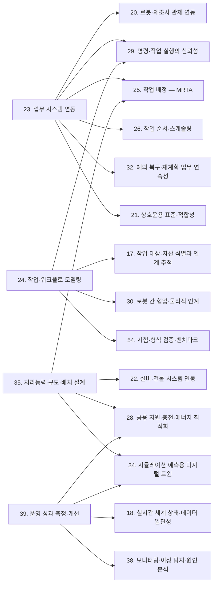
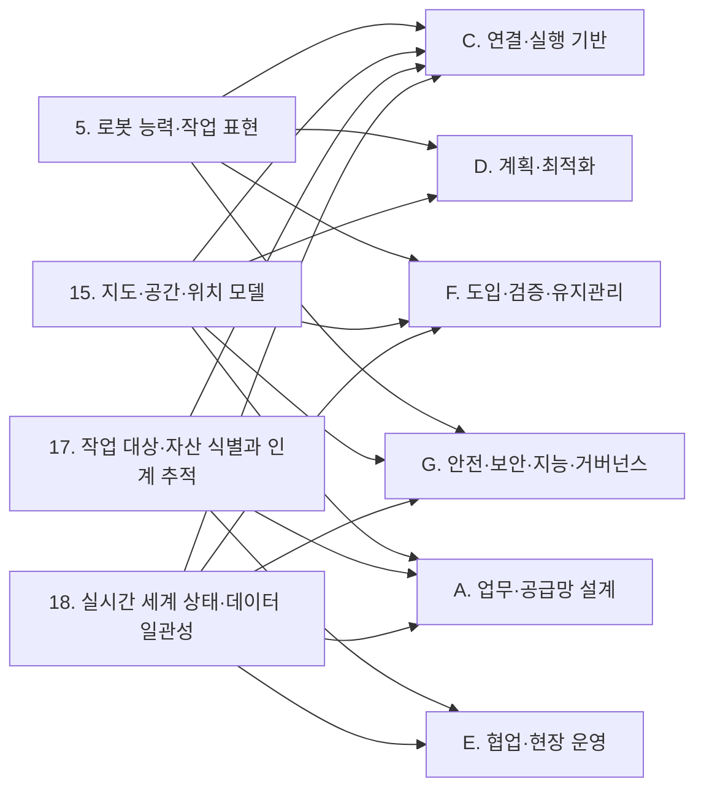
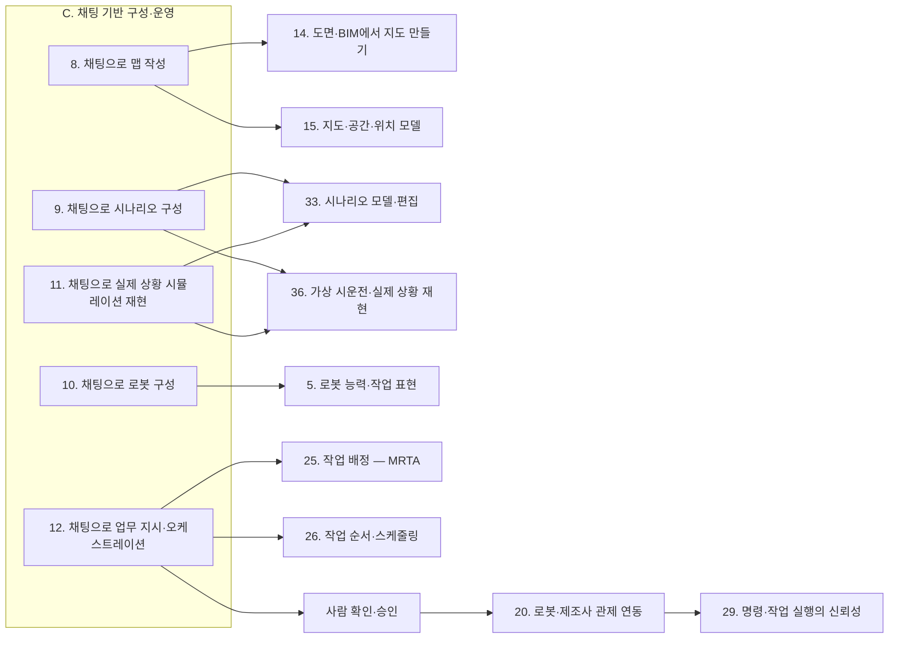
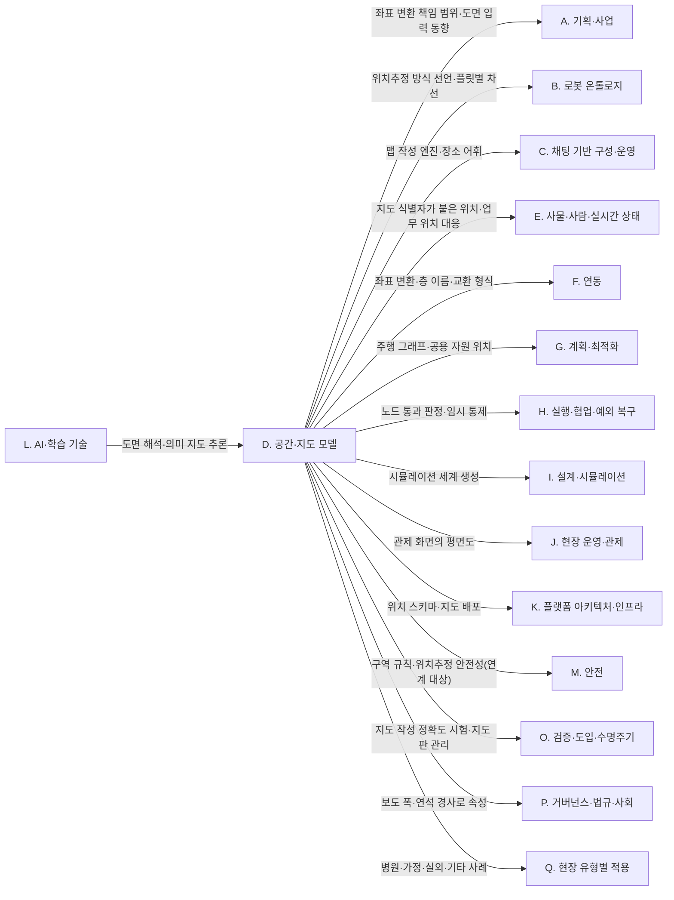
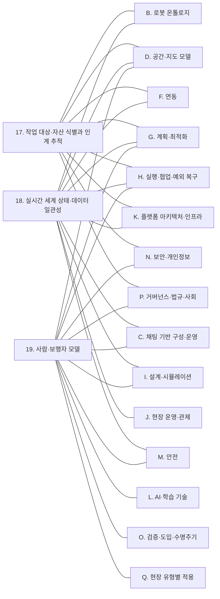
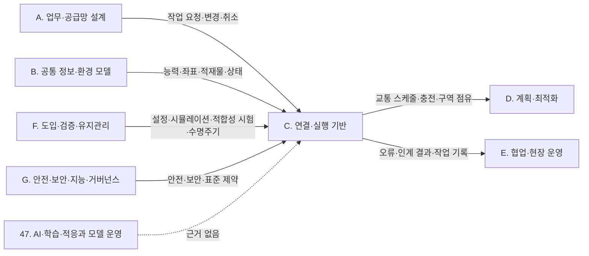
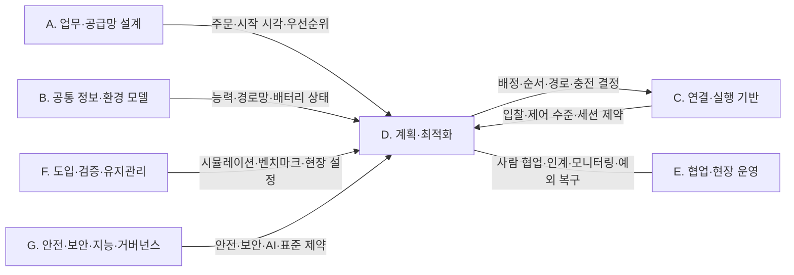
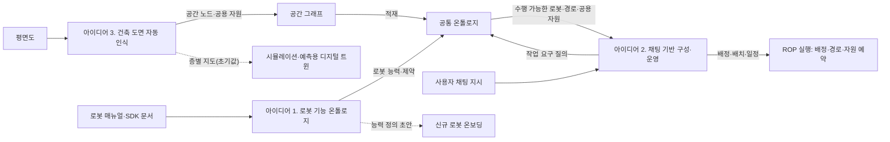

(너의 규칙은 시스템 프롬프트의 agents/shared-rules.md 와 agents/researcher.md 이다. 아래는 이번 실행의 컨텍스트와 입력이다.)

## 실행 컨텍스트

- run_id: 2026-10-09-14
- date: 2026-10-09
- run_type: category_link (대분류 연결)
- 대상: 대분류 Q. 현장 유형별 적용 페이지의 '다른 대분류와의 연결' 절(대분류 연결 실행). 게시된 세부영역 페이지를 근거로 다른 대분류와의 연결을 조사·서술한다. 스토리텔러는 그 절만 patches 로 바꾼다
- 예산:
    - max_search_queries: 30
    - max_sources_per_run: 15
    - new_topic_pages: 1
    - page_updates: 2
    - max_retries: 2
- 환경 알림: web_fetch_available: true · fetch_mode: full
- 언어: ko
- next_ref_id: ref-1539
- 새 출처 id 구간: ref-1539 ~ ref-1568 — 이 실행 전용으로 예약한 번호다(동시에 도는 다른 실행과 겹치지 않는다). 새 출처는 ref-1539 부터 순서대로 쓰고 ref-1568 를 넘기지 않는다. 기존 출처는 참고문헌 목록의 id 를 그대로 쓴다

## 입력

### runs/2026-10-09-14/target.json

```json
{
  "run_id": "2026-10-09-14",
  "date": "2026-10-09",
  "weekday": "Fri",
  "run_number": 147,
  "run_type": "category_link",
  "forced": true,
  "target": {
    "area_no": null,
    "area_name": null,
    "category": "Q. 현장 유형별 적용",
    "category_letter": "Q"
  },
  "topic": null,
  "track": null,
  "corrections": [],
  "budget": {
    "max_search_queries": 30,
    "max_sources_per_run": 15,
    "new_topic_pages": 1,
    "page_updates": 2,
    "max_retries": 2
  },
  "priority_reason": null,
  "priority_questions": [],
  "excluded_areas": [],
  "lifted_areas": [],
  "deferred": {
    "monthly_recheck": false,
    "weekly_review": false
  },
  "selection_rationale": "CLI 지정 run_type=category_link"
}
```

### docs/references/index.md (요약: 이번 대상 페이지가 인용한 110건 / 전체 1262건. 목록에 없는 출처는 새 id 로 적는다 — 같은 URL 이 이미 있으면 퍼블리셔가 기존 id 로 합친다)

```markdown
| id | 기관 | 제목 | 발행일 | URL | 접근일 | 원문 열람 |
|---|---|---|---|---|---|---|
| ref-003 | GS1 | EPCIS and CBV Linked Data Model | 미확인 | https://ref.gs1.org/epcis/ | 2026-09-24 | 아니오 |
| ref-004 | Open Robotics | RMF Core Overview — Programming Multiple Robots with ROS 2 | 미확인 | https://osrf.github.io/ros2multirobotbook/rmf-core.html | 2026-09-25 | 예 |
| ref-005 | Li, J., Tinka, A., Kiesel, S., Durham, J. W., Kumar, T. K. S., & Koenig, S. | Lifelong Multi-Agent Path Finding in Large-Scale Warehouses | 2020 | https://arxiv.org/abs/2005.07371 | 2026-09-24 | 아니오 |
| ref-006 | Ma, H., Li, J., Kumar, T. K. S., & Koenig, S. | Lifelong Multi-Agent Path Finding for Online Pickup and Delivery Tasks | 2017 | https://arxiv.org/abs/1705.10868 | 2026-09-24 | 아니오 |
| ref-101 | Merschformann, M. (RAWSim-O GitHub) | RAWSim-O: A simulation framework for Robotic Mobile Fulfillment Systems (README) | 미확인 | https://github.com/merschformann/RAWSim-O | 2026-09-25 | 예 |
| ref-103 | PMC 게재 논문(저자 미확인) | The Path Planning Problem of Robotic Delivery in Multi-Floor Hotel Environments | 미확인 | https://pmc.ncbi.nlm.nih.gov/articles/PMC11946681/ | 2026-09-25 | 아니오 |
| ref-124 | 국가물류통합정보센터(국토교통부) | 스마트물류센터 인증제 안내 | 미확인 | https://www.nlic.go.kr/nlic/board0010.action?S_DOC_ID=5897&S_DOC_SEQ=&command=VIEW | 2026-09-25 | 아니오 |
| ref-257 | Interact Analysis | AMR Multi-Fleet Orchestration Software Explained | 미확인 | https://interactanalysis.com/insight/amr-multi-fleet-orchestration-software/ | 2026-09-25 | 아니오 |
| ref-382 | Boysen, N., de Koster, R., & Weidinger, F. | Warehousing in the e-commerce era: A survey | 2019 | https://pure.eur.nl/en/publications/warehousing-in-the-e-commerce-era-a-survey/ | 2026-09-25 | 아니오 |
| ref-872 | Changi General Hospital, Centre for Healthcare Assistive & Robotics Technology (CHART) | RoMi-H Empanelment Programme 2025 | 2025-05-01 | https://www.cgh.com.sg/news/robotics/empanelment-for-robotic-middleware-for-healthcare--romi-h--syste | 2026-09-29 | 예 |
| ref-910 | Azadeh, K., de Koster, R., & Roy, D. (Transportation Science 53(4)) | Robotized and Automated Warehouse Systems: Review and Recent Developments | 2019-06-28 | https://pubsonline.informs.org/doi/10.1287/trsc.2018.0873 | 2026-09-29 | 예 |
| ref-911 | Fragapane, G., de Koster, R., Sgarbossa, F., & Strandhagen, J. O. (European Journal of Operational Research 294(2)) | Planning and control of autonomous mobile robots for intralogistics: Literature review and research agenda | 2021 | https://doi.org/10.1016/j.ejor.2021.01.019 | 2026-09-29 | 예 |
| ref-912 | Schrotenboer, A. H., Wruck, S., Vis, I. F. A., & Roodbergen, K. J. | Integration of returns and decomposition of customer orders in e-commerce warehouses | 2019-09-01 | https://arxiv.org/abs/1909.01794 | 2026-09-29 | 예 |
| ref-913 | 곽경민, 박범, 고은지, 윤철주, 김경훈 (CJ대한통운, 로봇학회 논문지 17(4)) | 급속 확산되는 물류현장의 로봇적용 사례 | 2022 | https://www.kci.go.kr/kciportal/landing/article.kci?arti_id=ART002899267 | 2026-09-29 | 예 |
| ref-914 | 김태현, 송상화 (인천대학교, 한국디지털산업학회지 26(1)) | 온라인 주문 풀필먼트를 위한 물류센터 피킹 설비 최적화에 대한 연구 | 2021 | https://www.kci.go.kr/kciportal/ci/sereArticleSearch/ciSereArtiView.kci?sereArticleSearchBean.artiId=ART002687327 | 2026-09-29 | 예 |
| ref-915 | 로봇신문 (장길수) | CJ대한통운이 뽑은 물류자동화 혁신 기술 '톱3' | 2022-05-06 | https://www.irobotnews.com/news/articleView.html?idxno=28424 | 2026-09-29 | 예 |
| ref-916 | Amazon | Amazon launches a new AI foundation model to power its robotic fleet and deploys its 1 millionth robot | 2025-07 | https://www.aboutamazon.com/news/operations/amazon-million-robots-ai-foundation-model | 2026-09-29 | 예 |
| ref-917 | 로봇신문 (장길수) | 쿠팡 대구 풀필먼트 센터에는 어떤 로봇들이... | 2023-02-07 | https://www.irobotnews.com/news/articleView.html?idxno=30736 | 2026-09-29 | 예 |
| ref-918 | 물류신문 (석한글) | ‘물류 투자만 6조’, 쿠팡 물류 인프라의 정점 ‘대구 FC’ 가보니 | 2023-02-07 | https://www.klnews.co.kr/news/articleView.html?idxno=306994 | 2026-09-29 | 예 |
| ref-919 | 스마트물류시설인증센터 (한국교통연구원) | 인증스마트물류센터 : 인증심사 > 심사기준 > 일반 | 미확인 | https://cslc.koti.re.kr/new_sub2/new_sub2_2_1 | 2026-09-29 | 예 |
| ref-920 | CJ대한통운 | CJ대한통운 안성 MP허브, 국토부 ‘스마트물류센터 1등급’ 인증 | 2023-10-26 | https://cjlogistics.com/ko/newsroom/news/NR_00001109 | 2026-09-29 | 예 |
| ref-921 | Robotics 24/7 (Eugene Demaitre) | DHL Makes First Commercial Deployment of Boston Dynamics Stretch Robot to Unload Trailers and Containers | 2023-02-01 | https://www.robotics247.com/article/dhl_makes_first_commercial_deployment_boston_dynamics_stretch_robot_unload_trailers_containers | 2026-09-29 | 예 |
| ref-922 | Schmid, N. A., & Limère, V. (International Journal of Production Research 57(24)) | A classification of tactical assembly line feeding problems | 2019-02-23 | https://www.tandfonline.com/doi/full/10.1080/00207543.2019.1581957 | 2026-09-29 | 예 |
| ref-923 | Verband der Automobilindustrie (VDA) | VDA 5050: Managing Transport in Manufacturing Plants | 미확인 | https://www.vda.de/en/news/articles/vda-5050 | 2026-09-29 | 예 |
| ref-924 | SYNAOS (IoT Use Case) | VDA 5050: unified AGV fleet control in real time at VW | 2025-10-16 | https://www.iotusecase.com/en/solution-examples/vda-5050-agv-fleet-control | 2026-09-29 | 예 |
| ref-925 | Wally, B., Vyskočil, J., Novák, P., Huemer, C., Šindelář, R., Kadera, P., Mazak, A., & Wimmer, M. | Flexible Production Systems: Automated Generation of Operations Plans Based on ISA-95 and PDDL | 2019-11-13 | https://arxiv.org/abs/1911.05481 | 2026-09-29 | 예 |
| ref-926 | Siemens | AGV fleet management integration with intralogistics | 미확인 | https://resources.sw.siemens.com/en-US/white-paper-integrating-agv-automated-guided-vehicle-system-with-intralogistics/ | 2026-09-29 | 예 |
| ref-927 | 물류신문 (이경성) | LG전자, 스마트팩토리 솔루션 확대에 AMR 등 물류로봇 적극 활용한다 | 2024-07-18 | https://www.klnews.co.kr/news/articleView.html?idxno=313143 | 2026-09-29 | 예 |
| ref-928 | Pietrantoni, L., Favilla, M., Fraboni, F., Mazzoni, E., Morandini, S., Benvenuti, M., & De Angelis, M. (Frontiers in Robotics and AI) | Integrating collaborative robots in manufacturing, logistics, and agriculture: Expert perspectives on technical, safety, and human factors | 2024-12-02 | https://www.frontiersin.org/journals/robotics-and-ai/articles/10.3389/frobt.2024.1342130/full | 2026-09-29 | 예 |
| ref-929 | Li, M. 외 (Scientific Reports) | Application management and effectiveness analysis of intelligent logistics robots in hospital drug and specimen delivery scenarios | 2026-04-24 | https://pmc.ncbi.nlm.nih.gov/articles/PMC13276296/ | 2026-09-29 | 예 |
| ref-930 | 현대자동차그룹 | ‘혁신의 장場’ HMGICS, 인간 중심 모빌리티 솔루션의 새 시대 열다 | 2023-11-21 | https://www.hyundaimotorgroup.com/ko/news/hmgics-human-centric-mobility-solutions-new-era | 2026-09-29 | 예 |
| ref-931 | 뉴시스 | "로봇 몇 대, 어디로 움직일까"…중소 제조현장에 'AI 공장장' 뜬다 | 2026-09-07 | https://www.newsis.com/view/NISX20260907_0003779780 | 2026-09-29 | 예 |
| ref-932 | 테크데일리 | KETI, LLM 모델 및 모방학습, 조립공정 자동화 기술 공개 | 2025-03-12 | https://www.techdaily.co.kr/news/articleView.html?idxno=25352 | 2026-09-29 | 예 |
| ref-933 | Keshvarparast, A., Battini, D., Battaia, O., & Pirayesh, A. (Journal of Intelligent Manufacturing 35) | Collaborative robots in manufacturing and assembly systems: literature review and future research agenda | 2023-05-30 | https://link.springer.com/article/10.1007/s10845-023-02137-w | 2026-09-29 | 예 |
| ref-934 | Marvel, J. A., Bostelman, R., & Falco, J. (NIST; ACM Computing Surveys 51) | Multi-Robot Assembly Strategies and Metrics | 2018-01-01 | https://dl.acm.org/doi/10.1145/3150225 | 2026-09-29 | 예 |
| ref-935 | 강명훈, 곽춘종 (부산대학교; Asia-Pacific Journal of Business & Commerce) | 시뮬레이션을 이용한 자동차 부품 공급 시스템 도입 방안 분석: R자동차 사례 | 2014-04 | https://www.dbpia.co.kr/journal/articleDetail?nodeId=NODE02448280 | 2026-09-29 | 예 |
| ref-936 | 옥창훈, 김득수, 공정수, 서윤호 (고려대학교, 현대자동차; 한국시뮬레이션학회 논문지 21(2)) | 자동차 생산을 위한 통합창고 연구 | 2012 | https://www.kci.go.kr/kciportal/ci/sereArticleSearch/ciSereArtiView.kci?sereArticleSearchBean.artiId=ART001671601 | 2026-09-29 | 예 |
| ref-937 | Changi General Hospital, Centre for Healthcare Assistive & Robotics Technology (CHART) | ROMI-H | Changi General Hospital | 미확인 | https://www.cgh.com.sg/chart/projects/romi-h | 2026-09-29 | 예 |
| ref-938 | Applus+ Laboratories | ISO 3691-4:2023: Compliance Testing for Automated Guided Vehicles (AGVs) | 미확인 | https://www.appluslaboratories.com/global/en/what-we-do/service-sheet/iso-3691-4-2023-compliance-testing-for-automated-guided-vehicles-agvs | 2026-09-29 | 예 |
| ref-939 | 이데일리 | 분당서울대병원, 무거운 이송카트 로봇자율배송, 무안경 3D 의료실습에 도입 | 2023-07-06 | https://edaily.co.kr/News/Read?mediaCodeNo=257&newsId=01403846635671896 | 2026-09-29 | 예 |
| ref-940 | 뉴스투데이 | [한림대성심병원 로봇 사용기 (下)] 배송로봇, 엘리베이터 타고 횡단보도 건너 검체 운반 | 2025-02-11 | https://www.news2day.co.kr/article/20250211500007 | 2026-09-29 | 예 |
| ref-941 | 데일리팜 | 원내 약 배송로봇 도입 확대...정부 지원에 변화 바람 | 2024-07-15 | https://m.dailypharm.com/user/news/15128 | 2026-09-29 | 예 |
| ref-942 | Open Robotics | ROMI-H: Bringing Robot Traffic Control to Healthcare | 2021-02-10 | https://www.openrobotics.org/blog/2021/2/10/romi-h-bringing-robot-traffic-control-to-healthcare | 2026-09-29 | 예 |
| ref-943 | Lee, Y. 외 (고려대학교 구로병원, 도구공간; Digital Health) | Feasibility of autonomous medication delivery robots considering elevator utilization in high-traffic hospital environments | 2026-03-31 | https://pmc.ncbi.nlm.nih.gov/articles/PMC13039597/ | 2026-09-29 | 예 |
| ref-944 | 로봇신문 | 국내 최고의 서비스 로봇 활용 병원 '한림대학교성심병원' | 2024-04-15 | http://www.irobotnews.com/news/articleView.html?idxno=34601 | 2026-09-29 | 예 |
| ref-945 | 산업통상자원부 국가기술표준원 (KDI 경제정보센터 게재) | 국가표준(KS) 제정으로 로봇의 엘리베이터 탑승 돕는다 | 2021-11-11 | https://eiec.kdi.re.kr/policy/materialView.do?num=220004 | 2026-09-29 | 예 |
| ref-946 | Babalola, G. T., Gaston, J.-M., Trombetta, J., & Tulk Jesso, S. (Frontiers in Robotics and AI) | A systematic review of collaborative robots for nurses: where are we now, and where is the evidence? | 2024-06-05 | https://www.frontiersin.org/journals/robotics-and-ai/articles/10.3389/frobt.2024.1398140/full | 2026-09-29 | 예 |
| ref-947 | 한국로봇산업진흥원 | 서비스로봇 실증사업 | 미확인 | https://www.kiria.org/portal/bizsupt/portalBsuptRoCreIntro.do | 2026-09-29 | 예 |
| ref-948 | 비즈한국 | 병원에 늘어나는 '로봇', 의사·간호사도 편해졌을까 | 2025-04-10 | https://bizhankook.com/articles/29394.html | 2026-09-29 | 예 |
| ref-949 | 최현철, 서슬기, 권재용, 박상찬, 장혜정 (경희대학교, Korea SUNY; 품질경영학회지 51(3)) | 감염환자 이송 로봇에 대한 의료종사자의 인식: SERVQUAL과 AHP를 활용하여 | 2023 | https://www.kci.go.kr/kciportal/ci/sereArticleSearch/ciSereArtiView.kci?sereArticleSearchBean.artiId=ART002997683 | 2026-09-29 | 예 |
| ref-950 | 한국보건산업진흥원 스마트병원 확산지원센터 | 선도모델 및 모듈 소개 | 미확인 | https://www.khidi.or.kr/board?menuId=MENU03336&siteId=SITE00040 | 2026-09-29 | 예 |
| ref-951 | 지디넷코리아 (윤상은) | 엘베 타고 수건 배달·안내·방역도 '척척'...호텔로 간 로봇 | 2022-05-03 | https://zdnet.co.kr/view/?no=20220503124850 | 2026-09-29 | 예 |
| ref-952 | Retail Dive (Sam Silverstein) | Sam's Club rolls out inventory-checking robots chainwide | 2022-02-01 | https://www.retaildive.com/news/sams-club-rolls-out-inventory-checking-robots-chainwide/618040/ | 2026-09-29 | 예 |
| ref-953 | Kanda, T., Shiomi, M., Miyashita, Z., Ishiguro, H., & Hagita, N. (IEEE Transactions on Robotics 26(5)) | A Communication Robot in a Shopping Mall | 2010-10 | https://ieeexplore.ieee.org/abstract/document/5557825 | 2026-09-29 | 아니오 |
| ref-954 | Ivanov, S., Seyitoğlu, F., & Markova, M. (Information Technology & Tourism) | Hotel managers' perceptions towards the use of robots: a mixed-methods approach | 2020-09 | https://pmc.ncbi.nlm.nih.gov/articles/PMC7486590/ | 2026-09-29 | 예 |
| ref-955 | 지디넷코리아 (신영빈) | 식당 음식 나르던 서빙로봇, 공장·창고로 진격 | 2024-07-30 | https://zdnet.co.kr/view/?no=20240730115912 | 2026-09-29 | 예 |
| ref-956 | 지디넷코리아 (김성현) | 네이버 제2사옥, 로봇 친화형 건축물 인증 획득 | 2022-04-11 | https://zdnet.co.kr/view/?no=20220411142336 | 2026-09-29 | 예 |
| ref-957 | Otis Elevator Company | Elevators and service robots | 미확인 | https://www.otis.com/en/us/innovation/elevators-and-service-robots | 2026-09-29 | 예 |
| ref-958 | 이투데이 (구예지) | 브이디컴퍼니, 신규 서빙로봇 3종 출시…“식당 전체 자동화 이룰 것” | 2023-03-30 | https://www.etoday.co.kr/news/view/2235962 | 2026-09-29 | 예 |
| ref-959 | 한국노동연구원 (박수민 외) | 음식업 서비스 로봇 도입이 직무와 작업장 안전에 미치는 영향 | 2024 | https://repository.kli.re.kr/bitstream/2021.oak/11632/2/(%EC%97%B0%EA%B5%AC%EB%B3%B4%EA%B3%A0)2024-13_%EC%9D%8C%EC%8B%9D%EC%97%85%20%EC%84%9C%EB%B9%84%EC%8A%A4%20%EB%A1%9C%EB%B4%87%20%EB%8F%84%EC%9E%85%EC%9D%B4%EC%A7%81%EB%AC%B4%EC%99%80%20%EC%9E%91%EC%97%85%EC%9E%A5%20%EC%95%88%EC%A0%84%EC%97%90%20%EB%AF%B8%EC%B9%98%EB%8A%94%20%EC%98%81%ED%96%A5.pdf | 2026-09-29 | 아니오 |
| ref-960 | Odekerken-Schröder, G., Mennens, K., Steins, M., & Mahr, D. (Journal of Service Management 33(2)) | The service triad: an empirical study of service robots, customers and frontline employees | 2022 | https://www.emerald.com/josm/article/33/2/246/227998/The-service-triad-an-empirical-study-of-service | 2026-09-29 | 예 |
| ref-961 | Responsible AI Collaborative (AI Incident Database) | Incident 346: Robots in Japanese Hotel Annoyed Guests and Failed to Handle Simple Tasks | 미확인 | https://incidentdatabase.ai/cite/346/ | 2026-09-29 | 예 |
| ref-962 | Hotel Technology News | Score One for The Humans: Japan's Henn-na Hotel Fires Half Its Robot Workforce | 2019-01 | https://hoteltechnologynews.com/2019/01/score-one-for-the-humans-japans-henn-na-hotel-fires-half-its-robot-workforce/ | 2026-09-29 | 예 |
| ref-963 | 서울경제 (백주연) | 엘리베이터 타고 쇼핑몰 왔다갔다…바닥 물걸레질까지 하는 '로봇 청소부' 등장 | 2025-04-02 | https://www.sedaily.com/article/14048085 | 2026-09-29 | 예 |
| ref-964 | Karlsen, A. S. T., Andersen, B., Nevstad, K., Heirsaunet, S. E., Indergård, E., & Aarseth, W. (Frontiers in Robotics and AI) | Digital transformation in restaurants: key aspects of service robot deployment from project initiation to evaluation | 2026-04-22 | https://www.frontiersin.org/journals/robotics-and-ai/articles/10.3389/frobt.2026.1793138/full | 2026-09-29 | 예 |
| ref-965 | 삼성물산 뉴스룸 | 삼성물산, 아파트 세대 현관까지 음식배달로봇 확장 운영 | 2026-01-15 | https://news.samsungcnt.com/ko/%EC%A0%84%EC%B2%B4%EA%B8%B0%EC%82%AC/%EA%B1%B4%EC%84%A4%EB%B6%80%EB%AC%B8/2026-01-%EC%82%BC%EC%84%B1%EB%AC%BC%EC%82%B0-%EC%95%84%ED%8C%8C%ED%8A%B8-%EC%84%B8%EB%8C%80-%ED%98%84%EA%B4%80%EA%B9%8C%EC%A7%80-%EC%9D%8C%EC%8B%9D%EB%B0%B0%EB%8B%AC%EB%A1%9C%EB%B4%87-%ED%99%95%EC%9E%A5/ | 2026-09-29 | 예 |
| ref-966 | 지디넷코리아 (신영빈) | 로봇이 문앞까지 택배 가져다 주는 미래 곧 온다 | 2025-01-19 | https://zdnet.co.kr/view/?no=20250119062609 | 2026-09-29 | 예 |
| ref-967 | AI타임스 | 실외이동로봇 시대 개막...개정 지능형로봇법 17일 시행 | 2023-11-16 | https://www.aitimes.com/news/articleView.html?idxno=155217 | 2026-09-29 | 예 |
| ref-968 | MIT Technology Review (Eileen Guo) | A Roomba recorded a woman on the toilet. How did screenshots end up on Facebook? | 2022-12-19 | https://www.technologyreview.com/2022/12/19/1065306/roomba-irobot-robot-vacuums-artificial-intelligence-training-data-privacy/ | 2026-09-29 | 예 |
| ref-969 | 바이라인네트워크 | '로봇청소기' 다수 제품 보안 취약…대응방안은? | 2025-10-31 | https://byline.network/2025/10/31-283/ | 2026-09-29 | 예 |
| ref-970 | 매일신문 | 사생활 훔치는 로봇청소기…중국산 제품서 `무단 촬영` 가능성 확인 | 2025-10-06 | https://www.imaeil.com/page/view/2025100618362463025 | 2026-09-29 | 예 |
| ref-971 | Li, C., Zhang, R., Wong, J. 외 (arXiv; CoRL 2022 예비판) | BEHAVIOR-1K: A Human-Centered, Embodied AI Benchmark with 1,000 Everyday Activities and Realistic Simulation | 2024-03-14 | https://arxiv.org/abs/2403.09227 | 2026-09-29 | 예 |
| ref-972 | Hwang, I. T., Kim, G. T., & Kwag, B. C. (한국생활환경학회지 30) | Comparing Perceptions of Service Robot Adoption in Multi-Family Housing Between Residents and Industry Stakeholders: Focusing on Acceptance Attitudes, Concerns, and Technological Needs | 2026-06 | https://journal.ksles.org/articles/xml/g9G5/ | 2026-09-29 | 예 |
| ref-973 | The Robot Report (Mike Oitzman) | NEO humanoid designed for household use, available for preorder | 2025-10-30 | https://www.therobotreport.com/1x-announces-pre-order-launch-neo-humanoid-robot/ | 2026-09-29 | 예 |
| ref-974 | LG Electronics USA | LG ELECTRONICS PRESENTS LG CLOiD HOME ROBOT TO DEMONSTRATE "ZERO LABOR HOME" AT CES 2026 | 2026-01-06 | https://www.lg.com/us/press-release/lg-cloid-home-robot | 2026-09-29 | 예 |
| ref-975 | 한국경제 (김익환) | 배송·주차·청소까지…로봇 아파트 뜬다 | 2026-09-27 | https://www.hankyung.com/article/2026092776141 | 2026-09-29 | 예 |
| ref-976 | 정보통신신문 (김연균) | 로봇배송 ‘관제·통신·전력 고도화’ 따라 성장 ‘쑥쑥’ | 2024-07-18 | https://www.koit.co.kr/news/articleView.html?idxno=123976 | 2026-09-29 | 예 |
| ref-977 | Connectivity Standards Alliance (CSA) | Matter 1.2 Arrives with Nine New Device Types & Improvements Across the Board | 2023-10-23 | https://csa-iot.org/newsroom/matter-1-2-arrives-with-nine-new-device-types-improvements-across-the-board/ | 2026-09-29 | 예 |
| ref-978 | CaseNote (법령 게재; 원 제정 국회·개인정보보호위원회 소관) | 개인정보 보호법 제25조의2(이동형 영상정보처리기기의 운영 제한) | 2023-03-14 | https://casenote.kr/%EB%B2%95%EB%A0%B9/%EA%B0%9C%EC%9D%B8%EC%A0%95%EB%B3%B4_%EB%B3%B4%ED%98%B8%EB%B2%95/%EC%A0%9C25%EC%A1%B0%EC%9D%982 | 2026-09-29 | 예 |
| ref-979 | 미디어펜 (조태민) | 로봇이 다닐 길부터 짓는다…건설사, ‘로봇 친화 설계’ 속도 | 2026-09-20 | https://www.mediapen.com/news/view/1124680 | 2026-09-29 | 예 |
| ref-980 | 한국로봇산업진흥원 | 실외이동로봇 운행안전인증 | 미확인 | https://www.kiria.org/portal/cert/portalCertEstiSafe.do | 2026-09-30 | 예 |
| ref-981 | DC Velocity | Starship steers its delivery robots off college campuses and toward grocery sector | 2026-06-08 | https://www.dcvelocity.com/transportation/trucking/last-mile/starship-steers-its-delivery-robots-off-college-campuses-and-toward-grocery-sector | 2026-09-30 | 예 |
| ref-982 | Tong, X., & Simoni, M. D. (arXiv) | Robust Route Planning for Sidewalk Delivery Robots | 2025-07-16 | https://arxiv.org/abs/2507.12067 | 2026-09-30 | 예 |
| ref-983 | 지디넷코리아 | 배민, 차세대 배달로봇 ‘딜리’ 8월 투입…운행안전인증 획득 | 2025-06-23 | https://zdnet.co.kr/view/?no=20250623095742 | 2026-09-30 | 예 |
| ref-984 | 스포츠경향 | 뉴빌리티, 덕수궁 순찰부터 도쿄 시내 배달까지 | 2026-09-02 | https://sports.khan.co.kr/article/202609020605003/ | 2026-09-30 | 예 |
| ref-985 | 内閣府 (일본 내각부) | 令和5年版交通安全白書 トピック 改正道路交通法（令和4年公布）について | 2023 | https://www8.cao.go.jp/koutu//taisaku/r05kou_haku/zenbun/genkyo/topics/topic_1.html | 2026-09-30 | 예 |
| ref-986 | Supply Chain Dive | Why delivery robots face a regulatory ‘nightmare’ | 2023-04-26 | https://www.supplychaindive.com/news/delivery-robot-bills-laws-proliferate-state-legislatures/648303/ | 2026-09-30 | 예 |
| ref-987 | The Pitt News | Pitt pauses testing of Starship robots due to safety concerns | 2019-10-21 | https://pittnews.com/article/151679/news/pitt-pauses-testing-of-starship-robots-due-to-safety-concerns/ | 2026-09-30 | 예 |
| ref-988 | Open Navigation (Nav2) | Navigating Using GPS Localization — Nav2 documentation | 미확인 | https://docs.nav2.org/jazzy/tutorials/general_tutorials/navigation2_with_gps/navigation2_with_gps/ | 2026-09-30 | 예 |
| ref-989 | Urban Robotics Foundation (Bern Grush) | ISO-4448 Update Winter 2024 | 2024-02-04 | https://www.urbanroboticsfoundation.org/post/iso-4448-update-winter-2024 | 2026-09-30 | 예 |
| ref-990 | Gehrke, S. R., Phair, C. D., Russo, B. J., & Smaglik, E. J. (Transportation Research Interdisciplinary Perspectives 18) | Observed sidewalk autonomous delivery robot interactions with pedestrians and bicyclists | 2023-03 | https://doi.org/10.1016/j.trip.2023.100789 | 2026-09-30 | 예 |
| ref-991 | 대한민국 정책브리핑 (산업통상자원부·경찰청) | ‘실외이동로봇’ 보도 통행 가능해진다…배달·순찰 등 활용 | 2023-11-16 | https://www.korea.kr/news/policyNewsView.do?newsId=148922726 | 2026-09-30 | 예 |
| ref-992 | 지디넷코리아 | 실외 배달로봇 '시속 15km 이하로'...16가지 안전기준 | 2023-07-28 | https://zdnet.co.kr/view/?no=20230728173101 | 2026-09-30 | 예 |
| ref-993 | Dobrosovestnova, A., Schwaninger, I., & Weiss, A. (IEEE RO-MAN 2022) | With a Little Help of Humans. An Exploratory Study of Delivery Robots Stuck in Snow | 2022 | https://ieeexplore.ieee.org/abstract/document/9900588/ | 2026-09-30 | 예 |
| ref-994 | ISO | ISO/TR 4448-1:2024 Intelligent transport systems — Public-area mobile robots (PMR) — Part 1: Overview of paradigm | 2024-08 | https://www.iso.org/standard/81068.html | 2026-09-30 | 아니오 |
| ref-995 | Offshore Technology (Eve Thomas) | Equinor's autonomous robotics: inspection 'dogs' and record-holding subsea drones | 2025-11-21 | https://www.offshore-technology.com/features/equinor-autonomous-robotics/ | 2026-09-30 | 예 |
| ref-996 | Burger, B., Maffettone, P. M., Gusev, V. V. 외 (Nature 583) | A mobile robotic chemist | 2020-07 | https://www.nature.com/articles/s41586-020-2442-2 | 2026-09-30 | 아니오 |
| ref-997 | 이코노미스트 (송재민) | 로봇이 로봇들을 움직이는, 네이버 1784 | 2023-01-11 | https://economist.co.kr/article/view/ecn202301110006 | 2026-09-30 | 예 |
| ref-998 | 로봇신문 (정원영) | 인천국제공항, 안내 로봇 '에어스타' 본격 운영 | 2018-07-11 | https://www.irobotnews.com/news/articleView.html?idxno=14422 | 2026-09-30 | 예 |
| ref-999 | 서울신문 | 로봇 '스팟' 건설현장 누빈다…현대건설 품질·안전 관리 | 2022-11-15 | https://www.seoul.co.kr/news/economy/2022/11/15/20221115500118 | 2026-09-30 | 예 |
| ref-1000 | 인더스트리뉴스 (정형우) | GS건설, 4족보행 로봇 '스팟(SPOT)' 국내 최초 건설현장 도입하기로 | 2020-07-13 | https://www.industrynews.co.kr/news/articleView.html?idxno=38911 | 2026-09-30 | 예 |
| ref-1001 | SiLA Consortium | SiLA Standards | 미확인 | https://sila-standard.com/standards/ | 2026-09-30 | 예 |
| ref-1002 | 아주경제 (윤선훈) | 아시아 최대 규모 데이터센터…네이버 '각 세종' 본격 가동 | 2023-11-08 | https://www.ajunews.com/view/20231107091520837 | 2026-09-30 | 예 |
| ref-1003 | Korial (구 Energy Robotics) — Andre Retterath, Earlybird Venture Capital 기고 | Game-changer: The rationale behind the investment in Energy Robotics | 2021-01-15 | https://www.energy-robotics.com/post/revolutionizing-industrial-inspection-the-rationale-behind-the-investment-in-energy-robotics | 2026-09-30 | 예 |
| ref-1004 | The Robot Report | Singapore's National Robotics Programme reveals initiatives to advance robot adoption | 2025-10-29 | https://www.therobotreport.com/singapores-national-robotics-programme-reveals-initiatives-advance-robot-adoption/ | 2026-09-30 | 예 |
| ref-1005 | 헬로디디 (이유진) | 스스로 수확하고 운반···'로봇농부' 나왔다 | 2023-03-09 | https://www.hellodd.com/news/articleView.html?idxno=99827 | 2026-09-30 | 예 |
| ref-1006 | 농민신문 (조영창) | 농민 뒤 졸졸 '운반로봇'…무거운 수확물 옮기고 자동 하역 | 2024-03-25 | https://www.nongmin.com/article/20240322500556 | 2026-09-30 | 예 |
| ref-1007 | 뉴스토마토 (이규하) | 방제·운반·점검 '농업 로봇' 하나로 연결…통합관리기술 가동 | 2025-04-23 | https://www.newstomato.com/ReadNews.aspx?no=1259970 | 2026-09-30 | 예 |
| ref-1008 | 넷매니아즈 (손장우) | 한전의 5G 특화망 기반 응용: IoT 예방진단, 로봇기반 순시점검 및 안전관리 | 2023-09-30 | https://www.netmanias.com/ko/post/blog/15878/5g-5g-private-5g-5g/applications-based-on-kepco-s-private-5g-network-iot-preventive-diagnosis-robot-based-inspection-and-safety-management | 2026-09-30 | 예 |
| ref-1009 | ISO | ISO 18497-3:2024 Agricultural machinery and tractors — Safety of partially automated, semi-autonomous and autonomous machinery — Part 3: Autonomous operating zones | 2024 | https://www.iso.org/standard/82687.html | 2026-09-30 | 아니오 |
```

### docs/glossary/index.md (요약: 용어 358개, slug: 한국어 (영어). 정의는 docs/glossary/<slug>.md)

```markdown
- 3d-scene-graph: 3차원 장면 그래프 (3D Scene Graph)
- a-b-update: A/B 업데이트 (A/B Update (Dual Partition Update with Rollback))
- aas-registry-and-discovery: 자산관리셸 레지스트리·디스커버리 (AAS Registry / Discovery)
- ablation-study: 절제 실험 (Ablation Study)
- action-dependency-graph: 행동 의존 그래프 (Action Dependency Graph (ADG))
- affordance: 어포던스 (Affordance)
- age-of-information: 정보 나이 (Age of Information (AoI))
- agentic-ai: 에이전틱 AI (Agentic AI)
- aggregation-event: 집계 이벤트 (AggregationEvent)
- agv-technical-data-submodel: AGV 기술 데이터 서브모델 (Technical Data for AGV in Intralogistics (IDTA 02047))
- alarm-management: 경보 관리 (Alarm Management (ANSI/ISA 18.2))
- almere-model: 알메러 모델 (Almere Model)
- alternative-name: 대체 이름 (Alternative Name (IMDF alt_name))
- amr-assisted-order-picking: AMR 협업 피킹 (AMR-assisted Order Picking)
- api-deprecation-policy: API 폐기 정책 (API Deprecation Policy)
- approval-fatigue: 승인 피로 (Approval Fatigue (Consent Fatigue))
- ariac: 산업 자동화용 민첩 로봇 경진대회 (Agile Robotics for Industrial Automation Competition (ARIAC))
- artificial-intelligence-management-system: AI 관리 시스템 (Artificial Intelligence Management System (AIMS))
- as-planned-vs-as-built-deviation: 설계–준공 편차 (As-planned vs As-built Deviation)
- asam-openscenario: 오픈시나리오 (ASAM OpenSCENARIO)
- assembly-line-feeding-problem: 조립라인 공급 문제 (Assembly Line Feeding Problem (ALFP))
- asset-administration-shell: 자산관리셸 (Asset Administration Shell (AAS))
- association-event: 연결 이벤트 (AssociationEvent)
- asyncapi-specification: AsyncAPI 명세 (AsyncAPI Specification)
- attribute-based-access-control: 속성 기반 접근 통제 (Attribute-Based Access Control (ABAC))
- audit-trail: 감사 추적 (Audit Trail)
- automatic-simulation-model-generation: 자동 시뮬레이션 모델 생성 (Automatic Simulation Model Generation (ASMG))
- automation-bias: 자동화 편향 (Automation Bias)
- b2mml: B2MML (Business To Manufacturing Markup Language (B2MML))
- bag-file: 백 파일 (Bag File (rosbag2))
- battery-swapping: 배터리 교환 (Battery Swapping)
- behavior-domain-definition-language: 행동 영역 정의 언어 (Behavior Domain Definition Language (BDDL))
- behavior-tree: 행동 트리 (Behavior Tree)
- block-reference: 블록 참조 (Block Reference (INSERT))
- bpmn: 비즈니스 프로세스 모델 및 표기법 (Business Process Model and Notation (BPMN))
- brainless-robot: 브레인리스 로봇 (Brainless Robot)
- building-information-modeling: 건물 정보 모델링 (Building Information Modeling (BIM))
- building-topology-ontology: 건물 위상 온톨로지 (Building Topology Ontology (BOT))
- business-continuity-management-system: 업무 연속성 관리 시스템 (Business Continuity Management System (BCMS))
- business-location: 업무 위치 (Business Location (EPCIS bizLocation))
- cap-theorem: CAP 정리 (CAP Theorem)
- capabilities-skills-services: 능력·스킬·서비스 모델 (Capabilities, Skills and Services (CSS) Model)
- capability-based-task-allocation: 능력 기반 작업 배정 (Capability-based Task Allocation)
- capability-description-submodel: 능력 기술 서브모델 (Capability Description Submodel (IDTA 02020))
- capability-matchmaking: 능력 매칭 (Capability Matchmaking)
- cbv: 핵심 업무 어휘 (Core Business Vocabulary (CBV))
- cell-based-production: 셀 생산 방식 (Cell-based Production)
- clarification-question: 명확화 질문 (Clarification Question (Follow-up Clarification))
- cloud-robotics: 클라우드 로보틱스 (Cloud Robotics)
- coalition-formation: 연합 형성 (Coalition Formation)
- collaborative-application: 협동 적용 (Collaborative Application)
- collaborative-perception: 협동 인지 (Collaborative Perception)
- common-coordinate-system: 공통 좌표계 (Common Coordinate System (CCS, ISO 21423))
- common-data-environment: 공통 데이터 환경 (Common Data Environment (CDE))
- compensating-transaction: 보상 트랜잭션 (Compensating Transaction)
- competency-question: 역량 질문 (Competency Question (CQ))
- condition-based-maintenance: 상태 기반 정비 (Condition-Based Maintenance (CBM))
- configuration-copilot: 구성 코파일럿 (Configuration Copilot)
- conflict-based-search: 충돌 기반 탐색 (Conflict-Based Search (CBS))
- conformal-prediction: 등각 예측 (Conformal Prediction)
- conformance-test: 적합성 시험 (Conformance Test)
- confused-deputy: 혼란된 대리인 (Confused Deputy)
- consensus-based-bundle-algorithm: 합의 기반 번들 알고리즘 (Consensus-Based Bundle Algorithm (CBBA))
- constrained-decoding: 제약 디코딩 (Constrained Decoding)
- contrastive-explanation: 대조적 설명 (Contrastive Explanation)
- control-barrier-function: 제어 장벽 함수 (Control Barrier Function (CBF))
- cooperative-object-transport: 협동 운반 (Cooperative Object Transport)
- cora: 로봇·자동화 핵심 온톨로지 (Core Ontology for Robotics and Automation (CORA))
- core-manufacturing-simulation-data: 핵심 제조 시뮬레이션 데이터 (Core Manufacturing Simulation Data (CMSD))
- costmap: 비용 지도 (Costmap)
- crdt: 무충돌 복제 데이터 타입 (Conflict-free Replicated Data Type (CRDT))
- cross-embodiment-learning: 교차 형태 학습 (Cross-embodiment Learning)
- cross-schedule-dependency: 스케줄 간 의존 (Cross-schedule Dependency (XD))
- curb-cut: 연석 경사로 (Curb Cut (Curb Ramp))
- cyber-resilience-act: 사이버복원력법 (Cyber Resilience Act (CRA))
- data-holder: 데이터 보유자 (Data Holder (EU Data Act))
- dds-security: DDS 보안 규격 (DDS Security (DDS-Security))
- deadlock: 교착 (Deadlock)
- decision-focused-learning: 결정 중심 학습 (Decision-Focused Learning)
- digital-nameplate: 디지털 명판 (Digital Nameplate (IDTA 02006))
- digital-shadow: 디지털 섀도 (Digital Shadow)
- digital-thread: 디지털 스레드 (Digital Thread)
- digital-twin-composition: 디지털 트윈 결합 (Digital Twin Composition)
- digital-twin: 디지털 트윈 (Digital Twin)
- discrete-event-simulation: 이산 사건 시뮬레이션 (Discrete Event Simulation (DES))
- dispenser-ingestor: 디스펜서·인제스터 (Dispenser / Ingestor)
- distributed-tracing: 분산 추적 (Distributed Tracing)
- document-layout-analysis: 문서 레이아웃 분석 (Document Layout Analysis)
- drawing-exchange-format: 도면 교환 형식 (Drawing Exchange Format (DXF))
- dual-system-architecture: 이중 시스템 구조 (Dual-system Architecture (System 1 / System 2))
- eclass: ECLASS (ECLASS)
- edit-cost: 편집 비용 (Edit Cost)
- elevator-operating-rate: 승강기 가동률 (Elevator Operating Rate (EOR))
- empanelment-programme: 등재 프로그램 (Empanelment Programme)
- enclave: 인클레이브 (Enclave (SROS 2))
- epcis-error-declaration: 오류 선언 (Error Declaration (EPCIS errorDeclaration))
- epcis: 전자 제품 코드 정보 서비스 (Electronic Product Code Information Services (EPCIS))
- ethical-black-box: 윤리적 블랙박스 (Ethical Black Box (EBB))
- event-driven-rescheduling: 사건 기반 재스케줄링 (Event-driven Rescheduling)
- event-trace: 사건 트레이스 (Event Trace)
- excessive-agency: 과도한 에이전시 (Excessive Agency)
- expected-value-of-perfect-information: 완전 정보의 기대 가치 (Expected Value of Perfect Information (EVPI))
- explainable-mapf: 설명 가능한 다중 에이전트 경로 찾기 (Explainable Multi-Agent Path Finding (Explainable MAPF))
- explicit-implicit-confirmation: 명시적 확인·암시적 확인 (Explicit / Implicit Confirmation)
- face-obfuscation: 얼굴 가림 (Face Obfuscation)
- failure-explanation: 실패 설명 (Failure Explanation)
- falsification: 반증 기반 시험 (Falsification)
- fan-out: 팬아웃 (Fan-out (human-robot team))
- fault-detection-and-diagnosis-fdd: 고장 탐지·진단 (Fault Detection and Diagnosis (FDD))
- fault-injection: 장애 주입 (Fault Injection)
- filter-mask: 필터 마스크 (Filter Mask (Nav2 costmap filter))
- finops: 핀옵스 (FinOps)
- fleet-adapter: 플릿 어댑터 (Fleet Adapter)
- fleet-control-level: 플릿 제어 수준 (Fleet Control Level (Open-RMF: Full Control / Traffic Light / Read Only))
- fleet-management-system: 플릿 관리 시스템 (Fleet Management System (FMS))
- fleet-sizing: 차량 소요대수 산정 (Fleet Sizing)
- floor-plan-recognition: 평면도 인식 (Floor Plan Recognition)
- fog-computing: 포그 컴퓨팅 (Fog Computing)
- frozen-horizon: 동결 구간 (Frozen Horizon (Frozen Zone))
- giai: 글로벌 개별 자산 식별자 (Global Individual Asset Identifier (GIAI))
- goal-condition: 목표 조건 (Goal Condition)
- goods-to-person: 상품-대-사람 (Goods-to-Person (GTP))
- grade-certainty-of-evidence: 근거 확실성 등급 (GRADE (Grading of Recommendations, Assessment, Development and Evaluation))
- grai: 글로벌 반환형 자산 식별자 (Global Returnable Asset Identifier (GRAI))
- graph-edit-distance: 그래프 편집 거리 (Graph Edit Distance (GED))
- guidance-graph: 안내 그래프 (Guidance Graph)
- hallucination: 환각 (Hallucination)
- hardware-in-the-loop: 하드웨어 인 더 루프 (Hardware-in-the-Loop (HiL))
- hddl: 계층 도메인 정의 언어 (Hierarchical Domain Definition Language (HDDL))
- hierarchical-task-network: 계층적 작업 네트워크 (Hierarchical Task Network (HTN))
- high-impact-ai: 고영향 인공지능 (High-impact AI (Korea AI Basic Act))
- hmi-philosophy: HMI 철학 (HMI Philosophy (ISA-TR101.01))
- human-in-the-loop: 사람 참여 루프 (Human-in-the-Loop (HITL))
- human-motion-trajectory-prediction: 사람 움직임 궤적 예측 (Human Motion Trajectory Prediction)
- hungarian-method: 헝가리안 방법 (Hungarian Method)
- i-pass-handoff-program: I-PASS 인계 프로그램 (I-PASS Handoff Program)
- idempotency-key: 멱등성 키 (Idempotency Key)
- identity-report: 신원 보고 (Identity Report (MassRobotics identityReport))
- iec-common-data-dictionary: IEC 공통 데이터 사전 (IEC Common Data Dictionary (IEC CDD))
- ifc: 산업 기초 클래스 (Industry Foundation Classes (IFC))
- imitation-learning: 모방 학습 (Imitation Learning)
- indirect-prompt-injection: 간접 프롬프트 주입 (Indirect Prompt Injection)
- indoor-mapping-data-format: 실내 지도 데이터 형식 (Indoor Mapping Data Format (IMDF))
- indoor-space-subspacing: 공간 세분화 (Subspacing (Indoor Space Subdivision))
- indoorgml: IndoorGML (IndoorGML)
- industrial-data: 산업데이터 (Industrial Data)
- information-delivery-specification: 정보 전달 명세 (Information Delivery Specification (IDS))
- information-for-use: 사용 정보 (Information for Use (Instructions for Use))
- infrastructure-mounted-sensing: 인프라 장착 센서 (Infrastructure-mounted Sensing)
- integrity-risk: 무결성 위험 (Integrity Risk)
- intent-recognition: 의도 인식 (Intent Recognition (Intent Detection))
- irdi: 국제 등록 데이터 식별자 (International Registration Data Identifier (IRDI))
- irreducible-infeasible-subset: 기약 불능 제약 집합 (Irreducible Infeasible Subset (IIS))
- isa-95: 기업–제어 시스템 통합 표준 (ISA-95 Enterprise-Control System Integration)
- it-ot-convergence: IT/OT 융합 (IT/OT Convergence)
- jailbreak: 탈옥 (Jailbreak)
- job-shop-scheduling-problem: 작업장 스케줄링 문제 (Job Shop Scheduling Problem (JSSP))
- joint-goal-accuracy: 결합 목표 정확도 (Joint Goal Accuracy (JGA))
- json-schema: JSON 스키마 (JSON Schema)
- keystroke-level-model: 키 입력 수준 모델 (Keystroke-Level Model (KLM))
- kiosk-accessibility: 무인정보단말기 접근성 (Kiosk Accessibility (Unmanned Information Terminal Accessibility))
- lane-closure: 차선 폐쇄 (Lane Closure)
- language-guided-floor-plan-generation: 언어 유도 평면도 생성 (Language-guided Floor Plan Generation)
- latent-failure: 잠재 실패 (Latent Failure)
- layout-interchange-format: 레이아웃 교환 형식 (Layout Interchange Format (LIF))
- level-alignment-fiducial: 층 정렬 기준점 (Fiducial (Level Alignment Fiducial))
- life-cycle-costing: 수명주기 비용 분석 (Life Cycle Costing (LCC, IEC 60300-3-3))
- lifelong-mapf: 지속형 다중 에이전트 경로 찾기 (Lifelong Multi-Agent Path Finding (Lifelong MAPF))
- lift-adapter: 승강기 어댑터 (Lift Adapter)
- linear-temporal-logic: 선형 시간 논리 (Linear Temporal Logic (LTL))
- littles-law: 리틀의 법칙 (Little's Law)
- llm-agent: LLM 에이전트 (LLM Agent)
- llm-modulo-framework: LLM-모듈로 프레임워크 (LLM-Modulo Framework)
- localization-score: 위치추정 품질 점수 (Localization Score (VDA 5050 localizationScore))
- location-check-digit: 위치 체크 디지트 (Location Check Digit)
- lockout-tagout: 잠금·표지 (Lockout/Tagout (LOTO))
- log-playback: 로그 재생 (Log Playback)
- managed-node: 관리형 노드 (Managed Node (ROS 2 Lifecycle Node))
- map-alignment: 지도 정합 (Map Alignment)
- map-distribution: 지도 배포 (Map Distribution (VDA 5050 downloadMap / enableMap / deleteMap))
- map-version: 지도 버전 (Map Version (VDA 5050 mapId / mapVersion))
- mapf: 다중 에이전트 경로 찾기 (Multi-Agent Path Finding (MAPF))
- maps-of-dynamics: 움직임 지도 (Maps of Dynamics (MoD))
- market-based-task-allocation: 시장 기반 작업 배정 (Market-based Task Allocation)
- matter: 매터 (Matter (Connectivity Standards Alliance smart home standard))
- mcap: MCAP (MCAP)
- milp: 혼합 정수 계획 (Mixed Integer Linear Programming (MILP))
- mission-specification-pattern: 미션 명세 패턴 (Mission Specification Pattern)
- mobile-manipulator: 모바일 매니퓰레이터 (Mobile Manipulator)
- mobile-video-information-processing-device: 이동형 영상정보처리기기 (Mobile Video Information Processing Device)
- model-checking: 모델 검사 (Model Checking)
- model-context-protocol: 모델 컨텍스트 프로토콜 (Model Context Protocol (MCP))
- model-contractual-terms: 모델 계약 조항 (Model Contractual Terms (MCTs))
- model-registry: 모델 레지스트리 (Model Registry)
- model-substitution-and-routing-dilution: 모델 대체·라우팅 희석 (Model Substitution / Routing Dilution)
- models-and-simulations-credibility-assessment: 모델·시뮬레이션 신뢰도 평가 (Models and Simulations Credibility Assessment (NASA-STD-7009))
- mqtt-last-will: MQTT 유언 메시지 (MQTT Last Will (Will Message))
- mqtt: 메시지 큐잉 원격 측정 전송 (Message Queuing Telemetry Transport (MQTT))
- mrta: 다중 로봇 작업 배정 (Multi-Robot Task Allocation (MRTA))
- multi-agent-pickup-and-delivery: 다중 에이전트 픽업·배송 (Multi-Agent Pickup and Delivery (MAPD))
- multi-fleet-orchestration: 다중 플릿 오케스트레이션 (Multi-Fleet Orchestration)
- multi-trip-vehicle-routing-problem: 다중 운행 차량 경로 문제 (Multi-Trip Vehicle Routing Problem (MTVRP))
- nearest-vehicle-first-rule: 최근접 차량 우선 규칙 (Nearest Vehicle First (NVF) Rule)
- neuro-symbolic-ai: 신경-기호 AI (Neuro-symbolic AI)
- number-of-clicks: 클릭 수 지표 (Number of Clicks (NoC))
- observability: 관측성 (Observability)
- occupancy-grid-map: 점유 격자 지도 (Occupancy Grid Map (OGM))
- ocel: 객체 중심 이벤트 로그 (Object-Centric Event Log (OCEL))
- ontology-evolution: 온톨로지 진화 (Ontology Evolution)
- ontology-pitfall: 온톨로지 피트폴 (Ontology Pitfall)
- ontology-population: 온톨로지 채우기 (Ontology Population)
- open-rmf: 오픈 RMF (Open-RMF (Open Robotics Middleware Framework))
- openapi-specification: OpenAPI 명세 (OpenAPI Specification (OAS))
- opentelemetry-genai-semantic-conventions: 생성형 AI 의미 규약 (OpenTelemetry GenAI Semantic Conventions)
- opentelemetry: 오픈텔레메트리 (OpenTelemetry (OTel))
- operating-mode: 운용 모드 (Operating Mode (VDA 5050 operatingMode))
- operating-zone: 운용 구역 (Operating Zone (ISO 3691-4))
- optimality-gap: 최적성 간격 (Optimality Gap)
- order-batching: 주문 배치 (Order Batching)
- outdoor-mobile-robot-operational-safety-certification: 실외이동로봇 운행안전인증 (Outdoor Mobile Robot Operational Safety Certification)
- over-the-air-update: 무선 업데이트 (Over-the-Air Update (OTA))
- overall-equipment-effectiveness: 종합설비효율 (Overall Equipment Effectiveness (OEE))
- panoptic-quality: 파놉틱 품질 (Panoptic Quality (PQ))
- panoptic-symbol-spotting: 파놉틱 심볼 스포팅 (Panoptic Symbol Spotting)
- pass-k: pass^k 지표 (pass^k)
- pay-per-pick: 피킹량 기반 과금 (Pay-per-pick)
- payback-period: 투자 회수 기간 (Payback Period)
- pddl: 계획 도메인 정의 언어 (Planning Domain Definition Language (PDDL))
- perfect-order-fulfillment: 완전 주문 이행률 (Perfect Order Fulfillment)
- performable-action: 수행 가능 동작 (Performable Action (Open-RMF perform_action))
- personal-delivery-device: 개인 배송 장치 (Personal Delivery Device (PDD))
- plug-and-produce: 플러그 앤 프로듀스 (Plug and Produce)
- post-encroachment-time: 침범 후 시간 (Post-Encroachment Time (PET))
- post-occupancy-evaluation: 사용 후 평가 (Post-Occupancy Evaluation (POE))
- power-and-force-limiting: 동력·힘 제한 (Power and Force Limiting (PFL))
- pre-execution-plan-verification: 사전 실행 계획 검증 (Pre-execution Plan Verification)
- pre-hold-post-condition: 전제·유지·사후 조건 (Pre-, Hold-, Post-condition)
- precedence-constraint: 선후 제약 (Precedence Constraint)
- predictive-maintenance: 예지 정비 (Predictive Maintenance)
- presumption-of-conformity: 적합성 추정 (Presumption of Conformity)
- priority-inheritance-with-backtracking: 우선순위 상속·되돌림 (Priority Inheritance with Backtracking (PIBT))
- private-5g-network: 5G 특화망(이음5G) (Private 5G Network (e-Um 5G))
- process-mining: 프로세스 마이닝 (Process Mining)
- product-liability: 제조물책임 (Product Liability)
- prompt-injection: 프롬프트 주입 (Prompt Injection)
- protective-separation-distance: 보호 분리 거리 (Protective Separation Distance)
- pseudonymisation: 가명처리 (Pseudonymisation)
- public-area-mobile-robot: 공공 영역 이동로봇 (Public-area Mobile Robot (PMR))
- put-wall: 풋월 (Put Wall)
- raster-to-vector-conversion: 래스터–벡터 변환 (Raster-to-Vector Conversion)
- raw-video-regulatory-sandbox-exemption: 영상정보 원본 활용 규제샌드박스 실증특례 (Regulatory Sandbox Special Demonstration Exemption for Raw Video Use)
- read-point: 판독 지점 (Read Point (EPCIS readPoint))
- reality-gap: 현실 격차 (Reality Gap (Sim-to-Real Gap))
- regression-testing: 회귀 시험 (Regression Testing)
- release-zone: 해제 구역 (Release Zone)
- remote-controlled-small-vehicle: 원격 조작형 소형차 (Remote-controlled Small Vehicle (遠隔操作型小型車))
- required-and-provided-capability: 요구 능력·제공 능력 (Required Capability / Provided (Offered) Capability)
- resource-constrained-project-scheduling-problem: 자원 제약 프로젝트 스케줄링 문제 (Resource-Constrained Project Scheduling Problem (RCPSP))
- risk-assessment: 위험성평가 (Risk Assessment (ISO 12100))
- roadmap: 경로망 (Roadmap)
- robot-as-a-service: 서비스형 로봇 (Robot-as-a-Service (RaaS))
- robot-density: 로봇 밀도 (Robot Density)
- robot-foundation-model: 로봇 기반 모델 (Robot Foundation Model)
- robot-friendly-building-certification: 로봇 친화형 건축물 인증 (Robot-Friendly Building Certification)
- robot-standard-process-model: 로봇활용 표준공정모델 (Robot Standard Process Model (Korea))
- robot-task-fitness-matrix: 로봇–작업 적합도 행렬 (Robot–Task Fitness Matrix)
- robotic-middleware-for-healthcare: 의료 로봇 미들웨어 RoMi-H (Robotic Middleware for Healthcare (RoMi-H))
- robotic-mobile-fulfillment-system: 로봇 이동형 풀필먼트 시스템 (Robotic Mobile Fulfillment System (RMFS))
- role-ambiguity: 역할 모호성 (Role Ambiguity)
- role-based-access-control: 역할 기반 접근 통제 (Role-Based Access Control (RBAC))
- root-cause-analysis-rca: 근본 원인 분석 (Root Cause Analysis (RCA))
- runtime-tracing: 런타임 추적 (Runtime Tracing (ros2_tracing))
- runtime-verification: 런타임 검증 (Runtime Verification)
- safe-interval-path-planning: 안전 구간 경로 계획 (Safe Interval Path Planning (SIPP))
- safety-guardrail: 안전 가드레일 (Safety Guardrail (LLM-enabled robots))
- saga: 사가 (Saga)
- scan-vs-bim: 스캔 대 BIM 비교 (Scan-vs-BIM)
- scenario-reconstruction: 시나리오 재구성 (Scenario Reconstruction)
- schedule-stability: 일정 안정성 (Schedule Stability)
- scor: 공급망 운영 참조 모델 (Supply Chain Operations Reference (SCOR))
- security-level-iec-62443: 보안 수준 (Security Level (SL, IEC 62443))
- self-driving-laboratory: 자율 실험실 (Self-driving Laboratory (Autonomous Laboratory))
- semantic-id: 의미 식별자 (Semantic ID (semanticId))
- semantic-map: 의미 지도 (Semantic Map)
- semantic-versioning: 의미적 버전 관리 (Semantic Versioning (SemVer))
- semi-open-queueing-network: 반개방형 대기행렬 네트워크 (Semi-Open Queueing Network (SOQN))
- semi-static-object: 반정적 객체 (Semi-static Object)
- service-level-agreement: 서비스 수준 협약 (Service Level Agreement (SLA))
- service-triad: 서비스 삼자 관계 (Service Triad (service robot, customer, frontline employee))
- shacl: 형상 제약 언어 (Shapes Constraint Language (SHACL))
- shift-handover: 교대 인수인계 (Shift Handover)
- shifting-bottleneck-detection-active-period-method: 이동 병목 탐지 (Shifting Bottleneck Detection (Active Period Method))
- shuttle-based-storage-and-retrieval-system: 셔틀 기반 저장·회수 시스템 (Shuttle-Based Storage and Retrieval System (SBS/RS))
- signal-temporal-logic: 신호 시간 논리 (Signal Temporal Logic (STL))
- sila-2: SiLA 2 (Standardization in Lab Automation 2 (SiLA 2))
- sim-vs-real-correlation-coefficient: 시뮬레이션–현실 상관 계수 (Sim-vs-Real Correlation Coefficient (SRCC))
- similarity-transformation: 유사 변환 (Similarity Transformation)
- simulation-description-format: 시뮬레이션 기술 형식 (Simulation Description Format (SDFormat))
- situation-awareness-based-agent-transparency: 상황 인식 기반 에이전트 투명성 (Situation Awareness-based Agent Transparency (SAT))
- situation-awareness: 상황 인식 (Situation Awareness (SA))
- situation-state-tracking: 상황 상태 추적 (Situation State Tracking)
- skill-interface: 스킬 인터페이스 (Skill Interface)
- skill: 스킬 (Skill)
- slot-filling: 슬롯 채우기 (Slot Filling)
- slotcar: 슬롯카 모델 (Slotcar (Open-RMF simulated robot plugin))
- smart-hospital-leading-model: 스마트병원 선도모델 (Smart Hospital Leading Model)
- smart-logistics-center-certification: 스마트물류센터 인증 (Smart Logistics Center Certification)
- social-force-model: 사회적 힘 모델 (Social Force Model)
- social-robot-navigation: 사회적 내비게이션 (Social Robot Navigation (Human-aware Navigation))
- soft-landings: 소프트 랜딩 (Soft Landings (BSRIA BG 54))
- software-bill-of-materials: 소프트웨어 자재명세서 (Software Bill of Materials (SBOM))
- software-in-the-loop: 소프트웨어 인 더 루프 (Software-in-the-Loop (SiL))
- software-nameplate: 소프트웨어 명판 (Software Nameplate (IDTA 02007))
- source-grounding: 출처 근거 연결 (Source Grounding)
- space-boundary: 공간 경계 (Space Boundary (IfcRelSpaceBoundary))
- space-graph: 공간 그래프 (Space Graph)
- speed-and-separation-monitoring: 속도·분리 감시 (Speed and Separation Monitoring (SSM))
- sscc: 물류 단위 일련 코드 (Serial Shipping Container Code (SSCC))
- stakeholder-requirements-specification: 이해관계자 요구사항 명세 (Stakeholder Requirements Specification (StRS))
- state-of-charge: 충전 상태 (State of Charge (SOC))
- state-of-health: 배터리 건강 상태 (State of Health (SOH))
- stpa: 시스템 이론적 프로세스 분석 (System-Theoretic Process Analysis (STPA))
- stride-threat-classification: STRIDE 위협 분류 (STRIDE (Spoofing, Tampering, Repudiation, Information Disclosure, Denial of Service, Elevation of Privilege))
- structured-output: 구조화 출력 (Structured Output)
- substantial-modification: 실질적 변경 (Substantial Modification)
- success-weighted-by-path-length: 경로 길이 가중 성공률 (Success weighted by Path Length (SPL))
- supervisory-control: 감독 제어 (Supervisory Control)
- surrogate-model: 대리 모델 (Surrogate Model)
- synchronization-loss: 동기화 손실 (Synchronization Loss)
- table-structure-recognition: 표 구조 인식 (Table Structure Recognition)
- tamper-evident-log: 변조 탐지 로그 (Tamper-evident Log)
- task-decomposition: 작업 분해 (Task Decomposition)
- technology-readiness-level: 기술 성숙도 (Technology Readiness Level (TRL))
- teleoperation: 원격 조작 (Teleoperation)
- time-window: 시간창 (Time Window)
- topological-map: 위상 지도 (Topological Map)
- total-cost-of-ownership: 총소유비용 (Total Cost of Ownership (TCO))
- traversability: 통과 가능성 (Traversability)
- uncertainty-alignment: 불확실도 정렬 (Uncertainty Alignment)
- underspecification: 과소명세 (Underspecification)
- urdf: 통합 로봇 기술 형식 (Unified Robot Description Format (URDF))
- use-case-template: 사용 사례 템플릿 (Use Case Template (IEC 62559-2))
- user-simulator: 사용자 시뮬레이터 (User Simulator)
- utaut: 통합 기술 수용 이론 (Unified Theory of Acceptance and Use of Technology (UTAUT))
- vda-5050-cancel-order: 주문 취소 즉시 동작 (cancelOrder (VDA 5050 instant action))
- vda-5050-factsheet: VDA 5050 팩트시트 (VDA 5050 factsheet)
- vda-5050: VDA 5050 (VDA 5050)
- verification-and-validation-of-simulation-models: 시뮬레이션 모델 검증·타당성 확인 (Verification and Validation (V&V) of Simulation Models)
- version-iri: 버전 IRI (Version IRI (owl:versionIRI))
- virtual-commissioning: 가상 시운전 (Virtual Commissioning)
- vision-language-action-model: 비전 언어 행동 모델 (Vision-Language-Action Model (VLA))
- voice-picking: 음성 피킹 (Voice-Directed Picking (Voice Picking))
- waveless-order-release: 웨이브리스 출고 지시 (Waveless Order Release)
- webhook: 웹훅 (Webhook)
- wes-wcs-wms-mes-tms: 창고 실행·창고 제어·창고 관리·제조 실행·운송 관리 시스템 (Warehouse Execution System / Warehouse Control System / Warehouse Management System / Manufacturing Execution System / Transportation Management System)
- workflow-net: 워크플로 넷 (Workflow Net (WF-net))
- zone-set: 구역 집합 (Zone Set (VDA 5050 zoneSet))
- zones-and-conduits: 보안 구역과 도관 (Zones and Conduits (IEC 62443))
```

### docs/open-questions.md (요약: 대상 영역 [61, 62, 63, 64, 65, 66, 67] 에 걸린 60건 / 전체 309건)

```markdown
- oq-134 [열림] 국내 물류창고·병원에서 로봇 운영 기록으로 혼잡·고장·승강기 대기 같은 실제 상황을 시뮬레이션에 재현한 사례가 있는가(이번 조사에서 확인된 국내 자료는 설계 검증·모니터링용 디지털 트윈과 시나리오 기반 검증뿐이다)? (영역 11, 61, 63)
- oq-138 [열림] 국내 물류창고·병원·제조 공장에서 대화로 로봇 작업 시나리오를 구성한 사례가 있는가(이번 조사에서 확인된 국내 자료는 자연어 로봇 제어 동향 논문뿐이다)? (영역 9, 61, 63)
- oq-142 [열림] 국내 물류창고·병원·제조 공장에서 대화로 여러 로봇에 업무를 지시하고 승인·실행한 실제 운영 사례가 있는가(이번 조사에서 확인된 국내 자료는 ETRI 동향 논문뿐이다)? (영역 12, 61, 63, 62)
- oq-146 [열림] 국내 물류창고·병원·제조 공장에서 로봇 소음과 한국어 조건의 음성 지시 인식률과 오인식 시 확인 절차를 보고한 자료가 있는가(이번 조사에서 확인된 현장 사례는 네덜란드 슈퍼마켓 연구뿐이다)? (영역 13, 60, 61)
- oq-149 [열림] 싱가포르 공공 의료의 RoMi-H 등재 프로그램처럼 벤더·통합사를 사전 평가해 등록 자격을 주는 관문을 국내 병원·공공 현장에서 운용한 사례나 제도가 있는가? (영역 4, 63, 58)
- oq-163 [열림] 국내 물류센터에서 서로 다른 제조사의 AGV·소팅봇·무인지게차·하역 로봇을 하나의 오케스트레이션 계층으로 관제한 공개 사례가 있는가(쿠팡 대구·CJ대한통운 사례는 설비별 도입만 확인됐다)? (영역 61, 20)
- oq-164 [열림] 스마트물류센터 인증 심사기준의 정보시스템 항목(WMS 150점, WCS/MCS 50점)에서 이기종 로봇 오케스트레이션 계층은 어느 항목으로 평가되며 인증 심사가 로봇 플릿 관제 기능을 따로 보는가? (영역 61, 23)
- oq-165 [열림] 반품 재적치를 피킹 경로에 통합하는 최적화 연구를 로봇 이동형 풀필먼트 시스템이나 AMR 협업 피킹에 적용한 연구·사례가 있는가? (영역 61, 25)
- oq-166 [열림] 트레일러 하역 로봇의 떨어진 상자 복구 같은 예외 처리가 로봇 자체 복구와 오케스트레이션 계층의 재계획 사이에서 어떻게 분담되는지 공개된 인터페이스나 사례가 있는가? (영역 61, 32)
- oq-167 [열림] 국내 제조 공장에서 서로 다른 제조사의 AGV·AMR·모바일 매니퓰레이터를 VDA 5050 같은 표준 인터페이스로 하나의 관제 계층 아래 운영한 공개 사례가 있는가(확인된 국내 사례는 자체 로봇 도입과 정부 시범사업뿐이다)? (영역 62, 21)
- oq-168 [열림] 생산 관리 시스템(MES)이 로봇 플릿에 내는 운송·공정 작업 요청과 완료 보고에 ISA-95 의 작업 요청·작업 응답 모델을 실제로 쓴 공개 사례나 표준 매핑이 있는가? (영역 62, 23)
- oq-169 [열림] 셀 생산 방식에서 여러 셀이 동시에 같은 부품을 요청할 때 운반 로봇 배정과 셀 안 로봇팔·작업자의 조립 순서를 어떤 계층이 조율하며 라인 정지·결품 시 재계획 책임은 어디에 있는가? (영역 62, 32)
- oq-170 [열림] ISO 3691-4:2023 의 운용 구역 분류와 사람 감지 요구가 이기종 플릿 관제 계층에 어떤 정보(구역·속도 제한·모드)를 요구하는지 표준 원문으로 확인할 수 있는가(이번 조사는 인증 기관 설명만 확인했다)? (영역 62, 50)
- oq-171 [열림] 개인정보 보호법 제25조의2(이동형 영상정보처리기기의 운영 제한)의 촬영 사실 표시·촬영 거부 규정이 병원 이송 로봇의 카메라·센서 촬영에 어떻게 적용되며, 환자·방문객 영상을 관제 계층이 어디까지 저장·전송할 수 있는지 법령 원문과 해석 사례로 확인할 수 있는가(이번 조사는 법령 원문을 열지 못했다)? (영역 63, 53)
- oq-172 [열림] 격리 병동·감염 관리 구역을 지나는 이송 로봇의 출입 허용 규칙과 로봇 표면 소독 절차를 병원 감염관리 조직이 어떻게 정하고 로봇 플릿 관제가 이를 경로·배정 제약으로 어떻게 받는지 공개된 지침이나 연구가 있는가? (영역 63, 48)
- oq-173 [열림] 국가기술표준원이 2021년 제정을 발표한 로봇의 승강기 탑승 안전 요구사항 KS 와 실내 배송 로봇 KS 의 표준 번호·조항은 무엇이며, 그 요구(속도 제어·보호 정지·높낮이차·틈새)가 승강기 연동 계층에 어떤 정보를 요구하는가? (영역 63, 22, 59)
- oq-174 [열림] 한림대성심병원처럼 제조사가 다른 여러 로봇을 통합관제하는 국내 병원은 어떤 인터페이스·표준(Open-RMF, VDA 5050, 제조사 API)으로 로봇과 승강기를 연결하며 그 구조가 공개돼 있는가? (영역 63, 20)
- oq-175 [열림] 국내 병원에서 식사(환자식) 이송을 로봇이 맡은 운영 사례가 있으며, 식사 이송은 약품·검체 이송과 시작 조건·시간 제약·인계 방식이 어떻게 다른가? (영역 63)
- oq-176 [열림] 호텔·쇼핑몰에서 제조사가 다른 배송·청소·안내 로봇을 하나의 오케스트레이션 계층(Open-RMF 등)으로 묶어 승강기를 함께 쓰게 한 국내외 공개 사례가 있는가? (영역 64, 20, 22)
- oq-177 [열림] 호텔 객실 배송 로봇이 객실 관리 시스템(PMS)이나 객실 전화에서 요청을 받고 배송 완료를 되돌려 주는 표준 인터페이스나 공개된 연동 구조가 있는가? (영역 64, 23)
- oq-178 [열림] 영업 중인 매장·쇼핑몰에서 청소·재고 스캔 로봇을 손님이 많은 시간과 어떻게 나눠 운영하는지(운영 시간대 규칙과 그 효과)를 수치로 보인 연구나 공개 자료가 있는가? (영역 64, 26)
- oq-179 [열림] 로봇 친화형 건축물 인증이 오피스를 넘어 호텔·쇼핑몰 같은 상업 시설로 확대됐는가? (영역 64, 22)
- oq-180 [열림] 식당 서빙로봇과 호텔 배송 로봇은 손님이 음식·물품을 받았는지(완료·인계)를 어떤 방식(무게 감지·버튼·직원 확인·객실 문 앞 알림)으로 확인하며 그 결과가 주문 시스템에 기록되는가? (영역 64, 17)
- oq-181 [열림] 세대 안에서 거주자가 쓰는 가사 로봇·로봇청소기의 영상 수집에는 개인정보 보호법 제25조의2(이동형 영상정보처리기기)가 적용되는가, 아니면 동의 기반 처리 조항만 적용되는가, 그리고 이에 대한 개인정보보호위원회 해석이나 가이드라인이 있는가? (영역 65, 53)
- oq-182 [열림] 이동로봇 특별법안이 간소화·표준화하겠다는 공동현관·엘리베이터 통신 연동 절차는 어떤 기존 표준(KS 로봇 승강기 탑승 요구사항, 홈네트워크 월패드 규격)을 참조하며, 한 단지에서 제조사가 다른 배송로봇이 같은 인터페이스를 쓰게 하는가? (영역 65, 22, 21)
- oq-183 [열림] 한 아파트 단지에서 제조사가 다른 배송·청소·순찰·주차 로봇을 하나의 관제 계층으로 묶어 공동현관·승강기를 함께 쓰게 한 국내외 공개 사례가 있는가? (영역 65, 20)
- oq-184 [열림] 공동주택 배송로봇의 수령 확인(주문자만 꺼낼 수 있는 방식)은 어떤 인증 수단(비밀번호·앱·QR)으로 이루어지며, 그 결과가 배달 앱·택배사 시스템에 완료 이벤트로 어떻게 돌아가는가? (영역 65, 17, 23)
- oq-185 [열림] 소유자가 원격 조작자를 예약해 가정 로봇을 안내하게 하는 방식(1X NEO 등)에서 원격 조작자의 영상 접근·사고 책임을 다루는 국내외 규제·인증 기준이 있는가? (영역 65, 53, 58)
- oq-186 [열림] 실외이동로봇 운행안전인증 심사항목이 16개에서 8개로 바뀐 개정의 시점·근거 고시는 무엇이며, 경사로·알림음·등화장치 같은 기존 항목은 어느 항목에 흡수됐는가? (영역 66, 50, 59)
- oq-187 [열림] 운행안전인증 대상이 로봇과 관제장치의 조합인데, 제조사가 다른 실외 로봇을 하나의 오케스트레이션 계층에서 지시할 때 그 계층이 인증상 관제장치에 해당하는지, 재인증이 필요한지에 관한 기준이나 해석이 있는가? (영역 66, 20, 59)
- oq-188 [열림] 국내 보도에서 배송·순찰 로봇이 횡단 대기 중 연석 경사로·점자블록을 막지 않도록 하는 대기 위치 규칙이나 접근성 기준(인증 항목·지침)이 있는가? (영역 66, 60, 16)
- oq-189 [열림] 국내 실외 로봇 운영사는 강설·결빙·폭우 때 운행 중단·재개 기준과 고립 로봇 회수 절차를 어떻게 정하고 있으며, 그 기준이 공개된 자료가 있는가? (영역 66, 32)
- oq-190 [열림] 나라·주마다 다른 보도 로봇 규정(속도·크기·신고·보행자 의무)을 경로·속도 제약으로 기계가 읽을 수 있게 표현하는 공통 모델이 있으며, ISO 4448 의 경로 계획 충분성·운행 데이터 기록기 부분이 이를 다루는가? (영역 66, 21, 16)
- oq-191 [열림] 싱가포르 SS 713(로봇·승강기·자동문 데이터 교환)과 TR 130(로봇·중앙 관제 상호운용)은 무엇을 규정하며, ISO 제안은 어디까지 진행됐고 국내 로봇 승강기 탑승 KS 와는 어떻게 다른가? (영역 67, 22, 21)
- oq-192 [열림] 농촌진흥청 통합 관리 프로그램은 다른 제조사의 농업 로봇도 연결할 수 있는 공개 인터페이스를 갖는가, 아니면 자체 개발 로봇 3종 전용인가? (영역 67, 20)
- oq-193 [열림] 건설 현장처럼 공간이 날마다 바뀌는 곳에서 점검 로봇의 지도와 BIM 을 어떤 주기·방식으로 맞추며, 드론과 지상 로봇을 한 계층에서 함께 운영한 국내 공개 사례가 있는가? (영역 67, 14, 16)
- oq-194 [열림] 플랜트·변전소 점검 로봇이 얻은 계기값·열화상·이상 판정은 설비 보전 시스템의 작업 지시·점검 기록으로 어떤 형식과 승인 절차를 거쳐 돌아가는가? (영역 67, 23, 38)
- oq-195 [열림] SiLA 로봇·이동 로봇 작업반은 실험실 이동 로봇의 능력과 작업 인계를 어떻게 표현하려 하며, 결과물이 공개됐는가? (영역 67, 21, 5)
- oq-203 [열림] 공사·청소·감염 관리 같은 임시 통제 구역을 누가 선언·승인하고 언제 해제하는지, VDA 5050 구역 집합이나 Open-RMF 차선 폐쇄를 쓰는 운영 절차를 공개한 병원·상업 시설 사례가 있는가? (영역 16, 40, 63)
- oq-205 [열림] 국토지리정보원 실내공간정보(지하철·철도역사 등)를 로봇 운영 지도나 장소 목록의 출발점으로 쓴 국내 사례가 있는가? (영역 16, 67)
- oq-215 [열림] 구로병원 실증의 전체 성공률 87.03% 가 122건 중 실패 14건과 맞지 않는데(약 88.5%) 성공률의 분모는 무엇인가? (영역 43, 63)
- oq-218 [열림] 국내 로봇 AI 파운데이션 모델 과제의 물류센터 실증 목표(자동화율 80%, 성공률 90%)에 대한 공개된 측정 결과가 있는가? (영역 44, 61)
- oq-219 [열림] 출처 충돌: BMW 그룹 보도자료(2026-06-25) 안에서 Figure 02의 스파턴버그 배치 기간이 10개월과 11개월로 엇갈리는데, 실제 배치 기간은 얼마인가? (영역 44, 62)
- oq-224 [열림] 국내 물류창고·병원·공장에서 로봇 배정·경로에 강화학습·모방학습 같은 학습 기반 방법을 적용한 공개 사례나 연구가 있는가? (영역 46, 61)
- oq-236 [열림] 국내 아파트·병원·물류센터·호텔을 본뜬 다중 로봇 시나리오 예제 라이브러리를 공개한 기관이나 프로젝트가 있는가? (영역 33, 65)
- oq-242 [열림] 병원 검체 이송 같은 업무에서 로봇·컨베이어·사람 운반을 같은 조건으로 비교해 로봇에게 맡길 업무를 정한 정량 연구가 있는가? (영역 2, 63)
- oq-245 [열림] 가정·공동주택과 기타 현장(공공시설·연구실 등)에서 여러 로봇에게 맡길 일과 요구를 사용자와 함께 도출한 연구나 실증 사례가 있는가? (영역 2, 65, 67)
- oq-251 [열림] 국내 KS B ISO 10218-1·-2 는 ISO 10218:2025 판을 언제 부합화하며, 산업안전보건기준에 관한 규칙의 협동로봇 방책 면제 인정 기준과 협동로봇 설치 작업장 안전인증은 새 판(로봇 분류·기능 안전 요구 변경)을 기준으로 바뀌는가? (영역 50, 62)
- oq-254 [열림] ISO/FDIS 13482 개정판은 여러 대가 함께 운영되는 서비스 로봇의 플릿 관제·승강기 연동·소프트웨어 갱신에 관한 안전 요구를 포함하는가? (영역 50, 64, 63)
- oq-258 [열림] 한 병원의 실제 기록으로 찾은 승강기 가동률 임계값 같은 운영 기준이 다른 병원 구조·승강기 제어 정책을 재현한 시뮬레이션에서도 유지되는지 검증한 연구가 있는가? (영역 36, 63, 22)
- oq-264 [열림] 병원·호텔에서 안내 데스크·프런트 담당자가 로봇 요청을 대신 입력하는 방식과 현장 사용자가 직접 요청하는 방식의 처리 시간·오류·업무 부담을 비교한 연구가 있는가? (영역 40, 63, 64)
- oq-269 [열림] 병원 배송 로봇 경제성 평가의 비용 항목·할인율·인건비 산정 방식을 비교 가능한 기준으로 정리한 연구가 있으며, 국내 병원 인건비 조건에서도 같은 결론이 나오는가? (영역 3, 63)
- oq-273 [열림] 병원·상업 시설·물류창고에서 시간대별 사람 혼잡을 로봇 작업 시간 추정과 배정·스케줄링에 반영해 처리 시간이나 지연 변화를 측정한 현장 연구가 있는가? (영역 19, 26, 63)
- oq-274 [열림] 기지국 기반 인파관리지원시스템 같은 공공 인파 밀집 데이터를 실외 배송로봇의 경로·운행 제한에 연동한 국내 사례나 데이터 제공 조건이 있는가? (영역 19, 66)
- oq-284 [열림] 서비스 로봇 본체에 달린 터치스크린·주문 화면이나 운영자·이용자용 채팅 화면이 장애인차별금지법상 무인정보단말기에 해당해 접근성 의무를 지는가? (영역 60, 59, 64)
- oq-287 [열림] 국내 병원·물류창고에서 로봇 도입 뒤 종사자 수용성과 직무 변화를 기관 자체 설문이 아닌 독립 연구로 조사한 자료가 있는가? (영역 60, 63, 61)
- oq-288 [열림] 한국 실외이동로봇 책임보험·공제의 최저 가입금액(사망·부상·재물 한도)을 정한 산업통상자원부령 조항과 금액은 무엇인가? (영역 59, 66)
- oq-293 [열림] 병원 운반 로봇의 생체 인식·PIN 수령 확인처럼 수령인 인증 결과를 작업 완료·인계 이벤트로 ROP 와 병원 정보 시스템에 남기는 공개 인터페이스나 표준 필드가 있는가? (영역 17, 51, 63)
- oq-296 [열림] 전자의무기록 주문이 로봇 작업 요청을 자동으로 만드는 병원 연동에서 주문 취소·변경을 진행 중인 로봇 작업에 반영하고 결과를 기록에 되돌린 공개 사례가 있는가? (영역 40, 23, 63)
- oq-299 [열림] 비전 언어 모델의 평면도 해석이 큰 개방 구역에서 성능이 떨어진다는 보고가 물류창고·제조 공장처럼 넓은 개방 구역이 많은 비주거 시설 도면에서 어떤 오류로 나타나는가? (영역 14, 45, 61)
```

### config/priority.yaml

```yaml
# config/priority.yaml — 사용자가 지정하는 우선 영역·주제·질문 (빌드 사양서 7.1, 7.4, 8.2)
#
# 비어 있으면 순환 규칙(config/rotation.yaml)만 따른다. 항목이 없는 키는 빈 목록([])으로 둔다.
# 네 키(areas, topics, questions, track_questions)는 빈 목록이라도 모두 있어야 하고, 항목의 필드 이름은 아래 예시와 같아야 한다.
# 항목의 뜻과 반영 시점은 config/README.md 와 docs/about/how-to-contribute.md 에 있다.
#
# 읽는 주체:
#   - pipeline/select_target.*  : areas·topics·questions 로 그날의 대상을 정한다(순환보다 우선, 7.1). questions 는 area_no 영역을 대상으로 올리고, 2주기에는 그 영역의 점수에도 더한다
#   - 리서치·검증 에이전트       : 이 파일 전문이 프롬프트의 "## 입력"에 들어간다. 대상 영역의 questions 는 조사 질문에 포함된다
#   - pipeline/select_target.*  : 트랙 실행의 대상 선정에서 track_questions 를 트랙 백로그(data/tracks/<slug>/backlog.json)에 제기 근거 "사용자"로 먼저 등록하고 그 실행의 질문으로 고른다
#   - 퍼블리셔                   : 대상 선정 뒤에 더해진 track_questions 를 같은 방식으로 등록한다(보완)
#
# area_no 는 1~67 의 세부영역 번호다(2026-09-28 개정 분류, _source/ROP_연구분야_분류.md). 사람이 읽기 쉽도록 주석에 영역 이름을 함께 적는다(예: 17. 작업 대상·자산 식별과 인계 추적).
# 지정한 항목이 처리되면 목록에서 지워도 된다. 지우지 않으면 rotation.yaml 의 priority.skip_if_targeted_within_days 가 지난 뒤 다시 우선된다.
# 우선 지정은 조사 대상을 정할 뿐 검증 규칙과 하루 예산(daily_budget)을 바꾸지 않는다.

# 세부영역을 먼저 다루게 한다. weight 는 대상 선정 점수에 더하는 가중치, reason 은 로그(target.json·일일 로그)에 남는 지정 사유다.
areas: []
# 작성 예시:
# areas:
#   - area_no: 17           # 17. 작업 대상·자산 식별과 인계 추적
#     weight: 10            # 대상 선정 점수에 더하는 가중치
#     reason: "병원·상업 시설의 인계 확인 사례가 부족하다"

# 특정 주제로 주제 조사(run_type topic)를 실행하게 한다. area_no 는 주 연구영역이다.
topics: []
# 작성 예시:
# topics:
#   - title: "작업 대상 인계 확인에 EPCIS 이벤트를 쓰는 방법"
#     area_no: 17           # 주 연구영역: 17. 작업 대상·자산 식별과 인계 추적
#     weight: 8

# 답을 찾게 할 질문이다. area_no 영역을 areas 와 같이 순환보다 먼저 대상으로 올리고(가중치는 rotation.yaml 의 priority.question_weight), 그 영역이 대상이 되면 리서치 에이전트의 조사 질문에 포함된다.
questions: []
# 작성 예시:
# questions:
#   - question: "로봇 도착과 실제 작업 대상 인계를 어떤 이벤트로 구분해 기록하는가?"
#     area_no: 17           # 17. 작업 대상·자산 식별과 인계 추적

# 트랙 백로그에 넣을 질문이다(8.2). 다음 트랙 실행의 대상 선정이 제기 근거 "사용자"로 백로그에 등록해 우선순위를 올린다(8.2).
# 처리 순서: 리서치 에이전트는 트랙 실행마다 현재 단계의 열린 질문 가운데 사용자 지정 → 앞 단계로 되돌아온 질문 → 오래된 순으로 1~3개를 고르므로(6.1),
# 현재 단계에 넣은 사용자 질문이 가장 앞에 온다. 사용자 질문이 여럿이면 priority(high → normal → low), 같으면 파일에 적힌 순이다 [가정].
# stage 가 현재 단계보다 앞이면 되돌아온 질문과 같이 다음 트랙 실행에서 우선 처리하고(8.2), 뒤이면 그 단계가 현재 단계가 될 때 다룬다 [가정].
track_questions: []
# 작성 예시:
# track_questions:
#   - track: manual-capability-ontology   # config/tracks/<slug>.yaml 의 slug
#     stage: 1              # 질문을 넣을 단계 번호(1 ~ 그 트랙의 단계 수: 매뉴얼 기반 로봇 기능 온톨로지 7, 채팅 기반 구성·운영 10, 건축 도면 자동 인식 5). 예: 단계 1. 기존 능력 표현 모델과 표준 조사
#     question: "산업 상호운용 규격의 팩트시트는 적재 제약을 어떤 필드로 기술하는가?"
#     priority: high        # high / normal / low. 사용자 지정 질문이 여럿일 때 고르는 순서에만 쓴다 [가정]
```

### inbox/corrections.md

````markdown
# 정정 요청함 (inbox/corrections.md)

이 파일은 위키 내용에 대한 정정 요청을 모으는 곳이다. 형식, 처리 흐름, 거부되는 경우는 docs/corrections.md(정정 요청 안내)에 있다.

- 한 요청은 `## corr-NNN` 제목으로 시작하는 블록 하나다. id 는 corr-001 부터 순서대로 늘리며, 아래 "요청 목록"에 새 블록을 덧붙인다.
- 필드는 서식의 여섯 줄(페이지, 문제 문장, 근거, 요청일, 요청자, 상태)을 그대로 쓰고 값만 채운다. 각 필드는 한 줄로 쓴다. 페이지·문제 문장·근거·요청일은 빌드 사양서 7.4 의 필드이고, 요청자·상태는 구축자가 더한 것이다. [가정]
- 상태는 요청자가 `open` 으로 쓴다. `applied`(반영됨)·`rejected`(반영하지 않음)는 퍼블리셔가 바꾸고, 그때 "처리 실행"과 "처리 메모" 줄을 덧붙인다.
- 리서치 에이전트는 다음 실행에서 이 파일 전체를 읽는다. 대상 페이지에 걸린 `open` 요청은 반드시 조사 질문에 들어가고, 내용 검증 에이전트가 1차 검증 항목 11(정정 요청 반영 여부)로 확인하며, 처리 결과는 docs/changelog.md(변경 이력)에 남는다.
- 분류 원문의 명칭·번호·정의·질문은 정정 대상이 아니다. 새 주제나 우선 영역은 config/priority.yaml 에 적는다.

## 서식

아래 블록을 복사해 "요청 목록" 끝에 붙이고, 제목의 `corr-NNN` 을 실제 id 로 바꾼 뒤 값을 채운다. 코드 펜스 안의 서식은 요청으로 읽히지 않는다(정정 요청을 읽는 스크립트는 코드 펜스 안의 `## corr-` 줄을 제외해야 한다). [가정]

```markdown
## corr-NNN

- 페이지: docs/<경로>/<파일>.md
- 문제 문장: "페이지에 있는 문장을 태그까지 그대로 옮긴다"
- 근거: 출처 URL 또는 설명
- 요청일: YYYY-MM-DD
- 요청자: 이름 또는 역할
- 상태: open
```

## 요청 목록

(아직 요청이 없다.)
````

### runs/2026-10-09-13/research.md

```markdown
# 리서치 브리프 2026-10-09-13

| 항목 | 값 |
|---|---|
| 실행 id | 2026-10-09-13 |
| 날짜 | 2026-10-09 |
| 실행 유형 | update (갱신) |
| 대상 영역 | 33. 시나리오 모델·편집 |
| 대분류 | I. 설계·시뮬레이션 |

## 갭(비어 있거나 약한 섹션)

- 섹션 5. 적용 사례 (현장 유형 명시) — 물류창고 사례 없음('찾지 못했다'로 남음), 국내 자료 없음
- 섹션 9. ROP가 직접 맡는 것과 외부와 연계하는 것 — '개별 시나리오 인스턴스의 버전 관리 방식은 공개 자료에서 찾지 못했다'는 문장이 근거 없이 남아 있음(oq-234)
- 섹션 6·7. 대표 접근법·관련 오픈소스 — 시설 주석 편집기를 traffic-editor 로만 서술. Open-RMF 의 후속 편집기(Site Editor) 전환이 반영되지 않음(바뀐 출처)
- 섹션 6·8 — 로봇 쪽 시나리오 기술 언어(OpenSCENARIO 2 DSL 재사용), 시나리오 변형·인스턴스 해석·출처 추적 연구 없음
- 섹션 11. 열린 질문 — oq-131·oq-233·oq-234·oq-235·oq-236 해결 근거 미조사
- 섹션 3. 왜 중요한가 — 실무자 면담 같은 직접 근거 없이 종합 추정만 있음
- 정정 요청 없음, 발행 2년이 지난 표준·수치 없음(Arena-Bench 2022 는 논문이라 재확인 대상 아님)

## 조사 질문

1. 현장·로봇·사람·작업을 담은 시나리오를 어떻게 표현하고 다시 쓸 것인가? [분류원문]
2. oq-234 형식 판이 바뀔 때 개별 시나리오 인스턴스를 옮기고 호환성을 검사하는 버전 관리 규칙을 공개한 로봇 시뮬레이션 도구나 표준이 있는가? (섹션 9 문장 정정 겨냥)
3. oq-235 장애·긴급 요청을 시각·발생 조건으로 선언하는 방식을 여러 제조사 로봇과 설비 장애까지 일반화한 시나리오 형식이 있는가? (섹션 6·11 겨냥)
4. oq-131 실행 기록이나 사고 기록을 시뮬레이션 시나리오로 바꾸는 공개 형식·방법이 있는가? (섹션 6·11 겨냥)
5. 물류창고 현장의 시나리오 예제·벤치마크·편집 도구는 무엇이 있으며(oq-236 국내 예제 라이브러리 포함) 무엇을 담는가? (섹션 5 겨냥)
6. oq-233 시설 주석 편집기와 건물 형식(Open-RMF traffic-editor·.building.yaml)은 이후 어떻게 바뀌었고, 로봇 쪽에서 기존 시나리오 형식(OpenSCENARIO 등)을 조합해 쓰는 사례가 있는가? (섹션 6·7·9 겨냥)

## 발견 사항

| id | 태그 | 주장 | 출처 | 교차 확인 | 신뢰도 | 기준일 | 흐름 단계 / 항목 | 표시 |
|---|---|---|---|---|---|---|---|---|
| f1 | [사실] | ASAM OpenSCENARIO XML 1.4.0 문서의 하위 호환성 절은 판 사이 호환 여부를 판마다 선언한다: 1.4.0 은 1.3.1 과, 1.3.1 은 1.3.0 과 완전히 호환되고, 1.2.0 은 1.1.1·1.0.0 과 호환되지만, 1.3.0 은 의미상 잘못된 시나리오를 허용하던 스키마 오류를 고쳐 1.2.0 과 완전히 호환되지 않는다. | ref-1511 | 아니오 | medium | 2026-10-09 | — | — |
| f2 | [사실] | ASAM OpenSCENARIO XML 은 1.2.0 시나리오 파일을 1.3.0 으로 옮기는 XSLT 이전 스크립트를 제공하고 스크립트가 경고를 내면 원래부터 잘못된 시나리오이므로 사람이 고치게 하며, 모든 판에 폐기 요소를 뺀 엄격 스키마를 두어 폐기 요소를 찾아 바꾸게 한다. | ref-1511 | 아니오 | medium | 2026-10-09 | — | — |
| f3 | [추정] | 확인한 도로 교통 시나리오 표준에는 개별 시나리오 파일을 형식 판 사이에서 옮기는 규칙(판별 호환 선언, 이전 스크립트, 엄격 스키마 검사)이 공개되어 있으므로, 33. 시나리오 모델·편집 페이지 9절의 '개별 시나리오 인스턴스의 버전 관리 방식은 공개 자료에서 찾지 못했다'는 서술은 도로 교통 분야에 한해 고쳐야 하며 로봇 시뮬레이션 형식의 같은 규칙은 여전히 확인하지 못했다. | ref-1511, ref-1088 | 아니오 | low | 2026-10-09 | — | — |
| f4 | [사실] | Ortega·Wiest·Pasch·Hochgeschwender(arXiv 2605.29973, ERAS 2026 채택)가 확장한 시험 틀 RoboVAST 는 환경을 FloorPlan 모델(.fpm), 과제를 OpenSCENARIO DSL 의 추상 시나리오, 시작·목표 자세·장애물 수·센서 잡음·설정 파일을 변형 파일(.vast)로 나누고, 각 인스턴스를 모든 값이 정해진 구체 시험 구성(scenario.config)으로 해석한 뒤 실행마다 해석된 매개변수·rosbag·시각·합격 여부·결정적 실행 식별자를 남긴다. | ref-1515 | 아니오 | medium | 2026-05-29 | — | — |
| f5 | [사실] | 같은 연구는 시험 산출물 사이의 관계를 W3C PROV(PROV-O)를 핵심 메타모델로 DCAT·Dublin Core·QUDT 와 함께 JSON-LD 로 기록해 SPARQL 로 질의하게 했으며, 저자들은 이 메타모델이 일반화하기 어려울 수 있고 로봇 분야 공동 어휘가 없다고 한계를 밝혔다. | ref-1515 | 아니오 | medium | 2026-05-29 | — | — |
| f6 | [추정] | RoboVAST 처럼 환경 모델·추상 시나리오·변형을 나누고 인스턴스를 구체 구성으로 해석해 출처 기록과 함께 남기는 방식은, 형식 판 이전 규칙과 별개로 개별 시나리오 인스턴스를 식별·재현하는 근거가 되어 oq-234 에 부분 답이 될 것으로 보이나, 단일 로봇 주행 시험 기준이라 다중 플릿·설비 시나리오에 맞는지는 확인하지 못했다. | ref-1515 | 아니오 | low | 2026-10-09 | — | — |
| f7 | [사실] | Pasch·Mirus·Zhang·Scholl(Intel Labs, arXiv 2409.07080)의 Scenario Execution for Robotics 는 ASAM OpenSCENARIO 2 로 쓴 로봇 시나리오를 구문 분석해 행동 트리(PyTrees)로 바꿔 실행하는 백엔드·미들웨어 독립 파이썬 라이브러리이며, Gazebo·Nav2·PyBullet 라이브러리를 두고 매개변수 값 목록을 조합마다 하나의 실행 시나리오로 펼친다. | ref-1512 | 아니오 | medium | 2024-09-11 | — | — |
| f8 | [사실] | Scenario Execution for Robotics 의 저자들은 시뮬레이션과 실물 실험에서 위치 데이터만 바꾼 같은 시나리오 파일을 썼다고 보고했다. | ref-1512 | 아니오 | medium | 2024-09-11 | — | — |
| f9 | [사실] | 같은 연구는 2D 라이다 스캔에 가우시안 잡음을 더하거나 검출을 무작위로 빼는 ROS 2 노드로 장애를 주입하고 잡음 크기와 누락 비율을 시나리오 매개변수로 두었으며, 장애 수준이 높아질수록 AMCL 위치추정 오차가 커지는 것을 기능 시연으로 보였다. | ref-1512 | 아니오 | medium | 2024-09-11 | — | — |
| f10 | [추정] | 자율주행 분야의 시나리오 기술 언어 OpenSCENARIO 2 가 이동로봇 주행 시나리오 기술(Scenario Execution for Robotics, RoboVAST)에 다시 쓰이고 있으므로, 이 영역 9절에서 연계 대상으로만 둔 도로 교통 시나리오 표준이 로봇 시나리오의 과제·사건 기술 언어 후보가 될 수 있어 oq-233 의 '기존 형식 조합' 쪽에 부분 근거가 될 것으로 보인다. | ref-1512, ref-1515, ref-1088 | 아니오 | low | 2026-10-09 | — | — |
| f11 | [사실] | ros2_fault_injection 은 ROS 2 의 토픽·변환(TF)·서비스에 장애를 주입하는 프레임워크로, 오도메트리·LaserScan·관절 상태·IMU·TF·속도 명령·트리거 서비스·점군 장애 유형과 시나리오 실행 중 기대 결과를 확인하는 단언(assertion)을 두고 pluginlib 로 새 주입기를 더하게 한다. | ref-1518 | 아니오 | medium | 2026-10-09 | — | — |
| f12 | [추정] | 확인한 장애 주입 선언은 ARIAC 의 설비·도구 장애(시작 시각·지속 시간·발생 횟수 매개변수), Scenario Execution 의 센서 잡음 매개변수, ros2_fault_injection 의 메시지 단위 장애로 나뉘며, 여러 제조사 로봇 플릿과 승강기·문 같은 설비 장애를 한 형식으로 선언하는 사례는 이번에도 찾지 못해 oq-235 는 열린 채로 남는 것으로 보인다. | ref-528, ref-1512, ref-1518 | 아니오 | low | 2026-10-09 | 예외·성과 | — |
| f13 | [사실] | Ortega·Parra·Schneider·Hochgeschwender(Frontiers in Robotics and AI, 2024-08)는 도메인 전문가 14명 면담에서 환경 모델과 로봇 과제를 묶은 시험 시나리오의 변형 관리가 이동로봇 시뮬레이션 시험을 꺼리는 주요 장벽으로 나타났다고 보고했다. | ref-1516 | 아니오 | medium | 2024-08-02 | — | — |
| f14 | [사실] | 같은 연구는 기존 모델을 고치지 않고 동적 문·다른 과제 명세 같은 의미를 덧붙이는 조합형 실행 시나리오를 제안해 점유 격자 지도·3D 메시·Gazebo 월드·주행 경유점을 생성했고, 정적 시험·무작위로 움직이는 문·로봇이 다가오면 닫히는 문의 세 시나리오로 공개 주행 스택에서 1년 넘게 드러나지 않은 설정 오류를 찾았다. | ref-1516 | 아니오 | medium | 2024-08-02 | 예외·성과 | — |
| f15 | [사실] | Open-RMF 의 Site Editor(rmf_site)는 Rust 와 Bevy 게임 엔진으로 만든 대규모 RMF 배치 현장 시각화·편집 도구로 데스크톱과 웹(WebAssembly)에서 돌며, rmf_site_ros2 의 rmf_site_cmake 가 Site Editor 프로젝트에서 시뮬레이션과 주행 그래프를 생성한다. | ref-1509 | 아니오 | medium | 2026-10-09 | — | — |
| f16 | [사실] | Open-RMF 상호운용 그룹 공지(2024-06-05)는 Site Editor 를 예전 traffic-editor 를 대체하는 도구로 소개하고, 시각화·시뮬레이션용 3D 환경, 환경 안의 로봇, 로봇 교통 규칙, 승강기와 문을 편집 대상으로 들었다. | ref-1510 | 아니오 | medium | 2024-06-05 | — | — |
| f17 | [사실] | traffic-editor 문서는 편집기의 목표를 여러 플릿의 의도를 제조사 중립 방식으로 표현하고 실제 환경을 반영한 3D 시뮬레이션 월드를 생성하는 것으로 밝히면서, 다음 판은 영상 좌표 대신 데카르트 좌표나 위경도 좌표를 기본으로 하려 하나 일정은 정해지지 않았다고 적는다. | ref-079 | 아니오 | medium | 2026-10-09 | — | — |
| f18 | [추정] | Open-RMF 의 시설 주석 편집기가 traffic-editor(.building.yaml)에서 Site Editor 로 넘어가고 있으므로, ROP 시나리오 모델이 건물 파일을 환경 참조로 묶는다면 편집기·건물 형식 전환에 따른 참조 이전 규칙이 함께 필요할 것으로 보이며, 기존 .building.yaml 을 Site Editor 형식으로 옮기는 공식 방법은 이번에 확인하지 못했다. | ref-1509, ref-1510, ref-079 | 아니오 | low | 2026-10-09 | — | — |
| f19 | [사실] | Jiang·Zhang·Veerapaneni·Li(SoCS 2024)에 따르면 Amazon Robotics 가 후원한 2023 League of Robot Runners 지속형 다중 에이전트 경로 찾기 경진대회는 Warehouse(140×500, 정점 38,586개, 에이전트 8,000)와 Sortation(140×500, 정점 54,320개, 에이전트 10,000) 지도를 포함한 시나리오로 단계당 1초 계획 제한 아래 처리량을 겨뤘으며, 이는 실제 물류창고 배치가 아니라 경진대회 벤치마크다. | ref-1514 | 아니오 | medium | 2024-04-24 | 물류창고 / 작업 대상 | — |
| f20 | [사실] | 같은 경진대회에서는 외부 작업 배정기가 에이전트가 현재 목표에 도달할 때마다 새 목표를 정확히 하나씩 주는 방식으로 작업이 생긴다. | ref-1514 | 아니오 | medium | 2024-04-24 | 물류창고 / 시작 조건 | — |
| f21 | [추정] | NVIDIA 는 Isaac Sim 의 Warehouse Creator 확장이 2D 격자 배치를 Modular Warehouse 자산 묶음의 USD 창고로 바꾸는 대화형 배치 편집기이며 바닥·벽·기둥 같은 건물 구조만 생성한다고 설명한다. | ref-1517 | 아니오 | low | 2026-09-18 | 물류창고 | 벤더 주장 |
| f22 | [사실] | Elmaaroufi 외의 ScenicNL(COLM 2024)은 여러 대규모 언어 모델 프롬프트를 컴파일러·시뮬레이터와 엮어, 세부가 불확실한 경찰 사고 보고서(최근 5년 캘리포니아 자율주행차 사고 보고)를 불확실성을 확률 분포로 담은 Scenic 시나리오 프로그램으로 바꿔 '만약 ~였다면' 시나리오를 탐색하게 했다. | ref-1513 | 아니오 | medium | 2024-10-02 | — | — |
| f23 | [추정] | 사고 기록 같은 서술형 기록을 확률적 시나리오 프로그램으로 바꾸는 방법은 도로 교통 분야에 있으나, 로봇 플릿의 실행 기록(작업·배정·위치·사건 시각)을 시나리오 사양으로 바꾸는 공개 형식이나 변환 규칙은 이번 조사에서도 찾지 못해 oq-131 은 열린 채로 남는 것으로 보인다. | ref-1513, ref-1086 | 아니오 | low | 2026-10-09 | — | — |
| f24 | [사실] | 레온 대학교 연구진(WAF 2025)은 공개 지리공간 데이터로 3D 시나리오를 만들어 주요 로봇 플랫폼에서 쓸 수 있는 시뮬레이션 모델을 생성하고 Gazebo·Unity 의 ROS 2 시스템과 연동하는 방법을 제안했다. | ref-1519 | 아니오 | medium | 2025 | — | — |
| f25 | [추정] | 이번에 확인한 자료를 더하면 핵심 질문(현장·로봇·사람·작업을 담은 시나리오를 어떻게 표현하고 다시 쓸 것인가)에 대해, 로봇 쪽에서도 환경 모델·추상 시나리오·변형을 나누고 구체 인스턴스를 해석·기록하는 도구와 자율주행 시나리오 언어의 재사용이 나타나지만, 환경·로봇·사람·물품·작업·정책·물리·장애를 한 형식으로 담는 공통 표준은 여전히 확인하지 못한 것으로 보인다. | ref-1515, ref-1512, ref-1516, ref-116 | 아니오 | low | 2026-10-09 | — | — |
| f26 | [추정] | 연계 대상: OpenSCENARIO XML 의 판 이전 스크립트나 Open-RMF 편집기 전환 같은 외부 시나리오·건물 형식의 판 규칙은 각 형식 관리 주체의 몫이며, ROP 는 자기 시나리오 모델의 판 규칙과 참조하는 외부 형식 판의 대응을 맡을 것으로 보인다. | ref-1511, ref-1509 | 아니오 | low | 2026-10-09 | — | — |

### 근거 발췌

(이전 브리프 요약: 이 소절은 생략했다)
## 출처

| id | 기관 | 제목 | 발행일 | 유형 | 신뢰도 | 접근일 | URL | 원문 미열람 |
|---|---|---|---|---|---|---|---|---|
| ref-079 | Open Robotics | Traffic Editor - Programming Multiple Robots with ROS 2 | 미확인 | 오픈소스 문서 | high | 2026-10-09 | https://osrf.github.io/ros2multirobotbook/traffic-editor.html | 아니오 |
| ref-528 | NIST (usnistgov/ARIAC_docs) | ARIAC 2025 Documentation — Challenges | 미확인 | 정부·연구기관 | high | 2026-10-09 | https://pages.nist.gov/ARIAC_docs/en/latest/pages/challenges.html | 아니오 |
| ref-1088 | ASAM e.V. | ASAM OpenSCENARIO® XML | 미확인 | 표준 | medium | 2026-10-09 | https://www.asam.net/standards/detail/openscenario-xml/ | 예 |
| ref-1086 | Vin, E., Kashiwa, S., Rhea, M., Fremont, D. J., Kim, E., Dreossi, T., Ghosh, S., Yue, X., Sangiovanni-Vincentelli, A. L., & Seshia, S. A. (CAV 2023, arXiv) | 3D Environment Modeling for Falsification and Beyond with Scenic 3.0 | 2023-07 | 논문 | medium | 2026-10-09 | https://arxiv.org/abs/2307.03325 | 예 |
| ref-116 | Filippone, G., Pettinari, S., & Pelliccione, P. | Formalisms for Robotic Mission Specification and Execution: A Comparative Analysis | 2026-03 | 논문 | medium | 2026-10-09 | https://arxiv.org/abs/2603.15427 | 예 |
| ref-1509 | Open-RMF (open-rmf/rmf_site) | rmf_site — RMF Site Editor (README) | 미확인 | 오픈소스 문서 | high | 2026-10-09 | https://github.com/open-rmf/rmf_site | 아니오 |
| ref-1510 | Open Robotics Discourse (Open-RMF 상호운용 그룹, 작성자 grey) | Interoperability Interest Group June 6, 2024: Preview of the RMF Site Editor | 2024-06-05 | 오픈소스 문서 | medium | 2026-10-09 | https://discourse.openrobotics.org/t/interoperability-interest-group-june-6-2024-preview-of-the-rmf-site-editor/38070 | 아니오 |
| ref-1511 | ASAM e.V. | ASAM OpenSCENARIO XML v1.4.0 — 5 Backward compatibility | 미확인 | 표준 | high | 2026-10-09 | https://openscenario.asam.net/ASAM_OpenSCENARIO_XML/v1.4.0/05_backward_compatibility/01_backward_compatibility.html | 아니오 |
| ref-1512 | Pasch, F., Mirus, F., Zhang, Y., & Scholl, K.-U. (Intel Labs, arXiv) | Scenario Execution for Robotics: A generic, backend-agnostic library for running reproducible robotics experiments and tests | 2024-09-11 | 논문 | medium | 2026-10-09 | https://arxiv.org/abs/2409.07080 | 아니오 |
| ref-1513 | Elmaaroufi, K., Shanker, D., Cismaru, A., Vazquez-Chanlatte, M., Sangiovanni-Vincentelli, A., Zaharia, M., & Seshia, S. A. (COLM 2024, arXiv) | ScenicNL: Generating Probabilistic Scenario Programs from Crash Reports | 2024-05-03 | 논문 | medium | 2026-10-09 | https://arxiv.org/abs/2405.03709 | 아니오 |
| ref-1514 | Jiang, H., Zhang, Y., Veerapaneni, R., & Li, J. (SoCS 2024, arXiv) | Scaling Lifelong Multi-Agent Path Finding to More Realistic Settings: Research Challenges and Opportunities | 2024-04-24 | 논문 | high | 2026-10-09 | https://arxiv.org/abs/2404.16162 | 아니오 |
| ref-1515 | Ortega, A., Wiest, S., Pasch, F., & Hochgeschwender, N. (arXiv, ERAS 2026 채택) | Replicable Simulation-Based Robot Validation through Provenance | 2026-05-28 | 논문 | medium | 2026-10-09 | https://arxiv.org/abs/2605.29973 | 아니오 |
| ref-1516 | Ortega, A., Parra, S., Schneider, S., & Hochgeschwender, N. (Frontiers in Robotics and AI 11) | Composable and executable scenarios for simulation-based testing of mobile robots | 2024-08-02 | 논문 | high | 2026-10-09 | https://pmc.ncbi.nlm.nih.gov/articles/PMC11327003/ | 아니오 |
| ref-1517 | NVIDIA | Isaac Sim Documentation — Warehouse Creator Extension | 미확인 | 벤더 문서 | medium | 2026-10-09 | https://docs.isaacsim.omniverse.nvidia.com/latest/assets/asset_utilities/ext_omni_warehouse_creator.html | 아니오 |
| ref-1518 | ros2_fault_injection 프로젝트 (Read the Docs) | ros2_fault_injection documentation | 미확인 | 오픈소스 문서 | medium | 2026-10-09 | https://ros2-fault-injection.readthedocs.io/ | 아니오 |
| ref-1519 | Sánchez de la Fuente, S., Prieto López, L., González Santamarta, M. Á., Matellán Olivera, V. 외 (Universidad de León, WAF 2025) | Scenario Generation for Robot Simulation from Public Data | 2025 | 논문 | medium | 2026-10-09 | https://portalcientifico.unileon.es/documentos/6972798ce66b2902147b1aeb | 아니오 |

### 출처 요약

(이전 브리프 요약: 이 소절은 생략했다)
## 페이지 제안

| 동작 | 경로 | 섹션 | 이유 |
|---|---|---|---|
| update | docs/categories/design-and-simulation/scenario-model-and-editing.md | 3, 5, 6, 7, 8, 9, 10, 11 | 갱신(차등): 섹션 3 — f13(전문가 면담 근거)으로 종합 추정 보강 / 섹션 5 — 물류창고 사례 추가: f19(Warehouse·Sortation 지도, 작업 대상)·f20(목표 배정, 시작 조건), 경진대회 벤치마크이지 실제 현장이 아님을 밝힘. f21 은 편집 도구로 [추정]+'벤더 주장' 병기. '물류창고 사례를 찾지 못했다' 문장 교체, 국내 자료는 여전히 없음 / 섹션 6·7 — f15·f16·f17·f18(traffic-editor→Site Editor 전환, 바뀐 출처), f7·f8·f9(OpenSCENARIO 2 를 쓰는 로봇 시나리오 실행 라이브러리), f11(ros2_fault_injection), f4·f5(RoboVAST), f24(공개 데이터 기반 생성). 6·7절 본문은 주제 페이지로 분리되어 있으므로 요약 문장과 주제 페이지 갱신을 함께 제안 / 섹션 8 — f13·f14·f22·f4 대표 연구 추가 / 섹션 9 — '개별 시나리오 인스턴스 버전 관리 방식을 찾지 못했다' 문장을 f1·f2·f3(도로 교통 표준의 판 이전 규칙)·f6(인스턴스 해석·출처 기록)로 정정하고 f26(연계 대상: 외부 형식 판 규칙) 추가, f10 으로 OpenSCENARIO 를 '참조 설계'만이 아니라 로봇 시나리오 기술 후보로도 서술 / 섹션 10 — 54. 시험·형식 검증·벤치마크(f4·f9·f14), 57. 자산·소프트웨어 수명주기 관리(f1·f2·f6), 61. 물류창고(f19·f20), 27. 다중 로봇 경로·교통 관리 — MAPF(f19), 11. 채팅으로 실제 상황 시뮬레이션 재현·36. 가상 시운전·실제 상황 재현(f22·f23) 연결 추가, related_areas 에 57·61 추가 제안 / 섹션 11 — oq-234 부분 근거(f3·f6), oq-235 미해결(f12), oq-131 미해결(f23), oq-233 부분 근거(f10·f18), oq-236 미해결(국내 자료 없음), 새 질문 3건. 다음 실행 후보: docs/topics/2026/2026-09-30-area33-s7.md 표에 Site Editor·Scenario Execution·RoboVAST·ros2_fault_injection·League of Robot Runners 행 추가. |

## 용어 후보

| 용어(한글) | 용어(영문) | 한 줄 정의 |
|---|---|---|
| 데이터 출처 추적 | Data Provenance (W3C PROV) | 어떤 산출물이 어떤 입력·설정·실행·주체로부터 만들어졌는지를 기계가 읽을 수 있는 관계로 기록하는 일로, W3C PROV 가 그 표준 데이터 모델이며 시뮬레이션 시험의 재현성 확보에 쓰인다. |
| 추상 시나리오·구체 시나리오 | Abstract Scenario / Concrete Scenario | 매개변수와 변형 범위만 정한 시나리오(추상)와 모든 값이 하나로 정해져 바로 실행할 수 있는 시나리오 인스턴스(구체)를 구분하는 말로, 시험 도구가 추상 시나리오를 여러 구체 시나리오로 펼쳐 실행한다. |
| 엄격 스키마 | Strict Schema (deprecated elements removed) | 형식의 판에서 폐기 예정 요소를 뺀 검증용 스키마로, 기존 시나리오 파일을 이 스키마로 검사해 다음 판에서 사라질 요소를 찾아 바꾸게 한다(ASAM OpenSCENARIO XML). |

## 열린 질문

새로 생긴 질문:

- RoboVAST 처럼 추상 시나리오를 구체 인스턴스로 해석하고 실행마다 출처를 기록하는 방식을 여러 제조사 로봇 플릿과 승강기·문 같은 설비가 함께 있는 다중 로봇 시나리오에 적용한 사례가 있는가? | 관련 영역: 33. 시나리오 모델·편집, 54. 시험·형식 검증·벤치마크 | 근거: f6 | 종류: 일반
- Open-RMF Site Editor 의 현장 형식이 기존 traffic-editor 의 .building.yaml 을 대체하는가, 그리고 기존 건물 파일을 옮기는 공식 변환 도구나 판 이전 규칙이 있는가? | 관련 영역: 33. 시나리오 모델·편집, 15. 지도·공간·위치 모델 | 근거: f18 | 종류: 일반
- OpenSCENARIO 2 DSL 로 다중 로봇 플릿의 작업 배정과 승강기·문 같은 설비 사건을 기술할 수 있는가, 기술하려면 어떤 확장 라이브러리가 필요한가? | 관련 영역: 33. 시나리오 모델·편집, 22. 설비·건물 시스템 연동 | 근거: f10 | 종류: 일반

해결 제안(판정은 검증 에이전트):

- 없음

## 자체 점검

- 출처 수: 16 · 교차 확인: 0
- 예산 사용량: 검색 19회 · 신규 출처 11건
- 미확인 항목:
    - oq-234 부분 답: 도로 교통 표준(OpenSCENARIO XML)의 판 이전 규칙과 RoboVAST 인스턴스 해석은 확인했으나, 로봇 시뮬레이션 형식(SDFormat·Open-RMF 건물 파일)의 시나리오 판 이전 규칙은 확인하지 못함. SDFormat 변환 규칙 파일(1_10.convert)은 열었으나 내용이 비어 근거로 쓰지 않음
    - oq-235 미해결: 여러 제조사 플릿과 설비 장애를 함께 선언하는 형식 없음
    - oq-131 미해결: 로봇 플릿 실행 기록을 시나리오로 바꾸는 공개 형식 없음(자율주행 쪽 MathWorks Scenario Builder·특허는 벤더·특허 자료라 근거로 쓰지 않음)
    - oq-236 미해결: 국내 다중 로봇 시나리오 예제 라이브러리를 찾지 못함(한국어 검색 4회)
    - oq-135 이번 실행에서 조사하지 못함
    - f19·f20 League of Robot Runners 공식 사이트·2024 대회 자료는 열지 않고 우승 팀 논문 기준
    - ref-1518 관리 주체·판·발행일 미확인
    - ref-1511 문서 절의 발행일 미확인(1.4.0 판 공개일은 이전 실행에서 2026-05-19 로 확인됨)
    - f21 Isaac Sim Warehouse Creator 기능은 벤더 문서뿐이며 독립 확인하지 못함
    - Scenario Execution 공식 저장소 README 는 403/404 로 열지 못해 논문 본문으로 대신함
    - f10 의 두 출처는 공동 저자가 겹쳐 독립 출처가 아님
- 범위 경계 위반 의심:
    - f9·f11·f12: 센서·메시지 장애 주입과 위치추정 성능은 로봇 자체 지능·제어 경계의 내용이라, 시나리오에 장애를 선언하는 방식의 근거로만 씀
    - f21: 3D 창고 건물 자산 생성은 시뮬레이터·벤더 쪽 연계 대상이며 시나리오 환경 참조의 사례로만 제안
    - f22·f23: 도로 교통 사고 보고 기반 생성은 자율주행 분야 내용이라 로봇 플릿 재현의 참고 사례로만 씀
    - f26: 외부 형식 판 규칙은 형식 관리 주체 몫이므로 claim 을 '연계 대상: '으로 시작
- 한계: web_fetch_available: true · fetch_mode full. 갱신(update) 실행이며 정정 요청·발행 2년 지난 표준이 없어 빈·약한 절(5절 물류창고·국내 사례, 9절 판 관리 문장, 6·7절 편집기 전환)과 열린 질문 oq-131·oq-233·oq-234·oq-235·oq-236 만 조사했다. 검색 19회/30, 신규 출처 11건/15(ref-1509~ref-1519, 예약 구간 안), 모두 원문 페이지를 열었다(webfetch 10, github_raw 1). 재사용 5건 가운데 ref-079·ref-528 은 입력의 원문 텍스트(inbox)로 확인했고 ref-1088·ref-1086·ref-116 은 다시 열지 않았다(source_unopened). 교차 확인 0건: 새 근거가 모두 단일 출처라 신뢰도는 medium 이하다. 벤더 주장 1건(f21). 핵심 질문 답은 f25(추정)로 갱신했다. 현장 유형: 이번 새 사례는 물류창고(f19·f20 경진대회 벤치마크, f21 편집 도구)뿐이며 실제 물류창고 배치 사례와 국내 자료는 여전히 찾지 못했다. 34. 시뮬레이션·예측용 디지털 트윈(가정한 미래 실험)과 18. 실시간 세계 상태·데이터 일관성(현재 상태)을 섞지 않았고, 시나리오는 가정한 미래 실험의 입력으로만 다뤘다. 해결 제안한 열린 질문 없음(oq-234 는 부분 근거). 답한 트랙 질문 없음(트랙 실행 아님). 입력 누락 없음. 우선 지정 질문 없음.
```

### runs/2026-10-09-12/research.md

```markdown
# 리서치 브리프 2026-10-09-12

| 항목 | 값 |
|---|---|
| 실행 id | 2026-10-09-12 |
| 날짜 | 2026-10-09 |
| 실행 유형 | update (갱신) |
| 대상 영역 | 19. 사람·보행자 모델 |
| 대분류 | E. 사물·사람·실시간 상태 |

## 갭(비어 있거나 약한 섹션)

- 정정 요청 없음(inbox/corrections.md 에 대상 페이지 요청 없음). 갱신 실행이므로 원문 미열람·검색 결과 기준 주장의 재확인과 약한 절만 다룬다
- 섹션 5. 적용 사례 (현장 유형 명시) — 상업 시설 사례(Kidokoro 외, HRI 2013)의 '실제 쇼핑몰 시험'이 원문 미열람·검색 결과 기준이고, 병원 사례는 기사 1건, 실외·제조 공장·가정 사례 없음
- 섹션 6. 대표 접근법과 기술(주제 페이지로 분리) — 2023 년 이후 움직임 지도 기반 장기 예측·배정 연구와 시설 센서 사람 검출을 교통 제약으로 바꾸는 방식이 없음
- 섹션 7. 관련 표준·프레임워크·오픈소스(주제 페이지로 분리) — REP-155 의 현재 상태(Draft 여부) 재확인 필요, Open-RMF 의 사람 장애물 메시지·검출 패키지 미기재
- 섹션 8. 대표 연구와 자료(주제 페이지로 분리) — 움직임 지도 서베이(ref-1171)·Kidokoro 외(ref-1182) 원문 미열람
- 섹션 9. ROP가 직접 맡는 것과 외부와 연계하는 것 — 직접 범위 서술이 추정뿐이고 오케스트레이션 계층의 구현 사례가 없음
- 섹션 11. 열린 질문 — oq-272·oq-273·oq-274·oq-298·oq-303 에 근거가 없음

## 조사 질문

1. 현장 사람의 위치와 흐름을 어떻게 알고 계획과 안전에 반영할 것인가? [분류원문]
2. 게시 페이지가 원문 미열람·검색 결과 기준으로 둔 주장(Kidokoro 외 쇼핑몰 시험, 움직임 지도 서베이의 정의, REP-155 의 상태, ATC 데이터셋의 추적 방식)은 원문·초록 기준으로 여전히 맞는가? (섹션 5·7·8 재확인)
3. oq-272 여러 제조사 로봇과 설비 센서가 각자 감지한 사람 위치를 하나의 사람 흐름 모델로 합칠 때 좌표·시각·신뢰도·익명화 형식을 정한 공개 규격이나 구현이 있는가? (섹션 7·9)
4. oq-273 병원·상업 시설·물류창고에서 시간대별 사람 혼잡을 로봇 작업 시간 추정과 배정·스케줄링에 반영해 처리 시간이나 지연 변화를 측정한 현장 연구가 있는가? (섹션 5·6)
5. oq-274 공공 인파 밀집 데이터를 실외 배송로봇의 경로·운행 제한에 연동한 국내 사례나 데이터 제공 조건이 있는가? (섹션 5·9)
6. oq-298 시간대별 사람 흐름을 담은 움직임 지도를 장소 목록·지도 판과 함께 관리하고 경로·작업 시간 계획에 넘기는 공통 형식이나 현장 사례가 있는가? (섹션 6·7)
7. 제조 공장·가정·실외 현장에서 사람 흐름·혼잡을 로봇 운영에 반영한 사례가 있는가? (섹션 5)

## 발견 사항

| id | 태그 | 주장 | 출처 | 교차 확인 | 신뢰도 | 기준일 | 흐름 단계 / 항목 | 표시 |
|---|---|---|---|---|---|---|---|---|
| f1 | [사실] | ROS 규약 제안 REP-155(ROS4HRI)는 2026-10-09 확인 기준으로도 상태가 Draft, 유형이 Informational 이며, 식별되지 않은 사람을 익명 사람으로 표시하되 그 ID 는 영속을 보장하지 않고, 개인정보·동의는 다루지 않는다. | ref-1173 | 아니오 | medium | 2026-10-09 | 작업 대상 | — |
| f2 | [사실] | Kucner 외 서베이(IJRR 42(11), 2023-09)의 초록은 움직임 지도를 환경의 전형적 움직임 패턴을 기록한 지도로 정의하고, 궤적이나 짧고 끊긴 움직임 관측으로 만들며 전역 경로 계획·위치추정 개선·사람 움직임 예측에 쓰인다고 하고, 새 분류 체계를 제안하며 이 분야가 실제 적용에 이를 만큼 성숙했지만 빠르게 발전 중이라고 결론짓는다. | ref-1171 | 아니오 | medium | 2023-09 | — | — |
| f3 | [사실] | Kidokoro 외(HRI 2013)의 초록은 보행자 흐름·보행자 상호작용·보행 쾌적성의 세 모델로 로봇이 사람 사이를 다니는 가상 상황을 시뮬레이션하는 방법을 친근한 순찰(friendly-patrolling) 시나리오에 구현했고, 현장 실험에서 노출만 최대화한 로봇보다 주변 보행자가 보행 쾌적성을 더 좋게 인식했다고 적지만, 실험 장소가 쇼핑몰이라고는 밝히지 않는다. | ref-1182 | 아니오 | medium | 2013-03 | 제약 | — |
| f4 | [사실] | 같은 연구의 확장판(Kidokoro 외, IEEE Transactions on Robotics 31(6), 2015)은 로봇 주변 군중 형성 예측·보행 쾌적성 추정·혼잡 사전 회피 계획을 결합해 다음 이동 단계를 고르는 방법을 실제 쇼핑몰에서 시험해, 혼잡으로 인한 로봇의 보행 쾌적성 영향을 줄였다고 초록에 적는다. | ref-1479 | 아니오 | medium | 2015-11-11 | 상업 시설 / 제약 | — |
| f5 | [사실] | ATC 데이터셋을 공개한 ATR 연구진(Brščić 외, IEEE THMS 43(6), 2013)은 사람 키보다 높게 단 여러 3차원 거리 센서로 넓은 공공 공간에서 사람의 위치·방향·키를 추적하는 방법을 쇼핑센터에 구현했다고 보고했다. | ref-1480, ref-1176 | 아니오 | medium | 2013-10-17 | 상업 시설 / 작업 대상 | — |
| f6 | [사실] | Open-RMF 의 장애물 메시지(rmf_obstacle_msgs/Obstacle)는 헤더의 좌표 프레임·시각, 발행 주체(source), 층 이름(level_name), 분류 라벨(예: human), 3차원 경계 상자, 예상 수명(lifetime), 추가·삭제 동작을 담으며, 확인한 정의에는 검출 신뢰도나 익명화를 위한 필드가 없다. | ref-1484 | 아니오 | medium | 2026-10-09 | 작업 대상 | — |
| f7 | [사실] | Open-RMF 의 rmf_obstacle 저장소는 기존 CCTV·영상 센서로 군중을 검출하는 용도의 사람 검출 노드(단안 카메라 YOLO-V4, OAK-D 카메라)를 두고, lane_blocker 노드가 /rmf_obstacles 의 장애물이 플릿 주행 차선과 겹치면 차선을 닫았다가 비면 다시 열거나 속도 제한(기본 0.5 m/s)을 건다. | ref-1485 | 아니오 | medium | 2026-10-09 | 제약 | — |
| f8 | [추정] | f6·f7 에 따르면 시설 카메라의 사람 검출 결과를 층·발행 주체·수명과 함께 모아 여러 플릿의 차선 폐쇄·속도 제한으로 바꾸는 경로가 오케스트레이션 계층(Open-RMF)에 이미 있어 19. 사람·보행자 모델의 ROP 직접 범위 예시가 될 수 있으나, 신뢰도·익명화 형식은 정해져 있지 않아 oq-272 는 부분적으로만 답해진 것으로 보인다. | ref-1484, ref-1485, ref-1173 | 아니오 | low | 2026-10-09 | 제약 | — |
| f9 | [사실] | Kazemi Eskeri 외(IROS 2025)는 시간대별 사람 존재 확률을 담은 이산 격자형 움직임 지도를 다중 로봇 작업 배정의 확률적 비용에 넣어, ATC 쇼핑몰 데이터의 기록 궤적을 재생한 시뮬레이션에서 임무 완료 시간을 움직임 무시 방법 대비 최대 26%, 기준 방법 대비 최대 19% 줄였다고 보고했으며 실제 로봇 실험은 없다. | ref-1083 | 아니오 | medium | 2025-08-27 | 예외·성과 | — |
| f10 | [사실] | 고려대학교 구로병원 연구(Lee 외, Digital Health 12, 2026)는 약제부→응급실 직원 전용 승강기 경로에서 의약품 배송로봇(DOGU IROI)의 비긴급 임무 122건(2025-06-18~29)을 분석해 전체 성공률 87.03%, 승강기 가동률 59.01% 미만에서 95.52% 였고, 실패 14건 가운데 8건이 승강기 탑승·하차 중 막힘이었으며 탑승 인원이 1명 늘 때 실패 오즈비가 1.73 이었다고 보고했다. | ref-1487 | 아니오 | medium | 2026-03-31 | 병원 / 예외·성과 | — |
| f11 | [사실] | 같은 연구는 혼잡이 임계값 아래일 때 로봇 배송을 배정하고, 승강기가 운행 중이며 가동률이 60% 이상이면 출발을 미루도록 권고하며, 59.01% 임계값은 현장 고유값이라 다른 곳에서는 다시 보정해야 한다고 적는다. | ref-1487 | 아니오 | medium | 2026-03-31 | 병원 / 제약 | — |
| f12 | [추정] | oq-273 에 대해 f9(쇼핑몰 데이터 기반 시뮬레이션)와 f10·f11(병원 승강기 혼잡의 현장 측정)은 사람 혼잡이 로봇 작업 시간·실패에 주는 영향을 재고 배정 시점에 반영하는 근거가 되지만, 복도·구역 단위의 시간대별 사람 흐름을 작업 시간 추정과 스케줄링에 넣어 현장에서 효과를 잰 연구는 이번에도 찾지 못했다. | ref-1083, ref-1487 | 아니오 | low | 2026-10-09 | 예외·성과 | — |
| f13 | [사실] | Gehrke 외(Transportation Research Interdisciplinary Perspectives 18, 2023)는 미국 노던애리조나대학교 캠퍼스 10곳에서 일주일간 녹화한 영상으로 보도 자율 배송로봇과 보행자·자전거 이용자의 상호작용 빈도·심각도를 침범 후 시간(PET)으로 재고, 중간·위험 충돌의 예측 요인을 모델링했다. | ref-1481 | 아니오 | medium | 2023-03-01 | 실외 / 제약 | — |
| f14 | [사실] | 노던애리조나대학교 보도(2023-05-16)에 따르면 이 연구에서 충돌(0초)이 12건 관찰됐고, 보도가 좁고 교차가 많은 지점일수록 위험 상호작용이 많았으며, 연구진은 넓은 보도에서 나란히 주행하도록 경로를 정하고 사람이 많은 지점의 횡단을 줄이며 덜 붐비는 표시된 지점으로 배송하도록 권고했다. | ref-1482 | 아니오 | medium | 2023-05-16 | 실외 / 제약 | — |
| f15 | [추정] | f13·f14 에 따르면 실외 보도 로봇의 보행자 충돌 위험은 보도 폭·교차 수·사람 활동량 같은 지점 특성과 이어지므로, ROP 가 실외 경로망에 지점별 보행자 활동·폭 속성을 두고 경로·배송 지점 선택의 비용으로 쓰는 방식이 19. 사람·보행자 모델과 27. 다중 로봇 경로·교통 관리 — MAPF 를 잇는 것으로 보인다. | ref-1481, ref-1482 | 아니오 | low | 2026-10-09 | 실외 / 제약 | — |
| f16 | [사실] | 연계 대상: 2024-08 경기 의왕시 부곡파출소 앞 횡단보도에서 경찰청 실시간 교통신호정보를 현대차·기아 로보틱스랩 관제 시스템과 연동해, 실외 이동로봇이 카메라 신호 인식과 별도로 신호 상태를 실시간으로 받아 횡단보도를 건너는 시연이 열렸다. | ref-1483 | 아니오 | low | 2024-08-10 | 실외 / 시작 조건 | — |
| f17 | [추정] | oq-274 에 대해 국내에서는 공공 교통신호 데이터를 실외 로봇 관제 시스템에 연동한 시연(f16)은 확인되지만, 인파관리지원시스템 같은 공공 인파 밀집 데이터를 로봇 경로·운행 제한에 연동한 사례나 데이터 제공 조건은 이번에도 찾지 못했다. | ref-1483, ref-1177 | 아니오 | low | 2026-10-09 | 실외 / 시작 조건 | — |
| f18 | [사실] | 현대자동차·기아와 한림대학교의료원은 2025-04-07 한림대학교성심병원을 시험장으로 병원 맞춤형 배송 로봇과 관제 시스템을 함께 개발·실증하는 협약을 맺으면서 병원을 환자·의료진·휠체어·이동식 침대가 섞인 고밀도 환경으로 규정했으나, 이 발표는 조선비즈 기사(2024-07)의 로봇 대수나 사람·휠체어 앞 대기 규칙을 확인해 주지 않는다. | ref-1488, ref-1181 | 아니오 | medium | 2025-04-07 | 병원 / 제약 | — |
| f19 | [사실] | Kairos(Catalano 외, arXiv 프리프린트 2026-09-23)는 3차원 장면 그래프의 복셀마다 사람 존재율과 이동 방향 분포를 두고 임의의 미래 시각을 스펙트럼 예측기로 예측해 주행 노드 단위로 모으는 4차원 장면 그래프를 제안했고, 로봇이 모은 캠퍼스·쇼핑몰·11개월 역 구내 데이터로 평가해 사람을 만나는 계획 과제에서 시간 불변 지도보다 같은 성공률로 더 많은 사람을 만났다고 보고했다. | ref-1486 | 아니오 | medium | 2026-09-23 | — | — |
| f20 | [추정] | oq-298 에 대해 f19 처럼 사람 존재·흐름 예측을 장면 그래프의 장소·주행 노드에 붙이는 연구 구현은 있으나, 움직임 지도를 장소 목록·지도 판과 함께 관리하는 공통 형식이나 현장 운영 사례는 이번에도 찾지 못했다. | ref-1486, ref-1171 | 아니오 | low | 2026-10-09 | — | — |
| f21 | [사실] | Zhu 외(arXiv 2025-10-03, IEEE RA-L 표기)는 시간대별 움직임 패턴을 담는 시간 조건부 움직임 지도를 써서 최대 60초 앞의 사람 움직임을 예측해, 실제 데이터셋 두 개에서 학습 기반 방법보다 평균 변위 오차를 최대 50% 줄였다고 보고했다. | ref-1489 | 아니오 | medium | 2025-10-03 | — | — |
| f22 | [사실] | Open-RMF 시뮬레이션 문서는 하드웨어 시험에서 기록한 데이터로 시뮬레이션 상황을 다시 만들 수 있다고 적고, menge 를 엔진으로 쓰는 선택 기능 crowdsim 을 traffic_editor 에서 켜 airport_terminal 예제에서 가상 사람을 움직이게 하지만, 기록된 사람 흐름을 crowdsim 입력으로 옮기는 방법은 설명하지 않는다. | ref-406 | 아니오 | medium | 2026-10-09 | — | — |

### 근거 발췌

(이전 브리프 요약: 이 소절은 생략했다)
## 출처

| id | 기관 | 제목 | 발행일 | 유형 | 신뢰도 | 접근일 | URL | 원문 미열람 |
|---|---|---|---|---|---|---|---|---|
| ref-1171 | Kucner, T. P., Magnusson, M., Mghames, S., Palmieri, L., Verdoja, F., Swaminathan, C. S., Krajník, T., Schaffernicht, E., Bellotto, N., Hanheide, M., & Lilienthal, A. J. (The International Journal of Robotics Research 42(11)) | Survey of maps of dynamics for mobile robots | 2023 | 논문 | medium | 2026-10-09 | https://journals.sagepub.com/doi/10.1177/02783649231190428 | 아니오 |
| ref-1173 | ROS (ros-infrastructure/rep 저장소), Séverin Lemaignan | REP 155 -- Conventions, Topics, Interfaces for Perception in Human-Robot Interaction | 2022-01-11 | 오픈소스 문서 | medium | 2026-10-09 | https://github.com/ros-infrastructure/rep/blob/master/rep-0155.rst | 아니오 |
| ref-1176 | ATR (Advanced Telecommunications Research Institute International), Brščić, D. 외 | ATC shopping center tracking dataset | 미확인 | 정부·연구기관 | medium | 2026-10-09 | https://dil.atr.jp/crest2010_HRI/ATC_dataset/ | 예 |
| ref-1177 | 행정안전부 (대한민국 정책브리핑) | 29일부터 인파관리지원시스템 본격 운영…다중운집 인파사고 예방 | 2023-12-27 | 정부·연구기관 | medium | 2026-10-09 | https://www.korea.kr/news/policyNewsView.do?newsId=148924176 | 예 |
| ref-1181 | 조선비즈 (이정아, 다음 뉴스 게재) | 로봇과 인간이 공존하는 병원…약 배달 로봇에 길 비켜주고 엘리베이터도 잡아줘 | 2024-07-12 | 기사 | low | 2026-10-09 | https://v.daum.net/v/bc4riunbUE | 예 |
| ref-1182 | Kidokoro, H., Kanda, T., Brščić, D., & Shiomi, M. (ACM/IEEE HRI 2013) | Will I bother here? - A robot anticipating its influence on pedestrian walking comfort | 2013-03 | 논문 | medium | 2026-10-09 | https://www.semanticscholar.org/paper/Will-I-bother-here-A-robot-anticipating-its-on-Kidokoro-Kanda/bc0b26f1c13405fd89eb6d280bee739aed5b07a6 | 아니오 |
| ref-406 | Open Robotics | Simulation - Programming Multiple Robots with ROS 2 | 미확인 | 오픈소스 문서 | medium | 2026-10-09 | https://osrf.github.io/ros2multirobotbook/simulation.html | 아니오 |
| ref-1083 | Kazemi Eskeri, M., Kyrki, V., Baumann, D., & Kucner, T. P. (IROS 2025, arXiv) | Efficient Human-Aware Task Allocation for Multi-Robot Systems in Shared Environments | 2025-08-27 | 논문 | medium | 2026-10-09 | https://arxiv.org/abs/2508.19731 | 아니오 |
| ref-1479 | Kidokoro, H., Kanda, T., Brščić, D., & Shiomi, M. (IEEE Transactions on Robotics 31(6)) | Simulation-Based Behavior Planning to Prevent Congestion of Pedestrians Around a Robot | 2015-11-11 | 논문 | medium | 2026-10-09 | https://doi.org/10.1109/TRO.2015.2492862 | 아니오 |
| ref-1480 | Brščić, D., Kanda, T., Ikeda, T., & Miyashita, T. (IEEE Transactions on Human-Machine Systems 43(6)) | Person Tracking in Large Public Spaces Using 3-D Range Sensors | 2013-10-17 | 논문 | medium | 2026-10-09 | https://doi.org/10.1109/THMS.2013.2283945 | 아니오 |
| ref-1481 | Gehrke, S. R., Phair, C. D., Russo, B. J., & Smaglik, E. J. (Transportation Research Interdisciplinary Perspectives 18) | Observed sidewalk autonomous delivery robot interactions with pedestrians and bicyclists | 2023-03-01 | 논문 | medium | 2026-10-09 | https://doi.org/10.1016/j.trip.2023.100789 | 아니오 |
| ref-1482 | Northern Arizona University (NAU Review) | Got robot delivery? New research demonstrates need for robot-friendly infrastructure | 2023-05-16 | 정부·연구기관 | medium | 2026-10-09 | https://in.nau.edu/news/delivery-robot-research/ | 아니오 |
| ref-1483 | 보안뉴스 (박미영) | 경찰청 제공 실시간 교통신호정보, 보행자와 함께 거닐 실외 이동로봇의 눈이 되다 | 2024-08-10 | 기사 | low | 2026-10-09 | https://www.boannews.com/news/articleView.html?idxno=131956 | 아니오 |
| ref-1484 | Open Robotics (open-rmf/rmf_internal_msgs) | rmf_obstacle_msgs/msg/Obstacle.msg | 미확인 | 오픈소스 문서 | high | 2026-10-09 | https://github.com/open-rmf/rmf_internal_msgs/blob/main/rmf_obstacle_msgs/msg/Obstacle.msg | 아니오 |
| ref-1485 | Open Robotics (open-rmf/rmf_obstacle) | rmf_obstacle — README | 미확인 | 오픈소스 문서 | high | 2026-10-09 | https://github.com/open-rmf/rmf_obstacle | 아니오 |
| ref-1486 | Catalano, I., Placed, J. A., Civera, J., & Peña Queralta, J. (arXiv) | Kairos: Grounded Forecasting of Presence and Directional Flow in 4D Scene Graphs | 2026-09-23 | 논문 | medium | 2026-10-09 | https://arxiv.org/abs/2609.27467 | 아니오 |
| ref-1487 | Lee, Y. 외, Park, I.-H. (교신) (Digital Health 12, 고려대학교 구로병원) | Feasibility of autonomous medication delivery robots considering elevator utilization in high-traffic hospital environments | 2026-03-31 | 논문 | high | 2026-10-09 | https://journals.sagepub.com/doi/10.1177/20552076261437181 | 아니오 |
| ref-1488 | 현대자동차그룹 | 현대자동차·기아, 한림대의료원과 로봇 친화 병원 공동 구축 위한 업무협약 체결 | 2025-04-07 | 벤더 문서 | medium | 2026-10-09 | https://www.hyundaimotorgroup.com/ko/news/CONT0000000000173736 | 아니오 |
| ref-1489 | Zhu, Y., Rudenko, A., Kucner, T. P., Lilienthal, A. J., & Magnusson, M. (arXiv; IEEE RA-L 표기) | Long-Term Human Motion Prediction Using Spatio-Temporal Maps of Dynamics | 2025-10-03 | 논문 | medium | 2026-10-09 | https://arxiv.org/abs/2510.03031 | 아니오 |

### 출처 요약

(이전 브리프 요약: 이 소절은 생략했다)
## 페이지 제안

| 동작 | 경로 | 섹션 | 이유 |
|---|---|---|---|
| update | docs/categories/objects-people-and-live-state/people-and-pedestrian-model.md | 5, 6, 7, 8, 9, 11 | 갱신(차등): 섹션 5 — 상업 시설 사례의 쇼핑몰 시험 근거를 바로잡음: HRI 2013 초록(f3, ref-1182)은 친근한 순찰 시나리오의 현장 실험만 적고 쇼핑몰을 밝히지 않으며, 쇼핑몰 시험은 TRO 2015 확장판(f4, ref-1479)의 초록에 있으므로 사례 제목·각주를 ref-1479 중심으로 고치고 '원문 미열람, 검색 결과 기준' 문구를 정리. ATC 데이터셋 추적 방식은 f5 로 보강(같은 저자군이라 교차 확인 아님). 병원 — 고려대학교 구로병원 승강기 혼잡 사례(f10·f11, 한국, 여섯 항목: 수행 자원·제약·예외·성과) 추가, 한림대 사례는 f18 로 맥락만 보강하고 기사 1건 기준임을 유지. 실외 — 대학 캠퍼스 보도 배송로봇 관측 사례(f13·f14, f15) 추가로 '실외 사례 없음' 문장 수정, 의왕시 교통신호 연동 시연(f16)은 연계 대상으로 짧게. 제조 공장·가정은 여전히 사례 없음. 섹션 6(주제 페이지) — 시설 카메라 사람 검출→차선 폐쇄·속도 제한(f7), 움직임 지도 기반 배정(f9)·장기 예측(f21)·4D 장면 그래프 예측(f19). 섹션 7(주제 페이지) — REP-155 상태 Draft 재확인(f1), Open-RMF 장애물 메시지·rmf_obstacle(f6·f7). 섹션 8(주제 페이지) — 움직임 지도 서베이 초록 확인(f2), f9·f10·f13·f19·f21 추가. 섹션 9 — 직접 범위 예시로 f8(Open-RMF 장애물·lane_blocker), 외부 검출 모델 실행·카메라는 연계 대상. 섹션 11 — oq-272 부분 근거 f6·f8, oq-273 부분 근거 f9·f10·f11·f12, oq-274 부분 근거 f16·f17, oq-298 부분 근거 f19·f20, oq-303·oq-256 부분 근거 f22(모두 미해결 유지), 새 열린 질문 2건. 교차 규칙: 학습 기반 예측·배정(f9·f21)은 46. 예측·학습 기반 최적화와 25. 작업 배정 — MRTA 양쪽 연결, 현재 관측(f6·f7)은 18. 실시간 세계 상태·데이터 일관성, crowdsim(f22)은 34. 시뮬레이션·예측용 디지털 트윈·36. 가상 시운전·실제 상황 재현 쪽으로 구분. 다음 실행 후보: 63. 병원·의료 페이지 5절에 f10·f11, 66. 실외 페이지에 f13·f14·f16, 27. 다중 로봇 경로·교통 관리 — MAPF 에 f7. |

## 용어 후보

| 용어(한글) | 용어(영문) | 한 줄 정의 |
|---|---|---|
| 평균 변위 오차 | Average Displacement Error (ADE) | 궤적 예측에서 예측 구간의 모든 시점에 대해 예측 위치와 실제 위치 사이 거리를 평균한 오차 지표이다. |
| 4차원 장면 그래프 | 4D Scene Graph | 3차원 장면 그래프의 장소·물체 노드에 시간 축을 더해 사람 존재나 흐름 같은 시간에 따라 변하는 상태를 함께 표현·예측하는 표현이다. |

## 열린 질문

새로 생긴 질문:

- 시설 카메라의 사람 검출 결과로 플릿 주행 차선을 닫거나 속도를 제한하는 방식(Open-RMF lane_blocker)을 여러 제조사 로봇 현장에서 운영할 때 오검출·과도한 차선 폐쇄가 처리량과 지연에 주는 영향을 측정한 자료가 있는가? | 관련 영역: 19. 사람·보행자 모델, 27. 다중 로봇 경로·교통 관리 — MAPF, 18. 실시간 세계 상태·데이터 일관성 | 근거: f7 | 종류: 일반
- 병원 승강기 가동률·탑승 인원 같은 혼잡 임계값(예: 고려대 구로병원의 약 60%)을 다른 병원·건물로 옮겨 로봇 배정 시점에 쓸 때 재보정하는 방법이나 다기관 연구가 있는가? | 관련 영역: 19. 사람·보행자 모델, 26. 작업 순서·스케줄링, 22. 설비·건물 시스템 연동 | 근거: f11 | 종류: 일반

해결 제안(판정은 검증 에이전트):

- 없음

## 자체 점검

- 출처 수: 19 · 교차 확인: 0
- 예산 사용량: 검색 15회 · 신규 출처 11건
- 미확인 항목:
    - Kidokoro 외 HRI 2013 과 TRO 2015 는 OpenAlex 초록만 열었고 본문 미열람(IEEE Xplore 빈 응답, CroRIS 대기 페이지). 쇼핑몰 효과 수치 미확인
    - ref-1171 움직임 지도 서베이는 Aalto 포털 초록만 열었고 본문 PDF 는 추출 실패
    - f5 는 ATC 데이터셋(ref-1176)과 같은 저자군의 논문이라 독립 교차 확인 아님. ATC 센서 49대·약 900㎡ 수치는 이번에 다시 확인하지 않음
    - f14 는 ref-1481 과 같은 대학의 보도라 독립 출처 아님. 논문 본문(충돌 수·예측 요인 계수) 미열람
    - f10·f11 고려대 구로병원 연구는 단일 출처, 교차 확인 실패
    - f18 은 조선비즈 기사(ref-1181)의 로봇 73대·대기 규칙을 확인해 주지 않음. 한림대 사례의 독립 확인은 여전히 실패
    - f19 Kairos 는 동료심사 전 프리프린트, 계획 과제의 목적(만남 최대화)은 본문 앞부분 기준 해석이며 데이터셋 이름(ATC·HB 표기)과의 대응 미확인
    - f21 의 데이터셋 이름 미확인(초록에 없음)
    - Open-RMF rmf_obstacle 의 이슈 #22(장애물 서버 통합 계획)는 403 으로 열지 못함
    - STRANDS 요양시설 배치에서 FreMEn 으로 상호작용 확률을 예측해 일정을 짠 내용은 PDF 추출 실패로 출처로 넣지 않음
    - 제조 공장·가정 현장의 사람 흐름 반영 사례는 이번에도 찾지 못함
    - 공공 인파 밀집 데이터의 실외 로봇 연동 국내 사례 미발견(oq-274)
- 범위 경계 위반 의심:
    - f7·f8: 카메라 영상의 사람 검출 모델 실행은 원문 19장 '로봇 자체 지능·제어'·센서 인식 쪽에 가까워 연계 대상으로 두고, ROP 직접 범위는 검출 결과(장애물 메시지)를 모아 차선 폐쇄·속도 제한 같은 교통 제약으로 쓰는 부분으로 한정해야 함
    - f16: 교통신호 시스템은 시설·공공 시스템 경계의 연계 대상이므로 claim 을 '연계 대상: '으로 시작
    - f10·f11: 승강기 운행·호출 제어는 시설·설비 제어 경계의 연계 대상이며, ROP 쪽은 혼잡 지표를 받아 배정·출발 시점을 정하는 부분으로만 서술해야 함
    - f13·f14: 보도 위 국소 회피·양보 동작은 로봇 제조사 몫이며, ROP 쪽은 경로·배송 지점 선택 비용(f15, 추정)으로만 연결
- 한계: web_fetch_available: true · fetch_mode full. 갱신(update) 실행으로, 정정 요청이 없어 원문 미열람·검색 결과 기준이던 주장의 재확인과 약한 절(5·7·9·11)과 열린 질문(oq-272·oq-273·oq-274·oq-298·oq-303)만 조사했다. 검색 15회/30, 신규 출처 11건/15(ref-1479~ref-1489, 예약 구간 안). 재사용 8건 가운데 ref-1171(Aalto 초록)·ref-1173(github_raw)·ref-1182(OpenAlex 초록)·ref-1083(arXiv)·ref-406(inbox 원문)은 이번에 열었고, ref-1176·ref-1177·ref-1181 은 열지 않았다(fetched false). 신규 11건은 모두 원문 또는 공식 초록을 열었다. 다만 ref-1479·ref-1480·ref-1481 은 OpenAlex 초록만 열었다. 교차 확인 0건이다. 같은 저자군·같은 기관 쌍(ref-1480과 ref-1176, ref-1482와 ref-1481)은 독립 출처로 보지 않았다. 주요 정정 근거: 5절 상업 시설 사례의 '실제 쇼핑몰 시험'은 HRI 2013 초록에 없고 TRO 2015 확장판 초록에 있다(f3·f4). 7절 REP-155 는 2026-10-09 원문 기준으로 여전히 Draft 이며(f1), 지난 실행의 '공식 채택' 검색 요약과의 차이는 원문 기준으로 정리된다. 한국 자료: 신규 ref-1483(보안뉴스)·ref-1487(고려대 구로병원)·ref-1488(현대자동차그룹), 재사용 ref-1177·ref-1181. 현장 유형: 병원(f10·f11·f18)·상업 시설(f4·f5)·실외(f13·f14·f15·f16·f17)이며 물류창고는 기존 ILIAD 사례를 유지하고 새 근거는 찾지 않았다. 제조 공장·가정 사례는 없다. 18. 실시간 세계 상태·데이터 일관성(현재 관측: f6·f7)과 34. 시뮬레이션·예측용 디지털 트윈(가정한 미래 실험: f22)을 구분했다. L. AI·학습 기술 관련 f9·f21 은 46. 예측·학습 기반 최적화와 25. 작업 배정 — MRTA 에 함께 연결하자고 제안했다. 열린 질문에 대한 부분 근거: oq-272(f6·f8), oq-273(f9·f10·f11·f12), oq-274(f16·f17), oq-298(f19·f20), oq-303·oq-256(f22). 해결 제안은 없다. 벤더 기능·성능 주장은 없다(f18 은 협약 내용 진술이다). 페이지 갱신 제안은 1건(대상 영역 페이지)이며 63. 병원·의료, 66. 실외, 27. 다중 로봇 경로·교통 관리 — MAPF 반영은 다음 실행 후보로 남겼다. 입력 누락 없음, 우선 지정 질문 없음.
```

### docs/categories/site-type-applications/index.md

```markdown
---
title: "Q. 현장 유형별 적용"
type: category
status: seed
created: 2026-09-28
updated: 2026-09-28
version: 1
---

[홈](../../index.md) › Q. 현장 유형별 적용

# Q. 현장 유형별 적용

## 핵심 질문

현장마다 다른 요구를 플랫폼이 어떻게 받아들이고, 실제로 어디에 어떻게 쓰이고 있는가? [분류원문]

## 개요

현장 유형(물류창고·제조 공장·병원·상업 시설·가정·실외·기타)마다 다른 요구와 도입 사례를 모으는 곳. [분류원문]

## 세부 연구영역

표의 세부 연구영역·무엇을 연구하는가·핵심 질문 열은 원문 그대로이고, 페이지·현재 상태 열은 위키에서 덧붙인 것이다. 현재 상태는 퍼블리셔가 자동으로 갱신한다.

<!-- auto:category-area-table:start -->
| 세부 연구영역 | 무엇을 연구하는가 | 핵심 질문 | 페이지 | 현재 상태 |
|---|---|---|---|---|
| **61. 물류창고** | 입고~반품 흐름의 로봇 작업. 기존 흐름 매트릭스와 영역 페이지의 물류 시나리오를 사례로 모은다 | 물류창고의 입고부터 반품까지 흐름에서 로봇 작업은 어디에 어떻게 들어가는가? | [61. 물류창고](warehouse.md) | published |
| **62. 제조 공장** | 라인 공급, 공정 간 운반, 여러 로봇이 함께 하는 공정 작업 | 여러 로봇이 함께 하는 공장 작업을 생산 관리와 어떻게 맞출 것인가? | [62. 제조 공장](manufacturing-plant.md) | published |
| **63. 병원·의료** | 검체·약품·식사·린넨 이송, 감염 관리, 환자 정보 | 감염 관리와 환자 정보 보호 조건에서 병원 이송을 어떻게 운영할 것인가? | [63. 병원·의료](hospital-and-healthcare.md) | published |
| **64. 상업 시설** | 호텔 객실 배송, 식당 서빙, 매장·쇼핑몰 안내·청소 | 손님이 있는 영업 시간에 호텔·식당·매장의 로봇을 어떻게 운영할 것인가? | [64. 상업 시설](commercial-facilities.md) | published |
| **65. 가정·공동주택** | 집안일 보조, 공동주택 배송, 사생활 | 가정과 공동주택에서 사생활을 지키며 집안일과 배송을 어떻게 맡길 것인가? | [65. 가정·공동주택](home-and-apartment.md) | published |
| **66. 실외** | 실외 배송·순찰·캠퍼스, 보도 주행 규정, 날씨 | 보도와 날씨 조건에서 실외 로봇을 어떻게 운영할 것인가? | [66. 실외](outdoor.md) | published |
| **67. 기타 현장** | 점검·순찰(플랜트·데이터센터·빌딩), 건설, 농업, 공공시설, 오피스, 연구실 | 점검·건설·농업·공공시설 같은 다른 현장은 무엇이 다른가? | [67. 기타 현장](other-sites.md) | published |

[분류원문]
<!-- auto:category-area-table:end -->

## 이 대분류의 핵심 포인트

물류창고는 여러 현장 유형 가운데 하나다. 현장마다 다른 요구는 여기에 모으고, **모든 현장에 공통인 기능은 A~P에 둔다**. [분류원문]

## 다른 대분류와의 연결

아직 작성되지 않음(에이전트가 채운다).

## 이 대분류의 자료

<!-- auto:category-sources:start -->
이 대분류의 페이지가 인용했거나 이 대분류 영역과 연결된 출처는 모두 110건이다(논문 30건 · 기사·보고서 48건 · 업체 발표 10건 · 표준·오픈소스·기관 자료 22건). 유형은 참고문헌의 출처 유형을 따르며, 업체 발표는 '벤더 문서' 유형이다. 묶음마다 발행일이 최근인 것부터 10건까지 보이고, 전체 목록은 [참고문헌](../../references/index.md)에 있다.

**논문**

- [ref-972](../../references/ref-972.md) — Hwang, I. T., Kim, G. T., & Kwag, B. C. (한국생활환경학회지 30), Comparing Perceptions of Service Robot Adoption in Multi-Family Housing Between Residents and Industry Stakeholders: Focusing on Acceptance Attitudes, Concerns, and Technological Needs (발행 2026-06)
- [ref-929](../../references/ref-929.md) — Li, M. 외 (Scientific Reports), Application management and effectiveness analysis of intelligent logistics robots in hospital drug and specimen delivery scenarios (발행 2026-04-24)
- [ref-964](../../references/ref-964.md) — Karlsen, A. S. T., Andersen, B., Nevstad, K., Heirsaunet, S. E., Indergård, E., & Aarseth, W. (Frontiers in Robotics and AI), Digital transformation in restaurants: key aspects of service robot deployment from project initiation to evaluation (발행 2026-04-22)
- [ref-943](../../references/ref-943.md) — Lee, Y. 외 (고려대학교 구로병원, 도구공간; Digital Health), Feasibility of autonomous medication delivery robots considering elevator utilization in high-traffic hospital environments (발행 2026-03-31)
- [ref-982](../../references/ref-982.md) — Tong, X., & Simoni, M. D. (arXiv), Robust Route Planning for Sidewalk Delivery Robots (발행 2025-07-16)
- [ref-928](../../references/ref-928.md) — Pietrantoni, L., Favilla, M., Fraboni, F., Mazzoni, E., Morandini, S., Benvenuti, M., & De Angelis, M. (Frontiers in Robotics and AI), Integrating collaborative robots in manufacturing, logistics, and agriculture: Expert perspectives on technical, safety, and human factors (발행 2024-12-02)
- [ref-946](../../references/ref-946.md) — Babalola, G. T., Gaston, J.-M., Trombetta, J., & Tulk Jesso, S. (Frontiers in Robotics and AI), A systematic review of collaborative robots for nurses: where are we now, and where is the evidence? (발행 2024-06-05)
- [ref-971](../../references/ref-971.md) — Li, C., Zhang, R., Wong, J. 외 (arXiv; CoRL 2022 예비판), BEHAVIOR-1K: A Human-Centered, Embodied AI Benchmark with 1,000 Everyday Activities and Realistic Simulation (발행 2024-03-14)
- [ref-933](../../references/ref-933.md) — Keshvarparast, A., Battini, D., Battaia, O., & Pirayesh, A. (Journal of Intelligent Manufacturing 35), Collaborative robots in manufacturing and assembly systems: literature review and future research agenda (발행 2023-05-30)
- [ref-990](../../references/ref-990.md) — Gehrke, S. R., Phair, C. D., Russo, B. J., & Smaglik, E. J. (Transportation Research Interdisciplinary Perspectives 18), Observed sidewalk autonomous delivery robot interactions with pedestrians and bicyclists (발행 2023-03)
- 그 밖에 20건

**기사·보고서**

- [ref-975](../../references/ref-975.md) — 한국경제 (김익환), 배송·주차·청소까지…로봇 아파트 뜬다 (발행 2026-09-27)
- [ref-979](../../references/ref-979.md) — 미디어펜 (조태민), 로봇이 다닐 길부터 짓는다…건설사, ‘로봇 친화 설계’ 속도 (발행 2026-09-20)
- [ref-931](../../references/ref-931.md) — 뉴시스, "로봇 몇 대, 어디로 움직일까"…중소 제조현장에 'AI 공장장' 뜬다 (발행 2026-09-07)
- [ref-984](../../references/ref-984.md) — 스포츠경향, 뉴빌리티, 덕수궁 순찰부터 도쿄 시내 배달까지 (발행 2026-09-02)
- [ref-981](../../references/ref-981.md) — DC Velocity, Starship steers its delivery robots off college campuses and toward grocery sector (발행 2026-06-08)
- [ref-995](../../references/ref-995.md) — Offshore Technology (Eve Thomas), Equinor's autonomous robotics: inspection 'dogs' and record-holding subsea drones (발행 2025-11-21)
- [ref-969](../../references/ref-969.md) — 바이라인네트워크, '로봇청소기' 다수 제품 보안 취약…대응방안은? (발행 2025-10-31)
- [ref-973](../../references/ref-973.md) — The Robot Report (Mike Oitzman), NEO humanoid designed for household use, available for preorder (발행 2025-10-30)
- [ref-1004](../../references/ref-1004.md) — The Robot Report, Singapore's National Robotics Programme reveals initiatives to advance robot adoption (발행 2025-10-29)
- [ref-970](../../references/ref-970.md) — 매일신문, 사생활 훔치는 로봇청소기…중국산 제품서 `무단 촬영` 가능성 확인 (발행 2025-10-06)
- 그 밖에 38건

**업체 발표**

- [ref-965](../../references/ref-965.md) — 삼성물산 뉴스룸, 삼성물산, 아파트 세대 현관까지 음식배달로봇 확장 운영 (발행 2026-01-15)
- [ref-974](../../references/ref-974.md) — LG Electronics USA, LG ELECTRONICS PRESENTS LG CLOiD HOME ROBOT TO DEMONSTRATE "ZERO LABOR HOME" AT CES 2026 (발행 2026-01-06)
- [ref-924](../../references/ref-924.md) — SYNAOS (IoT Use Case), VDA 5050: unified AGV fleet control in real time at VW (발행 2025-10-16)
- [ref-916](../../references/ref-916.md) — Amazon, Amazon launches a new AI foundation model to power its robotic fleet and deploys its 1 millionth robot (발행 2025-07)
- [ref-930](../../references/ref-930.md) — 현대자동차그룹, ‘혁신의 장場’ HMGICS, 인간 중심 모빌리티 솔루션의 새 시대 열다 (발행 2023-11-21)
- [ref-920](../../references/ref-920.md) — CJ대한통운, CJ대한통운 안성 MP허브, 국토부 ‘스마트물류센터 1등급’ 인증 (발행 2023-10-26)
- [ref-1003](../../references/ref-1003.md) — Korial (구 Energy Robotics) — Andre Retterath, Earlybird Venture Capital 기고, Game-changer: The rationale behind the investment in Energy Robotics (발행 2021-01-15)
- [ref-957](../../references/ref-957.md) — Otis Elevator Company, Elevators and service robots (발행 미확인)
- [ref-938](../../references/ref-938.md) — Applus+ Laboratories, ISO 3691-4:2023: Compliance Testing for Automated Guided Vehicles (AGVs) (발행 미확인)
- [ref-926](../../references/ref-926.md) — Siemens, AGV fleet management integration with intralogistics (발행 미확인)

**표준·오픈소스·기관 자료**

- [ref-872](../../references/ref-872.md) — Changi General Hospital, Centre for Healthcare Assistive & Robotics Technology (CHART), RoMi-H Empanelment Programme 2025 (발행 2025-05-01)
- [ref-994](../../references/ref-994.md) — ISO, ISO/TR 4448-1:2024 Intelligent transport systems — Public-area mobile robots (PMR) — Part 1: Overview of paradigm (발행 2024-08)
- [ref-959](../../references/ref-959.md) — 한국노동연구원 (박수민 외), 음식업 서비스 로봇 도입이 직무와 작업장 안전에 미치는 영향 (발행 2024)
- [ref-1009](../../references/ref-1009.md) — ISO, ISO 18497-3:2024 Agricultural machinery and tractors — Safety of partially automated, semi-autonomous and autonomous machinery — Part 3: Autonomous operating zones (발행 2024)
- [ref-991](../../references/ref-991.md) — 대한민국 정책브리핑 (산업통상자원부·경찰청), ‘실외이동로봇’ 보도 통행 가능해진다…배달·순찰 등 활용 (발행 2023-11-16)
- [ref-977](../../references/ref-977.md) — Connectivity Standards Alliance (CSA), Matter 1.2 Arrives with Nine New Device Types & Improvements Across the Board (발행 2023-10-23)
- [ref-978](../../references/ref-978.md) — CaseNote (법령 게재; 원 제정 국회·개인정보보호위원회 소관), 개인정보 보호법 제25조의2(이동형 영상정보처리기기의 운영 제한) (발행 2023-03-14)
- [ref-985](../../references/ref-985.md) — 内閣府 (일본 내각부), 令和5年版交通安全白書 トピック 改正道路交通法（令和4年公布）について (발행 2023)
- [ref-945](../../references/ref-945.md) — 산업통상자원부 국가기술표준원 (KDI 경제정보센터 게재), 국가표준(KS) 제정으로 로봇의 엘리베이터 탑승 돕는다 (발행 2021-11-11)
- [ref-942](../../references/ref-942.md) — Open Robotics, ROMI-H: Bringing Robot Traffic Control to Healthcare (발행 2021-02-10)
- 그 밖에 12건
<!-- auto:category-sources:end -->

## 최근 업데이트

<!-- auto:category-recent:start -->
- 2026-09-30 · 갱신 · [67. 기타 현장](other-sites.md) — 섹션 3~11 신규 작성(seed → draft): 현장 유형 기타 사례 4건(Equinor CCS 시설 점검, 건설 현장 점검, 농업 로봇 통합 관리·운반, 네이버 1784 사내 배달)을 여섯 항목으로 정리, 접근법 6가지, 표준 5건, 책임 경계, 연결 영역 17개, 열린 질문 5건. 2차 수정: 출처 5건 제목 정정, 9절 태그 추가, BIM·라이다·RMF 첫 등장 풀어 쓰기. 2차 재검증 수정: 9절 RMF 풀이를 Robotics Middleware Framework 로 정정 (실행 2026-09-30-02)
- 2026-09-30 · 생성 · [67. 기타 현장 — 대표 접근법과 기술](../../topics/2026/2026-09-30-area67-s6.md) — 자동 분리: 67. 기타 현장 의 "6. 대표 접근법과 기술" 절(1,209자)을 옮겼다. 2차 수정: 출처 제목 정정(ref-995·1000·1002·1006·1007) (실행 2026-09-30-02)
- 2026-09-30 · 생성 · [67. 기타 현장 — 관련 표준·프레임워크·오픈소스](../../topics/2026/2026-09-30-area67-s7.md) — 자동 분리: 67. 기타 현장 의 "7. 관련 표준·프레임워크·오픈소스" 절(1,102자)을 옮겼다. ref-004 각주 줄은 참고문헌 페이지가 입력에 없어 이전 값을 유지했다(퍼블리셔 대조 요청) (실행 2026-09-30-02)
- 2026-09-30 · 생성 · [67. 기타 현장 — 다른 연구영역과의 연결](../../topics/2026/2026-09-30-area67-s10.md) — 자동 분리: 67. 기타 현장 의 "10. 다른 연구영역과의 연결 (번호와 이름을 함께 표기)" 절(1,022자)을 옮겼다. 2차 수정: 20. 로봇·제조사 관제 연동 항목의 창이 공항 서술을 기사 수준으로 고치고 출처 제목 정정 (실행 2026-09-30-02)
- 2026-09-30 · 생성 · [67. 기타 현장 — 핵심 개념과 용어](../../topics/2026/2026-09-30-area67-s4.md) — 자동 분리: 67. 기타 현장 의 "4. 핵심 개념과 용어" 절(903자)을 옮겼다. 2차 수정: ref-1000 제목 정정. ref-004 각주 줄은 참고문헌 페이지가 입력에 없어 이전 값을 유지했다(퍼블리셔 대조 요청) (실행 2026-09-30-02)
<!-- auto:category-recent:end -->
```

### docs/categories/site-type-applications/warehouse.md

```markdown
---
title: "61. 물류창고"
type: area
category: "Q. 현장 유형별 적용"
area_no: 61
related_areas: [1, 17, 20, 22, 23, 25, 27, 31, 32, 35, 46, 49]
tags: [상품-대-사람, 로봇 이동형 풀필먼트 시스템, 소팅 로봇, 무인지게차, 스마트물류센터 인증]
status: published
confidence: medium
created: 2026-09-28
updated: 2026-09-29
sources: [ref-003, ref-004, ref-005, ref-006, ref-257, ref-910, ref-911, ref-382, ref-912, ref-101, ref-913, ref-914, ref-915, ref-916, ref-917, ref-918, ref-919, ref-124, ref-920, ref-921]
last_run: 2026-09-29
version: 2
---

[홈](../../index.md) › [Q. 현장 유형별 적용](index.md) › 61. 물류창고

# 61. 물류창고

!!! info "소속 대분류"
    [Q. 현장 유형별 적용](index.md) — 핵심 질문:
    현장마다 다른 요구를 플랫폼이 어떻게 받아들이고, 실제로 어디에 어떻게 쓰이고 있는가? [분류원문]

<!-- auto:area-tracks:start -->
<!-- auto:area-tracks:end -->

<!-- auto:page-status:start -->
> 페이지 상태: published · 신뢰도: medium · 페이지 버전: 2 · 마지막 갱신: 2026-09-29 · 마지막 실행: 2026-09-29
<!-- auto:page-status:end -->

## 1. 한 줄 정의

입고~반품 흐름의 로봇 작업. 기존 흐름 매트릭스와 영역 페이지의 물류 시나리오를 사례로 모은다 [분류원문]

이 영역이 다루는 일(2026-09-28 리스트업 기준):

- **물류창고 작업 흐름 적용**: 입고·적치·보충·피킹·포장·출하·반품 흐름에 로봇 작업을 대입해 시작 조건·작업 대상·수행 자원·제약·완료·예외를 정리한다

## 2. 핵심 질문

물류창고의 입고부터 반품까지 흐름에서 로봇 작업은 어디에 어떻게 들어가는가? [분류원문]

## 3. 왜 중요한가

물류창고는 로봇 취급 시스템이 빠르게 늘고 있는 현장이며, 로봇이 들어오면 창고 설계·계획·제어 논리 전반을 다시 세워야 한다. [사실][^ref-910]

자세한 내용은 주제 페이지 [61. 물류창고 — 왜 중요한가](../../topics/2026/2026-09-29-area61-s3.md)에 있다.

## 4. 핵심 개념과 용어

**상품-대-사람(Goods-to-Person, GTP)** — 로봇이나 설비가 선반·토트를 작업자 스테이션으로 가져와 작업자는 제자리에서 피킹하는 방식으로, 작업자가 선반까지 걸어가는 사람-대-상품(Person-to-Goods, PTG) 방식과 대비된다. 쿠팡 대구 풀필먼트센터는 PTG 에서 GTP 로 전환했다. [사실][^ref-917]

자세한 내용은 주제 페이지 [61. 물류창고 — 핵심 개념과 용어](../../topics/2026/2026-09-29-area61-s4.md)에 있다.

## 5. 적용 사례 (현장 유형 명시)

아래 사례는 모두 현장 유형이 물류창고이며, 예외·성과 항목의 수치는 회사 설명에 기댄 것이라 벤더 주장으로 남는다. [추정][^ref-915][^ref-917][^ref-921][^ref-916]

**현장 유형:** 물류창고

**사례:** 쿠팡 대구 풀필먼트센터의 상품-대-사람 피킹과 출하 분류(적치 → 피킹 → 출하 단계)

| 항목 | 내용 |
|---|---|
| 시작 조건 | 소량·소수 라인의 시간 민감 전자상거래 주문이 대량으로 발생한다. [사실][^ref-382] |
| 작업 대상 | 최대 1,000kg 선반(pod)에 적치된 상품과 8kg 이하의 포장된 소형 상품. [사실][^ref-917][^ref-918] |
| 수행 자원 | 7층의 무인운반차(Automated Guided Vehicle, AGV) 1,000여 대(선반 운반), 1층의 수백 대가 넘는 소팅봇(포장 라벨 바코드 판독·목적지 분류), 5층의 무인지게차 수십 대(대용량 운반), 상품-대-사람 스테이션의 작업자. [사실][^ref-917][^ref-918] |
| 제약 | 선반 최대 1,000kg, 소팅봇 8kg 이하, AGV 는 바닥 QR 코드 경로, 무인지게차는 사람 출입을 막은 구역에서만 주행하고 경계 침범 시 안전 센서로 정지. [사실][^ref-917][^ref-918] |
| 완료·인계 | 선반이 작업자에게 평균 2분에 도착(현장 공개에서 회사가 제공한 수치), 소팅봇의 바코드 판독과 목적지별 분류·이송. [사실][^ref-917] |
| 예외·성과 | AGV 의 연중 24시간 가동과 자동 충전, 전체 업무 단계 65% 감소(산정 방법 미공개). [추정] 벤더 주장[^ref-917][^ref-918] 투자액 3,200억 원 이상(회사 제공 수치). [사실][^ref-917] |

2023-02-07 현장 공개를 취재한 로봇신문에 따르면 이 센터는 바닥 QR 코드를 따라 최대 1,000kg 의 선반을 작업자에게 평균 2분에 가져오는 AGV 1,000대 이상, 포장 라벨 바코드를 읽어 목적지별로 분류·이송하는 소팅봇 수백 대, 버튼 한 번으로 대용량 제품을 옮기며 사람 출입을 막은 구역에서만 움직이는 무인지게차 수십 대를 갖추고 PTG 에서 GTP 로 전환했으며, AGV 대수·선반 1,000kg·평균 2분·3,200억 원 이상의 투자액은 현장 공개에서 회사가 제공한 수치다. [사실][^ref-917] 같은 날 물류신문은 7층의 AGV 1,000여 대(최대 1,000kg 선반 운반), 1층의 수백 대가 넘는 소팅봇(8kg 이하 상품 분류), 5층의 무인지게차(작업자 구역과 분리, 경계 침범 시 안전 센서로 정지)를 같은 내용으로 전해, 국내 물류창고에서 적치·피킹, 출하 분류, 대용량 운반에 서로 다른 로봇이 층별로 나뉘어 투입된 사례가 확인된다. [사실][^ref-917][^ref-918] 두 보도는 같은 현장 공개 행사의 회사 제공 정보에 기반하므로 교차 확인의 독립성은 제한적이다(1차 검증 노트 기준). [의견][^ref-917][^ref-918] 쿠팡은 AGV 가 연중 24시간 가동되고 필요 시 자동 충전하며 이를 통해 전체 업무 단계를 65% 줄였다고 설명했으나 산정 방법은 밝히지 않았다. [추정] 벤더 주장[^ref-917][^ref-918]

**현장 유형:** 물류창고

**사례:** DHL Supply Chain 의 트레일러·컨테이너 하역(입고 단계)

| 항목 | 내용 |
|---|---|
| 시작 조건 | 트레일러·컨테이너 도착 뒤의 하역작업. 국내 인증 심사기준은 하차·입고 프로세스를 입고예정정보 확인, 하역작업, 상품검수, 제품정보 인식·등록으로 나눈다. [사실][^ref-919] |
| 작업 대상 | 트레일러 뒤쪽에 실린 상자(carton). [사실][^ref-921] |
| 수행 자원 | Boston Dynamics 의 Stretch 로봇이 상자를 집어 유연 컨베이어에 올린다. [사실][^ref-921] 사람의 개입은 줄이는 것이 목표다. [추정] 벤더 주장[^ref-921] |
| 제약 | 출처에 명시된 제약 없음(미확인). |
| 완료·인계 | 상자가 유연 컨베이어로 넘어간다. [사실][^ref-921] 검수·제품정보 등록 방식은 출처에 없음(미확인). |
| 예외·성과 | 떨어진 상자의 자동 복구 개선이 향후 목표이며, 하역 속도가 시험한 모든 환경에서 수작업을 넘어섰다는 설명은 수치 근거가 없다. [추정] 벤더 주장[^ref-921] DHL 은 1년 전 Boston Dynamics 로봇에 1,500만 달러를 투자했다. [사실][^ref-921] |

Robotics 24/7(2023-02-01)에 따르면 DHL Supply Chain 은 Stretch 를 트레일러·컨테이너 하역에 상업 배치한 첫 회사이며, 이후 여러 창고로 확대하고 하역 외 작업으로 넓힐 계획이라고 보도됐다. [사실][^ref-921] DHL 원 보도자료는 브리프가 열지 못했고 전문지 기사로 대신했다(브리프 자체 점검 기준). [의견][^ref-921]

**현장 유형:** 물류창고

**사례:** CJ대한통운 안성 MP허브터미널의 출하 분류·도크 배정(출하 단계)

| 항목 | 내용 |
|---|---|
| 시작 조건 | 하루 200만 건 규모의 소형 상품 분류 요청. [추정] 벤더 주장[^ref-920] |
| 작업 대상 | 소형 상품(소포). [추정] 벤더 주장[^ref-920] |
| 수행 자원 | 크로스벨트 소터, 컨베이어 센서로 화물을 분산하는 로드 밸런싱, 간선차량 배정을 맡는 AI 기반 도크 관리 시스템(DMS). [추정] 벤더 주장[^ref-920] |
| 제약 | 간선차량 120여 대 동시 접안, 연면적 12,000㎡. [추정] 벤더 주장[^ref-920] |
| 완료·인계 | 국내 인증 심사기준의 상차·출고 프로세스 항목인 발주처별 분류, 차량입차, 상차순서관리, 출고정보전달. [사실][^ref-919] |
| 예외·성과 | 오류 자동 복구 기술, 하루 200만 건 처리, 스마트물류센터 1등급 인증(자사 9번째, 인증센터 목록으로 대조되지 않음). [추정] 벤더 주장[^ref-920] |

CJ대한통운은 2023-10-26 보도자료에서 이 터미널이 국토교통부 스마트물류센터 1등급 인증을 받았고 크로스벨트 소터, 로드 밸런싱, 간선차량 120여 대 동시 접안 도크의 차량 배정을 맡는 DMS, 오류 자동 복구 기술로 하루 200만 건의 소형 상품을 처리한다고 밝혔으나, 인증 사실은 인증센터 목록으로 대조되지 않았다. [추정] 벤더 주장[^ref-920] 같은 회사가 2022-05-06 로봇신문을 통해 밝힌 QPS(피킹·이송·분류 컨베이어 분리, 시간당 최대 2,000건, 기존 DPS 대비 생산성 48% 증가)와 지능형 스캐너 ITS(시간당 약 7,000건 인식, 검수 시간 35% 이상 단축), 자율이동로봇(Autonomous Mobile Robot, AMR. 12시간 배터리·50kg 적재·최대 7.2km/h)도 사이트가 명시되지 않은 회사 설명이며, QPS·DPS·ITS 는 회사 표기로 출처에 풀이가 없다. [추정] 벤더 주장[^ref-915]

나머지 단계는 다음과 같다. 보충 단계는 국내 연구가 오더피킹 설비의 재고 보충을 혼합정수계획 모형으로 최적화했다(6절). [사실][^ref-914] 포장 단계는 이번 실행에서 로봇 사례를 확인하지 못했다. 반품 단계는 반품 재적치를 피커 경로에 통합하는 연구가 있으나 피커 기반 창고의 최적화이며 로봇 피킹 적용은 아니다. [사실][^ref-912]

Amazon 은 2025년 7월 발표(페이지에 발행일 표기 없음, 검색 결과 기준)에서 100만 번째 로봇을 일본의 풀필먼트센터에 배치해 300개 이상 시설에 로봇 100만 대를 운용하며, 최대 1,250파운드의 재고를 옮기는 Hercules, 정밀 컨베이어로 개별 패키지를 다루는 Pegasus, 직원 주변을 주행하며 주문 카트를 옮기는 Proteus 와 플릿 이동을 조율하는 생성형 AI 기반 모델 DeepFleet 을 들었다. [추정] 벤더 주장[^ref-916] 여섯 항목을 종합하면 시작 조건은 전자상거래 주문과 입고예정정보, 작업 대상은 선반·토트·박스·팔레트·반품 상품, 수행 자원은 AGV·AMR·소팅봇·무인지게차·하역 로봇과 스테이션 작업자, 제약은 적재 한계·배터리·사람 출입 제한 구역, 완료·인계는 바코드 인식·검수·출고정보 전달과 인계 이벤트 기록, 예외·성과는 떨어진 상자 복구와 처리량·오더라인 지표로 채워지되, 성과 수치는 회사 설명이라 벤더 주장으로 남는다. [추정][^ref-382][^ref-912][^ref-915][^ref-917][^ref-918][^ref-919][^ref-921][^ref-003][^ref-916] 다룬 칸은 [현장 유형 매트릭스](../../site-matrix.md)에 반영한다.

## 6. 대표 접근법과 기술

확인한 자료를 종합하면 물류창고의 로봇 작업은 흐름 단계마다 다른 형태로 들어간다. [추정][^ref-910][^ref-382][^ref-912][^ref-913][^ref-914][^ref-915][^ref-917][^ref-918][^ref-919][^ref-920][^ref-921]

자세한 내용은 주제 페이지 [61. 물류창고 — 대표 접근법과 기술](../../topics/2026/2026-09-29-area61-s6.md)에 있다.

## 7. 관련 표준·프레임워크·오픈소스

전체 목록은 [표준·프레임워크 목록](../../standards/index.md)에 있다.

자세한 내용은 주제 페이지 [61. 물류창고 — 관련 표준·프레임워크·오픈소스](../../topics/2026/2026-09-29-area61-s7.md)에 있다.

## 8. 대표 연구와 자료

아래 학술 서베이와 국내 논문은 이번 실행에서 초록만 확인했고 본문은 열지 않았다.

자세한 내용은 주제 페이지 [61. 물류창고 — 대표 연구와 자료](../../topics/2026/2026-09-29-area61-s8.md)에 있다.

## 9. ROP가 직접 맡는 것과 외부와 연계하는 것 (책임 경계 기준)

| 경계 | ROP가 직접 맡는 것 | 외부와 연계하는 것 |
|---|---|---|
| 상위 업무 시스템 | 입고예정·주문·보충·출고 정보를 흐름 단계별 작업 요청으로 받아 배정하고, 인계 확인 결과를 [창고 관리 시스템(Warehouse Management System, WMS)](../../glossary/wes-wcs-wms-mes-tms.md)로 돌려준다 | 연계 대상: WMS 의 주문·재고·보충 규칙 판단 |
| 로봇 자체 지능·제어 | 하역 로봇·피킹 로봇·AGV 가 할 수 있는 작업과 실행 조건, 상태·실패·완료 확인 | 연계 대상: 하역 로봇의 상자 인식·파지, 로봇 낱개 피킹의 비전·파지, 떨어진 상자의 로봇 자체 복구 |
| 시설·설비 제어 | 소터·컨베이어·도크에 대한 작업 요청·예약·인계·상태 확인 | 연계 대상: 크로스벨트 소터·컨베이어·로드 밸런싱·도크 배정의 설비 제어 |

확인한 자료를 종합하면 물류창고에서 ROP 가 직접 맡을 범위는 인증 심사기준이 구분하는 정보시스템 계층(WMS 와 [창고 제어 시스템(Warehouse Control System, WCS)](../../glossary/wes-wcs-wms-mes-tms.md)/MCS. MCS 는 심사기준 표기 그대로) 사이에서 흐름 단계별 작업 요청을 받아 제조사가 다른 AGV·AMR·소팅봇·무인지게차·하역 로봇에 배정하고, 경로·교통을 조율하며, 바코드 인식·인계 이벤트로 완료를 확인해 결과를 WMS 로 돌려주는 일이며, 다중 플릿 오케스트레이션 소프트웨어가 창고 제어 시스템에 비견된다는 시장 정의와 맞는 것으로 보인다. [추정][^ref-919][^ref-257][^ref-004][^ref-006][^ref-005][^ref-003] 표 오른쪽 열의 항목은 분류 원문 19장의 상위 업무 시스템·로봇 자체 지능·제어·시설·설비 제어에 속하므로 연계 대상으로만 다루며, 이종 제조사를 잇는 ROP 는 이들에 작업 요청·예약·인계·상태 확인만 걸고 재고 판단·설비 제어·파지 성능은 WMS·설비 업체·로봇 제조사에 맡기는 것으로 본다. [추정][^ref-919][^ref-920][^ref-921][^ref-913] 이 경계는 제품 전략에 따라 이동할 수 있으며, 기준은 [범위 경계](../../about/scope-boundary.md) 페이지를 따른다.

## 10. 다른 연구영역과의 연결 (번호와 이름을 함께 표기)

[1. 기술·시장·업체 동향](../planning-and-business/technology-market-and-vendor-trends.md) — Amazon 의 로봇 100만 대 배치와 다중 플릿 오케스트레이션 소프트웨어의 시장 정의는 이 현장의 시장 동향 근거다. [추정] 벤더 주장[^ref-916][^ref-257]

자세한 내용은 주제 페이지 [61. 물류창고 — 다른 연구영역과의 연결](../../topics/2026/2026-09-29-area61-s10.md)에 있다.

## 11. 열린 질문

기존 열린 질문(상태 변경 없음. 전체 목록: [열린 질문](../../open-questions.md)):

자세한 내용은 주제 페이지 [61. 물류창고 — 열린 질문](../../topics/2026/2026-09-29-area61-s11.md)에 있다.

## 12. 최근 업데이트 (자동)

<!-- auto:area-recent:start -->
- 2026-09-29 · 갱신 · [61. 물류창고](warehouse.md) — 섹션 3~11 신규 작성(seed → draft), 프런트매터 related_areas·tags·confidence·sources·last_run 채움, 13절 각주 20건 추가; 2차 수정: 10절 1번 연결 벤더 주장 병기, AGV·AMR·WMS·WCS 첫 등장 풀이와 QPS·DPS·ITS 회사 표기 명시, 5절 마지막 단락 분할, [의견] 귀속 명시 (실행 2026-09-29-11)
- 2026-09-29 · 생성 · [61. 물류창고 — 대표 연구와 자료](../../topics/2026/2026-09-29-area61-s8.md) — 자동 분리: 61. 물류창고 의 "8. 대표 연구와 자료" 절(1,603자)을 옮겼다(2차 재실행에서 변경 없음) (실행 2026-09-29-11)
- 2026-09-29 · 생성 · [61. 물류창고 — 대표 접근법과 기술](../../topics/2026/2026-09-29-area61-s6.md) — 자동 분리: 61. 물류창고 의 "6. 대표 접근법과 기술" 절(1,262자)을 옮겼다(2차 재실행에서 변경 없음) (실행 2026-09-29-11)
- 2026-09-29 · 생성 · [61. 물류창고 — 핵심 개념과 용어](../../topics/2026/2026-09-29-area61-s4.md) — 자동 분리: 61. 물류창고 의 "4. 핵심 개념과 용어" 절(1,156자)을 옮겼다(2차 재실행에서 변경 없음) (실행 2026-09-29-11)
- 2026-09-29 · 생성 · [61. 물류창고 — 열린 질문](../../topics/2026/2026-09-29-area61-s11.md) — 자동 분리: 61. 물류창고 의 "11. 열린 질문" 절(1,068자)을 옮겼다(2차 재실행에서 변경 없음) (실행 2026-09-29-11)
<!-- auto:area-recent:end -->

## 13. 참고 자료 (각주)

[^ref-003]: GS1, EPCIS and CBV Linked Data Model, 미확인, https://ref.gs1.org/epcis/, 접근일 2026-09-29 (원문 미열람)
[^ref-004]: Open Robotics, RMF Core Overview — Programming Multiple Robots with ROS 2, 미확인, https://osrf.github.io/ros2multirobotbook/rmf-core.html, 접근일 2026-09-29
[^ref-005]: Li, J., Tinka, A., Kiesel, S., Durham, J. W., Kumar, T. K. S., & Koenig, S. (AAAI 2021), Lifelong Multi-Agent Path Finding in Large-Scale Warehouses, 2021-03-12, https://arxiv.org/abs/2005.07371, 접근일 2026-09-29
[^ref-006]: Ma, H., Li, J., Kumar, T. K. S., & Koenig, S. (AAMAS 2017), Lifelong Multi-Agent Path Finding for Online Pickup and Delivery Tasks, 2017-05-30, https://arxiv.org/abs/1705.10868, 접근일 2026-09-29
[^ref-257]: Interact Analysis (Rueben Scriven), AMR Multi-Fleet Orchestration Software Explained, 2023-01, https://interactanalysis.com/insight/amr-multi-fleet-orchestration-software/, 접근일 2026-09-29 (원문 미열람)
[^ref-910]: Azadeh, K., de Koster, R., & Roy, D. (Transportation Science 53(4)), Robotized and Automated Warehouse Systems: Review and Recent Developments, 2019-06-28, https://pubsonline.informs.org/doi/10.1287/trsc.2018.0873, 접근일 2026-09-29
[^ref-382]: Boysen, N., Weidinger, F., & de Koster, R. (European Journal of Operational Research 277(2)), Warehousing in the e-commerce era: A survey, 2019, https://pure.eur.nl/en/publications/warehousing-in-the-e-commerce-era-a-survey/, 접근일 2026-09-29
[^ref-912]: Schrotenboer, A. H., Wruck, S., Vis, I. F. A., & Roodbergen, K. J., Integration of returns and decomposition of customer orders in e-commerce warehouses, 2019-09-01, https://arxiv.org/abs/1909.01794, 접근일 2026-09-29
[^ref-913]: 곽경민, 박범, 고은지, 윤철주, 김경훈 (CJ대한통운, 로봇학회 논문지 17(4)), 급속 확산되는 물류현장의 로봇적용 사례, 2022, https://www.kci.go.kr/kciportal/landing/article.kci?arti_id=ART002899267, 접근일 2026-09-29
[^ref-914]: 김태현, 송상화 (인천대학교, 한국디지털산업학회지 26(1)), 온라인 주문 풀필먼트를 위한 물류센터 피킹 설비 최적화에 대한 연구, 2021, https://www.kci.go.kr/kciportal/ci/sereArticleSearch/ciSereArtiView.kci?sereArticleSearchBean.artiId=ART002687327, 접근일 2026-09-29
[^ref-915]: 로봇신문 (장길수), CJ대한통운이 뽑은 물류자동화 혁신 기술 '톱3', 2022-05-06, https://www.irobotnews.com/news/articleView.html?idxno=28424, 접근일 2026-09-29
[^ref-916]: Amazon, Amazon launches a new AI foundation model to power its robotic fleet and deploys its 1 millionth robot, 2025-07, https://www.aboutamazon.com/news/operations/amazon-million-robots-ai-foundation-model, 접근일 2026-09-29
[^ref-917]: 로봇신문 (장길수), 쿠팡 대구 풀필먼트 센터에는 어떤 로봇들이..., 2023-02-07, https://www.irobotnews.com/news/articleView.html?idxno=30736, 접근일 2026-09-29
[^ref-918]: 물류신문 (석한글), ‘물류 투자만 6조’, 쿠팡 물류 인프라의 정점 ‘대구 FC’ 가보니, 2023-02-07, https://www.klnews.co.kr/news/articleView.html?idxno=306994, 접근일 2026-09-29
[^ref-919]: 스마트물류시설인증센터 (한국교통연구원), 인증스마트물류센터 : 인증심사 > 심사기준 > 일반, 미확인, https://cslc.koti.re.kr/new_sub2/new_sub2_2_1, 접근일 2026-09-29
[^ref-920]: CJ대한통운, CJ대한통운 안성 MP허브, 국토부 ‘스마트물류센터 1등급’ 인증, 2023-10-26, https://cjlogistics.com/ko/newsroom/news/NR_00001109, 접근일 2026-09-29
[^ref-921]: Robotics 24/7 (Eugene Demaitre), DHL Makes First Commercial Deployment of Boston Dynamics Stretch Robot to Unload Trailers and Containers, 2023-02-01, https://www.robotics247.com/article/dhl_makes_first_commercial_deployment_boston_dynamics_stretch_robot_unload_trailers_containers, 접근일 2026-09-29
```

### docs/categories/site-type-applications/manufacturing-plant.md

```markdown
---
title: "62. 제조 공장"
type: area
category: "Q. 현장 유형별 적용"
area_no: 62
related_areas: [1, 12, 21, 23, 25, 26, 30, 31, 32, 34, 35, 44, 49, 50]
tags: [VDA 5050, 조립라인 공급, 협동로봇, ISA-95, 셀 생산 방식, 이기종 플릿 관제]
status: published
confidence: medium
created: 2026-09-28
updated: 2026-09-29
sources: [ref-257, ref-922, ref-923, ref-924, ref-925, ref-926, ref-927, ref-928, ref-930, ref-931, ref-932, ref-933, ref-934, ref-935, ref-936, ref-938]
last_run: 2026-09-29
version: 2
---

[홈](../../index.md) › [Q. 현장 유형별 적용](index.md) › 62. 제조 공장

# 62. 제조 공장

!!! info "소속 대분류"
    [Q. 현장 유형별 적용](index.md) — 핵심 질문:
    현장마다 다른 요구를 플랫폼이 어떻게 받아들이고, 실제로 어디에 어떻게 쓰이고 있는가? [분류원문]

<!-- auto:area-tracks:start -->
<!-- auto:area-tracks:end -->

<!-- auto:page-status:start -->
> 페이지 상태: published · 신뢰도: medium · 페이지 버전: 2 · 마지막 갱신: 2026-09-29 · 마지막 실행: 2026-09-29
<!-- auto:page-status:end -->

## 1. 한 줄 정의

라인 공급, 공정 간 운반, 여러 로봇이 함께 하는 공정 작업 [분류원문]

이 영역이 다루는 일(2026-09-28 리스트업 기준):

- **제조 공장 적용**: 라인 공급·공정 간 운반·여러 로봇이 함께 하는 공정 작업과 생산 관리 시스템 연동을 다룬다

## 2. 핵심 질문

여러 로봇이 함께 하는 공장 작업을 생산 관리와 어떻게 맞출 것인가? [분류원문]

## 3. 왜 중요한가

제조 공장은 생산 계획이 정한 순서와 시각에 맞춰 여러 로봇이 부품을 나르고 조립해야 하는 현장이며, 대량 맞춤화와 제품 다양성이 커지면서 조립라인에 부품을 어떤 방식으로 공급할지 정하는 문제가 약 25년 전부터 별도 연구 분야로 자리 잡았다(2019년 서베이 기준). [사실][^ref-922] 이 문제는 로봇 한 대의 주행 성능이 아니라 어느 부품을 어떤 정책(라인 적재·상자 공급·순서 공급·키팅)으로 어느 스테이션에 보내는가 하는 전술적 결정이므로, 플랫폼이 생산 관리와 어긋나면 로봇이 많아도 결품과 막힘으로 라인이 멈춘다는 점에서 이 영역의 핵심 질문과 직결된다. [추정][^ref-922][^ref-936]

자세한 내용은 주제 페이지 [62. 제조 공장 — 왜 중요한가](../../topics/2026/2026-09-29-area62-s3.md)에 있다.

## 4. 핵심 개념과 용어

**조립라인 공급 문제(Assembly Line Feeding Problem, ALFP)** — 조립라인의 각 부품을 라인 적재·상자 공급·순서 공급·정치식 키팅·이동식 키팅 같은 공급 정책 가운데 어디에 배정할지 정하는 전술적 의사결정 문제로, 대량 맞춤화와 제품 다양성이 커지면서 연구가 늘었다(2019년 기준). [사실][^ref-922]
- **라인 공급 정책(line feeding policy)** — 라인 적재(line stocking)·상자 공급(boxed-supply)·순서 공급(sequencing)·키팅(kitting)처럼 부품이 스테이션에 놓이는 방식을 뜻한다. [사실][^ref-922]

자세한 내용은 주제 페이지 [62. 제조 공장 — 핵심 개념과 용어](../../topics/2026/2026-09-29-area62-s4.md)에 있다.

## 5. 적용 사례 (현장 유형 명시)

아래 세 사례는 모두 현장 유형이 제조 공장이며, 실제 도입·연구 사례를 출처와 함께 정리한 것이다. 성과 수치는 모두 회사 설명이라 독립 확인이 없고, 완료·인계 항목은 ISA-95 기반 모델의 계획 재통합 연구와 자재 관리 시스템의 운송 주문 생성 설명에서 도출한 추정이다. [추정][^ref-925][^ref-926]

**현장 유형:** 제조 공장

**사례:** 자동차 조립 공장에서 트럭 하역장의 부품 랙을 조립라인으로 공급 (폭스바겐 하노버, BMW 그룹)

| 항목 | 내용 |
|---|---|
| 시작 조건 | 자재 관리 시스템이 생산 계획과 칸반에 따라 운송 주문을 자동 생성해 플릿에 보낸다. [추정] 벤더 주장[^ref-926] 하노버 공장에서는 적시(Just-in-Time, JIT)·순서 맞춤(Just-in-Sequence, JIS) 공급 호출이 운반을 일으킨다. [추정] 벤더 주장[^ref-924] |
| 작업 대상 | 부품 랙과 상자. [추정] 벤더 주장[^ref-924] 어느 부품을 어떤 공급 정책으로 보낼지는 조립라인 공급 문제로 정한다. [사실][^ref-922] |
| 수행 자원 | SYNAOS 는 MLR 언더라이드 로봇 약 100대와 괴팅·린데 자율 견인차 40대 등 135대 이상을 제조사 독립 플랫폼이 VDA 5050 으로 관제한다고 설명한다(회사 설명). [추정] 벤더 주장[^ref-924] BMW 그룹 물류기획 책임자(Head of Logistics Planning) Peter Kiermaier 는 스마트 운반 로봇·자율 견인차·자율 지게차 프로젝트에 VDA 5050 을 적용하고 신규 무인 운반차(Automated Guided Vehicle, AGV) 시스템 입찰의 표준으로 삼았다고 밝혔다. [추정] 벤더 주장[^ref-923] |
| 제약 | 무인 산업 차량의 사람 감지·제동·속도 제어·안정성·운용 구역 분류 요구(ISO 3691-4:2023, 인증 기관 안내 기준이며 표준 원문은 미열람). [추정] 벤더 주장[^ref-938] |
| 완료·인계 | 스테이션 도착·하역 확인과 생산 시스템으로의 상태 보고(도출 추정). [추정][^ref-925][^ref-926] |
| 예외·성과 | 하루 9,000개 랙 운반과 연 약 30만 km 주행은 회사 설명이다. [추정] 벤더 주장[^ref-924] 실패 시 복구 주체는 출처에 없어 미확인이다. |

이 사례에서 이 영역이 관여하는 자리는 시작 조건과 수행 자원이다. 운송 주문은 생산 관리 쪽에서 오고 로봇은 제조사가 여럿이므로, 표준 인터페이스로 배정·관제하는 계층이 두 항목 사이에 놓인다. 다만 SYNAOS 글에는 제조 실행 시스템 연동의 세부가 없고 수치는 모두 업체 설명이다. [추정] 벤더 주장[^ref-924]

**현장 유형:** 제조 공장

**사례:** 자동차 공장에서 차체·조립체를 라인과 버퍼 창고 사이로 운반 (국내 시뮬레이션 연구)

| 항목 | 내용 |
|---|---|
| 시작 조건 | 생산라인 사이의 도어·후드·트렁크 조립체 공급 요구와, 도장 라인 정지 같은 라인 사건. [사실][^ref-935][^ref-936] |
| 작업 대상 | 도어·후드·트렁크 조립체와 차체. [사실][^ref-935][^ref-936] |
| 수행 자원 | 유인 견인차를 대체하는 AGV, 통합창고의 스태커 크레인과 AGV. [사실][^ref-935][^ref-936] |
| 제약 | 단일 차선 양방향 AGV 도로의 타당성, 적정 AGV 대수, 투자 타당성(2014-04). [사실][^ref-935] |
| 완료·인계 | 초록에서 확인되지 않음(미확인). |
| 예외·성과 | 차체 버퍼 창고(WBS·PBS)가 따로 운영되면 결품(starvation)과 막힘(blocking)이 생기며, 통합창고 모형이 도장 라인 정지 상황에서 기존 창고보다 효율적이었다(2012). [사실][^ref-936] |

두 연구는 로봇을 투입하기 전에 시뮬레이션으로 대수·도로·운영 방식을 정한 사례로, 가정한 미래를 실험한다는 점에서 34. 시뮬레이션·예측용 디지털 트윈과 35. 처리능력·규모·배치 설계의 방법을 제조 공장에 적용한 것이다. [추정][^ref-935][^ref-936]

**현장 유형:** 제조 공장

**사례:** 셀과 라인에서 작업자·협동로봇·모바일 매니퓰레이터가 함께 하는 조립 공정 (LG전자 창원, 현대자동차그룹 싱가포르 글로벌 혁신센터(HMGICS), 유럽 전문가 연구)

| 항목 | 내용 |
|---|---|
| 시작 조건 | 출처에 작업 발생 조건이 없어 미확인이다. |
| 작업 대상 | 차량 지붕 같은 무거운 부품과 작업자에게 전달할 공구·부품. [사실][^ref-928] 타원형 셀에서 동시에 생산하는 여러 차종. [추정] 벤더 주장[^ref-930] |
| 수행 자원 | 협동로봇이 무거운 부품을 받쳐 주고 공구·부품을 골라 가져다준다. [사실][^ref-928] HMGICS 는 셀에서 작업자와 로봇이 함께 일한다. [추정] 벤더 주장[^ref-930] LG전자는 자체 자율이동로봇(Autonomous Mobile Robot, AMR)과 AMR 에 로봇팔을 결합한 자율주행 수직다관절로봇(MM)으로 부품·자재 공급을 맡기고, MM 이 조립·불량 검사와 다른 AMR 의 배터리 교체까지 할 수 있다고 설명한다. [추정] 벤더 주장[^ref-927] |
| 제약 | 좁은 조립 공간에서 협동로봇끼리, 그리고 외골격과의 충돌을 예측·회피하는 것이 핵심 안전·기술 과제다(유럽 전문가 31명 조사, 2024-12-02). [사실][^ref-928] 작업자 안전과 일자리 대체 우려가 함께 다뤄져야 한다. [사실][^ref-933] |
| 완료·인계 | 도출 추정(첫 사례와 같음). [추정][^ref-925][^ref-926] |
| 예외·성과 | LG전자는 창원 공장에서 생산성 17% 향상, 에너지 효율 30% 개선, 품질 비용 70% 절감을 냈다고 밝혔다(회사 설명). [추정] 벤더 주장[^ref-927] HMGICS 는 연 3만 대 이상의 전기차를 생산할 수 있다고 밝혔다(회사 설명). [추정] 벤더 주장[^ref-930] |

LG전자는 이 솔루션이 그룹 40여 지역 60여 곳 생산기지에 적용됐고 사업 첫해인 2024년 외부 업체 공급 규모가 2,000억 원 수준이라고 밝혔으나, 기사에 제조 실행 시스템 같은 생산 관리 시스템 이름은 없다. [추정] 벤더 주장[^ref-927] HMGICS 는 디지털 트윈 메타 팩토리를 갖췄다고 소개되는데, 이는 회사 발행 자료의 설명이며 가정한 미래를 실험하는 34. 시뮬레이션·예측용 디지털 트윈 쪽으로만 읽는다. [추정] 벤더 주장[^ref-930] 국내 중소 제조 현장에서는 정부의 'AI 공장장' 사업이 2026년 개별 물류 작업에서 2027년 물류공정 확대, 2028년 생산 전 공정, 2029년 '다크팩토리 OS'로 범위를 넓힐 계획이며, 기사에 자연어·언어 모델 지시는 언급되지 않는다. [사실][^ref-931]

## 6. 대표 접근법과 기술

확인한 자료를 종합하면 제조 공장의 로봇 작업은 (1) 창고·슈퍼마켓에서 조립 스테이션으로 부품을 옮기는 라인 공급, (2) 차체·조립체를 라인과 버퍼 사이에서 옮기는 공정 간 운반, (3) 셀 안에서 작업자와 로봇이 함께 조립하거나 두 대 이상의 로봇(로봇팔·이동 플랫폼)이 치구 없이 조립하거나 협동로봇이 부품 지지·공구 전달을 맡는 여러 로봇 공정 작업의 세 형태로 들어간다. [추정][^ref-922][^ref-935][^ref-924][^ref-936][^ref-930][^ref-934][^ref-928][^ref-927]

자세한 내용은 주제 페이지 [62. 제조 공장 — 대표 접근법과 기술](../../topics/2026/2026-09-29-area62-s6.md)에 있다.

## 7. 관련 표준·프레임워크·오픈소스

표준 목록 전체는 [표준·프레임워크 목록](../../standards/index.md)에 있다.

자세한 내용은 주제 페이지 [62. 제조 공장 — 관련 표준·프레임워크·오픈소스](../../topics/2026/2026-09-29-area62-s7.md)에 있다.

## 8. 대표 연구와 자료

Schmid, N. A., & Limère, V., A classification of tactical assembly line feeding problems(2019) — 조립라인 공급 문제를 여러 차원으로 분류해 실무 문제와 학술 해법을 잇는 틀. [사실][^ref-922] 이 영역에서 라인 공급 작업을 나누는 기준으로 참고할 수 있다는 것은 추론이다. [추정][^ref-922]

자세한 내용은 주제 페이지 [62. 제조 공장 — 대표 연구와 자료](../../topics/2026/2026-09-29-area62-s8.md)에 있다.

## 9. ROP가 직접 맡는 것과 외부와 연계하는 것 (책임 경계 기준)

| 경계 | ROP가 직접 맡는 것 | 외부와 연계하는 것 |
|---|---|---|
| 상위 업무 시스템 | 제조 실행 시스템(Manufacturing Execution System, MES) 같은 생산 관리·자재 관리 시스템(ISA-95 의 3계층)이 내는 운송·공정 작업 요청을 받아 실행하고, 도착·하역·조립 완료를 확인해 결과를 돌려준다. [추정][^ref-925][^ref-926] | 생산 계획·재고·칸반 규칙의 판단은 MES·전사 자원 계획(Enterprise Resource Planning, ERP)이 맡는다(연계 대상). [추정][^ref-926] |
| 로봇 자체 지능·제어 | 제조사가 다른 AGV·견인차·AMR·모바일 매니퓰레이터에 VDA 5050 같은 표준 인터페이스로 작업을 배정하고 상태·실패·완료를 확인한다. [추정][^ref-923][^ref-924] | 무인 운반차의 사람 감지·제동 같은 안전 기능, 협동로봇의 힘 제한·충돌 회피, 로봇팔의 조립 동작·동기화는 로봇 제조사가 맡는다(연계 대상). [추정][^ref-938][^ref-928][^ref-934] |
| 시설·설비 제어 | 컨베이어·스태커 크레인·버퍼 창고에 작업 요청·예약·인계·상태 확인을 건다. [추정][^ref-936] | 컨베이어·스태커 크레인·프로그래머블 로직 컨트롤러(Programmable Logic Controller, PLC) 설비 제어 자체는 설비 업체가 맡는다(연계 대상). [추정][^ref-936] |

확인한 자료를 종합하면 이 영역에서 ROP 가 직접 맡을 범위는 생산 관리 요청 수신, 표준 인터페이스로 이기종 로봇 배정, 셀·라인 사이의 교통과 순서 조율, 완료 확인과 결과 반환, 그리고 라인 정지·결품 같은 예외를 받아 재계획하는 것까지이며, 이를 하나의 계층에서 묶은 국내 공개 사례는 확인되지 않았다. [추정][^ref-923][^ref-924][^ref-925][^ref-926][^ref-936] 이 경계는 제품 전략에 따라 이동할 수 있으나, 이종 제조사를 연결하는 ROP 는 생산 계획 판단·설비 제어·안전 기능 성능을 MES 업체·설비 업체·로봇 제조사에 맡기고 인터페이스와 실행 보장을 담당하는 것이 [범위 경계](../../about/scope-boundary.md)의 취지에 맞는다. [추정][^ref-926][^ref-938][^ref-928]

## 10. 다른 연구영역과의 연결 (번호와 이름을 함께 표기)

[1. 기술·시장·업체 동향](../planning-and-business/technology-market-and-vendor-trends.md) — 독일 자동차 산업이 VDA 5050 을 개발하고 완성차 업체가 마스터 컨트롤 업체를 지원·분사시켜 채택을 이끈 시장 동향. [사실][^ref-257]

자세한 내용은 주제 페이지 [62. 제조 공장 — 다른 연구영역과의 연결](../../topics/2026/2026-09-29-area62-s10.md)에 있다.

## 11. 열린 질문

**oq-142** (상태: 열림 · 제기 2026-09-29 · 실행 2026-09-29-12) 국내 물류창고·병원·제조 공장에서 대화로 여러 로봇에 업무를 지시하고 승인·실행한 실제 운영 사례가 있는가? — 이번 조사에서도 제조 공장의 운영 사례는 확인되지 않았으며, 확인된 국내 자료는 자연어 입력으로 로봇을 제어하는 한국전자기술연구원(KETI)의 전시 시연과 자연어 지시가 언급되지 않은 정부 'AI 공장장' 시범사업뿐이다. [추정][^ref-932][^ref-931]

자세한 내용은 주제 페이지 [62. 제조 공장 — 열린 질문](../../topics/2026/2026-09-29-area62-s11.md)에 있다.

## 12. 최근 업데이트 (자동)

<!-- auto:area-recent:start -->
- 2026-09-29 · 갱신 · [62. 제조 공장](manufacturing-plant.md) — 섹션 3~11 신규 작성(seed → draft), 프런트매터 related_areas·tags·confidence·sources·last_run 채움, 13절 각주 16건(분리 후), 1차 수정 지시 18건 이행; 2차 수정(1회차): 4·8절 추론 [추정] 분리, 6절 세 형태 문장 정리, 약어 병기; 2차 수정(2회차): 9절 표의 PLC·ERP 첫 등장을 풀어 씀 (실행 2026-09-29-12)
- 2026-09-29 · 생성 · [62. 제조 공장 — 핵심 개념과 용어](../../topics/2026/2026-09-29-area62-s4.md) — 자동 분리: 62. 제조 공장 의 "4. 핵심 개념과 용어" 절을 옮겼다; 2차 수정(2회차): 두 번째 자동 분리로 소실된 4절 전체 내용(견인차·언더라이드 로봇 기반 라인 공급, 운송 주문, 셀 생산 방식, 치구 없는 다중 로봇 조립, 협동로봇, 운용 구역·ISO 3691-4)을 복구하고 자기 참조 링크 줄을 삭제, 출처·프런트매터 sources·세 줄 요약을 맞춤 (실행 2026-09-29-12)
- 2026-09-29 · 생성 · [62. 제조 공장 — 대표 접근법과 기술](../../topics/2026/2026-09-29-area62-s6.md) — 자동 분리: 62. 제조 공장 의 "6. 대표 접근법과 기술" 절을 옮겼다; 2차 수정(1회차): 1절·3절 첫 문장의 세 형태 (3) 을 '작업자와 로봇이 함께 조립하거나 두 대 이상의 로봇(로봇팔·이동 플랫폼)이 치구 없이 조립하거나'로 고침(2회차 변경 없음) (실행 2026-09-29-12)
- 2026-09-29 · 생성 · [62. 제조 공장 — 대표 연구와 자료](../../topics/2026/2026-09-29-area62-s8.md) — 자동 분리: 62. 제조 공장 의 "8. 대표 연구와 자료" 절을 옮겼다; 2차 수정(1회차): 첫 항목(1절·3절)의 '라인 공급 작업 단위 기준' 문장을 [추정] 별도 문장으로 분리(2회차 변경 없음) (실행 2026-09-29-12)
- 2026-09-29 · 생성 · [62. 제조 공장 — 열린 질문](../../topics/2026/2026-09-29-area62-s11.md) — 자동 분리: 62. 제조 공장 의 "11. 열린 질문" 절을 옮겼다; 2차 수정(1회차): KETI 첫 등장을 '한국전자기술연구원(KETI)'로 병기(2회차 변경 없음) (실행 2026-09-29-12)
<!-- auto:area-recent:end -->

## 13. 참고 자료 (각주)

[^ref-257]: Interact Analysis (Rueben Scriven), AMR Multi-Fleet Orchestration Software Explained, 2023-01, https://interactanalysis.com/insight/amr-multi-fleet-orchestration-software/, 접근일 2026-09-29 (원문 미열람)
[^ref-922]: Schmid, N. A., & Limère, V. (International Journal of Production Research 57(24)), A classification of tactical assembly line feeding problems, 2019-02-23, https://www.tandfonline.com/doi/full/10.1080/00207543.2019.1581957, 접근일 2026-09-29
[^ref-923]: Verband der Automobilindustrie (VDA), VDA 5050: Managing Transport in Manufacturing Plants, 미확인, https://www.vda.de/en/news/articles/vda-5050, 접근일 2026-09-29
[^ref-924]: SYNAOS (IoT Use Case), VDA 5050: unified AGV fleet control in real time at VW, 2025-10-16, https://www.iotusecase.com/en/solution-examples/vda-5050-agv-fleet-control, 접근일 2026-09-29
[^ref-925]: Wally, B., Vyskočil, J., Novák, P., Huemer, C., Šindelář, R., Kadera, P., Mazak, A., & Wimmer, M., Flexible Production Systems: Automated Generation of Operations Plans Based on ISA-95 and PDDL, 2019-11-13, https://arxiv.org/abs/1911.05481, 접근일 2026-09-29
[^ref-926]: Siemens, AGV fleet management integration with intralogistics, 미확인, https://resources.sw.siemens.com/en-US/white-paper-integrating-agv-automated-guided-vehicle-system-with-intralogistics/, 접근일 2026-09-29
[^ref-927]: 물류신문 (이경성), LG전자, 스마트팩토리 솔루션 확대에 AMR 등 물류로봇 적극 활용한다, 2024-07-18, https://www.klnews.co.kr/news/articleView.html?idxno=313143, 접근일 2026-09-29
[^ref-928]: Pietrantoni, L., Favilla, M., Fraboni, F., Mazzoni, E., Morandini, S., Benvenuti, M., & De Angelis, M. (Frontiers in Robotics and AI), Integrating collaborative robots in manufacturing, logistics, and agriculture: Expert perspectives on technical, safety, and human factors, 2024-12-02, https://www.frontiersin.org/journals/robotics-and-ai/articles/10.3389/frobt.2024.1342130/full, 접근일 2026-09-29
[^ref-930]: 현대자동차그룹, ‘혁신의 장場’ HMGICS, 인간 중심 모빌리티 솔루션의 새 시대 열다, 2023-11-21, https://www.hyundaimotorgroup.com/ko/news/hmgics-human-centric-mobility-solutions-new-era, 접근일 2026-09-29
[^ref-931]: 뉴시스, "로봇 몇 대, 어디로 움직일까"…중소 제조현장에 'AI 공장장' 뜬다, 2026-09-07, https://www.newsis.com/view/NISX20260907_0003779780, 접근일 2026-09-29
[^ref-932]: 테크데일리, KETI, LLM 모델 및 모방학습, 조립공정 자동화 기술 공개, 2025-03-12, https://www.techdaily.co.kr/news/articleView.html?idxno=25352, 접근일 2026-09-29
[^ref-933]: Keshvarparast, A., Battini, D., Battaia, O., & Pirayesh, A. (Journal of Intelligent Manufacturing 35), Collaborative robots in manufacturing and assembly systems: literature review and future research agenda, 2023-05-30, https://link.springer.com/article/10.1007/s10845-023-02137-w, 접근일 2026-09-29
[^ref-934]: Marvel, J. A., Bostelman, R., & Falco, J. (NIST; ACM Computing Surveys 51), Multi-Robot Assembly Strategies and Metrics, 2018-01-01, https://dl.acm.org/doi/10.1145/3150225, 접근일 2026-09-29
[^ref-935]: 강명훈, 곽춘종 (부산대학교; Asia-Pacific Journal of Business & Commerce), 시뮬레이션을 이용한 자동차 부품 공급 시스템 도입 방안 분석: R자동차 사례, 2014-04, https://www.dbpia.co.kr/journal/articleDetail?nodeId=NODE02448280, 접근일 2026-09-29
[^ref-936]: 옥창훈, 김득수, 공정수, 서윤호 (고려대학교, 현대자동차; 한국시뮬레이션학회 논문지 21(2)), 자동차 생산을 위한 통합창고 연구, 2012, https://www.kci.go.kr/kciportal/ci/sereArticleSearch/ciSereArtiView.kci?sereArticleSearchBean.artiId=ART001671601, 접근일 2026-09-29
[^ref-938]: Applus+ Laboratories, ISO 3691-4:2023: Compliance Testing for Automated Guided Vehicles (AGVs), 미확인, https://www.appluslaboratories.com/global/en/what-we-do/service-sheet/iso-3691-4-2023-compliance-testing-for-automated-guided-vehicles-agvs, 접근일 2026-09-29
```

### docs/categories/site-type-applications/hospital-and-healthcare.md

```markdown
---
title: "63. 병원·의료"
type: area
category: "Q. 현장 유형별 적용"
area_no: 63
related_areas: [3, 17, 19, 20, 21, 22, 28, 32, 39, 49, 50, 51, 53, 55, 56, 58]
tags: [병원 이송 로봇, 승강기 연동, 감염 관리, 수령 인증, RoMi-H, 스마트병원]
status: published
confidence: medium
created: 2026-09-28
updated: 2026-09-29
sources: [ref-004, ref-911, ref-929, ref-937, ref-939, ref-940, ref-941, ref-872, ref-942, ref-943, ref-944, ref-945, ref-946, ref-947, ref-948, ref-949, ref-950]
last_run: 2026-09-29
version: 2
---

[홈](../../index.md) › [Q. 현장 유형별 적용](index.md) › 63. 병원·의료

# 63. 병원·의료

!!! info "소속 대분류"
    [Q. 현장 유형별 적용](index.md) — 핵심 질문:
    현장마다 다른 요구를 플랫폼이 어떻게 받아들이고, 실제로 어디에 어떻게 쓰이고 있는가? [분류원문]

<!-- auto:area-tracks:start -->
<!-- auto:area-tracks:end -->

<!-- auto:page-status:start -->
> 페이지 상태: published · 신뢰도: medium · 페이지 버전: 2 · 마지막 갱신: 2026-09-29 · 마지막 실행: 2026-09-29
<!-- auto:page-status:end -->

## 1. 한 줄 정의

검체·약품·식사·린넨 이송, 감염 관리, 환자 정보 [분류원문]

이 영역이 다루는 일(2026-09-28 리스트업 기준):

- **병원 적용**: 검체·약품·식사·린넨 이송과 감염 관리 구역, 환자 정보 보호를 다룬다

## 2. 핵심 질문

감염 관리와 환자 정보 보호 조건에서 병원 이송을 어떻게 운영할 것인가? [분류원문]

## 3. 왜 중요한가

병원은 약품·검체·린넨을 옮기는 일이 감염 관리와 환자 정보 보호라는 조건 아래 놓이고 승강기와 복도를 환자·침대·직원과 함께 쓰는 현장이어서, 로봇 한 대의 주행 성능보다 승강기·자동문·수령 인증·병원 정보 시스템을 하나로 잇는 운영 계층이 이송 성과를 가른다. [추정][^ref-943][^ref-929]

자세한 내용은 주제 페이지 [63. 병원·의료 — 왜 중요한가](../../topics/2026/2026-09-29-area63-s3.md)에 있다.

## 4. 핵심 개념과 용어

**의료 로봇 미들웨어 RoMi-H(Robotic Middleware for Healthcare)** — 싱가포르 창이종합병원 CHART(Centre for Healthcare Assistive & Robotics Technology)가 만든 ROS 2·DDS(Data Distribution Service) 기반 오픈소스 미들웨어로, 2018-07 보건부 장관 발표 뒤 2019-10-31 ROSCon 에서 공개됐고 기계·제어·중앙·통합의 네 도메인으로 서로 다른 제조사의 로봇·센서·병원 정보 시스템을 잇는 것을 목적으로 한다. [사실][^ref-937]

자세한 내용은 주제 페이지 [63. 병원·의료 — 핵심 개념과 용어](../../topics/2026/2026-09-29-area63-s4.md)에 있다.

## 5. 적용 사례 (현장 유형 명시)

확인한 자료를 종합하면 병원의 로봇 작업은 (1) 약품 이송 — 야간 약제·항암제를 약국에서 병동·응급실로, (2) 검체 이송 — 병동·내시경실에서 검사실로, 포름알데히드 용액에 담긴 조직 포함, (3) 린넨·진료재료·물품 카트 이송, (4) 감염환자 이송 — 사람을 작업 대상으로 하는 이송, (5) 방역·환경 소독과 출입 통제의 다섯 형태로 나타나며, 식사 이송 사례는 이번 조사에서 근거를 확인하지 못했다. [추정][^ref-929][^ref-943][^ref-941][^ref-948][^ref-940][^ref-939][^ref-944][^ref-949][^ref-950] 아래 사례는 모두 현장 유형 병원이며, 국내와 해외로 나눠 여섯 항목에 놓는다.

### 국내 사례

원내 약 배송로봇을 시범 운영하거나 정식 도입한 곳은 양산부산대병원·용인세브란스병원·한림대성심병원·조선대병원·삼성서울병원 등이고, 해운대백병원·의정부을지대병원·일산차병원은 환자 안내용 로봇을 운영하며, 과학기술정보통신부 'XaaS 선도 프로젝트'(총 56억 원) 5개 과제 중 1개를 빅웨이브로보틱스가 맡았다. [사실][^ref-941]

**현장 유형:** 병원

**사례:** 분당서울대병원에서 본관과 헬스케어혁신파크 사이 진료재료·약품·린넨 카트를 야간에 이송

| 항목 | 내용 |
|---|---|
| 시작 조건 | 직원이 물품을 카트에 채워 놓으면 로봇이 옮기며, 야간 시간대에 배송한다. [사실][^ref-939] |
| 작업 대상 | 진료재료·약품·린넨(환자복·침대 시트·이불) 카트 [사실][^ref-939] |
| 수행 자원 | KT [5G 특화망](../../glossary/private-5g-network.md) 위의 AMR 6대, 다중 연동된 승강기·자동문 [사실][^ref-939] |
| 제약 | 본관에서 헬스케어혁신파크까지 약 300m 연결 터널(워킹갤러리), 야간 배송으로 환자 동선과 분리 [사실][^ref-939] |
| 완료·인계 | 미확인 |
| 예외·성과 | 기존 1.5km 차량 운송을 대체했다. [사실][^ref-939] |

이 사례는 승강기·자동문 연동과 야간 시간대라는 시간 제약이 이송 계층의 조건이 되는 형태를 보여 준다. [추정][^ref-939]

**현장 유형:** 병원

**사례:** 한림대성심병원에서 제조사가 다른 여러 로봇으로 약제·검체·물품을 배송

| 항목 | 내용 |
|---|---|
| 시작 조건 | 미확인 |
| 작업 대상 | 약제, 검체(포름알데히드 용액에 담긴 조직), 물품 [사실][^ref-940][^ref-944] |
| 수행 자원 | 2024-04 기준 7종 73대의 서비스 로봇(배송·안내·물류·홈케어·방역)을 통합관제 시스템으로 커맨드센터에서 중앙 관리하며, LG전자와 빅웨이브로보틱스가 각각 배송로봇을 공급한다. [사실][^ref-944][^ref-941] |
| 제약 | 약제 배송로봇은 혼자 승강기를 타고, 실외 배송로봇은 신호등을 인식해 본관과 별관 사이 횡단보도를 건넌다. [사실][^ref-940] |
| 완료·인계 | 병동 간호사 스테이션의 지정 장소에서 대기한다. [사실][^ref-940] |
| 예외·성과 | 2023년 27,300건(월평균 2,250건)의 로봇 배송을 처리했고(2024-04 기준), 시스템 정착에 약 3년이 걸렸으며 사용자 공감대 형성과 보급형 로봇의 한계에 맞춘 병원 시스템 변경이 과제였다. [사실][^ref-944][^ref-940] |

제조사가 다른 로봇의 공존이 확인된 국내 사례이지만, 통합관제가 어떤 인터페이스·표준으로 로봇과 승강기를 잇는지는 확인되지 않았다. [추정][^ref-944][^ref-941]

**현장 유형:** 병원

**사례:** 고대구로병원에서 약국에서 응급실로 비긴급 약품을 배송

| 항목 | 내용 |
|---|---|
| 시작 조건 | 약국에서 응급실로 가는 비긴급 약품 배송 요청 [사실][^ref-943] |
| 작업 대상 | 비긴급 약품 [사실][^ref-943] |
| 수행 자원 | 논문이 분석한 로봇 1대(도구공간 IROI, ISO 13482 적합 인증 시험을 거침), TK엘리베이터 TK50M 제어반에 부착한 전용 통신 모듈로 승강기 호출·탑승 자동화 [사실][^ref-943] |
| 제약 | 사람·침대와 함께 쓰는 승강기의 가동률(EOR) [사실][^ref-943] |
| 완료·인계 | 미확인 |
| 예외·성과 | 단일 기관·2025-06-18~29 조건의 배송 122건에서 전체 성공률 87.03%, EOR 59% 미만에서 95.52%였고 실패는 EOR 90% 초과 구간에 집중됐다. [사실][^ref-943] |

승강기 혼잡이 병원 특유의 핵심 제약임을 운영 기록으로 보인 사례다. [추정][^ref-943]

**현장 유형:** 병원

**사례:** 울산대학교병원에서 항암제를 이송

| 항목 | 내용 |
|---|---|
| 시작 조건 | 미확인 |
| 작업 대상 | 항암제 [사실][^ref-948] |
| 수행 자원 | 2022년 도입한 항암제 이송 로봇 [사실][^ref-948] |
| 제약 | 기사가 전한 국내 병원 일반의 장애 요인: 속도·안전성 부족, 대당 억 단위 비용, 경사 구간·문 호환·건물마다 다른 회사의 승강기 같은 건축 구조 [사실][^ref-948] |
| 완료·인계 | 미확인 |
| 예외·성과 | 의료진은 약사의 대면 업무와 간호사의 약제실 왕복이 줄었다고 평가했다. [사실][^ref-948] |

### 해외 사례

**현장 유형:** 병원

**사례:** 중국 산시성 인민병원에서 약국에서 병동으로 약품을, 병동에서 검사실로 검체를 이송

| 항목 | 내용 |
|---|---|
| 시작 조건 | 약국·병동의 정기·수시 이송 요청, 최대 수요 시간당 42건 [사실][^ref-929] |
| 작업 대상 | 약품(약국→병동), 검체(병동→검사실) [사실][^ref-929] |
| 수행 자원 | 적재 200kg·배터리 7시간의 AMR 10대, 약국·병동·시스템 관리자·장비 관리자의 역할을 정한 협력 책임 체계 [사실][^ref-929] |
| 제약 | 500병상·22개 개방 병동, 층간 이동은 사물인터넷 기반 승강기 제어, 비접촉 배송 [사실][^ref-929] |
| 완료·인계 | 픽업·배송 지점의 RFID 신원 확인 [사실][^ref-929] |
| 예외·성과 | 단일 연구(2025-06-01~11-30) 조건에서 배송 시간 32~36% 단축, 수작업 인력 19명 대비 7.3배 건수, 검증 정확도·물품 온전율 100%, 최대 수요에서 로봇 10대의 이용률 0.84 [사실][^ref-929] |

이 사례는 여섯 항목이 모두 한 연구에서 확인되는 드문 경우이며, 수치는 단일 병원·단일 연구 조건에 한정된다. [추정][^ref-929]

**현장 유형:** 병원

**사례:** 싱가포르 공공 병원에서 여러 제조사의 로봇이 RoMi-H 로 승강기를 공유하며 이송

| 항목 | 내용 |
|---|---|
| 시작 조건 | 미확인 |
| 작업 대상 | 미확인 |
| 수행 자원 | 여러 제조사의 로봇·센서·병원 정보 시스템을 RoMi-H 로 연결하며, 배치는 등재된 시스템 통합사(HOPE Technik·Medisys Innovation·Panasonic Asia Pacific·QuikBot Technologies·Techfox)가 맡는다. [사실][^ref-937][^ref-872] |
| 제약 | 승강기 같은 물리 자산을 공유하고, 경로 계획 시각화와 다른 로봇에 대한 출입 금지 구역으로 충돌을 피한다. [사실][^ref-942] |
| 완료·인계 | 미확인 |
| 예외·성과 | 미확인 |

확인한 자료를 종합하면 병원 로봇 작업의 여섯 항목은 시작 조건이 약국·병동의 정기·수시 이송 요청과 야간 시간대 배송, 작업 대상이 약품·검체·린넨·진료재료와 감염환자, 수행 자원이 AMR 과 약국·병동·시스템 관리자·장비 관리자·커맨드센터, 제약이 승강기 혼잡·자동문·통로·턱과 감염 관리 구역·비접촉·생체인증 권한·ISO 13482·KS 승강기 탑승 안전 요구, 완료·인계가 RFID 신원 확인·생체인증, 예외·성과가 승강기 혼잡 시 실패·기기 오류·응급처치 우려와 배송 시간·건수 지표로 채워질 수 있다. [추정][^ref-929][^ref-939][^ref-944][^ref-943][^ref-941][^ref-950][^ref-945][^ref-949] 다룬 칸은 [현장 유형 매트릭스](../../site-matrix.md)에 반영된다.

## 6. 대표 접근법과 기술

승강기는 병원에서 로봇이 사람·침대와 함께 쓰는 공용 자원이므로, 층간 이송은 승강기 호출·탑승을 자동화하는 연동 계층 없이 성립하지 않는다. [추정][^ref-943][^ref-929]

자세한 내용은 주제 페이지 [63. 병원·의료 — 대표 접근법과 기술](../../topics/2026/2026-09-29-area63-s6.md)에 있다.

## 7. 관련 표준·프레임워크·오픈소스

전체 목록은 [표준·프레임워크 목록](../../standards/index.md)에 있다.

자세한 내용은 주제 페이지 [63. 병원·의료 — 관련 표준·프레임워크·오픈소스](../../topics/2026/2026-09-29-area63-s7.md)에 있다.

## 8. 대표 연구와 자료

Babalola, G. T. 외, A systematic review of collaborative robots for nurses: where are we now, and where is the evidence? (2024) — 2018년 이후 간호 협동로봇 연구 28편을 검토해 28편 중 14편이 TRL 4~5 수준(TRL 9 는 1편)이고 환자 중심 설계가 많아 간호 업무 부담을 줄이는 물류·행정 보조 로봇은 드물며, 배송 로봇의 동료 심사 근거와 비용·유지보수·사이버보안 분석이 부족하다고 결론짓는다. [사실][^ref-946]

자세한 내용은 주제 페이지 [63. 병원·의료 — 대표 연구와 자료](../../topics/2026/2026-09-29-area63-s8.md)에 있다.

## 9. ROP가 직접 맡는 것과 외부와 연계하는 것 (책임 경계 기준)

| 경계 | ROP가 직접 맡는 것 | 외부와 연계하는 것 |
|---|---|---|
| 상위 업무 시스템 | 약국·병동·검사실이 내는 이송 요청을 받아 제조사가 다른 로봇에 배정하고, 수령 확인 결과를 병원 정보 시스템에 돌려준다. [추정][^ref-929][^ref-944] | 연계 대상: 처방·조제·검사 지시를 내는 병원 정보 시스템(HIS·EMR·약국 시스템)의 판단 [추정][^ref-929] |
| 시설·설비 제어 | 승강기·자동문을 예약·연동하고 탑승·통과 상태를 확인한다. [추정][^ref-943][^ref-939] | 연계 대상: 승강기 제어반·자동문의 제어 자체(고대구로병원의 TK50M 전용 통신 모듈처럼 설비 쪽 장치) [추정][^ref-943] |
| 로봇 자체 지능·제어 | 로봇이 할 수 있는 이송 기능과 실행 조건, 상태·실패·완료를 확인한다. [추정][^ref-943] | 연계 대상: 자율 주행·회피와 ISO 13482 안전 기능의 성능 [추정][^ref-943][^ref-945] |
| 업종별 조건 | 감염 관리 구역·야간 시간대·권한을 경로·배정 제약으로 반영하고, RFID·생체인증 같은 수령 인증으로 완료를 확인한다. [추정][^ref-929][^ref-950][^ref-939] | 연계 대상: 감염 관리 기준 설정(병원 감염관리 조직), 환자 정보 보호·의료 관련 법령(이번 실행에서 법령 원문 미확인) [추정][^ref-950] |

이 경계는 분류 원문 19장의 표를 이 영역에 맞게 옮긴 것이며 제품 전략에 따라 이동할 수 있다([범위 경계](../../about/scope-boundary.md)). 이종 제조사를 잇는 ROP 는 이송 요청 수신·배정·승강기 예약·수령 인증 확인·결과 반환과 승강기 혼잡 같은 실패를 받아 재계획하는 일까지를 인터페이스와 실행 보장으로 맡고, 처방 판단·승강기 제어·안전 기능 성능·감염 관리 기준 설정은 병원 정보 시스템·승강기 업체·로봇 제조사·병원 감염관리 조직에 맡긴다. [추정][^ref-929][^ref-943][^ref-950][^ref-945] 싱가포르 RoMi-H 가 이를 공공 의료 전체의 통합 플랫폼으로 보였고, 국내는 한림대성심병원의 통합관제가 가장 가까운 공개 사례이나 통합관제 언급 수준이며 인터페이스·표준은 미확인이다. [추정][^ref-937][^ref-872][^ref-944]

## 10. 다른 연구영역과의 연결 (번호와 이름을 함께 표기)

[3. 경제성·조달·사업 모델](../planning-and-business/economics-procurement-and-business-models.md) — 서비스로봇 실증사업·스마트병원 선도모델 같은 정부 지원과 대당 억 단위 비용이 도입 여부를 가른다. [추정][^ref-947][^ref-950][^ref-948]

자세한 내용은 주제 페이지 [63. 병원·의료 — 다른 연구영역과의 연결](../../topics/2026/2026-09-29-area63-s10.md)에 있다.

## 11. 열린 질문

**oq-149** (상태: 열림 · 실행 2026-09-29-13 부분 답) 싱가포르 공공 의료의 RoMi-H 등재 프로그램처럼 벤더·통합사를 사전 평가해 등록 자격을 주는 관문을 국내 병원·공공 현장에서 운용한 사례나 제도가 있는가? — 싱가포르 등재 프로그램은 2025-05-01 부터 2년 유효한 통합사 5개 등재로 계속 운용 중임이 확인되나, 국내에서 벤더·통합사를 사전 평가해 병원 로봇 공급 자격을 주는 제도는 이번 조사에서 확인되지 않았고, 확인된 국내 제도는 과제 단위로 서류·발표·현장평가를 거치는 서비스로봇 실증사업과 스마트병원 선도모델 사업뿐이며 이는 벤더 등록 자격 제도가 아니다. [추정][^ref-872][^ref-947][^ref-948][^ref-950]

자세한 내용은 주제 페이지 [63. 병원·의료 — 열린 질문](../../topics/2026/2026-09-29-area63-s11.md)에 있다.

## 12. 최근 업데이트 (자동)

<!-- auto:area-recent:start -->
- 2026-09-29 · 갱신 · [63. 병원·의료](hospital-and-healthcare.md) — 섹션 3~11 신규 작성(seed → draft), 프런트매터 related_areas·tags·confidence·sources·last_run 채움, 13절 각주 17건, 1차 수정 지시 18건 이행; 2차 수정(1회차): 8절 첫 항목의 태그·각주를 결론 문장 뒤로 옮기고 해석 문장을 [추정]으로 분리, 3절 '운영 계층은 … 받아야 한다'를 [추정] 문장으로 분리, 5절 울산대병원 제약 칸에 '기사가 전한 국내 병원 일반의 장애 요인:' 귀속 표시, 용어집 RoMi-H 출처에 ref-872 추가·승강기 가동률 정의 한정(분리 전 전체 본문으로 반환, 분리는 코드가 다시 한다) (실행 2026-09-29-13)
- 2026-09-29 · 생성 · [63. 병원·의료 — 열린 질문](../../topics/2026/2026-09-29-area63-s11.md) — 자동 분리: 63. 병원·의료 의 "11. 열린 질문" 절(1,575자)을 옮겼다 (실행 2026-09-29-13)
- 2026-09-29 · 생성 · [63. 병원·의료 — 핵심 개념과 용어](../../topics/2026/2026-09-29-area63-s4.md) — 자동 분리: 63. 병원·의료 의 "4. 핵심 개념과 용어" 절(1,525자)을 옮겼다 (실행 2026-09-29-13)
- 2026-09-29 · 생성 · [63. 병원·의료 — 대표 접근법과 기술](../../topics/2026/2026-09-29-area63-s6.md) — 자동 분리: 63. 병원·의료 의 "6. 대표 접근법과 기술" 절(1,495자)을 옮겼다 (실행 2026-09-29-13)
- 2026-09-29 · 생성 · [63. 병원·의료 — 대표 연구와 자료](../../topics/2026/2026-09-29-area63-s8.md) — 자동 분리: 63. 병원·의료 의 "8. 대표 연구와 자료" 절(1,439자)을 옮겼다 (실행 2026-09-29-13)
<!-- auto:area-recent:end -->

## 13. 참고 자료 (각주)

[^ref-929]: Li, M. 외 (Scientific Reports), Application management and effectiveness analysis of intelligent logistics robots in hospital drug and specimen delivery scenarios, 2026-04-24, https://pmc.ncbi.nlm.nih.gov/articles/PMC13276296/, 접근일 2026-09-29
[^ref-937]: Changi General Hospital, Centre for Healthcare Assistive & Robotics Technology (CHART), ROMI-H | Changi General Hospital, 미확인, https://www.cgh.com.sg/chart/projects/romi-h, 접근일 2026-09-29
[^ref-939]: 이데일리, 분당서울대병원, 무거운 이송카트 로봇자율배송, 무안경 3D 의료실습에 도입, 2023-07-06, https://edaily.co.kr/News/Read?mediaCodeNo=257&newsId=01403846635671896, 접근일 2026-09-29
[^ref-940]: 뉴스투데이, [한림대성심병원 로봇 사용기 (下)] 배송로봇, 엘리베이터 타고 횡단보도 건너 검체 운반, 2025-02-11, https://www.news2day.co.kr/article/20250211500007, 접근일 2026-09-29
[^ref-941]: 데일리팜, 원내 약 배송로봇 도입 확대...정부 지원에 변화 바람, 2024-07-15, https://m.dailypharm.com/user/news/15128, 접근일 2026-09-29
[^ref-872]: Changi General Hospital, Centre for Healthcare Assistive & Robotics Technology (CHART), RoMi-H Empanelment Programme 2025, 2025-05-01, https://www.cgh.com.sg/news/robotics/empanelment-for-robotic-middleware-for-healthcare--romi-h--syste, 접근일 2026-09-29
[^ref-942]: Open Robotics, ROMI-H: Bringing Robot Traffic Control to Healthcare, 2021-02-10, https://www.openrobotics.org/blog/2021/2/10/romi-h-bringing-robot-traffic-control-to-healthcare, 접근일 2026-09-29
[^ref-943]: Lee, Y. 외 (고려대학교 구로병원, 도구공간; Digital Health), Feasibility of autonomous medication delivery robots considering elevator utilization in high-traffic hospital environments, 2026-03-31, https://pmc.ncbi.nlm.nih.gov/articles/PMC13039597/, 접근일 2026-09-29
[^ref-944]: 로봇신문, 국내 최고의 서비스 로봇 활용 병원 '한림대학교성심병원', 2024-04-15, http://www.irobotnews.com/news/articleView.html?idxno=34601, 접근일 2026-09-29
[^ref-945]: 산업통상자원부 국가기술표준원 (KDI 경제정보센터 게재), 국가표준(KS) 제정으로 로봇의 엘리베이터 탑승 돕는다, 2021-11-11, https://eiec.kdi.re.kr/policy/materialView.do?num=220004, 접근일 2026-09-29
[^ref-946]: Babalola, G. T., Gaston, J.-M., Trombetta, J., & Tulk Jesso, S. (Frontiers in Robotics and AI), A systematic review of collaborative robots for nurses: where are we now, and where is the evidence?, 2024-06-05, https://www.frontiersin.org/journals/robotics-and-ai/articles/10.3389/frobt.2024.1398140/full, 접근일 2026-09-29
[^ref-947]: 한국로봇산업진흥원, 서비스로봇 실증사업, 미확인, https://www.kiria.org/portal/bizsupt/portalBsuptRoCreIntro.do, 접근일 2026-09-29
[^ref-948]: 비즈한국, 병원에 늘어나는 '로봇', 의사·간호사도 편해졌을까, 2025-04-10, https://bizhankook.com/articles/29394.html, 접근일 2026-09-29
[^ref-949]: 최현철, 서슬기, 권재용, 박상찬, 장혜정 (경희대학교, Korea SUNY; 품질경영학회지 51(3)), 감염환자 이송 로봇에 대한 의료종사자의 인식: SERVQUAL과 AHP를 활용하여, 2023, https://www.kci.go.kr/kciportal/ci/sereArticleSearch/ciSereArtiView.kci?sereArticleSearchBean.artiId=ART002997683, 접근일 2026-09-29 (KCI 초록 확인, 본문 PDF 미열람)
[^ref-950]: 한국보건산업진흥원 스마트병원 확산지원센터, 선도모델 및 모듈 소개, 미확인, https://www.khidi.or.kr/board?menuId=MENU03336&siteId=SITE00040, 접근일 2026-09-29
```

### docs/categories/site-type-applications/commercial-facilities.md

```markdown
---
title: "64. 상업 시설"
type: area
category: "Q. 현장 유형별 적용"
area_no: 64
related_areas: [1, 3, 13, 19, 20, 22, 23, 26, 28, 31, 32, 35, 49, 55, 60]
tags: [호텔 객실 배송, 서빙로봇, 승강기 연동, 혼잡 시간, 서비스 삼자 관계]
status: published
confidence: medium
created: 2026-09-28
updated: 2026-09-29
sources: [ref-004, ref-945, ref-103, ref-951, ref-952, ref-953, ref-954, ref-955, ref-956, ref-957, ref-958, ref-959, ref-960, ref-961, ref-962, ref-963, ref-964]
last_run: 2026-09-29
version: 2
---

[홈](../../index.md) › [Q. 현장 유형별 적용](index.md) › 64. 상업 시설

# 64. 상업 시설

!!! info "소속 대분류"
    [Q. 현장 유형별 적용](index.md) — 핵심 질문:
    현장마다 다른 요구를 플랫폼이 어떻게 받아들이고, 실제로 어디에 어떻게 쓰이고 있는가? [분류원문]

<!-- auto:area-tracks:start -->
<!-- auto:area-tracks:end -->

<!-- auto:page-status:start -->
> 페이지 상태: published · 신뢰도: medium · 페이지 버전: 2 · 마지막 갱신: 2026-09-29 · 마지막 실행: 2026-09-29
<!-- auto:page-status:end -->

## 1. 한 줄 정의

호텔 객실 배송, 식당 서빙, 매장·쇼핑몰 안내·청소 [분류원문]

이 영역이 다루는 일(2026-09-28 리스트업 기준):

- **상업 시설 적용**: 호텔 객실 배송·식당 서빙·매장 안내·청소와 영업 시간에 맞춘 운영을 다룬다

## 2. 핵심 질문

손님이 있는 영업 시간에 호텔·식당·매장의 로봇을 어떻게 운영할 것인가? [분류원문]

## 3. 왜 중요한가

상업 시설에서는 로봇이 손님과 같은 동선·승강기를 쓰는 영업 시간에 일하므로, 로봇 한 대의 기능보다 혼잡 시간·사람과의 충돌·직원 개입을 함께 다루는 운영이 성과를 가를 것으로 보인다. [추정][^ref-103][^ref-964][^ref-961]

자세한 내용은 주제 페이지 [64. 상업 시설 — 왜 중요한가](../../topics/2026/2026-09-29-area64-s3.md)에 있다.

## 4. 핵심 개념과 용어

상업 시설 로봇 운영을 읽는 데 필요한 개념은 배송 계획 모델, 건물의 로봇 지원 평가, 로봇·손님·직원의 관계, 사람이 보완하는 반자율 운영이다. [추정][^ref-103][^ref-956][^ref-960][^ref-953]

자세한 내용은 주제 페이지 [64. 상업 시설 — 핵심 개념과 용어](../../topics/2026/2026-09-29-area64-s4.md)에 있다.

## 5. 적용 사례 (현장 유형 명시)

상업 시설의 로봇 작업은 호텔 객실 배송, 식당 서빙·음료 전달, 매장·쇼핑몰·호텔 안내, 청소·방역과 재고 스캔, 프런트·객실 응대의 다섯 형태로 나타나며, 작업 대상에는 물건(비품·음식)·공간(바닥·공용 공간)·정보(선반 재고·가격)·사람(안내받는 손님)이 모두 들어간다. [추정][^ref-951][^ref-964][^ref-953][^ref-952][^ref-961] 아래 세 사례는 모두 실제 도입·연구 자료를 바탕으로 한다.

**현장 유형:** 상업 시설

**사례:** 호텔에서 비품·음식을 층간 이동해 객실로 배송

| 항목 | 내용 |
|---|---|
| 시작 조건 | 손님의 객실 호출에 따라 로봇이 객실을 순차 방문하거나(LG전자 클로이 서브봇), 객실 전화 시스템과 연동해 호출한다(현대로보틱스·KT N봇). [사실][^ref-951] |
| 작업 대상 | 층을 옮겨 객실로 가는 비품·음식이다. [추정][^ref-951] |
| 수행 자원 | 배송 로봇과 승강기다. 로보티즈 집개미는 로봇팔로 승강기 버튼을 직접 누르고, 클로이 서브봇은 최대 15kg을 싣는다. [사실][^ref-951] 오티스는 자사 클라우드 API(Otis Integrated Dispatch, OID)로 로봇이 승강기를 스스로 호출·탑승·층 선택한다고 설명한다. [추정] 벤더 주장[^ref-957] |
| 제약 | 손님과 함께 쓰는 승강기가 병목이다. 실제 호텔 배치 자료(3개 층 67실) 실험에서 승강기 운행 시간이 40초에서 100초로 늘면 총 이동 시간이 거의 두 배(고객 노드 60개에서 225초→500초)가 됐다. [사실][^ref-103] 아침 식사·체크아웃처럼 승강기 이용이 크게 늘어나는 시간대를 배송 계획에 고려해야 한다고 같은 논문은 제안한다. [사실][^ref-103] 국내에서는 로봇의 엘리베이터 탑승 안전 요구사항 KS 제정이 2021-11-11 발표됐다. [사실][^ref-945] |
| 완료·인계 | 미확인. 손님이 물건을 받았는지 확인하는 방식은 이번 자료에서 확인되지 않았다(11절 열린 질문). |
| 예외·성과 | 같은 실험에서 로봇이 5대를 넘으면 추가 로봇의 한계 이익이 크게 줄었다. [사실][^ref-103] 일본 헨나 호텔에서는 로봇이 해내지 못한 일을 직원이 계속 넘겨받아야 했다. [사실][^ref-961][^ref-962] |

국내 호텔에는 2022-05-03 보도 기준으로 로보티즈 집개미(명동 헨나호텔·코트야드 메리어트 타임스퀘어), LG전자 클로이 서브봇(광명 테이크호텔, 수원 바이 메리어트), 현대로보틱스·KT N봇(노보텔 앰배서더 동대문), 안내·도슨트·보안 순찰을 하는 LG전자 클로이 가이드봇(롯데월드호텔), KT 자외선 방역로봇(강남 안다즈호텔)이 도입됐다. [사실][^ref-951] 이 목록은 기사 한 건에 기댄 것이며, 지금도 운영 중인지는 확인되지 않았다.

해외에서는 오티스가 오사카의 호텔 케이한 유니버설 타워에서 2022-12부터 AIM Technologies의 배송 로봇이 승강기를 스스로 호출·탑승·층 선택해 24시간 객실 배송을 하고 야간에 최대 60건의 요청을 처리한다고 밝혔다. [추정] 벤더 주장[^ref-957]

예외 쪽에서는 헨나 호텔의 기록이 대표적이다. 객실 음성 비서 로봇이 기본 질문에 답하지 못했고, 짐 운반 로봇과 프런트 로봇이 여권 복사 같은 업무를 해내지 못해 사람 직원이 계속 개입해야 했다. [사실][^ref-961][^ref-962] 객실 비서가 코 고는 소리를 명령으로 오인해 손님을 깨운 사례도 기록돼 있다. [사실][^ref-961]

**현장 유형:** 상업 시설

**사례:** 식당에서 음식·음료를 주방·음료냉장고에서 테이블로 서빙

| 항목 | 내용 |
|---|---|
| 시작 조건 | 브이디컴퍼니는 손님이 테이블 태블릿으로 주류·음료를 주문하면 주문 정보가 음료냉장고로 전달되고 서빙로봇이 자동으로 받아 테이블로 나르는 브이디셜틀을 2023-03-30 발표했다. [추정] 벤더 주장[^ref-958] |
| 작업 대상 | 음식·음료다. 노르웨이 사례의 효과 계산은 1회에 접시 8개(각 약 2.2kg)를 나르는 조건을 썼다. [사실][^ref-964] |
| 수행 자원 | 서빙로봇(노르웨이 사례: 바퀴형·팔 없음·트레이 4단·적재 40kg)과 홀 직원이며, 사람 응대는 여전히 필수로 평가됐다. [사실][^ref-964] 유럽 식당 연구에서는 일선 직원의 높은 응대 품질이 로봇의 낮은 기능적 가치를 보완할 수 있었다. [사실][^ref-960] |
| 제약 | 계단·문턱 같은 건축 장애물이 없는 넓은 배치가 필요하고, 신축 단계에서 반영하면 개조 비용을 줄일 수 있다. [사실][^ref-964] 한국노동연구원 보고서는 원문 미열람 상태의 검색 요약 기준으로, 로봇 도입에 따른 작업 동선 변화가 사람과 사물의 충돌 위험을 만들고 설치·운행에 알맞은 물리적 공간이 필요하다고 지적한 것으로 보이며, 이는 조리로봇을 포함한 음식업 로봇 전반에 관한 지적이다. [추정][^ref-959] |
| 완료·인계 | 미확인. 테이블 전달을 무엇으로 확인하는지는 이번 자료에서 확인되지 않았다(11절 열린 질문). |
| 예외·성과 | 서빙로봇은 피크 시간과 예약 없는 대규모 테이블에서 가장 쓸모 있었고, 주방 가까운 구역은 직원이 직접 나르는 편이 빨랐다. [사실][^ref-964] 20인 테이블 기준 직원 왕복이 10회에서 2회로 줄어 약 320m 보행과 35.2kg 운반을 덜었다는 계산이 있으나, 단일 식당 관찰에 기댄 값이다. [사실][^ref-964] |

국내 서빙로봇은 업체가 밝힌 값으로 두 업체 합계 8,000대 이상이 공급됐다(3절). [사실][^ref-955] 브이디컴퍼니는 같은 발표에서 레이저로 이동 경로를 바닥에 표시하는 스위프트봇도 내놓았다. [추정] 벤더 주장[^ref-958] 노르웨이 사례에서는 직원 반발을 줄이려고 로봇을 '운반 보조'·'자동 카트'·건강·안전 조치로 소개했다. [사실][^ref-964]

코로나19 시기 유럽의 패스트 캐주얼 아시아 음식점에서 음료·요리를 나르는 휴머노이드 서비스 로봇 2대를 대상으로 현장 고객 108명과 실험 참가자 361명을 조사한 연구는, 기능이 뛰어난 로봇은 직원 지원 의존을 줄인다(대체)는 결과도 함께 보고했다. [사실][^ref-960] 한국노동연구원 보고서는 검색 요약 기준으로 조사 사업장에서 비상정지 버튼 활용 교육과 로봇 청소 시 안전이 미흡해 정기 교육이 필요하다고 본 것으로 보이나, 원문을 열지 못해 구체 진술은 검증되지 않았다. [추정][^ref-959]

**현장 유형:** 상업 시설

**사례:** 매장·쇼핑몰에서 바닥 청소·재고 스캔·손님 안내

| 항목 | 내용 |
|---|---|
| 시작 조건 | 미확인. 청소·재고 스캔·안내 작업이 어떤 일정·호출로 시작되는지는 이번 자료에서 확인되지 않았다. |
| 작업 대상 | 바닥·공용 공간(공간), 선반의 가격 정확도·재고 수준·상품 진열 위치(정보), 쇼핑 정보·길 안내를 받는 손님(사람)이다. [사실][^ref-952][^ref-953] |
| 수행 자원 | Sam's Club은 미국 약 600개 매장에서 운영하던 자율 바닥 청소기(Tennant 제조, Brain Corp BrainOS 기반)에 재고 스캔 타워를 달아 청소와 재고 스캔을 한 로봇으로 수행하게 했다(2022-02-01 보도). [사실][^ref-952] 화성 동탄 상업시설 레이크 꼬모에서는 라이노스의 청소로봇 휠리 J40이 클라우드 승강기 관리 솔루션 rEMS로 전 층을 스스로 오간다. [사실][^ref-963] 쇼핑몰 안내 로봇은 일부를 원격 조작자가 맡았다. [사실][^ref-953] |
| 제약 | 쇼핑몰의 소음 속 음성 인식과 예상치 못한 지식 요구가 로봇 단독 운영을 어렵게 했다. [사실][^ref-953] 레이크 꼬모에서는 층간 이동을 승강기 관리 솔루션이 맡았다. [사실][^ref-963] Sam's Club 로봇이 영업시간 중·후 어느 시간대에 움직이는지는 보도에서 확인되지 않았다. |
| 완료·인계 | Sam's Club 로봇이 모은 가격 정확도·재고 수준·진열 위치 정보는 매장 관리자에게 전달된다. [사실][^ref-952] 작업 완료를 무엇으로 인정하는지는 미확인이다. |
| 예외·성과 | 쇼핑몰 안내 로봇은 25일간 현장 시험에서 2,642회의 상호작용을 모았다(원문 미열람, 초록 요약 기준). [사실][^ref-953] Sam's Club 로봇의 생산성 수치는 보도에 없다. |

Sam's Club 배치는 Brain Corp 재고 스캔 기술의 첫 상용 적용이자 최대 규모 배치로 소개됐다. [사실][^ref-952] 레이크 꼬모 운영사 우미에스테이트(우미건설 자산관리회사)는 이를 상업 공간 운영 모델로 확대하겠다고 밝혔다. [사실][^ref-963] 운영사 설명에 따르면 이 청소로봇은 24시간 운영된다. [추정][^ref-963] 로봇이 오염을 감지해 작업 강도를 조절하고 물 교환·오수 배수·물걸레 세척·건조를 스스로 한다는 설명은 운영사·제조사 설명을 옮긴 것이다. [추정] 벤더 주장[^ref-963] (기사 발행일 2025-04-02는 1차 검증에서 기사 페이지로 다시 확인하지 못했다.)

쇼핑몰 안내 로봇 연구(2010)는 쇼핑 정보 제공·길 안내·친밀감 형성을 맡은 커뮤니케이션 로봇이 바닥 센서·RFID로 사람을 감지·식별하고 일부를 원격 조작자가 맡는 반자율 방식을 택했다고 보고한다. [사실][^ref-953]

## 6. 대표 접근법과 기술

상업 시설의 대표 접근법은 승강기를 쓰는 방식, 혼잡 시간을 반영한 배송 계획, 주문 시스템과의 연동, 단계적 도입, 직원·원격 조작자와의 역할 분담으로 묶인다. [추정][^ref-103][^ref-951][^ref-958][^ref-964]

자세한 내용은 주제 페이지 [64. 상업 시설 — 대표 접근법과 기술](../../topics/2026/2026-09-29-area64-s6.md)에 있다.

## 7. 관련 표준·프레임워크·오픈소스

상업 시설 로봇의 건물 이동과 관련해서는 승강기 탑승 안전 KS, 건물의 로봇 지원을 평가하는 민간 인증, 이기종 로봇을 잇는 Open-RMF가 확인됐다. [사실][^ref-945][^ref-956][^ref-004]

자세한 내용은 주제 페이지 [64. 상업 시설 — 관련 표준·프레임워크·오픈소스](../../topics/2026/2026-09-29-area64-s7.md)에 있다.

## 8. 대표 연구와 자료

상업 시설 로봇 연구는 호텔 배송 계획, 운영자 인식, 식당 도입 과정, 로봇·고객·직원 관계, 쇼핑몰 현장 시험, 실패 사례 기록으로 나뉘며, 핵심 수치는 대부분 단일 연구·단일 현장 자료다. [추정][^ref-103][^ref-954][^ref-964]

자세한 내용은 주제 페이지 [64. 상업 시설 — 대표 연구와 자료](../../topics/2026/2026-09-29-area64-s8.md)에 있다.

## 9. ROP가 직접 맡는 것과 외부와 연계하는 것 (책임 경계 기준)

상업 시설에서 ROP가 직접 맡을 범위는 요청을 받아 제조사가 다른 로봇에 배정하고, 승강기를 예약해 혼잡 시간을 일정 제약으로 반영하며, 로봇이 못 하는 요청을 사람에게 넘기고 결과를 업무 시스템에 돌려주는 일로 보인다. [추정][^ref-951][^ref-103][^ref-953][^ref-952]

| 경계 | ROP가 직접 맡는 것 | 외부와 연계하는 것 |
|---|---|---|
| 상위 업무 시스템 | 객실 호출·테이블 주문·청소 일정 같은 요청을 받아 로봇에 배정하고, 완료와 재고 스캔 같은 수집 정보를 업무 시스템에 돌려준다. [추정][^ref-951][^ref-958][^ref-952] | 연계 대상: 호텔 객실 관리 시스템·식당 판매 시점 관리(Point of Sale, POS)·테이블오더·소매 재고 시스템의 메뉴·결제·재고 판단. [추정][^ref-958][^ref-952] |
| 로봇 자체 지능·제어 | 제조사가 다른 배송·서빙·청소·안내 로봇에 작업을 배정하고, 로봇이 처리하지 못하는 요청을 직원·원격 조작자에게 넘긴다. [추정][^ref-951][^ref-955][^ref-953][^ref-961] | 연계 대상: 로봇의 자율 주행·장애물 회피·음성 인식과 주행 안전 성능(로봇 제조사). [추정][^ref-951][^ref-953] |
| 시설·설비 제어 | 손님과 함께 쓰는 승강기를 예약하고, 아침 식사·체크아웃 같은 혼잡 시간을 배송·청소 일정의 제약으로 반영한다. [추정][^ref-103][^ref-957][^ref-963] | 연계 대상: 승강기 제어반, 제조사 승강기 API·승강기 관리 솔루션(승강기 업체). [추정][^ref-957][^ref-963] |
| 업종별 조건 | 업종 규정이 걸린 작업에는 작업 요청·예약·인계·상태 확인만 건다. [추정][^ref-958][^ref-951] | 연계 대상: 식품 위생·숙박 손님 개인정보 같은 업종 규정. [추정][^ref-958][^ref-951] |

이 경계는 제품 전략에 따라 이동할 수 있다. 자사 로봇까지 만드는 회사는 로컬 주행을 포함할 수 있지만, **이종 제조사를 연결하는 ROP는 그 기능을 제조사에 맡기고 인터페이스와 실행 보장을 담당할 수 있다.** [분류원문]

요청 수신부터 결과 반환까지를 이기종 로봇에 걸쳐 하나의 계층으로 묶은 상업 시설 공개 사례는 이번 조사에서 확인되지 않았다. [추정][^ref-951][^ref-957][^ref-963] 경계 기준은 [범위 경계](../../about/scope-boundary.md)에 있다.

## 10. 다른 연구영역과의 연결 (번호와 이름을 함께 표기)

이 영역은 승강기·업무 시스템 연동, 일정·공용 자원 계획, 사람과의 협업·안전, 도입·수용성 영역과 이어진다. [추정][^ref-957][^ref-103][^ref-964]

자세한 내용은 주제 페이지 [64. 상업 시설 — 다른 연구영역과의 연결](../../topics/2026/2026-09-29-area64-s10.md)에 있다.

## 11. 열린 질문

이번 실행에서 확인하지 못한 운영 구조와 완료 확인 방식이 열린 질문으로 남았다. 전체 목록은 [열린 질문](../../open-questions.md)에 있다.

자세한 내용은 주제 페이지 [64. 상업 시설 — 열린 질문](../../topics/2026/2026-09-29-area64-s11.md)에 있다.

## 12. 최근 업데이트 (자동)

<!-- auto:area-recent:start -->
- 2026-09-29 · 갱신 · [64. 상업 시설](commercial-facilities.md) — 섹션 3~11 신규 작성(seed → draft): 호텔 객실 배송·식당 서빙·매장·쇼핑몰 청소·재고 스캔·안내 세 사례를 여섯 항목으로 정리, 승강기 이용 방식·혼잡 시간 배송 계획·식당 도입 5단계, 책임 경계, 연결 영역 15개, 열린 질문 5건, 각주 17건, 1차 수정 지시 11건 이행 (실행 2026-09-29-16)
- 2026-09-29 · 생성 · [64. 상업 시설 — 대표 연구와 자료](../../topics/2026/2026-09-29-area64-s8.md) — 자동 분리: 64. 상업 시설 의 "8. 대표 연구와 자료" 절(1,584자)을 옮겼다 (실행 2026-09-29-16)
- 2026-09-29 · 생성 · [64. 상업 시설 — 다른 연구영역과의 연결](../../topics/2026/2026-09-29-area64-s10.md) — 자동 분리: 64. 상업 시설 의 "10. 다른 연구영역과의 연결 (번호와 이름을 함께 표기)" 절(1,122자)을 옮겼다 (실행 2026-09-29-16)
- 2026-09-29 · 생성 · [64. 상업 시설 — 대표 접근법과 기술](../../topics/2026/2026-09-29-area64-s6.md) — 자동 분리: 64. 상업 시설 의 "6. 대표 접근법과 기술" 절(1,017자)을 옮겼다 (실행 2026-09-29-16)
- 2026-09-29 · 생성 · [64. 상업 시설 — 핵심 개념과 용어](../../topics/2026/2026-09-29-area64-s4.md) — 자동 분리: 64. 상업 시설 의 "4. 핵심 개념과 용어" 절(1,000자)을 옮겼다 (실행 2026-09-29-16)
<!-- auto:area-recent:end -->

## 13. 참고 자료 (각주)

[^ref-004]: Open Robotics, RMF Core Overview — Programming Multiple Robots with ROS 2, 미확인, https://osrf.github.io/ros2multirobotbook/rmf-core.html, 접근일 2026-09-29

[^ref-945]: 산업통상자원부 국가기술표준원 (KDI 경제정보센터 게재), 국가표준(KS) 제정으로 로봇의 엘리베이터 탑승 돕는다, 2021-11-11, https://eiec.kdi.re.kr/policy/materialView.do?num=220004, 접근일 2026-09-29

[^ref-103]: Han, L., Ding, J., Liu, S., & Meng, M. (Sensors), The Path Planning Problem of Robotic Delivery in Multi-Floor Hotel Environments, 2025-03-13, https://pmc.ncbi.nlm.nih.gov/articles/PMC11946681/, 접근일 2026-09-29

[^ref-951]: 지디넷코리아 (윤상은), 엘베 타고 수건 배달·안내·방역도 '척척'...호텔로 간 로봇, 2022-05-03, https://zdnet.co.kr/view/?no=20220503124850, 접근일 2026-09-29

[^ref-952]: Retail Dive (Sam Silverstein), Sam's Club rolls out inventory-checking robots chainwide, 2022-02-01, https://www.retaildive.com/news/sams-club-rolls-out-inventory-checking-robots-chainwide/618040/, 접근일 2026-09-29

[^ref-953]: Kanda, T., Shiomi, M., Miyashita, Z., Ishiguro, H., & Hagita, N. (IEEE Transactions on Robotics 26(5)), A Communication Robot in a Shopping Mall, 2010-10, https://ieeexplore.ieee.org/abstract/document/5557825, 접근일 2026-09-29 (원문 미열람)

[^ref-954]: Ivanov, S., Seyitoğlu, F., & Markova, M. (Information Technology & Tourism), Hotel managers' perceptions towards the use of robots: a mixed-methods approach, 2020-09, https://pmc.ncbi.nlm.nih.gov/articles/PMC7486590/, 접근일 2026-09-29

[^ref-955]: 지디넷코리아 (신영빈), 식당 음식 나르던 서빙로봇, 공장·창고로 진격, 2024-07-30, https://zdnet.co.kr/view/?no=20240730115912, 접근일 2026-09-29

[^ref-956]: 지디넷코리아 (김성현), 네이버 제2사옥, 로봇 친화형 건축물 인증 획득, 2022-04-11, https://zdnet.co.kr/view/?no=20220411142336, 접근일 2026-09-29

[^ref-957]: Otis Elevator Company, Elevators and service robots, 미확인, https://www.otis.com/en/us/innovation/elevators-and-service-robots, 접근일 2026-09-29

[^ref-958]: 이투데이 (구예지), 브이디컴퍼니, 신규 서빙로봇 3종 출시…“식당 전체 자동화 이룰 것”, 2023-03-30, https://www.etoday.co.kr/news/view/2235962, 접근일 2026-09-29

[^ref-959]: 한국노동연구원 (박수민 외), 음식업 서비스 로봇 도입이 직무와 작업장 안전에 미치는 영향, 2024, https://repository.kli.re.kr/bitstream/2021.oak/11632/2/(%EC%97%B0%EA%B5%AC%EB%B3%B4%EA%B3%A0)2024-13_%EC%9D%8C%EC%8B%9D%EC%97%85%20%EC%84%9C%EB%B9%84%EC%8A%A4%20%EB%A1%9C%EB%B4%87%20%EB%8F%84%EC%9E%85%EC%9D%B4%EC%A7%81%EB%AC%B4%EC%99%80%20%EC%9E%91%EC%97%85%EC%9E%A5%20%EC%95%88%EC%A0%84%EC%97%90%20%EB%AF%B8%EC%B9%98%EB%8A%94%20%EC%98%81%ED%96%A5.pdf, 접근일 2026-09-29 (원문 미열람)

[^ref-960]: Odekerken-Schröder, G., Mennens, K., Steins, M., & Mahr, D. (Journal of Service Management 33(2)), The service triad: an empirical study of service robots, customers and frontline employees, 2022, https://www.emerald.com/josm/article/33/2/246/227998/The-service-triad-an-empirical-study-of-service, 접근일 2026-09-29

[^ref-961]: Responsible AI Collaborative (AI Incident Database), Incident 346: Robots in Japanese Hotel Annoyed Guests and Failed to Handle Simple Tasks, 미확인, https://incidentdatabase.ai/cite/346/, 접근일 2026-09-29

[^ref-962]: Hotel Technology News, Score One for The Humans: Japan's Henn-na Hotel Fires Half Its Robot Workforce, 2019-01, https://hoteltechnologynews.com/2019/01/score-one-for-the-humans-japans-henn-na-hotel-fires-half-its-robot-workforce/, 접근일 2026-09-29

[^ref-963]: 서울경제 (백주연), 엘리베이터 타고 쇼핑몰 왔다갔다…바닥 물걸레질까지 하는 '로봇 청소부' 등장, 2025-04-02, https://www.sedaily.com/article/14048085, 접근일 2026-09-29

[^ref-964]: Karlsen, A. S. T., Andersen, B., Nevstad, K., Heirsaunet, S. E., Indergård, E., & Aarseth, W. (Frontiers in Robotics and AI), Digital transformation in restaurants: key aspects of service robot deployment from project initiation to evaluation, 2026-04-22, https://www.frontiersin.org/journals/robotics-and-ai/articles/10.3389/frobt.2026.1793138/full, 접근일 2026-09-29
```

### docs/categories/site-type-applications/home-and-apartment.md

```markdown
---
title: "65. 가정·공동주택"
type: area
category: "Q. 현장 유형별 적용"
area_no: 65
related_areas: [16, 17, 20, 21, 22, 23, 31, 44, 47, 51, 52, 53, 54, 59, 60, 66]
tags: [공동주택 배송, 공동현관·승강기 연동, 사생활, 가사 로봇, 이동형 영상정보처리기기, Matter]
status: published
confidence: medium
created: 2026-09-28
updated: 2026-09-29
sources: [ref-965, ref-966, ref-967, ref-968, ref-969, ref-970, ref-971, ref-972, ref-973, ref-974, ref-975, ref-976, ref-977, ref-978, ref-979]
last_run: 2026-09-29
version: 2
---

[홈](../../index.md) › [Q. 현장 유형별 적용](index.md) › 65. 가정·공동주택

# 65. 가정·공동주택

!!! info "소속 대분류"
    [Q. 현장 유형별 적용](index.md) — 핵심 질문:
    현장마다 다른 요구를 플랫폼이 어떻게 받아들이고, 실제로 어디에 어떻게 쓰이고 있는가? [분류원문]

<!-- auto:area-tracks:start -->
<!-- auto:area-tracks:end -->

<!-- auto:page-status:start -->
> 페이지 상태: published · 신뢰도: medium · 페이지 버전: 2 · 마지막 갱신: 2026-09-29 · 마지막 실행: 2026-09-29
<!-- auto:page-status:end -->

## 1. 한 줄 정의

집안일 보조, 공동주택 배송, 사생활 [분류원문]

이 영역이 다루는 일(2026-09-28 리스트업 기준):

- **가정·공동주택 적용**: 집안일 보조(정리·청소·세탁)와 공동주택 배송(승강기·공동현관), 거주자의 사생활을 다룬다

## 2. 핵심 질문

가정과 공동주택에서 사생활을 지키며 집안일과 배송을 어떻게 맡길 것인가? [분류원문]

## 3. 왜 중요한가

가정·공동주택의 로봇 작업은 공동주택 단지 배송, 세대 안 청소, 정리·세탁·주방 같은 조작 가사, 보안·순찰·청소·충전·주차 같은 단지 공용 서비스(2026-09 초 발의된 이동로봇 특별법안이 도입 대상으로 든 것이며 국회 통과·시행은 확인되지 않았다)의 네 형태로 나타나며, 단지 배송은 상용·실증 단계이고 조작 가사는 시연·사전 주문·벤치마크 단계로 보인다. [추정][^ref-965][^ref-976][^ref-977][^ref-971][^ref-975]

자세한 내용은 주제 페이지 [65. 가정·공동주택 — 왜 중요한가](../../topics/2026/2026-09-29-area65-s3.md)에 있다.

## 4. 핵심 개념과 용어

가정·공동주택 로봇에는 촬영 제한(개인정보 보호법 제25조의2), 보도 통행 인증(개정 지능형로봇법), 가전 연동 표준(Matter) 같은 제도·표준 용어가 쓰인다. [사실][^ref-978][^ref-967][^ref-977] 가사 로봇의 동작 모델(VLA)과 원격 조작 용어는 제조사 발표(벤더 주장)에서 쓰인다. [추정][^ref-974][^ref-973]

자세한 내용은 주제 페이지 [65. 가정·공동주택 — 핵심 개념과 용어](../../topics/2026/2026-09-29-area65-s4.md)에 있다.

## 5. 적용 사례 (현장 유형 명시)

이 영역의 사례는 모두 현장 유형 가정에 속하며, 공동주택 단지의 음식 배송·택배 배송과 세대 안 청소·가사 로봇으로 나눠 여섯 항목을 채운다. 여섯 항목 대응은 확인한 자료를 묶은 것이며, 수령 인증의 구체 방식과 결과를 배달 앱에 돌려주는 방식은 확인하지 못했다. [추정][^ref-965][^ref-976][^ref-973]

**현장 유형:** 가정

**사례:** 공동주택 단지에서 배달 음식을 세대 현관까지 로봇으로 배송

| 항목 | 내용 |
|---|---|
| 시작 조건 | 입주민이 배달 앱(요기요)으로 단지 반경 1.2km 식음료점 130여 곳 가운데 한 곳에 주문한다. [사실][^ref-965] |
| 작업 대상 | 음식·식음료(물건)와 단지 입구에서 세대 현관까지의 공용 공간 [사실][^ref-965][^ref-979] |
| 수행 자원 | 배송로봇(삼성물산과 뉴빌리티, 현대건설과 모빈의 짝), 공동현관 자동문, 승강기 [사실][^ref-966][^ref-979] |
| 제약 | 공동출입문 개폐와 승강기 호출이 연동돼야 단지 안을 다닐 수 있다. [사실][^ref-979] 공개된 장소를 지나는 로봇 카메라 촬영은 촬영 표시 의무 등의 제한을 받을 가능성이 크다(7절). [추정][^ref-978] |
| 완료·인계 | 세대 현관에서 주문자만 음식을 꺼낼 수 있는 방식으로 넘긴다. [사실][^ref-965] 인증 수단은 미확인이다. |
| 예외·성과 | 공동출입문·승강기 연동이 실패하면 운행이 끊긴다. [사실][^ref-979] 삼성물산은 실증 기간에 서비스를 이용한 입주민 113명 조사에서 만족도 95%, 필요성 공감 99%, 유료 이용 의사 74%라고 밝혔으며, 조사 시점은 실증 기간이라고만 적었다. [추정] 벤더 주장[^ref-965] |

서울 서초구 래미안 리더스원에서 삼성물산은 뉴빌리티와 함께 공동현관 자동문 개폐와 엘리베이터 호출 연동을 해결해 세대 현관까지 가는 도어 투 도어 배달을 만들었다. 이 배달은 2024-12 시범 운영과 2025년 실증을 거쳐 구축됐고, 2026년부터 요기요 연계로 반경 1.2km 식음료점 130여 곳으로 범위를 넓혔다. [사실][^ref-966][^ref-965][^ref-979] 회사는 이 방식을 ‘주문자만 배달음식 픽업이 가능’한 서비스로 설명한다. [사실][^ref-965]

현대건설은 모빈과 함께 로봇이 단지 입구에서 지하주차장과 공동출입문을 지나 승강기를 타고 세대 현관까지 식음료 등을 나르게 했고, 첫 적용 단지로 디에이치 대치 에델루이가 보도됐다. [사실][^ref-966][^ref-979] 미디어펜(2026-09-20)에 따르면 이 로봇은 승강기 시스템과 연동해 자동 호출·목적층 재호출·정원 초과 여부 판단을 구현했으며, 이 기능 서술은 이 기사 하나에 기댄다. [사실][^ref-979]

**현장 유형:** 가정

**사례:** 공동주택 단지 택배를 로봇으로 세대까지 배송

| 항목 | 내용 |
|---|---|
| 시작 조건 | 택배 차량이 단지 집하처에서 송장번호를 인식시키면 물품 정보가 관제실로 간다(정보통신신문이 LH토지주택연구원 자료를 인용). [사실][^ref-976] |
| 작업 대상 | 택배 물품과 동·세대로 이어지는 단지 도로·승강기 구간 [사실][^ref-976] |
| 수행 자원 | 택배 배송로봇(롯데글로벌로지스와 로보티즈의 짝), 관제실, 승강기 [사실][^ref-966][^ref-976] |
| 제약 | 좁은 보도에서 행인과 충돌할 위험과 통신 장애 시 급정지 위험이 지적된다. [사실][^ref-976] 단지 밖 보도 구간을 지나면 실외이동로봇 운행안전인증이 걸릴 수 있다(7절, 66. 실외). [추정][^ref-967] |
| 완료·인계 | 관제실이 거주자와 통신하며 로봇을 통제해 배송한다. [사실][^ref-976] 수령 확인 방식은 미확인이다. |
| 예외·성과 | 실증 기간·규모와 성과 수치는 미확인이다. |

롯데글로벌로지스는 로보티즈와 함께 한국로봇산업진흥원 규제혁신 로봇 실증사업으로 경기도 고양·파주 아파트 단지에서 택배 배송로봇을 실증했으며, 실증의 기간·규모는 확인되지 않았다. [사실][^ref-966] 로보티즈의 자율주행로봇 ‘개미’는 로봇팔로 승강기 버튼을 직접 눌러 타고 내리는 시험을 마친 단계이며, 상용 운영 여부는 확인되지 않았다. [사실][^ref-976]

정보통신신문(2024-07-18)은 LH토지주택연구원 자료를 인용해 단지 로봇 택배를 단지 단위 중앙집하(집하장 1개소), 동 단위 분산집하(동마다 물품보관함), 구역 단위 분산집하(여러 동마다 보관함 1개소)의 세 시나리오로 나눈다. [사실][^ref-976] 같은 기사는 촬영 사실을 불빛·소리·안내판으로 알리고 ‘업무목적 달성에 불필요한 영상은 즉시 삭제’해야 한다는 제언을 싣는다. [사실][^ref-976] 보도 통행 위험은 [66. 실외](outdoor.md)와 겹치므로 여기서는 단지 도로를 지나는 배송의 제약으로만 다룬다.

**현장 유형:** 가정

**사례:** 세대 안에서 청소·가사 로봇을 운용하며 사생활 지키기

| 항목 | 내용 |
|---|---|
| 시작 조건 | 거주자가 로봇청소기를 원격으로 시작한다(Matter 1.2 기준). [사실][^ref-977] 로봇이 모르는 작업은 소유자가 원격 조작자를 예약해 안내하게 한다고 1X는 밝혔다. [추정] 벤더 주장[^ref-973] |
| 작업 대상 | 바닥(공간), 우유·세탁물 같은 물건, 집 안 영상과 거주자 개인정보 [추정][^ref-974][^ref-968] |
| 수행 자원 | 로봇청소기, 조작 가사 로봇(LG 클로이드, 1X NEO), 원격 조작자 [추정] 벤더 주장[^ref-974][^ref-973] |
| 제약 | 1X는 로봇이 들어가지 않는 금지 구역과 얼굴 흐림 기능을 내세웠다. [추정] 벤더 주장[^ref-973] 세대 안 촬영에 개인정보 보호법 제25조의2가 직접 적용되는지는 확인되지 않았다(7절). [추정][^ref-978] |
| 완료·인계 | Matter 1.2 기준 로봇청소기는 진행 알림과 브러시·오류·충전 상태를 보고한다. [사실][^ref-977] |
| 예외·성과 | 영상 유출(iRobot 개발용 기기)과 기기 보안 취약점(일부 중국 브랜드 제품)이 실제로 드러났다. [사실][^ref-968][^ref-969][^ref-970] |

한국소비자원과 한국인터넷진흥원(KISA)이 국내 판매 로봇청소기 6개 모델(삼성전자·LG전자 2종, 드리미·로보락·에코백스·나르왈 4종)을 40개 보안 항목으로 조사한 결과, 일부 중국 브랜드 제품에서 사용자 인증 미흡으로 외부에서 촬영 사진을 열람하거나 카메라를 강제로 켤 수 있는 취약점이 발견됐고 국산 2종은 상대적으로 양호했다. [사실][^ref-969][^ref-970] 두 기사는 같은 정부 조사 발표를 옮긴 2차 자료이며, 한국소비자원·KISA 원 보도자료는 열지 못했다.

MIT Technology Review(2022-12-19)에 따르면 미국 기업 iRobot 의 개발용 Roomba J7 이 동의서에 서명한 유료 데이터 수집자·직원의 집에서 찍은 이미지가 AI 학습용 라벨링을 위해 Scale AI 를 거쳐 베네수엘라 등의 외주 작업자에게 넘어갔고, 화장실의 여성과 복도의 아이가 찍힌 사진을 포함한 스크린숏 15장이 Facebook·Discord 등에 게시됐다. [사실][^ref-968] 소비자 제품이 아니라 개발용 기기에서 일어난 사례다.

정리·세탁·주방 같은 조작 가사는 시연·사전 주문·벤치마크 단계로 보인다. [추정][^ref-974][^ref-973][^ref-971] LG전자는 CES 2026 에서 7자유도 팔 두 개·다섯 손가락 손·바퀴 기반 자율주행을 갖춘 LG 클로이드가 냉장고에서 우유 꺼내기, 오븐에 크루아상 넣기, 세탁 시작, 건조된 옷 개기를 시연한다고 발표했으며, 출시일·가격은 밝히지 않았다. [추정] 벤더 주장[^ref-974] 1X는 2025-10-28 가정용 휴머노이드 NEO 의 사전 주문(2만 달러 또는 월 499달러, 2026년 미국 가정 배송)을 받기 시작했다. [추정] 벤더 주장[^ref-973]

## 6. 대표 접근법과 기술

공동주택 배송에서는 공동현관·승강기를 시스템 연동으로 여는 방식과 로봇팔로 버튼을 누르는 방식이 확인된다. [사실][^ref-979][^ref-976] 세대 안 로봇청소기에는 Matter 1.2 기준 가전 표준 연동이 있다. [사실][^ref-977]

자세한 내용은 주제 페이지 [65. 가정·공동주택 — 대표 접근법과 기술](../../topics/2026/2026-09-29-area65-s6.md)에 있다.

## 7. 관련 표준·프레임워크·오픈소스

이 영역에 걸린 표준·제도는 가전 연동 표준 Matter 1.2, 촬영 제한 조항(개인정보 보호법 제25조의2), 보도 통행 인증(개정 지능형로봇법), 발의 단계의 이동로봇 특별법안이다. [사실][^ref-977][^ref-978][^ref-967][^ref-975]

자세한 내용은 주제 페이지 [65. 가정·공동주택 — 관련 표준·프레임워크·오픈소스](../../topics/2026/2026-09-29-area65-s7.md)에 있다.

## 8. 대표 연구와 자료

이 영역의 자료는 조작 가사의 어려움을 보여 주는 벤치마크, 공동주택 거주자·업계 인식 조사, 가정 로봇 영상 유출 탐사 보도와 로봇청소기 보안 조사 보도로 나뉜다. [사실][^ref-971][^ref-972][^ref-968][^ref-969]

자세한 내용은 주제 페이지 [65. 가정·공동주택 — 대표 연구와 자료](../../topics/2026/2026-09-29-area65-s8.md)에 있다.

## 9. ROP가 직접 맡는 것과 외부와 연계하는 것 (책임 경계 기준)

가정·공동주택에서 ROP는 배송·청소·순찰 요청을 받아 로봇에 배정하고, 공동현관·승강기를 예약·호출·재호출하며, 수령 확인 결과를 돌려주고, 촬영 표시·금지 구역·원격 조작 승인 같은 사생활 조건을 경로·권한 제약으로 반영하는 일을 맡을 것으로 보인다. [추정][^ref-965][^ref-976][^ref-979][^ref-978]

| 경계 | ROP가 직접 맡는 것 | 외부와 연계하는 것 |
|---|---|---|
| 상위 업무 시스템 | 배달 앱·택배 관제의 배송 요청을 받아 배송·청소·순찰 로봇에 배정하고 수령 확인 결과를 돌려준다. [추정][^ref-965][^ref-976] | 연계 대상: 메뉴·결제·택배 배차를 맡는 배달 앱·택배사 시스템 [추정][^ref-965] |
| 시설·설비 제어 | 공동현관·승강기 예약·호출·재호출 요청과 상태 확인 [추정][^ref-979] | 연계 대상: 공동현관 자동문·승강기 제어반·월패드 제어(월패드 연동 사례는 미확인) [추정][^ref-979] |
| 로봇 자체 지능·제어 | 로봇이 할 수 있는 작업과 실행 조건, 완료·실패 확인 [추정][^ref-974] | 연계 대상: 자율주행·파지·VLA 모델과 주행·조작 안전 성능은 로봇 제조사가 맡는다. [추정][^ref-974] |
| 업종별 조건 | 촬영 표시·금지 구역·원격 조작 승인 같은 사생활 조건을 경로·권한 제약으로 반영 [추정][^ref-978][^ref-973] | 연계 대상: 개인정보 보호법·지능형로봇법·공동주택관리법상 절차와 법적 판단은 관리 주체·법령에 맡긴다. [추정][^ref-978][^ref-967][^ref-975] |

표의 ‘원격 조작 승인’은 출처가 밝힌 원격 조작자 예약 기능을 ROP의 권한 제약으로 해석한 것이다. [추정][^ref-973] 확인한 국내 사례는 모두 건설사 또는 물류사 한 곳과 로봇 업체 한 곳의 짝이며, 여러 제조사 로봇을 한 단지에서 묶은 공개 사례는 확인되지 않았다. [추정][^ref-966][^ref-965][^ref-979] 경계를 나누는 원칙은 [범위 경계](../../about/scope-boundary.md) 페이지에 있다.

이 경계는 제품 전략에 따라 이동할 수 있다. 자사 로봇까지 만드는 회사는 로컬 주행을 포함할 수 있지만, **이종 제조사를 연결하는 ROP는 그 기능을 제조사에 맡기고 인터페이스와 실행 보장을 담당할 수 있다.** [분류원문]

## 10. 다른 연구영역과의 연결 (번호와 이름을 함께 표기)

가정·공동주택은 설비·업무 시스템 연동, 개인정보·보안, L. AI·학습 기술, 법·수용성, 실외 영역과 이어진다. [추정][^ref-979][^ref-978][^ref-974][^ref-972]

자세한 내용은 주제 페이지 [65. 가정·공동주택 — 다른 연구영역과의 연결](../../topics/2026/2026-09-29-area65-s10.md)에 있다.

## 11. 열린 질문

이 영역의 열린 질문은 세대 안 촬영의 법 적용, 공동현관·승강기 연동 표준, 다제조사 단지 관제, 수령 인증 방식, 원격 조작의 규율 다섯 가지다. 전체 목록은 [열린 질문](../../open-questions.md)에 있다.

자세한 내용은 주제 페이지 [65. 가정·공동주택 — 열린 질문](../../topics/2026/2026-09-29-area65-s11.md)에 있다.

## 12. 최근 업데이트 (자동)

<!-- auto:area-recent:start -->
- 2026-09-29 · 갱신 · [65. 가정·공동주택](home-and-apartment.md) — 섹션 3~11 신규 작성(seed → draft): 현장 유형 가정 사례 3건을 여섯 항목으로 정리, 공동현관·승강기 연동·집하 방식·수령 인증·사생활 기능·Matter 1.2, 관련 법령·법안, 책임 경계, 연결 영역 16개, 열린 질문 5건, 각주 15건. 1차 수정 지시 17건, 2차 수정 지시 4건, 2차 재검증 지시 1건(4절 요약 문장의 벤더 주장 병기를 태그 앞 본문에 두고 ref-974·ref-973 각주 복원) 이행 (실행 2026-09-29-17)
- 2026-09-29 · 생성 · [65. 가정·공동주택 — 관련 표준·프레임워크·오픈소스](../../topics/2026/2026-09-29-area65-s7.md) — 자동 분리: 65. 가정·공동주택 의 "7. 관련 표준·프레임워크·오픈소스" 절(1,508자)을 옮겼다 (실행 2026-09-29-17)
- 2026-09-29 · 생성 · [65. 가정·공동주택 — 대표 접근법과 기술](../../topics/2026/2026-09-29-area65-s6.md) — 자동 분리: 65. 가정·공동주택 의 "6. 대표 접근법과 기술" 절(1,233자)을 옮겼다 (실행 2026-09-29-17)
- 2026-09-29 · 생성 · [65. 가정·공동주택 — 핵심 개념과 용어](../../topics/2026/2026-09-29-area65-s4.md) — 자동 분리: 65. 가정·공동주택 의 "4. 핵심 개념과 용어" 절을 옮겼다. 2차 재검증 지시로 1절 첫 항목·3절 첫 문단의 벤더 주장 문장을 '제조사 발표(벤더 주장)에서 쓰인다. [추정]`[^ref-974]``[^ref-973]`'로 고쳤다 (실행 2026-09-29-17)
- 2026-09-29 · 생성 · [65. 가정·공동주택 — 대표 연구와 자료](../../topics/2026/2026-09-29-area65-s8.md) — 자동 분리: 65. 가정·공동주택 의 "8. 대표 연구와 자료" 절(949자)을 옮겼다 (실행 2026-09-29-17)
<!-- auto:area-recent:end -->

## 13. 참고 자료 (각주)

[^ref-965]: 삼성물산 뉴스룸, 삼성물산, 아파트 세대 현관까지 음식배달로봇 확장 운영, 2026-01-15, https://news.samsungcnt.com/ko/%EC%A0%84%EC%B2%B4%EA%B8%B0%EC%82%AC/%EA%B1%B4%EC%84%A4%EB%B6%80%EB%AC%B8/2026-01-%EC%82%BC%EC%84%B1%EB%AC%BC%EC%82%B0-%EC%95%84%ED%8C%8C%ED%8A%B8-%EC%84%B8%EB%8C%80-%ED%98%84%EA%B4%80%EA%B9%8C%EC%A7%80-%EC%9D%8C%EC%8B%9D%EB%B0%B0%EB%8B%AC%EB%A1%9C%EB%B4%87-%ED%99%95%EC%9E%A5/, 접근일 2026-09-29
[^ref-966]: 지디넷코리아 (신영빈), 로봇이 문앞까지 택배 가져다 주는 미래 곧 온다, 2025-01-19, https://zdnet.co.kr/view/?no=20250119062609, 접근일 2026-09-29
[^ref-967]: AI타임스, 실외이동로봇 시대 개막...개정 지능형로봇법 17일 시행(보도자료 기사, 법령 원문 미열람), 2023-11-16, https://www.aitimes.com/news/articleView.html?idxno=155217, 접근일 2026-09-29
[^ref-968]: MIT Technology Review (Eileen Guo), A Roomba recorded a woman on the toilet. How did screenshots end up on Facebook?, 2022-12-19, https://www.technologyreview.com/2022/12/19/1065306/roomba-irobot-robot-vacuums-artificial-intelligence-training-data-privacy/, 접근일 2026-09-29
[^ref-969]: 바이라인네트워크, '로봇청소기' 다수 제품 보안 취약…대응방안은?(한국소비자원·KISA 조사 발표를 옮긴 2차 자료, 원 보도자료 미열람), 2025-10-31, https://byline.network/2025/10/31-283/, 접근일 2026-09-29
[^ref-970]: 매일신문, 사생활 훔치는 로봇청소기…중국산 제품서 `무단 촬영` 가능성 확인(한국소비자원·KISA 조사 발표를 옮긴 2차 자료, 원 보도자료 미열람), 2025-10-06, https://www.imaeil.com/page/view/2025100618362463025, 접근일 2026-09-29
[^ref-971]: Li, C., Zhang, R., Wong, J. 외 (arXiv; CoRL 2022 예비판), BEHAVIOR-1K: A Human-Centered, Embodied AI Benchmark with 1,000 Everyday Activities and Realistic Simulation, 2024-03-14, https://arxiv.org/abs/2403.09227, 접근일 2026-09-29
[^ref-972]: Hwang, I. T., Kim, G. T., & Kwag, B. C. (한국생활환경학회지 30), Comparing Perceptions of Service Robot Adoption in Multi-Family Housing Between Residents and Industry Stakeholders: Focusing on Acceptance Attitudes, Concerns, and Technological Needs, 2026-06, https://journal.ksles.org/articles/xml/g9G5/, 접근일 2026-09-29
[^ref-973]: The Robot Report (Mike Oitzman), NEO humanoid designed for household use, available for preorder, 2025-10-30, https://www.therobotreport.com/1x-announces-pre-order-launch-neo-humanoid-robot/, 접근일 2026-09-29
[^ref-974]: LG Electronics USA, LG ELECTRONICS PRESENTS LG CLOiD HOME ROBOT TO DEMONSTRATE "ZERO LABOR HOME" AT CES 2026, 2026-01-06, https://www.lg.com/us/press-release/lg-cloid-home-robot, 접근일 2026-09-29
[^ref-975]: 한국경제 (김익환), 배송·주차·청소까지…로봇 아파트 뜬다, 2026-09-27, https://www.hankyung.com/article/2026092776141, 접근일 2026-09-29
[^ref-976]: 정보통신신문 (김연균), 로봇배송 ‘관제·통신·전력 고도화’ 따라 성장 ‘쑥쑥’, 2024-07-18, https://www.koit.co.kr/news/articleView.html?idxno=123976, 접근일 2026-09-29
[^ref-977]: Connectivity Standards Alliance (CSA), Matter 1.2 Arrives with Nine New Device Types & Improvements Across the Board, 2023-10-23, https://csa-iot.org/newsroom/matter-1-2-arrives-with-nine-new-device-types-improvements-across-the-board/, 접근일 2026-09-29
[^ref-978]: CaseNote (법령 게재; 원 제정 국회·개인정보보호위원회 소관), 개인정보 보호법 제25조의2(이동형 영상정보처리기기의 운영 제한)(법률 제19234호, 시행 2023-09-15; 민간 법령 DB(CaseNote) 게재 조문 기준, 국가법령정보센터 원문 미열람), 2023-03-14, https://casenote.kr/%EB%B2%95%EB%A0%B9/%EA%B0%9C%EC%9D%B8%EC%A0%95%EB%B3%B4_%EB%B3%B4%ED%98%B8%EB%B2%95/%EC%A0%9C25%EC%A1%B0%EC%9D%982, 접근일 2026-09-29
[^ref-979]: 미디어펜 (조태민), 로봇이 다닐 길부터 짓는다…건설사, ‘로봇 친화 설계’ 속도, 2026-09-20, https://www.mediapen.com/news/view/1124680, 접근일 2026-09-29
```

### docs/categories/site-type-applications/outdoor.md

```markdown
---
title: "66. 실외"
type: area
category: "Q. 현장 유형별 적용"
area_no: 66
related_areas: [1, 3, 15, 16, 19, 20, 23, 26, 27, 31, 32, 38, 49, 50, 59, 60]
tags: [실외이동로봇 운행안전인증, 보도 배송, 순찰, 공공 영역 이동로봇, 날씨]
status: published
confidence: medium
created: 2026-09-28
updated: 2026-09-30
sources: [ref-980, ref-981, ref-982, ref-983, ref-984, ref-985, ref-986, ref-987, ref-988, ref-989, ref-990, ref-991, ref-992, ref-993, ref-994]
last_run: 2026-09-30
version: 2
---

[홈](../../index.md) › [Q. 현장 유형별 적용](index.md) › 66. 실외

# 66. 실외

!!! info "소속 대분류"
    [Q. 현장 유형별 적용](index.md) — 핵심 질문:
    현장마다 다른 요구를 플랫폼이 어떻게 받아들이고, 실제로 어디에 어떻게 쓰이고 있는가? [분류원문]

<!-- auto:area-tracks:start -->
<!-- auto:area-tracks:end -->

<!-- auto:page-status:start -->
> 페이지 상태: published · 신뢰도: medium · 페이지 버전: 2 · 마지막 갱신: 2026-09-30 · 마지막 실행: 2026-09-30
<!-- auto:page-status:end -->

## 1. 한 줄 정의

실외 배송·순찰·캠퍼스, 보도 주행 규정, 날씨 [분류원문]

이 영역이 다루는 일(2026-09-28 리스트업 기준):

- **실외 적용**: 실외 배송·순찰·캠퍼스 운영과 보도 주행 규정·위성 위치·날씨 조건을 다룬다

## 2. 핵심 질문

보도와 날씨 조건에서 실외 로봇을 어떻게 운영할 것인가? [분류원문]

## 3. 왜 중요한가

한국에서는 2023-11-17 개정 지능형로봇법·도로교통법 시행으로 운행안전인증을 받은 실외이동로봇이 보행자 지위를 얻어 보도를 다닐 수 있게 됐고, 이때부터 보도 운영은 인증·보행자 의무·보험이라는 법적 조건 위에서 이루어진다. [사실][^ref-991]

자세한 내용은 주제 페이지 [66. 실외 — 왜 중요한가](../../topics/2026/2026-09-30-area66-s3.md)에 있다.

## 4. 핵심 개념과 용어

이 절은 보도 통행을 허용하는 법적 범주와 공공 영역 로봇 표준의 용어를 정리한다.

자세한 내용은 주제 페이지 [66. 실외 — 핵심 개념과 용어](../../topics/2026/2026-09-30-area66-s4.md)에 있다.

## 5. 적용 사례 (현장 유형 명시)

확인한 자료에서 실외 로봇 작업은 음식·장보기 물품을 매장에서 주문자에게 나르는 보도 배송, 덕수궁의 주·야간 순찰과 이상 감지, 대학 캠퍼스의 음식 배달이라는 세 형태로 나타난다. [추정][^ref-981][^ref-983][^ref-984][^ref-987][^ref-990]

**현장 유형:** 실외

**사례:** 서울 강남 보도에서 배민B마트 상품을 배달로봇 딜리로 배송

| 항목 | 내용 |
|---|---|
| 시작 조건 | 배민B마트 배달 주문이 작업을 발생시키는 것으로 보인다. [추정][^ref-983] |
| 작업 대상 | B마트 장보기 물품. 회사는 신규 모델 적재량이 2L 생수 6병에서 18병으로 늘었다고 밝혔다(벤더 주장). [추정][^ref-983] |
| 수행 자원 | 2025-06-17 운행안전인증을 받은 딜리 신규 모델. [사실][^ref-983] 인증은 로봇과 관제장치의 조합에 주어진다. [사실][^ref-980] 관제·원격 제어 운영 방식은 미확인 |
| 제약 | 보행자 지위에 따른 보행자 의무와 보도 운영자의 보험·공제 가입 의무. [사실][^ref-991] 낮은 연석·경사로·이면도로 시인성이 설계 개선 대상이었다고 회사가 밝혔다(벤더 주장). [추정][^ref-983] |
| 완료·인계 | 미확인(이번 자료에 수령 확인 방식 없음) |
| 예외·성과 | 시범 운영에서 평균 배달 시간 약 30분, 응답자 90%의 재이용 의사를 얻었다고 회사가 밝혔다(벤더 주장). [추정][^ref-983] 실패 시 복구 주체는 미확인 |

딜리는 2025년 2월부터 서울 강남구 논현동·역삼동에서 배민B마트 배달을 시범 운영했고, 신규 모델은 2025년 8월부터 현장에 투입될 예정이었다(2025-06-23 기사 기준). [사실][^ref-983] 회사는 신규 모델이 바퀴를 키워 낮은 연석을 넘고 경사로 주행이 나아졌으며, 배터리 용량이 약 30% 늘고 LED 깃대로 이면도로 시인성을 높였다고 밝혔다(벤더 주장). [추정][^ref-983]

**현장 유형:** 실외

**사례:** 덕수궁 경내 주·야간 순찰과 이상 상황 감지(뉴빌리티 뉴비)

| 항목 | 내용 |
|---|---|
| 시작 조건 | 주·야간 순찰 운영. [사실][^ref-984] 순찰을 발생시키는 일정·호출 방식은 미확인 |
| 작업 대상 | 궁궐 경내 순찰 구역과 화재·쓰러짐 같은 이상 상황. [사실][^ref-984] |
| 수행 자원 | 자율주행 순찰 로봇 뉴비. [사실][^ref-984] 관제·사람 대응 분담은 미확인 |
| 제약 | 미확인(이번 자료에 순찰 구역의 운영 제약 없음) |
| 완료·인계 | 미확인(이번 자료에 순찰 완료 확인 방식 없음) |
| 예외·성과 | 회사 전체 기준으로 2026년 상반기까지 국내외 150여 개 현장, 누적 14만 6,721km 이상 주행, 2025년 한 해 4만 4,638회 서비스, 연간 약 1억 4,500만 건 데이터 생성(벤더 주장). [추정][^ref-984] |

뉴비는 덕수궁 외에 서울숲·충남대학교병원·도쿄 시부야 등에서도 운영되지만, 이들 장소의 작업 형태는 자료에서 특정되지 않았다(2026-09-02 기사 기준). [사실][^ref-984] 뉴비의 위치 추정은 5방향 카메라 영상으로 지도를 만들고 위치를 파악하는 V-SLAM(시각 기반 동시적 위치 추정·지도 작성) 방식이며, 이는 로봇 자체 지능·제어에 속하는 연계 대상이다. [사실][^ref-984]

**현장 유형:** 실외

**사례:** 피츠버그 대학 캠퍼스의 배송로봇 시험 운행과 연석 경사로 봉쇄(Starship)

| 항목 | 내용 |
|---|---|
| 시작 조건 | 캠퍼스 음식 배달 주문. [추정][^ref-981][^ref-987] |
| 작업 대상 | 캠퍼스 배달 음식. [추정][^ref-981][^ref-987] |
| 수행 자원 | Starship 배송로봇과 시험 운행을 멈춘 대학. [사실][^ref-987] |
| 제약 | 길을 건너려 대기할 때 연석 경사로를 막지 않아야 한다. 회사는 로봇이 원래 경사로 뒤에서 기다리도록 설계됐다고 밝혔다. [사실][^ref-987] |
| 완료·인계 | 미확인(이번 자료에 수령 확인 방식 없음) |
| 예외·성과 | 휠체어 이용자가 차도에 갇혔고, 문제 제기가 트위터에 올라온 뒤 두 시간이 채 안 돼 대학이 시험 운행을 멈췄다. [사실][^ref-987] |

2019-10-21 보도에 따르면 이 일은 포브스 애비뉴에서 일어났고, Starship은 해당 교차로의 지도 오류 때문이라며 소프트웨어를 고치고 다른 교차로를 점검했다고 밝혔다. [사실][^ref-987] Starship은 2018년부터 캠퍼스를 운영해 왔으나 2026-06-08 미국 캠퍼스 운영을 종료하고 캠퍼스 로봇 1,200대 이상을 유럽·미국의 식료품 배송으로 옮긴다고 발표했으며, 식료품 시장이 더 크고 로봇이 개방된 도심 환경에서 안정적으로 운행한다는 점을 이유로 들었다. [사실][^ref-981] 이 전환은 캠퍼스가 실외 운영의 시험장 역할을 했음을 시사한다. [추정][^ref-981] 회사는 핀란드에서 자사 로봇이 식료품 배송의 약 20%를 처리하고 일반 배달원보다 건당 3~4달러 싸게 배송하며, 앞으로 2년간 식료품 사업이 10배 성장할 것으로 예상한다고 밝혔다(벤더 주장). [추정][^ref-981]

### 여섯 항목 종합

세 사례를 종합하면 시작 조건은 배달·장보기 주문과 순찰 일정, 작업 대상은 음식·식료품과 순찰 구역·이상 상황·보행자, 수행 자원은 배송·순찰 로봇과 관제장치·원격 제어자(때로 도움을 주는 행인), 제약은 인증·보행자 의무·속도·폭·보험과 관할별 크기·속도·신고 기준, 연석 경사로·좁은 보도·눈·위치 오차, 예외·성과는 눈 속 고립·접근성 사고와 운행 중단·배달 시간·비용으로 채워지며, 완료·인계의 확인 방식은 이번 자료에서 확인되지 않았다. [추정][^ref-983][^ref-984][^ref-980][^ref-993][^ref-991][^ref-985][^ref-986][^ref-987][^ref-982][^ref-988]

## 6. 대표 접근법과 기술

실외 로봇의 위치 추정과 주행은 로봇 제조사가 맡는 연계 대상이고, 운영 계층에 가까운 접근법은 불확실성을 고려한 경로 계획, 날씨의 제약·예외 처리, 사람 도움과 원격 개입, 접근성 민감 지점 관리다. [추정][^ref-988][^ref-982][^ref-993][^ref-987]

자세한 내용은 주제 페이지 [66. 실외 — 대표 접근법과 기술](../../topics/2026/2026-09-30-area66-s6.md)에 있다.

## 7. 관련 표준·프레임워크·오픈소스

실외 로봇의 운영 기준은 한국의 운행안전인증, 나라·주마다 다른 보도 통행 법규, 개발 중인 ISO 4448 시리즈로 이루어진다. [추정][^ref-980][^ref-985][^ref-986][^ref-989]

자세한 내용은 주제 페이지 [66. 실외 — 관련 표준·프레임워크·오픈소스](../../topics/2026/2026-09-30-area66-s7.md)에 있다.

## 8. 대표 연구와 자료

이 영역의 연구는 보도 로봇과 보행자의 상호작용 관측, 눈 속 고립과 사람 개입, 불확실성 아래 경로 계획에 모여 있다. [추정][^ref-990][^ref-993][^ref-982]

자세한 내용은 주제 페이지 [66. 실외 — 대표 연구와 자료](../../topics/2026/2026-09-30-area66-s8.md)에 있다.

## 9. ROP가 직접 맡는 것과 외부와 연계하는 것 (책임 경계 기준)

ROP는 실외에서 요청 수신·배정, 관할 규정과 날씨의 제약 반영, 예외 인계를 맡고, 배달 앱·로봇 주행·법적 인증은 연계 대상으로 두는 것이 원문 19장 경계에 맞는 것으로 보인다. [추정][^ref-980][^ref-983][^ref-988]

| 경계 | ROP가 직접 맡는 것 | 외부와 연계하는 것 |
|---|---|---|
| 상위 업무 시스템 | 배달·장보기 주문과 순찰 일정을 받아 인증받은 로봇에 배정하고 결과를 돌려준다. [추정][^ref-983][^ref-984] | 연계 대상: 배달 앱·식료품 주문 시스템. [추정][^ref-983] |
| 로봇 자체 지능·제어 | 위치 오차·눈 속 고립 같은 상태를 받아 원격 제어자·현장 인력에게 예외로 넘긴다. [추정][^ref-988][^ref-993] | 연계 대상: 위치 추정(위성 위치 확인 시스템(Global Positioning System, GPS)·실시간 이동 측위(Real-Time Kinematic, RTK)·V-SLAM)·장애물 회피·연석 주행. [추정][^ref-988][^ref-984] |
| 업종별 조건 | 관할마다 다른 속도·크기·보행자 의무·신고 조건과 날씨·혼잡을 경로·속도·운행 가능 구역 제약으로 반영하고, 연석 경사로 같은 접근성 민감 지점의 대기 규칙을 지도 제약으로 관리한다. [추정][^ref-991][^ref-985][^ref-986][^ref-982][^ref-987] | 연계 대상: 운행안전인증·도로교통법·일본 신고제·미국 주 개인 배송 장치(Personal Delivery Device, PDD) 법·보험, 주행 안전 성능과 인증 취득. [추정][^ref-980][^ref-991][^ref-985][^ref-986] |

이 표는 [범위 경계](../../about/scope-boundary.md)의 원문 19장 기준을 이 영역에 적용한 것이며, 경계는 제품 전략에 따라 이동할 수 있다. 한국 인증은 로봇과 관제장치의 조합을 대상으로 한다. [사실][^ref-980] 이종 제조사를 잇는 계층이 인증상 관제장치에 해당하는지는 11절 열린 질문으로 남기며, 제조사가 다른 실외 로봇을 한 계층에서 묶은 공개 사례는 이번 조사에서 확인되지 않았다. [추정][^ref-980][^ref-983][^ref-984]

## 10. 다른 연구영역과의 연결 (번호와 이름을 함께 표기)

이 영역은 법규·안전, 보행자, 지도·위치, 경로·스케줄링, 예외 복구, 관제·연동, 사업 동향을 다루는 16개 세부영역과 이어진다. [추정][^ref-980][^ref-987][^ref-982][^ref-993][^ref-981]

자세한 내용은 주제 페이지 [66. 실외 — 다른 연구영역과의 연결](../../topics/2026/2026-09-30-area66-s10.md)에 있다.

## 11. 열린 질문

이번 실행에서 다섯 질문이 새로 열렸다. id는 게시할 때 부여되며, 전체 목록은 [열린 질문](../../open-questions.md)에 있다.

자세한 내용은 주제 페이지 [66. 실외 — 열린 질문](../../topics/2026/2026-09-30-area66-s11.md)에 있다.

## 12. 최근 업데이트 (자동)

<!-- auto:area-recent:start -->
- 2026-09-30 · 갱신 · [66. 실외](outdoor.md) — 섹션 3~11 신규 작성(seed → draft): 현장 유형 실외 사례 3건(보도 배송 딜리, 덕수궁 순찰 뉴비, 피츠버그 캠퍼스 배송 Starship)을 여섯 항목으로 정리, 운행안전인증 항목 수 두 기준일 병기, 한국·일본·미국 보도 규정, ISO 4448, 책임 경계, 연결 영역 16개, 열린 질문 5건. 2차 수정: 4절 도입 문장을 태그 없는 안내문으로 교체, 5절 세 번째 사례 수행 자원의 '허가' 삭제, 9절 GPS·RTK·PDD 첫 등장 풀어 쓰기 (실행 2026-09-30-01)
- 2026-09-30 · 생성 · [66. 실외 — 관련 표준·프레임워크·오픈소스](../../topics/2026/2026-09-30-area66-s7.md) — 자동 분리: 66. 실외 의 "7. 관련 표준·프레임워크·오픈소스" 절(1,761자)을 옮겼다. 2차 수정 원칙에 맞춰 표의 GPS 첫 등장을 풀어 썼다 (실행 2026-09-30-01)
- 2026-09-30 · 생성 · [66. 실외 — 대표 접근법과 기술](../../topics/2026/2026-09-30-area66-s6.md) — 자동 분리: 66. 실외 의 "6. 대표 접근법과 기술" 절(1,280자)을 옮겼다. 2차 수정 지시로 위치 추정 소절의 GPS·RTK·UTM 첫 등장을 풀어 썼다 (실행 2026-09-30-01)
- 2026-09-30 · 생성 · [66. 실외 — 대표 연구와 자료](../../topics/2026/2026-09-30-area66-s8.md) — 자동 분리: 66. 실외 의 "8. 대표 연구와 자료" 절(1,110자)을 옮겼다 (실행 2026-09-30-01)
- 2026-09-30 · 생성 · [66. 실외 — 핵심 개념과 용어](../../topics/2026/2026-09-30-area66-s4.md) — 자동 분리: 66. 실외 의 "4. 핵심 개념과 용어" 절(909자)을 옮겼다. 2차 수정 지시로 세 줄 요약·본문 첫 문장을 태그·각주 없는 안내 문장으로 바꿨다 (실행 2026-09-30-01)
<!-- auto:area-recent:end -->

## 13. 참고 자료 (각주)

[^ref-980]: 한국로봇산업진흥원, 실외이동로봇 운행안전인증, 미확인, https://www.kiria.org/portal/cert/portalCertEstiSafe.do, 접근일 2026-09-30
[^ref-981]: DC Velocity, Starship steers its delivery robots off college campuses and toward grocery sector, 2026-06-08, https://www.dcvelocity.com/transportation/trucking/last-mile/starship-steers-its-delivery-robots-off-college-campuses-and-toward-grocery-sector, 접근일 2026-09-30
[^ref-982]: Tong, X., & Simoni, M. D. (arXiv), Robust Route Planning for Sidewalk Delivery Robots, 2025-07-16, https://arxiv.org/abs/2507.12067, 접근일 2026-09-30
[^ref-983]: 지디넷코리아, 배민, 차세대 배달로봇 ‘딜리’ 8월 투입…운행안전인증 획득, 2025-06-23, https://zdnet.co.kr/view/?no=20250623095742, 접근일 2026-09-30
[^ref-984]: 스포츠경향, 뉴빌리티, 덕수궁 순찰부터 도쿄 시내 배달까지, 2026-09-02, https://sports.khan.co.kr/article/202609020605003/, 접근일 2026-09-30
[^ref-985]: 内閣府 (일본 내각부), 令和5年版交通安全白書 トピック 改正道路交通法（令和4年公布）について, 2023, https://www8.cao.go.jp/koutu//taisaku/r05kou_haku/zenbun/genkyo/topics/topic_1.html, 접근일 2026-09-30
[^ref-986]: Supply Chain Dive, Why delivery robots face a regulatory ‘nightmare’, 2023-04-26, https://www.supplychaindive.com/news/delivery-robot-bills-laws-proliferate-state-legislatures/648303/, 접근일 2026-09-30
[^ref-987]: The Pitt News, Pitt pauses testing of Starship robots due to safety concerns, 2019-10-21, https://pittnews.com/article/151679/news/pitt-pauses-testing-of-starship-robots-due-to-safety-concerns/, 접근일 2026-09-30
[^ref-988]: Open Navigation (Nav2), Navigating Using GPS Localization — Nav2 documentation, 미확인, https://docs.nav2.org/jazzy/tutorials/general_tutorials/navigation2_with_gps/navigation2_with_gps/, 접근일 2026-09-30
[^ref-989]: Urban Robotics Foundation (Bern Grush), ISO-4448 Update Winter 2024, 2024-02-04, https://www.urbanroboticsfoundation.org/post/iso-4448-update-winter-2024, 접근일 2026-09-30
[^ref-990]: Gehrke, S. R., Phair, C. D., Russo, B. J., & Smaglik, E. J. (Transportation Research Interdisciplinary Perspectives 18), Observed sidewalk autonomous delivery robot interactions with pedestrians and bicyclists, 2023-03, https://doi.org/10.1016/j.trip.2023.100789, 접근일 2026-09-30
[^ref-991]: 대한민국 정책브리핑 (산업통상자원부·경찰청), ‘실외이동로봇’ 보도 통행 가능해진다…배달·순찰 등 활용, 2023-11-16, https://www.korea.kr/news/policyNewsView.do?newsId=148922726, 접근일 2026-09-30
[^ref-993]: Dobrosovestnova, A., Schwaninger, I., & Weiss, A. (IEEE RO-MAN 2022), With a Little Help of Humans. An Exploratory Study of Delivery Robots Stuck in Snow, 2022, https://ieeexplore.ieee.org/abstract/document/9900588/, 접근일 2026-09-30
```

### docs/categories/site-type-applications/other-sites.md

```markdown
---
title: "67. 기타 현장"
type: area
category: "Q. 현장 유형별 적용"
area_no: 67
related_areas: [1, 14, 16, 17, 20, 21, 22, 25, 26, 31, 38, 42, 45, 46, 50, 64, 66]
tags: [점검·순찰 로봇, 건설 현장 BIM 대조, 농업 로봇 통합 관리, 브레인리스 로봇, SiLA 2, 자율 실험실]
status: published
confidence: medium
created: 2026-09-28
updated: 2026-09-30
sources: [ref-004, ref-995, ref-996, ref-997, ref-998, ref-999, ref-1000, ref-1001, ref-1002, ref-1003, ref-1004, ref-1005, ref-1006, ref-1007, ref-1008, ref-1009]
last_run: 2026-09-30
version: 2
---

[홈](../../index.md) › [Q. 현장 유형별 적용](index.md) › 67. 기타 현장

# 67. 기타 현장

!!! info "소속 대분류"
    [Q. 현장 유형별 적용](index.md) — 핵심 질문:
    현장마다 다른 요구를 플랫폼이 어떻게 받아들이고, 실제로 어디에 어떻게 쓰이고 있는가? [분류원문]

<!-- auto:area-tracks:start -->
<!-- auto:area-tracks:end -->

<!-- auto:page-status:start -->
> 페이지 상태: published · 신뢰도: medium · 페이지 버전: 2 · 마지막 갱신: 2026-09-30 · 마지막 실행: 2026-09-30
<!-- auto:page-status:end -->

## 1. 한 줄 정의

점검·순찰(플랜트·데이터센터·빌딩), 건설, 농업, 공공시설, 오피스, 연구실 [분류원문]

이 영역이 다루는 일(2026-09-28 리스트업 기준):

- **점검·순찰 적용**: 플랜트·데이터센터·건물의 순찰·점검 로봇 운영을 다룬다
- **기타 현장 적용**: 건설 현장·농업·공항과 역 같은 공공시설·오피스 빌딩·연구실의 로봇 운영을 다룬다

## 2. 핵심 질문

점검·건설·농업·공공시설 같은 다른 현장은 무엇이 다른가? [분류원문]

## 3. 왜 중요한가

이번 조사에서 확인한 67. 기타 현장의 로봇 작업은 플랜트·변전소 점검·순찰, 건설 현장 공정·품질·안전 점검, 농업의 방제·운반·모니터링·수확, 공항 같은 공공시설의 안내·청소, 오피스 빌딩 사내 배달, 데이터센터 서버 자산 운반·관리, 연구실 실험 수행의 일곱 형태로 나타나며, 형태마다 근거는 단일 출처 사례다. [추정][^ref-995][^ref-1008][^ref-999][^ref-1007][^ref-998][^ref-1004][^ref-997][^ref-1002][^ref-996]

자세한 내용은 주제 페이지 [67. 기타 현장 — 왜 중요한가](../../topics/2026/2026-09-30-area67-s3.md)에 있다.

## 4. 핵심 개념과 용어

**5G 특화망(이음5G)(Private 5G Network)** — [용어집](../../glossary/private-5g-network.md) 참조. 이번 사례에서는 한전 변전소 로봇의 점검 영상을 인공지능(AI) 서버로 보내는 통신과, 네이버 1784 배달 로봇을 클라우드에서 제어하는 통신에 쓰였다. [사실][^ref-1008][^ref-997]

자세한 내용은 주제 페이지 [67. 기타 현장 — 핵심 개념과 용어](../../topics/2026/2026-09-30-area67-s4.md)에 있다.

## 5. 적용 사례 (현장 유형 명시)

아래 네 사례의 현장 유형은 모두 기타이며, 사례마다 근거는 단일 출처 보도다.

**현장 유형:** 기타

**사례:** 이산화탄소 포집·저장 시설에서 4족 로봇으로 계기·밸브·누출 점검 (Equinor, 노르웨이)

| 항목 | 내용 |
|---|---|
| 시작 조건 | 현장 운영자가 직접 만든 점검 임무. [사실][^ref-995] |
| 작업 대상 | 계기 판독, 밸브 위치 확인, 이산화탄소 농도 감시, 누출 탐지 같은 설비 정보. [사실][^ref-995] |
| 수행 자원 | ANYbotics의 4족 로봇 ANYmal('Roberta'). 광학 줌·열화상·가스·음향 센서와 3D 라이다(Light Detection and Ranging, LiDAR)를 갖췄다. [사실][^ref-995] |
| 제약 | 장차 무인화될 예정인 시설에서 운영되며, 로봇은 IP67(방진·방수) 등급이다. [사실][^ref-995] |
| 완료·인계 | 점검 결과를 누가 확인·승인해야 끝났다고 보는지는 미확인. |
| 예외·성과 | Equinor는 로봇과 드론을 폭넓게 도입하면 연간 10억 노르웨이 크로네(약 9,910만 달러)를 넘는 비용을 절감할 것으로 추산한다. [추정] 운영사 추산[^ref-995] |

Equinor는 2024-11부터 장차 무인화될 예정인 노르웨이 Northern Lights 이산화탄소 포집·저장(Carbon Capture and Storage, CCS) 시설에 이 로봇을 배치했다. [사실][^ref-995] 2025-11 기사에 따르면 현장 운영자들은 연구개발 부서의 도움 없이 로봇을 직접 쓰며 스스로 임무를 만들기 시작했다. [사실][^ref-995] 비용 절감 추산의 산정 방법은 공개되지 않았다. [추정] 운영사 추산[^ref-995]

**현장 유형:** 기타

**사례:** 건설 현장에서 4족 로봇으로 공정·품질·안전 점검 데이터 수집 (GS건설·현대건설)

| 항목 | 내용 |
|---|---|
| 시작 조건 | 점검을 발생시키는 요청·일정은 미확인. |
| 작업 대상 | 지하주차장 골조와 세대 내부 마감 같은 공사 공간(GS건설 실증), 현장 사진·환경 데이터와 QR 코드로 추적하는 자재(현대건설). [사실][^ref-1000][^ref-999] |
| 수행 자원 | 4족 보행 로봇 스팟과 그에 단 라이다·360도 카메라·사물인터넷(Internet of Things, IoT) 센서. 사무실의 담당자는 현장을 실시간으로 확인한다. [사실][^ref-1000][^ref-999] |
| 제약 | 계단·좁은 공간처럼 사람이 접근하기 어려운 곳을 다니고, 출입 제한 구역에서는 위험 경보를 낸다. [사실][^ref-999] |
| 완료·인계 | 로봇이 모은 데이터를 기존 3차원 건물 정보 모델링(Building Information Modeling, BIM) 데이터와 통합해 전기·설비 공사 간섭 확인과 안전관리계획 수립에 썼다. [사실][^ref-1000] |
| 예외·성과 | 현대건설은 공동주택 현장에서 하루 최대 2만여 장의 사진 비교가 필요하다고 설명했다. [사실][^ref-999] 로봇 도입의 성과 수치는 미확인. |

GS건설은 2020-07 큐픽스와 함께 스팟을 국내 건설 현장에 처음 도입해 성남 아파트 현장과 서울 공연장 신축 현장에서 실증했고, 입주 전 하자 품질 검토와 교량 공사 현장 공정·품질 점검에도 활용할 예정이라고 밝혔다. [사실][^ref-1000] 현대건설은 스팟으로 현장 사진 촬영·기록 자동화, 영상·환경 센서 실시간 모니터링, 레이저 스캐닝 3D 데이터 수집, QR 코드 기반 자재 추적, 출입 제한 구역 위험 경보를 하게 했고, 2023년 김포–파주 고속도로 현장에서 시범 운영할 계획이었다(2022-11 기준). [사실][^ref-999]

**현장 유형:** 기타

**사례:** 스마트팜에서 방제·운반·모니터링 로봇을 함께 운영하고 수확물을 집하장으로 운반 (농촌진흥청)

| 항목 | 내용 |
|---|---|
| 시작 조건 | 통합 관리 프로그램에서 작업 순서를 설정하고, 작업·작물 정보로 방제 횟수와 수확 시기를 조절한다. [사실][^ref-1007] |
| 작업 대상 | 작물(모니터링 로봇 영상으로 본 수확 가능한 열매 수·위치·익은 정도)과 수확물. [사실][^ref-1007][^ref-1006] |
| 수행 자원 | 농촌진흥청이 개발한 방제 로봇(2022)·운반 로봇(2023)·모니터링 로봇(2024), 작업자를 따라가는 운반 로봇과 작업자. [사실][^ref-1007][^ref-1006] |
| 제약 | 운반 로봇은 3D 카메라로 작업자와 10cm~1m 간격을 유지하고, 최대 300kg을 싣고, 한 번 충전으로 10시간 운행하며, 바닥의 바코드 유도선을 따라 움직인다. [사실][^ref-1006] 통합 관리 기술에는 안전무결성 수준(Safety Integrity Level, SIL) 2등급 제어기가 적용됐다. [사실][^ref-1007] |
| 완료·인계 | 운반 로봇이 재배 현장과 집하장 사이를 자율로 오가며 수확물을 집하장으로 옮긴다. [사실][^ref-1006] |
| 예외·성과 | 로봇 속도가 느린 점과 바닥에 붙인 유도선이 벗겨지는 점이 개선 과제로 꼽혔다. [사실][^ref-1006] |

농촌진흥청의 통합 관리 프로그램(2025-04 보도)은 로봇 3종을 개인용 컴퓨터나 휴대전화 하나로 관리하며 로봇의 위치·속도·이동 거리와 운영 통계를 보여 준다. [사실][^ref-1007] 관리 대상은 농촌진흥청이 개발한 로봇이며, 다른 제조사 로봇의 연결 여부는 보도에 없다. [사실][^ref-1007] 작업자 추종 운반 로봇은 2024년 8개 지역 10개 농가를 대상으로 시범사업을 진행할 계획이었다(2024-03 기준). [사실][^ref-1006]

한국기계연구원은 온실에서 수확 로봇이 작물을 따고 이송 로봇이 수확물을 하역장까지 자율로 나르는 원예작물 수확 다수 로봇 시스템을 개발했으며, 연구진은 작물 인식률 90% 이상, 24시간 운영을 가정하면 사람의 80% 효율로 수확할 수 있다고 밝혔다(2023-03 보도). [추정] 연구기관 발표 수치[^ref-1005]

**현장 유형:** 기타

**사례:** 오피스 빌딩에서 클라우드 제어 로봇이 커피·택배를 자리까지 배달 (네이버 제2사옥 1784)

| 항목 | 내용 |
|---|---|
| 시작 조건 | 커피·택배를 임직원 자리까지 보내는 배달. [사실][^ref-997] 요청이 들어오는 경로는 미확인. |
| 작업 대상 | 커피와 택배. [사실][^ref-997] |
| 수행 자원 | 브레인리스 배달 로봇 루키(초기 40대에서 100여 대로 늘었다), 이를 제어하는 네이버 클라우드 기반 멀티 로봇 시스템 ARC(AI·Robot·Cloud), 로봇 전용 엘리베이터 로보포트. [사실][^ref-997] |
| 제약 | 층간 이동은 로보포트에, 제어는 5G 특화망을 통한 클라우드 연결에 기댄다. [사실][^ref-997] |
| 완료·인계 | 루키는 자리까지 배달한 뒤 충전소로 돌아간다. [사실][^ref-997] 수령 확인 방식은 미확인. |
| 예외·성과 | 네이버는 2022-04 서비스 시작 때 평균 15~17분이던 배달 시간이 5~10분으로 줄었다고 밝혔다. [추정] 벤더 주장[^ref-997] |

네이버는 로봇을 5G로 클라우드에 연결하면 로봇 제작비를 줄일 수 있다고 설명한다. [추정] 벤더 주장[^ref-997] 같은 회사의 데이터센터 각 세종에서는 서버 관리 로봇 '세로'와 서버실·창고를 오가며 고중량 자산을 나르는 운반 로봇 '가로'가 협력해 자산 흐름을 실시간으로 추적·관리하고, 두 로봇은 ARC와 ARM(Adaptive Robot Management) 시스템을 통해 공간·서비스 인프라와 연동된다(2023-11 기준). [사실][^ref-1002]

## 6. 대표 접근법과 기술

67. 기타 현장의 사례에서 확인한 접근법은 점검 데이터 수집·분석, 로봇 데이터와 BIM 대조, 작업자 추종·유도선 주행과 통합 관리, 클라우드 두뇌와 건물 인프라 연동, 사람 대상 안내, 하드웨어 독립 점검 플랫폼으로 묶인다. [추정][^ref-1008][^ref-1000][^ref-1007][^ref-997][^ref-998][^ref-1003]

자세한 내용은 주제 페이지 [67. 기타 현장 — 대표 접근법과 기술](../../topics/2026/2026-09-30-area67-s6.md)에 있다.

## 7. 관련 표준·프레임워크·오픈소스

이 절은 이번 조사에서 확인한 표준·프레임워크를 정리한다. 전체 목록은 [표준·프레임워크 목록](../../standards/index.md)에 있다.

자세한 내용은 주제 페이지 [67. 기타 현장 — 관련 표준·프레임워크·오픈소스](../../topics/2026/2026-09-30-area67-s7.md)에 있다.

## 8. 대표 연구와 자료

Burger, B. 외, A mobile robotic chemist(Nature 583, 2020) — 사람과 비슷한 크기·팔 길이의 이동 매니퓰레이터가 개조하지 않은 일반 습식 화학 실험실에서 8일 동안 자율로 분석 장비를 다뤄 10개 변수 공간에서 688회 실험을 수행하고, 배치 베이지안 탐색으로 초기보다 6배 활성이 높은 광촉매 조합을 찾았다. [사실][^ref-996] 저자들은 이를 장비가 아니라 연구자를 자동화하는 접근으로 설명한다. [사실][^ref-996]

자세한 내용은 주제 페이지 [67. 기타 현장 — 대표 연구와 자료](../../topics/2026/2026-09-30-area67-s8.md)에 있다.

## 9. ROP가 직접 맡는 것과 외부와 연계하는 것 (책임 경계 기준)

| 경계 | ROP가 직접 맡는 것 | 외부와 연계하는 것 |
|---|---|---|
| 상위 업무 시스템 | 점검 일정·배달 주문·운반 요청을 받아 로봇에 배정하고 작업 순서를 정하며, 점검 영상·계기값·BIM 대조 결과 같은 작업 결과를 모아 요청한 시스템에 돌려준다. [추정][^ref-995][^ref-997][^ref-1007][^ref-1008][^ref-1000] | 연계 대상: 설비 보전·공정 관리 시스템, BIM 저작 도구 같은 업무 시스템(예시). [추정][^ref-1000] |
| 로봇 자체 지능·제어 | 로봇에 작업 요청을 걸고 상태를 확인한다. [추정][^ref-995] | 연계 대상: 동시적 위치 추정·지도 작성(Simultaneous Localization and Mapping, SLAM), 가스·음향 감지, 계단 보행, 파지. [추정][^ref-995][^ref-999][^ref-996] |
| 시설·설비 제어 | 승강기·자동문 연동을 요청하고 결과를 확인한다. [추정][^ref-997][^ref-1004] | 연계 대상: 승강기·자동문, 5G 특화망, 실험 분석 장비(SiLA 서버). [추정][^ref-997][^ref-1004][^ref-1001] |
| 업종별 조건 | 위험 구역·자율 운용 구역을 운행 제약으로 반영한다. [추정][^ref-999][^ref-1009] | 연계 대상: 농업기계 안전(ISO 18497)과 위험 시설 요건. [추정][^ref-1009] |

경계는 제품 전략에 따라 옮겨질 수 있지만([범위 경계](../../about/scope-boundary.md)), 이종 제조사를 잇는 ROP는 외부 영역에 작업 요청·예약·상태 확인만 걸고 주행·계측 성능과 설비 제어는 해당 제조사·설비 주체에 맡겨야 할 것으로 보인다. [추정][^ref-995][^ref-1004] 계기 판독 같은 AI 분석을 로봇 쪽과 플랫폼 쪽 가운데 어디에 둘지는 정해지지 않았다. [추정][^ref-995][^ref-1008]

확인한 국내 사례(네이버 ARC, 농촌진흥청 통합 관리 프로그램)는 한 기관이 만든 로봇을 자체 계층으로 묶은 것이다. [추정][^ref-997][^ref-1007] 제조사가 다른 로봇을 한 계층에서 묶은 공개 사례는 이번 조사에서 확인되지 않았다. [추정][^ref-1004][^ref-1003] 창이 공항에서 RMF(Robotics Middleware Framework, 현 Open-RMF)가 청소 로봇 운영에 쓰인다는 기사와 벤더 주장이 있을 뿐이다. [추정][^ref-1004][^ref-1003]

## 10. 다른 연구영역과의 연결 (번호와 이름을 함께 표기)

[1. 기술·시장·업체 동향](../planning-and-business/technology-market-and-vendor-trends.md) — 하드웨어 독립 산업 점검 플랫폼 같은 벤더 동향이 이어진다. [추정][^ref-1003] - [14. 도면·BIM에서 지도 만들기](../space-and-map-model/maps-from-floor-plans-and-bim.md) — 건설 현장 로봇 데이터를 BIM과 대조하는 일이 이어진다. [추정][^ref-1000]

자세한 내용은 주제 페이지 [67. 기타 현장 — 다른 연구영역과의 연결](../../topics/2026/2026-09-30-area67-s10.md)에 있다.

## 11. 열린 질문

(상태: 열림 · 제기 2026-09-30 · 실행 2026-09-30-02) 싱가포르 SS 713(로봇·승강기·자동문 데이터 교환)과 TR 130(로봇·중앙 관제 상호운용)은 무엇을 규정하며, ISO 제안은 어디까지 진행됐고 국내 로봇 승강기 탑승 한국산업표준(KS)과는 어떻게 다른가? 관련: 22. 설비·건물 시스템 연동, 21. 상호운용 표준·적합성

자세한 내용은 주제 페이지 [67. 기타 현장 — 열린 질문](../../topics/2026/2026-09-30-area67-s11.md)에 있다.

## 12. 최근 업데이트 (자동)

<!-- auto:area-recent:start -->
- 2026-09-30 · 갱신 · [67. 기타 현장](other-sites.md) — 섹션 3~11 신규 작성(seed → draft): 현장 유형 기타 사례 4건(Equinor CCS 시설 점검, 건설 현장 점검, 농업 로봇 통합 관리·운반, 네이버 1784 사내 배달)을 여섯 항목으로 정리, 접근법 6가지, 표준 5건, 책임 경계, 연결 영역 17개, 열린 질문 5건. 2차 수정: 출처 5건 제목 정정, 9절 태그 추가, BIM·라이다·RMF 첫 등장 풀어 쓰기. 2차 재검증 수정: 9절 RMF 풀이를 Robotics Middleware Framework 로 정정 (실행 2026-09-30-02)
- 2026-09-30 · 생성 · [67. 기타 현장 — 대표 접근법과 기술](../../topics/2026/2026-09-30-area67-s6.md) — 자동 분리: 67. 기타 현장 의 "6. 대표 접근법과 기술" 절(1,209자)을 옮겼다. 2차 수정: 출처 제목 정정(ref-995·1000·1002·1006·1007) (실행 2026-09-30-02)
- 2026-09-30 · 생성 · [67. 기타 현장 — 관련 표준·프레임워크·오픈소스](../../topics/2026/2026-09-30-area67-s7.md) — 자동 분리: 67. 기타 현장 의 "7. 관련 표준·프레임워크·오픈소스" 절(1,102자)을 옮겼다. ref-004 각주 줄은 참고문헌 페이지가 입력에 없어 이전 값을 유지했다(퍼블리셔 대조 요청) (실행 2026-09-30-02)
- 2026-09-30 · 생성 · [67. 기타 현장 — 다른 연구영역과의 연결](../../topics/2026/2026-09-30-area67-s10.md) — 자동 분리: 67. 기타 현장 의 "10. 다른 연구영역과의 연결 (번호와 이름을 함께 표기)" 절(1,022자)을 옮겼다. 2차 수정: 20. 로봇·제조사 관제 연동 항목의 창이 공항 서술을 기사 수준으로 고치고 출처 제목 정정 (실행 2026-09-30-02)
- 2026-09-30 · 생성 · [67. 기타 현장 — 핵심 개념과 용어](../../topics/2026/2026-09-30-area67-s4.md) — 자동 분리: 67. 기타 현장 의 "4. 핵심 개념과 용어" 절(903자)을 옮겼다. 2차 수정: ref-1000 제목 정정. ref-004 각주 줄은 참고문헌 페이지가 입력에 없어 이전 값을 유지했다(퍼블리셔 대조 요청) (실행 2026-09-30-02)
<!-- auto:area-recent:end -->

## 13. 참고 자료 (각주)

[^ref-995]: Offshore Technology (Eve Thomas), Equinor's autonomous robotics: inspection 'dogs' and record-holding subsea drones, 2025-11-21, https://www.offshore-technology.com/features/equinor-autonomous-robotics/, 접근일 2026-09-30
[^ref-996]: Burger, B., Maffettone, P. M., Gusev, V. V. 외 (Nature 583), A mobile robotic chemist, 2020-07, https://www.nature.com/articles/s41586-020-2442-2, 접근일 2026-09-30 (원문 미열람)
[^ref-997]: 이코노미스트 (송재민), 로봇이 로봇들을 움직이는, 네이버 1784, 2023-01-11, https://economist.co.kr/article/view/ecn202301110006, 접근일 2026-09-30
[^ref-998]: 로봇신문 (정원영), 인천국제공항, 안내 로봇 '에어스타' 본격 운영, 2018-07-11, https://www.irobotnews.com/news/articleView.html?idxno=14422, 접근일 2026-09-30
[^ref-999]: 서울신문, 로봇 '스팟' 건설현장 누빈다…현대건설 품질·안전 관리, 2022-11-15, https://www.seoul.co.kr/news/economy/2022/11/15/20221115500118, 접근일 2026-09-30
[^ref-1000]: 인더스트리뉴스 (정형우), GS건설, 4족보행 로봇 '스팟(SPOT)' 국내 최초 건설현장 도입하기로, 2020-07-13, https://www.industrynews.co.kr/news/articleView.html?idxno=38911, 접근일 2026-09-30
[^ref-1001]: SiLA Consortium, SiLA Standards, 미확인, https://sila-standard.com/standards/, 접근일 2026-09-30
[^ref-1002]: 아주경제 (윤선훈), 아시아 최대 규모 데이터센터…네이버 '각 세종' 본격 가동, 2023-11-08, https://www.ajunews.com/view/20231107091520837, 접근일 2026-09-30
[^ref-1003]: Korial (구 Energy Robotics) — Andre Retterath, Earlybird Venture Capital 기고, Game-changer: The rationale behind the investment in Energy Robotics, 2021-01-15, https://www.energy-robotics.com/post/revolutionizing-industrial-inspection-the-rationale-behind-the-investment-in-energy-robotics, 접근일 2026-09-30
[^ref-1004]: The Robot Report, Singapore's National Robotics Programme reveals initiatives to advance robot adoption, 2025-10-29, https://www.therobotreport.com/singapores-national-robotics-programme-reveals-initiatives-advance-robot-adoption/, 접근일 2026-09-30
[^ref-1005]: 헬로디디 (이유진), 스스로 수확하고 운반···'로봇농부' 나왔다, 2023-03-09, https://www.hellodd.com/news/articleView.html?idxno=99827, 접근일 2026-09-30
[^ref-1006]: 농민신문 (조영창), 농민 뒤 졸졸 '운반로봇'…무거운 수확물 옮기고 자동 하역, 2024-03-25, https://www.nongmin.com/article/20240322500556, 접근일 2026-09-30
[^ref-1007]: 뉴스토마토 (이규하), 방제·운반·점검 '농업 로봇' 하나로 연결…통합관리기술 가동, 2025-04-23, https://www.newstomato.com/ReadNews.aspx?no=1259970, 접근일 2026-09-30
[^ref-1008]: 넷매니아즈 (손장우), 한전의 5G 특화망 기반 응용: IoT 예방진단, 로봇기반 순시점검 및 안전관리, 2023-09-30, https://www.netmanias.com/ko/post/blog/15878/5g-5g-private-5g-5g/applications-based-on-kepco-s-private-5g-network-iot-preventive-diagnosis-robot-based-inspection-and-safety-management, 접근일 2026-09-30
[^ref-1009]: ISO, ISO 18497-3:2024 Agricultural machinery and tractors — Safety of partially automated, semi-autonomous and autonomous machinery — Part 3: Autonomous operating zones, 2024, https://www.iso.org/standard/82687.html, 접근일 2026-09-30 (원문 미열람)
```

### docs/categories/planning-and-business/index.md

````markdown
---
title: "A. 기획·사업"
type: category
status: published
created: 2026-09-24
updated: 2026-09-25
version: 2
sources: [ref-002, ref-023, ref-031, ref-044, ref-049, ref-060, ref-098, ref-101, ref-102, ref-103, ref-104, ref-105, ref-111, ref-115, ref-121, ref-125, ref-129, ref-130, ref-132, ref-133, ref-134, ref-146, ref-148, ref-149]
---

[홈](../../index.md) › A. 기획·사업

# A. 기획·사업

## 핵심 질문

어떤 일을 로봇에게 맡기고, 무엇을 들여, 어떤 효과를 볼 것인가? [분류원문]

## 개요

플랫폼을 들이기 전과 들이는 동안 무엇을 왜 할지 정하는 일. 기술·시장 동향 조사, 사용 사례·요구·책임 범위, 경제성·조달·사업 모델. [분류원문]

## 세부 연구영역

표의 세부 연구영역·무엇을 연구하는가·핵심 질문 열은 원문 그대로이고, 페이지·현재 상태 열은 위키에서 덧붙인 것이다. 현재 상태는 퍼블리셔가 자동으로 갱신한다.

<!-- auto:category-area-table:start -->
| 세부 연구영역 | 무엇을 연구하는가 | 핵심 질문 | 페이지 | 현재 상태 |
|---|---|---|---|---|
| **1. 기술·시장·업체 동향** | 카테고리마다 연구·기사·업체 발표를 모으고, 제품·업체·로봇 종류의 지형을 정리한다 | 어떤 연구·제품·업체가 로봇 오케스트레이션의 흐름을 바꾸고 있는가? | [1. 기술·시장·업체 동향](technology-market-and-vendor-trends.md) | published |
| **2. 사용 사례·요구·책임 범위** | 로봇에게 맡길 일과 현장 유형별 요구, 플랫폼이 직접 맡을 범위와 외부에 맡길 범위를 정한다 | 로봇에게 어떤 일을 맡기고, 플랫폼은 그중 어디까지 직접 책임질 것인가? | [2. 사용 사례·요구·책임 범위](use-cases-requirements-and-scope.md) | published |
| **3. 경제성·조달·사업 모델** | 투자 효과를 따지고, 로봇·플랫폼을 골라 계약하고, 과금 방식을 정한다 | 도입 비용을 넘는 효과가 나오며, 어떤 로봇과 플랫폼을 어떤 조건으로 들일 것인가? | [3. 경제성·조달·사업 모델](economics-procurement-and-business-models.md) | published |

[분류원문]
<!-- auto:category-area-table:end -->

## 이 대분류의 핵심 포인트

핵심은 **로봇 개별 성능과 업무 전체 성과를 구분하는 것**이다. 로봇이 물건을 더 빨리 가져와도 다음 단계가 막히면 대기만 늘어날 수 있다. [분류원문]

## 다른 대분류와의 연결

> **이전 분류 기준 내용.** 아래는 이전 분류(7개 대분류)에서 A. 업무·공급망 설계 페이지에 2026-09-25 작성한 연결이다. 대분류 이름은 그때의 것이고, 링크는 새 영역 페이지로 옮겨 두었다. 새 17개 대분류 기준의 연결은 이어지는 조사에서 다시 쓴다.


A. 업무·공급망 설계가 정한 업무는 다른 여섯 대분류의 세부영역으로 넘어가 실행되고 측정된다. 예를 들어 VDA 5050 은 외부 IT 시스템과의 인터페이스를 범위에서 제외하므로, 상위 주문을 로봇 작업 요청으로 번역하는 계층이 넘겨받는 지점이 될 것으로 보인다. [추정][^ref-031][^ref-125]

아래 연결은 게시된 23. 업무 시스템 연동 ~ 39. 운영 성과 측정·개선 페이지에서 검증된 주장을 근거로 한다. 연결 상대 세부영역은 대부분 아직 심화 조사 전이라, 상대편에 관한 서술도 A. 업무·공급망 설계 쪽 근거에 기댄다. 확인일은 2026-09-25이고, 출처별 발행일은 참고 자료 절의 각주에 있다.



### [옛 B. 공통 정보·환경 모델](../robot-ontology/index.md)

- **[24. 작업·워크플로 모델링](../planning-and-optimization/task-and-workflow-modeling.md) ↔ [17. 작업 대상·자산 식별과 인계 추적](../objects-people-and-live-state/work-object-and-asset-identification-and-handover-tracking.md)** — '운반 완료'와 '인수 확인·재고 반영 완료'를 잇는 신호가 여기서 나온다. GS1 핵심 업무 어휘(Core Business Vocabulary, CBV)는 객체가 위치에 도착하는 arriving, 수령자 재고에 추가되는 receiving, 점유·소유가 바뀌는 accepting 을 서로 다른 업무 단계로 정의한다. [사실][^ref-044] VDA 5050 은 drop 동작의 완료를 적재물이 로봇을 떠나고 로봇이 새 적재 상태를 보고한 때로 정의한다. [사실][^ref-031] 로봇 완료 신호는 arriving 수준의 물리적 인도에 가까우므로, 공정 모델의 '인수 확인·재고 반영 완료' 조건은 17. 작업 대상·자산 식별과 인계 추적이 다루는 식별자와 receiving·accepting 이벤트에 기대야 할 것으로 보인다. [추정][^ref-044][^ref-031][^ref-049] 이 구성을 적용한 표준·사례는 확인하지 못했다([열린 질문](../../open-questions.md) oq-001, oq-012).
- **[39. 운영 성과 측정·개선](../field-operations-and-monitoring/operational-performance-measurement-and-improvement.md) ↔ [18. 실시간 세계 상태·데이터 일관성](../objects-people-and-live-state/real-time-world-state-and-data-consistency.md)** — Open-RMF 로봇 상태 스키마는 상태 값(idle·charging·working·error 등), 0~1 범위의 배터리, 현재 작업 id, 운영자가 대응할 문제 목록, 위치, 기록 시각을 담는다. [사실][^ref-148] 이 필드들은 가동률·충전 시간·오류 시간 같은 성과 지표를 계산하는 원천이 될 것으로 보이며, 이 연결은 현재 상태를 표현하는 18. 실시간 세계 상태·데이터 일관성 쪽에 속한다. [추정][^ref-148]

### [옛 C. 연결·실행 기반](../integration/index.md)

- **[23. 업무 시스템 연동](../integration/business-system-integration.md) ↔ [20. 로봇·제조사 관제 연동](../integration/robot-and-vendor-fleet-manager-integration.md)** — VDA 5050 3.0.0 명세는 관제 시스템과 이동로봇 사이 통신에 해당하지 않는 인터페이스, 곧 주변 설비·인프라·외부 IT 시스템과의 인터페이스를 범위에서 뺀다. [사실][^ref-031] 이처럼 로봇 인터페이스가 상위 시스템 연동을 범위 밖에 두므로, 상위 주문을 로봇 작업 요청(Open-RMF 작업 요청 등)으로 번역하는 계층이 두 대분류가 넘겨받는 지점이 될 것으로 보인다. [추정][^ref-031][^ref-125] 이 번역 계층을 규정한 표준은 확인하지 못했다.
- **[23. 업무 시스템 연동](../integration/business-system-integration.md)·[24. 작업·워크플로 모델링](../planning-and-optimization/task-and-workflow-modeling.md) ↔ [29. 명령·작업 실행의 신뢰성](../execution-collaboration-and-recovery/command-and-task-execution-reliability.md)** — 상위 쪽 변경·취소 명령이 로봇 쪽 실행 상태와 만나는 지점이다. B2MML 거래 프로파일은 CHANGE·CANCEL 등의 거래 동사를 정의한다. [사실][^ref-129] OPC UA for ISA-95 Job Control 은 Update·Pause·Resume·Abort·Cancel 등의 작업 지시 메서드를 정의한다. [사실][^ref-130] 로봇 쪽 VDA 5050 은 주문을 수행하는 중에 다른 주문을 받으면 로봇이 OTHER_ORDER_ACTIVE 오류를 경고(WARNING) 수준으로 보고하게 한다. [사실][^ref-031] 취소할 수 없는 동작은 주문 취소(cancelOrder) 뒤에도 실행 중(RUNNING)을 거쳐 완료(FINISHED) 또는 실패(FAILED)로 보고하게 한다. [사실][^ref-031] Open-RMF 작업 상태 스키마는 queued·underway·completed·canceled·killed·failed 등의 상태 값, 시작·종료 시각, 소요 시간 추정, 취소·강제 종료·중단 요청 기록을 담는다. [사실][^ref-111] 이 기록은 두 세부영역이 상위 시스템에 되돌려 줄 결과의 원천이 될 것으로 보인다. [추정][^ref-111]
- **[35. 처리능력·규모·배치 설계](../design-and-simulation/capacity-sizing-and-layout-design.md) ↔ [22. 설비·건물 시스템 연동](../integration/facility-and-building-system-integration.md)** — Open-RMF 데모의 호텔 환경은 승강기 2대, 여러 문, 3개 플릿(로봇 4대)이 다층 건물에서 함께 일하는 구성을 보이고, 공간과 승강기·문 같은 건물 설비를 공유하는 로봇의 교통 관리를 설명한다. [사실][^ref-104] 병원 약품 배송 로봇 사례에서는 승강기 가동률이 높을수록 배송 실패가 많고 배송 시간이 길었다. [사실][^ref-060] 다층 호텔의 배송 로봇 연구는 승강기를 경로 계획 안의 대기·운행 시간으로 모델링했다. [사실][^ref-103] 두 사례는 병원·호텔이며 물류센터 적용 여부는 미확인이다([열린 질문](../../open-questions.md) oq-010). 35. 처리능력·규모·배치 설계은 승강기를 처리능력의 제약 입력으로만 받는다. 승강기 제어 자체는 분류 원문 19장의 시설·설비 제어 경계에 따라 연계 대상이며, ROP 는 22. 설비·건물 시스템 연동을 통해 작업 요청·예약·상태 확인을 맡는다.

### [옛 D. 계획·최적화](../planning-and-optimization/index.md)

- **[23. 업무 시스템 연동](../integration/business-system-integration.md) ↔ [26. 작업 순서·스케줄링](../planning-and-optimization/task-sequencing-and-scheduling.md)** — 웨이브·웨이브리스 출고 지시 정책 연구(Gallien·Weber, 2010)와 동적으로 도착하는 주문의 피킹 재최적화 연구(Lorenz 외, 2025)는 상위 시스템의 출고 지시·우선순위 변경이 작업 순서 결정 문제로 넘어가는 지점을 다루는 것으로 보인다. [추정][^ref-134][^ref-133]
- **[23. 업무 시스템 연동](../integration/business-system-integration.md) ↔ [25. 작업 배정 — MRTA](../planning-and-optimization/task-allocation-mrta.md)** — 작업자가 피킹하고 자율이동로봇(Autonomous Mobile Robot, AMR)이 운반하는 동적 주문 피킹 연구(2025)는 AMR 가용성에 따른 개입 전략을 다룬다. [추정][^ref-132] 이 연구는 주문 변경과 로봇 배정이 맞물리는 사례가 될 것으로 보인다. [추정][^ref-132]
- **[35. 처리능력·규모·배치 설계](../design-and-simulation/capacity-sizing-and-layout-design.md) ↔ [25. 작업 배정 — MRTA](../planning-and-optimization/task-allocation-mrta.md)** — Open-RMF 플릿 어댑터 템플릿 설정은 배터리가 recharge_threshold(예시값 0.10) 아래로 내려간 로봇에게 작업을 맡기지 않게 한다. [사실][^ref-105] 또 충전 목표(recharge_soc), 로봇별 충전기, 작업 종료 후 동작(park·charge·nothing)을 둔다. [사실][^ref-105]
- **[35. 처리능력·규모·배치 설계](../design-and-simulation/capacity-sizing-and-layout-design.md) ↔ [28. 공용 자원·충전·에너지 최적화](../planning-and-optimization/shared-resource-charging-and-energy-optimization.md)** — AMR 물류센터 시뮬레이션 연구(2025)에서는 충전기가 부족하면 큰 지연이, 남으면 불필요한 비용이 생겼다. [사실][^ref-102] 로봇 이동형 풀필먼트 시스템(Robotic Mobile Fulfillment System, RMFS)의 충전·배터리 교환 전략을 비교한 연구(2018)도 있다. [사실][^ref-098]
- **[39. 운영 성과 측정·개선](../field-operations-and-monitoring/operational-performance-measurement-and-improvement.md) ↔ [28. 공용 자원·충전·에너지 최적화](../planning-and-optimization/shared-resource-charging-and-energy-optimization.md)** — Omega(2024)에 실린 연구는 RMFS 에서 동적 우선순위 규칙이 선착순보다 에너지 소비를 3.41% 줄이고 처리량을 26.07% 높였다고 보고했다. [사실][^ref-146] 이 수치는 모델·시뮬레이션 조건의 저자 보고값이며 현장 실측이 아니다. [사실][^ref-146]

### [옛 E. 협업·현장 운영](../execution-collaboration-and-recovery/index.md)

- **[23. 업무 시스템 연동](../integration/business-system-integration.md) ↔ [32. 예외 복구·재계획·업무 연속성](../execution-collaboration-and-recovery/exception-recovery-replanning-and-business-continuity.md)** — 상위 시스템의 취소(CANCEL)가 로봇이 화물을 이미 실은 뒤에 오거나, 취소할 수 없는 동작이 끝까지 수행될 수 있다. [추정][^ref-031][^ref-129] 이 경우 되돌림 작업과 재고 반영이 복구·재계획 과제로 넘어갈 것으로 보인다. [추정][^ref-031][^ref-129] 되돌림 규칙을 정한 표준·사례는 확인하지 못했다([열린 질문](../../open-questions.md) oq-021).
- **[24. 작업·워크플로 모델링](../planning-and-optimization/task-and-workflow-modeling.md) ↔ [30. 로봇 간 협업·물리적 인계](../execution-collaboration-and-recovery/robot-to-robot-collaboration-and-physical-handover.md)** — 공정 모델이 완료 조건으로 삼을 수 있는 인계 확인 신호가 여기에 있다. Open-RMF 배송 작업에서 로봇은 하역 지점의 워크셀(workcell)에 IngestorRequest 를 보내고, IngestorResult 를 받을 때까지 이를 반복한다. [사실][^ref-023] IngestorResult 는 시각, 요청 id, 워크셀 id, 상태(ACKNOWLEDGED·SUCCESS·FAILED)를 담는다. [사실][^ref-049]
- **[39. 운영 성과 측정·개선](../field-operations-and-monitoring/operational-performance-measurement-and-improvement.md) ↔ [38. 모니터링·이상 탐지·원인 분석](../field-operations-and-monitoring/monitoring-anomaly-detection-and-root-cause-analysis.md)** — 제조 처리량의 병목 탐지 방법을 검토한 문헌(2023)과 창고 이벤트 로그에 프로세스 마이닝을 적용한 사례(2015)가 있다. [추정][^ref-115][^ref-149] 이를 로봇 상태 기록에 적용하면 성과 분석과 이상·원인 분석이 같은 로그를 공유할 것으로 보인다. [추정][^ref-115][^ref-149][^ref-148] 이런 적용 연구는 확인하지 못했다([열린 질문](../../open-questions.md) oq-018).

### [옛 F. 도입·검증·유지관리](../verification-deployment-and-lifecycle/index.md)

- **[24. 작업·워크플로 모델링](../planning-and-optimization/task-and-workflow-modeling.md) ↔ [54. 시험·형식 검증·벤치마크](../verification-deployment-and-lifecycle/testing-formal-verification-and-benchmarking.md)** — 워크플로 넷의 건전성(soundness) 판정 복잡도를 다룬 연구(2022)가 있다. [추정][^ref-121] 따라서 공정 모델의 형식적 설계 점검은 형식 검증과 이어질 것으로 보인다. [추정][^ref-121] 물류 로봇 공정에 적용한 사례는 확인하지 못했다.
- **[35. 처리능력·규모·배치 설계](../design-and-simulation/capacity-sizing-and-layout-design.md) ↔ [34. 시뮬레이션·예측용 디지털 트윈](../design-and-simulation/simulation-and-predictive-digital-twin.md)** — RAWSim-O 는 RMFS 운영의 여러 결정 문제가 미치는 효과를 연구하기 위한 이산 사건 시뮬레이션이다. [사실][^ref-101] 이런 도구는 증차·증설처럼 가정한 미래를 실험하는 데 쓰일 것으로 보인다. [추정][^ref-101]
- **[39. 운영 성과 측정·개선](../field-operations-and-monitoring/operational-performance-measurement-and-improvement.md) ↔ [34. 시뮬레이션·예측용 디지털 트윈](../design-and-simulation/simulation-and-predictive-digital-twin.md)** — 우선순위 정책이나 충전 대안을 운영 전에 비교하는 일은 가정한 미래를 실험하는 34. 시뮬레이션·예측용 디지털 트윈 쪽 일이다. 이 일은 현재 상태를 표현하는 18. 실시간 세계 상태·데이터 일관성과 역할을 나눠 연결될 것으로 보인다. [추정][^ref-146][^ref-102]

### [옛 G. 안전·보안·지능·거버넌스](../governance-law-and-society/index.md)

- **[23. 업무 시스템 연동](../integration/business-system-integration.md) ↔ [21. 상호운용 표준·적합성](../integration/interoperability-standards-and-conformance.md)** — ISA-95 계열의 작업 지시 동사·메서드와 VDA 5050·Open-RMF 의 주문·작업 요청을 잇는 표준 매핑은 이번 조사 범위에서 확인되지 않았다. 그래서 번역 규칙을 누가 소유하고 누가 변경을 승인하는지가 상호운용성 거버넌스 과제로 넘어갈 것으로 보인다. [추정][^ref-129][^ref-130][^ref-031][^ref-125] 관련 질문은 [열린 질문](../../open-questions.md) oq-020 이다.

### 아직 다루지 않은 연결

42. 분산 시스템·통신·컴퓨팅 구조, 55. 현장 조사·설치·시운전, 57. 자산·소프트웨어 수명주기 관리, 48. 안전·위험 관리, 51. 인증·권한·격리, 47. AI·학습·적응과 모델 운영과의 연결은 검증된 근거가 아직 없어 싣지 않았다. 해당 세부영역의 조사가 게시되면 보강한다.

## 이 대분류의 자료

<!-- auto:category-sources:start -->
이 대분류의 페이지가 인용했거나 이 대분류 영역과 연결된 출처는 모두 68건이다(논문 19건 · 기사·보고서 23건 · 업체 발표 2건 · 표준·오픈소스·기관 자료 24건). 유형은 참고문헌의 출처 유형을 따르며, 업체 발표는 '벤더 문서' 유형이다. 묶음마다 발행일이 최근인 것부터 10건까지 보이고, 전체 목록은 [참고문헌](../../references/index.md)에 있다.

**논문**

- [ref-1104](../../references/ref-1104.md) — Friese, C., Klebbe, R., & Heimann-Steinert, A. (JMIR Nursing), Nurses' Evaluation of a Service Robot for Inpatient Care: Technology Acceptance Study (발행 2026-04-14)
- [ref-1161](../../references/ref-1161.md) — Li, M., Liu, X., Gao, Y., Sun, Y., Li, P., Zhou, L., Wei, M., & Li, L. (Scientific Reports 16), Application management and effectiveness analysis of intelligent logistics robots in hospital drug and specimen delivery scenarios (발행 2026-04)
- [ref-060](../../references/ref-060.md) — Lee, Y. 외(Digital Health), Feasibility of autonomous medication delivery robots considering elevator utilization in high-traffic hospital environments (발행 2026)
- [ref-1160](../../references/ref-1160.md) — Lee, J. S., & Aswani, A. (arXiv), Profit Maximization for a Robotics-as-a-Service Model (발행 2025-09-30)
- [ref-165](../../references/ref-165.md) — Autonomous Robots 게재 서베이(arXiv 2502.03814) 저자, Large Language Models for Multi-Robot Systems: A Survey (발행 2025-02)
- [ref-133](../../references/ref-133.md) — Lorenz, Otto, & Gendreau (Networks, Wiley), Picking Operations in Warehouses With Dynamically Arriving Orders: How Good is Reoptimization? (발행 2025)
- [ref-132](../../references/ref-132.md) — Yu, S., & Srinivas, S., Collaborative Human–Robot Teaming for Dynamic Order Picking: Interventionist strategies for improving warehouse intralogistics operations (발행 2025)
- [ref-102](../../references/ref-102.md) — Springer(FAIM 2025 발표 논문, 저자 미확인), Simulation-Driven Approach for Dimensioning AMR Fleets in Distribution Centre Logistics (발행 2025)
- [ref-1162](../../references/ref-1162.md) — Sivalingam, C. S., & Subramaniam, S. K. (Heliyon), Cobot selection using hybrid AHP-TOPSIS based multi-criteria decision making technique for fuel filter assembly process (발행 2024-02-15)
- [ref-146](../../references/ref-146.md) — Omega 게재 논문(저자 미확인), The role of energy consumption in robotic mobile fulfillment systems: Performance evaluation and operating policies with dynamic priority (발행 2024)
- 그 밖에 9건

**기사·보고서**

- [ref-909](../../references/ref-909.md) — 서울신문, 부품 배치 '척척' 무거운 짐도 '사뿐'… 아틀라스 2.5만대 로봇 학교 간다 (발행 2026-09-23)
- [ref-908](../../references/ref-908.md) — 아시아경제, CJ대한통운, 물류업계 최초 AI 휴머노이드 상용화 '첫발' (발행 2026-09-03)
- [ref-1170](../../references/ref-1170.md) — Modern Materials Handling (Bridget McCrea; Peerless Research Group·MHI 조사), 2026 Intralogistics Robotics Survey: Robotics moves into the mainstream (발행 2026-06-01)
- [ref-901](../../references/ref-901.md) — International Federation of Robotics (IFR), Robot Density Surges in Europe, Asia, and Americas (발행 2026-04-08)
- [ref-1200](../../references/ref-1200.md) — 아시아경제, 호텔 룸서비스도 카카오모빌리티 로봇이…"가동률 ... (제목 일부만 확인) (발행 2026-03-16)
- [ref-903](../../references/ref-903.md) — 로봇신문 (한국로봇산업진흥원 '2024년 국내 로봇산업 실태조사 결과 보고서' 요약), [Cover Story] '2024년 국내 로봇산업 실태 조사 결과 보고서' 요약 (발행 2026-01-25)
- [ref-902](../../references/ref-902.md) — International Federation of Robotics (IFR), Top 5 Global Robotics Trends 2026 (발행 2026-01-08)
- [ref-1166](../../references/ref-1166.md) — 전자신문, 조달청, 2026년 혁신제품 시범구매 기본계획 발표 (발행 2025-12-18)
- [ref-870](../../references/ref-870.md) — 로봇신문, [기업 최전선을 가다-클로봇] 로봇 소프트웨어로 쓰는 ‘피지컬 AI’ 시대의 서막 (발행 2025-11-09)
- [ref-899](../../references/ref-899.md) — International Federation of Robotics (IFR), World Robotics 2025 report – SERVICE ROBOTS – released by IFR (발행 2025-10-07)
- 그 밖에 13건

**업체 발표**

- [ref-906](../../references/ref-906.md) — Agility Robotics, Digit Moves Over 100,000 Totes in Commercial Deployment (발행 2025-11-20)
- [ref-1163](../../references/ref-1163.md) — AutoStore, Buying vs. RaaS: What's the Best Strategy for Investing in Warehouse Robotics? (발행 미확인)

**표준·오픈소스·기관 자료**

- [ref-872](../../references/ref-872.md) — Changi General Hospital, Centre for Healthcare Assistive & Robotics Technology (CHART), RoMi-H Empanelment Programme 2025 (발행 2025-05-01)
- [ref-1158](../../references/ref-1158.md) — Messina, E. & Saidi, K. S. (NIST, National Institute of Standards and Technology), Research Opportunities for Advancing Measurement Science for Manufacturing Robotics (NIST GCR 24-054) (발행 2024-06-07)
- [ref-130](../../references/ref-130.md) — OPC Foundation, UA-Nodeset ISA95-JOBCONTROL — opc.ua.isa95-jobcontrol.nodeset2 (NodeSet2.xml·documentation.csv) (발행 2024-01-31)
- [ref-991](../../references/ref-991.md) — 대한민국 정책브리핑 (산업통상자원부·경찰청), ‘실외이동로봇’ 보도 통행 가능해진다…배달·순찰 등 활용 (발행 2023-11-16)
- [ref-129](../../references/ref-129.md) — MESA International, B2MML-BatchML/Schema/B2MML-TransactionProfile.xsd (발행 2023)
- [ref-044](../../references/ref-044.md) — GS1, gs1/EPCIS — Ontology/CBV.ttl (Core Business Vocabulary ontology 2.0) (발행 2021-09-30)
- [ref-1195](../../references/ref-1195.md) — 산업통상자원부 (KDI 경제정보센터 게재), 로봇활용 표준공정모델로 제조산업 전 분야에 로봇보급 본격 착수 (발행 2020-06-25)
- [ref-1203](../../references/ref-1203.md) — ISO / IEC / IEEE, ISO/IEC/IEEE 29148:2018 Systems and software engineering — Life cycle processes — Requirements engineering (발행 2018)
- [ref-1167](../../references/ref-1167.md) — IEC (International Electrotechnical Commission), IEC 60300-3-3:2017 Dependability management - Part 3-3: Application guide - Life cycle costing (발행 2017-01-27)
- [ref-947](../../references/ref-947.md) — 한국로봇산업진흥원, 서비스로봇 실증사업 (발행 미확인)
- 그 밖에 14건
<!-- auto:category-sources:end -->

## 최근 업데이트

<!-- auto:category-recent:start -->
- 2026-09-30 · 갱신 · [3. 경제성·조달·사업 모델](economics-procurement-and-business-models.md) — 섹션 3~11 신규 작성(현장 유형 사례 5건: 물류창고·제조 공장·병원 2·상업 시설, 표준·제도 6건, 자료 8건, 경계 2행, 연결 16개, 열린 질문 9건), 프런트매터 채움, 13절 각주. 2차: 3절 첫 문장을 설문 범위로 한정, ref-031 접근일 2026-09-30 (실행 2026-09-30-19)
- 2026-09-30 · 생성 · [3. 경제성·조달·사업 모델 — 대표 접근법과 기술](../../topics/2026/2026-09-30-area03-s6.md) — 자동 분리: 3. 경제성·조달·사업 모델 의 "6. 대표 접근법과 기술" 절(1,380자)을 옮겼다. 2차: ref-031 접근일 2026-09-30 (실행 2026-09-30-19)
- 2026-09-30 · 생성 · [3. 경제성·조달·사업 모델 — 대표 연구와 자료](../../topics/2026/2026-09-30-area03-s8.md) — 자동 분리: 3. 경제성·조달·사업 모델 의 "8. 대표 연구와 자료" 절(1,281자)을 옮겼다 (실행 2026-09-30-19)
- 2026-09-30 · 생성 · [3. 경제성·조달·사업 모델 — 열린 질문](../../topics/2026/2026-09-30-area03-s11.md) — 자동 분리: 3. 경제성·조달·사업 모델 의 "11. 열린 질문" 절(1,265자)을 옮겼다 (실행 2026-09-30-19)
- 2026-09-30 · 생성 · [3. 경제성·조달·사업 모델 — 다른 연구영역과의 연결](../../topics/2026/2026-09-30-area03-s10.md) — 자동 분리: 3. 경제성·조달·사업 모델 의 "10. 다른 연구영역과의 연결 (번호와 이름을 함께 표기)" 절(1,106자)을 옮겼다. 2차: ref-031 접근일 2026-09-30 (실행 2026-09-30-19)
<!-- auto:category-recent:end -->

## 참고 자료

[^ref-023]: Open Robotics, Workcells - Programming Multiple Robots with ROS 2, 미확인, https://osrf.github.io/ros2multirobotbook/integration_workcells.html, 접근일 2026-09-25
[^ref-031]: VDA / VDMA (VDA5050 GitHub), VDA5050/VDA5050_EN.md — Official Specification document for the VDA 5050, 미확인, https://github.com/VDA5050/VDA5050/blob/main/VDA5050_EN.md, 접근일 2026-09-25
[^ref-044]: GS1, gs1/EPCIS — Ontology/CBV.ttl (Core Business Vocabulary ontology 2.0), 2021-09-30, https://github.com/gs1/EPCIS/blob/master/Ontology/CBV.ttl, 접근일 2026-09-25
[^ref-049]: Open Robotics (open-rmf), rmf_internal_msgs — rmf_ingestor_msgs/msg/IngestorResult.msg, 미확인, https://github.com/open-rmf/rmf_internal_msgs/blob/main/rmf_ingestor_msgs/msg/IngestorResult.msg, 접근일 2026-09-25
[^ref-060]: Lee, Y. 외(Digital Health), Feasibility of autonomous medication delivery robots considering elevator utilization in high-traffic hospital environments, 2026, https://doi.org/10.1177/20552076261437181, 접근일 2026-09-25 (원문 미열람)
[^ref-098]: Zou, B., Gong, Y., de Koster, R., & Xu, X., Evaluating battery charging and swapping strategies in a robotic mobile fulfillment system, 2018, https://www.sciencedirect.com/science/article/abs/pii/S0377221717310901, 접근일 2026-09-25 (원문 미열람)
[^ref-101]: Merschformann, M. (RAWSim-O GitHub), RAWSim-O: A simulation framework for Robotic Mobile Fulfillment Systems (README), 미확인, https://github.com/merschformann/RAWSim-O, 접근일 2026-09-25
[^ref-102]: Springer(FAIM 2025 발표 논문, 저자 미확인), Simulation-Driven Approach for Dimensioning AMR Fleets in Distribution Centre Logistics, 2025, https://link.springer.com/chapter/10.1007/978-3-032-07675-5_69, 접근일 2026-09-25 (원문 미열람)
[^ref-103]: PMC 게재 논문(저자 미확인), The Path Planning Problem of Robotic Delivery in Multi-Floor Hotel Environments, 미확인, https://pmc.ncbi.nlm.nih.gov/articles/PMC11946681/, 접근일 2026-09-25 (원문 미열람)
[^ref-104]: Open Robotics (open-rmf), rmf_demos — Demonstrations of Open-RMF (README), 미확인, https://github.com/open-rmf/rmf_demos, 접근일 2026-09-25
[^ref-105]: Open Robotics (open-rmf), fleet_adapter_template — fleet_adapter_template/config.yaml, 미확인, https://github.com/open-rmf/fleet_adapter_template/blob/main/fleet_adapter_template/config.yaml, 접근일 2026-09-25
[^ref-111]: Open Robotics (open-rmf), rmf_api_msgs — rmf_api_msgs/schemas/task_state.json, 미확인, https://github.com/open-rmf/rmf_api_msgs/blob/main/rmf_api_msgs/schemas/task_state.json, 접근일 2026-09-25
[^ref-115]: Production & Manufacturing Research 게재 논문(저자 미확인, Chalmers 공개본), Throughput bottleneck detection in manufacturing: a systematic review of the literature on methods and operationalization modes, 2023, https://www.tandfonline.com/doi/full/10.1080/21693277.2023.2283031, 접근일 2026-09-25 (원문 미열람)
[^ref-121]: Blondin, M., Mazowiecki, F., & Offtermatt, P. (LICS 2022), The complexity of soundness in workflow nets, 2022, https://arxiv.org/abs/2201.05588, 접근일 2026-09-25 (원문 미열람)
[^ref-125]: Open Robotics (open-rmf), rmf_api_msgs — rmf_api_msgs/schemas/task_request.json, 미확인, https://github.com/open-rmf/rmf_api_msgs/blob/main/rmf_api_msgs/schemas/task_request.json, 접근일 2026-09-25 (원문 미열람)
[^ref-129]: MESA International, B2MML-BatchML/Schema/B2MML-TransactionProfile.xsd, 2023, https://github.com/MESAInternational/B2MML-BatchML/blob/master/Schema/B2MML-TransactionProfile.xsd, 접근일 2026-09-25
[^ref-130]: OPC Foundation, UA-Nodeset ISA95-JOBCONTROL — opc.ua.isa95-jobcontrol.nodeset2 (NodeSet2.xml·documentation.csv), 2024-01-31, https://github.com/OPCFoundation/UA-Nodeset/tree/latest/ISA95-JOBCONTROL, 접근일 2026-09-25
[^ref-132]: Yu, S., & Srinivas, S., Collaborative Human–Robot Teaming for Dynamic Order Picking: Interventionist strategies for improving warehouse intralogistics operations, 2025, https://www.sciencedirect.com/science/article/abs/pii/S1366554525001231, 접근일 2026-09-25 (원문 미열람)
[^ref-133]: Lorenz, Otto, & Gendreau (Networks, Wiley), Picking Operations in Warehouses With Dynamically Arriving Orders: How Good is Reoptimization?, 2025, https://onlinelibrary.wiley.com/doi/full/10.1002/net.22281, 접근일 2026-09-25 (원문 미열람)
[^ref-134]: Gallien, J., & Weber, T. G., To Wave or Not to Wave? Order Release Policies for Warehouses with an Automated Sorter, 2010, https://pubsonline.informs.org/doi/abs/10.1287/msom.1100.0291, 접근일 2026-09-25 (원문 미열람)
[^ref-146]: Omega 게재 논문(저자 미확인), The role of energy consumption in robotic mobile fulfillment systems: Performance evaluation and operating policies with dynamic priority, 2024, https://www.sciencedirect.com/science/article/abs/pii/S0305048324001336, 접근일 2026-09-25 (원문 미열람)
[^ref-148]: Open Robotics (open-rmf), rmf_api_msgs — rmf_api_msgs/schemas/robot_state.json, 미확인, https://github.com/open-rmf/rmf_api_msgs/blob/main/rmf_api_msgs/schemas/robot_state.json, 접근일 2026-09-25
[^ref-149]: Springer(학술대회 발표 논문, 저자 미확인), Material Movement Analysis for Warehouse Business Process Improvement with Process Mining: A Case Study, 2015, https://link.springer.com/chapter/10.1007/978-3-319-19509-4_9, 접근일 2026-09-25 (원문 미열람)
````

### docs/categories/planning-and-business/technology-market-and-vendor-trends.md (요약)

```markdown
# 1. 기술·시장·업체 동향

소속 대분류: A. 기획·사업 · 상태: published · 신뢰도: medium · 마지막 갱신: 2026-09-29 · 버전: 2

## 1. 한 줄 정의

카테고리마다 연구·기사·업체 발표를 모으고, 제품·업체·로봇 종류의 지형을 정리한다 [분류원문]

이 영역이 다루는 일(2026-09-28 리스트업 기준):

- **기술·연구 동향 조사**: 카테고리마다 논문·기사·업체 발표를 모아 연구와 제품의 흐름을 추적한다
- **시장·업체·제품 지형**: 오케스트레이션·관제·상호운용 제품, 로봇 제조사, 통합 사업자의 지형을 정리한다
- **로봇 종류·형태 지형**: AMR·AGV·로봇팔·모바일 매니퓰레이터·사족 보행·휴머노이드·드론처럼 오케스트레이션 대상 로봇의 종류와 특성 변화를 추적한다

## 2. 핵심 질문

어떤 연구·제품·업체가 로봇 오케스트레이션의 흐름을 바꾸고 있는가? [분류원문]
```

### docs/categories/planning-and-business/use-cases-requirements-and-scope.md (요약)

```markdown
# 2. 사용 사례·요구·책임 범위

소속 대분류: A. 기획·사업 · 상태: published · 신뢰도: medium · 마지막 갱신: 2026-09-30 · 버전: 2

## 1. 한 줄 정의

로봇에게 맡길 일과 현장 유형별 요구, 플랫폼이 직접 맡을 범위와 외부에 맡길 범위를 정한다 [분류원문]

이 영역이 다루는 일(2026-09-28 리스트업 기준):

- **책임 범위 정의**: 플랫폼이 직접 맡을 범위와 외부(업무 시스템·로봇 자체 지능·설비 제어·현장 간 운송·업종별 조건)에 맡길 범위를 정한다
- **사용 사례 발굴·요구 정의**: 로봇에게 맡길 일과 성공 기준·수용 기준을 정한다
- **현장 유형별 요구 정리**: 물류창고·제조 공장·병원·상업 시설·가정·실외 같은 현장 유형마다 공통 요구와 고유 요구를 정리한다

## 2. 핵심 질문

로봇에게 어떤 일을 맡기고, 플랫폼은 그중 어디까지 직접 책임질 것인가? [분류원문]
```

### docs/categories/planning-and-business/economics-procurement-and-business-models.md (요약)

```markdown
# 3. 경제성·조달·사업 모델

소속 대분류: A. 기획·사업 · 상태: published · 신뢰도: medium · 마지막 갱신: 2026-09-30 · 버전: 2

## 1. 한 줄 정의

투자 효과를 따지고, 로봇·플랫폼을 골라 계약하고, 과금 방식을 정한다 [분류원문]

이 영역이 다루는 일(2026-09-28 리스트업 기준):

- **경제성·투자 효과 분석**: 도입 비용·운영비·총소유비용과 기대 효과를 비교해 투자 여부를 판단한다
- **로봇·솔루션 선정·조달**: 요구에 맞춰 로봇과 플랫폼을 평가하고 시범 운영과 계약을 진행한다
- **사업 모델·과금**: 서비스형 로봇(RaaS)·구독·작업당 과금 같은 사업 모델과 사용량 계량을 정한다

이 영역의 일부는 이전 분류(2026-09-24)의 옛 4번 영역 ‘성과·경제성·프로세스 개선’에서 왔다. 그 본문은 [39. 운영 성과 측정·개선](../field-operations-and-monitoring/operational-performance-measurement-and-improvement.md)로 옮겼으며, 이 영역은 그 내용을 출발점으로 삼는다.

## 2. 핵심 질문

도입 비용을 넘는 효과가 나오며, 어떤 로봇과 플랫폼을 어떤 조건으로 들일 것인가? [분류원문]
```

### docs/categories/robot-ontology/index.md

````markdown
---
title: "B. 로봇 온톨로지"
type: category
status: published
created: 2026-09-24
updated: 2026-09-25
version: 2
sources: [ref-003, ref-162, ref-031, ref-044, ref-148, ref-228, ref-105, ref-040, ref-153, ref-051, ref-286, ref-079, ref-023, ref-049, ref-285, ref-284, ref-282, ref-287, ref-236, ref-041, ref-014, ref-015, ref-024, ref-238, ref-239, ref-080, ref-224, ref-291, ref-290, ref-076, ref-234, ref-240, ref-138, ref-159]
---

[홈](../../index.md) › B. 로봇 온톨로지

# B. 로봇 온톨로지

## 핵심 질문

서로 다른 제조사의 로봇을 어떻게 등록하고, 할 수 있는 일을 같은 말로 표현해, 시스템과 쉽게 연결할 것인가? [분류원문]

## 개요

서로 다른 제조사의 로봇을 등록하고, 무엇을 할 수 있는지 공통 모델로 표현하고, 그 모델로 시스템과 로봇이 쉽게 연동되게 하는 온톨로지 기능 전체. [분류원문]

## 세부 연구영역

표의 세부 연구영역·무엇을 연구하는가·핵심 질문 열은 원문 그대로이고, 페이지·현재 상태 열은 위키에서 덧붙인 것이다. 현재 상태는 퍼블리셔가 자동으로 갱신한다.

<!-- auto:category-area-table:start -->
| 세부 연구영역 | 무엇을 연구하는가 | 핵심 질문 | 페이지 | 현재 상태 |
|---|---|---|---|---|
| **4. 이기종 로봇 등록** | 서로 다른 제조사의 로봇을 문서 근거와 함께 등록하고, 사람이 검토·승인한다 | 제조사도 형식도 다른 로봇을 어떻게 빠르고 믿을 수 있게 등록할 것인가? | [4. 이기종 로봇 등록](heterogeneous-robot-registration.md) | published |
| **5. 로봇 능력·작업 표현** | 능력·작업 요구·환경 조건을 공통 어휘로 표현하고 기존 표준과 맞춘다 | 로봇이 할 수 있는 일과 작업이 요구하는 조건을 어떻게 같은 말로 표현할 것인가? | [5. 로봇 능력·작업 표현](robot-capability-and-task-representation.md) | published |
| **6. 온톨로지 기반 시스템·로봇 연동** | 온톨로지로 수행 가능한 로봇을 찾고, 능력을 실제 명령에 묶고, 연동 설정을 자동으로 만든다 | 온톨로지를 이용해 새 로봇과 새 시스템을 손작업 없이 어떻게 연동할 것인가? | [6. 온톨로지 기반 시스템·로봇 연동](ontology-based-system-and-robot-integration.md) | published |
| **7. 온톨로지 검증·변경 관리** | 온톨로지가 빠짐없고 정확한지 검증하고, 문서·펌웨어가 바뀔 때 버전을 관리한다 | 온톨로지가 빠짐없고 정확한지, 문서가 바뀌면 무엇을 다시 확인할지 어떻게 알 것인가? | [7. 온톨로지 검증·변경 관리](ontology-verification-and-change-management.md) | published |

[분류원문]
<!-- auto:category-area-table:end -->

## 이 대분류의 핵심 포인트

같은 기능도 제조사마다 이름·매개변수·실행 조건이 다르다. **능력을 공통 모델로 표현해야** 작업에 맞는 로봇을 질의로 찾고, 새 로봇을 연동할 때 반복 작업을 줄일 수 있다. [분류원문]

## 다른 대분류와의 연결

> **이전 분류 기준 내용.** 아래는 이전 분류(7개 대분류)에서 B. 공통 정보·환경 모델 페이지에 2026-09-25 작성한 연결이다. 대분류 이름은 그때의 것이고, 링크는 새 영역 페이지로 옮겨 두었다. 새 17개 대분류 기준의 연결은 이어지는 조사에서 다시 쓴다.


이 절은 B. 공통 정보·환경 모델의 게시된 세부영역 페이지(5. 로봇 능력·작업 표현, 15. 지도·공간·위치 모델, 17. 작업 대상·자산 식별과 인계 추적, 18. 실시간 세계 상태·데이터 일관성)의 검증된 주장과 각주를 근거로, 이 대분류의 모델이 다른 대분류의 어느 세부영역과 무엇으로 이어지는지 정리한다. 연결 상대 세부영역 가운데 상당수는 아직 본문이 없으므로, 연결의 근거는 이 대분류 쪽 자료에 기댄다.



### [옛 A. 업무·공급망 설계](../planning-and-business/index.md)

- [15. 지도·공간·위치 모델](../space-and-map-model/map-space-and-location-model.md) ↔ [23. 업무 시스템 연동](../integration/business-system-integration.md): GS1 GLN 은 도크 문·보관 위치 같은 하위 위치를 식별할 수 있고 GLN 확장 요소는 조직 내부나 거래 당사자 간 합의로만 쓰므로, 업무 위치와 로봇 지도 장소의 대응은 ROP 쪽 대응 계층이 맡게 될 것으로 보인다. [추정][^ref-162][^ref-031] 국내 사례는 [열린 질문](../../open-questions.md) oq-029 에서 다룬다.
- [17. 작업 대상·자산 식별과 인계 추적](../objects-people-and-live-state/work-object-and-asset-identification-and-handover-tracking.md) ↔ [24. 작업·워크플로 모델링](../planning-and-optimization/task-and-workflow-modeling.md): GS1 CBV 는 도착(arriving)·입고(receiving)·인수(accepting)를 서로 다른 업무 단계로 정의하고, VDA 5050 은 하역(drop) 완료를 적재물이 로봇을 떠나 로봇이 새 적재 상태를 보고한 때로 정의한다. [사실][^ref-044][^ref-031] 같은 연결은 [A. 업무·공급망 설계](../planning-and-business/index.md) 페이지의 다른 대분류와의 연결 절에도 같은 각주로 실려 있다.
- [18. 실시간 세계 상태·데이터 일관성](../objects-people-and-live-state/real-time-world-state-and-data-consistency.md) ↔ [39. 운영 성과 측정·개선](../field-operations-and-monitoring/operational-performance-measurement-and-improvement.md): Open-RMF 로봇 상태 스키마는 상태(idle·charging·working·error 등), 배터리, 현재 작업 id, 문제 목록, 위치, 기록 시각을 담는다. [사실][^ref-148] 이 필드들은 가동률·충전·오류 시간 지표의 원천이 될 것으로 보인다. [추정][^ref-148] 이 연결도 [A. 업무·공급망 설계](../planning-and-business/index.md) 페이지와 같은 각주를 쓴다.

### [옛 C. 연결·실행 기반](../integration/index.md)

- [5. 로봇 능력·작업 표현](robot-capability-and-task-representation.md) ↔ [20. 로봇·제조사 관제 연동](../integration/robot-and-vendor-fleet-manager-integration.md): VDA 5050 팩트시트는 적재 명세(loadSets: 적재 유형·최대 중량·처리 높이·픽·드롭 소요 시간)와 지원 동작(mobileRobotActions)을 선언하고, Open-RMF 플릿 어댑터 템플릿 설정은 수행 가능한 작업 유형(task_capabilities)과 동작 이름(actions)을 선언한다. [사실][^ref-228][^ref-105] 두 자료는 서로 다른 인터페이스의 사례다.
- [5. 로봇 능력·작업 표현](robot-capability-and-task-representation.md) ↔ [29. 명령·작업 실행의 신뢰성](../execution-collaboration-and-recovery/command-and-task-execution-reliability.md): 팩트시트에서 선언한 동작 이름(actionType)이 명령과 완료 보고에 그대로 쓰이고 Open-RMF 어댑터가 로봇 API 의 완료 확인 뒤 완료를 알리므로, 능력 선언이 실행 확인의 기준 어휘가 될 것으로 보인다. [추정][^ref-228][^ref-040]
- [15. 지도·공간·위치 모델](../space-and-map-model/map-space-and-location-model.md) ↔ [20. 로봇·제조사 관제 연동](../integration/robot-and-vendor-fleet-manager-integration.md): Open-RMF 플릿 어댑터는 로봇 좌표계가 RMF 와 다르면 같은 위치를 가리키는 좌표 쌍으로 회전·축척·이동 변환을 추정하며(대응점 4개 이상 권장), 템플릿 설정은 층별 reference_coordinates 로 이 좌표 쌍을 둔다. [사실][^ref-153][^ref-105] 이 작업은 용어집의 [지도 정합](../../glossary/map-alignment.md)에 해당한다. VDA 5050 상태 스키마는 위치추정 품질(localizationScore), 편차 범위(deviationRange), 지도 식별자(mapId)를 두며, 편차를 추정할 수 없는 로봇은 편차 범위를 생략할 수 있다. [사실][^ref-051] 그래서 위치 신뢰도 보고가 제조사 구현에 따라 달라질 수 있다. [추정][^ref-051] 수용 기준은 열린 질문 oq-028 에서 다룬다.
- [15. 지도·공간·위치 모델](../space-and-map-model/map-space-and-location-model.md) ↔ [22. 설비·건물 시스템 연동](../integration/facility-and-building-system-integration.md): Open-RMF 승강기 상태는 층을 층 이름 문자열(available_floors, current_floor, destination_floor)로 나타내므로, 지도의 층 이름과 승강기의 층 이름을 맞추는 대응이 두 대분류 사이에 필요할 것으로 보인다. [추정][^ref-286][^ref-079] 이 대응 규칙은 새 열린 질문으로 올렸고, 공통 좌표계 대응(oq-027)·업무 위치 대응(oq-029)과 함께 본다.
- [17. 작업 대상·자산 식별과 인계 추적](../objects-people-and-live-state/work-object-and-asset-identification-and-handover-tracking.md) ↔ [20. 로봇·제조사 관제 연동](../integration/robot-and-vendor-fleet-manager-integration.md): VDA 5050 상태 스키마의 적재물 목록(loads)은 로봇이 취급 중인 적재물을 담되 적재 상태를 판단할 수 없는 로봇은 생략할 수 있고, 적재물 식별 번호(loadId)는 바코드·RFID 같은 식별 값이며 아직 식별하지 않았으면 비워 둔다. [사실][^ref-051]
- [17. 작업 대상·자산 식별과 인계 추적](../objects-people-and-live-state/work-object-and-asset-identification-and-handover-tracking.md) ↔ [22. 설비·건물 시스템 연동](../integration/facility-and-building-system-integration.md): Open-RMF 배송 작업에서 로봇은 픽업 지점 워크셀에서 DispenserResult 를, 하역 지점 워크셀에서 IngestorResult 를 받을 때까지 요청을 되풀이한다. [사실][^ref-023] IngestorResult 는 시각, 요청 id, 워크셀 id, 상태(ACKNOWLEDGED·SUCCESS·FAILED)를 담는다. [사실][^ref-049]
- [18. 실시간 세계 상태·데이터 일관성](../objects-people-and-live-state/real-time-world-state-and-data-consistency.md) ↔ [22. 설비·건물 시스템 연동](../integration/facility-and-building-system-integration.md): Open-RMF 문·승강기 상태 메시지는 시각 필드(door_time, lift_time)를 담고, 승강기 어댑터는 적절하다고 판단한 요청만 승강기에 전달한다. [사실][^ref-285][^ref-286][^ref-284] 상태 발행 주기나 오래됨 판정 규칙은 이번에 연 승강기 연동 문서 범위에서는 찾지 못했다. [추정][^ref-284]
- [18. 실시간 세계 상태·데이터 일관성](../objects-people-and-live-state/real-time-world-state-and-data-consistency.md) ↔ [42. 분산 시스템·통신·컴퓨팅 구조](../platform-architecture-and-infrastructure/distributed-systems-communication-and-computing.md): ROS 2 QoS 의 기한·생존성 정책, Sparkplug 의 노드 종료(NDEATH) 뒤 지표 STALE 표시, VDA 5050 의 MQTT 유언을 통한 연결 끊김 통지처럼 통신 계층에도 상태의 오래됨을 알리는 장치가 있다. [사실][^ref-282][^ref-287][^ref-031] 세 출처는 각각 한 장치만 다룬다.

### [옛 D. 계획·최적화](../planning-and-optimization/index.md)

- [5. 로봇 능력·작업 표현](robot-capability-and-task-representation.md) ↔ [25. 작업 배정 — MRTA](../planning-and-optimization/task-allocation-mrta.md): 이종 다중 로봇 작업 배정에서 온톨로지 기반 실행 가능성 판정 결과를 배정기와 독립된 입력으로 넘기는 연구가 있다(2026-08 발행). [사실][^ref-236] 제조사가 광고한 능력과 운용 중 관측된 능력을 온톨로지로 구분해 통합하는 연구도 있어, 배정 기준을 어느 값으로 둘지가 두 대분류 사이의 쟁점이 될 것으로 보인다(열린 질문 oq-024). [추정][^ref-041]
- [15. 지도·공간·위치 모델](../space-and-map-model/map-space-and-location-model.md) ↔ [27. 다중 로봇 경로·교통 관리 — MAPF](../planning-and-optimization/multi-robot-path-and-traffic-management-mapf.md): Open-RMF traffic-editor 로 주석한 차선·경유점 그래프는 building_map_generator 로 주행 그래프(navigation graph)로 내보내져 플릿 어댑터의 경로 계획에 쓰인다. [사실][^ref-079]
- [15. 지도·공간·위치 모델](../space-and-map-model/map-space-and-location-model.md) ↔ [28. 공용 자원·충전·에너지 최적화](../planning-and-optimization/shared-resource-charging-and-energy-optimization.md): traffic-editor 는 주차 위치·충전기 위치·승강기·문·층을 지도에 주석하게 하므로, 공용 자원의 위치 정보가 지도 모델에서 나온다. [사실][^ref-079]

### [옛 E. 협업·현장 운영](../execution-collaboration-and-recovery/index.md)

- [17. 작업 대상·자산 식별과 인계 추적](../objects-people-and-live-state/work-object-and-asset-identification-and-handover-tracking.md) ↔ [30. 로봇 간 협업·물리적 인계](../execution-collaboration-and-recovery/robot-to-robot-collaboration-and-physical-handover.md): 설비의 인수 결과에는 화물 식별자·인계 당사자가 없고 EPCIS 는 소유·점유·위치 이전을 출발지·도착지(source/destination)로 표현하므로, 물리적 인계 확인은 17. 작업 대상·자산 식별과 인계 추적의 식별·인계 기록과 결합해야 할 것으로 보인다(열린 질문 oq-001). [추정][^ref-049][^ref-014][^ref-015]
- [17. 작업 대상·자산 식별과 인계 추적](../objects-people-and-live-state/work-object-and-asset-identification-and-handover-tracking.md) ↔ [32. 예외 복구·재계획·업무 연속성](../execution-collaboration-and-recovery/exception-recovery-replanning-and-business-continuity.md): 팔레트 RFID 태그 판독성이 제품·포장·태그 위치·적재 패턴에 따라 달라진다는 2009년 실험 보고가 있어, 판독 실패 때 인계 보류·재스캔·사람 확인 규칙이 복구 과제로 넘어갈 것으로 보인다(열린 질문 oq-003). [추정][^ref-024]
- [18. 실시간 세계 상태·데이터 일관성](../objects-people-and-live-state/real-time-world-state-and-data-consistency.md) ↔ [38. 모니터링·이상 탐지·원인 분석](../field-operations-and-monitoring/monitoring-anomaly-detection-and-root-cause-analysis.md): 로봇 상태의 문제 목록·오류 상태와 설비 상태의 시각 정보를 한 세계 상태에 모으면, 지연 원인이 로봇인지 문인지 구분하는 분석이 같은 상태 기록을 쓰게 될 것으로 보인다. [추정][^ref-148][^ref-285]

### [옛 F. 도입·검증·유지관리](../verification-deployment-and-lifecycle/index.md)

- [5. 로봇 능력·작업 표현](robot-capability-and-task-representation.md) ↔ [55. 현장 조사·설치·시운전](../verification-deployment-and-lifecycle/site-survey-installation-and-commissioning.md): 매뉴얼·로봇 기술 파일을 해석해 능력 모델 초안을 만드는 일은 새 로봇 등록 때 필요한 작업이 될 것으로 보이며, 이는 분류 개정 전 원문 8장의 매뉴얼 해석 교차 규칙과 같은 방향이다. [추정][^ref-238][^ref-239] 온보딩 현장에 적용한 사례는 아직 확인하지 못했다.
- [15. 지도·공간·위치 모델](../space-and-map-model/map-space-and-location-model.md) ↔ [55. 현장 조사·설치·시운전](../verification-deployment-and-lifecycle/site-survey-installation-and-commissioning.md): 도면에서 만든 지도에는 대기 위치 같은 운영 요소와 도면–현장 편차가 자동으로 담기지 않아, 시운전 때 사람의 주석·정렬 단계가 남는 것으로 보인다(열린 질문 oq-022). [추정][^ref-079][^ref-080][^ref-224]
- [18. 실시간 세계 상태·데이터 일관성](../objects-people-and-live-state/real-time-world-state-and-data-consistency.md) ↔ [34. 시뮬레이션·예측용 디지털 트윈](../design-and-simulation/simulation-and-predictive-digital-twin.md): 제조 분야를 대상으로 한 분류 자료는 현장 상태가 한 방향으로 자동 반영되는 [디지털 섀도](../../glossary/digital-shadow.md)와 디지털 트윈을 구분하므로, 18. 실시간 세계 상태·데이터 일관성은 현재 상태 표현을, 34. 시뮬레이션·예측용 디지털 트윈은 그 표현을 복제해 가정한 미래를 실험하는 쪽을 맡는 것이 분류 원문의 구분과 맞을 것으로 보인다. [추정][^ref-291][^ref-290] 근거 자료가 물류가 아닌 제조 대상이라는 한계가 있다.

### [옛 G. 안전·보안·지능·거버넌스](../governance-law-and-society/index.md)

- [5. 로봇 능력·작업 표현](robot-capability-and-task-representation.md) ↔ [47. AI·학습·적응과 모델 운영](../ai-and-learning/ai-learning-adaptation-and-model-operations.md): 대규모 언어 모델(Large Language Model, LLM)로 능력 온톨로지를 생성하는 연구(2024-04)와 로봇 기술 파일(URDF)에서 로봇 온톨로지를 LLM 으로 채우는 연구(2026-06)가 있다. [사실][^ref-238][^ref-239] 매뉴얼 해석의 적용 대상은 위 55. 현장 조사·설치·시운전 연결과 함께 본다.
- [15. 지도·공간·위치 모델](../space-and-map-model/map-space-and-location-model.md) ↔ [47. AI·학습·적응과 모델 운영](../ai-and-learning/ai-learning-adaptation-and-model-operations.md): 비전 언어 모델로 평면도 지도를 해석하는 연구(2024-09)가 있어, 분류 개정 전 원문 8장 교차 규칙의 도면 해석이 두 대분류를 잇는다. [사실][^ref-076]
- [5. 로봇 능력·작업 표현](robot-capability-and-task-representation.md) ↔ [21. 상호운용 표준·적합성](../integration/interoperability-standards-and-conformance.md): 무인운반차 기술 데이터 서브모델 IDTA 02047, 서비스 로봇 모듈 공통 정보 모델 ISO 22166-201(2024-02), 국내 KS B 7321-2 같은 제조사 독립 정보 모델 표준이 있다. [사실][^ref-234][^ref-240][^ref-138] KS 부합화 여부는 열린 질문 oq-004·oq-026 에서 다룬다.
- [15. 지도·공간·위치 모델](../space-and-map-model/map-space-and-location-model.md) ↔ [21. 상호운용 표준·적합성](../integration/interoperability-standards-and-conformance.md): ISO 21423 은 산업용 이동로봇의 통신·상호운용성을 다루는 표준이다. [사실][^ref-159] 그 공통 좌표계가 제조사 지도 식별자와 어떻게 대응하는지는 아직 확인되지 않았다(열린 질문 oq-027).
- [18. 실시간 세계 상태·데이터 일관성](../objects-people-and-live-state/real-time-world-state-and-data-consistency.md) ↔ [48. 안전·위험 관리](../safety/safety-and-risk-management.md): Open-RMF 승강기 상태의 운영 모드에 사람·AGV·화재·오프라인·비상이 있으므로, 탑승 확정 전에 최신 모드를 확인하는 규칙이 안전 조건과 맞물릴 것으로 보인다. [추정][^ref-286] 여기서 ROP 는 상태를 확인하는 범위만 맡고, 설비 안전 제어 자체는 분류 원문 19장 시설·설비 제어 경계의 연계 대상이다.

### 아직 다루지 않은 연결

26. 작업 순서·스케줄링, 31. 사람–로봇 협업, 54. 시험·형식 검증·벤치마크, 57. 자산·소프트웨어 수명주기 관리, 51. 인증·권한·격리 와 이 대분류 세부영역 사이의 연결은 게시 페이지에 검증된 근거가 없어 싣지 않았다. 이 연결은 해당 세부영역 조사가 진행되면 보강한다.

## 이 대분류의 자료

<!-- auto:category-sources:start -->
이 대분류의 페이지가 인용했거나 이 대분류 영역과 연결된 출처는 모두 88건이다(논문 40건 · 기사·보고서 1건 · 업체 발표 0건 · 표준·오픈소스·기관 자료 47건). 유형은 참고문헌의 출처 유형을 따르며, 업체 발표는 '벤더 문서' 유형이다. 묶음마다 발행일이 최근인 것부터 10건까지 보이고, 전체 목록은 [참고문헌](../../references/index.md)에 있다.

**논문**

- [ref-894](../../references/ref-894.md) — Nasir, F., Saeed, M. A., Ehsan, M., Ahmad, S. J., & Altaf, A. M., OntoKG-EQ: A provenance-grounded, competency-question-governed knowledge graph for auditable analyst querying (발행 2026-09-08)
- [ref-236](../../references/ref-236.md) — Electronics(MDPI) 게재 논문(저자 미확인), Semantic Feasibility Reasoning for Heterogeneous Multi-Robot Task Allocation (발행 2026-08-11)
- [ref-239](../../references/ref-239.md) — Dussard, B., & Sarthou, G. (LAAS-CNRS), Extracting Semantics: LLM-Guided Automatic Population of Robot Ontology from URDF (발행 2026-06)
- [ref-201](../../references/ref-201.md) — Nabizada, H., Wirt, T., Vieira da Silva, L. M., Gehlhoff, F., & Fay, A., From Capability Models to Automated Planning: An AAS-Native Approach for Automatic PDDL Generation (발행 2026-06)
- [ref-898](../../references/ref-898.md) — Osmani, A., From Ontology Conformance to Admissible Reconfiguration: A RoSO/SMGI Adequacy Argument for Robotic Service Governance (발행 2026-05-05)
- [ref-896](../../references/ref-896.md) — Alharbi, R., Tamma, V., Payne, T. R., & de Berardinis, J., Characterising LLM-Generated Competency Questions: a Cross-Domain Empirical Study using Open and Closed Models (발행 2026-04-17)
- [ref-895](../../references/ref-895.md) — Abolhasani, M. S., Ba, Y., He, Y., & Pan, R. (Graph Foundation Models @ ICML 2026), Beyond Predefined Schemas: TRACE-KG for Context-Enriched Knowledge Graph Generation (발행 2026-04-03)
- [ref-041](../../references/ref-041.md) — Naqvi, M. R. 외(Scientific Reports), Ontology-driven integration of advertised and operational capabilities in robots (발행 2025-10-02)
- [ref-890](../../references/ref-890.md) — Martorana, M., Urgese, F., Tiddi, I., & Schlobach, S. (Vrije Universiteit Amsterdam), An Ontology for Unified Modeling of Tasks, Actions, Environments, and Capabilities in Personal Service Robotics (발행 2025-09-26)
- [ref-880](../../references/ref-880.md) — Ioannidou, P., Vezakis, I., Haritou, M., Petropoulou, R., Miloulis, S. T., Kouris, I., Bromis, K., Matsopoulos, G. K., & Koutsouris, D. D. (Healthcare, Basel), HEalthcare Robotics' ONtology (HERON): An Upper Ontology for Communication, Collaboration and Safety in Healthcare Robotics (발행 2025-04-30)
- 그 밖에 30건

**기사·보고서**

- [ref-870](../../references/ref-870.md) — 로봇신문, [기업 최전선을 가다-클로봇] 로봇 소프트웨어로 쓰는 ‘피지컬 AI’ 시대의 서막 (발행 2025-11-09)

**업체 발표**

- 아직 없음

**표준·오픈소스·기관 자료**

- [ref-874](../../references/ref-874.md) — OPC Foundation, OPC 40010-1: OPC UA for Robotics — Part 1: Vertical Integration (Version 1.02) (발행 2025-09-08)
- [ref-872](../../references/ref-872.md) — Changi General Hospital, Centre for Healthcare Assistive & Robotics Technology (CHART), RoMi-H Empanelment Programme 2025 (발행 2025-05-01)
- [ref-198](../../references/ref-198.md) — IDTA(Industrial Digital Twin Association), IDTA 02047-1-0 Technical Data for AGV in Intralogistics (발행 2025-03)
- [ref-240](../../references/ref-240.md) — ISO, ISO 22166-201:2024 - Robotics — Modularity for service robots — Part 201: Common information model for modules (발행 2024-02)
- [ref-035](../../references/ref-035.md) — Plattform Industrie 4.0, Information Model for Capabilities, Skills & Services (발행 2022-11)
- [ref-026](../../references/ref-026.md) — IEEE, IEEE 1872.2-2021 - IEEE Standard for Autonomous Robotics (AuR) Ontology (발행 2022)
- [ref-044](../../references/ref-044.md) — GS1, gs1/EPCIS — Ontology/CBV.ttl (Core Business Vocabulary ontology 2.0) (발행 2021-09-30)
- [ref-459](../../references/ref-459.md) — W3C RDF Data Shapes Working Group, Shapes Constraint Language (SHACL) (W3C data-shapes 저장소 편집자 초안으로 확인, 권고안(2017) 본문과 문구가 다를 수 있음) (발행 2017)
- [ref-025](../../references/ref-025.md) — IEEE, 1872-2015 - IEEE Standard Ontologies for Robotics and Automation (발행 2015)
- [ref-886](../../references/ref-886.md) — W3C (OWL Working Group), OWL 2 Web Ontology Language Structural Specification and Functional-Style Syntax (Second Edition) (발행 2012-12-11)
- 그 밖에 37건
<!-- auto:category-sources:end -->

## 최근 업데이트

<!-- auto:category-recent:start -->
- 2026-09-29 · 갱신 · [7. 온톨로지 검증·변경 관리](ontology-verification-and-change-management.md) — 영역 심화: 섹션 3~11 신규 작성(finding 27건 반영, 1차 조건부 승인 수정 13건·2차 수정 4건 이행), 프런트매터 related_areas·tags·confidence·sources·last_run 추가, version 2 (실행 2026-09-29-09)
- 2026-09-29 · 생성 · [7. 온톨로지 검증·변경 관리 — 대표 접근법과 기술](../../topics/2026/2026-09-29-area07-s6.md) — 자동 분리: 7. 온톨로지 검증·변경 관리 의 "6. 대표 접근법과 기술" 절(2,811자)을 옮겼다 (실행 2026-09-29-09)
- 2026-09-29 · 생성 · [7. 온톨로지 검증·변경 관리 — 대표 연구와 자료](../../topics/2026/2026-09-29-area07-s8.md) — 자동 분리: 7. 온톨로지 검증·변경 관리 의 "8. 대표 연구와 자료" 절(1,834자)을 옮겼다 (실행 2026-09-29-09)
- 2026-09-29 · 생성 · [7. 온톨로지 검증·변경 관리 — 핵심 개념과 용어](../../topics/2026/2026-09-29-area07-s4.md) — 자동 분리: 7. 온톨로지 검증·변경 관리 의 "4. 핵심 개념과 용어" 절(1,478자)을 옮겼다 (실행 2026-09-29-09)
- 2026-09-29 · 생성 · [7. 온톨로지 검증·변경 관리 — 열린 질문](../../topics/2026/2026-09-29-area07-s11.md) — 자동 분리: 7. 온톨로지 검증·변경 관리 의 "11. 열린 질문" 절(1,150자)을 옮겼다. 2차 수정: 신규 질문 4번째의 태그를 진술 문장으로 옮김 (실행 2026-09-29-09)
<!-- auto:category-recent:end -->

## 참고 자료

[^ref-162]: GS1, Identifying a physical location - GLN, 미확인, https://www.gs1.org/standards/id-keys/gln/physical-location, 접근일 2026-09-25 (원문 미열람)
[^ref-031]: VDA / VDMA (VDA5050 GitHub), VDA5050/VDA5050_EN.md — Official Specification document for the VDA 5050, 미확인, https://github.com/VDA5050/VDA5050/blob/main/VDA5050_EN.md, 접근일 2026-09-25
[^ref-044]: GS1, gs1/EPCIS — Ontology/CBV.ttl (Core Business Vocabulary ontology 2.0), 2021-09-30, https://github.com/gs1/EPCIS/blob/master/Ontology/CBV.ttl, 접근일 2026-09-25 (원문 미열람)
[^ref-148]: Open Robotics (open-rmf), rmf_api_msgs — rmf_api_msgs/schemas/robot_state.json, 미확인, https://github.com/open-rmf/rmf_api_msgs/blob/main/rmf_api_msgs/schemas/robot_state.json, 접근일 2026-09-25 (원문 미열람)
[^ref-228]: VDA / VDMA (VDA5050 GitHub), VDA5050/VDA5050 — json_schemas/factsheet.schema, 미확인, https://github.com/VDA5050/VDA5050/blob/main/json_schemas/factsheet.schema, 접근일 2026-09-25
[^ref-105]: Open Robotics (open-rmf), fleet_adapter_template — fleet_adapter_template/config.yaml, 미확인, https://github.com/open-rmf/fleet_adapter_template/blob/main/fleet_adapter_template/config.yaml, 접근일 2026-09-25
[^ref-040]: Open Robotics, PerformAction Tutorial - Programming Multiple Robots with ROS 2, 미확인, https://osrf.github.io/ros2multirobotbook/integration_fleets_action_tutorial.html, 접근일 2026-09-25
[^ref-153]: Open Robotics, Fleet Adapter Tutorial - Programming Multiple Robots with ROS 2, 미확인, https://osrf.github.io/ros2multirobotbook/integration_fleets_adapter_tutorial.html, 접근일 2026-09-25
[^ref-051]: VDA / VDMA (VDA5050 GitHub), VDA5050/VDA5050 — json_schemas/state.schema, 미확인, https://github.com/VDA5050/VDA5050/blob/main/json_schemas/state.schema, 접근일 2026-09-25
[^ref-286]: Open Robotics (open-rmf), rmf_internal_msgs — rmf_lift_msgs/msg/LiftState.msg, 미확인, https://github.com/open-rmf/rmf_internal_msgs/blob/main/rmf_lift_msgs/msg/LiftState.msg, 접근일 2026-09-25
[^ref-079]: Open Robotics, Traffic Editor - Programming Multiple Robots with ROS 2, 미확인, https://osrf.github.io/ros2multirobotbook/traffic-editor.html, 접근일 2026-09-25
[^ref-023]: Open Robotics, Workcells - Programming Multiple Robots with ROS 2, 미확인, https://osrf.github.io/ros2multirobotbook/integration_workcells.html, 접근일 2026-09-25
[^ref-049]: Open Robotics (open-rmf), rmf_internal_msgs — rmf_ingestor_msgs/msg/IngestorResult.msg, 미확인, https://github.com/open-rmf/rmf_internal_msgs/blob/main/rmf_ingestor_msgs/msg/IngestorResult.msg, 접근일 2026-09-25
[^ref-285]: Open Robotics (open-rmf), rmf_internal_msgs — rmf_door_msgs/msg/DoorState.msg, 미확인, https://github.com/open-rmf/rmf_internal_msgs/blob/main/rmf_door_msgs/msg/DoorState.msg, 접근일 2026-09-25
[^ref-284]: Open Robotics, Lifts (integration_lifts) - Programming Multiple Robots with ROS 2, 미확인, https://osrf.github.io/ros2multirobotbook/integration_lifts.html, 접근일 2026-09-25
[^ref-282]: Open Robotics (ROS 2 Documentation), Quality of Service settings — ROS 2 Documentation: Jazzy, 미확인, https://docs.ros.org/en/jazzy/Concepts/Intermediate/About-Quality-of-Service-Settings.html, 접근일 2026-09-25 (원문 미열람)
[^ref-287]: Eclipse Foundation (eclipse-sparkplug GitHub), Sparkplug Specification — Chapter 5 Operational Behavior (Sparkplug_5_Operational_Behavior.adoc), 미확인, https://github.com/eclipse-sparkplug/sparkplug/blob/master/specification/src/main/asciidoc/chapters/Sparkplug_5_Operational_Behavior.adoc, 접근일 2026-09-25
[^ref-236]: Electronics(MDPI) 게재 논문(저자 미확인), Semantic Feasibility Reasoning for Heterogeneous Multi-Robot Task Allocation, 2026-08-11, https://doi.org/10.3390/electronics15163562, 접근일 2026-09-25 (원문 미열람)
[^ref-041]: Naqvi, M. R. 외(Scientific Reports), Ontology-driven integration of advertised and operational capabilities in robots, 2025-10-02, https://www.nature.com/articles/s41598-025-16649-3, 접근일 2026-09-25 (원문 미열람)
[^ref-014]: GS1, Core Business Vocabulary (CBV) Standard, 미확인, https://ref.gs1.org/standards/cbv/, 접근일 2026-09-25 (원문 미열람)
[^ref-015]: GS1, EPCIS and CBV Implementation Guideline, 미확인, https://www.gs1.org/docs/epc/EPCIS_Guideline.pdf, 접근일 2026-09-25 (원문 미열람)
[^ref-024]: Singh, J. 외, RFID tag readability issues with palletized loads of consumer goods, 2009, https://onlinelibrary.wiley.com/doi/abs/10.1002/pts.864, 접근일 2026-09-25 (원문 미열람)
[^ref-238]: Vieira da Silva, L. M., Köcher, A., Gehlhoff, F., & Fay, A., On the Use of Large Language Models to Generate Capability Ontologies, 2024-04, https://arxiv.org/abs/2404.17524, 접근일 2026-09-25 (원문 미열람)
[^ref-239]: Dussard, B., & Sarthou, G. (LAAS-CNRS), Extracting Semantics: LLM-Guided Automatic Population of Robot Ontology from URDF, 2026-06, https://arxiv.org/abs/2606.17073, 접근일 2026-09-25 (원문 미열람)
[^ref-080]: Open Robotics, Navigation Maps (integration_nav-maps) - Programming Multiple Robots with ROS 2, 미확인, https://osrf.github.io/ros2multirobotbook/integration_nav-maps.html, 접근일 2026-09-25 (원문 미열람)
[^ref-224]: Shaheer, M., Millan-Romera, J. A., Bavle, H., Giberna, M., Sanchez-Lopez, J. L., Civera, J., & Voos, H., Tightly Coupled SLAM with Imprecise Architectural Plans, 2024-08, https://arxiv.org/abs/2408.01737, 접근일 2026-09-25 (원문 미열람)
[^ref-291]: Kritzinger, W., Karner, M., Traar, G., Henjes, J., & Sihn, W., Digital Twin in manufacturing: A categorical literature review and classification, 2018, https://www.sciencedirect.com/science/article/pii/S2405896318316021, 접근일 2026-09-25 (원문 미열람)
[^ref-290]: NIST, DIGITAL TWINS FOR ADVANCED MANUFACTURING: THE STANDARDIZED APPROACH, 미확인, https://tsapps.nist.gov/publication/get_pdf.cfm?pub_id=957417, 접근일 2026-09-25 (원문 미열람)
[^ref-076]: DeFazio, D., Mehta, H., Wang, M., Yang, P., Blackburn, J., & Zhang, S., Vision Language Models Can Parse Floor Plan Maps, 2024-09, https://arxiv.org/abs/2409.12842, 접근일 2026-09-25 (원문 미열람)
[^ref-234]: IDTA(Industrial Digital Twin Association), IDTA 02047 Technical Data for Automated Guided Vehicles 1.0 — README (admin-shell-io/submodel-templates), 미확인, https://github.com/admin-shell-io/submodel-templates/tree/main/published/Technical%20Data%20for%20Automated%20Guided%20Vehicles, 접근일 2026-09-25 (원문 미열람)
[^ref-240]: ISO, ISO 22166-201:2024 - Robotics — Modularity for service robots — Part 201: Common information model for modules, 2024-02, https://www.iso.org/standard/82334.html, 접근일 2026-09-25 (원문 미열람)
[^ref-138]: 국가표준인증통합정보시스템(KSSN), KS B 7321-2 로봇 — 서비스 로봇 모듈용 정보 모델 — 제2부: 소프트웨어 모듈용 정보 모델, 미확인, https://www.kssn.net/search/stddetail.do?itemNo=K001010147546, 접근일 2026-09-25 (원문 미열람)
[^ref-159]: ISO, ISO 21423 - Robotics — Industrial mobile robots — Communications and interoperability, 미확인, https://www.iso.org/standard/86749.html, 접근일 2026-09-25 (원문 미열람)
````

### docs/categories/robot-ontology/heterogeneous-robot-registration.md (요약)

```markdown
# 4. 이기종 로봇 등록

소속 대분류: B. 로봇 온톨로지 · 상태: published · 신뢰도: medium · 마지막 갱신: 2026-09-29 · 버전: 2

## 1. 한 줄 정의

서로 다른 제조사의 로봇을 문서 근거와 함께 등록하고, 사람이 검토·승인한다 [분류원문]

이 영역이 다루는 일(2026-09-28 리스트업 기준):

- **이기종 로봇 등록**: 제조사·기종·펌웨어·SDK 버전·장착 장비·식별자를 가진 로봇을 플랫폼에 등록하고 등록부로 관리한다
- **기종 제원 기술**: 형상·치수·질량·구동 방식·센서·적재 한계·속도·에너지 특성을 기종 단위로 기술한다(URDF·MJCF·VDA 5050 팩트시트 등)
- **문서에서 능력 추출**: 매뉴얼·SDK·API 문서에서 능력·제약·인터페이스를 뽑아 원문 근거(절·줄·인용)와 함께 능력 정의 초안을 만든다
- **등록 검토·승인**: 추출한 능력을 사람이 원문 근거와 대조해 확정하거나 반려하고, 확인하지 못한 내용은 검토 대기로 남긴다
- **제조사 능력 정보 제공 경로**: 제조사가 능력·제약 정보를 정해진 형식으로 제공하고 갱신하는 절차와 책임을 정한다

이 영역의 일부는 이전 분류(2026-09-24)의 옛 5번 영역 ‘로봇 능력·작업 온톨로지’에서 왔다. 그 본문은 [5. 로봇 능력·작업 표현](robot-capability-and-task-representation.md)로 옮겼으며, 이 영역은 그 내용을 출발점으로 삼는다.

이 영역의 일부는 이전 분류(2026-09-24)의 옛 21번 영역 ‘온보딩·설정·현장 시운전’에서 왔다. 그 본문은 [55. 현장 조사·설치·시운전](../verification-deployment-and-lifecycle/site-survey-installation-and-commissioning.md)로 옮겼으며, 이 영역은 그 내용을 출발점으로 삼는다.

## 2. 핵심 질문

제조사도 형식도 다른 로봇을 어떻게 빠르고 믿을 수 있게 등록할 것인가? [분류원문]

> 원문 주석: AI는 특정 기능 하나에만 해당하지 않는다. **매뉴얼 해석은 4·55번, 도면 해석은 14번, 학습 기반 배정은 25번, 장애 분석은 38번**에 적용되는 연구 방법이다. [분류원문]
```

### docs/categories/robot-ontology/robot-capability-and-task-representation.md (요약)

```markdown
# 5. 로봇 능력·작업 표현

소속 대분류: B. 로봇 온톨로지 · 상태: published · 신뢰도: medium · 마지막 갱신: 2026-09-25 · 버전: 2

## 1. 한 줄 정의

능력·작업 요구·환경 조건을 공통 어휘로 표현하고 기존 표준과 맞춘다 [분류원문]

이 영역이 다루는 일(2026-09-28 리스트업 기준):

- **로봇 능력 표현**: 이동·계단·적재·도어 조작·충전·파지·점검 같은 능력을 매개변수·입출력·전제조건·제약·실패 모드와 함께 공통 모델로 표현한다
- **작업 유형·작업 요구 표현**: 배송·운반·인계·순찰·점검·조작 같은 작업 유형과 각 작업이 요구하는 능력·조건을 능력 모델과 같은 어휘로 표현한다
- **환경 조건과 능력 대조**: 층·문·승강기·계단·충전기 같은 공간 조건을 온톨로지에 함께 담아 로봇별로 지나갈 수 있는 곳과 쓸 수 있는 시설을 판단한다
- **표현 표준 정렬**: 능력·작업 표현을 로봇 온톨로지 표준(IEEE 1872 계열), VDA 5050 팩트시트, 자산 관리 셸 같은 기존 규격과 대응시킨다
- **온톨로지 저장·질의 기반**: 온톨로지를 저장하고 질의하는 기술(그래프 데이터베이스, RDF·OWL, SPARQL, JSON 스키마)을 고르고 성능을 확인한다

이전 분류의 이 영역 가운데 일부는 새 분류에서 [4. 이기종 로봇 등록](heterogeneous-robot-registration.md), [6. 온톨로지 기반 시스템·로봇 연동](ontology-based-system-and-robot-integration.md)(으)로 나뉘었다. 그 영역들은 이 페이지의 본문을 출발점으로 삼는다.

이전 분류(2026-09-24)에서 이 페이지는 옛 5번 영역 ‘로봇 능력·작업 온톨로지’(옛 대분류 B. 공통 정보·환경 모델)이었다. 아래는 그때의 원문 정의·질문·주석이며, 보관한 옛 원문과 글자 단위로 같다.

> 옛 정의: 제조사별 기능·제약·장착 장비·실행 조건을 공통 모델로 표현하고, 작업 요구와 연결 [옛 분류원문]

> 옛 질문: 같은 ‘운반 로봇’ 중 누가 이 화물을 실제로 취급할 수 있는가? [옛 분류원문]

> 옛 원문 주석: 27번의 AI는 특정 기능 하나에만 해당하지 않는다. **매뉴얼 해석은 5·21번, 도면 해석은 6번, 학습 기반 배차는 13번, 장애 분석은 19번**에 적용되는 연구 방법이다. [옛 분류원문]

## 2. 핵심 질문

로봇이 할 수 있는 일과 작업이 요구하는 조건을 어떻게 같은 말로 표현할 것인가? [분류원문]

> 원문 주석: 채팅 기능은 대화가 부르는 엔진과 짝을 이룬다. **맵 작성은 14·15번, 시나리오 구성과 실제 상황 재현은 33·36번, 로봇 구성은 5번, 업무 지시는 25·26번**의 기능을 대화로 쓰게 하는 것이다. [분류원문]
```

### docs/categories/robot-ontology/ontology-based-system-and-robot-integration.md (요약)

```markdown
# 6. 온톨로지 기반 시스템·로봇 연동

소속 대분류: B. 로봇 온톨로지 · 상태: published · 신뢰도: medium · 마지막 갱신: 2026-09-29 · 버전: 2

## 1. 한 줄 정의

온톨로지로 수행 가능한 로봇을 찾고, 능력을 실제 명령에 묶고, 연동 설정을 자동으로 만든다 [분류원문]

이 영역이 다루는 일(2026-09-28 리스트업 기준):

- **능력 기반 로봇 후보 질의**: 작업 요구에 맞는 로봇 후보를 온톨로지 질의로 찾고 근거와 함께 돌려준다
- **능력–실행 연결**: 온톨로지의 능력을 실제 로봇 명령·어댑터·시뮬레이션 기능에 묶고, 검토되지 않은 연결은 실행하지 않는다
- **온톨로지 기반 연동 자동화**: 등록된 능력 모델로 어댑터 설정·명령 매핑·상태 변환 규칙의 초안을 만들어 새 로봇·새 시스템의 연동 공수를 줄인다
- **실행 시점 조건 판단**: 배터리·적재 상태·문과 승강기 상태 같은 현재 상태로 능력을 지금 실행할 수 있는지 판단한다

이 영역의 일부는 이전 분류(2026-09-24)의 옛 5번 영역 ‘로봇 능력·작업 온톨로지’에서 왔다. 그 본문은 [5. 로봇 능력·작업 표현](robot-capability-and-task-representation.md)로 옮겼으며, 이 영역은 그 내용을 출발점으로 삼는다.

## 2. 핵심 질문

온톨로지를 이용해 새 로봇과 새 시스템을 손작업 없이 어떻게 연동할 것인가? [분류원문]
```

### docs/categories/robot-ontology/ontology-verification-and-change-management.md (요약)

```markdown
# 7. 온톨로지 검증·변경 관리

소속 대분류: B. 로봇 온톨로지 · 상태: published · 신뢰도: medium · 마지막 갱신: 2026-09-29 · 버전: 2

## 1. 한 줄 정의

온톨로지가 빠짐없고 정확한지 검증하고, 문서·펌웨어가 바뀔 때 버전을 관리한다 [분류원문]

이 영역이 다루는 일(2026-09-28 리스트업 기준):

- **온톨로지 검증**: 역량 질문, 원문 대조, 지원 단계 표시(문서 확인·구조화·시뮬레이션 연결·어댑터 연결·시뮬레이션 검증·실기 검증)로 완전성과 정확성을 확인한다
- **온톨로지 버전·변경 관리**: 문서·펌웨어 개정에 따라 능력 정의의 버전을 관리하고, 영향받는 작업·현장을 찾아 다시 검증한다

## 2. 핵심 질문

온톨로지가 빠짐없고 정확한지, 문서가 바뀌면 무엇을 다시 확인할지 어떻게 알 것인가? [분류원문]
```

### docs/categories/chat-based-configuration-and-operation/index.md

````markdown
---
title: "C. 채팅 기반 구성·운영"
type: category
status: published
created: 2026-09-28
updated: 2026-10-09
version: 2
sources: [ref-046, ref-049, ref-059, ref-079, ref-083, ref-090, ref-104, ref-105, ref-110, ref-111, ref-125, ref-165, ref-201, ref-228, ref-229, ref-242, ref-351, ref-453, ref-674, ref-677, ref-738, ref-753, ref-759, ref-786, ref-787, ref-811, ref-812, ref-815, ref-817, ref-818, ref-822, ref-823, ref-824, ref-825, ref-826, ref-827, ref-828, ref-830, ref-831, ref-832, ref-837, ref-838, ref-843, ref-844, ref-847, ref-848, ref-849, ref-850, ref-851, ref-854, ref-855, ref-856, ref-857, ref-858, ref-859, ref-862, ref-863, ref-864, ref-865, ref-866, ref-867, ref-868, ref-700, ref-1239, ref-1240, ref-1217]
---

[홈](../../index.md) › C. 채팅 기반 구성·운영

# C. 채팅 기반 구성·운영

## 핵심 질문

맵 작성, 시나리오 구성, 로봇 구성, 실제 상황 재현, 업무 지시를 비전문 사용자가 대화만으로 할 수 있게 하려면? [분류원문]

## 개요

채팅으로 맵을 그리고, 시나리오를 구성하고, 로봇을 구성하고, 실제 상황을 시뮬레이션으로 재현하고, 업무를 지시·관리하는 대화형 기능 전체와 그 신뢰 기반. [분류원문]

## 세부 연구영역

표의 세부 연구영역·무엇을 연구하는가·핵심 질문 열은 원문 그대로이고, 페이지·현재 상태 열은 위키에서 덧붙인 것이다. 현재 상태는 퍼블리셔가 자동으로 갱신한다.

<!-- auto:category-area-table:start -->
| 세부 연구영역 | 무엇을 연구하는가 | 핵심 질문 | 페이지 | 현재 상태 |
|---|---|---|---|---|
| **8. 채팅으로 맵 작성** | 대화로 층·구역·통로·문·승강기·충전 위치를 만들고 고친다 | 공간을 말로 설명하거나 도면을 올리는 것만으로 쓸 수 있는 지도를 만들 수 있는가? | [8. 채팅으로 맵 작성](chat-map-authoring.md) | published |
| **9. 채팅으로 시나리오 구성** | 대화로 할 일·물품·사람·순서·기한·실패 처리 조건을 정한다 | 할 일·사람·순서·실패 처리를 대화로 빠짐없이 정하려면 무엇을 되물어야 하는가? | [9. 채팅으로 시나리오 구성](chat-scenario-composition.md) | published |
| **10. 채팅으로 로봇 구성** | 대화로 투입 로봇의 종류·대수·장비·위치·역할을 정하고 수행 가능 여부를 확인한다 | 어떤 로봇을 몇 대, 어디에, 어떤 역할로 둘지 대화로 정하고 가능 여부를 바로 알 수 있는가? | [10. 채팅으로 로봇 구성](chat-robot-configuration.md) | published |
| **11. 채팅으로 실제 상황 시뮬레이션 재현** | 실제로 있었던 상황을 대화로 시뮬레이션에 재현하고, 재현이 실제와 얼마나 맞는지 보이며, 조건을 바꿔 비교한다 | 실제로 있었던 상황을 대화만으로 시뮬레이션에 재현하고, 조건을 바꿔 비교할 수 있는가? | [11. 채팅으로 실제 상황 시뮬레이션 재현](chat-real-situation-simulation-replay.md) | published |
| **12. 채팅으로 업무 지시·오케스트레이션** | 대화로 일을 지시하면 분해·배정·일정을 계획으로 제안하고, 승인 뒤 실행하며 진행 상황을 설명한다 | 대화로 받은 지시를 확인 가능한 계획으로 바꾸고, 승인 뒤 실행과 진행 설명까지 이어 갈 수 있는가? | [12. 채팅으로 업무 지시·오케스트레이션](chat-task-instruction-and-orchestration.md) | published |
| **13. 대화형 기능의 신뢰·기반** | 오해석 방지, 권한, 모델 연결, 입력 채널, 대화와 화면 편집의 연동, 평가처럼 대화 기능 전체를 믿고 쓰게 하는 기반 | 언어 모델의 해석이 틀려도 잘못된 실행으로 이어지지 않게 하려면 무엇을 갖춰야 하는가? | [13. 대화형 기능의 신뢰·기반](conversational-trust-and-foundations.md) | published |

[분류원문]
<!-- auto:category-area-table:end -->

## 이 대분류의 핵심 포인트

채팅 기능은 대화가 부르는 엔진과 짝을 이룬다. **맵 작성은 14·15번, 시나리오 구성과 실제 상황 재현은 33·36번, 로봇 구성은 5번, 업무 지시는 25·26번**의 기능을 대화로 쓰게 하는 것이다. [분류원문]

대화 결과는 실행 명령이 아니라 계획이다. **사람이 확인·승인한 계획만 실행**되어야 언어 모델의 잘못된 해석이 로봇 동작으로 이어지지 않는다. [분류원문]

## 다른 대분류와의 연결

C. 채팅 기반 구성·운영의 여섯 세부영역은 다른 대분류의 엔진을 부르고, 대화 결과는 사람이 확인·승인한 뒤에야 실행으로 넘어간다(이 대분류의 핵심 포인트에 옮긴 원문 주석). 아래 연결은 게시된 [8. 채팅으로 맵 작성](chat-map-authoring.md) ~ [13. 대화형 기능의 신뢰·기반](conversational-trust-and-foundations.md) 페이지와 A. 기획·사업·B. 로봇 온톨로지·F. 연동·G. 계획·최적화 대분류 연결 절의 검증된 주장을 근거로 정리했다(기준일 2026-10-09). 원문 주석이 짝으로 둔 엔진 영역을 먼저 적고, 이어 승인된 계획만 실행하는 구조가 만나는 대분류, 대화 기능의 신뢰 기반이 기대는 대분류, 현장 유형별 사례, 아직 근거가 없는 연결 순으로 적는다. 근거 대부분은 단일 출처의 재인용이고 추정으로 표시한 주장이 많다.

아래 도식에서 대화 영역에서 엔진 영역으로 가는 화살표는 원문 주석의 짝 엔진이고, 승인 이후의 흐름은 F. 연동·H. 실행·협업·예외 복구 항목의 추정을 그린 것이다.



### 원문 주석이 짝으로 둔 엔진

- [D. 공간·지도 모델](../space-and-map-model/index.md) — [8. 채팅으로 맵 작성](chat-map-authoring.md)의 짝 엔진은 [14. 도면·BIM에서 지도 만들기](../space-and-map-model/maps-from-floor-plans-and-bim.md)와 [15. 지도·공간·위치 모델](../space-and-map-model/map-space-and-location-model.md)이다. CAD 파일에서 로봇 내비게이션용 실내 지도를 자동 생성하는 연구(2025-07)가 있어, 도면 해석 결과가 대화로 지도를 만들고 고치는 일의 입력이 될 것으로 보인다. [추정][^ref-083] Open-RMF(Open Robotics Middleware Framework)의 traffic-editor 빌딩 맵은 실제 거리를 아는 두 점의 미터 값을 사람이 넣어야 축척이 정해지며, 층·승강기·문·차선과 충전·주차 속성을 가진 꼭짓점을 지도 요소로 주석한다(확인일 2026-10-09). [사실][^ref-079] 기반 모델로 위상 지도에 의미 정보를 더하는 SENT Map 연구(2025-11)가 있어, 대화로 붙인 구역·장소 이름과 용도가 [16. 장소 의미·지도 관리](../space-and-map-model/place-semantics-and-map-management.md)의 장소 이름·별칭 체계와 맞물릴 것으로 보인다. [추정][^ref-786]
- [B. 로봇 온톨로지](../robot-ontology/index.md) — [10. 채팅으로 로봇 구성](chat-robot-configuration.md)의 짝 엔진은 [5. 로봇 능력·작업 표현](../robot-ontology/robot-capability-and-task-representation.md)이다. 요구 능력과 제공 능력을 같은 모델로 적는 IDTA 02020 능력 기술 서브모델과, 자산관리셸 능력 모델에서 계획 도메인 정의 언어(Planning Domain Definition Language, PDDL) 계획 문제를 자동 생성하는 연구(2026-06)가 있어, 대화로 정한 로봇 구성의 수행 가능 여부를 확인하는 엔진이 5. 로봇 능력·작업 표현에서 올 것으로 보인다. [추정][^ref-229][^ref-201] VDA 5050 팩트시트는 적재 명세(`loadSets`)와 지원 동작(`mobileRobotActions`)을, Open-RMF 플릿 어댑터 템플릿 설정은 수행 가능한 작업 유형(`task_capabilities`)과 동작 이름(`actions`)을 선언한다(서로 다른 인터페이스의 사례, 확인일 2026-10-09). [사실][^ref-228][^ref-105] 이 두 선언은 [4. 이기종 로봇 등록](../robot-ontology/heterogeneous-robot-registration.md)과 F. 연동의 20. 로봇·제조사 관제 연동 양쪽에서 로봇 구성 대화가 읽을 데이터의 예다. [13. 대화형 기능의 신뢰·기반](conversational-trust-and-foundations.md)은 [6. 온톨로지 기반 시스템·로봇 연동](../robot-ontology/ontology-based-system-and-robot-integration.md)과도 이어진다. Nakajima·Miura(IROS 2024)는 서비스 로봇의 '가져다 줘' 작업에서 언어 모델의 상식 지식을 환경 정보가 담긴 온톨로지로 접지해 환각을 줄이고, 온톨로지만으로는 풀지 못해 사용자에게 되물어야 했던 모호성을 줄이는 결합 시스템을 제안했다(정량 결과는 초록에 없음). [사실][^ref-818]
- [I. 설계·시뮬레이션](../design-and-simulation/index.md) — [9. 채팅으로 시나리오 구성](chat-scenario-composition.md)과 [11. 채팅으로 실제 상황 시뮬레이션 재현](chat-real-situation-simulation-replay.md)의 짝 엔진은 [33. 시나리오 모델·편집](../design-and-simulation/scenario-model-and-editing.md)과 [36. 가상 시운전·실제 상황 재현](../design-and-simulation/virtual-commissioning-and-real-situation-replay.md)이다.
    - 33. 시나리오 모델·편집: 완료 기한·반복·실패 처리 조건은 관제 작업 요청에 자리가 없으므로, 대화로 정한 시나리오는 33. 시나리오 모델·편집의 시나리오 모델에 담고 실행 시점에 G. 계획·최적화의 26. 작업 순서·스케줄링을 거쳐 작업 요청으로 변환해야 할 것으로 보인다(oq-137). [추정][^ref-110][^ref-125]
    - 36. 가상 시운전·실제 상황 재현: DEVS 형식론으로 사양에서 이산 사건 세계 모델을 생성·평가하는 연구(2026-03)와 시뮬레이션 모델·디지털 트윈을 부분 트레이스 조건으로 검증하는 연구(2026-07)가 있어, 36. 가상 시운전·실제 상황 재현의 엔진이 기록에서 시뮬레이터를 만들고 트레이스로 대조하는 일을 맡을 것으로 보인다. [추정][^ref-825][^ref-826] KTH 연구(2026-06)는 자연어 명령을 구조화 작업 계획으로 바꾸고 물리적 실행 가능성을 기호적으로 검증한 뒤, Unity3D 디지털 트윈에서 운영자가 계획을 검토·수정·재검증한 다음에만 실제 로봇에서 실행하는 계획·시운전 구조를 제안했다(정량 결과는 초록에 없음). [사실][^ref-674]
    - 34. 시뮬레이션·예측용 디지털 트윈: 언어 모델 에이전트가 시뮬레이션 모델로 통제 실험을 수행하는 연구(2026-08)와 시뮬레이션으로 언어 모델을 접지하는 Simulation Agent 구조(2025-05)를 보면, 조건을 바꿔 비교하는 일은 가정한 미래를 실험하는 [34. 시뮬레이션·예측용 디지털 트윈](../design-and-simulation/simulation-and-predictive-digital-twin.md) 쪽이고, 재현의 입력이 되는 실제 기록은 현재 상태를 표현하는 E. 사물·사람·실시간 상태의 18. 실시간 세계 상태·데이터 일관성과 실행 기록 쪽에서 오는 것으로 보인다. [추정][^ref-832][^ref-824] 언어 지시로 3차원 체화 AI 환경을 생성하는 Holodeck 연구(2023-12)가 있어 대화로 만든 지도가 34. 시뮬레이션·예측용 디지털 트윈의 초기 환경이 되는 경로가 있을 것으로 보이나, 실제 로봇 현장 지도에 쓴 사례는 확인하지 못했다. [추정][^ref-815] Ko·Lin(2026-09)의 '제안–검증–결정' 흐름에서는 로컬 언어 모델이 만든 라인·작업 조정 후보를 디지털 트윈 시뮬레이션이 평균 164.39초에 검증했고, 시험 사례 18건 가운데 잘못된 입력 8건 중 7건을 검증 단계에서 거부했다(출처가 현장 유형을 밝히지 않은 가상 라인의 결과이므로 특정 현장 사례로 보지 않는다). [사실][^ref-759]
    - 35. 처리능력·규모·배치 설계: 10. 채팅으로 로봇 구성의 대수 결정은 [35. 처리능력·규모·배치 설계](../design-and-simulation/capacity-sizing-and-layout-design.md)와 이어지며, 그 사례는 아래 현장 유형별 사례의 물류창고·제조 공장 항목에 적었다.
- [G. 계획·최적화](../planning-and-optimization/index.md) — [12. 채팅으로 업무 지시·오케스트레이션](chat-task-instruction-and-orchestration.md)의 짝 엔진은 [25. 작업 배정 — MRTA](../planning-and-optimization/task-allocation-mrta.md)와 [26. 작업 순서·스케줄링](../planning-and-optimization/task-sequencing-and-scheduling.md)이다.
    - 25. 작업 배정 — MRTA·26. 작업 순서·스케줄링: SMART-LLM(2023-09)은 상위 작업 지시를 작업 분해→연합 형성→작업 배정의 세 단계로 다중 로봇 작업 계획으로 바꾸며, 각 단계를 소수 예시 프로그램형 프롬프트로 언어 모델에 수행시킨다. [사실][^ref-090] 형식 언어 기반 이기종 로봇 팀 스케줄링(FLEET, 2025-10)과 의존 관계 인지 작업 분해(DART-LLM, 2024-11) 연구를 보면, 언어 모델은 작업 그래프·능력 요구를 만들고 실제 배정·일정은 25. 작업 배정 — MRTA와 26. 작업 순서·스케줄링의 엔진이 계산하는 분담이 될 것으로 보인다. [추정][^ref-242][^ref-059]
    - 24. 작업·워크플로 모델링: 9. 채팅으로 시나리오 구성은 [24. 작업·워크플로 모델링](../planning-and-optimization/task-and-workflow-modeling.md)과도 이어진다. 언어 모델로 공정 모델을 만드는 연구(2024-03)와 텍스트 공정 설명에서 BPMN(Business Process Model and Notation) 모델을 다단계로 생성하는 연구(2026-04)가 있어, 대화로 정한 할 일·순서·실패 처리 조건을 워크플로 모델로 옮겨 유효성을 검사하는 경로가 될 것으로 보인다. [추정][^ref-843][^ref-844]
    - 27. 다중 로봇 경로·교통 관리 — MAPF·28. 공용 자원·충전·에너지 최적화: 8. 채팅으로 맵 작성의 결과는 [27. 다중 로봇 경로·교통 관리 — MAPF](../planning-and-optimization/multi-robot-path-and-traffic-management-mapf.md)와 [28. 공용 자원·충전·에너지 최적화](../planning-and-optimization/shared-resource-charging-and-energy-optimization.md)로 넘어간다. Open-RMF traffic-editor로 주석한 차선·경유점 그래프는 building_map_generator로 주행 그래프로 내보내져 플릿 어댑터의 경로 계획에 쓰이고, 주차·충전기 위치도 같은 지도에 주석된다. [사실][^ref-079]

### 사람이 승인한 계획만 실행하는 구조가 만나는 대분류

- [F. 연동](../integration/index.md) — 승인된 계획은 [20. 로봇·제조사 관제 연동](../integration/robot-and-vendor-fleet-manager-integration.md)의 작업 요청으로 넘어간다.
    - 20. 로봇·제조사 관제 연동: Open-RMF 작업 요청 스키마는 시각·순서 관련 필드로 가장 이른 시작 시각과 우선순위를 두고, 마감 시각이나 다른 작업과의 선후를 지정하는 필드는 두지 않는다(확인일 2026-10-09). [사실][^ref-125] 오픈소스 로보틱스 연합(Open Source Robotics Alliance, OSRA) Interop SIG의 발표 예고 게시글(2026-06-25 작성, 발표 2026-07-02)에 따르면, Nayantra는 Open-RMF REST API를 언어 모델이 부를 수 있는 모델 컨텍스트 프로토콜(Model Context Protocol, MCP) 도구로 감싼 서버로, 에이전트가 짐 픽업·배송 같은 평문 지시를 여러 단계 RMF 임무로 바꾸고 Open-RMF가 이를 Nav2로 보내 Isaac Sim 창고 시뮬레이션의 로봇이 실행한다. [사실][^ref-854] 이 게시글 범위에서는 실행 전 사람 확인·접근통제를 언급하지 않으며, 발표 영상 내용은 확인하지 않았다. [사실][^ref-854]
    - 22. 설비·건물 시스템 연동: [22. 설비·건물 시스템 연동](../integration/facility-and-building-system-integration.md)과의 연결에서, Open-RMF는 작업 실행 중 층 이동이 필요하면 승강기 요청(RequestLift) 단계를 내부에서 자동으로 넣는다. [사실][^ref-110] 대화로 승강기·문을 지도 요소로 등록하고 통과 조건을 제약으로 반영하는 일은 ROP 쪽이고, 승강기 호출·버튼 조작 같은 실제 설비 제어는 외부가 맡는 것으로 보인다. [추정][^ref-079][^ref-104] 분류 원문 19장의 시설·설비 제어 경계에 따라 승강기·문 제어는 연계 대상이며, ROP 몫은 지도 요소 등록·통과 제약 반영·단계 완료 확인이다.
    - 21. 상호운용 표준·적합성: [21. 상호운용 표준·적합성](../integration/interoperability-standards-and-conformance.md)과의 연결에서, 대화로 만든 지도 요소를 Open-RMF 빌딩 맵과 VDMA 레이아웃 교환 형식(Layout Interchange Format, LIF)처럼 서로 다른 플릿 지도 형식으로 내보내야 하나 두 형식 사이의 공식 변환 규칙은 확인하지 못했으므로, 공통 중간 표현이 상호운용 과제로 넘어갈 것으로 보인다(oq-124). [추정][^ref-046][^ref-079]
- [H. 실행·협업·예외 복구](../execution-collaboration-and-recovery/index.md)
    - 29. 명령·작업 실행의 신뢰성: 언어 모델로 로봇 작업 계획을 실행 전에 검증하는 VerifyLLM(2025-07)과 계획의 물리적 실행 가능성을 기호적으로 검증한 뒤 실행하는 KTH 구조(2026-06)를 보면, 승인 전 자동 검증과 승인된 계획의 1회 변환이 [29. 명령·작업 실행의 신뢰성](../execution-collaboration-and-recovery/command-and-task-execution-reliability.md)이 다루는 실행 보장의 앞단이 될 것으로 보인다. [추정][^ref-753][^ref-674]
    - 32. 예외 복구·재계획·업무 연속성: 사건 기반 재계획을 하는 이기종 로봇 팀 계층 계획·실행 연구(CoMuRoS, 2025-11)가 있어, 사람이 승인한 계획이 실행 중 재계획될 때 어느 범위까지 자동 재계획을 허용하고 어디부터 다시 승인받을지가 [32. 예외 복구·재계획·업무 연속성](../execution-collaboration-and-recovery/exception-recovery-replanning-and-business-continuity.md)과의 경계가 될 것으로 보인다(oq-140). [추정][^ref-677] 병원 현장의 재스케줄링·실패 복구 사례는 아래 현장 유형별 사례의 병원 항목에 적었다.
    - 31. 사람–로봇 협업: HMCF(2025-05)는 로봇마다 자기 능력을 아는 언어 모델 에이전트를 두어 이기종 로봇의 작업 배정·실행을 맡기고 사람은 필요할 때만 개입해 감독·검증하는 틀로, 시뮬레이션에서 기존 작업 계획 방법보다 작업 성공률이 4.76% 높았다고 보고했다(단일 출처의 저자 보고값, 승인 절차 세부는 초록에 없음). [사실][^ref-849] 이 연구는 [31. 사람–로봇 협업](../execution-collaboration-and-recovery/human-robot-collaboration.md)의 감독 방식과 이어진다.
- [J. 현장 운영·관제](../field-operations-and-monitoring/index.md)
    - 37. 관제 화면·실행 기록: Open-RMF 작업 상태 스키마가 상태 값·시작·종료 시각·취소·강제 종료·중단 요청 기록을 담으므로, '어디까지 했는지, 왜 멈췄는지'를 대화로 답하는 근거는 [37. 관제 화면·실행 기록](../field-operations-and-monitoring/control-screen-and-execution-records.md)의 실행 기록이 될 것으로 보인다. [추정][^ref-111] 이벤트 로그에서 업무 프로세스 시뮬레이션 모델을 자동 발견하는 연구(2020)가 있고 rosbag2는 로봇 한 대의 ROS 2 통신을 기록·재생하는 수준이므로, 플릿 관제의 실행 기록(작업·배정·위치·사건 시각)을 시나리오 사양으로 바꾸는 변환이 11. 채팅으로 실제 상황 시뮬레이션 재현과 37. 관제 화면·실행 기록을 잇는 지점이 될 것으로 보인다(oq-131). [추정][^ref-828][^ref-831]
    - 38. 모니터링·이상 탐지·원인 분석: REFLECT(2023)는 로봇의 다중 감각 관측을 계층 요약으로 만들고 언어 모델로 실패 원인을 추론해 그 설명으로 언어 기반 계획기가 실패를 바로잡게 하며, 평가용 RoboFail 데이터셋을 만들었다. [사실][^ref-453] 원문 교차 규칙에서 장애 분석은 [38. 모니터링·이상 탐지·원인 분석](../field-operations-and-monitoring/monitoring-anomaly-detection-and-root-cause-analysis.md)에 적용되는 AI 방법이므로, 이 연결은 38. 모니터링·이상 탐지·원인 분석과 L. AI·학습 기술의 44. 로봇 기반 모델·언어 모델 계획 양쪽에 둔다.
- [K. 플랫폼 아키텍처·인프라](../platform-architecture-and-infrastructure/index.md)
    - 41. 플랫폼 아키텍처·외부 API: MCP 명세(2025-06-18)는 도구 호출 전 사용자 동의를 프로토콜이 아니라 호스트의 책임으로 두고, 관제 API를 MCP 도구로 노출한 앞의 공개 발표도 승인 절차를 언급하지 않으므로, 사람 승인 관문을 에이전트·MCP 서버·관제 외부 API 가운데 어디에 둘지가 [41. 플랫폼 아키텍처·외부 API](../platform-architecture-and-infrastructure/platform-architecture-and-external-api.md)의 설계 쟁점이 될 것으로 보인다(oq-141). [추정][^ref-856][^ref-854]
    - 43. 데이터·관측성·배포: OpenTelemetry의 생성형 AI 의미 규약은 별도 저장소로 옮겨져 생성형 AI 클라이언트와 MCP의 스팬·지표·이벤트를 다룬다. [사실][^ref-1239] 지표 문서는 에이전트 호출 시간·추론 호출 수·도구 호출 수(`gen_ai.invoke_agent.tool_calls`)·도구 실행 시간 같은 지표를 모두 개발(Development) 단계로 두고, 토큰 지표는 별도 문서의 `gen_ai.client.inference.usage.*` 로 안내한다(확인일 2026-10-09). [사실][^ref-1240] 개발 단계라 이름·정의가 바뀔 수 있으며, 토큰 지표 이름 차이는 oq-212로 남아 있다. 이 규약은 대화 기능의 호출 기록을 [43. 데이터·관측성·배포](../platform-architecture-and-infrastructure/data-observability-and-deployment.md)의 관측 체계에 넣는 연결 근거다.
    - 42. 분산 시스템·통신·컴퓨팅 구조: 로봇 시스템에서 음성 인식을 온라인 API 대신 로컬 모델로 통합하는 연구를 정리한 서베이(2026-07)와 로컬 언어 모델을 쓴 디지털 트윈 검증 연구(2026-09)가 있어, 음성 인식·언어 모델을 현장 서버·로봇·클라우드 가운데 어디에 둘지가 [42. 분산 시스템·통신·컴퓨팅 구조](../platform-architecture-and-infrastructure/distributed-systems-communication-and-computing.md)의 배치 쟁점과 이어질 것으로 보인다. [추정][^ref-866][^ref-759] 소음·다국어 조건의 음성 인식 강건성 자체는 모델 공급자 쪽 연계 대상으로 두고, 여기서는 배치 위치 쟁점만 다룬다.
- [M. 안전](../safety/index.md) — 언어 모델의 오해석뿐 아니라 프롬프트 주입·탈옥 같은 외부 조작이 도구 호출이나 로봇의 물리 동작으로 이어진다는 위협을 서로 다른 세 발행 주체(OWASP, Robey 외, Huang 외)가 각각 보고했다. [사실][^ref-855][^ref-857][^ref-859] 그래서 12. 채팅으로 업무 지시·오케스트레이션과 13. 대화형 기능의 신뢰·기반은 [48. 안전·위험 관리](../safety/safety-and-risk-management.md)와 맞닿는다. RoboGuard는 공격 프롬프트에서 격리된 신뢰 근간 언어 모델이 미리 정한 안전 규칙을 로봇 환경에 맞는 시간 논리 제약으로 바꾸고, 시간 논리 제어 합성으로 위험할 수 있는 계획을 사용자 선호를 최소한으로 어기며 고치는 2단계 가드레일이다. [사실][^ref-700] 저자들은 최악 조건 탈옥 공격의 시뮬레이션·실세계 실험에서 위험 계획 실행을 92% 초과에서 3% 미만으로 줄였다고 보고했다(arXiv v2 2026-03-03 개정판 초록 기준, 프리프린트 단일 출처의 저자 보고값이며 v1은 92.3%에서 2.5% 미만으로 달리 보고했다). [사실][^ref-700]

### 대화 기능의 신뢰 기반이 기대는 대분류

- [N. 보안·개인정보](../security-and-privacy/index.md)
    - 52. 통신 보호·위협 관리·감사: 위의 M. 안전 항목에 적은 프롬프트 주입·탈옥 위협은 [52. 통신 보호·위협 관리·감사](../security-and-privacy/communication-protection-threat-management-and-audit.md)의 위협 관리 대상이기도 하다.
    - 51. 인증·권한·격리: AI 에이전트의 사용자 권한을 인터페이스부터 강제까지 다룬 연구(2026-07)가 있어, 사용자별로 대화로 지시할 수 있는 로봇·구역·작업의 범위는 [51. 인증·권한·격리](../security-and-privacy/authentication-authorization-and-isolation.md)의 권한 모델에 기대 도구 호출 수준에서 강제해야 할 것으로 보인다. [추정][^ref-867]
    - 대화 기록 의무: EU AI Act 제12조는 고위험 AI 시스템이 수명 동안 사건을 자동으로 기록(로그)할 수 있도록 기술적으로 갖추게 한다(2024-06-13 발행). [사실][^ref-863] ROP 대화 기능이 고위험에 해당하는지와 기록 항목·보존 기간은 열린 질문(oq-143)이며, 법 적용 여부 판단은 운영자·법무가 맡을 연계 대상이다.
    - 53. 개인정보·영상 데이터: 개인정보보호위원회가 2025-08 생성형 AI 개발·활용을 위한 개인정보 처리 안내서를 냈으므로, 대화 기록의 보존·보호 요구는 [53. 개인정보·영상 데이터](../security-and-privacy/privacy-and-video-data.md)의 처리 기준과 함께 정해야 할 것으로 보인다. [추정][^ref-862] 처리의 적법성 판단은 운영자·법무가 맡을 연계 대상이다.
- [L. AI·학습 기술](../ai-and-learning/index.md)
    - 45. 문서·도면·장면 이해: 원문 교차 규칙에서 도면 해석은 14. 도면·BIM에서 지도 만들기에 적용되는 AI 방법이므로, 8. 채팅으로 맵 작성의 도면·공간 해석은 14. 도면·BIM에서 지도 만들기와 [45. 문서·도면·장면 이해](../ai-and-learning/document-drawing-and-scene-understanding.md)에 함께 잇는다. 언어 유도 평면도 생성 데이터셋 연구(2023)와 구조화 평면도 공간 추론 벤치마크(2025-07)가 언어 모델의 공간·물리 제약 준수를 핵심 난점으로 지목하므로, 대화로 만든 지도 요소는 45. 문서·도면·장면 이해 쪽 방법과 기하 검증·사람 확인을 함께 거쳐야 할 것으로 보인다. [추정][^ref-787][^ref-812]
    - 44. 로봇 기반 모델·언어 모델 계획: [44. 로봇 기반 모델·언어 모델 계획](../ai-and-learning/robot-foundation-models-and-llm-planning.md)과의 연결에서, 서로 다른 두 연구 그룹(Ren 외의 KnowNo, Mullen·Manocha의 LBAP)이 언어 모델 계획기의 불확실도를 통계적으로 보정해 확신이 없을 때만 사람에게 되묻는 설계를 각각 보고했다. [사실][^ref-351][^ref-864] 다중 로봇 시스템의 언어 모델 연구 서베이(2025-02)는 연구를 상위 수준 작업 배정·중간 수준 동작 계획·하위 수준 행동 생성·사람 개입의 네 층으로 나누고, 운영자 인지 부담이 정량화되지 않았다고 지적했다. [사실][^ref-165]
    - 47. AI·학습·적응과 모델 운영: [47. AI·학습·적응과 모델 운영](../ai-and-learning/ai-learning-adaptation-and-model-operations.md)과의 연결에서, 언어 모델을 디지털 트윈 모델링에 쓰는 연구 동향 서베이(2025-03-04)는 정확한 모델링을 위한 데이터 부족, 시스템 분석의 비효율, 물리–디지털 상호작용의 설명 부족을 공통 과제로 꼽는다. [사실][^ref-827] 언어 모델 게이트웨이의 모델 대체·라우팅 희석을 블랙박스로 감사하는 연구(2026-07)가 있어, 실제로 응답한 모델을 기록하고 교체를 통제하는 일이 47. AI·학습·적응과 모델 운영, O. 검증·도입·수명주기의 57. 자산·소프트웨어 수명주기 관리, P. 거버넌스·법규·사회의 58. 다사업자 책임·계약·데이터로 이어질 것으로 보인다(oq-145). [추정][^ref-865]
- [O. 검증·도입·수명주기](../verification-deployment-and-lifecycle/index.md)
    - 54. 시험·형식 검증·벤치마크: 시뮬레이션 모델·디지털 트윈을 부분 트레이스 조건으로 검증하는 방법(2026-07)이 있어, 재현이 실제 기록과 '맞는다'고 판정할 지표와 허용 기준, 그 판정의 승인이 [54. 시험·형식 검증·벤치마크](../verification-deployment-and-lifecycle/testing-formal-verification-and-benchmarking.md)의 과제로 넘어갈 것으로 보인다(oq-132). [추정][^ref-826] 실제 도메인의 도구–에이전트–사용자 상호작용을 평가하는 τ-bench(반복 시행 신뢰도 지표 pass^k)와 체화 의사결정에서 언어 모델을 평가하는 Embodied Agent Interface(NeurIPS 2024 데이터셋·벤치마크) 같은 공개 벤치마크가 있다. [사실][^ref-738][^ref-858] 로봇 구성 대화 전용 벤치마크는 미확인이다(oq-127).
    - 55. 현장 조사·설치·시운전: 앞의 I. 설계·시뮬레이션 항목에 적은 KTH 계획·시운전 구조는 [55. 현장 조사·설치·시운전](../verification-deployment-and-lifecycle/site-survey-installation-and-commissioning.md)과도 이어진다. 국내 업체 모빌리오는 공장 순찰 로봇의 라이다 지도(PGM)와 CAD·BIM 도면을 기준점 3개 이상으로 운영자가 정합해 관제 지도로 쓴다고 설명한다(벤더 주장, 2026-08-24). [추정][^ref-817] 도면·센서 지도 정합 결과를 누가 확인하는지가 55. 현장 조사·설치·시운전 단계의 과제로 이어질 것으로 보인다(oq-126). [추정][^ref-817] 라이다 지도 생성 자체는 분류 원문 19장의 로봇 자체 지능·제어 쪽 연계 대상이고, 채팅 맵 작성은 그 결과를 입력으로 받는 쪽이다.
    - 57. 자산·소프트웨어 수명주기 관리: 모델 교체 기록은 위 L. AI·학습 기술 항목처럼 [57. 자산·소프트웨어 수명주기 관리](../verification-deployment-and-lifecycle/asset-and-software-lifecycle-management.md)와 이어진다.
- [P. 거버넌스·법규·사회](../governance-law-and-society/index.md) — 대화 기록 의무(EU AI Act 제12조)는 [59. 법·규제·보험·라이선스](../governance-law-and-society/law-regulation-insurance-and-licensing.md), 모델 공급자 교체 통제는 [58. 다사업자 책임·계약·데이터](../governance-law-and-society/multi-party-responsibility-contracts-and-data.md)와 이어진다(근거는 위 N. 보안·개인정보와 L. AI·학습 기술 항목).
    - 60. 노동·수용성·접근성: [60. 노동·수용성·접근성](../governance-law-and-society/labor-acceptance-and-accessibility.md)과의 연결에서, 보건복지부 정책브리핑(2026-01-28)에 따르면 한국은 무인정보단말기를 설치·운영하는 사업자에게 접근성 검증기준을 지킨 기기 설치를 단계적 의무화를 거쳐 기존 기기까지 전면 적용했고, 바닥면적 50㎡ 미만 소규모 근린생활시설·소상공인 사업장·테이블 주문형 소형 기기는 보조기기·보조 인력·호출벨 가운데 하나로 대신할 수 있게 했다. [사실][^ref-1217] 로봇 현장 단말·채팅 화면이 무인정보단말기에 해당하는지는 이 출처에 없다. [사실][^ref-1217] 해당 여부 판단은 운영자·법무가 맡을 연계 대상이며, 여기서는 60. 노동·수용성·접근성 연결의 근거로만 쓴다. 다국어·성별 집단 간 음성 인식 차이를 다룬 상업 시설 사례는 아래 현장 유형별 사례에 적었다.
- [E. 사물·사람·실시간 상태](../objects-people-and-live-state/index.md) — Open-RMF 작업 구성은 물품 인계를 PickUp·DropOff 단계로 담지만 설비의 인수 결과(IngestorResult)에는 화물 식별자·인계 당사자가 없으므로, 대화로 정한 물품·수령인 조건은 [17. 작업 대상·자산 식별과 인계 추적](../objects-people-and-live-state/work-object-and-asset-identification-and-handover-tracking.md)의 식별·인계 기록과 결합해야 할 것으로 보인다. [추정][^ref-110][^ref-049] 11. 채팅으로 실제 상황 시뮬레이션 재현이 입력으로 받는 실제 기록은 현재 상태를 표현하는 [18. 실시간 세계 상태·데이터 일관성](../objects-people-and-live-state/real-time-world-state-and-data-consistency.md) 쪽이고, 조건을 바꾼 비교는 I. 설계·시뮬레이션의 34. 시뮬레이션·예측용 디지털 트윈 쪽이다(근거는 위 I. 설계·시뮬레이션 항목). 두 영역은 원문 주석대로 구분해 다룬다.
- [A. 기획·사업](../planning-and-business/index.md) — 국내 업체 폴라리스3D는 공장 공정 간 이송 자율이동로봇(Autonomous Mobile Robot, AMR) 대수를 일일 목표 이송 횟수·시간당 적재량·이동 거리·기존 설비 연동 여부로 산정하고 투자 수익을 인건비 절감·생산성 향상으로 계산한다고 설명한다(벤더 주장, 2026-06-12, 제조 공장). [추정][^ref-823] 대화로 대수를 정할 때 처리량과 비용 가운데 어느 목적을 누가 정하는지가 [3. 경제성·조달·사업 모델](../planning-and-business/economics-procurement-and-business-models.md)의 판단과 이어질 것으로 보인다(oq-129). [추정][^ref-823] [1. 기술·시장·업체 동향](../planning-and-business/technology-market-and-vendor-trends.md)과의 연결에서, 확인된 국내 자료는 ETRI의 거대언어모델 기반 로봇 인공지능 기술 동향(2024-02)과 KAIST 연구진의 자연어 로봇 제어 기술 동향(2024-10) 같은 동향 논문이며, 대화로 여러 로봇에 업무를 지시한 국내 운영 사례는 지금까지의 한·영 검색 범위에서 확인되지 않았다(조사 범위의 한계이며 부재를 뜻하지 않는다, oq-142). [추정][^ref-851][^ref-848]

### 현장 유형별 사례

[Q. 현장 유형별 적용](../site-type-applications/index.md)은 현장마다 다른 요구를 모으고, 모든 현장에 공통인 대화 기능은 위의 A. 기획·사업 ~ P. 거버넌스·법규·사회 대분류 연결로 다룬다. 이 대분류의 게시 페이지가 인용한 현장 사례는 다음과 같다.

- **물류창고** — [61. 물류창고](../site-type-applications/warehouse.md): 작업자 피킹(picker-to-parts) 창고의 협동 AMR 대수 산정 연구(2026-06, 단일 석사논문의 시뮬레이션 결과)는 비용 기준 최적 로봇 대 작업자 비율이 수요에 따라 1:1에서 2.5:1로 옮겨 가고, 처리량 기준 산정은 구독형 과금 아래에서 대수를 과대 산정한다고 보고했다. [사실][^ref-822] 10. 채팅으로 로봇 구성과 I. 설계·시뮬레이션의 35. 처리능력·규모·배치 설계를 잇는 근거다.
- **제조 공장** — [62. 제조 공장](../site-type-applications/manufacturing-plant.md): 제조 로봇 플릿·공장 배치의 시나리오 기반 디지털 트윈 연구(2026-07-18)는 기존 공장에서는 혼잡 때문에 플릿 확장 효과가 체감하고, 신규 공장에서는 배치·플릿 규모·역할 비율을 비교해 로봇당 생산성을 줄이지 않고 처리량을 최대 3.5배 높이는 구성을 찾았다고 보고했다('최대 3.5배'는 저자 보고값이며 실제 운영 기록을 재현한 결과가 아니다). [사실][^ref-838] 국내 연구(2021-12)는 무인 운반차(Automated Guided Vehicle, AGV) 자동물류시스템의 설계 검증과 운영 모니터링을 한 디지털트윈으로 묶었다. [사실][^ref-830] 두 연구는 11. 채팅으로 실제 상황 시뮬레이션 재현과 35. 처리능력·규모·배치 설계를 잇는다. 제조 공장의 벤더 사례는 위 A. 기획·사업과 O. 검증·도입·수명주기 항목에 적었다.
- **병원** — [63. 병원·의료](../site-type-applications/hospital-and-healthcare.md): 국내 연구(2025-12-17)는 감염병 환자 도착부터 병원에서 일어나는 전 과정을 시나리오로 정의하고, 간호사 추종 음압 이송 침대 로봇 여러 대의 운용을 연합 디지털 트윈으로 시뮬레이션해 시스템 성능을 검증했다(정량 결과는 미확인). [사실][^ref-837] 병원 보조 로봇 연구는 간호 인력의 자연어 지시를 실행 가능한 작업 순서열로 바꾸고, 실행 중 추가 요청에 유전 알고리즘 기반 준최적 재스케줄링으로 대응하며, 실행 실패를 시각-언어 추론과 AI 제안으로 복구하는 시스템을 Temi 로봇에 배치했다고 보고한 것으로 보인다(원문 미열람(검색 결과 요약 기준), 실행 전 사람 승인 절차 유무는 미확인). [추정][^ref-847] 이 사례는 9. 채팅으로 시나리오 구성·12. 채팅으로 업무 지시·오케스트레이션과 H. 실행·협업·예외 복구의 32. 예외 복구·재계획·업무 연속성을 잇는다.
- **상업 시설** — [64. 상업 시설](../site-type-applications/commercial-facilities.md): 네덜란드 슈퍼마켓 로봇 연구(2025-04-29)는 영어·네덜란드어와 성별 집단으로 음성 인식 기술을 비교해 Whisper가 가장 낮은 단어 오류율을 보였고(참가자 40명), 질의 분류기 정확도 약 87%, 다층 언어 모델 구조가 참가자 16명 평가에서 GPT-4 Turbo보다 13개 항목 중 4개에서 유의하게 높았다고 보고했다. [사실][^ref-868] 13. 대화형 기능의 신뢰·기반과 P. 거버넌스·법규·사회의 60. 노동·수용성·접근성을 잇는 사례다.
- **실외** — [66. 실외](../site-type-applications/outdoor.md): 국내 연구(2022-06)는 공공 지도 서비스 데이터에서 실외 이동 로봇의 전역 경로 계획용 분기점 단위 위상 지도를 만들고 A* 기반 모의실험으로 유효성을 검증해, 이미 있는 외부 데이터가 대화로 만드는 지도의 시작점이 될 수 있음을 보였다. [사실][^ref-811] Argenziano 외(2025-09)는 언어 모델과 자동 계획을 결합해 사람이 자연어로 상위 활동을 지정하고 로봇에게 질문해 과거·현재·미래 행동에 걸친 실행 진행을 확인하는 구조를 실제 정밀 농업 시나리오에서 구현·시험했다. [사실][^ref-850] 앞의 연구는 8. 채팅으로 맵 작성, 뒤의 연구는 12. 채팅으로 업무 지시·오케스트레이션과 J. 현장 운영·관제의 37. 관제 화면·실행 기록을 잇는다.

### 아직 근거가 없는 연결

다음 연결은 후보로만 보이며 게시 페이지에 검증된 근거가 아직 없다.

- E. 사물·사람·실시간 상태의 [19. 사람·보행자 모델](../objects-people-and-live-state/people-and-pedestrian-model.md): 11. 채팅으로 실제 상황 시뮬레이션 재현이 재현할 사람 흐름·혼잡이 후보다.
- D. 공간·지도 모델의 16. 장소 의미·지도 관리와 12. 채팅으로 업무 지시·오케스트레이션 사이의 장소 이름 해석: oq-204로만 남아 있다.
- F. 연동의 [23. 업무 시스템 연동](../integration/business-system-integration.md), H. 실행·협업·예외 복구의 [30. 로봇 간 협업·물리적 인계](../execution-collaboration-and-recovery/robot-to-robot-collaboration-and-physical-handover.md), J. 현장 운영·관제의 [39. 운영 성과 측정·개선](../field-operations-and-monitoring/operational-performance-measurement-and-improvement.md)·[40. 운영 절차·요청 창구](../field-operations-and-monitoring/operating-procedures-and-request-channels.md), M. 안전의 [49. 사람 근접 안전](../safety/human-proximity-safety.md)·[50. 안전 표준·인증·사고 조사](../safety/safety-standards-certification-and-incident-investigation.md), O. 검증·도입·수명주기의 [56. 운영 이관·확대·교육](../verification-deployment-and-lifecycle/operations-handover-scale-out-and-training.md).

### 이 연결에서 남은 질문

- RoboGuard처럼 안전 규칙을 시간 논리 제약으로 바꿔 언어 모델 계획을 고치는 안전 가드레일을 다중 로봇 오케스트레이션의 승인 전 검사에 두면 사람 승인 부담을 얼마나 줄일 수 있으며, 가드레일이 계획을 수정했을 때 무엇을 사람에게 다시 승인받아야 하는가? 이 질문은 승인 단위를 묻는 oq-139, 로봇 대화 지시의 탈옥 방어 효과를 묻는 oq-144와 이어진다. RoboGuard 결과는 oq-144의 부분 진전일 뿐 그 질문을 해결하지 않는다.
- 대화로 실제 상황을 재현할 때 운영 기록에 남은 사람 흐름·혼잡을 시뮬레이션의 보행자 모델 입력으로 옮긴 연구나 사례가 있는가?
- 위 연결에 걸린 기존 질문: oq-124, oq-126, oq-127, oq-129, oq-131, oq-132, oq-137, oq-140, oq-141, oq-142, oq-143, oq-145, oq-204, oq-212. 전체 목록은 [열린 질문](../../open-questions.md)에 있다.

[^ref-046]: VDMA (Intralogistics-2X-LIF GitHub), Layout-Interchange-Format — README (Repository for the Layout Interchange Format (LIF) developed by the VDMA), 2023-09, https://github.com/Intralogistics-2X-LIF/Layout-Interchange-Format, 접근일 2026-09-25 (원문 미열람)
[^ref-049]: Open Robotics (open-rmf), rmf_internal_msgs — rmf_ingestor_msgs/msg/IngestorResult.msg, 미확인, https://github.com/open-rmf/rmf_internal_msgs/blob/main/rmf_ingestor_msgs/msg/IngestorResult.msg, 접근일 2026-10-09
[^ref-059]: Wang, Y. 외(DART-LLM 저자), DART-LLM: Dependency-Aware Multi-Robot Task Decomposition and Execution using Large Language Models, 2024-11, https://arxiv.org/abs/2411.09022, 접근일 2026-09-25 (원문 미열람)
[^ref-079]: Open Robotics, Traffic Editor - Programming Multiple Robots with ROS 2, 미확인, https://osrf.github.io/ros2multirobotbook/traffic-editor.html, 접근일 2026-09-25
[^ref-083]: Zhang, J. 외, Generation of Indoor Open Street Maps for Robot Navigation from CAD Files, 2025-07, https://arxiv.org/abs/2507.00552, 접근일 2026-09-25 (원문 미열람)
[^ref-090]: Kannan, S. S., Venkatesh, V. L. N., & Min, B.-C., SMART-LLM: Smart Multi-Agent Robot Task Planning using Large Language Models, 2023-09-18, https://arxiv.org/abs/2309.10062, 접근일 2026-09-25 (원문 미열람)
[^ref-104]: Open Robotics (open-rmf), rmf_demos — Demonstrations of Open-RMF (README), 미확인, https://github.com/open-rmf/rmf_demos, 접근일 2026-09-25
[^ref-105]: Open Robotics (open-rmf), fleet_adapter_template — fleet_adapter_template/config.yaml, 미확인, https://github.com/open-rmf/fleet_adapter_template/blob/main/fleet_adapter_template/config.yaml, 접근일 2026-09-25
[^ref-110]: Open Robotics, Tasks in RMF (task_new) - Programming Multiple Robots with ROS 2, 미확인, https://osrf.github.io/ros2multirobotbook/task_new.html, 접근일 2026-09-25
[^ref-111]: Open Robotics (open-rmf), rmf_api_msgs — rmf_api_msgs/schemas/task_state.json, 미확인, https://github.com/open-rmf/rmf_api_msgs/blob/main/rmf_api_msgs/schemas/task_state.json, 접근일 2026-09-25
[^ref-125]: Open Robotics (open-rmf), rmf_api_msgs — rmf_api_msgs/schemas/task_request.json, 미확인, https://github.com/open-rmf/rmf_api_msgs/blob/main/rmf_api_msgs/schemas/task_request.json, 접근일 2026-09-25
[^ref-165]: Autonomous Robots 게재 서베이(arXiv 2502.03814) 저자, Large Language Models for Multi-Robot Systems: A Survey, 2025-02, https://arxiv.org/abs/2502.03814, 접근일 2026-09-25 (원문 미열람)
[^ref-201]: Nabizada, H., Wirt, T., Vieira da Silva, L. M., Gehlhoff, F., & Fay, A., From Capability Models to Automated Planning: An AAS-Native Approach for Automatic PDDL Generation, 2026-06, https://arxiv.org/abs/2606.02167, 접근일 2026-09-25 (원문 미열람)
[^ref-228]: VDA / VDMA (VDA5050 GitHub), VDA5050/VDA5050 — json_schemas/factsheet.schema, 미확인, https://github.com/VDA5050/VDA5050/blob/main/json_schemas/factsheet.schema, 접근일 2026-10-09
[^ref-229]: IDTA(Industrial Digital Twin Association), IDTA 02020 Capability Description 1.0 — README (admin-shell-io/submodel-templates), 미확인, https://github.com/admin-shell-io/submodel-templates/tree/main/published/Capability%20Description, 접근일 2026-09-25 (원문 미열람)
[^ref-242]: Rivera, C., Byrd, G., Booker, M., Kemp, B., Gaines, A., Holmes, E., Uplinger, J., de Melo, C. M., & Handelman, D.(JHU APL·JHU·DEVCOM ARL), FLEET: Formal Language-Grounded Scheduling for Heterogeneous Robot Teams, 2025-10, https://arxiv.org/abs/2510.07417, 접근일 2026-09-25 (원문 미열람)
[^ref-351]: Ren, A. Z. 외, Robots That Ask For Help: Uncertainty Alignment for Large Language Model Planners, 2023-07, https://arxiv.org/abs/2307.01928, 접근일 2026-09-25 (원문 미열람)
[^ref-453]: Liu, Z., Bahety, A., & Song, S., REFLECT: Summarizing Robot Experiences for Failure Explanation and Correction, 2023, https://arxiv.org/abs/2306.15724, 접근일 2026-10-09
[^ref-674]: Liu, Z., Fernandez-Ayala, V. N., Wang, T., Qin, Q., Wang, X. V., Dimarogonas, D. V., & Wang, L.(KTH), Agentic Neuro-Symbolic Planning and Commissioning for Human-in-the-Loop Industrial Robotics with Digital Twins, 2026-06-06, https://arxiv.org/abs/2606.08214, 접근일 2026-10-09
[^ref-677]: CoMuRoS 저자(arXiv 2511.22354, Frontiers in Robotics and AI 게재), LLM-Based Generalizable Hierarchical Task Planning and Execution for Heterogeneous Robot Teams with Event-Driven Replanning, 2025-11, https://arxiv.org/abs/2511.22354, 접근일 2026-09-25 (원문 미열람)
[^ref-738]: Yao, S. 외(Sierra, τ-bench 저자), τ-bench: A Benchmark for Tool-Agent-User Interaction in Real-World Domains, 2024-06, https://arxiv.org/abs/2406.12045, 접근일 2026-09-25 (원문 미열람)
[^ref-753]: VerifyLLM 저자(arXiv 2507.05118), VerifyLLM: LLM-Based Pre-Execution Task Plan Verification for Robots, 2025-07, https://arxiv.org/abs/2507.05118, 접근일 2026-09-25 (원문 미열람)
[^ref-759]: Ko, T.-H., & Lin, C.-T.(National Central University), Human-AI Collaboration for Multi-Line Task Adjustment Using Local Large Language Models and a Digital Twin, 2026-09, https://arxiv.org/abs/2609.29061, 접근일 2026-09-25 (원문 미열람)
[^ref-786]: Rajendran Kathirvel, R. S., Chavis, Z. A., Guy, S. J., & Desingh, K., SENT Map -- Semantically Enhanced Topological Maps with Foundation Models, 2025-11-05, https://arxiv.org/abs/2511.03165, 접근일 2026-09-29
[^ref-787]: Leng, S., Zhou, Y., Dupty, M. H., Lee, W. S., Joyce, S. C., & Lu, W., Tell2Design: A Dataset for Language-Guided Floor Plan Generation, 2023, https://arxiv.org/abs/2311.15941, 접근일 2026-09-29
[^ref-811]: 김영재, 김세윤, 김홍준 (대한공간정보학회지), 공공 맵 데이터를 이용한 자율주행 이동 로봇의 전역 경로 계획용 지도 생성 방법에 관한 연구, 2022-06, https://www.dbpia.co.kr/journal/articleDetail?nodeId=NODE11079654, 접근일 2026-09-29
[^ref-812]: Rodionov, F., Eldesokey, A., Birsak, M., Femiani, J., Ghanem, B., & Wonka, P., FloorplanQA: A Benchmark for Spatial Reasoning in LLMs using Structured Representations, 2025-07-10, https://arxiv.org/abs/2507.07644, 접근일 2026-09-29
[^ref-815]: Yang, Y., Sun, F.-Y., Weihs, L. 외 (Allen Institute for AI 등), Holodeck: Language Guided Generation of 3D Embodied AI Environments, 2023-12-14, https://arxiv.org/abs/2312.09067, 접근일 2026-09-29
[^ref-817]: 모빌리오(Mobilio), [최초 공개] 산업용 순찰 로봇, 도면 연동과 센서 관제를 웹 화면 하나로 끝내는 방법, 2026-08-24, https://www.mobilio.io/ko/%eb%aa%a8%eb%b9%8c%eb%a6%ac%ec%98%a4-%ed%86%b5%ed%95%a9-%eb%8c%80%ec%8b%9c%eb%b3%b4%eb%93%9c-%ec%86%94%eb%a3%a8%ec%85%98/, 접근일 2026-09-29
[^ref-818]: Nakajima, H., & Miura, J. (IROS 2024), Combining Ontological Knowledge and Large Language Model for User-Friendly Service Robots, 2024-10-22, https://arxiv.org/abs/2410.16804, 접근일 2026-09-29
[^ref-822]: Howard, T. L. (California Polytechnic State University, 석사논문), A Simulation, Analytical, and Machine-Learning Approach for Collaborative Autonomous Mobile Robot Fleet Sizing in Picker-to-Parts Facilities, 2026-06, https://digitalcommons.calpoly.edu/theses/3387/, 접근일 2026-09-29
[^ref-823]: 폴라리스3D(Polaris3D), AMR 도입 ROI 어떻게 계산할까? 물류 자동화 투자 회수 기간 알아보기, 2026-06-12, https://polaris3d.com/blog/trends/amr-roi-calculator/, 접근일 2026-09-29
[^ref-824]: Kleiman, J., Frank, K., Voyles, J., & Campagna, S., Simulation Agent: A Framework for Integrating Simulation and Large Language Models for Enhanced Decision-Making, 2025-05-19, https://arxiv.org/abs/2505.13761, 접근일 2026-09-29
[^ref-825]: Chen, Z., Zhuang, H., Li, Z., & Li, C., Specification-Driven Generation and Evaluation of Discrete-Event World Models via the DEVS Formalism, 2026-03-04, https://arxiv.org/abs/2603.03784, 접근일 2026-09-29
[^ref-826]: Ghasemloo, M., Eckman, D. J., & Li, Y., Subtrace-Conditional Validation of Simulation Models and Digital Twins, 2026-07-19, https://arxiv.org/abs/2607.17088, 접근일 2026-09-29
[^ref-827]: Yang, L., Luo, S., Cheng, X., & Yu, L., Leveraging Large Language Models for Enhanced Digital Twin Modeling: Trends, Methods, and Challenges, 2025-03-04, https://arxiv.org/abs/2503.02167, 접근일 2026-09-29
[^ref-828]: Camargo, M., Dumas, M., & González-Rojas, O., Automated Discovery of Business Process Simulation Models from Event Logs, 2020, https://arxiv.org/abs/1910.05404, 접근일 2026-09-29
[^ref-830]: 이동건, 송승현, 이찬혁, 노상도(성균관대학교), 윤상문, 이현영(LG전자) (한국CDE학회 논문집 26(4)), 자동물류시스템의 설계 검증 및 운영을 위한 디지털트윈 개발 및 적용, 2021-12, https://www.dbpia.co.kr/journal/articleDetail?nodeId=NODE10671861, 접근일 2026-09-29
[^ref-831]: ROS 2 (ros2/rosbag2 GitHub), rosbag2 — README (Recording and playback of ROS 2 communications), 미확인, https://github.com/ros2/rosbag2, 접근일 2026-09-29
[^ref-832]: Xia, Y., Weyrich, M., Jazdi, N., Stümpfle, J., Sigel, J., Narla, A., Reynolds, G. K., Jawor-Baczynska, A., & Llopart, P., LLM Agents Perform Controlled Experiments Using Simulation Models, 2026-08-22, https://arxiv.org/abs/2608.23622, 접근일 2026-09-29
[^ref-837]: Woo, J., Shin, H., Jeon, C., & Park, S. (Electronics 14(24)), Design and Application of a Nurse-Following Medical Bed Robot with a Negative Pressure Chamber for Patient Transportation in the Hospital: A Korean Case of Federated Digital Twins, 2025-12-17, https://www.mdpi.com/2079-9292/14/24/4954, 접근일 2026-09-29 (원문 미열람)
[^ref-838]: Valiollahi, S., Rodríguez, I., Eriksen, S. N., Zhang, W., Damsgaard, S., & Mogensen, P. (Scientific Reports), Digital twin for scenario-based design evaluation of manufacturing robotic fleets and factory layouts, 2026-07-18, https://www.nature.com/articles/s41598-026-57316-5, 접근일 2026-09-29 (원문 미열람)
[^ref-843]: Kourani, H., Berti, A., Schuster, D., & van der Aalst, W. M. P., Process Modeling With Large Language Models, 2024-03-12, https://arxiv.org/abs/2403.07541, 접근일 2026-09-29
[^ref-844]: Matei, I., Zhenirovskyy, M., Menaka Sekar, P. K., & Wong, H. Y., Automated BPMN Model Generation from Textual Process Descriptions: A Multi-Stage LLM-Driven Approach, 2026-04-13, https://arxiv.org/abs/2604.12105, 접근일 2026-09-29
[^ref-847]: Chiang, Y.-C., Lee, I.-P., Fu, L.-C. 외 (Autonomous Robots 50, Article 28, 2026), Agile assistive hospital robot for suboptimal Task execution in dynamic environments, 2026, https://link.springer.com/article/10.1007/s10514-026-10255-6, 접근일 2026-09-29 (원문 미열람)
[^ref-848]: 손승아, 강태민, 하동수 (한국과학기술원), 정보과학회지 42(10), 자연어 로봇 제어 기술 동향: 분류, 기술, 응용, 2024-10, https://www.dbpia.co.kr/journal/articleDetail?nodeId=NODE11940459, 접근일 2026-09-29 (원문 미열람)
[^ref-849]: Li, Z., Wu, W., Wang, Y., Xu, Y., Hunt, W., & Stein, S., HMCF: A Human-in-the-loop Multi-Robot Collaboration Framework Based on Large Language Models, 2025-05-01, https://arxiv.org/abs/2505.00820, 접근일 2026-09-29
[^ref-850]: Argenziano, F., Umili, E., Leotta, F., & Nardi, D., Defining and Monitoring Complex Robot Activities via LLMs and Symbolic Reasoning, 2025-09-19, https://arxiv.org/abs/2509.16006, 접근일 2026-09-29
[^ref-851]: 한국전자통신연구원(ETRI) 이준기, 박성오, 김낙우, 김은주, 고석갑 (전자통신동향분석 39(1)), 거대언어모델 기반 로봇 인공지능 기술 동향, 2024-02, https://ettrends.etri.re.kr/ettrends/206/0905206009/0905206009.html, 접근일 2026-09-29
[^ref-854]: Open Source Robotics Alliance (OSRA) Interop SIG, Open Robotics Discourse, Interop SIG, 02 July 2026: Natural-Language Control of Open-RMF Fleets via the Model Context Protocol (MCP), 2026-06-25, https://discourse.openrobotics.org/t/interop-sig-02-july-2026-natural-language-control-of-open-rmf-fleets-via-the-model-context-protocol-mcp/55687, 접근일 2026-09-29
[^ref-855]: OWASP GenAI Security Project, OWASP Top 10 for LLM Applications 2025, 2025, https://genai.owasp.org/llm-top-10/, 접근일 2026-09-29
[^ref-856]: Model Context Protocol (Anthropic 주도 오픈소스 프로젝트), Specification — Model Context Protocol (2025-06-18), 2025-06-18, https://modelcontextprotocol.io/specification/2025-06-18, 접근일 2026-09-29
[^ref-857]: Robey, A., Ravichandran, Z., Kumar, V., Hassani, H., & Pappas, G. J., Jailbreaking LLM-Controlled Robots, 2024-11-09, https://arxiv.org/abs/2410.13691, 접근일 2026-09-29
[^ref-858]: Li, M., Zhao, S., Wang, Q., Wang, K., Zhou, Y., Srivastava, S., Gokmen, C., Lee, T., Li, L. E., Zhang, R., Liu, W., Liang, P., Li, F.-F., Mao, J., & Wu, J. (NeurIPS 2024 Datasets and Benchmarks), Embodied Agent Interface: Benchmarking LLMs for Embodied Decision Making, 2025-01-19, https://arxiv.org/abs/2410.07166, 접근일 2026-09-29
[^ref-859]: Huang, X., Karthick V B, S., Chen, T., Bryson, M., Chaffey, T., Chen, H., Choo, K.-K. R., & Manchester, I. R., Trust in LLM-controlled Robotics: a Survey of Security Threats, Defenses and Challenges, 2025-12-17, https://arxiv.org/abs/2601.02377, 접근일 2026-09-29
[^ref-862]: 개인정보보호위원회, 생성형 인공지능(AI) 개발·활용을 위한 개인정보 처리 안내서(2025.8.), 2025-08, https://www.privacy.go.kr/front/bbs/bbsView.do?bbsNo=BBSMSTR_000000000049&bbscttNo=20836, 접근일 2026-09-29
[^ref-863]: European Commission — AI Act Service Desk, Article 12: Record-keeping (Regulation (EU) 2024/1689, Artificial Intelligence Act), 2024-06-13, https://ai-act-service-desk.ec.europa.eu/en/ai-act/article-12, 접근일 2026-09-29
[^ref-864]: Mullen, J. F., Jr., & Manocha, D., Towards Robots That Know When They Need Help: Affordance-Based Uncertainty for Large Language Model Planners, 2025-06-17, https://arxiv.org/abs/2403.13198, 접근일 2026-09-29
[^ref-865]: Zhang, Y., Zhang, Z.-H., & Qin, H., Which Model Is Actually Serving You? IRIS: Budgeted Black-Box Auditing of Model Substitution and Routing Dilution in LLM Gateways, 2026-07-23, https://arxiv.org/abs/2607.20860, 접근일 2026-09-29
[^ref-866]: Li, S., Li, J., Schijve, F., Hu, J., & Barakova, E., Casting Everything to Online API Services? A Survey of Integrating Localized Speech Recognition Models in Robotic Systems, 2026-07-13, https://arxiv.org/abs/2607.11792, 접근일 2026-09-29
[^ref-867]: Michael, A. E., & Roesner, F., How Agents Ask for Permission: User Permissions for AI Agents, from Interfaces to Enforcement, 2026-07-20, https://arxiv.org/abs/2607.13718, 접근일 2026-09-29
[^ref-868]: Nandkumar, C., & Peternel, L. (Delft University of Technology), Frontiers in Robotics and AI, Enhancing supermarket robot interaction: an equitable multi-level LLM conversational interface for handling diverse customer intents, 2025-04-29, https://pmc.ncbi.nlm.nih.gov/articles/PMC12069059/, 접근일 2026-09-29
[^ref-700]: Ravichandran, Z., Robey, A., Kumar, V., Pappas, G. J., & Hassani, H., Safety Guardrails for LLM-Enabled Robots, 2025-03-10(v2 개정 2026-03-03), https://arxiv.org/abs/2503.07885, 접근일 2026-10-09
[^ref-1239]: OpenTelemetry (open-telemetry/semantic-conventions-genai GitHub), semantic-conventions-genai — README, 미확인, https://github.com/open-telemetry/semantic-conventions-genai, 접근일 2026-10-09
[^ref-1240]: OpenTelemetry (open-telemetry/semantic-conventions-genai GitHub), Semantic conventions for generative AI metrics (docs/gen-ai/gen-ai-metrics.md), 미확인, https://github.com/open-telemetry/semantic-conventions-genai/blob/main/docs/gen-ai/gen-ai-metrics.md, 접근일 2026-10-09
[^ref-1217]: 대한민국 정책브리핑 (보건복지부), 장애인 접근성 갖춘 무인정보단말기 설치 의무화 전면 시행, 2026-01-28, https://www.korea.kr/news/policyNewsView.do?newsId=148958690, 접근일 2026-10-09

## 이 대분류의 자료

<!-- auto:category-sources:start -->
이 대분류의 페이지가 인용했거나 이 대분류 영역과 연결된 출처는 모두 95건이다(논문 71건 · 기사·보고서 1건 · 업체 발표 2건 · 표준·오픈소스·기관 자료 21건). 유형은 참고문헌의 출처 유형을 따르며, 업체 발표는 '벤더 문서' 유형이다. 묶음마다 발행일이 최근인 것부터 10건까지 보이고, 전체 목록은 [참고문헌](../../references/index.md)에 있다.

**논문**

- [ref-819](../../references/ref-819.md) — Valerio, D., Kogler, P., Bischof, S., Hubauer, T., & Rangwala, H., Neuro-symbolic AI for Industrial Configuration (발행 2026-09-24)
- [ref-759](../../references/ref-759.md) — Ko, T.-H., & Lin, C.-T.(National Central University), Human-AI Collaboration for Multi-Line Task Adjustment Using Local Large Language Models and a Digital Twin (발행 2026-09)
- [ref-832](../../references/ref-832.md) — Xia, Y., Weyrich, M., Jazdi, N., Stümpfle, J., Sigel, J., Narla, A., Reynolds, G. K., Jawor-Baczynska, A., & Llopart, P., LLM Agents Perform Controlled Experiments Using Simulation Models (발행 2026-08-22)
- [ref-842](../../references/ref-842.md) — Tao, M., Tao, Y., & Wang, P., Intent-Driven Situation Tracking for User-Centric Multi-Turn Agents (발행 2026-08-16)
- [ref-865](../../references/ref-865.md) — Zhang, Y., Zhang, Z.-H., & Qin, H., Which Model Is Actually Serving You? IRIS: Budgeted Black-Box Auditing of Model Substitution and Routing Dilution in LLM Gateways (발행 2026-07-23)
- [ref-841](../../references/ref-841.md) — Tack, J., Laban, P., & Neville, J., LLMs Get Lost in Evolving User Intent (발행 2026-07-22)
- [ref-867](../../references/ref-867.md) — Michael, A. E., & Roesner, F., How Agents Ask for Permission: User Permissions for AI Agents, from Interfaces to Enforcement (발행 2026-07-20)
- [ref-826](../../references/ref-826.md) — Ghasemloo, M., Eckman, D. J., & Li, Y., Subtrace-Conditional Validation of Simulation Models and Digital Twins (발행 2026-07-19)
- [ref-838](../../references/ref-838.md) — Valiollahi, S., Rodríguez, I., Eriksen, S. N., Zhang, W., Damsgaard, S., & Mogensen, P. (Scientific Reports), Digital twin for scenario-based design evaluation of manufacturing robotic fleets and factory layouts (발행 2026-07-18)
- [ref-833](../../references/ref-833.md) — Gao, Y., Miao, W., Piccinini, M., Wang, H., Song, Q., & Betz, J., Chat2Scenic: An Iterative RAG-Based Framework for Scenario Generation in Autonomous Driving (발행 2026-07-15)
- 그 밖에 61건

**기사·보고서**

- [ref-855](../../references/ref-855.md) — OWASP GenAI Security Project, OWASP Top 10 for LLM Applications 2025 (발행 2025)

**업체 발표**

- [ref-817](../../references/ref-817.md) — 모빌리오(Mobilio), [최초 공개] 산업용 순찰 로봇, 도면 연동과 센서 관제를 웹 화면 하나로 끝내는 방법 (발행 2026-08-24)
- [ref-823](../../references/ref-823.md) — 폴라리스3D(Polaris3D), AMR 도입 ROI 어떻게 계산할까? 물류 자동화 투자 회수 기간 알아보기 (발행 2026-06-12)

**표준·오픈소스·기관 자료**

- [ref-854](../../references/ref-854.md) — Open Source Robotics Alliance (OSRA) Interop SIG, Open Robotics Discourse, Interop SIG, 02 July 2026: Natural-Language Control of Open-RMF Fleets via the Model Context Protocol (MCP) (발행 2026-06-25)
- [ref-1217](../../references/ref-1217.md) — 대한민국 정책브리핑 (보건복지부), 장애인 접근성 갖춘 무인정보단말기 설치 의무화 전면 시행 (발행 2026-01-28)
- [ref-862](../../references/ref-862.md) — 개인정보보호위원회, 생성형 인공지능(AI) 개발·활용을 위한 개인정보 처리 안내서(2025.8.) (발행 2025-08)
- [ref-856](../../references/ref-856.md) — Model Context Protocol (Anthropic 주도 오픈소스 프로젝트), Specification — Model Context Protocol (2025-06-18) (발행 2025-06-18)
- [ref-863](../../references/ref-863.md) — European Commission — AI Act Service Desk, Article 12: Record-keeping (Regulation (EU) 2024/1689, Artificial Intelligence Act) (발행 2024-06-13)
- [ref-860](../../references/ref-860.md) — 과학기술정보통신부·한국정보통신기술협회(TTA), 2024 신뢰할 수 있는 인공지능 개발 안내서 — 일반분야 (일러두기) (발행 2024-02)
- [ref-851](../../references/ref-851.md) — 한국전자통신연구원(ETRI) 이준기, 박성오, 김낙우, 김은주, 고석갑 (전자통신동향분석 39(1)), 거대언어모델 기반 로봇 인공지능 기술 동향 (발행 2024-02)
- [ref-046](../../references/ref-046.md) — VDMA (Intralogistics-2X-LIF GitHub), Layout-Interchange-Format — README (Repository for the Layout Interchange Format (LIF) developed by the VDMA) (발행 2023-09)
- [ref-831](../../references/ref-831.md) — ROS 2 (ros2/rosbag2 GitHub), rosbag2 — README (Recording and playback of ROS 2 communications) (발행 미확인)
- [ref-229](../../references/ref-229.md) — IDTA(Industrial Digital Twin Association), IDTA 02020 Capability Description 1.0 — README (admin-shell-io/submodel-templates) (발행 미확인)
- 그 밖에 11건
<!-- auto:category-sources:end -->

## 최근 업데이트

<!-- auto:category-recent:start -->
- 2026-10-09 · 갱신 · [C. 채팅 기반 구성·운영](index.md) — '다른 대분류와의 연결' 절 신규 작성(16개 대분류와의 연결, 각주 66건, 1차 조건부 승인 수정 14건 이행). 2차 수정: 원문 미열람 표시 정정, 번호·문자만 쓴 호칭 수정, 벤더 주장 표기 위치 수정, 긴 글머리표를 세부영역별 하위 글머리표로 나눔 (실행 2026-10-09-01)
- 2026-10-09 · 요약 · [C. 채팅 기반 구성·운영](index.md) — C. 채팅 기반 구성·운영: '다른 대분류와의 연결' 절 신규 작성(16개 대분류와의 연결, 각주 66건, 1차 조건부 승인 수정 14건·2차 수정 7건 이행) (실행 2026-10-09-01)
- 2026-09-29 · 갱신 · [13. 대화형 기능의 신뢰·기반](conversational-trust-and-foundations.md) — 3~11절 신규 작성(seed → draft), 출처 19건(ref-855~ref-868 신규, ref-351·ref-840·ref-165·ref-753 재사용), 상업 시설 사례 1건, 열린 질문 4건 추가, 1차 조건부 승인 수정 7건 이행 (실행 2026-09-29-06)
- 2026-09-29 · 생성 · [13. 대화형 기능의 신뢰·기반 — 대표 접근법과 기술](../../topics/2026/2026-09-29-area13-s6.md) — 자동 분리: 13. 대화형 기능의 신뢰·기반 의 "6. 대표 접근법과 기술" 절(3,607자)을 옮겼다 (실행 2026-09-29-06)
- 2026-09-29 · 생성 · [13. 대화형 기능의 신뢰·기반 — 대표 연구와 자료](../../topics/2026/2026-09-29-area13-s8.md) — 자동 분리: 13. 대화형 기능의 신뢰·기반 의 "8. 대표 연구와 자료" 절(1,988자)을 옮겼다 (실행 2026-09-29-06)
<!-- auto:category-recent:end -->
````

### docs/categories/chat-based-configuration-and-operation/chat-map-authoring.md (요약)

```markdown
# 8. 채팅으로 맵 작성

소속 대분류: C. 채팅 기반 구성·운영 · 상태: published · 신뢰도: medium · 마지막 갱신: 2026-09-29 · 버전: 2

## 1. 한 줄 정의

대화로 층·구역·통로·문·승강기·충전 위치를 만들고 고친다 [분류원문]

이 영역이 다루는 일(2026-09-28 리스트업 기준):

- **채팅으로 맵 작성**: 공간을 글이나 말로 설명하거나 도면·사진을 올리면 대화로 층·구역·통로·문·승강기·충전 위치를 만들고 고친다
- **대화 중 지도 확인·확정**: 대화로 만든 지도를 화면에 보여 주고, 축척·치수·통과 조건처럼 말로 확정할 수 없는 값은 확인 질문으로 받아 확정한다

## 2. 핵심 질문

공간을 말로 설명하거나 도면을 올리는 것만으로 쓸 수 있는 지도를 만들 수 있는가? [분류원문]
```

### docs/categories/chat-based-configuration-and-operation/chat-scenario-composition.md (요약)

```markdown
# 9. 채팅으로 시나리오 구성

소속 대분류: C. 채팅 기반 구성·운영 · 상태: published · 신뢰도: medium · 마지막 갱신: 2026-09-29 · 버전: 2

## 1. 한 줄 정의

대화로 할 일·물품·사람·순서·기한·실패 처리 조건을 정한다 [분류원문]

이 영역이 다루는 일(2026-09-28 리스트업 기준):

- **채팅으로 시나리오 구성**: 할 일·물품·사람·순서·반복·기한·실패 처리 조건을 대화로 정하고, 모자란 조건은 선택지와 이유를 붙인 질문으로 채운다
- **합의 내용 보존·변경 표시**: 대화가 이어져도 이미 합의한 단계를 지우지 않고 바뀐 부분만 반영하며, 사용자가 정한 값을 모델 추정보다 우선한다

## 2. 핵심 질문

할 일·사람·순서·실패 처리를 대화로 빠짐없이 정하려면 무엇을 되물어야 하는가? [분류원문]
```

### docs/categories/chat-based-configuration-and-operation/chat-robot-configuration.md (요약)

```markdown
# 10. 채팅으로 로봇 구성

소속 대분류: C. 채팅 기반 구성·운영 · 상태: published · 신뢰도: medium · 마지막 갱신: 2026-09-29 · 버전: 2

## 1. 한 줄 정의

대화로 투입 로봇의 종류·대수·장비·위치·역할을 정하고 수행 가능 여부를 확인한다 [분류원문]

이 영역이 다루는 일(2026-09-28 리스트업 기준):

- **채팅으로 로봇 구성**: 투입할 로봇의 종류·대수·장착 장비·초기 위치·역할을 대화로 정하고, 온톨로지로 수행 가능 여부를 확인해 알려 준다
- **로봇 구성 적합성 사전 확인**: 대화로 정한 로봇 구성이 시나리오의 작업·공간·시설 조건을 채우는지 실행 전에 확인하고 부족한 능력이나 대수를 알려 준다

## 2. 핵심 질문

어떤 로봇을 몇 대, 어디에, 어떤 역할로 둘지 대화로 정하고 가능 여부를 바로 알 수 있는가? [분류원문]
```

### docs/categories/chat-based-configuration-and-operation/chat-real-situation-simulation-replay.md (요약)

```markdown
# 11. 채팅으로 실제 상황 시뮬레이션 재현

소속 대분류: C. 채팅 기반 구성·운영 · 상태: published · 신뢰도: medium · 마지막 갱신: 2026-09-29 · 버전: 2

## 1. 한 줄 정의

실제로 있었던 상황을 대화로 시뮬레이션에 재현하고, 재현이 실제와 얼마나 맞는지 보이며, 조건을 바꿔 비교한다 [분류원문]

이 영역이 다루는 일(2026-09-28 리스트업 기준):

- **채팅으로 실제 상황 시뮬레이션 재현**: 현장에서 실제로 있었던 상황(혼잡, 고장, 승강기 대기, 사람 흐름)을 대화로 설명하거나 운영 기록을 지정하면 시뮬레이션으로 재현한다
- **대화로 조건 바꿔 비교**: 재현한 상황에서 로봇 수·경로·정책을 대화로 바꿔 다시 돌리고 결과 차이를 설명한다
- **재현 충실도 확인**: 재현한 시뮬레이션이 실제 기록(시각·위치·사건 순서)과 얼마나 맞는지 비교해 보여 주고, 맞지 않는 부분을 알려 준다

## 2. 핵심 질문

실제로 있었던 상황을 대화만으로 시뮬레이션에 재현하고, 조건을 바꿔 비교할 수 있는가? [분류원문]
```

### docs/categories/chat-based-configuration-and-operation/chat-task-instruction-and-orchestration.md (요약)

```markdown
# 12. 채팅으로 업무 지시·오케스트레이션

소속 대분류: C. 채팅 기반 구성·운영 · 상태: published · 신뢰도: medium · 마지막 갱신: 2026-09-29 · 버전: 2

## 1. 한 줄 정의

대화로 일을 지시하면 분해·배정·일정을 계획으로 제안하고, 승인 뒤 실행하며 진행 상황을 설명한다 [분류원문]

이 영역이 다루는 일(2026-09-28 리스트업 기준):

- **채팅으로 업무 지시·오케스트레이션**: 상황과 처리할 일을 입력하면 업무를 파악·분해하고, 적합한 로봇 배정과 일정까지 실행 계획으로 제안한다
- **실행 전 계획 확인·승인**: 대화 결과는 실행 명령이 아니라 계획이며, 사람이 전체 계획을 확인·승인한 뒤에만 한 번 실행된다
- **채팅으로 진행 상황 질의·결과 설명**: 어디까지 했는지, 왜 멈췄는지를 대화로 묻고 실행 기록과 시각을 근거로 답을 받는다

## 2. 핵심 질문

대화로 받은 지시를 확인 가능한 계획으로 바꾸고, 승인 뒤 실행과 진행 설명까지 이어 갈 수 있는가? [분류원문]
```

### docs/categories/chat-based-configuration-and-operation/conversational-trust-and-foundations.md (요약)

```markdown
# 13. 대화형 기능의 신뢰·기반

소속 대분류: C. 채팅 기반 구성·운영 · 상태: published · 신뢰도: medium · 마지막 갱신: 2026-09-29 · 버전: 2

## 1. 한 줄 정의

오해석 방지, 권한, 모델 연결, 입력 채널, 대화와 화면 편집의 연동, 평가처럼 대화 기능 전체를 믿고 쓰게 하는 기반 [분류원문]

이 영역이 다루는 일(2026-09-28 리스트업 기준):

- **오해석 방지·근거 표시**: 해석의 근거(장소·물품·문서 식별자)를 보여 주고, 없는 물품이나 검토되지 않은 문·측정값을 모델이 지어내지 못하게 막는다
- **대화 권한·기록 보호**: 사용자별로 대화로 지시할 수 있는 로봇·구역·작업의 범위를 제한하고 대화 기록을 보존·보호한다
- **언어 모델 연결·교체**: 언어 모델 공급자를 고르고 바꾸며 자격 증명을 보호하고, 모델 장애 때 임의로 다른 모델로 넘기지 않는다
- **대화형 기능 평가**: 해석·분해 정확도, 배정 적합성, 질문 횟수, 구성 완료 시간 같은 지표와 시나리오 시험으로 대화 기능을 평가한다
- **대화와 화면 편집 연동**: 지도에서 고른 장소·로봇 같은 화면 선택이 대화에 그대로 반영되고, 대화로 바꾼 내용이 편집 화면에 바로 보이게 한다
- **음성·다국어·현장 단말 대화**: 현장 사람이 음성·모바일·태블릿과 여러 언어로 지시하고 질문한다

## 2. 핵심 질문

언어 모델의 해석이 틀려도 잘못된 실행으로 이어지지 않게 하려면 무엇을 갖춰야 하는가? [분류원문]
```

### docs/categories/space-and-map-model/index.md

````markdown
---
title: "D. 공간·지도 모델"
type: category
status: published
created: 2026-09-28
updated: 2026-10-09
version: 2
category: "D. 공간·지도 모델"
sources: [ref-031, ref-045, ref-046, ref-063, ref-071, ref-076, ref-079, ref-105, ref-153, ref-154, ref-159, ref-161, ref-162, ref-213, ref-228, ref-286, ref-406, ref-569, ref-817, ref-869, ref-956, ref-992, ref-1011, ref-1013, ref-1015, ref-1016, ref-1018, ref-1019, ref-1021, ref-1171, ref-1214, ref-721, ref-1270, ref-1271, ref-302]
---

[홈](../../index.md) › D. 공간·지도 모델

# D. 공간·지도 모델

## 핵심 질문

로봇마다 다른 지도와 건물 도면을 어떻게 하나의 공간으로 만들고 유지할 것인가? [분류원문]

## 개요

건물 도면·센서 지도·좌표계를 하나의 공간 모델로 만들고, 장소에 의미를 붙이고, 바뀔 때 관리하는 일. [분류원문]

## 세부 연구영역

표의 세부 연구영역·무엇을 연구하는가·핵심 질문 열은 원문 그대로이고, 페이지·현재 상태 열은 위키에서 덧붙인 것이다. 현재 상태는 퍼블리셔가 자동으로 갱신한다.

<!-- auto:category-area-table:start -->
| 세부 연구영역 | 무엇을 연구하는가 | 핵심 질문 | 페이지 | 현재 상태 |
|---|---|---|---|---|
| **14. 도면·BIM에서 지도 만들기** | 평면도·BIM에서 공간과 시설을 인식해 지도 초안을 만들고 현장과 맞춘다 | 이미 있는 도면과 건물 모델에서 로봇이 쓸 지도를 얼마나 자동으로 만들 수 있는가? | [14. 도면·BIM에서 지도 만들기](maps-from-floor-plans-and-bim.md) | published |
| **15. 지도·공간·위치 모델** | 로봇마다 다른 지도·좌표·층을 하나의 공간 모델로 통합하고 위치 신뢰도를 관리한다 | 제조사마다 다른 지도·좌표·층을 어떻게 하나의 공간으로 맞출 것인가? | [15. 지도·공간·위치 모델](map-space-and-location-model.md) | published |
| **16. 장소 의미·지도 관리** | 장소에 이름·용도를 붙이고, 지도를 편집하고, 바뀔 때 버전을 관리한다 | 같은 장소를 모두가 같은 이름으로 부르고, 공간이 바뀌면 지도를 어떻게 따라 바꿀 것인가? | [16. 장소 의미·지도 관리](place-semantics-and-map-management.md) | published |

[분류원문]
<!-- auto:category-area-table:end -->

## 이 대분류의 핵심 포인트

지도는 한 번 만들고 끝나지 않는다. **현장과 도면의 차이 확인(14번), 좌표 정렬과 위치추정 신뢰도(15번), 지도 버전 관리(16번)**가 함께 필요하다. [분류원문]

## 다른 대분류와의 연결

이 절은 D. 공간·지도 모델의 세 세부영역 — [14. 도면·BIM에서 지도 만들기](maps-from-floor-plans-and-bim.md), [15. 지도·공간·위치 모델](map-space-and-location-model.md), [16. 장소 의미·지도 관리](place-semantics-and-map-management.md) — 이 만든 지도·좌표·층·장소 이름이 다른 대분류의 어느 세부영역으로 어떤 입력이 되어 넘어가는지를 대분류별로 정리한다. 근거는 게시된 세부영역 페이지의 검증된 주장과 2026-10-09 실행에서 다시 확인한 출처다. 연결마다 근거 출처가 하나뿐이어서 교차 확인된 주장은 아직 없다. 분류 원문 19장의 경계에 따라 SLAM·위치 추정 같은 로봇 자체 지능·제어와 승강기 운행 같은 시설·설비 제어는 "연계 대상"으로만 적는다. 연결에 걸린 열린 질문은 [열린 질문](../../open-questions.md) 페이지에서 볼 수 있다.



### [A. 기획·사업](../planning-and-business/index.md)

- **14. 도면·BIM에서 지도 만들기 ↔ [1. 기술·시장·업체 동향](../planning-and-business/technology-market-and-vendor-trends.md)**: 국토교통부가 설계 단계부터 BIM을 도입하는 건설산업 BIM 활성화 로드맵을 공개했다는 2020-12-28 보도(보도 제목 기준)가 있어, 로봇 지도 작성에 쓸 수 있는 도면·BIM 입력이 얼마나 늘어나는지가 동향 추적 대상이 될 것으로 보인다(준공 뒤 IFC 모델을 넘겨받는 절차는 열린 질문 oq-199). [추정][^ref-1013]
- **14. 도면·BIM에서 지도 만들기·15. 지도·공간·위치 모델 ↔ [2. 사용 사례·요구·책임 범위](../planning-and-business/use-cases-requirements-and-scope.md)**: Open-RMF는 로봇 좌표계와 RMF 좌표계 사이 변환을 대응점으로 추정하고, BIM을 사전 지도로 쓰는 위치 추정은 로봇 쪽 기능(분류 원문 19장 '로봇 자체 지능·제어' 경계의 연계 대상)이므로, ROP가 좌표 변환 등록·관리를 맡고 SLAM·위치 추정은 제조사에 맡기는 책임 범위 정의가 이 영역으로 넘어가는 것으로 보인다. [추정][^ref-153][^ref-1011]

### [B. 로봇 온톨로지](../robot-ontology/index.md)

- **15. 지도·공간·위치 모델 ↔ [4. 이기종 로봇 등록](../robot-ontology/heterogeneous-robot-registration.md)**: VDA 5050 팩트시트는 위치추정 방식(localizationTypes: NATURAL·REFLECTOR·RFID·DMC·SPOT·GRID), 경로 계획 방식(navigationTypes), 지원 구역 유형(supportedZones)을 기종 선언으로 두며, 지도 자체를 가리키는 전용 필드는 두지 않는다(확인일 2026-10-09). [사실][^ref-228]
- **15. 지도·공간·위치 모델 ↔ [5. 로봇 능력·작업 표현](../robot-ontology/robot-capability-and-task-representation.md)**: Open-RMF 교통 편집기에서 차선은 플릿별 주행 그래프(graph_idx) 가운데 하나에 속하고 양방향 여부를 가지므로, 어느 플릿이 어느 통로를 지날 수 있는지가 지도 쪽에 표현된다(확인일 2026-10-09). [사실][^ref-079] 로봇의 외형 다각형(envelopes2d)·크기는 팩트시트에, 지날 수 있는 차선은 지도의 플릿별 그래프에 따로 표현되므로, 5. 로봇 능력·작업 표현이 다루는 환경 조건과 능력의 대조는 두 표현을 잇는 규칙을 ROP 쪽에 두어야 할 것으로 보인다. [추정][^ref-228][^ref-079]

### [C. 채팅 기반 구성·운영](../chat-based-configuration-and-operation/index.md)

- **14. 도면·BIM에서 지도 만들기·15. 지도·공간·위치 모델 ↔ [8. 채팅으로 맵 작성](../chat-based-configuration-and-operation/chat-map-authoring.md)**: 분류 원문 4장의 교차 규칙상 8. 채팅으로 맵 작성은 14. 도면·BIM에서 지도 만들기·15. 지도·공간·위치 모델을 엔진으로 쓰는데, Open-RMF 교통 편집기는 측정선을 그리기 전까지 기본 축척(1픽셀 = 5cm)을 쓰고, 층 정렬에 일직선이 아닌 두 점 이상의 기준점을 요구하며, 작업 목적지 경유점·문에 이름을 요구하므로, 대화로 맵을 만들 때도 축척·기준점·이름을 사용자에게 확인받는 단계가 남을 것으로 보인다. [추정][^ref-079]
- **16. 장소 의미·지도 관리 ↔ [12. 채팅으로 업무 지시·오케스트레이션](../chat-based-configuration-and-operation/chat-task-instruction-and-orchestration.md)·[13. 대화형 기능의 신뢰·기반](../chat-based-configuration-and-operation/conversational-trust-and-foundations.md)**: IMDF의 대체 이름(alt_name)과 Open-RMF의 이름 붙은 경유점 같은 장소 이름 목록이 대화 지시 속 장소 표현을 해석하고 그 근거를 보여 주는 어휘가 될 것으로 보이며, 이를 직접 쓴 로봇 관제 제품은 확인하지 못했다(열린 질문 oq-204). [추정][^ref-1015][^ref-079][^ref-1018]
- **14. 도면·BIM에서 지도 만들기·15. 지도·공간·위치 모델 ↔ [11. 채팅으로 실제 상황 시뮬레이션 재현](../chat-based-configuration-and-operation/chat-real-situation-simulation-replay.md)**: Open-RMF는 주석한 건물 지도에서 시뮬레이션 세계를 만들므로, 대화로 실제 상황을 재현하려면(원문 4장 교차 규칙상 엔진은 33. 시나리오 모델·편집과 36. 가상 시운전·실제 상황 재현) 그 바탕이 되는 층·문·승강기 지도가 D. 공간·지도 모델에서 먼저 확정돼 있어야 할 것으로 보인다. [추정][^ref-406]

### [E. 사물·사람·실시간 상태](../objects-people-and-live-state/index.md)

- **15. 지도·공간·위치 모델 ↔ [17. 작업 대상·자산 식별과 인계 추적](../objects-people-and-live-state/work-object-and-asset-identification-and-handover-tracking.md)**: GS1 EPCIS 온톨로지(2021-09-30 판)는 이벤트가 일어난 판독 지점(readPoint)과 객체를 찾을 수 있는 업무 위치(bizLocation)를 따로 정의해, 작업 대상의 위치를 로봇 지도 좌표가 아닌 업무 위치 식별자로 기록한다. [사실][^ref-045] 업무 쪽 위치(GLN 하위 위치, EPCIS readPoint·bizLocation)와 로봇 쪽 위치(Open-RMF location_2D의 지도 이름·x·y·yaw)가 서로 다른 체계이므로, 둘을 잇는 대응 표를 ROP가 관리해야 할 것으로 보이며 이 대응 표는 F. 연동의 [23. 업무 시스템 연동](../integration/business-system-integration.md)과도 이어진다(열린 질문 oq-029). [추정][^ref-045][^ref-162][^ref-154]
- **15. 지도·공간·위치 모델 ↔ [18. 실시간 세계 상태·데이터 일관성](../objects-people-and-live-state/real-time-world-state-and-data-consistency.md)**: VDA 5050 3.0.0은 로봇 위치를 지도 식별자(mapId)에 기대어 보고하고, 로봇에 저장된 지도마다 ENABLED·DISABLED 상태를 두되 같은 mapId에서는 한 판만 ENABLED로 두며, 위치추정 품질(localizationScore, 0.0~1.0)과 편차 범위(deviationRange)는 기록·시각화 용도로만 정의한다(확인일 2026-10-09). [사실][^ref-031] 따라서 18. 실시간 세계 상태·데이터 일관성의 현재 상태에는 위치와 함께 지도 식별자·판을 저장해야 하고 위치 신뢰도의 수용 기준은 ROP가 따로 정해야 할 것으로 보이며(열린 질문 oq-028), 이 연결은 현재 상태를 표현하는 쪽이므로 가정한 미래를 실험하는 34. 시뮬레이션·예측용 디지털 트윈과 구분한다. [추정][^ref-031][^ref-154]
- **16. 장소 의미·지도 관리 ↔ [19. 사람·보행자 모델](../objects-people-and-live-state/people-and-pedestrian-model.md)**: Kucner 외(IJRR 42(11), 2023-09)는 환경의 전형적 움직임 패턴을 의미 정보로 담는 움직임 지도(maps of dynamics)를 정리하고, 로봇이 이를 전역 경로 계획·위치 추정 개선·사람 움직임 예측에 쓸 수 있다고 정리했다. [사실][^ref-1171] 움직임 지도는 장소 지도 위에 덧붙는 시간 의존 층이므로, 장소 목록·지도 판과 사람 흐름 층을 함께 관리하는 방법이 두 영역을 잇는 과제가 될 것으로 보인다(공통 형식·현장 사례 유무는 이번 실행에서 새 열린 질문으로 올렸다). [추정][^ref-1171]

### [F. 연동](../integration/index.md)

- **15. 지도·공간·위치 모델 ↔ [20. 로봇·제조사 관제 연동](../integration/robot-and-vendor-fleet-manager-integration.md)**: Open-RMF 플릿 어댑터는 로봇 좌표계가 RMF와 다르면 같은 위치를 가리키는 좌표 쌍으로 회전·축척·이동 변환을 추정하고(대응점 4개 이상 권장), 템플릿 설정은 층별 reference_coordinates로 이 좌표 쌍을 둔다. [사실][^ref-153][^ref-105]
- **15. 지도·공간·위치 모델 ↔ [21. 상호운용 표준·적합성](../integration/interoperability-standards-and-conformance.md)**: ISO 21423(산업용 이동로봇 통신·상호운용성)은 확인일 2026-10-09 기준으로 2026-07-21부터 단계 60.00(발행 진행 중)이고 발행 예정은 2026-10(1판)이며, 범위는 여러 제조사 AMR·플릿 관리 장비·기업 자원 사이의 통신 프로토콜이고 안전 요구와 공공 도로 이동 기계는 제외한다. [사실][^ref-159] 공통 좌표계 내용은 카탈로그 공개 요약에 없어 미확인이며(열린 질문 oq-027), 곧 발행되면 바뀔 수 있는 정보다.
- **16. 장소 의미·지도 관리 ↔ [21. 상호운용 표준·적합성](../integration/interoperability-standards-and-conformance.md)**: VDMA 레이아웃 교환 형식(LIF) 저장소 README는 1.0.0 판(2023-09)을 트랙 레이아웃(에지·노드·스테이션 묶음)을 무인운반차 통합사가 제3자 중앙 관제에 넘기는 형식으로 설명하고, VDA 5050 인터페이스 정의의 영향을 받았다고 적는다. [사실][^ref-046] 이 판·날짜는 README 기준으로만 적으며, VDMA 2024-03으로 인용된 판과의 출처 충돌은 한쪽으로 정하지 않고 열린 질문 oq-025·oq-078·oq-200에 남겨 둔다. 장소·지도 표현을 교환하는 표준으로 OGC 커뮤니티 표준 20-094로 채택된 실내 지도 데이터 형식(IMDF) 1.0.0(2021-02-18)과 로봇 내비게이션용 지도 데이터 표현을 정한 IEEE 1873-2015(2015-10-26)가 있으며, IEEE 1873-2015의 이후 상태는 열린 질문 oq-202에서 확인 중이므로 현행 표준으로 단정하지 않는다. [사실][^ref-1016][^ref-1019]
- **15. 지도·공간·위치 모델 ↔ [22. 설비·건물 시스템 연동](../integration/facility-and-building-system-integration.md)**: Open-RMF 승강기 상태는 운행 층을 형식 규칙 없는 문자열(available_floors·current_floor·destination_floor)로 나타내고, 교통 편집기는 승강기를 기준 층·운반실 중심·층별 운반실 문으로 정의하며 층마다 운반실 안 경유점을 차선으로 잇게 한다(확인일 2026-10-09). [사실][^ref-286][^ref-079] 지도의 층 이름과 승강기가 보고하는 층 이름이 각각 자유 문자열이므로 두 이름을 맞추는 대응 규칙을 ROP가 관리해야 할 것으로 보이며, 이를 정한 표준은 확인하지 못했고(열린 질문 oq-045) 승강기 운행 제어 자체는 분류 원문 19장 '시설·설비 제어' 경계의 연계 대상이다. [추정][^ref-286][^ref-079]
- **14. 도면·BIM에서 지도 만들기 ↔ [22. 설비·건물 시스템 연동](../integration/facility-and-building-system-integration.md)**: IFC 4.3의 IfcTransportElement는 승강기·에스컬레이터·무빙워크를 표현한다(개발 브랜치 ifc4.3-main 문서 기준이며 게시판 IFC 4.3 ADD2와 문구가 다를 수 있다). [사실][^ref-213] 이 요소가 BIM에서 승강기를 공용 자원 후보로 가져오는 입력이 될 것으로 보인다. [추정][^ref-213]

### [G. 계획·최적화](../planning-and-optimization/index.md)

- **15. 지도·공간·위치 모델 ↔ [27. 다중 로봇 경로·교통 관리 — MAPF](../planning-and-optimization/multi-robot-path-and-traffic-management-mapf.md)**: Open-RMF 교통 편집기로 주석한 그래프는 building_map_generator로 주행 그래프로 내보내져 플릿 어댑터의 경로 계획에 쓰인다(확인일 2026-10-09). [사실][^ref-079]
- **16. 장소 의미·지도 관리 ↔ [27. 다중 로봇 경로·교통 관리 — MAPF](../planning-and-optimization/multi-robot-path-and-traffic-management-mapf.md)**: Open-RMF 차선 요청 메시지(LaneRequest)는 플릿 이름과 열 차선·닫을 차선 목록만 담고, VDA 5050 3.0.0은 지도 식별자에 묶인 구역 집합(zoneSet)을 관제가 로봇에 보내게 해, 임시 통제가 지도와 따로 교통 계획에 전달된다(확인일 2026-10-09). [사실][^ref-569][^ref-031]
- **15. 지도·공간·위치 모델 ↔ [28. 공용 자원·충전·에너지 최적화](../planning-and-optimization/shared-resource-charging-and-energy-optimization.md)**: Open-RMF 교통 편집기는 경유점에 충전소(is_charger), 주차 위치(is_parking_spot), 무기한 대기 가능 지점(is_holding_point), 멈추면 안 되는 통과 지점(is_passthrough_point) 속성을 두어 공용 자원의 위치가 지도에서 나온다(확인일 2026-10-09). [사실][^ref-079] 충전소를 어느 속성으로 지정하는지는 Open-RMF 문서끼리 출처가 충돌해(is_parking_spot 대 is_charger) 열린 질문 oq-069에 올라 있다.
- **16. 장소 의미·지도 관리 ↔ [24. 작업·워크플로 모델링](../planning-and-optimization/task-and-workflow-modeling.md)**: Open-RMF에서 어떤 경유점에서 끝나는 작업을 주려면 그 경유점에 이름이 있어야 하므로, 작업 모델의 목적지는 장소 목록의 이름에 기댄다(확인일 2026-10-09). [사실][^ref-079]

### [H. 실행·협업·예외 복구](../execution-collaboration-and-recovery/index.md)

- **15. 지도·공간·위치 모델 ↔ [29. 명령·작업 실행의 신뢰성](../execution-collaboration-and-recovery/command-and-task-execution-reliability.md)**: VDA 5050 3.0.0에서 노드 통과는 로봇이 스스로 판단하며, 제어점이 노드의 허용 편차(allowedDeviationXY)와 방향 허용 편차(allowedDeviationTheta) 안에 들면 lastNodeId를 갱신해 보고하고, 노드 위치는 지도 식별자(mapId)를 기준으로 한다(확인일 2026-10-09). [사실][^ref-031] 도착·통과 판정이 로봇 자신의 지도 좌표와 허용 편차로 이루어지므로, ROP가 받는 완료 보고의 신뢰성은 제조사 지도와 공통 좌표의 정합, 활성 지도 판의 일치에 기댈 것으로 보인다(합격 기준은 열린 질문 oq-077·oq-198). [추정][^ref-031][^ref-153]
- **16. 장소 의미·지도 관리 ↔ [32. 예외 복구·재계획·업무 연속성](../execution-collaboration-and-recovery/exception-recovery-replanning-and-business-continuity.md)**: 차선 폐쇄(LaneRequest)와 구역 집합 교체가 진행 중인 경로를 막을 수 있으므로, 임시 통제의 선언·해제가 재계획을 일으키는 예외 사건이 될 것으로 보이며 재계획 동작을 정한 문서는 이번 자료에 없다(운영 절차는 열린 질문 oq-203). [추정][^ref-569][^ref-031]

### [I. 설계·시뮬레이션](../design-and-simulation/index.md)

아래 연결은 모두 가정한 미래를 실험하는 쪽이며, E. 사물·사람·실시간 상태의 18. 실시간 세계 상태·데이터 일관성(현재 상태 표현)과의 연결과 구분한다.

- **14. 도면·BIM에서 지도 만들기·15. 지도·공간·위치 모델 ↔ [34. 시뮬레이션·예측용 디지털 트윈](../design-and-simulation/simulation-and-predictive-digital-twin.md)·[36. 가상 시운전·실제 상황 재현](../design-and-simulation/virtual-commissioning-and-real-situation-replay.md)**: Open-RMF의 building_map_generator gazebo는 주석한 건물 지도에서 층별 바닥·벽, 가구, 로봇, 관절·플러그인이 달린 문, 운반실·승강로 문이 있는 승강기, 워크셀(TeleportDispenser·TeleportIngestor)을 담은 Gazebo 세계를 만들고, 문서는 시뮬레이션이 하드웨어 시험보다 시간과 자원을 아낀다고 설명한다(확인일 2026-10-09). [사실][^ref-406]
- **14. 도면·BIM에서 지도 만들기 ↔ [34. 시뮬레이션·예측용 디지털 트윈](../design-and-simulation/simulation-and-predictive-digital-twin.md)**: Byers·RazaviAlavi(2022 MOC Summit, 2022-09-14)는 BIM의 형상 데이터를 시뮬레이션 속 가상 로봇에 옮겨 건물에 대한 사전 지식으로 쓰게 했고 사례 연구 1건으로 실용성을 보였으나, 정량 결과는 초록에 없다. [사실][^ref-1271]
- **14. 도면·BIM에서 지도 만들기 ↔ [35. 처리능력·규모·배치 설계](../design-and-simulation/capacity-sizing-and-layout-design.md)**: 건물 지도·BIM 형상·트랙 레이아웃을 시뮬레이션 세계로 바꾸는 도구와 연구가 있어, 도면에서 만든 지도가 배치·규모 설계 시뮬레이션의 초기값이 될 것으로 보이나 이를 정량 평가한 자료는 확인하지 못했다. [추정][^ref-406][^ref-1271][^ref-046]

### [J. 현장 운영·관제](../field-operations-and-monitoring/index.md)

- **16. 장소 의미·지도 관리 ↔ [37. 관제 화면·실행 기록](../field-operations-and-monitoring/control-screen-and-execution-records.md)**: Open-RMF 웹 대시보드(rmf-web)는 Open-RMF 배치를 보고 제어하는 웹 화면으로, 지도 층의 평면도를 그리며 모든 벽 꼭짓점을 감싸는 경계 상자로 화면 범위를 정한다(문·승강기 표시는 README에 없음, 확인일 2026-10-09). [사실][^ref-302]
- **14. 도면·BIM에서 지도 만들기 ↔ [37. 관제 화면·실행 기록](../field-operations-and-monitoring/control-screen-and-execution-records.md)**: 국내 업체 모빌리오는 산업용 순찰 로봇의 도면 연동과 센서 관제를 웹 화면 하나로 처리한다고 2026-08-24 발표했으며(벤더 주장), 독립 확인은 없다. [추정][^ref-817]
- **15. 지도·공간·위치 모델 ↔ [38. 모니터링·이상 탐지·원인 분석](../field-operations-and-monitoring/monitoring-anomaly-detection-and-root-cause-analysis.md)**: VDA 5050이 위치추정 품질과 편차 범위를 기록·시각화 용도로 두므로, 이 값은 제어 판단보다 위치추정 저하를 찾는 모니터링·원인 분석의 입력으로 쓰일 것으로 보인다. [추정][^ref-031]

### [K. 플랫폼 아키텍처·인프라](../platform-architecture-and-infrastructure/index.md)

- **15. 지도·공간·위치 모델 ↔ [41. 플랫폼 아키텍처·외부 API](../platform-architecture-and-infrastructure/platform-architecture-and-external-api.md)**: Open-RMF API의 2D 위치 스키마(location_2D)는 지도 이름(map)·x·y·yaw 네 필드를 모두 필수로 두므로, 이 스키마를 쓰는 위치에는 지도 이름이 필수로 붙는다(확인일 2026-10-09). [사실][^ref-154]
- **16. 장소 의미·지도 관리 ↔ [43. 데이터·관측성·배포](../platform-architecture-and-infrastructure/data-observability-and-deployment.md)**: VDA 5050 3.0.0에서 지도는 mapId·mapVersion으로 식별되고, 관제가 downloadMap 즉시 동작(mapId·mapDownloadLink)으로 로봇이 지도 서버에서 받아 가게 하며 enableMap·deleteMap으로 활성화·삭제하고, 올바른 지도를 활성화하는 책임은 관제에 있다(확인일 2026-10-09). [사실][^ref-031]

### [L. AI·학습 기술](../ai-and-learning/index.md)

- **16. 장소 의미·지도 관리 ↔ [44. 로봇 기반 모델·언어 모델 계획](../ai-and-learning/robot-foundation-models-and-llm-planning.md)**: 텍스트 기반 계층형 위상 의미 지도 osmAG의 위상·계층을 미세조정한 LLaMA2가 ChatGPT-3.5보다 잘 이해했다는 연구(ROBIO 2024, arXiv 2024-03)와, 의미 지도를 환경 근거로 삼아 언어 모델이 물체 위치를 추론하게 하는 osmAG-LLM 연구(arXiv 2025-07)가 있다. [사실][^ref-1270][^ref-1018]
- **14. 도면·BIM에서 지도 만들기 ↔ [45. 문서·도면·장면 이해](../ai-and-learning/document-drawing-and-scene-understanding.md)**: 분류 원문 13장의 교차 규칙(도면 해석은 14. 도면·BIM에서 지도 만들기에 적용되는 연구 방법)에 해당하는 연구로, DeFazio 외(2024-09)는 비전 언어 모델이 평면도를 읽어 실내 이동 계획을 세우게 해 9단계 이동 작업에서 0.96 성공률을 보고했으나 지도가 크고 개방 구역이 넓을수록 성능이 떨어졌다. [사실][^ref-076] 이 성능 저하가 물류창고·제조 공장처럼 넓은 개방 구역이 많은 비주거 시설 도면에서 어떤 오류로 나타나는지는 이번 실행에서 새 열린 질문으로 올렸으며, 기존 인식 모델의 비주거 도면 성능을 묻는 oq-196과 달리 비전 언어 모델의 오류 양상을 묻는다.
- **14. 도면·BIM에서 지도 만들기 ↔ [47. AI·학습·적응과 모델 운영](../ai-and-learning/ai-learning-adaptation-and-model-operations.md)**: 평면도 인식의 대표 공개 데이터셋(CubiCasa5K, ResPlan)이 주거 평면도 중심이므로, 병원·공장·물류창고 같은 비주거 도면에 쓰려면 모델 적응·재학습이 필요할 것으로 보인다(열린 질문 oq-196). [추정][^ref-063][^ref-071]

### [M. 안전](../safety/index.md)

- **연계 대상 — 15. 지도·공간·위치 모델 ↔ [48. 안전·위험 관리](../safety/safety-and-risk-management.md)** (SLAM 위치추정 자체는 분류 원문 19장 '로봇 자체 지능·제어' 경계): Abdul Hafez 외(IJRR, 2025-05)는 항공에서 쓰던 무결성 위험 지표로 EKF 기반 SLAM 위치추정의 안전성을 정량화했고, 데이터 연관 오류가 위치를 크게 해칠 수 있으며 랜드마크를 늘리면 안전성이 좋아지다가 서로 구별하기 어려울 만큼 빽빽해지면 떨어진다고 보고했다. [사실][^ref-161]
- **16. 장소 의미·지도 관리 ↔ [48. 안전·위험 관리](../safety/safety-and-risk-management.md)**: VDA 5050 3.0.0은 구역을 작업 공간의 교통 관리 규칙(BLOCKED·SPEED_LIMIT·RELEASE 등)으로 정의하면서, 문서가 기능·운영·시스템 안전 요구를 정하지 않는다고 밝힌다(확인일 2026-10-09). [사실][^ref-031]

### [O. 검증·도입·수명주기](../verification-deployment-and-lifecycle/index.md)

- **15. 지도·공간·위치 모델 ↔ [54. 시험·형식 검증·벤치마크](../verification-deployment-and-lifecycle/testing-formal-verification-and-benchmarking.md)**: ISO 18646-2:2024(2판, 2024-01-22)는 이동 서비스 로봇의 항법 성능을 자세 정확도·반복성, 장애물 탐지·회피, 경로 편차, 좁은 통로 통과, 지도 작성 정확도로 평가하는 시험 방법을 정하며, 실내 환경 대상이고 안전 요구의 검증에는 쓰지 않는다(시험 절차 세부는 유료 본문이라 미확인, 열린 질문 oq-116). [사실][^ref-721]
- **14. 도면·BIM에서 지도 만들기·16. 장소 의미·지도 관리 ↔ [55. 현장 조사·설치·시운전](../verification-deployment-and-lifecycle/site-survey-installation-and-commissioning.md)**: 에스토니아 타르투 대학병원 현장 시험에서는 Open-RMF 교통 편집기로 평면도에 벽·문·차선·충전소·주요 위치를 주석하고 로봇이 만든 격자 지도를 평면도에 정합했으며, 넓은 구역을 한 번에 매핑하기보다 작은 구역으로 나눠 매핑한 뒤 손으로 합치는 편이 더 정확했다(2022-08-23 발행). [사실][^ref-869]
- **16. 장소 의미·지도 관리 ↔ [57. 자산·소프트웨어 수명주기 관리](../verification-deployment-and-lifecycle/asset-and-software-lifecycle-management.md)**: VDA 5050의 지도가 판(mapVersion)을 가지고 관제가 내려받기·활성화·삭제를 지시하므로, 지도 판은 로봇별로 배포 상태를 추적해야 하는 운영 자산으로 관리될 것으로 보인다(열린 질문 oq-201). [추정][^ref-031] 로봇마다 활성화된 지도 판과 Open-RMF 빌딩 맵·LIF 레이아웃의 판을 ROP 한 곳에서 대응시켜 관리하는 공개 구현이 있는지는 이번 실행에서 새 열린 질문으로 올렸으며, 지도 판이 바뀔 때 장소 이름·좌표 대응을 옮기는 방법을 묻는 oq-201의 배포 관리 쪽 질문이다.

### [P. 거버넌스·법규·사회](../governance-law-and-society/index.md)

- **16. 장소 의미·지도 관리 ↔ [59. 법·규제·보험·라이선스](../governance-law-and-society/law-regulation-insurance-and-licensing.md)**: 2023-07 입법예고된 한국 실외이동로봇 운행 안전기준 개정안은 로봇 폭을 80cm 이하로 하되 운행하려는 보도의 최소 폭이 250cm 이상이면 120cm까지 허용한다고 2023-07-28 보도됐으며, 입법예고안 기준이라 현행·확정 기준과 다를 수 있다. [사실][^ref-992]
- **16. 장소 의미·지도 관리 ↔ [60. 노동·수용성·접근성](../governance-law-and-society/labor-acceptance-and-accessibility.md)**: Han 외(CHI 2024, 2024-04-07)는 이동장애인 15명과 로봇 실무자 8명 면담·공동설계 워크숍에서 이동장애인이 보도 로봇과 보도 공간을 두고 경쟁한다고 느끼고 부족한 연석 경사로 같은 기존 장벽을 겪으며, 두 집단 모두 처음부터 접근성을 반영해야 한다고 보았음을 보고했다. [사실][^ref-1214]
- **16. 장소 의미·지도 관리 ↔ 59. 법·규제·보험·라이선스·60. 노동·수용성·접근성**: 보도 폭에 따른 로봇 폭 제한과 연석 경사로 같은 접근성 지점이 운행 조건을 바꾸므로, 실외 장소 목록에 보도 폭·연석 경사로·대기 금지 지점 같은 속성을 두어 경로·대기 위치 제약으로 쓰는 일이 16. 장소 의미·지도 관리로 넘어올 것으로 보이며, 법 적합성 판단 자체는 운영자·법무 쪽 연계 대상이다(열린 질문 oq-188). [추정][^ref-992][^ref-1214]

### [Q. 현장 유형별 적용](../site-type-applications/index.md)

현장마다 다른 요구는 Q. 현장 유형별 적용에 모으고 모든 현장에 공통인 기능은 A~P에 둔다는 원문 취지에 따라, 여기에는 D. 공간·지도 모델과 이어지는 현장 사례만 적는다.

- **[63. 병원·의료](../site-type-applications/hospital-and-healthcare.md) (현장 유형: 병원)**: 위 O. 검증·도입·수명주기의 타르투 대학병원 시험은 평면도 주석과 격자 지도 정합을 거쳐 중환자실에서 검사실로 혈액 검체를 운반한 현장 연구다(2022-08-23 발행). [사실][^ref-869]
- **[65. 가정·공동주택](../site-type-applications/home-and-apartment.md) (현장 유형: 가정)**: Narayana 외(IROS 2020)는 실제 가정의 바닥 청소 로봇 수천 대에 배포한 평생 의미 지도에서 주행마다 달라지는 원시 지도로 공간 의미를 옮기고 의미 충돌을 해소하는 방법을 제시했으며, 이는 청소 로봇 제품 쪽 기능이라 ROP에는 연계 대상(로봇 자체 지능·제어)이다. [사실][^ref-1021]
- **[66. 실외](../site-type-applications/outdoor.md) (현장 유형: 실외)**: 위 P. 거버넌스·법규·사회의 보도 폭·연석 경사로 연결이 실외 현장에서 장소 목록에 들어갈 속성 요구가 될 것으로 보인다. [추정][^ref-992][^ref-1214]
- **[67. 기타 현장](../site-type-applications/other-sites.md) (현장 유형: 기타)**: 네이버 제2사옥 1784는 스마트도시협회의 첫 로봇 친화형 건축물 인증을 받았고, 평가위원은 이 건물이 로봇이 인식하는 정밀지도와 측위 인프라를 제공한다고 평가했다고 2022-04-11 보도됐다(인증 원자료와 평가 항목은 미확인). [사실][^ref-956]

### 아직 다루지 않은 연결

다음 연결은 이번 브리프에 근거가 없어 내용을 채우지 않았다. 근거가 생기면 다음 대분류 연결 실행에서 다룬다.

- [N. 보안·개인정보](../security-and-privacy/index.md)의 51. 인증·권한·격리, 52. 통신 보호·위협 관리·감사, 53. 개인정보·영상 데이터: 건물 지도·장소 목록의 접근 통제나 지도에 담기는 개인정보를 다룬 학술·기관 근거를 찾지 못했다.
- J. 현장 운영·관제의 40. 운영 절차·요청 창구: 임시 통제 구역을 누가 선언·승인·해제하는지 정한 근거가 없다(열린 질문 oq-203).
- P. 거버넌스·법규·사회의 58. 다사업자 책임·계약·데이터: 여러 사업자가 함께 만드는 지도 데이터를 다룬 근거가 없다(열린 질문 oq-281).
- B. 로봇 온톨로지의 6. 온톨로지 기반 시스템·로봇 연동·7. 온톨로지 검증·변경 관리, C. 채팅 기반 구성·운영의 9. 채팅으로 시나리오 구성·10. 채팅으로 로봇 구성, H. 실행·협업·예외 복구의 30. 로봇 간 협업·물리적 인계·31. 사람–로봇 협업, I. 설계·시뮬레이션의 33. 시나리오 모델·편집, J. 현장 운영·관제의 39. 운영 성과 측정·개선, K. 플랫폼 아키텍처·인프라의 42. 분산 시스템·통신·컴퓨팅 구조, L. AI·학습 기술의 46. 예측·학습 기반 최적화, M. 안전의 50. 안전 표준·인증·사고 조사, O. 검증·도입·수명주기의 56. 운영 이관·확대·교육.
- Q. 현장 유형별 적용의 61. 물류창고, 62. 제조 공장, 64. 상업 시설: 이번 브리프에 현장 유형을 밝힌 사례가 없다(LIF는 현장 유형을 밝히지 않아 사례로 쓰지 않았다).

이 절에서 쓴 각주의 정의는 페이지 끝 '참고 자료' 절에 있다.

## 이 대분류의 자료

<!-- auto:category-sources:start -->
이 대분류의 페이지가 인용했거나 이 대분류 영역과 연결된 출처는 모두 65건이다(논문 24건 · 기사·보고서 3건 · 업체 발표 1건 · 표준·오픈소스·기관 자료 37건). 유형은 참고문헌의 출처 유형을 따르며, 업체 발표는 '벤더 문서' 유형이다. 묶음마다 발행일이 최근인 것부터 10건까지 보이고, 전체 목록은 [참고문헌](../../references/index.md)에 있다.

**논문**

- [ref-163](../../references/ref-163.md) — 노주형, 강규리, 김연찬, 심현철(로봇학회 논문지), 탐사 및 엘리베이터 연계를 이용한 완전 자율 다층 실내 지도 구축 시스템 (발행 2026)
- [ref-1018](../../references/ref-1018.md) — Xie, F., Schwertfeger, S., & Blum, H. (RA-L 2026 채택, arXiv), osmAG-LLM: Zero-Shot Open-Vocabulary Object Navigation via Semantic Maps and Large Language Models Reasoning (발행 2025-07)
- [ref-083](../../references/ref-083.md) — Zhang, J. 외, Generation of Indoor Open Street Maps for Robot Navigation from CAD Files (발행 2025-07)
- [ref-161](../../references/ref-161.md) — Abdul Hafez, O., Joerger, M., & Spenko, M., Quantifying mobile robot localization safety for an EKF-based SLAM estimator: An integrity monitoring approach (발행 2025-05)
- [ref-073](../../references/ref-073.md) — Luo, R. 외, ArchCAD-400K: A Large-Scale CAD drawings Dataset and New Baseline for Panoptic Symbol Spotting (발행 2025-03)
- [ref-160](../../references/ref-160.md) — Prakhya, S. M., Yang, L., & Liu, Z., Lifelong 3D Mapping Framework for Hand-held & Robot-mounted LiDAR Mapping Systems (발행 2025-01)
- [ref-076](../../references/ref-076.md) — DeFazio, D., Mehta, H., Wang, M., Yang, P., Blackburn, J., & Zhang, S., Vision Language Models Can Parse Floor Plan Maps (발행 2024-09)
- [ref-224](../../references/ref-224.md) — Shaheer, M., Millan-Romera, J. A., Bavle, H., Giberna, M., Sanchez-Lopez, J. L., Civera, J., & Voos, H., Tightly Coupled SLAM with Imprecise Architectural Plans (발행 2024-08)
- [ref-221](../../references/ref-221.md) — Vega Torres, M. A., Braun, A., & Borrmann, A., BIM-SLAM: Integrating BIM Models in Multi-session SLAM for Lifelong Mapping using 3D LiDAR (발행 2024-08)
- [ref-078](../../references/ref-078.md) — Kratochvila, L., de Jong, G., Arkesteijn, M., Zemcik, T., Bilik, S., Horak, K., & Rellermeyer, J. S., Multi-Unit Floor Plan Recognition and Reconstruction Using Improved Semantic Segmentation of Raster-Wise Floor Plans (발행 2024-08)
- 그 밖에 14건

**기사·보고서**

- [ref-992](../../references/ref-992.md) — 지디넷코리아, 실외 배달로봇 '시속 15km 이하로'...16가지 안전기준 (발행 2023-07-28)
- [ref-956](../../references/ref-956.md) — 지디넷코리아 (김성현), 네이버 제2사옥, 로봇 친화형 건축물 인증 획득 (발행 2022-04-11)
- [ref-1013](../../references/ref-1013.md) — 엔지니어링데일리, "설계부터 100% 도입" 건설산업 BIM 활성화 로드맵 공개 (발행 2020-12-28)

**업체 발표**

- [ref-817](../../references/ref-817.md) — 모빌리오(Mobilio), [최초 공개] 산업용 순찰 로봇, 도면 연동과 센서 관제를 웹 화면 하나로 끝내는 방법 (발행 2026-08-24)

**표준·오픈소스·기관 자료**

- [ref-071](../../references/ref-071.md) — Agour, M. 외 (ResPlan), ResPlan — README (ResPlan: A Large-Scale Vector-Graph Dataset of 17,000 Residential Floor Plans) (발행 2025-08)
- [ref-721](../../references/ref-721.md) — ISO, ISO 18646-2:2024 - Robotics — Performance criteria and related test methods for service robots — Part 2: Navigation (발행 2024-01)
- [ref-158](../../references/ref-158.md) — ISO, ISO 19164:2024 - Geographic information — Indoor feature model (발행 2024)
- [ref-070](../../references/ref-070.md) — Hu, S. 외, Raster-to-Graph — README (Raster-to-Graph: Floorplan Recognition via Autoregressive Graph Prediction with an Attention Transformer) (발행 2024)
- [ref-046](../../references/ref-046.md) — VDMA (Intralogistics-2X-LIF GitHub), Layout-Interchange-Format — README (Repository for the Layout Interchange Format (LIF) developed by the VDMA) (발행 2023-09)
- [ref-1012](../../references/ref-1012.md) — AI Hub (한국지능정보사회진흥원) — 구축 주관 에이치씨아이플러스(주), 건축 도면 데이터 (발행 2023-07-26)
- [ref-069](../../references/ref-069.md) — Pizarro, P. N., Hitschfeld, N., & Sipiran, I. (MLSTRUCT), MLStructFP — README (Large-scale multi-unit floor plan dataset for architectural plan analysis and recognition) (발행 2023)
- [ref-045](../../references/ref-045.md) — GS1, gs1/EPCIS — Ontology/EPCIS.ttl (EPCIS ontology 2.0) (발행 2021-09-30)
- [ref-1016](../../references/ref-1016.md) — Open Geospatial Consortium (OGC), Indoor Mapping Data Format (1.0.0) — OGC Community Standard 20-094 (발행 2021-02-18)
- [ref-066](../../references/ref-066.md) — FloorPlanCAD 프로젝트(Fan, Z. 외), FloorPlanCAD Dataset — project page (floorplancad.github.io index.md) (발행 2021)
- 그 밖에 27건
<!-- auto:category-sources:end -->

## 최근 업데이트

<!-- auto:category-recent:start -->
- 2026-10-09 · 갱신 · [D. 공간·지도 모델](index.md) — '다른 대분류와의 연결' 절 신규 작성(A~Q 가운데 15개 대분류와의 연결, 연결 도식, 아직 다루지 않은 연결), 페이지 끝 '참고 자료' 절 신설과 각주 정의 35건, 프런트매터 category·sources 추가. 2차 수정: 66. 실외 줄에 추정 태그·각주, f33 의 '벤더 주장'을 태그 앞으로 이동 (실행 2026-10-09-02)
- 2026-10-09 · 요약 · [D. 공간·지도 모델](index.md) — D. 공간·지도 모델: 다른 대분류와의 연결 절 신규 작성(A·B·C·E·F·G·H·I·J·K·L·M·O·P·Q 대분류와의 연결, 아직 다루지 않은 연결 명시), 참고 자료 절 신설과 각주 정의 (실행 2026-10-09-02)
- 2026-09-30 · 갱신 · [16. 장소 의미·지도 관리](place-semantics-and-map-management.md) — 영역 심화: 3~11절 신규 작성(병원·가정·기타 적용 사례, 장소 목록·지도 버전·구역 집합·차선 폐쇄, 책임 경계, 연결 14개 영역, 열린 질문 9건), 13절 각주, 프런트매터 갱신. 2차 수정: 8절 첫 문장을 이번 브리프 자료 범위로 한정하고 ref-1017 각주 정의 추가 (실행 2026-09-30-04)
- 2026-09-30 · 생성 · [16. 장소 의미·지도 관리 — 대표 접근법과 기술](../../topics/2026/2026-09-30-area16-s6.md) — 자동 분리: 16. 장소 의미·지도 관리 의 "6. 대표 접근법과 기술" 절(2,190자)을 옮겼다 (실행 2026-09-30-04)
- 2026-09-30 · 생성 · [16. 장소 의미·지도 관리 — 열린 질문](../../topics/2026/2026-09-30-area16-s11.md) — 자동 분리: 16. 장소 의미·지도 관리 의 "11. 열린 질문" 절(1,766자)을 옮겼다 (실행 2026-09-30-04)
<!-- auto:category-recent:end -->

## 참고 자료

[^ref-031]: VDA / VDMA (VDA5050 GitHub), VDA5050/VDA5050_EN.md — Official Specification document for the VDA 5050, 미확인, https://github.com/VDA5050/VDA5050/blob/main/VDA5050_EN.md, 접근일 2026-10-09
[^ref-045]: GS1, gs1/EPCIS — Ontology/EPCIS.ttl (EPCIS ontology 2.0), 2021-09-30, https://github.com/gs1/EPCIS/blob/master/Ontology/EPCIS.ttl, 접근일 2026-10-09
[^ref-046]: VDMA (Intralogistics-2X-LIF GitHub), Layout-Interchange-Format — README (Repository for the Layout Interchange Format (LIF) developed by the VDMA), 2023-09, https://github.com/Intralogistics-2X-LIF/Layout-Interchange-Format, 접근일 2026-10-09
[^ref-063]: Kalervo, A., Ylioinas, J., Häikiö, M., Karhu, A., & Kannala, J., CubiCasa5K: A Dataset and an Improved Multi-Task Model for Floorplan Image Analysis, 2019-04, https://arxiv.org/abs/1904.01920, 접근일 2026-09-25 (원문 미열람)
[^ref-071]: Agour, M. 외 (ResPlan), ResPlan — README (ResPlan: A Large-Scale Vector-Graph Dataset of 17,000 Residential Floor Plans), 2025-08, https://github.com/m-agour/ResPlan, 접근일 2026-09-25 (원문 미열람)
[^ref-076]: DeFazio, D., Mehta, H., Wang, M., Yang, P., Blackburn, J., & Zhang, S., Vision Language Models Can Parse Floor Plan Maps, 2024-09, https://arxiv.org/abs/2409.12842, 접근일 2026-10-09
[^ref-079]: Open Robotics, Traffic Editor - Programming Multiple Robots with ROS 2, 미확인, https://osrf.github.io/ros2multirobotbook/traffic-editor.html, 접근일 2026-10-09
[^ref-105]: Open Robotics (open-rmf), fleet_adapter_template — fleet_adapter_template/config.yaml, 미확인, https://github.com/open-rmf/fleet_adapter_template/blob/main/fleet_adapter_template/config.yaml, 접근일 2026-09-25
[^ref-153]: Open Robotics, Fleet Adapter Tutorial - Programming Multiple Robots with ROS 2, 미확인, https://osrf.github.io/ros2multirobotbook/integration_fleets_adapter_tutorial.html, 접근일 2026-09-25
[^ref-154]: Open Robotics (open-rmf), rmf_api_msgs — rmf_api_msgs/schemas/location_2D.json, 미확인, https://github.com/open-rmf/rmf_api_msgs/blob/main/rmf_api_msgs/schemas/location_2D.json, 접근일 2026-10-09
[^ref-159]: ISO, ISO 21423 - Robotics — Industrial mobile robots — Communications and interoperability, 미확인, https://www.iso.org/standard/86749.html, 접근일 2026-10-09
[^ref-161]: Abdul Hafez, O., Joerger, M., & Spenko, M., Quantifying mobile robot localization safety for an EKF-based SLAM estimator: An integrity monitoring approach, 2025-05, https://journals.sagepub.com/doi/10.1177/02783649241287797, 접근일 2026-10-09
[^ref-162]: GS1, Identifying a physical location - GLN, 미확인, https://www.gs1.org/standards/id-keys/gln/physical-location, 접근일 2026-09-25 (원문 미열람)
[^ref-213]: buildingSMART (IFC4.3.x-development GitHub), IFC 4.3 — IfcTransportElement (개발 브랜치 ifc4.3-main 원본, 게시판 IFC 4.3 ADD2와 문구가 다를 수 있음), 미확인, https://github.com/buildingSMART/IFC4.3.x-development/blob/ifc4.3-main/docs/schemas/core/IfcProductExtension/Entities/IfcTransportElement.md, 접근일 2026-09-25
[^ref-228]: VDA / VDMA (VDA5050 GitHub), VDA5050/VDA5050 — json_schemas/factsheet.schema, 미확인, https://github.com/VDA5050/VDA5050/blob/main/json_schemas/factsheet.schema, 접근일 2026-10-09
[^ref-286]: Open Robotics (open-rmf), rmf_internal_msgs — rmf_lift_msgs/msg/LiftState.msg, 미확인, https://github.com/open-rmf/rmf_internal_msgs/blob/main/rmf_lift_msgs/msg/LiftState.msg, 접근일 2026-10-09
[^ref-406]: Open Robotics, Simulation - Programming Multiple Robots with ROS 2, 미확인, https://osrf.github.io/ros2multirobotbook/simulation.html, 접근일 2026-10-09
[^ref-569]: Open Robotics (open-rmf), rmf_internal_msgs — rmf_fleet_msgs/msg/LaneRequest.msg, 미확인, https://github.com/open-rmf/rmf_internal_msgs/blob/main/rmf_fleet_msgs/msg/LaneRequest.msg, 접근일 2026-10-09
[^ref-817]: 모빌리오(Mobilio), [최초 공개] 산업용 순찰 로봇, 도면 연동과 센서 관제를 웹 화면 하나로 끝내는 방법, 2026-08-24, https://www.mobilio.io/ko/%eb%aa%a8%eb%b9%8c%eb%a6%ac%ec%98%a4-%ed%86%b5%ed%95%a9-%eb%8c%80%ec%8b%9c%eb%b3%b4%eb%93%9c-%ec%86%94%eb%a3%a8%ec%85%98/, 접근일 2026-09-29
[^ref-869]: Valner, R., Masnavi, H., Rybalskii, I., Põlluäär, R., Kõiv, E., Aabloo, A., Kruusamäe, K., & Singh, A. K. (University of Tartu), Frontiers in Robotics and AI, Scalable and heterogenous mobile robot fleet-based task automation in crowded hospital environments—a field test, 2022-08-23, https://www.frontiersin.org/journals/robotics-and-ai/articles/10.3389/frobt.2022.922835/full, 접근일 2026-09-29
[^ref-956]: 지디넷코리아 (김성현), 네이버 제2사옥, 로봇 친화형 건축물 인증 획득, 2022-04-11, https://zdnet.co.kr/view/?no=20220411142336, 접근일 2026-09-29
[^ref-992]: 지디넷코리아, 실외 배달로봇 '시속 15km 이하로'...16가지 안전기준 (제목 일부만 확인), 2023-07-28, https://zdnet.co.kr/view/?no=20230728173101, 접근일 2026-10-09
[^ref-1011]: Hendrikx, R. W. M., Pauwels, P., Torta, E., Bruyninckx, H. P. J., & van de Molengraft, M. J. G. (ICRA 2021), Connecting Semantic Building Information Models and Robotics: An application to 2D LiDAR-based localization, 2021, https://research.tue.nl/en/publications/connecting-semantic-building-information-models-and-robotics-an-a/, 접근일 2026-09-30
[^ref-1013]: 엔지니어링데일리, "설계부터 100% 도입" 건설산업 BIM 활성화 로드맵 공개, 2020-12-28, https://www.engdaily.com/news/articleView.html?idxno=12613, 접근일 2026-09-30
[^ref-1015]: Apple (Apple Business Register), Glossary - Indoor Mapping Data Format, 미확인, https://register.apple.com/resources/imdf/glossary, 접근일 2026-09-30
[^ref-1016]: Open Geospatial Consortium (OGC), Indoor Mapping Data Format (1.0.0) — OGC Community Standard 20-094, 2021-02-18, https://docs.ogc.org/cs/20-094/index.html, 접근일 2026-09-30
[^ref-1018]: Xie, F., Schwertfeger, S., & Blum, H. (RA-L 2026 채택, arXiv), osmAG-LLM: Zero-Shot Open-Vocabulary Object Navigation via Semantic Maps and Large Language Models Reasoning, 2025-07, https://arxiv.org/abs/2507.12753, 접근일 2026-10-09
[^ref-1019]: IEEE Standards Association (IEEE RAS), IEEE 1873-2015 — IEEE Standard for Robot Map Data Representation for Navigation, 2015-10-26, https://standards.ieee.org/standard/1873-2015.html, 접근일 2026-09-30
[^ref-1021]: Narayana, M., Kolling, A., Nardelli, L., & Fong, P. (IROS 2020), Lifelong update of semantic maps in dynamic environments, 2020-10, https://arxiv.org/abs/2010.08846, 접근일 2026-09-30
[^ref-1171]: Kucner, T. P., Magnusson, M., Mghames, S., Palmieri, L., Verdoja, F., Swaminathan, C. S., Krajník, T., Schaffernicht, E., Bellotto, N., Hanheide, M., & Lilienthal, A. J. (The International Journal of Robotics Research 42(11)), Survey of maps of dynamics for mobile robots, 2023-09, https://research.aalto.fi/en/publications/survey-of-maps-of-dynamics-for-mobile-robots/, 접근일 2026-10-09
[^ref-1214]: Han, H. Z. 외 (Carnegie Mellon University) — CHI '24, Co-design Accessible Public Robots: Insights from People with Mobility Disability, Robotic Practitioners and Their Collaborations, 2024-04-07, https://arxiv.org/abs/2404.05050, 접근일 2026-10-09
[^ref-721]: ISO, ISO 18646-2:2024 Robotics — Performance criteria and related test methods for service robots — Part 2: Navigation, 2024-01-22, https://www.iso.org/standard/82643.html, 접근일 2026-10-09
[^ref-1270]: Xie, F., & Schwertfeger, S. (ROBIO 2024, arXiv), Empowering Robot Path Planning with Large Language Models: osmAG Map Topology & Hierarchy Comprehension with LLMs, 2024-03, https://arxiv.org/abs/2403.08228, 접근일 2026-10-09
[^ref-1271]: Byers, G., & RazaviAlavi, S. (Northumbria University), 2022 Modular and Offsite Construction Summit, Layout Modelling of the Built Environment for Autonomous Mobile Robots Using Building Information Modelling (BIM) and Simulation, 2022-09-14, https://researchportal.northumbria.ac.uk/en/publications/layout-modelling-of-the-built-environment-for-autonomous-mobile-r/, 접근일 2026-10-09
[^ref-302]: Open Robotics (open-rmf), rmf-web — README (web-based interface to visualize and control Open-RMF deployments), 미확인, https://github.com/open-rmf/rmf-web, 접근일 2026-10-09
````

### docs/categories/space-and-map-model/maps-from-floor-plans-and-bim.md (요약)

```markdown
# 14. 도면·BIM에서 지도 만들기

소속 대분류: D. 공간·지도 모델 · 상태: published · 신뢰도: medium · 마지막 갱신: 2026-09-30 · 버전: 2

## 1. 한 줄 정의

평면도·BIM에서 공간과 시설을 인식해 지도 초안을 만들고 현장과 맞춘다 [분류원문]

이 영역이 다루는 일(2026-09-28 리스트업 기준):

- **도면 인식**: 평면도(PDF·이미지·CAD)에서 벽·문·승강기·계단·충전 위치를 인식해 층별 지도와 공용 자원 목록의 초안을 만든다
- **BIM·CAD 가져오기**: IFC 같은 건물 정보 모델에서 공간과 시설을 가져온다
- **축척 보정·도면–현장 정합**: 도면 픽셀을 미터로 보정하고, 도면과 센서 지도·현장의 차이를 확인해 맞춘다

이 영역의 일부는 이전 분류(2026-09-24)의 옛 6번 영역 ‘지도·공간·위치 모델’에서 왔다. 그 본문은 [15. 지도·공간·위치 모델](map-space-and-location-model.md)로 옮겼으며, 이 영역은 그 내용을 출발점으로 삼는다.

## 2. 핵심 질문

이미 있는 도면과 건물 모델에서 로봇이 쓸 지도를 얼마나 자동으로 만들 수 있는가? [분류원문]

> 원문 주석: 채팅 기능은 대화가 부르는 엔진과 짝을 이룬다. **맵 작성은 14·15번, 시나리오 구성과 실제 상황 재현은 33·36번, 로봇 구성은 5번, 업무 지시는 25·26번**의 기능을 대화로 쓰게 하는 것이다. [분류원문]

> 원문 주석: 지도는 한 번 만들고 끝나지 않는다. **현장과 도면의 차이 확인(14번), 좌표 정렬과 위치추정 신뢰도(15번), 지도 버전 관리(16번)**가 함께 필요하다. [분류원문]

> 원문 주석: AI는 특정 기능 하나에만 해당하지 않는다. **매뉴얼 해석은 4·55번, 도면 해석은 14번, 학습 기반 배정은 25번, 장애 분석은 38번**에 적용되는 연구 방법이다. [분류원문]
```

### docs/categories/space-and-map-model/map-space-and-location-model.md (요약)

```markdown
# 15. 지도·공간·위치 모델

소속 대분류: D. 공간·지도 모델 · 상태: published · 신뢰도: medium · 마지막 갱신: 2026-09-25 · 버전: 2

## 1. 한 줄 정의

로봇마다 다른 지도·좌표·층을 하나의 공간 모델로 통합하고 위치 신뢰도를 관리한다 [분류원문]

이 영역이 다루는 일(2026-09-28 리스트업 기준):

- **로봇별 지도·좌표계 정렬**: 제조사마다 다른 지도·좌표계·층 표현을 하나의 공통 좌표로 맞춘다
- **다층·수직 이동 모델**: 층·승강기·계단·경사로의 연결과 통과 조건을 모델링한다
- **공간 그래프**: 이동 가능한 공간을 노드·연결·통과 조건의 그래프로 표현한다(IndoorGML 등)
- **위치추정 신뢰도 관리**: 로봇이 보고한 위치를 얼마나 믿을 수 있는지 판단하고 오류를 감지한다
- **실외·광역 지도**: GIS·도로망·위성 위치를 실내 지도와 이어 붙인다

이전 분류의 이 영역 가운데 일부는 새 분류에서 [14. 도면·BIM에서 지도 만들기](maps-from-floor-plans-and-bim.md), [16. 장소 의미·지도 관리](place-semantics-and-map-management.md)(으)로 나뉘었다. 그 영역들은 이 페이지의 본문을 출발점으로 삼는다.

이전 분류(2026-09-24)에서 이 페이지는 옛 6번 영역 ‘지도·공간·위치 모델’(옛 대분류 B. 공통 정보·환경 모델)이었다. 아래는 그때의 원문 정의·질문·주석이며, 보관한 옛 원문과 글자 단위로 같다.

> 옛 정의: BIM·CAD·센서 지도에서 이동 공간과 경로를 만들고, 로봇별 좌표계·층·목적지를 정렬 [옛 분류원문]

> 옛 질문: 제조사마다 다른 지도에서 ‘3층 출하 대기장’을 어떻게 동일한 장소로 인식할까? [옛 분류원문]

> 옛 원문 주석: 6번에는 지도 생성뿐 아니라 **현장과 도면의 차이 확인, 지도 버전 관리, 위치추정 결과의 신뢰도**도 포함해야 한다. [옛 분류원문]

> 옛 원문 주석: 27번의 AI는 특정 기능 하나에만 해당하지 않는다. **매뉴얼 해석은 5·21번, 도면 해석은 6번, 학습 기반 배차는 13번, 장애 분석은 19번**에 적용되는 연구 방법이다. [옛 분류원문]

## 2. 핵심 질문

제조사마다 다른 지도·좌표·층을 어떻게 하나의 공간으로 맞출 것인가? [분류원문]

> 원문 주석: 채팅 기능은 대화가 부르는 엔진과 짝을 이룬다. **맵 작성은 14·15번, 시나리오 구성과 실제 상황 재현은 33·36번, 로봇 구성은 5번, 업무 지시는 25·26번**의 기능을 대화로 쓰게 하는 것이다. [분류원문]

> 원문 주석: 지도는 한 번 만들고 끝나지 않는다. **현장과 도면의 차이 확인(14번), 좌표 정렬과 위치추정 신뢰도(15번), 지도 버전 관리(16번)**가 함께 필요하다. [분류원문]
```

### docs/categories/space-and-map-model/place-semantics-and-map-management.md (요약)

```markdown
# 16. 장소 의미·지도 관리

소속 대분류: D. 공간·지도 모델 · 상태: published · 신뢰도: medium · 마지막 갱신: 2026-09-30 · 버전: 2

## 1. 한 줄 정의

장소에 이름·용도를 붙이고, 지도를 편집하고, 바뀔 때 버전을 관리한다 [분류원문]

이 영역이 다루는 일(2026-09-28 리스트업 기준):

- **장소 의미·이름**: 구역·방·목적지에 이름·별칭·용도를 붙여 업무와 대화에서 같은 장소를 같은 이름으로 가리키게 한다
- **지도 버전·변경 관리**: 배치 변경과 임시 통제 구역을 지도에 반영하고 지도 버전을 관리한다
- **지도·환경 편집기**: 사람이 직접 공간과 시설을 그리고 고치는 편집 화면을 제공한다

이 영역의 일부는 이전 분류(2026-09-24)의 옛 6번 영역 ‘지도·공간·위치 모델’에서 왔다. 그 본문은 [15. 지도·공간·위치 모델](map-space-and-location-model.md)로 옮겼으며, 이 영역은 그 내용을 출발점으로 삼는다.

## 2. 핵심 질문

같은 장소를 모두가 같은 이름으로 부르고, 공간이 바뀌면 지도를 어떻게 따라 바꿀 것인가? [분류원문]

> 원문 주석: 지도는 한 번 만들고 끝나지 않는다. **현장과 도면의 차이 확인(14번), 좌표 정렬과 위치추정 신뢰도(15번), 지도 버전 관리(16번)**가 함께 필요하다. [분류원문]
```

### docs/categories/objects-people-and-live-state/index.md

````markdown
---
title: "E. 사물·사람·실시간 상태"
type: category
status: published
created: 2026-09-28
updated: 2026-10-09
version: 2
sources: [ref-003, ref-014, ref-015, ref-023, ref-024, ref-031, ref-041, ref-044, ref-045, ref-049, ref-051, ref-104, ref-148, ref-162, ref-228, ref-282, ref-285, ref-286, ref-287, ref-290, ref-291, ref-292, ref-492, ref-854, ref-1079, ref-1128, ref-1171, ref-1172, ref-1173, ref-1177, ref-1178, ref-1179, ref-1180, ref-1181, ref-1182, ref-1214, ref-1299, ref-1300, ref-1301, ref-1302]
---

[홈](../../index.md) › E. 사물·사람·실시간 상태

# E. 사물·사람·실시간 상태

## 핵심 질문

작업 대상·사람·설비·로봇이 지금 어디에 어떤 상태로 있는지 어떻게 믿을 수 있게 알 것인가? [분류원문]

## 개요

작업 대상과 자산의 식별·인계, 현장의 사람, 로봇·설비·공간의 현재 상태를 믿을 수 있게 관리하는 일. [분류원문]

## 세부 연구영역

표의 세부 연구영역·무엇을 연구하는가·핵심 질문 열은 원문 그대로이고, 페이지·현재 상태 열은 위키에서 덧붙인 것이다. 현재 상태는 퍼블리셔가 자동으로 갱신한다.

<!-- auto:category-area-table:start -->
| 세부 연구영역 | 무엇을 연구하는가 | 핵심 질문 | 페이지 | 현재 상태 |
|---|---|---|---|---|
| **17. 작업 대상·자산 식별과 인계 추적** | 물품·자산·도구 같은 작업 대상의 식별·위치·인계 책임을 추적하고, 사람에게 넘길 때 수령인을 확인한다 | 로봇이 도착했을 때 실제로 무엇이 누구에게 넘겨졌는지 어떻게 확인할 것인가? | [17. 작업 대상·자산 식별과 인계 추적](work-object-and-asset-identification-and-handover-tracking.md) | published |
| **18. 실시간 세계 상태·데이터 일관성** | 로봇·설비·공간·물품의 현재 상태를 통합하고, 관측의 신선도·신뢰도를 관리한다 | 조금 전에 받은 상태 정보를 지금의 판단에 믿고 써도 되는가? | [18. 실시간 세계 상태·데이터 일관성](real-time-world-state-and-data-consistency.md) | published |
| **19. 사람·보행자 모델** | 현장 사람의 위치·흐름·혼잡을 모델링해 계획과 안전에 쓴다 | 현장 사람의 위치와 흐름을 어떻게 알고 계획과 안전에 반영할 것인가? | [19. 사람·보행자 모델](people-and-pedestrian-model.md) | published |

[분류원문]
<!-- auto:category-area-table:end -->

## 이 대분류의 핵심 포인트

**17번은 특히 빠뜨리기 쉽다.** 로봇 위치를 추적하는 것과 작업 대상의 위치·인계 책임을 추적하는 것은 다르다. GS1 EPCIS는 제품·자산의 상태, 위치, 이동, 인계에 관한 이벤트를 공유하는 참고 표준이다. [3] [분류원문]

## 다른 대분류와의 연결

이 절은 E. 사물·사람·실시간 상태의 세 세부영역([17. 작업 대상·자산 식별과 인계 추적](work-object-and-asset-identification-and-handover-tracking.md), [18. 실시간 세계 상태·데이터 일관성](real-time-world-state-and-data-consistency.md), [19. 사람·보행자 모델](people-and-pedestrian-model.md))이 다른 대분류의 어느 세부영역과 무엇을 주고받는지 정리한다. 근거는 게시된 세부영역 페이지와 다른 대분류 페이지의 검증된 주장, 그리고 대분류 연결 실행 2026-10-09-03 의 조사다.

연결의 절반 가까이가 추정이고 사실 주장도 모두 단일 출처라 교차 확인이 없으므로, 각 문장의 태그를 함께 읽어야 한다. 아래 모든 연결에서 18. 실시간 세계 상태·데이터 일관성은 현재 상태를 표현하고, 34. 시뮬레이션·예측용 디지털 트윈은 가정한 미래를 실험한다는 구분을 지킨다.



### [B. 로봇 온톨로지](../robot-ontology/index.md)

- **17. 작업 대상·자산 식별과 인계 추적 ↔ [5. 로봇 능력·작업 표현](../robot-ontology/robot-capability-and-task-representation.md)**: VDA 5050 팩트시트가 로봇이 취급할 수 있는 적재 유형을 선언하고 상태 메시지의 loadId 가 실제로 실린 적재물을 식별하므로, '이 로봇이 이 적재물을 다룰 수 있는가'를 판단하려면 능력 표현의 적재 유형과 적재물 식별을 같은 어휘로 맞춰야 할 것으로 보이며 공통 어휘는 확인되지 않았다(oq-023). [추정][^ref-228][^ref-051]
- **18. 실시간 세계 상태·데이터 일관성 ↔ 5. 로봇 능력·작업 표현**: Naqvi 외(Scientific Reports, 2025-10-02)는 제조 분야를 대상으로 한 로봇 능력 온톨로지(RCO)에서 제조사가 공개한 능력 수치와 운용 중 로봇이 실제로 보인 성능을 구분해 연결한다(원문 미열람, 검색 결과 기준). [사실][^ref-041]
- **18. 실시간 세계 상태·데이터 일관성 ↔ [6. 온톨로지 기반 시스템·로봇 연동](../robot-ontology/ontology-based-system-and-robot-integration.md)**: 18. 실시간 세계 상태·데이터 일관성이 모은 로봇의 관측 상태(배터리·문제 목록·위치)는 능력의 '지금 실행 가능 여부' 판단과 운용 능력 갱신의 입력이 될 것으로 보이며, 선언 능력과 관측 능력 가운데 무엇을 배정 기준으로 삼을지는 열린 질문 oq-024 로 남아 있다. [추정][^ref-041][^ref-148]

### [C. 채팅 기반 구성·운영](../chat-based-configuration-and-operation/index.md)

C. 채팅 기반 구성·운영의 업무 지시는 25. 작업 배정 — MRTA·26. 작업 순서·스케줄링을, 실제 상황 재현은 33. 시나리오 모델·편집·36. 가상 시운전·실제 상황 재현을 엔진으로 쓴다. 그래서 아래 연결은 G. 계획·최적화와 I. 설계·시뮬레이션 연결과 함께 읽는다.

- **18. 실시간 세계 상태·데이터 일관성 ↔ [12. 채팅으로 업무 지시·오케스트레이션](../chat-based-configuration-and-operation/chat-task-instruction-and-orchestration.md)**: Open Robotics 상호운용 SIG 의 2026-07-02 발표 안내문(2026-06-25 게시)은 Nayantra 를, Open-RMF REST API 를 언어 모델이 호출할 수 있는 도구로 노출하는 모델 컨텍스트 프로토콜(Model Context Protocol, MCP) 서버와 평이한 영어 지시를 여러 단계의 RMF 임무로 바꿔 Open-RMF 를 거쳐 Nav2 로 보내는 에이전트로 이루어진 시스템으로 소개했다(시연은 Isaac Sim 창고 시뮬레이션이며 발표 내용 자체는 열람하지 않았다). [사실][^ref-854] 대화로 '어디까지 했는가·왜 멈췄는가'에 답하려면 로봇 상태의 시각·상태 값·문제 목록 같은 현재 상태 기록을 근거로 써야 할 것으로 보이나, 안내문에는 상태 질의 기능이 나오지 않아 이 연동이 상태 질의까지 제공하는지는 확인하지 못했다. [추정][^ref-854][^ref-148]
- **19. 사람·보행자 모델 ↔ [11. 채팅으로 실제 상황 시뮬레이션 재현](../chat-based-configuration-and-operation/chat-real-situation-simulation-replay.md)·[36. 가상 시운전·실제 상황 재현](../design-and-simulation/virtual-commissioning-and-real-situation-replay.md)**: 실제 운영 기록을 재생해 상황을 재현하면 기록된 사람이 바뀐 조건(로봇 수·배차 정책)에 반응하지 않는 문제가 생기며, 19. 사람·보행자 모델 페이지는 이를 열린 질문 oq-256 으로 두고 기록 재현 시뮬레이터 Waymax 와 사람 행동 시뮬레이터 HuNavSim 을 참고로 든다. [추정][^ref-1128][^ref-1179]

### [D. 공간·지도 모델](../space-and-map-model/index.md)

- **18. 실시간 세계 상태·데이터 일관성 ↔ [15. 지도·공간·위치 모델](../space-and-map-model/map-space-and-location-model.md)**: VDA 5050 상태 스키마에는 위치추정 품질(localizationScore), 미터 단위 위치 편차 범위(deviationRange), 지도 식별자(mapId)가 있으며, 앞의 두 필드는 선택 필드이고 스키마는 이를 기록·시각화 용도로만 둔다고 적는다. [사실][^ref-051] 이 값을 보고된 위치를 얼마나 믿을지 판단하는 데 쓰는 것은 스키마가 정한 용도가 아니라 ROP 쪽 설계 판단이 될 것으로 보이며, 제조사마다 다른 계산 방식을 같은 기준으로 다루는 방법은 열린 질문 oq-028 이다. [추정][^ref-051]
- **17. 작업 대상·자산 식별과 인계 추적 ↔ 15. 지도·공간·위치 모델·[16. 장소 의미·지도 관리](../space-and-map-model/place-semantics-and-map-management.md)**: GS1 GLN 이 도크 문·보관 위치 같은 하위 위치를 식별할 수 있으므로, 인계 이벤트의 업무 위치와 로봇 지도 위 장소를 대응시키는 계층이 ROP 쪽에 필요할 것으로 보이며 국내 적용 사례는 확인되지 않았다(oq-029). [추정][^ref-162][^ref-031] 같은 연결은 [B. 로봇 온톨로지](../robot-ontology/index.md) 페이지의 연결 절에도 있다.
- **19. 사람·보행자 모델 ↔ 15. 지도·공간·위치 모델**: [움직임 지도](../../glossary/maps-of-dynamics.md)(maps of dynamics)는 공간에 사람의 전형적 움직임 패턴을 덧붙인 지도이며, EU ILIAD 프로젝트는 학습한 사람 흐름에 맞춰 물류창고 자율 지게차의 경로를 계획했다. [사실][^ref-1171][^ref-1180]
- **19. 사람·보행자 모델 ↔ 16. 장소 의미·지도 관리**: 병원 현장에서 한림대학교성심병원은 밤에 인식한 경로가 낮 혼잡에서는 원활하지 않을 수 있다고 보고 로봇 통행 경로와 작업 정지 지점을 전용 스티커로 표시했다(2024-07-12 기사 1건 기준). [사실][^ref-1181]

### [F. 연동](../integration/index.md)

- **17. 작업 대상·자산 식별과 인계 추적 ↔ [20. 로봇·제조사 관제 연동](../integration/robot-and-vendor-fleet-manager-integration.md)**: VDA 5050 상태 스키마의 loads 는 로봇이 현재 취급 중인 적재물을 담고, loadId 는 바코드·RFID 같은 적재물 식별 번호, loadPosition 은 어느 적재 장치를 쓰는지를 나타낸다. [사실][^ref-051]
- **17. 작업 대상·자산 식별과 인계 추적 ↔ [22. 설비·건물 시스템 연동](../integration/facility-and-building-system-integration.md)**: Open-RMF 배송 작업에서 로봇은 픽업 지점의 DispenserResult, 하역 지점의 IngestorResult 를 받을 때까지 요청을 되풀이하고, IngestorResult 는 시각·요청 id·워크셀 id·상태(ACKNOWLEDGED·SUCCESS·FAILED)를 담는다. [사실][^ref-023][^ref-049] 설비의 인수 결과에는 화물 식별자·인계 당사자가 없으므로 설비 쪽 SUCCESS 를 식별·인계 기록과 결합해야 '무엇이 누구에게 넘겨졌는지'가 확정될 것으로 보이며, 이를 정한 표준 매핑은 확인되지 않았다(oq-001, oq-061). [추정][^ref-049][^ref-014][^ref-015] 같은 연결은 [B. 로봇 온톨로지](../robot-ontology/index.md)·[F. 연동](../integration/index.md) 페이지의 연결 절에도 있다.
- **17. 작업 대상·자산 식별과 인계 추적·18. 실시간 세계 상태·데이터 일관성 ↔ [23. 업무 시스템 연동](../integration/business-system-integration.md)**: DeHoratius·Raman(2008)은 한 소매업체 37개 매장 재고 기록의 65%가 실물과 맞지 않았다고 보고했다(한 소매업체 37개 매장 조건이며 물류센터 값이 아니다). [사실][^ref-292] 로봇이 보고한 적재물 식별 결과와 창고 관리 시스템(Warehouse Management System, WMS) 재고 기록이 어긋나면 덮어쓰지 않고 두 기록을 함께 보관해 정정 이벤트로 업무 시스템에 되돌리는 것이 두 대분류가 넘겨받는 지점이 될 것으로 보이며, 어느 쪽을 기준으로 삼고 누가 정정하는지는 열린 질문 oq-036 이다. [추정][^ref-292][^ref-051][^ref-492]
- **18. 실시간 세계 상태·데이터 일관성 ↔ 22. 설비·건물 시스템 연동**: Open-RMF 문 상태 메시지(DoorState)는 생성 시각 door_time·문 이름·현재 모드를, 승강기 상태 메시지(LiftState)는 생성 시각 lift_time·현재 층·목적 층·문 상태·운행 상태·현재 모드·제어 세션 id 를 담으며, 두 메시지 모두 허용 경과 시간은 정하지 않는다(몇 초까지 믿을지는 oq-034). [사실][^ref-285][^ref-286] 같은 연결은 [F. 연동](../integration/index.md) 페이지의 연결 절에도 있다.
- **18. 실시간 세계 상태·데이터 일관성 ↔ 20. 로봇·제조사 관제 연동**: Open-RMF 로봇 상태는 밀리초 단위 유닉스 시각(unix_millis_time), 7종 상태 값, 0~1 범위 배터리, 운영자가 풀어야 할 문제 목록(issues)을 담고, VDA 5050 상태는 ISO 8601 형식 시각(timestamp)을 담는다. [사실][^ref-148][^ref-051] 관제 인터페이스마다 시각 표현과 보고 주기가 달라 20. 로봇·제조사 관제 연동의 어댑터가 받은 상태를 공통 시간축으로 옮기는 변환·시계 오차 기준이 필요할 것으로 보이나, 이를 규정한 자료는 확인하지 못했다(oq-035). [추정][^ref-148][^ref-051]

### [G. 계획·최적화](../planning-and-optimization/index.md)

- **17. 작업 대상·자산 식별과 인계 추적 ↔ [24. 작업·워크플로 모델링](../planning-and-optimization/task-and-workflow-modeling.md)**: GS1 CBV 는 도착(arriving)·입고(receiving)·인수(accepting)를 서로 다른 업무 단계로 정의하고(2021-09-30 온톨로지 파일 기준), VDA 5050 은 하역(drop) 완료를 적재물이 로봇을 떠나 로봇이 새 적재 상태를 보고한 때로 정의한다. [사실][^ref-044][^ref-031] 같은 연결은 [A. 기획·사업](../planning-and-business/index.md)·[B. 로봇 온톨로지](../robot-ontology/index.md) 페이지의 연결 절에도 있다.
- **18. 실시간 세계 상태·데이터 일관성 ↔ [28. 공용 자원·충전·에너지 최적화](../planning-and-optimization/shared-resource-charging-and-energy-optimization.md)**: Open-RMF 로봇 상태는 배터리를 0.0(빈)~1.0(가득)으로, VDA 5050 상태는 충전 상태(powerSupply.stateOfCharge)를 퍼센트로 보고한다. [사실][^ref-148][^ref-051] Open-RMF 가 작업을 끝낼 충전량이 부족하면 충전 작업을 일정에 끼워 넣으므로, 충전 계획은 18. 실시간 세계 상태·데이터 일관성이 표현하는 현재 배터리 상태를 단위를 맞춰 입력으로 쓰는 것으로 보이며, 이는 가정한 미래를 실험하는 34. 시뮬레이션·예측용 디지털 트윈과 구분된다. [추정][^ref-104][^ref-148] 같은 연결은 [G. 계획·최적화](../planning-and-optimization/index.md) 페이지의 연결 절에도 있다.
- **19. 사람·보행자 모델 ↔ [27. 다중 로봇 경로·교통 관리 — MAPF](../planning-and-optimization/multi-robot-path-and-traffic-management-mapf.md)**: 기타 현장(대학 건물)에서 Vintr 외(2022)는 장기 시공간 보행자 흐름 지도를 경로 계획에 쓰고 예상 조우와 예상 경로 길이로 비교했으며, 현장 실험에서 불편을 드러낸 사람은 예측형 주행에서 두 세션 모두 0명, 반응형에서 2명·1명이었다(40분 세션 4회의 매우 작은 표본). [사실][^ref-1178]
- **19. 사람·보행자 모델 ↔ [26. 작업 순서·스케줄링](../planning-and-optimization/task-sequencing-and-scheduling.md)**: 낮 시간 복도 혼잡과 '무조건 대기' 규칙(병원), 혼잡을 예상해 위치를 정하는 계획(쇼핑몰 연구)처럼 사람 흐름은 로봇 작업 시간과 순서에 영향을 줄 것으로 보이나, 시간대별 혼잡을 작업 시간 추정·스케줄링에 넣어 효과를 측정한 현장 연구는 확인하지 못했다(oq-273). [추정][^ref-1181][^ref-1182]

### [H. 실행·협업·예외 복구](../execution-collaboration-and-recovery/index.md)

- **17. 작업 대상·자산 식별과 인계 추적 ↔ [30. 로봇 간 협업·물리적 인계](../execution-collaboration-and-recovery/robot-to-robot-collaboration-and-physical-handover.md)**: EPCIS 가 소유·점유·위치 이전을 출발지·도착지(source/destination)로 표현하므로, 로봇·설비 사이 물리적 인계의 확인은 식별자·인계 당사자 기록과 결합해야 할 것으로 보인다(oq-001, oq-006). [추정][^ref-049][^ref-014][^ref-015] 같은 연결은 [B. 로봇 온톨로지](../robot-ontology/index.md) 페이지의 연결 절에도 있다.
- **17. 작업 대상·자산 식별과 인계 추적 ↔ [32. 예외 복구·재계획·업무 연속성](../execution-collaboration-and-recovery/exception-recovery-replanning-and-business-continuity.md)**: 팔레트 RFID 태그 판독성이 제품·포장·태그 위치·적재 패턴에 따라 달라진다는 2009년 실험 보고가 있어, 판독 실패·오판독 때 인계 보류·재스캔·사람 확인 규칙이 복구 과제로 넘어갈 것으로 보인다(oq-003). [추정][^ref-024] 같은 연결은 [B. 로봇 온톨로지](../robot-ontology/index.md) 페이지의 연결 절에도 있다. EPCIS 1.2 는 이미 기록된 이벤트를 오류 선언(errorDeclaration)으로 정정하게 하므로, 고장 로봇에서 회수한 화물의 위치·이벤트 정정이 식별·추적 쪽 기록 규칙에 기대게 된다(oq-079). [사실][^ref-492]
- **18. 실시간 세계 상태·데이터 일관성 ↔ [29. 명령·작업 실행의 신뢰성](../execution-collaboration-and-recovery/command-and-task-execution-reliability.md)·32. 예외 복구·재계획·업무 연속성**: VDA 5050 3.0.0 에서 로봇 연결이 예기치 않게 끊기면 브로커가 MQTT 유언으로 CONNECTION_BROKEN 을 대신 알리고, 로봇은 받은 주문을 유지한 채 마지막으로 해제된 노드까지 수행한다. [사실][^ref-031] 같은 연결은 [F. 연동](../integration/index.md) 페이지의 연결 절에도 있다.
- **18. 실시간 세계 상태·데이터 일관성·19. 사람·보행자 모델 ↔ [31. 사람–로봇 협업](../execution-collaboration-and-recovery/human-robot-collaboration.md)**: Riedelbauch·Werner·Henrich(RAAD 2017)는 사람과 함께 쓰는 작업 공간에서 세계 모델의 정보마다 확실도 값을 붙이고, 전역 센서가 감지한 사람 존재에 따라 이 값을 시간에 따라 조정하며 손 장착(eye-in-hand) 카메라 데이터와 결합해 로봇이 정보가 아직 유효한지 판단하게 했다(조립용 시제품 실험이며 현장 유형은 명시되지 않았다). [사실][^ref-1302] 사람이 드나든 구역의 물품·설비 상태는 관측 뒤 바뀌었을 가능성이 높으므로 19. 사람·보행자 모델의 사람 위치 정보가 18. 실시간 세계 상태·데이터 일관성의 상태 신뢰도를 낮추는 근거로 쓰일 수 있을 것으로 보이나, 이동로봇 현장 적용 사례는 확인하지 못했다. [추정][^ref-1302] 이 방식을 물류창고·병원 같은 이동로봇 현장에 적용한 사례가 있는지는 새 열린 질문으로 올렸다.

### [I. 설계·시뮬레이션](../design-and-simulation/index.md)

- **18. 실시간 세계 상태·데이터 일관성 ↔ [34. 시뮬레이션·예측용 디지털 트윈](../design-and-simulation/simulation-and-predictive-digital-twin.md)**: 제조 분야 분류 자료가 현장 상태가 한 방향으로 자동 반영되는 디지털 섀도와 디지털 트윈을 구분하므로, 18. 실시간 세계 상태·데이터 일관성은 현재 상태를 표현하고 34. 시뮬레이션·예측용 디지털 트윈은 그 표현을 복제해 가정한 미래를 실험하는 쪽으로 나누는 것이 분류 원문의 구분과 맞을 것으로 보인다(근거 자료는 제조 대상). [추정][^ref-291][^ref-290]
- **19. 사람·보행자 모델 ↔ 34. 시뮬레이션·예측용 디지털 트윈**: HuNavSim(2023)은 사람 인지 내비게이션을 벤치마크하기 위한 ROS 2 사람 이동 시뮬레이터이고, Kidokoro 외(HRI 2013)는 보행자 행동 모델로 가상 주행 상황을 시뮬레이션해 혼잡을 피하는 로봇 위치를 계획했다. [사실][^ref-1179][^ref-1182]
- **19. 사람·보행자 모델 ↔ 36. 가상 시운전·실제 상황 재현**: 기록 재현에서 사람이 반응하지 않는 문제는 위 C. 채팅 기반 구성·운영 항목에 적었다(oq-256).

### [J. 현장 운영·관제](../field-operations-and-monitoring/index.md)

- **18. 실시간 세계 상태·데이터 일관성 ↔ [38. 모니터링·이상 탐지·원인 분석](../field-operations-and-monitoring/monitoring-anomaly-detection-and-root-cause-analysis.md)·[39. 운영 성과 측정·개선](../field-operations-and-monitoring/operational-performance-measurement-and-improvement.md)**: 로봇 상태의 상태 값·배터리·문제 목록·시각과 문·승강기 상태의 시각을 한 세계 상태 기록에 모으면, 가동률·충전·오류 시간 지표와 '지연 원인이 로봇인지 문인지' 분석이 같은 기록을 쓰게 될 것으로 보인다. [추정][^ref-148][^ref-285][^ref-286] 같은 연결은 [A. 기획·사업](../planning-and-business/index.md) 페이지의 연결 절에도 있다.

### [K. 플랫폼 아키텍처·인프라](../platform-architecture-and-infrastructure/index.md)

- **18. 실시간 세계 상태·데이터 일관성 ↔ [42. 분산 시스템·통신·컴퓨팅 구조](../platform-architecture-and-infrastructure/distributed-systems-communication-and-computing.md)**: ROS 2 QoS 의 기한·생존성 정책, Sparkplug 의 노드 종료(NDEATH) 뒤 지표 STALE 표시, VDA 5050 의 MQTT 유언을 통한 연결 끊김 통지처럼 통신 계층에 상태의 오래됨을 알리는 장치가 있으며, 세 출처는 각각 한 장치만 다룬다. [사실][^ref-282][^ref-287][^ref-031] 같은 연결은 [B. 로봇 온톨로지](../robot-ontology/index.md)·[F. 연동](../integration/index.md) 페이지의 연결 절에도 있다.
- **17. 작업 대상·자산 식별과 인계 추적·18. 실시간 세계 상태·데이터 일관성 ↔ [43. 데이터·관측성·배포](../platform-architecture-and-infrastructure/data-observability-and-deployment.md)**: EPCIS 2.0 온톨로지가 발생 시각(eventTime)·기록 시각(recordTime)·UTC 차이를 구분하므로, 실행 기록과 관측 데이터에서도 발생 시각과 수신·기록 시각을 따로 남기는 설계가 두 대분류를 잇는 지점이 될 것으로 보인다. [추정][^ref-045]

### [L. AI·학습 기술](../ai-and-learning/index.md)

- **19. 사람·보행자 모델 ↔ [46. 예측·학습 기반 최적화](../ai-and-learning/prediction-and-learning-based-optimization.md)**: Rudenko 외 서베이가 정리한 사람 움직임 궤적 예측은 19. 사람·보행자 모델의 가까운 미래 사람 위치 추정 방법이므로, 예측 결과를 경로·배정 비용에 넣는 일이 46. 예측·학습 기반 최적화와 이어질 것으로 보인다. [추정][^ref-1172]
- 이번 실행에서 근거를 확보한 L. AI·학습 기술 연결은 이 하나뿐이다. 45. 문서·도면·장면 이해와 18. 실시간 세계 상태·데이터 일관성·19. 사람·보행자 모델의 연결(oq-227)은 아래 '아직 다루지 않은 연결'에 둔다.

### [M. 안전](../safety/index.md)

- **18. 실시간 세계 상태·데이터 일관성 ↔ [48. 안전·위험 관리](../safety/safety-and-risk-management.md)**: Open-RMF 승강기 상태의 현재 모드에는 알 수 없음·사람·AGV·화재·오프라인·비상이 있으며 사람·AGV 모드만 설정할 수 있고 나머지는 읽기 전용이다. [사실][^ref-286] 승강기 화재·비상 모드 제어와 설비 안전 제어는 분류 원문 19장 시설·설비 제어 경계의 연계 대상이고, ROP 는 탑승 확정 전에 최신 모드를 확인해 작업·경로 제약에 반영하는 쪽을 맡는 것으로 보인다. [추정][^ref-286] 같은 연결은 [G. 계획·최적화](../planning-and-optimization/index.md) 페이지의 연결 절에도 있다.
- **19. 사람·보행자 모델 ↔ [49. 사람 근접 안전](../safety/human-proximity-safety.md)**: 병원의 '사람·휠체어와 마주치면 무조건 대기' 규칙과 창고의 움직임별 사회적 비용에 따른 속도 제약처럼 사람 흐름 정보는 구역별 대기·속도 규칙으로 49. 사람 근접 안전과 이어지며, ROP 는 규칙을 요청·관리하고 사람 검출·안전 정지·국소 회피는 연계 대상으로 로봇이 맡는 경계가 될 것으로 보인다. [추정][^ref-1181][^ref-1180]

### [N. 보안·개인정보](../security-and-privacy/index.md)

- **19. 사람·보행자 모델 ↔ [53. 개인정보·영상 데이터](../security-and-privacy/privacy-and-video-data.md)**: ROS 규약 제안 REP-155(Draft, 2022-01-11 작성)는 사람마다 영속 ID 를 두고 얼굴·몸·음성 ID 를 후보 대응으로 연결하며, 이 문서는 개인정보·동의를 다루지 않는다. [사실][^ref-1173] 사람 표현의 영속 ID 가 얼굴·음성 인식과 연결될 수 있으므로 ROP 가 보관하는 사람 정보는 구역·시간대 집계·익명화로 두는 것이 두 대분류의 경계가 될 것으로 보이며, 여러 출처의 사람 위치를 합치는 익명화 형식과 촬영 거부 의사 공유 방법은 열린 질문(oq-261, oq-272)이다. [추정][^ref-1173]
- **17. 작업 대상·자산 식별과 인계 추적 ↔ [51. 인증·권한·격리](../security-and-privacy/authentication-authorization-and-isolation.md)**: 17. 작업 대상·자산 식별과 인계 추적의 '사람에게 넘길 때 수령인 확인'은 인증 수단과 이어진다. 병원용 운반 로봇 Zena RX(ST Engineering Aethon, 2024-04-29 출시 발표)는 생체 인식과 직원 PIN 코드로 잠금 칸을 열게 해 권한 있는 직원만 약품·검체를 꺼낼 수 있다고 제조사는 밝힌다(제조사 보도자료, 독립 확인 없음). [추정] 벤더 주장[^ref-1299] 잠금 칸·생체 인식·PIN 인증은 로봇 제조사 기능으로 연계 대상이며, ROP 몫은 그 인증 결과를 받아 인계 기록에 남기는 일로 한정된다. [추정][^ref-1299]
- 2019-10 우아한형제들 본사(서울 잠실) 시범 운영에서 배달 로봇 딜리타워는 라이더가 주문번호 앞 네 자리와 층을 입력하면 승강기로 이동해 목적 층에서 고객을 호출하며, 고객이 휴대전화 번호 뒤 네 자리를 입력해야 음식 칸이 열렸다(기사 1건 기준). [추정][^ref-1300]
- 2020-07 보도에 따르면 딜리타워의 공동주택(포레나 영등포) 도입 계획에서는 라이더와 고객이 모두 로봇 화면에 비밀번호를 눌러 적재함을 열고, 로봇은 도착 시 고객에게 문자와 전화로 알리게 되어 있었다(2020-07 계획 단계 보도이며 실제 운영 방식은 확인하지 못했다). [사실][^ref-1301]
- **17. 작업 대상·자산 식별과 인계 추적 ↔ 51. 인증·권한·격리·53. 개인정보·영상 데이터**: 확인한 사례의 수령인 확인 수단이 생체+PIN(병원), 전화번호 뒤 네 자리(사무 건물), 비밀번호(공동주택 계획)로 서로 달라, '누구에게 넘겼는가' 기록은 51. 인증·권한·격리의 인증 수단과 53. 개인정보·영상 데이터의 생체·전화번호 처리에 기대게 될 것으로 보이며, 그 결과가 주문·업무 시스템에 완료 이벤트로 기록되는지는 확인하지 못했다. [추정][^ref-1299][^ref-1300][^ref-1301] 인접한 열린 질문은 식당·호텔의 수령 확인을 다룬 [oq-180](../../open-questions.md)과 공동주택 배송로봇의 수령 인증을 다룬 [oq-184](../../open-questions.md)이며, 병원 운반 로봇의 수령인 인증 결과를 완료·인계 이벤트로 남기는 공개 인터페이스가 있는지는 새 열린 질문으로 올렸다.

### [O. 검증·도입·수명주기](../verification-deployment-and-lifecycle/index.md)

- **19. 사람·보행자 모델 ↔ [54. 시험·형식 검증·벤치마크](../verification-deployment-and-lifecycle/testing-formal-verification-and-benchmarking.md)**: 사회적 로봇 내비게이션 알고리즘 평가 원칙·지침(Francis 외, 2023)과 장기 시공간 보행자 흐름 지도의 벤치마크 연구(Vintr 외, 2022)가 있어, 사람 모델을 쓴 계획의 효과를 시험하는 방법이 54. 시험·형식 검증·벤치마크와 이어진다. [사실][^ref-1079][^ref-1178]

### [P. 거버넌스·법규·사회](../governance-law-and-society/index.md)

- **19. 사람·보행자 모델 ↔ [60. 노동·수용성·접근성](../governance-law-and-society/labor-acceptance-and-accessibility.md)**: 실외 보도 로봇에 대해 Han 외(CHI 2024)는 이동장애인 15명·로봇 실무자 8명 면담과 4회 공동설계 워크숍에서, 보도 로봇이 들어오면 이동장애인이 보도 공간을 두고 경쟁해야 한다고 느끼며 부족한 연석 경사로 같은 기존 장벽 위에서 로봇이 운행된다고 보고했다. [사실][^ref-1214] 보행 약자가 지나야 하는 연석 경사로·좁은 통로를 사람 흐름 모델의 양보·비정차 구역으로 표현해야 접근성 요구가 경로·대기 위치 제약으로 이어질 것으로 보이나, 국내 기준은 확인하지 못했다(oq-188 관련). [추정][^ref-1214]
- **17. 작업 대상·자산 식별과 인계 추적 ↔ [58. 다사업자 책임·계약·데이터](../governance-law-and-society/multi-party-responsibility-contracts-and-data.md)**: CBV 의 출발지·도착지 유형(owning_party·possessing_party·location)이 소유·점유 이전을 당사자 단위로 기록하므로, 제조사·운영사·화주 사이 인계 책임의 기록 근거가 17. 작업 대상·자산 식별과 인계 추적의 이벤트에서 나올 것으로 보인다. [추정][^ref-014][^ref-015][^ref-044]

### [Q. 현장 유형별 적용](../site-type-applications/index.md)

현장마다 다른 요구는 Q. 현장 유형별 적용에 모으고, 식별·상태·사람 모델처럼 모든 현장에 공통인 기능은 이 대분류에 둔다.

- **19. 사람·보행자 모델 ↔ [61. 물류창고](../site-type-applications/warehouse.md)·[63. 병원·의료](../site-type-applications/hospital-and-healthcare.md)·[64. 상업 시설](../site-type-applications/commercial-facilities.md)**: 게시된 19. 사람·보행자 모델 페이지의 적용 사례는 스웨덴 외레브로 창고의 자율 지게차 플릿(ILIAD), 한림대학교성심병원의 복도 혼잡 대응, 쇼핑몰에서 혼잡을 예상하는 로봇(Kidokoro 외)이다. [사실][^ref-1180][^ref-1181][^ref-1182]
- **19. 사람·보행자 모델 ↔ [66. 실외](../site-type-applications/outdoor.md)**: 연계 대상으로, 행정안전부 인파관리지원시스템은 2023-12-29부터 전국 중점관리지역 100곳에서 이동통신 3사 기지국 접속정보로 인파 밀집도를 추정해 위험 수준에 따라 지자체 공무원에게 경보를 보내며, 실외 로봇 운행 제약과 연동한 사례는 확인되지 않았다(oq-274). [사실][^ref-1177]
- **17. 작업 대상·자산 식별과 인계 추적 ↔ 63. 병원·의료·[65. 가정·공동주택](../site-type-applications/home-and-apartment.md)·[67. 기타 현장](../site-type-applications/other-sites.md)**: 수령인 확인 사례(병원 Zena RX, 공동주택 딜리타워 도입 계획, 사무 건물 딜리타워 시범 운영)는 위 N. 보안·개인정보 항목에 적었다.

### 아직 다루지 않은 연결

다음 연결은 이번 실행까지 검증된 근거가 없어 쓰지 않았다.

- [A. 기획·사업](../planning-and-business/index.md): 17. 작업 대상·자산 식별과 인계 추적, 18. 실시간 세계 상태·데이터 일관성, 19. 사람·보행자 모델을 1. 기술·시장·업체 동향, 2. 사용 사례·요구·책임 범위, 3. 경제성·조달·사업 모델과 직접 잇는 근거.
- L. AI·학습 기술: 18. 실시간 세계 상태·데이터 일관성·19. 사람·보행자 모델과 [45. 문서·도면·장면 이해](../ai-and-learning/document-drawing-and-scene-understanding.md)의 연결(고정 카메라와 로봇 인식 결과의 결합, oq-227).
- O. 검증·도입·수명주기: 17. 작업 대상·자산 식별과 인계 추적과 54. 시험·형식 검증·벤치마크, [55. 현장 조사·설치·시운전](../verification-deployment-and-lifecycle/site-survey-installation-and-commissioning.md), [57. 자산·소프트웨어 수명주기 관리](../verification-deployment-and-lifecycle/asset-and-software-lifecycle-management.md)의 연결.
- J. 현장 운영·관제: [37. 관제 화면·실행 기록](../field-operations-and-monitoring/control-screen-and-execution-records.md), [40. 운영 절차·요청 창구](../field-operations-and-monitoring/operating-procedures-and-request-channels.md)와의 연결.
- N. 보안·개인정보: [52. 통신 보호·위협 관리·감사](../security-and-privacy/communication-protection-threat-management-and-audit.md)와의 연결.
- P. 거버넌스·법규·사회: [59. 법·규제·보험·라이선스](../governance-law-and-society/law-regulation-insurance-and-licensing.md)와의 연결.
- Q. 현장 유형별 적용: 19. 사람·보행자 모델의 게시 사례에는 실외·제조 공장·가정 현장 사례가 아직 없다.

## 이 대분류의 자료

<!-- auto:category-sources:start -->
이 대분류의 페이지가 인용했거나 이 대분류 영역과 연결된 출처는 모두 69건이다(논문 20건 · 기사·보고서 3건 · 업체 발표 1건 · 표준·오픈소스·기관 자료 45건). 유형은 참고문헌의 출처 유형을 따르며, 업체 발표는 '벤더 문서' 유형이다. 묶음마다 발행일이 최근인 것부터 10건까지 보이고, 전체 목록은 [참고문헌](../../references/index.md)에 있다.

**논문**

- [ref-041](../../references/ref-041.md) — Naqvi, M. R. 외(Scientific Reports), Ontology-driven integration of advertised and operational capabilities in robots (발행 2025-10-02)
- [ref-1214](../../references/ref-1214.md) — Han, H. Z. 외 (Carnegie Mellon University) — CHI '24, Co-design Accessible Public Robots: Insights from People with Mobility Disability, Robotic Practitioners and Their Collaborations (발행 2024-04-07)
- [ref-1128](../../references/ref-1128.md) — Gulino, C., Fu, J., Luo, W. 외 (Waymo, arXiv), Waymax: An Accelerated, Data-Driven Simulator for Large-Scale Autonomous Driving Research (발행 2023-10-12)
- [ref-1179](../../references/ref-1179.md) — Pérez-Higueras, N., Otero, R., Caballero, F., & Merino, L. (arXiv; IEEE RA-L 2023), HuNavSim: A ROS 2 Human Navigation Simulator for Benchmarking Human-Aware Robot Navigation (발행 2023-09-13)
- [ref-1079](../../references/ref-1079.md) — Francis, A., Pérez-D'Arpino, C., Li, C. 외 (ACM Transactions on Human-Robot Interaction, arXiv), Principles and Guidelines for Evaluating Social Robot Navigation Algorithms (발행 2023-06-29)
- [ref-296](../../references/ref-296.md) — 김지형, OPC UA를 활용한 이기종 로봇의 실시간 디지털 트윈 설계 및 구현 (발행 2023)
- [ref-1171](../../references/ref-1171.md) — Kucner, T. P., Magnusson, M., Mghames, S., Palmieri, L., Verdoja, F., Swaminathan, C. S., Krajník, T., Schaffernicht, E., Bellotto, N., Hanheide, M., & Lilienthal, A. J. (The International Journal of Robotics Research 42(11)), Survey of maps of dynamics for mobile robots (발행 2023)
- [ref-1178](../../references/ref-1178.md) — Vintr, T., Blaha, J., Rektoris, M., Ulrich, J., Rouček, T., Broughton, G., Yan, Z., & Krajník, T. (Frontiers in Robotics and AI), Toward Benchmarking of Long-Term Spatio-Temporal Maps of Pedestrian Flows for Human-Aware Navigation (발행 2022-07-04)
- [ref-294](../../references/ref-294.md) — 이동건, 송승현, 이찬혁, 노상도, 윤상문, 이현영(한국CDE학회 논문집), 자동물류시스템의 설계 검증 및 운영을 위한 디지털트윈 개발 및 적용 (발행 2021-12)
- [ref-289](../../references/ref-289.md) — Yates, R. D., Sun, Y., Brown, D. R., Kaul, S. K., Modiano, E., & Ulukus, S., Age of Information: An Introduction and Survey (발행 2021-05)
- 그 밖에 10건

**기사·보고서**

- [ref-1181](../../references/ref-1181.md) — 조선비즈 (이정아, 다음 뉴스 게재), 로봇과 인간이 공존하는 병원…약 배달 로봇에 길 비켜주고 엘리베이터도 잡아줘 (발행 2024-07-12)
- [ref-1301](../../references/ref-1301.md) — 경향신문 (곽희양), 내년 2월 자율주행 로봇이 아파트 내에서 배달 음식 나른다 (발행 2020-07-03)
- [ref-1300](../../references/ref-1300.md) — 바이라인네트워크 (엄지용), 엘리베이터 타는 배달로봇과의 조우 (발행 2019-10-17)

**업체 발표**

- [ref-1299](../../references/ref-1299.md) — ST Engineering Aethon (Newswire 게재 보도자료), ST Engineering Aethon Launches Zena RX, Redefining Secure Delivery of Medications, Specimens and Sensitive Goods in Hospitals (발행 2024-04-29)

**표준·오픈소스·기관 자료**

- [ref-854](../../references/ref-854.md) — Open Source Robotics Alliance (OSRA) Interop SIG, Open Robotics Discourse, Interop SIG, 02 July 2026: Natural-Language Control of Open-RMF Fleets via the Model Context Protocol (MCP) (발행 2026-06-25)
- [ref-032](../../references/ref-032.md) — VDA(Verband der Automobilindustrie), Version 3.0 of VDA 5050 released (발행 2026-04)
- [ref-011](../../references/ref-011.md) — ISO/IEC, ISO/IEC 19987:2024 - Information technology — EPC Information Services (EPCIS) (발행 2024-03)
- [ref-012](../../references/ref-012.md) — ISO/IEC, ISO/IEC 19988:2024 - Information technology — GS1 Core Business Vocabulary (CBV) (발행 2024)
- [ref-1177](../../references/ref-1177.md) — 행정안전부 (대한민국 정책브리핑), 29일부터 인파관리지원시스템 본격 운영…다중운집 인파사고 예방 (발행 2023-12-27)
- [ref-1173](../../references/ref-1173.md) — ROS (ros-infrastructure/rep 저장소), Séverin Lemaignan, REP 155 -- Conventions, Topics, Interfaces for Perception in Human-Robot Interaction (발행 2022-01-11)
- [ref-022](../../references/ref-022.md) — VDA(Verband der Automobilindustrie), VDA 5050 Version 2.0.0 — Interface for the communication between automated guided vehicles (AGV) and a master control (발행 2022-01)
- [ref-045](../../references/ref-045.md) — GS1, gs1/EPCIS — Ontology/EPCIS.ttl (EPCIS ontology 2.0) (발행 2021-09-30)
- [ref-044](../../references/ref-044.md) — GS1, gs1/EPCIS — Ontology/CBV.ttl (Core Business Vocabulary ontology 2.0) (발행 2021-09-30)
- [ref-1180](../../references/ref-1180.md) — ILIAD 프로젝트 컨소시엄 (EU Horizon 2020), Concluding ILIAD (발행 2021-06)
- 그 밖에 35건
<!-- auto:category-sources:end -->

## 최근 업데이트

<!-- auto:category-recent:start -->
- 2026-10-09 · 갱신 · [E. 사물·사람·실시간 상태](index.md) — '다른 대분류와의 연결' 절 신규 작성(15개 대분류와의 연결, 아직 다루지 않은 연결 목록), '참고 자료' 절에 각주 정의 39건 추가 (실행 2026-10-09-03)
- 2026-10-09 · 요약 · [E. 사물·사람·실시간 상태](index.md) — E. 사물·사람·실시간 상태: '다른 대분류와의 연결' 절 신규 작성(15개 대분류 연결·아직 다루지 않은 연결 목록, f7·f41 강등 반영, 각주 39건 추가) (실행 2026-10-09-03)
- 2026-09-30 · 갱신 · [19. 사람·보행자 모델](people-and-pedestrian-model.md) — 영역 심화: 섹션 3~11 신규 작성(현장 유형 사례 4건: 물류창고·병원·상업 시설·기타), 13절 각주, 1차 조건부 승인 수정 16건 이행, 2차 수정: 5절 기타 사례 제약 칸을 비교 지표로 바로잡음·완료·인계 칸 두 곳 미확인·병원 서술의 검증 상태 문장 태그 제거, 7절 요약 문장을 사실·추정으로 분리 (실행 2026-09-30-20)
- 2026-09-30 · 생성 · [19. 사람·보행자 모델 — 대표 접근법과 기술](../../topics/2026/2026-09-30-area19-s6.md) — 자동 분리: 19. 사람·보행자 모델 의 "6. 대표 접근법과 기술" 절을 옮겼다. 2차 수정: 장기 시공간 흐름 지도 첫 문장을 ref-1171 확인 범위(전형적 움직임 패턴 지도)로 고침 (실행 2026-09-30-20)
- 2026-09-30 · 생성 · [19. 사람·보행자 모델 — 핵심 개념과 용어](../../topics/2026/2026-09-30-area19-s4.md) — 자동 분리: 19. 사람·보행자 모델 의 "4. 핵심 개념과 용어" 절을 옮겼다(2차 재실행에서 변경 없음) (실행 2026-09-30-20)
<!-- auto:category-recent:end -->

## 참고 자료

원문의 [3]은 참고문헌 [ref-003](../../references/ref-003.md)에 해당한다.[^ref-003]

[^ref-003]: GS1, EPCIS and CBV Linked Data Model, 미확인, https://ref.gs1.org/epcis/, 접근일 2026-09-28

[^ref-014]: GS1, Core Business Vocabulary (CBV) Standard, 미확인, https://ref.gs1.org/standards/cbv/, 접근일 2026-10-09 (원문 미열람)
[^ref-015]: GS1, EPCIS and CBV Implementation Guideline, 미확인, https://www.gs1.org/docs/epc/EPCIS_Guideline.pdf, 접근일 2026-10-09 (원문 미열람)
[^ref-023]: Open Robotics, Workcells - Programming Multiple Robots with ROS 2, 미확인, https://osrf.github.io/ros2multirobotbook/integration_workcells.html, 접근일 2026-10-09
[^ref-024]: Singh, J. 외, RFID tag readability issues with palletized loads of consumer goods, 2009, https://onlinelibrary.wiley.com/doi/abs/10.1002/pts.864, 접근일 2026-10-09 (원문 미열람)
[^ref-031]: VDA / VDMA (VDA5050 GitHub), VDA5050/VDA5050_EN.md — Official Specification document for the VDA 5050, 미확인, https://github.com/VDA5050/VDA5050/blob/main/VDA5050_EN.md, 접근일 2026-10-09
[^ref-041]: Naqvi, M. R. 외(Scientific Reports), Ontology-driven integration of advertised and operational capabilities in robots, 2025-10-02, https://www.nature.com/articles/s41598-025-16649-3, 접근일 2026-10-09 (원문 미열람)
[^ref-044]: GS1, gs1/EPCIS — Ontology/CBV.ttl (Core Business Vocabulary ontology 2.0), 2021-09-30, https://github.com/gs1/EPCIS/blob/master/Ontology/CBV.ttl, 접근일 2026-10-09
[^ref-045]: GS1, gs1/EPCIS — Ontology/EPCIS.ttl (EPCIS ontology 2.0), 2021-09-30, https://github.com/gs1/EPCIS/blob/master/Ontology/EPCIS.ttl, 접근일 2026-10-09
[^ref-049]: Open Robotics (open-rmf), rmf_internal_msgs — rmf_ingestor_msgs/msg/IngestorResult.msg, 미확인, https://github.com/open-rmf/rmf_internal_msgs/blob/main/rmf_ingestor_msgs/msg/IngestorResult.msg, 접근일 2026-10-09
[^ref-051]: VDA / VDMA (VDA5050 GitHub), VDA5050/VDA5050 — json_schemas/state.schema, 미확인, https://github.com/VDA5050/VDA5050/blob/main/json_schemas/state.schema, 접근일 2026-10-09
[^ref-104]: Open Robotics (open-rmf), rmf_demos — Demonstrations of Open-RMF (README), 미확인, https://github.com/open-rmf/rmf_demos, 접근일 2026-10-09 (원문 미열람)
[^ref-148]: Open Robotics (open-rmf), rmf_api_msgs — rmf_api_msgs/schemas/robot_state.json, 미확인, https://github.com/open-rmf/rmf_api_msgs/blob/main/rmf_api_msgs/schemas/robot_state.json, 접근일 2026-10-09
[^ref-162]: GS1, Identifying a physical location - GLN, 미확인, https://www.gs1.org/standards/id-keys/gln/physical-location, 접근일 2026-10-09 (원문 미열람)
[^ref-228]: VDA / VDMA (VDA5050 GitHub), VDA5050/VDA5050 — json_schemas/factsheet.schema, 미확인, https://github.com/VDA5050/VDA5050/blob/main/json_schemas/factsheet.schema, 접근일 2026-10-09
[^ref-282]: Open Robotics (ROS 2 Documentation), Quality of Service settings — ROS 2 Documentation: Jazzy, 미확인, https://docs.ros.org/en/jazzy/Concepts/Intermediate/About-Quality-of-Service-Settings.html, 접근일 2026-10-09 (원문 미열람)
[^ref-285]: Open Robotics (open-rmf), rmf_internal_msgs — rmf_door_msgs/msg/DoorState.msg, 미확인, https://github.com/open-rmf/rmf_internal_msgs/blob/main/rmf_door_msgs/msg/DoorState.msg, 접근일 2026-10-09
[^ref-286]: Open Robotics (open-rmf), rmf_internal_msgs — rmf_lift_msgs/msg/LiftState.msg, 미확인, https://github.com/open-rmf/rmf_internal_msgs/blob/main/rmf_lift_msgs/msg/LiftState.msg, 접근일 2026-10-09
[^ref-287]: Eclipse Foundation (eclipse-sparkplug GitHub), Sparkplug Specification — Chapter 5 Operational Behavior (Sparkplug_5_Operational_Behavior.adoc), 미확인, https://github.com/eclipse-sparkplug/sparkplug/blob/master/specification/src/main/asciidoc/chapters/Sparkplug_5_Operational_Behavior.adoc, 접근일 2026-10-09
[^ref-290]: NIST, DIGITAL TWINS FOR ADVANCED MANUFACTURING: THE STANDARDIZED APPROACH, 미확인, https://tsapps.nist.gov/publication/get_pdf.cfm?pub_id=957417, 접근일 2026-10-09 (원문 미열람)
[^ref-291]: Kritzinger, W., Karner, M., Traar, G., Henjes, J., & Sihn, W., Digital Twin in manufacturing: A categorical literature review and classification, 2018, https://www.sciencedirect.com/science/article/pii/S2405896318316021, 접근일 2026-10-09 (원문 미열람)
[^ref-292]: DeHoratius, N., & Raman, A., Inventory Record Inaccuracy: An Empirical Analysis, 2008, https://pubsonline.informs.org/doi/10.1287/mnsc.1070.0789, 접근일 2026-10-09 (원문 미열람)
[^ref-492]: GS1, EPC Information Services (EPCIS) Standard 1.2, 2016-09-29, https://www.gs1.org/sites/default/files/docs/epc/EPCIS-Standard-1.2-r-2016-09-29.pdf, 접근일 2026-10-09 (원문 미열람)
[^ref-854]: Open Source Robotics Alliance (OSRA) Interop SIG, Open Robotics Discourse, Interop SIG, 02 July 2026: Natural-Language Control of Open-RMF Fleets via the Model Context Protocol (MCP), 2026-06-25, https://discourse.openrobotics.org/t/interop-sig-02-july-2026-natural-language-control-of-open-rmf-fleets-via-the-model-context-protocol-mcp/55687, 접근일 2026-10-09
[^ref-1079]: Francis, A., Pérez-D'Arpino, C., Li, C. 외 (ACM Transactions on Human-Robot Interaction, arXiv), Principles and Guidelines for Evaluating Social Robot Navigation Algorithms, 2023-06-29, https://arxiv.org/abs/2306.16740, 접근일 2026-10-09 (원문 미열람)
[^ref-1128]: Gulino, C., Fu, J., Luo, W. 외 (Waymo, arXiv), Waymax: An Accelerated, Data-Driven Simulator for Large-Scale Autonomous Driving Research, 2023-10-12, https://arxiv.org/abs/2310.08710, 접근일 2026-10-09 (원문 미열람)
[^ref-1171]: Kucner, T. P., Magnusson, M., Mghames, S., Palmieri, L., Verdoja, F., Swaminathan, C. S., Krajník, T., Schaffernicht, E., Bellotto, N., Hanheide, M., & Lilienthal, A. J. (The International Journal of Robotics Research 42(11)), Survey of maps of dynamics for mobile robots, 2023, https://journals.sagepub.com/doi/10.1177/02783649231190428, 접근일 2026-10-09 (원문 미열람)
[^ref-1172]: Rudenko, A., Palmieri, L., Herman, M., Kitani, K. M., Gavrila, D. M., & Arras, K. O. (arXiv; IJRR 39(8), 2020), Human Motion Trajectory Prediction: A Survey, 2019-12-17, https://arxiv.org/abs/1905.06113, 접근일 2026-10-09 (원문 미열람)
[^ref-1173]: ROS (ros-infrastructure/rep 저장소), Séverin Lemaignan, REP 155 -- Conventions, Topics, Interfaces for Perception in Human-Robot Interaction, 2022-01-11, https://github.com/ros-infrastructure/rep/blob/master/rep-0155.rst, 접근일 2026-10-09
[^ref-1177]: 행정안전부 (대한민국 정책브리핑), 29일부터 인파관리지원시스템 본격 운영…다중운집 인파사고 예방, 2023-12-27, https://www.korea.kr/news/policyNewsView.do?newsId=148924176, 접근일 2026-10-09 (원문 미열람)
[^ref-1178]: Vintr, T., Blaha, J., Rektoris, M., Ulrich, J., Rouček, T., Broughton, G., Yan, Z., & Krajník, T. (Frontiers in Robotics and AI), Toward Benchmarking of Long-Term Spatio-Temporal Maps of Pedestrian Flows for Human-Aware Navigation, 2022-07-04, https://www.frontiersin.org/journals/robotics-and-ai/articles/10.3389/frobt.2022.890013/full, 접근일 2026-10-09 (원문 미열람)
[^ref-1179]: Pérez-Higueras, N., Otero, R., Caballero, F., & Merino, L. (arXiv; IEEE RA-L 2023), HuNavSim: A ROS 2 Human Navigation Simulator for Benchmarking Human-Aware Robot Navigation, 2023-09-13, https://arxiv.org/abs/2305.01303, 접근일 2026-10-09 (원문 미열람)
[^ref-1180]: ILIAD 프로젝트 컨소시엄 (EU Horizon 2020), Concluding ILIAD, 2021-06, https://iliad-project.eu/concluding-iliad/, 접근일 2026-10-09 (원문 미열람)
[^ref-1181]: 조선비즈 (이정아, 다음 뉴스 게재), 로봇과 인간이 공존하는 병원…약 배달 로봇에 길 비켜주고 엘리베이터도 잡아줘, 2024-07-12, https://v.daum.net/v/bc4riunbUE, 접근일 2026-10-09 (원문 미열람)
[^ref-1182]: Kidokoro, H., Kanda, T., Brščić, D., & Shiomi, M. (ACM/IEEE HRI 2013), Will I bother here? - A robot anticipating its influence on pedestrian walking comfort, 2013-03, https://www.semanticscholar.org/paper/Will-I-bother-here-A-robot-anticipating-its-on-Kidokoro-Kanda/bc0b26f1c13405fd89eb6d280bee739aed5b07a6, 접근일 2026-10-09 (원문 미열람)
[^ref-1214]: Han, H. Z. 외 (Carnegie Mellon University) — CHI '24, Co-design Accessible Public Robots: Insights from People with Mobility Disability, Robotic Practitioners and Their Collaborations, 2024-04-07, https://arxiv.org/abs/2404.05050, 접근일 2026-10-09
[^ref-1299]: ST Engineering Aethon (Newswire 게재 보도자료), ST Engineering Aethon Launches Zena RX, Redefining Secure Delivery of Medications, Specimens and Sensitive Goods in Hospitals, 2024-04-29, https://www.newswire.com/news/st-engineering-aethon-launches-zena-rx-redefining-secure-delivery-of-22310264, 접근일 2026-10-09
[^ref-1300]: 바이라인네트워크 (엄지용), 엘리베이터 타는 배달로봇과의 조우, 2019-10-17, https://byline.network/2019/10/17-73/, 접근일 2026-10-09
[^ref-1301]: 경향신문 (곽희양), 내년 2월 자율주행 로봇이 아파트 내에서 배달 음식 나른다, 2020-07-03, https://www.khan.co.kr/article/202007031130001, 접근일 2026-10-09
[^ref-1302]: Riedelbauch, D., Werner, T., & Henrich, D. (RAAD 2017, Springer), Supporting a Human-Aware World Model through Sensor Fusion, 2017, https://eref.uni-bayreuth.de/92445, 접근일 2026-10-09
````

### docs/categories/objects-people-and-live-state/work-object-and-asset-identification-and-handover-tracking.md (요약)

```markdown
# 17. 작업 대상·자산 식별과 인계 추적

소속 대분류: E. 사물·사람·실시간 상태 · 상태: published · 신뢰도: medium · 마지막 갱신: 2026-09-25 · 버전: 4

## 1. 한 줄 정의

물품·자산·도구 같은 작업 대상의 식별·위치·인계 책임을 추적하고, 사람에게 넘길 때 수령인을 확인한다 [분류원문]

이 영역이 다루는 일(2026-09-28 리스트업 기준):

- **작업 대상 식별·추적**: 물품·자산·도구·운반구·검체·세탁물처럼 작업 대상의 식별자·위치·적재 관계를 추적한다
- **인계·책임 기록**: 누가 언제 무엇을 넘겨받았는지 관측 근거와 함께 기록한다
- **이벤트 공통 형식**: 상태·위치·이동·인계 이벤트를 공통 형식으로 주고받는다(GS1 EPCIS 등)
- **수령인 확인**: 물건을 사람에게 넘길 때 받는 사람을 PIN·카드·앱으로 확인하고 인계 기록을 남긴다

이전 분류(2026-09-24)에서 이 페이지는 옛 7번 영역 ‘화물·재고·자산 식별과 추적’(옛 대분류 B. 공통 정보·환경 모델)이었다. 아래는 그때의 원문 정의·질문·주석이며, 보관한 옛 원문과 글자 단위로 같다.

> 옛 정의: 제품·박스·팔레트·운반구·로봇을 식별하고, 적재 관계·위치·인계 이력을 연결 [옛 분류원문]

> 옛 질문: 로봇은 도착했는데 실제로 어떤 팔레트가 인계됐는가? [옛 분류원문]

> 옛 원문 주석: **7번은 SCM 관점에서 특히 빠뜨리기 쉽다.** 로봇 위치를 추적하는 것과 화물의 위치·인계 책임을 추적하는 것은 다르다. GS1 EPCIS는 제품·자산의 상태, 위치, 이동, 인계에 관한 이벤트를 공유하는 참고 표준이다. [3] [옛 분류원문]

이전 분류 기준: 원문의 [3]은 참고문헌 [ref-003](../../references/ref-003.md)에 해당한다.[^ref-003]

## 2. 핵심 질문

로봇이 도착했을 때 실제로 무엇이 누구에게 넘겨졌는지 어떻게 확인할 것인가? [분류원문]

> 원문 주석: **17번은 특히 빠뜨리기 쉽다.** 로봇 위치를 추적하는 것과 작업 대상의 위치·인계 책임을 추적하는 것은 다르다. GS1 EPCIS는 제품·자산의 상태, 위치, 이동, 인계에 관한 이벤트를 공유하는 참고 표준이다. [3] [분류원문]

원문의 [3]은 참고문헌 [ref-003](../../references/ref-003.md)에 해당한다.[^ref-003]
```

### docs/categories/objects-people-and-live-state/real-time-world-state-and-data-consistency.md (요약)

```markdown
# 18. 실시간 세계 상태·데이터 일관성

소속 대분류: E. 사물·사람·실시간 상태 · 상태: published · 신뢰도: low · 마지막 갱신: 2026-09-25 · 버전: 2

## 1. 한 줄 정의

로봇·설비·공간·물품의 현재 상태를 통합하고, 관측의 신선도·신뢰도를 관리한다 [분류원문]

이 영역이 다루는 일(2026-09-28 리스트업 기준):

- **실시간 세계 상태 통합**: 로봇·설비·공간·물품·사람의 현재 상태를 한곳에 모으고 지연·누락·충돌·불확실성을 관리한다
- **관측 신선도·신뢰도**: 오래되거나 불확실한 관측(예를 들어 30초 전의 문 상태)을 지금의 판단에 써도 되는지 정한다

이전 분류(2026-09-24)에서 이 페이지는 옛 8번 영역 ‘실시간 세계 상태·데이터 일관성’(옛 대분류 B. 공통 정보·환경 모델)이었다. 아래는 그때의 원문 정의·질문·주석이며, 보관한 옛 원문과 글자 단위로 같다.

> 옛 정의: 로봇·설비·공간·화물의 현재 상태를 통합하고, 시간 지연·누락·충돌·불확실성을 관리 [옛 분류원문]

> 옛 질문: 문이 열려 있다는 정보가 30초 전이라면 지금도 통과 가능하다고 볼 수 있을까? [옛 분류원문]

> 옛 원문 주석: 8번의 실시간 모델이 **현재 상태를 표현**한다면, 22번은 그 모델을 이용해 **가정한 미래를 실험**한다. 구분해두면 디지털 트윈이라는 이름 아래 서로 다른 기능이 섞이지 않는다. [옛 분류원문]

## 2. 핵심 질문

조금 전에 받은 상태 정보를 지금의 판단에 믿고 써도 되는가? [분류원문]

> 원문 주석: 18번의 실시간 모델이 **현재 상태를 표현**한다면, 34번은 그 모델을 이용해 **가정한 미래를 실험**한다. 구분해두면 디지털 트윈이라는 이름 아래 서로 다른 기능이 섞이지 않는다. [분류원문]
```

### docs/categories/objects-people-and-live-state/people-and-pedestrian-model.md (요약)

```markdown
# 19. 사람·보행자 모델

소속 대분류: E. 사물·사람·실시간 상태 · 상태: published · 신뢰도: low · 마지막 갱신: 2026-09-30 · 버전: 2

## 1. 한 줄 정의

현장 사람의 위치·흐름·혼잡을 모델링해 계획과 안전에 쓴다 [분류원문]

이 영역이 다루는 일(2026-09-28 리스트업 기준):

- **사람·보행자 모델**: 현장 사람의 위치·목적지·멈춤·교차를 모델링해 로봇 계획과 안전에 반영한다
- **사람 흐름·혼잡 추정**: 시간대·구역별 사람의 흐름과 혼잡을 추정해 경로와 작업 시간에 반영한다

## 2. 핵심 질문

현장 사람의 위치와 흐름을 어떻게 알고 계획과 안전에 반영할 것인가? [분류원문]
```

### docs/categories/integration/index.md

````markdown
---
title: "F. 연동"
type: category
status: published
created: 2026-09-24
updated: 2026-09-25
version: 2
sources: [ref-004, ref-009, ref-023, ref-031, ref-049, ref-051, ref-060, ref-079, ref-103, ref-105, ref-111, ref-125, ref-129, ref-130, ref-148, ref-153, ref-159, ref-228, ref-251, ref-253, ref-282, ref-283, ref-284, ref-285, ref-286, ref-287, ref-300, ref-310, ref-312, ref-314, ref-315, ref-316, ref-317, ref-364, ref-365, ref-367, ref-374, ref-405, ref-406, ref-407, ref-408, ref-409]
---

[홈](../../index.md) › F. 연동

# F. 연동

## 핵심 질문

제조사 관제·로봇·문·승강기·업무 시스템과 어떻게 확실하게 연결할 것인가? [분류원문]

## 개요

제조사 관제·로봇, 문·승강기 같은 설비, 업무 시스템과 실제로 연결하고 표준으로 호환성을 확보하는 일. [분류원문]

## 세부 연구영역

표의 세부 연구영역·무엇을 연구하는가·핵심 질문 열은 원문 그대로이고, 페이지·현재 상태 열은 위키에서 덧붙인 것이다. 현재 상태는 퍼블리셔가 자동으로 갱신한다.

<!-- auto:category-area-table:start -->
| 세부 연구영역 | 무엇을 연구하는가 | 핵심 질문 | 페이지 | 현재 상태 |
|---|---|---|---|---|
| **20. 로봇·제조사 관제 연동** | 제조사 API·SDK·관제 시스템과 연결하는 어댑터, 공통 명령·관측 계약, 로봇과 주고받는 통신 방식 | 로봇을 하나씩 직접 움직일지, 제조사 관제에 맡길지, 어떤 방식으로 통신할지 어떻게 정할 것인가? | [20. 로봇·제조사 관제 연동](robot-and-vendor-fleet-manager-integration.md) | published |
| **21. 상호운용 표준·적합성** | 로봇 상호운용 표준을 채택·변환하고 적합성을 시험한다 | 어떤 상호운용 표준을 따르고, 제조사가 그 표준을 지키는지 어떻게 확인할 것인가? | [21. 상호운용 표준·적합성](interoperability-standards-and-conformance.md) | published |
| **22. 설비·건물 시스템 연동** | 문·승강기·출입통제·컨베이어·PLC·고정 센서와 작업을 연계한다 | 문·승강기·설비의 준비와 로봇의 도착을 어떻게 맞출 것인가? | [22. 설비·건물 시스템 연동](facility-and-building-system-integration.md) | published |
| **23. 업무 시스템 연동** | 업무 요청을 받아 작업으로 바꾸고, 진행·완료를 되돌려 반영한다 | 업무 시스템의 요청이 바뀌거나 취소되면 진행 중인 로봇 작업을 어떻게 바꿀 것인가? | [23. 업무 시스템 연동](business-system-integration.md) | published |

[분류원문]
<!-- auto:category-area-table:end -->

## 이 대분류의 핵심 포인트

Open-RMF도 제조사별 Fleet Adapter와 건물 설비 인터페이스를 통해 로봇·문·승강기 등을 연결한다. **로봇 연결과 시설 연결을 함께 보는 것**이 필요하다. [4] [분류원문]

업무 시스템과 현장 운영·제어의 경계를 정리할 때는 ISA-95의 기업–제어 시스템 통합 관점이 참고가 된다. 실제 제품별로 업무 시스템·관제·ROP의 책임은 겹칠 수 있다. [2] [분류원문]

## 다른 대분류와의 연결

> **이전 분류 기준 내용.** 아래는 이전 분류(7개 대분류)에서 C. 연결·실행 기반 페이지에 2026-09-25 작성한 연결이다. 대분류 이름은 그때의 것이고, 링크는 새 영역 페이지로 옮겨 두었다. 새 17개 대분류 기준의 연결은 이어지는 조사에서 다시 쓴다.


C. 연결·실행 기반은 다른 대분류가 정한 업무·모델·계획을 로봇과 설비가 실제로 받는 명령과 상태로 옮기는 자리이므로, 다른 대분류와의 연결은 대부분 "무엇을 넘겨받고 무엇을 되돌려 주는가"의 문제로 나타난다. [의견] 이 절의 연결은 게시된 [20. 로봇·제조사 관제 연동](robot-and-vendor-fleet-manager-integration.md), [22. 설비·건물 시스템 연동](facility-and-building-system-integration.md), [42. 분산 시스템·통신·컴퓨팅 구조](../platform-architecture-and-infrastructure/distributed-systems-communication-and-computing.md), [29. 명령·작업 실행의 신뢰성](../execution-collaboration-and-recovery/command-and-task-execution-reliability.md) 페이지와 A. 업무·공급망 설계·B. 공통 정보·환경 모델 대분류 페이지의 검증된 주장을 다시 쓴 것이 많다. D. 계획·최적화부터 G. 안전·보안·지능·거버넌스까지의 세부영역은 대부분 아직 본문이 없어서, 상대편 쪽 서술도 C. 연결·실행 기반 쪽 근거에 기댄다.



### A. 업무·공급망 설계

[A. 업무·공급망 설계](../planning-and-business/index.md) 쪽에서 본 같은 연결은 그 페이지의 [다른 대분류와의 연결](../planning-and-business/index.md#다른-대분류와의-연결) 절에 같은 태그와 각주로 실려 있다.

- **20. 로봇·제조사 관제 연동 ↔ [23. 업무 시스템 연동](business-system-integration.md)**: VDA 5050 3.0.0 은 외부 IT 시스템과의 인터페이스를 범위에서 제외한다. 그래서 상위 주문을 Open-RMF 작업 요청 같은 로봇 작업 요청으로 번역하는 계층이 두 대분류가 일을 넘겨받는 지점이 될 것으로 보인다. [추정][^ref-031][^ref-125]
- **29. 명령·작업 실행의 신뢰성 ↔ 23. 업무 시스템 연동·[24. 작업·워크플로 모델링](../planning-and-optimization/task-and-workflow-modeling.md)**: 상위 쪽은 B2MML 거래 동사(CHANGE·CANCEL 등)와 OPC UA for ISA-95 Job Control 메서드(Update·Pause·Resume·Abort·Cancel 등)로 변경·취소를 표현한다. 로봇 쪽 Open-RMF 작업 상태는 queued·underway·completed·canceled·killed·failed 같은 상태 값과 취소·강제 종료 요청 기록을 담는다. [사실][^ref-129][^ref-130][^ref-111] 세 자료는 서로 다른 계층의 사례이며 같은 내용을 교차 확인한 것은 아니다.
- **29. 명령·작업 실행의 신뢰성 ↔ 23. 업무 시스템 연동**: Open-RMF 작업 요청·파견 요청 스키마에는 요청자가 정하는 요청 식별자 필드가 없다. 따라서 상위 요청 id 와 작업 id 의 대응을 ROP 쪽에서 보존해 중복을 걸러야 할 것으로 보인다. [추정][^ref-365][^ref-125][^ref-367] 그 대응을 얼마 동안 보존할지는 [열린 질문](../../open-questions.md) oq-046 으로 남아 있다.
- **22. 설비·건물 시스템 연동 ↔ [35. 처리능력·규모·배치 설계](../design-and-simulation/capacity-sizing-and-layout-design.md)**: 병원 약품 배송 로봇 사례에서 승강기 가동률이 높을수록 배송 실패가 많고 시간이 길었으며, 다층 호텔 배송 연구는 승강기를 경로 계획의 대기·운행 시간으로 모델링했다. [사실][^ref-060][^ref-103] 두 사례는 병원·호텔이며 물류센터 적용은 미확인이다(oq-010). 승강기 제어 자체는 분류 원문 19장 '시설·설비 제어' 경계의 연계 대상이며, 35. 처리능력·규모·배치 설계은 이를 제약 입력으로만 받는다. [의견]
- **22. 설비·건물 시스템 연동·42. 분산 시스템·통신·컴퓨팅 구조 ↔ 35. 처리능력·규모·배치 설계**: 국내에서 업무용 건축물 대상 로봇 친화형 건축물 인증을 아파트 단지로 확장한 인증 모델은 건축·시설 설계, 네트워크·시스템, 건축 운영 관리, 로봇 지원 4개 분야의 28개 항목(총점 176점)으로 구성된다(2023년 발행). [사실][^ref-409] 이 모델의 대상은 공동주택(아파트 단지)이며 물류센터가 아니다. 건물 설비와 통신 기반을 로봇 운영 조건으로 평가하는 이런 틀이 거점·설비 계획과 설비·통신 연동을 잇는 근거가 될 수 있다. [추정][^ref-409]
- **42. 분산 시스템·통신·컴퓨팅 구조 ↔ 23. 업무 시스템 연동**: 외부망이 끊긴 동안 현장 관제는 이미 받은 주문을 이어 갈 수 있으나 클라우드 WMS 의 새 주문 수신과 재고 확정은 멈추고, CAP 제약에 따라 재연결 뒤 현장 완료 기록과 WMS 기록을 맞추는 절차가 필요할 것으로 보인다. [추정][^ref-031][^ref-300][^ref-310] 물류센터 운영 기준은 미확인이다(oq-038).

### B. 공통 정보·환경 모델

[B. 공통 정보·환경 모델](../robot-ontology/index.md) 페이지의 [다른 대분류와의 연결](../robot-ontology/index.md#다른-대분류와의-연결) 절에 같은 연결이 같은 각주로 있다.

- **20. 로봇·제조사 관제 연동 ↔ [5. 로봇 능력·작업 표현](../robot-ontology/robot-capability-and-task-representation.md)**: VDA 5050 팩트시트는 적재 명세(loadSets)와 지원 동작(mobileRobotActions)을, Open-RMF [플릿 어댑터](../../glossary/fleet-adapter.md) 템플릿 설정은 수행 가능한 작업 유형(task_capabilities)과 동작 이름(actions)을 선언한다. [사실][^ref-228][^ref-105]
- **20. 로봇·제조사 관제 연동 ↔ [15. 지도·공간·위치 모델](../space-and-map-model/map-space-and-location-model.md)**: 플릿 어댑터는 로봇 좌표계가 RMF 와 다르면 같은 위치를 가리키는 좌표 쌍으로 회전·축척·이동 변환을 추정하고, 템플릿 설정은 층별 reference_coordinates 로 이 좌표 쌍을 둔다. [사실][^ref-153][^ref-105] 이 작업이 용어집의 [지도 정합](../../glossary/map-alignment.md)이다.
- **22. 설비·건물 시스템 연동 ↔ 15. 지도·공간·위치 모델**: Open-RMF 승강기 상태는 층을 층 이름 문자열(available_floors, current_floor, destination_floor)로 나타내므로, 지도의 층 이름과 승강기 층 이름을 맞추는 대응이 필요할 것으로 보인다. [추정][^ref-286][^ref-079] 대응 규칙을 정한 표준은 미확인이다(oq-045).
- **20. 로봇·제조사 관제 연동 ↔ [17. 작업 대상·자산 식별과 인계 추적](../objects-people-and-live-state/work-object-and-asset-identification-and-handover-tracking.md)**: VDA 5050 상태 스키마의 적재물 목록(loads)은 적재 상태를 판단할 수 없는 로봇이 생략할 수 있고, 적재물 식별 번호(loadId)는 바코드·RFID 같은 식별 값이며 아직 식별하지 않았으면 비워 둔다. [사실][^ref-051]
- **22. 설비·건물 시스템 연동 ↔ [18. 실시간 세계 상태·데이터 일관성](../objects-people-and-live-state/real-time-world-state-and-data-consistency.md)**: Open-RMF 문·승강기 상태 메시지는 시각 필드(door_time, lift_time)를 담고, [승강기 어댑터](../../glossary/lift-adapter.md)는 적절하다고 판단한 요청만 승강기에 전달한다. [사실][^ref-285][^ref-286][^ref-284] 상태를 몇 초까지 믿을지 정한 규칙은 미확인이다(oq-034).
- **42. 분산 시스템·통신·컴퓨팅 구조 ↔ 18. 실시간 세계 상태·데이터 일관성**: ROS 2 QoS 의 기한·생존성 정책, Sparkplug 의 노드 종료 뒤 지표 STALE 표시, VDA 5050 의 MQTT 유언을 통한 연결 끊김 통지처럼 통신 계층에 상태의 오래됨을 알리는 장치가 있다. [사실][^ref-282][^ref-287][^ref-031] 이 연결은 현재 상태를 표현하는 쪽이며, 가정한 미래를 실험하는 34. 시뮬레이션·예측용 디지털 트윈과는 아래 F. 도입·검증·유지관리 항목에서 따로 다룬다.

### D. 계획·최적화

- **20. 로봇·제조사 관제 연동 ↔ [27. 다중 로봇 경로·교통 관리 — MAPF](../planning-and-optimization/multi-robot-path-and-traffic-management-mapf.md)**: [D. 계획·최적화](../planning-and-optimization/index.md)의 교통 관리와 관련해, Open-RMF 플릿 어댑터는 로봇의 예상 이동 경로를 시설 전체의 중앙 교통 스케줄에 보고해 플릿 사이 충돌을 찾아 협상하게 하며, 제조사 관제가 허용하는 제어 수준에 따라 전체 제어·신호등·읽기 전용 가운데 하나로 붙는다. [사실][^ref-004][^ref-251] 제어 수준별 교통 성능 차이는 미확인이다(oq-032).
- **20. 로봇·제조사 관제 연동 ↔ [25. 작업 배정 — MRTA](../planning-and-optimization/task-allocation-mrta.md)**: 플릿 어댑터 템플릿 설정은 배터리가 recharge_threshold 아래로 내려간 로봇에게 작업을 맡기지 않게 하고, 충전 목표·로봇별 충전기·작업 종료 후 동작(park·charge·nothing)을 둔다. [사실][^ref-105]
- **22. 설비·건물 시스템 연동 ↔ [28. 공용 자원·충전·에너지 최적화](../planning-and-optimization/shared-resource-charging-and-energy-optimization.md)**: Open-RMF 승강기 요청은 세션 단위로 승강기를 점유하고 AGV 모드에서는 정지 시 문이 열려 있으며, VDA 5050 3.0.0 은 [해제 구역](../../glossary/release-zone.md) 진입 요청에 관제가 허가·대기·철회·거절로 답하게 한다. [사실][^ref-312][^ref-031] 이런 점유·허가 정보가 승강기와 구역을 공용 자원으로 예약·배분하는 입력이 될 것으로 보인다. [추정][^ref-312][^ref-031]
- **29. 명령·작업 실행의 신뢰성 ↔ [26. 작업 순서·스케줄링](../planning-and-optimization/task-sequencing-and-scheduling.md)**: VDA 5050 에서 이미 로봇에 넘긴 기반(base) 경로는 바꿀 수 없으므로, 우선순위 변경에 따른 재정렬은 아직 해제하지 않은 호라이즌 구간과 새 주문에만 적용할 수 있을 것으로 보인다. [추정][^ref-031]

### E. 협업·현장 운영

- **22. 설비·건물 시스템 연동 ↔ [30. 로봇 간 협업·물리적 인계](../execution-collaboration-and-recovery/robot-to-robot-collaboration-and-physical-handover.md)**: [E. 협업·현장 운영](../execution-collaboration-and-recovery/index.md)의 물리적 인계와 관련해, Open-RMF 배송 작업에서 로봇은 하역 지점 워크셀([디스펜서·인제스터](../../glossary/dispenser-ingestor.md))에 IngestorRequest 를 보내고 IngestorResult 를 받을 때까지 반복하며, IngestorResult 는 시각·요청 id·워크셀 id·상태(ACKNOWLEDGED·SUCCESS·FAILED)를 담는다. [사실][^ref-023][^ref-049] 인수 결과를 화물 식별·인계 기록과 잇는 방법은 열린 질문으로 남아 있다(oq-001, oq-042).
- **20. 로봇·제조사 관제 연동 ↔ [32. 예외 복구·재계획·업무 연속성](../execution-collaboration-and-recovery/exception-recovery-replanning-and-business-continuity.md)**: VDA 5050 의 주문 거절 오류(NO_ROUTE_TO_TARGET 등)·연결 단절(CONNECTION_BROKEN)과 Open-RMF 로봇 상태 error 를 공통 예외로 옮긴 뒤 재배정이나 사람 확인으로 넘기는 것이 두 대분류의 인계 지점이 될 것으로 보인다. [추정][^ref-031][^ref-148] 공통 상태·오류 어휘 매핑은 미확인이다(oq-033).
- **29. 명령·작업 실행의 신뢰성 ↔ 32. 예외 복구·재계획·업무 연속성**: Open-RMF 저장소 이슈 #224 는 플릿 어댑터가 재시작되면 배정된 작업이 사라진다고 지적하고, 작업 로그·백업을 SQLite 에 저장해 복구하는 기능이 별도 풀 리퀘스트로 제안되었다고 적는다. [사실][^ref-374] 현재 배포판 반영 여부는 미확인이다(oq-048).
- **42. 분산 시스템·통신·컴퓨팅 구조 ↔ 32. 예외 복구·재계획·업무 연속성**: VDA 5050 3.0.0 에서 로봇은 브로커와 연결이 끊겨도 받은 주문 정보를 유지하고, 명세 표현으로 "fulfills the order up to the last released node", 곧 마지막으로 해제된 노드까지 주문을 수행한다. [사실][^ref-031]
- **29. 명령·작업 실행의 신뢰성 ↔ [38. 모니터링·이상 탐지·원인 분석](../field-operations-and-monitoring/monitoring-anomaly-detection-and-root-cause-analysis.md)**: Open-RMF 작업 상태 기록(취소·강제 종료·중단 요청, 시작·종료 시각)이 이상 탐지와 원인 분석의 입력이 될 것으로 보인다. [추정][^ref-111]

### F. 도입·검증·유지관리

- **20. 로봇·제조사 관제 연동 ↔ [55. 현장 조사·설치·시운전](../verification-deployment-and-lifecycle/site-survey-installation-and-commissioning.md)**: [F. 도입·검증·유지관리](../verification-deployment-and-lifecycle/index.md)의 온보딩과 관련해, 새 플릿을 붙일 때 플릿 어댑터 설정에 층별 기준 좌표 쌍·충전기·지원 작업·동작을 채우는 일이 로봇 등록·지도 설정의 반복 작업이 될 것으로 보인다. [추정][^ref-105][^ref-153] 온보딩 소요를 측정한 자료는 확인하지 못했다.
- **22. 설비·건물 시스템 연동 ↔ [34. 시뮬레이션·예측용 디지털 트윈](../design-and-simulation/simulation-and-predictive-digital-twin.md)**: Open-RMF 문서는 traffic-editor 로 주석한 지도에서 문·승강기·워크셀(TeleportDispenser·TeleportIngestor)을 포함한 시뮬레이션 세계를 생성하고, 여러 플릿의 승강기 요청을 조율하는 lift_supervisor 까지 재현하는 흐름을 제시한다. [사실][^ref-406] 이는 가정한 운영 상황을 가상으로 실험하는 쪽이며, 현재 상태를 표현하는 18. 실시간 세계 상태·데이터 일관성의 문·승강기 상태 메시지와는 구분한다.
- **22. 설비·건물 시스템 연동 ↔ [54. 시험·형식 검증·벤치마크](../verification-deployment-and-lifecycle/testing-formal-verification-and-benchmarking.md)**: 같은 문서는 이렇게 만든 시뮬레이션으로 배치 전에 설비 연동을 시험해 시간과 자원을 아낄 수 있다고 설명한다. [사실][^ref-406]
- **20. 로봇·제조사 관제 연동·29. 명령·작업 실행의 신뢰성 ↔ 54. 시험·형식 검증·벤치마크**: 공개 오픈소스 가운데 VDA 5050 3.0.0 로봇 플릿 시뮬레이터(vda5050-sim)는 주문 수명주기·사전 정의 동작·교통 제어 의미를 명세와 대조하는 적합성 시험 묶음과 고장 주입을 둔다고, MQTT 기록 진단 도구(vda5050-lab)는 반복된 주문·갱신 id, 기반·호라이즌 연결, 재연결 뒤 연결 상태, 취소·동작 수명주기 불일치를 진단한다고 각각 README 에 적는다. [사실][^ref-407][^ref-408] 두 도구는 개인 프로젝트의 자기 기술이며 VDA·VDMA 공식 적합성 시험이 아니다.
- **29. 명령·작업 실행의 신뢰성 ↔ [57. 자산·소프트웨어 수명주기 관리](../verification-deployment-and-lifecycle/asset-and-software-lifecycle-management.md)**: ROS 2 [관리형 노드](../../glossary/managed-node.md)는 Unconfigured·Inactive·Active·Finalized 상태와 configure·activate·deactivate·cleanup·shutdown 같은 전이를 두어, 감독 도구가 모든 구성요소가 올바르게 준비됐는지 확인한 뒤 실행을 허용하게 한다. [사실][^ref-364]

### G. 안전·보안·지능·거버넌스

- **22. 설비·건물 시스템 연동 ↔ [48. 안전·위험 관리](../safety/safety-and-risk-management.md)**: [G. 안전·보안·지능·거버넌스](../governance-law-and-society/index.md)의 안전 관리와 관련해, 국가기술표준원은 2021년 11월 이동 로봇의 엘리베이터 탑승 안전 요구사항과 평가 방법을 정한 KS B 7317 을 제정했고, Open-RMF 승강기 상태의 운영 모드에는 사람·AGV·화재·오프라인·비상이 있다. [사실][^ref-314][^ref-315][^ref-286] ROP 는 운영 모드 확인과 작업·경로 제약 반영만 맡고, 승강기 탑승 안전과 설비 안전 제어 자체는 분류 원문 19장 '시설·설비 제어' 경계의 연계 대상이다. [의견]
- **42. 분산 시스템·통신·컴퓨팅 구조·20. 로봇·제조사 관제 연동 ↔ [51. 인증·권한·격리](../security-and-privacy/authentication-authorization-and-isolation.md)**: ROS 2 는 [DDS 보안 규격](../../glossary/dds-security.md)의 인증(PKI)·접근통제(거버넌스·권한 파일)·암호화 플러그인을 쓴다. Open-RMF 문서는 같은 신원과 접근통제 규칙을 공유하는 프로세스 묶음인 SROS 2 인클레이브로 RMF 구성요소의 권한을 나누고, 웹 대시보드에는 TLS·OIDC 인증을 더한다고 설명한다. [사실][^ref-009][^ref-405]
- **22. 설비·건물 시스템 연동 ↔ 51. 인증·권한·격리**: 로봇 관제가 문·승강기 어댑터에 요청을 보내는 구조에서는 어느 관제 구성요소가 어떤 설비 명령을 낼 수 있는지를 인클레이브·권한 파일 같은 접근통제 단위로 정해야 할 것으로 보인다. [추정][^ref-405][^ref-283][^ref-284] 출입통제 시스템 연동 사례는 미확인이다(oq-043).
- **20. 로봇·제조사 관제 연동 ↔ [21. 상호운용 표준·적합성](interoperability-standards-and-conformance.md)**: 제조사 중립 연동의 기준으로 VDA 5050(관제–이동로봇 통신), MassRobotics AMR 상호운용 표준(상태 보고), 그리고 개발 중인 국제표준 ISO 21423(산업용 이동로봇의 통신·상호운용성, 검색 결과상 FDIS 단계, 발행 여부 미확인)이 있다. [사실][^ref-031][^ref-253][^ref-159]
- **20. 로봇·제조사 관제 연동 ↔ 21. 상호운용 표준·적합성**: 이번에 확인한 VDA 5050 적합성 시험 도구가 제3자 오픈소스뿐이라, 어느 시험 결과를 연동 승인 기준으로 삼고 누가 연동 오류를 판정할지가 거버넌스 과제로 넘어갈 것으로 보인다. [추정][^ref-407][^ref-408][^ref-031] VDA 공식 적합성 인증 절차가 없다는 것은 확정된 사실이 아니다.
- **22. 설비·건물 시스템 연동 ↔ 21. 상호운용 표준·적합성**: 국내에서는 대한승강기협회가 엘리베이터와 로봇의 연동을 위한 단체표준을 제정했다고 전해진다(기사 보도 기준, 단체표준 원문·발행일 미확인). [추정][^ref-316][^ref-317] 표준이 정하는 메시지 내용은 oq-041 로 남아 있다.

### 아직 다루지 않은 연결

- **[47. AI·학습·적응과 모델 운영](../ai-and-learning/ai-learning-adaptation-and-model-operations.md)**: 이번 조사에서 C. 연결·실행 기반의 네 세부영역과 47. AI·학습·적응과 모델 운영을 잇는 검증된 근거를 찾지 못했다. 위의 29. 명령·작업 실행의 신뢰성 ↔ 38. 모니터링·이상 탐지·원인 분석 연결도 AI 기반 장애 분석이 아니라 작업 기록을 입력으로 쓰는 일반 연결로만 적었다.
- **[31. 사람–로봇 협업](../execution-collaboration-and-recovery/human-robot-collaboration.md)**, **[39. 운영 성과 측정·개선](../field-operations-and-monitoring/operational-performance-measurement-and-improvement.md)**: 이번 실행에서는 C. 연결·실행 기반과 잇는 근거를 조사하지 않았다.
- 새로 올린 열린 질문: VDA 5050 공식 적합성 시험·인증 절차의 유무와 제3자 시험 결과의 승인 기준 활용, 그리고 로봇 관제·플릿 어댑터·승강기·문 어댑터에 SROS 2 인클레이브와 권한 파일을 나누는 공개 구성 사례. 두 질문은 [열린 질문](../../open-questions.md) 목록에 등록된다.

## 이 대분류의 자료

<!-- auto:category-sources:start -->
이 대분류의 페이지가 인용했거나 이 대분류 영역과 연결된 출처는 모두 91건이다(논문 12건 · 기사·보고서 10건 · 업체 발표 3건 · 표준·오픈소스·기관 자료 66건). 유형은 참고문헌의 출처 유형을 따르며, 업체 발표는 '벤더 문서' 유형이다. 묶음마다 발행일이 최근인 것부터 10건까지 보이고, 전체 목록은 [참고문헌](../../references/index.md)에 있다.

**논문**

- [ref-260](../../references/ref-260.md) — ScienceDirect 게재 논문(저자 미확인), Heterogeneous multi-agent fleet control system for material handling in a Software-Defined Factory (발행 2026)
- [ref-163](../../references/ref-163.md) — 노주형, 강규리, 김연찬, 심현철(로봇학회 논문지), 탐사 및 엘리베이터 연계를 이용한 완전 자율 다층 실내 지도 구축 시스템 (발행 2026)
- [ref-060](../../references/ref-060.md) — Lee, Y. 외(Digital Health), Feasibility of autonomous medication delivery robots considering elevator utilization in high-traffic hospital environments (발행 2026)
- [ref-321](../../references/ref-321.md) — Electronics(MDPI) 게재 논문(저자 미확인), Efficient Graph-Based Multi-Story Path Planning with Optimized Elevator Selection for Indoor Delivery Robots (발행 2025)
- [ref-136](../../references/ref-136.md) — Applied Sciences(MDPI) 게재 논문 저자(미확인), Integrated Fleet Management of Mobile Robots for Enhancing Industrial Efficiency: A Case Study on Interoperability in Multi-Brand Environments Within the Automotive Sector (발행 2025)
- [ref-133](../../references/ref-133.md) — Lorenz, Otto, & Gendreau (Networks, Wiley), Picking Operations in Warehouses With Dynamically Arriving Orders: How Good is Reoptimization? (발행 2025)
- [ref-132](../../references/ref-132.md) — Yu, S., & Srinivas, S., Collaborative Human–Robot Teaming for Dynamic Order Picking: Interventionist strategies for improving warehouse intralogistics operations (발행 2025)
- [ref-409](../../references/ref-409.md) — 한국 학술지 게재 논문(지적과 국토정보 53(1), 83-105, 저자 미확인), 아파트 단지의 로봇 친화형 환경 인증 모델 개발 (지적과 국토정보 53(1), 83-105) (발행 2023)
- [ref-259](../../references/ref-259.md) — Franke, S., Lünsch, D., Jost, J., & Roidl, M., Identification of requirements and opportunities for new types of standardized interfaces for AGV systems based on the VDA 5050 concept (발행 2023)
- [ref-134](../../references/ref-134.md) — Gallien, J., & Weber, T. G., To Wave or Not to Wave? Order Release Policies for Warehouses with an Automated Sorter (발행 2010)
- 그 밖에 2건

**기사·보고서**

- [ref-264](../../references/ref-264.md) — 머니투데이, "로봇 통합 관제 기술, 인정받았다"..노바테크, 70억원 투자 유치 (발행 2026-07-14)
- [ref-263](../../references/ref-263.md) — 디지털투데이, 카카오모빌리티, 로봇 플랫폼 사업 본격화..."이기종 로봇 통합 운영" (발행 2026-05)
- [ref-137](../../references/ref-137.md) — 머니투데이, 물류센터 관리시스템에 로봇 연동…"물류 자동화 새 표준 만든다" (발행 2025-01)
- [ref-002](../../references/ref-002.md) — ISA, Update to ISA-95 Standard Addresses Integration of Enterprise and Manufacturing Control Systems (발행 2025)
- [ref-320](../../references/ref-320.md) — 파이낸셜뉴스, 현대엘리베이터 '오픈 API' 참여 다각화..."엘리베이터와 로봇 연동" (발행 2023-02)
- [ref-319](../../references/ref-319.md) — 한국경제, 현대엘리베이터, 엘리베이터-로봇 연계 가능한 '오픈 API' 공개 (발행 2022-03)
- [ref-317](../../references/ref-317.md) — 전기신문, 승강기협회 '로봇-승강기 연동 표준개발'로 승강기 4차산업 견인 (발행 미확인)
- [ref-316](../../references/ref-316.md) — 건설기술신문, 승강기협, 엘리베이터-로봇 연동 단체표준 제정 (발행 미확인)
- [ref-261](../../references/ref-261.md) — 헬로티(HelloT), 미르, 다기종 모바일 로봇 연동 SW 어댑터 ‘MiR VDA 5050’ 론칭 (발행 미확인)
- [ref-257](../../references/ref-257.md) — Interact Analysis, AMR Multi-Fleet Orchestration Software Explained (발행 미확인)

**업체 발표**

- [ref-608](../../references/ref-608.md) — OTTO by Rockwell Automation, OTTO Adds VDA 5050 Certifications to Support Mixed-Fleet Deployments (발행 2026-04)
- [ref-318](../../references/ref-318.md) — KONE, KONE Service Robot API (발행 미확인)
- [ref-262](../../references/ref-262.md) — 클로봇(Clobot), 통합 로봇 관제 플랫폼 크롬스[CROMS] (발행 미확인)

**표준·오픈소스·기관 자료**

- [ref-032](../../references/ref-032.md) — VDA(Verband der Automobilindustrie), Version 3.0 of VDA 5050 released (발행 2026-04)
- [ref-710](../../references/ref-710.md) — 한국지능형로봇표준포럼(KOROS), KOROS 1148-8:2025 서비스 로봇을 위한 모듈 - 제2-8부 : 소프트웨어 모듈용 정보모델 상호운용성 시험 절차 (발행 2025-06-04)
- [ref-560](../../references/ref-560.md) — ISO, ISO 10218-2:2025 - Robotics — Safety requirements — Part 2: Industrial robot applications and robot cells (발행 2025-02)
- [ref-135](../../references/ref-135.md) — ASCM, SCOR Digital Standard — Introduction and Front Matter (SCOR Version 14.0, 2025) (발행 2025)
- [ref-704](../../references/ref-704.md) — Open Source Robotics Alliance, Charter of the Open Source Robotics Alliance Project 'Open-RMF' (발행 2024-03)
- [ref-130](../../references/ref-130.md) — OPC Foundation, UA-Nodeset ISA95-JOBCONTROL — opc.ua.isa95-jobcontrol.nodeset2 (NodeSet2.xml·documentation.csv) (발행 2024-01-31)
- [ref-636](../../references/ref-636.md) — European Union (EUR-Lex), Regulation (EU) 2023/2854 of the European Parliament and of the Council of 13 December 2023 on harmonised rules on fair access to and use of data (Data Act) (발행 2023-12-13)
- [ref-129](../../references/ref-129.md) — MESA International, B2MML-BatchML/Schema/B2MML-TransactionProfile.xsd (발행 2023)
- [ref-637](../../references/ref-637.md) — 국가법령정보센터(산업통상자원부), 산업 디지털 전환 촉진법 (법률 제18692호) (발행 2022-01-04)
- [ref-709](../../references/ref-709.md) — 대한민국 정책브리핑(산업통상자원부 국가기술표준원), 국가표준(KS) 제정으로 로봇의 엘리베이터 탑승 돕는다 (발행 2021-11-11)
- 그 밖에 56건
<!-- auto:category-sources:end -->

## 최근 업데이트

<!-- auto:category-recent:start -->
- 2026-09-25 · 갱신 · [21. 상호운용 표준·적합성](interoperability-standards-and-conformance.md) — seed → draft: 3~11절 첫 작성, 페이지 상태 자동 영역 추가, 13절 각주. 2차: 9절 승강기 연계 칸 [추정]으로 정정, ISO 10218-2 적용 범위 미확인 단서 추가, 5절 시작 조건 칸에 가상 설정 표시와 [추정] 태그 추가 (실행 2026-09-25-69)
- 2026-09-25 · 생성 · [21. 상호운용 표준·적합성 — 관련 표준·프레임워크·오픈소스](../../topics/2026/2026-09-25-area28-s7.md) — 자동 분리: 28. 표준·상호운용성·다사업자 거버넌스 의 "7. 관련 표준·프레임워크·오픈소스" 절(1,840자)을 옮겼다 (실행 2026-09-25-69)
- 2026-09-25 · 생성 · [21. 상호운용 표준·적합성 — 대표 접근법과 기술](../../topics/2026/2026-09-25-area28-s6.md) — 자동 분리: 28. 표준·상호운용성·다사업자 거버넌스 의 "6. 대표 접근법과 기술" 절(1,549자)을 옮겼다 (실행 2026-09-25-69)
- 2026-09-25 · 생성 · [21. 상호운용 표준·적합성 — 열린 질문](../../topics/2026/2026-09-25-area28-s11.md) — 자동 분리: 28. 표준·상호운용성·다사업자 거버넌스 의 "11. 열린 질문" 절(1,233자)을 옮겼다 (실행 2026-09-25-69)
- 2026-09-25 · 생성 · [21. 상호운용 표준·적합성 — 핵심 개념과 용어](../../topics/2026/2026-09-25-area28-s4.md) — 자동 분리: 28. 표준·상호운용성·다사업자 거버넌스 의 "4. 핵심 개념과 용어" 절(1,053자)을 옮겼다 (실행 2026-09-25-69)
<!-- auto:category-recent:end -->

## 참고 자료

원문의 [4]는 참고문헌 [ref-004](../../references/ref-004.md)에 해당한다.[^ref-004] 원문의 [2]는 참고문헌 [ref-002](../../references/ref-002.md)에 해당한다.[^ref-002]

[^ref-002]: ISA, Update to ISA-95 Standard Addresses Integration of Enterprise and Manufacturing Control Systems, 2025, https://www.isa.org/news-press-releases/2025/april/update-to-isa-95-standard-addresses-integration-of, 접근일 2026-09-28

[^ref-004]: Open Robotics, RMF Core Overview — Programming Multiple Robots with ROS 2, 미확인, https://osrf.github.io/ros2multirobotbook/rmf-core.html, 접근일 2026-09-24
[^ref-009]: ROS 2 Design, ROS 2 DDS-Security Integration, 미확인, https://design.ros2.org/articles/ros2_dds_security.html, 접근일 2026-09-25
[^ref-023]: Open Robotics, Workcells - Programming Multiple Robots with ROS 2, 미확인, https://osrf.github.io/ros2multirobotbook/integration_workcells.html, 접근일 2026-09-25
[^ref-031]: VDA / VDMA (VDA5050 GitHub), VDA5050/VDA5050_EN.md — Official Specification document for the VDA 5050, 미확인, https://github.com/VDA5050/VDA5050/blob/main/VDA5050_EN.md, 접근일 2026-09-25
[^ref-049]: Open Robotics (open-rmf), rmf_internal_msgs — rmf_ingestor_msgs/msg/IngestorResult.msg, 미확인, https://github.com/open-rmf/rmf_internal_msgs/blob/main/rmf_ingestor_msgs/msg/IngestorResult.msg, 접근일 2026-09-25 (원문 미열람)
[^ref-051]: VDA / VDMA (VDA5050 GitHub), VDA5050/VDA5050 — json_schemas/state.schema, 미확인, https://github.com/VDA5050/VDA5050/blob/main/json_schemas/state.schema, 접근일 2026-09-25 (원문 미열람)
[^ref-060]: Lee, Y. 외(Digital Health), Feasibility of autonomous medication delivery robots considering elevator utilization in high-traffic hospital environments, 2026, https://doi.org/10.1177/20552076261437181, 접근일 2026-09-25 (원문 미열람)
[^ref-079]: Open Robotics, Traffic Editor - Programming Multiple Robots with ROS 2, 미확인, https://osrf.github.io/ros2multirobotbook/traffic-editor.html, 접근일 2026-09-25 (원문 미열람)
[^ref-103]: PMC 게재 논문(저자 미확인), The Path Planning Problem of Robotic Delivery in Multi-Floor Hotel Environments, 미확인, https://pmc.ncbi.nlm.nih.gov/articles/PMC11946681/, 접근일 2026-09-25 (원문 미열람)
[^ref-105]: Open Robotics (open-rmf), fleet_adapter_template — fleet_adapter_template/config.yaml, 미확인, https://github.com/open-rmf/fleet_adapter_template/blob/main/fleet_adapter_template/config.yaml, 접근일 2026-09-25 (원문 미열람)
[^ref-111]: Open Robotics (open-rmf), rmf_api_msgs — rmf_api_msgs/schemas/task_state.json, 미확인, https://github.com/open-rmf/rmf_api_msgs/blob/main/rmf_api_msgs/schemas/task_state.json, 접근일 2026-09-25 (원문 미열람)
[^ref-125]: Open Robotics (open-rmf), rmf_api_msgs — rmf_api_msgs/schemas/task_request.json, 미확인, https://github.com/open-rmf/rmf_api_msgs/blob/main/rmf_api_msgs/schemas/task_request.json, 접근일 2026-09-25 (원문 미열람)
[^ref-129]: MESA International, B2MML-BatchML/Schema/B2MML-TransactionProfile.xsd, 2023, https://github.com/MESAInternational/B2MML-BatchML/blob/master/Schema/B2MML-TransactionProfile.xsd, 접근일 2026-09-25 (원문 미열람)
[^ref-130]: OPC Foundation, UA-Nodeset ISA95-JOBCONTROL — opc.ua.isa95-jobcontrol.nodeset2 (NodeSet2.xml·documentation.csv), 2024-01-31, https://github.com/OPCFoundation/UA-Nodeset/tree/latest/ISA95-JOBCONTROL, 접근일 2026-09-25 (원문 미열람)
[^ref-148]: Open Robotics (open-rmf), rmf_api_msgs — rmf_api_msgs/schemas/robot_state.json, 미확인, https://github.com/open-rmf/rmf_api_msgs/blob/main/rmf_api_msgs/schemas/robot_state.json, 접근일 2026-09-25 (원문 미열람)
[^ref-153]: Open Robotics, Fleet Adapter Tutorial - Programming Multiple Robots with ROS 2, 미확인, https://osrf.github.io/ros2multirobotbook/integration_fleets_adapter_tutorial.html, 접근일 2026-09-25 (원문 미열람)
[^ref-159]: ISO, ISO 21423 - Robotics — Industrial mobile robots — Communications and interoperability, 미확인, https://www.iso.org/standard/86749.html, 접근일 2026-09-25 (원문 미열람)
[^ref-228]: VDA / VDMA (VDA5050 GitHub), VDA5050/VDA5050 — json_schemas/factsheet.schema, 미확인, https://github.com/VDA5050/VDA5050/blob/main/json_schemas/factsheet.schema, 접근일 2026-09-25 (원문 미열람)
[^ref-251]: Open Robotics, Mobile Robot Fleets (integration_fleets) - Programming Multiple Robots with ROS 2, 미확인, https://osrf.github.io/ros2multirobotbook/integration_fleets.html, 접근일 2026-09-25 (원문 미열람)
[^ref-253]: MassRobotics, MassRobotics-AMR/AMR_Interop_Standard — README, 미확인, https://github.com/MassRobotics-AMR/AMR_Interop_Standard, 접근일 2026-09-25 (원문 미열람)
[^ref-282]: Open Robotics (ROS 2 Documentation), Quality of Service settings — ROS 2 Documentation: Jazzy, 미확인, https://docs.ros.org/en/jazzy/Concepts/Intermediate/About-Quality-of-Service-Settings.html, 접근일 2026-09-25 (원문 미열람)
[^ref-283]: Open Robotics, Doors (integration_doors) - Programming Multiple Robots with ROS 2, 미확인, https://osrf.github.io/ros2multirobotbook/integration_doors.html, 접근일 2026-09-25 (원문 미열람)
[^ref-284]: Open Robotics, Lifts (integration_lifts) - Programming Multiple Robots with ROS 2, 미확인, https://osrf.github.io/ros2multirobotbook/integration_lifts.html, 접근일 2026-09-25 (원문 미열람)
[^ref-285]: Open Robotics (open-rmf), rmf_internal_msgs — rmf_door_msgs/msg/DoorState.msg, 미확인, https://github.com/open-rmf/rmf_internal_msgs/blob/main/rmf_door_msgs/msg/DoorState.msg, 접근일 2026-09-25 (원문 미열람)
[^ref-286]: Open Robotics (open-rmf), rmf_internal_msgs — rmf_lift_msgs/msg/LiftState.msg, 미확인, https://github.com/open-rmf/rmf_internal_msgs/blob/main/rmf_lift_msgs/msg/LiftState.msg, 접근일 2026-09-25 (원문 미열람)
[^ref-287]: Eclipse Foundation (eclipse-sparkplug GitHub), Sparkplug Specification — Chapter 5 Operational Behavior (Sparkplug_5_Operational_Behavior.adoc), 미확인, https://github.com/eclipse-sparkplug/sparkplug/blob/master/specification/src/main/asciidoc/chapters/Sparkplug_5_Operational_Behavior.adoc, 접근일 2026-09-25 (원문 미열람)
[^ref-300]: KubeEdge (CNCF, kubeedge GitHub), KubeEdge — README, 미확인, https://github.com/kubeedge/kubeedge, 접근일 2026-09-25 (원문 미열람)
[^ref-310]: Gilbert, S., & Lynch, N., Brewer's conjecture and the feasibility of consistent, available, partition-tolerant web services, 2002-06, https://dl.acm.org/doi/10.1145/564585.564601, 접근일 2026-09-25 (원문 미열람)
[^ref-312]: Open Robotics (open-rmf), rmf_internal_msgs — rmf_lift_msgs/msg/LiftRequest.msg, 미확인, https://github.com/open-rmf/rmf_internal_msgs/blob/main/rmf_lift_msgs/msg/LiftRequest.msg, 접근일 2026-09-25 (원문 미열람)
[^ref-314]: 국가표준인증통합정보시스템(KSSN), KS B 7317 이동 로봇의 엘리베이터 탑승을 위한 안전 요구사항 및 평가 방법, 2021-11, https://www.kssn.net/search/stddetail.do?itemNo=K001010135682, 접근일 2026-09-25 (원문 미열람)
[^ref-315]: 산업통상자원부 국가기술표준원(대한민국 정책브리핑), 국가표준(KS) 제정으로 로봇의 엘리베이터 탑승 돕는다, 2021-11, https://www.korea.kr/briefing/pressReleaseView.do?newsId=156480155, 접근일 2026-09-25 (원문 미열람)
[^ref-316]: 건설기술신문, 승강기협, 엘리베이터-로봇 연동 단체표준 제정, 미확인, https://www.ctman.kr/35296, 접근일 2026-09-25 (원문 미열람)
[^ref-317]: 전기신문, 승강기협회 '로봇-승강기 연동 표준개발'로 승강기 4차산업 견인, 미확인, https://www.electimes.com/news/articleView.html?idxno=320147, 접근일 2026-09-25 (원문 미열람)
[^ref-364]: ROS 2 Design, Managed nodes (ROS 2 Design: node_lifecycle), 미확인, https://design.ros2.org/articles/node_lifecycle.html, 접근일 2026-09-25
[^ref-365]: Open Robotics (open-rmf), rmf_api_msgs — rmf_api_msgs/schemas/dispatch_task_request.json, 미확인, https://github.com/open-rmf/rmf_api_msgs/blob/main/rmf_api_msgs/schemas/dispatch_task_request.json, 접근일 2026-09-25 (원문 미열람)
[^ref-367]: IETF HTTPAPI Working Group (Jena, J., & Dalal, S.), The Idempotency-Key HTTP Header Field (draft-ietf-httpapi-idempotency-key-header), 미확인, https://github.com/ietf-wg-httpapi/idempotency/blob/main/draft-ietf-httpapi-idempotency-key-header.md, 접근일 2026-09-25 (원문 미열람)
[^ref-374]: Open Robotics (open-rmf/rmf_ros2 GitHub), Task recovery when fleet adapter get restarted · Issue #224 · open-rmf/rmf_ros2, 미확인, https://github.com/open-rmf/rmf_ros2/issues/224, 접근일 2026-09-25 (원문 미열람)
[^ref-405]: Open Robotics, Security - Programming Multiple Robots with ROS 2, 미확인, https://osrf.github.io/ros2multirobotbook/security.html, 접근일 2026-09-25
[^ref-406]: Open Robotics, Simulation - Programming Multiple Robots with ROS 2, 미확인, https://osrf.github.io/ros2multirobotbook/simulation.html, 접근일 2026-09-25
[^ref-407]: gpue (GitHub), vda5050-sim — README (Standards-compliant VDA5050 (v3.0.0) robot fleet simulator — MQTT or NATS), 미확인, https://github.com/gpue/vda5050-sim, 접근일 2026-09-25
[^ref-408]: ekusiadadus (GitHub), vda5050-lab — README (Diagnose VDA 5050 order, reconnect, and cancel failures from MQTT traces), 미확인, https://github.com/ekusiadadus/vda5050-lab, 접근일 2026-09-25
[^ref-409]: 한국 학술지 게재 논문(지적과 국토정보 53(1), 83-105, 저자 미확인), 아파트 단지의 로봇 친화형 환경 인증 모델 개발 (지적과 국토정보 53(1), 83-105), 2023, https://www.kci.go.kr/kciportal/landing/article.kci?arti_id=ART002978381, 접근일 2026-09-25 (원문 미열람)
````

### docs/categories/integration/robot-and-vendor-fleet-manager-integration.md (요약)

```markdown
# 20. 로봇·제조사 관제 연동

소속 대분류: F. 연동 · 상태: published · 신뢰도: medium · 마지막 갱신: 2026-09-25 · 버전: 2

## 1. 한 줄 정의

제조사 API·SDK·관제 시스템과 연결하는 어댑터, 공통 명령·관측 계약, 로봇과 주고받는 통신 방식 [분류원문]

이 영역이 다루는 일(2026-09-28 리스트업 기준):

- **로봇·제조사 관제 연동 어댑터**: 제조사 API·SDK·관제 시스템을 연결해 명령·상태·오류를 변환하는 어댑터를 만든다
- **제어 위임 수준 결정**: 로봇을 하나씩 직접 제어할지, 제조사 관제에 임무 단위로 맡길지 정한다
- **공통 명령·관측 계약**: 단위와 시각 기준을 명시한 제조사 중립 명령·관측 형식을 정한다
- **로봇 통신 방식·메시징**: 명령·상태·지도·영상 데이터를 어떤 통신 방식(MQTT·DDS·gRPC·WebRTC 등)과 주기로 주고받을지 정하고 끊김·지연에 대비한다

이전 분류(2026-09-24)에서 이 페이지는 옛 9번 영역 ‘로봇·제조사 관제 연동’(옛 대분류 C. 연결·실행 기반)이었다. 아래는 그때의 원문 정의·질문·주석이며, 보관한 옛 원문과 글자 단위로 같다.

> 옛 정의: 제조사 API·SDK·표준 프로토콜을 연결하고 명령·상태·오류를 변환하는 어댑터 [옛 분류원문]

> 옛 질문: 개별 로봇을 제어할까, 제조사 관제에 미션을 맡길까? [옛 분류원문]

## 2. 핵심 질문

로봇을 하나씩 직접 움직일지, 제조사 관제에 맡길지, 어떤 방식으로 통신할지 어떻게 정할 것인가? [분류원문]
```

### docs/categories/integration/interoperability-standards-and-conformance.md (요약)

```markdown
# 21. 상호운용 표준·적합성

소속 대분류: F. 연동 · 상태: published · 신뢰도: medium · 마지막 갱신: 2026-09-25 · 버전: 2

## 1. 한 줄 정의

로봇 상호운용 표준을 채택·변환하고 적합성을 시험한다 [분류원문]

이 영역이 다루는 일(2026-09-28 리스트업 기준):

- **상호운용 표준 채택**: VDA 5050·MassRobotics 상호운용 표준·Open-RMF·ROS 2·OPC UA 같은 표준을 채택하고 서로 변환한다
- **적합성 시험**: 표준과 연동 규격을 지키는지 시험한다

이전 분류의 이 영역 가운데 일부는 새 분류에서 [58. 다사업자 책임·계약·데이터](../governance-law-and-society/multi-party-responsibility-contracts-and-data.md)(으)로 나뉘었다. 그 영역들은 이 페이지의 본문을 출발점으로 삼는다.

이전 분류(2026-09-24)에서 이 페이지는 옛 28번 영역 ‘표준·상호운용성·다사업자 거버넌스’(옛 대분류 G. 안전·보안·지능·거버넌스)이었다. 아래는 그때의 원문 정의·질문·주석이며, 보관한 옛 원문과 글자 단위로 같다.

> 옛 정의: 공통 규격, 적합성 시험, 제조사 간 책임, 데이터 소유권, API 변경 정책, 서비스 수준과 감사 이력 [옛 분류원문]

> 옛 질문: 제조사·ROP·설비업체 중 누가 연동 오류를 수정하고 변경을 승인할까? [옛 분류원문]

## 2. 핵심 질문

어떤 상호운용 표준을 따르고, 제조사가 그 표준을 지키는지 어떻게 확인할 것인가? [분류원문]
```

### docs/categories/integration/facility-and-building-system-integration.md (요약)

```markdown
# 22. 설비·건물 시스템 연동

소속 대분류: F. 연동 · 상태: published · 신뢰도: medium · 마지막 갱신: 2026-09-25 · 버전: 2

## 1. 한 줄 정의

문·승강기·출입통제·컨베이어·PLC·고정 센서와 작업을 연계한다 [분류원문]

이 영역이 다루는 일(2026-09-28 리스트업 기준):

- **설비·건물 연동**: 문·승강기·출입통제·컨베이어·자동창고·PLC·빌딩 관리 시스템과 작업을 연계한다
- **승강기·문 예약과 연동**: 승강기와 문을 예약하고 로봇의 진입과 설비 상태를 맞물려 확인한다
- **로봇–설비 작업 동기화**: 컨베이어·작업대 준비와 로봇 도착처럼 설비와 로봇의 시점을 맞춘다
- **IoT·고정 센서 연동**: 고정 카메라·출입 센서·환경 센서처럼 로봇 밖의 센서 데이터를 연결한다

이전 분류(2026-09-24)에서 이 페이지는 옛 10번 영역 ‘설비·건물 시스템 연동’(옛 대분류 C. 연결·실행 기반)이었다. 아래는 그때의 원문 정의·질문·주석이며, 보관한 옛 원문과 글자 단위로 같다.

> 옛 정의: 컨베이어, 자동창고, 작업대, PLC, 문, 승강기, 출입통제 시스템과 작업을 연계 [옛 분류원문]

> 옛 질문: 컨베이어 준비와 로봇 도착을 어떻게 맞출까? [옛 분류원문]

## 2. 핵심 질문

문·승강기·설비의 준비와 로봇의 도착을 어떻게 맞출 것인가? [분류원문]
```

### docs/categories/integration/business-system-integration.md (요약)

```markdown
# 23. 업무 시스템 연동

소속 대분류: F. 연동 · 상태: published · 신뢰도: medium · 마지막 갱신: 2026-09-25 · 버전: 2

## 1. 한 줄 정의

업무 요청을 받아 작업으로 바꾸고, 진행·완료를 되돌려 반영한다 [분류원문]

이 영역이 다루는 일(2026-09-28 리스트업 기준):

- **업무 요청 수신·작업 변환**: 작업 요청을 만드는 업무 시스템(ERP·WMS·MES·병원 정보 시스템·호텔 객실 관리·빌딩 관리 등)에서 요청을 받아 로봇 작업으로 바꾼다
- **진행·완료 반영과 요청 변경 처리**: 작업 진행·완료를 업무 시스템에 되돌려 반영하고, 요청의 우선순위 변경·취소를 진행 중인 로봇 작업에 반영한다

이전 분류(2026-09-24)에서 이 페이지는 옛 1번 영역 ‘주문·업무 시스템 연계’(옛 대분류 A. 업무·공급망 설계)이었다. 아래는 그때의 원문 정의·질문·주석이며, 보관한 옛 원문과 글자 단위로 같다.

> 옛 정의: ERP, WMS, MES, WES, TMS의 주문·재고·생산 요청을 받아 작업으로 변환하고, 변경·취소·완료를 다시 반영하는 방법 [옛 분류원문]

> 옛 질문: 출고 우선순위가 바뀌면 이미 진행 중인 로봇 작업을 어떻게 바꿀까? [옛 분류원문]

## 2. 핵심 질문

업무 시스템의 요청이 바뀌거나 취소되면 진행 중인 로봇 작업을 어떻게 바꿀 것인가? [분류원문]
```

### docs/categories/planning-and-optimization/index.md

````markdown
---
title: "G. 계획·최적화"
type: category
status: published
created: 2026-09-24
updated: 2026-09-25
version: 2
sources: [ref-005, ref-006, ref-004, ref-031, ref-051, ref-079, ref-090, ref-104, ref-105, ref-109, ref-117, ref-125, ref-132, ref-133, ref-134, ref-146, ref-168, ref-186, ref-188, ref-199, ref-228, ref-236, ref-237, ref-267, ref-286, ref-312, ref-376, ref-381, ref-385, ref-388, ref-398, ref-399, ref-401, ref-402, ref-403, ref-405, ref-531, ref-533, ref-493, ref-494]
---

[홈](../../index.md) › G. 계획·최적화

# G. 계획·최적화

## 핵심 질문

누가, 언제, 어디로, 어떤 자원을 써서 일할 것인가? [분류원문]

## 개요

작업을 모델링·분해하고, 로봇에 배정하고, 순서·경로·공용 자원·충전을 최적화하는 결정 알고리즘. [분류원문]

## 세부 연구영역

표의 세부 연구영역·무엇을 연구하는가·핵심 질문 열은 원문 그대로이고, 페이지·현재 상태 열은 위키에서 덧붙인 것이다. 현재 상태는 퍼블리셔가 자동으로 갱신한다.

<!-- auto:category-area-table:start -->
| 세부 연구영역 | 무엇을 연구하는가 | 핵심 질문 | 페이지 | 현재 상태 |
|---|---|---|---|---|
| **24. 작업·워크플로 모델링** | 현장 업무를 단계·선후관계·완료 조건으로 정의하고, 계획과 실행이 따를 운영 정책을 정한다 | 현장 업무를 로봇이 실행할 수 있는 단계와 완료 조건으로 어떻게 나눌 것인가? | [24. 작업·워크플로 모델링](task-and-workflow-modeling.md) | published |
| **25. 작업 배정 — MRTA** | 작업을 로봇 또는 로봇 팀에 배정한다 | 가장 가까운 로봇에 맡기는 것이 전체적으로도 유리한가? | [25. 작업 배정 — MRTA](task-allocation-mrta.md) | published |
| **26. 작업 순서·스케줄링** | 순서·시간 제약·긴급 삽입을 다루고, 계속 들어오는 작업에 맞춰 다시 계획한다 | 일이 계속 새로 들어올 때 무엇을 먼저, 언제 할지 어떻게 정할 것인가? | [26. 작업 순서·스케줄링](task-sequencing-and-scheduling.md) | published |
| **27. 다중 로봇 경로·교통 관리 — MAPF** | 여러 로봇의 경로·통과 시점·우선권을 조율한다 | 서로 다른 제조사의 로봇이 좁은 통로에서 마주치면 누가 양보할까? | [27. 다중 로봇 경로·교통 관리 — MAPF](multi-robot-path-and-traffic-management-mapf.md) | published |
| **28. 공용 자원·충전·에너지 최적화** | 공용 자원을 예약·배분하고 충전·에너지를 계획한다 | 로봇들이 동시에 충전하거나 승강기를 기다리는 상황을 어떻게 줄일까? | [28. 공용 자원·충전·에너지 최적화](shared-resource-charging-and-energy-optimization.md) | published |

[분류원문]
<!-- auto:category-area-table:end -->

## 이 대분류의 핵심 포인트

로봇 운영에서는 **작업이 계속 새로 들어오는 조건**이 중요하다. 정해진 목적지까지 한 번 이동하는 문제와 요청이 계속 들어오는 운영은 다르다. 이를 다루는 연구가 *Lifelong MAPF*, *Multi-Agent Pickup and Delivery*이다. [5][6] [분류원문]

## 다른 대분류와의 연결

> **이전 분류 기준 내용.** 아래는 이전 분류(7개 대분류)에서 D. 계획·최적화 페이지에 2026-09-25 작성한 연결이다. 대분류 이름은 그때의 것이고, 링크는 새 영역 페이지로 옮겨 두었다. 새 17개 대분류 기준의 연결은 이어지는 조사에서 다시 쓴다.


D. 계획·최적화의 네 세부영역은 다른 대분류에서 주문·능력·지도·상태를 입력으로 받고, 결정한 배정·순서·경로·충전 계획을 실행 기반에 넘긴다. 아래 연결은 게시된 세부영역 페이지의 검증된 주장과, 이번 실행에서 공식 저장소 원문을 다시 연 자료(확인일 2026-09-25)에 기댄다. 연결 대부분은 단일 출처에 기대고 교차 확인되지 않았다. E. 협업·현장 운영, F. 도입·검증·유지관리, G. 안전·보안·지능·거버넌스의 세부영역 다수가 아직 심화되지 않아 그쪽 연결은 D. 계획·최적화 쪽 근거에 기댄다.



### [옛 A. 업무·공급망 설계](../planning-and-business/index.md)

- **[25. 작업 배정 — MRTA](task-allocation-mrta.md) ↔ [23. 업무 시스템 연동](../integration/business-system-integration.md)**: VDA 5050 명세(3.0.0 판)는 이동로봇에 대한 주문 배정을 관제(fleet control)의 기능으로 두면서, 주변 설비·인프라·외부 IT 시스템과의 인터페이스는 명세 범위에서 뺀다. [사실][^ref-031] 로봇 인터페이스 표준이 상위 시스템 연동을 범위 밖에 두고 Open-RMF 작업 요청에도 마감 필드가 없으므로, 배정의 입력인 주문·납기·출하 마감 제약은 창고 관리 시스템(Warehouse Management System, WMS) 같은 상위 업무 시스템에서 받아 ROP가 배정 기준으로 옮겨야 할 것으로 보인다. [추정][^ref-031][^ref-125] 납기·출하 마감을 정하는 일 자체는 분류 원문 19장의 상위 업무 시스템 경계에 속하는 연계 대상이며, 결합 방법은 [열린 질문](../../open-questions.md) oq-054 로 남아 있다.
- **[26. 작업 순서·스케줄링](task-sequencing-and-scheduling.md) ↔ 23. 업무 시스템 연동**: Open-RMF 작업 요청 스키마는 시각·순서 관련 필드로 가장 이른 시작 시각과 우선순위를 두고, 마감 시각이나 다른 작업과의 선후를 지정하는 필드는 두지 않는다(2026-09-25 확인). [사실][^ref-125] 웨이브·웨이브리스 출고 지시 정책 연구(2010)와 동적으로 도착하는 주문의 피킹 재최적화 연구(2025)는 상위 시스템의 출고 지시·우선순위 변경이 작업 순서 결정 문제로 넘어가는 지점을 다루는 것으로 보인다. [추정][^ref-134][^ref-133]
- **26. 작업 순서·스케줄링 ↔ [24. 작업·워크플로 모델링](task-and-workflow-modeling.md)**: B2MML 공통 스키마의 Dependency1Type 은 두 요소 사이 실행 의존(선후·병행 금지·시작 후 간격 등)을 표현하며, 창고 물류 작업에 적용한 사례는 확인되지 않았다(oq-013). [사실][^ref-117]
- **26. 작업 순서·스케줄링 ↔ [35. 처리능력·규모·배치 설계](../design-and-simulation/capacity-sizing-and-layout-design.md)**: 랙 이동 로봇 작업대의 주문 배치·순서와 랙 도착 순서를 함께 정한 2017년 연구는, 최적화된 주문 처리가 흔한 단순 규칙보다 필요한 로봇 대수를 절반 넘게 줄였다고 보고했다. 이는 저자 계산 실험 조건의 보고값이며 독립 재현은 확인되지 않았다. [사실][^ref-381]
- **26. 작업 순서·스케줄링 ↔ [39. 운영 성과 측정·개선](../field-operations-and-monitoring/operational-performance-measurement-and-improvement.md)**: 풋월 주문 통합 연구(2019)는 빈 방출 순서가 맞지 않으면 포장 작업자가 유휴 대기한다고 보아, 포장 작업자 대기가 순서 결정의 성과 지표로 이어진다(지표 정의는 oq-051). [사실][^ref-385]
- **[28. 공용 자원·충전·에너지 최적화](shared-resource-charging-and-energy-optimization.md) ↔ 35. 처리능력·규모·배치 설계**: 충전 정책 연구(2024)와 창고 충전소 배치 최적화 연구(2024)가 있어, 충전 정책 결정이 충전기 수·위치 같은 설비 계획으로 이어지는 것으로 보인다. [추정][^ref-533][^ref-109]
- **28. 공용 자원·충전·에너지 최적화 ↔ 39. 운영 성과 측정·개선**: Omega 게재 연구(2024)는 로봇 이동형 풀필먼트 시스템에서 동적 우선순위 규칙이 선착순보다 에너지 소비를 3.41% 줄이고 처리량을 26.07% 높였다고 보고했다. 이 값은 모델·시뮬레이션 조건의 저자 보고값으로 현장 실측이 아니며 독립 재현은 확인되지 않았다. [사실][^ref-146]

### [옛 B. 공통 정보·환경 모델](../robot-ontology/index.md)

- **25. 작업 배정 — MRTA ↔ [5. 로봇 능력·작업 표현](../robot-ontology/robot-capability-and-task-representation.md)**: 능력 온톨로지로 이종 로봇·자원의 작업 수행 가능성을 추론해 배정 후보를 정하는 연구가 있다(2022, 2026-08). [사실][^ref-236][^ref-237]
- **28. 공용 자원·충전·에너지 최적화 ↔ 5. 로봇 능력·작업 표현**: VDA 5050 팩트시트는 임계 저충전 수준(criticalLowChargingLevel)과 최소·최대 희망 충전 수준·최소 충전 시간을 로봇 선언으로 두고, Open-RMF 플릿 어댑터 템플릿은 운영 설정 recharge_threshold(예시값 0.10)와 충전 목표 recharge_soc(예시값 1.0)를 둔다(2026-09-25 확인). [사실][^ref-228][^ref-105] 두 값 가운데 무엇을 충전 하한으로 삼을지는 oq-068 로 남아 있다.
- **[27. 다중 로봇 경로·교통 관리 — MAPF](multi-robot-path-and-traffic-management-mapf.md) ↔ [15. 지도·공간·위치 모델](../space-and-map-model/map-space-and-location-model.md)**: Open-RMF traffic-editor 는 차선의 양방향 여부와 대기 지점·충전소·주차 지점 같은 경유점 속성, 문·승강기를 주석하게 하고, 이 그래프를 building_map_generator 로 주행 그래프로 내보내 플릿 어댑터의 경로 계획에 쓰게 한다. [사실][^ref-079]
- **28. 공용 자원·충전·에너지 최적화 ↔ [18. 실시간 세계 상태·데이터 일관성](../objects-people-and-live-state/real-time-world-state-and-data-consistency.md)**: Open-RMF 는 로봇이 작업을 끝낼 충전량이 부족하면 충전 작업을 일정에 끼워 넣으므로, 충전 시점 계획은 로봇이 보고하는 현재 배터리 상태를 입력으로 쓰며, 이 현재 상태 표현은 18. 실시간 세계 상태·데이터 일관성 쪽에 속하는 것으로 보인다. [추정][^ref-104][^ref-051] 이 연결은 현재 상태를 표현하는 쪽이며, 가정한 미래를 실험하는 34. 시뮬레이션·예측용 디지털 트윈 연결(아래 F. 도입·검증·유지관리)과 구분한다.

### [옛 C. 연결·실행 기반](../integration/index.md)

- **25. 작업 배정 — MRTA ↔ [20. 로봇·제조사 관제 연동](../integration/robot-and-vendor-fleet-manager-integration.md)**: Open-RMF 디스패처는 작업 요청을 받으면 모든 플릿 어댑터에 입찰 공고(BidNotice)를 보내고, 처리 가능한 플릿이 비용을 담은 입찰(BidProposal)을 내면 가장 빨리 끝나는 것·가장 낮은 비용 같은 설정 기준으로 비교해 작업을 줄 플릿을 정한다. [사실][^ref-376] 작업 요청 스키마의 fleet_name 필드는 작업을 수행할 수 있는 플릿 이름(하나 또는 목록)을 지정해, 요청 단계에서 배정 후보 플릿을 제한할 수 있게 한다. [사실][^ref-125]
- **27. 다중 로봇 경로·교통 관리 — MAPF ↔ 20. 로봇·제조사 관제 연동**: Open-RMF 는 플릿 연동을 전체 제어·신호등(일시정지·재개)·읽기 전용으로 나누고 공유 공간마다 읽기 전용 플릿을 최대 하나만 허용하며, 충돌이 나면 플릿들이 선호 경로와 상대를 수용하는 경로를 내고 시스템 통합사가 배치한 제3자 판정자가 조합을 고른다. [사실][^ref-004] VDA 5050 은 경로 결정·우선순위·혼잡 처리·교착 해소 같은 교통 조율 전략과 알고리즘을 명세에서 빼면서도, 막힘 탐지·해소와 교통 제어(버퍼 경로·대기 위치)를 관제 기능으로 둔다. [사실][^ref-031]
- **28. 공용 자원·충전·에너지 최적화 ↔ 20. 로봇·제조사 관제 연동**: VDA 5050 은 충전 주문이 운반 주문을 중단시킬 수 있다는 것을 관제의 에너지 관리 기능으로 두고, 과충전 보호는 이동로봇의 책임으로 명시한다. [사실][^ref-031] 과충전 보호는 분류 원문 19장의 로봇 자체 지능·제어 경계에 속하는 연계 대상이며, ROP는 충전 시작·중지 요청과 상태 확인만 맡는다.
- **28. 공용 자원·충전·에너지 최적화 ↔ [22. 설비·건물 시스템 연동](../integration/facility-and-building-system-integration.md)**: Open-RMF 승강기 요청은 요청자 사이에서 유일한 세션 id 로 승강기를 점유하고 세션 종료 요청을 보낼 때까지 제어권이 그 세션에 남으며, AGV 모드에서는 승강기가 정지해 있는 동안 문이 열린 채 유지된다. [사실][^ref-312][^ref-286] 승강기 운행과 설비 안전 제어는 분류 원문 19장의 시설·설비 제어 경계에 속하는 연계 대상이며, ROP는 승강기 세션 요청과 운영 모드 확인만 맡는다.
- **26. 작업 순서·스케줄링 ↔ [29. 명령·작업 실행의 신뢰성](../execution-collaboration-and-recovery/command-and-task-execution-reliability.md)**: VDA 5050 에서 이미 로봇에 넘긴 기반(base) 경로는 바꿀 수 없으므로, 우선순위 변경에 따른 재정렬은 아직 해제하지 않은 호라이즌 구간과 새 주문에만 적용할 수 있을 것으로 보인다. [추정][^ref-031]
- **25. 작업 배정 — MRTA ↔ [42. 분산 시스템·통신·컴퓨팅 구조](../platform-architecture-and-infrastructure/distributed-systems-communication-and-computing.md)**: Lott·Honary(2026-09, 프리프린트, 원문 미열람)는 분산 작업 배정기 6종(CBAA, ACBBA, PI, HIPC, DMCHBA, DGA)을 패킷 손실·페이딩 등 통신 저하 조건에서 비교했다. [사실][^ref-493] 이 비교와 클라우드에 연결된 로봇·로봇그룹의 작업 계획을 다룬 국내 과제 보고서가 있어, 배정 계산을 클라우드·현장 서버·로봇 가운데 어디에 둘지가 두 영역을 잇는 설계 쟁점이 될 것으로 보이나, 물류센터 적용 근거는 없다. [추정][^ref-493][^ref-401]

### [옛 E. 협업·현장 운영](../execution-collaboration-and-recovery/index.md)

- **25. 작업 배정 — MRTA ↔ [31. 사람–로봇 협업](../execution-collaboration-and-recovery/human-robot-collaboration.md)**: 작업자가 피킹하고 자율이동로봇이 운반하는 동적 주문 피킹 연구(2025)가 있어, 로봇 배정이 사람 작업자의 배치와 맞물린다. [사실][^ref-132]
- **26. 작업 순서·스케줄링 ↔ 31. 사람–로봇 협업**: 복수 포장대와 피킹-패킹 전환 정책(작업자가 피킹과 포장 사이를 옮겨 감)의 작업자 스케줄링을 다룬 국내 연구(2025)가 있다(결과 수치는 미확인). [사실][^ref-388]
- **26. 작업 순서·스케줄링 ↔ [30. 로봇 간 협업·물리적 인계](../execution-collaboration-and-recovery/robot-to-robot-collaboration-and-physical-handover.md)**: Open-RMF 배정이 플릿 단위 입찰로 이루어지고 작업 요청 스키마에 작업 간 선후 필드가 없으므로, 피킹 로봇 완료 뒤 운반 로봇 출발 같은 제조사 간 인계 선후는 ROP가 작업 흐름 수준에서 관리해야 할 것으로 보인다(oq-049). [추정][^ref-376][^ref-125]
- **27. 다중 로봇 경로·교통 관리 — MAPF ↔ [32. 예외 복구·재계획·업무 연속성](../execution-collaboration-and-recovery/exception-recovery-replanning-and-business-continuity.md)**: 창고 MAPF 실행 연구(2019)는 지연이 쌓일 때 행동 의존 그래프로 순서를 지키며 실행을 이어가는 방법을 다루어, 계획 유지와 재계획의 판단이 두 영역을 잇는다. [사실][^ref-188]
- **25. 작업 배정 — MRTA ↔ 32. 예외 복구·재계획·업무 연속성**: VDA 5050 에서 브로커 연결이 끊긴 로봇은 받은 주문 정보를 유지한 채 마지막으로 해제된 노드까지 주문을 수행하므로, 통신 단절 때 ROP가 다시 배정할 수 있는 몫은 아직 해제하지 않은 구간과 새 작업으로 한정될 것으로 보인다. [추정][^ref-031]
- **25. 작업 배정 — MRTA ↔ [38. 모니터링·이상 탐지·원인 분석](../field-operations-and-monitoring/monitoring-anomaly-detection-and-root-cause-analysis.md)**: 위치 스푸핑을 다룬 2026-08 프리프린트의 신뢰 인지 모니터는 위치 신뢰도와 작업 실행 행동 증거를 결합해 에이전트를 분류하므로, 실행 기록으로 이상 로봇을 가려 배정 입력에서 빼는 일이 모니터링과 배정을 잇는 지점이 될 것으로 보인다. 이 연구는 GPS 스푸핑 데이터와 택시 수요로 실험했으며 물류센터 적용은 확인되지 않았다. [추정][^ref-494]

### [옛 F. 도입·검증·유지관리](../verification-deployment-and-lifecycle/index.md)

- **25. 작업 배정 — MRTA ↔ [34. 시뮬레이션·예측용 디지털 트윈](../design-and-simulation/simulation-and-predictive-digital-twin.md)**: 로봇 이동형 풀필먼트 시스템(2019)과 국내 자동물류센터의 이산 사건 시뮬레이션 연구가 배정 규칙을 가정한 미래에서 실험하는 도구로 쓰였고, 한 연구에서는 피킹 주문 배정 규칙이 단위 처리량을 크게 바꾸었다. [사실][^ref-398][^ref-402]
- **27. 다중 로봇 경로·교통 관리 — MAPF ↔ 34. 시뮬레이션·예측용 디지털 트윈**: 다중 AGV 시스템의 경로망을 시뮬레이션으로 자동 설계하는 연구(2024)가 있어, 경로망 설계 평가는 가정한 미래를 실험하는 쪽에 속하는 것으로 보인다. [추정][^ref-267]
- **27. 다중 로봇 경로·교통 관리 — MAPF ↔ [55. 현장 조사·설치·시운전](../verification-deployment-and-lifecycle/site-survey-installation-and-commissioning.md)**: 현장 도입 때 플릿별 경로망과 차선 방향, 대기·충전·주차 경유점을 traffic-editor 로 주석해 설정하는 일이 온보딩 작업이 될 것으로 보인다. [추정][^ref-079]
- **27. 다중 로봇 경로·교통 관리 — MAPF ↔ [54. 시험·형식 검증·벤치마크](../verification-deployment-and-lifecycle/testing-formal-verification-and-benchmarking.md)**: MAPF 연구는 정의·변형·벤치마크를 정리한 공통 틀(2019)을 가지고 있으나, 격자·단위 시간 가정의 벤치마크 성과가 실제 물류센터 처리량으로 얼마나 이어지는지는 확인되지 않았다(oq-058). [사실][^ref-186]
- **25. 작업 배정 — MRTA ↔ 54. 시험·형식 검증·벤치마크**: 분산 배정기를 같은 사례 묶음과 통신 조건에서 이동 거리·안정성·계산 부담으로 비교하는 벤치마크(2026-09, 프리프린트)가 있어, 배정 방식 선택을 시험 조건과 함께 평가하는 틀이 된다. [사실][^ref-493]
- **28. 공용 자원·충전·에너지 최적화 ↔ [57. 자산·소프트웨어 수명주기 관리](../verification-deployment-and-lifecycle/asset-and-software-lifecycle-management.md)**: 플릿 수준에서 배터리 건강(열화)을 고려해 자율이동로봇의 일정을 정하는 연구(2026-03)가 있어, 충전·배정 계획이 배터리 열화 관리와 이어진다. [사실][^ref-403]

### [옛 G. 안전·보안·지능·거버넌스](../governance-law-and-society/index.md)

- **28. 공용 자원·충전·에너지 최적화 ↔ [48. 안전·위험 관리](../safety/safety-and-risk-management.md)**: Open-RMF 승강기 상태의 운영 모드에는 사람·AGV·화재·오프라인·비상이 있고(설정은 사람·AGV 모드만 가능), Open-RMF 데모는 비상 경보가 켜지면 모든 로봇을 가장 가까운 주차 위치로 보낸다. [사실][^ref-286][^ref-104] 설비 안전 제어는 분류 원문 19장의 시설·설비 제어 경계에 속하는 연계 대상이며, ROP는 운영 모드를 확인해 계획에 반영하는 쪽을 맡는다.
- **27. 다중 로봇 경로·교통 관리 — MAPF ↔ 48. 안전·위험 관리**: VDA 5050 은 진입 금지·속도 제한·해제·우선·벌점 등 구역 유형을 교통 관리 수단으로 정의하면서, 이 문서가 기능·운영·시스템 안전 요구를 정하지 않으며 안전 표준으로 적용해서는 안 된다고 밝힌다. [사실][^ref-031] 따라서 이 연결은 교통 관리 수단과 안전 기능을 구분하는 지점으로만 다룬다.
- **25. 작업 배정 — MRTA ↔ [51. 인증·권한·격리](../security-and-privacy/authentication-authorization-and-isolation.md)**: 2026-08 프리프린트는 위치 스푸핑으로 오염된 에이전트가 계획 정보와 실행을 어긋나게 하면 롤아웃 기반 다중 로봇 배정·경로 계획의 비용 개선이 사라질 수 있다고 보고, 스푸핑 공격 모델과 탐지된 적대 에이전트를 이후 계획에서 빼는 방법을 제안한다. 실험은 GPS 스푸핑 데이터와 택시 수요로 했으며 물류센터 적용은 확인되지 않았다. [사실][^ref-494] Open-RMF 문서는 같은 신원과 접근통제 규칙을 공유하는 프로세스 묶음인 SROS 2 인클레이브로 구성요소의 권한을 나누고, 웹 대시보드는 TLS 로 제공하며 OIDC 로 사용자 역할을 담은 서명 토큰을 API 서버에 보내 역할에 따라 접근을 허용한다고 설명한다. [사실][^ref-405] 작업 요청이 대시보드·API 서버를 거쳐 디스패처로 들어가고 배정이 플릿의 입찰 비용과 위치 보고에 기대므로, 누가 작업을 요청·우선 지정할 수 있는지와 입찰·위치 보고를 얼마나 믿을지가 배정의 보안 경계가 될 것으로 보인다. 창고 배정의 보안 사례는 찾지 못했다. [추정][^ref-405][^ref-376][^ref-494]
- **25. 작업 배정 — MRTA ↔ [47. AI·학습·적응과 모델 운영](../ai-and-learning/ai-learning-adaptation-and-model-operations.md)**: 분류 개정 전 원문 8장의 교차 규칙은 학습 기반 배차를 25. 작업 배정 — MRTA에 적용되는 47. AI·학습·적응과 모델 운영의 연구 방법으로 둔다. 학습 기반 배차(이종 그래프 어텐션 스케줄러)와 대규모 언어 모델(Large Language Model, LLM) 기반 다중 로봇 작업 배정 연구가 있어 이 교차 규칙에 따라 두 영역이 이어진다. [사실][^ref-399][^ref-090][^ref-168] LLM 배정의 결과 수치는 출처가 충돌해(oq-030) 여기서 쓰지 않는다.
- **27. 다중 로봇 경로·교통 관리 — MAPF ↔ 47. AI·학습·적응과 모델 운영**: 모방 학습을 적용한 지속형 MAPF 연구(2024-10)가 있어, 학습 기반 경로 계획이 두 영역을 잇는다. [사실][^ref-199]
- **28. 공용 자원·충전·에너지 최적화 ↔ 47. AI·학습·적응과 모델 운영**: 자율 피킹 로봇의 충전소 선택·충전 시간 결정에 심층 강화학습을 쓰는 연구(2026-07)가 있어, 학습 기반 충전 결정이 두 영역을 잇는 것으로 보인다. [추정][^ref-531]
- **27. 다중 로봇 경로·교통 관리 — MAPF ↔ [21. 상호운용 표준·적합성](../integration/interoperability-standards-and-conformance.md)**: VDA 5050 은 구역·경로 해제로 교통 규칙을 정하되 조율 전략은 빼고, Open-RMF 는 여러 플릿의 교통 협상에서 시스템 통합사가 배치한 판정자가 조합을 고르게 하므로, 한 현장에서 우선권 판정 규칙을 누가 정하고 승인하는지가 거버넌스 과제로 넘어갈 것으로 보인다(oq-057). [추정][^ref-031][^ref-004]

### 아직 다루지 않은 연결

- [17. 작업 대상·자산 식별과 인계 추적](../objects-people-and-live-state/work-object-and-asset-identification-and-handover-tracking.md)과 D. 계획·최적화를 잇는 근거는 이번 조사에서 확보하지 못했다.
- 42. 분산 시스템·통신·컴퓨팅 구조, 38. 모니터링·이상 탐지·원인 분석, 51. 인증·권한·격리와의 연결은 물류센터 조건이 아닌 2026년 프리프린트 두 편에 기대므로, 물류 현장 근거가 나오면 다시 확인한다.

## 이 대분류의 자료

<!-- auto:category-sources:start -->
이 대분류의 페이지가 인용했거나 이 대분류 영역과 연결된 출처는 모두 108건이다(논문 66건 · 기사·보고서 0건 · 업체 발표 2건 · 표준·오픈소스·기관 자료 40건). 유형은 참고문헌의 출처 유형을 따르며, 업체 발표는 '벤더 문서' 유형이다. 묶음마다 발행일이 최근인 것부터 10건까지 보이고, 전체 목록은 [참고문헌](../../references/index.md)에 있다.

**논문**

- [ref-493](../../references/ref-493.md) — Lott, J., & Honary, V.(University of San Diego), Decentralized Multi-Robot Task Allocation Under Degraded Communication: A Benchmark of Performance, Reliability, and Computation (발행 2026-09)
- [ref-192](../../references/ref-192.md) — Bonetti, A., Proia, S., Guidetti, S., & Sabattini, L., A traffic management system for large and heterogeneous vehicles in narrow industrial environments (발행 2026-09)
- [ref-236](../../references/ref-236.md) — Electronics(MDPI) 게재 논문(저자 미확인), Semantic Feasibility Reasoning for Heterogeneous Multi-Robot Task Allocation (발행 2026-08-11)
- [ref-494](../../references/ref-494.md) — Francos, R. M., Garces, D., Akgün, O. E., Bastian, N. D., & Gil, S.(Harvard·JHU), Trust-Aware Sequential Decision Making and Rollout Planning for Resilient Multi-Robot Systems (발행 2026-08)
- [ref-531](../../references/ref-531.md) — arXiv 2607.05683 저자(미확인), Deep Reinforcement Learning for Dynamic Battery Management of Autonomous Order Pickers (발행 2026-07)
- [ref-403](../../references/ref-403.md) — Li, J., Li, S., Chu, J., Li, W., & Chen, D.(UT Austin), Fleet-Level Battery-Health-Aware Scheduling for Autonomous Mobile Robots (발행 2026-03)
- [ref-116](../../references/ref-116.md) — Filippone, G., Pettinari, S., & Pelliccione, P., Formalisms for Robotic Mission Specification and Execution: A Comparative Analysis (발행 2026-03)
- [ref-060](../../references/ref-060.md) — Lee, Y. 외(Digital Health), Feasibility of autonomous medication delivery robots considering elevator utilization in high-traffic hospital environments (발행 2026)
- [ref-168](../../references/ref-168.md) — Kaitha, S., & Yu, S. 외(arXiv 2512.02810), Phase-Adaptive LLM Framework with Multi-Stage Validation for Construction Robot Task Allocation: A Systematic Benchmark Against Traditional Optimization Algorithms (발행 2025-12)
- [ref-268](../../references/ref-268.md) — Rüdt, M., Enke, C., & Furmans, K. (KIT), Automated Generation of Continuous-Space Roadmaps for Routing Mobile Robot Fleets (v2 제목: Continuous-Space Roadmap Generation for Mobile Robot Fleets with Distance Constraints and Geometry-Aware Discretization) (발행 2025-11)
- 그 밖에 56건

**기사·보고서**

- 아직 없음

**업체 발표**

- [ref-219](../../references/ref-219.md) — Mobile Industrial Robots(MiR) (ManualsLib 게재본), MiR Charge 24V Operating Manual — Setting charging station markers on the map (제조사 공식 사이트가 아닌 매뉴얼 게재 사이트 사본) (발행 미확인)
- [ref-113](../../references/ref-113.md) — Camunda, Messages \| Camunda 8 Docs (camunda-docs: docs/components/concepts/messages.md) (발행 미확인)

**표준·오픈소스·기관 자료**

- [ref-117](../../references/ref-117.md) — MESA International, B2MML-BatchML — Schema/B2MML-Common.xsd (발행 2023)
- [ref-044](../../references/ref-044.md) — GS1, gs1/EPCIS — Ontology/CBV.ttl (Core Business Vocabulary ontology 2.0) (발행 2021-09-30)
- [ref-119](../../references/ref-119.md) — IEC / ISO, IEC 62264-3:2016 - Enterprise-control system integration — Part 3: Activity models of manufacturing operations management (발행 2016)
- [ref-538](../../references/ref-538.md) — Open Robotics (open-rmf), rmf_reservation — Experimental reservation library in rust (GitHub) (발행 미확인)
- [ref-537](../../references/ref-537.md) — Open Robotics (open-rmf), rmf_ros2 — rmf_fleet_adapter/include/rmf_fleet_adapter/agv/RobotUpdateHandle.hpp (발행 미확인)
- [ref-536](../../references/ref-536.md) — Open Robotics (open-rmf), rmf_traffic — rmf_traffic/include/rmf_traffic/agv/Graph.hpp (발행 미확인)
- [ref-405](../../references/ref-405.md) — Open Robotics, Security - Programming Multiple Robots with ROS 2 (발행 미확인)
- [ref-404](../../references/ref-404.md) — Open Robotics (open-rmf), rmf_task — README (발행 미확인)
- [ref-401](../../references/ref-401.md) — KISTI ScienceON 수록 국가R&D 과제 보고서(수행기관 미확인), 클라우드에 연결된 개별 로봇 및 로봇그룹의 작업 계획 기술 개발 (발행 미확인)
- [ref-390](../../references/ref-390.md) — Open Robotics (open-rmf), rmf_task — rmf_task/include/rmf_task/BinaryPriorityScheme.hpp (발행 미확인)
- 그 밖에 30건
<!-- auto:category-sources:end -->

## 최근 업데이트

<!-- auto:category-recent:start -->
- 2026-09-25 · 갱신 · [G. 계획·최적화](index.md) — '다른 대분류와의 연결' 절 신규 작성(A·B·C·E·F·G 여섯 대분류, 아직 다루지 않은 연결에 7. 화물·재고·자산 식별과 추적 명시), '참고 자료' 끝에 새 각주 정의 38건 추가 (실행 2026-09-25-55)
- 2026-09-25 · 요약 · [G. 계획·최적화](index.md) — D. 계획·최적화: '다른 대분류와의 연결' 절 신규 작성(A·B·C·E·F·G 여섯 대분류, 1차 수정 지시 14건 이행) (실행 2026-09-25-55)
- 2026-09-25 · 갱신 · [28. 공용 자원·충전·에너지 최적화](shared-resource-charging-and-energy-optimization.md) — 섹션 3~11 신규 작성(트랙 반영 제안 4건 반영, 1차 수정 지시 13건 이행), 2차 수정: 4·8절 연결 문장 태그 제거, 5절 조사 한계 문장 태그·각주 제거와 oq-010 연결, 6절 첫 문장을 출처 범위로 좁힘 (실행 2026-09-25-40)
- 2026-09-25 · 생성 · [28. 공용 자원·충전·에너지 최적화 — 대표 접근법과 기술](../../topics/2026/2026-09-25-area16-s6.md) — 자동 분리: 16. 공용 자원·충전·에너지 최적화 의 "6. 대표 접근법과 기술" 절을 옮겼다. 2차 수정: 세 줄 요약·본문 첫 문장을 출처 범위(충전 작업 삽입·뮤텍스 그룹·승강기 세션)로 좁혔다 (실행 2026-09-25-40)
- 2026-09-25 · 생성 · [28. 공용 자원·충전·에너지 최적화 — 대표 연구와 자료](../../topics/2026/2026-09-25-area16-s8.md) — 자동 분리: 16. 공용 자원·충전·에너지 최적화 의 "8. 대표 연구와 자료" 절을 옮겼다. 2차 수정: 첫 문장 태그 제거, 병원·호텔 연구 문구를 연관 관계로 고침, ref-535 제목 원문 복원 (실행 2026-09-25-40)
<!-- auto:category-recent:end -->

## 참고 자료

원문의 [5]는 참고문헌 [ref-005](../../references/ref-005.md)에 해당한다.[^ref-005] 원문의 [6]은 참고문헌 [ref-006](../../references/ref-006.md)에 해당한다.[^ref-006]

[^ref-005]: Li, J., Tinka, A., Kiesel, S., Durham, J. W., Kumar, T. K. S., & Koenig, S., Lifelong Multi-Agent Path Finding in Large-Scale Warehouses, 2020, https://arxiv.org/abs/2005.07371, 접근일 2026-09-24
[^ref-006]: Ma, H., Li, J., Kumar, T. K. S., & Koenig, S., Lifelong Multi-Agent Path Finding for Online Pickup and Delivery Tasks, 2017, https://arxiv.org/abs/1705.10868, 접근일 2026-09-24
[^ref-004]: Open Robotics, RMF Core Overview — Programming Multiple Robots with ROS 2, 미확인, https://osrf.github.io/ros2multirobotbook/rmf-core.html, 접근일 2026-09-25
[^ref-031]: VDA / VDMA (VDA5050 GitHub), VDA5050/VDA5050_EN.md — Official Specification document for the VDA 5050, 미확인, https://github.com/VDA5050/VDA5050/blob/main/VDA5050_EN.md, 접근일 2026-09-25
[^ref-051]: VDA / VDMA (VDA5050 GitHub), VDA5050/VDA5050 — json_schemas/state.schema, 미확인, https://github.com/VDA5050/VDA5050/blob/main/json_schemas/state.schema, 접근일 2026-09-25 (원문 미열람)
[^ref-079]: Open Robotics, Traffic Editor - Programming Multiple Robots with ROS 2, 미확인, https://osrf.github.io/ros2multirobotbook/traffic-editor.html, 접근일 2026-09-25
[^ref-090]: Kannan, S. S., Venkatesh, V. L. N., & Min, B.-C., SMART-LLM: Smart Multi-Agent Robot Task Planning using Large Language Models, 2023-09, https://arxiv.org/abs/2309.10062, 접근일 2026-09-25 (원문 미열람)
[^ref-104]: Open Robotics (open-rmf), rmf_demos — Demonstrations of Open-RMF (README), 미확인, https://github.com/open-rmf/rmf_demos, 접근일 2026-09-25
[^ref-105]: Open Robotics (open-rmf), fleet_adapter_template — fleet_adapter_template/config.yaml, 미확인, https://github.com/open-rmf/fleet_adapter_template/blob/main/fleet_adapter_template/config.yaml, 접근일 2026-09-25
[^ref-109]: Stark, H.-G. 외, A Page-Rank-like Approach to Optimal Placement of Charging Stations in a Warehouse, 2024-06, https://arxiv.org/abs/2406.17003, 접근일 2026-09-25 (원문 미열람)
[^ref-117]: MESA International, B2MML-BatchML — Schema/B2MML-Common.xsd, 2023, https://github.com/MESAInternational/B2MML-BatchML/blob/master/Schema/B2MML-Common.xsd, 접근일 2026-09-25 (원문 미열람)
[^ref-125]: Open Robotics (open-rmf), rmf_api_msgs — rmf_api_msgs/schemas/task_request.json, 미확인, https://github.com/open-rmf/rmf_api_msgs/blob/main/rmf_api_msgs/schemas/task_request.json, 접근일 2026-09-25
[^ref-132]: Yu, S., & Srinivas, S., Collaborative Human–Robot Teaming for Dynamic Order Picking: Interventionist strategies for improving warehouse intralogistics operations, 2025, https://www.sciencedirect.com/science/article/abs/pii/S1366554525001231, 접근일 2026-09-25 (원문 미열람)
[^ref-133]: Lorenz, Otto, & Gendreau (Networks, Wiley), Picking Operations in Warehouses With Dynamically Arriving Orders: How Good is Reoptimization?, 2025, https://onlinelibrary.wiley.com/doi/full/10.1002/net.22281, 접근일 2026-09-25 (원문 미열람)
[^ref-134]: Gallien, J., & Weber, T. G., To Wave or Not to Wave? Order Release Policies for Warehouses with an Automated Sorter, 2010, https://pubsonline.informs.org/doi/abs/10.1287/msom.1100.0291, 접근일 2026-09-25 (원문 미열람)
[^ref-146]: Omega 게재 논문(저자 미확인), The role of energy consumption in robotic mobile fulfillment systems: Performance evaluation and operating policies with dynamic priority, 2024, https://www.sciencedirect.com/science/article/abs/pii/S0305048324001336, 접근일 2026-09-25 (원문 미열람)
[^ref-168]: Kaitha, S., & Yu, S. 외(arXiv 2512.02810), Phase-Adaptive LLM Framework with Multi-Stage Validation for Construction Robot Task Allocation: A Systematic Benchmark Against Traditional Optimization Algorithms, 2025-12, https://arxiv.org/abs/2512.02810, 접근일 2026-09-25 (원문 미열람)
[^ref-186]: Stern, R., Sturtevant, N. R., Felner, A., Koenig, S. 외, Multi-Agent Pathfinding: Definitions, Variants, and Benchmarks, 2019-06, https://arxiv.org/abs/1906.08291, 접근일 2026-09-25 (원문 미열람)
[^ref-188]: Hönig, W., Kiesel, S. 외, Persistent and Robust Execution of MAPF Schedules in Warehouses, 2019, https://ieeexplore.ieee.org/abstract/document/8620328/, 접근일 2026-09-25 (원문 미열람)
[^ref-199]: arXiv 2410.21415 저자(미확인), Deploying Ten Thousand Robots: Scalable Imitation Learning for Lifelong Multi-Agent Path Finding, 2024-10, https://arxiv.org/abs/2410.21415, 접근일 2026-09-25 (원문 미열람)
[^ref-228]: VDA / VDMA (VDA5050 GitHub), VDA5050/VDA5050 — json_schemas/factsheet.schema, 미확인, https://github.com/VDA5050/VDA5050/blob/main/json_schemas/factsheet.schema, 접근일 2026-09-25
[^ref-236]: Electronics(MDPI) 게재 논문(저자 미확인), Semantic Feasibility Reasoning for Heterogeneous Multi-Robot Task Allocation, 2026-08-11, https://doi.org/10.3390/electronics15163562, 접근일 2026-09-25 (원문 미열람)
[^ref-237]: Kluge-Wilkes, A. 외(RWTH Aachen WZL), Ontology-based task allocation for heterogeneous resources in Line-less Mobile Assembly Systems, 2022, https://www.techrxiv.org/users/685235/articles/679210-ontology-based-task-allocation-for-heterogeneous-resources-in-line-less-mobile-assembly-systems, 접근일 2026-09-25 (원문 미열람)
[^ref-267]: IEEE 게재 논문 저자(미확인), Simulation-Based Approach for Automatic Roadmap Design in Multi-AGV Systems (IEEE Transactions on Automation Science and Engineering 21(4), 2024 (2023 온라인 공개)), 2024, https://ieeexplore.ieee.org/document/10287275/, 접근일 2026-09-25 (원문 미열람)
[^ref-286]: Open Robotics (open-rmf), rmf_internal_msgs — rmf_lift_msgs/msg/LiftState.msg, 미확인, https://github.com/open-rmf/rmf_internal_msgs/blob/main/rmf_lift_msgs/msg/LiftState.msg, 접근일 2026-09-25
[^ref-312]: Open Robotics (open-rmf), rmf_internal_msgs — rmf_lift_msgs/msg/LiftRequest.msg, 미확인, https://github.com/open-rmf/rmf_internal_msgs/blob/main/rmf_lift_msgs/msg/LiftRequest.msg, 접근일 2026-09-25
[^ref-376]: Open Robotics, Tasks in RMF (task) - Programming Multiple Robots with ROS 2, 미확인, https://osrf.github.io/ros2multirobotbook/task.html, 접근일 2026-09-25
[^ref-381]: Boysen, N., Briskorn, D., & Emde, S., Parts-to-picker based order processing in a rack-moving mobile robots environment, 2017, https://www.sciencedirect.com/science/article/abs/pii/S0377221717302758, 접근일 2026-09-25 (원문 미열람)
[^ref-385]: Boysen, N., Stephan, K., & Weidinger, F., Manual order consolidation with put walls: the batched order bin sequencing problem, 2019, https://www.sciencedirect.com/science/article/pii/S2192437620300315, 접근일 2026-09-25 (원문 미열람)
[^ref-388]: Tran Bo Tao Huong, 이광헌, 홍순도(대한산업공학회지), 복수 포장대와 피킹-패킹 전환 정책을 운영하는 물류센터에서의 작업자 스케줄링, 2025, https://www.kci.go.kr/kciportal/ci/sereArticleSearch/ciSereArtiView.kci?sereArticleSearchBean.artiId=ART003194570, 접근일 2026-09-25 (원문 미열람)
[^ref-398]: Merschformann, M., Lamballais, T., de Koster, R., & Suhl, L., Decision rules for robotic mobile fulfillment systems, 2019, https://www.sciencedirect.com/science/article/pii/S2214716019300946, 접근일 2026-09-25 (원문 미열람)
[^ref-399]: Wang, Z., & Gombolay, M., Heterogeneous graph attention networks for scalable multi-robot scheduling with temporospatial constraints, 미확인, https://link.springer.com/article/10.1007/s10514-021-09997-2, 접근일 2026-09-25 (원문 미열람)
[^ref-401]: KISTI ScienceON 수록 국가R&D 과제 보고서(수행기관 미확인), 클라우드에 연결된 개별 로봇 및 로봇그룹의 작업 계획 기술 개발, 미확인, https://scienceon.kisti.re.kr/srch/selectPORSrchReport.do?cn=TRKO202400003952, 접근일 2026-09-25 (원문 미열람)
[^ref-402]: KISTI ScienceON 수록 논문(저자 미확인), 시뮬레이션과 메타모델을 이용한 자동물류센터 설계 최적화, 미확인, https://scienceon.kisti.re.kr/srch/selectPORSrchArticle.do?cn=JAKO200634515151716, 접근일 2026-09-25 (원문 미열람)
[^ref-403]: Li, J., Li, S., Chu, J., Li, W., & Chen, D.(UT Austin), Fleet-Level Battery-Health-Aware Scheduling for Autonomous Mobile Robots, 2026-03, https://arxiv.org/abs/2603.22731, 접근일 2026-09-25 (원문 미열람)
[^ref-405]: Open Robotics, Security - Programming Multiple Robots with ROS 2, 미확인, https://osrf.github.io/ros2multirobotbook/security.html, 접근일 2026-09-25
[^ref-531]: arXiv 2607.05683 저자(미확인), Deep Reinforcement Learning for Dynamic Battery Management of Autonomous Order Pickers, 2026-07, https://arxiv.org/abs/2607.05683, 접근일 2026-09-25 (원문 미열람)
[^ref-533]: Chen, W., Gong, Y., Chen, Q., & Wang, H., Does battery management matter? Performance evaluation and operating policies in a self-climbing robotic warehouse, 2024-01, https://www.sciencedirect.com/science/article/abs/pii/S0377221723004770, 접근일 2026-09-25 (원문 미열람)
[^ref-493]: Lott, J., & Honary, V.(University of San Diego), Decentralized Multi-Robot Task Allocation Under Degraded Communication: A Benchmark of Performance, Reliability, and Computation, 2026-09, https://arxiv.org/abs/2609.13711, 접근일 2026-09-25 (원문 미열람)
[^ref-494]: Francos, R. M., Garces, D., Akgün, O. E., Bastian, N. D., & Gil, S.(Harvard·JHU), Trust-Aware Sequential Decision Making and Rollout Planning for Resilient Multi-Robot Systems, 2026-08, https://arxiv.org/abs/2608.25690, 접근일 2026-09-25 (원문 미열람)
````

### docs/categories/planning-and-optimization/task-and-workflow-modeling.md (요약)

```markdown
# 24. 작업·워크플로 모델링

소속 대분류: G. 계획·최적화 · 상태: published · 신뢰도: medium · 마지막 갱신: 2026-09-25 · 버전: 2

## 1. 한 줄 정의

현장 업무를 단계·선후관계·완료 조건으로 정의하고, 계획과 실행이 따를 운영 정책을 정한다 [분류원문]

이 영역이 다루는 일(2026-09-28 리스트업 기준):

- **작업·워크플로 모델링**: 현장 업무(운반·배송·순찰·점검·조작·서비스 등)를 단계·선후관계·완료 조건으로 분해해 정의한다
- **동작 완료와 업무 완료 연결**: 로봇의 동작 완료(도착·내려놓음)와 업무 완료(인수 확인·기록 반영)를 구분해 잇는다
- **운영 정책 설정**: 우선순위·운영 시간·구역 규칙·충전 기준 같은 운영 정책을 설정하고 버전으로 관리해 계획과 실행이 따르게 한다

이전 분류(2026-09-24)에서 이 페이지는 옛 2번 영역 ‘공정·워크플로 모델링’(옛 대분류 A. 업무·공급망 설계)이었다. 아래는 그때의 원문 정의·질문·주석이며, 보관한 옛 원문과 글자 단위로 같다.

> 옛 정의: 입고·검수·적치·보충·피킹·이송·생산·포장·출하·반품을 작업 단계로 분해하고, 선후관계와 완료 조건을 정의 [옛 분류원문]

> 옛 질문: ‘운반 완료’와 ‘인수 확인·재고 반영 완료’를 어떻게 연결할까? [옛 분류원문]

## 2. 핵심 질문

현장 업무를 로봇이 실행할 수 있는 단계와 완료 조건으로 어떻게 나눌 것인가? [분류원문]
```

### docs/categories/planning-and-optimization/task-allocation-mrta.md (요약)

```markdown
# 25. 작업 배정 — MRTA

소속 대분류: G. 계획·최적화 · 상태: published · 신뢰도: medium · 마지막 갱신: 2026-09-25 · 버전: 2

## 1. 한 줄 정의

작업을 로봇 또는 로봇 팀에 배정한다 [분류원문]

이 영역이 다루는 일(2026-09-28 리스트업 기준):

- **작업 배정**: 능력·위치·적재량·배터리·기한을 고려해 로봇 또는 로봇 팀에 작업을 배정한다
- **이종 로봇 팀 구성**: 한 작업에 필요한 로봇 조합(운반·팔·순찰 등)을 정한다

이전 분류(2026-09-24)에서 이 페이지는 옛 13번 영역 ‘작업 배정 — MRTA’(옛 대분류 D. 계획·최적화)이었다. 아래는 그때의 원문 정의·질문·주석이며, 보관한 옛 원문과 글자 단위로 같다.

> 옛 정의: 능력·위치·적재량·배터리·납기 등을 고려해 로봇 또는 로봇 팀에 작업을 배정 [옛 분류원문]

> 옛 질문: 가장 가까운 로봇에 맡기는 것이 전체적으로도 유리한가? [옛 분류원문]

> 옛 원문 주석: 27번의 AI는 특정 기능 하나에만 해당하지 않는다. **매뉴얼 해석은 5·21번, 도면 해석은 6번, 학습 기반 배차는 13번, 장애 분석은 19번**에 적용되는 연구 방법이다. [옛 분류원문]

## 2. 핵심 질문

가장 가까운 로봇에 맡기는 것이 전체적으로도 유리한가? [분류원문]

> 원문 주석: 채팅 기능은 대화가 부르는 엔진과 짝을 이룬다. **맵 작성은 14·15번, 시나리오 구성과 실제 상황 재현은 33·36번, 로봇 구성은 5번, 업무 지시는 25·26번**의 기능을 대화로 쓰게 하는 것이다. [분류원문]

> 원문 주석: AI는 특정 기능 하나에만 해당하지 않는다. **매뉴얼 해석은 4·55번, 도면 해석은 14번, 학습 기반 배정은 25번, 장애 분석은 38번**에 적용되는 연구 방법이다. [분류원문]
```

### docs/categories/planning-and-optimization/task-sequencing-and-scheduling.md (요약)

```markdown
# 26. 작업 순서·스케줄링

소속 대분류: G. 계획·최적화 · 상태: published · 신뢰도: medium · 마지막 갱신: 2026-09-25 · 버전: 2

## 1. 한 줄 정의

순서·시간 제약·긴급 삽입을 다루고, 계속 들어오는 작업에 맞춰 다시 계획한다 [분류원문]

이 영역이 다루는 일(2026-09-28 리스트업 기준):

- **작업 순서·스케줄링**: 작업 묶음, 선후관계, 시간 제약, 작업 간 동기화, 긴급 작업 삽입을 다룬다
- **계속 들어오는 작업의 재계획**: 새 작업과 지연이 계속 생기는 조건에서 계획을 이어서 고친다

이전 분류(2026-09-24)에서 이 페이지는 옛 14번 영역 ‘작업 순서·스케줄링’(옛 대분류 D. 계획·최적화)이었다. 아래는 그때의 원문 정의·질문·주석이며, 보관한 옛 원문과 글자 단위로 같다.

> 옛 정의: 주문 묶음, 작업 선후관계, 시간 제약, 공정 간 동기화, 긴급 작업 삽입 [옛 분류원문]

> 옛 질문: 피킹·운반·포장이 서로 기다리지 않게 어떤 순서로 실행할까? [옛 분류원문]

## 2. 핵심 질문

일이 계속 새로 들어올 때 무엇을 먼저, 언제 할지 어떻게 정할 것인가? [분류원문]

> 원문 주석: 채팅 기능은 대화가 부르는 엔진과 짝을 이룬다. **맵 작성은 14·15번, 시나리오 구성과 실제 상황 재현은 33·36번, 로봇 구성은 5번, 업무 지시는 25·26번**의 기능을 대화로 쓰게 하는 것이다. [분류원문]
```

### docs/categories/planning-and-optimization/multi-robot-path-and-traffic-management-mapf.md (요약)

```markdown
# 27. 다중 로봇 경로·교통 관리 — MAPF

소속 대분류: G. 계획·최적화 · 상태: published · 신뢰도: medium · 마지막 갱신: 2026-09-25 · 버전: 2

## 1. 한 줄 정의

여러 로봇의 경로·통과 시점·우선권을 조율한다 [분류원문]

이 영역이 다루는 일(2026-09-28 리스트업 기준):

- **다중 로봇 경로·교통 관리**: 여러 로봇의 경로와 통과 시점을 조율하고 혼잡·교착·우선권을 처리한다
- **이기종 로봇 간 통행 우선권**: 서로 다른 제조사의 로봇이 좁은 통로에서 만날 때 누가 양보할지 정한다

이전 분류(2026-09-24)에서 이 페이지는 옛 15번 영역 ‘다중 로봇 경로·교통 관리 — MAPF’(옛 대분류 D. 계획·최적화)이었다. 아래는 그때의 원문 정의·질문·주석이며, 보관한 옛 원문과 글자 단위로 같다.

> 옛 정의: 여러 로봇의 경로와 통과 시점을 조율하고, 혼잡·교착·우선권을 처리 [옛 분류원문]

> 옛 질문: 서로 다른 제조사의 로봇이 좁은 통로에서 마주치면 누가 양보할까? [옛 분류원문]

## 2. 핵심 질문

서로 다른 제조사의 로봇이 좁은 통로에서 마주치면 누가 양보할까? [분류원문]
```

### docs/categories/planning-and-optimization/shared-resource-charging-and-energy-optimization.md (요약)

```markdown
# 28. 공용 자원·충전·에너지 최적화

소속 대분류: G. 계획·최적화 · 상태: published · 신뢰도: medium · 마지막 갱신: 2026-09-25 · 버전: 2

## 1. 한 줄 정의

공용 자원을 예약·배분하고 충전·에너지를 계획한다 [분류원문]

이 영역이 다루는 일(2026-09-28 리스트업 기준):

- **공용 자원 예약·배분**: 승강기·작업대·대기 공간·버퍼 같은 공용 자원을 예약하고 나눈다
- **충전·에너지 계획**: 충전 시점·충전기 배정·대기열과 작업별 에너지 예산을 계획한다

이전 분류(2026-09-24)에서 이 페이지는 옛 16번 영역 ‘공용 자원·충전·에너지 최적화’(옛 대분류 D. 계획·최적화)이었다. 아래는 그때의 원문 정의·질문·주석이며, 보관한 옛 원문과 글자 단위로 같다.

> 옛 정의: 충전기·승강기·작업대·대기 공간·버퍼의 예약과 배분, 충전 시점과 에너지 사용 계획 [옛 분류원문]

> 옛 질문: 로봇들이 동시에 충전하거나 승강기를 기다리는 상황을 어떻게 줄일까? [옛 분류원문]

## 2. 핵심 질문

로봇들이 동시에 충전하거나 승강기를 기다리는 상황을 어떻게 줄일까? [분류원문]
```

### docs/ideas/index.md

````markdown
---
title: "확장 아이디어 연결 구조"
type: idea
subtype: index
related_areas: [5, 15, 18, 20, 21, 22, 23, 24, 25, 26, 27, 28, 29, 31, 32, 34, 35, 38, 47, 48, 51, 54, 55, 57]
tags: [확장 아이디어, 공통 데이터 모델, 연구영역 매핑]
status: published
created: 2026-09-25
updated: 2026-09-25
version: 1
---

[홈](../index.md) › 확장 아이디어 연결 구조

# 확장 아이디어 연결 구조

이 페이지는 사용자가 제안한 세 확장 아이디어가 서로 어떻게 이어지는지, 무엇을 공통 데이터로 주고받는지, 67개 세부 연구영역과 어떻게 대응하는지를 한곳에 모은다. 아이디어는 분류를 바꾸지 않는다. 17개 대분류·67개 세부 연구영역의 이름·순서·번호·정의는 그대로이고, 아이디어는 세부영역에 연결을 더할 뿐이다. 각 아이디어의 연구는 중점 연구 트랙이 단계적으로 진행하며, 이 페이지의 구조와 데이터 모델은 구축자 제안이다. [가정]

## 세 아이디어

| 아이디어 | 정의(사용자 문구 그대로) | 연구하는 트랙 |
|---|---|---|
| [아이디어 1. 로봇 기능 온톨로지](robot-capability-ontology.md) | 로봇 매뉴얼·SDK 문서에서 로봇별 능력(이동·계단·적재·도어 조작·충전)과 제약을 추출해 온톨로지로 정리. 작업 할당 시 수행 가능한 로봇을 질의로 찾고, 신규 로봇 온보딩 시 능력 정의 초안을 자동 생성 | [매뉴얼 기반 로봇 기능 온톨로지](../tracks/manual-capability-ontology/index.md)(기존 트랙 확장) |
| [아이디어 2. 채팅 기반 구성·운영](chat-based-configuration-and-operation.md) | 사용자가 채팅으로 상황과 처리할 일을 입력하면 AI가 업무를 파악·분해하고, 온톨로지로 적합한 로봇을 찾아 배정·배치한 뒤 작업 진행과 스케줄링을 자동으로 관리 | [채팅 기반 구성·운영](../tracks/chat-based-configuration-and-operation/index.md)(새 트랙) |
| [아이디어 3. 건축 도면 자동 인식](floorplan-recognition.md) | 평면도에서 벽·문·엘리베이터·계단·충전 위치를 인식해 층별 지도와 공용 자원 목록을 자동 생성하고, 공간 그래프로 온톨로지에 적재. 현장 모델링 시간을 줄이고 시뮬레이션 초기값으로 사용 | [건축 도면 자동 인식](../tracks/floorplan-recognition/index.md)(새 트랙) |

## 이어지는 구조

세 아이디어는 하나의 흐름으로 이어진다. 도면 인식(아이디어 3)이 평면도에서 공간과 시설(공간 노드, 공용 자원)을 뽑아 공간 그래프로 온톨로지에 적재하고, 로봇 기능 온톨로지(아이디어 1)가 로봇의 능력과 제약을 같은 온톨로지에 담는다. 챗봇(아이디어 2)은 사용자의 지시를 작업으로 분해한 뒤 그 온톨로지를 질의해 작업을 할 수 있는 로봇과 경로·자원을 고른다. [가정]

이 흐름은 분류 개정 전 원문 10장의 "로봇과 건물 조건을 함께 판단" 아이디어가 가리키는 지점과 겹친다. 원문은 그 중심 연구영역을 [5. 로봇 능력·작업 표현](../categories/robot-ontology/robot-capability-and-task-representation.md), [15. 지도·공간·위치 모델](../categories/space-and-map-model/map-space-and-location-model.md), [18. 실시간 세계 상태·데이터 일관성](../categories/objects-people-and-live-state/real-time-world-state-and-data-consistency.md)으로, 함께 필요한 영역을 [25. 작업 배정 — MRTA](../categories/planning-and-optimization/task-allocation-mrta.md), [28. 공용 자원·충전·에너지 최적화](../categories/planning-and-optimization/shared-resource-charging-and-energy-optimization.md), [48. 안전·위험 관리](../categories/safety/safety-and-risk-management.md)로 둔다(원문 표는 [논의한 아이디어의 연구영역 매핑](../about/idea-mapping.md)에 있다).



## 공통 데이터 모델

세 아이디어가 함께 쓰는 네 요소다. 정의와 속성은 아이디어 정의 문구에서 구축자가 도출한 출발점이며, 각 트랙의 초안([능력 온톨로지 초안](../tracks/manual-capability-ontology/ontology-draft.md), [업무 분해·배정 설계 초안](../tracks/chat-based-configuration-and-operation/task-model-draft.md), [공간 그래프 스키마 초안](../tracks/floorplan-recognition/space-graph-schema-draft.md))이 근거와 함께 고친다. [가정]

| 요소 | 정의 | 주요 속성 | 생산하는 아이디어 | 소비하는 아이디어 |
|---|---|---|---|---|
| 공간 노드 | 로봇이 머물거나 지나가는 공간 단위(층·구역·통로)와 그 사이를 잇는 문·엘리베이터·계단 | 층, 종류, 연결된 노드, 통과 조건, 이름·별칭, 근거 도면 | 아이디어 3 | 아이디어 1(계단·도어 조작 능력과 통과 조건 대조), 아이디어 2(지시 속 장소 해석, 배치 경로) |
| 공용 자원 | 여러 로봇이 나눠 쓰는 시설(엘리베이터, 충전 위치 등) | 종류, 위치(공간 노드), 수용량, 예약·사용 조건, 설비 연동 여부 | 아이디어 3(공용 자원 목록) | 아이디어 1(충전·도어 조작 능력과 대응), 아이디어 2(배치·일정의 자원 예약) |
| 로봇 능력 | 로봇이 수행할 수 있는 기능과 그 제약(범위 능력: 이동·계단·적재·도어 조작·충전) | 기능, 제약, 장착 장비, 실행 조건, 근거 문서 | 아이디어 1 | 아이디어 2(작업 할당 질의), 아이디어 3(로봇별 통과 가능 경로 판단) |
| 작업 | 지시에서 분해된 실행 단위와 그 요구 | 작업 종류, 장소(공간 노드), 대상, 기한·우선순위, 작업 요구(필요 능력·제약), 배정 로봇, 진행 상태 | 아이디어 2 | 아이디어 1(작업 요구와 기능의 대응 질의) |

## 아이디어 사이의 입출력

| 보내는 아이디어 | 받는 아이디어 | 전달하는 것 | 받는 쪽의 쓰임 |
|---|---|---|---|
| 아이디어 3. 건축 도면 자동 인식 | 아이디어 1. 로봇 기능 온톨로지 | 공간 그래프(공간 노드·공용 자원) | 온톨로지에 적재해 로봇 능력(계단·도어 조작·충전)과 공간 조건을 같은 기준으로 대조 |
| 아이디어 3. 건축 도면 자동 인식 | 아이디어 2. 채팅 기반 구성·운영 | 층·구역 이름과 별칭, 경로, 공용 자원 목록 | 지시 속 장소 해석, 배치 경로와 자원 예약 |
| 아이디어 1. 로봇 기능 온톨로지 | 아이디어 2. 채팅 기반 구성·운영 | 작업 할당 질의 결과(수행 가능한 로봇 후보와 근거) | 배정 후보 선택과 배정 근거 설명 |
| 아이디어 2. 채팅 기반 구성·운영 | 아이디어 1. 로봇 기능 온톨로지 | 작업 요구(필요 능력·제약), 질의가 실패한 사례 | 질의 입력, 온톨로지 보강 질문 |
| 아이디어 2. 채팅 기반 구성·운영 | 아이디어 3. 건축 도면 자동 인식 | 해석하지 못한 장소 표현 | 공간 노드 이름·별칭 보강 |

표의 입출력은 구축자가 아이디어 정의에서 도출한 설계 가설이며, 각 트랙의 단계 3(구현 가설 설계)이 근거와 함께 확정하거나 고친다. [가정]

## 67개 세부 연구영역 매핑표

각 칸의 ●는 그 아이디어의 중심 영역, ○는 함께 필요한 영역, 빈칸은 직접 연결이 없음을 뜻한다. 원천은 각 트랙 정의(`config/tracks/*.yaml`)의 `idea_areas`이며, 퍼블리셔가 이 표와 세부영역 페이지 머리의 "관련 연구 트랙" 안내를 같은 원천에서 다시 만든다. 매핑 근거는 각 아이디어 페이지의 "2. 관련 세부 연구영역"과 결정 기록에 있다. 분류 개정 전 원문 10장이 정한 매핑(아이디어 1의 5·9·21·23·24, 아이디어 3의 6·15·21·22)과 8장의 교차 규칙(47. AI·학습·적응과 모델 운영의 문서·도면 해석)은 그대로 따랐고, 나머지는 구축자 제안이다. [가정]

<!-- auto:idea-area-map:start -->
| 대분류 | 세부 연구영역 | [아이디어 1. 로봇 기능 온톨로지](robot-capability-ontology.md) | [아이디어 2. 채팅 기반 구성·운영](chat-based-configuration-and-operation.md) | [아이디어 3. 건축 도면 자동 인식](floorplan-recognition.md) |
|---|---|---|---|---|
| [A. 기획·사업](../categories/planning-and-business/index.md) | [1. 기술·시장·업체 동향](../categories/planning-and-business/technology-market-and-vendor-trends.md) |  |  |  |
| [A. 기획·사업](../categories/planning-and-business/index.md) | [2. 사용 사례·요구·책임 범위](../categories/planning-and-business/use-cases-requirements-and-scope.md) |  |  |  |
| [A. 기획·사업](../categories/planning-and-business/index.md) | [3. 경제성·조달·사업 모델](../categories/planning-and-business/economics-procurement-and-business-models.md) |  |  |  |
| [B. 로봇 온톨로지](../categories/robot-ontology/index.md) | [4. 이기종 로봇 등록](../categories/robot-ontology/heterogeneous-robot-registration.md) | ○ |  |  |
| [B. 로봇 온톨로지](../categories/robot-ontology/index.md) | [5. 로봇 능력·작업 표현](../categories/robot-ontology/robot-capability-and-task-representation.md) | ● | ○ | ○ |
| [B. 로봇 온톨로지](../categories/robot-ontology/index.md) | [6. 온톨로지 기반 시스템·로봇 연동](../categories/robot-ontology/ontology-based-system-and-robot-integration.md) | ○ |  |  |
| [B. 로봇 온톨로지](../categories/robot-ontology/index.md) | [7. 온톨로지 검증·변경 관리](../categories/robot-ontology/ontology-verification-and-change-management.md) | ○ |  |  |
| [C. 채팅 기반 구성·운영](../categories/chat-based-configuration-and-operation/index.md) | [8. 채팅으로 맵 작성](../categories/chat-based-configuration-and-operation/chat-map-authoring.md) |  | ● | ○ |
| [C. 채팅 기반 구성·운영](../categories/chat-based-configuration-and-operation/index.md) | [9. 채팅으로 시나리오 구성](../categories/chat-based-configuration-and-operation/chat-scenario-composition.md) |  | ● |  |
| [C. 채팅 기반 구성·운영](../categories/chat-based-configuration-and-operation/index.md) | [10. 채팅으로 로봇 구성](../categories/chat-based-configuration-and-operation/chat-robot-configuration.md) |  | ● |  |
| [C. 채팅 기반 구성·운영](../categories/chat-based-configuration-and-operation/index.md) | [11. 채팅으로 실제 상황 시뮬레이션 재현](../categories/chat-based-configuration-and-operation/chat-real-situation-simulation-replay.md) |  | ● |  |
| [C. 채팅 기반 구성·운영](../categories/chat-based-configuration-and-operation/index.md) | [12. 채팅으로 업무 지시·오케스트레이션](../categories/chat-based-configuration-and-operation/chat-task-instruction-and-orchestration.md) |  | ● |  |
| [C. 채팅 기반 구성·운영](../categories/chat-based-configuration-and-operation/index.md) | [13. 대화형 기능의 신뢰·기반](../categories/chat-based-configuration-and-operation/conversational-trust-and-foundations.md) |  | ● |  |
| [D. 공간·지도 모델](../categories/space-and-map-model/index.md) | [14. 도면·BIM에서 지도 만들기](../categories/space-and-map-model/maps-from-floor-plans-and-bim.md) |  |  | ● |
| [D. 공간·지도 모델](../categories/space-and-map-model/index.md) | [15. 지도·공간·위치 모델](../categories/space-and-map-model/map-space-and-location-model.md) |  | ○ | ○ |
| [D. 공간·지도 모델](../categories/space-and-map-model/index.md) | [16. 장소 의미·지도 관리](../categories/space-and-map-model/place-semantics-and-map-management.md) |  |  |  |
| [E. 사물·사람·실시간 상태](../categories/objects-people-and-live-state/index.md) | [17. 작업 대상·자산 식별과 인계 추적](../categories/objects-people-and-live-state/work-object-and-asset-identification-and-handover-tracking.md) |  |  |  |
| [E. 사물·사람·실시간 상태](../categories/objects-people-and-live-state/index.md) | [18. 실시간 세계 상태·데이터 일관성](../categories/objects-people-and-live-state/real-time-world-state-and-data-consistency.md) | ○ | ○ | ○ |
| [E. 사물·사람·실시간 상태](../categories/objects-people-and-live-state/index.md) | [19. 사람·보행자 모델](../categories/objects-people-and-live-state/people-and-pedestrian-model.md) |  |  |  |
| [F. 연동](../categories/integration/index.md) | [20. 로봇·제조사 관제 연동](../categories/integration/robot-and-vendor-fleet-manager-integration.md) | ○ |  |  |
| [F. 연동](../categories/integration/index.md) | [21. 상호운용 표준·적합성](../categories/integration/interoperability-standards-and-conformance.md) | ○ |  | ○ |
| [F. 연동](../categories/integration/index.md) | [22. 설비·건물 시스템 연동](../categories/integration/facility-and-building-system-integration.md) | ○ |  | ○ |
| [F. 연동](../categories/integration/index.md) | [23. 업무 시스템 연동](../categories/integration/business-system-integration.md) |  | ○ |  |
| [G. 계획·최적화](../categories/planning-and-optimization/index.md) | [24. 작업·워크플로 모델링](../categories/planning-and-optimization/task-and-workflow-modeling.md) |  | ○ |  |
| [G. 계획·최적화](../categories/planning-and-optimization/index.md) | [25. 작업 배정 — MRTA](../categories/planning-and-optimization/task-allocation-mrta.md) | ○ | ○ |  |
| [G. 계획·최적화](../categories/planning-and-optimization/index.md) | [26. 작업 순서·스케줄링](../categories/planning-and-optimization/task-sequencing-and-scheduling.md) |  | ○ |  |
| [G. 계획·최적화](../categories/planning-and-optimization/index.md) | [27. 다중 로봇 경로·교통 관리 — MAPF](../categories/planning-and-optimization/multi-robot-path-and-traffic-management-mapf.md) |  |  | ○ |
| [G. 계획·최적화](../categories/planning-and-optimization/index.md) | [28. 공용 자원·충전·에너지 최적화](../categories/planning-and-optimization/shared-resource-charging-and-energy-optimization.md) | ○ | ○ | ○ |
| [H. 실행·협업·예외 복구](../categories/execution-collaboration-and-recovery/index.md) | [29. 명령·작업 실행의 신뢰성](../categories/execution-collaboration-and-recovery/command-and-task-execution-reliability.md) | ○ | ○ |  |
| [H. 실행·협업·예외 복구](../categories/execution-collaboration-and-recovery/index.md) | [30. 로봇 간 협업·물리적 인계](../categories/execution-collaboration-and-recovery/robot-to-robot-collaboration-and-physical-handover.md) |  |  |  |
| [H. 실행·협업·예외 복구](../categories/execution-collaboration-and-recovery/index.md) | [31. 사람–로봇 협업](../categories/execution-collaboration-and-recovery/human-robot-collaboration.md) |  | ○ |  |
| [H. 실행·협업·예외 복구](../categories/execution-collaboration-and-recovery/index.md) | [32. 예외 복구·재계획·업무 연속성](../categories/execution-collaboration-and-recovery/exception-recovery-replanning-and-business-continuity.md) |  | ○ |  |
| [I. 설계·시뮬레이션](../categories/design-and-simulation/index.md) | [33. 시나리오 모델·편집](../categories/design-and-simulation/scenario-model-and-editing.md) |  |  |  |
| [I. 설계·시뮬레이션](../categories/design-and-simulation/index.md) | [34. 시뮬레이션·예측용 디지털 트윈](../categories/design-and-simulation/simulation-and-predictive-digital-twin.md) |  |  | ○ |
| [I. 설계·시뮬레이션](../categories/design-and-simulation/index.md) | [35. 처리능력·규모·배치 설계](../categories/design-and-simulation/capacity-sizing-and-layout-design.md) |  |  | ○ |
| [I. 설계·시뮬레이션](../categories/design-and-simulation/index.md) | [36. 가상 시운전·실제 상황 재현](../categories/design-and-simulation/virtual-commissioning-and-real-situation-replay.md) |  |  |  |
| [J. 현장 운영·관제](../categories/field-operations-and-monitoring/index.md) | [37. 관제 화면·실행 기록](../categories/field-operations-and-monitoring/control-screen-and-execution-records.md) |  |  |  |
| [J. 현장 운영·관제](../categories/field-operations-and-monitoring/index.md) | [38. 모니터링·이상 탐지·원인 분석](../categories/field-operations-and-monitoring/monitoring-anomaly-detection-and-root-cause-analysis.md) |  | ○ |  |
| [J. 현장 운영·관제](../categories/field-operations-and-monitoring/index.md) | [39. 운영 성과 측정·개선](../categories/field-operations-and-monitoring/operational-performance-measurement-and-improvement.md) |  |  |  |
| [J. 현장 운영·관제](../categories/field-operations-and-monitoring/index.md) | [40. 운영 절차·요청 창구](../categories/field-operations-and-monitoring/operating-procedures-and-request-channels.md) |  |  |  |
| [K. 플랫폼 아키텍처·인프라](../categories/platform-architecture-and-infrastructure/index.md) | [41. 플랫폼 아키텍처·외부 API](../categories/platform-architecture-and-infrastructure/platform-architecture-and-external-api.md) |  |  |  |
| [K. 플랫폼 아키텍처·인프라](../categories/platform-architecture-and-infrastructure/index.md) | [42. 분산 시스템·통신·컴퓨팅 구조](../categories/platform-architecture-and-infrastructure/distributed-systems-communication-and-computing.md) |  |  |  |
| [K. 플랫폼 아키텍처·인프라](../categories/platform-architecture-and-infrastructure/index.md) | [43. 데이터·관측성·배포](../categories/platform-architecture-and-infrastructure/data-observability-and-deployment.md) |  |  |  |
| [L. AI·학습 기술](../categories/ai-and-learning/index.md) | [44. 로봇 기반 모델·언어 모델 계획](../categories/ai-and-learning/robot-foundation-models-and-llm-planning.md) |  |  |  |
| [L. AI·학습 기술](../categories/ai-and-learning/index.md) | [45. 문서·도면·장면 이해](../categories/ai-and-learning/document-drawing-and-scene-understanding.md) |  |  |  |
| [L. AI·학습 기술](../categories/ai-and-learning/index.md) | [46. 예측·학습 기반 최적화](../categories/ai-and-learning/prediction-and-learning-based-optimization.md) |  |  |  |
| [L. AI·학습 기술](../categories/ai-and-learning/index.md) | [47. AI·학습·적응과 모델 운영](../categories/ai-and-learning/ai-learning-adaptation-and-model-operations.md) | ○ | ○ | ○ |
| [M. 안전](../categories/safety/index.md) | [48. 안전·위험 관리](../categories/safety/safety-and-risk-management.md) | ○ | ○ |  |
| [M. 안전](../categories/safety/index.md) | [49. 사람 근접 안전](../categories/safety/human-proximity-safety.md) |  |  |  |
| [M. 안전](../categories/safety/index.md) | [50. 안전 표준·인증·사고 조사](../categories/safety/safety-standards-certification-and-incident-investigation.md) |  |  |  |
| [N. 보안·개인정보](../categories/security-and-privacy/index.md) | [51. 인증·권한·격리](../categories/security-and-privacy/authentication-authorization-and-isolation.md) |  | ○ |  |
| [N. 보안·개인정보](../categories/security-and-privacy/index.md) | [52. 통신 보호·위협 관리·감사](../categories/security-and-privacy/communication-protection-threat-management-and-audit.md) |  |  |  |
| [N. 보안·개인정보](../categories/security-and-privacy/index.md) | [53. 개인정보·영상 데이터](../categories/security-and-privacy/privacy-and-video-data.md) |  |  |  |
| [O. 검증·도입·수명주기](../categories/verification-deployment-and-lifecycle/index.md) | [54. 시험·형식 검증·벤치마크](../categories/verification-deployment-and-lifecycle/testing-formal-verification-and-benchmarking.md) | ○ | ○ | ○ |
| [O. 검증·도입·수명주기](../categories/verification-deployment-and-lifecycle/index.md) | [55. 현장 조사·설치·시운전](../categories/verification-deployment-and-lifecycle/site-survey-installation-and-commissioning.md) | ○ |  | ○ |
| [O. 검증·도입·수명주기](../categories/verification-deployment-and-lifecycle/index.md) | [56. 운영 이관·확대·교육](../categories/verification-deployment-and-lifecycle/operations-handover-scale-out-and-training.md) |  |  |  |
| [O. 검증·도입·수명주기](../categories/verification-deployment-and-lifecycle/index.md) | [57. 자산·소프트웨어 수명주기 관리](../categories/verification-deployment-and-lifecycle/asset-and-software-lifecycle-management.md) | ○ |  | ○ |
| [P. 거버넌스·법규·사회](../categories/governance-law-and-society/index.md) | [58. 다사업자 책임·계약·데이터](../categories/governance-law-and-society/multi-party-responsibility-contracts-and-data.md) |  |  |  |
| [P. 거버넌스·법규·사회](../categories/governance-law-and-society/index.md) | [59. 법·규제·보험·라이선스](../categories/governance-law-and-society/law-regulation-insurance-and-licensing.md) |  |  |  |
| [P. 거버넌스·법규·사회](../categories/governance-law-and-society/index.md) | [60. 노동·수용성·접근성](../categories/governance-law-and-society/labor-acceptance-and-accessibility.md) |  |  |  |
| [Q. 현장 유형별 적용](../categories/site-type-applications/index.md) | [61. 물류창고](../categories/site-type-applications/warehouse.md) |  |  |  |
| [Q. 현장 유형별 적용](../categories/site-type-applications/index.md) | [62. 제조 공장](../categories/site-type-applications/manufacturing-plant.md) |  |  |  |
| [Q. 현장 유형별 적용](../categories/site-type-applications/index.md) | [63. 병원·의료](../categories/site-type-applications/hospital-and-healthcare.md) |  |  |  |
| [Q. 현장 유형별 적용](../categories/site-type-applications/index.md) | [64. 상업 시설](../categories/site-type-applications/commercial-facilities.md) |  |  |  |
| [Q. 현장 유형별 적용](../categories/site-type-applications/index.md) | [65. 가정·공동주택](../categories/site-type-applications/home-and-apartment.md) |  |  |  |
| [Q. 현장 유형별 적용](../categories/site-type-applications/index.md) | [66. 실외](../categories/site-type-applications/outdoor.md) |  |  |  |
| [Q. 현장 유형별 적용](../categories/site-type-applications/index.md) | [67. 기타 현장](../categories/site-type-applications/other-sites.md) |  |  |  |

● 중심 영역 · ○ 함께 필요한 영역 · 빈칸은 직접 연결 없음. 영역 수:

- 아이디어 1. 로봇 기능 온톨로지: ● 1개 · ○ 15개 · 합계 16개 영역 ([트랙 개요](../tracks/manual-capability-ontology/index.md))
- 아이디어 2. 채팅 기반 구성·운영: ● 6개 · ○ 16개 · 합계 22개 영역 ([트랙 개요](../tracks/chat-based-configuration-and-operation/index.md))
- 아이디어 3. 건축 도면 자동 인식: ● 1개 · ○ 14개 · 합계 15개 영역 ([트랙 개요](../tracks/floorplan-recognition/index.md))
<!-- auto:idea-area-map:end -->

## 관련 페이지

- [논의한 아이디어의 연구영역 매핑](../about/idea-mapping.md) — 분류 개정 전 원문 10장의 표 원문
- [매뉴얼 기반 로봇 기능 온톨로지](../tracks/manual-capability-ontology/index.md), [채팅 기반 구성·운영](../tracks/chat-based-configuration-and-operation/index.md), [건축 도면 자동 인식](../tracks/floorplan-recognition/index.md) — 세 아이디어를 연구하는 중점 연구 트랙
- [에이전트 소개](../about/agents.md) — 트랙 실행과 트랙 조사 비중 설정
````


## 스키마 불일치 (재실행)

직전 반환값이 JSON 스키마(schemas/research.schema.json)와 맞지 않아 퍼블리셔가 반려했다. 아래 오류를 모두 고친, 스키마에 맞는 JSON 객체 하나만 다시 반환한다. 내용을 새로 조사하지 말고 형식만 고친다.

- finding f17: 벤더 문서만 근거로 한 [사실] 인데 vendor_claim 표시가 없다(6.2 항목 13)
