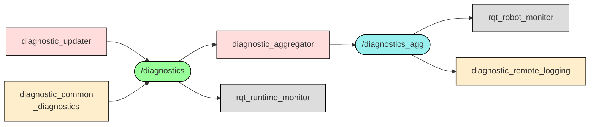

(너의 규칙은 시스템 프롬프트의 agents/shared-rules.md 와 agents/researcher.md 이다. 아래는 이번 실행의 컨텍스트와 입력이다.)

## 실행 컨텍스트

- run_id: 2026-10-09-16
- date: 2026-10-09
- run_type: update (갱신)
- 대상: 38. 모니터링·이상 탐지·원인 분석 (J. 현장 운영·관제)
- 예산:
    - max_search_queries: 30
    - max_sources_per_run: 15
    - new_topic_pages: 1
    - page_updates: 2
    - max_retries: 2
- 환경 알림: web_fetch_available: true · fetch_mode: full
- 언어: ko
- next_ref_id: ref-1367
- 새 출처 id 구간: ref-1367 ~ ref-1396 — 이 실행 전용으로 예약한 번호다(동시에 도는 다른 실행과 겹치지 않는다). 새 출처는 ref-1367 부터 순서대로 쓰고 ref-1396 를 넘기지 않는다. 기존 출처는 참고문헌 목록의 id 를 그대로 쓴다

## 입력

### runs/2026-10-09-16/target.json

```json
{
  "run_id": "2026-10-09-16",
  "date": "2026-10-09",
  "weekday": "Fri",
  "run_number": 149,
  "run_type": "update",
  "forced": true,
  "target": {
    "area_no": 38,
    "area_name": "38. 모니터링·이상 탐지·원인 분석",
    "category": "J. 현장 운영·관제",
    "category_letter": "J"
  },
  "topic": null,
  "track": null,
  "corrections": [],
  "budget": {
    "max_search_queries": 30,
    "max_sources_per_run": 15,
    "new_topic_pages": 1,
    "page_updates": 2,
    "max_retries": 2
  },
  "priority_reason": null,
  "priority_questions": [],
  "excluded_areas": [],
  "lifted_areas": [],
  "deferred": {
    "monthly_recheck": false,
    "weekly_review": false
  },
  "selection_rationale": "CLI 지정 run_type=update, area=38"
}
```

### docs/categories/field-operations-and-monitoring/monitoring-anomaly-detection-and-root-cause-analysis.md

```markdown
---
title: "38. 모니터링·이상 탐지·원인 분석"
type: area
category: "J. 현장 운영·관제"
area_no: 38
related_areas: [18, 20, 22, 29, 31, 32, 39, 47]
tags: [이상 탐지, 근본 원인 분석, VDA 5050, Open-RMF, 분산 추적]
status: published
confidence: low
created: 2026-09-24
updated: 2026-09-25
sources: [ref-051, ref-445, ref-447, ref-448, ref-313, ref-111, ref-449, ref-230, ref-283, ref-451]
last_run: 2026-09-25
version: 2
---

[홈](../../index.md) › [J. 현장 운영·관제](index.md) › 38. 모니터링·이상 탐지·원인 분석

# 38. 모니터링·이상 탐지·원인 분석

!!! info "소속 대분류"
    [J. 현장 운영·관제](index.md) — 핵심 질문:
    운영자가 지금 무슨 일이 일어나는지 보고, 이상을 알아차리고, 성과를 확인할 수 있는가? [분류원문]

<!-- auto:area-tracks:start -->
!!! note "관련 연구 트랙"
    이 세부영역을 가로지르는 중점 연구 트랙과 확장 아이디어다. 트랙은 분류를 바꾸지 않으며, 트랙에서 확인된 사실은 이 페이지에 반영하도록 제안된다. 전체 매핑은 [확장 아이디어 연결 구조](../../ideas/index.md)에 있다.

    - [채팅 기반 구성·운영](../../tracks/chat-based-configuration-and-operation/index.md) — 함께 필요한 영역(○) · 확장 아이디어: [아이디어 2. 채팅 기반 구성·운영](../../ideas/chat-based-configuration-and-operation.md)
<!-- auto:area-tracks:end -->

<!-- auto:page-status:start -->
> 페이지 상태: published · 신뢰도: low · 페이지 버전: 2 · 마지막 갱신: 2026-09-25 · 마지막 실행: 2026-09-25
<!-- auto:page-status:end -->

## 1. 한 줄 정의

감시, 로봇 건강 상태 진단, 이상 탐지, 원인 분석, 알림 [분류원문]

이 영역이 다루는 일(2026-09-28 리스트업 기준):

- **운영 모니터링**: 로그·이벤트·지표를 연결해 현재 운영을 감시한다
- **이상 탐지**: 평소와 다른 지연·정지·패턴을 찾아낸다
- **원인 분석**: 지연의 원인이 로봇·설비·통신·앞 작업 가운데 어디인지 가려낸다
- **알림·에스컬레이션**: 이상·지연·안전 사건을 알맞은 사람에게 알리고 필요하면 상위로 올린다
- **로봇 건강 상태 진단**: 배터리·모터·센서·통신 상태를 모아 로봇별 건강 상태를 보여 주고 이상을 알린다

이전 분류(2026-09-24)에서 이 페이지는 옛 19번 영역 ‘모니터링·이상 탐지·원인 분석’(옛 대분류 E. 협업·현장 운영)이었다. 아래는 그때의 원문 정의·질문·주석이며, 보관한 옛 원문과 글자 단위로 같다.

> 옛 정의: 로그·이벤트·성능 지표를 연결해 이상을 탐지하고, 로봇·설비·통신·공정 원인을 구분 [옛 분류원문]

> 옛 질문: 지연 원인이 로봇 고장인지, 문인지, 앞 공정인지 어떻게 찾을까? [옛 분류원문]

> 옛 원문 주석: 27번의 AI는 특정 기능 하나에만 해당하지 않는다. **매뉴얼 해석은 5·21번, 도면 해석은 6번, 학습 기반 배차는 13번, 장애 분석은 19번**에 적용되는 연구 방법이다. [옛 분류원문]

## 2. 핵심 질문

지연의 원인이 로봇인지, 설비인지, 통신인지, 앞 작업인지 어떻게 찾을까? [분류원문]

> 원문 주석: AI는 특정 기능 하나에만 해당하지 않는다. **매뉴얼 해석은 4·55번, 도면 해석은 14번, 학습 기반 배정은 25번, 장애 분석은 38번**에 적용되는 연구 방법이다. [분류원문]

## 3. 왜 중요한가

이종 로봇이 섞인 현장에서는 로봇 오류 수준·연결 끊김(VDA 5050), 외부 사건 대기(MassRobotics), 작업 지연·차단과 문 모드(Open-RMF)가 서로 다른 어휘로 보고되므로, 지연 원인을 가리려면 이들을 같은 시간축에 맞추고 ROP 자체 원인 범주로 옮기는 매핑이 필요할 것으로 보인다. [추정][^ref-051][^ref-449][^ref-230][^ref-313][^ref-111]

2절의 질문, 곧 지연 원인이 로봇 고장인지 문인지 앞 공정인지를 가리는 일은 복구 담당과 조치를 정하는 출발점이다. 그런데 각 표준은 자기 필드만 정의하고 서로 간 대응표는 두지 않으며, 이번 조사에서는 공통 매핑 표준을 찾지 못했다(열린 질문 oq-033). [추정][^ref-051][^ref-230][^ref-111]

원인 구분은 처리량 관리와도 이어진다. 무인운반차(Automated Guided Vehicle, AGV) 시스템을 다룬 2003년 연구는 기존 두 방법(가동률·대기 시간 기반)에는 이동 병목 탐지와 비교해 여러 한계가 있다고 보고한다. [사실][^ref-451] 어느 설비·로봇이 흐름을 막는지 판정하는 방식에 따라 개선 대상이 달라질 수 있다는 뜻이다.

## 4. 핵심 개념과 용어

아래 용어는 3절에서 말한 서로 다른 보고 어휘와 원인 분석 기법을 읽기 위한 기본 개념이다.

자세한 내용은 주제 페이지 [38. 모니터링·이상 탐지·원인 분석 — 핵심 개념과 용어](../../topics/2026/2026-09-25-area19-s4.md)에 있다.

## 5. 적용 사례 (현장 유형 명시)

> **현장 유형: 물류창고.** 아래 시나리오는 이전 분류가 모든 영역에 물류 흐름 7단계를 적용하던 때(2026-09-25) 쓴 물류창고 사례다. 다른 현장 유형의 적용 사례는 이어지는 조사에서 더한다.

**물류 흐름 단계:** 보충

**시나리오:** 보충용 박스를 운반하던 AMR 이 문 앞에서 멈춰 보충이 늦어진 원인 가리기

| 항목 | 내용 |
|---|---|
| 시작 조건 | 피킹 구역 재고가 보충 기준 아래로 내려가 보충 작업이 생성된다(가상 설정). |
| 작업 대상 | 예비 보관 구역에서 피킹 구역으로 옮길 보충용 박스와 이를 실은 자율이동로봇(AMR). |
| 수행 자원 | AMR 은 운반, 문 설비는 개폐, ROP 는 상태 수집과 원인 구분, 운영자는 경보 응답을 맡는다. 문 개폐 제어 자체는 연계 대상(시설·설비 제어)이며 ROP 는 문 상태 확인과 문 요청만 다룬다. |
| 제약 | 경로가 문을 지나야 한다. Open-RMF 에서 문 노드는 문 상태를 /door_states 로 발행하고 문 모드는 closed·moving·open·offline·unknown 다섯 값이다. [사실][^ref-313][^ref-283] 문 어댑터는 진행 중인 로봇 작업을 방해하지 않을 때만 문을 움직이게 하는 상태 감독자 역할을 한다. [사실][^ref-283] |
| 완료·인계 | 작업 상태가 completed 로 바뀌고 보충 위치 도착이 확인되면 보충 완료로 본다. 작업 상태 토큰 completed 는 Open-RMF 작업 상태 스키마에 있다. [사실][^ref-111] |
| 예외·성과 | 작업 상태가 delayed 또는 blocked 로 바뀌고 [사실][^ref-111], MassRobotics 운용 상태가 waitingExternalEvent 를 보고하며 [사실][^ref-230], 경보는 심각도 등급(INFO·WARNING·ERROR)·응답 목록·관련 작업 id 를 담아 운영자에게 간다. [사실][^ref-448] 이 신호들을 맞춰 원인을 문·로봇·통신 중 하나로 판정하는 절차는 추정이다. [추정][^ref-313][^ref-111][^ref-230] |

다음은 설명을 위한 가상의 시나리오이다. 보충 작업을 받은 AMR 이 문 앞에서 멈추고, ROP 에는 작업 지연과 외부 사건 대기가 함께 들어온다. 수치는 쓰지 않는다.

ROP 는 같은 시각의 문 모드를 확인한다. 문 모드가 offline 이나 unknown 이면 설비 쪽 원인일 가능성을, 문이 open 인데도 로봇이 대기 중이면 로봇 쪽 원인일 가능성을 먼저 살피는 식으로 판정 순서를 세울 수 있어 보인다. [추정][^ref-313][^ref-230] 로봇 연결이 CONNECTION_BROKEN 으로 끊겼다면 통신 원인을 따로 볼 수 있다. [추정][^ref-449]

원인 범주가 정해지면 경보의 응답 목록으로 운영자가 조치를 고르고, 복구 방식은 [32. 예외 복구·재계획·업무 연속성](../execution-collaboration-and-recovery/exception-recovery-replanning-and-business-continuity.md)으로 넘어간다. 현장 유형 매트릭스 전체는 [현장 유형 매트릭스](../../site-matrix.md)에 있다.

## 6. 대표 접근법과 기술

5절의 판정 절차를 일반화하면 다음 접근들로 정리된다. 대부분 표준 필드는 확인됐지만 물류 로봇 관제에 적용한 공개 사례는 확인되지 않았다. [추정][^ref-051][^ref-447]

자세한 내용은 주제 페이지 [38. 모니터링·이상 탐지·원인 분석 — 대표 접근법과 기술](../../topics/2026/2026-09-25-area19-s6.md)에 있다.

## 7. 관련 표준·프레임워크·오픈소스

6절의 접근은 아래 표준·오픈소스가 정의한 필드와 신호를 재료로 쓴다. VDA 5050 은 3.0.0 판(GitHub main 브랜치, 접근일 2026-09-25) 기준이며 main 브랜치는 판이 바뀔 수 있다. [사실][^ref-051]

자세한 내용은 주제 페이지 [38. 모니터링·이상 탐지·원인 분석 — 관련 표준·프레임워크·오픈소스](../../topics/2026/2026-09-25-area19-s7.md)에 있다.

## 8. 대표 연구와 자료

7절의 표준이 무엇을 보고하는지를 정한다면, 아래 연구는 그 보고로 원인과 병목을 찾는 방법을 다룬다. 논문은 모두 원문 미열람이며 검색 요약 기준이다.

자세한 내용은 주제 페이지 [38. 모니터링·이상 탐지·원인 분석 — 대표 연구와 자료](../../topics/2026/2026-09-25-area19-s8.md)에 있다.

## 9. ROP가 직접 맡는 것과 외부와 연계하는 것 (책임 경계 기준)

| 경계 | ROP가 직접 맡는 것 | 외부와 연계하는 것 |
|---|---|---|
| 로봇 자체 지능·제어 | 표준 인터페이스가 보고하는 오류 수준·연결 상태·작업 상태를 모아 원인 범주(로봇·설비·통신·공정)로 구분하고 업무 영향과 연결 [추정][^ref-051][^ref-449][^ref-111] | 연계 대상: 센서·모터·드라이버 수준의 진단(ROS 2 diagnostics 같은 로봇 내부 진단)과 개별 부품 고장 진단 [추정][^ref-445] |
| 시설·설비 제어 | 문 상태(DoorMode) 확인과 문 요청, 문 대기를 원인 범주에 반영 [추정][^ref-313][^ref-283] | 연계 대상: 문 개폐 제어 자체 |

센서·모터·드라이버 수준의 진단과 개별 부품 고장 진단은 로봇 제조사 영역이며, 이종 로봇을 연결하는 ROP 는 표준 인터페이스가 보고하는 오류 수준·연결 상태·설비 상태·작업 상태를 모아 원인 범주로 구분하고 업무 영향과 연결하는 부분을 맡는 경계가 될 것으로 보인다. [추정][^ref-445][^ref-051][^ref-449][^ref-111] 경계의 원문 정의는 [범위 경계](../../about/scope-boundary.md)에 있다.

이 경계는 제품 전략에 따라 이동할 수 있다. 자사 로봇까지 만드는 회사는 로컬 주행을 포함할 수 있지만, **이종 제조사를 연결하는 ROP는 그 기능을 제조사에 맡기고 인터페이스와 실행 보장을 담당할 수 있다.** [분류원문]

## 10. 다른 연구영역과의 연결 (번호와 이름을 함께 표기)

원인 구분은 상태를 모으는 영역, 결과를 쓰는 영역과 양쪽으로 이어진다.

- [39. 운영 성과 측정·개선](operational-performance-measurement-and-improvement.md) — 병목 탐지 연구와 SCM 프로세스 마이닝 리뷰가 처리량 개선과 이어지며 oq-018 을 함께 다룬다.
- [18. 실시간 세계 상태·데이터 일관성](../objects-people-and-live-state/real-time-world-state-and-data-consistency.md) — 원인 구분은 현재 상태를 표현하는 오류·연결·문·작업 상태를 같은 시간축에 맞춘 데이터를 쓴다.
- [20. 로봇·제조사 관제 연동](../integration/robot-and-vendor-fleet-manager-integration.md) — VDA 5050·MassRobotics 가 보고하는 오류 수준·연결 상태·운용 상태가 여기서 들어온다.
- [22. 설비·건물 시스템 연동](../integration/facility-and-building-system-integration.md) — 문 상태 발행과 문 어댑터가 설비 원인 판정의 근거가 된다.
- [29. 명령·작업 실행의 신뢰성](../execution-collaboration-and-recovery/command-and-task-execution-reliability.md) — 동작 실패와 오류 보고의 대응, 작업 상태 토큰이 실행 결과 확인과 겹친다.
- [31. 사람–로봇 협업](../execution-collaboration-and-recovery/human-robot-collaboration.md) — 경보의 응답 목록과 관제 인터페이스 연구가 운영자 대응으로 이어진다.
- [32. 예외 복구·재계획·업무 연속성](../execution-collaboration-and-recovery/exception-recovery-replanning-and-business-continuity.md) — 오류 수준이 주문 계속 가능 여부를 가르고, 판정된 원인이 복구 방식 선택으로 넘어간다.
- [47. AI·학습·적응과 모델 운영](../ai-and-learning/ai-learning-adaptation-and-model-operations.md) — 분류 개정 전 원문 8장의 교차 규칙에 따라 장애 분석은 이 영역에 적용되는 AI 연구 방법이며, LLM 실패 설명(REFLECT)이 그 예다.

## 11. 열린 질문

위 내용 가운데 확인되지 않은 부분을 질문으로 남긴다. 전체 목록은 [열린 질문](../../open-questions.md)에 있다.

자세한 내용은 주제 페이지 [38. 모니터링·이상 탐지·원인 분석 — 열린 질문](../../topics/2026/2026-09-25-area19-s11.md)에 있다.

## 12. 최근 업데이트 (자동)

<!-- auto:area-recent:start -->
- 2026-09-25 · 갱신 · [38. 모니터링·이상 탐지·원인 분석](monitoring-anomaly-detection-and-root-cause-analysis.md) — 영역 심화: 3~11절 신규 작성, 페이지 상태 자동 표식 추가, 13절 각주 정의(1차 조건부 승인 수정 14건 반영). 형식 재작성: 프런트매터 sources 를 이 페이지 각주 정의와 일치시킴 (실행 2026-09-25-48)
- 2026-09-25 · 생성 · [38. 모니터링·이상 탐지·원인 분석 — 핵심 개념과 용어](../../topics/2026/2026-09-25-area19-s4.md) — 자동 분리: 19. 모니터링·이상 탐지·원인 분석 의 "4. 핵심 개념과 용어" 절(1,482자)을 옮겼다 (실행 2026-09-25-48)
- 2026-09-25 · 생성 · [38. 모니터링·이상 탐지·원인 분석 — 관련 표준·프레임워크·오픈소스](../../topics/2026/2026-09-25-area19-s7.md) — 자동 분리: 19. 모니터링·이상 탐지·원인 분석 의 "7. 관련 표준·프레임워크·오픈소스" 절(1,413자)을 옮겼다 (실행 2026-09-25-48)
- 2026-09-25 · 생성 · [38. 모니터링·이상 탐지·원인 분석 — 대표 연구와 자료](../../topics/2026/2026-09-25-area19-s8.md) — 자동 분리: 19. 모니터링·이상 탐지·원인 분석 의 "8. 대표 연구와 자료" 절(1,396자)을 옮겼다. 형식 재작성: 8. 실시간 세계 상태·데이터 일관성 링크를 주제 페이지 기준 경로로 고침 (실행 2026-09-25-48)
- 2026-09-25 · 생성 · [38. 모니터링·이상 탐지·원인 분석 — 대표 접근법과 기술](../../topics/2026/2026-09-25-area19-s6.md) — 자동 분리: 19. 모니터링·이상 탐지·원인 분석 의 "6. 대표 접근법과 기술" 절(861자)을 옮겼다. 형식 재작성: 27. AI·학습·적응과 모델 운영 링크를 주제 페이지 기준 경로로 고침 (실행 2026-09-25-48)
<!-- auto:area-recent:end -->

## 13. 참고 자료 (각주)

[^ref-051]: VDA / VDMA (VDA5050 GitHub), VDA5050/VDA5050 — json_schemas/state.schema, 미확인, https://github.com/VDA5050/VDA5050/blob/main/json_schemas/state.schema, 접근일 2026-09-25
[^ref-445]: ROS (ros/diagnostics GitHub), diagnostics — README (ros2 branch), 미확인, https://github.com/ros/diagnostics/blob/ros2/README.md, 접근일 2026-09-25
[^ref-447]: OpenTelemetry (CNCF), OpenTelemetry Specification — Overview, 미확인, https://github.com/open-telemetry/opentelemetry-specification/blob/main/specification/overview.md, 접근일 2026-09-25
[^ref-448]: Open Robotics (open-rmf/rmf_internal_msgs), rmf_task_msgs/msg/Alert.msg, 미확인, https://github.com/open-rmf/rmf_internal_msgs/blob/main/rmf_task_msgs/msg/Alert.msg, 접근일 2026-09-25
[^ref-313]: Open Robotics (open-rmf/rmf_internal_msgs), rmf_door_msgs/msg/DoorMode.msg, 미확인, https://github.com/open-rmf/rmf_internal_msgs/blob/main/rmf_door_msgs/msg/DoorMode.msg, 접근일 2026-09-25
[^ref-111]: Open Robotics (open-rmf/rmf_api_msgs), rmf_api_msgs/schemas/task_state.json, 미확인, https://github.com/open-rmf/rmf_api_msgs/blob/main/rmf_api_msgs/schemas/task_state.json, 접근일 2026-09-25
[^ref-449]: VDA / VDMA (VDA5050 GitHub), VDA5050/VDA5050 — json_schemas/connection.schema, 미확인, https://github.com/VDA5050/VDA5050/blob/main/json_schemas/connection.schema, 접근일 2026-09-25
[^ref-230]: MassRobotics (MassRobotics-AMR/AMR_Interop_Standard), AMR_Interop_Standard.json, 미확인, https://github.com/MassRobotics-AMR/AMR_Interop_Standard/blob/main/AMR_Interop_Standard.json, 접근일 2026-09-25
[^ref-283]: Open Robotics (osrf/ros2multirobotbook), Programming Multiple Robots with ROS 2 — Doors, 미확인, https://osrf.github.io/ros2multirobotbook/integration_doors.html, 접근일 2026-09-25
[^ref-451]: Roser, C., Nakano, M., & Tanaka, M., Comparison of bottleneck detection methods for AGV systems (WSC 2003 Proceedings, 1192–1198쪽), 2003, https://keio.elsevierpure.com/en/publications/comparison-of-bottleneck-detection-methods-for-agv-systems/, 접근일 2026-09-25 (원문 미열람)
```

### docs/categories/field-operations-and-monitoring/control-screen-and-execution-records.md (요약)

```markdown
# 37. 관제 화면·실행 기록

소속 대분류: J. 현장 운영·관제 · 상태: published · 신뢰도: low · 마지막 갱신: 2026-09-30 · 버전: 2

## 1. 한 줄 정의

지도 위 상태 표시, 설명 가능한 표시, 실행 기록 재생 [분류원문]

이 영역이 다루는 일(2026-09-28 리스트업 기준):

- **관제 화면**: 지도 위에 로봇·작업·설비·사람·물품 상태를 보여 주고 층을 골라 본다
- **설명 가능한 상태 표시**: 로봇이 지금 무엇을 왜 하고 있는지 운영자가 알아볼 수 있게 표시한다
- **실행 기록·재생**: 실행 기록을 저장하고 시간축으로 재생하며 사건을 찾아본다

이 영역의 일부는 이전 분류(2026-09-24)의 옛 18번 영역 ‘사람–로봇 협업·운영 인터페이스’에서 왔다. 그 본문은 [31. 사람–로봇 협업](../execution-collaboration-and-recovery/human-robot-collaboration.md)로 옮겼으며, 이 영역은 그 내용을 출발점으로 삼는다.

## 2. 핵심 질문

운영자가 지금 무슨 일이 왜 일어나는지 한눈에 알 수 있는가? [분류원문]
```

### docs/categories/field-operations-and-monitoring/operational-performance-measurement-and-improvement.md (요약)

```markdown
# 39. 운영 성과 측정·개선

소속 대분류: J. 현장 운영·관제 · 상태: published · 신뢰도: medium · 마지막 갱신: 2026-09-26 · 버전: 3

## 1. 한 줄 정의

지표 정의·측정, 로봇 성과와 업무 성과 구분, 운영 개선 [분류원문]

이 영역이 다루는 일(2026-09-28 리스트업 기준):

- **운영 성과 측정**: 처리량·완료 시간·가동률·대기 시간·에너지 같은 지표를 정의하고 측정한다
- **로봇 성과와 업무 성과 구분**: 로봇 가동률이 올라간 것이 실제 업무 성과(처리량·서비스 시간·비용)로 이어졌는지 나눠 본다
- **운영 개선**: 측정 결과로 운영 정책·배치·절차를 고치고 효과를 다시 잰다

이전 분류의 이 영역 가운데 일부는 새 분류에서 [3. 경제성·조달·사업 모델](../planning-and-business/economics-procurement-and-business-models.md)(으)로 나뉘었다. 그 영역들은 이 페이지의 본문을 출발점으로 삼는다.

이전 분류(2026-09-24)에서 이 페이지는 옛 4번 영역 ‘성과·경제성·프로세스 개선’(옛 대분류 A. 업무·공급망 설계)이었다. 아래는 그때의 원문 정의·질문·주석이며, 보관한 옛 원문과 글자 단위로 같다.

> 옛 정의: 납기 준수율, 처리량, 리드타임, 재공품, 비용, 에너지 등을 측정하고 병목과 투자 효과를 분석 [옛 분류원문]

> 옛 질문: 로봇 가동률 상승이 실제 출하량과 비용 개선으로 이어졌는가? [옛 분류원문]

## 2. 핵심 질문

로봇 가동률이 오른 것이 실제 업무 성과로 이어졌는가? [분류원문]
```

### docs/categories/field-operations-and-monitoring/operating-procedures-and-request-channels.md (요약)

```markdown
# 40. 운영 절차·요청 창구

소속 대분류: J. 현장 운영·관제 · 상태: published · 신뢰도: medium · 마지막 갱신: 2026-09-30 · 버전: 2

## 1. 한 줄 정의

운영 절차·교대, 현장 사용자의 요청 창구 [분류원문]

이 영역이 다루는 일(2026-09-28 리스트업 기준):

- **운영 절차·교대**: 운영 표준 절차, 교대 인수인계, 역할을 정한다
- **현장 사용자 요청 창구**: 간호사·객실 직원·거주자처럼 비전문 사용자가 호출 버튼·앱·단말로 일을 요청한다

## 2. 핵심 질문

현장 사람들이 로봇에게 일을 맡기고 운영자가 교대하는 절차가 정해져 있는가? [분류원문]
```

### docs/categories/objects-people-and-live-state/real-time-world-state-and-data-consistency.md (요약)

```markdown
# 18. 실시간 세계 상태·데이터 일관성

소속 대분류: E. 사물·사람·실시간 상태 · 상태: published · 신뢰도: low · 마지막 갱신: 2026-10-09 · 버전: 3

## 1. 한 줄 정의

로봇·설비·공간·물품의 현재 상태를 통합하고, 관측의 신선도·신뢰도를 관리한다 [분류원문]

이 영역이 다루는 일(2026-09-28 리스트업 기준):

- **실시간 세계 상태 통합**: 로봇·설비·공간·물품·사람의 현재 상태를 한곳에 모으고 지연·누락·충돌·불확실성을 관리한다
- **관측 신선도·신뢰도**: 오래되거나 불확실한 관측(예를 들어 30초 전의 문 상태)을 지금의 판단에 써도 되는지 정한다

이전 분류(2026-09-24)에서 이 페이지는 옛 8번 영역 ‘실시간 세계 상태·데이터 일관성’(옛 대분류 B. 공통 정보·환경 모델)이었다. 아래는 그때의 원문 정의·질문·주석이며, 보관한 옛 원문과 글자 단위로 같다.

> 옛 정의: 로봇·설비·공간·화물의 현재 상태를 통합하고, 시간 지연·누락·충돌·불확실성을 관리 [옛 분류원문]

> 옛 질문: 문이 열려 있다는 정보가 30초 전이라면 지금도 통과 가능하다고 볼 수 있을까? [옛 분류원문]

> 옛 원문 주석: 8번의 실시간 모델이 **현재 상태를 표현**한다면, 22번은 그 모델을 이용해 **가정한 미래를 실험**한다. 구분해두면 디지털 트윈이라는 이름 아래 서로 다른 기능이 섞이지 않는다. [옛 분류원문]

## 2. 핵심 질문

조금 전에 받은 상태 정보를 지금의 판단에 믿고 써도 되는가? [분류원문]

> 원문 주석: 18번의 실시간 모델이 **현재 상태를 표현**한다면, 34번은 그 모델을 이용해 **가정한 미래를 실험**한다. 구분해두면 디지털 트윈이라는 이름 아래 서로 다른 기능이 섞이지 않는다. [분류원문]
```

### docs/categories/integration/robot-and-vendor-fleet-manager-integration.md (요약)

```markdown
# 20. 로봇·제조사 관제 연동

소속 대분류: F. 연동 · 상태: published · 신뢰도: medium · 마지막 갱신: 2026-09-25 · 버전: 2

## 1. 한 줄 정의

제조사 API·SDK·관제 시스템과 연결하는 어댑터, 공통 명령·관측 계약, 로봇과 주고받는 통신 방식 [분류원문]

이 영역이 다루는 일(2026-09-28 리스트업 기준):

- **로봇·제조사 관제 연동 어댑터**: 제조사 API·SDK·관제 시스템을 연결해 명령·상태·오류를 변환하는 어댑터를 만든다
- **제어 위임 수준 결정**: 로봇을 하나씩 직접 제어할지, 제조사 관제에 임무 단위로 맡길지 정한다
- **공통 명령·관측 계약**: 단위와 시각 기준을 명시한 제조사 중립 명령·관측 형식을 정한다
- **로봇 통신 방식·메시징**: 명령·상태·지도·영상 데이터를 어떤 통신 방식(MQTT·DDS·gRPC·WebRTC 등)과 주기로 주고받을지 정하고 끊김·지연에 대비한다

이전 분류(2026-09-24)에서 이 페이지는 옛 9번 영역 ‘로봇·제조사 관제 연동’(옛 대분류 C. 연결·실행 기반)이었다. 아래는 그때의 원문 정의·질문·주석이며, 보관한 옛 원문과 글자 단위로 같다.

> 옛 정의: 제조사 API·SDK·표준 프로토콜을 연결하고 명령·상태·오류를 변환하는 어댑터 [옛 분류원문]

> 옛 질문: 개별 로봇을 제어할까, 제조사 관제에 미션을 맡길까? [옛 분류원문]

## 2. 핵심 질문

로봇을 하나씩 직접 움직일지, 제조사 관제에 맡길지, 어떤 방식으로 통신할지 어떻게 정할 것인가? [분류원문]
```

### docs/categories/integration/facility-and-building-system-integration.md (요약)

```markdown
# 22. 설비·건물 시스템 연동

소속 대분류: F. 연동 · 상태: published · 신뢰도: medium · 마지막 갱신: 2026-09-25 · 버전: 2

## 1. 한 줄 정의

문·승강기·출입통제·컨베이어·PLC·고정 센서와 작업을 연계한다 [분류원문]

이 영역이 다루는 일(2026-09-28 리스트업 기준):

- **설비·건물 연동**: 문·승강기·출입통제·컨베이어·자동창고·PLC·빌딩 관리 시스템과 작업을 연계한다
- **승강기·문 예약과 연동**: 승강기와 문을 예약하고 로봇의 진입과 설비 상태를 맞물려 확인한다
- **로봇–설비 작업 동기화**: 컨베이어·작업대 준비와 로봇 도착처럼 설비와 로봇의 시점을 맞춘다
- **IoT·고정 센서 연동**: 고정 카메라·출입 센서·환경 센서처럼 로봇 밖의 센서 데이터를 연결한다

이전 분류(2026-09-24)에서 이 페이지는 옛 10번 영역 ‘설비·건물 시스템 연동’(옛 대분류 C. 연결·실행 기반)이었다. 아래는 그때의 원문 정의·질문·주석이며, 보관한 옛 원문과 글자 단위로 같다.

> 옛 정의: 컨베이어, 자동창고, 작업대, PLC, 문, 승강기, 출입통제 시스템과 작업을 연계 [옛 분류원문]

> 옛 질문: 컨베이어 준비와 로봇 도착을 어떻게 맞출까? [옛 분류원문]

## 2. 핵심 질문

문·승강기·설비의 준비와 로봇의 도착을 어떻게 맞출 것인가? [분류원문]
```

### docs/categories/execution-collaboration-and-recovery/command-and-task-execution-reliability.md (요약)

```markdown
# 29. 명령·작업 실행의 신뢰성

소속 대분류: H. 실행·협업·예외 복구 · 상태: published · 신뢰도: medium · 마지막 갱신: 2026-09-25 · 버전: 2

## 1. 한 줄 정의

명령 상태 관리, 중복 실행 방지, 관측 근거 완료 판정 [분류원문]

이 영역이 다루는 일(2026-09-28 리스트업 기준):

- **명령 상태 관리**: 접수·실행·완료·취소 상태, 제어권, 시간 초과, 재시작 뒤 상태 복원을 관리한다
- **중복 실행 방지**: 응답이 끊긴 요청을 다시 보내도 같은 일을 두 번 하지 않게 한다
- **관측 근거 완료 판정**: 대기 시간이 지났다는 이유가 아니라 관측된 증거로 작업 단계의 완료를 인정한다

이전 분류(2026-09-24)에서 이 페이지는 옛 12번 영역 ‘명령·작업 실행의 신뢰성’(옛 대분류 C. 연결·실행 기반)이었다. 아래는 그때의 원문 정의·질문·주석이며, 보관한 옛 원문과 글자 단위로 같다.

> 옛 정의: 접수·실행·완료·취소 상태, 제어권, 중복 요청 방지, 시간 초과, 재시작 후 상태 복원 [옛 분류원문]

> 옛 질문: 응답이 끊긴 운반 요청을 다시 보내면 같은 화물을 두 번 처리하지 않을까? [옛 분류원문]

## 2. 핵심 질문

응답이 끊긴 명령을 다시 보내도 같은 일을 두 번 하지 않게 하려면? [분류원문]
```

### docs/categories/execution-collaboration-and-recovery/human-robot-collaboration.md (요약)

```markdown
# 31. 사람–로봇 협업

소속 대분류: H. 실행·협업·예외 복구 · 상태: published · 신뢰도: medium · 마지막 갱신: 2026-09-25 · 버전: 2

## 1. 한 줄 정의

사람과의 작업 분담, 수동 개입·원격 조작, 주변 사람과의 소통 [분류원문]

이 영역이 다루는 일(2026-09-28 리스트업 기준):

- **사람–로봇 작업 분담**: 사람과 로봇이 서로 기다리지 않도록 일을 나누고 작업자의 부담(인체공학)을 고려한다
- **수동 개입·원격 조작**: 운영자가 승인·수동 전환·원격 조작으로 로봇 작업에 개입한다
- **주변 사람과의 소통**: 로봇이 빛·소리·화면으로 의도를 알리고 주변 사람을 안내한다

이전 분류의 이 영역 가운데 일부는 새 분류에서 [37. 관제 화면·실행 기록](../field-operations-and-monitoring/control-screen-and-execution-records.md)(으)로 나뉘었다. 그 영역들은 이 페이지의 본문을 출발점으로 삼는다.

이전 분류(2026-09-24)에서 이 페이지는 옛 18번 영역 ‘사람–로봇 협업·운영 인터페이스’(옛 대분류 E. 협업·현장 운영)이었다. 아래는 그때의 원문 정의·질문·주석이며, 보관한 옛 원문과 글자 단위로 같다.

> 옛 정의: 작업자에게 일 배정, 승인·수동 전환, 원격 조작, 설명 가능한 상태 표시, 인체공학 [옛 분류원문]

> 옛 질문: 사람이 피킹하고 로봇이 운반할 때 서로 기다리지 않게 하려면? [옛 분류원문]

## 2. 핵심 질문

사람과 로봇이 같은 공간에서 서로 기다리거나 방해하지 않게 하려면? [분류원문]
```

### docs/categories/execution-collaboration-and-recovery/exception-recovery-replanning-and-business-continuity.md (요약)

```markdown
# 32. 예외 복구·재계획·업무 연속성

소속 대분류: H. 실행·협업·예외 복구 · 상태: published · 신뢰도: medium · 마지막 갱신: 2026-09-25 · 버전: 2

## 1. 한 줄 정의

고장·통신 단절·누락에 대한 복구와 제한 운영 [분류원문]

이 영역이 다루는 일(2026-09-28 리스트업 기준):

- **예외 복구**: 고장·통신 단절·물품 누락·긴급 요청에 재배정·우회·수동 처리·제한 운영을 결정한다
- **제한 운영·업무 연속성**: 일부 장비가 멈춰도 업무를 이어 가는 운영 수준과 절차를 정한다

이전 분류(2026-09-24)에서 이 페이지는 옛 20번 영역 ‘예외 복구·재계획·업무 연속성’(옛 대분류 E. 협업·현장 운영)이었다. 아래는 그때의 원문 정의·질문·주석이며, 보관한 옛 원문과 글자 단위로 같다.

> 옛 정의: 고장·통신 단절·화물 누락·긴급 주문 등에 대해 재배정, 우회, 수동 처리, 제한 운영을 결정 [옛 분류원문]

> 옛 질문: 운반 중 고장 난 로봇의 화물과 남은 주문은 어떻게 처리할까? [옛 분류원문]

## 2. 핵심 질문

작업 중 로봇이 고장 나면 남은 일은 누가 어떻게 이어받는가? [분류원문]
```

### docs/categories/ai-and-learning/ai-learning-adaptation-and-model-operations.md (요약)

```markdown
# 47. AI·학습·적응과 모델 운영

소속 대분류: L. AI·학습 기술 · 상태: published · 신뢰도: medium · 마지막 갱신: 2026-09-25 · 버전: 2

## 1. 한 줄 정의

AI 결과를 실행에 쓰는 기준과 불확실성, 모델 운영 [분류원문]

이 영역이 다루는 일(2026-09-28 리스트업 기준):

- **AI 결과의 실행 사용 기준**: AI가 만든 계획·해석을 어떤 기준으로 실행에 쓸지 정하고 불확실성을 평가한다
- **모델 운영**: 모델 버전·학습 데이터·배포·성능 감시를 관리한다

이전 분류의 이 영역 가운데 일부는 새 분류에서 [44. 로봇 기반 모델·언어 모델 계획](robot-foundation-models-and-llm-planning.md), [45. 문서·도면·장면 이해](document-drawing-and-scene-understanding.md), [46. 예측·학습 기반 최적화](prediction-and-learning-based-optimization.md)(으)로 나뉘었다. 그 영역들은 이 페이지의 본문을 출발점으로 삼는다.

이전 분류(2026-09-24)에서 이 페이지는 옛 27번 영역 ‘AI·학습·적응과 모델 운영’(옛 대분류 G. 안전·보안·지능·거버넌스)이었다. 아래는 그때의 원문 정의·질문·주석이며, 보관한 옛 원문과 글자 단위로 같다.

> 옛 정의: 문서·도면 해석, 수요·고장 예측, 학습 기반 계획, LLM 에이전트, 불확실성 평가, 모델 변경 관리 [옛 분류원문]

> 옛 질문: AI가 만든 작업 계획이나 기능 해석을 어떤 기준으로 실행에 사용할까? [옛 분류원문]

> 옛 원문 주석: 27번의 AI는 특정 기능 하나에만 해당하지 않는다. **매뉴얼 해석은 5·21번, 도면 해석은 6번, 학습 기반 배차는 13번, 장애 분석은 19번**에 적용되는 연구 방법이다. [옛 분류원문]

## 2. 핵심 질문

AI가 만든 작업 계획이나 기능 해석을 어떤 기준으로 실행에 사용할까? [분류원문]
```

### docs/references/index.md (요약: 이번 대상 페이지가 인용한 10건 / 전체 1315건. 목록에 없는 출처는 새 id 로 적는다 — 같은 URL 이 이미 있으면 퍼블리셔가 기존 id 로 합친다)

```markdown
| id | 기관 | 제목 | 발행일 | URL | 접근일 | 원문 열람 |
|---|---|---|---|---|---|---|
| ref-051 | VDA / VDMA (VDA5050 GitHub) | VDA5050/VDA5050 — json_schemas/state.schema | 미확인 | https://github.com/VDA5050/VDA5050/blob/main/json_schemas/state.schema | 2026-09-25 | 예 |
| ref-111 | Open Robotics (open-rmf) | rmf_api_msgs — rmf_api_msgs/schemas/task_state.json | 미확인 | https://github.com/open-rmf/rmf_api_msgs/blob/main/rmf_api_msgs/schemas/task_state.json | 2026-09-25 | 예 |
| ref-230 | MassRobotics | MassRobotics-AMR/AMR_Interop_Standard — AMR_Interop_Standard.json | 미확인 | https://github.com/MassRobotics-AMR/AMR_Interop_Standard/blob/main/AMR_Interop_Standard.json | 2026-09-25 | 예 |
| ref-283 | Open Robotics | Doors (integration_doors) - Programming Multiple Robots with ROS 2 | 미확인 | https://osrf.github.io/ros2multirobotbook/integration_doors.html | 2026-09-25 | 예 |
| ref-313 | Open Robotics (open-rmf) | rmf_internal_msgs — rmf_door_msgs/msg/DoorMode.msg | 미확인 | https://github.com/open-rmf/rmf_internal_msgs/blob/main/rmf_door_msgs/msg/DoorMode.msg | 2026-09-25 | 예 |
| ref-445 | ROS (ros/diagnostics GitHub) | diagnostics — README (ros2 branch) | 미확인 | https://github.com/ros/diagnostics/blob/ros2/README.md | 2026-09-25 | 예 |
| ref-447 | OpenTelemetry (CNCF) | OpenTelemetry Specification — Overview | 미확인 | https://github.com/open-telemetry/opentelemetry-specification/blob/main/specification/overview.md | 2026-09-25 | 예 |
| ref-448 | Open Robotics (open-rmf/rmf_internal_msgs) | rmf_task_msgs/msg/Alert.msg | 미확인 | https://github.com/open-rmf/rmf_internal_msgs/blob/main/rmf_task_msgs/msg/Alert.msg | 2026-09-25 | 예 |
| ref-449 | VDA / VDMA (VDA5050 GitHub) | VDA5050/VDA5050 — json_schemas/connection.schema | 미확인 | https://github.com/VDA5050/VDA5050/blob/main/json_schemas/connection.schema | 2026-09-25 | 예 |
| ref-451 | Roser, C., Nakano, M., & Tanaka, M. | Comparison of bottleneck detection methods for AGV systems | 2003 | https://keio.elsevierpure.com/en/publications/comparison-of-bottleneck-detection-methods-for-agv-systems/ | 2026-09-25 | 아니오 |
```

### docs/glossary/index.md (요약: 용어 374개, slug: 한국어 (영어). 정의는 docs/glossary/<slug>.md)

```markdown
- 3d-scene-graph: 3차원 장면 그래프 (3D Scene Graph)
- 4d-scene-graph: 4차원 장면 그래프 (4D Scene Graph)
- a-b-update: A/B 업데이트 (A/B Update (Dual Partition Update with Rollback))
- aas-registry-and-discovery: 자산관리셸 레지스트리·디스커버리 (AAS Registry / Discovery)
- ablation-study: 절제 실험 (Ablation Study)
- abstract-and-concrete-scenario: 추상 시나리오·구체 시나리오 (Abstract Scenario / Concrete Scenario)
- action-dependency-graph: 행동 의존 그래프 (Action Dependency Graph (ADG))
- actively-exploited-vulnerability: 적극 악용 취약점 (Actively Exploited Vulnerability (EU Cyber Resilience Act))
- affordance: 어포던스 (Affordance)
- age-of-information: 정보 나이 (Age of Information (AoI))
- agentic-ai: 에이전틱 AI (Agentic AI)
- aggregation-event: 집계 이벤트 (AggregationEvent)
- agv-technical-data-submodel: AGV 기술 데이터 서브모델 (Technical Data for AGV in Intralogistics (IDTA 02047))
- alarm-management: 경보 관리 (Alarm Management (ANSI/ISA 18.2))
- almere-model: 알메러 모델 (Almere Model)
- alternative-name: 대체 이름 (Alternative Name (IMDF alt_name))
- amr-assisted-order-picking: AMR 협업 피킹 (AMR-assisted Order Picking)
- api-deprecation-policy: API 폐기 정책 (API Deprecation Policy)
- approval-fatigue: 승인 피로 (Approval Fatigue (Consent Fatigue))
- ariac: 산업 자동화용 민첩 로봇 경진대회 (Agile Robotics for Industrial Automation Competition (ARIAC))
- artificial-intelligence-management-system: AI 관리 시스템 (Artificial Intelligence Management System (AIMS))
- as-planned-vs-as-built-deviation: 설계–준공 편차 (As-planned vs As-built Deviation)
- asam-openscenario: 오픈시나리오 (ASAM OpenSCENARIO)
- assembly-line-feeding-problem: 조립라인 공급 문제 (Assembly Line Feeding Problem (ALFP))
- asset-administration-shell: 자산관리셸 (Asset Administration Shell (AAS))
- association-event: 연결 이벤트 (AssociationEvent)
- asyncapi-specification: AsyncAPI 명세 (AsyncAPI Specification)
- attribute-based-access-control: 속성 기반 접근 통제 (Attribute-Based Access Control (ABAC))
- audit-trail: 감사 추적 (Audit Trail)
- automatic-recording-of-events: 자동 사건 기록 (Automatic Recording of Events (Logs, EU AI Act Article 12))
- automatic-simulation-model-generation: 자동 시뮬레이션 모델 생성 (Automatic Simulation Model Generation (ASMG))
- automation-bias: 자동화 편향 (Automation Bias)
- average-displacement-error: 평균 변위 오차 (Average Displacement Error (ADE))
- b2mml: B2MML (Business To Manufacturing Markup Language (B2MML))
- bag-file: 백 파일 (Bag File (rosbag2))
- battery-swapping: 배터리 교환 (Battery Swapping)
- behavior-domain-definition-language: 행동 영역 정의 언어 (Behavior Domain Definition Language (BDDL))
- behavior-tree: 행동 트리 (Behavior Tree)
- block-reference: 블록 참조 (Block Reference (INSERT))
- bpmn: 비즈니스 프로세스 모델 및 표기법 (Business Process Model and Notation (BPMN))
- brainless-robot: 브레인리스 로봇 (Brainless Robot)
- building-information-modeling: 건물 정보 모델링 (Building Information Modeling (BIM))
- building-topology-ontology: 건물 위상 온톨로지 (Building Topology Ontology (BOT))
- business-continuity-management-system: 업무 연속성 관리 시스템 (Business Continuity Management System (BCMS))
- business-location: 업무 위치 (Business Location (EPCIS bizLocation))
- cap-theorem: CAP 정리 (CAP Theorem)
- capabilities-skills-services: 능력·스킬·서비스 모델 (Capabilities, Skills and Services (CSS) Model)
- capability-based-task-allocation: 능력 기반 작업 배정 (Capability-based Task Allocation)
- capability-description-submodel: 능력 기술 서브모델 (Capability Description Submodel (IDTA 02020))
- capability-matchmaking: 능력 매칭 (Capability Matchmaking)
- cbv: 핵심 업무 어휘 (Core Business Vocabulary (CBV))
- cell-based-production: 셀 생산 방식 (Cell-based Production)
- clarification-question: 명확화 질문 (Clarification Question (Follow-up Clarification))
- cloud-robotics: 클라우드 로보틱스 (Cloud Robotics)
- coalition-formation: 연합 형성 (Coalition Formation)
- collaborative-application: 협동 적용 (Collaborative Application)
- collaborative-perception: 협동 인지 (Collaborative Perception)
- common-coordinate-system: 공통 좌표계 (Common Coordinate System (CCS, ISO 21423))
- common-data-environment: 공통 데이터 환경 (Common Data Environment (CDE))
- compensating-transaction: 보상 트랜잭션 (Compensating Transaction)
- competency-question: 역량 질문 (Competency Question (CQ))
- condition-based-maintenance: 상태 기반 정비 (Condition-Based Maintenance (CBM))
- configuration-copilot: 구성 코파일럿 (Configuration Copilot)
- conflict-based-search: 충돌 기반 탐색 (Conflict-Based Search (CBS))
- conformal-prediction: 등각 예측 (Conformal Prediction)
- conformance-test: 적합성 시험 (Conformance Test)
- confused-deputy: 혼란된 대리인 (Confused Deputy)
- consensus-based-bundle-algorithm: 합의 기반 번들 알고리즘 (Consensus-Based Bundle Algorithm (CBBA))
- constrained-decoding: 제약 디코딩 (Constrained Decoding)
- contrastive-explanation: 대조적 설명 (Contrastive Explanation)
- control-barrier-function: 제어 장벽 함수 (Control Barrier Function (CBF))
- cooperative-object-transport: 협동 운반 (Cooperative Object Transport)
- cora: 로봇·자동화 핵심 온톨로지 (Core Ontology for Robotics and Automation (CORA))
- core-manufacturing-simulation-data: 핵심 제조 시뮬레이션 데이터 (Core Manufacturing Simulation Data (CMSD))
- costmap: 비용 지도 (Costmap)
- crdt: 무충돌 복제 데이터 타입 (Conflict-free Replicated Data Type (CRDT))
- cross-embodiment-learning: 교차 형태 학습 (Cross-embodiment Learning)
- cross-schedule-dependency: 스케줄 간 의존 (Cross-schedule Dependency (XD))
- curb-cut: 연석 경사로 (Curb Cut (Curb Ramp))
- cyber-resilience-act: 사이버복원력법 (Cyber Resilience Act (CRA))
- data-holder: 데이터 보유자 (Data Holder (EU Data Act))
- data-provenance: 데이터 출처 추적 (Data Provenance (W3C PROV))
- dds-security: DDS 보안 규격 (DDS Security (DDS-Security))
- deadlock: 교착 (Deadlock)
- decision-focused-learning: 결정 중심 학습 (Decision-Focused Learning)
- digital-nameplate: 디지털 명판 (Digital Nameplate (IDTA 02006))
- digital-shadow: 디지털 섀도 (Digital Shadow)
- digital-thread: 디지털 스레드 (Digital Thread)
- digital-twin-composition: 디지털 트윈 결합 (Digital Twin Composition)
- digital-twin: 디지털 트윈 (Digital Twin)
- discrete-event-simulation: 이산 사건 시뮬레이션 (Discrete Event Simulation (DES))
- dispenser-ingestor: 디스펜서·인제스터 (Dispenser / Ingestor)
- distributed-tracing: 분산 추적 (Distributed Tracing)
- document-layout-analysis: 문서 레이아웃 분석 (Document Layout Analysis)
- door-to-door-robot-delivery: 도어 투 도어 로봇 배송 (Door-to-Door Robot Delivery)
- drawing-exchange-format: 도면 교환 형식 (Drawing Exchange Format (DXF))
- dual-system-architecture: 이중 시스템 구조 (Dual-system Architecture (System 1 / System 2))
- eclass: ECLASS (ECLASS)
- edit-cost: 편집 비용 (Edit Cost)
- elevator-operating-rate: 승강기 가동률 (Elevator Operating Rate (EOR))
- empanelment-programme: 등재 프로그램 (Empanelment Programme)
- enclave: 인클레이브 (Enclave (SROS 2))
- epcis-error-declaration: 오류 선언 (Error Declaration (EPCIS errorDeclaration))
- epcis: 전자 제품 코드 정보 서비스 (Electronic Product Code Information Services (EPCIS))
- ethical-black-box: 윤리적 블랙박스 (Ethical Black Box (EBB))
- event-driven-rescheduling: 사건 기반 재스케줄링 (Event-driven Rescheduling)
- event-trace: 사건 트레이스 (Event Trace)
- excessive-agency: 과도한 에이전시 (Excessive Agency)
- expected-value-of-perfect-information: 완전 정보의 기대 가치 (Expected Value of Perfect Information (EVPI))
- explainable-mapf: 설명 가능한 다중 에이전트 경로 찾기 (Explainable Multi-Agent Path Finding (Explainable MAPF))
- explicit-implicit-confirmation: 명시적 확인·암시적 확인 (Explicit / Implicit Confirmation)
- face-obfuscation: 얼굴 가림 (Face Obfuscation)
- failure-explanation: 실패 설명 (Failure Explanation)
- falsification: 반증 기반 시험 (Falsification)
- fan-out: 팬아웃 (Fan-out (human-robot team))
- fault-detection-and-diagnosis-fdd: 고장 탐지·진단 (Fault Detection and Diagnosis (FDD))
- fault-injection: 장애 주입 (Fault Injection)
- filter-mask: 필터 마스크 (Filter Mask (Nav2 costmap filter))
- finops: 핀옵스 (FinOps)
- fleet-adapter: 플릿 어댑터 (Fleet Adapter)
- fleet-control-level: 플릿 제어 수준 (Fleet Control Level (Open-RMF: Full Control / Traffic Light / Read Only))
- fleet-management-system: 플릿 관리 시스템 (Fleet Management System (FMS))
- fleet-sizing: 차량 소요대수 산정 (Fleet Sizing)
- floor-plan-recognition: 평면도 인식 (Floor Plan Recognition)
- fog-computing: 포그 컴퓨팅 (Fog Computing)
- frozen-horizon: 동결 구간 (Frozen Horizon (Frozen Zone))
- giai: 글로벌 개별 자산 식별자 (Global Individual Asset Identifier (GIAI))
- goal-condition: 목표 조건 (Goal Condition)
- goods-to-person: 상품-대-사람 (Goods-to-Person (GTP))
- grade-certainty-of-evidence: 근거 확실성 등급 (GRADE (Grading of Recommendations, Assessment, Development and Evaluation))
- grai: 글로벌 반환형 자산 식별자 (Global Returnable Asset Identifier (GRAI))
- graph-edit-distance: 그래프 편집 거리 (Graph Edit Distance (GED))
- guidance-graph: 안내 그래프 (Guidance Graph)
- hallucination: 환각 (Hallucination)
- hardware-in-the-loop: 하드웨어 인 더 루프 (Hardware-in-the-Loop (HiL))
- hddl: 계층 도메인 정의 언어 (Hierarchical Domain Definition Language (HDDL))
- hierarchical-task-network: 계층적 작업 네트워크 (Hierarchical Task Network (HTN))
- high-impact-ai: 고영향 인공지능 (High-impact AI (Korea AI Basic Act))
- hmi-philosophy: HMI 철학 (HMI Philosophy (ISA-TR101.01))
- human-in-the-loop: 사람 참여 루프 (Human-in-the-Loop (HITL))
- human-motion-trajectory-prediction: 사람 움직임 궤적 예측 (Human Motion Trajectory Prediction)
- hungarian-method: 헝가리안 방법 (Hungarian Method)
- i-pass-handoff-program: I-PASS 인계 프로그램 (I-PASS Handoff Program)
- idempotency-key: 멱등성 키 (Idempotency Key)
- identity-report: 신원 보고 (Identity Report (MassRobotics identityReport))
- iec-common-data-dictionary: IEC 공통 데이터 사전 (IEC Common Data Dictionary (IEC CDD))
- ifc: 산업 기초 클래스 (Industry Foundation Classes (IFC))
- imitation-learning: 모방 학습 (Imitation Learning)
- indirect-prompt-injection: 간접 프롬프트 주입 (Indirect Prompt Injection)
- indoor-mapping-data-format: 실내 지도 데이터 형식 (Indoor Mapping Data Format (IMDF))
- indoor-space-subspacing: 공간 세분화 (Subspacing (Indoor Space Subdivision))
- indoorgml: IndoorGML (IndoorGML)
- industrial-data: 산업데이터 (Industrial Data)
- information-delivery-specification: 정보 전달 명세 (Information Delivery Specification (IDS))
- information-for-use: 사용 정보 (Information for Use (Instructions for Use))
- infrastructure-mounted-sensing: 인프라 장착 센서 (Infrastructure-mounted Sensing)
- integrity-risk: 무결성 위험 (Integrity Risk)
- intent-recognition: 의도 인식 (Intent Recognition (Intent Detection))
- irdi: 국제 등록 데이터 식별자 (International Registration Data Identifier (IRDI))
- irreducible-infeasible-subset: 기약 불능 제약 집합 (Irreducible Infeasible Subset (IIS))
- isa-95: 기업–제어 시스템 통합 표준 (ISA-95 Enterprise-Control System Integration)
- it-ot-convergence: IT/OT 융합 (IT/OT Convergence)
- jailbreak: 탈옥 (Jailbreak)
- job-shop-scheduling-problem: 작업장 스케줄링 문제 (Job Shop Scheduling Problem (JSSP))
- joint-goal-accuracy: 결합 목표 정확도 (Joint Goal Accuracy (JGA))
- json-schema: JSON 스키마 (JSON Schema)
- keystroke-level-model: 키 입력 수준 모델 (Keystroke-Level Model (KLM))
- kiosk-accessibility: 무인정보단말기 접근성 (Kiosk Accessibility (Unmanned Information Terminal Accessibility))
- lane-closure: 차선 폐쇄 (Lane Closure)
- language-guided-floor-plan-generation: 언어 유도 평면도 생성 (Language-guided Floor Plan Generation)
- latent-failure: 잠재 실패 (Latent Failure)
- layout-interchange-format: 레이아웃 교환 형식 (Layout Interchange Format (LIF))
- lease-expiry: 허가 만료 시각 (Lease Expiry (VDA 5050 leaseExpiry))
- level-alignment-fiducial: 층 정렬 기준점 (Fiducial (Level Alignment Fiducial))
- life-cycle-costing: 수명주기 비용 분석 (Life Cycle Costing (LCC, IEC 60300-3-3))
- lifelong-mapf: 지속형 다중 에이전트 경로 찾기 (Lifelong Multi-Agent Path Finding (Lifelong MAPF))
- lift-adapter: 승강기 어댑터 (Lift Adapter)
- linear-temporal-logic: 선형 시간 논리 (Linear Temporal Logic (LTL))
- littles-law: 리틀의 법칙 (Little's Law)
- llm-agent: LLM 에이전트 (LLM Agent)
- llm-modulo-framework: LLM-모듈로 프레임워크 (LLM-Modulo Framework)
- localization-score: 위치추정 품질 점수 (Localization Score (VDA 5050 localizationScore))
- location-check-digit: 위치 체크 디지트 (Location Check Digit)
- lockout-tagout: 잠금·표지 (Lockout/Tagout (LOTO))
- log-playback: 로그 재생 (Log Playback)
- managed-node: 관리형 노드 (Managed Node (ROS 2 Lifecycle Node))
- management-of-change: 변경 관리 (Management of Change (MOC))
- map-alignment: 지도 정합 (Map Alignment)
- map-distribution: 지도 배포 (Map Distribution (VDA 5050 downloadMap / enableMap / deleteMap))
- map-version: 지도 버전 (Map Version (VDA 5050 mapId / mapVersion))
- mapf: 다중 에이전트 경로 찾기 (Multi-Agent Path Finding (MAPF))
- maps-of-dynamics: 움직임 지도 (Maps of Dynamics (MoD))
- market-based-task-allocation: 시장 기반 작업 배정 (Market-based Task Allocation)
- matter: 매터 (Matter (Connectivity Standards Alliance smart home standard))
- mcap: MCAP (MCAP)
- milp: 혼합 정수 계획 (Mixed Integer Linear Programming (MILP))
- mission-specification-pattern: 미션 명세 패턴 (Mission Specification Pattern)
- mobile-manipulator: 모바일 매니퓰레이터 (Mobile Manipulator)
- mobile-video-information-processing-device: 이동형 영상정보처리기기 (Mobile Video Information Processing Device)
- model-checking: 모델 검사 (Model Checking)
- model-context-protocol: 모델 컨텍스트 프로토콜 (Model Context Protocol (MCP))
- model-contractual-terms: 모델 계약 조항 (Model Contractual Terms (MCTs))
- model-registry: 모델 레지스트리 (Model Registry)
- model-substitution-and-routing-dilution: 모델 대체·라우팅 희석 (Model Substitution / Routing Dilution)
- models-and-simulations-credibility-assessment: 모델·시뮬레이션 신뢰도 평가 (Models and Simulations Credibility Assessment (NASA-STD-7009))
- mqtt-last-will: MQTT 유언 메시지 (MQTT Last Will (Will Message))
- mqtt: 메시지 큐잉 원격 측정 전송 (Message Queuing Telemetry Transport (MQTT))
- mrta: 다중 로봇 작업 배정 (Multi-Robot Task Allocation (MRTA))
- multi-agent-pickup-and-delivery: 다중 에이전트 픽업·배송 (Multi-Agent Pickup and Delivery (MAPD))
- multi-fleet-orchestration: 다중 플릿 오케스트레이션 (Multi-Fleet Orchestration)
- multi-trip-vehicle-routing-problem: 다중 운행 차량 경로 문제 (Multi-Trip Vehicle Routing Problem (MTVRP))
- nearest-vehicle-first-rule: 최근접 차량 우선 규칙 (Nearest Vehicle First (NVF) Rule)
- neuro-symbolic-ai: 신경-기호 AI (Neuro-symbolic AI)
- number-of-clicks: 클릭 수 지표 (Number of Clicks (NoC))
- observability: 관측성 (Observability)
- occupancy-grid-map: 점유 격자 지도 (Occupancy Grid Map (OGM))
- ocel: 객체 중심 이벤트 로그 (Object-Centric Event Log (OCEL))
- online-simulation: 온라인 시뮬레이션 (Online Simulation)
- ontology-evolution: 온톨로지 진화 (Ontology Evolution)
- ontology-pitfall: 온톨로지 피트폴 (Ontology Pitfall)
- ontology-population: 온톨로지 채우기 (Ontology Population)
- open-rmf: 오픈 RMF (Open-RMF (Open Robotics Middleware Framework))
- openapi-specification: OpenAPI 명세 (OpenAPI Specification (OAS))
- opentelemetry-genai-semantic-conventions: 생성형 AI 의미 규약 (OpenTelemetry GenAI Semantic Conventions)
- opentelemetry: 오픈텔레메트리 (OpenTelemetry (OTel))
- operating-mode: 운용 모드 (Operating Mode (VDA 5050 operatingMode))
- operating-zone: 운용 구역 (Operating Zone (ISO 3691-4))
- optimality-gap: 최적성 간격 (Optimality Gap)
- order-batching: 주문 배치 (Order Batching)
- outdoor-mobile-robot-operational-safety-certification: 실외이동로봇 운행안전인증 (Outdoor Mobile Robot Operational Safety Certification)
- over-the-air-update: 무선 업데이트 (Over-the-Air Update (OTA))
- overall-equipment-effectiveness: 종합설비효율 (Overall Equipment Effectiveness (OEE))
- panoptic-quality: 파놉틱 품질 (Panoptic Quality (PQ))
- panoptic-symbol-spotting: 파놉틱 심볼 스포팅 (Panoptic Symbol Spotting)
- pass-k: pass^k 지표 (pass^k)
- pay-per-pick: 피킹량 기반 과금 (Pay-per-pick)
- payback-period: 투자 회수 기간 (Payback Period)
- pddl: 계획 도메인 정의 언어 (Planning Domain Definition Language (PDDL))
- perfect-order-fulfillment: 완전 주문 이행률 (Perfect Order Fulfillment)
- performable-action: 수행 가능 동작 (Performable Action (Open-RMF perform_action))
- persistence-filter: 지속성 필터 (Persistence Filter)
- personal-delivery-device: 개인 배송 장치 (Personal Delivery Device (PDD))
- plug-and-produce: 플러그 앤 프로듀스 (Plug and Produce)
- post-encroachment-time: 침범 후 시간 (Post-Encroachment Time (PET))
- post-occupancy-evaluation: 사용 후 평가 (Post-Occupancy Evaluation (POE))
- power-and-force-limiting: 동력·힘 제한 (Power and Force Limiting (PFL))
- pre-execution-plan-verification: 사전 실행 계획 검증 (Pre-execution Plan Verification)
- pre-hold-post-condition: 전제·유지·사후 조건 (Pre-, Hold-, Post-condition)
- precedence-constraint: 선후 제약 (Precedence Constraint)
- precision-time-protocol: 정밀 시간 프로토콜 (Precision Time Protocol (PTP))
- predictive-maintenance: 예지 정비 (Predictive Maintenance)
- presumption-of-conformity: 적합성 추정 (Presumption of Conformity)
- priority-inheritance-with-backtracking: 우선순위 상속·되돌림 (Priority Inheritance with Backtracking (PIBT))
- private-5g-network: 5G 특화망(이음5G) (Private 5G Network (e-Um 5G))
- process-mining: 프로세스 마이닝 (Process Mining)
- product-liability: 제조물책임 (Product Liability)
- prompt-injection: 프롬프트 주입 (Prompt Injection)
- protective-separation-distance: 보호 분리 거리 (Protective Separation Distance)
- pseudonymisation: 가명처리 (Pseudonymisation)
- public-area-mobile-robot: 공공 영역 이동로봇 (Public-area Mobile Robot (PMR))
- put-wall: 풋월 (Put Wall)
- raster-to-vector-conversion: 래스터–벡터 변환 (Raster-to-Vector Conversion)
- raw-video-regulatory-sandbox-exemption: 영상정보 원본 활용 규제샌드박스 실증특례 (Regulatory Sandbox Special Demonstration Exemption for Raw Video Use)
- read-point: 판독 지점 (Read Point (EPCIS readPoint))
- reality-gap: 현실 격차 (Reality Gap (Sim-to-Real Gap))
- regression-testing: 회귀 시험 (Regression Testing)
- release-zone: 해제 구역 (Release Zone)
- remote-attestation: 원격 증명 (Remote Attestation)
- remote-controlled-small-vehicle: 원격 조작형 소형차 (Remote-controlled Small Vehicle (遠隔操作型小型車))
- required-and-provided-capability: 요구 능력·제공 능력 (Required Capability / Provided (Offered) Capability)
- resource-constrained-project-scheduling-problem: 자원 제약 프로젝트 스케줄링 문제 (Resource-Constrained Project Scheduling Problem (RCPSP))
- risk-assessment: 위험성평가 (Risk Assessment (ISO 12100))
- roadmap: 경로망 (Roadmap)
- robot-as-a-service: 서비스형 로봇 (Robot-as-a-Service (RaaS))
- robot-density: 로봇 밀도 (Robot Density)
- robot-foundation-model: 로봇 기반 모델 (Robot Foundation Model)
- robot-friendly-building-certification: 로봇 친화형 건축물 인증 (Robot-Friendly Building Certification)
- robot-standard-process-model: 로봇활용 표준공정모델 (Robot Standard Process Model (Korea))
- robot-task-fitness-matrix: 로봇–작업 적합도 행렬 (Robot–Task Fitness Matrix)
- robotic-middleware-for-healthcare: 의료 로봇 미들웨어 RoMi-H (Robotic Middleware for Healthcare (RoMi-H))
- robotic-mobile-fulfillment-system: 로봇 이동형 풀필먼트 시스템 (Robotic Mobile Fulfillment System (RMFS))
- role-ambiguity: 역할 모호성 (Role Ambiguity)
- role-based-access-control: 역할 기반 접근 통제 (Role-Based Access Control (RBAC))
- root-cause-analysis-rca: 근본 원인 분석 (Root Cause Analysis (RCA))
- runtime-tracing: 런타임 추적 (Runtime Tracing (ros2_tracing))
- runtime-verification: 런타임 검증 (Runtime Verification)
- safe-interval-path-planning: 안전 구간 경로 계획 (Safe Interval Path Planning (SIPP))
- safety-guardrail: 안전 가드레일 (Safety Guardrail (LLM-enabled robots))
- safety-state-report: 안전 상태 보고 (Safety State (VDA 5050 safetyState))
- saga: 사가 (Saga)
- scan-vs-bim: 스캔 대 BIM 비교 (Scan-vs-BIM)
- scenario-reconstruction: 시나리오 재구성 (Scenario Reconstruction)
- schedule-stability: 일정 안정성 (Schedule Stability)
- scor: 공급망 운영 참조 모델 (Supply Chain Operations Reference (SCOR))
- security-level-iec-62443: 보안 수준 (Security Level (SL, IEC 62443))
- self-driving-laboratory: 자율 실험실 (Self-driving Laboratory (Autonomous Laboratory))
- semantic-id: 의미 식별자 (Semantic ID (semanticId))
- semantic-map: 의미 지도 (Semantic Map)
- semantic-versioning: 의미적 버전 관리 (Semantic Versioning (SemVer))
- semi-open-queueing-network: 반개방형 대기행렬 네트워크 (Semi-Open Queueing Network (SOQN))
- semi-static-object: 반정적 객체 (Semi-static Object)
- service-level-agreement: 서비스 수준 협약 (Service Level Agreement (SLA))
- service-triad: 서비스 삼자 관계 (Service Triad (service robot, customer, frontline employee))
- shacl: 형상 제약 언어 (Shapes Constraint Language (SHACL))
- shift-handover: 교대 인수인계 (Shift Handover)
- shifting-bottleneck-detection-active-period-method: 이동 병목 탐지 (Shifting Bottleneck Detection (Active Period Method))
- shuttle-based-storage-and-retrieval-system: 셔틀 기반 저장·회수 시스템 (Shuttle-Based Storage and Retrieval System (SBS/RS))
- signal-temporal-logic: 신호 시간 논리 (Signal Temporal Logic (STL))
- sila-2: SiLA 2 (Standardization in Lab Automation 2 (SiLA 2))
- sim-vs-real-correlation-coefficient: 시뮬레이션–현실 상관 계수 (Sim-vs-Real Correlation Coefficient (SRCC))
- similarity-transformation: 유사 변환 (Similarity Transformation)
- simulation-description-format: 시뮬레이션 기술 형식 (Simulation Description Format (SDFormat))
- situation-awareness-based-agent-transparency: 상황 인식 기반 에이전트 투명성 (Situation Awareness-based Agent Transparency (SAT))
- situation-awareness: 상황 인식 (Situation Awareness (SA))
- situation-state-tracking: 상황 상태 추적 (Situation State Tracking)
- skill-interface: 스킬 인터페이스 (Skill Interface)
- skill: 스킬 (Skill)
- slot-filling: 슬롯 채우기 (Slot Filling)
- slotcar: 슬롯카 모델 (Slotcar (Open-RMF simulated robot plugin))
- smart-hospital-leading-model: 스마트병원 선도모델 (Smart Hospital Leading Model)
- smart-logistics-center-certification: 스마트물류센터 인증 (Smart Logistics Center Certification)
- social-force-model: 사회적 힘 모델 (Social Force Model)
- social-robot-navigation: 사회적 내비게이션 (Social Robot Navigation (Human-aware Navigation))
- soft-landings: 소프트 랜딩 (Soft Landings (BSRIA BG 54))
- software-bill-of-materials: 소프트웨어 자재명세서 (Software Bill of Materials (SBOM))
- software-in-the-loop: 소프트웨어 인 더 루프 (Software-in-the-Loop (SiL))
- software-nameplate: 소프트웨어 명판 (Software Nameplate (IDTA 02007))
- source-grounding: 출처 근거 연결 (Source Grounding)
- space-boundary: 공간 경계 (Space Boundary (IfcRelSpaceBoundary))
- space-graph: 공간 그래프 (Space Graph)
- speed-and-separation-monitoring: 속도·분리 감시 (Speed and Separation Monitoring (SSM))
- sscc: 물류 단위 일련 코드 (Serial Shipping Container Code (SSCC))
- stakeholder-requirements-specification: 이해관계자 요구사항 명세 (Stakeholder Requirements Specification (StRS))
- state-of-charge: 충전 상태 (State of Charge (SOC))
- state-of-health: 배터리 건강 상태 (State of Health (SOH))
- stpa: 시스템 이론적 프로세스 분석 (System-Theoretic Process Analysis (STPA))
- strict-schema: 엄격 스키마 (Strict Schema (deprecated elements removed))
- stride-threat-classification: STRIDE 위협 분류 (STRIDE (Spoofing, Tampering, Repudiation, Information Disclosure, Denial of Service, Elevation of Privilege))
- structured-output: 구조화 출력 (Structured Output)
- substantial-modification: 실질적 변경 (Substantial Modification)
- success-weighted-by-path-length: 경로 길이 가중 성공률 (Success weighted by Path Length (SPL))
- supervisory-control: 감독 제어 (Supervisory Control)
- surrogate-model: 대리 모델 (Surrogate Model)
- synchronization-loss: 동기화 손실 (Synchronization Loss)
- table-structure-recognition: 표 구조 인식 (Table Structure Recognition)
- tamper-evident-log: 변조 탐지 로그 (Tamper-evident Log)
- task-decomposition: 작업 분해 (Task Decomposition)
- technology-readiness-level: 기술 성숙도 (Technology Readiness Level (TRL))
- teleoperation: 원격 조작 (Teleoperation)
- time-window: 시간창 (Time Window)
- topological-map: 위상 지도 (Topological Map)
- total-cost-of-ownership: 총소유비용 (Total Cost of Ownership (TCO))
- traversability: 통과 가능성 (Traversability)
- uncertainty-alignment: 불확실도 정렬 (Uncertainty Alignment)
- underspecification: 과소명세 (Underspecification)
- urdf: 통합 로봇 기술 형식 (Unified Robot Description Format (URDF))
- use-case-template: 사용 사례 템플릿 (Use Case Template (IEC 62559-2))
- user-simulator: 사용자 시뮬레이터 (User Simulator)
- utaut: 통합 기술 수용 이론 (Unified Theory of Acceptance and Use of Technology (UTAUT))
- vda-5050-cancel-order: 주문 취소 즉시 동작 (cancelOrder (VDA 5050 instant action))
- vda-5050-factsheet: VDA 5050 팩트시트 (VDA 5050 factsheet)
- vda-5050: VDA 5050 (VDA 5050)
- verification-and-validation-of-simulation-models: 시뮬레이션 모델 검증·타당성 확인 (Verification and Validation (V&V) of Simulation Models)
- version-iri: 버전 IRI (Version IRI (owl:versionIRI))
- virtual-commissioning: 가상 시운전 (Virtual Commissioning)
- vision-language-action-model: 비전 언어 행동 모델 (Vision-Language-Action Model (VLA))
- voice-picking: 음성 피킹 (Voice-Directed Picking (Voice Picking))
- waveless-order-release: 웨이브리스 출고 지시 (Waveless Order Release)
- webhook: 웹훅 (Webhook)
- wes-wcs-wms-mes-tms: 창고 실행·창고 제어·창고 관리·제조 실행·운송 관리 시스템 (Warehouse Execution System / Warehouse Control System / Warehouse Management System / Manufacturing Execution System / Transportation Management System)
- wireless-safety-rated-emergency-stop: 무선 안전 비상정지 (Wireless Safety-rated Emergency Stop)
- workflow-net: 워크플로 넷 (Workflow Net (WF-net))
- zone-set: 구역 집합 (Zone Set (VDA 5050 zoneSet))
- zones-and-conduits: 보안 구역과 도관 (Zones and Conduits (IEC 62443))
```

### docs/open-questions.md (요약: 대상 영역 [38] 에 걸린 16건 / 전체 331건)

```markdown
- oq-018 [열림] 이동로봇·작업대·승강기가 섞인 창고 흐름에 활성 구간 기반 이동 병목 탐지나 객체 중심 프로세스 마이닝을 적용한 연구가 있는가? (영역 38, 39)
- oq-033 [열림] Open-RMF 로봇 상태, VDA 5050 action 상태·오류, MassRobotics 운용 상태를 하나의 공통 상태·오류 어휘로 옮기는 표준 매핑이나 공개 구현이 있는가? (영역 20, 29, 38)
- oq-072 [열림] 물류센터 관제 요원 한 명이 감독할 수 있는 이동로봇 수를 팬아웃이나 인지 부하 기준으로 측정한 연구나 현장 기준이 있는가? (영역 31, 38)
- oq-073 [열림] VDA 5050 3.0.0 판의 네 단계 오류 수준(WARNING·URGENT·CRITICAL·FATAL)과 이전 판(2.x)의 오류 수준이 다를 때, 두 판이 섞인 이종 플릿에서 오류 수준을 어떻게 맞춰 해석하는가? (영역 20, 38)
- oq-074 [열림] 물류 로봇 작업 지연을 로봇·설비·통신·공정 원인으로 나누는 공개 원인 분류 체계나 현장 데이터셋이 있는가? (영역 38, 39)
- oq-075 [열림] 국내 물류센터에서 로봇 정지·지연의 원인별 발생 비율이나 이상 대응 시간을 실측해 공개한 자료가 있는가? (영역 32, 38)
- oq-082 [열림] 로봇·제조사 관제가 보고하는 위치·배터리·입찰 비용이 오염되거나 위조되었을 때 ROP 는 배정 전에 이를 어떻게 검증하고, 의심 로봇을 배정 후보에서 뺄 기준은 무엇인가? (영역 25, 38, 51)
- oq-194 [열림] 플랜트·변전소 점검 로봇이 얻은 계기값·열화상·이상 판정은 설비 보전 시스템의 작업 지시·점검 기록으로 어떤 형식과 승인 절차를 거쳐 돌아가는가? (영역 67, 23, 38)
- oq-210 [열림] 서로 다른 제조사 로봇의 기록(MCAP·제조사 로그)과 플랫폼 서비스의 분산 추적을 하나의 작업 식별자로 이어 원인 분석에 쓴 공개 사례나 표준이 있는가? (영역 43, 38)
- oq-221 [열림] 제조사마다 다른 상태·고장 데이터를 내는 이종 로봇 플릿에서 고장 예측 모델을 학습·운영하려면 어떤 공통 데이터 항목이 필요하고 누가 모델을 소유하는가? (영역 46, 38)
- oq-240 [열림] 공정 산업의 ISA-101 처럼 다중 로봇 관제 화면에 특화된 화면 설계 표준이나 지침이 있는가, 아니면 공정 HMI 표준을 옮겨 써야 하는가? (영역 37, 38)
- oq-252 [열림] 여러 제조사 로봇을 지휘하는 플랫폼 수준에서 사고·아차 사고 조사에 필요한 최소 기록 항목(명령·정지·재가동·정비 모드 전환·상태 보고)을 정한 표준이나 공개 규약이 있는가, 윤리적 블랙박스 초안을 플릿 기록에 적용한 사례가 있는가? (영역 50, 37, 38)
- oq-295 [열림] 다중 로봇 플릿 관제에서 경보 우선순위, 경보 홍수 기준, 경보 합리화 절차를 ANSI/ISA 18.2 처럼 정한 로봇 운영용 경보 관리 표준이나 공개 지침이 있는가? (영역 38, 31)
- oq-312 [열림] 진입 금지 구역 위반이나 정지 지시 뒤 응답 같은 안전 관련 운영 규칙을 런타임 검증으로 감시하는 방법을 제조사가 다른 이동로봇 플릿에 적용해 효과를 측정한 연구나 제품이 있는가? (영역 48, 38, 54)
- oq-315 [열림] 언어 모델 기반 고장 진단(REFLECT, SYSDIAGBENCH)을 제조사가 다른 이동로봇 플릿의 실행 기록·오류 코드에 적용해 원인 분석 정확도를 측정한 사례가 있는가? (영역 47, 38, 44)
- oq-319 [열림] 로봇이 발행 전 단계에서 위조한 텔레메트리를 설비 센서·다른 로봇 관측과 교차 확인해 플릿 수준에서 탐지하는 방법의 효과를 측정한 연구가 있는가? (관련: oq-082) (영역 52, 18, 38)
```

### config/priority.yaml

```yaml
# config/priority.yaml — 사용자가 지정하는 우선 영역·주제·질문 (빌드 사양서 7.1, 7.4, 8.2)
#
# 비어 있으면 순환 규칙(config/rotation.yaml)만 따른다. 항목이 없는 키는 빈 목록([])으로 둔다.
# 네 키(areas, topics, questions, track_questions)는 빈 목록이라도 모두 있어야 하고, 항목의 필드 이름은 아래 예시와 같아야 한다.
# 항목의 뜻과 반영 시점은 config/README.md 와 docs/about/how-to-contribute.md 에 있다.
#
# 읽는 주체:
#   - pipeline/select_target.*  : areas·topics·questions 로 그날의 대상을 정한다(순환보다 우선, 7.1). questions 는 area_no 영역을 대상으로 올리고, 2주기에는 그 영역의 점수에도 더한다
#   - 리서치·검증 에이전트       : 이 파일 전문이 프롬프트의 "## 입력"에 들어간다. 대상 영역의 questions 는 조사 질문에 포함된다
#   - pipeline/select_target.*  : 트랙 실행의 대상 선정에서 track_questions 를 트랙 백로그(data/tracks/<slug>/backlog.json)에 제기 근거 "사용자"로 먼저 등록하고 그 실행의 질문으로 고른다
#   - 퍼블리셔                   : 대상 선정 뒤에 더해진 track_questions 를 같은 방식으로 등록한다(보완)
#
# area_no 는 1~67 의 세부영역 번호다(2026-09-28 개정 분류, _source/ROP_연구분야_분류.md). 사람이 읽기 쉽도록 주석에 영역 이름을 함께 적는다(예: 17. 작업 대상·자산 식별과 인계 추적).
# 지정한 항목이 처리되면 목록에서 지워도 된다. 지우지 않으면 rotation.yaml 의 priority.skip_if_targeted_within_days 가 지난 뒤 다시 우선된다.
# 우선 지정은 조사 대상을 정할 뿐 검증 규칙과 하루 예산(daily_budget)을 바꾸지 않는다.

# 세부영역을 먼저 다루게 한다. weight 는 대상 선정 점수에 더하는 가중치, reason 은 로그(target.json·일일 로그)에 남는 지정 사유다.
areas: []
# 작성 예시:
# areas:
#   - area_no: 17           # 17. 작업 대상·자산 식별과 인계 추적
#     weight: 10            # 대상 선정 점수에 더하는 가중치
#     reason: "병원·상업 시설의 인계 확인 사례가 부족하다"

# 특정 주제로 주제 조사(run_type topic)를 실행하게 한다. area_no 는 주 연구영역이다.
topics: []
# 작성 예시:
# topics:
#   - title: "작업 대상 인계 확인에 EPCIS 이벤트를 쓰는 방법"
#     area_no: 17           # 주 연구영역: 17. 작업 대상·자산 식별과 인계 추적
#     weight: 8

# 답을 찾게 할 질문이다. area_no 영역을 areas 와 같이 순환보다 먼저 대상으로 올리고(가중치는 rotation.yaml 의 priority.question_weight), 그 영역이 대상이 되면 리서치 에이전트의 조사 질문에 포함된다.
questions: []
# 작성 예시:
# questions:
#   - question: "로봇 도착과 실제 작업 대상 인계를 어떤 이벤트로 구분해 기록하는가?"
#     area_no: 17           # 17. 작업 대상·자산 식별과 인계 추적

# 트랙 백로그에 넣을 질문이다(8.2). 다음 트랙 실행의 대상 선정이 제기 근거 "사용자"로 백로그에 등록해 우선순위를 올린다(8.2).
# 처리 순서: 리서치 에이전트는 트랙 실행마다 현재 단계의 열린 질문 가운데 사용자 지정 → 앞 단계로 되돌아온 질문 → 오래된 순으로 1~3개를 고르므로(6.1),
# 현재 단계에 넣은 사용자 질문이 가장 앞에 온다. 사용자 질문이 여럿이면 priority(high → normal → low), 같으면 파일에 적힌 순이다 [가정].
# stage 가 현재 단계보다 앞이면 되돌아온 질문과 같이 다음 트랙 실행에서 우선 처리하고(8.2), 뒤이면 그 단계가 현재 단계가 될 때 다룬다 [가정].
track_questions: []
# 작성 예시:
# track_questions:
#   - track: manual-capability-ontology   # config/tracks/<slug>.yaml 의 slug
#     stage: 1              # 질문을 넣을 단계 번호(1 ~ 그 트랙의 단계 수: 매뉴얼 기반 로봇 기능 온톨로지 7, 채팅 기반 구성·운영 10, 건축 도면 자동 인식 5). 예: 단계 1. 기존 능력 표현 모델과 표준 조사
#     question: "산업 상호운용 규격의 팩트시트는 적재 제약을 어떤 필드로 기술하는가?"
#     priority: high        # high / normal / low. 사용자 지정 질문이 여럿일 때 고르는 순서에만 쓴다 [가정]
```

### inbox/corrections.md

````markdown
# 정정 요청함 (inbox/corrections.md)

이 파일은 위키 내용에 대한 정정 요청을 모으는 곳이다. 형식, 처리 흐름, 거부되는 경우는 docs/corrections.md(정정 요청 안내)에 있다.

- 한 요청은 `## corr-NNN` 제목으로 시작하는 블록 하나다. id 는 corr-001 부터 순서대로 늘리며, 아래 "요청 목록"에 새 블록을 덧붙인다.
- 필드는 서식의 여섯 줄(페이지, 문제 문장, 근거, 요청일, 요청자, 상태)을 그대로 쓰고 값만 채운다. 각 필드는 한 줄로 쓴다. 페이지·문제 문장·근거·요청일은 빌드 사양서 7.4 의 필드이고, 요청자·상태는 구축자가 더한 것이다. [가정]
- 상태는 요청자가 `open` 으로 쓴다. `applied`(반영됨)·`rejected`(반영하지 않음)는 퍼블리셔가 바꾸고, 그때 "처리 실행"과 "처리 메모" 줄을 덧붙인다.
- 리서치 에이전트는 다음 실행에서 이 파일 전체를 읽는다. 대상 페이지에 걸린 `open` 요청은 반드시 조사 질문에 들어가고, 내용 검증 에이전트가 1차 검증 항목 11(정정 요청 반영 여부)로 확인하며, 처리 결과는 docs/changelog.md(변경 이력)에 남는다.
- 분류 원문의 명칭·번호·정의·질문은 정정 대상이 아니다. 새 주제나 우선 영역은 config/priority.yaml 에 적는다.

## 서식

아래 블록을 복사해 "요청 목록" 끝에 붙이고, 제목의 `corr-NNN` 을 실제 id 로 바꾼 뒤 값을 채운다. 코드 펜스 안의 서식은 요청으로 읽히지 않는다(정정 요청을 읽는 스크립트는 코드 펜스 안의 `## corr-` 줄을 제외해야 한다). [가정]

```markdown
## corr-NNN

- 페이지: docs/<경로>/<파일>.md
- 문제 문장: "페이지에 있는 문장을 태그까지 그대로 옮긴다"
- 근거: 출처 URL 또는 설명
- 요청일: YYYY-MM-DD
- 요청자: 이름 또는 역할
- 상태: open
```

## 요청 목록

(아직 요청이 없다.)
````

### runs/2026-10-09-15/research.md

```markdown
# 리서치 브리프 2026-10-09-15

| 항목 | 값 |
|---|---|
| 실행 id | 2026-10-09-15 |
| 날짜 | 2026-10-09 |
| 실행 유형 | update (갱신) |
| 대상 영역 | 37. 관제 화면·실행 기록 |
| 대분류 | J. 현장 운영·관제 |

## 갭(비어 있거나 약한 섹션)

- 섹션 5. 적용 사례 (현장 유형 명시) — 병원 협약 단계 보도 1건뿐이고 물류창고·제조 공장·상업 시설·가정·실외·기타 사례가 '찾지 못했다'로 남아 있음
- 섹션 7. 관련 표준·프레임워크·오픈소스 — 공통 상태 값 표준이 Open-RMF 작업 상태 스키마뿐이고(oq-237) MassRobotics·VDA 5050 의 상태·오류 수준 정의, 관제실 설계 표준(ISO 11064), 투명성 표준(IEEE 7001)이 없음. rmf-web 저장 설정(바뀐 출처) 확인 필요
- 섹션 9. ROP가 직접 맡는 것과 외부와 연계하는 것 — 실행 기록 보관 주체·기간 근거(oq-316, oq-239)와 사고 조사용 최소 기록 항목(oq-252) 없음
- 섹션 11. 열린 질문 — oq-131·oq-237·oq-238·oq-239·oq-240·oq-252·oq-316 해결 근거 미조사
- 정정 요청 없음, 발행 2년이 지난 표준 수치 재확인 대상은 ISA-101 계열(본문 유료, 이번에 재열람하지 않음)

## 조사 질문

1. 운영자가 지금 무슨 일이 왜 일어나는지 한눈에 알 수 있는가? [분류원문]
2. oq-237 여러 제조사 로봇의 작업 상태·실행 로그를 한 화면·한 기록으로 모을 때 Open-RMF 작업 상태 스키마 말고 공통 상태 값과 로그·오류 수준을 정한 공개 규약이 있는가? (섹션 7·9 겨냥)
3. oq-238·oq-240 설명 가능한 표시를 실제 플릿 관제 화면에서 측정한 연구가 있는가, 다중 로봇 관제 화면에 쓸 수 있는 화면·관제실 설계 표준이나 투명성 표준은 무엇인가? (섹션 7·11 겨냥)
4. oq-252·oq-316·oq-239 사고 조사용 최소 기록 항목, 고위험 AI 자동 사건 기록의 보관 기간·주체, 병원 특수 물품 배송 기록의 국내 보관 요건은 무엇인가? (섹션 9·11 겨냥)
5. 물류창고·실외·가정·기타 현장과 국내 병원에서 여러 로봇을 하나의 관제 화면으로 운영한 사례는 무엇인가? (섹션 5 겨냥, 한국 사례 우선)
6. 바뀐 출처와 oq-131: Open-RMF rmf-web 의 실행 기록 저장 설정은 바뀌었는가, 로봇 물류 실행 기록을 객체 중심 이벤트 로그로 만든 공개 사례가 있는가? (섹션 7·11 겨냥)

## 발견 사항

| id | 태그 | 주장 | 출처 | 교차 확인 | 신뢰도 | 기준일 | 흐름 단계 / 항목 | 표시 |
|---|---|---|---|---|---|---|---|---|
| f1 | [사실] | VDA 5050 3.0.0 은 로봇이 보고하는 동작 상태 값을 INITIALIZING·RUNNING·PAUSED·FINISHED·FAILED·RETRIABLE 로, 오류 수준을 WARNING·URGENT·CRITICAL·FATAL 네 단계로 정하고, 오류마다 사람이 읽는 설명(errorDescription)·조치 힌트(errorHint)와 ISO 639-1 언어 코드별 번역을 담을 수 있게 한다. | ref-031 | 아니오 | medium | 2026-10-09 | 예외·성과 | — |
| f2 | [사실] | VDA 5050 3.0.0 은 로봇이 state 메시지의 information 배열로 보내는 부가 정보를 플릿 관제가 로직에 쓰지 말고 시각화·디버깅에만 쓰게 하며, logReport 즉시 동작으로 로봇에 로그 보고서 생성·저장을 요청하고 저장된 로그 이름을 동작 상태로 보고받게 한다. | ref-031 | 아니오 | medium | 2026-10-09 | — | — |
| f3 | [사실] | MassRobotics AMR 상호운용 표준의 statusReport 는 uuid·timestamp·operationalState·location 을 필수로 하고, operationalState 를 navigating·idle·disabled·offline·charging·waitingHumanEvent·waitingExternalEvent·waitingInternalEvent·manualOverride 아홉 값으로 정하며, 오류 코드 배열, 약 10초의 단기 경로(예측 위치 최대 10개), 목적지, 배터리 잔량을 선택 항목으로 둔다. | ref-1337 | 아니오 | medium | 2026-10-09 | — | 원문 미열람 |
| f4 | [사실] | Open-RMF 작업 상태 스키마는 작업 상태 값 12개와 별도로 배차 상태를 queued·selected·dispatched·failed_to_assign·canceled_in_flight 로 기록하고, 요청자(requester)·예약 라벨과 일시정지·재개·취소·강제 종료·단계 건너뛰기 요청마다 요청 시각과 라벨(예: dashboard)을 남기게 해, 누가 어떤 창구로 작업에 개입했는지를 실행 기록에 담을 수 있다. | ref-111 | 아니오 | medium | 2026-10-09 | 완료·인계 | — |
| f5 | [추정] | Open-RMF 작업 상태 스키마 말고도 VDA 5050(동작 상태·오류 수준)과 MassRobotics 상호운용 표준(운용 상태)이 공개된 상태 값 집합을 정하지만 세 규약의 값 집합과 단위(작업·동작·로봇)가 서로 달라, 37. 관제 화면·실행 기록에서 여러 제조사 상태를 한 기록으로 모으려면 ROP 가 대응표를 만들어 정규화해야 할 것으로 보인다. | ref-031, ref-1337, ref-111 | 아니오 | low | 2026-10-09 | — | — |
| f6 | [사실] | Open-RMF rmf-web 의 API 서버는 기본으로 메모리 안의 SQLite 를 써서 실행 기록이 남지 않지만, 설정의 db_url 로 PostgreSQL·SQLite·MySQL·MariaDB 를 지정해 영속 저장할 수 있다. | ref-1346, ref-302 | 아니오 | medium | 2026-10-09 | — | — |
| f7 | [사실] | Open-RMF 로그 항목(log_entry) 스키마는 오늘 기준으로도 순번(seq)·수준(tier)·밀리초 유닉스 시각·본문을 필수로 하고 수준 값을 uninitialized·info·warning·error 로 두어, 페이지 7절의 로그 수준 서술이 그대로 유효하다. | ref-1095 | 아니오 | medium | 2026-10-09 | — | — |
| f8 | [사실] | IEEE 7001-2021(자율 시스템 투명성 표준)은 사용자, 검증·인증 담당자, 고장·사고 조사자, 소송·행정 절차의 전문 자문가, 일반 대중의 이해관계자 범주마다 최소 수준부터 엄격한 수준까지 객관적으로 평가할 수 있는 다섯 단계의 투명성 수준을 정하며, IEEE 로봇·자동화 학회가 공동 후원했다. | ref-1338 | 아니오 | medium | 2022-05-11 | — | — |
| f9 | [추정] | IEEE 7001-2021 이 운영자(사용자)와 사고 조사자를 별도 이해관계자로 두므로, 37. 관제 화면·실행 기록의 설명 가능한 표시는 운영자용 투명성으로, 실행 기록은 조사자용 투명성으로 나눠 평가하는 근거가 될 수 있을 것으로 보이나, 표준이 화면 설계나 기록 항목을 정하는지는 확인하지 못했다. | ref-1338 | 아니오 | low | 2026-10-09 | — | — |
| f10 | [사실] | ISO 11064(관제 센터 인간공학 설계) 계열은 설계 원칙, 관제 공간 배치, 관제실 배치, 작업대 배치·치수, 표시 장치와 조작기, 환경 요건, 관제 센터 평가 원칙, 특정 적용의 인간공학 요건의 여러 부로 나뉜다. | ref-1349 | 아니오 | medium | 2000 | — | — |
| f11 | [사실] | Winfield 외(2022-05, ICRES 2022 제출)는 사고·아차 사고 조사를 돕기 위해 소셜 로봇의 센서·구동기·제어 결정 같은 운용 데이터를 안전하게 기록하는 장치 또는 소프트웨어 모듈인 윤리적 블랙박스의 공개 표준 초안을 첫 초안으로 내놓았다. | ref-1339 | 아니오 | medium | 2022-05-13 | 예외·성과 | — |
| f12 | [추정] | 윤리적 블랙박스 초안은 로봇 한 대의 내부 기록을 대상으로 하므로, 여러 제조사 로봇을 지휘하는 플랫폼 수준의 명령·정지·재가동 기록 항목을 정한 공개 규약은 이번 조사에서도 확인하지 못해 oq-252 는 열린 채로 남는 것으로 보인다. | ref-1339, ref-031 | 아니오 | low | 2026-10-09 | — | — |
| f13 | [사실] | EU AI Act 제12조는 고위험 AI 시스템이 수명 동안 사건을 자동 기록(로그)할 수 있게 기술적으로 갖추고, 그 기록이 위험 상황·실질적 변경의 식별, 출시 후 모니터링, 배포자의 운용 모니터링(제26조 제5항)을 뒷받침하게 한다. | ref-1340 | 아니오 | medium | 2024-07-12 | — | — |
| f14 | [사실] | EU AI Act 는 고위험 AI 의 자동 생성 로그를 공급자(제19조 제1항)와 배포자(제26조 제6항)가 각자 통제하는 범위에서 목적에 맞는 기간, 최소 6개월 보관하게 하고, 다른 EU·회원국 법(특히 개인정보 보호법)이 다르게 정하면 그에 따르게 한다. | ref-1341, ref-1342 | 아니오 | medium | 2024-07-12 | — | — |
| f15 | [추정] | 연계 대상: 로봇 플랫폼의 AI 구성요소가 고위험 AI 인지의 판단은 법무·규제 영역이며, 해당한다면 플랫폼 실행 기록의 보관 의무는 그 로그를 공급자와 배포자 중 누가 통제하는지에 따라 나뉘므로 ROP 는 보관 기간 설정과 통제 주체 표시를 기록 기능으로 갖추는 쪽을 맡을 것으로 보인다(oq-316 부분 근거). | ref-1340, ref-1341, ref-1342 | 아니오 | low | 2026-10-09 | — | — |
| f16 | [사실] | 한림대학교성심병원은 2024-04 기준 안내·배송·방역 로봇 등 7종 73대의 서비스 로봇을 커맨드센터의 통합관제시스템으로 운영하며, 커맨드센터 담당자는 서로 다른 제조사 로봇을 하나의 관제시스템으로 연결하는 일이 중요하다고 밝혔다. | ref-1344, ref-944 | 예 | medium | 2024-04-20 | 병원 / 수행 자원 | — |
| f17 | [사실] | 같은 보도에 따르면 한림대학교성심병원의 로봇 서비스는 2022-08 부터 2024-03 까지 3만 1607건 시행되었으나, 관제 화면 항목이나 배송 이력 조회 방식은 공개되지 않았다. | ref-1344 | 아니오 | low | 2024-04-20 | 병원 / 예외·성과 | — |
| f18 | [추정] | LG CNS 는 Open-RMF 를 바탕으로 한 로봇 통합운영 플랫폼에서 고객이 로봇의 이동 동선과 작업 처리 결과를 실시간으로 한눈에 확인할 수 있고 AGV·AMR·오토스토어·소팅로봇이 연계되어 있으며, G마켓 동탄 물류센터에서 기술검증에 착수했다고 밝혔다. | ref-1343 | 아니오 | low | 2023-07-06 | 물류창고 / 수행 자원 | 벤더 주장 |
| f19 | [사실] | 국내 실외이동로봇 운행안전인증은 속도 제어·비상정지·장애물 감지·횡단보도 통행·운행구역 준수·관제 장치 등 16개 항목을 평가하고 로봇과 관제장치의 조합에 인증을 주므로, 실외 현장에서는 관제 장치가 운행 제약의 하나가 된다. | ref-1345, ref-980 | 아니오 | low | 2024-01-31 | 실외 / 제약 | — |
| f20 | [사실] | 농촌진흥청의 통합 관리 프로그램은 자체 개발한 방제·운반·모니터링 로봇 3종을 하나의 화면으로 관리하며, 다른 제조사 로봇의 연결 여부는 보도에 없다. | ref-1007 | 아니오 | low | 2025-04-23 | 기타 / 수행 자원 | 원문 미열람 |
| f21 | [사실] | LH토지주택연구원 자료를 인용한 보도는 공동주택 단지 로봇 택배에서 택배 차량이 단지 집하처에 송장번호를 인식시키면 물품 정보가 관제실로 전달된다고 전한다. | ref-976 | 아니오 | low | 2024-07-18 | 가정 / 시작 조건 | 원문 미열람 |
| f22 | [사실] | Patel 외(2021)는 여러 운영자가 다중 로봇을 함께 감독할 때의 투명성을 다루며, 자기 작업 정보만 보이는 방식·다른 운영자 작업 정보를 공유하는 방식·둘을 섞은 방식·없음의 네 모드를 참가자 18명의 사용자 연구로 비교해 인식·신뢰·작업 부하를 쟀다. | ref-1347 | 아니오 | medium | 2021-05-14 | — | — |
| f23 | [추정] | 이번에 확인한 설명 가능한 표시·투명성 연구도 실험실 사용자 연구 수준이어서, 실제 운영 중인 로봇 플릿 관제 화면에서 운영자의 상황 인식과 대응 시간을 측정한 공개 연구는 여전히 확인하지 못해 oq-238 은 열린 채로 남는 것으로 보인다. | ref-1347, ref-1099 | 아니오 | low | 2026-10-09 | — | — |
| f24 | [사실] | Rohrer 외(2022)는 공장 물류를 모사한 RoboCup Logistics League 시뮬레이션의 사건을 데이터베이스에서 꺼내 로봇·주문·부품 객체와 11개 활동을 담은 객체 중심 이벤트 로그(OCEL JSON)로 만들고, 다음 사건과 그 시각을 예측하는 데 썼다. | ref-1348 | 아니오 | medium | 2022-07-20 | — | — |
| f25 | [추정] | 로봇 물류 실행 기록을 로봇·주문·부품 객체 중심 이벤트 로그로 만든 공개 사례는 있으나 그 로그를 시뮬레이션 시나리오 사양으로 되돌리는 변환 규칙은 이번에도 확인하지 못해, oq-131 에는 기록 쪽 형식만 부분 근거가 된 것으로 보인다. | ref-1348 | 아니오 | low | 2026-10-09 | — | — |

### 근거 발췌

(이전 브리프 요약: 이 소절은 생략했다)
## 출처

| id | 기관 | 제목 | 발행일 | 유형 | 신뢰도 | 접근일 | URL | 원문 미열람 |
|---|---|---|---|---|---|---|---|---|
| ref-031 | VDA / VDMA (VDA5050 GitHub) | VDA5050/VDA5050_EN.md — Official Specification document for the VDA 5050 | 미확인 | 표준 | high | 2026-10-09 | https://github.com/VDA5050/VDA5050/blob/main/VDA5050_EN.md | 아니오 |
| ref-111 | Open Robotics (open-rmf) | rmf_api_msgs — rmf_api_msgs/schemas/task_state.json | 미확인 | 오픈소스 문서 | high | 2026-10-09 | https://github.com/open-rmf/rmf_api_msgs/blob/main/rmf_api_msgs/schemas/task_state.json | 아니오 |
| ref-302 | Open Robotics (open-rmf) | rmf-web — README | 미확인 | 오픈소스 문서 | high | 2026-10-09 | https://github.com/open-rmf/rmf-web | 아니오 |
| ref-1095 | Open Robotics (open-rmf/rmf_api_msgs) | rmf_api_msgs schemas — log_entry.json | 미확인 | 오픈소스 문서 | high | 2026-10-09 | https://github.com/open-rmf/rmf_api_msgs/blob/main/rmf_api_msgs/schemas/log_entry.json | 아니오 |
| ref-944 | 로봇신문 | 국내 최고의 서비스 로봇 활용 병원 '한림대학교성심병원' | 2024-04-15 | 기사 | low | 2026-10-09 | http://www.irobotnews.com/news/articleView.html?idxno=34601 | 예 |
| ref-1007 | 뉴스토마토 (이규하) | 방제·운반·점검 '농업 로봇' 하나로 연결…통합관리기술 가동 | 2025-04-23 | 기사 | low | 2026-10-09 | https://www.newstomato.com/ReadNews.aspx?no=1259970 | 예 |
| ref-976 | 정보통신신문 (김연균) | 로봇배송 ‘관제·통신·전력 고도화’ 따라 성장 ‘쑥쑥’ | 2024-07-18 | 기사 | low | 2026-10-09 | https://www.koit.co.kr/news/articleView.html?idxno=123976 | 예 |
| ref-980 | 한국로봇산업진흥원 | 실외이동로봇 운행안전인증 | 미확인 | 정부·연구기관 | medium | 2026-10-09 | https://www.kiria.org/portal/cert/portalCertEstiSafe.do | 예 |
| ref-1099 | Roldán, J. J., Peña-Tapia, E., Martín-Barrio, A. 외 (Sensors 17(8)) | Multi-Robot Interfaces and Operator Situational Awareness: Study of the Impact of Immersion and Prediction | 2017-07-27 | 논문 | medium | 2026-10-09 | https://pmc.ncbi.nlm.nih.gov/articles/PMC5579739/ | 예 |
| ref-1337 | MassRobotics (MassRobotics-AMR/AMR_Interop_Standard) | AMR_Interop_Standard.json — MassRobotics AMR Interoperability Standard JSON schema | 미확인 | 표준 | medium | 2026-10-09 | https://github.com/MassRobotics-AMR/AMR_Interop_Standard | 예 |
| ref-1338 | IEEE Standards Association | How To Make Autonomous Systems More Transparent and Trustworthy | 2022-05-11 | 표준 | medium | 2026-10-09 | https://standards.ieee.org/beyond-standards/how-to-make-autonomous-systems-more-transparent-and-trustworthy | 아니오 |
| ref-1339 | Winfield, A. F. T., van Maris, A., Salvini, P., & Jirotka, M. (arXiv, ICRES 2022 제출) | An Ethical Black Box for Social Robots: a draft Open Standard | 2022-05-13 | 논문 | medium | 2026-10-09 | https://arxiv.org/abs/2205.06564 | 아니오 |
| ref-1340 | European Commission, AI Act Service Desk (Regulation (EU) 2024/1689) | Article 12: Record-keeping | 2024-07-12 | 정부·연구기관 | high | 2026-10-09 | https://ai-act-service-desk.ec.europa.eu/en/ai-act/article-12 | 아니오 |
| ref-1341 | European Commission, AI Act Service Desk (Regulation (EU) 2024/1689) | Article 19: Automatically generated logs | 2024-07-12 | 정부·연구기관 | high | 2026-10-09 | https://ai-act-service-desk.ec.europa.eu/en/ai-act/article-19 | 아니오 |
| ref-1342 | European Commission, AI Act Service Desk (Regulation (EU) 2024/1689) | Article 26: Obligations of deployers of high-risk AI systems | 2024-07-12 | 정부·연구기관 | high | 2026-10-09 | https://ai-act-service-desk.ec.europa.eu/en/ai-act/article-26 | 아니오 |
| ref-1343 | LG CNS (LG 미디어 보도자료) | ‘로봇 통합운영 플랫폼’ 개발 | 2023-07-06 | 벤더 문서 | low | 2026-10-09 | https://lg.co.kr/media/release/26480 | 아니오 |
| ref-1344 | 코메디닷컴 | [메디피플 365] 로봇 73대가 병원 곳곳서 환자·의료진 척척 돕죠 | 2024-04-20 | 기사 | low | 2026-10-09 | https://kormedi.com/1682189/ | 아니오 |
| ref-1345 | 바이라인네트워크 (이진호) | 뉴빌리티, 실외이동 로봇 운행안전 인증 획득 | 2024-01-31 | 기사 | low | 2026-10-09 | https://byline.network/2024/01/240131_00004/ | 아니오 |
| ref-1346 | Open Robotics (open-rmf/rmf-web) | rmf-web packages/api-server — README | 미확인 | 오픈소스 문서 | high | 2026-10-09 | https://github.com/open-rmf/rmf-web/blob/main/packages/api-server/README.md | 아니오 |
| ref-1347 | Patel, J., Ramaswamy, T., Li, Z., & Pinciroli, C. (arXiv) | Transparency in Multi-Human Multi-Robot Interaction | 2021-05-14 | 논문 | medium | 2026-10-09 | https://arxiv.org/abs/2101.10495 | 아니오 |
| ref-1348 | Rohrer, T., Farhang Ghahfarokhi, A., Behery, M., Lakemeyer, G., & van der Aalst, W. M. P. (arXiv) | Predictive Object-Centric Process Monitoring | 2022-07-20 | 논문 | medium | 2026-10-09 | https://arxiv.org/abs/2207.10017 | 아니오 |
| ref-1349 | ISO (ANSI Webstore 미리보기) | ISO 11064-1:2000 Ergonomic design of control centres — Part 1: Principles for the design of control centres (preview) | 2000 | 표준 | medium | 2026-10-09 | https://webstore.ansi.org/preview-pages/ISO/preview_ISO+11064-1-2000.pdf | 아니오 |

### 출처 요약

(이전 브리프 요약: 이 소절은 생략했다)
## 페이지 제안

| 동작 | 경로 | 섹션 | 이유 |
|---|---|---|---|
| update | docs/categories/field-operations-and-monitoring/control-screen-and-execution-records.md | 5, 7, 9, 11 | 갱신(차등): 섹션 5 — 병원 사례에 f16(7종 73대 통합관제, 교차 확인)·f17(누적 3만 1607건) 추가, 물류창고 f18('벤더 주장' 병기, 흐름 단계는 서술하지 않음), 실외 f19(관제 장치가 인증 항목·제약), 기타 f20, 가정 f21 을 현장 유형마다 나눠 '찾지 못했다' 문장 교체. 제조 공장·상업 시설은 이번에도 찾지 못함 / 섹션 7 — 표에 MassRobotics statusReport(f3), VDA 5050 동작 상태·오류 수준·information·logReport(f1·f2), Open-RMF 배차 상태·개입 기록(f4), IEEE 7001-2021(f8), ISO 11064(f10), 윤리적 블랙박스 초안(f11) 행 추가, rmf-web 행을 '기본은 메모리 내 SQLite, db_url 로 영속 DB 설정'으로 갱신(f6, 바뀐 출처), 로그 수준 재확인(f7) / 섹션 9 — 상태 값 정규화를 직접 범위에(f5), EU AI Act 로그 보관 기간·주체를 연계 대상으로(f13·f14·f15) / 섹션 11 — oq-237 해결 제안(f1·f3·f4·f5), oq-238 미해결(f22·f23), oq-240 부분 근거(f8·f9·f10), oq-252 부분 근거(f11·f12), oq-316 부분 근거(f13·f14·f15), oq-131 부분 근거(f24·f25), oq-239 미해결, 새 질문 2건. 다음 실행 후보: 38. 모니터링·이상 탐지·원인 분석(f1 오류 수준·f10 ISO 11064), 59. 법·규제·보험·라이선스(f13·f14), 50. 안전 표준·인증·사고 조사(f11), 66. 실외(f19) 페이지 반영. |

## 용어 후보

| 용어(한글) | 용어(영문) | 한 줄 정의 |
|---|---|---|
| 운용 상태 | Operational State (MassRobotics statusReport operationalState) | MassRobotics AMR 상호운용 표준의 상태 보고에서 로봇이 지금 주행·대기·충전·사람 대기·수동 조작 중 어느 상태인지를 아홉 값 가운데 하나로 알리는 필드다. |
| 동작 상태 | Action Status (VDA 5050 actionStatus) | VDA 5050 에서 로봇이 받은 각 동작의 진행을 INITIALIZING·RUNNING·PAUSED·FINISHED·FAILED·RETRIABLE 값으로 플릿 관제에 보고하는 상태 값이다. |
| 자율 시스템 투명성 수준 | Transparency Level (IEEE 7001-2021) | IEEE 7001-2021 이 사용자·인증 담당자·사고 조사자 등 이해관계자 범주마다 최소 수준부터 엄격한 수준까지 다섯 단계로 정한, 객관적으로 평가할 수 있는 투명성 등급이다. |

## 열린 질문

새로 생긴 질문:

- VDA 5050 동작 상태, MassRobotics 운용 상태, Open-RMF 작업 상태 값 사이의 대응표를 공개한 표준 기구나 프로젝트가 있는가, 없다면 플릿 관제 기록에서 어떤 기준으로 대응시키는가? | 관련 영역: 37. 관제 화면·실행 기록, 21. 상호운용 표준·적합성 | 근거: f5 | 종류: 일반
- 국내 실외이동로봇 운행안전인증의 관제 장치 항목은 관제 화면 표시와 운행 기록 저장·보관을 어디까지 요구하는가? | 관련 영역: 37. 관제 화면·실행 기록, 59. 법·규제·보험·라이선스, 66. 실외 | 근거: f19 | 종류: 일반

해결 제안(판정은 검증 에이전트):

- oq-237

## 자체 점검

- 출처 수: 22 · 교차 확인: 1
- 예산 사용량: 검색 14회 · 신규 출처 13건
- 미확인 항목:
    - oq-239 미해결: 마약류 관리에 관한 법률 시행규칙의 장부·기록 2년 보존 조문을 국가법령정보센터에서 열지 못했고(본문 미표시) 검색 결과는 기사·비공식 법령 사이트뿐이라 근거로 쓰지 않음. 로봇 배송 이력 자체의 보관 요건은 확인하지 못함
    - f11 윤리적 블랙박스 초안 부록(기록 항목·보관 시간 창·보안 요건): PDF 텍스트 추출 실패로 미확인
    - f8 IEEE 7001-2021 본문 미열람(IEEE SA 소개 글 기준), 화면·기록 요건 포함 여부 미확인
    - f10 ISO 11064-1 적용 범위 절 미확인(미리보기에 없음). 검색 요약에 나온 '교통·물류 관제 시스템 포함' 범위 문구는 원문으로 확인하지 못해 넣지 않음
    - f19 운행안전인증 16개 항목 중 관제 장치 항목의 세부 요건 미확인, ref-980 이번 실행에서 다시 열지 않음
    - f16 의 ref-944 와 f20·f21 출처는 이전 실행 확인 내용 재인용이며 이번에 다시 열지 않음
    - f18 LG CNS 플랫폼 기능과 G마켓 동탄 기술검증 결과는 벤더 보도자료뿐이며 독립 확인하지 못함
    - 제조 공장·상업 시설의 관제 화면·실행 기록 사례는 이번에도 찾지 못함
    - f24 RCLL 로그 규모는 표가 깨져 미확인
- 범위 경계 위반 의심:
    - f15: 고위험 AI 해당 여부와 로그 보관 의무 해석은 법무·규제 쪽 연계 대상이라 claim 을 '연계 대상: '으로 시작하고 ROP 몫은 보관 기간 설정·통제 주체 표시로 한정
    - f19: 운행안전인증 판단은 인증 기관·운영자 쪽이며 ROP 에는 실외 현장 제약으로만 반영 제안
    - f11·f12: 윤리적 블랙박스의 센서·구동기 기록은 로봇 자체 지능·제어 쪽 기록이므로 ROP 직접 범위가 아니라 플랫폼 수준 기록 항목의 비교 대상으로만 씀
    - f2: VDA 5050 logReport 로 만드는 로그는 로봇 쪽 기록(연계 대상)이며 ROP 는 요청과 결과 이름 수신만 맡는다고 서술해야 함
- 한계: web_fetch_available: true · fetch_mode full. 갱신(update) 실행이며 정정 요청이 없어 빈·약한 절(5절 현장 사례, 7절 표준, 9절 기록 보관 경계, 11절 열린 질문)과 바뀐 출처(rmf-web 저장 설정)만 조사했다. 검색 14회/30, 신규 출처 13건/15(ref-1337~ref-1349, 예약 구간 안), 재사용 9건. 신규 출처는 모두 원문 또는 공식 페이지를 열었다(webfetch 10, github_raw 2, 미리보기 1). 재사용 가운데 ref-031·ref-111 은 입력의 원문 텍스트(inbox), ref-302·ref-1095 는 github_raw 로 다시 열었고, ref-944·ref-1007·ref-976·ref-980·ref-1099 는 다시 열지 않아 source_unopened 로 표시했다. 교차 확인 1건(f16, 7종 73대 통합관제: 코메디닷컴·로봇신문). oq-237 해결 근거: f1·f3·f4·f5(Open-RMF 외에 VDA 5050 과 MassRobotics 가 공개 상태 값을 정함, 대응표는 없음 — 새 질문으로 올림). oq-238·oq-239 는 미해결, oq-131·oq-240·oq-252·oq-316 은 부분 근거만. 현장 유형: 병원(f16·f17), 물류창고(f18, 벤더 주장), 실외(f19), 기타(f20), 가정(f21). 제조 공장·상업 시설 사례는 검색 1회로 찾지 못했다. 벤더 주장 1건(f18). 18. 실시간 세계 상태·데이터 일관성(현재 상태)과 34. 시뮬레이션·예측용 디지털 트윈(가정한 미래 실험)을 섞지 않았고 f24·f25 는 기록 형식으로만 다뤘다. 핵심 질문에 대한 새 결론은 없으며 '무엇'의 표시 근거(상태 값 규약)만 보강되었다. 용어집에 이미 있는 윤리적 블랙박스·자동 사건 기록·HMI 철학·객체 중심 이벤트 로그는 후보로 내지 않았다. 입력 누락 없음. 우선 지정 질문 없음.
```

### runs/2026-10-09-14/research.md

```markdown
# 리서치 브리프 2026-10-09-14

| 항목 | 값 |
|---|---|
| 실행 id | 2026-10-09-14 |
| 날짜 | 2026-10-09 |
| 실행 유형 | category_link (대분류 연결) |
| 대상 영역 | 해당 없음 |
| 대분류 | Q. 현장 유형별 적용 |

## 갭(비어 있거나 약한 섹션)

- Q. 현장 유형별 적용 대분류 페이지의 '다른 대분류와의 연결' 절이 '아직 작성되지 않음' 상태다
- 61. 물류창고 ~ 67. 기타 현장 일곱 세부영역의 게시 사례가 A~P 대분류의 어느 세부영역과 무엇을 주고받는지 대분류 단위로 정리되어 있지 않다
- 현장 유형마다 승강기·문 연동 방식, 수령 확인 방식, 제조사가 다른 로봇을 한 계층에서 묶은 공개 사례 유무가 대분류 연결 관점에서 비교되어 있지 않다
- C. 채팅 기반 구성·운영, K. 플랫폼 아키텍처·인프라, L. AI·학습 기술과 Q. 현장 유형별 적용을 잇는 현장 사례 근거가 약하다

## 조사 질문

1. 현장마다 다른 요구를 플랫폼이 어떻게 받아들이고, 실제로 어디에 어떻게 쓰이고 있는가? [분류원문]
2. 61. 물류창고·62. 제조 공장의 게시 사례는 F. 연동(업무 시스템·관제 연동)과 G. 계획·최적화(배정·경로)에 어떤 입력과 제약을 넘기는가?
3. 63. 병원·의료·64. 상업 시설·65. 가정·공동주택의 승강기·문 연동과 수령 확인 사례는 F. 연동의 22. 설비·건물 시스템 연동, E. 사물·사람·실시간 상태의 17. 작업 대상·자산 식별과 인계 추적, N. 보안·개인정보와 어떻게 이어지는가?
4. 66. 실외의 인증·보도 규정·접근성 사례는 P. 거버넌스·법규·사회와 M. 안전, D. 공간·지도 모델에 어떤 요구를 넘기는가?
5. 67. 기타 현장(점검·건설·농업·오피스·데이터센터)의 사례는 J. 현장 운영·관제, D. 공간·지도 모델, K. 플랫폼 아키텍처·인프라와 어떻게 이어지는가?
6. 현장 유형 전반에서 제조사가 다른 로봇을 하나의 오케스트레이션 계층으로 묶은 공개 사례가 있는가(oq-163, oq-174, oq-176, oq-183)? A. 기획·사업의 2. 사용 사례·요구·책임 범위와 어떻게 이어지는가?

## 발견 사항

| id | 태그 | 주장 | 출처 | 교차 확인 | 신뢰도 | 기준일 | 흐름 단계 / 항목 | 표시 |
|---|---|---|---|---|---|---|---|---|
| f1 | [사실] | Q. 현장 유형별 적용의 61. 물류창고 ↔ F. 연동의 23. 업무 시스템 연동: 국내 스마트물류센터 인증 심사기준은 하차·입고를 입고예정정보 확인·하역작업·상품검수·제품정보 인식·등록으로, 상차·출고를 발주처별 분류·차량입차·상차순서관리·출고정보전달로 나누어, 물류창고 로봇 작업의 시작 조건과 완료 정보가 업무 시스템 단계에 묶여 있다. | ref-919 | 아니오 | medium | 2026-10-09 | 물류창고 / 시작 조건 | 원문 미열람 |
| f2 | [추정] | Q. 현장 유형별 적용의 61. 물류창고 ↔ F. 연동의 20. 로봇·제조사 관제 연동·A. 기획·사업의 1. 기술·시장·업체 동향: 쿠팡 대구 풀필먼트센터가 AGV·소팅봇·무인지게차를 층별로 나눠 투입했고 다중 플릿 오케스트레이션 소프트웨어가 창고 제어 시스템에 비견된다는 시장 정의가 있어, ROP 가 WMS 와 WCS 사이에서 제조사가 다른 로봇에 작업을 배정하는 자리가 이 연결의 중심이 될 것으로 보인다. | ref-257, ref-917, ref-918, ref-919 | 아니오 | low | 2026-10-09 | 물류창고 / 수행 자원 | 원문 미열람 |
| f3 | [사실] | Q. 현장 유형별 적용의 61. 물류창고 ↔ G. 계획·최적화의 27. 다중 로봇 경로·교통 관리 — MAPF·M. 안전의 49. 사람 근접 안전: 쿠팡 대구 풀필먼트센터의 AGV 는 바닥 QR 코드 경로를 따르고 무인지게차는 사람 출입을 막은 구역에서만 주행하며 경계 침범 시 안전 센서로 정지한다. | ref-917, ref-918 | 아니오 | low | 2023-02-07 | 물류창고 / 제약 | 원문 미열람 |
| f4 | [사실] | Q. 현장 유형별 적용의 61. 물류창고 ↔ G. 계획·최적화의 27. 다중 로봇 경로·교통 관리 — MAPF: Li 외(2020)는 대규모 물류창고의 지속형 다중 에이전트 경로 찾기를, Ma 외(2017)는 온라인 픽업·배송 작업의 지속형 경로 찾기를 다루어, 작업이 계속 들어오는 물류창고 운영이 경로 계획 연구의 대표 적용 대상이다. | ref-005, ref-006 | 아니오 | medium | 2020 | — | 원문 미열람 |
| f5 | [사실] | Q. 현장 유형별 적용의 61. 물류창고 ↔ E. 사물·사람·실시간 상태의 17. 작업 대상·자산 식별과 인계 추적: 쿠팡 대구 풀필먼트센터의 소팅봇은 포장 라벨 바코드를 읽어 목적지별로 분류·이송하므로, 물류창고 출하 단계의 완료 확인이 작업 대상 식별에 기댄다. | ref-917 | 아니오 | low | 2023-02-07 | 물류창고 / 완료·인계 | 원문 미열람 |
| f6 | [추정] | 연계 대상: Q. 현장 유형별 적용의 61. 물류창고 ↔ H. 실행·협업·예외 복구의 32. 예외 복구·재계획·업무 연속성: DHL 의 트레일러 하역 로봇은 떨어진 상자의 자동 복구 개선이 향후 목표로 보도되었을 뿐이며, 로봇 자체 복구와 ROP 재계획의 분담은 공개 자료에서 확인되지 않아 두 영역의 경계 과제로 남는 것으로 보인다(oq-166). | ref-921 | 아니오 | low | 2023-02-01 | 물류창고 / 예외·성과 | 원문 미열람 |
| f7 | [사실] | Q. 현장 유형별 적용의 61. 물류창고 ↔ G. 계획·최적화의 25. 작업 배정 — MRTA·26. 작업 순서·스케줄링: Schrotenboer 외(2019)는 반품 재적치를 고객 주문 피킹 경로에 통합하는 최적화를 다루었으나 피커 기반 창고 연구이며 로봇 피킹 적용은 아니다(oq-165). | ref-912 | 아니오 | medium | 2019-09-01 | 물류창고 / 작업 대상 | 원문 미열람 |
| f8 | [사실] | Q. 현장 유형별 적용의 62. 제조 공장 ↔ G. 계획·최적화의 24. 작업·워크플로 모델링: Schmid·Limère(2019)는 조립라인 부품을 라인 적재·상자 공급·순서 공급·키팅 같은 공급 정책에 배정하는 조립라인 공급 문제를 분류해, 제조 공장 라인 공급 작업을 나누는 기준을 제공한다. | ref-922 | 아니오 | medium | 2019-02-23 | 제조 공장 / 작업 대상 | 원문 미열람 |
| f9 | [추정] | Q. 현장 유형별 적용의 62. 제조 공장 ↔ F. 연동의 21. 상호운용 표준·적합성·20. 로봇·제조사 관제 연동: SYNAOS 는 폭스바겐 하노버 공장에서 MLR 언더라이드 로봇 약 100대와 자율 견인차 40대 등 135대 이상을 제조사 독립 플랫폼이 VDA 5050 으로 관제한다고 설명한다. | ref-924 | 아니오 | low | 2025-10-16 | 제조 공장 / 수행 자원 | 원문 미열람, 벤더 주장 |
| f10 | [사실] | Q. 현장 유형별 적용의 62. 제조 공장 ↔ F. 연동의 23. 업무 시스템 연동: Wally 외(2019)는 ISA-95 모델과 PDDL 로 유연 생산 시스템의 운영 계획을 자동 생성하는 방법을 제안해, 생산 관리 쪽 요청을 실행 계획으로 옮기는 연결의 연구 근거가 된다. | ref-925 | 아니오 | medium | 2019-11-13 | — | 원문 미열람 |
| f11 | [추정] | Q. 현장 유형별 적용의 62. 제조 공장 ↔ F. 연동의 23. 업무 시스템 연동: Siemens 는 자재 관리 시스템이 생산 계획과 칸반에 따라 운송 주문을 자동 생성해 AGV 플릿에 보낸다고 설명한다. | ref-926 | 아니오 | low | 2026-10-09 | 제조 공장 / 시작 조건 | 원문 미열람, 벤더 주장 |
| f12 | [사실] | Q. 현장 유형별 적용의 62. 제조 공장 ↔ I. 설계·시뮬레이션의 35. 처리능력·규모·배치 설계·34. 시뮬레이션·예측용 디지털 트윈: 국내 자동차 공장 연구는 시뮬레이션으로 AGV 대수·단일 차선 양방향 도로의 타당성을 따졌고(2014), 차체 버퍼 창고가 따로 운영될 때의 결품·막힘을 통합창고 모형으로 비교했다(2012). | ref-935, ref-936 | 아니오 | medium | 2014-04 | 제조 공장 / 예외·성과 | 원문 미열람 |
| f13 | [사실] | Q. 현장 유형별 적용의 62. 제조 공장 ↔ H. 실행·협업·예외 복구의 31. 사람–로봇 협업·M. 안전의 49. 사람 근접 안전: 유럽 전문가 31명 조사(2024-12-02)는 좁은 조립 공간에서 협동로봇끼리, 그리고 외골격과의 충돌을 예측·회피하는 것을 핵심 안전·기술 과제로 꼽았다. | ref-928 | 아니오 | medium | 2024-12-02 | 제조 공장 / 제약 | 원문 미열람 |
| f14 | [추정] | Q. 현장 유형별 적용의 62. 제조 공장 ↔ M. 안전의 50. 안전 표준·인증·사고 조사: 인증 기관 Applus+ 는 ISO 3691-4:2023 이 무인 산업 차량의 사람 감지·제동·속도 제어·운용 구역 분류를 요구한다고 안내하며, 표준 원문은 확인되지 않았다(oq-170). | ref-938 | 아니오 | low | 2026-10-09 | 제조 공장 / 제약 | 원문 미열람, 벤더 주장 |
| f15 | [사실] | Q. 현장 유형별 적용의 62. 제조 공장 ↔ C. 채팅 기반 구성·운영의 12. 채팅으로 업무 지시·오케스트레이션·L. AI·학습 기술의 44. 로봇 기반 모델·언어 모델 계획: 국내 제조 현장에서 확인된 자료는 한국전자기술연구원(KETI)의 언어 모델·모방학습 조립공정 자동화 기술 공개(2025-03)와 자연어 지시가 언급되지 않은 정부 'AI 공장장' 사업(2026-09 보도)뿐이다(oq-142). | ref-931, ref-932 | 아니오 | low | 2026-09-07 | 제조 공장 | 원문 미열람 |
| f16 | [사실] | Q. 현장 유형별 적용의 63. 병원·의료 ↔ F. 연동의 22. 설비·건물 시스템 연동·G. 계획·최적화의 28. 공용 자원·충전·에너지 최적화: 고려대학교 구로병원 연구는 승강기 제어반에 단 전용 통신 모듈로 로봇의 승강기 호출·탑승을 자동화했고, 승강기 가동률 59% 미만 구간의 성공률이 95.52% 이며 실패가 가동률 90% 초과 구간에 몰렸다고 보고했다. | ref-943 | 아니오 | medium | 2026-03-31 | 병원 / 제약 | 원문 미열람 |
| f17 | [사실] | Q. 현장 유형별 적용의 63. 병원·의료 ↔ F. 연동의 20. 로봇·제조사 관제 연동·21. 상호운용 표준·적합성: 싱가포르 창이종합병원 CHART 의 RoMi-H 는 ROS 2·DDS 기반 오픈소스 미들웨어로 여러 제조사 로봇·센서·병원 정보 시스템을 잇고, 2025-05-01 부터 2년 유효한 등재 프로그램으로 시스템 통합사 5곳이 배치를 맡으며, 로봇들이 승강기를 공유하고 출입 금지 구역으로 충돌을 피한다. | ref-937, ref-872, ref-942 | 아니오 | medium | 2025-05-01 | 병원 / 수행 자원 | 원문 미열람 |
| f18 | [사실] | Q. 현장 유형별 적용의 63. 병원·의료 ↔ E. 사물·사람·실시간 상태의 17. 작업 대상·자산 식별과 인계 추적·N. 보안·개인정보의 51. 인증·권한·격리: 중국 산시성 인민병원 연구에서 AMR 10대의 약품·검체 이송은 픽업·배송 지점의 RFID 신원 확인으로 완료·인계를 확인했고, 약국·병동·시스템 관리자·장비 관리자의 역할을 정한 협력 책임 체계를 두었다. | ref-929 | 아니오 | medium | 2026-04-24 | 병원 / 완료·인계 | 원문 미열람 |
| f19 | [사실] | Q. 현장 유형별 적용의 63. 병원·의료 ↔ F. 연동의 20. 로봇·제조사 관제 연동·J. 현장 운영·관제의 37. 관제 화면·실행 기록·O. 검증·도입·수명주기의 56. 운영 이관·확대·교육: 한림대성심병원은 2024-04 기준 7종 73대 서비스 로봇을 커맨드센터의 통합관제 시스템으로 관리하고 LG전자와 빅웨이브로보틱스가 배송로봇을 공급하며, 시스템 정착에 약 3년이 걸렸으나 통합관제의 인터페이스·표준은 공개되지 않았다(oq-174). | ref-944, ref-941 | 아니오 | low | 2024-07-15 | 병원 / 수행 자원 | 원문 미열람 |
| f20 | [사실] | Q. 현장 유형별 적용의 63. 병원·의료·64. 상업 시설 ↔ F. 연동의 22. 설비·건물 시스템 연동·M. 안전의 50. 안전 표준·인증·사고 조사: 국가기술표준원은 2021-11-11 로봇의 엘리베이터 탑승 안전 요구사항 KS 제정을 발표했으며, 병원 이송과 호텔 배송 사례가 모두 이 요구 아래 승강기를 쓴다. | ref-945 | 아니오 | medium | 2021-11-11 | 제약 | 원문 미열람 |
| f21 | [추정] | Q. 현장 유형별 적용의 63. 병원·의료 ↔ M. 안전의 48. 안전·위험 관리·N. 보안·개인정보의 53. 개인정보·영상 데이터: 병원에서 감염 관리 구역·야간 시간대·권한은 ROP 의 경로·배정 제약이 되고, 감염 관리 기준 설정과 이동형 영상정보처리기기 운영 제한 같은 법 판단은 병원 감염관리 조직·법령 쪽 연계 대상으로 남는 것으로 보인다(oq-171, oq-172). | ref-950, ref-929, ref-978 | 아니오 | low | 2026-10-09 | 병원 / 제약 | 원문 미열람 |
| f22 | [사실] | Q. 현장 유형별 적용의 63. 병원·의료 ↔ A. 기획·사업의 3. 경제성·조달·사업 모델: 국내 병원 로봇 도입의 장애 요인으로 속도·안전성 부족, 대당 억 단위 비용, 경사 구간·문 호환·건물마다 다른 회사의 승강기가 보도되었고, 확인된 국내 지원 제도는 과제 단위의 서비스로봇 실증사업이다. | ref-948, ref-947 | 아니오 | medium | 2025-04-10 | 병원 / 제약 | 원문 미열람 |
| f23 | [사실] | Q. 현장 유형별 적용의 63. 병원·의료 ↔ K. 플랫폼 아키텍처·인프라의 42. 분산 시스템·통신·컴퓨팅 구조: 분당서울대병원은 KT 5G 특화망 위의 AMR 6대가 다중 연동된 승강기·자동문을 거쳐 약 300m 연결 터널로 진료재료·약품·린넨 카트를 야간에 옮기게 했다. | ref-939 | 아니오 | low | 2023-07-06 | 병원 / 수행 자원 | 원문 미열람 |
| f24 | [사실] | Q. 현장 유형별 적용의 64. 상업 시설 ↔ G. 계획·최적화의 28. 공용 자원·충전·에너지 최적화·26. 작업 순서·스케줄링: 다층 호텔 배치 자료(3개 층 67실) 실험에서 승강기 운행 시간이 40초에서 100초로 늘면 총 이동 시간이 거의 두 배가 되었고, 로봇이 5대를 넘으면 추가 로봇의 한계 이익이 크게 줄었다. | ref-103 | 아니오 | medium | 2026-10-09 | 상업 시설 / 제약 | 원문 미열람 |
| f25 | [추정] | Q. 현장 유형별 적용의 64. 상업 시설 ↔ F. 연동의 22. 설비·건물 시스템 연동: 오티스는 자사 클라우드 API(Otis Integrated Dispatch)로 로봇이 승강기를 스스로 호출·탑승·층 선택하며, 오사카 호텔에서 2022-12 부터 24시간 객실 배송을 한다고 설명한다. | ref-957 | 아니오 | low | 2026-10-09 | 상업 시설 / 수행 자원 | 원문 미열람, 벤더 주장 |
| f26 | [사실] | Q. 현장 유형별 적용의 64. 상업 시설 ↔ F. 연동의 22. 설비·건물 시스템 연동: 화성 동탄 상업시설 레이크 꼬모에서는 라이노스의 청소로봇 휠리 J40 이 클라우드 승강기 관리 솔루션 rEMS 로 전 층을 오간다고 보도되었다. | ref-963 | 아니오 | low | 2025-04-02 | 상업 시설 / 수행 자원 | 원문 미열람 |
| f27 | [사실] | Q. 현장 유형별 적용의 64. 상업 시설 ↔ H. 실행·협업·예외 복구의 31. 사람–로봇 협업·32. 예외 복구·재계획·업무 연속성: 일본 헨나 호텔에서는 객실 음성 비서·짐 운반·프런트 로봇이 기본 질문과 여권 복사 같은 업무를 해내지 못해 직원이 계속 넘겨받아야 했다. | ref-961, ref-962 | 아니오 | low | 2019-01 | 상업 시설 / 예외·성과 | 원문 미열람 |
| f28 | [사실] | Q. 현장 유형별 적용의 64. 상업 시설 ↔ F. 연동의 23. 업무 시스템 연동: Sam's Club 은 약 600개 매장의 자율 바닥 청소기에 재고 스캔 타워를 달아, 로봇이 모은 가격 정확도·재고 수준·진열 위치 정보를 매장 관리자에게 전달하게 했다. | ref-952 | 아니오 | low | 2022-02-01 | 상업 시설 / 완료·인계 | 원문 미열람 |
| f29 | [사실] | Q. 현장 유형별 적용의 64. 상업 시설 ↔ H. 실행·협업·예외 복구의 31. 사람–로봇 협업: 쇼핑몰 안내 로봇 연구(2010)는 소음 속 음성 인식과 예상치 못한 지식 요구 때문에 일부 기능을 원격 조작자가 맡는 반자율 방식을 택했다. | ref-953 | 아니오 | medium | 2010-10 | 상업 시설 / 제약 | 원문 미열람 |
| f30 | [사실] | Q. 현장 유형별 적용의 64. 상업 시설 ↔ C. 채팅 기반 구성·운영의 13. 대화형 기능의 신뢰·기반·P. 거버넌스·법규·사회의 60. 노동·수용성·접근성: 네덜란드 슈퍼마켓 로봇 연구는 영어·네덜란드어와 성별 집단으로 음성 인식 기술을 비교해 Whisper 가 가장 낮은 단어 오류율을 보였다고 보고했다. | ref-868 | 아니오 | medium | 2025-04-29 | 상업 시설 | 원문 미열람 |
| f31 | [사실] | Q. 현장 유형별 적용의 65. 가정·공동주택 ↔ F. 연동의 22. 설비·건물 시스템 연동·E. 사물·사람·실시간 상태의 17. 작업 대상·자산 식별과 인계 추적: 서울 래미안 리더스원에서는 공동현관 자동문 개폐와 엘리베이터 호출을 연동해 배송로봇이 세대 현관까지 가고, 주문자만 음식을 꺼낼 수 있는 방식으로 넘기며 인증 수단은 공개되지 않았다(oq-184). | ref-966, ref-965, ref-979 | 아니오 | low | 2026-09-20 | 가정 / 완료·인계 | 원문 미열람 |
| f32 | [사실] | Q. 현장 유형별 적용의 65. 가정·공동주택 ↔ N. 보안·개인정보의 53. 개인정보·영상 데이터: 개인정보 보호법 제25조의2 는 이동형 영상정보처리기기의 운영을 제한하며, 개발용 Roomba 가 집 안에서 찍은 이미지가 라벨링 외주를 거쳐 외부에 게시된 사례가 보도되었다(세대 안 적용 여부는 oq-181). | ref-978, ref-968 | 아니오 | medium | 2023-03-14 | 가정 / 제약 | 원문 미열람 |
| f33 | [사실] | Q. 현장 유형별 적용의 65. 가정·공동주택 ↔ F. 연동의 21. 상호운용 표준·적합성: Matter 1.2 는 로봇청소기를 기기 유형으로 더해 원격 시작과 진행 알림, 브러시·오류·충전 상태 보고를 가전 연동 표준으로 다룬다. | ref-977 | 아니오 | medium | 2023-10-23 | 가정 / 완료·인계 | 원문 미열람 |
| f34 | [사실] | Q. 현장 유형별 적용의 65. 가정·공동주택 ↔ F. 연동의 23. 업무 시스템 연동·J. 현장 운영·관제의 37. 관제 화면·실행 기록: LH토지주택연구원 자료를 인용한 보도는 택배 차량이 단지 집하처에서 송장번호를 인식시키면 물품 정보가 관제실로 가고, 단지 로봇 택배를 단지 중앙집하·동 단위·구역 단위 분산집하의 세 시나리오로 나눈다고 전한다. | ref-976 | 아니오 | low | 2024-07-18 | 가정 / 시작 조건 | 원문 미열람 |
| f35 | [사실] | Q. 현장 유형별 적용의 66. 실외 ↔ P. 거버넌스·법규·사회의 59. 법·규제·보험·라이선스·M. 안전의 50. 안전 표준·인증·사고 조사: 2023-11-17 개정 지능형로봇법·도로교통법 시행으로 운행안전인증을 받은 실외이동로봇이 보행자 지위를 얻고 운영자의 보험 가입 의무가 생겼으며, 인증은 로봇과 관제장치의 조합에 주어진다. | ref-991, ref-980 | 아니오 | medium | 2023-11-16 | 실외 / 제약 | 원문 미열람 |
| f36 | [추정] | Q. 현장 유형별 적용의 66. 실외 ↔ F. 연동의 20. 로봇·제조사 관제 연동: 운행안전인증이 로봇과 관제장치의 조합을 대상으로 하므로, 제조사가 다른 실외 로봇을 하나의 오케스트레이션 계층에서 지시할 때 그 계층이 인증상 관제장치에 해당하는지가 연동 설계의 쟁점이 될 것으로 보인다(oq-187). | ref-980 | 아니오 | low | 2026-10-09 | 실외 / 수행 자원 | 원문 미열람 |
| f37 | [사실] | Q. 현장 유형별 적용의 66. 실외 ↔ D. 공간·지도 모델의 16. 장소 의미·지도 관리·P. 거버넌스·법규·사회의 60. 노동·수용성·접근성: 피츠버그 대학 캠퍼스에서 Starship 배송로봇이 연석 경사로를 막아 휠체어 이용자가 차도에 갇힌 뒤 대학이 시험 운행을 멈췄고, 회사는 해당 교차로의 지도 오류를 원인으로 들었다. | ref-987 | 아니오 | low | 2019-10-21 | 실외 / 예외·성과 | 원문 미열람 |
| f38 | [사실] | Q. 현장 유형별 적용의 66. 실외 ↔ E. 사물·사람·실시간 상태의 19. 사람·보행자 모델·G. 계획·최적화의 27. 다중 로봇 경로·교통 관리 — MAPF: Gehrke 외(2023)는 대학 캠퍼스 녹화 영상으로 보도 자율 배송로봇과 보행자·자전거 이용자의 상호작용 빈도·심각도를 침범 후 시간(PET)으로 쟀다. | ref-990 | 아니오 | medium | 2023-03 | 실외 / 제약 | 원문 미열람 |
| f39 | [사실] | Q. 현장 유형별 적용의 66. 실외 ↔ H. 실행·협업·예외 복구의 32. 예외 복구·재계획·업무 연속성·31. 사람–로봇 협업: Dobrosovestnova 외(RO-MAN 2022)는 눈 속에 갇힌 배송로봇을 행인이 도운 사례를 탐색적으로 연구했다. | ref-993 | 아니오 | medium | 2022 | 실외 / 예외·성과 | 원문 미열람 |
| f40 | [사실] | 연계 대상: Q. 현장 유형별 적용의 66. 실외 ↔ D. 공간·지도 모델의 15. 지도·공간·위치 모델: Nav2 문서는 GPS 위치추정으로 실외에서 주행하는 방법을 튜토리얼로 제공하며, 위성 위치 기반 위치추정은 로봇 자체 지능·제어 쪽 기능이다. | ref-988 | 아니오 | medium | 2026-10-09 | — | 원문 미열람 |
| f41 | [추정] | Q. 현장 유형별 적용의 66. 실외 ↔ F. 연동의 21. 상호운용 표준·적합성·P. 거버넌스·법규·사회의 59. 법·규제·보험·라이선스: 일본(2022년 공포 개정 도로교통법)과 미국 주별 개인 배송 장치(PDD) 법처럼 관할마다 보도 로봇의 크기·속도·신고 기준이 달라, ROP 가 관할 조건을 경로·속도 제약으로 바꿔 담는 공통 표현이 필요할 것으로 보인다(oq-190). | ref-985, ref-986 | 아니오 | low | 2026-10-09 | 실외 / 제약 | 원문 미열람 |
| f42 | [사실] | Q. 현장 유형별 적용의 67. 기타 현장 ↔ J. 현장 운영·관제의 38. 모니터링·이상 탐지·원인 분석·F. 연동의 23. 업무 시스템 연동: Equinor 의 이산화탄소 포집·저장 시설에서는 4족 로봇이 계기 판독·밸브 위치 확인·누출 탐지를 하고, 현장 운영자가 연구개발 부서 도움 없이 점검 임무를 직접 만든다. | ref-995 | 아니오 | low | 2025-11-21 | 기타 / 시작 조건 | 원문 미열람 |
| f43 | [사실] | Q. 현장 유형별 적용의 67. 기타 현장 ↔ D. 공간·지도 모델의 14. 도면·BIM에서 지도 만들기: GS건설은 4족 로봇 스팟이 모은 건설 현장 데이터를 기존 3차원 BIM 데이터와 통합해 전기·설비 공사 간섭 확인과 안전관리계획 수립에 썼다고 밝혔다. | ref-1000 | 아니오 | low | 2020-07-13 | 기타 / 완료·인계 | 원문 미열람 |
| f44 | [사실] | Q. 현장 유형별 적용의 67. 기타 현장 ↔ K. 플랫폼 아키텍처·인프라의 42. 분산 시스템·통신·컴퓨팅 구조·F. 연동의 22. 설비·건물 시스템 연동: 네이버 제2사옥 1784 의 배달 로봇 루키는 클라우드 기반 멀티 로봇 시스템 ARC 가 5G 특화망으로 제어하고 로봇 전용 엘리베이터 로보포트로 층을 오간다. | ref-997 | 아니오 | low | 2023-01-11 | 기타 / 수행 자원 | 원문 미열람 |
| f45 | [사실] | Q. 현장 유형별 적용의 67. 기타 현장 ↔ F. 연동의 20. 로봇·제조사 관제 연동: 농촌진흥청 통합 관리 프로그램은 자체 개발한 방제·운반·모니터링 로봇 3종을 하나의 화면으로 관리하며, 다른 제조사 로봇의 연결 여부는 보도에 없다(oq-192). | ref-1007 | 아니오 | low | 2025-04-23 | 기타 / 수행 자원 | 원문 미열람 |
| f46 | [사실] | Q. 현장 유형별 적용의 67. 기타 현장 ↔ E. 사물·사람·실시간 상태의 17. 작업 대상·자산 식별과 인계 추적: 네이버 데이터센터 각 세종에서는 서버 관리 로봇과 운반 로봇이 협력해 서버 자산 흐름을 실시간으로 추적·관리한다고 보도되었다. | ref-1002 | 아니오 | low | 2023-11-08 | 기타 / 작업 대상 | 원문 미열람 |
| f47 | [사실] | Q. 현장 유형별 적용의 67. 기타 현장 ↔ M. 안전의 48. 안전·위험 관리: ISO 18497-3:2024 는 부분 자동·반자율·자율 농업기계의 자율 운용 구역을 다루어, 농업 현장 로봇의 운용 구역이 ROP 의 운행 제약 입력이 된다. | ref-1009 | 아니오 | medium | 2024 | 기타 / 제약 | 원문 미열람 |
| f48 | [추정] | Q. 현장 유형별 적용의 67. 기타 현장 ↔ F. 연동의 20. 로봇·제조사 관제 연동: 싱가포르 창이 공항에서 Open-RMF 가 청소 로봇 운영에 쓰인다는 기사가 있으나, 제조사가 다른 로봇을 한 계층에서 묶은 기타 현장의 공개 사례로 확인할 수준은 아닌 것으로 보인다. | ref-1004 | 아니오 | low | 2025-10-29 | 기타 | 원문 미열람 |
| f49 | [사실] | Q. 현장 유형별 적용의 63. 병원·의료 ↔ D. 공간·지도 모델의 14. 도면·BIM에서 지도 만들기·O. 검증·도입·수명주기의 55. 현장 조사·설치·시운전: 에스토니아 타르투 대학병원 현장 시험은 Open-RMF 교통 편집기로 평면도를 주석하고 로봇 격자 지도를 정합해 중환자실에서 검사실로 혈액 검체를 운반했으며, 작은 구역으로 나눠 매핑한 뒤 합치는 편이 더 정확했다. | ref-869 | 아니오 | medium | 2022-08-23 | 병원 / 작업 대상 | 원문 미열람 |
| f50 | [사실] | Q. 현장 유형별 적용의 61. 물류창고 ↔ E. 사물·사람·실시간 상태의 19. 사람·보행자 모델: EU ILIAD 프로젝트는 학습한 사람 흐름에 맞춰 물류창고 자율 지게차의 경로를 계획했다. | ref-1180 | 아니오 | medium | 2021-06 | 물류창고 / 제약 | 원문 미열람 |
| f51 | [추정] | Q. 현장 유형별 적용 ↔ A. 기획·사업의 2. 사용 사례·요구·책임 범위: 게시된 61. 물류창고 ~ 67. 기타 현장 페이지가 확인한 국내 사례는 한 운영사가 설비별로 로봇을 들이거나 건설사·물류사 한 곳과 로봇 업체 한 곳이 짝을 이루거나 한 기관이 만든 로봇을 자체 계층으로 묶은 형태이며, 제조사가 다른 로봇을 하나의 오케스트레이션 계층으로 묶은 국내 공개 사례는 지금까지 확인되지 않은 것으로 보인다. | ref-917, ref-944, ref-966, ref-997, ref-1007 | 아니오 | low | 2026-10-09 | — | 원문 미열람 |

### 근거 발췌

(이전 브리프 요약: 이 소절은 생략했다)
## 출처

| id | 기관 | 제목 | 발행일 | 유형 | 신뢰도 | 접근일 | URL | 원문 미열람 |
|---|---|---|---|---|---|---|---|---|
| ref-005 | Li, J., Tinka, A., Kiesel, S., Durham, J. W., Kumar, T. K. S., & Koenig, S. | Lifelong Multi-Agent Path Finding in Large-Scale Warehouses | 2020 | 논문 | medium | 2026-10-09 | https://arxiv.org/abs/2005.07371 | 예 |
| ref-006 | Ma, H., Li, J., Kumar, T. K. S., & Koenig, S. | Lifelong Multi-Agent Path Finding for Online Pickup and Delivery Tasks | 2017 | 논문 | medium | 2026-10-09 | https://arxiv.org/abs/1705.10868 | 예 |
| ref-103 | PMC 게재 논문(저자 미확인) | The Path Planning Problem of Robotic Delivery in Multi-Floor Hotel Environments | 미확인 | 논문 | medium | 2026-10-09 | https://pmc.ncbi.nlm.nih.gov/articles/PMC11946681/ | 예 |
| ref-257 | Interact Analysis | AMR Multi-Fleet Orchestration Software Explained | 미확인 | 업계 보고서 | medium | 2026-10-09 | https://interactanalysis.com/insight/amr-multi-fleet-orchestration-software/ | 예 |
| ref-868 | Nandkumar, C., & Peternel, L. (Delft University of Technology), Frontiers in Robotics and AI | Enhancing supermarket robot interaction: an equitable multi-level LLM conversational interface for handling diverse customer intents | 2025-04-29 | 논문 | medium | 2026-10-09 | https://pmc.ncbi.nlm.nih.gov/articles/PMC12069059/ | 예 |
| ref-869 | Valner, R., Masnavi, H., Rybalskii, I., Põlluäär, R., Kõiv, E., Aabloo, A., Kruusamäe, K., & Singh, A. K. (University of Tartu), Frontiers in Robotics and AI | Scalable and heterogenous mobile robot fleet-based task automation in crowded hospital environments—a field test | 2022-08-23 | 논문 | medium | 2026-10-09 | https://www.frontiersin.org/journals/robotics-and-ai/articles/10.3389/frobt.2022.922835/full | 예 |
| ref-872 | Changi General Hospital, Centre for Healthcare Assistive & Robotics Technology (CHART) | RoMi-H Empanelment Programme 2025 | 2025-05-01 | 정부·연구기관 | medium | 2026-10-09 | https://www.cgh.com.sg/news/robotics/empanelment-for-robotic-middleware-for-healthcare--romi-h--syste | 예 |
| ref-912 | Schrotenboer, A. H., Wruck, S., Vis, I. F. A., & Roodbergen, K. J. | Integration of returns and decomposition of customer orders in e-commerce warehouses | 2019-09-01 | 논문 | medium | 2026-10-09 | https://arxiv.org/abs/1909.01794 | 예 |
| ref-917 | 로봇신문 (장길수) | 쿠팡 대구 풀필먼트 센터에는 어떤 로봇들이... | 2023-02-07 | 기사 | low | 2026-10-09 | https://www.irobotnews.com/news/articleView.html?idxno=30736 | 예 |
| ref-918 | 물류신문 (석한글) | ‘물류 투자만 6조’, 쿠팡 물류 인프라의 정점 ‘대구 FC’ 가보니 | 2023-02-07 | 기사 | low | 2026-10-09 | https://www.klnews.co.kr/news/articleView.html?idxno=306994 | 예 |
| ref-919 | 스마트물류시설인증센터 (한국교통연구원) | 인증스마트물류센터 : 인증심사 > 심사기준 > 일반 | 미확인 | 정부·연구기관 | medium | 2026-10-09 | https://cslc.koti.re.kr/new_sub2/new_sub2_2_1 | 예 |
| ref-921 | Robotics 24/7 (Eugene Demaitre) | DHL Makes First Commercial Deployment of Boston Dynamics Stretch Robot to Unload Trailers and Containers | 2023-02-01 | 기사 | low | 2026-10-09 | https://www.robotics247.com/article/dhl_makes_first_commercial_deployment_boston_dynamics_stretch_robot_unload_trailers_containers | 예 |
| ref-922 | Schmid, N. A., & Limère, V. (International Journal of Production Research 57(24)) | A classification of tactical assembly line feeding problems | 2019-02-23 | 논문 | medium | 2026-10-09 | https://www.tandfonline.com/doi/full/10.1080/00207543.2019.1581957 | 예 |
| ref-924 | SYNAOS (IoT Use Case) | VDA 5050: unified AGV fleet control in real time at VW | 2025-10-16 | 벤더 문서 | low | 2026-10-09 | https://www.iotusecase.com/en/solution-examples/vda-5050-agv-fleet-control | 예 |
| ref-925 | Wally, B., Vyskočil, J., Novák, P., Huemer, C., Šindelář, R., Kadera, P., Mazak, A., & Wimmer, M. | Flexible Production Systems: Automated Generation of Operations Plans Based on ISA-95 and PDDL | 2019-11-13 | 논문 | medium | 2026-10-09 | https://arxiv.org/abs/1911.05481 | 예 |
| ref-926 | Siemens | AGV fleet management integration with intralogistics | 미확인 | 벤더 문서 | low | 2026-10-09 | https://resources.sw.siemens.com/en-US/white-paper-integrating-agv-automated-guided-vehicle-system-with-intralogistics/ | 예 |
| ref-928 | Pietrantoni, L., Favilla, M., Fraboni, F., Mazzoni, E., Morandini, S., Benvenuti, M., & De Angelis, M. (Frontiers in Robotics and AI) | Integrating collaborative robots in manufacturing, logistics, and agriculture: Expert perspectives on technical, safety, and human factors | 2024-12-02 | 논문 | medium | 2026-10-09 | https://www.frontiersin.org/journals/robotics-and-ai/articles/10.3389/frobt.2024.1342130/full | 예 |
| ref-929 | Li, M. 외 (Scientific Reports) | Application management and effectiveness analysis of intelligent logistics robots in hospital drug and specimen delivery scenarios | 2026-04-24 | 논문 | medium | 2026-10-09 | https://pmc.ncbi.nlm.nih.gov/articles/PMC13276296/ | 예 |
| ref-931 | 뉴시스 | "로봇 몇 대, 어디로 움직일까"…중소 제조현장에 'AI 공장장' 뜬다 | 2026-09-07 | 기사 | low | 2026-10-09 | https://www.newsis.com/view/NISX20260907_0003779780 | 예 |
| ref-932 | 테크데일리 | KETI, LLM 모델 및 모방학습, 조립공정 자동화 기술 공개 | 2025-03-12 | 기사 | low | 2026-10-09 | https://www.techdaily.co.kr/news/articleView.html?idxno=25352 | 예 |
| ref-935 | 강명훈, 곽춘종 (부산대학교; Asia-Pacific Journal of Business & Commerce) | 시뮬레이션을 이용한 자동차 부품 공급 시스템 도입 방안 분석: R자동차 사례 | 2014-04 | 논문 | medium | 2026-10-09 | https://www.dbpia.co.kr/journal/articleDetail?nodeId=NODE02448280 | 예 |
| ref-936 | 옥창훈, 김득수, 공정수, 서윤호 (고려대학교, 현대자동차; 한국시뮬레이션학회 논문지 21(2)) | 자동차 생산을 위한 통합창고 연구 | 2012 | 논문 | medium | 2026-10-09 | https://www.kci.go.kr/kciportal/ci/sereArticleSearch/ciSereArtiView.kci?sereArticleSearchBean.artiId=ART001671601 | 예 |
| ref-937 | Changi General Hospital, Centre for Healthcare Assistive & Robotics Technology (CHART) | ROMI-H \| Changi General Hospital | 미확인 | 정부·연구기관 | medium | 2026-10-09 | https://www.cgh.com.sg/chart/projects/romi-h | 예 |
| ref-938 | Applus+ Laboratories | ISO 3691-4:2023: Compliance Testing for Automated Guided Vehicles (AGVs) | 미확인 | 벤더 문서 | low | 2026-10-09 | https://www.appluslaboratories.com/global/en/what-we-do/service-sheet/iso-3691-4-2023-compliance-testing-for-automated-guided-vehicles-agvs | 예 |
| ref-939 | 이데일리 | 분당서울대병원, 무거운 이송카트 로봇자율배송, 무안경 3D 의료실습에 도입 | 2023-07-06 | 기사 | low | 2026-10-09 | https://edaily.co.kr/News/Read?mediaCodeNo=257&newsId=01403846635671896 | 예 |
| ref-941 | 데일리팜 | 원내 약 배송로봇 도입 확대...정부 지원에 변화 바람 | 2024-07-15 | 기사 | low | 2026-10-09 | https://m.dailypharm.com/user/news/15128 | 예 |
| ref-942 | Open Robotics | ROMI-H: Bringing Robot Traffic Control to Healthcare | 2021-02-10 | 오픈소스 문서 | medium | 2026-10-09 | https://www.openrobotics.org/blog/2021/2/10/romi-h-bringing-robot-traffic-control-to-healthcare | 예 |
| ref-943 | Lee, Y. 외 (고려대학교 구로병원, 도구공간; Digital Health) | Feasibility of autonomous medication delivery robots considering elevator utilization in high-traffic hospital environments | 2026-03-31 | 논문 | medium | 2026-10-09 | https://pmc.ncbi.nlm.nih.gov/articles/PMC13039597/ | 예 |
| ref-944 | 로봇신문 | 국내 최고의 서비스 로봇 활용 병원 '한림대학교성심병원' | 2024-04-15 | 기사 | low | 2026-10-09 | http://www.irobotnews.com/news/articleView.html?idxno=34601 | 예 |
| ref-945 | 산업통상자원부 국가기술표준원 (KDI 경제정보센터 게재) | 국가표준(KS) 제정으로 로봇의 엘리베이터 탑승 돕는다 | 2021-11-11 | 정부·연구기관 | medium | 2026-10-09 | https://eiec.kdi.re.kr/policy/materialView.do?num=220004 | 예 |
| ref-947 | 한국로봇산업진흥원 | 서비스로봇 실증사업 | 미확인 | 정부·연구기관 | medium | 2026-10-09 | https://www.kiria.org/portal/bizsupt/portalBsuptRoCreIntro.do | 예 |
| ref-948 | 비즈한국 | 병원에 늘어나는 '로봇', 의사·간호사도 편해졌을까 | 2025-04-10 | 기사 | low | 2026-10-09 | https://bizhankook.com/articles/29394.html | 예 |
| ref-950 | 한국보건산업진흥원 스마트병원 확산지원센터 | 선도모델 및 모듈 소개 | 미확인 | 정부·연구기관 | medium | 2026-10-09 | https://www.khidi.or.kr/board?menuId=MENU03336&siteId=SITE00040 | 예 |
| ref-952 | Retail Dive (Sam Silverstein) | Sam's Club rolls out inventory-checking robots chainwide | 2022-02-01 | 기사 | low | 2026-10-09 | https://www.retaildive.com/news/sams-club-rolls-out-inventory-checking-robots-chainwide/618040/ | 예 |
| ref-953 | Kanda, T., Shiomi, M., Miyashita, Z., Ishiguro, H., & Hagita, N. (IEEE Transactions on Robotics 26(5)) | A Communication Robot in a Shopping Mall | 2010-10 | 논문 | medium | 2026-10-09 | https://ieeexplore.ieee.org/abstract/document/5557825 | 예 |
| ref-957 | Otis Elevator Company | Elevators and service robots | 미확인 | 벤더 문서 | low | 2026-10-09 | https://www.otis.com/en/us/innovation/elevators-and-service-robots | 예 |
| ref-961 | Responsible AI Collaborative (AI Incident Database) | Incident 346: Robots in Japanese Hotel Annoyed Guests and Failed to Handle Simple Tasks | 미확인 | 기사 | low | 2026-10-09 | https://incidentdatabase.ai/cite/346/ | 예 |
| ref-962 | Hotel Technology News | Score One for The Humans: Japan's Henn-na Hotel Fires Half Its Robot Workforce | 2019-01 | 기사 | low | 2026-10-09 | https://hoteltechnologynews.com/2019/01/score-one-for-the-humans-japans-henn-na-hotel-fires-half-its-robot-workforce/ | 예 |
| ref-963 | 서울경제 (백주연) | 엘리베이터 타고 쇼핑몰 왔다갔다…바닥 물걸레질까지 하는 '로봇 청소부' 등장 | 2025-04-02 | 기사 | low | 2026-10-09 | https://www.sedaily.com/article/14048085 | 예 |
| ref-965 | 삼성물산 뉴스룸 | 삼성물산, 아파트 세대 현관까지 음식배달로봇 확장 운영 | 2026-01-15 | 벤더 문서 | low | 2026-10-09 | https://news.samsungcnt.com/ko/%EC%A0%84%EC%B2%B4%EA%B8%B0%EC%82%AC/%EA%B1%B4%EC%84%A4%EB%B6%80%EB%AC%B8/2026-01-%EC%82%BC%EC%84%B1%EB%AC%BC%EC%82%B0-%EC%95%84%ED%8C%8C%ED%8A%B8-%EC%84%B8%EB%8C%80-%ED%98%84%EA%B4%80%EA%B9%8C%EC%A7%80-%EC%9D%8C%EC%8B%9D%EB%B0%B0%EB%8B%AC%EB%A1%9C%EB%B4%87-%ED%99%95%EC%9E%A5/ | 예 |
| ref-966 | 지디넷코리아 (신영빈) | 로봇이 문앞까지 택배 가져다 주는 미래 곧 온다 | 2025-01-19 | 기사 | low | 2026-10-09 | https://zdnet.co.kr/view/?no=20250119062609 | 예 |
| ref-968 | MIT Technology Review (Eileen Guo) | A Roomba recorded a woman on the toilet. How did screenshots end up on Facebook? | 2022-12-19 | 기사 | low | 2026-10-09 | https://www.technologyreview.com/2022/12/19/1065306/roomba-irobot-robot-vacuums-artificial-intelligence-training-data-privacy/ | 예 |
| ref-976 | 정보통신신문 (김연균) | 로봇배송 ‘관제·통신·전력 고도화’ 따라 성장 ‘쑥쑥’ | 2024-07-18 | 기사 | low | 2026-10-09 | https://www.koit.co.kr/news/articleView.html?idxno=123976 | 예 |
| ref-977 | Connectivity Standards Alliance (CSA) | Matter 1.2 Arrives with Nine New Device Types & Improvements Across the Board | 2023-10-23 | 표준 | medium | 2026-10-09 | https://csa-iot.org/newsroom/matter-1-2-arrives-with-nine-new-device-types-improvements-across-the-board/ | 예 |
| ref-978 | CaseNote (법령 게재; 원 제정 국회·개인정보보호위원회 소관) | 개인정보 보호법 제25조의2(이동형 영상정보처리기기의 운영 제한) | 2023-03-14 | 정부·연구기관 | medium | 2026-10-09 | https://casenote.kr/%EB%B2%95%EB%A0%B9/%EA%B0%9C%EC%9D%B8%EC%A0%95%EB%B3%B4_%EB%B3%B4%ED%98%B8%EB%B2%95/%EC%A0%9C25%EC%A1%B0%EC%9D%982 | 예 |
| ref-979 | 미디어펜 (조태민) | 로봇이 다닐 길부터 짓는다…건설사, ‘로봇 친화 설계’ 속도 | 2026-09-20 | 기사 | low | 2026-10-09 | https://www.mediapen.com/news/view/1124680 | 예 |
| ref-980 | 한국로봇산업진흥원 | 실외이동로봇 운행안전인증 | 미확인 | 정부·연구기관 | medium | 2026-10-09 | https://www.kiria.org/portal/cert/portalCertEstiSafe.do | 예 |
| ref-985 | 内閣府 (일본 내각부) | 令和5年版交通安全白書 トピック 改正道路交通法（令和4年公布）について | 2023 | 정부·연구기관 | medium | 2026-10-09 | https://www8.cao.go.jp/koutu//taisaku/r05kou_haku/zenbun/genkyo/topics/topic_1.html | 예 |
| ref-986 | Supply Chain Dive | Why delivery robots face a regulatory ‘nightmare’ | 2023-04-26 | 기사 | low | 2026-10-09 | https://www.supplychaindive.com/news/delivery-robot-bills-laws-proliferate-state-legislatures/648303/ | 예 |
| ref-987 | The Pitt News | Pitt pauses testing of Starship robots due to safety concerns | 2019-10-21 | 기사 | low | 2026-10-09 | https://pittnews.com/article/151679/news/pitt-pauses-testing-of-starship-robots-due-to-safety-concerns/ | 예 |
| ref-988 | Open Navigation (Nav2) | Navigating Using GPS Localization — Nav2 documentation | 미확인 | 오픈소스 문서 | medium | 2026-10-09 | https://docs.nav2.org/jazzy/tutorials/general_tutorials/navigation2_with_gps/navigation2_with_gps/ | 예 |
| ref-990 | Gehrke, S. R., Phair, C. D., Russo, B. J., & Smaglik, E. J. (Transportation Research Interdisciplinary Perspectives 18) | Observed sidewalk autonomous delivery robot interactions with pedestrians and bicyclists | 2023-03 | 논문 | medium | 2026-10-09 | https://doi.org/10.1016/j.trip.2023.100789 | 예 |
| ref-991 | 대한민국 정책브리핑 (산업통상자원부·경찰청) | ‘실외이동로봇’ 보도 통행 가능해진다…배달·순찰 등 활용 | 2023-11-16 | 정부·연구기관 | medium | 2026-10-09 | https://www.korea.kr/news/policyNewsView.do?newsId=148922726 | 예 |
| ref-993 | Dobrosovestnova, A., Schwaninger, I., & Weiss, A. (IEEE RO-MAN 2022) | With a Little Help of Humans. An Exploratory Study of Delivery Robots Stuck in Snow | 2022 | 논문 | medium | 2026-10-09 | https://ieeexplore.ieee.org/abstract/document/9900588/ | 예 |
| ref-995 | Offshore Technology (Eve Thomas) | Equinor's autonomous robotics: inspection 'dogs' and record-holding subsea drones | 2025-11-21 | 기사 | low | 2026-10-09 | https://www.offshore-technology.com/features/equinor-autonomous-robotics/ | 예 |
| ref-997 | 이코노미스트 (송재민) | 로봇이 로봇들을 움직이는, 네이버 1784 | 2023-01-11 | 기사 | low | 2026-10-09 | https://economist.co.kr/article/view/ecn202301110006 | 예 |
| ref-1000 | 인더스트리뉴스 (정형우) | GS건설, 4족보행 로봇 '스팟(SPOT)' 국내 최초 건설현장 도입하기로 | 2020-07-13 | 기사 | low | 2026-10-09 | https://www.industrynews.co.kr/news/articleView.html?idxno=38911 | 예 |
| ref-1002 | 아주경제 (윤선훈) | 아시아 최대 규모 데이터센터…네이버 '각 세종' 본격 가동 | 2023-11-08 | 기사 | low | 2026-10-09 | https://www.ajunews.com/view/20231107091520837 | 예 |
| ref-1004 | The Robot Report | Singapore's National Robotics Programme reveals initiatives to advance robot adoption | 2025-10-29 | 기사 | low | 2026-10-09 | https://www.therobotreport.com/singapores-national-robotics-programme-reveals-initiatives-advance-robot-adoption/ | 예 |
| ref-1007 | 뉴스토마토 (이규하) | 방제·운반·점검 '농업 로봇' 하나로 연결…통합관리기술 가동 | 2025-04-23 | 기사 | low | 2026-10-09 | https://www.newstomato.com/ReadNews.aspx?no=1259970 | 예 |
| ref-1009 | ISO | ISO 18497-3:2024 Agricultural machinery and tractors — Safety of partially automated, semi-autonomous and autonomous machinery — Part 3: Autonomous operating zones | 2024 | 표준 | medium | 2026-10-09 | https://www.iso.org/standard/82687.html | 예 |
| ref-1180 | ILIAD 프로젝트 컨소시엄 (EU Horizon 2020) | Concluding ILIAD | 2021-06 | 정부·연구기관 | medium | 2026-10-09 | https://iliad-project.eu/concluding-iliad/ | 예 |

### 출처 요약

(이전 브리프 요약: 이 소절은 생략했다)
## 페이지 제안

| 동작 | 경로 | 섹션 | 이유 |
|---|---|---|---|
| update | docs/categories/site-type-applications/index.md | 5. 다른 대분류와의 연결 | 대분류 연결(category_link): '다른 대분류와의 연결' 절만 patches 로 채운다. 대분류별 묶음 제안 — A. 기획·사업: f2·f22·f51 / C. 채팅 기반 구성·운영: f15·f30 / D. 공간·지도 모델: f37·f40·f43·f49 / E. 사물·사람·실시간 상태: f5·f18·f31·f38·f46·f50 / F. 연동: f1·f9·f10·f11·f16·f17·f19·f20·f25·f26·f28·f33·f34·f36·f41·f45·f48 / G. 계획·최적화: f3·f4·f7·f8·f24 / H. 실행·협업·예외 복구: f6·f13·f27·f29·f39 / I. 설계·시뮬레이션: f12 / J. 현장 운영·관제: f19·f34·f42 / K. 플랫폼 아키텍처·인프라: f23·f44 / L. AI·학습 기술: f15 / M. 안전: f3·f14·f21·f35·f47 / N. 보안·개인정보: f18·f21·f32 / O. 검증·도입·수명주기: f19·f49 / P. 거버넌스·법규·사회: f35·f37·f41. 벤더 주장(f9·f11·f14·f25)은 '벤더 주장' 병기, 연계 대상(f6·f40)은 짧게. 18. 실시간 세계 상태·데이터 일관성과 34. 시뮬레이션·예측용 디지털 트윈은 섞지 않는다(f12 는 가정한 미래 실험 쪽). 모든 현장에 공통인 기능은 A~P 에 두고 이 절은 현장 사례가 넘기는 요구만 적는다. |

## 용어 후보

| 용어(한글) | 용어(영문) | 한 줄 정의 |
|---|---|---|
| 사람-대-상품 | Person-to-Goods (PTG) | 작업자가 선반·보관 위치까지 걸어가 물품을 집는 피킹 방식으로, 설비·로봇이 선반을 작업자에게 가져오는 상품-대-사람 방식과 대비된다. |
| 도어 투 도어 로봇 배송 | Door-to-Door Robot Delivery | 공동주택 단지 입구에서 공동현관·승강기 연동을 거쳐 세대 현관 앞까지 로봇이 물품을 나르는 배송 방식이다. |

## 열린 질문

새로 생긴 질문:

- 병원·호텔·쇼핑몰·공동주택에서 로봇의 승강기 연동이 승강기 제조사 API, 승강기 관리 솔루션, 로봇팔 버튼 조작, 제어반 전용 통신 모듈로 갈리는데, 이 방식들을 한 현장에서 같은 승강기 인터페이스로 묶어 제조사가 다른 로봇이 함께 쓰게 한 사례나 방식별 비교 자료가 있는가? | 관련 영역: 22. 설비·건물 시스템 연동, 63. 병원·의료, 64. 상업 시설, 65. 가정·공동주택 | 근거: f16 | 종류: 일반
- 병원·오피스처럼 5G 특화망으로 로봇을 연결하거나 클라우드에서 제어하는 현장에서 통신이 끊길 때 로봇의 현장 동작과 진행 중 작업의 재배정 기준을 공개한 사례가 있는가? | 관련 영역: 42. 분산 시스템·통신·컴퓨팅 구조, 63. 병원·의료, 67. 기타 현장 | 근거: f44 | 종류: 일반

해결 제안(판정은 검증 에이전트):

- 없음

## 자체 점검

- 출처 수: 62 · 교차 확인: 0
- 예산 사용량: 검색 0회 · 신규 출처 0건
- 미확인 항목:
    - 직전 반환값(1회차 브리프)이 입력에 포함되지 않아 그 브리프의 신규 출처(예약 구간 ref-1539~)와 finding 을 확인할 수 없었다
    - f3·f5 쿠팡 사례 두 보도는 같은 현장 공개 행사 기반이라 독립 교차 확인 아님
    - f16 구로병원 전체 성공률 분모(oq-215) 미확인
    - f19 한림대성심병원 통합관제의 인터페이스·표준(oq-174) 미확인
    - f21 병원 감염 관리 구역 규칙(oq-172)과 영상 촬영 법 적용(oq-171) 미확인
    - f31 공동주택 배송로봇 수령 인증 수단(oq-184) 미확인
    - f36 이종 제조사 계층의 운행안전인증상 관제장치 해당 여부(oq-187) 미확인
    - f9·f11·f14·f25 벤더 주장은 독립 확인 없음
- 범위 경계 위반 의심:
    - f6: 떨어진 상자 복구는 로봇 자체 지능·제어 경계라 claim 을 '연계 대상: '으로 시작하고 ROP 쪽은 재계획 분담만 다룸
    - f40: GPS 위치추정은 로봇 자체 지능·제어 경계라 '연계 대상: '으로 표시
    - f16·f20·f25·f26: 승강기 운행·호출 제어 자체는 시설·설비 제어 경계의 연계 대상이며 ROP 몫은 예약·상태 확인·제약 반영으로 한정해야 함
    - f21·f32·f35·f41: 법 적용·인증 판단은 운영자·법무·인증 기관 쪽 연계 대상
- 한계: 재실행 1회차. 반려 사유 1(스키마 불일치: f17 이 벤더 문서만 근거로 한 [사실] 인데 vendor_claim 표시 없음): 지시에 따라 새 조사 없이 형식만 고쳤다. 다만 직전 반환값이 입력에 포함되지 않아 그대로 수정할 수 없었으므로, 입력으로 받은 게시 페이지(61. 물류창고 ~ 67. 기타 현장, A~G 대분류 연결 절)의 검증된 주장과 각주(기존 참고문헌 재사용)만으로 브리프를 다시 구성했다. 새 f17 은 RoMi-H 연결로 근거가 정부·연구기관·오픈소스 출처뿐이다. 벤더 문서만 근거로 한 finding(f9·f11·f14·f25)은 모두 tag 추정·vendor_claim true·evidence_excerpt 첫머리 '벤더 주장: '으로 냈고, [사실] finding 가운데 벤더 문서만 근거로 한 것은 없다(f31 은 기사 2건과 함께 인용). 검색 0회, WebFetch 0회, 신규 출처 0건으로 예약 구간 ref-1539~ref-1568 은 쓰지 않았다. 이번 실행에서 원문을 열지 않았으므로 모든 출처를 fetched false·source_unopened true 로 표시했고 신뢰도는 medium 이하다. 교차 확인 0건. 현장 유형: 물류창고(f1~f7·f50), 제조 공장(f8~f15), 병원(f16~f23·f49), 상업 시설(f24~f30), 가정(f31~f34), 실외(f35~f41), 기타(f42~f48)를 고르게 다뤘다. 34. 시뮬레이션·예측용 디지털 트윈(f12, 가정한 미래 실험)과 18. 실시간 세계 상태·데이터 일관성을 섞지 않았다. L. AI·학습 기술 연결 근거는 f15 하나뿐이다. 해결 제안한 열린 질문 없음. 입력 누락 없음. 우선 지정 질문·정정 요청 없음.
```

### data/source_texts/ref-051.txt (원문 텍스트, fetched_via=inbox 또는 github_raw)

```text
{
    "$schema": "https://json-schema.org/draft/2020-12/schema",
    "title": "state",
    "description": "State of the mobile robot.",
    "subtopic": "/state",
    "type": "object",
    "required": [
        "headerId",
        "timestamp",
        "version",
        "manufacturer",
        "serialNumber",
        "orderId",
        "orderUpdateId",
        "lastNodeId",
        "lastNodeSequenceId",
        "nodeStates",
        "edgeStates",
        "driving",
        "actionStates",
        "instantActionStates",
        "powerSupply",
        "operatingMode",
        "errors",
        "safetyState"
    ],
    "properties": {
        "headerId": {
            "type": "integer",
            "description": "headerId of the message. The headerId is defined per topic and incremented by 1 with each sent (but not necessarily received) message."
        },
        "timestamp": {
            "type": "string",
            "format": "date-time",
            "description": "Timestamp in ISO8601 format (YYYY-MM-DDTHH:mm:ss.fffZ).",
            "examples": [
                "1991-03-11T11:40:03.123Z"
            ]
        },
        "version": {
            "type": "string",
            "description": "Version of the protocol [Major].[Minor].[Patch]",
            "examples": [
                "1.3.2"
            ]
        },
        "manufacturer": {
            "type": "string",
            "description": "Manufacturer of the mobile robot"
        },
        "serialNumber": {
            "type": "string",
            "description": "Serial number of the mobile robot."
        },
        "maps":{
            "type": "array",
            "description": "Array of map-objects that are currently stored on the mobile robot.",
            "items": {
				"$ref": "#/definitions/map"
			}
        },
        "zoneSets":{
            "type": "array",
            "description": "Array of zoneSet objects that are currently stored on the mobile robot.",
            "items": {
				"$ref": "#/definitions/zoneSet"
			}
        },
        "orderId": {
            "type": "string",
            "description": "Unique order identification of the current order or the previous finished order. The orderId is kept until a new order is received. Empty string (\"\") if no previous orderId is available."
        },
        "orderUpdateId": {
            "type": "integer",
            "description": "Order Update Identification to identify that an order update has been accepted by the mobile robot. 0 if no previous orderUpdateId is available."
        },
        "lastNodeId": {
            "type": "string",
            "description": "Node ID of last reached node or, if mobile robot is currently on a node, current node (e.g., \"node7\"). Empty string (\"\") if no lastNodeId is available."
        },
        "lastNodeSequenceId": {
            "type": "integer",
            "description": "sequenceId of the last reached node or, if the mobile robot is currently on a node, sequenceId of current node. 0 if no lastNodeSequenceId is available."
        },
		"nodeStates": {
            "type": "array",
            "description": "Array of nodeState-Objects, that need to be traversed for fulfilling the order. Empty list if idle.",
            "items": {
                "$ref": "#/definitions/nodeState"
            }
        },
        "edgeStates": {
            "type": "array",
            "description": "Array of edgeState-Objects, that need to be traversed for fulfilling the order, empty list if idle.",
            "items": {
				"$ref": "#/definitions/edgeState"
			}
        },
        "plannedPath": {
            "$ref": "#/definitions/plannedPath"
        },
        "intermediatePath": {
            "$ref": "#/definitions/intermediatePath"
        },
        "mobileRobotPosition": {
            "$ref": "#/definitions/mobileRobotPosition"
        },
        "velocity": {
            "type": "object",
            "description": "The mobile robot's velocity in mobile robot coordinates",
            "properties": {
                "vx": {
                    "type": "number",
                    "description":"The mobile robot's velocity in its x direction",
                    "unit": "m/s"
                },
                "vy": {
                    "type": "number",
                    "description":"The mobile robot's velocity in its y direction",
                    "unit": "m/s"
                },
                "omega": {
                    "type": "number",
                    "description":"The mobile robot's turning speed around its z axis.",
                    "unit": "rad/s"
                }
            }
        },
        "loads": {
            "type": "array",
            "description": "Loads, that are currently handled by the mobile robot. Optional: If mobile robot cannot determine load state, leave the array out of the state. If the mobile robot can determine the load state, but the array is empty, the mobile robot is considered unloaded.",
            "items": {
                "$ref": "#/definitions/load"
            }
        },
        "driving": {
            "type": "boolean",
            "description": "True: indicates that the mobile robot is driving and/or rotating. Other movements of the mobile robot (e.g., lift movements) are not included here.\nFalse: indicates that the mobile robot is neither driving nor rotating."
        },
        "paused": {
            "type": "boolean",
            "description": "True: mobile robot is currently in a paused state, either because of the push of a physical button on the mobile robot or because of an instantAction. The mobile robot can resume the order.\nFalse: The mobile robot is currently not in a paused state."
        },
        "newBaseRequest": {
            "type": "boolean",
            "description": "True: mobile robot is almost at the end of the base and will reduce speed if no new base is transmitted. Trigger for fleet control to send new base\nFalse: no base update required."
        },
		"zoneRequests": {
            "description": "Array of zoneRequest objects that are currently active on the mobile robot. Empty array if no zone requests are active.",
            "type": "array",
            "items": {
				"$ref": "#/definitions/zoneRequest"
            }
        },
        "edgeRequests": {
            "description": "Array of edgeRequest objects that are currently active on the mobile robot. Empty array if no edge requests are active.",
            "type": "array",
            "items": {
				"$ref": "#/definitions/edgeRequest"
            }
        },
        "distanceSinceLastNode": {
            "type": "number",
            "description": "Used by line guided vehicles to indicate the distance it has been driving past the lastNodeId. Distance is in meters."
        },
        "actionStates": {
            "type": "array",
            "description": "Array of the current actions and the actions which are yet to be finished. This may include actions from previous nodes that are still in progress\nWhen an action is completed, an updated state message is published with actionStatus set to finished and if applicable with the corresponding resultDescriptor. The actionStates are kept until a new order is received.",
            "items": {
                "$ref": "#/definitions/actionState"
            }
        },
        "instantActionStates": {
            "type": "array",
            "description": "Array of all instant action states that the mobile robot received. Empty array if the mobile robot has not received any instant actions. Instant actions are kept in the state until restart or action clearInstantActions is executed.",
            "items": {
                "$ref": "#/definitions/actionState"
            }
        },
        "zoneActionStates": {
            "type": "array",
            "description": "Array of all zone actions that are in an end state or are currently running; sharing upcoming actions is optional. Zone action states are kept in the state message until restart or action clearZoneActions is executed.",
            "items": {
                "$ref": "#/definitions/actionState"
            }
        },
        "powerSupply": {
            "$ref": "#/definitions/powerSupply"
        },
        "operatingMode": {
            "type": "string",
            "description": "Current operating mode of the mobile robot.",
            "enum": [
                "STARTUP",
                "AUTOMATIC",
                "SEMIAUTOMATIC",
                "INTERVENED",
                "MANUAL",
                "SERVICE",
                "TEACH_IN"
            ]
        },
        "errors": {
            "type": "array",
            "description": "Array of error-objects. All active errors of the mobile robot should be in the list. An empty array indicates that the mobile robot has no active errors.",
            "items": {
				"$ref": "#/definitions/error"
            }
        },
        "information": {
            "type": "array",
            "description": "Array of info-objects. An empty array indicates, that the mobile robot has no information. This should only be used for visualization or debugging – it must not be used for logic in fleet control.",
            "items": {
				"$ref": "#/definitions/info"
            }
        },
        "safetyState": {
            "$ref": "#/definitions/safetyState"
        }
    },
    "definitions": {
		"map": {
			"type": "object",
			"title": "map",
			"required": [
				"mapId",
				"mapVersion",
				"mapStatus"
			],
			"properties": {
				"mapId": {
					"type": "string",
					"description": "ID of the map describing a defined area of the mobile robot's workspace."
				},
				"mapVersion": {
					"type": "string",
					"description": "Version of the map."
				},
				"mapDescriptor": {
					"type": "string",
					"description": "A user-defined, human-readable name or descriptor"
				},
				"mapStatus": {
					"type": "string",
					"description": "Information on the status of the map indicating, if a map version is currently used on the mobile robot. ENABLED: Indicates this map is currently active / used on the mobile robot. At most one map with the same mapId can have its status set to ENABLED.<br>DISABLED: Indicates this map version is currently not enabled on the mobile robot and thus could be enabled or deleted by request.",
					"enum": [
						"ENABLED",
						"DISABLED"
					]
				}
			}
		},
		"zoneSet": {
			"type": "object",
			"title": "zoneSet",
			"required": [
				"zoneSetId",
				"mapId",
				"zoneSetStatus"
			],
			"properties": {
				"zoneSetId": {
					"type": "string",
					"description": "Unique identifier of the zone set that is currently enabled for the map.<br> This field shall be left empty only if the mobile robot has no zones defined for the corresponding map."
				},
				"mapId": {
					"type": "string",
					"description": "Identifier of the corresponding map."
				},
				"zoneSetStatus": {
					"type": "string",
					"description": "ENABLED: Indicates this zone set is currently active / used on the mobile robot. At most one zone set for each map can have its status set to ENABLED. DISABLED: Indicates this zone set is currently not enabled on the mobile robot and thus could be enabled or deleted by fleet control.",
					"enum": [
						"ENABLED",
						"DISABLED"
					]
				}
			}
		},
		"nodeState": {
			"type": "object",
			"title": "nodeState",
			"required": [
				"nodeId",
				"sequenceId",
				"released"
			],
			"properties": {
				"nodeId": {
					"type": "string",
					"description": "Unique node identification"
				},
				"sequenceId": {
					"type": "integer",
					"description": "Sequence ID to discern multiple nodes with same nodeId."
				},
				"nodeDescriptor": {
					"type": "string",
					"description": "A user-defined, human-readable name or descriptor."
				},
				"released": {
					"type": "boolean",
					"description": "True: indicates that the node is part of the base. False: indicates that the node is part of the horizon."
				},
				"nodePosition": {
					"type": "object",
					"description": "Node position. Optional: Fleet control has this information. Can be sent additionally, e.g., for debugging purposes.",
					"required": [
						"x",
						"y",
						"mapId"
					],
					"properties": {
						"x": {
							"type": "number"
						},
						"y": {
							"type": "number"
						},
						"theta": {
							"type": "number",
							"unit": "rad",
							"minimum": -3.14159265359,
							"maximum": 3.14159265359
						},
						"mapId": {
							"type": "string"
						}
					}
				}
			}
		},
		"edgeState": {
			"type": "object",
			"required": [
				"edgeId",
				"sequenceId",
				"released"
			],
			"properties": {
				"edgeId": {
					"type": "string",
					"description": "Unique edge identification"
				},
				"sequenceId": {
					"type": "integer",
					"description": "Sequence ID to differentiate between multiple edges with the same edgeId"
				},
				"edgeDescriptor": {
					"type": "string",
					"description": "A user-defined, human-readable name or descriptor."
				},
				"released": {
					"type": "boolean",
…(발췌: 전체 34,440자 중 앞 13,220자)
```

### data/source_texts/ref-445.txt (원문 텍스트, fetched_via=inbox 또는 github_raw)

````text
[](https://index.ros.org/r/diagnostics/#rolling) [](https://index.ros.org/r/diagnostics/#lyrical) [](https://index.ros.org/r/diagnostics/#kilted) [](https://index.ros.org/r/diagnostics/#jazzy) [](https://index.ros.org/r/diagnostics/#humble)
[](https://github.com/ros/diagnostics/actions/workflows/test.yaml) [](https://github.com/ros/diagnostics/actions/workflows/lint.yaml)

__Build farm jobs:__

|  | Rolling | Lyrical | Kilted | Jazzy | Humble |
| --- | - | - | - | - | - |
| `dev` | [](https://build.ros2.org/job/Rdev__diagnostics__ubuntu_resolute_amd64/) | [](https://build.ros2.org/job/Ldev__diagnostics__ubuntu_resolute_amd64/) | [](https://build.ros2.org/job/Kdev__diagnostics__ubuntu_noble_amd64/) | [](https://build.ros2.org/job/Jdev__diagnostics__ubuntu_noble_amd64/) | [](https://build.ros2.org/job/Hdev__diagnostics__ubuntu_jammy_amd64/) |
| `bin` | [](https://build.ros2.org/job/Rbin_uR64__diagnostics__ubuntu_resolute_amd64__binary/) | [](https://build.ros2.org/job/Lbin_uR64__diagnostics__ubuntu_resolute_amd64__binary/) | [](https://build.ros2.org/job/Kbin_uN64__diagnostics__ubuntu_noble_amd64__binary/) | [](https://build.ros2.org/job/Jbin_uN64__diagnostics__ubuntu_noble_amd64__binary/) | [](https://build.ros2.org/job/Hbin_uJ64__diagnostics__ubuntu_jammy_amd64__binary/) |

# Overview

The diagnostics system collects information about hardware drivers and robot hardware to make them available to users and operators.
The diagnostics system contains tools to collect and analyze this data.

The diagnostics system is built around the `/diagnostics` topic. The topic is used for `diagnostic_msgs/DiagnosticArray` messages.
It contains information about the device names, status, and values.

It contains the following packages:

- [`diagnostic_aggregator`](/diagnostic_aggregator/): Aggregates diagnostic messages from different sources into a single message.
- `diagnostic_analysis`: *Not ported to ROS2 yet* __#contributions-welcome__
- [`diagnostic_common_diagnostics`](/diagnostic_common_diagnostics/): Predefined nodes for monitoring your system.
- [`diagnostic_updater`](/diagnostic_updater/): Base classes to publishing custom diagnostic messages for Python and C++.
- [`diagnostic_remote_logging`](/diagnostic_remote_logging/): Utilities for forwarding diagnostics to remote systems, e.g. influxdb.
- [`diagnostic_topic_monitor`](/diagnostic_topic_monitor/): __coming soon ([#633](https://github.com/ros/diagnostics/pull/633))__ Components for monitoring topic health and publishing diagnostics.
- [`self_test`](/self_test/): Tools to perform self tests on nodes.

## Quick start

To use these packages, install them using `apt install ros-$ROS_DISTRO-diagnostics`.

## Typical data flow



At the points of interest, i.e. the hardware drivers, the diagnostic data is collected.
The data must be published on the `/diagnostics` topic.
In the `diagnostic_updater` package, there are base classes to simplify the creation of diagnostic messages.

The `diagnostic_aggregator` package provides tools to aggregate diagnostic messages from different sources into a single message. It has a plugin system to define the aggregation rules.

## Visualization

Outside of this repository, there is [`rqt_robot_monitor`](https://index.ros.org/p/rqt_robot_monitor/) to visualize diagnostic messages that have been aggregated by the `diagnostic_aggregator`.

Diagnostics messages that are not aggregated can be visualized by [`rqt_runtime_monitor`](https://index.ros.org/p/rqt_runtime_monitor/).

# Contributions

Contributions are always welcome.
Including but not limited to issues with the [__PR welcome 💞__ label](https://github.com/ros/diagnostics/issues?q=is%3Aissue%20state%3Aopen%20label%3A%22PR%20welcome%20%F0%9F%92%9E%22).

New features are to be developed in custom branches and PRs should target the `ros2` branch.

From there, the changes are backported to the other branches.

## Target Distribution

- __Rolling Ridley__ by the [`ros2` branch](https://github.com/ros/diagnostics/tree/ros2)
- __Lyrical Luth__ by the [`ros2-lyrical` branch](https://github.com/ros/diagnostics/tree/ros2-lyrical)
- __Humble Hawksbill__ by the [`ros2-humble` branch](https://github.com/ros/diagnostics/tree/ros2-humble)
- __Jazzy Jalisco__ by the [`ros2-jazzy` branch](https://github.com/ros/diagnostics/tree/ros2-jazzy)
- __Kilted Kaiju__ by the [`ros2-kilted` branch](https://github.com/ros/diagnostics/tree/ros2-kilted)

## Versioning and Releases

- (__X__.0.0) We use the major version number to indicate a breaking change.
- (0.__Y__.0) The minor version number is used to differentiate between different ROS distributions:
  - x.__0__.z: Humble Hawksbill
  - x.__2__.z: Jazzy Jalisco
  - x.__3__.z: Kilted Kaiju
  - x.__4__.z: Lyrical Luth
  - x.__5__.z: Rolling Ridley
  - (Future releases will receive x.__5__.z and rolling will then be x.__6__.z)
- (0.0.__Z__) The patch version number is used for changes in the current ROS distribution that do not affect the API.

# License

The source code is released under a [BSD 3-Clause license](LICENSE).
````

### data/source_texts/ref-447.txt (원문 텍스트, fetched_via=inbox 또는 github_raw)

````text
<!--- Hugo front matter used to generate the website version of this page:
weight: 1
--->

# Overview

<details>
<summary>Table of Contents</summary>

<!-- START doctoc -->

- [OpenTelemetry Client Architecture](#opentelemetry-client-architecture)
  * [API](#api)
  * [SDK](#sdk)
  * [Semantic Conventions](#semantic-conventions)
  * [Core Packages](#core-packages)
  * [Contrib Packages](#contrib-packages)
  * [Versioning and Stability](#versioning-and-stability)
- [Tracing Signal](#tracing-signal)
  * [Traces](#traces)
  * [Spans](#spans)
  * [SpanContext](#spancontext)
  * [Links between spans](#links-between-spans)
- [Metric Signal](#metric-signal)
  * [Recording raw measurements](#recording-raw-measurements)
    + [Instruments](#instruments)
  * [Metrics data model and SDK](#metrics-data-model-and-sdk)
    + [Views](#views)
- [Log Signal](#log-signal)
  * [Data model](#data-model)
- [Baggage Signal](#baggage-signal)
- [Resources](#resources)
- [Context Propagation](#context-propagation)
- [Propagators](#propagators)
- [Collector](#collector)
- [Instrumentation Libraries](#instrumentation-libraries)

<!-- END doctoc -->

</details>

This document provides an overview of the OpenTelemetry project and defines important fundamental terms.

Additional term definitions can be found in the [glossary](glossary.md).

## OpenTelemetry Client Architecture


At the highest architectural level, OpenTelemetry clients are organized into [**signals**](glossary.md#signals).
Each signal provides a specialized form of observability. For example, tracing, metrics, and baggage are three separate signals.
Signals share a common subsystem – **context propagation** – but they function independently from each other.

Each signal provides a mechanism for software to describe itself. A codebase, such as web framework or a database client, takes a dependency on various signals in order to describe itself. OpenTelemetry instrumentation code can then be mixed into the other code within that codebase.
This makes OpenTelemetry a [**cross-cutting concern**](https://en.wikipedia.org/wiki/Cross-cutting_concern) - a piece of software which is mixed into many other pieces of software in order to provide value. Cross-cutting concerns, by their very nature, violate a core design principle – separation of concerns. As a result, OpenTelemetry client design requires extra care and attention to avoid creating issues for the codebases which depend upon these cross-cutting APIs.

OpenTelemetry clients are designed to separate the portion of each signal which must be imported as cross-cutting concerns from the portions which can be managed independently. OpenTelemetry clients are also designed to be an extensible framework.
To accomplish these goals, each signal consists of four types of packages: API, SDK, Semantic Conventions, and Contrib.

### API

API packages consist of the cross-cutting public interfaces used for instrumentation. Any portion of an OpenTelemetry client which is imported into third-party libraries and application code is considered part of the API.

### SDK

The SDK is the implementation of the API provided by the OpenTelemetry project. Within an application, the SDK is installed and managed by the [application owner](glossary.md#application-owner).
Note that the SDK includes additional public interfaces which are not considered part of the API package, as they are not cross-cutting concerns. These public interfaces are defined as [constructors](glossary.md#constructors) and [plugin interfaces](glossary.md#sdk-plugins).
Application owners use the SDK constructors; [plugin authors](glossary.md#plugin-author) use the SDK plugin interfaces.
[Instrumentation authors](glossary.md#instrumentation-author) MUST NOT directly reference any SDK package of any kind, only the API.

### Semantic Conventions

The **Semantic Conventions** define the keys and values which describe commonly observed concepts, protocols, and operations used by applications.

Semantic Conventions are now located in their own repository:
[https://github.com/open-telemetry/semantic-conventions](https://github.com/open-telemetry/semantic-conventions)

Both the collector and the client libraries SHOULD autogenerate semantic
convention keys and enum values into constants (or language idiomatic
equivalent). Generated values shouldn't be distributed in stable packages
until semantic conventions are stable.
The [YAML](https://github.com/open-telemetry/semantic-conventions/tree/main/model) files MUST be used as the
source of truth for generation. Each language implementation SHOULD
provide language-specific support to the
[code generator](https://github.com/open-telemetry/weaver).

Additionally, attributes required by the specification will be listed
[here](semantic-conventions.md).

### Core Packages

**Core packages** are not an additional package type. Instead, the term refers
to OpenTelemetry client packages that implement specification-defined
components across those categories, such as **API** packages, **SDK**
packages, and plugin packages (like exporters, propagators).

Core packages are maintained by an OpenTelemetry SIG and are distinct from
Contrib packages, which are optional. The term describes specification-defined
deliverables; it does not prescribe a specific repository, package, module,
artifact, or release bundle layout for a language implementation.

### Contrib Packages

The OpenTelemetry project maintains integrations with popular OSS projects which have been identified as important for observing modern web services.
Example API integrations include instrumentation for web frameworks, database clients, and message queues.
Example SDK integrations include plugins for exporting telemetry to popular analysis tools and telemetry storage systems.

Note that some plugins, such as OTLP Exporters and TraceContext Propagators,
are defined by the OpenTelemetry specification. These plugins are referred to as
**Core packages**.

Plugins and instrumentation packages which are optional and separate from the SDK are referred to as **Contrib** packages.
**API Contrib** refers to packages which depend solely upon the API; **SDK Contrib** refers to packages which also depend upon the SDK.

The term Contrib specifically refers to the collection of plugins and instrumentation maintained by the OpenTelemetry project; it does not refer to third-party plugins hosted elsewhere.

### Versioning and Stability

OpenTelemetry values stability and backwards compatibility. Please see the [versioning and stability guide](./versioning-and-stability.md) for details.

## Tracing Signal

A distributed trace is a set of events, triggered as a result of a single
logical operation, consolidated across various components of an application. A
distributed trace contains events that cross process, network and security
boundaries. A distributed trace may be initiated when someone presses a button
to start an action on a site - in this example, the trace will represent
calls made between the downstream services that handled the chain of requests
initiated by this button being pressed.

### Traces

**Traces** in OpenTelemetry are defined implicitly by their **Spans**. In
particular, a **Trace** can be thought of as a directed acyclic graph (DAG) of
**Spans**, where the edges between **Spans** are defined as parent/child
relationship.

For example, the following is an example **Trace** made up of 6 **Spans**:

```
Causal relationships between Spans in a single Trace

        [Span A]  ←←←(the root span)
            |
     +------+------+
     |             |
 [Span B]      [Span C] ←←←(Span C is a `child` of Span A)
     |             |
 [Span D]      +---+-------+
               |           |
           [Span E]    [Span F]
```

Sometimes it's easier to visualize **Traces** with a time axis as in the diagram
below:

```
Temporal relationships between Spans in a single Trace

––|–––––––|–––––––|–––––––|–––––––|–––––––|–––––––|–––––––|–> time

 [Span A···················································]
   [Span B··········································]
      [Span D······································]
    [Span C····················································]
         [Span E·······]        [Span F··]
```

### Spans

A span represents an operation within a transaction. Each **Span** encapsulates
the following state:

- An operation name
- A start and finish timestamp
- [**Attributes**](./common/README.md#attribute): A list of key-value pairs.
- A set of zero or more **Events**, each of which is itself a tuple (timestamp, name, [**Attributes**](./common/README.md#attribute)). The name must be strings.
- Parent's **Span** identifier.
- [**Links**](#links-between-spans) to zero or more causally-related **Spans**
  (via the **SpanContext** of those related **Spans**).
- **SpanContext** information required to reference a Span. See below.

### SpanContext

Represents all the information that identifies **Span** in the **Trace** and
MUST be propagated to child Spans and across process boundaries. A
**SpanContext** contains the tracing identifiers and the options that are
propagated from parent to child **Spans**.

- **TraceId** is the identifier for a trace. It is worldwide unique with
  practically sufficient probability by being made as 16 randomly generated
  bytes. TraceId is used to group all spans for a specific trace together across
  all processes.
- **SpanId** is the identifier for a span. It is globally unique with
  practically sufficient probability by being made as 8 randomly generated
  bytes. When passed to a child Span this identifier becomes the parent span ID
  for the child **Span**.
- **TraceFlags** represents the options for a trace. It is represented as 1
  byte (bitmap).
  - Sampling bit -  Bit to represent whether trace is sampled or not (mask
    `0x1`).
- **Tracestate** carries tracing-system specific context in a list of key-value
  pairs. **Tracestate** allows different vendors propagate additional
  information and inter-operate with their legacy ID formats. For more details
  see [this](https://www.w3.org/TR/trace-context/#tracestate-header).

### Links between spans

A **Span** may be linked to zero or more other **Spans** (defined by
**SpanContext**) that are causally related. **Links** can point to
**Spans** inside a single **Trace** or across different **Traces**.
**Links** can be used to represent batched operations where a **Span** was
initiated by multiple initiating **Spans**, each representing a single incoming
item being processed in the batch.

Another example of using a **Link** is to declare the relationship between
the originating and following trace. This can be used when a **Trace** enters trusted
boundaries of a service and service policy requires the generation of a new
Trace rather than trusting the incoming Trace context. The new linked Trace may
also represent a long running asynchronous data processing operation that was
initiated by one of many fast incoming requests.

When using the scatter/gather (also called fork/join) pattern, the root
operation starts multiple downstream processing operations and all of them are
aggregated back in a single **Span**. This last **Span** is linked to many
operations it aggregates. All of them are the **Spans** from the same Trace. And
similar to the Parent field of a **Span**. It is recommended, however, to not
set parent of the **Span** in this scenario as semantically the parent field
represents a single parent scenario, and in many cases the parent **Span** fully
encloses the child **Span**. This is not the case in scatter/gather and batch
scenarios.

## Metric Signal

OpenTelemetry allows recording raw measurements or metrics with predefined
aggregations and a [set of attributes](common/README.md#attribute).

Using the OpenTelemetry API to record raw measurements gives end users the
flexibility to choose the aggregation algorithm for a given metric. This functionality
is particularly useful in client libraries such as gRPC, where it enables the
recording of raw measurements like "server_latency" or "received_bytes". End users
then have the autonomy to decide on the aggregation method for these raw measurements,
options for which range from straightforward averages to more complex histogram calculations.

### Recording raw measurements

The primary components involved in recording raw measurements using the OpenTelemetry
API are `Measurement`, `Instrument` and `Meter`. A `Meter` is obtained from a
`MeterProvider` and used to create an `Instrument`, which is then responsible for capturing
[measurements](metrics/api.md#measurement).

```
+------------------+
| MeterProvider    |                 +-----------------+             +--------------+
|   Meter A        | Measurements... |                 | Metrics...  |              |
|     Instrument X +-----------------> In-memory state +-------------> MetricReader |
|     Instrument Y |                 |                 |             |              |
|   Meter B        |                 +-----------------+             +--------------+
|     Instrument Z |
|     ...          |                 +-----------------+             +--------------+
|     ...          | Measurements... |                 | Metrics...  |              |
|     ...          +-----------------> In-memory state +-------------> MetricReader |
|     ...          |                 |                 |             |              |
|     ...          |                 +-----------------+             +--------------+
+------------------+
```

#### Instruments

[Instruments](metrics/api.md#instrument) are used to report `Measurement`s, and are identified
by a name, kind, description, and unit of values.
…(발췌: 전체 20,926자 중 앞 13,834자)
````

### data/source_texts/ref-448.txt (원문 텍스트, fetched_via=inbox 또는 github_raw)

```text
# The unique ID which responses can reply to
string id

# Title, subtitle and message to be displayed on any frontend
string title
string subtitle
string message

# Whether this alert should be displayed on any frontend, default
# as true
bool display true

# The severity tier of this alert
uint8 tier
uint8 TIER_INFO=0
uint8 TIER_WARNING=1
uint8 TIER_ERROR=2

# Responses available for this alert. If no responses are expected
# this field can be left empty
string[] responses_available

# Parameters that may be useful for custom interactions
AlertParameter[] alert_parameters

# The task ID that is involved in this alert. If no task is involved
# this string can be left empty
string task_id
```

### data/source_texts/ref-313.txt (원문 텍스트, fetched_via=inbox 또는 github_raw)

```text
# The DoorMode message captures the "mode" of an automatic door controller.
# Most door controllers default to running in "closed" mode, and transition
# through some sort of "moving" mode until reaching the "open" mode.

uint32 value

# "value" must be one of the following enumerations:
uint32 MODE_CLOSED=0
uint32 MODE_MOVING=1
uint32 MODE_OPEN=2
uint32 MODE_OFFLINE=3
uint32 MODE_UNKNOWN=4
```

### data/source_texts/ref-111.txt (원문 텍스트, fetched_via=inbox 또는 github_raw)

```text
{
  "$schema": "https://json-schema.org/draft/2020-12/schema",
  "$id": "https://raw.githubusercontent.com/open-rmf/rmf_api_msgs/main/rmf_api_msgs/schemas/task_state.json",
  "title": "Task State",
  "description": "The state of a task",
  "type": "object",
  "properties": {
    "booking": { "$ref": "#/$defs/booking" },
    "category": { "$ref": "#/$defs/category" },
    "detail": { "$ref": "#/$defs/detail" },
    "unix_millis_start_time": { "type": "integer" },
    "unix_millis_finish_time": { "type": "integer" },
    "original_estimate_millis": { "$ref": "#/$defs/estimate_millis" },
    "estimate_millis": { "$ref": "#/$defs/estimate_millis" },
    "assigned_to": {
      "description": "Which agent (robot) is the task assigned to",
      "type": "object",
      "properties": {
        "group": { "type": "string" },
        "name": { "type": "string" }
      },
      "required": ["group", "name"]
    },
    "status": { "$ref": "#/$defs/status" },
    "dispatch": { "$ref": "#/$defs/dispatch" },
    "phases": {
      "description": "A dictionary of the states of the phases of the task. The keys (property names) are phase IDs, which are integers.",
      "type": "object",
      "additionalProperties": { "$ref": "#/$defs/phase" }
    },
    "completed": {
      "description": "An array of the IDs of completed phases of this task",
      "type": "array",
      "items": { "$ref": "#/$defs/id" }
    },
    "active": {
      "description": "The ID of the active phase for this task",
      "$ref": "#/$defs/id"
    },
    "pending": {
      "description": "An array of the pending phases of this task",
      "type": "array",
      "items": { "$ref": "#/$defs/id" }
    },
    "interruptions": {
      "description": "A dictionary of interruptions that have been applied to this task. The keys (property names) are the unique token of the interruption request.",
      "type": "object",
      "additionalProperties": { "$ref": "#/$defs/interruption" }
    },
    "cancellation": {
      "description": "If the task was cancelled, this will describe information about the request.",
      "type": "object",
      "properties": {
        "unix_millis_request_time": {
          "description": "The time that the cancellation request arrived",
          "type": "integer"
        },
        "labels": {
          "description": "Labels to describe the cancel request, items can be a single value like `dashboard` or a key-value pair like `app=dashboard`, in the case of a single value, it will be interpreted as a key-value pair with an empty string value.",
          "type": "array",
          "items": { "type": "string" }
        }
      },
      "required": ["unix_millis_request_time", "labels"]
    },
    "killed": {
      "description": "If the task was killed, this will describe information about the request.",
      "type": "object",
      "properties": {
        "unix_millis_request_time": {
          "description": "The time that the cancellation request arrived",
          "type": "integer"
        },
        "labels": {
          "description": "Labels to describe the kill request, items can be a single value like `dashboard` or a key-value pair like `app=dashboard`, in the case of a single value, it will be interpreted as a key-value pair with an empty string value.",
          "type": "array",
          "items": { "type": "string" }
        }
      },
      "required": ["unix_millis_request_time", "labels"]
    }
  },
  "required": ["booking"],
  "$defs": {
    "phase": {
      "description": "Information about a phase",
      "type": "object",
      "properties": {
        "id": { "$ref": "#/$defs/id" },
        "category": { "$ref": "#/$defs/category" },
        "detail": { "$ref": "#/$defs/detail" },
        "unix_millis_start_time": { "type": "integer" },
        "unix_millis_finish_time": { "type": "integer" },
        "original_estimate_millis": { "$ref": "#/$defs/estimate_millis" },
        "estimate_millis": { "$ref": "#/$defs/estimate_millis" },
        "final_event_id": { "$ref": "#/$defs/id" },
        "events": {
          "description": "A dictionary of events for this phase. The keys (property names) are the event IDs, which are integers.",
          "type": "object",
          "additionalProperties": { "$ref": "#/$defs/event_state" }
        },
        "skip_requests": {
          "description": "Information about any skip requests that have been received",
          "type": "object",
          "additionalProperties": { "$ref": "#/$defs/skip_phase_request" }
        }
      },
      "required": ["id"]
    },
    "booking": {
      "description": "Information about how a task was booked",
      "type": "object",
      "properties": {
        "id": {
          "description": "The unique identifier for this task",
          "type": "string"
        },
        "unix_millis_earliest_start_time": { "type": "integer" },
        "unix_millis_request_time": { "type": "integer" },
        "priority": {
          "description": "Priority information about this task",
          "anyOf": [
            { "type": "object" },
            { "type": "string" }
          ]
        },
        "labels": {
          "description": "Information about how and why this task was booked, items can be a single value like `dashboard` or a key-value pair like `app=dashboard`, in the case of a single value, it will be interpreted as a key-value pair with an empty string value.",
          "type": "array",
          "items": { "type": "string" }
        },
        "requester": {
          "description": "(Optional) An identifier for the entity that requested this task",
          "type": "string"
        }
      },
      "required": ["id"]
    },
    "id": {
      "type": "integer",
      "minimum": 0
    },
    "category": {
      "description": "The category of this task or phase",
      "type": "string"
    },
    "detail": {
      "description": "Detailed information about a task, phase, or event",
      "anyOf": [
        { "type": "object" },
        { "type": "array" },
        { "type": "string" }
      ]
    },
    "estimate_millis": {
      "description": "An estimate, in milliseconds, of how long the subject will take to complete",
      "type": "integer",
      "minimum": 0
    },
    "event_state": {
      "description": "The current state of an event",
      "type": "object",
      "properties": {
        "id": { "$ref": "#/$defs/id" },
        "status": { "$ref": "#/$defs/status"},
        "name": {
          "description": "The brief name of the event",
          "type": "string"
        },
        "detail": {
          "description": "Detailed information about the event",
          "$ref": "#/$defs/detail"
        },
        "deps": {
          "description": "This event may depend on other events. This array contains the IDs of those other event dependencies.",
          "type": "array",
          "items": {
            "description": "The IDs of events that this event depends on. Event IDs are isolated within the scope of this task phase.",
            "type": "integer",
            "minimum": 0
          }
        }
      },
      "required": ["id"]
    },
    "status": {
      "description": "A simple token representing how the task is proceeding",
      "type": "string",
      "enum": ["uninitialized", "blocked", "error", "failed", "queued", "standby", "underway", "delayed", "skipped", "canceled", "killed", "completed"]
    },
    "dispatch": {
      "description": "Information about how this task is being dispatched",
      "type": "object",
      "properties": {
        "status": {
          "type": "string",
          "enum": ["queued", "selected", "dispatched", "failed_to_assign", "canceled_in_flight"]
        },
        "assignment": {
          "type": "object",
          "properties": {
            "fleet_name": { "type": "string" },
            "expected_robot_name": { "type": "string" }
          }
        },
        "errors": {
          "type": "array",
          "items": { "$ref": "error.json" }
        }
      },
      "required": ["status"]
    },
    "interruption": {
      "description": "Task interruption information",
      "type": "object",
      "properties": {
        "unix_millis_request_time": {
          "description": "The time that the interruption request arrived",
          "type": "integer"
        },
        "labels": {
          "description": "Labels to describe the purpose of the interruption, items can be a single value like `dashboard` or a key-value pair like `app=dashboard`, in the case of a single value, it will be interpreted as a key-value pair with an empty string value.",
          "type": "array",
          "items": { "type": "string" }
        },
        "resumed_by": {
          "description": "Information about the resume request that ended this interruption. This field will be missing if the interruption is still active.",
          "type": "object",
          "properties": {
            "unix_millis_request_time": {
              "description": "The time that the resume request arrived",
              "type": "integer"
            },
            "labels": {
              "description": "Labels to describe the resume request, items can be a single value like `dashboard` or a key-value pair like `app=dashboard`, in the case of a single value, it will be interpreted as a key-value pair with an empty string value.",
              "type": "array",
              "items": { "type": "string" }
            }
          },
          "required": ["unix_millis_resume_time", "labels"]
        }
      },
      "required": ["unix_millis_request_time", "labels"]
    },
    "skip_phase_request": {
      "description": "Information about a request to skip a phase",
      "type": "object",
      "properties": {
        "unix_millis_request_time": {
          "description": "The time that the skip request arrived",
          "type": "integer"
        },
        "labels": {
          "description": "Labels to describe the purpose of the skip request, items can be a single value like `dashboard` or a key-value pair like `app=dashboard`, in the case of a single value, it will be interpreted as a key-value pair with an empty string value.",
          "type": "array",
          "items": { "type": "string" }
        },
        "undo": {
          "description": "Information about an undo skip request that applied to this request",
          "type": "object",
          "properties": {
            "unix_millis_request_time": {
              "description": "The time that the undo skip request arrived",
              "type": "integer"
            },
            "labels": {
              "description": "Labels to describe the undo skip request, items can be a single value like `dashboard` or a key-value pair like `app=dashboard`, in the case of a single value, it will be interpreted as a key-value pair with an empty string value.",
              "type": "array",
              "items": { "type": "string" }
            }
          },
          "required": ["unix_millis_request_time", "labels"]
        }
      },
      "required": ["unix_millis_request_time", "labels"]
    }
  }
}
```

### data/source_texts/ref-449.txt (원문 텍스트, fetched_via=inbox 또는 github_raw)

```text
{
    "$schema": "https://json-schema.org/draft/2020-12/schema",
    "title": "connection",
    "description": "The last will message of the mobile robot. Has to be sent with retain flag. Once the mobile robot comes online, it has to send this message on its connect topic, with the connectionState enum set to \"ONLINE\". The last will message is to be configured with the connection state set to \"CONNECTION_BROKEN\".\nThus, if the mobile robot disconnects from the broker, fleet control gets notified via the topic \"connection\". If the mobile robot is disconnecting in an orderly fashion (e.g. shutting down, sleeping), the mobile robot is to publish a message on this topic with the connectionState set to \"OFFLINE\".",
    "subtopic": "/connection",
    "type": "object",
    "required": [
        "headerId",
        "timestamp",
        "version",
        "manufacturer",
        "serialNumber",
        "connectionState"
    ],
    "properties": {
        "headerId": {
            "type": "integer",
            "description": "Header ID of the message. The headerId is defined per topic and incremented by 1 with each sent (but not necessarily received) message."
        },
        "timestamp": {
            "type": "string",
            "format": "date-time",
            "description": "Timestamp in ISO8601 format (YYYY-MM-DDTHH:mm:ss.fffZ).",
            "examples": [
                "1991-03-11T11:40:03.123Z"
            ]
        },
        "version": {
            "type": "string",
            "description": "Version of the protocol [Major].[Minor].[Patch]",
            "examples": [
                "1.3.2"
            ]
        },
        "manufacturer": {
            "type": "string",
            "description": "Manufacturer of the mobile robot."
        },
        "serialNumber": {
            "type": "string",
            "description": "Serial number of the mobile robot."
        },
        "connectionState": {
            "type": "string",
            "enum": [
                "ONLINE",
                "OFFLINE",
                "HIBERNATING",
                "CONNECTION_BROKEN"
            ],
            "description": "ONLINE: connection between mobile robot and broker is active. OFFLINE: connection between mobile robot and broker has gone offline in a coordinated way. HIBERNATING: connection between mobile robot and broker is active, but mobile robot does not state messages. This mode is intended for power-saving or communication reduction. The mobile robot can resume to ONLINE when instructed. CONNECTION_BROKEN: The connection between mobile robot and broker has unexpectedly ended."
        }
    }
}
```

### data/source_texts/ref-230.txt (원문 텍스트, fetched_via=inbox 또는 github_raw)

```text
{
  "definitions": {
    "quaternion": {
      "description": "Quaternion representation of an angle",
      "type": "object",
      "required": ["x", "y", "z", "w"],
      "properties": {
        "x": { "type": "number" },
        "y": { "type": "number" },
        "z": { "type": "number" },
        "w": { "type": "number" }
      },
      "additionalProperties": false
    },
    "location": {
      "description": "Location of an object or AMR",
      "type": "object",
      "required": ["x", "y", "angle", "planarDatum"],
      "properties": {
        "x": { "type": "number" },
        "y": { "type": "number" },
        "z": {
          "type": "number",
          "default" : 0
        },
        "angle" : { "$ref": "#/definitions/quaternion" },
        "planarDatum": {
          "description": "Id of planarDatum AMR is referencing",
          "type": "string",
          "format": "uuid",
          "pattern": "^[0-9a-f]{8}-[0-9a-f]{4}-[0-9a-f]{4}-[0-9a-f]{4}-[0-9a-f]{12}$"
        }
      },
      "additionalProperties": false
    },
    "predictedLocation": {
      "description": "Predicted future location of an object or AMR",
      "type": "object",
      "required": ["timestamp", "x", "y", "angle"],
      "properties": {
        "timestamp": {
          "description": "Predicted UTC time AMR will reach this location",
          "type": "string",
          "format": "date-time"
        },
        "x": { "type": "number" },
        "y": { "type": "number" },
        "z": {
          "type": "number",
          "default" : 0
        },
        "angle" : { "$ref": "#/definitions/quaternion" },
        "planarDatumUUID": {
          "description": "Only necessary if different from AMRs current planarDatum",
          "type": "string",
          "format": "uuid",
          "pattern": "^[0-9a-f]{8}-[0-9a-f]{4}-[0-9a-f]{4}-[0-9a-f]{4}-[0-9a-f]{12}$"
        }
      },
      "additionalProperties": false
    }
  },

  "identityReport": {
    "type": "object",
    "required": ["uuid", "timestamp", "manufacturerName", "robotModel", "robotSerialNumber", "baseRobotEnvelope"],
    "properties": {
      "uuid": {
        "description": "UUID specified by RFC4122 that all subsequent messages should reference",
        "type": "string",
        "format": "uuid",
        "pattern": "^[0-9a-f]{8}-[0-9a-f]{4}-[0-9a-f]{4}-[0-9a-f]{4}-[0-9a-f]{12}$"
      },
      "timestamp": { "type": "string", "format": "date-time" },
      "manufacturerName": { "type": "string" },
      "robotModel": { "type": "string" },
      "robotSerialNumber": {
        "description": "Unique robot identifier that ideally can be physically linked to the AMR",
        "type": "string" },
      "baseRobotEnvelope": {
        "description": "Footprint of robot based on orientation - centered on current location.",
        "type": "object",
        "required": ["x", "y"],
        "properties": {
          "x": { "type": "number" },
          "y": { "type": "number" },
          "z": {
            "type": "number",
            "default" : 0
          }
        },
        "additionalProperties": false
      },
      "maxSpeed": {
        "description": "Max robot speed in m/s",
        "type": "number"
      },
      "maxRunTime": {
        "description": "Estimated Runtime in hours",
        "type": "number"
      },
      "emergencyContactInformation": {
        "description": "Emergency Contact - preferrably phone number",
        "type": "string"
      },
      "chargerType": {
        "description": "Type of charger",
        "type": "string"
      },
      "supportVendorName": {
        "description": "Vendor that supplied robot",
        "type": "string"
      },
      "supportVendorContactInformation": {
        "description": "Contect information for vendor",
        "type": "string"
      },
      "productDocumentation": {
        "description": "Link to product documenation",
        "type": "string",
        "format": "uri"
      },
      "thumbnailImage": {
        "description": "Link to thumbnail graphic stored as PNG",
        "type": "string",
        "format": "uri"
      },
      "cargoType": {
        "description": "Discription of cargo",
        "type": "string"
      },
      "cargoMaxVolume": {
        "description": "Max volume of cargo in meters",
        "type": "object",
        "required": ["x", "y"],
        "properties": {
          "x": { "type": "number" },
          "y": { "type": "number" },
          "z": {
            "type": "number",
            "default" : 0
          }
        },
        "additionalProperties": false
      },
      "cargoMaxWeight": {
        "description": "Max weight of cargo in kg",
        "type": "string"
      }
    },
    "additionalProperties": false
  },

  "statusReport": {
    "type": "object",
    "required": ["uuid", "timestamp", "operationalState", "location" ],
    "properties": {
      "uuid": {
        "description": "UUID specified in the identityAndCapability message",
        "type": "string",
        "format": "uuid",
        "pattern": "^[0-9a-f]{8}-[0-9a-f]{4}-[0-9a-f]{4}-[0-9a-f]{4}-[0-9a-f]{12}$"
      },
      "timestamp": { "type": "string", "format": "date-time" },
      "operationalState": {
        "description": "Current action the robot is performing",
        "type": "string",
        "enum": ["navigating", "idle", "disabled", "offline", "charging", "waitingHumanEvent", "waitingExternalEvent", "waitingInternalEvent", "manualOverride"]
      },
      "location": {
        "description": "Current Location of AMR",
        "$ref": "#/definitions/location"
      },
      "velocity": {
        "description": "Current velocity of AMR",
        "type": "object",
        "required": ["linear"],
        "properties": {
          "linear": {
            "description": "Linear velocity in m/s in heading direction, forward is postive",
            "type": "number"
          },
          "angular" : {
            "description": "Angular velocity in quaternions per second",
            "$ref": "#/definitions/quaternion"
          }
        },
        "additionalProperties": false
      },
      "batteryPercentage" : {
        "description": "Percentage of battery remaining",
        "type": "number",
        "minimum": 0,
        "maximum": 100
      },
      "remainingRunTime" : {
        "description": "Estimated remaining runtime in hours",
        "type": "number",
        "minimum": 0
      },
      "loadPercentageStillAvailable" : {
        "description": "Percentage of capacity still available",
        "type": "number",
        "minimum": 0,
        "maximum": 100
      },
      "errorCodes" : {
        "description": "List of current error states - should be omitted for normal operation",
        "type": "array",
        "items": {
          "type": "string"
        },
        "uniqueItems": true
      },
      "destinations" : {
        "description": "Target destination(s) of AGV",
        "type": "array",
        "items": {
          "$ref": "#/definitions/predictedLocation"
        },
        "maxItems": 10,
        "uniqueItems": true
      },
      "path" : {
        "description": "Short term path of AGV ~10 sec",
        "type": "array",
        "items": {
          "$ref": "#/definitions/predictedLocation"
        },
        "maxItems": 10,
        "uniqueItems": true
      }
    },
    "additionalProperties": false
  },

  "oneOf": [
    { "$ref": "#/identityReport" },
    { "$ref": "#/statusReport" }
  ]
}
```

### data/source_texts/ref-283.txt (원문 텍스트, fetched_via=inbox 또는 github_raw)

```text
## Doors

### Map Requirements

Before a door can be properly integrated, be sure to draw up the door locations with the correct door names on the navigation graph using `traffic_editor`. The instructions to do so can be found in the [Traffic Editor](./traffic-editor.md) chapter.

### Integration

Door integration is required when integrating RMF into a new environment. For hopefully obvious reasons, only automated doors can be integrated with RMF though it may be possible to trigger an alert to a designated human to open a manual door but this is not recommended. An automated door can be defined as an electronically powered door that is remotely controllable, either using a remote trigger or has been outfitted with a computing unit capable of commanding the door to open and close when needed, using certain interfaces.

Doors can be integrated with RMF using a ROS 2 door node and a door adapter, which we sometimes refer to as a door supervisor. The block diagram below displays the relationship and communication modes between each component:


The door node will have to be implemented based on the make and model of the door that is being integrated in order to address the specific API of the door controller module. The communication protocol will also be dependent on the door and controller model, which might be some form of `REST`, `RPCXML`, etc. The door node is in charge of publishing its state and receiving commands over ROS 2, using the messages and topics listed below:

| Message Types | ROS2 Topic | Description |
|---------------|------------|-------------|
| `rmf_door_msgs/DoorState` | `/door_states` | State of the door published by the door node
| `rmf_door_msgs/DoorRequest` | `/door_requests` | Direct requests subscribed by the door node and published by the door adapter
| `rmf_door_msgs/DoorRequest` | `/adapter_door_requests` | Requests to be sent to the door adapter/supervisor to request safe operation of doors |

The door adapter stands in between the rest of the RMF core systems, fleet adapters, and the door node, and acts like a state supervisor ensuring that the doors are not acting on requests that might obstruct an ongoing mobile robot task or accidentally closing on it. It keeps track of the door state from the door node, and receives requests from the `adapter_door_requests` topic which are published by either fleet adapters or other parts of the RMF core system. Only when the door adapter deems that a request is safe enough to be performed, it will instruct the door node using a request. It should also be noted that direct requests sent to the door node, without going through the door adapter will be negated by the door adapter, to return it to its prior state in order to prevent disruptions during operations with mobile robots.

## Door Adapter Template
To make the process of integrating doors with RMF even simpler, we have open-sourced a [template package](https://github.com/open-rmf/door_adapter_template) where users only need to update certain blocks of code with the API calls to their specific door controller.
```


## 스키마 불일치 (재실행)

직전 반환값이 JSON 스키마(schemas/research.schema.json)와 맞지 않아 퍼블리셔가 반려했다. 아래 오류를 모두 고친, 스키마에 맞는 JSON 객체 하나만 다시 반환한다. 내용을 새로 조사하지 말고 형식만 고친다.

- finding f9: 벤더 문서만 근거로 한 [사실] 인데 vendor_claim 표시가 없다(6.2 항목 13)
