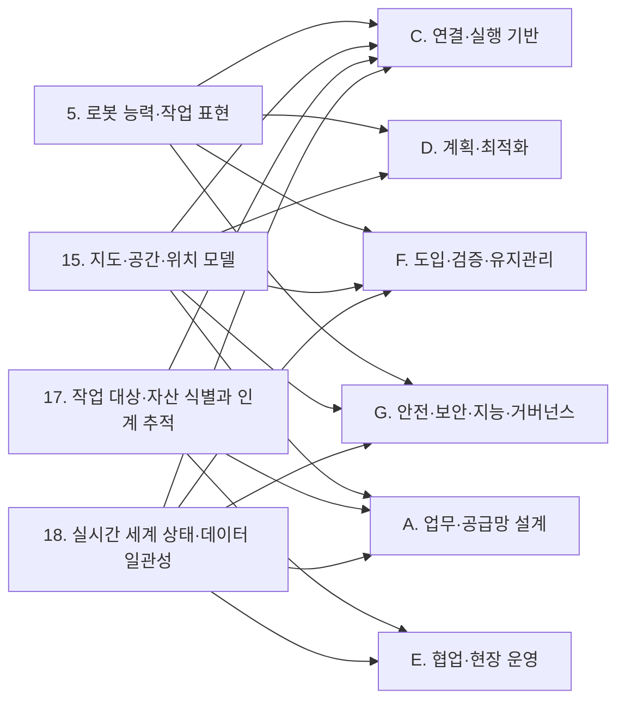
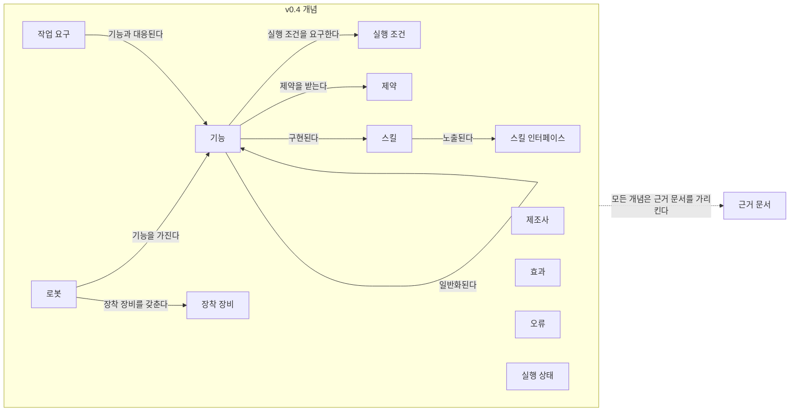
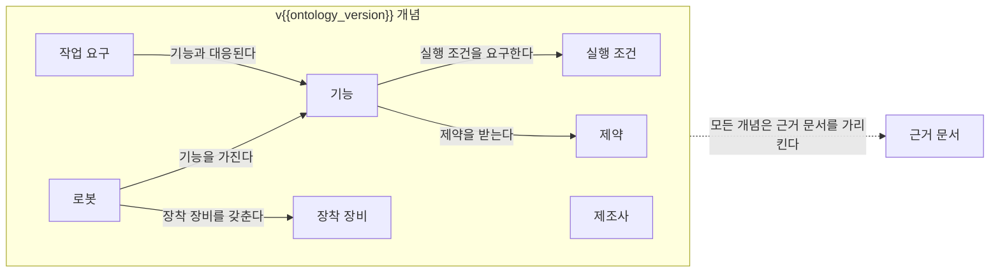

(너의 규칙은 시스템 프롬프트의 agents/shared-rules.md 와 agents/storyteller.md 이다. 아래는 이번 실행의 컨텍스트와 입력이다.)

## 실행 컨텍스트

- run_id: 2026-10-09-22
- date: 2026-10-09
- run_type: track (트랙 실행)
- 대상: 트랙 manual-capability-ontology (매뉴얼 기반 로봇 기능 온톨로지) · 현재 단계: 단계 2. 로봇 문서 유형과 정보 구조 조사 · 이번에 다룰 백로그 질문 id: q2-02, q2-03, q2-04 · 중심 세부영역: 5. 로봇 능력·작업 표현 (B. 로봇 온톨로지)
- 예산:
    - max_search_queries: 40
    - max_sources_per_run: 20
    - new_topic_pages: 1
    - page_updates: 2
    - max_retries: 2
- 환경 알림: web_fetch_available: true · fetch_mode: full
- 언어: ko

## 입력

### runs/2026-10-09-22/target.json

```json
{
  "run_id": "2026-10-09-22",
  "date": "2026-10-09",
  "weekday": "Fri",
  "run_number": 155,
  "run_type": "track",
  "forced": true,
  "target": {
    "area_no": 5,
    "area_name": "5. 로봇 능력·작업 표현",
    "category": "B. 로봇 온톨로지",
    "category_letter": "B"
  },
  "topic": null,
  "track": {
    "slug": "manual-capability-ontology",
    "name": "매뉴얼 기반 로봇 기능 온톨로지",
    "stage": 2,
    "stages": 7,
    "stage_name": "로봇 문서 유형과 정보 구조 조사",
    "question_ids": [
      "q2-02",
      "q2-03",
      "q2-04"
    ],
    "user_questions": [],
    "runs_per_week": 3,
    "question_rationale": "사용자 지정 0건, 되돌아온 질문 0건, 현재 단계 열린 질문 6건 중 오래된 순"
  },
  "corrections": [],
  "budget": {
    "max_search_queries": 40,
    "max_sources_per_run": 20,
    "new_topic_pages": 1,
    "page_updates": 2,
    "max_retries": 2
  },
  "priority_reason": null,
  "priority_questions": [],
  "excluded_areas": [],
  "lifted_areas": [],
  "deferred": {
    "monthly_recheck": false,
    "weekly_review": true
  },
  "selection_rationale": "CLI 지정 run_type=track, area=5; 트랙 실행일(Fri, track_days 앞 3개) → 트랙 manual-capability-ontology 단계 2, 질문 q2-02, q2-03, q2-04 (사용자 지정 0건, 되돌아온 질문 0건, 현재 단계 열린 질문 6건 중 오래된 순)"
}
```

### runs/2026-10-09-22/research.json

```json
{
  "run_id": "2026-10-09-22",
  "date": "2026-10-09",
  "run_type": "track",
  "target": {
    "area_no": 5,
    "area_name": "5. 로봇 능력·작업 표현",
    "category": "B. 로봇 온톨로지"
  },
  "gaps": [
    "단계 2 질문 q2-02·q2-03 조사 중(실행 2026-09-25-57 부분 답), q2-04 열림 — target.json 지정(사용자 지정 0건, 되돌아온 질문 0건, 현재 단계 열린 질문 6건 중 오래된 순)",
    "q2-02 남은 부분: 기계가독 스키마·설정 파일 안에서도 자유 텍스트로 남는 항목과 단위 표기 방식이 정리되지 않음, 형태별 추출 난이도 측정 자료 없음",
    "q2-03 남은 부분: AMR 제조사 공개 매뉴얼 샘플과 포털 매뉴얼 문서의 이용 조건 미확인",
    "q2-04 미조사: 문서에 없지만 실행에 필요한 정보(암묵지)와 보완 경로",
    "완료 조건: 문서 유형 매트릭스 64칸 가운데 9칸만 채움, 5절 '문서에 없는 정보' 비어 있음",
    "완료 조건: 공개 문서 샘플 목록에 AMR 샘플 없음"
  ],
  "research_questions": [
    "로봇이 할 수 있는 일과 작업이 요구하는 조건을 어떻게 같은 말로 표현할 것인가? [분류원문]",
    "q2-02 기능 정보는 어떤 형태(문장, 표, 그림·다이어그램, 코드 예제, 파라미터 표)로 존재하며 형태별 추출 난이도는 어떠한가?",
    "q2-03 공개적으로 접근할 수 있는 대표 문서 샘플(AMR, 협동로봇, 로봇팔 등)은 무엇이고 이용 조건은 어떠한가?",
    "q2-04 문서에 없지만 실행에 필요한 정보(암묵지)는 무엇이고 어디서 보완하는가(제조사 문의, 시험, 커뮤니티)?",
    "기계가독 스키마(VDA 5050 팩트시트, MassRobotics 스키마)와 플릿 어댑터 설정 파일 안에서 단위·값 형식과 자유 텍스트 항목은 어떻게 나뉘는가? (단계 2 페이지 3절 q2-02 겨냥)",
    "통합·시운전 때 사람이 채워야 하는 설정·코드 항목은 무엇이며 55. 현장 조사·설치·시운전과 어떻게 이어지는가? (단계 2 페이지 3절 q2-04, 문서 유형 매트릭스 5절 겨냥)"
  ],
  "findings": [
    {
      "id": "f1",
      "claim": "VDA 5050 팩트시트 JSON 스키마(main, 3.0.0)는 수치 필드마다 단위(maximumLoadMass 는 kg, 속도는 m/s, 각속도는 rad/s)와 최솟값 제약을 스키마 속성으로 달아, 파라미터 표 정보를 단위가 명시된 기계가독 형식으로 담는다.",
      "tag": "사실",
      "source_ids": [
        "ref-228"
      ],
      "cross_checked": false,
      "confidence": "medium",
      "evidence_excerpt": "maximumLoadMass: type number, \"unit\": \"kg\", minimum 0; maximumSpeed: unit m/s; maximumAngularSpeed: unit rad/s (발행일 미확인, 확인일 기준)",
      "as_of": "2026-10-09",
      "site_type": null,
      "flow_item": null
    },
    {
      "id": "f2",
      "claim": "같은 팩트시트 스키마도 시리즈 설명(seriesDescription), 동작 설명(actionDescription), 동작 결과(actionResult), 바퀴 제약(constraints)을 자유 텍스트로 두고 기구학 유형·로봇 분류를 확장 가능한 열거값으로 두어, 능력 관련 정보 일부가 기계가독 스키마 안에서도 문장으로 남는다.",
      "tag": "사실",
      "source_ids": [
        "ref-228"
      ],
      "cross_checked": false,
      "confidence": "medium",
      "evidence_excerpt": "actionResult \"Free text: description of the result\"; wheel constraints \"Free text: can be used by the manufacturer to define constraints\"; mobileRobotClass \"Extensible enum: FORKLIFT, CONVEYOR, TUGGER, CARRIER\" (발행일 미확인, 확인일 기준)",
      "as_of": "2026-10-09",
      "site_type": null,
      "flow_item": null
    },
    {
      "id": "f3",
      "claim": "팩트시트의 동작 결과·제약 같은 자유 텍스트 필드와 확장 열거값은 제조사마다 다른 문장·값을 담을 수 있으므로, 기계가독 스키마를 받아도 동작의 완료 의미와 제약은 문장 해석을 거쳐야 능력 모델로 옮길 수 있을 것으로 보인다.",
      "tag": "추정",
      "source_ids": [
        "ref-228"
      ],
      "cross_checked": false,
      "confidence": "low",
      "evidence_excerpt": "f2 의 자유 텍스트 필드(actionResult·constraints·actionDescription)와 확장 열거값에서 도출한 이 위키의 추론이며 측정 근거는 없다 (발행일 미확인, 확인일 기준)",
      "as_of": "2026-10-09",
      "site_type": null,
      "flow_item": null
    },
    {
      "id": "f4",
      "claim": "MassRobotics AMR 상호운용 표준 스키마의 식별 보고는 화물 최대 중량(cargoMaxWeight)을 설명에는 kg 단위로 적되 문자열형으로 정의하고, 화물 설명(cargoType)은 자유 문자열로, 제품 문서(productDocumentation)는 문서 내용이 아니라 URI 링크로 둔다.",
      "tag": "사실",
      "source_ids": [
        "ref-230"
      ],
      "cross_checked": false,
      "confidence": "medium",
      "evidence_excerpt": "cargoMaxWeight: \"Max weight of cargo in kg\", type string; cargoType: type string; productDocumentation: \"Link to product documenation\", format uri (발행일 미확인, 확인일 기준)",
      "as_of": "2026-10-09",
      "site_type": null,
      "flow_item": null
    },
    {
      "id": "f5",
      "claim": "Open-RMF 플릿 어댑터 템플릿의 config.yaml 은 수행 가능한 작업 유형(task_capabilities 의 loop·delivery 참거짓값), 동작 목록(actions), 배터리 전압·용량·충전 전류, 질량, 외형 반경을 YAML 값으로 선언하되 단위는 V·Ahr·A·kg·m 같은 줄 끝 주석으로만 적는다.",
      "tag": "사실",
      "source_ids": [
        "ref-105"
      ],
      "cross_checked": false,
      "confidence": "medium",
      "evidence_excerpt": "task_capabilities: loop: True, delivery: True; actions: [\"some_action_here\"]; battery_system: voltage: 12.0 # V, capacity: 24.0 # Ahr; footprint: 0.3 # radius in m (발행일 미확인, 확인일 기준)",
      "as_of": "2026-10-09",
      "site_type": null,
      "flow_item": null
    },
    {
      "id": "f6",
      "claim": "확인한 기계가독 형식 안에서도 단위가 스키마 속성으로 명시된 값(VDA 5050 팩트시트), 단위가 주석에만 있는 설정값(Open-RMF config.yaml), 수치를 문자열로 담은 값(MassRobotics 화물 최대 중량), 자유 텍스트(동작 결과·제약·화물 설명) 순으로 정규화에 드는 추가 해석이 늘 것으로 보이나, 형태별 추출 난이도를 측정한 자료는 여전히 확인되지 않았다.",
      "tag": "추정",
      "source_ids": [
        "ref-228",
        "ref-105",
        "ref-230",
        "ref-513"
      ],
      "cross_checked": false,
      "confidence": "low",
      "evidence_excerpt": "f1·f2·f4·f5 의 값 형식을 대응시킨 이 위키의 추론. 범용 파싱 벤치마크는 매뉴얼을 문서 유형에 두지 않아 측정 근거가 없다 (발행일 미확인, 확인일 기준)",
      "as_of": "2026-10-09",
      "site_type": null,
      "flow_item": null,
      "source_unopened": false
    },
    {
      "id": "f7",
      "claim": "OmniDocBench 공식 저장소 README 는 PDF 문서 파싱을 텍스트 문단·표·수식·읽기 순서로 나눠 평가하며 문서 유형으로 논문·재무 보고서·신문·교과서·손글씨 노트 등을 들고 매뉴얼은 명시하지 않는다.",
      "tag": "사실",
      "source_ids": [
        "ref-513"
      ],
      "cross_checked": false,
      "confidence": "medium",
      "evidence_excerpt": "요소 형태별(문단·표·수식·읽기 순서) 평가, 문서 유형 목록에 매뉴얼 없음 (발행일 미확인, 확인일 기준) (재인용: 2026-09-25-57)",
      "as_of": "2026-10-09",
      "site_type": null,
      "flow_item": null,
      "source_unopened": true
    },
    {
      "id": "f8",
      "claim": "Boston Dynamics Spot SDK 는 GitHub 에 공개되어 있으나 사용·복제·배포가 Boston Dynamics SDK 라이선스(20191101-BDSDK-SL) 조건을 따른다고 저장소 README 가 적는다.",
      "tag": "추정",
      "source_ids": [
        "ref-505"
      ],
      "cross_checked": false,
      "confidence": "medium",
      "evidence_excerpt": "벤더 주장: 저장소 README 의 라이선스 표기(20191101-BDSDK-SL) (발행일 미확인, 확인일 기준) (재인용: 2026-09-25-57)",
      "as_of": "2026-10-09",
      "site_type": null,
      "flow_item": null,
      "source_unopened": true,
      "vendor_claim": true
    },
    {
      "id": "f9",
      "claim": "Kinova Kortex API 저장소는 BSD 3-Clause 라이선스로 공개되어 있다고 저장소가 표기한다.",
      "tag": "추정",
      "source_ids": [
        "ref-506"
      ],
      "cross_checked": false,
      "confidence": "medium",
      "evidence_excerpt": "벤더 주장: kortex 저장소 라이선스 표기 BSD 3-Clause (발행일 미확인, 확인일 기준) (재인용: 2026-09-25-57)",
      "as_of": "2026-10-09",
      "site_type": null,
      "flow_item": null,
      "source_unopened": true,
      "vendor_claim": true
    },
    {
      "id": "f10",
      "claim": "국내 협동로봇 제조사의 공개 저장소(두산 doosan-robot2: Apache 2.0·BSD 3-Clause, 레인보우 rbpodo: Apache 2.0)는 코드에 개방 라이선스를 달지만, 두산로보틱스 로봇랩 포털에서 내려받는 매뉴얼 문서 자체의 이용 조건은 확인되지 않았다.",
      "tag": "추정",
      "source_ids": [
        "ref-507",
        "ref-508",
        "ref-511"
      ],
      "cross_checked": false,
      "confidence": "low",
      "evidence_excerpt": "벤더 주장: 저장소 라이선스 표기(Apache 2.0·BSD 3-Clause / Apache 2.0), 포털 매뉴얼 이용 약관 미확인 (발행일 미확인, 확인일 기준) (재인용: 2026-09-25-57)",
      "as_of": "2026-10-09",
      "site_type": null,
      "flow_item": null,
      "source_unopened": true,
      "vendor_claim": true
    },
    {
      "id": "f11",
      "claim": "이번 재실행 입력에서 AMR 쪽 공개 문서는 VDA 5050 팩트시트·MassRobotics 표준 스키마뿐이고, MassRobotics 식별 보고는 제품 문서 링크 필드만 두어 AMR 제조사 매뉴얼 샘플을 대신하지 못하는 것으로 보인다(부재 확정 아님).",
      "tag": "추정",
      "source_ids": [
        "ref-228",
        "ref-230"
      ],
      "cross_checked": false,
      "confidence": "low",
      "evidence_excerpt": "표준 스키마는 공식 저장소에 공개, productDocumentation 은 URI 링크 필드. 이번 재실행은 새 검색을 하지 않아 AMR 매뉴얼 샘플을 찾지 않았다 (발행일 미확인, 확인일 기준)",
      "as_of": "2026-10-09",
      "site_type": null,
      "flow_item": null
    },
    {
      "id": "f12",
      "claim": "Open-RMF PerformAction 튜토리얼에서 사용자 정의 동작은 config.yaml 의 actions 로 이름만 선언되고, 그 동작을 로봇 API 호출로 옮기는 start_activity 는 로봇과 사용 사례에 특화된 것으로서 통합자가 RobotClientAPI 에 직접 구현해야 한다.",
      "tag": "사실",
      "source_ids": [
        "ref-040"
      ],
      "cross_checked": false,
      "confidence": "medium",
      "evidence_excerpt": "start_activity docstring: \"This is specific to the robot and the use case\"; fleet manager 가 동작을 모르면 execution.finished() 로 활동을 끝낸다 (발행일 미확인, 확인일 기준)",
      "as_of": "2026-10-09",
      "site_type": null,
      "flow_item": "완료·인계"
    },
    {
      "id": "f13",
      "claim": "같은 튜토리얼에서 RMF 는 사용자 정의 동작 동안 로봇 제어권을 내려놓고, 어댑터의 갱신 루프가 is_command_completed 로 로봇 API 의 완료를 확인한 뒤 execution.finished() 를 호출해야 완료로 처리한다.",
      "tag": "사실",
      "source_ids": [
        "ref-040"
      ],
      "cross_checked": false,
      "confidence": "medium",
      "evidence_excerpt": "RMF would relinquish control of the robot until it is signalled that the robot has completed the custom action; update 루프의 is_command_completed → execution.finished() (발행일 미확인, 확인일 기준)",
      "as_of": "2026-10-09",
      "site_type": null,
      "flow_item": "완료·인계"
    },
    {
      "id": "f14",
      "claim": "Open-RMF 플릿 어댑터 템플릿의 config.yaml 은 층별 RMF 좌표와 로봇 좌표 대응점 네 쌍(reference_coordinates), 로봇별 충전기 이름, 운용 하한·충전 목표 배터리 수준(recharge_threshold·recharge_soc), 질량·관성 모멘트·마찰 계수, 대기·도구 소비 전력, 제조사 관제 접속 주소·계정을 채우게 한다.",
      "tag": "사실",
      "source_ids": [
        "ref-105"
      ],
      "cross_checked": false,
      "confidence": "medium",
      "evidence_excerpt": "reference_coordinates: L1: rmf/robot 4점; charger: \"tinyRobot1_charger\"; recharge_threshold: 0.10; moment_of_inertia, friction_coefficient; fleet_manager: prefix, user, password (발행일 미확인, 확인일 기준)",
      "as_of": "2026-10-09",
      "site_type": null,
      "flow_item": "제약"
    },
    {
      "id": "f15",
      "claim": "좌표 대응점·충전기 배정·배터리 하한 같은 현장 설정과 동작–로봇 API 매핑·완료 확인 코드는 현장과 통합 방식에 따라 정해지므로 제조사 문서에서 가져올 수 없고, 통합자가 55. 현장 조사·설치·시운전 단계의 측정·시험과 어댑터 구현으로 보완해야 하는 암묵지에 해당하는 것으로 보인다.",
      "tag": "추정",
      "source_ids": [
        "ref-105",
        "ref-040"
      ],
      "cross_checked": false,
      "confidence": "low",
      "evidence_excerpt": "f12·f13·f14 의 설정·코드 항목에서 도출한 이 위키의 추론이며, 제조사 문의·커뮤니티 경로를 다룬 출처는 이번에 없다 (발행일 미확인, 확인일 기준)",
      "as_of": "2026-10-09",
      "site_type": null,
      "flow_item": null
    },
    {
      "id": "f16",
      "claim": "VDA 5050 팩트시트 스키마는 팩트시트를 특정 이동로봇 유형 시리즈의 기본 정보로 규정하고, 그 쓰임을 유형 비교, 시스템 계획·규모 산정·시뮬레이션, VDA 5050 플릿 관제 통합으로 든다.",
      "tag": "사실",
      "source_ids": [
        "ref-228"
      ],
      "cross_checked": false,
      "confidence": "medium",
      "evidence_excerpt": "\"The factsheet provides basic information about a specific mobile robot type series\" — planning, dimensioning and simulation, integration into fleet control (발행일 미확인, 확인일 기준)",
      "as_of": "2026-10-09",
      "site_type": null,
      "flow_item": null
    },
    {
      "id": "f17",
      "claim": "MassRobotics 스키마의 상태 보고는 배터리 비율, 남은 가동 시간, 남은 적재 여유 비율, 오류 코드(자유 문자열 배열)를 실행 중 값으로 보고하게 한다.",
      "tag": "사실",
      "source_ids": [
        "ref-230"
      ],
      "cross_checked": false,
      "confidence": "medium",
      "evidence_excerpt": "statusReport: batteryPercentage, remainingRunTime, loadPercentageStillAvailable, errorCodes(items type string) (발행일 미확인, 확인일 기준)",
      "as_of": "2026-10-09",
      "site_type": null,
      "flow_item": "예외·성과"
    },
    {
      "id": "f18",
      "claim": "Naqvi 외(2025)는 제조사가 광고한 능력과 운용 중 관측된 능력을 온톨로지로 구분해 통합하는 방법을 제시했다.",
      "tag": "사실",
      "source_ids": [
        "ref-041"
      ],
      "cross_checked": false,
      "confidence": "medium",
      "evidence_excerpt": "advertised capabilities 와 operational capabilities 를 온톨로지로 구분·통합 (재인용: 2026-09-25-15)",
      "as_of": "2025-10-02",
      "site_type": null,
      "flow_item": null,
      "source_unopened": true
    },
    {
      "id": "f19",
      "claim": "팩트시트가 유형 시리즈 수준의 선언이고(f16) 남은 가동 시간·적재 여유·오류 코드 같은 값은 상태 보고로만 드러나므로(f17), 개체별 실제 성능 저하나 오류 코드의 뜻 같은 암묵지는 문서보다 운용 중 상태 보고와 관측 능력 기록(f18)으로 보완하는 것으로 보이며, 제조사 문의·커뮤니티 경로는 이번에 확인하지 못했다.",
      "tag": "추정",
      "source_ids": [
        "ref-228",
        "ref-230",
        "ref-041"
      ],
      "cross_checked": false,
      "confidence": "low",
      "evidence_excerpt": "f16·f17·f18 을 대응시킨 이 위키의 추론 (발행일 미확인, 확인일 기준)",
      "as_of": "2026-10-09",
      "site_type": null,
      "flow_item": "예외·성과",
      "source_unopened": false
    }
  ],
  "sources": [
    {
      "id": "ref-040",
      "org": "Open Robotics",
      "title": "PerformAction Tutorial - Programming Multiple Robots with ROS 2",
      "published": null,
      "url": "https://osrf.github.io/ros2multirobotbook/integration_fleets_action_tutorial.html",
      "type": "오픈소스 문서",
      "reliability": "high",
      "accessed": "2026-10-09",
      "summary": "Open-RMF 플릿 어댑터에서 사용자 정의 동작을 config.yaml 로 선언하고 로봇 API 호출과 완료 확인을 구현하는 튜토리얼.",
      "fetched": true,
      "fetched_via": "github_raw",
      "fetch_url": null,
      "source_unopened": false
    },
    {
      "id": "ref-105",
      "org": "Open Robotics (open-rmf)",
      "title": "fleet_adapter_template — fleet_adapter_template/config.yaml",
      "published": null,
      "url": "https://github.com/open-rmf/fleet_adapter_template/blob/main/fleet_adapter_template/config.yaml",
      "type": "오픈소스 문서",
      "reliability": "high",
      "accessed": "2026-10-09",
      "summary": "Open-RMF 플릿 어댑터 템플릿 설정 파일. 작업 능력·동작·배터리·기계 특성·좌표 변환·관제 접속 정보를 선언한다.",
      "fetched": true,
      "fetched_via": "github_raw",
      "fetch_url": null,
      "source_unopened": false
    },
    {
      "id": "ref-228",
      "org": "VDA / VDMA (VDA5050 GitHub)",
      "title": "VDA5050/VDA5050 — json_schemas/factsheet.schema",
      "published": null,
      "url": "https://github.com/VDA5050/VDA5050/blob/main/json_schemas/factsheet.schema",
      "type": "표준",
      "reliability": "high",
      "accessed": "2026-10-09",
      "summary": "VDA 5050 main(3.0.0) 팩트시트 JSON 스키마. 유형 명세·물리 파라미터·프로토콜 한계·지원 기능·기하·적재 명세를 단위와 함께 정의한다(입력 원문은 앞 37,286자 발췌).",
      "fetched": true,
      "fetched_via": "github_raw",
      "fetch_url": null,
      "source_unopened": false
    },
    {
      "id": "ref-230",
      "org": "MassRobotics",
      "title": "MassRobotics-AMR/AMR_Interop_Standard — AMR_Interop_Standard.json",
      "published": null,
      "url": "https://github.com/MassRobotics-AMR/AMR_Interop_Standard/blob/main/AMR_Interop_Standard.json",
      "type": "표준",
      "reliability": "high",
      "accessed": "2026-10-09",
      "summary": "MassRobotics AMR 상호운용 표준의 식별 보고·상태 보고 JSON 스키마.",
      "fetched": true,
      "fetched_via": "github_raw",
      "fetch_url": null,
      "source_unopened": false
    },
    {
      "id": "ref-041",
      "org": "Naqvi, M. R. 외(Scientific Reports)",
      "title": "Ontology-driven integration of advertised and operational capabilities in robots",
      "published": "2025-10-02",
      "url": "https://www.nature.com/articles/s41598-025-16649-3",
      "type": "논문",
      "reliability": "medium",
      "accessed": "2026-10-09",
      "summary": "원문 미열람. 제조사 광고 능력과 운용 중 관측 능력을 온톨로지로 구분해 통합하는 방법을 제시한 논문.",
      "source_unopened": true,
      "fetched": false,
      "fetched_via": null,
      "fetch_url": null
    },
    {
      "id": "ref-505",
      "org": "Boston Dynamics (boston-dynamics/spot-sdk GitHub)",
      "title": "spot-sdk — README",
      "published": null,
      "url": "https://github.com/boston-dynamics/spot-sdk",
      "type": "벤더 문서",
      "reliability": "medium",
      "accessed": "2026-10-09",
      "summary": "원문 미열람. Spot SDK 공식 저장소 README. 문서 구성과 SDK 라이선스를 안내한다(이번 재실행에서는 다시 열지 않음).",
      "source_unopened": true,
      "fetched": false,
      "fetched_via": null,
      "fetch_url": null
    },
    {
      "id": "ref-506",
      "org": "Kinova (Kinovarobotics/kortex GitHub)",
      "title": "kortex — readme",
      "published": null,
      "url": "https://github.com/Kinovarobotics/kortex",
      "type": "벤더 문서",
      "reliability": "medium",
      "accessed": "2026-10-09",
      "summary": "원문 미열람. Kinova Kortex API 공식 저장소 README. API 문서·예제와 라이선스를 안내한다(이번 재실행에서는 다시 열지 않음).",
      "source_unopened": true,
      "fetched": false,
      "fetched_via": null,
      "fetch_url": null
    },
    {
      "id": "ref-507",
      "org": "Doosan Robotics (doosan-robotics/doosan-robot2 GitHub)",
      "title": "doosan-robot2 — README (humble)",
      "published": null,
      "url": "https://github.com/doosan-robotics/doosan-robot2",
      "type": "벤더 문서",
      "reliability": "medium",
      "accessed": "2026-10-09",
      "summary": "원문 미열람. 두산로보틱스 ROS2 패키지 저장소 README(이번 재실행에서는 다시 열지 않음).",
      "source_unopened": true,
      "fetched": false,
      "fetched_via": null,
      "fetch_url": null
    },
    {
      "id": "ref-508",
      "org": "Rainbow Robotics (RainbowRobotics/rbpodo GitHub)",
      "title": "rbpodo — README",
      "published": null,
      "url": "https://github.com/RainbowRobotics/rbpodo",
      "type": "벤더 문서",
      "reliability": "medium",
      "accessed": "2026-10-09",
      "summary": "원문 미열람. 레인보우로보틱스 협동로봇 클라이언트 라이브러리 README(이번 재실행에서는 다시 열지 않음).",
      "source_unopened": true,
      "fetched": false,
      "fetched_via": null,
      "fetch_url": null
    },
    {
      "id": "ref-511",
      "org": "두산로보틱스",
      "title": "매뉴얼 : Doosan Robotics Training & Service",
      "published": null,
      "url": "https://robotlab.doosanrobotics.com/ko/board/Resources/Manual",
      "type": "벤더 문서",
      "reliability": "low",
      "accessed": "2026-10-09",
      "summary": "원문 미열람. 두산로보틱스 로봇랩 포털의 매뉴얼 게시판.",
      "source_unopened": true,
      "fetched": false,
      "fetched_via": null,
      "fetch_url": null
    },
    {
      "id": "ref-513",
      "org": "OpenDataLab (opendatalab/OmniDocBench GitHub)",
      "title": "OmniDocBench — README",
      "published": null,
      "url": "https://github.com/opendatalab/OmniDocBench",
      "type": "오픈소스 문서",
      "reliability": "medium",
      "accessed": "2026-10-09",
      "summary": "원문 미열람. 범용 PDF 문서 파싱 벤치마크 README(이번 재실행에서는 다시 열지 않음).",
      "source_unopened": true,
      "fetched": false,
      "fetched_via": null,
      "fetch_url": null
    }
  ],
  "page_proposals": [
    {
      "action": "update",
      "path": "docs/tracks/manual-capability-ontology/stage-2-document-types.md",
      "sections": [
        "2",
        "3",
        "4",
        "5",
        "6",
        "8",
        "9"
      ],
      "rationale": "q2-04 답: f12·f13·f14·f15·f16·f17·f18·f19 (신뢰도 low) / q2-02 부분 답: f1·f2·f3·f4·f5·f6·f7 / q2-03 부분 답: f8·f9·f10·f11 — 2절 q2-04 답함, q2-02·q2-03 조사 중 유지, 3절 q2-04 소제목 신설({#q2-04}, 통합 설정·어댑터 코드·상태 보고로 보완되는 정보), q2-02 에 기계가독 스키마 안의 단위 표기·자유 텍스트 구분 보강, q2-03 은 재인용 확인만, 4절 결론·불확실성, 5절 후속 질문, 6절 완료 조건 현황, 8절 출처, 9절 이력"
    },
    {
      "action": "update",
      "path": "docs/tracks/manual-capability-ontology/document-type-matrix.md",
      "sections": [
        "3",
        "5",
        "8"
      ],
      "rationale": "트랙 산출물 갱신: 사양서·데이터시트 행 파라미터 범위 칸에 단위가 스키마 속성으로 명시됨(f1), 동작 결과·제약 자유 텍스트(f2) 메모. 5절 '문서에 없는 정보'에 통합 설정(좌표 대응점·충전기 배정·배터리 하한)·동작–API 매핑·완료 확인 코드(f12~f15)와 운용 중 값(f16~f19)을 정보 항목별로 요약(보완 경로: 통합·시운전, 상태 보고, 운용 관측. 제조사 문의·커뮤니티는 미확인)"
    },
    {
      "action": "update",
      "path": "docs/categories/robot-ontology/robot-capability-and-task-representation.md",
      "sections": [
        "6"
      ],
      "rationale": "트랙 manual-capability-ontology 단계 2 반영 제안 (f2, f16, f18, f19): 팩트시트가 유형 시리즈 수준 선언이고 동작 결과·제약이 자유 텍스트로 남아, 능력 모델은 문서 선언과 운용 관측을 함께 담아야 한다는 점"
    },
    {
      "action": "update",
      "path": "docs/categories/verification-deployment-and-lifecycle/site-survey-installation-and-commissioning.md",
      "sections": [
        "6"
      ],
      "rationale": "트랙 manual-capability-ontology 단계 2 반영 제안 (f12, f14, f15): 플릿 어댑터 통합 때 사람이 채우는 현장 설정(층별 좌표 대응점·충전기 배정·배터리 하한)과 동작–로봇 API 매핑 코드가 제조사 문서 밖의 암묵지라는 점"
    }
  ],
  "glossary_candidates": [],
  "open_questions_new": [],
  "open_questions_resolved": [],
  "self_check": {
    "source_count": 11,
    "cross_checked_count": 0,
    "unverified": [
      "q2-02 부분 답: 로봇 매뉴얼의 형태별(문장·표·그림·코드) 추출 정확도를 측정한 자료 미확인",
      "q2-03 부분 답: AMR 제조사 공개 매뉴얼 샘플과 포털 매뉴얼 문서의 이용 약관 미확인(이번 재실행에서 새 검색 없음)",
      "q2-04: 보완 경로 가운데 제조사 문의·커뮤니티는 근거 출처 없음",
      "ref-228 원문 텍스트가 앞 37,286자 발췌라 적재 명세 뒷부분·구성 블록 미확인",
      "ref-041·ref-505·ref-506·ref-507·ref-508·ref-511·ref-513 은 이번 재실행에서 다시 열지 않음",
      "모든 finding 교차 확인 없음"
    ],
    "scope_violations": [],
    "budget_used": {
      "queries": 0,
      "sources": 0
    },
    "limits": "재실행 1회차. 반려 사유 1(스키마 불일치: f10·f11·f16 이 벤더 문서만 근거로 한 [사실] 인데 vendor_claim 표시 없음): 지시에 따라 새 조사 없이 형식만 고치려 했으나 직전 반환 JSON 이 입력에 포함되지 않아 그대로 수정할 수 없었다. 그래서 입력으로 받은 원문 텍스트(data/source_texts 의 ref-040·ref-105·ref-228·ref-230, fetched_via inbox)와 기존 참고문헌 재인용만으로 같은 질문(q2-02·q2-03·q2-04)의 브리프를 다시 구성했다. 벤더 문서만 근거로 한 finding(f8·f9·f10)은 모두 태그 추정, vendor_claim true, evidence_excerpt 첫머리 '벤더 주장: '으로 냈고, 사실 태그는 표준·오픈소스 문서·논문 출처 finding 에만 두었다(새 f11·f16 은 표준 출처 근거). 검색 0회, WebFetch 0회, 신규 출처 0건으로 예약 구간 ref-1397~ref-1426 은 쓰지 않았다. 재사용 11건 가운데 4건은 inbox 원문, 7건은 원문 미열람 표시. 답한 질문: q2-04(통합 설정·어댑터 코드·상태 보고로 보완되는 정보, 신뢰도 low). q2-02·q2-03 은 부분 답. 후속 질문 2건. 온톨로지 변경 없음: 이번 근거(f2·f16·f18)는 초안 6절 '근거 문서의 단위와 버전' 질문과 기능의 능력 출처 구분 속성(광고 / 운용)과 겹쳐 새 개념·관계 근거가 되지 않는다. 용어 후보 없음: 트랙 glossary_targets 가운데 미등록 용어(로봇 능력 온톨로지, SPARQL, 온톨로지 학습)에 대한 이번 근거 없음. 현장 유형 사례 finding 없음(site_type 모두 null). 47. AI·학습·적응과 모델 운영 관련 finding(f6·f7)은 적용 대상 5. 로봇 능력·작업 표현·55. 현장 조사·설치·시운전과 함께 반영 제안. 18. 실시간 세계 상태·데이터 일관성 관련 f17·f19 는 현재 상태 보고로만 다뤘고 34. 시뮬레이션·예측용 디지털 트윈과 섞지 않았다. 새 일반 열린 질문 없음. 정정 요청 없음. 입력 누락 없음."
  },
  "track": {
    "slug": "manual-capability-ontology",
    "stage": 2,
    "answered_question_ids": [
      "q2-04"
    ],
    "new_questions": [
      {
        "question": "VDA 5050 팩트시트의 동작 결과(actionResult)·제약(constraints)·동작 설명처럼 기계가독 스키마 안에 남은 자유 텍스트 필드를 능력 온톨로지의 완료 확인·제약으로 옮길 때 어떤 추출·검토 방법을 쓰는가? (q2-02 에서 파생)",
        "stage": 3,
        "rationale_finding_id": "f2"
      },
      {
        "question": "통합자가 플릿 어댑터에 구현한 동작–로봇 API 매핑과 완료 확인 코드를 능력 온톨로지의 근거 문서로 기록하고, 제조사 문서 선언과 어떻게 구분해 관리하는가? (q2-04 에서 파생)",
        "stage": 4,
        "rationale_finding_id": "f12"
      }
    ],
    "ontology_changes": [],
    "stage_completion_self_assessment": {
      "met": false,
      "missing": [
        "문서 유형 매트릭스: 사용자 매뉴얼·오류 코드표·치수도·도면 행 미조사, 64칸 가운데 대부분 미조사",
        "공개 문서 샘플 목록: AMR 샘플 없음, 포털 매뉴얼 이용 조건 미확인",
        "q2-02·q2-03 부분 답, q2-05·q2-06·q2-07 열림"
      ]
    }
  }
}
```

### runs/2026-10-09-22/verification.json

```json
{
  "run_id": "2026-10-09-22",
  "stage": "first",
  "verdict": "조건부 승인",
  "claim_checks": [
    {
      "finding_id": "f1",
      "source_exists": true,
      "supports_claim": true,
      "cross_checked": false,
      "tag_decision": "유지",
      "note": "확인: 입력 원문(data/source_texts/ref-228)과 검증 재열람(raw main factsheet.schema, 2026-10-09) 모두 maximumLoadMass unit kg·minimum 0, maximumSpeed m/s, maximumAngularSpeed rad/s 를 보인다. 다만 '수치 필드마다'는 과잉 일반화다: loadDimensions length·width 는 unit 속성 없이 설명문에 'in meters'로만 적고, maximumDeceleration·minimumHeight·maximumHeight 에는 minimum 이 없다. 범위 축소 수정 지시로 처리. 단일 출처."
    },
    {
      "finding_id": "f2",
      "source_exists": true,
      "supports_claim": true,
      "cross_checked": false,
      "tag_decision": "유지",
      "note": "확인: seriesDescription·actionDescription·actionResult·wheel constraints 가 'Free text' 설명, mobileRobotKinematics·mobileRobotClass 가 'Extensible enum'(enum 키워드 없이 설명문) 이다(원문·재열람 일치). evidence_excerpt 에 원문 구절 3개를 직접 인용했으므로 페이지에서는 재서술한다."
    },
    {
      "finding_id": "f3",
      "source_exists": true,
      "supports_claim": true,
      "cross_checked": false,
      "tag_decision": "유지",
      "note": "[추정] 유지: f2 에서 도출한 이 위키의 추론이며 측정 근거 없음을 브리프가 밝혔다. 신뢰도 low."
    },
    {
      "finding_id": "f4",
      "source_exists": true,
      "supports_claim": true,
      "cross_checked": false,
      "tag_decision": "유지",
      "note": "확인: cargoMaxWeight 설명 'Max weight of cargo in kg'·type string, cargoType type string, productDocumentation format uri(원문·재열람 일치). 기존 실행 2026-09-25-35 f6 와 같은 관찰이므로 ref-230 각주를 재사용한다. identityReport 의 한국어 표기는 용어집 '신원 보고'를 따른다."
    },
    {
      "finding_id": "f5",
      "source_exists": true,
      "supports_claim": true,
      "cross_checked": false,
      "tag_decision": "유지",
      "note": "확인: task_capabilities loop·delivery True, actions [\"some_action_here\"], voltage 12.0 # V, capacity 24.0 # Ahr, charging_current 5.0 # A, mass 20.0 # kg, footprint 0.3 # radius in m(원문·재열람 일치). 값은 템플릿 예시값(tinyRobot·some_action_here)이며, limits 는 단위 없이 '# velocity, acceleration' 주석만, friction_coefficient 는 주석 없음 — 페이지에서 예시값임을 밝힌다."
    },
    {
      "finding_id": "f6",
      "source_exists": true,
      "supports_claim": true,
      "cross_checked": false,
      "tag_decision": "유지",
      "note": "[추정] 유지: f1·f2·f4·f5 를 대응시킨 추론이며 측정 근거 없음을 명시했다. ref-513 은 리서치가 이번에 열지 않았는데 이 finding 의 source_unopened 가 false 로 적혀 있다(브리프 표기 불일치, 코드 상한 적용 대상). 검증 에이전트가 ref-513 README 를 raw 경로로 재열람해 실재를 확인했다. 신뢰도 low."
    },
    {
      "finding_id": "f7",
      "source_exists": true,
      "supports_claim": true,
      "cross_checked": false,
      "tag_decision": "유지",
      "note": "확인(검증 재열람 raw README, 2026-10-09): 평가를 텍스트 문단·수식·표·읽기 순서로 나누고 문서 유형 목록에 매뉴얼이 없다. 단 목록의 'research report'를 '재무 보고서'로 옮긴 것은 원문과 다르다(목록: 학술 문헌, PPT→PDF, 책, 컬러 교과서, 시험지, 손글씨 노트, 잡지, 연구 보고서, 신문 — 소개문은 10종이라 하나 9종만 열거). 문구 수정 지시. 기존 단계 2 페이지 q2-02 문장과 같은 내용이므로 새 각주 없이 재사용."
    },
    {
      "finding_id": "f8",
      "source_exists": true,
      "supports_claim": true,
      "cross_checked": false,
      "tag_decision": "유지",
      "note": "확인(검증 재열람 raw README): '20191101-BDSDK-SL' 라이선스 표기가 있다. 리서치는 이번에 열지 않음(재인용). [추정] 벤더 주장 유지. 기존 단계 2 페이지 q2-03 문장과 중복 — 새 내용 없음."
    },
    {
      "finding_id": "f9",
      "source_exists": true,
      "supports_claim": true,
      "cross_checked": false,
      "tag_decision": "유지",
      "note": "확인(검증 재열람 raw LICENSE): BSD 3-Clause. 리서치 미열람(재인용). [추정] 벤더 주장 유지. 기존 페이지와 중복."
    },
    {
      "finding_id": "f10",
      "source_exists": true,
      "supports_claim": true,
      "cross_checked": false,
      "tag_decision": "유지",
      "note": "확인(검증 재열람): doosan-robot2 humble README 배지 Apache 2.0·BSD 3-Clause, rbpodo LICENSE Apache 2.0. ref-511 URL 은 2026-10-09 현재 service-portal.doosanrobotics.ai 로 302 리디렉션되어 매뉴얼 게시판 내용을 확인하지 못했다(원문 미열람). 주장은 '이용 조건 미확인'이므로 유지. [추정] 벤더 주장 유지."
    },
    {
      "finding_id": "f11",
      "source_exists": true,
      "supports_claim": true,
      "cross_checked": false,
      "tag_decision": "유지",
      "note": "[추정] 유지: productDocumentation 이 URI 링크 필드라는 점은 ref-230 으로 확인. 나머지는 '이번 실행 입력 범위'에 대한 진술이며 새 검색이 없었으므로 AMR 매뉴얼 샘플 부재의 근거가 아니다 — 페이지에서는 실행 범위 한계로만 쓴다."
    },
    {
      "finding_id": "f12",
      "source_exists": true,
      "supports_claim": true,
      "cross_checked": false,
      "tag_decision": "유지",
      "note": "확인: start_activity docstring 'This is specific to the robot and the use case', actions 로 이름만 선언, fleet manager 가 동작을 모르면 execution.finished() 로 종료(원문·재열람 일치). 단일 출처."
    },
    {
      "finding_id": "f13",
      "source_exists": true,
      "supports_claim": true,
      "cross_checked": false,
      "tag_decision": "유지",
      "note": "확인: 'RMF would relinquish control…' 문장과 update 루프의 is_command_completed → execution.finished() 가 있다. 다만 튜토리얼은 별도 콜백으로 완료를 표시하는 방식도 허용하므로 '…해야 완료로 처리한다'는 '튜토리얼 예시에서는 …로 완료를 알린다(별도 콜백도 가능)'로 좁힌다. 5. 로봇 능력·작업 표현 5절 완료·인계 칸과 같은 근거(ref-040)."
    },
    {
      "finding_id": "f14",
      "source_exists": true,
      "supports_claim": true,
      "cross_checked": false,
      "tag_decision": "유지",
      "note": "확인: reference_coordinates L1 rmf·robot 4쌍, charger, recharge_threshold 0.10·recharge_soc 1.0, mass·moment_of_inertia·friction_coefficient, ambient·tool power, fleet_manager prefix·user·password(원문·재열람 일치). 단 reference_coordinates 는 '# Optional' 표시가 붙은 선택 항목이므로 '채우게 한다'를 '두며, 좌표 대응점은 선택 항목이다'로 고친다."
    },
    {
      "finding_id": "f15",
      "source_exists": true,
      "supports_claim": false,
      "cross_checked": false,
      "tag_decision": "강등",
      "note": "부분 뒷받침: 좌표 대응점·충전기 배정·동작–로봇 API 매핑·완료 확인 코드가 통합자 몫이라는 점은 ref-105·ref-040 이 뒷받침한다. 그러나 '배터리 하한'을 제조사 문서에서 가져올 수 없다고 한 부분은 출처가 뒷받침하지 않고, VDA 5050 3.0.0 팩트시트가 batteryCharging.criticalLowChargingLevel 을 선언하게 한다는 기존 검증 사실(실행 2026-09-25-23, 검증 재열람으로 재확인)과 충돌한다(oq-068). 이미 [추정]이므로 강등은 '배터리 하한' 삭제와 [추정]·신뢰도 low 유지로 이행한다. 제조사 문의·커뮤니티 경로 근거 없음."
    },
    {
      "finding_id": "f16",
      "source_exists": true,
      "supports_claim": true,
      "cross_checked": false,
      "tag_decision": "유지",
      "note": "확인: 스키마 description 첫 문장과 쓰임(유형 비교, 계획·규모 산정·시뮬레이션, VD[M]A-5050 플릿 관제 통합)이 원문·재열람과 일치. evidence_excerpt 가 원문 문장을 직접 인용 — ref-228 의 페이지 직접 인용은 1회 이내로 제한."
    },
    {
      "finding_id": "f17",
      "source_exists": true,
      "supports_claim": true,
      "cross_checked": false,
      "tag_decision": "유지",
      "note": "확인: batteryPercentage·remainingRunTime·loadPercentageStillAvailable·errorCodes(문자열 배열) 가 statusReport 에 있다. 단 필수는 uuid·timestamp·operationalState·location 뿐이고 네 필드는 선택이므로 '보고하게 한다'를 '선택 필드로 둔다'로 고친다. 실행 2026-09-25-35 f2 와 같은 관찰(ref-230 재사용). 18. 실시간 세계 상태·데이터 일관성의 현재 상태 표현으로만 다룬다."
    },
    {
      "finding_id": "f18",
      "source_exists": true,
      "supports_claim": true,
      "cross_checked": false,
      "tag_decision": "유지",
      "note": "확인(검색 결과 일치, 원문 미열람): Scientific Reports 2025-10-02, DOI 10.1038/s41598-025-16649-3, Naqvi 외 — 제조사 공개 능력과 관측 능력을 구분하는 Robotic Capability Ontology 를 제시(PMC·HAL 기록). nature.com 은 로그인 리디렉션으로 열리지 않음. 5. 로봇 능력·작업 표현 3절의 기존 [사실] 문장과 같은 주장 — 기존 각주 재사용. 원문 미열람이라 medium 상한."
    },
    {
      "finding_id": "f19",
      "source_exists": true,
      "supports_claim": false,
      "cross_checked": false,
      "tag_decision": "강등",
      "note": "부분 뒷받침: 팩트시트가 유형 시리즈 수준 선언(f16)이고 개체별 실제 성능 저하는 운용 관측으로 보완된다(f17·f18)는 추론은 성립한다. 그러나 '오류 코드의 뜻'을 상태 보고로 보완한다는 부분은 뒷받침되지 않는다 — 상태 보고의 errorCodes 는 뜻 없는 자유 문자열이고(f17), 뜻은 오류 코드표 문서 유형(매트릭스에서 미조사)의 몫이다. 또 '상태 보고로만 드러나므로'는 identityReport 의 maxRunTime(예상 가동 시간)과 어긋난다. 강등은 '오류 코드의 뜻' 삭제·'로만' 삭제와 [추정]·low 유지로 이행. ref-041 이 미열람인데 source_unopened false 로 적힌 표기 불일치도 있다."
    }
  ],
  "category_fit": {
    "ok": true,
    "reassign_to": null
  },
  "scope_boundary": {
    "ok": true,
    "issues": []
  },
  "duplication": {
    "ok": false,
    "overlaps": [
      "f7·f8·f9·f10 은 단계 2 페이지 3절 q2-02·q2-03 의 기존 검증 문장(실행 2026-09-25-57)과 같은 내용이다 — 새 문장·새 각주를 만들지 않고 기존 문장·각주를 유지한다",
      "f4·f17 은 실행 2026-09-25-35 의 MassRobotics 관찰(모델·표준 비교표, 아이디어 1 페이지 4절)과 겹친다 — ref-230 각주 재사용",
      "f13 은 5. 로봇 능력·작업 표현 5절 완료·인계 칸의 ref-040 문장과, f18 은 같은 페이지 3절·능력 온톨로지 초안 '능력 출처 구분' 근거와 같다 — 기존 각주 재사용",
      "f15 의 '배터리 하한을 제조사 문서에서 가져올 수 없다'는 VDA 5050 3.0.0 팩트시트 batteryCharging.criticalLowChargingLevel 에 관한 기존 검증 사실(실행 2026-09-25-23, 능력 온톨로지 초안 6절)과 열린 질문 oq-068 과 충돌한다",
      "f19 의 '오류 코드의 뜻은 상태 보고로 보완'은 문서 유형 매트릭스의 오류 코드표 행(미조사)과 어긋난다"
    ]
  },
  "terminology": {
    "ok": false,
    "conflicts": [
      "MassRobotics identityReport 를 브리프는 '식별 보고'로 쓰나 용어집은 '신원 보고 (Identity Report (MassRobotics identityReport))'다",
      "Open-RMF 의 PerformAction 사용자 정의 동작을 브리프는 '사용자 정의 동작'으로만 쓰나 용어집 항목은 '수행 가능 동작 (Performable Action (Open-RMF perform_action))'이다"
    ]
  },
  "quotation_check": {
    "ok": false,
    "issues": [
      "ref-228 에서 직접 인용 구절이 f2(Free text 설명 3개)와 f16(description 첫 문장)에 걸쳐 여러 번 계획돼 있다 — 페이지에서는 출처당 1회만 허용",
      "ref-040 에서 f12(start_activity docstring)와 f13('RMF would relinquish control…') 두 구절을 직접 인용하고 있다 — 페이지에서는 1회만 허용"
    ]
  },
  "corrections_applied": [],
  "corrections_rejected": [],
  "required_fixes": [
    "f1: '수치 필드마다 단위와 최솟값 제약을 스키마 속성으로 단다'를 '주요 수치 필드(maximumLoadMass kg, maximumSpeed m/s, maximumAngularSpeed rad/s 등)에 단위를 스키마 속성(unit)으로 단다'로 좁히고, 적재 치수(loadDimensions)처럼 단위를 설명문에만 적는 필드도 있다는 점을 함께 적는다 — 원문에서 모든 수치 필드에 unit·minimum 이 있지는 않다.",
    "f5: Open-RMF config.yaml 의 값(tinyRobot, some_action_here, 12.0 V 등)이 템플릿 예시값임을 밝히고, limits 는 단위 없이 '# velocity, acceleration' 주석만 있다는 점을 넣거나 단위 주석 사례를 battery·mechanical·profile 항목으로 한정한다 — 원문 그대로의 범위.",
    "f7: OmniDocBench 문서 유형의 '재무 보고서'를 '연구 보고서(research report)'로 고친다. 단계 2 페이지 3절 q2-02 의 기존 같은 문장도 이번 갱신에서 함께 고친다 — 검증 재열람(2026-10-09) README 의 목록과 다르다.",
    "f13: '…execution.finished() 를 호출해야 완료로 처리한다'를 '튜토리얼 예시에서는 갱신 루프가 is_command_completed 로 완료를 확인한 뒤 execution.finished() 를 호출하며, 별도 콜백으로 완료를 표시할 수도 있다'로 고친다 — 튜토리얼이 대안을 허용한다.",
    "f14: reference_coordinates 는 템플릿에서 '# Optional' 로 표시된 선택 항목임을 밝힌다('채우게 한다' → '두며, 층별 좌표 대응점은 선택 항목이다').",
    "f15: [추정]·신뢰도 low 를 유지하되 '제조사 문서에서 가져올 수 없는' 항목에서 '배터리 하한'을 뺀다. 충전 하한은 VDA 5050 3.0.0 팩트시트가 criticalLowChargingLevel 로 선언할 수 있고 운영 설정 recharge_threshold 와의 관계는 열린 질문 oq-068 이라는 점을 함께 적어 두 값을 모두 제시한다 — 기존 검증 사실과 충돌.",
    "f17: '상태 보고는 … 실행 중 값으로 보고하게 한다'를 '상태 보고는 … 를 선택 필드로 둔다(필수는 uuid·timestamp·operationalState·location)'로 고친다.",
    "f19: [추정]·신뢰도 low 를 유지하되 '오류 코드의 뜻' 구절을 삭제하고 '상태 보고로만 드러나므로'의 '로만'을 뺀다. 오류 코드의 뜻은 오류 코드표 문서 유형의 몫이며 매트릭스에서 아직 미조사라고 적는다 — 상태 보고의 errorCodes 는 뜻 없는 자유 문자열이다.",
    "단계 2 페이지 3절 q2-04 소절({#q2-04}): q2-04 는 답함(신뢰도 low)으로 처리하되, 근거가 로봇 제조사 매뉴얼이 아니라 Open-RMF 통합 문서·템플릿과 표준 스키마이므로 '문서에 없다'는 판단은 이 위키의 추론이고, 질문이 든 보완 경로 가운데 제조사 문의·커뮤니티는 근거 출처가 없다(미확인)는 점을 소절과 4절 불확실성에 명시한다.",
    "f11: AMR 공개 매뉴얼 샘플에 관해서는 '이번 실행은 새 검색을 하지 않았다'는 실행 범위 한계로만 적고, 부재의 근거로 쓰지 않는다. q2-03·q2-07 상태는 바꾸지 않는다.",
    "용어: MassRobotics identityReport 는 용어집대로 '신원 보고(identityReport)'로 쓰고, Open-RMF 사용자 정의 동작은 첫 등장에서 용어집 '수행 가능 동작(Performable Action)'과 연결한다 — 용어집과 다른 '식별 보고' 표기를 이 실행이 고치는 문장에서 쓰지 않는다.",
    "인용: 페이지에서 ref-228 과 ref-040 의 원문 직접 인용은 각각 1회 이내로 하고, f2·f12·f13·f16 의 나머지 원문 구절은 한국어로 재서술한다.",
    "교차 규칙: f6·f7(문서 파싱·추출 난이도)을 다루는 문장은 현행 분류의 교차 규칙(매뉴얼 해석은 4. 이기종 로봇 등록·55. 현장 조사·설치·시운전에 적용되는 방법이며 방법 영역은 45. 문서·도면·장면 이해, 실행 사용 기준은 47. AI·학습·적응과 모델 운영)으로 적고 45. 문서·도면·장면 이해 연결을 둔다. 이번에 갱신하는 단계 2 페이지 3절 q2-02 의 '분류 개정 전 원문 8장 교차 규칙에 따라 47…' 문장도 같이 고친다.",
    "각주: 이번 실행에서 inbox 원문으로 연 ref-040·ref-105·ref-228·ref-230 은 접근일 2026-10-09, '(원문 미열람)' 없이 적는다(단계 2 페이지·문서 유형 매트릭스의 기존 ref-230 각주의 '(원문 미열람)'도 제거). 리서치가 다시 열지 않은 ref-505·ref-506·ref-507·ref-508·ref-511·ref-513·ref-041 은 기존 각주 줄(접근일 2026-09-25, 기존 표기)을 그대로 재사용하고 접근일을 2026-10-09 로 바꾸지 않는다. reference_updates 에서 ref-041·ref-511 은 source_unopened: true.",
    "현장 유형: 이번 finding 은 site_type 이 모두 null 이므로 f12·f13·f14·f17·f19 의 flow_item 이 있어도 site_matrix_updates 를 내지 않고 적용 사례로 쓰지 않는다.",
    "세부영역 반영 제안 2건(5. 로봇 능력·작업 표현 6절, 55. 현장 조사·설치·시운전 6절)은 세부영역 페이지를 직접 고치지 않고 트랙 로그의 반영 제안으로만 남기며, 제안 문구에 f15·f19 의 위 축소를 반영한다.",
    "문서 유형 매트릭스 5절 '문서에 없는 정보': 정보 항목별 요약은 수정된 f15·f19 기준으로 쓰고, 보완 경로는 '통합·시운전의 측정·시험과 어댑터 구현', '운용 중 상태 보고·관측 능력 기록'만 적으며 제조사 문의·커뮤니티는 '미확인'으로 둔다. 3절에 새로 채운 칸이 없으면 상단 상태 줄의 '채운 칸: 9 / 64'를 유지한다.",
    "트랙: 단계 2 페이지 6절은 두 조건 모두 '미충족 · 미승인'을 유지하고 '다음 단계로 전환: 아니오(q2-02·q2-03 조사 중, q2-05·q2-06·q2-07 열림, 매트릭스 미조사 칸)'로 적으며, 2절 표에서 q2-04 를 답함(답한 실행 2026-10-09-22, 답 위치 #q2-04), q2-02·q2-03 은 열림(백로그 조사 중)으로 둔다. 새 질문 2건은 단계 3·단계 4 태그 그대로 backlog_updates 에 넣고 origin 은 f2·f12 로 한다. track_updates.stage_transition 은 넣지 않는다."
  ],
  "confidence": "low",
  "verification_note": "판정: 조건부 승인. 확인 17건, 미확인 2건(f15·f19 부분 뒷받침), 교차 확인 0건. 강등: f15·f19 — 이미 [추정]이므로 문장 축소로 이행(f15 '배터리 하한' 삭제, f19 '오류 코드의 뜻' 삭제). 원문 미열람 출처: 리서치 기준 ref-041·ref-505·ref-506·ref-507·ref-508·ref-511·ref-513(이번 실행에서 다시 열지 않은 재인용). 검증 에이전트가 2026-10-09 에 ref-505~508·ref-513 은 공식 저장소 raw 경로로 재열람해 라이선스·문서 유형 표기를 확인했고, ref-041 은 검색 결과(PMC·HAL 기록)로만 확인했으며, ref-511 URL 은 service-portal.doosanrobotics.ai 로 리디렉션되어 매뉴얼 게시판 내용을 확인하지 못했다. 주의: 이번 브리프는 반려 뒤 재실행으로 새 검색 0회·신규 출처 0건이며 한국어·영어 검색을 하지 않았다(직전 1차 판정 파일은 입력에 없어 반려 사유 해소 여부는 브리프 self_check 서술로만 확인). 벤더 문서만 근거로 한 finding(f8·f9·f10)은 [추정]·vendor_claim 표시가 되어 있다. 브리프 표기 불일치: ref-040·ref-105·ref-228·ref-230 의 fetched_via 가 github_raw 로 적혔으나 실제 근거는 inbox 원문 텍스트(fetch_url 없음)이고, f6·f19 는 미열람 출처(ref-513·ref-041)에 기대면서 source_unopened 가 false 다 — 다음 리서치 실행에서 바로잡을 것. q2-04 는 답함으로 인정하되 신뢰도 low 다: 근거가 로봇 제조사 매뉴얼이 아니라 Open-RMF 통합 문서·템플릿과 표준 스키마이고, '문서에 없다'는 판단과 보완 경로는 이 위키의 추론이며, 제조사 문의·커뮤니티 경로는 근거가 없다. 열린 질문 oq-068(충전 하한 기준)과 연결된다. 온톨로지 변경 승인: 없음 / 거부: 없음(변경 제안 없음). 단계 완료 조건: 미충족(부족: 문서 유형 매트릭스 64칸 중 9칸만 채움 — 사용자 매뉴얼·오류 코드표·치수도·도면 행 미조사, 공개 문서 샘플에 AMR 샘플 없음·포털 매뉴얼 이용 조건 미확인). 단계 전환: 미승인(막힌 질문 q2-02·q2-03 조사 중, q2-05·q2-06·q2-07 열림).",
  "retry_reason": null,
  "track_checks": {
    "standard_sources_ok": true,
    "vendor_claims_tagged": true,
    "ontology_changes_grounded": true,
    "backlog_duplicates": [],
    "stage_tag_issues": [],
    "completeness_wording_ok": true,
    "stage_complete": false,
    "stage_transition_approved": false
  }
}
```

### docs/categories/robot-ontology/robot-capability-and-task-representation.md

```markdown
---
title: "5. 로봇 능력·작업 표현"
type: area
category: "B. 로봇 온톨로지"
area_no: 5
related_areas: [17, 18, 20, 21, 25, 29, 47, 55]
tags: [능력 모델, 스킬, VDA 5050 팩트시트, 능력 온톨로지, 실행 가능성 판정]
status: published
confidence: medium
created: 2026-09-24
updated: 2026-09-25
sources: [ref-025, ref-026, ref-027, ref-028, ref-029, ref-035, ref-038, ref-040, ref-041, ref-042, ref-043, ref-105, ref-228, ref-229, ref-230, ref-231, ref-232, ref-233, ref-234, ref-235, ref-236, ref-237, ref-238, ref-239, ref-240, ref-138, ref-152]
last_run: 2026-09-25
version: 2
---

[홈](../../index.md) › [B. 로봇 온톨로지](index.md) › 5. 로봇 능력·작업 표현

# 5. 로봇 능력·작업 표현

!!! info "소속 대분류"
    [B. 로봇 온톨로지](index.md) — 핵심 질문:
    서로 다른 제조사의 로봇을 어떻게 등록하고, 할 수 있는 일을 같은 말로 표현해, 시스템과 쉽게 연결할 것인가? [분류원문]

<!-- auto:area-tracks:start -->
!!! note "관련 연구 트랙"
    이 세부영역을 가로지르는 중점 연구 트랙과 확장 아이디어다. 트랙은 분류를 바꾸지 않으며, 트랙에서 확인된 사실은 이 페이지에 반영하도록 제안된다. 전체 매핑은 [확장 아이디어 연결 구조](../../ideas/index.md)에 있다.

    - [매뉴얼 기반 로봇 기능 온톨로지](../../tracks/manual-capability-ontology/index.md) — 중심 영역(●) · 확장 아이디어: [아이디어 1. 로봇 기능 온톨로지](../../ideas/robot-capability-ontology.md)
    - [채팅 기반 구성·운영](../../tracks/chat-based-configuration-and-operation/index.md) — 함께 필요한 영역(○) · 확장 아이디어: [아이디어 2. 채팅 기반 구성·운영](../../ideas/chat-based-configuration-and-operation.md)
    - [건축 도면 자동 인식](../../tracks/floorplan-recognition/index.md) — 함께 필요한 영역(○) · 확장 아이디어: [아이디어 3. 건축 도면 자동 인식](../../ideas/floorplan-recognition.md)
<!-- auto:area-tracks:end -->

<!-- auto:page-status:start -->
> 페이지 상태: published · 신뢰도: medium · 페이지 버전: 2 · 마지막 갱신: 2026-09-25 · 마지막 실행: 2026-09-25
<!-- auto:page-status:end -->

## 1. 한 줄 정의

능력·작업 요구·환경 조건을 공통 어휘로 표현하고 기존 표준과 맞춘다 [분류원문]

이 영역이 다루는 일(2026-09-28 리스트업 기준):

- **로봇 능력 표현**: 이동·계단·적재·도어 조작·충전·파지·점검 같은 능력을 매개변수·입출력·전제조건·제약·실패 모드와 함께 공통 모델로 표현한다
- **작업 유형·작업 요구 표현**: 배송·운반·인계·순찰·점검·조작 같은 작업 유형과 각 작업이 요구하는 능력·조건을 능력 모델과 같은 어휘로 표현한다
- **환경 조건과 능력 대조**: 층·문·승강기·계단·충전기 같은 공간 조건을 온톨로지에 함께 담아 로봇별로 지나갈 수 있는 곳과 쓸 수 있는 시설을 판단한다
- **표현 표준 정렬**: 능력·작업 표현을 로봇 온톨로지 표준(IEEE 1872 계열), VDA 5050 팩트시트, 자산 관리 셸 같은 기존 규격과 대응시킨다
- **온톨로지 저장·질의 기반**: 온톨로지를 저장하고 질의하는 기술(그래프 데이터베이스, RDF·OWL, SPARQL, JSON 스키마)을 고르고 성능을 확인한다

이전 분류의 이 영역 가운데 일부는 새 분류에서 [4. 이기종 로봇 등록](heterogeneous-robot-registration.md), [6. 온톨로지 기반 시스템·로봇 연동](ontology-based-system-and-robot-integration.md)(으)로 나뉘었다. 그 영역들은 이 페이지의 본문을 출발점으로 삼는다.

이전 분류(2026-09-24)에서 이 페이지는 옛 5번 영역 ‘로봇 능력·작업 온톨로지’(옛 대분류 B. 공통 정보·환경 모델)이었다. 아래는 그때의 원문 정의·질문·주석이며, 보관한 옛 원문과 글자 단위로 같다.

> 옛 정의: 제조사별 기능·제약·장착 장비·실행 조건을 공통 모델로 표현하고, 작업 요구와 연결 [옛 분류원문]

> 옛 질문: 같은 ‘운반 로봇’ 중 누가 이 화물을 실제로 취급할 수 있는가? [옛 분류원문]

> 옛 원문 주석: 27번의 AI는 특정 기능 하나에만 해당하지 않는다. **매뉴얼 해석은 5·21번, 도면 해석은 6번, 학습 기반 배차는 13번, 장애 분석은 19번**에 적용되는 연구 방법이다. [옛 분류원문]

## 2. 핵심 질문

로봇이 할 수 있는 일과 작업이 요구하는 조건을 어떻게 같은 말로 표현할 것인가? [분류원문]

> 원문 주석: 채팅 기능은 대화가 부르는 엔진과 짝을 이룬다. **맵 작성은 14·15번, 시나리오 구성과 실제 상황 재현은 33·36번, 로봇 구성은 5번, 업무 지시는 25·26번**의 기능을 대화로 쓰게 하는 것이다. [분류원문]

## 3. 왜 중요한가

같은 운반 로봇 가운데 어느 로봇이 특정 화물을 실제로 취급할 수 있는지는 적재 명세(적재 유형·최대 중량·처리 높이), 지원 동작, 현재 상태(남은 적재 용량·운영 상태), 적재 상태에서의 경로 통과 가능성을 함께 대조해야 판단할 수 있어, 한 규격의 필드만으로는 정해지지 않을 것으로 보인다. [추정][^ref-228][^ref-230][^ref-236]

제조사마다 능력을 적는 방식도 맞춰져 있지 않다. VDA 5050 팩트시트의 적재 유형(loadType)과 MassRobotics 표준의 화물 설명(cargoType)은 모두 문자열로 적게 할 뿐 공통 어휘를 지정하지 않으므로, 제조사 사이에서 화물 취급 가능 여부를 맞추려면 적재물 유형 사전이 따로 필요할 것으로 보인다. [추정][^ref-228][^ref-230]

문서에 선언된 능력과 현장에서 관측되는 능력이 다를 수 있다는 점도 연구 대상이다. Naqvi 외(2025)는 제조사가 광고한 능력(advertised capabilities)과 운용 중 관측된 능력(operational capabilities)을 온톨로지로 구분해 통합하는 방법을 제시했다. [사실][^ref-041] 따라서 구축자 의견으로는 이 영역을 흩어진 선언을 한 모델로 모아 작업 요구와 연결하는, 배정·실행 판단의 공통 기반으로 볼 수 있다. [의견]

## 4. 핵심 개념과 용어

이 영역의 중심 개념은 구현과 무관한 기능 명세인 능력과, 그 능력을 실제로 실행하는 구현인 스킬의 구분이며, 여기에 능력의 조건을 적는 제약·범위 개념이 더해진다. [사실][^ref-229][^ref-231]

자세한 내용은 주제 페이지 [5. 로봇 능력·작업 표현 — 핵심 개념과 용어](../../topics/2026/2026-09-25-area05-s4.md)에 있다.

## 5. 적용 사례 (현장 유형 명시)

> **현장 유형: 물류창고.** 아래 시나리오는 이전 분류가 모든 영역에 물류 흐름 7단계를 적용하던 때(2026-09-25) 쓴 물류창고 사례다. 다른 현장 유형의 적용 사례는 이어지는 조사에서 더한다.

**물류 흐름 단계:** 적치

**시나리오:** 입고된 팔레트를 적치 위치로 옮길 운반 로봇 고르기

| 항목 | 내용 |
|---|---|
| 시작 조건 | 입고가 확정된 팔레트에 적치 작업이 생긴다(가상 설정). |
| 작업 대상 | 팔레트 한 개. 적재 유형을 VDA 5050 팩트시트는 loadType(예: EPAL)으로, MassRobotics 표준은 cargoType 문자열로 적지만 공통 어휘는 정하지 않은 것으로 보인다. [추정][^ref-228][^ref-230] |
| 수행 자원 | 제조사가 다른 운반 로봇 두 대(가상 설정). 어느 쪽이 취급할 수 있는지는 적재 명세·지원 동작·남은 적재 용량·운영 상태를 함께 대조해야 할 것으로 보인다. [추정][^ref-228][^ref-230][^ref-236] |
| 제약 | 팩트시트의 적재 명세(loadSets)는 최대 중량, 최소·최대 적재 처리 높이, 대략의 픽·드롭 소요 시간을 적는다. [사실][^ref-228] 적재 상태에 따라 달라지는 장소 도달 가능성을 판정하는 연구도 있다. [사실][^ref-236] |
| 완료·인계 | Open-RMF에서는 어댑터가 로봇 API의 완료를 확인한 뒤 execution.finished()를 호출해 완료를 알린다. [사실][^ref-040] |
| 예외·성과 | 선언된 능력과 운용 중 관측된 능력이 다를 수 있다. [사실][^ref-041] 어느 값을 배정 기준으로 삼을지는 열린 질문이다. |

다음은 설명을 위한 가상의 시나리오이다. 적치 작업이 생기면 ROP는 두 로봇의 팩트시트에서 팔레트 유형·중량·처리 높이를 비교하고, 상태 보고에서 남은 적재 용량과 운영 상태를 확인한다. 적재 유형 문자열이 제조사마다 다르면 이 비교 자체가 막힐 수 있다. [추정][^ref-228][^ref-230]

작업이 끝나면 완료 보고는 인터페이스 안에서 선언한 동작 이름을 그대로 쓰는 방식으로 돌아오는 것으로 보인다. [추정][^ref-228][^ref-040] 적재 후 속도처럼 선언과 다른 운용 값이 쌓이면 능력 모델을 어떻게 갱신할지가 다음 과제로 남는다.

## 6. 대표 접근법과 기술

능력 기술과 실행의 연결은 같은 인터페이스 안에서 선언한 동작 이름을 명령·완료 보고에 그대로 쓰는 방식과, 별도 능력 모델을 상태 기계를 가진 스킬 인터페이스로 잇는 방식으로 나뉘는 것으로 보인다. [추정][^ref-228][^ref-040][^ref-229][^ref-231]

자세한 내용은 주제 페이지 [5. 로봇 능력·작업 표현 — 대표 접근법과 기술](../../topics/2026/2026-09-25-area05-s6.md)에 있다.

## 7. 관련 표준·프레임워크·오픈소스

물류 이동로봇 인터페이스는 적재·동작 능력을 필드로 선언하게 하고, 능력 모델 표준·온톨로지는 능력·스킬·조건을 구조화한다. [사실][^ref-228][^ref-229] 전체 목록은 [표준·프레임워크 목록](../../standards/index.md)에 있다.

자세한 내용은 주제 페이지 [5. 로봇 능력·작업 표현 — 관련 표준·프레임워크·오픈소스](../../topics/2026/2026-09-25-area05-s7.md)에 있다.

## 8. 대표 연구와 자료

대표 자료는 로봇 지식 처리·활동 온톨로지, 능력·스킬 모델, 광고·운용 능력 통합, 온톨로지 기반 배정, LLM 기반 능력 온톨로지 생성 연구로 나뉜다. [사실][^ref-233][^ref-038][^ref-041]

자세한 내용은 주제 페이지 [5. 로봇 능력·작업 표현 — 대표 연구와 자료](../../topics/2026/2026-09-25-area05-s8.md)에 있다.

## 9. ROP가 직접 맡는 것과 외부와 연계하는 것 (책임 경계 기준)

| 경계 | ROP가 직접 맡는 것 | 외부와 연계하는 것 |
|---|---|---|
| 로봇 자체 지능·제어 | 제조사가 선언한 능력·제약(팩트시트·능력 서브모델)을 공통 모델로 모아 작업 요구와 대조하고, 실행 결과로 선언과 실제의 차이를 기록한다. [추정][^ref-228][^ref-229][^ref-041] | 연계 대상: 파지·센서 인식·로컬 회피 같은 능력의 실제 구현과 성능 보장은 제조사 쪽에 둔다. [추정][^ref-228][^ref-229][^ref-041] |

이 경계는 제품 전략에 따라 옮겨질 수 있다. 분류 원문은 "이종 제조사를 연결하는 ROP는 그 기능을 제조사에 맡기고 인터페이스와 실행 보장을 담당할 수 있다"고 적는다([범위 경계](../../about/scope-boundary.md)). 구축자 의견으로는 이 영역에서 ROP가 맡는 인터페이스는 제조사 선언을 읽는 공통 능력 모델과 요구–능력 대조이며, 능력 자체를 구현하는 일은 포함하지 않는다고 본다. [의견]

## 10. 다른 연구영역과의 연결 (번호와 이름을 함께 표기)

이 영역의 능력 모델은 화물 식별, 현재 상태, 관제 연동, 실행 신뢰성, 배정, 온보딩, AI 방법, 표준 거버넌스 영역과 맞물린다. [추정][^ref-228][^ref-236]

- [17. 작업 대상·자산 식별과 인계 추적](../objects-people-and-live-state/work-object-and-asset-identification-and-handover-tracking.md) — 팩트시트 적재 유형과 MassRobotics 화물 설명을 맞추려면 적재물 유형 어휘가 필요할 것으로 보인다. [추정][^ref-228][^ref-230]
- [18. 실시간 세계 상태·데이터 일관성](../objects-people-and-live-state/real-time-world-state-and-data-consistency.md) — 상태 보고의 운영 상태·남은 적재 용량과 운용 중 관측된 능력은 현재 상태 표현으로서 배정 판단에 들어갈 것으로 보인다. [추정][^ref-230][^ref-041]
- [20. 로봇·제조사 관제 연동](../integration/robot-and-vendor-fleet-manager-integration.md) — 팩트시트는 지원 동작·적재 명세를, 플릿 어댑터 설정은 수행 가능한 작업 유형·동작 이름을 선언한다. [사실][^ref-228][^ref-105]
- [29. 명령·작업 실행의 신뢰성](../execution-collaboration-and-recovery/command-and-task-execution-reliability.md) — 선언한 동작 이름이 명령·완료 보고로 이어지는 방식이 실행 확인과 맞닿는다. [추정][^ref-040][^ref-228]
- [25. 작업 배정 — MRTA](../planning-and-optimization/task-allocation-mrta.md) — 실행 가능성 판정 결과를 배정기 독립 입력으로 넘기는 연구가 두 영역을 잇는다. [사실][^ref-236] 이동로봇 플릿의 작업 배정 문제를 에너지 소비와 필요 로봇 수 최소화 관점에서 검토한 리뷰도 있다. [사실][^ref-152]
- [55. 현장 조사·설치·시운전](../verification-deployment-and-lifecycle/site-survey-installation-and-commissioning.md) — 매뉴얼·로봇 기술 파일 해석으로 능력 모델을 만드는 일은 온보딩 때 필요하다. [추정][^ref-238][^ref-239]
- [47. AI·학습·적응과 모델 운영](../ai-and-learning/ai-learning-adaptation-and-model-operations.md) — LLM 기반 능력 온톨로지 생성과 형식 검증은 이 영역에 적용되는 AI 방법이다. [사실][^ref-238][^ref-239]
- [21. 상호운용 표준·적합성](../integration/interoperability-standards-and-conformance.md) — IDTA 02047, ISO 22166-201, KS B 7321-2 같은 제조사 독립 정보 모델 표준이 걸려 있다. [사실][^ref-234][^ref-240][^ref-138]
- [매뉴얼 기반 로봇 기능 온톨로지 트랙](../../tracks/manual-capability-ontology/index.md) — 이 영역을 중심으로 한 중점 연구 트랙이다.

## 11. 열린 질문

국내 표준 부합화, 적재물 유형 공통 어휘, 선언 능력과 운용 능력 가운데 배정 기준이 아직 풀리지 않았다. 전체 목록은 [열린 질문](../../open-questions.md)에 있다.

- **oq-004** (상태: 열림 · 제기 2026-09-25 · 실행 2026-09-25-02) IEEE 1872 계열 로봇 온톨로지 표준이나 AAS 능력 서브모델을 KS로 부합화했거나 국내 로봇 관제 사업에 적용한 사례가 있는가? 부분 근거로 서비스 로봇 모듈 정보 모델 국제표준과 국내 KS가 확인됐으나, 로봇 온톨로지·능력 서브모델의 부합화는 확인되지 않았다.[^ref-240][^ref-138]
- (신규, 상태: 열림 · 제기 2026-09-25 · 실행 2026-09-25-15) VDA 5050 팩트시트의 loadType과 MassRobotics의 cargoType이 자유 문자열일 때 팔레트·용기 같은 적재물 유형을 제조사 사이에 같은 의미로 맞출 공통 어휘나 코드 체계가 있는가?[^ref-228][^ref-230]
- (신규, 상태: 열림 · 제기 2026-09-25 · 실행 2026-09-25-15) 제조사가 문서로 선언한 능력(팩트시트·매뉴얼)과 현장에서 관측한 운용 능력(적재 후 속도, 배터리 저하 등)이 다를 때 작업 배정은 어느 값을 기준으로 삼고 능력 모델을 어떻게 갱신하는가?[^ref-041]

트랙 전용 질문은 [질문 백로그](../../tracks/manual-capability-ontology/question-backlog.md)에 있다.

## 12. 최근 업데이트 (자동)

<!-- auto:area-recent:start -->
- 2026-09-25 · 갱신 · [5. 로봇 능력·작업 표현](robot-capability-and-task-representation.md) — 영역 심화: 섹션 3~11 신규 작성, 페이지 상태 자동 영역 표식 추가, 트랙 반영 제안 3건(4·7·8절) 반영. 2차 수정: 10절 태그 2건 조정·ref-152 문장 분리, 3·9절 의견 주체 명시 (실행 2026-09-25-15)
- 2026-09-25 · 생성 · [5. 로봇 능력·작업 표현 — 관련 표준·프레임워크·오픈소스](../../topics/2026/2026-09-25-area05-s7.md) — 자동 분리: 5. 로봇 능력·작업 온톨로지 의 "7. 관련 표준·프레임워크·오픈소스" 절(1,658자)을 옮겼다 (실행 2026-09-25-15)
- 2026-09-25 · 생성 · [5. 로봇 능력·작업 표현 — 대표 접근법과 기술](../../topics/2026/2026-09-25-area05-s6.md) — 자동 분리: 5. 로봇 능력·작업 온톨로지 의 "6. 대표 접근법과 기술" 절(1,396자)을 옮겼다 (실행 2026-09-25-15)
- 2026-09-25 · 생성 · [5. 로봇 능력·작업 표현 — 핵심 개념과 용어](../../topics/2026/2026-09-25-area05-s4.md) — 자동 분리: 5. 로봇 능력·작업 온톨로지 의 "4. 핵심 개념과 용어" 절(1,115자)을 옮겼다 (실행 2026-09-25-15)
- 2026-09-25 · 생성 · [5. 로봇 능력·작업 표현 — 대표 연구와 자료](../../topics/2026/2026-09-25-area05-s8.md) — 자동 분리: 5. 로봇 능력·작업 온톨로지 의 "8. 대표 연구와 자료" 절(1,010자)을 옮겼다 (실행 2026-09-25-15)
<!-- auto:area-recent:end -->

## 13. 참고 자료 (각주)

[^ref-038]: Vieira da Silva, L. M., Köcher, A., & Fay, A., A Capability and Skill Model for Heterogeneous Autonomous Robots, 2022-09, https://arxiv.org/abs/2209.10900, 접근일 2026-09-25 (원문 미열람)
[^ref-040]: Open Robotics, PerformAction Tutorial - Programming Multiple Robots with ROS 2, 미확인, https://osrf.github.io/ros2multirobotbook/integration_fleets_action_tutorial.html, 접근일 2026-09-25
[^ref-041]: Naqvi, M. R. 외(Scientific Reports), Ontology-driven integration of advertised and operational capabilities in robots, 2025-10-02, https://www.nature.com/articles/s41598-025-16649-3, 접근일 2026-09-25 (원문 미열람)
[^ref-105]: Open Robotics (open-rmf), fleet_adapter_template — fleet_adapter_template/config.yaml, 미확인, https://github.com/open-rmf/fleet_adapter_template/blob/main/fleet_adapter_template/config.yaml, 접근일 2026-09-25
[^ref-228]: VDA / VDMA (VDA5050 GitHub), VDA5050/VDA5050 — json_schemas/factsheet.schema, 미확인, https://github.com/VDA5050/VDA5050/blob/main/json_schemas/factsheet.schema, 접근일 2026-09-25
[^ref-229]: IDTA(Industrial Digital Twin Association), IDTA 02020 Capability Description 1.0 — README (admin-shell-io/submodel-templates), 미확인, https://github.com/admin-shell-io/submodel-templates/tree/main/published/Capability%20Description, 접근일 2026-09-25 (원문 미열람)
[^ref-230]: MassRobotics, MassRobotics-AMR/AMR_Interop_Standard — AMR_Interop_Standard.json, 미확인, https://github.com/MassRobotics-AMR/AMR_Interop_Standard/blob/main/AMR_Interop_Standard.json, 접근일 2026-09-25
[^ref-231]: CaSkade-Automation (GitHub), CaSkMan - An OWL ontology to model capabilities and skills in manufacturing (README), 미확인, https://github.com/CaSkade-Automation/CaSkMan, 접근일 2026-09-25
[^ref-233]: EASE CRC (ease-crc/soma), SOMA — README (Socio-physical Model of Activities), 미확인, https://github.com/ease-crc/soma, 접근일 2026-09-25
[^ref-234]: IDTA(Industrial Digital Twin Association), IDTA 02047 Technical Data for Automated Guided Vehicles 1.0 — README (admin-shell-io/submodel-templates), 미확인, https://github.com/admin-shell-io/submodel-templates/tree/main/published/Technical%20Data%20for%20Automated%20Guided%20Vehicles, 접근일 2026-09-25 (원문 미열람)
[^ref-236]: Electronics(MDPI) 게재 논문(저자 미확인), Semantic Feasibility Reasoning for Heterogeneous Multi-Robot Task Allocation, 2026-08-11, https://doi.org/10.3390/electronics15163562, 접근일 2026-09-25 (원문 미열람)
[^ref-238]: Vieira da Silva, L. M., Köcher, A., Gehlhoff, F., & Fay, A., On the Use of Large Language Models to Generate Capability Ontologies, 2024-04, https://arxiv.org/abs/2404.17524, 접근일 2026-09-25 (원문 미열람)
[^ref-239]: Dussard, B., & Sarthou, G. (LAAS-CNRS), Extracting Semantics: LLM-Guided Automatic Population of Robot Ontology from URDF, 2026-06, https://arxiv.org/abs/2606.17073, 접근일 2026-09-25 (원문 미열람)
[^ref-240]: ISO, ISO 22166-201:2024 - Robotics — Modularity for service robots — Part 201: Common information model for modules, 2024-02, https://www.iso.org/standard/82334.html, 접근일 2026-09-25 (원문 미열람)
[^ref-138]: 국가표준인증통합정보시스템(KSSN), KS B 7321-2 로봇 — 서비스 로봇 모듈용 정보 모델 — 제2부: 소프트웨어 모듈용 정보 모델, 미확인, https://www.kssn.net/search/stddetail.do?itemNo=K001010147546, 접근일 2026-09-25 (원문 미열람)
[^ref-152]: Meseguer Valenzuela, A., & Blanes Noguera, F., Task Allocation in Mobile Robot Fleets: A review, 2025-01, https://arxiv.org/abs/2501.08726, 접근일 2026-09-25 (원문 미열람)
```

### docs/categories/robot-ontology/index.md

````markdown
---
title: "B. 로봇 온톨로지"
type: category
status: published
created: 2026-09-24
updated: 2026-09-25
version: 2
sources: [ref-003, ref-162, ref-031, ref-044, ref-148, ref-228, ref-105, ref-040, ref-153, ref-051, ref-286, ref-079, ref-023, ref-049, ref-285, ref-284, ref-282, ref-287, ref-236, ref-041, ref-014, ref-015, ref-024, ref-238, ref-239, ref-080, ref-224, ref-291, ref-290, ref-076, ref-234, ref-240, ref-138, ref-159]
---

[홈](../../index.md) › B. 로봇 온톨로지

# B. 로봇 온톨로지

## 핵심 질문

서로 다른 제조사의 로봇을 어떻게 등록하고, 할 수 있는 일을 같은 말로 표현해, 시스템과 쉽게 연결할 것인가? [분류원문]

## 개요

서로 다른 제조사의 로봇을 등록하고, 무엇을 할 수 있는지 공통 모델로 표현하고, 그 모델로 시스템과 로봇이 쉽게 연동되게 하는 온톨로지 기능 전체. [분류원문]

## 세부 연구영역

표의 세부 연구영역·무엇을 연구하는가·핵심 질문 열은 원문 그대로이고, 페이지·현재 상태 열은 위키에서 덧붙인 것이다. 현재 상태는 퍼블리셔가 자동으로 갱신한다.

<!-- auto:category-area-table:start -->
| 세부 연구영역 | 무엇을 연구하는가 | 핵심 질문 | 페이지 | 현재 상태 |
|---|---|---|---|---|
| **4. 이기종 로봇 등록** | 서로 다른 제조사의 로봇을 문서 근거와 함께 등록하고, 사람이 검토·승인한다 | 제조사도 형식도 다른 로봇을 어떻게 빠르고 믿을 수 있게 등록할 것인가? | [4. 이기종 로봇 등록](heterogeneous-robot-registration.md) | published |
| **5. 로봇 능력·작업 표현** | 능력·작업 요구·환경 조건을 공통 어휘로 표현하고 기존 표준과 맞춘다 | 로봇이 할 수 있는 일과 작업이 요구하는 조건을 어떻게 같은 말로 표현할 것인가? | [5. 로봇 능력·작업 표현](robot-capability-and-task-representation.md) | published |
| **6. 온톨로지 기반 시스템·로봇 연동** | 온톨로지로 수행 가능한 로봇을 찾고, 능력을 실제 명령에 묶고, 연동 설정을 자동으로 만든다 | 온톨로지를 이용해 새 로봇과 새 시스템을 손작업 없이 어떻게 연동할 것인가? | [6. 온톨로지 기반 시스템·로봇 연동](ontology-based-system-and-robot-integration.md) | published |
| **7. 온톨로지 검증·변경 관리** | 온톨로지가 빠짐없고 정확한지 검증하고, 문서·펌웨어가 바뀔 때 버전을 관리한다 | 온톨로지가 빠짐없고 정확한지, 문서가 바뀌면 무엇을 다시 확인할지 어떻게 알 것인가? | [7. 온톨로지 검증·변경 관리](ontology-verification-and-change-management.md) | published |

[분류원문]
<!-- auto:category-area-table:end -->

## 이 대분류의 핵심 포인트

같은 기능도 제조사마다 이름·매개변수·실행 조건이 다르다. **능력을 공통 모델로 표현해야** 작업에 맞는 로봇을 질의로 찾고, 새 로봇을 연동할 때 반복 작업을 줄일 수 있다. [분류원문]

## 다른 대분류와의 연결

> **이전 분류 기준 내용.** 아래는 이전 분류(7개 대분류)에서 B. 공통 정보·환경 모델 페이지에 2026-09-25 작성한 연결이다. 대분류 이름은 그때의 것이고, 링크는 새 영역 페이지로 옮겨 두었다. 새 17개 대분류 기준의 연결은 이어지는 조사에서 다시 쓴다.


이 절은 B. 공통 정보·환경 모델의 게시된 세부영역 페이지(5. 로봇 능력·작업 표현, 15. 지도·공간·위치 모델, 17. 작업 대상·자산 식별과 인계 추적, 18. 실시간 세계 상태·데이터 일관성)의 검증된 주장과 각주를 근거로, 이 대분류의 모델이 다른 대분류의 어느 세부영역과 무엇으로 이어지는지 정리한다. 연결 상대 세부영역 가운데 상당수는 아직 본문이 없으므로, 연결의 근거는 이 대분류 쪽 자료에 기댄다.



### [옛 A. 업무·공급망 설계](../planning-and-business/index.md)

- [15. 지도·공간·위치 모델](../space-and-map-model/map-space-and-location-model.md) ↔ [23. 업무 시스템 연동](../integration/business-system-integration.md): GS1 GLN 은 도크 문·보관 위치 같은 하위 위치를 식별할 수 있고 GLN 확장 요소는 조직 내부나 거래 당사자 간 합의로만 쓰므로, 업무 위치와 로봇 지도 장소의 대응은 ROP 쪽 대응 계층이 맡게 될 것으로 보인다. [추정][^ref-162][^ref-031] 국내 사례는 [열린 질문](../../open-questions.md) oq-029 에서 다룬다.
- [17. 작업 대상·자산 식별과 인계 추적](../objects-people-and-live-state/work-object-and-asset-identification-and-handover-tracking.md) ↔ [24. 작업·워크플로 모델링](../planning-and-optimization/task-and-workflow-modeling.md): GS1 CBV 는 도착(arriving)·입고(receiving)·인수(accepting)를 서로 다른 업무 단계로 정의하고, VDA 5050 은 하역(drop) 완료를 적재물이 로봇을 떠나 로봇이 새 적재 상태를 보고한 때로 정의한다. [사실][^ref-044][^ref-031] 같은 연결은 [A. 업무·공급망 설계](../planning-and-business/index.md) 페이지의 다른 대분류와의 연결 절에도 같은 각주로 실려 있다.
- [18. 실시간 세계 상태·데이터 일관성](../objects-people-and-live-state/real-time-world-state-and-data-consistency.md) ↔ [39. 운영 성과 측정·개선](../field-operations-and-monitoring/operational-performance-measurement-and-improvement.md): Open-RMF 로봇 상태 스키마는 상태(idle·charging·working·error 등), 배터리, 현재 작업 id, 문제 목록, 위치, 기록 시각을 담는다. [사실][^ref-148] 이 필드들은 가동률·충전·오류 시간 지표의 원천이 될 것으로 보인다. [추정][^ref-148] 이 연결도 [A. 업무·공급망 설계](../planning-and-business/index.md) 페이지와 같은 각주를 쓴다.

### [옛 C. 연결·실행 기반](../integration/index.md)

- [5. 로봇 능력·작업 표현](robot-capability-and-task-representation.md) ↔ [20. 로봇·제조사 관제 연동](../integration/robot-and-vendor-fleet-manager-integration.md): VDA 5050 팩트시트는 적재 명세(loadSets: 적재 유형·최대 중량·처리 높이·픽·드롭 소요 시간)와 지원 동작(mobileRobotActions)을 선언하고, Open-RMF 플릿 어댑터 템플릿 설정은 수행 가능한 작업 유형(task_capabilities)과 동작 이름(actions)을 선언한다. [사실][^ref-228][^ref-105] 두 자료는 서로 다른 인터페이스의 사례다.
- [5. 로봇 능력·작업 표현](robot-capability-and-task-representation.md) ↔ [29. 명령·작업 실행의 신뢰성](../execution-collaboration-and-recovery/command-and-task-execution-reliability.md): 팩트시트에서 선언한 동작 이름(actionType)이 명령과 완료 보고에 그대로 쓰이고 Open-RMF 어댑터가 로봇 API 의 완료 확인 뒤 완료를 알리므로, 능력 선언이 실행 확인의 기준 어휘가 될 것으로 보인다. [추정][^ref-228][^ref-040]
- [15. 지도·공간·위치 모델](../space-and-map-model/map-space-and-location-model.md) ↔ [20. 로봇·제조사 관제 연동](../integration/robot-and-vendor-fleet-manager-integration.md): Open-RMF 플릿 어댑터는 로봇 좌표계가 RMF 와 다르면 같은 위치를 가리키는 좌표 쌍으로 회전·축척·이동 변환을 추정하며(대응점 4개 이상 권장), 템플릿 설정은 층별 reference_coordinates 로 이 좌표 쌍을 둔다. [사실][^ref-153][^ref-105] 이 작업은 용어집의 [지도 정합](../../glossary/map-alignment.md)에 해당한다. VDA 5050 상태 스키마는 위치추정 품질(localizationScore), 편차 범위(deviationRange), 지도 식별자(mapId)를 두며, 편차를 추정할 수 없는 로봇은 편차 범위를 생략할 수 있다. [사실][^ref-051] 그래서 위치 신뢰도 보고가 제조사 구현에 따라 달라질 수 있다. [추정][^ref-051] 수용 기준은 열린 질문 oq-028 에서 다룬다.
- [15. 지도·공간·위치 모델](../space-and-map-model/map-space-and-location-model.md) ↔ [22. 설비·건물 시스템 연동](../integration/facility-and-building-system-integration.md): Open-RMF 승강기 상태는 층을 층 이름 문자열(available_floors, current_floor, destination_floor)로 나타내므로, 지도의 층 이름과 승강기의 층 이름을 맞추는 대응이 두 대분류 사이에 필요할 것으로 보인다. [추정][^ref-286][^ref-079] 이 대응 규칙은 새 열린 질문으로 올렸고, 공통 좌표계 대응(oq-027)·업무 위치 대응(oq-029)과 함께 본다.
- [17. 작업 대상·자산 식별과 인계 추적](../objects-people-and-live-state/work-object-and-asset-identification-and-handover-tracking.md) ↔ [20. 로봇·제조사 관제 연동](../integration/robot-and-vendor-fleet-manager-integration.md): VDA 5050 상태 스키마의 적재물 목록(loads)은 로봇이 취급 중인 적재물을 담되 적재 상태를 판단할 수 없는 로봇은 생략할 수 있고, 적재물 식별 번호(loadId)는 바코드·RFID 같은 식별 값이며 아직 식별하지 않았으면 비워 둔다. [사실][^ref-051]
- [17. 작업 대상·자산 식별과 인계 추적](../objects-people-and-live-state/work-object-and-asset-identification-and-handover-tracking.md) ↔ [22. 설비·건물 시스템 연동](../integration/facility-and-building-system-integration.md): Open-RMF 배송 작업에서 로봇은 픽업 지점 워크셀에서 DispenserResult 를, 하역 지점 워크셀에서 IngestorResult 를 받을 때까지 요청을 되풀이한다. [사실][^ref-023] IngestorResult 는 시각, 요청 id, 워크셀 id, 상태(ACKNOWLEDGED·SUCCESS·FAILED)를 담는다. [사실][^ref-049]
- [18. 실시간 세계 상태·데이터 일관성](../objects-people-and-live-state/real-time-world-state-and-data-consistency.md) ↔ [22. 설비·건물 시스템 연동](../integration/facility-and-building-system-integration.md): Open-RMF 문·승강기 상태 메시지는 시각 필드(door_time, lift_time)를 담고, 승강기 어댑터는 적절하다고 판단한 요청만 승강기에 전달한다. [사실][^ref-285][^ref-286][^ref-284] 상태 발행 주기나 오래됨 판정 규칙은 이번에 연 승강기 연동 문서 범위에서는 찾지 못했다. [추정][^ref-284]
- [18. 실시간 세계 상태·데이터 일관성](../objects-people-and-live-state/real-time-world-state-and-data-consistency.md) ↔ [42. 분산 시스템·통신·컴퓨팅 구조](../platform-architecture-and-infrastructure/distributed-systems-communication-and-computing.md): ROS 2 QoS 의 기한·생존성 정책, Sparkplug 의 노드 종료(NDEATH) 뒤 지표 STALE 표시, VDA 5050 의 MQTT 유언을 통한 연결 끊김 통지처럼 통신 계층에도 상태의 오래됨을 알리는 장치가 있다. [사실][^ref-282][^ref-287][^ref-031] 세 출처는 각각 한 장치만 다룬다.

### [옛 D. 계획·최적화](../planning-and-optimization/index.md)

- [5. 로봇 능력·작업 표현](robot-capability-and-task-representation.md) ↔ [25. 작업 배정 — MRTA](../planning-and-optimization/task-allocation-mrta.md): 이종 다중 로봇 작업 배정에서 온톨로지 기반 실행 가능성 판정 결과를 배정기와 독립된 입력으로 넘기는 연구가 있다(2026-08 발행). [사실][^ref-236] 제조사가 광고한 능력과 운용 중 관측된 능력을 온톨로지로 구분해 통합하는 연구도 있어, 배정 기준을 어느 값으로 둘지가 두 대분류 사이의 쟁점이 될 것으로 보인다(열린 질문 oq-024). [추정][^ref-041]
- [15. 지도·공간·위치 모델](../space-and-map-model/map-space-and-location-model.md) ↔ [27. 다중 로봇 경로·교통 관리 — MAPF](../planning-and-optimization/multi-robot-path-and-traffic-management-mapf.md): Open-RMF traffic-editor 로 주석한 차선·경유점 그래프는 building_map_generator 로 주행 그래프(navigation graph)로 내보내져 플릿 어댑터의 경로 계획에 쓰인다. [사실][^ref-079]
- [15. 지도·공간·위치 모델](../space-and-map-model/map-space-and-location-model.md) ↔ [28. 공용 자원·충전·에너지 최적화](../planning-and-optimization/shared-resource-charging-and-energy-optimization.md): traffic-editor 는 주차 위치·충전기 위치·승강기·문·층을 지도에 주석하게 하므로, 공용 자원의 위치 정보가 지도 모델에서 나온다. [사실][^ref-079]

### [옛 E. 협업·현장 운영](../execution-collaboration-and-recovery/index.md)

- [17. 작업 대상·자산 식별과 인계 추적](../objects-people-and-live-state/work-object-and-asset-identification-and-handover-tracking.md) ↔ [30. 로봇 간 협업·물리적 인계](../execution-collaboration-and-recovery/robot-to-robot-collaboration-and-physical-handover.md): 설비의 인수 결과에는 화물 식별자·인계 당사자가 없고 EPCIS 는 소유·점유·위치 이전을 출발지·도착지(source/destination)로 표현하므로, 물리적 인계 확인은 17. 작업 대상·자산 식별과 인계 추적의 식별·인계 기록과 결합해야 할 것으로 보인다(열린 질문 oq-001). [추정][^ref-049][^ref-014][^ref-015]
- [17. 작업 대상·자산 식별과 인계 추적](../objects-people-and-live-state/work-object-and-asset-identification-and-handover-tracking.md) ↔ [32. 예외 복구·재계획·업무 연속성](../execution-collaboration-and-recovery/exception-recovery-replanning-and-business-continuity.md): 팔레트 RFID 태그 판독성이 제품·포장·태그 위치·적재 패턴에 따라 달라진다는 2009년 실험 보고가 있어, 판독 실패 때 인계 보류·재스캔·사람 확인 규칙이 복구 과제로 넘어갈 것으로 보인다(열린 질문 oq-003). [추정][^ref-024]
- [18. 실시간 세계 상태·데이터 일관성](../objects-people-and-live-state/real-time-world-state-and-data-consistency.md) ↔ [38. 모니터링·이상 탐지·원인 분석](../field-operations-and-monitoring/monitoring-anomaly-detection-and-root-cause-analysis.md): 로봇 상태의 문제 목록·오류 상태와 설비 상태의 시각 정보를 한 세계 상태에 모으면, 지연 원인이 로봇인지 문인지 구분하는 분석이 같은 상태 기록을 쓰게 될 것으로 보인다. [추정][^ref-148][^ref-285]

### [옛 F. 도입·검증·유지관리](../verification-deployment-and-lifecycle/index.md)

- [5. 로봇 능력·작업 표현](robot-capability-and-task-representation.md) ↔ [55. 현장 조사·설치·시운전](../verification-deployment-and-lifecycle/site-survey-installation-and-commissioning.md): 매뉴얼·로봇 기술 파일을 해석해 능력 모델 초안을 만드는 일은 새 로봇 등록 때 필요한 작업이 될 것으로 보이며, 이는 분류 개정 전 원문 8장의 매뉴얼 해석 교차 규칙과 같은 방향이다. [추정][^ref-238][^ref-239] 온보딩 현장에 적용한 사례는 아직 확인하지 못했다.
- [15. 지도·공간·위치 모델](../space-and-map-model/map-space-and-location-model.md) ↔ [55. 현장 조사·설치·시운전](../verification-deployment-and-lifecycle/site-survey-installation-and-commissioning.md): 도면에서 만든 지도에는 대기 위치 같은 운영 요소와 도면–현장 편차가 자동으로 담기지 않아, 시운전 때 사람의 주석·정렬 단계가 남는 것으로 보인다(열린 질문 oq-022). [추정][^ref-079][^ref-080][^ref-224]
- [18. 실시간 세계 상태·데이터 일관성](../objects-people-and-live-state/real-time-world-state-and-data-consistency.md) ↔ [34. 시뮬레이션·예측용 디지털 트윈](../design-and-simulation/simulation-and-predictive-digital-twin.md): 제조 분야를 대상으로 한 분류 자료는 현장 상태가 한 방향으로 자동 반영되는 [디지털 섀도](../../glossary/digital-shadow.md)와 디지털 트윈을 구분하므로, 18. 실시간 세계 상태·데이터 일관성은 현재 상태 표현을, 34. 시뮬레이션·예측용 디지털 트윈은 그 표현을 복제해 가정한 미래를 실험하는 쪽을 맡는 것이 분류 원문의 구분과 맞을 것으로 보인다. [추정][^ref-291][^ref-290] 근거 자료가 물류가 아닌 제조 대상이라는 한계가 있다.

### [옛 G. 안전·보안·지능·거버넌스](../governance-law-and-society/index.md)

- [5. 로봇 능력·작업 표현](robot-capability-and-task-representation.md) ↔ [47. AI·학습·적응과 모델 운영](../ai-and-learning/ai-learning-adaptation-and-model-operations.md): 대규모 언어 모델(Large Language Model, LLM)로 능력 온톨로지를 생성하는 연구(2024-04)와 로봇 기술 파일(URDF)에서 로봇 온톨로지를 LLM 으로 채우는 연구(2026-06)가 있다. [사실][^ref-238][^ref-239] 매뉴얼 해석의 적용 대상은 위 55. 현장 조사·설치·시운전 연결과 함께 본다.
- [15. 지도·공간·위치 모델](../space-and-map-model/map-space-and-location-model.md) ↔ [47. AI·학습·적응과 모델 운영](../ai-and-learning/ai-learning-adaptation-and-model-operations.md): 비전 언어 모델로 평면도 지도를 해석하는 연구(2024-09)가 있어, 분류 개정 전 원문 8장 교차 규칙의 도면 해석이 두 대분류를 잇는다. [사실][^ref-076]
- [5. 로봇 능력·작업 표현](robot-capability-and-task-representation.md) ↔ [21. 상호운용 표준·적합성](../integration/interoperability-standards-and-conformance.md): 무인운반차 기술 데이터 서브모델 IDTA 02047, 서비스 로봇 모듈 공통 정보 모델 ISO 22166-201(2024-02), 국내 KS B 7321-2 같은 제조사 독립 정보 모델 표준이 있다. [사실][^ref-234][^ref-240][^ref-138] KS 부합화 여부는 열린 질문 oq-004·oq-026 에서 다룬다.
- [15. 지도·공간·위치 모델](../space-and-map-model/map-space-and-location-model.md) ↔ [21. 상호운용 표준·적합성](../integration/interoperability-standards-and-conformance.md): ISO 21423 은 산업용 이동로봇의 통신·상호운용성을 다루는 표준이다. [사실][^ref-159] 그 공통 좌표계가 제조사 지도 식별자와 어떻게 대응하는지는 아직 확인되지 않았다(열린 질문 oq-027).
- [18. 실시간 세계 상태·데이터 일관성](../objects-people-and-live-state/real-time-world-state-and-data-consistency.md) ↔ [48. 안전·위험 관리](../safety/safety-and-risk-management.md): Open-RMF 승강기 상태의 운영 모드에 사람·AGV·화재·오프라인·비상이 있으므로, 탑승 확정 전에 최신 모드를 확인하는 규칙이 안전 조건과 맞물릴 것으로 보인다. [추정][^ref-286] 여기서 ROP 는 상태를 확인하는 범위만 맡고, 설비 안전 제어 자체는 분류 원문 19장 시설·설비 제어 경계의 연계 대상이다.

### 아직 다루지 않은 연결

26. 작업 순서·스케줄링, 31. 사람–로봇 협업, 54. 시험·형식 검증·벤치마크, 57. 자산·소프트웨어 수명주기 관리, 51. 인증·권한·격리 와 이 대분류 세부영역 사이의 연결은 게시 페이지에 검증된 근거가 없어 싣지 않았다. 이 연결은 해당 세부영역 조사가 진행되면 보강한다.

## 이 대분류의 자료

<!-- auto:category-sources:start -->
이 대분류의 페이지가 인용했거나 이 대분류 영역과 연결된 출처는 모두 88건이다(논문 40건 · 기사·보고서 1건 · 업체 발표 0건 · 표준·오픈소스·기관 자료 47건). 유형은 참고문헌의 출처 유형을 따르며, 업체 발표는 '벤더 문서' 유형이다. 묶음마다 발행일이 최근인 것부터 10건까지 보이고, 전체 목록은 [참고문헌](../../references/index.md)에 있다.

**논문**

- [ref-894](../../references/ref-894.md) — Nasir, F., Saeed, M. A., Ehsan, M., Ahmad, S. J., & Altaf, A. M., OntoKG-EQ: A provenance-grounded, competency-question-governed knowledge graph for auditable analyst querying (발행 2026-09-08)
- [ref-236](../../references/ref-236.md) — Electronics(MDPI) 게재 논문(저자 미확인), Semantic Feasibility Reasoning for Heterogeneous Multi-Robot Task Allocation (발행 2026-08-11)
- [ref-239](../../references/ref-239.md) — Dussard, B., & Sarthou, G. (LAAS-CNRS), Extracting Semantics: LLM-Guided Automatic Population of Robot Ontology from URDF (발행 2026-06)
- [ref-201](../../references/ref-201.md) — Nabizada, H., Wirt, T., Vieira da Silva, L. M., Gehlhoff, F., & Fay, A., From Capability Models to Automated Planning: An AAS-Native Approach for Automatic PDDL Generation (발행 2026-06)
- [ref-898](../../references/ref-898.md) — Osmani, A., From Ontology Conformance to Admissible Reconfiguration: A RoSO/SMGI Adequacy Argument for Robotic Service Governance (발행 2026-05-05)
- [ref-896](../../references/ref-896.md) — Alharbi, R., Tamma, V., Payne, T. R., & de Berardinis, J., Characterising LLM-Generated Competency Questions: a Cross-Domain Empirical Study using Open and Closed Models (발행 2026-04-17)
- [ref-895](../../references/ref-895.md) — Abolhasani, M. S., Ba, Y., He, Y., & Pan, R. (Graph Foundation Models @ ICML 2026), Beyond Predefined Schemas: TRACE-KG for Context-Enriched Knowledge Graph Generation (발행 2026-04-03)
- [ref-041](../../references/ref-041.md) — Naqvi, M. R. 외(Scientific Reports), Ontology-driven integration of advertised and operational capabilities in robots (발행 2025-10-02)
- [ref-890](../../references/ref-890.md) — Martorana, M., Urgese, F., Tiddi, I., & Schlobach, S. (Vrije Universiteit Amsterdam), An Ontology for Unified Modeling of Tasks, Actions, Environments, and Capabilities in Personal Service Robotics (발행 2025-09-26)
- [ref-880](../../references/ref-880.md) — Ioannidou, P., Vezakis, I., Haritou, M., Petropoulou, R., Miloulis, S. T., Kouris, I., Bromis, K., Matsopoulos, G. K., & Koutsouris, D. D. (Healthcare, Basel), HEalthcare Robotics' ONtology (HERON): An Upper Ontology for Communication, Collaboration and Safety in Healthcare Robotics (발행 2025-04-30)
- 그 밖에 30건

**기사·보고서**

- [ref-870](../../references/ref-870.md) — 로봇신문, [기업 최전선을 가다-클로봇] 로봇 소프트웨어로 쓰는 ‘피지컬 AI’ 시대의 서막 (발행 2025-11-09)

**업체 발표**

- 아직 없음

**표준·오픈소스·기관 자료**

- [ref-874](../../references/ref-874.md) — OPC Foundation, OPC 40010-1: OPC UA for Robotics — Part 1: Vertical Integration (Version 1.02) (발행 2025-09-08)
- [ref-872](../../references/ref-872.md) — Changi General Hospital, Centre for Healthcare Assistive & Robotics Technology (CHART), RoMi-H Empanelment Programme 2025 (발행 2025-05-01)
- [ref-198](../../references/ref-198.md) — IDTA(Industrial Digital Twin Association), IDTA 02047-1-0 Technical Data for AGV in Intralogistics (발행 2025-03)
- [ref-240](../../references/ref-240.md) — ISO, ISO 22166-201:2024 - Robotics — Modularity for service robots — Part 201: Common information model for modules (발행 2024-02)
- [ref-035](../../references/ref-035.md) — Plattform Industrie 4.0, Information Model for Capabilities, Skills & Services (발행 2022-11)
- [ref-026](../../references/ref-026.md) — IEEE, IEEE 1872.2-2021 - IEEE Standard for Autonomous Robotics (AuR) Ontology (발행 2022)
- [ref-044](../../references/ref-044.md) — GS1, gs1/EPCIS — Ontology/CBV.ttl (Core Business Vocabulary ontology 2.0) (발행 2021-09-30)
- [ref-459](../../references/ref-459.md) — W3C RDF Data Shapes Working Group, Shapes Constraint Language (SHACL) (W3C data-shapes 저장소 편집자 초안으로 확인, 권고안(2017) 본문과 문구가 다를 수 있음) (발행 2017)
- [ref-025](../../references/ref-025.md) — IEEE, 1872-2015 - IEEE Standard Ontologies for Robotics and Automation (발행 2015)
- [ref-886](../../references/ref-886.md) — W3C (OWL Working Group), OWL 2 Web Ontology Language Structural Specification and Functional-Style Syntax (Second Edition) (발행 2012-12-11)
- 그 밖에 37건
<!-- auto:category-sources:end -->

## 최근 업데이트

<!-- auto:category-recent:start -->
- 2026-09-29 · 갱신 · [7. 온톨로지 검증·변경 관리](ontology-verification-and-change-management.md) — 영역 심화: 섹션 3~11 신규 작성(finding 27건 반영, 1차 조건부 승인 수정 13건·2차 수정 4건 이행), 프런트매터 related_areas·tags·confidence·sources·last_run 추가, version 2 (실행 2026-09-29-09)
- 2026-09-29 · 생성 · [7. 온톨로지 검증·변경 관리 — 대표 접근법과 기술](../../topics/2026/2026-09-29-area07-s6.md) — 자동 분리: 7. 온톨로지 검증·변경 관리 의 "6. 대표 접근법과 기술" 절(2,811자)을 옮겼다 (실행 2026-09-29-09)
- 2026-09-29 · 생성 · [7. 온톨로지 검증·변경 관리 — 대표 연구와 자료](../../topics/2026/2026-09-29-area07-s8.md) — 자동 분리: 7. 온톨로지 검증·변경 관리 의 "8. 대표 연구와 자료" 절(1,834자)을 옮겼다 (실행 2026-09-29-09)
- 2026-09-29 · 생성 · [7. 온톨로지 검증·변경 관리 — 핵심 개념과 용어](../../topics/2026/2026-09-29-area07-s4.md) — 자동 분리: 7. 온톨로지 검증·변경 관리 의 "4. 핵심 개념과 용어" 절(1,478자)을 옮겼다 (실행 2026-09-29-09)
- 2026-09-29 · 생성 · [7. 온톨로지 검증·변경 관리 — 열린 질문](../../topics/2026/2026-09-29-area07-s11.md) — 자동 분리: 7. 온톨로지 검증·변경 관리 의 "11. 열린 질문" 절(1,150자)을 옮겼다. 2차 수정: 신규 질문 4번째의 태그를 진술 문장으로 옮김 (실행 2026-09-29-09)
<!-- auto:category-recent:end -->

## 참고 자료

[^ref-162]: GS1, Identifying a physical location - GLN, 미확인, https://www.gs1.org/standards/id-keys/gln/physical-location, 접근일 2026-09-25 (원문 미열람)
[^ref-031]: VDA / VDMA (VDA5050 GitHub), VDA5050/VDA5050_EN.md — Official Specification document for the VDA 5050, 미확인, https://github.com/VDA5050/VDA5050/blob/main/VDA5050_EN.md, 접근일 2026-09-25
[^ref-044]: GS1, gs1/EPCIS — Ontology/CBV.ttl (Core Business Vocabulary ontology 2.0), 2021-09-30, https://github.com/gs1/EPCIS/blob/master/Ontology/CBV.ttl, 접근일 2026-09-25 (원문 미열람)
[^ref-148]: Open Robotics (open-rmf), rmf_api_msgs — rmf_api_msgs/schemas/robot_state.json, 미확인, https://github.com/open-rmf/rmf_api_msgs/blob/main/rmf_api_msgs/schemas/robot_state.json, 접근일 2026-09-25 (원문 미열람)
[^ref-228]: VDA / VDMA (VDA5050 GitHub), VDA5050/VDA5050 — json_schemas/factsheet.schema, 미확인, https://github.com/VDA5050/VDA5050/blob/main/json_schemas/factsheet.schema, 접근일 2026-09-25
[^ref-105]: Open Robotics (open-rmf), fleet_adapter_template — fleet_adapter_template/config.yaml, 미확인, https://github.com/open-rmf/fleet_adapter_template/blob/main/fleet_adapter_template/config.yaml, 접근일 2026-09-25
[^ref-040]: Open Robotics, PerformAction Tutorial - Programming Multiple Robots with ROS 2, 미확인, https://osrf.github.io/ros2multirobotbook/integration_fleets_action_tutorial.html, 접근일 2026-09-25
[^ref-153]: Open Robotics, Fleet Adapter Tutorial - Programming Multiple Robots with ROS 2, 미확인, https://osrf.github.io/ros2multirobotbook/integration_fleets_adapter_tutorial.html, 접근일 2026-09-25
[^ref-051]: VDA / VDMA (VDA5050 GitHub), VDA5050/VDA5050 — json_schemas/state.schema, 미확인, https://github.com/VDA5050/VDA5050/blob/main/json_schemas/state.schema, 접근일 2026-09-25
[^ref-286]: Open Robotics (open-rmf), rmf_internal_msgs — rmf_lift_msgs/msg/LiftState.msg, 미확인, https://github.com/open-rmf/rmf_internal_msgs/blob/main/rmf_lift_msgs/msg/LiftState.msg, 접근일 2026-09-25
[^ref-079]: Open Robotics, Traffic Editor - Programming Multiple Robots with ROS 2, 미확인, https://osrf.github.io/ros2multirobotbook/traffic-editor.html, 접근일 2026-09-25
[^ref-023]: Open Robotics, Workcells - Programming Multiple Robots with ROS 2, 미확인, https://osrf.github.io/ros2multirobotbook/integration_workcells.html, 접근일 2026-09-25
[^ref-049]: Open Robotics (open-rmf), rmf_internal_msgs — rmf_ingestor_msgs/msg/IngestorResult.msg, 미확인, https://github.com/open-rmf/rmf_internal_msgs/blob/main/rmf_ingestor_msgs/msg/IngestorResult.msg, 접근일 2026-09-25
[^ref-285]: Open Robotics (open-rmf), rmf_internal_msgs — rmf_door_msgs/msg/DoorState.msg, 미확인, https://github.com/open-rmf/rmf_internal_msgs/blob/main/rmf_door_msgs/msg/DoorState.msg, 접근일 2026-09-25
[^ref-284]: Open Robotics, Lifts (integration_lifts) - Programming Multiple Robots with ROS 2, 미확인, https://osrf.github.io/ros2multirobotbook/integration_lifts.html, 접근일 2026-09-25
[^ref-282]: Open Robotics (ROS 2 Documentation), Quality of Service settings — ROS 2 Documentation: Jazzy, 미확인, https://docs.ros.org/en/jazzy/Concepts/Intermediate/About-Quality-of-Service-Settings.html, 접근일 2026-09-25 (원문 미열람)
[^ref-287]: Eclipse Foundation (eclipse-sparkplug GitHub), Sparkplug Specification — Chapter 5 Operational Behavior (Sparkplug_5_Operational_Behavior.adoc), 미확인, https://github.com/eclipse-sparkplug/sparkplug/blob/master/specification/src/main/asciidoc/chapters/Sparkplug_5_Operational_Behavior.adoc, 접근일 2026-09-25
[^ref-236]: Electronics(MDPI) 게재 논문(저자 미확인), Semantic Feasibility Reasoning for Heterogeneous Multi-Robot Task Allocation, 2026-08-11, https://doi.org/10.3390/electronics15163562, 접근일 2026-09-25 (원문 미열람)
[^ref-041]: Naqvi, M. R. 외(Scientific Reports), Ontology-driven integration of advertised and operational capabilities in robots, 2025-10-02, https://www.nature.com/articles/s41598-025-16649-3, 접근일 2026-09-25 (원문 미열람)
[^ref-014]: GS1, Core Business Vocabulary (CBV) Standard, 미확인, https://ref.gs1.org/standards/cbv/, 접근일 2026-09-25 (원문 미열람)
[^ref-015]: GS1, EPCIS and CBV Implementation Guideline, 미확인, https://www.gs1.org/docs/epc/EPCIS_Guideline.pdf, 접근일 2026-09-25 (원문 미열람)
[^ref-024]: Singh, J. 외, RFID tag readability issues with palletized loads of consumer goods, 2009, https://onlinelibrary.wiley.com/doi/abs/10.1002/pts.864, 접근일 2026-09-25 (원문 미열람)
[^ref-238]: Vieira da Silva, L. M., Köcher, A., Gehlhoff, F., & Fay, A., On the Use of Large Language Models to Generate Capability Ontologies, 2024-04, https://arxiv.org/abs/2404.17524, 접근일 2026-09-25 (원문 미열람)
[^ref-239]: Dussard, B., & Sarthou, G. (LAAS-CNRS), Extracting Semantics: LLM-Guided Automatic Population of Robot Ontology from URDF, 2026-06, https://arxiv.org/abs/2606.17073, 접근일 2026-09-25 (원문 미열람)
[^ref-080]: Open Robotics, Navigation Maps (integration_nav-maps) - Programming Multiple Robots with ROS 2, 미확인, https://osrf.github.io/ros2multirobotbook/integration_nav-maps.html, 접근일 2026-09-25 (원문 미열람)
[^ref-224]: Shaheer, M., Millan-Romera, J. A., Bavle, H., Giberna, M., Sanchez-Lopez, J. L., Civera, J., & Voos, H., Tightly Coupled SLAM with Imprecise Architectural Plans, 2024-08, https://arxiv.org/abs/2408.01737, 접근일 2026-09-25 (원문 미열람)
[^ref-291]: Kritzinger, W., Karner, M., Traar, G., Henjes, J., & Sihn, W., Digital Twin in manufacturing: A categorical literature review and classification, 2018, https://www.sciencedirect.com/science/article/pii/S2405896318316021, 접근일 2026-09-25 (원문 미열람)
[^ref-290]: NIST, DIGITAL TWINS FOR ADVANCED MANUFACTURING: THE STANDARDIZED APPROACH, 미확인, https://tsapps.nist.gov/publication/get_pdf.cfm?pub_id=957417, 접근일 2026-09-25 (원문 미열람)
[^ref-076]: DeFazio, D., Mehta, H., Wang, M., Yang, P., Blackburn, J., & Zhang, S., Vision Language Models Can Parse Floor Plan Maps, 2024-09, https://arxiv.org/abs/2409.12842, 접근일 2026-09-25 (원문 미열람)
[^ref-234]: IDTA(Industrial Digital Twin Association), IDTA 02047 Technical Data for Automated Guided Vehicles 1.0 — README (admin-shell-io/submodel-templates), 미확인, https://github.com/admin-shell-io/submodel-templates/tree/main/published/Technical%20Data%20for%20Automated%20Guided%20Vehicles, 접근일 2026-09-25 (원문 미열람)
[^ref-240]: ISO, ISO 22166-201:2024 - Robotics — Modularity for service robots — Part 201: Common information model for modules, 2024-02, https://www.iso.org/standard/82334.html, 접근일 2026-09-25 (원문 미열람)
[^ref-138]: 국가표준인증통합정보시스템(KSSN), KS B 7321-2 로봇 — 서비스 로봇 모듈용 정보 모델 — 제2부: 소프트웨어 모듈용 정보 모델, 미확인, https://www.kssn.net/search/stddetail.do?itemNo=K001010147546, 접근일 2026-09-25 (원문 미열람)
[^ref-159]: ISO, ISO 21423 - Robotics — Industrial mobile robots — Communications and interoperability, 미확인, https://www.iso.org/standard/86749.html, 접근일 2026-09-25 (원문 미열람)
````

### templates/track-stage.md

```markdown
---
title: "단계 {{stage_no}}. {{stage_name}}"   # 예: "단계 1. 기존 능력 표현 모델과 표준 조사"
type: track-stage
track: {{track_slug}}                       # 예: manual-capability-ontology
stage: {{stage_no}}                         # 1~7 정수
related_areas: [{{related_areas}}]          # 이 단계와 연결되는 세부영역 번호. 예: [5, 20, 21]
tags: [{{tags}}]                            # 예: [능력 온톨로지, VDA 5050, AAS]
status: {{status}}                          # seed(시작 질문만 있음) | draft | verified | published | needs_update | deprecated
confidence: {{confidence}}                  # high | medium | low. 3절 조사 결과가 생긴 뒤 내용 검증 에이전트가 부여. 시드면 이 줄을 뺀다
created: {{created}}                        # YYYY-MM-DD
updated: {{updated}}                        # YYYY-MM-DD
sources: [{{sources}}]                      # 8절 각주의 참고문헌 id
last_run: {{last_run}}                      # 이 단계를 마지막으로 다룬 트랙 실행 날짜. 없으면 이 줄을 뺀다
version: {{version}}                        # 정수
---
<!--
[템플릿] 트랙 단계 페이지 (type: track-stage)
경로: docs/tracks/<트랙 slug>/stage-<n>-<slug>.md. 첫 트랙의 일곱 단계: stage-1-existing-models-and-standards.md(단계 1. 기존 능력 표현 모델과 표준 조사), stage-2-document-types.md(단계 2. 로봇 문서 유형과 정보 구조 조사), stage-3-extraction-methods.md(단계 3. 비정형 문서에서 온톨로지를 추출하는 방법 조사), stage-4-execution-grounding.md(단계 4. 온톨로지를 실행에 연결하는 방법 조사), stage-5-completeness-verification.md(단계 5. 완전성과 정확성을 검증하는 방법 조사), stage-6-lifecycle-governance.md(단계 6. 변경 관리·운영·거버넌스 조사), stage-7-rop-scenarios-and-hypotheses.md(단계 7. ROP 활용 시나리오 종합과 가설 판정).
쓰임: 구축 시 시드(1절 밝힐 것, 2절에 트랙 정의의 시작 질문을 백로그 id 와 함께 수록, 6절에 완료 조건, 7절 관련 세부영역). 트랙 실행마다 스토리텔러가 2~6절·8절·9절을 갱신한다.
아홉 섹션(5.4): 이 단계에서 밝힐 것 / 질문 목록 / 조사 결과 / 결론과 남은 불확실성 / 이 단계가 낳은 후속 질문 / 완료 조건 충족 현황 / 관련 세부영역 / 출처 / 이력. 제목·순서 고정.
트랙 실행 1회의 필수 결과: (1) 현재 단계의 열린 질문 1~3개에 답한다 (2) 후속 질문을 근거와 함께 백로그에 올린다(없으면 "없음"과 이유) (3) 온톨로지 초안 변경 여부를 판단하고 근거를 남긴다 (4) 완료 조건 충족 여부를 평가한다(최종 판정은 내용 검증 에이전트) (5) 관련 세부영역 페이지에 반영할 내용을 제안한다 (6) 트랙 로그에 기록한다.
트랙 출처 규칙: 표준·규격은 발행 기관의 공식 자료를 우선하고 원문을 못 열면 "원문 미열람" 표기. 제조사 문서는 문서 구조·정보 형태의 사례로만 인용하고 기능·성능은 [추정]에 "벤더 주장" 병기. 온톨로지 초안의 개념·관계 변경에는 근거 finding id 가 있어야 한다. "빠짐없이·완전·모든 기능"은 측정 결과가 있을 때만 쓴다.
분량: 3절이 길어지면(단계 전체 6,000자 초과 기준 [가정 — 사양서 5.4 에 없는 구축자 기준. 5.4 는 주제 페이지 1,500~2,500자·세부영역 페이지 4,000자만 정한다]) 질문 단위로 주제 페이지(docs/topics/, 프런트매터 track 포함)로 분리하고 3절에서 링크한다.

[공통 규칙] 모든 템플릿에 같은 규칙이 적용된다.
1. 자리 표시: {{...}} 는 모두 실제 값으로 바꾼다. 자리 표시({{ }})가 남은 페이지는 퍼블리셔가 반려한다. 값이 없는 선택 필드는 줄 자체를 지운다.
2. 섹션 제목과 순서는 고정이다. 제목 문구를 바꾸거나, 섹션을 빼거나, 순서를 바꾸지 않는다. 채울 근거가 없는 섹션은 제목 아래에 "아직 작성되지 않음" 한 줄만 둔다. 섹션 안의 소제목(###)은 자유롭게 둘 수 있다.
3. 자동 갱신 영역: auto:<key>:start 와 auto:<key>:end 마커 사이는 퍼블리셔 스크립트가 다시 쓴다. 마커를 지우거나 옮기지 않으며, 마커 사이의 내용은 손대지 않는다(새 페이지에서는 템플릿의 안내 문구를 그대로 둔다). 마커 밖의 본문은 스크립트가 건드리지 않는다.
4. 안내 주석 처리: 이 블록을 포함한 HTML 주석과 프런트매터의 # 주석은 완성 페이지에서 지운다. auto 마커 주석만 남긴다.
5. 문체: 한국어 평서체("~이다/~한다"), 짧은 단락, 전문용어는 첫 등장 시 영문 병기, 약어는 첫 등장 시 풀어 쓴다. 마케팅 표현 금지, 근거 없는 단정 금지. 독자는 로봇·플랫폼·기획 실무자이며 전문가가 아니어도 이해할 수 있어야 한다.
6. 항목 호칭: 대분류·세부영역은 항상 번호와 이름을 함께 쓴다. 예: "17. 작업 대상·자산 식별과 인계 추적", "B. 로봇 온톨로지". "B-7", "2-1", "7번"처럼 코드·번호만으로 부르지 않는다. 표·도식·링크 텍스트 안에서도 같다.
7. 사실 표기: 주장 문장의 끝에 [사실] / [추정] / [의견] 중 하나와 각주를 함께 붙인다. 예: "GS1 EPCIS는 제품·자산의 상태·위치·이동·인계 이벤트를 공유하는 표준이다. [사실][^ref-003]". 트랙 가설은 [가설], 사용자가 experiments/ 에 넣은 실험 결과는 [사용자 실험]으로 표기하고, 둘 다 [사실]로 올리려면 내용 검증 에이전트의 판정이 필요하다. 벤더의 기능·성능 주장은 독립 출처로 확인되기 전까지 [추정]에 "벤더 주장"을 병기한다. 출처 없는 수치·사례는 쓰지 않는다. 핵심 수치는 2개 이상 출처로 교차 확인한다. 확인하지 못한 것은 지어내지 않고 "미확인"으로 남기거나 열린 질문으로 보낸다. 모든 사실에는 기준일(발행일 또는 확인일)을 남긴다. 서로 다른 출처가 충돌하면 한쪽을 고르지 않고 둘 다 제시하고 열린 질문에 올린다. "빠짐없이", "완전", "모든 기능" 같은 표현은 측정 결과(커버리지 지표)가 있을 때만 쓴다.
8. 분류 원문: _source/ROP_연구분야_분류.md 에서 가져온 문장은 한 글자도 바꾸지 않고(굵게·기울임 같은 마크다운 표기와 원문의 [1]~[10] 번호 표기 포함) 문장(또는 표) 끝에 [분류원문] 을 붙인다. 2026-09-28 개정 전 원문(보관본 _source/archive/ROP_SCM_연구분야_분류_2026-09-24.md)의 문장은 옛 영역의 정의·질문·주석을 이력으로 남길 때만 같은 방식으로 옮기고 [옛 분류원문] 을 붙인다. 두 태그 줄 모두 퍼블리셔가 해당 원문과 글자 단위로 대조한다. 원문의 대분류·세부영역 명칭·번호·정의·질문은 변경·축약·병합하지 않는다(B. 로봇 온톨로지, C. 채팅 기반 구성·운영과 그 세부영역 이름도 줄이지 않는다). 세부영역을 새로 만들거나 분류를 확장하지 않는다. 필요해 보이면 열린 질문에 "분류 확장 제안"으로만 기록한다.
9. 각주: 본문에서는 [^ref-003] 형식으로 쓴다. 각주 정의는 페이지 마지막 "참고 자료" 또는 "출처" 섹션에 "[^ref-003]: 기관, 제목, 발행일, URL, 접근일 YYYY-MM-DD" 형식으로 둔다(시드 docs/references/ref-003.md·docs/about/what-is-rop.md 와 같은 형식. 예: "[^ref-003]: GS1, EPCIS and CBV Linked Data Model, 미확인, https://ref.gs1.org/epcis/, 접근일 2026-09-24"). 발행일을 모르면 발행일 자리에 "미확인"을 쓰고, 접근일은 날짜 앞에 "접근일 "을 붙인다. 원문을 열지 못한 출처는 접근일 뒤에 " (원문 미열람)"을 붙인다. 참고문헌 id 는 ref-001 ~ ref-010 이 분류 원문 22장(참고 자료)의 1~10번에 대응한다(ref-001 ASCM SCOR Digital Standard(이전 판 분류가 업무 프로세스 범위를 잡을 때 참고한 자료), ref-002 ISA-95, ref-003 GS1 EPCIS, ref-004 Open-RMF, ref-005 Li et al. Lifelong MAPF, ref-006 Ma et al. MAPD, ref-007 NIST 협업 로봇 성능, ref-008 NIST ARIAC, ref-009 ROS 2 DDS-Security, ref-010 ROS 2 위협 모델). 새 출처는 ref-011 부터 리서치 브리프가 준 id 를 그대로 쓴다. 같은 주장에는 기존 각주를 재사용한다. 출처 원문 직접 인용은 출처당 1회, 짧은 구절만 허용하고 나머지는 요약·재서술한다. 표·그림은 복제하지 않고 필요하면 Mermaid로 직접 그린다.
10. 링크: 이 페이지의 위치 기준 상대 경로 마크다운 링크를 쓰고 .md 확장자를 포함한다. 링크 텍스트는 원문 명칭 그대로 쓴다.
11. 도식: mermaid 코드 펜스를 쓴다. 노드 id 는 영문으로, 표시 이름은 한국어 이름으로 쓴다. 도식 안에서도 번호만 쓰지 말고 이름을 쓴다.
12. 범위 경계: 분류 원문 19장을 기준으로 한다. 외부 연계 영역(수요예측·구매·재무·전사 자원 계획 / 센서 인식·SLAM·로컬 회피·파지·모터·관절 제어 / 승강기·컨베이어·PLC·설비 안전 제어 / 배차·운송계획·운임·국제물류 / 의료·식품·위험물·실외 차량·드론 등의 전문 요구사항)은 "연계 대상"으로 짧게 다루고 ROP 직접 범위처럼 서술하지 않는다.
13. 교차 규칙: L. AI·학습 기술의 AI는 매뉴얼 해석은 4. 이기종 로봇 등록과 55. 현장 조사·설치·시운전, 도면 해석은 14. 도면·BIM에서 지도 만들기, 학습 기반 배정은 25. 작업 배정 — MRTA, 장애 분석은 38. 모니터링·이상 탐지·원인 분석에 적용되는 연구 방법이다. AI 관련 내용은 L. AI·학습 기술의 해당 영역 페이지(예: 45. 문서·도면·장면 이해, 47. AI·학습·적응과 모델 운영)와 적용 대상 영역 페이지 양쪽에 연결한다. 18. 실시간 세계 상태·데이터 일관성(현재 상태를 표현)과 34. 시뮬레이션·예측용 디지털 트윈(가정한 미래를 실험)의 구분을 지킨다. C. 채팅 기반 구성·운영의 채팅 기능은 대화가 부르는 엔진과 짝을 이룬다(맵 작성은 14·15번, 시나리오 구성과 실제 상황 재현은 33·36번, 로봇 구성은 5번, 업무 지시는 25·26번 영역). 채팅 영역을 다루면 짝이 되는 엔진 영역을 함께 연결한다.
14. 날짜는 YYYY-MM-DD(Asia/Seoul). 실행 id 는 YYYY-MM-DD-NN(예 2026-09-25-01). 열린 질문 id 는 oq-001 부터, 트랙 백로그 질문 id 는 q<단계>-<두 자리>(예 q1-01), 참고문헌 id 는 ref-NNN.
15. 현장 유형: 이 위키는 ROP를 구현하고 운영하는 데 관여하는 일 전체의 기술 지형도이며, 물류창고는 현장 유형(물류창고·제조 공장·병원·상업 시설·가정·실외·기타) 가운데 하나다. 적용 사례·예시는 현장 유형 하나를 명시하고 여섯 항목(시작 조건, 작업 대상, 수행 자원, 제약, 완료·인계, 예외·성과, 원문 21장)을 채운다. 물류 흐름(입고~반품)을 모든 영역의 기본 틀로 쓰지 않는다.

[경로 규약] 이 페이지에서 홈은 ../../index.md, 트랙 개요는 index.md, 다른 단계·산출물은 <파일>.md(ontology-draft.md, model-standard-comparison.md, document-type-matrix.md, evaluation-and-verification.md, question-backlog.md, log.md, experiments.md), 세부영역은 ../../categories/<대분류 slug>/<파일>.md, 주제 페이지는 ../../topics/YYYY/<파일>.md, 열린 질문은 ../../open-questions.md 이다.
| 번호 | 세부영역(원문 명칭) | 대분류 | 파일 (docs/categories/ 아래) |
|-|-|-|-|
| 1 | 1. 기술·시장·업체 동향 | A. 기획·사업 | planning-and-business/technology-market-and-vendor-trends.md |
| 2 | 2. 사용 사례·요구·책임 범위 | A. 기획·사업 | planning-and-business/use-cases-requirements-and-scope.md |
| 3 | 3. 경제성·조달·사업 모델 | A. 기획·사업 | planning-and-business/economics-procurement-and-business-models.md |
| 4 | 4. 이기종 로봇 등록 | B. 로봇 온톨로지 | robot-ontology/heterogeneous-robot-registration.md |
| 5 | 5. 로봇 능력·작업 표현 | B. 로봇 온톨로지 | robot-ontology/robot-capability-and-task-representation.md |
| 6 | 6. 온톨로지 기반 시스템·로봇 연동 | B. 로봇 온톨로지 | robot-ontology/ontology-based-system-and-robot-integration.md |
| 7 | 7. 온톨로지 검증·변경 관리 | B. 로봇 온톨로지 | robot-ontology/ontology-verification-and-change-management.md |
| 8 | 8. 채팅으로 맵 작성 | C. 채팅 기반 구성·운영 | chat-based-configuration-and-operation/chat-map-authoring.md |
| 9 | 9. 채팅으로 시나리오 구성 | C. 채팅 기반 구성·운영 | chat-based-configuration-and-operation/chat-scenario-composition.md |
| 10 | 10. 채팅으로 로봇 구성 | C. 채팅 기반 구성·운영 | chat-based-configuration-and-operation/chat-robot-configuration.md |
| 11 | 11. 채팅으로 실제 상황 시뮬레이션 재현 | C. 채팅 기반 구성·운영 | chat-based-configuration-and-operation/chat-real-situation-simulation-replay.md |
| 12 | 12. 채팅으로 업무 지시·오케스트레이션 | C. 채팅 기반 구성·운영 | chat-based-configuration-and-operation/chat-task-instruction-and-orchestration.md |
| 13 | 13. 대화형 기능의 신뢰·기반 | C. 채팅 기반 구성·운영 | chat-based-configuration-and-operation/conversational-trust-and-foundations.md |
| 14 | 14. 도면·BIM에서 지도 만들기 | D. 공간·지도 모델 | space-and-map-model/maps-from-floor-plans-and-bim.md |
| 15 | 15. 지도·공간·위치 모델 | D. 공간·지도 모델 | space-and-map-model/map-space-and-location-model.md |
| 16 | 16. 장소 의미·지도 관리 | D. 공간·지도 모델 | space-and-map-model/place-semantics-and-map-management.md |
| 17 | 17. 작업 대상·자산 식별과 인계 추적 | E. 사물·사람·실시간 상태 | objects-people-and-live-state/work-object-and-asset-identification-and-handover-tracking.md |
| 18 | 18. 실시간 세계 상태·데이터 일관성 | E. 사물·사람·실시간 상태 | objects-people-and-live-state/real-time-world-state-and-data-consistency.md |
| 19 | 19. 사람·보행자 모델 | E. 사물·사람·실시간 상태 | objects-people-and-live-state/people-and-pedestrian-model.md |
| 20 | 20. 로봇·제조사 관제 연동 | F. 연동 | integration/robot-and-vendor-fleet-manager-integration.md |
| 21 | 21. 상호운용 표준·적합성 | F. 연동 | integration/interoperability-standards-and-conformance.md |
| 22 | 22. 설비·건물 시스템 연동 | F. 연동 | integration/facility-and-building-system-integration.md |
| 23 | 23. 업무 시스템 연동 | F. 연동 | integration/business-system-integration.md |
| 24 | 24. 작업·워크플로 모델링 | G. 계획·최적화 | planning-and-optimization/task-and-workflow-modeling.md |
| 25 | 25. 작업 배정 — MRTA | G. 계획·최적화 | planning-and-optimization/task-allocation-mrta.md |
| 26 | 26. 작업 순서·스케줄링 | G. 계획·최적화 | planning-and-optimization/task-sequencing-and-scheduling.md |
| 27 | 27. 다중 로봇 경로·교통 관리 — MAPF | G. 계획·최적화 | planning-and-optimization/multi-robot-path-and-traffic-management-mapf.md |
| 28 | 28. 공용 자원·충전·에너지 최적화 | G. 계획·최적화 | planning-and-optimization/shared-resource-charging-and-energy-optimization.md |
| 29 | 29. 명령·작업 실행의 신뢰성 | H. 실행·협업·예외 복구 | execution-collaboration-and-recovery/command-and-task-execution-reliability.md |
| 30 | 30. 로봇 간 협업·물리적 인계 | H. 실행·협업·예외 복구 | execution-collaboration-and-recovery/robot-to-robot-collaboration-and-physical-handover.md |
| 31 | 31. 사람–로봇 협업 | H. 실행·협업·예외 복구 | execution-collaboration-and-recovery/human-robot-collaboration.md |
| 32 | 32. 예외 복구·재계획·업무 연속성 | H. 실행·협업·예외 복구 | execution-collaboration-and-recovery/exception-recovery-replanning-and-business-continuity.md |
| 33 | 33. 시나리오 모델·편집 | I. 설계·시뮬레이션 | design-and-simulation/scenario-model-and-editing.md |
| 34 | 34. 시뮬레이션·예측용 디지털 트윈 | I. 설계·시뮬레이션 | design-and-simulation/simulation-and-predictive-digital-twin.md |
| 35 | 35. 처리능력·규모·배치 설계 | I. 설계·시뮬레이션 | design-and-simulation/capacity-sizing-and-layout-design.md |
| 36 | 36. 가상 시운전·실제 상황 재현 | I. 설계·시뮬레이션 | design-and-simulation/virtual-commissioning-and-real-situation-replay.md |
| 37 | 37. 관제 화면·실행 기록 | J. 현장 운영·관제 | field-operations-and-monitoring/control-screen-and-execution-records.md |
| 38 | 38. 모니터링·이상 탐지·원인 분석 | J. 현장 운영·관제 | field-operations-and-monitoring/monitoring-anomaly-detection-and-root-cause-analysis.md |
| 39 | 39. 운영 성과 측정·개선 | J. 현장 운영·관제 | field-operations-and-monitoring/operational-performance-measurement-and-improvement.md |
| 40 | 40. 운영 절차·요청 창구 | J. 현장 운영·관제 | field-operations-and-monitoring/operating-procedures-and-request-channels.md |
| 41 | 41. 플랫폼 아키텍처·외부 API | K. 플랫폼 아키텍처·인프라 | platform-architecture-and-infrastructure/platform-architecture-and-external-api.md |
| 42 | 42. 분산 시스템·통신·컴퓨팅 구조 | K. 플랫폼 아키텍처·인프라 | platform-architecture-and-infrastructure/distributed-systems-communication-and-computing.md |
| 43 | 43. 데이터·관측성·배포 | K. 플랫폼 아키텍처·인프라 | platform-architecture-and-infrastructure/data-observability-and-deployment.md |
| 44 | 44. 로봇 기반 모델·언어 모델 계획 | L. AI·학습 기술 | ai-and-learning/robot-foundation-models-and-llm-planning.md |
| 45 | 45. 문서·도면·장면 이해 | L. AI·학습 기술 | ai-and-learning/document-drawing-and-scene-understanding.md |
| 46 | 46. 예측·학습 기반 최적화 | L. AI·학습 기술 | ai-and-learning/prediction-and-learning-based-optimization.md |
| 47 | 47. AI·학습·적응과 모델 운영 | L. AI·학습 기술 | ai-and-learning/ai-learning-adaptation-and-model-operations.md |
| 48 | 48. 안전·위험 관리 | M. 안전 | safety/safety-and-risk-management.md |
| 49 | 49. 사람 근접 안전 | M. 안전 | safety/human-proximity-safety.md |
| 50 | 50. 안전 표준·인증·사고 조사 | M. 안전 | safety/safety-standards-certification-and-incident-investigation.md |
| 51 | 51. 인증·권한·격리 | N. 보안·개인정보 | security-and-privacy/authentication-authorization-and-isolation.md |
| 52 | 52. 통신 보호·위협 관리·감사 | N. 보안·개인정보 | security-and-privacy/communication-protection-threat-management-and-audit.md |
| 53 | 53. 개인정보·영상 데이터 | N. 보안·개인정보 | security-and-privacy/privacy-and-video-data.md |
| 54 | 54. 시험·형식 검증·벤치마크 | O. 검증·도입·수명주기 | verification-deployment-and-lifecycle/testing-formal-verification-and-benchmarking.md |
| 55 | 55. 현장 조사·설치·시운전 | O. 검증·도입·수명주기 | verification-deployment-and-lifecycle/site-survey-installation-and-commissioning.md |
| 56 | 56. 운영 이관·확대·교육 | O. 검증·도입·수명주기 | verification-deployment-and-lifecycle/operations-handover-scale-out-and-training.md |
| 57 | 57. 자산·소프트웨어 수명주기 관리 | O. 검증·도입·수명주기 | verification-deployment-and-lifecycle/asset-and-software-lifecycle-management.md |
| 58 | 58. 다사업자 책임·계약·데이터 | P. 거버넌스·법규·사회 | governance-law-and-society/multi-party-responsibility-contracts-and-data.md |
| 59 | 59. 법·규제·보험·라이선스 | P. 거버넌스·법규·사회 | governance-law-and-society/law-regulation-insurance-and-licensing.md |
| 60 | 60. 노동·수용성·접근성 | P. 거버넌스·법규·사회 | governance-law-and-society/labor-acceptance-and-accessibility.md |
| 61 | 61. 물류창고 | Q. 현장 유형별 적용 | site-type-applications/warehouse.md |
| 62 | 62. 제조 공장 | Q. 현장 유형별 적용 | site-type-applications/manufacturing-plant.md |
| 63 | 63. 병원·의료 | Q. 현장 유형별 적용 | site-type-applications/hospital-and-healthcare.md |
| 64 | 64. 상업 시설 | Q. 현장 유형별 적용 | site-type-applications/commercial-facilities.md |
| 65 | 65. 가정·공동주택 | Q. 현장 유형별 적용 | site-type-applications/home-and-apartment.md |
| 66 | 66. 실외 | Q. 현장 유형별 적용 | site-type-applications/outdoor.md |
| 67 | 67. 기타 현장 | Q. 현장 유형별 적용 | site-type-applications/other-sites.md |
-->
[홈](../../index.md) › 중점 연구 트랙 › [{{track_name}}](index.md) › 단계 {{stage_no}}. {{stage_name}}

# 단계 {{stage_no}}. {{stage_name}}

> 단계 상태: {{stage_status}} · 열린 질문: {{open_count}}건 · 답한 질문: {{answered_count}}건 · 완료 조건: {{completion_status}} · 마지막 실행: {{last_run_or_없음}}
<!-- 단계 상태 값: 대기 | 진행 중 | 완료 | 재개(뒤 단계에서 되돌아온 질문이 있음) [가정 — 사양서에 없는 구축자 정의 값. 퍼블리셔(pipeline/lib/render.py render_track_progress)와 config/tracks/<slug>.yaml 의 stage_status 가 같은 값을 쓴다]. 완료 조건 값: 충족(검증 승인) | 미충족 두 값뿐이다. 퍼블리셔의 진행 현황 표(트랙 개요 5절)와 같은 값이며, 완료 조건 가운데 일부만 채운 경우도 이 줄은 "미충족"이다(어느 항목이 채워졌는지는 6절 표의 행으로 나타낸다). 숫자는 2절·6절과 맞춘다. 이 줄과 트랙 개요 5절 자동 표가 다르면 그 표를 따른다(시드 단계 페이지와 같다). -->

## 1. 이 단계에서 밝힐 것

{{stage_goal}}
<!-- 트랙 정의의 "밝힐 것" 문장을 그대로 쓴다(사용자·구축자 정의이므로 태그 없음). 예: 단계 1 "로봇의 능력·스킬·작업을 표현하는 기존 온톨로지와 표준이 무엇을 담고 무엇을 못 담는가." 이어서 이 단계가 분류 원문의 어느 세부영역(번호와 이름)과 연결되는지 한 문장. -->

## 2. 질문 목록

| id | 질문 | 상태 | 제기 근거 | 답한 실행 id | 답 위치 |
|---|---|---|---|---|---|
| {{q_id}} | {{question}} | {{q_status}} | {{origin}} | {{answered_run_id}} | {{answer_link}} |
<!--
id 는 백로그 id(q<단계>-<두 자리>, 예 q1-01). 시작 질문은 트랙 정의의 문장을 그대로 쓰고 괄호 안의 출처 후보 이름도 유지한다. 상태 값: 답함 | 열림 | 보류(사양서 5.4). 백로그의 "조사 중"은 이 표에서 "열림"으로, "폐기"는 표에서 빼고 백로그에만 남긴다 [가정]. 제기 근거 값은 사양서 8.2 대로 두 가지뿐이다: finding id(예 "f3, 실행 2026-09-26-01" — finding id 는 실행마다 f1 부터 다시 시작하므로 실행 id 를 함께 적는다) | "사용자"(트랙 정의의 시작 질문과 config/priority.yaml 의 track_questions 로 들어온 질문). 시드 질문도 사용자가 정의한 시작 질문이므로 "사용자"로 적는다(시드 단계 페이지·data/tracks/<slug>/backlog.json 의 origin 값과 같고, schemas/pages.schema.json 의 backlog_updates[].origin 패턴 "f<숫자> | 사용자"와 같다). 이 두 가지 밖의 값은 쓰지 않는다. 뒤 단계에서 앞 단계로 되돌아온 질문은 제기 근거가 아니라 단계 태그로 나타낸다: 그 질문은 앞 단계 태그(백로그의 stage 값과 id 의 단계 부분)로 이 표에 들어가고, 제기 근거 칸에는 그 질문을 낳은 finding id 와 실행 id 를 적는다. 답 위치: 3절의 소제목 앵커(#q1-01) 또는 주제 페이지 링크. 열린 질문은 답한 실행 id·답 위치를 비워 둔다("").
뒤 단계에서 되돌아온 질문은 이 단계 태그로 여기에 추가하고 다음 트랙 실행에서 우선 처리한다. 백로그(question-backlog.md)와 상태를 일치시키고, 변경은 pages.json 의 track_updates.backlog_updates 로 낸다.
-->

## 3. 조사 결과

### {{q_id}} {{question_short}}

{{answer}}
<!--
답한 질문마다 소제목 하나("### q1-01 … {#q1-01}" 형식, 질문 id 로 시작하고 끝에 명시 id 를 붙여 2절의 답 위치 앵커 `#q1-01` 로 쓴다). 소제목 아래에 답(2~5단락)을 쓰고 주장마다 태그·각주를 붙인다. 근거 finding id 는 문장에 쓰지 않고 각주와 트랙 로그에만 남긴다. 표준 이름은 발행 기관과 현재 버전·기준일을 밝힌다. 제조사 문서 인용은 문서 구조·정보 형태의 사례로만.
답이 주제 페이지로 분리됐으면 세 줄 요약과 링크만 둔다. 이 단계에서 나온 주제 페이지(프런트매터 track 포함)는 모두 여기서 링크한다.
단계 7. ROP 활용 시나리오 종합과 가설 판정에서는 온보딩(55. 현장 조사·설치·시운전), 능력 기반 배정(25. 작업 배정 — MRTA), 안전 제약 반영(48. 안전·위험 관리), 이종 제조사 통합(20. 로봇·제조사 관제 연동)의 시나리오 4종을 각각 현장 유형(물류창고·제조 공장·병원·상업 시설·가정·실외·기타 가운데 하나)을 밝히고 여섯 항목 표(시작 조건 / 작업 대상 / 수행 자원 / 제약 / 완료·인계 / 예외·성과)로 쓰고 온톨로지가 어느 항목을 바꾸는지 표시한다. 가설 판정표(가설 / 판정 / 근거 단계·실행 id)를 이 절 끝에 두고, 판정은 검증 승인을 받은 것만 적는다.
-->

## 4. 결론과 남은 불확실성

**결론**
- {{conclusion}}

**남은 불확실성**
- {{uncertainty}}
<!-- 결론은 이번 실행까지 답한 질문에서 확인된 것만 목록으로, 각 항목 끝에 태그·각주. 불확실성은 미확인 항목, 출처 충돌, 원문 미열람 표준, 벤더 주장에 기댄 부분을 적는다. 온톨로지 초안에 반영한 변경(버전)과 반영하지 않은 이유를 한 줄로 쓴다. -->

## 5. 이 단계가 낳은 후속 질문

| 새 질문 id | 질문 | 보낼 단계 | 근거 finding id | 상태 |
|---|---|---|---|---|
| {{new_q_id}} | {{new_question}} | {{target_stage}} | {{finding_id}} | {{status}} |
<!-- 보낼 단계는 번호와 이름(예: "단계 3. 비정형 문서에서 온톨로지를 추출하는 방법 조사"). 앞 단계로 보내는 질문은 그 단계 태그로 백로그에 들어가 다음 실행에서 우선 처리된다. 백로그와 중복되는 질문은 만들지 않는다. 없으면 표 대신 "없음"과 이유(예: "이번 실행의 답이 모두 시작 질문 범위 안에 있었다"). pages.json 의 track_updates.backlog_updates 로도 낸다. -->

## 6. 완료 조건 충족 현황

| 완료 조건 | 충족 여부 | 근거 | 검증 판정 |
|---|---|---|---|
| {{completion_criterion}} | {{met_or_not}} | {{evidence_link}} | {{verifier_decision}} |

{{completion_note}}
<!--
완료 조건은 트랙 정의에서 그대로 옮긴다. 첫 트랙: 단계 1 "모델·표준 비교표 작성, ROP용 능력 개념 요구 목록 초안이 온톨로지 초안에 반영됨" / 단계 2 "문서 유형 × 정보 항목 매트릭스, 공개 문서 샘플 목록" / 단계 3 "추출 방법 비교표, 추출 파이프라인 후보안 2~3개와 비교 기준" / 단계 4 "능력→명령 매핑 규칙 초안이 온톨로지 초안에 반영됨" / 단계 5 "평가 지표 정의와 검증 절차 초안" / 단계 6 "온톨로지 수명주기 절차 초안" / 단계 7 "시나리오 4종, 가설 판정표, 사용자에게 제안하는 실험 계획". 조건이 여러 항목이면 행을 나눈다.
충족 여부 값: 충족 | 미충족 두 값뿐이다(퍼블리셔 진행 현황 표와 같은 값). 한 조건의 일부만 채웠으면 조건을 더 작은 항목으로 나눠 행마다 충족 | 미충족을 적고, 채운 부분과 모자란 부분은 근거 칸에 쓴다. "부분 충족" 같은 세 번째 값은 쓰지 않는다. 근거는 산출물 페이지 링크. 검증 판정: 내용 검증 에이전트의 stage_complete 값(true → "충족", false → "미충족")과 stage_transition_approved(true → "전환 승인", false → "미승인") [가정]. 구축 시점처럼 판정이 없으면 "없음(구축 시점, 판정 전)"(시드와 같다), 판정 전인 트랙 실행에서는 "없음(판정 전)". 표 아래에 "다음 단계로 전환: 예 | 아니오(막힌 질문 id)" 를 한 줄로 쓴다. 스토리텔러의 자체 평가와 검증 판정이 다르면 검증 판정을 따른다.
-->

## 7. 관련 세부영역

{{related_area_links}}
<!-- 목록 형식: "- [5. 로봇 능력·작업 표현](../../categories/robot-ontology/robot-capability-and-task-representation.md) — 이 단계에서 확인된 사실 중 그 영역 페이지의 어느 절(예: 7. 관련 표준·프레임워크·오픈소스)에 반영을 제안하는지". 번호와 이름을 함께 쓴다. 반영 제안은 pages.json 의 area_reflection_proposals 로 내고, 반영은 다음 해당 영역 실행에서 한다. 프런트매터 related_areas 와 일치시킨다. -->

## 8. 출처

{{footnotes}}
<!-- 각주 정의만 둔다. 형식: "[^ref-011]: 기관, 제목, 발행일, URL, 접근일 YYYY-MM-DD". 원문 미열람은 접근일 뒤에 " (원문 미열람)". 프런트매터 sources 와 일치시킨다. -->

## 9. 이력

| 날짜 | 실행 id | 답한 질문 | 새 질문 | 온톨로지 변경 | 버전 |
|---|---|---|---|---|---|
| {{date}} | {{run_id}} | {{answered_ids}} | {{new_ids_or_없음}} | {{ontology_change_or_없음}} | {{version}} |
<!-- 시드 생성은 실행 id "구축", 답한 질문 "없음". 트랙 실행마다 한 행을 위에 추가하고 프런트매터 version 을 올린다. 온톨로지 변경 칸에는 "v0.1 → v0.2" 처럼 버전 변화 또는 "없음". -->
```

### templates/track-overview.md

```markdown
---
title: "{{track_name}}"                     # 트랙 이름. 예: "매뉴얼 기반 로봇 기능 온톨로지"
type: track
track: {{track_slug}}                       # 예: manual-capability-ontology (config/tracks/<slug>.yaml 의 slug)
related_areas: [{{related_areas}}]          # 트랙 정의의 primary_area 와 related_areas. 예: [5, 4, 6, 7, 20, 55, 54, 57, 47, 18, 29, 25, 48, 21, 22, 28]
tags: [{{tags}}]                            # 예: [온톨로지, 매뉴얼, 로봇 능력]
status: {{status}}                          # 페이지 상태. 구축 시 published
confidence: {{confidence}}                  # 선택. 3절 가설 판정이 나오기 전에는 이 줄을 뺀다
created: {{created}}                        # YYYY-MM-DD
updated: {{updated}}                        # YYYY-MM-DD
sources: [{{sources}}]                      # 8절 각주의 참고문헌 id
last_run: {{last_run}}                      # 마지막 트랙 실행 날짜. 없으면 이 줄을 뺀다
version: {{version}}                        # 정수
---
<!--
[템플릿] 트랙 개요 페이지 (type: track)
경로: docs/tracks/<트랙 slug>/index.md
쓰임: 구축 시 트랙 정의(config/tracks/<slug>.yaml 과 사양서 8장)로 1~4절·6절·8절을 만든다. 스토리텔러는 트랙 실행에서 3절(가설 판정, 단계 7 이후)과 4절·6절·8절을 갱신한다. 5절(단계 진행 현황)과 7절(최근 실행)은 퍼블리셔가 자동 갱신한다.
여덟 섹션(5.4): 컨셉 / 연구 목표 / 가설과 판정 상태 / 관련 세부영역 / 단계 진행 현황 표 / 살아있는 산출물 링크 / 최근 실행 / 참고 자료. 제목·순서 고정. H2 는 아래 문자열 그대로이며 시드 docs/tracks/manual-capability-ontology/index.md 의 H2 와 같다(5절 제목의 "표"는 사양서 5.4 제목 본문이므로 뺄 수 없다. 괄호 안 설명구 "(단계 / 상태 / …)"·"(자동)" 은 제목에 넣지 않는다).
트랙은 분류를 바꾸지 않는다. 트랙 페이지도 관련 세부영역에 연결하고, 트랙에서 확인된 사실은 세부영역 페이지에 반영하도록 제안(pages.json 의 area_reflection_proposals)한다.
첫 트랙(manual-capability-ontology)의 기본값을 아래 각 절의 안내에 적어 두었다. 다른 트랙은 그 트랙의 정의로 바꾼다.

[공통 규칙] 모든 템플릿에 같은 규칙이 적용된다.
1. 자리 표시: {{...}} 는 모두 실제 값으로 바꾼다. 자리 표시({{ }})가 남은 페이지는 퍼블리셔가 반려한다. 값이 없는 선택 필드는 줄 자체를 지운다.
2. 섹션 제목과 순서는 고정이다. 제목 문구를 바꾸거나, 섹션을 빼거나, 순서를 바꾸지 않는다. 채울 근거가 없는 섹션은 제목 아래에 "아직 작성되지 않음" 한 줄만 둔다. 섹션 안의 소제목(###)은 자유롭게 둘 수 있다.
3. 자동 갱신 영역: auto:<key>:start 와 auto:<key>:end 마커 사이는 퍼블리셔 스크립트가 다시 쓴다. 마커를 지우거나 옮기지 않으며, 마커 사이의 내용은 손대지 않는다(새 페이지에서는 템플릿의 안내 문구를 그대로 둔다). 마커 밖의 본문은 스크립트가 건드리지 않는다.
4. 안내 주석 처리: 이 블록을 포함한 HTML 주석과 프런트매터의 # 주석은 완성 페이지에서 지운다. auto 마커 주석만 남긴다.
5. 문체: 한국어 평서체("~이다/~한다"), 짧은 단락, 전문용어는 첫 등장 시 영문 병기, 약어는 첫 등장 시 풀어 쓴다. 마케팅 표현 금지, 근거 없는 단정 금지. 독자는 로봇·플랫폼·기획 실무자이며 전문가가 아니어도 이해할 수 있어야 한다.
6. 항목 호칭: 대분류·세부영역은 항상 번호와 이름을 함께 쓴다. 예: "17. 작업 대상·자산 식별과 인계 추적", "B. 로봇 온톨로지". "B-7", "2-1", "7번"처럼 코드·번호만으로 부르지 않는다. 표·도식·링크 텍스트 안에서도 같다.
7. 사실 표기: 주장 문장의 끝에 [사실] / [추정] / [의견] 중 하나와 각주를 함께 붙인다. 예: "GS1 EPCIS는 제품·자산의 상태·위치·이동·인계 이벤트를 공유하는 표준이다. [사실][^ref-003]". 트랙 가설은 [가설], 사용자가 experiments/ 에 넣은 실험 결과는 [사용자 실험]으로 표기하고, 둘 다 [사실]로 올리려면 내용 검증 에이전트의 판정이 필요하다. 벤더의 기능·성능 주장은 독립 출처로 확인되기 전까지 [추정]에 "벤더 주장"을 병기한다. 출처 없는 수치·사례는 쓰지 않는다. 핵심 수치는 2개 이상 출처로 교차 확인한다. 확인하지 못한 것은 지어내지 않고 "미확인"으로 남기거나 열린 질문으로 보낸다. 모든 사실에는 기준일(발행일 또는 확인일)을 남긴다. 서로 다른 출처가 충돌하면 한쪽을 고르지 않고 둘 다 제시하고 열린 질문에 올린다. "빠짐없이", "완전", "모든 기능" 같은 표현은 측정 결과(커버리지 지표)가 있을 때만 쓴다.
8. 분류 원문: _source/ROP_연구분야_분류.md 에서 가져온 문장은 한 글자도 바꾸지 않고(굵게·기울임 같은 마크다운 표기와 원문의 [1]~[10] 번호 표기 포함) 문장(또는 표) 끝에 [분류원문] 을 붙인다. 2026-09-28 개정 전 원문(보관본 _source/archive/ROP_SCM_연구분야_분류_2026-09-24.md)의 문장은 옛 영역의 정의·질문·주석을 이력으로 남길 때만 같은 방식으로 옮기고 [옛 분류원문] 을 붙인다. 두 태그 줄 모두 퍼블리셔가 해당 원문과 글자 단위로 대조한다. 원문의 대분류·세부영역 명칭·번호·정의·질문은 변경·축약·병합하지 않는다(B. 로봇 온톨로지, C. 채팅 기반 구성·운영과 그 세부영역 이름도 줄이지 않는다). 세부영역을 새로 만들거나 분류를 확장하지 않는다. 필요해 보이면 열린 질문에 "분류 확장 제안"으로만 기록한다.
9. 각주: 본문에서는 [^ref-003] 형식으로 쓴다. 각주 정의는 페이지 마지막 "참고 자료" 또는 "출처" 섹션에 "[^ref-003]: 기관, 제목, 발행일, URL, 접근일 YYYY-MM-DD" 형식으로 둔다(시드 docs/references/ref-003.md·docs/about/what-is-rop.md 와 같은 형식. 예: "[^ref-003]: GS1, EPCIS and CBV Linked Data Model, 미확인, https://ref.gs1.org/epcis/, 접근일 2026-09-24"). 발행일을 모르면 발행일 자리에 "미확인"을 쓰고, 접근일은 날짜 앞에 "접근일 "을 붙인다. 원문을 열지 못한 출처는 접근일 뒤에 " (원문 미열람)"을 붙인다. 참고문헌 id 는 ref-001 ~ ref-010 이 분류 원문 22장(참고 자료)의 1~10번에 대응한다(ref-001 ASCM SCOR Digital Standard(이전 판 분류가 업무 프로세스 범위를 잡을 때 참고한 자료), ref-002 ISA-95, ref-003 GS1 EPCIS, ref-004 Open-RMF, ref-005 Li et al. Lifelong MAPF, ref-006 Ma et al. MAPD, ref-007 NIST 협업 로봇 성능, ref-008 NIST ARIAC, ref-009 ROS 2 DDS-Security, ref-010 ROS 2 위협 모델). 새 출처는 ref-011 부터 리서치 브리프가 준 id 를 그대로 쓴다. 같은 주장에는 기존 각주를 재사용한다. 출처 원문 직접 인용은 출처당 1회, 짧은 구절만 허용하고 나머지는 요약·재서술한다. 표·그림은 복제하지 않고 필요하면 Mermaid로 직접 그린다.
10. 링크: 이 페이지의 위치 기준 상대 경로 마크다운 링크를 쓰고 .md 확장자를 포함한다. 링크 텍스트는 원문 명칭 그대로 쓴다.
11. 도식: mermaid 코드 펜스를 쓴다. 노드 id 는 영문으로, 표시 이름은 한국어 이름으로 쓴다. 도식 안에서도 번호만 쓰지 말고 이름을 쓴다.
12. 범위 경계: 분류 원문 19장을 기준으로 한다. 외부 연계 영역(수요예측·구매·재무·전사 자원 계획 / 센서 인식·SLAM·로컬 회피·파지·모터·관절 제어 / 승강기·컨베이어·PLC·설비 안전 제어 / 배차·운송계획·운임·국제물류 / 의료·식품·위험물·실외 차량·드론 등의 전문 요구사항)은 "연계 대상"으로 짧게 다루고 ROP 직접 범위처럼 서술하지 않는다.
13. 교차 규칙: L. AI·학습 기술의 AI는 매뉴얼 해석은 4. 이기종 로봇 등록과 55. 현장 조사·설치·시운전, 도면 해석은 14. 도면·BIM에서 지도 만들기, 학습 기반 배정은 25. 작업 배정 — MRTA, 장애 분석은 38. 모니터링·이상 탐지·원인 분석에 적용되는 연구 방법이다. AI 관련 내용은 L. AI·학습 기술의 해당 영역 페이지(예: 45. 문서·도면·장면 이해, 47. AI·학습·적응과 모델 운영)와 적용 대상 영역 페이지 양쪽에 연결한다. 18. 실시간 세계 상태·데이터 일관성(현재 상태를 표현)과 34. 시뮬레이션·예측용 디지털 트윈(가정한 미래를 실험)의 구분을 지킨다. C. 채팅 기반 구성·운영의 채팅 기능은 대화가 부르는 엔진과 짝을 이룬다(맵 작성은 14·15번, 시나리오 구성과 실제 상황 재현은 33·36번, 로봇 구성은 5번, 업무 지시는 25·26번 영역). 채팅 영역을 다루면 짝이 되는 엔진 영역을 함께 연결한다.
14. 날짜는 YYYY-MM-DD(Asia/Seoul). 실행 id 는 YYYY-MM-DD-NN(예 2026-09-25-01). 열린 질문 id 는 oq-001 부터, 트랙 백로그 질문 id 는 q<단계>-<두 자리>(예 q1-01), 참고문헌 id 는 ref-NNN.
15. 현장 유형: 이 위키는 ROP를 구현하고 운영하는 데 관여하는 일 전체의 기술 지형도이며, 물류창고는 현장 유형(물류창고·제조 공장·병원·상업 시설·가정·실외·기타) 가운데 하나다. 적용 사례·예시는 현장 유형 하나를 명시하고 여섯 항목(시작 조건, 작업 대상, 수행 자원, 제약, 완료·인계, 예외·성과, 원문 21장)을 채운다. 물류 흐름(입고~반품)을 모든 영역의 기본 틀로 쓰지 않는다.

[경로 규약] 이 페이지에서 홈은 ../../index.md, 트랙 페이지는 <파일>.md(stage-1-existing-models-and-standards.md, stage-2-document-types.md, stage-3-extraction-methods.md, stage-4-execution-grounding.md, stage-5-completeness-verification.md, stage-6-lifecycle-governance.md, stage-7-rop-scenarios-and-hypotheses.md, ontology-draft.md, model-standard-comparison.md, document-type-matrix.md, evaluation-and-verification.md, question-backlog.md, log.md, experiments.md), 세부영역은 ../../categories/<대분류 slug>/<파일>.md, 열린 질문은 ../../open-questions.md, 소개의 아이디어 매핑은 ../../about/idea-mapping.md 이다.
| 번호 | 세부영역(원문 명칭) | 대분류 | 파일 (docs/categories/ 아래) |
|-|-|-|-|
| 1 | 1. 기술·시장·업체 동향 | A. 기획·사업 | planning-and-business/technology-market-and-vendor-trends.md |
| 2 | 2. 사용 사례·요구·책임 범위 | A. 기획·사업 | planning-and-business/use-cases-requirements-and-scope.md |
| 3 | 3. 경제성·조달·사업 모델 | A. 기획·사업 | planning-and-business/economics-procurement-and-business-models.md |
| 4 | 4. 이기종 로봇 등록 | B. 로봇 온톨로지 | robot-ontology/heterogeneous-robot-registration.md |
| 5 | 5. 로봇 능력·작업 표현 | B. 로봇 온톨로지 | robot-ontology/robot-capability-and-task-representation.md |
| 6 | 6. 온톨로지 기반 시스템·로봇 연동 | B. 로봇 온톨로지 | robot-ontology/ontology-based-system-and-robot-integration.md |
| 7 | 7. 온톨로지 검증·변경 관리 | B. 로봇 온톨로지 | robot-ontology/ontology-verification-and-change-management.md |
| 8 | 8. 채팅으로 맵 작성 | C. 채팅 기반 구성·운영 | chat-based-configuration-and-operation/chat-map-authoring.md |
| 9 | 9. 채팅으로 시나리오 구성 | C. 채팅 기반 구성·운영 | chat-based-configuration-and-operation/chat-scenario-composition.md |
| 10 | 10. 채팅으로 로봇 구성 | C. 채팅 기반 구성·운영 | chat-based-configuration-and-operation/chat-robot-configuration.md |
| 11 | 11. 채팅으로 실제 상황 시뮬레이션 재현 | C. 채팅 기반 구성·운영 | chat-based-configuration-and-operation/chat-real-situation-simulation-replay.md |
| 12 | 12. 채팅으로 업무 지시·오케스트레이션 | C. 채팅 기반 구성·운영 | chat-based-configuration-and-operation/chat-task-instruction-and-orchestration.md |
| 13 | 13. 대화형 기능의 신뢰·기반 | C. 채팅 기반 구성·운영 | chat-based-configuration-and-operation/conversational-trust-and-foundations.md |
| 14 | 14. 도면·BIM에서 지도 만들기 | D. 공간·지도 모델 | space-and-map-model/maps-from-floor-plans-and-bim.md |
| 15 | 15. 지도·공간·위치 모델 | D. 공간·지도 모델 | space-and-map-model/map-space-and-location-model.md |
| 16 | 16. 장소 의미·지도 관리 | D. 공간·지도 모델 | space-and-map-model/place-semantics-and-map-management.md |
| 17 | 17. 작업 대상·자산 식별과 인계 추적 | E. 사물·사람·실시간 상태 | objects-people-and-live-state/work-object-and-asset-identification-and-handover-tracking.md |
| 18 | 18. 실시간 세계 상태·데이터 일관성 | E. 사물·사람·실시간 상태 | objects-people-and-live-state/real-time-world-state-and-data-consistency.md |
| 19 | 19. 사람·보행자 모델 | E. 사물·사람·실시간 상태 | objects-people-and-live-state/people-and-pedestrian-model.md |
| 20 | 20. 로봇·제조사 관제 연동 | F. 연동 | integration/robot-and-vendor-fleet-manager-integration.md |
| 21 | 21. 상호운용 표준·적합성 | F. 연동 | integration/interoperability-standards-and-conformance.md |
| 22 | 22. 설비·건물 시스템 연동 | F. 연동 | integration/facility-and-building-system-integration.md |
| 23 | 23. 업무 시스템 연동 | F. 연동 | integration/business-system-integration.md |
| 24 | 24. 작업·워크플로 모델링 | G. 계획·최적화 | planning-and-optimization/task-and-workflow-modeling.md |
| 25 | 25. 작업 배정 — MRTA | G. 계획·최적화 | planning-and-optimization/task-allocation-mrta.md |
| 26 | 26. 작업 순서·스케줄링 | G. 계획·최적화 | planning-and-optimization/task-sequencing-and-scheduling.md |
| 27 | 27. 다중 로봇 경로·교통 관리 — MAPF | G. 계획·최적화 | planning-and-optimization/multi-robot-path-and-traffic-management-mapf.md |
| 28 | 28. 공용 자원·충전·에너지 최적화 | G. 계획·최적화 | planning-and-optimization/shared-resource-charging-and-energy-optimization.md |
| 29 | 29. 명령·작업 실행의 신뢰성 | H. 실행·협업·예외 복구 | execution-collaboration-and-recovery/command-and-task-execution-reliability.md |
| 30 | 30. 로봇 간 협업·물리적 인계 | H. 실행·협업·예외 복구 | execution-collaboration-and-recovery/robot-to-robot-collaboration-and-physical-handover.md |
| 31 | 31. 사람–로봇 협업 | H. 실행·협업·예외 복구 | execution-collaboration-and-recovery/human-robot-collaboration.md |
| 32 | 32. 예외 복구·재계획·업무 연속성 | H. 실행·협업·예외 복구 | execution-collaboration-and-recovery/exception-recovery-replanning-and-business-continuity.md |
| 33 | 33. 시나리오 모델·편집 | I. 설계·시뮬레이션 | design-and-simulation/scenario-model-and-editing.md |
| 34 | 34. 시뮬레이션·예측용 디지털 트윈 | I. 설계·시뮬레이션 | design-and-simulation/simulation-and-predictive-digital-twin.md |
| 35 | 35. 처리능력·규모·배치 설계 | I. 설계·시뮬레이션 | design-and-simulation/capacity-sizing-and-layout-design.md |
| 36 | 36. 가상 시운전·실제 상황 재현 | I. 설계·시뮬레이션 | design-and-simulation/virtual-commissioning-and-real-situation-replay.md |
| 37 | 37. 관제 화면·실행 기록 | J. 현장 운영·관제 | field-operations-and-monitoring/control-screen-and-execution-records.md |
| 38 | 38. 모니터링·이상 탐지·원인 분석 | J. 현장 운영·관제 | field-operations-and-monitoring/monitoring-anomaly-detection-and-root-cause-analysis.md |
| 39 | 39. 운영 성과 측정·개선 | J. 현장 운영·관제 | field-operations-and-monitoring/operational-performance-measurement-and-improvement.md |
| 40 | 40. 운영 절차·요청 창구 | J. 현장 운영·관제 | field-operations-and-monitoring/operating-procedures-and-request-channels.md |
| 41 | 41. 플랫폼 아키텍처·외부 API | K. 플랫폼 아키텍처·인프라 | platform-architecture-and-infrastructure/platform-architecture-and-external-api.md |
| 42 | 42. 분산 시스템·통신·컴퓨팅 구조 | K. 플랫폼 아키텍처·인프라 | platform-architecture-and-infrastructure/distributed-systems-communication-and-computing.md |
| 43 | 43. 데이터·관측성·배포 | K. 플랫폼 아키텍처·인프라 | platform-architecture-and-infrastructure/data-observability-and-deployment.md |
| 44 | 44. 로봇 기반 모델·언어 모델 계획 | L. AI·학습 기술 | ai-and-learning/robot-foundation-models-and-llm-planning.md |
| 45 | 45. 문서·도면·장면 이해 | L. AI·학습 기술 | ai-and-learning/document-drawing-and-scene-understanding.md |
| 46 | 46. 예측·학습 기반 최적화 | L. AI·학습 기술 | ai-and-learning/prediction-and-learning-based-optimization.md |
| 47 | 47. AI·학습·적응과 모델 운영 | L. AI·학습 기술 | ai-and-learning/ai-learning-adaptation-and-model-operations.md |
| 48 | 48. 안전·위험 관리 | M. 안전 | safety/safety-and-risk-management.md |
| 49 | 49. 사람 근접 안전 | M. 안전 | safety/human-proximity-safety.md |
| 50 | 50. 안전 표준·인증·사고 조사 | M. 안전 | safety/safety-standards-certification-and-incident-investigation.md |
| 51 | 51. 인증·권한·격리 | N. 보안·개인정보 | security-and-privacy/authentication-authorization-and-isolation.md |
| 52 | 52. 통신 보호·위협 관리·감사 | N. 보안·개인정보 | security-and-privacy/communication-protection-threat-management-and-audit.md |
| 53 | 53. 개인정보·영상 데이터 | N. 보안·개인정보 | security-and-privacy/privacy-and-video-data.md |
| 54 | 54. 시험·형식 검증·벤치마크 | O. 검증·도입·수명주기 | verification-deployment-and-lifecycle/testing-formal-verification-and-benchmarking.md |
| 55 | 55. 현장 조사·설치·시운전 | O. 검증·도입·수명주기 | verification-deployment-and-lifecycle/site-survey-installation-and-commissioning.md |
| 56 | 56. 운영 이관·확대·교육 | O. 검증·도입·수명주기 | verification-deployment-and-lifecycle/operations-handover-scale-out-and-training.md |
| 57 | 57. 자산·소프트웨어 수명주기 관리 | O. 검증·도입·수명주기 | verification-deployment-and-lifecycle/asset-and-software-lifecycle-management.md |
| 58 | 58. 다사업자 책임·계약·데이터 | P. 거버넌스·법규·사회 | governance-law-and-society/multi-party-responsibility-contracts-and-data.md |
| 59 | 59. 법·규제·보험·라이선스 | P. 거버넌스·법규·사회 | governance-law-and-society/law-regulation-insurance-and-licensing.md |
| 60 | 60. 노동·수용성·접근성 | P. 거버넌스·법규·사회 | governance-law-and-society/labor-acceptance-and-accessibility.md |
| 61 | 61. 물류창고 | Q. 현장 유형별 적용 | site-type-applications/warehouse.md |
| 62 | 62. 제조 공장 | Q. 현장 유형별 적용 | site-type-applications/manufacturing-plant.md |
| 63 | 63. 병원·의료 | Q. 현장 유형별 적용 | site-type-applications/hospital-and-healthcare.md |
| 64 | 64. 상업 시설 | Q. 현장 유형별 적용 | site-type-applications/commercial-facilities.md |
| 65 | 65. 가정·공동주택 | Q. 현장 유형별 적용 | site-type-applications/home-and-apartment.md |
| 66 | 66. 실외 | Q. 현장 유형별 적용 | site-type-applications/outdoor.md |
| 67 | 67. 기타 현장 | Q. 현장 유형별 적용 | site-type-applications/other-sites.md |
-->
[홈](../../index.md) › 중점 연구 트랙 › {{track_name}}

# {{track_name}}

> 트랙 상태: {{track_status}} · 현재 단계: 단계 {{current_stage_no}}. {{current_stage_name}} · 마지막 트랙 실행: {{last_run_or_없음}}
<!-- 시드와 같은 형식이다(예: "> 트랙 상태: active · 현재 단계: 단계 1. 기존 능력 표현 모델과 표준 조사 · 마지막 트랙 실행: 없음"). 트랙 상태는 config/tracks/<slug>.yaml 의 status(active | paused | done). 현재 단계는 "단계 " + 번호 + ". " + 이름. 이 줄은 auto 마커 밖이므로 퍼블리셔가 고치지 않는다. 스토리텔러가 트랙 실행마다 개요 페이지를 pages 에 넣어 이 줄의 현재 단계·마지막 트랙 실행을 갱신한다(agents/storyteller.md 7절). -->

## 1. 컨셉

> {{concept_sentence}}

<!-- 사용자 정의 문장을 그대로 인용한다. 첫 트랙의 문장: "로봇 매뉴얼과 기타 기술 설명서 같은 비정형 문서를 온톨로지로 구현해, ROP에서 로봇 기능을 빠짐없이 활용한다." 이 문장 안의 "빠짐없이"는 사용자 정의의 인용이므로 그대로 두되, 에이전트 자신의 문장에서는 측정 결과가 있을 때만 쓴다. 인용 아래에 한두 문장으로 이 컨셉이 어느 세부영역(번호와 이름)에서 출발하는지 쓴다. -->

## 2. 연구 목표

1. {{goal_1}}
2. {{goal_2}}
3. {{goal_3}}
<!-- 트랙 정의의 목표를 번호 목록으로. 첫 트랙: (1) 비정형 문서에서 로봇의 기능·실행 조건·제약·인터페이스 정보를 온톨로지로 구조화하는 방법을 밝힌다 (2) 그 온톨로지를 ROP의 온보딩·작업 배정·실행·검증에 연결하는 방법을 밝힌다 (3) "빠짐없이"를 측정하고 검증하는 방법을 정한다. 목표는 태그 없이 쓴다. -->

## 3. 가설과 판정 상태

| 가설 | 내용 | 판정 | 근거(단계·실행 id) |
|---|---|---|---|
| 가설 1 | {{hypothesis_1}} [가설] | {{verdict}} | {{evidence}} |
| 가설 2 | {{hypothesis_2}} [가설] | {{verdict}} | {{evidence}} |
| 가설 3 | {{hypothesis_3}} [가설] | {{verdict}} | {{evidence}} |

{{hypothesis_notes}}
<!--
내용 칸의 문장 끝에 [가설] 을 붙인다. 판정 값: 지지 | 부분 지지 | 기각 | 미판정. 구축 시에는 모두 "미판정"이고 근거 칸은 "단계 7에서 판정". 판정은 단계 7. ROP 활용 시나리오 종합과 가설 판정에서 내용 검증 에이전트의 승인을 받은 결과만 적고, 근거 칸에 단계 페이지 링크와 실행 id 를 쓴다. 판정이 바뀌면 표 아래에 날짜·실행 id·바뀐 이유를 한 줄씩 남긴다.
첫 트랙의 가설: 가설 1 "매뉴얼·기술 설명서만으로 실행에 필요한 기능 정보의 대부분을 구조화할 수 있다. 어디까지 가능하고 무엇이 빠지는지가 핵심 질문이다." / 가설 2 "공통 능력 온톨로지가 있으면 제조사·기종이 달라도 작업 요구와 기능을 같은 기준으로 맞출 수 있다." / 가설 3 "문서 기반 온톨로지는 새 로봇 온보딩의 반복 작업과 기능 누락을 줄인다."
-->

## 4. 관련 세부영역

**중심 영역**
- {{primary_area_link}}

**함께 필요한 영역** (분류 원문 20장의 매핑)
- {{mapped_area_links}}

**교차 규칙으로 연결되는 영역** (분류 원문 13장 L. AI·학습 기술의 주석)
- {{cross_rule_area_links}}

**활용처로 추가 연결하는 영역** (구축자 제안이며 분류 변경이 아님)
- {{additional_area_links}}
<!--
목록 형식: "- [5. 로봇 능력·작업 표현](../../categories/robot-ontology/robot-capability-and-task-representation.md) — 이 트랙에서의 역할 한 줄". 번호와 이름을 함께 쓴다.
첫 트랙(원문 20장 "로봇 기능 온톨로지" 행): 중심 5. 로봇 능력·작업 표현(트랙 정의의 primary_area)과 원문이 중심으로 꼽은 4. 이기종 로봇 등록, 6. 온톨로지 기반 시스템·로봇 연동, 7. 온톨로지 검증·변경 관리 / 함께 필요한 영역 20. 로봇·제조사 관제 연동, 55. 현장 조사·설치·시운전, 45. 문서·도면·장면 이해, 57. 자산·소프트웨어 수명주기 관리 / 교차 규칙 L. AI·학습 기술(매뉴얼 해석은 4. 이기종 로봇 등록과 55. 현장 조사·설치·시운전에 적용되는 방법. 45. 문서·도면·장면 이해, 47. AI·학습·적응과 모델 운영) / 추가 연결 18. 실시간 세계 상태·데이터 일관성(실행 조건의 실시간 판단), 29. 명령·작업 실행의 신뢰성(능력과 명령의 연결), 25. 작업 배정 — MRTA(능력 기반 배정), 48. 안전·위험 관리(문서에 적힌 안전 제약), 21. 상호운용 표준·적합성(능력 기술 표준과 적합성), 54. 시험·형식 검증·벤치마크(추출한 능력 모델의 검증). 실제 목록은 config/tracks/<slug>.yaml 의 primary_area·related_areas 를 따른다. 채팅 기반 구성·운영 트랙은 원문 20장 "채팅 기반 구성·운영" 행(중심 8~12번, 함께 필요한 5·15·25·34·44번), 건축 도면 자동 인식 트랙은 "건축 도면 자동 인식" 행(중심 14번, 함께 필요한 8·15·27·34번)을 쓴다.
프런트매터 related_areas 와 일치시킨다. 세부영역을 추가·병합하지 않는다.
-->

## 5. 단계 진행 현황 표

<!-- auto:track-progress:start -->
퍼블리셔가 자동으로 채운다.
<!-- auto:track-progress:end -->
<!--
퍼블리셔(pipeline/lib/render.py render_track_progress)가 data/tracks/<slug>/backlog.json 과 트랙 정의(config/tracks/<slug>.yaml)에서 표를 만든다: | 단계 | 상태 | 열린 질문 수 | 완료 조건 충족 여부 |. 단계 칸은 번호와 이름 + 단계 페이지 링크(예: "[단계 1. 기존 능력 표현 모델과 표준 조사](stage-1-existing-models-and-standards.md)"). 상태 값: 대기 | 진행 중 | 완료 | 재개(뒤 단계에서 되돌아온 질문이 있음) [가정 — 사양서에 없는 구축자 정의 값. 트랙 정의의 stage_status 가 없으면 current_stage 앞은 완료, 현재는 진행 중, 뒤는 대기로 계산한다]. 완료 조건 충족 여부: 충족 | 미충족 [가정 — 트랙 정의의 stage_completion(내용 검증 에이전트의 stage_complete 판정)에서 가져오고, 없으면 current_stage 앞 단계만 충족으로 본다]. 표 아래에 "현재 단계: 단계 n. <단계 이름> (n / <전체 단계 수>) · 트랙 상태: <status>" 한 줄(시드 예: "현재 단계: 단계 1. 기존 능력 표현 모델과 표준 조사 (1 / 7) · 트랙 상태: active"). 마커 사이는 스토리텔러가 건드리지 않는다. 구축 시에는 마커 위(마커 밖)에 단계별 밝힐 것·완료 조건·시작 질문 수 표를 둘 수 있다(시드와 같다).
-->

## 6. 살아있는 산출물 링크

- [{{ontology_title}}](ontology-draft.md) — 현재 버전 v{{ontology_version}}. {{one_line}}
- [모델·표준 비교표](model-standard-comparison.md) — 단계 1 산출물. {{one_line}}
- [문서 유형 매트릭스](document-type-matrix.md) — 단계 2 산출물. {{one_line}}
- [평가 지표와 검증 절차](evaluation-and-verification.md) — 단계 5 산출물. {{one_line}}
- [질문 백로그](question-backlog.md) — 열린 질문 {{open_count}}건 · 답한 질문 {{answered_count}}건
- [트랙 로그](log.md) — 실행별 기록
- [실험](experiments.md) — 제안된 실험 계획과 사용자 실험 결과 요약(선택)
<!-- {{ontology_title}} 은 온톨로지 초안 페이지의 title(첫 트랙은 "능력 온톨로지 초안"). 네 산출물(온톨로지 초안, 비교표, 매트릭스, 평가 절차)은 필수 링크. 각 줄 끝에 현재 상태 한 줄(예: "빈 틀", "v0 시드", "단계 1 실행 2026-09-26-01 에서 초안 작성"). 숫자는 백로그 페이지와 맞춘다. -->

## 7. 최근 실행

<!-- auto:track-recent-runs:start -->
퍼블리셔가 자동으로 채운다.
<!-- auto:track-recent-runs:end -->
<!-- 퍼블리셔가 최근 트랙 실행 5건을 넣는다(날짜 | 실행 id | 단계 | 답한 질문 id | 새 질문 수 | 온톨로지 변경 | 트랙 로그 링크). 마커 사이는 건드리지 않는다. -->

## 8. 참고 자료

{{footnotes}}
<!-- 각주 정의만 둔다. 형식: "[^ref-003]: 기관, 제목, 발행일, URL, 접근일 YYYY-MM-DD". 트랙 정의 문서(사양서 8장)는 출처가 아니라 설정이므로 각주로 달지 않는다. 구축 시 각주가 없으면 "없음". -->
```

### templates/topic.md

```markdown
---
title: "{{title}}"                          # 주제 제목. 질문형 또는 명사구. 예: "로봇 도착과 작업 대상 인계 확인은 어떻게 다른가"
type: topic
category: "{{category}}"                    # 주 연구영역이 속한 대분류 원문 명칭. 예: "E. 사물·사람·실시간 상태"
primary_area_no: {{primary_area_no}}        # 주 연구영역 번호(1~67). 반드시 하나
track: {{track_slug}}                       # 트랙 실행에서 나온 주제 페이지만. 예: manual-capability-ontology, chat-based-configuration-and-operation, floorplan-recognition. 아니면 이 줄을 뺀다
related_areas: [{{related_areas}}]          # 관련 영역 번호 0개 이상. 예: [18, 29]. 없으면 []
tags: [{{tags}}]                            # 핵심 용어 3~6개
status: {{status}}                          # draft | verified | published | needs_update | deprecated
confidence: {{confidence}}                  # high | medium | low. 내용 검증 에이전트가 부여
created: {{created}}                        # YYYY-MM-DD
updated: {{updated}}                        # YYYY-MM-DD
sources: [{{sources}}]                      # 이 페이지 각주에 쓴 참고문헌 id
last_run: {{last_run}}                      # 이 페이지를 마지막으로 다룬 실행 날짜
version: {{version}}                        # 정수. 신규 1, 갱신마다 +1
---
<!--
[템플릿] 주제 페이지 (type: topic)
경로: docs/topics/YYYY/YYYY-MM-DD-slug.md  (YYYY-MM-DD 는 생성한 실행 날짜, slug 는 영문 소문자·하이픈)
쓰임: 파이프라인 2주기부터의 주제 조사 실행, 세부영역 페이지가 4,000자를 넘어 분리한 글, 트랙 실행에서 하나의 질문을 깊게 다룬 글. 하루 신규 주제 페이지 상한은 daily_budget.new_topic_pages 를 따른다.
필수: 주 연구영역 하나(primary_area_no)와 0개 이상의 관련 영역. 트랙 실행에서 나온 페이지는 프런트매터에 track 을 넣고, 해당 트랙 단계 페이지의 3절(조사 결과)에서 이 페이지를 링크한다.
분량: 1~7절 텍스트 합계(공백 포함, 표 구분 기호·각주 정의·프런트매터 제외) 1,500~2,500자.
서사 골격: 왜 중요한가 → 현장에서 무슨 일이 벌어지는가(현장 유형을 밝힌 적용 사례) → 무엇이 알려져 있는가(검증된 사실) → ROP는 무엇을 맡고 무엇을 연계하는가 → 다른 영역과 어떻게 이어지는가 → 아직 모르는 것.
브리프의 발견 사항(finding)만 쓴다. 새 사실을 더하지 않는다. 필요한 사실이 브리프에 없으면 본문에 넣지 않고 pages.json 의 additional_research_requests 에 기록한다.

[공통 규칙] 모든 템플릿에 같은 규칙이 적용된다.
1. 자리 표시: {{...}} 는 모두 실제 값으로 바꾼다. 자리 표시({{ }})가 남은 페이지는 퍼블리셔가 반려한다. 값이 없는 선택 필드는 줄 자체를 지운다.
2. 섹션 제목과 순서는 고정이다. 제목 문구를 바꾸거나, 섹션을 빼거나, 순서를 바꾸지 않는다. 채울 근거가 없는 섹션은 제목 아래에 "아직 작성되지 않음" 한 줄만 둔다. 섹션 안의 소제목(###)은 자유롭게 둘 수 있다.
3. 자동 갱신 영역: auto:<key>:start 와 auto:<key>:end 마커 사이는 퍼블리셔 스크립트가 다시 쓴다. 마커를 지우거나 옮기지 않으며, 마커 사이의 내용은 손대지 않는다(새 페이지에서는 템플릿의 안내 문구를 그대로 둔다). 마커 밖의 본문은 스크립트가 건드리지 않는다.
4. 안내 주석 처리: 이 블록을 포함한 HTML 주석과 프런트매터의 # 주석은 완성 페이지에서 지운다. auto 마커 주석만 남긴다.
5. 문체: 한국어 평서체("~이다/~한다"), 짧은 단락, 전문용어는 첫 등장 시 영문 병기, 약어는 첫 등장 시 풀어 쓴다. 마케팅 표현 금지, 근거 없는 단정 금지. 독자는 로봇·플랫폼·기획 실무자이며 전문가가 아니어도 이해할 수 있어야 한다.
6. 항목 호칭: 대분류·세부영역은 항상 번호와 이름을 함께 쓴다. 예: "17. 작업 대상·자산 식별과 인계 추적", "B. 로봇 온톨로지". "B-7", "2-1", "7번"처럼 코드·번호만으로 부르지 않는다. 표·도식·링크 텍스트 안에서도 같다.
7. 사실 표기: 주장 문장의 끝에 [사실] / [추정] / [의견] 중 하나와 각주를 함께 붙인다. 예: "GS1 EPCIS는 제품·자산의 상태·위치·이동·인계 이벤트를 공유하는 표준이다. [사실][^ref-003]". 트랙 가설은 [가설], 사용자가 experiments/ 에 넣은 실험 결과는 [사용자 실험]으로 표기하고, 둘 다 [사실]로 올리려면 내용 검증 에이전트의 판정이 필요하다. 벤더의 기능·성능 주장은 독립 출처로 확인되기 전까지 [추정]에 "벤더 주장"을 병기한다. 출처 없는 수치·사례는 쓰지 않는다. 핵심 수치는 2개 이상 출처로 교차 확인한다. 확인하지 못한 것은 지어내지 않고 "미확인"으로 남기거나 열린 질문으로 보낸다. 모든 사실에는 기준일(발행일 또는 확인일)을 남긴다. 서로 다른 출처가 충돌하면 한쪽을 고르지 않고 둘 다 제시하고 열린 질문에 올린다. "빠짐없이", "완전", "모든 기능" 같은 표현은 측정 결과(커버리지 지표)가 있을 때만 쓴다.
8. 분류 원문: _source/ROP_연구분야_분류.md 에서 가져온 문장은 한 글자도 바꾸지 않고(굵게·기울임 같은 마크다운 표기와 원문의 [1]~[10] 번호 표기 포함) 문장(또는 표) 끝에 [분류원문] 을 붙인다. 2026-09-28 개정 전 원문(보관본 _source/archive/ROP_SCM_연구분야_분류_2026-09-24.md)의 문장은 옛 영역의 정의·질문·주석을 이력으로 남길 때만 같은 방식으로 옮기고 [옛 분류원문] 을 붙인다. 두 태그 줄 모두 퍼블리셔가 해당 원문과 글자 단위로 대조한다. 원문의 대분류·세부영역 명칭·번호·정의·질문은 변경·축약·병합하지 않는다(B. 로봇 온톨로지, C. 채팅 기반 구성·운영과 그 세부영역 이름도 줄이지 않는다). 세부영역을 새로 만들거나 분류를 확장하지 않는다. 필요해 보이면 열린 질문에 "분류 확장 제안"으로만 기록한다.
9. 각주: 본문에서는 [^ref-003] 형식으로 쓴다. 각주 정의는 페이지 마지막 "참고 자료" 또는 "출처" 섹션에 "[^ref-003]: 기관, 제목, 발행일, URL, 접근일 YYYY-MM-DD" 형식으로 둔다(시드 docs/references/ref-003.md·docs/about/what-is-rop.md 와 같은 형식. 예: "[^ref-003]: GS1, EPCIS and CBV Linked Data Model, 미확인, https://ref.gs1.org/epcis/, 접근일 2026-09-24"). 발행일을 모르면 발행일 자리에 "미확인"을 쓰고, 접근일은 날짜 앞에 "접근일 "을 붙인다. 원문을 열지 못한 출처는 접근일 뒤에 " (원문 미열람)"을 붙인다. 참고문헌 id 는 ref-001 ~ ref-010 이 분류 원문 22장(참고 자료)의 1~10번에 대응한다(ref-001 ASCM SCOR Digital Standard(이전 판 분류가 업무 프로세스 범위를 잡을 때 참고한 자료), ref-002 ISA-95, ref-003 GS1 EPCIS, ref-004 Open-RMF, ref-005 Li et al. Lifelong MAPF, ref-006 Ma et al. MAPD, ref-007 NIST 협업 로봇 성능, ref-008 NIST ARIAC, ref-009 ROS 2 DDS-Security, ref-010 ROS 2 위협 모델). 새 출처는 ref-011 부터 리서치 브리프가 준 id 를 그대로 쓴다. 같은 주장에는 기존 각주를 재사용한다. 출처 원문 직접 인용은 출처당 1회, 짧은 구절만 허용하고 나머지는 요약·재서술한다. 표·그림은 복제하지 않고 필요하면 Mermaid로 직접 그린다.
10. 링크: 이 페이지의 위치 기준 상대 경로 마크다운 링크를 쓰고 .md 확장자를 포함한다. 링크 텍스트는 원문 명칭 그대로 쓴다.
11. 도식: mermaid 코드 펜스를 쓴다. 노드 id 는 영문으로, 표시 이름은 한국어 이름으로 쓴다. 도식 안에서도 번호만 쓰지 말고 이름을 쓴다.
12. 범위 경계: 분류 원문 19장을 기준으로 한다. 외부 연계 영역(수요예측·구매·재무·전사 자원 계획 / 센서 인식·SLAM·로컬 회피·파지·모터·관절 제어 / 승강기·컨베이어·PLC·설비 안전 제어 / 배차·운송계획·운임·국제물류 / 의료·식품·위험물·실외 차량·드론 등의 전문 요구사항)은 "연계 대상"으로 짧게 다루고 ROP 직접 범위처럼 서술하지 않는다.
13. 교차 규칙: L. AI·학습 기술의 AI는 매뉴얼 해석은 4. 이기종 로봇 등록과 55. 현장 조사·설치·시운전, 도면 해석은 14. 도면·BIM에서 지도 만들기, 학습 기반 배정은 25. 작업 배정 — MRTA, 장애 분석은 38. 모니터링·이상 탐지·원인 분석에 적용되는 연구 방법이다. AI 관련 내용은 L. AI·학습 기술의 해당 영역 페이지(예: 45. 문서·도면·장면 이해, 47. AI·학습·적응과 모델 운영)와 적용 대상 영역 페이지 양쪽에 연결한다. 18. 실시간 세계 상태·데이터 일관성(현재 상태를 표현)과 34. 시뮬레이션·예측용 디지털 트윈(가정한 미래를 실험)의 구분을 지킨다. C. 채팅 기반 구성·운영의 채팅 기능은 대화가 부르는 엔진과 짝을 이룬다(맵 작성은 14·15번, 시나리오 구성과 실제 상황 재현은 33·36번, 로봇 구성은 5번, 업무 지시는 25·26번 영역). 채팅 영역을 다루면 짝이 되는 엔진 영역을 함께 연결한다.
14. 날짜는 YYYY-MM-DD(Asia/Seoul). 실행 id 는 YYYY-MM-DD-NN(예 2026-09-25-01). 열린 질문 id 는 oq-001 부터, 트랙 백로그 질문 id 는 q<단계>-<두 자리>(예 q1-01), 참고문헌 id 는 ref-NNN.
15. 현장 유형: 이 위키는 ROP를 구현하고 운영하는 데 관여하는 일 전체의 기술 지형도이며, 물류창고는 현장 유형(물류창고·제조 공장·병원·상업 시설·가정·실외·기타) 가운데 하나다. 적용 사례·예시는 현장 유형 하나를 명시하고 여섯 항목(시작 조건, 작업 대상, 수행 자원, 제약, 완료·인계, 예외·성과, 원문 21장)을 채운다. 물류 흐름(입고~반품)을 모든 영역의 기본 틀로 쓰지 않는다.

[경로 규약] 이 페이지에서 홈은 ../../index.md, 주제 목록은 ../index.md, 세부영역 페이지는 ../../categories/<대분류 slug>/<파일>, 대분류 페이지는 ../../categories/<대분류 slug>/index.md, 용어집은 ../../glossary/<slug>.md, 참고문헌은 ../../references/ref-NNN.md, 열린 질문은 ../../open-questions.md, 현장 유형 매트릭스는 ../../site-matrix.md, 트랙은 ../../tracks/<트랙 slug>/<파일>.md 이다.
| 대분류 | 핵심 질문 | 폴더 (docs/categories/ 아래, index.md 가 대분류 페이지) |
|-|-|-|
| A. 기획·사업 | 어떤 일을 로봇에게 맡기고, 무엇을 들여, 어떤 효과를 볼 것인가? | planning-and-business/ |
| B. 로봇 온톨로지 | 서로 다른 제조사의 로봇을 어떻게 등록하고, 할 수 있는 일을 같은 말로 표현해, 시스템과 쉽게 연결할 것인가? | robot-ontology/ |
| C. 채팅 기반 구성·운영 | 맵 작성, 시나리오 구성, 로봇 구성, 실제 상황 재현, 업무 지시를 비전문 사용자가 대화만으로 할 수 있게 하려면? | chat-based-configuration-and-operation/ |
| D. 공간·지도 모델 | 로봇마다 다른 지도와 건물 도면을 어떻게 하나의 공간으로 만들고 유지할 것인가? | space-and-map-model/ |
| E. 사물·사람·실시간 상태 | 작업 대상·사람·설비·로봇이 지금 어디에 어떤 상태로 있는지 어떻게 믿을 수 있게 알 것인가? | objects-people-and-live-state/ |
| F. 연동 | 제조사 관제·로봇·문·승강기·업무 시스템과 어떻게 확실하게 연결할 것인가? | integration/ |
| G. 계획·최적화 | 누가, 언제, 어디로, 어떤 자원을 써서 일할 것인가? | planning-and-optimization/ |
| H. 실행·협업·예외 복구 | 계획한 일을 여러 로봇과 사람이 함께 끝까지 해내고, 어긋나면 어떻게 이어 갈 것인가? | execution-collaboration-and-recovery/ |
| I. 설계·시뮬레이션 | 현장을 바꾸거나 로봇을 늘리기 전에 가상으로 설계하고 결과를 미리 볼 수 있는가? | design-and-simulation/ |
| J. 현장 운영·관제 | 운영자가 지금 무슨 일이 일어나는지 보고, 이상을 알아차리고, 성과를 확인할 수 있는가? | field-operations-and-monitoring/ |
| K. 플랫폼 아키텍처·인프라 | 플랫폼을 어디에 어떻게 두어야 끊김·확장·다현장 조건에서도 계속 동작하는가? | platform-architecture-and-infrastructure/ |
| L. AI·학습 기술 | 학습·언어 모델 같은 AI 기술을 어디에 쓰고, 그 결과를 어떤 기준으로 믿을 것인가? | ai-and-learning/ |
| M. 안전 | 여러 로봇·사람·설비가 함께 움직일 때 생기는 위험을 어떻게 찾고 막을 것인가? | safety/ |
| N. 보안·개인정보 | 누가 어떤 로봇에 무엇을 시킬 수 있는지 통제하고, 데이터와 사람의 정보를 어떻게 지킬 것인가? | security-and-privacy/ |
| O. 검증·도입·수명주기 | 만든 것을 어떻게 검증하고, 현장에 설치해 넘기고, 오래 바꿔 가며 운영할 것인가? | verification-deployment-and-lifecycle/ |
| P. 거버넌스·법규·사회 | 여러 사업자와 법, 사회적 요구 속에서 책임과 규칙을 어떻게 정할 것인가? | governance-law-and-society/ |
| Q. 현장 유형별 적용 | 현장마다 다른 요구를 플랫폼이 어떻게 받아들이고, 실제로 어디에 어떻게 쓰이고 있는가? | site-type-applications/ |

| 번호 | 세부영역(원문 명칭) | 대분류 | 파일 (docs/categories/ 아래) |
|-|-|-|-|
| 1 | 1. 기술·시장·업체 동향 | A. 기획·사업 | planning-and-business/technology-market-and-vendor-trends.md |
| 2 | 2. 사용 사례·요구·책임 범위 | A. 기획·사업 | planning-and-business/use-cases-requirements-and-scope.md |
| 3 | 3. 경제성·조달·사업 모델 | A. 기획·사업 | planning-and-business/economics-procurement-and-business-models.md |
| 4 | 4. 이기종 로봇 등록 | B. 로봇 온톨로지 | robot-ontology/heterogeneous-robot-registration.md |
| 5 | 5. 로봇 능력·작업 표현 | B. 로봇 온톨로지 | robot-ontology/robot-capability-and-task-representation.md |
| 6 | 6. 온톨로지 기반 시스템·로봇 연동 | B. 로봇 온톨로지 | robot-ontology/ontology-based-system-and-robot-integration.md |
| 7 | 7. 온톨로지 검증·변경 관리 | B. 로봇 온톨로지 | robot-ontology/ontology-verification-and-change-management.md |
| 8 | 8. 채팅으로 맵 작성 | C. 채팅 기반 구성·운영 | chat-based-configuration-and-operation/chat-map-authoring.md |
| 9 | 9. 채팅으로 시나리오 구성 | C. 채팅 기반 구성·운영 | chat-based-configuration-and-operation/chat-scenario-composition.md |
| 10 | 10. 채팅으로 로봇 구성 | C. 채팅 기반 구성·운영 | chat-based-configuration-and-operation/chat-robot-configuration.md |
| 11 | 11. 채팅으로 실제 상황 시뮬레이션 재현 | C. 채팅 기반 구성·운영 | chat-based-configuration-and-operation/chat-real-situation-simulation-replay.md |
| 12 | 12. 채팅으로 업무 지시·오케스트레이션 | C. 채팅 기반 구성·운영 | chat-based-configuration-and-operation/chat-task-instruction-and-orchestration.md |
| 13 | 13. 대화형 기능의 신뢰·기반 | C. 채팅 기반 구성·운영 | chat-based-configuration-and-operation/conversational-trust-and-foundations.md |
| 14 | 14. 도면·BIM에서 지도 만들기 | D. 공간·지도 모델 | space-and-map-model/maps-from-floor-plans-and-bim.md |
| 15 | 15. 지도·공간·위치 모델 | D. 공간·지도 모델 | space-and-map-model/map-space-and-location-model.md |
| 16 | 16. 장소 의미·지도 관리 | D. 공간·지도 모델 | space-and-map-model/place-semantics-and-map-management.md |
| 17 | 17. 작업 대상·자산 식별과 인계 추적 | E. 사물·사람·실시간 상태 | objects-people-and-live-state/work-object-and-asset-identification-and-handover-tracking.md |
| 18 | 18. 실시간 세계 상태·데이터 일관성 | E. 사물·사람·실시간 상태 | objects-people-and-live-state/real-time-world-state-and-data-consistency.md |
| 19 | 19. 사람·보행자 모델 | E. 사물·사람·실시간 상태 | objects-people-and-live-state/people-and-pedestrian-model.md |
| 20 | 20. 로봇·제조사 관제 연동 | F. 연동 | integration/robot-and-vendor-fleet-manager-integration.md |
| 21 | 21. 상호운용 표준·적합성 | F. 연동 | integration/interoperability-standards-and-conformance.md |
| 22 | 22. 설비·건물 시스템 연동 | F. 연동 | integration/facility-and-building-system-integration.md |
| 23 | 23. 업무 시스템 연동 | F. 연동 | integration/business-system-integration.md |
| 24 | 24. 작업·워크플로 모델링 | G. 계획·최적화 | planning-and-optimization/task-and-workflow-modeling.md |
| 25 | 25. 작업 배정 — MRTA | G. 계획·최적화 | planning-and-optimization/task-allocation-mrta.md |
| 26 | 26. 작업 순서·스케줄링 | G. 계획·최적화 | planning-and-optimization/task-sequencing-and-scheduling.md |
| 27 | 27. 다중 로봇 경로·교통 관리 — MAPF | G. 계획·최적화 | planning-and-optimization/multi-robot-path-and-traffic-management-mapf.md |
| 28 | 28. 공용 자원·충전·에너지 최적화 | G. 계획·최적화 | planning-and-optimization/shared-resource-charging-and-energy-optimization.md |
| 29 | 29. 명령·작업 실행의 신뢰성 | H. 실행·협업·예외 복구 | execution-collaboration-and-recovery/command-and-task-execution-reliability.md |
| 30 | 30. 로봇 간 협업·물리적 인계 | H. 실행·협업·예외 복구 | execution-collaboration-and-recovery/robot-to-robot-collaboration-and-physical-handover.md |
| 31 | 31. 사람–로봇 협업 | H. 실행·협업·예외 복구 | execution-collaboration-and-recovery/human-robot-collaboration.md |
| 32 | 32. 예외 복구·재계획·업무 연속성 | H. 실행·협업·예외 복구 | execution-collaboration-and-recovery/exception-recovery-replanning-and-business-continuity.md |
| 33 | 33. 시나리오 모델·편집 | I. 설계·시뮬레이션 | design-and-simulation/scenario-model-and-editing.md |
| 34 | 34. 시뮬레이션·예측용 디지털 트윈 | I. 설계·시뮬레이션 | design-and-simulation/simulation-and-predictive-digital-twin.md |
| 35 | 35. 처리능력·규모·배치 설계 | I. 설계·시뮬레이션 | design-and-simulation/capacity-sizing-and-layout-design.md |
| 36 | 36. 가상 시운전·실제 상황 재현 | I. 설계·시뮬레이션 | design-and-simulation/virtual-commissioning-and-real-situation-replay.md |
| 37 | 37. 관제 화면·실행 기록 | J. 현장 운영·관제 | field-operations-and-monitoring/control-screen-and-execution-records.md |
| 38 | 38. 모니터링·이상 탐지·원인 분석 | J. 현장 운영·관제 | field-operations-and-monitoring/monitoring-anomaly-detection-and-root-cause-analysis.md |
| 39 | 39. 운영 성과 측정·개선 | J. 현장 운영·관제 | field-operations-and-monitoring/operational-performance-measurement-and-improvement.md |
| 40 | 40. 운영 절차·요청 창구 | J. 현장 운영·관제 | field-operations-and-monitoring/operating-procedures-and-request-channels.md |
| 41 | 41. 플랫폼 아키텍처·외부 API | K. 플랫폼 아키텍처·인프라 | platform-architecture-and-infrastructure/platform-architecture-and-external-api.md |
| 42 | 42. 분산 시스템·통신·컴퓨팅 구조 | K. 플랫폼 아키텍처·인프라 | platform-architecture-and-infrastructure/distributed-systems-communication-and-computing.md |
| 43 | 43. 데이터·관측성·배포 | K. 플랫폼 아키텍처·인프라 | platform-architecture-and-infrastructure/data-observability-and-deployment.md |
| 44 | 44. 로봇 기반 모델·언어 모델 계획 | L. AI·학습 기술 | ai-and-learning/robot-foundation-models-and-llm-planning.md |
| 45 | 45. 문서·도면·장면 이해 | L. AI·학습 기술 | ai-and-learning/document-drawing-and-scene-understanding.md |
| 46 | 46. 예측·학습 기반 최적화 | L. AI·학습 기술 | ai-and-learning/prediction-and-learning-based-optimization.md |
| 47 | 47. AI·학습·적응과 모델 운영 | L. AI·학습 기술 | ai-and-learning/ai-learning-adaptation-and-model-operations.md |
| 48 | 48. 안전·위험 관리 | M. 안전 | safety/safety-and-risk-management.md |
| 49 | 49. 사람 근접 안전 | M. 안전 | safety/human-proximity-safety.md |
| 50 | 50. 안전 표준·인증·사고 조사 | M. 안전 | safety/safety-standards-certification-and-incident-investigation.md |
| 51 | 51. 인증·권한·격리 | N. 보안·개인정보 | security-and-privacy/authentication-authorization-and-isolation.md |
| 52 | 52. 통신 보호·위협 관리·감사 | N. 보안·개인정보 | security-and-privacy/communication-protection-threat-management-and-audit.md |
| 53 | 53. 개인정보·영상 데이터 | N. 보안·개인정보 | security-and-privacy/privacy-and-video-data.md |
| 54 | 54. 시험·형식 검증·벤치마크 | O. 검증·도입·수명주기 | verification-deployment-and-lifecycle/testing-formal-verification-and-benchmarking.md |
| 55 | 55. 현장 조사·설치·시운전 | O. 검증·도입·수명주기 | verification-deployment-and-lifecycle/site-survey-installation-and-commissioning.md |
| 56 | 56. 운영 이관·확대·교육 | O. 검증·도입·수명주기 | verification-deployment-and-lifecycle/operations-handover-scale-out-and-training.md |
| 57 | 57. 자산·소프트웨어 수명주기 관리 | O. 검증·도입·수명주기 | verification-deployment-and-lifecycle/asset-and-software-lifecycle-management.md |
| 58 | 58. 다사업자 책임·계약·데이터 | P. 거버넌스·법규·사회 | governance-law-and-society/multi-party-responsibility-contracts-and-data.md |
| 59 | 59. 법·규제·보험·라이선스 | P. 거버넌스·법규·사회 | governance-law-and-society/law-regulation-insurance-and-licensing.md |
| 60 | 60. 노동·수용성·접근성 | P. 거버넌스·법규·사회 | governance-law-and-society/labor-acceptance-and-accessibility.md |
| 61 | 61. 물류창고 | Q. 현장 유형별 적용 | site-type-applications/warehouse.md |
| 62 | 62. 제조 공장 | Q. 현장 유형별 적용 | site-type-applications/manufacturing-plant.md |
| 63 | 63. 병원·의료 | Q. 현장 유형별 적용 | site-type-applications/hospital-and-healthcare.md |
| 64 | 64. 상업 시설 | Q. 현장 유형별 적용 | site-type-applications/commercial-facilities.md |
| 65 | 65. 가정·공동주택 | Q. 현장 유형별 적용 | site-type-applications/home-and-apartment.md |
| 66 | 66. 실외 | Q. 현장 유형별 적용 | site-type-applications/outdoor.md |
| 67 | 67. 기타 현장 | Q. 현장 유형별 적용 | site-type-applications/other-sites.md |
-->
[홈](../../index.md) › [주제](../index.md) › {{title}}

# {{title}}

**주 연구영역:** [{{primary_area_no}}. {{primary_area_name}}](../../categories/{{category_slug}}/{{area_file}}.md) · **관련 영역:** {{related_area_links_or_없음}} · **실행:** {{run_id}}
<!-- 관련 영역 링크는 "[18. 실시간 세계 상태·데이터 일관성](../../categories/objects-people-and-live-state/real-time-world-state-and-data-consistency.md)" 형식으로 쉼표 구분. 트랙 페이지면 "· **트랙:** [트랙 이름](../../tracks/<트랙 slug>/index.md) 단계 n" 을 덧붙인다(예: [매뉴얼 기반 로봇 기능 온톨로지](../../tracks/manual-capability-ontology/index.md), [채팅 기반 구성·운영](../../tracks/chat-based-configuration-and-operation/index.md)). -->

<!-- auto:page-status:start -->
<!-- auto:page-status:end -->
<!-- 페이지 상태 줄은 손으로 쓰지 않는다. 상태의 단일 원천은 프런트매터이며, 퍼블리셔가 이 마커 안에 "> 페이지 상태: … · 신뢰도: … · 페이지 버전: … · 마지막 갱신: … · 마지막 실행: …" 한 줄을 만든다. 마커 밖에 "페이지 상태:" 나 "> 상태: draft …" 같은 줄을 쓰면 check_frontmatter 가 반려한다. 새 페이지에는 빈 마커 두 줄만 둔다. -->

## 1. 세 줄 요약

- {{summary_line_1}}
- {{summary_line_2}}
- {{summary_line_3}}
<!-- 정확히 세 줄. 각 줄은 한 문장. 첫 줄은 무엇을 밝혔는가, 둘째 줄은 ROP 운영에 무엇을 뜻하는가, 셋째 줄은 무엇이 아직 확인되지 않았는가. 요약에도 핵심 주장에는 태그를 붙인다. -->

## 2. 배경

{{background}}
<!--
어느 연구영역의 어떤 질문에서 출발했는지 쓴다. 주 연구영역의 원문 "핵심 질문"을 인용하면 그대로 옮기고 [분류원문] 을 붙인다. 출발점이 열린 질문(oq-NNN)이나 트랙 백로그 질문(q1-01), 정정 요청, priority.yaml 의 우선 주제이면 그 id 와 링크를 적는다. 1~2단락.
-->

## 3. 본문

### {{subheading_1}}

{{body_1}}

### {{subheading_2}}

{{body_2}}
<!--
소제목은 자유(2~5개). 주장마다 태그·각주. 검증된 발견 사항만 쓰고 순서는 서사 골격을 따른다. 출처가 충돌하면 둘 다 제시하고 7절 열린 질문에 올린다.
표·그림 복제 금지. 도식이 필요하면 mermaid 로 그리고 도식 안에서도 이름을 쓴다. 벤더 주장은 [추정]에 "벤더 주장" 병기. 조건부 승인의 수정 목록을 모두 반영하고 pages.json 의 fixes_applied 에 표시한다.
-->

## 4. 현장 시나리오

**현장 유형:** {{site_types}}

**사례:** {{case_title}}

| 항목 | 내용 |
|---|---|
| 시작 조건 | {{trigger}} |
| 작업 대상 | {{object}} |
| 수행 자원 | {{resources}} |
| 제약 | {{constraints}} |
| 완료·인계 | {{completion_handover}} |
| 예외·성과 | {{exception_performance}} |

{{case_narrative}}
<!--
절 제목 "4. 현장 시나리오"는 파이프라인(pipeline/lib/validate.py)이 쓰는 고정 문자열이므로 바꾸지 않는다. 내용은 분류 원문 21장의 방법대로 쓴다: 현장 유형(물류창고 / 제조 공장 / 병원 / 상업 시설 / 가정 / 실외 / 기타) 하나를 명시하고, 여섯 항목(시작 조건: 어떤 요청·이벤트가 작업을 발생시키는가 / 작업 대상: 어떤 물건·공간·정보·사람을 다루는가 / 수행 자원 / 제약 / 완료·인계 / 예외·성과)을 채운다. 물류창고는 일곱 현장 유형 가운데 하나이므로 기본값으로 쓰지 않는다. 이 주제와 직접 관련 없는 항목은 "해당 없음"으로 둔다. 실제 사례는 출처 각주와 함께, 설명용 가상 사례이면 첫 문장에 밝히고 지어낸 수치는 쓰지 않는다. 다룬 칸(현장 유형 × 항목)은 pages.json 의 site_matrix_updates 로 낸다.
-->

## 5. ROP 관점의 시사점

**직접 범위:**
{{direct_scope_implications}}

**연계 범위:**
{{external_scope_implications}}
<!-- 분류 원문 19장(ROP가 직접 소유할 범위와 외부 연계 경계)의 경계를 기준으로 ROP가 직접 맡는 것과 외부와 연계하는 것을 나누어 쓴다. 각 항목은 목록으로, 주장마다 태그·각주. 외부 연계 영역을 ROP 직접 범위처럼 쓰지 않는다. -->

## 6. 연결되는 연구영역

{{connected_areas}}
<!-- 목록 형식: "- [25. 작업 배정 — MRTA](../../categories/planning-and-optimization/task-allocation-mrta.md) — 연결 이유 한 문장". 주 연구영역을 첫 줄에, 관련 영역을 그 아래에. 번호와 이름을 함께 쓴다. 여기 적은 번호는 프런트매터 primary_area_no·related_areas 와 일치시킨다. AI를 다루면 27. AI·학습·적응과 모델 운영을 함께 연결한다. -->

## 7. 열린 질문

{{open_questions}}
<!-- 목록 형식: "- **oq-012** (상태: 열림 · 제기 2026-09-25 · 실행 2026-09-25-01) 질문 문장". 이 글에서 새로 생긴 질문과 답한(해결한) 질문을 나누어 적고, 해결한 질문에는 답이 있는 절을 표시한다. 트랙 질문(q1-01)은 트랙 백로그 링크만 둔다. pages.json 의 open_question_updates 로도 낸다. 없으면 "없음"과 이유. -->

## 8. 출처

{{footnotes}}
<!-- 각주 정의만 둔다. 형식: "[^ref-003]: 기관, 제목, 발행일, URL, 접근일 YYYY-MM-DD". 본문의 각주와 프런트매터 sources 를 일치시킨다. 새 출처는 pages.json 의 reference_updates 로도 낸다. -->

## 9. 검증 노트

- 판정: 1차 {{first_verdict}} / 2차 {{second_verdict}}
- 확인·미확인: 확인 {{confirmed_count}}건 · 미확인 {{unconfirmed_count}}건 · 교차 확인 {{cross_checked_count}}건
- 강등된 주장: {{downgraded_claims_or_없음}}
- 검증자 주의: {{verification_note}}
- 신뢰도: {{confidence}}
<!-- 내용 검증 에이전트의 verification.json 에서 옮긴다. 판정 값: 1차 = 승인 | 조건부 승인 | 반려, 2차 = 통과 | 수정 후 재검증 | 불통과. 강등된 주장은 finding id 와 "사실 → 추정" 같은 변경을 적는다. "검증자 주의"는 verification_note 문구를 그대로 쓴다. 스토리텔러는 여기에 자기 의견을 넣지 않는다. -->

## 10. 이력

| 날짜 | 실행 id | 변경 | 버전 |
|---|---|---|---|
| {{date}} | {{run_id}} | {{change_summary}} | {{version}} |
<!-- 신규 작성은 "신규 작성". 갱신마다 한 행을 위에 추가하고 프런트매터 version 을 올린다. 정정 요청을 반영했으면 corr-NNN id 를 적는다. -->
```

### docs/references/index.md (요약: 이번 대상 페이지가 인용한 83건 / 전체 1332건. 목록에 없는 출처는 새 id 로 적는다 — 같은 URL 이 이미 있으면 퍼블리셔가 기존 id 로 합친다)

```markdown
| id | 기관 | 제목 | 발행일 | URL | 접근일 | 원문 열람 |
|---|---|---|---|---|---|---|
| ref-001 | ASCM | SCOR Digital Standard | 미확인 | https://www.ascm.org/corporate-solutions/standards-tools/scor-ds/ | 2026-09-24 | 아니오 |
| ref-004 | Open Robotics | RMF Core Overview — Programming Multiple Robots with ROS 2 | 미확인 | https://osrf.github.io/ros2multirobotbook/rmf-core.html | 2026-09-25 | 예 |
| ref-010 | ROS 2 Design | ROS 2 Robotic Systems Threat Model | 미확인 | https://design.ros2.org/articles/ros2_threat_model.html | 2026-09-25 | 예 |
| ref-011 | ISO/IEC | ISO/IEC 19987:2024 - Information technology — EPC Information Services (EPCIS) | 2024-03 | https://www.iso.org/standard/85557.html | 2026-09-25 | 아니오 |
| ref-022 | VDA(Verband der Automobilindustrie) | VDA 5050 Version 2.0.0 — Interface for the communication between automated guided vehicles (AGV) and a master control | 2022-01 | https://www.vda.de/dam/jcr:f0c9c019-1506-4dee-998a-e92723fbf025/EN-VDA5050-V2_0_0.pdf | 2026-09-25 | 아니오 |
| ref-025 | IEEE | 1872-2015 - IEEE Standard Ontologies for Robotics and Automation | 2015 | https://ieeexplore.ieee.org/document/7084073/ | 2026-09-25 | 아니오 |
| ref-026 | IEEE | IEEE 1872.2-2021 - IEEE Standard for Autonomous Robotics (AuR) Ontology | 2022 | https://standards.ieee.org/standard/1872_2-2021.html | 2026-09-25 | 아니오 |
| ref-027 | Beetz, M., Beßler, D., Haidu, A., Pomarlan, M., Bozcuoglu, A. K., & Bartels, G. | KnowRob 2.0 — A 2nd Generation Knowledge Processing Framework for Cognition-Enabled Robotic Agents | 2018 | https://ai.uni-bremen.de/papers/beetz18knowrob.pdf | 2026-09-25 | 아니오 |
| ref-028 | Beßler, D. 외 | Foundations of the Socio-physical Model of Activities (SOMA) for Autonomous Robotic Agents | 2021 | https://arxiv.org/pdf/2011.11972 | 2026-09-25 | 아니오 |
| ref-029 | McDermott, D. 외 | PDDL - The Planning Domain Definition Language | 1998 | https://www.researchgate.net/publication/2278933_PDDL_-_The_Planning_Domain_Definition_Language | 2026-09-25 | 아니오 |
| ref-030 | W3C / OGC | Semantic Sensor Network Ontology | 2017-10-19 | https://www.w3.org/TR/vocab-ssn/ | 2026-09-25 | 아니오 |
| ref-031 | VDA / VDMA (VDA5050 GitHub) | VDA5050/VDA5050_EN.md — Official Specification document for the VDA 5050 | 미확인 | https://github.com/VDA5050/VDA5050/blob/main/VDA5050_EN.md | 2026-09-25 | 예 |
| ref-032 | VDA(Verband der Automobilindustrie) | Version 3.0 of VDA 5050 released | 2026-04 | https://www.vda.de/en/press/press-releases/2026/260421_PM_VDA_5050_EN | 2026-09-25 | 아니오 |
| ref-033 | MassRobotics | Autonomous Mobile Robot Standards Published by MassRobotics | 2021-05 | https://www.massrobotics.org/autonomous-mobile-robot-standards-published-by-massrobotics/ | 2026-09-25 | 아니오 |
| ref-034 | OPC Foundation / VDMA | OPC-40010-1 – OPC UA for Robotics - Part 1: Vertical Integration | 미확인 | https://reference.opcfoundation.org/specs/OPC-40010-1 | 2026-09-25 | 아니오 |
| ref-035 | Plattform Industrie 4.0 | Information Model for Capabilities, Skills & Services | 2022-11 | https://www.plattform-i40.de/IP/Redaktion/EN/Downloads/Publikation/CapabilitiesSkillsServices.html | 2026-09-25 | 아니오 |
| ref-036 | Köcher, A. 외 | A Reference Model for Common Understanding of Capabilities and Skills in Manufacturing | 2022 | https://arxiv.org/abs/2209.09632 | 2026-09-25 | 아니오 |
| ref-037 | Vieira da Silva, L. M., Köcher, A., Gill, M. S., Weiss, M., & Fay, A. | Toward a Mapping of Capability and Skill Models using Asset Administration Shells and Ontologies | 2023-07 | https://arxiv.org/abs/2307.00827 | 2026-09-25 | 아니오 |
| ref-038 | Vieira da Silva, L. M., Köcher, A., & Fay, A. | A Capability and Skill Model for Heterogeneous Autonomous Robots | 2022-09 | https://arxiv.org/abs/2209.10900 | 2026-09-25 | 아니오 |
| ref-039 | Open Robotics | Currently supported Tasks - Programming Multiple Robots with ROS 2 | 미확인 | https://osrf.github.io/ros2multirobotbook/task_types.html | 2026-09-25 | 예 |
| ref-040 | Open Robotics | PerformAction Tutorial - Programming Multiple Robots with ROS 2 | 미확인 | https://osrf.github.io/ros2multirobotbook/integration_fleets_action_tutorial.html | 2026-09-25 | 예 |
| ref-041 | Naqvi, M. R. 외(Scientific Reports) | Ontology-driven integration of advertised and operational capabilities in robots | 2025-10-02 | https://www.nature.com/articles/s41598-025-16649-3 | 2026-09-25 | 아니오 |
| ref-042 | Aguado, E., Gomez, V., Hernando, M., Rossi, C., & Sanz, R. | A survey of ontology-enabled processes for dependable robot autonomy | 2024-07 | https://www.frontiersin.org/journals/robotics-and-ai/articles/10.3389/frobt.2024.1377897/full | 2026-09-25 | 아니오 |
| ref-043 | 신민종, 한영석, 정재윤 | 자산관리쉘 표준을 이용한 자율이동로봇 모니터링 시스템 설계 | 2024 | https://www.kci.go.kr/kciportal/ci/sereArticleSearch/ciSereArtiView.kci?sereArticleSearchBean.artiId=ART003140560 | 2026-09-25 | 아니오 |
| ref-051 | VDA / VDMA (VDA5050 GitHub) | VDA5050/VDA5050 — json_schemas/state.schema | 미확인 | https://github.com/VDA5050/VDA5050/blob/main/json_schemas/state.schema | 2026-09-25 | 예 |
| ref-105 | Open Robotics (open-rmf) | fleet_adapter_template — fleet_adapter_template/config.yaml | 미확인 | https://github.com/open-rmf/fleet_adapter_template/blob/main/fleet_adapter_template/config.yaml | 2026-09-25 | 예 |
| ref-138 | 국가표준인증통합정보시스템(KSSN) | KS B 7321-2 로봇 — 서비스 로봇 모듈용 정보 모델 — 제2부: 소프트웨어 모듈용 정보 모델 | 미확인 | https://www.kssn.net/search/stddetail.do?itemNo=K001010147546 | 2026-09-25 | 아니오 |
| ref-152 | Meseguer Valenzuela, A., & Blanes Noguera, F. | Task Allocation in Mobile Robot Fleets: A review | 2025-01 | https://arxiv.org/abs/2501.08726 | 2026-09-25 | 아니오 |
| ref-182 | ECLASS e.V. | Neuer Content für ECLASS Release 15.0 | 미확인 | https://eclass.eu/aktuelles/news/neuer-content-fuer-eclass-release-150 | 2026-09-25 | 아니오 |
| ref-183 | IEC TC 3 | Common Data Dictionary – CDD – TC 3 | 미확인 | https://tc3.iec.ch/tc-activity/common-data-dictionary-cdd/ | 2026-09-25 | 아니오 |
| ref-184 | ECLASS e.V. | Classification Class - ECLASS Technischer Support | 미확인 | https://eclass.eu/support/technical-specification/structure-and-elements/classification-class | 2026-09-25 | 아니오 |
| ref-185 | ECLASS e.V. | The latest ECLASS Release | 미확인 | https://eclass.eu/en/eclass-standard/releases | 2026-09-25 | 아니오 |
| ref-198 | IDTA(Industrial Digital Twin Association) | IDTA 02047-1-0 Technical Data for AGV in Intralogistics | 2025-03 | https://industrialdigitaltwin.org/wp-content/uploads/2025/03/IDTA-02047-1-0-Submodel_Technical-Data-for-AGV.pdf | 2026-09-25 | 아니오 |
| ref-200 | IDTA / ECLASS e.V. | GUIDELINE How to transport ECLASS in the Asset Administration Shell (IDTA ECLASS Semantic Transport, 1.0) | 2024-10 | https://industrialdigitaltwin.org/wp-content/uploads/2024/10/2024-10_IDTA_ECLASS_Semantic_Transport_ECLASS_in_AAS_1.0.pdf | 2026-09-25 | 아니오 |
| ref-201 | Nabizada, H., Wirt, T., Vieira da Silva, L. M., Gehlhoff, F., & Fay, A. | From Capability Models to Automated Planning: An AAS-Native Approach for Automatic PDDL Generation | 2026-06 | https://arxiv.org/abs/2606.02167 | 2026-09-25 | 아니오 |
| ref-228 | VDA / VDMA (VDA5050 GitHub) | VDA5050/VDA5050 — json_schemas/factsheet.schema | 미확인 | https://github.com/VDA5050/VDA5050/blob/main/json_schemas/factsheet.schema | 2026-09-25 | 예 |
| ref-229 | IDTA(Industrial Digital Twin Association) | IDTA 02020 Capability Description 1.0 — README (admin-shell-io/submodel-templates) | 미확인 | https://github.com/admin-shell-io/submodel-templates/tree/main/published/Capability%20Description | 2026-09-25 | 아니오 |
| ref-230 | MassRobotics | MassRobotics-AMR/AMR_Interop_Standard — AMR_Interop_Standard.json | 미확인 | https://github.com/MassRobotics-AMR/AMR_Interop_Standard/blob/main/AMR_Interop_Standard.json | 2026-09-25 | 예 |
| ref-231 | CaSkade-Automation (GitHub) | CaSkMan - An OWL ontology to model capabilities and skills in manufacturing (README) | 미확인 | https://github.com/CaSkade-Automation/CaSkMan | 2026-09-25 | 예 |
| ref-232 | Helmut Schmidt University, Institute of Automation Technology (hsu-aut GitHub) | IndustrialStandard-ODP-IEEE1872-2 — README (IEEE 1872.2 AuR ontology OWL implementation) | 미확인 | https://github.com/hsu-aut/IndustrialStandard-ODP-IEEE1872-2 | 2026-09-25 | 예 |
| ref-233 | EASE CRC (ease-crc/soma) | SOMA — README (Socio-physical Model of Activities) | 미확인 | https://github.com/ease-crc/soma | 2026-09-25 | 예 |
| ref-234 | IDTA(Industrial Digital Twin Association) | IDTA 02047 Technical Data for Automated Guided Vehicles 1.0 — README (admin-shell-io/submodel-templates) | 미확인 | https://github.com/admin-shell-io/submodel-templates/tree/main/published/Technical%20Data%20for%20Automated%20Guided%20Vehicles | 2026-09-25 | 아니오 |
| ref-235 | W3C / OGC Spatial Data on the Web WG (w3c/sdw GitHub) | ssn/integrated/ssn-system.ttl (SSN System Capabilities module) | 미확인 | https://github.com/w3c/sdw/blob/gh-pages/ssn/integrated/ssn-system.ttl | 2026-09-25 | 예 |
| ref-236 | Electronics(MDPI) 게재 논문(저자 미확인) | Semantic Feasibility Reasoning for Heterogeneous Multi-Robot Task Allocation | 2026-08-11 | https://doi.org/10.3390/electronics15163562 | 2026-09-25 | 아니오 |
| ref-237 | Kluge-Wilkes, A. 외(RWTH Aachen WZL) | Ontology-based task allocation for heterogeneous resources in Line-less Mobile Assembly Systems | 2022 | https://www.techrxiv.org/users/685235/articles/679210-ontology-based-task-allocation-for-heterogeneous-resources-in-line-less-mobile-assembly-systems | 2026-09-25 | 아니오 |
| ref-238 | Vieira da Silva, L. M., Köcher, A., Gehlhoff, F., & Fay, A. | On the Use of Large Language Models to Generate Capability Ontologies | 2024-04 | https://arxiv.org/abs/2404.17524 | 2026-09-25 | 아니오 |
| ref-239 | Dussard, B., & Sarthou, G. (LAAS-CNRS) | Extracting Semantics: LLM-Guided Automatic Population of Robot Ontology from URDF | 2026-06 | https://arxiv.org/abs/2606.17073 | 2026-09-25 | 아니오 |
| ref-240 | ISO | ISO 22166-201:2024 - Robotics — Modularity for service robots — Part 201: Common information model for modules | 2024-02 | https://www.iso.org/standard/82334.html | 2026-09-25 | 아니오 |
| ref-243 | IDTA (admin-shell-io/submodel-templates) | IDTA 02020_Template_Capability_Description.json | 미확인 | https://github.com/admin-shell-io/submodel-templates/blob/main/published/Capability%20Description/1/0/IDTA%2002020_Template_Capability_Description.json | 2026-09-25 | 예 |
| ref-244 | OPC Foundation (UA-Nodeset GitHub) | UA-Nodeset Robotics — Opc.Ua.Robotics.Nodeset2.documentation.csv | 미확인 | https://github.com/OPCFoundation/UA-Nodeset/blob/latest/Robotics/Opc.Ua.Robotics.Nodeset2.documentation.csv | 2026-09-25 | 예 |
| ref-245 | IDTA (admin-shell-io/submodel-templates) | IDTA 02047-1-0 Template_TechnicalDataForAGV.json | 미확인 | https://github.com/admin-shell-io/submodel-templates/blob/main/published/Technical%20Data%20for%20Automated%20Guided%20Vehicles/1/0/IDTA%2002047-1-0%20Template_TechnicalDataForAGV.json | 2026-09-25 | 예 |
| ref-246 | Sidorenko, A., Volkmann, M., Motsch, W., Wagner, A., & Ruskowski, M. | An OPC UA Model of the Skill Execution Interaction Protocol for the Active Asset Administration Shell | 2021 | https://www.sciencedirect.com/science/article/pii/S2351978921002249 | 2026-09-25 | 아니오 |
| ref-247 | IDTA(Industrial Digital Twin Association) | Specification of the Asset Administration Shell Part 3a: Data Specification – IEC 61360 (IDTA-01003-a-3-0-2) | 2024-07 | https://industrialdigitaltwin.org/wp-content/uploads/2024/07/IDTA-01003-a-3-0-2_SpecificationAssetAdministrationShell_Part3a_DataSpecification_IEC613601.pdf | 2026-09-25 | 아니오 |
| ref-248 | ISO | ISO 22166-202:2025 - Robotics — Modularity for service robots — Part 202: Information model for software modules | 2025 | https://www.iso.org/standard/84589.html | 2026-09-25 | 아니오 |
| ref-249 | Dussard, B. 외 | Ontological Component-based Description of Robot Capabilities | 2023-06 | https://arxiv.org/abs/2306.07569 | 2026-09-25 | 아니오 |
| ref-250 | RVMI lab, Aalborg University (SkiROS2 GitHub) | SkiROS2 — README (skill-based robot control platform) | 미확인 | https://github.com/RVMI/skiros2 | 2026-09-25 | 예 |
| ref-323 | VDA / VDMA (VDA5050 GitHub) | VDA5050/VDA5050 (tag 2.1.0) — json_schemas/factsheet.schema | 미확인 | https://github.com/VDA5050/VDA5050/blob/2.1.0/json_schemas/factsheet.schema | 2026-09-25 | 예 |
| ref-324 | EASE CRC (ease-crc/soma) | SOMA — owl/SOMA-ACT.owl | 미확인 | https://github.com/ease-crc/soma/blob/master/owl/SOMA-ACT.owl | 2026-09-25 | 예 |
| ref-325 | Helmut Schmidt University, Institute of Automation Technology (hsu-aut GitHub) | IndustrialStandard-ODP-IEEE1872-2 — AuR_IEEE1872-2.ttl | 미확인 | https://github.com/hsu-aut/IndustrialStandard-ODP-IEEE1872-2/blob/main/AuR_IEEE1872-2.ttl | 2026-09-25 | 예 |
| ref-326 | KnowRob (knowrob GitHub) | knowrob — README (dev branch) | 미확인 | https://github.com/knowrob/knowrob | 2026-09-25 | 예 |
| ref-327 | Järvenpää, E., Siltala, N., Hylli, O., Nylund, H., & Lanz, M. | Semantic rules for capability matchmaking in the context of manufacturing system design and reconfiguration | 2023 | https://www.tandfonline.com/doi/full/10.1080/0951192X.2022.2081361 | 2026-09-25 | 아니오 |
| ref-328 | Köcher, A., Vieira da Silva, L. M., & Fay, A. | Automated Process Planning Based on a Semantic Capability Model and SMT | 2023-12 | https://arxiv.org/abs/2312.08801 | 2026-09-25 | 아니오 |
| ref-329 | VDA / VDMA (VDA5050 GitHub) | VDA5050/VDA5050 (tag 2.0.0) — VDA5050_EN_V1.md | 미확인 | https://github.com/VDA5050/VDA5050/blob/2.0.0/VDA5050_EN_V1.md | 2026-09-25 | 예 |
| ref-330 | srfiorini (IEEE1872-owl GitHub) | IEEE1872-owl — cora-bare.owl (OWL specification of CORA) | 미확인 | https://github.com/srfiorini/IEEE1872-owl/blob/master/cora-bare.owl | 2026-09-25 | 예 |
| ref-355 | Ivanova, A. 외(AmbiK 저자, dblp 기록 기준) | AmbiK: Dataset of Ambiguous Tasks in Kitchen Environment | 2025 | https://aclanthology.org/2025.acl-long.1593/ | 2026-09-25 | 아니오 |
| ref-391 | MassRobotics | What Is the MassRobotics AMR Interoperability Standard? | 미확인 | https://www.massrobotics.org/what-is-the-massrobotics-amr-interoperability-standard/ | 2026-09-25 | 아니오 |
| ref-392 | ECLASS e.V. | IRDI - ECLASS Technischer Support | 미확인 | https://eclass.eu/support/technical-specification/structure-and-elements/irdi | 2026-09-25 | 아니오 |
| ref-437 | IEC | IEC 61360-7:2024 — Standard data element types with associated classification scheme — Part 7: Data dictionary of cross-domain concepts | 2024 | https://webstore.iec.ch/en/publication/72956 | 2026-09-25 | 아니오 |
| ref-438 | IDTA(Industrial Digital Twin Association) | IDTA 02003-1-2 Generic Frame for Technical Data for Industrial Equipment in Manufacturing | 미확인 | https://industrialdigitaltwin.org/wp-content/uploads/2022/10/IDTA-02003-1-2_Submodel_TechnicalData.pdf | 2026-09-25 | 아니오 |
| ref-439 | IDTA (admin-shell-io/submodel-templates) | admin-shell-io/submodel-templates — README (published Submodel Templates list) | 미확인 | https://github.com/admin-shell-io/submodel-templates | 2026-09-25 | 아니오 |
| ref-443 | IDTA (admin-shell-io/submodel-templates) | Generic Frame for Technical Data for Industrial Equipment in Manufacturing 2.0.1 — README (published/Technical_Data/2/0/1) | 미확인 | https://github.com/admin-shell-io/submodel-templates/blob/main/published/Technical_Data/2/0/1/README.md | 2026-09-25 | 예 |
| ref-444 | ZVEI / Plattform Industrie 4.0 | Submodel Templates of the Asset Administration Shell — Generic Frame for Technical Data for Industrial Equipment in Manufacturing (Version 1.1) | 2020-11 | https://www.zvei.org/fileadmin/user_upload/Presse_und_Medien/Publikationen/2020/Dezember/Submodel_Templates_of_the_Asset_Administration_Shell/201117_I40_ZVEI_SG2_Submodel_Spec_ZVEI_Technical_Data_Version_1_1.pdf | 2026-09-25 | 아니오 |
| ref-505 | Boston Dynamics (boston-dynamics/spot-sdk GitHub) | spot-sdk — README | 미확인 | https://github.com/boston-dynamics/spot-sdk | 2026-09-25 | 예 |
| ref-506 | Kinova (Kinovarobotics/kortex GitHub) | kortex — readme | 미확인 | https://github.com/Kinovarobotics/kortex | 2026-09-25 | 예 |
| ref-507 | Doosan Robotics (doosan-robotics/doosan-robot2 GitHub) | doosan-robot2 — README (humble) | 미확인 | https://github.com/doosan-robotics/doosan-robot2 | 2026-09-25 | 예 |
| ref-508 | Rainbow Robotics (RainbowRobotics/rbpodo GitHub) | rbpodo — README | 미확인 | https://github.com/RainbowRobotics/rbpodo | 2026-09-25 | 예 |
| ref-509 | ISO | ISO 20607:2019 - Safety of machinery — Instruction handbook — General drafting principles | 2019 | https://www.iso.org/standard/68519.html | 2026-09-25 | 아니오 |
| ref-510 | IEC / IEEE / ISO | IEC/IEEE 82079-1:2019 - Preparation of information for use (instructions for use) of products — Part 1: Principles and general requirements | 2019 | https://www.iso.org/standard/71620.html | 2026-09-25 | 아니오 |
| ref-511 | 두산로보틱스 | 매뉴얼 : Doosan Robotics Training & Service | 미확인 | https://robotlab.doosanrobotics.com/ko/board/Resources/Manual | 2026-09-25 | 아니오 |
| ref-512 | Rainbow Robotics | Rainbow Robotics 협동로봇 기술자료 (rb_cobot_docs) | 미확인 | https://rainbowrobotics.github.io/rb_cobot_docs/ko/ | 2026-09-25 | 아니오 |
| ref-513 | OpenDataLab (opendatalab/OmniDocBench GitHub) | OmniDocBench — README | 미확인 | https://github.com/opendatalab/OmniDocBench | 2026-09-25 | 예 |
| ref-514 | Springer Nature (게재 장 저자 미확인) | Conversational Knowledge Extraction from Technical Manuals: An LLM-Based Framework with Ontological Guidance | 미확인 | https://link.springer.com/chapter/10.1007/978-3-032-19096-3_30 | 2026-09-25 | 아니오 |
| ref-515 | Springer Nature (게재 장 저자 미확인) | Enhancing LLMs for Manufacturing Information Extraction | 미확인 | https://link.springer.com/chapter/10.1007/978-981-92-1468-6_21 | 2026-09-25 | 아니오 |
```

### docs/glossary/index.md (요약: 용어 385개, slug: 한국어 (영어). 정의는 docs/glossary/<slug>.md)

```markdown
- 3d-scene-graph: 3차원 장면 그래프 (3D Scene Graph)
- 4d-scene-graph: 4차원 장면 그래프 (4D Scene Graph)
- a-b-update: A/B 업데이트 (A/B Update (Dual Partition Update with Rollback))
- aas-registry-and-discovery: 자산관리셸 레지스트리·디스커버리 (AAS Registry / Discovery)
- ablation-study: 절제 실험 (Ablation Study)
- abstract-and-concrete-scenario: 추상 시나리오·구체 시나리오 (Abstract Scenario / Concrete Scenario)
- action-dependency-graph: 행동 의존 그래프 (Action Dependency Graph (ADG))
- action-status: 동작 상태 (Action Status (VDA 5050 actionStatus))
- actively-exploited-vulnerability: 적극 악용 취약점 (Actively Exploited Vulnerability (EU Cyber Resilience Act))
- affordance: 어포던스 (Affordance)
- age-of-information: 정보 나이 (Age of Information (AoI))
- agentic-ai: 에이전틱 AI (Agentic AI)
- aggregation-event: 집계 이벤트 (AggregationEvent)
- agv-technical-data-submodel: AGV 기술 데이터 서브모델 (Technical Data for AGV in Intralogistics (IDTA 02047))
- alarm-management: 경보 관리 (Alarm Management (ANSI/ISA 18.2))
- alert-tier: 경보 등급 (Alert Tier (Open-RMF Alert))
- almere-model: 알메러 모델 (Almere Model)
- alternative-name: 대체 이름 (Alternative Name (IMDF alt_name))
- amr-assisted-order-picking: AMR 협업 피킹 (AMR-assisted Order Picking)
- api-deprecation-policy: API 폐기 정책 (API Deprecation Policy)
- approval-fatigue: 승인 피로 (Approval Fatigue (Consent Fatigue))
- ariac: 산업 자동화용 민첩 로봇 경진대회 (Agile Robotics for Industrial Automation Competition (ARIAC))
- artificial-intelligence-management-system: AI 관리 시스템 (Artificial Intelligence Management System (AIMS))
- as-planned-vs-as-built-deviation: 설계–준공 편차 (As-planned vs As-built Deviation)
- asam-openscenario: 오픈시나리오 (ASAM OpenSCENARIO)
- assembly-line-feeding-problem: 조립라인 공급 문제 (Assembly Line Feeding Problem (ALFP))
- asset-administration-shell: 자산관리셸 (Asset Administration Shell (AAS))
- association-event: 연결 이벤트 (AssociationEvent)
- asyncapi-specification: AsyncAPI 명세 (AsyncAPI Specification)
- attribute-based-access-control: 속성 기반 접근 통제 (Attribute-Based Access Control (ABAC))
- audit-trail: 감사 추적 (Audit Trail)
- automatic-recording-of-events: 자동 사건 기록 (Automatic Recording of Events (Logs, EU AI Act Article 12))
- automatic-simulation-model-generation: 자동 시뮬레이션 모델 생성 (Automatic Simulation Model Generation (ASMG))
- automation-bias: 자동화 편향 (Automation Bias)
- average-displacement-error: 평균 변위 오차 (Average Displacement Error (ADE))
- b2mml: B2MML (Business To Manufacturing Markup Language (B2MML))
- bag-file: 백 파일 (Bag File (rosbag2))
- battery-swapping: 배터리 교환 (Battery Swapping)
- behavior-domain-definition-language: 행동 영역 정의 언어 (Behavior Domain Definition Language (BDDL))
- behavior-tree: 행동 트리 (Behavior Tree)
- block-reference: 블록 참조 (Block Reference (INSERT))
- bpmn: 비즈니스 프로세스 모델 및 표기법 (Business Process Model and Notation (BPMN))
- brainless-robot: 브레인리스 로봇 (Brainless Robot)
- building-information-modeling: 건물 정보 모델링 (Building Information Modeling (BIM))
- building-topology-ontology: 건물 위상 온톨로지 (Building Topology Ontology (BOT))
- business-continuity-management-system: 업무 연속성 관리 시스템 (Business Continuity Management System (BCMS))
- business-location: 업무 위치 (Business Location (EPCIS bizLocation))
- cap-theorem: CAP 정리 (CAP Theorem)
- capabilities-skills-services: 능력·스킬·서비스 모델 (Capabilities, Skills and Services (CSS) Model)
- capability-based-task-allocation: 능력 기반 작업 배정 (Capability-based Task Allocation)
- capability-description-submodel: 능력 기술 서브모델 (Capability Description Submodel (IDTA 02020))
- capability-matchmaking: 능력 매칭 (Capability Matchmaking)
- cbv: 핵심 업무 어휘 (Core Business Vocabulary (CBV))
- cell-based-production: 셀 생산 방식 (Cell-based Production)
- clarification-question: 명확화 질문 (Clarification Question (Follow-up Clarification))
- cloud-robotics: 클라우드 로보틱스 (Cloud Robotics)
- coalition-formation: 연합 형성 (Coalition Formation)
- collaborative-application: 협동 적용 (Collaborative Application)
- collaborative-perception: 협동 인지 (Collaborative Perception)
- common-coordinate-system: 공통 좌표계 (Common Coordinate System (CCS, ISO 21423))
- common-data-environment: 공통 데이터 환경 (Common Data Environment (CDE))
- compensating-transaction: 보상 트랜잭션 (Compensating Transaction)
- competency-question: 역량 질문 (Competency Question (CQ))
- condition-based-maintenance: 상태 기반 정비 (Condition-Based Maintenance (CBM))
- configuration-copilot: 구성 코파일럿 (Configuration Copilot)
- conflict-based-search: 충돌 기반 탐색 (Conflict-Based Search (CBS))
- conformal-prediction: 등각 예측 (Conformal Prediction)
- conformance-test: 적합성 시험 (Conformance Test)
- confused-deputy: 혼란된 대리인 (Confused Deputy)
- connection-state: 연결 상태 (Connection State (VDA 5050 connectionState))
- consensus-based-bundle-algorithm: 합의 기반 번들 알고리즘 (Consensus-Based Bundle Algorithm (CBBA))
- constrained-decoding: 제약 디코딩 (Constrained Decoding)
- contrastive-explanation: 대조적 설명 (Contrastive Explanation)
- control-barrier-function: 제어 장벽 함수 (Control Barrier Function (CBF))
- cooperative-object-transport: 협동 운반 (Cooperative Object Transport)
- cora: 로봇·자동화 핵심 온톨로지 (Core Ontology for Robotics and Automation (CORA))
- core-manufacturing-simulation-data: 핵심 제조 시뮬레이션 데이터 (Core Manufacturing Simulation Data (CMSD))
- costmap: 비용 지도 (Costmap)
- crdt: 무충돌 복제 데이터 타입 (Conflict-free Replicated Data Type (CRDT))
- cross-embodiment-learning: 교차 형태 학습 (Cross-embodiment Learning)
- cross-schedule-dependency: 스케줄 간 의존 (Cross-schedule Dependency (XD))
- curb-cut: 연석 경사로 (Curb Cut (Curb Ramp))
- cyber-resilience-act: 사이버복원력법 (Cyber Resilience Act (CRA))
- data-holder: 데이터 보유자 (Data Holder (EU Data Act))
- data-provenance: 데이터 출처 추적 (Data Provenance (W3C PROV))
- dds-security: DDS 보안 규격 (DDS Security (DDS-Security))
- deadlock: 교착 (Deadlock)
- decision-focused-learning: 결정 중심 학습 (Decision-Focused Learning)
- digital-nameplate: 디지털 명판 (Digital Nameplate (IDTA 02006))
- digital-shadow: 디지털 섀도 (Digital Shadow)
- digital-thread: 디지털 스레드 (Digital Thread)
- digital-twin-composition: 디지털 트윈 결합 (Digital Twin Composition)
- digital-twin: 디지털 트윈 (Digital Twin)
- discrete-event-simulation: 이산 사건 시뮬레이션 (Discrete Event Simulation (DES))
- dispenser-ingestor: 디스펜서·인제스터 (Dispenser / Ingestor)
- distributed-tracing: 분산 추적 (Distributed Tracing)
- document-layout-analysis: 문서 레이아웃 분석 (Document Layout Analysis)
- door-to-door-robot-delivery: 도어 투 도어 로봇 배송 (Door-to-Door Robot Delivery)
- drawing-exchange-format: 도면 교환 형식 (Drawing Exchange Format (DXF))
- dual-system-architecture: 이중 시스템 구조 (Dual-system Architecture (System 1 / System 2))
- eclass: ECLASS (ECLASS)
- edit-cost: 편집 비용 (Edit Cost)
- elevator-operating-rate: 승강기 가동률 (Elevator Operating Rate (EOR))
- empanelment-programme: 등재 프로그램 (Empanelment Programme)
- enclave: 인클레이브 (Enclave (SROS 2))
- epcis-error-declaration: 오류 선언 (Error Declaration (EPCIS errorDeclaration))
- epcis: 전자 제품 코드 정보 서비스 (Electronic Product Code Information Services (EPCIS))
- ethical-black-box: 윤리적 블랙박스 (Ethical Black Box (EBB))
- event-driven-rescheduling: 사건 기반 재스케줄링 (Event-driven Rescheduling)
- event-trace: 사건 트레이스 (Event Trace)
- excessive-agency: 과도한 에이전시 (Excessive Agency)
- expected-value-of-perfect-information: 완전 정보의 기대 가치 (Expected Value of Perfect Information (EVPI))
- explainable-mapf: 설명 가능한 다중 에이전트 경로 찾기 (Explainable Multi-Agent Path Finding (Explainable MAPF))
- explicit-implicit-confirmation: 명시적 확인·암시적 확인 (Explicit / Implicit Confirmation)
- face-obfuscation: 얼굴 가림 (Face Obfuscation)
- failure-explanation: 실패 설명 (Failure Explanation)
- falsification: 반증 기반 시험 (Falsification)
- fan-out: 팬아웃 (Fan-out (human-robot team))
- fault-detection-and-diagnosis-fdd: 고장 탐지·진단 (Fault Detection and Diagnosis (FDD))
- fault-injection: 장애 주입 (Fault Injection)
- filter-mask: 필터 마스크 (Filter Mask (Nav2 costmap filter))
- finops: 핀옵스 (FinOps)
- fleet-adapter: 플릿 어댑터 (Fleet Adapter)
- fleet-control-level: 플릿 제어 수준 (Fleet Control Level (Open-RMF: Full Control / Traffic Light / Read Only))
- fleet-management-system: 플릿 관리 시스템 (Fleet Management System (FMS))
- fleet-sizing: 차량 소요대수 산정 (Fleet Sizing)
- floor-plan-recognition: 평면도 인식 (Floor Plan Recognition)
- fog-computing: 포그 컴퓨팅 (Fog Computing)
- frozen-horizon: 동결 구간 (Frozen Horizon (Frozen Zone))
- giai: 글로벌 개별 자산 식별자 (Global Individual Asset Identifier (GIAI))
- goal-condition: 목표 조건 (Goal Condition)
- goods-to-person: 상품-대-사람 (Goods-to-Person (GTP))
- grade-certainty-of-evidence: 근거 확실성 등급 (GRADE (Grading of Recommendations, Assessment, Development and Evaluation))
- grai: 글로벌 반환형 자산 식별자 (Global Returnable Asset Identifier (GRAI))
- graph-edit-distance: 그래프 편집 거리 (Graph Edit Distance (GED))
- guidance-graph: 안내 그래프 (Guidance Graph)
- hallucination: 환각 (Hallucination)
- hardware-in-the-loop: 하드웨어 인 더 루프 (Hardware-in-the-Loop (HiL))
- hddl: 계층 도메인 정의 언어 (Hierarchical Domain Definition Language (HDDL))
- hierarchical-task-network: 계층적 작업 네트워크 (Hierarchical Task Network (HTN))
- high-impact-ai: 고영향 인공지능 (High-impact AI (Korea AI Basic Act))
- hmi-philosophy: HMI 철학 (HMI Philosophy (ISA-TR101.01))
- human-in-the-loop: 사람 참여 루프 (Human-in-the-Loop (HITL))
- human-motion-trajectory-prediction: 사람 움직임 궤적 예측 (Human Motion Trajectory Prediction)
- hungarian-method: 헝가리안 방법 (Hungarian Method)
- i-pass-handoff-program: I-PASS 인계 프로그램 (I-PASS Handoff Program)
- idempotency-key: 멱등성 키 (Idempotency Key)
- identity-report: 신원 보고 (Identity Report (MassRobotics identityReport))
- iec-common-data-dictionary: IEC 공통 데이터 사전 (IEC Common Data Dictionary (IEC CDD))
- ifc: 산업 기초 클래스 (Industry Foundation Classes (IFC))
- imitation-learning: 모방 학습 (Imitation Learning)
- indirect-prompt-injection: 간접 프롬프트 주입 (Indirect Prompt Injection)
- indoor-mapping-data-format: 실내 지도 데이터 형식 (Indoor Mapping Data Format (IMDF))
- indoor-space-subspacing: 공간 세분화 (Subspacing (Indoor Space Subdivision))
- indoorgml: IndoorGML (IndoorGML)
- industrial-data: 산업데이터 (Industrial Data)
- information-delivery-specification: 정보 전달 명세 (Information Delivery Specification (IDS))
- information-for-use: 사용 정보 (Information for Use (Instructions for Use))
- infrastructure-mounted-sensing: 인프라 장착 센서 (Infrastructure-mounted Sensing)
- integrity-risk: 무결성 위험 (Integrity Risk)
- intent-recognition: 의도 인식 (Intent Recognition (Intent Detection))
- irdi: 국제 등록 데이터 식별자 (International Registration Data Identifier (IRDI))
- irreducible-infeasible-subset: 기약 불능 제약 집합 (Irreducible Infeasible Subset (IIS))
- isa-95: 기업–제어 시스템 통합 표준 (ISA-95 Enterprise-Control System Integration)
- it-ot-convergence: IT/OT 융합 (IT/OT Convergence)
- jailbreak: 탈옥 (Jailbreak)
- job-shop-scheduling-problem: 작업장 스케줄링 문제 (Job Shop Scheduling Problem (JSSP))
- joint-goal-accuracy: 결합 목표 정확도 (Joint Goal Accuracy (JGA))
- json-schema: JSON 스키마 (JSON Schema)
- keystroke-level-model: 키 입력 수준 모델 (Keystroke-Level Model (KLM))
- kiosk-accessibility: 무인정보단말기 접근성 (Kiosk Accessibility (Unmanned Information Terminal Accessibility))
- lane-closure: 차선 폐쇄 (Lane Closure)
- language-guided-floor-plan-generation: 언어 유도 평면도 생성 (Language-guided Floor Plan Generation)
- latent-failure: 잠재 실패 (Latent Failure)
- layout-interchange-format: 레이아웃 교환 형식 (Layout Interchange Format (LIF))
- lease-expiry: 허가 만료 시각 (Lease Expiry (VDA 5050 leaseExpiry))
- level-alignment-fiducial: 층 정렬 기준점 (Fiducial (Level Alignment Fiducial))
- life-cycle-costing: 수명주기 비용 분석 (Life Cycle Costing (LCC, IEC 60300-3-3))
- lifelong-mapf: 지속형 다중 에이전트 경로 찾기 (Lifelong Multi-Agent Path Finding (Lifelong MAPF))
- lift-adapter: 승강기 어댑터 (Lift Adapter)
- linear-temporal-logic: 선형 시간 논리 (Linear Temporal Logic (LTL))
- littles-law: 리틀의 법칙 (Little's Law)
- llm-agent: LLM 에이전트 (LLM Agent)
- llm-modulo-framework: LLM-모듈로 프레임워크 (LLM-Modulo Framework)
- localization-score: 위치추정 품질 점수 (Localization Score (VDA 5050 localizationScore))
- location-check-digit: 위치 체크 디지트 (Location Check Digit)
- lockout-tagout: 잠금·표지 (Lockout/Tagout (LOTO))
- log-playback: 로그 재생 (Log Playback)
- managed-node: 관리형 노드 (Managed Node (ROS 2 Lifecycle Node))
- management-of-change: 변경 관리 (Management of Change (MOC))
- map-alignment: 지도 정합 (Map Alignment)
- map-distribution: 지도 배포 (Map Distribution (VDA 5050 downloadMap / enableMap / deleteMap))
- map-version: 지도 버전 (Map Version (VDA 5050 mapId / mapVersion))
- mapf: 다중 에이전트 경로 찾기 (Multi-Agent Path Finding (MAPF))
- maps-of-dynamics: 움직임 지도 (Maps of Dynamics (MoD))
- market-based-task-allocation: 시장 기반 작업 배정 (Market-based Task Allocation)
- matter: 매터 (Matter (Connectivity Standards Alliance smart home standard))
- mcap: MCAP (MCAP)
- milp: 혼합 정수 계획 (Mixed Integer Linear Programming (MILP))
- mission-specification-pattern: 미션 명세 패턴 (Mission Specification Pattern)
- mobile-manipulator: 모바일 매니퓰레이터 (Mobile Manipulator)
- mobile-video-information-processing-device: 이동형 영상정보처리기기 (Mobile Video Information Processing Device)
- model-checking: 모델 검사 (Model Checking)
- model-context-protocol: 모델 컨텍스트 프로토콜 (Model Context Protocol (MCP))
- model-contractual-terms: 모델 계약 조항 (Model Contractual Terms (MCTs))
- model-registry: 모델 레지스트리 (Model Registry)
- model-substitution-and-routing-dilution: 모델 대체·라우팅 희석 (Model Substitution / Routing Dilution)
- models-and-simulations-credibility-assessment: 모델·시뮬레이션 신뢰도 평가 (Models and Simulations Credibility Assessment (NASA-STD-7009))
- mqtt-last-will: MQTT 유언 메시지 (MQTT Last Will (Will Message))
- mqtt-quality-of-service-level: MQTT 서비스 품질 수준 (MQTT Quality of Service (QoS) Level)
- mqtt: 메시지 큐잉 원격 측정 전송 (Message Queuing Telemetry Transport (MQTT))
- mrta: 다중 로봇 작업 배정 (Multi-Robot Task Allocation (MRTA))
- multi-agent-pickup-and-delivery: 다중 에이전트 픽업·배송 (Multi-Agent Pickup and Delivery (MAPD))
- multi-fleet-orchestration: 다중 플릿 오케스트레이션 (Multi-Fleet Orchestration)
- multi-trip-vehicle-routing-problem: 다중 운행 차량 경로 문제 (Multi-Trip Vehicle Routing Problem (MTVRP))
- nearest-vehicle-first-rule: 최근접 차량 우선 규칙 (Nearest Vehicle First (NVF) Rule)
- neuro-symbolic-ai: 신경-기호 AI (Neuro-symbolic AI)
- number-of-clicks: 클릭 수 지표 (Number of Clicks (NoC))
- oauth2-client-credentials-grant: 클라이언트 자격 증명 흐름 (OAuth 2.0 Client Credentials Grant (Machine-to-Machine))
- observability: 관측성 (Observability)
- occupancy-grid-map: 점유 격자 지도 (Occupancy Grid Map (OGM))
- ocel: 객체 중심 이벤트 로그 (Object-Centric Event Log (OCEL))
- online-simulation: 온라인 시뮬레이션 (Online Simulation)
- ontology-evolution: 온톨로지 진화 (Ontology Evolution)
- ontology-pitfall: 온톨로지 피트폴 (Ontology Pitfall)
- ontology-population: 온톨로지 채우기 (Ontology Population)
- open-rmf: 오픈 RMF (Open-RMF (Open Robotics Middleware Framework))
- openapi-specification: OpenAPI 명세 (OpenAPI Specification (OAS))
- opentelemetry-genai-semantic-conventions: 생성형 AI 의미 규약 (OpenTelemetry GenAI Semantic Conventions)
- opentelemetry: 오픈텔레메트리 (OpenTelemetry (OTel))
- operating-mode: 운용 모드 (Operating Mode (VDA 5050 operatingMode))
- operating-zone: 운용 구역 (Operating Zone (ISO 3691-4))
- operational-state: 운용 상태 (Operational State (MassRobotics statusReport operationalState))
- optimality-gap: 최적성 간격 (Optimality Gap)
- order-batching: 주문 배치 (Order Batching)
- outdoor-mobile-robot-operational-safety-certification: 실외이동로봇 운행안전인증 (Outdoor Mobile Robot Operational Safety Certification)
- over-the-air-update: 무선 업데이트 (Over-the-Air Update (OTA))
- overall-equipment-effectiveness: 종합설비효율 (Overall Equipment Effectiveness (OEE))
- panoptic-quality: 파놉틱 품질 (Panoptic Quality (PQ))
- panoptic-symbol-spotting: 파놉틱 심볼 스포팅 (Panoptic Symbol Spotting)
- pass-k: pass^k 지표 (pass^k)
- pay-per-pick: 피킹량 기반 과금 (Pay-per-pick)
- payback-period: 투자 회수 기간 (Payback Period)
- pddl: 계획 도메인 정의 언어 (Planning Domain Definition Language (PDDL))
- perfect-order-fulfillment: 완전 주문 이행률 (Perfect Order Fulfillment)
- performable-action: 수행 가능 동작 (Performable Action (Open-RMF perform_action))
- persistence-filter: 지속성 필터 (Persistence Filter)
- personal-delivery-device: 개인 배송 장치 (Personal Delivery Device (PDD))
- phased-rollout: 단계적 배포 (Phased Rollout (Staged Rollout))
- plug-and-produce: 플러그 앤 프로듀스 (Plug and Produce)
- post-encroachment-time: 침범 후 시간 (Post-Encroachment Time (PET))
- post-occupancy-evaluation: 사용 후 평가 (Post-Occupancy Evaluation (POE))
- power-and-force-limiting: 동력·힘 제한 (Power and Force Limiting (PFL))
- pre-execution-plan-verification: 사전 실행 계획 검증 (Pre-execution Plan Verification)
- pre-hold-post-condition: 전제·유지·사후 조건 (Pre-, Hold-, Post-condition)
- precedence-constraint: 선후 제약 (Precedence Constraint)
- precision-time-protocol: 정밀 시간 프로토콜 (Precision Time Protocol (PTP))
- predictive-maintenance: 예지 정비 (Predictive Maintenance)
- presumption-of-conformity: 적합성 추정 (Presumption of Conformity)
- priority-inheritance-with-backtracking: 우선순위 상속·되돌림 (Priority Inheritance with Backtracking (PIBT))
- private-5g-network: 5G 특화망(이음5G) (Private 5G Network (e-Um 5G))
- process-mining: 프로세스 마이닝 (Process Mining)
- product-liability: 제조물책임 (Product Liability)
- prompt-injection: 프롬프트 주입 (Prompt Injection)
- protective-separation-distance: 보호 분리 거리 (Protective Separation Distance)
- pseudonymisation: 가명처리 (Pseudonymisation)
- public-area-mobile-robot: 공공 영역 이동로봇 (Public-area Mobile Robot (PMR))
- put-wall: 풋월 (Put Wall)
- raster-to-vector-conversion: 래스터–벡터 변환 (Raster-to-Vector Conversion)
- raw-video-regulatory-sandbox-exemption: 영상정보 원본 활용 규제샌드박스 실증특례 (Regulatory Sandbox Special Demonstration Exemption for Raw Video Use)
- read-point: 판독 지점 (Read Point (EPCIS readPoint))
- reality-gap: 현실 격차 (Reality Gap (Sim-to-Real Gap))
- regression-testing: 회귀 시험 (Regression Testing)
- release-zone: 해제 구역 (Release Zone)
- remote-attestation: 원격 증명 (Remote Attestation)
- remote-controlled-small-vehicle: 원격 조작형 소형차 (Remote-controlled Small Vehicle (遠隔操作型小型車))
- required-and-provided-capability: 요구 능력·제공 능력 (Required Capability / Provided (Offered) Capability)
- resource-constrained-project-scheduling-problem: 자원 제약 프로젝트 스케줄링 문제 (Resource-Constrained Project Scheduling Problem (RCPSP))
- risk-assessment: 위험성평가 (Risk Assessment (ISO 12100))
- roadmap: 경로망 (Roadmap)
- robot-as-a-service: 서비스형 로봇 (Robot-as-a-Service (RaaS))
- robot-density: 로봇 밀도 (Robot Density)
- robot-foundation-model: 로봇 기반 모델 (Robot Foundation Model)
- robot-friendly-building-certification: 로봇 친화형 건축물 인증 (Robot-Friendly Building Certification)
- robot-standard-process-model: 로봇활용 표준공정모델 (Robot Standard Process Model (Korea))
- robot-task-fitness-matrix: 로봇–작업 적합도 행렬 (Robot–Task Fitness Matrix)
- robotic-middleware-for-healthcare: 의료 로봇 미들웨어 RoMi-H (Robotic Middleware for Healthcare (RoMi-H))
- robotic-mobile-fulfillment-system: 로봇 이동형 풀필먼트 시스템 (Robotic Mobile Fulfillment System (RMFS))
- role-ambiguity: 역할 모호성 (Role Ambiguity)
- role-based-access-control: 역할 기반 접근 통제 (Role-Based Access Control (RBAC))
- root-cause-analysis-rca: 근본 원인 분석 (Root Cause Analysis (RCA))
- runtime-tracing: 런타임 추적 (Runtime Tracing (ros2_tracing))
- runtime-verification: 런타임 검증 (Runtime Verification)
- safe-interval-path-planning: 안전 구간 경로 계획 (Safe Interval Path Planning (SIPP))
- safety-guardrail: 안전 가드레일 (Safety Guardrail (LLM-enabled robots))
- safety-state-report: 안전 상태 보고 (Safety State (VDA 5050 safetyState))
- saga: 사가 (Saga)
- scan-vs-bim: 스캔 대 BIM 비교 (Scan-vs-BIM)
- scenario-reconstruction: 시나리오 재구성 (Scenario Reconstruction)
- schedule-stability: 일정 안정성 (Schedule Stability)
- scor: 공급망 운영 참조 모델 (Supply Chain Operations Reference (SCOR))
- security-level-iec-62443: 보안 수준 (Security Level (SL, IEC 62443))
- self-driving-laboratory: 자율 실험실 (Self-driving Laboratory (Autonomous Laboratory))
- semantic-id: 의미 식별자 (Semantic ID (semanticId))
- semantic-map: 의미 지도 (Semantic Map)
- semantic-versioning: 의미적 버전 관리 (Semantic Versioning (SemVer))
- semi-open-queueing-network: 반개방형 대기행렬 네트워크 (Semi-Open Queueing Network (SOQN))
- semi-static-object: 반정적 객체 (Semi-static Object)
- service-level-agreement: 서비스 수준 협약 (Service Level Agreement (SLA))
- service-triad: 서비스 삼자 관계 (Service Triad (service robot, customer, frontline employee))
- shacl: 형상 제약 언어 (Shapes Constraint Language (SHACL))
- shift-handover: 교대 인수인계 (Shift Handover)
- shifting-bottleneck-detection-active-period-method: 이동 병목 탐지 (Shifting Bottleneck Detection (Active Period Method))
- shuttle-based-storage-and-retrieval-system: 셔틀 기반 저장·회수 시스템 (Shuttle-Based Storage and Retrieval System (SBS/RS))
- signal-temporal-logic: 신호 시간 논리 (Signal Temporal Logic (STL))
- sila-2: SiLA 2 (Standardization in Lab Automation 2 (SiLA 2))
- sim-vs-real-correlation-coefficient: 시뮬레이션–현실 상관 계수 (Sim-vs-Real Correlation Coefficient (SRCC))
- similarity-transformation: 유사 변환 (Similarity Transformation)
- simulation-description-format: 시뮬레이션 기술 형식 (Simulation Description Format (SDFormat))
- situation-awareness-based-agent-transparency: 상황 인식 기반 에이전트 투명성 (Situation Awareness-based Agent Transparency (SAT))
- situation-awareness: 상황 인식 (Situation Awareness (SA))
- situation-state-tracking: 상황 상태 추적 (Situation State Tracking)
- skill-interface: 스킬 인터페이스 (Skill Interface)
- skill: 스킬 (Skill)
- slot-filling: 슬롯 채우기 (Slot Filling)
- slotcar: 슬롯카 모델 (Slotcar (Open-RMF simulated robot plugin))
- smart-hospital-leading-model: 스마트병원 선도모델 (Smart Hospital Leading Model)
- smart-logistics-center-certification: 스마트물류센터 인증 (Smart Logistics Center Certification)
- social-force-model: 사회적 힘 모델 (Social Force Model)
- social-robot-navigation: 사회적 내비게이션 (Social Robot Navigation (Human-aware Navigation))
- soft-landings: 소프트 랜딩 (Soft Landings (BSRIA BG 54))
- software-bill-of-materials: 소프트웨어 자재명세서 (Software Bill of Materials (SBOM))
- software-in-the-loop: 소프트웨어 인 더 루프 (Software-in-the-Loop (SiL))
- software-nameplate: 소프트웨어 명판 (Software Nameplate (IDTA 02007))
- source-grounding: 출처 근거 연결 (Source Grounding)
- space-boundary: 공간 경계 (Space Boundary (IfcRelSpaceBoundary))
- space-graph: 공간 그래프 (Space Graph)
- speed-and-separation-monitoring: 속도·분리 감시 (Speed and Separation Monitoring (SSM))
- sscc: 물류 단위 일련 코드 (Serial Shipping Container Code (SSCC))
- stakeholder-requirements-specification: 이해관계자 요구사항 명세 (Stakeholder Requirements Specification (StRS))
- state-of-charge: 충전 상태 (State of Charge (SOC))
- state-of-health: 배터리 건강 상태 (State of Health (SOH))
- state-script: 상태 스크립트 (State Script (Mender))
- stpa: 시스템 이론적 프로세스 분석 (System-Theoretic Process Analysis (STPA))
- strict-schema: 엄격 스키마 (Strict Schema (deprecated elements removed))
- stride-threat-classification: STRIDE 위협 분류 (STRIDE (Spoofing, Tampering, Repudiation, Information Disclosure, Denial of Service, Elevation of Privilege))
- structured-output: 구조화 출력 (Structured Output)
- substantial-modification: 실질적 변경 (Substantial Modification)
- success-weighted-by-path-length: 경로 길이 가중 성공률 (Success weighted by Path Length (SPL))
- supervisory-control: 감독 제어 (Supervisory Control)
- surrogate-model: 대리 모델 (Surrogate Model)
- synchronization-loss: 동기화 손실 (Synchronization Loss)
- table-structure-recognition: 표 구조 인식 (Table Structure Recognition)
- tamper-evident-log: 변조 탐지 로그 (Tamper-evident Log)
- task-decomposition: 작업 분해 (Task Decomposition)
- technology-readiness-level: 기술 성숙도 (Technology Readiness Level (TRL))
- teleoperation: 원격 조작 (Teleoperation)
- time-window: 시간창 (Time Window)
- topological-map: 위상 지도 (Topological Map)
- total-cost-of-ownership: 총소유비용 (Total Cost of Ownership (TCO))
- trace-context: 추적 문맥 (Trace Context (W3C traceparent / tracestate))
- transparency-level-ieee-7001: 자율 시스템 투명성 수준 (Transparency Level (IEEE 7001-2021))
- traversability: 통과 가능성 (Traversability)
- uncertainty-alignment: 불확실도 정렬 (Uncertainty Alignment)
- underspecification: 과소명세 (Underspecification)
- urdf: 통합 로봇 기술 형식 (Unified Robot Description Format (URDF))
- use-case-template: 사용 사례 템플릿 (Use Case Template (IEC 62559-2))
- user-simulator: 사용자 시뮬레이터 (User Simulator)
- utaut: 통합 기술 수용 이론 (Unified Theory of Acceptance and Use of Technology (UTAUT))
- vda-5050-cancel-order: 주문 취소 즉시 동작 (cancelOrder (VDA 5050 instant action))
- vda-5050-factsheet: VDA 5050 팩트시트 (VDA 5050 factsheet)
- vda-5050-hibernation: 절전 모드 (Hibernation (VDA 5050 startHibernation / HIBERNATING))
- vda-5050: VDA 5050 (VDA 5050)
- verification-and-validation-of-simulation-models: 시뮬레이션 모델 검증·타당성 확인 (Verification and Validation (V&V) of Simulation Models)
- version-iri: 버전 IRI (Version IRI (owl:versionIRI))
- virtual-commissioning: 가상 시운전 (Virtual Commissioning)
- vision-language-action-model: 비전 언어 행동 모델 (Vision-Language-Action Model (VLA))
- voice-picking: 음성 피킹 (Voice-Directed Picking (Voice Picking))
- waveless-order-release: 웨이브리스 출고 지시 (Waveless Order Release)
- webhook: 웹훅 (Webhook)
- wes-wcs-wms-mes-tms: 창고 실행·창고 제어·창고 관리·제조 실행·운송 관리 시스템 (Warehouse Execution System / Warehouse Control System / Warehouse Management System / Manufacturing Execution System / Transportation Management System)
- wireless-safety-rated-emergency-stop: 무선 안전 비상정지 (Wireless Safety-rated Emergency Stop)
- workflow-net: 워크플로 넷 (Workflow Net (WF-net))
- zone-set: 구역 집합 (Zone Set (VDA 5050 zoneSet))
- zones-and-conduits: 보안 구역과 도관 (Zones and Conduits (IEC 62443))
```

### docs/open-questions.md (요약: 대상 영역 [4, 5, 6, 7, 18, 20, 21, 22, 25, 28, 29, 47, 48, 54, 55, 57] 에 걸린 193건 / 전체 340건)

```markdown
- oq-001 [열림] 로봇의 적재·하역 완료 신호(VDA 5050 drop 동작 완료, Open-RMF IngestorResult)를 EPCIS 인계 이벤트로 옮기는 표준 매핑이나 공개 구현 사례가 있는가? (영역 17, 20, 30)
- oq-004 [열림] IEEE 1872 계열 로봇 온톨로지 표준이나 AAS 능력 서브모델을 KS로 부합화했거나 국내 로봇 관제 사업에 적용한 사례가 있는가? (영역 5, 21)
- oq-005 [열림] 출처 충돌: VDA 5050 3.0.0의 정확한 발행일은 언제인가? 검색 요약은 3.0 발행을 2026-03-19, 보도자료를 2026-04-20로 전하지만 보도자료 URL은 2026-04-21 계열이다. (영역 20, 21)
- oq-007 [열림] VDA 5050 3.0.0에서 관제가 loadId를 정할 때 SSCC 같은 GS1 키를 그대로 쓰도록 권고하거나 제약하는 규정이 있는가, 로봇이 판독한 식별자와 다르면 어떻게 보고하는가? (영역 17, 20)
- oq-010 [열림] 국내 다층 물류센터에서 화물용 승강기나 층간 반송 설비가 로봇 처리량의 병목이 된다는 정량 자료가 있는가, 병원·호텔 사례의 승강기 혼잡 결과를 물류센터에 옮길 수 있는가? (영역 22, 35)
- oq-014 [열림] 업무 프로세스 모델(BPMN 등)의 단계 상태와 로봇 작업 상태(Open-RMF 작업 상태, VDA 5050 동작 상태)를 동기화하는 표준 매핑이나 공개 구현이 있는가? (영역 20, 24, 29)
- oq-016 [열림] 창고 이동로봇 플릿에 ISO 22400식 OEE(가용성·성능·품질)를 적용하는 합의된 정의가 있는가, 충전·대기·교통 정체 시간은 어느 손실로 분류해야 하는가? (영역 28, 39)
- oq-020 [열림] ISA-95 작업 지시·작업 응답(B2MML, OPC UA for ISA-95 Job Control)을 VDA 5050 주문·상태나 Open-RMF 작업 요청·상태로 옮기는 표준 매핑이나 공개 구현이 있는가? (영역 20, 21, 23)
- oq-022 [열림] 국내 물류센터에서 설계 도면(CAD·BIM)을 로봇 지도 작성이나 시운전에 실제로 활용한 사례가 있는가, 있다면 도면–현장 차이를 어떻게 확인했는가? (영역 15, 55)
- oq-023 [열림] VDA 5050 팩트시트의 loadType 과 MassRobotics 의 cargoType 이 자유 문자열일 때 팔레트·용기 같은 적재물 유형을 제조사 사이에 같은 의미로 맞출 공통 어휘나 코드 체계가 있는가? (영역 5, 17)
- oq-024 [열림] 제조사가 문서로 선언한 능력(팩트시트·매뉴얼)과 현장에서 관측한 운용 능력(적재 후 속도, 배터리 저하 등)이 다를 때 작업 배정은 어느 값을 기준으로 삼고 능력 모델을 어떻게 갱신하는가? (영역 5, 18, 25)
- oq-025 [열림] 출처 충돌: VDMA LIF 의 판과 발행일은 무엇인가(VDA 5050 3.0.0 은 VDMA 2024-03 으로 인용하고, LIF 공식 저장소 README 는 1.0.0 판을 2023-09 로 적는다)? (영역 15, 21)
- oq-026 [열림] KS B 7321-2(서비스 로봇 모듈용 정보 모델 — 소프트웨어 모듈)가 ISO 22166-202와 부합화된 표준인지, 국내 물류 로봇·관제 사업에 적용한 사례가 있는가? (IEEE 1872 계열·AAS 능력 서브모델의 KS 부합화를 묻는 oq-004와 연결된다) (영역 5, 21)
- oq-027 [열림] ISO 21423 의 공통 좌표계(CCS)는 발행판에서 어떻게 정의되며, VDA 5050 mapId·Open-RMF 지도·층 이름·MassRobotics planarDatum 과 어떻게 대응하는가? (영역 15, 21)
- oq-028 [열림] 제조사마다 계산 방식이 다른 위치추정 신뢰도(VDA 5050 localizationScore 등)나 신뢰도 필드가 없는 로봇의 위치 보고를 ROP 가 같은 기준으로 수용·거부하는 방법이 있는가? (영역 15, 18)
- oq-030 [열림] 출처 충돌: LTAA(arXiv 2512.02810) 초록 요약은 로봇 전문화가 강한 설정에서 LLM 배정이 작업 완료율 77%로 전통 기법을 모두 앞섰다고 하지만, 다른 2차 요약은 동적 계획법의 완료율이 더 높다고 적는다. 어느 쪽이 원문 결과인가? (영역 25, 47)
- oq-031 [열림] 국내 물류센터에서 로봇을 직접 제어하는 방식과 제조사 관제에 작업을 넘기는 방식 가운데 어느 쪽이 쓰이는지, 선택 기준이나 처리량·연동 비용을 비교한 공개 자료가 있는가? (영역 20, 35)
- oq-032 [열림] 제조사 관제가 일시정지·재개나 상태 보고만 허용할 때 공용 통로·승강기·문에서 다른 플릿과의 교착을 어떻게 막는가, 제어 수준에 따른 교통 성능 차이를 측정한 연구가 있는가? (영역 20, 27)
- oq-033 [열림] Open-RMF 로봇 상태, VDA 5050 action 상태·오류, MassRobotics 운용 상태를 하나의 공통 상태·오류 어휘로 옮기는 표준 매핑이나 공개 구현이 있는가? (영역 20, 29, 38)
- oq-034 [열림] 문·승강기·충전기 같은 설비 상태 정보를 몇 초까지 믿고 통과·배정을 확정할지 정한 표준이나 국내 현장 기준이 있는가, 없으면 대상별 허용 경과 시간을 어떤 근거로 정할 것인가? (영역 18, 22)
- oq-035 [열림] 상태 보고 주기와 시각 체계가 다른 로봇(VDA 5050 최소 30초 주기의 ISO 8601 시각, Open-RMF 밀리초 시각)이 섞일 때 공통 세계 상태의 시각 동기화 방식과 허용 시계 오차를 규정한 자료나 사례가 있는가? (영역 18, 20, 42)
- oq-036 [열림] 로봇이 보고한 적재물 식별·판독 결과와 WMS 재고 기록이 어긋날 때 어느 쪽을 기준으로 삼고 정정 기록을 누가 발행하는가(국내 물류센터 사례 포함)? (영역 17, 18)
- oq-037 [열림] 출처 충돌: 김지형(2023) 'OPC UA를 활용한 이기종 로봇의 실시간 디지털 트윈 설계 및 구현'의 게재 학술지를 한 검색 요약은 지능정보논문지로, KoreaScience 는 한국인터넷방송통신학회논문지(DOI 10.7236/JIIBC.2023.23.4.189)로 적는다. 어느 쪽이 맞는가? (영역 18)
- oq-039 [열림] 물류센터 로봇 관제 통신(와이파이·5G 특화망)에서 명령·상태 메시지의 허용 지연·손실률·로밍 중단 시간을 정한 표준이나 공개 측정 자료가 있는가? (영역 20, 42)
- oq-041 [열림] 대한승강기협회 '엘리베이터와 로봇의 상호 연동을 위한 가이드라인' 단체표준은 어떤 메시지·상태(호출·탑승·하차·세션 해제 등)를 정하며, Open-RMF 승강기 요청·상태 메시지와 어떻게 대응하는가? (영역 21, 22)
- oq-042 [열림] 컨베이어·작업대와 이동로봇 사이 적재물 인계 신호(준비·허가·이송·완료)를 제조사 중립으로 정한 공개 표준이나 규격이 있는가? (영역 22, 30)
- oq-043 [열림] 로봇 관제가 출입통제·건물 자동화 시스템(BACnet 등)을 통해 보안문을 여닫는 공개 설계나 국내 사례가 있고, 권한 확인은 누가 하는가? (영역 22, 51)
- oq-044 [열림] 국내에서 ISO 19164 나 IndoorGML 2.0 을 KS 로 부합화했거나, CityGML 2.0 과 IndoorGML 공간 개념을 원칙으로 둔 실내공간정보 구축 작업규정을 새 판 표준에 맞춰 개정한 사례가 있는가? (영역 15, 21)
- oq-045 [열림] 로봇 지도의 층(level) 이름과 승강기 상태의 층 이름(Open-RMF available_floors 등)을 서로 대응시키는 규칙을 정한 표준이나 공개 구현이 있는가? (영역 15, 22)
- oq-046 [열림] 상위 시스템 요청의 중복을 판별하는 키(멱등성 키나 상위 요청 id)를 ROP 가 얼마 동안 보존해야 하는가, 운반 작업의 재전송 가능 기간에 맞춘 만료 기준을 정한 표준이나 사례가 있는가? (영역 23, 29)
- oq-047 [열림] VDA 5050 로봇이 재부팅되면 받아 둔 주문을 유지하는지에 대한 규정이 명세에서 확인되지 않는데, 제조사 구현이나 공개 사례는 재부팅 뒤 주문·동작 상태를 어떻게 복원하거나 폐기하는가? (영역 20, 29)
- oq-048 [열림] Open-RMF 플릿 어댑터 재시작 시 작업 유실을 막는 작업 백업·복원 기능(SQLite 저장 제안)이 현재 배포판에 반영되었는가, 반영되었다면 복원 뒤 로봇의 실제 위치·적재 상태와 어떻게 대조하는가? (영역 29, 32)
- oq-049 [열림] 제조사가 다른 로봇 플릿 사이의 작업 선후(예: 피킹 로봇 완료 뒤 운반 로봇 출발)를 작업 요청 수준에서 표현·집행하는 표준 필드나 공개 구현이 있는가? (영역 20, 25, 26)
- oq-052 [열림] 국내외 물류센터에서 최근접 배정 규칙과 전역 최적화(또는 LLM 기반) 배정을 같은 조건에서 비교해 총 이동거리·처리량·납기 준수를 실측한 자료가 있는가? (영역 25, 39)
- oq-053 [열림] ROP 가 플릿 단위로 작업을 입찰·배정하고 제조사 관제가 플릿 안에서 다시 로봇을 고르는 두 수준 배정에서 전체 최적성이 얼마나 손실되며, 이를 줄이려면 제조사 관제가 어떤 비용·상태 정보를 내야 하는가? (관련 기존 질문: oq-031) (영역 20, 25)
- oq-054 [열림] 출하 마감·납기 같은 상위 업무 제약을 배정 목적함수(완료 시각 최소화, 비용 최소화)와 어떻게 결합하는지 정한 공개 설계나 창고 사례가 있는가? (관련 기존 질문: oq-019) (영역 23, 25, 26)
- oq-055 [열림] VDA 5050 에 공식 적합성 시험·인증 절차가 있는가, 없다면 제3자 오픈소스 적합성 시험 도구의 결과를 새 로봇 연동 승인 기준으로 쓸 수 있는가? (영역 20, 21, 54)
- oq-056 [열림] 로봇 관제·플릿 어댑터·승강기·문 어댑터에 SROS 2 인클레이브와 권한 파일을 어떤 단위로 나눠 설비 명령 권한을 제한하는지 공개한 구성이나 사례가 있는가? (영역 22, 51)
- oq-057 [열림] VDA 5050 3.0.0 의 해제 구역·협조 재계획 구역과 Open-RMF 교통 스케줄·협상을 한 현장에서 함께 쓰는 공개 설계나 구현이 있는가? (영역 20, 27)
- oq-058 [열림] 격자·단위 시간 가정의 MAPF 벤치마크 성과(대회 결과 포함)가 실제 물류센터 로봇의 처리량으로 얼마나 이어지는지 측정한 공개 자료나 국내 사례가 있는가? (영역 27, 54)
- oq-060 [열림] 출처 충돌: IDTA 02047 1.0 에 충전 관련 요소(ChargingTimeAsSpecified, ChargingDeviceRequirements, BatteryInformation)가 있는가? 명세 PDF 검색 요약은 있다고 전하지만, 공식 저장소 템플릿 JSON 의 잘린 열람 응답에서는 확인되지 않았다. (영역 5, 28)
- oq-061 [열림] 로봇팔·워크셀의 인수 결과와 이동로봇의 적재 상태 보고가 어긋날 때(한쪽은 성공, 다른 쪽은 적재 유지) 어느 신호를 기준으로 인계 완료를 판정하는지 정한 표준이나 현장 사례가 있는가? (영역 18, 30)
- oq-062 [열림] 반도체 업종의 SEMI E84 같은 단계별 인계 신호를 물류센터의 이동로봇–컨베이어·작업대 인계에 적용하거나 옮긴 사례가 있는가? (영역 22, 30)
- oq-063 [열림] ASTM F3499·NIST RMMA 같은 도킹·위치 정밀도 시험 결과를 로봇팔 파지 허용 오차와 연결해 인계 가능 여부를 정하는 기준이 있는가? (영역 30, 54)
- oq-064 [열림] 국내에 ANSI/A3 R15.08-2 의 유형 C(모바일 매니퓰레이터) 통합 안전 요구에 대응하는 KS 표준이나 인증 기준이 있는가? (영역 30, 48)
- oq-065 [열림] 제조사가 다른 이동로봇이 같은 충전기를 함께 쓸 수 있게 하는 충전 커넥터·충전 통신의 공통 규격이나 공개 사례가 있는가? (영역 21, 28)
- oq-066 [열림] 물류센터 로봇의 충전 시점을 시간대별 전기 요금이나 최대 수요 전력 기준으로 계획한 연구나 국내 사례가 있는가? (영역 28, 39)
- oq-067 [열림] 여러 제조사 플릿이 한 승강기를 함께 쓸 때 세션 순서·최대 점유 시간·목적층 묶음을 정하는 배분 규칙을 공개한 표준이나 구현이 있는가? (영역 22, 28)
- oq-068 [열림] 충전 하한을 제조사가 팩트시트로 선언한 값(criticalLowChargingLevel)과 ROP 운영 설정(recharge_threshold) 가운데 어느 것으로 삼고, 둘이 다르면 어떻게 조정하는가? (영역 5, 28)
- oq-069 [열림] 출처 충돌: Open-RMF 문서는 충전소 지정을 is_parking_spot(지원 작업 문서)과 is_charger(교통 편집기 문서·데모 README) 가운데 어느 속성으로 하는가? (영역 15, 28)
- oq-070 [열림] 2024-11 제정된 이동식 협동로봇 안전기준 KS 의 표준 번호와 내용은 무엇이며, ISO 10218-2:2025·ISO 3691-4:2023 과 어떻게 대응하는가? (영역 31, 48)
- oq-073 [열림] VDA 5050 3.0.0 판의 네 단계 오류 수준(WARNING·URGENT·CRITICAL·FATAL)과 이전 판(2.x)의 오류 수준이 다를 때, 두 판이 섞인 이종 플릿에서 오류 수준을 어떻게 맞춰 해석하는가? (영역 20, 38)
- oq-076 [열림] 국내 물류센터가 새 제조사 AMR 을 관제에 등록할 때 VDA 5050 팩트시트나 MassRobotics 신원 보고 같은 표준 등록 정보를 실제로 받은 사례가 있는가, 있다면 등록·설정 공수는 얼마나 줄었는가? (영역 20, 55)
- oq-077 [열림] 제조사 로봇 지도와 공통 관제 지도 사이 지도 정합(대응점 설정)의 오차를 현장 시운전에서 어떤 기준과 시험으로 합격 판정하는가? (영역 15, 54, 55)
- oq-078 [열림] 출처 충돌: 레이아웃 교환 형식(LIF)의 현행 판과 발행일(2023-09 1.0.0 대 VDMA 2024-03)은 무엇인가? (영역 15, 55)
- oq-082 [열림] 로봇·제조사 관제가 보고하는 위치·배터리·입찰 비용이 오염되거나 위조되었을 때 ROP 는 배정 전에 이를 어떻게 검증하고, 의심 로봇을 배정 후보에서 뺄 기준은 무엇인가? (영역 25, 38, 51)
- oq-083 [열림] 현장 서버·클라우드·로봇 사이 통신이 나빠질 때 물류센터의 작업 배정을 중앙 방식으로 유지할지 분산 방식으로 전환할지 정한 기준이나 실측 자료가 있는가? (영역 25, 42)
- oq-085 [열림] 제조용 ISO 23247 디지털 트윈 프레임워크(참조 구조·디지털 트윈 결합)를 물류센터의 이종 로봇·설비에 그대로 적용할 수 있는가, 물류용 확장이 필요한가? (영역 21, 34)
- oq-086 [열림] 제조사 로봇을 단순화 모델(레일식 주행 등)로 시뮬레이션할 때 실제 거동과의 차이가 처리량·병목 예측에 주는 오차를 어떤 데이터로 보정하는가? (영역 20, 34)
- oq-087 [열림] 로봇 제조사 펌웨어나 플릿 어댑터를 업데이트한 뒤 회귀 시험의 최소 기준으로 삼을 장애 시나리오 집합에 대해 공개된 기준이나 국내 사례가 있는가? (영역 54, 57)
- oq-088 [열림] BDD·모델 검사 같은 교착 부재 형식 검증을 대규모 창고 레이아웃과 동적 작업 배정에 적용하면 계산 규모의 한계는 어디이며 운영 중 재검증에 쓸 수 있는가? (영역 27, 54)
- oq-089 [열림] 국내 시험기관(한국로봇산업진흥원 등)의 로봇 시험 항목에 다중 로봇 관제·오케스트레이션 소프트웨어 수준의 시험이 포함되는가, 없다면 누가 그 기준을 정하는가? (영역 21, 54)
- oq-090 [열림] 제조사 펌웨어가 바뀔 때 어느 현장·기능을 다시 검증할지 영향 범위를 산정하는 공개 절차나 표준이 있는가? (영역 54, 57)
- oq-091 [열림] VDA 5050 2.x 판과 3.0.0 판 로봇이 섞인 플릿에서 주 버전 차이를 어떻게 운영·이행하는가? (영역 20, 21, 57)
- oq-092 [열림] 국내 협동로봇 설치 작업장 안전인증에서 제어기 펌웨어·안전 파라미터 변경이 재심사 대상인지 공식 규정으로 확인할 수 있는가? (영역 48, 57)
- oq-093 [열림] EU 기계 규정의 실질적 변경 판단이 로봇 동작을 바꾸는 오케스트레이션 정책·어댑터 업데이트에도 적용되는가? (영역 48, 57)
- oq-094 [열림] Open-RMF 시뮬레이션의 lift_supervisor 처럼 여러 플릿의 승강기·문 요청 조율을 시뮬레이션에서 검증한 결과를 실제 설비 연동 시운전의 합격 기준으로 쓸 수 있는가, 쓴다면 시뮬레이션과 현장의 차이를 어떻게 확인하는가? (영역 22, 34, 54, 55)
- oq-095 [열림] ROP 가 VDA 5050 의 원격(REMOTE) 비상정지나 플릿 일괄 정지를 지시할 때 그 지시 경로가 안전 기능으로서 성능 수준(PL) 요구를 받는가, 아니면 운영 조율로만 보는가? (영역 29, 48)
- oq-096 [열림] 여러 제조사 로봇이 섞인 현장에서 R15.08-2 가 말하는 통합자의 시스템 수준 위험성평가를 ROP 사업자·제조사·설비업체 중 누가 수행하고 갱신하는가? (영역 21, 48)
- oq-097 [열림] 산업안전보건기준에 관한 규칙 제223조의 울타리 생략 인정이 물류센터의 자율이동로봇(AMR) 플릿에도 적용되며, 어떤 KS·국제 기준 부합이 요구되는가? (영역 31, 48)
- oq-098 [열림] KS B 7317 이 정한 이동 로봇의 승강기 탑승 단차·틈새 기준값은 무엇이며, 국내 물류센터의 화물용 승강기와 이종 제조사 로봇에 그대로 적용되는가? (영역 15, 22)
- oq-100 [열림] 외부 유지보수 계정의 권한을 로봇·명령 단위로 나눈 매트릭스(예: 진단은 허용, 이동은 불허)를 공개한 로봇 관제·ROP 구성이나 표준이 있는가? (영역 20, 51)
- oq-101 [열림] 여러 화주가 로봇 플릿을 공유하는 창고에서 고객별 작업·데이터 격리를 오케스트레이션 수준에서 규정한 표준이나 공개 설계가 있는가? (영역 21, 51)
- oq-102 [열림] ISO 10218-1:2025 의 사이버보안 요구는 어느 조항에서 무엇(접근 제한·원격 접속·로그 등)을 요구하며 로봇 관제 연동에 어떤 조건을 주는가? (영역 48, 51)
- oq-103 [열림] EU 기계 규정 부속서 III 1.1.9 의 적용일이 사이버 복원력법(2027-12-11)에 맞춰 연기되는지 확정됐는가? (영역 48, 51)
- oq-104 [열림] 창고 이동로봇 플릿의 재배정·재스케줄링 주기에서 LLM 추론 지연이 허용되는 한계를 측정했거나, LLM 을 결정 루프 밖에 둔 운영 사례가 있는가? (영역 26, 47)
- oq-105 [열림] 물류 현장 로봇의 작업 계획·배정에 쓰는 AI 가 한국 인공지능 기본법의 고영향 인공지능 영역에 해당하는가, 해당하면 ROP 사업자와 현장 운영사 중 누가 책무를 지는가? (영역 21, 47)
- oq-106 [열림] LLM 이나 학습 모델이 ROP 의 정지·경로·구역 결정에 관여할 때 EU AI Act 가 말하는 제품 안전 구성요소로 볼 수 있는가? (영역 47, 48)
- oq-107 [열림] KnowNo 의 등각 예측 보장은 보정 데이터와 운영 분포가 같다는 조건에 기대는데, 물류 지시 분포가 계절·고객에 따라 바뀔 때 보정을 얼마나 자주 다시 해야 하는가? (영역 31, 47)
- oq-108 [열림] 제조용 CMSD 같은 중립 시뮬레이션 데이터 형식을 물류센터 로봇 시뮬레이션의 입력(레이아웃·주문 흐름·재고·로봇 자원)에 쓴 사례가 있는가, 없다면 물류용 확장이 필요한가? (영역 21, 34)
- oq-109 [열림] ROP 사업자·로봇 제조사·현장 운영사가 함께 만든 로봇 운행·상태 데이터의 사용·수익 권리를 산업디지털전환촉진법의 공동 생성 규정에 따라 계약에서 어떻게 나누는가, 국내 로봇 관제 계약 사례가 있는가? (영역 21)
- oq-110 [열림] EU 데이터법의 데이터 공유 의무가 이종 로봇 플릿에서 제조사가 ROP 사업자(제3자)에게 로봇 사용 데이터를 제공해야 하는 근거가 되는가, 된다면 그 범위는 무엇인가? (영역 20, 21)
- oq-111 [열림] KOROS 1148-8:2025 의 상호운용성 시험 절차는 어떤 시험 항목을 두며, 물류 로봇 관제 연동의 적합성 시험 기준으로 쓸 수 있는가? (영역 21, 54)
- oq-112 [열림] 이종 플릿 현장에서 ROP 가 고객과 맺는 가용성·응답 시간 목표를 제조사 관제·설비업체의 서비스 수준 목표와 어떻게 연쇄해 맞추며, 공개된 계약 구조나 사례가 있는가? (영역 21, 32)
- oq-113 [열림] ROP 가 VDA 5050 updateCertificate 같은 보안 명령으로 제조사 로봇의 인증서를 교체할 때, 교체 시점·대상 승인과 실패 시 되돌림 책임은 ROP 사업자·제조사·현장 IT 조직 중 누가 지는가? (영역 20, 51, 57)
- oq-114 [열림] 로봇 관제가 배정 실패(수행 가능한 로봇·플릿 없음)를 WMS 등 상위 업무 시스템에 어떤 필드로 되돌리고, 상위 시스템이 이를 사람 작업 지시로 전환하는 표준이나 국내 물류센터 사례가 있는가? (영역 23, 25)
- oq-115 [열림] 제조사가 자사 로봇 지도(SLAM 지도)의 판을 바꿀 때 변경 내용과 판 식별자를 ROP 나 상위 관제에 알리는 계약·인터페이스 관행이나 공개 사례가 있는가? (영역 21, 57)
- oq-116 [열림] ISO 18646-2:2024 의 지도 작성 정확도 시험은 무엇을 어떤 기준점과 절차로 측정하며, KS 로 부합화되어 국내 물류 로봇 시험에 쓰이는가? (영역 15, 54)
- oq-117 [열림] 국내 물류센터 로봇 관제 도입에서 디지털 트윈·가상 로봇으로 관제 소프트웨어를 사전 검증한 결과를 실제 시운전 결과와 비교해 공개한 사례가 있는가? (관련 기존 질문: oq-094) (영역 34, 55)
- oq-118 [열림] 국내 물류센터 로봇 관제에서 작업 지시나 배정 결과를 배치 전에 시뮬레이션(디지털 트윈)으로 모의 실행해 확인하는 운영 사례나 연구가 있는가? (영역 25, 34)
- oq-119 [열림] 국내에서 실내공간정보 구축이나 로봇 도입 시 지도·공용 자원 설정 공수(인·일)를 산정하는 품셈이나 공공 기준이 있는가? (영역 39, 55)
- oq-120 [열림] 국내 로봇·물류 R&D 과제에서 도면 기반 지도 생성이나 로봇 관제 설정 자동화 기술의 성숙도를 기술성숙도(TRL) 기준으로 평가한 사례나 평가 기준이 있는가? (영역 54, 55)
- oq-122 [열림] 산업 디지털 전환 촉진법의 제명이 '산업 디지털 전환 및 인공지능 활용 촉진법'으로 바뀌어 시행되었는가, 바뀌었다면 데이터 공동 생성 규정의 조문 번호와 내용도 달라졌는가? (관련 기존 질문: oq-109) (영역 21)
- oq-123 [열림] ISO 10218-2:2025 발행 뒤 국내 KS B ISO 10218-2 와 KS B ISO/TS 15066 은 새 판으로 부합 개정되었거나 개정 예고되었는가, 국내 협동로봇 설치 작업장 안전인증은 어느 판을 기준으로 하는가? (관련 기존 질문: oq-070, oq-092) (영역 31, 48)
- oq-124 [열림] 대화로 만든 층·구역·통로·문·승강기·충전 위치를 Open-RMF 빌딩 맵과 VDMA LIF 처럼 서로 다른 플릿 지도 형식으로 함께 내보낼 수 있는 공통 중간 표현이나 공식 변환 규칙이 있는가? (영역 8, 15, 21)
- oq-126 [열림] 채팅 맵 작성이 받는 도면·라이다 지도 입력의 좌표계·축척 정합 결과를 누가 확인·승인하고 어느 시점에 지도가 확정된 것으로 보는지, 이 역할을 ROP 와 로봇 제조사·통합자 가운데 누가 맡는가? (영역 8, 14, 55)
- oq-128 [열림] 국내 현장에서 VDA 5050 팩트시트나 자산관리셸 능력 기술을 로봇 등록 데이터로 실제 쓰는 사례가 있으며, 채팅 로봇 구성이 그 데이터를 읽어 되묻기를 줄일 수 있는가? (영역 10, 4, 21)
- oq-130 [열림] 로봇 구성이 시나리오 요구를 채우지 못할 때 부족한 능력·대수를 사용자에게 어떤 형식(요구 능력별 매칭 결과, 불능 제약 집합 등)으로 설명해야 이해와 수정이 쉬운가? (영역 10, 5)
- oq-132 [열림] 재현한 시뮬레이션이 실제 기록과 '맞는다'고 판정할 지표(사건 순서 유사도·시각 오차·처리량 오차)와 허용 기준은 무엇이며, 그 판정을 누가 승인해야 조건 변경 비교의 근거로 쓸 수 있는가? (영역 11, 36, 54)
- oq-137 [열림] 완료 기한·반복 주기·실패 처리 조건처럼 관제 작업 요청 스키마에 자리가 없는 시나리오 항목을 어느 층(시나리오 모델·워크플로 모델·스케줄러)이 보관하고 실행 시점에 어떻게 작업 요청으로 변환하는가? (영역 9, 24, 26, 20)
- oq-141 [열림] 언어 모델이 MCP 도구 호출로 관제 작업 API 를 직접 부르는 구현에서 실행 전 승인 관문을 어디에 두는지(에이전트 안·MCP 서버·관제 API 앞) 공개 구현이나 운영 사례가 있는가? (영역 12, 20, 13)
- oq-144 [열림] 로봇 대화 지시에 특화된 프롬프트 주입·탈옥 방어(도구 설명 신뢰 경계, 실행 전 물리 제약 검사, 다중 모델 감독)의 효과를 잰 공개 벤치마크나 현장 시험 결과가 있는가? (영역 13, 52, 48)
- oq-145 [열림] 언어 모델 게이트웨이의 모델 대체·라우팅 희석을 ROP 운영에서 탐지·기록하고 계약으로 막는 실무 절차나 사례가 있는가? (영역 13, 57, 58)
- oq-147 [조사 중] 문서·URDF 에서 추출한 능력 항목마다 매뉴얼의 절·줄 위치를 근거로 붙여 검토자가 원문과 대조해 확정·반려하는 공개 구현이나 연구가 있는가? (영역 4, 45, 7)
- oq-148 [열림] VDA 5050 팩트시트·IDTA 02047 서브모델·MassRobotics identityReport 사이의 필드 대응표(예: maximumLoadMass 와 cargoMaxWeight)가 공식으로 제공되는가, ROP 등록부는 어느 형식을 정본으로 삼고 나머지를 어떻게 변환해야 하는가? (영역 4, 21, 5)
- oq-149 [열림] 싱가포르 공공 의료의 RoMi-H 등재 프로그램처럼 벤더·통합사를 사전 평가해 등록 자격을 주는 관문을 국내 병원·공공 현장에서 운용한 사례나 제도가 있는가? (영역 4, 63, 58)
- oq-150 [열림] 팩트시트·명판에 없는 능력(문 조작·승강기 탑승·인계 동작 등)을 등록할 때 Open-RMF 의 task_capabilities 나 자산관리셸 능력 기술 서브모델을 실제로 쓴 사례가 있는가? (영역 4, 5, 6)
- oq-151 [열림] 등록된 능력 온톨로지나 자산관리셸 능력 기술에서 플릿 어댑터의 설정·명령 핸들러·상태 변환 규칙 초안을 자동 생성한 공개 구현이나 현장 사례가 있는가? (영역 6, 20, 4)
- oq-152 [열림] Open-RMF 사용자 정의 동작이 교통 협상에서 빠지고 문·승강기 조작을 맡지 않을 때, ROP 는 그 동작의 배터리·설비 상태 같은 실행 시점 조건을 어디에서 검사하고 실패를 어떻게 복구하는가? (영역 6, 28, 29)
- oq-153 [열림] 국내 현장에서 온톨로지나 능력 모델로 이기종 로봇 후보를 질의해 배정·연동한 운영 사례가 있는가(이번 조사에서 확인된 국내 자료는 2011년 연구 한 건뿐이다)? (영역 6, 25)
- oq-154 [열림] 제조업의 능력·스킬·서비스 모델(CSS 온톨로지·IDTA 02020)과 이동로봇 규격(VDA 5050 팩트시트·IDTA 02047 AGV 기술 데이터·Open-RMF 작업 능력) 사이의 능력 대응표가 공식으로 제공되는가, 아니면 ROP 가 직접 매핑을 만들어 관리해야 하는가? (영역 6, 21, 5)
- oq-155 [열림] 로봇 능력 온톨로지에 대해 펌웨어·매뉴얼 개정을 감지해 영향받는 작업·현장을 찾고 재검증 대기열에 넣는 절차를 구현한 공개 구현이나 현장 사례가 있는가? (영역 7, 57, 4)
- oq-156 [열림] 분류 원문이 말하는 지원 단계 표시(문서 확인·구조화·시뮬레이션 연결·어댑터 연결·시뮬레이션 검증·실기 검증)에 대응하는 기존 검증 수준·성숙도 체계가 있는가, 아니면 ROP 가 자체 정의해야 하는가? (영역 7, 54, 36)
- oq-157 [열림] 국내에서 역량 질문·추론기·SHACL 로 로봇 온톨로지를 검증하거나 버전을 관리한 연구·현장 사례가 있는가(이번 조사에서 확인된 국내 자료는 학술용어사전 온톨로지 검증 연구 1건이다)? (영역 7, 5)
- oq-158 [열림] IDTA 서브모델 템플릿의 이전 판이 새 판 발행 6개월 뒤 deprecated 로 옮겨질 때 그 판에 묶인 로봇 등록 데이터와 능력 정의를 ROP 는 어떤 기준으로 재검증·이관해야 하는가? (영역 7, 21, 4)
- oq-159 [열림] 국내 이기종 로봇 통합 관제 제품(크롬스 등)이 VDA 5050 이나 MassRobotics AMR 상호운용 표준을 지원하는지 공개 자료로 확인되는가? (영역 1, 21)
- oq-161 [열림] 휴머노이드가 AMR 과 함께 물류·제조 현장에 들어올 때 기존 플릿 관제·오케스트레이션 플랫폼은 휴머노이드를 어떤 인터페이스로 등록·관제하며 AMR–휴머노이드 인계는 누가 조율하는가? (영역 1, 4, 30)
- oq-163 [열림] 국내 물류센터에서 서로 다른 제조사의 AGV·소팅봇·무인지게차·하역 로봇을 하나의 오케스트레이션 계층으로 관제한 공개 사례가 있는가(쿠팡 대구·CJ대한통운 사례는 설비별 도입만 확인됐다)? (영역 61, 20)
- oq-165 [열림] 반품 재적치를 피킹 경로에 통합하는 최적화 연구를 로봇 이동형 풀필먼트 시스템이나 AMR 협업 피킹에 적용한 연구·사례가 있는가? (영역 61, 25)
- oq-167 [열림] 국내 제조 공장에서 서로 다른 제조사의 AGV·AMR·모바일 매니퓰레이터를 VDA 5050 같은 표준 인터페이스로 하나의 관제 계층 아래 운영한 공개 사례가 있는가(확인된 국내 사례는 자체 로봇 도입과 정부 시범사업뿐이다)? (영역 62, 21)
- oq-172 [열림] 격리 병동·감염 관리 구역을 지나는 이송 로봇의 출입 허용 규칙과 로봇 표면 소독 절차를 병원 감염관리 조직이 어떻게 정하고 로봇 플릿 관제가 이를 경로·배정 제약으로 어떻게 받는지 공개된 지침이나 연구가 있는가? (영역 63, 48)
- oq-173 [열림] 국가기술표준원이 2021년 제정을 발표한 로봇의 승강기 탑승 안전 요구사항 KS 와 실내 배송 로봇 KS 의 표준 번호·조항은 무엇이며, 그 요구(속도 제어·보호 정지·높낮이차·틈새)가 승강기 연동 계층에 어떤 정보를 요구하는가? (영역 63, 22, 59)
- oq-174 [열림] 한림대성심병원처럼 제조사가 다른 여러 로봇을 통합관제하는 국내 병원은 어떤 인터페이스·표준(Open-RMF, VDA 5050, 제조사 API)으로 로봇과 승강기를 연결하며 그 구조가 공개돼 있는가? (영역 63, 20)
- oq-176 [열림] 호텔·쇼핑몰에서 제조사가 다른 배송·청소·안내 로봇을 하나의 오케스트레이션 계층(Open-RMF 등)으로 묶어 승강기를 함께 쓰게 한 국내외 공개 사례가 있는가? (영역 64, 20, 22)
- oq-179 [열림] 로봇 친화형 건축물 인증이 오피스를 넘어 호텔·쇼핑몰 같은 상업 시설로 확대됐는가? (영역 64, 22)
- oq-182 [열림] 이동로봇 특별법안이 간소화·표준화하겠다는 공동현관·엘리베이터 통신 연동 절차는 어떤 기존 표준(KS 로봇 승강기 탑승 요구사항, 홈네트워크 월패드 규격)을 참조하며, 한 단지에서 제조사가 다른 배송로봇이 같은 인터페이스를 쓰게 하는가? (영역 65, 22, 21)
- oq-183 [열림] 한 아파트 단지에서 제조사가 다른 배송·청소·순찰·주차 로봇을 하나의 관제 계층으로 묶어 공동현관·승강기를 함께 쓰게 한 국내외 공개 사례가 있는가? (영역 65, 20)
- oq-187 [열림] 운행안전인증 대상이 로봇과 관제장치의 조합인데, 제조사가 다른 실외 로봇을 하나의 오케스트레이션 계층에서 지시할 때 그 계층이 인증상 관제장치에 해당하는지, 재인증이 필요한지에 관한 기준이나 해석이 있는가? (영역 66, 20, 59)
- oq-190 [열림] 나라·주마다 다른 보도 로봇 규정(속도·크기·신고·보행자 의무)을 경로·속도 제약으로 기계가 읽을 수 있게 표현하는 공통 모델이 있으며, ISO 4448 의 경로 계획 충분성·운행 데이터 기록기 부분이 이를 다루는가? (영역 66, 21, 16)
- oq-191 [열림] 싱가포르 SS 713(로봇·승강기·자동문 데이터 교환)과 TR 130(로봇·중앙 관제 상호운용)은 무엇을 규정하며, ISO 제안은 어디까지 진행됐고 국내 로봇 승강기 탑승 KS 와는 어떻게 다른가? (영역 67, 22, 21)
- oq-192 [열림] 농촌진흥청 통합 관리 프로그램은 다른 제조사의 농업 로봇도 연결할 수 있는 공개 인터페이스를 갖는가, 아니면 자체 개발 로봇 3종 전용인가? (영역 67, 20)
- oq-195 [열림] SiLA 로봇·이동 로봇 작업반은 실험실 이동 로봇의 능력과 작업 인계를 어떻게 표현하려 하며, 결과물이 공개됐는가? (영역 67, 21, 5)
- oq-198 [열림] 도면과 로봇 지도의 정합에 쓰는 대응점 수(Open-RMF 4개 이상 권장, 벤더 주장 3개 이상)와 허용 오차를 정한 공통 기준이나 검수 절차가 있는가? (영역 14, 15, 55)
- oq-199 [열림] 국내 공공건축 BIM 적용 확대로 만들어지는 IFC 모델을 준공 뒤 유지관리 단계에서 로봇 운영 지도로 넘겨받는 절차나 요구 수준(공간·문·승강기 정보)이 정해져 있는가? (영역 14, 22)
- oq-200 [열림] 출처 충돌: LIF 의 판·날짜가 저장소 README 기준 1.0.0(2023-09)과 VDA 5050 3.0.0 이 인용한 VDMA 2024-03 으로 다르다. 어느 쪽이 현행이며 두 날짜는 같은 판을 가리키는가? (영역 16, 21)
- oq-202 [열림] IEEE 1873-2015 가 2026-03 비활성 보류 상태가 된 뒤 로봇 지도 데이터 교환 표준을 잇는 IEEE·ISO 작업이 있는가? (영역 16, 21)
- oq-207 [열림] 로봇 관제 플랫폼의 외부 API 버전 관리와 하위 호환(주 버전 표기, 폐기 예고 기간) 정책을 공개한 오픈소스·제품 사례가 있는가? (영역 41, 57)
- oq-208 [열림] 로봇 플랫폼이 외부로 내보내는 웹훅·이벤트 스트림의 전달 보장(재시도, 순서, 중복 제거)을 정한 공통 기준이나 제품 문서가 있는가? (영역 41, 29)
- oq-209 [열림] 국내에 클라우드 로봇·이기종 로봇 통합관제 플랫폼의 참조 구조나 외부 API 를 정한 TTA·KS 표준이 있는가? (영역 41, 21)
- oq-213 [열림] 운행 중인 로봇 작업을 끊지 않고 현장 서버·로봇에 플랫폼 소프트웨어를 순차 배포하고 되돌리는 시점·기준을 공개한 로봇 관제 제품이나 연구가 있는가? (영역 43, 57)
- oq-216 [열림] 로봇 기반 모델(VLA)을 탑재해 명시적 스킬 목록 없이 학습된 범용 기능을 가진 로봇의 능력을 플랫폼의 능력 모델에 어떻게 등록·기술하고 검증할 것인가? (영역 44, 5)
- oq-217 [열림] 언어 모델 기반 다중 로봇 계획기를 현장 제약(설비·안전·시간창)이 있는 조건에서 비교할 공통 벤치마크나 평가 기준이 있는가? (영역 44, 54)
- oq-220 [열림] 학습 기반 배정·경로 정책을 실제 운영 중인 창고나 병원에 적용해 탐색·규칙 기반 방법 대비 개선을 제3자가 측정해 공개한 자료가 있는가? (영역 46, 54)
- oq-222 [열림] 학습된 배정·경로 정책을 현장에 쓸 때 분포 이동을 감지해 탐색·규칙 기반 정책으로 되돌리는 기준을 정한 연구나 제품이 있는가? (영역 46, 47)
- oq-225 [열림] OmniDocBench 같은 공개 문서 파싱 벤치마크에 한국어 문서가 없는데, 한국어 로봇 매뉴얼·설비 도면을 파싱·추출할 때의 정확도를 측정한 자료가 있는가? (영역 45, 4)
- oq-226 [열림] 일반 제품 데이터시트가 아니라 로봇 매뉴얼(능력·실행 조건·오류 코드)을 대상으로 LLM 추출 정확도를 측정한 공개 벤치마크나 연구가 있는가? (영역 45, 5)
- oq-227 [열림] 하드웨어 동기화가 없는 고정 카메라와 로봇 인식 결과를 하나의 현재 공간 상태로 합칠 때 허용할 시간 차와 좌표 정합 기준을 정한 연구나 제품 문서가 있는가? (영역 45, 18)
- oq-229 [열림] 플릿 관제가 내리는 구역별 속도 제한·진입 금지는 안전 등급이 아닌 소프트웨어 기능인데, 이것을 위험성 평가에서 위험 감소 조치로 인정받으려면 로봇의 안전 등급 보호 필드 설정과 어떻게 맞추고 누가 검증하는가? (영역 49, 48)
- oq-232 [열림] 착용형 장치나 출입 통제 신호로 얻은 사람 위치를 제조사가 다른 여러 로봇 플릿에 동시에 전달해 감속·정지시키는 표준 인터페이스나 사례가 있는가? (영역 49, 21)
- oq-234 [열림] 형식 판이 바뀔 때 개별 시나리오 인스턴스를 옮기고 호환성을 검사하는 버전 관리 규칙을 공개한 로봇 시뮬레이션 도구나 표준이 있는가? (영역 33, 57)
- oq-237 [해결] 여러 제조사 로봇의 작업 상태와 실행 로그를 한 화면·한 기록 형식으로 모을 때 공통 작업 상태 값과 로그 수준을 정한 표준이나 공개 규약이 Open-RMF 작업 상태 스키마 말고도 있는가? (영역 37, 21)
- oq-244 [열림] 싱가포르 RoMi-H 처럼 공공 조달에서 상호운용 플랫폼 연동을 로봇 도입 요구 조건으로 둔 한국 공공병원·공공기관 사례가 있는가? (영역 2, 21)
- oq-246 [열림] 여러 제조사 플릿 관리 서버와 VDA 5050 브로커·Open-RMF 어댑터를 잇는 ROP 에서 브로커·API 의 상호 인증과 TLS 설정의 최소 요구를 정한 공개 보안 프로파일이 있는가? (영역 52, 20, 21)
- oq-253 [열림] 2016년 이후 국내 로봇 관련 산업재해 통계를 고정형 산업용 로봇과 이동로봇(AMR·AGV)으로 나누어 집계한 공식 자료가 있는가? (영역 50, 48)
- oq-255 [열림] 여러 제조사 로봇 플릿을 지휘하는 플랫폼 수준에서 VDI/VDE 3693 의 MiL·SiL·HiL 구성을 적용해 오케스트레이션 논리와 플릿 어댑터를 설치 전에 가상 시운전한 절차나 공개 사례가 있는가? (영역 36, 20, 55)
- oq-258 [열림] 한 병원의 실제 기록으로 찾은 승강기 가동률 임계값 같은 운영 기준이 다른 병원 구조·승강기 제어 정책을 재현한 시뮬레이션에서도 유지되는지 검증한 연구가 있는가? (영역 36, 63, 22)
- oq-260 [열림] 로봇이 플랫폼·클라우드·로그로 내보내는 인지 출력(객체 목록·의미 지도·궤적)의 재식별 위험을 측정하는 공개 평가 기준이나 벤치마크가 있는가? (영역 53, 54)
- oq-270 [열림] 국내 공공·민간 로봇 조달에서 VDA 5050 같은 개방 인터페이스 적합성이나 통합자 인증을 입찰 요구조건으로 명시한 사례가 있는가? (영역 3, 21)
- oq-271 [열림] 이기종 로봇 통합 비용이 로봇 도입 총소유비용에서 차지하는 비중과, 공통 인터페이스·오케스트레이션 플랫폼이 그 비용을 얼마나 줄이는지 측정한 독립 연구가 있는가? (영역 3, 20)
- oq-272 [열림] 여러 제조사 로봇과 설비 센서가 각자 감지한 사람 위치를 하나의 사람 흐름 모델로 합칠 때 좌표·시각·신뢰도·익명화 형식을 정한 공개 규격이나 구현이 있는가? (영역 19, 18, 53)
- oq-276 [열림] 여러 제조사 로봇을 묶는 오케스트레이션 플랫폼을 구축 팀에서 운영 팀으로 넘길 때의 완료 기준(운영 인수 조건, 초기 사후 지원 기간, 지원 책임 이전 시점)을 정한 공개 표준이나 사례가 있는가? (영역 56, 55)
- oq-277 [열림] 한 현장의 시범 운영을 다른 현장으로 넓힐 때 재사용되는 설정(지도·플릿 어댑터·능력 정의)과 현장마다 다시 해야 하는 작업의 비율이나 소요 시간을 측정한 연구가 있는가? (영역 56, 55, 4)
- oq-280 [열림] 로봇 제조사·관제 API 의 주 버전 변경이나 폐기를 오케스트레이션 플랫폼에 사전 통지하는 기간과 유예 기간을 계약이나 인터페이스 표준에 명시한 공개 사례가 있는가? (영역 58, 20, 57)
- oq-282 [열림] 오케스트레이션 플랫폼에서 경로망·속도 제한·작업 규칙 같은 설정을 바꾸는 일이 EU 기계류 규정의 실질적 변경에 해당해 플랫폼 운영자나 통합자가 제조자 의무를 지는 경우가 있는가? (영역 58, 59, 48)
- oq-283 [열림] 로봇-승강기 연동 표준 과제의 결과물(표준 번호, 연동 장애 시 승강기 제조사·로봇 제조사·관제 사업자의 책임 분담)이 공개되었는가? (영역 58, 22)
- oq-286 [열림] 로봇 도입 뒤 늘어난 작업 속도(피킹 목표량)와 비중대 부상 증가를 오케스트레이션의 작업 배정·속도 정책(휴식·작업 순환 반영)으로 줄인 사례나 연구가 있는가? (영역 60, 31, 25)
- oq-291 [열림] 로봇 오케스트레이션 플랫폼이 EU 사이버복원력법의 디지털 요소 제품 제조자에 해당하는가, 해당하면 로봇 제조사와 플랫폼 사업자 사이에 취약점 보고 의무를 어떻게 나누는가? (영역 59, 52, 57)
- oq-292 [열림] 시뮬레이션·가상 시운전에 쓰는 3D 자산(로봇 모델·건물 모델)의 라이선스와 저작자 표기를 자산 단위로 추적하는 표준 방법이 있으며, SPDX 로 3D 자산의 라이선스를 기술한 사례가 있는가? (영역 59, 36, 57)
- oq-294 [열림] 사람 존재 정보로 세계 상태 정보의 확실도를 낮추는 방식을 물류창고·병원 같은 이동로봇 현장의 문·통로·적재물 상태 판단에 적용한 연구나 사례가 있는가? (영역 18, 19, 31)
- oq-297 [열림] VDA 5050 의 지도 배포(downloadMap·enableMap·deleteMap)로 로봇마다 활성화된 지도 판과 Open-RMF 빌딩 맵·LIF 레이아웃의 판을 ROP 한 곳에서 대응시켜 관리하는 공개 구현이나 운영 절차가 있는가? (영역 16, 43, 57)
- oq-301 [열림] 로봇 오케스트레이션 플랫폼의 외부 API 를 OpenAPI·AsyncAPI 로 기술해 연동 적합성 시험의 기준으로 쓴 공개 시험 도구나 절차가 있는가? (영역 41, 21)
- oq-302 [열림] RoboGuard 처럼 안전 규칙을 시간 논리 제약으로 바꿔 언어 모델 계획을 고치는 안전 가드레일을 다중 로봇 오케스트레이션의 승인 전 검사에 두면 사람 승인 부담을 얼마나 줄일 수 있으며, 가드레일이 계획을 수정했을 때 무엇을 사람에게 다시 승인받아야 하는가? (영역 12, 48, 13)
- oq-307 [열림] 사람 행동 모델로 고위험 상황을 생성하는 시뮬레이션 위험 식별 방법을 다중 이동로봇 플릿과 보행자가 많은 병원·상업 시설 공간에 적용한 사례가 있는가? (영역 48, 34, 19)
- oq-309 [열림] 이동로봇 안전 표준(ISO 3691-4 등)이나 국내 인증 기관이 시뮬레이션·가상 시운전 결과를 안전 확인 근거로 인정하는 조건과 절차가 있는가? (영역 50, 36, 54)
- oq-310 [열림] 관제 통신과 독립된 안전 등급 무선 비상정지(플릿 일괄 정지)를 제조사가 다른 이동로봇 플릿에 적용한 사례가 있으며, 그 정지 결과를 오케스트레이션 플랫폼이 상태로 받아 작업 보류·재배정에 쓰는 인터페이스가 정해져 있는가? (영역 48, 42, 29)
- oq-311 [열림] ISO/DIS 13482:2024 부속서 H 의 승강기 협동 로봇 요구가 국내 KS B 7317 과 어떻게 대응하는가? (영역 50, 22)
- oq-312 [열림] 진입 금지 구역 위반이나 정지 지시 뒤 응답 같은 안전 관련 운영 규칙을 런타임 검증으로 감시하는 방법을 제조사가 다른 이동로봇 플릿에 적용해 효과를 측정한 연구나 제품이 있는가? (영역 48, 38, 54)
- oq-314 [열림] RoboGuard 같은 언어 모델 로봇용 안전 가드레일을 다중 로봇 플릿의 배정·경로·구역 계획에 적용해 위험 계획 차단율을 측정한 연구나 제품이 있는가? (영역 44, 48, 13)
- oq-315 [열림] 언어 모델 기반 고장 진단(REFLECT, SYSDIAGBENCH)을 제조사가 다른 이동로봇 플릿의 실행 기록·오류 코드에 적용해 원인 분석 정확도를 측정한 사례가 있는가? (영역 47, 38, 44)
- oq-316 [열림] 로봇 플랫폼의 AI 구성요소가 EU AI Act 고위험 AI 로 분류되면 제12조 자동 사건 기록 요건을 플랫폼 실행 기록이 충족해야 하는가, 그 기록의 보관 주체는 플랫폼 사업자와 배포자 가운데 누구인가? (영역 47, 37, 43)
- oq-318 [열림] ROP 가 제조사 플릿 관리 서버·관리 API 를 연동하기 전에 인증 뒤 권한 검사 같은 인가 결함을 확인하는 최소 보안 시험 항목을 정한 공개 기준이나 사례가 있는가? (영역 51, 20, 54)
- oq-319 [열림] 로봇이 발행 전 단계에서 위조한 텔레메트리를 설비 센서·다른 로봇 관측과 교차 확인해 플릿 수준에서 탐지하는 방법의 효과를 측정한 연구가 있는가? (관련: oq-082) (영역 52, 18, 38)
- oq-322 [열림] 로봇이 직접 관측한 승강기·문 상태와 설비 제어기가 보고한 상태가 다를 때 어느 쪽을 기준으로 통과·탑승을 확정하는지 정한 표준이나 현장 사례가 있는가? (영역 18, 22)
- oq-323 [열림] 지속성 필터처럼 마지막 관측 뒤 시간에 따라 믿음을 낮추는 확률 모델을 문·승강기·충전기 같은 설비 상태의 허용 경과 시간 판단에 적용한 연구나 사례가 있는가? (영역 18, 46)
- oq-324 [열림] 실시간 세계 상태를 예측 시뮬레이션의 초기값으로 넘길 때 어떤 상태 항목·품질·시각 정보를 넘겨야 하는지 정한 인터페이스가 다중 이동로봇 운영에 쓰인 사례가 있는가? (영역 18, 34)
- oq-325 [열림] 병원·호텔·쇼핑몰·공동주택에서 로봇의 승강기 연동이 승강기 제조사 API, 승강기 관리 솔루션, 로봇팔 버튼 조작, 제어반 전용 통신 모듈로 갈리는데, 이 방식들을 한 현장에서 같은 승강기 인터페이스로 묶어 제조사가 다른 로봇이 함께 쓰게 한 사례나 방식별 비교 자료가 있는가(관련 기존 질문 oq-176 은 오케스트레이션 계층, oq-182 는 공동주택 연동 절차, oq-191 은 싱가포르 표준을 묻고, 이 질문은 승강기 연동 방식 간 비교를 묻는다)? (영역 22, 63, 64, 65)
- oq-327 [열림] 시설 카메라의 사람 검출 결과로 플릿 주행 차선을 닫거나 속도를 제한하는 방식(Open-RMF lane_blocker)을 여러 제조사 로봇 현장에서 운영할 때 오검출·과도한 차선 폐쇄가 처리량과 지연에 주는 영향을 측정한 자료가 있는가? (영역 19, 27, 18)
- oq-328 [열림] 병원 승강기 가동률·탑승 인원 같은 혼잡 임계값(예: 고려대 구로병원의 약 60%)을 다른 병원·건물로 옮겨 로봇 배정 시점에 쓸 때 재보정하는 방법이나 다기관 연구가 있는가? (영역 19, 26, 22)
- oq-329 [열림] RoboVAST 처럼 추상 시나리오를 구체 인스턴스로 해석하고 실행마다 출처를 기록하는 방식을 여러 제조사 로봇 플릿과 승강기·문 같은 설비가 함께 있는 다중 로봇 시나리오에 적용한 사례가 있는가? (영역 33, 54)
- oq-331 [열림] OpenSCENARIO 2 DSL 로 다중 로봇 플릿의 작업 배정과 승강기·문 같은 설비 사건을 기술할 수 있는가, 기술하려면 어떤 확장 라이브러리가 필요한가? (영역 33, 22)
- oq-332 [열림] VDA 5050 동작 상태, MassRobotics 운용 상태, Open-RMF 작업 상태 값 사이의 대응표를 공개한 표준 기구나 프로젝트가 있는가, 없다면 플릿 관제 기록에서 어떤 기준으로 대응시키는가? (영역 37, 21)
- oq-334 [열림] MassRobotics 상태 보고의 오류 코드는 심각도 없는 자유 문자열인데, 이 표준을 쓰는 로봇과 VDA 5050 로봇이 섞인 플릿에서 오류 심각도를 어떤 기준으로 부여해 한 경보 체계에 넣는가? (관련: oq-033, oq-073) (영역 38, 21)
- oq-339 [열림] W3C Trace Context 의 추적 문맥을 ROS 2·DDS 메시지나 VDA 5050 같은 MQTT 기반 로봇–관제 메시지에 싣는 공식 직렬화 규약이 있는가? (영역 43, 21)
```

### docs/standards/index.md (요약: 333개 — 이름 · 종류 · 발행 기관)

```markdown
- SCOR (SCOR Digital Standard) · 표준 · ASCM(Association for Supply Chain Management)
- ISA-95 (ANSI/ISA-95) · 표준 · ISA(International Society of Automation)
- GS1 EPCIS · 표준 · GS1
- Open-RMF · 오픈소스 · Open Robotics
- ROS 2 DDS-Security (ROS 2 DDS-Security Integration) · 프레임워크 · ROS 2 Design
- ROS 2 위협 모델 (ROS 2 Robotic Systems Threat Model) · 프레임워크 · ROS 2 Design
- NIST 협업 로봇 성능 (Performance of Collaborative Robot Systems) · 평가 프로그램 · NIST(National Institute of Standards and Technology)
- ARIAC · 평가 프로그램 · NIST
- GS1 EPCIS 2.0 (ISO/IEC 19987:2024) · ISO/IEC · GS1 · 표준
- GS1 CBV (Core Business Vocabulary) · GS1 · 표준
- SSCC (Serial Shipping Container Code) · GS1 · 표준
- GS1 Logistic Label Guideline · GS1 · 표준
- GRAI (Global Returnable Asset Identifier) · GS1 · 표준
- GIAI (Global Individual Asset Identifier) · GS1 · 표준
- EPC Tag Data Standard (1.11판) · GS1 · 표준
- VDA 5050 (2.0.0) · VDA(Verband der Automobilindustrie) · 표준
- OpenEPCIS · OpenEPCIS · 오픈소스
- IEEE 1872-2015 Standard Ontologies for Robotics and Automation (CORA) · IEEE · 표준
- IEEE 1872.2-2021 Standard for Autonomous Robotics (AuR) Ontology · IEEE · 표준
- W3C/OGC Semantic Sensor Network Ontology (SSN/SOSA) · W3C / OGC · 표준
- VDA 5050 (3.0.0) · VDA(Verband der Automobilindustrie) · 표준
- MassRobotics AMR Interoperability Standard (1.0) · MassRobotics · 표준
- OPC UA for Robotics Part 1: Vertical Integration (OPC 40010-1) · OPC Foundation / VDMA · 표준
- Information Model for Capabilities, Skills & Services (CSS) · Plattform Industrie 4.0 · 프레임워크
- Oliot EPCIS (GS1 EPCIS/CBV 2.0 오픈소스 구현) · Auto-ID Labs Korea(세종대학교) · 오픈소스
- RAWSim-O · Merschformann, M. (RAWSim-O GitHub) · 오픈소스
- 스마트물류센터 인증제 · 한국교통연구원(인증스마트물류센터) · 평가 프로그램
- BPMN 2.0 (ISO/IEC 19510:2013) · OMG(Object Management Group) · ISO/IEC · 표준
- IEC 62264-3:2016 (ISA-95 Part 3) 제조 운영 관리 활동 모델 · IEC / ISO · 표준
- B2MML (Business To Manufacturing Markup Language, 판 0701) · MESA International · 표준
- OCEL 2.0 (Object-Centric Event Log) · arXiv:2403.01975 저자(미확인) · 표준
- ISO 22400-2:2014 제조 운영 관리 KPI 정의 · ISO · 표준
- WERC DC Measures · WERC(Warehousing Education and Research Council) · 평가 프로그램
- PM4Py · Process Intelligence Solutions · 오픈소스
- OPC UA for ISA-95 Part 4: Job Control (OPC 10031-4, 노드셋 2.0.0) · OPC Foundation / ISA · 표준
- osmAG-from-cad (CAD-to-osmAG 파이프라인) · Zhang, J. (jiajiezhang7 GitHub) · 오픈소스
- Ogm2Pgbm · Vega-Torres, M. A. (MigVega GitHub) · 오픈소스
- ifc2indoorgml · Diakité, A. A. 외 · 오픈소스
- IDTA 02020 Capability Description 1.0 · IDTA(Industrial Digital Twin Association) · 표준
- IDTA 02047 Technical Data for Automated Guided Vehicles 1.0 · IDTA(Industrial Digital Twin Association) · 표준
- CaSkMan · CaSkade-Automation (GitHub) · 오픈소스
- SOMA (Socio-physical Model of Activities) · EASE CRC · 오픈소스
- IEEE 1872.2 AuR 온톨로지 OWL 구현(IndustrialStandard-ODP-IEEE1872-2) · Helmut Schmidt University, Institute of Automation Technology · 오픈소스
- ISO 22166-201:2024 서비스 로봇 모듈 공통 정보 모델 · ISO · 표준
- KS B 7321-2 서비스 로봇 모듈용 정보 모델 — 제2부: 소프트웨어 모듈용 정보 모델 · 국가표준인증통합정보시스템(KSSN) · 표준
- VDMA LIF (Layout Interchange Format) · VDMA · 표준
- IFC 4.3 (Industry Foundation Classes, 개발 저장소 ifc4.3-main) · buildingSMART · 표준
- Nav2 Docking Framework (nav2_docking) · ROS Navigation (Open Navigation) · 오픈소스
- IDTA 02020 Capability Description (AAS 서브모델 1.0) · IDTA(Industrial Digital Twin Association) · 표준
- IDTA 02047 Technical Data for Automated Guided Vehicles (1.0) · IDTA(Industrial Digital Twin Association) · 표준
- AAS Part 3a: Data Specification – IEC 61360 (IDTA-01003-a 3.0.2) · IDTA(Industrial Digital Twin Association) · 표준
- ISO 22166-202:2025 서비스 로봇 소프트웨어 모듈 정보 모델 · ISO · 표준
- KS B 7321-2 로봇 — 서비스 로봇 모듈용 정보 모델 — 제2부: 소프트웨어 모듈용 정보 모델 · 국가표준인증통합정보시스템(KSSN) · 표준
- SkiROS2 · RVMI lab, Aalborg University · 오픈소스
- LIF (Layout Interchange Format) 1.0.0 · VDMA · 표준
- ISO 21423 Industrial mobile robots — Communications and interoperability · ISO · 표준
- IFC 4.3 (IfcSpace) · buildingSMART International · 표준
- OGC IndoorGML 2.0 · OGC · 표준
- ISO 19164:2024 Indoor feature model · ISO · 표준
- GS1 GLN (Global Location Number) · GS1 · 표준
- REP 105 Coordinate Frames for Mobile Platforms · ROS (ros-infrastructure/rep) · 프레임워크
- ROSA (ROS Agent) · NASA Jet Propulsion Laboratory · 오픈소스
- RAI · Robotec.ai · 오픈소스
- free_fleet (Open-RMF 플릿 어댑터) · Open Robotics (open-rmf) · 오픈소스
- ros_amr_interop (VDA5050 커넥터·MassRobotics 송신 노드) · InOrbit · 오픈소스
- Open-RMF fleet_adapter_template · Open Robotics (open-rmf) · 오픈소스
- SLAM Toolbox · Macenski, S. (SteveMacenski GitHub) · 오픈소스
- ROS 2 QoS 정책 (Deadline·Lifespan·Liveliness, Jazzy 문서) · Open Robotics (ROS 2 Documentation) · 오픈소스
- Eclipse Sparkplug (Chapter 5 Operational Behavior) · Eclipse Foundation · 표준
- OPC UA Part 4: Services (7.11 DataValue) · OPC Foundation · 표준
- ISO 23247 제조 디지털 트윈 프레임워크 · ISO (NIST 해설 경유) · 표준
- ROS 2 설계 문서 — ROS on DDS · QoS 정책 · ROS 2 Design · 프레임워크
- rmw_zenoh (Zenoh 기반 ROS 2 미들웨어) · ROS 2 (ros2/rmw_zenoh) · 오픈소스
- KubeEdge · KubeEdge (CNCF) · 오픈소스
- Open-RMF rmf-web (대시보드·API 서버) · Open Robotics (open-rmf) · 오픈소스
- MQTT Version 5.0 · OASIS · 표준
- NIST SP 500-325 Fog Computing Conceptual Model · NIST · 프레임워크
- KS B 7317 이동 로봇의 엘리베이터 탑승을 위한 안전 요구사항 및 평가 방법 · 산업통상자원부 국가기술표준원 · 표준
- Open-RMF 승강기·문 메시지(rmf_internal_msgs의 rmf_lift_msgs·rmf_door_msgs) · Open Robotics (open-rmf) · 오픈소스
- KnowRob (하이브리드 지식 베이스) · KnowRob (knowrob GitHub) · 오픈소스
- IEEE1872-owl (CORA 공개 OWL 번역, 제3자) · srfiorini (IEEE1872-owl GitHub) · 오픈소스
- CityGML 3.0 Part 1: Conceptual Model (OGC 20-010) · OGC · 표준
- IMDF (Indoor Mapping Data Format) 1.0.0 · OGC / Apple · 표준
- BOT (Building Topology Ontology) 0.3.2 · W3C Linked Building Data Community Group · 프레임워크
- ifcOWL · buildingSMART · 표준
- Brick Schema · Brick Consortium · 오픈소스
- ISO 16739-1:2024 (IFC 4.3) · ISO · 표준
- Rasa 폼(Forms, Rasa 3.x) · Rasa Technologies · 오픈소스
- ROS 2 액션 설계(Actions) · ROS 2 Design · 프레임워크
- ROS 2 관리형 노드 수명주기(Managed nodes) · ROS 2 Design · 프레임워크
- Open-RMF rmf_task · Open Robotics (open-rmf) · 오픈소스
- IETF Idempotency-Key HTTP 헤더 초안(draft-ietf-httpapi-idempotency-key-header) · IETF HTTPAPI Working Group · 표준
- OPC UA Part 10: Programs (v1.04) · OPC Foundation · 표준
- ISA-TR88.00.02 Machine and Unit States (PackML) · ISA · 표준
- BehaviorTree.CPP · BehaviorTree (GitHub) · 오픈소스
- OR-Tools CP-SAT (스케줄링 레시피) · Google · 오픈소스
- Open-RMF rmf_task (TaskPlanner·BinaryPriorityScheme) · Open Robotics (open-rmf) · 오픈소스
- rmf_task (Open-RMF 작업 계획기 TaskPlanner) · Open Robotics (open-rmf) · 오픈소스
- ISO 13567-1:2017 CAD 레이어 구성·명명 — Part 1: 개요와 원칙 · ISO · 표준
- 미국 국가 CAD 표준(NCS) AIA CAD 레이어 이름 형식(V5, V6 판 있음) · National Institute of Building Sciences · 표준
- KS F 1542 CAD 도면 작성을 위한 레이어 원칙과 기준 · 국가표준인증통합정보시스템(KSSN) · 표준
- 건설CALS/EC 전자도면 작성표준(V1.1, KCCS-0001-2006) · 한국건설기술연구원(건설CALS 체계) · 표준
- ezdxf (DXF 읽기·쓰기 라이브러리) · Moitzi, M. (mozman/ezdxf GitHub) · 오픈소스
- ECLASS (제품·서비스 분류·속성 사전, Release 15.0·16.0) · ECLASS e.V. · 표준
- IEC 공통 데이터 사전(IEC CDD) · IEC · 표준
- rmf_traffic (Open-RMF 교통 스케줄링·협상 패키지) · Open Robotics (open-rmf) · 오픈소스
- Open-RMF Traffic Editor · Open Robotics · 오픈소스
- MAPF-LRR2023 (League of Robot Runners 2023 팀 해법 WPPL) · DiligentPanda (Team Pikachu, GitHub) · 오픈소스
- SEMI E84 Enhanced Carrier Handoff Parallel I/O Interface · SEMI · 표준
- ASTM F3499-21 A-UGV 도킹 성능 시험 방법 · ASTM International · 표준
- ANSI/A3 R15.08-2-2023 Industrial Mobile Robots — Safety Requirements — Part 2 · ANSI / A3 · 표준
- KS B ISO 10218-2 산업용 로봇의 안전 — 제2부: 로봇 시스템 및 통합 · 국가표준인증통합정보시스템(KSSN) · 표준
- Open-RMF 디스펜서·인제스터 메시지(rmf_internal_msgs의 rmf_dispenser_msgs) · Open Robotics (open-rmf) · 오픈소스
- Open-RMF rmf_traffic (교통 그래프·뮤텍스 그룹) · Open Robotics (open-rmf) · 오픈소스
- Open-RMF rmf_reservation (실험적 예약 라이브러리) · Open Robotics (open-rmf) · 오픈소스
- ISO 3691-4:2023 무인 산업용 트럭과 그 시스템의 안전 요구·검증 · ISO · 표준
- ISO 10218-1·10218-2:2025 산업용 로봇 안전(협동 적용 통합) · ISO (A3 해설 경유) · 표준
- ANSI/A3 R15.08-2 산업용 이동로봇 시스템·적용 안전 표준 · A3(Association for Advancing Automation) · 표준
- 고정식·이동식 산업용 로봇의 협동작업 안전 가이드 · 고용노동부·한국산업안전보건공단 · 프레임워크
- 이동식 협동로봇 안전기준 KS(표준 번호 미확인) · 중소벤처기업부 발표(대구 이동식 협동로봇 규제자유특구) · 표준
- Open-RMF rmf_demos · Open Robotics (open-rmf) · 오픈소스
- IEC 61360-7:2024 교차 도메인 개념 데이터 사전(General items) · IEC · 표준
- IDTA 02003 Generic Frame for Technical Data for Industrial Equipment in Manufacturing (1.2) · IDTA(Industrial Digital Twin Association) · 표준
- Nav2 map_server (ROS 2 지도 서버, 점유 격자 지도 YAML 형식) · ROS Navigation (ros-navigation/navigation2) · 오픈소스
- ROS 2 diagnostics · ROS (ros/diagnostics GitHub) · 오픈소스
- ros2_tracing · ROS 2 (ros2/ros2_tracing GitHub) · 오픈소스
- OpenTelemetry Specification · OpenTelemetry (CNCF) · 오픈소스
- Open-RMF 작업 상태 스키마(rmf_api_msgs task_state) · Open Robotics (open-rmf) · 오픈소스
- Open-RMF 경보 메시지(rmf_task_msgs Alert) · Open Robotics (open-rmf) · 오픈소스
- IFCtoLBD (IFC → 링크드 빌딩 데이터 변환기, 판 2.54.0) · Oraskari, J. (jyrkioraskari GitHub) · 오픈소스
- SHACL (Shapes Constraint Language) · W3C · 표준
- IDS (Information Delivery Specification) · buildingSMART · 표준
- RMF Site Editor (rmf_site) · Open Robotics (open-rmf) · 오픈소스
- ISO 22301:2019 업무 연속성 관리 시스템 요구사항(개정 1:2024 별도) · ISO · 표준
- 기업재난관리표준·재해경감 우수기업 인증제 · 행정안전부 · 평가 프로그램
- 중소규모 사업장 기능연속성계획(BCP) 수립 가이드(2022) · 고용노동부 · 프레임워크
- 보상 트랜잭션 패턴(Compensating Transaction pattern) · Microsoft (Azure Architecture Center) · 프레임워크
- Open-RMF rmf_ros2 플릿 어댑터(RobotUpdateHandle) · Open Robotics (open-rmf) · 오픈소스
- IEEE 1872.1-2024 Standard for Robot Task Representation · IEEE Standards Association · 표준
- Serverless Workflow (Open Workflow Specification) DSL · CNCF Serverless Workflow · 오픈소스
- HDDL (Hierarchical Domain Definition Language) · Höller 외(IPC 2020 계층 계획 부문) · 프레임워크
- FaMe (BPMN 기반 다중 로봇 시스템 개발 틀) · Pettinari, S. (UNICAM PROS) · 오픈소스
- ISO 20607:2019 기계 안전 — 설명서 일반 작성 원칙 · ISO · 표준
- IEC/IEEE 82079-1:2019 제품 사용 정보 작성 — Part 1: 원칙과 일반 요구사항 · IEC / IEEE / ISO · 표준
- OmniDocBench (PDF 문서 파싱 벤치마크) · OpenDataLab · 오픈소스
- ISO 23247-6:2026 제조 디지털 트윈 프레임워크 — 제6부: 디지털 트윈 결합 · ISO · 표준
- KS X ISO 23247 제조를 위한 디지털 트윈 프레임워크(제1부 개요 및 일반 원리 등) · 국가표준인증종합정보센터(KSSN) · 표준
- Open-RMF rmf_simulation (시뮬레이션 플러그인) · Open Robotics (open-rmf) · 오픈소스
- OFacT (Open Factory Twin) · OpenFactoryTwin (Fraunhofer ISST, HSBI, FH Dortmund) · 오픈소스
- League of Robot Runners · League of Robot Runners (Amazon Robotics 후원) · 평가 프로그램
- ASTM F45 위원회(무인 자동 유도 산업 차량) · ASTM International (NIST 참여) · 표준
- KS B ISO 18646-1 서비스 로봇 성능 기준 및 시험방법 — 제1부: 바퀴형 로봇의 이동능력 · 국가표준인증종합정보센터(KSSN) · 표준
- 한국로봇산업진흥원 로봇 시험평가 · 한국로봇산업진흥원(KIRIA) · 평가 프로그램
- ros2_fault_injection · reeceholland (GitHub) · 오픈소스
- ROSMonitoring · University of Liverpool Autonomy and Verification · 오픈소스
- LSMART (Lifelong Scalable Multi-Agent Realistic Testbed) · Yan, J. 외(arXiv 2602.15721) · 오픈소스
- IDTA 02007 Nameplate for Software in Manufacturing (Software Nameplate 1.0) · IDTA(Industrial Digital Twin Association) · 표준
- ISO 17359:2018 기계 상태 감시·진단 일반 지침 · ISO · 표준
- ISO 55000:2024 자산 관리 — 용어·개요·원칙 · ISO (ISO/TC 251) · 표준
- IEC TR 62443-2-3:2015 IACS 환경의 패치 관리 · IEC · 표준
- REP 2000 ROS 2 Releases and Target Platforms · Open Robotics (ROS REP) · 프레임워크
- rmf_simulation (Open-RMF 시뮬레이션 플러그인) · Open Robotics (open-rmf) · 오픈소스
- 협동로봇 설치 작업장 안전인증 · 한국로봇사용자협회 · 평가 프로그램
- ISO 12100:2010 기계 안전 — 설계 일반 원칙 — 위험성평가와 위험 감소 · ISO (CEN EN ISO 12100:2010) · 표준
- KS B ISO/TS 15066 로봇 및 로봇 장치 — 협동로봇 · 국가기술표준원(KSSN) · 표준
- Nav2 Route Server (nav2_route) · ROS Navigation (ros-navigation/navigation2) · 오픈소스
- NIST SP 800-82 Rev. 3 Guide to Operational Technology (OT) Security · NIST · 프레임워크
- Eclipse Mosquitto (MQTT 브로커, mosquitto.conf ACL·인증서 인증) · Eclipse Foundation · 오픈소스
- SROS 2 접근 제어 정책(ROS 2 Access Control Policies) · ROS 2 Design · 프레임워크
- ROS 2 보안 인클레이브(ROS 2 Security Enclaves) · ROS 2 Design · 프레임워크
- KISA 로봇 보안취약점 점검 체크리스트 해설서 · 한국인터넷진흥원(KISA) · 프레임워크
- NIST AI RMF 1.0 (NIST AI 100-1) · NIST · 프레임워크
- ISO/IEC 42001:2023 AI 관리 시스템 · ISO/IEC · 표준
- ISO/IEC 23894:2023 AI 위험관리 지침 · ISO/IEC · 표준
- MLflow 모델 레지스트리 · MLflow (Linux Foundation 오픈소스 프로젝트) · 오픈소스
- LoTa-Bench · lbaa2022 (LoTa-Bench 공식 저장소) · 오픈소스
- AmbiK 데이터셋 · cog-model (AmbiK 저자) · 오픈소스
- SISO CMSD (Core Manufacturing Simulation Data, SISO-STD-008-2010·SISO-STD-008-01-2012) · SISO(Simulation Interoperability Standards Organization) · 표준
- SLAPStack (블록 적재 창고 저장 위치 배정 시뮬레이션) · Rinciog, A. 외 (malerinc/slapstack GitHub) · 오픈소스
- Semantic Versioning 2.0.0 · Semantic Versioning (semver.org) · 프레임워크
- IETF RFC 9745 The Deprecation HTTP Response Header Field · IETF · 표준
- IEC 62443-3-3:2013 시스템 보안 요구사항과 보안 수준 · IEC · 표준
- ISO/IEC 20000-1:2018 서비스 관리 시스템 요구사항 · ISO/IEC · 표준
- KOROS 1148-8:2025 서비스 로봇을 위한 모듈 — 제2-8부: 소프트웨어 모듈용 정보모델 상호운용성 시험 절차 · 한국지능형로봇표준포럼(KOROS) · 표준
- OPC Foundation 인증 프로그램(적합성 시험 도구 CTT·독립 시험소 인증) · OPC Foundation · 평가 프로그램
- Nav2 costmap_2d (비용 지도·비용 지도 필터: 금지 구역·속도 제한) · ROS Navigation (ros-navigation/navigation2) · 오픈소스
- SLAM2REF (라이다 데이터의 기준 지도 다중 세션 정렬 도구) · Vega-Torres, M. A. (MigVega GitHub) · 오픈소스
- Open-RMF rmf_task_ros2 디스패처·입찰 경매자(평가기) · Open Robotics (open-rmf) · 오픈소스
- Rasa 폴백·사람 인계(Fallback and Human Handoff, Rasa 3.x) · Rasa Technologies · 오픈소스
- nudged (2D 유사 변환 추정 라이브러리) · Palonen, A. (axelpale/nudged GitHub) · 오픈소스
- Rasa CALM 대화 복구 패턴(rasa-calm-demo patterns.yml) · Rasa Technologies · 오픈소스
- IfcDiff (IfcOpenShell IFC 모델 비교 도구, v0.8.0 문서) · IfcOpenShell · 오픈소스
- BS EN ISO 19650 Guidance Part C: 공통 데이터 환경(Edition 1) · UK BIM Framework · 프레임워크
- OWASP Top 10 for LLM Applications 2025 (LLM06 Excessive Agency) · OWASP · 프레임워크
- Model Context Protocol 명세 2025-06-18 (Server Features: Tools) · Model Context Protocol (modelcontextprotocol GitHub) · 표준
- LangChain Human-in-the-loop 미들웨어 · LangChain · 오픈소스
- ISO 18646-2:2024 서비스 로봇 성능 기준과 시험 방법 — Part 2: 주행 · ISO · 표준
- ASTM F3244 Standard Test Method for Navigation: Defined Area · ASTM International · 표준
- SSIG (평면도 구조 유사도 지표) · van Engelenburg, C. 외 (caspervanengelenburg GitHub) · 오픈소스
- SLABIM (SLAM–BIM 결합 데이터셋) · HKUST Aerial Robotics Group · 오픈소스
- vda5050-sim (VDA 5050 가상 로봇 플릿 시뮬레이터) · gpue (vda5050-sim GitHub, 개인 저장소) · 오픈소스
- vda-5050-lib.js (가상 AGV 어댑터 포함 VDA 5050 라이브러리) · coatyio · 오픈소스
- τ-bench (도구–에이전트–사용자 상호작용 벤치마크) · sierra-research · 평가 프로그램
- SafeAgentBench (LLM 체화 에이전트 안전 계획 벤치마크) · SafeAgentBench 저자(shengyin1224 공식 저장소) · 평가 프로그램
- JSON Schema Validation (json-schema-spec, main 브랜치 차기판 초안) · JSON Schema (json-schema-org) · 표준
- VAL (PDDL 계획 검증 도구) · KCL-Planning · 오픈소스
- JSONSchemaBench · guidance-ai · 오픈소스
- Model Context Protocol 명세 2025-06-18 (Basic: Authorization) · Model Context Protocol (modelcontextprotocol GitHub) · 표준
- NIST SP 800-162 속성 기반 접근 통제(ABAC) 정의와 고려 사항 · NIST · 프레임워크
- RobotFleet (LLM·MILP 작업 배정기를 둔 중앙 다중 로봇 계획 틀) · therohangupta (RobotFleet 공식 저장소) · 오픈소스
- rosbag2 · ROS 2 (ros2/rosbag2 GitHub) · 오픈소스
- Simod (로그 기반 업무 프로세스 시뮬레이션 모델 자동 발견 도구) · Camargo, M., Dumas, M., & González-Rojas, O. · 오픈소스
- Open-RMF 작업 요청 스키마(rmf_api_msgs task_request) · Open Robotics (open-rmf) · 오픈소스
- Open-RMF 작업 구성(compose 범주)과 단계 API(ros2multirobotbook task_new) · Open Robotics · 오픈소스
- VerifyLLM (LLM 기반 사전 실행 작업 계획 검증 모듈, 코드 공개) · Grigorev, D. S., Kovalev, A. K., & Panov, A. I. (IROS 2025) · 오픈소스
- EU AI Act 제12조 기록 보관 (Regulation (EU) 2024/1689, Article 12 Record-keeping) · European Union (유럽위원회 AI Act Service Desk 게재) · 프레임워크
- 생성형 인공지능(AI) 개발·활용을 위한 개인정보 처리 안내서(2025.8.) · 개인정보보호위원회 · 프레임워크
- 2024 신뢰할 수 있는 인공지능 개발 안내서 — 일반분야 · 과학기술정보통신부·한국정보통신기술협회(TTA) · 프레임워크
- Embodied Agent Interface (체화 의사결정 언어 모델 벤치마크) · Li, M. 외 (NeurIPS 2024 Datasets and Benchmarks) · 평가 프로그램
- langbar (다중 모달 GUI–MCP 아키텍처 참조 구현) · van Dam, H. G. W. · 오픈소스
- IDTA 02006 Digital Nameplate for Industrial Equipment (3.0) · IDTA(Industrial Digital Twin Association) · 표준
- IDTA-01002 Asset Administration Shell Specification — API (3.2.0) · IDTA(Industrial Digital Twin Association) · 표준
- RoMi-H Empanelment Programme (싱가포르 공공 의료기관 시스템 통합사 등재) · Changi General Hospital CHART(Centre for Healthcare Assistive & Robotics Technology) · 평가 프로그램
- CSS 온톨로지 (CaSkade-Automation/CSS, Plattform Industrie 4.0 능력·스킬·서비스 모델의 OWL 구현) · CaSkade-Automation (Helmut Schmidt University, Institute of Automation Technology) · 오픈소스
- OWL 2 Web Ontology Language Structural Specification (Second Edition) · W3C · 표준
- IDTA 서브모델 템플릿 공식 저장소(admin-shell-io/submodel-templates) 판·폐기 규칙 · IDTA(Industrial Digital Twin Association) · 표준
- KGCL (Knowledge Graph Change Language) · Hegde, H. 외 (Database, Oxford) · 프레임워크
- ISO 13482 (서비스 로봇 안전 요구사항) · ISO · 표준
- RoMi-H (Robotic Middleware for Healthcare) · Changi General Hospital CHART(Centre for Healthcare Assistive & Robotics Technology) · 오픈소스
- 서비스로봇 실증사업 · 한국로봇산업진흥원 · 평가 프로그램
- 스마트병원 선도모델(9개 모듈) · 한국보건산업진흥원 스마트병원 확산지원센터 · 프레임워크
- 로봇 친화형 건축물 인증 · 스마트도시협회 · 평가 프로그램
- Matter 1.2 (로봇청소기 장치 유형 포함) · Connectivity Standards Alliance (CSA) · 표준
- 실외이동로봇 운행안전인증 (지능형로봇법 제40조의2) · 한국로봇산업진흥원 · 평가 프로그램
- ISO/TR 4448-1:2024 Public-area mobile robots (PMR) — Part 1: Overview of paradigm · ISO (ISO/TC 204) · 표준
- ISO 4448 시리즈 (Public-area mobile robots, Part 6·9·16 개발 중) · ISO/TC 204 · 표준
- Nav2 GPS 항법 구성 (navsat_transform·두 EKF 융합·rolling 전역 비용 지도) · Open Navigation (Nav2) · 오픈소스
- SiLA 2 (Standardization in Lab Automation 2) · SiLA Consortium · 표준
- ISO 18497-3:2024 부분 자동·반자율·자율 농업기계 안전 — 제3부: 자율 운용 구역 · ISO · 표준
- SS 713 Data Exchange Between Robots, Lifts and Automated Doorways · 싱가포르(발행 기관명 미확인, The Robot Report 보도 기준) · 표준
- TR 130 Interoperability Between Robots and Central Command Systems · 싱가포르(발행 기관명 미확인, The Robot Report 보도 기준) · 표준
- IEEE 1873-2015 Robot Map Data Representation for Navigation · IEEE Standards Association (IEEE RAS) · 표준
- osmAG (OSM 형식 계층형 위상·거리 의미 지도) · Feng, D. 외 (arXiv) · 프레임워크
- Open-RMF 차선 요청 메시지(rmf_fleet_msgs LaneRequest) · Open Robotics (open-rmf) · 오픈소스
- OpenAPI Specification 3.1.0 · OpenAPI Initiative · 표준
- AsyncAPI Specification 3.1.0 · AsyncAPI Initiative · 표준
- FogROS2 (클라우드·포그 로보틱스 플랫폼) · Ichnowski, J., Chen, K., Dharmarajan, K. 외 · 오픈소스
- MCAP (rosbag2 기본 기록 형식, ROS 2 Iron 부터) · Foxglove (ROS 2 채택: Open Robotics) · 오픈소스
- OpenTelemetry 생성형 AI 의미 규약 — 토큰 지표 · OpenTelemetry (CNCF) · 오픈소스
- ros-opentelemetry · szobov (GitHub, 개인 저장소) · 오픈소스
- Mender (OTA 업데이트 관리자) · Northern.tech (mendersoftware) · 오픈소스
- FinOps 프레임워크 (FinOps Phases) · FinOps Foundation · 프레임워크
- FOCUS 1.2 (FinOps 청구 데이터 명세) · FinOps Foundation · 표준
- Open X-Embodiment 데이터셋·RT-X 모델 · Open X-Embodiment Collaboration · 오픈소스
- OpenVLA · Kim, M. J., Pertsch, K., Karamcheti, S. 외 · 오픈소스
- GR00T N1 · NVIDIA · 오픈소스
- POGEMA (협동 다중 에이전트 경로 찾기 벤치마크 플랫폼) · Skrynnik, A. 외 (ICLR 2025) · 평가 프로그램
- ISO 13381-1:2025 기계 상태 감시·진단 — 예지 — Part 1: 일반 지침과 요구사항 · ISO (ISO/TC 108) · 표준
- Docling (AI 기반 문서 변환 오픈소스 도구) · IBM Research · 오픈소스
- LangExtract (원문 위치 근거를 붙이는 LLM 정보 추출 라이브러리) · Google (google/langextract) · 오픈소스
- AECV-Bench (건축·엔지니어링 도면 이해 벤치마크) · Kondratenko, A. 외 (arXiv 2601.04819) · 평가 프로그램
- FloorPlanCAD (파놉틱 심볼 스포팅용 CAD 평면도 데이터셋) · Fan, Z. 외 (arXiv 2105.07147) · 평가 프로그램
- Nav2 Collision Monitor (nav2_collision_monitor) · Open Navigation (ros-navigation/navigation2) · 오픈소스
- ASAM OpenSCENARIO XML (1.4.0) · ASAM e.V. · 표준
- SDFormat (Simulation Description Format) · Open Source Robotics Foundation · 오픈소스
- BEHAVIOR-1K (BDDL 활동 명세·OmniGibson) · Stanford 등 (Li, C. 외) · 평가 프로그램
- Moving AI MAPF 벤치마크 · Moving AI Lab (Sturtevant 외) · 평가 프로그램
- Arena-Bench · Kästner, L. 외 (RA-L 2022) · 평가 프로그램
- ISA-101 시리즈 (ISA-101.01-2015, ISA-TR101.01-2022 HMI 철학, ISA-TR101.02-2019 HMI 사용성과 성능) · ISA(International Society of Automation) · 표준
- Open-RMF rmf_visualization · Open Robotics (open-rmf) · 오픈소스
- Open-RMF 작업 로그 스키마(rmf_api_msgs task_log·log_entry) · Open Robotics (open-rmf) · 오픈소스
- IEC 62559 사용 사례 방법론 (Part 1~4) · IEC · 표준
- ISO/IEC/IEEE 29148:2018 요구공학 · ISO / IEC / IEEE · 표준
- 로봇활용 표준공정모델 · 산업통상자원부 · 프레임워크
- OWASP Top 10 for LLM Applications 2025 (LLM01 Prompt Injection) · OWASP GenAI Security Project · 프레임워크
- EU 기계류 규정 (EU) 2023/1230 (변조 보호·개입 증거 기록, 업계 해설 기준) · European Union (IES 해설 경유) · 프레임워크
- KISA 로봇 분야 보안모델 고도화판·사이버보안 요구사항 해설서 · 과학기술정보통신부·한국인터넷진흥원(KISA) · 프레임워크
- 윤리적 블랙박스(EBB) 공개 표준 초안 (An Ethical Black Box for Social Robots: a draft Open Standard) · Winfield, A. F. T., van Maris, A., Salvini, P., & Jirotka, M. (arXiv) · 프레임워크
- VDI/VDE 3693 Blatt 1 가상 시운전 — 모델 유형·용어·정의 (2025-05 개정판) · VDI/VDE (VDI/VDE-Gesellschaft Mess- und Automatisierungstechnik) · 표준
- NASA-STD-7009B Standard for Models and Simulations · NASA · 표준
- 개인정보 보호법 제25조의2(이동형 영상정보처리기기의 운영 제한) · 개인정보보호위원회 · 프레임워크
- 이동형 영상정보처리기기를 위한 개인영상정보 보호·활용 안내서(2024.9.) · 개인정보보호위원회 · 프레임워크
- 가명정보 처리 가이드라인(2024-02 개정, 비정형 데이터 포함) · 개인정보보호위원회 · 프레임워크
- 영상정보 원본 활용 규제샌드박스 실증특례 · 개인정보보호위원회 · 프레임워크
- EDPB Guidelines 3/2019 on processing of personal data through video devices · European Data Protection Board (EDPB) · 프레임워크
- EgoBlur · Meta Reality Labs · 오픈소스
- ANSI/A3 R15.08-3-2026 산업용 이동로봇 안전 요구사항 제3부: IMR 응용의 사용 · ANSI / A3(Association for Advancing Automation) · 표준
- HSE Human Factors Briefing Note No. 8 — Safety-Critical Communications · UK Health and Safety Executive (HSE) · 프레임워크
- IEC 60300-3-3:2017 신뢰성 관리 — 적용 지침 — 수명주기 비용 · IEC(International Electrotechnical Commission) · 표준
- REP 155 Conventions, Topics, Interfaces for Perception in Human-Robot Interaction (ROS4HRI) · ROS (ros-infrastructure/rep) · 프레임워크
- HuNavSim (ROS 2 사람 보행 시뮬레이터) · Pérez-Higueras, N., Otero, R., Caballero, F., & Merino, L. · 오픈소스
- Open-RMF CrowdSim (Menge 기반 군중 시뮬레이션) · Open Robotics · 오픈소스
- 사회적 내비게이션 평가 원칙·지침 (Principles and Guidelines for Evaluating Social Robot Navigation Algorithms) · Francis, A. 외 · 프레임워크
- BSRIA BG 54/2018 Soft Landings Framework (소프트 랜딩 프레임워크) · BSRIA · 프레임워크
- 산업안전보건법 시행규칙 별표 5 로봇작업 특별교육 · 법제처(법령해석 법제처-23-0872 경유) · 프레임워크
- EU 데이터법 (Regulation (EU) 2023/2854, Data Act) · European Union (European Commission 해설) · 프레임워크
- EU 데이터법 모델 계약 조항·클라우드 표준 계약 조항 권고 초안 · European Commission · 프레임워크
- 산업데이터 계약 가이드라인 · 산업통상부 · 프레임워크
- Kubernetes Deprecation Policy (API 폐기 정책) · The Kubernetes Authors · 오픈소스
- ISO/IEC 19086-1:2016 클라우드 SLA 프레임워크 — Part 1: 개요와 개념 · ISO/IEC (JTC 1) · 표준
- IEC 62443-2-4:2023 IACS 서비스 제공자 보안 프로그램 요구사항 · IEC · 표준
- EU AI법 제25조(AI 가치사슬 책임)·제26조(고위험 AI 배포자 의무) · European Union (Future of Life Institute 비공식 게재본 경유) · 프레임워크
- 21 CFR Part 11 §11.10 폐쇄형 시스템 통제(감사 추적) · U.S. Food and Drug Administration · 프레임워크
- ISO/IEC Guide 71:2014 표준의 접근성 반영 지침(2판) · ISO/IEC · 표준
- 장애인차별금지법에 따른 무인정보단말기 접근성 의무(2026-01-28 전면 시행) · 보건복지부 · 프레임워크
- 근로자참여 및 협력증진에 관한 법률 제20조(협의 사항) · 대한민국 국회 · 프레임워크
- 독일 사업장조직법(BetrVG) 제87조 공동결정권 · Bundesministerium der Justiz · 프레임워크
- 지능형로봇법·도로교통법 개정(실외이동로봇 보도 통행·운용자 의무·보험 의무, 2023-11-17 시행) · 산업통상자원부·경찰청 · 프레임워크
- 버지니아주법 §46.2-908.1:1 개인 배송 장치(Personal Delivery Devices) · Commonwealth of Virginia · 프레임워크
- EU 개정 제조물책임지침 (Directive (EU) 2024/2853) · European Union (Gibson Dunn 해설 경유) · 프레임워크
- 한국 제조물책임법 · 대한민국 (김·장 법률사무소 해설 경유) · 프레임워크
- 인공지능 기본법 (2026-01-22 시행) · 과학기술정보통신부 · 프레임워크
- EU 사이버복원력법(CRA) 보고 의무 · European Commission · 프레임워크
- 산업안전보건법 안전검사 (산업용 로봇·컨베이어) · 고용노동부 · 프레임워크
- ROS 2 개발자 가이드 (패키지 라이선스·저작권 규칙) · Open Robotics (ROS 2 Documentation) · 오픈소스
- REP 2004 Package Quality Categories · ROS (ros-infrastructure/rep) · 프레임워크
- SPDX (ISO/IEC 5962:2021) · SPDX Project (Linux Foundation) · 표준
- Gazebo(클래식) 모델 구조·요구사항 (모델 데이터베이스 라이선스 표기) · Open Robotics (Gazebo Classic) · 오픈소스
- ANSI/ISA 18.2-2016 공정 산업 경보 시스템 관리 (Management of Alarm Systems for the Process Industries) · ISA(International Society of Automation) · 표준
- IDTA 02005 Provision of Simulation Models (1.0) · IDTA(Industrial Digital Twin Association) · 표준
- autoware_rosbag2_anonymizer · Autoware Foundation · 오픈소스
- Gazebo Fuel Tools (gz-fuel-tools) · Open Robotics · 오픈소스
- ISO/AWI 26159-2 로봇 응용을 위한 기반시설 — 승강기·자동문 연동 요구사항 (초안) · ISO (ISO/TC 299 Robotics) · 표준
- ISO/CD TS 8100-11 승강기와 다른 시스템의 상호운용 (위원회 초안) · ISO (ISO/TC 178 Lifts, escalators and moving walks) · 표준
- 싱가포르 Technical Reference 93 (TR 93) 로봇–건물 설비 데이터 교환 · 싱가포르 (CGH 보도자료 기준, 발행 기관명 미확인) · 표준
- Open-RMF 장애물 메시지(rmf_internal_msgs의 rmf_obstacle_msgs) · Open Robotics (open-rmf) · 오픈소스
- Open-RMF rmf_obstacle (사람 검출·lane_blocker) · Open Robotics (open-rmf) · 오픈소스
- Scenario Execution for Robotics (OpenSCENARIO 2 기반 로봇 시나리오 실행 라이브러리) · Pasch, F. 외 (Intel Labs 외) · 오픈소스
- RoboVAST (출처 기록 기반 시뮬레이션 시험 틀) · Ortega, A., Wiest, S., Pasch, F., & Hochgeschwender, N. · 프레임워크
- ISO 11064 관제 센터 인간공학 설계(Ergonomic design of control centres) 계열 · ISO · 표준
- IEEE 7001-2021 자율 시스템 투명성 표준 · IEEE Standards Association · 표준
- W3C Trace Context (traceparent·tracestate, 권고안 2021-11-23) · W3C · 표준
- EU AI Act 제19조 자동 생성 로그 (Article 19) · European Union (유럽위원회 AI Act Service Desk 게재) · 프레임워크
```

### runs/2026-10-09-22/docs_tree.txt

```text
about/agents.md
about/how-to-contribute.md
about/idea-mapping.md
about/reading-guide.md
about/research-method.md
about/scope-boundary.md
about/simulator.md
about/what-is-rop.md
categories/ai-and-learning/ai-learning-adaptation-and-model-operations.md
categories/ai-and-learning/document-drawing-and-scene-understanding.md
categories/ai-and-learning/index.md
categories/ai-and-learning/prediction-and-learning-based-optimization.md
categories/ai-and-learning/robot-foundation-models-and-llm-planning.md
categories/chat-based-configuration-and-operation/chat-map-authoring.md
categories/chat-based-configuration-and-operation/chat-real-situation-simulation-replay.md
categories/chat-based-configuration-and-operation/chat-robot-configuration.md
categories/chat-based-configuration-and-operation/chat-scenario-composition.md
categories/chat-based-configuration-and-operation/chat-task-instruction-and-orchestration.md
categories/chat-based-configuration-and-operation/conversational-trust-and-foundations.md
categories/chat-based-configuration-and-operation/index.md
categories/design-and-simulation/capacity-sizing-and-layout-design.md
categories/design-and-simulation/index.md
categories/design-and-simulation/scenario-model-and-editing.md
categories/design-and-simulation/simulation-and-predictive-digital-twin.md
categories/design-and-simulation/virtual-commissioning-and-real-situation-replay.md
categories/execution-collaboration-and-recovery/command-and-task-execution-reliability.md
categories/execution-collaboration-and-recovery/exception-recovery-replanning-and-business-continuity.md
categories/execution-collaboration-and-recovery/human-robot-collaboration.md
categories/execution-collaboration-and-recovery/index.md
categories/execution-collaboration-and-recovery/robot-to-robot-collaboration-and-physical-handover.md
categories/field-operations-and-monitoring/control-screen-and-execution-records.md
categories/field-operations-and-monitoring/index.md
categories/field-operations-and-monitoring/monitoring-anomaly-detection-and-root-cause-analysis.md
categories/field-operations-and-monitoring/operating-procedures-and-request-channels.md
categories/field-operations-and-monitoring/operational-performance-measurement-and-improvement.md
categories/governance-law-and-society/index.md
categories/governance-law-and-society/labor-acceptance-and-accessibility.md
categories/governance-law-and-society/law-regulation-insurance-and-licensing.md
categories/governance-law-and-society/multi-party-responsibility-contracts-and-data.md
categories/integration/business-system-integration.md
categories/integration/facility-and-building-system-integration.md
categories/integration/index.md
categories/integration/interoperability-standards-and-conformance.md
categories/integration/robot-and-vendor-fleet-manager-integration.md
categories/objects-people-and-live-state/index.md
categories/objects-people-and-live-state/people-and-pedestrian-model.md
categories/objects-people-and-live-state/real-time-world-state-and-data-consistency.md
categories/objects-people-and-live-state/work-object-and-asset-identification-and-handover-tracking.md
categories/planning-and-business/economics-procurement-and-business-models.md
categories/planning-and-business/index.md
categories/planning-and-business/technology-market-and-vendor-trends.md
categories/planning-and-business/use-cases-requirements-and-scope.md
categories/planning-and-optimization/index.md
categories/planning-and-optimization/multi-robot-path-and-traffic-management-mapf.md
categories/planning-and-optimization/shared-resource-charging-and-energy-optimization.md
categories/planning-and-optimization/task-allocation-mrta.md
categories/planning-and-optimization/task-and-workflow-modeling.md
categories/planning-and-optimization/task-sequencing-and-scheduling.md
categories/platform-architecture-and-infrastructure/data-observability-and-deployment.md
categories/platform-architecture-and-infrastructure/distributed-systems-communication-and-computing.md
categories/platform-architecture-and-infrastructure/index.md
categories/platform-architecture-and-infrastructure/platform-architecture-and-external-api.md
categories/robot-ontology/heterogeneous-robot-registration.md
categories/robot-ontology/index.md
categories/robot-ontology/ontology-based-system-and-robot-integration.md
categories/robot-ontology/ontology-verification-and-change-management.md
categories/robot-ontology/robot-capability-and-task-representation.md
categories/safety/human-proximity-safety.md
categories/safety/index.md
categories/safety/safety-and-risk-management.md
categories/safety/safety-standards-certification-and-incident-investigation.md
categories/security-and-privacy/authentication-authorization-and-isolation.md
categories/security-and-privacy/communication-protection-threat-management-and-audit.md
categories/security-and-privacy/index.md
categories/security-and-privacy/privacy-and-video-data.md
categories/site-type-applications/commercial-facilities.md
categories/site-type-applications/home-and-apartment.md
categories/site-type-applications/hospital-and-healthcare.md
categories/site-type-applications/index.md
categories/site-type-applications/manufacturing-plant.md
categories/site-type-applications/other-sites.md
categories/site-type-applications/outdoor.md
categories/site-type-applications/warehouse.md
categories/space-and-map-model/index.md
categories/space-and-map-model/map-space-and-location-model.md
categories/space-and-map-model/maps-from-floor-plans-and-bim.md
categories/space-and-map-model/place-semantics-and-map-management.md
categories/verification-deployment-and-lifecycle/asset-and-software-lifecycle-management.md
categories/verification-deployment-and-lifecycle/index.md
categories/verification-deployment-and-lifecycle/operations-handover-scale-out-and-training.md
categories/verification-deployment-and-lifecycle/site-survey-installation-and-commissioning.md
categories/verification-deployment-and-lifecycle/testing-formal-verification-and-benchmarking.md
changelog.md
corrections.md
glossary/3d-scene-graph.md
glossary/4d-scene-graph.md
glossary/a-b-update.md
glossary/aas-registry-and-discovery.md
glossary/ablation-study.md
glossary/abstract-and-concrete-scenario.md
glossary/action-dependency-graph.md
glossary/action-status.md
glossary/actively-exploited-vulnerability.md
glossary/affordance.md
glossary/age-of-information.md
glossary/agentic-ai.md
glossary/aggregation-event.md
glossary/agv-technical-data-submodel.md
glossary/alarm-management.md
glossary/alert-tier.md
glossary/almere-model.md
glossary/alternative-name.md
glossary/amr-assisted-order-picking.md
glossary/api-deprecation-policy.md
glossary/approval-fatigue.md
glossary/ariac.md
glossary/artificial-intelligence-management-system.md
glossary/as-planned-vs-as-built-deviation.md
glossary/asam-openscenario.md
glossary/assembly-line-feeding-problem.md
glossary/asset-administration-shell.md
glossary/association-event.md
glossary/asyncapi-specification.md
glossary/attribute-based-access-control.md
glossary/audit-trail.md
glossary/automatic-recording-of-events.md
glossary/automatic-simulation-model-generation.md
glossary/automation-bias.md
glossary/average-displacement-error.md
glossary/b2mml.md
glossary/bag-file.md
glossary/battery-swapping.md
glossary/behavior-domain-definition-language.md
glossary/behavior-tree.md
glossary/block-reference.md
glossary/bpmn.md
glossary/brainless-robot.md
glossary/building-information-modeling.md
glossary/building-topology-ontology.md
glossary/business-continuity-management-system.md
glossary/business-location.md
glossary/cap-theorem.md
glossary/capabilities-skills-services.md
glossary/capability-based-task-allocation.md
glossary/capability-description-submodel.md
glossary/capability-matchmaking.md
glossary/cbv.md
glossary/cell-based-production.md
glossary/clarification-question.md
glossary/cloud-robotics.md
glossary/coalition-formation.md
glossary/collaborative-application.md
glossary/collaborative-perception.md
glossary/common-coordinate-system.md
glossary/common-data-environment.md
glossary/compensating-transaction.md
glossary/competency-question.md
glossary/condition-based-maintenance.md
glossary/configuration-copilot.md
glossary/conflict-based-search.md
glossary/conformal-prediction.md
glossary/conformance-test.md
glossary/confused-deputy.md
glossary/connection-state.md
glossary/consensus-based-bundle-algorithm.md
glossary/constrained-decoding.md
glossary/contrastive-explanation.md
glossary/control-barrier-function.md
glossary/cooperative-object-transport.md
glossary/cora.md
glossary/core-manufacturing-simulation-data.md
glossary/costmap.md
glossary/crdt.md
glossary/cross-embodiment-learning.md
glossary/cross-schedule-dependency.md
glossary/curb-cut.md
glossary/cyber-resilience-act.md
glossary/data-holder.md
glossary/data-provenance.md
glossary/dds-security.md
glossary/deadlock.md
glossary/decision-focused-learning.md
glossary/digital-nameplate.md
glossary/digital-shadow.md
glossary/digital-thread.md
glossary/digital-twin-composition.md
glossary/digital-twin.md
glossary/discrete-event-simulation.md
glossary/dispenser-ingestor.md
glossary/distributed-tracing.md
glossary/document-layout-analysis.md
glossary/door-to-door-robot-delivery.md
glossary/drawing-exchange-format.md
glossary/dual-system-architecture.md
glossary/eclass.md
glossary/edit-cost.md
glossary/elevator-operating-rate.md
glossary/empanelment-programme.md
glossary/enclave.md
glossary/epcis-error-declaration.md
glossary/epcis.md
glossary/ethical-black-box.md
glossary/event-driven-rescheduling.md
glossary/event-trace.md
glossary/excessive-agency.md
glossary/expected-value-of-perfect-information.md
glossary/explainable-mapf.md
glossary/explicit-implicit-confirmation.md
glossary/face-obfuscation.md
glossary/failure-explanation.md
glossary/falsification.md
glossary/fan-out.md
glossary/fault-detection-and-diagnosis-fdd.md
glossary/fault-injection.md
glossary/filter-mask.md
glossary/finops.md
glossary/fleet-adapter.md
glossary/fleet-control-level.md
glossary/fleet-management-system.md
glossary/fleet-sizing.md
glossary/floor-plan-recognition.md
glossary/fog-computing.md
glossary/frozen-horizon.md
glossary/giai.md
glossary/goal-condition.md
glossary/goods-to-person.md
glossary/grade-certainty-of-evidence.md
glossary/grai.md
glossary/graph-edit-distance.md
glossary/guidance-graph.md
glossary/hallucination.md
glossary/hardware-in-the-loop.md
glossary/hddl.md
glossary/hierarchical-task-network.md
glossary/high-impact-ai.md
glossary/hmi-philosophy.md
glossary/human-in-the-loop.md
glossary/human-motion-trajectory-prediction.md
glossary/hungarian-method.md
glossary/i-pass-handoff-program.md
glossary/idempotency-key.md
glossary/identity-report.md
glossary/iec-common-data-dictionary.md
glossary/ifc.md
glossary/imitation-learning.md
glossary/index.md
glossary/indirect-prompt-injection.md
glossary/indoor-mapping-data-format.md
glossary/indoor-space-subspacing.md
glossary/indoorgml.md
glossary/industrial-data.md
glossary/information-delivery-specification.md
glossary/information-for-use.md
glossary/infrastructure-mounted-sensing.md
glossary/integrity-risk.md
glossary/intent-recognition.md
glossary/irdi.md
glossary/irreducible-infeasible-subset.md
glossary/isa-95.md
glossary/it-ot-convergence.md
glossary/jailbreak.md
glossary/job-shop-scheduling-problem.md
glossary/joint-goal-accuracy.md
glossary/json-schema.md
glossary/keystroke-level-model.md
glossary/kiosk-accessibility.md
glossary/lane-closure.md
glossary/language-guided-floor-plan-generation.md
glossary/latent-failure.md
glossary/layout-interchange-format.md
glossary/lease-expiry.md
glossary/level-alignment-fiducial.md
glossary/life-cycle-costing.md
glossary/lifelong-mapf.md
glossary/lift-adapter.md
glossary/linear-temporal-logic.md
glossary/littles-law.md
glossary/llm-agent.md
glossary/llm-modulo-framework.md
glossary/localization-score.md
glossary/location-check-digit.md
glossary/lockout-tagout.md
glossary/log-playback.md
glossary/managed-node.md
glossary/management-of-change.md
glossary/map-alignment.md
glossary/map-distribution.md
glossary/map-version.md
glossary/mapf.md
glossary/maps-of-dynamics.md
glossary/market-based-task-allocation.md
glossary/matter.md
glossary/mcap.md
glossary/milp.md
glossary/mission-specification-pattern.md
glossary/mobile-manipulator.md
glossary/mobile-video-information-processing-device.md
glossary/model-checking.md
glossary/model-context-protocol.md
glossary/model-contractual-terms.md
glossary/model-registry.md
glossary/model-substitution-and-routing-dilution.md
glossary/models-and-simulations-credibility-assessment.md
glossary/mqtt-last-will.md
glossary/mqtt-quality-of-service-level.md
glossary/mqtt.md
glossary/mrta.md
glossary/multi-agent-pickup-and-delivery.md
glossary/multi-fleet-orchestration.md
glossary/multi-trip-vehicle-routing-problem.md
glossary/nearest-vehicle-first-rule.md
glossary/neuro-symbolic-ai.md
glossary/number-of-clicks.md
glossary/oauth2-client-credentials-grant.md
glossary/observability.md
glossary/occupancy-grid-map.md
glossary/ocel.md
glossary/online-simulation.md
glossary/ontology-evolution.md
glossary/ontology-pitfall.md
glossary/ontology-population.md
glossary/open-rmf.md
glossary/openapi-specification.md
glossary/opentelemetry-genai-semantic-conventions.md
glossary/opentelemetry.md
glossary/operating-mode.md
glossary/operating-zone.md
glossary/operational-state.md
glossary/optimality-gap.md
glossary/order-batching.md
glossary/outdoor-mobile-robot-operational-safety-certification.md
glossary/over-the-air-update.md
glossary/overall-equipment-effectiveness.md
glossary/panoptic-quality.md
glossary/panoptic-symbol-spotting.md
glossary/pass-k.md
glossary/pay-per-pick.md
glossary/payback-period.md
glossary/pddl.md
glossary/perfect-order-fulfillment.md
glossary/performable-action.md
glossary/persistence-filter.md
glossary/personal-delivery-device.md
glossary/phased-rollout.md
glossary/plug-and-produce.md
glossary/post-encroachment-time.md
glossary/post-occupancy-evaluation.md
glossary/power-and-force-limiting.md
glossary/pre-execution-plan-verification.md
glossary/pre-hold-post-condition.md
glossary/precedence-constraint.md
glossary/precision-time-protocol.md
glossary/predictive-maintenance.md
glossary/presumption-of-conformity.md
glossary/priority-inheritance-with-backtracking.md
glossary/private-5g-network.md
glossary/process-mining.md
glossary/product-liability.md
glossary/prompt-injection.md
glossary/protective-separation-distance.md
glossary/pseudonymisation.md
glossary/public-area-mobile-robot.md
glossary/put-wall.md
glossary/raster-to-vector-conversion.md
glossary/raw-video-regulatory-sandbox-exemption.md
glossary/read-point.md
glossary/reality-gap.md
glossary/regression-testing.md
glossary/release-zone.md
glossary/remote-attestation.md
glossary/remote-controlled-small-vehicle.md
glossary/required-and-provided-capability.md
glossary/resource-constrained-project-scheduling-problem.md
glossary/risk-assessment.md
glossary/roadmap.md
glossary/robot-as-a-service.md
glossary/robot-density.md
glossary/robot-foundation-model.md
glossary/robot-friendly-building-certification.md
glossary/robot-standard-process-model.md
glossary/robot-task-fitness-matrix.md
glossary/robotic-middleware-for-healthcare.md
glossary/robotic-mobile-fulfillment-system.md
glossary/role-ambiguity.md
glossary/role-based-access-control.md
glossary/root-cause-analysis-rca.md
glossary/runtime-tracing.md
glossary/runtime-verification.md
glossary/safe-interval-path-planning.md
glossary/safety-guardrail.md
glossary/safety-state-report.md
glossary/saga.md
glossary/scan-vs-bim.md
glossary/scenario-reconstruction.md
glossary/schedule-stability.md
glossary/scor.md
glossary/security-level-iec-62443.md
glossary/self-driving-laboratory.md
glossary/semantic-id.md
glossary/semantic-map.md
glossary/semantic-versioning.md
glossary/semi-open-queueing-network.md
glossary/semi-static-object.md
glossary/service-level-agreement.md
glossary/service-triad.md
glossary/shacl.md
glossary/shift-handover.md
glossary/shifting-bottleneck-detection-active-period-method.md
glossary/shuttle-based-storage-and-retrieval-system.md
glossary/signal-temporal-logic.md
glossary/sila-2.md
glossary/sim-vs-real-correlation-coefficient.md
glossary/similarity-transformation.md
glossary/simulation-description-format.md
glossary/situation-awareness-based-agent-transparency.md
glossary/situation-awareness.md
glossary/situation-state-tracking.md
glossary/skill-interface.md
glossary/skill.md
glossary/slot-filling.md
glossary/slotcar.md
glossary/smart-hospital-leading-model.md
glossary/smart-logistics-center-certification.md
glossary/social-force-model.md
glossary/social-robot-navigation.md
glossary/soft-landings.md
glossary/software-bill-of-materials.md
glossary/software-in-the-loop.md
glossary/software-nameplate.md
glossary/source-grounding.md
glossary/space-boundary.md
glossary/space-graph.md
glossary/speed-and-separation-monitoring.md
glossary/sscc.md
glossary/stakeholder-requirements-specification.md
glossary/state-of-charge.md
glossary/state-of-health.md
glossary/state-script.md
glossary/stpa.md
glossary/strict-schema.md
glossary/stride-threat-classification.md
glossary/structured-output.md
glossary/substantial-modification.md
glossary/success-weighted-by-path-length.md
glossary/supervisory-control.md
glossary/surrogate-model.md
glossary/synchronization-loss.md
glossary/table-structure-recognition.md
glossary/tamper-evident-log.md
glossary/task-decomposition.md
glossary/technology-readiness-level.md
glossary/teleoperation.md
glossary/time-window.md
glossary/topological-map.md
glossary/total-cost-of-ownership.md
glossary/trace-context.md
glossary/transparency-level-ieee-7001.md
glossary/traversability.md
glossary/uncertainty-alignment.md
glossary/underspecification.md
glossary/urdf.md
glossary/use-case-template.md
glossary/user-simulator.md
glossary/utaut.md
glossary/vda-5050-cancel-order.md
glossary/vda-5050-factsheet.md
glossary/vda-5050-hibernation.md
glossary/vda-5050.md
glossary/verification-and-validation-of-simulation-models.md
glossary/version-iri.md
glossary/virtual-commissioning.md
glossary/vision-language-action-model.md
glossary/voice-picking.md
glossary/waveless-order-release.md
glossary/webhook.md
glossary/wes-wcs-wms-mes-tms.md
glossary/wireless-safety-rated-emergency-stop.md
glossary/workflow-net.md
glossary/zone-set.md
glossary/zones-and-conduits.md
ideas/chat-based-configuration-and-operation.md
ideas/floorplan-recognition.md
ideas/index.md
ideas/robot-capability-ontology.md
index.md
logs/daily/2026-09-25.md
logs/daily/2026-09-26.md
logs/daily/2026-09-29.md
logs/daily/2026-09-30.md
logs/daily/2026-10-09.md
logs/index.md
logs/weekly/2026-W39.md
metrics.md
open-questions.md
references/index.md
references/ref-001.md
references/ref-002.md
references/ref-003.md
references/ref-004.md
references/ref-005.md
references/ref-006.md
references/ref-007.md
references/ref-008.md
references/ref-009.md
references/ref-010.md
references/ref-011.md
references/ref-012.md
references/ref-013.md
references/ref-014.md
references/ref-015.md
references/ref-016.md
references/ref-017.md
references/ref-018.md
references/ref-019.md
references/ref-020.md
references/ref-021.md
references/ref-022.md
references/ref-023.md
references/ref-024.md
references/ref-025.md
references/ref-026.md
references/ref-027.md
references/ref-028.md
references/ref-029.md
references/ref-030.md
references/ref-031.md
references/ref-032.md
references/ref-033.md
references/ref-034.md
references/ref-035.md
references/ref-036.md
references/ref-037.md
references/ref-038.md
references/ref-039.md
references/ref-040.md
references/ref-041.md
references/ref-042.md
references/ref-043.md
references/ref-044.md
references/ref-045.md
references/ref-046.md
references/ref-047.md
references/ref-048.md
references/ref-049.md
references/ref-050.md
references/ref-051.md
references/ref-052.md
references/ref-053.md
references/ref-054.md
references/ref-055.md
references/ref-056.md
references/ref-057.md
references/ref-058.md
references/ref-059.md
references/ref-060.md
references/ref-061.md
references/ref-062.md
references/ref-063.md
references/ref-064.md
references/ref-065.md
references/ref-066.md
references/ref-067.md
references/ref-068.md
references/ref-069.md
references/ref-070.md
references/ref-071.md
references/ref-072.md
references/ref-073.md
references/ref-074.md
references/ref-075.md
references/ref-076.md
references/ref-077.md
references/ref-078.md
references/ref-079.md
references/ref-080.md
references/ref-081.md
references/ref-082.md
references/ref-083.md
references/ref-084.md
references/ref-085.md
references/ref-086.md
references/ref-087.md
references/ref-088.md
references/ref-089.md
references/ref-090.md
references/ref-091.md
references/ref-092.md
references/ref-093.md
references/ref-094.md
references/ref-095.md
references/ref-096.md
references/ref-097.md
references/ref-098.md
references/ref-099.md
references/ref-100.md
references/ref-1000.md
references/ref-1001.md
references/ref-1002.md
references/ref-1003.md
references/ref-1004.md
references/ref-1005.md
references/ref-1006.md
references/ref-1007.md
references/ref-1008.md
references/ref-1009.md
references/ref-101.md
references/ref-1010.md
references/ref-1011.md
references/ref-1012.md
references/ref-1013.md
references/ref-1014.md
references/ref-1015.md
references/ref-1016.md
references/ref-1017.md
references/ref-1018.md
references/ref-1019.md
references/ref-102.md
references/ref-1020.md
references/ref-1021.md
references/ref-1022.md
references/ref-1023.md
references/ref-1024.md
references/ref-1025.md
references/ref-1026.md
references/ref-1027.md
references/ref-1028.md
references/ref-1029.md
references/ref-103.md
references/ref-1030.md
references/ref-1031.md
references/ref-1032.md
references/ref-1033.md
references/ref-1034.md
references/ref-1035.md
references/ref-1036.md
references/ref-1037.md
references/ref-1038.md
references/ref-1039.md
references/ref-104.md
references/ref-1040.md
references/ref-1041.md
references/ref-1042.md
references/ref-1043.md
references/ref-1044.md
references/ref-1045.md
references/ref-1046.md
references/ref-1047.md
references/ref-1048.md
references/ref-1049.md
references/ref-105.md
references/ref-1050.md
references/ref-1051.md
references/ref-1052.md
references/ref-1053.md
references/ref-1054.md
references/ref-1055.md
references/ref-1056.md
references/ref-1057.md
references/ref-1058.md
references/ref-1059.md
references/ref-106.md
references/ref-1060.md
references/ref-1061.md
references/ref-1062.md
references/ref-1063.md
references/ref-1064.md
references/ref-1065.md
references/ref-1066.md
references/ref-1067.md
references/ref-1068.md
references/ref-1069.md
references/ref-107.md
references/ref-1070.md
references/ref-1071.md
references/ref-1072.md
references/ref-1073.md
references/ref-1074.md
references/ref-1075.md
references/ref-1076.md
references/ref-1077.md
references/ref-1078.md
references/ref-1079.md
references/ref-108.md
references/ref-1080.md
references/ref-1081.md
references/ref-1082.md
references/ref-1083.md
references/ref-1084.md
references/ref-1085.md
references/ref-1086.md
references/ref-1087.md
references/ref-1088.md
references/ref-1089.md
references/ref-109.md
references/ref-1090.md
references/ref-1091.md
references/ref-1092.md
references/ref-1093.md
references/ref-1094.md
references/ref-1095.md
references/ref-1096.md
references/ref-1097.md
references/ref-1098.md
references/ref-1099.md
references/ref-110.md
references/ref-1100.md
references/ref-1101.md
references/ref-1102.md
references/ref-1103.md
references/ref-1104.md
references/ref-1105.md
references/ref-1106.md
references/ref-1107.md
references/ref-1108.md
references/ref-1109.md
references/ref-111.md
references/ref-1110.md
references/ref-1111.md
references/ref-1112.md
references/ref-1113.md
references/ref-1114.md
references/ref-1115.md
references/ref-1116.md
references/ref-1117.md
references/ref-1118.md
references/ref-1119.md
references/ref-112.md
references/ref-1120.md
references/ref-1121.md
references/ref-1122.md
references/ref-1123.md
references/ref-1124.md
references/ref-1125.md
references/ref-1126.md
references/ref-1127.md
references/ref-1128.md
references/ref-1129.md
references/ref-113.md
references/ref-1130.md
references/ref-1131.md
references/ref-1132.md
references/ref-1133.md
references/ref-1134.md
references/ref-1135.md
references/ref-1136.md
references/ref-1137.md
references/ref-1138.md
references/ref-1139.md
references/ref-114.md
references/ref-1140.md
references/ref-1141.md
references/ref-1142.md
references/ref-1143.md
references/ref-1144.md
references/ref-1145.md
references/ref-1146.md
references/ref-1147.md
references/ref-1148.md
references/ref-1149.md
references/ref-115.md
references/ref-1150.md
references/ref-1151.md
references/ref-1152.md
references/ref-1153.md
references/ref-1154.md
references/ref-1155.md
references/ref-1156.md
references/ref-1157.md
references/ref-1158.md
references/ref-1159.md
references/ref-116.md
references/ref-1160.md
references/ref-1161.md
references/ref-1162.md
references/ref-1163.md
references/ref-1164.md
references/ref-1165.md
references/ref-1166.md
references/ref-1167.md
references/ref-1168.md
references/ref-1169.md
references/ref-117.md
references/ref-1170.md
references/ref-1171.md
references/ref-1172.md
references/ref-1173.md
references/ref-1174.md
references/ref-1175.md
references/ref-1176.md
references/ref-1177.md
references/ref-1178.md
references/ref-1179.md
references/ref-118.md
references/ref-1180.md
references/ref-1181.md
references/ref-1182.md
references/ref-1183.md
references/ref-1184.md
references/ref-1185.md
references/ref-1186.md
references/ref-1187.md
references/ref-1188.md
references/ref-1189.md
references/ref-119.md
references/ref-1190.md
references/ref-1191.md
references/ref-1192.md
references/ref-1193.md
references/ref-1194.md
references/ref-1195.md
references/ref-1196.md
references/ref-1197.md
references/ref-1198.md
references/ref-1199.md
references/ref-120.md
references/ref-1200.md
references/ref-1201.md
references/ref-1202.md
references/ref-1203.md
references/ref-1204.md
references/ref-1205.md
references/ref-1206.md
references/ref-1207.md
references/ref-1208.md
references/ref-1209.md
references/ref-121.md
references/ref-1210.md
references/ref-1211.md
references/ref-1212.md
references/ref-1213.md
references/ref-1214.md
references/ref-1215.md
references/ref-1216.md
references/ref-1217.md
references/ref-1218.md
references/ref-1219.md
references/ref-122.md
references/ref-1220.md
references/ref-1221.md
references/ref-1222.md
references/ref-1223.md
references/ref-1224.md
references/ref-1225.md
references/ref-1226.md
references/ref-1227.md
references/ref-1228.md
references/ref-1229.md
references/ref-123.md
references/ref-1230.md
references/ref-1231.md
references/ref-1232.md
references/ref-1233.md
references/ref-1234.md
references/ref-1235.md
references/ref-1236.md
references/ref-1237.md
references/ref-1238.md
references/ref-1239.md
references/ref-124.md
references/ref-1240.md
references/ref-1241.md
references/ref-1242.md
references/ref-1243.md
references/ref-1244.md
references/ref-1245.md
references/ref-1246.md
references/ref-1247.md
references/ref-1248.md
references/ref-1249.md
references/ref-125.md
references/ref-1250.md
references/ref-1251.md
references/ref-1252.md
references/ref-1253.md
references/ref-1254.md
references/ref-1255.md
references/ref-1256.md
references/ref-1257.md
references/ref-1258.md
references/ref-1259.md
references/ref-126.md
references/ref-1260.md
references/ref-1261.md
references/ref-1262.md
references/ref-1263.md
references/ref-1264.md
references/ref-1265.md
references/ref-1266.md
references/ref-1267.md
references/ref-1268.md
references/ref-1269.md
references/ref-127.md
references/ref-1270.md
references/ref-1271.md
references/ref-1272.md
references/ref-1273.md
references/ref-1274.md
references/ref-1275.md
references/ref-1276.md
references/ref-1277.md
references/ref-1278.md
references/ref-1279.md
references/ref-128.md
references/ref-1280.md
references/ref-1281.md
references/ref-1282.md
references/ref-1283.md
references/ref-1284.md
references/ref-1285.md
references/ref-1286.md
references/ref-1287.md
references/ref-1288.md
references/ref-1289.md
references/ref-129.md
references/ref-1290.md
references/ref-1291.md
references/ref-1292.md
references/ref-1293.md
references/ref-1294.md
references/ref-1295.md
references/ref-1296.md
references/ref-1297.md
references/ref-1298.md
references/ref-1299.md
references/ref-130.md
references/ref-1300.md
references/ref-1301.md
references/ref-1302.md
references/ref-1303.md
references/ref-1304.md
references/ref-1305.md
references/ref-1306.md
references/ref-1307.md
references/ref-1308.md
references/ref-1309.md
references/ref-131.md
references/ref-1310.md
references/ref-1311.md
references/ref-1312.md
references/ref-1313.md
references/ref-1314.md
references/ref-1315.md
references/ref-1316.md
references/ref-1317.md
references/ref-1318.md
references/ref-1319.md
references/ref-132.md
references/ref-1320.md
references/ref-1321.md
references/ref-1322.md
references/ref-1323.md
references/ref-1324.md
references/ref-1325.md
references/ref-1326.md
references/ref-1327.md
references/ref-1328.md
references/ref-133.md
references/ref-1333.md
references/ref-1334.md
references/ref-1335.md
references/ref-1336.md
references/ref-134.md
references/ref-135.md
references/ref-136.md
references/ref-137.md
references/ref-138.md
references/ref-139.md
references/ref-140.md
references/ref-141.md
references/ref-142.md
references/ref-143.md
references/ref-144.md
references/ref-145.md
references/ref-146.md
references/ref-147.md
references/ref-148.md
references/ref-149.md
references/ref-150.md
references/ref-151.md
references/ref-152.md
references/ref-153.md
references/ref-154.md
references/ref-155.md
references/ref-156.md
references/ref-157.md
references/ref-158.md
references/ref-159.md
references/ref-160.md
references/ref-161.md
references/ref-162.md
references/ref-163.md
references/ref-164.md
references/ref-165.md
references/ref-166.md
references/ref-167.md
references/ref-168.md
references/ref-169.md
references/ref-170.md
references/ref-171.md
references/ref-172.md
references/ref-173.md
references/ref-174.md
references/ref-175.md
references/ref-176.md
references/ref-177.md
references/ref-178.md
references/ref-179.md
references/ref-180.md
references/ref-181.md
references/ref-182.md
references/ref-183.md
references/ref-184.md
references/ref-185.md
references/ref-186.md
references/ref-187.md
references/ref-188.md
references/ref-189.md
references/ref-190.md
references/ref-191.md
references/ref-192.md
references/ref-193.md
references/ref-194.md
references/ref-195.md
references/ref-196.md
references/ref-197.md
references/ref-198.md
references/ref-199.md
references/ref-200.md
references/ref-201.md
references/ref-202.md
references/ref-203.md
references/ref-204.md
references/ref-205.md
references/ref-206.md
references/ref-207.md
references/ref-208.md
references/ref-209.md
references/ref-210.md
references/ref-211.md
references/ref-212.md
references/ref-213.md
references/ref-214.md
references/ref-215.md
references/ref-216.md
references/ref-217.md
references/ref-218.md
references/ref-219.md
references/ref-220.md
references/ref-221.md
references/ref-222.md
references/ref-223.md
references/ref-224.md
references/ref-225.md
references/ref-226.md
references/ref-227.md
references/ref-228.md
references/ref-229.md
references/ref-230.md
references/ref-231.md
references/ref-232.md
references/ref-233.md
references/ref-234.md
references/ref-235.md
references/ref-236.md
references/ref-237.md
references/ref-238.md
references/ref-239.md
references/ref-240.md
references/ref-241.md
references/ref-242.md
references/ref-243.md
references/ref-244.md
references/ref-245.md
references/ref-246.md
references/ref-247.md
references/ref-248.md
references/ref-249.md
references/ref-250.md
references/ref-251.md
references/ref-252.md
references/ref-253.md
references/ref-254.md
references/ref-255.md
references/ref-256.md
references/ref-257.md
references/ref-258.md
references/ref-259.md
references/ref-260.md
references/ref-261.md
references/ref-262.md
references/ref-263.md
references/ref-264.md
references/ref-265.md
references/ref-266.md
references/ref-267.md
references/ref-268.md
references/ref-269.md
references/ref-270.md
references/ref-271.md
references/ref-272.md
references/ref-273.md
references/ref-274.md
references/ref-275.md
references/ref-276.md
references/ref-277.md
references/ref-278.md
references/ref-279.md
references/ref-280.md
references/ref-281.md
references/ref-282.md
references/ref-283.md
references/ref-284.md
references/ref-285.md
references/ref-286.md
references/ref-287.md
references/ref-288.md
references/ref-289.md
references/ref-290.md
references/ref-291.md
references/ref-292.md
references/ref-293.md
references/ref-294.md
references/ref-295.md
references/ref-296.md
references/ref-297.md
references/ref-298.md
references/ref-299.md
references/ref-300.md
references/ref-301.md
references/ref-302.md
references/ref-303.md
references/ref-304.md
references/ref-305.md
references/ref-306.md
references/ref-307.md
references/ref-308.md
references/ref-309.md
references/ref-310.md
references/ref-311.md
references/ref-312.md
references/ref-313.md
references/ref-314.md
references/ref-315.md
references/ref-316.md
references/ref-317.md
references/ref-318.md
references/ref-319.md
references/ref-320.md
references/ref-321.md
references/ref-322.md
references/ref-323.md
references/ref-324.md
references/ref-325.md
references/ref-326.md
references/ref-327.md
references/ref-328.md
references/ref-329.md
references/ref-330.md
references/ref-331.md
references/ref-332.md
references/ref-333.md
references/ref-334.md
references/ref-335.md
references/ref-336.md
references/ref-337.md
references/ref-338.md
references/ref-339.md
references/ref-340.md
references/ref-341.md
references/ref-342.md
references/ref-343.md
references/ref-344.md
references/ref-345.md
references/ref-346.md
references/ref-347.md
references/ref-348.md
references/ref-349.md
references/ref-350.md
references/ref-351.md
references/ref-352.md
references/ref-353.md
references/ref-354.md
references/ref-355.md
references/ref-356.md
references/ref-357.md
references/ref-358.md
references/ref-359.md
references/ref-360.md
references/ref-361.md
references/ref-362.md
references/ref-363.md
references/ref-364.md
references/ref-365.md
references/ref-366.md
references/ref-367.md
references/ref-368.md
references/ref-369.md
references/ref-370.md
references/ref-371.md
references/ref-372.md
references/ref-373.md
references/ref-374.md
references/ref-375.md
references/ref-376.md
references/ref-377.md
references/ref-378.md
references/ref-379.md
references/ref-380.md
references/ref-381.md
references/ref-382.md
references/ref-383.md
references/ref-384.md
references/ref-385.md
references/ref-386.md
references/ref-387.md
references/ref-388.md
references/ref-389.md
references/ref-390.md
references/ref-391.md
references/ref-392.md
references/ref-393.md
references/ref-394.md
references/ref-395.md
references/ref-396.md
references/ref-397.md
references/ref-398.md
references/ref-399.md
references/ref-400.md
references/ref-401.md
references/ref-402.md
references/ref-403.md
references/ref-404.md
references/ref-405.md
references/ref-406.md
references/ref-407.md
references/ref-408.md
references/ref-409.md
references/ref-410.md
references/ref-411.md
references/ref-412.md
references/ref-413.md
references/ref-414.md
references/ref-415.md
references/ref-416.md
references/ref-417.md
references/ref-418.md
references/ref-419.md
references/ref-420.md
references/ref-421.md
references/ref-422.md
references/ref-423.md
references/ref-424.md
references/ref-425.md
references/ref-426.md
references/ref-427.md
references/ref-428.md
references/ref-429.md
references/ref-430.md
references/ref-431.md
references/ref-432.md
references/ref-433.md
references/ref-434.md
references/ref-435.md
references/ref-436.md
references/ref-437.md
references/ref-438.md
references/ref-439.md
references/ref-440.md
references/ref-441.md
references/ref-442.md
references/ref-443.md
references/ref-444.md
references/ref-445.md
references/ref-446.md
references/ref-447.md
references/ref-448.md
references/ref-449.md
references/ref-450.md
references/ref-451.md
references/ref-452.md
references/ref-453.md
references/ref-454.md
references/ref-455.md
references/ref-456.md
references/ref-457.md
references/ref-458.md
references/ref-459.md
references/ref-460.md
references/ref-461.md
references/ref-462.md
references/ref-463.md
references/ref-464.md
references/ref-465.md
references/ref-466.md
references/ref-467.md
references/ref-468.md
references/ref-469.md
references/ref-470.md
references/ref-471.md
references/ref-472.md
references/ref-473.md
references/ref-474.md
references/ref-475.md
references/ref-476.md
references/ref-477.md
references/ref-478.md
references/ref-479.md
references/ref-480.md
references/ref-481.md
references/ref-482.md
references/ref-483.md
references/ref-484.md
references/ref-485.md
references/ref-486.md
references/ref-487.md
references/ref-488.md
references/ref-489.md
references/ref-490.md
references/ref-491.md
references/ref-492.md
references/ref-493.md
references/ref-494.md
references/ref-495.md
references/ref-496.md
references/ref-497.md
references/ref-498.md
references/ref-499.md
references/ref-500.md
references/ref-501.md
references/ref-502.md
references/ref-503.md
references/ref-504.md
references/ref-505.md
references/ref-506.md
references/ref-507.md
references/ref-508.md
references/ref-509.md
references/ref-510.md
references/ref-511.md
references/ref-512.md
references/ref-513.md
references/ref-514.md
references/ref-515.md
references/ref-516.md
references/ref-517.md
references/ref-518.md
references/ref-519.md
references/ref-520.md
references/ref-521.md
references/ref-522.md
references/ref-523.md
references/ref-524.md
references/ref-525.md
references/ref-526.md
references/ref-527.md
references/ref-528.md
references/ref-529.md
references/ref-530.md
references/ref-531.md
references/ref-532.md
references/ref-533.md
references/ref-534.md
references/ref-535.md
references/ref-536.md
references/ref-537.md
references/ref-538.md
references/ref-539.md
references/ref-540.md
references/ref-541.md
references/ref-542.md
references/ref-543.md
references/ref-544.md
references/ref-545.md
references/ref-546.md
references/ref-547.md
references/ref-548.md
references/ref-549.md
references/ref-550.md
references/ref-551.md
references/ref-552.md
references/ref-553.md
references/ref-554.md
references/ref-555.md
references/ref-556.md
references/ref-557.md
references/ref-558.md
references/ref-559.md
references/ref-560.md
references/ref-561.md
references/ref-562.md
references/ref-563.md
references/ref-564.md
references/ref-565.md
references/ref-566.md
references/ref-567.md
references/ref-568.md
references/ref-569.md
references/ref-570.md
references/ref-571.md
references/ref-572.md
references/ref-573.md
references/ref-574.md
references/ref-575.md
references/ref-576.md
references/ref-577.md
references/ref-578.md
references/ref-579.md
references/ref-580.md
references/ref-581.md
references/ref-582.md
references/ref-583.md
references/ref-584.md
references/ref-585.md
references/ref-586.md
references/ref-587.md
references/ref-588.md
references/ref-589.md
references/ref-590.md
references/ref-591.md
references/ref-592.md
references/ref-593.md
references/ref-594.md
references/ref-595.md
references/ref-596.md
references/ref-597.md
references/ref-598.md
references/ref-599.md
references/ref-600.md
references/ref-601.md
references/ref-602.md
references/ref-603.md
references/ref-604.md
references/ref-605.md
references/ref-606.md
references/ref-607.md
references/ref-608.md
references/ref-609.md
references/ref-610.md
references/ref-611.md
references/ref-612.md
references/ref-613.md
references/ref-614.md
references/ref-615.md
references/ref-616.md
references/ref-617.md
references/ref-618.md
references/ref-619.md
references/ref-620.md
references/ref-621.md
references/ref-622.md
references/ref-623.md
references/ref-624.md
references/ref-625.md
references/ref-626.md
references/ref-627.md
references/ref-628.md
references/ref-629.md
references/ref-630.md
references/ref-631.md
references/ref-632.md
references/ref-633.md
references/ref-634.md
references/ref-635.md
references/ref-636.md
references/ref-637.md
references/ref-638.md
references/ref-639.md
references/ref-640.md
references/ref-641.md
references/ref-642.md
references/ref-643.md
references/ref-644.md
references/ref-645.md
references/ref-646.md
references/ref-647.md
references/ref-648.md
references/ref-649.md
references/ref-650.md
references/ref-651.md
references/ref-652.md
references/ref-653.md
references/ref-654.md
references/ref-655.md
references/ref-656.md
references/ref-657.md
references/ref-658.md
references/ref-659.md
references/ref-660.md
references/ref-661.md
references/ref-662.md
references/ref-663.md
references/ref-664.md
references/ref-665.md
references/ref-666.md
references/ref-667.md
references/ref-668.md
references/ref-669.md
references/ref-670.md
references/ref-671.md
references/ref-672.md
references/ref-673.md
references/ref-674.md
references/ref-675.md
references/ref-676.md
references/ref-677.md
references/ref-678.md
references/ref-679.md
references/ref-680.md
references/ref-681.md
references/ref-682.md
references/ref-683.md
references/ref-684.md
references/ref-685.md
references/ref-686.md
references/ref-687.md
references/ref-688.md
references/ref-689.md
references/ref-690.md
references/ref-691.md
references/ref-692.md
references/ref-693.md
references/ref-694.md
references/ref-695.md
references/ref-696.md
references/ref-697.md
references/ref-698.md
references/ref-699.md
references/ref-700.md
references/ref-701.md
references/ref-702.md
references/ref-703.md
references/ref-704.md
references/ref-705.md
references/ref-706.md
references/ref-707.md
references/ref-708.md
references/ref-709.md
references/ref-710.md
references/ref-711.md
references/ref-712.md
references/ref-713.md
references/ref-714.md
references/ref-715.md
references/ref-716.md
references/ref-717.md
references/ref-718.md
references/ref-719.md
references/ref-720.md
references/ref-721.md
references/ref-722.md
references/ref-723.md
references/ref-724.md
references/ref-725.md
references/ref-726.md
references/ref-727.md
references/ref-728.md
references/ref-729.md
references/ref-730.md
references/ref-731.md
references/ref-732.md
references/ref-733.md
references/ref-734.md
references/ref-735.md
references/ref-736.md
references/ref-737.md
references/ref-738.md
references/ref-739.md
references/ref-740.md
references/ref-741.md
references/ref-742.md
references/ref-743.md
references/ref-744.md
references/ref-745.md
references/ref-746.md
references/ref-747.md
references/ref-748.md
references/ref-749.md
references/ref-750.md
references/ref-751.md
references/ref-752.md
references/ref-753.md
references/ref-754.md
references/ref-755.md
references/ref-756.md
references/ref-757.md
references/ref-758.md
references/ref-759.md
references/ref-760.md
references/ref-761.md
references/ref-762.md
references/ref-763.md
references/ref-764.md
references/ref-765.md
references/ref-766.md
references/ref-767.md
references/ref-768.md
references/ref-769.md
references/ref-770.md
references/ref-771.md
references/ref-772.md
references/ref-773.md
references/ref-774.md
references/ref-775.md
references/ref-776.md
references/ref-777.md
references/ref-778.md
references/ref-779.md
references/ref-780.md
references/ref-781.md
references/ref-782.md
references/ref-783.md
references/ref-784.md
references/ref-785.md
references/ref-786.md
references/ref-787.md
references/ref-788.md
references/ref-789.md
references/ref-790.md
references/ref-791.md
references/ref-792.md
references/ref-793.md
references/ref-794.md
references/ref-795.md
references/ref-796.md
references/ref-797.md
references/ref-798.md
references/ref-799.md
references/ref-800.md
references/ref-801.md
references/ref-802.md
references/ref-803.md
references/ref-804.md
references/ref-805.md
references/ref-806.md
references/ref-807.md
references/ref-808.md
references/ref-809.md
references/ref-810.md
references/ref-811.md
references/ref-812.md
references/ref-813.md
references/ref-814.md
references/ref-815.md
references/ref-816.md
references/ref-817.md
references/ref-818.md
references/ref-819.md
references/ref-820.md
references/ref-821.md
references/ref-822.md
references/ref-823.md
references/ref-824.md
references/ref-825.md
references/ref-826.md
references/ref-827.md
references/ref-828.md
references/ref-829.md
references/ref-830.md
references/ref-831.md
references/ref-832.md
references/ref-833.md
references/ref-834.md
references/ref-835.md
references/ref-836.md
references/ref-837.md
references/ref-838.md
references/ref-839.md
references/ref-840.md
references/ref-841.md
references/ref-842.md
references/ref-843.md
references/ref-844.md
references/ref-845.md
references/ref-846.md
references/ref-847.md
references/ref-848.md
references/ref-849.md
references/ref-850.md
references/ref-851.md
references/ref-852.md
references/ref-853.md
references/ref-854.md
references/ref-855.md
references/ref-856.md
references/ref-857.md
references/ref-858.md
references/ref-859.md
references/ref-860.md
references/ref-861.md
references/ref-862.md
references/ref-863.md
references/ref-864.md
references/ref-865.md
references/ref-866.md
references/ref-867.md
references/ref-868.md
references/ref-869.md
references/ref-870.md
references/ref-871.md
references/ref-872.md
references/ref-873.md
references/ref-874.md
references/ref-875.md
references/ref-876.md
references/ref-877.md
references/ref-878.md
references/ref-879.md
references/ref-880.md
references/ref-881.md
references/ref-882.md
references/ref-883.md
references/ref-884.md
references/ref-885.md
references/ref-886.md
references/ref-887.md
references/ref-888.md
references/ref-889.md
references/ref-890.md
references/ref-891.md
references/ref-892.md
references/ref-893.md
references/ref-894.md
references/ref-895.md
references/ref-896.md
references/ref-897.md
references/ref-898.md
references/ref-899.md
references/ref-900.md
references/ref-901.md
references/ref-902.md
references/ref-903.md
references/ref-904.md
references/ref-905.md
references/ref-906.md
references/ref-907.md
references/ref-908.md
references/ref-909.md
references/ref-910.md
references/ref-911.md
references/ref-912.md
references/ref-913.md
references/ref-914.md
references/ref-915.md
references/ref-916.md
references/ref-917.md
references/ref-918.md
references/ref-919.md
references/ref-920.md
references/ref-921.md
references/ref-922.md
references/ref-923.md
references/ref-924.md
references/ref-925.md
references/ref-926.md
references/ref-927.md
references/ref-928.md
references/ref-929.md
references/ref-930.md
references/ref-931.md
references/ref-932.md
references/ref-933.md
references/ref-934.md
references/ref-935.md
references/ref-936.md
references/ref-937.md
references/ref-938.md
references/ref-939.md
references/ref-940.md
references/ref-941.md
references/ref-942.md
references/ref-943.md
references/ref-944.md
references/ref-945.md
references/ref-946.md
references/ref-947.md
references/ref-948.md
references/ref-949.md
references/ref-950.md
references/ref-951.md
references/ref-952.md
references/ref-953.md
references/ref-954.md
references/ref-955.md
references/ref-956.md
references/ref-957.md
references/ref-958.md
references/ref-959.md
references/ref-960.md
references/ref-961.md
references/ref-962.md
references/ref-963.md
references/ref-964.md
references/ref-965.md
references/ref-966.md
references/ref-967.md
references/ref-968.md
references/ref-969.md
references/ref-970.md
references/ref-971.md
references/ref-972.md
references/ref-973.md
references/ref-974.md
references/ref-975.md
references/ref-976.md
references/ref-977.md
references/ref-978.md
references/ref-979.md
references/ref-980.md
references/ref-981.md
references/ref-982.md
references/ref-983.md
references/ref-984.md
references/ref-985.md
references/ref-986.md
references/ref-987.md
references/ref-988.md
references/ref-989.md
references/ref-990.md
references/ref-991.md
references/ref-992.md
references/ref-993.md
references/ref-994.md
references/ref-995.md
references/ref-996.md
references/ref-997.md
references/ref-998.md
references/ref-999.md
site-matrix.md
standards/index.md
topics/2026/2026-09-25-area01-s11.md
topics/2026/2026-09-25-area01-s3.md
topics/2026/2026-09-25-area01-s4.md
topics/2026/2026-09-25-area01-s6.md
topics/2026/2026-09-25-area01-s7.md
topics/2026/2026-09-25-area01-s8.md
topics/2026/2026-09-25-area02-s10.md
topics/2026/2026-09-25-area02-s11.md
topics/2026/2026-09-25-area02-s4.md
topics/2026/2026-09-25-area02-s6.md
topics/2026/2026-09-25-area02-s7.md
topics/2026/2026-09-25-area02-s8.md
topics/2026/2026-09-25-area03-s11.md
topics/2026/2026-09-25-area03-s6.md
topics/2026/2026-09-25-area03-s7.md
topics/2026/2026-09-25-area03-s8.md
topics/2026/2026-09-25-area04-s11.md
topics/2026/2026-09-25-area04-s4.md
topics/2026/2026-09-25-area04-s6.md
topics/2026/2026-09-25-area04-s7.md
topics/2026/2026-09-25-area04-s8.md
topics/2026/2026-09-25-area05-s4.md
topics/2026/2026-09-25-area05-s6.md
topics/2026/2026-09-25-area05-s7.md
topics/2026/2026-09-25-area05-s8.md
topics/2026/2026-09-25-area06-s10.md
topics/2026/2026-09-25-area06-s3.md
topics/2026/2026-09-25-area06-s4.md
topics/2026/2026-09-25-area06-s6.md
topics/2026/2026-09-25-area06-s7.md
topics/2026/2026-09-25-area06-s8.md
topics/2026/2026-09-25-area07-s6.md
topics/2026/2026-09-25-area07-s7.md
topics/2026/2026-09-25-area08-s10.md
topics/2026/2026-09-25-area08-s11.md
topics/2026/2026-09-25-area08-s3.md
topics/2026/2026-09-25-area08-s4.md
topics/2026/2026-09-25-area08-s6.md
topics/2026/2026-09-25-area08-s7.md
topics/2026/2026-09-25-area08-s8.md
topics/2026/2026-09-25-area09-s10.md
topics/2026/2026-09-25-area09-s11.md
topics/2026/2026-09-25-area09-s4.md
topics/2026/2026-09-25-area09-s6.md
topics/2026/2026-09-25-area09-s7.md
topics/2026/2026-09-25-area09-s8.md
topics/2026/2026-09-25-area10-s10.md
topics/2026/2026-09-25-area10-s11.md
topics/2026/2026-09-25-area10-s4.md
topics/2026/2026-09-25-area10-s7.md
topics/2026/2026-09-25-area10-s8.md
topics/2026/2026-09-25-area11-s10.md
topics/2026/2026-09-25-area11-s4.md
topics/2026/2026-09-25-area11-s6.md
topics/2026/2026-09-25-area11-s7.md
topics/2026/2026-09-25-area11-s8.md
topics/2026/2026-09-25-area12-s11.md
topics/2026/2026-09-25-area12-s4.md
topics/2026/2026-09-25-area12-s6.md
topics/2026/2026-09-25-area12-s7.md
topics/2026/2026-09-25-area12-s8.md
topics/2026/2026-09-25-area13-s11.md
topics/2026/2026-09-25-area13-s4.md
topics/2026/2026-09-25-area13-s6.md
topics/2026/2026-09-25-area13-s7.md
topics/2026/2026-09-25-area13-s8.md
topics/2026/2026-09-25-area14-s11.md
topics/2026/2026-09-25-area14-s4.md
topics/2026/2026-09-25-area14-s6.md
topics/2026/2026-09-25-area14-s8.md
topics/2026/2026-09-25-area15-s3.md
topics/2026/2026-09-25-area15-s4.md
topics/2026/2026-09-25-area15-s6.md
topics/2026/2026-09-25-area15-s7.md
topics/2026/2026-09-25-area15-s8.md
topics/2026/2026-09-25-area16-s11.md
topics/2026/2026-09-25-area16-s4.md
topics/2026/2026-09-25-area16-s6.md
topics/2026/2026-09-25-area16-s7.md
topics/2026/2026-09-25-area16-s8.md
topics/2026/2026-09-25-area17-s10.md
topics/2026/2026-09-25-area17-s11.md
topics/2026/2026-09-25-area17-s4.md
topics/2026/2026-09-25-area17-s6.md
topics/2026/2026-09-25-area17-s7.md
topics/2026/2026-09-25-area17-s8.md
topics/2026/2026-09-25-area18-s4.md
topics/2026/2026-09-25-area18-s6.md
topics/2026/2026-09-25-area18-s7.md
topics/2026/2026-09-25-area18-s8.md
topics/2026/2026-09-25-area19-s11.md
topics/2026/2026-09-25-area19-s4.md
topics/2026/2026-09-25-area19-s6.md
topics/2026/2026-09-25-area19-s7.md
topics/2026/2026-09-25-area19-s8.md
topics/2026/2026-09-25-area20-s10.md
topics/2026/2026-09-25-area20-s11.md
topics/2026/2026-09-25-area20-s4.md
topics/2026/2026-09-25-area20-s6.md
topics/2026/2026-09-25-area20-s7.md
topics/2026/2026-09-25-area21-s4.md
topics/2026/2026-09-25-area21-s6.md
topics/2026/2026-09-25-area21-s7.md
topics/2026/2026-09-25-area21-s8.md
topics/2026/2026-09-25-area22-s10.md
topics/2026/2026-09-25-area22-s4.md
topics/2026/2026-09-25-area22-s6.md
topics/2026/2026-09-25-area22-s7.md
topics/2026/2026-09-25-area22-s8.md
topics/2026/2026-09-25-area23-s10.md
topics/2026/2026-09-25-area23-s11.md
topics/2026/2026-09-25-area23-s4.md
topics/2026/2026-09-25-area23-s6.md
topics/2026/2026-09-25-area23-s7.md
topics/2026/2026-09-25-area24-s10.md
topics/2026/2026-09-25-area24-s3.md
topics/2026/2026-09-25-area24-s4.md
topics/2026/2026-09-25-area24-s6.md
topics/2026/2026-09-25-area24-s7.md
topics/2026/2026-09-25-area25-s11.md
topics/2026/2026-09-25-area25-s3.md
topics/2026/2026-09-25-area25-s6.md
topics/2026/2026-09-25-area25-s7.md
topics/2026/2026-09-25-area25-s8.md
topics/2026/2026-09-25-area26-s10.md
topics/2026/2026-09-25-area26-s11.md
topics/2026/2026-09-25-area26-s3.md
topics/2026/2026-09-25-area26-s4.md
topics/2026/2026-09-25-area26-s6.md
topics/2026/2026-09-25-area26-s7.md
topics/2026/2026-09-25-area26-s8.md
topics/2026/2026-09-25-area27-s10.md
topics/2026/2026-09-25-area27-s4.md
topics/2026/2026-09-25-area27-s6.md
topics/2026/2026-09-25-area27-s7.md
topics/2026/2026-09-25-area27-s8.md
topics/2026/2026-09-25-area28-s11.md
topics/2026/2026-09-25-area28-s3.md
topics/2026/2026-09-25-area28-s4.md
topics/2026/2026-09-25-area28-s6.md
topics/2026/2026-09-25-area28-s7.md
topics/2026/2026-09-25-epcis-event-design-for-robot-handover.md
topics/2026/2026-09-25-robot-load-reporting-handover-confirmation.md
topics/2026/2026-09-26-area04-s10.md
topics/2026/2026-09-26-area25-s7.md
topics/2026/2026-09-29-area01-s10.md
topics/2026/2026-09-29-area01-s11.md
topics/2026/2026-09-29-area01-s3.md
topics/2026/2026-09-29-area01-s4.md
topics/2026/2026-09-29-area01-s6.md
topics/2026/2026-09-29-area01-s7.md
topics/2026/2026-09-29-area01-s8.md
topics/2026/2026-09-29-area04-s10.md
topics/2026/2026-09-29-area04-s11.md
topics/2026/2026-09-29-area04-s3.md
topics/2026/2026-09-29-area04-s4.md
topics/2026/2026-09-29-area04-s6.md
topics/2026/2026-09-29-area04-s7.md
topics/2026/2026-09-29-area04-s8.md
topics/2026/2026-09-29-area06-s10.md
topics/2026/2026-09-29-area06-s11.md
topics/2026/2026-09-29-area06-s3.md
topics/2026/2026-09-29-area06-s4.md
topics/2026/2026-09-29-area06-s6.md
topics/2026/2026-09-29-area06-s7.md
topics/2026/2026-09-29-area06-s8.md
topics/2026/2026-09-29-area07-s10.md
topics/2026/2026-09-29-area07-s11.md
topics/2026/2026-09-29-area07-s3.md
topics/2026/2026-09-29-area07-s4.md
topics/2026/2026-09-29-area07-s6.md
topics/2026/2026-09-29-area07-s7.md
topics/2026/2026-09-29-area07-s8.md
topics/2026/2026-09-29-area08-s10.md
topics/2026/2026-09-29-area08-s11.md
topics/2026/2026-09-29-area08-s3.md
topics/2026/2026-09-29-area08-s4.md
topics/2026/2026-09-29-area08-s6.md
topics/2026/2026-09-29-area08-s7.md
topics/2026/2026-09-29-area08-s8.md
topics/2026/2026-09-29-area09-s10.md
topics/2026/2026-09-29-area09-s11.md
topics/2026/2026-09-29-area09-s3.md
topics/2026/2026-09-29-area09-s4.md
topics/2026/2026-09-29-area09-s6.md
topics/2026/2026-09-29-area09-s7.md
topics/2026/2026-09-29-area09-s8.md
topics/2026/2026-09-29-area10-s10.md
topics/2026/2026-09-29-area10-s11.md
topics/2026/2026-09-29-area10-s3.md
topics/2026/2026-09-29-area10-s4.md
topics/2026/2026-09-29-area10-s6.md
topics/2026/2026-09-29-area10-s7.md
topics/2026/2026-09-29-area10-s8.md
topics/2026/2026-09-29-area11-s10.md
topics/2026/2026-09-29-area11-s11.md
topics/2026/2026-09-29-area11-s3.md
topics/2026/2026-09-29-area11-s4.md
topics/2026/2026-09-29-area11-s6.md
topics/2026/2026-09-29-area11-s7.md
topics/2026/2026-09-29-area11-s8.md
topics/2026/2026-09-29-area12-s10.md
topics/2026/2026-09-29-area12-s11.md
topics/2026/2026-09-29-area12-s3.md
topics/2026/2026-09-29-area12-s4.md
topics/2026/2026-09-29-area12-s6.md
topics/2026/2026-09-29-area12-s7.md
topics/2026/2026-09-29-area12-s8.md
topics/2026/2026-09-29-area13-s10.md
topics/2026/2026-09-29-area13-s11.md
topics/2026/2026-09-29-area13-s3.md
topics/2026/2026-09-29-area13-s4.md
topics/2026/2026-09-29-area13-s6.md
topics/2026/2026-09-29-area13-s7.md
topics/2026/2026-09-29-area13-s8.md
topics/2026/2026-09-29-area61-s10.md
topics/2026/2026-09-29-area61-s11.md
topics/2026/2026-09-29-area61-s3.md
topics/2026/2026-09-29-area61-s4.md
topics/2026/2026-09-29-area61-s6.md
topics/2026/2026-09-29-area61-s7.md
topics/2026/2026-09-29-area61-s8.md
topics/2026/2026-09-29-area62-s10.md
topics/2026/2026-09-29-area62-s11.md
topics/2026/2026-09-29-area62-s3.md
topics/2026/2026-09-29-area62-s4.md
topics/2026/2026-09-29-area62-s6.md
topics/2026/2026-09-29-area62-s7.md
topics/2026/2026-09-29-area62-s8.md
topics/2026/2026-09-29-area63-s10.md
topics/2026/2026-09-29-area63-s11.md
topics/2026/2026-09-29-area63-s3.md
topics/2026/2026-09-29-area63-s4.md
topics/2026/2026-09-29-area63-s6.md
topics/2026/2026-09-29-area63-s7.md
topics/2026/2026-09-29-area63-s8.md
topics/2026/2026-09-29-area64-s10.md
topics/2026/2026-09-29-area64-s11.md
topics/2026/2026-09-29-area64-s3.md
topics/2026/2026-09-29-area64-s4.md
topics/2026/2026-09-29-area64-s6.md
topics/2026/2026-09-29-area64-s7.md
topics/2026/2026-09-29-area64-s8.md
topics/2026/2026-09-29-area65-s10.md
topics/2026/2026-09-29-area65-s11.md
topics/2026/2026-09-29-area65-s3.md
topics/2026/2026-09-29-area65-s4.md
topics/2026/2026-09-29-area65-s6.md
topics/2026/2026-09-29-area65-s7.md
topics/2026/2026-09-29-area65-s8.md
topics/2026/2026-09-30-area02-s10.md
topics/2026/2026-09-30-area02-s11.md
topics/2026/2026-09-30-area02-s3.md
topics/2026/2026-09-30-area02-s4.md
topics/2026/2026-09-30-area02-s6.md
topics/2026/2026-09-30-area02-s7.md
topics/2026/2026-09-30-area02-s8.md
topics/2026/2026-09-30-area03-s10.md
topics/2026/2026-09-30-area03-s11.md
topics/2026/2026-09-30-area03-s3.md
topics/2026/2026-09-30-area03-s4.md
topics/2026/2026-09-30-area03-s6.md
topics/2026/2026-09-30-area03-s7.md
topics/2026/2026-09-30-area03-s8.md
topics/2026/2026-09-30-area14-s10.md
topics/2026/2026-09-30-area14-s11.md
topics/2026/2026-09-30-area14-s3.md
topics/2026/2026-09-30-area14-s4.md
topics/2026/2026-09-30-area14-s6.md
topics/2026/2026-09-30-area14-s8.md
topics/2026/2026-09-30-area16-s10.md
topics/2026/2026-09-30-area16-s11.md
topics/2026/2026-09-30-area16-s4.md
topics/2026/2026-09-30-area16-s6.md
topics/2026/2026-09-30-area16-s7.md
topics/2026/2026-09-30-area16-s8.md
topics/2026/2026-09-30-area19-s10.md
topics/2026/2026-09-30-area19-s11.md
topics/2026/2026-09-30-area19-s3.md
topics/2026/2026-09-30-area19-s4.md
topics/2026/2026-09-30-area19-s6.md
topics/2026/2026-09-30-area19-s7.md
topics/2026/2026-09-30-area19-s8.md
topics/2026/2026-09-30-area33-s10.md
topics/2026/2026-09-30-area33-s11.md
topics/2026/2026-09-30-area33-s3.md
topics/2026/2026-09-30-area33-s4.md
topics/2026/2026-09-30-area33-s6.md
topics/2026/2026-09-30-area33-s7.md
topics/2026/2026-09-30-area33-s8.md
topics/2026/2026-09-30-area36-s10.md
topics/2026/2026-09-30-area36-s11.md
topics/2026/2026-09-30-area36-s3.md
topics/2026/2026-09-30-area36-s4.md
topics/2026/2026-09-30-area36-s6.md
topics/2026/2026-09-30-area36-s7.md
topics/2026/2026-09-30-area36-s8.md
topics/2026/2026-09-30-area37-s10.md
topics/2026/2026-09-30-area37-s4.md
topics/2026/2026-09-30-area37-s6.md
topics/2026/2026-09-30-area37-s8.md
topics/2026/2026-09-30-area40-s10.md
topics/2026/2026-09-30-area40-s11.md
topics/2026/2026-09-30-area40-s3.md
topics/2026/2026-09-30-area40-s4.md
topics/2026/2026-09-30-area40-s6.md
topics/2026/2026-09-30-area40-s7.md
topics/2026/2026-09-30-area40-s8.md
topics/2026/2026-09-30-area41-s10.md
topics/2026/2026-09-30-area41-s11.md
topics/2026/2026-09-30-area41-s3.md
topics/2026/2026-09-30-area41-s4.md
topics/2026/2026-09-30-area41-s6.md
topics/2026/2026-09-30-area41-s7.md
topics/2026/2026-09-30-area41-s8.md
topics/2026/2026-09-30-area43-s10.md
topics/2026/2026-09-30-area43-s11.md
topics/2026/2026-09-30-area43-s3.md
topics/2026/2026-09-30-area43-s4.md
topics/2026/2026-09-30-area43-s6.md
topics/2026/2026-09-30-area43-s7.md
topics/2026/2026-09-30-area44-s10.md
topics/2026/2026-09-30-area44-s11.md
topics/2026/2026-09-30-area44-s3.md
topics/2026/2026-09-30-area44-s4.md
topics/2026/2026-09-30-area44-s6.md
topics/2026/2026-09-30-area44-s7.md
topics/2026/2026-09-30-area44-s8.md
topics/2026/2026-09-30-area45-s10.md
topics/2026/2026-09-30-area45-s11.md
topics/2026/2026-09-30-area45-s3.md
topics/2026/2026-09-30-area45-s4.md
topics/2026/2026-09-30-area45-s6.md
topics/2026/2026-09-30-area45-s7.md
topics/2026/2026-09-30-area45-s8.md
topics/2026/2026-09-30-area46-s10.md
topics/2026/2026-09-30-area46-s11.md
topics/2026/2026-09-30-area46-s3.md
topics/2026/2026-09-30-area46-s4.md
topics/2026/2026-09-30-area46-s6.md
topics/2026/2026-09-30-area46-s7.md
topics/2026/2026-09-30-area46-s8.md
topics/2026/2026-09-30-area49-s10.md
topics/2026/2026-09-30-area49-s11.md
topics/2026/2026-09-30-area49-s3.md
topics/2026/2026-09-30-area49-s4.md
topics/2026/2026-09-30-area49-s6.md
topics/2026/2026-09-30-area49-s7.md
topics/2026/2026-09-30-area49-s8.md
topics/2026/2026-09-30-area50-s10.md
topics/2026/2026-09-30-area50-s11.md
topics/2026/2026-09-30-area50-s3.md
topics/2026/2026-09-30-area50-s4.md
topics/2026/2026-09-30-area50-s6.md
topics/2026/2026-09-30-area50-s7.md
topics/2026/2026-09-30-area50-s8.md
topics/2026/2026-09-30-area52-s10.md
topics/2026/2026-09-30-area52-s11.md
topics/2026/2026-09-30-area52-s3.md
topics/2026/2026-09-30-area52-s4.md
topics/2026/2026-09-30-area52-s6.md
topics/2026/2026-09-30-area52-s8.md
topics/2026/2026-09-30-area53-s10.md
topics/2026/2026-09-30-area53-s11.md
topics/2026/2026-09-30-area53-s3.md
topics/2026/2026-09-30-area53-s4.md
topics/2026/2026-09-30-area53-s6.md
topics/2026/2026-09-30-area53-s7.md
topics/2026/2026-09-30-area53-s8.md
topics/2026/2026-09-30-area56-s10.md
topics/2026/2026-09-30-area56-s11.md
topics/2026/2026-09-30-area56-s3.md
topics/2026/2026-09-30-area56-s4.md
topics/2026/2026-09-30-area56-s6.md
topics/2026/2026-09-30-area56-s7.md
topics/2026/2026-09-30-area56-s8.md
topics/2026/2026-09-30-area58-s10.md
topics/2026/2026-09-30-area58-s11.md
topics/2026/2026-09-30-area58-s3.md
topics/2026/2026-09-30-area58-s4.md
topics/2026/2026-09-30-area58-s6.md
topics/2026/2026-09-30-area58-s7.md
topics/2026/2026-09-30-area59-s10.md
topics/2026/2026-09-30-area59-s11.md
topics/2026/2026-09-30-area59-s3.md
topics/2026/2026-09-30-area59-s4.md
topics/2026/2026-09-30-area59-s6.md
topics/2026/2026-09-30-area59-s7.md
topics/2026/2026-09-30-area59-s8.md
topics/2026/2026-09-30-area60-s10.md
topics/2026/2026-09-30-area60-s11.md
topics/2026/2026-09-30-area60-s3.md
topics/2026/2026-09-30-area60-s4.md
topics/2026/2026-09-30-area60-s6.md
topics/2026/2026-09-30-area60-s7.md
topics/2026/2026-09-30-area60-s8.md
topics/2026/2026-09-30-area66-s10.md
topics/2026/2026-09-30-area66-s11.md
topics/2026/2026-09-30-area66-s3.md
topics/2026/2026-09-30-area66-s4.md
topics/2026/2026-09-30-area66-s6.md
topics/2026/2026-09-30-area66-s7.md
topics/2026/2026-09-30-area66-s8.md
topics/2026/2026-09-30-area67-s10.md
topics/2026/2026-09-30-area67-s11.md
topics/2026/2026-09-30-area67-s3.md
topics/2026/2026-09-30-area67-s4.md
topics/2026/2026-09-30-area67-s6.md
topics/2026/2026-09-30-area67-s7.md
topics/2026/2026-09-30-area67-s8.md
topics/2026/2026-10-09-area18-s10.md
topics/2026/2026-10-09-area18-s11.md
topics/2026/2026-10-09-area18-s6.md
topics/2026/2026-10-09-area18-s7.md
topics/2026/2026-10-09-area18-s8.md
topics/2026/2026-10-09-area19-s10.md
topics/2026/2026-10-09-area19-s11.md
topics/2026/2026-10-09-area19-s6.md
topics/2026/2026-10-09-area19-s7.md
topics/2026/2026-10-09-area19-s8.md
topics/2026/2026-10-09-area33-s10.md
topics/2026/2026-10-09-area33-s11.md
topics/2026/2026-10-09-area33-s3.md
topics/2026/2026-10-09-area33-s6.md
topics/2026/2026-10-09-area33-s7.md
topics/2026/2026-10-09-area33-s8.md
topics/2026/2026-10-09-area37-s11.md
topics/2026/2026-10-09-area37-s3.md
topics/2026/2026-10-09-area37-s7.md
topics/2026/2026-10-09-area38-s10.md
topics/2026/2026-10-09-area38-s11.md
topics/2026/2026-10-09-area38-s3.md
topics/2026/2026-10-09-area38-s7.md
topics/2026/2026-10-09-area41-s11.md
topics/2026/2026-10-09-area41-s6.md
topics/2026/2026-10-09-area41-s7.md
topics/2026/2026-10-09-area42-s10.md
topics/2026/2026-10-09-area42-s11.md
topics/2026/2026-10-09-area42-s3.md
topics/2026/2026-10-09-area42-s7.md
topics/2026/2026-10-09-area43-s10.md
topics/2026/2026-10-09-area43-s11.md
topics/2026/2026-10-09-area43-s6.md
topics/2026/2026-10-09-area43-s7.md
topics/2026/2026-10-09-area43-s8.md
topics/index.md
tracks/chat-based-configuration-and-operation/experiments.md
tracks/chat-based-configuration-and-operation/index.md
tracks/chat-based-configuration-and-operation/log.md
tracks/chat-based-configuration-and-operation/question-backlog.md
tracks/chat-based-configuration-and-operation/stage-1-prior-work-and-products.md
tracks/chat-based-configuration-and-operation/stage-10-integrated-verification.md
tracks/chat-based-configuration-and-operation/stage-2-data-and-standards.md
tracks/chat-based-configuration-and-operation/stage-3-implementation-hypothesis.md
tracks/chat-based-configuration-and-operation/stage-4-misinterpretation-safeguards.md
tracks/chat-based-configuration-and-operation/stage-5-verification-and-hypotheses.md
tracks/chat-based-configuration-and-operation/stage-6-chat-map-authoring.md
tracks/chat-based-configuration-and-operation/stage-7-chat-scenario-composition.md
tracks/chat-based-configuration-and-operation/stage-8-chat-robot-configuration.md
tracks/chat-based-configuration-and-operation/stage-9-chat-real-situation-replay.md
tracks/chat-based-configuration-and-operation/task-model-draft.md
tracks/floorplan-recognition/experiments.md
tracks/floorplan-recognition/index.md
tracks/floorplan-recognition/log.md
tracks/floorplan-recognition/question-backlog.md
tracks/floorplan-recognition/space-graph-schema-draft.md
tracks/floorplan-recognition/stage-1-prior-work-and-products.md
tracks/floorplan-recognition/stage-2-data-and-standards.md
tracks/floorplan-recognition/stage-3-implementation-hypothesis.md
tracks/floorplan-recognition/stage-4-map-conversion-and-site-alignment.md
tracks/floorplan-recognition/stage-5-verification-and-hypotheses.md
tracks/manual-capability-ontology/document-type-matrix.md
tracks/manual-capability-ontology/evaluation-and-verification.md
tracks/manual-capability-ontology/experiments.md
tracks/manual-capability-ontology/index.md
tracks/manual-capability-ontology/log.md
tracks/manual-capability-ontology/model-standard-comparison.md
tracks/manual-capability-ontology/ontology-draft.md
tracks/manual-capability-ontology/question-backlog.md
tracks/manual-capability-ontology/stage-1-existing-models-and-standards.md
tracks/manual-capability-ontology/stage-2-document-types.md
tracks/manual-capability-ontology/stage-3-extraction-methods.md
tracks/manual-capability-ontology/stage-4-execution-grounding.md
tracks/manual-capability-ontology/stage-5-completeness-verification.md
tracks/manual-capability-ontology/stage-6-lifecycle-governance.md
tracks/manual-capability-ontology/stage-7-rop-scenarios-and-hypotheses.md
```

### inbox/corrections.md

````markdown
# 정정 요청함 (inbox/corrections.md)

이 파일은 위키 내용에 대한 정정 요청을 모으는 곳이다. 형식, 처리 흐름, 거부되는 경우는 docs/corrections.md(정정 요청 안내)에 있다.

- 한 요청은 `## corr-NNN` 제목으로 시작하는 블록 하나다. id 는 corr-001 부터 순서대로 늘리며, 아래 "요청 목록"에 새 블록을 덧붙인다.
- 필드는 서식의 여섯 줄(페이지, 문제 문장, 근거, 요청일, 요청자, 상태)을 그대로 쓰고 값만 채운다. 각 필드는 한 줄로 쓴다. 페이지·문제 문장·근거·요청일은 빌드 사양서 7.4 의 필드이고, 요청자·상태는 구축자가 더한 것이다. [가정]
- 상태는 요청자가 `open` 으로 쓴다. `applied`(반영됨)·`rejected`(반영하지 않음)는 퍼블리셔가 바꾸고, 그때 "처리 실행"과 "처리 메모" 줄을 덧붙인다.
- 리서치 에이전트는 다음 실행에서 이 파일 전체를 읽는다. 대상 페이지에 걸린 `open` 요청은 반드시 조사 질문에 들어가고, 내용 검증 에이전트가 1차 검증 항목 11(정정 요청 반영 여부)로 확인하며, 처리 결과는 docs/changelog.md(변경 이력)에 남는다.
- 분류 원문의 명칭·번호·정의·질문은 정정 대상이 아니다. 새 주제나 우선 영역은 config/priority.yaml 에 적는다.

## 서식

아래 블록을 복사해 "요청 목록" 끝에 붙이고, 제목의 `corr-NNN` 을 실제 id 로 바꾼 뒤 값을 채운다. 코드 펜스 안의 서식은 요청으로 읽히지 않는다(정정 요청을 읽는 스크립트는 코드 펜스 안의 `## corr-` 줄을 제외해야 한다). [가정]

```markdown
## corr-NNN

- 페이지: docs/<경로>/<파일>.md
- 문제 문장: "페이지에 있는 문장을 태그까지 그대로 옮긴다"
- 근거: 출처 URL 또는 설명
- 요청일: YYYY-MM-DD
- 요청자: 이름 또는 역할
- 상태: open
```

## 요청 목록

(아직 요청이 없다.)
````

### config/tracks/manual-capability-ontology.yaml

```yaml
# 중점 연구 트랙 정의 — 매뉴얼 기반 로봇 기능 온톨로지 (빌드 사양서 8.1 · 8.2)
# 형식은 8.2 "트랙 정의 파일 형식" 그대로다. 트랙은 분류를 바꾸지 않으며, 이 파일은 세부영역을 추가·병합하지 않는다.
# 퍼블리셔(pipeline/lib/render.py)는 slug, name, status, current_stage, stages 를 읽어 홈의 트랙 현황과
# 트랙 개요의 단계 진행 현황을 만든다. 대상 선정 스크립트는 runs_per_week 와 budget 을 읽는다.
slug: manual-capability-ontology
name: "매뉴얼 기반 로봇 기능 온톨로지"
status: active                     # active | paused | done
primary_area: 5                    # 5. 로봇 능력·작업 표현
related_areas: [4, 6, 7, 20, 55, 54, 57, 47, 18, 29, 25, 48, 21, 22, 28]
# 20. 로봇·제조사 관제 연동, 55. 현장 조사·설치·시운전, 54. 시험·형식 검증·벤치마크, 57. 자산·소프트웨어 수명주기 관리(분류 원문 10장 매핑),
# 47. AI·학습·적응과 모델 운영(분류 원문 8장 교차 규칙),
# 18. 실시간 세계 상태·데이터 일관성, 29. 명령·작업 실행의 신뢰성, 25. 작업 배정 — MRTA, 48. 안전·위험 관리, 21. 상호운용 표준·적합성(활용처 추가 연결, 구축자 제안),
# 22. 설비·건물 시스템 연동, 28. 공용 자원·충전·에너지 최적화(확장 아이디어 1의 범위 능력 "도어 조작"·"충전"으로 추가 연결, 2026-09-25 [가정])
current_stage: 1
stages: 7
runs_per_week: null                # 비우면 settings.track_runs_per_week(트랙 전체의 주당 횟수)를 따르고, 트랙 사이 배분은 settings.track_weights 가 정한다
budget: {max_sources_per_run: 20, max_search_queries: 40}

# --- 아래는 구축자가 추가한 필드 [가정] ------------------------------------------------------
# stage_names: 단계 번호 → 단계 이름(사양서 8.1 의 "단계 n. <이름>" 제목에서 이름 부분). 표시할 때는 "단계 1. 기존 능력 표현 모델과 표준 조사"처럼 번호와 이름을 함께 쓴다.
stage_names:
  1: "기존 능력 표현 모델과 표준 조사"
  2: "로봇 문서 유형과 정보 구조 조사"
  3: "비정형 문서에서 온톨로지를 추출하는 방법 조사"
  4: "온톨로지를 실행에 연결하는 방법 조사"
  5: "완전성과 정확성을 검증하는 방법 조사"
  6: "변경 관리·운영·거버넌스 조사"
  7: "ROP 활용 시나리오 종합과 가설 판정"
# stage_pages: 단계 번호 → 단계 페이지 파일명(docs/tracks/manual-capability-ontology/ 아래, 사양서 3장 경로 규약)
stage_pages:
  1: stage-1-existing-models-and-standards.md
  2: stage-2-document-types.md
  3: stage-3-extraction-methods.md
  4: stage-4-execution-grounding.md
  5: stage-5-completeness-verification.md
  6: stage-6-lifecycle-governance.md
  7: stage-7-rop-scenarios-and-hypotheses.md
# 퍼블리셔가 단계 상태·완료 조건 판정을 기록하려면 render.py 가 읽는 선택 키를 쓴다 [가정]:
#   stage_status: {1: "진행 중"}        # 대기 | 진행 중 | 완료 | 재개. 없으면 current_stage 기준으로 계산한다
#   stage_completion: {1: false}       # 내용 검증 에이전트의 stage_complete 판정. 없으면 current_stage 앞 단계만 충족으로 본다

# --- 다중 트랙·확장 아이디어 편입 때 더한 필드 (2026-09-25) [가정] ------------------------------------
order: 1                           # 트랙 표시 순서(홈 트랙 현황·내비게이션·아이디어 매핑표). 첫 트랙이 맨 앞
research_goals:                    # 트랙 개요 "2. 연구 목표"와 같은 문장. 1~3은 사양서 8.1, 4~5는 확장 아이디어 1 편입으로 추가
  - "비정형 문서에서 로봇의 기능·실행 조건·제약·인터페이스 정보를 온톨로지로 구조화하는 방법을 밝힌다."
  - "그 온톨로지를 ROP의 온보딩·작업 배정·실행·검증에 연결하는 방법을 밝힌다."
  - "\"빠짐없이\"를 측정하고 검증하는 방법을 정한다."
  - "작업 할당 질의: 작업을 할당할 때 수행 가능한 로봇을 온톨로지 질의로 찾는 방법과 질의 형식을 밝힌다."
  - "신규 로봇 온보딩 시 능력 정의 초안 자동 생성: 새 로봇의 매뉴얼·SDK 문서에서 능력 정의 초안을 자동으로 만드는 방법과 사람 검토 지점을 밝힌다."
scope_capabilities: [이동, 계단, 적재, 도어 조작, 충전]   # 확장 아이디어 1이 우선 다루는 능력(아이디어 정의 문구 그대로)
# 살아있는 초안 문서. 트랙마다 자기 초안을 선언한다(pipeline/lib/paths.py track_draft_page·track_draft_versions, agent_runner 입력)
draft_page: ontology-draft.md
draft_title: "능력 온톨로지 초안"
draft_template: ontology-draft.md          # templates/ 아래 파일명
draft_versions: ontology_versions.json     # data/tracks/<slug>/ 아래 버전 이력 원천(auto:ontology-version-history)
draft_version_label: "온톨로지 버전"         # auto:page-status 줄의 초안 버전 라벨
# 단계가 만드는 산출물 페이지(docs/tracks/<slug>/ 아래). 트랙 실행의 입력에 더해진다
stage_artifacts:
  1: [model-standard-comparison.md]
  2: [document-type-matrix.md]
  3: [experiments.md]
  5: [evaluation-and-verification.md, experiments.md]
  7: [experiments.md]
# 확장 아이디어 1 (docs/ideas/). 정의 문구는 사용자 요청 원문 그대로다
idea_no: 1
idea_name: "로봇 기능 온톨로지"
idea_definition: "로봇 매뉴얼·SDK 문서에서 로봇별 능력(이동·계단·적재·도어 조작·충전)과 제약을 추출해 온톨로지로 정리. 작업 할당 시 수행 가능한 로봇을 질의로 찾고, 신규 로봇 온보딩 시 능력 정의 초안을 자동 생성"
idea_page: docs/ideas/robot-capability-ontology.md
# 28개 세부영역 × 아이디어 매핑(docs/ideas/index.md 매핑표·세부영역 페이지 "관련 연구 트랙"의 원천). primary = ● 중심 영역, related = ○ 함께 필요한 영역.
# 매핑 근거는 idea_area_notes 와 결정 기록에 있다. 매핑은 연결을 더할 뿐 분류를 바꾸지 않는다
idea_areas:
  primary: [5]
  related: [4, 6, 7, 18, 20, 22, 29, 25, 28, 55, 54, 57, 48, 47, 21]
idea_area_notes:
  4: "이기종 로봇 등록(문서에서 능력 추출·검토·승인)이 연구 목표 5 '능력 정의 초안 자동 생성'의 적용처다"
  6: "온톨로지 기반 시스템·로봇 연동(질의·실행 연결·연동 자동화)이 연구 목표 2·4의 대상이다"
  7: "온톨로지 검증·변경 관리가 단계 5·6의 대상이다"
  5: "분류 원문 10장이 매뉴얼 기반 로봇 온톨로지의 중심 연구영역으로 둔다. 능력·제약을 공통 모델로 표현하는 일 자체다"
  18: "능력의 실행 조건(배터리·적재량·문 상태)을 실행 시점에 판단하는 쪽이다(기존 트랙의 활용처 연결)"
  20: "분류 원문 10장의 함께 필요한 영역(어댑터). SDK 문서의 능력 기술을 실제 명령·상태로 잇는다"
  22: "범위 능력 '도어 조작'. 로봇이 문·승강기를 직접 다루는지 설비 연동으로 여는지의 경계가 능력 정의에 들어간다"
  29: "능력과 명령의 연결. 할당한 작업이 실행 단계에서 확실히 수행되는지와 이어진다(기존 트랙의 활용처 연결)"
  25: "연구 목표 4 '작업 할당 질의'. 수행 가능한 로봇을 질의로 찾는 결과가 배정의 입력이다"
  28: "범위 능력 '충전'. 충전 능력·조건이 충전기 배분과 충전 시점 계획의 입력이 된다"
  55: "분류 원문 10장의 함께 필요한 영역(온보딩)이며 연구 목표 5 '능력 정의 초안 자동 생성'의 적용처다"
  54: "분류 원문 10장의 함께 필요한 영역(검증). 추출한 능력과 질의 결과를 시험으로 확인한다"
  57: "분류 원문 10장의 함께 필요한 영역(버전 관리). 문서·펌웨어 개정에 따라 능력 정의가 바뀐다"
  48: "문서에 적힌 안전 제약을 능력의 제약으로 담는다(기존 트랙의 활용처 연결)"
  47: "분류 원문 8장의 교차 규칙: 매뉴얼 해석은 이 영역의 방법이 5. 로봇 능력·작업 표현와 55. 현장 조사·설치·시운전에 적용되는 것이다"
  21: "능력 기술 표준과 제조사·ROP 사이의 책임(기존 트랙의 활용처 연결)"
# 용어집에 더할 핵심 용어(리서치·스토리텔러가 근거와 함께 용어집 항목을 제안한다) [가정]
glossary_targets:
  - "로봇 능력 온톨로지(robot capability ontology)"
  - "능력·스킬·서비스 모델(Capabilities, Skills and Services, CSS)"
  - "역량 질문(competency question)"
  - "SPARQL"
  - "능력 기반 작업 배정(capability-based task allocation)"
  - "온톨로지 학습(ontology learning)"
  - "자산 관리 셸(Asset Administration Shell)"
  - "VDA 5050 팩트시트(factsheet)"
```

### docs/tracks/manual-capability-ontology/index.md

```markdown
---
title: "매뉴얼 기반 로봇 기능 온톨로지"
type: track
track: manual-capability-ontology
related_areas: [5, 18, 20, 21, 22, 25, 28, 29, 47, 48, 54, 55, 57]
tags: [온톨로지, 매뉴얼, 로봇 능력, 중점 연구 트랙, 확장 아이디어]
status: published
created: 2026-09-24
updated: 2026-09-25
sources: [ref-004]
last_run: 2026-09-25
version: 6
---

[홈](../../index.md) › 중점 연구 트랙 › 매뉴얼 기반 로봇 기능 온톨로지

# 매뉴얼 기반 로봇 기능 온톨로지

> 트랙 상태: active · 현재 단계: 단계 1. 기존 능력 표현 모델과 표준 조사 · 마지막 트랙 실행: 2026-09-25

이 페이지는 중점 연구 트랙 "매뉴얼 기반 로봇 기능 온톨로지"의 개요다. 트랙(track)은 분류 원문의 17개 대분류·67개 세부 연구영역을 바꾸지 않고, 여러 세부영역을 가로지르는 하나의 연구 주제를 단계적으로 파고드는 집중 연구 프로그램이다. 이 트랙은 로봇 매뉴얼 같은 비정형 문서에서 로봇의 기능을 구조화한 온톨로지(ontology)를 만들고, 그것을 로봇 오케스트레이션 플랫폼(Robot Orchestration Platform, ROP)의 온보딩·작업 배정·실행·검증에 잇는 방법을 일곱 단계로 조사한다.

트랙의 모든 페이지는 관련 세부영역에 연결되며, 트랙을 이유로 세부영역을 추가·병합하지 않는다. 트랙에서 확인된 사실은 해당 세부영역 페이지에 반영하도록 제안만 하고, 반영은 그 영역을 다루는 실행에서 한다. 트랙 정의 파일은 `config/tracks/manual-capability-ontology.yaml`이다. 트랙 공통 운영 규칙(주 7회 실행 중 2회 배정, 트랙 실행 1회가 반드시 내는 결과 여섯 가지, 단계 전환, 트랙 추가)은 [에이전트 소개](../../about/agents.md)의 "트랙 실행이 일반 실행과 다른 점" 절에, 백로그 항목 형식과 질문 선정 순서는 [질문 백로그](question-backlog.md)에, 실험 규칙은 [실험](experiments.md)에 있다. 트랙 출처 규칙(표준·규격은 발행 기관의 공식 자료 우선, 원문을 못 열면 "원문 미열람" 표시, 제조사 문서의 기능·성능은 `[추정]`에 "벤더 주장" 병기, 온톨로지 초안 변경에는 근거 finding id 필수)도 같은 절과 [읽기 가이드](../../about/reading-guide.md)에 있다.

## 1. 컨셉

> 로봇 매뉴얼과 기타 기술 설명서 같은 비정형 문서를 온톨로지로 구현해, ROP에서 로봇 기능을 빠짐없이 활용한다.

위 문장은 사용자가 정의한 트랙 컨셉을 그대로 옮긴 것이다. 문장 안의 "빠짐없이"는 사용자 정의의 인용이며, 이 트랙의 페이지에서 에이전트가 자신의 문장으로 쓸 때는 커버리지 측정 결과가 있을 때만 그 표현을 쓴다. 그 전까지는 목표로만 서술한다.

컨셉은 [5. 로봇 능력·작업 표현](../../categories/robot-ontology/robot-capability-and-task-representation.md)에서 출발한다. 이 영역은 제조사별 기능·제약·장착 장비·실행 조건을 공통 모델로 표현하고 작업 요구와 연결하는 일을 다루는데, 이 트랙은 그 공통 모델을 제조사 문서에서 시작해 어디까지 만들 수 있는지, 그리고 무엇이 문서 밖에 남는지를 묻는다.

**확장 아이디어 1과의 관계.** 2026-09-25에 사용자가 제안한 확장 아이디어 1([아이디어 1. 로봇 기능 온톨로지](../../ideas/robot-capability-ontology.md))은 새 트랙을 만들지 않고 이 트랙을 넓혀 연구한다. 아이디어의 정의 문구는 다음과 같다.

> 로봇 매뉴얼·SDK 문서에서 로봇별 능력(이동·계단·적재·도어 조작·충전)과 제약을 추출해 온톨로지로 정리. 작업 할당 시 수행 가능한 로봇을 질의로 찾고, 신규 로봇 온보딩 시 능력 정의 초안을 자동 생성

이에 따라 연구 목표 4 "작업 할당 질의"와 목표 5 "신규 로봇 온보딩 시 능력 정의 초안 자동 생성"을 더했고, 괄호 안 다섯 능력(이동·계단·적재·도어 조작·충전)을 이 트랙이 먼저 다루는 범위 능력으로 둔다(트랙 정의의 `scope_capabilities`). 범위 능력은 조사 순서를 정할 뿐이며, 근거 finding 없이 [능력 온톨로지 초안](ontology-draft.md)에 개념으로 넣지 않는다. 세 확장 아이디어의 연결은 [확장 아이디어 연결 구조](../../ideas/index.md)에 있다.

## 2. 연구 목표

1. 비정형 문서에서 로봇의 기능·실행 조건·제약·인터페이스 정보를 온톨로지로 구조화하는 방법을 밝힌다.
2. 그 온톨로지를 ROP의 온보딩·작업 배정·실행·검증에 연결하는 방법을 밝힌다.
3. "빠짐없이"를 측정하고 검증하는 방법을 정한다.
4. 작업 할당 질의: 작업을 할당할 때 수행 가능한 로봇을 온톨로지 질의로 찾는 방법과 질의 형식을 밝힌다.
5. 신규 로봇 온보딩 시 능력 정의 초안 자동 생성: 새 로봇의 매뉴얼·SDK 문서에서 능력 정의 초안을 자동으로 만드는 방법과 사람 검토 지점을 밝힌다.

목표 1~3은 트랙 정의(사양서 8.1)의 목표이고, 목표 4·5는 확장 아이디어 1 편입(2026-09-25)으로 더한 목표다. 목표는 단계 1~3(목표 1), 단계 4·6·7(목표 2), 단계 5(목표 3), 단계 4·5·7(목표 4), 단계 3·7(목표 5)에 주로 대응한다. 목표 4·5의 시작 질문은 q3-07·q3-08·q4-07·q4-08·q5-06·q7-02다([질문 백로그](question-backlog.md)). [가정]

## 3. 가설과 판정 상태

| 가설 | 내용 | 판정 | 근거(단계·실행 id) |
|---|---|---|---|
| 가설 1 | 매뉴얼·기술 설명서만으로 실행에 필요한 기능 정보의 대부분을 구조화할 수 있다. 어디까지 가능하고 무엇이 빠지는지가 핵심 질문이다. [가설] | 미판정 | 단계 7에서 판정 |
| 가설 2 | 공통 능력 온톨로지가 있으면 제조사·기종이 달라도 작업 요구와 기능을 같은 기준으로 맞출 수 있다. [가설] | 미판정 | 단계 7에서 판정 |
| 가설 3 | 문서 기반 온톨로지는 새 로봇 온보딩의 반복 작업과 기능 누락을 줄인다. [가설] | 미판정 | 단계 7에서 판정 |

판정 값은 지지 / 부분 지지 / 기각 / 미판정 네 가지다. 구축 시점에는 셋 다 미판정이며, 판정은 [단계 7. ROP 활용 시나리오 종합과 가설 판정](stage-7-rop-scenarios-and-hypotheses.md)에서 내용 검증 에이전트의 승인을 받은 결과만 적는다. 가설은 `[사실]`로 승격되기 전까지 `[가설]` 태그를 유지하며, 사용자가 `experiments/`에 넣은 실험 결과는 `[사용자 실험]`으로 표기되어 판정 근거가 될 수 있다. 판정이 바뀌면 이 표 아래에 날짜·실행 id·바뀐 이유를 한 줄씩 남긴다.

## 4. 관련 세부영역

이 트랙은 분류를 바꾸지 않는다. 아래 세 묶음 중 앞의 둘은 분류 원문에 있는 매핑과 교차 규칙이고, 마지막 묶음은 구축자가 활용처로 덧붙인 연결이다. 마지막 묶음은 구축자 제안이며 분류 변경이 아니다. 프런트매터 `related_areas`는 이 목록과 같다.

**중심 영역**

- [5. 로봇 능력·작업 표현](../../categories/robot-ontology/robot-capability-and-task-representation.md) — 트랙이 출발하는 영역이다. [능력 온톨로지 초안](ontology-draft.md) v0의 개념은 이 영역의 원문 정의에서만 가져왔다. 트랙에서 확인된 사실은 이 영역 페이지의 "4. 핵심 개념과 용어"와 "7. 관련 표준·프레임워크·오픈소스" 절에 반영을 제안한다.

**함께 필요한 영역** (분류 개정 전 원문 10장의 매핑 그대로. 표 원문은 [논의한 아이디어의 연구영역 매핑](../../about/idea-mapping.md)에 있다)

- [20. 로봇·제조사 관제 연동](../../categories/integration/robot-and-vendor-fleet-manager-integration.md) — 능력을 실제 명령·상태로 잇는 어댑터. 단계 1(능력 기술과 실행 인터페이스의 연결)과 단계 4(능력→명령 매핑)에서 다룬다.
- [55. 현장 조사·설치·시운전](../../categories/verification-deployment-and-lifecycle/site-survey-installation-and-commissioning.md) — 로봇 등록·기능 탐색·문서 분석이 온보딩 절차의 일부다. 단계 2(문서 유형)와 단계 7(온보딩 시나리오)에서 다루며, 가설 3의 판정 근거가 된다.
- [54. 시험·형식 검증·벤치마크](../../categories/verification-deployment-and-lifecycle/testing-formal-verification-and-benchmarking.md) — 추출된 능력 모델을 시뮬레이션·실기체 시험으로 검증하는 방법. 단계 5에서 다룬다.
- [57. 자산·소프트웨어 수명주기 관리](../../categories/verification-deployment-and-lifecycle/asset-and-software-lifecycle-management.md) — 문서·펌웨어·어댑터 버전이 바뀔 때 온톨로지를 어떻게 따라가게 할지. 단계 6에서 다룬다.

20. 로봇·제조사 관제 연동에 관해 분류 원문 4장은 다음 참고 사례를 든다. 단계 1의 시작 질문에 나오는 Open-RMF Fleet Adapter가 여기에 해당한다.

> Open-RMF도 제조사별 Fleet Adapter와 건물 설비 인터페이스를 통해 로봇·문·승강기 등을 연결한다. **로봇 연결과 시설 연결을 함께 보는 것**이 필요하다. [4] [분류원문][^ref-004]

**교차 규칙으로 연결되는 영역** (분류 개정 전 원문 8장)

- [47. AI·학습·적응과 모델 운영](../../categories/ai-and-learning/ai-learning-adaptation-and-model-operations.md) — 매뉴얼 해석은 이 영역의 방법이 5. 로봇 능력·작업 표현와 55. 현장 조사·설치·시운전에 적용되는 것으로 다룬다. 단계 3(LLM 기반 추출)과 단계 6(AI가 해석한 기능 정보를 실행에 쓰는 기준)에서 다루며, AI 관련 내용은 이 영역 페이지와 적용 대상 영역 페이지 양쪽에 연결한다.

> 27번의 AI는 특정 기능 하나에만 해당하지 않는다. **매뉴얼 해석은 5·21번, 도면 해석은 6번, 학습 기반 배차는 13번, 장애 분석은 19번**에 적용되는 연구 방법이다. [옛 분류원문]

**활용처로 추가 연결하는 영역** (구축자 제안이며 분류 변경이 아님)

- [18. 실시간 세계 상태·데이터 일관성](../../categories/objects-people-and-live-state/real-time-world-state-and-data-consistency.md) — 실행 조건의 실시간 판단. 온톨로지가 정의한 실행 조건을 실행 시점에 판단하는 쪽이다. 단계 4에서 다룬다.
- [29. 명령·작업 실행의 신뢰성](../../categories/execution-collaboration-and-recovery/command-and-task-execution-reliability.md) — 능력과 명령의 연결. 단계 4에서 다룬다.
- [25. 작업 배정 — MRTA](../../categories/planning-and-optimization/task-allocation-mrta.md) — 능력 기반 배정. 단계 4와 단계 7에서 다룬다.
- [48. 안전·위험 관리](../../categories/safety/safety-and-risk-management.md) — 문서에 적힌 안전 제약. 단계 7에서 다룬다.
- [21. 상호운용 표준·적합성](../../categories/integration/interoperability-standards-and-conformance.md) — 능력 기술 표준과 책임. 단계 1과 단계 6에서 다룬다.

**확장 아이디어 1의 범위 능력으로 추가 연결하는 영역** (2026-09-25, 구축자 제안이며 분류 변경이 아님)

- [22. 설비·건물 시스템 연동](../../categories/integration/facility-and-building-system-integration.md) — 범위 능력 "도어 조작". 로봇이 문·승강기를 직접 다루는지 설비 연동으로 여는지의 경계가 능력 정의에 들어간다. 단계 1과 단계 4에서 다룬다.
- [28. 공용 자원·충전·에너지 최적화](../../categories/planning-and-optimization/shared-resource-charging-and-energy-optimization.md) — 범위 능력 "충전". 충전 능력과 조건이 충전기 배분과 충전 시점 계획의 입력이 된다. 단계 4와 단계 7에서 다룬다.

세 확장 아이디어와 67개 세부 연구영역의 매핑표(● 중심 영역, ○ 함께 필요한 영역)는 [확장 아이디어 연결 구조](../../ideas/index.md)에 있고, 이 트랙의 매핑은 위 네 묶음과 같다.

## 5. 단계 진행 현황 표

일곱 단계는 각각 시작 질문에 답하고, 답하는 과정에서 생긴 후속 질문을 [질문 백로그](question-backlog.md)에 쌓고, 완료 조건을 채우면 다음 단계로 넘어간다. 뒤 단계에서 생긴 질문이 앞 단계를 다시 열 수 있다. 단계별로 밝힐 것과 완료 조건은 다음과 같다. 문장은 트랙 정의를 옮긴 것이되, 트랙 정의가 "부록 A 9·12번"처럼 번호로만 부른 세부영역은 항목 호칭 규칙에 따라 번호와 이름을 함께 적었고, 산출물 이름에는 페이지 링크를 붙였다. 시작 질문은 각 단계 페이지와 [질문 백로그](question-backlog.md)에 있다.

| 단계 | 밝힐 것 | 완료 조건 | 시작 질문 수 |
|---|---|---|---|
| [단계 1. 기존 능력 표현 모델과 표준 조사](stage-1-existing-models-and-standards.md) | 로봇의 능력·스킬·작업을 표현하는 기존 온톨로지와 표준이 무엇을 담고 무엇을 못 담는가. | [모델·표준 비교표](model-standard-comparison.md) 작성, ROP용 능력 개념 요구 목록 초안이 [온톨로지 초안](ontology-draft.md)에 반영됨 | 6 |
| [단계 2. 로봇 문서 유형과 정보 구조 조사](stage-2-document-types.md) | 로봇 제조사 문서에 기능 정보가 어떤 유형·형태로 흩어져 있는가. | [문서 유형 × 정보 항목 매트릭스](document-type-matrix.md), 공개 문서 샘플 목록 | 5 |
| [단계 3. 비정형 문서에서 온톨로지를 추출하는 방법 조사](stage-3-extraction-methods.md) | 문서를 구조로 바꾸는 방법의 현재 수준·정확도·한계. | 추출 방법 비교표, 추출 파이프라인 후보안 2~3개와 비교 기준 | 6 |
| [단계 4. 온톨로지를 실행에 연결하는 방법 조사](stage-4-execution-grounding.md) | 구조화된 능력을 실제 명령·조건·확인으로 잇는 방법. 20. 로봇·제조사 관제 연동, 29. 명령·작업 실행의 신뢰성과 연결한다. | 능력→명령 매핑 규칙 초안이 [온톨로지 초안](ontology-draft.md)에 반영됨 | 5 |
| [단계 5. 완전성과 정확성을 검증하는 방법 조사](stage-5-completeness-verification.md) | "빠짐없이"를 어떻게 측정하고 오류를 어떻게 잡는가. 54. 시험·형식 검증·벤치마크와 연결한다. | [평가 지표 정의와 검증 절차 초안](evaluation-and-verification.md) | 4 |
| [단계 6. 변경 관리·운영·거버넌스 조사](stage-6-lifecycle-governance.md) | 문서와 펌웨어가 바뀌는 동안 온톨로지를 어떻게 유지하는가. 57. 자산·소프트웨어 수명주기 관리, 47. AI·학습·적응과 모델 운영, 21. 상호운용 표준·적합성와 연결한다. | 온톨로지 수명주기 절차 초안 | 4 |
| [단계 7. ROP 활용 시나리오 종합과 가설 판정](stage-7-rop-scenarios-and-hypotheses.md) | 온톨로지가 ROP 운영에서 실제로 무엇을 바꾸는가. | 시나리오 4종, 가설 판정표, 사용자에게 제안하는 [실험 계획](experiments.md) | 1 |

아래 표는 퍼블리셔가 트랙 정의와 질문 백로그에서 자동으로 만든다(단계 / 상태 / 열린 질문 수 / 완료 조건 충족 여부). 상태 값은 대기 / 진행 중 / 완료 / 재개(뒤 단계에서 되돌아온 질문이 있음)이고, 완료 조건 충족 여부는 내용 검증 에이전트의 판정을 따른다.

<!-- auto:track-progress:start -->
| 단계 | 상태 | 열린 질문 수 | 완료 조건 충족 여부 |
|---|---|---|---|
| [단계 1. 기존 능력 표현 모델과 표준 조사](stage-1-existing-models-and-standards.md) | 진행 중 | 0 | 미충족 |
| [단계 2. 로봇 문서 유형과 정보 구조 조사](stage-2-document-types.md) | 대기 | 6 | 미충족 |
| [단계 3. 비정형 문서에서 온톨로지를 추출하는 방법 조사](stage-3-extraction-methods.md) | 대기 | 8 | 미충족 |
| [단계 4. 온톨로지를 실행에 연결하는 방법 조사](stage-4-execution-grounding.md) | 대기 | 15 | 미충족 |
| [단계 5. 완전성과 정확성을 검증하는 방법 조사](stage-5-completeness-verification.md) | 대기 | 7 | 미충족 |
| [단계 6. 변경 관리·운영·거버넌스 조사](stage-6-lifecycle-governance.md) | 대기 | 7 | 미충족 |
| [단계 7. ROP 활용 시나리오 종합과 가설 판정](stage-7-rop-scenarios-and-hypotheses.md) | 대기 | 2 | 미충족 |

현재 단계: 단계 1. 기존 능력 표현 모델과 표준 조사 (1 / 7) · 트랙 상태: active
<!-- auto:track-progress:end -->

## 6. 살아있는 산출물 링크

- [능력 온톨로지 초안](ontology-draft.md) — 현재 버전 v0.4. v0 시드(개념 8개·관계 6개)에 단계 1 실행 2026-09-25-02(v0.1: 개념 효과·스킬·오류, 관계 기능 / 구현된다 / 스킬, 기능의 능력 출처 구분 속성), 실행 2026-09-25-16(v0.2: 오류 수정, 개념 스킬 인터페이스, 관계 스킬 / 노출된다 / 스킬 인터페이스·기능 / 일반화된다 / 기능), 실행 2026-09-25-23(v0.3: 기능 속성 한정자(요구 / 제공), 개념 실행 상태, 장착 장비 속성 부착 인터페이스·적재 취급 장치 위치와 장착 장비 확정, ROP용 능력 개념 요구 목록 초안 수록), 단계 2 실행 2026-09-25-57(v0.4: 근거 문서 속성 문서 유형·이용 조건 추가와 근거 문서 확정)에서 검증 승인된 변경을 반영했다.
- [모델·표준 비교표](model-standard-comparison.md) — 단계 1 산출물. 실행 2026-09-25-02에서 초안 작성, 실행 2026-09-25-16에서 산업 규격·서브모델·오픈소스 행을 공식 저장소 원문으로 보강하고 후보 밖 3행을 더했으며, 실행 2026-09-25-23에서 학술 온톨로지 행의 다섯 정보 항목을 제3자 구현·작업반 편집본·공식 저장소 원문으로 채웠다(KnowRob 칸은 README 범위에서 판정 불가, PDDL 행은 검색 요약 수준).
- [문서 유형 매트릭스](document-type-matrix.md) — 단계 2 산출물. 실행 2026-09-25-57에서 행 "페이로드·액세서리 문서"를 더하고 64칸 가운데 9칸과 공개 문서 샘플 4건(Spot SDK, Kinova Kortex, 두산로보틱스, 레인보우로보틱스)을 채웠다. 사용자 매뉴얼·오류 코드표·치수도·도면 행과 AMR 샘플은 미조사다.
- [평가 지표와 검증 절차](evaluation-and-verification.md) — 단계 5 산출물. 빈 틀(단계 5 실행에서 채운다).
- [질문 백로그](question-backlog.md) — 열린 질문·답한 질문 수는 백로그 페이지의 자동 표를 따른다(실행 2026-09-25-57에서 q2-01 답함, q2-02·q2-03 조사 중, q2-07·q6-07 등록).
- [트랙 로그](log.md) — 실행별 기록
- [실험](experiments.md) — 제안된 실험 계획과 사용자 실험 결과 요약(선택). 현재 제안된 실험은 없다.
- [아이디어 1. 로봇 기능 온톨로지](../../ideas/robot-capability-ontology.md) — 확장 아이디어 페이지(문제 정의, 관련 세부 연구영역, 선행 연구·제품 사례, 필요한 데이터와 표준, 구현 가설, 검증 방법, 미해결 질문 백로그). 3~6절은 이 트랙의 실행이 채우며, 실행 2026-09-25-16에서 3·4절을 채우고 실행 2026-09-25-23에서 능력 매칭 연구와 충전·적재·장착 장비 표현을, 실행 2026-09-25-57에서 매뉴얼 대상 추출 연구와 제조사 문서 유형·공개 샘플을 더했다.

## 7. 최근 실행

<!-- auto:track-recent-runs:start -->
| 실행 id | 날짜 | 단계 | 판정(1차 / 2차) | 생성 / 갱신 | 일일 로그 |
|---|---|---|---|---|---|
| 2026-09-25-57 | 2026-09-25 | 단계 2. 로봇 문서 유형과 정보 구조 조사 | 조건부 승인 / 통과 | 0 / 5 | [로그](../../changelog.md) |
| 2026-09-25-53 | 2026-09-25 | 단계 1. 기존 능력 표현 모델과 표준 조사 | 조건부 승인 / 통과 | 0 / 3 | [로그](../../changelog.md) |
| 2026-09-25-47 | 2026-09-25 | 단계 1. 기존 능력 표현 모델과 표준 조사 | 조건부 승인 / 통과 | 0 / 3 | [로그](../../changelog.md) |
| 2026-09-25-45 | 2026-09-25 | 단계 1. 기존 능력 표현 모델과 표준 조사 | 조건부 승인 / 통과 | 0 / 2 | [로그](../../changelog.md) |
| 2026-09-25-41 | 2026-09-25 | 단계 1. 기존 능력 표현 모델과 표준 조사 | 조건부 승인 / 통과 | 0 / 2 | [로그](../../changelog.md) |
<!-- auto:track-recent-runs:end -->

## 8. 참고 자료

[^ref-004]: Open Robotics, RMF Core Overview — Programming Multiple Robots with ROS 2, 미확인, https://osrf.github.io/ros2multirobotbook/rmf-core.html, 접근일 2026-09-24 (원문 미열람)
```

### docs/tracks/manual-capability-ontology/stage-2-document-types.md

```markdown
---
title: "단계 2. 로봇 문서 유형과 정보 구조 조사"
type: track-stage
track: manual-capability-ontology
stage: 2
related_areas: [5, 47, 55]
tags: [제조사 문서, 문서 유형, 정보 형태, 공개 문서 샘플, 벤더 주장]
status: published
confidence: low
created: 2026-09-24
updated: 2026-09-25
sources: [ref-505, ref-506, ref-507, ref-508, ref-509, ref-510, ref-511, ref-512, ref-513, ref-514, ref-515, ref-040, ref-228, ref-230]
last_run: 2026-09-25
version: 2
---

[홈](../../index.md) › 중점 연구 트랙 › [매뉴얼 기반 로봇 기능 온톨로지](index.md) › 단계 2. 로봇 문서 유형과 정보 구조 조사

# 단계 2. 로봇 문서 유형과 정보 구조 조사

> 단계 상태: 진행 중 · 열린 질문: 6건 · 답한 질문: 1건 · 완료 조건: 미충족 · 마지막 실행: 2026-09-25

## 1. 이 단계에서 밝힐 것

> 로봇 제조사 문서에 기능 정보가 어떤 유형·형태로 흩어져 있는가.

위 문장은 트랙 정의의 "밝힐 것"을 그대로 옮긴 것이다(트랙 정의의 단계별 밝힐 것과 완료 조건은 [트랙 개요](index.md)의 단계 진행 현황에 정리되어 있다). 이 단계는 [5. 로봇 능력·작업 표현](../../categories/robot-ontology/robot-capability-and-task-representation.md)의 정의에 나오는 제조사별 기능·제약·장착 장비·실행 조건이 실제 문서의 어느 유형·어떤 형태에 있는지를 묻는다. 문서 분석은 [55. 현장 조사·설치·시운전](../../categories/verification-deployment-and-lifecycle/site-survey-installation-and-commissioning.md)의 온보딩 절차 일부이기도 하다. 조사 결과는 [문서 유형 매트릭스](document-type-matrix.md)와 공개 문서 샘플 목록으로 이어진다.

## 2. 질문 목록

이 단계의 시작 질문 5개와 뒤에 더해진 질문 2개(q2-06, q2-07)다. 시작 질문 문장은 괄호 안의 내용까지 트랙 정의 그대로다. 상태와 답 위치는 [질문 백로그](question-backlog.md)와 일치시키며, 백로그의 "조사 중"은 이 표에서 "열림"으로 표시하고 "폐기"는 표에서 빼고 백로그에만 남긴다. [가정] 답은 3절의 질문 id로 시작하는 소제목에 실리고, 답 위치 칸에는 그 앵커 또는 주제 페이지 링크를 적는다. 제기 근거 칸의 값은 finding id(제안한 실행 id 병기) 또는 "사용자" 가운데 하나만 쓴다.

페이지 상단의 단계 상태 줄은 퍼블리셔가 다시 쓰는 자동 갱신 영역이 아니라, 스토리텔러 에이전트가 이 페이지를 갱신할 때 [질문 백로그](question-backlog.md)와 맞추는 값이다. 기준값은 [트랙 개요](index.md)의 단계 진행 현황 자동 표와 최근 실행 자동 표이며, 이 줄과 그 표가 다르면 그 표를 따른다. [가정]

| id | 질문 | 상태 | 제기 근거 | 답한 실행 id | 답 위치 |
|---|---|---|---|---|---|
| q2-01 | 제조사가 제공하는 문서 유형(사용자 매뉴얼, 통합·API 가이드, 사양서·데이터시트, 안전 매뉴얼, 오류 코드표, 릴리스 노트, 치수도·도면)은 무엇이며 각각 어떤 기능 정보를 담는가? | 답함 | 사용자 | 2026-09-25-57 | [q2-01 답](#q2-01) |
| q2-02 | 기능 정보는 어떤 형태(문장, 표, 그림·다이어그램, 코드 예제, 파라미터 표)로 존재하며 형태별 추출 난이도는 어떠한가? | 열림 | 사용자 | | |
| q2-03 | 공개적으로 접근할 수 있는 대표 문서 샘플(AMR, 협동로봇, 로봇팔 등)은 무엇이고 이용 조건은 어떠한가? | 열림 | 사용자 | | |
| q2-04 | 문서에 없지만 실행에 필요한 정보(암묵지)는 무엇이고 어디서 보완하는가(제조사 문의, 시험, 커뮤니티)? | 열림 | 사용자 | | |
| q2-05 | 언어·문서 버전·옵션 장비에 따라 같은 기종의 정보가 어떻게 달라지는가? | 열림 | 사용자 | | |
| q2-06 | 제조사는 IDTA 02047 의 특수 능력(SpecialCapabilities) 같은 자유 텍스트 항목이나 매뉴얼에 계단·도어 조작·충전 같은 범위 능력을 실제로 어떻게 적는가? (q1-09 에서 파생) | 열림 | f8, 실행 2026-09-25-35 | | |
| q2-07 | AMR 제조사(MiR·OTTO·국내 물류로봇 업체 등)가 공개하는 매뉴얼·REST API 문서는 무엇이며, 공개되지 않을 때 표준 스키마(VDA 5050 팩트시트·MassRobotics)로 대신할 수 있는 정보와 없는 정보는 무엇인가? (q2-03 에서 파생) | 열림 | f20, 실행 2026-09-25-57 | | |

질문 문장 속 약어는 다음과 같다. AMR은 자율이동로봇(Autonomous Mobile Robot, AMR), API는 응용 프로그램 인터페이스(Application Programming Interface, API)이다. q2-02·q2-03은 이번 실행에서 부분 답을 냈으므로 백로그에서는 "조사 중"이다.

## 3. 조사 결과

실행 2026-09-25-57은 q2-01에 답하고 q2-02·q2-03에 부분 답을 냈다. 제조사 문서는 문서 구조·정보 형태·이용 조건의 사례로만 인용하며, 문서에 적힌 내용은 독립 출처로 확인되기 전까지 벤더 주장이다. 이번 실행은 원문 열람이 제한된 환경에서 이뤄졌고, GitHub 공식 저장소 원문만 직접 열었다.

### q2-01 제조사 문서 유형과 담긴 기능 정보 {#q2-01}

사용 정보의 구성은 두 표준이 정한다. ISO 20607:2019 는 기계 제조사가 설명서(instruction handbook)의 안전 관련 부분을 작성할 때의 요구사항을 정하며, 기계 수명주기 전 단계를 고려한 안전 관련 내용·구조·표현을 다루고 ISO 12100:2010 6.4.5 의 사용 정보 일반 요구를 구체화한다(2019 판 기준, 원문 미열람). [사실][^ref-509] IEC/IEEE 82079-1:2019 는 모든 종류 제품의 사용 정보(instructions for use) 작성 원칙과 요구사항을 정하는 2019 판 표준(2012 초판 대체)으로, 정보 품질·정보 관리 과정과 사용 정보의 실증적 평가 방법을 규범 부분에 둔다(2019 판 기준, 원문 미열람). [사실][^ref-510]

해외 제조사의 공개 문서는 다음과 같은 구조를 보인다. Boston Dynamics Spot SDK 공식 저장소 README 는 문서를 개념 설명, 파이썬 클라이언트 라이브러리(예제·빠른 시작), 페이로드 개발자 문서(기계·전기·소프트웨어 인터페이스), API 프로토콜 참조, 릴리스 노트, 라이선스로 나눈다(확인일 2026-09-25). [추정] 벤더 주장[^ref-505] Kinova Kortex API 공식 저장소 README 는 C++·Python API 메커니즘과 예제, Modbus 인터페이스, 언어별 오류 처리 문서, 펌웨어·API 판별 다운로드(Gen3 2.8.0, Gen3 lite 펌웨어 2.3.4·API 2.3.0)를 안내한다(확인일 2026-09-25). [추정] 벤더 주장[^ref-506] Kortex 문서 가운데 저수준 제어(서보 모드)를 다루는 부분은 분류 원문 19장 "로봇 자체 지능·제어" 경계의 연계 대상이므로, 이 위키에서는 문서 유형의 사례로만 보고 ROP 직접 범위로 다루지 않는다. [의견]

국내 협동로봇 제조사도 문서를 나눠 공개한다. 두산로보틱스는 로봇랩 포털에서 설치 매뉴얼(설치 방법·인터페이스·수동/자동 모드·안전 관련 기능)과 기타 매뉴얼(액세서리·퀵 가이드·ROS·API 사용 방법)을 제공한다(검색 결과 기준, 원문 미열람). [추정] 벤더 주장[^ref-511] 두산로보틱스 doosan-robot2 공식 저장소 README 는 튜토리얼 등 자세한 내용을 공식 ROS2 매뉴얼 포털로 안내하고, ROS2 Humble 에서 전 기종 지원을 밝힌다(확인일 2026-09-25). [추정] 벤더 주장[^ref-507] 레인보우로보틱스의 공식 클라이언트 라이브러리 rbpodo README 는 RB 시리즈 협동로봇용 C++17·Python 클라이언트로서 제어 박스와 5000번 포트로 명령·응답을, 5001번 포트로 상태 데이터를 주고받는다고 적고 개요·예제 문서를 링크한다(확인일 2026-09-25). [추정] 벤더 주장[^ref-508] 레인보우로보틱스는 협동로봇 기술자료 공개 페이지(rb_cobot_docs)도 두고 있다(원문 미열람). [추정] 벤더 주장[^ref-512]

이동로봇 쪽 사양서·데이터시트 정보에는 표준 스키마가 있다. VDA 5050 팩트시트 JSON 스키마(main, 3.0.0)는 유형 명세·물리 파라미터·프로토콜 한계·지원 기능·기하·적재 명세 블록(typeSpecification·physicalParameters·protocolLimits·protocolFeatures·mobileRobotGeometry·loadSpecification)을 기계가독 형식으로 둔다(확인일 2026-09-25). [사실][^ref-228] 이 팩트시트를 이동로봇 쪽 사양서·데이터시트 정보의 표준화된 대응물로 보는 것은 출처에 없는 이 위키의 해석이다. [추정][^ref-228]

위 사례를 문서 유형에 대응시키면 통합·API 가이드는 기능·인터페이스(명령·상태)·오류 처리를, 설치·안전 매뉴얼은 운전 모드·안전 제약을, 릴리스 노트는 판별 변경을, 페이로드·액세서리 문서는 장착 장비 인터페이스를, 사양서·데이터시트는 파라미터 범위를 주로 담는 것으로 보인다. 이 대응은 이 위키의 종합(추론)이며 측정 근거는 없다. [추정][^ref-505][^ref-506][^ref-511][^ref-509][^ref-228] 질문이 든 문서 유형 가운데 사용자 매뉴얼, 오류 코드표, 치수도·도면은 이번 샘플에서 확인하지 못했으며, [문서 유형 매트릭스](document-type-matrix.md)의 해당 행은 미조사로 남겼다.

### q2-02 기능 정보의 형태와 추출 난이도 (부분 답) {#q2-02}

기능 정보는 설정 파일·데이터 형식·코드 예제로도 존재한다. Open-RMF PerformAction 튜토리얼은 플릿이 수행할 수 있는 동작을 config.yaml 의 actions 목록으로 선언하고, 작업 요청을 JSON 으로, 동작 실행 논리를 파이썬 코드 예제로 보여 준다. [사실][^ref-040] Kinova Kortex 는 Google Protocol Buffers 문서를 참조하고 Spot SDK 는 API 프로토콜 참조를 두어, 두 제조사 모두 API 를 기계가독 프로토콜 정의와 코드 예제 형태로 제공하는 것으로 보인다(프로토콜 정의 파일 자체는 열지 않음). [추정] 벤더 주장[^ref-505][^ref-506]

범용 문서 파싱 평가는 형태별로 나뉘어 있다. OmniDocBench 공식 저장소 README 는 1,651개 PDF 페이지, 문서 유형 10종, 레이아웃 5종, 언어 5종으로 구성된 벤치마크에서 텍스트 문단·표·수식·읽기 순서를 나눠 정규화 편집 거리·TEDS 등으로 평가하며, 문서 유형으로 논문·재무 보고서·신문·교과서·손글씨 노트 등을 들고 매뉴얼은 명시하지 않는다(확인일 2026-09-25). [사실][^ref-513] 그래서 로봇 매뉴얼의 형태별(문장·표·그림·코드) 추출 난이도는 공개 측정 자료로 확인되지 않은 것으로 보인다. 이는 이번 조사 범위의 관찰이자 이 위키의 추론이며, 측정 자료의 부재가 확정된 것은 아니다. [추정][^ref-513][^ref-514]

매뉴얼을 대상으로 한 추출 연구는 있다. 매뉴얼 해석은 분류 개정 전 원문 8장 교차 규칙에 따라 [47. AI·학습·적응과 모델 운영](../../categories/ai-and-learning/ai-learning-adaptation-and-model-operations.md)의 방법이 5. 로봇 능력·작업 표현와 55. 현장 조사·설치·시운전에 적용되는 것이다. Springer 게재 장 "Conversational Knowledge Extraction from Technical Manuals"는 매뉴얼 전처리·색인, 온톨로지 제약을 건 검색 증강 생성(Retrieval-Augmented Generation, RAG) 기반 개체·관계 추출, 대화형 절차 안내를 결합한 대규모 언어 모델(LLM) 프레임워크를 제안했다(교육용 기술 매뉴얼 대상, 정확도 수치 미확인, 원문 미열람). [사실][^ref-514] ManuExtract 는 제조 분야 문서에서 항목–속성–값 삼중항을 추출하는 벤치마크 데이터셋으로, LLM 생성 주석을 도메인 전문가가 다듬어 구축했다(원문 미열람). [사실][^ref-515]

확인한 사례로 보면 기능 정보의 형태는 기계가독 스키마·설정(VDA 5050 팩트시트, Open-RMF config.yaml, 프로토콜 정의) → 파라미터 표 → 문장 → 그림·다이어그램 순으로 구조화 추출이 쉬워질 것으로 보인다. 이 순서는 형태별 구조 정도에서 도출한 이 위키의 추론이며 측정 근거는 없으므로 측정 결과로 읽지 않는다. [추정][^ref-228][^ref-040][^ref-513][^ref-514]

남은 부분은 로봇 매뉴얼의 형태별(문장·파라미터 표·그림·코드 예제) 추출 정확도를 범용 문서 파싱 벤치마크와 비교해 측정할 수 있는 공개 데이터셋이나 평가 방법이 있는지다. 이 물음은 q2-02의 남은 부분으로 두며, 로봇 문서 파싱 결과를 묻는 [단계 3. 비정형 문서에서 온톨로지를 추출하는 방법 조사](stage-3-extraction-methods.md)의 q3-01과 함께 본다.

### q2-03 공개 문서 샘플과 이용 조건 (부분 답) {#q2-03}

이번에 확인한 공개 문서 샘플은 로봇팔·협동로봇(Kinova, 두산로보틱스, 레인보우로보틱스)과 4족 보행 로봇(Spot)이다. 목록은 [문서 유형 매트릭스](document-type-matrix.md)의 4절에 있다. AMR 제조사의 공개 매뉴얼 샘플은 이번 조사에서 찾지 못했으며(부재 확정 아님), AMR 쪽은 VDA 5050 팩트시트·MassRobotics 스키마 같은 표준 스키마로만 대신되는 것으로 보인다. [추정][^ref-505][^ref-506][^ref-507][^ref-508][^ref-228][^ref-230]

이용 조건은 샘플마다 다르다. Spot SDK 는 GitHub 에 공개되어 있으나 사용·복제·배포가 Boston Dynamics SDK 라이선스(20191101-BDSDK-SL) 조건을 따른다. [추정] 벤더 주장[^ref-505] Kinova Kortex API 저장소는 BSD 3-Clause 라이선스로 공개되어 있다. [추정] 벤더 주장[^ref-506] 국내 협동로봇 제조사의 공개 저장소(두산 doosan-robot2: Apache 2.0·BSD 3-Clause, 레인보우 rbpodo: Apache 2.0)는 코드에 개방 라이선스를 달지만, 포털에서 내려받는 매뉴얼 문서 자체의 이용 조건은 이번에 확인하지 못했다. [추정] 벤더 주장[^ref-507][^ref-508][^ref-511]

남은 부분은 AMR 제조사의 공개 매뉴얼 샘플(새 질문 q2-07)과 포털 매뉴얼 문서의 이용 약관이다. 코드 라이선스와 별개로 매뉴얼을 자동 추출·재가공해 쓰는 것이 허용되는지는 새 질문 q6-07로 [단계 6. 변경 관리·운영·거버넌스 조사](stage-6-lifecycle-governance.md)에 보냈다.

## 4. 결론과 남은 불확실성

**결론**

- 사용 정보의 작성은 ISO 20607:2019(설명서의 안전 관련 부분)와 IEC/IEEE 82079-1:2019(모든 종류 제품의 사용 정보)가 정한다. [사실][^ref-509][^ref-510]
- 공개 샘플에서 통합·API 가이드, 설치 매뉴얼, 릴리스 노트, 페이로드·액세서리 문서의 구조를 확인했고, 문서 유형별로 담긴 정보의 대응은 이 위키의 종합(추론)이다. [추정][^ref-505][^ref-506][^ref-511][^ref-228]
- 기능 정보는 문장·표뿐 아니라 설정 파일·JSON·코드 예제 형태로도 존재한다. [사실][^ref-040]
- 범용 문서 파싱 벤치마크 OmniDocBench 는 문서 유형에 매뉴얼을 두지 않는다. [사실][^ref-513]
- 공개 저장소의 코드는 개방 라이선스나 제조사 SDK 라이선스를 달지만, 포털 매뉴얼의 이용 조건은 확인되지 않았다. [추정] 벤더 주장[^ref-505][^ref-507][^ref-508][^ref-511]

**남은 불확실성**

- 사용자 매뉴얼, 오류 코드표, 치수도·도면 유형은 이번 샘플에서 확인하지 못했다.
- q2-02 부분 답: 로봇 매뉴얼의 형태별(문장·표·그림·코드) 추출 정확도를 측정한 자료를 찾지 못했다(부재 확정 아님).
- q2-03 부분 답: AMR 제조사 공개 매뉴얼 샘플과 포털 매뉴얼 문서의 이용 약관이 확인되지 않았다.
- 원문 미열람 출처: ISO 20607, IEC/IEEE 82079-1, 두산로보틱스 로봇랩 매뉴얼 게시판, rb_cobot_docs, Springer 게재 장 두 건, MassRobotics 스키마. Springer 게재 장 두 건은 저자·발행일도 미확인이다.
- 제조사 문서 근거는 모두 벤더 주장이며, 이번 실행의 발견 사항은 교차 확인되지 않았다.
- 온톨로지: [능력 온톨로지 초안](ontology-draft.md)을 v0.3 → v0.4로 올려 근거 문서에 속성 "문서 유형"·"이용 조건"을 더하고 근거 문서를 확정했다. 속성 "정보 형태"는 문서 단위가 아니라 문서 안 위치 단위의 속성일 수 있고 근거가 측정 없는 추론이라 반영하지 않고 초안 6절 "근거 문서의 단위와 버전" 질문에 합쳤다.

## 5. 이 단계가 낳은 후속 질문

| 새 질문 id | 질문 | 보낼 단계 | 근거 finding id | 상태 |
|---|---|---|---|---|
| q2-07 | AMR 제조사(MiR·OTTO·국내 물류로봇 업체 등)가 공개하는 매뉴얼·REST API 문서는 무엇이며, 공개되지 않을 때 표준 스키마(VDA 5050 팩트시트·MassRobotics)로 대신할 수 있는 정보와 없는 정보는 무엇인가? (q2-03 에서 파생) | 단계 2. 로봇 문서 유형과 정보 구조 조사 | f20 (실행 2026-09-25-57) | 열림 |
| q6-07 | SDK 코드 라이선스와 별개로 제조사 매뉴얼 문서를 자동 추출·재가공해 능력 온톨로지에 쓰는 것이 이용 조건상 허용되는가, 이를 누가 확인하고 기록하는가? (q2-03 에서 파생) | 단계 6. 변경 관리·운영·거버넌스 조사 | f19 (실행 2026-09-25-57) | 열림 |

형태별 추출 정확도 측정 데이터셋·평가 방법을 묻는 후속 질문은 q2-02·q3-01과 중복되어 새로 등록하지 않고 3절 q2-02의 남은 부분으로 두었다.

## 6. 완료 조건 충족 현황

완료 조건은 트랙 정의의 문장을 옮기되 파일명은 페이지 링크로 바꾸고, 조건이 여러 항목이면 행을 나눴다. 충족 여부는 리서치 에이전트의 자체 평가를 스토리텔러 에이전트가 옮겨 적은 값이고, 검증 판정 칸은 내용 검증 에이전트의 1차 판정이다. 둘이 다르면 검증 판정을 따른다.

> 완료 조건: 문서 유형 × 정보 항목 매트릭스(`document-type-matrix.md`), 공개 문서 샘플 목록.

| 완료 조건 | 충족 여부 | 근거 | 검증 판정 |
|---|---|---|---|
| 문서 유형 × 정보 항목 매트릭스([document-type-matrix.md](document-type-matrix.md)) | 미충족 | [문서 유형 매트릭스](document-type-matrix.md) 64칸 가운데 9칸을 채웠다(통합·API 가이드, 안전 매뉴얼, 릴리스 노트, 사양서·데이터시트, 페이로드·액세서리 문서 행의 일부). 사용자 매뉴얼·오류 코드표·치수도·도면 행은 미조사 | 미충족 · 미승인 |
| 공개 문서 샘플 목록 | 미충족 | [문서 유형 매트릭스](document-type-matrix.md) 4절에 샘플 4건(Spot SDK, Kinova Kortex, 두산로보틱스, 레인보우로보틱스)을 실었다. AMR 샘플이 없고 포털 매뉴얼 이용 조건이 미확인 | 미충족 · 미승인 |

다음 단계로 전환: 아니오(q2-02·q2-03 부분 답, q2-04·q2-05·q2-06 열림, 매트릭스 미조사 칸)

## 7. 관련 세부영역

이 트랙은 분류를 바꾸지 않는다. 각 항목 뒤에는 이 단계에서 확인된 사실을 그 영역 페이지의 어느 절에 반영하자고 제안할지를 적었다. 반영 제안은 세부영역 페이지를 직접 고치지 않고 [트랙 로그](log.md)의 "세부영역 반영 제안" 항목으로 남기며, 반영은 다음 해당 영역 실행에서 한다. 프런트매터 `related_areas`는 아래 목록과 같다.

**중심 영역**

- [5. 로봇 능력·작업 표현](../../categories/robot-ontology/robot-capability-and-task-representation.md) — 제조사별 기능·제약·장착 장비·실행 조건이 문서 어디에 어떤 형태로 있는지가 이 영역의 공통 모델을 어떻게 채울 수 있는지를 정한다. 실행 2026-09-25-57은 문서 유형·형태별 분산과 기계가독 스키마 사례를 "6. 대표 접근법과 기술" 절에 반영하도록 제안했다.

**연구 방법으로 연결되는 영역(분류 개정 전 원문 8장의 교차 규칙)**

- [47. AI·학습·적응과 모델 운영](../../categories/ai-and-learning/ai-learning-adaptation-and-model-operations.md) — 문서 유형과 정보 형태에 따른 추출 난이도는 이 영역의 문서 해석 방법이 단계 3에서 무엇을 다뤄야 하는지를 정한다. 실행 2026-09-25-57은 매뉴얼 대상 LLM 추출 연구와 문서 파싱 벤치마크를 "6. 대표 접근법과 기술"·"8. 대표 연구와 자료" 절에 반영하도록 제안했다(적용 대상인 5. 로봇 능력·작업 표현와 55. 현장 조사·설치·시운전에도 연결).

**이 단계의 질문이 언급하는 영역(트랙 개요의 배정에 따른 추가 연결, [가정])**

- [55. 현장 조사·설치·시운전](../../categories/verification-deployment-and-lifecycle/site-survey-installation-and-commissioning.md) — 문서 분석과 기능 탐색은 이 영역의 온보딩 절차 일부다. 실행 2026-09-25-57은 온보딩 때 모을 제조사 문서 유형과 공개 경로·이용 조건(국내 제조사 사례 포함)을 "6. 대표 접근법과 기술" 절에 반영하도록 제안했다.

## 8. 출처

[^ref-505]: Boston Dynamics (boston-dynamics/spot-sdk GitHub), spot-sdk — README, 미확인, https://github.com/boston-dynamics/spot-sdk, 접근일 2026-09-25
[^ref-506]: Kinova (Kinovarobotics/kortex GitHub), kortex — readme, 미확인, https://github.com/Kinovarobotics/kortex, 접근일 2026-09-25
[^ref-507]: Doosan Robotics (doosan-robotics/doosan-robot2 GitHub), doosan-robot2 — README (humble), 미확인, https://github.com/doosan-robotics/doosan-robot2, 접근일 2026-09-25
[^ref-508]: Rainbow Robotics (RainbowRobotics/rbpodo GitHub), rbpodo — README, 미확인, https://github.com/RainbowRobotics/rbpodo, 접근일 2026-09-25
[^ref-509]: ISO, ISO 20607:2019 - Safety of machinery — Instruction handbook — General drafting principles, 2019, https://www.iso.org/standard/68519.html, 접근일 2026-09-25 (원문 미열람)
[^ref-510]: IEC / IEEE / ISO, IEC/IEEE 82079-1:2019 - Preparation of information for use (instructions for use) of products — Part 1: Principles and general requirements, 2019, https://www.iso.org/standard/71620.html, 접근일 2026-09-25 (원문 미열람)
[^ref-511]: 두산로보틱스, 매뉴얼 : Doosan Robotics Training & Service, 미확인, https://robotlab.doosanrobotics.com/ko/board/Resources/Manual, 접근일 2026-09-25 (원문 미열람)
[^ref-512]: Rainbow Robotics, Rainbow Robotics 협동로봇 기술자료 (rb_cobot_docs), 미확인, https://rainbowrobotics.github.io/rb_cobot_docs/ko/, 접근일 2026-09-25 (원문 미열람)
[^ref-513]: OpenDataLab (opendatalab/OmniDocBench GitHub), OmniDocBench — README, 미확인, https://github.com/opendatalab/OmniDocBench, 접근일 2026-09-25
[^ref-514]: Springer Nature (게재 장 저자 미확인), Conversational Knowledge Extraction from Technical Manuals: An LLM-Based Framework with Ontological Guidance, 미확인, https://link.springer.com/chapter/10.1007/978-3-032-19096-3_30, 접근일 2026-09-25 (원문 미열람)
[^ref-515]: Springer Nature (게재 장 저자 미확인), Enhancing LLMs for Manufacturing Information Extraction, 미확인, https://link.springer.com/chapter/10.1007/978-981-92-1468-6_21, 접근일 2026-09-25 (원문 미열람)
[^ref-040]: Open Robotics, PerformAction Tutorial - Programming Multiple Robots with ROS 2, 미확인, https://osrf.github.io/ros2multirobotbook/integration_fleets_action_tutorial.html, 접근일 2026-09-25
[^ref-228]: VDA / VDMA (VDA5050 GitHub), VDA5050/VDA5050 — json_schemas/factsheet.schema, 미확인, https://github.com/VDA5050/VDA5050/blob/main/json_schemas/factsheet.schema, 접근일 2026-09-25
[^ref-230]: MassRobotics, MassRobotics-AMR/AMR_Interop_Standard — AMR_Interop_Standard.json, 미확인, https://github.com/MassRobotics-AMR/AMR_Interop_Standard/blob/main/AMR_Interop_Standard.json, 접근일 2026-09-25 (원문 미열람)

## 9. 이력

실행 id는 트랙 실행의 id(YYYY-MM-DD-NN)이며, 구축 시드 항목은 [트랙 로그](log.md)와 같은 표기 `build-2026-09-24`를 쓴다. 이 값은 실행 id가 아니라 위키 구축 시점을 나타내며, 파이프라인 실행이 아니므로 일일 로그가 없다.

| 날짜 | 실행 id | 답한 질문 | 새 질문 | 온톨로지 변경 | 버전 |
|---|---|---|---|---|---|
| 2026-09-25 | 2026-09-25-57 | q2-01(q2-02·q2-03 부분 답) | q2-07, q6-07 | v0.3 → v0.4 | 2 |
| 2026-09-24 | build-2026-09-24(구축 시드, 파이프라인 실행 아님) | 없음 | 시드 q2-01~q2-05(5건, 구축 시 [질문 백로그](question-backlog.md)에 등록) | 없음(v0 시드는 [능력 온톨로지 초안](ontology-draft.md)에서 생성) | 1 |
```

### data/tracks/manual-capability-ontology/backlog.json

```json
{
  "items": [
    {
      "id": "q1-01",
      "question": "로봇 능력·작업을 표현하는 온톨로지·지식 모델에는 무엇이 있고 각각 무엇을 표현하는가? (후보: IEEE 1872 CORA, IEEE 1872.2 자율 로봇 온톨로지, KnowRob·SOMA, PDDL 계열 행동 모델, W3C SSN/SOSA)",
      "stage": 1,
      "origin": "사용자",
      "status": "답함",
      "answered_run_id": "2026-09-25-02",
      "answer_link": "docs/tracks/manual-capability-ontology/stage-1-existing-models-and-standards.md#q1-01",
      "created": "2026-09-24"
    },
    {
      "id": "q1-02",
      "question": "산업 상호운용 규격은 로봇 기능을 어떤 형식으로 기술하는가? (후보: VDA 5050의 팩트시트, MassRobotics AMR 상호운용 표준, OPC UA Robotics, Asset Administration Shell의 능력·스킬·서비스 모델, Open-RMF Fleet Adapter의 기능 기술)",
      "stage": 1,
      "origin": "사용자",
      "status": "답함",
      "answered_run_id": "2026-09-25-02",
      "answer_link": "docs/tracks/manual-capability-ontology/stage-1-existing-models-and-standards.md#q1-02",
      "created": "2026-09-24"
    },
    {
      "id": "q1-03",
      "question": "이 모델들은 ROP가 배정·실행·검증에 필요로 하는 정보 — 전제조건, 파라미터 범위, 적재·환경 제약, 완료 확인 방법, 오류의 의미 — 를 얼마나 담는가? 빠진 것은 무엇인가?",
      "stage": 1,
      "origin": "사용자",
      "status": "답함",
      "answered_run_id": "2026-09-25-23",
      "answer_link": "docs/tracks/manual-capability-ontology/stage-1-existing-models-and-standards.md#q1-03",
      "created": "2026-09-24"
    },
    {
      "id": "q1-04",
      "question": "능력 기술과 실행 인터페이스(명령·상태)는 기존 표준에서 어떻게 연결되는가?",
      "stage": 1,
      "origin": "사용자",
      "status": "답함",
      "answered_run_id": "2026-09-25-16",
      "answer_link": "docs/tracks/manual-capability-ontology/stage-1-existing-models-and-standards.md#q1-04",
      "created": "2026-09-24"
    },
    {
      "id": "q1-05",
      "question": "제조사마다 같은 이름의 기능('운반', '도킹', '리프트')이 다른 의미를 갖는 문제를 기존 모델은 어떻게 다루는가?",
      "stage": 1,
      "origin": "사용자",
      "status": "답함",
      "answered_run_id": "2026-09-25-16",
      "answer_link": "docs/tracks/manual-capability-ontology/stage-1-existing-models-and-standards.md#q1-05",
      "created": "2026-09-24"
    },
    {
      "id": "q1-06",
      "question": "부록 A 5번 정의의 요소(제조사별 기능·제약·장착 장비·실행 조건, 작업 요구)를 기준으로 ROP용 능력 개념에 무엇을 더 추가해야 하는가?",
      "stage": 1,
      "origin": "사용자",
      "status": "답함",
      "answered_run_id": "2026-09-25-23",
      "answer_link": "docs/tracks/manual-capability-ontology/stage-1-existing-models-and-standards.md#q1-06",
      "created": "2026-09-24"
    },
    {
      "id": "q2-01",
      "question": "제조사가 제공하는 문서 유형(사용자 매뉴얼, 통합·API 가이드, 사양서·데이터시트, 안전 매뉴얼, 오류 코드표, 릴리스 노트, 치수도·도면)은 무엇이며 각각 어떤 기능 정보를 담는가?",
      "stage": 2,
      "origin": "사용자",
      "status": "답함",
      "answered_run_id": "2026-09-25-57",
      "answer_link": "docs/tracks/manual-capability-ontology/stage-2-document-types.md#q2-01",
      "created": "2026-09-24"
    },
    {
      "id": "q2-02",
      "question": "기능 정보는 어떤 형태(문장, 표, 그림·다이어그램, 코드 예제, 파라미터 표)로 존재하며 형태별 추출 난이도는 어떠한가?",
      "stage": 2,
      "origin": "사용자",
      "status": "조사 중",
      "answered_run_id": null,
      "answer_link": null,
      "created": "2026-09-24"
    },
    {
      "id": "q2-03",
      "question": "공개적으로 접근할 수 있는 대표 문서 샘플(AMR, 협동로봇, 로봇팔 등)은 무엇이고 이용 조건은 어떠한가?",
      "stage": 2,
      "origin": "사용자",
      "status": "조사 중",
      "answered_run_id": null,
      "answer_link": null,
      "created": "2026-09-24"
    },
    {
      "id": "q2-04",
      "question": "문서에 없지만 실행에 필요한 정보(암묵지)는 무엇이고 어디서 보완하는가(제조사 문의, 시험, 커뮤니티)?",
      "stage": 2,
      "origin": "사용자",
      "status": "열림",
      "answered_run_id": null,
      "answer_link": null,
      "created": "2026-09-24"
    },
    {
      "id": "q2-05",
      "question": "언어·문서 버전·옵션 장비에 따라 같은 기종의 정보가 어떻게 달라지는가?",
      "stage": 2,
      "origin": "사용자",
      "status": "열림",
      "answered_run_id": null,
      "answer_link": null,
      "created": "2026-09-24"
    },
    {
      "id": "q3-01",
      "question": "PDF·HTML의 레이아웃·표·그림을 보존해 파싱하는 방법과 도구는 무엇이고, 로봇 문서에서 어떤 결과를 내는가?",
      "stage": 3,
      "origin": "사용자",
      "status": "열림",
      "answered_run_id": null,
      "answer_link": null,
      "created": "2026-09-24"
    },
    {
      "id": "q3-02",
      "question": "텍스트에서 온톨로지를 만드는 연구(온톨로지 학습, 정보 추출, 지식그래프 구축)의 현재 수준과 한계는?",
      "stage": 3,
      "origin": "사용자",
      "status": "열림",
      "answered_run_id": null,
      "answer_link": null,
      "created": "2026-09-24"
    },
    {
      "id": "q3-03",
      "question": "LLM 기반 추출(스키마 유도, 온톨로지 기반 추출, 그래프 기반 검색 증강)은 정확도·재현성·환각 측면에서 어떤 결과를 보이는가?",
      "stage": 3,
      "origin": "사용자",
      "status": "열림",
      "answered_run_id": null,
      "answer_link": null,
      "created": "2026-09-24"
    },
    {
      "id": "q3-04",
      "question": "추출 결과에 출처(문서·페이지·문장)를 붙여 추적하는 방법은?",
      "stage": 3,
      "origin": "사용자",
      "status": "열림",
      "answered_run_id": null,
      "answer_link": null,
      "created": "2026-09-24"
    },
    {
      "id": "q3-05",
      "question": "사람 검토 루프를 어디에 두어야 비용 대비 효과가 큰가?",
      "stage": 3,
      "origin": "사용자",
      "status": "열림",
      "answered_run_id": null,
      "answer_link": null,
      "created": "2026-09-24"
    },
    {
      "id": "q3-06",
      "question": "기존 온톨로지(단계 1)에 맞추어 추출하는 방식과 문서에서 새 개념을 유도하는 방식은 어떻게 다르고 무엇을 섞어야 하는가?",
      "stage": 3,
      "origin": "사용자",
      "status": "열림",
      "answered_run_id": null,
      "answer_link": null,
      "created": "2026-09-24"
    },
    {
      "id": "q4-01",
      "question": "추출된 능력을 명령(API 호출·미션 파라미터), 전제조건, 완료 확인으로 연결하는 방법은?",
      "stage": 4,
      "origin": "사용자",
      "status": "열림",
      "answered_run_id": null,
      "answer_link": null,
      "created": "2026-09-24"
    },
    {
      "id": "q4-02",
      "question": "문서의 기능 기술과 실제 API 동작이 다를 때 어떻게 발견하고 처리하는가?",
      "stage": 4,
      "origin": "사용자",
      "status": "열림",
      "answered_run_id": null,
      "answer_link": null,
      "created": "2026-09-24"
    },
    {
      "id": "q4-03",
      "question": "능력의 단위 크기(원자 동작 vs 복합 작업)를 어떻게 정해야 배정(13번)과 실행(12번)에 모두 쓰이는가?",
      "stage": 4,
      "origin": "사용자",
      "status": "열림",
      "answered_run_id": null,
      "answer_link": null,
      "created": "2026-09-24"
    },
    {
      "id": "q4-04",
      "question": "실행 조건(배터리, 적재량, 환경, 안전 상태)을 온톨로지에서 실행 시점 판단(8번)으로 어떻게 넘기는가?",
      "stage": 4,
      "origin": "사용자",
      "status": "열림",
      "answered_run_id": null,
      "answer_link": null,
      "created": "2026-09-24"
    },
    {
      "id": "q4-05",
      "question": "제조사 관제에 미션을 맡기는 구조와 개별 로봇을 직접 제어하는 구조에서 능력 모델은 어떻게 달라지는가?",
      "stage": 4,
      "origin": "사용자",
      "status": "열림",
      "answered_run_id": null,
      "answer_link": null,
      "created": "2026-09-24"
    },
    {
      "id": "q5-01",
      "question": "문서 대비 커버리지, 기준 정답(gold) 구축, 역량 질문(competency questions), 전문가 검토 합의 중 무엇을 어떤 조합으로 쓰는가?",
      "stage": 5,
      "origin": "사용자",
      "status": "열림",
      "answered_run_id": null,
      "answer_link": null,
      "created": "2026-09-24"
    },
    {
      "id": "q5-02",
      "question": "추출 오류(없는 기능, 잘못된 제약, 누락된 조건)의 비용은 각각 어떻게 다르고 어떻게 탐지하는가?",
      "stage": 5,
      "origin": "사용자",
      "status": "열림",
      "answered_run_id": null,
      "answer_link": null,
      "created": "2026-09-24"
    },
    {
      "id": "q5-03",
      "question": "온톨로지 품질 평가 방법론(일관성·완전성·정확성)에는 무엇이 있는가?",
      "stage": 5,
      "origin": "사용자",
      "status": "열림",
      "answered_run_id": null,
      "answer_link": null,
      "created": "2026-09-24"
    },
    {
      "id": "q5-04",
      "question": "시뮬레이션·실기체 시험으로 능력 모델을 검증하는 방법과 한계는?",
      "stage": 5,
      "origin": "사용자",
      "status": "열림",
      "answered_run_id": null,
      "answer_link": null,
      "created": "2026-09-24"
    },
    {
      "id": "q6-01",
      "question": "펌웨어·문서 개정 시 재추출, 차이 검출, 재검증 절차는 어떻게 두는가?",
      "stage": 6,
      "origin": "사용자",
      "status": "열림",
      "answered_run_id": null,
      "answer_link": null,
      "created": "2026-09-24"
    },
    {
      "id": "q6-02",
      "question": "온톨로지 버전과 로봇 기종·펌웨어·어댑터 버전은 어떻게 대응시키는가?",
      "stage": 6,
      "origin": "사용자",
      "status": "열림",
      "answered_run_id": null,
      "answer_link": null,
      "created": "2026-09-24"
    },
    {
      "id": "q6-03",
      "question": "제조사·ROP·설비업체 사이에서 기능 기술의 정확성 책임과 데이터 소유권은 어떻게 나누는가?",
      "stage": 6,
      "origin": "사용자",
      "status": "열림",
      "answered_run_id": null,
      "answer_link": null,
      "created": "2026-09-24"
    },
    {
      "id": "q6-04",
      "question": "AI가 해석한 기능 정보를 실행에 사용하는 기준(신뢰도 문턱, 사람 승인, 제한 운영)은 무엇인가?",
      "stage": 6,
      "origin": "사용자",
      "status": "열림",
      "answered_run_id": null,
      "answer_link": null,
      "created": "2026-09-24"
    },
    {
      "id": "q7-01",
      "question": "온보딩(21번), 능력 기반 배정(13번), 안전 제약 반영(25번), 이종 제조사 통합(9번) 각각을 부록 A 11장의 여섯 항목(시작 조건, 작업 대상, 수행 자원, 제약, 완료·인계, 예외·성과)으로 시나리오화하면 온톨로지가 어느 항목을 바꾸는가? 가설 1~3은 단계 1~6의 결과로 어떻게 판정되는가?",
      "stage": 7,
      "origin": "사용자",
      "status": "열림",
      "answered_run_id": null,
      "answer_link": null,
      "created": "2026-09-24"
    },
    {
      "id": "q1-07",
      "question": "VDA 5050 3.0에서 팩트시트(유형 명세·적재 명세·지원 action)의 필드가 2.0 대비 어떻게 바뀌었으며, 적재 제약을 어떤 필드로 기술하는가?",
      "stage": 1,
      "origin": "f12",
      "status": "답함",
      "answered_run_id": "2026-09-25-23",
      "answer_link": "docs/tracks/manual-capability-ontology/stage-1-existing-models-and-standards.md#q1-07",
      "created": "2026-09-25",
      "origin_run_id": "2026-09-25-02"
    },
    {
      "id": "q1-08",
      "question": "MassRobotics AMR 상호운용 표준의 setup·status 메시지 스키마에는 로봇 능력(적재량, 지원 작업, 부착 장비)을 기술하는 필드가 있는가?",
      "stage": 1,
      "origin": "f13",
      "status": "답함",
      "answered_run_id": "2026-09-25-35",
      "answer_link": "docs/tracks/manual-capability-ontology/stage-1-existing-models-and-standards.md#q1-08",
      "created": "2026-09-25",
      "origin_run_id": "2026-09-25-02"
    },
    {
      "id": "q4-06",
      "question": "IDTA 02020 능력 서브모델의 속성·제약(ConditionContainer)과 VDA 5050 팩트시트의 적재 명세·지원 action 을 서로 매핑할 수 있는가, 매핑하면 무엇이 남는가?",
      "stage": 4,
      "origin": "f17",
      "status": "열림",
      "answered_run_id": null,
      "answer_link": null,
      "created": "2026-09-25",
      "origin_run_id": "2026-09-25-02"
    },
    {
      "id": "q5-05",
      "question": "제조사 매뉴얼에서 추출한 광고 능력과 현장 시험으로 확인한 운용 능력의 차이를 어떤 지표로 측정하고 온톨로지에 함께 기록할 것인가?",
      "stage": 5,
      "origin": "f27",
      "status": "열림",
      "answered_run_id": null,
      "answer_link": null,
      "created": "2026-09-25",
      "origin_run_id": "2026-09-25-02"
    },
    {
      "id": "q3-07",
      "question": "매뉴얼에서 능력과 제약을 추출할 때 가장 자주 틀리는 유형은 무엇인가?",
      "stage": 3,
      "origin": "사용자",
      "status": "열림",
      "answered_run_id": null,
      "answer_link": null,
      "created": "2026-09-25"
    },
    {
      "id": "q3-08",
      "question": "신규 로봇의 매뉴얼·SDK 문서에서 능력 정의 초안을 자동 생성할 때, 초안을 어떤 형식(능력 목록·제약·장착 장비·근거 문서 위치)으로 내고 사람이 검토할 항목(추출 신뢰도가 낮은 값, 문서에 없는 값)을 어떻게 표시하는가? (범위 능력: 이동·계단·적재·도어 조작·충전)",
      "stage": 3,
      "origin": "사용자",
      "status": "열림",
      "answered_run_id": null,
      "answer_link": null,
      "created": "2026-09-25"
    },
    {
      "id": "q4-07",
      "question": "\"이 작업을 할 수 있는 로봇\" 질의를 어떤 형식으로 표현하는가?",
      "stage": 4,
      "origin": "사용자",
      "status": "열림",
      "answered_run_id": null,
      "answer_link": null,
      "created": "2026-09-25"
    },
    {
      "id": "q4-08",
      "question": "작업 할당 질의에서 온톨로지의 정적 능력·제약과 실행 시점의 동적 상태(위치·배터리·적재 상태)를 어느 단계에서 합치고, 질의 결과(수행 가능한 로봇 후보)를 작업 배정에 어떤 형태로 넘기는가?",
      "stage": 4,
      "origin": "사용자",
      "status": "열림",
      "answered_run_id": null,
      "answer_link": null,
      "created": "2026-09-25"
    },
    {
      "id": "q5-06",
      "question": "작업 할당 질의가 수행할 수 없는 로봇을 후보로 내거나 수행할 수 있는 로봇을 빠뜨리는 오류를 어떤 역량 질문(competency questions) 세트와 정답 기준으로 시험하는가?",
      "stage": 5,
      "origin": "사용자",
      "status": "열림",
      "answered_run_id": null,
      "answer_link": null,
      "created": "2026-09-25"
    },
    {
      "id": "q7-02",
      "question": "신규 로봇 온보딩에서 자동 생성한 능력 정의 초안은 수작업 정의와 비교해 소요 시간과 기능 누락을 얼마나 줄이는가? 이를 어떤 실험으로 측정하고 가설 3 판정에 쓰는가?",
      "stage": 7,
      "origin": "사용자",
      "status": "열림",
      "answered_run_id": null,
      "answer_link": null,
      "created": "2026-09-25"
    },
    {
      "id": "q1-09",
      "question": "ECLASS·IEC CDD 에 이동로봇의 범위 능력(이동·계단·적재·도어 조작·충전)과 그 속성을 기술하는 항목이 있는가, 있으면 능력 온톨로지의 의미 식별자로 쓸 수 있는가?",
      "stage": 1,
      "origin": "f30",
      "status": "보류",
      "answered_run_id": null,
      "answer_link": null,
      "created": "2026-09-25",
      "origin_run_id": "2026-09-25-16"
    },
    {
      "id": "q4-09",
      "question": "CSS 참조 모델의 스킬 상태 기계(SkillType·SkillStateMachine)와 VDA 5050 action 상태(WAITING~FAILED·RETRIABLE), Open-RMF execute_action 완료 신호를 하나의 스킬 실행 상태 모델로 대응시킬 수 있는가?",
      "stage": 4,
      "origin": "f26",
      "status": "열림",
      "answered_run_id": null,
      "answer_link": null,
      "created": "2026-09-25",
      "origin_run_id": "2026-09-25-16"
    },
    {
      "id": "q5-07",
      "question": "서로 다른 제조사가 정의한 사용자 정의 action(예: 도킹·리프트)이 같은 동작인지를 파라미터·완료 정의·효과 비교로 판정하는 시험 절차를 어떻게 둘 것인가?",
      "stage": 5,
      "origin": "f35",
      "status": "열림",
      "answered_run_id": null,
      "answer_link": null,
      "created": "2026-09-25",
      "origin_run_id": "2026-09-25-16"
    },
    {
      "id": "q4-10",
      "question": "VDA 5050 팩트시트의 action 파라미터는 데이터형만 두고 허용 범위를 두지 않는데, 파라미터 범위를 IDTA 02020 PropertyRange 같은 능력 모델 쪽 속성으로 보완해 action 파라미터와 맞출 수 있는가? (q1-03 에서 파생)",
      "stage": 4,
      "origin": "f3",
      "status": "열림",
      "answered_run_id": null,
      "answer_link": null,
      "created": "2026-09-25",
      "origin_run_id": "2026-09-25-16"
    },
    {
      "id": "q4-11",
      "question": "CSS 참조 모델의 스킬 상태 기계(SkillType·SkillStateMachine)와 VDA 5050 action 상태(WAITING~FAILED·RETRIABLE), Open-RMF execute_action 완료 신호를 하나의 스킬 실행 상태 모델로 대응시킬 수 있는가? (q1-04 에서 파생)",
      "stage": 4,
      "origin": "f26",
      "status": "폐기",
      "answered_run_id": null,
      "answer_link": null,
      "created": "2026-09-25",
      "origin_run_id": "2026-09-25-16"
    },
    {
      "id": "q1-10",
      "question": "ECLASS·IEC CDD 에 이동로봇의 범위 능력(이동·계단·적재·도어 조작·충전)과 그 속성을 기술하는 항목이 있는가, 있으면 능력 온톨로지의 의미 식별자로 쓸 수 있는가? (q1-05 에서 파생)",
      "stage": 1,
      "origin": "f30",
      "status": "폐기",
      "answered_run_id": null,
      "answer_link": null,
      "created": "2026-09-25",
      "origin_run_id": "2026-09-25-16"
    },
    {
      "id": "q5-08",
      "question": "서로 다른 제조사가 정의한 사용자 정의 action(예: 도킹·리프트)이 같은 동작인지를 파라미터·완료 정의·효과 비교로 판정하는 시험 절차를 어떻게 둘 것인가? (q1-05 에서 파생)",
      "stage": 5,
      "origin": "f35",
      "status": "폐기",
      "answered_run_id": null,
      "answer_link": null,
      "created": "2026-09-25",
      "origin_run_id": "2026-09-25-16"
    },
    {
      "id": "q6-05",
      "question": "VDA 5050 2.x 와 3.0.0 팩트시트를 함께 받는 현장에서 판마다 다른 필드 이름(maxWeight→maximumWeight 등)을 능력 온톨로지의 판 무관 속성으로 정규화하고, 판이 바뀔 때 능력 정의를 어떻게 재검증하는가? (q1-07 에서 파생)",
      "stage": 6,
      "origin": "f6",
      "status": "열림",
      "answered_run_id": null,
      "answer_link": null,
      "created": "2026-09-25",
      "origin_run_id": "2026-09-25-23"
    },
    {
      "id": "q4-12",
      "question": "작업 요구를 화물 치수·중량 같은 요구 능력 속성으로 표현하고 로봇 적재 세트(제공 능력)와 비교하는 규칙을 어떤 질의·규칙 형식(SPARQL·SHACL·SPIN 등)으로 표현할 수 있는가, 결합 자원(로봇+장착 장비)의 결합 능력은 어떻게 추론하는가? (q1-06 에서 파생)",
      "stage": 4,
      "origin": "f25",
      "status": "열림",
      "answered_run_id": null,
      "answer_link": null,
      "created": "2026-09-25",
      "origin_run_id": "2026-09-25-23"
    },
    {
      "id": "q4-13",
      "question": "MassRobotics 식별 보고의 화물 최대 중량(문자열)·최대 부피(객체) 값을 VDA 5050 팩트시트 적재 세트의 수치 필드와 같은 단위·형식으로 정규화해 화물 요구와 비교하는 어댑터 규칙을 어떻게 둘 것인가? (q1-08 에서 파생)",
      "stage": 4,
      "origin": "f6",
      "status": "열림",
      "answered_run_id": null,
      "answer_link": null,
      "created": "2026-09-25",
      "origin_run_id": "2026-09-25-35"
    },
    {
      "id": "q2-06",
      "question": "제조사는 IDTA 02047 의 특수 능력(SpecialCapabilities) 같은 자유 텍스트 항목이나 매뉴얼에 계단·도어 조작·충전 같은 범위 능력을 실제로 어떻게 적는가? (q1-09 에서 파생)",
      "stage": 2,
      "origin": "f8",
      "status": "열림",
      "answered_run_id": null,
      "answer_link": null,
      "created": "2026-09-25",
      "origin_run_id": "2026-09-25-35"
    },
    {
      "id": "q6-06",
      "question": "ECLASS 에 이동로봇 범위 능력(이동·계단·적재·도어 조작·충전) 클래스·속성이 없을 때 ROP 는 자체 의미 식별자를 어떤 네임스페이스·버전 규칙으로 두고, ECLASS 변경 요청(전문가 그룹 'Robotic' 등)으로 등록을 제안하는 책임은 누가 지는가? (q1-09 에서 파생)",
      "stage": 6,
      "origin": "f8",
      "status": "열림",
      "answered_run_id": null,
      "answer_link": null,
      "created": "2026-09-25",
      "origin_run_id": "2026-09-25-41"
    },
    {
      "id": "q4-14",
      "question": "IDTA 02047 의 충전 관련 요소(충전 시간, 충전 장치 요구, 배터리 정보)를 VDA 5050 3.0.0 팩트시트의 batteryCharging(임계 저충전 수준·희망 최소·최대 충전 수준·최소 충전 시간)과 대응시켜 범위 능력 '충전'의 판 무관 속성으로 정규화할 수 있는가? (q1-09 에서 파생)",
      "stage": 4,
      "origin": "f1",
      "status": "열림",
      "answered_run_id": null,
      "answer_link": null,
      "created": "2026-09-25",
      "origin_run_id": "2026-09-25-45"
    },
    {
      "id": "q4-15",
      "question": "IDTA 02047 이 서브모델 안에 VDA5050Factsheet 묶음을 둘 때 VDA 5050 팩트시트의 어느 판·필드를 담으며, 팩트시트와 AAS 서브모델이 같은 능력 값(적재·충전 등)을 이중으로 가질 때 능력 온톨로지는 어느 쪽을 근거 문서로 삼고 불일치를 어떻게 처리하는가? (q1-09 에서 파생)",
      "stage": 4,
      "origin": "f1",
      "status": "열림",
      "answered_run_id": null,
      "answer_link": null,
      "created": "2026-09-25",
      "origin_run_id": "2026-09-25-47"
    },
    {
      "id": "q4-16",
      "question": "IDTA Digital Battery Passport 계열 템플릿(특히 Part 4 기술 데이터)의 배터리 요소를 IDTA 02047 배터리 정보·VDA 5050 batteryCharging 과 대응시켜 범위 능력 '충전'의 배터리 속성 의미 식별자로 재사용할 수 있는가? (q1-09 에서 파생)",
      "stage": 4,
      "origin": "f4",
      "status": "열림",
      "answered_run_id": null,
      "answer_link": null,
      "created": "2026-09-25",
      "origin_run_id": "2026-09-25-53"
    },
    {
      "id": "q2-07",
      "question": "AMR 제조사(MiR·OTTO·국내 물류로봇 업체 등)가 공개하는 매뉴얼·REST API 문서는 무엇이며, 공개되지 않을 때 표준 스키마(VDA 5050 팩트시트·MassRobotics)로 대신할 수 있는 정보와 없는 정보는 무엇인가? (q2-03 에서 파생)",
      "stage": 2,
      "origin": "f20",
      "status": "열림",
      "answered_run_id": null,
      "answer_link": null,
      "created": "2026-09-25",
      "origin_run_id": "2026-09-25-57"
    },
    {
      "id": "q6-07",
      "question": "SDK 코드 라이선스와 별개로 제조사 매뉴얼 문서를 자동 추출·재가공해 능력 온톨로지에 쓰는 것이 이용 조건상 허용되는가, 이를 누가 확인하고 기록하는가? (q2-03 에서 파생)",
      "stage": 6,
      "origin": "f19",
      "status": "열림",
      "answered_run_id": null,
      "answer_link": null,
      "created": "2026-09-25",
      "origin_run_id": "2026-09-25-57"
    }
  ]
}
```

### docs/tracks/manual-capability-ontology/ontology-draft.md

````markdown
---
title: "능력 온톨로지 초안"
type: ontology-draft
track: manual-capability-ontology
ontology_version: '0.4'
related_areas: [5, 18, 20, 21, 25, 29, 47, 48, 54, 55, 57]
tags: [온톨로지, 로봇 능력, 실행 조건, 제약, 근거 문서, 스킬]
status: published
confidence: low
created: 2026-09-24
updated: 2026-09-25
sources: [ref-022, ref-028, ref-029, ref-035, ref-036, ref-037, ref-041, ref-051, ref-229, ref-243, ref-231, ref-245, ref-246, ref-247, ref-250, ref-327, ref-324, ref-330, ref-228, ref-235, ref-505]
last_run: 2026-09-25
version: 5
---

[홈](../../index.md) › 중점 연구 트랙 › [매뉴얼 기반 로봇 기능 온톨로지](index.md) › 능력 온톨로지 초안

# 능력 온톨로지 초안 (v0.4)

<!-- auto:page-status:start -->
> 온톨로지 버전: v0.4 · 페이지 상태: published · 신뢰도: low · 페이지 버전: 5 · 마지막 갱신: 2026-09-25 · 마지막 실행: 2026-09-25
<!-- auto:page-status:end -->

v0.4는 [단계 2. 로봇 문서 유형과 정보 구조 조사](stage-2-document-types.md)의 트랙 실행 2026-09-25-57에서 내용 검증 에이전트가 승인한 변경(근거 문서 속성 문서 유형·이용 조건 추가와 근거 문서 확정)을 반영한 버전이다. 함께 제안된 근거 문서 속성 정보 형태는 반영하지 않고 6절 "근거 문서의 단위와 버전" 질문에 합쳤다. v0.3은 [단계 1. 기존 능력 표현 모델과 표준 조사](stage-1-existing-models-and-standards.md)의 트랙 실행 2026-09-25-23에서 승인된 변경(기능 속성 한정자(요구 / 제공) 추가, 개념 실행 상태 추가, 장착 장비 속성 부착 인터페이스·적재 취급 장치 위치 추가와 장착 장비 확정)을 반영했다. 그때 함께 제안된 로봇의 구성 버전 수정, 제약 종류 값 추가, 장착 관계와 CORA equippedWith 의 대응 메모는 반영하지 않고 6절 질문으로 두었다. 같은 실행의 ROP용 능력 개념 요구 목록 초안도 6절에 실었다. v0.2(실행 2026-09-25-16)는 개념 오류 수정, 개념 스킬 인터페이스, 관계 "스킬 / 노출된다 / 스킬 인터페이스"·"기능 / 일반화된다 / 기능"을 더했고, v0.1(실행 2026-09-25-02)은 개념 효과·스킬·오류, 관계 "기능 / 구현된다 / 스킬", 기능의 능력 출처 구분 속성을 더했다.

## 1. 목적과 범위

이 페이지는 중점 연구 트랙 [매뉴얼 기반 로봇 기능 온톨로지](index.md)의 살아있는 산출물이다. 로봇의 기능(capability), 그 기능을 실행하기 위한 실행 조건과 제약, 기능을 가능하게 하는 장착 장비, 업무 쪽에서 요구하는 작업 요구, 그리고 이 모든 정보의 근거가 되는 문서를, 로봇 오케스트레이션 플랫폼(Robot Orchestration Platform, ROP)이 온보딩·배정·실행·검증에 쓸 수 있는 하나의 공통 모델로 표현하는 것이 목적이다. 온톨로지(ontology)는 여기서 개념과 개념 사이의 관계를 명시적으로 정한 구조화된 어휘를 뜻한다.

출발점은 분류 원문 [5. 로봇 능력·작업 표현](../../categories/robot-ontology/robot-capability-and-task-representation.md)의 정의와 질문이다.

> 제조사별 기능·제약·장착 장비·실행 조건을 공통 모델로 표현하고, 작업 요구와 연결 [옛 분류원문]

> 같은 ‘운반 로봇’ 중 누가 이 화물을 실제로 취급할 수 있는가? [옛 분류원문]

버전 0(v0)은 이 정의에 나오는 요소(제조사별 기능·제약·장착 장비·실행 조건, 작업 요구)와 트랙 정의(빌드 사양서 8.1)가 더한 근거 문서(출처 문서·페이지)만으로 시드했다. 트랙 정의는 v0의 개념 8개와 관계 6개를 모두 "[분류원문] 기반 [가정]"으로 표기하라고 하므로, 2절과 3절의 v0 행을 그렇게 표기했다. 개념 7개(로봇, 제조사, 기능, 제약, 장착 장비, 실행 조건, 작업 요구)와 관계 5개의 정의 문장은 원문 정의에서 구축자가 도출한 것이다. 근거 문서 개념과 "모든 개념은 근거 문서를 가리킨다" 관계는 분류 원문 5. 로봇 능력·작업 온톨로지의 정의에 직접 나오지 않고 트랙 정의가 더한 것이므로, 표기는 같게 하되 근거 열에 그 사실을 병기해 구분했다. [가정] 출처 finding이 없는 개념·관계는 넣지 않았고, 앞으로도 넣지 않는다. 이후 트랙 실행에서 리서치 에이전트가 근거 finding id와 함께 변경을 제안하고, 내용 검증 에이전트가 승인한 변경만 스토리텔러 에이전트가 반영하며 그때 온톨로지 버전을 올린다. v0.1부터는 트랙 실행의 finding을 근거로 한 행이 더해졌다. 주로 단계 1(기존 모델·표준 대비 ROP용 능력 개념 요구 목록), 단계 3(추출 방식), 단계 4(능력→명령 매핑 규칙)의 결과로 갱신된다.

이 온톨로지가 목표로 하는 ROP 활용처는 새 로봇의 온보딩([55. 현장 조사·설치·시운전](../../categories/verification-deployment-and-lifecycle/site-survey-installation-and-commissioning.md)), 능력 기반 배정([25. 작업 배정 — MRTA](../../categories/planning-and-optimization/task-allocation-mrta.md)), 명령 실행([20. 로봇·제조사 관제 연동](../../categories/integration/robot-and-vendor-fleet-manager-integration.md), [29. 명령·작업 실행의 신뢰성](../../categories/execution-collaboration-and-recovery/command-and-task-execution-reliability.md)), 검증([54. 시험·형식 검증·벤치마크](../../categories/verification-deployment-and-lifecycle/testing-formal-verification-and-benchmarking.md))이다. 이는 목표이며, 어느 활용처에서 실제로 쓰일 수 있는지는 단계 4·7의 결과로 판단한다.

범위 밖도 정해 둔다. 분류 원문 19장의 "로봇 자체 지능·제어" 경계에 따라, 센서 인식·SLAM·로컬 회피·파지·모터·관절 제어는 제조사에 맡기는 연계 대상이며 이 온톨로지는 그 내부 동작을 표현하지 않는다. 온톨로지가 표현하는 것은 ROP가 다루는 "가능한 기능과 실행 조건, 상태·실패·완료 확인" 쪽이다. 경계의 원문은 [ROP가 직접 소유할 범위와 외부 연계 경계](../../about/scope-boundary.md)에 있다. [가정]

페이지 상태와 온톨로지 버전은 별개다. 구축 시점의 v0 시드는 같은 트랙의 개요·백로그·로그 페이지와 같이 게시 상태(`published`)로 두었고, 내용 검증 에이전트가 승인한 첫 변경을 반영한 v0.1(실행 2026-09-25-02)부터 일반 페이지와 같은 상태 흐름(스토리텔러 에이전트의 `draft` → 2차 검증 → 퍼블리셔의 `published`)을 따른다. [가정]

## 2. 개념 목록 표

| 개념 | 정의 | 주요 속성 | 근거 출처 | 상태 |
|---|---|---|---|---|
| 로봇(Robot) | 제조사가 만든 특정 기종의 개체로, 기능을 가지고 장착 장비를 갖춘다. [분류원문] 기반 [가정] | 기종, 제조사, 식별자, 펌웨어 버전(단계 6에서 확정) | 분류 원문 5. 로봇 능력·작업 온톨로지 정의 | 초안 |
| 제조사(Manufacturer) | 로봇과 그 문서를 만들어 제공하는 주체. 정의의 "제조사별"이 뜻하듯 같은 이름의 기능이 제조사마다 다른 의미를 가질 수 있어 기능 해석의 기준점이 된다. [분류원문] 기반 [가정] | 이름, 제공 문서 목록 | 분류 원문 5. 로봇 능력·작업 온톨로지 정의 | 초안 |
| 기능(Capability) | 로봇이 수행할 수 있는 동작 또는 작업의 단위. 실행 조건을 요구하고 제약을 받으며, 작업 요구와 대응된다. [분류원문] 기반 [가정] | 이름, 제조사별 명칭, 파라미터(단계 1·4에서 확정), 단위 크기(단계 4 질문), 능력 출처 구분(광고 능력 / 운용 능력), 한정자(요구 / 제공) | 분류 원문 5. 로봇 능력·작업 온톨로지 정의. 속성 "능력 출처 구분"은 finding f8 (실행 2026-09-25-02)[^ref-041]. 매뉴얼 등 근거 문서에서 온 값은 제조사가 명시한 광고 능력에 해당한다는 해석은 [추정] (finding f27, 실행 2026-09-25-02)[^ref-041]. 속성 "한정자(요구 / 제공)"는 finding f19·f20 (실행 2026-09-25-23)[^ref-229][^ref-327]. 작업 요구를 요구 쪽 기능의 속성 값으로 표현해 제공 쪽 속성과 비교한다는 메모는 [추정] (finding f19·f20, 실행 2026-09-25-23)[^ref-229][^ref-327] | 확정 |
| 제약(Constraint) | 기능의 수행 범위를 제한하는 조건. 분류 원문 11장이 드는 납기·공간·적재량·설비·권한 제약이 후보 종류다. [분류원문] 기반 [가정] | 종류, 값 또는 범위, 적용 대상 기능 | 분류 원문 5. 로봇 능력·작업 온톨로지 정의 | 초안 |
| 장착 장비(Mounted Equipment) | 로봇에 부착되어 기능을 가능하게 하거나 바꾸는 장비. 옵션 장비에 따라 같은 기종의 기능이 달라질 수 있다(단계 2 질문). [분류원문] 기반 [가정] | 이름, 장착 여부, 관련 기능, 부착 인터페이스, 적재 취급 장치 위치 | 분류 원문 5. 로봇 능력·작업 온톨로지 정의. 속성 "부착 인터페이스"는 finding f23 (실행 2026-09-25-23, IDTA 02047 InterfacesForAttachments)[^ref-245], "적재 취급 장치 위치"는 finding f22 (실행 2026-09-25-23, VDA 5050 3.0.0 loadPositions)[^ref-228] | 확정 |
| 실행 조건(Execution Condition) | 기능을 실제로 실행하려면 실행 시점에 충족돼야 하는 조건. 실행 시점의 판단은 8. 실시간 세계 상태·데이터 일관성으로 넘긴다(단계 4 질문). [분류원문] 기반 [가정] | 조건 항목, 확인 방법, 확인 시점 | 분류 원문 5. 로봇 능력·작업 온톨로지 정의 | 초안 |
| 작업 요구(Task Requirement) | 업무 쪽에서 요구하는 작업의 내용과 조건. 기능과 대응되어 "누가 이 화물을 실제로 취급할 수 있는가"에 답하는 기준이 된다. [분류원문] 기반 [가정] | 작업 종류, 대상 화물·운반구, 요구 조건 | 분류 원문 5. 로봇 능력·작업 온톨로지 정의 | 초안 |
| 근거 문서(Evidence Document) | 개념 인스턴스의 출처가 되는 문서와 그 안의 위치(출처 문서·페이지). 문서에서 가져온 기능·성능 값은 독립 출처로 확인되기 전까지 벤더 주장이다. [분류원문] 기반 [가정] | 문서 이름, 발행 주체, 버전, 페이지·절, 접근일, 문서 유형(사용자 매뉴얼·통합·API 가이드·사양서·안전 매뉴얼·릴리스 노트 등), 이용 조건(라이선스) | 트랙 정의(빌드 사양서 8.1)가 더한 개념 — 온톨로지 초안 v0의 "근거 문서(출처 문서·페이지)"와 트랙 출처 규칙. 분류 원문 5. 로봇 능력·작업 온톨로지 정의에는 직접 나오지 않음. 속성 "문서 유형"·"이용 조건"과 개념 확정은 finding f3·f17 (실행 2026-09-25-57, Spot SDK README 의 문서 구성과 SDK 라이선스 표기, 벤더 주장)[^ref-505] | 확정 |
| 효과(Effect) | 기능 수행 뒤 세계 상태에 생기는 변화. PDDL 행동의 효과와 CSS 모델의 능력 정의(효과를 내는 기능)에 대응한다. | 변화 내용, 대상 상태 | finding f5·f15 (실행 2026-09-25-02)[^ref-029][^ref-035] | 확정 |
| 스킬(Skill) | 기능(능력)의 실행 가능한 구현. | 이름, 구현하는 기능 | finding f15·f17 (실행 2026-09-25-02)[^ref-035][^ref-037] | 확정 |
| 오류(Error) | 기능·스킬 실행 중 보고되는 실패·이상. | 유형, 등급(VDA 5050 3.0.0 main 상태 스키마: WARNING·URGENT·CRITICAL·FATAL / 2.0.0: WARNING·FATAL), 설명, 해결 힌트(errorHint), 재시도 가능 여부(VDA 5050 action 상태 RETRIABLE에서 온 값), 복구 가능성(미확인) | finding f22·f26 (실행 2026-09-25-02)[^ref-022][^ref-028]. 3.0.0 등급 값·해결 힌트·재시도 가능 여부는 finding f5 (실행 2026-09-25-16)[^ref-051] | 확정 |
| 스킬 인터페이스(Skill Interface) | 스킬을 호출하고 실행 상태를 드러내는 접점. | 프로토콜(OPC UA·REST), 상태 기계, 호출 방법 | finding f19·f20·f21 (실행 2026-09-25-16)[^ref-036][^ref-231][^ref-246] | 확정 |
| 실행 상태(Execution State) | 기능·스킬 실행의 진행 단계(대기·진행·일시정지·취소·실패·성공 등)로, 완료 확인 방법의 판정 대상이다. SOMA 실행 상태 영역의 여섯 상태(Pending·Active·Paused·Cancelled·Failed·Succeeded)에 대응한다. | 상태 값 | finding f10 (실행 2026-09-25-23)[^ref-324] | 확정 |

개념은 번호나 코드로 부르지 않고 이름으로 부른다. 상태 값은 초안(시드) / 제안(검증 승인 전) / 확정(검증 승인) / 폐기(이유 병기)이며, 폐기한 개념은 표에서 지우지 않고 상태만 바꾼다. 이 표의 기능(Capability)은 능력·스킬·서비스(Capabilities, Skills and Services, CSS) 모델의 능력(capability), 곧 구현과 무관한 기능 명세에 대응시켜 부른다. 기능의 한정자 값 요구·제공은 이 위키가 capability 를 기능으로 부르는 규약에 따라 요구 능력·제공 능력을 가리키는 이름이며, IDTA 02020 템플릿의 Capability 한정자(Required·Offered)와 같은 구분이다. 스킬 인터페이스의 프로토콜 값은 근거가 확인된 OPC UA·REST로 한정했고, VDA 5050 action·Open-RMF 동작을 여기에 넣을지는 6절 질문으로 둔다. 실행 상태는 v0.3에서 개념만 더했고 다른 개념과의 관계는 근거가 더 필요해 넣지 않았다. 근거 문서의 속성 문서 유형·이용 조건은 v0.4에서 더했으며, 그 근거가 된 제조사 문서의 문서 구성·라이선스 표기는 벤더 주장이다.

## 3. 관계 목록 표

| 주어 | 관계 | 목적어 | 근거 |
|---|---|---|---|
| 로봇 | 기능을 가진다 | 기능 | 분류 원문 5. 로봇 능력·작업 온톨로지 정의 — [분류원문] 기반 [가정] |
| 로봇 | 장착 장비를 갖춘다 | 장착 장비 | 분류 원문 5. 로봇 능력·작업 온톨로지 정의 — [분류원문] 기반 [가정] |
| 기능 | 실행 조건을 요구한다 | 실행 조건 | 분류 원문 5. 로봇 능력·작업 온톨로지 정의 — [분류원문] 기반 [가정] |
| 기능 | 제약을 받는다 | 제약 | 분류 원문 5. 로봇 능력·작업 온톨로지 정의 — [분류원문] 기반 [가정] |
| 작업 요구 | 기능과 대응된다 | 기능 | 분류 원문 5. 로봇 능력·작업 온톨로지 정의 — [분류원문] 기반 [가정] |
| 모든 개념 | 근거 문서를 가리킨다 | 근거 문서 | 트랙 정의(빌드 사양서 8.1)가 더한 관계 — 온톨로지 초안 v0과 트랙 출처 규칙. 분류 원문 5. 로봇 능력·작업 온톨로지 정의에는 직접 나오지 않음 — [분류원문] 기반 [가정] |
| 기능 | 구현된다 (1:N, 하나 이상의 스킬로) | 스킬 | finding f15·f17 (실행 2026-09-25-02)[^ref-035][^ref-037] — ref-037은 원문 미열람, IDTA 원문 아님 (확정) |
| 스킬 | 노출된다 | 스킬 인터페이스 | finding f19·f20 (실행 2026-09-25-16)[^ref-036][^ref-231] — CSS 참조 모델(스킬 상태 기계를 스킬 인터페이스로 노출)과 CaSkMan(REST·OPC UA 스킬 인터페이스) (확정) |
| 기능 | 일반화된다 (구체 기능 → 일반 기능) | 기능 | finding f31 (실행 2026-09-25-16)[^ref-243] — IDTA 02020 템플릿의 CapabilityGeneralizedBy (확정) |

v0의 여섯 관계는 트랙 정의(빌드 사양서 8.1)의 v0 관계를 그대로 옮긴 것이고, v0.1에서 "기능 / 구현된다 / 스킬", v0.2에서 "스킬 / 노출된다 / 스킬 인터페이스"와 "기능 / 일반화된다 / 기능" 관계가 더해졌다. v0.3·v0.4에서는 관계 변경이 없다. "로봇 / 장착 장비를 갖춘다" 관계를 CORA 의 equippedWith 속성과 대응시키자는 메모는 원문의 정의역·치역과 맞지 않아 넣지 않았다(6절). 관계의 방향은 주어에서 목적어로 읽는다. v0 관계의 카디널리티(한 로봇이 몇 개의 기능을 가지는지 등)는 정하지 않았으며 6절의 미해결 질문으로 둔다. 제조사는 아직 관계에 등장하지 않고, 효과·오류·실행 상태도 다른 개념과의 관계가 승인되지 않았다(6절 참고).

## 4. 다이어그램



도식은 2절의 개념 13개와 3절의 관계 9개만 그렸다. "모든 개념은 근거 문서를 가리킨다"는 개념마다 선을 긋는 대신 개념 묶음에서 근거 문서로 가는 점선 하나로 나타냈고, "기능 / 일반화된다 / 기능"은 기능에서 기능으로 돌아오는 선으로 나타냈다. 제조사·효과·오류·실행 상태는 승인된 관계가 없어 선 없이 놓여 있다. 기능의 한정자(요구 / 제공), 장착 장비의 속성, 근거 문서의 속성(문서 유형·이용 조건)은 속성이므로 도식에 노드로 그리지 않았다.

## 5. 적용 예시

아직 없음(단계 2 이후 공개 문서 한 기종에 적용).

단계 2에서 공개적으로 접근할 수 있는 문서 샘플이 정해지면, 한 기종에 이 온톨로지를 적용한 인스턴스 예를 여기에 둔다. 실행 2026-09-25-57에서 공개 문서 샘플 4건을 [문서 유형 매트릭스](document-type-matrix.md) 4절에 올렸으나, 한 기종에 적용한 인스턴스는 아직 만들지 않았다. 문서에서 가져온 기능·성능 값은 모두 `[추정]`에 "벤더 주장"을 병기하고 문서·페이지를 근거로 적는다. 문서에 없어서 채우지 못한 개념은 "미확인(문서에 없음)"으로 남겨 가설 1(문서만으로 어디까지 구조화할 수 있는가)의 근거로 쓴다.

## 6. 미해결 모델링 질문

v0를 정의에서 도출하는 과정에서 생긴 질문과, v0.1·v0.2·v0.3·v0.4에서 내용 검증 에이전트가 반영하지 않은 제안이다. 구축자가 적은 항목은 [가정]이며, 답은 트랙 실행에서 근거와 함께 나와야 한다. 관련 백로그 질문 id는 [질문 백로그](question-backlog.md)의 질문이다.

### ROP용 능력 개념 요구 목록 초안

[추정] ROP용 능력 개념 요구 목록 초안(실행 2026-09-25-23, f24). 분류 원문 5. 로봇 능력·작업 표현 정의 요소(기능·제약·장착 장비·실행 조건·작업 요구)를 기준으로 이 온톨로지에 더할 요구 후보는 아래 아홉 가지인 것으로 보인다. [추정][^ref-229][^ref-327][^ref-324][^ref-235][^ref-228][^ref-245][^ref-330] 이 목록은 이 위키가 여러 출처를 원문 정의 요소에 대응시킨 종합이며, 이 목록을 제시한 단일 출처는 없다. 근거 설명은 [단계 1의 q1-06 답](stage-1-existing-models-and-standards.md#q1-06)에 있다.

| 요구 후보 | 반영 상태 |
|---|---|
| (1) 기능의 요구·제공 구분과 속성 단위 비교 | v0.3 반영 — 기능 속성 한정자(요구 / 제공) |
| (2) 기능 속성의 값·범위 | 변경 제안 없음 |
| (3) 전제·사후조건 | 변경 제안 없음 — 아래 "실행 조건과 제약의 경계" 질문과 얽힌다 |
| (4) 실행 상태 | v0.3 반영 — 개념 실행 상태 |
| (5) 로봇의 하드웨어·소프트웨어 구성 버전 | 미반영 — 6절 질문 |
| (6) 장착 장비의 부착 인터페이스·적재 취급 장치 위치 | v0.3 반영 — 장착 장비 속성 |
| (7) 운용 구역·환경 조건 | 미반영 — 6절 질문 |
| (8) 충전 조건 | 미반영 — 6절 질문 |
| (9) 결합 자원의 결합 능력 | 변경 제안 없음 |

### 질문 목록

- 로봇의 속성 "펌웨어 버전(단계 6에서 확정)"을 "구성 버전(하드웨어·소프트웨어 버전 키-값)"으로 바꿀지 정해지지 않았다. 실행 2026-09-25-23의 제안은 VDA 5050 3.0.0 의 mobileRobotConfiguration.versions 한 규격 필드에만 기대고(f22)[^ref-228], 온톨로지 버전과 기종·펌웨어·어댑터 버전의 대응은 단계 6 질문의 몫이라 반영하지 않았다. — 관련: q6-02(단계 6. 변경 관리·운영·거버넌스 조사) [가정]
- 제약의 종류 값에 운용 구역(VDA 5050 supportedZones), 환경 조건(SSN Condition·OperatingRange), 충전 조건(VDA 5050 batteryCharging)을 더할지 정해지지 않았다(f8·f22, 실행 2026-09-25-23)[^ref-235][^ref-228]. 충전 수준처럼 실행 시점에 확인하는 값은 실행 조건일 수도 있어 아래 "실행 조건과 제약의 경계" 질문과 충돌하므로 반영하지 않았다. — 관련: q4-04(단계 4. 온톨로지를 실행에 연결하는 방법 조사) [가정]
- "로봇 / 장착 장비를 갖춘다" 관계를 CORA 의 equippedWith 속성과 대응시킬 수 있는가. CORA 공개 OWL 번역(제3자)에서 equippedWith 는 정의역이 로봇 환경(RoboticEnvironment), 치역이 로봇 시스템(RoboticSystem)인 관계라 로봇–장착 장비 관계와 맞지 않는다(f14, 실행 2026-09-25-23)[^ref-330]. 장착 장비에 대응하는 표준 관계는 아직 확인되지 않았다. — 관련: q1-06(단계 1. 기존 능력 표현 모델과 표준 조사) [가정]
- 실행 상태를 기능·스킬·스킬 인터페이스·오류 가운데 무엇과 어떤 관계로 이을지 정해지지 않았다. v0.3에서는 SOMA 실행 상태 영역에 대응하는 개념만 더했다[^ref-324]. — 관련: q4-09(단계 4) [가정]
- 제조사와 로봇·기능 사이의 관계가 없다. 정의의 "제조사별"을 어떤 관계로 표현할지(로봇이 제조사에 속하는지, 기능 이름이 제조사에 종속되는지)가 정해지지 않았다. v0.2의 "기능 / 일반화된다 / 기능" 관계는 제조사별 구체 기능을 공통 상위 기능에 잇는 데 쓸 수 있을 것으로 보이나[^ref-243], 제조사 자체의 관계는 여전히 없다. — 관련: q1-05, q1-06(단계 1. 기존 능력 표현 모델과 표준 조사) [가정]
- 실행 조건과 제약의 경계가 정해지지 않았다. 배터리 잔량이나 적재량은 실행 시점에 확인하는 실행 조건인지, 기능의 범위를 제한하는 제약인지, 둘 다인지 구분 기준이 필요하다. 또한 전제조건(PDDL 행동 전제조건, f5)을 실행 조건과 별도 개념으로 둘지 정해지지 않았다(실행 2026-09-25-02의 전제조건 개념 제안은 기존 실행 조건과 정의가 겹쳐 반영하지 않았다)[^ref-029]. 실행 2026-09-25-16에서 제안된 제약의 적용 시점 구분(전제조건·유지(불변)조건·사후조건 — IDTA 02020 속성 제약과 SkiROS2 스킬 조건, f6·f10)도 이 경계 문제와 얽혀 반영하지 않고 이 질문에 합쳤다[^ref-229][^ref-250]. 실행 조건을 "실행 시점에 확인하는 전제·유지 조건"으로 한정할지가 쟁점이다. — 관련: q1-03(단계 1), q4-04(단계 4. 온톨로지를 실행에 연결하는 방법 조사) [가정]
- (해소) 스킬이 상태 기계로 실행 상태를 드러내고 OPC UA·REST 같은 실행 인터페이스로 호출된다는 설명의 출처가 실행 2026-09-25-02에서는 확정되지 않았으나, 실행 2026-09-25-16의 근거(f19·f20·f21)로 v0.2에서 개념 스킬 인터페이스와 관계 "스킬 / 노출된다 / 스킬 인터페이스"로 반영했다. — 관련: q1-04(단계 1)
- 스킬 인터페이스의 프로토콜에 VDA 5050 action·Open-RMF 동작을 넣을지, CSS 참조 모델의 스킬 상태 기계와 VDA 5050 action 상태·Open-RMF 완료 신호를 하나의 실행 상태 모델로 대응시킬 수 있는지 정해지지 않았다. — 관련: q4-09(단계 4) [가정]
- 기능에 의미 식별자 속성(외부 사전·분류 체계 참조: ECLASS·IEC CDD IRDI 등)을 둘지, 기능의 능력 출처 구분 값의 예로 IDTA 02047의 명세값(AsSpecified)·운용값(AsOperated) 쌍을 쓸지 정해지지 않았다. 실행 2026-09-25-16의 제안(f29·f30·f14)은 근거가 속성 단위의 식별자와 추정뿐이라 반영하지 않았다[^ref-247][^ref-245]. — 관련: q1-09(단계 1), q1-05(단계 1), q5-05(단계 5. 완전성과 정확성을 검증하는 방법 조사) [가정]
- 효과와 오류를 기능·스킬 가운데 무엇에 연결할지, 효과를 완료 확인 방법의 기준으로 쓸 수 있는지 정해지지 않았다. — 관련: q1-03(단계 1), q4-01(단계 4) [가정]
- 기능의 능력 출처 구분(광고 능력 / 운용 능력)의 차이를 어떤 지표로 측정하고 함께 기록할지 정해지지 않았다. — 관련: q5-05(단계 5. 완전성과 정확성을 검증하는 방법 조사) [가정]
- 기능의 단위 크기(원자 동작인지 복합 작업인지)와 그에 따른 관계의 카디널리티가 정해지지 않았다. 단위 크기가 정해져야 배정과 실행에 모두 쓰이는 관계를 정할 수 있다. — 관련: q4-03(단계 4) [가정]
- 작업 요구와 기능의 대응을 무엇으로 판정하는가. "같은 ‘운반 로봇’ 중 누가 이 화물을 실제로 취급할 수 있는가"에 답하려면 작업 요구가 다루는 화물·운반구의 정보([17. 작업 대상·자산 식별과 인계 추적](../../categories/objects-people-and-live-state/work-object-and-asset-identification-and-handover-tracking.md))와 기능의 제약을 맞추는 규칙이 필요하다. v0.3에서 기능에 한정자(요구 / 제공)를 두었으나, 비교 규칙의 질의·규칙 형식과 결합 자원(로봇과 장착 장비)의 결합 능력 추론은 정해지지 않았다. — 관련: q1-03, q1-06(단계 1), q4-07(단계 4) [가정]
- 근거 문서의 단위(문서·페이지·문장)와 버전을 어떻게 둘지 정해지지 않았다. 같은 기종이라도 언어·문서 버전·옵션 장비에 따라 정보가 달라질 수 있어 근거 문서에 버전이 필요할 수 있다. 실행 2026-09-25-57에서 제안된 근거 문서 속성 "정보 형태(문장·표·그림·코드·기계가독 스키마)"는 문서 단위가 아니라 문서 안 위치(절·표·코드 블록) 단위의 속성일 수 있어 이 질문과 얽히고, 근거(f16)가 측정 없는 이 위키의 추론이라 반영하지 않고 이 질문에 합쳤다[^ref-228]. — 관련: q2-02·q2-05(단계 2. 로봇 문서 유형과 정보 구조 조사), q3-04(단계 3. 비정형 문서에서 온톨로지를 추출하는 방법 조사), q6-02(단계 6. 변경 관리·운영·거버넌스 조사) [가정]

내용 검증 에이전트가 승인하지 않은 개념·관계 제안이 생기면 이 절에 질문으로 둔다.

## 7. 버전 이력

아래 표는 퍼블리셔가 원천 데이터 `data/tracks/manual-capability-ontology/ontology_versions.json`에서 만든다. v0 시드 행도 그 파일에 들어 있어 다시 만들어도 사라지지 않는다. [가정]

<!-- auto:ontology-version-history:start -->
| 버전 | 날짜 | 변경 내용 | 근거 실행 id |
|---|---|---|---|
| 0 | 2026-09-24 | v0 시드: 분류 원문 5. 로봇 능력·작업 온톨로지 정의에서 도출한 개념 7개·관계 5개와 트랙 정의가 더한 근거 문서 개념 1개·관계 1개(개념 8개·관계 6개) | build-2026-09-24 |
| 0.1 | 2026-09-25 | v0 → v0.1: 개념 '효과' 추가(f5·f15), 개념 '스킬' 추가(f15·f17, 정의 축소), 개념 '오류' 추가(f22·f26, 3.0 등급 제외), 관계 '기능 | 2026-09-25-02 |
| 0.2 | 2026-09-25 | v0.1 → v0.2 (2026-09-25, 근거 실행 2026-09-25-16): 개념 '오류' 수정(3.0.0 등급 WARNING·URGENT·CRITICAL·FATAL, 2.0.0 값 병기, 해결 힌트·재시도 가능 여부 추가, f5), 개념 '스킬 인터페이스' 추가(f19·f20·f21), 관계 '스킬 | 2026-09-25-16 |
| 0.3 | 2026-09-25 | v0.2 → v0.3: 기능 속성 '한정자(요구 | 2026-09-25-23 |
| 0.4 | 2026-09-25 | v0.3 → v0.4: 개념 '근거 문서' 속성 '문서 유형'·'이용 조건' 추가와 상태 초안→확정(f3·f17), 근거 실행 2026-09-25-57. 속성 '정보 형태'는 거부(f16 측정 없는 추론, 문서 안 위치 단위 속성일 수 있음) — 6절 '근거 문서의 단위와 버전' 질문에 합침 | 2026-09-25-57 |
<!-- auto:ontology-version-history:end -->

[^ref-022]: VDA(Verband der Automobilindustrie), VDA 5050 Version 2.0.0 — Interface for the communication between automated guided vehicles (AGV) and a master control, 2022-01, https://www.vda.de/dam/jcr:f0c9c019-1506-4dee-998a-e92723fbf025/EN-VDA5050-V2_0_0.pdf, 접근일 2026-09-25 (원문 미열람)
[^ref-028]: Beßler, D. 외, Foundations of the Socio-physical Model of Activities (SOMA) for Autonomous Robotic Agents, 2021, https://arxiv.org/pdf/2011.11972, 접근일 2026-09-25 (원문 미열람)
[^ref-029]: McDermott, D. 외, PDDL - The Planning Domain Definition Language, 1998, https://www.researchgate.net/publication/2278933_PDDL_-_The_Planning_Domain_Definition_Language, 접근일 2026-09-25 (원문 미열람)
[^ref-035]: Plattform Industrie 4.0, Information Model for Capabilities, Skills & Services, 2022-11, https://www.plattform-i40.de/IP/Redaktion/EN/Downloads/Publikation/CapabilitiesSkillsServices.html, 접근일 2026-09-25 (원문 미열람)
[^ref-036]: Köcher, A. 외, A Reference Model for Common Understanding of Capabilities and Skills in Manufacturing, 2022, https://arxiv.org/abs/2209.09632, 접근일 2026-09-25 (원문 미열람)
[^ref-037]: Vieira da Silva, L. M., Köcher, A., Gill, M. S., Weiss, M., & Fay, A., Toward a Mapping of Capability and Skill Models using Asset Administration Shells and Ontologies, 2023-07, https://arxiv.org/abs/2307.00827, 접근일 2026-09-25 (원문 미열람)
[^ref-041]: Naqvi, M. R. 외(Scientific Reports), Ontology-driven integration of advertised and operational capabilities in robots, 2025-10-02, https://www.nature.com/articles/s41598-025-16649-3, 접근일 2026-09-25 (원문 미열람)
[^ref-051]: VDA / VDMA (VDA5050 GitHub), VDA5050/VDA5050 — json_schemas/state.schema, 미확인, https://github.com/VDA5050/VDA5050/blob/main/json_schemas/state.schema, 접근일 2026-09-25
[^ref-229]: IDTA(Industrial Digital Twin Association), IDTA 02020 Capability Description 1.0 — README (admin-shell-io/submodel-templates), 미확인, https://github.com/admin-shell-io/submodel-templates/tree/main/published/Capability%20Description, 접근일 2026-09-25
[^ref-243]: IDTA (admin-shell-io/submodel-templates), IDTA 02020_Template_Capability_Description.json, 미확인, https://github.com/admin-shell-io/submodel-templates/blob/main/published/Capability%20Description/1/0/IDTA%2002020_Template_Capability_Description.json, 접근일 2026-09-25
[^ref-231]: CaSkade-Automation (GitHub), CaSkMan - An OWL ontology to model capabilities and skills in manufacturing (README), 미확인, https://github.com/CaSkade-Automation/CaSkMan, 접근일 2026-09-25
[^ref-245]: IDTA (admin-shell-io/submodel-templates), IDTA 02047-1-0 Template_TechnicalDataForAGV.json, 미확인, https://github.com/admin-shell-io/submodel-templates/blob/main/published/Technical%20Data%20for%20Automated%20Guided%20Vehicles/1/0/IDTA%2002047-1-0%20Template_TechnicalDataForAGV.json, 접근일 2026-09-25 (원문 미열람)
[^ref-246]: Sidorenko, A., Volkmann, M., Motsch, W., Wagner, A., & Ruskowski, M., An OPC UA Model of the Skill Execution Interaction Protocol for the Active Asset Administration Shell, 2021, https://www.sciencedirect.com/science/article/pii/S2351978921002249, 접근일 2026-09-25 (원문 미열람)
[^ref-247]: IDTA(Industrial Digital Twin Association), Specification of the Asset Administration Shell Part 3a: Data Specification – IEC 61360 (IDTA-01003-a-3-0-2), 2024-07, https://industrialdigitaltwin.org/wp-content/uploads/2024/07/IDTA-01003-a-3-0-2_SpecificationAssetAdministrationShell_Part3a_DataSpecification_IEC613601.pdf, 접근일 2026-09-25 (원문 미열람)
[^ref-250]: RVMI lab, Aalborg University (SkiROS2 GitHub), SkiROS2 — README (skill-based robot control platform), 미확인, https://github.com/RVMI/skiros2, 접근일 2026-09-25
[^ref-327]: Järvenpää, E., Siltala, N., Hylli, O., Nylund, H., & Lanz, M., Semantic rules for capability matchmaking in the context of manufacturing system design and reconfiguration, 2023, https://www.tandfonline.com/doi/full/10.1080/0951192X.2022.2081361, 접근일 2026-09-25 (원문 미열람)
[^ref-324]: EASE CRC (ease-crc/soma), SOMA — owl/SOMA-ACT.owl, 미확인, https://github.com/ease-crc/soma/blob/master/owl/SOMA-ACT.owl, 접근일 2026-09-25
[^ref-330]: srfiorini (IEEE1872-owl GitHub), IEEE1872-owl — cora-bare.owl (OWL specification of CORA), 미확인, https://github.com/srfiorini/IEEE1872-owl/blob/master/cora-bare.owl, 접근일 2026-09-25
[^ref-228]: VDA / VDMA (VDA5050 GitHub), VDA5050/VDA5050 — json_schemas/factsheet.schema, 미확인, https://github.com/VDA5050/VDA5050/blob/main/json_schemas/factsheet.schema, 접근일 2026-09-25
[^ref-235]: W3C / OGC Spatial Data on the Web WG (w3c/sdw GitHub), ssn/integrated/ssn-system.ttl (SSN System Capabilities module), 미확인, https://github.com/w3c/sdw/blob/gh-pages/ssn/integrated/ssn-system.ttl, 접근일 2026-09-25
[^ref-505]: Boston Dynamics (boston-dynamics/spot-sdk GitHub), spot-sdk — README, 미확인, https://github.com/boston-dynamics/spot-sdk, 접근일 2026-09-25
````

### docs/ideas/robot-capability-ontology.md

```markdown
---
title: "아이디어 1. 로봇 기능 온톨로지"
type: idea
track: manual-capability-ontology
related_areas: [5, 18, 20, 21, 22, 25, 28, 29, 47, 48, 54, 55, 57]
tags: [확장 아이디어, 로봇 능력, 온톨로지, 작업 할당 질의, 온보딩]
status: published
created: 2026-09-25
updated: 2026-09-25
version: 9
---

[홈](../index.md) › [확장 아이디어](index.md) › 아이디어 1. 로봇 기능 온톨로지

# 아이디어 1. 로봇 기능 온톨로지

<!-- auto:page-status:start -->
> 페이지 상태: published · 신뢰도: 미부여 · 페이지 버전: 9 · 마지막 갱신: 2026-09-25 · 마지막 실행: 없음
<!-- auto:page-status:end -->

이 페이지는 확장 아이디어 1의 정리 페이지다. 이 아이디어는 새 트랙을 만들지 않고 기존 중점 연구 트랙 [매뉴얼 기반 로봇 기능 온톨로지](../tracks/manual-capability-ontology/index.md)를 넓혀 연구한다. 그 트랙에 연구 목표 4 "작업 할당 질의"와 목표 5 "신규 로봇 온보딩 시 능력 정의 초안 자동 생성"을 더했고, 관련 질문을 [질문 백로그](../tracks/manual-capability-ontology/question-backlog.md)에 보강했다. 세 아이디어의 연결은 [확장 아이디어 연결 구조](index.md)에 있다. 3~6절은 트랙 실행이 출처와 함께 채우며, 그 전까지 조사하지 않은 내용은 쓰지 않는다.

## 1. 문제 정의

> 로봇 매뉴얼·SDK 문서에서 로봇별 능력(이동·계단·적재·도어 조작·충전)과 제약을 추출해 온톨로지로 정리. 작업 할당 시 수행 가능한 로봇을 질의로 찾고, 신규 로봇 온보딩 시 능력 정의 초안을 자동 생성

위 문장은 사용자가 정의한 아이디어 문구를 그대로 옮긴 것이다. 괄호 안 다섯 능력(이동·계단·적재·도어 조작·충전)은 이 아이디어가 먼저 다루는 범위 능력이다.

**풀려는 현장 문제.** 분류 원문은 이 문제를 [5. 로봇 능력·작업 표현](../categories/robot-ontology/robot-capability-and-task-representation.md)와 [55. 현장 조사·설치·시운전](../categories/verification-deployment-and-lifecycle/site-survey-installation-and-commissioning.md)의 옛 분류의 질문으로 묻는다.

> 같은 ‘운반 로봇’ 중 누가 이 화물을 실제로 취급할 수 있는가? [옛 분류원문]

> 새 제조사나 새 물류센터를 추가할 때 반복 작업을 얼마나 줄일까? [옛 분류원문]

로봇의 능력과 제약은 제조사 문서에 제각각의 형식으로 적혀 있어, 작업을 맡길 로봇을 고를 때마다 사람이 문서를 다시 찾아 판단하고, 새 로봇을 들일 때마다 능력 정의를 처음부터 손으로 쓰게 된다는 것이 이 아이디어가 전제하는 현장 문제다. 이 아이디어는 능력·제약을 하나의 모델로 모아 배정할 때는 질의로 후보 로봇을 찾고, 온보딩할 때는 문서에서 능력 정의 초안을 만들어 사람이 검토만 하게 하려는 것이다. [가정]

## 2. 관련 세부 연구영역

매핑표 기준이다(● 중심 영역, ○ 함께 필요한 영역). 매핑은 연결을 더할 뿐 분류를 바꾸지 않으며, 원천은 트랙 정의 `config/tracks/manual-capability-ontology.yaml`의 `idea_areas`·`idea_area_notes`다.

<!-- auto:idea-areas:start -->
**중심 영역(●)**

- [5. 로봇 능력·작업 표현](../categories/robot-ontology/robot-capability-and-task-representation.md) — 분류 원문 10장이 매뉴얼 기반 로봇 온톨로지의 중심 연구영역으로 둔다. 능력·제약을 공통 모델로 표현하는 일 자체다

**함께 필요한 영역(○)**

- [4. 이기종 로봇 등록](../categories/robot-ontology/heterogeneous-robot-registration.md) — 이기종 로봇 등록(문서에서 능력 추출·검토·승인)이 연구 목표 5 '능력 정의 초안 자동 생성'의 적용처다
- [6. 온톨로지 기반 시스템·로봇 연동](../categories/robot-ontology/ontology-based-system-and-robot-integration.md) — 온톨로지 기반 시스템·로봇 연동(질의·실행 연결·연동 자동화)이 연구 목표 2·4의 대상이다
- [7. 온톨로지 검증·변경 관리](../categories/robot-ontology/ontology-verification-and-change-management.md) — 온톨로지 검증·변경 관리가 단계 5·6의 대상이다
- [18. 실시간 세계 상태·데이터 일관성](../categories/objects-people-and-live-state/real-time-world-state-and-data-consistency.md) — 능력의 실행 조건(배터리·적재량·문 상태)을 실행 시점에 판단하는 쪽이다(기존 트랙의 활용처 연결)
- [20. 로봇·제조사 관제 연동](../categories/integration/robot-and-vendor-fleet-manager-integration.md) — 분류 원문 10장의 함께 필요한 영역(어댑터). SDK 문서의 능력 기술을 실제 명령·상태로 잇는다
- [21. 상호운용 표준·적합성](../categories/integration/interoperability-standards-and-conformance.md) — 능력 기술 표준과 제조사·ROP 사이의 책임(기존 트랙의 활용처 연결)
- [22. 설비·건물 시스템 연동](../categories/integration/facility-and-building-system-integration.md) — 범위 능력 '도어 조작'. 로봇이 문·승강기를 직접 다루는지 설비 연동으로 여는지의 경계가 능력 정의에 들어간다
- [25. 작업 배정 — MRTA](../categories/planning-and-optimization/task-allocation-mrta.md) — 연구 목표 4 '작업 할당 질의'. 수행 가능한 로봇을 질의로 찾는 결과가 배정의 입력이다
- [28. 공용 자원·충전·에너지 최적화](../categories/planning-and-optimization/shared-resource-charging-and-energy-optimization.md) — 범위 능력 '충전'. 충전 능력·조건이 충전기 배분과 충전 시점 계획의 입력이 된다
- [29. 명령·작업 실행의 신뢰성](../categories/execution-collaboration-and-recovery/command-and-task-execution-reliability.md) — 능력과 명령의 연결. 할당한 작업이 실행 단계에서 확실히 수행되는지와 이어진다(기존 트랙의 활용처 연결)
- [47. AI·학습·적응과 모델 운영](../categories/ai-and-learning/ai-learning-adaptation-and-model-operations.md) — 분류 원문 8장의 교차 규칙: 매뉴얼 해석은 이 영역의 방법이 5. 로봇 능력·작업 표현와 55. 현장 조사·설치·시운전에 적용되는 것이다
- [48. 안전·위험 관리](../categories/safety/safety-and-risk-management.md) — 문서에 적힌 안전 제약을 능력의 제약으로 담는다(기존 트랙의 활용처 연결)
- [54. 시험·형식 검증·벤치마크](../categories/verification-deployment-and-lifecycle/testing-formal-verification-and-benchmarking.md) — 분류 원문 10장의 함께 필요한 영역(검증). 추출한 능력과 질의 결과를 시험으로 확인한다
- [55. 현장 조사·설치·시운전](../categories/verification-deployment-and-lifecycle/site-survey-installation-and-commissioning.md) — 분류 원문 10장의 함께 필요한 영역(온보딩)이며 연구 목표 5 '능력 정의 초안 자동 생성'의 적용처다
- [57. 자산·소프트웨어 수명주기 관리](../categories/verification-deployment-and-lifecycle/asset-and-software-lifecycle-management.md) — 분류 원문 10장의 함께 필요한 영역(버전 관리). 문서·펌웨어 개정에 따라 능력 정의가 바뀐다

매핑 전체와 다른 아이디어와의 비교는 [확장 아이디어 연결 구조](index.md)의 매핑표에 있다.
<!-- auto:idea-areas:end -->

## 3. 선행 연구·제품 사례

이 절은 [매뉴얼 기반 로봇 기능 온톨로지](../tracks/manual-capability-ontology/index.md) 트랙 단계 1 실행 2026-09-25-16의 검증된 발견 사항으로 채웠다. 근거 문장 전체는 [단계 1. 기존 능력 표현 모델과 표준 조사](../tracks/manual-capability-ontology/stage-1-existing-models-and-standards.md)의 [q1-04](../tracks/manual-capability-ontology/stage-1-existing-models-and-standards.md#q1-04)·[q1-05](../tracks/manual-capability-ontology/stage-1-existing-models-and-standards.md#q1-05) 답과 [모델·표준 비교표](../tracks/manual-capability-ontology/model-standard-comparison.md)에 있다.

**능력–스킬–실행 인터페이스 모델.** Plattform Industrie 4.0 작업반의 능력·스킬 참조 모델(Köcher 외, 2022년 arXiv, 저널판 Automatisierungstechnik 71(2), 2023)은 스킬을 능력이 명세한 기능의 실행 가능한 구현으로 정의하고, 스킬의 상태 기계를 스킬 인터페이스로 노출해 상태 감시와 전이 호출을 하게 한다. [사실][^ref-036] CaSkMan 온톨로지는 능력이 스킬로 실현되고 스킬이 ISA 88 상태 기계와 REST 또는 OPC UA 스킬 인터페이스로 실행되는 구조를 두며, 제조 기계를 대상으로 한다. [사실][^ref-231] Sidorenko 외(2021)는 스킬을 유한 상태 기계로 OPC UA 에 노출하고 스킬 실행 상호작용 프로토콜을 자산 관리 셸에 표현했다. [사실][^ref-246] SkiROS2는 스킬마다 전제·유지·사후조건을 두고 행동 트리로 조합하는 ROS 기반 플랫폼이다. [사실][^ref-250] SkiROS2는 로봇 내부 실행 플랫폼이라 이 아이디어에서는 스킬 조건을 표현하는 사례로만 참고한다.

**수행 가능성 판정 연구.** Electronics(2026-08-11 게재) 연구는 로봇·작업·장소의 의미 모델과 선언적·절차적 혼합 추론으로 이종 로봇의 다축 능력 조건과 적재 상태별 장소 도달 가능성을 판정하는 방법을 제안했다. [사실][^ref-236] 작업 할당 질의가 "이 화물을 취급할 수 있는 로봇"을 찾으려면 화물의 치수·중량·적재 높이를 로봇의 적재 명세와 대조하고 적재 상태의 도달 가능성까지 판정해야 할 것으로 보이며, 어느 표준도 이 대조 규칙 자체는 정하지 않는다. [추정][^ref-228][^ref-236]

**능력 매칭 연구(실행 2026-09-25-23).** 근거 문장 전체는 [단계 1의 q1-06 답](../tracks/manual-capability-ontology/stage-1-existing-models-and-standards.md#q1-06)에 있다. IDTA 02020 능력 기술 1.0 README 는 이 서브모델이 공정·제품 쪽 요구 능력과 자원 쪽 제공 능력을 비교해 생산 계획·오케스트레이션을 돕는다고 설명한다. [사실][^ref-229] Järvenpää 외(IJCIM 36(1), 2023, 온라인 2022-06-07)는 제품과 자원의 온톨로지 기술과 SPIN 규칙으로 결합 자원의 결합 능력 파라미터를 추론하고 제품 특성을 자원(조합)의 능력 파라미터와 비교해 가능한 자원 조합을 찾는, 능력 매칭을 위한 의미 규칙(SPIN)을 제시했다. [사실][^ref-327] Köcher·Vieira da Silva·Fay(arXiv 2312.08801, 2023-12, AAAI 2024 CAIPI 워크숍)는 의미 능력 모델과 SMT 로 제품 생산이나 자율 로봇 임무 수행에 필요한 개별 능력의 순서를 자동으로 찾는 공정 계획 방법을 제안했다. [사실][^ref-328] 두 연구는 제조 공정 계획 연구이므로 물류 현장 적용 사례가 아니라 방법의 선례로만 참고한다.

작업 할당 질의가 분류 원문 질문(같은 운반 로봇 중 누가 이 화물을 실제로 취급할 수 있는가)에 답하려면 작업 요구를 화물 치수·중량 같은 요구 능력 속성으로 표현하고 로봇의 적재 세트 같은 제공 능력 속성과 비교하는 규칙이 필요할 것으로 보이며, 제조 분야의 능력 매칭 연구가 이 비교를 의미 규칙으로 구현한 선례가 된다. [추정][^ref-229][^ref-327][^ref-228][^ref-236] 물류 이동로봇 대상의 능력 매칭 규칙은 찾지 못했고, 질의 형식은 트랙 질문 q4-07 로 남아 있다.

**매뉴얼 대상 정보 추출 연구(실행 2026-09-25-57).** 근거 문장 전체는 [단계 2의 q2-02 부분 답](../tracks/manual-capability-ontology/stage-2-document-types.md#q2-02)에 있다. 매뉴얼 해석은 분류 개정 전 원문 8장 교차 규칙에 따라 [47. AI·학습·적응과 모델 운영](../categories/ai-and-learning/ai-learning-adaptation-and-model-operations.md)의 방법이 5. 로봇 능력·작업 표현와 55. 현장 조사·설치·시운전에 적용되는 것이다. Springer 게재 장 "Conversational Knowledge Extraction from Technical Manuals"는 매뉴얼 전처리·색인, 온톨로지 제약을 건 검색 증강 생성 기반 개체·관계 추출, 대화형 절차 안내를 결합한 LLM 프레임워크를 제안했다(교육용 기술 매뉴얼 대상, 정확도 수치 미확인, 원문 미열람). [사실][^ref-514] ManuExtract 는 제조 분야 문서에서 항목–속성–값 삼중항을 추출하는 벤치마크 데이터셋으로, LLM 생성 주석을 도메인 전문가가 다듬어 구축했다(원문 미열람). [사실][^ref-515] 범용 문서 파싱 벤치마크 OmniDocBench 는 텍스트 문단·표·수식·읽기 순서를 나눠 평가하지만 문서 유형에 매뉴얼을 명시하지 않는다(확인일 2026-09-25). [사실][^ref-513] 그래서 로봇 매뉴얼의 형태별 추출 난이도는 공개 측정 자료로 확인되지 않은 것으로 보이며, 이는 이번 조사 범위의 관찰로 부재가 확정된 것은 아니다. [추정][^ref-513][^ref-514]

## 4. 필요한 데이터와 표준

이 절은 [매뉴얼 기반 로봇 기능 온톨로지](../tracks/manual-capability-ontology/index.md) 트랙 단계 1 실행 2026-09-25-16의 검증된 발견 사항으로 채웠고, 실행 2026-09-25-23·2026-09-25-35의 발견 사항을 뒤에 더했다. 문서 유형과 정보 구조는 [단계 2. 로봇 문서 유형과 정보 구조 조사](../tracks/manual-capability-ontology/stage-2-document-types.md)와 [문서 유형 매트릭스](../tracks/manual-capability-ontology/document-type-matrix.md)에서 다룬다.

**능력·제약을 담는 표준·서브모델.** VDA 5050 공식 저장소 main 브랜치의 팩트시트 스키마는 적재 명세(적재 세트별 적재 유형·치수·최대 중량·취급 높이·깊이·기울기, 적재 시 속도·가감속, 적재·하역 시간)와 지원 action 정의(파라미터·적용 범위·차단 유형·일시정지·취소 허용)를 둔다. [사실][^ref-228] IDTA 02020 능력 기술 1.0 서브모델은 능력·속성과 속성 제약(전제·불변·사후조건)·전이 제약을 두고, 능력을 스킬로 구현된다고 설명한다. [사실][^ref-229][^ref-243] IDTA 02047 무인운반차 기술 데이터 1.0 템플릿은 최대 적재 질량, 등판·측경사 각, 속도·가동 시간의 명세값·운용값, 실외 사용 적합 여부와 요구 환경 조건을 속성으로 둔다. [사실][^ref-245] MassRobotics AMR 상호운용 표준의 공식 스키마는 식별 보고에 최대 속도·충전기 유형·화물 최대 부피·중량을 둔다. [사실][^ref-230]

**의미 식별자.** AAS 명세 Part 3a(인용한 판 IDTA-01003-a 3.0.2, 2024-07, 최신판 3.1.1 있음)는 속성의 의미를 ECLASS·IEC 공통 데이터 사전 같은 IEC 61360 기반 사전의 개념 기술을 가리키는 의미 식별자로 정하게 한다. [사실][^ref-247] IDTA 02047 템플릿은 제조사명·최대 적재 질량 같은 일부 속성에 ECLASS IRDI 를 붙이고, 속도 속성에는 IDTA 자체 식별자를 쓴다. [추정][^ref-245] 범위 능력 자체를 가리키는 사전 항목이 있는지는 트랙 질문 q1-09로 남아 있다.

**범위 능력과의 연결.** VDA 5050 3.0.0의 사전 정의 action 에는 startCharging·stopCharging 이 있다. [사실][^ref-031] 범위 능력 '충전'은 이 action 에 대응하는 것으로 보인다. [추정][^ref-031] 범위 능력 '적재'는 팩트시트의 적재 명세로 기술되는 것으로 보인다. [추정][^ref-228] 이동·계단·도어 조작에 대응하는 표준 항목은 이번 실행에서 확인하지 못했다.

[^ref-031]: VDA / VDMA (VDA5050 GitHub), VDA5050/VDA5050_EN.md — Official Specification document for the VDA 5050, 미확인, https://github.com/VDA5050/VDA5050/blob/main/VDA5050_EN.md, 접근일 2026-09-25
[^ref-036]: Köcher, A. 외, A Reference Model for Common Understanding of Capabilities and Skills in Manufacturing, 2022, https://arxiv.org/abs/2209.09632, 접근일 2026-09-25 (원문 미열람)
[^ref-228]: VDA / VDMA (VDA5050 GitHub), VDA5050/VDA5050 — json_schemas/factsheet.schema, 미확인, https://github.com/VDA5050/VDA5050/blob/main/json_schemas/factsheet.schema, 접근일 2026-09-25
[^ref-229]: IDTA(Industrial Digital Twin Association), IDTA 02020 Capability Description 1.0 — README (admin-shell-io/submodel-templates), 미확인, https://github.com/admin-shell-io/submodel-templates/tree/main/published/Capability%20Description, 접근일 2026-09-25
[^ref-243]: IDTA (admin-shell-io/submodel-templates), IDTA 02020_Template_Capability_Description.json, 미확인, https://github.com/admin-shell-io/submodel-templates/blob/main/published/Capability%20Description/1/0/IDTA%2002020_Template_Capability_Description.json, 접근일 2026-09-25
[^ref-231]: CaSkade-Automation (GitHub), CaSkMan - An OWL ontology to model capabilities and skills in manufacturing (README), 미확인, https://github.com/CaSkade-Automation/CaSkMan, 접근일 2026-09-25
[^ref-230]: MassRobotics, MassRobotics-AMR/AMR_Interop_Standard — AMR_Interop_Standard.json, 미확인, https://github.com/MassRobotics-AMR/AMR_Interop_Standard/blob/main/AMR_Interop_Standard.json, 접근일 2026-09-25
[^ref-245]: IDTA (admin-shell-io/submodel-templates), IDTA 02047-1-0 Template_TechnicalDataForAGV.json, 미확인, https://github.com/admin-shell-io/submodel-templates/blob/main/published/Technical%20Data%20for%20Automated%20Guided%20Vehicles/1/0/IDTA%2002047-1-0%20Template_TechnicalDataForAGV.json, 접근일 2026-09-25
[^ref-246]: Sidorenko, A., Volkmann, M., Motsch, W., Wagner, A., & Ruskowski, M., An OPC UA Model of the Skill Execution Interaction Protocol for the Active Asset Administration Shell, 2021, https://www.sciencedirect.com/science/article/pii/S2351978921002249, 접근일 2026-09-25 (원문 미열람)
[^ref-236]: Electronics(MDPI) 게재 논문(저자 미확인), Semantic Feasibility Reasoning for Heterogeneous Multi-Robot Task Allocation, 2026-08-11, https://doi.org/10.3390/electronics15163562, 접근일 2026-09-25 (원문 미열람)
[^ref-247]: IDTA(Industrial Digital Twin Association), Specification of the Asset Administration Shell Part 3a: Data Specification – IEC 61360 (IDTA-01003-a-3-0-2), 2024-07, https://industrialdigitaltwin.org/wp-content/uploads/2024/07/IDTA-01003-a-3-0-2_SpecificationAssetAdministrationShell_Part3a_DataSpecification_IEC613601.pdf, 접근일 2026-09-25 (원문 미열람)
[^ref-250]: RVMI lab, Aalborg University (SkiROS2 GitHub), SkiROS2 — README (skill-based robot control platform), 미확인, https://github.com/RVMI/skiros2, 접근일 2026-09-25

**범위 능력 '충전'·'적재'와 장착 장비(실행 2026-09-25-23).** 근거 문장 전체는 [단계 1의 q1-07 답](../tracks/manual-capability-ontology/stage-1-existing-models-and-standards.md#q1-07)과 [q1-06 답](../tracks/manual-capability-ontology/stage-1-existing-models-and-standards.md#q1-06)에 있다. VDA 5050 main(3.0.0) 팩트시트 스키마는 공식 저장소 2.1.0 태그 스키마에 없던 구성 블록의 충전 설정 batteryCharging(임계 저충전 수준·희망 최소·최대 충전 수준·최소 충전 시간)을 더했다. [사실][^ref-323][^ref-228] 범위 능력 '적재'를 판별하는 필드는 적재 명세의 적재 세트에 있으며, 3.0.0 은 maximumWeight, minimum/maximumLoadhandlingHeight·Depth·Tilt, 적재 시 maximumSpeed·maximumAcceleration·maximumDeceleration, pickTime·dropTime 을, 2.1.0 태그는 같은 구조를 maxWeight·agvSpeedLimit 같은 2.x 이름으로 두고, 로봇 전체 최대 적재 질량은 유형 명세(maxLoadMass→maximumLoadMass)에 둔다. [사실][^ref-323][^ref-228] 3.0.0 팩트시트는 적재 취급 장치 식별자 목록(loadPositions), 지원 구역 유형(supportedZones), 하드웨어·소프트웨어 버전 키-값을 로봇 선언의 일부로 두고, IDTA 02047 템플릿은 부착 장비 인터페이스(InterfacesForAttachments)를 속성으로 둔다. [사실][^ref-228][^ref-245] 이 가운데 적재 취급 장치 위치와 부착 인터페이스는 [능력 온톨로지 초안](../tracks/manual-capability-ontology/ontology-draft.md) v0.3의 장착 장비 속성으로 반영됐고, 충전 조건·운용 구역은 초안 6절 질문으로 남았다.

**MassRobotics 의 '적재'·'충전' 필드(실행 2026-09-25-35).** 근거 문장 전체는 [단계 1의 q1-08 답](../tracks/manual-capability-ontology/stage-1-existing-models-and-standards.md#q1-08)에 있다. MassRobotics AMR 상호운용 표준의 공식 JSON 스키마는 식별 보고의 선택 필드로 최대 속도(m/s)·예상 가동 시간·충전기 유형(chargerType)·화물 설명·화물 최대 부피·화물 최대 중량(kg)·제품 문서 링크를 둔다(확인일 2026-09-25). [사실][^ref-230] 범위 능력 '적재'와 '충전'에 대응하는 값은 이 화물 최대 중량·부피와 충전기 유형에 그치며, 적재 취급 방식·지원 동작·장착 장비 정보는 팩트시트·서브모델·매뉴얼에서 보완해야 할 것으로 보인다. [추정][^ref-230][^ref-228][^ref-245]

**범위 능력의 의미 식별자(실행 2026-09-25-35).** 근거 문장 전체는 [단계 1의 q1-09 부분 답](../tracks/manual-capability-ontology/stage-1-existing-models-and-standards.md#3-조사-결과)에 있다. IDTA 02047 템플릿의 특수 능력(SpecialCapabilities) 요소는 IDTA 자체 식별자를 가진 다국어 자유 텍스트 속성으로, 무인운반차의 특수 능력·기능을 구조 없이 서술하게 한다. [사실][^ref-245] 이번에 연 템플릿 범위에서 범위 능력(이동·계단·적재·도어 조작·충전)을 능력 단위로 가리키는 ECLASS 식별자는 확인되지 않았고, 충전·계단·도어 조작 속성은 템플릿에 없는 것으로 보인다. [추정][^ref-245] 템플릿 JSON 열람 응답이 DecelerationMax 에서 잘려 충전 요소 유무는 미확인이며, 명세 PDF 검색 요약은 ChargingTimeAsSpecified·ChargingDeviceRequirements·BatteryInformation 요소를 전한다(실행 2026-09-25-45 병기, 두 출처가 충돌하며 한쪽을 고르지 않는다). [추정][^ref-245][^ref-198] 능력 서브모델은 능력 단위 사전을 지정하지 않으므로, 범위 능력의 의미 식별자는 구현자가 정해야 하며 ECLASS·IEC CDD 에 이동로봇 능력 항목이 있어야만 그것을 쓸 수 있을 것으로 보인다(항목 존재 여부는 미확인, 트랙 질문 q1-09). [추정][^ref-247][^ref-243][^ref-245]

**범위 능력의 의미 식별자 보강(실행 2026-09-25-41).** 근거 문장 전체는 [단계 1의 q1-09 부분 답](../tracks/manual-capability-ontology/stage-1-existing-models-and-standards.md#3-조사-결과)의 "실행 2026-09-25-41 보강"에 있다. 이번 한·영 검색 범위에서는 ECLASS 에 무인운반차·자율이동로봇 자체를 가리키는 분류 클래스나 범위 능력(이동·계단·적재·도어 조작·충전)을 능력 단위로 가리키는 항목을 확인하지 못했고, 최근 판 공지에 드러난 로봇 관련 작업은 산업용 로봇 그룹 27-38-01 에 한정된 것으로 보인다(검색 결과 기준, 부재 확정 아님). [추정][^ref-182][^ref-184] IEC CDD 안내에 든 도메인에 로봇 도메인이 없어 IEC CDD 에서 이동로봇 범위 능력 항목을 가져올 가능성은 낮아 보이지만, 이는 IEC TC 3 안내 페이지에 든 도메인 기준이며 CDD 데이터베이스는 조회하지 못했다. [추정][^ref-183] Vieira da Silva 외(2023-07 프리프린트)는 DIN 8580·VDI 2860 공정 유형을 능력의 의미 식별자로 해당 ECLASS 분류를 써서 나타낼 수 있다고 적으며, 그 대상은 제조 공정 유형이고 이동로봇 범위 능력 사례는 아니다. [사실][^ref-037] 구축자 의견으로는 ROP 가 당분간 범위 능력의 의미 식별자를 자체 네임스페이스로 정하고 ECLASS 클래스가 생기면 대응시키는 방식이 현실적이라고 보며, 다만 근거가 된 ECLASS·IEC CDD 항목 부재는 검색 결과·안내 페이지 기준의 관찰이고 부재가 확정된 것은 아니다. [의견][^ref-182][^ref-183][^ref-037] 네임스페이스·버전 규칙과 등록 제안 책임은 트랙 질문 q6-06 으로 남아 있다.

[^ref-182]: ECLASS e.V., Neuer Content für ECLASS Release 15.0, 미확인, https://eclass.eu/aktuelles/news/neuer-content-fuer-eclass-release-150, 접근일 2026-09-25 (원문 미열람)
[^ref-183]: IEC TC 3, Common Data Dictionary – CDD – TC 3, 미확인, https://tc3.iec.ch/tc-activity/common-data-dictionary-cdd/, 접근일 2026-09-25 (원문 미열람)
[^ref-184]: ECLASS e.V., Classification Class - ECLASS Technischer Support, 미확인, https://eclass.eu/support/technical-specification/structure-and-elements/classification-class, 접근일 2026-09-25 (원문 미열람)
[^ref-037]: Vieira da Silva, L. M., Köcher, A., Gill, M. S., Weiss, M., & Fay, A., Toward a Mapping of Capability and Skill Models using Asset Administration Shells and Ontologies, 2023-07, https://arxiv.org/abs/2307.00827, 접근일 2026-09-25 (원문 미열람)

**범위 능력 '충전'의 요소와 두 층 의미 식별자(실행 2026-09-25-45).** 근거 문장 전체는 [단계 1의 q1-09 부분 답](../tracks/manual-capability-ontology/stage-1-existing-models-and-standards.md#3-조사-결과)의 "실행 2026-09-25-45 보강"에 있다. IDTA 02047 명세(2025-03)는 AGV 를 인트라로지스틱스의 무인 차량·로봇 전체를 가리키는 총칭으로 쓰며, 자율이동로봇이나 유도식 무인 지게차 같은 여러 무인 차량을 대상으로 한다(검색 요약 기준). [사실][^ref-198] 같은 명세는 충전 시간(ChargingTimeAsSpecified), 충전 장치 요구(ChargingDeviceRequirements, 전압 범위·최대 전류 등), 배터리 정보(BatteryInformation, 종류·용량·최대 충전 횟수) 요소를 두는 것으로 보이며, 충전 시간 속성의 ECLASS IRDI 는 미확인이다(IDTA 명세 PDF 검색 요약 기준, 원문 미열람). [추정][^ref-198] 이 요소가 확인되면 범위 능력 '충전'의 속성 후보가 되며, VDA 5050 batteryCharging 과의 대응은 트랙 질문 q4-14 로 남아 있다. 실행 2026-09-25-35 에서 원문 확인한 IDTA 02047 의 속성 단위 ECLASS IRDI 사용(최대 적재 질량 등)과 IDTA 02020 능력 요소가 IDTA 일반 식별자만 둔다는 관찰을, semanticId 가 ECLASS·IEC CDD·로컬 개념 기술을 가리킬 수 있다는 IDTA·ECLASS 지침 설명(검색 요약 기준)과 대응시키면, ROP 의 의미 식별자는 능력 단위(자체 네임스페이스 또는 아직 확인되지 않은 사전 항목)와 속성 단위(ECLASS IRDI·IDTA 식별자)의 두 층으로 나뉠 것으로 보인다(이 위키의 추론). [추정][^ref-245][^ref-243][^ref-200]

[^ref-198]: IDTA(Industrial Digital Twin Association), IDTA 02047-1-0 Technical Data for AGV in Intralogistics, 2025-03, https://industrialdigitaltwin.org/wp-content/uploads/2025/03/IDTA-02047-1-0-Submodel_Technical-Data-for-AGV.pdf, 접근일 2026-09-25 (원문 미열람)
[^ref-200]: IDTA / ECLASS e.V., GUIDELINE How to transport ECLASS in the Asset Administration Shell (IDTA ECLASS Semantic Transport, 1.0), 2024-10, https://industrialdigitaltwin.org/wp-content/uploads/2024/10/2024-10_IDTA_ECLASS_Semantic_Transport_ECLASS_in_AAS_1.0.pdf, 접근일 2026-09-25 (원문 미열람)

**범위 능력 '충전' 요소의 묶음 위치와 세 층 의미 식별자(실행 2026-09-25-47).** 근거 문장 전체는 [단계 1의 q1-09 부분 답](../tracks/manual-capability-ontology/stage-1-existing-models-and-standards.md#3-조사-결과)의 "실행 2026-09-25-47 보강"에 있다. 명세 PDF 검색 요약 기준으로 IDTA 02047 명세(2025-03)는 정보를 TypeAndApplicationInformation·TechnicalParameters·VDA5050Factsheet·EnergyAndCommunication(하위 Battery)·Safety·TemporaryTechnicalData 묶음으로 구조화한다. [사실][^ref-198] 같은 요약 기준으로 충전 장치 요구·배터리 정보 요소는 ECLASS IRDI 가 아니라 IDTA 자체 식별자를 의미 식별자로 가지는 것으로 보이며, 식별자 문자열은 검증 검색에서 다시 확인되지 않았다. [추정][^ref-198] 공식 템플릿 JSON 열람 응답은 다시 DecelerationMax 에서 잘렸고 EnergyAndCommunication 묶음이 TechnicalParameters 뒤에 나열되므로, 이전의 '템플릿에 충전 속성 없음' 관찰은 열람 절단 때문일 가능성이 높아 보이지만 원문으로 확인된 것은 아니어서 출처 충돌(oq-060)은 열린 상태다. [추정][^ref-245][^ref-198] IDTA 02003 1.2 판은 제품 분류 항목으로 제품을 ECLASS·IEC CDD 같은 분류 체계의 제품 클래스에 연결하게 한다(원문 미열람, 더 새 판은 미확인). [사실][^ref-438] 이를 기존 두 층 추정에 대응시키면 의미 식별자는 제품 분류·능력·속성의 세 층으로 나뉘는 것으로 보여, 범위 능력을 식별할 때 로봇 제품 클래스와 능력 식별자를 구분해 두어야 할 것으로 보인다(이 위키의 추론). [추정][^ref-438][^ref-243][^ref-245]

[^ref-438]: IDTA(Industrial Digital Twin Association), IDTA 02003-1-2 Generic Frame for Technical Data for Industrial Equipment in Manufacturing, 미확인, https://industrialdigitaltwin.org/wp-content/uploads/2022/10/IDTA-02003-1-2_Submodel_TechnicalData.pdf, 접근일 2026-09-25 (원문 미열람)

**게시 템플릿 목록과 제품 분류 항목(실행 2026-09-25-53).** 근거 문장 전체는 [단계 1의 q1-09 부분 답](../tracks/manual-capability-ontology/stage-1-existing-models-and-standards.md#3-조사-결과)의 "실행 2026-09-25-53 보강"에 있다. IDTA 공식 서브모델 템플릿 저장소 README 의 게시 목록에서 기술 데이터·능력·AGV·배터리 관련 게시 템플릿은 Technical Data 1.1·2.0.1, Capability Description 1.0, Technical Data for Automated Guided Vehicles 1.0 과 Digital Battery Passport Part 1~7 이며, 로봇·스킬·충전·모바일을 이름에 둔 게시 템플릿은 목록에서 확인되지 않았다(목록 이름 기준의 부재 관찰, 확인일 2026-09-25). [사실][^ref-439] Digital Battery Passport 계열이 범위 능력 '충전'(충전 장치 요구·충전 조건)을 기술하는지는 확인하지 않았으므로, 충전 속성의 의미 식별자 원천 후보일 뿐인 것으로 보인다. [추정][^ref-439] 이 재사용 가능성은 트랙 질문 q4-16 으로 남아 있다. ZVEI 기술 데이터 서브모델 1.1 명세(2020-11)에서 제품 분류 항목(ProductClassificationItem)은 https://admin-shell.io/ZVEI/TechnicalData/ProductClassificationItem/1/1 의미 식별자를 가진 요소 모음으로 제품을 특정 분류 체계·속성 사전의 제품 클래스와 연결한다(원문 미열람, 검색 요약 기준). [사실][^ref-444] 이를 IDTA 02047 템플릿의 ECLASS 분류 클래스 코드가 일반 블록에만 붙는다는 관찰과 대응시키면, 작업 할당 질의에 쓰일 로봇 제품 클래스는 템플릿이 고정하지 않고 제조사가 인스턴스 값으로 채우는 것이어서 ROP 는 자체 분류를 가져야 할 것으로 보인다(이 위키의 추론). [추정][^ref-245][^ref-444]

[^ref-439]: IDTA (admin-shell-io/submodel-templates), admin-shell-io/submodel-templates — README (published Submodel Templates list), 미확인, https://github.com/admin-shell-io/submodel-templates, 접근일 2026-09-25
[^ref-444]: ZVEI / Plattform Industrie 4.0, Submodel Templates of the Asset Administration Shell — Generic Frame for Technical Data for Industrial Equipment in Manufacturing (Version 1.1), 2020-11, https://www.zvei.org/fileadmin/user_upload/Presse_und_Medien/Publikationen/2020/Dezember/Submodel_Templates_of_the_Asset_Administration_Shell/201117_I40_ZVEI_SG2_Submodel_Spec_ZVEI_Technical_Data_Version_1_1.pdf, 접근일 2026-09-25 (원문 미열람)

**제조사 문서 유형과 공개 샘플(실행 2026-09-25-57).** 근거 문장 전체는 [단계 2의 q2-01 답](../tracks/manual-capability-ontology/stage-2-document-types.md#q2-01)과 [q2-03 부분 답](../tracks/manual-capability-ontology/stage-2-document-types.md#q2-03), 표는 [문서 유형 매트릭스](../tracks/manual-capability-ontology/document-type-matrix.md)에 있다. IEC/IEEE 82079-1:2019 는 모든 종류 제품의 사용 정보 작성 원칙과 요구사항을 정하고(2012 초판 대체, 원문 미열람), ISO 20607:2019 는 기계 설명서의 안전 관련 부분 작성 요구사항을 정한다(원문 미열람). [사실][^ref-510][^ref-509] 공개 문서 샘플은 Spot SDK(개념 설명·파이썬 클라이언트·페이로드 개발자 문서·API 프로토콜 참조·릴리스 노트), Kinova Kortex(API 메커니즘·예제·Modbus·오류 처리 문서), 두산로보틱스 doosan-robot2, 레인보우로보틱스 rbpodo 의 공식 저장소다(확인일 2026-09-25). [추정] 벤더 주장[^ref-505][^ref-506][^ref-507][^ref-508] 저장소 코드는 BD SDK 라이선스, BSD 3-Clause, Apache 2.0 같은 조건을 달지만, 두산로보틱스 로봇랩 같은 포털 매뉴얼 문서 자체의 이용 조건은 확인하지 못했다. [추정] 벤더 주장[^ref-505][^ref-506][^ref-507][^ref-508][^ref-511] AMR 제조사의 공개 매뉴얼 샘플은 이번 조사에서 찾지 못했으며(부재 확정 아님), AMR 쪽은 VDA 5050 팩트시트·MassRobotics 스키마 같은 표준 스키마로만 대신되는 것으로 보인다. [추정][^ref-228][^ref-230] 온보딩 때 능력 정의 초안의 근거로 쓸 문서를 모으려면 문서 유형과 이용 조건을 함께 기록해야 하므로, [능력 온톨로지 초안](../tracks/manual-capability-ontology/ontology-draft.md) v0.4는 근거 문서에 문서 유형·이용 조건 속성을 더했다.

## 5. 구현 가설

아직 조사되지 않음 — [매뉴얼 기반 로봇 기능 온톨로지](../tracks/manual-capability-ontology/index.md) 트랙 실행이 채운다. 처리 흐름(문서 → 추출 → 온톨로지 → 질의·초안 생성)은 [단계 3. 비정형 문서에서 온톨로지를 추출하는 방법 조사](../tracks/manual-capability-ontology/stage-3-extraction-methods.md)와 [단계 4. 온톨로지를 실행에 연결하는 방법 조사](../tracks/manual-capability-ontology/stage-4-execution-grounding.md)에서, 핵심 구성 요소는 [능력 온톨로지 초안](../tracks/manual-capability-ontology/ontology-draft.md)에서 다룬다. 다른 아이디어와의 연결 구조(구축자 제안)는 [확장 아이디어 연결 구조](index.md)에 있다.

## 6. 검증 방법

아직 조사되지 않음 — [매뉴얼 기반 로봇 기능 온톨로지](../tracks/manual-capability-ontology/index.md) 트랙 실행이 채운다. 검증 방법은 [단계 5. 완전성과 정확성을 검증하는 방법 조사](../tracks/manual-capability-ontology/stage-5-completeness-verification.md)와 [평가 지표와 검증 절차](../tracks/manual-capability-ontology/evaluation-and-verification.md)에서 다룬다.

## 7. 미해결 질문 백로그

아래 표는 퍼블리셔가 트랙 [질문 백로그](../tracks/manual-capability-ontology/question-backlog.md)의 원천 데이터에서 상태순(열림 → 조사 중 → 답함 → 보류 → 폐기)으로 자동으로 만든다.

<!-- auto:idea-backlog:start -->
원천: [질문 백로그](../tracks/manual-capability-ontology/question-backlog.md)([매뉴얼 기반 로봇 기능 온톨로지](../tracks/manual-capability-ontology/index.md) 트랙) · 열림 43건 · 조사 중 2건 · 답함 9건 · 보류 1건 · 폐기 3건

| 상태 | id | 질문 | 단계 | 제기 근거 | 답 |
|---|---|---|---|---|---|
| 열림 | q2-04 | 문서에 없지만 실행에 필요한 정보(암묵지)는 무엇이고 어디서 보완하는가(제조사 문의, 시험, 커뮤니티)? | [단계 2. 로봇 문서 유형과 정보 구조 조사](../tracks/manual-capability-ontology/stage-2-document-types.md) | 사용자 | — |
| 열림 | q2-05 | 언어·문서 버전·옵션 장비에 따라 같은 기종의 정보가 어떻게 달라지는가? | [단계 2. 로봇 문서 유형과 정보 구조 조사](../tracks/manual-capability-ontology/stage-2-document-types.md) | 사용자 | — |
| 열림 | q2-06 | 제조사는 IDTA 02047 의 특수 능력(SpecialCapabilities) 같은 자유 텍스트 항목이나 매뉴얼에 계단·도어 조작·충전 같은 범위 능력을 실제로 어떻게 적는가? (q1-09 에서 파생) | [단계 2. 로봇 문서 유형과 정보 구조 조사](../tracks/manual-capability-ontology/stage-2-document-types.md) | f8 | — |
| 열림 | q2-07 | AMR 제조사(MiR·OTTO·국내 물류로봇 업체 등)가 공개하는 매뉴얼·REST API 문서는 무엇이며, 공개되지 않을 때 표준 스키마(VDA 5050 팩트시트·MassRobotics)로 대신할 수 있는 정보와 없는 정보는 무엇인가? (q2-03 에서 파생) | [단계 2. 로봇 문서 유형과 정보 구조 조사](../tracks/manual-capability-ontology/stage-2-document-types.md) | f20 | — |
| 열림 | q3-01 | PDF·HTML의 레이아웃·표·그림을 보존해 파싱하는 방법과 도구는 무엇이고, 로봇 문서에서 어떤 결과를 내는가? | [단계 3. 비정형 문서에서 온톨로지를 추출하는 방법 조사](../tracks/manual-capability-ontology/stage-3-extraction-methods.md) | 사용자 | — |
| 열림 | q3-02 | 텍스트에서 온톨로지를 만드는 연구(온톨로지 학습, 정보 추출, 지식그래프 구축)의 현재 수준과 한계는? | [단계 3. 비정형 문서에서 온톨로지를 추출하는 방법 조사](../tracks/manual-capability-ontology/stage-3-extraction-methods.md) | 사용자 | — |
| 열림 | q3-03 | LLM 기반 추출(스키마 유도, 온톨로지 기반 추출, 그래프 기반 검색 증강)은 정확도·재현성·환각 측면에서 어떤 결과를 보이는가? | [단계 3. 비정형 문서에서 온톨로지를 추출하는 방법 조사](../tracks/manual-capability-ontology/stage-3-extraction-methods.md) | 사용자 | — |
| 열림 | q3-04 | 추출 결과에 출처(문서·페이지·문장)를 붙여 추적하는 방법은? | [단계 3. 비정형 문서에서 온톨로지를 추출하는 방법 조사](../tracks/manual-capability-ontology/stage-3-extraction-methods.md) | 사용자 | — |
| 열림 | q3-05 | 사람 검토 루프를 어디에 두어야 비용 대비 효과가 큰가? | [단계 3. 비정형 문서에서 온톨로지를 추출하는 방법 조사](../tracks/manual-capability-ontology/stage-3-extraction-methods.md) | 사용자 | — |
| 열림 | q3-06 | 기존 온톨로지(단계 1)에 맞추어 추출하는 방식과 문서에서 새 개념을 유도하는 방식은 어떻게 다르고 무엇을 섞어야 하는가? | [단계 3. 비정형 문서에서 온톨로지를 추출하는 방법 조사](../tracks/manual-capability-ontology/stage-3-extraction-methods.md) | 사용자 | — |
| 열림 | q3-07 | 매뉴얼에서 능력과 제약을 추출할 때 가장 자주 틀리는 유형은 무엇인가? | [단계 3. 비정형 문서에서 온톨로지를 추출하는 방법 조사](../tracks/manual-capability-ontology/stage-3-extraction-methods.md) | 사용자 | — |
| 열림 | q3-08 | 신규 로봇의 매뉴얼·SDK 문서에서 능력 정의 초안을 자동 생성할 때, 초안을 어떤 형식(능력 목록·제약·장착 장비·근거 문서 위치)으로 내고 사람이 검토할 항목(추출 신뢰도가 낮은 값, 문서에 없는 값)을 어떻게 표시하는가? (범위 능력: 이동·계단·적재·도어 조작·충전) | [단계 3. 비정형 문서에서 온톨로지를 추출하는 방법 조사](../tracks/manual-capability-ontology/stage-3-extraction-methods.md) | 사용자 | — |
| 열림 | q4-01 | 추출된 능력을 명령(API 호출·미션 파라미터), 전제조건, 완료 확인으로 연결하는 방법은? | [단계 4. 온톨로지를 실행에 연결하는 방법 조사](../tracks/manual-capability-ontology/stage-4-execution-grounding.md) | 사용자 | — |
| 열림 | q4-02 | 문서의 기능 기술과 실제 API 동작이 다를 때 어떻게 발견하고 처리하는가? | [단계 4. 온톨로지를 실행에 연결하는 방법 조사](../tracks/manual-capability-ontology/stage-4-execution-grounding.md) | 사용자 | — |
| 열림 | q4-03 | 능력의 단위 크기(원자 동작 vs 복합 작업)를 어떻게 정해야 배정(13번)과 실행(12번)에 모두 쓰이는가? | [단계 4. 온톨로지를 실행에 연결하는 방법 조사](../tracks/manual-capability-ontology/stage-4-execution-grounding.md) | 사용자 | — |
| 열림 | q4-04 | 실행 조건(배터리, 적재량, 환경, 안전 상태)을 온톨로지에서 실행 시점 판단(8번)으로 어떻게 넘기는가? | [단계 4. 온톨로지를 실행에 연결하는 방법 조사](../tracks/manual-capability-ontology/stage-4-execution-grounding.md) | 사용자 | — |
| 열림 | q4-05 | 제조사 관제에 미션을 맡기는 구조와 개별 로봇을 직접 제어하는 구조에서 능력 모델은 어떻게 달라지는가? | [단계 4. 온톨로지를 실행에 연결하는 방법 조사](../tracks/manual-capability-ontology/stage-4-execution-grounding.md) | 사용자 | — |
| 열림 | q4-06 | IDTA 02020 능력 서브모델의 속성·제약(ConditionContainer)과 VDA 5050 팩트시트의 적재 명세·지원 action 을 서로 매핑할 수 있는가, 매핑하면 무엇이 남는가? | [단계 4. 온톨로지를 실행에 연결하는 방법 조사](../tracks/manual-capability-ontology/stage-4-execution-grounding.md) | f17 | — |
| 열림 | q4-07 | "이 작업을 할 수 있는 로봇" 질의를 어떤 형식으로 표현하는가? | [단계 4. 온톨로지를 실행에 연결하는 방법 조사](../tracks/manual-capability-ontology/stage-4-execution-grounding.md) | 사용자 | — |
| 열림 | q4-08 | 작업 할당 질의에서 온톨로지의 정적 능력·제약과 실행 시점의 동적 상태(위치·배터리·적재 상태)를 어느 단계에서 합치고, 질의 결과(수행 가능한 로봇 후보)를 작업 배정에 어떤 형태로 넘기는가? | [단계 4. 온톨로지를 실행에 연결하는 방법 조사](../tracks/manual-capability-ontology/stage-4-execution-grounding.md) | 사용자 | — |
| 열림 | q4-09 | CSS 참조 모델의 스킬 상태 기계(SkillType·SkillStateMachine)와 VDA 5050 action 상태(WAITING~FAILED·RETRIABLE), Open-RMF execute_action 완료 신호를 하나의 스킬 실행 상태 모델로 대응시킬 수 있는가? | [단계 4. 온톨로지를 실행에 연결하는 방법 조사](../tracks/manual-capability-ontology/stage-4-execution-grounding.md) | f26 | — |
| 열림 | q4-10 | VDA 5050 팩트시트의 action 파라미터는 데이터형만 두고 허용 범위를 두지 않는데, 파라미터 범위를 IDTA 02020 PropertyRange 같은 능력 모델 쪽 속성으로 보완해 action 파라미터와 맞출 수 있는가? (q1-03 에서 파생) | [단계 4. 온톨로지를 실행에 연결하는 방법 조사](../tracks/manual-capability-ontology/stage-4-execution-grounding.md) | f3 | — |
| 열림 | q4-12 | 작업 요구를 화물 치수·중량 같은 요구 능력 속성으로 표현하고 로봇 적재 세트(제공 능력)와 비교하는 규칙을 어떤 질의·규칙 형식(SPARQL·SHACL·SPIN 등)으로 표현할 수 있는가, 결합 자원(로봇+장착 장비)의 결합 능력은 어떻게 추론하는가? (q1-06 에서 파생) | [단계 4. 온톨로지를 실행에 연결하는 방법 조사](../tracks/manual-capability-ontology/stage-4-execution-grounding.md) | f25 | — |
| 열림 | q4-13 | MassRobotics 식별 보고의 화물 최대 중량(문자열)·최대 부피(객체) 값을 VDA 5050 팩트시트 적재 세트의 수치 필드와 같은 단위·형식으로 정규화해 화물 요구와 비교하는 어댑터 규칙을 어떻게 둘 것인가? (q1-08 에서 파생) | [단계 4. 온톨로지를 실행에 연결하는 방법 조사](../tracks/manual-capability-ontology/stage-4-execution-grounding.md) | f6 | — |
| 열림 | q4-14 | IDTA 02047 의 충전 관련 요소(충전 시간, 충전 장치 요구, 배터리 정보)를 VDA 5050 3.0.0 팩트시트의 batteryCharging(임계 저충전 수준·희망 최소·최대 충전 수준·최소 충전 시간)과 대응시켜 범위 능력 '충전'의 판 무관 속성으로 정규화할 수 있는가? (q1-09 에서 파생) | [단계 4. 온톨로지를 실행에 연결하는 방법 조사](../tracks/manual-capability-ontology/stage-4-execution-grounding.md) | f1 | — |
| 열림 | q4-15 | IDTA 02047 이 서브모델 안에 VDA5050Factsheet 묶음을 둘 때 VDA 5050 팩트시트의 어느 판·필드를 담으며, 팩트시트와 AAS 서브모델이 같은 능력 값(적재·충전 등)을 이중으로 가질 때 능력 온톨로지는 어느 쪽을 근거 문서로 삼고 불일치를 어떻게 처리하는가? (q1-09 에서 파생) | [단계 4. 온톨로지를 실행에 연결하는 방법 조사](../tracks/manual-capability-ontology/stage-4-execution-grounding.md) | f1 | — |
| 열림 | q4-16 | IDTA Digital Battery Passport 계열 템플릿(특히 Part 4 기술 데이터)의 배터리 요소를 IDTA 02047 배터리 정보·VDA 5050 batteryCharging 과 대응시켜 범위 능력 '충전'의 배터리 속성 의미 식별자로 재사용할 수 있는가? (q1-09 에서 파생) | [단계 4. 온톨로지를 실행에 연결하는 방법 조사](../tracks/manual-capability-ontology/stage-4-execution-grounding.md) | f4 | — |
| 열림 | q5-01 | 문서 대비 커버리지, 기준 정답(gold) 구축, 역량 질문(competency questions), 전문가 검토 합의 중 무엇을 어떤 조합으로 쓰는가? | [단계 5. 완전성과 정확성을 검증하는 방법 조사](../tracks/manual-capability-ontology/stage-5-completeness-verification.md) | 사용자 | — |
| 열림 | q5-02 | 추출 오류(없는 기능, 잘못된 제약, 누락된 조건)의 비용은 각각 어떻게 다르고 어떻게 탐지하는가? | [단계 5. 완전성과 정확성을 검증하는 방법 조사](../tracks/manual-capability-ontology/stage-5-completeness-verification.md) | 사용자 | — |
| 열림 | q5-03 | 온톨로지 품질 평가 방법론(일관성·완전성·정확성)에는 무엇이 있는가? | [단계 5. 완전성과 정확성을 검증하는 방법 조사](../tracks/manual-capability-ontology/stage-5-completeness-verification.md) | 사용자 | — |
| 열림 | q5-04 | 시뮬레이션·실기체 시험으로 능력 모델을 검증하는 방법과 한계는? | [단계 5. 완전성과 정확성을 검증하는 방법 조사](../tracks/manual-capability-ontology/stage-5-completeness-verification.md) | 사용자 | — |
| 열림 | q5-05 | 제조사 매뉴얼에서 추출한 광고 능력과 현장 시험으로 확인한 운용 능력의 차이를 어떤 지표로 측정하고 온톨로지에 함께 기록할 것인가? | [단계 5. 완전성과 정확성을 검증하는 방법 조사](../tracks/manual-capability-ontology/stage-5-completeness-verification.md) | f27 | — |
| 열림 | q5-06 | 작업 할당 질의가 수행할 수 없는 로봇을 후보로 내거나 수행할 수 있는 로봇을 빠뜨리는 오류를 어떤 역량 질문(competency questions) 세트와 정답 기준으로 시험하는가? | [단계 5. 완전성과 정확성을 검증하는 방법 조사](../tracks/manual-capability-ontology/stage-5-completeness-verification.md) | 사용자 | — |
| 열림 | q5-07 | 서로 다른 제조사가 정의한 사용자 정의 action(예: 도킹·리프트)이 같은 동작인지를 파라미터·완료 정의·효과 비교로 판정하는 시험 절차를 어떻게 둘 것인가? | [단계 5. 완전성과 정확성을 검증하는 방법 조사](../tracks/manual-capability-ontology/stage-5-completeness-verification.md) | f35 | — |
| 열림 | q6-01 | 펌웨어·문서 개정 시 재추출, 차이 검출, 재검증 절차는 어떻게 두는가? | [단계 6. 변경 관리·운영·거버넌스 조사](../tracks/manual-capability-ontology/stage-6-lifecycle-governance.md) | 사용자 | — |
| 열림 | q6-02 | 온톨로지 버전과 로봇 기종·펌웨어·어댑터 버전은 어떻게 대응시키는가? | [단계 6. 변경 관리·운영·거버넌스 조사](../tracks/manual-capability-ontology/stage-6-lifecycle-governance.md) | 사용자 | — |
| 열림 | q6-03 | 제조사·ROP·설비업체 사이에서 기능 기술의 정확성 책임과 데이터 소유권은 어떻게 나누는가? | [단계 6. 변경 관리·운영·거버넌스 조사](../tracks/manual-capability-ontology/stage-6-lifecycle-governance.md) | 사용자 | — |
| 열림 | q6-04 | AI가 해석한 기능 정보를 실행에 사용하는 기준(신뢰도 문턱, 사람 승인, 제한 운영)은 무엇인가? | [단계 6. 변경 관리·운영·거버넌스 조사](../tracks/manual-capability-ontology/stage-6-lifecycle-governance.md) | 사용자 | — |
| 열림 | q6-05 | VDA 5050 2.x 와 3.0.0 팩트시트를 함께 받는 현장에서 판마다 다른 필드 이름(maxWeight→maximumWeight 등)을 능력 온톨로지의 판 무관 속성으로 정규화하고, 판이 바뀔 때 능력 정의를 어떻게 재검증하는가? (q1-07 에서 파생) | [단계 6. 변경 관리·운영·거버넌스 조사](../tracks/manual-capability-ontology/stage-6-lifecycle-governance.md) | f6 | — |
| 열림 | q6-06 | ECLASS 에 이동로봇 범위 능력(이동·계단·적재·도어 조작·충전) 클래스·속성이 없을 때 ROP 는 자체 의미 식별자를 어떤 네임스페이스·버전 규칙으로 두고, ECLASS 변경 요청(전문가 그룹 'Robotic' 등)으로 등록을 제안하는 책임은 누가 지는가? (q1-09 에서 파생) | [단계 6. 변경 관리·운영·거버넌스 조사](../tracks/manual-capability-ontology/stage-6-lifecycle-governance.md) | f8 | — |
| 열림 | q6-07 | SDK 코드 라이선스와 별개로 제조사 매뉴얼 문서를 자동 추출·재가공해 능력 온톨로지에 쓰는 것이 이용 조건상 허용되는가, 이를 누가 확인하고 기록하는가? (q2-03 에서 파생) | [단계 6. 변경 관리·운영·거버넌스 조사](../tracks/manual-capability-ontology/stage-6-lifecycle-governance.md) | f19 | — |
| 열림 | q7-01 | 온보딩(21번), 능력 기반 배정(13번), 안전 제약 반영(25번), 이종 제조사 통합(9번) 각각을 부록 A 11장의 여섯 항목(시작 조건, 작업 대상, 수행 자원, 제약, 완료·인계, 예외·성과)으로 시나리오화하면 온톨로지가 어느 항목을 바꾸는가? 가설 1~3은 단계 1~6의 결과로 어떻게 판정되는가? | [단계 7. ROP 활용 시나리오 종합과 가설 판정](../tracks/manual-capability-ontology/stage-7-rop-scenarios-and-hypotheses.md) | 사용자 | — |
| 열림 | q7-02 | 신규 로봇 온보딩에서 자동 생성한 능력 정의 초안은 수작업 정의와 비교해 소요 시간과 기능 누락을 얼마나 줄이는가? 이를 어떤 실험으로 측정하고 가설 3 판정에 쓰는가? | [단계 7. ROP 활용 시나리오 종합과 가설 판정](../tracks/manual-capability-ontology/stage-7-rop-scenarios-and-hypotheses.md) | 사용자 | — |
| 조사 중 | q2-02 | 기능 정보는 어떤 형태(문장, 표, 그림·다이어그램, 코드 예제, 파라미터 표)로 존재하며 형태별 추출 난이도는 어떠한가? | [단계 2. 로봇 문서 유형과 정보 구조 조사](../tracks/manual-capability-ontology/stage-2-document-types.md) | 사용자 | — |
| 조사 중 | q2-03 | 공개적으로 접근할 수 있는 대표 문서 샘플(AMR, 협동로봇, 로봇팔 등)은 무엇이고 이용 조건은 어떠한가? | [단계 2. 로봇 문서 유형과 정보 구조 조사](../tracks/manual-capability-ontology/stage-2-document-types.md) | 사용자 | — |
| 답함 | q1-01 | 로봇 능력·작업을 표현하는 온톨로지·지식 모델에는 무엇이 있고 각각 무엇을 표현하는가? (후보: IEEE 1872 CORA, IEEE 1872.2 자율 로봇 온톨로지, KnowRob·SOMA, PDDL 계열 행동 모델, W3C SSN/SOSA) | [단계 1. 기존 능력 표현 모델과 표준 조사](../tracks/manual-capability-ontology/stage-1-existing-models-and-standards.md) | 사용자 | [답](../tracks/manual-capability-ontology/stage-1-existing-models-and-standards.md#q1-01) |
| 답함 | q1-02 | 산업 상호운용 규격은 로봇 기능을 어떤 형식으로 기술하는가? (후보: VDA 5050의 팩트시트, MassRobotics AMR 상호운용 표준, OPC UA Robotics, Asset Administration Shell의 능력·스킬·서비스 모델, Open-RMF Fleet Adapter의 기능 기술) | [단계 1. 기존 능력 표현 모델과 표준 조사](../tracks/manual-capability-ontology/stage-1-existing-models-and-standards.md) | 사용자 | [답](../tracks/manual-capability-ontology/stage-1-existing-models-and-standards.md#q1-02) |
| 답함 | q1-03 | 이 모델들은 ROP가 배정·실행·검증에 필요로 하는 정보 — 전제조건, 파라미터 범위, 적재·환경 제약, 완료 확인 방법, 오류의 의미 — 를 얼마나 담는가? 빠진 것은 무엇인가? | [단계 1. 기존 능력 표현 모델과 표준 조사](../tracks/manual-capability-ontology/stage-1-existing-models-and-standards.md) | 사용자 | [답](../tracks/manual-capability-ontology/stage-1-existing-models-and-standards.md#q1-03) |
| 답함 | q1-04 | 능력 기술과 실행 인터페이스(명령·상태)는 기존 표준에서 어떻게 연결되는가? | [단계 1. 기존 능력 표현 모델과 표준 조사](../tracks/manual-capability-ontology/stage-1-existing-models-and-standards.md) | 사용자 | [답](../tracks/manual-capability-ontology/stage-1-existing-models-and-standards.md#q1-04) |
| 답함 | q1-05 | 제조사마다 같은 이름의 기능('운반', '도킹', '리프트')이 다른 의미를 갖는 문제를 기존 모델은 어떻게 다루는가? | [단계 1. 기존 능력 표현 모델과 표준 조사](../tracks/manual-capability-ontology/stage-1-existing-models-and-standards.md) | 사용자 | [답](../tracks/manual-capability-ontology/stage-1-existing-models-and-standards.md#q1-05) |
| 답함 | q1-06 | 부록 A 5번 정의의 요소(제조사별 기능·제약·장착 장비·실행 조건, 작업 요구)를 기준으로 ROP용 능력 개념에 무엇을 더 추가해야 하는가? | [단계 1. 기존 능력 표현 모델과 표준 조사](../tracks/manual-capability-ontology/stage-1-existing-models-and-standards.md) | 사용자 | [답](../tracks/manual-capability-ontology/stage-1-existing-models-and-standards.md#q1-06) |
| 답함 | q1-07 | VDA 5050 3.0에서 팩트시트(유형 명세·적재 명세·지원 action)의 필드가 2.0 대비 어떻게 바뀌었으며, 적재 제약을 어떤 필드로 기술하는가? | [단계 1. 기존 능력 표현 모델과 표준 조사](../tracks/manual-capability-ontology/stage-1-existing-models-and-standards.md) | f12 | [답](../tracks/manual-capability-ontology/stage-1-existing-models-and-standards.md#q1-07) |
| 답함 | q1-08 | MassRobotics AMR 상호운용 표준의 setup·status 메시지 스키마에는 로봇 능력(적재량, 지원 작업, 부착 장비)을 기술하는 필드가 있는가? | [단계 1. 기존 능력 표현 모델과 표준 조사](../tracks/manual-capability-ontology/stage-1-existing-models-and-standards.md) | f13 | [답](../tracks/manual-capability-ontology/stage-1-existing-models-and-standards.md#q1-08) |
| 답함 | q2-01 | 제조사가 제공하는 문서 유형(사용자 매뉴얼, 통합·API 가이드, 사양서·데이터시트, 안전 매뉴얼, 오류 코드표, 릴리스 노트, 치수도·도면)은 무엇이며 각각 어떤 기능 정보를 담는가? | [단계 2. 로봇 문서 유형과 정보 구조 조사](../tracks/manual-capability-ontology/stage-2-document-types.md) | 사용자 | [답](../tracks/manual-capability-ontology/stage-2-document-types.md#q2-01) |
| 보류 | q1-09 | ECLASS·IEC CDD 에 이동로봇의 범위 능력(이동·계단·적재·도어 조작·충전)과 그 속성을 기술하는 항목이 있는가, 있으면 능력 온톨로지의 의미 식별자로 쓸 수 있는가? | [단계 1. 기존 능력 표현 모델과 표준 조사](../tracks/manual-capability-ontology/stage-1-existing-models-and-standards.md) | f30 | — |
| 폐기 | q1-10 | ECLASS·IEC CDD 에 이동로봇의 범위 능력(이동·계단·적재·도어 조작·충전)과 그 속성을 기술하는 항목이 있는가, 있으면 능력 온톨로지의 의미 식별자로 쓸 수 있는가? (q1-05 에서 파생) | [단계 1. 기존 능력 표현 모델과 표준 조사](../tracks/manual-capability-ontology/stage-1-existing-models-and-standards.md) | f30 | — |
| 폐기 | q4-11 | CSS 참조 모델의 스킬 상태 기계(SkillType·SkillStateMachine)와 VDA 5050 action 상태(WAITING~FAILED·RETRIABLE), Open-RMF execute_action 완료 신호를 하나의 스킬 실행 상태 모델로 대응시킬 수 있는가? (q1-04 에서 파생) | [단계 4. 온톨로지를 실행에 연결하는 방법 조사](../tracks/manual-capability-ontology/stage-4-execution-grounding.md) | f26 | — |
| 폐기 | q5-08 | 서로 다른 제조사가 정의한 사용자 정의 action(예: 도킹·리프트)이 같은 동작인지를 파라미터·완료 정의·효과 비교로 판정하는 시험 절차를 어떻게 둘 것인가? (q1-05 에서 파생) | [단계 5. 완전성과 정확성을 검증하는 방법 조사](../tracks/manual-capability-ontology/stage-5-completeness-verification.md) | f35 | — |
<!-- auto:idea-backlog:end -->

[^ref-323]: VDA / VDMA (VDA5050 GitHub), VDA5050/VDA5050 (tag 2.1.0) — json_schemas/factsheet.schema, 미확인, https://github.com/VDA5050/VDA5050/blob/2.1.0/json_schemas/factsheet.schema, 접근일 2026-09-25
[^ref-327]: Järvenpää, E., Siltala, N., Hylli, O., Nylund, H., & Lanz, M., Semantic rules for capability matchmaking in the context of manufacturing system design and reconfiguration, 2023, https://www.tandfonline.com/doi/full/10.1080/0951192X.2022.2081361, 접근일 2026-09-25 (원문 미열람)
[^ref-328]: Köcher, A., Vieira da Silva, L. M., & Fay, A., Automated Process Planning Based on a Semantic Capability Model and SMT, 2023-12, https://arxiv.org/abs/2312.08801, 접근일 2026-09-25 (원문 미열람)

[^ref-505]: Boston Dynamics (boston-dynamics/spot-sdk GitHub), spot-sdk — README, 미확인, https://github.com/boston-dynamics/spot-sdk, 접근일 2026-09-25
[^ref-506]: Kinova (Kinovarobotics/kortex GitHub), kortex — readme, 미확인, https://github.com/Kinovarobotics/kortex, 접근일 2026-09-25
[^ref-507]: Doosan Robotics (doosan-robotics/doosan-robot2 GitHub), doosan-robot2 — README (humble), 미확인, https://github.com/doosan-robotics/doosan-robot2, 접근일 2026-09-25
[^ref-508]: Rainbow Robotics (RainbowRobotics/rbpodo GitHub), rbpodo — README, 미확인, https://github.com/RainbowRobotics/rbpodo, 접근일 2026-09-25
[^ref-509]: ISO, ISO 20607:2019 - Safety of machinery — Instruction handbook — General drafting principles, 2019, https://www.iso.org/standard/68519.html, 접근일 2026-09-25 (원문 미열람)
[^ref-510]: IEC / IEEE / ISO, IEC/IEEE 82079-1:2019 - Preparation of information for use (instructions for use) of products — Part 1: Principles and general requirements, 2019, https://www.iso.org/standard/71620.html, 접근일 2026-09-25 (원문 미열람)
[^ref-511]: 두산로보틱스, 매뉴얼 : Doosan Robotics Training & Service, 미확인, https://robotlab.doosanrobotics.com/ko/board/Resources/Manual, 접근일 2026-09-25 (원문 미열람)
[^ref-513]: OpenDataLab (opendatalab/OmniDocBench GitHub), OmniDocBench — README, 미확인, https://github.com/opendatalab/OmniDocBench, 접근일 2026-09-25
[^ref-514]: Springer Nature (게재 장 저자 미확인), Conversational Knowledge Extraction from Technical Manuals: An LLM-Based Framework with Ontological Guidance, 미확인, https://link.springer.com/chapter/10.1007/978-3-032-19096-3_30, 접근일 2026-09-25 (원문 미열람)
[^ref-515]: Springer Nature (게재 장 저자 미확인), Enhancing LLMs for Manufacturing Information Extraction, 미확인, https://link.springer.com/chapter/10.1007/978-981-92-1468-6_21, 접근일 2026-09-25 (원문 미열람)
```

### docs/tracks/manual-capability-ontology/document-type-matrix.md

```markdown
---
title: "문서 유형 매트릭스"
type: track
subtype: matrix
track: manual-capability-ontology
related_areas: [5, 47, 55]
tags: [문서 유형 매트릭스, 제조사 문서, 정보 항목, 공개 문서 샘플, 단계 2 산출물]
status: published
confidence: low
created: 2026-09-24
updated: 2026-09-25
sources: [ref-505, ref-506, ref-507, ref-508, ref-511, ref-512, ref-228, ref-230]
last_run: 2026-09-25
version: 2
---

[홈](../../index.md) › 중점 연구 트랙 › [매뉴얼 기반 로봇 기능 온톨로지](index.md) › 문서 유형 매트릭스

# 문서 유형 매트릭스

> 산출 단계: [단계 2. 로봇 문서 유형과 정보 구조 조사](stage-2-document-types.md) · 상태: 초안 · 채운 칸: 9 / 64 · 공개 문서 샘플: 4건 · 마지막 실행: 2026-09-25

## 1. 목적과 쓰임

이 페이지는 중점 연구 트랙 [매뉴얼 기반 로봇 기능 온톨로지](index.md)의 단계 2 산출물이다. 로봇 제조사가 제공하는 문서 유형마다 어떤 정보 항목이 어떤 형태로 들어 있는지를 한 표(문서 유형 × 정보 항목)로 정리하고, 조사에 쓸 수 있는 공개 문서 샘플을 목록으로 둔다. 이 페이지에서 API는 응용 프로그램 인터페이스(Application Programming Interface, API), AMR은 자율이동로봇(Autonomous Mobile Robot, AMR)을 뜻한다. 단계 2의 완료 조건 두 항목("문서 유형 × 정보 항목 매트릭스", "공개 문서 샘플 목록")이 이 페이지의 3절과 4절이다.

매트릭스는 뒤 단계의 입력이다. 정보가 어느 문서 유형에 어떤 형태(문장, 표, 그림·다이어그램, 코드 예제, 파라미터 표)로 있는지에 따라 단계 3(비정형 문서에서 온톨로지를 추출하는 방법 조사)이 다룰 추출 방법이 달라지고, 어느 정보가 문서에 없는지가 가설 1(문서만으로 어디까지 구조화할 수 있는가)의 근거가 된다.

단계 2 트랙 실행에서 스토리텔러 에이전트가 내용 검증 에이전트의 승인을 받은 발견 사항만으로 채운다. 실행 2026-09-25-57에서 처음 일부 칸과 샘플 목록을 채웠다.

## 2. 축의 뜻

**행(문서 유형)** 은 시작 질문 q2-01이 괄호 안에 든 문서 유형 7종(사용자 매뉴얼, 통합·API 가이드, 사양서·데이터시트, 안전 매뉴얼, 오류 코드표, 릴리스 노트, 치수도·도면)에, 실행 2026-09-25-57에서 근거 finding f3·f5·f9와 함께 더한 "페이로드·액세서리 문서" 1종을 합친 8종이다. 이 행은 Spot SDK 의 페이로드 개발자 문서와 두산로보틱스의 액세서리 매뉴얼 사례에서 나왔다. [가정]

**열(정보 항목 8종)** 은 [능력 온톨로지 초안](ontology-draft.md) v0의 개념(기능, 실행 조건, 제약, 장착 장비)과 [모델·표준 비교표](model-standard-comparison.md)의 비교 열(파라미터 범위, 오류의 의미), 그리고 실행 연결과 안전에 필요한 항목(인터페이스(명령·상태), 안전 제약)을 합친 것이다. 열의 구성은 구축자가 정했다. [가정]

| 정보 항목 | 뜻 | 대응하는 온톨로지 초안 개념 또는 비교 열 |
|---|---|---|
| 기능 | 로봇이 수행할 수 있는 동작·작업의 이름과 설명 | 기능(Capability) |
| 실행 조건 | 기능을 실행하려면 실행 시점에 충족돼야 하는 조건 | 실행 조건(Execution Condition) |
| 제약 | 기능의 수행 범위를 제한하는 조건(적재량, 공간, 권한 등) | 제약(Constraint), 적재·환경 제약 |
| 인터페이스(명령·상태) | 기능을 호출하는 명령과 돌려받는 상태의 형식(API, 프로토콜, 메시지) | 실행 인터페이스 연결 |
| 안전 제약 | 사람·설비와의 상호작용에서 지켜야 할 안전 조건과 정지·재개 절차 | 제약(Constraint)의 하위, 48. 안전·위험 관리 |
| 오류 의미 | 오류 코드·실패 상태와 그 원인·복구 방법 | 오류의 의미 |
| 파라미터 범위 | 기능 파라미터의 허용 값·단위·범위 | 파라미터 범위 |
| 장착 장비 | 옵션·장착 장비와 그에 따라 달라지는 기능 | 장착 장비(Mounted Equipment) |

**칸의 값**은 다음 중 하나다. 미조사 / 있음(형태) — 형태는 문장, 표, 그림·다이어그램, 코드 예제, 파라미터 표, 기계가독 스키마 중 하나 이상이며 확인하지 못했으면 "형태 미확인" / 부분(무엇이 빠지는지) / 없음. 값은 조사한 공개 문서 샘플(4절)에 근거하며 칸에 샘플을 병기한다. 값의 근거 문장과 태그는 [단계 2. 로봇 문서 유형과 정보 구조 조사](stage-2-document-types.md)의 3절에 있다.

## 3. 매트릭스

| 문서 유형 | 기능 | 실행 조건 | 제약 | 인터페이스(명령·상태) | 안전 제약 | 오류 의미 | 파라미터 범위 | 장착 장비 |
|---|---|---|---|---|---|---|---|---|
| 사용자 매뉴얼 | 미조사 | 미조사 | 미조사 | 미조사 | 미조사 | 미조사 | 미조사 | 미조사 |
| 통합·API 가이드 | 있음(문장·코드 예제 — Spot SDK·Kinova Kortex) [추정] 벤더 주장[^ref-505][^ref-506] | 미조사 | 미조사 | 있음(코드 예제·프로토콜 정의 — Spot SDK·Kinova Kortex, 포트별 명령·상태 — 레인보우 rbpodo) [추정] 벤더 주장[^ref-505][^ref-506][^ref-508] | 미조사 | 있음(형태 미확인 — Kinova Kortex 언어별 오류 처리 문서) [추정] 벤더 주장[^ref-506] | 미조사 | 미조사 |
| 사양서·데이터시트 | 미조사 | 미조사 | 있음(기계가독 스키마 — VDA 5050 팩트시트 적재 명세 블록, 표준 대응물) [추정][^ref-228] | 미조사 | 미조사 | 미조사 | 있음(기계가독 스키마 — VDA 5050 팩트시트 물리 파라미터·프로토콜 한계 블록, 표준 대응물) [추정][^ref-228] | 미조사 |
| 안전 매뉴얼 | 미조사 | 부분(수동/자동 모드 항목, 형태 미확인 — 두산로보틱스 설치 매뉴얼) [추정] 벤더 주장[^ref-511] | 미조사 | 미조사 | 있음(안전 관련 기능 항목, 형태 미확인 — 두산로보틱스 설치 매뉴얼) [추정] 벤더 주장[^ref-511] | 미조사 | 미조사 | 미조사 |
| 오류 코드표 | 미조사 | 미조사 | 미조사 | 미조사 | 미조사 | 미조사 | 미조사 | 미조사 |
| 릴리스 노트 | 부분(판별 변경 기록으로 보임, 형태 미확인 — Spot SDK 릴리스 노트) [추정] 벤더 주장[^ref-505] | 미조사 | 미조사 | 미조사 | 미조사 | 미조사 | 미조사 | 미조사 |
| 치수도·도면 | 미조사 | 미조사 | 미조사 | 미조사 | 미조사 | 미조사 | 미조사 | 미조사 |
| 페이로드·액세서리 문서 | 미조사 | 미조사 | 미조사 | 미조사 | 미조사 | 미조사 | 미조사 | 있음(기계·전기·소프트웨어 인터페이스 — Spot SDK 페이로드 개발자 문서, 형태 미확인 — 두산로보틱스 액세서리 매뉴얼) [추정] 벤더 주장[^ref-505][^ref-511] |

채운 칸은 64칸 가운데 9칸이다. 칸의 값은 샘플의 문서 구성에서 이 위키가 대응시킨 종합이며 측정 근거는 없다. 사양서·데이터시트 행은 제조사 샘플이 아니라 표준 스키마(VDA 5050 팩트시트)를 대응물로 본 이 위키의 해석이다. 사용자 매뉴얼, 오류 코드표, 치수도·도면 행은 이번 샘플에서 확인하지 못해 모두 미조사로 남겼다. 문서 유형별 정보는 제조사·기종·문서 버전에 따라 다를 수 있다(q2-05).

## 4. 공개 문서 샘플 목록

시작 질문 q2-03(공개적으로 접근할 수 있는 대표 문서 샘플과 이용 조건)의 답이 여기에 쌓인다. 샘플은 문서 구조와 정보 형태의 사례로만 인용한다. 문서에 적힌 기능·성능은 독립 출처로 확인되기 전까지 `[추정]`에 "벤더 주장"을 병기하며, "벤더 주장 표기" 열은 그 샘플에서 가져온 값이 어디에 어떤 태그로 실렸는지를 적는다. 제조사 문서 원문을 통째로 옮기지 않는다.

| 기종 | 제조사 | 문서 유형 | URL | 이용 조건 | 벤더 주장 표기 |
|---|---|---|---|---|---|
| Spot(4족 보행 로봇) | Boston Dynamics | 통합·API 가이드, 릴리스 노트, 페이로드·액세서리 문서 | https://github.com/boston-dynamics/spot-sdk (접근일 2026-09-25) | GitHub 공개, 사용·복제·배포는 Boston Dynamics SDK 라이선스(20191101-BDSDK-SL) 조건을 따름 [추정] 벤더 주장[^ref-505] | [단계 2](stage-2-document-types.md) 3절 q2-01·q2-02·q2-03, 이 페이지 3절 — [추정] 벤더 주장 |
| Gen3·Gen3 lite(로봇팔) | Kinova | 통합·API 가이드, 릴리스 노트(펌웨어·API 판별 다운로드) | https://github.com/Kinovarobotics/kortex (접근일 2026-09-25) | BSD 3-Clause 라이선스 [추정] 벤더 주장[^ref-506] | [단계 2](stage-2-document-types.md) 3절 q2-01·q2-02·q2-03, 이 페이지 3절 — [추정] 벤더 주장 |
| 협동로봇(README 예시 m1013·E0609) | 두산로보틱스 | 통합·API 가이드(ROS2 패키지), 설치 매뉴얼·기타 매뉴얼(로봇랩 포털) | https://github.com/doosan-robotics/doosan-robot2 , https://robotlab.doosanrobotics.com/ko/board/Resources/Manual (접근일 2026-09-25, 포털은 원문 미열람) | 저장소는 Apache 2.0·BSD 3-Clause, 포털 매뉴얼 문서의 이용 조건은 미확인 [추정] 벤더 주장[^ref-507][^ref-511] | [단계 2](stage-2-document-types.md) 3절 q2-01·q2-03, 이 페이지 3절 — [추정] 벤더 주장 |
| RB 시리즈 협동로봇 | 레인보우로보틱스 | 통합·API 가이드(클라이언트 라이브러리 rbpodo), 협동로봇 기술자료 공개 페이지(rb_cobot_docs) | https://github.com/RainbowRobotics/rbpodo , https://rainbowrobotics.github.io/rb_cobot_docs/ko/ (접근일 2026-09-25, 기술자료 페이지는 원문 미열람) | rbpodo 는 Apache 2.0, 기술자료 페이지의 이용 조건은 미확인 [추정] 벤더 주장[^ref-508][^ref-512] | [단계 2](stage-2-document-types.md) 3절 q2-01·q2-03, 이 페이지 3절 — [추정] 벤더 주장 |

AMR 제조사의 공개 매뉴얼 샘플은 이번 조사에서 찾지 못했으며(부재 확정 아님), AMR 쪽은 VDA 5050 팩트시트·MassRobotics 스키마 같은 표준 스키마로만 대신되는 것으로 보인다. [추정][^ref-228][^ref-230] AMR 공개 문서는 후속 질문 q2-07에서 다룬다.

## 5. 문서에 없는 정보

아직 없음. 시작 질문 q2-04(문서에 없지만 실행에 필요한 정보(암묵지)는 무엇이고 어디서 보완하는가)의 답을 정보 항목별로 여기에 요약한다. 문서에 없어서 채우지 못한 정보는 지어내지 않고 "미확인(문서에 없음)"으로 남기며, 보완 경로(제조사 문의, 시험, 커뮤니티)는 확인된 것만 적는다. 이 요약은 가설 1의 판정 근거 중 하나가 된다. 3절의 "미조사" 칸은 문서에 없다는 뜻이 아니라 아직 확인하지 않았다는 뜻이다.

## 6. 갱신 규칙

- 갱신 주체는 스토리텔러 에이전트이며, 내용 검증 에이전트가 승인한 발견 사항만 반영한다(갱신 주체 규칙은 [에이전트 소개](../../about/agents.md)의 "트랙 실행이 일반 실행과 다른 점" 절에 있다).
- 행·열은 지우지 않는다. 조사에서 새 문서 유형이나 정보 항목이 필요해지면 근거 finding id와 함께 추가하고, 열을 추가하면 [모델·표준 비교표](model-standard-comparison.md)·[능력 온톨로지 초안](ontology-draft.md)과의 대응(2절 표)도 함께 고친다. [가정]
- 제조사 문서는 문서 구조와 정보 형태의 사례로만 인용한다. 기능·성능은 `[추정]`에 "벤더 주장"을 병기한다.
- 이 페이지에는 퍼블리셔가 다시 쓰는 자동 갱신 영역(auto 마커)이 없다. 상단 상태 줄의 숫자는 갱신할 때 스토리텔러가 이 페이지의 표와 맞춘다. 상태 줄의 "마지막 실행"은 [트랙 개요](index.md)의 최근 실행 자동 표를, 산출 단계의 완료 조건 충족 여부는 같은 페이지의 단계 진행 현황 자동 표를 기준값으로 삼고, 이 줄과 그 표가 다르면 그 표를 따른다. [가정]
- 변경 요약은 8절 이력과 [트랙 로그](log.md)에 남긴다.

## 7. 출처

[^ref-505]: Boston Dynamics (boston-dynamics/spot-sdk GitHub), spot-sdk — README, 미확인, https://github.com/boston-dynamics/spot-sdk, 접근일 2026-09-25
[^ref-506]: Kinova (Kinovarobotics/kortex GitHub), kortex — readme, 미확인, https://github.com/Kinovarobotics/kortex, 접근일 2026-09-25
[^ref-507]: Doosan Robotics (doosan-robotics/doosan-robot2 GitHub), doosan-robot2 — README (humble), 미확인, https://github.com/doosan-robotics/doosan-robot2, 접근일 2026-09-25
[^ref-508]: Rainbow Robotics (RainbowRobotics/rbpodo GitHub), rbpodo — README, 미확인, https://github.com/RainbowRobotics/rbpodo, 접근일 2026-09-25
[^ref-511]: 두산로보틱스, 매뉴얼 : Doosan Robotics Training & Service, 미확인, https://robotlab.doosanrobotics.com/ko/board/Resources/Manual, 접근일 2026-09-25 (원문 미열람)
[^ref-512]: Rainbow Robotics, Rainbow Robotics 협동로봇 기술자료 (rb_cobot_docs), 미확인, https://rainbowrobotics.github.io/rb_cobot_docs/ko/, 접근일 2026-09-25 (원문 미열람)
[^ref-228]: VDA / VDMA (VDA5050 GitHub), VDA5050/VDA5050 — json_schemas/factsheet.schema, 미확인, https://github.com/VDA5050/VDA5050/blob/main/json_schemas/factsheet.schema, 접근일 2026-09-25
[^ref-230]: MassRobotics, MassRobotics-AMR/AMR_Interop_Standard — AMR_Interop_Standard.json, 미확인, https://github.com/MassRobotics-AMR/AMR_Interop_Standard/blob/main/AMR_Interop_Standard.json, 접근일 2026-09-25 (원문 미열람)

## 8. 이력

실행 id는 트랙 실행의 id(YYYY-MM-DD-NN)이며, 구축 시드 항목은 [트랙 로그](log.md)와 같은 표기 `build-2026-09-24`를 쓴다. 이 값은 실행 id가 아니라 위키 구축 시점을 나타내며, 파이프라인 실행이 아니므로 일일 로그가 없다.

| 날짜 | 실행 id | 변경 | 버전 |
|---|---|---|---|
| 2026-09-25 | 2026-09-25-57 | 행 "페이로드·액세서리 문서" 추가(8행 × 8열), 9칸 채움(통합·API 가이드·사양서·데이터시트·안전 매뉴얼·릴리스 노트·페이로드·액세서리 문서 행 일부), 공개 문서 샘플 4건 등록, AMR 샘플 미발견 기록 | 2 |
| 2026-09-24 | build-2026-09-24(구축 시드, 파이프라인 실행 아님) | 빈 틀 생성: 문서 유형 7행 × 정보 항목 8열(모든 칸 미조사), 공개 문서 샘플 목록 표(비어 있음) | 1 |
```

### templates/ontology-draft.md

````markdown
---
title: "{{ontology_title}}"                 # 트랙의 살아있는 온톨로지 산출물 이름. 트랙 정의에서 정한다. 첫 트랙(manual-capability-ontology)의 값은 "능력 온톨로지 초안". H1·이동 경로의 마지막 항목과 같은 문자열 [가정]
type: ontology-draft
track: {{track_slug}}                       # 예: manual-capability-ontology
ontology_version: "{{ontology_version}}"    # 온톨로지 자체 버전(문자열). v0 시드는 "0", 이후 검증이 승인한 변경을 반영할 때마다 "0.1", "0.2", … 로 올린다(pages.json 의 track_updates.ontology_draft_version 과 같은 값). 제목·상태 줄에는 "v" 를 붙여 v0, v0.1 로 쓴다 [가정]
related_areas: [{{related_areas}}]          # 예: [5, 4, 6, 7, 20, 55, 54, 57, 47, 18, 29, 25, 48, 21, 22, 28]
tags: [{{tags}}]                            # 예: [온톨로지, 로봇 능력, 실행 조건]
status: {{status}}                          # seed(v0) | draft | verified | published | needs_update | deprecated
confidence: {{confidence}}                  # high | medium | low. v0 시드는 이 줄을 뺀다
created: {{created}}                        # YYYY-MM-DD
updated: {{updated}}                        # YYYY-MM-DD
sources: [{{sources}}]                      # 개념·관계의 근거 참고문헌 id
last_run: {{last_run}}                      # 마지막으로 이 페이지를 바꾼 트랙 실행 날짜. 없으면 이 줄을 뺀다
version: {{version}}                        # 페이지 버전(정수). 온톨로지 버전(ontology_version)과 별개
---
<!--
[템플릿] 온톨로지 초안 페이지 (type: ontology-draft)
경로: docs/tracks/<트랙 slug>/ontology-draft.md
쓰임: 구축 시 v0 시드(개정 전 분류 원문의 옛 5번 영역 '로봇 능력·작업 온톨로지' 정의(지금의 5. 로봇 능력·작업 표현)에서 가져온 개념만. 개념: 로봇, 제조사, 기능, 제약, 장착 장비, 실행 조건, 작업 요구, 근거 문서(출처 문서·페이지) / 관계: 로봇은 기능을 가진다, 로봇은 장착 장비를 갖춘다, 기능은 실행 조건을 요구한다, 기능은 제약을 받는다, 작업 요구는 기능과 대응된다, 모든 개념은 근거 문서를 가리킨다. 근거 칸은 "[분류원문] 기반 [가정]"). 이후 트랙 실행에서 스토리텔러가 내용 검증 에이전트가 승인한 변경(verification.json 의 ontology_changes_grounded 가 true 인 research.json 의 track.ontology_changes)만 반영하고 ontology_version 을 올린다. 단계 1·3·4의 결과로 주로 갱신된다.
일곱 섹션(5.4): 목적과 범위 / 개념 목록 표 / 관계 목록 표 / 다이어그램 / 적용 예시 / 미해결 모델링 질문 / 버전 이력. 제목·순서 고정. H2 는 아래 문자열 그대로이며 시드 docs/tracks/manual-capability-ontology/ontology-draft.md 의 H2 와 같다(2·3절 제목의 "표"는 사양서 5.4 제목 본문이므로 뺄 수 없다. 괄호 안 열 목록은 제목에 넣지 않는다). 7절은 퍼블리셔가 자동 갱신한다.
자리 표시 {{ontology_title}}: 이 트랙의 온톨로지 산출물 이름. 첫 트랙은 "능력 온톨로지 초안"(프런트매터 title, 이동 경로 마지막 항목, H1 의 버전 앞부분이 모두 같은 값). 새 트랙은 그 트랙 정의에 맞는 이름을 정한다.
규칙: 개념·관계의 추가·변경·삭제에는 근거 finding id 와 출처 각주가 있어야 한다. 근거 없는 개념·관계를 넣지 않는다. 기존 개념·관계와 충돌하는 변경은 검증이 승인하기 전에는 6절의 질문으로만 둔다. 삭제한 개념은 표에서 지우지 않고 상태를 "폐기"로 바꾸고 이유를 적는다. "빠짐없이·완전"은 커버리지 측정 결과가 있을 때만 쓴다.

[공통 규칙] 모든 템플릿에 같은 규칙이 적용된다.
1. 자리 표시: {{...}} 는 모두 실제 값으로 바꾼다. 자리 표시({{ }})가 남은 페이지는 퍼블리셔가 반려한다. 값이 없는 선택 필드는 줄 자체를 지운다.
2. 섹션 제목과 순서는 고정이다. 제목 문구를 바꾸거나, 섹션을 빼거나, 순서를 바꾸지 않는다. 채울 근거가 없는 섹션은 제목 아래에 "아직 작성되지 않음" 한 줄만 둔다. 섹션 안의 소제목(###)은 자유롭게 둘 수 있다.
3. 자동 갱신 영역: auto:<key>:start 와 auto:<key>:end 마커 사이는 퍼블리셔 스크립트가 다시 쓴다. 마커를 지우거나 옮기지 않으며, 마커 사이의 내용은 손대지 않는다(새 페이지에서는 템플릿의 안내 문구를 그대로 둔다). 마커 밖의 본문은 스크립트가 건드리지 않는다.
4. 안내 주석 처리: 이 블록을 포함한 HTML 주석과 프런트매터의 # 주석은 완성 페이지에서 지운다. auto 마커 주석만 남긴다.
5. 문체: 한국어 평서체("~이다/~한다"), 짧은 단락, 전문용어는 첫 등장 시 영문 병기, 약어는 첫 등장 시 풀어 쓴다. 마케팅 표현 금지, 근거 없는 단정 금지. 독자는 로봇·플랫폼·기획 실무자이며 전문가가 아니어도 이해할 수 있어야 한다.
6. 항목 호칭: 대분류·세부영역은 항상 번호와 이름을 함께 쓴다. 예: "17. 작업 대상·자산 식별과 인계 추적", "B. 로봇 온톨로지". "B-7", "2-1", "7번"처럼 코드·번호만으로 부르지 않는다. 표·도식·링크 텍스트 안에서도 같다.
7. 사실 표기: 주장 문장의 끝에 [사실] / [추정] / [의견] 중 하나와 각주를 함께 붙인다. 예: "GS1 EPCIS는 제품·자산의 상태·위치·이동·인계 이벤트를 공유하는 표준이다. [사실][^ref-003]". 트랙 가설은 [가설], 사용자가 experiments/ 에 넣은 실험 결과는 [사용자 실험]으로 표기하고, 둘 다 [사실]로 올리려면 내용 검증 에이전트의 판정이 필요하다. 벤더의 기능·성능 주장은 독립 출처로 확인되기 전까지 [추정]에 "벤더 주장"을 병기한다. 출처 없는 수치·사례는 쓰지 않는다. 핵심 수치는 2개 이상 출처로 교차 확인한다. 확인하지 못한 것은 지어내지 않고 "미확인"으로 남기거나 열린 질문으로 보낸다. 모든 사실에는 기준일(발행일 또는 확인일)을 남긴다. 서로 다른 출처가 충돌하면 한쪽을 고르지 않고 둘 다 제시하고 열린 질문에 올린다. "빠짐없이", "완전", "모든 기능" 같은 표현은 측정 결과(커버리지 지표)가 있을 때만 쓴다.
8. 분류 원문: _source/ROP_연구분야_분류.md 에서 가져온 문장은 한 글자도 바꾸지 않고(굵게·기울임 같은 마크다운 표기와 원문의 [1]~[10] 번호 표기 포함) 문장(또는 표) 끝에 [분류원문] 을 붙인다. 2026-09-28 개정 전 원문(보관본 _source/archive/ROP_SCM_연구분야_분류_2026-09-24.md)의 문장은 옛 영역의 정의·질문·주석을 이력으로 남길 때만 같은 방식으로 옮기고 [옛 분류원문] 을 붙인다. 두 태그 줄 모두 퍼블리셔가 해당 원문과 글자 단위로 대조한다. 원문의 대분류·세부영역 명칭·번호·정의·질문은 변경·축약·병합하지 않는다(B. 로봇 온톨로지, C. 채팅 기반 구성·운영과 그 세부영역 이름도 줄이지 않는다). 세부영역을 새로 만들거나 분류를 확장하지 않는다. 필요해 보이면 열린 질문에 "분류 확장 제안"으로만 기록한다.
9. 각주: 본문에서는 [^ref-003] 형식으로 쓴다. 각주 정의는 페이지 마지막 "참고 자료" 또는 "출처" 섹션에 "[^ref-003]: 기관, 제목, 발행일, URL, 접근일 YYYY-MM-DD" 형식으로 둔다(시드 docs/references/ref-003.md·docs/about/what-is-rop.md 와 같은 형식. 예: "[^ref-003]: GS1, EPCIS and CBV Linked Data Model, 미확인, https://ref.gs1.org/epcis/, 접근일 2026-09-24"). 발행일을 모르면 발행일 자리에 "미확인"을 쓰고, 접근일은 날짜 앞에 "접근일 "을 붙인다. 원문을 열지 못한 출처는 접근일 뒤에 " (원문 미열람)"을 붙인다. 참고문헌 id 는 ref-001 ~ ref-010 이 분류 원문 22장(참고 자료)의 1~10번에 대응한다(ref-001 ASCM SCOR Digital Standard(이전 판 분류가 업무 프로세스 범위를 잡을 때 참고한 자료), ref-002 ISA-95, ref-003 GS1 EPCIS, ref-004 Open-RMF, ref-005 Li et al. Lifelong MAPF, ref-006 Ma et al. MAPD, ref-007 NIST 협업 로봇 성능, ref-008 NIST ARIAC, ref-009 ROS 2 DDS-Security, ref-010 ROS 2 위협 모델). 새 출처는 ref-011 부터 리서치 브리프가 준 id 를 그대로 쓴다. 같은 주장에는 기존 각주를 재사용한다. 출처 원문 직접 인용은 출처당 1회, 짧은 구절만 허용하고 나머지는 요약·재서술한다. 표·그림은 복제하지 않고 필요하면 Mermaid로 직접 그린다.
10. 링크: 이 페이지의 위치 기준 상대 경로 마크다운 링크를 쓰고 .md 확장자를 포함한다. 링크 텍스트는 원문 명칭 그대로 쓴다.
11. 도식: mermaid 코드 펜스를 쓴다. 노드 id 는 영문으로, 표시 이름은 한국어 이름으로 쓴다. 도식 안에서도 번호만 쓰지 말고 이름을 쓴다.
12. 범위 경계: 분류 원문 19장을 기준으로 한다. 외부 연계 영역(수요예측·구매·재무·전사 자원 계획 / 센서 인식·SLAM·로컬 회피·파지·모터·관절 제어 / 승강기·컨베이어·PLC·설비 안전 제어 / 배차·운송계획·운임·국제물류 / 의료·식품·위험물·실외 차량·드론 등의 전문 요구사항)은 "연계 대상"으로 짧게 다루고 ROP 직접 범위처럼 서술하지 않는다.
13. 교차 규칙: L. AI·학습 기술의 AI는 매뉴얼 해석은 4. 이기종 로봇 등록과 55. 현장 조사·설치·시운전, 도면 해석은 14. 도면·BIM에서 지도 만들기, 학습 기반 배정은 25. 작업 배정 — MRTA, 장애 분석은 38. 모니터링·이상 탐지·원인 분석에 적용되는 연구 방법이다. AI 관련 내용은 L. AI·학습 기술의 해당 영역 페이지(예: 45. 문서·도면·장면 이해, 47. AI·학습·적응과 모델 운영)와 적용 대상 영역 페이지 양쪽에 연결한다. 18. 실시간 세계 상태·데이터 일관성(현재 상태를 표현)과 34. 시뮬레이션·예측용 디지털 트윈(가정한 미래를 실험)의 구분을 지킨다. C. 채팅 기반 구성·운영의 채팅 기능은 대화가 부르는 엔진과 짝을 이룬다(맵 작성은 14·15번, 시나리오 구성과 실제 상황 재현은 33·36번, 로봇 구성은 5번, 업무 지시는 25·26번 영역). 채팅 영역을 다루면 짝이 되는 엔진 영역을 함께 연결한다.
14. 날짜는 YYYY-MM-DD(Asia/Seoul). 실행 id 는 YYYY-MM-DD-NN(예 2026-09-25-01). 열린 질문 id 는 oq-001 부터, 트랙 백로그 질문 id 는 q<단계>-<두 자리>(예 q1-01), 참고문헌 id 는 ref-NNN.
15. 현장 유형: 이 위키는 ROP를 구현하고 운영하는 데 관여하는 일 전체의 기술 지형도이며, 물류창고는 현장 유형(물류창고·제조 공장·병원·상업 시설·가정·실외·기타) 가운데 하나다. 적용 사례·예시는 현장 유형 하나를 명시하고 여섯 항목(시작 조건, 작업 대상, 수행 자원, 제약, 완료·인계, 예외·성과, 원문 21장)을 채운다. 물류 흐름(입고~반품)을 모든 영역의 기본 틀로 쓰지 않는다.

[경로 규약] 이 페이지에서 홈은 ../../index.md, 트랙 개요는 index.md, 단계 페이지·산출물은 <파일>.md, 세부영역은 ../../categories/<대분류 slug>/<파일>.md, 용어집은 ../../glossary/<slug>.md 이다.
| 번호 | 세부영역(원문 명칭) | 대분류 | 파일 (docs/categories/ 아래) |
|-|-|-|-|
| 1 | 1. 기술·시장·업체 동향 | A. 기획·사업 | planning-and-business/technology-market-and-vendor-trends.md |
| 2 | 2. 사용 사례·요구·책임 범위 | A. 기획·사업 | planning-and-business/use-cases-requirements-and-scope.md |
| 3 | 3. 경제성·조달·사업 모델 | A. 기획·사업 | planning-and-business/economics-procurement-and-business-models.md |
| 4 | 4. 이기종 로봇 등록 | B. 로봇 온톨로지 | robot-ontology/heterogeneous-robot-registration.md |
| 5 | 5. 로봇 능력·작업 표현 | B. 로봇 온톨로지 | robot-ontology/robot-capability-and-task-representation.md |
| 6 | 6. 온톨로지 기반 시스템·로봇 연동 | B. 로봇 온톨로지 | robot-ontology/ontology-based-system-and-robot-integration.md |
| 7 | 7. 온톨로지 검증·변경 관리 | B. 로봇 온톨로지 | robot-ontology/ontology-verification-and-change-management.md |
| 8 | 8. 채팅으로 맵 작성 | C. 채팅 기반 구성·운영 | chat-based-configuration-and-operation/chat-map-authoring.md |
| 9 | 9. 채팅으로 시나리오 구성 | C. 채팅 기반 구성·운영 | chat-based-configuration-and-operation/chat-scenario-composition.md |
| 10 | 10. 채팅으로 로봇 구성 | C. 채팅 기반 구성·운영 | chat-based-configuration-and-operation/chat-robot-configuration.md |
| 11 | 11. 채팅으로 실제 상황 시뮬레이션 재현 | C. 채팅 기반 구성·운영 | chat-based-configuration-and-operation/chat-real-situation-simulation-replay.md |
| 12 | 12. 채팅으로 업무 지시·오케스트레이션 | C. 채팅 기반 구성·운영 | chat-based-configuration-and-operation/chat-task-instruction-and-orchestration.md |
| 13 | 13. 대화형 기능의 신뢰·기반 | C. 채팅 기반 구성·운영 | chat-based-configuration-and-operation/conversational-trust-and-foundations.md |
| 14 | 14. 도면·BIM에서 지도 만들기 | D. 공간·지도 모델 | space-and-map-model/maps-from-floor-plans-and-bim.md |
| 15 | 15. 지도·공간·위치 모델 | D. 공간·지도 모델 | space-and-map-model/map-space-and-location-model.md |
| 16 | 16. 장소 의미·지도 관리 | D. 공간·지도 모델 | space-and-map-model/place-semantics-and-map-management.md |
| 17 | 17. 작업 대상·자산 식별과 인계 추적 | E. 사물·사람·실시간 상태 | objects-people-and-live-state/work-object-and-asset-identification-and-handover-tracking.md |
| 18 | 18. 실시간 세계 상태·데이터 일관성 | E. 사물·사람·실시간 상태 | objects-people-and-live-state/real-time-world-state-and-data-consistency.md |
| 19 | 19. 사람·보행자 모델 | E. 사물·사람·실시간 상태 | objects-people-and-live-state/people-and-pedestrian-model.md |
| 20 | 20. 로봇·제조사 관제 연동 | F. 연동 | integration/robot-and-vendor-fleet-manager-integration.md |
| 21 | 21. 상호운용 표준·적합성 | F. 연동 | integration/interoperability-standards-and-conformance.md |
| 22 | 22. 설비·건물 시스템 연동 | F. 연동 | integration/facility-and-building-system-integration.md |
| 23 | 23. 업무 시스템 연동 | F. 연동 | integration/business-system-integration.md |
| 24 | 24. 작업·워크플로 모델링 | G. 계획·최적화 | planning-and-optimization/task-and-workflow-modeling.md |
| 25 | 25. 작업 배정 — MRTA | G. 계획·최적화 | planning-and-optimization/task-allocation-mrta.md |
| 26 | 26. 작업 순서·스케줄링 | G. 계획·최적화 | planning-and-optimization/task-sequencing-and-scheduling.md |
| 27 | 27. 다중 로봇 경로·교통 관리 — MAPF | G. 계획·최적화 | planning-and-optimization/multi-robot-path-and-traffic-management-mapf.md |
| 28 | 28. 공용 자원·충전·에너지 최적화 | G. 계획·최적화 | planning-and-optimization/shared-resource-charging-and-energy-optimization.md |
| 29 | 29. 명령·작업 실행의 신뢰성 | H. 실행·협업·예외 복구 | execution-collaboration-and-recovery/command-and-task-execution-reliability.md |
| 30 | 30. 로봇 간 협업·물리적 인계 | H. 실행·협업·예외 복구 | execution-collaboration-and-recovery/robot-to-robot-collaboration-and-physical-handover.md |
| 31 | 31. 사람–로봇 협업 | H. 실행·협업·예외 복구 | execution-collaboration-and-recovery/human-robot-collaboration.md |
| 32 | 32. 예외 복구·재계획·업무 연속성 | H. 실행·협업·예외 복구 | execution-collaboration-and-recovery/exception-recovery-replanning-and-business-continuity.md |
| 33 | 33. 시나리오 모델·편집 | I. 설계·시뮬레이션 | design-and-simulation/scenario-model-and-editing.md |
| 34 | 34. 시뮬레이션·예측용 디지털 트윈 | I. 설계·시뮬레이션 | design-and-simulation/simulation-and-predictive-digital-twin.md |
| 35 | 35. 처리능력·규모·배치 설계 | I. 설계·시뮬레이션 | design-and-simulation/capacity-sizing-and-layout-design.md |
| 36 | 36. 가상 시운전·실제 상황 재현 | I. 설계·시뮬레이션 | design-and-simulation/virtual-commissioning-and-real-situation-replay.md |
| 37 | 37. 관제 화면·실행 기록 | J. 현장 운영·관제 | field-operations-and-monitoring/control-screen-and-execution-records.md |
| 38 | 38. 모니터링·이상 탐지·원인 분석 | J. 현장 운영·관제 | field-operations-and-monitoring/monitoring-anomaly-detection-and-root-cause-analysis.md |
| 39 | 39. 운영 성과 측정·개선 | J. 현장 운영·관제 | field-operations-and-monitoring/operational-performance-measurement-and-improvement.md |
| 40 | 40. 운영 절차·요청 창구 | J. 현장 운영·관제 | field-operations-and-monitoring/operating-procedures-and-request-channels.md |
| 41 | 41. 플랫폼 아키텍처·외부 API | K. 플랫폼 아키텍처·인프라 | platform-architecture-and-infrastructure/platform-architecture-and-external-api.md |
| 42 | 42. 분산 시스템·통신·컴퓨팅 구조 | K. 플랫폼 아키텍처·인프라 | platform-architecture-and-infrastructure/distributed-systems-communication-and-computing.md |
| 43 | 43. 데이터·관측성·배포 | K. 플랫폼 아키텍처·인프라 | platform-architecture-and-infrastructure/data-observability-and-deployment.md |
| 44 | 44. 로봇 기반 모델·언어 모델 계획 | L. AI·학습 기술 | ai-and-learning/robot-foundation-models-and-llm-planning.md |
| 45 | 45. 문서·도면·장면 이해 | L. AI·학습 기술 | ai-and-learning/document-drawing-and-scene-understanding.md |
| 46 | 46. 예측·학습 기반 최적화 | L. AI·학습 기술 | ai-and-learning/prediction-and-learning-based-optimization.md |
| 47 | 47. AI·학습·적응과 모델 운영 | L. AI·학습 기술 | ai-and-learning/ai-learning-adaptation-and-model-operations.md |
| 48 | 48. 안전·위험 관리 | M. 안전 | safety/safety-and-risk-management.md |
| 49 | 49. 사람 근접 안전 | M. 안전 | safety/human-proximity-safety.md |
| 50 | 50. 안전 표준·인증·사고 조사 | M. 안전 | safety/safety-standards-certification-and-incident-investigation.md |
| 51 | 51. 인증·권한·격리 | N. 보안·개인정보 | security-and-privacy/authentication-authorization-and-isolation.md |
| 52 | 52. 통신 보호·위협 관리·감사 | N. 보안·개인정보 | security-and-privacy/communication-protection-threat-management-and-audit.md |
| 53 | 53. 개인정보·영상 데이터 | N. 보안·개인정보 | security-and-privacy/privacy-and-video-data.md |
| 54 | 54. 시험·형식 검증·벤치마크 | O. 검증·도입·수명주기 | verification-deployment-and-lifecycle/testing-formal-verification-and-benchmarking.md |
| 55 | 55. 현장 조사·설치·시운전 | O. 검증·도입·수명주기 | verification-deployment-and-lifecycle/site-survey-installation-and-commissioning.md |
| 56 | 56. 운영 이관·확대·교육 | O. 검증·도입·수명주기 | verification-deployment-and-lifecycle/operations-handover-scale-out-and-training.md |
| 57 | 57. 자산·소프트웨어 수명주기 관리 | O. 검증·도입·수명주기 | verification-deployment-and-lifecycle/asset-and-software-lifecycle-management.md |
| 58 | 58. 다사업자 책임·계약·데이터 | P. 거버넌스·법규·사회 | governance-law-and-society/multi-party-responsibility-contracts-and-data.md |
| 59 | 59. 법·규제·보험·라이선스 | P. 거버넌스·법규·사회 | governance-law-and-society/law-regulation-insurance-and-licensing.md |
| 60 | 60. 노동·수용성·접근성 | P. 거버넌스·법규·사회 | governance-law-and-society/labor-acceptance-and-accessibility.md |
| 61 | 61. 물류창고 | Q. 현장 유형별 적용 | site-type-applications/warehouse.md |
| 62 | 62. 제조 공장 | Q. 현장 유형별 적용 | site-type-applications/manufacturing-plant.md |
| 63 | 63. 병원·의료 | Q. 현장 유형별 적용 | site-type-applications/hospital-and-healthcare.md |
| 64 | 64. 상업 시설 | Q. 현장 유형별 적용 | site-type-applications/commercial-facilities.md |
| 65 | 65. 가정·공동주택 | Q. 현장 유형별 적용 | site-type-applications/home-and-apartment.md |
| 66 | 66. 실외 | Q. 현장 유형별 적용 | site-type-applications/outdoor.md |
| 67 | 67. 기타 현장 | Q. 현장 유형별 적용 | site-type-applications/other-sites.md |
-->
[홈](../../index.md) › 중점 연구 트랙 › [{{track_name}}](index.md) › {{ontology_title}}

# {{ontology_title}} (v{{ontology_version}})

<!-- auto:page-status:start -->
<!-- auto:page-status:end -->
<!-- 상태 줄은 손으로 쓰지 않는다. 퍼블리셔가 프런트매터에서 "> 온톨로지 버전: v… · 페이지 상태: … · 신뢰도: … · 페이지 버전: … · 마지막 갱신: … · 마지막 실행: …" 한 줄을 만든다(초안 버전 라벨은 트랙 정의의 draft_version_label). 온톨로지 버전은 프런트매터 ontology_version 만 올린다. 마커 밖에 "페이지 상태:" 줄을 쓰면 check_frontmatter 가 반려한다. 마지막 변경 실행 id 는 7절 버전 이력에 남는다. -->

## 1. 목적과 범위

{{purpose_and_scope}}
<!--
2~4단락. 이 온톨로지가 무엇을 표현하려 하는지(로봇의 기능·실행 조건·제약·장착 장비·작업 요구와 그 근거 문서), ROP의 어느 활용처(온보딩, 능력 기반 배정, 실행, 검증)를 목표로 하는지, 무엇을 범위 밖에 두는지(예: 로봇 내부 제어, 센서 인식 알고리즘)를 쓴다. 분류 원문 5. 로봇 능력·작업 온톨로지의 정의 문장을 인용하면 그대로 옮기고 [분류원문] 을 붙인다. 목표는 목표로만 서술하고 달성했다고 쓰지 않는다.
-->

## 2. 개념 목록 표

| 개념 | 정의 | 주요 속성 | 근거 출처 | 상태 |
|---|---|---|---|---|
| {{concept_name}} | {{definition}} | {{attributes}} | {{evidence}} | {{concept_status}} |
<!--
개념 이름은 한국어 이름(영문 병기 가능. 예: "기능(Capability)"). 정의는 한 문장. 주요 속성은 쉼표 구분(예: "이름, 파라미터 범위, 전제조건, 완료 확인 방법"). 근거 출처: v0 시드는 "[분류원문] 기반 [가정]", 이후 변경은 "finding f3 (실행 2026-09-26-01)[^ref-012]" 처럼 finding id·실행 id·각주. 상태 값: 초안(v0 시드의 값) | 제안(검증 승인 전) | 확정(검증 승인) | 폐기(이유 병기) [가정 — 사양서에 없는 구축자 정의 값. 시드 페이지 docs/tracks/manual-capability-ontology/ontology-draft.md 와 같다].
표를 다이어그램·관계 목록과 일치시킨다. 개념을 번호나 코드로 부르지 않는다.
-->

## 3. 관계 목록 표

| 주어 | 관계 | 목적어 | 근거 |
|---|---|---|---|
| {{subject}} | {{predicate}} | {{object}} | {{evidence}} |
<!-- 주어·목적어는 2절의 개념 이름 그대로. 관계는 동사구(예: "기능을 가진다", "실행 조건을 요구한다", "근거 문서를 가리킨다"). 근거 칸은 2절과 같은 형식. 관계에도 상태가 필요하면 근거 칸 끝에 "(제안)" 또는 "(확정)"을 붙인다. 카디널리티나 방향이 중요하면 관계 칸에 괄호로 적는다(예: "기능을 가진다 (1:N)"). -->

## 4. 다이어그램



{{diagram_note}}
<!--
2·3절과 같은 개념·관계만 그린다. 노드 id 는 영문, 표시 이름은 한국어 개념 이름. 번호·코드로 노드를 부르지 않는다. 개념이 15개를 넘으면 하위 그룹(subgraph)으로 나눈다.
위 도식은 v0 시드이며 2절의 개념 8개(제조사 포함)와 3절의 관계 6개를 모두 담는다. "모든 개념은 근거 문서를 가리킨다"는 개념마다 선을 긋는 대신 개념 묶음(subgraph)에서 근거 문서로 가는 점선 하나로 나타내고, 제조사는 v0 관계에 없으므로 선 없이 둔다(제조사와 로봇·기능의 관계는 6절의 미해결 질문). 근거 없는 관계를 도식에만 더하지 않는다.
도식 아래 한 줄({{diagram_note}})로 무엇을 묶어 그렸는지 밝힌다. v0 기본값: "도식은 2절의 개념 8개와 3절의 관계 6개만 그렸다. "모든 개념은 근거 문서를 가리킨다"는 개념마다 선을 긋는 대신 개념 묶음에서 근거 문서로 가는 점선 하나로 나타냈다. 제조사는 v0에 관계가 없어 선 없이 놓여 있다." 버전이 오르면 도식과 이 문장을 2·3절에 맞게 함께 고친다.
-->

## 5. 적용 예시

**대상 기종:** {{robot_model}} ({{vendor}}) · **근거 문서:** {{document_title_and_pages}}[^{{ref_id}}]

| 인스턴스 | 개념 | 값 | 근거(문서·페이지) | 태그 |
|---|---|---|---|---|
| {{instance}} | {{concept}} | {{value}} | {{doc_page}} | [추정] 벤더 주장 |

{{example_notes}}
<!--
공개 문서(제조사 매뉴얼·사양서·통합 가이드)를 확인할 수 있는 한 기종에 온톨로지를 적용한 인스턴스 예. 문서에서 가져온 기능·성능 값은 모두 "[추정] 벤더 주장"으로 표기하고 문서·페이지를 근거로 적는다. 문서에 없어서 채우지 못한 개념은 값 칸에 "미확인(문서에 없음)" 으로 남겨 가설 1의 근거로 쓴다. 표 아래에 무엇이 채워졌고 무엇이 빠졌는지 한두 단락. 아직 예시가 없으면 "아직 작성되지 않음".
-->

## 6. 미해결 모델링 질문

{{modeling_questions}}
<!-- 목록 형식: "- **q1-07** (단계 1. 기존 능력 표현 모델과 표준 조사 · 상태: 열림) 질문 문장 — 왜 미해결인지 한 줄". 예: 능력의 단위 크기(원자 동작 대 복합 작업), 같은 이름의 기능이 제조사마다 다른 의미를 갖는 문제, 실행 조건과 제약의 경계. 백로그(question-backlog.md)의 id 를 쓰고 상태를 일치시킨다. 검증이 승인하지 않은 개념·관계 제안도 여기에 질문으로 둔다. 없으면 "없음". -->

## 7. 버전 이력

<!-- auto:ontology-version-history:start -->
퍼블리셔가 자동으로 채운다.
<!-- auto:ontology-version-history:end -->
<!-- 퍼블리셔가 표를 만든다: | 버전 | 날짜 | 변경 내용 | 근거 실행 id |. 변경 내용은 pages.json 의 track_updates.log_entry 와 research.json 의 track.ontology_changes(op·kind·name)에서 요약한다. v0 행은 시드 당시(2026-09-28 개정 전) 문구 그대로 "시드: 분류 원문 5. 로봇 능력·작업 온톨로지 정의의 개념 8개·관계 6개 · 근거 실행 id: 구축". 마커 사이는 스토리텔러가 건드리지 않는다. 스토리텔러는 프런트매터 ontology_version 과 제목의 버전만 올린다. -->

{{footnotes}}
<!-- 각주 정의만 둔다. 형식: "[^ref-012]: 기관, 제목, 발행일, URL, 접근일 YYYY-MM-DD". 5.4 의 온톨로지 초안 일곱 절에는 출처 절이 없으므로 2·5절에서 쓴 [^ref-NNN] 의 정의는 7절 auto 마커 아래(페이지 끝)에 둔다 [가정]. 정의가 없는 참조는 check_links 가 반려한다. 프런트매터 sources 와 일치시킨다. v0 시드처럼 각주가 없으면 이 줄을 지운다. -->
````
