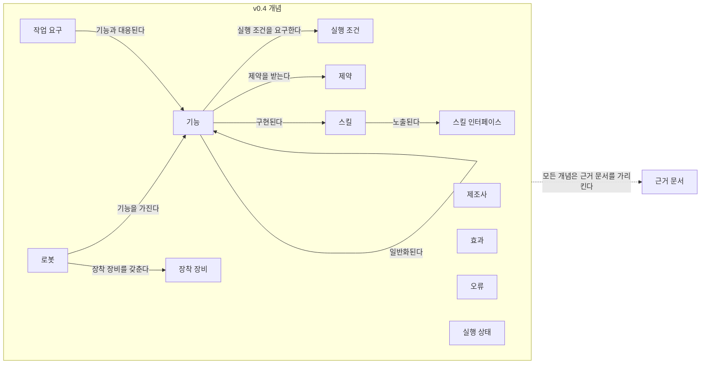
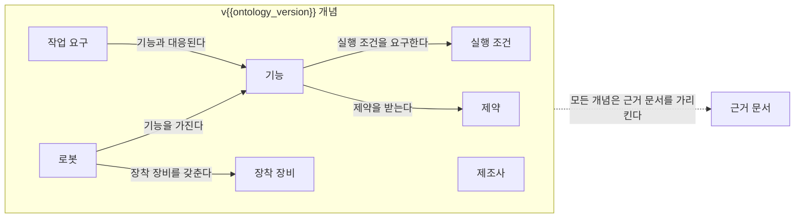

(너의 규칙은 시스템 프롬프트의 agents/shared-rules.md 와 agents/verifier.md 이다. 아래는 이번 실행의 컨텍스트와 입력이다.)

## 실행 컨텍스트

- run_id: 2026-10-09-23
- date: 2026-10-09
- run_type: track (트랙 실행)
- 대상: 트랙 manual-capability-ontology (매뉴얼 기반 로봇 기능 온톨로지) · 현재 단계: 단계 2. 로봇 문서 유형과 정보 구조 조사 · 이번에 다룰 백로그 질문 id: q2-02, q2-03, q2-05 · 중심 세부영역: 5. 로봇 능력·작업 표현 (B. 로봇 온톨로지)
- 예산:
    - max_search_queries: 40
    - max_sources_per_run: 20
    - new_topic_pages: 1
    - page_updates: 2
    - max_retries: 2
- 환경 알림: web_fetch_available: true · fetch_mode: full
- 언어: ko
- verification_stage: first
- verifier_budget:
    - max_search_queries: 40
    - max_sources_per_run: 20
    - new_topic_pages: 1
    - page_updates: 2
    - max_retries: 2

## 입력

### runs/2026-10-09-23/target.json

```json
{
  "run_id": "2026-10-09-23",
  "date": "2026-10-09",
  "weekday": "Fri",
  "run_number": 156,
  "run_type": "track",
  "forced": true,
  "target": {
    "area_no": 5,
    "area_name": "5. 로봇 능력·작업 표현",
    "category": "B. 로봇 온톨로지",
    "category_letter": "B"
  },
  "topic": null,
  "track": {
    "slug": "manual-capability-ontology",
    "name": "매뉴얼 기반 로봇 기능 온톨로지",
    "stage": 2,
    "stages": 7,
    "stage_name": "로봇 문서 유형과 정보 구조 조사",
    "question_ids": [
      "q2-02",
      "q2-03",
      "q2-05"
    ],
    "user_questions": [],
    "runs_per_week": 3,
    "question_rationale": "사용자 지정 0건, 되돌아온 질문 0건, 현재 단계 열린 질문 5건 중 오래된 순"
  },
  "corrections": [],
  "budget": {
    "max_search_queries": 40,
    "max_sources_per_run": 20,
    "new_topic_pages": 1,
    "page_updates": 2,
    "max_retries": 2
  },
  "priority_reason": null,
  "priority_questions": [],
  "excluded_areas": [],
  "lifted_areas": [],
  "deferred": {
    "monthly_recheck": false,
    "weekly_review": true
  },
  "selection_rationale": "CLI 지정 run_type=track, area=5; 트랙 실행일(Fri, track_days 앞 3개) → 트랙 manual-capability-ontology 단계 2, 질문 q2-02, q2-03, q2-05 (사용자 지정 0건, 되돌아온 질문 0건, 현재 단계 열린 질문 5건 중 오래된 순)"
}
```

### runs/2026-10-09-23/research.json

```json
{
  "run_id": "2026-10-09-23",
  "date": "2026-10-09",
  "run_type": "track",
  "target": {
    "area_no": 5,
    "area_name": "5. 로봇 능력·작업 표현",
    "category": "B. 로봇 온톨로지"
  },
  "gaps": [
    "단계 2 질문 q2-02·q2-03 조사 중(실행 2026-09-25-57·2026-10-09-22 부분 답), q2-05 열림 — target.json 지정(사용자 지정 0건, 되돌아온 질문 0건, 현재 단계 열린 질문 5건 중 오래된 순)",
    "q2-02 남은 부분: 형태별(문장·표·그림·코드) 추출 난이도를 측정한 자료 없음",
    "q2-03 남은 부분: AMR 제조사 공개 매뉴얼 샘플 없음, 포털 매뉴얼 문서의 이용 조건 미확인",
    "q2-05 미조사: 단계 2 페이지 3절에 소제목 없음",
    "완료 조건: 문서 유형 매트릭스 64칸 가운데 9칸만 채움(사용자 매뉴얼·오류 코드표·치수도·도면 행 미조사), 공개 문서 샘플 목록에 AMR 샘플 없음",
    "능력 온톨로지 초안 6절 '근거 문서의 단위와 버전' 질문이 q2-05 결과를 기다림"
  ],
  "research_questions": [
    "로봇이 할 수 있는 일과 작업이 요구하는 조건을 어떻게 같은 말로 표현할 것인가? [분류원문]",
    "q2-02 기능 정보는 어떤 형태(문장, 표, 그림·다이어그램, 코드 예제, 파라미터 표)로 존재하며 형태별 추출 난이도는 어떠한가?",
    "q2-03 공개적으로 접근할 수 있는 대표 문서 샘플(AMR, 협동로봇, 로봇팔 등)은 무엇이고 이용 조건은 어떠한가?",
    "q2-05 언어·문서 버전·옵션 장비에 따라 같은 기종의 정보가 어떻게 달라지는가?",
    "문서 이해 벤치마크와 기술 매뉴얼 질의응답 연구는 근거 형태(텍스트·레이아웃·표·차트·이미지)별 정확도를 어떻게 보고하는가? (단계 2 페이지 3절 q2-02 남은 부분 겨냥)",
    "AMR·협동로봇 제조사의 공개 문서 포털은 문서별로 어떤 접근 조건(로그인·승인)과 재사용 조건(저작권 표기)을 두는가? (단계 2 페이지 3절 q2-03, 문서 유형 매트릭스 4절 겨냥)",
    "설명서의 원본·번역 구분과 언어 요건을 정한 규정은 무엇이고 국내 제조사 웹 매뉴얼은 판·언어를 어떻게 관리하는가? (q2-05, 한국 자료 우선)"
  ],
  "findings": [
    {
      "id": "f1",
      "claim": "MMLongBench-Doc(NeurIPS 2024)은 지침·튜토리얼을 포함한 7개 유형의 긴 PDF 135건에 대해 질문마다 근거 형태(텍스트·레이아웃·차트·표·이미지)를 표시하고, GPT-4o 의 근거 형태별 정확도를 텍스트 46.3, 레이아웃 46.0, 차트 45.3, 표 50.0, 이미지 44.1로 보고했다.",
      "tag": "사실",
      "source_ids": [
        "ref-1409"
      ],
      "cross_checked": false,
      "confidence": "medium",
      "evidence_excerpt": "Table 3 기준 GPT-4o TXT 46.3 / LAY 46.0 / CHA 45.3 / TAB 50.0 / IMG 44.1, 전체 ACC 42.8·F1 44.9. 문서 유형 7종에 Guideline·Tutorial/Workshop 포함, 로봇 매뉴얼은 대상에 명시되지 않음.",
      "as_of": "2024-07",
      "site_type": null,
      "flow_item": null
    },
    {
      "id": "f2",
      "claim": "같은 벤치마크에서 공개 시각-언어 모델은 차트·이미지 근거 질문에서 더 낮았고(InternVL-Chat-v1.5 차트 7.1 대 텍스트 14.0), OCR 파싱 텍스트를 받은 텍스트 전용 모델(Mixtral 8x22B)도 텍스트 34.2 대 차트 19.5·이미지 19.2로 낮아져, 저자들은 이를 OCR 이 차트·이미지를 읽지 못하는 한계로 설명했다.",
      "tag": "사실",
      "source_ids": [
        "ref-1409"
      ],
      "cross_checked": false,
      "confidence": "medium",
      "evidence_excerpt": "GPT-4o 만 근거 형태 사이 성능이 비교적 고르고, 다른 모델은 차트·이미지 관련 질문에서 텍스트·레이아웃보다 나쁘다고 보고(arXiv 2407.01523v3 Table 3).",
      "as_of": "2024-07",
      "site_type": null,
      "flow_item": null
    },
    {
      "id": "f3",
      "claim": "Riedler·Langer(2024)는 산업 문서 대상 검색 증강 생성에서 이미지 검색이 텍스트 검색보다 어렵고, 이미지를 다중 모달 임베딩으로 다루는 것보다 텍스트 요약으로 바꾸는 쪽이 더 유망하다고 보고했다.",
      "tag": "사실",
      "source_ids": [
        "ref-1410"
      ],
      "cross_checked": false,
      "confidence": "medium",
      "evidence_excerpt": "초록: \"image retrieval poses a greater challenge than text retrieval\". GPT-4V·LLaVA, LLM-as-a-Judge 평가. 사용한 산업 문서 이름은 초록에 없음.",
      "as_of": "2024-10-29",
      "site_type": null,
      "flow_item": null
    },
    {
      "id": "f4",
      "claim": "Xia 외(IEEE Access, 2024)는 기술 자산 데이터시트의 텍스트에서 LLM 에이전트로 자산관리셸 모델을 생성해, 원문 정보가 오류 없이 옮겨진 비율(유효 생성률)을 62~79%로 보고했다.",
      "tag": "사실",
      "source_ids": [
        "ref-1413"
      ],
      "cross_checked": false,
      "confidence": "medium",
      "evidence_excerpt": "초록 기준 effective generation rate 62–79%. 데이터시트 원문 텍스트 대상이며 표·그림 형태별 결과는 초록에 없음(원문 본문 미확인).",
      "as_of": "2024-03",
      "site_type": null,
      "flow_item": null
    },
    {
      "id": "f5",
      "claim": "Groß·Heidrich(arXiv 2609.07334)는 비슷한 자산관리셸 인스턴스에서 찾은 추출 예시로 맞춤 예시를 만드는 방식(AAS-RAIL)이 PDF 제품 데이터시트 추출에서 일반 소수 예시 프롬프트보다 30.4~52.4% 상대 개선을 보였다고 보고하며, 이를 회사별 명명·서식 차이에 맞추는 방법으로 제시했다.",
      "tag": "사실",
      "source_ids": [
        "ref-1414"
      ],
      "cross_checked": false,
      "confidence": "medium",
      "evidence_excerpt": "초록: relative improvements of 30.4-52.4% over conventional few-shot prompting. 지표 이름·데이터셋 규모·표/텍스트 구분은 초록에 없음.",
      "as_of": "2026-09-07",
      "site_type": null,
      "flow_item": null
    },
    {
      "id": "f6",
      "claim": "Singh 외(arXiv 2511.11847)는 Universal Robots UR5e 협동로봇을 포함한 기계 3종의 운전·안전 매뉴얼로 질의응답 벤치마크를 만들어 검색 증강 생성 구성 24가지를 비교했고, 배포용으로 고른 구성의 정확도를 86.66%로 보고했으나 초록에는 표·그림·텍스트 근거별 결과가 없다.",
      "tag": "사실",
      "source_ids": [
        "ref-1412"
      ],
      "cross_checked": false,
      "confidence": "medium",
      "evidence_excerpt": "초록: top configuration achieved an accuracy of 86.66%, 평균 비용 $0.005/질의, 지연 10.04초. 기계: Bridgeport 수동 밀링, Haas TL-1 CNC 선반, UR5e.",
      "as_of": "2025-11-14",
      "site_type": "제조 공장",
      "flow_item": null
    },
    {
      "id": "f7",
      "claim": "두산로보틱스 한국어 웹 매뉴얼(3.2.1)은 M1013 사양을 '구분 / 항목 / 사양 정보' 세 열의 HTML 표로 두고 가반 하중·최대 반경·관절 범위와 속도·반복 정밀도·IP 등급·사용 환경을 단위와 함께 적으며, 그 페이지에 작업 영역 그림은 없다.",
      "tag": "추정",
      "source_ids": [
        "ref-1407"
      ],
      "cross_checked": false,
      "confidence": "medium",
      "evidence_excerpt": "벤더 주장: 표는 Performance, Joint Movement, 사용 환경, 툴 플랜지 & 커넥터, 중량, 마운팅, IP 등급, 소음 순으로 묶임. 문서 형태 관찰이며 사양 값 자체는 인용하지 않음. (발행일 미확인, 확인일 기준)",
      "as_of": "2026-10-09",
      "site_type": null,
      "flow_item": null,
      "vendor_claim": true
    },
    {
      "id": "f8",
      "claim": "Universal Robots 사용자 매뉴얼 안내 페이지는 로봇 사용자 매뉴얼과 별도로 오류 코드(Error Codes), 스크립트 명세(Script Directory), 소프트웨어 핸드북을 메뉴로 두어, 오류 의미와 명령 인터페이스 정보가 사용자 매뉴얼 밖의 별도 문서에 있음을 보여 준다.",
      "tag": "추정",
      "source_ids": [
        "ref-1399"
      ],
      "cross_checked": false,
      "confidence": "medium",
      "evidence_excerpt": "벤더 주장: 왼쪽 메뉴에 PolyScope X Software Handbook, Robot User Manuals, Script Directory, Service Your Robot, Error Codes, Components, Kits, Software Guides. 각 문서의 내부 형태는 미확인. (발행일 미확인, 확인일 기준)",
      "as_of": "2026-10-09",
      "site_type": null,
      "flow_item": null,
      "vendor_claim": true
    },
    {
      "id": "f9",
      "claim": "확인한 측정 자료를 종합하면 문서 추출 난이도는 HTML·텍스트 파라미터 표가 가장 낮고, OCR 을 거치는 차트·그림·이미지에서 가장 높으며(공개 모델·OCR 파이프라인에서 특히), 기술 매뉴얼 질의응답 연구는 형태별이 아니라 전체 정확도만 보고하므로 로봇 매뉴얼의 형태별 추출 난이도는 범용 문서 벤치마크로 유추할 수 있을 뿐 직접 측정된 것은 아닌 것으로 보인다.",
      "tag": "추정",
      "source_ids": [
        "ref-1409",
        "ref-1410",
        "ref-1412",
        "ref-1413",
        "ref-1407"
      ],
      "cross_checked": false,
      "confidence": "low",
      "evidence_excerpt": "이 위키의 종합: 범용 문서 벤치마크(f1·f2), 산업 문서 RAG(f3), 매뉴얼 QA(f6), 데이터시트 추출(f4), 웹 매뉴얼 표 형태(f7)를 대응시킨 추론이며 로봇 매뉴얼 대상 측정은 이번 검색 범위에서 찾지 못함(부재 확정 아님).",
      "as_of": "2026-10-09",
      "site_type": null,
      "flow_item": null
    },
    {
      "id": "f10",
      "claim": "MiR 의 제품 문서 페이지(MiR250 HW 2.0 SW 2.x, MiR1350 Pallet Lift HW 1.0 SW 2.x)는 사용자 가이드·빠른 시작·적합성 문서는 로그인 표시 없이 내려받게 하지만 인터페이스·시운전·기술·위험성평가·사이버보안 가이드와 버전별 REST API 참조는 MiR 지원 포털 로그인을 요구하고, 문서 이용 조건은 페이지에 적지 않는다.",
      "tag": "추정",
      "source_ids": [
        "ref-1397",
        "ref-1398"
      ],
      "cross_checked": false,
      "confidence": "medium",
      "evidence_excerpt": "벤더 주장: \"You must sign in to MiR Support Portal to access the overview page links.\" REST API 참조는 모든 소프트웨어 버전·로봇용 별도 목록(로그인 필요). 페이지 하단은 개인정보·쿠키 정책·일반 인도 조건만 링크. (발행일 미확인, 확인일 기준)",
      "as_of": "2026-10-09",
      "site_type": null,
      "flow_item": null,
      "vendor_claim": true
    },
    {
      "id": "f11",
      "claim": "Clearpath Robotics 의 IndoorNav 사용자 매뉴얼(OTTO Motors 실내 자율주행 소프트웨어 기반)은 로그인 없이 열리는 웹 문서로 'All rights reserved' 를 표기하고, 전체 ROS 2 API 문서는 설치 패키지(clearpath-api) 안에 있거나 OTTO Motors 계정이 필요한 docs.ottomotors.com 에 둔다.",
      "tag": "추정",
      "source_ids": [
        "ref-1401",
        "ref-1402"
      ],
      "cross_checked": false,
      "confidence": "medium",
      "evidence_excerpt": "벤더 주장: 하단 \"© Clearpath Robotics by Rockwell Automation. All rights reserved.\" API 는 Fleet(도메인 100)·Autonomy(110)·Platform(95, IndoorNav 미지원)으로 나뉨, 마지막 갱신 2025-07-18.",
      "as_of": "2025-07-18",
      "site_type": null,
      "flow_item": null,
      "vendor_claim": true
    },
    {
      "id": "f12",
      "claim": "OMRON 로보틱스 다운로드 센터는 자료에 접근하려면 양식을 제출해 승인을 받게 한다.",
      "tag": "추정",
      "source_ids": [
        "ref-1404"
      ],
      "cross_checked": false,
      "confidence": "medium",
      "evidence_excerpt": "벤더 주장: \"Please fill out the form to access our resources.\" 승인·거절·검토 상태 안내가 있음. 하단에 Terms of Use 링크가 있으나 다운로드 적용 범위는 미확인. (발행일 미확인, 확인일 기준)",
      "as_of": "2026-10-09",
      "site_type": null,
      "flow_item": null,
      "vendor_claim": true
    },
    {
      "id": "f13",
      "claim": "Universal Robots 매뉴얼의 저작권 고지는 내용을 Universal Robots A/S 의 사전 서면 승인 없이 전체든 일부든 복제하지 못하게 하고, 내용이 예고 없이 바뀔 수 있다고 적는다.",
      "tag": "추정",
      "source_ids": [
        "ref-1400"
      ],
      "cross_checked": false,
      "confidence": "medium",
      "evidence_excerpt": "벤더 주장: \"shall not be reproduced in whole or in part without prior written approval of Universal Robots A/S.\" 또한 subject to change without notice. 번역·원본 표기는 이 페이지에 없음. (발행일 미확인, 확인일 기준)",
      "as_of": "2026-10-09",
      "site_type": null,
      "flow_item": null,
      "vendor_claim": true
    },
    {
      "id": "f14",
      "claim": "두산로보틱스 웹 매뉴얼은 로그인 없이 열리며 매뉴얼 PDF 내려받기·ROS 2 문서·API 문서 링크를 두지만, 하단에는 'Copyright Doosan Robotics Inc.' 표기와 개인정보 처리방침 링크만 있고 별도의 이용 조건이나 재사용 허락 문구는 없다.",
      "tag": "추정",
      "source_ids": [
        "ref-1406"
      ],
      "cross_checked": false,
      "confidence": "medium",
      "evidence_excerpt": "벤더 주장: 매뉴얼은 PART 1 안전 매뉴얼, PART 2 로봇 기동, PART 3 설치 매뉴얼(시스템 사양 포함), PART 4 사용자 매뉴얼 개요로 구성. (발행일 미확인, 확인일 기준)",
      "as_of": "2026-10-09",
      "site_type": null,
      "flow_item": null,
      "vendor_claim": true
    },
    {
      "id": "f15",
      "claim": "AMR 쪽에도 공개 문서 샘플(MiR 사용자 가이드, Clearpath IndoorNav·OutdoorNav 웹 매뉴얼)이 있지만 통합 수준 문서(REST API 참조·인터페이스·시운전 가이드·전체 API)는 계정·승인 뒤에 두는 경향이 있고, 공개 문서도 '모든 권리 보유'나 서면 승인 없는 복제 금지를 표기하므로, 매뉴얼을 자동 추출해 능력 온톨로지에 재가공하려면 제조사의 명시적 허락을 따로 확인해야 할 것으로 보인다.",
      "tag": "추정",
      "source_ids": [
        "ref-1397",
        "ref-1401",
        "ref-1402",
        "ref-1404",
        "ref-1400",
        "ref-1406"
      ],
      "cross_checked": false,
      "confidence": "low",
      "evidence_excerpt": "이 위키의 종합(f10~f14). 샘플 5개 제조사 범위의 관찰이며 법적 판단이 아님. 국내 AMR 제조사의 공개 매뉴얼·API 문서는 한국어 검색 2회에서 찾지 못함(부재 확정 아님).",
      "as_of": "2026-10-09",
      "site_type": null,
      "flow_item": null
    },
    {
      "id": "f16",
      "claim": "EU 기계류 지침 2006/42/EC 부속서 I 1.7.4.1 은 설명서를 하나 이상의 공식 공동체 언어로 쓰게 하고, 제조자가 확인한 언어판에 'Original instructions' 를, 사용국 언어로 옮긴 판에 'Translation of the original instructions' 를 표기하게 한다.",
      "tag": "사실",
      "source_ids": [
        "ref-1408"
      ],
      "cross_checked": false,
      "confidence": "medium",
      "evidence_excerpt": "\"The words ‘Original instructions’ must appear on the language version(s) verified by the manufacturer.\" 사용국 언어 원본이 없으면 제조자 또는 그 언어권에 들여오는 자가 번역판을 제공. 이 지침은 규정 (EU) 2023/1230 으로 대체 예정(새 규정 원문 미열람).",
      "as_of": "2006-05-17",
      "site_type": null,
      "flow_item": null
    },
    {
      "id": "f17",
      "claim": "MiR250 제품 문서 페이지는 로봇 하드웨어 2.0·소프트웨어 2.x·SICK 설정 파일 판 단위로 문서를 묶고, 문서마다 제공 언어가 달라 사용자 가이드는 10개, 빠른 시작은 16개, 인터페이스 가이드는 5개 언어이며 기술·위험성평가·사이버보안 가이드는 영어로만 제공한다.",
      "tag": "추정",
      "source_ids": [
        "ref-1397"
      ],
      "cross_checked": false,
      "confidence": "medium",
      "evidence_excerpt": "벤더 주장: Robot HW 2.0, SW 2.x, SICK configuration file MiR250_HW2-0_V2. 사용자 가이드에 한국어 포함. 사용자 가이드·빠른 시작만 판(2.1)을 표시. (발행일 미확인, 확인일 기준)",
      "as_of": "2026-10-09",
      "site_type": null,
      "flow_item": null,
      "vendor_claim": true
    },
    {
      "id": "f18",
      "claim": "MiR1350 Pallet Lift 문서 페이지는 로봇 하드웨어 1.0 과 별도로 상위 모듈 하드웨어 1.0·소프트웨어 2.x·SICK 설정 파일 판을 적어, 상위 모듈(옵션 장비)을 단 구성이 자체 문서 묶음과 판을 갖는다.",
      "tag": "추정",
      "source_ids": [
        "ref-1398"
      ],
      "cross_checked": false,
      "confidence": "medium",
      "evidence_excerpt": "벤더 주장: Robot HW 1.0 / Top module HW 1.0 / SW 2.x / SICK configuration file MiR1350 v6.4. 사용자 가이드 1.4, 빠른 시작 1.5. (발행일 미확인, 확인일 기준)",
      "as_of": "2026-10-09",
      "site_type": null,
      "flow_item": null,
      "vendor_claim": true
    },
    {
      "id": "f19",
      "claim": "MiR250 페이지에서 사용자 가이드·빠른 시작은 모든 언어에 판 2.1 로 표시되지만 포르투갈어 링크는 1.4·1.5 판 이름의 경로를 가리켜, 언어판 사이에 판이 어긋날 수 있는 것으로 보인다.",
      "tag": "추정",
      "source_ids": [
        "ref-1397"
      ],
      "cross_checked": false,
      "confidence": "low",
      "evidence_excerpt": "벤더 주장: 열람 도구가 보고한 링크 경로 관찰(Portuguese links point to paths named 1,4 and 1,5). 파일을 내려받아 판을 대조하지 않음. (발행일 미확인, 확인일 기준)",
      "as_of": "2026-10-09",
      "site_type": null,
      "flow_item": null,
      "vendor_claim": true
    },
    {
      "id": "f20",
      "claim": "두산로보틱스 웹 매뉴얼은 판 선택(3.2.0~3.7.0), 한국어를 포함한 13개 언어, 제품군 메뉴(M/H·A·E·P 시리즈)를 두고, V2 이전 판은 별도의 레거시 매뉴얼 사이트로 분리한다.",
      "tag": "추정",
      "source_ids": [
        "ref-1406"
      ],
      "cross_checked": false,
      "confidence": "medium",
      "evidence_excerpt": "벤더 주장: 판 3.7.0, 3.6.0, 3.5.0, 3.4.0, 3.3.0, 3.2.2, 3.2.1, 3.2.0. 언어: 한국어·영어·중국어·체코어·네덜란드어·프랑스어·독일어·헝가리어·이탈리아어·일본어·폴란드어·포르투갈어·스페인어. Legacy manual 링크. (발행일 미확인, 확인일 기준)",
      "as_of": "2026-10-09",
      "site_type": null,
      "flow_item": null,
      "vendor_claim": true
    },
    {
      "id": "f21",
      "claim": "Universal Robots 는 사용자 매뉴얼을 로봇 모델별로 나누고 같은 모델(예: UR20)에도 PolyScope 5 와 PolyScope X(10.x) 두 소프트웨어 계열의 매뉴얼을 따로 두며, 매뉴얼 주소에 소프트웨어 판(SW5_26, SW10_13)과 언어를 구분해 담는다.",
      "tag": "추정",
      "source_ids": [
        "ref-1399",
        "ref-1400"
      ],
      "cross_checked": false,
      "confidence": "medium",
      "evidence_excerpt": "벤더 주장: 안내 페이지 머리에 PolyScope X 10.13, 두 시리즈 모두 \"You can use PolyScope 5 and PolySocpe X\"(원문 오타). 저작권 페이지 주소가 /manuals/EN/HTML/SW5_26/. (발행일 미확인, 확인일 기준)",
      "as_of": "2026-10-09",
      "site_type": null,
      "flow_item": null,
      "vendor_claim": true
    },
    {
      "id": "f22",
      "claim": "Boston Dynamics Spot SDK 릴리스 노트는 판마다 Breaking Changes·New Features·Deprecations 절을 두고, 판에 따라 기능이 더해지거나(4.1.0 의 계단 사용 금지 STAIRS_MODE_PROHIBITED) 필드가 폐기되며(5.0.0 SystemFault uid), 일부 예제는 로봇이 5.1.0 이상을 실행해야 한다고 적는다.",
      "tag": "추정",
      "source_ids": [
        "ref-1405"
      ],
      "cross_checked": false,
      "confidence": "medium",
      "evidence_excerpt": "벤더 주장: 5.2.0 Graph Nav Upload 예제 \"Requires robots running 5.1.0 or later.\" 5.1.9 Deprecations, 5.0.1 Upcoming Breaking Changes·Known Issues 절. (발행일 미확인, 확인일 기준)",
      "as_of": "2026-10-09",
      "site_type": null,
      "flow_item": null,
      "vendor_claim": true
    },
    {
      "id": "f23",
      "claim": "Clearpath OutdoorNav 매뉴얼은 판 선택(0.7.0~2.3.0과 Legacy)을 두고 1.0.0 판을 '더 이상 유지되지 않음'으로 표시하며 그 판의 API 를 ROS 1 Noetic 기준으로 설명하고, IndoorNav API 문서 경로에도 판(ros2-api-1.3.3)이 들어 있다.",
      "tag": "추정",
      "source_ids": [
        "ref-1403",
        "ref-1402"
      ],
      "cross_checked": false,
      "confidence": "medium",
      "evidence_excerpt": "벤더 주장: 1.0.0 페이지 \"no longer actively maintained\", 최신 2.3.0 링크. API 그룹: Platform, Autonomy, Mission Manager, Mission Scheduler. (발행일 미확인, 확인일 기준)",
      "as_of": "2026-10-09",
      "site_type": null,
      "flow_item": null,
      "vendor_claim": true
    },
    {
      "id": "f24",
      "claim": "VDA 5050 팩트시트 스키마(main, 3.0.0)는 팩트시트를 이동로봇 유형 시리즈의 기본 정보로 설명하면서도 serialNumber 를 필수로 두고, 구성 블록(mobileRobotConfiguration)에 하드웨어·소프트웨어 판의 키-값 배열(versions)을 두며, 적재 취급 장치 목록(loadPositions)이 없거나 비면 적재 취급 장치가 없는 것으로 정한다.",
      "tag": "사실",
      "source_ids": [
        "ref-228"
      ],
      "cross_checked": false,
      "confidence": "medium",
      "evidence_excerpt": "versions: \"Array containing various hardware and software versions running on the mobile robot.\" loadPositions 가 없거나 비면 로봇에 적재 취급 장치가 없음. 언어 필드는 없음.",
      "as_of": "2026-10-09",
      "site_type": null,
      "flow_item": null
    },
    {
      "id": "f25",
      "claim": "Agri-Query(Gun·Oksanen, 2025)는 배치가 같은 165쪽 농기계 매뉴얼의 영어·프랑스어·독일어 공식판에 영어로 질문했을 때 키워드 검색 RAG 정확도가 크게 떨어졌고(Gemini 2.5 Flash 0.852 → 0.583·0.528), 혼합 검색 RAG 는 하락이 작았다(0.880·0.824·0.870)고 보고했으며, 표·그림 해석은 평가하지 않았다.",
      "tag": "사실",
      "source_ids": [
        "ref-1411"
      ],
      "cross_checked": false,
      "confidence": "medium",
      "evidence_excerpt": "Kverneland Exacta-TLX Geospread GS3 매뉴얼, 약 59k 토큰, 질문 108개(답할 수 있음 54·없음 54). Qwen 2.5 7B 혼합 RAG 0.861·0.852·0.796. 초록의 '모든 언어 85% 이상'은 표와 일부 불일치.",
      "as_of": "2025-08-25",
      "site_type": null,
      "flow_item": null
    },
    {
      "id": "f26",
      "claim": "확인한 사례를 종합하면 같은 기종의 정보는 (가) 언어판(원본과 번역, 문서 유형별로 다른 언어 범위, 판이 어긋난 번역판), (나) 소프트웨어·문서 판(판별 기능 추가·폐기, 유지 중단된 판), (다) 하드웨어·상위 모듈·옵션 구성(별도 문서 묶음, 적재 취급 장치 유무)에 따라 달라지므로, 근거 문서에는 언어·원본 여부와 적용 하드웨어·소프트웨어·모듈 판을 함께 기록해야 할 것으로 보인다.",
      "tag": "추정",
      "source_ids": [
        "ref-1408",
        "ref-1397",
        "ref-1398",
        "ref-1406",
        "ref-1399",
        "ref-1405",
        "ref-1403",
        "ref-228"
      ],
      "cross_checked": false,
      "confidence": "low",
      "evidence_excerpt": "이 위키의 종합(f16~f24). 같은 기종의 판·언어판 사이 실제 내용 차이(예: 사양 값 변경)를 문서끼리 대조해 확인하지는 않음.",
      "as_of": "2026-10-09",
      "site_type": null,
      "flow_item": null
    }
  ],
  "sources": [
    {
      "id": "ref-228",
      "org": "VDA / VDMA (VDA5050 GitHub)",
      "title": "VDA5050/VDA5050 — json_schemas/factsheet.schema",
      "published": null,
      "url": "https://github.com/VDA5050/VDA5050/blob/main/json_schemas/factsheet.schema",
      "type": "표준",
      "reliability": "high",
      "accessed": "2026-10-09",
      "summary": "VDA 5050 main(3.0.0) 팩트시트 JSON 스키마. 이번에 raw 원문 뒷부분(구성 블록 versions·batteryCharging, 적재 명세)을 열어 확인.",
      "fetched": true,
      "fetched_via": "github_raw",
      "fetch_url": "https://raw.githubusercontent.com/VDA5050/VDA5050/main/json_schemas/factsheet.schema",
      "source_unopened": false
    },
    {
      "id": "ref-1397",
      "org": "Mobile Industrial Robots (MiR)",
      "title": "MiR250 HW 2.0 SW 2.x — Product documents",
      "published": null,
      "url": "https://mobile-industrial-robots.com/product-documents/mir250-hw-20-sw-2-v1",
      "type": "벤더 문서",
      "reliability": "medium",
      "accessed": "2026-10-09",
      "summary": "MiR250 하드웨어·소프트웨어 판별 문서 페이지. 문서 유형·언어별 제공 범위와 지원 포털 로그인 요구를 보여 준다.",
      "fetched": true,
      "fetched_via": "webfetch",
      "fetch_url": null,
      "source_unopened": false
    },
    {
      "id": "ref-1398",
      "org": "Mobile Industrial Robots (MiR)",
      "title": "MiR1350 Pallet Lift HW 1.0 SW 2.x — Product documents",
      "published": null,
      "url": "https://mobile-industrial-robots.com/product-documents/mir1350-pallet-lift-hw-10-sw-2-v1",
      "type": "벤더 문서",
      "reliability": "medium",
      "accessed": "2026-10-09",
      "summary": "상위 모듈(팔레트 리프트)을 단 MiR1350 의 문서 페이지. 로봇·상위 모듈 하드웨어 판과 소프트웨어 판을 따로 적는다.",
      "fetched": true,
      "fetched_via": "webfetch",
      "fetch_url": null,
      "source_unopened": false
    },
    {
      "id": "ref-1399",
      "org": "Universal Robots A/S",
      "title": "User Manuals (PolyScope X 10.13 landing page)",
      "published": null,
      "url": "https://www.universal-robots.com/manuals/EN/HTML/SW10_13/Content/Landingpages/WebPolyX/Usermanual.htm",
      "type": "벤더 문서",
      "reliability": "medium",
      "accessed": "2026-10-09",
      "summary": "UR Series·e-Series 모델별 사용자 매뉴얼 안내와 오류 코드·스크립트 명세 등 별도 문서 메뉴.",
      "fetched": true,
      "fetched_via": "webfetch",
      "fetch_url": null,
      "source_unopened": false
    },
    {
      "id": "ref-1400",
      "org": "Universal Robots A/S",
      "title": "Copyright and disclaimers (SW 5.26 manual)",
      "published": null,
      "url": "https://www.universal-robots.com/manuals/EN/HTML/SW5_26/Content/prod-fu-tp/fu-tp-copyright-and-disclaimers.htm",
      "type": "벤더 문서",
      "reliability": "medium",
      "accessed": "2026-10-09",
      "summary": "UR 매뉴얼의 저작권·면책 고지. 사전 서면 승인 없는 복제 금지와 예고 없는 변경을 적는다.",
      "fetched": true,
      "fetched_via": "webfetch",
      "fetch_url": null,
      "source_unopened": false
    },
    {
      "id": "ref-1401",
      "org": "Clearpath Robotics by Rockwell Automation",
      "title": "IndoorNav User Manual — Getting Started",
      "published": "2025-07-18",
      "url": "https://docs.clearpathrobotics.com/docs_indoornav_user_manual/getting_started",
      "type": "벤더 문서",
      "reliability": "medium",
      "accessed": "2026-10-09",
      "summary": "OTTO Motors 실내 자율주행 소프트웨어 기반 IndoorNav 의 공개 웹 매뉴얼. 대상 로봇과 절 구성, 저작권 표기.",
      "fetched": true,
      "fetched_via": "webfetch",
      "fetch_url": null,
      "source_unopened": false
    },
    {
      "id": "ref-1402",
      "org": "Clearpath Robotics by Rockwell Automation",
      "title": "IndoorNav User Manual — Appendix A: IndoorNav ROS 2 API",
      "published": null,
      "url": "https://docs.clearpathrobotics.com/docs_indoornav_user_manual/api",
      "type": "벤더 문서",
      "reliability": "medium",
      "accessed": "2026-10-09",
      "summary": "ROS 2 API 의 세 도메인(Fleet·Autonomy·Platform)과 전체 API 문서 위치(설치 패키지, OTTO Motors 계정 필요 사이트).",
      "fetched": true,
      "fetched_via": "webfetch",
      "fetch_url": null,
      "source_unopened": false
    },
    {
      "id": "ref-1403",
      "org": "Clearpath Robotics by Rockwell Automation",
      "title": "OutdoorNav User Manual 1.0.0 — API Overview",
      "published": null,
      "url": "https://docs.clearpathrobotics.com/docs_outdoornav_user_manual/1.0.0/api/api_overview",
      "type": "벤더 문서",
      "reliability": "medium",
      "accessed": "2026-10-09",
      "summary": "판 선택(0.7.0~2.3.0)과 유지 중단 표시가 있는 OutdoorNav API 개요(ROS 1 Noetic 기준).",
      "fetched": true,
      "fetched_via": "webfetch",
      "fetch_url": null,
      "source_unopened": false
    },
    {
      "id": "ref-1404",
      "org": "OMRON Robotics",
      "title": "Download center",
      "published": null,
      "url": "https://robotics.omron.com/browse-documents/?dir_id=125",
      "type": "벤더 문서",
      "reliability": "medium",
      "accessed": "2026-10-09",
      "summary": "OMRON 로보틱스 자료 다운로드 센터. 양식 제출과 승인 뒤 접근하게 한다.",
      "fetched": true,
      "fetched_via": "webfetch",
      "fetch_url": null,
      "source_unopened": false
    },
    {
      "id": "ref-1405",
      "org": "Boston Dynamics",
      "title": "Spot SDK Release Notes",
      "published": null,
      "url": "https://dev.bostondynamics.com/docs/release_notes",
      "type": "벤더 문서",
      "reliability": "medium",
      "accessed": "2026-10-09",
      "summary": "Spot SDK 판별 릴리스 노트. Breaking Changes·Deprecations 절과 로봇 소프트웨어 판 요구를 적는다(앞부분 열람).",
      "fetched": true,
      "fetched_via": "webfetch",
      "fetch_url": null,
      "source_unopened": false
    },
    {
      "id": "ref-1406",
      "org": "두산로보틱스",
      "title": "Doosan Robotics User Manual 3.2.1 — Manipulator (M/H Series)",
      "published": null,
      "url": "https://manual.doosanrobotics.com/en/user-manual/3.2.1/1-m-h-series/manipulator",
      "type": "벤더 문서",
      "reliability": "medium",
      "accessed": "2026-10-09",
      "summary": "두산로보틱스 V3 웹 매뉴얼. 판 선택·13개 언어·제품군 메뉴·레거시 매뉴얼 링크·저작권 표기를 보여 준다.",
      "fetched": true,
      "fetched_via": "webfetch",
      "fetch_url": null,
      "source_unopened": false
    },
    {
      "id": "ref-1407",
      "org": "두산로보틱스",
      "title": "두산로보틱스 사용자 매뉴얼 3.2.1 — M1013",
      "published": null,
      "url": "https://manual.doosanrobotics.com/ko/user-manual/3.2.1/1-m-h-series/m1013",
      "type": "벤더 문서",
      "reliability": "medium",
      "accessed": "2026-10-09",
      "summary": "M1013 시스템 사양을 HTML 표(구분·항목·사양 정보)로 제시한 한국어 웹 매뉴얼 페이지.",
      "fetched": true,
      "fetched_via": "webfetch",
      "fetch_url": null,
      "source_unopened": false
    },
    {
      "id": "ref-1408",
      "org": "European Parliament and Council (legislation.gov.uk 게재본)",
      "title": "Directive 2006/42/EC on machinery — Annex I",
      "published": "2006-05-17",
      "url": "https://www.legislation.gov.uk/eudr/2006/42/annex/I",
      "type": "정부·연구기관",
      "reliability": "high",
      "accessed": "2026-10-09",
      "summary": "EU 기계류 지침 부속서 I. 1.7.4.1 에 설명서의 언어, 'Original instructions'·'Translation of the original instructions' 표기 요건이 있다.",
      "fetched": true,
      "fetched_via": "webfetch",
      "fetch_url": null,
      "source_unopened": false
    },
    {
      "id": "ref-1409",
      "org": "Ma, Y. 외 (NeurIPS 2024 Datasets and Benchmarks)",
      "title": "MMLongBench-Doc: Benchmarking Long-context Document Understanding with Visualizations",
      "published": "2024-07",
      "url": "https://arxiv.org/abs/2407.01523",
      "type": "논문",
      "reliability": "high",
      "accessed": "2026-10-09",
      "summary": "긴 PDF 135건·질문 1,082개의 문서 이해 벤치마크. 근거 형태(텍스트·레이아웃·차트·표·이미지)별 정확도를 보고한다.",
      "fetched": true,
      "fetched_via": "webfetch",
      "fetch_url": "https://arxiv.org/html/2407.01523v3",
      "source_unopened": false
    },
    {
      "id": "ref-1410",
      "org": "Riedler, M., & Langer, S.",
      "title": "Beyond Text: Optimizing RAG with Multimodal Inputs for Industrial Applications",
      "published": "2024-10-29",
      "url": "https://arxiv.org/abs/2410.21943",
      "type": "논문",
      "reliability": "medium",
      "accessed": "2026-10-09",
      "summary": "산업 문서 RAG 에 이미지를 더하는 방식(다중 모달 임베딩 대 텍스트 요약)을 비교한 프리프린트(초록 열람).",
      "fetched": true,
      "fetched_via": "webfetch",
      "fetch_url": null,
      "source_unopened": false
    },
    {
      "id": "ref-1411",
      "org": "Gun, J., & Oksanen, T. (Technical University of Munich)",
      "title": "Agri-Query: A Case Study on RAG vs. Long-Context LLMs for Cross-Lingual Technical Question Answering",
      "published": "2025-08-25",
      "url": "https://arxiv.org/abs/2508.18093",
      "type": "논문",
      "reliability": "medium",
      "accessed": "2026-10-09",
      "summary": "영어·프랑스어·독일어 공식판 농기계 매뉴얼로 교차 언어 기술 질의응답을 평가한 프리프린트(v2 본문 열람).",
      "fetched": true,
      "fetched_via": "webfetch",
      "fetch_url": "https://arxiv.org/html/2508.18093v2",
      "source_unopened": false
    },
    {
      "id": "ref-1412",
      "org": "Singh, R. 외",
      "title": "A Multimodal Manufacturing Safety Chatbot: Knowledge Base Design, Benchmark Development, and Evaluation of Multiple RAG Approaches",
      "published": "2025-11-14",
      "url": "https://arxiv.org/abs/2511.11847",
      "type": "논문",
      "reliability": "medium",
      "accessed": "2026-10-09",
      "summary": "UR5e 를 포함한 기계 3종 매뉴얼로 만든 질의응답 벤치마크와 RAG 구성 24가지 비교(초록 열람).",
      "fetched": true,
      "fetched_via": "webfetch",
      "fetch_url": null,
      "source_unopened": false
    },
    {
      "id": "ref-1413",
      "org": "Xia, Y., Xiao, Z., Jazdi, N., & Weyrich, M. (IEEE Access)",
      "title": "Generation of Asset Administration Shell with Large Language Model Agents: Toward Semantic Interoperability in Digital Twins in the Context of Industry 4.0",
      "published": "2024-03",
      "url": "https://arxiv.org/abs/2403.17209",
      "type": "논문",
      "reliability": "medium",
      "accessed": "2026-10-09",
      "summary": "데이터시트 텍스트에서 LLM 에이전트로 자산관리셸 모델을 생성한 연구(초록 열람). 유효 생성률 62~79%.",
      "fetched": true,
      "fetched_via": "webfetch",
      "fetch_url": null,
      "source_unopened": false
    },
    {
      "id": "ref-1414",
      "org": "Groß, J., & Heidrich, J.",
      "title": "AAS-RAIL: Improving Information Extraction for Asset Administration Shells through Retrieval-Augmented In-Context Learning",
      "published": "2026-09-07",
      "url": "https://arxiv.org/abs/2609.07334",
      "type": "논문",
      "reliability": "medium",
      "accessed": "2026-10-09",
      "summary": "PDF 제품 데이터시트에서 자산관리셸을 만드는 검색 기반 맞춤 예시 방법의 프리프린트(초록 열람).",
      "fetched": true,
      "fetched_via": "webfetch",
      "fetch_url": null,
      "source_unopened": false
    }
  ],
  "page_proposals": [
    {
      "action": "update",
      "path": "docs/tracks/manual-capability-ontology/stage-2-document-types.md",
      "sections": [
        "2",
        "3",
        "4",
        "5",
        "6",
        "8",
        "9"
      ],
      "rationale": "q2-02 답: f1·f2·f3·f4·f5·f6·f7·f8·f9 (신뢰도 low) / q2-03 답: f10·f11·f12·f13·f14·f15 (신뢰도 low) / q2-05 답: f16·f17·f18·f19·f20·f21·f22·f23·f24·f25·f26 (신뢰도 medium) — 2절 세 질문 상태를 답함으로, 3절 q2-02(근거 형태별 측정은 범용 문서 벤치마크 유추뿐임을 명시)·q2-03(AMR 샘플과 접근·재사용 조건, 제조사 문서는 벤더 주장 병기) 소절 보강, q2-05 소제목 신설({#q2-05}: 언어판·문서 판·하드웨어/상위 모듈 구성 세 축), 4절 결론·불확실성, 5절 후속 질문, 6절 완료 조건 현황, 8절 출처, 9절 이력"
    },
    {
      "action": "update",
      "path": "docs/tracks/manual-capability-ontology/document-type-matrix.md",
      "sections": [
        "3",
        "4",
        "5",
        "8"
      ],
      "rationale": "트랙 산출물 갱신: 3절 사양서·데이터시트 × 파라미터 범위 칸에 두산 웹 매뉴얼 HTML 사양 표 사례(f7, 벤더 주장) 병기, 오류 코드표 행에 UR 의 별도 오류 코드 문서 존재 메모(f8, 내용 미확인). 4절 공개 문서 샘플에 MiR250·MiR1350 Pallet Lift(AMR, f10·f17·f18), Clearpath IndoorNav·OutdoorNav(AMR, f11·f23), Universal Robots(f13·f21), OMRON 다운로드 센터(접근 승인, f12), 두산 웹 매뉴얼(f14·f20) 추가와 이용 조건 열 갱신. 판·언어 축 메모(f26)"
    },
    {
      "action": "update",
      "path": "docs/tracks/manual-capability-ontology/ontology-draft.md",
      "sections": [
        "2",
        "6"
      ],
      "rationale": "온톨로지 변경 제안 1건(근거 문서 속성 '언어(원본 / 번역 구분)'·'적용 구성(하드웨어·소프트웨어 판, 상위 모듈·옵션 장비)' 추가, 근거 f16·f17·f18·f20·f22·f24·f26). 6절 '근거 문서의 단위와 버전' 질문에 q2-05 답 연결, 로봇 구성 버전 질문과의 관계 메모"
    },
    {
      "action": "update",
      "path": "docs/ideas/robot-capability-ontology.md",
      "sections": [
        "3",
        "4"
      ],
      "rationale": "아이디어 페이지 3절: 문서 이해·데이터시트 추출 측정 자료(f1·f2·f4·f5·f6) / 아이디어 페이지 4절: AMR 공개 문서 샘플과 접근·재사용 조건(f10~f15), 근거 문서의 언어·판·구성 기록 필요(f16·f24·f26)"
    },
    {
      "action": "update",
      "path": "docs/categories/ai-and-learning/document-drawing-and-scene-understanding.md",
      "sections": [
        "8"
      ],
      "rationale": "트랙 manual-capability-ontology 단계 2 반영 제안 (f1, f2, f3, f4, f5, f6, f25): 근거 형태별 문서 이해 정확도, 산업 문서 다중 모달 RAG, 데이터시트→자산관리셸 추출, 매뉴얼 질의응답과 교차 언어 검색. 교차 규칙(매뉴얼 해석은 4. 이기종 로봇 등록·55. 현장 조사·설치·시운전에 적용)에 따라 적용 대상 영역에도 연결"
    },
    {
      "action": "update",
      "path": "docs/categories/robot-ontology/heterogeneous-robot-registration.md",
      "sections": [
        "6"
      ],
      "rationale": "트랙 manual-capability-ontology 단계 2 반영 제안 (f10, f11, f12, f13, f14, f15, f26): 등록 때 확보할 제조사 문서의 접근 조건(로그인·승인)과 재사용 제한, 근거 문서에 언어·원본 여부·적용 판을 기록할 필요"
    },
    {
      "action": "update",
      "path": "docs/categories/verification-deployment-and-lifecycle/asset-and-software-lifecycle-management.md",
      "sections": [
        "6"
      ],
      "rationale": "트랙 manual-capability-ontology 단계 2 반영 제안 (f22, f23, f24, f26): 소프트웨어 판에 따라 기능이 추가·폐기되고 문서 판의 유지가 끝나는 사례, 팩트시트 구성 블록의 하드웨어·소프트웨어 판 키-값"
    }
  ],
  "glossary_candidates": [
    {
      "term_ko": "원본 설명서",
      "term_en": "Original Instructions",
      "definition": "제조자 또는 그 대리인이 내용을 확인한 언어판 설명서로, EU 기계류 지침은 이 판에 'Original instructions'를, 다른 언어로 옮긴 판에 'Translation of the original instructions'를 표기하게 한다."
    }
  ],
  "open_questions_new": [
    "국내에서 판매·설치되는 산업용 로봇·이동로봇의 사용설명서를 한국어로 제공해야 한다는 규정이 자율안전확인 고시나 다른 법령에 있으며, 원본과 한국어 번역판의 판이 다를 때 어느 쪽을 근거로 삼는가? | 관련 영역: 59. 법·규제·보험·라이선스, 4. 이기종 로봇 등록 | 근거: f16 | 종류: 일반"
  ],
  "open_questions_resolved": [],
  "self_check": {
    "source_count": 19,
    "cross_checked_count": 0,
    "unverified": [
      "f9: 로봇 매뉴얼을 대상으로 근거 형태별 추출 정확도를 측정한 자료는 찾지 못함(범용 문서 벤치마크 유추)",
      "f19: MiR 포르투갈어판 판 불일치는 링크 경로 관찰이며 파일을 내려받아 대조하지 않음",
      "f26: 같은 기종의 판·언어판 사이 실제 내용(사양 값) 차이는 문서끼리 대조하지 않음",
      "EU 규정 (EU) 2023/1230 의 설명서 언어·디지털 제공 조항은 EUR-Lex 열람 실패로 미확인(지침 2006/42/EC 만 확인)",
      "ref-1410·ref-1412·ref-1413·ref-1414 는 초록만 열람",
      "OTTO 데이터시트·Kinova 제품 소개 PDF 는 압축 바이너리라 읽지 못해 출처로 쓰지 않음",
      "국내 AMR 제조사의 공개 매뉴얼·API 문서는 한국어 검색에서 찾지 못함",
      "모든 finding 교차 확인 없음(단일 출처 또는 이 위키의 종합)"
    ],
    "scope_violations": [
      "f22: Spot 의 계단 사용 금지 같은 주행 동작은 분류 원문 19장 '로봇 자체 지능·제어' 연계 대상이며, 판에 따라 문서에 드러나는 기능이 달라진다는 근거로만 씀",
      "f11·f23: IndoorNav·OutdoorNav 의 자율주행 API 는 제조사 쪽 기능이며, 문서 접근 조건과 판 관리 사례로만 씀"
    ],
    "budget_used": {
      "queries": 20,
      "sources": 18
    },
    "limits": "web_fetch_available: true · fetch_mode full. 검색 20회/40, 신규 출처 18건/20(ref-1397~ref-1414, 예약 구간 안), 재사용 1건(ref-228 raw 원문 재열람). 질문 선택: target.json 지정 q2-02·q2-03·q2-05(오래된 순). 세 질문 모두 답함으로 냈으나 q2-02·q2-03 은 신뢰도 low: q2-02 는 형태별 난이도를 로봇 매뉴얼이 아니라 범용 문서 벤치마크(MMLongBench-Doc)와 산업 문서·데이터시트 연구로 유추했고, q2-03 은 AMR 샘플(MiR·Clearpath)과 접근 조건을 확인했으나 이용 조건은 저작권 표기 수준이며 법적 판단이 아니다. q2-05 는 원본·번역 규정과 제조사 문서 포털의 판·언어·구성 관리 사례로 답했다(신뢰도 medium, 종합 f26 은 low). 제조사 문서에서 가져온 문서 구성·접근 조건은 이전 실행 관례에 따라 모두 태그 추정, vendor_claim true, '벤더 주장: ' 표시. 한국 자료: 두산로보틱스 웹 매뉴얼(ref-1406·ref-1407, 한국어 페이지 포함). 원문 열기 실패: EUR-Lex(빈 응답), CEN-CENELEC 비교 PDF·OTTO·Kinova PDF(바이너리), fortiss 페이지(404), UR 영문 PDF(크기 초과). 온톨로지 변경 1건 제안(근거 문서 속성), 초안 6절 '근거 문서의 단위와 버전' 질문과 로봇 구성 버전 질문에 겹치므로 description 에 적음. 후속 질문 2건. 용어 후보 1건(원본 설명서). 트랙 glossary_targets 가운데 미등록 용어(로봇 능력 온톨로지, SPARQL, 온톨로지 학습)에 대한 이번 근거 없음. q2-07(AMR 공개 문서)은 이번 질문이 아니나 f10·f11·f17·f18·f23 이 부분 근거가 된다. L. AI·학습 기술 관련 finding(f1~f6·f9·f25)은 45. 문서·도면·장면 이해와 적용 대상 4. 이기종 로봇 등록에 함께 반영 제안. 18. 실시간 세계 상태·데이터 일관성·34. 시뮬레이션·예측용 디지털 트윈 관련 주장 없음. 현장 유형 사례 finding 은 f6(제조 공장, 벤치마크 대상 기계)뿐. 정정 요청 없음. 입력 누락 없음."
  },
  "track": {
    "slug": "manual-capability-ontology",
    "stage": 2,
    "answered_question_ids": [
      "q2-02",
      "q2-03",
      "q2-05"
    ],
    "new_questions": [
      {
        "question": "제조사 매뉴얼의 언어판 사이에 판 번호·내용이 어긋날 때(번역판이 원본보다 오래된 판인 경우) 능력 정의 초안의 추출 근거로 어느 언어판을 고르고, 언어판 사이 차이를 어떻게 검출하는가? (q2-05 에서 파생)",
        "stage": 3,
        "rationale_finding_id": "f19"
      },
      {
        "question": "로봇 매뉴얼(사양 표·오류 코드표·작업 영역 도면·코드 예제)에서 근거 형태(텍스트·레이아웃·표·차트·이미지)별 추출 정확도를 재는 평가 세트를 MMLongBench-Doc 의 근거 형태 분류로 만들 수 있는가, 정답 기준과 규모는 어떻게 정하는가? (q2-02 에서 파생)",
        "stage": 5,
        "rationale_finding_id": "f9"
      }
    ],
    "ontology_changes": [
      {
        "op": "modify",
        "kind": "concept",
        "name": "근거 문서 (Evidence Document)",
        "evidence_finding_ids": [
          "f16",
          "f17",
          "f18",
          "f20",
          "f22",
          "f24",
          "f26"
        ],
        "description": "속성 '언어(원본 / 번역 구분)'와 '적용 구성(하드웨어·소프트웨어 판, 상위 모듈·옵션 장비)'을 더하는 제안. 근거: 기계류 지침의 원본·번역 표기(f16), MiR 의 하드웨어·소프트웨어·상위 모듈 판별 문서 묶음(f17·f18), 두산 웹 매뉴얼의 판×언어(f20), Spot SDK 판별 기능 변화(f22), 팩트시트 구성 블록 versions(f24). 기존 속성 '버전'은 문서 자체의 판이고 이 제안은 문서가 적용되는 로봇 구성의 판이라 구분된다. 초안 6절 '근거 문서의 단위와 버전' 질문, '로봇의 구성 버전' 질문(q6-02)과 겹치므로 로봇 쪽 구성 버전과의 관계는 검증 판단에 맡긴다."
      }
    ],
    "stage_completion_self_assessment": {
      "met": false,
      "missing": [
        "문서 유형 매트릭스: 사용자 매뉴얼·치수도·도면 행 미조사, 오류 코드표 행은 존재만 확인하고 내용 미조사, 64칸 가운데 대부분 미조사",
        "공개 문서 샘플 목록: AMR 샘플(MiR·Clearpath)은 이번에 근거가 생겼으나 검증 승인 전이며, 국내 AMR 샘플 없음",
        "q2-06·q2-07 열림"
      ]
    }
  }
}
```

### docs/categories/robot-ontology/robot-capability-and-task-representation.md

```markdown
---
title: "5. 로봇 능력·작업 표현"
type: area
category: "B. 로봇 온톨로지"
area_no: 5
related_areas: [17, 18, 20, 21, 25, 29, 47, 55]
tags: [능력 모델, 스킬, VDA 5050 팩트시트, 능력 온톨로지, 실행 가능성 판정]
status: published
confidence: medium
created: 2026-09-24
updated: 2026-09-25
sources: [ref-025, ref-026, ref-027, ref-028, ref-029, ref-035, ref-038, ref-040, ref-041, ref-042, ref-043, ref-105, ref-228, ref-229, ref-230, ref-231, ref-232, ref-233, ref-234, ref-235, ref-236, ref-237, ref-238, ref-239, ref-240, ref-138, ref-152]
last_run: 2026-09-25
version: 2
---

[홈](../../index.md) › [B. 로봇 온톨로지](index.md) › 5. 로봇 능력·작업 표현

# 5. 로봇 능력·작업 표현

!!! info "소속 대분류"
    [B. 로봇 온톨로지](index.md) — 핵심 질문:
    서로 다른 제조사의 로봇을 어떻게 등록하고, 할 수 있는 일을 같은 말로 표현해, 시스템과 쉽게 연결할 것인가? [분류원문]

<!-- auto:area-tracks:start -->
!!! note "관련 연구 트랙"
    이 세부영역을 가로지르는 중점 연구 트랙과 확장 아이디어다. 트랙은 분류를 바꾸지 않으며, 트랙에서 확인된 사실은 이 페이지에 반영하도록 제안된다. 전체 매핑은 [확장 아이디어 연결 구조](../../ideas/index.md)에 있다.

    - [매뉴얼 기반 로봇 기능 온톨로지](../../tracks/manual-capability-ontology/index.md) — 중심 영역(●) · 확장 아이디어: [아이디어 1. 로봇 기능 온톨로지](../../ideas/robot-capability-ontology.md)
    - [채팅 기반 구성·운영](../../tracks/chat-based-configuration-and-operation/index.md) — 함께 필요한 영역(○) · 확장 아이디어: [아이디어 2. 채팅 기반 구성·운영](../../ideas/chat-based-configuration-and-operation.md)
    - [건축 도면 자동 인식](../../tracks/floorplan-recognition/index.md) — 함께 필요한 영역(○) · 확장 아이디어: [아이디어 3. 건축 도면 자동 인식](../../ideas/floorplan-recognition.md)
<!-- auto:area-tracks:end -->

<!-- auto:page-status:start -->
> 페이지 상태: published · 신뢰도: medium · 페이지 버전: 2 · 마지막 갱신: 2026-09-25 · 마지막 실행: 2026-09-25
<!-- auto:page-status:end -->

## 1. 한 줄 정의

능력·작업 요구·환경 조건을 공통 어휘로 표현하고 기존 표준과 맞춘다 [분류원문]

이 영역이 다루는 일(2026-09-28 리스트업 기준):

- **로봇 능력 표현**: 이동·계단·적재·도어 조작·충전·파지·점검 같은 능력을 매개변수·입출력·전제조건·제약·실패 모드와 함께 공통 모델로 표현한다
- **작업 유형·작업 요구 표현**: 배송·운반·인계·순찰·점검·조작 같은 작업 유형과 각 작업이 요구하는 능력·조건을 능력 모델과 같은 어휘로 표현한다
- **환경 조건과 능력 대조**: 층·문·승강기·계단·충전기 같은 공간 조건을 온톨로지에 함께 담아 로봇별로 지나갈 수 있는 곳과 쓸 수 있는 시설을 판단한다
- **표현 표준 정렬**: 능력·작업 표현을 로봇 온톨로지 표준(IEEE 1872 계열), VDA 5050 팩트시트, 자산 관리 셸 같은 기존 규격과 대응시킨다
- **온톨로지 저장·질의 기반**: 온톨로지를 저장하고 질의하는 기술(그래프 데이터베이스, RDF·OWL, SPARQL, JSON 스키마)을 고르고 성능을 확인한다

이전 분류의 이 영역 가운데 일부는 새 분류에서 [4. 이기종 로봇 등록](heterogeneous-robot-registration.md), [6. 온톨로지 기반 시스템·로봇 연동](ontology-based-system-and-robot-integration.md)(으)로 나뉘었다. 그 영역들은 이 페이지의 본문을 출발점으로 삼는다.

이전 분류(2026-09-24)에서 이 페이지는 옛 5번 영역 ‘로봇 능력·작업 온톨로지’(옛 대분류 B. 공통 정보·환경 모델)이었다. 아래는 그때의 원문 정의·질문·주석이며, 보관한 옛 원문과 글자 단위로 같다.

> 옛 정의: 제조사별 기능·제약·장착 장비·실행 조건을 공통 모델로 표현하고, 작업 요구와 연결 [옛 분류원문]

> 옛 질문: 같은 ‘운반 로봇’ 중 누가 이 화물을 실제로 취급할 수 있는가? [옛 분류원문]

> 옛 원문 주석: 27번의 AI는 특정 기능 하나에만 해당하지 않는다. **매뉴얼 해석은 5·21번, 도면 해석은 6번, 학습 기반 배차는 13번, 장애 분석은 19번**에 적용되는 연구 방법이다. [옛 분류원문]

## 2. 핵심 질문

로봇이 할 수 있는 일과 작업이 요구하는 조건을 어떻게 같은 말로 표현할 것인가? [분류원문]

> 원문 주석: 채팅 기능은 대화가 부르는 엔진과 짝을 이룬다. **맵 작성은 14·15번, 시나리오 구성과 실제 상황 재현은 33·36번, 로봇 구성은 5번, 업무 지시는 25·26번**의 기능을 대화로 쓰게 하는 것이다. [분류원문]

## 3. 왜 중요한가

같은 운반 로봇 가운데 어느 로봇이 특정 화물을 실제로 취급할 수 있는지는 적재 명세(적재 유형·최대 중량·처리 높이), 지원 동작, 현재 상태(남은 적재 용량·운영 상태), 적재 상태에서의 경로 통과 가능성을 함께 대조해야 판단할 수 있어, 한 규격의 필드만으로는 정해지지 않을 것으로 보인다. [추정][^ref-228][^ref-230][^ref-236]

제조사마다 능력을 적는 방식도 맞춰져 있지 않다. VDA 5050 팩트시트의 적재 유형(loadType)과 MassRobotics 표준의 화물 설명(cargoType)은 모두 문자열로 적게 할 뿐 공통 어휘를 지정하지 않으므로, 제조사 사이에서 화물 취급 가능 여부를 맞추려면 적재물 유형 사전이 따로 필요할 것으로 보인다. [추정][^ref-228][^ref-230]

문서에 선언된 능력과 현장에서 관측되는 능력이 다를 수 있다는 점도 연구 대상이다. Naqvi 외(2025)는 제조사가 광고한 능력(advertised capabilities)과 운용 중 관측된 능력(operational capabilities)을 온톨로지로 구분해 통합하는 방법을 제시했다. [사실][^ref-041] 따라서 구축자 의견으로는 이 영역을 흩어진 선언을 한 모델로 모아 작업 요구와 연결하는, 배정·실행 판단의 공통 기반으로 볼 수 있다. [의견]

## 4. 핵심 개념과 용어

이 영역의 중심 개념은 구현과 무관한 기능 명세인 능력과, 그 능력을 실제로 실행하는 구현인 스킬의 구분이며, 여기에 능력의 조건을 적는 제약·범위 개념이 더해진다. [사실][^ref-229][^ref-231]

자세한 내용은 주제 페이지 [5. 로봇 능력·작업 표현 — 핵심 개념과 용어](../../topics/2026/2026-09-25-area05-s4.md)에 있다.

## 5. 적용 사례 (현장 유형 명시)

> **현장 유형: 물류창고.** 아래 시나리오는 이전 분류가 모든 영역에 물류 흐름 7단계를 적용하던 때(2026-09-25) 쓴 물류창고 사례다. 다른 현장 유형의 적용 사례는 이어지는 조사에서 더한다.

**물류 흐름 단계:** 적치

**시나리오:** 입고된 팔레트를 적치 위치로 옮길 운반 로봇 고르기

| 항목 | 내용 |
|---|---|
| 시작 조건 | 입고가 확정된 팔레트에 적치 작업이 생긴다(가상 설정). |
| 작업 대상 | 팔레트 한 개. 적재 유형을 VDA 5050 팩트시트는 loadType(예: EPAL)으로, MassRobotics 표준은 cargoType 문자열로 적지만 공통 어휘는 정하지 않은 것으로 보인다. [추정][^ref-228][^ref-230] |
| 수행 자원 | 제조사가 다른 운반 로봇 두 대(가상 설정). 어느 쪽이 취급할 수 있는지는 적재 명세·지원 동작·남은 적재 용량·운영 상태를 함께 대조해야 할 것으로 보인다. [추정][^ref-228][^ref-230][^ref-236] |
| 제약 | 팩트시트의 적재 명세(loadSets)는 최대 중량, 최소·최대 적재 처리 높이, 대략의 픽·드롭 소요 시간을 적는다. [사실][^ref-228] 적재 상태에 따라 달라지는 장소 도달 가능성을 판정하는 연구도 있다. [사실][^ref-236] |
| 완료·인계 | Open-RMF에서는 어댑터가 로봇 API의 완료를 확인한 뒤 execution.finished()를 호출해 완료를 알린다. [사실][^ref-040] |
| 예외·성과 | 선언된 능력과 운용 중 관측된 능력이 다를 수 있다. [사실][^ref-041] 어느 값을 배정 기준으로 삼을지는 열린 질문이다. |

다음은 설명을 위한 가상의 시나리오이다. 적치 작업이 생기면 ROP는 두 로봇의 팩트시트에서 팔레트 유형·중량·처리 높이를 비교하고, 상태 보고에서 남은 적재 용량과 운영 상태를 확인한다. 적재 유형 문자열이 제조사마다 다르면 이 비교 자체가 막힐 수 있다. [추정][^ref-228][^ref-230]

작업이 끝나면 완료 보고는 인터페이스 안에서 선언한 동작 이름을 그대로 쓰는 방식으로 돌아오는 것으로 보인다. [추정][^ref-228][^ref-040] 적재 후 속도처럼 선언과 다른 운용 값이 쌓이면 능력 모델을 어떻게 갱신할지가 다음 과제로 남는다.

## 6. 대표 접근법과 기술

능력 기술과 실행의 연결은 같은 인터페이스 안에서 선언한 동작 이름을 명령·완료 보고에 그대로 쓰는 방식과, 별도 능력 모델을 상태 기계를 가진 스킬 인터페이스로 잇는 방식으로 나뉘는 것으로 보인다. [추정][^ref-228][^ref-040][^ref-229][^ref-231]

자세한 내용은 주제 페이지 [5. 로봇 능력·작업 표현 — 대표 접근법과 기술](../../topics/2026/2026-09-25-area05-s6.md)에 있다.

## 7. 관련 표준·프레임워크·오픈소스

물류 이동로봇 인터페이스는 적재·동작 능력을 필드로 선언하게 하고, 능력 모델 표준·온톨로지는 능력·스킬·조건을 구조화한다. [사실][^ref-228][^ref-229] 전체 목록은 [표준·프레임워크 목록](../../standards/index.md)에 있다.

자세한 내용은 주제 페이지 [5. 로봇 능력·작업 표현 — 관련 표준·프레임워크·오픈소스](../../topics/2026/2026-09-25-area05-s7.md)에 있다.

## 8. 대표 연구와 자료

대표 자료는 로봇 지식 처리·활동 온톨로지, 능력·스킬 모델, 광고·운용 능력 통합, 온톨로지 기반 배정, LLM 기반 능력 온톨로지 생성 연구로 나뉜다. [사실][^ref-233][^ref-038][^ref-041]

자세한 내용은 주제 페이지 [5. 로봇 능력·작업 표현 — 대표 연구와 자료](../../topics/2026/2026-09-25-area05-s8.md)에 있다.

## 9. ROP가 직접 맡는 것과 외부와 연계하는 것 (책임 경계 기준)

| 경계 | ROP가 직접 맡는 것 | 외부와 연계하는 것 |
|---|---|---|
| 로봇 자체 지능·제어 | 제조사가 선언한 능력·제약(팩트시트·능력 서브모델)을 공통 모델로 모아 작업 요구와 대조하고, 실행 결과로 선언과 실제의 차이를 기록한다. [추정][^ref-228][^ref-229][^ref-041] | 연계 대상: 파지·센서 인식·로컬 회피 같은 능력의 실제 구현과 성능 보장은 제조사 쪽에 둔다. [추정][^ref-228][^ref-229][^ref-041] |

이 경계는 제품 전략에 따라 옮겨질 수 있다. 분류 원문은 "이종 제조사를 연결하는 ROP는 그 기능을 제조사에 맡기고 인터페이스와 실행 보장을 담당할 수 있다"고 적는다([범위 경계](../../about/scope-boundary.md)). 구축자 의견으로는 이 영역에서 ROP가 맡는 인터페이스는 제조사 선언을 읽는 공통 능력 모델과 요구–능력 대조이며, 능력 자체를 구현하는 일은 포함하지 않는다고 본다. [의견]

## 10. 다른 연구영역과의 연결 (번호와 이름을 함께 표기)

이 영역의 능력 모델은 화물 식별, 현재 상태, 관제 연동, 실행 신뢰성, 배정, 온보딩, AI 방법, 표준 거버넌스 영역과 맞물린다. [추정][^ref-228][^ref-236]

- [17. 작업 대상·자산 식별과 인계 추적](../objects-people-and-live-state/work-object-and-asset-identification-and-handover-tracking.md) — 팩트시트 적재 유형과 MassRobotics 화물 설명을 맞추려면 적재물 유형 어휘가 필요할 것으로 보인다. [추정][^ref-228][^ref-230]
- [18. 실시간 세계 상태·데이터 일관성](../objects-people-and-live-state/real-time-world-state-and-data-consistency.md) — 상태 보고의 운영 상태·남은 적재 용량과 운용 중 관측된 능력은 현재 상태 표현으로서 배정 판단에 들어갈 것으로 보인다. [추정][^ref-230][^ref-041]
- [20. 로봇·제조사 관제 연동](../integration/robot-and-vendor-fleet-manager-integration.md) — 팩트시트는 지원 동작·적재 명세를, 플릿 어댑터 설정은 수행 가능한 작업 유형·동작 이름을 선언한다. [사실][^ref-228][^ref-105]
- [29. 명령·작업 실행의 신뢰성](../execution-collaboration-and-recovery/command-and-task-execution-reliability.md) — 선언한 동작 이름이 명령·완료 보고로 이어지는 방식이 실행 확인과 맞닿는다. [추정][^ref-040][^ref-228]
- [25. 작업 배정 — MRTA](../planning-and-optimization/task-allocation-mrta.md) — 실행 가능성 판정 결과를 배정기 독립 입력으로 넘기는 연구가 두 영역을 잇는다. [사실][^ref-236] 이동로봇 플릿의 작업 배정 문제를 에너지 소비와 필요 로봇 수 최소화 관점에서 검토한 리뷰도 있다. [사실][^ref-152]
- [55. 현장 조사·설치·시운전](../verification-deployment-and-lifecycle/site-survey-installation-and-commissioning.md) — 매뉴얼·로봇 기술 파일 해석으로 능력 모델을 만드는 일은 온보딩 때 필요하다. [추정][^ref-238][^ref-239]
- [47. AI·학습·적응과 모델 운영](../ai-and-learning/ai-learning-adaptation-and-model-operations.md) — LLM 기반 능력 온톨로지 생성과 형식 검증은 이 영역에 적용되는 AI 방법이다. [사실][^ref-238][^ref-239]
- [21. 상호운용 표준·적합성](../integration/interoperability-standards-and-conformance.md) — IDTA 02047, ISO 22166-201, KS B 7321-2 같은 제조사 독립 정보 모델 표준이 걸려 있다. [사실][^ref-234][^ref-240][^ref-138]
- [매뉴얼 기반 로봇 기능 온톨로지 트랙](../../tracks/manual-capability-ontology/index.md) — 이 영역을 중심으로 한 중점 연구 트랙이다.

## 11. 열린 질문

국내 표준 부합화, 적재물 유형 공통 어휘, 선언 능력과 운용 능력 가운데 배정 기준이 아직 풀리지 않았다. 전체 목록은 [열린 질문](../../open-questions.md)에 있다.

- **oq-004** (상태: 열림 · 제기 2026-09-25 · 실행 2026-09-25-02) IEEE 1872 계열 로봇 온톨로지 표준이나 AAS 능력 서브모델을 KS로 부합화했거나 국내 로봇 관제 사업에 적용한 사례가 있는가? 부분 근거로 서비스 로봇 모듈 정보 모델 국제표준과 국내 KS가 확인됐으나, 로봇 온톨로지·능력 서브모델의 부합화는 확인되지 않았다.[^ref-240][^ref-138]
- (신규, 상태: 열림 · 제기 2026-09-25 · 실행 2026-09-25-15) VDA 5050 팩트시트의 loadType과 MassRobotics의 cargoType이 자유 문자열일 때 팔레트·용기 같은 적재물 유형을 제조사 사이에 같은 의미로 맞출 공통 어휘나 코드 체계가 있는가?[^ref-228][^ref-230]
- (신규, 상태: 열림 · 제기 2026-09-25 · 실행 2026-09-25-15) 제조사가 문서로 선언한 능력(팩트시트·매뉴얼)과 현장에서 관측한 운용 능력(적재 후 속도, 배터리 저하 등)이 다를 때 작업 배정은 어느 값을 기준으로 삼고 능력 모델을 어떻게 갱신하는가?[^ref-041]

트랙 전용 질문은 [질문 백로그](../../tracks/manual-capability-ontology/question-backlog.md)에 있다.

## 12. 최근 업데이트 (자동)

<!-- auto:area-recent:start -->
- 2026-09-25 · 갱신 · [5. 로봇 능력·작업 표현](robot-capability-and-task-representation.md) — 영역 심화: 섹션 3~11 신규 작성, 페이지 상태 자동 영역 표식 추가, 트랙 반영 제안 3건(4·7·8절) 반영. 2차 수정: 10절 태그 2건 조정·ref-152 문장 분리, 3·9절 의견 주체 명시 (실행 2026-09-25-15)
- 2026-09-25 · 생성 · [5. 로봇 능력·작업 표현 — 관련 표준·프레임워크·오픈소스](../../topics/2026/2026-09-25-area05-s7.md) — 자동 분리: 5. 로봇 능력·작업 온톨로지 의 "7. 관련 표준·프레임워크·오픈소스" 절(1,658자)을 옮겼다 (실행 2026-09-25-15)
- 2026-09-25 · 생성 · [5. 로봇 능력·작업 표현 — 대표 접근법과 기술](../../topics/2026/2026-09-25-area05-s6.md) — 자동 분리: 5. 로봇 능력·작업 온톨로지 의 "6. 대표 접근법과 기술" 절(1,396자)을 옮겼다 (실행 2026-09-25-15)
- 2026-09-25 · 생성 · [5. 로봇 능력·작업 표현 — 핵심 개념과 용어](../../topics/2026/2026-09-25-area05-s4.md) — 자동 분리: 5. 로봇 능력·작업 온톨로지 의 "4. 핵심 개념과 용어" 절(1,115자)을 옮겼다 (실행 2026-09-25-15)
- 2026-09-25 · 생성 · [5. 로봇 능력·작업 표현 — 대표 연구와 자료](../../topics/2026/2026-09-25-area05-s8.md) — 자동 분리: 5. 로봇 능력·작업 온톨로지 의 "8. 대표 연구와 자료" 절(1,010자)을 옮겼다 (실행 2026-09-25-15)
<!-- auto:area-recent:end -->

## 13. 참고 자료 (각주)

[^ref-038]: Vieira da Silva, L. M., Köcher, A., & Fay, A., A Capability and Skill Model for Heterogeneous Autonomous Robots, 2022-09, https://arxiv.org/abs/2209.10900, 접근일 2026-09-25 (원문 미열람)
[^ref-040]: Open Robotics, PerformAction Tutorial - Programming Multiple Robots with ROS 2, 미확인, https://osrf.github.io/ros2multirobotbook/integration_fleets_action_tutorial.html, 접근일 2026-09-25
[^ref-041]: Naqvi, M. R. 외(Scientific Reports), Ontology-driven integration of advertised and operational capabilities in robots, 2025-10-02, https://www.nature.com/articles/s41598-025-16649-3, 접근일 2026-09-25 (원문 미열람)
[^ref-105]: Open Robotics (open-rmf), fleet_adapter_template — fleet_adapter_template/config.yaml, 미확인, https://github.com/open-rmf/fleet_adapter_template/blob/main/fleet_adapter_template/config.yaml, 접근일 2026-09-25
[^ref-228]: VDA / VDMA (VDA5050 GitHub), VDA5050/VDA5050 — json_schemas/factsheet.schema, 미확인, https://github.com/VDA5050/VDA5050/blob/main/json_schemas/factsheet.schema, 접근일 2026-09-25
[^ref-229]: IDTA(Industrial Digital Twin Association), IDTA 02020 Capability Description 1.0 — README (admin-shell-io/submodel-templates), 미확인, https://github.com/admin-shell-io/submodel-templates/tree/main/published/Capability%20Description, 접근일 2026-09-25 (원문 미열람)
[^ref-230]: MassRobotics, MassRobotics-AMR/AMR_Interop_Standard — AMR_Interop_Standard.json, 미확인, https://github.com/MassRobotics-AMR/AMR_Interop_Standard/blob/main/AMR_Interop_Standard.json, 접근일 2026-09-25
[^ref-231]: CaSkade-Automation (GitHub), CaSkMan - An OWL ontology to model capabilities and skills in manufacturing (README), 미확인, https://github.com/CaSkade-Automation/CaSkMan, 접근일 2026-09-25
[^ref-233]: EASE CRC (ease-crc/soma), SOMA — README (Socio-physical Model of Activities), 미확인, https://github.com/ease-crc/soma, 접근일 2026-09-25
[^ref-234]: IDTA(Industrial Digital Twin Association), IDTA 02047 Technical Data for Automated Guided Vehicles 1.0 — README (admin-shell-io/submodel-templates), 미확인, https://github.com/admin-shell-io/submodel-templates/tree/main/published/Technical%20Data%20for%20Automated%20Guided%20Vehicles, 접근일 2026-09-25 (원문 미열람)
[^ref-236]: Electronics(MDPI) 게재 논문(저자 미확인), Semantic Feasibility Reasoning for Heterogeneous Multi-Robot Task Allocation, 2026-08-11, https://doi.org/10.3390/electronics15163562, 접근일 2026-09-25 (원문 미열람)
[^ref-238]: Vieira da Silva, L. M., Köcher, A., Gehlhoff, F., & Fay, A., On the Use of Large Language Models to Generate Capability Ontologies, 2024-04, https://arxiv.org/abs/2404.17524, 접근일 2026-09-25 (원문 미열람)
[^ref-239]: Dussard, B., & Sarthou, G. (LAAS-CNRS), Extracting Semantics: LLM-Guided Automatic Population of Robot Ontology from URDF, 2026-06, https://arxiv.org/abs/2606.17073, 접근일 2026-09-25 (원문 미열람)
[^ref-240]: ISO, ISO 22166-201:2024 - Robotics — Modularity for service robots — Part 201: Common information model for modules, 2024-02, https://www.iso.org/standard/82334.html, 접근일 2026-09-25 (원문 미열람)
[^ref-138]: 국가표준인증통합정보시스템(KSSN), KS B 7321-2 로봇 — 서비스 로봇 모듈용 정보 모델 — 제2부: 소프트웨어 모듈용 정보 모델, 미확인, https://www.kssn.net/search/stddetail.do?itemNo=K001010147546, 접근일 2026-09-25 (원문 미열람)
[^ref-152]: Meseguer Valenzuela, A., & Blanes Noguera, F., Task Allocation in Mobile Robot Fleets: A review, 2025-01, https://arxiv.org/abs/2501.08726, 접근일 2026-09-25 (원문 미열람)
```

### docs/categories/robot-ontology/heterogeneous-robot-registration.md (요약)

```markdown
# 4. 이기종 로봇 등록

소속 대분류: B. 로봇 온톨로지 · 상태: published · 신뢰도: medium · 마지막 갱신: 2026-09-29 · 버전: 2

## 1. 한 줄 정의

서로 다른 제조사의 로봇을 문서 근거와 함께 등록하고, 사람이 검토·승인한다 [분류원문]

이 영역이 다루는 일(2026-09-28 리스트업 기준):

- **이기종 로봇 등록**: 제조사·기종·펌웨어·SDK 버전·장착 장비·식별자를 가진 로봇을 플랫폼에 등록하고 등록부로 관리한다
- **기종 제원 기술**: 형상·치수·질량·구동 방식·센서·적재 한계·속도·에너지 특성을 기종 단위로 기술한다(URDF·MJCF·VDA 5050 팩트시트 등)
- **문서에서 능력 추출**: 매뉴얼·SDK·API 문서에서 능력·제약·인터페이스를 뽑아 원문 근거(절·줄·인용)와 함께 능력 정의 초안을 만든다
- **등록 검토·승인**: 추출한 능력을 사람이 원문 근거와 대조해 확정하거나 반려하고, 확인하지 못한 내용은 검토 대기로 남긴다
- **제조사 능력 정보 제공 경로**: 제조사가 능력·제약 정보를 정해진 형식으로 제공하고 갱신하는 절차와 책임을 정한다

이 영역의 일부는 이전 분류(2026-09-24)의 옛 5번 영역 ‘로봇 능력·작업 온톨로지’에서 왔다. 그 본문은 [5. 로봇 능력·작업 표현](robot-capability-and-task-representation.md)로 옮겼으며, 이 영역은 그 내용을 출발점으로 삼는다.

이 영역의 일부는 이전 분류(2026-09-24)의 옛 21번 영역 ‘온보딩·설정·현장 시운전’에서 왔다. 그 본문은 [55. 현장 조사·설치·시운전](../verification-deployment-and-lifecycle/site-survey-installation-and-commissioning.md)로 옮겼으며, 이 영역은 그 내용을 출발점으로 삼는다.

## 2. 핵심 질문

제조사도 형식도 다른 로봇을 어떻게 빠르고 믿을 수 있게 등록할 것인가? [분류원문]

> 원문 주석: AI는 특정 기능 하나에만 해당하지 않는다. **매뉴얼 해석은 4·55번, 도면 해석은 14번, 학습 기반 배정은 25번, 장애 분석은 38번**에 적용되는 연구 방법이다. [분류원문]
```

### docs/categories/robot-ontology/ontology-based-system-and-robot-integration.md (요약)

```markdown
# 6. 온톨로지 기반 시스템·로봇 연동

소속 대분류: B. 로봇 온톨로지 · 상태: published · 신뢰도: medium · 마지막 갱신: 2026-09-29 · 버전: 2

## 1. 한 줄 정의

온톨로지로 수행 가능한 로봇을 찾고, 능력을 실제 명령에 묶고, 연동 설정을 자동으로 만든다 [분류원문]

이 영역이 다루는 일(2026-09-28 리스트업 기준):

- **능력 기반 로봇 후보 질의**: 작업 요구에 맞는 로봇 후보를 온톨로지 질의로 찾고 근거와 함께 돌려준다
- **능력–실행 연결**: 온톨로지의 능력을 실제 로봇 명령·어댑터·시뮬레이션 기능에 묶고, 검토되지 않은 연결은 실행하지 않는다
- **온톨로지 기반 연동 자동화**: 등록된 능력 모델로 어댑터 설정·명령 매핑·상태 변환 규칙의 초안을 만들어 새 로봇·새 시스템의 연동 공수를 줄인다
- **실행 시점 조건 판단**: 배터리·적재 상태·문과 승강기 상태 같은 현재 상태로 능력을 지금 실행할 수 있는지 판단한다

이 영역의 일부는 이전 분류(2026-09-24)의 옛 5번 영역 ‘로봇 능력·작업 온톨로지’에서 왔다. 그 본문은 [5. 로봇 능력·작업 표현](robot-capability-and-task-representation.md)로 옮겼으며, 이 영역은 그 내용을 출발점으로 삼는다.

## 2. 핵심 질문

온톨로지를 이용해 새 로봇과 새 시스템을 손작업 없이 어떻게 연동할 것인가? [분류원문]
```

### docs/categories/robot-ontology/ontology-verification-and-change-management.md (요약)

```markdown
# 7. 온톨로지 검증·변경 관리

소속 대분류: B. 로봇 온톨로지 · 상태: published · 신뢰도: medium · 마지막 갱신: 2026-09-29 · 버전: 2

## 1. 한 줄 정의

온톨로지가 빠짐없고 정확한지 검증하고, 문서·펌웨어가 바뀔 때 버전을 관리한다 [분류원문]

이 영역이 다루는 일(2026-09-28 리스트업 기준):

- **온톨로지 검증**: 역량 질문, 원문 대조, 지원 단계 표시(문서 확인·구조화·시뮬레이션 연결·어댑터 연결·시뮬레이션 검증·실기 검증)로 완전성과 정확성을 확인한다
- **온톨로지 버전·변경 관리**: 문서·펌웨어 개정에 따라 능력 정의의 버전을 관리하고, 영향받는 작업·현장을 찾아 다시 검증한다

## 2. 핵심 질문

온톨로지가 빠짐없고 정확한지, 문서가 바뀌면 무엇을 다시 확인할지 어떻게 알 것인가? [분류원문]
```

### docs/categories/integration/robot-and-vendor-fleet-manager-integration.md (요약)

```markdown
# 20. 로봇·제조사 관제 연동

소속 대분류: F. 연동 · 상태: published · 신뢰도: medium · 마지막 갱신: 2026-09-25 · 버전: 2

## 1. 한 줄 정의

제조사 API·SDK·관제 시스템과 연결하는 어댑터, 공통 명령·관측 계약, 로봇과 주고받는 통신 방식 [분류원문]

이 영역이 다루는 일(2026-09-28 리스트업 기준):

- **로봇·제조사 관제 연동 어댑터**: 제조사 API·SDK·관제 시스템을 연결해 명령·상태·오류를 변환하는 어댑터를 만든다
- **제어 위임 수준 결정**: 로봇을 하나씩 직접 제어할지, 제조사 관제에 임무 단위로 맡길지 정한다
- **공통 명령·관측 계약**: 단위와 시각 기준을 명시한 제조사 중립 명령·관측 형식을 정한다
- **로봇 통신 방식·메시징**: 명령·상태·지도·영상 데이터를 어떤 통신 방식(MQTT·DDS·gRPC·WebRTC 등)과 주기로 주고받을지 정하고 끊김·지연에 대비한다

이전 분류(2026-09-24)에서 이 페이지는 옛 9번 영역 ‘로봇·제조사 관제 연동’(옛 대분류 C. 연결·실행 기반)이었다. 아래는 그때의 원문 정의·질문·주석이며, 보관한 옛 원문과 글자 단위로 같다.

> 옛 정의: 제조사 API·SDK·표준 프로토콜을 연결하고 명령·상태·오류를 변환하는 어댑터 [옛 분류원문]

> 옛 질문: 개별 로봇을 제어할까, 제조사 관제에 미션을 맡길까? [옛 분류원문]

## 2. 핵심 질문

로봇을 하나씩 직접 움직일지, 제조사 관제에 맡길지, 어떤 방식으로 통신할지 어떻게 정할 것인가? [분류원문]
```

### docs/categories/verification-deployment-and-lifecycle/site-survey-installation-and-commissioning.md (요약)

```markdown
# 55. 현장 조사·설치·시운전

소속 대분류: O. 검증·도입·수명주기 · 상태: published · 신뢰도: medium · 마지막 갱신: 2026-09-25 · 버전: 2

## 1. 한 줄 정의

현장 조사, 설치·설정, 교정, 시운전, 인수 시험 [분류원문]

이 영역이 다루는 일(2026-09-28 리스트업 기준):

- **현장 설치·설정**: 로봇·충전기·네트워크·설비를 설치하고 설정하며, 반복되는 설치 절차를 자동화한다
- **교정**: 센서·좌표·지도를 현장에 맞게 교정한다
- **현장 시운전**: 연동과 작업을 현장에서 시험 운전하며 문제를 잡는다
- **현장 조사**: 설치 전에 현장 치수·네트워크·설비·동선을 조사한다
- **인수 시험**: 합의한 수용 기준으로 인수 여부를 판정한다

이전 분류의 이 영역 가운데 일부는 새 분류에서 [4. 이기종 로봇 등록](../robot-ontology/heterogeneous-robot-registration.md)(으)로 나뉘었다. 그 영역들은 이 페이지의 본문을 출발점으로 삼는다.

이전 분류(2026-09-24)에서 이 페이지는 옛 21번 영역 ‘온보딩·설정·현장 시운전’(옛 대분류 F. 도입·검증·유지관리)이었다. 아래는 그때의 원문 정의·질문·주석이며, 보관한 옛 원문과 글자 단위로 같다.

> 옛 정의: 로봇 등록, 기능 탐색, 문서 분석, 지도·설비 설정, 교정, 설치 절차 자동화 [옛 분류원문]

> 옛 질문: 새 제조사나 새 물류센터를 추가할 때 반복 작업을 얼마나 줄일까? [옛 분류원문]

> 옛 원문 주석: 27번의 AI는 특정 기능 하나에만 해당하지 않는다. **매뉴얼 해석은 5·21번, 도면 해석은 6번, 학습 기반 배차는 13번, 장애 분석은 19번**에 적용되는 연구 방법이다. [옛 분류원문]

## 2. 핵심 질문

새 현장에 설치하고 시운전할 때 반복 작업을 얼마나 줄일 수 있는가? [분류원문]

> 원문 주석: AI는 특정 기능 하나에만 해당하지 않는다. **매뉴얼 해석은 4·55번, 도면 해석은 14번, 학습 기반 배정은 25번, 장애 분석은 38번**에 적용되는 연구 방법이다. [분류원문]
```

### docs/categories/verification-deployment-and-lifecycle/testing-formal-verification-and-benchmarking.md (요약)

```markdown
# 54. 시험·형식 검증·벤치마크

소속 대분류: O. 검증·도입·수명주기 · 상태: published · 신뢰도: medium · 마지막 갱신: 2026-09-25 · 버전: 2

## 1. 한 줄 정의

시험 설계·장애 주입·회귀 시험·형식 검증·벤치마크·재현 실험 [분류원문]

이 영역이 다루는 일(2026-09-28 리스트업 기준):

- **시험 설계·시험 환경**: 시뮬레이션 시험과 실기체 시험을 설계하고 시험장을 꾸린다
- **장애 주입 시험**: 고장·통신 단절·센서 오류를 일부러 넣어 대응을 확인한다
- **형식 검증**: 교착과 제약 위반이 없음을 수학적으로 검증한다
- **회귀 시험**: 업데이트 뒤 정상 상황과 장애 상황을 다시 시험한다
- **벤치마크·성능 비교**: 공개 벤치마크와 시험 환경으로 방법과 제품을 비교한다(NIST ARIAC 등)
- **재현 가능한 실험·증거 보존**: 같은 입력으로 반복 실험하고 결과와 증거를 내보낸다

이전 분류(2026-09-24)에서 이 페이지는 옛 23번 영역 ‘시험·형식 검증·벤치마크’(옛 대분류 F. 도입·검증·유지관리)이었다. 아래는 그때의 원문 정의·질문·주석이며, 보관한 옛 원문과 글자 단위로 같다.

> 옛 정의: 시뮬레이션·실기체 시험, 장애 주입, 교착·제약 위반 검증, 회귀시험, 성능 비교 [옛 분류원문]

> 옛 질문: 업데이트 후 정상 상황뿐 아니라 장애 상황도 여전히 처리되는가? [옛 분류원문]

## 2. 핵심 질문

업데이트 후 정상 상황뿐 아니라 장애 상황도 여전히 처리되는가? [분류원문]
```

### docs/categories/verification-deployment-and-lifecycle/asset-and-software-lifecycle-management.md (요약)

```markdown
# 57. 자산·소프트웨어 수명주기 관리

소속 대분류: O. 검증·도입·수명주기 · 상태: published · 신뢰도: medium · 마지막 갱신: 2026-09-25 · 버전: 2

## 1. 한 줄 정의

정비·고장 예측, 버전 관리, 장비 교체, 폐기 [분류원문]

이 영역이 다루는 일(2026-09-28 리스트업 기준):

- **정비·고장 예측**: 고장을 예측하고 예방 정비를 계획하며 배터리 열화를 관리한다
- **소프트웨어·펌웨어·어댑터 버전 관리**: 펌웨어·어댑터·지도·모델 버전의 호환을 관리하고, 바뀔 때 다시 검증할 범위를 정하며 배포·복구한다
- **장비 교체**: 로봇을 바꿀 때 설정·지도·능력 정의를 새 장비로 옮긴다
- **폐기·데이터 삭제**: 로봇과 시스템을 폐기할 때 데이터를 지우고 자산을 처리한다

이전 분류(2026-09-24)에서 이 페이지는 옛 24번 영역 ‘자산·소프트웨어 수명주기 관리’(옛 대분류 F. 도입·검증·유지관리)이었다. 아래는 그때의 원문 정의·질문·주석이며, 보관한 옛 원문과 글자 단위로 같다.

> 옛 정의: 고장 예측·정비, 배터리 열화, 펌웨어·어댑터·지도·모델 버전, 배포·복구, 장비 교체 [옛 분류원문]

> 옛 질문: 제조사 펌웨어가 바뀌면 어떤 현장과 기능을 다시 검증해야 할까? [옛 분류원문]

## 2. 핵심 질문

제조사 펌웨어가 바뀌면 어떤 현장과 기능을 다시 검증해야 할까? [분류원문]
```

### docs/categories/ai-and-learning/ai-learning-adaptation-and-model-operations.md (요약)

```markdown
# 47. AI·학습·적응과 모델 운영

소속 대분류: L. AI·학습 기술 · 상태: published · 신뢰도: medium · 마지막 갱신: 2026-09-25 · 버전: 2

## 1. 한 줄 정의

AI 결과를 실행에 쓰는 기준과 불확실성, 모델 운영 [분류원문]

이 영역이 다루는 일(2026-09-28 리스트업 기준):

- **AI 결과의 실행 사용 기준**: AI가 만든 계획·해석을 어떤 기준으로 실행에 쓸지 정하고 불확실성을 평가한다
- **모델 운영**: 모델 버전·학습 데이터·배포·성능 감시를 관리한다

이전 분류의 이 영역 가운데 일부는 새 분류에서 [44. 로봇 기반 모델·언어 모델 계획](robot-foundation-models-and-llm-planning.md), [45. 문서·도면·장면 이해](document-drawing-and-scene-understanding.md), [46. 예측·학습 기반 최적화](prediction-and-learning-based-optimization.md)(으)로 나뉘었다. 그 영역들은 이 페이지의 본문을 출발점으로 삼는다.

이전 분류(2026-09-24)에서 이 페이지는 옛 27번 영역 ‘AI·학습·적응과 모델 운영’(옛 대분류 G. 안전·보안·지능·거버넌스)이었다. 아래는 그때의 원문 정의·질문·주석이며, 보관한 옛 원문과 글자 단위로 같다.

> 옛 정의: 문서·도면 해석, 수요·고장 예측, 학습 기반 계획, LLM 에이전트, 불확실성 평가, 모델 변경 관리 [옛 분류원문]

> 옛 질문: AI가 만든 작업 계획이나 기능 해석을 어떤 기준으로 실행에 사용할까? [옛 분류원문]

> 옛 원문 주석: 27번의 AI는 특정 기능 하나에만 해당하지 않는다. **매뉴얼 해석은 5·21번, 도면 해석은 6번, 학습 기반 배차는 13번, 장애 분석은 19번**에 적용되는 연구 방법이다. [옛 분류원문]

## 2. 핵심 질문

AI가 만든 작업 계획이나 기능 해석을 어떤 기준으로 실행에 사용할까? [분류원문]
```

### docs/categories/objects-people-and-live-state/real-time-world-state-and-data-consistency.md (요약)

```markdown
# 18. 실시간 세계 상태·데이터 일관성

소속 대분류: E. 사물·사람·실시간 상태 · 상태: published · 신뢰도: low · 마지막 갱신: 2026-10-09 · 버전: 3

## 1. 한 줄 정의

로봇·설비·공간·물품의 현재 상태를 통합하고, 관측의 신선도·신뢰도를 관리한다 [분류원문]

이 영역이 다루는 일(2026-09-28 리스트업 기준):

- **실시간 세계 상태 통합**: 로봇·설비·공간·물품·사람의 현재 상태를 한곳에 모으고 지연·누락·충돌·불확실성을 관리한다
- **관측 신선도·신뢰도**: 오래되거나 불확실한 관측(예를 들어 30초 전의 문 상태)을 지금의 판단에 써도 되는지 정한다

이전 분류(2026-09-24)에서 이 페이지는 옛 8번 영역 ‘실시간 세계 상태·데이터 일관성’(옛 대분류 B. 공통 정보·환경 모델)이었다. 아래는 그때의 원문 정의·질문·주석이며, 보관한 옛 원문과 글자 단위로 같다.

> 옛 정의: 로봇·설비·공간·화물의 현재 상태를 통합하고, 시간 지연·누락·충돌·불확실성을 관리 [옛 분류원문]

> 옛 질문: 문이 열려 있다는 정보가 30초 전이라면 지금도 통과 가능하다고 볼 수 있을까? [옛 분류원문]

> 옛 원문 주석: 8번의 실시간 모델이 **현재 상태를 표현**한다면, 22번은 그 모델을 이용해 **가정한 미래를 실험**한다. 구분해두면 디지털 트윈이라는 이름 아래 서로 다른 기능이 섞이지 않는다. [옛 분류원문]

## 2. 핵심 질문

조금 전에 받은 상태 정보를 지금의 판단에 믿고 써도 되는가? [분류원문]

> 원문 주석: 18번의 실시간 모델이 **현재 상태를 표현**한다면, 34번은 그 모델을 이용해 **가정한 미래를 실험**한다. 구분해두면 디지털 트윈이라는 이름 아래 서로 다른 기능이 섞이지 않는다. [분류원문]
```

### docs/categories/execution-collaboration-and-recovery/command-and-task-execution-reliability.md (요약)

```markdown
# 29. 명령·작업 실행의 신뢰성

소속 대분류: H. 실행·협업·예외 복구 · 상태: published · 신뢰도: medium · 마지막 갱신: 2026-09-25 · 버전: 2

## 1. 한 줄 정의

명령 상태 관리, 중복 실행 방지, 관측 근거 완료 판정 [분류원문]

이 영역이 다루는 일(2026-09-28 리스트업 기준):

- **명령 상태 관리**: 접수·실행·완료·취소 상태, 제어권, 시간 초과, 재시작 뒤 상태 복원을 관리한다
- **중복 실행 방지**: 응답이 끊긴 요청을 다시 보내도 같은 일을 두 번 하지 않게 한다
- **관측 근거 완료 판정**: 대기 시간이 지났다는 이유가 아니라 관측된 증거로 작업 단계의 완료를 인정한다

이전 분류(2026-09-24)에서 이 페이지는 옛 12번 영역 ‘명령·작업 실행의 신뢰성’(옛 대분류 C. 연결·실행 기반)이었다. 아래는 그때의 원문 정의·질문·주석이며, 보관한 옛 원문과 글자 단위로 같다.

> 옛 정의: 접수·실행·완료·취소 상태, 제어권, 중복 요청 방지, 시간 초과, 재시작 후 상태 복원 [옛 분류원문]

> 옛 질문: 응답이 끊긴 운반 요청을 다시 보내면 같은 화물을 두 번 처리하지 않을까? [옛 분류원문]

## 2. 핵심 질문

응답이 끊긴 명령을 다시 보내도 같은 일을 두 번 하지 않게 하려면? [분류원문]
```

### docs/categories/planning-and-optimization/task-allocation-mrta.md (요약)

```markdown
# 25. 작업 배정 — MRTA

소속 대분류: G. 계획·최적화 · 상태: published · 신뢰도: medium · 마지막 갱신: 2026-09-25 · 버전: 2

## 1. 한 줄 정의

작업을 로봇 또는 로봇 팀에 배정한다 [분류원문]

이 영역이 다루는 일(2026-09-28 리스트업 기준):

- **작업 배정**: 능력·위치·적재량·배터리·기한을 고려해 로봇 또는 로봇 팀에 작업을 배정한다
- **이종 로봇 팀 구성**: 한 작업에 필요한 로봇 조합(운반·팔·순찰 등)을 정한다

이전 분류(2026-09-24)에서 이 페이지는 옛 13번 영역 ‘작업 배정 — MRTA’(옛 대분류 D. 계획·최적화)이었다. 아래는 그때의 원문 정의·질문·주석이며, 보관한 옛 원문과 글자 단위로 같다.

> 옛 정의: 능력·위치·적재량·배터리·납기 등을 고려해 로봇 또는 로봇 팀에 작업을 배정 [옛 분류원문]

> 옛 질문: 가장 가까운 로봇에 맡기는 것이 전체적으로도 유리한가? [옛 분류원문]

> 옛 원문 주석: 27번의 AI는 특정 기능 하나에만 해당하지 않는다. **매뉴얼 해석은 5·21번, 도면 해석은 6번, 학습 기반 배차는 13번, 장애 분석은 19번**에 적용되는 연구 방법이다. [옛 분류원문]

## 2. 핵심 질문

가장 가까운 로봇에 맡기는 것이 전체적으로도 유리한가? [분류원문]

> 원문 주석: 채팅 기능은 대화가 부르는 엔진과 짝을 이룬다. **맵 작성은 14·15번, 시나리오 구성과 실제 상황 재현은 33·36번, 로봇 구성은 5번, 업무 지시는 25·26번**의 기능을 대화로 쓰게 하는 것이다. [분류원문]

> 원문 주석: AI는 특정 기능 하나에만 해당하지 않는다. **매뉴얼 해석은 4·55번, 도면 해석은 14번, 학습 기반 배정은 25번, 장애 분석은 38번**에 적용되는 연구 방법이다. [분류원문]
```

### docs/categories/safety/safety-and-risk-management.md (요약)

```markdown
# 48. 안전·위험 관리

소속 대분류: M. 안전 · 상태: published · 신뢰도: medium · 마지막 갱신: 2026-09-26 · 버전: 3

## 1. 한 줄 정의

위험성 평가, 안전 책임 경계, 정지·재개, 비상 대응 [분류원문]

이 영역이 다루는 일(2026-09-28 리스트업 기준):

- **위험성 평가**: 로봇·사람·설비가 함께 움직일 때 새로 생기는 위험을 찾고 평가한다
- **정지·재개 절차**: 비상 정지·보호 정지와 재개 조건을 정한다
- **비상 상황 대응**: 화재·대피·정전 때 로봇·승강기·통로를 어떻게 할지 정한다
- **안전 책임 경계**: 제조사·플랫폼·설비업체·현장의 안전 책임을 나눈다

이전 분류(2026-09-24)에서 이 페이지는 옛 25번 영역 ‘안전·위험 관리’(옛 대분류 G. 안전·보안·지능·거버넌스)이었다. 아래는 그때의 원문 정의·질문·주석이며, 보관한 옛 원문과 글자 단위로 같다.

> 옛 정의: 로봇·사람·설비 상호작용의 위험, 안전 조건, 정지·재개 절차, 비상 상황 대응, 안전 책임 경계 [옛 분류원문]

> 옛 질문: 여러 장비는 각각 안전해도 함께 움직일 때 새로운 위험이 생기지 않는가? [옛 분류원문]

## 2. 핵심 질문

여러 장비는 각각 안전해도 함께 움직일 때 새로운 위험이 생기지 않는가? [분류원문]
```

### docs/categories/integration/interoperability-standards-and-conformance.md (요약)

```markdown
# 21. 상호운용 표준·적합성

소속 대분류: F. 연동 · 상태: published · 신뢰도: medium · 마지막 갱신: 2026-09-25 · 버전: 2

## 1. 한 줄 정의

로봇 상호운용 표준을 채택·변환하고 적합성을 시험한다 [분류원문]

이 영역이 다루는 일(2026-09-28 리스트업 기준):

- **상호운용 표준 채택**: VDA 5050·MassRobotics 상호운용 표준·Open-RMF·ROS 2·OPC UA 같은 표준을 채택하고 서로 변환한다
- **적합성 시험**: 표준과 연동 규격을 지키는지 시험한다

이전 분류의 이 영역 가운데 일부는 새 분류에서 [58. 다사업자 책임·계약·데이터](../governance-law-and-society/multi-party-responsibility-contracts-and-data.md)(으)로 나뉘었다. 그 영역들은 이 페이지의 본문을 출발점으로 삼는다.

이전 분류(2026-09-24)에서 이 페이지는 옛 28번 영역 ‘표준·상호운용성·다사업자 거버넌스’(옛 대분류 G. 안전·보안·지능·거버넌스)이었다. 아래는 그때의 원문 정의·질문·주석이며, 보관한 옛 원문과 글자 단위로 같다.

> 옛 정의: 공통 규격, 적합성 시험, 제조사 간 책임, 데이터 소유권, API 변경 정책, 서비스 수준과 감사 이력 [옛 분류원문]

> 옛 질문: 제조사·ROP·설비업체 중 누가 연동 오류를 수정하고 변경을 승인할까? [옛 분류원문]

## 2. 핵심 질문

어떤 상호운용 표준을 따르고, 제조사가 그 표준을 지키는지 어떻게 확인할 것인가? [분류원문]
```

### docs/categories/integration/facility-and-building-system-integration.md (요약)

```markdown
# 22. 설비·건물 시스템 연동

소속 대분류: F. 연동 · 상태: published · 신뢰도: medium · 마지막 갱신: 2026-09-25 · 버전: 2

## 1. 한 줄 정의

문·승강기·출입통제·컨베이어·PLC·고정 센서와 작업을 연계한다 [분류원문]

이 영역이 다루는 일(2026-09-28 리스트업 기준):

- **설비·건물 연동**: 문·승강기·출입통제·컨베이어·자동창고·PLC·빌딩 관리 시스템과 작업을 연계한다
- **승강기·문 예약과 연동**: 승강기와 문을 예약하고 로봇의 진입과 설비 상태를 맞물려 확인한다
- **로봇–설비 작업 동기화**: 컨베이어·작업대 준비와 로봇 도착처럼 설비와 로봇의 시점을 맞춘다
- **IoT·고정 센서 연동**: 고정 카메라·출입 센서·환경 센서처럼 로봇 밖의 센서 데이터를 연결한다

이전 분류(2026-09-24)에서 이 페이지는 옛 10번 영역 ‘설비·건물 시스템 연동’(옛 대분류 C. 연결·실행 기반)이었다. 아래는 그때의 원문 정의·질문·주석이며, 보관한 옛 원문과 글자 단위로 같다.

> 옛 정의: 컨베이어, 자동창고, 작업대, PLC, 문, 승강기, 출입통제 시스템과 작업을 연계 [옛 분류원문]

> 옛 질문: 컨베이어 준비와 로봇 도착을 어떻게 맞출까? [옛 분류원문]

## 2. 핵심 질문

문·승강기·설비의 준비와 로봇의 도착을 어떻게 맞출 것인가? [분류원문]
```

### docs/categories/planning-and-optimization/shared-resource-charging-and-energy-optimization.md (요약)

```markdown
# 28. 공용 자원·충전·에너지 최적화

소속 대분류: G. 계획·최적화 · 상태: published · 신뢰도: medium · 마지막 갱신: 2026-09-25 · 버전: 2

## 1. 한 줄 정의

공용 자원을 예약·배분하고 충전·에너지를 계획한다 [분류원문]

이 영역이 다루는 일(2026-09-28 리스트업 기준):

- **공용 자원 예약·배분**: 승강기·작업대·대기 공간·버퍼 같은 공용 자원을 예약하고 나눈다
- **충전·에너지 계획**: 충전 시점·충전기 배정·대기열과 작업별 에너지 예산을 계획한다

이전 분류(2026-09-24)에서 이 페이지는 옛 16번 영역 ‘공용 자원·충전·에너지 최적화’(옛 대분류 D. 계획·최적화)이었다. 아래는 그때의 원문 정의·질문·주석이며, 보관한 옛 원문과 글자 단위로 같다.

> 옛 정의: 충전기·승강기·작업대·대기 공간·버퍼의 예약과 배분, 충전 시점과 에너지 사용 계획 [옛 분류원문]

> 옛 질문: 로봇들이 동시에 충전하거나 승강기를 기다리는 상황을 어떻게 줄일까? [옛 분류원문]

## 2. 핵심 질문

로봇들이 동시에 충전하거나 승강기를 기다리는 상황을 어떻게 줄일까? [분류원문]
```

### docs/categories/objects-people-and-live-state/work-object-and-asset-identification-and-handover-tracking.md (요약)

```markdown
# 17. 작업 대상·자산 식별과 인계 추적

소속 대분류: E. 사물·사람·실시간 상태 · 상태: published · 신뢰도: medium · 마지막 갱신: 2026-09-25 · 버전: 4

## 1. 한 줄 정의

물품·자산·도구 같은 작업 대상의 식별·위치·인계 책임을 추적하고, 사람에게 넘길 때 수령인을 확인한다 [분류원문]

이 영역이 다루는 일(2026-09-28 리스트업 기준):

- **작업 대상 식별·추적**: 물품·자산·도구·운반구·검체·세탁물처럼 작업 대상의 식별자·위치·적재 관계를 추적한다
- **인계·책임 기록**: 누가 언제 무엇을 넘겨받았는지 관측 근거와 함께 기록한다
- **이벤트 공통 형식**: 상태·위치·이동·인계 이벤트를 공통 형식으로 주고받는다(GS1 EPCIS 등)
- **수령인 확인**: 물건을 사람에게 넘길 때 받는 사람을 PIN·카드·앱으로 확인하고 인계 기록을 남긴다

이전 분류(2026-09-24)에서 이 페이지는 옛 7번 영역 ‘화물·재고·자산 식별과 추적’(옛 대분류 B. 공통 정보·환경 모델)이었다. 아래는 그때의 원문 정의·질문·주석이며, 보관한 옛 원문과 글자 단위로 같다.

> 옛 정의: 제품·박스·팔레트·운반구·로봇을 식별하고, 적재 관계·위치·인계 이력을 연결 [옛 분류원문]

> 옛 질문: 로봇은 도착했는데 실제로 어떤 팔레트가 인계됐는가? [옛 분류원문]

> 옛 원문 주석: **7번은 SCM 관점에서 특히 빠뜨리기 쉽다.** 로봇 위치를 추적하는 것과 화물의 위치·인계 책임을 추적하는 것은 다르다. GS1 EPCIS는 제품·자산의 상태, 위치, 이동, 인계에 관한 이벤트를 공유하는 참고 표준이다. [3] [옛 분류원문]

이전 분류 기준: 원문의 [3]은 참고문헌 [ref-003](../../references/ref-003.md)에 해당한다.[^ref-003]

## 2. 핵심 질문

로봇이 도착했을 때 실제로 무엇이 누구에게 넘겨졌는지 어떻게 확인할 것인가? [분류원문]

> 원문 주석: **17번은 특히 빠뜨리기 쉽다.** 로봇 위치를 추적하는 것과 작업 대상의 위치·인계 책임을 추적하는 것은 다르다. GS1 EPCIS는 제품·자산의 상태, 위치, 이동, 인계에 관한 이벤트를 공유하는 참고 표준이다. [3] [분류원문]

원문의 [3]은 참고문헌 [ref-003](../../references/ref-003.md)에 해당한다.[^ref-003]
```

### docs/references/index.md (요약: 이번 대상 페이지가 인용한 83건 / 전체 1344건. 목록에 없는 출처는 새 id 로 적는다 — 같은 URL 이 이미 있으면 퍼블리셔가 기존 id 로 합친다)

```markdown
| id | 기관 | 제목 | 발행일 | URL | 접근일 | 원문 열람 |
|---|---|---|---|---|---|---|
| ref-001 | ASCM | SCOR Digital Standard | 미확인 | https://www.ascm.org/corporate-solutions/standards-tools/scor-ds/ | 2026-09-24 | 아니오 |
| ref-004 | Open Robotics | RMF Core Overview — Programming Multiple Robots with ROS 2 | 미확인 | https://osrf.github.io/ros2multirobotbook/rmf-core.html | 2026-09-25 | 예 |
| ref-010 | ROS 2 Design | ROS 2 Robotic Systems Threat Model | 미확인 | https://design.ros2.org/articles/ros2_threat_model.html | 2026-09-25 | 예 |
| ref-011 | ISO/IEC | ISO/IEC 19987:2024 - Information technology — EPC Information Services (EPCIS) | 2024-03 | https://www.iso.org/standard/85557.html | 2026-09-25 | 아니오 |
| ref-022 | VDA(Verband der Automobilindustrie) | VDA 5050 Version 2.0.0 — Interface for the communication between automated guided vehicles (AGV) and a master control | 2022-01 | https://www.vda.de/dam/jcr:f0c9c019-1506-4dee-998a-e92723fbf025/EN-VDA5050-V2_0_0.pdf | 2026-09-25 | 아니오 |
| ref-025 | IEEE | 1872-2015 - IEEE Standard Ontologies for Robotics and Automation | 2015 | https://ieeexplore.ieee.org/document/7084073/ | 2026-09-25 | 아니오 |
| ref-026 | IEEE | IEEE 1872.2-2021 - IEEE Standard for Autonomous Robotics (AuR) Ontology | 2022 | https://standards.ieee.org/standard/1872_2-2021.html | 2026-09-25 | 아니오 |
| ref-027 | Beetz, M., Beßler, D., Haidu, A., Pomarlan, M., Bozcuoglu, A. K., & Bartels, G. | KnowRob 2.0 — A 2nd Generation Knowledge Processing Framework for Cognition-Enabled Robotic Agents | 2018 | https://ai.uni-bremen.de/papers/beetz18knowrob.pdf | 2026-09-25 | 아니오 |
| ref-028 | Beßler, D. 외 | Foundations of the Socio-physical Model of Activities (SOMA) for Autonomous Robotic Agents | 2021 | https://arxiv.org/pdf/2011.11972 | 2026-09-25 | 아니오 |
| ref-029 | McDermott, D. 외 | PDDL - The Planning Domain Definition Language | 1998 | https://www.researchgate.net/publication/2278933_PDDL_-_The_Planning_Domain_Definition_Language | 2026-09-25 | 아니오 |
| ref-030 | W3C / OGC | Semantic Sensor Network Ontology | 2017-10-19 | https://www.w3.org/TR/vocab-ssn/ | 2026-09-25 | 아니오 |
| ref-031 | VDA / VDMA (VDA5050 GitHub) | VDA5050/VDA5050_EN.md — Official Specification document for the VDA 5050 | 미확인 | https://github.com/VDA5050/VDA5050/blob/main/VDA5050_EN.md | 2026-09-25 | 예 |
| ref-032 | VDA(Verband der Automobilindustrie) | Version 3.0 of VDA 5050 released | 2026-04 | https://www.vda.de/en/press/press-releases/2026/260421_PM_VDA_5050_EN | 2026-09-25 | 아니오 |
| ref-033 | MassRobotics | Autonomous Mobile Robot Standards Published by MassRobotics | 2021-05 | https://www.massrobotics.org/autonomous-mobile-robot-standards-published-by-massrobotics/ | 2026-09-25 | 아니오 |
| ref-034 | OPC Foundation / VDMA | OPC-40010-1 – OPC UA for Robotics - Part 1: Vertical Integration | 미확인 | https://reference.opcfoundation.org/specs/OPC-40010-1 | 2026-09-25 | 아니오 |
| ref-035 | Plattform Industrie 4.0 | Information Model for Capabilities, Skills & Services | 2022-11 | https://www.plattform-i40.de/IP/Redaktion/EN/Downloads/Publikation/CapabilitiesSkillsServices.html | 2026-09-25 | 아니오 |
| ref-036 | Köcher, A. 외 | A Reference Model for Common Understanding of Capabilities and Skills in Manufacturing | 2022 | https://arxiv.org/abs/2209.09632 | 2026-09-25 | 아니오 |
| ref-037 | Vieira da Silva, L. M., Köcher, A., Gill, M. S., Weiss, M., & Fay, A. | Toward a Mapping of Capability and Skill Models using Asset Administration Shells and Ontologies | 2023-07 | https://arxiv.org/abs/2307.00827 | 2026-09-25 | 아니오 |
| ref-038 | Vieira da Silva, L. M., Köcher, A., & Fay, A. | A Capability and Skill Model for Heterogeneous Autonomous Robots | 2022-09 | https://arxiv.org/abs/2209.10900 | 2026-09-25 | 아니오 |
| ref-039 | Open Robotics | Currently supported Tasks - Programming Multiple Robots with ROS 2 | 미확인 | https://osrf.github.io/ros2multirobotbook/task_types.html | 2026-09-25 | 예 |
| ref-040 | Open Robotics | PerformAction Tutorial - Programming Multiple Robots with ROS 2 | 미확인 | https://osrf.github.io/ros2multirobotbook/integration_fleets_action_tutorial.html | 2026-09-25 | 예 |
| ref-041 | Naqvi, M. R. 외(Scientific Reports) | Ontology-driven integration of advertised and operational capabilities in robots | 2025-10-02 | https://www.nature.com/articles/s41598-025-16649-3 | 2026-09-25 | 아니오 |
| ref-042 | Aguado, E., Gomez, V., Hernando, M., Rossi, C., & Sanz, R. | A survey of ontology-enabled processes for dependable robot autonomy | 2024-07 | https://www.frontiersin.org/journals/robotics-and-ai/articles/10.3389/frobt.2024.1377897/full | 2026-09-25 | 아니오 |
| ref-043 | 신민종, 한영석, 정재윤 | 자산관리쉘 표준을 이용한 자율이동로봇 모니터링 시스템 설계 | 2024 | https://www.kci.go.kr/kciportal/ci/sereArticleSearch/ciSereArtiView.kci?sereArticleSearchBean.artiId=ART003140560 | 2026-09-25 | 아니오 |
| ref-051 | VDA / VDMA (VDA5050 GitHub) | VDA5050/VDA5050 — json_schemas/state.schema | 미확인 | https://github.com/VDA5050/VDA5050/blob/main/json_schemas/state.schema | 2026-09-25 | 예 |
| ref-105 | Open Robotics (open-rmf) | fleet_adapter_template — fleet_adapter_template/config.yaml | 미확인 | https://github.com/open-rmf/fleet_adapter_template/blob/main/fleet_adapter_template/config.yaml | 2026-09-25 | 예 |
| ref-138 | 국가표준인증통합정보시스템(KSSN) | KS B 7321-2 로봇 — 서비스 로봇 모듈용 정보 모델 — 제2부: 소프트웨어 모듈용 정보 모델 | 미확인 | https://www.kssn.net/search/stddetail.do?itemNo=K001010147546 | 2026-09-25 | 아니오 |
| ref-152 | Meseguer Valenzuela, A., & Blanes Noguera, F. | Task Allocation in Mobile Robot Fleets: A review | 2025-01 | https://arxiv.org/abs/2501.08726 | 2026-09-25 | 아니오 |
| ref-182 | ECLASS e.V. | Neuer Content für ECLASS Release 15.0 | 미확인 | https://eclass.eu/aktuelles/news/neuer-content-fuer-eclass-release-150 | 2026-09-25 | 아니오 |
| ref-183 | IEC TC 3 | Common Data Dictionary – CDD – TC 3 | 미확인 | https://tc3.iec.ch/tc-activity/common-data-dictionary-cdd/ | 2026-09-25 | 아니오 |
| ref-184 | ECLASS e.V. | Classification Class - ECLASS Technischer Support | 미확인 | https://eclass.eu/support/technical-specification/structure-and-elements/classification-class | 2026-09-25 | 아니오 |
| ref-185 | ECLASS e.V. | The latest ECLASS Release | 미확인 | https://eclass.eu/en/eclass-standard/releases | 2026-09-25 | 아니오 |
| ref-198 | IDTA(Industrial Digital Twin Association) | IDTA 02047-1-0 Technical Data for AGV in Intralogistics | 2025-03 | https://industrialdigitaltwin.org/wp-content/uploads/2025/03/IDTA-02047-1-0-Submodel_Technical-Data-for-AGV.pdf | 2026-09-25 | 아니오 |
| ref-200 | IDTA / ECLASS e.V. | GUIDELINE How to transport ECLASS in the Asset Administration Shell (IDTA ECLASS Semantic Transport, 1.0) | 2024-10 | https://industrialdigitaltwin.org/wp-content/uploads/2024/10/2024-10_IDTA_ECLASS_Semantic_Transport_ECLASS_in_AAS_1.0.pdf | 2026-09-25 | 아니오 |
| ref-201 | Nabizada, H., Wirt, T., Vieira da Silva, L. M., Gehlhoff, F., & Fay, A. | From Capability Models to Automated Planning: An AAS-Native Approach for Automatic PDDL Generation | 2026-06 | https://arxiv.org/abs/2606.02167 | 2026-09-25 | 아니오 |
| ref-228 | VDA / VDMA (VDA5050 GitHub) | VDA5050/VDA5050 — json_schemas/factsheet.schema | 미확인 | https://github.com/VDA5050/VDA5050/blob/main/json_schemas/factsheet.schema | 2026-09-25 | 예 |
| ref-229 | IDTA(Industrial Digital Twin Association) | IDTA 02020 Capability Description 1.0 — README (admin-shell-io/submodel-templates) | 미확인 | https://github.com/admin-shell-io/submodel-templates/tree/main/published/Capability%20Description | 2026-09-25 | 아니오 |
| ref-230 | MassRobotics | MassRobotics-AMR/AMR_Interop_Standard — AMR_Interop_Standard.json | 미확인 | https://github.com/MassRobotics-AMR/AMR_Interop_Standard/blob/main/AMR_Interop_Standard.json | 2026-09-25 | 예 |
| ref-231 | CaSkade-Automation (GitHub) | CaSkMan - An OWL ontology to model capabilities and skills in manufacturing (README) | 미확인 | https://github.com/CaSkade-Automation/CaSkMan | 2026-09-25 | 예 |
| ref-232 | Helmut Schmidt University, Institute of Automation Technology (hsu-aut GitHub) | IndustrialStandard-ODP-IEEE1872-2 — README (IEEE 1872.2 AuR ontology OWL implementation) | 미확인 | https://github.com/hsu-aut/IndustrialStandard-ODP-IEEE1872-2 | 2026-09-25 | 예 |
| ref-233 | EASE CRC (ease-crc/soma) | SOMA — README (Socio-physical Model of Activities) | 미확인 | https://github.com/ease-crc/soma | 2026-09-25 | 예 |
| ref-234 | IDTA(Industrial Digital Twin Association) | IDTA 02047 Technical Data for Automated Guided Vehicles 1.0 — README (admin-shell-io/submodel-templates) | 미확인 | https://github.com/admin-shell-io/submodel-templates/tree/main/published/Technical%20Data%20for%20Automated%20Guided%20Vehicles | 2026-09-25 | 아니오 |
| ref-235 | W3C / OGC Spatial Data on the Web WG (w3c/sdw GitHub) | ssn/integrated/ssn-system.ttl (SSN System Capabilities module) | 미확인 | https://github.com/w3c/sdw/blob/gh-pages/ssn/integrated/ssn-system.ttl | 2026-09-25 | 예 |
| ref-236 | Electronics(MDPI) 게재 논문(저자 미확인) | Semantic Feasibility Reasoning for Heterogeneous Multi-Robot Task Allocation | 2026-08-11 | https://doi.org/10.3390/electronics15163562 | 2026-09-25 | 아니오 |
| ref-237 | Kluge-Wilkes, A. 외(RWTH Aachen WZL) | Ontology-based task allocation for heterogeneous resources in Line-less Mobile Assembly Systems | 2022 | https://www.techrxiv.org/users/685235/articles/679210-ontology-based-task-allocation-for-heterogeneous-resources-in-line-less-mobile-assembly-systems | 2026-09-25 | 아니오 |
| ref-238 | Vieira da Silva, L. M., Köcher, A., Gehlhoff, F., & Fay, A. | On the Use of Large Language Models to Generate Capability Ontologies | 2024-04 | https://arxiv.org/abs/2404.17524 | 2026-09-25 | 아니오 |
| ref-239 | Dussard, B., & Sarthou, G. (LAAS-CNRS) | Extracting Semantics: LLM-Guided Automatic Population of Robot Ontology from URDF | 2026-06 | https://arxiv.org/abs/2606.17073 | 2026-09-25 | 아니오 |
| ref-240 | ISO | ISO 22166-201:2024 - Robotics — Modularity for service robots — Part 201: Common information model for modules | 2024-02 | https://www.iso.org/standard/82334.html | 2026-09-25 | 아니오 |
| ref-243 | IDTA (admin-shell-io/submodel-templates) | IDTA 02020_Template_Capability_Description.json | 미확인 | https://github.com/admin-shell-io/submodel-templates/blob/main/published/Capability%20Description/1/0/IDTA%2002020_Template_Capability_Description.json | 2026-09-25 | 예 |
| ref-244 | OPC Foundation (UA-Nodeset GitHub) | UA-Nodeset Robotics — Opc.Ua.Robotics.Nodeset2.documentation.csv | 미확인 | https://github.com/OPCFoundation/UA-Nodeset/blob/latest/Robotics/Opc.Ua.Robotics.Nodeset2.documentation.csv | 2026-09-25 | 예 |
| ref-245 | IDTA (admin-shell-io/submodel-templates) | IDTA 02047-1-0 Template_TechnicalDataForAGV.json | 미확인 | https://github.com/admin-shell-io/submodel-templates/blob/main/published/Technical%20Data%20for%20Automated%20Guided%20Vehicles/1/0/IDTA%2002047-1-0%20Template_TechnicalDataForAGV.json | 2026-09-25 | 예 |
| ref-246 | Sidorenko, A., Volkmann, M., Motsch, W., Wagner, A., & Ruskowski, M. | An OPC UA Model of the Skill Execution Interaction Protocol for the Active Asset Administration Shell | 2021 | https://www.sciencedirect.com/science/article/pii/S2351978921002249 | 2026-09-25 | 아니오 |
| ref-247 | IDTA(Industrial Digital Twin Association) | Specification of the Asset Administration Shell Part 3a: Data Specification – IEC 61360 (IDTA-01003-a-3-0-2) | 2024-07 | https://industrialdigitaltwin.org/wp-content/uploads/2024/07/IDTA-01003-a-3-0-2_SpecificationAssetAdministrationShell_Part3a_DataSpecification_IEC613601.pdf | 2026-09-25 | 아니오 |
| ref-248 | ISO | ISO 22166-202:2025 - Robotics — Modularity for service robots — Part 202: Information model for software modules | 2025 | https://www.iso.org/standard/84589.html | 2026-09-25 | 아니오 |
| ref-249 | Dussard, B. 외 | Ontological Component-based Description of Robot Capabilities | 2023-06 | https://arxiv.org/abs/2306.07569 | 2026-09-25 | 아니오 |
| ref-250 | RVMI lab, Aalborg University (SkiROS2 GitHub) | SkiROS2 — README (skill-based robot control platform) | 미확인 | https://github.com/RVMI/skiros2 | 2026-09-25 | 예 |
| ref-323 | VDA / VDMA (VDA5050 GitHub) | VDA5050/VDA5050 (tag 2.1.0) — json_schemas/factsheet.schema | 미확인 | https://github.com/VDA5050/VDA5050/blob/2.1.0/json_schemas/factsheet.schema | 2026-09-25 | 예 |
| ref-324 | EASE CRC (ease-crc/soma) | SOMA — owl/SOMA-ACT.owl | 미확인 | https://github.com/ease-crc/soma/blob/master/owl/SOMA-ACT.owl | 2026-09-25 | 예 |
| ref-325 | Helmut Schmidt University, Institute of Automation Technology (hsu-aut GitHub) | IndustrialStandard-ODP-IEEE1872-2 — AuR_IEEE1872-2.ttl | 미확인 | https://github.com/hsu-aut/IndustrialStandard-ODP-IEEE1872-2/blob/main/AuR_IEEE1872-2.ttl | 2026-09-25 | 예 |
| ref-326 | KnowRob (knowrob GitHub) | knowrob — README (dev branch) | 미확인 | https://github.com/knowrob/knowrob | 2026-09-25 | 예 |
| ref-327 | Järvenpää, E., Siltala, N., Hylli, O., Nylund, H., & Lanz, M. | Semantic rules for capability matchmaking in the context of manufacturing system design and reconfiguration | 2023 | https://www.tandfonline.com/doi/full/10.1080/0951192X.2022.2081361 | 2026-09-25 | 아니오 |
| ref-328 | Köcher, A., Vieira da Silva, L. M., & Fay, A. | Automated Process Planning Based on a Semantic Capability Model and SMT | 2023-12 | https://arxiv.org/abs/2312.08801 | 2026-09-25 | 아니오 |
| ref-329 | VDA / VDMA (VDA5050 GitHub) | VDA5050/VDA5050 (tag 2.0.0) — VDA5050_EN_V1.md | 미확인 | https://github.com/VDA5050/VDA5050/blob/2.0.0/VDA5050_EN_V1.md | 2026-09-25 | 예 |
| ref-330 | srfiorini (IEEE1872-owl GitHub) | IEEE1872-owl — cora-bare.owl (OWL specification of CORA) | 미확인 | https://github.com/srfiorini/IEEE1872-owl/blob/master/cora-bare.owl | 2026-09-25 | 예 |
| ref-355 | Ivanova, A. 외(AmbiK 저자, dblp 기록 기준) | AmbiK: Dataset of Ambiguous Tasks in Kitchen Environment | 2025 | https://aclanthology.org/2025.acl-long.1593/ | 2026-09-25 | 아니오 |
| ref-391 | MassRobotics | What Is the MassRobotics AMR Interoperability Standard? | 미확인 | https://www.massrobotics.org/what-is-the-massrobotics-amr-interoperability-standard/ | 2026-09-25 | 아니오 |
| ref-392 | ECLASS e.V. | IRDI - ECLASS Technischer Support | 미확인 | https://eclass.eu/support/technical-specification/structure-and-elements/irdi | 2026-09-25 | 아니오 |
| ref-437 | IEC | IEC 61360-7:2024 — Standard data element types with associated classification scheme — Part 7: Data dictionary of cross-domain concepts | 2024 | https://webstore.iec.ch/en/publication/72956 | 2026-09-25 | 아니오 |
| ref-438 | IDTA(Industrial Digital Twin Association) | IDTA 02003-1-2 Generic Frame for Technical Data for Industrial Equipment in Manufacturing | 미확인 | https://industrialdigitaltwin.org/wp-content/uploads/2022/10/IDTA-02003-1-2_Submodel_TechnicalData.pdf | 2026-09-25 | 아니오 |
| ref-439 | IDTA (admin-shell-io/submodel-templates) | admin-shell-io/submodel-templates — README (published Submodel Templates list) | 미확인 | https://github.com/admin-shell-io/submodel-templates | 2026-09-25 | 아니오 |
| ref-443 | IDTA (admin-shell-io/submodel-templates) | Generic Frame for Technical Data for Industrial Equipment in Manufacturing 2.0.1 — README (published/Technical_Data/2/0/1) | 미확인 | https://github.com/admin-shell-io/submodel-templates/blob/main/published/Technical_Data/2/0/1/README.md | 2026-09-25 | 예 |
| ref-444 | ZVEI / Plattform Industrie 4.0 | Submodel Templates of the Asset Administration Shell — Generic Frame for Technical Data for Industrial Equipment in Manufacturing (Version 1.1) | 2020-11 | https://www.zvei.org/fileadmin/user_upload/Presse_und_Medien/Publikationen/2020/Dezember/Submodel_Templates_of_the_Asset_Administration_Shell/201117_I40_ZVEI_SG2_Submodel_Spec_ZVEI_Technical_Data_Version_1_1.pdf | 2026-09-25 | 아니오 |
| ref-505 | Boston Dynamics (boston-dynamics/spot-sdk GitHub) | spot-sdk — README | 미확인 | https://github.com/boston-dynamics/spot-sdk | 2026-09-25 | 예 |
| ref-506 | Kinova (Kinovarobotics/kortex GitHub) | kortex — readme | 미확인 | https://github.com/Kinovarobotics/kortex | 2026-09-25 | 예 |
| ref-507 | Doosan Robotics (doosan-robotics/doosan-robot2 GitHub) | doosan-robot2 — README (humble) | 미확인 | https://github.com/doosan-robotics/doosan-robot2 | 2026-09-25 | 예 |
| ref-508 | Rainbow Robotics (RainbowRobotics/rbpodo GitHub) | rbpodo — README | 미확인 | https://github.com/RainbowRobotics/rbpodo | 2026-09-25 | 예 |
| ref-509 | ISO | ISO 20607:2019 - Safety of machinery — Instruction handbook — General drafting principles | 2019 | https://www.iso.org/standard/68519.html | 2026-09-25 | 아니오 |
| ref-510 | IEC / IEEE / ISO | IEC/IEEE 82079-1:2019 - Preparation of information for use (instructions for use) of products — Part 1: Principles and general requirements | 2019 | https://www.iso.org/standard/71620.html | 2026-09-25 | 아니오 |
| ref-511 | 두산로보틱스 | 매뉴얼 : Doosan Robotics Training & Service | 미확인 | https://robotlab.doosanrobotics.com/ko/board/Resources/Manual | 2026-09-25 | 아니오 |
| ref-512 | Rainbow Robotics | Rainbow Robotics 협동로봇 기술자료 (rb_cobot_docs) | 미확인 | https://rainbowrobotics.github.io/rb_cobot_docs/ko/ | 2026-09-25 | 아니오 |
| ref-513 | OpenDataLab (opendatalab/OmniDocBench GitHub) | OmniDocBench — README | 미확인 | https://github.com/opendatalab/OmniDocBench | 2026-09-25 | 예 |
| ref-514 | Springer Nature (게재 장 저자 미확인) | Conversational Knowledge Extraction from Technical Manuals: An LLM-Based Framework with Ontological Guidance | 미확인 | https://link.springer.com/chapter/10.1007/978-3-032-19096-3_30 | 2026-09-25 | 아니오 |
| ref-515 | Springer Nature (게재 장 저자 미확인) | Enhancing LLMs for Manufacturing Information Extraction | 미확인 | https://link.springer.com/chapter/10.1007/978-981-92-1468-6_21 | 2026-09-25 | 아니오 |
```

### docs/glossary/index.md (요약: 용어 387개, slug: 한국어 (영어). 정의는 docs/glossary/<slug>.md)

```markdown
- 3d-scene-graph: 3차원 장면 그래프 (3D Scene Graph)
- 4d-scene-graph: 4차원 장면 그래프 (4D Scene Graph)
- a-b-update: A/B 업데이트 (A/B Update (Dual Partition Update with Rollback))
- aas-registry-and-discovery: 자산관리셸 레지스트리·디스커버리 (AAS Registry / Discovery)
- ablation-study: 절제 실험 (Ablation Study)
- abstract-and-concrete-scenario: 추상 시나리오·구체 시나리오 (Abstract Scenario / Concrete Scenario)
- action-dependency-graph: 행동 의존 그래프 (Action Dependency Graph (ADG))
- action-status: 동작 상태 (Action Status (VDA 5050 actionStatus))
- actively-exploited-vulnerability: 적극 악용 취약점 (Actively Exploited Vulnerability (EU Cyber Resilience Act))
- affordance: 어포던스 (Affordance)
- age-of-information: 정보 나이 (Age of Information (AoI))
- agentic-ai: 에이전틱 AI (Agentic AI)
- aggregation-event: 집계 이벤트 (AggregationEvent)
- agv-technical-data-submodel: AGV 기술 데이터 서브모델 (Technical Data for AGV in Intralogistics (IDTA 02047))
- alarm-management: 경보 관리 (Alarm Management (ANSI/ISA 18.2))
- alert-tier: 경보 등급 (Alert Tier (Open-RMF Alert))
- almere-model: 알메러 모델 (Almere Model)
- alternative-name: 대체 이름 (Alternative Name (IMDF alt_name))
- amr-assisted-order-picking: AMR 협업 피킹 (AMR-assisted Order Picking)
- api-deprecation-policy: API 폐기 정책 (API Deprecation Policy)
- approval-fatigue: 승인 피로 (Approval Fatigue (Consent Fatigue))
- ariac: 산업 자동화용 민첩 로봇 경진대회 (Agile Robotics for Industrial Automation Competition (ARIAC))
- artificial-intelligence-management-system: AI 관리 시스템 (Artificial Intelligence Management System (AIMS))
- as-planned-vs-as-built-deviation: 설계–준공 편차 (As-planned vs As-built Deviation)
- asam-openscenario: 오픈시나리오 (ASAM OpenSCENARIO)
- assembly-line-feeding-problem: 조립라인 공급 문제 (Assembly Line Feeding Problem (ALFP))
- asset-administration-shell: 자산관리셸 (Asset Administration Shell (AAS))
- association-event: 연결 이벤트 (AssociationEvent)
- asyncapi-specification: AsyncAPI 명세 (AsyncAPI Specification)
- attribute-based-access-control: 속성 기반 접근 통제 (Attribute-Based Access Control (ABAC))
- audit-trail: 감사 추적 (Audit Trail)
- automatic-recording-of-events: 자동 사건 기록 (Automatic Recording of Events (Logs, EU AI Act Article 12))
- automatic-simulation-model-generation: 자동 시뮬레이션 모델 생성 (Automatic Simulation Model Generation (ASMG))
- automation-bias: 자동화 편향 (Automation Bias)
- average-displacement-error: 평균 변위 오차 (Average Displacement Error (ADE))
- b2mml: B2MML (Business To Manufacturing Markup Language (B2MML))
- bag-file: 백 파일 (Bag File (rosbag2))
- battery-swapping: 배터리 교환 (Battery Swapping)
- behavior-domain-definition-language: 행동 영역 정의 언어 (Behavior Domain Definition Language (BDDL))
- behavior-tree: 행동 트리 (Behavior Tree)
- block-reference: 블록 참조 (Block Reference (INSERT))
- bpmn: 비즈니스 프로세스 모델 및 표기법 (Business Process Model and Notation (BPMN))
- brainless-robot: 브레인리스 로봇 (Brainless Robot)
- building-information-modeling: 건물 정보 모델링 (Building Information Modeling (BIM))
- building-topology-ontology: 건물 위상 온톨로지 (Building Topology Ontology (BOT))
- business-continuity-management-system: 업무 연속성 관리 시스템 (Business Continuity Management System (BCMS))
- business-location: 업무 위치 (Business Location (EPCIS bizLocation))
- cap-theorem: CAP 정리 (CAP Theorem)
- capabilities-skills-services: 능력·스킬·서비스 모델 (Capabilities, Skills and Services (CSS) Model)
- capability-based-task-allocation: 능력 기반 작업 배정 (Capability-based Task Allocation)
- capability-description-submodel: 능력 기술 서브모델 (Capability Description Submodel (IDTA 02020))
- capability-matchmaking: 능력 매칭 (Capability Matchmaking)
- cbv: 핵심 업무 어휘 (Core Business Vocabulary (CBV))
- cell-based-production: 셀 생산 방식 (Cell-based Production)
- clarification-question: 명확화 질문 (Clarification Question (Follow-up Clarification))
- cloud-robotics: 클라우드 로보틱스 (Cloud Robotics)
- coalition-formation: 연합 형성 (Coalition Formation)
- collaborative-application: 협동 적용 (Collaborative Application)
- collaborative-perception: 협동 인지 (Collaborative Perception)
- common-coordinate-system: 공통 좌표계 (Common Coordinate System (CCS, ISO 21423))
- common-data-environment: 공통 데이터 환경 (Common Data Environment (CDE))
- compensating-transaction: 보상 트랜잭션 (Compensating Transaction)
- competency-question: 역량 질문 (Competency Question (CQ))
- condition-based-maintenance: 상태 기반 정비 (Condition-Based Maintenance (CBM))
- configuration-copilot: 구성 코파일럿 (Configuration Copilot)
- conflict-based-search: 충돌 기반 탐색 (Conflict-Based Search (CBS))
- conformal-prediction: 등각 예측 (Conformal Prediction)
- conformance-test: 적합성 시험 (Conformance Test)
- confused-deputy: 혼란된 대리인 (Confused Deputy)
- connection-state: 연결 상태 (Connection State (VDA 5050 connectionState))
- consensus-based-bundle-algorithm: 합의 기반 번들 알고리즘 (Consensus-Based Bundle Algorithm (CBBA))
- constrained-decoding: 제약 디코딩 (Constrained Decoding)
- contrastive-explanation: 대조적 설명 (Contrastive Explanation)
- control-barrier-function: 제어 장벽 함수 (Control Barrier Function (CBF))
- cooperative-object-transport: 협동 운반 (Cooperative Object Transport)
- cora: 로봇·자동화 핵심 온톨로지 (Core Ontology for Robotics and Automation (CORA))
- core-manufacturing-simulation-data: 핵심 제조 시뮬레이션 데이터 (Core Manufacturing Simulation Data (CMSD))
- costmap: 비용 지도 (Costmap)
- crdt: 무충돌 복제 데이터 타입 (Conflict-free Replicated Data Type (CRDT))
- cross-embodiment-learning: 교차 형태 학습 (Cross-embodiment Learning)
- cross-schedule-dependency: 스케줄 간 의존 (Cross-schedule Dependency (XD))
- curb-cut: 연석 경사로 (Curb Cut (Curb Ramp))
- cyber-resilience-act: 사이버복원력법 (Cyber Resilience Act (CRA))
- data-holder: 데이터 보유자 (Data Holder (EU Data Act))
- data-provenance: 데이터 출처 추적 (Data Provenance (W3C PROV))
- dds-security: DDS 보안 규격 (DDS Security (DDS-Security))
- deadlock: 교착 (Deadlock)
- decision-focused-learning: 결정 중심 학습 (Decision-Focused Learning)
- digital-nameplate: 디지털 명판 (Digital Nameplate (IDTA 02006))
- digital-shadow: 디지털 섀도 (Digital Shadow)
- digital-thread: 디지털 스레드 (Digital Thread)
- digital-twin-composition: 디지털 트윈 결합 (Digital Twin Composition)
- digital-twin: 디지털 트윈 (Digital Twin)
- discrete-event-simulation: 이산 사건 시뮬레이션 (Discrete Event Simulation (DES))
- dispenser-ingestor: 디스펜서·인제스터 (Dispenser / Ingestor)
- distributed-tracing: 분산 추적 (Distributed Tracing)
- document-layout-analysis: 문서 레이아웃 분석 (Document Layout Analysis)
- domain-shift: 도메인 이동 (Domain Shift)
- door-to-door-robot-delivery: 도어 투 도어 로봇 배송 (Door-to-Door Robot Delivery)
- drawing-exchange-format: 도면 교환 형식 (Drawing Exchange Format (DXF))
- dual-system-architecture: 이중 시스템 구조 (Dual-system Architecture (System 1 / System 2))
- eclass: ECLASS (ECLASS)
- edit-cost: 편집 비용 (Edit Cost)
- elevator-operating-rate: 승강기 가동률 (Elevator Operating Rate (EOR))
- empanelment-programme: 등재 프로그램 (Empanelment Programme)
- enclave: 인클레이브 (Enclave (SROS 2))
- epcis-error-declaration: 오류 선언 (Error Declaration (EPCIS errorDeclaration))
- epcis: 전자 제품 코드 정보 서비스 (Electronic Product Code Information Services (EPCIS))
- ethical-black-box: 윤리적 블랙박스 (Ethical Black Box (EBB))
- event-driven-rescheduling: 사건 기반 재스케줄링 (Event-driven Rescheduling)
- event-trace: 사건 트레이스 (Event Trace)
- excessive-agency: 과도한 에이전시 (Excessive Agency)
- expected-value-of-perfect-information: 완전 정보의 기대 가치 (Expected Value of Perfect Information (EVPI))
- explainable-mapf: 설명 가능한 다중 에이전트 경로 찾기 (Explainable Multi-Agent Path Finding (Explainable MAPF))
- explicit-implicit-confirmation: 명시적 확인·암시적 확인 (Explicit / Implicit Confirmation)
- face-obfuscation: 얼굴 가림 (Face Obfuscation)
- failure-explanation: 실패 설명 (Failure Explanation)
- falsification: 반증 기반 시험 (Falsification)
- fan-out: 팬아웃 (Fan-out (human-robot team))
- fault-detection-and-diagnosis-fdd: 고장 탐지·진단 (Fault Detection and Diagnosis (FDD))
- fault-injection: 장애 주입 (Fault Injection)
- filter-mask: 필터 마스크 (Filter Mask (Nav2 costmap filter))
- finops: 핀옵스 (FinOps)
- fleet-adapter: 플릿 어댑터 (Fleet Adapter)
- fleet-control-level: 플릿 제어 수준 (Fleet Control Level (Open-RMF: Full Control / Traffic Light / Read Only))
- fleet-management-system: 플릿 관리 시스템 (Fleet Management System (FMS))
- fleet-sizing: 차량 소요대수 산정 (Fleet Sizing)
- floor-plan-recognition: 평면도 인식 (Floor Plan Recognition)
- fog-computing: 포그 컴퓨팅 (Fog Computing)
- frozen-horizon: 동결 구간 (Frozen Horizon (Frozen Zone))
- generalized-voronoi-graph: 일반화 보로노이 그래프 (Generalized Voronoi Graph (GVG))
- giai: 글로벌 개별 자산 식별자 (Global Individual Asset Identifier (GIAI))
- goal-condition: 목표 조건 (Goal Condition)
- goods-to-person: 상품-대-사람 (Goods-to-Person (GTP))
- grade-certainty-of-evidence: 근거 확실성 등급 (GRADE (Grading of Recommendations, Assessment, Development and Evaluation))
- grai: 글로벌 반환형 자산 식별자 (Global Returnable Asset Identifier (GRAI))
- graph-edit-distance: 그래프 편집 거리 (Graph Edit Distance (GED))
- guidance-graph: 안내 그래프 (Guidance Graph)
- hallucination: 환각 (Hallucination)
- hardware-in-the-loop: 하드웨어 인 더 루프 (Hardware-in-the-Loop (HiL))
- hddl: 계층 도메인 정의 언어 (Hierarchical Domain Definition Language (HDDL))
- hierarchical-task-network: 계층적 작업 네트워크 (Hierarchical Task Network (HTN))
- high-impact-ai: 고영향 인공지능 (High-impact AI (Korea AI Basic Act))
- hmi-philosophy: HMI 철학 (HMI Philosophy (ISA-TR101.01))
- human-in-the-loop: 사람 참여 루프 (Human-in-the-Loop (HITL))
- human-motion-trajectory-prediction: 사람 움직임 궤적 예측 (Human Motion Trajectory Prediction)
- hungarian-method: 헝가리안 방법 (Hungarian Method)
- i-pass-handoff-program: I-PASS 인계 프로그램 (I-PASS Handoff Program)
- idempotency-key: 멱등성 키 (Idempotency Key)
- identity-report: 신원 보고 (Identity Report (MassRobotics identityReport))
- iec-common-data-dictionary: IEC 공통 데이터 사전 (IEC Common Data Dictionary (IEC CDD))
- ifc: 산업 기초 클래스 (Industry Foundation Classes (IFC))
- imitation-learning: 모방 학습 (Imitation Learning)
- indirect-prompt-injection: 간접 프롬프트 주입 (Indirect Prompt Injection)
- indoor-mapping-data-format: 실내 지도 데이터 형식 (Indoor Mapping Data Format (IMDF))
- indoor-space-subspacing: 공간 세분화 (Subspacing (Indoor Space Subdivision))
- indoorgml: IndoorGML (IndoorGML)
- industrial-data: 산업데이터 (Industrial Data)
- information-delivery-specification: 정보 전달 명세 (Information Delivery Specification (IDS))
- information-for-use: 사용 정보 (Information for Use (Instructions for Use))
- infrastructure-mounted-sensing: 인프라 장착 센서 (Infrastructure-mounted Sensing)
- integrity-risk: 무결성 위험 (Integrity Risk)
- intent-recognition: 의도 인식 (Intent Recognition (Intent Detection))
- irdi: 국제 등록 데이터 식별자 (International Registration Data Identifier (IRDI))
- irreducible-infeasible-subset: 기약 불능 제약 집합 (Irreducible Infeasible Subset (IIS))
- isa-95: 기업–제어 시스템 통합 표준 (ISA-95 Enterprise-Control System Integration)
- it-ot-convergence: IT/OT 융합 (IT/OT Convergence)
- jailbreak: 탈옥 (Jailbreak)
- job-shop-scheduling-problem: 작업장 스케줄링 문제 (Job Shop Scheduling Problem (JSSP))
- joint-goal-accuracy: 결합 목표 정확도 (Joint Goal Accuracy (JGA))
- json-schema: JSON 스키마 (JSON Schema)
- keystroke-level-model: 키 입력 수준 모델 (Keystroke-Level Model (KLM))
- kiosk-accessibility: 무인정보단말기 접근성 (Kiosk Accessibility (Unmanned Information Terminal Accessibility))
- lane-closure: 차선 폐쇄 (Lane Closure)
- language-guided-floor-plan-generation: 언어 유도 평면도 생성 (Language-guided Floor Plan Generation)
- latent-failure: 잠재 실패 (Latent Failure)
- layout-interchange-format: 레이아웃 교환 형식 (Layout Interchange Format (LIF))
- lease-expiry: 허가 만료 시각 (Lease Expiry (VDA 5050 leaseExpiry))
- level-alignment-fiducial: 층 정렬 기준점 (Fiducial (Level Alignment Fiducial))
- life-cycle-costing: 수명주기 비용 분석 (Life Cycle Costing (LCC, IEC 60300-3-3))
- lifelong-mapf: 지속형 다중 에이전트 경로 찾기 (Lifelong Multi-Agent Path Finding (Lifelong MAPF))
- lift-adapter: 승강기 어댑터 (Lift Adapter)
- linear-temporal-logic: 선형 시간 논리 (Linear Temporal Logic (LTL))
- littles-law: 리틀의 법칙 (Little's Law)
- llm-agent: LLM 에이전트 (LLM Agent)
- llm-modulo-framework: LLM-모듈로 프레임워크 (LLM-Modulo Framework)
- localization-score: 위치추정 품질 점수 (Localization Score (VDA 5050 localizationScore))
- location-check-digit: 위치 체크 디지트 (Location Check Digit)
- lockout-tagout: 잠금·표지 (Lockout/Tagout (LOTO))
- log-playback: 로그 재생 (Log Playback)
- managed-node: 관리형 노드 (Managed Node (ROS 2 Lifecycle Node))
- management-of-change: 변경 관리 (Management of Change (MOC))
- map-alignment: 지도 정합 (Map Alignment)
- map-distribution: 지도 배포 (Map Distribution (VDA 5050 downloadMap / enableMap / deleteMap))
- map-version: 지도 버전 (Map Version (VDA 5050 mapId / mapVersion))
- mapf: 다중 에이전트 경로 찾기 (Multi-Agent Path Finding (MAPF))
- maps-of-dynamics: 움직임 지도 (Maps of Dynamics (MoD))
- market-based-task-allocation: 시장 기반 작업 배정 (Market-based Task Allocation)
- matter: 매터 (Matter (Connectivity Standards Alliance smart home standard))
- mcap: MCAP (MCAP)
- milp: 혼합 정수 계획 (Mixed Integer Linear Programming (MILP))
- mission-specification-pattern: 미션 명세 패턴 (Mission Specification Pattern)
- mobile-manipulator: 모바일 매니퓰레이터 (Mobile Manipulator)
- mobile-video-information-processing-device: 이동형 영상정보처리기기 (Mobile Video Information Processing Device)
- model-checking: 모델 검사 (Model Checking)
- model-context-protocol: 모델 컨텍스트 프로토콜 (Model Context Protocol (MCP))
- model-contractual-terms: 모델 계약 조항 (Model Contractual Terms (MCTs))
- model-registry: 모델 레지스트리 (Model Registry)
- model-substitution-and-routing-dilution: 모델 대체·라우팅 희석 (Model Substitution / Routing Dilution)
- models-and-simulations-credibility-assessment: 모델·시뮬레이션 신뢰도 평가 (Models and Simulations Credibility Assessment (NASA-STD-7009))
- mqtt-last-will: MQTT 유언 메시지 (MQTT Last Will (Will Message))
- mqtt-quality-of-service-level: MQTT 서비스 품질 수준 (MQTT Quality of Service (QoS) Level)
- mqtt: 메시지 큐잉 원격 측정 전송 (Message Queuing Telemetry Transport (MQTT))
- mrta: 다중 로봇 작업 배정 (Multi-Robot Task Allocation (MRTA))
- multi-agent-pickup-and-delivery: 다중 에이전트 픽업·배송 (Multi-Agent Pickup and Delivery (MAPD))
- multi-fleet-orchestration: 다중 플릿 오케스트레이션 (Multi-Fleet Orchestration)
- multi-trip-vehicle-routing-problem: 다중 운행 차량 경로 문제 (Multi-Trip Vehicle Routing Problem (MTVRP))
- nearest-vehicle-first-rule: 최근접 차량 우선 규칙 (Nearest Vehicle First (NVF) Rule)
- neuro-symbolic-ai: 신경-기호 AI (Neuro-symbolic AI)
- number-of-clicks: 클릭 수 지표 (Number of Clicks (NoC))
- oauth2-client-credentials-grant: 클라이언트 자격 증명 흐름 (OAuth 2.0 Client Credentials Grant (Machine-to-Machine))
- observability: 관측성 (Observability)
- occupancy-grid-map: 점유 격자 지도 (Occupancy Grid Map (OGM))
- ocel: 객체 중심 이벤트 로그 (Object-Centric Event Log (OCEL))
- online-simulation: 온라인 시뮬레이션 (Online Simulation)
- ontology-evolution: 온톨로지 진화 (Ontology Evolution)
- ontology-pitfall: 온톨로지 피트폴 (Ontology Pitfall)
- ontology-population: 온톨로지 채우기 (Ontology Population)
- open-rmf: 오픈 RMF (Open-RMF (Open Robotics Middleware Framework))
- openapi-specification: OpenAPI 명세 (OpenAPI Specification (OAS))
- opentelemetry-genai-semantic-conventions: 생성형 AI 의미 규약 (OpenTelemetry GenAI Semantic Conventions)
- opentelemetry: 오픈텔레메트리 (OpenTelemetry (OTel))
- operating-mode: 운용 모드 (Operating Mode (VDA 5050 operatingMode))
- operating-zone: 운용 구역 (Operating Zone (ISO 3691-4))
- operational-state: 운용 상태 (Operational State (MassRobotics statusReport operationalState))
- optimality-gap: 최적성 간격 (Optimality Gap)
- order-batching: 주문 배치 (Order Batching)
- outdoor-mobile-robot-operational-safety-certification: 실외이동로봇 운행안전인증 (Outdoor Mobile Robot Operational Safety Certification)
- over-the-air-update: 무선 업데이트 (Over-the-Air Update (OTA))
- overall-equipment-effectiveness: 종합설비효율 (Overall Equipment Effectiveness (OEE))
- panoptic-quality: 파놉틱 품질 (Panoptic Quality (PQ))
- panoptic-symbol-spotting: 파놉틱 심볼 스포팅 (Panoptic Symbol Spotting)
- pass-k: pass^k 지표 (pass^k)
- pay-per-pick: 피킹량 기반 과금 (Pay-per-pick)
- payback-period: 투자 회수 기간 (Payback Period)
- pddl: 계획 도메인 정의 언어 (Planning Domain Definition Language (PDDL))
- perfect-order-fulfillment: 완전 주문 이행률 (Perfect Order Fulfillment)
- performable-action: 수행 가능 동작 (Performable Action (Open-RMF perform_action))
- persistence-filter: 지속성 필터 (Persistence Filter)
- personal-delivery-device: 개인 배송 장치 (Personal Delivery Device (PDD))
- phased-rollout: 단계적 배포 (Phased Rollout (Staged Rollout))
- plug-and-produce: 플러그 앤 프로듀스 (Plug and Produce)
- post-encroachment-time: 침범 후 시간 (Post-Encroachment Time (PET))
- post-occupancy-evaluation: 사용 후 평가 (Post-Occupancy Evaluation (POE))
- power-and-force-limiting: 동력·힘 제한 (Power and Force Limiting (PFL))
- pre-execution-plan-verification: 사전 실행 계획 검증 (Pre-execution Plan Verification)
- pre-hold-post-condition: 전제·유지·사후 조건 (Pre-, Hold-, Post-condition)
- precedence-constraint: 선후 제약 (Precedence Constraint)
- precision-time-protocol: 정밀 시간 프로토콜 (Precision Time Protocol (PTP))
- predictive-maintenance: 예지 정비 (Predictive Maintenance)
- presumption-of-conformity: 적합성 추정 (Presumption of Conformity)
- priority-inheritance-with-backtracking: 우선순위 상속·되돌림 (Priority Inheritance with Backtracking (PIBT))
- private-5g-network: 5G 특화망(이음5G) (Private 5G Network (e-Um 5G))
- process-mining: 프로세스 마이닝 (Process Mining)
- product-liability: 제조물책임 (Product Liability)
- prompt-injection: 프롬프트 주입 (Prompt Injection)
- protective-separation-distance: 보호 분리 거리 (Protective Separation Distance)
- pseudonymisation: 가명처리 (Pseudonymisation)
- public-area-mobile-robot: 공공 영역 이동로봇 (Public-area Mobile Robot (PMR))
- put-wall: 풋월 (Put Wall)
- raster-to-vector-conversion: 래스터–벡터 변환 (Raster-to-Vector Conversion)
- raw-video-regulatory-sandbox-exemption: 영상정보 원본 활용 규제샌드박스 실증특례 (Regulatory Sandbox Special Demonstration Exemption for Raw Video Use)
- read-point: 판독 지점 (Read Point (EPCIS readPoint))
- reality-gap: 현실 격차 (Reality Gap (Sim-to-Real Gap))
- regression-testing: 회귀 시험 (Regression Testing)
- release-zone: 해제 구역 (Release Zone)
- remote-attestation: 원격 증명 (Remote Attestation)
- remote-controlled-small-vehicle: 원격 조작형 소형차 (Remote-controlled Small Vehicle (遠隔操作型小型車))
- required-and-provided-capability: 요구 능력·제공 능력 (Required Capability / Provided (Offered) Capability)
- resource-constrained-project-scheduling-problem: 자원 제약 프로젝트 스케줄링 문제 (Resource-Constrained Project Scheduling Problem (RCPSP))
- risk-assessment: 위험성평가 (Risk Assessment (ISO 12100))
- roadmap: 경로망 (Roadmap)
- robot-as-a-service: 서비스형 로봇 (Robot-as-a-Service (RaaS))
- robot-density: 로봇 밀도 (Robot Density)
- robot-foundation-model: 로봇 기반 모델 (Robot Foundation Model)
- robot-friendly-building-certification: 로봇 친화형 건축물 인증 (Robot-Friendly Building Certification)
- robot-standard-process-model: 로봇활용 표준공정모델 (Robot Standard Process Model (Korea))
- robot-task-fitness-matrix: 로봇–작업 적합도 행렬 (Robot–Task Fitness Matrix)
- robotic-middleware-for-healthcare: 의료 로봇 미들웨어 RoMi-H (Robotic Middleware for Healthcare (RoMi-H))
- robotic-mobile-fulfillment-system: 로봇 이동형 풀필먼트 시스템 (Robotic Mobile Fulfillment System (RMFS))
- role-ambiguity: 역할 모호성 (Role Ambiguity)
- role-based-access-control: 역할 기반 접근 통제 (Role-Based Access Control (RBAC))
- root-cause-analysis-rca: 근본 원인 분석 (Root Cause Analysis (RCA))
- runtime-tracing: 런타임 추적 (Runtime Tracing (ros2_tracing))
- runtime-verification: 런타임 검증 (Runtime Verification)
- safe-interval-path-planning: 안전 구간 경로 계획 (Safe Interval Path Planning (SIPP))
- safety-guardrail: 안전 가드레일 (Safety Guardrail (LLM-enabled robots))
- safety-state-report: 안전 상태 보고 (Safety State (VDA 5050 safetyState))
- saga: 사가 (Saga)
- scan-vs-bim: 스캔 대 BIM 비교 (Scan-vs-BIM)
- scenario-reconstruction: 시나리오 재구성 (Scenario Reconstruction)
- schedule-stability: 일정 안정성 (Schedule Stability)
- scor: 공급망 운영 참조 모델 (Supply Chain Operations Reference (SCOR))
- security-level-iec-62443: 보안 수준 (Security Level (SL, IEC 62443))
- self-driving-laboratory: 자율 실험실 (Self-driving Laboratory (Autonomous Laboratory))
- semantic-id: 의미 식별자 (Semantic ID (semanticId))
- semantic-map: 의미 지도 (Semantic Map)
- semantic-versioning: 의미적 버전 관리 (Semantic Versioning (SemVer))
- semi-open-queueing-network: 반개방형 대기행렬 네트워크 (Semi-Open Queueing Network (SOQN))
- semi-static-object: 반정적 객체 (Semi-static Object)
- service-level-agreement: 서비스 수준 협약 (Service Level Agreement (SLA))
- service-triad: 서비스 삼자 관계 (Service Triad (service robot, customer, frontline employee))
- shacl: 형상 제약 언어 (Shapes Constraint Language (SHACL))
- shift-handover: 교대 인수인계 (Shift Handover)
- shifting-bottleneck-detection-active-period-method: 이동 병목 탐지 (Shifting Bottleneck Detection (Active Period Method))
- shuttle-based-storage-and-retrieval-system: 셔틀 기반 저장·회수 시스템 (Shuttle-Based Storage and Retrieval System (SBS/RS))
- signal-temporal-logic: 신호 시간 논리 (Signal Temporal Logic (STL))
- sila-2: SiLA 2 (Standardization in Lab Automation 2 (SiLA 2))
- sim-vs-real-correlation-coefficient: 시뮬레이션–현실 상관 계수 (Sim-vs-Real Correlation Coefficient (SRCC))
- similarity-transformation: 유사 변환 (Similarity Transformation)
- simulation-description-format: 시뮬레이션 기술 형식 (Simulation Description Format (SDFormat))
- situation-awareness-based-agent-transparency: 상황 인식 기반 에이전트 투명성 (Situation Awareness-based Agent Transparency (SAT))
- situation-awareness: 상황 인식 (Situation Awareness (SA))
- situation-state-tracking: 상황 상태 추적 (Situation State Tracking)
- skill-interface: 스킬 인터페이스 (Skill Interface)
- skill: 스킬 (Skill)
- slot-filling: 슬롯 채우기 (Slot Filling)
- slotcar: 슬롯카 모델 (Slotcar (Open-RMF simulated robot plugin))
- smart-hospital-leading-model: 스마트병원 선도모델 (Smart Hospital Leading Model)
- smart-logistics-center-certification: 스마트물류센터 인증 (Smart Logistics Center Certification)
- social-force-model: 사회적 힘 모델 (Social Force Model)
- social-robot-navigation: 사회적 내비게이션 (Social Robot Navigation (Human-aware Navigation))
- soft-landings: 소프트 랜딩 (Soft Landings (BSRIA BG 54))
- software-bill-of-materials: 소프트웨어 자재명세서 (Software Bill of Materials (SBOM))
- software-in-the-loop: 소프트웨어 인 더 루프 (Software-in-the-Loop (SiL))
- software-nameplate: 소프트웨어 명판 (Software Nameplate (IDTA 02007))
- source-grounding: 출처 근거 연결 (Source Grounding)
- space-boundary: 공간 경계 (Space Boundary (IfcRelSpaceBoundary))
- space-graph: 공간 그래프 (Space Graph)
- speed-and-separation-monitoring: 속도·분리 감시 (Speed and Separation Monitoring (SSM))
- sscc: 물류 단위 일련 코드 (Serial Shipping Container Code (SSCC))
- stakeholder-requirements-specification: 이해관계자 요구사항 명세 (Stakeholder Requirements Specification (StRS))
- state-of-charge: 충전 상태 (State of Charge (SOC))
- state-of-health: 배터리 건강 상태 (State of Health (SOH))
- state-script: 상태 스크립트 (State Script (Mender))
- stpa: 시스템 이론적 프로세스 분석 (System-Theoretic Process Analysis (STPA))
- strict-schema: 엄격 스키마 (Strict Schema (deprecated elements removed))
- stride-threat-classification: STRIDE 위협 분류 (STRIDE (Spoofing, Tampering, Repudiation, Information Disclosure, Denial of Service, Elevation of Privilege))
- structured-output: 구조화 출력 (Structured Output)
- substantial-modification: 실질적 변경 (Substantial Modification)
- success-weighted-by-path-length: 경로 길이 가중 성공률 (Success weighted by Path Length (SPL))
- supervisory-control: 감독 제어 (Supervisory Control)
- surrogate-model: 대리 모델 (Surrogate Model)
- synchronization-loss: 동기화 손실 (Synchronization Loss)
- table-structure-recognition: 표 구조 인식 (Table Structure Recognition)
- tamper-evident-log: 변조 탐지 로그 (Tamper-evident Log)
- task-decomposition: 작업 분해 (Task Decomposition)
- technology-readiness-level: 기술 성숙도 (Technology Readiness Level (TRL))
- teleoperation: 원격 조작 (Teleoperation)
- time-window: 시간창 (Time Window)
- topological-map: 위상 지도 (Topological Map)
- total-cost-of-ownership: 총소유비용 (Total Cost of Ownership (TCO))
- trace-context: 추적 문맥 (Trace Context (W3C traceparent / tracestate))
- transparency-level-ieee-7001: 자율 시스템 투명성 수준 (Transparency Level (IEEE 7001-2021))
- traversability: 통과 가능성 (Traversability)
- uncertainty-alignment: 불확실도 정렬 (Uncertainty Alignment)
- underspecification: 과소명세 (Underspecification)
- urdf: 통합 로봇 기술 형식 (Unified Robot Description Format (URDF))
- use-case-template: 사용 사례 템플릿 (Use Case Template (IEC 62559-2))
- user-simulator: 사용자 시뮬레이터 (User Simulator)
- utaut: 통합 기술 수용 이론 (Unified Theory of Acceptance and Use of Technology (UTAUT))
- vda-5050-cancel-order: 주문 취소 즉시 동작 (cancelOrder (VDA 5050 instant action))
- vda-5050-factsheet: VDA 5050 팩트시트 (VDA 5050 factsheet)
- vda-5050-hibernation: 절전 모드 (Hibernation (VDA 5050 startHibernation / HIBERNATING))
- vda-5050: VDA 5050 (VDA 5050)
- verification-and-validation-of-simulation-models: 시뮬레이션 모델 검증·타당성 확인 (Verification and Validation (V&V) of Simulation Models)
- version-iri: 버전 IRI (Version IRI (owl:versionIRI))
- virtual-commissioning: 가상 시운전 (Virtual Commissioning)
- vision-language-action-model: 비전 언어 행동 모델 (Vision-Language-Action Model (VLA))
- voice-picking: 음성 피킹 (Voice-Directed Picking (Voice Picking))
- waveless-order-release: 웨이브리스 출고 지시 (Waveless Order Release)
- webhook: 웹훅 (Webhook)
- wes-wcs-wms-mes-tms: 창고 실행·창고 제어·창고 관리·제조 실행·운송 관리 시스템 (Warehouse Execution System / Warehouse Control System / Warehouse Management System / Manufacturing Execution System / Transportation Management System)
- wireless-safety-rated-emergency-stop: 무선 안전 비상정지 (Wireless Safety-rated Emergency Stop)
- workflow-net: 워크플로 넷 (Workflow Net (WF-net))
- zone-set: 구역 집합 (Zone Set (VDA 5050 zoneSet))
- zones-and-conduits: 보안 구역과 도관 (Zones and Conduits (IEC 62443))
```

### docs/open-questions.md (요약: 대상 영역 [4, 5, 6, 7, 18, 20, 21, 22, 25, 28, 29, 47, 48, 54, 55, 57] 에 걸린 193건 / 전체 343건)

```markdown
- oq-001 [열림] 로봇의 적재·하역 완료 신호(VDA 5050 drop 동작 완료, Open-RMF IngestorResult)를 EPCIS 인계 이벤트로 옮기는 표준 매핑이나 공개 구현 사례가 있는가? (영역 17, 20, 30)
- oq-004 [열림] IEEE 1872 계열 로봇 온톨로지 표준이나 AAS 능력 서브모델을 KS로 부합화했거나 국내 로봇 관제 사업에 적용한 사례가 있는가? (영역 5, 21)
- oq-005 [열림] 출처 충돌: VDA 5050 3.0.0의 정확한 발행일은 언제인가? 검색 요약은 3.0 발행을 2026-03-19, 보도자료를 2026-04-20로 전하지만 보도자료 URL은 2026-04-21 계열이다. (영역 20, 21)
- oq-007 [열림] VDA 5050 3.0.0에서 관제가 loadId를 정할 때 SSCC 같은 GS1 키를 그대로 쓰도록 권고하거나 제약하는 규정이 있는가, 로봇이 판독한 식별자와 다르면 어떻게 보고하는가? (영역 17, 20)
- oq-010 [열림] 국내 다층 물류센터에서 화물용 승강기나 층간 반송 설비가 로봇 처리량의 병목이 된다는 정량 자료가 있는가, 병원·호텔 사례의 승강기 혼잡 결과를 물류센터에 옮길 수 있는가? (영역 22, 35)
- oq-014 [열림] 업무 프로세스 모델(BPMN 등)의 단계 상태와 로봇 작업 상태(Open-RMF 작업 상태, VDA 5050 동작 상태)를 동기화하는 표준 매핑이나 공개 구현이 있는가? (영역 20, 24, 29)
- oq-016 [열림] 창고 이동로봇 플릿에 ISO 22400식 OEE(가용성·성능·품질)를 적용하는 합의된 정의가 있는가, 충전·대기·교통 정체 시간은 어느 손실로 분류해야 하는가? (영역 28, 39)
- oq-020 [열림] ISA-95 작업 지시·작업 응답(B2MML, OPC UA for ISA-95 Job Control)을 VDA 5050 주문·상태나 Open-RMF 작업 요청·상태로 옮기는 표준 매핑이나 공개 구현이 있는가? (영역 20, 21, 23)
- oq-022 [열림] 국내 물류센터에서 설계 도면(CAD·BIM)을 로봇 지도 작성이나 시운전에 실제로 활용한 사례가 있는가, 있다면 도면–현장 차이를 어떻게 확인했는가? (영역 15, 55)
- oq-023 [열림] VDA 5050 팩트시트의 loadType 과 MassRobotics 의 cargoType 이 자유 문자열일 때 팔레트·용기 같은 적재물 유형을 제조사 사이에 같은 의미로 맞출 공통 어휘나 코드 체계가 있는가? (영역 5, 17)
- oq-024 [열림] 제조사가 문서로 선언한 능력(팩트시트·매뉴얼)과 현장에서 관측한 운용 능력(적재 후 속도, 배터리 저하 등)이 다를 때 작업 배정은 어느 값을 기준으로 삼고 능력 모델을 어떻게 갱신하는가? (영역 5, 18, 25)
- oq-025 [열림] 출처 충돌: VDMA LIF 의 판과 발행일은 무엇인가(VDA 5050 3.0.0 은 VDMA 2024-03 으로 인용하고, LIF 공식 저장소 README 는 1.0.0 판을 2023-09 로 적는다)? (영역 15, 21)
- oq-026 [열림] KS B 7321-2(서비스 로봇 모듈용 정보 모델 — 소프트웨어 모듈)가 ISO 22166-202와 부합화된 표준인지, 국내 물류 로봇·관제 사업에 적용한 사례가 있는가? (IEEE 1872 계열·AAS 능력 서브모델의 KS 부합화를 묻는 oq-004와 연결된다) (영역 5, 21)
- oq-027 [열림] ISO 21423 의 공통 좌표계(CCS)는 발행판에서 어떻게 정의되며, VDA 5050 mapId·Open-RMF 지도·층 이름·MassRobotics planarDatum 과 어떻게 대응하는가? (영역 15, 21)
- oq-028 [열림] 제조사마다 계산 방식이 다른 위치추정 신뢰도(VDA 5050 localizationScore 등)나 신뢰도 필드가 없는 로봇의 위치 보고를 ROP 가 같은 기준으로 수용·거부하는 방법이 있는가? (영역 15, 18)
- oq-030 [열림] 출처 충돌: LTAA(arXiv 2512.02810) 초록 요약은 로봇 전문화가 강한 설정에서 LLM 배정이 작업 완료율 77%로 전통 기법을 모두 앞섰다고 하지만, 다른 2차 요약은 동적 계획법의 완료율이 더 높다고 적는다. 어느 쪽이 원문 결과인가? (영역 25, 47)
- oq-031 [열림] 국내 물류센터에서 로봇을 직접 제어하는 방식과 제조사 관제에 작업을 넘기는 방식 가운데 어느 쪽이 쓰이는지, 선택 기준이나 처리량·연동 비용을 비교한 공개 자료가 있는가? (영역 20, 35)
- oq-032 [열림] 제조사 관제가 일시정지·재개나 상태 보고만 허용할 때 공용 통로·승강기·문에서 다른 플릿과의 교착을 어떻게 막는가, 제어 수준에 따른 교통 성능 차이를 측정한 연구가 있는가? (영역 20, 27)
- oq-033 [열림] Open-RMF 로봇 상태, VDA 5050 action 상태·오류, MassRobotics 운용 상태를 하나의 공통 상태·오류 어휘로 옮기는 표준 매핑이나 공개 구현이 있는가? (영역 20, 29, 38)
- oq-034 [열림] 문·승강기·충전기 같은 설비 상태 정보를 몇 초까지 믿고 통과·배정을 확정할지 정한 표준이나 국내 현장 기준이 있는가, 없으면 대상별 허용 경과 시간을 어떤 근거로 정할 것인가? (영역 18, 22)
- oq-035 [열림] 상태 보고 주기와 시각 체계가 다른 로봇(VDA 5050 최소 30초 주기의 ISO 8601 시각, Open-RMF 밀리초 시각)이 섞일 때 공통 세계 상태의 시각 동기화 방식과 허용 시계 오차를 규정한 자료나 사례가 있는가? (영역 18, 20, 42)
- oq-036 [열림] 로봇이 보고한 적재물 식별·판독 결과와 WMS 재고 기록이 어긋날 때 어느 쪽을 기준으로 삼고 정정 기록을 누가 발행하는가(국내 물류센터 사례 포함)? (영역 17, 18)
- oq-037 [열림] 출처 충돌: 김지형(2023) 'OPC UA를 활용한 이기종 로봇의 실시간 디지털 트윈 설계 및 구현'의 게재 학술지를 한 검색 요약은 지능정보논문지로, KoreaScience 는 한국인터넷방송통신학회논문지(DOI 10.7236/JIIBC.2023.23.4.189)로 적는다. 어느 쪽이 맞는가? (영역 18)
- oq-039 [열림] 물류센터 로봇 관제 통신(와이파이·5G 특화망)에서 명령·상태 메시지의 허용 지연·손실률·로밍 중단 시간을 정한 표준이나 공개 측정 자료가 있는가? (영역 20, 42)
- oq-041 [열림] 대한승강기협회 '엘리베이터와 로봇의 상호 연동을 위한 가이드라인' 단체표준은 어떤 메시지·상태(호출·탑승·하차·세션 해제 등)를 정하며, Open-RMF 승강기 요청·상태 메시지와 어떻게 대응하는가? (영역 21, 22)
- oq-042 [열림] 컨베이어·작업대와 이동로봇 사이 적재물 인계 신호(준비·허가·이송·완료)를 제조사 중립으로 정한 공개 표준이나 규격이 있는가? (영역 22, 30)
- oq-043 [열림] 로봇 관제가 출입통제·건물 자동화 시스템(BACnet 등)을 통해 보안문을 여닫는 공개 설계나 국내 사례가 있고, 권한 확인은 누가 하는가? (영역 22, 51)
- oq-044 [열림] 국내에서 ISO 19164 나 IndoorGML 2.0 을 KS 로 부합화했거나, CityGML 2.0 과 IndoorGML 공간 개념을 원칙으로 둔 실내공간정보 구축 작업규정을 새 판 표준에 맞춰 개정한 사례가 있는가? (영역 15, 21)
- oq-045 [열림] 로봇 지도의 층(level) 이름과 승강기 상태의 층 이름(Open-RMF available_floors 등)을 서로 대응시키는 규칙을 정한 표준이나 공개 구현이 있는가? (영역 15, 22)
- oq-046 [열림] 상위 시스템 요청의 중복을 판별하는 키(멱등성 키나 상위 요청 id)를 ROP 가 얼마 동안 보존해야 하는가, 운반 작업의 재전송 가능 기간에 맞춘 만료 기준을 정한 표준이나 사례가 있는가? (영역 23, 29)
- oq-047 [열림] VDA 5050 로봇이 재부팅되면 받아 둔 주문을 유지하는지에 대한 규정이 명세에서 확인되지 않는데, 제조사 구현이나 공개 사례는 재부팅 뒤 주문·동작 상태를 어떻게 복원하거나 폐기하는가? (영역 20, 29)
- oq-048 [열림] Open-RMF 플릿 어댑터 재시작 시 작업 유실을 막는 작업 백업·복원 기능(SQLite 저장 제안)이 현재 배포판에 반영되었는가, 반영되었다면 복원 뒤 로봇의 실제 위치·적재 상태와 어떻게 대조하는가? (영역 29, 32)
- oq-049 [열림] 제조사가 다른 로봇 플릿 사이의 작업 선후(예: 피킹 로봇 완료 뒤 운반 로봇 출발)를 작업 요청 수준에서 표현·집행하는 표준 필드나 공개 구현이 있는가? (영역 20, 25, 26)
- oq-052 [열림] 국내외 물류센터에서 최근접 배정 규칙과 전역 최적화(또는 LLM 기반) 배정을 같은 조건에서 비교해 총 이동거리·처리량·납기 준수를 실측한 자료가 있는가? (영역 25, 39)
- oq-053 [열림] ROP 가 플릿 단위로 작업을 입찰·배정하고 제조사 관제가 플릿 안에서 다시 로봇을 고르는 두 수준 배정에서 전체 최적성이 얼마나 손실되며, 이를 줄이려면 제조사 관제가 어떤 비용·상태 정보를 내야 하는가? (관련 기존 질문: oq-031) (영역 20, 25)
- oq-054 [열림] 출하 마감·납기 같은 상위 업무 제약을 배정 목적함수(완료 시각 최소화, 비용 최소화)와 어떻게 결합하는지 정한 공개 설계나 창고 사례가 있는가? (관련 기존 질문: oq-019) (영역 23, 25, 26)
- oq-055 [열림] VDA 5050 에 공식 적합성 시험·인증 절차가 있는가, 없다면 제3자 오픈소스 적합성 시험 도구의 결과를 새 로봇 연동 승인 기준으로 쓸 수 있는가? (영역 20, 21, 54)
- oq-056 [열림] 로봇 관제·플릿 어댑터·승강기·문 어댑터에 SROS 2 인클레이브와 권한 파일을 어떤 단위로 나눠 설비 명령 권한을 제한하는지 공개한 구성이나 사례가 있는가? (영역 22, 51)
- oq-057 [열림] VDA 5050 3.0.0 의 해제 구역·협조 재계획 구역과 Open-RMF 교통 스케줄·협상을 한 현장에서 함께 쓰는 공개 설계나 구현이 있는가? (영역 20, 27)
- oq-058 [열림] 격자·단위 시간 가정의 MAPF 벤치마크 성과(대회 결과 포함)가 실제 물류센터 로봇의 처리량으로 얼마나 이어지는지 측정한 공개 자료나 국내 사례가 있는가? (영역 27, 54)
- oq-060 [열림] 출처 충돌: IDTA 02047 1.0 에 충전 관련 요소(ChargingTimeAsSpecified, ChargingDeviceRequirements, BatteryInformation)가 있는가? 명세 PDF 검색 요약은 있다고 전하지만, 공식 저장소 템플릿 JSON 의 잘린 열람 응답에서는 확인되지 않았다. (영역 5, 28)
- oq-061 [열림] 로봇팔·워크셀의 인수 결과와 이동로봇의 적재 상태 보고가 어긋날 때(한쪽은 성공, 다른 쪽은 적재 유지) 어느 신호를 기준으로 인계 완료를 판정하는지 정한 표준이나 현장 사례가 있는가? (영역 18, 30)
- oq-062 [열림] 반도체 업종의 SEMI E84 같은 단계별 인계 신호를 물류센터의 이동로봇–컨베이어·작업대 인계에 적용하거나 옮긴 사례가 있는가? (영역 22, 30)
- oq-063 [열림] ASTM F3499·NIST RMMA 같은 도킹·위치 정밀도 시험 결과를 로봇팔 파지 허용 오차와 연결해 인계 가능 여부를 정하는 기준이 있는가? (영역 30, 54)
- oq-064 [열림] 국내에 ANSI/A3 R15.08-2 의 유형 C(모바일 매니퓰레이터) 통합 안전 요구에 대응하는 KS 표준이나 인증 기준이 있는가? (영역 30, 48)
- oq-065 [열림] 제조사가 다른 이동로봇이 같은 충전기를 함께 쓸 수 있게 하는 충전 커넥터·충전 통신의 공통 규격이나 공개 사례가 있는가? (영역 21, 28)
- oq-066 [열림] 물류센터 로봇의 충전 시점을 시간대별 전기 요금이나 최대 수요 전력 기준으로 계획한 연구나 국내 사례가 있는가? (영역 28, 39)
- oq-067 [열림] 여러 제조사 플릿이 한 승강기를 함께 쓸 때 세션 순서·최대 점유 시간·목적층 묶음을 정하는 배분 규칙을 공개한 표준이나 구현이 있는가? (영역 22, 28)
- oq-068 [열림] 충전 하한을 제조사가 팩트시트로 선언한 값(criticalLowChargingLevel)과 ROP 운영 설정(recharge_threshold) 가운데 어느 것으로 삼고, 둘이 다르면 어떻게 조정하는가? (영역 5, 28)
- oq-069 [열림] 출처 충돌: Open-RMF 문서는 충전소 지정을 is_parking_spot(지원 작업 문서)과 is_charger(교통 편집기 문서·데모 README) 가운데 어느 속성으로 하는가? (영역 15, 28)
- oq-070 [열림] 2024-11 제정된 이동식 협동로봇 안전기준 KS 의 표준 번호와 내용은 무엇이며, ISO 10218-2:2025·ISO 3691-4:2023 과 어떻게 대응하는가? (영역 31, 48)
- oq-073 [열림] VDA 5050 3.0.0 판의 네 단계 오류 수준(WARNING·URGENT·CRITICAL·FATAL)과 이전 판(2.x)의 오류 수준이 다를 때, 두 판이 섞인 이종 플릿에서 오류 수준을 어떻게 맞춰 해석하는가? (영역 20, 38)
- oq-076 [열림] 국내 물류센터가 새 제조사 AMR 을 관제에 등록할 때 VDA 5050 팩트시트나 MassRobotics 신원 보고 같은 표준 등록 정보를 실제로 받은 사례가 있는가, 있다면 등록·설정 공수는 얼마나 줄었는가? (영역 20, 55)
- oq-077 [열림] 제조사 로봇 지도와 공통 관제 지도 사이 지도 정합(대응점 설정)의 오차를 현장 시운전에서 어떤 기준과 시험으로 합격 판정하는가? (영역 15, 54, 55)
- oq-078 [열림] 출처 충돌: 레이아웃 교환 형식(LIF)의 현행 판과 발행일(2023-09 1.0.0 대 VDMA 2024-03)은 무엇인가? (영역 15, 55)
- oq-082 [열림] 로봇·제조사 관제가 보고하는 위치·배터리·입찰 비용이 오염되거나 위조되었을 때 ROP 는 배정 전에 이를 어떻게 검증하고, 의심 로봇을 배정 후보에서 뺄 기준은 무엇인가? (영역 25, 38, 51)
- oq-083 [열림] 현장 서버·클라우드·로봇 사이 통신이 나빠질 때 물류센터의 작업 배정을 중앙 방식으로 유지할지 분산 방식으로 전환할지 정한 기준이나 실측 자료가 있는가? (영역 25, 42)
- oq-085 [열림] 제조용 ISO 23247 디지털 트윈 프레임워크(참조 구조·디지털 트윈 결합)를 물류센터의 이종 로봇·설비에 그대로 적용할 수 있는가, 물류용 확장이 필요한가? (영역 21, 34)
- oq-086 [열림] 제조사 로봇을 단순화 모델(레일식 주행 등)로 시뮬레이션할 때 실제 거동과의 차이가 처리량·병목 예측에 주는 오차를 어떤 데이터로 보정하는가? (영역 20, 34)
- oq-087 [열림] 로봇 제조사 펌웨어나 플릿 어댑터를 업데이트한 뒤 회귀 시험의 최소 기준으로 삼을 장애 시나리오 집합에 대해 공개된 기준이나 국내 사례가 있는가? (영역 54, 57)
- oq-088 [열림] BDD·모델 검사 같은 교착 부재 형식 검증을 대규모 창고 레이아웃과 동적 작업 배정에 적용하면 계산 규모의 한계는 어디이며 운영 중 재검증에 쓸 수 있는가? (영역 27, 54)
- oq-089 [열림] 국내 시험기관(한국로봇산업진흥원 등)의 로봇 시험 항목에 다중 로봇 관제·오케스트레이션 소프트웨어 수준의 시험이 포함되는가, 없다면 누가 그 기준을 정하는가? (영역 21, 54)
- oq-090 [열림] 제조사 펌웨어가 바뀔 때 어느 현장·기능을 다시 검증할지 영향 범위를 산정하는 공개 절차나 표준이 있는가? (영역 54, 57)
- oq-091 [열림] VDA 5050 2.x 판과 3.0.0 판 로봇이 섞인 플릿에서 주 버전 차이를 어떻게 운영·이행하는가? (영역 20, 21, 57)
- oq-092 [열림] 국내 협동로봇 설치 작업장 안전인증에서 제어기 펌웨어·안전 파라미터 변경이 재심사 대상인지 공식 규정으로 확인할 수 있는가? (영역 48, 57)
- oq-093 [열림] EU 기계 규정의 실질적 변경 판단이 로봇 동작을 바꾸는 오케스트레이션 정책·어댑터 업데이트에도 적용되는가? (영역 48, 57)
- oq-094 [열림] Open-RMF 시뮬레이션의 lift_supervisor 처럼 여러 플릿의 승강기·문 요청 조율을 시뮬레이션에서 검증한 결과를 실제 설비 연동 시운전의 합격 기준으로 쓸 수 있는가, 쓴다면 시뮬레이션과 현장의 차이를 어떻게 확인하는가? (영역 22, 34, 54, 55)
- oq-095 [열림] ROP 가 VDA 5050 의 원격(REMOTE) 비상정지나 플릿 일괄 정지를 지시할 때 그 지시 경로가 안전 기능으로서 성능 수준(PL) 요구를 받는가, 아니면 운영 조율로만 보는가? (영역 29, 48)
- oq-096 [열림] 여러 제조사 로봇이 섞인 현장에서 R15.08-2 가 말하는 통합자의 시스템 수준 위험성평가를 ROP 사업자·제조사·설비업체 중 누가 수행하고 갱신하는가? (영역 21, 48)
- oq-097 [열림] 산업안전보건기준에 관한 규칙 제223조의 울타리 생략 인정이 물류센터의 자율이동로봇(AMR) 플릿에도 적용되며, 어떤 KS·국제 기준 부합이 요구되는가? (영역 31, 48)
- oq-098 [열림] KS B 7317 이 정한 이동 로봇의 승강기 탑승 단차·틈새 기준값은 무엇이며, 국내 물류센터의 화물용 승강기와 이종 제조사 로봇에 그대로 적용되는가? (영역 15, 22)
- oq-100 [열림] 외부 유지보수 계정의 권한을 로봇·명령 단위로 나눈 매트릭스(예: 진단은 허용, 이동은 불허)를 공개한 로봇 관제·ROP 구성이나 표준이 있는가? (영역 20, 51)
- oq-101 [열림] 여러 화주가 로봇 플릿을 공유하는 창고에서 고객별 작업·데이터 격리를 오케스트레이션 수준에서 규정한 표준이나 공개 설계가 있는가? (영역 21, 51)
- oq-102 [열림] ISO 10218-1:2025 의 사이버보안 요구는 어느 조항에서 무엇(접근 제한·원격 접속·로그 등)을 요구하며 로봇 관제 연동에 어떤 조건을 주는가? (영역 48, 51)
- oq-103 [열림] EU 기계 규정 부속서 III 1.1.9 의 적용일이 사이버 복원력법(2027-12-11)에 맞춰 연기되는지 확정됐는가? (영역 48, 51)
- oq-104 [열림] 창고 이동로봇 플릿의 재배정·재스케줄링 주기에서 LLM 추론 지연이 허용되는 한계를 측정했거나, LLM 을 결정 루프 밖에 둔 운영 사례가 있는가? (영역 26, 47)
- oq-105 [열림] 물류 현장 로봇의 작업 계획·배정에 쓰는 AI 가 한국 인공지능 기본법의 고영향 인공지능 영역에 해당하는가, 해당하면 ROP 사업자와 현장 운영사 중 누가 책무를 지는가? (영역 21, 47)
- oq-106 [열림] LLM 이나 학습 모델이 ROP 의 정지·경로·구역 결정에 관여할 때 EU AI Act 가 말하는 제품 안전 구성요소로 볼 수 있는가? (영역 47, 48)
- oq-107 [열림] KnowNo 의 등각 예측 보장은 보정 데이터와 운영 분포가 같다는 조건에 기대는데, 물류 지시 분포가 계절·고객에 따라 바뀔 때 보정을 얼마나 자주 다시 해야 하는가? (영역 31, 47)
- oq-108 [열림] 제조용 CMSD 같은 중립 시뮬레이션 데이터 형식을 물류센터 로봇 시뮬레이션의 입력(레이아웃·주문 흐름·재고·로봇 자원)에 쓴 사례가 있는가, 없다면 물류용 확장이 필요한가? (영역 21, 34)
- oq-109 [열림] ROP 사업자·로봇 제조사·현장 운영사가 함께 만든 로봇 운행·상태 데이터의 사용·수익 권리를 산업디지털전환촉진법의 공동 생성 규정에 따라 계약에서 어떻게 나누는가, 국내 로봇 관제 계약 사례가 있는가? (영역 21)
- oq-110 [열림] EU 데이터법의 데이터 공유 의무가 이종 로봇 플릿에서 제조사가 ROP 사업자(제3자)에게 로봇 사용 데이터를 제공해야 하는 근거가 되는가, 된다면 그 범위는 무엇인가? (영역 20, 21)
- oq-111 [열림] KOROS 1148-8:2025 의 상호운용성 시험 절차는 어떤 시험 항목을 두며, 물류 로봇 관제 연동의 적합성 시험 기준으로 쓸 수 있는가? (영역 21, 54)
- oq-112 [열림] 이종 플릿 현장에서 ROP 가 고객과 맺는 가용성·응답 시간 목표를 제조사 관제·설비업체의 서비스 수준 목표와 어떻게 연쇄해 맞추며, 공개된 계약 구조나 사례가 있는가? (영역 21, 32)
- oq-113 [열림] ROP 가 VDA 5050 updateCertificate 같은 보안 명령으로 제조사 로봇의 인증서를 교체할 때, 교체 시점·대상 승인과 실패 시 되돌림 책임은 ROP 사업자·제조사·현장 IT 조직 중 누가 지는가? (영역 20, 51, 57)
- oq-114 [열림] 로봇 관제가 배정 실패(수행 가능한 로봇·플릿 없음)를 WMS 등 상위 업무 시스템에 어떤 필드로 되돌리고, 상위 시스템이 이를 사람 작업 지시로 전환하는 표준이나 국내 물류센터 사례가 있는가? (영역 23, 25)
- oq-115 [열림] 제조사가 자사 로봇 지도(SLAM 지도)의 판을 바꿀 때 변경 내용과 판 식별자를 ROP 나 상위 관제에 알리는 계약·인터페이스 관행이나 공개 사례가 있는가? (영역 21, 57)
- oq-116 [열림] ISO 18646-2:2024 의 지도 작성 정확도 시험은 무엇을 어떤 기준점과 절차로 측정하며, KS 로 부합화되어 국내 물류 로봇 시험에 쓰이는가? (영역 15, 54)
- oq-117 [열림] 국내 물류센터 로봇 관제 도입에서 디지털 트윈·가상 로봇으로 관제 소프트웨어를 사전 검증한 결과를 실제 시운전 결과와 비교해 공개한 사례가 있는가? (관련 기존 질문: oq-094) (영역 34, 55)
- oq-118 [열림] 국내 물류센터 로봇 관제에서 작업 지시나 배정 결과를 배치 전에 시뮬레이션(디지털 트윈)으로 모의 실행해 확인하는 운영 사례나 연구가 있는가? (영역 25, 34)
- oq-119 [열림] 국내에서 실내공간정보 구축이나 로봇 도입 시 지도·공용 자원 설정 공수(인·일)를 산정하는 품셈이나 공공 기준이 있는가? (영역 39, 55)
- oq-120 [열림] 국내 로봇·물류 R&D 과제에서 도면 기반 지도 생성이나 로봇 관제 설정 자동화 기술의 성숙도를 기술성숙도(TRL) 기준으로 평가한 사례나 평가 기준이 있는가? (영역 54, 55)
- oq-122 [열림] 산업 디지털 전환 촉진법의 제명이 '산업 디지털 전환 및 인공지능 활용 촉진법'으로 바뀌어 시행되었는가, 바뀌었다면 데이터 공동 생성 규정의 조문 번호와 내용도 달라졌는가? (관련 기존 질문: oq-109) (영역 21)
- oq-123 [열림] ISO 10218-2:2025 발행 뒤 국내 KS B ISO 10218-2 와 KS B ISO/TS 15066 은 새 판으로 부합 개정되었거나 개정 예고되었는가, 국내 협동로봇 설치 작업장 안전인증은 어느 판을 기준으로 하는가? (관련 기존 질문: oq-070, oq-092) (영역 31, 48)
- oq-124 [열림] 대화로 만든 층·구역·통로·문·승강기·충전 위치를 Open-RMF 빌딩 맵과 VDMA LIF 처럼 서로 다른 플릿 지도 형식으로 함께 내보낼 수 있는 공통 중간 표현이나 공식 변환 규칙이 있는가? (영역 8, 15, 21)
- oq-126 [열림] 채팅 맵 작성이 받는 도면·라이다 지도 입력의 좌표계·축척 정합 결과를 누가 확인·승인하고 어느 시점에 지도가 확정된 것으로 보는지, 이 역할을 ROP 와 로봇 제조사·통합자 가운데 누가 맡는가? (영역 8, 14, 55)
- oq-128 [열림] 국내 현장에서 VDA 5050 팩트시트나 자산관리셸 능력 기술을 로봇 등록 데이터로 실제 쓰는 사례가 있으며, 채팅 로봇 구성이 그 데이터를 읽어 되묻기를 줄일 수 있는가? (영역 10, 4, 21)
- oq-130 [열림] 로봇 구성이 시나리오 요구를 채우지 못할 때 부족한 능력·대수를 사용자에게 어떤 형식(요구 능력별 매칭 결과, 불능 제약 집합 등)으로 설명해야 이해와 수정이 쉬운가? (영역 10, 5)
- oq-132 [열림] 재현한 시뮬레이션이 실제 기록과 '맞는다'고 판정할 지표(사건 순서 유사도·시각 오차·처리량 오차)와 허용 기준은 무엇이며, 그 판정을 누가 승인해야 조건 변경 비교의 근거로 쓸 수 있는가? (영역 11, 36, 54)
- oq-137 [열림] 완료 기한·반복 주기·실패 처리 조건처럼 관제 작업 요청 스키마에 자리가 없는 시나리오 항목을 어느 층(시나리오 모델·워크플로 모델·스케줄러)이 보관하고 실행 시점에 어떻게 작업 요청으로 변환하는가? (영역 9, 24, 26, 20)
- oq-141 [열림] 언어 모델이 MCP 도구 호출로 관제 작업 API 를 직접 부르는 구현에서 실행 전 승인 관문을 어디에 두는지(에이전트 안·MCP 서버·관제 API 앞) 공개 구현이나 운영 사례가 있는가? (영역 12, 20, 13)
- oq-144 [열림] 로봇 대화 지시에 특화된 프롬프트 주입·탈옥 방어(도구 설명 신뢰 경계, 실행 전 물리 제약 검사, 다중 모델 감독)의 효과를 잰 공개 벤치마크나 현장 시험 결과가 있는가? (영역 13, 52, 48)
- oq-145 [열림] 언어 모델 게이트웨이의 모델 대체·라우팅 희석을 ROP 운영에서 탐지·기록하고 계약으로 막는 실무 절차나 사례가 있는가? (영역 13, 57, 58)
- oq-147 [조사 중] 문서·URDF 에서 추출한 능력 항목마다 매뉴얼의 절·줄 위치를 근거로 붙여 검토자가 원문과 대조해 확정·반려하는 공개 구현이나 연구가 있는가? (영역 4, 45, 7)
- oq-148 [열림] VDA 5050 팩트시트·IDTA 02047 서브모델·MassRobotics identityReport 사이의 필드 대응표(예: maximumLoadMass 와 cargoMaxWeight)가 공식으로 제공되는가, ROP 등록부는 어느 형식을 정본으로 삼고 나머지를 어떻게 변환해야 하는가? (영역 4, 21, 5)
- oq-149 [열림] 싱가포르 공공 의료의 RoMi-H 등재 프로그램처럼 벤더·통합사를 사전 평가해 등록 자격을 주는 관문을 국내 병원·공공 현장에서 운용한 사례나 제도가 있는가? (영역 4, 63, 58)
- oq-150 [열림] 팩트시트·명판에 없는 능력(문 조작·승강기 탑승·인계 동작 등)을 등록할 때 Open-RMF 의 task_capabilities 나 자산관리셸 능력 기술 서브모델을 실제로 쓴 사례가 있는가? (영역 4, 5, 6)
- oq-151 [열림] 등록된 능력 온톨로지나 자산관리셸 능력 기술에서 플릿 어댑터의 설정·명령 핸들러·상태 변환 규칙 초안을 자동 생성한 공개 구현이나 현장 사례가 있는가? (영역 6, 20, 4)
- oq-152 [열림] Open-RMF 사용자 정의 동작이 교통 협상에서 빠지고 문·승강기 조작을 맡지 않을 때, ROP 는 그 동작의 배터리·설비 상태 같은 실행 시점 조건을 어디에서 검사하고 실패를 어떻게 복구하는가? (영역 6, 28, 29)
- oq-153 [열림] 국내 현장에서 온톨로지나 능력 모델로 이기종 로봇 후보를 질의해 배정·연동한 운영 사례가 있는가(이번 조사에서 확인된 국내 자료는 2011년 연구 한 건뿐이다)? (영역 6, 25)
- oq-154 [열림] 제조업의 능력·스킬·서비스 모델(CSS 온톨로지·IDTA 02020)과 이동로봇 규격(VDA 5050 팩트시트·IDTA 02047 AGV 기술 데이터·Open-RMF 작업 능력) 사이의 능력 대응표가 공식으로 제공되는가, 아니면 ROP 가 직접 매핑을 만들어 관리해야 하는가? (영역 6, 21, 5)
- oq-155 [열림] 로봇 능력 온톨로지에 대해 펌웨어·매뉴얼 개정을 감지해 영향받는 작업·현장을 찾고 재검증 대기열에 넣는 절차를 구현한 공개 구현이나 현장 사례가 있는가? (영역 7, 57, 4)
- oq-156 [열림] 분류 원문이 말하는 지원 단계 표시(문서 확인·구조화·시뮬레이션 연결·어댑터 연결·시뮬레이션 검증·실기 검증)에 대응하는 기존 검증 수준·성숙도 체계가 있는가, 아니면 ROP 가 자체 정의해야 하는가? (영역 7, 54, 36)
- oq-157 [열림] 국내에서 역량 질문·추론기·SHACL 로 로봇 온톨로지를 검증하거나 버전을 관리한 연구·현장 사례가 있는가(이번 조사에서 확인된 국내 자료는 학술용어사전 온톨로지 검증 연구 1건이다)? (영역 7, 5)
- oq-158 [열림] IDTA 서브모델 템플릿의 이전 판이 새 판 발행 6개월 뒤 deprecated 로 옮겨질 때 그 판에 묶인 로봇 등록 데이터와 능력 정의를 ROP 는 어떤 기준으로 재검증·이관해야 하는가? (영역 7, 21, 4)
- oq-159 [열림] 국내 이기종 로봇 통합 관제 제품(크롬스 등)이 VDA 5050 이나 MassRobotics AMR 상호운용 표준을 지원하는지 공개 자료로 확인되는가? (영역 1, 21)
- oq-161 [열림] 휴머노이드가 AMR 과 함께 물류·제조 현장에 들어올 때 기존 플릿 관제·오케스트레이션 플랫폼은 휴머노이드를 어떤 인터페이스로 등록·관제하며 AMR–휴머노이드 인계는 누가 조율하는가? (영역 1, 4, 30)
- oq-163 [열림] 국내 물류센터에서 서로 다른 제조사의 AGV·소팅봇·무인지게차·하역 로봇을 하나의 오케스트레이션 계층으로 관제한 공개 사례가 있는가(쿠팡 대구·CJ대한통운 사례는 설비별 도입만 확인됐다)? (영역 61, 20)
- oq-165 [열림] 반품 재적치를 피킹 경로에 통합하는 최적화 연구를 로봇 이동형 풀필먼트 시스템이나 AMR 협업 피킹에 적용한 연구·사례가 있는가? (영역 61, 25)
- oq-167 [열림] 국내 제조 공장에서 서로 다른 제조사의 AGV·AMR·모바일 매니퓰레이터를 VDA 5050 같은 표준 인터페이스로 하나의 관제 계층 아래 운영한 공개 사례가 있는가(확인된 국내 사례는 자체 로봇 도입과 정부 시범사업뿐이다)? (영역 62, 21)
- oq-172 [열림] 격리 병동·감염 관리 구역을 지나는 이송 로봇의 출입 허용 규칙과 로봇 표면 소독 절차를 병원 감염관리 조직이 어떻게 정하고 로봇 플릿 관제가 이를 경로·배정 제약으로 어떻게 받는지 공개된 지침이나 연구가 있는가? (영역 63, 48)
- oq-173 [열림] 국가기술표준원이 2021년 제정을 발표한 로봇의 승강기 탑승 안전 요구사항 KS 와 실내 배송 로봇 KS 의 표준 번호·조항은 무엇이며, 그 요구(속도 제어·보호 정지·높낮이차·틈새)가 승강기 연동 계층에 어떤 정보를 요구하는가? (영역 63, 22, 59)
- oq-174 [열림] 한림대성심병원처럼 제조사가 다른 여러 로봇을 통합관제하는 국내 병원은 어떤 인터페이스·표준(Open-RMF, VDA 5050, 제조사 API)으로 로봇과 승강기를 연결하며 그 구조가 공개돼 있는가? (영역 63, 20)
- oq-176 [열림] 호텔·쇼핑몰에서 제조사가 다른 배송·청소·안내 로봇을 하나의 오케스트레이션 계층(Open-RMF 등)으로 묶어 승강기를 함께 쓰게 한 국내외 공개 사례가 있는가? (영역 64, 20, 22)
- oq-179 [열림] 로봇 친화형 건축물 인증이 오피스를 넘어 호텔·쇼핑몰 같은 상업 시설로 확대됐는가? (영역 64, 22)
- oq-182 [열림] 이동로봇 특별법안이 간소화·표준화하겠다는 공동현관·엘리베이터 통신 연동 절차는 어떤 기존 표준(KS 로봇 승강기 탑승 요구사항, 홈네트워크 월패드 규격)을 참조하며, 한 단지에서 제조사가 다른 배송로봇이 같은 인터페이스를 쓰게 하는가? (영역 65, 22, 21)
- oq-183 [열림] 한 아파트 단지에서 제조사가 다른 배송·청소·순찰·주차 로봇을 하나의 관제 계층으로 묶어 공동현관·승강기를 함께 쓰게 한 국내외 공개 사례가 있는가? (영역 65, 20)
- oq-187 [열림] 운행안전인증 대상이 로봇과 관제장치의 조합인데, 제조사가 다른 실외 로봇을 하나의 오케스트레이션 계층에서 지시할 때 그 계층이 인증상 관제장치에 해당하는지, 재인증이 필요한지에 관한 기준이나 해석이 있는가? (영역 66, 20, 59)
- oq-190 [열림] 나라·주마다 다른 보도 로봇 규정(속도·크기·신고·보행자 의무)을 경로·속도 제약으로 기계가 읽을 수 있게 표현하는 공통 모델이 있으며, ISO 4448 의 경로 계획 충분성·운행 데이터 기록기 부분이 이를 다루는가? (영역 66, 21, 16)
- oq-191 [열림] 싱가포르 SS 713(로봇·승강기·자동문 데이터 교환)과 TR 130(로봇·중앙 관제 상호운용)은 무엇을 규정하며, ISO 제안은 어디까지 진행됐고 국내 로봇 승강기 탑승 KS 와는 어떻게 다른가? (영역 67, 22, 21)
- oq-192 [열림] 농촌진흥청 통합 관리 프로그램은 다른 제조사의 농업 로봇도 연결할 수 있는 공개 인터페이스를 갖는가, 아니면 자체 개발 로봇 3종 전용인가? (영역 67, 20)
- oq-195 [열림] SiLA 로봇·이동 로봇 작업반은 실험실 이동 로봇의 능력과 작업 인계를 어떻게 표현하려 하며, 결과물이 공개됐는가? (영역 67, 21, 5)
- oq-198 [열림] 도면과 로봇 지도의 정합에 쓰는 대응점 수(Open-RMF 4개 이상 권장, 벤더 주장 3개 이상)와 허용 오차를 정한 공통 기준이나 검수 절차가 있는가? (영역 14, 15, 55)
- oq-199 [열림] 국내 공공건축 BIM 적용 확대로 만들어지는 IFC 모델을 준공 뒤 유지관리 단계에서 로봇 운영 지도로 넘겨받는 절차나 요구 수준(공간·문·승강기 정보)이 정해져 있는가? (영역 14, 22)
- oq-200 [열림] 출처 충돌: LIF 의 판·날짜가 저장소 README 기준 1.0.0(2023-09)과 VDA 5050 3.0.0 이 인용한 VDMA 2024-03 으로 다르다. 어느 쪽이 현행이며 두 날짜는 같은 판을 가리키는가? (영역 16, 21)
- oq-202 [열림] IEEE 1873-2015 가 2026-03 비활성 보류 상태가 된 뒤 로봇 지도 데이터 교환 표준을 잇는 IEEE·ISO 작업이 있는가? (영역 16, 21)
- oq-207 [열림] 로봇 관제 플랫폼의 외부 API 버전 관리와 하위 호환(주 버전 표기, 폐기 예고 기간) 정책을 공개한 오픈소스·제품 사례가 있는가? (영역 41, 57)
- oq-208 [열림] 로봇 플랫폼이 외부로 내보내는 웹훅·이벤트 스트림의 전달 보장(재시도, 순서, 중복 제거)을 정한 공통 기준이나 제품 문서가 있는가? (영역 41, 29)
- oq-209 [열림] 국내에 클라우드 로봇·이기종 로봇 통합관제 플랫폼의 참조 구조나 외부 API 를 정한 TTA·KS 표준이 있는가? (영역 41, 21)
- oq-213 [열림] 운행 중인 로봇 작업을 끊지 않고 현장 서버·로봇에 플랫폼 소프트웨어를 순차 배포하고 되돌리는 시점·기준을 공개한 로봇 관제 제품이나 연구가 있는가? (영역 43, 57)
- oq-216 [열림] 로봇 기반 모델(VLA)을 탑재해 명시적 스킬 목록 없이 학습된 범용 기능을 가진 로봇의 능력을 플랫폼의 능력 모델에 어떻게 등록·기술하고 검증할 것인가? (영역 44, 5)
- oq-217 [열림] 언어 모델 기반 다중 로봇 계획기를 현장 제약(설비·안전·시간창)이 있는 조건에서 비교할 공통 벤치마크나 평가 기준이 있는가? (영역 44, 54)
- oq-220 [열림] 학습 기반 배정·경로 정책을 실제 운영 중인 창고나 병원에 적용해 탐색·규칙 기반 방법 대비 개선을 제3자가 측정해 공개한 자료가 있는가? (영역 46, 54)
- oq-222 [열림] 학습된 배정·경로 정책을 현장에 쓸 때 분포 이동을 감지해 탐색·규칙 기반 정책으로 되돌리는 기준을 정한 연구나 제품이 있는가? (영역 46, 47)
- oq-225 [열림] OmniDocBench 같은 공개 문서 파싱 벤치마크에 한국어 문서가 없는데, 한국어 로봇 매뉴얼·설비 도면을 파싱·추출할 때의 정확도를 측정한 자료가 있는가? (영역 45, 4)
- oq-226 [열림] 일반 제품 데이터시트가 아니라 로봇 매뉴얼(능력·실행 조건·오류 코드)을 대상으로 LLM 추출 정확도를 측정한 공개 벤치마크나 연구가 있는가? (영역 45, 5)
- oq-227 [열림] 하드웨어 동기화가 없는 고정 카메라와 로봇 인식 결과를 하나의 현재 공간 상태로 합칠 때 허용할 시간 차와 좌표 정합 기준을 정한 연구나 제품 문서가 있는가? (영역 45, 18)
- oq-229 [열림] 플릿 관제가 내리는 구역별 속도 제한·진입 금지는 안전 등급이 아닌 소프트웨어 기능인데, 이것을 위험성 평가에서 위험 감소 조치로 인정받으려면 로봇의 안전 등급 보호 필드 설정과 어떻게 맞추고 누가 검증하는가? (영역 49, 48)
- oq-232 [열림] 착용형 장치나 출입 통제 신호로 얻은 사람 위치를 제조사가 다른 여러 로봇 플릿에 동시에 전달해 감속·정지시키는 표준 인터페이스나 사례가 있는가? (영역 49, 21)
- oq-234 [열림] 형식 판이 바뀔 때 개별 시나리오 인스턴스를 옮기고 호환성을 검사하는 버전 관리 규칙을 공개한 로봇 시뮬레이션 도구나 표준이 있는가? (영역 33, 57)
- oq-237 [해결] 여러 제조사 로봇의 작업 상태와 실행 로그를 한 화면·한 기록 형식으로 모을 때 공통 작업 상태 값과 로그 수준을 정한 표준이나 공개 규약이 Open-RMF 작업 상태 스키마 말고도 있는가? (영역 37, 21)
- oq-244 [열림] 싱가포르 RoMi-H 처럼 공공 조달에서 상호운용 플랫폼 연동을 로봇 도입 요구 조건으로 둔 한국 공공병원·공공기관 사례가 있는가? (영역 2, 21)
- oq-246 [열림] 여러 제조사 플릿 관리 서버와 VDA 5050 브로커·Open-RMF 어댑터를 잇는 ROP 에서 브로커·API 의 상호 인증과 TLS 설정의 최소 요구를 정한 공개 보안 프로파일이 있는가? (영역 52, 20, 21)
- oq-253 [열림] 2016년 이후 국내 로봇 관련 산업재해 통계를 고정형 산업용 로봇과 이동로봇(AMR·AGV)으로 나누어 집계한 공식 자료가 있는가? (영역 50, 48)
- oq-255 [열림] 여러 제조사 로봇 플릿을 지휘하는 플랫폼 수준에서 VDI/VDE 3693 의 MiL·SiL·HiL 구성을 적용해 오케스트레이션 논리와 플릿 어댑터를 설치 전에 가상 시운전한 절차나 공개 사례가 있는가? (영역 36, 20, 55)
- oq-258 [열림] 한 병원의 실제 기록으로 찾은 승강기 가동률 임계값 같은 운영 기준이 다른 병원 구조·승강기 제어 정책을 재현한 시뮬레이션에서도 유지되는지 검증한 연구가 있는가? (영역 36, 63, 22)
- oq-260 [열림] 로봇이 플랫폼·클라우드·로그로 내보내는 인지 출력(객체 목록·의미 지도·궤적)의 재식별 위험을 측정하는 공개 평가 기준이나 벤치마크가 있는가? (영역 53, 54)
- oq-270 [열림] 국내 공공·민간 로봇 조달에서 VDA 5050 같은 개방 인터페이스 적합성이나 통합자 인증을 입찰 요구조건으로 명시한 사례가 있는가? (영역 3, 21)
- oq-271 [열림] 이기종 로봇 통합 비용이 로봇 도입 총소유비용에서 차지하는 비중과, 공통 인터페이스·오케스트레이션 플랫폼이 그 비용을 얼마나 줄이는지 측정한 독립 연구가 있는가? (영역 3, 20)
- oq-272 [열림] 여러 제조사 로봇과 설비 센서가 각자 감지한 사람 위치를 하나의 사람 흐름 모델로 합칠 때 좌표·시각·신뢰도·익명화 형식을 정한 공개 규격이나 구현이 있는가? (영역 19, 18, 53)
- oq-276 [열림] 여러 제조사 로봇을 묶는 오케스트레이션 플랫폼을 구축 팀에서 운영 팀으로 넘길 때의 완료 기준(운영 인수 조건, 초기 사후 지원 기간, 지원 책임 이전 시점)을 정한 공개 표준이나 사례가 있는가? (영역 56, 55)
- oq-277 [열림] 한 현장의 시범 운영을 다른 현장으로 넓힐 때 재사용되는 설정(지도·플릿 어댑터·능력 정의)과 현장마다 다시 해야 하는 작업의 비율이나 소요 시간을 측정한 연구가 있는가? (영역 56, 55, 4)
- oq-280 [열림] 로봇 제조사·관제 API 의 주 버전 변경이나 폐기를 오케스트레이션 플랫폼에 사전 통지하는 기간과 유예 기간을 계약이나 인터페이스 표준에 명시한 공개 사례가 있는가? (영역 58, 20, 57)
- oq-282 [열림] 오케스트레이션 플랫폼에서 경로망·속도 제한·작업 규칙 같은 설정을 바꾸는 일이 EU 기계류 규정의 실질적 변경에 해당해 플랫폼 운영자나 통합자가 제조자 의무를 지는 경우가 있는가? (영역 58, 59, 48)
- oq-283 [열림] 로봇-승강기 연동 표준 과제의 결과물(표준 번호, 연동 장애 시 승강기 제조사·로봇 제조사·관제 사업자의 책임 분담)이 공개되었는가? (영역 58, 22)
- oq-286 [열림] 로봇 도입 뒤 늘어난 작업 속도(피킹 목표량)와 비중대 부상 증가를 오케스트레이션의 작업 배정·속도 정책(휴식·작업 순환 반영)으로 줄인 사례나 연구가 있는가? (영역 60, 31, 25)
- oq-291 [열림] 로봇 오케스트레이션 플랫폼이 EU 사이버복원력법의 디지털 요소 제품 제조자에 해당하는가, 해당하면 로봇 제조사와 플랫폼 사업자 사이에 취약점 보고 의무를 어떻게 나누는가? (영역 59, 52, 57)
- oq-292 [열림] 시뮬레이션·가상 시운전에 쓰는 3D 자산(로봇 모델·건물 모델)의 라이선스와 저작자 표기를 자산 단위로 추적하는 표준 방법이 있으며, SPDX 로 3D 자산의 라이선스를 기술한 사례가 있는가? (영역 59, 36, 57)
- oq-294 [열림] 사람 존재 정보로 세계 상태 정보의 확실도를 낮추는 방식을 물류창고·병원 같은 이동로봇 현장의 문·통로·적재물 상태 판단에 적용한 연구나 사례가 있는가? (영역 18, 19, 31)
- oq-297 [열림] VDA 5050 의 지도 배포(downloadMap·enableMap·deleteMap)로 로봇마다 활성화된 지도 판과 Open-RMF 빌딩 맵·LIF 레이아웃의 판을 ROP 한 곳에서 대응시켜 관리하는 공개 구현이나 운영 절차가 있는가? (영역 16, 43, 57)
- oq-301 [열림] 로봇 오케스트레이션 플랫폼의 외부 API 를 OpenAPI·AsyncAPI 로 기술해 연동 적합성 시험의 기준으로 쓴 공개 시험 도구나 절차가 있는가? (영역 41, 21)
- oq-302 [열림] RoboGuard 처럼 안전 규칙을 시간 논리 제약으로 바꿔 언어 모델 계획을 고치는 안전 가드레일을 다중 로봇 오케스트레이션의 승인 전 검사에 두면 사람 승인 부담을 얼마나 줄일 수 있으며, 가드레일이 계획을 수정했을 때 무엇을 사람에게 다시 승인받아야 하는가? (영역 12, 48, 13)
- oq-307 [열림] 사람 행동 모델로 고위험 상황을 생성하는 시뮬레이션 위험 식별 방법을 다중 이동로봇 플릿과 보행자가 많은 병원·상업 시설 공간에 적용한 사례가 있는가? (영역 48, 34, 19)
- oq-309 [열림] 이동로봇 안전 표준(ISO 3691-4 등)이나 국내 인증 기관이 시뮬레이션·가상 시운전 결과를 안전 확인 근거로 인정하는 조건과 절차가 있는가? (영역 50, 36, 54)
- oq-310 [열림] 관제 통신과 독립된 안전 등급 무선 비상정지(플릿 일괄 정지)를 제조사가 다른 이동로봇 플릿에 적용한 사례가 있으며, 그 정지 결과를 오케스트레이션 플랫폼이 상태로 받아 작업 보류·재배정에 쓰는 인터페이스가 정해져 있는가? (영역 48, 42, 29)
- oq-311 [열림] ISO/DIS 13482:2024 부속서 H 의 승강기 협동 로봇 요구가 국내 KS B 7317 과 어떻게 대응하는가? (영역 50, 22)
- oq-312 [열림] 진입 금지 구역 위반이나 정지 지시 뒤 응답 같은 안전 관련 운영 규칙을 런타임 검증으로 감시하는 방법을 제조사가 다른 이동로봇 플릿에 적용해 효과를 측정한 연구나 제품이 있는가? (영역 48, 38, 54)
- oq-314 [열림] RoboGuard 같은 언어 모델 로봇용 안전 가드레일을 다중 로봇 플릿의 배정·경로·구역 계획에 적용해 위험 계획 차단율을 측정한 연구나 제품이 있는가? (영역 44, 48, 13)
- oq-315 [열림] 언어 모델 기반 고장 진단(REFLECT, SYSDIAGBENCH)을 제조사가 다른 이동로봇 플릿의 실행 기록·오류 코드에 적용해 원인 분석 정확도를 측정한 사례가 있는가? (영역 47, 38, 44)
- oq-316 [열림] 로봇 플랫폼의 AI 구성요소가 EU AI Act 고위험 AI 로 분류되면 제12조 자동 사건 기록 요건을 플랫폼 실행 기록이 충족해야 하는가, 그 기록의 보관 주체는 플랫폼 사업자와 배포자 가운데 누구인가? (영역 47, 37, 43)
- oq-318 [열림] ROP 가 제조사 플릿 관리 서버·관리 API 를 연동하기 전에 인증 뒤 권한 검사 같은 인가 결함을 확인하는 최소 보안 시험 항목을 정한 공개 기준이나 사례가 있는가? (영역 51, 20, 54)
- oq-319 [열림] 로봇이 발행 전 단계에서 위조한 텔레메트리를 설비 센서·다른 로봇 관측과 교차 확인해 플릿 수준에서 탐지하는 방법의 효과를 측정한 연구가 있는가? (관련: oq-082) (영역 52, 18, 38)
- oq-322 [열림] 로봇이 직접 관측한 승강기·문 상태와 설비 제어기가 보고한 상태가 다를 때 어느 쪽을 기준으로 통과·탑승을 확정하는지 정한 표준이나 현장 사례가 있는가? (영역 18, 22)
- oq-323 [열림] 지속성 필터처럼 마지막 관측 뒤 시간에 따라 믿음을 낮추는 확률 모델을 문·승강기·충전기 같은 설비 상태의 허용 경과 시간 판단에 적용한 연구나 사례가 있는가? (영역 18, 46)
- oq-324 [열림] 실시간 세계 상태를 예측 시뮬레이션의 초기값으로 넘길 때 어떤 상태 항목·품질·시각 정보를 넘겨야 하는지 정한 인터페이스가 다중 이동로봇 운영에 쓰인 사례가 있는가? (영역 18, 34)
- oq-325 [열림] 병원·호텔·쇼핑몰·공동주택에서 로봇의 승강기 연동이 승강기 제조사 API, 승강기 관리 솔루션, 로봇팔 버튼 조작, 제어반 전용 통신 모듈로 갈리는데, 이 방식들을 한 현장에서 같은 승강기 인터페이스로 묶어 제조사가 다른 로봇이 함께 쓰게 한 사례나 방식별 비교 자료가 있는가(관련 기존 질문 oq-176 은 오케스트레이션 계층, oq-182 는 공동주택 연동 절차, oq-191 은 싱가포르 표준을 묻고, 이 질문은 승강기 연동 방식 간 비교를 묻는다)? (영역 22, 63, 64, 65)
- oq-327 [열림] 시설 카메라의 사람 검출 결과로 플릿 주행 차선을 닫거나 속도를 제한하는 방식(Open-RMF lane_blocker)을 여러 제조사 로봇 현장에서 운영할 때 오검출·과도한 차선 폐쇄가 처리량과 지연에 주는 영향을 측정한 자료가 있는가? (영역 19, 27, 18)
- oq-328 [열림] 병원 승강기 가동률·탑승 인원 같은 혼잡 임계값(예: 고려대 구로병원의 약 60%)을 다른 병원·건물로 옮겨 로봇 배정 시점에 쓸 때 재보정하는 방법이나 다기관 연구가 있는가? (영역 19, 26, 22)
- oq-329 [열림] RoboVAST 처럼 추상 시나리오를 구체 인스턴스로 해석하고 실행마다 출처를 기록하는 방식을 여러 제조사 로봇 플릿과 승강기·문 같은 설비가 함께 있는 다중 로봇 시나리오에 적용한 사례가 있는가? (영역 33, 54)
- oq-331 [열림] OpenSCENARIO 2 DSL 로 다중 로봇 플릿의 작업 배정과 승강기·문 같은 설비 사건을 기술할 수 있는가, 기술하려면 어떤 확장 라이브러리가 필요한가? (영역 33, 22)
- oq-332 [열림] VDA 5050 동작 상태, MassRobotics 운용 상태, Open-RMF 작업 상태 값 사이의 대응표를 공개한 표준 기구나 프로젝트가 있는가, 없다면 플릿 관제 기록에서 어떤 기준으로 대응시키는가? (영역 37, 21)
- oq-334 [열림] MassRobotics 상태 보고의 오류 코드는 심각도 없는 자유 문자열인데, 이 표준을 쓰는 로봇과 VDA 5050 로봇이 섞인 플릿에서 오류 심각도를 어떤 기준으로 부여해 한 경보 체계에 넣는가? (관련: oq-033, oq-073) (영역 38, 21)
- oq-339 [열림] W3C Trace Context 의 추적 문맥을 ROS 2·DDS 메시지나 VDA 5050 같은 MQTT 기반 로봇–관제 메시지에 싣는 공식 직렬화 규약이 있는가? (영역 43, 21)
```

### inbox/corrections.md

````markdown
# 정정 요청함 (inbox/corrections.md)

이 파일은 위키 내용에 대한 정정 요청을 모으는 곳이다. 형식, 처리 흐름, 거부되는 경우는 docs/corrections.md(정정 요청 안내)에 있다.

- 한 요청은 `## corr-NNN` 제목으로 시작하는 블록 하나다. id 는 corr-001 부터 순서대로 늘리며, 아래 "요청 목록"에 새 블록을 덧붙인다.
- 필드는 서식의 여섯 줄(페이지, 문제 문장, 근거, 요청일, 요청자, 상태)을 그대로 쓰고 값만 채운다. 각 필드는 한 줄로 쓴다. 페이지·문제 문장·근거·요청일은 빌드 사양서 7.4 의 필드이고, 요청자·상태는 구축자가 더한 것이다. [가정]
- 상태는 요청자가 `open` 으로 쓴다. `applied`(반영됨)·`rejected`(반영하지 않음)는 퍼블리셔가 바꾸고, 그때 "처리 실행"과 "처리 메모" 줄을 덧붙인다.
- 리서치 에이전트는 다음 실행에서 이 파일 전체를 읽는다. 대상 페이지에 걸린 `open` 요청은 반드시 조사 질문에 들어가고, 내용 검증 에이전트가 1차 검증 항목 11(정정 요청 반영 여부)로 확인하며, 처리 결과는 docs/changelog.md(변경 이력)에 남는다.
- 분류 원문의 명칭·번호·정의·질문은 정정 대상이 아니다. 새 주제나 우선 영역은 config/priority.yaml 에 적는다.

## 서식

아래 블록을 복사해 "요청 목록" 끝에 붙이고, 제목의 `corr-NNN` 을 실제 id 로 바꾼 뒤 값을 채운다. 코드 펜스 안의 서식은 요청으로 읽히지 않는다(정정 요청을 읽는 스크립트는 코드 펜스 안의 `## corr-` 줄을 제외해야 한다). [가정]

```markdown
## corr-NNN

- 페이지: docs/<경로>/<파일>.md
- 문제 문장: "페이지에 있는 문장을 태그까지 그대로 옮긴다"
- 근거: 출처 URL 또는 설명
- 요청일: YYYY-MM-DD
- 요청자: 이름 또는 역할
- 상태: open
```

## 요청 목록

(아직 요청이 없다.)
````

### config/priority.yaml

```yaml
# config/priority.yaml — 사용자가 지정하는 우선 영역·주제·질문 (빌드 사양서 7.1, 7.4, 8.2)
#
# 비어 있으면 순환 규칙(config/rotation.yaml)만 따른다. 항목이 없는 키는 빈 목록([])으로 둔다.
# 네 키(areas, topics, questions, track_questions)는 빈 목록이라도 모두 있어야 하고, 항목의 필드 이름은 아래 예시와 같아야 한다.
# 항목의 뜻과 반영 시점은 config/README.md 와 docs/about/how-to-contribute.md 에 있다.
#
# 읽는 주체:
#   - pipeline/select_target.*  : areas·topics·questions 로 그날의 대상을 정한다(순환보다 우선, 7.1). questions 는 area_no 영역을 대상으로 올리고, 2주기에는 그 영역의 점수에도 더한다
#   - 리서치·검증 에이전트       : 이 파일 전문이 프롬프트의 "## 입력"에 들어간다. 대상 영역의 questions 는 조사 질문에 포함된다
#   - pipeline/select_target.*  : 트랙 실행의 대상 선정에서 track_questions 를 트랙 백로그(data/tracks/<slug>/backlog.json)에 제기 근거 "사용자"로 먼저 등록하고 그 실행의 질문으로 고른다
#   - 퍼블리셔                   : 대상 선정 뒤에 더해진 track_questions 를 같은 방식으로 등록한다(보완)
#
# area_no 는 1~67 의 세부영역 번호다(2026-09-28 개정 분류, _source/ROP_연구분야_분류.md). 사람이 읽기 쉽도록 주석에 영역 이름을 함께 적는다(예: 17. 작업 대상·자산 식별과 인계 추적).
# 지정한 항목이 처리되면 목록에서 지워도 된다. 지우지 않으면 rotation.yaml 의 priority.skip_if_targeted_within_days 가 지난 뒤 다시 우선된다.
# 우선 지정은 조사 대상을 정할 뿐 검증 규칙과 하루 예산(daily_budget)을 바꾸지 않는다.

# 세부영역을 먼저 다루게 한다. weight 는 대상 선정 점수에 더하는 가중치, reason 은 로그(target.json·일일 로그)에 남는 지정 사유다.
areas: []
# 작성 예시:
# areas:
#   - area_no: 17           # 17. 작업 대상·자산 식별과 인계 추적
#     weight: 10            # 대상 선정 점수에 더하는 가중치
#     reason: "병원·상업 시설의 인계 확인 사례가 부족하다"

# 특정 주제로 주제 조사(run_type topic)를 실행하게 한다. area_no 는 주 연구영역이다.
topics: []
# 작성 예시:
# topics:
#   - title: "작업 대상 인계 확인에 EPCIS 이벤트를 쓰는 방법"
#     area_no: 17           # 주 연구영역: 17. 작업 대상·자산 식별과 인계 추적
#     weight: 8

# 답을 찾게 할 질문이다. area_no 영역을 areas 와 같이 순환보다 먼저 대상으로 올리고(가중치는 rotation.yaml 의 priority.question_weight), 그 영역이 대상이 되면 리서치 에이전트의 조사 질문에 포함된다.
questions: []
# 작성 예시:
# questions:
#   - question: "로봇 도착과 실제 작업 대상 인계를 어떤 이벤트로 구분해 기록하는가?"
#     area_no: 17           # 17. 작업 대상·자산 식별과 인계 추적

# 트랙 백로그에 넣을 질문이다(8.2). 다음 트랙 실행의 대상 선정이 제기 근거 "사용자"로 백로그에 등록해 우선순위를 올린다(8.2).
# 처리 순서: 리서치 에이전트는 트랙 실행마다 현재 단계의 열린 질문 가운데 사용자 지정 → 앞 단계로 되돌아온 질문 → 오래된 순으로 1~3개를 고르므로(6.1),
# 현재 단계에 넣은 사용자 질문이 가장 앞에 온다. 사용자 질문이 여럿이면 priority(high → normal → low), 같으면 파일에 적힌 순이다 [가정].
# stage 가 현재 단계보다 앞이면 되돌아온 질문과 같이 다음 트랙 실행에서 우선 처리하고(8.2), 뒤이면 그 단계가 현재 단계가 될 때 다룬다 [가정].
track_questions: []
# 작성 예시:
# track_questions:
#   - track: manual-capability-ontology   # config/tracks/<slug>.yaml 의 slug
#     stage: 1              # 질문을 넣을 단계 번호(1 ~ 그 트랙의 단계 수: 매뉴얼 기반 로봇 기능 온톨로지 7, 채팅 기반 구성·운영 10, 건축 도면 자동 인식 5). 예: 단계 1. 기존 능력 표현 모델과 표준 조사
#     question: "산업 상호운용 규격의 팩트시트는 적재 제약을 어떤 필드로 기술하는가?"
#     priority: high        # high / normal / low. 사용자 지정 질문이 여럿일 때 고르는 순서에만 쓴다 [가정]
```

### runs/2026-10-09-22/research.md

```markdown
# 리서치 브리프 2026-10-09-22

| 항목 | 값 |
|---|---|
| 실행 id | 2026-10-09-22 |
| 날짜 | 2026-10-09 |
| 실행 유형 | track (트랙 실행) |
| 대상 영역 | 5. 로봇 능력·작업 표현 |
| 대분류 | B. 로봇 온톨로지 |

트랙 실행: 트랙 `manual-capability-ontology` · 단계 2 · 답한 질문 q2-04

## 갭(비어 있거나 약한 섹션)

- 단계 2 질문 q2-02·q2-03 조사 중(실행 2026-09-25-57 부분 답), q2-04 열림 — target.json 지정(사용자 지정 0건, 되돌아온 질문 0건, 현재 단계 열린 질문 6건 중 오래된 순)
- q2-02 남은 부분: 기계가독 스키마·설정 파일 안에서도 자유 텍스트로 남는 항목과 단위 표기 방식이 정리되지 않음, 형태별 추출 난이도 측정 자료 없음
- q2-03 남은 부분: AMR 제조사 공개 매뉴얼 샘플과 포털 매뉴얼 문서의 이용 조건 미확인
- q2-04 미조사: 문서에 없지만 실행에 필요한 정보(암묵지)와 보완 경로
- 완료 조건: 문서 유형 매트릭스 64칸 가운데 9칸만 채움, 5절 '문서에 없는 정보' 비어 있음
- 완료 조건: 공개 문서 샘플 목록에 AMR 샘플 없음

## 조사 질문

1. 로봇이 할 수 있는 일과 작업이 요구하는 조건을 어떻게 같은 말로 표현할 것인가? [분류원문]
2. q2-02 기능 정보는 어떤 형태(문장, 표, 그림·다이어그램, 코드 예제, 파라미터 표)로 존재하며 형태별 추출 난이도는 어떠한가?
3. q2-03 공개적으로 접근할 수 있는 대표 문서 샘플(AMR, 협동로봇, 로봇팔 등)은 무엇이고 이용 조건은 어떠한가?
4. q2-04 문서에 없지만 실행에 필요한 정보(암묵지)는 무엇이고 어디서 보완하는가(제조사 문의, 시험, 커뮤니티)?
5. 기계가독 스키마(VDA 5050 팩트시트, MassRobotics 스키마)와 플릿 어댑터 설정 파일 안에서 단위·값 형식과 자유 텍스트 항목은 어떻게 나뉘는가? (단계 2 페이지 3절 q2-02 겨냥)
6. 통합·시운전 때 사람이 채워야 하는 설정·코드 항목은 무엇이며 55. 현장 조사·설치·시운전과 어떻게 이어지는가? (단계 2 페이지 3절 q2-04, 문서 유형 매트릭스 5절 겨냥)

## 발견 사항

| id | 태그 | 주장 | 출처 | 교차 확인 | 신뢰도 | 기준일 | 흐름 단계 / 항목 | 표시 |
|---|---|---|---|---|---|---|---|---|
| f1 | [사실] | VDA 5050 팩트시트 JSON 스키마(main, 3.0.0)는 수치 필드마다 단위(maximumLoadMass 는 kg, 속도는 m/s, 각속도는 rad/s)와 최솟값 제약을 스키마 속성으로 달아, 파라미터 표 정보를 단위가 명시된 기계가독 형식으로 담는다. | ref-228 | 아니오 | medium | 2026-10-09 | — | — |
| f2 | [사실] | 같은 팩트시트 스키마도 시리즈 설명(seriesDescription), 동작 설명(actionDescription), 동작 결과(actionResult), 바퀴 제약(constraints)을 자유 텍스트로 두고 기구학 유형·로봇 분류를 확장 가능한 열거값으로 두어, 능력 관련 정보 일부가 기계가독 스키마 안에서도 문장으로 남는다. | ref-228 | 아니오 | medium | 2026-10-09 | — | — |
| f3 | [추정] | 팩트시트의 동작 결과·제약 같은 자유 텍스트 필드와 확장 열거값은 제조사마다 다른 문장·값을 담을 수 있으므로, 기계가독 스키마를 받아도 동작의 완료 의미와 제약은 문장 해석을 거쳐야 능력 모델로 옮길 수 있을 것으로 보인다. | ref-228 | 아니오 | low | 2026-10-09 | — | — |
| f4 | [사실] | MassRobotics AMR 상호운용 표준 스키마의 식별 보고는 화물 최대 중량(cargoMaxWeight)을 설명에는 kg 단위로 적되 문자열형으로 정의하고, 화물 설명(cargoType)은 자유 문자열로, 제품 문서(productDocumentation)는 문서 내용이 아니라 URI 링크로 둔다. | ref-230 | 아니오 | medium | 2026-10-09 | — | — |
| f5 | [사실] | Open-RMF 플릿 어댑터 템플릿의 config.yaml 은 수행 가능한 작업 유형(task_capabilities 의 loop·delivery 참거짓값), 동작 목록(actions), 배터리 전압·용량·충전 전류, 질량, 외형 반경을 YAML 값으로 선언하되 단위는 V·Ahr·A·kg·m 같은 줄 끝 주석으로만 적는다. | ref-105 | 아니오 | medium | 2026-10-09 | — | — |
| f6 | [추정] | 확인한 기계가독 형식 안에서도 단위가 스키마 속성으로 명시된 값(VDA 5050 팩트시트), 단위가 주석에만 있는 설정값(Open-RMF config.yaml), 수치를 문자열로 담은 값(MassRobotics 화물 최대 중량), 자유 텍스트(동작 결과·제약·화물 설명) 순으로 정규화에 드는 추가 해석이 늘 것으로 보이나, 형태별 추출 난이도를 측정한 자료는 여전히 확인되지 않았다. | ref-228, ref-105, ref-230, ref-513 | 아니오 | low | 2026-10-09 | — | — |
| f7 | [사실] | OmniDocBench 공식 저장소 README 는 PDF 문서 파싱을 텍스트 문단·표·수식·읽기 순서로 나눠 평가하며 문서 유형으로 논문·재무 보고서·신문·교과서·손글씨 노트 등을 들고 매뉴얼은 명시하지 않는다. | ref-513 | 아니오 | medium | 2026-10-09 | — | 원문 미열람 |
| f8 | [추정] | Boston Dynamics Spot SDK 는 GitHub 에 공개되어 있으나 사용·복제·배포가 Boston Dynamics SDK 라이선스(20191101-BDSDK-SL) 조건을 따른다고 저장소 README 가 적는다. | ref-505 | 아니오 | medium | 2026-10-09 | — | 원문 미열람, 벤더 주장 |
| f9 | [추정] | Kinova Kortex API 저장소는 BSD 3-Clause 라이선스로 공개되어 있다고 저장소가 표기한다. | ref-506 | 아니오 | medium | 2026-10-09 | — | 원문 미열람, 벤더 주장 |
| f10 | [추정] | 국내 협동로봇 제조사의 공개 저장소(두산 doosan-robot2: Apache 2.0·BSD 3-Clause, 레인보우 rbpodo: Apache 2.0)는 코드에 개방 라이선스를 달지만, 두산로보틱스 로봇랩 포털에서 내려받는 매뉴얼 문서 자체의 이용 조건은 확인되지 않았다. | ref-507, ref-508, ref-511 | 아니오 | low | 2026-10-09 | — | 원문 미열람, 벤더 주장 |
| f11 | [추정] | 이번 재실행 입력에서 AMR 쪽 공개 문서는 VDA 5050 팩트시트·MassRobotics 표준 스키마뿐이고, MassRobotics 식별 보고는 제품 문서 링크 필드만 두어 AMR 제조사 매뉴얼 샘플을 대신하지 못하는 것으로 보인다(부재 확정 아님). | ref-228, ref-230 | 아니오 | low | 2026-10-09 | — | — |
| f12 | [사실] | Open-RMF PerformAction 튜토리얼에서 사용자 정의 동작은 config.yaml 의 actions 로 이름만 선언되고, 그 동작을 로봇 API 호출로 옮기는 start_activity 는 로봇과 사용 사례에 특화된 것으로서 통합자가 RobotClientAPI 에 직접 구현해야 한다. | ref-040 | 아니오 | medium | 2026-10-09 | 완료·인계 | — |
| f13 | [사실] | 같은 튜토리얼에서 RMF 는 사용자 정의 동작 동안 로봇 제어권을 내려놓고, 어댑터의 갱신 루프가 is_command_completed 로 로봇 API 의 완료를 확인한 뒤 execution.finished() 를 호출해야 완료로 처리한다. | ref-040 | 아니오 | medium | 2026-10-09 | 완료·인계 | — |
| f14 | [사실] | Open-RMF 플릿 어댑터 템플릿의 config.yaml 은 층별 RMF 좌표와 로봇 좌표 대응점 네 쌍(reference_coordinates), 로봇별 충전기 이름, 운용 하한·충전 목표 배터리 수준(recharge_threshold·recharge_soc), 질량·관성 모멘트·마찰 계수, 대기·도구 소비 전력, 제조사 관제 접속 주소·계정을 채우게 한다. | ref-105 | 아니오 | medium | 2026-10-09 | 제약 | — |
| f15 | [추정] | 좌표 대응점·충전기 배정·배터리 하한 같은 현장 설정과 동작–로봇 API 매핑·완료 확인 코드는 현장과 통합 방식에 따라 정해지므로 제조사 문서에서 가져올 수 없고, 통합자가 55. 현장 조사·설치·시운전 단계의 측정·시험과 어댑터 구현으로 보완해야 하는 암묵지에 해당하는 것으로 보인다. | ref-105, ref-040 | 아니오 | low | 2026-10-09 | — | — |
| f16 | [사실] | VDA 5050 팩트시트 스키마는 팩트시트를 특정 이동로봇 유형 시리즈의 기본 정보로 규정하고, 그 쓰임을 유형 비교, 시스템 계획·규모 산정·시뮬레이션, VDA 5050 플릿 관제 통합으로 든다. | ref-228 | 아니오 | medium | 2026-10-09 | — | — |
| f17 | [사실] | MassRobotics 스키마의 상태 보고는 배터리 비율, 남은 가동 시간, 남은 적재 여유 비율, 오류 코드(자유 문자열 배열)를 실행 중 값으로 보고하게 한다. | ref-230 | 아니오 | medium | 2026-10-09 | 예외·성과 | — |
| f18 | [사실] | Naqvi 외(2025)는 제조사가 광고한 능력과 운용 중 관측된 능력을 온톨로지로 구분해 통합하는 방법을 제시했다. | ref-041 | 아니오 | medium | 2025-10-02 | — | 원문 미열람 |
| f19 | [추정] | 팩트시트가 유형 시리즈 수준의 선언이고(f16) 남은 가동 시간·적재 여유·오류 코드 같은 값은 상태 보고로만 드러나므로(f17), 개체별 실제 성능 저하나 오류 코드의 뜻 같은 암묵지는 문서보다 운용 중 상태 보고와 관측 능력 기록(f18)으로 보완하는 것으로 보이며, 제조사 문의·커뮤니티 경로는 이번에 확인하지 못했다. | ref-228, ref-230, ref-041 | 아니오 | low | 2026-10-09 | 예외·성과 | — |

### 근거 발췌

(이전 브리프 요약: 이 소절은 생략했다)
## 출처

| id | 기관 | 제목 | 발행일 | 유형 | 신뢰도 | 접근일 | URL | 원문 미열람 |
|---|---|---|---|---|---|---|---|---|
| ref-040 | Open Robotics | PerformAction Tutorial - Programming Multiple Robots with ROS 2 | 미확인 | 오픈소스 문서 | high | 2026-10-09 | https://osrf.github.io/ros2multirobotbook/integration_fleets_action_tutorial.html | 아니오 |
| ref-105 | Open Robotics (open-rmf) | fleet_adapter_template — fleet_adapter_template/config.yaml | 미확인 | 오픈소스 문서 | high | 2026-10-09 | https://github.com/open-rmf/fleet_adapter_template/blob/main/fleet_adapter_template/config.yaml | 아니오 |
| ref-228 | VDA / VDMA (VDA5050 GitHub) | VDA5050/VDA5050 — json_schemas/factsheet.schema | 미확인 | 표준 | high | 2026-10-09 | https://github.com/VDA5050/VDA5050/blob/main/json_schemas/factsheet.schema | 아니오 |
| ref-230 | MassRobotics | MassRobotics-AMR/AMR_Interop_Standard — AMR_Interop_Standard.json | 미확인 | 표준 | high | 2026-10-09 | https://github.com/MassRobotics-AMR/AMR_Interop_Standard/blob/main/AMR_Interop_Standard.json | 아니오 |
| ref-041 | Naqvi, M. R. 외(Scientific Reports) | Ontology-driven integration of advertised and operational capabilities in robots | 2025-10-02 | 논문 | medium | 2026-10-09 | https://www.nature.com/articles/s41598-025-16649-3 | 예 |
| ref-505 | Boston Dynamics (boston-dynamics/spot-sdk GitHub) | spot-sdk — README | 미확인 | 벤더 문서 | medium | 2026-10-09 | https://github.com/boston-dynamics/spot-sdk | 예 |
| ref-506 | Kinova (Kinovarobotics/kortex GitHub) | kortex — readme | 미확인 | 벤더 문서 | medium | 2026-10-09 | https://github.com/Kinovarobotics/kortex | 예 |
| ref-507 | Doosan Robotics (doosan-robotics/doosan-robot2 GitHub) | doosan-robot2 — README (humble) | 미확인 | 벤더 문서 | medium | 2026-10-09 | https://github.com/doosan-robotics/doosan-robot2 | 예 |
| ref-508 | Rainbow Robotics (RainbowRobotics/rbpodo GitHub) | rbpodo — README | 미확인 | 벤더 문서 | medium | 2026-10-09 | https://github.com/RainbowRobotics/rbpodo | 예 |
| ref-511 | 두산로보틱스 | 매뉴얼 : Doosan Robotics Training & Service | 미확인 | 벤더 문서 | low | 2026-10-09 | https://robotlab.doosanrobotics.com/ko/board/Resources/Manual | 예 |
| ref-513 | OpenDataLab (opendatalab/OmniDocBench GitHub) | OmniDocBench — README | 미확인 | 오픈소스 문서 | medium | 2026-10-09 | https://github.com/opendatalab/OmniDocBench | 예 |

### 출처 요약

(이전 브리프 요약: 이 소절은 생략했다)
## 페이지 제안

| 동작 | 경로 | 섹션 | 이유 |
|---|---|---|---|
| update | docs/tracks/manual-capability-ontology/stage-2-document-types.md | 2, 3, 4, 5, 6, 8, 9 | q2-04 답: f12·f13·f14·f15·f16·f17·f18·f19 (신뢰도 low) / q2-02 부분 답: f1·f2·f3·f4·f5·f6·f7 / q2-03 부분 답: f8·f9·f10·f11 — 2절 q2-04 답함, q2-02·q2-03 조사 중 유지, 3절 q2-04 소제목 신설({#q2-04}, 통합 설정·어댑터 코드·상태 보고로 보완되는 정보), q2-02 에 기계가독 스키마 안의 단위 표기·자유 텍스트 구분 보강, q2-03 은 재인용 확인만, 4절 결론·불확실성, 5절 후속 질문, 6절 완료 조건 현황, 8절 출처, 9절 이력 |
| update | docs/tracks/manual-capability-ontology/document-type-matrix.md | 3, 5, 8 | 트랙 산출물 갱신: 사양서·데이터시트 행 파라미터 범위 칸에 단위가 스키마 속성으로 명시됨(f1), 동작 결과·제약 자유 텍스트(f2) 메모. 5절 '문서에 없는 정보'에 통합 설정(좌표 대응점·충전기 배정·배터리 하한)·동작–API 매핑·완료 확인 코드(f12~f15)와 운용 중 값(f16~f19)을 정보 항목별로 요약(보완 경로: 통합·시운전, 상태 보고, 운용 관측. 제조사 문의·커뮤니티는 미확인) |
| update | docs/categories/robot-ontology/robot-capability-and-task-representation.md | 6 | 트랙 manual-capability-ontology 단계 2 반영 제안 (f2, f16, f18, f19): 팩트시트가 유형 시리즈 수준 선언이고 동작 결과·제약이 자유 텍스트로 남아, 능력 모델은 문서 선언과 운용 관측을 함께 담아야 한다는 점 |
| update | docs/categories/verification-deployment-and-lifecycle/site-survey-installation-and-commissioning.md | 6 | 트랙 manual-capability-ontology 단계 2 반영 제안 (f12, f14, f15): 플릿 어댑터 통합 때 사람이 채우는 현장 설정(층별 좌표 대응점·충전기 배정·배터리 하한)과 동작–로봇 API 매핑 코드가 제조사 문서 밖의 암묵지라는 점 |

## 용어 후보

- 없음

## 열린 질문

새로 생긴 질문:

- 없음

해결 제안(판정은 검증 에이전트):

- 없음

## 자체 점검

- 출처 수: 11 · 교차 확인: 0
- 예산 사용량: 검색 0회 · 신규 출처 0건
- 미확인 항목:
    - q2-02 부분 답: 로봇 매뉴얼의 형태별(문장·표·그림·코드) 추출 정확도를 측정한 자료 미확인
    - q2-03 부분 답: AMR 제조사 공개 매뉴얼 샘플과 포털 매뉴얼 문서의 이용 약관 미확인(이번 재실행에서 새 검색 없음)
    - q2-04: 보완 경로 가운데 제조사 문의·커뮤니티는 근거 출처 없음
    - ref-228 원문 텍스트가 앞 37,286자 발췌라 적재 명세 뒷부분·구성 블록 미확인
    - ref-041·ref-505·ref-506·ref-507·ref-508·ref-511·ref-513 은 이번 재실행에서 다시 열지 않음
    - 모든 finding 교차 확인 없음
- 범위 경계 위반 의심:
    - 없음
- 한계: 재실행 1회차. 반려 사유 1(스키마 불일치: f10·f11·f16 이 벤더 문서만 근거로 한 [사실] 인데 vendor_claim 표시 없음): 지시에 따라 새 조사 없이 형식만 고치려 했으나 직전 반환 JSON 이 입력에 포함되지 않아 그대로 수정할 수 없었다. 그래서 입력으로 받은 원문 텍스트(data/source_texts 의 ref-040·ref-105·ref-228·ref-230, fetched_via inbox)와 기존 참고문헌 재인용만으로 같은 질문(q2-02·q2-03·q2-04)의 브리프를 다시 구성했다. 벤더 문서만 근거로 한 finding(f8·f9·f10)은 모두 태그 추정, vendor_claim true, evidence_excerpt 첫머리 '벤더 주장: '으로 냈고, 사실 태그는 표준·오픈소스 문서·논문 출처 finding 에만 두었다(새 f11·f16 은 표준 출처 근거). 검색 0회, WebFetch 0회, 신규 출처 0건으로 예약 구간 ref-1397~ref-1426 은 쓰지 않았다. 재사용 11건 가운데 4건은 inbox 원문, 7건은 원문 미열람 표시. 답한 질문: q2-04(통합 설정·어댑터 코드·상태 보고로 보완되는 정보, 신뢰도 low). q2-02·q2-03 은 부분 답. 후속 질문 2건. 온톨로지 변경 없음: 이번 근거(f2·f16·f18)는 초안 6절 '근거 문서의 단위와 버전' 질문과 기능의 능력 출처 구분 속성(광고 / 운용)과 겹쳐 새 개념·관계 근거가 되지 않는다. 용어 후보 없음: 트랙 glossary_targets 가운데 미등록 용어(로봇 능력 온톨로지, SPARQL, 온톨로지 학습)에 대한 이번 근거 없음. 현장 유형 사례 finding 없음(site_type 모두 null). 47. AI·학습·적응과 모델 운영 관련 finding(f6·f7)은 적용 대상 5. 로봇 능력·작업 표현·55. 현장 조사·설치·시운전과 함께 반영 제안. 18. 실시간 세계 상태·데이터 일관성 관련 f17·f19 는 현재 상태 보고로만 다뤘고 34. 시뮬레이션·예측용 디지털 트윈과 섞지 않았다. 새 일반 열린 질문 없음. 정정 요청 없음. 입력 누락 없음.

## 트랙 블록

- 트랙: manual-capability-ontology · 단계: 2
- 답한 질문 id: q2-04

### 새 질문

| 제안 id | 질문 | 보낼 단계 | 근거 finding |
|---|---|---|---|
| — | VDA 5050 팩트시트의 동작 결과(actionResult)·제약(constraints)·동작 설명처럼 기계가독 스키마 안에 남은 자유 텍스트 필드를 능력 온톨로지의 완료 확인·제약으로 옮길 때 어떤 추출·검토 방법을 쓰는가? (q2-02 에서 파생) | 3 | f2 |
| — | 통합자가 플릿 어댑터에 구현한 동작–로봇 API 매핑과 완료 확인 코드를 능력 온톨로지의 근거 문서로 기록하고, 제조사 문서 선언과 어떻게 구분해 관리하는가? (q2-04 에서 파생) | 4 | f12 |

### 온톨로지 초안 변경 제안

- 없음

### 단계 완료 조건 자체 평가

- 충족 여부(자체 평가): 미충족
- 못 채운 조건:
    - 문서 유형 매트릭스: 사용자 매뉴얼·오류 코드표·치수도·도면 행 미조사, 64칸 가운데 대부분 미조사
    - 공개 문서 샘플 목록: AMR 샘플 없음, 포털 매뉴얼 이용 조건 미확인
    - q2-02·q2-03 부분 답, q2-05·q2-06·q2-07 열림
```

### runs/2026-10-09-21/research.md

```markdown
# 리서치 브리프 2026-10-09-21

| 항목 | 값 |
|---|---|
| 실행 id | 2026-10-09-21 |
| 날짜 | 2026-10-09 |
| 실행 유형 | track (트랙 실행) |
| 대상 영역 | 14. 도면·BIM에서 지도 만들기 |
| 대분류 | D. 공간·지도 모델 |

트랙 실행: 트랙 `floorplan-recognition` · 단계 2 · 답한 질문 q1-05, q1-06

## 갭(비어 있거나 약한 섹션)

- 되돌아온 단계 1 질문 q1-05·q1-06·q1-08 열림(target.json 지정: 사용자 지정 0건, 되돌아온 질문 3건). 단계 1 페이지 3절에 세 질문의 소제목 없음
- q1-05: 물류센터·창고 평면도 대상 공개 인식 데이터셋 유무와 주거 데이터셋 학습 모델의 이전 성능 근거 없음(아이디어 3. 건축 도면 자동 인식 3절 '한계' 소절은 '찾지 못함'만 기록)
- q1-06: 물류 로봇 관제 제품의 CAD·BIM 자동 가져오기 기능을 공개 문서로 확인한 근거 없음(벤더 주장 3건만 있음)
- q1-08: 국내 물류센터 로봇 도입의 단계별 소요 시간 자료 없음
- 현재 단계(단계 2. 필요한 데이터와 표준 조사) 완료 조건: 관계(엣지) 쪽 표준 대응이 공간 그래프 스키마 초안에 없음, 열린 질문 q2-04·q2-06·q2-07·q2-08·q2-09 — 이번 실행 밖
- 14. 도면·BIM에서 지도 만들기 섹션 8. 대표 연구와 자료 — 비주거 도면 인식의 이전 성능 근거 없음(oq-196·oq-299 관련)

## 조사 질문

1. 이미 있는 도면과 건물 모델에서 로봇이 쓸 지도를 얼마나 자동으로 만들 수 있는가? [분류원문]
2. q1-05 물류센터·창고 평면도(랙·도크·충전 구역 포함)를 대상으로 한 공개 평면도 인식 데이터셋이나 모델이 있는가, 없으면 주거·상업 데이터셋으로 학습한 모델이 물류 시설 도면에 얼마나 옮겨지는가?
3. q1-06 물류 로봇 관제 제품 가운데 CAD·BIM 도면에서 문·승강기·충전 위치를 자동으로 가져와 지도와 공용 자원 목록을 만드는 기능을 공개 매뉴얼·API 문서로 확인할 수 있는 것이 있는가?
4. q1-08 국내 물류센터에서 로봇 도입 시 지도 작성·충전소 등 공용 자원 등록·제조사별 좌표 정렬에 든 시간을 단계별로 공개한 공공·학술 자료나 사례가 있는가? (q1-04 에서 파생)
5. 비주거(사무·산업·상업) 건물을 담은 평면도 데이터셋의 건물 유형 구성과 이용 조건은 무엇이며, 주거 평면도로 학습한 인식 모델이 크고 복잡하거나 개방 구역이 많은 도면에서 얼마나 떨어지는지 보고한 자료가 있는가? (q2-04·oq-196·oq-197·oq-299 관련, 섹션 8 겨냥)
6. BIM·CAD 에서 문·계단·승강기를 자동 추출하는 로봇 밖 상용 도구(실내 GIS, 피난 시뮬레이션)와 국내 연구는 무엇을 자동화하고 무엇을 사람에게 남기는가? (q1-06 보조, 섹션 6 겨냥)

## 발견 사항

| id | 태그 | 주장 | 출처 | 교차 확인 | 신뢰도 | 기준일 | 흐름 단계 / 항목 | 표시 |
|---|---|---|---|---|---|---|---|---|
| f1 | [사실] | ArchCAD-400K 논문(v3)은 자료에서 주거 건물이 14%에 그치고 사무 단지·산업단지 같은 대형 공공·상업 건물이 상당 부분을 차지하며, 의미 범주 27개에 문(Door)·계단(Stairs)을 두지만 엘리베이터 범주는 확인되지 않는다고 적는다. | ref-073 | 아니오 | medium | 2025-03 | 작업 대상 | — |
| f2 | [사실] | FloorPlanCAD 초록은 데이터셋이 주거부터 상업 건물까지의 벡터 평면도 1만 장 이상과 30개 객체 범주로 이루어진다고 적는다. | ref-067 | 아니오 | medium | 2021-05 | 작업 대상 | — |
| f3 | [사실] | AI Hub 건축 도면 데이터는 도면 48,033장이 모두 주거 유형(아파트 38,521, 연립다세대 4,859, 단독주택 4,653)이고 라벨은 구조 8·공간 12·객체 5의 25개 클래스이며, 내국인만 승인 뒤 받을 수 있고 상업적 이용 허용 여부는 데이터 소개 페이지에 명시되어 있지 않다. | ref-1012 | 아니오 | medium | 2023-07-26 | 작업 대상 | — |
| f4 | [사실] | Aalto 대학 석사 논문은 Kalervo 외(CubiCasa5K) 평면도 분석 모델을 실제 건축 웹 응용에서 모은 산업용 건물 평면도 이미지 500장에 적용했을 때 크거나 해상도가 낮거나 시각적으로 복잡한 이미지에서 일반화가 어려웠고, 수작업 주석 32장으로 재학습한 경우가 가장 좋았으며 사용자 그림 주석 298장으로 학습한 경우는 불일치 때문에 더 나빴다고 보고했다. | ref-1368 | 아니오 | low | 2026-10-09 | — | 원문 미열람 |
| f5 | [사실] | Pizarro 외(Automation in Construction, 2022)의 1995~2021년 평면도 분석 문헌 검토는 대부분의 연구가 특정 도면 양식에 기대며, 표준 평가 지표가 없고 공개 데이터셋이 제한되어 일반화와 비교에 문제가 있다고 정리했다. | ref-1367 | 아니오 | medium | 2022-01 | — | — |
| f6 | [사실] | DeFazio 외(2024-09)는 시각-언어 모델의 평면도 지도 해석이 작은 지도와 단순 과제에서 더 잘 되고 큰 개방 구역에서는 성능이 떨어진다고 초록에 적었다. | ref-076 | 아니오 | medium | 2024-09 | — | — |
| f7 | [사실] | Ospici 외(arXiv 2607.06483, 2026-07)는 조건부 평면도 생성 모델이 RPLAN·MagicPlan·Swiss Dwellings 데이터셋 사이로 옮기면 성능이 최대 한 자릿수 배까지 떨어진다고 보고하고, 절차적으로 만든 합성 평면도 사전학습이 영점 교차 도메인 성능과 미세조정 초기값을 개선한다고 제안했다. | ref-1369 | 아니오 | medium | 2026-07 | — | — |
| f8 | [사실] | WAFFLE(arXiv 2412.00955, WACV 2025 채택)은 인터넷에서 모아 대규모 언어 모델·다중 모달 기반 모델로 정리한 약 2만 장의 평면도 이미지와 메타데이터로 다양한 건물 유형·지역·형식을 담는다고 밝히나, 주거·비주거 비율은 초록에서 확인되지 않는다. | ref-1378 | 아니오 | medium | 2024-12 | — | — |
| f9 | [추정] | q1-05 에 대해 이번 검색 범위(평면도 데이터셋 관련 검색 7회)에서는 랙·도크·충전 구역을 라벨로 둔 물류센터·창고 평면도 인식 공개 데이터셋이나 모델을 찾지 못했고(부재 확인 아님), 비주거 도면을 담은 가장 가까운 공개 자료는 산업단지·사무 단지를 포함한 ArchCAD-400K 와 상업 건물을 포함한 FloorPlanCAD(둘 다 비상업 이용 제한)이며, 산업용 건물 도면 전이 실패·개방 구역 성능 저하·도면 양식 의존 보고를 보면 주거 데이터로 학습한 모델은 물류 시설 도면에서 성능이 떨어져 자체 주석 재학습이 필요할 것으로 보이나 그 저하 폭을 물류 도면으로 잰 자료는 없다. | ref-073, ref-067, ref-1012, ref-1368, ref-076, ref-1367, ref-1369 | 아니오 | low | 2026-10-09 | — | — |
| f10 | [사실] | Open-RMF traffic-editor 문서는 평면도 이미지를 배경 캔버스로 불러온 뒤 사람이 경유점 속성(is_charger, dock_name, pickup_dispenser 등)과 벽·문·승강기를 직접 주석하고, 로봇 지도 레이어는 축척·이동·회전 값을 화면을 보며 맞추게 해, 도면에서 충전 위치·문·승강기를 자동 추출하지 않는다. | ref-079 | 아니오 | medium | 2026-10-09 | 수행 자원 | — |
| f11 | [추정] | Esri ArcGIS Pro 의 Import BIM To Indoor Dataset 도구 문서는 Revit 의 Rooms·Stairs·Shaft Openings 를 Units 로, Doors·Stairs·Walls·Windows 등을 Details 피처 클래스로 가져오고 그 결과를 실내 경로망 생성에 쓸 수 있으며 원본 BIM 은 미리 지리참조되어 있어야 한다고 설명하나, 엘리베이터 범주는 목록에 없다. | ref-1371 | 아니오 | medium | 2026-10-09 | — | 벤더 주장 |
| f12 | [추정] | Thunderhead Engineering 의 피난 시뮬레이터 Pathfinder 문서는 IFC 가져오기에서 층·문·계단을 자동 추출한다고 하면서, 방 분할을 망치는 형상 제외, 바닥이 아닌 슬래브 삭제, 좁은 연결 끊기(Close Gaps), 재실자·출구 배치는 사람이 해야 한다고 적으며 엘리베이터는 언급하지 않는다. | ref-1372 | 아니오 | medium | 2026-10-09 | 수행 자원 | 벤더 주장 |
| f13 | [추정] | 연계 대상: BlueBotics 는 ANT lab 구성 소프트웨어가 차량 안전 레이저 스캐너 기록으로 2D 지도를 만들고 운영자가 동적 물체를 지워 위치추정 기준 특징을 정하는 방식을 소개하며, CAD 도면 가져오기는 공개 자료에서 확인되지 않는다. | ref-1376 | 아니오 | low | 2026-10-09 | — | 원문 미열람, 벤더 주장 |
| f14 | [추정] | ABB 는 AMR Studio 에서 Visual SLAM 지도나 도면을 바탕으로 궤적을 그리고 지도 작성 중에 관심 지점·스테이션을 정의한다고 소개하나, 도면에서 문·승강기·충전 위치를 자동 추출한다는 설명은 확인되지 않는다. | ref-1374 | 아니오 | low | 2026-10-09 | — | 원문 미열람, 벤더 주장 |
| f15 | [추정] | Kollmorgen 의 NDC Layout Assistant 발표(2026-04-20)는 Layout Designer 로 만든 레이아웃을 구간 단위 주행 시간·속도로 분석해 시뮬레이션 전에 개선 지점을 보여 준다고 소개하며, CAD 가져오기나 문·승강기·충전소 자동 인식은 언급하지 않는다. | ref-1375 | 아니오 | low | 2026-04-20 | — | 벤더 주장 |
| f16 | [사실] | KIST 의 Lee·Yun(Applied Sciences 14(13), 2024-07)은 새 공간의 CAD 평면도를 로봇 주행용 격자 지도로 바꾼 뒤 일반화 보로노이 그래프(GVG) 세선화로 초기 노드를 만들고 방 분할·분류로 심부름 목적지를 갱신하는 절차를 제안해 실제 다층 건물의 CAD 도면으로 단계별 성능을 평가했다. | ref-1370 | 아니오 | medium | 2024-07 | 작업 대상 | 원문 미열람 |
| f17 | [추정] | q1-06 에 대해 이번 검색 범위(제품 관련 검색 8회)에서는 물류 로봇 관제 제품의 공개 매뉴얼·API 문서에서 CAD·BIM 도면의 문·승강기·충전 위치를 자동으로 가져와 지도와 공용 자원 목록을 만드는 기능을 확인하지 못했고(부재 확인 아님), 확인한 로봇 쪽 도구·제품은 주행 지도 작성이나 도면을 배경으로 둔 사람의 스테이션·충전 위치 지정에 기대는 반면, 도면에서 문·계단을 자동 추출하는 기능은 실내 GIS·피난 시뮬레이션 같은 로봇 밖 도구와 연구에서만 확인되고 그마저 엘리베이터·충전 위치는 다루지 않는 것으로 보인다. | ref-079, ref-1376, ref-1374, ref-1375, ref-227, ref-1371, ref-1372, ref-1370 | 아니오 | low | 2026-10-09 | — | — |
| f18 | [사실] | 연계 대상: 노주형 외(로봇학회 논문지, 2026)는 탐사와 엘리베이터 연계로 다층 실내 지도를 자율 구축하는 시스템이 KAIST N1 건물 5개 층(5~9층)에서 연속 탐사와 엘리베이터 이동을 27분 안에 마쳤고 기준 탐사 방법보다 탐사 시간이 약 33% 줄었다고 보고했으나, 수작업 지도 작성과의 비교는 없다. | ref-163 | 아니오 | medium | 2026 | 기타 / 예외·성과 | — |
| f19 | [사실] | 물류 전문지 기사(2020-04-28)는 CEVA Logistics 호주 멜버른 시설(약 25만㎡)에서 400㎡ 시범 구역에 Geek+ 로봇 8대를 설치하는 사업이 3주 만에 구현되었다고 전하나, 지도 작성·설정 단계별 소요 시간은 나누지 않았다. | ref-1373 | 아니오 | low | 2020-04-28 | 물류창고 / 예외·성과 | — |
| f20 | [추정] | 업체 제공 기사는 홍콩의 한 풀필먼트 센터에서 Geek+ 시스템의 하드웨어 구현이 12일 걸렸다고 전하나, 지도 작성·시운전 기간을 나누지 않는다. | ref-1377 | 아니오 | low | 2026-10-09 | 물류창고 / 예외·성과 | 원문 미열람, 벤더 주장 |
| f21 | [추정] | q1-08 에 대해 이번 검색 범위(한국어 검색 6회, 한국로봇산업진흥원·KCI 대상 포함)에서는 국내 물류센터의 지도 작성·충전소 등 공용 자원 등록·제조사별 좌표 정렬 시간을 단계별로 공개한 공공·학술 자료를 찾지 못했고(부재 확인 아님), 확인한 정량 자료는 대학 건물의 자율 다층 지도 작성 시간과 해외 물류센터의 단계 구분 없는 전체 구현 기간뿐이라 q1-08 은 부분적으로만 답할 수 있는 것으로 보인다. | ref-163, ref-1373, ref-1377 | 아니오 | low | 2026-10-09 | — | — |

### 근거 발췌

(이전 브리프 요약: 이 소절은 생략했다)
## 출처

| id | 기관 | 제목 | 발행일 | 유형 | 신뢰도 | 접근일 | URL | 원문 미열람 |
|---|---|---|---|---|---|---|---|---|
| ref-073 | Luo, R. 외 | ArchCAD-400K: A Large-Scale CAD drawings Dataset and New Baseline for Panoptic Symbol Spotting | 2025-03 | 논문 | medium | 2026-10-09 | https://arxiv.org/abs/2503.22346 | 아니오 |
| ref-067 | Fan, Z., Zhu, L., Li, H., Chen, X., Zhu, S., & Tan, P. | FloorPlanCAD: A Large-Scale CAD Drawing Dataset for Panoptic Symbol Spotting | 2021-05 | 논문 | medium | 2026-10-09 | https://arxiv.org/abs/2105.07147 | 아니오 |
| ref-1012 | AI Hub (한국지능정보사회진흥원) — 구축 주관 에이치씨아이플러스(주) | 건축 도면 데이터 | 2023-07-26 | 정부·연구기관 | high | 2026-10-09 | https://www.aihub.or.kr/aihubdata/data/view.do?currMenu=115&topMenu=100&dataSetSn=71465 | 아니오 |
| ref-076 | DeFazio, D., Mehta, H., Wang, M., Yang, P., Blackburn, J., & Zhang, S. | Vision Language Models Can Parse Floor Plan Maps | 2024-09 | 논문 | medium | 2026-10-09 | https://arxiv.org/abs/2409.12842 | 아니오 |
| ref-079 | Open Robotics | Traffic Editor - Programming Multiple Robots with ROS 2 | 미확인 | 오픈소스 문서 | high | 2026-10-09 | https://osrf.github.io/ros2multirobotbook/traffic-editor.html | 아니오 |
| ref-163 | 노주형, 강규리, 김연찬, 심현철(로봇학회 논문지) | 탐사 및 엘리베이터 연계를 이용한 완전 자율 다층 실내 지도 구축 시스템 | 2026 | 논문 | medium | 2026-10-09 | https://www.kci.go.kr/kciportal/landing/article.kci?arti_id=ART003305667 | 아니오 |
| ref-227 | Mobile Industrial Robots(MiR) | MiR Fleet Enterprise Documentation Version 1.2 (en) — 유통사(jk.de) 게재본 | 2025-01 | 벤더 문서 | low | 2026-10-09 | https://jk.de/media/a2/50/ce/1738939330/mir_fleet_enterprise_documentation_1.2_en.pdf?ts=1738939330 | 예 |
| ref-1367 | Pizarro, P. N., Hitschfeld, N., Sipiran, I., & Saavedra, J. M. (Automation in Construction) | Automatic floor plan analysis and recognition | 2022-01 | 논문 | medium | 2026-10-09 | https://meshinglab.dcc.uchile.cl/publication/pizarro-2022104348/ | 아니오 |
| ref-1368 | Aalto University School of Science 석사 논문(저자 미확인) | A deep learning approach to wall recognition in industrial architectural floor plan images | 미확인 | 논문 | medium | 2026-10-09 | https://aaltodoc.aalto.fi/items/69293ef2-19d9-4081-99c8-b30af833da8a | 예 |
| ref-1369 | Ospici, M., Gueze, A., Bourrat, L., & Bernhardt, A. | Mitigating Domain Shift in Conditioned Floor Plan Generation: Synthetic Pre-training for Data-Efficient Adaptation | 2026-07 | 논문 | medium | 2026-10-09 | https://arxiv.org/abs/2607.06483 | 아니오 |
| ref-1370 | Lee, W.-J., & Yun, S.-S. (KIST, Applied Sciences 14(13), 5671) | Automated Destination Renewal Process for Location-Based Robot Errands | 2024-07 | 논문 | medium | 2026-10-09 | https://www.mdpi.com/2076-3417/14/13/5671 | 예 |
| ref-1371 | Esri (ArcGIS Pro documentation) | Import BIM To Indoor Dataset (Indoors) | 미확인 | 벤더 문서 | medium | 2026-10-09 | https://doc.esri.com/en/arcgis-pro/latest/tool-reference/indoors/import-bim-to-indoor-dataset.html | 아니오 |
| ref-1372 | Thunderhead Engineering (Pathfinder documentation 2026-1) | IFC Import (Pathfinder How-To) | 미확인 | 벤더 문서 | medium | 2026-10-09 | https://www.thunderheadeng.com/docs/2026-1/pathfinder/examples/how-to/ifc-import | 아니오 |
| ref-1373 | ti-insight (Transport Intelligence) | CEVA deploys Automated Mobile Robots at its Melbourne site | 2020-04-28 | 기사 | low | 2026-10-09 | https://ti-insight.com/?p=113161 | 아니오 |
| ref-1374 | ABB Robotics | AMR Studio — A simple and intuitive way to set up AMRs | 미확인 | 벤더 문서 | low | 2026-10-09 | https://www.abb.com/gb/en/areas/robotics/products/software/amr-studio-suite/amr-studio | 예 |
| ref-1375 | Kollmorgen | Kollmorgen launches NDC Layout Assistant | 2026-04-20 | 벤더 문서 | medium | 2026-10-09 | https://www.kollmorgen.com/en-us/company/press-releases/2026/kollmorgen-launches-ndc-layout-assistant-your-simple-solution-smart | 아니오 |
| ref-1376 | BlueBotics | ANT lab configuration software | 미확인 | 벤더 문서 | low | 2026-10-09 | https://bluebotics.com/autonomous-navigation-technology/ant-lab-configuration-software | 예 |
| ref-1377 | Logistics Matters | Fulfillment centre deploys AMRs in 12 days | 미확인 | 기사 | low | 2026-10-09 | https://www.logisticsmatters.co.uk/?p=1091 | 예 |
| ref-1378 | arXiv 2412.00955 저자(미확인), WACV 2025 | WAFFLE: Multimodal Floorplan Understanding in the Wild | 2024-12 | 논문 | medium | 2026-10-09 | https://arxiv.org/abs/2412.00955 | 아니오 |

### 출처 요약

(이전 브리프 요약: 이 소절은 생략했다)
## 페이지 제안

| 동작 | 경로 | 섹션 | 이유 |
|---|---|---|---|
| update | docs/tracks/floorplan-recognition/stage-1-prior-work-and-products.md | 2, 3, 4, 5, 8, 9 | q1-05 답: f1·f2·f3·f4·f5·f6·f7·f8·f9 (신뢰도 low) / q1-06 답: f10·f11·f12·f13·f14·f15·f16·f17 (신뢰도 low) / q1-08 부분 답: f18·f19·f20·f21 — 단계 1 페이지 2절 질문 상태(q1-05·q1-06 답함, q1-08 조사 중), 3절 소제목 신설({#q1-05}: 비주거 데이터셋 구성 f1·f2·f3·f8과 전이 근거 f4~f7, 종합 f9 / {#q1-06}: 로봇 쪽 도구·제품 f10·f13·f14·f15(벤더 주장), 로봇 밖 도구·연구 f11·f12(벤더 주장)·f16, 종합 f17 / {#q1-08}: f18(연계 대상)·f19·f20(벤더 주장)·f21), 4절 결론·불확실성, 5절 후속 질문, 8절 출처, 9절 이력. 되돌아온 단계 1 질문이므로 현재 단계(단계 2) 페이지가 아니라 단계 1 페이지에 싣는다. |
| update | docs/ideas/floorplan-recognition.md | 3 | 아이디어 페이지 3절(트랙 산출물): '한계' 소절의 '물류센터·창고 평면도 데이터셋 찾지 못함' 문장 근거 보강(f1·f3·f9), 제품 사례 소절의 '공개 근거 찾지 못함' 문장 근거 보강(f11·f12·f13·f14·f15·f17, 벤더 주장 병기), 현장 모델링 부담 소절에 국내 자율 다층 지도 작성 27분(f18, 연계 대상)과 해외 구현 기간 사례(f19·f20) 추가 |
| update | docs/categories/space-and-map-model/maps-from-floor-plans-and-bim.md | 8, 11 | 트랙 floorplan-recognition 단계 2 반영 제안 (f1, f3, f4, f6, f9, f16, f17): 8절에 비주거 도면 데이터셋 구성(ArchCAD-400K 산업단지 포함, AI Hub 는 주거만)과 산업용 건물 도면 전이 한계, KIST CAD→격자 지도·목적지 자동 갱신 연구, 11절에 oq-196·oq-197·oq-299 부분 근거. 반영은 다음 해당 영역 실행에서. |
| update | docs/categories/ai-and-learning/document-drawing-and-scene-understanding.md | 8 | 트랙 floorplan-recognition 단계 2 반영 제안 (f4, f5, f6, f7, f9): 교차 규칙(도면 해석은 14. 도면·BIM에서 지도 만들기에 적용)에 따라 도면 해석 모델의 도메인 이동 근거(산업용 건물 도면 전이 실패, 도면 양식 의존, 개방 구역 저하, 합성 사전학습)를 45. 문서·도면·장면 이해와 14. 도면·BIM에서 지도 만들기 양쪽에 연결. |
| update | docs/categories/verification-deployment-and-lifecycle/site-survey-installation-and-commissioning.md | 5, 11 | 트랙 floorplan-recognition 단계 2 반영 제안 (f18, f19, f20, f21): 5절 적용 사례에 물류창고 시범 구현 기간(3주, 단계 미분해)과 기타(대학 건물) 자율 다층 지도 작성 27분(연계 대상), 11절에 국내 물류센터 단계별 설치 시간 공개 자료 부재(oq-119 관련). |

## 용어 후보

| 용어(한글) | 용어(영문) | 한 줄 정의 |
|---|---|---|
| 도메인 이동 | Domain Shift | 학습에 쓴 데이터와 실제로 적용하는 데이터의 분포가 달라(예: 주거 평면도로 학습한 모델을 산업용 건물 도면에 적용) 모델 성능이 떨어지는 현상이다. |
| 일반화 보로노이 그래프 | Generalized Voronoi Graph (GVG) | 격자 지도의 빈 공간에서 가장 가까운 장애물 둘 이상과 같은 거리에 있는 점들을 이어 만든 골격 그래프로, 방 분할과 주행 노드 생성에 쓰인다. |

## 열린 질문

새로 생긴 질문:

- 국내 공공 AI 학습 데이터(AI Hub 등)나 연구 과제에 물류센터·공장·병원 같은 비주거 건축 도면을 랙·도크·승강기·충전 구역 라벨과 함께 담은 데이터셋이 있거나 구축 계획이 있는가? | 관련 영역: 14. 도면·BIM에서 지도 만들기, 45. 문서·도면·장면 이해 | 근거: f3 | 종류: 일반

해결 제안(판정은 검증 에이전트):

- 없음

## 자체 점검

- 출처 수: 19 · 교차 확인: 0
- 예산 사용량: 검색 23회 · 신규 출처 12건
- 미확인 항목:
    - q1-08 부분 답: 국내 물류센터의 지도 작성·공용 자원 등록·좌표 정렬 단계별 소요 시간 자료 없음(한국어 검색 6회), 국내 정량 자료는 대학 건물 자율 지도 작성 27분뿐
    - f4 Aalto 석사 논문 저자·연도·수치 미확인(원문 403)
    - f16 Lee·Yun 논문의 건물 유형·단계별 성능 수치 미확인(MDPI 403, KIST 저장소 방화벽 차단)
    - f13·f14·f20 벤더 자료 원문 미열람(검색 요약 기준)
    - FloorPlanCAD 개정판이 학교·병원·쇼핑몰을 포함한다는 검색 요약과 ArchCAD-400K 가 FloorPlanCAD 를 주거 중심으로 본다는 검색 요약의 차이는 원문을 열지 못해 finding 으로 내지 않음(출처 충돌 후보)
    - f3 AI Hub 이용정책(상업적 이용 조건) 별도 페이지 미열람, 구조 8개 클래스의 전체 목록 미확인
    - ref-227 MiR 문서 이번 열람 실패(파일 크기 초과), 이전 실행 재인용
    - 모든 finding 교차 확인 없음(단일 출처 또는 이 위키의 종합)
- 범위 경계 위반 의심:
    - f13: 레이저 스캐너 주행 지도 작성은 분류 원문 19장 '로봇 자체 지능·제어' 연계 영역이라 '연계 대상: '으로 표시하고 CAD 가져오기 부재 근거로만 씀
    - f18: 자율 탐사·SLAM 다층 지도 작성은 로봇 자체 지능·제어 연계 영역이라 '연계 대상: '으로 표시하고 지도 작성 시간 근거로만 씀
    - f12: 피난 시뮬레이터는 ROP 범위 밖 도구로, BIM 자동 추출 범위의 비교 사례로만 씀
    - f7: 생성 과제의 도메인 이동은 인식 과제의 유추 근거로만 씀(f9 추정)
- 한계: web_fetch_available: true · fetch_mode full. 검색 23회/40, 신규 출처 12건/20(ref-1367~ref-1378, 예약 구간 안), 재사용 7건(ref-073·ref-067·ref-1012·ref-076·ref-163 webfetch 재열람, ref-079 inbox 원문, ref-227 미열람). 질문 선택: target.json 지정 q1-05·q1-06·q1-08(되돌아온 단계 1 질문 3건). 세 질문 모두 단계 1 질문이라 질문–finding 대응은 현재 단계(단계 2) 페이지가 아니라 단계 1 페이지 갱신 제안의 rationale 에 적었다. q1-05·q1-06 은 '이번 검색 범위에서 찾지 못함(부재 확인 아님)'과 근접 근거로 답했고 종합 신뢰도 low. q1-08 은 부분 답으로 answered_question_ids 에서 뺐다. 원문 열기 실패: MDPI·Aalto 403, KIST 저장소 방화벽, ABB 연결 끊김, MiR PDF 크기 초과, koreascience PDF 본문 추출 실패(그 출처는 쓰지 않음). 교차 확인 0건, 벤더 문서 근거 f11~f15·f20 은 vendor_claim·추정·'벤더 주장: ' 표시. 한국 자료: AI Hub 건축 도면 데이터(ref-1012), 노주형 외(ref-163), KIST Lee·Yun(ref-1370). 열린 질문 부분 근거(해결 제안 없음): oq-197 부분 근거 f3(건물 유형은 주거 3종뿐, 충전 위치 클래스는 공간·객체 예시에서 확인 안 됨), oq-299 부분 근거 f6·f9, oq-196 부분 근거 f4, oq-119 부분 근거 f21. 교차 규칙: 도면 해석 AI 근거(f4~f7·f9)는 45. 문서·도면·장면 이해와 14. 도면·BIM에서 지도 만들기 양쪽에 반영 제안. 18. 실시간 세계 상태·데이터 일관성과 34. 시뮬레이션·예측용 디지털 트윈 관련 주장 없음. 현장 유형 사례는 물류창고(f19·f20)와 기타(f18). 온톨로지 변경 없음: 이번 finding 은 데이터셋·제품·도입 기간에 관한 것으로 공간 그래프 스키마의 개념·관계를 뒷받침하지 않는다. 후속 질문 2건. 용어집에 있는 평면도 인식·래스터–벡터 변환·BIM·IFC·IndoorGML·공간 그래프·위상 지도·점유 격자 지도·지도 정합은 후보로 내지 않았다. 정정 요청 없음. 입력 누락 없음. 페이지 제안: 트랙 산출물 2건(단계 1 페이지, 아이디어 페이지), 세부영역 반영 제안 3건(갱신 상한과 별도).

## 트랙 블록

- 트랙: floorplan-recognition · 단계: 2
- 답한 질문 id: q1-05, q1-06

### 새 질문

| 제안 id | 질문 | 보낼 단계 | 근거 finding |
|---|---|---|---|
| — | 물류센터·창고 평면도 인식에 필요한 학습 데이터(랙·도크·충전 구역·작업 스테이션·엘리베이터 라벨, 규모)를 어떻게 마련하는가 — 소량 직접 주석으로 미세조정, 절차적 합성 평면도 사전학습, 산업단지를 포함한 비주거 CAD 데이터셋(ArchCAD-400K 등) 활용 가운데 무엇이 가능하며 각각의 이용 조건(비상업 제한)은 어떤가? (q1-05 에서 파생) | 2 | f9 |
| — | BIM 에서 층·문·계단을 자동 추출하는 로봇 밖 도구(실내 GIS 가져오기, 피난 시뮬레이터)의 출력을 ROP 공간 그래프의 입력 초안으로 그대로 쓸 수 있는가, 쓴다면 엘리베이터·충전 위치·작업 스테이션은 어떤 정보로 보완하는가? (q1-06 에서 파생) | 3 | f17 |

### 온톨로지 초안 변경 제안

- 없음

### 단계 완료 조건 자체 평가

- 충족 여부(자체 평가): 미충족
- 못 채운 조건:
    - 관계(엣지) 쪽 표준 대응이 공간 그래프 스키마 초안의 개념·관계 목록 표에 없음(단계 2 완료 조건)
    - 단계 2 열린 질문 q2-04·q2-06·q2-07·q2-08·q2-09 미답(이번 실행은 되돌아온 단계 1 질문만 다룸)
    - 되돌아온 단계 1 질문 q1-08 부분 답으로 남음
```

### runs/2026-10-09-20/research.md

```markdown
# 리서치 브리프 2026-10-09-20

| 항목 | 값 |
|---|---|
| 실행 id | 2026-10-09-20 |
| 날짜 | 2026-10-09 |
| 실행 유형 | track (트랙 실행) |
| 대상 영역 | 12. 채팅으로 업무 지시·오케스트레이션 |
| 대분류 | C. 채팅 기반 구성·운영 |

트랙 실행: 트랙 `chat-based-configuration-and-operation` · 단계 2 · 답한 질문 q1-05, q1-06, q2-04

## 갭(비어 있거나 약한 섹션)

- 단계 2 질문 q2-04 열림(중간 표현 PDDL·LTL·행동 트리·의존 DAG 의 작업 모델·로봇 관제 인터페이스 대응) — 단계 2 페이지 3절에 답 소절 없음
- 앞 단계로 되돌아온 질문 q1-05·q1-06(물류·창고 지시 대상 LLM 작업 분해 연구와 지시–작업 데이터셋) 열림 — 단계 1 페이지 3절에 답 소절 없음, 두 질문은 뜻이 거의 같아 함께 다룸
- 단계 2 완료 조건: 업무 분해·배정 설계 초안 개념 목록 표에 작업 요구 적재물 속성·완료 조건 미반영(미충족), q2-05·q2-06·q2-07 열림
- 12. 채팅으로 업무 지시·오케스트레이션 페이지 5절: 물류창고·제조 공장 사례 없음(병원·실외만)

## 조사 질문

1. 대화로 받은 지시를 확인 가능한 계획으로 바꾸고, 승인 뒤 실행과 진행 설명까지 이어 갈 수 있는가? [분류원문]
2. q1-05 물류·창고 현장 지시를 다룬 LLM 작업 분해 연구가 있는가, 가정용 시뮬레이터 결과를 물류 지시로 옮길 때 무엇이 달라지는가?
3. q1-06 팔레트 이동·출하 준비 같은 물류·창고 현장 지시를 대상으로 한 LLM 작업 분해 연구나 지시–작업 데이터셋이 있는가, 가정용 시뮬레이터(VirtualHome, AI2-THOR) 결과를 물류 지시로 옮길 때 무엇이 달라지는가?
4. q2-04 분해 결과의 중간 표현(PDDL, LTL, 행동 트리, 의존 DAG) 가운데 업무 분해·배정 설계 초안의 작업 모델과 로봇 관제 인터페이스(VDA 5050 주문, Open-RMF 작업)로 옮기기 쉬운 것은 무엇이고 옮길 때 무엇이 빠지는가?
5. 국내(한국어) 자료 가운데 물류·제조 물류 현장의 자연어 로봇 지시를 다룬 연구가 있는가, 그 자료는 지시를 어떤 형식으로 바꾸는가? (12절 5. 적용 사례·oq-142 겨냥)

## 발견 사항

| id | 태그 | 주장 | 출처 | 교차 확인 | 신뢰도 | 기준일 | 흐름 단계 / 항목 | 표시 |
|---|---|---|---|---|---|---|---|---|
| f1 | [사실] | Göbel·Lorang·Staderini·Zips(IFAC Symposium on Robotics 2025)는 공간 추론과 긴 계획이 필요한 팔레트 물류 PDDL 도메인에서 GPT-4o·GPT-o1 이 신뢰할 수 없고 자주 실행 불가능한 계획을 내며 실시간 로봇 계획에는 계산 비용이 크다고 보고하고, LLM 은 자연어 과제를 구조화된 목표로 옮겨 PDDL 문제 파일 일부를 만들고 고전 계획기가 최종 계획을 내는 하이브리드 구조를 제안했다. | ref-1337 | 아니오 | medium | 2025 | — | — |
| f2 | [사실] | Chen 외(ICRA 2024)는 창고에서 착안한 2D 다중 로봇 시나리오 네 개 가운데 이동 매니퓰레이터가 상자를 목표 구역으로 옮기는 Warehouse 시나리오(로봇 4·6·8·10대)에서 LLM 계획 구조별 평균 성공률을 분산형 0%, 혼합형 HMAS-1 5%, 중앙형 15%, 혼합형 HMAS-2 62.5%로 보고했다. | ref-1338 | 아니오 | medium | 2024-03 | — | — |
| f3 | [사실] | PIP-LLM 은 Gazebo 로 만든 창고 환경에서 로봇 12대가 선반 사이로 상품을 옮겨 목표 재고 수량을 맞추는 과제 10개를 평가했고, 저자들은 PIP-LLM 이 과제 7개에서 100%, 오탈자를 넣은 과제에서 70~90% 성공한 반면 비교 기준(CoT, SMART-LLM, LaMMA-P)은 과제 1에서만 성공했다고 보고했다. | ref-181 | 아니오 | medium | 2025-10 | — | — |
| f4 | [사실] | PIP-LLM 저자들은 미리 정의한 팀 수준 PDDL 도메인에 기대고 닫힌 정적 세계를 가정한다는 한계를 밝혔고, 'prodcut3'·'shelve4' 같은 오탈자가 새 품목·새 선반으로 해석되어 실패한 사례를 보고했다. | ref-181 | 아니오 | medium | 2025-10 | 작업 대상 | — |
| f5 | [사실] | Research Square 에 올라온 동료심사 전 프리프린트는 운영자의 자연어 명령을 LLM 이 창고 작업으로 바꾸고, SAP EWM 이 만든 창고 작업을 REST 로 자율이동로봇에 보내며, 로봇이 목적 저장 칸을 QR 코드로 확인한 뒤 EWM 에 작업을 확정하는 시제품 구조(Raspberry Pi 기반 로봇)를 기술한다. | ref-1339 | 아니오 | low | 2026-10-09 | 물류창고 / 완료·인계 | 원문 미열람 |
| f6 | [추정] | 국내 자료로 KAIST 연구진(강건·강서연·배정찬)이 2023년 대한산업공학회 추계학술대회에서 제조 물류 로봇에 LLM 을 쓴 로봇 협업 인터페이스를 발표했으며, 검색 요약에 따르면 자연어 명령을 정형화된 형태로 바꾸고 빠진 정보를 사용자에게 되묻는 구성이다. | ref-780 | 아니오 | low | 2023-11 | 제조 공장 / 시작 조건 | 원문 미열람 |
| f7 | [사실] | PlanBench(NeurIPS 2023 데이터셋·벤치마크 트랙)는 국제 계획 경진대회(IPC) 계열 도메인으로 LLM 의 계획 능력을 평가해, 계획 생성을 포함한 핵심 능력에서 최신 모델의 성능도 크게 못 미친다고 보고했다. | ref-1347 | 아니오 | medium | 2023-11 | — | — |
| f8 | [추정] | 확인한 물류 지향 연구(f1~f4)를 종합하면, 가정용 시뮬레이터 결과를 물류 지시로 옮길 때 (1) 대상이 상식 이름이 아니라 품목·선반 식별자와 수량이어서 정확 일치 접지가 필요하고 오탈자에 취약하며, (2) 같은 모양의 팔레트·상자가 많은 긴 공간 계획에서 LLM 직접 계획의 실행 가능성이 떨어지고 로봇 수가 늘면 성공률이 낮아지며, (3) 사람이 미리 설계한 닫힌 도메인 모델과 실시간 계산 비용 제약이 함께 걸리는 점이 달라지는 것으로 보인다. | ref-1337, ref-1338, ref-181, ref-1347 | 아니오 | low | 2026-10-09 | — | — |
| f9 | [추정] | 이번 검색 범위(영어·한국어)에서 물류창고 지시를 정답 작업과 짝지어 공개한 지시–작업 데이터셋은 찾지 못했고, 가장 가까운 것은 논문 안의 시뮬레이션 과제 집합(Chen 외 Warehouse 시나리오, PIP-LLM 창고 과제 10개)과 EWM 연동 시제품 시연이어서 데이터셋으로 공개되었는지는 미확인이다. | ref-1338, ref-181, ref-1339 | 아니오 | low | 2026-10-09 | — | — |
| f10 | [사실] | VDA 5050 공식 저장소의 주문 스키마(order.schema, main 브랜치)는 노드·간선을 sequenceId 순서의 한 줄 경로로 두고 동작에 blockingType(NONE·SOFT·SINGLE·HARD)을 붙이지만, 분기·대안 경로·주문 사이 의존·기한·우선순위를 담는 필드는 확인되지 않는다. | ref-413 | 아니오 | medium | 2026-10-09 | — | — |
| f11 | [사실] | Open-RMF 의 사용자 정의 작업(compose)은 GoToPlace·PickUp·DropOff·PerformAction 같은 공개 단계를 순서대로 이어 만들고, 활동 순서(sequence) 스키마는 플릿이 지원하는 범주·기술을 가진 활동의 배열로 정의되며, 승강기 요청 같은 단계는 RMF 가 필요할 때 자동으로 넣는다. | ref-110, ref-1340 | 아니오 | medium | 2026-10-09 | — | — |
| f12 | [사실] | Open-RMF 작업 상태 스키마에서 사건 사이 의존(deps)은 같은 작업 단계 안의 사건 id 로만 표현되므로, 작업과 작업 사이의 선행 의존을 담는 자리는 이 스키마에서 확인되지 않는다. | ref-111 | 아니오 | medium | 2026-10-09 | — | — |
| f13 | [사실] | Open-RMF 작업 요청 스키마는 가장 이른 시작 시각·우선순위·라벨·요청자·허용 플릿 이름을 선택 필드로 두고 범주·기술만 필수로 두며 마감 시각 필드는 없다. | ref-125 | 아니오 | medium | 2026-10-09 | — | — |
| f14 | [사실] | NVIDIA Isaac Mission Dispatch 는 임무를 sequence·selector·route·action·notify 노드로 된 행동 트리(암묵적 루트 sequence)로 받아, route·action 노드마다 별도의 VDA 5050 주문으로 옮기고 행동 트리 진행에 따라 주문을 차례로 보내며, action 노드의 동작은 로봇 현재 위치에 해당하는 주문 첫 노드에 붙인다. | ref-1341 | 아니오 | medium | 2026-10-09 | — | — |
| f15 | [사실] | Isaac Mission Dispatch README 는 작업 배정·충돌 해결을 다루지 않고 VDA 5050 만 지원하며, sequence·selector 구조를 바꾸려면 임무를 취소하고 다시 제출해야 하고 갱신은 아직 완료되지 않은 route 노드에만 허용한다고 밝힌다. | ref-1341 | 아니오 | medium | 2026-10-09 | 예외·성과 | — |
| f16 | [추정] | NVIDIA Isaac Mission Control README 는 제출된 임무로 작업 행동 트리를 조립해 Mission Dispatch 가 VDA 5050 으로 실행하게 하고, SAP EWM 창고 작업을 이동 임무로 바꾸는 기능과 VDA 5050 차량 유형에 MANIPULATOR·HUMANOID 를 더한 확장을 제공한다고 밝힌다. | ref-1342 | 아니오 | low | 2026-10-09 | — | 벤더 주장 |
| f17 | [사실] | ROS 2 계획 시스템 PlanSys2 의 실행기(Executor)는 PDDL 계획을 받아 행동의 효과와 뒤 행동의 요구를 짝지은 계획 그래프로 의존 관계를 만들고, 그 그래프의 실행 흐름들을 병렬로 돌리는 행동 트리로 변환해 실행한다. | ref-1343 | 아니오 | medium | 2026-10-09 | — | — |
| f18 | [사실] | DART-LLM 의 질의응답 LLM 은 하위 작업마다 실행 함수 이름·선행 의존 작업·대상 물체 키워드를 담은 구조화 JSON(의존 DAG)을 내고, 로봇 지정은 따로 파서가 맞는 스킬을 가진 가용 로봇을 고르며, 하위 작업은 위상 순서로 실행되고 의존이 없는 작업은 병렬로 실행된다. | ref-059 | 아니오 | medium | 2024-11 | — | — |
| f19 | [사실] | Nl2Hltl2Plan(arXiv 2024)은 LLM 이 계층 작업 트리를 만들고 미세 조정한 LLM 이 하위 작업을 평면 LTL 식으로 옮긴 뒤 이를 최하위가 순서 있는 로봇 행동인 계층 LTL 명세로 모아 기존 계획기로 풀며, 같은 지시가 여러 형식 명세로 번역될 수 있어 정확도와 다중 로봇 계획 효율이 떨어질 수 있다고 지적한다. | ref-1344 | 아니오 | medium | 2024-12 | — | — |
| f20 | [사실] | Luo·Liu(IEEE T-RO 2025 게재 표기)는 유한 트레이스 LTL 의 계층 확장 H-LTLf 를 정의하고, 명세별 하위 탐색 공간을 오토마타 분해로 오가며 다중 로봇의 작업 배정과 계획을 동시에 합성하는 탐색 방법을 제안했다. | ref-1345 | 아니오 | medium | 2025-06 | — | — |
| f21 | [사실] | Neupane·Mercer·Goodrich 는 목표 지향 LTLf 식의 부분집합을 행동 트리로 바꾸는 방법을 제안해, 계획기가 만든 성공 궤적이 해당 LTL 식을 만족하게 하고 행동 노드는 여러 계획기로 구현할 수 있게 했다. | ref-1346 | 아니오 | medium | 2023-12 | — | — |
| f22 | [추정] | 확인한 대응 사례(f10~f18)를 종합하면, 업무 분해·배정 설계 초안의 작업 모델과 로봇 관제 인터페이스로 가장 옮기기 쉬운 중간 표현은 하위 작업과 선행 의존을 그대로 담는 의존 DAG(또는 PDDL 계획을 의존 그래프로 바꾼 형태)이고, 잎 작업은 Open-RMF 작업 요청(배송·compose 단계)과 VDA 5050 주문으로 하나씩 옮기되 의존과 진행 순서는 ROP 실행기가 보유해 선행 작업 완료 뒤 다음 요청을 내보내는 구성이 선택지로 보인다. | ref-413, ref-1340, ref-111, ref-1341, ref-1343, ref-059, ref-181 | 아니오 | low | 2026-10-09 | — | — |
| f23 | [추정] | 중간 표현을 VDA 5050 주문·Open-RMF 작업 요청으로 옮기면 작업 사이 선행 의존, 행동 트리의 selector 같은 대안 경로, 기한(VDA 5050 은 우선순위도), 지시 원문·배정 근거·확인 여부가 빠지므로 이 항목은 ROP 작업 모델과 실행기에 남겨야 하고, 행동 트리의 제어 흐름을 바꾸려면 Mission Dispatch 처럼 취소·재제출이 필요해지는 것으로 보인다. | ref-413, ref-125, ref-111, ref-1341 | 아니오 | low | 2026-10-09 | — | — |
| f24 | [추정] | LTL 계열 표현은 계획이 아니라 명세여서 계획기(계층 LTL 계획, LTLf→행동 트리 변환)를 거친 뒤에야 로봇 관제 인터페이스로 옮길 수 있으므로, ROP 에서는 직접 변환 대상보다 의존 DAG·계획이 금지 구역·순서 같은 현장 규칙을 지키는지 검사하는 명세층으로 쓰는 편이 맞아 보인다. | ref-1344, ref-1345, ref-1346 | 아니오 | low | 2026-10-09 | — | — |

### 근거 발췌

(이전 브리프 요약: 이 소절은 생략했다)
## 출처

| id | 기관 | 제목 | 발행일 | 유형 | 신뢰도 | 접근일 | URL | 원문 미열람 |
|---|---|---|---|---|---|---|---|---|
| ref-1337 | Göbel, K., Lorang, P., Staderini, V., & Zips, P. (AIT Austrian Institute of Technology, IFAC PapersOnline 59(18)) | Integrating LLMs and Classical Planning for Pallet Logistics: A Case Study | 2025 | 논문 | medium | 2026-10-09 | https://publications.ait.ac.at/de/publications/integrating-llms-and-classical-planning-for-pallet-logistics-a-ca/ | 아니오 |
| ref-1338 | Chen, Y., Arkin, J., Zhang, Y., Roy, N., & Fan, C. (MIT, ICRA 2024) | Scalable Multi-Robot Collaboration with Large Language Models: Centralized or Decentralized Systems? | 2023-09 | 논문 | high | 2026-10-09 | https://arxiv.org/abs/2309.15943 | 아니오 |
| ref-1339 | Research Square 프리프린트(저자 미확인) | An Intelligent Warehouse Execution Framework Integrating SAP Extended WarehouseManagement, Large Language Models, SAP Business Technology Platform, and Autonomous Mobile Robots | 미확인 | 논문 | low | 2026-10-09 | https://www.researchsquare.com/article/rs-10351090 | 예 |
| ref-1340 | Open Robotics (open-rmf) | rmf_ros2 — rmf_fleet_adapter/schemas/event_description__sequence.json | 미확인 | 오픈소스 문서 | high | 2026-10-09 | https://github.com/open-rmf/rmf_ros2/blob/main/rmf_fleet_adapter/schemas/event_description__sequence.json | 아니오 |
| ref-1341 | NVIDIA (nvidia-isaac GitHub) | isaac_mission_dispatch — README | 미확인 | 오픈소스 문서 | high | 2026-10-09 | https://github.com/nvidia-isaac/isaac_mission_dispatch | 아니오 |
| ref-1342 | NVIDIA (nvidia-isaac GitHub) | isaac_mission_control — README | 미확인 | 오픈소스 문서 | medium | 2026-10-09 | https://github.com/nvidia-isaac/isaac_mission_control | 아니오 |
| ref-1343 | PlanSys2 (ROS 2 Planning System 프로젝트) | PlanSys2 Design | 미확인 | 오픈소스 문서 | high | 2026-10-09 | https://plansys2.github.io/design/index.html | 아니오 |
| ref-1344 | Xu, S., Luo, X., Huang, Y., Leng, L., Liu, R., & Liu, C. | Nl2Hltl2Plan: Scaling Up Natural Language Understanding for Multi-Robots Through Hierarchical Temporal Logic Task Representation | 2024-08 | 논문 | medium | 2026-10-09 | https://arxiv.org/abs/2408.08188 | 아니오 |
| ref-1345 | Luo, X., & Liu, C. (IEEE Transactions on Robotics 2025 게재 표기) | Simultaneous Task Allocation and Planning for Multi-Robots under Hierarchical Temporal Logic Specifications | 2024-01 | 논문 | medium | 2026-10-09 | https://arxiv.org/abs/2401.04003 | 아니오 |
| ref-1346 | Neupane, A., Mercer, E. G., & Goodrich, M. A. (AAMAS 2023 ARMS 워크숍) | Designing Behavior Trees from Goal-Oriented LTLf Formulas | 2023-07 | 논문 | medium | 2026-10-09 | https://arxiv.org/abs/2307.06399 | 아니오 |
| ref-1347 | Valmeekam, K., Marquez, M., Olmo, A., Sreedharan, S., & Kambhampati, S. (NeurIPS 2023 Datasets and Benchmarks) | PlanBench: An Extensible Benchmark for Evaluating Large Language Models on Planning and Reasoning about Change | 2022-06 | 논문 | medium | 2026-10-09 | https://arxiv.org/abs/2206.10498 | 아니오 |
| ref-181 | Shi, G., Wu, Y., Kumar, V., & Sukhatme, G. S. | PIP-LLM: Integrating PDDL-Integer Programming with LLMs for Coordinating Multi-Robot Teams Using Natural Language | 2025-10 | 논문 | medium | 2026-10-09 | https://arxiv.org/abs/2510.22784 | 아니오 |
| ref-059 | Wang, Y. 외(DART-LLM 저자) | DART-LLM: Dependency-Aware Multi-Robot Task Decomposition and Execution using Large Language Models | 2024-11 | 논문 | medium | 2026-10-09 | https://arxiv.org/abs/2411.09022 | 아니오 |
| ref-413 | VDA / VDMA (VDA5050 GitHub) | VDA5050/VDA5050 — json_schemas/order.schema | 미확인 | 표준 | high | 2026-10-09 | https://github.com/VDA5050/VDA5050/blob/main/json_schemas/order.schema | 아니오 |
| ref-110 | Open Robotics | Tasks in RMF (task_new) - Programming Multiple Robots with ROS 2 | 미확인 | 오픈소스 문서 | high | 2026-10-09 | https://osrf.github.io/ros2multirobotbook/task_new.html | 아니오 |
| ref-111 | Open Robotics (open-rmf) | rmf_api_msgs — rmf_api_msgs/schemas/task_state.json | 미확인 | 오픈소스 문서 | high | 2026-10-09 | https://github.com/open-rmf/rmf_api_msgs/blob/main/rmf_api_msgs/schemas/task_state.json | 아니오 |
| ref-125 | Open Robotics (open-rmf) | rmf_api_msgs — rmf_api_msgs/schemas/task_request.json | 미확인 | 오픈소스 문서 | high | 2026-10-09 | https://github.com/open-rmf/rmf_api_msgs/blob/main/rmf_api_msgs/schemas/task_request.json | 아니오 |
| ref-780 | 강건(대한산업공학회 추계학술대회 논문집) | 제조 물류 로봇에서의 대규모 언어 모델(LLM)을 활용한 로봇 협업 인터페이스 구축 | 2023-11 | 논문 | medium | 2026-10-09 | https://www.dbpia.co.kr/journal/articleDetail?nodeId=NODE11609734 | 예 |

### 출처 요약

(이전 브리프 요약: 이 소절은 생략했다)
## 페이지 제안

| 동작 | 경로 | 섹션 | 이유 |
|---|---|---|---|
| update | docs/tracks/chat-based-configuration-and-operation/stage-2-data-and-standards.md | 2, 3, 4, 5, 6, 9 | q1-05 답: f1·f2·f3·f4·f5·f6·f7·f8 (신뢰도 low) / q1-06 답: f2·f3·f8·f9 (신뢰도 low) / q2-04 답: f10·f11·f12·f13·f14·f15·f16·f17·f18·f19·f20·f21·f22·f23·f24 (신뢰도 low) — 단계 2 질문 목록에서 q2-04 상태를 답함으로, 3절에 q2-04 소절(중간 표현별 작업 모델·VDA 5050 주문·Open-RMF 작업 요청 대응과 빠지는 항목, 표는 이 위키 구성), 4절 결론·불확실성, 5절 후속 질문, 6절 완료 조건 현황(여전히 미충족), 9절 이력 갱신. q1-05·q1-06 답 본문은 단계 1 페이지에 싣는다 |
| update | docs/tracks/chat-based-configuration-and-operation/stage-1-prior-work-and-products.md | 2, 3, 4, 5 | 앞 단계로 되돌아온 질문 q1-05·q1-06 의 답 소절 추가(f1~f9: 팔레트 물류 PDDL 하이브리드, 창고 격자 시나리오, PIP-LLM 창고 시뮬레이션과 한계, SAP EWM 연동 시제품(물류창고 사례, 동료심사 전), 국내 KAIST 제조 물류 발표(추정), 가정→물류 전환 시 달라지는 점(추정), 공개 물류 지시–작업 데이터셋 미발견(추정)). 두 질문은 뜻이 겹쳐 한 소절로 답하고 질문 목록 상태를 갱신. 질문–finding 대응은 단계 2 페이지 제안 rationale 참조 |
| update | docs/tracks/chat-based-configuration-and-operation/task-model-draft.md | 2, 6 | 온톨로지 변경 제안 1건(작업 개념 속성 '선후관계'를 작업 사이 선행 의존으로 정리하고 외부 형식에 자리가 없어 작업 모델이 보유한다는 메모 추가, 근거 f10·f12·f14·f18·f22), 6절 '작업 사이 선행 의존' 질문에 q2-04 답 연결(f22·f23), 'LTL 을 명세 검사층으로 둘지' 질문 추가(f24) |
| update | docs/ideas/chat-based-configuration-and-operation.md | 3, 4 | 아이디어 페이지 3절: 물류 지향 LLM 분해 연구와 물류 적용 공백 갱신(f1~f9) / 아이디어 페이지 4절: 중간 표현과 로봇 관제 인터페이스 대응 소절 추가(f10~f24) |
| update | docs/categories/chat-based-configuration-and-operation/chat-task-instruction-and-orchestration.md | 5, 6, 7 | 트랙 chat-based-configuration-and-operation 단계 2 반영 제안 (finding f5·f14·f17·f18·f22·f23): 5절 물류창고 사례(SAP EWM 연동 시제품, 동료심사 전, 6항목 대부분 미확인), 6절 중간 표현과 의존 DAG 실행 구조, 7절 Isaac Mission Dispatch(행동 트리→VDA 5050 주문)·PlanSys2. 교차 규칙에 따라 44. 로봇 기반 모델·언어 모델 계획·47. AI·학습·적응과 모델 운영과 함께 연결 |
| update | docs/categories/planning-and-optimization/task-and-workflow-modeling.md | 7 | 트랙 chat-based-configuration-and-operation 단계 2 반영 제안 (finding f14·f17·f18·f21): 행동 트리 임무를 VDA 5050 주문으로 옮기는 Mission Dispatch, PDDL 계획을 행동 트리로 실행하는 PlanSys2, 의존 DAG(DART-LLM), LTLf→행동 트리 변환 |
| update | docs/categories/site-type-applications/warehouse.md | 6 | 트랙 chat-based-configuration-and-operation 단계 2 반영 제안 (finding f1·f2·f3·f5·f9): 물류·창고 지시를 다룬 LLM 작업 분해 연구(모두 시뮬레이션·시제품 조건)와 공개 물류 지시–작업 데이터셋 미발견 |

## 용어 후보

| 용어(한글) | 용어(영문) | 한 줄 정의 |
|---|---|---|
| 유한 트레이스 선형 시간 논리 | Linear Temporal Logic on Finite Traces (LTLf) | 유한한 길이의 실행 궤적에 대해 '언젠가', '항상', '다음' 같은 시간 조건을 표현하는 선형 시간 논리의 변형으로, 끝이 있는 로봇 임무 명세에 쓰인다. |
| 작업 의존 그래프 | Task Dependency Graph (Dependency DAG) | 하위 작업을 노드로, 먼저 끝나야 하는 선행 관계를 방향 간선으로 둔 방향 비순환 그래프로, 실행기는 위상 순서에 따라 의존이 풀린 작업부터 실행한다. |

## 열린 질문

새로 생긴 질문:

- 로봇 관제 인터페이스(VDA 5050 주문, Open-RMF 작업 요청)에 작업 사이 의존·대안 경로·기한을 표현하는 확장 제안이나 차기 판 논의가 있는가? | 관련 영역: 20. 로봇·제조사 관제 연동, 21. 상호운용 표준·적합성, 24. 작업·워크플로 모델링 | 근거: f23 | 종류: 일반

해결 제안(판정은 검증 에이전트):

- 없음

## 자체 점검

- 출처 수: 18 · 교차 확인: 0
- 예산 사용량: 검색 17회 · 신규 출처 11건
- 미확인 항목:
    - f5 SAP EWM 연동 프리프린트의 저자·게시일·정량 결과(검색 요약의 98%·4.7초 수치 포함) 미확인, 원문 미열람
    - f6 KAIST 2023 발표의 초록·본문 미열람(검색 요약만), 되묻기 구성은 추정
    - f7 PlanBench 의 물류(Logistics) 도메인 포함과 도메인별 수치는 2차 요약에만 있어 미확인
    - f1 팔레트 물류 논문은 저장소 초록만 열람, 정량 결과 미확인
    - f16 Isaac Mission Control 의 SAP EWM 작업 변환 기능은 벤더 주장(독립 확인 없음)
    - f19·f20·f21 은 초록만 열람, 계획기 이름·로봇 수 등 세부 미확인
    - Open-RMF 플릿 어댑터 schemas 디렉터리 목록(병렬·분기 활동 범주 유무)은 GitHub 403 으로 확인하지 못해 f11 은 열람한 두 문서 범위의 관찰
- 범위 경계 위반 의심:
    - f14·f15·f16: Isaac Mission Dispatch·Mission Control 은 플릿 관리 소프트웨어이며, 로봇 쪽 주행·경로 실행은 분류 원문 19장 '로봇 자체 지능·제어'의 연계 대상이다. ROP 몫은 행동 트리·의존 그래프를 주문으로 내보내는 경계까지로 한정해 서술해야 함
    - f17·f18: PlanSys2 실행기와 DART-LLM Actuation 모듈의 ROS 내비게이션·스킬 실행은 로봇 쪽 연계 대상이며, 의존 그래프를 위상 순서로 집행한다는 구조만 ROP 설계 근거로 씀
    - f5: SAP EWM 은 상위 업무 시스템(연계 대상)이며 ROP 몫은 작업 수신·확정 반영 경계
- 한계: 트랙 실행(단계 2). 검색 17회/40, 신규 출처 11건/20(ref-1337~ref-1347, 예약 구간 안). 재사용 7건(ref-181·ref-059 webfetch 재열람, ref-413 github_raw, ref-110·ref-111·ref-125 inbox 원문, ref-780 서지 페이지만 열어 미열람 처리). target.json 이 고른 세 질문(q1-05, q1-06, q2-04)을 다뤘다. q1-05 와 q1-06 은 뜻이 거의 같아(q1-06 이 데이터셋 부분을 더함) 같은 finding 으로 함께 답했고, 답 본문은 단계 1 페이지에, 질문–finding 대응은 규약대로 현재 단계(단계 2) 페이지 제안 rationale 에 적었다. 세 질문 모두 신뢰도 low 의 답이다: 물류 지향 근거가 모두 시뮬레이션·도메인 실험·시제품이고 실제 물류센터 운영 평가는 찾지 못했으며, 중간 표현 대응의 결론(f22~f24)은 이 위키의 종합이다. 교차 확인 0건, 모든 사실 finding 은 단일 출처라 medium 이하. 벤더 문서 성격의 기능 주장 f16 은 vendor_claim·추정·'벤더 주장: ' 표시. 현장 유형 finding 은 물류창고(f5)·제조 공장(f6, 추정)뿐이다. 국내 자료는 KAIST 2023 학술대회 발표(ref-780) 서지뿐이며 본문을 열지 못했다. 후속 질문 4건 제안. 온톨로지 변경 1건(작업 개념 '선후관계' 속성 정리) 제안 — 기존 6절 질문 '작업 사이 선행 의존'과 겹치므로 관계 추가 대신 속성 메모로 냈다. 18. 실시간 세계 상태·데이터 일관성과 34. 시뮬레이션·예측용 디지털 트윈은 다루지 않았다. L. AI·학습 기술 관련 f1~f9·f19 는 44. 로봇 기반 모델·언어 모델 계획·47. AI·학습·적응과 모델 운영과, 적용 대상인 25. 작업 배정 — MRTA·26. 작업 순서·스케줄링과 함께 연결하도록 제안한다. 단계 2 완료 조건은 여전히 미충족(작업 요구 적재물 속성·완료 조건 미확정, q2-05·q2-06·q2-07 열림). 입력 누락 없음. 우선 지정 질문 없음.

## 트랙 블록

- 트랙: chat-based-configuration-and-operation · 단계: 2
- 답한 질문 id: q1-05, q1-06, q2-04

### 새 질문

| 제안 id | 질문 | 보낼 단계 | 근거 finding |
|---|---|---|---|
| — | 행동 트리의 selector 같은 대안 경로·제어 흐름을 VDA 5050 주문(한 줄 노드–간선)과 Open-RMF 순차 단계로 옮길 때, ROP 는 그 흐름을 자체 실행기에 두고 잎 작업만 주문·작업 요청으로 하나씩 내보내야 하는가, 그때 제어 흐름 변경에 따른 취소·재제출 비용과 로봇 이동 연속성은 어떻게 되는가? (q2-04 에서 파생) | 3 | f15 |
| — | LLM 이 만든 작업 의존 그래프나 계획을 배치 전에 금지 구역·순서 같은 현장 규칙을 담은 LTLf 명세로 검사하는 방식을 다중 플릿 오케스트레이션에 적용한 사례가 있는가, 검사층과 사람 승인을 어떻게 나누는가? (q2-04 에서 파생) | 4 | f24 |
| — | 팔레트 물류 PDDL 도메인(IFAC 2025)이나 PIP-LLM 창고 과제 10개 같은 물류 과제 집합이 공개되어 있어 물류 지시 평가 자료(q5-04)의 출발점으로 쓸 수 있는가? (q1-06 에서 파생) | 5 | f9 |
| — | PIP-LLM 에서 오탈자가 새 품목·새 선반으로 해석된 것처럼, 물류 지시 속 품목 코드·선반·도크 식별자의 표기 오류를 이름 사전(q2-05)과 대조해 정규화할지 되물을지 정하는 기준은 무엇인가? (q1-05 에서 파생) | 2 | f4 |

### 온톨로지 초안 변경 제안

| 동작 | 종류 | 이름 | 근거 finding | 설명 |
|---|---|---|---|---|
| modify | concept | 작업 (Task) | f10, f12, f14, f18, f22 | 주요 속성 '선후관계'를 '선후관계(작업 사이 선행 의존, 의존 그래프로 표현)'로 정리하고 외부 표현 메모를 더한다: VDA 5050 주문 스키마와 Open-RMF 작업 상태 스키마에서는 작업 사이 의존 필드가 확인되지 않으므로(Open-RMF deps 는 단계 안 사건 사이만) 작업 모델이 보유하고, 잎 작업만 주문·작업 요청으로 내보낸다(추정 메모, f22). 초안 6절 '작업 사이 선행 의존을 관계로 드러낼 것인가' 질문과 겹치며, 이 제안은 관계를 새로 추가하지 않고 기존 속성을 유지하는 쪽을 택한다. 플릿 사이 의존의 집행 방식(oq-049, q3-09)은 정하지 않는다. |

### 단계 완료 조건 자체 평가

- 충족 여부(자체 평가): 미충족
- 못 채운 조건:
    - 작업 모델의 정보 항목이 업무 분해·배정 설계 초안 개념 목록 표에 충분히 반영되지 않음(작업 요구 적재물 속성·완료 조건 미확정)
    - 단계 2 열린 질문 q2-05·q2-06·q2-07 미답
    - 아이디어 페이지 4절 반영 조건은 자체 평가상 충족이나 검증 승인 전
```

### runs/2026-09-25-57/research.md

```markdown
# 리서치 브리프 2026-09-25-57

| 항목 | 값 |
|---|---|
| 실행 id | 2026-09-25-57 |
| 날짜 | 2026-09-25 |
| 실행 유형 | track (트랙 실행) |
| 대상 영역 | 5. 로봇 능력·작업 온톨로지 |
| 대분류 | B. 공통 정보·환경 모델 |

트랙 실행: 트랙 `manual-capability-ontology` · 단계 2 · 답한 질문 q2-01

## 갭(비어 있거나 약한 섹션)

- 단계 2 질문 q2-01, q2-02, q2-03 열림(target.json 지정, CLI 지정 질문 id). 단계 2 페이지는 seed 상태로 3절 조사 결과·4절 결론·5절 후속 질문이 비어 있음
- 완료 조건: 문서 유형 매트릭스(document-type-matrix.md) 7행 × 8열 모든 칸 미조사
- 완료 조건: 공개 문서 샘플 목록 비어 있음
- 능력 온톨로지 초안의 근거 문서 개념에 문서 유형·정보 형태·이용 조건 속성이 없음(6절 '근거 문서의 단위와 버전' 질문)
- 아이디어 1. 로봇 기능 온톨로지 4절에 제조사 문서 유형·형태 근거 없음

## 조사 질문

1. 같은 ‘운반 로봇’ 중 누가 이 화물을 실제로 취급할 수 있는가? [분류원문]
2. q2-01 제조사가 제공하는 문서 유형(사용자 매뉴얼, 통합·API 가이드, 사양서·데이터시트, 안전 매뉴얼, 오류 코드표, 릴리스 노트, 치수도·도면)은 무엇이며 각각 어떤 기능 정보를 담는가?
3. q2-02 기능 정보는 어떤 형태(문장, 표, 그림·다이어그램, 코드 예제, 파라미터 표)로 존재하며 형태별 추출 난이도는 어떠한가?
4. q2-03 공개적으로 접근할 수 있는 대표 문서 샘플(AMR, 협동로봇, 로봇팔 등)은 무엇이고 이용 조건은 어떠한가?
5. 사용 정보(설명서)의 구성과 내용을 정하는 표준(ISO 20607, IEC/IEEE 82079-1)은 제조사 문서 유형을 어떻게 규정하는가? (단계 2 페이지 3절 q2-01 겨냥)
6. 국내 협동로봇 제조사(두산로보틱스·레인보우로보틱스)는 어떤 문서를 어떤 경로·조건으로 공개하는가? (한국 자료 우선 규칙, q2-03 겨냥)

## 발견 사항

| id | 태그 | 주장 | 출처 | 교차 확인 | 신뢰도 | 기준일 | 흐름 단계 / 항목 | 표시 |
|---|---|---|---|---|---|---|---|---|
| f1 | [사실] | ISO 20607:2019 는 기계 제조사가 설명서(instruction handbook)의 안전 관련 부분을 작성할 때의 요구사항을 정하며, 기계 수명주기 전 단계를 고려한 안전 관련 내용·구조·표현을 다루고 ISO 12100:2010 6.4.5 의 사용 정보 일반 요구를 구체화한다. | ref-723 | 아니오 | medium | 2019 | — | 원문 미열람 |
| f2 | [사실] | IEC/IEEE 82079-1:2019 는 조립·설치·운전·유지보수·폐기에 필요한 모든 유형의 사용 정보(instructions for use)의 설계·작성 원칙과 요구사항을 정하고, 정보 품질·정보 관리 과정과 사용 정보의 실증적 평가 방법을 규범 부분에 둔다. | ref-724 | 아니오 | medium | 2019 | — | 원문 미열람 |
| f3 | [추정] | Boston Dynamics Spot SDK 공식 저장소 README 는 문서를 개념 설명, 파이썬 클라이언트 라이브러리(예제·빠른 시작), 페이로드 개발자 문서(기계·전기·소프트웨어 인터페이스), API 프로토콜 참조, 릴리스 노트, 라이선스로 나눈다. | ref-719 | 아니오 | medium | 2026-09-25 | — | 벤더 주장 |
| f4 | [추정] | Kinova Kortex API 공식 저장소 README 는 C++·Python API 메커니즘과 예제, Modbus 인터페이스, 언어별 오류 처리 문서, 펌웨어·API 판별 다운로드(Gen3 2.8.0, Gen3 lite 2.3.4)를 안내한다. | ref-720 | 아니오 | medium | 2026-09-25 | — | 벤더 주장 |
| f5 | [추정] | 두산로보틱스는 로봇랩 포털에서 설치 매뉴얼(설치 방법·인터페이스·수동/자동 모드·안전 관련 기능)과 기타 매뉴얼(액세서리·퀵 가이드·ROS·API 사용 방법)을 제공한다. | ref-725 | 아니오 | low | 2026-09-25 | — | 원문 미열람, 벤더 주장 |
| f6 | [추정] | 두산로보틱스 doosan-robot2 공식 저장소 README 는 튜토리얼 등 자세한 내용을 공식 ROS2 매뉴얼 포털로 안내하며 ROS2 Humble 에서 전 기종 지원을 밝히고 Apache 2.0·BSD 3-Clause 로 배포한다. | ref-721 | 아니오 | medium | 2026-09-25 | — | 벤더 주장 |
| f7 | [추정] | 레인보우로보틱스는 다운로드 페이지(도면·카탈로그·기술자료)와 GitHub Pages 기술자료(rb_cobot_docs)를 두고, 공식 클라이언트 라이브러리 rbpodo 는 제어 박스와 5000번 포트로 명령·응답을, 5001번 포트로 상태 데이터를 주고받는다고 적는다. | ref-722, ref-726 | 아니오 | medium | 2026-09-25 | — | 벤더 주장 |
| f8 | [사실] | VDA 5050 팩트시트 JSON 스키마는 유형 명세·물리 파라미터·프로토콜 한계·지원 기능·기하·적재 명세 블록을 기계가독 형식으로 두어, 이동로봇 쪽 사양서·데이터시트 정보의 표준화된 대응물이 된다. | ref-228 | 아니오 | medium | 2026-09-25 | — | 원문 미열람 |
| f9 | [추정] | 확인한 사례를 문서 유형에 대응시키면 통합·API 가이드는 기능·인터페이스(명령·상태)·오류 처리를, 설치·안전 매뉴얼은 운전 모드·안전 제약을, 릴리스 노트는 판별 변경을, 페이로드·액세서리 문서는 장착 장비 인터페이스를, 사양서·데이터시트는 파라미터 범위를 주로 담는 것으로 보인다. | ref-719, ref-720, ref-725, ref-723, ref-228 | 아니오 | low | 2026-09-25 | — | — |
| f10 | [사실] | Open-RMF PerformAction 튜토리얼은 플릿이 수행할 수 있는 동작을 config.yaml 의 actions 목록으로 선언하고, 작업 요청을 JSON 으로, 동작 실행 논리를 파이썬 코드 예제로 보여 주어 기능 정보가 설정 파일·JSON·코드 예제 형태로 존재하는 사례가 된다. | ref-040 | 아니오 | medium | 2026-09-25 | — | — |
| f11 | [추정] | Kinova Kortex 는 Google Protocol Buffers 문서를 참조하고 Spot SDK 는 API 프로토콜 참조를 두어, 두 제조사 모두 API 를 기계가독 프로토콜 정의와 코드 예제 형태로 제공하는 것으로 보인다. | ref-719, ref-720 | 아니오 | low | 2026-09-25 | — | 벤더 주장 |
| f12 | [사실] | OmniDocBench 공식 저장소 README 는 PDF 문서 파싱을 텍스트 문단·표·수식·읽기 순서로 나눠 편집 거리·TEDS 등으로 평가하며, 문서 유형으로 논문·재무 보고서·신문·교과서·손글씨 노트 등을 들고 매뉴얼은 명시하지 않는다. | ref-727 | 아니오 | medium | 2026-09-25 | — | — |
| f13 | [추정] | 범용 문서 파싱 벤치마크가 요소 형태별로 따로 평가하고 매뉴얼을 문서 유형에 두지 않으므로, 로봇 매뉴얼의 형태별(문장·표·그림·코드) 추출 난이도는 공개 측정 자료로 확인되지 않은 것으로 보인다. | ref-727, ref-728 | 아니오 | low | 2026-09-25 | — | — |
| f14 | [사실] | Springer 게재 장 'Conversational Knowledge Extraction from Technical Manuals'는 매뉴얼 전처리·색인, 온톨로지 제약을 건 검색 증강 생성(RAG) 기반 개체·관계 추출, 대화형 절차 안내를 결합한 LLM 프레임워크를 제안했다. | ref-728 | 아니오 | medium | 2026-09-25 | — | 원문 미열람 |
| f15 | [사실] | ManuExtract 는 제조 분야 문서에서 항목–속성–값 삼중항을 추출하는 벤치마크 데이터셋으로, LLM 생성 주석을 도메인 전문가가 다듬어 구축했다. | ref-729 | 아니오 | medium | 2026-09-25 | — | 원문 미열람 |
| f16 | [추정] | 확인한 사례로 보면 기능 정보의 형태는 기계가독 스키마·설정(VDA 5050 팩트시트, Open-RMF config.yaml, 프로토콜 정의) → 파라미터 표 → 문장 → 그림·다이어그램 순으로 구조화 추출이 쉬워질 것으로 보이나, 로봇 문서에서 이를 측정한 자료는 찾지 못했다. | ref-228, ref-040, ref-727, ref-728 | 아니오 | low | 2026-09-25 | — | — |
| f17 | [추정] | Spot SDK 는 GitHub 에 공개되어 있으나 사용·복제·배포가 Boston Dynamics SDK 라이선스(20191101-BDSDK-SL) 조건을 따른다. | ref-719 | 아니오 | medium | 2026-09-25 | — | 벤더 주장 |
| f18 | [추정] | Kinova Kortex API 저장소는 BSD 3-Clause 라이선스로 공개되어 있다. | ref-720 | 아니오 | medium | 2026-09-25 | — | 벤더 주장 |
| f19 | [추정] | 국내 협동로봇 제조사의 공개 저장소(두산 doosan-robot2: Apache 2.0·BSD 3-Clause, 레인보우 rbpodo: Apache 2.0)는 코드에 개방 라이선스를 달지만, 포털에서 내려받는 매뉴얼 문서 자체의 이용 조건은 이번에 확인하지 못했다. | ref-721, ref-722, ref-725 | 아니오 | low | 2026-09-25 | — | 벤더 주장 |
| f20 | [추정] | 이번에 확인한 공개 문서 샘플은 로봇팔·협동로봇(Kinova, 두산로보틱스, 레인보우로보틱스)과 4족 보행 로봇(Spot)이며, AMR 제조사의 공개 매뉴얼 샘플은 찾지 못해 AMR 쪽은 VDA 5050 팩트시트·MassRobotics 스키마 같은 표준 스키마로만 대신되는 것으로 보인다. | ref-719, ref-720, ref-721, ref-722, ref-228, ref-230 | 아니오 | low | 2026-09-25 | — | — |

### 근거 발췌

(이전 브리프 요약: 이 소절은 생략했다)
## 출처

| id | 기관 | 제목 | 발행일 | 유형 | 신뢰도 | 접근일 | URL | 원문 미열람 |
|---|---|---|---|---|---|---|---|---|
| ref-719 | Boston Dynamics (boston-dynamics/spot-sdk GitHub) | spot-sdk — README | 미확인 | 벤더 문서 | medium | 2026-09-25 | https://github.com/boston-dynamics/spot-sdk | 아니오 |
| ref-720 | Kinova (Kinovarobotics/kortex GitHub) | kortex — readme | 미확인 | 벤더 문서 | medium | 2026-09-25 | https://github.com/Kinovarobotics/kortex | 아니오 |
| ref-721 | Doosan Robotics (doosan-robotics/doosan-robot2 GitHub) | doosan-robot2 — README (humble) | 미확인 | 벤더 문서 | medium | 2026-09-25 | https://github.com/doosan-robotics/doosan-robot2 | 아니오 |
| ref-722 | Rainbow Robotics (RainbowRobotics/rbpodo GitHub) | rbpodo — README | 미확인 | 벤더 문서 | medium | 2026-09-25 | https://github.com/RainbowRobotics/rbpodo | 아니오 |
| ref-723 | ISO | ISO 20607:2019 - Safety of machinery — Instruction handbook — General drafting principles | 2019 | 표준 | medium | 2026-09-25 | https://www.iso.org/standard/68519.html | 예 |
| ref-724 | IEC / IEEE / ISO | IEC/IEEE 82079-1:2019 - Preparation of information for use (instructions for use) of products — Part 1: Principles and general requirements | 2019 | 표준 | medium | 2026-09-25 | https://www.iso.org/standard/71620.html | 예 |
| ref-725 | 두산로보틱스 | 매뉴얼 : Doosan Robotics Training & Service | 미확인 | 벤더 문서 | low | 2026-09-25 | https://robotlab.doosanrobotics.com/ko/board/Resources/Manual | 예 |
| ref-726 | Rainbow Robotics | Rainbow Robotics 협동로봇 기술자료 (rb_cobot_docs) | 미확인 | 벤더 문서 | low | 2026-09-25 | https://rainbowrobotics.github.io/rb_cobot_docs/ko/ | 예 |
| ref-727 | OpenDataLab (opendatalab/OmniDocBench GitHub) | OmniDocBench — README | 미확인 | 오픈소스 문서 | high | 2026-09-25 | https://github.com/opendatalab/OmniDocBench | 아니오 |
| ref-728 | Springer Nature (게재 장 저자 미확인) | Conversational Knowledge Extraction from Technical Manuals: An LLM-Based Framework with Ontological Guidance | 미확인 | 논문 | medium | 2026-09-25 | https://link.springer.com/chapter/10.1007/978-3-032-19096-3_30 | 예 |
| ref-729 | Springer Nature (게재 장 저자 미확인) | Enhancing LLMs for Manufacturing Information Extraction | 미확인 | 논문 | medium | 2026-09-25 | https://link.springer.com/chapter/10.1007/978-981-92-1468-6_21 | 예 |
| ref-040 | Open Robotics | PerformAction Tutorial - Programming Multiple Robots with ROS 2 | 미확인 | 오픈소스 문서 | high | 2026-09-25 | https://osrf.github.io/ros2multirobotbook/integration_fleets_action_tutorial.html | 아니오 |
| ref-228 | VDA / VDMA (VDA5050 GitHub) | VDA5050/VDA5050 — json_schemas/factsheet.schema | 미확인 | 표준 | medium | 2026-09-25 | https://github.com/VDA5050/VDA5050/blob/main/json_schemas/factsheet.schema | 예 |
| ref-230 | MassRobotics | MassRobotics-AMR/AMR_Interop_Standard — AMR_Interop_Standard.json | 미확인 | 표준 | medium | 2026-09-25 | https://github.com/MassRobotics-AMR/AMR_Interop_Standard/blob/main/AMR_Interop_Standard.json | 예 |

### 출처 요약

(이전 브리프 요약: 이 소절은 생략했다)
## 페이지 제안

| 동작 | 경로 | 섹션 | 이유 |
|---|---|---|---|
| update | docs/tracks/manual-capability-ontology/stage-2-document-types.md | 2, 3, 4, 5, 6, 8, 9 | q2-01 답: f1·f2·f3·f4·f5·f6·f7·f8·f9 (신뢰도 low) / q2-02 부분 답: f10·f11·f12·f13·f14·f15·f16 / q2-03 부분 답: f17·f18·f19·f20 — 2절 q2-01 답함, q2-02·q2-03 조사 중, 3절 질문별 소제목 신설(제조사 문서는 벤더 주장 병기), 4절 결론·불확실성(형태별 추출 난이도 측정 자료 없음, AMR 공개 매뉴얼 미확인), 5절 후속 질문, 6절 완료 조건 현황, 8절 출처, 9절 이력 |
| update | docs/tracks/manual-capability-ontology/document-type-matrix.md | 3, 4, 5, 7, 8 | 트랙 산출물 갱신: 통합·API 가이드 행(기능·인터페이스·오류 의미, f3·f4·f11), 안전 매뉴얼 행(안전 제약, f1·f5), 릴리스 노트 행(f3), 사양서·데이터시트 행(파라미터 범위·제약, f8) 일부 칸 채움(모두 샘플 병기, 벤더 주장), 4절 공개 문서 샘플 목록에 Spot SDK·Kinova Kortex·두산 doosan-robot2·레인보우 rbpodo 추가(이용 조건 f17~f19), AMR 샘플 없음(f20) |
| update | docs/categories/b-common-information-and-environment-model/05-robot-capability-and-task-ontology.md | 6 | 트랙 manual-capability-ontology 단계 2 반영 제안 (f9, f16): 능력 정보가 문서 유형·형태별로 흩어져 있고 기계가독 스키마가 가장 구조화된 원천이라는 점 |
| update | docs/categories/f-deployment-verification-and-maintenance/21-onboarding-configuration-and-commissioning.md | 6 | 트랙 manual-capability-ontology 단계 2 반영 제안 (f5, f7, f19, f20): 온보딩 때 모을 제조사 문서 유형과 공개 경로·이용 조건, 국내 제조사 사례 |
| update | docs/categories/g-safety-security-intelligence-and-governance/27-ai-learning-adaptation-and-model-operations.md | 6, 8 | 트랙 manual-capability-ontology 단계 2 반영 제안 (f12, f13, f14, f15): 교차 규칙(매뉴얼 해석은 5. 로봇 능력·작업 온톨로지와 21. 온보딩·설정·현장 시운전에 적용)에 따라 문서 파싱 벤치마크와 매뉴얼 대상 LLM 추출 연구를 양쪽 연결 |

## 용어 후보

| 용어(한글) | 용어(영문) | 한 줄 정의 |
|---|---|---|
| 사용 정보 | Information for Use (Instructions for Use) | 제품을 조립·설치·운전·유지보수·폐기하는 사람에게 제조사가 제공하는 설명 정보로, IEC/IEEE 82079-1 이 작성 원칙과 요구사항을 정한다. |

## 열린 질문

새로 생긴 질문:

- 없음

해결 제안(판정은 검증 에이전트):

- 없음

## 자체 점검

- 출처 수: 14 · 교차 확인: 0
- 예산 사용량: 검색 5회 · 신규 출처 11건
- 미확인 항목:
    - q2-02 부분 답: 로봇 매뉴얼의 형태별(문장·표·그림·코드) 추출 정확도 측정 자료 없음
    - q2-03 부분 답: AMR 제조사 공개 매뉴얼 샘플 미확인, 포털 매뉴얼 문서의 이용 약관 미확인
    - f5·f7(rb_cobot_docs)·f14·f15 원문 미열람(검색 요약 범위)
    - 오류 코드표·치수도 문서 유형은 샘플에서 따로 확인하지 못함
    - ref-728·ref-729 저자·발행일 미확인
    - 모든 finding 교차 확인 없음
- 범위 경계 위반 의심:
    - f4: Kortex 의 서보 모드 등 저수준 제어 문서는 분류 원문 9장 '로봇 자체 지능·제어' 쪽 연계 대상이므로 문서 유형 사례로만 쓰고 ROP 직접 범위로 서술하지 않음
- 한계: 스키마 불일치 재실행: 직전 반환 JSON 이 이번 프롬프트 입력에 포함되지 않아 형식만 고칠 수 없었으므로, 같은 질문(q2-01·q2-02·q2-03)으로 브리프를 다시 만들었다. 벤더 문서만 근거로 한 finding(f3~f7, f11, f17~f19)은 모두 태그 추정, vendor_claim true, evidence_excerpt 첫머리 '벤더 주장: '으로 냈고, 사실 태그는 표준·오픈소스·논문 출처 finding 에만 두었다. 답한 질문: q2-01. q2-02·q2-03 은 부분 답. web_fetch_available: false · fetch_mode mirror_only. raw.githubusercontent.com 으로 연 출처: ref-719·ref-720·ref-721·ref-722·ref-727, inbox 원문 ref-040. MiR 저장소 raw 경로는 404. 검색 5회/40, 신규 출처 11건/20(ref-719~ref-729, 예약 구간 안), 재사용 3건. 한국 자료: 두산로보틱스·레인보우로보틱스 문서 경로 포함. 온톨로지 변경 1건 제안(근거 문서 속성). 후속 질문 3건. 정정 요청 없음. 27. AI·학습·적응과 모델 운영 관련 finding(f13~f15)은 적용 대상 5·21 영역과 함께 반영 제안. 8·22 관련 주장 없음.

## 트랙 블록

- 트랙: manual-capability-ontology · 단계: 2
- 답한 질문 id: q2-01

### 새 질문

| 제안 id | 질문 | 보낼 단계 | 근거 finding |
|---|---|---|---|
| — | AMR 제조사(MiR·OTTO·국내 물류로봇 업체 등)가 공개하는 매뉴얼·REST API 문서는 무엇이며, 공개되지 않을 때 표준 스키마(VDA 5050 팩트시트·MassRobotics)로 대신할 수 있는 정보와 없는 정보는 무엇인가? (q2-03 에서 파생) | 2 | f20 |
| — | 로봇 매뉴얼의 형태별(문장·파라미터 표·그림·코드 예제) 추출 정확도를 범용 문서 파싱 벤치마크와 비교해 측정할 수 있는 공개 데이터셋이나 평가 방법이 있는가? (q2-02 에서 파생) | 3 | f13 |
| — | SDK 코드 라이선스와 별개로 제조사 매뉴얼 문서를 자동 추출·재가공해 능력 온톨로지에 쓰는 것이 이용 조건상 허용되는가, 이를 누가 확인하고 기록하는가? (q2-03 에서 파생) | 6 | f19 |

### 온톨로지 초안 변경 제안

| 동작 | 종류 | 이름 | 근거 finding | 설명 |
|---|---|---|---|---|
| modify | concept | 근거 문서 (Evidence Document) | f3, f9, f16, f17 | 속성 '문서 유형(사용자 매뉴얼·통합·API 가이드·사양서·안전 매뉴얼·릴리스 노트 등)', '정보 형태(문장·표·그림·코드·기계가독 스키마)', '이용 조건(라이선스)'을 더하는 제안. 초안 6절 '근거 문서의 단위와 버전' 질문과 함께 검토 필요. |

### 단계 완료 조건 자체 평가

- 충족 여부(자체 평가): 미충족
- 못 채운 조건:
    - 문서 유형 매트릭스: 일부 칸만 채울 근거가 있고 오류 코드표·치수도 행 미조사
    - 공개 문서 샘플 목록: AMR 샘플 없음, 매뉴얼 이용 조건 미확인
    - q2-02·q2-03 부분 답, q2-04·q2-05·q2-06 열림
```

### runs/2026-09-25-53/research.md

```markdown
# 리서치 브리프 2026-09-25-53

| 항목 | 값 |
|---|---|
| 실행 id | 2026-09-25-53 |
| 날짜 | 2026-09-25 |
| 실행 유형 | track (트랙 실행) |
| 대상 영역 | 5. 로봇 능력·작업 온톨로지 |
| 대분류 | B. 공통 정보·환경 모델 |

트랙 실행: 트랙 `manual-capability-ontology` · 단계 1 · 답한 질문 —

## 갭(비어 있거나 약한 섹션)

- 단계 1 질문 q1-09 조사 중(실행 2026-09-25-35·41·45·47 부분 답) — target.json 지정(사용자 지정 0건, 되돌아온 질문 0건, 현재 단계 열린 질문 1건 중 오래된 순)
- q1-09 핵심 미확인: ECLASS 콘텐츠 데이터베이스·IEC CDD 트리에 이동로봇 분류 클래스와 범위 능력(이동·계단·적재·도어 조작·충전) 항목이 있는지
- oq-060 출처 충돌: IDTA 02047 템플릿 JSON 열람 절단과 명세 PDF 검색 요약의 충전 요소 — 템플릿 원문 근거 없음
- IDTA 02047 템플릿의 ECLASS 분류 클래스 코드(0173-1#01-…)가 어느 블록에 쓰이는지 원문 인용 기준으로 정리되지 않음
- IDTA 02003 제품 분류 항목의 의미 식별자와 최신판(2.0.1) 반영 여부 미확인
- 완료 조건: ROP용 능력 개념 요구 목록 가운데 구성 버전·운용 구역·환경 조건·충전 조건이 온톨로지 초안 6절 질문으로 남아 있음, 모델·표준 비교표 미조사 칸 잔존

## 조사 질문

1. 같은 ‘운반 로봇’ 중 누가 이 화물을 실제로 취급할 수 있는가? [분류원문]
2. q1-09 ECLASS·IEC CDD 에 이동로봇의 범위 능력(이동·계단·적재·도어 조작·충전)과 그 속성을 기술하는 항목이 있는가, 있으면 능력 온톨로지의 의미 식별자로 쓸 수 있는가?
3. IDTA 02047 템플릿 JSON 원문에서 ECLASS 분류 클래스 코드(0173-1#01-…)는 어느 요소에 붙으며, 무인운반차·이동로봇 자체를 가리키는 클래스가 있는가? (단계 1 페이지 3절 q1-09 겨냥)
4. IDTA 공식 저장소에 이동로봇·스킬·충전을 다루는 다른 게시 서브모델 템플릿이 있는가? (q1-09 의미 식별자 원천 후보, 16. 공용 자원·충전·에너지 최적화 연결)
5. AAS 기술 데이터 틀(IDTA 02003·ZVEI Technical Data)의 제품 분류 항목은 어떤 의미 식별자를 쓰며 최신판 2.0.1 에서 바뀌었는가? (제품 분류 층 식별자 추정 보강)
6. ECLASS·IEC CDD 에 무인운반차(FTF)·자율이동로봇 클래스나 ISO 22166 계열 속성이 등록되었다는 공개 자료가 있는가(영·독 검색)?
7. 국내 자료에 ECLASS 기반 물류로봇 분류·속성 사전이나 AAS 의미 식별자 적용을 다룬 것이 있는가? (한국 자료 우선 규칙)

## 발견 사항

| id | 태그 | 주장 | 출처 | 교차 확인 | 신뢰도 | 기준일 | 흐름 단계 / 항목 | 표시 |
|---|---|---|---|---|---|---|---|---|
| f1 | [사실] | IDTA 02047 무인운반차 기술 데이터 1.0 템플릿 JSON 에서 ECLASS 분류 클래스 코드(0173-1#01-…)는 GeneralInformation(0173-1#02-ABK161#002/0173-1#01-AHX838#002), 제품 이미지(0173-1#02-ABM220#001/0173-1#01-AHY911#001), SpecificDescriptions(0173-1#02-ABM221#001/0173-1#01-AHY912#001) 같은 일반 블록의 복합 의미 식별자에만 나타나고, 무인운반차·이동로봇 자체를 가리키는 클래스 코드로 쓰인 곳은 열람 범위에서 확인되지 않았다. | ref-245 | 아니오 | medium | 2026-09-25 | — | — |
| f2 | [추정] | 다섯 번째 실행에서도 IDTA 02047 템플릿 JSON 열람 응답은 최상위 GeneralInformation·SpecificDescriptions 뒤 TechnicalParameters 의 DecelerationMax 에서 잘려 Charg·Battery·Energy·VDA5050 문자열이 보이지 않았으므로, 템플릿 원문으로는 충전 요소 유무를 판정할 수 없고 oq-060 출처 충돌은 이번에도 해소되지 않는 것으로 보인다. | ref-245, ref-198 | 아니오 | low | 2026-09-25 | — | — |
| f3 | [사실] | IDTA 공식 서브모델 템플릿 저장소 README 의 게시 목록에서 기술 데이터·능력·AGV·배터리 관련 게시 템플릿은 Technical Data 1.1·2.0.1, Capability Description 1.0, Technical Data for Automated Guided Vehicles 1.0 과 Digital Battery Passport Part 1~7 이며, 로봇·스킬·충전·모바일을 이름에 둔 게시 템플릿은 목록에서 확인되지 않았다. | ref-439 | 아니오 | medium | 2026-09-25 | — | 원문 미열람 |
| f4 | [추정] | IDTA 공식 저장소에 배터리 관련 템플릿이 Digital Battery Passport 계열로 게시되어 있지만, 그것이 이동로봇의 범위 능력 '충전'(충전 장치 요구·충전 조건)을 기술하는지는 확인하지 않았으므로, 충전 속성의 의미 식별자 원천 후보일 뿐인 것으로 보인다. | ref-439 | 아니오 | low | 2026-09-25 | — | 원문 미열람 |
| f5 | [사실] | IDTA 02003 기술 데이터 일반 틀 2.0.1 README 는 2.0 의 GitHub 이슈 6건을 고친 버그 수정판으로 예시값 한정자·ProductImages→ProductImage 이름 변경·TechnicalPropertyAreas 카디널리티·의미 식별자 구분을 다루며, 제품 분류 항목·ECLASS·IEC CDD 에 관한 변경은 적지 않는다. | ref-659 | 아니오 | medium | 2026-09-25 | — | — |
| f6 | [사실] | ZVEI 기술 데이터 서브모델 1.1 명세에서 제품 분류 항목(ProductClassificationItem)은 https://admin-shell.io/ZVEI/TechnicalData/ProductClassificationItem/1/1 의미 식별자를 가진 요소 모음으로 제품을 특정 분류 체계·속성 사전의 제품 클래스와 연결하며, 분류 체계 이름(ProductClassificationSystem)은 …/ProductClassificationSystem/1/1 식별자를 가진다. | ref-660, ref-438 | 아니오 | medium | 2020-11 | — | 원문 미열람 |
| f7 | [추정] | 다섯 번째 실행의 영·독·한 검색에서도 ECLASS 에 무인운반차(FTF)·자율이동로봇을 가리키는 분류 클래스 코드나 IEC CDD 에 로봇 도메인·ISO 22166 계열 속성이 등록됐다는 공개 자료는 나오지 않아, 웹 검색만으로는 q1-09 의 항목 존재 여부를 판정할 수 없는 것으로 보인다(데이터베이스 미조회, 부재 확정 아님). | ref-184, ref-185, ref-183 | 아니오 | low | 2026-09-25 | — | 원문 미열람 |
| f8 | [추정] | IDTA 02047 템플릿의 ECLASS 분류 클래스 코드가 일반 블록에만 붙고(f1) 제품 분류 항목이 분류 체계·클래스를 값으로 지정하게 하는 구조(f6)를 보면, 분류 원문 질문(누가 이 화물을 취급할 수 있는가)에 쓰일 로봇 제품 클래스는 템플릿이 고정하지 않고 제조사가 인스턴스 값으로 채우는 것이어서, ROP 는 제품 클래스 값이 없거나 제조사마다 다를 때를 대비한 자체 분류를 가져야 할 것으로 보인다. | ref-245, ref-660 | 아니오 | low | 2026-09-25 | 적치 / 수행 자원 | — |

### 근거 발췌

(이전 브리프 요약: 이 소절은 생략했다)
## 출처

| id | 기관 | 제목 | 발행일 | 유형 | 신뢰도 | 접근일 | URL | 원문 미열람 |
|---|---|---|---|---|---|---|---|---|
| ref-245 | IDTA (admin-shell-io/submodel-templates) | IDTA 02047-1-0 Template_TechnicalDataForAGV.json | 미확인 | 표준 | medium | 2026-09-25 | https://github.com/admin-shell-io/submodel-templates/blob/main/published/Technical%20Data%20for%20Automated%20Guided%20Vehicles/1/0/IDTA%2002047-1-0%20Template_TechnicalDataForAGV.json | 아니오 |
| ref-439 | IDTA (admin-shell-io/submodel-templates) | admin-shell-io/submodel-templates — README (published Submodel Templates list) | 미확인 | 표준 | medium | 2026-09-25 | https://github.com/admin-shell-io/submodel-templates | 예 |
| ref-659 | IDTA (admin-shell-io/submodel-templates) | Generic Frame for Technical Data for Industrial Equipment in Manufacturing 2.0.1 — README (published/Technical_Data/2/0/1) | 미확인 | 표준 | medium | 2026-09-25 | https://github.com/admin-shell-io/submodel-templates/blob/main/published/Technical_Data/2/0/1/README.md | 아니오 |
| ref-660 | ZVEI / Plattform Industrie 4.0 | Submodel Templates of the Asset Administration Shell — ZVEI Technical Data Version 1.1 | 2020-11 | 표준 | medium | 2026-09-25 | https://www.zvei.org/fileadmin/user_upload/Presse_und_Medien/Publikationen/2020/Dezember/Submodel_Templates_of_the_Asset_Administration_Shell/201117_I40_ZVEI_SG2_Submodel_Spec_ZVEI_Technical_Data_Version_1_1.pdf | 예 |
| ref-438 | IDTA(Industrial Digital Twin Association) | IDTA 02003-1-2 Generic Frame for Technical Data for Industrial Equipment in Manufacturing | 미확인 | 표준 | medium | 2026-09-25 | https://industrialdigitaltwin.org/wp-content/uploads/2022/10/IDTA-02003-1-2_Submodel_TechnicalData.pdf | 예 |
| ref-198 | IDTA(Industrial Digital Twin Association) | IDTA 02047-1-0 Technical Data for AGV in Intralogistics | 2025-03 | 표준 | medium | 2026-09-25 | https://industrialdigitaltwin.org/wp-content/uploads/2025/03/IDTA-02047-1-0-Submodel_Technical-Data-for-AGV.pdf | 예 |
| ref-183 | IEC TC 3 | Common Data Dictionary – CDD – TC 3 | 미확인 | 표준 | medium | 2026-09-25 | https://tc3.iec.ch/tc-activity/common-data-dictionary-cdd/ | 예 |
| ref-184 | ECLASS e.V. | Classification Class - ECLASS Technischer Support | 미확인 | 표준 | medium | 2026-09-25 | https://eclass.eu/support/technical-specification/structure-and-elements/classification-class | 예 |
| ref-185 | ECLASS e.V. | The latest ECLASS Release | 미확인 | 표준 | medium | 2026-09-25 | https://eclass.eu/en/eclass-standard/releases | 예 |

### 출처 요약

(이전 브리프 요약: 이 소절은 생략했다)
## 페이지 제안

| 동작 | 경로 | 섹션 | 이유 |
|---|---|---|---|
| update | docs/tracks/manual-capability-ontology/stage-1-existing-models-and-standards.md | 3, 4, 5, 8, 9 | q1-09 부분 답: f1·f2·f3·f4·f5·f6·f7·f8 — 3절 q1-09 '(부분 답)'에 '실행 2026-09-25-53 보강' 소절 추가: IDTA 02047 템플릿의 ECLASS 분류 클래스 코드가 일반 블록 복합 식별자에만 쓰임(f1, 원문 인용), 템플릿 열람 다섯 번째 절단(f2, oq-060 해소 아님), IDTA 게시 템플릿 목록에 로봇·스킬·충전 템플릿 없음과 Digital Battery Passport 존재(f3·f4), IDTA 02003 2.0.1 변경 범위(f5), 제품 분류 항목 의미 식별자(f6), 웹 검색으로 판정 불가(f7), 제품 클래스는 인스턴스 값이라 ROP 자체 분류 필요(f8) / 4절 불확실성: 다섯 실행이 같은 벽에 막혔음을 적고, 사용자 결정(ECLASS·CDD 조회 결과를 inbox/sources 로 제공하거나 q1-09 를 재개 조건과 함께 보류) 필요 / 5절 후속 질문 / 8절 출처(ref-659·ref-660) / 9절 이력. q1-09 는 조사 중 유지 |
| update | docs/tracks/manual-capability-ontology/model-standard-comparison.md | 4, 8 | 트랙 산출물 갱신: IDTA 02047 행 종류 칸의 ECLASS 분류 클래스 코드 메모에 AHY911(제품 이미지)·AHY912(SpecificDescriptions) 복합 식별자 추가(f1), 상태 칸에 실행 2026-09-25-53 재열람도 절단(f2) |
| update | docs/categories/g-safety-security-intelligence-and-governance/28-standards-interoperability-and-multi-vendor-governance.md | 7 | 트랙 manual-capability-ontology 단계 1 반영 제안 (f3, f6): IDTA 게시 템플릿 목록에 이동로봇 능력·충전 전용 템플릿이 없고 Digital Battery Passport 계열이 있음, 기술 데이터 제품 분류 항목의 의미 식별자 |
| update | docs/categories/d-planning-and-optimization/16-shared-resource-charging-and-energy-optimization.md | 7 | 트랙 manual-capability-ontology 단계 1 반영 제안 (f3, f4): IDTA Digital Battery Passport 계열 템플릿이 배터리 속성의 의미 식별자 원천 후보(본문 미열람, 추정) |

## 용어 후보

- 없음

## 열린 질문

새로 생긴 질문:

- 없음

해결 제안(판정은 검증 에이전트):

- 없음

## 자체 점검

- 출처 수: 9 · 교차 확인: 0
- 예산 사용량: 검색 8회 · 신규 출처 2건
- 미확인 항목:
    - q1-09 부분 답: ECLASS 콘텐츠 데이터베이스(15.0·16.0)와 IEC CDD 트리를 네트워크 정책(mirror_only)으로 열지 못해 이동로봇 분류 클래스·범위 능력 항목 존재 여부 미확인(다섯 번째 실행)
    - f1: 열람 도구가 인용한 JSON 줄 기준이며 절단 뒤 요소(EnergyAndCommunication 등)의 식별자는 대상 밖. AHX838·AHY911·AHY912 클래스의 ECLASS 명칭 미확인
    - f2: oq-060 출처 충돌 미해소 — 템플릿 원문으로 충전 요소 확인 불가
    - f4: Digital Battery Passport 템플릿 본문 미열람, 충전 능력과의 관련성 미확인
    - f6: ZVEI 1.1 명세 원문 미열람(검색 요약 기준), IDTA 02003 2.0.1 템플릿의 해당 식별자는 미확인
    - ref-659 발행일 미확인
    - 모든 finding 교차 확인 없음
- 범위 경계 위반 의심:
    - 없음
- 한계: 답한 질문 없음: q1-09 의 핵심(ECLASS·IEC CDD 에 이동로봇 범위 능력 항목이 있는가)은 ECLASS·CDD 데이터베이스가 네트워크 정책(fetch_mode mirror_only)으로 열리지 않고 영·독·한 검색 8회에서도 해당 클래스·항목이 나오지 않아 판정 불가 — 부분 답 f1~f8 만 냄. 다섯 실행(2026-09-25-35·41·45·47·53)이 같은 벽에 막혔으므로 추가 트랙 실행으로 풀리지 않을 가능성이 높다: 사용자가 eclass.eu 콘텐츠 검색과 cdd.iec.ch 에서 'AGV·FTF·autonomous mobile robot' 조회 결과를 inbox/sources 로 넣어 주거나, q1-09 를 사유와 재개 조건(원문 조회 가능 시)을 적어 '보류'로 돌리는 판단이 필요해 보인다(판단은 검증·사용자 몫). web_fetch_available: false · fetch_mode mirror_only. raw.githubusercontent.com 으로 연 출처: 재사용 ref-245(템플릿 JSON, 다시 DecelerationMax 에서 절단)·ref-439(저장소 README), 신규 ref-659(IDTA 02003 2.0.1 README). 신규 ref-660 과 재사용 ref-438·ref-198·ref-183·ref-184·ref-185 는 원문 미열람(신뢰도 상한 medium). 검색 8회/40, 신규 출처 2건/20(ref-659·ref-660, 예약 구간 안). 한국어 검색 1회는 인증기관 소개·대학 e-class 사이트뿐이라 출처로 넣지 않음. 온톨로지 변경 없음: 능력 단위 의미 식별자를 뒷받침할 사전 항목이 여전히 없고 충전 요소는 출처 충돌(oq-060) 상태라 초안 6절 '기능의 의미 식별자 속성'·충전 조건 질문을 유지함. 후속 질문 1건(f4 근거, 단계 4). 용어 후보 없음: 트랙 glossary_targets 가운데 미등록 용어(로봇 능력 온톨로지, 역량 질문, SPARQL, 온톨로지 학습)에 대한 이번 근거 없음. 27. AI·학습·적응과 모델 운영, 8. 실시간 세계 상태·데이터 일관성, 22. 시뮬레이션·예측용 디지털 트윈 관련 주장 없음. 정정 요청 없음. 새 일반 열린 질문 없음(충전 요소 충돌은 기존 oq-060).

## 트랙 블록

- 트랙: manual-capability-ontology · 단계: 1
- 답한 질문 id: —

### 새 질문

| 제안 id | 질문 | 보낼 단계 | 근거 finding |
|---|---|---|---|
| — | IDTA Digital Battery Passport 계열 템플릿(특히 Part 4 기술 데이터)의 배터리 요소를 IDTA 02047 배터리 정보·VDA 5050 batteryCharging 과 대응시켜 범위 능력 '충전'의 배터리 속성 의미 식별자로 재사용할 수 있는가? (q1-09 에서 파생) | 4 | f4 |

### 온톨로지 초안 변경 제안

- 없음

### 단계 완료 조건 자체 평가

- 충족 여부(자체 평가): 미충족
- 못 채운 조건:
    - q1-09 부분 답: ECLASS·IEC CDD 직접 조회 필요(다섯 번째 실행에서도 불가), IDTA 02047 충전 요소 출처 충돌(oq-060) 미해소
    - ROP용 능력 개념 요구 목록 가운데 구성 버전·운용 구역·환경 조건·충전 조건이 온톨로지 초안에 미반영(6절 질문)
    - 모델·표준 비교표의 PDDL·OPC UA Robotics·MassRobotics·AAS·Open-RMF 행과 후보 밖 행의 '미조사' 칸 잔존
```

### runs/2026-09-25-47/research.md

```markdown
# 리서치 브리프 2026-09-25-47

| 항목 | 값 |
|---|---|
| 실행 id | 2026-09-25-47 |
| 날짜 | 2026-09-25 |
| 실행 유형 | track (트랙 실행) |
| 대상 영역 | 5. 로봇 능력·작업 온톨로지 |
| 대분류 | B. 공통 정보·환경 모델 |

트랙 실행: 트랙 `manual-capability-ontology` · 단계 1 · 답한 질문 —

## 갭(비어 있거나 약한 섹션)

- 단계 1 질문 q1-09 조사 중(실행 2026-09-25-35·41·45 부분 답) — target.json 지정(사용자 지정 0건, 되돌아온 질문 0건, 현재 단계 열린 질문 1건 중 오래된 순)
- q1-09 핵심 미확인: ECLASS 콘텐츠 데이터베이스·IEC CDD 트리에 이동로봇 분류 클래스와 범위 능력(이동·계단·적재·도어 조작·충전) 항목이 있는지
- oq-060 출처 충돌: IDTA 02047 템플릿 JSON 열람 응답 절단과 명세 PDF 검색 요약의 충전 요소 — 템플릿 구조(묶음 순서)로 설명할 근거 필요
- IDTA 02047 충전·배터리 요소의 의미 식별자가 ECLASS IRDI 인지 IDTA 자체 식별자인지 미확인(두 층 의미 식별자 추정의 근거 보강 필요)
- 완료 조건: ROP용 능력 개념 요구 목록 가운데 구성 버전·운용 구역·환경 조건·충전 조건이 온톨로지 초안 6절 질문으로 남아 있음
- 섹션 6. 완료 조건 — 모델·표준 비교표 IDTA 02047 행의 전제조건·완료 확인·오류 칸 미조사

## 조사 질문

1. 같은 ‘운반 로봇’ 중 누가 이 화물을 실제로 취급할 수 있는가? [분류원문]
2. q1-09 ECLASS·IEC CDD 에 이동로봇의 범위 능력(이동·계단·적재·도어 조작·충전)과 그 속성을 기술하는 항목이 있는가, 있으면 능력 온톨로지의 의미 식별자로 쓸 수 있는가?
3. IDTA 02047 템플릿은 어떤 서브모델 요소 묶음으로 구성되며, 충전·배터리 요소는 어느 묶음에 있고 어떤 의미 식별자(ECLASS IRDI 또는 IDTA 자체 식별자)를 갖는가? (oq-060 출처 충돌 해소 시도, 단계 1 페이지 3절 q1-09 겨냥)
4. ECLASS 에 무인운반차(FTF)·자율이동로봇 분류 클래스가 있는가(한·영·독 검색, Release 16.0)? (q1-09 ECLASS 부분)
5. IEC CDD 에 로봇 도메인이나 ISO 22166 계열 속성 사전, 교차 도메인 사전(IEC 61360-7)이 있는가? (q1-09 IEC CDD 부분)
6. AAS 에서 로봇 제품 자체의 분류(ECLASS·IEC CDD 클래스)를 가리키는 방법은 무엇이며, 능력·속성 단위 식별자와 어떻게 구분되는가? (온톨로지 초안 6절 의미 식별자 질문 겨냥)
7. 국내 자료에 ECLASS 기반 물류로봇 분류·속성 사전이나 AAS 의미 식별자 적용을 다룬 것이 있는가? (한국 자료 우선 규칙)

## 발견 사항

| id | 태그 | 주장 | 출처 | 교차 확인 | 신뢰도 | 기준일 | 흐름 단계 / 항목 | 표시 |
|---|---|---|---|---|---|---|---|---|
| f1 | [사실] | IDTA 02047 무인운반차 기술 데이터 1.0 명세는 정보를 TypeAndApplicationInformation, TechnicalParameters, VDA5050Factsheet, EnergyAndCommunication(하위 Battery), Safety, TemporaryTechnicalData 서브모델 요소 묶음으로 구조화한다. | ref-198 | 아니오 | medium | 2025-03 | — | 원문 미열람 |
| f2 | [사실] | IDTA 02047 명세에서 충전 장치 요구(ChargingDeviceRequirements)와 배터리 정보(BatteryInformation) 요소는 ECLASS IRDI 가 아니라 IDTA 자체 식별자(https://admin-shell.io/idta/technicaldataagv/chargingdevicerequirements/1/0, …/batteryinformation/1/0)를 의미 식별자로 가진다. | ref-198 | 아니오 | medium | 2025-03 | — | 원문 미열람 |
| f3 | [추정] | 이번에도 공식 저장소 템플릿 JSON 열람 응답은 TechnicalParameters 의 DecelerationMax 에서 잘렸고, 명세상 충전·배터리 요소가 속한 EnergyAndCommunication 묶음은 TechnicalParameters 뒤에 나열되므로, 이전 실행들의 '템플릿에 충전 속성 없음' 관찰은 열람 절단에서 생긴 것일 가능성이 높아 보이지만 템플릿 원문으로 확인된 것은 아니다. | ref-245, ref-198 | 아니오 | low | 2026-09-25 | — | — |
| f4 | [사실] | IDTA 02047 1.0 README 는 이 서브모델 템플릿을 공장 자재 흐름의 무인 차량을 대상으로 여러 제조사의 혼합 플릿 통합을 지원하는 AAS 서브모델 템플릿 명세로 소개하며, AASX 파일을 AAS 메타모델 3.0 호환으로 갱신했다고 적고, 충전·배터리·에너지나 서브모델 요소 묶음은 언급하지 않는다. | ref-234 | 아니오 | medium | 2026-09-25 | — | 원문 미열람 |
| f5 | [사실] | IDTA 공식 서브모델 템플릿 저장소 README 기준으로 게시된 판은 Capability Description 1.0 과 Technical Data for Automated Guided Vehicles 1.0 하나씩이고, 기술 데이터 일반 틀(IDTA 02003)은 1.1 과 2.0.1 이 있다. | ref-439 | 아니오 | medium | 2026-09-25 | — | 원문 미열람 |
| f6 | [사실] | IEC 61360-7:2024 는 IEC CDD 에 게시된 교차 도메인 데이터 사전 'IEC 61360-7 – General items'를 정하며, 국가·언어 코드, 외함 보호 등급(IP 코드) 같은 모든 데이터 사전에서 쓸 일반 항목과 선택된 AAS 에 대한 참조를 제공한다. | ref-437 | 아니오 | medium | 2024 | — | 원문 미열람 |
| f7 | [추정] | IEC TC 3 안내 페이지의 CDD 도메인(공정 자동화, 저압 개폐장치, 측정 장비, 단위)과 교차 도메인 사전 IEC 61360-7(일반 항목)을 합쳐도 확인된 도메인에 로봇 도메인은 없고, ISO 22166 계열 속성이 CDD 에 등록됐다는 자료도 이번 검색에서 나오지 않아, IEC CDD 에서 이동로봇 범위 능력 항목을 가져올 가능성은 낮아 보인다(CDD 트리 미조회, 부재 확정 아님). | ref-183, ref-437 | 아니오 | low | 2026-09-25 | — | 원문 미열람 |
| f8 | [사실] | IDTA 02003 기술 데이터 일반 틀은 제품 분류 항목(ProductClassificationItem) 묶음으로 제품을 특정 분류 체계·속성 사전의 제품 클래스와 연결하게 하고, 분류 체계 이름(ProductClassificationSystem)의 예로 'ECLASS'와 'IEC CDD'를 든다. | ref-438 | 아니오 | medium | 2026-09-25 | — | 원문 미열람 |
| f9 | [추정] | AAS 에서 의미 식별자는 제품 분류(IDTA 02003 제품 분류 항목의 ECLASS·IEC CDD 클래스), 능력(IDTA 02020 의 IDTA 일반 식별자), 속성(IDTA 02047 의 ECLASS IRDI 또는 IDTA 자체 식별자)의 서로 다른 층에 붙는 것으로 보여, ROP 가 범위 능력을 식별할 때 로봇 제품 클래스와 능력 식별자를 구분해 두어야 할 것으로 보인다. | ref-438, ref-243, ref-245, ref-198 | 아니오 | low | 2026-09-25 | 적치 / 수행 자원 | — |
| f10 | [추정] | 이번 실행의 영·독·한 검색(무인운반차·Fahrerloses Transportfahrzeug·AMR, ECLASS 16.0 로봇 내용)에서도 ECLASS 에 무인운반차·자율이동로봇을 가리키는 분류 클래스 코드는 나오지 않았고, 드러난 로봇 관련 작업은 여전히 산업용 로봇 그룹 27-38-01 에 한정된 것으로 보인다(데이터베이스 미조회, 부재 확정 아님). | ref-182, ref-184, ref-185 | 아니오 | low | 2026-09-25 | — | 원문 미열람 |

### 근거 발췌

(이전 브리프 요약: 이 소절은 생략했다)
## 출처

| id | 기관 | 제목 | 발행일 | 유형 | 신뢰도 | 접근일 | URL | 원문 미열람 |
|---|---|---|---|---|---|---|---|---|
| ref-198 | IDTA(Industrial Digital Twin Association) | IDTA 02047-1-0 Technical Data for AGV in Intralogistics | 2025-03 | 표준 | medium | 2026-09-25 | https://industrialdigitaltwin.org/wp-content/uploads/2025/03/IDTA-02047-1-0-Submodel_Technical-Data-for-AGV.pdf | 예 |
| ref-245 | IDTA (admin-shell-io/submodel-templates) | IDTA 02047-1-0 Template_TechnicalDataForAGV.json | 미확인 | 표준 | medium | 2026-09-25 | https://github.com/admin-shell-io/submodel-templates/blob/main/published/Technical%20Data%20for%20Automated%20Guided%20Vehicles/1/0/IDTA%2002047-1-0%20Template_TechnicalDataForAGV.json | 아니오 |
| ref-234 | IDTA(Industrial Digital Twin Association) | IDTA 02047 Technical Data for Automated Guided Vehicles 1.0 — README (admin-shell-io/submodel-templates) | 미확인 | 표준 | medium | 2026-09-25 | https://github.com/admin-shell-io/submodel-templates/tree/main/published/Technical%20Data%20for%20Automated%20Guided%20Vehicles | 예 |
| ref-243 | IDTA (admin-shell-io/submodel-templates) | IDTA 02020_Template_Capability_Description.json | 미확인 | 표준 | medium | 2026-09-25 | https://github.com/admin-shell-io/submodel-templates/blob/main/published/Capability%20Description/1/0/IDTA%2002020_Template_Capability_Description.json | 예 |
| ref-183 | IEC TC 3 | Common Data Dictionary – CDD – TC 3 | 미확인 | 표준 | medium | 2026-09-25 | https://tc3.iec.ch/tc-activity/common-data-dictionary-cdd/ | 예 |
| ref-182 | ECLASS e.V. | Neuer Content für ECLASS Release 15.0 | 미확인 | 표준 | medium | 2026-09-25 | https://eclass.eu/aktuelles/news/neuer-content-fuer-eclass-release-150 | 예 |
| ref-184 | ECLASS e.V. | Classification Class - ECLASS Technischer Support | 미확인 | 표준 | medium | 2026-09-25 | https://eclass.eu/support/technical-specification/structure-and-elements/classification-class | 예 |
| ref-185 | ECLASS e.V. | The latest ECLASS Release | 미확인 | 표준 | medium | 2026-09-25 | https://eclass.eu/en/eclass-standard/releases | 예 |
| ref-437 | IEC | IEC 61360-7:2024 — Standard data element types with associated classification scheme — Part 7: Data dictionary of cross-domain concepts | 2024 | 표준 | medium | 2026-09-25 | https://webstore.iec.ch/en/publication/72956 | 예 |
| ref-438 | IDTA(Industrial Digital Twin Association) | IDTA 02003-1-2 Generic Frame for Technical Data for Industrial Equipment in Manufacturing | 미확인 | 표준 | medium | 2026-09-25 | https://industrialdigitaltwin.org/wp-content/uploads/2022/10/IDTA-02003-1-2_Submodel_TechnicalData.pdf | 예 |
| ref-439 | IDTA (admin-shell-io/submodel-templates) | admin-shell-io/submodel-templates — README (published Submodel Templates list) | 미확인 | 표준 | medium | 2026-09-25 | https://github.com/admin-shell-io/submodel-templates | 예 |

### 출처 요약

(이전 브리프 요약: 이 소절은 생략했다)
## 페이지 제안

| 동작 | 경로 | 섹션 | 이유 |
|---|---|---|---|
| update | docs/tracks/manual-capability-ontology/stage-1-existing-models-and-standards.md | 3, 4, 5, 8, 9 | q1-09 부분 답: f1·f2·f3·f4·f5·f6·f7·f8·f9·f10 — 3절 q1-09 '(부분 답)'에 '실행 2026-09-25-47 보강' 소절 추가: IDTA 02047 서브모델 요소 묶음 구성(f1)과 충전·배터리 요소의 IDTA 자체 의미 식별자(f2), 템플릿 열람 절단이 이전 부재 관찰의 원인일 가능성(f3, 출처 충돌 oq-060 에 병기하되 해소로 쓰지 않음), IDTA 02047 README(f4)·게시 판 목록(f5), IEC 61360-7 교차 도메인 사전(f6)과 CDD 로봇 도메인 부재 추정(f7), IDTA 02003 제품 분류 항목(f8)과 제품 분류·능력·속성 세 층 식별자 추정(f9), ECLASS 무인운반차 클래스 미검출(f10) / 4절 불확실성(ECLASS·CDD 데이터베이스는 네 번째 실행에서도 미조회) / 5절 후속 질문 / 8절 출처 / 9절 이력. q1-09 는 열림 유지 |
| update | docs/tracks/manual-capability-ontology/model-standard-comparison.md | 4, 7, 8 | 트랙 산출물 갱신: IDTA 02047 행 종류 칸에 서브모델 요소 묶음 구성(VDA5050Factsheet·EnergyAndCommunication/Battery·Safety 포함, f1)과 충전 장치 요구·배터리 정보의 IDTA 자체 식별자(f2) 메모, 출처에 ref-198 추가 |
| update | docs/ideas/robot-capability-ontology.md | 4 | 아이디어 페이지 4절: 범위 능력 '충전'의 요소가 EnergyAndCommunication/Battery 묶음에 있고 IDTA 자체 식별자를 쓴다는 점(f1·f2), 템플릿 열람 절단 설명(f3), 의미 식별자 세 층 추정(f8·f9)으로 '범위 능력의 의미 식별자' 소절 보강 |
| update | docs/categories/b-common-information-and-environment-model/05-robot-capability-and-task-ontology.md | 7 | 트랙 manual-capability-ontology 단계 1 반영 제안 (f1, f2, f8): IDTA 02047 의 서브모델 요소 묶음(VDA5050Factsheet 포함)과 충전·배터리 요소의 IDTA 자체 식별자, IDTA 02003 제품 분류 항목으로 ECLASS·IEC CDD 제품 클래스를 가리키는 방법 |
| update | docs/categories/d-planning-and-optimization/16-shared-resource-charging-and-energy-optimization.md | 7 | 트랙 manual-capability-ontology 단계 1 반영 제안 (f1, f2): IDTA 02047 의 EnergyAndCommunication/Battery 묶음과 충전 장치 요구(전압 범위·최대 전류)·배터리 정보(종류·용량·최대 충전 횟수) 요소가 충전기 배분·충전 시점 계획의 입력 후보 |
| update | docs/categories/g-safety-security-intelligence-and-governance/28-standards-interoperability-and-multi-vendor-governance.md | 7 | 트랙 manual-capability-ontology 단계 1 반영 제안 (f6, f7, f8): IEC 61360-7 교차 도메인 사전, IEC CDD 에 로봇 도메인이 확인되지 않음(추정), IDTA 02003 제품 분류 항목의 ECLASS·IEC CDD 참조 |

## 용어 후보

- 없음

## 열린 질문

새로 생긴 질문:

- 없음

해결 제안(판정은 검증 에이전트):

- 없음

## 자체 점검

- 출처 수: 10 · 교차 확인: 0
- 예산 사용량: 검색 15회 · 신규 출처 3건
- 미확인 항목:
    - q1-09 부분 답: ECLASS 콘텐츠 데이터베이스(15.0·16.0)와 IEC CDD 트리를 네트워크 정책(mirror_only)으로 열지 못해 이동로봇 분류 클래스·범위 능력 항목의 존재 여부를 직접 확인하지 못함(네 번째 실행)
    - f1·f2: IDTA 02047 명세 PDF 원문 미열람(검색 요약 기준), raw 미러 PDF 는 이미지·압축 스트림이라 읽지 못함
    - f3: 템플릿 JSON 열람 응답이 다시 DecelerationMax 에서 잘려 EnergyAndCommunication 묶음과 충전 요소를 원문으로 확인하지 못함 — oq-060 은 해소 제안하지 않음
    - ChargingTimeAsSpecified 의 ECLASS IRDI(0173-1#02-AAF391#006, 실행 2026-09-25-45 검색 요약)는 이번 검색에서 확인되지 않음
    - f8: IDTA 02003 제품 분류 항목은 검색 요약 기준이며 어느 판(1.2 또는 2.0.1)의 기술인지 미확인, ref-438 발행일 미확인
    - ref-437 IEC 61360-7 제목의 부제는 검색 결과 표기 기준
    - 모든 finding 교차 확인 없음(발행 주체 한 곳의 자료)
- 범위 경계 위반 의심:
    - 없음
- 한계: 답한 질문 없음: q1-09 의 핵심(ECLASS·IEC CDD 에 이동로봇 범위 능력 항목이 있는가)은 ECLASS·CDD 데이터베이스가 네트워크 정책(fetch_mode mirror_only)으로 열리지 않고 영·독·한 검색 15회에서도 이동로봇 클래스 코드가 나오지 않아 확정하지 못함 — 부분 답 f1~f10 만 냄. 네 번의 실행이 같은 벽에 막혔으므로, 사용자가 ECLASS 콘텐츠 검색(eclass.eu)과 cdd.iec.ch 에서 'AGV·FTF·autonomous mobile robot' 조회 결과를 inbox/sources 로 넣어 주거나 q1-09 를 '보류'로 돌리는 판단이 필요해 보인다(판단은 검증·사용자 몫). web_fetch_available: false · fetch_mode mirror_only. raw.githubusercontent.com 으로 연 출처: 재사용 ref-245(템플릿 JSON, 절단)·ref-234(IDTA 02047 README), 신규 ref-439(저장소 README). IDTA 02003 README 경로(Technical_Data/1/2)는 404, 2.0.1 README 는 변경 이력뿐이었다. 신규 ref-437·ref-438 과 재사용 ref-198·ref-243·ref-183·ref-182·ref-184·ref-185 는 원문 미열람(신뢰도 상한 medium). 실행 2026-09-25-45 가 같은 IDTA 02047 PDF URL 에 ref-437 을 부여했으나 참고문헌 목록에는 ref-198 로 있어 ref-198 을 재사용했고, 이번 ref-437 은 다른 출처(IEC 61360-7)다 — 퍼블리셔 id 확인 필요. 검색 15회/40, 신규 출처 3건/20(ref-437~ref-439, 예약 구간 안). 한국어 검색 1회는 대학 e-class 사이트·개인 블로그만 나와 출처로 넣지 않음. 온톨로지 변경 없음: 의미 식별자 세 층(f9)은 추정이고 능력 단위 사전 항목 근거가 여전히 없으며 충전 요소는 출처 충돌(oq-060) 상태라 초안 6절 '기능의 의미 식별자 속성'·충전 조건 질문을 유지함. 용어 후보 없음: 트랙 glossary_targets 가운데 미등록 용어(로봇 능력 온톨로지, 역량 질문, SPARQL, 온톨로지 학습)에 대한 이번 근거 출처가 없음. 후속 질문 1건. 27. AI·학습·적응과 모델 운영, 8. 실시간 세계 상태·데이터 일관성, 22. 시뮬레이션·예측용 디지털 트윈 관련 주장 없음. 정정 요청 없음.

## 트랙 블록

- 트랙: manual-capability-ontology · 단계: 1
- 답한 질문 id: —

### 새 질문

| 제안 id | 질문 | 보낼 단계 | 근거 finding |
|---|---|---|---|
| — | IDTA 02047 이 서브모델 안에 VDA5050Factsheet 묶음을 둘 때 VDA 5050 팩트시트의 어느 판·필드를 담으며, 팩트시트와 AAS 서브모델이 같은 능력 값(적재·충전 등)을 이중으로 가질 때 능력 온톨로지는 어느 쪽을 근거 문서로 삼고 불일치를 어떻게 처리하는가? (q1-09 에서 파생) | 4 | f1 |

### 온톨로지 초안 변경 제안

- 없음

### 단계 완료 조건 자체 평가

- 충족 여부(자체 평가): 미충족
- 못 채운 조건:
    - q1-09 부분 답: ECLASS·IEC CDD 직접 조회 필요, IDTA 02047 충전 요소 출처 충돌(oq-060) 미해소
    - ROP용 능력 개념 요구 목록 가운데 구성 버전·운용 구역·환경 조건·충전 조건이 온톨로지 초안에 미반영(6절 질문)
    - 모델·표준 비교표의 PDDL·OPC UA Robotics·MassRobotics·AAS·Open-RMF 행과 후보 밖 행의 '미조사' 칸 잔존
```

### runs/2026-09-25-45/research.md

```markdown
# 리서치 브리프 2026-09-25-45

| 항목 | 값 |
|---|---|
| 실행 id | 2026-09-25-45 |
| 날짜 | 2026-09-25 |
| 실행 유형 | track (트랙 실행) |
| 대상 영역 | 5. 로봇 능력·작업 온톨로지 |
| 대분류 | B. 공통 정보·환경 모델 |

트랙 실행: 트랙 `manual-capability-ontology` · 단계 1 · 답한 질문 —

## 갭(비어 있거나 약한 섹션)

- 단계 1 질문 q1-09 조사 중(실행 2026-09-25-35·2026-09-25-41 부분 답) — target.json 지정(사용자 지정 0건, 되돌아온 질문 0건, 현재 단계 열린 질문 1건 중 오래된 순)
- q1-09 핵심 미확인: ECLASS 데이터베이스·IEC CDD 에 이동로봇 분류 클래스와 범위 능력(이동·계단·적재·도어 조작·충전) 항목이 있는지
- 단계 1 페이지 3절 q1-09 부분 답과 아이디어 1 페이지 4절의 '충전 속성은 IDTA 02047 템플릿에 없는 것으로 보인다' 관찰이 잘린 원문 열람에 기댔을 가능성 — 재확인 필요
- 완료 조건: ROP용 능력 개념 요구 목록 가운데 구성 버전·운용 구역·환경 조건·충전 조건이 온톨로지 초안 6절 질문으로 남아 있음
- 온톨로지 초안 6절: 기능의 의미 식별자 속성 질문 보류 상태

## 조사 질문

1. 같은 ‘운반 로봇’ 중 누가 이 화물을 실제로 취급할 수 있는가? [분류원문]
2. q1-09 ECLASS·IEC CDD 에 이동로봇의 범위 능력(이동·계단·적재·도어 조작·충전)과 그 속성을 기술하는 항목이 있는가, 있으면 능력 온톨로지의 의미 식별자로 쓸 수 있는가?
3. IDTA 02047 무인운반차 기술 데이터 명세는 충전·배터리 같은 범위 능력 관련 속성을 두는가, 그 속성에 ECLASS IRDI 가 붙는가? (단계 1 페이지 3절 q1-09 부분 답의 부재 관찰 재확인)
4. ECLASS 에 무인운반차·자율이동로봇 분류 클래스가 있는가(Release 15.0·16.0, 한·영·독 검색)? (q1-09 ECLASS 부분)
5. IEC CDD 에 로봇 도메인이나 ISO 22166 계열 모듈 정보 모델의 속성 사전이 등록되어 있는가? (q1-09 IEC CDD 부분)
6. AAS 능력 모델 연구와 IDTA·ECLASS 지침은 능력·속성의 의미 식별자를 어떤 사전·표준으로 가리키게 하는가? (온톨로지 초안 6절 의미 식별자 질문)
7. 국내 자료에 ECLASS 기반 물류로봇 분류·속성 사전이나 AAS 의미 식별자 적용을 다룬 것이 있는가? (한국 자료 우선 규칙)

## 발견 사항

| id | 태그 | 주장 | 출처 | 교차 확인 | 신뢰도 | 기준일 | 흐름 단계 / 항목 | 표시 |
|---|---|---|---|---|---|---|---|---|
| f1 | [사실] | IDTA 02047 무인운반차 기술 데이터 1.0 명세(2025-03)는 제조사가 명시한 완전 방전에서 완전 충전까지의 충전 시간 속성 ChargingTimeAsSpecified 에 ECLASS 속성 IRDI 0173-1#02-AAF391#006 을 붙이고, 충전 스테이션·인프라에 대한 무인운반차의 요구(전압 범위·최대 전류 등)를 담는 ChargingDeviceRequirements 와 배터리 종류·용량·최대 충전 횟수를 담는 BatteryInformation 요소를 둔다. | ref-437 | 아니오 | medium | 2025-03 | — | 원문 미열람 |
| f2 | [사실] | IDTA 02047 명세는 AGV 를 인트라로지스틱스의 모든 무인 차량·로봇을 가리키는 총칭으로 쓰며, AMR 이나 유도식 무인 지게차 같은 여러 무인 차량을 대상으로 한다. | ref-437 | 아니오 | medium | 2025-03 | — | 원문 미열람 |
| f3 | [추정] | 이번 실행에서 연 IDTA 02047 템플릿 JSON 원문은 열람 도구 응답에서 TechnicalParameters 의 DecelerationMax 요소에서 잘려 Charg·Battery 문자열이 보이지 않았으므로, 실행 2026-09-25-35 가 같은 방식으로 적은 '충전·계단·도어 조작 속성은 템플릿에 없는 것으로 보인다'는 관찰은 f1 의 명세 요소(ChargingTimeAsSpecified 등)와 충돌하며 적어도 충전에 대해서는 신뢰할 수 없는 것으로 보인다. | ref-245, ref-437 | 아니오 | low | 2026-09-25 | — | — |
| f4 | [사실] | ECLASS Release 16.0(2025-11-28 발행)은 약 50,000개 클래스·23,000개 속성·140,000개 키워드를 담는다. | ref-185 | 아니오 | medium | 2025-11-28 | — | 원문 미열람 |
| f5 | [사실] | IDTA·ECLASS 공동 지침 'How to transport ECLASS in the Asset Administration Shell'(1.0, 2024-10)은 ECLASS 를 AAS 의 의미로 쓸 때 ECLASS 요소를 AAS 안에서 교환하는 방법을 범위로 하며, AAS 요소의 semanticId 가 로컬 개념 기술이나 ECLASS·IEC CDD 같은 전역 사전을 가리킬 수 있다고 설명하고 예시는 ECLASS 14.0 기준이다. | ref-438 | 아니오 | medium | 2024-10 | — | 원문 미열람 |
| f6 | [사실] | Nabizada 외(arXiv 2606.02167, 2026-06)는 VDI 3682 공정 기술, IEC 61360-1 의미 속성 한정, IDTA 02011 유형 계층, IDTA 02016 인스턴스 기술로 구조화한 AAS 능력 모델이 PDDL 계획 문제를 자동 생성하는 데 충분한 정보를 담는다고 보이고, PDDL 전용 서브모델 없이 자원 기능(능력)의 도메인 수준 기술에서 계획 요소를 도출했다. | ref-439 | 아니오 | medium | 2026-06 | — | 원문 미열람 |
| f7 | [추정] | f1 에 따르면 범위 능력 '충전'은 IDTA 02047 에서 충전 시간 같은 속성 단위로는 ECLASS IRDI 를 가질 수 있으나 능력 단위 식별자는 여전히 확인되지 않아, ROP 의 의미 식별자는 능력 단위(자체 네임스페이스 또는 미확인 사전 항목)와 속성 단위(ECLASS IRDI·IDTA 식별자)의 두 층으로 나뉠 것으로 보인다. | ref-437, ref-243, ref-438 | 아니오 | low | 2026-09-25 | 적치 / 수행 자원 | 원문 미열람 |

### 근거 발췌

(이전 브리프 요약: 이 소절은 생략했다)
## 출처

| id | 기관 | 제목 | 발행일 | 유형 | 신뢰도 | 접근일 | URL | 원문 미열람 |
|---|---|---|---|---|---|---|---|---|
| ref-437 | IDTA(Industrial Digital Twin Association) | IDTA 02047-1-0 Technical Data for AGV in Intralogistics | 2025-03 | 표준 | medium | 2026-09-25 | https://industrialdigitaltwin.org/wp-content/uploads/2025/03/IDTA-02047-1-0-Submodel_Technical-Data-for-AGV.pdf | 예 |
| ref-438 | IDTA / ECLASS e.V. | GUIDELINE How to transport ECLASS in the Asset Administration Shell (IDTA ECLASS Semantic Transport, 1.0) | 2024-10 | 표준 | medium | 2026-09-25 | https://industrialdigitaltwin.org/wp-content/uploads/2024/10/2024-10_IDTA_ECLASS_Semantic_Transport_ECLASS_in_AAS_1.0.pdf | 예 |
| ref-439 | Nabizada, H., Wirt, T., Vieira da Silva, L. M., Gehlhoff, F., & Fay, A. | From Capability Models to Automated Planning: An AAS-Native Approach for Automatic PDDL Generation | 2026-06 | 논문 | medium | 2026-09-25 | https://arxiv.org/abs/2606.02167 | 예 |
| ref-245 | IDTA (admin-shell-io/submodel-templates) | IDTA 02047-1-0 Template_TechnicalDataForAGV.json | 미확인 | 표준 | high | 2026-09-25 | https://github.com/admin-shell-io/submodel-templates/blob/main/published/Technical%20Data%20for%20Automated%20Guided%20Vehicles/1/0/IDTA%2002047-1-0%20Template_TechnicalDataForAGV.json | 아니오 |
| ref-243 | IDTA (admin-shell-io/submodel-templates) | IDTA 02020_Template_Capability_Description.json | 미확인 | 표준 | medium | 2026-09-25 | https://github.com/admin-shell-io/submodel-templates/blob/main/published/Capability%20Description/1/0/IDTA%2002020_Template_Capability_Description.json | 예 |
| ref-185 | ECLASS e.V. | The latest ECLASS Release | 미확인 | 표준 | medium | 2026-09-25 | https://eclass.eu/en/eclass-standard/releases | 예 |

### 출처 요약

(이전 브리프 요약: 이 소절은 생략했다)
## 페이지 제안

| 동작 | 경로 | 섹션 | 이유 |
|---|---|---|---|
| update | docs/tracks/manual-capability-ontology/stage-1-existing-models-and-standards.md | 3, 4, 5, 8, 9 | q1-09 부분 답: f1·f2·f3·f4·f5·f6·f7 — 3절 q1-09 '(부분 답)'에 '실행 2026-09-25-45 보강' 소절 추가: IDTA 02047 명세의 충전 시간(ECLASS IRDI)·충전 장치 요구·배터리 정보 요소(f1)와 AGV 총칭 범위(f2), 템플릿 JSON 열람 응답이 잘려 이전 '충전 속성 없음' 관찰과 충돌한다는 점(f3, 기존 [추정] 문장에 충돌 병기, 한쪽을 고르지 않음), ECLASS 16.0 규모(f4), IDTA·ECLASS 지침(f5), AAS 능력 모델→PDDL 연구(f6, 제조 대상 방법 선례), 의미 식별자 두 층 추정(f7) / 4절 불확실성(템플릿 전체 미확인, ECLASS·CDD 미조회 지속) / 5절 후속 질문 / 8절 출처 / 9절 이력. q1-09 는 열림 유지 |
| update | docs/ideas/robot-capability-ontology.md | 4 | 아이디어 페이지 4절: 범위 능력의 의미 식별자 소절의 '충전 속성은 템플릿에 없는 것으로 보인다' [추정] 옆에 f1·f3(명세의 충전 시간·충전 장치 요구·배터리 정보, 잘린 열람과의 충돌)을 병기하고 f7(능력 단위·속성 단위 두 층) 보강 |
| update | docs/categories/b-common-information-and-environment-model/05-robot-capability-and-task-ontology.md | 7 | 트랙 manual-capability-ontology 단계 1 반영 제안 (f1, f2, f5): IDTA 02047 의 AGV 총칭 범위와 충전 관련 요소(ECLASS IRDI), IDTA·ECLASS 의 ECLASS-in-AAS 지침 |
| update | docs/categories/d-planning-and-optimization/16-shared-resource-charging-and-energy-optimization.md | 7 | 트랙 manual-capability-ontology 단계 1 반영 제안 (f1): IDTA 02047 의 충전 시간·충전 장치 요구·배터리 정보 요소가 충전기 배분·충전 시점 계획의 입력 후보가 됨 |

## 용어 후보

- 없음

## 열린 질문

새로 생긴 질문:

- 출처 충돌: IDTA 02047 1.0 에 충전 관련 요소(ChargingTimeAsSpecified 0173-1#02-AAF391#006, ChargingDeviceRequirements, BatteryInformation)가 있는가? 명세 PDF 검색 요약은 있다고 전하지만, 공식 저장소 템플릿 JSON 의 잘린 열람 응답에서는 확인되지 않았다 | 관련 영역: 5. 로봇 능력·작업 온톨로지, 16. 공용 자원·충전·에너지 최적화 | 근거: f3 | 종류: 출처 충돌

해결 제안(판정은 검증 에이전트):

- 없음

## 자체 점검

- 출처 수: 6 · 교차 확인: 0
- 예산 사용량: 검색 12회 · 신규 출처 3건
- 미확인 항목:
    - q1-09 부분 답: ECLASS 콘텐츠 데이터베이스(15.0·16.0)와 IEC CDD 트리를 여전히 조회하지 못해 이동로봇 분류 클래스·범위 능력 항목 존재 여부 미확인
    - f1·f2: IDTA 02047 명세 PDF 원문 미열람(검색 요약 기준), raw 미러 PDF 는 압축 바이너리로 읽지 못함
    - f3: 템플릿 JSON 열람 응답이 DecelerationMax 에서 잘려 전체 요소 목록 미확인 — 실행 2026-09-25-35·41 의 템플릿 부재 관찰도 같은 한계일 수 있음
    - IEC CDD 에 ISO 22166 계열 속성이 등록되었는지 미확인
    - 모든 finding 교차 확인 실패(발행 주체 한 곳의 자료)
- 범위 경계 위반 의심:
    - 없음
- 한계: 답한 질문 없음: q1-09 의 핵심(ECLASS·IEC CDD 에 이동로봇 범위 능력 항목이 있는가)은 ECLASS·CDD 데이터베이스가 네트워크 정책(fetch_mode mirror_only)으로 열리지 않고 한·영·독 검색 12회에서도 이동로봇 클래스 코드가 나오지 않아 확정하지 못함 — 부분 답 f1~f7 만 냄. web_fetch_available: false · fetch_mode mirror_only. raw.githubusercontent.com 으로 연 출처는 재사용 ref-245(IDTA 02047 템플릿 JSON)뿐이며 열람 응답이 잘렸다. IDTA 02047 PDF 미러는 바이너리라 읽지 못함. 신규 ref-437~ref-439(예약 구간 안)와 재사용 ref-243·ref-185 는 원문 미열람(신뢰도 상한 medium). 검색 12회/40, 신규 출처 3건/20. 중요 발견: 명세 PDF 검색 요약상 IDTA 02047 에 충전 관련 요소가 있어, 이전 실행의 '충전 속성 템플릿에 없음' 관찰과 충돌 — 한쪽을 고르지 않고 출처 충돌 열린 질문으로 올림. 한국어 검색 1회에서 ECLASS 기반 물류로봇 사전 국내 자료 없음(TÜV SÜD 소개·무관 결과만). 온톨로지 변경 없음: 능력 단위 의미 식별자 근거가 여전히 없고 충전 속성은 출처 충돌 상태라 초안 6절 '기능의 의미 식별자 속성'·'충전 조건' 질문을 유지함. 후속 질문 1건. 용어 후보 없음(트랙 glossary_targets 중 미등록 용어에 대한 이번 근거 없음). 27. AI·학습·적응과 모델 운영, 8. 실시간 세계 상태·데이터 일관성, 22. 시뮬레이션·예측용 디지털 트윈 관련 주장 없음. 정정 요청 없음.

## 트랙 블록

- 트랙: manual-capability-ontology · 단계: 1
- 답한 질문 id: —

### 새 질문

| 제안 id | 질문 | 보낼 단계 | 근거 finding |
|---|---|---|---|
| — | IDTA 02047 의 충전 관련 요소(충전 시간, 충전 장치 요구, 배터리 정보)를 VDA 5050 3.0.0 팩트시트의 batteryCharging(임계 저충전 수준·희망 최소·최대 충전 수준·최소 충전 시간)과 대응시켜 범위 능력 '충전'의 판 무관 속성으로 정규화할 수 있는가? (q1-09 에서 파생) | 4 | f1 |

### 온톨로지 초안 변경 제안

- 없음

### 단계 완료 조건 자체 평가

- 충족 여부(자체 평가): 미충족
- 못 채운 조건:
    - q1-09 부분 답: ECLASS·IEC CDD 직접 조회 필요, IDTA 02047 충전 요소 출처 충돌 미해소
    - ROP용 능력 개념 요구 목록 가운데 구성 버전·운용 구역·환경 조건·충전 조건이 온톨로지 초안에 미반영(6절 질문)
    - 모델·표준 비교표의 PDDL·OPC UA Robotics·MassRobotics·AAS·Open-RMF 행과 후보 밖 행의 '미조사' 칸 잔존
```

### runs/2026-09-25-41/research.md

```markdown
# 리서치 브리프 2026-09-25-41

| 항목 | 값 |
|---|---|
| 실행 id | 2026-09-25-41 |
| 날짜 | 2026-09-25 |
| 실행 유형 | track (트랙 실행) |
| 대상 영역 | 5. 로봇 능력·작업 온톨로지 |
| 대분류 | B. 공통 정보·환경 모델 |

트랙 실행: 트랙 `manual-capability-ontology` · 단계 1 · 답한 질문 —

## 갭(비어 있거나 약한 섹션)

- 단계 1 질문 q1-09 조사 중(실행 2026-09-25-35 부분 답) — target.json 지정(사용자 지정 0건, 되돌아온 질문 0건, 현재 단계 열린 질문 1건 중 오래된 순)
- q1-09 핵심 미확인: ECLASS 데이터베이스·IEC CDD 에 이동로봇 분류 클래스와 범위 능력(이동·계단·적재·도어 조작·충전) 항목이 있는지
- 완료 조건: ROP용 능력 개념 요구 목록 가운데 구성 버전·운용 구역·환경 조건·충전 조건이 온톨로지 초안 6절 질문으로 남아 있음(미반영)
- 온톨로지 초안 6절: 기능의 의미 식별자 속성 제안 보류 상태

## 조사 질문

1. 같은 ‘운반 로봇’ 중 누가 이 화물을 실제로 취급할 수 있는가? [분류원문]
2. q1-09 ECLASS·IEC CDD 에 이동로봇의 범위 능력(이동·계단·적재·도어 조작·충전)과 그 속성을 기술하는 항목이 있는가, 있으면 능력 온톨로지의 의미 식별자로 쓸 수 있는가?
3. ECLASS 최근 판(15.0·16.0)의 로봇 관련 분류 구조(27-38-01 등)와 전문가 그룹 활동은 이동로봇·무인운반차를 다루는가? (섹션 3 q1-09 소제목 겨냥)
4. IEC CDD 는 어떤 제품 도메인을 제공하며 로봇 도메인이 있는가? (q1-09 IEC CDD 부분 겨냥)
5. AAS 능력 모델 연구는 능력의 의미 식별자를 ECLASS 분류 클래스로 가리키는 방법을 어떻게 제시하는가? (온톨로지 초안 6절 의미 식별자 질문 겨냥)
6. 국내 자료에 ECLASS 기반 물류로봇 분류·속성 사전을 다룬 것이 있는가? (한국 자료 우선 규칙)

## 발견 사항

| id | 태그 | 주장 | 출처 | 교차 확인 | 신뢰도 | 기준일 | 흐름 단계 / 항목 | 표시 |
|---|---|---|---|---|---|---|---|---|
| f1 | [사실] | ECLASS e.V. 는 Release 15.0 에서 그룹 27-38-01 '로봇(Roboter)'의 클래스를 재구성하고 산업용 로봇 구조에 속성을 추가했으며, 새로 만든 전문가 그룹 'Robotic'이 2024-04-30 첫 회의를 열었다고 알렸다. | ref-888 | 아니오 | medium | 2026-09-25 | — | 원문 미열람 |
| f2 | [사실] | ECLASS 는 4단계 계층의 8자리 코드로 제품 클래스를 분류하며, 각 분류 클래스는 고유 식별자(IRDI)·우선 명칭·코드를 갖고 IRDI 의 코드 공간 01 이 분류 클래스를 뜻한다. | ref-890, ref-392 | 아니오 | medium | 2026-09-25 | — | 원문 미열람 |
| f3 | [추정] | 이번 한·영 검색 범위에서는 ECLASS 에 무인운반차·자율이동로봇 자체를 가리키는 분류 클래스나 범위 능력(이동·계단·적재·도어 조작·충전)을 능력 단위로 가리키는 항목을 확인하지 못했고, 최근 판 공지에 드러난 로봇 관련 작업은 산업용 로봇 그룹 27-38-01 에 한정된 것으로 보인다. | ref-888, ref-890 | 아니오 | low | 2026-09-25 | — | 원문 미열람 |
| f4 | [사실] | IEC TC 3 의 공통 데이터 사전(CDD) 안내 페이지는 제품 온톨로지 도메인으로 IEC 61987(공정 자동화), IEC 62683(저압 개폐장치·제어장치), IEC 63213(전기·전자기량 측정 장비)과 단위 도메인 IEC 62720 을 든다. | ref-889 | 아니오 | medium | 2026-09-25 | — | 원문 미열람 |
| f5 | [추정] | IEC CDD 안내에 든 도메인에 로봇 도메인이 없어, IEC CDD 에서 이동로봇 범위 능력을 가리키는 항목을 가져올 수 있을 가능성은 낮아 보인다(CDD 데이터베이스 자체는 조회하지 못함). | ref-889 | 아니오 | low | 2026-09-25 | — | 원문 미열람 |
| f6 | [사실] | Vieira da Silva 외(2023) 프리프린트는 DIN 8580·VDI 2860 공정 유형을 능력의 semanticId 로 해당 ECLASS 분류를 써서 나타낼 수 있다고 적어, 능력 단위 의미 식별자를 ECLASS 분류 클래스로 가리키는 방법을 제시한다. | ref-037 | 아니오 | low | 2023-07 | — | 원문 미열람 |
| f7 | [사실] | IDTA 02047 무인운반차 기술 데이터 1.0 README 는 이 서브모델을 IDTA 가 처음 공식 발행한 1.0 판(AAS 메타모델 3.0 호환)으로 소개하며, ECLASS 분류 클래스·IEC CDD 나 충전·계단·도어·리프트 같은 능력을 언급하지 않는다. | ref-234 | 아니오 | medium | 2026-09-25 | — | 원문 미열람 |
| f8 | [추정] | IDTA 02020·02047 이 능력 단위 사전을 지정하지 않고 ECLASS·IEC CDD 에서도 이동로봇 범위 능력 항목이 확인되지 않았으므로, ROP 는 당분간 범위 능력의 의미 식별자를 자체 네임스페이스로 정하고 ECLASS 클래스가 생기면 대응시키는 방식을 택해야 할 것으로 보인다. | ref-243, ref-245, ref-888, ref-889, ref-037 | 아니오 | low | 2026-09-25 | — | 원문 미열람 |
| f9 | [사실] | ECLASS Release 16.0 은 2025-11-28 발행되었고 새 분류 클래스 137개를 포함한다. | ref-891 | 아니오 | medium | 2025-11-28 | — | 원문 미열람 |

### 근거 발췌

(이전 브리프 요약: 이 소절은 생략했다)
## 출처

| id | 기관 | 제목 | 발행일 | 유형 | 신뢰도 | 접근일 | URL | 원문 미열람 |
|---|---|---|---|---|---|---|---|---|
| ref-888 | ECLASS e.V. | Neuer Content für ECLASS Release 15.0 | 미확인 | 표준 | medium | 2026-09-25 | https://eclass.eu/aktuelles/news/neuer-content-fuer-eclass-release-150 | 예 |
| ref-889 | IEC TC 3 | Common Data Dictionary – CDD – TC 3 | 미확인 | 표준 | medium | 2026-09-25 | https://tc3.iec.ch/tc-activity/common-data-dictionary-cdd/ | 예 |
| ref-890 | ECLASS e.V. | Classification Class - ECLASS Technischer Support | 미확인 | 표준 | medium | 2026-09-25 | https://eclass.eu/support/technical-specification/structure-and-elements/classification-class | 예 |
| ref-891 | ECLASS e.V. | The latest ECLASS Release | 미확인 | 표준 | medium | 2026-09-25 | https://eclass.eu/en/eclass-standard/releases | 예 |
| ref-037 | Vieira da Silva, L. M., Köcher, A., Gill, M. S., Weiss, M., & Fay, A. | Toward a Mapping of Capability and Skill Models using Asset Administration Shells and Ontologies | 2023-07 | 논문 | low | 2026-09-25 | https://arxiv.org/abs/2307.00827 | 예 |
| ref-234 | IDTA(Industrial Digital Twin Association) | IDTA 02047 Technical Data for Automated Guided Vehicles 1.0 — README (admin-shell-io/submodel-templates) | 미확인 | 표준 | medium | 2026-09-25 | https://github.com/admin-shell-io/submodel-templates/tree/main/published/Technical%20Data%20for%20Automated%20Guided%20Vehicles | 예 |
| ref-243 | IDTA (admin-shell-io/submodel-templates) | IDTA 02020_Template_Capability_Description.json | 미확인 | 표준 | medium | 2026-09-25 | https://github.com/admin-shell-io/submodel-templates/blob/main/published/Capability%20Description/1/0/IDTA%2002020_Template_Capability_Description.json | 예 |
| ref-245 | IDTA (admin-shell-io/submodel-templates) | IDTA 02047-1-0 Template_TechnicalDataForAGV.json | 미확인 | 표준 | medium | 2026-09-25 | https://github.com/admin-shell-io/submodel-templates/blob/main/published/Technical%20Data%20for%20Automated%20Guided%20Vehicles/1/0/IDTA%2002047-1-0%20Template_TechnicalDataForAGV.json | 예 |
| ref-392 | ECLASS e.V. | IRDI - ECLASS Technischer Support | 미확인 | 표준 | medium | 2026-09-25 | https://eclass.eu/support/technical-specification/structure-and-elements/irdi | 예 |

### 출처 요약

(이전 브리프 요약: 이 소절은 생략했다)
## 페이지 제안

| 동작 | 경로 | 섹션 | 이유 |
|---|---|---|---|
| update | docs/tracks/manual-capability-ontology/stage-1-existing-models-and-standards.md | 2, 3, 4, 5, 6, 8, 9 | q1-09 부분 답: f1·f2·f3·f4·f5·f6·f7·f8·f9 — 2절 q1-09 열림 유지(백로그 조사 중), 3절 q1-09 '(부분 답)' 소제목에 ECLASS 로봇 그룹 27-38-01·전문가 그룹(f1·f9), ECLASS 분류 구조(f2), 이동로봇 클래스 미확인(f3), IEC CDD 도메인(f4·f5), 능력 semanticId 의 ECLASS 분류 참조 방법(f6), IDTA 02047 README(f7), 자체 네임스페이스 시사점(f8) 추가, 4절 불확실성(ECLASS·CDD 데이터베이스 미조회), 5절 후속 질문, 6절 완료 조건 현황, 8절 출처, 9절 이력 |
| update | docs/categories/g-safety-security-intelligence-and-governance/28-standards-interoperability-and-multi-vendor-governance.md | 7 | 트랙 manual-capability-ontology 단계 1 반영 제안 (f1, f4, f9): ECLASS 로봇 그룹 27-38-01 재구성과 전문가 그룹 'Robotic', IEC CDD 도메인에 로봇 도메인이 없음 |
| update | docs/ideas/robot-capability-ontology.md | 4 | 아이디어 페이지 4절: 범위 능력의 의미 식별자 소절에 ECLASS·IEC CDD 에서 이동로봇 범위 능력 항목 미확인(f3·f5), 능력 semanticId 로 ECLASS 분류를 가리키는 방법(f6), 자체 네임스페이스 시사점(f8) 보강 |

## 용어 후보

| 용어(한글) | 용어(영문) | 한 줄 정의 |
|---|---|---|
| ECLASS | ECLASS | ECLASS e.V. 가 관리하는 제품·서비스 분류·속성 사전 표준으로, 4단계 계층의 8자리 코드와 IRDI 로 분류 클래스와 속성을 식별한다. |
| IEC 공통 데이터 사전 | IEC Common Data Dictionary (IEC CDD) | IEC TC 3 이 운영하는 IEC 61360 기반 온라인 데이터 사전으로, 공정 자동화·저압 개폐장치·측정 장비 등 도메인별 제품 분류와 속성을 제공한다. |

## 열린 질문

새로 생긴 질문:

- 없음

해결 제안(판정은 검증 에이전트):

- 없음

## 자체 점검

- 출처 수: 9 · 교차 확인: 0
- 예산 사용량: 검색 21회 · 신규 출처 4건
- 미확인 항목:
    - q1-09 부분 답: ECLASS 콘텐츠 데이터베이스(15.0·16.0)와 IEC CDD 트리를 열 수 없어 이동로봇 분류 클래스·범위 능력 항목의 존재 여부를 직접 확인하지 못함
    - f3·f5·f7 은 검색 결과·README 기준의 부재 관찰이며 부재 확정 아님
    - IDTA 02020 명세 PDF 는 raw 경로로 받았으나 압축 바이너리라 ECLASS 참조 규정을 읽지 못함
    - ref-888~ref-891 원문 미열람, 발행일 미확인
    - 모든 finding 교차 확인 실패
- 범위 경계 위반 의심:
    - 없음
- 한계: 답한 질문 없음: q1-09 는 ECLASS·IEC CDD 원 데이터베이스가 네트워크 정책(mirror_only)으로 열리지 않고 검색 결과에도 이동로봇 클래스 목록이 나오지 않아 핵심(항목 존재 여부)을 확정하지 못함 — 부분 답 f1~f9 만 냄. web_fetch_available: false · fetch_mode mirror_only. raw.githubusercontent.com 으로 연 출처는 재사용 ref-234(IDTA 02047 README)뿐이며, IDTA 02020 PDF 는 바이너리라 읽지 못함. 신규 ref-888~ref-891(예약 구간 안)과 재사용 ref-037·ref-243·ref-245·ref-392 는 원문 미열람(신뢰도 상한 medium). 검색 21회/40, 신규 출처 4건/20. 한국어 검색 1회에서는 ECLASS 기반 물류로봇 분류를 다룬 국내 자료를 찾지 못함(블로그·기사만). 온톨로지 변경 없음: 능력 단위 의미 식별자를 뒷받침할 사전 항목을 확인하지 못해 초안 6절 '기능의 의미 식별자 속성' 질문을 유지함(f6·f8 은 근거 보강). 후속 질문 1건. 27. AI·학습·적응과 모델 운영, 8. 실시간 세계 상태·데이터 일관성, 22. 시뮬레이션·예측용 디지털 트윈 관련 주장 없음. 정정 요청 없음.

## 트랙 블록

- 트랙: manual-capability-ontology · 단계: 1
- 답한 질문 id: —

### 새 질문

| 제안 id | 질문 | 보낼 단계 | 근거 finding |
|---|---|---|---|
| — | ECLASS 에 이동로봇 범위 능력(이동·계단·적재·도어 조작·충전) 클래스·속성이 없을 때 ROP 는 자체 의미 식별자를 어떤 네임스페이스·버전 규칙으로 두고, ECLASS 변경 요청(전문가 그룹 'Robotic' 등)으로 등록을 제안하는 책임은 누가 지는가? (q1-09 에서 파생) | 6 | f8 |

### 온톨로지 초안 변경 제안

- 없음

### 단계 완료 조건 자체 평가

- 충족 여부(자체 평가): 미충족
- 못 채운 조건:
    - q1-09 부분 답: ECLASS·IEC CDD 직접 조회 필요
    - ROP용 능력 개념 요구 목록 가운데 구성 버전·운용 구역·환경 조건·충전 조건이 온톨로지 초안에 미반영(6절 질문)
    - 모델·표준 비교표의 PDDL·OPC UA Robotics·MassRobotics·AAS·Open-RMF 행과 후보 밖 행의 '미조사' 칸 잔존
```

### runs/2026-09-25-35/research.md

```markdown
# 리서치 브리프 2026-09-25-35

| 항목 | 값 |
|---|---|
| 실행 id | 2026-09-25-35 |
| 날짜 | 2026-09-25 |
| 실행 유형 | track (트랙 실행) |
| 대상 영역 | 5. 로봇 능력·작업 온톨로지 |
| 대분류 | B. 공통 정보·환경 모델 |

트랙 실행: 트랙 `manual-capability-ontology` · 단계 1 · 답한 질문 q1-08

## 갭(비어 있거나 약한 섹션)

- 단계 1 질문 q1-08, q1-09 열림 — target.json 지정(사용자 지정 0건, 되돌아온 질문 0건, 현재 단계 열린 질문 2건 중 오래된 순)
- 완료 조건: 모델·표준 비교표의 MassRobotics 행 전제조건·파라미터 범위·완료 확인 방법 칸 '미조사', 지원 작업·부착 장비 필드 유무 미판정
- 완료 조건: ROP용 능력 개념 요구 목록 초안 가운데 구성 버전·운용 구역·환경 조건·충전 조건이 온톨로지 초안 6절 질문으로 남아 있음(미반영)
- 온톨로지 초안 6절: 기능의 의미 식별자 속성 제안이 '속성 단위 식별자뿐'이라는 이유로 보류됨 — 능력 단위 사전 항목 유무 미확인(q1-09)
- 5. 로봇 능력·작업 온톨로지 페이지 섹션 11. 열린 질문의 적재물 유형 공통 어휘(oq-023) 미해결

## 조사 질문

1. 같은 ‘운반 로봇’ 중 누가 이 화물을 실제로 취급할 수 있는가? [분류원문]
2. q1-08 MassRobotics AMR 상호운용 표준의 setup·status 메시지 스키마에는 로봇 능력(적재량, 지원 작업, 부착 장비)을 기술하는 필드가 있는가?
3. q1-09 ECLASS·IEC CDD 에 이동로봇의 범위 능력(이동·계단·적재·도어 조작·충전)과 그 속성을 기술하는 항목이 있는가, 있으면 능력 온톨로지의 의미 식별자로 쓸 수 있는가?
4. MassRobotics 식별 보고의 능력 필드는 VDA 5050 팩트시트의 적재 세트·지원 action, IDTA 02047 속성과 비교해 무엇이 빠지는가? (비교표 MassRobotics 행 겨냥)
5. IDTA 02047·02020 템플릿은 어느 요소에 ECLASS IRDI 를 쓰고 어느 요소에 IDTA 자체 식별자를 쓰는가, 능력 단위의 의미 식별자는 어디서 오는가? (온톨로지 초안 6절 의미 식별자 질문 겨냥)
6. 국내 자료에 MassRobotics 표준 필드나 ECLASS 기반 이동로봇 속성 사전을 다룬 것이 있는가? (한국 자료 우선 규칙)

## 발견 사항

| id | 태그 | 주장 | 출처 | 교차 확인 | 신뢰도 | 기준일 | 흐름 단계 / 항목 | 표시 |
|---|---|---|---|---|---|---|---|---|
| f1 | [사실] | MassRobotics AMR 상호운용 표준 공식 JSON 스키마의 식별 보고(identityReport)는 uuid·timestamp·manufacturerName·robotModel·robotSerialNumber·baseRobotEnvelope 를 필수로 두고, 최대 속도(maxSpeed, m/s)·예상 가동 시간(maxRunTime, 시간)·충전기 유형(chargerType)·화물 설명(cargoType)·화물 최대 부피(cargoMaxVolume)·화물 최대 중량(cargoMaxWeight, kg)·제품 문서 링크(productDocumentation)를 선택 필드로 둔다. | ref-230 | 아니오 | medium | 2026-09-25 | 수행 자원 | — |
| f2 | [사실] | 같은 스키마의 상태 보고(statusReport)는 uuid·timestamp·operationalState·location 을 필수로 두고, 운용 상태 9종(navigating·idle·disabled·offline·charging·waitingHumanEvent·waitingExternalEvent·waitingInternalEvent·manualOverride), 배터리 비율, 남은 가동 시간, 남은 적재 여유 비율(loadPercentageStillAvailable), 오류 코드 배열, 목적지, 약 10초 단기 경로를 둔다. | ref-230 | 아니오 | medium | 2026-09-25 | 예외·성과 | — |
| f3 | [추정] | MassRobotics 스키마의 식별·상태 보고 필드 목록에는 로봇이 수행할 수 있는 작업·동작(지원 작업)이나 부착 장비를 기술하는 필드가 없고, 적재 관련 능력은 화물 최대 부피·최대 중량과 자유 서술 화물 설명, 상태 보고의 적재 여유 비율에 그치는 것으로 보인다. | ref-230 | 아니오 | low | 2026-09-25 | 수행 자원 | — |
| f4 | [사실] | MassRobotics 의 표준 설명 페이지는 이 표준이 로봇이 누구인지·어디에 있는지·무엇을 하고 있는지를 알리는(broadcast) 방식이며 운용 상태로 주행·유휴·충전·다른 사건 대기 등을 공유한다고 설명한다. | ref-708 | 아니오 | medium | 2026-09-25 | — | 원문 미열람 |
| f5 | [추정] | VDA 5050 팩트시트가 적재 세트별 치수·최대 중량·취급 높이와 지원 action 을, IDTA 02047 이 부착 장비 인터페이스를 두는 것과 달리 MassRobotics 식별 보고는 로봇 전체 수준의 최대값(화물 최대 중량·부피, 최대 속도, 가동 시간, 충전기 유형)만 두므로, 분류 원문 질문(누가 이 화물을 실제로 취급할 수 있는가)에 답하려면 ROP 는 적재 취급 방식·지원 동작·장착 장비 정보를 팩트시트·서브모델·매뉴얼 같은 다른 출처에서 보완해야 할 것으로 보인다. | ref-230, ref-228, ref-245 | 아니오 | low | 2026-09-25 | 적치 / 수행 자원 | — |
| f6 | [추정] | MassRobotics 스키마는 화물 최대 중량을 문자열(string)로, 화물 최대 부피를 객체(object)로 정의하므로, ROP 가 이 값을 화물 중량·치수와 수치 비교하려면 어댑터에서 형식·단위를 정규화하는 규칙이 필요할 것으로 보인다. | ref-230 | 아니오 | low | 2026-09-25 | 적치 / 제약 | — |
| f7 | [사실] | IDTA 02047 무인운반차 기술 데이터 1.0 템플릿은 제조사명(0173-1#02-AAO677#004)·보호 등급 IP(0173-1#02-AAV695#003)·실외 사용 적합(0173-1#02-BAD676#009)·최대 적재 질량(0173-1#02-ABJ258#001)·가동 시간 명세값(0173-1#02-AAJ479#004)·최대 가속도(0173-1#02-ABG746#002) 같은 속성에 ECLASS 속성 IRDI 를 붙이고, 측경사 각·주행 방식·기구학 유형 같은 무인운반차 고유 속성에는 IDTA 자체 식별자(admin-shell.io)를 쓴다. | ref-245 | 아니오 | medium | 2026-09-25 | 제약 | — |
| f8 | [사실] | IDTA 02047 템플릿의 특수 능력(SpecialCapabilities) 요소는 IDTA 자체 식별자를 가진 다국어 자유 텍스트 속성(MultiLanguageProperty)으로, 무인운반차의 특수 능력·기능을 구조 없이 서술하게 한다. | ref-245 | 아니오 | medium | 2026-09-25 | — | — |
| f9 | [사실] | IDTA 02047 템플릿에서 ECLASS 분류 클래스 코드 공간(0173-1#01-…) 식별자는 일반 정보(GeneralInformation)·제품 이미지·용도별 설명 같은 일반 블록의 복합 semanticId(예: 0173-1#02-ABK161#002/0173-1#01-AHX838#002)에만 나타나고, 무인운반차·이동로봇 자체를 가리키는 클래스로 쓰인 곳은 확인되지 않았다. | ref-245, ref-709 | 아니오 | medium | 2026-09-25 | — | — |
| f10 | [추정] | 이번에 연 IDTA 02047 템플릿 범위에서 범위 능력(이동·계단·적재·도어 조작·충전)을 능력 단위로 가리키는 ECLASS 식별자는 확인되지 않았고, ECLASS 는 최대 적재 질량·실외 사용 적합 같은 속성 단위에만 쓰이며 충전·계단·도어 조작 속성은 템플릿에 없는 것으로 보인다. | ref-245 | 아니오 | low | 2026-09-25 | — | — |
| f11 | [사실] | IDTA 02020 능력 기술 1.0 템플릿의 능력(Capability) 요소와 속성 요소는 IDTA 일반 템플릿 식별자(admin-shell.io/idta/CapabilityDescription/…)만 두고 특정 능력 사전을 가리키지 않으며, 속성 설명은 값의 의미를 valueId 로 정하게 하고, README 도 표준 능력 사전·분류 체계를 지정하지 않는다. | ref-243, ref-229 | 아니오 | medium | 2026-09-25 | — | — |
| f12 | [추정] | AAS 는 요소의 의미를 ECLASS·IEC CDD 같은 외부 사전으로 가리킬 수 있지만 능력 서브모델은 능력 단위 사전을 지정하지 않으므로, 범위 능력의 의미 식별자는 구현자가 정해야 하며 ECLASS·IEC CDD 에 이동로봇 능력 항목이 있어야만 그것을 쓸 수 있을 것으로 보인다(항목 존재 여부는 이번 실행에서 확인하지 못함). | ref-247, ref-243, ref-245 | 아니오 | low | 2026-09-25 | — | — |

### 근거 발췌

(이전 브리프 요약: 이 소절은 생략했다)
## 출처

| id | 기관 | 제목 | 발행일 | 유형 | 신뢰도 | 접근일 | URL | 원문 미열람 |
|---|---|---|---|---|---|---|---|---|
| ref-230 | MassRobotics | MassRobotics-AMR/AMR_Interop_Standard — AMR_Interop_Standard.json | 미확인 | 표준 | high | 2026-09-25 | https://github.com/MassRobotics-AMR/AMR_Interop_Standard/blob/main/AMR_Interop_Standard.json | 아니오 |
| ref-228 | VDA / VDMA (VDA5050 GitHub) | VDA5050/VDA5050 — json_schemas/factsheet.schema | 미확인 | 표준 | medium | 2026-09-25 | https://github.com/VDA5050/VDA5050/blob/main/json_schemas/factsheet.schema | 예 |
| ref-245 | IDTA (admin-shell-io/submodel-templates) | IDTA 02047-1-0 Template_TechnicalDataForAGV.json | 미확인 | 표준 | high | 2026-09-25 | https://github.com/admin-shell-io/submodel-templates/blob/main/published/Technical%20Data%20for%20Automated%20Guided%20Vehicles/1/0/IDTA%2002047-1-0%20Template_TechnicalDataForAGV.json | 아니오 |
| ref-243 | IDTA (admin-shell-io/submodel-templates) | IDTA 02020_Template_Capability_Description.json | 미확인 | 표준 | high | 2026-09-25 | https://github.com/admin-shell-io/submodel-templates/blob/main/published/Capability%20Description/1/0/IDTA%2002020_Template_Capability_Description.json | 아니오 |
| ref-229 | IDTA(Industrial Digital Twin Association) | IDTA 02020 Capability Description 1.0 — README (admin-shell-io/submodel-templates) | 미확인 | 표준 | medium | 2026-09-25 | https://github.com/admin-shell-io/submodel-templates/tree/main/published/Capability%20Description | 예 |
| ref-247 | IDTA(Industrial Digital Twin Association) | Specification of the Asset Administration Shell Part 3a: Data Specification – IEC 61360 (IDTA-01003-a-3-0-2) | 2024-07 | 표준 | medium | 2026-09-25 | https://industrialdigitaltwin.org/wp-content/uploads/2024/07/IDTA-01003-a-3-0-2_SpecificationAssetAdministrationShell_Part3a_DataSpecification_IEC613601.pdf | 예 |
| ref-708 | MassRobotics | What Is the MassRobotics AMR Interoperability Standard? | 미확인 | 표준 | medium | 2026-09-25 | https://www.massrobotics.org/what-is-the-massrobotics-amr-interoperability-standard/ | 예 |
| ref-709 | ECLASS e.V. | IRDI - ECLASS Technischer Support | 미확인 | 표준 | medium | 2026-09-25 | https://eclass.eu/support/technical-specification/structure-and-elements/irdi | 예 |

### 출처 요약

(이전 브리프 요약: 이 소절은 생략했다)
## 페이지 제안

| 동작 | 경로 | 섹션 | 이유 |
|---|---|---|---|
| update | docs/tracks/manual-capability-ontology/stage-1-existing-models-and-standards.md | 2, 3, 4, 5, 6, 8, 9 | q1-08 답: f1·f2·f3·f4·f5·f6 (신뢰도 medium) / q1-09 부분 답: f7·f8·f9·f10·f11·f12 — 2절 q1-08 답함·q1-09 열림 유지, 3절 q1-08 소제목 신설({#q1-08}, 식별·상태 보고 필드와 지원 작업·부착 장비 필드 부재, 팩트시트·IDTA 02047 대비 f5, 형식 정규화 f6), q1-09 는 '(부분 답)' 소제목으로 IDTA 02047·02020 의 식별자 사용 현황(f7~f12)만 기술, 4절 결론·불확실성(ECLASS 데이터베이스·IEC CDD 미조회), 5절 후속 질문, 6절 완료 조건 현황, 8절 출처, 9절 이력 |
| update | docs/tracks/manual-capability-ontology/model-standard-comparison.md | 4, 5, 8 | 트랙 산출물 갱신: MassRobotics 행의 적재·환경 제약(f1·f6), 오류의 의미(f2), 지원 작업·부착 장비 필드 부재(f3) 보강, 종류 칸에 보고 전용 구조(f4). IDTA 02047 행에 특수 능력 자유 텍스트(f8)와 ECLASS 속성 IRDI 사용 범위(f7·f9) 메모. 5절 빠진 정보 요약에 f5 반영 |
| update | docs/categories/b-common-information-and-environment-model/05-robot-capability-and-task-ontology.md | 7 | 트랙 manual-capability-ontology 단계 1 반영 제안 (f1, f3, f5, f11): MassRobotics 식별 보고의 능력 필드 범위와 지원 작업·부착 장비 부재, IDTA 02020 이 능력 단위 사전을 지정하지 않음 |
| update | docs/categories/c-connectivity-and-execution-foundation/09-robot-and-vendor-fleet-manager-integration.md | 7 | 트랙 manual-capability-ontology 단계 1 반영 제안 (f1, f2, f6): MassRobotics 식별·상태 보고 필드와 화물 최대 중량(문자열)·부피(객체) 값의 어댑터 정규화 필요 |
| update | docs/categories/g-safety-security-intelligence-and-governance/28-standards-interoperability-and-multi-vendor-governance.md | 7 | 트랙 manual-capability-ontology 단계 1 반영 제안 (f7, f9, f12): IDTA 02047 의 ECLASS 속성 IRDI 사용 범위와 무인운반차 고유 속성의 IDTA 자체 식별자, 능력 단위 의미 식별자의 공백 |
| update | docs/ideas/robot-capability-ontology.md | 4 | 아이디어 페이지 4절: 의미 식별자 소절에 IDTA 02047 특수 능력 자유 텍스트(f8)와 범위 능력의 ECLASS 식별자 미확인(f10·f12), 범위 능력 '적재'·'충전'에 MassRobotics 화물 최대 중량·충전기 유형(f1) 보강 |

## 용어 후보

| 용어(한글) | 용어(영문) | 한 줄 정의 |
|---|---|---|
| 국제 등록 데이터 식별자 | International Registration Data Identifier (IRDI) | ECLASS·IEC CDD 같은 데이터 사전이 속성·분류 클래스를 기관 식별자와 코드 공간·항목 코드·버전으로 고유하게 가리키는 식별자 형식이다(예: ECLASS 속성 0173-1#02-ABJ258#001). |

## 열린 질문

새로 생긴 질문:

- 없음

해결 제안(판정은 검증 에이전트):

- 없음

## 자체 점검

- 출처 수: 8 · 교차 확인: 0
- 예산 사용량: 검색 9회 · 신규 출처 2건
- 미확인 항목:
    - q1-09 부분 답: ECLASS 데이터베이스(eclass.eu 검색)와 IEC CDD(cdd.iec.ch)를 열 수 없어 무인운반차·이동로봇 분류 클래스와 범위 능력(이동·계단·적재·도어 조작·충전) 속성의 존재 여부를 직접 확인하지 못함
    - 모든 finding 교차 확인 실패: MassRobotics 필드는 발행 기관의 스키마·설명 페이지(같은 기관)에만 기대고, IDTA 식별자 관찰은 같은 저장소의 템플릿·README
    - f3·f10 은 열람 도구가 나열한 필드·요소 기준의 부재 관찰이며 부재 확정 아님
    - MassRobotics 표준 본문 PDF 는 raw 경로로 받았으나 압축된 본문을 읽지 못해 판 번호·메시지 의미 설명을 확인하지 못함
    - f7: 첫 열람 응답은 MaxLateralInclination 을 ECLASS IRDI 로, 두 번째 인용 응답은 IDTA 자체 식별자로 적어 두 번째(인용 응답) 값을 채택함
    - ref-708·ref-709 원문 미열람, 발행일 미확인
- 범위 경계 위반 의심:
    - 없음
- 한계: web_fetch_available: false · fetch_mode mirror_only. raw.githubusercontent.com 으로 원문을 연 출처: 재사용 ref-230(MassRobotics 스키마)·ref-245(IDTA 02047 템플릿)·ref-243(IDTA 02020 템플릿)·ref-229(IDTA 02020 README). 재사용 ref-228·ref-247 과 신규 ref-708·ref-709 는 원문 미열람(신뢰도 상한 medium). finding 신뢰도는 모두 medium 이하, 교차 확인 0건. 검색 9회/40, 신규 출처 2건/20(ref-708·ref-709, 예약 구간 안), 재사용 6건. 질문 선택: target.json 지정 q1-08·q1-09. q1-08 은 공식 스키마 원문으로 답했다(실행 2026-09-25-16 의 f8 을 이번에 원문으로 다시 확인). q1-09 는 ECLASS·IEC CDD 원 데이터베이스를 조회할 수 없어 IDTA 템플릿이 ECLASS 를 어디에 쓰는지만 확인한 부분 답이다. IEC CDD 는 검색 결과가 위키백과·요약뿐이라 finding 으로 내지 않았다. 한국어 검색 2회(ECLASS 이동로봇 분류, MassRobotics 적재 중량)에서는 인증기관 소개·기사·개인 블로그만 나와 출처로 넣지 않았다. 온톨로지 변경 없음: q1-09 가 부분 답이고 능력 단위 의미 식별자를 뒷받침할 사전 항목을 확인하지 못해, 초안 6절의 '기능의 의미 식별자 속성' 질문을 유지하는 편이 맞다고 판단했다(f12 는 그 질문의 근거 보강으로만 쓴다). 후속 질문 2건. 27. AI·학습·적응과 모델 운영 관련 finding 없음. 8. 실시간 세계 상태·데이터 일관성과 22. 시뮬레이션·예측용 디지털 트윈 관련 주장 없음. 정정 요청 없음.

## 트랙 블록

- 트랙: manual-capability-ontology · 단계: 1
- 답한 질문 id: q1-08

### 새 질문

| 제안 id | 질문 | 보낼 단계 | 근거 finding |
|---|---|---|---|
| — | MassRobotics 식별 보고의 화물 최대 중량(문자열)·최대 부피(객체) 값을 VDA 5050 팩트시트 적재 세트의 수치 필드와 같은 단위·형식으로 정규화해 화물 요구와 비교하는 어댑터 규칙을 어떻게 둘 것인가? (q1-08 에서 파생) | 4 | f6 |
| — | 제조사는 IDTA 02047 의 특수 능력(SpecialCapabilities) 같은 자유 텍스트 항목이나 매뉴얼에 계단·도어 조작·충전 같은 범위 능력을 실제로 어떻게 적는가? (q1-09 에서 파생) | 2 | f8 |

### 온톨로지 초안 변경 제안

- 없음

### 단계 완료 조건 자체 평가

- 충족 여부(자체 평가): 미충족
- 못 채운 조건:
    - ROP용 능력 개념 요구 목록 초안 가운데 구성 버전·운용 구역·환경 조건·충전 조건이 온톨로지 초안에 미반영(6절 질문)
    - q1-09 부분 답: ECLASS·IEC CDD 직접 조회 필요
    - 모델·표준 비교표의 PDDL·OPC UA Robotics·AAS·Open-RMF 행과 후보 밖 행의 '미조사' 칸 잔존
```

### data/source_texts/ref-040.txt (원문 텍스트, fetched_via=inbox 또는 github_raw)

````text
# PerformAction Tutorial (Python)

This tutorial is an extension of the Fleet Adapter Tutorial and will guide you to write custom actions in your fleet adapter. While RMF offers a few standard tasks, we understand that different robots may be equipped and programmed to perform different types of actions, such as cleaning, object-picking, teleoperation, and so on. By supporting custom tasks, users can trigger a custom action specified in the fleet adapter's `config.yaml` beforehand, and RMF would relinquish control of the robot until it is signalled that the robot has completed the custom action. You may explore the [Supporting a new Task in RMF](./task_new.md) section to read more about supporting custom tasks and how you can create your own task JSON to be sent to RMF.

In this tutorial, we will refer to a simplified version of the `rmf_demos_fleet_adapter` to implement a `Clean` PerformAction capability in our fleet adapter.

## 1. Define the PerformAction in the fleet `config.yaml`

We will need to define the name of the action in the fleet configuration, so that RMF recognizes this action as performable when a task is submitted and is able to dispatch it to a fleet that can fulfil it. In our `config.yaml` under the `rmf_fleet` section, we can provide a list of performable actions for our fleet. For example, let's define `clean` as an action supported by this fleet:

```yaml
rmf_fleet:
  actions: ["clean"]
```

## 2. Apply action execution logic inside our fleet adapter

After RMF receives a task consisting of this action and dispatches it to the right fleet, the fleet adapter's `execute_action(~)` callback will be triggered. The `category` parsed to this callback corresponds to the action name that we have previously defined, and the `description` consists of any details about the action that we might be interested in.

Assume that this is the task JSON submitted to RMF:
```json
{
  "type": "dispatch_task_request",
  "request": {
    "unix_millis_earliest_start_time": start_time,
    "category": "clean",
    "description": {
      "zone": "clean_lobby"
    }
  }
}
```

In our example, the `category` provided would be `clean`, and the `description` would contain which cleaning zone this task is directing our robot to, which is `clean_lobby`. Hence, we will need to implement the logic in our `execute_action(~)`:

```python
    def execute_action(self, category: str, description: dict, execution):
        self.execution = execution

        if category == 'clean':
            self.perform_clean(description['zone'])

    def perform_clean(self, zone):
        if self.api.start_activity(self.name, 'clean', zone):
            self.node.get_logger().info(
                f'Commanding [{self.name}] to clean zone [{zone}]'
            )
        else:
            self.node.get_logger().error(
                f'Fleet manager for [{self.name}] does not know how to '
                f'clean zone [{zone}]. We will terminate the activity.'
            )
            self.execution.finished()
            self.execution = None
```

Since our fleet may be capable of performing multiple custom actions, we will need to conduct a check to ensure that the `category` received matches the robot API that we are targeting. Upon receiving a `clean` action, we can trigger the robot's API accordingly.

## 3. Implement the robot API for the custom action

This is where the `start_activity(~)` method inside `RobotClientAPI.py` comes into play. We would require it to implement the API call to the robot to start the cleaning activity. As an example, if the robot API uses REST to make calls to the robot, the implemented method may look like this:

```python
    def start_activity(
        self,
        robot_name: str,
        activity: str,
        label: str
    ):
        ''' Request the robot to begin a process. This is specific to the robot
            and the use case. For example, load/unload a cart for Deliverybot
            or begin cleaning a zone for a cleaning robot.'''
        url = (
            self.prefix +
            f"/open-rmf/rmf_demos_fm/start_activity?robot_name={robot_name}"
        )
        # data fields: task, map_name, destination{}, data{}
        data = {'activity': activity, 'label': label}
        try:
            response = requests.post(url, timeout=self.timeout, json=data)
            response.raise_for_status()
            if self.debug:
                print(f'Response: {response.json()}')

            if response.json()['success']:
                return True

            # If we get a response with success=False, then
            return False
        except HTTPError as http_err:
            print(f'HTTP error for {robot_name} in start_activity: {http_err}')
        except Exception as err:
            print(f'Other error {robot_name} in start_activity: {err}')
        return False
```

## 4. Complete the action

Since we stored a `self.execution` object in our `RobotAdapter`, we will be notified when any execution (navigation, stop, or action) is completed as the update loop continually calls `is_command_completed` to check on its status.

```python
    def update(self, state):
        activity_identifier = None
        if self.execution:
            if self.api.is_command_completed():
                self.execution.finished()
                self.execution = None
            else:
                activity_identifier = self.execution.identifier
```

If your implementation requires a separate callback to mark the execution as finished, you can create a new function to conduct this check and call `self.execution.finished()` when the action is completed.
````

### data/source_texts/ref-105.txt (원문 텍스트, fetched_via=inbox 또는 github_raw)

```text
# FLEET CONFIG =================================================================
# RMF Fleet parameters

rmf_fleet:
  name: "tinyRobot"
  limits:
    linear: [0.5, 0.75] # velocity, acceleration
    angular: [0.6, 2.0] # velocity, acceleration
  profile: # Robot profile is modelled as a circle
    footprint: 0.3 # radius in m
    vicinity: 0.5 # radius in m
  reversible: True # whether robots in this fleet can reverse
  battery_system:
    voltage: 12.0 # V
    capacity: 24.0 # Ahr
    charging_current: 5.0 # A
  mechanical_system:
    mass: 20.0 # kg
    moment_of_inertia: 10.0 #kgm^2
    friction_coefficient: 0.22
  ambient_system:
    power: 20.0 # W
  tool_system:
    power: 0.0 # W
  recharge_threshold: 0.10 # Battery level below which robots in this fleet will not operate
  recharge_soc: 1.0 # Battery level to which robots in this fleet should be charged up to during recharging tasks
  publish_fleet_state: 10.0 # Publish frequency for fleet state, ensure that it is same as robot_state_update_frequency
  account_for_battery_drain: True
  task_capabilities: # Specify the types of RMF Tasks that robots in this fleet are capable of performing
    loop: True
    delivery: True
  actions: ["some_action_here"]
  finishing_request: "park" # [park, charge, nothing]
  responsive_wait: True # Should responsive wait be on/off for the whole fleet by default? False if not specified.
  robots:
    tinyRobot1:
        charger: "tinyRobot1_charger"
        responsive_wait: False # Should responsive wait be on/off for this specific robot? Overrides the fleet-wide setting.
    tinyRobot2:
        charger: "tinyRobot2_charger"
        # No mention of responsive_wait means the fleet-wide setting will be used

  robot_state_update_frequency: 10.0 # Hz

fleet_manager:
  prefix: "http://127.0.0.1:8080"
  user: "some_user"
  password: "some_password"

# TRANSFORM CONFIG =============================================================
# For computing transforms between Robot and RMF coordinate systems

# Optional
reference_coordinates:
  L1:
    rmf: [[20.33, -3.156],
          [8.908, -2.57],
          [13.02, -3.601],
          [21.93, -4.124]]
    robot: [[59, 399],
          [57, 172],
          [68, 251],
          [75, 429]]
```

### data/source_texts/ref-228.txt (원문 텍스트, fetched_via=inbox 또는 github_raw)

```text
{
    "$schema": "https://json-schema.org/draft/2020-12/schema",
    "title": "Mobile Robot Factsheet",
    "description": "The factsheet provides basic information about a specific mobile robot type series. This information allows comparison of different mobile robot types and can be applied for the planning, dimensioning and simulation of a mobile robot system. The factsheet also includes information about mobile robot communication interfaces which are required for the integration of a mobile robot type series into a VD[M]A-5050-compliant fleet control.",
    "required": [
        "headerId",
        "timestamp",
        "version",
        "manufacturer",
        "serialNumber",
        "typeSpecification",
        "physicalParameters",
        "protocolLimits",
        "protocolFeatures",
        "mobileRobotGeometry",
        "loadSpecification"
    ],
    "subtopic": "/factsheet",
    "type": "object",
    "properties":{
        "headerId": {
            "type": "integer",
            "description": "Header ID of the message. The headerId is defined per topic and incremented by 1 with each sent (but not necessarily received) message.",
            "minimum": 0
        },
        "timestamp": {
            "type": "string",
            "format": "date-time",
            "description": "Timestamp in ISO8601 format (YYYY-MM-DDTHH:mm:ss.fffZ).",
            "examples": [
                "1991-03-11T11:40:03.123Z"
            ]
        },
        "version": {
            "title": "Version",
            "type": "string",
            "description": "Version of the protocol [Major].[Minor].[Patch]",
            "examples": [
                "1.3.2"
            ]
        },
        "manufacturer": {
            "type": "string",
            "description": "Manufacturer of the mobile robot"
        },
        "serialNumber": {
            "type": "string",
            "description": "Serial number of the mobile robot"
        },
        "typeSpecification": {
            "type": "object",
            "required": [
                "seriesName",
                "mobileRobotKinematics",
                "mobileRobotClass",
                "maximumLoadMass",
                "localizationTypes",
                "navigationTypes"
            ],
            "description": "These parameters generally specify the class and the capabilities of the mobile robot",
            "properties": {
                "seriesName": {
                    "type": "string",
                    "description": "Free text generalized series name as specified by manufacturer"
                },
                "seriesDescription": {
                    "type": "string",
                    "description": "Free text human readable description of the mobile robot type series"
                },
                "mobileRobotKinematics": {
                    "type": "string",
                    "description": "Simplified description of mobile robots kinematics-type. Extensible enum: DIFFERENTIAL, OMNIDIRECTIONAL, THREE_WHEEL"
                },
                "mobileRobotClass": {
                    "type": "string",
                    "description": "Simplified description of mobile robot class. Extensible enum: FORKLIFT, CONVEYOR, TUGGER, CARRIER"
                },
                "maximumLoadMass": {
                    "type": "number",
                    "description": "Maximum loadable mass",
                    "unit": "kg",
                    "minimum": 0
                },
                "localizationTypes": {
                    "type": "array",
                    "description": "Simplified description of localization type.",
                    "items": {
                        "type": "string",
                        "description": "Simplified description of localization type. Extensible enum: NATURAL, REFLECTOR, RFID, DMC, SPOT, GRID"
                    }
                },
                "navigationTypes": {
                    "type": "array",
                    "description": "List of path planning types supported by the mobile robot, sorted by priority",
                    "items": {
                        "type": "string",
						"description": "Planning type. Extensible enum: PHYSICAL_LINE_GUIDED, VIRTUAL_LINE_GUIDED, FREELY_NAVIGATING"
                    }
                },
                "supportedZones": {
                    "type": "array",
                    "description": "Array of zone types supported by the mobile robot.",
                    "items": {
                        "type": "string",
                        "enum": [
                            "BLOCKED",
                            "LINE_GUIDED",
                            "RELEASE",
                            "COORDINATED_REPLANNING",
                            "SPEED_LIMIT",
                            "ACTION",
                            "PRIORITY",
                            "PENALTY",
                            "DIRECTED",
                            "BIDIRECTED"
                        ]
                    }
                }
            }
        },
        "physicalParameters": {
            "type": "object",
            "required": [
                "minimumSpeed",
                "maximumSpeed",
                "maximumAcceleration",
                "maximumDeceleration",
                "minimumHeight",
                "maximumHeight",
                "width",
                "length"
            ],
            "description": "These parameters specify the basic physical properties of the mobile robot",
            "properties": {
                "minimumSpeed": {
                    "type": "number",
                    "description": "Minimal controlled continuous speed of the mobile robot",
                    "unit": "m/s",
					"minimum": 0.0
                },
                "maximumSpeed": {
                    "type": "number",
                    "description": "Maximum speed of the mobile robot",
                    "unit": "m/s",
					"minimum": 0.0
                },
                "minimumAngularSpeed": {
                    "type": "number",
                    "description": "Minimal controlled continuous rotation speed of the mobile robot",
                    "unit": "rad/s",
					"minimum": 0.0
                },
                "maximumAngularSpeed": {
                    "type": "number",
                    "description": "Maximum rotation speed of the mobile robot",
                    "unit": "rad/s",
					"minimum": 0.0
                },
                "maximumAcceleration": {
                    "type": "number",
                    "description": "Maximum acceleration with maximum load",
                    "unit": "m/s^2",
					"minimum": 0.0
                },
                "maximumDeceleration": {
                    "type": "number",
                    "description": "Maximum deceleration with maximum load",
                    "unit": "m/s^2"
                },
                "minimumHeight": {
                    "type": "number",
                    "description": "Minimum height of mobile robot",
                    "unit": "m"
                },
                "maximumHeight": {
                    "type": "number",
                    "description": "Maximum height of mobile robot",
                    "unit": "m"
                },
                "width": {
                    "type": "number",
                    "description": "Width of the mobile robot",
                    "unit": "m"
                },
                "length": {
                    "type": "number",
                    "description": "Length of the mobile robot",
                    "unit": "m"
                }
            }
        },
        "protocolLimits": {
            "type": "object",
            "required": [
                "maximumStringLengths",
                "maximumArrayLengths",
                "timing"
            ],
            "description": "This JSON-object describes the protocol limitations of the mobile robot. If a parameter is not defined or set to zero then there is no explicit limit for this parameter.",
            "properties": {
                "maximumStringLengths": {
                    "type": "object",
                    "description": "Maximum lengths of strings",
                    "properties": {
                        "maximumMessageLength": {
                            "type": "integer",
                            "description": "Maximum MQTT Message length",
							"minimum": 0
                        },
                        "maximumTopicSerialLength": {
                            "type": "integer",
                            "description": "Maximum length of serial-number part in MQTT-topics. Affected Parameters: order.serialNumber, instantActions.serialNumber, state.SerialNumber, visualization.serialNumber, connection.serialNumber",
							"minimum": 0
                        },
                        "maximumTopicElementLength": {
                            "type": "integer",
                            "description": "Maximum length of all other parts in MQTT-topics. Affected parameters: order.timestamp, order.version, order.manufacturer, instantActions.timestamp, instantActions.version, instantActions.manufacturer, state.timestamp, state.version, state.manufacturer, visualization.timestamp, visualization.version, visualization.manufacturer, connection.timestamp, connection.version, connection.manufacturer",
							"minimum": 0
                        },
                        "maximumIdLength": {
                            "type": "integer",
                            "description": "Maximum length of ID-Strings. Affected parameters: order.orderId, node.nodeId, nodePosition.mapId, action.actionId, edge.edgeId",
							"minimum": 0
                        },
                        "idNumericalOnly": {
                            "type": "boolean",
                            "description": "If true ID-strings need to contain numerical values only"
                        },
                        "maximumLoadIdLength": {
                            "type": "integer",
                            "description": "Maximum length of loadId Strings",
							"minimum": 0
                        }
                    }
                },
                "maximumArrayLengths": {
                    "type": "object",
                    "description": "Maximum lengths of arrays",
                    "properties": {
                        "order.nodes": {
                            "type": "integer",
                            "description": "Maximum number of nodes per order processable by the mobile robot",
							"minimum": 0
                        },
                        "order.edges": {
                            "type": "integer",
                            "description": "Maximum number of edges per order processable by the mobile robot",
							"minimum": 0
                        },
                        "node.actions": {
                            "type": "integer",
                            "description": "Maximum number of actions per node processable by the mobile robot",
							"minimum": 0
                        },
                        "edge.actions": {
                            "type": "integer",
                            "description": "Maximum number of actions per edge processable by the mobile robot",
							"minimum": 0
                        },
                        "actions.actionsParameters": {
                            "type": "integer",
                            "description": "Maximum number of parameters per action processable by the mobile robot",
							"minimum": 0
                        },
                        "instantActions": {
                            "type": "integer",
                            "description": "Maximum number of instant actions per message processable by the mobile robot",
							"minimum": 0
                        },
                        "trajectory.knotVector": {
                            "type": "integer",
                            "description": "Maximum number of knots per trajectory processable by the mobile robot",
							"minimum": 0
                        },
                        "trajectory.controlPoints": {
                            "type": "integer",
                            "description": "Maximum number of control points per trajectory processable by the mobile robot",
							"minimum": 0
                        },
                        "zoneSet.zones": {
                            "type": "integer",
                            "description": "Maximum number of zones per zoneSet processable by the mobile robot",
							"minimum": 0
                        },
                        "state.nodeStates": {
                            "type": "integer",
                            "description": "Maximum number of nodeStates sent by the mobile robot, maximum number of nodes in base of mobile robot",
							"minimum": 0
                        },
                        "state.edgeStates": {
                            "type": "integer",
                            "description": "Maximum number of edgeStates sent by the mobile robot, maximum number of edges in base of mobile robot",
							"minimum": 0
                        },
                        "state.loads": {
                            "type": "integer",
                            "description": "Maximum number of load-objects sent by the mobile robot",
							"minimum": 0
                        },
                        "state.actionStates": {
                            "type": "integer",
                            "description": "Maximum number of actionStates sent by the mobile robot",
							"minimum": 0
                        },
                        "state.instantActionStates": {
                            "type": "integer",
                            "description": "Maximum number of instantActionStates sent by the mobile robot",
							"minimum": 0
                        },
                        "state.zoneActionStates": {
                            "type": "integer",
                            "description": "Maximum number of zoneActionStates sent by the mobile robot",
							"minimum": 0
                        },
                        "state.errors": {
                            "type": "integer",
                            "description": "Maximum number of errors sent by the mobile robot in one state-message",
							"minimum": 0
                        },
                        "state.information": {
                            "type": "integer",
                            "description": "Maximum number of information objects sent by the mobile robot in one state-message",
							"minimum": 0
                        },
                        "error.errorReferences": {
                            "type": "integer",
                            "description": "Maximum number of error references sent by the mobile robot for each error",
							"minimum": 0
                        },
                        "information.infoReferences": {
                            "type": "integer",
                            "description": "Maximum number of info references sent by the mobile robot for each information",
							"minimum": 0
                        }
                    }
                },
                "timing": {
                    "type": "object",
                    "required": [
                        "minimumOrderInterval",
                        "minimumStateInterval"
                    ],
                    "description": "Timing information",
                    "properties": {
                        "minimumOrderInterval": {
                            "type": "number",
                            "description": "Minimum interval sending order messages to the mobile robot",
                            "unit": "s",
							"minimum": 0.0
                        },
                        "minimumStateInterval": {
                            "type": "number",
                            "description": "Minimum interval for sending state-messages",
                            "unit": "s",
							"minimum": 0.0
                        },
                        "defaultStateInterval": {
                            "type": "number",
                            "description": "Default interval for sending state-messages if not defined, the default value from the main document is used",
                            "unit": "s",
							"minimum": 0.0
                        },
                        "visualizationInterval": {
                            "type": "number",
                            "description": "Default interval for sending messages on visualization topic",
                            "unit": "s",
							"minimum": 0.0
                        }
                    }
                }
            }
        },
        "protocolFeatures": {
            "type": "object",
            "required": [
                "optionalParameters",
                "mobileRobotActions"
            ],
            "description": "Supported features of VDA5050 protocol",
            "properties": {
                "optionalParameters": {
                    "type": "array",
                    "description": "List of supported and/or required optional parameters. Optional parameters, that are not listed here, are assumed to be not supported by the mobile robot.",
                    "items": {
                        "type": "object",
                        "required": [
                            "parameter",
                            "support"
                        ],
                        "properties": {
                            "parameter": {
                                "type": "string",
                                "description": "Full name of optional parameter, e.g., “order.nodes.nodePosition.allowedDeviationTheta”"
                            },
                            "support": {
                                "type": "string",
                                "description": "Type of support for the optional parameter, the following values are possible: SUPPORTED: optional parameter is supported like specified. REQUIRED: optional parameter is required for proper mobile robot operation.",
                                "enum": [
                                    "SUPPORTED",
                                    "REQUIRED"
                                ]
                            },
                            "description": {
                                "type": "string",
                                "description": "Free text. Description of optional parameter. E.g., reason, why the optional parameter ‚direction‘ is necessary for this mobile robot type and which values it can contain. The parameter ‘nodeMarker’ must contain unsigned interger-numbers only. Nurbs-Support is limited to straight lines and circle segments."
                            }
                        }
                    }
                },
                "mobileRobotActions": {
                    "type": "array",
                    "description": "List of all actions with parameters supported by this mobile robot. This includes standard actions specified in VDA 5050 and manufacturer-specific actions",
                    "items": {
                        "required": [
                            "actionType",
                            "actionScopes",
                            "pauseAllowed",
                            "cancelAllowed"
                        ],
                        "type": "object",
                        "properties": {
                            "actionType": {
                                "type": "string",
                                "description": "Unique actionType corresponding to action.actionType"
                            },
                            "actionDescription": {
                                "type": "string",
                                "description": "Free text: description of the action"
                            },
                            "actionScopes": {
                                "type": "array",
                                "description": "List of allowed scopes for using this action-type. INSTANT: usable as instantAction, NODE: usable on nodes, EDGE: usable on edges, ZONE: usable as zone action.",
                                "items": {
                                    "type": "string",
                                    "enum": [
                                        "INSTANT",
                                        "NODE",
                                        "EDGE",
                                        "ZONE"
                                    ]
                                }
                            },
                            "actionParameters": {
                                "type": "array",
                                "description": "Kist of parameters. if not defined, the action has no parameters",
                                "items": {
                                    "type": "object",
                                    "required": [
                                        "key",
                                        "valueDataType"
                                    ],
                                    "properties": {
                                        "key": {
                                            "type": "string",
                                            "description": "Key-String for Parameter"
                                        },
                                        "valueDataType": {
                                            "type": "string",
                                            "description": "Data type of Value, possible data types are: BOOL, NUMBER, INTEGER, STRING, OBJECT, ARRAY",
                                            "enum": [
                                                "BOOL",
                                                "NUMBER",
                                                "INTEGER",
                                                "STRING",
                                                "OBJECT",
                                                "ARRAY"
                                            ]
                                        },
                                        "description": {
                                            "type": "string",
                                            "description": "Free text: description of the parameter"
                                        },
                                        "isOptional": {
                                            "type": "boolean",
                                            "description": "True: optional parameter"
                                        }
                                    }
                                }
                            },
                            "actionResult": {
                                "type": "string",
                                "description": "Free text: description of the result"
                            },
                            "blockingTypes": {
                                "type": "array",
                                "description": "Array of possible blocking types for defined action.",
                                "items": {
                                   "type":"string",
                                   "enum": [
                                      "NONE",
                                      "SOFT",
                                      "SINGLE",
                                      "HARD"
                                   ]
                                }
                            },
                            "pauseAllowed": {
                                "type": "boolean",
                                "description": "True: action can be paused via startPause. False: action cannot be paused."
                            },
                            "cancelAllowed": {
                                "type": "boolean",
                                "description": "True: action can be cancelled via cancelOrder. False: action cannot be cancelled."
                            }
                        }
                    }
                }
            }
        },
        "mobileRobotGeometry": {
            "type": "object",
            "description": "Detailed definition of mobile robot geometry",
            "properties": {
                "wheelDefinitions": {
                    "type": "array",
                    "description": "List of wheels, containing wheel-arrangement and geometry",
                    "items": {
                        "type": "object",
                        "required": [
                            "type",
                            "isActiveDriven",
                            "isActiveSteered",
                            "position",
                            "diameter",
                            "width"
                        ],
                        "properties": {
                            "type": {
                                "type": "string",
                                "description": "Wheel type. Extensible enum: DRIVE, CASTER, FIXED, MECANUM"
                            },
                            "isActiveDriven": {
                                "type": "boolean",
                                "description": "True: wheel is actively driven"
                            },
                            "isActiveSteered": {
                                "type": "boolean",
                                "description": "True: wheel is actively steered"
                            },
                            "position": {
                                "type": "object",
                                "required": [
                                    "x",
                                    "y"
                                ],
                                "properties": {
                                    "x": {
                                        "type": "number",
                                        "description": "X-position in mobile robot coordinate system",
                                        "unit": "m"
                                    },
                                    "y": {
                                        "type": "number",
                                        "description": "Y-position in mobile robot coordinate system",
                                        "unit": "m"
                                    },
                                    "theta": {
                                        "type": "number",
                                        "description": "Orientation of wheel in mobile robot coordinate system Necessary for fixed wheels",
                                        "unit": "rad"
                                    }
                                }
                            },
                            "diameter": {
                                "type": "number",
                                "description": "Nominal diameter of wheel",
                                "unit": "m"
                            },
                            "width": {
                                "type": "number",
                                "description": "Nominal width of wheel",
                                "unit": "m"
                            },
                            "centerDisplacement": {
                                "type": "number",
                                "unit": "m",
                                "description": "Nominal displacement of the wheel’s center to the rotation point (necessary for caster wheels). If the parameter is not defined, it is assumed to be 0"
                            },
                            "constraints": {
                                "type": "string",
                                "description": "Free text: can be used by the manufacturer to define constraints"
                            }
                        }
                    }
                },
                "envelopes2d": {
                    "type": "array",
                    "items": {
                        "type": "object",
                        "required": [
                            "envelope2dId",
                            "vertices"
                        ],
                        "properties": {
                            "envelope2dId": {
                                "type": "string",
                                "description": "Identifier of the envelope curve set."
                            },
                            "vertices": {
                                "type": "array",
                                "description": "The envelope curve in defined as a polygon. It shall be assumed as closed. Only simple polygons shall be used.",
                                "items": {
                                    "type": "object",
                                    "required": [
                                        "x",
                                        "y"
                                    ],
                                    "properties": {
                                        "x": {
                                            "type": "number",
                                            "description": "X-position of polygon-point",
                                            "unit": "m"
                                        },
                                        "y": {
                                            "type": "number",
                                            "description": "Y-position of polygon-point",
                                            "unit": "m"
                                        }
                                    }
                                }
                            },
                            "description": {
                                "type": "string",
                                "description": "Free text: description of envelope curve set"
                            }
                        }
                    }
                },
                "envelopes3d": {
                    "type": "array",
                    "description": "List of mobile robot envelope curves in 3D (german: „Hüllkurven“)",
                    "items": {
                        "type": "object",
                        "required": [
                            "envelope3dId",
                            "format"
                        ],
                        "properties": {
                            "envelope3dId": {
                                "type": "string",
                                "description": "Identifier of the envelope curve set."
                            },
                            "format": {
                                "type": "string",
                                "description": "Format of data, e.g., DXF"
                            },
                            "data": {
                                "type": "object",
                                "description": "3D-envelope curve data, format specified in ‚format‘"
                            },
                            "url": {
                                "type": "string",
                                "description": "Protocol and url-definition for downloading the 3D-envelope curve data, e.g., ftp://xxx.yyy.com/ac4dgvhoif5tghji"
                            },
                            "description": {
                                "type": "string",
                                "description": "Free text: description of envelope curve set"
                            }
                        }
                    }
                }
            }
        },
        "loadSpecification": {
            "type": "object",
            "description": "Abstract specification of load capabilities",
            "properties": {
                "loadPositions": {
                    "type": "array",
                    "description": "List of load positions / load handling devices. This lists contains the valid values for the parameter “state.loads[].loadPosition” and for the action parameter “lhd” of the actions pick and drop. If this list doesn’t exist or is empty, the mobile robot has no load handling device.",
                    "items": {
                        "type": "string"
                    }
                },
                "loadSets": {
                    "type": "array",
                    "description": "List of load-sets that can be handled by the mobile robot",
                    "items": {
                        "type": "object",
                        "required": [
                            "setName",
                            "loadType"
                        ],
                        "properties": {
                            "setName": {
                                "type": "string",
                                "description": "Unique name of the load set, e.g., DEFAULT, SET1, ..."
                            },
                            "loadType": {
                                "type": "string",
                                "description": "Type of load e.g., EPAL, XLT1200, …."
                            },
                            "loadPositions": {
                                "type": "array",
                                "description": "List of load positions btw. load handling devices, this load-set is valid for. If this parameter does not exist or is empty, this load-set is valid for all load handling devices on this mobile robot.",
                                "items": {
                                    "type": "string"
                                }
                            },
                            "boundingBoxReference": {
                                "type": "object",
                                "required": [
                                    "x",
                                    "y",
                                    "z"
                                ],
                                "description": "Bounding box reference as defined in parameter loads[] in state-message",
                                "properties": {
                                    "x": {
                                        "type": "number",
                                        "description": "X-coordinate of the point of reference."
                                    },
                                    "y": {
                                        "type": "number",
                                        "description": "Y-coordinate of the point of reference."
                                    },
                                    "z": {
                                        "type": "number",
                                        "description": "Z-coordinate of the point of reference."
                                    },
                                    "theta": {
                                        "type": "number",
                                        "description": "Orientation of the loads bounding box. Important for tugger trains, etc."
                                    }
                                }
                            },
                            "loadDimensions": {
                                "type": "object",
                                "required": [
                                    "length",
                                    "width"
                                ],
                                "properties": {
                                    "length": {
                                        "type": "number",
                                        "description": "Absolute length (along the mobile robot’s coordinate system’s x-axis) of the load's bounding box in meters."
                                    },
                                    "width": {
                                        "type": "number",
                                        "description": "Absolute width (along the mobile robot’s coordinate system’s y-axis) of the load's bounding box in meters."
                                    },
                                    "height": {
                                        "type": "number",
                                        "description": "Absolute height of the load´s bounding box. Optional: Set value only if known."
                                    }
                                }
                            },
                            "maximumWeight": {
                                "type": "number",
…(발췌: 전체 45,983자 중 앞 37,286자)
```

### data/source_texts/ref-230.txt (원문 텍스트, fetched_via=inbox 또는 github_raw)

```text
{
  "definitions": {
    "quaternion": {
      "description": "Quaternion representation of an angle",
      "type": "object",
      "required": ["x", "y", "z", "w"],
      "properties": {
        "x": { "type": "number" },
        "y": { "type": "number" },
        "z": { "type": "number" },
        "w": { "type": "number" }
      },
      "additionalProperties": false
    },
    "location": {
      "description": "Location of an object or AMR",
      "type": "object",
      "required": ["x", "y", "angle", "planarDatum"],
      "properties": {
        "x": { "type": "number" },
        "y": { "type": "number" },
        "z": {
          "type": "number",
          "default" : 0
        },
        "angle" : { "$ref": "#/definitions/quaternion" },
        "planarDatum": {
          "description": "Id of planarDatum AMR is referencing",
          "type": "string",
          "format": "uuid",
          "pattern": "^[0-9a-f]{8}-[0-9a-f]{4}-[0-9a-f]{4}-[0-9a-f]{4}-[0-9a-f]{12}$"
        }
      },
      "additionalProperties": false
    },
    "predictedLocation": {
      "description": "Predicted future location of an object or AMR",
      "type": "object",
      "required": ["timestamp", "x", "y", "angle"],
      "properties": {
        "timestamp": {
          "description": "Predicted UTC time AMR will reach this location",
          "type": "string",
          "format": "date-time"
        },
        "x": { "type": "number" },
        "y": { "type": "number" },
        "z": {
          "type": "number",
          "default" : 0
        },
        "angle" : { "$ref": "#/definitions/quaternion" },
        "planarDatumUUID": {
          "description": "Only necessary if different from AMRs current planarDatum",
          "type": "string",
          "format": "uuid",
          "pattern": "^[0-9a-f]{8}-[0-9a-f]{4}-[0-9a-f]{4}-[0-9a-f]{4}-[0-9a-f]{12}$"
        }
      },
      "additionalProperties": false
    }
  },

  "identityReport": {
    "type": "object",
    "required": ["uuid", "timestamp", "manufacturerName", "robotModel", "robotSerialNumber", "baseRobotEnvelope"],
    "properties": {
      "uuid": {
        "description": "UUID specified by RFC4122 that all subsequent messages should reference",
        "type": "string",
        "format": "uuid",
        "pattern": "^[0-9a-f]{8}-[0-9a-f]{4}-[0-9a-f]{4}-[0-9a-f]{4}-[0-9a-f]{12}$"
      },
      "timestamp": { "type": "string", "format": "date-time" },
      "manufacturerName": { "type": "string" },
      "robotModel": { "type": "string" },
      "robotSerialNumber": {
        "description": "Unique robot identifier that ideally can be physically linked to the AMR",
        "type": "string" },
      "baseRobotEnvelope": {
        "description": "Footprint of robot based on orientation - centered on current location.",
        "type": "object",
        "required": ["x", "y"],
        "properties": {
          "x": { "type": "number" },
          "y": { "type": "number" },
          "z": {
            "type": "number",
            "default" : 0
          }
        },
        "additionalProperties": false
      },
      "maxSpeed": {
        "description": "Max robot speed in m/s",
        "type": "number"
      },
      "maxRunTime": {
        "description": "Estimated Runtime in hours",
        "type": "number"
      },
      "emergencyContactInformation": {
        "description": "Emergency Contact - preferrably phone number",
        "type": "string"
      },
      "chargerType": {
        "description": "Type of charger",
        "type": "string"
      },
      "supportVendorName": {
        "description": "Vendor that supplied robot",
        "type": "string"
      },
      "supportVendorContactInformation": {
        "description": "Contect information for vendor",
        "type": "string"
      },
      "productDocumentation": {
        "description": "Link to product documenation",
        "type": "string",
        "format": "uri"
      },
      "thumbnailImage": {
        "description": "Link to thumbnail graphic stored as PNG",
        "type": "string",
        "format": "uri"
      },
      "cargoType": {
        "description": "Discription of cargo",
        "type": "string"
      },
      "cargoMaxVolume": {
        "description": "Max volume of cargo in meters",
        "type": "object",
        "required": ["x", "y"],
        "properties": {
          "x": { "type": "number" },
          "y": { "type": "number" },
          "z": {
            "type": "number",
            "default" : 0
          }
        },
        "additionalProperties": false
      },
      "cargoMaxWeight": {
        "description": "Max weight of cargo in kg",
        "type": "string"
      }
    },
    "additionalProperties": false
  },

  "statusReport": {
    "type": "object",
    "required": ["uuid", "timestamp", "operationalState", "location" ],
    "properties": {
      "uuid": {
        "description": "UUID specified in the identityAndCapability message",
        "type": "string",
        "format": "uuid",
        "pattern": "^[0-9a-f]{8}-[0-9a-f]{4}-[0-9a-f]{4}-[0-9a-f]{4}-[0-9a-f]{12}$"
      },
      "timestamp": { "type": "string", "format": "date-time" },
      "operationalState": {
        "description": "Current action the robot is performing",
        "type": "string",
        "enum": ["navigating", "idle", "disabled", "offline", "charging", "waitingHumanEvent", "waitingExternalEvent", "waitingInternalEvent", "manualOverride"]
      },
      "location": {
        "description": "Current Location of AMR",
        "$ref": "#/definitions/location"
      },
      "velocity": {
        "description": "Current velocity of AMR",
        "type": "object",
        "required": ["linear"],
        "properties": {
          "linear": {
            "description": "Linear velocity in m/s in heading direction, forward is postive",
            "type": "number"
          },
          "angular" : {
            "description": "Angular velocity in quaternions per second",
            "$ref": "#/definitions/quaternion"
          }
        },
        "additionalProperties": false
      },
      "batteryPercentage" : {
        "description": "Percentage of battery remaining",
        "type": "number",
        "minimum": 0,
        "maximum": 100
      },
      "remainingRunTime" : {
        "description": "Estimated remaining runtime in hours",
        "type": "number",
        "minimum": 0
      },
      "loadPercentageStillAvailable" : {
        "description": "Percentage of capacity still available",
        "type": "number",
        "minimum": 0,
        "maximum": 100
      },
      "errorCodes" : {
        "description": "List of current error states - should be omitted for normal operation",
        "type": "array",
        "items": {
          "type": "string"
        },
        "uniqueItems": true
      },
      "destinations" : {
        "description": "Target destination(s) of AGV",
        "type": "array",
        "items": {
          "$ref": "#/definitions/predictedLocation"
        },
        "maxItems": 10,
        "uniqueItems": true
      },
      "path" : {
        "description": "Short term path of AGV ~10 sec",
        "type": "array",
        "items": {
          "$ref": "#/definitions/predictedLocation"
        },
        "maxItems": 10,
        "uniqueItems": true
      }
    },
    "additionalProperties": false
  },

  "oneOf": [
    { "$ref": "#/identityReport" },
    { "$ref": "#/statusReport" }
  ]
}
```

### data/source_texts/ref-235.txt (원문 텍스트, fetched_via=inbox 또는 github_raw)

```text
@prefix rdf: <http://www.w3.org/1999/02/22-rdf-syntax-ns#> .
@prefix rdfs: <http://www.w3.org/2000/01/rdf-schema#> .
@prefix owl: <http://www.w3.org/2002/07/owl#> .
@prefix xsd: <http://www.w3.org/2001/XMLSchema#> .
@prefix skos: <http://www.w3.org/2004/02/skos/core#> .
@prefix dcterms: <http://purl.org/dc/terms/> .
@prefix foaf: <http://xmlns.com/foaf/0.1/>.
@prefix vann: <http://purl.org/vocab/vann/> .
@prefix voaf: <http://purl.org/vocommons/voaf#> .
@prefix time: <http://www.w3.org/2006/time#> .

@prefix sosa: <http://www.w3.org/ns/sosa/> .
@prefix ssn: <http://www.w3.org/ns/ssn/> .
@prefix ssn-system: <http://www.w3.org/ns/ssn/systems/> .

voaf:Vocabulary a owl:Class .
foaf:Agent a owl:Class .
foaf:name a owl:AnnotationProperty .
dcterms:title a owl:AnnotationProperty .
dcterms:description a owl:AnnotationProperty .
dcterms:rights a owl:AnnotationProperty .
dcterms:license a owl:AnnotationProperty .
dcterms:created a owl:AnnotationProperty .
dcterms:creator a owl:AnnotationProperty .
skos:definition a owl:AnnotationProperty .
skos:example a owl:AnnotationProperty .
vann:preferredNamespacePrefix a owl:AnnotationProperty .
vann:preferredNamespaceUri a owl:AnnotationProperty .

ssn-system: a owl:Ontology , voaf:Vocabulary ;
  dcterms:title "System capabilities, operating ranges, and survival ranges ontology"@en ;
  dcterms:description "This ontology describes system capabilities, operating ranges, and survival ranges."@en ;
  dcterms:creator [ a foaf:Agent ; foaf:name "W3C/OGC Spatial Data on the Web Working Group"@en ] ;
  dcterms:rights "Copyright 2017 W3C/OGC." ;
  dcterms:license <http://www.w3.org/Consortium/Legal/2015/copyright-software-and-document> ;
  dcterms:license <http://www.opengeospatial.org/ogc/Software> ;
  rdfs:comment "Please report any errors to the W3C Spatial Data on the Web Working Group via the SDW WG Public List public-sdw-wg@w3.org"@en ;
  rdfs:seeAlso <https://www.w3.org/2015/spatial/wiki/Semantic_Sensor_Network_Ontology> ;
  dcterms:created "2017-05-14"^^xsd:date ;
  vann:preferredNamespacePrefix "ssn-system" ;
  vann:preferredNamespaceUri "http://www.w3.org/ns/ssn/systems/" ;
  owl:imports ssn: .

# Quality of Observation

ssn-system:qualityOfObservation a owl:ObjectProperty ;
  rdfs:label "quality of observation"@en ;
  skos:definition "Relation linking an Observation to the adjudged quality of the Result. This is complimentary to the SystemCapability information recorded for the Sensor that made the Observation."@en ;
  rdfs:comment "Relation linking an Observation to the adjudged quality of the Result. This is complimentary to the SystemCapability information recorded for the Sensor that made the Observation."@en ;
  rdfs:isDefinedBy ssn: .

# System

ssn:System
  rdfs:subClassOf [ a owl:Restriction ; owl:onProperty ssn-system:hasSystemCapability ; owl:allValuesFrom ssn-system:SystemCapability ] ;
  rdfs:subClassOf [ a owl:Restriction ; owl:onProperty ssn-system:hasOperatingRange ; owl:allValuesFrom ssn-system:OperatingRange ] ;
  rdfs:subClassOf [ a owl:Restriction ; owl:onProperty ssn-system:hasSurvivalRange ; owl:allValuesFrom ssn-system:SurvivalRange ] ;
  rdfs:isDefinedBy ssn: .

# Conditions

ssn-system:inCondition a owl:ObjectProperty ;
  rdfs:label "in condition"@en ;
  skos:definition "Describes the prevailing environmental conditions for SystemCapabilites, OperatingRanges and SurvivalRanges."@en ;
  rdfs:comment "Describes the prevailing environmental conditions for SystemCapabilites, OperatingRanges and SurvivalRanges."@en ;
  skos:example "Used for example to say that a sensor has a particular accuracy in particular conditions."@en ;
  rdfs:isDefinedBy ssn-system: .

ssn-system:Condition a owl:Class ;
  rdfs:label "Condition"@en ;
  skos:definition "Used to specify ranges for qualities that act as conditions on a system/sensor's operation.  For example, wind speed of 10-60m/s may be used as the condition on a SystemProperty, for example, to state that a sensor has a particular accuracy in that condition."@en ;
  rdfs:comment "Used to specify ranges for qualities that act as conditions on a system/sensor's operation.  For example, wind speed of 10-60m/s may be used as the condition on a SystemProperty, for example, to state that a sensor has a particular accuracy in that condition."@en ;
  rdfs:subClassOf ssn:Property ;
  rdfs:isDefinedBy ssn-system: .

## System Capabilities

ssn-system:hasSystemCapability a owl:ObjectProperty ;
  rdfs:label "has system capability"@en ;
  skos:definition "Relation from a System to a SystemCapability describing the capabilities of the System under certain Conditions."@en ;
  rdfs:comment "Relation from a System to a SystemCapability describing the capabilities of the System under certain Conditions."@en ;
  rdfs:subPropertyOf ssn:hasProperty ;
  rdfs:isDefinedBy ssn-system: .

  ssn-system:SystemCapability a owl:Class ;
    rdfs:label "System Capability"@en ;
    skos:definition """Describes normal measurement, actuation, sampling properties such as accuracy, range, precision, etc. of a System under some specified Conditions such as a temperature range.

    The capabilities specified here are those that affect the primary purpose of the System, while those in OperatingRange represent the system's normal operating environment, including conditions that don't affect the observations or the actuations."""@en ;
    rdfs:comment """Describes normal measurement, actuation, sampling properties such as accuracy, range, precision, etc. of a System under some specified Conditions such as a temperature range.

    The capabilities specified here are those that affect the primary purpose of the System, while those in OperatingRange represent the system's normal operating environment, including conditions that don't affect the observations or the actuations."""@en ;
    rdfs:subClassOf ssn:Property ;
    rdfs:subClassOf [ a owl:Restriction ; owl:onProperty ssn:forProperty ; owl:allValuesFrom ssn:Property ] ;
    rdfs:subClassOf [ a owl:Restriction ; owl:onProperty ssn-system:hasSystemProperty ; owl:allValuesFrom ssn-system:SystemProperty ] ;
    rdfs:subClassOf [ a owl:Restriction ; owl:onProperty ssn-system:inCondition ; owl:minCardinality "1"^^xsd:nonNegativeInteger ] ;
    rdfs:subClassOf [ a owl:Restriction ; owl:onProperty ssn-system:inCondition ; owl:allValuesFrom ssn-system:Condition ] ;
    rdfs:subClassOf [ a owl:Restriction ; owl:onProperty [ owl:inverseOf ssn-system:hasSystemCapability ] ; owl:allValuesFrom ssn:System ] ;
    rdfs:isDefinedBy ssn-system: .

  ssn-system:hasSystemProperty a owl:ObjectProperty ;
    rdfs:label "has system property"@en ;
    skos:definition "Relation from an SystemCapability of a System to a SystemProperty describing the capabilities of the System."@en ;
    rdfs:comment "Relation from an SystemCapability of a System to a SystemProperty describing the capabilities of the System."@en ;
    rdfs:subPropertyOf ssn:hasProperty ;
    rdfs:isDefinedBy ssn-system: .

  ssn-system:SystemProperty a owl:Class ;
    rdfs:label "System Property"@en ;
    skos:definition "An identifiable and observable characteristic that represents the System's ability to operate its primary purpose: a Sensor to make Observations, an Actuator to make Actuations, or a Sampler to make Samplings."@en ;
    rdfs:comment "An identifiable and observable characteristic that represents the System's ability to operate its primary purpose: a Sensor to make Observations, an Actuator to make Actuations, or a Sampler to make Samplings."@en ;
    rdfs:subClassOf ssn:Property ;
    rdfs:subClassOf [ a owl:Restriction ; owl:onProperty [ owl:inverseOf ssn-system:hasSystemProperty ] ; owl:minCardinality "1"^^xsd:nonNegativeInteger ] ;
    rdfs:subClassOf [ a owl:Restriction ; owl:onProperty [ owl:inverseOf ssn-system:hasSystemProperty ] ; owl:allValuesFrom ssn-system:SystemCapability ] ;
    rdfs:isDefinedBy ssn-system: .

    ssn-system:MeasurementRange a owl:Class ;
      rdfs:label "Measurement Range"@en ;
      skos:definition "The set of values that the Sensor can return as the Result of an Observation under the defined Conditions."@en ;
      rdfs:comment "The set of values that the Sensor can return as the Result of an Observation under the defined Conditions."@en ;
      rdfs:subClassOf ssn-system:SystemProperty ;
      rdfs:subClassOf [ a owl:Restriction ; owl:onProperty [ owl:inverseOf ssn-system:hasSystemProperty ] ; owl:allValuesFrom [ a owl:Restriction ; owl:onProperty [ owl:inverseOf ssn-system:hasSystemCapability ] ; owl:allValuesFrom sosa:Sensor ] ] ;
      rdfs:isDefinedBy ssn-system: .

    ssn-system:ActuationRange a owl:Class ;
      rdfs:label "Actuation Range"@en ;
      skos:definition "The set of values that the Actuator can return as the Result of an Actuation under the defined Conditions with the defined system properties."@en ;
      rdfs:comment "The set of values that the Actuator can return as the Result of an Actuation under the defined Conditions with the defined system properties."@en ;
      rdfs:subClassOf ssn-system:SystemProperty ;
      rdfs:subClassOf [ a owl:Restriction ; owl:onProperty [ owl:inverseOf ssn-system:hasSystemProperty ] ; owl:allValuesFrom [ a owl:Restriction ; owl:onProperty [ owl:inverseOf ssn-system:hasSystemCapability ] ; owl:allValuesFrom sosa:Actuator ] ] ;
      rdfs:isDefinedBy ssn-system: .

    ssn-system:Accuracy a owl:Class ;
      rdfs:label "Accuracy"@en ;
      skos:definition "The closeness of agreement between the Result of an Observation (resp. the command of an Actuation) and the true value of the observed ObservableProperty (resp. of the acted on ActuatableProperty) under the defined Conditions."@en ;
      rdfs:comment "The closeness of agreement between the Result of an Observation (resp. the command of an Actuation) and the true value of the observed ObservableProperty (resp. of the acted on ActuatableProperty) under the defined Conditions."@en ;
      rdfs:subClassOf ssn-system:SystemProperty ;
      rdfs:isDefinedBy ssn-system: .

    ssn-system:DetectionLimit a owl:Class ;
      rdfs:label "Detection Limit"@en ;
      skos:definition "An observed value for which the probability of falsely claiming the absence of a component in a material is beta, given a probability alpha of falsely claiming its presence."@en ;
      rdfs:comment "An observed value for which the probability of falsely claiming the absence of a component in a material is beta, given a probability alpha of falsely claiming its presence."@en ;
      rdfs:subClassOf ssn-system:SystemProperty ;
      rdfs:subClassOf [ a owl:Restriction ; owl:onProperty [ owl:inverseOf ssn-system:hasSystemProperty ] ; owl:allValuesFrom [ a owl:Restriction ; owl:onProperty [ owl:inverseOf ssn-system:hasSystemCapability ] ; owl:allValuesFrom sosa:Sensor ] ] ;
      rdfs:isDefinedBy ssn-system: .

    ssn-system:Drift a owl:Class ;
      rdfs:label "Drift"@en ;
      skos:definition """As a Sensor Property: a continuous or incremental change in the reported values of Observations over time for an unchanging Property under the defined Conditions.

      As an Actuator Property: a continuous or incremental change in the true value of the acted on ActuatableProperty over time for an unchanging command under the defined Conditions."""@en ;
      rdfs:comment """As a Sensor Property: a continuous or incremental change in the reported values of Observations over time for an unchanging Property under the defined Conditions.

      As an Actuator Property: a continuous or incremental change in the true value of the acted on ActuatableProperty over time for an unchanging command under the defined Conditions."""@en ;
      rdfs:subClassOf ssn-system:SystemProperty ;
      rdfs:isDefinedBy ssn-system: .

    ssn-system:Frequency a owl:Class ;
      rdfs:label "Frequency"@en ;
      skos:definition "The smallest possible time between one Observation, Actuation, or Sampling and the next, under the defined Conditions."@en ;
      rdfs:comment "The smallest possible time between one Observation, Actuation, or Sampling and the next, under the defined Conditions."@en ;
      rdfs:subClassOf ssn-system:SystemProperty ;
      rdfs:isDefinedBy ssn-system: .

    ssn-system:Latency a owl:Class ;
      rdfs:label "Latency"@en ;
      skos:definition "The time between a command for an Observation (resp. Actuation) and the Sensor providing a Result (resp. the Actuator operating the Actuation), under the defined Conditions."@en ;
      rdfs:comment "The time between a command for an Observation (resp. Actuation) and the Sensor providing a Result (resp. the Actuator operating the Actuation), under the defined Conditions."@en ;
      rdfs:subClassOf ssn-system:SystemProperty ;
      rdfs:isDefinedBy ssn-system: .

    ssn-system:Precision a owl:Class ;
      rdfs:label "Precision"@en ;
      skos:definition """As a Sensor Property: the closeness of agreement between replicate Observations on an unchanged or similar Property value: i.e., a measure of a Sensor's ability to consistently reproduce an Observation, under the defined Conditions.

      As an Actuator Property: the closeness of agreement between replicate Actuations for an unchanged or similar command: i.e., a measure of an Actuator's ability to consistently reproduce an Actuation, under the defined Conditions."""@en ;
      rdfs:comment """As a Sensor Property: the closeness of agreement between replicate Observations on an unchanged or similar Property value: i.e., a measure of a Sensor's ability to consistently reproduce an Observation, under the defined Conditions.

      As an Actuator Property: the closeness of agreement between replicate Actuations for an unchanged or similar command: i.e., a measure of an Actuator's ability to consistently reproduce an Actuation, under the defined Conditions."""@en ;
      rdfs:subClassOf ssn-system:SystemProperty ;
      rdfs:isDefinedBy ssn-system: .

    ssn-system:Resolution a owl:Class ;
      rdfs:label "Resolution"@en ;
      skos:definition """As a Sensor Property: the smallest difference in the value of a ObservableProperty being observed that would result in perceptably different values of Observation Results, under the defined Conditions.

      As an Actuator Property: the smallest difference in the value of an Actuation command that would result in a value change of the ActuatableProperty being acted on, under the defined Conditions."""@en ;
      rdfs:comment """As a Sensor Property: the smallest difference in the value of a ObservableProperty being observed that would result in perceptably different values of Observation Results, under the defined Conditions.

      As an Actuator Property: the smallest difference in the value of an Actuation command that would result in a value change of the ActuatableProperty being acted on, under the defined Conditions."""@en ;
      rdfs:subClassOf ssn-system:SystemProperty ;
      rdfs:isDefinedBy ssn-system: .

    ssn-system:ResponseTime a owl:Class ;
      rdfs:label "Response Time"@en ;
      skos:definition """As a Sensor Property: the time between a (step) change in the value of an observed ObservableProperty and a Sensor (possibly with specified error) 'settling' on an observed value, under the defined Conditions.

      As an Actuator property: the time between a (step) change in the command of an Actuator and the 'settling' of the value of the acted on ActuatableProperty, under the defined Conditions."""@en ;
      rdfs:comment """As a Sensor Property: the time between a (step) change in the value of an observed ObservableProperty and a Sensor (possibly with specified error) 'settling' on an observed value, under the defined Conditions.

      As an Actuator property: the time between a (step) change in the command of an Actuator and the 'settling' of the value of the acted on ActuatableProperty, under the defined Conditions."""@en ;
      rdfs:subClassOf ssn-system:SystemProperty ;
      rdfs:isDefinedBy ssn-system: .

    ssn-system:Selectivity a owl:Class ;
      rdfs:label "Selectivity"@en ;
      skos:definition """As a Sensor Property: Selectivity is a Property of a Sensor whereby it provides observed values for one or more ObservableProperties such that the Results for each ObservableProperty are independent of other Properties in the FeatureOfInterest being investigated,  under the defined Conditions.

      As an Actuator Property: Selectivity is a Property of an Actuator whereby it acts on one or more ActuatableProperties such as the Results for each ActuatableProperty are independent of other Properties in the FeatureOfInterest being acted on, under the defined Conditions."""@en ;
      rdfs:comment """As a Sensor Property: Selectivity is a Property of a Sensor whereby it provides observed values for one or more ObservableProperties such that the Results for each ObservableProperty are independent of other Properties in the FeatureOfInterest being investigated,  under the defined Conditions.

      As an Actuator Property: Selectivity is a Property of an Actuator whereby it acts on one or more ActuatableProperties such as the Results for each ActuatableProperty are independent of other Properties in the FeatureOfInterest being acted on, under the defined Conditions."""@en ;
      rdfs:subClassOf ssn-system:SystemProperty ;
      rdfs:isDefinedBy ssn-system: .

    ssn-system:Sensitivity a owl:Class ;
      rdfs:label "Sensitivity"@en ;
      skos:definition """As a Sensor Property: Sensitivity is the quotient of the change in a Result of Observation and the corresponding change in a value of an ObservableProperty being observed, under the defined Conditions.

       As an Actuator Property: Sensitivity is the quotient of the change in a command of Actuation and the corresponding change in a value of an ActuatableProperty being acted on, under the defined Conditions."""@en ;
      rdfs:comment """As a Sensor Property: Sensitivity is the quotient of the change in a Result of Observation and the corresponding change in a value of an ObservableProperty being observed, under the defined Conditions.

       As an Actuator Property: Sensitivity is the quotient of the change in a command of Actuation and the corresponding change in a value of an ActuatableProperty being acted on, under the defined Conditions."""@en ;
      rdfs:subClassOf ssn-system:SystemProperty ;
      rdfs:isDefinedBy ssn-system: .

## Operating Ranges

ssn-system:hasOperatingRange a owl:ObjectProperty ;
  rdfs:label "has operating range"@en ;
  skos:definition "Relation from a System to an OperatingRange describing the normal operating environment of the System."@en ;
  rdfs:comment "Relation from a System to an OperatingRange describing the normal operating environment of the System."@en ;
  rdfs:subPropertyOf ssn:hasProperty ;
  rdfs:isDefinedBy ssn-system: .

  ssn-system:OperatingRange a owl:Class ;
    rdfs:label "Operating Range"@en ;
    skos:definition """Describes normal OperatingProperties of a System under some specified Conditions. For example, to the power requirement or maintenance schedule of a System under a specified temperature range.

    In the absence of OperatingProperties, it simply describes the Conditions in which a System is expected to operate.

    The System continues to operate as defined using SystemCapability. If, however, the SurvivalRange is violated, the System is 'damaged' and SystemCapability specifications may no longer hold."""@en ;
    rdfs:comment """Describes normal OperatingProperties of a System under some specified Conditions. For example, to the power requirement or maintenance schedule of a System under a specified temperature range.

    In the absence of OperatingProperties, simply describes the Conditions in which a System is expected to operate.

    The System continues to operate as defined using SystemCapability. If, however, the SurvivalRange is violated, the System is 'damaged' and SystemCapability specifications may no longer hold."""@en ;
    rdfs:subClassOf [ a owl:Restriction ; owl:onProperty ssn-system:inCondition ; owl:minCardinality "1"^^xsd:nonNegativeInteger ] ;
    rdfs:subClassOf [ a owl:Restriction ; owl:onProperty ssn-system:inCondition ; owl:allValuesFrom ssn-system:Condition ] ;
    rdfs:subClassOf [ a owl:Restriction ; owl:onProperty [ owl:inverseOf ssn-system:hasOperatingRange ] ; owl:allValuesFrom ssn:System ] ;
    rdfs:subClassOf [ a owl:Restriction ; owl:onProperty ssn-system:hasOperatingProperty ; owl:allValuesFrom ssn-system:OperatingProperty ] ;
    rdfs:subClassOf ssn:Property ;
    rdfs:isDefinedBy ssn-system: .

  ssn-system:hasOperatingProperty a owl:ObjectProperty ;
    rdfs:label "has operating property"@en ;
    skos:definition "Relation from an OperatingRange of a System to a OperatingPropery describing the operating range of the System."@en ;
    rdfs:comment "Relation from an OperatingRange of a System to a OperatingPropery describing the operating range of the System."@en ;
    rdfs:subPropertyOf ssn:hasProperty ;
    rdfs:isDefinedBy ssn-system: .

  ssn-system:OperatingProperty a owl:Class ;
    rdfs:label "Operating Property"@en ;
    skos:definition "An identifiable characteristic that represents how the System operates under the specified Conditions. May describe power ranges, power sources, standard configurations, attachments and the like."@en ;
    rdfs:comment "An identifiable characteristic that represents how the System operates under the specified Conditions. May describe power ranges, power sources, standard configurations, attachments and the like."@en ;
    rdfs:subClassOf ssn:Property ;
    rdfs:subClassOf [ a owl:Restriction ; owl:onProperty [ owl:inverseOf ssn-system:hasOperatingProperty ] ; owl:minCardinality "1"^^xsd:nonNegativeInteger ] ;
    rdfs:subClassOf [ a owl:Restriction ; owl:onProperty [ owl:inverseOf ssn-system:hasOperatingProperty ] ; owl:allValuesFrom ssn-system:OperatingRange ] ;
    rdfs:isDefinedBy ssn-system: .

    ssn-system:MaintenanceSchedule a owl:Class ;
      rdfs:label "Maintenance Schedule"@en ;
      skos:definition "Schedule of maintenance for a System in the specified Conditions."@en ;
      rdfs:comment "Schedule of maintenance for a System in the specified Conditions."@en ;
      rdfs:subClassOf ssn-system:OperatingProperty ;
      rdfs:isDefinedBy ssn-system: .

    ssn-system:OperatingPowerRange a owl:Class ;
      rdfs:label "Operating Power Range"@en ;
      skos:definition "Power range in which a System is expected to operate in the specified Conditions."@en ;
      rdfs:comment "Power range in which a System is expected to operate in the specified Conditions."@en ;
      rdfs:subClassOf ssn-system:OperatingProperty ;
      rdfs:isDefinedBy ssn-system: .

## Survival Ranges

ssn-system:hasSurvivalRange a owl:ObjectProperty ;
  rdfs:label "has survival range"@en ;
  skos:definition "Relation from a System to a SurvivalRange."@en ;
  rdfs:comment "Relation from a System to a SurvivalRange."@en ;
  rdfs:subPropertyOf ssn:hasProperty ;
  rdfs:isDefinedBy ssn-system: .

  ssn-system:SurvivalRange a owl:Class ;
    rdfs:label "Survival Range"@en ;
    skos:definition """Describes SurvivalProperties of a System under some specified Conditions. For example, the lifetime of a System under a specified temperature range.

    In the absence of SurvivalProperties, simply describes the Conditions a System can be exposed to without damage. For example, the temperature range a System can withstand before being considered damaged.

    The System continues to operate as defined using SystemCapability. If, however, the SurvivalRange is violated, the System is 'damaged' and SystemCapability specifications may no longer hold."""@en ;
    rdfs:comment """Describes survival capabilities of a System under some specified Conditions. For example, to the lifetime of a System under a specified temperature range.

    In the absence of SurvivalProperties, simply describes the Conditions a System can be exposed to without damage. For example, the temperature range a System can withstand before being considered damaged.

    The System continues to operate as defined using SystemCapability. If, however, the OperatingProperty is violated, the System is operating 'out of operating range' and SystemCapability specifications may no longer hold."""@en ;
    rdfs:subClassOf ssn:Property ;
    rdfs:subClassOf [ a owl:Restriction ; owl:onProperty ssn-system:inCondition ; owl:minCardinality "1"^^xsd:nonNegativeInteger ] ;
    rdfs:subClassOf [ a owl:Restriction ; owl:onProperty ssn-system:hasSurvivalProperty ; owl:allValuesFrom ssn-system:SurvivalProperty ] ;
    rdfs:subClassOf [ a owl:Restriction ; owl:onProperty ssn-system:inCondition ; owl:allValuesFrom ssn-system:Condition ] ;
    rdfs:subClassOf [ a owl:Restriction ; owl:onProperty [ owl:inverseOf ssn-system:hasSurvivalRange ] ; owl:allValuesFrom ssn:System ] ;
    rdfs:isDefinedBy ssn-system: .

  ssn-system:hasSurvivalProperty a owl:ObjectProperty ;
    rdfs:label "has survival property"@en ;
    skos:definition "Relation from a SurvivalRange of a System to a SurvivalProperty describing the survival range of the System."@en ;
    rdfs:comment "Relation from a SurvivalRange of a System to a SurvivalProperty describing the survival range of the System."@en ;
    rdfs:subPropertyOf ssn:hasProperty ;
    rdfs:isDefinedBy ssn-system: .

  ssn-system:SurvivalProperty a owl:Class ;
    rdfs:label "Survival Property"@en ;
    skos:definition "An identifiable characteristic that represents the extent of the System's useful life under the specified Conditions. May describe for example total battery life or number of recharges, or, for Sensors that are used only a fixed number of times, the number of observations that can be made before the sensing capability is depleted."@en ;
    rdfs:comment "An identifiable characteristic that represents the extent of the System's useful life under the specified Conditions. May describe for example total battery life or number of recharges, or, for Sensors that are used only a fixed number of times, the number of observations that can be made before the sensing capability is depleted."@en ;
    rdfs:subClassOf ssn:Property ;
    rdfs:subClassOf [ a owl:Restriction ; owl:onProperty [ owl:inverseOf ssn-system:hasSurvivalProperty ] ; owl:minCardinality "1"^^xsd:nonNegativeInteger ] ;
    rdfs:subClassOf [ a owl:Restriction ; owl:onProperty [ owl:inverseOf ssn-system:hasSurvivalProperty ] ; owl:allValuesFrom ssn-system:SurvivalRange ] ;
    rdfs:isDefinedBy ssn-system: .

    ssn-system:SystemLifetime a owl:Class ;
      rdfs:label "System Lifetime"@en ;
      skos:definition "Total useful life of a System (expressed as total life since manufacture, time in use, number of operations, etc.) in the specified Conditions."@en ;
      rdfs:comment "Total useful life of a System (expressed as total life since manufacture, time in use, number of operations, etc.) in the specified Conditions."@en ;
      rdfs:subClassOf ssn-system:SurvivalProperty ;
      rdfs:isDefinedBy ssn-system: .

    ssn-system:BatteryLifetime a owl:Class ;
      rdfs:label "Battery Lifetime"@en ;
      skos:definition "Total useful life of a System's battery in the specified Conditions."@en ;
      rdfs:comment "Total useful life of a System's battery in the specified Conditions."@en ;
      rdfs:subClassOf ssn-system:SurvivalProperty ;
      rdfs:isDefinedBy ssn-system: .
```

### config/tracks/manual-capability-ontology.yaml

```yaml
# 중점 연구 트랙 정의 — 매뉴얼 기반 로봇 기능 온톨로지 (빌드 사양서 8.1 · 8.2)
# 형식은 8.2 "트랙 정의 파일 형식" 그대로다. 트랙은 분류를 바꾸지 않으며, 이 파일은 세부영역을 추가·병합하지 않는다.
# 퍼블리셔(pipeline/lib/render.py)는 slug, name, status, current_stage, stages 를 읽어 홈의 트랙 현황과
# 트랙 개요의 단계 진행 현황을 만든다. 대상 선정 스크립트는 runs_per_week 와 budget 을 읽는다.
slug: manual-capability-ontology
name: "매뉴얼 기반 로봇 기능 온톨로지"
status: active                     # active | paused | done
primary_area: 5                    # 5. 로봇 능력·작업 표현
related_areas: [4, 6, 7, 20, 55, 54, 57, 47, 18, 29, 25, 48, 21, 22, 28]
# 20. 로봇·제조사 관제 연동, 55. 현장 조사·설치·시운전, 54. 시험·형식 검증·벤치마크, 57. 자산·소프트웨어 수명주기 관리(분류 원문 10장 매핑),
# 47. AI·학습·적응과 모델 운영(분류 원문 8장 교차 규칙),
# 18. 실시간 세계 상태·데이터 일관성, 29. 명령·작업 실행의 신뢰성, 25. 작업 배정 — MRTA, 48. 안전·위험 관리, 21. 상호운용 표준·적합성(활용처 추가 연결, 구축자 제안),
# 22. 설비·건물 시스템 연동, 28. 공용 자원·충전·에너지 최적화(확장 아이디어 1의 범위 능력 "도어 조작"·"충전"으로 추가 연결, 2026-09-25 [가정])
current_stage: 1
stages: 7
runs_per_week: null                # 비우면 settings.track_runs_per_week(트랙 전체의 주당 횟수)를 따르고, 트랙 사이 배분은 settings.track_weights 가 정한다
budget: {max_sources_per_run: 20, max_search_queries: 40}

# --- 아래는 구축자가 추가한 필드 [가정] ------------------------------------------------------
# stage_names: 단계 번호 → 단계 이름(사양서 8.1 의 "단계 n. <이름>" 제목에서 이름 부분). 표시할 때는 "단계 1. 기존 능력 표현 모델과 표준 조사"처럼 번호와 이름을 함께 쓴다.
stage_names:
  1: "기존 능력 표현 모델과 표준 조사"
  2: "로봇 문서 유형과 정보 구조 조사"
  3: "비정형 문서에서 온톨로지를 추출하는 방법 조사"
  4: "온톨로지를 실행에 연결하는 방법 조사"
  5: "완전성과 정확성을 검증하는 방법 조사"
  6: "변경 관리·운영·거버넌스 조사"
  7: "ROP 활용 시나리오 종합과 가설 판정"
# stage_pages: 단계 번호 → 단계 페이지 파일명(docs/tracks/manual-capability-ontology/ 아래, 사양서 3장 경로 규약)
stage_pages:
  1: stage-1-existing-models-and-standards.md
  2: stage-2-document-types.md
  3: stage-3-extraction-methods.md
  4: stage-4-execution-grounding.md
  5: stage-5-completeness-verification.md
  6: stage-6-lifecycle-governance.md
  7: stage-7-rop-scenarios-and-hypotheses.md
# 퍼블리셔가 단계 상태·완료 조건 판정을 기록하려면 render.py 가 읽는 선택 키를 쓴다 [가정]:
#   stage_status: {1: "진행 중"}        # 대기 | 진행 중 | 완료 | 재개. 없으면 current_stage 기준으로 계산한다
#   stage_completion: {1: false}       # 내용 검증 에이전트의 stage_complete 판정. 없으면 current_stage 앞 단계만 충족으로 본다

# --- 다중 트랙·확장 아이디어 편입 때 더한 필드 (2026-09-25) [가정] ------------------------------------
order: 1                           # 트랙 표시 순서(홈 트랙 현황·내비게이션·아이디어 매핑표). 첫 트랙이 맨 앞
research_goals:                    # 트랙 개요 "2. 연구 목표"와 같은 문장. 1~3은 사양서 8.1, 4~5는 확장 아이디어 1 편입으로 추가
  - "비정형 문서에서 로봇의 기능·실행 조건·제약·인터페이스 정보를 온톨로지로 구조화하는 방법을 밝힌다."
  - "그 온톨로지를 ROP의 온보딩·작업 배정·실행·검증에 연결하는 방법을 밝힌다."
  - "\"빠짐없이\"를 측정하고 검증하는 방법을 정한다."
  - "작업 할당 질의: 작업을 할당할 때 수행 가능한 로봇을 온톨로지 질의로 찾는 방법과 질의 형식을 밝힌다."
  - "신규 로봇 온보딩 시 능력 정의 초안 자동 생성: 새 로봇의 매뉴얼·SDK 문서에서 능력 정의 초안을 자동으로 만드는 방법과 사람 검토 지점을 밝힌다."
scope_capabilities: [이동, 계단, 적재, 도어 조작, 충전]   # 확장 아이디어 1이 우선 다루는 능력(아이디어 정의 문구 그대로)
# 살아있는 초안 문서. 트랙마다 자기 초안을 선언한다(pipeline/lib/paths.py track_draft_page·track_draft_versions, agent_runner 입력)
draft_page: ontology-draft.md
draft_title: "능력 온톨로지 초안"
draft_template: ontology-draft.md          # templates/ 아래 파일명
draft_versions: ontology_versions.json     # data/tracks/<slug>/ 아래 버전 이력 원천(auto:ontology-version-history)
draft_version_label: "온톨로지 버전"         # auto:page-status 줄의 초안 버전 라벨
# 단계가 만드는 산출물 페이지(docs/tracks/<slug>/ 아래). 트랙 실행의 입력에 더해진다
stage_artifacts:
  1: [model-standard-comparison.md]
  2: [document-type-matrix.md]
  3: [experiments.md]
  5: [evaluation-and-verification.md, experiments.md]
  7: [experiments.md]
# 확장 아이디어 1 (docs/ideas/). 정의 문구는 사용자 요청 원문 그대로다
idea_no: 1
idea_name: "로봇 기능 온톨로지"
idea_definition: "로봇 매뉴얼·SDK 문서에서 로봇별 능력(이동·계단·적재·도어 조작·충전)과 제약을 추출해 온톨로지로 정리. 작업 할당 시 수행 가능한 로봇을 질의로 찾고, 신규 로봇 온보딩 시 능력 정의 초안을 자동 생성"
idea_page: docs/ideas/robot-capability-ontology.md
# 28개 세부영역 × 아이디어 매핑(docs/ideas/index.md 매핑표·세부영역 페이지 "관련 연구 트랙"의 원천). primary = ● 중심 영역, related = ○ 함께 필요한 영역.
# 매핑 근거는 idea_area_notes 와 결정 기록에 있다. 매핑은 연결을 더할 뿐 분류를 바꾸지 않는다
idea_areas:
  primary: [5]
  related: [4, 6, 7, 18, 20, 22, 29, 25, 28, 55, 54, 57, 48, 47, 21]
idea_area_notes:
  4: "이기종 로봇 등록(문서에서 능력 추출·검토·승인)이 연구 목표 5 '능력 정의 초안 자동 생성'의 적용처다"
  6: "온톨로지 기반 시스템·로봇 연동(질의·실행 연결·연동 자동화)이 연구 목표 2·4의 대상이다"
  7: "온톨로지 검증·변경 관리가 단계 5·6의 대상이다"
  5: "분류 원문 10장이 매뉴얼 기반 로봇 온톨로지의 중심 연구영역으로 둔다. 능력·제약을 공통 모델로 표현하는 일 자체다"
  18: "능력의 실행 조건(배터리·적재량·문 상태)을 실행 시점에 판단하는 쪽이다(기존 트랙의 활용처 연결)"
  20: "분류 원문 10장의 함께 필요한 영역(어댑터). SDK 문서의 능력 기술을 실제 명령·상태로 잇는다"
  22: "범위 능력 '도어 조작'. 로봇이 문·승강기를 직접 다루는지 설비 연동으로 여는지의 경계가 능력 정의에 들어간다"
  29: "능력과 명령의 연결. 할당한 작업이 실행 단계에서 확실히 수행되는지와 이어진다(기존 트랙의 활용처 연결)"
  25: "연구 목표 4 '작업 할당 질의'. 수행 가능한 로봇을 질의로 찾는 결과가 배정의 입력이다"
  28: "범위 능력 '충전'. 충전 능력·조건이 충전기 배분과 충전 시점 계획의 입력이 된다"
  55: "분류 원문 10장의 함께 필요한 영역(온보딩)이며 연구 목표 5 '능력 정의 초안 자동 생성'의 적용처다"
  54: "분류 원문 10장의 함께 필요한 영역(검증). 추출한 능력과 질의 결과를 시험으로 확인한다"
  57: "분류 원문 10장의 함께 필요한 영역(버전 관리). 문서·펌웨어 개정에 따라 능력 정의가 바뀐다"
  48: "문서에 적힌 안전 제약을 능력의 제약으로 담는다(기존 트랙의 활용처 연결)"
  47: "분류 원문 8장의 교차 규칙: 매뉴얼 해석은 이 영역의 방법이 5. 로봇 능력·작업 표현와 55. 현장 조사·설치·시운전에 적용되는 것이다"
  21: "능력 기술 표준과 제조사·ROP 사이의 책임(기존 트랙의 활용처 연결)"
# 용어집에 더할 핵심 용어(리서치·스토리텔러가 근거와 함께 용어집 항목을 제안한다) [가정]
glossary_targets:
  - "로봇 능력 온톨로지(robot capability ontology)"
  - "능력·스킬·서비스 모델(Capabilities, Skills and Services, CSS)"
  - "역량 질문(competency question)"
  - "SPARQL"
  - "능력 기반 작업 배정(capability-based task allocation)"
  - "온톨로지 학습(ontology learning)"
  - "자산 관리 셸(Asset Administration Shell)"
  - "VDA 5050 팩트시트(factsheet)"
```

### docs/tracks/manual-capability-ontology/index.md

```markdown
---
title: "매뉴얼 기반 로봇 기능 온톨로지"
type: track
track: manual-capability-ontology
related_areas: [5, 18, 20, 21, 22, 25, 28, 29, 47, 48, 54, 55, 57]
tags: [온톨로지, 매뉴얼, 로봇 능력, 중점 연구 트랙, 확장 아이디어]
status: published
created: 2026-09-24
updated: 2026-10-09
sources: [ref-004]
last_run: 2026-10-09
version: 7
---

[홈](../../index.md) › 중점 연구 트랙 › 매뉴얼 기반 로봇 기능 온톨로지

# 매뉴얼 기반 로봇 기능 온톨로지

> 트랙 상태: active · 현재 단계: 단계 1. 기존 능력 표현 모델과 표준 조사 · 마지막 트랙 실행: 2026-10-09

이 페이지는 중점 연구 트랙 "매뉴얼 기반 로봇 기능 온톨로지"의 개요다. 트랙(track)은 분류 원문의 17개 대분류·67개 세부 연구영역을 바꾸지 않고, 여러 세부영역을 가로지르는 하나의 연구 주제를 단계적으로 파고드는 집중 연구 프로그램이다. 이 트랙은 로봇 매뉴얼 같은 비정형 문서에서 로봇의 기능을 구조화한 온톨로지(ontology)를 만들고, 그것을 로봇 오케스트레이션 플랫폼(Robot Orchestration Platform, ROP)의 온보딩·작업 배정·실행·검증에 잇는 방법을 일곱 단계로 조사한다.

트랙의 모든 페이지는 관련 세부영역에 연결되며, 트랙을 이유로 세부영역을 추가·병합하지 않는다. 트랙에서 확인된 사실은 해당 세부영역 페이지에 반영하도록 제안만 하고, 반영은 그 영역을 다루는 실행에서 한다. 트랙 정의 파일은 `config/tracks/manual-capability-ontology.yaml`이다. 트랙 공통 운영 규칙(주 7회 실행 중 2회 배정, 트랙 실행 1회가 반드시 내는 결과 여섯 가지, 단계 전환, 트랙 추가)은 [에이전트 소개](../../about/agents.md)의 "트랙 실행이 일반 실행과 다른 점" 절에, 백로그 항목 형식과 질문 선정 순서는 [질문 백로그](question-backlog.md)에, 실험 규칙은 [실험](experiments.md)에 있다. 트랙 출처 규칙(표준·규격은 발행 기관의 공식 자료 우선, 원문을 못 열면 "원문 미열람" 표시, 제조사 문서의 기능·성능은 `[추정]`에 "벤더 주장" 병기, 온톨로지 초안 변경에는 근거 finding id 필수)도 같은 절과 [읽기 가이드](../../about/reading-guide.md)에 있다.

## 1. 컨셉

> 로봇 매뉴얼과 기타 기술 설명서 같은 비정형 문서를 온톨로지로 구현해, ROP에서 로봇 기능을 빠짐없이 활용한다.

위 문장은 사용자가 정의한 트랙 컨셉을 그대로 옮긴 것이다. 문장 안의 "빠짐없이"는 사용자 정의의 인용이며, 이 트랙의 페이지에서 에이전트가 자신의 문장으로 쓸 때는 커버리지 측정 결과가 있을 때만 그 표현을 쓴다. 그 전까지는 목표로만 서술한다.

컨셉은 [5. 로봇 능력·작업 표현](../../categories/robot-ontology/robot-capability-and-task-representation.md)에서 출발한다. 이 영역은 제조사별 기능·제약·장착 장비·실행 조건을 공통 모델로 표현하고 작업 요구와 연결하는 일을 다루는데, 이 트랙은 그 공통 모델을 제조사 문서에서 시작해 어디까지 만들 수 있는지, 그리고 무엇이 문서 밖에 남는지를 묻는다.

**확장 아이디어 1과의 관계.** 2026-09-25에 사용자가 제안한 확장 아이디어 1([아이디어 1. 로봇 기능 온톨로지](../../ideas/robot-capability-ontology.md))은 새 트랙을 만들지 않고 이 트랙을 넓혀 연구한다. 아이디어의 정의 문구는 다음과 같다.

> 로봇 매뉴얼·SDK 문서에서 로봇별 능력(이동·계단·적재·도어 조작·충전)과 제약을 추출해 온톨로지로 정리. 작업 할당 시 수행 가능한 로봇을 질의로 찾고, 신규 로봇 온보딩 시 능력 정의 초안을 자동 생성

이에 따라 연구 목표 4 "작업 할당 질의"와 목표 5 "신규 로봇 온보딩 시 능력 정의 초안 자동 생성"을 더했고, 괄호 안 다섯 능력(이동·계단·적재·도어 조작·충전)을 이 트랙이 먼저 다루는 범위 능력으로 둔다(트랙 정의의 `scope_capabilities`). 범위 능력은 조사 순서를 정할 뿐이며, 근거 finding 없이 [능력 온톨로지 초안](ontology-draft.md)에 개념으로 넣지 않는다. 세 확장 아이디어의 연결은 [확장 아이디어 연결 구조](../../ideas/index.md)에 있다.

## 2. 연구 목표

1. 비정형 문서에서 로봇의 기능·실행 조건·제약·인터페이스 정보를 온톨로지로 구조화하는 방법을 밝힌다.
2. 그 온톨로지를 ROP의 온보딩·작업 배정·실행·검증에 연결하는 방법을 밝힌다.
3. "빠짐없이"를 측정하고 검증하는 방법을 정한다.
4. 작업 할당 질의: 작업을 할당할 때 수행 가능한 로봇을 온톨로지 질의로 찾는 방법과 질의 형식을 밝힌다.
5. 신규 로봇 온보딩 시 능력 정의 초안 자동 생성: 새 로봇의 매뉴얼·SDK 문서에서 능력 정의 초안을 자동으로 만드는 방법과 사람 검토 지점을 밝힌다.

목표 1~3은 트랙 정의(사양서 8.1)의 목표이고, 목표 4·5는 확장 아이디어 1 편입(2026-09-25)으로 더한 목표다. 목표는 단계 1~3(목표 1), 단계 4·6·7(목표 2), 단계 5(목표 3), 단계 4·5·7(목표 4), 단계 3·7(목표 5)에 주로 대응한다. 목표 4·5의 시작 질문은 q3-07·q3-08·q4-07·q4-08·q5-06·q7-02다([질문 백로그](question-backlog.md)). [가정]

## 3. 가설과 판정 상태

| 가설 | 내용 | 판정 | 근거(단계·실행 id) |
|---|---|---|---|
| 가설 1 | 매뉴얼·기술 설명서만으로 실행에 필요한 기능 정보의 대부분을 구조화할 수 있다. 어디까지 가능하고 무엇이 빠지는지가 핵심 질문이다. [가설] | 미판정 | 단계 7에서 판정 |
| 가설 2 | 공통 능력 온톨로지가 있으면 제조사·기종이 달라도 작업 요구와 기능을 같은 기준으로 맞출 수 있다. [가설] | 미판정 | 단계 7에서 판정 |
| 가설 3 | 문서 기반 온톨로지는 새 로봇 온보딩의 반복 작업과 기능 누락을 줄인다. [가설] | 미판정 | 단계 7에서 판정 |

판정 값은 지지 / 부분 지지 / 기각 / 미판정 네 가지다. 구축 시점에는 셋 다 미판정이며, 판정은 [단계 7. ROP 활용 시나리오 종합과 가설 판정](stage-7-rop-scenarios-and-hypotheses.md)에서 내용 검증 에이전트의 승인을 받은 결과만 적는다. 가설은 `[사실]`로 승격되기 전까지 `[가설]` 태그를 유지하며, 사용자가 `experiments/`에 넣은 실험 결과는 `[사용자 실험]`으로 표기되어 판정 근거가 될 수 있다. 판정이 바뀌면 이 표 아래에 날짜·실행 id·바뀐 이유를 한 줄씩 남긴다.

## 4. 관련 세부영역

이 트랙은 분류를 바꾸지 않는다. 아래 세 묶음 중 앞의 둘은 분류 원문에 있는 매핑과 교차 규칙이고, 마지막 묶음은 구축자가 활용처로 덧붙인 연결이다. 마지막 묶음은 구축자 제안이며 분류 변경이 아니다. 프런트매터 `related_areas`는 이 목록과 같다.

**중심 영역**

- [5. 로봇 능력·작업 표현](../../categories/robot-ontology/robot-capability-and-task-representation.md) — 트랙이 출발하는 영역이다. [능력 온톨로지 초안](ontology-draft.md) v0의 개념은 이 영역의 원문 정의에서만 가져왔다. 트랙에서 확인된 사실은 이 영역 페이지의 "4. 핵심 개념과 용어"와 "7. 관련 표준·프레임워크·오픈소스" 절에 반영을 제안한다.

**함께 필요한 영역** (분류 개정 전 원문 10장의 매핑 그대로. 표 원문은 [논의한 아이디어의 연구영역 매핑](../../about/idea-mapping.md)에 있다)

- [20. 로봇·제조사 관제 연동](../../categories/integration/robot-and-vendor-fleet-manager-integration.md) — 능력을 실제 명령·상태로 잇는 어댑터. 단계 1(능력 기술과 실행 인터페이스의 연결)과 단계 4(능력→명령 매핑)에서 다룬다.
- [55. 현장 조사·설치·시운전](../../categories/verification-deployment-and-lifecycle/site-survey-installation-and-commissioning.md) — 로봇 등록·기능 탐색·문서 분석이 온보딩 절차의 일부다. 단계 2(문서 유형)와 단계 7(온보딩 시나리오)에서 다루며, 가설 3의 판정 근거가 된다.
- [54. 시험·형식 검증·벤치마크](../../categories/verification-deployment-and-lifecycle/testing-formal-verification-and-benchmarking.md) — 추출된 능력 모델을 시뮬레이션·실기체 시험으로 검증하는 방법. 단계 5에서 다룬다.
- [57. 자산·소프트웨어 수명주기 관리](../../categories/verification-deployment-and-lifecycle/asset-and-software-lifecycle-management.md) — 문서·펌웨어·어댑터 버전이 바뀔 때 온톨로지를 어떻게 따라가게 할지. 단계 6에서 다룬다.

20. 로봇·제조사 관제 연동에 관해 분류 원문 4장은 다음 참고 사례를 든다. 단계 1의 시작 질문에 나오는 Open-RMF Fleet Adapter가 여기에 해당한다.

> Open-RMF도 제조사별 Fleet Adapter와 건물 설비 인터페이스를 통해 로봇·문·승강기 등을 연결한다. **로봇 연결과 시설 연결을 함께 보는 것**이 필요하다. [4] [분류원문][^ref-004]

**교차 규칙으로 연결되는 영역** (분류 개정 전 원문 8장)

- [47. AI·학습·적응과 모델 운영](../../categories/ai-and-learning/ai-learning-adaptation-and-model-operations.md) — 매뉴얼 해석은 이 영역의 방법이 5. 로봇 능력·작업 표현와 55. 현장 조사·설치·시운전에 적용되는 것으로 다룬다. 단계 3(LLM 기반 추출)과 단계 6(AI가 해석한 기능 정보를 실행에 쓰는 기준)에서 다루며, AI 관련 내용은 이 영역 페이지와 적용 대상 영역 페이지 양쪽에 연결한다.

> 27번의 AI는 특정 기능 하나에만 해당하지 않는다. **매뉴얼 해석은 5·21번, 도면 해석은 6번, 학습 기반 배차는 13번, 장애 분석은 19번**에 적용되는 연구 방법이다. [옛 분류원문]

**활용처로 추가 연결하는 영역** (구축자 제안이며 분류 변경이 아님)

- [18. 실시간 세계 상태·데이터 일관성](../../categories/objects-people-and-live-state/real-time-world-state-and-data-consistency.md) — 실행 조건의 실시간 판단. 온톨로지가 정의한 실행 조건을 실행 시점에 판단하는 쪽이다. 단계 4에서 다룬다.
- [29. 명령·작업 실행의 신뢰성](../../categories/execution-collaboration-and-recovery/command-and-task-execution-reliability.md) — 능력과 명령의 연결. 단계 4에서 다룬다.
- [25. 작업 배정 — MRTA](../../categories/planning-and-optimization/task-allocation-mrta.md) — 능력 기반 배정. 단계 4와 단계 7에서 다룬다.
- [48. 안전·위험 관리](../../categories/safety/safety-and-risk-management.md) — 문서에 적힌 안전 제약. 단계 7에서 다룬다.
- [21. 상호운용 표준·적합성](../../categories/integration/interoperability-standards-and-conformance.md) — 능력 기술 표준과 책임. 단계 1과 단계 6에서 다룬다.

**확장 아이디어 1의 범위 능력으로 추가 연결하는 영역** (2026-09-25, 구축자 제안이며 분류 변경이 아님)

- [22. 설비·건물 시스템 연동](../../categories/integration/facility-and-building-system-integration.md) — 범위 능력 "도어 조작". 로봇이 문·승강기를 직접 다루는지 설비 연동으로 여는지의 경계가 능력 정의에 들어간다. 단계 1과 단계 4에서 다룬다.
- [28. 공용 자원·충전·에너지 최적화](../../categories/planning-and-optimization/shared-resource-charging-and-energy-optimization.md) — 범위 능력 "충전". 충전 능력과 조건이 충전기 배분과 충전 시점 계획의 입력이 된다. 단계 4와 단계 7에서 다룬다.

세 확장 아이디어와 67개 세부 연구영역의 매핑표(● 중심 영역, ○ 함께 필요한 영역)는 [확장 아이디어 연결 구조](../../ideas/index.md)에 있고, 이 트랙의 매핑은 위 네 묶음과 같다.

## 5. 단계 진행 현황 표

일곱 단계는 각각 시작 질문에 답하고, 답하는 과정에서 생긴 후속 질문을 [질문 백로그](question-backlog.md)에 쌓고, 완료 조건을 채우면 다음 단계로 넘어간다. 뒤 단계에서 생긴 질문이 앞 단계를 다시 열 수 있다. 단계별로 밝힐 것과 완료 조건은 다음과 같다. 문장은 트랙 정의를 옮긴 것이되, 트랙 정의가 "부록 A 9·12번"처럼 번호로만 부른 세부영역은 항목 호칭 규칙에 따라 번호와 이름을 함께 적었고, 산출물 이름에는 페이지 링크를 붙였다. 시작 질문은 각 단계 페이지와 [질문 백로그](question-backlog.md)에 있다.

| 단계 | 밝힐 것 | 완료 조건 | 시작 질문 수 |
|---|---|---|---|
| [단계 1. 기존 능력 표현 모델과 표준 조사](stage-1-existing-models-and-standards.md) | 로봇의 능력·스킬·작업을 표현하는 기존 온톨로지와 표준이 무엇을 담고 무엇을 못 담는가. | [모델·표준 비교표](model-standard-comparison.md) 작성, ROP용 능력 개념 요구 목록 초안이 [온톨로지 초안](ontology-draft.md)에 반영됨 | 6 |
| [단계 2. 로봇 문서 유형과 정보 구조 조사](stage-2-document-types.md) | 로봇 제조사 문서에 기능 정보가 어떤 유형·형태로 흩어져 있는가. | [문서 유형 × 정보 항목 매트릭스](document-type-matrix.md), 공개 문서 샘플 목록 | 5 |
| [단계 3. 비정형 문서에서 온톨로지를 추출하는 방법 조사](stage-3-extraction-methods.md) | 문서를 구조로 바꾸는 방법의 현재 수준·정확도·한계. | 추출 방법 비교표, 추출 파이프라인 후보안 2~3개와 비교 기준 | 6 |
| [단계 4. 온톨로지를 실행에 연결하는 방법 조사](stage-4-execution-grounding.md) | 구조화된 능력을 실제 명령·조건·확인으로 잇는 방법. 20. 로봇·제조사 관제 연동, 29. 명령·작업 실행의 신뢰성과 연결한다. | 능력→명령 매핑 규칙 초안이 [온톨로지 초안](ontology-draft.md)에 반영됨 | 5 |
| [단계 5. 완전성과 정확성을 검증하는 방법 조사](stage-5-completeness-verification.md) | "빠짐없이"를 어떻게 측정하고 오류를 어떻게 잡는가. 54. 시험·형식 검증·벤치마크와 연결한다. | [평가 지표 정의와 검증 절차 초안](evaluation-and-verification.md) | 4 |
| [단계 6. 변경 관리·운영·거버넌스 조사](stage-6-lifecycle-governance.md) | 문서와 펌웨어가 바뀌는 동안 온톨로지를 어떻게 유지하는가. 57. 자산·소프트웨어 수명주기 관리, 47. AI·학습·적응과 모델 운영, 21. 상호운용 표준·적합성와 연결한다. | 온톨로지 수명주기 절차 초안 | 4 |
| [단계 7. ROP 활용 시나리오 종합과 가설 판정](stage-7-rop-scenarios-and-hypotheses.md) | 온톨로지가 ROP 운영에서 실제로 무엇을 바꾸는가. | 시나리오 4종, 가설 판정표, 사용자에게 제안하는 [실험 계획](experiments.md) | 1 |

아래 표는 퍼블리셔가 트랙 정의와 질문 백로그에서 자동으로 만든다(단계 / 상태 / 열린 질문 수 / 완료 조건 충족 여부). 상태 값은 대기 / 진행 중 / 완료 / 재개(뒤 단계에서 되돌아온 질문이 있음)이고, 완료 조건 충족 여부는 내용 검증 에이전트의 판정을 따른다.

<!-- auto:track-progress:start -->
| 단계 | 상태 | 열린 질문 수 | 완료 조건 충족 여부 |
|---|---|---|---|
| [단계 1. 기존 능력 표현 모델과 표준 조사](stage-1-existing-models-and-standards.md) | 진행 중 | 0 | 미충족 |
| [단계 2. 로봇 문서 유형과 정보 구조 조사](stage-2-document-types.md) | 대기 | 5 | 미충족 |
| [단계 3. 비정형 문서에서 온톨로지를 추출하는 방법 조사](stage-3-extraction-methods.md) | 대기 | 9 | 미충족 |
| [단계 4. 온톨로지를 실행에 연결하는 방법 조사](stage-4-execution-grounding.md) | 대기 | 16 | 미충족 |
| [단계 5. 완전성과 정확성을 검증하는 방법 조사](stage-5-completeness-verification.md) | 대기 | 7 | 미충족 |
| [단계 6. 변경 관리·운영·거버넌스 조사](stage-6-lifecycle-governance.md) | 대기 | 7 | 미충족 |
| [단계 7. ROP 활용 시나리오 종합과 가설 판정](stage-7-rop-scenarios-and-hypotheses.md) | 대기 | 2 | 미충족 |

현재 단계: 단계 1. 기존 능력 표현 모델과 표준 조사 (1 / 7) · 트랙 상태: active
<!-- auto:track-progress:end -->

## 6. 살아있는 산출물 링크

- [능력 온톨로지 초안](ontology-draft.md) — 현재 버전 v0.4. v0 시드(개념 8개·관계 6개)에 단계 1 실행 2026-09-25-02(v0.1: 개념 효과·스킬·오류, 관계 기능 / 구현된다 / 스킬, 기능의 능력 출처 구분 속성), 실행 2026-09-25-16(v0.2: 오류 수정, 개념 스킬 인터페이스, 관계 스킬 / 노출된다 / 스킬 인터페이스·기능 / 일반화된다 / 기능), 실행 2026-09-25-23(v0.3: 기능 속성 한정자(요구 / 제공), 개념 실행 상태, 장착 장비 속성 부착 인터페이스·적재 취급 장치 위치와 장착 장비 확정, ROP용 능력 개념 요구 목록 초안 수록), 단계 2 실행 2026-09-25-57(v0.4: 근거 문서 속성 문서 유형·이용 조건 추가와 근거 문서 확정)에서 검증 승인된 변경을 반영했다. 단계 2 실행 2026-10-09-22에서는 변경이 없었다.
- [모델·표준 비교표](model-standard-comparison.md) — 단계 1 산출물. 실행 2026-09-25-02에서 초안 작성, 실행 2026-09-25-16에서 산업 규격·서브모델·오픈소스 행을 공식 저장소 원문으로 보강하고 후보 밖 3행을 더했으며, 실행 2026-09-25-23에서 학술 온톨로지 행의 다섯 정보 항목을 제3자 구현·작업반 편집본·공식 저장소 원문으로 채웠다(KnowRob 칸은 README 범위에서 판정 불가, PDDL 행은 검색 요약 수준).
- [문서 유형 매트릭스](document-type-matrix.md) — 단계 2 산출물. 실행 2026-09-25-57에서 행 "페이로드·액세서리 문서"를 더하고 64칸 가운데 9칸과 공개 문서 샘플 4건(Spot SDK, Kinova Kortex, 두산로보틱스, 레인보우로보틱스)을 채웠다. 실행 2026-10-09-22에서 5절 "문서에 없는 정보"를 정보 항목별로 처음 채웠고(근거는 Open-RMF 통합 문서·템플릿과 표준 스키마이며 판단은 추론 중심), 채운 칸은 9 / 64 그대로다. 사용자 매뉴얼·오류 코드표·치수도·도면 행과 AMR 샘플은 미조사다.
- [평가 지표와 검증 절차](evaluation-and-verification.md) — 단계 5 산출물. 빈 틀(단계 5 실행에서 채운다).
- [질문 백로그](question-backlog.md) — 열린 질문·답한 질문 수는 백로그 페이지의 자동 표를 따른다(실행 2026-09-25-57에서 q2-01 답함, q2-02·q2-03 조사 중, q2-07·q6-07 등록. 실행 2026-10-09-22에서 q2-04 답함, q3-09·q4-17 등록).
- [트랙 로그](log.md) — 실행별 기록
- [실험](experiments.md) — 제안된 실험 계획과 사용자 실험 결과 요약(선택). 현재 제안된 실험은 없다.
- [아이디어 1. 로봇 기능 온톨로지](../../ideas/robot-capability-ontology.md) — 확장 아이디어 페이지(문제 정의, 관련 세부 연구영역, 선행 연구·제품 사례, 필요한 데이터와 표준, 구현 가설, 검증 방법, 미해결 질문 백로그). 3~6절은 이 트랙의 실행이 채우며, 실행 2026-09-25-16에서 3·4절을 채우고 실행 2026-09-25-23에서 능력 매칭 연구와 충전·적재·장착 장비 표현을, 실행 2026-09-25-57에서 매뉴얼 대상 추출 연구와 제조사 문서 유형·공개 샘플을 더했다.

## 7. 최근 실행

<!-- auto:track-recent-runs:start -->
| 실행 id | 날짜 | 단계 | 판정(1차 / 2차) | 생성 / 갱신 | 일일 로그 |
|---|---|---|---|---|---|
| 2026-10-09-22 | 2026-10-09 | 단계 2. 로봇 문서 유형과 정보 구조 조사 | 조건부 승인 / 통과 | 0 / 3 | [로그](../../changelog.md) |
| 2026-09-25-57 | 2026-09-25 | 단계 2. 로봇 문서 유형과 정보 구조 조사 | 조건부 승인 / 통과 | 0 / 5 | [로그](../../changelog.md) |
| 2026-09-25-53 | 2026-09-25 | 단계 1. 기존 능력 표현 모델과 표준 조사 | 조건부 승인 / 통과 | 0 / 3 | [로그](../../changelog.md) |
| 2026-09-25-47 | 2026-09-25 | 단계 1. 기존 능력 표현 모델과 표준 조사 | 조건부 승인 / 통과 | 0 / 3 | [로그](../../changelog.md) |
| 2026-09-25-45 | 2026-09-25 | 단계 1. 기존 능력 표현 모델과 표준 조사 | 조건부 승인 / 통과 | 0 / 2 | [로그](../../changelog.md) |
<!-- auto:track-recent-runs:end -->

## 8. 참고 자료

[^ref-004]: Open Robotics, RMF Core Overview — Programming Multiple Robots with ROS 2, 미확인, https://osrf.github.io/ros2multirobotbook/rmf-core.html, 접근일 2026-09-24 (원문 미열람)
```

### docs/tracks/manual-capability-ontology/stage-2-document-types.md

```markdown
---
title: "단계 2. 로봇 문서 유형과 정보 구조 조사"
type: track-stage
track: manual-capability-ontology
stage: 2
related_areas: [5, 18, 45, 47, 55]
tags: [제조사 문서, 문서 유형, 정보 형태, 공개 문서 샘플, 암묵지, 벤더 주장]
status: published
confidence: low
created: 2026-09-24
updated: 2026-10-09
sources: [ref-505, ref-506, ref-507, ref-508, ref-509, ref-510, ref-511, ref-512, ref-513, ref-514, ref-515, ref-040, ref-228, ref-230, ref-105, ref-041]
last_run: 2026-10-09
version: 3
---

[홈](../../index.md) › 중점 연구 트랙 › [매뉴얼 기반 로봇 기능 온톨로지](index.md) › 단계 2. 로봇 문서 유형과 정보 구조 조사

# 단계 2. 로봇 문서 유형과 정보 구조 조사

> 단계 상태: 진행 중 · 열린 질문: 5건 · 답한 질문: 2건 · 완료 조건: 미충족 · 마지막 실행: 2026-10-09

## 1. 이 단계에서 밝힐 것

> 로봇 제조사 문서에 기능 정보가 어떤 유형·형태로 흩어져 있는가.

위 문장은 트랙 정의의 "밝힐 것"을 그대로 옮긴 것이다(트랙 정의의 단계별 밝힐 것과 완료 조건은 [트랙 개요](index.md)의 단계 진행 현황에 정리되어 있다). 이 단계는 [5. 로봇 능력·작업 표현](../../categories/robot-ontology/robot-capability-and-task-representation.md)의 정의에 나오는 제조사별 기능·제약·장착 장비·실행 조건이 실제 문서의 어느 유형·어떤 형태에 있는지를 묻는다. 문서 분석은 [55. 현장 조사·설치·시운전](../../categories/verification-deployment-and-lifecycle/site-survey-installation-and-commissioning.md)의 온보딩 절차 일부이기도 하다. 조사 결과는 [문서 유형 매트릭스](document-type-matrix.md)와 공개 문서 샘플 목록으로 이어진다.

## 2. 질문 목록

이 단계의 시작 질문 5개와 뒤에 더해진 질문 2개(q2-06, q2-07)다. 시작 질문 문장은 괄호 안의 내용까지 트랙 정의 그대로다. 상태와 답 위치는 [질문 백로그](question-backlog.md)와 일치시키며, 백로그의 "조사 중"은 이 표에서 "열림"으로 표시하고 "폐기"는 표에서 빼고 백로그에만 남긴다. [가정] 답은 3절의 질문 id로 시작하는 소제목에 실리고, 답 위치 칸에는 그 앵커 또는 주제 페이지 링크를 적는다. 제기 근거 칸의 값은 finding id(제안한 실행 id 병기) 또는 "사용자" 가운데 하나만 쓴다.

페이지 상단의 단계 상태 줄은 퍼블리셔가 다시 쓰는 자동 갱신 영역이 아니라, 스토리텔러 에이전트가 이 페이지를 갱신할 때 [질문 백로그](question-backlog.md)와 맞추는 값이다. 기준값은 [트랙 개요](index.md)의 단계 진행 현황 자동 표와 최근 실행 자동 표이며, 이 줄과 그 표가 다르면 그 표를 따른다. [가정]

| id | 질문 | 상태 | 제기 근거 | 답한 실행 id | 답 위치 |
|---|---|---|---|---|---|
| q2-01 | 제조사가 제공하는 문서 유형(사용자 매뉴얼, 통합·API 가이드, 사양서·데이터시트, 안전 매뉴얼, 오류 코드표, 릴리스 노트, 치수도·도면)은 무엇이며 각각 어떤 기능 정보를 담는가? | 답함 | 사용자 | 2026-09-25-57 | [q2-01 답](#q2-01) |
| q2-02 | 기능 정보는 어떤 형태(문장, 표, 그림·다이어그램, 코드 예제, 파라미터 표)로 존재하며 형태별 추출 난이도는 어떠한가? | 열림 | 사용자 | | |
| q2-03 | 공개적으로 접근할 수 있는 대표 문서 샘플(AMR, 협동로봇, 로봇팔 등)은 무엇이고 이용 조건은 어떠한가? | 열림 | 사용자 | | |
| q2-04 | 문서에 없지만 실행에 필요한 정보(암묵지)는 무엇이고 어디서 보완하는가(제조사 문의, 시험, 커뮤니티)? | 답함 | 사용자 | 2026-10-09-22 | [q2-04 답](#q2-04) |
| q2-05 | 언어·문서 버전·옵션 장비에 따라 같은 기종의 정보가 어떻게 달라지는가? | 열림 | 사용자 | | |
| q2-06 | 제조사는 IDTA 02047 의 특수 능력(SpecialCapabilities) 같은 자유 텍스트 항목이나 매뉴얼에 계단·도어 조작·충전 같은 범위 능력을 실제로 어떻게 적는가? (q1-09 에서 파생) | 열림 | f8, 실행 2026-09-25-35 | | |
| q2-07 | AMR 제조사(MiR·OTTO·국내 물류로봇 업체 등)가 공개하는 매뉴얼·REST API 문서는 무엇이며, 공개되지 않을 때 표준 스키마(VDA 5050 팩트시트·MassRobotics)로 대신할 수 있는 정보와 없는 정보는 무엇인가? (q2-03 에서 파생) | 열림 | f20, 실행 2026-09-25-57 | | |

질문 문장 속 약어는 다음과 같다. AMR은 자율이동로봇(Autonomous Mobile Robot, AMR), API는 응용 프로그램 인터페이스(Application Programming Interface, API)이다. q2-02·q2-03은 실행 2026-09-25-57과 2026-10-09-22에서 부분 답만 냈으므로 백로그에서는 "조사 중"이다.

## 3. 조사 결과

실행 2026-09-25-57은 q2-01에 답하고 q2-02·q2-03에 부분 답을 냈다. 실행 2026-10-09-22는 q2-04에 답하고(신뢰도 low), q2-02에 기계가독 형식 안의 단위 표기와 자유 텍스트 구분을 보강했으며, q2-03은 기존 출처를 다시 확인하는 데 그쳤다. 실행 2026-10-09-22는 새 검색 없이 공식 저장소·문서 원문(Open-RMF 튜토리얼과 플릿 어댑터 템플릿, VDA 5050 팩트시트 스키마, MassRobotics 스키마)과 기존 참고문헌만으로 이뤄졌다. 제조사 문서는 문서 구조·정보 형태·이용 조건의 사례로만 인용하며, 문서에 적힌 내용은 독립 출처로 확인되기 전까지 벤더 주장이다.

### q2-01 제조사 문서 유형과 담긴 기능 정보 {#q2-01}

사용 정보의 구성은 두 표준이 정한다. ISO 20607:2019 는 기계 제조사가 설명서(instruction handbook)의 안전 관련 부분을 작성할 때의 요구사항을 정하며, 기계 수명주기 전 단계를 고려한 안전 관련 내용·구조·표현을 다루고 ISO 12100:2010 6.4.5 의 사용 정보 일반 요구를 구체화한다(2019 판 기준, 원문 미열람). [사실][^ref-509] IEC/IEEE 82079-1:2019 는 모든 종류 제품의 사용 정보(instructions for use) 작성 원칙과 요구사항을 정하는 2019 판 표준(2012 초판 대체)으로, 정보 품질·정보 관리 과정과 사용 정보의 실증적 평가 방법을 규범 부분에 둔다(2019 판 기준, 원문 미열람). [사실][^ref-510]

해외 제조사의 공개 문서는 다음과 같은 구조를 보인다. Boston Dynamics Spot SDK 공식 저장소 README 는 문서를 개념 설명, 파이썬 클라이언트 라이브러리(예제·빠른 시작), 페이로드 개발자 문서(기계·전기·소프트웨어 인터페이스), API 프로토콜 참조, 릴리스 노트, 라이선스로 나눈다(확인일 2026-09-25). [추정] 벤더 주장[^ref-505] Kinova Kortex API 공식 저장소 README 는 C++·Python API 메커니즘과 예제, Modbus 인터페이스, 언어별 오류 처리 문서, 펌웨어·API 판별 다운로드(Gen3 2.8.0, Gen3 lite 펌웨어 2.3.4·API 2.3.0)를 안내한다(확인일 2026-09-25). [추정] 벤더 주장[^ref-506] Kortex 문서 가운데 저수준 제어(서보 모드)를 다루는 부분은 분류 원문 19장 "로봇 자체 지능·제어" 경계의 연계 대상이므로, 이 위키에서는 문서 유형의 사례로만 보고 ROP 직접 범위로 다루지 않는다. [의견]

국내 협동로봇 제조사도 문서를 나눠 공개한다. 두산로보틱스는 로봇랩 포털에서 설치 매뉴얼(설치 방법·인터페이스·수동/자동 모드·안전 관련 기능)과 기타 매뉴얼(액세서리·퀵 가이드·ROS·API 사용 방법)을 제공한다(검색 결과 기준, 원문 미열람). [추정] 벤더 주장[^ref-511] 두산로보틱스 doosan-robot2 공식 저장소 README 는 튜토리얼 등 자세한 내용을 공식 ROS2 매뉴얼 포털로 안내하고, ROS2 Humble 에서 전 기종 지원을 밝힌다(확인일 2026-09-25). [추정] 벤더 주장[^ref-507] 레인보우로보틱스의 공식 클라이언트 라이브러리 rbpodo README 는 RB 시리즈 협동로봇용 C++17·Python 클라이언트로서 제어 박스와 5000번 포트로 명령·응답을, 5001번 포트로 상태 데이터를 주고받는다고 적고 개요·예제 문서를 링크한다(확인일 2026-09-25). [추정] 벤더 주장[^ref-508] 레인보우로보틱스는 협동로봇 기술자료 공개 페이지(rb_cobot_docs)도 두고 있다(원문 미열람). [추정] 벤더 주장[^ref-512]

이동로봇 쪽 사양서·데이터시트 정보에는 표준 스키마가 있다. VDA 5050 팩트시트 JSON 스키마(main, 3.0.0)는 유형 명세·물리 파라미터·프로토콜 한계·지원 기능·기하·적재 명세 블록(typeSpecification·physicalParameters·protocolLimits·protocolFeatures·mobileRobotGeometry·loadSpecification)을 기계가독 형식으로 둔다(확인일 2026-09-25). [사실][^ref-228] 이 팩트시트를 이동로봇 쪽 사양서·데이터시트 정보의 표준화된 대응물로 보는 것은 출처에 없는 이 위키의 해석이다. [추정][^ref-228]

위 사례를 문서 유형에 대응시키면 통합·API 가이드는 기능·인터페이스(명령·상태)·오류 처리를, 설치·안전 매뉴얼은 운전 모드·안전 제약을, 릴리스 노트는 판별 변경을, 페이로드·액세서리 문서는 장착 장비 인터페이스를, 사양서·데이터시트는 파라미터 범위를 주로 담는 것으로 보인다. 이 대응은 이 위키의 종합(추론)이며 측정 근거는 없다. [추정][^ref-505][^ref-506][^ref-511][^ref-509][^ref-228] 질문이 든 문서 유형 가운데 사용자 매뉴얼, 오류 코드표, 치수도·도면은 이번 샘플에서 확인하지 못했으며, [문서 유형 매트릭스](document-type-matrix.md)의 해당 행은 미조사로 남겼다.

### q2-02 기능 정보의 형태와 추출 난이도 (부분 답) {#q2-02}

기능 정보는 설정 파일·데이터 형식·코드 예제로도 존재한다. Open-RMF PerformAction 튜토리얼은 플릿이 수행할 수 있는 동작을 config.yaml 의 actions 목록으로 선언하고, 작업 요청을 JSON 으로, 동작 실행 논리를 파이썬 코드 예제로 보여 준다. [사실][^ref-040] Kinova Kortex 는 Google Protocol Buffers 문서를 참조하고 Spot SDK 는 API 프로토콜 참조를 두어, 두 제조사 모두 API 를 기계가독 프로토콜 정의와 코드 예제 형태로 제공하는 것으로 보인다(프로토콜 정의 파일 자체는 열지 않음). [추정] 벤더 주장[^ref-505][^ref-506]

**기계가독 형식 안의 단위 표기와 자유 텍스트(실행 2026-10-09-22 보강).** 기계가독 스키마도 단위를 적는 방식이 한 가지가 아니다. VDA 5050 팩트시트 JSON 스키마(main, 3.0.0)는 최대 적재 질량(maximumLoadMass, kg), 최대 속도(maximumSpeed, m/s), 최대 각속도(maximumAngularSpeed, rad/s) 같은 주요 수치 필드에 단위를 스키마 속성(unit)으로 단다. 다만 적재 치수(loadDimensions)의 길이·폭처럼 단위를 설명문에만 적는 필드도 있어, 모든 수치 필드가 단위 속성이나 최솟값 제약을 갖지는 않는다(확인일 2026-10-09). [사실][^ref-228] 같은 스키마는 시리즈 설명(seriesDescription), 동작 설명(actionDescription), 동작 결과(actionResult), 바퀴 제약(constraints)을 자유 텍스트 필드로 두고, 기구학 유형과 로봇 분류(mobileRobotClass)는 설명문에 값을 예시한 확장 가능한 열거값으로 둔다. 그래서 능력과 관련된 정보 일부가 기계가독 스키마 안에서도 문장으로 남는다(확인일 2026-10-09). [사실][^ref-228] 이 자유 텍스트 필드와 확장 열거값은 제조사마다 다른 문장·값을 담을 수 있으므로, 팩트시트를 받아도 동작의 완료 의미와 제약은 문장 해석을 거쳐야 능력 모델로 옮길 수 있을 것으로 보인다. 이는 이 위키의 추론이며 측정 근거는 없다. [추정][^ref-228]

MassRobotics AMR 상호운용 표준 스키마의 [신원 보고](../../glossary/identity-report.md)(identityReport)는 화물 최대 중량(cargoMaxWeight)을 설명에서 kg 단위로 밝히면서도 문자열형으로 정의하고, 화물 설명(cargoType)은 자유 문자열로, 제품 문서(productDocumentation)는 문서 내용이 아니라 URI 링크로 둔다(확인일 2026-10-09). [사실][^ref-230] Open-RMF 플릿 어댑터 템플릿의 config.yaml 은 수행 가능한 작업 유형(task_capabilities 의 loop·delivery 참거짓값), 동작 목록(actions), 배터리 전압·용량·충전 전류, 질량, 외형 반경을 YAML 값으로 선언하되, 배터리·기계 특성·외형 항목의 단위는 V·Ahr·A·kg·m 같은 줄 끝 주석으로만 적는다. 속도·가속도 한계(limits)에는 단위 없이 항목 이름만 주석으로 달려 있고, 템플릿의 값(tinyRobot 같은 로봇 이름, some_action_here 같은 동작 이름, 12.0 V 전압 등)은 실제 기종 값이 아니라 예시값이다(확인일 2026-10-09). [사실][^ref-105]

확인한 기계가독 형식 안에서도 단위가 스키마 속성으로 명시된 값(VDA 5050 팩트시트의 주요 수치 필드), 단위가 주석에만 있는 설정값(Open-RMF config.yaml), 수치를 문자열로 담은 값(MassRobotics 화물 최대 중량), 자유 텍스트(동작 결과·제약·화물 설명) 순으로 정규화에 드는 추가 해석이 늘 것으로 보인다. 이 순서는 값 형식을 대응시킨 이 위키의 추론이며, 형태별 추출 난이도를 측정한 자료는 이번에도 확인되지 않았다. [추정][^ref-228][^ref-105][^ref-230][^ref-513]

범용 문서 파싱 평가는 형태별로 나뉘어 있다. 문서 파싱과 추출 난이도는 [45. 문서·도면·장면 이해](../../categories/ai-and-learning/document-drawing-and-scene-understanding.md)가 다루는 방법의 문제다. OmniDocBench 공식 저장소 README 는 1,651개 PDF 페이지, 문서 유형 10종, 레이아웃 5종, 언어 5종으로 구성된 벤치마크에서 텍스트 문단·표·수식·읽기 순서를 나눠 정규화 편집 거리·TEDS 등으로 평가하며, 문서 유형으로 논문·연구 보고서(research report)·신문·교과서·손글씨 노트 등을 들고 매뉴얼은 명시하지 않는다(확인일 2026-09-25). [사실][^ref-513] 그래서 로봇 매뉴얼의 형태별(문장·표·그림·코드) 추출 난이도는 공개 측정 자료로 확인되지 않은 것으로 보인다. 이는 이번 조사 범위의 관찰이자 이 위키의 추론이며, 측정 자료의 부재가 확정된 것은 아니다. [추정][^ref-513][^ref-514]

매뉴얼을 대상으로 한 추출 연구는 있다. 현행 분류의 교차 규칙(L. AI·학습 기술의 주석)에서 매뉴얼 해석은 [4. 이기종 로봇 등록](../../categories/robot-ontology/heterogeneous-robot-registration.md)과 [55. 현장 조사·설치·시운전](../../categories/verification-deployment-and-lifecycle/site-survey-installation-and-commissioning.md)에 적용되는 연구 방법이며, 방법 자체는 [45. 문서·도면·장면 이해](../../categories/ai-and-learning/document-drawing-and-scene-understanding.md)가, AI가 해석한 결과를 실행에 쓰는 기준은 [47. AI·학습·적응과 모델 운영](../../categories/ai-and-learning/ai-learning-adaptation-and-model-operations.md)이 다룬다. Springer 게재 장 "Conversational Knowledge Extraction from Technical Manuals"는 매뉴얼 전처리·색인, 온톨로지 제약을 건 검색 증강 생성(Retrieval-Augmented Generation, RAG) 기반 개체·관계 추출, 대화형 절차 안내를 결합한 대규모 언어 모델(LLM) 프레임워크를 제안했다(교육용 기술 매뉴얼 대상, 정확도 수치 미확인, 원문 미열람). [사실][^ref-514] ManuExtract 는 제조 분야 문서에서 항목–속성–값 삼중항을 추출하는 벤치마크 데이터셋으로, LLM 생성 주석을 도메인 전문가가 다듬어 구축했다(원문 미열람). [사실][^ref-515]

확인한 사례로 보면 기능 정보의 형태는 기계가독 스키마·설정(VDA 5050 팩트시트, Open-RMF config.yaml, 프로토콜 정의) → 파라미터 표 → 문장 → 그림·다이어그램 순으로 구조화 추출이 쉬워질 것으로 보인다. 이 순서는 형태별 구조 정도에서 도출한 이 위키의 추론이며 측정 근거는 없으므로 측정 결과로 읽지 않는다. [추정][^ref-228][^ref-040][^ref-513][^ref-514]

남은 부분은 로봇 매뉴얼의 형태별(문장·파라미터 표·그림·코드 예제) 추출 정확도를 범용 문서 파싱 벤치마크와 비교해 측정할 수 있는 공개 데이터셋이나 평가 방법이 있는지다. 이 물음은 q2-02의 남은 부분으로 두며, 로봇 문서 파싱 결과를 묻는 [단계 3. 비정형 문서에서 온톨로지를 추출하는 방법 조사](stage-3-extraction-methods.md)의 q3-01과 함께 본다. 기계가독 스키마 안에 남은 자유 텍스트 필드를 능력 온톨로지의 완료 확인·제약으로 옮기는 추출·검토 방법은 새 질문 q3-09로 같은 단계에 보냈다.

### q2-03 공개 문서 샘플과 이용 조건 (부분 답) {#q2-03}

이번에 확인한 공개 문서 샘플은 로봇팔·협동로봇(Kinova, 두산로보틱스, 레인보우로보틱스)과 4족 보행 로봇(Spot)이다. 목록은 [문서 유형 매트릭스](document-type-matrix.md)의 4절에 있다. AMR 제조사의 공개 매뉴얼 샘플은 이번 조사에서 찾지 못했으며(부재 확정 아님), AMR 쪽은 VDA 5050 팩트시트·MassRobotics 스키마 같은 표준 스키마로만 대신되는 것으로 보인다. [추정][^ref-505][^ref-506][^ref-507][^ref-508][^ref-228][^ref-230]

이용 조건은 샘플마다 다르다. Spot SDK 는 GitHub 에 공개되어 있으나 사용·복제·배포가 Boston Dynamics SDK 라이선스(20191101-BDSDK-SL) 조건을 따른다. [추정] 벤더 주장[^ref-505] Kinova Kortex API 저장소는 BSD 3-Clause 라이선스로 공개되어 있다. [추정] 벤더 주장[^ref-506] 국내 협동로봇 제조사의 공개 저장소(두산 doosan-robot2: Apache 2.0·BSD 3-Clause, 레인보우 rbpodo: Apache 2.0)는 코드에 개방 라이선스를 달지만, 포털에서 내려받는 매뉴얼 문서 자체의 이용 조건은 이번에 확인하지 못했다. [추정] 벤더 주장[^ref-507][^ref-508][^ref-511]

실행 2026-10-09-22는 위 출처를 다시 인용했을 뿐 새 샘플을 더하지 않았다. 이 실행은 새 검색을 하지 않았으므로 AMR 제조사의 공개 매뉴얼 샘플도 새로 찾지 않았다. 이는 실행 범위의 한계이며 샘플이 없다는 근거가 아니다. 표준 스키마 쪽에서는 MassRobotics 신원 보고의 제품 문서 필드가 문서 내용이 아니라 링크(URI)만 담는다. [사실][^ref-230] 그래서 신원 보고를 받아도 매뉴얼 내용은 링크를 따라가 따로 확보해야 하는 것으로 보인다. [추정][^ref-230]

남은 부분은 AMR 제조사의 공개 매뉴얼 샘플(새 질문 q2-07)과 포털 매뉴얼 문서의 이용 약관이다. 코드 라이선스와 별개로 매뉴얼을 자동 추출·재가공해 쓰는 것이 허용되는지는 새 질문 q6-07로 [단계 6. 변경 관리·운영·거버넌스 조사](stage-6-lifecycle-governance.md)에 보냈다.

### q2-04 문서에 없지만 실행에 필요한 정보와 보완 경로 {#q2-04}

이 답의 근거는 로봇 제조사 매뉴얼이 아니라 Open-RMF 통합 문서·플릿 어댑터 템플릿과 표준 스키마(VDA 5050 팩트시트, MassRobotics)다. 그래서 아래 항목이 "제조사 문서에 없다"는 판단은 이 위키의 추론이며, 질문이 든 보완 경로 가운데 제조사 문의와 커뮤니티는 이번에 근거 출처가 없어 미확인이다. 정보 항목별 요약은 [문서 유형 매트릭스](document-type-matrix.md)의 5절에 있다.

**통합자가 채우는 동작 연결 코드.** Open-RMF PerformAction 튜토리얼에서 사용자 정의 동작([수행 가능 동작](../../glossary/performable-action.md), Performable Action)은 config.yaml 의 actions 에 이름만 선언된다. 그 동작을 로봇 API 호출로 옮기는 start_activity 는 로봇과 사용 사례마다 달라 통합자가 RobotClientAPI 에 직접 구현해야 하며, 플릿 관리자가 모르는 동작이면 활동을 바로 끝낸다(확인일 2026-10-09). [사실][^ref-040] 같은 튜토리얼에서 RMF 는 사용자 정의 동작이 진행되는 동안 로봇 제어권을 내려놓는다. 튜토리얼 예시에서는 어댑터의 갱신 루프가 is_command_completed 로 로봇 API 의 완료를 확인한 뒤 execution.finished() 를 호출해 완료를 알리며, 별도 콜백으로 완료를 표시할 수도 있다. [사실][^ref-040]

**통합자가 채우는 현장 설정.** Open-RMF 플릿 어댑터 템플릿의 config.yaml 은 로봇별 충전기 이름, 운용 하한·충전 목표 배터리 수준(recharge_threshold·recharge_soc), 질량·관성 모멘트·마찰 계수, 대기·도구 소비 전력, 제조사 관제 접속 주소·계정 항목을 두며, 층별 RMF 좌표와 로봇 좌표의 대응점 네 쌍(reference_coordinates)은 선택 항목이다(값은 템플릿 예시값, 확인일 2026-10-09). [사실][^ref-105] 좌표 대응점·충전기 배정 같은 현장 설정과 동작–로봇 API 매핑·완료 확인 코드는 현장과 통합 방식에 따라 정해지므로 제조사 문서에서 가져올 수 없고, 통합자가 [55. 현장 조사·설치·시운전](../../categories/verification-deployment-and-lifecycle/site-survey-installation-and-commissioning.md) 단계의 측정·시험과 어댑터 구현으로 보완하는 암묵지에 해당하는 것으로 보인다. [추정][^ref-105][^ref-040]

충전 하한은 이와 다르게 두 값이 함께 있을 수 있다. VDA 5050 main(3.0.0) 팩트시트 스키마는 구성 블록의 충전 설정(batteryCharging)에 제조사가 선언하는 임계 저충전 수준(criticalLowChargingLevel)을 둔다. [사실][^ref-228] 반면 위 템플릿은 운영 설정으로 recharge_threshold 를 둔다. [사실][^ref-105] 두 값 가운데 무엇을 충전 하한의 기준으로 삼고 둘이 다르면 어떻게 조정할지는 [열린 질문](../../open-questions.md) oq-068 로 남아 있다.

**운용 중에 드러나는 값.** VDA 5050 팩트시트 스키마는 팩트시트를 특정 이동로봇 유형 시리즈의 기본 정보로 규정하고, 그 쓰임으로 유형 비교, 시스템 계획·규모 산정·시뮬레이션, VDA 5050 플릿 관제 통합을 든다(확인일 2026-10-09). [사실][^ref-228] MassRobotics 스키마의 상태 보고(statusReport)는 배터리 비율, 남은 가동 시간, 남은 적재 여유 비율, 오류 코드(자유 문자열 배열)를 선택 필드로 둔다(필수는 uuid·timestamp·operationalState·location). [사실][^ref-230] Naqvi 외(2025)는 제조사가 광고한 능력과 운용 중 관측된 능력을 온톨로지로 구분해 통합하는 방법을 제시했다. [사실][^ref-041] 팩트시트가 유형 시리즈 수준의 선언이고 남은 가동 시간·적재 여유 같은 값이 상태 보고로 드러나므로, 개체별 실제 성능 저하 같은 암묵지는 문서보다 운용 중 상태 보고와 관측 능력 기록으로 보완하는 것으로 보인다. [추정][^ref-228][^ref-230][^ref-041] 이 값들은 [18. 실시간 세계 상태·데이터 일관성](../../categories/objects-people-and-live-state/real-time-world-state-and-data-consistency.md)이 다루는 현재 상태 표현으로 보고, 34. 시뮬레이션·예측용 디지털 트윈의 미래 실험과 섞지 않는다.

상태 보고의 오류 코드는 자유 문자열로만 보고되므로, 그 뜻을 설명하는 것은 상태 보고가 아니라 오류 코드표 문서 유형의 몫으로 보인다. [추정][^ref-230] 오류 코드표 행은 [문서 유형 매트릭스](document-type-matrix.md)에서 아직 미조사다. 통합자가 구현한 동작–API 매핑과 완료 확인 코드를 능력 온톨로지의 근거 문서로 기록하고 제조사 문서 선언과 구분해 관리하는 방법은 새 질문 q4-17로 [단계 4. 온톨로지를 실행에 연결하는 방법 조사](stage-4-execution-grounding.md)에 보냈다.

## 4. 결론과 남은 불확실성

**결론**

- 사용 정보의 작성은 ISO 20607:2019(설명서의 안전 관련 부분)와 IEC/IEEE 82079-1:2019(모든 종류 제품의 사용 정보)가 정한다. [사실][^ref-509][^ref-510]
- 공개 샘플에서 통합·API 가이드, 설치 매뉴얼, 릴리스 노트, 페이로드·액세서리 문서의 구조를 확인했고, 문서 유형별로 담긴 정보의 대응은 이 위키의 종합(추론)이다. [추정][^ref-505][^ref-506][^ref-511][^ref-228]
- 기능 정보는 문장·표뿐 아니라 설정 파일·JSON·코드 예제 형태로도 존재한다. [사실][^ref-040]
- 기계가독 형식 안에서도 단위를 스키마 속성으로 다는 값, 주석으로만 적는 값, 문자열로 담는 값이 섞여 있고, 동작 결과·제약·화물 설명은 자유 텍스트로 남는다. [사실][^ref-228][^ref-105][^ref-230]
- 범용 문서 파싱 벤치마크 OmniDocBench 는 문서 유형에 매뉴얼을 두지 않는다. [사실][^ref-513]
- 공개 저장소의 코드는 개방 라이선스나 제조사 SDK 라이선스를 달지만, 포털 매뉴얼의 이용 조건은 확인되지 않았다. [추정] 벤더 주장[^ref-505][^ref-507][^ref-508][^ref-511]
- Open-RMF 통합에서 사용자 정의 동작의 로봇 API 매핑·완료 확인 코드와 좌표 대응점·충전기 배정 같은 현장 설정은 통합자가 채운다. [사실][^ref-040][^ref-105] 이것이 제조사 문서 밖의 암묵지로서 시운전과 운용 중 상태 보고·관측 능력 기록으로 보완된다는 판단은 이 위키의 추론이다. [추정][^ref-105][^ref-040][^ref-230][^ref-041]

**남은 불확실성**

- 사용자 매뉴얼, 오류 코드표, 치수도·도면 유형은 이번 샘플에서 확인하지 못했다.
- q2-02 부분 답: 로봇 매뉴얼의 형태별(문장·표·그림·코드) 추출 정확도를 측정한 자료를 찾지 못했다(부재 확정 아님). VDA 5050 팩트시트 스키마는 앞부분 발췌로 확인해 적재 명세 뒷부분과 구성 블록은 실행 2026-10-09-22에서 다시 확인하지 못했다.
- q2-03 부분 답: AMR 제조사 공개 매뉴얼 샘플과 포털 매뉴얼 문서의 이용 약관이 확인되지 않았다. 실행 2026-10-09-22는 새 검색을 하지 않았다.
- q2-04 는 답함으로 처리했으나 신뢰도가 낮다. 근거가 로봇 제조사 매뉴얼이 아니라 Open-RMF 통합 문서·템플릿과 표준 스키마이고, "문서에 없다"는 판단과 보완 경로는 이 위키의 추론이며, 질문이 든 보완 경로 가운데 제조사 문의·커뮤니티는 근거 출처가 없어 미확인이다.
- 충전 하한은 제조사 팩트시트 선언값(criticalLowChargingLevel)과 운영 설정값(recharge_threshold)이 함께 있을 수 있으며, 어느 쪽을 기준으로 삼을지는 열린 질문 oq-068 이다.
- 오류 코드의 뜻을 설명하는 오류 코드표 문서 유형은 미조사다.
- 원문 미열람 출처: ISO 20607, IEC/IEEE 82079-1, 두산로보틱스 로봇랩 매뉴얼 게시판, rb_cobot_docs, Springer 게재 장 두 건, Naqvi 외(2025). Springer 게재 장 두 건은 저자·발행일도 미확인이다.
- 제조사 문서 근거는 모두 벤더 주장이며, 실행 2026-09-25-57과 2026-10-09-22의 발견 사항은 교차 확인되지 않았다.
- 온톨로지: 실행 2026-09-25-57에서 [능력 온톨로지 초안](ontology-draft.md)을 v0.3 → v0.4로 올려 근거 문서에 속성 "문서 유형"·"이용 조건"을 더하고 근거 문서를 확정했다. 속성 "정보 형태"는 문서 단위가 아니라 문서 안 위치 단위의 속성일 수 있고 근거가 측정 없는 추론이라 반영하지 않고 초안 6절 "근거 문서의 단위와 버전" 질문에 합쳤다. 실행 2026-10-09-22는 변경 제안이 없어 v0.4를 유지했다. 이번 근거(동작 결과·제약의 자유 텍스트, 팩트시트의 유형 시리즈 수준 선언, 광고·운용 능력 구분)는 초안 6절의 같은 질문과 기능의 능력 출처 구분 속성에 이미 담겨 있다.

## 5. 이 단계가 낳은 후속 질문

| 새 질문 id | 질문 | 보낼 단계 | 근거 finding id | 상태 |
|---|---|---|---|---|
| q2-07 | AMR 제조사(MiR·OTTO·국내 물류로봇 업체 등)가 공개하는 매뉴얼·REST API 문서는 무엇이며, 공개되지 않을 때 표준 스키마(VDA 5050 팩트시트·MassRobotics)로 대신할 수 있는 정보와 없는 정보는 무엇인가? (q2-03 에서 파생) | 단계 2. 로봇 문서 유형과 정보 구조 조사 | f20 (실행 2026-09-25-57) | 열림 |
| q6-07 | SDK 코드 라이선스와 별개로 제조사 매뉴얼 문서를 자동 추출·재가공해 능력 온톨로지에 쓰는 것이 이용 조건상 허용되는가, 이를 누가 확인하고 기록하는가? (q2-03 에서 파생) | 단계 6. 변경 관리·운영·거버넌스 조사 | f19 (실행 2026-09-25-57) | 열림 |
| q3-09 | VDA 5050 팩트시트의 동작 결과(actionResult)·제약(constraints)·동작 설명처럼 기계가독 스키마 안에 남은 자유 텍스트 필드를 능력 온톨로지의 완료 확인·제약으로 옮길 때 어떤 추출·검토 방법을 쓰는가? (q2-02 에서 파생) | 단계 3. 비정형 문서에서 온톨로지를 추출하는 방법 조사 | f2 (실행 2026-10-09-22) | 열림 |
| q4-17 | 통합자가 플릿 어댑터에 구현한 동작–로봇 API 매핑과 완료 확인 코드를 능력 온톨로지의 근거 문서로 기록하고, 제조사 문서 선언과 어떻게 구분해 관리하는가? (q2-04 에서 파생) | 단계 4. 온톨로지를 실행에 연결하는 방법 조사 | f12 (실행 2026-10-09-22) | 열림 |

형태별 추출 정확도 측정 데이터셋·평가 방법을 묻는 후속 질문은 q2-02·q3-01과 중복되어 새로 등록하지 않고 3절 q2-02의 남은 부분으로 두었다. q2-04의 보완 경로 가운데 근거가 없는 제조사 문의·커뮤니티는 4절 남은 불확실성에 두었다.

## 6. 완료 조건 충족 현황

완료 조건은 트랙 정의의 문장을 옮기되 파일명은 페이지 링크로 바꾸고, 조건이 여러 항목이면 행을 나눴다. 충족 여부는 리서치 에이전트의 자체 평가를 스토리텔러 에이전트가 옮겨 적은 값이고, 검증 판정 칸은 내용 검증 에이전트의 1차 판정이다. 둘이 다르면 검증 판정을 따른다.

> 완료 조건: 문서 유형 × 정보 항목 매트릭스(`document-type-matrix.md`), 공개 문서 샘플 목록.

| 완료 조건 | 충족 여부 | 근거 | 검증 판정 |
|---|---|---|---|
| 문서 유형 × 정보 항목 매트릭스([document-type-matrix.md](document-type-matrix.md)) | 미충족 | [문서 유형 매트릭스](document-type-matrix.md) 64칸 가운데 9칸을 채웠다(통합·API 가이드, 안전 매뉴얼, 릴리스 노트, 사양서·데이터시트, 페이로드·액세서리 문서 행의 일부). 실행 2026-10-09-22에서 5절 "문서에 없는 정보"를 처음 채웠으나 새 칸은 없다. 사용자 매뉴얼·오류 코드표·치수도·도면 행은 미조사 | 미충족 · 미승인 |
| 공개 문서 샘플 목록 | 미충족 | [문서 유형 매트릭스](document-type-matrix.md) 4절에 샘플 4건(Spot SDK, Kinova Kortex, 두산로보틱스, 레인보우로보틱스)을 실었다. AMR 샘플이 없고 포털 매뉴얼 이용 조건이 미확인 | 미충족 · 미승인 |

다음 단계로 전환: 아니오(q2-02·q2-03 조사 중, q2-05·q2-06·q2-07 열림, 매트릭스 미조사 칸)

## 7. 관련 세부영역

이 트랙은 분류를 바꾸지 않는다. 각 항목 뒤에는 이 단계에서 확인된 사실을 그 영역 페이지의 어느 절에 반영하자고 제안할지를 적었다. 반영 제안은 세부영역 페이지를 직접 고치지 않고 [트랙 로그](log.md)의 "세부영역 반영 제안" 항목으로 남기며, 반영은 다음 해당 영역 실행에서 한다. 프런트매터 `related_areas`는 아래 목록과 같다.

**중심 영역**

- [5. 로봇 능력·작업 표현](../../categories/robot-ontology/robot-capability-and-task-representation.md) — 제조사별 기능·제약·장착 장비·실행 조건이 문서 어디에 어떤 형태로 있는지가 이 영역의 공통 모델을 어떻게 채울 수 있는지를 정한다. 실행 2026-09-25-57은 문서 유형·형태별 분산과 기계가독 스키마 사례를 "6. 대표 접근법과 기술" 절에 반영하도록 제안했다. 실행 2026-10-09-22는 팩트시트가 유형 시리즈 수준의 선언이고 동작 결과·제약이 자유 텍스트로 남아, 능력 모델이 문서 선언과 운용 중 관측을 함께 담아야 한다는 점을 같은 절에 반영하도록 제안했다.

**연구 방법으로 연결되는 영역(현행 분류 L. AI·학습 기술 주석의 교차 규칙)**

- [45. 문서·도면·장면 이해](../../categories/ai-and-learning/document-drawing-and-scene-understanding.md) — 문서 파싱과 형태별 추출 난이도, 매뉴얼 대상 추출 연구는 이 영역의 방법이다. 매뉴얼 해석은 4. 이기종 로봇 등록과 55. 현장 조사·설치·시운전에 적용되는 연구 방법이다.
- [47. AI·학습·적응과 모델 운영](../../categories/ai-and-learning/ai-learning-adaptation-and-model-operations.md) — AI가 해석한 기능 정보를 실행에 쓰는 기준을 다룬다. 실행 2026-09-25-57은 매뉴얼 대상 LLM 추출 연구와 문서 파싱 벤치마크를 "6. 대표 접근법과 기술"·"8. 대표 연구와 자료" 절에 반영하도록 제안했다(적용 대상인 5. 로봇 능력·작업 표현와 55. 현장 조사·설치·시운전에도 연결).

**이 단계의 질문이 언급하는 영역(트랙 개요의 배정에 따른 추가 연결, [가정])**

- [55. 현장 조사·설치·시운전](../../categories/verification-deployment-and-lifecycle/site-survey-installation-and-commissioning.md) — 문서 분석과 기능 탐색은 이 영역의 온보딩 절차 일부다. 실행 2026-09-25-57은 온보딩 때 모을 제조사 문서 유형과 공개 경로·이용 조건(국내 제조사 사례 포함)을 "6. 대표 접근법과 기술" 절에 반영하도록 제안했다. 실행 2026-10-09-22는 플릿 어댑터 통합 때 사람이 채우는 현장 설정(층별 좌표 대응점·충전기 배정)과 동작–로봇 API 매핑·완료 확인 코드가 제조사 문서 밖의 암묵지로 보인다는 점을 같은 절에 반영하도록 제안했다.
- [18. 실시간 세계 상태·데이터 일관성](../../categories/objects-people-and-live-state/real-time-world-state-and-data-consistency.md) — 상태 보고의 배터리 비율·남은 가동 시간·적재 여유·오류 코드는 이 영역의 현재 상태 표현이다(34. 시뮬레이션·예측용 디지털 트윈과 구분). 이번 실행은 이 영역에 반영 제안을 내지 않았다.

## 8. 출처

[^ref-505]: Boston Dynamics (boston-dynamics/spot-sdk GitHub), spot-sdk — README, 미확인, https://github.com/boston-dynamics/spot-sdk, 접근일 2026-09-25
[^ref-506]: Kinova (Kinovarobotics/kortex GitHub), kortex — readme, 미확인, https://github.com/Kinovarobotics/kortex, 접근일 2026-09-25
[^ref-507]: Doosan Robotics (doosan-robotics/doosan-robot2 GitHub), doosan-robot2 — README (humble), 미확인, https://github.com/doosan-robotics/doosan-robot2, 접근일 2026-09-25
[^ref-508]: Rainbow Robotics (RainbowRobotics/rbpodo GitHub), rbpodo — README, 미확인, https://github.com/RainbowRobotics/rbpodo, 접근일 2026-09-25
[^ref-509]: ISO, ISO 20607:2019 - Safety of machinery — Instruction handbook — General drafting principles, 2019, https://www.iso.org/standard/68519.html, 접근일 2026-09-25 (원문 미열람)
[^ref-510]: IEC / IEEE / ISO, IEC/IEEE 82079-1:2019 - Preparation of information for use (instructions for use) of products — Part 1: Principles and general requirements, 2019, https://www.iso.org/standard/71620.html, 접근일 2026-09-25 (원문 미열람)
[^ref-511]: 두산로보틱스, 매뉴얼 : Doosan Robotics Training & Service, 미확인, https://robotlab.doosanrobotics.com/ko/board/Resources/Manual, 접근일 2026-09-25 (원문 미열람)
[^ref-512]: Rainbow Robotics, Rainbow Robotics 협동로봇 기술자료 (rb_cobot_docs), 미확인, https://rainbowrobotics.github.io/rb_cobot_docs/ko/, 접근일 2026-09-25 (원문 미열람)
[^ref-513]: OpenDataLab (opendatalab/OmniDocBench GitHub), OmniDocBench — README, 미확인, https://github.com/opendatalab/OmniDocBench, 접근일 2026-09-25
[^ref-514]: Springer Nature (게재 장 저자 미확인), Conversational Knowledge Extraction from Technical Manuals: An LLM-Based Framework with Ontological Guidance, 미확인, https://link.springer.com/chapter/10.1007/978-3-032-19096-3_30, 접근일 2026-09-25 (원문 미열람)
[^ref-515]: Springer Nature (게재 장 저자 미확인), Enhancing LLMs for Manufacturing Information Extraction, 미확인, https://link.springer.com/chapter/10.1007/978-981-92-1468-6_21, 접근일 2026-09-25 (원문 미열람)
[^ref-040]: Open Robotics, PerformAction Tutorial - Programming Multiple Robots with ROS 2, 미확인, https://osrf.github.io/ros2multirobotbook/integration_fleets_action_tutorial.html, 접근일 2026-10-09
[^ref-228]: VDA / VDMA (VDA5050 GitHub), VDA5050/VDA5050 — json_schemas/factsheet.schema, 미확인, https://github.com/VDA5050/VDA5050/blob/main/json_schemas/factsheet.schema, 접근일 2026-10-09
[^ref-230]: MassRobotics, MassRobotics-AMR/AMR_Interop_Standard — AMR_Interop_Standard.json, 미확인, https://github.com/MassRobotics-AMR/AMR_Interop_Standard/blob/main/AMR_Interop_Standard.json, 접근일 2026-10-09
[^ref-105]: Open Robotics (open-rmf), fleet_adapter_template — fleet_adapter_template/config.yaml, 미확인, https://github.com/open-rmf/fleet_adapter_template/blob/main/fleet_adapter_template/config.yaml, 접근일 2026-10-09
[^ref-041]: Naqvi, M. R. 외(Scientific Reports), Ontology-driven integration of advertised and operational capabilities in robots, 2025-10-02, https://www.nature.com/articles/s41598-025-16649-3, 접근일 2026-09-25 (원문 미열람)

## 9. 이력

실행 id는 트랙 실행의 id(YYYY-MM-DD-NN)이며, 구축 시드 항목은 [트랙 로그](log.md)와 같은 표기 `build-2026-09-24`를 쓴다. 이 값은 실행 id가 아니라 위키 구축 시점을 나타내며, 파이프라인 실행이 아니므로 일일 로그가 없다.

| 날짜 | 실행 id | 답한 질문 | 새 질문 | 온톨로지 변경 | 버전 |
|---|---|---|---|---|---|
| 2026-10-09 | 2026-10-09-22 | q2-04(q2-02 보강·q2-03 재인용 확인, 둘 다 부분 답) | q3-09, q4-17 | 없음(v0.4 유지) | 3 |
| 2026-09-25 | 2026-09-25-57 | q2-01(q2-02·q2-03 부분 답) | q2-07, q6-07 | v0.3 → v0.4 | 2 |
| 2026-09-24 | build-2026-09-24(구축 시드, 파이프라인 실행 아님) | 없음 | 시드 q2-01~q2-05(5건, 구축 시 [질문 백로그](question-backlog.md)에 등록) | 없음(v0 시드는 [능력 온톨로지 초안](ontology-draft.md)에서 생성) | 1 |
```

### data/tracks/manual-capability-ontology/backlog.json

```json
{
  "items": [
    {
      "id": "q1-01",
      "question": "로봇 능력·작업을 표현하는 온톨로지·지식 모델에는 무엇이 있고 각각 무엇을 표현하는가? (후보: IEEE 1872 CORA, IEEE 1872.2 자율 로봇 온톨로지, KnowRob·SOMA, PDDL 계열 행동 모델, W3C SSN/SOSA)",
      "stage": 1,
      "origin": "사용자",
      "status": "답함",
      "answered_run_id": "2026-09-25-02",
      "answer_link": "docs/tracks/manual-capability-ontology/stage-1-existing-models-and-standards.md#q1-01",
      "created": "2026-09-24"
    },
    {
      "id": "q1-02",
      "question": "산업 상호운용 규격은 로봇 기능을 어떤 형식으로 기술하는가? (후보: VDA 5050의 팩트시트, MassRobotics AMR 상호운용 표준, OPC UA Robotics, Asset Administration Shell의 능력·스킬·서비스 모델, Open-RMF Fleet Adapter의 기능 기술)",
      "stage": 1,
      "origin": "사용자",
      "status": "답함",
      "answered_run_id": "2026-09-25-02",
      "answer_link": "docs/tracks/manual-capability-ontology/stage-1-existing-models-and-standards.md#q1-02",
      "created": "2026-09-24"
    },
    {
      "id": "q1-03",
      "question": "이 모델들은 ROP가 배정·실행·검증에 필요로 하는 정보 — 전제조건, 파라미터 범위, 적재·환경 제약, 완료 확인 방법, 오류의 의미 — 를 얼마나 담는가? 빠진 것은 무엇인가?",
      "stage": 1,
      "origin": "사용자",
      "status": "답함",
      "answered_run_id": "2026-09-25-23",
      "answer_link": "docs/tracks/manual-capability-ontology/stage-1-existing-models-and-standards.md#q1-03",
      "created": "2026-09-24"
    },
    {
      "id": "q1-04",
      "question": "능력 기술과 실행 인터페이스(명령·상태)는 기존 표준에서 어떻게 연결되는가?",
      "stage": 1,
      "origin": "사용자",
      "status": "답함",
      "answered_run_id": "2026-09-25-16",
      "answer_link": "docs/tracks/manual-capability-ontology/stage-1-existing-models-and-standards.md#q1-04",
      "created": "2026-09-24"
    },
    {
      "id": "q1-05",
      "question": "제조사마다 같은 이름의 기능('운반', '도킹', '리프트')이 다른 의미를 갖는 문제를 기존 모델은 어떻게 다루는가?",
      "stage": 1,
      "origin": "사용자",
      "status": "답함",
      "answered_run_id": "2026-09-25-16",
      "answer_link": "docs/tracks/manual-capability-ontology/stage-1-existing-models-and-standards.md#q1-05",
      "created": "2026-09-24"
    },
    {
      "id": "q1-06",
      "question": "부록 A 5번 정의의 요소(제조사별 기능·제약·장착 장비·실행 조건, 작업 요구)를 기준으로 ROP용 능력 개념에 무엇을 더 추가해야 하는가?",
      "stage": 1,
      "origin": "사용자",
      "status": "답함",
      "answered_run_id": "2026-09-25-23",
      "answer_link": "docs/tracks/manual-capability-ontology/stage-1-existing-models-and-standards.md#q1-06",
      "created": "2026-09-24"
    },
    {
      "id": "q2-01",
      "question": "제조사가 제공하는 문서 유형(사용자 매뉴얼, 통합·API 가이드, 사양서·데이터시트, 안전 매뉴얼, 오류 코드표, 릴리스 노트, 치수도·도면)은 무엇이며 각각 어떤 기능 정보를 담는가?",
      "stage": 2,
      "origin": "사용자",
      "status": "답함",
      "answered_run_id": "2026-09-25-57",
      "answer_link": "docs/tracks/manual-capability-ontology/stage-2-document-types.md#q2-01",
      "created": "2026-09-24"
    },
    {
      "id": "q2-02",
      "question": "기능 정보는 어떤 형태(문장, 표, 그림·다이어그램, 코드 예제, 파라미터 표)로 존재하며 형태별 추출 난이도는 어떠한가?",
      "stage": 2,
      "origin": "사용자",
      "status": "조사 중",
      "answered_run_id": null,
      "answer_link": null,
      "created": "2026-09-24"
    },
    {
      "id": "q2-03",
      "question": "공개적으로 접근할 수 있는 대표 문서 샘플(AMR, 협동로봇, 로봇팔 등)은 무엇이고 이용 조건은 어떠한가?",
      "stage": 2,
      "origin": "사용자",
      "status": "조사 중",
      "answered_run_id": null,
      "answer_link": null,
      "created": "2026-09-24"
    },
    {
      "id": "q2-04",
      "question": "문서에 없지만 실행에 필요한 정보(암묵지)는 무엇이고 어디서 보완하는가(제조사 문의, 시험, 커뮤니티)?",
      "stage": 2,
      "origin": "사용자",
      "status": "답함",
      "answered_run_id": "2026-10-09-22",
      "answer_link": "docs/tracks/manual-capability-ontology/stage-2-document-types.md#q2-04",
      "created": "2026-09-24"
    },
    {
      "id": "q2-05",
      "question": "언어·문서 버전·옵션 장비에 따라 같은 기종의 정보가 어떻게 달라지는가?",
      "stage": 2,
      "origin": "사용자",
      "status": "열림",
      "answered_run_id": null,
      "answer_link": null,
      "created": "2026-09-24"
    },
    {
      "id": "q3-01",
      "question": "PDF·HTML의 레이아웃·표·그림을 보존해 파싱하는 방법과 도구는 무엇이고, 로봇 문서에서 어떤 결과를 내는가?",
      "stage": 3,
      "origin": "사용자",
      "status": "열림",
      "answered_run_id": null,
      "answer_link": null,
      "created": "2026-09-24"
    },
    {
      "id": "q3-02",
      "question": "텍스트에서 온톨로지를 만드는 연구(온톨로지 학습, 정보 추출, 지식그래프 구축)의 현재 수준과 한계는?",
      "stage": 3,
      "origin": "사용자",
      "status": "열림",
      "answered_run_id": null,
      "answer_link": null,
      "created": "2026-09-24"
    },
    {
      "id": "q3-03",
      "question": "LLM 기반 추출(스키마 유도, 온톨로지 기반 추출, 그래프 기반 검색 증강)은 정확도·재현성·환각 측면에서 어떤 결과를 보이는가?",
      "stage": 3,
      "origin": "사용자",
      "status": "열림",
      "answered_run_id": null,
      "answer_link": null,
      "created": "2026-09-24"
    },
    {
      "id": "q3-04",
      "question": "추출 결과에 출처(문서·페이지·문장)를 붙여 추적하는 방법은?",
      "stage": 3,
      "origin": "사용자",
      "status": "열림",
      "answered_run_id": null,
      "answer_link": null,
      "created": "2026-09-24"
    },
    {
      "id": "q3-05",
      "question": "사람 검토 루프를 어디에 두어야 비용 대비 효과가 큰가?",
      "stage": 3,
      "origin": "사용자",
      "status": "열림",
      "answered_run_id": null,
      "answer_link": null,
      "created": "2026-09-24"
    },
    {
      "id": "q3-06",
      "question": "기존 온톨로지(단계 1)에 맞추어 추출하는 방식과 문서에서 새 개념을 유도하는 방식은 어떻게 다르고 무엇을 섞어야 하는가?",
      "stage": 3,
      "origin": "사용자",
      "status": "열림",
      "answered_run_id": null,
      "answer_link": null,
      "created": "2026-09-24"
    },
    {
      "id": "q4-01",
      "question": "추출된 능력을 명령(API 호출·미션 파라미터), 전제조건, 완료 확인으로 연결하는 방법은?",
      "stage": 4,
      "origin": "사용자",
      "status": "열림",
      "answered_run_id": null,
      "answer_link": null,
      "created": "2026-09-24"
    },
    {
      "id": "q4-02",
      "question": "문서의 기능 기술과 실제 API 동작이 다를 때 어떻게 발견하고 처리하는가?",
      "stage": 4,
      "origin": "사용자",
      "status": "열림",
      "answered_run_id": null,
      "answer_link": null,
      "created": "2026-09-24"
    },
    {
      "id": "q4-03",
      "question": "능력의 단위 크기(원자 동작 vs 복합 작업)를 어떻게 정해야 배정(13번)과 실행(12번)에 모두 쓰이는가?",
      "stage": 4,
      "origin": "사용자",
      "status": "열림",
      "answered_run_id": null,
      "answer_link": null,
      "created": "2026-09-24"
    },
    {
      "id": "q4-04",
      "question": "실행 조건(배터리, 적재량, 환경, 안전 상태)을 온톨로지에서 실행 시점 판단(8번)으로 어떻게 넘기는가?",
      "stage": 4,
      "origin": "사용자",
      "status": "열림",
      "answered_run_id": null,
      "answer_link": null,
      "created": "2026-09-24"
    },
    {
      "id": "q4-05",
      "question": "제조사 관제에 미션을 맡기는 구조와 개별 로봇을 직접 제어하는 구조에서 능력 모델은 어떻게 달라지는가?",
      "stage": 4,
      "origin": "사용자",
      "status": "열림",
      "answered_run_id": null,
      "answer_link": null,
      "created": "2026-09-24"
    },
    {
      "id": "q5-01",
      "question": "문서 대비 커버리지, 기준 정답(gold) 구축, 역량 질문(competency questions), 전문가 검토 합의 중 무엇을 어떤 조합으로 쓰는가?",
      "stage": 5,
      "origin": "사용자",
      "status": "열림",
      "answered_run_id": null,
      "answer_link": null,
      "created": "2026-09-24"
    },
    {
      "id": "q5-02",
      "question": "추출 오류(없는 기능, 잘못된 제약, 누락된 조건)의 비용은 각각 어떻게 다르고 어떻게 탐지하는가?",
      "stage": 5,
      "origin": "사용자",
      "status": "열림",
      "answered_run_id": null,
      "answer_link": null,
      "created": "2026-09-24"
    },
    {
      "id": "q5-03",
      "question": "온톨로지 품질 평가 방법론(일관성·완전성·정확성)에는 무엇이 있는가?",
      "stage": 5,
      "origin": "사용자",
      "status": "열림",
      "answered_run_id": null,
      "answer_link": null,
      "created": "2026-09-24"
    },
    {
      "id": "q5-04",
      "question": "시뮬레이션·실기체 시험으로 능력 모델을 검증하는 방법과 한계는?",
      "stage": 5,
      "origin": "사용자",
      "status": "열림",
      "answered_run_id": null,
      "answer_link": null,
      "created": "2026-09-24"
    },
    {
      "id": "q6-01",
      "question": "펌웨어·문서 개정 시 재추출, 차이 검출, 재검증 절차는 어떻게 두는가?",
      "stage": 6,
      "origin": "사용자",
      "status": "열림",
      "answered_run_id": null,
      "answer_link": null,
      "created": "2026-09-24"
    },
    {
      "id": "q6-02",
      "question": "온톨로지 버전과 로봇 기종·펌웨어·어댑터 버전은 어떻게 대응시키는가?",
      "stage": 6,
      "origin": "사용자",
      "status": "열림",
      "answered_run_id": null,
      "answer_link": null,
      "created": "2026-09-24"
    },
    {
      "id": "q6-03",
      "question": "제조사·ROP·설비업체 사이에서 기능 기술의 정확성 책임과 데이터 소유권은 어떻게 나누는가?",
      "stage": 6,
      "origin": "사용자",
      "status": "열림",
      "answered_run_id": null,
      "answer_link": null,
      "created": "2026-09-24"
    },
    {
      "id": "q6-04",
      "question": "AI가 해석한 기능 정보를 실행에 사용하는 기준(신뢰도 문턱, 사람 승인, 제한 운영)은 무엇인가?",
      "stage": 6,
      "origin": "사용자",
      "status": "열림",
      "answered_run_id": null,
      "answer_link": null,
      "created": "2026-09-24"
    },
    {
      "id": "q7-01",
      "question": "온보딩(21번), 능력 기반 배정(13번), 안전 제약 반영(25번), 이종 제조사 통합(9번) 각각을 부록 A 11장의 여섯 항목(시작 조건, 작업 대상, 수행 자원, 제약, 완료·인계, 예외·성과)으로 시나리오화하면 온톨로지가 어느 항목을 바꾸는가? 가설 1~3은 단계 1~6의 결과로 어떻게 판정되는가?",
      "stage": 7,
      "origin": "사용자",
      "status": "열림",
      "answered_run_id": null,
      "answer_link": null,
      "created": "2026-09-24"
    },
    {
      "id": "q1-07",
      "question": "VDA 5050 3.0에서 팩트시트(유형 명세·적재 명세·지원 action)의 필드가 2.0 대비 어떻게 바뀌었으며, 적재 제약을 어떤 필드로 기술하는가?",
      "stage": 1,
      "origin": "f12",
      "status": "답함",
      "answered_run_id": "2026-09-25-23",
      "answer_link": "docs/tracks/manual-capability-ontology/stage-1-existing-models-and-standards.md#q1-07",
      "created": "2026-09-25",
      "origin_run_id": "2026-09-25-02"
    },
    {
      "id": "q1-08",
      "question": "MassRobotics AMR 상호운용 표준의 setup·status 메시지 스키마에는 로봇 능력(적재량, 지원 작업, 부착 장비)을 기술하는 필드가 있는가?",
      "stage": 1,
      "origin": "f13",
      "status": "답함",
      "answered_run_id": "2026-09-25-35",
      "answer_link": "docs/tracks/manual-capability-ontology/stage-1-existing-models-and-standards.md#q1-08",
      "created": "2026-09-25",
      "origin_run_id": "2026-09-25-02"
    },
    {
      "id": "q4-06",
      "question": "IDTA 02020 능력 서브모델의 속성·제약(ConditionContainer)과 VDA 5050 팩트시트의 적재 명세·지원 action 을 서로 매핑할 수 있는가, 매핑하면 무엇이 남는가?",
      "stage": 4,
      "origin": "f17",
      "status": "열림",
      "answered_run_id": null,
      "answer_link": null,
      "created": "2026-09-25",
      "origin_run_id": "2026-09-25-02"
    },
    {
      "id": "q5-05",
      "question": "제조사 매뉴얼에서 추출한 광고 능력과 현장 시험으로 확인한 운용 능력의 차이를 어떤 지표로 측정하고 온톨로지에 함께 기록할 것인가?",
      "stage": 5,
      "origin": "f27",
      "status": "열림",
      "answered_run_id": null,
      "answer_link": null,
      "created": "2026-09-25",
      "origin_run_id": "2026-09-25-02"
    },
    {
      "id": "q3-07",
      "question": "매뉴얼에서 능력과 제약을 추출할 때 가장 자주 틀리는 유형은 무엇인가?",
      "stage": 3,
      "origin": "사용자",
      "status": "열림",
      "answered_run_id": null,
      "answer_link": null,
      "created": "2026-09-25"
    },
    {
      "id": "q3-08",
      "question": "신규 로봇의 매뉴얼·SDK 문서에서 능력 정의 초안을 자동 생성할 때, 초안을 어떤 형식(능력 목록·제약·장착 장비·근거 문서 위치)으로 내고 사람이 검토할 항목(추출 신뢰도가 낮은 값, 문서에 없는 값)을 어떻게 표시하는가? (범위 능력: 이동·계단·적재·도어 조작·충전)",
      "stage": 3,
      "origin": "사용자",
      "status": "열림",
      "answered_run_id": null,
      "answer_link": null,
      "created": "2026-09-25"
    },
    {
      "id": "q4-07",
      "question": "\"이 작업을 할 수 있는 로봇\" 질의를 어떤 형식으로 표현하는가?",
      "stage": 4,
      "origin": "사용자",
      "status": "열림",
      "answered_run_id": null,
      "answer_link": null,
      "created": "2026-09-25"
    },
    {
      "id": "q4-08",
      "question": "작업 할당 질의에서 온톨로지의 정적 능력·제약과 실행 시점의 동적 상태(위치·배터리·적재 상태)를 어느 단계에서 합치고, 질의 결과(수행 가능한 로봇 후보)를 작업 배정에 어떤 형태로 넘기는가?",
      "stage": 4,
      "origin": "사용자",
      "status": "열림",
      "answered_run_id": null,
      "answer_link": null,
      "created": "2026-09-25"
    },
    {
      "id": "q5-06",
      "question": "작업 할당 질의가 수행할 수 없는 로봇을 후보로 내거나 수행할 수 있는 로봇을 빠뜨리는 오류를 어떤 역량 질문(competency questions) 세트와 정답 기준으로 시험하는가?",
      "stage": 5,
      "origin": "사용자",
      "status": "열림",
      "answered_run_id": null,
      "answer_link": null,
      "created": "2026-09-25"
    },
    {
      "id": "q7-02",
      "question": "신규 로봇 온보딩에서 자동 생성한 능력 정의 초안은 수작업 정의와 비교해 소요 시간과 기능 누락을 얼마나 줄이는가? 이를 어떤 실험으로 측정하고 가설 3 판정에 쓰는가?",
      "stage": 7,
      "origin": "사용자",
      "status": "열림",
      "answered_run_id": null,
      "answer_link": null,
      "created": "2026-09-25"
    },
    {
      "id": "q1-09",
      "question": "ECLASS·IEC CDD 에 이동로봇의 범위 능력(이동·계단·적재·도어 조작·충전)과 그 속성을 기술하는 항목이 있는가, 있으면 능력 온톨로지의 의미 식별자로 쓸 수 있는가?",
      "stage": 1,
      "origin": "f30",
      "status": "보류",
      "answered_run_id": null,
      "answer_link": null,
      "created": "2026-09-25",
      "origin_run_id": "2026-09-25-16"
    },
    {
      "id": "q4-09",
      "question": "CSS 참조 모델의 스킬 상태 기계(SkillType·SkillStateMachine)와 VDA 5050 action 상태(WAITING~FAILED·RETRIABLE), Open-RMF execute_action 완료 신호를 하나의 스킬 실행 상태 모델로 대응시킬 수 있는가?",
      "stage": 4,
      "origin": "f26",
      "status": "열림",
      "answered_run_id": null,
      "answer_link": null,
      "created": "2026-09-25",
      "origin_run_id": "2026-09-25-16"
    },
    {
      "id": "q5-07",
      "question": "서로 다른 제조사가 정의한 사용자 정의 action(예: 도킹·리프트)이 같은 동작인지를 파라미터·완료 정의·효과 비교로 판정하는 시험 절차를 어떻게 둘 것인가?",
      "stage": 5,
      "origin": "f35",
      "status": "열림",
      "answered_run_id": null,
      "answer_link": null,
      "created": "2026-09-25",
      "origin_run_id": "2026-09-25-16"
    },
    {
      "id": "q4-10",
      "question": "VDA 5050 팩트시트의 action 파라미터는 데이터형만 두고 허용 범위를 두지 않는데, 파라미터 범위를 IDTA 02020 PropertyRange 같은 능력 모델 쪽 속성으로 보완해 action 파라미터와 맞출 수 있는가? (q1-03 에서 파생)",
      "stage": 4,
      "origin": "f3",
      "status": "열림",
      "answered_run_id": null,
      "answer_link": null,
      "created": "2026-09-25",
      "origin_run_id": "2026-09-25-16"
    },
    {
      "id": "q4-11",
      "question": "CSS 참조 모델의 스킬 상태 기계(SkillType·SkillStateMachine)와 VDA 5050 action 상태(WAITING~FAILED·RETRIABLE), Open-RMF execute_action 완료 신호를 하나의 스킬 실행 상태 모델로 대응시킬 수 있는가? (q1-04 에서 파생)",
      "stage": 4,
      "origin": "f26",
      "status": "폐기",
      "answered_run_id": null,
      "answer_link": null,
      "created": "2026-09-25",
      "origin_run_id": "2026-09-25-16"
    },
    {
      "id": "q1-10",
      "question": "ECLASS·IEC CDD 에 이동로봇의 범위 능력(이동·계단·적재·도어 조작·충전)과 그 속성을 기술하는 항목이 있는가, 있으면 능력 온톨로지의 의미 식별자로 쓸 수 있는가? (q1-05 에서 파생)",
      "stage": 1,
      "origin": "f30",
      "status": "폐기",
      "answered_run_id": null,
      "answer_link": null,
      "created": "2026-09-25",
      "origin_run_id": "2026-09-25-16"
    },
    {
      "id": "q5-08",
      "question": "서로 다른 제조사가 정의한 사용자 정의 action(예: 도킹·리프트)이 같은 동작인지를 파라미터·완료 정의·효과 비교로 판정하는 시험 절차를 어떻게 둘 것인가? (q1-05 에서 파생)",
      "stage": 5,
      "origin": "f35",
      "status": "폐기",
      "answered_run_id": null,
      "answer_link": null,
      "created": "2026-09-25",
      "origin_run_id": "2026-09-25-16"
    },
    {
      "id": "q6-05",
      "question": "VDA 5050 2.x 와 3.0.0 팩트시트를 함께 받는 현장에서 판마다 다른 필드 이름(maxWeight→maximumWeight 등)을 능력 온톨로지의 판 무관 속성으로 정규화하고, 판이 바뀔 때 능력 정의를 어떻게 재검증하는가? (q1-07 에서 파생)",
      "stage": 6,
      "origin": "f6",
      "status": "열림",
      "answered_run_id": null,
      "answer_link": null,
      "created": "2026-09-25",
      "origin_run_id": "2026-09-25-23"
    },
    {
      "id": "q4-12",
      "question": "작업 요구를 화물 치수·중량 같은 요구 능력 속성으로 표현하고 로봇 적재 세트(제공 능력)와 비교하는 규칙을 어떤 질의·규칙 형식(SPARQL·SHACL·SPIN 등)으로 표현할 수 있는가, 결합 자원(로봇+장착 장비)의 결합 능력은 어떻게 추론하는가? (q1-06 에서 파생)",
      "stage": 4,
      "origin": "f25",
      "status": "열림",
      "answered_run_id": null,
      "answer_link": null,
      "created": "2026-09-25",
      "origin_run_id": "2026-09-25-23"
    },
    {
      "id": "q4-13",
      "question": "MassRobotics 식별 보고의 화물 최대 중량(문자열)·최대 부피(객체) 값을 VDA 5050 팩트시트 적재 세트의 수치 필드와 같은 단위·형식으로 정규화해 화물 요구와 비교하는 어댑터 규칙을 어떻게 둘 것인가? (q1-08 에서 파생)",
      "stage": 4,
      "origin": "f6",
      "status": "열림",
      "answered_run_id": null,
      "answer_link": null,
      "created": "2026-09-25",
      "origin_run_id": "2026-09-25-35"
    },
    {
      "id": "q2-06",
      "question": "제조사는 IDTA 02047 의 특수 능력(SpecialCapabilities) 같은 자유 텍스트 항목이나 매뉴얼에 계단·도어 조작·충전 같은 범위 능력을 실제로 어떻게 적는가? (q1-09 에서 파생)",
      "stage": 2,
      "origin": "f8",
      "status": "열림",
      "answered_run_id": null,
      "answer_link": null,
      "created": "2026-09-25",
      "origin_run_id": "2026-09-25-35"
    },
    {
      "id": "q6-06",
      "question": "ECLASS 에 이동로봇 범위 능력(이동·계단·적재·도어 조작·충전) 클래스·속성이 없을 때 ROP 는 자체 의미 식별자를 어떤 네임스페이스·버전 규칙으로 두고, ECLASS 변경 요청(전문가 그룹 'Robotic' 등)으로 등록을 제안하는 책임은 누가 지는가? (q1-09 에서 파생)",
      "stage": 6,
      "origin": "f8",
      "status": "열림",
      "answered_run_id": null,
      "answer_link": null,
      "created": "2026-09-25",
      "origin_run_id": "2026-09-25-41"
    },
    {
      "id": "q4-14",
      "question": "IDTA 02047 의 충전 관련 요소(충전 시간, 충전 장치 요구, 배터리 정보)를 VDA 5050 3.0.0 팩트시트의 batteryCharging(임계 저충전 수준·희망 최소·최대 충전 수준·최소 충전 시간)과 대응시켜 범위 능력 '충전'의 판 무관 속성으로 정규화할 수 있는가? (q1-09 에서 파생)",
      "stage": 4,
      "origin": "f1",
      "status": "열림",
      "answered_run_id": null,
      "answer_link": null,
      "created": "2026-09-25",
      "origin_run_id": "2026-09-25-45"
    },
    {
      "id": "q4-15",
      "question": "IDTA 02047 이 서브모델 안에 VDA5050Factsheet 묶음을 둘 때 VDA 5050 팩트시트의 어느 판·필드를 담으며, 팩트시트와 AAS 서브모델이 같은 능력 값(적재·충전 등)을 이중으로 가질 때 능력 온톨로지는 어느 쪽을 근거 문서로 삼고 불일치를 어떻게 처리하는가? (q1-09 에서 파생)",
      "stage": 4,
      "origin": "f1",
      "status": "열림",
      "answered_run_id": null,
      "answer_link": null,
      "created": "2026-09-25",
      "origin_run_id": "2026-09-25-47"
    },
    {
      "id": "q4-16",
      "question": "IDTA Digital Battery Passport 계열 템플릿(특히 Part 4 기술 데이터)의 배터리 요소를 IDTA 02047 배터리 정보·VDA 5050 batteryCharging 과 대응시켜 범위 능력 '충전'의 배터리 속성 의미 식별자로 재사용할 수 있는가? (q1-09 에서 파생)",
      "stage": 4,
      "origin": "f4",
      "status": "열림",
      "answered_run_id": null,
      "answer_link": null,
      "created": "2026-09-25",
      "origin_run_id": "2026-09-25-53"
    },
    {
      "id": "q2-07",
      "question": "AMR 제조사(MiR·OTTO·국내 물류로봇 업체 등)가 공개하는 매뉴얼·REST API 문서는 무엇이며, 공개되지 않을 때 표준 스키마(VDA 5050 팩트시트·MassRobotics)로 대신할 수 있는 정보와 없는 정보는 무엇인가? (q2-03 에서 파생)",
      "stage": 2,
      "origin": "f20",
      "status": "열림",
      "answered_run_id": null,
      "answer_link": null,
      "created": "2026-09-25",
      "origin_run_id": "2026-09-25-57"
    },
    {
      "id": "q6-07",
      "question": "SDK 코드 라이선스와 별개로 제조사 매뉴얼 문서를 자동 추출·재가공해 능력 온톨로지에 쓰는 것이 이용 조건상 허용되는가, 이를 누가 확인하고 기록하는가? (q2-03 에서 파생)",
      "stage": 6,
      "origin": "f19",
      "status": "열림",
      "answered_run_id": null,
      "answer_link": null,
      "created": "2026-09-25",
      "origin_run_id": "2026-09-25-57"
    },
    {
      "id": "q3-09",
      "question": "VDA 5050 팩트시트의 동작 결과(actionResult)·제약(constraints)·동작 설명처럼 기계가독 스키마 안에 남은 자유 텍스트 필드를 능력 온톨로지의 완료 확인·제약으로 옮길 때 어떤 추출·검토 방법을 쓰는가? (q2-02 에서 파생)",
      "stage": 3,
      "origin": "f2",
      "status": "열림",
      "answered_run_id": null,
      "answer_link": null,
      "created": "2026-10-09",
      "origin_run_id": "2026-10-09-22"
    },
    {
      "id": "q4-17",
      "question": "통합자가 플릿 어댑터에 구현한 동작–로봇 API 매핑과 완료 확인 코드를 능력 온톨로지의 근거 문서로 기록하고, 제조사 문서 선언과 어떻게 구분해 관리하는가? (q2-04 에서 파생)",
      "stage": 4,
      "origin": "f12",
      "status": "열림",
      "answered_run_id": null,
      "answer_link": null,
      "created": "2026-10-09",
      "origin_run_id": "2026-10-09-22"
    }
  ]
}
```

### docs/tracks/manual-capability-ontology/ontology-draft.md

````markdown
---
title: "능력 온톨로지 초안"
type: ontology-draft
track: manual-capability-ontology
ontology_version: '0.4'
related_areas: [5, 18, 20, 21, 25, 29, 47, 48, 54, 55, 57]
tags: [온톨로지, 로봇 능력, 실행 조건, 제약, 근거 문서, 스킬]
status: published
confidence: low
created: 2026-09-24
updated: 2026-09-25
sources: [ref-022, ref-028, ref-029, ref-035, ref-036, ref-037, ref-041, ref-051, ref-229, ref-243, ref-231, ref-245, ref-246, ref-247, ref-250, ref-327, ref-324, ref-330, ref-228, ref-235, ref-505]
last_run: 2026-09-25
version: 5
---

[홈](../../index.md) › 중점 연구 트랙 › [매뉴얼 기반 로봇 기능 온톨로지](index.md) › 능력 온톨로지 초안

# 능력 온톨로지 초안 (v0.4)

<!-- auto:page-status:start -->
> 온톨로지 버전: v0.4 · 페이지 상태: published · 신뢰도: low · 페이지 버전: 5 · 마지막 갱신: 2026-09-25 · 마지막 실행: 2026-09-25
<!-- auto:page-status:end -->

v0.4는 [단계 2. 로봇 문서 유형과 정보 구조 조사](stage-2-document-types.md)의 트랙 실행 2026-09-25-57에서 내용 검증 에이전트가 승인한 변경(근거 문서 속성 문서 유형·이용 조건 추가와 근거 문서 확정)을 반영한 버전이다. 함께 제안된 근거 문서 속성 정보 형태는 반영하지 않고 6절 "근거 문서의 단위와 버전" 질문에 합쳤다. v0.3은 [단계 1. 기존 능력 표현 모델과 표준 조사](stage-1-existing-models-and-standards.md)의 트랙 실행 2026-09-25-23에서 승인된 변경(기능 속성 한정자(요구 / 제공) 추가, 개념 실행 상태 추가, 장착 장비 속성 부착 인터페이스·적재 취급 장치 위치 추가와 장착 장비 확정)을 반영했다. 그때 함께 제안된 로봇의 구성 버전 수정, 제약 종류 값 추가, 장착 관계와 CORA equippedWith 의 대응 메모는 반영하지 않고 6절 질문으로 두었다. 같은 실행의 ROP용 능력 개념 요구 목록 초안도 6절에 실었다. v0.2(실행 2026-09-25-16)는 개념 오류 수정, 개념 스킬 인터페이스, 관계 "스킬 / 노출된다 / 스킬 인터페이스"·"기능 / 일반화된다 / 기능"을 더했고, v0.1(실행 2026-09-25-02)은 개념 효과·스킬·오류, 관계 "기능 / 구현된다 / 스킬", 기능의 능력 출처 구분 속성을 더했다.

## 1. 목적과 범위

이 페이지는 중점 연구 트랙 [매뉴얼 기반 로봇 기능 온톨로지](index.md)의 살아있는 산출물이다. 로봇의 기능(capability), 그 기능을 실행하기 위한 실행 조건과 제약, 기능을 가능하게 하는 장착 장비, 업무 쪽에서 요구하는 작업 요구, 그리고 이 모든 정보의 근거가 되는 문서를, 로봇 오케스트레이션 플랫폼(Robot Orchestration Platform, ROP)이 온보딩·배정·실행·검증에 쓸 수 있는 하나의 공통 모델로 표현하는 것이 목적이다. 온톨로지(ontology)는 여기서 개념과 개념 사이의 관계를 명시적으로 정한 구조화된 어휘를 뜻한다.

출발점은 분류 원문 [5. 로봇 능력·작업 표현](../../categories/robot-ontology/robot-capability-and-task-representation.md)의 정의와 질문이다.

> 제조사별 기능·제약·장착 장비·실행 조건을 공통 모델로 표현하고, 작업 요구와 연결 [옛 분류원문]

> 같은 ‘운반 로봇’ 중 누가 이 화물을 실제로 취급할 수 있는가? [옛 분류원문]

버전 0(v0)은 이 정의에 나오는 요소(제조사별 기능·제약·장착 장비·실행 조건, 작업 요구)와 트랙 정의(빌드 사양서 8.1)가 더한 근거 문서(출처 문서·페이지)만으로 시드했다. 트랙 정의는 v0의 개념 8개와 관계 6개를 모두 "[분류원문] 기반 [가정]"으로 표기하라고 하므로, 2절과 3절의 v0 행을 그렇게 표기했다. 개념 7개(로봇, 제조사, 기능, 제약, 장착 장비, 실행 조건, 작업 요구)와 관계 5개의 정의 문장은 원문 정의에서 구축자가 도출한 것이다. 근거 문서 개념과 "모든 개념은 근거 문서를 가리킨다" 관계는 분류 원문 5. 로봇 능력·작업 온톨로지의 정의에 직접 나오지 않고 트랙 정의가 더한 것이므로, 표기는 같게 하되 근거 열에 그 사실을 병기해 구분했다. [가정] 출처 finding이 없는 개념·관계는 넣지 않았고, 앞으로도 넣지 않는다. 이후 트랙 실행에서 리서치 에이전트가 근거 finding id와 함께 변경을 제안하고, 내용 검증 에이전트가 승인한 변경만 스토리텔러 에이전트가 반영하며 그때 온톨로지 버전을 올린다. v0.1부터는 트랙 실행의 finding을 근거로 한 행이 더해졌다. 주로 단계 1(기존 모델·표준 대비 ROP용 능력 개념 요구 목록), 단계 3(추출 방식), 단계 4(능력→명령 매핑 규칙)의 결과로 갱신된다.

이 온톨로지가 목표로 하는 ROP 활용처는 새 로봇의 온보딩([55. 현장 조사·설치·시운전](../../categories/verification-deployment-and-lifecycle/site-survey-installation-and-commissioning.md)), 능력 기반 배정([25. 작업 배정 — MRTA](../../categories/planning-and-optimization/task-allocation-mrta.md)), 명령 실행([20. 로봇·제조사 관제 연동](../../categories/integration/robot-and-vendor-fleet-manager-integration.md), [29. 명령·작업 실행의 신뢰성](../../categories/execution-collaboration-and-recovery/command-and-task-execution-reliability.md)), 검증([54. 시험·형식 검증·벤치마크](../../categories/verification-deployment-and-lifecycle/testing-formal-verification-and-benchmarking.md))이다. 이는 목표이며, 어느 활용처에서 실제로 쓰일 수 있는지는 단계 4·7의 결과로 판단한다.

범위 밖도 정해 둔다. 분류 원문 19장의 "로봇 자체 지능·제어" 경계에 따라, 센서 인식·SLAM·로컬 회피·파지·모터·관절 제어는 제조사에 맡기는 연계 대상이며 이 온톨로지는 그 내부 동작을 표현하지 않는다. 온톨로지가 표현하는 것은 ROP가 다루는 "가능한 기능과 실행 조건, 상태·실패·완료 확인" 쪽이다. 경계의 원문은 [ROP가 직접 소유할 범위와 외부 연계 경계](../../about/scope-boundary.md)에 있다. [가정]

페이지 상태와 온톨로지 버전은 별개다. 구축 시점의 v0 시드는 같은 트랙의 개요·백로그·로그 페이지와 같이 게시 상태(`published`)로 두었고, 내용 검증 에이전트가 승인한 첫 변경을 반영한 v0.1(실행 2026-09-25-02)부터 일반 페이지와 같은 상태 흐름(스토리텔러 에이전트의 `draft` → 2차 검증 → 퍼블리셔의 `published`)을 따른다. [가정]

## 2. 개념 목록 표

| 개념 | 정의 | 주요 속성 | 근거 출처 | 상태 |
|---|---|---|---|---|
| 로봇(Robot) | 제조사가 만든 특정 기종의 개체로, 기능을 가지고 장착 장비를 갖춘다. [분류원문] 기반 [가정] | 기종, 제조사, 식별자, 펌웨어 버전(단계 6에서 확정) | 분류 원문 5. 로봇 능력·작업 온톨로지 정의 | 초안 |
| 제조사(Manufacturer) | 로봇과 그 문서를 만들어 제공하는 주체. 정의의 "제조사별"이 뜻하듯 같은 이름의 기능이 제조사마다 다른 의미를 가질 수 있어 기능 해석의 기준점이 된다. [분류원문] 기반 [가정] | 이름, 제공 문서 목록 | 분류 원문 5. 로봇 능력·작업 온톨로지 정의 | 초안 |
| 기능(Capability) | 로봇이 수행할 수 있는 동작 또는 작업의 단위. 실행 조건을 요구하고 제약을 받으며, 작업 요구와 대응된다. [분류원문] 기반 [가정] | 이름, 제조사별 명칭, 파라미터(단계 1·4에서 확정), 단위 크기(단계 4 질문), 능력 출처 구분(광고 능력 / 운용 능력), 한정자(요구 / 제공) | 분류 원문 5. 로봇 능력·작업 온톨로지 정의. 속성 "능력 출처 구분"은 finding f8 (실행 2026-09-25-02)[^ref-041]. 매뉴얼 등 근거 문서에서 온 값은 제조사가 명시한 광고 능력에 해당한다는 해석은 [추정] (finding f27, 실행 2026-09-25-02)[^ref-041]. 속성 "한정자(요구 / 제공)"는 finding f19·f20 (실행 2026-09-25-23)[^ref-229][^ref-327]. 작업 요구를 요구 쪽 기능의 속성 값으로 표현해 제공 쪽 속성과 비교한다는 메모는 [추정] (finding f19·f20, 실행 2026-09-25-23)[^ref-229][^ref-327] | 확정 |
| 제약(Constraint) | 기능의 수행 범위를 제한하는 조건. 분류 원문 11장이 드는 납기·공간·적재량·설비·권한 제약이 후보 종류다. [분류원문] 기반 [가정] | 종류, 값 또는 범위, 적용 대상 기능 | 분류 원문 5. 로봇 능력·작업 온톨로지 정의 | 초안 |
| 장착 장비(Mounted Equipment) | 로봇에 부착되어 기능을 가능하게 하거나 바꾸는 장비. 옵션 장비에 따라 같은 기종의 기능이 달라질 수 있다(단계 2 질문). [분류원문] 기반 [가정] | 이름, 장착 여부, 관련 기능, 부착 인터페이스, 적재 취급 장치 위치 | 분류 원문 5. 로봇 능력·작업 온톨로지 정의. 속성 "부착 인터페이스"는 finding f23 (실행 2026-09-25-23, IDTA 02047 InterfacesForAttachments)[^ref-245], "적재 취급 장치 위치"는 finding f22 (실행 2026-09-25-23, VDA 5050 3.0.0 loadPositions)[^ref-228] | 확정 |
| 실행 조건(Execution Condition) | 기능을 실제로 실행하려면 실행 시점에 충족돼야 하는 조건. 실행 시점의 판단은 8. 실시간 세계 상태·데이터 일관성으로 넘긴다(단계 4 질문). [분류원문] 기반 [가정] | 조건 항목, 확인 방법, 확인 시점 | 분류 원문 5. 로봇 능력·작업 온톨로지 정의 | 초안 |
| 작업 요구(Task Requirement) | 업무 쪽에서 요구하는 작업의 내용과 조건. 기능과 대응되어 "누가 이 화물을 실제로 취급할 수 있는가"에 답하는 기준이 된다. [분류원문] 기반 [가정] | 작업 종류, 대상 화물·운반구, 요구 조건 | 분류 원문 5. 로봇 능력·작업 온톨로지 정의 | 초안 |
| 근거 문서(Evidence Document) | 개념 인스턴스의 출처가 되는 문서와 그 안의 위치(출처 문서·페이지). 문서에서 가져온 기능·성능 값은 독립 출처로 확인되기 전까지 벤더 주장이다. [분류원문] 기반 [가정] | 문서 이름, 발행 주체, 버전, 페이지·절, 접근일, 문서 유형(사용자 매뉴얼·통합·API 가이드·사양서·안전 매뉴얼·릴리스 노트 등), 이용 조건(라이선스) | 트랙 정의(빌드 사양서 8.1)가 더한 개념 — 온톨로지 초안 v0의 "근거 문서(출처 문서·페이지)"와 트랙 출처 규칙. 분류 원문 5. 로봇 능력·작업 온톨로지 정의에는 직접 나오지 않음. 속성 "문서 유형"·"이용 조건"과 개념 확정은 finding f3·f17 (실행 2026-09-25-57, Spot SDK README 의 문서 구성과 SDK 라이선스 표기, 벤더 주장)[^ref-505] | 확정 |
| 효과(Effect) | 기능 수행 뒤 세계 상태에 생기는 변화. PDDL 행동의 효과와 CSS 모델의 능력 정의(효과를 내는 기능)에 대응한다. | 변화 내용, 대상 상태 | finding f5·f15 (실행 2026-09-25-02)[^ref-029][^ref-035] | 확정 |
| 스킬(Skill) | 기능(능력)의 실행 가능한 구현. | 이름, 구현하는 기능 | finding f15·f17 (실행 2026-09-25-02)[^ref-035][^ref-037] | 확정 |
| 오류(Error) | 기능·스킬 실행 중 보고되는 실패·이상. | 유형, 등급(VDA 5050 3.0.0 main 상태 스키마: WARNING·URGENT·CRITICAL·FATAL / 2.0.0: WARNING·FATAL), 설명, 해결 힌트(errorHint), 재시도 가능 여부(VDA 5050 action 상태 RETRIABLE에서 온 값), 복구 가능성(미확인) | finding f22·f26 (실행 2026-09-25-02)[^ref-022][^ref-028]. 3.0.0 등급 값·해결 힌트·재시도 가능 여부는 finding f5 (실행 2026-09-25-16)[^ref-051] | 확정 |
| 스킬 인터페이스(Skill Interface) | 스킬을 호출하고 실행 상태를 드러내는 접점. | 프로토콜(OPC UA·REST), 상태 기계, 호출 방법 | finding f19·f20·f21 (실행 2026-09-25-16)[^ref-036][^ref-231][^ref-246] | 확정 |
| 실행 상태(Execution State) | 기능·스킬 실행의 진행 단계(대기·진행·일시정지·취소·실패·성공 등)로, 완료 확인 방법의 판정 대상이다. SOMA 실행 상태 영역의 여섯 상태(Pending·Active·Paused·Cancelled·Failed·Succeeded)에 대응한다. | 상태 값 | finding f10 (실행 2026-09-25-23)[^ref-324] | 확정 |

개념은 번호나 코드로 부르지 않고 이름으로 부른다. 상태 값은 초안(시드) / 제안(검증 승인 전) / 확정(검증 승인) / 폐기(이유 병기)이며, 폐기한 개념은 표에서 지우지 않고 상태만 바꾼다. 이 표의 기능(Capability)은 능력·스킬·서비스(Capabilities, Skills and Services, CSS) 모델의 능력(capability), 곧 구현과 무관한 기능 명세에 대응시켜 부른다. 기능의 한정자 값 요구·제공은 이 위키가 capability 를 기능으로 부르는 규약에 따라 요구 능력·제공 능력을 가리키는 이름이며, IDTA 02020 템플릿의 Capability 한정자(Required·Offered)와 같은 구분이다. 스킬 인터페이스의 프로토콜 값은 근거가 확인된 OPC UA·REST로 한정했고, VDA 5050 action·Open-RMF 동작을 여기에 넣을지는 6절 질문으로 둔다. 실행 상태는 v0.3에서 개념만 더했고 다른 개념과의 관계는 근거가 더 필요해 넣지 않았다. 근거 문서의 속성 문서 유형·이용 조건은 v0.4에서 더했으며, 그 근거가 된 제조사 문서의 문서 구성·라이선스 표기는 벤더 주장이다.

## 3. 관계 목록 표

| 주어 | 관계 | 목적어 | 근거 |
|---|---|---|---|
| 로봇 | 기능을 가진다 | 기능 | 분류 원문 5. 로봇 능력·작업 온톨로지 정의 — [분류원문] 기반 [가정] |
| 로봇 | 장착 장비를 갖춘다 | 장착 장비 | 분류 원문 5. 로봇 능력·작업 온톨로지 정의 — [분류원문] 기반 [가정] |
| 기능 | 실행 조건을 요구한다 | 실행 조건 | 분류 원문 5. 로봇 능력·작업 온톨로지 정의 — [분류원문] 기반 [가정] |
| 기능 | 제약을 받는다 | 제약 | 분류 원문 5. 로봇 능력·작업 온톨로지 정의 — [분류원문] 기반 [가정] |
| 작업 요구 | 기능과 대응된다 | 기능 | 분류 원문 5. 로봇 능력·작업 온톨로지 정의 — [분류원문] 기반 [가정] |
| 모든 개념 | 근거 문서를 가리킨다 | 근거 문서 | 트랙 정의(빌드 사양서 8.1)가 더한 관계 — 온톨로지 초안 v0과 트랙 출처 규칙. 분류 원문 5. 로봇 능력·작업 온톨로지 정의에는 직접 나오지 않음 — [분류원문] 기반 [가정] |
| 기능 | 구현된다 (1:N, 하나 이상의 스킬로) | 스킬 | finding f15·f17 (실행 2026-09-25-02)[^ref-035][^ref-037] — ref-037은 원문 미열람, IDTA 원문 아님 (확정) |
| 스킬 | 노출된다 | 스킬 인터페이스 | finding f19·f20 (실행 2026-09-25-16)[^ref-036][^ref-231] — CSS 참조 모델(스킬 상태 기계를 스킬 인터페이스로 노출)과 CaSkMan(REST·OPC UA 스킬 인터페이스) (확정) |
| 기능 | 일반화된다 (구체 기능 → 일반 기능) | 기능 | finding f31 (실행 2026-09-25-16)[^ref-243] — IDTA 02020 템플릿의 CapabilityGeneralizedBy (확정) |

v0의 여섯 관계는 트랙 정의(빌드 사양서 8.1)의 v0 관계를 그대로 옮긴 것이고, v0.1에서 "기능 / 구현된다 / 스킬", v0.2에서 "스킬 / 노출된다 / 스킬 인터페이스"와 "기능 / 일반화된다 / 기능" 관계가 더해졌다. v0.3·v0.4에서는 관계 변경이 없다. "로봇 / 장착 장비를 갖춘다" 관계를 CORA 의 equippedWith 속성과 대응시키자는 메모는 원문의 정의역·치역과 맞지 않아 넣지 않았다(6절). 관계의 방향은 주어에서 목적어로 읽는다. v0 관계의 카디널리티(한 로봇이 몇 개의 기능을 가지는지 등)는 정하지 않았으며 6절의 미해결 질문으로 둔다. 제조사는 아직 관계에 등장하지 않고, 효과·오류·실행 상태도 다른 개념과의 관계가 승인되지 않았다(6절 참고).

## 4. 다이어그램



도식은 2절의 개념 13개와 3절의 관계 9개만 그렸다. "모든 개념은 근거 문서를 가리킨다"는 개념마다 선을 긋는 대신 개념 묶음에서 근거 문서로 가는 점선 하나로 나타냈고, "기능 / 일반화된다 / 기능"은 기능에서 기능으로 돌아오는 선으로 나타냈다. 제조사·효과·오류·실행 상태는 승인된 관계가 없어 선 없이 놓여 있다. 기능의 한정자(요구 / 제공), 장착 장비의 속성, 근거 문서의 속성(문서 유형·이용 조건)은 속성이므로 도식에 노드로 그리지 않았다.

## 5. 적용 예시

아직 없음(단계 2 이후 공개 문서 한 기종에 적용).

단계 2에서 공개적으로 접근할 수 있는 문서 샘플이 정해지면, 한 기종에 이 온톨로지를 적용한 인스턴스 예를 여기에 둔다. 실행 2026-09-25-57에서 공개 문서 샘플 4건을 [문서 유형 매트릭스](document-type-matrix.md) 4절에 올렸으나, 한 기종에 적용한 인스턴스는 아직 만들지 않았다. 문서에서 가져온 기능·성능 값은 모두 `[추정]`에 "벤더 주장"을 병기하고 문서·페이지를 근거로 적는다. 문서에 없어서 채우지 못한 개념은 "미확인(문서에 없음)"으로 남겨 가설 1(문서만으로 어디까지 구조화할 수 있는가)의 근거로 쓴다.

## 6. 미해결 모델링 질문

v0를 정의에서 도출하는 과정에서 생긴 질문과, v0.1·v0.2·v0.3·v0.4에서 내용 검증 에이전트가 반영하지 않은 제안이다. 구축자가 적은 항목은 [가정]이며, 답은 트랙 실행에서 근거와 함께 나와야 한다. 관련 백로그 질문 id는 [질문 백로그](question-backlog.md)의 질문이다.

### ROP용 능력 개념 요구 목록 초안

[추정] ROP용 능력 개념 요구 목록 초안(실행 2026-09-25-23, f24). 분류 원문 5. 로봇 능력·작업 표현 정의 요소(기능·제약·장착 장비·실행 조건·작업 요구)를 기준으로 이 온톨로지에 더할 요구 후보는 아래 아홉 가지인 것으로 보인다. [추정][^ref-229][^ref-327][^ref-324][^ref-235][^ref-228][^ref-245][^ref-330] 이 목록은 이 위키가 여러 출처를 원문 정의 요소에 대응시킨 종합이며, 이 목록을 제시한 단일 출처는 없다. 근거 설명은 [단계 1의 q1-06 답](stage-1-existing-models-and-standards.md#q1-06)에 있다.

| 요구 후보 | 반영 상태 |
|---|---|
| (1) 기능의 요구·제공 구분과 속성 단위 비교 | v0.3 반영 — 기능 속성 한정자(요구 / 제공) |
| (2) 기능 속성의 값·범위 | 변경 제안 없음 |
| (3) 전제·사후조건 | 변경 제안 없음 — 아래 "실행 조건과 제약의 경계" 질문과 얽힌다 |
| (4) 실행 상태 | v0.3 반영 — 개념 실행 상태 |
| (5) 로봇의 하드웨어·소프트웨어 구성 버전 | 미반영 — 6절 질문 |
| (6) 장착 장비의 부착 인터페이스·적재 취급 장치 위치 | v0.3 반영 — 장착 장비 속성 |
| (7) 운용 구역·환경 조건 | 미반영 — 6절 질문 |
| (8) 충전 조건 | 미반영 — 6절 질문 |
| (9) 결합 자원의 결합 능력 | 변경 제안 없음 |

### 질문 목록

- 로봇의 속성 "펌웨어 버전(단계 6에서 확정)"을 "구성 버전(하드웨어·소프트웨어 버전 키-값)"으로 바꿀지 정해지지 않았다. 실행 2026-09-25-23의 제안은 VDA 5050 3.0.0 의 mobileRobotConfiguration.versions 한 규격 필드에만 기대고(f22)[^ref-228], 온톨로지 버전과 기종·펌웨어·어댑터 버전의 대응은 단계 6 질문의 몫이라 반영하지 않았다. — 관련: q6-02(단계 6. 변경 관리·운영·거버넌스 조사) [가정]
- 제약의 종류 값에 운용 구역(VDA 5050 supportedZones), 환경 조건(SSN Condition·OperatingRange), 충전 조건(VDA 5050 batteryCharging)을 더할지 정해지지 않았다(f8·f22, 실행 2026-09-25-23)[^ref-235][^ref-228]. 충전 수준처럼 실행 시점에 확인하는 값은 실행 조건일 수도 있어 아래 "실행 조건과 제약의 경계" 질문과 충돌하므로 반영하지 않았다. — 관련: q4-04(단계 4. 온톨로지를 실행에 연결하는 방법 조사) [가정]
- "로봇 / 장착 장비를 갖춘다" 관계를 CORA 의 equippedWith 속성과 대응시킬 수 있는가. CORA 공개 OWL 번역(제3자)에서 equippedWith 는 정의역이 로봇 환경(RoboticEnvironment), 치역이 로봇 시스템(RoboticSystem)인 관계라 로봇–장착 장비 관계와 맞지 않는다(f14, 실행 2026-09-25-23)[^ref-330]. 장착 장비에 대응하는 표준 관계는 아직 확인되지 않았다. — 관련: q1-06(단계 1. 기존 능력 표현 모델과 표준 조사) [가정]
- 실행 상태를 기능·스킬·스킬 인터페이스·오류 가운데 무엇과 어떤 관계로 이을지 정해지지 않았다. v0.3에서는 SOMA 실행 상태 영역에 대응하는 개념만 더했다[^ref-324]. — 관련: q4-09(단계 4) [가정]
- 제조사와 로봇·기능 사이의 관계가 없다. 정의의 "제조사별"을 어떤 관계로 표현할지(로봇이 제조사에 속하는지, 기능 이름이 제조사에 종속되는지)가 정해지지 않았다. v0.2의 "기능 / 일반화된다 / 기능" 관계는 제조사별 구체 기능을 공통 상위 기능에 잇는 데 쓸 수 있을 것으로 보이나[^ref-243], 제조사 자체의 관계는 여전히 없다. — 관련: q1-05, q1-06(단계 1. 기존 능력 표현 모델과 표준 조사) [가정]
- 실행 조건과 제약의 경계가 정해지지 않았다. 배터리 잔량이나 적재량은 실행 시점에 확인하는 실행 조건인지, 기능의 범위를 제한하는 제약인지, 둘 다인지 구분 기준이 필요하다. 또한 전제조건(PDDL 행동 전제조건, f5)을 실행 조건과 별도 개념으로 둘지 정해지지 않았다(실행 2026-09-25-02의 전제조건 개념 제안은 기존 실행 조건과 정의가 겹쳐 반영하지 않았다)[^ref-029]. 실행 2026-09-25-16에서 제안된 제약의 적용 시점 구분(전제조건·유지(불변)조건·사후조건 — IDTA 02020 속성 제약과 SkiROS2 스킬 조건, f6·f10)도 이 경계 문제와 얽혀 반영하지 않고 이 질문에 합쳤다[^ref-229][^ref-250]. 실행 조건을 "실행 시점에 확인하는 전제·유지 조건"으로 한정할지가 쟁점이다. — 관련: q1-03(단계 1), q4-04(단계 4. 온톨로지를 실행에 연결하는 방법 조사) [가정]
- (해소) 스킬이 상태 기계로 실행 상태를 드러내고 OPC UA·REST 같은 실행 인터페이스로 호출된다는 설명의 출처가 실행 2026-09-25-02에서는 확정되지 않았으나, 실행 2026-09-25-16의 근거(f19·f20·f21)로 v0.2에서 개념 스킬 인터페이스와 관계 "스킬 / 노출된다 / 스킬 인터페이스"로 반영했다. — 관련: q1-04(단계 1)
- 스킬 인터페이스의 프로토콜에 VDA 5050 action·Open-RMF 동작을 넣을지, CSS 참조 모델의 스킬 상태 기계와 VDA 5050 action 상태·Open-RMF 완료 신호를 하나의 실행 상태 모델로 대응시킬 수 있는지 정해지지 않았다. — 관련: q4-09(단계 4) [가정]
- 기능에 의미 식별자 속성(외부 사전·분류 체계 참조: ECLASS·IEC CDD IRDI 등)을 둘지, 기능의 능력 출처 구분 값의 예로 IDTA 02047의 명세값(AsSpecified)·운용값(AsOperated) 쌍을 쓸지 정해지지 않았다. 실행 2026-09-25-16의 제안(f29·f30·f14)은 근거가 속성 단위의 식별자와 추정뿐이라 반영하지 않았다[^ref-247][^ref-245]. — 관련: q1-09(단계 1), q1-05(단계 1), q5-05(단계 5. 완전성과 정확성을 검증하는 방법 조사) [가정]
- 효과와 오류를 기능·스킬 가운데 무엇에 연결할지, 효과를 완료 확인 방법의 기준으로 쓸 수 있는지 정해지지 않았다. — 관련: q1-03(단계 1), q4-01(단계 4) [가정]
- 기능의 능력 출처 구분(광고 능력 / 운용 능력)의 차이를 어떤 지표로 측정하고 함께 기록할지 정해지지 않았다. — 관련: q5-05(단계 5. 완전성과 정확성을 검증하는 방법 조사) [가정]
- 기능의 단위 크기(원자 동작인지 복합 작업인지)와 그에 따른 관계의 카디널리티가 정해지지 않았다. 단위 크기가 정해져야 배정과 실행에 모두 쓰이는 관계를 정할 수 있다. — 관련: q4-03(단계 4) [가정]
- 작업 요구와 기능의 대응을 무엇으로 판정하는가. "같은 ‘운반 로봇’ 중 누가 이 화물을 실제로 취급할 수 있는가"에 답하려면 작업 요구가 다루는 화물·운반구의 정보([17. 작업 대상·자산 식별과 인계 추적](../../categories/objects-people-and-live-state/work-object-and-asset-identification-and-handover-tracking.md))와 기능의 제약을 맞추는 규칙이 필요하다. v0.3에서 기능에 한정자(요구 / 제공)를 두었으나, 비교 규칙의 질의·규칙 형식과 결합 자원(로봇과 장착 장비)의 결합 능력 추론은 정해지지 않았다. — 관련: q1-03, q1-06(단계 1), q4-07(단계 4) [가정]
- 근거 문서의 단위(문서·페이지·문장)와 버전을 어떻게 둘지 정해지지 않았다. 같은 기종이라도 언어·문서 버전·옵션 장비에 따라 정보가 달라질 수 있어 근거 문서에 버전이 필요할 수 있다. 실행 2026-09-25-57에서 제안된 근거 문서 속성 "정보 형태(문장·표·그림·코드·기계가독 스키마)"는 문서 단위가 아니라 문서 안 위치(절·표·코드 블록) 단위의 속성일 수 있어 이 질문과 얽히고, 근거(f16)가 측정 없는 이 위키의 추론이라 반영하지 않고 이 질문에 합쳤다[^ref-228]. — 관련: q2-02·q2-05(단계 2. 로봇 문서 유형과 정보 구조 조사), q3-04(단계 3. 비정형 문서에서 온톨로지를 추출하는 방법 조사), q6-02(단계 6. 변경 관리·운영·거버넌스 조사) [가정]

내용 검증 에이전트가 승인하지 않은 개념·관계 제안이 생기면 이 절에 질문으로 둔다.

## 7. 버전 이력

아래 표는 퍼블리셔가 원천 데이터 `data/tracks/manual-capability-ontology/ontology_versions.json`에서 만든다. v0 시드 행도 그 파일에 들어 있어 다시 만들어도 사라지지 않는다. [가정]

<!-- auto:ontology-version-history:start -->
| 버전 | 날짜 | 변경 내용 | 근거 실행 id |
|---|---|---|---|
| 0 | 2026-09-24 | v0 시드: 분류 원문 5. 로봇 능력·작업 온톨로지 정의에서 도출한 개념 7개·관계 5개와 트랙 정의가 더한 근거 문서 개념 1개·관계 1개(개념 8개·관계 6개) | build-2026-09-24 |
| 0.1 | 2026-09-25 | v0 → v0.1: 개념 '효과' 추가(f5·f15), 개념 '스킬' 추가(f15·f17, 정의 축소), 개념 '오류' 추가(f22·f26, 3.0 등급 제외), 관계 '기능 | 2026-09-25-02 |
| 0.2 | 2026-09-25 | v0.1 → v0.2 (2026-09-25, 근거 실행 2026-09-25-16): 개념 '오류' 수정(3.0.0 등급 WARNING·URGENT·CRITICAL·FATAL, 2.0.0 값 병기, 해결 힌트·재시도 가능 여부 추가, f5), 개념 '스킬 인터페이스' 추가(f19·f20·f21), 관계 '스킬 | 2026-09-25-16 |
| 0.3 | 2026-09-25 | v0.2 → v0.3: 기능 속성 '한정자(요구 | 2026-09-25-23 |
| 0.4 | 2026-09-25 | v0.3 → v0.4: 개념 '근거 문서' 속성 '문서 유형'·'이용 조건' 추가와 상태 초안→확정(f3·f17), 근거 실행 2026-09-25-57. 속성 '정보 형태'는 거부(f16 측정 없는 추론, 문서 안 위치 단위 속성일 수 있음) — 6절 '근거 문서의 단위와 버전' 질문에 합침 | 2026-09-25-57 |
<!-- auto:ontology-version-history:end -->

[^ref-022]: VDA(Verband der Automobilindustrie), VDA 5050 Version 2.0.0 — Interface for the communication between automated guided vehicles (AGV) and a master control, 2022-01, https://www.vda.de/dam/jcr:f0c9c019-1506-4dee-998a-e92723fbf025/EN-VDA5050-V2_0_0.pdf, 접근일 2026-09-25 (원문 미열람)
[^ref-028]: Beßler, D. 외, Foundations of the Socio-physical Model of Activities (SOMA) for Autonomous Robotic Agents, 2021, https://arxiv.org/pdf/2011.11972, 접근일 2026-09-25 (원문 미열람)
[^ref-029]: McDermott, D. 외, PDDL - The Planning Domain Definition Language, 1998, https://www.researchgate.net/publication/2278933_PDDL_-_The_Planning_Domain_Definition_Language, 접근일 2026-09-25 (원문 미열람)
[^ref-035]: Plattform Industrie 4.0, Information Model for Capabilities, Skills & Services, 2022-11, https://www.plattform-i40.de/IP/Redaktion/EN/Downloads/Publikation/CapabilitiesSkillsServices.html, 접근일 2026-09-25 (원문 미열람)
[^ref-036]: Köcher, A. 외, A Reference Model for Common Understanding of Capabilities and Skills in Manufacturing, 2022, https://arxiv.org/abs/2209.09632, 접근일 2026-09-25 (원문 미열람)
[^ref-037]: Vieira da Silva, L. M., Köcher, A., Gill, M. S., Weiss, M., & Fay, A., Toward a Mapping of Capability and Skill Models using Asset Administration Shells and Ontologies, 2023-07, https://arxiv.org/abs/2307.00827, 접근일 2026-09-25 (원문 미열람)
[^ref-041]: Naqvi, M. R. 외(Scientific Reports), Ontology-driven integration of advertised and operational capabilities in robots, 2025-10-02, https://www.nature.com/articles/s41598-025-16649-3, 접근일 2026-09-25 (원문 미열람)
[^ref-051]: VDA / VDMA (VDA5050 GitHub), VDA5050/VDA5050 — json_schemas/state.schema, 미확인, https://github.com/VDA5050/VDA5050/blob/main/json_schemas/state.schema, 접근일 2026-09-25
[^ref-229]: IDTA(Industrial Digital Twin Association), IDTA 02020 Capability Description 1.0 — README (admin-shell-io/submodel-templates), 미확인, https://github.com/admin-shell-io/submodel-templates/tree/main/published/Capability%20Description, 접근일 2026-09-25
[^ref-243]: IDTA (admin-shell-io/submodel-templates), IDTA 02020_Template_Capability_Description.json, 미확인, https://github.com/admin-shell-io/submodel-templates/blob/main/published/Capability%20Description/1/0/IDTA%2002020_Template_Capability_Description.json, 접근일 2026-09-25
[^ref-231]: CaSkade-Automation (GitHub), CaSkMan - An OWL ontology to model capabilities and skills in manufacturing (README), 미확인, https://github.com/CaSkade-Automation/CaSkMan, 접근일 2026-09-25
[^ref-245]: IDTA (admin-shell-io/submodel-templates), IDTA 02047-1-0 Template_TechnicalDataForAGV.json, 미확인, https://github.com/admin-shell-io/submodel-templates/blob/main/published/Technical%20Data%20for%20Automated%20Guided%20Vehicles/1/0/IDTA%2002047-1-0%20Template_TechnicalDataForAGV.json, 접근일 2026-09-25 (원문 미열람)
[^ref-246]: Sidorenko, A., Volkmann, M., Motsch, W., Wagner, A., & Ruskowski, M., An OPC UA Model of the Skill Execution Interaction Protocol for the Active Asset Administration Shell, 2021, https://www.sciencedirect.com/science/article/pii/S2351978921002249, 접근일 2026-09-25 (원문 미열람)
[^ref-247]: IDTA(Industrial Digital Twin Association), Specification of the Asset Administration Shell Part 3a: Data Specification – IEC 61360 (IDTA-01003-a-3-0-2), 2024-07, https://industrialdigitaltwin.org/wp-content/uploads/2024/07/IDTA-01003-a-3-0-2_SpecificationAssetAdministrationShell_Part3a_DataSpecification_IEC613601.pdf, 접근일 2026-09-25 (원문 미열람)
[^ref-250]: RVMI lab, Aalborg University (SkiROS2 GitHub), SkiROS2 — README (skill-based robot control platform), 미확인, https://github.com/RVMI/skiros2, 접근일 2026-09-25
[^ref-327]: Järvenpää, E., Siltala, N., Hylli, O., Nylund, H., & Lanz, M., Semantic rules for capability matchmaking in the context of manufacturing system design and reconfiguration, 2023, https://www.tandfonline.com/doi/full/10.1080/0951192X.2022.2081361, 접근일 2026-09-25 (원문 미열람)
[^ref-324]: EASE CRC (ease-crc/soma), SOMA — owl/SOMA-ACT.owl, 미확인, https://github.com/ease-crc/soma/blob/master/owl/SOMA-ACT.owl, 접근일 2026-09-25
[^ref-330]: srfiorini (IEEE1872-owl GitHub), IEEE1872-owl — cora-bare.owl (OWL specification of CORA), 미확인, https://github.com/srfiorini/IEEE1872-owl/blob/master/cora-bare.owl, 접근일 2026-09-25
[^ref-228]: VDA / VDMA (VDA5050 GitHub), VDA5050/VDA5050 — json_schemas/factsheet.schema, 미확인, https://github.com/VDA5050/VDA5050/blob/main/json_schemas/factsheet.schema, 접근일 2026-09-25
[^ref-235]: W3C / OGC Spatial Data on the Web WG (w3c/sdw GitHub), ssn/integrated/ssn-system.ttl (SSN System Capabilities module), 미확인, https://github.com/w3c/sdw/blob/gh-pages/ssn/integrated/ssn-system.ttl, 접근일 2026-09-25
[^ref-505]: Boston Dynamics (boston-dynamics/spot-sdk GitHub), spot-sdk — README, 미확인, https://github.com/boston-dynamics/spot-sdk, 접근일 2026-09-25
````

### docs/ideas/robot-capability-ontology.md

```markdown
---
title: "아이디어 1. 로봇 기능 온톨로지"
type: idea
track: manual-capability-ontology
related_areas: [5, 18, 20, 21, 22, 25, 28, 29, 47, 48, 54, 55, 57]
tags: [확장 아이디어, 로봇 능력, 온톨로지, 작업 할당 질의, 온보딩]
status: published
created: 2026-09-25
updated: 2026-09-25
version: 9
---

[홈](../index.md) › [확장 아이디어](index.md) › 아이디어 1. 로봇 기능 온톨로지

# 아이디어 1. 로봇 기능 온톨로지

<!-- auto:page-status:start -->
> 페이지 상태: published · 신뢰도: 미부여 · 페이지 버전: 9 · 마지막 갱신: 2026-09-25 · 마지막 실행: 없음
<!-- auto:page-status:end -->

이 페이지는 확장 아이디어 1의 정리 페이지다. 이 아이디어는 새 트랙을 만들지 않고 기존 중점 연구 트랙 [매뉴얼 기반 로봇 기능 온톨로지](../tracks/manual-capability-ontology/index.md)를 넓혀 연구한다. 그 트랙에 연구 목표 4 "작업 할당 질의"와 목표 5 "신규 로봇 온보딩 시 능력 정의 초안 자동 생성"을 더했고, 관련 질문을 [질문 백로그](../tracks/manual-capability-ontology/question-backlog.md)에 보강했다. 세 아이디어의 연결은 [확장 아이디어 연결 구조](index.md)에 있다. 3~6절은 트랙 실행이 출처와 함께 채우며, 그 전까지 조사하지 않은 내용은 쓰지 않는다.

## 1. 문제 정의

> 로봇 매뉴얼·SDK 문서에서 로봇별 능력(이동·계단·적재·도어 조작·충전)과 제약을 추출해 온톨로지로 정리. 작업 할당 시 수행 가능한 로봇을 질의로 찾고, 신규 로봇 온보딩 시 능력 정의 초안을 자동 생성

위 문장은 사용자가 정의한 아이디어 문구를 그대로 옮긴 것이다. 괄호 안 다섯 능력(이동·계단·적재·도어 조작·충전)은 이 아이디어가 먼저 다루는 범위 능력이다.

**풀려는 현장 문제.** 분류 원문은 이 문제를 [5. 로봇 능력·작업 표현](../categories/robot-ontology/robot-capability-and-task-representation.md)와 [55. 현장 조사·설치·시운전](../categories/verification-deployment-and-lifecycle/site-survey-installation-and-commissioning.md)의 옛 분류의 질문으로 묻는다.

> 같은 ‘운반 로봇’ 중 누가 이 화물을 실제로 취급할 수 있는가? [옛 분류원문]

> 새 제조사나 새 물류센터를 추가할 때 반복 작업을 얼마나 줄일까? [옛 분류원문]

로봇의 능력과 제약은 제조사 문서에 제각각의 형식으로 적혀 있어, 작업을 맡길 로봇을 고를 때마다 사람이 문서를 다시 찾아 판단하고, 새 로봇을 들일 때마다 능력 정의를 처음부터 손으로 쓰게 된다는 것이 이 아이디어가 전제하는 현장 문제다. 이 아이디어는 능력·제약을 하나의 모델로 모아 배정할 때는 질의로 후보 로봇을 찾고, 온보딩할 때는 문서에서 능력 정의 초안을 만들어 사람이 검토만 하게 하려는 것이다. [가정]

## 2. 관련 세부 연구영역

매핑표 기준이다(● 중심 영역, ○ 함께 필요한 영역). 매핑은 연결을 더할 뿐 분류를 바꾸지 않으며, 원천은 트랙 정의 `config/tracks/manual-capability-ontology.yaml`의 `idea_areas`·`idea_area_notes`다.

<!-- auto:idea-areas:start -->
**중심 영역(●)**

- [5. 로봇 능력·작업 표현](../categories/robot-ontology/robot-capability-and-task-representation.md) — 분류 원문 10장이 매뉴얼 기반 로봇 온톨로지의 중심 연구영역으로 둔다. 능력·제약을 공통 모델로 표현하는 일 자체다

**함께 필요한 영역(○)**

- [4. 이기종 로봇 등록](../categories/robot-ontology/heterogeneous-robot-registration.md) — 이기종 로봇 등록(문서에서 능력 추출·검토·승인)이 연구 목표 5 '능력 정의 초안 자동 생성'의 적용처다
- [6. 온톨로지 기반 시스템·로봇 연동](../categories/robot-ontology/ontology-based-system-and-robot-integration.md) — 온톨로지 기반 시스템·로봇 연동(질의·실행 연결·연동 자동화)이 연구 목표 2·4의 대상이다
- [7. 온톨로지 검증·변경 관리](../categories/robot-ontology/ontology-verification-and-change-management.md) — 온톨로지 검증·변경 관리가 단계 5·6의 대상이다
- [18. 실시간 세계 상태·데이터 일관성](../categories/objects-people-and-live-state/real-time-world-state-and-data-consistency.md) — 능력의 실행 조건(배터리·적재량·문 상태)을 실행 시점에 판단하는 쪽이다(기존 트랙의 활용처 연결)
- [20. 로봇·제조사 관제 연동](../categories/integration/robot-and-vendor-fleet-manager-integration.md) — 분류 원문 10장의 함께 필요한 영역(어댑터). SDK 문서의 능력 기술을 실제 명령·상태로 잇는다
- [21. 상호운용 표준·적합성](../categories/integration/interoperability-standards-and-conformance.md) — 능력 기술 표준과 제조사·ROP 사이의 책임(기존 트랙의 활용처 연결)
- [22. 설비·건물 시스템 연동](../categories/integration/facility-and-building-system-integration.md) — 범위 능력 '도어 조작'. 로봇이 문·승강기를 직접 다루는지 설비 연동으로 여는지의 경계가 능력 정의에 들어간다
- [25. 작업 배정 — MRTA](../categories/planning-and-optimization/task-allocation-mrta.md) — 연구 목표 4 '작업 할당 질의'. 수행 가능한 로봇을 질의로 찾는 결과가 배정의 입력이다
- [28. 공용 자원·충전·에너지 최적화](../categories/planning-and-optimization/shared-resource-charging-and-energy-optimization.md) — 범위 능력 '충전'. 충전 능력·조건이 충전기 배분과 충전 시점 계획의 입력이 된다
- [29. 명령·작업 실행의 신뢰성](../categories/execution-collaboration-and-recovery/command-and-task-execution-reliability.md) — 능력과 명령의 연결. 할당한 작업이 실행 단계에서 확실히 수행되는지와 이어진다(기존 트랙의 활용처 연결)
- [47. AI·학습·적응과 모델 운영](../categories/ai-and-learning/ai-learning-adaptation-and-model-operations.md) — 분류 원문 8장의 교차 규칙: 매뉴얼 해석은 이 영역의 방법이 5. 로봇 능력·작업 표현와 55. 현장 조사·설치·시운전에 적용되는 것이다
- [48. 안전·위험 관리](../categories/safety/safety-and-risk-management.md) — 문서에 적힌 안전 제약을 능력의 제약으로 담는다(기존 트랙의 활용처 연결)
- [54. 시험·형식 검증·벤치마크](../categories/verification-deployment-and-lifecycle/testing-formal-verification-and-benchmarking.md) — 분류 원문 10장의 함께 필요한 영역(검증). 추출한 능력과 질의 결과를 시험으로 확인한다
- [55. 현장 조사·설치·시운전](../categories/verification-deployment-and-lifecycle/site-survey-installation-and-commissioning.md) — 분류 원문 10장의 함께 필요한 영역(온보딩)이며 연구 목표 5 '능력 정의 초안 자동 생성'의 적용처다
- [57. 자산·소프트웨어 수명주기 관리](../categories/verification-deployment-and-lifecycle/asset-and-software-lifecycle-management.md) — 분류 원문 10장의 함께 필요한 영역(버전 관리). 문서·펌웨어 개정에 따라 능력 정의가 바뀐다

매핑 전체와 다른 아이디어와의 비교는 [확장 아이디어 연결 구조](index.md)의 매핑표에 있다.
<!-- auto:idea-areas:end -->

## 3. 선행 연구·제품 사례

이 절은 [매뉴얼 기반 로봇 기능 온톨로지](../tracks/manual-capability-ontology/index.md) 트랙 단계 1 실행 2026-09-25-16의 검증된 발견 사항으로 채웠다. 근거 문장 전체는 [단계 1. 기존 능력 표현 모델과 표준 조사](../tracks/manual-capability-ontology/stage-1-existing-models-and-standards.md)의 [q1-04](../tracks/manual-capability-ontology/stage-1-existing-models-and-standards.md#q1-04)·[q1-05](../tracks/manual-capability-ontology/stage-1-existing-models-and-standards.md#q1-05) 답과 [모델·표준 비교표](../tracks/manual-capability-ontology/model-standard-comparison.md)에 있다.

**능력–스킬–실행 인터페이스 모델.** Plattform Industrie 4.0 작업반의 능력·스킬 참조 모델(Köcher 외, 2022년 arXiv, 저널판 Automatisierungstechnik 71(2), 2023)은 스킬을 능력이 명세한 기능의 실행 가능한 구현으로 정의하고, 스킬의 상태 기계를 스킬 인터페이스로 노출해 상태 감시와 전이 호출을 하게 한다. [사실][^ref-036] CaSkMan 온톨로지는 능력이 스킬로 실현되고 스킬이 ISA 88 상태 기계와 REST 또는 OPC UA 스킬 인터페이스로 실행되는 구조를 두며, 제조 기계를 대상으로 한다. [사실][^ref-231] Sidorenko 외(2021)는 스킬을 유한 상태 기계로 OPC UA 에 노출하고 스킬 실행 상호작용 프로토콜을 자산 관리 셸에 표현했다. [사실][^ref-246] SkiROS2는 스킬마다 전제·유지·사후조건을 두고 행동 트리로 조합하는 ROS 기반 플랫폼이다. [사실][^ref-250] SkiROS2는 로봇 내부 실행 플랫폼이라 이 아이디어에서는 스킬 조건을 표현하는 사례로만 참고한다.

**수행 가능성 판정 연구.** Electronics(2026-08-11 게재) 연구는 로봇·작업·장소의 의미 모델과 선언적·절차적 혼합 추론으로 이종 로봇의 다축 능력 조건과 적재 상태별 장소 도달 가능성을 판정하는 방법을 제안했다. [사실][^ref-236] 작업 할당 질의가 "이 화물을 취급할 수 있는 로봇"을 찾으려면 화물의 치수·중량·적재 높이를 로봇의 적재 명세와 대조하고 적재 상태의 도달 가능성까지 판정해야 할 것으로 보이며, 어느 표준도 이 대조 규칙 자체는 정하지 않는다. [추정][^ref-228][^ref-236]

**능력 매칭 연구(실행 2026-09-25-23).** 근거 문장 전체는 [단계 1의 q1-06 답](../tracks/manual-capability-ontology/stage-1-existing-models-and-standards.md#q1-06)에 있다. IDTA 02020 능력 기술 1.0 README 는 이 서브모델이 공정·제품 쪽 요구 능력과 자원 쪽 제공 능력을 비교해 생산 계획·오케스트레이션을 돕는다고 설명한다. [사실][^ref-229] Järvenpää 외(IJCIM 36(1), 2023, 온라인 2022-06-07)는 제품과 자원의 온톨로지 기술과 SPIN 규칙으로 결합 자원의 결합 능력 파라미터를 추론하고 제품 특성을 자원(조합)의 능력 파라미터와 비교해 가능한 자원 조합을 찾는, 능력 매칭을 위한 의미 규칙(SPIN)을 제시했다. [사실][^ref-327] Köcher·Vieira da Silva·Fay(arXiv 2312.08801, 2023-12, AAAI 2024 CAIPI 워크숍)는 의미 능력 모델과 SMT 로 제품 생산이나 자율 로봇 임무 수행에 필요한 개별 능력의 순서를 자동으로 찾는 공정 계획 방법을 제안했다. [사실][^ref-328] 두 연구는 제조 공정 계획 연구이므로 물류 현장 적용 사례가 아니라 방법의 선례로만 참고한다.

작업 할당 질의가 분류 원문 질문(같은 운반 로봇 중 누가 이 화물을 실제로 취급할 수 있는가)에 답하려면 작업 요구를 화물 치수·중량 같은 요구 능력 속성으로 표현하고 로봇의 적재 세트 같은 제공 능력 속성과 비교하는 규칙이 필요할 것으로 보이며, 제조 분야의 능력 매칭 연구가 이 비교를 의미 규칙으로 구현한 선례가 된다. [추정][^ref-229][^ref-327][^ref-228][^ref-236] 물류 이동로봇 대상의 능력 매칭 규칙은 찾지 못했고, 질의 형식은 트랙 질문 q4-07 로 남아 있다.

**매뉴얼 대상 정보 추출 연구(실행 2026-09-25-57).** 근거 문장 전체는 [단계 2의 q2-02 부분 답](../tracks/manual-capability-ontology/stage-2-document-types.md#q2-02)에 있다. 매뉴얼 해석은 분류 개정 전 원문 8장 교차 규칙에 따라 [47. AI·학습·적응과 모델 운영](../categories/ai-and-learning/ai-learning-adaptation-and-model-operations.md)의 방법이 5. 로봇 능력·작업 표현와 55. 현장 조사·설치·시운전에 적용되는 것이다. Springer 게재 장 "Conversational Knowledge Extraction from Technical Manuals"는 매뉴얼 전처리·색인, 온톨로지 제약을 건 검색 증강 생성 기반 개체·관계 추출, 대화형 절차 안내를 결합한 LLM 프레임워크를 제안했다(교육용 기술 매뉴얼 대상, 정확도 수치 미확인, 원문 미열람). [사실][^ref-514] ManuExtract 는 제조 분야 문서에서 항목–속성–값 삼중항을 추출하는 벤치마크 데이터셋으로, LLM 생성 주석을 도메인 전문가가 다듬어 구축했다(원문 미열람). [사실][^ref-515] 범용 문서 파싱 벤치마크 OmniDocBench 는 텍스트 문단·표·수식·읽기 순서를 나눠 평가하지만 문서 유형에 매뉴얼을 명시하지 않는다(확인일 2026-09-25). [사실][^ref-513] 그래서 로봇 매뉴얼의 형태별 추출 난이도는 공개 측정 자료로 확인되지 않은 것으로 보이며, 이는 이번 조사 범위의 관찰로 부재가 확정된 것은 아니다. [추정][^ref-513][^ref-514]

## 4. 필요한 데이터와 표준

이 절은 [매뉴얼 기반 로봇 기능 온톨로지](../tracks/manual-capability-ontology/index.md) 트랙 단계 1 실행 2026-09-25-16의 검증된 발견 사항으로 채웠고, 실행 2026-09-25-23·2026-09-25-35의 발견 사항을 뒤에 더했다. 문서 유형과 정보 구조는 [단계 2. 로봇 문서 유형과 정보 구조 조사](../tracks/manual-capability-ontology/stage-2-document-types.md)와 [문서 유형 매트릭스](../tracks/manual-capability-ontology/document-type-matrix.md)에서 다룬다.

**능력·제약을 담는 표준·서브모델.** VDA 5050 공식 저장소 main 브랜치의 팩트시트 스키마는 적재 명세(적재 세트별 적재 유형·치수·최대 중량·취급 높이·깊이·기울기, 적재 시 속도·가감속, 적재·하역 시간)와 지원 action 정의(파라미터·적용 범위·차단 유형·일시정지·취소 허용)를 둔다. [사실][^ref-228] IDTA 02020 능력 기술 1.0 서브모델은 능력·속성과 속성 제약(전제·불변·사후조건)·전이 제약을 두고, 능력을 스킬로 구현된다고 설명한다. [사실][^ref-229][^ref-243] IDTA 02047 무인운반차 기술 데이터 1.0 템플릿은 최대 적재 질량, 등판·측경사 각, 속도·가동 시간의 명세값·운용값, 실외 사용 적합 여부와 요구 환경 조건을 속성으로 둔다. [사실][^ref-245] MassRobotics AMR 상호운용 표준의 공식 스키마는 식별 보고에 최대 속도·충전기 유형·화물 최대 부피·중량을 둔다. [사실][^ref-230]

**의미 식별자.** AAS 명세 Part 3a(인용한 판 IDTA-01003-a 3.0.2, 2024-07, 최신판 3.1.1 있음)는 속성의 의미를 ECLASS·IEC 공통 데이터 사전 같은 IEC 61360 기반 사전의 개념 기술을 가리키는 의미 식별자로 정하게 한다. [사실][^ref-247] IDTA 02047 템플릿은 제조사명·최대 적재 질량 같은 일부 속성에 ECLASS IRDI 를 붙이고, 속도 속성에는 IDTA 자체 식별자를 쓴다. [추정][^ref-245] 범위 능력 자체를 가리키는 사전 항목이 있는지는 트랙 질문 q1-09로 남아 있다.

**범위 능력과의 연결.** VDA 5050 3.0.0의 사전 정의 action 에는 startCharging·stopCharging 이 있다. [사실][^ref-031] 범위 능력 '충전'은 이 action 에 대응하는 것으로 보인다. [추정][^ref-031] 범위 능력 '적재'는 팩트시트의 적재 명세로 기술되는 것으로 보인다. [추정][^ref-228] 이동·계단·도어 조작에 대응하는 표준 항목은 이번 실행에서 확인하지 못했다.

[^ref-031]: VDA / VDMA (VDA5050 GitHub), VDA5050/VDA5050_EN.md — Official Specification document for the VDA 5050, 미확인, https://github.com/VDA5050/VDA5050/blob/main/VDA5050_EN.md, 접근일 2026-09-25
[^ref-036]: Köcher, A. 외, A Reference Model for Common Understanding of Capabilities and Skills in Manufacturing, 2022, https://arxiv.org/abs/2209.09632, 접근일 2026-09-25 (원문 미열람)
[^ref-228]: VDA / VDMA (VDA5050 GitHub), VDA5050/VDA5050 — json_schemas/factsheet.schema, 미확인, https://github.com/VDA5050/VDA5050/blob/main/json_schemas/factsheet.schema, 접근일 2026-09-25
[^ref-229]: IDTA(Industrial Digital Twin Association), IDTA 02020 Capability Description 1.0 — README (admin-shell-io/submodel-templates), 미확인, https://github.com/admin-shell-io/submodel-templates/tree/main/published/Capability%20Description, 접근일 2026-09-25
[^ref-243]: IDTA (admin-shell-io/submodel-templates), IDTA 02020_Template_Capability_Description.json, 미확인, https://github.com/admin-shell-io/submodel-templates/blob/main/published/Capability%20Description/1/0/IDTA%2002020_Template_Capability_Description.json, 접근일 2026-09-25
[^ref-231]: CaSkade-Automation (GitHub), CaSkMan - An OWL ontology to model capabilities and skills in manufacturing (README), 미확인, https://github.com/CaSkade-Automation/CaSkMan, 접근일 2026-09-25
[^ref-230]: MassRobotics, MassRobotics-AMR/AMR_Interop_Standard — AMR_Interop_Standard.json, 미확인, https://github.com/MassRobotics-AMR/AMR_Interop_Standard/blob/main/AMR_Interop_Standard.json, 접근일 2026-09-25
[^ref-245]: IDTA (admin-shell-io/submodel-templates), IDTA 02047-1-0 Template_TechnicalDataForAGV.json, 미확인, https://github.com/admin-shell-io/submodel-templates/blob/main/published/Technical%20Data%20for%20Automated%20Guided%20Vehicles/1/0/IDTA%2002047-1-0%20Template_TechnicalDataForAGV.json, 접근일 2026-09-25
[^ref-246]: Sidorenko, A., Volkmann, M., Motsch, W., Wagner, A., & Ruskowski, M., An OPC UA Model of the Skill Execution Interaction Protocol for the Active Asset Administration Shell, 2021, https://www.sciencedirect.com/science/article/pii/S2351978921002249, 접근일 2026-09-25 (원문 미열람)
[^ref-236]: Electronics(MDPI) 게재 논문(저자 미확인), Semantic Feasibility Reasoning for Heterogeneous Multi-Robot Task Allocation, 2026-08-11, https://doi.org/10.3390/electronics15163562, 접근일 2026-09-25 (원문 미열람)
[^ref-247]: IDTA(Industrial Digital Twin Association), Specification of the Asset Administration Shell Part 3a: Data Specification – IEC 61360 (IDTA-01003-a-3-0-2), 2024-07, https://industrialdigitaltwin.org/wp-content/uploads/2024/07/IDTA-01003-a-3-0-2_SpecificationAssetAdministrationShell_Part3a_DataSpecification_IEC613601.pdf, 접근일 2026-09-25 (원문 미열람)
[^ref-250]: RVMI lab, Aalborg University (SkiROS2 GitHub), SkiROS2 — README (skill-based robot control platform), 미확인, https://github.com/RVMI/skiros2, 접근일 2026-09-25

**범위 능력 '충전'·'적재'와 장착 장비(실행 2026-09-25-23).** 근거 문장 전체는 [단계 1의 q1-07 답](../tracks/manual-capability-ontology/stage-1-existing-models-and-standards.md#q1-07)과 [q1-06 답](../tracks/manual-capability-ontology/stage-1-existing-models-and-standards.md#q1-06)에 있다. VDA 5050 main(3.0.0) 팩트시트 스키마는 공식 저장소 2.1.0 태그 스키마에 없던 구성 블록의 충전 설정 batteryCharging(임계 저충전 수준·희망 최소·최대 충전 수준·최소 충전 시간)을 더했다. [사실][^ref-323][^ref-228] 범위 능력 '적재'를 판별하는 필드는 적재 명세의 적재 세트에 있으며, 3.0.0 은 maximumWeight, minimum/maximumLoadhandlingHeight·Depth·Tilt, 적재 시 maximumSpeed·maximumAcceleration·maximumDeceleration, pickTime·dropTime 을, 2.1.0 태그는 같은 구조를 maxWeight·agvSpeedLimit 같은 2.x 이름으로 두고, 로봇 전체 최대 적재 질량은 유형 명세(maxLoadMass→maximumLoadMass)에 둔다. [사실][^ref-323][^ref-228] 3.0.0 팩트시트는 적재 취급 장치 식별자 목록(loadPositions), 지원 구역 유형(supportedZones), 하드웨어·소프트웨어 버전 키-값을 로봇 선언의 일부로 두고, IDTA 02047 템플릿은 부착 장비 인터페이스(InterfacesForAttachments)를 속성으로 둔다. [사실][^ref-228][^ref-245] 이 가운데 적재 취급 장치 위치와 부착 인터페이스는 [능력 온톨로지 초안](../tracks/manual-capability-ontology/ontology-draft.md) v0.3의 장착 장비 속성으로 반영됐고, 충전 조건·운용 구역은 초안 6절 질문으로 남았다.

**MassRobotics 의 '적재'·'충전' 필드(실행 2026-09-25-35).** 근거 문장 전체는 [단계 1의 q1-08 답](../tracks/manual-capability-ontology/stage-1-existing-models-and-standards.md#q1-08)에 있다. MassRobotics AMR 상호운용 표준의 공식 JSON 스키마는 식별 보고의 선택 필드로 최대 속도(m/s)·예상 가동 시간·충전기 유형(chargerType)·화물 설명·화물 최대 부피·화물 최대 중량(kg)·제품 문서 링크를 둔다(확인일 2026-09-25). [사실][^ref-230] 범위 능력 '적재'와 '충전'에 대응하는 값은 이 화물 최대 중량·부피와 충전기 유형에 그치며, 적재 취급 방식·지원 동작·장착 장비 정보는 팩트시트·서브모델·매뉴얼에서 보완해야 할 것으로 보인다. [추정][^ref-230][^ref-228][^ref-245]

**범위 능력의 의미 식별자(실행 2026-09-25-35).** 근거 문장 전체는 [단계 1의 q1-09 부분 답](../tracks/manual-capability-ontology/stage-1-existing-models-and-standards.md#3-조사-결과)에 있다. IDTA 02047 템플릿의 특수 능력(SpecialCapabilities) 요소는 IDTA 자체 식별자를 가진 다국어 자유 텍스트 속성으로, 무인운반차의 특수 능력·기능을 구조 없이 서술하게 한다. [사실][^ref-245] 이번에 연 템플릿 범위에서 범위 능력(이동·계단·적재·도어 조작·충전)을 능력 단위로 가리키는 ECLASS 식별자는 확인되지 않았고, 충전·계단·도어 조작 속성은 템플릿에 없는 것으로 보인다. [추정][^ref-245] 템플릿 JSON 열람 응답이 DecelerationMax 에서 잘려 충전 요소 유무는 미확인이며, 명세 PDF 검색 요약은 ChargingTimeAsSpecified·ChargingDeviceRequirements·BatteryInformation 요소를 전한다(실행 2026-09-25-45 병기, 두 출처가 충돌하며 한쪽을 고르지 않는다). [추정][^ref-245][^ref-198] 능력 서브모델은 능력 단위 사전을 지정하지 않으므로, 범위 능력의 의미 식별자는 구현자가 정해야 하며 ECLASS·IEC CDD 에 이동로봇 능력 항목이 있어야만 그것을 쓸 수 있을 것으로 보인다(항목 존재 여부는 미확인, 트랙 질문 q1-09). [추정][^ref-247][^ref-243][^ref-245]

**범위 능력의 의미 식별자 보강(실행 2026-09-25-41).** 근거 문장 전체는 [단계 1의 q1-09 부분 답](../tracks/manual-capability-ontology/stage-1-existing-models-and-standards.md#3-조사-결과)의 "실행 2026-09-25-41 보강"에 있다. 이번 한·영 검색 범위에서는 ECLASS 에 무인운반차·자율이동로봇 자체를 가리키는 분류 클래스나 범위 능력(이동·계단·적재·도어 조작·충전)을 능력 단위로 가리키는 항목을 확인하지 못했고, 최근 판 공지에 드러난 로봇 관련 작업은 산업용 로봇 그룹 27-38-01 에 한정된 것으로 보인다(검색 결과 기준, 부재 확정 아님). [추정][^ref-182][^ref-184] IEC CDD 안내에 든 도메인에 로봇 도메인이 없어 IEC CDD 에서 이동로봇 범위 능력 항목을 가져올 가능성은 낮아 보이지만, 이는 IEC TC 3 안내 페이지에 든 도메인 기준이며 CDD 데이터베이스는 조회하지 못했다. [추정][^ref-183] Vieira da Silva 외(2023-07 프리프린트)는 DIN 8580·VDI 2860 공정 유형을 능력의 의미 식별자로 해당 ECLASS 분류를 써서 나타낼 수 있다고 적으며, 그 대상은 제조 공정 유형이고 이동로봇 범위 능력 사례는 아니다. [사실][^ref-037] 구축자 의견으로는 ROP 가 당분간 범위 능력의 의미 식별자를 자체 네임스페이스로 정하고 ECLASS 클래스가 생기면 대응시키는 방식이 현실적이라고 보며, 다만 근거가 된 ECLASS·IEC CDD 항목 부재는 검색 결과·안내 페이지 기준의 관찰이고 부재가 확정된 것은 아니다. [의견][^ref-182][^ref-183][^ref-037] 네임스페이스·버전 규칙과 등록 제안 책임은 트랙 질문 q6-06 으로 남아 있다.

[^ref-182]: ECLASS e.V., Neuer Content für ECLASS Release 15.0, 미확인, https://eclass.eu/aktuelles/news/neuer-content-fuer-eclass-release-150, 접근일 2026-09-25 (원문 미열람)
[^ref-183]: IEC TC 3, Common Data Dictionary – CDD – TC 3, 미확인, https://tc3.iec.ch/tc-activity/common-data-dictionary-cdd/, 접근일 2026-09-25 (원문 미열람)
[^ref-184]: ECLASS e.V., Classification Class - ECLASS Technischer Support, 미확인, https://eclass.eu/support/technical-specification/structure-and-elements/classification-class, 접근일 2026-09-25 (원문 미열람)
[^ref-037]: Vieira da Silva, L. M., Köcher, A., Gill, M. S., Weiss, M., & Fay, A., Toward a Mapping of Capability and Skill Models using Asset Administration Shells and Ontologies, 2023-07, https://arxiv.org/abs/2307.00827, 접근일 2026-09-25 (원문 미열람)

**범위 능력 '충전'의 요소와 두 층 의미 식별자(실행 2026-09-25-45).** 근거 문장 전체는 [단계 1의 q1-09 부분 답](../tracks/manual-capability-ontology/stage-1-existing-models-and-standards.md#3-조사-결과)의 "실행 2026-09-25-45 보강"에 있다. IDTA 02047 명세(2025-03)는 AGV 를 인트라로지스틱스의 무인 차량·로봇 전체를 가리키는 총칭으로 쓰며, 자율이동로봇이나 유도식 무인 지게차 같은 여러 무인 차량을 대상으로 한다(검색 요약 기준). [사실][^ref-198] 같은 명세는 충전 시간(ChargingTimeAsSpecified), 충전 장치 요구(ChargingDeviceRequirements, 전압 범위·최대 전류 등), 배터리 정보(BatteryInformation, 종류·용량·최대 충전 횟수) 요소를 두는 것으로 보이며, 충전 시간 속성의 ECLASS IRDI 는 미확인이다(IDTA 명세 PDF 검색 요약 기준, 원문 미열람). [추정][^ref-198] 이 요소가 확인되면 범위 능력 '충전'의 속성 후보가 되며, VDA 5050 batteryCharging 과의 대응은 트랙 질문 q4-14 로 남아 있다. 실행 2026-09-25-35 에서 원문 확인한 IDTA 02047 의 속성 단위 ECLASS IRDI 사용(최대 적재 질량 등)과 IDTA 02020 능력 요소가 IDTA 일반 식별자만 둔다는 관찰을, semanticId 가 ECLASS·IEC CDD·로컬 개념 기술을 가리킬 수 있다는 IDTA·ECLASS 지침 설명(검색 요약 기준)과 대응시키면, ROP 의 의미 식별자는 능력 단위(자체 네임스페이스 또는 아직 확인되지 않은 사전 항목)와 속성 단위(ECLASS IRDI·IDTA 식별자)의 두 층으로 나뉠 것으로 보인다(이 위키의 추론). [추정][^ref-245][^ref-243][^ref-200]

[^ref-198]: IDTA(Industrial Digital Twin Association), IDTA 02047-1-0 Technical Data for AGV in Intralogistics, 2025-03, https://industrialdigitaltwin.org/wp-content/uploads/2025/03/IDTA-02047-1-0-Submodel_Technical-Data-for-AGV.pdf, 접근일 2026-09-25 (원문 미열람)
[^ref-200]: IDTA / ECLASS e.V., GUIDELINE How to transport ECLASS in the Asset Administration Shell (IDTA ECLASS Semantic Transport, 1.0), 2024-10, https://industrialdigitaltwin.org/wp-content/uploads/2024/10/2024-10_IDTA_ECLASS_Semantic_Transport_ECLASS_in_AAS_1.0.pdf, 접근일 2026-09-25 (원문 미열람)

**범위 능력 '충전' 요소의 묶음 위치와 세 층 의미 식별자(실행 2026-09-25-47).** 근거 문장 전체는 [단계 1의 q1-09 부분 답](../tracks/manual-capability-ontology/stage-1-existing-models-and-standards.md#3-조사-결과)의 "실행 2026-09-25-47 보강"에 있다. 명세 PDF 검색 요약 기준으로 IDTA 02047 명세(2025-03)는 정보를 TypeAndApplicationInformation·TechnicalParameters·VDA5050Factsheet·EnergyAndCommunication(하위 Battery)·Safety·TemporaryTechnicalData 묶음으로 구조화한다. [사실][^ref-198] 같은 요약 기준으로 충전 장치 요구·배터리 정보 요소는 ECLASS IRDI 가 아니라 IDTA 자체 식별자를 의미 식별자로 가지는 것으로 보이며, 식별자 문자열은 검증 검색에서 다시 확인되지 않았다. [추정][^ref-198] 공식 템플릿 JSON 열람 응답은 다시 DecelerationMax 에서 잘렸고 EnergyAndCommunication 묶음이 TechnicalParameters 뒤에 나열되므로, 이전의 '템플릿에 충전 속성 없음' 관찰은 열람 절단 때문일 가능성이 높아 보이지만 원문으로 확인된 것은 아니어서 출처 충돌(oq-060)은 열린 상태다. [추정][^ref-245][^ref-198] IDTA 02003 1.2 판은 제품 분류 항목으로 제품을 ECLASS·IEC CDD 같은 분류 체계의 제품 클래스에 연결하게 한다(원문 미열람, 더 새 판은 미확인). [사실][^ref-438] 이를 기존 두 층 추정에 대응시키면 의미 식별자는 제품 분류·능력·속성의 세 층으로 나뉘는 것으로 보여, 범위 능력을 식별할 때 로봇 제품 클래스와 능력 식별자를 구분해 두어야 할 것으로 보인다(이 위키의 추론). [추정][^ref-438][^ref-243][^ref-245]

[^ref-438]: IDTA(Industrial Digital Twin Association), IDTA 02003-1-2 Generic Frame for Technical Data for Industrial Equipment in Manufacturing, 미확인, https://industrialdigitaltwin.org/wp-content/uploads/2022/10/IDTA-02003-1-2_Submodel_TechnicalData.pdf, 접근일 2026-09-25 (원문 미열람)

**게시 템플릿 목록과 제품 분류 항목(실행 2026-09-25-53).** 근거 문장 전체는 [단계 1의 q1-09 부분 답](../tracks/manual-capability-ontology/stage-1-existing-models-and-standards.md#3-조사-결과)의 "실행 2026-09-25-53 보강"에 있다. IDTA 공식 서브모델 템플릿 저장소 README 의 게시 목록에서 기술 데이터·능력·AGV·배터리 관련 게시 템플릿은 Technical Data 1.1·2.0.1, Capability Description 1.0, Technical Data for Automated Guided Vehicles 1.0 과 Digital Battery Passport Part 1~7 이며, 로봇·스킬·충전·모바일을 이름에 둔 게시 템플릿은 목록에서 확인되지 않았다(목록 이름 기준의 부재 관찰, 확인일 2026-09-25). [사실][^ref-439] Digital Battery Passport 계열이 범위 능력 '충전'(충전 장치 요구·충전 조건)을 기술하는지는 확인하지 않았으므로, 충전 속성의 의미 식별자 원천 후보일 뿐인 것으로 보인다. [추정][^ref-439] 이 재사용 가능성은 트랙 질문 q4-16 으로 남아 있다. ZVEI 기술 데이터 서브모델 1.1 명세(2020-11)에서 제품 분류 항목(ProductClassificationItem)은 https://admin-shell.io/ZVEI/TechnicalData/ProductClassificationItem/1/1 의미 식별자를 가진 요소 모음으로 제품을 특정 분류 체계·속성 사전의 제품 클래스와 연결한다(원문 미열람, 검색 요약 기준). [사실][^ref-444] 이를 IDTA 02047 템플릿의 ECLASS 분류 클래스 코드가 일반 블록에만 붙는다는 관찰과 대응시키면, 작업 할당 질의에 쓰일 로봇 제품 클래스는 템플릿이 고정하지 않고 제조사가 인스턴스 값으로 채우는 것이어서 ROP 는 자체 분류를 가져야 할 것으로 보인다(이 위키의 추론). [추정][^ref-245][^ref-444]

[^ref-439]: IDTA (admin-shell-io/submodel-templates), admin-shell-io/submodel-templates — README (published Submodel Templates list), 미확인, https://github.com/admin-shell-io/submodel-templates, 접근일 2026-09-25
[^ref-444]: ZVEI / Plattform Industrie 4.0, Submodel Templates of the Asset Administration Shell — Generic Frame for Technical Data for Industrial Equipment in Manufacturing (Version 1.1), 2020-11, https://www.zvei.org/fileadmin/user_upload/Presse_und_Medien/Publikationen/2020/Dezember/Submodel_Templates_of_the_Asset_Administration_Shell/201117_I40_ZVEI_SG2_Submodel_Spec_ZVEI_Technical_Data_Version_1_1.pdf, 접근일 2026-09-25 (원문 미열람)

**제조사 문서 유형과 공개 샘플(실행 2026-09-25-57).** 근거 문장 전체는 [단계 2의 q2-01 답](../tracks/manual-capability-ontology/stage-2-document-types.md#q2-01)과 [q2-03 부분 답](../tracks/manual-capability-ontology/stage-2-document-types.md#q2-03), 표는 [문서 유형 매트릭스](../tracks/manual-capability-ontology/document-type-matrix.md)에 있다. IEC/IEEE 82079-1:2019 는 모든 종류 제품의 사용 정보 작성 원칙과 요구사항을 정하고(2012 초판 대체, 원문 미열람), ISO 20607:2019 는 기계 설명서의 안전 관련 부분 작성 요구사항을 정한다(원문 미열람). [사실][^ref-510][^ref-509] 공개 문서 샘플은 Spot SDK(개념 설명·파이썬 클라이언트·페이로드 개발자 문서·API 프로토콜 참조·릴리스 노트), Kinova Kortex(API 메커니즘·예제·Modbus·오류 처리 문서), 두산로보틱스 doosan-robot2, 레인보우로보틱스 rbpodo 의 공식 저장소다(확인일 2026-09-25). [추정] 벤더 주장[^ref-505][^ref-506][^ref-507][^ref-508] 저장소 코드는 BD SDK 라이선스, BSD 3-Clause, Apache 2.0 같은 조건을 달지만, 두산로보틱스 로봇랩 같은 포털 매뉴얼 문서 자체의 이용 조건은 확인하지 못했다. [추정] 벤더 주장[^ref-505][^ref-506][^ref-507][^ref-508][^ref-511] AMR 제조사의 공개 매뉴얼 샘플은 이번 조사에서 찾지 못했으며(부재 확정 아님), AMR 쪽은 VDA 5050 팩트시트·MassRobotics 스키마 같은 표준 스키마로만 대신되는 것으로 보인다. [추정][^ref-228][^ref-230] 온보딩 때 능력 정의 초안의 근거로 쓸 문서를 모으려면 문서 유형과 이용 조건을 함께 기록해야 하므로, [능력 온톨로지 초안](../tracks/manual-capability-ontology/ontology-draft.md) v0.4는 근거 문서에 문서 유형·이용 조건 속성을 더했다.

## 5. 구현 가설

아직 조사되지 않음 — [매뉴얼 기반 로봇 기능 온톨로지](../tracks/manual-capability-ontology/index.md) 트랙 실행이 채운다. 처리 흐름(문서 → 추출 → 온톨로지 → 질의·초안 생성)은 [단계 3. 비정형 문서에서 온톨로지를 추출하는 방법 조사](../tracks/manual-capability-ontology/stage-3-extraction-methods.md)와 [단계 4. 온톨로지를 실행에 연결하는 방법 조사](../tracks/manual-capability-ontology/stage-4-execution-grounding.md)에서, 핵심 구성 요소는 [능력 온톨로지 초안](../tracks/manual-capability-ontology/ontology-draft.md)에서 다룬다. 다른 아이디어와의 연결 구조(구축자 제안)는 [확장 아이디어 연결 구조](index.md)에 있다.

## 6. 검증 방법

아직 조사되지 않음 — [매뉴얼 기반 로봇 기능 온톨로지](../tracks/manual-capability-ontology/index.md) 트랙 실행이 채운다. 검증 방법은 [단계 5. 완전성과 정확성을 검증하는 방법 조사](../tracks/manual-capability-ontology/stage-5-completeness-verification.md)와 [평가 지표와 검증 절차](../tracks/manual-capability-ontology/evaluation-and-verification.md)에서 다룬다.

## 7. 미해결 질문 백로그

아래 표는 퍼블리셔가 트랙 [질문 백로그](../tracks/manual-capability-ontology/question-backlog.md)의 원천 데이터에서 상태순(열림 → 조사 중 → 답함 → 보류 → 폐기)으로 자동으로 만든다.

<!-- auto:idea-backlog:start -->
원천: [질문 백로그](../tracks/manual-capability-ontology/question-backlog.md)([매뉴얼 기반 로봇 기능 온톨로지](../tracks/manual-capability-ontology/index.md) 트랙) · 열림 44건 · 조사 중 2건 · 답함 10건 · 보류 1건 · 폐기 3건

| 상태 | id | 질문 | 단계 | 제기 근거 | 답 |
|---|---|---|---|---|---|
| 열림 | q2-05 | 언어·문서 버전·옵션 장비에 따라 같은 기종의 정보가 어떻게 달라지는가? | [단계 2. 로봇 문서 유형과 정보 구조 조사](../tracks/manual-capability-ontology/stage-2-document-types.md) | 사용자 | — |
| 열림 | q2-06 | 제조사는 IDTA 02047 의 특수 능력(SpecialCapabilities) 같은 자유 텍스트 항목이나 매뉴얼에 계단·도어 조작·충전 같은 범위 능력을 실제로 어떻게 적는가? (q1-09 에서 파생) | [단계 2. 로봇 문서 유형과 정보 구조 조사](../tracks/manual-capability-ontology/stage-2-document-types.md) | f8 | — |
| 열림 | q2-07 | AMR 제조사(MiR·OTTO·국내 물류로봇 업체 등)가 공개하는 매뉴얼·REST API 문서는 무엇이며, 공개되지 않을 때 표준 스키마(VDA 5050 팩트시트·MassRobotics)로 대신할 수 있는 정보와 없는 정보는 무엇인가? (q2-03 에서 파생) | [단계 2. 로봇 문서 유형과 정보 구조 조사](../tracks/manual-capability-ontology/stage-2-document-types.md) | f20 | — |
| 열림 | q3-01 | PDF·HTML의 레이아웃·표·그림을 보존해 파싱하는 방법과 도구는 무엇이고, 로봇 문서에서 어떤 결과를 내는가? | [단계 3. 비정형 문서에서 온톨로지를 추출하는 방법 조사](../tracks/manual-capability-ontology/stage-3-extraction-methods.md) | 사용자 | — |
| 열림 | q3-02 | 텍스트에서 온톨로지를 만드는 연구(온톨로지 학습, 정보 추출, 지식그래프 구축)의 현재 수준과 한계는? | [단계 3. 비정형 문서에서 온톨로지를 추출하는 방법 조사](../tracks/manual-capability-ontology/stage-3-extraction-methods.md) | 사용자 | — |
| 열림 | q3-03 | LLM 기반 추출(스키마 유도, 온톨로지 기반 추출, 그래프 기반 검색 증강)은 정확도·재현성·환각 측면에서 어떤 결과를 보이는가? | [단계 3. 비정형 문서에서 온톨로지를 추출하는 방법 조사](../tracks/manual-capability-ontology/stage-3-extraction-methods.md) | 사용자 | — |
| 열림 | q3-04 | 추출 결과에 출처(문서·페이지·문장)를 붙여 추적하는 방법은? | [단계 3. 비정형 문서에서 온톨로지를 추출하는 방법 조사](../tracks/manual-capability-ontology/stage-3-extraction-methods.md) | 사용자 | — |
| 열림 | q3-05 | 사람 검토 루프를 어디에 두어야 비용 대비 효과가 큰가? | [단계 3. 비정형 문서에서 온톨로지를 추출하는 방법 조사](../tracks/manual-capability-ontology/stage-3-extraction-methods.md) | 사용자 | — |
| 열림 | q3-06 | 기존 온톨로지(단계 1)에 맞추어 추출하는 방식과 문서에서 새 개념을 유도하는 방식은 어떻게 다르고 무엇을 섞어야 하는가? | [단계 3. 비정형 문서에서 온톨로지를 추출하는 방법 조사](../tracks/manual-capability-ontology/stage-3-extraction-methods.md) | 사용자 | — |
| 열림 | q3-07 | 매뉴얼에서 능력과 제약을 추출할 때 가장 자주 틀리는 유형은 무엇인가? | [단계 3. 비정형 문서에서 온톨로지를 추출하는 방법 조사](../tracks/manual-capability-ontology/stage-3-extraction-methods.md) | 사용자 | — |
| 열림 | q3-08 | 신규 로봇의 매뉴얼·SDK 문서에서 능력 정의 초안을 자동 생성할 때, 초안을 어떤 형식(능력 목록·제약·장착 장비·근거 문서 위치)으로 내고 사람이 검토할 항목(추출 신뢰도가 낮은 값, 문서에 없는 값)을 어떻게 표시하는가? (범위 능력: 이동·계단·적재·도어 조작·충전) | [단계 3. 비정형 문서에서 온톨로지를 추출하는 방법 조사](../tracks/manual-capability-ontology/stage-3-extraction-methods.md) | 사용자 | — |
| 열림 | q3-09 | VDA 5050 팩트시트의 동작 결과(actionResult)·제약(constraints)·동작 설명처럼 기계가독 스키마 안에 남은 자유 텍스트 필드를 능력 온톨로지의 완료 확인·제약으로 옮길 때 어떤 추출·검토 방법을 쓰는가? (q2-02 에서 파생) | [단계 3. 비정형 문서에서 온톨로지를 추출하는 방법 조사](../tracks/manual-capability-ontology/stage-3-extraction-methods.md) | f2 | — |
| 열림 | q4-01 | 추출된 능력을 명령(API 호출·미션 파라미터), 전제조건, 완료 확인으로 연결하는 방법은? | [단계 4. 온톨로지를 실행에 연결하는 방법 조사](../tracks/manual-capability-ontology/stage-4-execution-grounding.md) | 사용자 | — |
| 열림 | q4-02 | 문서의 기능 기술과 실제 API 동작이 다를 때 어떻게 발견하고 처리하는가? | [단계 4. 온톨로지를 실행에 연결하는 방법 조사](../tracks/manual-capability-ontology/stage-4-execution-grounding.md) | 사용자 | — |
| 열림 | q4-03 | 능력의 단위 크기(원자 동작 vs 복합 작업)를 어떻게 정해야 배정(13번)과 실행(12번)에 모두 쓰이는가? | [단계 4. 온톨로지를 실행에 연결하는 방법 조사](../tracks/manual-capability-ontology/stage-4-execution-grounding.md) | 사용자 | — |
| 열림 | q4-04 | 실행 조건(배터리, 적재량, 환경, 안전 상태)을 온톨로지에서 실행 시점 판단(8번)으로 어떻게 넘기는가? | [단계 4. 온톨로지를 실행에 연결하는 방법 조사](../tracks/manual-capability-ontology/stage-4-execution-grounding.md) | 사용자 | — |
| 열림 | q4-05 | 제조사 관제에 미션을 맡기는 구조와 개별 로봇을 직접 제어하는 구조에서 능력 모델은 어떻게 달라지는가? | [단계 4. 온톨로지를 실행에 연결하는 방법 조사](../tracks/manual-capability-ontology/stage-4-execution-grounding.md) | 사용자 | — |
| 열림 | q4-06 | IDTA 02020 능력 서브모델의 속성·제약(ConditionContainer)과 VDA 5050 팩트시트의 적재 명세·지원 action 을 서로 매핑할 수 있는가, 매핑하면 무엇이 남는가? | [단계 4. 온톨로지를 실행에 연결하는 방법 조사](../tracks/manual-capability-ontology/stage-4-execution-grounding.md) | f17 | — |
| 열림 | q4-07 | "이 작업을 할 수 있는 로봇" 질의를 어떤 형식으로 표현하는가? | [단계 4. 온톨로지를 실행에 연결하는 방법 조사](../tracks/manual-capability-ontology/stage-4-execution-grounding.md) | 사용자 | — |
| 열림 | q4-08 | 작업 할당 질의에서 온톨로지의 정적 능력·제약과 실행 시점의 동적 상태(위치·배터리·적재 상태)를 어느 단계에서 합치고, 질의 결과(수행 가능한 로봇 후보)를 작업 배정에 어떤 형태로 넘기는가? | [단계 4. 온톨로지를 실행에 연결하는 방법 조사](../tracks/manual-capability-ontology/stage-4-execution-grounding.md) | 사용자 | — |
| 열림 | q4-09 | CSS 참조 모델의 스킬 상태 기계(SkillType·SkillStateMachine)와 VDA 5050 action 상태(WAITING~FAILED·RETRIABLE), Open-RMF execute_action 완료 신호를 하나의 스킬 실행 상태 모델로 대응시킬 수 있는가? | [단계 4. 온톨로지를 실행에 연결하는 방법 조사](../tracks/manual-capability-ontology/stage-4-execution-grounding.md) | f26 | — |
| 열림 | q4-10 | VDA 5050 팩트시트의 action 파라미터는 데이터형만 두고 허용 범위를 두지 않는데, 파라미터 범위를 IDTA 02020 PropertyRange 같은 능력 모델 쪽 속성으로 보완해 action 파라미터와 맞출 수 있는가? (q1-03 에서 파생) | [단계 4. 온톨로지를 실행에 연결하는 방법 조사](../tracks/manual-capability-ontology/stage-4-execution-grounding.md) | f3 | — |
| 열림 | q4-12 | 작업 요구를 화물 치수·중량 같은 요구 능력 속성으로 표현하고 로봇 적재 세트(제공 능력)와 비교하는 규칙을 어떤 질의·규칙 형식(SPARQL·SHACL·SPIN 등)으로 표현할 수 있는가, 결합 자원(로봇+장착 장비)의 결합 능력은 어떻게 추론하는가? (q1-06 에서 파생) | [단계 4. 온톨로지를 실행에 연결하는 방법 조사](../tracks/manual-capability-ontology/stage-4-execution-grounding.md) | f25 | — |
| 열림 | q4-13 | MassRobotics 식별 보고의 화물 최대 중량(문자열)·최대 부피(객체) 값을 VDA 5050 팩트시트 적재 세트의 수치 필드와 같은 단위·형식으로 정규화해 화물 요구와 비교하는 어댑터 규칙을 어떻게 둘 것인가? (q1-08 에서 파생) | [단계 4. 온톨로지를 실행에 연결하는 방법 조사](../tracks/manual-capability-ontology/stage-4-execution-grounding.md) | f6 | — |
| 열림 | q4-14 | IDTA 02047 의 충전 관련 요소(충전 시간, 충전 장치 요구, 배터리 정보)를 VDA 5050 3.0.0 팩트시트의 batteryCharging(임계 저충전 수준·희망 최소·최대 충전 수준·최소 충전 시간)과 대응시켜 범위 능력 '충전'의 판 무관 속성으로 정규화할 수 있는가? (q1-09 에서 파생) | [단계 4. 온톨로지를 실행에 연결하는 방법 조사](../tracks/manual-capability-ontology/stage-4-execution-grounding.md) | f1 | — |
| 열림 | q4-15 | IDTA 02047 이 서브모델 안에 VDA5050Factsheet 묶음을 둘 때 VDA 5050 팩트시트의 어느 판·필드를 담으며, 팩트시트와 AAS 서브모델이 같은 능력 값(적재·충전 등)을 이중으로 가질 때 능력 온톨로지는 어느 쪽을 근거 문서로 삼고 불일치를 어떻게 처리하는가? (q1-09 에서 파생) | [단계 4. 온톨로지를 실행에 연결하는 방법 조사](../tracks/manual-capability-ontology/stage-4-execution-grounding.md) | f1 | — |
| 열림 | q4-16 | IDTA Digital Battery Passport 계열 템플릿(특히 Part 4 기술 데이터)의 배터리 요소를 IDTA 02047 배터리 정보·VDA 5050 batteryCharging 과 대응시켜 범위 능력 '충전'의 배터리 속성 의미 식별자로 재사용할 수 있는가? (q1-09 에서 파생) | [단계 4. 온톨로지를 실행에 연결하는 방법 조사](../tracks/manual-capability-ontology/stage-4-execution-grounding.md) | f4 | — |
| 열림 | q4-17 | 통합자가 플릿 어댑터에 구현한 동작–로봇 API 매핑과 완료 확인 코드를 능력 온톨로지의 근거 문서로 기록하고, 제조사 문서 선언과 어떻게 구분해 관리하는가? (q2-04 에서 파생) | [단계 4. 온톨로지를 실행에 연결하는 방법 조사](../tracks/manual-capability-ontology/stage-4-execution-grounding.md) | f12 | — |
| 열림 | q5-01 | 문서 대비 커버리지, 기준 정답(gold) 구축, 역량 질문(competency questions), 전문가 검토 합의 중 무엇을 어떤 조합으로 쓰는가? | [단계 5. 완전성과 정확성을 검증하는 방법 조사](../tracks/manual-capability-ontology/stage-5-completeness-verification.md) | 사용자 | — |
| 열림 | q5-02 | 추출 오류(없는 기능, 잘못된 제약, 누락된 조건)의 비용은 각각 어떻게 다르고 어떻게 탐지하는가? | [단계 5. 완전성과 정확성을 검증하는 방법 조사](../tracks/manual-capability-ontology/stage-5-completeness-verification.md) | 사용자 | — |
| 열림 | q5-03 | 온톨로지 품질 평가 방법론(일관성·완전성·정확성)에는 무엇이 있는가? | [단계 5. 완전성과 정확성을 검증하는 방법 조사](../tracks/manual-capability-ontology/stage-5-completeness-verification.md) | 사용자 | — |
| 열림 | q5-04 | 시뮬레이션·실기체 시험으로 능력 모델을 검증하는 방법과 한계는? | [단계 5. 완전성과 정확성을 검증하는 방법 조사](../tracks/manual-capability-ontology/stage-5-completeness-verification.md) | 사용자 | — |
| 열림 | q5-05 | 제조사 매뉴얼에서 추출한 광고 능력과 현장 시험으로 확인한 운용 능력의 차이를 어떤 지표로 측정하고 온톨로지에 함께 기록할 것인가? | [단계 5. 완전성과 정확성을 검증하는 방법 조사](../tracks/manual-capability-ontology/stage-5-completeness-verification.md) | f27 | — |
| 열림 | q5-06 | 작업 할당 질의가 수행할 수 없는 로봇을 후보로 내거나 수행할 수 있는 로봇을 빠뜨리는 오류를 어떤 역량 질문(competency questions) 세트와 정답 기준으로 시험하는가? | [단계 5. 완전성과 정확성을 검증하는 방법 조사](../tracks/manual-capability-ontology/stage-5-completeness-verification.md) | 사용자 | — |
| 열림 | q5-07 | 서로 다른 제조사가 정의한 사용자 정의 action(예: 도킹·리프트)이 같은 동작인지를 파라미터·완료 정의·효과 비교로 판정하는 시험 절차를 어떻게 둘 것인가? | [단계 5. 완전성과 정확성을 검증하는 방법 조사](../tracks/manual-capability-ontology/stage-5-completeness-verification.md) | f35 | — |
| 열림 | q6-01 | 펌웨어·문서 개정 시 재추출, 차이 검출, 재검증 절차는 어떻게 두는가? | [단계 6. 변경 관리·운영·거버넌스 조사](../tracks/manual-capability-ontology/stage-6-lifecycle-governance.md) | 사용자 | — |
| 열림 | q6-02 | 온톨로지 버전과 로봇 기종·펌웨어·어댑터 버전은 어떻게 대응시키는가? | [단계 6. 변경 관리·운영·거버넌스 조사](../tracks/manual-capability-ontology/stage-6-lifecycle-governance.md) | 사용자 | — |
| 열림 | q6-03 | 제조사·ROP·설비업체 사이에서 기능 기술의 정확성 책임과 데이터 소유권은 어떻게 나누는가? | [단계 6. 변경 관리·운영·거버넌스 조사](../tracks/manual-capability-ontology/stage-6-lifecycle-governance.md) | 사용자 | — |
| 열림 | q6-04 | AI가 해석한 기능 정보를 실행에 사용하는 기준(신뢰도 문턱, 사람 승인, 제한 운영)은 무엇인가? | [단계 6. 변경 관리·운영·거버넌스 조사](../tracks/manual-capability-ontology/stage-6-lifecycle-governance.md) | 사용자 | — |
| 열림 | q6-05 | VDA 5050 2.x 와 3.0.0 팩트시트를 함께 받는 현장에서 판마다 다른 필드 이름(maxWeight→maximumWeight 등)을 능력 온톨로지의 판 무관 속성으로 정규화하고, 판이 바뀔 때 능력 정의를 어떻게 재검증하는가? (q1-07 에서 파생) | [단계 6. 변경 관리·운영·거버넌스 조사](../tracks/manual-capability-ontology/stage-6-lifecycle-governance.md) | f6 | — |
| 열림 | q6-06 | ECLASS 에 이동로봇 범위 능력(이동·계단·적재·도어 조작·충전) 클래스·속성이 없을 때 ROP 는 자체 의미 식별자를 어떤 네임스페이스·버전 규칙으로 두고, ECLASS 변경 요청(전문가 그룹 'Robotic' 등)으로 등록을 제안하는 책임은 누가 지는가? (q1-09 에서 파생) | [단계 6. 변경 관리·운영·거버넌스 조사](../tracks/manual-capability-ontology/stage-6-lifecycle-governance.md) | f8 | — |
| 열림 | q6-07 | SDK 코드 라이선스와 별개로 제조사 매뉴얼 문서를 자동 추출·재가공해 능력 온톨로지에 쓰는 것이 이용 조건상 허용되는가, 이를 누가 확인하고 기록하는가? (q2-03 에서 파생) | [단계 6. 변경 관리·운영·거버넌스 조사](../tracks/manual-capability-ontology/stage-6-lifecycle-governance.md) | f19 | — |
| 열림 | q7-01 | 온보딩(21번), 능력 기반 배정(13번), 안전 제약 반영(25번), 이종 제조사 통합(9번) 각각을 부록 A 11장의 여섯 항목(시작 조건, 작업 대상, 수행 자원, 제약, 완료·인계, 예외·성과)으로 시나리오화하면 온톨로지가 어느 항목을 바꾸는가? 가설 1~3은 단계 1~6의 결과로 어떻게 판정되는가? | [단계 7. ROP 활용 시나리오 종합과 가설 판정](../tracks/manual-capability-ontology/stage-7-rop-scenarios-and-hypotheses.md) | 사용자 | — |
| 열림 | q7-02 | 신규 로봇 온보딩에서 자동 생성한 능력 정의 초안은 수작업 정의와 비교해 소요 시간과 기능 누락을 얼마나 줄이는가? 이를 어떤 실험으로 측정하고 가설 3 판정에 쓰는가? | [단계 7. ROP 활용 시나리오 종합과 가설 판정](../tracks/manual-capability-ontology/stage-7-rop-scenarios-and-hypotheses.md) | 사용자 | — |
| 조사 중 | q2-02 | 기능 정보는 어떤 형태(문장, 표, 그림·다이어그램, 코드 예제, 파라미터 표)로 존재하며 형태별 추출 난이도는 어떠한가? | [단계 2. 로봇 문서 유형과 정보 구조 조사](../tracks/manual-capability-ontology/stage-2-document-types.md) | 사용자 | — |
| 조사 중 | q2-03 | 공개적으로 접근할 수 있는 대표 문서 샘플(AMR, 협동로봇, 로봇팔 등)은 무엇이고 이용 조건은 어떠한가? | [단계 2. 로봇 문서 유형과 정보 구조 조사](../tracks/manual-capability-ontology/stage-2-document-types.md) | 사용자 | — |
| 답함 | q1-01 | 로봇 능력·작업을 표현하는 온톨로지·지식 모델에는 무엇이 있고 각각 무엇을 표현하는가? (후보: IEEE 1872 CORA, IEEE 1872.2 자율 로봇 온톨로지, KnowRob·SOMA, PDDL 계열 행동 모델, W3C SSN/SOSA) | [단계 1. 기존 능력 표현 모델과 표준 조사](../tracks/manual-capability-ontology/stage-1-existing-models-and-standards.md) | 사용자 | [답](../tracks/manual-capability-ontology/stage-1-existing-models-and-standards.md#q1-01) |
| 답함 | q1-02 | 산업 상호운용 규격은 로봇 기능을 어떤 형식으로 기술하는가? (후보: VDA 5050의 팩트시트, MassRobotics AMR 상호운용 표준, OPC UA Robotics, Asset Administration Shell의 능력·스킬·서비스 모델, Open-RMF Fleet Adapter의 기능 기술) | [단계 1. 기존 능력 표현 모델과 표준 조사](../tracks/manual-capability-ontology/stage-1-existing-models-and-standards.md) | 사용자 | [답](../tracks/manual-capability-ontology/stage-1-existing-models-and-standards.md#q1-02) |
| 답함 | q1-03 | 이 모델들은 ROP가 배정·실행·검증에 필요로 하는 정보 — 전제조건, 파라미터 범위, 적재·환경 제약, 완료 확인 방법, 오류의 의미 — 를 얼마나 담는가? 빠진 것은 무엇인가? | [단계 1. 기존 능력 표현 모델과 표준 조사](../tracks/manual-capability-ontology/stage-1-existing-models-and-standards.md) | 사용자 | [답](../tracks/manual-capability-ontology/stage-1-existing-models-and-standards.md#q1-03) |
| 답함 | q1-04 | 능력 기술과 실행 인터페이스(명령·상태)는 기존 표준에서 어떻게 연결되는가? | [단계 1. 기존 능력 표현 모델과 표준 조사](../tracks/manual-capability-ontology/stage-1-existing-models-and-standards.md) | 사용자 | [답](../tracks/manual-capability-ontology/stage-1-existing-models-and-standards.md#q1-04) |
| 답함 | q1-05 | 제조사마다 같은 이름의 기능('운반', '도킹', '리프트')이 다른 의미를 갖는 문제를 기존 모델은 어떻게 다루는가? | [단계 1. 기존 능력 표현 모델과 표준 조사](../tracks/manual-capability-ontology/stage-1-existing-models-and-standards.md) | 사용자 | [답](../tracks/manual-capability-ontology/stage-1-existing-models-and-standards.md#q1-05) |
| 답함 | q1-06 | 부록 A 5번 정의의 요소(제조사별 기능·제약·장착 장비·실행 조건, 작업 요구)를 기준으로 ROP용 능력 개념에 무엇을 더 추가해야 하는가? | [단계 1. 기존 능력 표현 모델과 표준 조사](../tracks/manual-capability-ontology/stage-1-existing-models-and-standards.md) | 사용자 | [답](../tracks/manual-capability-ontology/stage-1-existing-models-and-standards.md#q1-06) |
| 답함 | q1-07 | VDA 5050 3.0에서 팩트시트(유형 명세·적재 명세·지원 action)의 필드가 2.0 대비 어떻게 바뀌었으며, 적재 제약을 어떤 필드로 기술하는가? | [단계 1. 기존 능력 표현 모델과 표준 조사](../tracks/manual-capability-ontology/stage-1-existing-models-and-standards.md) | f12 | [답](../tracks/manual-capability-ontology/stage-1-existing-models-and-standards.md#q1-07) |
| 답함 | q1-08 | MassRobotics AMR 상호운용 표준의 setup·status 메시지 스키마에는 로봇 능력(적재량, 지원 작업, 부착 장비)을 기술하는 필드가 있는가? | [단계 1. 기존 능력 표현 모델과 표준 조사](../tracks/manual-capability-ontology/stage-1-existing-models-and-standards.md) | f13 | [답](../tracks/manual-capability-ontology/stage-1-existing-models-and-standards.md#q1-08) |
| 답함 | q2-01 | 제조사가 제공하는 문서 유형(사용자 매뉴얼, 통합·API 가이드, 사양서·데이터시트, 안전 매뉴얼, 오류 코드표, 릴리스 노트, 치수도·도면)은 무엇이며 각각 어떤 기능 정보를 담는가? | [단계 2. 로봇 문서 유형과 정보 구조 조사](../tracks/manual-capability-ontology/stage-2-document-types.md) | 사용자 | [답](../tracks/manual-capability-ontology/stage-2-document-types.md#q2-01) |
| 답함 | q2-04 | 문서에 없지만 실행에 필요한 정보(암묵지)는 무엇이고 어디서 보완하는가(제조사 문의, 시험, 커뮤니티)? | [단계 2. 로봇 문서 유형과 정보 구조 조사](../tracks/manual-capability-ontology/stage-2-document-types.md) | 사용자 | [답](../tracks/manual-capability-ontology/stage-2-document-types.md#q2-04) |
| 보류 | q1-09 | ECLASS·IEC CDD 에 이동로봇의 범위 능력(이동·계단·적재·도어 조작·충전)과 그 속성을 기술하는 항목이 있는가, 있으면 능력 온톨로지의 의미 식별자로 쓸 수 있는가? | [단계 1. 기존 능력 표현 모델과 표준 조사](../tracks/manual-capability-ontology/stage-1-existing-models-and-standards.md) | f30 | — |
| 폐기 | q1-10 | ECLASS·IEC CDD 에 이동로봇의 범위 능력(이동·계단·적재·도어 조작·충전)과 그 속성을 기술하는 항목이 있는가, 있으면 능력 온톨로지의 의미 식별자로 쓸 수 있는가? (q1-05 에서 파생) | [단계 1. 기존 능력 표현 모델과 표준 조사](../tracks/manual-capability-ontology/stage-1-existing-models-and-standards.md) | f30 | — |
| 폐기 | q4-11 | CSS 참조 모델의 스킬 상태 기계(SkillType·SkillStateMachine)와 VDA 5050 action 상태(WAITING~FAILED·RETRIABLE), Open-RMF execute_action 완료 신호를 하나의 스킬 실행 상태 모델로 대응시킬 수 있는가? (q1-04 에서 파생) | [단계 4. 온톨로지를 실행에 연결하는 방법 조사](../tracks/manual-capability-ontology/stage-4-execution-grounding.md) | f26 | — |
| 폐기 | q5-08 | 서로 다른 제조사가 정의한 사용자 정의 action(예: 도킹·리프트)이 같은 동작인지를 파라미터·완료 정의·효과 비교로 판정하는 시험 절차를 어떻게 둘 것인가? (q1-05 에서 파생) | [단계 5. 완전성과 정확성을 검증하는 방법 조사](../tracks/manual-capability-ontology/stage-5-completeness-verification.md) | f35 | — |
<!-- auto:idea-backlog:end -->

[^ref-323]: VDA / VDMA (VDA5050 GitHub), VDA5050/VDA5050 (tag 2.1.0) — json_schemas/factsheet.schema, 미확인, https://github.com/VDA5050/VDA5050/blob/2.1.0/json_schemas/factsheet.schema, 접근일 2026-09-25
[^ref-327]: Järvenpää, E., Siltala, N., Hylli, O., Nylund, H., & Lanz, M., Semantic rules for capability matchmaking in the context of manufacturing system design and reconfiguration, 2023, https://www.tandfonline.com/doi/full/10.1080/0951192X.2022.2081361, 접근일 2026-09-25 (원문 미열람)
[^ref-328]: Köcher, A., Vieira da Silva, L. M., & Fay, A., Automated Process Planning Based on a Semantic Capability Model and SMT, 2023-12, https://arxiv.org/abs/2312.08801, 접근일 2026-09-25 (원문 미열람)

[^ref-505]: Boston Dynamics (boston-dynamics/spot-sdk GitHub), spot-sdk — README, 미확인, https://github.com/boston-dynamics/spot-sdk, 접근일 2026-09-25
[^ref-506]: Kinova (Kinovarobotics/kortex GitHub), kortex — readme, 미확인, https://github.com/Kinovarobotics/kortex, 접근일 2026-09-25
[^ref-507]: Doosan Robotics (doosan-robotics/doosan-robot2 GitHub), doosan-robot2 — README (humble), 미확인, https://github.com/doosan-robotics/doosan-robot2, 접근일 2026-09-25
[^ref-508]: Rainbow Robotics (RainbowRobotics/rbpodo GitHub), rbpodo — README, 미확인, https://github.com/RainbowRobotics/rbpodo, 접근일 2026-09-25
[^ref-509]: ISO, ISO 20607:2019 - Safety of machinery — Instruction handbook — General drafting principles, 2019, https://www.iso.org/standard/68519.html, 접근일 2026-09-25 (원문 미열람)
[^ref-510]: IEC / IEEE / ISO, IEC/IEEE 82079-1:2019 - Preparation of information for use (instructions for use) of products — Part 1: Principles and general requirements, 2019, https://www.iso.org/standard/71620.html, 접근일 2026-09-25 (원문 미열람)
[^ref-511]: 두산로보틱스, 매뉴얼 : Doosan Robotics Training & Service, 미확인, https://robotlab.doosanrobotics.com/ko/board/Resources/Manual, 접근일 2026-09-25 (원문 미열람)
[^ref-513]: OpenDataLab (opendatalab/OmniDocBench GitHub), OmniDocBench — README, 미확인, https://github.com/opendatalab/OmniDocBench, 접근일 2026-09-25
[^ref-514]: Springer Nature (게재 장 저자 미확인), Conversational Knowledge Extraction from Technical Manuals: An LLM-Based Framework with Ontological Guidance, 미확인, https://link.springer.com/chapter/10.1007/978-3-032-19096-3_30, 접근일 2026-09-25 (원문 미열람)
[^ref-515]: Springer Nature (게재 장 저자 미확인), Enhancing LLMs for Manufacturing Information Extraction, 미확인, https://link.springer.com/chapter/10.1007/978-981-92-1468-6_21, 접근일 2026-09-25 (원문 미열람)
```

### docs/tracks/manual-capability-ontology/document-type-matrix.md

```markdown
---
title: "문서 유형 매트릭스"
type: track
subtype: matrix
track: manual-capability-ontology
related_areas: [5, 18, 47, 55]
tags: [문서 유형 매트릭스, 제조사 문서, 정보 항목, 공개 문서 샘플, 암묵지, 단계 2 산출물]
status: published
confidence: low
created: 2026-09-24
updated: 2026-10-09
sources: [ref-505, ref-506, ref-507, ref-508, ref-511, ref-512, ref-228, ref-230, ref-040, ref-105, ref-041]
last_run: 2026-10-09
version: 3
---

[홈](../../index.md) › 중점 연구 트랙 › [매뉴얼 기반 로봇 기능 온톨로지](index.md) › 문서 유형 매트릭스

# 문서 유형 매트릭스

> 산출 단계: [단계 2. 로봇 문서 유형과 정보 구조 조사](stage-2-document-types.md) · 상태: 초안 · 채운 칸: 9 / 64 · 공개 문서 샘플: 4건 · 마지막 실행: 2026-10-09

## 1. 목적과 쓰임

이 페이지는 중점 연구 트랙 [매뉴얼 기반 로봇 기능 온톨로지](index.md)의 단계 2 산출물이다. 로봇 제조사가 제공하는 문서 유형마다 어떤 정보 항목이 어떤 형태로 들어 있는지를 한 표(문서 유형 × 정보 항목)로 정리하고, 조사에 쓸 수 있는 공개 문서 샘플을 목록으로 둔다. 이 페이지에서 API는 응용 프로그램 인터페이스(Application Programming Interface, API), AMR은 자율이동로봇(Autonomous Mobile Robot, AMR)을 뜻한다. 단계 2의 완료 조건 두 항목("문서 유형 × 정보 항목 매트릭스", "공개 문서 샘플 목록")이 이 페이지의 3절과 4절이다.

매트릭스는 뒤 단계의 입력이다. 정보가 어느 문서 유형에 어떤 형태(문장, 표, 그림·다이어그램, 코드 예제, 파라미터 표)로 있는지에 따라 단계 3(비정형 문서에서 온톨로지를 추출하는 방법 조사)이 다룰 추출 방법이 달라지고, 어느 정보가 문서에 없는지가 가설 1(문서만으로 어디까지 구조화할 수 있는가)의 근거가 된다.

단계 2 트랙 실행에서 스토리텔러 에이전트가 내용 검증 에이전트의 승인을 받은 발견 사항만으로 채운다. 실행 2026-09-25-57에서 처음 일부 칸과 샘플 목록을 채웠고, 실행 2026-10-09-22에서 5절 "문서에 없는 정보"를 처음 채웠다.

## 2. 축의 뜻

**행(문서 유형)** 은 시작 질문 q2-01이 괄호 안에 든 문서 유형 7종(사용자 매뉴얼, 통합·API 가이드, 사양서·데이터시트, 안전 매뉴얼, 오류 코드표, 릴리스 노트, 치수도·도면)에, 실행 2026-09-25-57에서 근거 finding f3·f5·f9와 함께 더한 "페이로드·액세서리 문서" 1종을 합친 8종이다. 이 행은 Spot SDK 의 페이로드 개발자 문서와 두산로보틱스의 액세서리 매뉴얼 사례에서 나왔다. [가정]

**열(정보 항목 8종)** 은 [능력 온톨로지 초안](ontology-draft.md) v0의 개념(기능, 실행 조건, 제약, 장착 장비)과 [모델·표준 비교표](model-standard-comparison.md)의 비교 열(파라미터 범위, 오류의 의미), 그리고 실행 연결과 안전에 필요한 항목(인터페이스(명령·상태), 안전 제약)을 합친 것이다. 열의 구성은 구축자가 정했다. [가정]

| 정보 항목 | 뜻 | 대응하는 온톨로지 초안 개념 또는 비교 열 |
|---|---|---|
| 기능 | 로봇이 수행할 수 있는 동작·작업의 이름과 설명 | 기능(Capability) |
| 실행 조건 | 기능을 실행하려면 실행 시점에 충족돼야 하는 조건 | 실행 조건(Execution Condition) |
| 제약 | 기능의 수행 범위를 제한하는 조건(적재량, 공간, 권한 등) | 제약(Constraint), 적재·환경 제약 |
| 인터페이스(명령·상태) | 기능을 호출하는 명령과 돌려받는 상태의 형식(API, 프로토콜, 메시지) | 실행 인터페이스 연결 |
| 안전 제약 | 사람·설비와의 상호작용에서 지켜야 할 안전 조건과 정지·재개 절차 | 제약(Constraint)의 하위, 48. 안전·위험 관리 |
| 오류 의미 | 오류 코드·실패 상태와 그 원인·복구 방법 | 오류의 의미 |
| 파라미터 범위 | 기능 파라미터의 허용 값·단위·범위 | 파라미터 범위 |
| 장착 장비 | 옵션·장착 장비와 그에 따라 달라지는 기능 | 장착 장비(Mounted Equipment) |

**칸의 값**은 다음 중 하나다. 미조사 / 있음(형태) — 형태는 문장, 표, 그림·다이어그램, 코드 예제, 파라미터 표, 기계가독 스키마 중 하나 이상이며 확인하지 못했으면 "형태 미확인" / 부분(무엇이 빠지는지) / 없음. 값은 조사한 공개 문서 샘플(4절)에 근거하며 칸에 샘플을 병기한다. 값의 근거 문장과 태그는 [단계 2. 로봇 문서 유형과 정보 구조 조사](stage-2-document-types.md)의 3절에 있다.

## 3. 매트릭스

| 문서 유형 | 기능 | 실행 조건 | 제약 | 인터페이스(명령·상태) | 안전 제약 | 오류 의미 | 파라미터 범위 | 장착 장비 |
|---|---|---|---|---|---|---|---|---|
| 사용자 매뉴얼 | 미조사 | 미조사 | 미조사 | 미조사 | 미조사 | 미조사 | 미조사 | 미조사 |
| 통합·API 가이드 | 있음(문장·코드 예제 — Spot SDK·Kinova Kortex) [추정] 벤더 주장[^ref-505][^ref-506] | 미조사 | 미조사 | 있음(코드 예제·프로토콜 정의 — Spot SDK·Kinova Kortex, 포트별 명령·상태 — 레인보우 rbpodo) [추정] 벤더 주장[^ref-505][^ref-506][^ref-508] | 미조사 | 있음(형태 미확인 — Kinova Kortex 언어별 오류 처리 문서) [추정] 벤더 주장[^ref-506] | 미조사 | 미조사 |
| 사양서·데이터시트 | 미조사 | 미조사 | 있음(기계가독 스키마 — VDA 5050 팩트시트 적재 명세 블록, 표준 대응물) [추정][^ref-228] | 미조사 | 미조사 | 미조사 | 있음(기계가독 스키마 — VDA 5050 팩트시트 물리 파라미터·프로토콜 한계 블록, 표준 대응물) [추정][^ref-228] | 미조사 |
| 안전 매뉴얼 | 미조사 | 부분(수동/자동 모드 항목, 형태 미확인 — 두산로보틱스 설치 매뉴얼) [추정] 벤더 주장[^ref-511] | 미조사 | 미조사 | 있음(안전 관련 기능 항목, 형태 미확인 — 두산로보틱스 설치 매뉴얼) [추정] 벤더 주장[^ref-511] | 미조사 | 미조사 | 미조사 |
| 오류 코드표 | 미조사 | 미조사 | 미조사 | 미조사 | 미조사 | 미조사 | 미조사 | 미조사 |
| 릴리스 노트 | 부분(판별 변경 기록으로 보임, 형태 미확인 — Spot SDK 릴리스 노트) [추정] 벤더 주장[^ref-505] | 미조사 | 미조사 | 미조사 | 미조사 | 미조사 | 미조사 | 미조사 |
| 치수도·도면 | 미조사 | 미조사 | 미조사 | 미조사 | 미조사 | 미조사 | 미조사 | 미조사 |
| 페이로드·액세서리 문서 | 미조사 | 미조사 | 미조사 | 미조사 | 미조사 | 미조사 | 미조사 | 있음(기계·전기·소프트웨어 인터페이스 — Spot SDK 페이로드 개발자 문서, 형태 미확인 — 두산로보틱스 액세서리 매뉴얼) [추정] 벤더 주장[^ref-505][^ref-511] |

채운 칸은 64칸 가운데 9칸이다. 칸의 값은 샘플의 문서 구성에서 이 위키가 대응시킨 종합이며 측정 근거는 없다. 사양서·데이터시트 행은 제조사 샘플이 아니라 표준 스키마(VDA 5050 팩트시트)를 대응물로 본 이 위키의 해석이다. 사용자 매뉴얼, 오류 코드표, 치수도·도면 행은 이번 샘플에서 확인하지 못해 모두 미조사로 남겼다. 문서 유형별 정보는 제조사·기종·문서 버전에 따라 다를 수 있다(q2-05).

실행 2026-10-09-22는 새 칸을 채우지 않았다. 다만 사양서·데이터시트 행의 표준 대응물인 VDA 5050 팩트시트는 주요 수치 필드(최대 적재 질량·최대 속도 등)에 단위를 스키마 속성으로 달면서도 적재 치수처럼 설명문에만 단위를 적는 필드가 있고, 동작 결과·바퀴 제약 같은 항목은 자유 텍스트로 둔다(확인일 2026-10-09). [사실][^ref-228] 그래서 같은 "기계가독 스키마" 칸이라도 단위 정규화와 문장 해석이 따로 필요할 것으로 보인다. [추정][^ref-228]

## 4. 공개 문서 샘플 목록

시작 질문 q2-03(공개적으로 접근할 수 있는 대표 문서 샘플과 이용 조건)의 답이 여기에 쌓인다. 샘플은 문서 구조와 정보 형태의 사례로만 인용한다. 문서에 적힌 기능·성능은 독립 출처로 확인되기 전까지 `[추정]`에 "벤더 주장"을 병기하며, "벤더 주장 표기" 열은 그 샘플에서 가져온 값이 어디에 어떤 태그로 실렸는지를 적는다. 제조사 문서 원문을 통째로 옮기지 않는다.

| 기종 | 제조사 | 문서 유형 | URL | 이용 조건 | 벤더 주장 표기 |
|---|---|---|---|---|---|
| Spot(4족 보행 로봇) | Boston Dynamics | 통합·API 가이드, 릴리스 노트, 페이로드·액세서리 문서 | https://github.com/boston-dynamics/spot-sdk (접근일 2026-09-25) | GitHub 공개, 사용·복제·배포는 Boston Dynamics SDK 라이선스(20191101-BDSDK-SL) 조건을 따름 [추정] 벤더 주장[^ref-505] | [단계 2](stage-2-document-types.md) 3절 q2-01·q2-02·q2-03, 이 페이지 3절 — [추정] 벤더 주장 |
| Gen3·Gen3 lite(로봇팔) | Kinova | 통합·API 가이드, 릴리스 노트(펌웨어·API 판별 다운로드) | https://github.com/Kinovarobotics/kortex (접근일 2026-09-25) | BSD 3-Clause 라이선스 [추정] 벤더 주장[^ref-506] | [단계 2](stage-2-document-types.md) 3절 q2-01·q2-02·q2-03, 이 페이지 3절 — [추정] 벤더 주장 |
| 협동로봇(README 예시 m1013·E0609) | 두산로보틱스 | 통합·API 가이드(ROS2 패키지), 설치 매뉴얼·기타 매뉴얼(로봇랩 포털) | https://github.com/doosan-robotics/doosan-robot2 , https://robotlab.doosanrobotics.com/ko/board/Resources/Manual (접근일 2026-09-25, 포털은 원문 미열람) | 저장소는 Apache 2.0·BSD 3-Clause, 포털 매뉴얼 문서의 이용 조건은 미확인 [추정] 벤더 주장[^ref-507][^ref-511] | [단계 2](stage-2-document-types.md) 3절 q2-01·q2-03, 이 페이지 3절 — [추정] 벤더 주장 |
| RB 시리즈 협동로봇 | 레인보우로보틱스 | 통합·API 가이드(클라이언트 라이브러리 rbpodo), 협동로봇 기술자료 공개 페이지(rb_cobot_docs) | https://github.com/RainbowRobotics/rbpodo , https://rainbowrobotics.github.io/rb_cobot_docs/ko/ (접근일 2026-09-25, 기술자료 페이지는 원문 미열람) | rbpodo 는 Apache 2.0, 기술자료 페이지의 이용 조건은 미확인 [추정] 벤더 주장[^ref-508][^ref-512] | [단계 2](stage-2-document-types.md) 3절 q2-01·q2-03, 이 페이지 3절 — [추정] 벤더 주장 |

AMR 제조사의 공개 매뉴얼 샘플은 이번 조사에서 찾지 못했으며(부재 확정 아님), AMR 쪽은 VDA 5050 팩트시트·MassRobotics 스키마 같은 표준 스키마로만 대신되는 것으로 보인다. [추정][^ref-228][^ref-230] AMR 공개 문서는 후속 질문 q2-07에서 다룬다. 실행 2026-10-09-22는 새 검색을 하지 않아 AMR 샘플을 새로 찾지 않았으며, 이는 실행 범위의 한계다.

## 5. 문서에 없는 정보

시작 질문 q2-04(문서에 없지만 실행에 필요한 정보(암묵지)는 무엇이고 어디서 보완하는가)의 답을 정보 항목별로 요약한다. 답 전체는 [단계 2의 q2-04 답](stage-2-document-types.md#q2-04)에 있다. 이 요약의 근거는 로봇 제조사 매뉴얼이 아니라 Open-RMF 통합 문서·플릿 어댑터 템플릿과 표준 스키마이므로, 아래 항목이 문서 밖에 남는다는 판단은 이 위키의 추론이다. [추정][^ref-105][^ref-040] 보완 경로는 확인된 두 가지(통합·시운전의 측정·시험과 어댑터 구현, 운용 중 상태 보고·관측 능력 기록)만 적고, 질문이 든 제조사 문의·커뮤니티는 근거 출처가 없어 미확인으로 둔다.

| 정보 항목 | 문서 밖에 남는 것으로 보이는 정보 | 보완 경로 | 근거 |
|---|---|---|---|
| 인터페이스(명령·상태) | 사용자 정의 동작을 로봇 API 호출로 옮기는 매핑 코드와 완료 확인 코드. 동작은 설정 파일에 이름만 선언되고, 매핑은 로봇과 사용 사례마다 통합자가 구현한다 | 통합·시운전의 어댑터 구현 | Open-RMF PerformAction 튜토리얼 [사실][^ref-040] |
| 실행 조건 | 층별 좌표 대응점(템플릿에서 선택 항목), 로봇별 충전기 배정, 제조사 관제 접속 정보 같은 현장 설정 | 통합·시운전의 측정·시험과 어댑터 설정 | Open-RMF 플릿 어댑터 템플릿 config.yaml [사실][^ref-105], 현장에 따라 정해진다는 판단 [추정][^ref-105][^ref-040] |
| 실행 조건(충전 하한) | 문서 밖에 남는다고 단정하지 않는다. 제조사가 팩트시트로 선언하는 임계 저충전 수준(criticalLowChargingLevel)과 운영 설정 recharge_threshold 가 함께 있을 수 있으며, 기준 선택은 열린 질문 oq-068 이다 | 미확인(oq-068) | VDA 5050 팩트시트 스키마 [사실][^ref-228], 템플릿 config.yaml [사실][^ref-105] |
| 파라미터 범위(개체별 실제 값) | 개체별 실제 성능 저하처럼 유형 시리즈 수준의 팩트시트 선언과 달라지는 값 | 운용 중 상태 보고(배터리 비율·남은 가동 시간·적재 여유)와 관측 능력 기록 | [추정][^ref-228][^ref-230][^ref-041] |
| 오류 의미 | 상태 보고의 오류 코드는 자유 문자열로만 보고되며, 그 뜻은 상태 보고가 아니라 오류 코드표 문서 유형의 몫으로 보인다 | 미확인(오류 코드표 행 미조사) | [추정][^ref-230] |

나머지 정보 항목(기능, 제약, 안전 제약, 장착 장비)은 이번 근거로 문서 밖에 남는 정보를 판단하지 않았다. 3절의 "미조사" 칸은 문서에 없다는 뜻이 아니라 아직 확인하지 않았다는 뜻이다. 이 요약은 가설 1의 판정 근거 중 하나가 된다.

## 6. 갱신 규칙

- 갱신 주체는 스토리텔러 에이전트이며, 내용 검증 에이전트가 승인한 발견 사항만 반영한다(갱신 주체 규칙은 [에이전트 소개](../../about/agents.md)의 "트랙 실행이 일반 실행과 다른 점" 절에 있다).
- 행·열은 지우지 않는다. 조사에서 새 문서 유형이나 정보 항목이 필요해지면 근거 finding id와 함께 추가하고, 열을 추가하면 [모델·표준 비교표](model-standard-comparison.md)·[능력 온톨로지 초안](ontology-draft.md)과의 대응(2절 표)도 함께 고친다. [가정]
- 제조사 문서는 문서 구조와 정보 형태의 사례로만 인용한다. 기능·성능은 `[추정]`에 "벤더 주장"을 병기한다.
- 이 페이지에는 퍼블리셔가 다시 쓰는 자동 갱신 영역(auto 마커)이 없다. 상단 상태 줄의 숫자는 갱신할 때 스토리텔러가 이 페이지의 표와 맞춘다. 상태 줄의 "마지막 실행"은 [트랙 개요](index.md)의 최근 실행 자동 표를, 산출 단계의 완료 조건 충족 여부는 같은 페이지의 단계 진행 현황 자동 표를 기준값으로 삼고, 이 줄과 그 표가 다르면 그 표를 따른다. [가정]
- 변경 요약은 8절 이력과 [트랙 로그](log.md)에 남긴다.

## 7. 출처

[^ref-505]: Boston Dynamics (boston-dynamics/spot-sdk GitHub), spot-sdk — README, 미확인, https://github.com/boston-dynamics/spot-sdk, 접근일 2026-09-25
[^ref-506]: Kinova (Kinovarobotics/kortex GitHub), kortex — readme, 미확인, https://github.com/Kinovarobotics/kortex, 접근일 2026-09-25
[^ref-507]: Doosan Robotics (doosan-robotics/doosan-robot2 GitHub), doosan-robot2 — README (humble), 미확인, https://github.com/doosan-robotics/doosan-robot2, 접근일 2026-09-25
[^ref-508]: Rainbow Robotics (RainbowRobotics/rbpodo GitHub), rbpodo — README, 미확인, https://github.com/RainbowRobotics/rbpodo, 접근일 2026-09-25
[^ref-511]: 두산로보틱스, 매뉴얼 : Doosan Robotics Training & Service, 미확인, https://robotlab.doosanrobotics.com/ko/board/Resources/Manual, 접근일 2026-09-25 (원문 미열람)
[^ref-512]: Rainbow Robotics, Rainbow Robotics 협동로봇 기술자료 (rb_cobot_docs), 미확인, https://rainbowrobotics.github.io/rb_cobot_docs/ko/, 접근일 2026-09-25 (원문 미열람)
[^ref-228]: VDA / VDMA (VDA5050 GitHub), VDA5050/VDA5050 — json_schemas/factsheet.schema, 미확인, https://github.com/VDA5050/VDA5050/blob/main/json_schemas/factsheet.schema, 접근일 2026-10-09
[^ref-230]: MassRobotics, MassRobotics-AMR/AMR_Interop_Standard — AMR_Interop_Standard.json, 미확인, https://github.com/MassRobotics-AMR/AMR_Interop_Standard/blob/main/AMR_Interop_Standard.json, 접근일 2026-10-09
[^ref-040]: Open Robotics, PerformAction Tutorial - Programming Multiple Robots with ROS 2, 미확인, https://osrf.github.io/ros2multirobotbook/integration_fleets_action_tutorial.html, 접근일 2026-10-09
[^ref-105]: Open Robotics (open-rmf), fleet_adapter_template — fleet_adapter_template/config.yaml, 미확인, https://github.com/open-rmf/fleet_adapter_template/blob/main/fleet_adapter_template/config.yaml, 접근일 2026-10-09
[^ref-041]: Naqvi, M. R. 외(Scientific Reports), Ontology-driven integration of advertised and operational capabilities in robots, 2025-10-02, https://www.nature.com/articles/s41598-025-16649-3, 접근일 2026-09-25 (원문 미열람)

## 8. 이력

실행 id는 트랙 실행의 id(YYYY-MM-DD-NN)이며, 구축 시드 항목은 [트랙 로그](log.md)와 같은 표기 `build-2026-09-24`를 쓴다. 이 값은 실행 id가 아니라 위키 구축 시점을 나타내며, 파이프라인 실행이 아니므로 일일 로그가 없다.

| 날짜 | 실행 id | 변경 | 버전 |
|---|---|---|---|
| 2026-10-09 | 2026-10-09-22 | 5절 "문서에 없는 정보" 첫 작성(정보 항목 5행, 근거는 Open-RMF 통합 문서·템플릿과 표준 스키마), 3절에 팩트시트 단위 표기·자유 텍스트 메모 추가(채운 칸 9 / 64 유지), ref-228·ref-230 접근일 갱신 | 3 |
| 2026-09-25 | 2026-09-25-57 | 행 "페이로드·액세서리 문서" 추가(8행 × 8열), 9칸 채움(통합·API 가이드·사양서·데이터시트·안전 매뉴얼·릴리스 노트·페이로드·액세서리 문서 행 일부), 공개 문서 샘플 4건 등록, AMR 샘플 미발견 기록 | 2 |
| 2026-09-24 | build-2026-09-24(구축 시드, 파이프라인 실행 아님) | 빈 틀 생성: 문서 유형 7행 × 정보 항목 8열(모든 칸 미조사), 공개 문서 샘플 목록 표(비어 있음) | 1 |
```

### templates/ontology-draft.md

````markdown
---
title: "{{ontology_title}}"                 # 트랙의 살아있는 온톨로지 산출물 이름. 트랙 정의에서 정한다. 첫 트랙(manual-capability-ontology)의 값은 "능력 온톨로지 초안". H1·이동 경로의 마지막 항목과 같은 문자열 [가정]
type: ontology-draft
track: {{track_slug}}                       # 예: manual-capability-ontology
ontology_version: "{{ontology_version}}"    # 온톨로지 자체 버전(문자열). v0 시드는 "0", 이후 검증이 승인한 변경을 반영할 때마다 "0.1", "0.2", … 로 올린다(pages.json 의 track_updates.ontology_draft_version 과 같은 값). 제목·상태 줄에는 "v" 를 붙여 v0, v0.1 로 쓴다 [가정]
related_areas: [{{related_areas}}]          # 예: [5, 4, 6, 7, 20, 55, 54, 57, 47, 18, 29, 25, 48, 21, 22, 28]
tags: [{{tags}}]                            # 예: [온톨로지, 로봇 능력, 실행 조건]
status: {{status}}                          # seed(v0) | draft | verified | published | needs_update | deprecated
confidence: {{confidence}}                  # high | medium | low. v0 시드는 이 줄을 뺀다
created: {{created}}                        # YYYY-MM-DD
updated: {{updated}}                        # YYYY-MM-DD
sources: [{{sources}}]                      # 개념·관계의 근거 참고문헌 id
last_run: {{last_run}}                      # 마지막으로 이 페이지를 바꾼 트랙 실행 날짜. 없으면 이 줄을 뺀다
version: {{version}}                        # 페이지 버전(정수). 온톨로지 버전(ontology_version)과 별개
---
<!--
[템플릿] 온톨로지 초안 페이지 (type: ontology-draft)
경로: docs/tracks/<트랙 slug>/ontology-draft.md
쓰임: 구축 시 v0 시드(개정 전 분류 원문의 옛 5번 영역 '로봇 능력·작업 온톨로지' 정의(지금의 5. 로봇 능력·작업 표현)에서 가져온 개념만. 개념: 로봇, 제조사, 기능, 제약, 장착 장비, 실행 조건, 작업 요구, 근거 문서(출처 문서·페이지) / 관계: 로봇은 기능을 가진다, 로봇은 장착 장비를 갖춘다, 기능은 실행 조건을 요구한다, 기능은 제약을 받는다, 작업 요구는 기능과 대응된다, 모든 개념은 근거 문서를 가리킨다. 근거 칸은 "[분류원문] 기반 [가정]"). 이후 트랙 실행에서 스토리텔러가 내용 검증 에이전트가 승인한 변경(verification.json 의 ontology_changes_grounded 가 true 인 research.json 의 track.ontology_changes)만 반영하고 ontology_version 을 올린다. 단계 1·3·4의 결과로 주로 갱신된다.
일곱 섹션(5.4): 목적과 범위 / 개념 목록 표 / 관계 목록 표 / 다이어그램 / 적용 예시 / 미해결 모델링 질문 / 버전 이력. 제목·순서 고정. H2 는 아래 문자열 그대로이며 시드 docs/tracks/manual-capability-ontology/ontology-draft.md 의 H2 와 같다(2·3절 제목의 "표"는 사양서 5.4 제목 본문이므로 뺄 수 없다. 괄호 안 열 목록은 제목에 넣지 않는다). 7절은 퍼블리셔가 자동 갱신한다.
자리 표시 {{ontology_title}}: 이 트랙의 온톨로지 산출물 이름. 첫 트랙은 "능력 온톨로지 초안"(프런트매터 title, 이동 경로 마지막 항목, H1 의 버전 앞부분이 모두 같은 값). 새 트랙은 그 트랙 정의에 맞는 이름을 정한다.
규칙: 개념·관계의 추가·변경·삭제에는 근거 finding id 와 출처 각주가 있어야 한다. 근거 없는 개념·관계를 넣지 않는다. 기존 개념·관계와 충돌하는 변경은 검증이 승인하기 전에는 6절의 질문으로만 둔다. 삭제한 개념은 표에서 지우지 않고 상태를 "폐기"로 바꾸고 이유를 적는다. "빠짐없이·완전"은 커버리지 측정 결과가 있을 때만 쓴다.

[공통 규칙] 모든 템플릿에 같은 규칙이 적용된다.
1. 자리 표시: {{...}} 는 모두 실제 값으로 바꾼다. 자리 표시({{ }})가 남은 페이지는 퍼블리셔가 반려한다. 값이 없는 선택 필드는 줄 자체를 지운다.
2. 섹션 제목과 순서는 고정이다. 제목 문구를 바꾸거나, 섹션을 빼거나, 순서를 바꾸지 않는다. 채울 근거가 없는 섹션은 제목 아래에 "아직 작성되지 않음" 한 줄만 둔다. 섹션 안의 소제목(###)은 자유롭게 둘 수 있다.
3. 자동 갱신 영역: auto:<key>:start 와 auto:<key>:end 마커 사이는 퍼블리셔 스크립트가 다시 쓴다. 마커를 지우거나 옮기지 않으며, 마커 사이의 내용은 손대지 않는다(새 페이지에서는 템플릿의 안내 문구를 그대로 둔다). 마커 밖의 본문은 스크립트가 건드리지 않는다.
4. 안내 주석 처리: 이 블록을 포함한 HTML 주석과 프런트매터의 # 주석은 완성 페이지에서 지운다. auto 마커 주석만 남긴다.
5. 문체: 한국어 평서체("~이다/~한다"), 짧은 단락, 전문용어는 첫 등장 시 영문 병기, 약어는 첫 등장 시 풀어 쓴다. 마케팅 표현 금지, 근거 없는 단정 금지. 독자는 로봇·플랫폼·기획 실무자이며 전문가가 아니어도 이해할 수 있어야 한다.
6. 항목 호칭: 대분류·세부영역은 항상 번호와 이름을 함께 쓴다. 예: "17. 작업 대상·자산 식별과 인계 추적", "B. 로봇 온톨로지". "B-7", "2-1", "7번"처럼 코드·번호만으로 부르지 않는다. 표·도식·링크 텍스트 안에서도 같다.
7. 사실 표기: 주장 문장의 끝에 [사실] / [추정] / [의견] 중 하나와 각주를 함께 붙인다. 예: "GS1 EPCIS는 제품·자산의 상태·위치·이동·인계 이벤트를 공유하는 표준이다. [사실][^ref-003]". 트랙 가설은 [가설], 사용자가 experiments/ 에 넣은 실험 결과는 [사용자 실험]으로 표기하고, 둘 다 [사실]로 올리려면 내용 검증 에이전트의 판정이 필요하다. 벤더의 기능·성능 주장은 독립 출처로 확인되기 전까지 [추정]에 "벤더 주장"을 병기한다. 출처 없는 수치·사례는 쓰지 않는다. 핵심 수치는 2개 이상 출처로 교차 확인한다. 확인하지 못한 것은 지어내지 않고 "미확인"으로 남기거나 열린 질문으로 보낸다. 모든 사실에는 기준일(발행일 또는 확인일)을 남긴다. 서로 다른 출처가 충돌하면 한쪽을 고르지 않고 둘 다 제시하고 열린 질문에 올린다. "빠짐없이", "완전", "모든 기능" 같은 표현은 측정 결과(커버리지 지표)가 있을 때만 쓴다.
8. 분류 원문: _source/ROP_연구분야_분류.md 에서 가져온 문장은 한 글자도 바꾸지 않고(굵게·기울임 같은 마크다운 표기와 원문의 [1]~[10] 번호 표기 포함) 문장(또는 표) 끝에 [분류원문] 을 붙인다. 2026-09-28 개정 전 원문(보관본 _source/archive/ROP_SCM_연구분야_분류_2026-09-24.md)의 문장은 옛 영역의 정의·질문·주석을 이력으로 남길 때만 같은 방식으로 옮기고 [옛 분류원문] 을 붙인다. 두 태그 줄 모두 퍼블리셔가 해당 원문과 글자 단위로 대조한다. 원문의 대분류·세부영역 명칭·번호·정의·질문은 변경·축약·병합하지 않는다(B. 로봇 온톨로지, C. 채팅 기반 구성·운영과 그 세부영역 이름도 줄이지 않는다). 세부영역을 새로 만들거나 분류를 확장하지 않는다. 필요해 보이면 열린 질문에 "분류 확장 제안"으로만 기록한다.
9. 각주: 본문에서는 [^ref-003] 형식으로 쓴다. 각주 정의는 페이지 마지막 "참고 자료" 또는 "출처" 섹션에 "[^ref-003]: 기관, 제목, 발행일, URL, 접근일 YYYY-MM-DD" 형식으로 둔다(시드 docs/references/ref-003.md·docs/about/what-is-rop.md 와 같은 형식. 예: "[^ref-003]: GS1, EPCIS and CBV Linked Data Model, 미확인, https://ref.gs1.org/epcis/, 접근일 2026-09-24"). 발행일을 모르면 발행일 자리에 "미확인"을 쓰고, 접근일은 날짜 앞에 "접근일 "을 붙인다. 원문을 열지 못한 출처는 접근일 뒤에 " (원문 미열람)"을 붙인다. 참고문헌 id 는 ref-001 ~ ref-010 이 분류 원문 22장(참고 자료)의 1~10번에 대응한다(ref-001 ASCM SCOR Digital Standard(이전 판 분류가 업무 프로세스 범위를 잡을 때 참고한 자료), ref-002 ISA-95, ref-003 GS1 EPCIS, ref-004 Open-RMF, ref-005 Li et al. Lifelong MAPF, ref-006 Ma et al. MAPD, ref-007 NIST 협업 로봇 성능, ref-008 NIST ARIAC, ref-009 ROS 2 DDS-Security, ref-010 ROS 2 위협 모델). 새 출처는 ref-011 부터 리서치 브리프가 준 id 를 그대로 쓴다. 같은 주장에는 기존 각주를 재사용한다. 출처 원문 직접 인용은 출처당 1회, 짧은 구절만 허용하고 나머지는 요약·재서술한다. 표·그림은 복제하지 않고 필요하면 Mermaid로 직접 그린다.
10. 링크: 이 페이지의 위치 기준 상대 경로 마크다운 링크를 쓰고 .md 확장자를 포함한다. 링크 텍스트는 원문 명칭 그대로 쓴다.
11. 도식: mermaid 코드 펜스를 쓴다. 노드 id 는 영문으로, 표시 이름은 한국어 이름으로 쓴다. 도식 안에서도 번호만 쓰지 말고 이름을 쓴다.
12. 범위 경계: 분류 원문 19장을 기준으로 한다. 외부 연계 영역(수요예측·구매·재무·전사 자원 계획 / 센서 인식·SLAM·로컬 회피·파지·모터·관절 제어 / 승강기·컨베이어·PLC·설비 안전 제어 / 배차·운송계획·운임·국제물류 / 의료·식품·위험물·실외 차량·드론 등의 전문 요구사항)은 "연계 대상"으로 짧게 다루고 ROP 직접 범위처럼 서술하지 않는다.
13. 교차 규칙: L. AI·학습 기술의 AI는 매뉴얼 해석은 4. 이기종 로봇 등록과 55. 현장 조사·설치·시운전, 도면 해석은 14. 도면·BIM에서 지도 만들기, 학습 기반 배정은 25. 작업 배정 — MRTA, 장애 분석은 38. 모니터링·이상 탐지·원인 분석에 적용되는 연구 방법이다. AI 관련 내용은 L. AI·학습 기술의 해당 영역 페이지(예: 45. 문서·도면·장면 이해, 47. AI·학습·적응과 모델 운영)와 적용 대상 영역 페이지 양쪽에 연결한다. 18. 실시간 세계 상태·데이터 일관성(현재 상태를 표현)과 34. 시뮬레이션·예측용 디지털 트윈(가정한 미래를 실험)의 구분을 지킨다. C. 채팅 기반 구성·운영의 채팅 기능은 대화가 부르는 엔진과 짝을 이룬다(맵 작성은 14·15번, 시나리오 구성과 실제 상황 재현은 33·36번, 로봇 구성은 5번, 업무 지시는 25·26번 영역). 채팅 영역을 다루면 짝이 되는 엔진 영역을 함께 연결한다.
14. 날짜는 YYYY-MM-DD(Asia/Seoul). 실행 id 는 YYYY-MM-DD-NN(예 2026-09-25-01). 열린 질문 id 는 oq-001 부터, 트랙 백로그 질문 id 는 q<단계>-<두 자리>(예 q1-01), 참고문헌 id 는 ref-NNN.
15. 현장 유형: 이 위키는 ROP를 구현하고 운영하는 데 관여하는 일 전체의 기술 지형도이며, 물류창고는 현장 유형(물류창고·제조 공장·병원·상업 시설·가정·실외·기타) 가운데 하나다. 적용 사례·예시는 현장 유형 하나를 명시하고 여섯 항목(시작 조건, 작업 대상, 수행 자원, 제약, 완료·인계, 예외·성과, 원문 21장)을 채운다. 물류 흐름(입고~반품)을 모든 영역의 기본 틀로 쓰지 않는다.

[경로 규약] 이 페이지에서 홈은 ../../index.md, 트랙 개요는 index.md, 단계 페이지·산출물은 <파일>.md, 세부영역은 ../../categories/<대분류 slug>/<파일>.md, 용어집은 ../../glossary/<slug>.md 이다.
| 번호 | 세부영역(원문 명칭) | 대분류 | 파일 (docs/categories/ 아래) |
|-|-|-|-|
| 1 | 1. 기술·시장·업체 동향 | A. 기획·사업 | planning-and-business/technology-market-and-vendor-trends.md |
| 2 | 2. 사용 사례·요구·책임 범위 | A. 기획·사업 | planning-and-business/use-cases-requirements-and-scope.md |
| 3 | 3. 경제성·조달·사업 모델 | A. 기획·사업 | planning-and-business/economics-procurement-and-business-models.md |
| 4 | 4. 이기종 로봇 등록 | B. 로봇 온톨로지 | robot-ontology/heterogeneous-robot-registration.md |
| 5 | 5. 로봇 능력·작업 표현 | B. 로봇 온톨로지 | robot-ontology/robot-capability-and-task-representation.md |
| 6 | 6. 온톨로지 기반 시스템·로봇 연동 | B. 로봇 온톨로지 | robot-ontology/ontology-based-system-and-robot-integration.md |
| 7 | 7. 온톨로지 검증·변경 관리 | B. 로봇 온톨로지 | robot-ontology/ontology-verification-and-change-management.md |
| 8 | 8. 채팅으로 맵 작성 | C. 채팅 기반 구성·운영 | chat-based-configuration-and-operation/chat-map-authoring.md |
| 9 | 9. 채팅으로 시나리오 구성 | C. 채팅 기반 구성·운영 | chat-based-configuration-and-operation/chat-scenario-composition.md |
| 10 | 10. 채팅으로 로봇 구성 | C. 채팅 기반 구성·운영 | chat-based-configuration-and-operation/chat-robot-configuration.md |
| 11 | 11. 채팅으로 실제 상황 시뮬레이션 재현 | C. 채팅 기반 구성·운영 | chat-based-configuration-and-operation/chat-real-situation-simulation-replay.md |
| 12 | 12. 채팅으로 업무 지시·오케스트레이션 | C. 채팅 기반 구성·운영 | chat-based-configuration-and-operation/chat-task-instruction-and-orchestration.md |
| 13 | 13. 대화형 기능의 신뢰·기반 | C. 채팅 기반 구성·운영 | chat-based-configuration-and-operation/conversational-trust-and-foundations.md |
| 14 | 14. 도면·BIM에서 지도 만들기 | D. 공간·지도 모델 | space-and-map-model/maps-from-floor-plans-and-bim.md |
| 15 | 15. 지도·공간·위치 모델 | D. 공간·지도 모델 | space-and-map-model/map-space-and-location-model.md |
| 16 | 16. 장소 의미·지도 관리 | D. 공간·지도 모델 | space-and-map-model/place-semantics-and-map-management.md |
| 17 | 17. 작업 대상·자산 식별과 인계 추적 | E. 사물·사람·실시간 상태 | objects-people-and-live-state/work-object-and-asset-identification-and-handover-tracking.md |
| 18 | 18. 실시간 세계 상태·데이터 일관성 | E. 사물·사람·실시간 상태 | objects-people-and-live-state/real-time-world-state-and-data-consistency.md |
| 19 | 19. 사람·보행자 모델 | E. 사물·사람·실시간 상태 | objects-people-and-live-state/people-and-pedestrian-model.md |
| 20 | 20. 로봇·제조사 관제 연동 | F. 연동 | integration/robot-and-vendor-fleet-manager-integration.md |
| 21 | 21. 상호운용 표준·적합성 | F. 연동 | integration/interoperability-standards-and-conformance.md |
| 22 | 22. 설비·건물 시스템 연동 | F. 연동 | integration/facility-and-building-system-integration.md |
| 23 | 23. 업무 시스템 연동 | F. 연동 | integration/business-system-integration.md |
| 24 | 24. 작업·워크플로 모델링 | G. 계획·최적화 | planning-and-optimization/task-and-workflow-modeling.md |
| 25 | 25. 작업 배정 — MRTA | G. 계획·최적화 | planning-and-optimization/task-allocation-mrta.md |
| 26 | 26. 작업 순서·스케줄링 | G. 계획·최적화 | planning-and-optimization/task-sequencing-and-scheduling.md |
| 27 | 27. 다중 로봇 경로·교통 관리 — MAPF | G. 계획·최적화 | planning-and-optimization/multi-robot-path-and-traffic-management-mapf.md |
| 28 | 28. 공용 자원·충전·에너지 최적화 | G. 계획·최적화 | planning-and-optimization/shared-resource-charging-and-energy-optimization.md |
| 29 | 29. 명령·작업 실행의 신뢰성 | H. 실행·협업·예외 복구 | execution-collaboration-and-recovery/command-and-task-execution-reliability.md |
| 30 | 30. 로봇 간 협업·물리적 인계 | H. 실행·협업·예외 복구 | execution-collaboration-and-recovery/robot-to-robot-collaboration-and-physical-handover.md |
| 31 | 31. 사람–로봇 협업 | H. 실행·협업·예외 복구 | execution-collaboration-and-recovery/human-robot-collaboration.md |
| 32 | 32. 예외 복구·재계획·업무 연속성 | H. 실행·협업·예외 복구 | execution-collaboration-and-recovery/exception-recovery-replanning-and-business-continuity.md |
| 33 | 33. 시나리오 모델·편집 | I. 설계·시뮬레이션 | design-and-simulation/scenario-model-and-editing.md |
| 34 | 34. 시뮬레이션·예측용 디지털 트윈 | I. 설계·시뮬레이션 | design-and-simulation/simulation-and-predictive-digital-twin.md |
| 35 | 35. 처리능력·규모·배치 설계 | I. 설계·시뮬레이션 | design-and-simulation/capacity-sizing-and-layout-design.md |
| 36 | 36. 가상 시운전·실제 상황 재현 | I. 설계·시뮬레이션 | design-and-simulation/virtual-commissioning-and-real-situation-replay.md |
| 37 | 37. 관제 화면·실행 기록 | J. 현장 운영·관제 | field-operations-and-monitoring/control-screen-and-execution-records.md |
| 38 | 38. 모니터링·이상 탐지·원인 분석 | J. 현장 운영·관제 | field-operations-and-monitoring/monitoring-anomaly-detection-and-root-cause-analysis.md |
| 39 | 39. 운영 성과 측정·개선 | J. 현장 운영·관제 | field-operations-and-monitoring/operational-performance-measurement-and-improvement.md |
| 40 | 40. 운영 절차·요청 창구 | J. 현장 운영·관제 | field-operations-and-monitoring/operating-procedures-and-request-channels.md |
| 41 | 41. 플랫폼 아키텍처·외부 API | K. 플랫폼 아키텍처·인프라 | platform-architecture-and-infrastructure/platform-architecture-and-external-api.md |
| 42 | 42. 분산 시스템·통신·컴퓨팅 구조 | K. 플랫폼 아키텍처·인프라 | platform-architecture-and-infrastructure/distributed-systems-communication-and-computing.md |
| 43 | 43. 데이터·관측성·배포 | K. 플랫폼 아키텍처·인프라 | platform-architecture-and-infrastructure/data-observability-and-deployment.md |
| 44 | 44. 로봇 기반 모델·언어 모델 계획 | L. AI·학습 기술 | ai-and-learning/robot-foundation-models-and-llm-planning.md |
| 45 | 45. 문서·도면·장면 이해 | L. AI·학습 기술 | ai-and-learning/document-drawing-and-scene-understanding.md |
| 46 | 46. 예측·학습 기반 최적화 | L. AI·학습 기술 | ai-and-learning/prediction-and-learning-based-optimization.md |
| 47 | 47. AI·학습·적응과 모델 운영 | L. AI·학습 기술 | ai-and-learning/ai-learning-adaptation-and-model-operations.md |
| 48 | 48. 안전·위험 관리 | M. 안전 | safety/safety-and-risk-management.md |
| 49 | 49. 사람 근접 안전 | M. 안전 | safety/human-proximity-safety.md |
| 50 | 50. 안전 표준·인증·사고 조사 | M. 안전 | safety/safety-standards-certification-and-incident-investigation.md |
| 51 | 51. 인증·권한·격리 | N. 보안·개인정보 | security-and-privacy/authentication-authorization-and-isolation.md |
| 52 | 52. 통신 보호·위협 관리·감사 | N. 보안·개인정보 | security-and-privacy/communication-protection-threat-management-and-audit.md |
| 53 | 53. 개인정보·영상 데이터 | N. 보안·개인정보 | security-and-privacy/privacy-and-video-data.md |
| 54 | 54. 시험·형식 검증·벤치마크 | O. 검증·도입·수명주기 | verification-deployment-and-lifecycle/testing-formal-verification-and-benchmarking.md |
| 55 | 55. 현장 조사·설치·시운전 | O. 검증·도입·수명주기 | verification-deployment-and-lifecycle/site-survey-installation-and-commissioning.md |
| 56 | 56. 운영 이관·확대·교육 | O. 검증·도입·수명주기 | verification-deployment-and-lifecycle/operations-handover-scale-out-and-training.md |
| 57 | 57. 자산·소프트웨어 수명주기 관리 | O. 검증·도입·수명주기 | verification-deployment-and-lifecycle/asset-and-software-lifecycle-management.md |
| 58 | 58. 다사업자 책임·계약·데이터 | P. 거버넌스·법규·사회 | governance-law-and-society/multi-party-responsibility-contracts-and-data.md |
| 59 | 59. 법·규제·보험·라이선스 | P. 거버넌스·법규·사회 | governance-law-and-society/law-regulation-insurance-and-licensing.md |
| 60 | 60. 노동·수용성·접근성 | P. 거버넌스·법규·사회 | governance-law-and-society/labor-acceptance-and-accessibility.md |
| 61 | 61. 물류창고 | Q. 현장 유형별 적용 | site-type-applications/warehouse.md |
| 62 | 62. 제조 공장 | Q. 현장 유형별 적용 | site-type-applications/manufacturing-plant.md |
| 63 | 63. 병원·의료 | Q. 현장 유형별 적용 | site-type-applications/hospital-and-healthcare.md |
| 64 | 64. 상업 시설 | Q. 현장 유형별 적용 | site-type-applications/commercial-facilities.md |
| 65 | 65. 가정·공동주택 | Q. 현장 유형별 적용 | site-type-applications/home-and-apartment.md |
| 66 | 66. 실외 | Q. 현장 유형별 적용 | site-type-applications/outdoor.md |
| 67 | 67. 기타 현장 | Q. 현장 유형별 적용 | site-type-applications/other-sites.md |
-->
[홈](../../index.md) › 중점 연구 트랙 › [{{track_name}}](index.md) › {{ontology_title}}

# {{ontology_title}} (v{{ontology_version}})

<!-- auto:page-status:start -->
<!-- auto:page-status:end -->
<!-- 상태 줄은 손으로 쓰지 않는다. 퍼블리셔가 프런트매터에서 "> 온톨로지 버전: v… · 페이지 상태: … · 신뢰도: … · 페이지 버전: … · 마지막 갱신: … · 마지막 실행: …" 한 줄을 만든다(초안 버전 라벨은 트랙 정의의 draft_version_label). 온톨로지 버전은 프런트매터 ontology_version 만 올린다. 마커 밖에 "페이지 상태:" 줄을 쓰면 check_frontmatter 가 반려한다. 마지막 변경 실행 id 는 7절 버전 이력에 남는다. -->

## 1. 목적과 범위

{{purpose_and_scope}}
<!--
2~4단락. 이 온톨로지가 무엇을 표현하려 하는지(로봇의 기능·실행 조건·제약·장착 장비·작업 요구와 그 근거 문서), ROP의 어느 활용처(온보딩, 능력 기반 배정, 실행, 검증)를 목표로 하는지, 무엇을 범위 밖에 두는지(예: 로봇 내부 제어, 센서 인식 알고리즘)를 쓴다. 분류 원문 5. 로봇 능력·작업 온톨로지의 정의 문장을 인용하면 그대로 옮기고 [분류원문] 을 붙인다. 목표는 목표로만 서술하고 달성했다고 쓰지 않는다.
-->

## 2. 개념 목록 표

| 개념 | 정의 | 주요 속성 | 근거 출처 | 상태 |
|---|---|---|---|---|
| {{concept_name}} | {{definition}} | {{attributes}} | {{evidence}} | {{concept_status}} |
<!--
개념 이름은 한국어 이름(영문 병기 가능. 예: "기능(Capability)"). 정의는 한 문장. 주요 속성은 쉼표 구분(예: "이름, 파라미터 범위, 전제조건, 완료 확인 방법"). 근거 출처: v0 시드는 "[분류원문] 기반 [가정]", 이후 변경은 "finding f3 (실행 2026-09-26-01)[^ref-012]" 처럼 finding id·실행 id·각주. 상태 값: 초안(v0 시드의 값) | 제안(검증 승인 전) | 확정(검증 승인) | 폐기(이유 병기) [가정 — 사양서에 없는 구축자 정의 값. 시드 페이지 docs/tracks/manual-capability-ontology/ontology-draft.md 와 같다].
표를 다이어그램·관계 목록과 일치시킨다. 개념을 번호나 코드로 부르지 않는다.
-->

## 3. 관계 목록 표

| 주어 | 관계 | 목적어 | 근거 |
|---|---|---|---|
| {{subject}} | {{predicate}} | {{object}} | {{evidence}} |
<!-- 주어·목적어는 2절의 개념 이름 그대로. 관계는 동사구(예: "기능을 가진다", "실행 조건을 요구한다", "근거 문서를 가리킨다"). 근거 칸은 2절과 같은 형식. 관계에도 상태가 필요하면 근거 칸 끝에 "(제안)" 또는 "(확정)"을 붙인다. 카디널리티나 방향이 중요하면 관계 칸에 괄호로 적는다(예: "기능을 가진다 (1:N)"). -->

## 4. 다이어그램



{{diagram_note}}
<!--
2·3절과 같은 개념·관계만 그린다. 노드 id 는 영문, 표시 이름은 한국어 개념 이름. 번호·코드로 노드를 부르지 않는다. 개념이 15개를 넘으면 하위 그룹(subgraph)으로 나눈다.
위 도식은 v0 시드이며 2절의 개념 8개(제조사 포함)와 3절의 관계 6개를 모두 담는다. "모든 개념은 근거 문서를 가리킨다"는 개념마다 선을 긋는 대신 개념 묶음(subgraph)에서 근거 문서로 가는 점선 하나로 나타내고, 제조사는 v0 관계에 없으므로 선 없이 둔다(제조사와 로봇·기능의 관계는 6절의 미해결 질문). 근거 없는 관계를 도식에만 더하지 않는다.
도식 아래 한 줄({{diagram_note}})로 무엇을 묶어 그렸는지 밝힌다. v0 기본값: "도식은 2절의 개념 8개와 3절의 관계 6개만 그렸다. "모든 개념은 근거 문서를 가리킨다"는 개념마다 선을 긋는 대신 개념 묶음에서 근거 문서로 가는 점선 하나로 나타냈다. 제조사는 v0에 관계가 없어 선 없이 놓여 있다." 버전이 오르면 도식과 이 문장을 2·3절에 맞게 함께 고친다.
-->

## 5. 적용 예시

**대상 기종:** {{robot_model}} ({{vendor}}) · **근거 문서:** {{document_title_and_pages}}[^{{ref_id}}]

| 인스턴스 | 개념 | 값 | 근거(문서·페이지) | 태그 |
|---|---|---|---|---|
| {{instance}} | {{concept}} | {{value}} | {{doc_page}} | [추정] 벤더 주장 |

{{example_notes}}
<!--
공개 문서(제조사 매뉴얼·사양서·통합 가이드)를 확인할 수 있는 한 기종에 온톨로지를 적용한 인스턴스 예. 문서에서 가져온 기능·성능 값은 모두 "[추정] 벤더 주장"으로 표기하고 문서·페이지를 근거로 적는다. 문서에 없어서 채우지 못한 개념은 값 칸에 "미확인(문서에 없음)" 으로 남겨 가설 1의 근거로 쓴다. 표 아래에 무엇이 채워졌고 무엇이 빠졌는지 한두 단락. 아직 예시가 없으면 "아직 작성되지 않음".
-->

## 6. 미해결 모델링 질문

{{modeling_questions}}
<!-- 목록 형식: "- **q1-07** (단계 1. 기존 능력 표현 모델과 표준 조사 · 상태: 열림) 질문 문장 — 왜 미해결인지 한 줄". 예: 능력의 단위 크기(원자 동작 대 복합 작업), 같은 이름의 기능이 제조사마다 다른 의미를 갖는 문제, 실행 조건과 제약의 경계. 백로그(question-backlog.md)의 id 를 쓰고 상태를 일치시킨다. 검증이 승인하지 않은 개념·관계 제안도 여기에 질문으로 둔다. 없으면 "없음". -->

## 7. 버전 이력

<!-- auto:ontology-version-history:start -->
퍼블리셔가 자동으로 채운다.
<!-- auto:ontology-version-history:end -->
<!-- 퍼블리셔가 표를 만든다: | 버전 | 날짜 | 변경 내용 | 근거 실행 id |. 변경 내용은 pages.json 의 track_updates.log_entry 와 research.json 의 track.ontology_changes(op·kind·name)에서 요약한다. v0 행은 시드 당시(2026-09-28 개정 전) 문구 그대로 "시드: 분류 원문 5. 로봇 능력·작업 온톨로지 정의의 개념 8개·관계 6개 · 근거 실행 id: 구축". 마커 사이는 스토리텔러가 건드리지 않는다. 스토리텔러는 프런트매터 ontology_version 과 제목의 버전만 올린다. -->

{{footnotes}}
<!-- 각주 정의만 둔다. 형식: "[^ref-012]: 기관, 제목, 발행일, URL, 접근일 YYYY-MM-DD". 5.4 의 온톨로지 초안 일곱 절에는 출처 절이 없으므로 2·5절에서 쓴 [^ref-NNN] 의 정의는 7절 auto 마커 아래(페이지 끝)에 둔다 [가정]. 정의가 없는 참조는 check_links 가 반려한다. 프런트매터 sources 와 일치시킨다. v0 시드처럼 각주가 없으면 이 줄을 지운다. -->
````
