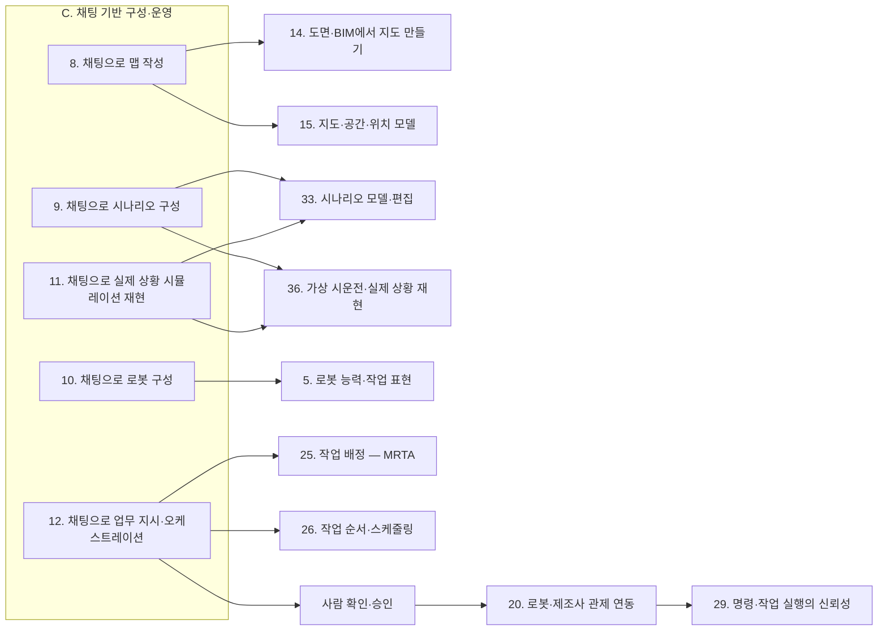
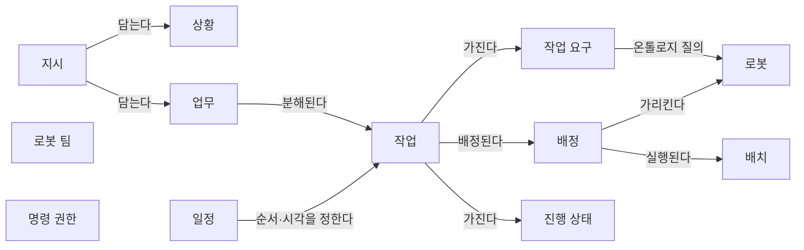
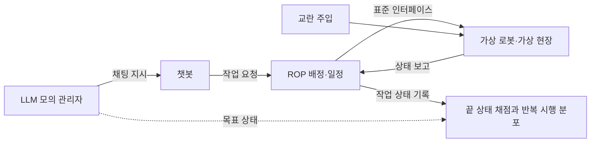
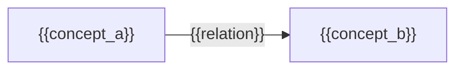

(너의 규칙은 시스템 프롬프트의 agents/shared-rules.md 와 agents/storyteller.md 이다. 아래는 이번 실행의 컨텍스트와 입력이다.)

## 실행 컨텍스트

- run_id: 2026-10-09-25
- date: 2026-10-09
- run_type: track (트랙 실행)
- 대상: 트랙 chat-based-configuration-and-operation (채팅 기반 구성·운영) · 현재 단계: 단계 2. 필요한 데이터와 표준 조사 · 이번에 다룰 백로그 질문 id: q1-05, q1-06, q2-04 · 중심 세부영역: 12. 채팅으로 업무 지시·오케스트레이션 (C. 채팅 기반 구성·운영)
- 예산:
    - max_search_queries: 40
    - max_sources_per_run: 20
    - new_topic_pages: 1
    - page_updates: 2
    - max_retries: 2
- 환경 알림: web_fetch_available: true · fetch_mode: full
- 언어: ko

## 입력

### runs/2026-10-09-25/target.json

```json
{
  "run_id": "2026-10-09-25",
  "date": "2026-10-09",
  "weekday": "Fri",
  "run_number": 158,
  "run_type": "track",
  "forced": true,
  "target": {
    "area_no": 12,
    "area_name": "12. 채팅으로 업무 지시·오케스트레이션",
    "category": "C. 채팅 기반 구성·운영",
    "category_letter": "C"
  },
  "topic": null,
  "track": {
    "slug": "chat-based-configuration-and-operation",
    "name": "채팅 기반 구성·운영",
    "stage": 2,
    "stages": 10,
    "stage_name": "필요한 데이터와 표준 조사",
    "question_ids": [
      "q1-05",
      "q1-06",
      "q2-04"
    ],
    "user_questions": [],
    "runs_per_week": 3,
    "question_rationale": "사용자 지정 0건, 되돌아온 질문 2건, 현재 단계 열린 질문 4건 중 오래된 순"
  },
  "corrections": [],
  "budget": {
    "max_search_queries": 40,
    "max_sources_per_run": 20,
    "new_topic_pages": 1,
    "page_updates": 2,
    "max_retries": 2
  },
  "priority_reason": null,
  "priority_questions": [],
  "excluded_areas": [],
  "lifted_areas": [],
  "deferred": {
    "monthly_recheck": false,
    "weekly_review": true
  },
  "selection_rationale": "CLI 지정 run_type=track, area=12; 트랙 실행일(Fri, track_days 앞 3개) → 트랙 chat-based-configuration-and-operation 단계 2, 질문 q1-05, q1-06, q2-04 (사용자 지정 0건, 되돌아온 질문 2건, 현재 단계 열린 질문 4건 중 오래된 순)"
}
```

### runs/2026-10-09-25/research.json

```json
{
  "run_id": "2026-10-09-25",
  "date": "2026-10-09",
  "run_type": "track",
  "target": {
    "area_no": 12,
    "area_name": "12. 채팅으로 업무 지시·오케스트레이션",
    "category": "C. 채팅 기반 구성·운영"
  },
  "gaps": [
    "앞 단계로 되돌아온 단계 1 질문 q1-05·q1-06 열림 — 단계 1 페이지 3절에 답 소절 없음(target.json 지정: 사용자 지정 0건, 되돌아온 질문 2건, 현재 단계 열린 질문 4건 중 오래된 순)",
    "단계 2 질문 q2-04 열림 — 단계 2 페이지 3절에 {#q2-04} 소절 없음(보류된 실행 2026-10-09-20 의 답은 2차 검증 불통과로 반영되지 않음)",
    "단계 2 완료 조건: 업무 분해·배정 설계 초안 개념 목록 표에 작업 요구 적재물 속성·완료 조건 미확정, q2-05·q2-06·q2-07 열림",
    "업무 분해·배정 설계 초안 6절 '작업 사이 선행 의존을 관계로 드러낼 것인가' 질문에 외부 형식(VDA 5050 주문·Open-RMF 작업) 대응 근거 없음",
    "12. 채팅으로 업무 지시·오케스트레이션 섹션 5. 적용 사례 — 물류창고·제조 공장 사례 없음(병원·실외만), oq-142 국내 사례 미해결"
  ],
  "research_questions": [
    "대화로 받은 지시를 확인 가능한 계획으로 바꾸고, 승인 뒤 실행과 진행 설명까지 이어 갈 수 있는가? [분류원문]",
    "q1-05 물류·창고 현장 지시를 다룬 LLM 작업 분해 연구가 있는가, 가정용 시뮬레이터 결과를 물류 지시로 옮길 때 무엇이 달라지는가?",
    "q1-06 팔레트 이동·출하 준비 같은 물류·창고 현장 지시를 대상으로 한 LLM 작업 분해 연구나 지시–작업 데이터셋이 있는가, 가정용 시뮬레이터(VirtualHome, AI2-THOR) 결과를 물류 지시로 옮길 때 무엇이 달라지는가?",
    "q2-04 분해 결과의 중간 표현(PDDL, LTL, 행동 트리, 의존 DAG) 가운데 업무 분해·배정 설계 초안의 작업 모델과 로봇 관제 인터페이스(VDA 5050 주문, Open-RMF 작업)로 옮기기 쉬운 것은 무엇이고 옮길 때 무엇이 빠지는가?",
    "행동 트리보다 표현력이 큰 워크플로 형식(Open-RMF 차세대 워크플로 다이어그램 등)은 분기·동기화·순환을 어떻게 다루며, ROP 실행기가 작업 사이 제어 흐름을 보관하는 형식으로 쓸 수 있는가? (단계 2 페이지 3절 q2-04 겨냥)",
    "국내(한국어) 자료 가운데 물류·제조 물류 현장의 자연어 로봇 지시를 다룬 연구나 운영 사례가 있는가? (12. 채팅으로 업무 지시·오케스트레이션 섹션 5, oq-142 겨냥)"
  ],
  "findings": [
    {
      "id": "f1",
      "claim": "Göbel·Lorang·Staderini·Zips(IFAC PapersOnline 59(18), 14th IFAC Symposium on Robotics 2025)는 공간 추론과 긴 계획이 필요한 팔레트 물류 PDDL 도메인에서 GPT-4o·GPT-o1 이 신뢰할 수 있고 실행 가능한 계획을 만드는 데 어려움을 겪고 계산 비용이 커 실시간 로봇 계획에 비실용적이라고 보고하고, LLM 은 자연어 과제를 구조화된 목표로 옮겨 PDDL 문제 파일 일부를 만들고 고전 계획기가 최종 계획을 내는 하이브리드 구조를 제안했다.",
      "tag": "사실",
      "source_ids": [
        "ref-1391"
      ],
      "cross_checked": false,
      "confidence": "medium",
      "evidence_excerpt": "AIT 저장소 서지·초록 열람(DOI 10.1016/j.ifacol.2025.10.237, 301–306쪽). 초록에 빈도 표현('자주')은 없음. 정량 결과·사용 계획기 미확인.",
      "as_of": "2025",
      "site_type": null,
      "flow_item": null
    },
    {
      "id": "f2",
      "claim": "Chen 외(ICRA 2024)는 창고에서 착안한 2D 격자 시뮬레이션의 Warehouse 시나리오(이동 매니퓰레이터가 상자를 목표 구역으로 옮김, 로봇 4·6·8·10대, 로봇 수마다 10회·합 40회)에서 LLM 다중 로봇 계획 구조별 성공률을 분산형 0.0%, 혼합형 HMAS-1 5.0%, 중앙형 15.0%, 혼합형 HMAS-2 62.5%로 보고했다(저자 보고).",
      "tag": "사실",
      "source_ids": [
        "ref-1392"
      ],
      "cross_checked": false,
      "confidence": "medium",
      "evidence_excerpt": "arXiv HTML v2(2024-03-22, Journal reference ICRA 2024) Table I. 같은 위치 두 로봇은 충돌·실패, 로봇당 행동 6개. 로봇 수별 성공률 수치는 본문에 없음(그림만).",
      "as_of": "2024-03",
      "site_type": null,
      "flow_item": null
    },
    {
      "id": "f3",
      "claim": "PIP-LLM 저자들은 Gazebo 로 만든 창고 환경에서 로봇 12대가 선반 사이로 상품 블록을 옮기는 과제 10개(과제마다 초기 위치를 바꿔 10회)를 평가해, PIP-LLM 이 과제 1–4·8–10 에서 100%, 과제 5 에서 90%, 오탈자를 넣은 과제 6·7 에서 80%·70% 성공한 반면 비교 기준(CoT, SMART-LLM, LaMMA-P)은 과제 1 에서만 성공했다고 보고했다.",
      "tag": "사실",
      "source_ids": [
        "ref-181"
      ],
      "cross_checked": false,
      "confidence": "medium",
      "evidence_excerpt": "arXiv HTML 열람, Table III(저자 보고, 시뮬레이션 조건). 표 캡션은 'tabletop experiments'로 적어 본문 Gazebo 서술과 어긋남. 기준선 실패를 과제 1 의 초기 분포가 목표에 가깝기 때문이라 설명.",
      "as_of": "2025-10",
      "site_type": null,
      "flow_item": null
    },
    {
      "id": "f4",
      "claim": "PIP-LLM 저자들은 미리 정의한 팀 수준 PDDL 도메인에 기대고 닫힌 정적 세계를 가정한다는 한계를 밝혔고, 'prodcut3'·'shelve4' 같은 오탈자가 새 품목·새 선반으로 해석되어 실패할 수 있다고 보고했다.",
      "tag": "사실",
      "source_ids": [
        "ref-181"
      ],
      "cross_checked": false,
      "confidence": "medium",
      "evidence_excerpt": "arXiv HTML 열람. 한계: LLM 이 팀 수준 도메인을 자동 설계하기 어렵고, 불확실성(물체 변화·확률적 결과)에는 재계획 장치가 필요. 오탈자 예는 저자 서술.",
      "as_of": "2025-10",
      "site_type": null,
      "flow_item": "작업 대상"
    },
    {
      "id": "f5",
      "claim": "Choe 외(arXiv 2505.13376, 2025-05)는 창고 배치를 동기로 이종 로봇이 자연어 도움 요청을 문법 제약 디코딩으로 신호 시간 논리(STL)로 옮기고 MILP 로 풀어 도움 줄 로봇을 고르는 분산 구조를 제안했고, 지게차 6대 격자 시뮬레이션 100회에서 시스템 전체 영향 기준 선택이 최근접 로봇 선택보다 추가 시간 합계를 평균 약 26% 줄였으며 최근접 선택이 최적과 일치한 비율은 42%였다고 보고했다.",
      "tag": "사실",
      "source_ids": [
        "ref-1402"
      ],
      "cross_checked": false,
      "confidence": "medium",
      "evidence_excerpt": "arXiv HTML 열람(동료심사 게재처 미확인). 시뮬레이션 전용, VLM 장면 설명이 정확하다고 가정, 맨해튼 거리 근사. 번역 시험은 7,500쌍 항법 데이터에서 500쌍 표본(저자 보고).",
      "as_of": "2025-05",
      "site_type": null,
      "flow_item": null
    },
    {
      "id": "f6",
      "claim": "IMR-LLM(arXiv 2603.02669, 2026-03)의 저자들은 산업 제조 작업이 가정 작업보다 순서 제약이 엄격하고 의존이 복잡해 LLM 에 어렵다고 보고, LLM 이 이접 그래프(disjunctive graph) 구성을 돕고 결정적 해법기가 상위 작업 계획을 푸는 2단 구조와 세 복잡도 수준의 산업 다중 로봇 벤치마크 IMR-Bench 를 제안했다.",
      "tag": "사실",
      "source_ids": [
        "ref-170"
      ],
      "cross_checked": false,
      "confidence": "medium",
      "evidence_excerpt": "arXiv 초록 열람(v1). IMR-Bench 의 장면·로봇·작업 수와 공개 여부는 초록에 없음. 저자 보고로 모든 지표에서 기존 방법을 앞섰다고 함.",
      "as_of": "2026-03",
      "site_type": null,
      "flow_item": null
    },
    {
      "id": "f7",
      "claim": "Research Square 에 올라온 동료심사 전 프리프린트는 운영자의 자연어 명령을 LLM 이 창고 작업으로 바꾸고, SAP EWM 의 창고 작업을 자율이동로봇(LALLU)에 보내며, 로봇이 목적 저장 칸을 QR 코드로 확인한 뒤 EWM 에 작업을 확정하는 시제품(SAP S/4HANA 2023·ABAP REST·Raspberry Pi 기반) 구조를 기술한다.",
      "tag": "사실",
      "source_ids": [
        "ref-1393"
      ],
      "cross_checked": false,
      "confidence": "low",
      "evidence_excerpt": "원문 미열람(페이지 열람 시 제목만 반환). 검색 결과 요약 기준. 저자·게시일·정량 결과·실제 창고 운영 여부 미확인. (발행일 미확인, 확인일 기준)",
      "as_of": "2026-10-09",
      "site_type": "물류창고",
      "flow_item": "완료·인계",
      "source_unopened": true
    },
    {
      "id": "f8",
      "claim": "국내 자료로 KAIST 강건·강서연·배정찬이 2023-11 대한산업공학회 추계학술대회 논문집(75–89쪽)에 제조 물류 로봇의 LLM 활용 로봇 협업 인터페이스 구축을 발표했으나, 초록·본문을 확인하지 못해 지시를 어떤 형식으로 바꾸는지는 미확인이다.",
      "tag": "추정",
      "source_ids": [
        "ref-780"
      ],
      "cross_checked": false,
      "confidence": "low",
      "evidence_excerpt": "DBpia 서지 페이지 열람(초록 칸 비어 있음). 재검색에서도 구성 서술을 확인하지 못함. 서지 사실만 사용.",
      "as_of": "2023-11",
      "site_type": null,
      "flow_item": null,
      "source_unopened": true
    },
    {
      "id": "f9",
      "claim": "확인한 물류·산업 지향 연구(f1·f3·f4·f6)를 종합하면, 가정용 시뮬레이터 결과를 물류 지시로 옮길 때 (1) 대상이 상식 이름이 아니라 품목·선반 식별자와 수량이어서 정확 일치 접지가 필요하고 표기 오류에 취약하며, (2) 같은 모양의 팔레트·상자가 많은 긴 공간 계획과 엄격한 순서 제약에서 LLM 직접 계획의 신뢰성이 떨어져 결정적 계획기·해법기를 함께 두는 구조가 반복되고, (3) 사람이 미리 설계한 닫힌 도메인 모델과 실시간 계산 비용 제약이 함께 걸리는 점이 달라지는 것으로 보인다.",
      "tag": "추정",
      "source_ids": [
        "ref-1391",
        "ref-181",
        "ref-170",
        "ref-1392"
      ],
      "cross_checked": false,
      "confidence": "low",
      "evidence_excerpt": "이 위키의 종합. 근거는 모두 시뮬레이션·도메인 실험·초록 수준이며 실제 물류센터 운영 평가는 확인하지 못함. 로봇 수 증가에 따른 성공률 변화는 수치 미확인이라 넣지 않음.",
      "as_of": "2026-10-09",
      "site_type": null,
      "flow_item": null
    },
    {
      "id": "f10",
      "claim": "Keramat·Salimi·Westerlund(arXiv 2602.08421, 2026-02)는 자연어 사용자 의도를 하위 작업으로 바꿔 여러 제조사 로봇을 조정하는 분산 다중 로봇 작업 계획기를 제안하며 평가용 벤치마크 SkillChain-RTD 를 만들어 공개했다고 밝혔으나, 초록에는 창고·물류 언급이 없다.",
      "tag": "사실",
      "source_ids": [
        "ref-1401"
      ],
      "cross_checked": false,
      "confidence": "medium",
      "evidence_excerpt": "arXiv 초록 열람. 벤치마크의 규모·정답 형식은 초록에 없음(검색 요약은 의도 30개·선형 하위 작업 순서라 전하나 미확인). Hyperledger Fabric 기반 접근 통제 포함.",
      "as_of": "2026-02",
      "site_type": null,
      "flow_item": null
    },
    {
      "id": "f11",
      "claim": "이번 검색 범위(영어·한국어)에서 물류창고 지시를 정답 작업과 짝지어 공개한 지시–작업 데이터셋은 찾지 못했고, 가장 가까운 것은 논문 안의 시뮬레이션 과제 집합(Chen 외 Warehouse 시나리오, PIP-LLM 창고 과제 10개, Choe 외 지게차 도움 요청 시뮬레이션), 산업 제조 벤치마크 IMR-Bench(공개 여부 미확인), 일반 의도 분해 벤치마크 SkillChain-RTD(물류 아님), EWM 연동 시제품 시연이다(부재 확인 아님).",
      "tag": "추정",
      "source_ids": [
        "ref-1392",
        "ref-181",
        "ref-1402",
        "ref-170",
        "ref-1401",
        "ref-1393"
      ],
      "cross_checked": false,
      "confidence": "low",
      "evidence_excerpt": "검색 범위의 관찰(한국어 검색 4회 포함). 각 과제 집합이 데이터셋으로 공개되었는지는 미확인. 단계 2 페이지 q2-03 의 '물류 지시 데이터셋 미발견'과 같은 방향.",
      "as_of": "2026-10-09",
      "site_type": null,
      "flow_item": null
    },
    {
      "id": "f12",
      "claim": "VDA 5050 공식 저장소의 주문 스키마(main 브랜치)는 주문 id·갱신 id·노드·간선을 필수로 두고, 노드·간선을 공유 sequenceId 순서의 한 줄 경로로 두며 released 로 베이스·호라이즌을 나누고, 동작에 blockingType(NONE·SOFT·SINGLE·HARD)을 붙이지만, 우선순위·기한·주문 사이 의존·대안 경로(분기)를 담는 필드는 이 스키마에 없다.",
      "tag": "사실",
      "source_ids": [
        "ref-413"
      ],
      "cross_checked": false,
      "confidence": "medium",
      "evidence_excerpt": "raw 원문 열람. 주문 사이 연결 필드는 orderId·orderUpdateId(한 주문의 갱신 묶음)뿐. 기한·우선순위 부재는 단계 2 페이지 q2-01 의 기존 관찰과 같음. (발행일 미확인, 확인일 기준)",
      "as_of": "2026-10-09",
      "site_type": null,
      "flow_item": null
    },
    {
      "id": "f13",
      "claim": "Open-RMF 의 사용자 정의 작업(compose)은 GoToPlace·PickUp·DropOff·PerformAction 같은 공개 단계를 순서대로 이어 만들고, 활동 순서(Activity Sequence) 스키마는 범주·기술을 필수로 가진 활동의 배열로 정의되며, 승강기 요청 같은 단계는 RMF 가 필요할 때 자동으로 넣는다.",
      "tag": "사실",
      "source_ids": [
        "ref-110",
        "ref-1394"
      ],
      "cross_checked": false,
      "confidence": "medium",
      "evidence_excerpt": "ref-110 입력 원문과 ref-1394 raw 원문 열람(같은 Open Robotics 계열이라 독립 교차 아님). 순서 스키마 설명 'A sequence of activities'. 병렬·분기 활동 범주 유무는 미확인. (발행일 미확인, 확인일 기준)",
      "as_of": "2026-10-09",
      "site_type": null,
      "flow_item": null
    },
    {
      "id": "f14",
      "claim": "Open-RMF 작업 상태 스키마에서 사건 사이 의존(deps)은 같은 작업 단계(phase) 안의 사건 id 로만 표현되므로, 작업과 작업 사이의 선행 의존을 담는 자리는 이 스키마에서 확인되지 않는다.",
      "tag": "사실",
      "source_ids": [
        "ref-111"
      ],
      "cross_checked": false,
      "confidence": "medium",
      "evidence_excerpt": "입력 원문 대조: deps 항목 설명 'Event IDs are isolated within the scope of this task phase.' 단계 2 페이지 q2-02·초안 6절의 기존 관찰과 같음. (발행일 미확인, 확인일 기준)",
      "as_of": "2026-10-09",
      "site_type": null,
      "flow_item": null
    },
    {
      "id": "f15",
      "claim": "Open-RMF 작업 요청 스키마는 범주·기술만 필수로 두고 가장 이른 시작 시각·요청 시각·우선순위·라벨·요청자·허용 플릿 이름을 선택 필드로 두며 마감 시각(기한) 필드는 없다.",
      "tag": "사실",
      "source_ids": [
        "ref-125"
      ],
      "cross_checked": false,
      "confidence": "medium",
      "evidence_excerpt": "입력 원문 대조(required: category, description). 단계 2 페이지 q2-01 의 기존 주장과 같음 — 새로 반복하지 말고 #q2-01 을 가리킬 것. (발행일 미확인, 확인일 기준)",
      "as_of": "2026-10-09",
      "site_type": null,
      "flow_item": null
    },
    {
      "id": "f16",
      "claim": "NVIDIA Isaac Mission Dispatch 는 임무를 sequence·selector·route·action·notify 노드로 된 행동 트리(암묵적 루트 sequence)로 받아 route·action 노드마다 별도의 VDA 5050 주문으로 옮기고 행동 트리 진행에 따라 주문을 차례로 보내며, action 노드의 동작은 로봇 현재 위치에 해당하는 주문 첫 노드에 붙인다.",
      "tag": "사실",
      "source_ids": [
        "ref-1395"
      ],
      "cross_checked": false,
      "confidence": "medium",
      "evidence_excerpt": "README raw 열람: \"Each route or action mission tree node will be translated into a separate VDA5050 Order message.\" (발행일 미확인, 확인일 기준)",
      "as_of": "2026-10-09",
      "site_type": null,
      "flow_item": null
    },
    {
      "id": "f17",
      "claim": "Isaac Mission Dispatch README 는 작업 배정·충돌 해결을 다루지 않고 VDA 5050 만 지원하며, 완료된 route 노드는 갱신할 수 없고 sequence·selector 구조를 바꾸려면 임무를 취소하고 다시 제출해야 하며, 실행 중 임무의 취소는 현재 임무가 끝난 뒤 처리된다고 밝힌다.",
      "tag": "사실",
      "source_ids": [
        "ref-1395"
      ],
      "cross_checked": false,
      "confidence": "medium",
      "evidence_excerpt": "README raw 열람. 실행 중 취소는 needs_canceled 표시 뒤 임무 종료 후 처리. 원격 조작은 사용자 정의 동작(startTeleop 등)으로 처리. (발행일 미확인, 확인일 기준)",
      "as_of": "2026-10-09",
      "site_type": null,
      "flow_item": "예외·성과"
    },
    {
      "id": "f18",
      "claim": "NVIDIA Isaac Mission Control README 는 제출된 임무로 작업 행동 트리를 조립해 Mission Dispatch 가 VDA 5050 으로 실행하게 하고, 선택 기능으로 SAP EWM 창고 작업을 받아 이동 임무로 바꿔 로봇을 배정하고 상태를 되돌리며, VDA 5050 차량 유형에 MANIPULATOR·HUMANOID 를 더한 확장을 제공한다고 밝힌다.",
      "tag": "추정",
      "source_ids": [
        "ref-1396"
      ],
      "cross_checked": false,
      "confidence": "low",
      "evidence_excerpt": "벤더 주장: README raw 열람. 버전 이력 5.0.0 스킬 추가, 4.6.0 VDA5050 Action 노드 추가. 확장 유형은 Mission Client 3.2.0 이상 필요. 독립 확인 없음. (발행일 미확인, 확인일 기준)",
      "as_of": "2026-10-09",
      "site_type": null,
      "flow_item": null,
      "vendor_claim": true
    },
    {
      "id": "f19",
      "claim": "ROS 2 계획 시스템 PlanSys2 의 실행기(Executor)는 PDDL 계획을 받아 앞 행동의 효과와 뒤 행동의 요구를 짝지은 계획 그래프로 의존 관계를 만들고, 그 그래프의 실행 흐름들을 병렬로 돌리는 행동 트리로 변환해 실행하며, 기본 계획기는 POPF 이다.",
      "tag": "사실",
      "source_ids": [
        "ref-1397"
      ],
      "cross_checked": false,
      "confidence": "medium",
      "evidence_excerpt": "PlanSys2 설계 문서 열람. 공유 행동은 Singleton 방식으로 중복되지 않음. 행동 실행용 사용자 정의 BT 템플릿 지정 가능. (발행일 미확인, 확인일 기준)",
      "as_of": "2026-10-09",
      "site_type": null,
      "flow_item": null
    },
    {
      "id": "f20",
      "claim": "DART-LLM 의 질의응답 LLM 은 하위 작업마다 실행 함수 이름·선행 의존 작업·대상 물체 키워드를 담은 구조화 출력(의존 DAG)을 내고, QA LLM 이 특정 로봇을 지명하면 그 로봇에 배정하고 그렇지 않을 때 파서가 맞는 스킬을 가진 가용 로봇을 고르며, 하위 작업은 위상 순서로 실행되고 의존이 없는 작업은 병렬로 실행된다(평가는 건설 기계 시나리오).",
      "tag": "사실",
      "source_ids": [
        "ref-059"
      ],
      "cross_checked": false,
      "confidence": "medium",
      "evidence_excerpt": "arXiv HTML 열람. 벤치마크 102개 지시(L1 47·L2 33·L3 22), Unity/PhysX 와 Yanmar C30R 2대·Hitachi ZX120. 템플릿은 instruction_function 키가 반복되는 형식.",
      "as_of": "2024-11",
      "site_type": null,
      "flow_item": null
    },
    {
      "id": "f21",
      "claim": "Nl2Hltl2Plan(Xu 외, arXiv v4 2024-12-05, 게재처 표기 없음)은 LLM 이 계층 작업 트리를 만들고 미세 조정한 LLM 이 하위 작업을 평면 LTL 식으로 옮긴 뒤 최하위가 순서 있는 로봇 행동인 계층 LTL 명세로 모아 기성 계획기로 풀며, 같은 지시가 여러 형식 명세로 번역될 수 있어 정확도와 다중 로봇 계획 효율이 떨어질 수 있다고 지적하고, 작업 배정과 계획의 비용을 개선했다고 보고했다.",
      "tag": "사실",
      "source_ids": [
        "ref-1398"
      ],
      "cross_checked": false,
      "confidence": "medium",
      "evidence_excerpt": "arXiv 초록 열람. 사람 참가 시뮬레이션·실기 실험의 성공률·비용 개선은 저자 보고. 계획기 이름·로봇 수 미확인.",
      "as_of": "2024-12",
      "site_type": null,
      "flow_item": null
    },
    {
      "id": "f22",
      "claim": "Luo·Liu(IEEE T-RO 2025 게재 예정 표기)는 유한 트레이스 LTL 의 계층 확장 H-LTLf 를 정의하고, 명세별 하위 탐색 공간을 오가며 다중 로봇의 작업 배정과 계획을 동시에 합성하는 탐색 방법을 제안해 서비스 과제 시뮬레이션에서 계획 시간을 줄였다고 보고했다.",
      "tag": "사실",
      "source_ids": [
        "ref-1399"
      ],
      "cross_checked": false,
      "confidence": "medium",
      "evidence_excerpt": "arXiv 초록 열람(v4 2025-06-05, 'Accepted to appear in IEEE Transactions on Robotics 2025'). 해 품질은 기존 방법과 비슷(저자 보고), 사용자 연구 포함.",
      "as_of": "2025-06",
      "site_type": null,
      "flow_item": null
    },
    {
      "id": "f23",
      "claim": "Neupane·Mercer·Goodrich(AAMAS 2023 ARMS 워크숍)는 목표 지향 LTLf 식의 부분집합을 행동 트리로 바꾸는 방법을 제안해, 성공한 실행 궤적이 해당 LTL 식을 만족하게 하고 행동 노드는 여러 계획기로 구현할 수 있게 했다.",
      "tag": "사실",
      "source_ids": [
        "ref-1400"
      ],
      "cross_checked": false,
      "confidence": "medium",
      "evidence_excerpt": "arXiv 초록 열람(v2 2023-12-19, 'Most Visionary Paper'). Fetch 로봇의 순차 열쇠–문 문제로 시연.",
      "as_of": "2023-12",
      "site_type": null,
      "flow_item": null
    },
    {
      "id": "f24",
      "claim": "Open-RMF 상호운용 관심 그룹 공지(2024-07-25 게시, 2024-08-01 발표)는 행동 트리의 트리 구조가 임의의 분기·동기화·순환을 표현하기 어렵게(때로 불가능하게) 만들며, 행동 트리는 모두 동등한 워크플로로 바꿀 수 있지만 모든 워크플로를 행동 트리로 나타낼 수는 없다고 설명한다.",
      "tag": "사실",
      "source_ids": [
        "ref-1403"
      ],
      "cross_checked": false,
      "confidence": "medium",
      "evidence_excerpt": "Open Robotics Discourse 공지 열람(작성자 grey): \"every behavior tree can be converted into an equivalent workflow\". 발표 내용 자체는 미열람.",
      "as_of": "2024-07-25",
      "site_type": null,
      "flow_item": null
    },
    {
      "id": "f25",
      "claim": "Open-RMF 상호운용 관심 그룹 공지(2025-05-31 게시)는 그래픽 다이어그램으로 나타낼 수 있는 워크플로를 사람이 읽을 수 있는 JSON 스키마('워크플로 다이어그램')로 정의하고, 라이브러리가 실행 시 이를 빌드해 실행하며, 빌드 단계에서 호환되지 않는 메시지·끝나지 않는 워크플로·정의되지 않은 연산 같은 오류를 실행 전에 보고한다고 밝힌다.",
      "tag": "사실",
      "source_ids": [
        "ref-1404"
      ],
      "cross_checked": false,
      "confidence": "medium",
      "evidence_excerpt": "Discourse 공지 열람. 연산 예: Listen, Scope(분기 경주), Section Template, Spread/Collect(병렬·수집), Trim(노드 취소), Gate(분기 차단) — 일부는 JSON 연산으로 점차 제공 중이라 적음.",
      "as_of": "2025-05-31",
      "site_type": null,
      "flow_item": null
    },
    {
      "id": "f26",
      "claim": "open-rmf 조직의 crossflow 저장소 README 는 crossflow 를 bevy ECS 기반 반응형 프로그래밍 라이브러리로 소개하고, 그 워크플로가 병렬 분기·동기화·경주(race)·순환을 포함할 수 있으며 ROS 2 통합은 별도 브랜치에 있다고 적는다.",
      "tag": "사실",
      "source_ids": [
        "ref-1405"
      ],
      "cross_checked": false,
      "confidence": "medium",
      "evidence_excerpt": "README raw 열람. JSON 다이어그램 형식의 세부와 Open-RMF 차세대와의 관계는 README 에 서술 없음(검색 요약은 차세대 Open-RMF 기반 요소라 전함). (발행일 미확인, 확인일 기준)",
      "as_of": "2026-10-09",
      "site_type": null,
      "flow_item": null
    },
    {
      "id": "f27",
      "claim": "확인한 대응 사례(f12~f20)를 종합하면, 업무 분해·배정 설계 초안의 작업 모델과 로봇 관제 인터페이스로 가장 옮기기 쉬운 중간 표현은 하위 작업과 선행 의존을 그대로 담는 의존 DAG(또는 PDDL 계획을 의존 그래프로 바꾼 형태)이고, 잎 작업은 Open-RMF 작업 요청(배송·compose 단계)과 VDA 5050 주문으로 하나씩 옮기되 의존과 진행 순서는 ROP 실행기가 보유해 선행 작업 완료 뒤 다음 요청을 내보내는 구성이 선택지로 보인다.",
      "tag": "추정",
      "source_ids": [
        "ref-413",
        "ref-1394",
        "ref-111",
        "ref-1395",
        "ref-1397",
        "ref-059",
        "ref-181"
      ],
      "cross_checked": false,
      "confidence": "low",
      "evidence_excerpt": "이 위키의 종합. Mission Dispatch(BT→주문 순차 송출)·PlanSys2(PDDL→계획 그래프→BT)·DART-LLM(DAG 위상 실행)이 같은 '잎 단위 송출, 의존은 상위 보유' 구조를 보임. 물류 플릿 적용 사례 미확인.",
      "as_of": "2026-10-09",
      "site_type": null,
      "flow_item": null
    },
    {
      "id": "f28",
      "claim": "중간 표현을 VDA 5050 주문·Open-RMF 작업 요청으로 옮기면 작업 사이 선행 의존, 행동 트리 selector 같은 대안 경로, 기한(VDA 5050 은 우선순위도), 지시 원문·배정 근거·확인 여부가 빠지므로 이 항목은 ROP 작업 모델과 실행기에 남겨야 하고, 행동 트리의 제어 흐름을 바꾸려면 Mission Dispatch 처럼 취소·재제출이 필요해지는 것으로 보인다.",
      "tag": "추정",
      "source_ids": [
        "ref-413",
        "ref-125",
        "ref-111",
        "ref-1395"
      ],
      "cross_checked": false,
      "confidence": "low",
      "evidence_excerpt": "이 위키의 종합. 각 '필드 없음'은 연 스키마 범위의 부재 관찰이며 부재 확인 아님. 배정 근거·확인 여부 누락은 단계 2 q2-02 결론과 같은 방향.",
      "as_of": "2026-10-09",
      "site_type": null,
      "flow_item": null
    },
    {
      "id": "f29",
      "claim": "LTL 계열 표현은 계획이 아니라 명세여서 계획기(계층 LTL 계획, LTLf→행동 트리 변환)를 거친 뒤에야 로봇 관제 인터페이스로 옮길 수 있으므로, ROP 에서는 직접 변환 대상보다 의존 DAG·계획이 금지 구역·순서 같은 현장 규칙을 지키는지 검사하는 명세층으로 쓰는 편이 맞아 보인다.",
      "tag": "추정",
      "source_ids": [
        "ref-1398",
        "ref-1399",
        "ref-1400"
      ],
      "cross_checked": false,
      "confidence": "low",
      "evidence_excerpt": "이 위키의 종합. 근거 연구는 서비스·실험실 조건이고 물류 플릿 적용은 미확인. 검사층 설계는 백로그 q4-14·oq-302·oq-314 와 이어짐.",
      "as_of": "2026-10-09",
      "site_type": null,
      "flow_item": null
    },
    {
      "id": "f30",
      "claim": "행동 트리로 나타내기 어려운 임의의 분기·동기화·순환을 표현하는 워크플로 형식(Open-RMF 진영의 워크플로 다이어그램·crossflow)이 등장하고 있어, ROP 실행기가 작업 사이 제어 흐름을 보관하는 형식의 후보가 행동 트리·의존 DAG 외에 워크플로 다이어그램까지 넓어질 수 있는 것으로 보이나, 이를 VDA 5050 주문·Open-RMF 작업 요청 송출과 연결한 공개 사례는 이번 범위에서 확인하지 못했다.",
      "tag": "추정",
      "source_ids": [
        "ref-1403",
        "ref-1404",
        "ref-1405"
      ],
      "cross_checked": false,
      "confidence": "low",
      "evidence_excerpt": "이 위키의 종합. 근거는 프로젝트 포럼 공지와 README 이며 JSON 스키마 원문·운영 사례는 미확인. 부재 확인 아님.",
      "as_of": "2026-10-09",
      "site_type": null,
      "flow_item": null
    }
  ],
  "sources": [
    {
      "id": "ref-1391",
      "org": "Göbel, K., Lorang, P., Staderini, V., & Zips, P. (AIT Austrian Institute of Technology, IFAC PapersOnline 59(18))",
      "title": "Integrating LLMs and Classical Planning for Pallet Logistics: A Case Study",
      "published": "2025",
      "url": "https://publications.ait.ac.at/de/publications/integrating-llms-and-classical-planning-for-pallet-logistics-a-ca/",
      "type": "논문",
      "reliability": "medium",
      "accessed": "2026-10-09",
      "summary": "14th IFAC Symposium on Robotics(2025) 발표. 팔레트 물류 PDDL 도메인에서 LLM 직접 계획의 한계와 LLM→부분 PDDL 문제 파일→고전 계획기 하이브리드 구조. 저장소 서지·초록만 열람.",
      "fetched": true,
      "fetched_via": "webfetch",
      "fetch_url": null,
      "source_unopened": false
    },
    {
      "id": "ref-1392",
      "org": "Chen, Y., Arkin, J., Zhang, Y., Roy, N., & Fan, C. (MIT, ICRA 2024)",
      "title": "Scalable Multi-Robot Collaboration with Large Language Models: Centralized or Decentralized Systems?",
      "published": "2023-09",
      "url": "https://arxiv.org/abs/2309.15943",
      "type": "논문",
      "reliability": "high",
      "accessed": "2026-10-09",
      "summary": "LLM 다중 로봇 계획의 중앙·분산·혼합 구조 4종을 2D 과제 4개(Warehouse 포함)와 3D 시뮬레이션에서 비교. v2(2024-03) HTML 본문 열람.",
      "fetched": true,
      "fetched_via": "webfetch",
      "fetch_url": "https://arxiv.org/html/2309.15943v2",
      "source_unopened": false
    },
    {
      "id": "ref-1393",
      "org": "Research Square 프리프린트(저자 미확인)",
      "title": "An Intelligent Warehouse Execution Framework Integrating SAP Extended WarehouseManagement, Large Language Models, SAP Business Technology Platform, and Autonomous Mobile Robots",
      "published": null,
      "url": "https://www.researchsquare.com/article/rs-10351090",
      "type": "논문",
      "reliability": "low",
      "accessed": "2026-10-09",
      "summary": "원문 미열람. 검색 요약 기준: 자연어 명령→LLM→SAP EWM 창고 작업→AMR(LALLU) 송출, QR 로 저장 칸 확인 뒤 EWM 확정하는 시제품. 동료심사 전.",
      "source_unopened": true,
      "fetched": false,
      "fetched_via": null,
      "fetch_url": null
    },
    {
      "id": "ref-1394",
      "org": "Open Robotics (open-rmf)",
      "title": "rmf_ros2 — rmf_fleet_adapter/schemas/event_description__sequence.json",
      "published": null,
      "url": "https://github.com/open-rmf/rmf_ros2/blob/main/rmf_fleet_adapter/schemas/event_description__sequence.json",
      "type": "오픈소스 문서",
      "reliability": "high",
      "accessed": "2026-10-09",
      "summary": "Open-RMF 활동 순서(Activity Sequence) 스키마. 활동 배열(각 활동은 category·description 필수).",
      "fetched": true,
      "fetched_via": "github_raw",
      "fetch_url": "https://raw.githubusercontent.com/open-rmf/rmf_ros2/main/rmf_fleet_adapter/schemas/event_description__sequence.json",
      "source_unopened": false
    },
    {
      "id": "ref-1395",
      "org": "NVIDIA (nvidia-isaac GitHub)",
      "title": "isaac_mission_dispatch — README",
      "published": null,
      "url": "https://github.com/nvidia-isaac/isaac_mission_dispatch",
      "type": "오픈소스 문서",
      "reliability": "high",
      "accessed": "2026-10-09",
      "summary": "행동 트리 임무를 route·action 노드별 VDA 5050 주문으로 옮겨 순차 송출하는 디스패처. 배정·충돌 해결 미처리, VDA 5050 만 지원, 구조 변경은 취소·재제출.",
      "fetched": true,
      "fetched_via": "github_raw",
      "fetch_url": "https://raw.githubusercontent.com/nvidia-isaac/isaac_mission_dispatch/main/README.md",
      "source_unopened": false
    },
    {
      "id": "ref-1396",
      "org": "NVIDIA (nvidia-isaac GitHub)",
      "title": "isaac_mission_control — README",
      "published": null,
      "url": "https://github.com/nvidia-isaac/isaac_mission_control",
      "type": "오픈소스 문서",
      "reliability": "medium",
      "accessed": "2026-10-09",
      "summary": "경량 플릿 관리자. 임무→작업 행동 트리 조립, Mission Dispatch 로 VDA 5050 실행, 선택적 SAP EWM 연동, VDA 5050 차량 유형 확장(MANIPULATOR·HUMANOID). 기능 서술은 벤더 주장.",
      "fetched": true,
      "fetched_via": "github_raw",
      "fetch_url": "https://raw.githubusercontent.com/nvidia-isaac/isaac_mission_control/main/README.md",
      "source_unopened": false
    },
    {
      "id": "ref-1397",
      "org": "PlanSys2 (ROS 2 Planning System 프로젝트)",
      "title": "PlanSys2 Design",
      "published": null,
      "url": "https://plansys2.github.io/design/index.html",
      "type": "오픈소스 문서",
      "reliability": "high",
      "accessed": "2026-10-09",
      "summary": "PlanSys2 실행기가 PDDL 계획을 효과–요구 짝짓기 계획 그래프로 만들고 실행 흐름을 병렬 실행하는 행동 트리로 변환하는 구조. 기본 계획기 POPF.",
      "fetched": true,
      "fetched_via": "webfetch",
      "fetch_url": null,
      "source_unopened": false
    },
    {
      "id": "ref-1398",
      "org": "Xu, S., Luo, X., Huang, Y., Leng, L., Liu, R., & Liu, C.",
      "title": "Nl2Hltl2Plan: Scaling Up Natural Language Understanding for Multi-Robots Through Hierarchical Temporal Logic Task Representation",
      "published": "2024-08",
      "url": "https://arxiv.org/abs/2408.08188",
      "type": "논문",
      "reliability": "medium",
      "accessed": "2026-10-09",
      "summary": "자연어→계층 작업 트리→평면 LTL→계층 LTL 명세→기성 계획기의 다중 로봇 파이프라인. 초록만 열람(v4 2024-12-05).",
      "fetched": true,
      "fetched_via": "webfetch",
      "fetch_url": null,
      "source_unopened": false
    },
    {
      "id": "ref-1399",
      "org": "Luo, X., & Liu, C. (IEEE Transactions on Robotics 2025 게재 예정 표기)",
      "title": "Simultaneous Task Allocation and Planning for Multi-Robots under Hierarchical Temporal Logic Specifications",
      "published": "2024-01",
      "url": "https://arxiv.org/abs/2401.04003",
      "type": "논문",
      "reliability": "medium",
      "accessed": "2026-10-09",
      "summary": "계층 유한 트레이스 LTL(H-LTLf) 정의와 다중 로봇 작업 배정·계획 동시 합성 탐색. 초록만 열람(v4 2025-06-05).",
      "fetched": true,
      "fetched_via": "webfetch",
      "fetch_url": null,
      "source_unopened": false
    },
    {
      "id": "ref-1400",
      "org": "Neupane, A., Mercer, E. G., & Goodrich, M. A. (AAMAS 2023 ARMS 워크숍)",
      "title": "Designing Behavior Trees from Goal-Oriented LTLf Formulas",
      "published": "2023-07",
      "url": "https://arxiv.org/abs/2307.06399",
      "type": "논문",
      "reliability": "medium",
      "accessed": "2026-10-09",
      "summary": "목표 지향 LTLf 부분집합을 행동 트리로 변환하는 방법. 초록만 열람(v2 2023-12-19).",
      "fetched": true,
      "fetched_via": "webfetch",
      "fetch_url": null,
      "source_unopened": false
    },
    {
      "id": "ref-1401",
      "org": "Keramat, F., Salimi, S., & Westerlund, T.",
      "title": "Decentralized Intent-Based Multi-Robot Task Planner with LLM Oracles on Hyperledger Fabric",
      "published": "2026-02-09",
      "url": "https://arxiv.org/abs/2602.08421",
      "type": "논문",
      "reliability": "medium",
      "accessed": "2026-10-09",
      "summary": "자연어 의도를 하위 작업으로 바꿔 여러 제조사 로봇을 조정하는 분산 계획기와 공개 벤치마크 SkillChain-RTD. 초록만 열람.",
      "fetched": true,
      "fetched_via": "webfetch",
      "fetch_url": null,
      "source_unopened": false
    },
    {
      "id": "ref-1402",
      "org": "Choe, D. B., Sangeetha, S. V., Emanuel, S., Chiu, C.-Y., Coogan, S., & Kousik, S.",
      "title": "Seeing, Saying, Solving: An LLM-to-TL Framework for Cooperative Robots",
      "published": "2025-05-19",
      "url": "https://arxiv.org/abs/2505.13376",
      "type": "논문",
      "reliability": "medium",
      "accessed": "2026-10-09",
      "summary": "창고를 동기로 한 이종 로봇 도움 요청: 자연어→STL(문법 제약)→MILP 로 도움 로봇 선택. 지게차 6대 격자 시뮬레이션에서 최근접 선택 대비 추가 시간 감소(저자 보고). HTML 본문 열람.",
      "fetched": true,
      "fetched_via": "webfetch",
      "fetch_url": "https://arxiv.org/html/2505.13376",
      "source_unopened": false
    },
    {
      "id": "ref-1403",
      "org": "Open Source Robotics Alliance Interoperability SIG, Open Robotics Discourse",
      "title": "Interoperability Interest Group August 01, 2024: Multi-Agent Process Workflows",
      "published": "2024-07-25",
      "url": "https://discourse.openrobotics.org/t/interoperability-interest-group-august-01-2024-multi-agent-process-workflows/38794",
      "type": "오픈소스 문서",
      "reliability": "medium",
      "accessed": "2026-10-09",
      "summary": "Open-RMF 진영 공지. 행동 트리의 분기·동기화·순환 표현 한계와 워크플로의 일반성(BT→워크플로 변환은 가능, 역은 불가).",
      "fetched": true,
      "fetched_via": "webfetch",
      "fetch_url": null,
      "source_unopened": false
    },
    {
      "id": "ref-1404",
      "org": "Open Source Robotics Alliance Interoperability SIG, Open Robotics Discourse",
      "title": "Interoperability Interest Group June 5, 2025: Execution of Workflow Diagrams",
      "published": "2025-05-31",
      "url": "https://discourse.openrobotics.org/t/interoperability-interest-group-june-5-2025-execution-of-workflow-diagrams/44032",
      "type": "오픈소스 문서",
      "reliability": "medium",
      "accessed": "2026-10-09",
      "summary": "워크플로 다이어그램 JSON 스키마, 빌드 시 오류 검사, Listen·Scope·Spread/Collect·Trim·Gate 등 연산 소개.",
      "fetched": true,
      "fetched_via": "webfetch",
      "fetch_url": null,
      "source_unopened": false
    },
    {
      "id": "ref-1405",
      "org": "Open Robotics (open-rmf GitHub)",
      "title": "crossflow — README",
      "published": null,
      "url": "https://github.com/open-rmf/crossflow",
      "type": "오픈소스 문서",
      "reliability": "high",
      "accessed": "2026-10-09",
      "summary": "bevy ECS 기반 반응형 워크플로 라이브러리. 병렬 분기·동기화·경주·순환을 포함한 계층 워크플로, 워크플로 편집기 데모, ROS 2 통합은 별도 브랜치.",
      "fetched": true,
      "fetched_via": "github_raw",
      "fetch_url": "https://raw.githubusercontent.com/open-rmf/crossflow/main/README.md",
      "source_unopened": false
    },
    {
      "id": "ref-413",
      "org": "VDA / VDMA (VDA5050 GitHub)",
      "title": "VDA5050/VDA5050 — json_schemas/order.schema",
      "published": null,
      "url": "https://github.com/VDA5050/VDA5050/blob/main/json_schemas/order.schema",
      "type": "표준",
      "reliability": "high",
      "accessed": "2026-10-09",
      "summary": "VDA 5050 주문 메시지 JSON 스키마(main 브랜치). 노드·간선·동작·베이스/호라이즌 구조.",
      "fetched": true,
      "fetched_via": "github_raw",
      "fetch_url": "https://raw.githubusercontent.com/VDA5050/VDA5050/main/json_schemas/order.schema",
      "source_unopened": false
    },
    {
      "id": "ref-110",
      "org": "Open Robotics",
      "title": "Tasks in RMF (task_new) - Programming Multiple Robots with ROS 2",
      "published": null,
      "url": "https://osrf.github.io/ros2multirobotbook/task_new.html",
      "type": "오픈소스 문서",
      "reliability": "high",
      "accessed": "2026-10-09",
      "summary": "RMF Task V2 의 단계(phase) 기반 사용자 정의 작업 구성, 공개 단계 GoToPlace·PickUp·DropOff·PerformAction, 자동 RequestLift.",
      "fetched": true,
      "fetched_via": "github_raw",
      "fetch_url": null,
      "source_unopened": false
    },
    {
      "id": "ref-111",
      "org": "Open Robotics (open-rmf)",
      "title": "rmf_api_msgs — rmf_api_msgs/schemas/task_state.json",
      "published": null,
      "url": "https://github.com/open-rmf/rmf_api_msgs/blob/main/rmf_api_msgs/schemas/task_state.json",
      "type": "오픈소스 문서",
      "reliability": "high",
      "accessed": "2026-10-09",
      "summary": "Open-RMF 작업 상태 스키마. 단계·사건 상태, deps(단계 안 사건 의존), dispatch·status 값.",
      "fetched": true,
      "fetched_via": "github_raw",
      "fetch_url": null,
      "source_unopened": false
    },
    {
      "id": "ref-125",
      "org": "Open Robotics (open-rmf)",
      "title": "rmf_api_msgs — rmf_api_msgs/schemas/task_request.json",
      "published": null,
      "url": "https://github.com/open-rmf/rmf_api_msgs/blob/main/rmf_api_msgs/schemas/task_request.json",
      "type": "오픈소스 문서",
      "reliability": "high",
      "accessed": "2026-10-09",
      "summary": "Open-RMF 작업 요청 스키마. category·description 필수, 시작 시각·우선순위 등 선택, 기한 필드 없음.",
      "fetched": true,
      "fetched_via": "github_raw",
      "fetch_url": null,
      "source_unopened": false
    },
    {
      "id": "ref-181",
      "org": "Shi, G., Wu, Y., Kumar, V., & Sukhatme, G. S.",
      "title": "PIP-LLM: Integrating PDDL-Integer Programming with LLMs for Coordinating Multi-Robot Teams Using Natural Language",
      "published": "2025-10",
      "url": "https://arxiv.org/abs/2510.22784",
      "type": "논문",
      "reliability": "medium",
      "accessed": "2026-10-09",
      "summary": "자연어→팀 수준 PDDL→정수계획 배정. Gazebo 창고 과제 10개 평가와 한계(사전 정의 도메인, 닫힌 정적 세계, 오탈자 취약). HTML 본문 열람.",
      "fetched": true,
      "fetched_via": "webfetch",
      "fetch_url": "https://arxiv.org/html/2510.22784",
      "source_unopened": false
    },
    {
      "id": "ref-059",
      "org": "Wang, Y. 외(DART-LLM 저자)",
      "title": "DART-LLM: Dependency-Aware Multi-Robot Task Decomposition and Execution using Large Language Models",
      "published": "2024-11",
      "url": "https://arxiv.org/abs/2411.09022",
      "type": "논문",
      "reliability": "medium",
      "accessed": "2026-10-09",
      "summary": "LLM 이 하위 작업 의존 DAG 를 구조화 출력으로 내고 위상 순서·병렬로 실행. 건설 기계 시나리오 평가. HTML 본문 열람.",
      "fetched": true,
      "fetched_via": "webfetch",
      "fetch_url": "https://arxiv.org/html/2411.09022",
      "source_unopened": false
    },
    {
      "id": "ref-780",
      "org": "강건(대한산업공학회 추계학술대회 논문집)",
      "title": "제조 물류 로봇에서의 대규모 언어 모델(LLM)을 활용한 로봇 협업 인터페이스 구축",
      "published": "2023-11",
      "url": "https://www.dbpia.co.kr/journal/articleDetail?nodeId=NODE11609734",
      "type": "논문",
      "reliability": "medium",
      "accessed": "2026-10-09",
      "summary": "원문 미열람. DBpia 서지 기준: KAIST 강건·강서연·배정찬, 2023 대한산업공학회 추계학술대회 논문집 75–89쪽. 초록·본문 미확인.",
      "source_unopened": true,
      "fetched": false,
      "fetched_via": null,
      "fetch_url": null
    },
    {
      "id": "ref-170",
      "org": "Su, X., Xu, J., van Kaick, O., Xu, K., & Hu, R.",
      "title": "IMR-LLM: Industrial Multi-Robot Task Planning and Program Generation using Large Language Models",
      "published": "2026-03",
      "url": "https://arxiv.org/abs/2603.02669",
      "type": "논문",
      "reliability": "medium",
      "accessed": "2026-10-09",
      "summary": "산업 제조 다중 로봇 작업: LLM 보조 이접 그래프+결정적 해법기 계획, 공정 트리 기반 프로그램 생성, IMR-Bench. 초록만 열람.",
      "fetched": true,
      "fetched_via": "webfetch",
      "fetch_url": null,
      "source_unopened": false
    }
  ],
  "page_proposals": [
    {
      "action": "update",
      "path": "docs/tracks/chat-based-configuration-and-operation/stage-2-data-and-standards.md",
      "sections": [
        "2",
        "3",
        "4",
        "5",
        "6",
        "8",
        "9"
      ],
      "rationale": "q1-05 답: f1·f2·f3·f4·f5·f6·f7·f8·f9 (신뢰도 low) / q1-06 답: f2·f3·f6·f10·f11 (신뢰도 low) / q2-04 답: f12·f13·f14·f15·f16·f17·f18·f19·f20·f21·f22·f23·f24·f25·f26·f27·f28·f29·f30 (신뢰도 low) — 2절 q2-04 를 답함(답한 실행 2026-10-09-25, #q2-04)으로, 3절 '### q2-04 … {#q2-04}' 소절 신설(중간 표현별 작업 모델·VDA 5050 주문·Open-RMF 작업 요청 대응표는 이 위키 구성[추정] f27~f30; f12·f14·f15 는 #q2-01·#q2-02 기존 서술을 가리키고 기존 각주 재사용; Mission Dispatch·PlanSys2·DART-LLM 의 로봇 쪽 주행·스킬 실행은 '연계 대상: 로봇 자체 지능·제어'로 짧게; Open-RMF 워크플로 다이어그램 f24~f26), 4절 결론·불확실성, 5절 후속 질문, 6절 완료 조건(조건 1 충족, 조건 2 미충족, 전환 아니오), 8절 출처, 9절 이력. q1-05·q1-06 답 본문은 단계 1 페이지에 싣는다."
    },
    {
      "action": "update",
      "path": "docs/tracks/chat-based-configuration-and-operation/stage-1-prior-work-and-products.md",
      "sections": [
        "2",
        "3",
        "4",
        "5",
        "8",
        "9"
      ],
      "rationale": "트랙 산출물 갱신: 되돌아온 질문 q1-05·q1-06 을 3절 '### q1-05 … {#q1-05}'(f1~f9: 팔레트 물류 PDDL 하이브리드, 창고 격자 시나리오(조건 병기), PIP-LLM 창고 시뮬레이션과 한계, 창고 동기 지게차 도움 요청 STL·MILP 와 최근접 비교(f5), 산업 제조 작업의 엄격한 순서 제약(f6), SAP EWM 연동 시제품(동료심사 전·원문 미열람, f7), KAIST 2023 발표 서지만(f8), 가정→물류 차이 종합(f9))와 '### q1-06 … {#q1-06}'(q1-05 를 가리키고 데이터셋 부분 f10·f11 만 추가) 두 소절로 나누어 답하고, 2절 상태를 답함(2026-10-09-25)으로. 두 질문 신뢰도 low, 실제 물류센터 운영 평가는 확인하지 못함을 명시."
    },
    {
      "action": "update",
      "path": "docs/tracks/chat-based-configuration-and-operation/task-model-draft.md",
      "sections": [
        "2",
        "6"
      ],
      "rationale": "트랙 산출물 갱신: 온톨로지 변경 제안 1건(작업 개념 속성 '선후관계' 정리와 외부 표현 메모, 근거 f12·f14·f16·f20, 추정 메모 f27). 6절 '작업 사이 선행 의존을 관계로 드러낼 것인가' 질문은 닫지 않고 q2-04 답 링크(f27·f28)를 덧붙이며, 'LTL 계열을 명세 검사층으로 둘 것인가'(f29, 관련 q4-14)와 '작업 사이 제어 흐름을 행동 트리·의존 DAG·워크플로 다이어그램 가운데 무엇으로 보관할 것인가'(f30) 질문 추가."
    },
    {
      "action": "update",
      "path": "docs/ideas/chat-based-configuration-and-operation.md",
      "sections": [
        "3",
        "4"
      ],
      "rationale": "아이디어 페이지 3절: '물류 지시를 직접 다룬 예는 … G3뿐이었다'를 지우지 말고 '(실행 2026-09-25 기준)'을 붙인 뒤, 실행 2026-10-09-25 에서 물류·산업 지향 LLM 분해 연구(f1~f6, 모두 시뮬레이션·도메인 실험·초록 수준)와 EWM 연동 시제품 프리프린트(f7)를 확인했다는 갱신 문장 추가(f9·f11 추정). 아이디어 페이지 4절: '중간 표현과 로봇 관제 인터페이스 대응' 소절 추가(f12~f30, 대응 결론은 추정)."
    },
    {
      "action": "update",
      "path": "docs/categories/chat-based-configuration-and-operation/chat-task-instruction-and-orchestration.md",
      "sections": [
        "5",
        "6",
        "7"
      ],
      "rationale": "트랙 chat-based-configuration-and-operation 단계 2 반영 제안 (f7, f16, f19, f20, f27, f28): 5절 '물류창고·제조 공장·상업 시설 사례 확인되지 않음' 문장 갱신 필요 — 물류창고 사례 후보(SAP EWM 연동 시제품, 동료심사 전 프리프린트, 원문 미열람, 실제 운영 여부 미확인; SAP EWM 은 상위 업무 시스템 연계 대상이며 ROP 몫은 작업 수신과 완료 확정 반영; 제약·예외·성과는 미확인), 6절 의존 DAG 실행 구조, 7절 Isaac Mission Dispatch(행동 트리→VDA 5050 주문)·PlanSys2. 교차 규칙에 따라 44. 로봇 기반 모델·언어 모델 계획·47. AI·학습·적응과 모델 운영과 25. 작업 배정 — MRTA·26. 작업 순서·스케줄링을 함께 연결. 반영은 다음 해당 영역 실행에서."
    },
    {
      "action": "update",
      "path": "docs/categories/planning-and-optimization/task-and-workflow-modeling.md",
      "sections": [
        "7"
      ],
      "rationale": "트랙 chat-based-configuration-and-operation 단계 2 반영 제안 (f16, f19, f20, f23, f24, f25): 행동 트리 임무를 VDA 5050 주문으로 옮기는 Mission Dispatch, PDDL 계획을 행동 트리로 실행하는 PlanSys2, 의존 DAG(DART-LLM), LTLf→행동 트리 변환, 분기·동기화·순환을 표현하는 Open-RMF 워크플로 다이어그램."
    },
    {
      "action": "update",
      "path": "docs/categories/planning-and-optimization/task-allocation-mrta.md",
      "sections": [
        "8"
      ],
      "rationale": "트랙 chat-based-configuration-and-operation 단계 2 반영 제안 (f5): 핵심 질문 '가장 가까운 로봇에 맡기는 것이 전체적으로도 유리한가?'와 관련해, 창고 동기 지게차 도움 요청 시뮬레이션에서 시스템 전체 영향 기준 선택이 최근접 선택보다 추가 시간 합계를 평균 약 26% 줄이고 최근접 선택이 최적과 일치한 비율은 42%였다는 저자 보고(시뮬레이션·프리프린트 조건). 교차 규칙에 따라 44. 로봇 기반 모델·언어 모델 계획과 연결."
    },
    {
      "action": "update",
      "path": "docs/categories/site-type-applications/warehouse.md",
      "sections": [
        "6"
      ],
      "rationale": "트랙 chat-based-configuration-and-operation 단계 2 반영 제안 (f1, f2, f3, f5, f7, f11): 물류·창고 지시를 다룬 LLM 작업 분해 연구(모두 시뮬레이션·도메인 실험·시제품 조건)와 공개 물류 지시–작업 데이터셋 미발견(추정)."
    }
  ],
  "glossary_candidates": [
    {
      "term_ko": "유한 트레이스 선형 시간 논리",
      "term_en": "Linear Temporal Logic on Finite Traces (LTLf)",
      "definition": "기존 용어 '선형 시간 논리(LTL)'를 끝이 있는 실행 궤적에 맞게 바꾼 변형으로, '언젠가'·'항상'·'다음' 같은 시간 조건으로 끝이 있는 로봇 임무를 명세하는 데 쓰인다."
    },
    {
      "term_ko": "작업 의존 그래프",
      "term_en": "Task Dependency Graph (Dependency DAG)",
      "definition": "하위 작업을 노드로, 먼저 끝나야 하는 선행 관계를 방향 간선으로 둔 방향 비순환 그래프로, 로봇 행동 단위인 '행동 의존 그래프(ADG)'와 달리 하위 작업 단위이며 '선후 제약'을 표현하고 실행기는 위상 순서대로 의존이 풀린 작업부터 실행한다."
    },
    {
      "term_ko": "워크플로 다이어그램",
      "term_en": "Workflow Diagram (Open-RMF / crossflow)",
      "definition": "Open-RMF 진영이 제안한, 그래픽 다이어그램으로 나타낼 수 있는 워크플로를 사람이 읽을 수 있는 JSON 스키마로 정의한 형식으로, 행동 트리로 표현하기 어려운 분기·동기화·순환을 담고 실행 전에 빌드 오류를 검사한다."
    }
  ],
  "open_questions_new": [
    "로봇 관제 인터페이스(VDA 5050 주문, Open-RMF 작업 요청)에 작업 사이 의존·대안 경로·기한을 표현하는 확장 제안이나 차기 판 논의가 있는가? (관련 기존 질문: oq-049, oq-137) | 관련 영역: 20. 로봇·제조사 관제 연동, 21. 상호운용 표준·적합성, 24. 작업·워크플로 모델링 | 근거: f28 | 종류: 일반"
  ],
  "open_questions_resolved": [],
  "self_check": {
    "source_count": 23,
    "cross_checked_count": 0,
    "unverified": [
      "f7 SAP EWM 연동 프리프린트의 저자·게시일·정량 결과·실제 창고 운영 여부 미확인(Research Square 페이지 열람 시 제목만 반환, 원문 미열람)",
      "f8 KAIST 2023 발표의 초록·본문 미확인(서지 사실만)",
      "f2 로봇 수별 Warehouse 성공률 수치 미확인(그림만 존재)",
      "f6 IMR-Bench 의 장면·로봇·작업 수와 공개 여부 미확인(초록만)",
      "f10 SkillChain-RTD 의 규모·정답 형식 미확인(초록만)",
      "f13 Open-RMF 플릿 어댑터 schemas 디렉터리 전체(병렬·분기 활동 범주 유무) 미확인",
      "f21·f22·f23 초록만 열람, 계획기 이름·로봇 수 미확인",
      "f25·f26 워크플로 다이어그램 JSON 스키마 원문과 차세대 Open-RMF 와의 공식 관계 미확인",
      "PDDL+행동 트리 ARIAC 2023 논문(PMC11504948)은 브라우저 확인 화면으로 열지 못해 쓰지 않음",
      "모든 finding 교차 확인 없음(단일 출처 또는 이 위키의 종합)"
    ],
    "scope_violations": [
      "f16·f17·f18: Isaac Mission Dispatch·Mission Control 은 플릿 관리 소프트웨어이며 로봇 쪽 주행·경로 실행은 분류 원문 19장 '로봇 자체 지능·제어'의 연계 대상 — ROP 몫은 행동 트리·의존 그래프를 주문으로 내보내는 경계까지로 한정해 서술해야 함",
      "f19·f20: PlanSys2 행동 실행과 DART-LLM 의 ROS 내비게이션·스킬 실행은 로봇 쪽 연계 대상이며 의존 그래프 위상 집행 구조만 ROP 설계 근거로 씀",
      "f5: VLM 기반 충돌 감지와 지게차 경로 실행은 로봇 쪽 연계 대상이며, 도움 로봇 선택(배정) 결과만 25. 작업 배정 — MRTA 근거로 씀",
      "f7: SAP EWM 은 상위 업무 시스템(연계 대상)이며 ROP 몫은 작업 수신·완료 확정 반영 경계"
    ],
    "budget_used": {
      "queries": 12,
      "sources": 15
    },
    "limits": "트랙 실행(단계 2), web_fetch_available: true · fetch_mode full. 검색 12회/40, 신규 출처 15건/20(ref-1391~ref-1405, 예약 구간 안), 재사용 8건(ref-413 github_raw 재열람, ref-110·ref-111·ref-125 inbox 원문(fetched_via inbox, fetch_url null로 정정 기록), ref-181·ref-059·ref-170 webfetch 재열람, ref-780 서지 페이지만이라 미열람 처리). 같은 세 질문을 다룬 보류 실행 2026-10-09-20 의 브리프를 출발점으로 원문을 다시 열어 확인하고, 그 1차 검증 수정 지시를 finding 단계에서 반영했다: f1 빈도 표현 삭제, f2 조건·회수·ICRA 2024 병기, f8 서지 사실로 범위 축소, PlanBench 근거 삭제와 '로봇 수 증가 시 성공률 하락' 절 삭제(f9), f20 로봇 지명 조건·건설 시나리오 병기, f21 개선 대상을 '작업 배정과 계획의 비용'으로, f18 벤더 주장 유지, f12·f14·f15 는 단계 2 #q2-01·#q2-02 기존 관찰과 같음을 표시. 보류 실행의 출처 id(ref-1337~ref-1347)는 입력 참고문헌 목록에 없어 새 id 로 다시 부여했다(같은 URL 이면 퍼블리셔가 합침). 새로 더한 근거: 창고 동기 지게차 도움 요청 STL·MILP(f5), 산업 제조 다중 로봇 IMR-LLM(f6), SkillChain-RTD(f10), Open-RMF 워크플로 다이어그램·crossflow(f24~f26, f30). 질문 선택: target.json 지정 q1-05·q1-06·q2-04(되돌아온 질문 2건 + 현재 단계 오래된 순). 세 질문 모두 신뢰도 low 의 답이다: 물류 지향 근거가 모두 시뮬레이션·도메인 실험·시제품·초록 수준이고 실제 물류센터 운영 평가는 찾지 못했으며, 중간 표현 대응 결론(f27~f30)은 이 위키의 종합이다. q1-05 와 q1-06 은 뜻이 겹쳐 같은 finding 을 공유하되 단계 1 페이지에서 두 소제목으로 나누도록 제안했다. 벤더 근거 f18 은 vendor_claim·추정·'벤더 주장: ' 표시. 한국 자료는 KAIST 2023 학술대회 서지(ref-780)뿐이며 한국어 검색 4회에서 국내 물류 자연어 지시 연구·데이터셋은 찾지 못했다(oq-142 미해결). 교차 규칙: L. AI·학습 기술 관련 f1~f11·f21 은 44. 로봇 기반 모델·언어 모델 계획·47. AI·학습·적응과 모델 운영과, 적용 대상 25. 작업 배정 — MRTA·26. 작업 순서·스케줄링에 함께 연결하도록 제안. 18. 실시간 세계 상태·데이터 일관성과 34. 시뮬레이션·예측용 디지털 트윈은 다루지 않음. 후속 질문 3건(보류 실행 검증이 중복으로 판정한 LTLf 검사층 질문은 q4-14·oq-302·oq-314 와 같아 내지 않음, 오탈자 정규화 질문은 단계 4 로). 온톨로지 변경 1건(작업 개념 '선후관계' 정리, 관계 추가 없음). 페이지 제안: 트랙 산출물 4건, 세부영역 반영 제안 4건(갱신 상한과 별도). 정정 요청 없음, 입력 누락 없음, 우선 지정 질문 없음."
  },
  "track": {
    "slug": "chat-based-configuration-and-operation",
    "stage": 2,
    "answered_question_ids": [
      "q1-05",
      "q1-06",
      "q2-04"
    ],
    "new_questions": [
      {
        "question": "행동 트리의 selector 같은 대안 경로나 Open-RMF 워크플로 다이어그램의 분기·동기화 같은 제어 흐름을 VDA 5050 주문(한 줄 노드–간선)과 Open-RMF 순차 단계로 옮길 때, ROP 는 그 흐름을 자체 실행기에 두고 잎 작업만 주문·작업 요청으로 하나씩 내보내야 하는가, 그때 제어 흐름 변경에 따른 취소·재제출 비용과 로봇 이동 연속성은 어떻게 되는가? (q2-04 에서 파생) (관련: q3-08, q3-15)",
        "stage": 3,
        "rationale_finding_id": "f17"
      },
      {
        "question": "PIP-LLM 에서 오탈자가 새 품목·새 선반으로 해석된 것처럼, 물류 지시 속 품목 코드·선반·도크 식별자의 표기 오류를 이름 사전과 대조해 정규화할지 되물을지 정하는 기준은 무엇인가? (q1-05 에서 파생) (관련: q2-05, q4-07)",
        "stage": 4,
        "rationale_finding_id": "f4"
      },
      {
        "question": "팔레트 물류 PDDL 도메인(IFAC 2025), PIP-LLM 창고 과제 10개, 창고 동기 지게차 도움 요청 시뮬레이션 같은 과제 집합이 공개되어 있어 물류 지시 평가 자료의 출발점으로 쓸 수 있는가? (q1-06 에서 파생) (관련: q5-04)",
        "stage": 5,
        "rationale_finding_id": "f11"
      }
    ],
    "ontology_changes": [
      {
        "op": "modify",
        "kind": "concept",
        "name": "작업 (Task)",
        "evidence_finding_ids": [
          "f12",
          "f14",
          "f16",
          "f20",
          "f27"
        ],
        "description": "주요 속성 '선후관계'를 '선후관계(작업 사이 선행 의존; 표현 형식 후보: 의존 그래프)'로 정리하고 외부 표현 메모를 더한다: VDA 5050 주문 스키마는 sequenceId 순서의 한 줄 노드–간선 경로이고 주문 사이 의존 필드가 없으며(f12, 사실), Open-RMF 작업 상태의 deps 는 같은 단계 안 사건 사이에만 있고(f14, 사실), Isaac Mission Dispatch 는 route·action 잎마다 별도 주문을 낸다(f16, 사실); DART-LLM 은 하위 작업 의존을 DAG 로 표현한다(f20, 사실). '작업 사이 의존은 작업 모델이 보유하고 잎 작업만 주문·작업 요청으로 내보내는 구성이 선택지로 보인다'는 추정 메모(f27)로만 둔다. 관계를 새로 추가하지 않으며 초안 6절 '작업 사이 선행 의존을 관계로 드러낼 것인가' 질문은 닫지 않는다. 플릿 사이 의존의 집행 방식(oq-049, q3-09)은 정하지 않는다. 기존 개념 상태 '확정' 유지."
      }
    ],
    "stage_completion_self_assessment": {
      "met": false,
      "missing": [
        "업무 분해·배정 설계 초안 개념 목록 표에 작업 요구 적재물 속성·완료 조건 미확정",
        "단계 2 열린 질문 q2-05·q2-06·q2-07 미답",
        "q2-04 답과 아이디어 페이지 4절 반영은 검증 승인 전"
      ]
    }
  }
}
```

### runs/2026-10-09-25/verification.json

```json
{
  "run_id": "2026-10-09-25",
  "stage": "first",
  "verdict": "조건부 승인",
  "claim_checks": [
    {
      "finding_id": "f1",
      "source_exists": true,
      "supports_claim": true,
      "cross_checked": false,
      "tag_decision": "유지",
      "note": "확인. AIT 저장소 서지·초록 열람: Göbel·Lorang·Staderini·Zips, IFAC PapersOnline 59(18) 301–306, DOI 10.1016/j.ifacol.2025.10.237, 14th IFAC Symposium on Robotics(2025-07). GPT-4o·GPT-o1 이 신뢰할 수 있고 실행 가능한 계획을 만드는 데 어려움, 높은 계산 비용으로 실시간 계획에 비실용적, LLM→부분 PDDL 문제 파일→고전 계획기 하이브리드 모두 초록과 일치. 빈도 표현 없음(이전 수정 반영됨). 정량 결과 미확인. 단일 출처."
    },
    {
      "finding_id": "f2",
      "source_exists": true,
      "supports_claim": true,
      "cross_checked": false,
      "tag_decision": "유지",
      "note": "확인. arXiv HTML v2(2024-03-22) Warehouse 정의·로봇 4·6·8·10대·로봇 수마다 10회·행동 6개·같은 위치 충돌=실패, Table I DMAS 0.0%·HMAS-1 5.0%·CMAS 15.0%·HMAS-2 62.5% 일치. arXiv 초록 페이지 Journal reference 로 ICRA 2024 확인. 저자 보고·격자 시뮬레이션 조건 병기 유지."
    },
    {
      "finding_id": "f3",
      "source_exists": true,
      "supports_claim": true,
      "cross_checked": false,
      "tag_decision": "유지",
      "note": "확인(arXiv HTML 열람). Gazebo 창고 12대·과제 10개, 기준선은 과제 1 에서만 성공(초기 상태가 쉬움), 오탈자로 인한 실패, Table III 캡션 'tabletop experiments' 불일치 모두 일치. 과제별 수치는 직전 검증(2026-10-09-20)에서 Table III 와 대조한 값과 같음. 저자 보고·시뮬레이션 조건."
    },
    {
      "finding_id": "f4",
      "source_exists": true,
      "supports_claim": true,
      "cross_checked": false,
      "tag_decision": "유지",
      "note": "확인. 사전 정의 팀 수준 PDDL 도메인 의존, 닫힌 정적 세계·재계획 없음, 'prodcut3' 같은 오탈자를 새 품목으로 해석하는 실패 서술 일치."
    },
    {
      "finding_id": "f5",
      "source_exists": true,
      "supports_claim": true,
      "cross_checked": false,
      "tag_decision": "유지",
      "note": "확인(arXiv HTML v1 2025-05-19 열람, Georgia Tech, 게재처 표기 없음). 창고 동기·이종 로봇·BNF 문법 제약 디코딩으로 STL·분산(중앙 배정 없음)·지게차 6대·100회·최근접 대비 약 26%·최근접이 최적과 일치 42% 일치. 다만 MILP 는 후보 도우미마다 경로·시간 비용을 계산하고 최저 비용 제안을 요청 로봇이 고르는 구조이며, 논문 표현은 '추가 시간 합계 약 26% 감소'가 아니라 '약 26% 효율 향상'이다 — 문구 수정 지시. 번역 시험 7,500쌍은 NL–LTL 항법 쌍(STL 아님). 시뮬레이션 전용·VLM 장면 설명 정확 가정·맨해튼 거리·통신 무오류 가정."
    },
    {
      "finding_id": "f6",
      "source_exists": true,
      "supports_claim": true,
      "cross_checked": false,
      "tag_decision": "유지",
      "note": "확인(arXiv 초록, 2026-03-03 제출). 산업 시나리오의 엄격한 순서 제약·복잡한 의존, LLM 보조 이접 그래프+결정적 해법, 세 복잡도의 IMR-Bench, 모든 지표에서 앞섬(저자 주장) 일치. 초록은 '가정 작업보다 어렵다'고 단정하지 않고 가정·조작 과제와 대비해 새 도전이라 적음 — '저자들은 … 새로운 도전이라고 본다' 수준으로 서술. 벤치마크 규모·공개 여부 미확인."
    },
    {
      "finding_id": "f7",
      "source_exists": true,
      "supports_claim": true,
      "cross_checked": false,
      "tag_decision": "유지",
      "note": "원문 미열람(검색 결과 일치). Research Square rs-10351090 존재, 자연어 명령→LLM→EWM 창고 작업→REST 로 AMR LALLU, QR 로 목적 저장 칸 확인 뒤 EWM 확정, S/4HANA 2023·ABAP REST·Raspberry Pi·SAP BTP 가 검색 요약과 일치. 저자·게시일·동료심사·정량 결과·실제 운영 여부 미확인. 신뢰도 low 유지, 스니펫 밖 수치 금지."
    },
    {
      "finding_id": "f8",
      "source_exists": true,
      "supports_claim": true,
      "cross_checked": false,
      "tag_decision": "유지",
      "note": "DBpia 서지 열람으로 실재 확인(강건·강서연·배정찬, KAIST, 2023 대한산업공학회 추계학술대회 논문집 75–89쪽, 2023-11). 초록 칸 비어 있음 — 서지 사실만 쓰는 [추정] 서술은 적절. 원문 미열람."
    },
    {
      "finding_id": "f9",
      "source_exists": true,
      "supports_claim": true,
      "cross_checked": false,
      "tag_decision": "유지",
      "note": "이 위키의 종합([추정]·low). (1)은 f3·f4, (3)은 f1·f4 가 뒷받침. (2)의 '같은 모양의 팔레트·상자가 많은'은 어느 근거에도 없는 묘사이며(f1 초록은 '공간 추론과 긴 계획'), 엄격한 순서 제약은 제조(f6) 조건이므로 문구 축소 지시. 로봇 수 증가 절은 이미 삭제됨."
    },
    {
      "finding_id": "f10",
      "source_exists": true,
      "supports_claim": true,
      "cross_checked": false,
      "tag_decision": "유지",
      "note": "확인(arXiv 초록, 2026-02-09). 자연어 의도→하위 작업, 서로 다른 제조사 로봇 조정, 분산·Hyperledger Fabric 접근 통제, SkillChain-RTD 공개, 창고·물류 언급 없음 일치. 규모·정답 형식 미확인."
    },
    {
      "finding_id": "f11",
      "source_exists": true,
      "supports_claim": true,
      "cross_checked": false,
      "tag_decision": "유지",
      "note": "검색 범위 관찰([추정]·low), '부재 확인 아님' 문구 유지. ref-1393 은 원문 미열람. 단계 2 페이지 q2-03 의 '물류 지시 데이터셋 미발견'과 같은 방향 — 기존 서술과 연결."
    },
    {
      "finding_id": "f12",
      "source_exists": true,
      "supports_claim": true,
      "cross_checked": false,
      "tag_decision": "유지",
      "note": "확인(입력 원문 data/source_texts/ref-413 대조). required 에 orderId·orderUpdateId·nodes·edges 포함, sequenceId 공유, released(베이스·호라이즌), blockingType NONE·SOFT·SINGLE·HARD, 주문 수준 우선순위·기한·주문 간 의존·분기 필드 없음(연 스키마 범위의 부재 관찰). main 브랜치는 3.0.0 판이므로 판·확인일 명시 지시. 기한·우선순위 부재는 단계 2 #q2-01 기존 주장 — 반복하지 않고 앵커와 ref-413 각주 재사용."
    },
    {
      "finding_id": "f13",
      "source_exists": true,
      "supports_claim": true,
      "cross_checked": false,
      "tag_decision": "유지",
      "note": "확인. ref-110 입력 원문: 공개 단계 GoToPlace·PickUp·DropOff·PerformAction, RequestLift 자동 추가. ref-1394 raw 열람: title 'Activity Sequence', 각 활동 category·description 필수. 두 출처는 같은 Open Robotics 계열이라 독립 교차 아님. 병렬·분기 활동 범주 유무 미확인."
    },
    {
      "finding_id": "f14",
      "source_exists": true,
      "supports_claim": true,
      "cross_checked": false,
      "tag_decision": "유지",
      "note": "확인(입력 원문 ref-111): deps 항목 'Event IDs are isolated within the scope of this task phase.' 단계 2 #q2-02·초안 6절의 기존 관찰과 같으므로 새로 반복하지 않고 연결."
    },
    {
      "finding_id": "f15",
      "source_exists": true,
      "supports_claim": true,
      "cross_checked": false,
      "tag_decision": "유지",
      "note": "확인(입력 원문 ref-125): required category·description, 선택 필드 earliest start·request time·priority·labels·requester·fleet_name, 기한 필드 없음. 단계 2 #q2-01 기존 주장과 같음 — 기존 문장·각주 재사용."
    },
    {
      "finding_id": "f16",
      "source_exists": true,
      "supports_claim": true,
      "cross_checked": false,
      "tag_decision": "유지",
      "note": "확인(README raw 열람). 노드 sequence·selector·route·action·notify, 암묵적 루트 sequence, 'Each route or action mission tree node will be translated into a separate VDA5050 Order message.', action 은 현재 자세에 해당하는 주문 첫 노드에 붙음 일치. 오픈소스 소프트웨어 구조 서술이라 [사실] 유지(직전 검증과 같은 판단). 로봇 쪽 주행 실행은 연계 대상."
    },
    {
      "finding_id": "f17",
      "source_exists": true,
      "supports_claim": true,
      "cross_checked": false,
      "tag_decision": "유지",
      "note": "확인(README). 배정·충돌 해결 미처리, VDA5050 만 지원, 완료된 route 노드 갱신 불가, sequence·selector 변경은 취소 후 재제출, 실행 중 임무 취소는 needs_canceled 뒤 현재 임무 종료 후 처리, 원격 조작은 사용자 정의 동작(startTeleop·stopTeleop) 일치."
    },
    {
      "finding_id": "f18",
      "source_exists": true,
      "supports_claim": true,
      "cross_checked": false,
      "tag_decision": "유지",
      "note": "확인(README raw). 행동 트리 조립·Mission Dispatch 로 VDA5050 실행, 선택적 SAP EWM 작업→이동 임무·로봇 배정·상태 갱신, MANIPULATOR·HUMANOID 확장(Mission Client 3.2.0 이상), 5.0.0 스킬·4.6.0 VDA5050 Action 노드 일치. 독립 확인 없음 — [추정] '벤더 주장'·vendor_claim 표시 유지."
    },
    {
      "finding_id": "f19",
      "source_exists": true,
      "supports_claim": true,
      "cross_checked": false,
      "tag_decision": "유지",
      "note": "확인(PlanSys2 설계 문서). 효과–요구 짝짓기 계획 그래프, 실행 흐름을 병렬 실행하는 행동 트리로 변환, 기본 계획기 POPF(TFD 도 가능), Singleton 방식 공유 행동, 사용자 정의 BT 템플릿 일치. 행동 실행 자체는 로봇 쪽 연계 대상."
    },
    {
      "finding_id": "f20",
      "source_exists": true,
      "supports_claim": true,
      "cross_checked": false,
      "tag_decision": "유지",
      "note": "확인(arXiv HTML). instruction_function·dependencies·object_keywords, QA LLM 지명 시 그 로봇·아니면 파서가 스킬 맞는 가용 로봇 선택, 위상 순서·무의존 병렬, 102개 지시(L1 47·L2 33·L3 22), Unity/PhysX·Yanmar C30R 2대·Hitachi ZX120 일치(직전 수정 반영됨)."
    },
    {
      "finding_id": "f21",
      "source_exists": true,
      "supports_claim": true,
      "cross_checked": false,
      "tag_decision": "유지",
      "note": "확인(arXiv 초록, v1 2024-08~v4 2024-12, 게재처 표기 없음). 계층 작업 트리→미세 조정 LLM 평면 LTL→계층 명세→기성 계획기, 번역 다양성으로 정확도·효율 저하 가능(동기로 서술), '작업 배정과 계획의 비용' 개선(저자 보고) 일치."
    },
    {
      "finding_id": "f22",
      "source_exists": true,
      "supports_claim": true,
      "cross_checked": false,
      "tag_decision": "유지",
      "note": "확인(arXiv 초록, v4 2025-06-05, 'Accepted to appear in IEEE Transaction on Robotics 2025'). H-LTLf 정의, 하위 공간 사이 이동 탐색, 배정·계획 동시 합성, 서비스 과제 계획 시간 단축, 비슷한 해 품질, 사용자 연구 일치."
    },
    {
      "finding_id": "f23",
      "source_exists": true,
      "supports_claim": true,
      "cross_checked": false,
      "tag_decision": "유지",
      "note": "확인(arXiv 초록, v2 2023-12-19, ARMS 2023 'Most Visionary Paper'). 목표 지향 LTLf 부분집합→행동 트리, 성공 궤적의 식 만족, 행동 노드 계획기 다양화, Fetch 열쇠–문 문제 일치."
    },
    {
      "finding_id": "f24",
      "source_exists": true,
      "supports_claim": true,
      "cross_checked": false,
      "tag_decision": "유지",
      "note": "확인(Discourse 공지 열람, 2024-07-25, 작성자 grey). 트리 구조가 임의의 분기·동기화·순환을 '어렵게–때로 불가능하게' 만든다, 모든 행동 트리는 동등한 워크플로로 바꿀 수 있으나 역은 아니다 일치. 프로젝트 포럼 공지(개발자 설명)이며 발표 내용은 미열람 — 출처 성격 병기."
    },
    {
      "finding_id": "f25",
      "source_exists": true,
      "supports_claim": true,
      "cross_checked": false,
      "tag_decision": "유지",
      "note": "확인(Discourse 공지 2025-05-31). 사람이 읽을 수 있는 JSON 스키마, 실행 시 빌드·실행, 빌드 단계에서 호환되지 않는 메시지·끝나지 않는 워크플로·정의되지 않은 연산·잘못 설정된 연산 오류 보고 일치. Listen·Scope·Section Template 은 제공, Spread/Collect·Trim·Gate 는 점차 JSON 연산으로 제공 중."
    },
    {
      "finding_id": "f26",
      "source_exists": true,
      "supports_claim": true,
      "cross_checked": false,
      "tag_decision": "유지",
      "note": "확인(README raw). bevy ECS 기반 반응형 프로그래밍 라이브러리, 병렬 분기·동기화·경주·순환·중첩 워크플로, ros2 브랜치 분리, 워크플로 편집기 데모 일치. README 는 JSON 다이어그램 형식과 차세대 Open-RMF 와의 관계를 서술하지 않음 — crossflow 를 워크플로 다이어그램의 구현으로 단정하지 말 것."
    },
    {
      "finding_id": "f27",
      "source_exists": true,
      "supports_claim": true,
      "cross_checked": false,
      "tag_decision": "유지",
      "note": "이 위키의 종합([추정]·low). 근거 f12·f13·f14·f16·f19·f20 모두 확인됨. ref-181 은 PIP-LLM 이 계획을 의존 그래프로 묶는다는 점으로만 연결. 물류 플릿 적용 사례 미확인 단서 유지."
    },
    {
      "finding_id": "f28",
      "source_exists": true,
      "supports_claim": true,
      "cross_checked": false,
      "tag_decision": "유지",
      "note": "이 위키의 종합([추정]·low). 각 형식의 '필드 없음'은 연 스키마 범위의 부재 관찰(ref-413·ref-125·ref-111), 취소·재제출은 ref-1395 로 확인. 배정 근거·확인 여부 누락은 단계 2 #q2-02 결론과 같은 방향 — 연결."
    },
    {
      "finding_id": "f29",
      "source_exists": true,
      "supports_claim": true,
      "cross_checked": false,
      "tag_decision": "유지",
      "note": "이 위키의 종합([추정]·low). 근거 f21~f23 확인. 근거 연구가 서비스·실험실 조건. 검사층 설계는 백로그 q4-14·열린 질문 oq-302·oq-314 와 같은 방향이므로 그쪽에 연결하고 새 질문으로 중복 등록하지 않는다."
    },
    {
      "finding_id": "f30",
      "source_exists": true,
      "supports_claim": true,
      "cross_checked": false,
      "tag_decision": "유지",
      "note": "이 위키의 종합([추정]·low). 근거는 포럼 공지 두 건과 README 이며 JSON 스키마 원문·운영 사례는 미확인, '부재 확인 아님' 유지."
    }
  ],
  "category_fit": {
    "ok": true,
    "reassign_to": null
  },
  "scope_boundary": {
    "ok": true,
    "issues": []
  },
  "duplication": {
    "ok": false,
    "overlaps": [
      "f12·f15 는 단계 2 페이지 q2-01(로봇 관제 인터페이스의 기한·우선순위 필드 부재, ref-413·ref-125)과 같은 주장이다",
      "f14 는 단계 2 페이지 q2-02 와 업무 분해·배정 설계 초안 6절('의존 관계는 한 단계 안 사건 사이의 deps 로만')과 같은 관찰이다",
      "f1~f7·f9 는 아이디어 페이지 3절 '물류 지시를 직접 다룬 예는 이번 검색 범위에서 LLM 이전 연구인 G3뿐이었다'(실행 2026-09-25 기준)와 12. 채팅으로 업무 지시·오케스트레이션 페이지 5절 '물류창고·제조 공장·상업 시설 … 사례는 확인되지 않았다'를 갱신하는 내용이다(검색 범위 관찰의 갱신, 모순 아님)",
      "f11 은 단계 2 페이지 q2-03·4절의 '물류 창고 지시 데이터셋 미발견'과 같은 방향의 관찰이다",
      "온톨로지 변경(작업 개념 '선후관계' 정리)은 초안 6절 '작업 사이 선행 의존을 관계로 드러낼 것인가' 질문과 겹친다",
      "f29 의 LTLf 명세 검사층은 백로그 q4-14, 열린 질문 oq-302·oq-314 와 같은 방향이다",
      "새 열린 질문(관제 인터페이스의 작업 간 의존·대안 경로·기한 확장 제안)은 oq-049·oq-137 과 일부 겹친다",
      "ref-110 제목이 참고문헌 색인('Tasks in RMF (task_new)')과 12. 채팅으로 업무 지시·오케스트레이션 페이지 각주('Supporting a new Task in RMF (task_new)')에서 다르다",
      "참고문헌 id 충돌 의심: 이 브리프의 ref-1397~ref-1405 는 실행 2026-10-09-23 브리프가 다른 출처(MiR·Universal Robots·Clearpath·OMRON·Boston Dynamics 문서)에 같은 id 를 배정했다"
    ]
  },
  "terminology": {
    "ok": true,
    "conflicts": []
  },
  "quotation_check": {
    "ok": true
  },
  "corrections_applied": [],
  "corrections_rejected": [],
  "required_fixes": [
    "참고문헌 id: 이 실행의 ref-1397~ref-1405(PlanSys2·Nl2Hltl2Plan·Luo·Liu·Neupane 외·Keramat 외·Choe 외·Discourse 공지 2건·crossflow)는 실행 2026-10-09-23 이 다른 출처에 배정한 id 와 겹친다 — 퍼블리셔(파이프라인 담당)가 참고문헌 등록 전에 충돌 여부를 확인하고, 충돌하면 이 실행 출처에 새 id 를 부여해 페이지 각주·프런트매터 sources·reference_updates 를 함께 바꾼다. 스토리텔러는 브리프 id 를 쓰되 reference_updates 에 이 충돌 확인 필요를 비고로 남긴다.",
    "f5: 'MILP 로 풀어 도움 줄 로봇을 고르는'을 'MILP 로 후보 도우미마다 경로·시간 비용을 계산하고 요청 로봇이 가장 낮은 비용의 제안을 고르는'으로, '추가 시간 합계를 평균 약 26% 줄였으며'를 '최근접 로봇 선택 대비 약 26% 효율 향상'으로 고치고 '저자 보고, 시뮬레이션, 동료심사 게재처 미확인'을 병기한다 — 논문 본문 표현과 맞춘다(ref-1402).",
    "f6: '가정 작업보다 어렵다'고 단정하지 말고 '산업 시나리오의 엄격한 순서 제약과 복잡한 의존이 가정·조작 과제와 다른 새로운 도전이라고 본다'로 쓴다 — 초록 문구에 맞춘다(ref-170).",
    "f9: '(2) 같은 모양의 팔레트·상자가 많은 긴 공간 계획과 엄격한 순서 제약에서'를 '(2) 공간 추론과 긴 계획이 필요한 과제(팔레트 물류)와 엄격한 순서 제약이 있는 과제(산업 제조)에서'로 고친다 — '같은 모양'은 근거에 없고, 순서 제약은 제조 조건(f6)이다. [추정]·이 위키의 종합 유지.",
    "f12: 'VDA 5050 공식 저장소 주문 스키마(main 브랜치, 3.0.0 판, 확인일 2026-10-09)'로 판과 기준일을 밝힌다. f12·f15 의 기한·우선순위 부재는 단계 2 페이지 #q2-01 을, f14 는 #q2-02 를 가리키고 기존 각주 ref-413·ref-125·ref-111 을 재사용하며 새로 반복하지 않는다.",
    "f7: 12. 채팅으로 업무 지시·오케스트레이션 반영 제안과 61. 물류창고 반영 제안, 단계 1 페이지에서 이 사례를 '동료심사 전 프리프린트의 시제품 구조(원문 미열람, 실제 창고 운영 여부 미확인)'로 밝히고, SAP EWM 은 분류 원문 19장의 상위 업무 시스템(연계 대상)이며 ROP 몫은 작업 수신과 완료 확정 반영이라고 적는다. 여섯 항목 가운데 제약·예외·성과는 '미확인'으로 두고 검색 요약 밖 수치를 넣지 않는다. 각주 접근일 뒤에 ' (원문 미열람)'을 붙이고 reference_updates 의 ref-1393 에 source_unopened: true 를 넣는다.",
    "f8: '2023-11 대한산업공학회 추계학술대회 논문집(75–89쪽)에 KAIST 강건·강서연·배정찬이 발표(서지 기준, 내용 미확인)' 수준의 [추정]으로만 쓰고, 각주 기관 칸에 세 저자와 KAIST 를 적고 접근일 뒤에 ' (원문 미열람)'을, reference_updates 의 ref-780 에 source_unopened: true 를 넣는다. 제조 공장 현장 유형 사례로 5절·site_matrix_updates 에 넣지 않는다 — 여섯 항목 근거가 없다.",
    "f16·f17·f19·f20: Isaac Mission Dispatch·PlanSys2·DART-LLM 의 로봇 쪽 주행·행동·스킬 실행은 '연계 대상: 로봇 자체 지능·제어'로 짧게 적고, ROP 설계 근거로는 행동 트리·의존 그래프를 주문·작업 요청으로 내보내는 경계와 위상 순서 집행 구조만 쓴다(분류 원문 19장). f5 의 VLM 충돌 감지·지게차 주행도 연계 대상으로 짧게 적는다.",
    "f18: [추정]에 '벤더 주장'을 병기한 상태를 유지하고 Isaac Mission Control 의 SAP EWM 작업 변환을 사실로 서술하지 않는다(ref-1396).",
    "f24~f26·f30: 근거가 Open Robotics Discourse 포럼 공지(작성자 grey)와 crossflow README 임을 본문에 밝히고, crossflow 를 '워크플로 다이어그램'의 구현으로 단정하지 않는다 — README 는 JSON 다이어그램과 차세대 Open-RMF 와의 관계를 서술하지 않는다(ref-1405).",
    "용어집: '워크플로 다이어그램'의 영문 칸에서 'crossflow'를 빼고 'Workflow Diagram (Open-RMF 상호운용 관심 그룹 제안)'으로 쓰며, 정의 끝에 crossflow 와의 관계는 미확인이라고 적는다. '유한 트레이스 선형 시간 논리(LTLf)'는 기존 용어 '선형 시간 논리'(linear-temporal-logic)에 연결한다. '작업 의존 그래프'는 기존 용어 '행동 의존 그래프'(action-dependency-graph)·'선후 제약'(precedence-constraint)에 연결한다.",
    "ref-110 각주: 참고문헌 페이지(docs/references/ref-110.md)의 '각주 형식' 절 줄을 그대로 복사해 쓴다 — 색인 제목과 12. 채팅으로 업무 지시·오케스트레이션 페이지 각주 제목이 서로 다르다.",
    "단계 1 페이지: q1-05·q1-06 답을 3절의 '### q1-05 … {#q1-05}'와 '### q1-06 … {#q1-06}' 두 소제목으로 나누고(q1-06 소절은 q1-05 를 가리키고 데이터셋 부분 f10·f11 만 더함), 2절 표의 두 질문을 '답함'(답한 실행 id 2026-10-09-25, 답 위치 #q1-05·#q1-06)으로 바꾸며, 두 답의 신뢰도 low 와 '실제 물류센터 운영 평가는 확인하지 못함'을 명시한다.",
    "단계 2 페이지 2절 표의 q2-04 를 '답함'(답한 실행 id 2026-10-09-25, 답 위치 #q2-04)으로 바꾸고 3절에 '### q2-04 … {#q2-04}' 소절을 둔다. 중간 표현별 대응표는 이 위키가 구성한 것이며 출처 표를 옮긴 것이 아니라고 적는다([추정], f27~f30). 상태 줄은 '열린 질문: 3건 · 답한 질문: 4건'으로 맞춘다.",
    "단계 2 페이지 6절: 완료 조건 1(아이디어 페이지 4절)은 '충족', 완료 조건 2(초안 개념 목록 표 반영)는 '미충족'으로 두고 아래 줄을 '다음 단계로 전환: 아니오(작업 요구 적재물 속성·완료 조건 미확정, 열린 질문 q2-05·q2-06·q2-07)'로 쓴다. 상태 줄의 단계 상태는 '진행 중', 완료 조건 '미충족', 검증 판정 칸은 '미충족 · 미승인'.",
    "트랙 개요(index.md): H1 아래 상태 줄을 '현재 단계: 단계 2. 필요한 데이터와 표준 조사 · 마지막 트랙 실행: 2026-10-09'로 쓴다 — 이번 실행 대상이 단계 2 이고 단계 전환이 승인되지 않았다. 6절의 '현재 단계는 단계 3 으로 둔다' 서술들은 각 실행 시점 기준임을 밝힌다(문장을 지우지 않는다).",
    "온톨로지 변경(작업(Task) 수정)은 다음 조건으로 반영한다: 주요 속성 '선후관계'를 '선후관계(작업 사이 선행 의존; 표현 형식 후보: 의존 그래프)'로 고치고, 외부 표현 메모로 VDA 5050 주문 스키마의 한 줄 노드–간선 경로·주문 간 의존 필드 없음(f12), Open-RMF deps 의 단계 안 범위(f14), Mission Dispatch 의 잎별 별도 주문(f16), DART-LLM 의 DAG 표현(f20)을 [사실]로, '작업 사이 의존은 작업 모델이 보유하고 잎 작업만 내보내는 구성이 선택지로 보인다'를 [추정](f27) 메모로 적는다. 관계는 추가하지 않고 개념 상태는 '확정' 유지.",
    "초안 6절 '작업 사이 선행 의존을 관계로 드러낼 것인가' 질문은 닫지 않고 q2-04 답 링크(stage-2-data-and-standards.md#q2-04, f27·f28)를 덧붙인다. 'LTL 계열을 명세 검사층으로 둘 것인가'(f29)는 새 질문으로 만들되 '관련: q4-14, oq-302, oq-314'를 붙이고, '작업 사이 제어 흐름을 행동 트리·의존 DAG·워크플로 다이어그램 가운데 무엇으로 보관할 것인가'(f30) 질문을 더한다.",
    "초안 버전을 '0.9' → '1.0' 으로 올려 프런트매터 ontology_version·H1 '(v1.0)'·track_updates.ontology_draft_version 에 같은 문자열로 쓰고, 버전 이력 변경 내용에 '1.0 은 0.1 증가 규칙에 따른 번호이며 완성판을 뜻하지 않는다'를 적는다.",
    "아이디어 페이지 3절: '물류 지시를 직접 다룬 예는 … G3뿐이었다'를 지우지 말고 '(실행 2026-09-25 기준)'을 붙인 뒤, 실행 2026-10-09-25 에서 물류·산업 지향 LLM 분해 연구(f1~f6, 모두 시뮬레이션·도메인 실험·초록 수준)와 EWM 연동 시제품 프리프린트(f7, 원문 미열람)를 확인했다는 갱신 문장을 덧붙인다(f9·f11 은 [추정]). 4절 '중간 표현과 로봇 관제 인터페이스 대응' 소절의 결론(f27~f30)은 [추정]으로 쓴다.",
    "세부영역 반영(12. 채팅으로 업무 지시·오케스트레이션, 24. 작업·워크플로 모델링, 25. 작업 배정 — MRTA, 61. 물류창고): 트랙 실행이므로 세부영역 페이지를 직접 고치지 말고 area_reflection_proposals 와 트랙 로그의 '세부영역 반영 제안'으로만 남긴다. 12. 채팅으로 업무 지시·오케스트레이션 제안에는 5절 '물류창고·제조 공장·상업 시설 사례 확인되지 않음' 문장의 갱신 필요(f7)를, 25. 작업 배정 — MRTA 제안에는 f5 가 시뮬레이션·프리프린트 조건의 저자 보고임을 적고, 교차 규칙에 따라 44. 로봇 기반 모델·언어 모델 계획·47. AI·학습·적응과 모델 운영과 25. 작업 배정 — MRTA·26. 작업 순서·스케줄링을 함께 연결한다.",
    "open_question_updates: 새 열린 질문(로봇 관제 인터페이스의 작업 간 의존·대안 경로·기한 확장 제안)의 question 에서 필드 문자열을 떼고 끝에 '(관련 기존 질문: oq-049, oq-137)'을 남기며 areas 는 [20, 21, 24] 로 둔다.",
    "새 백로그 질문 세 건은 브리프의 단계(3·4·5)와 관련 표기(q3-08·q3-15 / q2-05·q4-07 / q5-04)를 그대로 쓰고, origin 은 각각 f17·f4·f11 로 둔다."
  ],
  "confidence": "low",
  "verification_note": "판정: 조건부 승인. 확인 30건, 미확인 0건, 교차 확인 0건. 강등: 없음(사실 → 추정 강등 없음; f5·f6·f9 는 문구 수정, f8 은 서지 사실 범위 유지). 원문 미열람 출처: ref-1393(Research Square 프리프린트, 검색 결과 일치로 실재 확인), ref-780(DBpia 서지만 확인, 초록 없음). 주의: 물류 지향 근거(f1~f7)는 모두 시뮬레이션·도메인 실험·초록·시제품 수준이고 실제 물류센터 운영 평가는 없으며, 중간 표현과 VDA 5050 주문·Open-RMF 작업 요청의 대응 결론(f27~f30)은 이 위키의 종합이고 각 형식의 '필드 없음'은 연 스키마 범위의 부재 관찰이다. 워크플로 다이어그램 근거는 프로젝트 포럼 공지와 README 이며 crossflow 와의 관계는 미확인이다. 모든 사실 finding 이 단일 출처다. 브리프 기록 문제: ref-110·ref-111·ref-125 는 self_check 에 inbox 원문으로 적혔으나 sources 의 fetched_via 가 github_raw·fetch_url null 로 남아 있다(입력 원문으로 확인했으므로 열람 자체는 인정). 참고문헌 id 충돌 의심: ref-1397~ref-1405 가 실행 2026-10-09-23 에서 다른 출처에 배정되어 퍼블리셔 확인이 필요하다. 이번 검증은 검색 1회와 원문 열람 약 20건으로 수행했다. 온톨로지 변경 승인: 작업(Task) 수정 — 속성 '선후관계'를 작업 사이 선행 의존으로 정리하고 외부 표현 메모 추가(f12·f14·f16·f20, 추정 메모 f27), 조건: '의존 그래프'는 표현 형식 후보로만, 초안 6절 '관계로 드러낼 것인가' 질문은 닫지 않음, 초안 v0.9 → v1.0 / 거부: 없음. 새 질문 세 건 등록 승인(단계 3·4·5, 중복 없음). 단계 완료 조건: 미충족(부족: 업무 분해·배정 설계 초안 개념 목록 표의 작업 요구 적재물 속성·완료 조건 미확정; 막힌 질문 q2-05·q2-06·q2-07). 단계 전환: 미승인(완료 조건 미충족, 막힌 질문 q2-05·q2-06·q2-07). 앞 단계로 되돌아온 q1-05·q1-06 은 이번 답으로 처리되어 단계 1 의 재개 사유가 해소된다.",
  "retry_reason": null,
  "track_checks": {
    "standard_sources_ok": true,
    "vendor_claims_tagged": true,
    "ontology_changes_grounded": true,
    "backlog_duplicates": [],
    "stage_tag_issues": [],
    "completeness_wording_ok": true,
    "stage_complete": false,
    "stage_transition_approved": false
  }
}
```

### docs/categories/chat-based-configuration-and-operation/chat-task-instruction-and-orchestration.md

```markdown
---
title: "12. 채팅으로 업무 지시·오케스트레이션"
type: area
category: "C. 채팅 기반 구성·운영"
area_no: 12
related_areas: [5, 9, 10, 13, 20, 24, 25, 26, 32, 37, 44, 47, 63, 66]
tags: [언어 모델 작업 분해, 실행 전 승인, 사전 실행 계획 검증, 작업 상태 질의, 모델 컨텍스트 프로토콜, 이기종 로봇 배정]
status: published
confidence: medium
created: 2026-09-28
updated: 2026-09-29
sources: [ref-165, ref-090, ref-059, ref-242, ref-753, ref-777, ref-849, ref-677, ref-850, ref-851, ref-852, ref-453, ref-853, ref-854, ref-847, ref-110, ref-111, ref-125]
last_run: 2026-09-29
version: 2
---

[홈](../../index.md) › [C. 채팅 기반 구성·운영](index.md) › 12. 채팅으로 업무 지시·오케스트레이션

# 12. 채팅으로 업무 지시·오케스트레이션

!!! info "소속 대분류"
    [C. 채팅 기반 구성·운영](index.md) — 핵심 질문:
    맵 작성, 시나리오 구성, 로봇 구성, 실제 상황 재현, 업무 지시를 비전문 사용자가 대화만으로 할 수 있게 하려면? [분류원문]

<!-- auto:area-tracks:start -->
!!! note "관련 연구 트랙"
    이 세부영역을 가로지르는 중점 연구 트랙과 확장 아이디어다. 트랙은 분류를 바꾸지 않으며, 트랙에서 확인된 사실은 이 페이지에 반영하도록 제안된다. 전체 매핑은 [확장 아이디어 연결 구조](../../ideas/index.md)에 있다.

    - [채팅 기반 구성·운영](../../tracks/chat-based-configuration-and-operation/index.md) — 중심 영역(●) · 확장 아이디어: [아이디어 2. 채팅 기반 구성·운영](../../ideas/chat-based-configuration-and-operation.md)
<!-- auto:area-tracks:end -->

<!-- auto:page-status:start -->
> 페이지 상태: published · 신뢰도: medium · 페이지 버전: 2 · 마지막 갱신: 2026-09-29 · 마지막 실행: 2026-09-29
<!-- auto:page-status:end -->

## 1. 한 줄 정의

대화로 일을 지시하면 분해·배정·일정을 계획으로 제안하고, 승인 뒤 실행하며 진행 상황을 설명한다 [분류원문]

이 영역이 다루는 일(2026-09-28 리스트업 기준):

- **채팅으로 업무 지시·오케스트레이션**: 상황과 처리할 일을 입력하면 업무를 파악·분해하고, 적합한 로봇 배정과 일정까지 실행 계획으로 제안한다
- **실행 전 계획 확인·승인**: 대화 결과는 실행 명령이 아니라 계획이며, 사람이 전체 계획을 확인·승인한 뒤에만 한 번 실행된다
- **채팅으로 진행 상황 질의·결과 설명**: 어디까지 했는지, 왜 멈췄는지를 대화로 묻고 실행 기록과 시각을 근거로 답을 받는다

## 2. 핵심 질문

대화로 받은 지시를 확인 가능한 계획으로 바꾸고, 승인 뒤 실행과 진행 설명까지 이어 갈 수 있는가? [분류원문]

## 3. 왜 중요한가

대화로 받은 지시가 로봇 동작으로 이어지려면 지시를 계획으로 바꾸는 일, 그 계획을 사람이 확인·승인하는 일, 실행 뒤 진행을 설명하는 일이 한 흐름으로 이어져야 하며, 이 영역은 C. 채팅 기반 구성·운영 가운데 로봇 동작과 가장 가까운 자리에 있다는 것이 구축자 의견이다. [의견]

자세한 내용은 주제 페이지 [12. 채팅으로 업무 지시·오케스트레이션 — 왜 중요한가](../../topics/2026/2026-09-29-area12-s3.md)에 있다.

## 4. 핵심 개념과 용어

**[작업 분해](../../glossary/task-decomposition.md)·[연합 형성](../../glossary/coalition-formation.md)·작업 배정(Task Decomposition, Coalition Formation, Task Allocation)** — SMART-LLM은 상위 작업 지시를 이 세 단계로 나누어 다중 로봇 작업 계획으로 바꾸고, 각 단계를 소수 예시(few-shot) 프로그램형 프롬프트로 언어 모델에 수행시킨다. [사실][^ref-090]

자세한 내용은 주제 페이지 [12. 채팅으로 업무 지시·오케스트레이션 — 핵심 개념과 용어](../../topics/2026/2026-09-29-area12-s4.md)에 있다.

## 5. 적용 사례 (현장 유형 명시)

이번 조사에서 확인된 현장 유형은 병원과 실외(정밀 농업)뿐이며, 물류창고·제조 공장·상업 시설에서 대화로 로봇 업무를 지시한 사례는 확인되지 않았다. 병원 사례는 원문을 열지 못해 검색 결과 요약 범위만 옮겼고, 실외 사례는 논문 초록만 확인했으므로 출처로 확인되지 않은 항목은 "미확인"으로 남긴다.

**현장 유형:** 병원

**사례:** 병원에서 간호 인력이 보조 로봇에게 자연어로 업무를 지시하고 실행 중 추가 요청을 반영

| 항목 | 내용 |
|---|---|
| 시작 조건 | 간호 인력의 자연어 지시가 AI 기반 작업 계획기와 키워드 검색으로 실행 가능한 작업 순서열로 바뀌고, 실행 중 들어오는 추가 요청이 재스케줄링을 촉발한다. [사실][^ref-847] |
| 작업 대상 | 미확인(원문 미열람) |
| 수행 자원 | Temi 로봇과 맞춤 안드로이드 앱, 지시를 내리는 간호 인력. [사실][^ref-847] |
| 제약 | 미확인(원문 미열람) |
| 완료·인계 | 미확인(원문 미열람) |
| 예외·성과 | 실행 실패는 시각-언어 추론과 AI 제안으로 복구하며, 간호 인력에게서 긍정적 피드백을 얻었다고 보고했다(정량 결과 미확인). [사실][^ref-847] |

Autonomous Robots(Springer, 2026, 발행월 미확인) 게재 연구는 병원 보조 로봇이 간호 인력의 자연어 지시를 실행 가능한 작업 순서열로 바꾸고, 실행 중 추가 요청에 실시간으로 대응해 유전 알고리즘 기반 준최적 방식으로 작업을 다시 일정 잡으며, 실행 실패를 시각-언어 추론과 AI 제안으로 복구하는 시스템을 Temi 로봇과 맞춤 안드로이드 앱에 배치했다고 보고했다(병원 이름 미확인, 원문 미열람). [사실][^ref-847] 이 사례에서 이 영역이 관여하는 항목은 시작 조건(대화 지시→작업 순서열)과 예외·성과(실패 복구와 재스케줄링)이며, 실행 전 사람 승인 절차가 있었는지는 확인되지 않았다.

**현장 유형:** 실외

**사례:** 실외 정밀 농업 현장에서 자연어로 활동을 지정하고 로봇에 질의해 실행 진행을 확인

| 항목 | 내용 |
|---|---|
| 시작 조건 | 사람이 자연어로 상위 활동을 지정하면 언어 모델과 자동 계획이 결합된 구조가 이를 실행 가능한 형태로 만든다. [사실][^ref-850] |
| 작업 대상 | 미확인(초록에 없음) |
| 수행 자원 | 미확인(로봇 종류·대수는 초록에 없음) |
| 제약 | 미확인(초록에 없음) |
| 완료·인계 | 사람이 로봇에게 질문해 과거·현재·미래 행동에 걸친 실행 진행 상황을 확인할 수 있다. [사실][^ref-850] |
| 예외·성과 | 미확인(초록에 없음) |

Argenziano·Umili·Leotta·Nardi(2025)는 언어 모델과 자동 계획을 결합해 사람이 자연어로 상위 활동을 지정하고 로봇에게 질문해 실행 진행 상황을 확인할 수 있게 하는 구조를 제안하고, 실제 정밀 농업 시나리오에서 최신 구성요소로 구현해 시험했다. [사실][^ref-850] 이 사례는 이 영역의 "채팅으로 진행 상황 질의·결과 설명"에 해당하며, 답의 근거가 되는 기록이 어떤 형식인지는 초록에서 확인되지 않았다.

## 6. 대표 접근법과 기술

대화 지시를 다중 로봇 계획으로 바꾸는 연구는 지시를 하위 작업으로 분해하고 의존 관계와 능력에 맞춰 로봇에 배정하는 공통 틀을 갖는다. SMART-LLM(Kannan·Venkatesh·Min, 2023)은 상위 작업 지시를 작업 분해→연합 형성→작업 배정의 세 단계로 다중 로봇 작업 계획으로 바꾸며, 각 단계를 소수 예시 프로그램형 프롬프트로 언어 모델에 수행시키고 네 가지 복잡도의 벤치마크 데이터셋·시뮬레이션·실제 로봇으로 평가했다. [사실][^ref-090]

자세한 내용은 주제 페이지 [12. 채팅으로 업무 지시·오케스트레이션 — 대표 접근법과 기술](../../topics/2026/2026-09-29-area12-s6.md)에 있다.

## 7. 관련 표준·프레임워크·오픈소스

ROSA는 ROS 토픽·서비스·매개변수를 직접 다루는 에이전트이므로 분류 원문 19장의 "로봇 자체 지능·제어"에 해당하는 연계 대상이며, CoMuRoS의 로봇별 지역 언어 모델 코드 생성과 마찬가지로 ROP가 직접 맡는 기능이 아니라는 것이 구축자 추정이다. [추정][^ref-852][^ref-677][^ref-110] Open-RMF 관련 항목은 [표준·프레임워크 목록](../../standards/index.md)의 기존 항목이며, 이번 실행에서 새로 든 것은 VerifyLLM이다.

자세한 내용은 주제 페이지 [12. 채팅으로 업무 지시·오케스트레이션 — 관련 표준·프레임워크·오픈소스](../../topics/2026/2026-09-29-area12-s7.md)에 있다.

## 8. 대표 연구와 자료

Li, P., An, Z., Abrar, S., & Zhou, L., Large Language Models for Multi-Robot Systems: A Survey(2025, v5 2026-05-03) — 다중 로봇 시스템에 언어 모델을 쓰는 연구를 상위 수준 작업 배정·중간 수준 동작 계획·하위 수준 행동 생성·사람 개입의 네 층으로 나누어 정리한 최초의 전용 서베이라고 밝히며, 조정·확장성·실세계 적응이 단일 로봇·다중 에이전트 시스템과 다른 과제라고 적었다. [사실][^ref-165]

자세한 내용은 주제 페이지 [12. 채팅으로 업무 지시·오케스트레이션 — 대표 연구와 자료](../../topics/2026/2026-09-29-area12-s8.md)에 있다.

## 9. ROP가 직접 맡는 것과 외부와 연계하는 것 (책임 경계 기준)

| 경계 | ROP가 직접 맡는 것 | 외부와 연계하는 것 |
|---|---|---|
| 상위 업무 시스템 | 대화로 받은 지시를 의존 관계·능력 요구가 붙은 작업 그래프로 바꾸고, 배정·일정 엔진의 결과를 계획으로 제안하며, 자동 검증을 거쳐 사람 승인을 받은 계획만 관제 작업 요청으로 한 번 변환해 보낸다 | 요청·기한·자원 제약을 내는 업무 시스템 자체(수요예측·구매·재무·전사 자원 계획) |
| 로봇 자체 지능·제어 | 플릿 작업 API 수준의 요청과 상태·실패·완료 확인, 관제의 작업 상태·단계 사건 기록을 근거로 한 진행·실패 설명, 실행 중 재계획을 승인된 계획과의 차이로 표시하는 일 | 로봇별 언어 모델의 실행 코드 생성·스킬 실행(CoMuRoS), ROS 토픽·서비스 직접 조작(ROSA), 센서 인식·SLAM·로컬 회피·모터 제어 |

확인한 자료를 종합하면 이 영역에서 ROP가 직접 맡을 범위는 대화 지시를 의존 관계·능력 요구가 붙은 작업 그래프로 바꾸고, 배정·일정 엔진의 결과를 계획으로 제안하며, 자동 검증을 거쳐 사람 승인을 받은 계획만 관제 작업 요청으로 한 번 변환해 보내고, 관제의 작업 상태·단계 사건 기록을 근거로 진행 상황과 실패를 대화로 설명하는 일이며, 실행 중 재계획은 승인된 계획과의 차이로 표시해 32. 예외 복구·재계획·업무 연속성과 함께 다루는 것이 맞을 것이라는 것이 구축자 추정이다. [추정][^ref-242][^ref-753][^ref-677][^ref-111][^ref-110] 연계 대상인 로봇별 지역 언어 모델의 실행 코드 생성(CoMuRoS)과 ROS를 직접 다루는 에이전트(ROSA)는 분류 원문 19장의 "로봇 자체 지능·제어" 쪽이며, 이종 제조사를 연결하는 ROP는 로봇 내부 코드 생성·스킬 실행을 제조사·로봇 소프트웨어에 맡기고 플릿 작업 API 수준의 요청·상태 확인에 그쳐야 한다는 것이 구축자 추정이다. [추정][^ref-677][^ref-852][^ref-110] 경계는 제품 전략에 따라 이동할 수 있으며, 자세한 기준은 [범위 경계](../../about/scope-boundary.md)에 있다.

## 10. 다른 연구영역과의 연결 (번호와 이름을 함께 표기)

[25. 작업 배정 — MRTA](../planning-and-optimization/task-allocation-mrta.md) · [26. 작업 순서·스케줄링](../planning-and-optimization/task-sequencing-and-scheduling.md) — 원문 주석대로 업무 지시가 대화로 부르는 짝 엔진이다. 언어 모델은 작업 그래프·능력 요구를 만들고 실제 배정·일정은 이 두 영역의 엔진이 계산한다는 것이 구축자 추정이다. [추정][^ref-242][^ref-059]

자세한 내용은 주제 페이지 [12. 채팅으로 업무 지시·오케스트레이션 — 다른 연구영역과의 연결](../../topics/2026/2026-09-29-area12-s10.md)에 있다.

## 11. 열린 질문

**신규(id 부여 예정)** (상태: 열림 · 제기 2026-09-29 · 실행 2026-09-29-05) 대화로 제안된 다중 로봇 계획을 사람이 승인할 때 로봇 대수·계획 크기에 따라 검토 부담이 얼마나 커지며, 승인 단위(전체 계획 1회·단계별·변경분만)를 정한 공개 연구나 지침이 있는가? 서베이는 운영자 인지 부담이 정량화되지 않았다고 지적했다. [사실][^ref-165]

자세한 내용은 주제 페이지 [12. 채팅으로 업무 지시·오케스트레이션 — 열린 질문](../../topics/2026/2026-09-29-area12-s11.md)에 있다.

## 12. 최근 업데이트 (자동)

<!-- auto:area-recent:start -->
- 2026-09-29 · 갱신 · [12. 채팅으로 업무 지시·오케스트레이션](chat-task-instruction-and-orchestration.md) — 3~11절 신규 작성(seed → draft), 출처 18건(ref-165~ref-847, ref-110·ref-111·ref-125 재사용), 병원·실외 사례 2건, 열린 질문 4건, 용어 4건. 1차 조건부 승인 수정 10건과 2차 수정 지시 8건(10절 연결 다섯 항목·8절 FLEET·3절 의견 주체·11절 보조 문장의 태그·문구 수정) 이행 (실행 2026-09-29-05)
- 2026-09-29 · 생성 · [12. 채팅으로 업무 지시·오케스트레이션 — 대표 접근법과 기술](../../topics/2026/2026-09-29-area12-s6.md) — 자동 분리: 12. 채팅으로 업무 지시·오케스트레이션 의 "6. 대표 접근법과 기술" 절(3,807자)을 옮겼다 (실행 2026-09-29-05)
- 2026-09-29 · 생성 · [12. 채팅으로 업무 지시·오케스트레이션 — 대표 연구와 자료](../../topics/2026/2026-09-29-area12-s8.md) — 자동 분리: 12. 채팅으로 업무 지시·오케스트레이션 의 "8. 대표 연구와 자료" 절(1,970자)을 옮겼다 (실행 2026-09-29-05)
- 2026-09-29 · 생성 · [12. 채팅으로 업무 지시·오케스트레이션 — 관련 표준·프레임워크·오픈소스](../../topics/2026/2026-09-29-area12-s7.md) — 자동 분리: 12. 채팅으로 업무 지시·오케스트레이션 의 "7. 관련 표준·프레임워크·오픈소스" 절(1,291자)을 옮겼다 (실행 2026-09-29-05)
- 2026-09-29 · 생성 · [12. 채팅으로 업무 지시·오케스트레이션 — 다른 연구영역과의 연결](../../topics/2026/2026-09-29-area12-s10.md) — 자동 분리: 12. 채팅으로 업무 지시·오케스트레이션 의 "10. 다른 연구영역과의 연결 (번호와 이름을 함께 표기)" 절(1,270자)을 옮겼다 (실행 2026-09-29-05)
<!-- auto:area-recent:end -->

## 13. 참고 자료 (각주)

[^ref-165]: Li, P., An, Z., Abrar, S., & Zhou, L., Large Language Models for Multi-Robot Systems: A Survey, 2025-02-06 (열람 판 v5 2026-05-03), https://arxiv.org/abs/2502.03814, 접근일 2026-09-29
[^ref-090]: Kannan, S. S., Venkatesh, V. L. N., & Min, B.-C., SMART-LLM: Smart Multi-Agent Robot Task Planning using Large Language Models, 2023-09-18, https://arxiv.org/abs/2309.10062, 접근일 2026-09-29
[^ref-059]: Wang, Y., Xiao, R., Kasahara, J. Y. L., Yajima, R., Nagatani, K., Yamashita, A., & Asama, H., DART-LLM: Dependency-Aware Multi-Robot Task Decomposition and Execution using Large Language Models, 2024-11-13, https://arxiv.org/abs/2411.09022, 접근일 2026-09-29
[^ref-242]: Rivera, C., Byrd, G., Booker, M., Kemp, B., Gaines, A., Holmes, E., Uplinger, J., de Melo, C. M., & Handelman, D., FLEET: Formal Language-Grounded Scheduling for Heterogeneous Robot Teams, 2025-10-08, https://arxiv.org/abs/2510.07417, 접근일 2026-09-29
[^ref-753]: Grigorev, D. S., Kovalev, A. K., & Panov, A. I. (IROS 2025), VerifyLLM: LLM-Based Pre-Execution Task Plan Verification for Robots, 2025-07-07, https://arxiv.org/abs/2507.05118, 접근일 2026-09-29
[^ref-677]: Borate, S., Rai B, B., Pardeshi, V., & Vadali, M. (Frontiers in Robotics and AI 게재 예정), LLM-Based Generalizable Hierarchical Task Planning and Execution for Heterogeneous Robot Teams with Event-Driven Replanning, 2025-11-27, https://arxiv.org/abs/2511.22354, 접근일 2026-09-29
[^ref-850]: Argenziano, F., Umili, E., Leotta, F., & Nardi, D., Defining and Monitoring Complex Robot Activities via LLMs and Symbolic Reasoning, 2025-09-19, https://arxiv.org/abs/2509.16006, 접근일 2026-09-29
[^ref-852]: Royce, R., Kaufmann, M., Becktor, J., Moon, S., Carpenter, K., Pak, K., Towler, A., Thakker, R., & Khattak, S. (NASA JPL, IEEE Aerospace 2025), Enabling Novel Mission Operations and Interactions with ROSA: The Robot Operating System Agent, 2024-10-09, https://arxiv.org/abs/2410.06472, 접근일 2026-09-29
[^ref-847]: Chiang, Y.-C., Lee, I.-P., & Fu, L.-C. (Autonomous Robots, Springer), Agile assistive hospital robot for suboptimal Task execution in dynamic environments, 2026, https://link.springer.com/article/10.1007/s10514-026-10255-6, 접근일 2026-09-29 (원문 미열람)
[^ref-110]: Open Robotics, Supporting a new Task in RMF (task_new) - Programming Multiple Robots with ROS 2, 미확인, https://osrf.github.io/ros2multirobotbook/task_new.html, 접근일 2026-09-29
[^ref-111]: Open Robotics (open-rmf), rmf_api_msgs — rmf_api_msgs/schemas/task_state.json, 미확인, https://github.com/open-rmf/rmf_api_msgs/blob/main/rmf_api_msgs/schemas/task_state.json, 접근일 2026-09-29
```

### docs/categories/chat-based-configuration-and-operation/index.md

````markdown
---
title: "C. 채팅 기반 구성·운영"
type: category
status: published
created: 2026-09-28
updated: 2026-10-09
version: 2
sources: [ref-046, ref-049, ref-059, ref-079, ref-083, ref-090, ref-104, ref-105, ref-110, ref-111, ref-125, ref-165, ref-201, ref-228, ref-229, ref-242, ref-351, ref-453, ref-674, ref-677, ref-738, ref-753, ref-759, ref-786, ref-787, ref-811, ref-812, ref-815, ref-817, ref-818, ref-822, ref-823, ref-824, ref-825, ref-826, ref-827, ref-828, ref-830, ref-831, ref-832, ref-837, ref-838, ref-843, ref-844, ref-847, ref-848, ref-849, ref-850, ref-851, ref-854, ref-855, ref-856, ref-857, ref-858, ref-859, ref-862, ref-863, ref-864, ref-865, ref-866, ref-867, ref-868, ref-700, ref-1239, ref-1240, ref-1217]
---

[홈](../../index.md) › C. 채팅 기반 구성·운영

# C. 채팅 기반 구성·운영

## 핵심 질문

맵 작성, 시나리오 구성, 로봇 구성, 실제 상황 재현, 업무 지시를 비전문 사용자가 대화만으로 할 수 있게 하려면? [분류원문]

## 개요

채팅으로 맵을 그리고, 시나리오를 구성하고, 로봇을 구성하고, 실제 상황을 시뮬레이션으로 재현하고, 업무를 지시·관리하는 대화형 기능 전체와 그 신뢰 기반. [분류원문]

## 세부 연구영역

표의 세부 연구영역·무엇을 연구하는가·핵심 질문 열은 원문 그대로이고, 페이지·현재 상태 열은 위키에서 덧붙인 것이다. 현재 상태는 퍼블리셔가 자동으로 갱신한다.

<!-- auto:category-area-table:start -->
| 세부 연구영역 | 무엇을 연구하는가 | 핵심 질문 | 페이지 | 현재 상태 |
|---|---|---|---|---|
| **8. 채팅으로 맵 작성** | 대화로 층·구역·통로·문·승강기·충전 위치를 만들고 고친다 | 공간을 말로 설명하거나 도면을 올리는 것만으로 쓸 수 있는 지도를 만들 수 있는가? | [8. 채팅으로 맵 작성](chat-map-authoring.md) | published |
| **9. 채팅으로 시나리오 구성** | 대화로 할 일·물품·사람·순서·기한·실패 처리 조건을 정한다 | 할 일·사람·순서·실패 처리를 대화로 빠짐없이 정하려면 무엇을 되물어야 하는가? | [9. 채팅으로 시나리오 구성](chat-scenario-composition.md) | published |
| **10. 채팅으로 로봇 구성** | 대화로 투입 로봇의 종류·대수·장비·위치·역할을 정하고 수행 가능 여부를 확인한다 | 어떤 로봇을 몇 대, 어디에, 어떤 역할로 둘지 대화로 정하고 가능 여부를 바로 알 수 있는가? | [10. 채팅으로 로봇 구성](chat-robot-configuration.md) | published |
| **11. 채팅으로 실제 상황 시뮬레이션 재현** | 실제로 있었던 상황을 대화로 시뮬레이션에 재현하고, 재현이 실제와 얼마나 맞는지 보이며, 조건을 바꿔 비교한다 | 실제로 있었던 상황을 대화만으로 시뮬레이션에 재현하고, 조건을 바꿔 비교할 수 있는가? | [11. 채팅으로 실제 상황 시뮬레이션 재현](chat-real-situation-simulation-replay.md) | published |
| **12. 채팅으로 업무 지시·오케스트레이션** | 대화로 일을 지시하면 분해·배정·일정을 계획으로 제안하고, 승인 뒤 실행하며 진행 상황을 설명한다 | 대화로 받은 지시를 확인 가능한 계획으로 바꾸고, 승인 뒤 실행과 진행 설명까지 이어 갈 수 있는가? | [12. 채팅으로 업무 지시·오케스트레이션](chat-task-instruction-and-orchestration.md) | published |
| **13. 대화형 기능의 신뢰·기반** | 오해석 방지, 권한, 모델 연결, 입력 채널, 대화와 화면 편집의 연동, 평가처럼 대화 기능 전체를 믿고 쓰게 하는 기반 | 언어 모델의 해석이 틀려도 잘못된 실행으로 이어지지 않게 하려면 무엇을 갖춰야 하는가? | [13. 대화형 기능의 신뢰·기반](conversational-trust-and-foundations.md) | published |

[분류원문]
<!-- auto:category-area-table:end -->

## 이 대분류의 핵심 포인트

채팅 기능은 대화가 부르는 엔진과 짝을 이룬다. **맵 작성은 14·15번, 시나리오 구성과 실제 상황 재현은 33·36번, 로봇 구성은 5번, 업무 지시는 25·26번**의 기능을 대화로 쓰게 하는 것이다. [분류원문]

대화 결과는 실행 명령이 아니라 계획이다. **사람이 확인·승인한 계획만 실행**되어야 언어 모델의 잘못된 해석이 로봇 동작으로 이어지지 않는다. [분류원문]

## 다른 대분류와의 연결

C. 채팅 기반 구성·운영의 여섯 세부영역은 다른 대분류의 엔진을 부르고, 대화 결과는 사람이 확인·승인한 뒤에야 실행으로 넘어간다(이 대분류의 핵심 포인트에 옮긴 원문 주석). 아래 연결은 게시된 [8. 채팅으로 맵 작성](chat-map-authoring.md) ~ [13. 대화형 기능의 신뢰·기반](conversational-trust-and-foundations.md) 페이지와 A. 기획·사업·B. 로봇 온톨로지·F. 연동·G. 계획·최적화 대분류 연결 절의 검증된 주장을 근거로 정리했다(기준일 2026-10-09). 원문 주석이 짝으로 둔 엔진 영역을 먼저 적고, 이어 승인된 계획만 실행하는 구조가 만나는 대분류, 대화 기능의 신뢰 기반이 기대는 대분류, 현장 유형별 사례, 아직 근거가 없는 연결 순으로 적는다. 근거 대부분은 단일 출처의 재인용이고 추정으로 표시한 주장이 많다.

아래 도식에서 대화 영역에서 엔진 영역으로 가는 화살표는 원문 주석의 짝 엔진이고, 승인 이후의 흐름은 F. 연동·H. 실행·협업·예외 복구 항목의 추정을 그린 것이다.



### 원문 주석이 짝으로 둔 엔진

- [D. 공간·지도 모델](../space-and-map-model/index.md) — [8. 채팅으로 맵 작성](chat-map-authoring.md)의 짝 엔진은 [14. 도면·BIM에서 지도 만들기](../space-and-map-model/maps-from-floor-plans-and-bim.md)와 [15. 지도·공간·위치 모델](../space-and-map-model/map-space-and-location-model.md)이다. CAD 파일에서 로봇 내비게이션용 실내 지도를 자동 생성하는 연구(2025-07)가 있어, 도면 해석 결과가 대화로 지도를 만들고 고치는 일의 입력이 될 것으로 보인다. [추정][^ref-083] Open-RMF(Open Robotics Middleware Framework)의 traffic-editor 빌딩 맵은 실제 거리를 아는 두 점의 미터 값을 사람이 넣어야 축척이 정해지며, 층·승강기·문·차선과 충전·주차 속성을 가진 꼭짓점을 지도 요소로 주석한다(확인일 2026-10-09). [사실][^ref-079] 기반 모델로 위상 지도에 의미 정보를 더하는 SENT Map 연구(2025-11)가 있어, 대화로 붙인 구역·장소 이름과 용도가 [16. 장소 의미·지도 관리](../space-and-map-model/place-semantics-and-map-management.md)의 장소 이름·별칭 체계와 맞물릴 것으로 보인다. [추정][^ref-786]
- [B. 로봇 온톨로지](../robot-ontology/index.md) — [10. 채팅으로 로봇 구성](chat-robot-configuration.md)의 짝 엔진은 [5. 로봇 능력·작업 표현](../robot-ontology/robot-capability-and-task-representation.md)이다. 요구 능력과 제공 능력을 같은 모델로 적는 IDTA 02020 능력 기술 서브모델과, 자산관리셸 능력 모델에서 계획 도메인 정의 언어(Planning Domain Definition Language, PDDL) 계획 문제를 자동 생성하는 연구(2026-06)가 있어, 대화로 정한 로봇 구성의 수행 가능 여부를 확인하는 엔진이 5. 로봇 능력·작업 표현에서 올 것으로 보인다. [추정][^ref-229][^ref-201] VDA 5050 팩트시트는 적재 명세(`loadSets`)와 지원 동작(`mobileRobotActions`)을, Open-RMF 플릿 어댑터 템플릿 설정은 수행 가능한 작업 유형(`task_capabilities`)과 동작 이름(`actions`)을 선언한다(서로 다른 인터페이스의 사례, 확인일 2026-10-09). [사실][^ref-228][^ref-105] 이 두 선언은 [4. 이기종 로봇 등록](../robot-ontology/heterogeneous-robot-registration.md)과 F. 연동의 20. 로봇·제조사 관제 연동 양쪽에서 로봇 구성 대화가 읽을 데이터의 예다. [13. 대화형 기능의 신뢰·기반](conversational-trust-and-foundations.md)은 [6. 온톨로지 기반 시스템·로봇 연동](../robot-ontology/ontology-based-system-and-robot-integration.md)과도 이어진다. Nakajima·Miura(IROS 2024)는 서비스 로봇의 '가져다 줘' 작업에서 언어 모델의 상식 지식을 환경 정보가 담긴 온톨로지로 접지해 환각을 줄이고, 온톨로지만으로는 풀지 못해 사용자에게 되물어야 했던 모호성을 줄이는 결합 시스템을 제안했다(정량 결과는 초록에 없음). [사실][^ref-818]
- [I. 설계·시뮬레이션](../design-and-simulation/index.md) — [9. 채팅으로 시나리오 구성](chat-scenario-composition.md)과 [11. 채팅으로 실제 상황 시뮬레이션 재현](chat-real-situation-simulation-replay.md)의 짝 엔진은 [33. 시나리오 모델·편집](../design-and-simulation/scenario-model-and-editing.md)과 [36. 가상 시운전·실제 상황 재현](../design-and-simulation/virtual-commissioning-and-real-situation-replay.md)이다.
    - 33. 시나리오 모델·편집: 완료 기한·반복·실패 처리 조건은 관제 작업 요청에 자리가 없으므로, 대화로 정한 시나리오는 33. 시나리오 모델·편집의 시나리오 모델에 담고 실행 시점에 G. 계획·최적화의 26. 작업 순서·스케줄링을 거쳐 작업 요청으로 변환해야 할 것으로 보인다(oq-137). [추정][^ref-110][^ref-125]
    - 36. 가상 시운전·실제 상황 재현: DEVS 형식론으로 사양에서 이산 사건 세계 모델을 생성·평가하는 연구(2026-03)와 시뮬레이션 모델·디지털 트윈을 부분 트레이스 조건으로 검증하는 연구(2026-07)가 있어, 36. 가상 시운전·실제 상황 재현의 엔진이 기록에서 시뮬레이터를 만들고 트레이스로 대조하는 일을 맡을 것으로 보인다. [추정][^ref-825][^ref-826] KTH 연구(2026-06)는 자연어 명령을 구조화 작업 계획으로 바꾸고 물리적 실행 가능성을 기호적으로 검증한 뒤, Unity3D 디지털 트윈에서 운영자가 계획을 검토·수정·재검증한 다음에만 실제 로봇에서 실행하는 계획·시운전 구조를 제안했다(정량 결과는 초록에 없음). [사실][^ref-674]
    - 34. 시뮬레이션·예측용 디지털 트윈: 언어 모델 에이전트가 시뮬레이션 모델로 통제 실험을 수행하는 연구(2026-08)와 시뮬레이션으로 언어 모델을 접지하는 Simulation Agent 구조(2025-05)를 보면, 조건을 바꿔 비교하는 일은 가정한 미래를 실험하는 [34. 시뮬레이션·예측용 디지털 트윈](../design-and-simulation/simulation-and-predictive-digital-twin.md) 쪽이고, 재현의 입력이 되는 실제 기록은 현재 상태를 표현하는 E. 사물·사람·실시간 상태의 18. 실시간 세계 상태·데이터 일관성과 실행 기록 쪽에서 오는 것으로 보인다. [추정][^ref-832][^ref-824] 언어 지시로 3차원 체화 AI 환경을 생성하는 Holodeck 연구(2023-12)가 있어 대화로 만든 지도가 34. 시뮬레이션·예측용 디지털 트윈의 초기 환경이 되는 경로가 있을 것으로 보이나, 실제 로봇 현장 지도에 쓴 사례는 확인하지 못했다. [추정][^ref-815] Ko·Lin(2026-09)의 '제안–검증–결정' 흐름에서는 로컬 언어 모델이 만든 라인·작업 조정 후보를 디지털 트윈 시뮬레이션이 평균 164.39초에 검증했고, 시험 사례 18건 가운데 잘못된 입력 8건 중 7건을 검증 단계에서 거부했다(출처가 현장 유형을 밝히지 않은 가상 라인의 결과이므로 특정 현장 사례로 보지 않는다). [사실][^ref-759]
    - 35. 처리능력·규모·배치 설계: 10. 채팅으로 로봇 구성의 대수 결정은 [35. 처리능력·규모·배치 설계](../design-and-simulation/capacity-sizing-and-layout-design.md)와 이어지며, 그 사례는 아래 현장 유형별 사례의 물류창고·제조 공장 항목에 적었다.
- [G. 계획·최적화](../planning-and-optimization/index.md) — [12. 채팅으로 업무 지시·오케스트레이션](chat-task-instruction-and-orchestration.md)의 짝 엔진은 [25. 작업 배정 — MRTA](../planning-and-optimization/task-allocation-mrta.md)와 [26. 작업 순서·스케줄링](../planning-and-optimization/task-sequencing-and-scheduling.md)이다.
    - 25. 작업 배정 — MRTA·26. 작업 순서·스케줄링: SMART-LLM(2023-09)은 상위 작업 지시를 작업 분해→연합 형성→작업 배정의 세 단계로 다중 로봇 작업 계획으로 바꾸며, 각 단계를 소수 예시 프로그램형 프롬프트로 언어 모델에 수행시킨다. [사실][^ref-090] 형식 언어 기반 이기종 로봇 팀 스케줄링(FLEET, 2025-10)과 의존 관계 인지 작업 분해(DART-LLM, 2024-11) 연구를 보면, 언어 모델은 작업 그래프·능력 요구를 만들고 실제 배정·일정은 25. 작업 배정 — MRTA와 26. 작업 순서·스케줄링의 엔진이 계산하는 분담이 될 것으로 보인다. [추정][^ref-242][^ref-059]
    - 24. 작업·워크플로 모델링: 9. 채팅으로 시나리오 구성은 [24. 작업·워크플로 모델링](../planning-and-optimization/task-and-workflow-modeling.md)과도 이어진다. 언어 모델로 공정 모델을 만드는 연구(2024-03)와 텍스트 공정 설명에서 BPMN(Business Process Model and Notation) 모델을 다단계로 생성하는 연구(2026-04)가 있어, 대화로 정한 할 일·순서·실패 처리 조건을 워크플로 모델로 옮겨 유효성을 검사하는 경로가 될 것으로 보인다. [추정][^ref-843][^ref-844]
    - 27. 다중 로봇 경로·교통 관리 — MAPF·28. 공용 자원·충전·에너지 최적화: 8. 채팅으로 맵 작성의 결과는 [27. 다중 로봇 경로·교통 관리 — MAPF](../planning-and-optimization/multi-robot-path-and-traffic-management-mapf.md)와 [28. 공용 자원·충전·에너지 최적화](../planning-and-optimization/shared-resource-charging-and-energy-optimization.md)로 넘어간다. Open-RMF traffic-editor로 주석한 차선·경유점 그래프는 building_map_generator로 주행 그래프로 내보내져 플릿 어댑터의 경로 계획에 쓰이고, 주차·충전기 위치도 같은 지도에 주석된다. [사실][^ref-079]

### 사람이 승인한 계획만 실행하는 구조가 만나는 대분류

- [F. 연동](../integration/index.md) — 승인된 계획은 [20. 로봇·제조사 관제 연동](../integration/robot-and-vendor-fleet-manager-integration.md)의 작업 요청으로 넘어간다.
    - 20. 로봇·제조사 관제 연동: Open-RMF 작업 요청 스키마는 시각·순서 관련 필드로 가장 이른 시작 시각과 우선순위를 두고, 마감 시각이나 다른 작업과의 선후를 지정하는 필드는 두지 않는다(확인일 2026-10-09). [사실][^ref-125] 오픈소스 로보틱스 연합(Open Source Robotics Alliance, OSRA) Interop SIG의 발표 예고 게시글(2026-06-25 작성, 발표 2026-07-02)에 따르면, Nayantra는 Open-RMF REST API를 언어 모델이 부를 수 있는 모델 컨텍스트 프로토콜(Model Context Protocol, MCP) 도구로 감싼 서버로, 에이전트가 짐 픽업·배송 같은 평문 지시를 여러 단계 RMF 임무로 바꾸고 Open-RMF가 이를 Nav2로 보내 Isaac Sim 창고 시뮬레이션의 로봇이 실행한다. [사실][^ref-854] 이 게시글 범위에서는 실행 전 사람 확인·접근통제를 언급하지 않으며, 발표 영상 내용은 확인하지 않았다. [사실][^ref-854]
    - 22. 설비·건물 시스템 연동: [22. 설비·건물 시스템 연동](../integration/facility-and-building-system-integration.md)과의 연결에서, Open-RMF는 작업 실행 중 층 이동이 필요하면 승강기 요청(RequestLift) 단계를 내부에서 자동으로 넣는다. [사실][^ref-110] 대화로 승강기·문을 지도 요소로 등록하고 통과 조건을 제약으로 반영하는 일은 ROP 쪽이고, 승강기 호출·버튼 조작 같은 실제 설비 제어는 외부가 맡는 것으로 보인다. [추정][^ref-079][^ref-104] 분류 원문 19장의 시설·설비 제어 경계에 따라 승강기·문 제어는 연계 대상이며, ROP 몫은 지도 요소 등록·통과 제약 반영·단계 완료 확인이다.
    - 21. 상호운용 표준·적합성: [21. 상호운용 표준·적합성](../integration/interoperability-standards-and-conformance.md)과의 연결에서, 대화로 만든 지도 요소를 Open-RMF 빌딩 맵과 VDMA 레이아웃 교환 형식(Layout Interchange Format, LIF)처럼 서로 다른 플릿 지도 형식으로 내보내야 하나 두 형식 사이의 공식 변환 규칙은 확인하지 못했으므로, 공통 중간 표현이 상호운용 과제로 넘어갈 것으로 보인다(oq-124). [추정][^ref-046][^ref-079]
- [H. 실행·협업·예외 복구](../execution-collaboration-and-recovery/index.md)
    - 29. 명령·작업 실행의 신뢰성: 언어 모델로 로봇 작업 계획을 실행 전에 검증하는 VerifyLLM(2025-07)과 계획의 물리적 실행 가능성을 기호적으로 검증한 뒤 실행하는 KTH 구조(2026-06)를 보면, 승인 전 자동 검증과 승인된 계획의 1회 변환이 [29. 명령·작업 실행의 신뢰성](../execution-collaboration-and-recovery/command-and-task-execution-reliability.md)이 다루는 실행 보장의 앞단이 될 것으로 보인다. [추정][^ref-753][^ref-674]
    - 32. 예외 복구·재계획·업무 연속성: 사건 기반 재계획을 하는 이기종 로봇 팀 계층 계획·실행 연구(CoMuRoS, 2025-11)가 있어, 사람이 승인한 계획이 실행 중 재계획될 때 어느 범위까지 자동 재계획을 허용하고 어디부터 다시 승인받을지가 [32. 예외 복구·재계획·업무 연속성](../execution-collaboration-and-recovery/exception-recovery-replanning-and-business-continuity.md)과의 경계가 될 것으로 보인다(oq-140). [추정][^ref-677] 병원 현장의 재스케줄링·실패 복구 사례는 아래 현장 유형별 사례의 병원 항목에 적었다.
    - 31. 사람–로봇 협업: HMCF(2025-05)는 로봇마다 자기 능력을 아는 언어 모델 에이전트를 두어 이기종 로봇의 작업 배정·실행을 맡기고 사람은 필요할 때만 개입해 감독·검증하는 틀로, 시뮬레이션에서 기존 작업 계획 방법보다 작업 성공률이 4.76% 높았다고 보고했다(단일 출처의 저자 보고값, 승인 절차 세부는 초록에 없음). [사실][^ref-849] 이 연구는 [31. 사람–로봇 협업](../execution-collaboration-and-recovery/human-robot-collaboration.md)의 감독 방식과 이어진다.
- [J. 현장 운영·관제](../field-operations-and-monitoring/index.md)
    - 37. 관제 화면·실행 기록: Open-RMF 작업 상태 스키마가 상태 값·시작·종료 시각·취소·강제 종료·중단 요청 기록을 담으므로, '어디까지 했는지, 왜 멈췄는지'를 대화로 답하는 근거는 [37. 관제 화면·실행 기록](../field-operations-and-monitoring/control-screen-and-execution-records.md)의 실행 기록이 될 것으로 보인다. [추정][^ref-111] 이벤트 로그에서 업무 프로세스 시뮬레이션 모델을 자동 발견하는 연구(2020)가 있고 rosbag2는 로봇 한 대의 ROS 2 통신을 기록·재생하는 수준이므로, 플릿 관제의 실행 기록(작업·배정·위치·사건 시각)을 시나리오 사양으로 바꾸는 변환이 11. 채팅으로 실제 상황 시뮬레이션 재현과 37. 관제 화면·실행 기록을 잇는 지점이 될 것으로 보인다(oq-131). [추정][^ref-828][^ref-831]
    - 38. 모니터링·이상 탐지·원인 분석: REFLECT(2023)는 로봇의 다중 감각 관측을 계층 요약으로 만들고 언어 모델로 실패 원인을 추론해 그 설명으로 언어 기반 계획기가 실패를 바로잡게 하며, 평가용 RoboFail 데이터셋을 만들었다. [사실][^ref-453] 원문 교차 규칙에서 장애 분석은 [38. 모니터링·이상 탐지·원인 분석](../field-operations-and-monitoring/monitoring-anomaly-detection-and-root-cause-analysis.md)에 적용되는 AI 방법이므로, 이 연결은 38. 모니터링·이상 탐지·원인 분석과 L. AI·학습 기술의 44. 로봇 기반 모델·언어 모델 계획 양쪽에 둔다.
- [K. 플랫폼 아키텍처·인프라](../platform-architecture-and-infrastructure/index.md)
    - 41. 플랫폼 아키텍처·외부 API: MCP 명세(2025-06-18)는 도구 호출 전 사용자 동의를 프로토콜이 아니라 호스트의 책임으로 두고, 관제 API를 MCP 도구로 노출한 앞의 공개 발표도 승인 절차를 언급하지 않으므로, 사람 승인 관문을 에이전트·MCP 서버·관제 외부 API 가운데 어디에 둘지가 [41. 플랫폼 아키텍처·외부 API](../platform-architecture-and-infrastructure/platform-architecture-and-external-api.md)의 설계 쟁점이 될 것으로 보인다(oq-141). [추정][^ref-856][^ref-854]
    - 43. 데이터·관측성·배포: OpenTelemetry의 생성형 AI 의미 규약은 별도 저장소로 옮겨져 생성형 AI 클라이언트와 MCP의 스팬·지표·이벤트를 다룬다. [사실][^ref-1239] 지표 문서는 에이전트 호출 시간·추론 호출 수·도구 호출 수(`gen_ai.invoke_agent.tool_calls`)·도구 실행 시간 같은 지표를 모두 개발(Development) 단계로 두고, 토큰 지표는 별도 문서의 `gen_ai.client.inference.usage.*` 로 안내한다(확인일 2026-10-09). [사실][^ref-1240] 개발 단계라 이름·정의가 바뀔 수 있으며, 토큰 지표 이름 차이는 oq-212로 남아 있다. 이 규약은 대화 기능의 호출 기록을 [43. 데이터·관측성·배포](../platform-architecture-and-infrastructure/data-observability-and-deployment.md)의 관측 체계에 넣는 연결 근거다.
    - 42. 분산 시스템·통신·컴퓨팅 구조: 로봇 시스템에서 음성 인식을 온라인 API 대신 로컬 모델로 통합하는 연구를 정리한 서베이(2026-07)와 로컬 언어 모델을 쓴 디지털 트윈 검증 연구(2026-09)가 있어, 음성 인식·언어 모델을 현장 서버·로봇·클라우드 가운데 어디에 둘지가 [42. 분산 시스템·통신·컴퓨팅 구조](../platform-architecture-and-infrastructure/distributed-systems-communication-and-computing.md)의 배치 쟁점과 이어질 것으로 보인다. [추정][^ref-866][^ref-759] 소음·다국어 조건의 음성 인식 강건성 자체는 모델 공급자 쪽 연계 대상으로 두고, 여기서는 배치 위치 쟁점만 다룬다.
- [M. 안전](../safety/index.md) — 언어 모델의 오해석뿐 아니라 프롬프트 주입·탈옥 같은 외부 조작이 도구 호출이나 로봇의 물리 동작으로 이어진다는 위협을 서로 다른 세 발행 주체(OWASP, Robey 외, Huang 외)가 각각 보고했다. [사실][^ref-855][^ref-857][^ref-859] 그래서 12. 채팅으로 업무 지시·오케스트레이션과 13. 대화형 기능의 신뢰·기반은 [48. 안전·위험 관리](../safety/safety-and-risk-management.md)와 맞닿는다. RoboGuard는 공격 프롬프트에서 격리된 신뢰 근간 언어 모델이 미리 정한 안전 규칙을 로봇 환경에 맞는 시간 논리 제약으로 바꾸고, 시간 논리 제어 합성으로 위험할 수 있는 계획을 사용자 선호를 최소한으로 어기며 고치는 2단계 가드레일이다. [사실][^ref-700] 저자들은 최악 조건 탈옥 공격의 시뮬레이션·실세계 실험에서 위험 계획 실행을 92% 초과에서 3% 미만으로 줄였다고 보고했다(arXiv v2 2026-03-03 개정판 초록 기준, 프리프린트 단일 출처의 저자 보고값이며 v1은 92.3%에서 2.5% 미만으로 달리 보고했다). [사실][^ref-700]

### 대화 기능의 신뢰 기반이 기대는 대분류

- [N. 보안·개인정보](../security-and-privacy/index.md)
    - 52. 통신 보호·위협 관리·감사: 위의 M. 안전 항목에 적은 프롬프트 주입·탈옥 위협은 [52. 통신 보호·위협 관리·감사](../security-and-privacy/communication-protection-threat-management-and-audit.md)의 위협 관리 대상이기도 하다.
    - 51. 인증·권한·격리: AI 에이전트의 사용자 권한을 인터페이스부터 강제까지 다룬 연구(2026-07)가 있어, 사용자별로 대화로 지시할 수 있는 로봇·구역·작업의 범위는 [51. 인증·권한·격리](../security-and-privacy/authentication-authorization-and-isolation.md)의 권한 모델에 기대 도구 호출 수준에서 강제해야 할 것으로 보인다. [추정][^ref-867]
    - 대화 기록 의무: EU AI Act 제12조는 고위험 AI 시스템이 수명 동안 사건을 자동으로 기록(로그)할 수 있도록 기술적으로 갖추게 한다(2024-06-13 발행). [사실][^ref-863] ROP 대화 기능이 고위험에 해당하는지와 기록 항목·보존 기간은 열린 질문(oq-143)이며, 법 적용 여부 판단은 운영자·법무가 맡을 연계 대상이다.
    - 53. 개인정보·영상 데이터: 개인정보보호위원회가 2025-08 생성형 AI 개발·활용을 위한 개인정보 처리 안내서를 냈으므로, 대화 기록의 보존·보호 요구는 [53. 개인정보·영상 데이터](../security-and-privacy/privacy-and-video-data.md)의 처리 기준과 함께 정해야 할 것으로 보인다. [추정][^ref-862] 처리의 적법성 판단은 운영자·법무가 맡을 연계 대상이다.
- [L. AI·학습 기술](../ai-and-learning/index.md)
    - 45. 문서·도면·장면 이해: 원문 교차 규칙에서 도면 해석은 14. 도면·BIM에서 지도 만들기에 적용되는 AI 방법이므로, 8. 채팅으로 맵 작성의 도면·공간 해석은 14. 도면·BIM에서 지도 만들기와 [45. 문서·도면·장면 이해](../ai-and-learning/document-drawing-and-scene-understanding.md)에 함께 잇는다. 언어 유도 평면도 생성 데이터셋 연구(2023)와 구조화 평면도 공간 추론 벤치마크(2025-07)가 언어 모델의 공간·물리 제약 준수를 핵심 난점으로 지목하므로, 대화로 만든 지도 요소는 45. 문서·도면·장면 이해 쪽 방법과 기하 검증·사람 확인을 함께 거쳐야 할 것으로 보인다. [추정][^ref-787][^ref-812]
    - 44. 로봇 기반 모델·언어 모델 계획: [44. 로봇 기반 모델·언어 모델 계획](../ai-and-learning/robot-foundation-models-and-llm-planning.md)과의 연결에서, 서로 다른 두 연구 그룹(Ren 외의 KnowNo, Mullen·Manocha의 LBAP)이 언어 모델 계획기의 불확실도를 통계적으로 보정해 확신이 없을 때만 사람에게 되묻는 설계를 각각 보고했다. [사실][^ref-351][^ref-864] 다중 로봇 시스템의 언어 모델 연구 서베이(2025-02)는 연구를 상위 수준 작업 배정·중간 수준 동작 계획·하위 수준 행동 생성·사람 개입의 네 층으로 나누고, 운영자 인지 부담이 정량화되지 않았다고 지적했다. [사실][^ref-165]
    - 47. AI·학습·적응과 모델 운영: [47. AI·학습·적응과 모델 운영](../ai-and-learning/ai-learning-adaptation-and-model-operations.md)과의 연결에서, 언어 모델을 디지털 트윈 모델링에 쓰는 연구 동향 서베이(2025-03-04)는 정확한 모델링을 위한 데이터 부족, 시스템 분석의 비효율, 물리–디지털 상호작용의 설명 부족을 공통 과제로 꼽는다. [사실][^ref-827] 언어 모델 게이트웨이의 모델 대체·라우팅 희석을 블랙박스로 감사하는 연구(2026-07)가 있어, 실제로 응답한 모델을 기록하고 교체를 통제하는 일이 47. AI·학습·적응과 모델 운영, O. 검증·도입·수명주기의 57. 자산·소프트웨어 수명주기 관리, P. 거버넌스·법규·사회의 58. 다사업자 책임·계약·데이터로 이어질 것으로 보인다(oq-145). [추정][^ref-865]
- [O. 검증·도입·수명주기](../verification-deployment-and-lifecycle/index.md)
    - 54. 시험·형식 검증·벤치마크: 시뮬레이션 모델·디지털 트윈을 부분 트레이스 조건으로 검증하는 방법(2026-07)이 있어, 재현이 실제 기록과 '맞는다'고 판정할 지표와 허용 기준, 그 판정의 승인이 [54. 시험·형식 검증·벤치마크](../verification-deployment-and-lifecycle/testing-formal-verification-and-benchmarking.md)의 과제로 넘어갈 것으로 보인다(oq-132). [추정][^ref-826] 실제 도메인의 도구–에이전트–사용자 상호작용을 평가하는 τ-bench(반복 시행 신뢰도 지표 pass^k)와 체화 의사결정에서 언어 모델을 평가하는 Embodied Agent Interface(NeurIPS 2024 데이터셋·벤치마크) 같은 공개 벤치마크가 있다. [사실][^ref-738][^ref-858] 로봇 구성 대화 전용 벤치마크는 미확인이다(oq-127).
    - 55. 현장 조사·설치·시운전: 앞의 I. 설계·시뮬레이션 항목에 적은 KTH 계획·시운전 구조는 [55. 현장 조사·설치·시운전](../verification-deployment-and-lifecycle/site-survey-installation-and-commissioning.md)과도 이어진다. 국내 업체 모빌리오는 공장 순찰 로봇의 라이다 지도(PGM)와 CAD·BIM 도면을 기준점 3개 이상으로 운영자가 정합해 관제 지도로 쓴다고 설명한다(벤더 주장, 2026-08-24). [추정][^ref-817] 도면·센서 지도 정합 결과를 누가 확인하는지가 55. 현장 조사·설치·시운전 단계의 과제로 이어질 것으로 보인다(oq-126). [추정][^ref-817] 라이다 지도 생성 자체는 분류 원문 19장의 로봇 자체 지능·제어 쪽 연계 대상이고, 채팅 맵 작성은 그 결과를 입력으로 받는 쪽이다.
    - 57. 자산·소프트웨어 수명주기 관리: 모델 교체 기록은 위 L. AI·학습 기술 항목처럼 [57. 자산·소프트웨어 수명주기 관리](../verification-deployment-and-lifecycle/asset-and-software-lifecycle-management.md)와 이어진다.
- [P. 거버넌스·법규·사회](../governance-law-and-society/index.md) — 대화 기록 의무(EU AI Act 제12조)는 [59. 법·규제·보험·라이선스](../governance-law-and-society/law-regulation-insurance-and-licensing.md), 모델 공급자 교체 통제는 [58. 다사업자 책임·계약·데이터](../governance-law-and-society/multi-party-responsibility-contracts-and-data.md)와 이어진다(근거는 위 N. 보안·개인정보와 L. AI·학습 기술 항목).
    - 60. 노동·수용성·접근성: [60. 노동·수용성·접근성](../governance-law-and-society/labor-acceptance-and-accessibility.md)과의 연결에서, 보건복지부 정책브리핑(2026-01-28)에 따르면 한국은 무인정보단말기를 설치·운영하는 사업자에게 접근성 검증기준을 지킨 기기 설치를 단계적 의무화를 거쳐 기존 기기까지 전면 적용했고, 바닥면적 50㎡ 미만 소규모 근린생활시설·소상공인 사업장·테이블 주문형 소형 기기는 보조기기·보조 인력·호출벨 가운데 하나로 대신할 수 있게 했다. [사실][^ref-1217] 로봇 현장 단말·채팅 화면이 무인정보단말기에 해당하는지는 이 출처에 없다. [사실][^ref-1217] 해당 여부 판단은 운영자·법무가 맡을 연계 대상이며, 여기서는 60. 노동·수용성·접근성 연결의 근거로만 쓴다. 다국어·성별 집단 간 음성 인식 차이를 다룬 상업 시설 사례는 아래 현장 유형별 사례에 적었다.
- [E. 사물·사람·실시간 상태](../objects-people-and-live-state/index.md) — Open-RMF 작업 구성은 물품 인계를 PickUp·DropOff 단계로 담지만 설비의 인수 결과(IngestorResult)에는 화물 식별자·인계 당사자가 없으므로, 대화로 정한 물품·수령인 조건은 [17. 작업 대상·자산 식별과 인계 추적](../objects-people-and-live-state/work-object-and-asset-identification-and-handover-tracking.md)의 식별·인계 기록과 결합해야 할 것으로 보인다. [추정][^ref-110][^ref-049] 11. 채팅으로 실제 상황 시뮬레이션 재현이 입력으로 받는 실제 기록은 현재 상태를 표현하는 [18. 실시간 세계 상태·데이터 일관성](../objects-people-and-live-state/real-time-world-state-and-data-consistency.md) 쪽이고, 조건을 바꾼 비교는 I. 설계·시뮬레이션의 34. 시뮬레이션·예측용 디지털 트윈 쪽이다(근거는 위 I. 설계·시뮬레이션 항목). 두 영역은 원문 주석대로 구분해 다룬다.
- [A. 기획·사업](../planning-and-business/index.md) — 국내 업체 폴라리스3D는 공장 공정 간 이송 자율이동로봇(Autonomous Mobile Robot, AMR) 대수를 일일 목표 이송 횟수·시간당 적재량·이동 거리·기존 설비 연동 여부로 산정하고 투자 수익을 인건비 절감·생산성 향상으로 계산한다고 설명한다(벤더 주장, 2026-06-12, 제조 공장). [추정][^ref-823] 대화로 대수를 정할 때 처리량과 비용 가운데 어느 목적을 누가 정하는지가 [3. 경제성·조달·사업 모델](../planning-and-business/economics-procurement-and-business-models.md)의 판단과 이어질 것으로 보인다(oq-129). [추정][^ref-823] [1. 기술·시장·업체 동향](../planning-and-business/technology-market-and-vendor-trends.md)과의 연결에서, 확인된 국내 자료는 ETRI의 거대언어모델 기반 로봇 인공지능 기술 동향(2024-02)과 KAIST 연구진의 자연어 로봇 제어 기술 동향(2024-10) 같은 동향 논문이며, 대화로 여러 로봇에 업무를 지시한 국내 운영 사례는 지금까지의 한·영 검색 범위에서 확인되지 않았다(조사 범위의 한계이며 부재를 뜻하지 않는다, oq-142). [추정][^ref-851][^ref-848]

### 현장 유형별 사례

[Q. 현장 유형별 적용](../site-type-applications/index.md)은 현장마다 다른 요구를 모으고, 모든 현장에 공통인 대화 기능은 위의 A. 기획·사업 ~ P. 거버넌스·법규·사회 대분류 연결로 다룬다. 이 대분류의 게시 페이지가 인용한 현장 사례는 다음과 같다.

- **물류창고** — [61. 물류창고](../site-type-applications/warehouse.md): 작업자 피킹(picker-to-parts) 창고의 협동 AMR 대수 산정 연구(2026-06, 단일 석사논문의 시뮬레이션 결과)는 비용 기준 최적 로봇 대 작업자 비율이 수요에 따라 1:1에서 2.5:1로 옮겨 가고, 처리량 기준 산정은 구독형 과금 아래에서 대수를 과대 산정한다고 보고했다. [사실][^ref-822] 10. 채팅으로 로봇 구성과 I. 설계·시뮬레이션의 35. 처리능력·규모·배치 설계를 잇는 근거다.
- **제조 공장** — [62. 제조 공장](../site-type-applications/manufacturing-plant.md): 제조 로봇 플릿·공장 배치의 시나리오 기반 디지털 트윈 연구(2026-07-18)는 기존 공장에서는 혼잡 때문에 플릿 확장 효과가 체감하고, 신규 공장에서는 배치·플릿 규모·역할 비율을 비교해 로봇당 생산성을 줄이지 않고 처리량을 최대 3.5배 높이는 구성을 찾았다고 보고했다('최대 3.5배'는 저자 보고값이며 실제 운영 기록을 재현한 결과가 아니다). [사실][^ref-838] 국내 연구(2021-12)는 무인 운반차(Automated Guided Vehicle, AGV) 자동물류시스템의 설계 검증과 운영 모니터링을 한 디지털트윈으로 묶었다. [사실][^ref-830] 두 연구는 11. 채팅으로 실제 상황 시뮬레이션 재현과 35. 처리능력·규모·배치 설계를 잇는다. 제조 공장의 벤더 사례는 위 A. 기획·사업과 O. 검증·도입·수명주기 항목에 적었다.
- **병원** — [63. 병원·의료](../site-type-applications/hospital-and-healthcare.md): 국내 연구(2025-12-17)는 감염병 환자 도착부터 병원에서 일어나는 전 과정을 시나리오로 정의하고, 간호사 추종 음압 이송 침대 로봇 여러 대의 운용을 연합 디지털 트윈으로 시뮬레이션해 시스템 성능을 검증했다(정량 결과는 미확인). [사실][^ref-837] 병원 보조 로봇 연구는 간호 인력의 자연어 지시를 실행 가능한 작업 순서열로 바꾸고, 실행 중 추가 요청에 유전 알고리즘 기반 준최적 재스케줄링으로 대응하며, 실행 실패를 시각-언어 추론과 AI 제안으로 복구하는 시스템을 Temi 로봇에 배치했다고 보고한 것으로 보인다(원문 미열람(검색 결과 요약 기준), 실행 전 사람 승인 절차 유무는 미확인). [추정][^ref-847] 이 사례는 9. 채팅으로 시나리오 구성·12. 채팅으로 업무 지시·오케스트레이션과 H. 실행·협업·예외 복구의 32. 예외 복구·재계획·업무 연속성을 잇는다.
- **상업 시설** — [64. 상업 시설](../site-type-applications/commercial-facilities.md): 네덜란드 슈퍼마켓 로봇 연구(2025-04-29)는 영어·네덜란드어와 성별 집단으로 음성 인식 기술을 비교해 Whisper가 가장 낮은 단어 오류율을 보였고(참가자 40명), 질의 분류기 정확도 약 87%, 다층 언어 모델 구조가 참가자 16명 평가에서 GPT-4 Turbo보다 13개 항목 중 4개에서 유의하게 높았다고 보고했다. [사실][^ref-868] 13. 대화형 기능의 신뢰·기반과 P. 거버넌스·법규·사회의 60. 노동·수용성·접근성을 잇는 사례다.
- **실외** — [66. 실외](../site-type-applications/outdoor.md): 국내 연구(2022-06)는 공공 지도 서비스 데이터에서 실외 이동 로봇의 전역 경로 계획용 분기점 단위 위상 지도를 만들고 A* 기반 모의실험으로 유효성을 검증해, 이미 있는 외부 데이터가 대화로 만드는 지도의 시작점이 될 수 있음을 보였다. [사실][^ref-811] Argenziano 외(2025-09)는 언어 모델과 자동 계획을 결합해 사람이 자연어로 상위 활동을 지정하고 로봇에게 질문해 과거·현재·미래 행동에 걸친 실행 진행을 확인하는 구조를 실제 정밀 농업 시나리오에서 구현·시험했다. [사실][^ref-850] 앞의 연구는 8. 채팅으로 맵 작성, 뒤의 연구는 12. 채팅으로 업무 지시·오케스트레이션과 J. 현장 운영·관제의 37. 관제 화면·실행 기록을 잇는다.

### 아직 근거가 없는 연결

다음 연결은 후보로만 보이며 게시 페이지에 검증된 근거가 아직 없다.

- E. 사물·사람·실시간 상태의 [19. 사람·보행자 모델](../objects-people-and-live-state/people-and-pedestrian-model.md): 11. 채팅으로 실제 상황 시뮬레이션 재현이 재현할 사람 흐름·혼잡이 후보다.
- D. 공간·지도 모델의 16. 장소 의미·지도 관리와 12. 채팅으로 업무 지시·오케스트레이션 사이의 장소 이름 해석: oq-204로만 남아 있다.
- F. 연동의 [23. 업무 시스템 연동](../integration/business-system-integration.md), H. 실행·협업·예외 복구의 [30. 로봇 간 협업·물리적 인계](../execution-collaboration-and-recovery/robot-to-robot-collaboration-and-physical-handover.md), J. 현장 운영·관제의 [39. 운영 성과 측정·개선](../field-operations-and-monitoring/operational-performance-measurement-and-improvement.md)·[40. 운영 절차·요청 창구](../field-operations-and-monitoring/operating-procedures-and-request-channels.md), M. 안전의 [49. 사람 근접 안전](../safety/human-proximity-safety.md)·[50. 안전 표준·인증·사고 조사](../safety/safety-standards-certification-and-incident-investigation.md), O. 검증·도입·수명주기의 [56. 운영 이관·확대·교육](../verification-deployment-and-lifecycle/operations-handover-scale-out-and-training.md).

### 이 연결에서 남은 질문

- RoboGuard처럼 안전 규칙을 시간 논리 제약으로 바꿔 언어 모델 계획을 고치는 안전 가드레일을 다중 로봇 오케스트레이션의 승인 전 검사에 두면 사람 승인 부담을 얼마나 줄일 수 있으며, 가드레일이 계획을 수정했을 때 무엇을 사람에게 다시 승인받아야 하는가? 이 질문은 승인 단위를 묻는 oq-139, 로봇 대화 지시의 탈옥 방어 효과를 묻는 oq-144와 이어진다. RoboGuard 결과는 oq-144의 부분 진전일 뿐 그 질문을 해결하지 않는다.
- 대화로 실제 상황을 재현할 때 운영 기록에 남은 사람 흐름·혼잡을 시뮬레이션의 보행자 모델 입력으로 옮긴 연구나 사례가 있는가?
- 위 연결에 걸린 기존 질문: oq-124, oq-126, oq-127, oq-129, oq-131, oq-132, oq-137, oq-140, oq-141, oq-142, oq-143, oq-145, oq-204, oq-212. 전체 목록은 [열린 질문](../../open-questions.md)에 있다.

[^ref-046]: VDMA (Intralogistics-2X-LIF GitHub), Layout-Interchange-Format — README (Repository for the Layout Interchange Format (LIF) developed by the VDMA), 2023-09, https://github.com/Intralogistics-2X-LIF/Layout-Interchange-Format, 접근일 2026-09-25 (원문 미열람)
[^ref-049]: Open Robotics (open-rmf), rmf_internal_msgs — rmf_ingestor_msgs/msg/IngestorResult.msg, 미확인, https://github.com/open-rmf/rmf_internal_msgs/blob/main/rmf_ingestor_msgs/msg/IngestorResult.msg, 접근일 2026-10-09
[^ref-059]: Wang, Y. 외(DART-LLM 저자), DART-LLM: Dependency-Aware Multi-Robot Task Decomposition and Execution using Large Language Models, 2024-11, https://arxiv.org/abs/2411.09022, 접근일 2026-09-25 (원문 미열람)
[^ref-079]: Open Robotics, Traffic Editor - Programming Multiple Robots with ROS 2, 미확인, https://osrf.github.io/ros2multirobotbook/traffic-editor.html, 접근일 2026-09-25
[^ref-083]: Zhang, J. 외, Generation of Indoor Open Street Maps for Robot Navigation from CAD Files, 2025-07, https://arxiv.org/abs/2507.00552, 접근일 2026-09-25 (원문 미열람)
[^ref-090]: Kannan, S. S., Venkatesh, V. L. N., & Min, B.-C., SMART-LLM: Smart Multi-Agent Robot Task Planning using Large Language Models, 2023-09-18, https://arxiv.org/abs/2309.10062, 접근일 2026-09-25 (원문 미열람)
[^ref-104]: Open Robotics (open-rmf), rmf_demos — Demonstrations of Open-RMF (README), 미확인, https://github.com/open-rmf/rmf_demos, 접근일 2026-09-25
[^ref-105]: Open Robotics (open-rmf), fleet_adapter_template — fleet_adapter_template/config.yaml, 미확인, https://github.com/open-rmf/fleet_adapter_template/blob/main/fleet_adapter_template/config.yaml, 접근일 2026-09-25
[^ref-110]: Open Robotics, Tasks in RMF (task_new) - Programming Multiple Robots with ROS 2, 미확인, https://osrf.github.io/ros2multirobotbook/task_new.html, 접근일 2026-09-25
[^ref-111]: Open Robotics (open-rmf), rmf_api_msgs — rmf_api_msgs/schemas/task_state.json, 미확인, https://github.com/open-rmf/rmf_api_msgs/blob/main/rmf_api_msgs/schemas/task_state.json, 접근일 2026-09-25
[^ref-125]: Open Robotics (open-rmf), rmf_api_msgs — rmf_api_msgs/schemas/task_request.json, 미확인, https://github.com/open-rmf/rmf_api_msgs/blob/main/rmf_api_msgs/schemas/task_request.json, 접근일 2026-09-25
[^ref-165]: Autonomous Robots 게재 서베이(arXiv 2502.03814) 저자, Large Language Models for Multi-Robot Systems: A Survey, 2025-02, https://arxiv.org/abs/2502.03814, 접근일 2026-09-25 (원문 미열람)
[^ref-201]: Nabizada, H., Wirt, T., Vieira da Silva, L. M., Gehlhoff, F., & Fay, A., From Capability Models to Automated Planning: An AAS-Native Approach for Automatic PDDL Generation, 2026-06, https://arxiv.org/abs/2606.02167, 접근일 2026-09-25 (원문 미열람)
[^ref-228]: VDA / VDMA (VDA5050 GitHub), VDA5050/VDA5050 — json_schemas/factsheet.schema, 미확인, https://github.com/VDA5050/VDA5050/blob/main/json_schemas/factsheet.schema, 접근일 2026-10-09
[^ref-229]: IDTA(Industrial Digital Twin Association), IDTA 02020 Capability Description 1.0 — README (admin-shell-io/submodel-templates), 미확인, https://github.com/admin-shell-io/submodel-templates/tree/main/published/Capability%20Description, 접근일 2026-09-25 (원문 미열람)
[^ref-242]: Rivera, C., Byrd, G., Booker, M., Kemp, B., Gaines, A., Holmes, E., Uplinger, J., de Melo, C. M., & Handelman, D.(JHU APL·JHU·DEVCOM ARL), FLEET: Formal Language-Grounded Scheduling for Heterogeneous Robot Teams, 2025-10, https://arxiv.org/abs/2510.07417, 접근일 2026-09-25 (원문 미열람)
[^ref-351]: Ren, A. Z. 외, Robots That Ask For Help: Uncertainty Alignment for Large Language Model Planners, 2023-07, https://arxiv.org/abs/2307.01928, 접근일 2026-09-25 (원문 미열람)
[^ref-453]: Liu, Z., Bahety, A., & Song, S., REFLECT: Summarizing Robot Experiences for Failure Explanation and Correction, 2023, https://arxiv.org/abs/2306.15724, 접근일 2026-10-09
[^ref-674]: Liu, Z., Fernandez-Ayala, V. N., Wang, T., Qin, Q., Wang, X. V., Dimarogonas, D. V., & Wang, L.(KTH), Agentic Neuro-Symbolic Planning and Commissioning for Human-in-the-Loop Industrial Robotics with Digital Twins, 2026-06-06, https://arxiv.org/abs/2606.08214, 접근일 2026-10-09
[^ref-677]: CoMuRoS 저자(arXiv 2511.22354, Frontiers in Robotics and AI 게재), LLM-Based Generalizable Hierarchical Task Planning and Execution for Heterogeneous Robot Teams with Event-Driven Replanning, 2025-11, https://arxiv.org/abs/2511.22354, 접근일 2026-09-25 (원문 미열람)
[^ref-738]: Yao, S. 외(Sierra, τ-bench 저자), τ-bench: A Benchmark for Tool-Agent-User Interaction in Real-World Domains, 2024-06, https://arxiv.org/abs/2406.12045, 접근일 2026-09-25 (원문 미열람)
[^ref-753]: VerifyLLM 저자(arXiv 2507.05118), VerifyLLM: LLM-Based Pre-Execution Task Plan Verification for Robots, 2025-07, https://arxiv.org/abs/2507.05118, 접근일 2026-09-25 (원문 미열람)
[^ref-759]: Ko, T.-H., & Lin, C.-T.(National Central University), Human-AI Collaboration for Multi-Line Task Adjustment Using Local Large Language Models and a Digital Twin, 2026-09, https://arxiv.org/abs/2609.29061, 접근일 2026-09-25 (원문 미열람)
[^ref-786]: Rajendran Kathirvel, R. S., Chavis, Z. A., Guy, S. J., & Desingh, K., SENT Map -- Semantically Enhanced Topological Maps with Foundation Models, 2025-11-05, https://arxiv.org/abs/2511.03165, 접근일 2026-09-29
[^ref-787]: Leng, S., Zhou, Y., Dupty, M. H., Lee, W. S., Joyce, S. C., & Lu, W., Tell2Design: A Dataset for Language-Guided Floor Plan Generation, 2023, https://arxiv.org/abs/2311.15941, 접근일 2026-09-29
[^ref-811]: 김영재, 김세윤, 김홍준 (대한공간정보학회지), 공공 맵 데이터를 이용한 자율주행 이동 로봇의 전역 경로 계획용 지도 생성 방법에 관한 연구, 2022-06, https://www.dbpia.co.kr/journal/articleDetail?nodeId=NODE11079654, 접근일 2026-09-29
[^ref-812]: Rodionov, F., Eldesokey, A., Birsak, M., Femiani, J., Ghanem, B., & Wonka, P., FloorplanQA: A Benchmark for Spatial Reasoning in LLMs using Structured Representations, 2025-07-10, https://arxiv.org/abs/2507.07644, 접근일 2026-09-29
[^ref-815]: Yang, Y., Sun, F.-Y., Weihs, L. 외 (Allen Institute for AI 등), Holodeck: Language Guided Generation of 3D Embodied AI Environments, 2023-12-14, https://arxiv.org/abs/2312.09067, 접근일 2026-09-29
[^ref-817]: 모빌리오(Mobilio), [최초 공개] 산업용 순찰 로봇, 도면 연동과 센서 관제를 웹 화면 하나로 끝내는 방법, 2026-08-24, https://www.mobilio.io/ko/%eb%aa%a8%eb%b9%8c%eb%a6%ac%ec%98%a4-%ed%86%b5%ed%95%a9-%eb%8c%80%ec%8b%9c%eb%b3%b4%eb%93%9c-%ec%86%94%eb%a3%a8%ec%85%98/, 접근일 2026-09-29
[^ref-818]: Nakajima, H., & Miura, J. (IROS 2024), Combining Ontological Knowledge and Large Language Model for User-Friendly Service Robots, 2024-10-22, https://arxiv.org/abs/2410.16804, 접근일 2026-09-29
[^ref-822]: Howard, T. L. (California Polytechnic State University, 석사논문), A Simulation, Analytical, and Machine-Learning Approach for Collaborative Autonomous Mobile Robot Fleet Sizing in Picker-to-Parts Facilities, 2026-06, https://digitalcommons.calpoly.edu/theses/3387/, 접근일 2026-09-29
[^ref-823]: 폴라리스3D(Polaris3D), AMR 도입 ROI 어떻게 계산할까? 물류 자동화 투자 회수 기간 알아보기, 2026-06-12, https://polaris3d.com/blog/trends/amr-roi-calculator/, 접근일 2026-09-29
[^ref-824]: Kleiman, J., Frank, K., Voyles, J., & Campagna, S., Simulation Agent: A Framework for Integrating Simulation and Large Language Models for Enhanced Decision-Making, 2025-05-19, https://arxiv.org/abs/2505.13761, 접근일 2026-09-29
[^ref-825]: Chen, Z., Zhuang, H., Li, Z., & Li, C., Specification-Driven Generation and Evaluation of Discrete-Event World Models via the DEVS Formalism, 2026-03-04, https://arxiv.org/abs/2603.03784, 접근일 2026-09-29
[^ref-826]: Ghasemloo, M., Eckman, D. J., & Li, Y., Subtrace-Conditional Validation of Simulation Models and Digital Twins, 2026-07-19, https://arxiv.org/abs/2607.17088, 접근일 2026-09-29
[^ref-827]: Yang, L., Luo, S., Cheng, X., & Yu, L., Leveraging Large Language Models for Enhanced Digital Twin Modeling: Trends, Methods, and Challenges, 2025-03-04, https://arxiv.org/abs/2503.02167, 접근일 2026-09-29
[^ref-828]: Camargo, M., Dumas, M., & González-Rojas, O., Automated Discovery of Business Process Simulation Models from Event Logs, 2020, https://arxiv.org/abs/1910.05404, 접근일 2026-09-29
[^ref-830]: 이동건, 송승현, 이찬혁, 노상도(성균관대학교), 윤상문, 이현영(LG전자) (한국CDE학회 논문집 26(4)), 자동물류시스템의 설계 검증 및 운영을 위한 디지털트윈 개발 및 적용, 2021-12, https://www.dbpia.co.kr/journal/articleDetail?nodeId=NODE10671861, 접근일 2026-09-29
[^ref-831]: ROS 2 (ros2/rosbag2 GitHub), rosbag2 — README (Recording and playback of ROS 2 communications), 미확인, https://github.com/ros2/rosbag2, 접근일 2026-09-29
[^ref-832]: Xia, Y., Weyrich, M., Jazdi, N., Stümpfle, J., Sigel, J., Narla, A., Reynolds, G. K., Jawor-Baczynska, A., & Llopart, P., LLM Agents Perform Controlled Experiments Using Simulation Models, 2026-08-22, https://arxiv.org/abs/2608.23622, 접근일 2026-09-29
[^ref-837]: Woo, J., Shin, H., Jeon, C., & Park, S. (Electronics 14(24)), Design and Application of a Nurse-Following Medical Bed Robot with a Negative Pressure Chamber for Patient Transportation in the Hospital: A Korean Case of Federated Digital Twins, 2025-12-17, https://www.mdpi.com/2079-9292/14/24/4954, 접근일 2026-09-29 (원문 미열람)
[^ref-838]: Valiollahi, S., Rodríguez, I., Eriksen, S. N., Zhang, W., Damsgaard, S., & Mogensen, P. (Scientific Reports), Digital twin for scenario-based design evaluation of manufacturing robotic fleets and factory layouts, 2026-07-18, https://www.nature.com/articles/s41598-026-57316-5, 접근일 2026-09-29 (원문 미열람)
[^ref-843]: Kourani, H., Berti, A., Schuster, D., & van der Aalst, W. M. P., Process Modeling With Large Language Models, 2024-03-12, https://arxiv.org/abs/2403.07541, 접근일 2026-09-29
[^ref-844]: Matei, I., Zhenirovskyy, M., Menaka Sekar, P. K., & Wong, H. Y., Automated BPMN Model Generation from Textual Process Descriptions: A Multi-Stage LLM-Driven Approach, 2026-04-13, https://arxiv.org/abs/2604.12105, 접근일 2026-09-29
[^ref-847]: Chiang, Y.-C., Lee, I.-P., Fu, L.-C. 외 (Autonomous Robots 50, Article 28, 2026), Agile assistive hospital robot for suboptimal Task execution in dynamic environments, 2026, https://link.springer.com/article/10.1007/s10514-026-10255-6, 접근일 2026-09-29 (원문 미열람)
[^ref-848]: 손승아, 강태민, 하동수 (한국과학기술원), 정보과학회지 42(10), 자연어 로봇 제어 기술 동향: 분류, 기술, 응용, 2024-10, https://www.dbpia.co.kr/journal/articleDetail?nodeId=NODE11940459, 접근일 2026-09-29 (원문 미열람)
[^ref-849]: Li, Z., Wu, W., Wang, Y., Xu, Y., Hunt, W., & Stein, S., HMCF: A Human-in-the-loop Multi-Robot Collaboration Framework Based on Large Language Models, 2025-05-01, https://arxiv.org/abs/2505.00820, 접근일 2026-09-29
[^ref-850]: Argenziano, F., Umili, E., Leotta, F., & Nardi, D., Defining and Monitoring Complex Robot Activities via LLMs and Symbolic Reasoning, 2025-09-19, https://arxiv.org/abs/2509.16006, 접근일 2026-09-29
[^ref-851]: 한국전자통신연구원(ETRI) 이준기, 박성오, 김낙우, 김은주, 고석갑 (전자통신동향분석 39(1)), 거대언어모델 기반 로봇 인공지능 기술 동향, 2024-02, https://ettrends.etri.re.kr/ettrends/206/0905206009/0905206009.html, 접근일 2026-09-29
[^ref-854]: Open Source Robotics Alliance (OSRA) Interop SIG, Open Robotics Discourse, Interop SIG, 02 July 2026: Natural-Language Control of Open-RMF Fleets via the Model Context Protocol (MCP), 2026-06-25, https://discourse.openrobotics.org/t/interop-sig-02-july-2026-natural-language-control-of-open-rmf-fleets-via-the-model-context-protocol-mcp/55687, 접근일 2026-09-29
[^ref-855]: OWASP GenAI Security Project, OWASP Top 10 for LLM Applications 2025, 2025, https://genai.owasp.org/llm-top-10/, 접근일 2026-09-29
[^ref-856]: Model Context Protocol (Anthropic 주도 오픈소스 프로젝트), Specification — Model Context Protocol (2025-06-18), 2025-06-18, https://modelcontextprotocol.io/specification/2025-06-18, 접근일 2026-09-29
[^ref-857]: Robey, A., Ravichandran, Z., Kumar, V., Hassani, H., & Pappas, G. J., Jailbreaking LLM-Controlled Robots, 2024-11-09, https://arxiv.org/abs/2410.13691, 접근일 2026-09-29
[^ref-858]: Li, M., Zhao, S., Wang, Q., Wang, K., Zhou, Y., Srivastava, S., Gokmen, C., Lee, T., Li, L. E., Zhang, R., Liu, W., Liang, P., Li, F.-F., Mao, J., & Wu, J. (NeurIPS 2024 Datasets and Benchmarks), Embodied Agent Interface: Benchmarking LLMs for Embodied Decision Making, 2025-01-19, https://arxiv.org/abs/2410.07166, 접근일 2026-09-29
[^ref-859]: Huang, X., Karthick V B, S., Chen, T., Bryson, M., Chaffey, T., Chen, H., Choo, K.-K. R., & Manchester, I. R., Trust in LLM-controlled Robotics: a Survey of Security Threats, Defenses and Challenges, 2025-12-17, https://arxiv.org/abs/2601.02377, 접근일 2026-09-29
[^ref-862]: 개인정보보호위원회, 생성형 인공지능(AI) 개발·활용을 위한 개인정보 처리 안내서(2025.8.), 2025-08, https://www.privacy.go.kr/front/bbs/bbsView.do?bbsNo=BBSMSTR_000000000049&bbscttNo=20836, 접근일 2026-09-29
[^ref-863]: European Commission — AI Act Service Desk, Article 12: Record-keeping (Regulation (EU) 2024/1689, Artificial Intelligence Act), 2024-06-13, https://ai-act-service-desk.ec.europa.eu/en/ai-act/article-12, 접근일 2026-09-29
[^ref-864]: Mullen, J. F., Jr., & Manocha, D., Towards Robots That Know When They Need Help: Affordance-Based Uncertainty for Large Language Model Planners, 2025-06-17, https://arxiv.org/abs/2403.13198, 접근일 2026-09-29
[^ref-865]: Zhang, Y., Zhang, Z.-H., & Qin, H., Which Model Is Actually Serving You? IRIS: Budgeted Black-Box Auditing of Model Substitution and Routing Dilution in LLM Gateways, 2026-07-23, https://arxiv.org/abs/2607.20860, 접근일 2026-09-29
[^ref-866]: Li, S., Li, J., Schijve, F., Hu, J., & Barakova, E., Casting Everything to Online API Services? A Survey of Integrating Localized Speech Recognition Models in Robotic Systems, 2026-07-13, https://arxiv.org/abs/2607.11792, 접근일 2026-09-29
[^ref-867]: Michael, A. E., & Roesner, F., How Agents Ask for Permission: User Permissions for AI Agents, from Interfaces to Enforcement, 2026-07-20, https://arxiv.org/abs/2607.13718, 접근일 2026-09-29
[^ref-868]: Nandkumar, C., & Peternel, L. (Delft University of Technology), Frontiers in Robotics and AI, Enhancing supermarket robot interaction: an equitable multi-level LLM conversational interface for handling diverse customer intents, 2025-04-29, https://pmc.ncbi.nlm.nih.gov/articles/PMC12069059/, 접근일 2026-09-29
[^ref-700]: Ravichandran, Z., Robey, A., Kumar, V., Pappas, G. J., & Hassani, H., Safety Guardrails for LLM-Enabled Robots, 2025-03-10(v2 개정 2026-03-03), https://arxiv.org/abs/2503.07885, 접근일 2026-10-09
[^ref-1239]: OpenTelemetry (open-telemetry/semantic-conventions-genai GitHub), semantic-conventions-genai — README, 미확인, https://github.com/open-telemetry/semantic-conventions-genai, 접근일 2026-10-09
[^ref-1240]: OpenTelemetry (open-telemetry/semantic-conventions-genai GitHub), Semantic conventions for generative AI metrics (docs/gen-ai/gen-ai-metrics.md), 미확인, https://github.com/open-telemetry/semantic-conventions-genai/blob/main/docs/gen-ai/gen-ai-metrics.md, 접근일 2026-10-09
[^ref-1217]: 대한민국 정책브리핑 (보건복지부), 장애인 접근성 갖춘 무인정보단말기 설치 의무화 전면 시행, 2026-01-28, https://www.korea.kr/news/policyNewsView.do?newsId=148958690, 접근일 2026-10-09

## 이 대분류의 자료

<!-- auto:category-sources:start -->
이 대분류의 페이지가 인용했거나 이 대분류 영역과 연결된 출처는 모두 95건이다(논문 71건 · 기사·보고서 1건 · 업체 발표 2건 · 표준·오픈소스·기관 자료 21건). 유형은 참고문헌의 출처 유형을 따르며, 업체 발표는 '벤더 문서' 유형이다. 묶음마다 발행일이 최근인 것부터 10건까지 보이고, 전체 목록은 [참고문헌](../../references/index.md)에 있다.

**논문**

- [ref-819](../../references/ref-819.md) — Valerio, D., Kogler, P., Bischof, S., Hubauer, T., & Rangwala, H., Neuro-symbolic AI for Industrial Configuration (발행 2026-09-24)
- [ref-759](../../references/ref-759.md) — Ko, T.-H., & Lin, C.-T.(National Central University), Human-AI Collaboration for Multi-Line Task Adjustment Using Local Large Language Models and a Digital Twin (발행 2026-09)
- [ref-832](../../references/ref-832.md) — Xia, Y., Weyrich, M., Jazdi, N., Stümpfle, J., Sigel, J., Narla, A., Reynolds, G. K., Jawor-Baczynska, A., & Llopart, P., LLM Agents Perform Controlled Experiments Using Simulation Models (발행 2026-08-22)
- [ref-842](../../references/ref-842.md) — Tao, M., Tao, Y., & Wang, P., Intent-Driven Situation Tracking for User-Centric Multi-Turn Agents (발행 2026-08-16)
- [ref-865](../../references/ref-865.md) — Zhang, Y., Zhang, Z.-H., & Qin, H., Which Model Is Actually Serving You? IRIS: Budgeted Black-Box Auditing of Model Substitution and Routing Dilution in LLM Gateways (발행 2026-07-23)
- [ref-841](../../references/ref-841.md) — Tack, J., Laban, P., & Neville, J., LLMs Get Lost in Evolving User Intent (발행 2026-07-22)
- [ref-867](../../references/ref-867.md) — Michael, A. E., & Roesner, F., How Agents Ask for Permission: User Permissions for AI Agents, from Interfaces to Enforcement (발행 2026-07-20)
- [ref-826](../../references/ref-826.md) — Ghasemloo, M., Eckman, D. J., & Li, Y., Subtrace-Conditional Validation of Simulation Models and Digital Twins (발행 2026-07-19)
- [ref-838](../../references/ref-838.md) — Valiollahi, S., Rodríguez, I., Eriksen, S. N., Zhang, W., Damsgaard, S., & Mogensen, P. (Scientific Reports), Digital twin for scenario-based design evaluation of manufacturing robotic fleets and factory layouts (발행 2026-07-18)
- [ref-833](../../references/ref-833.md) — Gao, Y., Miao, W., Piccinini, M., Wang, H., Song, Q., & Betz, J., Chat2Scenic: An Iterative RAG-Based Framework for Scenario Generation in Autonomous Driving (발행 2026-07-15)
- 그 밖에 61건

**기사·보고서**

- [ref-855](../../references/ref-855.md) — OWASP GenAI Security Project, OWASP Top 10 for LLM Applications 2025 (발행 2025)

**업체 발표**

- [ref-817](../../references/ref-817.md) — 모빌리오(Mobilio), [최초 공개] 산업용 순찰 로봇, 도면 연동과 센서 관제를 웹 화면 하나로 끝내는 방법 (발행 2026-08-24)
- [ref-823](../../references/ref-823.md) — 폴라리스3D(Polaris3D), AMR 도입 ROI 어떻게 계산할까? 물류 자동화 투자 회수 기간 알아보기 (발행 2026-06-12)

**표준·오픈소스·기관 자료**

- [ref-854](../../references/ref-854.md) — Open Source Robotics Alliance (OSRA) Interop SIG, Open Robotics Discourse, Interop SIG, 02 July 2026: Natural-Language Control of Open-RMF Fleets via the Model Context Protocol (MCP) (발행 2026-06-25)
- [ref-1217](../../references/ref-1217.md) — 대한민국 정책브리핑 (보건복지부), 장애인 접근성 갖춘 무인정보단말기 설치 의무화 전면 시행 (발행 2026-01-28)
- [ref-862](../../references/ref-862.md) — 개인정보보호위원회, 생성형 인공지능(AI) 개발·활용을 위한 개인정보 처리 안내서(2025.8.) (발행 2025-08)
- [ref-856](../../references/ref-856.md) — Model Context Protocol (Anthropic 주도 오픈소스 프로젝트), Specification — Model Context Protocol (2025-06-18) (발행 2025-06-18)
- [ref-863](../../references/ref-863.md) — European Commission — AI Act Service Desk, Article 12: Record-keeping (Regulation (EU) 2024/1689, Artificial Intelligence Act) (발행 2024-06-13)
- [ref-860](../../references/ref-860.md) — 과학기술정보통신부·한국정보통신기술협회(TTA), 2024 신뢰할 수 있는 인공지능 개발 안내서 — 일반분야 (일러두기) (발행 2024-02)
- [ref-851](../../references/ref-851.md) — 한국전자통신연구원(ETRI) 이준기, 박성오, 김낙우, 김은주, 고석갑 (전자통신동향분석 39(1)), 거대언어모델 기반 로봇 인공지능 기술 동향 (발행 2024-02)
- [ref-046](../../references/ref-046.md) — VDMA (Intralogistics-2X-LIF GitHub), Layout-Interchange-Format — README (Repository for the Layout Interchange Format (LIF) developed by the VDMA) (발행 2023-09)
- [ref-831](../../references/ref-831.md) — ROS 2 (ros2/rosbag2 GitHub), rosbag2 — README (Recording and playback of ROS 2 communications) (발행 미확인)
- [ref-229](../../references/ref-229.md) — IDTA(Industrial Digital Twin Association), IDTA 02020 Capability Description 1.0 — README (admin-shell-io/submodel-templates) (발행 미확인)
- 그 밖에 11건
<!-- auto:category-sources:end -->

## 최근 업데이트

<!-- auto:category-recent:start -->
- 2026-10-09 · 갱신 · [C. 채팅 기반 구성·운영](index.md) — '다른 대분류와의 연결' 절 신규 작성(16개 대분류와의 연결, 각주 66건, 1차 조건부 승인 수정 14건 이행). 2차 수정: 원문 미열람 표시 정정, 번호·문자만 쓴 호칭 수정, 벤더 주장 표기 위치 수정, 긴 글머리표를 세부영역별 하위 글머리표로 나눔 (실행 2026-10-09-01)
- 2026-10-09 · 요약 · [C. 채팅 기반 구성·운영](index.md) — C. 채팅 기반 구성·운영: '다른 대분류와의 연결' 절 신규 작성(16개 대분류와의 연결, 각주 66건, 1차 조건부 승인 수정 14건·2차 수정 7건 이행) (실행 2026-10-09-01)
- 2026-09-29 · 갱신 · [13. 대화형 기능의 신뢰·기반](conversational-trust-and-foundations.md) — 3~11절 신규 작성(seed → draft), 출처 19건(ref-855~ref-868 신규, ref-351·ref-840·ref-165·ref-753 재사용), 상업 시설 사례 1건, 열린 질문 4건 추가, 1차 조건부 승인 수정 7건 이행 (실행 2026-09-29-06)
- 2026-09-29 · 생성 · [13. 대화형 기능의 신뢰·기반 — 대표 접근법과 기술](../../topics/2026/2026-09-29-area13-s6.md) — 자동 분리: 13. 대화형 기능의 신뢰·기반 의 "6. 대표 접근법과 기술" 절(3,607자)을 옮겼다 (실행 2026-09-29-06)
- 2026-09-29 · 생성 · [13. 대화형 기능의 신뢰·기반 — 대표 연구와 자료](../../topics/2026/2026-09-29-area13-s8.md) — 자동 분리: 13. 대화형 기능의 신뢰·기반 의 "8. 대표 연구와 자료" 절(1,988자)을 옮겼다 (실행 2026-09-29-06)
<!-- auto:category-recent:end -->
````

### templates/track-stage.md

```markdown
---
title: "단계 {{stage_no}}. {{stage_name}}"   # 예: "단계 1. 기존 능력 표현 모델과 표준 조사"
type: track-stage
track: {{track_slug}}                       # 예: manual-capability-ontology
stage: {{stage_no}}                         # 1~7 정수
related_areas: [{{related_areas}}]          # 이 단계와 연결되는 세부영역 번호. 예: [5, 20, 21]
tags: [{{tags}}]                            # 예: [능력 온톨로지, VDA 5050, AAS]
status: {{status}}                          # seed(시작 질문만 있음) | draft | verified | published | needs_update | deprecated
confidence: {{confidence}}                  # high | medium | low. 3절 조사 결과가 생긴 뒤 내용 검증 에이전트가 부여. 시드면 이 줄을 뺀다
created: {{created}}                        # YYYY-MM-DD
updated: {{updated}}                        # YYYY-MM-DD
sources: [{{sources}}]                      # 8절 각주의 참고문헌 id
last_run: {{last_run}}                      # 이 단계를 마지막으로 다룬 트랙 실행 날짜. 없으면 이 줄을 뺀다
version: {{version}}                        # 정수
---
<!--
[템플릿] 트랙 단계 페이지 (type: track-stage)
경로: docs/tracks/<트랙 slug>/stage-<n>-<slug>.md. 첫 트랙의 일곱 단계: stage-1-existing-models-and-standards.md(단계 1. 기존 능력 표현 모델과 표준 조사), stage-2-document-types.md(단계 2. 로봇 문서 유형과 정보 구조 조사), stage-3-extraction-methods.md(단계 3. 비정형 문서에서 온톨로지를 추출하는 방법 조사), stage-4-execution-grounding.md(단계 4. 온톨로지를 실행에 연결하는 방법 조사), stage-5-completeness-verification.md(단계 5. 완전성과 정확성을 검증하는 방법 조사), stage-6-lifecycle-governance.md(단계 6. 변경 관리·운영·거버넌스 조사), stage-7-rop-scenarios-and-hypotheses.md(단계 7. ROP 활용 시나리오 종합과 가설 판정).
쓰임: 구축 시 시드(1절 밝힐 것, 2절에 트랙 정의의 시작 질문을 백로그 id 와 함께 수록, 6절에 완료 조건, 7절 관련 세부영역). 트랙 실행마다 스토리텔러가 2~6절·8절·9절을 갱신한다.
아홉 섹션(5.4): 이 단계에서 밝힐 것 / 질문 목록 / 조사 결과 / 결론과 남은 불확실성 / 이 단계가 낳은 후속 질문 / 완료 조건 충족 현황 / 관련 세부영역 / 출처 / 이력. 제목·순서 고정.
트랙 실행 1회의 필수 결과: (1) 현재 단계의 열린 질문 1~3개에 답한다 (2) 후속 질문을 근거와 함께 백로그에 올린다(없으면 "없음"과 이유) (3) 온톨로지 초안 변경 여부를 판단하고 근거를 남긴다 (4) 완료 조건 충족 여부를 평가한다(최종 판정은 내용 검증 에이전트) (5) 관련 세부영역 페이지에 반영할 내용을 제안한다 (6) 트랙 로그에 기록한다.
트랙 출처 규칙: 표준·규격은 발행 기관의 공식 자료를 우선하고 원문을 못 열면 "원문 미열람" 표기. 제조사 문서는 문서 구조·정보 형태의 사례로만 인용하고 기능·성능은 [추정]에 "벤더 주장" 병기. 온톨로지 초안의 개념·관계 변경에는 근거 finding id 가 있어야 한다. "빠짐없이·완전·모든 기능"은 측정 결과가 있을 때만 쓴다.
분량: 3절이 길어지면(단계 전체 6,000자 초과 기준 [가정 — 사양서 5.4 에 없는 구축자 기준. 5.4 는 주제 페이지 1,500~2,500자·세부영역 페이지 4,000자만 정한다]) 질문 단위로 주제 페이지(docs/topics/, 프런트매터 track 포함)로 분리하고 3절에서 링크한다.

[공통 규칙] 모든 템플릿에 같은 규칙이 적용된다.
1. 자리 표시: {{...}} 는 모두 실제 값으로 바꾼다. 자리 표시({{ }})가 남은 페이지는 퍼블리셔가 반려한다. 값이 없는 선택 필드는 줄 자체를 지운다.
2. 섹션 제목과 순서는 고정이다. 제목 문구를 바꾸거나, 섹션을 빼거나, 순서를 바꾸지 않는다. 채울 근거가 없는 섹션은 제목 아래에 "아직 작성되지 않음" 한 줄만 둔다. 섹션 안의 소제목(###)은 자유롭게 둘 수 있다.
3. 자동 갱신 영역: auto:<key>:start 와 auto:<key>:end 마커 사이는 퍼블리셔 스크립트가 다시 쓴다. 마커를 지우거나 옮기지 않으며, 마커 사이의 내용은 손대지 않는다(새 페이지에서는 템플릿의 안내 문구를 그대로 둔다). 마커 밖의 본문은 스크립트가 건드리지 않는다.
4. 안내 주석 처리: 이 블록을 포함한 HTML 주석과 프런트매터의 # 주석은 완성 페이지에서 지운다. auto 마커 주석만 남긴다.
5. 문체: 한국어 평서체("~이다/~한다"), 짧은 단락, 전문용어는 첫 등장 시 영문 병기, 약어는 첫 등장 시 풀어 쓴다. 마케팅 표현 금지, 근거 없는 단정 금지. 독자는 로봇·플랫폼·기획 실무자이며 전문가가 아니어도 이해할 수 있어야 한다.
6. 항목 호칭: 대분류·세부영역은 항상 번호와 이름을 함께 쓴다. 예: "17. 작업 대상·자산 식별과 인계 추적", "B. 로봇 온톨로지". "B-7", "2-1", "7번"처럼 코드·번호만으로 부르지 않는다. 표·도식·링크 텍스트 안에서도 같다.
7. 사실 표기: 주장 문장의 끝에 [사실] / [추정] / [의견] 중 하나와 각주를 함께 붙인다. 예: "GS1 EPCIS는 제품·자산의 상태·위치·이동·인계 이벤트를 공유하는 표준이다. [사실][^ref-003]". 트랙 가설은 [가설], 사용자가 experiments/ 에 넣은 실험 결과는 [사용자 실험]으로 표기하고, 둘 다 [사실]로 올리려면 내용 검증 에이전트의 판정이 필요하다. 벤더의 기능·성능 주장은 독립 출처로 확인되기 전까지 [추정]에 "벤더 주장"을 병기한다. 출처 없는 수치·사례는 쓰지 않는다. 핵심 수치는 2개 이상 출처로 교차 확인한다. 확인하지 못한 것은 지어내지 않고 "미확인"으로 남기거나 열린 질문으로 보낸다. 모든 사실에는 기준일(발행일 또는 확인일)을 남긴다. 서로 다른 출처가 충돌하면 한쪽을 고르지 않고 둘 다 제시하고 열린 질문에 올린다. "빠짐없이", "완전", "모든 기능" 같은 표현은 측정 결과(커버리지 지표)가 있을 때만 쓴다.
8. 분류 원문: _source/ROP_연구분야_분류.md 에서 가져온 문장은 한 글자도 바꾸지 않고(굵게·기울임 같은 마크다운 표기와 원문의 [1]~[10] 번호 표기 포함) 문장(또는 표) 끝에 [분류원문] 을 붙인다. 2026-09-28 개정 전 원문(보관본 _source/archive/ROP_SCM_연구분야_분류_2026-09-24.md)의 문장은 옛 영역의 정의·질문·주석을 이력으로 남길 때만 같은 방식으로 옮기고 [옛 분류원문] 을 붙인다. 두 태그 줄 모두 퍼블리셔가 해당 원문과 글자 단위로 대조한다. 원문의 대분류·세부영역 명칭·번호·정의·질문은 변경·축약·병합하지 않는다(B. 로봇 온톨로지, C. 채팅 기반 구성·운영과 그 세부영역 이름도 줄이지 않는다). 세부영역을 새로 만들거나 분류를 확장하지 않는다. 필요해 보이면 열린 질문에 "분류 확장 제안"으로만 기록한다.
9. 각주: 본문에서는 [^ref-003] 형식으로 쓴다. 각주 정의는 페이지 마지막 "참고 자료" 또는 "출처" 섹션에 "[^ref-003]: 기관, 제목, 발행일, URL, 접근일 YYYY-MM-DD" 형식으로 둔다(시드 docs/references/ref-003.md·docs/about/what-is-rop.md 와 같은 형식. 예: "[^ref-003]: GS1, EPCIS and CBV Linked Data Model, 미확인, https://ref.gs1.org/epcis/, 접근일 2026-09-24"). 발행일을 모르면 발행일 자리에 "미확인"을 쓰고, 접근일은 날짜 앞에 "접근일 "을 붙인다. 원문을 열지 못한 출처는 접근일 뒤에 " (원문 미열람)"을 붙인다. 참고문헌 id 는 ref-001 ~ ref-010 이 분류 원문 22장(참고 자료)의 1~10번에 대응한다(ref-001 ASCM SCOR Digital Standard(이전 판 분류가 업무 프로세스 범위를 잡을 때 참고한 자료), ref-002 ISA-95, ref-003 GS1 EPCIS, ref-004 Open-RMF, ref-005 Li et al. Lifelong MAPF, ref-006 Ma et al. MAPD, ref-007 NIST 협업 로봇 성능, ref-008 NIST ARIAC, ref-009 ROS 2 DDS-Security, ref-010 ROS 2 위협 모델). 새 출처는 ref-011 부터 리서치 브리프가 준 id 를 그대로 쓴다. 같은 주장에는 기존 각주를 재사용한다. 출처 원문 직접 인용은 출처당 1회, 짧은 구절만 허용하고 나머지는 요약·재서술한다. 표·그림은 복제하지 않고 필요하면 Mermaid로 직접 그린다.
10. 링크: 이 페이지의 위치 기준 상대 경로 마크다운 링크를 쓰고 .md 확장자를 포함한다. 링크 텍스트는 원문 명칭 그대로 쓴다.
11. 도식: mermaid 코드 펜스를 쓴다. 노드 id 는 영문으로, 표시 이름은 한국어 이름으로 쓴다. 도식 안에서도 번호만 쓰지 말고 이름을 쓴다.
12. 범위 경계: 분류 원문 19장을 기준으로 한다. 외부 연계 영역(수요예측·구매·재무·전사 자원 계획 / 센서 인식·SLAM·로컬 회피·파지·모터·관절 제어 / 승강기·컨베이어·PLC·설비 안전 제어 / 배차·운송계획·운임·국제물류 / 의료·식품·위험물·실외 차량·드론 등의 전문 요구사항)은 "연계 대상"으로 짧게 다루고 ROP 직접 범위처럼 서술하지 않는다.
13. 교차 규칙: L. AI·학습 기술의 AI는 매뉴얼 해석은 4. 이기종 로봇 등록과 55. 현장 조사·설치·시운전, 도면 해석은 14. 도면·BIM에서 지도 만들기, 학습 기반 배정은 25. 작업 배정 — MRTA, 장애 분석은 38. 모니터링·이상 탐지·원인 분석에 적용되는 연구 방법이다. AI 관련 내용은 L. AI·학습 기술의 해당 영역 페이지(예: 45. 문서·도면·장면 이해, 47. AI·학습·적응과 모델 운영)와 적용 대상 영역 페이지 양쪽에 연결한다. 18. 실시간 세계 상태·데이터 일관성(현재 상태를 표현)과 34. 시뮬레이션·예측용 디지털 트윈(가정한 미래를 실험)의 구분을 지킨다. C. 채팅 기반 구성·운영의 채팅 기능은 대화가 부르는 엔진과 짝을 이룬다(맵 작성은 14·15번, 시나리오 구성과 실제 상황 재현은 33·36번, 로봇 구성은 5번, 업무 지시는 25·26번 영역). 채팅 영역을 다루면 짝이 되는 엔진 영역을 함께 연결한다.
14. 날짜는 YYYY-MM-DD(Asia/Seoul). 실행 id 는 YYYY-MM-DD-NN(예 2026-09-25-01). 열린 질문 id 는 oq-001 부터, 트랙 백로그 질문 id 는 q<단계>-<두 자리>(예 q1-01), 참고문헌 id 는 ref-NNN.
15. 현장 유형: 이 위키는 ROP를 구현하고 운영하는 데 관여하는 일 전체의 기술 지형도이며, 물류창고는 현장 유형(물류창고·제조 공장·병원·상업 시설·가정·실외·기타) 가운데 하나다. 적용 사례·예시는 현장 유형 하나를 명시하고 여섯 항목(시작 조건, 작업 대상, 수행 자원, 제약, 완료·인계, 예외·성과, 원문 21장)을 채운다. 물류 흐름(입고~반품)을 모든 영역의 기본 틀로 쓰지 않는다.

[경로 규약] 이 페이지에서 홈은 ../../index.md, 트랙 개요는 index.md, 다른 단계·산출물은 <파일>.md(ontology-draft.md, model-standard-comparison.md, document-type-matrix.md, evaluation-and-verification.md, question-backlog.md, log.md, experiments.md), 세부영역은 ../../categories/<대분류 slug>/<파일>.md, 주제 페이지는 ../../topics/YYYY/<파일>.md, 열린 질문은 ../../open-questions.md 이다.
| 번호 | 세부영역(원문 명칭) | 대분류 | 파일 (docs/categories/ 아래) |
|-|-|-|-|
| 1 | 1. 기술·시장·업체 동향 | A. 기획·사업 | planning-and-business/technology-market-and-vendor-trends.md |
| 2 | 2. 사용 사례·요구·책임 범위 | A. 기획·사업 | planning-and-business/use-cases-requirements-and-scope.md |
| 3 | 3. 경제성·조달·사업 모델 | A. 기획·사업 | planning-and-business/economics-procurement-and-business-models.md |
| 4 | 4. 이기종 로봇 등록 | B. 로봇 온톨로지 | robot-ontology/heterogeneous-robot-registration.md |
| 5 | 5. 로봇 능력·작업 표현 | B. 로봇 온톨로지 | robot-ontology/robot-capability-and-task-representation.md |
| 6 | 6. 온톨로지 기반 시스템·로봇 연동 | B. 로봇 온톨로지 | robot-ontology/ontology-based-system-and-robot-integration.md |
| 7 | 7. 온톨로지 검증·변경 관리 | B. 로봇 온톨로지 | robot-ontology/ontology-verification-and-change-management.md |
| 8 | 8. 채팅으로 맵 작성 | C. 채팅 기반 구성·운영 | chat-based-configuration-and-operation/chat-map-authoring.md |
| 9 | 9. 채팅으로 시나리오 구성 | C. 채팅 기반 구성·운영 | chat-based-configuration-and-operation/chat-scenario-composition.md |
| 10 | 10. 채팅으로 로봇 구성 | C. 채팅 기반 구성·운영 | chat-based-configuration-and-operation/chat-robot-configuration.md |
| 11 | 11. 채팅으로 실제 상황 시뮬레이션 재현 | C. 채팅 기반 구성·운영 | chat-based-configuration-and-operation/chat-real-situation-simulation-replay.md |
| 12 | 12. 채팅으로 업무 지시·오케스트레이션 | C. 채팅 기반 구성·운영 | chat-based-configuration-and-operation/chat-task-instruction-and-orchestration.md |
| 13 | 13. 대화형 기능의 신뢰·기반 | C. 채팅 기반 구성·운영 | chat-based-configuration-and-operation/conversational-trust-and-foundations.md |
| 14 | 14. 도면·BIM에서 지도 만들기 | D. 공간·지도 모델 | space-and-map-model/maps-from-floor-plans-and-bim.md |
| 15 | 15. 지도·공간·위치 모델 | D. 공간·지도 모델 | space-and-map-model/map-space-and-location-model.md |
| 16 | 16. 장소 의미·지도 관리 | D. 공간·지도 모델 | space-and-map-model/place-semantics-and-map-management.md |
| 17 | 17. 작업 대상·자산 식별과 인계 추적 | E. 사물·사람·실시간 상태 | objects-people-and-live-state/work-object-and-asset-identification-and-handover-tracking.md |
| 18 | 18. 실시간 세계 상태·데이터 일관성 | E. 사물·사람·실시간 상태 | objects-people-and-live-state/real-time-world-state-and-data-consistency.md |
| 19 | 19. 사람·보행자 모델 | E. 사물·사람·실시간 상태 | objects-people-and-live-state/people-and-pedestrian-model.md |
| 20 | 20. 로봇·제조사 관제 연동 | F. 연동 | integration/robot-and-vendor-fleet-manager-integration.md |
| 21 | 21. 상호운용 표준·적합성 | F. 연동 | integration/interoperability-standards-and-conformance.md |
| 22 | 22. 설비·건물 시스템 연동 | F. 연동 | integration/facility-and-building-system-integration.md |
| 23 | 23. 업무 시스템 연동 | F. 연동 | integration/business-system-integration.md |
| 24 | 24. 작업·워크플로 모델링 | G. 계획·최적화 | planning-and-optimization/task-and-workflow-modeling.md |
| 25 | 25. 작업 배정 — MRTA | G. 계획·최적화 | planning-and-optimization/task-allocation-mrta.md |
| 26 | 26. 작업 순서·스케줄링 | G. 계획·최적화 | planning-and-optimization/task-sequencing-and-scheduling.md |
| 27 | 27. 다중 로봇 경로·교통 관리 — MAPF | G. 계획·최적화 | planning-and-optimization/multi-robot-path-and-traffic-management-mapf.md |
| 28 | 28. 공용 자원·충전·에너지 최적화 | G. 계획·최적화 | planning-and-optimization/shared-resource-charging-and-energy-optimization.md |
| 29 | 29. 명령·작업 실행의 신뢰성 | H. 실행·협업·예외 복구 | execution-collaboration-and-recovery/command-and-task-execution-reliability.md |
| 30 | 30. 로봇 간 협업·물리적 인계 | H. 실행·협업·예외 복구 | execution-collaboration-and-recovery/robot-to-robot-collaboration-and-physical-handover.md |
| 31 | 31. 사람–로봇 협업 | H. 실행·협업·예외 복구 | execution-collaboration-and-recovery/human-robot-collaboration.md |
| 32 | 32. 예외 복구·재계획·업무 연속성 | H. 실행·협업·예외 복구 | execution-collaboration-and-recovery/exception-recovery-replanning-and-business-continuity.md |
| 33 | 33. 시나리오 모델·편집 | I. 설계·시뮬레이션 | design-and-simulation/scenario-model-and-editing.md |
| 34 | 34. 시뮬레이션·예측용 디지털 트윈 | I. 설계·시뮬레이션 | design-and-simulation/simulation-and-predictive-digital-twin.md |
| 35 | 35. 처리능력·규모·배치 설계 | I. 설계·시뮬레이션 | design-and-simulation/capacity-sizing-and-layout-design.md |
| 36 | 36. 가상 시운전·실제 상황 재현 | I. 설계·시뮬레이션 | design-and-simulation/virtual-commissioning-and-real-situation-replay.md |
| 37 | 37. 관제 화면·실행 기록 | J. 현장 운영·관제 | field-operations-and-monitoring/control-screen-and-execution-records.md |
| 38 | 38. 모니터링·이상 탐지·원인 분석 | J. 현장 운영·관제 | field-operations-and-monitoring/monitoring-anomaly-detection-and-root-cause-analysis.md |
| 39 | 39. 운영 성과 측정·개선 | J. 현장 운영·관제 | field-operations-and-monitoring/operational-performance-measurement-and-improvement.md |
| 40 | 40. 운영 절차·요청 창구 | J. 현장 운영·관제 | field-operations-and-monitoring/operating-procedures-and-request-channels.md |
| 41 | 41. 플랫폼 아키텍처·외부 API | K. 플랫폼 아키텍처·인프라 | platform-architecture-and-infrastructure/platform-architecture-and-external-api.md |
| 42 | 42. 분산 시스템·통신·컴퓨팅 구조 | K. 플랫폼 아키텍처·인프라 | platform-architecture-and-infrastructure/distributed-systems-communication-and-computing.md |
| 43 | 43. 데이터·관측성·배포 | K. 플랫폼 아키텍처·인프라 | platform-architecture-and-infrastructure/data-observability-and-deployment.md |
| 44 | 44. 로봇 기반 모델·언어 모델 계획 | L. AI·학습 기술 | ai-and-learning/robot-foundation-models-and-llm-planning.md |
| 45 | 45. 문서·도면·장면 이해 | L. AI·학습 기술 | ai-and-learning/document-drawing-and-scene-understanding.md |
| 46 | 46. 예측·학습 기반 최적화 | L. AI·학습 기술 | ai-and-learning/prediction-and-learning-based-optimization.md |
| 47 | 47. AI·학습·적응과 모델 운영 | L. AI·학습 기술 | ai-and-learning/ai-learning-adaptation-and-model-operations.md |
| 48 | 48. 안전·위험 관리 | M. 안전 | safety/safety-and-risk-management.md |
| 49 | 49. 사람 근접 안전 | M. 안전 | safety/human-proximity-safety.md |
| 50 | 50. 안전 표준·인증·사고 조사 | M. 안전 | safety/safety-standards-certification-and-incident-investigation.md |
| 51 | 51. 인증·권한·격리 | N. 보안·개인정보 | security-and-privacy/authentication-authorization-and-isolation.md |
| 52 | 52. 통신 보호·위협 관리·감사 | N. 보안·개인정보 | security-and-privacy/communication-protection-threat-management-and-audit.md |
| 53 | 53. 개인정보·영상 데이터 | N. 보안·개인정보 | security-and-privacy/privacy-and-video-data.md |
| 54 | 54. 시험·형식 검증·벤치마크 | O. 검증·도입·수명주기 | verification-deployment-and-lifecycle/testing-formal-verification-and-benchmarking.md |
| 55 | 55. 현장 조사·설치·시운전 | O. 검증·도입·수명주기 | verification-deployment-and-lifecycle/site-survey-installation-and-commissioning.md |
| 56 | 56. 운영 이관·확대·교육 | O. 검증·도입·수명주기 | verification-deployment-and-lifecycle/operations-handover-scale-out-and-training.md |
| 57 | 57. 자산·소프트웨어 수명주기 관리 | O. 검증·도입·수명주기 | verification-deployment-and-lifecycle/asset-and-software-lifecycle-management.md |
| 58 | 58. 다사업자 책임·계약·데이터 | P. 거버넌스·법규·사회 | governance-law-and-society/multi-party-responsibility-contracts-and-data.md |
| 59 | 59. 법·규제·보험·라이선스 | P. 거버넌스·법규·사회 | governance-law-and-society/law-regulation-insurance-and-licensing.md |
| 60 | 60. 노동·수용성·접근성 | P. 거버넌스·법규·사회 | governance-law-and-society/labor-acceptance-and-accessibility.md |
| 61 | 61. 물류창고 | Q. 현장 유형별 적용 | site-type-applications/warehouse.md |
| 62 | 62. 제조 공장 | Q. 현장 유형별 적용 | site-type-applications/manufacturing-plant.md |
| 63 | 63. 병원·의료 | Q. 현장 유형별 적용 | site-type-applications/hospital-and-healthcare.md |
| 64 | 64. 상업 시설 | Q. 현장 유형별 적용 | site-type-applications/commercial-facilities.md |
| 65 | 65. 가정·공동주택 | Q. 현장 유형별 적용 | site-type-applications/home-and-apartment.md |
| 66 | 66. 실외 | Q. 현장 유형별 적용 | site-type-applications/outdoor.md |
| 67 | 67. 기타 현장 | Q. 현장 유형별 적용 | site-type-applications/other-sites.md |
-->
[홈](../../index.md) › 중점 연구 트랙 › [{{track_name}}](index.md) › 단계 {{stage_no}}. {{stage_name}}

# 단계 {{stage_no}}. {{stage_name}}

> 단계 상태: {{stage_status}} · 열린 질문: {{open_count}}건 · 답한 질문: {{answered_count}}건 · 완료 조건: {{completion_status}} · 마지막 실행: {{last_run_or_없음}}
<!-- 단계 상태 값: 대기 | 진행 중 | 완료 | 재개(뒤 단계에서 되돌아온 질문이 있음) [가정 — 사양서에 없는 구축자 정의 값. 퍼블리셔(pipeline/lib/render.py render_track_progress)와 config/tracks/<slug>.yaml 의 stage_status 가 같은 값을 쓴다]. 완료 조건 값: 충족(검증 승인) | 미충족 두 값뿐이다. 퍼블리셔의 진행 현황 표(트랙 개요 5절)와 같은 값이며, 완료 조건 가운데 일부만 채운 경우도 이 줄은 "미충족"이다(어느 항목이 채워졌는지는 6절 표의 행으로 나타낸다). 숫자는 2절·6절과 맞춘다. 이 줄과 트랙 개요 5절 자동 표가 다르면 그 표를 따른다(시드 단계 페이지와 같다). -->

## 1. 이 단계에서 밝힐 것

{{stage_goal}}
<!-- 트랙 정의의 "밝힐 것" 문장을 그대로 쓴다(사용자·구축자 정의이므로 태그 없음). 예: 단계 1 "로봇의 능력·스킬·작업을 표현하는 기존 온톨로지와 표준이 무엇을 담고 무엇을 못 담는가." 이어서 이 단계가 분류 원문의 어느 세부영역(번호와 이름)과 연결되는지 한 문장. -->

## 2. 질문 목록

| id | 질문 | 상태 | 제기 근거 | 답한 실행 id | 답 위치 |
|---|---|---|---|---|---|
| {{q_id}} | {{question}} | {{q_status}} | {{origin}} | {{answered_run_id}} | {{answer_link}} |
<!--
id 는 백로그 id(q<단계>-<두 자리>, 예 q1-01). 시작 질문은 트랙 정의의 문장을 그대로 쓰고 괄호 안의 출처 후보 이름도 유지한다. 상태 값: 답함 | 열림 | 보류(사양서 5.4). 백로그의 "조사 중"은 이 표에서 "열림"으로, "폐기"는 표에서 빼고 백로그에만 남긴다 [가정]. 제기 근거 값은 사양서 8.2 대로 두 가지뿐이다: finding id(예 "f3, 실행 2026-09-26-01" — finding id 는 실행마다 f1 부터 다시 시작하므로 실행 id 를 함께 적는다) | "사용자"(트랙 정의의 시작 질문과 config/priority.yaml 의 track_questions 로 들어온 질문). 시드 질문도 사용자가 정의한 시작 질문이므로 "사용자"로 적는다(시드 단계 페이지·data/tracks/<slug>/backlog.json 의 origin 값과 같고, schemas/pages.schema.json 의 backlog_updates[].origin 패턴 "f<숫자> | 사용자"와 같다). 이 두 가지 밖의 값은 쓰지 않는다. 뒤 단계에서 앞 단계로 되돌아온 질문은 제기 근거가 아니라 단계 태그로 나타낸다: 그 질문은 앞 단계 태그(백로그의 stage 값과 id 의 단계 부분)로 이 표에 들어가고, 제기 근거 칸에는 그 질문을 낳은 finding id 와 실행 id 를 적는다. 답 위치: 3절의 소제목 앵커(#q1-01) 또는 주제 페이지 링크. 열린 질문은 답한 실행 id·답 위치를 비워 둔다("").
뒤 단계에서 되돌아온 질문은 이 단계 태그로 여기에 추가하고 다음 트랙 실행에서 우선 처리한다. 백로그(question-backlog.md)와 상태를 일치시키고, 변경은 pages.json 의 track_updates.backlog_updates 로 낸다.
-->

## 3. 조사 결과

### {{q_id}} {{question_short}}

{{answer}}
<!--
답한 질문마다 소제목 하나("### q1-01 … {#q1-01}" 형식, 질문 id 로 시작하고 끝에 명시 id 를 붙여 2절의 답 위치 앵커 `#q1-01` 로 쓴다). 소제목 아래에 답(2~5단락)을 쓰고 주장마다 태그·각주를 붙인다. 근거 finding id 는 문장에 쓰지 않고 각주와 트랙 로그에만 남긴다. 표준 이름은 발행 기관과 현재 버전·기준일을 밝힌다. 제조사 문서 인용은 문서 구조·정보 형태의 사례로만.
답이 주제 페이지로 분리됐으면 세 줄 요약과 링크만 둔다. 이 단계에서 나온 주제 페이지(프런트매터 track 포함)는 모두 여기서 링크한다.
단계 7. ROP 활용 시나리오 종합과 가설 판정에서는 온보딩(55. 현장 조사·설치·시운전), 능력 기반 배정(25. 작업 배정 — MRTA), 안전 제약 반영(48. 안전·위험 관리), 이종 제조사 통합(20. 로봇·제조사 관제 연동)의 시나리오 4종을 각각 현장 유형(물류창고·제조 공장·병원·상업 시설·가정·실외·기타 가운데 하나)을 밝히고 여섯 항목 표(시작 조건 / 작업 대상 / 수행 자원 / 제약 / 완료·인계 / 예외·성과)로 쓰고 온톨로지가 어느 항목을 바꾸는지 표시한다. 가설 판정표(가설 / 판정 / 근거 단계·실행 id)를 이 절 끝에 두고, 판정은 검증 승인을 받은 것만 적는다.
-->

## 4. 결론과 남은 불확실성

**결론**
- {{conclusion}}

**남은 불확실성**
- {{uncertainty}}
<!-- 결론은 이번 실행까지 답한 질문에서 확인된 것만 목록으로, 각 항목 끝에 태그·각주. 불확실성은 미확인 항목, 출처 충돌, 원문 미열람 표준, 벤더 주장에 기댄 부분을 적는다. 온톨로지 초안에 반영한 변경(버전)과 반영하지 않은 이유를 한 줄로 쓴다. -->

## 5. 이 단계가 낳은 후속 질문

| 새 질문 id | 질문 | 보낼 단계 | 근거 finding id | 상태 |
|---|---|---|---|---|
| {{new_q_id}} | {{new_question}} | {{target_stage}} | {{finding_id}} | {{status}} |
<!-- 보낼 단계는 번호와 이름(예: "단계 3. 비정형 문서에서 온톨로지를 추출하는 방법 조사"). 앞 단계로 보내는 질문은 그 단계 태그로 백로그에 들어가 다음 실행에서 우선 처리된다. 백로그와 중복되는 질문은 만들지 않는다. 없으면 표 대신 "없음"과 이유(예: "이번 실행의 답이 모두 시작 질문 범위 안에 있었다"). pages.json 의 track_updates.backlog_updates 로도 낸다. -->

## 6. 완료 조건 충족 현황

| 완료 조건 | 충족 여부 | 근거 | 검증 판정 |
|---|---|---|---|
| {{completion_criterion}} | {{met_or_not}} | {{evidence_link}} | {{verifier_decision}} |

{{completion_note}}
<!--
완료 조건은 트랙 정의에서 그대로 옮긴다. 첫 트랙: 단계 1 "모델·표준 비교표 작성, ROP용 능력 개념 요구 목록 초안이 온톨로지 초안에 반영됨" / 단계 2 "문서 유형 × 정보 항목 매트릭스, 공개 문서 샘플 목록" / 단계 3 "추출 방법 비교표, 추출 파이프라인 후보안 2~3개와 비교 기준" / 단계 4 "능력→명령 매핑 규칙 초안이 온톨로지 초안에 반영됨" / 단계 5 "평가 지표 정의와 검증 절차 초안" / 단계 6 "온톨로지 수명주기 절차 초안" / 단계 7 "시나리오 4종, 가설 판정표, 사용자에게 제안하는 실험 계획". 조건이 여러 항목이면 행을 나눈다.
충족 여부 값: 충족 | 미충족 두 값뿐이다(퍼블리셔 진행 현황 표와 같은 값). 한 조건의 일부만 채웠으면 조건을 더 작은 항목으로 나눠 행마다 충족 | 미충족을 적고, 채운 부분과 모자란 부분은 근거 칸에 쓴다. "부분 충족" 같은 세 번째 값은 쓰지 않는다. 근거는 산출물 페이지 링크. 검증 판정: 내용 검증 에이전트의 stage_complete 값(true → "충족", false → "미충족")과 stage_transition_approved(true → "전환 승인", false → "미승인") [가정]. 구축 시점처럼 판정이 없으면 "없음(구축 시점, 판정 전)"(시드와 같다), 판정 전인 트랙 실행에서는 "없음(판정 전)". 표 아래에 "다음 단계로 전환: 예 | 아니오(막힌 질문 id)" 를 한 줄로 쓴다. 스토리텔러의 자체 평가와 검증 판정이 다르면 검증 판정을 따른다.
-->

## 7. 관련 세부영역

{{related_area_links}}
<!-- 목록 형식: "- [5. 로봇 능력·작업 표현](../../categories/robot-ontology/robot-capability-and-task-representation.md) — 이 단계에서 확인된 사실 중 그 영역 페이지의 어느 절(예: 7. 관련 표준·프레임워크·오픈소스)에 반영을 제안하는지". 번호와 이름을 함께 쓴다. 반영 제안은 pages.json 의 area_reflection_proposals 로 내고, 반영은 다음 해당 영역 실행에서 한다. 프런트매터 related_areas 와 일치시킨다. -->

## 8. 출처

{{footnotes}}
<!-- 각주 정의만 둔다. 형식: "[^ref-011]: 기관, 제목, 발행일, URL, 접근일 YYYY-MM-DD". 원문 미열람은 접근일 뒤에 " (원문 미열람)". 프런트매터 sources 와 일치시킨다. -->

## 9. 이력

| 날짜 | 실행 id | 답한 질문 | 새 질문 | 온톨로지 변경 | 버전 |
|---|---|---|---|---|---|
| {{date}} | {{run_id}} | {{answered_ids}} | {{new_ids_or_없음}} | {{ontology_change_or_없음}} | {{version}} |
<!-- 시드 생성은 실행 id "구축", 답한 질문 "없음". 트랙 실행마다 한 행을 위에 추가하고 프런트매터 version 을 올린다. 온톨로지 변경 칸에는 "v0.1 → v0.2" 처럼 버전 변화 또는 "없음". -->
```

### templates/track-overview.md

```markdown
---
title: "{{track_name}}"                     # 트랙 이름. 예: "매뉴얼 기반 로봇 기능 온톨로지"
type: track
track: {{track_slug}}                       # 예: manual-capability-ontology (config/tracks/<slug>.yaml 의 slug)
related_areas: [{{related_areas}}]          # 트랙 정의의 primary_area 와 related_areas. 예: [5, 4, 6, 7, 20, 55, 54, 57, 47, 18, 29, 25, 48, 21, 22, 28]
tags: [{{tags}}]                            # 예: [온톨로지, 매뉴얼, 로봇 능력]
status: {{status}}                          # 페이지 상태. 구축 시 published
confidence: {{confidence}}                  # 선택. 3절 가설 판정이 나오기 전에는 이 줄을 뺀다
created: {{created}}                        # YYYY-MM-DD
updated: {{updated}}                        # YYYY-MM-DD
sources: [{{sources}}]                      # 8절 각주의 참고문헌 id
last_run: {{last_run}}                      # 마지막 트랙 실행 날짜. 없으면 이 줄을 뺀다
version: {{version}}                        # 정수
---
<!--
[템플릿] 트랙 개요 페이지 (type: track)
경로: docs/tracks/<트랙 slug>/index.md
쓰임: 구축 시 트랙 정의(config/tracks/<slug>.yaml 과 사양서 8장)로 1~4절·6절·8절을 만든다. 스토리텔러는 트랙 실행에서 3절(가설 판정, 단계 7 이후)과 4절·6절·8절을 갱신한다. 5절(단계 진행 현황)과 7절(최근 실행)은 퍼블리셔가 자동 갱신한다.
여덟 섹션(5.4): 컨셉 / 연구 목표 / 가설과 판정 상태 / 관련 세부영역 / 단계 진행 현황 표 / 살아있는 산출물 링크 / 최근 실행 / 참고 자료. 제목·순서 고정. H2 는 아래 문자열 그대로이며 시드 docs/tracks/manual-capability-ontology/index.md 의 H2 와 같다(5절 제목의 "표"는 사양서 5.4 제목 본문이므로 뺄 수 없다. 괄호 안 설명구 "(단계 / 상태 / …)"·"(자동)" 은 제목에 넣지 않는다).
트랙은 분류를 바꾸지 않는다. 트랙 페이지도 관련 세부영역에 연결하고, 트랙에서 확인된 사실은 세부영역 페이지에 반영하도록 제안(pages.json 의 area_reflection_proposals)한다.
첫 트랙(manual-capability-ontology)의 기본값을 아래 각 절의 안내에 적어 두었다. 다른 트랙은 그 트랙의 정의로 바꾼다.

[공통 규칙] 모든 템플릿에 같은 규칙이 적용된다.
1. 자리 표시: {{...}} 는 모두 실제 값으로 바꾼다. 자리 표시({{ }})가 남은 페이지는 퍼블리셔가 반려한다. 값이 없는 선택 필드는 줄 자체를 지운다.
2. 섹션 제목과 순서는 고정이다. 제목 문구를 바꾸거나, 섹션을 빼거나, 순서를 바꾸지 않는다. 채울 근거가 없는 섹션은 제목 아래에 "아직 작성되지 않음" 한 줄만 둔다. 섹션 안의 소제목(###)은 자유롭게 둘 수 있다.
3. 자동 갱신 영역: auto:<key>:start 와 auto:<key>:end 마커 사이는 퍼블리셔 스크립트가 다시 쓴다. 마커를 지우거나 옮기지 않으며, 마커 사이의 내용은 손대지 않는다(새 페이지에서는 템플릿의 안내 문구를 그대로 둔다). 마커 밖의 본문은 스크립트가 건드리지 않는다.
4. 안내 주석 처리: 이 블록을 포함한 HTML 주석과 프런트매터의 # 주석은 완성 페이지에서 지운다. auto 마커 주석만 남긴다.
5. 문체: 한국어 평서체("~이다/~한다"), 짧은 단락, 전문용어는 첫 등장 시 영문 병기, 약어는 첫 등장 시 풀어 쓴다. 마케팅 표현 금지, 근거 없는 단정 금지. 독자는 로봇·플랫폼·기획 실무자이며 전문가가 아니어도 이해할 수 있어야 한다.
6. 항목 호칭: 대분류·세부영역은 항상 번호와 이름을 함께 쓴다. 예: "17. 작업 대상·자산 식별과 인계 추적", "B. 로봇 온톨로지". "B-7", "2-1", "7번"처럼 코드·번호만으로 부르지 않는다. 표·도식·링크 텍스트 안에서도 같다.
7. 사실 표기: 주장 문장의 끝에 [사실] / [추정] / [의견] 중 하나와 각주를 함께 붙인다. 예: "GS1 EPCIS는 제품·자산의 상태·위치·이동·인계 이벤트를 공유하는 표준이다. [사실][^ref-003]". 트랙 가설은 [가설], 사용자가 experiments/ 에 넣은 실험 결과는 [사용자 실험]으로 표기하고, 둘 다 [사실]로 올리려면 내용 검증 에이전트의 판정이 필요하다. 벤더의 기능·성능 주장은 독립 출처로 확인되기 전까지 [추정]에 "벤더 주장"을 병기한다. 출처 없는 수치·사례는 쓰지 않는다. 핵심 수치는 2개 이상 출처로 교차 확인한다. 확인하지 못한 것은 지어내지 않고 "미확인"으로 남기거나 열린 질문으로 보낸다. 모든 사실에는 기준일(발행일 또는 확인일)을 남긴다. 서로 다른 출처가 충돌하면 한쪽을 고르지 않고 둘 다 제시하고 열린 질문에 올린다. "빠짐없이", "완전", "모든 기능" 같은 표현은 측정 결과(커버리지 지표)가 있을 때만 쓴다.
8. 분류 원문: _source/ROP_연구분야_분류.md 에서 가져온 문장은 한 글자도 바꾸지 않고(굵게·기울임 같은 마크다운 표기와 원문의 [1]~[10] 번호 표기 포함) 문장(또는 표) 끝에 [분류원문] 을 붙인다. 2026-09-28 개정 전 원문(보관본 _source/archive/ROP_SCM_연구분야_분류_2026-09-24.md)의 문장은 옛 영역의 정의·질문·주석을 이력으로 남길 때만 같은 방식으로 옮기고 [옛 분류원문] 을 붙인다. 두 태그 줄 모두 퍼블리셔가 해당 원문과 글자 단위로 대조한다. 원문의 대분류·세부영역 명칭·번호·정의·질문은 변경·축약·병합하지 않는다(B. 로봇 온톨로지, C. 채팅 기반 구성·운영과 그 세부영역 이름도 줄이지 않는다). 세부영역을 새로 만들거나 분류를 확장하지 않는다. 필요해 보이면 열린 질문에 "분류 확장 제안"으로만 기록한다.
9. 각주: 본문에서는 [^ref-003] 형식으로 쓴다. 각주 정의는 페이지 마지막 "참고 자료" 또는 "출처" 섹션에 "[^ref-003]: 기관, 제목, 발행일, URL, 접근일 YYYY-MM-DD" 형식으로 둔다(시드 docs/references/ref-003.md·docs/about/what-is-rop.md 와 같은 형식. 예: "[^ref-003]: GS1, EPCIS and CBV Linked Data Model, 미확인, https://ref.gs1.org/epcis/, 접근일 2026-09-24"). 발행일을 모르면 발행일 자리에 "미확인"을 쓰고, 접근일은 날짜 앞에 "접근일 "을 붙인다. 원문을 열지 못한 출처는 접근일 뒤에 " (원문 미열람)"을 붙인다. 참고문헌 id 는 ref-001 ~ ref-010 이 분류 원문 22장(참고 자료)의 1~10번에 대응한다(ref-001 ASCM SCOR Digital Standard(이전 판 분류가 업무 프로세스 범위를 잡을 때 참고한 자료), ref-002 ISA-95, ref-003 GS1 EPCIS, ref-004 Open-RMF, ref-005 Li et al. Lifelong MAPF, ref-006 Ma et al. MAPD, ref-007 NIST 협업 로봇 성능, ref-008 NIST ARIAC, ref-009 ROS 2 DDS-Security, ref-010 ROS 2 위협 모델). 새 출처는 ref-011 부터 리서치 브리프가 준 id 를 그대로 쓴다. 같은 주장에는 기존 각주를 재사용한다. 출처 원문 직접 인용은 출처당 1회, 짧은 구절만 허용하고 나머지는 요약·재서술한다. 표·그림은 복제하지 않고 필요하면 Mermaid로 직접 그린다.
10. 링크: 이 페이지의 위치 기준 상대 경로 마크다운 링크를 쓰고 .md 확장자를 포함한다. 링크 텍스트는 원문 명칭 그대로 쓴다.
11. 도식: mermaid 코드 펜스를 쓴다. 노드 id 는 영문으로, 표시 이름은 한국어 이름으로 쓴다. 도식 안에서도 번호만 쓰지 말고 이름을 쓴다.
12. 범위 경계: 분류 원문 19장을 기준으로 한다. 외부 연계 영역(수요예측·구매·재무·전사 자원 계획 / 센서 인식·SLAM·로컬 회피·파지·모터·관절 제어 / 승강기·컨베이어·PLC·설비 안전 제어 / 배차·운송계획·운임·국제물류 / 의료·식품·위험물·실외 차량·드론 등의 전문 요구사항)은 "연계 대상"으로 짧게 다루고 ROP 직접 범위처럼 서술하지 않는다.
13. 교차 규칙: L. AI·학습 기술의 AI는 매뉴얼 해석은 4. 이기종 로봇 등록과 55. 현장 조사·설치·시운전, 도면 해석은 14. 도면·BIM에서 지도 만들기, 학습 기반 배정은 25. 작업 배정 — MRTA, 장애 분석은 38. 모니터링·이상 탐지·원인 분석에 적용되는 연구 방법이다. AI 관련 내용은 L. AI·학습 기술의 해당 영역 페이지(예: 45. 문서·도면·장면 이해, 47. AI·학습·적응과 모델 운영)와 적용 대상 영역 페이지 양쪽에 연결한다. 18. 실시간 세계 상태·데이터 일관성(현재 상태를 표현)과 34. 시뮬레이션·예측용 디지털 트윈(가정한 미래를 실험)의 구분을 지킨다. C. 채팅 기반 구성·운영의 채팅 기능은 대화가 부르는 엔진과 짝을 이룬다(맵 작성은 14·15번, 시나리오 구성과 실제 상황 재현은 33·36번, 로봇 구성은 5번, 업무 지시는 25·26번 영역). 채팅 영역을 다루면 짝이 되는 엔진 영역을 함께 연결한다.
14. 날짜는 YYYY-MM-DD(Asia/Seoul). 실행 id 는 YYYY-MM-DD-NN(예 2026-09-25-01). 열린 질문 id 는 oq-001 부터, 트랙 백로그 질문 id 는 q<단계>-<두 자리>(예 q1-01), 참고문헌 id 는 ref-NNN.
15. 현장 유형: 이 위키는 ROP를 구현하고 운영하는 데 관여하는 일 전체의 기술 지형도이며, 물류창고는 현장 유형(물류창고·제조 공장·병원·상업 시설·가정·실외·기타) 가운데 하나다. 적용 사례·예시는 현장 유형 하나를 명시하고 여섯 항목(시작 조건, 작업 대상, 수행 자원, 제약, 완료·인계, 예외·성과, 원문 21장)을 채운다. 물류 흐름(입고~반품)을 모든 영역의 기본 틀로 쓰지 않는다.

[경로 규약] 이 페이지에서 홈은 ../../index.md, 트랙 페이지는 <파일>.md(stage-1-existing-models-and-standards.md, stage-2-document-types.md, stage-3-extraction-methods.md, stage-4-execution-grounding.md, stage-5-completeness-verification.md, stage-6-lifecycle-governance.md, stage-7-rop-scenarios-and-hypotheses.md, ontology-draft.md, model-standard-comparison.md, document-type-matrix.md, evaluation-and-verification.md, question-backlog.md, log.md, experiments.md), 세부영역은 ../../categories/<대분류 slug>/<파일>.md, 열린 질문은 ../../open-questions.md, 소개의 아이디어 매핑은 ../../about/idea-mapping.md 이다.
| 번호 | 세부영역(원문 명칭) | 대분류 | 파일 (docs/categories/ 아래) |
|-|-|-|-|
| 1 | 1. 기술·시장·업체 동향 | A. 기획·사업 | planning-and-business/technology-market-and-vendor-trends.md |
| 2 | 2. 사용 사례·요구·책임 범위 | A. 기획·사업 | planning-and-business/use-cases-requirements-and-scope.md |
| 3 | 3. 경제성·조달·사업 모델 | A. 기획·사업 | planning-and-business/economics-procurement-and-business-models.md |
| 4 | 4. 이기종 로봇 등록 | B. 로봇 온톨로지 | robot-ontology/heterogeneous-robot-registration.md |
| 5 | 5. 로봇 능력·작업 표현 | B. 로봇 온톨로지 | robot-ontology/robot-capability-and-task-representation.md |
| 6 | 6. 온톨로지 기반 시스템·로봇 연동 | B. 로봇 온톨로지 | robot-ontology/ontology-based-system-and-robot-integration.md |
| 7 | 7. 온톨로지 검증·변경 관리 | B. 로봇 온톨로지 | robot-ontology/ontology-verification-and-change-management.md |
| 8 | 8. 채팅으로 맵 작성 | C. 채팅 기반 구성·운영 | chat-based-configuration-and-operation/chat-map-authoring.md |
| 9 | 9. 채팅으로 시나리오 구성 | C. 채팅 기반 구성·운영 | chat-based-configuration-and-operation/chat-scenario-composition.md |
| 10 | 10. 채팅으로 로봇 구성 | C. 채팅 기반 구성·운영 | chat-based-configuration-and-operation/chat-robot-configuration.md |
| 11 | 11. 채팅으로 실제 상황 시뮬레이션 재현 | C. 채팅 기반 구성·운영 | chat-based-configuration-and-operation/chat-real-situation-simulation-replay.md |
| 12 | 12. 채팅으로 업무 지시·오케스트레이션 | C. 채팅 기반 구성·운영 | chat-based-configuration-and-operation/chat-task-instruction-and-orchestration.md |
| 13 | 13. 대화형 기능의 신뢰·기반 | C. 채팅 기반 구성·운영 | chat-based-configuration-and-operation/conversational-trust-and-foundations.md |
| 14 | 14. 도면·BIM에서 지도 만들기 | D. 공간·지도 모델 | space-and-map-model/maps-from-floor-plans-and-bim.md |
| 15 | 15. 지도·공간·위치 모델 | D. 공간·지도 모델 | space-and-map-model/map-space-and-location-model.md |
| 16 | 16. 장소 의미·지도 관리 | D. 공간·지도 모델 | space-and-map-model/place-semantics-and-map-management.md |
| 17 | 17. 작업 대상·자산 식별과 인계 추적 | E. 사물·사람·실시간 상태 | objects-people-and-live-state/work-object-and-asset-identification-and-handover-tracking.md |
| 18 | 18. 실시간 세계 상태·데이터 일관성 | E. 사물·사람·실시간 상태 | objects-people-and-live-state/real-time-world-state-and-data-consistency.md |
| 19 | 19. 사람·보행자 모델 | E. 사물·사람·실시간 상태 | objects-people-and-live-state/people-and-pedestrian-model.md |
| 20 | 20. 로봇·제조사 관제 연동 | F. 연동 | integration/robot-and-vendor-fleet-manager-integration.md |
| 21 | 21. 상호운용 표준·적합성 | F. 연동 | integration/interoperability-standards-and-conformance.md |
| 22 | 22. 설비·건물 시스템 연동 | F. 연동 | integration/facility-and-building-system-integration.md |
| 23 | 23. 업무 시스템 연동 | F. 연동 | integration/business-system-integration.md |
| 24 | 24. 작업·워크플로 모델링 | G. 계획·최적화 | planning-and-optimization/task-and-workflow-modeling.md |
| 25 | 25. 작업 배정 — MRTA | G. 계획·최적화 | planning-and-optimization/task-allocation-mrta.md |
| 26 | 26. 작업 순서·스케줄링 | G. 계획·최적화 | planning-and-optimization/task-sequencing-and-scheduling.md |
| 27 | 27. 다중 로봇 경로·교통 관리 — MAPF | G. 계획·최적화 | planning-and-optimization/multi-robot-path-and-traffic-management-mapf.md |
| 28 | 28. 공용 자원·충전·에너지 최적화 | G. 계획·최적화 | planning-and-optimization/shared-resource-charging-and-energy-optimization.md |
| 29 | 29. 명령·작업 실행의 신뢰성 | H. 실행·협업·예외 복구 | execution-collaboration-and-recovery/command-and-task-execution-reliability.md |
| 30 | 30. 로봇 간 협업·물리적 인계 | H. 실행·협업·예외 복구 | execution-collaboration-and-recovery/robot-to-robot-collaboration-and-physical-handover.md |
| 31 | 31. 사람–로봇 협업 | H. 실행·협업·예외 복구 | execution-collaboration-and-recovery/human-robot-collaboration.md |
| 32 | 32. 예외 복구·재계획·업무 연속성 | H. 실행·협업·예외 복구 | execution-collaboration-and-recovery/exception-recovery-replanning-and-business-continuity.md |
| 33 | 33. 시나리오 모델·편집 | I. 설계·시뮬레이션 | design-and-simulation/scenario-model-and-editing.md |
| 34 | 34. 시뮬레이션·예측용 디지털 트윈 | I. 설계·시뮬레이션 | design-and-simulation/simulation-and-predictive-digital-twin.md |
| 35 | 35. 처리능력·규모·배치 설계 | I. 설계·시뮬레이션 | design-and-simulation/capacity-sizing-and-layout-design.md |
| 36 | 36. 가상 시운전·실제 상황 재현 | I. 설계·시뮬레이션 | design-and-simulation/virtual-commissioning-and-real-situation-replay.md |
| 37 | 37. 관제 화면·실행 기록 | J. 현장 운영·관제 | field-operations-and-monitoring/control-screen-and-execution-records.md |
| 38 | 38. 모니터링·이상 탐지·원인 분석 | J. 현장 운영·관제 | field-operations-and-monitoring/monitoring-anomaly-detection-and-root-cause-analysis.md |
| 39 | 39. 운영 성과 측정·개선 | J. 현장 운영·관제 | field-operations-and-monitoring/operational-performance-measurement-and-improvement.md |
| 40 | 40. 운영 절차·요청 창구 | J. 현장 운영·관제 | field-operations-and-monitoring/operating-procedures-and-request-channels.md |
| 41 | 41. 플랫폼 아키텍처·외부 API | K. 플랫폼 아키텍처·인프라 | platform-architecture-and-infrastructure/platform-architecture-and-external-api.md |
| 42 | 42. 분산 시스템·통신·컴퓨팅 구조 | K. 플랫폼 아키텍처·인프라 | platform-architecture-and-infrastructure/distributed-systems-communication-and-computing.md |
| 43 | 43. 데이터·관측성·배포 | K. 플랫폼 아키텍처·인프라 | platform-architecture-and-infrastructure/data-observability-and-deployment.md |
| 44 | 44. 로봇 기반 모델·언어 모델 계획 | L. AI·학습 기술 | ai-and-learning/robot-foundation-models-and-llm-planning.md |
| 45 | 45. 문서·도면·장면 이해 | L. AI·학습 기술 | ai-and-learning/document-drawing-and-scene-understanding.md |
| 46 | 46. 예측·학습 기반 최적화 | L. AI·학습 기술 | ai-and-learning/prediction-and-learning-based-optimization.md |
| 47 | 47. AI·학습·적응과 모델 운영 | L. AI·학습 기술 | ai-and-learning/ai-learning-adaptation-and-model-operations.md |
| 48 | 48. 안전·위험 관리 | M. 안전 | safety/safety-and-risk-management.md |
| 49 | 49. 사람 근접 안전 | M. 안전 | safety/human-proximity-safety.md |
| 50 | 50. 안전 표준·인증·사고 조사 | M. 안전 | safety/safety-standards-certification-and-incident-investigation.md |
| 51 | 51. 인증·권한·격리 | N. 보안·개인정보 | security-and-privacy/authentication-authorization-and-isolation.md |
| 52 | 52. 통신 보호·위협 관리·감사 | N. 보안·개인정보 | security-and-privacy/communication-protection-threat-management-and-audit.md |
| 53 | 53. 개인정보·영상 데이터 | N. 보안·개인정보 | security-and-privacy/privacy-and-video-data.md |
| 54 | 54. 시험·형식 검증·벤치마크 | O. 검증·도입·수명주기 | verification-deployment-and-lifecycle/testing-formal-verification-and-benchmarking.md |
| 55 | 55. 현장 조사·설치·시운전 | O. 검증·도입·수명주기 | verification-deployment-and-lifecycle/site-survey-installation-and-commissioning.md |
| 56 | 56. 운영 이관·확대·교육 | O. 검증·도입·수명주기 | verification-deployment-and-lifecycle/operations-handover-scale-out-and-training.md |
| 57 | 57. 자산·소프트웨어 수명주기 관리 | O. 검증·도입·수명주기 | verification-deployment-and-lifecycle/asset-and-software-lifecycle-management.md |
| 58 | 58. 다사업자 책임·계약·데이터 | P. 거버넌스·법규·사회 | governance-law-and-society/multi-party-responsibility-contracts-and-data.md |
| 59 | 59. 법·규제·보험·라이선스 | P. 거버넌스·법규·사회 | governance-law-and-society/law-regulation-insurance-and-licensing.md |
| 60 | 60. 노동·수용성·접근성 | P. 거버넌스·법규·사회 | governance-law-and-society/labor-acceptance-and-accessibility.md |
| 61 | 61. 물류창고 | Q. 현장 유형별 적용 | site-type-applications/warehouse.md |
| 62 | 62. 제조 공장 | Q. 현장 유형별 적용 | site-type-applications/manufacturing-plant.md |
| 63 | 63. 병원·의료 | Q. 현장 유형별 적용 | site-type-applications/hospital-and-healthcare.md |
| 64 | 64. 상업 시설 | Q. 현장 유형별 적용 | site-type-applications/commercial-facilities.md |
| 65 | 65. 가정·공동주택 | Q. 현장 유형별 적용 | site-type-applications/home-and-apartment.md |
| 66 | 66. 실외 | Q. 현장 유형별 적용 | site-type-applications/outdoor.md |
| 67 | 67. 기타 현장 | Q. 현장 유형별 적용 | site-type-applications/other-sites.md |
-->
[홈](../../index.md) › 중점 연구 트랙 › {{track_name}}

# {{track_name}}

> 트랙 상태: {{track_status}} · 현재 단계: 단계 {{current_stage_no}}. {{current_stage_name}} · 마지막 트랙 실행: {{last_run_or_없음}}
<!-- 시드와 같은 형식이다(예: "> 트랙 상태: active · 현재 단계: 단계 1. 기존 능력 표현 모델과 표준 조사 · 마지막 트랙 실행: 없음"). 트랙 상태는 config/tracks/<slug>.yaml 의 status(active | paused | done). 현재 단계는 "단계 " + 번호 + ". " + 이름. 이 줄은 auto 마커 밖이므로 퍼블리셔가 고치지 않는다. 스토리텔러가 트랙 실행마다 개요 페이지를 pages 에 넣어 이 줄의 현재 단계·마지막 트랙 실행을 갱신한다(agents/storyteller.md 7절). -->

## 1. 컨셉

> {{concept_sentence}}

<!-- 사용자 정의 문장을 그대로 인용한다. 첫 트랙의 문장: "로봇 매뉴얼과 기타 기술 설명서 같은 비정형 문서를 온톨로지로 구현해, ROP에서 로봇 기능을 빠짐없이 활용한다." 이 문장 안의 "빠짐없이"는 사용자 정의의 인용이므로 그대로 두되, 에이전트 자신의 문장에서는 측정 결과가 있을 때만 쓴다. 인용 아래에 한두 문장으로 이 컨셉이 어느 세부영역(번호와 이름)에서 출발하는지 쓴다. -->

## 2. 연구 목표

1. {{goal_1}}
2. {{goal_2}}
3. {{goal_3}}
<!-- 트랙 정의의 목표를 번호 목록으로. 첫 트랙: (1) 비정형 문서에서 로봇의 기능·실행 조건·제약·인터페이스 정보를 온톨로지로 구조화하는 방법을 밝힌다 (2) 그 온톨로지를 ROP의 온보딩·작업 배정·실행·검증에 연결하는 방법을 밝힌다 (3) "빠짐없이"를 측정하고 검증하는 방법을 정한다. 목표는 태그 없이 쓴다. -->

## 3. 가설과 판정 상태

| 가설 | 내용 | 판정 | 근거(단계·실행 id) |
|---|---|---|---|
| 가설 1 | {{hypothesis_1}} [가설] | {{verdict}} | {{evidence}} |
| 가설 2 | {{hypothesis_2}} [가설] | {{verdict}} | {{evidence}} |
| 가설 3 | {{hypothesis_3}} [가설] | {{verdict}} | {{evidence}} |

{{hypothesis_notes}}
<!--
내용 칸의 문장 끝에 [가설] 을 붙인다. 판정 값: 지지 | 부분 지지 | 기각 | 미판정. 구축 시에는 모두 "미판정"이고 근거 칸은 "단계 7에서 판정". 판정은 단계 7. ROP 활용 시나리오 종합과 가설 판정에서 내용 검증 에이전트의 승인을 받은 결과만 적고, 근거 칸에 단계 페이지 링크와 실행 id 를 쓴다. 판정이 바뀌면 표 아래에 날짜·실행 id·바뀐 이유를 한 줄씩 남긴다.
첫 트랙의 가설: 가설 1 "매뉴얼·기술 설명서만으로 실행에 필요한 기능 정보의 대부분을 구조화할 수 있다. 어디까지 가능하고 무엇이 빠지는지가 핵심 질문이다." / 가설 2 "공통 능력 온톨로지가 있으면 제조사·기종이 달라도 작업 요구와 기능을 같은 기준으로 맞출 수 있다." / 가설 3 "문서 기반 온톨로지는 새 로봇 온보딩의 반복 작업과 기능 누락을 줄인다."
-->

## 4. 관련 세부영역

**중심 영역**
- {{primary_area_link}}

**함께 필요한 영역** (분류 원문 20장의 매핑)
- {{mapped_area_links}}

**교차 규칙으로 연결되는 영역** (분류 원문 13장 L. AI·학습 기술의 주석)
- {{cross_rule_area_links}}

**활용처로 추가 연결하는 영역** (구축자 제안이며 분류 변경이 아님)
- {{additional_area_links}}
<!--
목록 형식: "- [5. 로봇 능력·작업 표현](../../categories/robot-ontology/robot-capability-and-task-representation.md) — 이 트랙에서의 역할 한 줄". 번호와 이름을 함께 쓴다.
첫 트랙(원문 20장 "로봇 기능 온톨로지" 행): 중심 5. 로봇 능력·작업 표현(트랙 정의의 primary_area)과 원문이 중심으로 꼽은 4. 이기종 로봇 등록, 6. 온톨로지 기반 시스템·로봇 연동, 7. 온톨로지 검증·변경 관리 / 함께 필요한 영역 20. 로봇·제조사 관제 연동, 55. 현장 조사·설치·시운전, 45. 문서·도면·장면 이해, 57. 자산·소프트웨어 수명주기 관리 / 교차 규칙 L. AI·학습 기술(매뉴얼 해석은 4. 이기종 로봇 등록과 55. 현장 조사·설치·시운전에 적용되는 방법. 45. 문서·도면·장면 이해, 47. AI·학습·적응과 모델 운영) / 추가 연결 18. 실시간 세계 상태·데이터 일관성(실행 조건의 실시간 판단), 29. 명령·작업 실행의 신뢰성(능력과 명령의 연결), 25. 작업 배정 — MRTA(능력 기반 배정), 48. 안전·위험 관리(문서에 적힌 안전 제약), 21. 상호운용 표준·적합성(능력 기술 표준과 적합성), 54. 시험·형식 검증·벤치마크(추출한 능력 모델의 검증). 실제 목록은 config/tracks/<slug>.yaml 의 primary_area·related_areas 를 따른다. 채팅 기반 구성·운영 트랙은 원문 20장 "채팅 기반 구성·운영" 행(중심 8~12번, 함께 필요한 5·15·25·34·44번), 건축 도면 자동 인식 트랙은 "건축 도면 자동 인식" 행(중심 14번, 함께 필요한 8·15·27·34번)을 쓴다.
프런트매터 related_areas 와 일치시킨다. 세부영역을 추가·병합하지 않는다.
-->

## 5. 단계 진행 현황 표

<!-- auto:track-progress:start -->
퍼블리셔가 자동으로 채운다.
<!-- auto:track-progress:end -->
<!--
퍼블리셔(pipeline/lib/render.py render_track_progress)가 data/tracks/<slug>/backlog.json 과 트랙 정의(config/tracks/<slug>.yaml)에서 표를 만든다: | 단계 | 상태 | 열린 질문 수 | 완료 조건 충족 여부 |. 단계 칸은 번호와 이름 + 단계 페이지 링크(예: "[단계 1. 기존 능력 표현 모델과 표준 조사](stage-1-existing-models-and-standards.md)"). 상태 값: 대기 | 진행 중 | 완료 | 재개(뒤 단계에서 되돌아온 질문이 있음) [가정 — 사양서에 없는 구축자 정의 값. 트랙 정의의 stage_status 가 없으면 current_stage 앞은 완료, 현재는 진행 중, 뒤는 대기로 계산한다]. 완료 조건 충족 여부: 충족 | 미충족 [가정 — 트랙 정의의 stage_completion(내용 검증 에이전트의 stage_complete 판정)에서 가져오고, 없으면 current_stage 앞 단계만 충족으로 본다]. 표 아래에 "현재 단계: 단계 n. <단계 이름> (n / <전체 단계 수>) · 트랙 상태: <status>" 한 줄(시드 예: "현재 단계: 단계 1. 기존 능력 표현 모델과 표준 조사 (1 / 7) · 트랙 상태: active"). 마커 사이는 스토리텔러가 건드리지 않는다. 구축 시에는 마커 위(마커 밖)에 단계별 밝힐 것·완료 조건·시작 질문 수 표를 둘 수 있다(시드와 같다).
-->

## 6. 살아있는 산출물 링크

- [{{ontology_title}}](ontology-draft.md) — 현재 버전 v{{ontology_version}}. {{one_line}}
- [모델·표준 비교표](model-standard-comparison.md) — 단계 1 산출물. {{one_line}}
- [문서 유형 매트릭스](document-type-matrix.md) — 단계 2 산출물. {{one_line}}
- [평가 지표와 검증 절차](evaluation-and-verification.md) — 단계 5 산출물. {{one_line}}
- [질문 백로그](question-backlog.md) — 열린 질문 {{open_count}}건 · 답한 질문 {{answered_count}}건
- [트랙 로그](log.md) — 실행별 기록
- [실험](experiments.md) — 제안된 실험 계획과 사용자 실험 결과 요약(선택)
<!-- {{ontology_title}} 은 온톨로지 초안 페이지의 title(첫 트랙은 "능력 온톨로지 초안"). 네 산출물(온톨로지 초안, 비교표, 매트릭스, 평가 절차)은 필수 링크. 각 줄 끝에 현재 상태 한 줄(예: "빈 틀", "v0 시드", "단계 1 실행 2026-09-26-01 에서 초안 작성"). 숫자는 백로그 페이지와 맞춘다. -->

## 7. 최근 실행

<!-- auto:track-recent-runs:start -->
퍼블리셔가 자동으로 채운다.
<!-- auto:track-recent-runs:end -->
<!-- 퍼블리셔가 최근 트랙 실행 5건을 넣는다(날짜 | 실행 id | 단계 | 답한 질문 id | 새 질문 수 | 온톨로지 변경 | 트랙 로그 링크). 마커 사이는 건드리지 않는다. -->

## 8. 참고 자료

{{footnotes}}
<!-- 각주 정의만 둔다. 형식: "[^ref-003]: 기관, 제목, 발행일, URL, 접근일 YYYY-MM-DD". 트랙 정의 문서(사양서 8장)는 출처가 아니라 설정이므로 각주로 달지 않는다. 구축 시 각주가 없으면 "없음". -->
```

### templates/topic.md

```markdown
---
title: "{{title}}"                          # 주제 제목. 질문형 또는 명사구. 예: "로봇 도착과 작업 대상 인계 확인은 어떻게 다른가"
type: topic
category: "{{category}}"                    # 주 연구영역이 속한 대분류 원문 명칭. 예: "E. 사물·사람·실시간 상태"
primary_area_no: {{primary_area_no}}        # 주 연구영역 번호(1~67). 반드시 하나
track: {{track_slug}}                       # 트랙 실행에서 나온 주제 페이지만. 예: manual-capability-ontology, chat-based-configuration-and-operation, floorplan-recognition. 아니면 이 줄을 뺀다
related_areas: [{{related_areas}}]          # 관련 영역 번호 0개 이상. 예: [18, 29]. 없으면 []
tags: [{{tags}}]                            # 핵심 용어 3~6개
status: {{status}}                          # draft | verified | published | needs_update | deprecated
confidence: {{confidence}}                  # high | medium | low. 내용 검증 에이전트가 부여
created: {{created}}                        # YYYY-MM-DD
updated: {{updated}}                        # YYYY-MM-DD
sources: [{{sources}}]                      # 이 페이지 각주에 쓴 참고문헌 id
last_run: {{last_run}}                      # 이 페이지를 마지막으로 다룬 실행 날짜
version: {{version}}                        # 정수. 신규 1, 갱신마다 +1
---
<!--
[템플릿] 주제 페이지 (type: topic)
경로: docs/topics/YYYY/YYYY-MM-DD-slug.md  (YYYY-MM-DD 는 생성한 실행 날짜, slug 는 영문 소문자·하이픈)
쓰임: 파이프라인 2주기부터의 주제 조사 실행, 세부영역 페이지가 4,000자를 넘어 분리한 글, 트랙 실행에서 하나의 질문을 깊게 다룬 글. 하루 신규 주제 페이지 상한은 daily_budget.new_topic_pages 를 따른다.
필수: 주 연구영역 하나(primary_area_no)와 0개 이상의 관련 영역. 트랙 실행에서 나온 페이지는 프런트매터에 track 을 넣고, 해당 트랙 단계 페이지의 3절(조사 결과)에서 이 페이지를 링크한다.
분량: 1~7절 텍스트 합계(공백 포함, 표 구분 기호·각주 정의·프런트매터 제외) 1,500~2,500자.
서사 골격: 왜 중요한가 → 현장에서 무슨 일이 벌어지는가(현장 유형을 밝힌 적용 사례) → 무엇이 알려져 있는가(검증된 사실) → ROP는 무엇을 맡고 무엇을 연계하는가 → 다른 영역과 어떻게 이어지는가 → 아직 모르는 것.
브리프의 발견 사항(finding)만 쓴다. 새 사실을 더하지 않는다. 필요한 사실이 브리프에 없으면 본문에 넣지 않고 pages.json 의 additional_research_requests 에 기록한다.

[공통 규칙] 모든 템플릿에 같은 규칙이 적용된다.
1. 자리 표시: {{...}} 는 모두 실제 값으로 바꾼다. 자리 표시({{ }})가 남은 페이지는 퍼블리셔가 반려한다. 값이 없는 선택 필드는 줄 자체를 지운다.
2. 섹션 제목과 순서는 고정이다. 제목 문구를 바꾸거나, 섹션을 빼거나, 순서를 바꾸지 않는다. 채울 근거가 없는 섹션은 제목 아래에 "아직 작성되지 않음" 한 줄만 둔다. 섹션 안의 소제목(###)은 자유롭게 둘 수 있다.
3. 자동 갱신 영역: auto:<key>:start 와 auto:<key>:end 마커 사이는 퍼블리셔 스크립트가 다시 쓴다. 마커를 지우거나 옮기지 않으며, 마커 사이의 내용은 손대지 않는다(새 페이지에서는 템플릿의 안내 문구를 그대로 둔다). 마커 밖의 본문은 스크립트가 건드리지 않는다.
4. 안내 주석 처리: 이 블록을 포함한 HTML 주석과 프런트매터의 # 주석은 완성 페이지에서 지운다. auto 마커 주석만 남긴다.
5. 문체: 한국어 평서체("~이다/~한다"), 짧은 단락, 전문용어는 첫 등장 시 영문 병기, 약어는 첫 등장 시 풀어 쓴다. 마케팅 표현 금지, 근거 없는 단정 금지. 독자는 로봇·플랫폼·기획 실무자이며 전문가가 아니어도 이해할 수 있어야 한다.
6. 항목 호칭: 대분류·세부영역은 항상 번호와 이름을 함께 쓴다. 예: "17. 작업 대상·자산 식별과 인계 추적", "B. 로봇 온톨로지". "B-7", "2-1", "7번"처럼 코드·번호만으로 부르지 않는다. 표·도식·링크 텍스트 안에서도 같다.
7. 사실 표기: 주장 문장의 끝에 [사실] / [추정] / [의견] 중 하나와 각주를 함께 붙인다. 예: "GS1 EPCIS는 제품·자산의 상태·위치·이동·인계 이벤트를 공유하는 표준이다. [사실][^ref-003]". 트랙 가설은 [가설], 사용자가 experiments/ 에 넣은 실험 결과는 [사용자 실험]으로 표기하고, 둘 다 [사실]로 올리려면 내용 검증 에이전트의 판정이 필요하다. 벤더의 기능·성능 주장은 독립 출처로 확인되기 전까지 [추정]에 "벤더 주장"을 병기한다. 출처 없는 수치·사례는 쓰지 않는다. 핵심 수치는 2개 이상 출처로 교차 확인한다. 확인하지 못한 것은 지어내지 않고 "미확인"으로 남기거나 열린 질문으로 보낸다. 모든 사실에는 기준일(발행일 또는 확인일)을 남긴다. 서로 다른 출처가 충돌하면 한쪽을 고르지 않고 둘 다 제시하고 열린 질문에 올린다. "빠짐없이", "완전", "모든 기능" 같은 표현은 측정 결과(커버리지 지표)가 있을 때만 쓴다.
8. 분류 원문: _source/ROP_연구분야_분류.md 에서 가져온 문장은 한 글자도 바꾸지 않고(굵게·기울임 같은 마크다운 표기와 원문의 [1]~[10] 번호 표기 포함) 문장(또는 표) 끝에 [분류원문] 을 붙인다. 2026-09-28 개정 전 원문(보관본 _source/archive/ROP_SCM_연구분야_분류_2026-09-24.md)의 문장은 옛 영역의 정의·질문·주석을 이력으로 남길 때만 같은 방식으로 옮기고 [옛 분류원문] 을 붙인다. 두 태그 줄 모두 퍼블리셔가 해당 원문과 글자 단위로 대조한다. 원문의 대분류·세부영역 명칭·번호·정의·질문은 변경·축약·병합하지 않는다(B. 로봇 온톨로지, C. 채팅 기반 구성·운영과 그 세부영역 이름도 줄이지 않는다). 세부영역을 새로 만들거나 분류를 확장하지 않는다. 필요해 보이면 열린 질문에 "분류 확장 제안"으로만 기록한다.
9. 각주: 본문에서는 [^ref-003] 형식으로 쓴다. 각주 정의는 페이지 마지막 "참고 자료" 또는 "출처" 섹션에 "[^ref-003]: 기관, 제목, 발행일, URL, 접근일 YYYY-MM-DD" 형식으로 둔다(시드 docs/references/ref-003.md·docs/about/what-is-rop.md 와 같은 형식. 예: "[^ref-003]: GS1, EPCIS and CBV Linked Data Model, 미확인, https://ref.gs1.org/epcis/, 접근일 2026-09-24"). 발행일을 모르면 발행일 자리에 "미확인"을 쓰고, 접근일은 날짜 앞에 "접근일 "을 붙인다. 원문을 열지 못한 출처는 접근일 뒤에 " (원문 미열람)"을 붙인다. 참고문헌 id 는 ref-001 ~ ref-010 이 분류 원문 22장(참고 자료)의 1~10번에 대응한다(ref-001 ASCM SCOR Digital Standard(이전 판 분류가 업무 프로세스 범위를 잡을 때 참고한 자료), ref-002 ISA-95, ref-003 GS1 EPCIS, ref-004 Open-RMF, ref-005 Li et al. Lifelong MAPF, ref-006 Ma et al. MAPD, ref-007 NIST 협업 로봇 성능, ref-008 NIST ARIAC, ref-009 ROS 2 DDS-Security, ref-010 ROS 2 위협 모델). 새 출처는 ref-011 부터 리서치 브리프가 준 id 를 그대로 쓴다. 같은 주장에는 기존 각주를 재사용한다. 출처 원문 직접 인용은 출처당 1회, 짧은 구절만 허용하고 나머지는 요약·재서술한다. 표·그림은 복제하지 않고 필요하면 Mermaid로 직접 그린다.
10. 링크: 이 페이지의 위치 기준 상대 경로 마크다운 링크를 쓰고 .md 확장자를 포함한다. 링크 텍스트는 원문 명칭 그대로 쓴다.
11. 도식: mermaid 코드 펜스를 쓴다. 노드 id 는 영문으로, 표시 이름은 한국어 이름으로 쓴다. 도식 안에서도 번호만 쓰지 말고 이름을 쓴다.
12. 범위 경계: 분류 원문 19장을 기준으로 한다. 외부 연계 영역(수요예측·구매·재무·전사 자원 계획 / 센서 인식·SLAM·로컬 회피·파지·모터·관절 제어 / 승강기·컨베이어·PLC·설비 안전 제어 / 배차·운송계획·운임·국제물류 / 의료·식품·위험물·실외 차량·드론 등의 전문 요구사항)은 "연계 대상"으로 짧게 다루고 ROP 직접 범위처럼 서술하지 않는다.
13. 교차 규칙: L. AI·학습 기술의 AI는 매뉴얼 해석은 4. 이기종 로봇 등록과 55. 현장 조사·설치·시운전, 도면 해석은 14. 도면·BIM에서 지도 만들기, 학습 기반 배정은 25. 작업 배정 — MRTA, 장애 분석은 38. 모니터링·이상 탐지·원인 분석에 적용되는 연구 방법이다. AI 관련 내용은 L. AI·학습 기술의 해당 영역 페이지(예: 45. 문서·도면·장면 이해, 47. AI·학습·적응과 모델 운영)와 적용 대상 영역 페이지 양쪽에 연결한다. 18. 실시간 세계 상태·데이터 일관성(현재 상태를 표현)과 34. 시뮬레이션·예측용 디지털 트윈(가정한 미래를 실험)의 구분을 지킨다. C. 채팅 기반 구성·운영의 채팅 기능은 대화가 부르는 엔진과 짝을 이룬다(맵 작성은 14·15번, 시나리오 구성과 실제 상황 재현은 33·36번, 로봇 구성은 5번, 업무 지시는 25·26번 영역). 채팅 영역을 다루면 짝이 되는 엔진 영역을 함께 연결한다.
14. 날짜는 YYYY-MM-DD(Asia/Seoul). 실행 id 는 YYYY-MM-DD-NN(예 2026-09-25-01). 열린 질문 id 는 oq-001 부터, 트랙 백로그 질문 id 는 q<단계>-<두 자리>(예 q1-01), 참고문헌 id 는 ref-NNN.
15. 현장 유형: 이 위키는 ROP를 구현하고 운영하는 데 관여하는 일 전체의 기술 지형도이며, 물류창고는 현장 유형(물류창고·제조 공장·병원·상업 시설·가정·실외·기타) 가운데 하나다. 적용 사례·예시는 현장 유형 하나를 명시하고 여섯 항목(시작 조건, 작업 대상, 수행 자원, 제약, 완료·인계, 예외·성과, 원문 21장)을 채운다. 물류 흐름(입고~반품)을 모든 영역의 기본 틀로 쓰지 않는다.

[경로 규약] 이 페이지에서 홈은 ../../index.md, 주제 목록은 ../index.md, 세부영역 페이지는 ../../categories/<대분류 slug>/<파일>, 대분류 페이지는 ../../categories/<대분류 slug>/index.md, 용어집은 ../../glossary/<slug>.md, 참고문헌은 ../../references/ref-NNN.md, 열린 질문은 ../../open-questions.md, 현장 유형 매트릭스는 ../../site-matrix.md, 트랙은 ../../tracks/<트랙 slug>/<파일>.md 이다.
| 대분류 | 핵심 질문 | 폴더 (docs/categories/ 아래, index.md 가 대분류 페이지) |
|-|-|-|
| A. 기획·사업 | 어떤 일을 로봇에게 맡기고, 무엇을 들여, 어떤 효과를 볼 것인가? | planning-and-business/ |
| B. 로봇 온톨로지 | 서로 다른 제조사의 로봇을 어떻게 등록하고, 할 수 있는 일을 같은 말로 표현해, 시스템과 쉽게 연결할 것인가? | robot-ontology/ |
| C. 채팅 기반 구성·운영 | 맵 작성, 시나리오 구성, 로봇 구성, 실제 상황 재현, 업무 지시를 비전문 사용자가 대화만으로 할 수 있게 하려면? | chat-based-configuration-and-operation/ |
| D. 공간·지도 모델 | 로봇마다 다른 지도와 건물 도면을 어떻게 하나의 공간으로 만들고 유지할 것인가? | space-and-map-model/ |
| E. 사물·사람·실시간 상태 | 작업 대상·사람·설비·로봇이 지금 어디에 어떤 상태로 있는지 어떻게 믿을 수 있게 알 것인가? | objects-people-and-live-state/ |
| F. 연동 | 제조사 관제·로봇·문·승강기·업무 시스템과 어떻게 확실하게 연결할 것인가? | integration/ |
| G. 계획·최적화 | 누가, 언제, 어디로, 어떤 자원을 써서 일할 것인가? | planning-and-optimization/ |
| H. 실행·협업·예외 복구 | 계획한 일을 여러 로봇과 사람이 함께 끝까지 해내고, 어긋나면 어떻게 이어 갈 것인가? | execution-collaboration-and-recovery/ |
| I. 설계·시뮬레이션 | 현장을 바꾸거나 로봇을 늘리기 전에 가상으로 설계하고 결과를 미리 볼 수 있는가? | design-and-simulation/ |
| J. 현장 운영·관제 | 운영자가 지금 무슨 일이 일어나는지 보고, 이상을 알아차리고, 성과를 확인할 수 있는가? | field-operations-and-monitoring/ |
| K. 플랫폼 아키텍처·인프라 | 플랫폼을 어디에 어떻게 두어야 끊김·확장·다현장 조건에서도 계속 동작하는가? | platform-architecture-and-infrastructure/ |
| L. AI·학습 기술 | 학습·언어 모델 같은 AI 기술을 어디에 쓰고, 그 결과를 어떤 기준으로 믿을 것인가? | ai-and-learning/ |
| M. 안전 | 여러 로봇·사람·설비가 함께 움직일 때 생기는 위험을 어떻게 찾고 막을 것인가? | safety/ |
| N. 보안·개인정보 | 누가 어떤 로봇에 무엇을 시킬 수 있는지 통제하고, 데이터와 사람의 정보를 어떻게 지킬 것인가? | security-and-privacy/ |
| O. 검증·도입·수명주기 | 만든 것을 어떻게 검증하고, 현장에 설치해 넘기고, 오래 바꿔 가며 운영할 것인가? | verification-deployment-and-lifecycle/ |
| P. 거버넌스·법규·사회 | 여러 사업자와 법, 사회적 요구 속에서 책임과 규칙을 어떻게 정할 것인가? | governance-law-and-society/ |
| Q. 현장 유형별 적용 | 현장마다 다른 요구를 플랫폼이 어떻게 받아들이고, 실제로 어디에 어떻게 쓰이고 있는가? | site-type-applications/ |

| 번호 | 세부영역(원문 명칭) | 대분류 | 파일 (docs/categories/ 아래) |
|-|-|-|-|
| 1 | 1. 기술·시장·업체 동향 | A. 기획·사업 | planning-and-business/technology-market-and-vendor-trends.md |
| 2 | 2. 사용 사례·요구·책임 범위 | A. 기획·사업 | planning-and-business/use-cases-requirements-and-scope.md |
| 3 | 3. 경제성·조달·사업 모델 | A. 기획·사업 | planning-and-business/economics-procurement-and-business-models.md |
| 4 | 4. 이기종 로봇 등록 | B. 로봇 온톨로지 | robot-ontology/heterogeneous-robot-registration.md |
| 5 | 5. 로봇 능력·작업 표현 | B. 로봇 온톨로지 | robot-ontology/robot-capability-and-task-representation.md |
| 6 | 6. 온톨로지 기반 시스템·로봇 연동 | B. 로봇 온톨로지 | robot-ontology/ontology-based-system-and-robot-integration.md |
| 7 | 7. 온톨로지 검증·변경 관리 | B. 로봇 온톨로지 | robot-ontology/ontology-verification-and-change-management.md |
| 8 | 8. 채팅으로 맵 작성 | C. 채팅 기반 구성·운영 | chat-based-configuration-and-operation/chat-map-authoring.md |
| 9 | 9. 채팅으로 시나리오 구성 | C. 채팅 기반 구성·운영 | chat-based-configuration-and-operation/chat-scenario-composition.md |
| 10 | 10. 채팅으로 로봇 구성 | C. 채팅 기반 구성·운영 | chat-based-configuration-and-operation/chat-robot-configuration.md |
| 11 | 11. 채팅으로 실제 상황 시뮬레이션 재현 | C. 채팅 기반 구성·운영 | chat-based-configuration-and-operation/chat-real-situation-simulation-replay.md |
| 12 | 12. 채팅으로 업무 지시·오케스트레이션 | C. 채팅 기반 구성·운영 | chat-based-configuration-and-operation/chat-task-instruction-and-orchestration.md |
| 13 | 13. 대화형 기능의 신뢰·기반 | C. 채팅 기반 구성·운영 | chat-based-configuration-and-operation/conversational-trust-and-foundations.md |
| 14 | 14. 도면·BIM에서 지도 만들기 | D. 공간·지도 모델 | space-and-map-model/maps-from-floor-plans-and-bim.md |
| 15 | 15. 지도·공간·위치 모델 | D. 공간·지도 모델 | space-and-map-model/map-space-and-location-model.md |
| 16 | 16. 장소 의미·지도 관리 | D. 공간·지도 모델 | space-and-map-model/place-semantics-and-map-management.md |
| 17 | 17. 작업 대상·자산 식별과 인계 추적 | E. 사물·사람·실시간 상태 | objects-people-and-live-state/work-object-and-asset-identification-and-handover-tracking.md |
| 18 | 18. 실시간 세계 상태·데이터 일관성 | E. 사물·사람·실시간 상태 | objects-people-and-live-state/real-time-world-state-and-data-consistency.md |
| 19 | 19. 사람·보행자 모델 | E. 사물·사람·실시간 상태 | objects-people-and-live-state/people-and-pedestrian-model.md |
| 20 | 20. 로봇·제조사 관제 연동 | F. 연동 | integration/robot-and-vendor-fleet-manager-integration.md |
| 21 | 21. 상호운용 표준·적합성 | F. 연동 | integration/interoperability-standards-and-conformance.md |
| 22 | 22. 설비·건물 시스템 연동 | F. 연동 | integration/facility-and-building-system-integration.md |
| 23 | 23. 업무 시스템 연동 | F. 연동 | integration/business-system-integration.md |
| 24 | 24. 작업·워크플로 모델링 | G. 계획·최적화 | planning-and-optimization/task-and-workflow-modeling.md |
| 25 | 25. 작업 배정 — MRTA | G. 계획·최적화 | planning-and-optimization/task-allocation-mrta.md |
| 26 | 26. 작업 순서·스케줄링 | G. 계획·최적화 | planning-and-optimization/task-sequencing-and-scheduling.md |
| 27 | 27. 다중 로봇 경로·교통 관리 — MAPF | G. 계획·최적화 | planning-and-optimization/multi-robot-path-and-traffic-management-mapf.md |
| 28 | 28. 공용 자원·충전·에너지 최적화 | G. 계획·최적화 | planning-and-optimization/shared-resource-charging-and-energy-optimization.md |
| 29 | 29. 명령·작업 실행의 신뢰성 | H. 실행·협업·예외 복구 | execution-collaboration-and-recovery/command-and-task-execution-reliability.md |
| 30 | 30. 로봇 간 협업·물리적 인계 | H. 실행·협업·예외 복구 | execution-collaboration-and-recovery/robot-to-robot-collaboration-and-physical-handover.md |
| 31 | 31. 사람–로봇 협업 | H. 실행·협업·예외 복구 | execution-collaboration-and-recovery/human-robot-collaboration.md |
| 32 | 32. 예외 복구·재계획·업무 연속성 | H. 실행·협업·예외 복구 | execution-collaboration-and-recovery/exception-recovery-replanning-and-business-continuity.md |
| 33 | 33. 시나리오 모델·편집 | I. 설계·시뮬레이션 | design-and-simulation/scenario-model-and-editing.md |
| 34 | 34. 시뮬레이션·예측용 디지털 트윈 | I. 설계·시뮬레이션 | design-and-simulation/simulation-and-predictive-digital-twin.md |
| 35 | 35. 처리능력·규모·배치 설계 | I. 설계·시뮬레이션 | design-and-simulation/capacity-sizing-and-layout-design.md |
| 36 | 36. 가상 시운전·실제 상황 재현 | I. 설계·시뮬레이션 | design-and-simulation/virtual-commissioning-and-real-situation-replay.md |
| 37 | 37. 관제 화면·실행 기록 | J. 현장 운영·관제 | field-operations-and-monitoring/control-screen-and-execution-records.md |
| 38 | 38. 모니터링·이상 탐지·원인 분석 | J. 현장 운영·관제 | field-operations-and-monitoring/monitoring-anomaly-detection-and-root-cause-analysis.md |
| 39 | 39. 운영 성과 측정·개선 | J. 현장 운영·관제 | field-operations-and-monitoring/operational-performance-measurement-and-improvement.md |
| 40 | 40. 운영 절차·요청 창구 | J. 현장 운영·관제 | field-operations-and-monitoring/operating-procedures-and-request-channels.md |
| 41 | 41. 플랫폼 아키텍처·외부 API | K. 플랫폼 아키텍처·인프라 | platform-architecture-and-infrastructure/platform-architecture-and-external-api.md |
| 42 | 42. 분산 시스템·통신·컴퓨팅 구조 | K. 플랫폼 아키텍처·인프라 | platform-architecture-and-infrastructure/distributed-systems-communication-and-computing.md |
| 43 | 43. 데이터·관측성·배포 | K. 플랫폼 아키텍처·인프라 | platform-architecture-and-infrastructure/data-observability-and-deployment.md |
| 44 | 44. 로봇 기반 모델·언어 모델 계획 | L. AI·학습 기술 | ai-and-learning/robot-foundation-models-and-llm-planning.md |
| 45 | 45. 문서·도면·장면 이해 | L. AI·학습 기술 | ai-and-learning/document-drawing-and-scene-understanding.md |
| 46 | 46. 예측·학습 기반 최적화 | L. AI·학습 기술 | ai-and-learning/prediction-and-learning-based-optimization.md |
| 47 | 47. AI·학습·적응과 모델 운영 | L. AI·학습 기술 | ai-and-learning/ai-learning-adaptation-and-model-operations.md |
| 48 | 48. 안전·위험 관리 | M. 안전 | safety/safety-and-risk-management.md |
| 49 | 49. 사람 근접 안전 | M. 안전 | safety/human-proximity-safety.md |
| 50 | 50. 안전 표준·인증·사고 조사 | M. 안전 | safety/safety-standards-certification-and-incident-investigation.md |
| 51 | 51. 인증·권한·격리 | N. 보안·개인정보 | security-and-privacy/authentication-authorization-and-isolation.md |
| 52 | 52. 통신 보호·위협 관리·감사 | N. 보안·개인정보 | security-and-privacy/communication-protection-threat-management-and-audit.md |
| 53 | 53. 개인정보·영상 데이터 | N. 보안·개인정보 | security-and-privacy/privacy-and-video-data.md |
| 54 | 54. 시험·형식 검증·벤치마크 | O. 검증·도입·수명주기 | verification-deployment-and-lifecycle/testing-formal-verification-and-benchmarking.md |
| 55 | 55. 현장 조사·설치·시운전 | O. 검증·도입·수명주기 | verification-deployment-and-lifecycle/site-survey-installation-and-commissioning.md |
| 56 | 56. 운영 이관·확대·교육 | O. 검증·도입·수명주기 | verification-deployment-and-lifecycle/operations-handover-scale-out-and-training.md |
| 57 | 57. 자산·소프트웨어 수명주기 관리 | O. 검증·도입·수명주기 | verification-deployment-and-lifecycle/asset-and-software-lifecycle-management.md |
| 58 | 58. 다사업자 책임·계약·데이터 | P. 거버넌스·법규·사회 | governance-law-and-society/multi-party-responsibility-contracts-and-data.md |
| 59 | 59. 법·규제·보험·라이선스 | P. 거버넌스·법규·사회 | governance-law-and-society/law-regulation-insurance-and-licensing.md |
| 60 | 60. 노동·수용성·접근성 | P. 거버넌스·법규·사회 | governance-law-and-society/labor-acceptance-and-accessibility.md |
| 61 | 61. 물류창고 | Q. 현장 유형별 적용 | site-type-applications/warehouse.md |
| 62 | 62. 제조 공장 | Q. 현장 유형별 적용 | site-type-applications/manufacturing-plant.md |
| 63 | 63. 병원·의료 | Q. 현장 유형별 적용 | site-type-applications/hospital-and-healthcare.md |
| 64 | 64. 상업 시설 | Q. 현장 유형별 적용 | site-type-applications/commercial-facilities.md |
| 65 | 65. 가정·공동주택 | Q. 현장 유형별 적용 | site-type-applications/home-and-apartment.md |
| 66 | 66. 실외 | Q. 현장 유형별 적용 | site-type-applications/outdoor.md |
| 67 | 67. 기타 현장 | Q. 현장 유형별 적용 | site-type-applications/other-sites.md |
-->
[홈](../../index.md) › [주제](../index.md) › {{title}}

# {{title}}

**주 연구영역:** [{{primary_area_no}}. {{primary_area_name}}](../../categories/{{category_slug}}/{{area_file}}.md) · **관련 영역:** {{related_area_links_or_없음}} · **실행:** {{run_id}}
<!-- 관련 영역 링크는 "[18. 실시간 세계 상태·데이터 일관성](../../categories/objects-people-and-live-state/real-time-world-state-and-data-consistency.md)" 형식으로 쉼표 구분. 트랙 페이지면 "· **트랙:** [트랙 이름](../../tracks/<트랙 slug>/index.md) 단계 n" 을 덧붙인다(예: [매뉴얼 기반 로봇 기능 온톨로지](../../tracks/manual-capability-ontology/index.md), [채팅 기반 구성·운영](../../tracks/chat-based-configuration-and-operation/index.md)). -->

<!-- auto:page-status:start -->
<!-- auto:page-status:end -->
<!-- 페이지 상태 줄은 손으로 쓰지 않는다. 상태의 단일 원천은 프런트매터이며, 퍼블리셔가 이 마커 안에 "> 페이지 상태: … · 신뢰도: … · 페이지 버전: … · 마지막 갱신: … · 마지막 실행: …" 한 줄을 만든다. 마커 밖에 "페이지 상태:" 나 "> 상태: draft …" 같은 줄을 쓰면 check_frontmatter 가 반려한다. 새 페이지에는 빈 마커 두 줄만 둔다. -->

## 1. 세 줄 요약

- {{summary_line_1}}
- {{summary_line_2}}
- {{summary_line_3}}
<!-- 정확히 세 줄. 각 줄은 한 문장. 첫 줄은 무엇을 밝혔는가, 둘째 줄은 ROP 운영에 무엇을 뜻하는가, 셋째 줄은 무엇이 아직 확인되지 않았는가. 요약에도 핵심 주장에는 태그를 붙인다. -->

## 2. 배경

{{background}}
<!--
어느 연구영역의 어떤 질문에서 출발했는지 쓴다. 주 연구영역의 원문 "핵심 질문"을 인용하면 그대로 옮기고 [분류원문] 을 붙인다. 출발점이 열린 질문(oq-NNN)이나 트랙 백로그 질문(q1-01), 정정 요청, priority.yaml 의 우선 주제이면 그 id 와 링크를 적는다. 1~2단락.
-->

## 3. 본문

### {{subheading_1}}

{{body_1}}

### {{subheading_2}}

{{body_2}}
<!--
소제목은 자유(2~5개). 주장마다 태그·각주. 검증된 발견 사항만 쓰고 순서는 서사 골격을 따른다. 출처가 충돌하면 둘 다 제시하고 7절 열린 질문에 올린다.
표·그림 복제 금지. 도식이 필요하면 mermaid 로 그리고 도식 안에서도 이름을 쓴다. 벤더 주장은 [추정]에 "벤더 주장" 병기. 조건부 승인의 수정 목록을 모두 반영하고 pages.json 의 fixes_applied 에 표시한다.
-->

## 4. 현장 시나리오

**현장 유형:** {{site_types}}

**사례:** {{case_title}}

| 항목 | 내용 |
|---|---|
| 시작 조건 | {{trigger}} |
| 작업 대상 | {{object}} |
| 수행 자원 | {{resources}} |
| 제약 | {{constraints}} |
| 완료·인계 | {{completion_handover}} |
| 예외·성과 | {{exception_performance}} |

{{case_narrative}}
<!--
절 제목 "4. 현장 시나리오"는 파이프라인(pipeline/lib/validate.py)이 쓰는 고정 문자열이므로 바꾸지 않는다. 내용은 분류 원문 21장의 방법대로 쓴다: 현장 유형(물류창고 / 제조 공장 / 병원 / 상업 시설 / 가정 / 실외 / 기타) 하나를 명시하고, 여섯 항목(시작 조건: 어떤 요청·이벤트가 작업을 발생시키는가 / 작업 대상: 어떤 물건·공간·정보·사람을 다루는가 / 수행 자원 / 제약 / 완료·인계 / 예외·성과)을 채운다. 물류창고는 일곱 현장 유형 가운데 하나이므로 기본값으로 쓰지 않는다. 이 주제와 직접 관련 없는 항목은 "해당 없음"으로 둔다. 실제 사례는 출처 각주와 함께, 설명용 가상 사례이면 첫 문장에 밝히고 지어낸 수치는 쓰지 않는다. 다룬 칸(현장 유형 × 항목)은 pages.json 의 site_matrix_updates 로 낸다.
-->

## 5. ROP 관점의 시사점

**직접 범위:**
{{direct_scope_implications}}

**연계 범위:**
{{external_scope_implications}}
<!-- 분류 원문 19장(ROP가 직접 소유할 범위와 외부 연계 경계)의 경계를 기준으로 ROP가 직접 맡는 것과 외부와 연계하는 것을 나누어 쓴다. 각 항목은 목록으로, 주장마다 태그·각주. 외부 연계 영역을 ROP 직접 범위처럼 쓰지 않는다. -->

## 6. 연결되는 연구영역

{{connected_areas}}
<!-- 목록 형식: "- [25. 작업 배정 — MRTA](../../categories/planning-and-optimization/task-allocation-mrta.md) — 연결 이유 한 문장". 주 연구영역을 첫 줄에, 관련 영역을 그 아래에. 번호와 이름을 함께 쓴다. 여기 적은 번호는 프런트매터 primary_area_no·related_areas 와 일치시킨다. AI를 다루면 27. AI·학습·적응과 모델 운영을 함께 연결한다. -->

## 7. 열린 질문

{{open_questions}}
<!-- 목록 형식: "- **oq-012** (상태: 열림 · 제기 2026-09-25 · 실행 2026-09-25-01) 질문 문장". 이 글에서 새로 생긴 질문과 답한(해결한) 질문을 나누어 적고, 해결한 질문에는 답이 있는 절을 표시한다. 트랙 질문(q1-01)은 트랙 백로그 링크만 둔다. pages.json 의 open_question_updates 로도 낸다. 없으면 "없음"과 이유. -->

## 8. 출처

{{footnotes}}
<!-- 각주 정의만 둔다. 형식: "[^ref-003]: 기관, 제목, 발행일, URL, 접근일 YYYY-MM-DD". 본문의 각주와 프런트매터 sources 를 일치시킨다. 새 출처는 pages.json 의 reference_updates 로도 낸다. -->

## 9. 검증 노트

- 판정: 1차 {{first_verdict}} / 2차 {{second_verdict}}
- 확인·미확인: 확인 {{confirmed_count}}건 · 미확인 {{unconfirmed_count}}건 · 교차 확인 {{cross_checked_count}}건
- 강등된 주장: {{downgraded_claims_or_없음}}
- 검증자 주의: {{verification_note}}
- 신뢰도: {{confidence}}
<!-- 내용 검증 에이전트의 verification.json 에서 옮긴다. 판정 값: 1차 = 승인 | 조건부 승인 | 반려, 2차 = 통과 | 수정 후 재검증 | 불통과. 강등된 주장은 finding id 와 "사실 → 추정" 같은 변경을 적는다. "검증자 주의"는 verification_note 문구를 그대로 쓴다. 스토리텔러는 여기에 자기 의견을 넣지 않는다. -->

## 10. 이력

| 날짜 | 실행 id | 변경 | 버전 |
|---|---|---|---|
| {{date}} | {{run_id}} | {{change_summary}} | {{version}} |
<!-- 신규 작성은 "신규 작성". 갱신마다 한 행을 위에 추가하고 프런트매터 version 을 올린다. 정정 요청을 반영했으면 corr-NNN id 를 적는다. -->
```

### docs/references/index.md (요약: 이번 대상 페이지가 인용한 228건 / 전체 1360건. 목록에 없는 출처는 새 id 로 적는다 — 같은 URL 이 이미 있으면 퍼블리셔가 기존 id 로 합친다)

```markdown
| id | 기관 | 제목 | 발행일 | URL | 접근일 | 원문 열람 |
|---|---|---|---|---|---|---|
| ref-008 | NIST | ARIAC Documentation | 미확인 | https://pages.nist.gov/ARIAC_docs/en/latest/ | 2026-09-25 | 예 |
| ref-015 | GS1 | EPCIS and CBV Implementation Guideline | 미확인 | https://www.gs1.org/docs/epc/EPCIS_Guideline.pdf | 2026-09-25 | 아니오 |
| ref-031 | VDA / VDMA (VDA5050 GitHub) | VDA5050/VDA5050_EN.md — Official Specification document for the VDA 5050 | 미확인 | https://github.com/VDA5050/VDA5050/blob/main/VDA5050_EN.md | 2026-09-25 | 예 |
| ref-039 | Open Robotics | Currently supported Tasks - Programming Multiple Robots with ROS 2 | 미확인 | https://osrf.github.io/ros2multirobotbook/task_types.html | 2026-09-25 | 예 |
| ref-041 | Naqvi, M. R. 외(Scientific Reports) | Ontology-driven integration of advertised and operational capabilities in robots | 2025-10-02 | https://www.nature.com/articles/s41598-025-16649-3 | 2026-09-25 | 아니오 |
| ref-053 | NVIDIA Research (NVlabs) | progprompt-vh — ProgPrompt: Generating Situated Robot Task Plans using Large Language Models (GitHub README) | 미확인 | https://github.com/NVlabs/progprompt-vh | 2026-09-25 | 예 |
| ref-054 | Singh, I. 외 | ProgPrompt: Generating Situated Robot Task Plans using Large Language Models | 2022-09 | https://arxiv.org/abs/2209.11302 | 2026-09-25 | 아니오 |
| ref-055 | Brown University H2R Lab | Lang2LTL — Code for paper Lang2LTL: Grounding Complex Natural Language Commands for Temporal Tasks in Unseen Environments (GitHub README) | 미확인 | https://github.com/h2r/Lang2LTL | 2026-09-25 | 예 |
| ref-056 | Liu, J. X. 외 | Grounding Complex Natural Language Commands for Temporal Tasks in Unseen Environments | 2023-02 | https://arxiv.org/abs/2302.11649 | 2026-09-25 | 아니오 |
| ref-057 | Tellex, S. 외 | Understanding Natural Language Commands for Robotic Navigation and Mobile Manipulation | 2011-08 | https://ojs.aaai.org/index.php/AAAI/article/view/7979 | 2026-09-25 | 아니오 |
| ref-058 | Cohen, V., Liu, J. X., Mooney, R., Tellex, S., & Watkins, D. | A Survey of Robotic Language Grounding: Tradeoffs between Symbols and Embeddings | 2024-08 | https://www.ijcai.org/proceedings/2024/885 | 2026-09-25 | 아니오 |
| ref-059 | Wang, Y. 외(DART-LLM 저자) | DART-LLM: Dependency-Aware Multi-Robot Task Decomposition and Execution using Large Language Models | 2024-11 | https://arxiv.org/abs/2411.09022 | 2026-09-25 | 아니오 |
| ref-061 | Izzo, R. A., Bardaro, G., & Matteucci, M. (Politecnico di Milano AIRLab) | BTGenBot: Behavior Tree Generation for Robotic Tasks with Lightweight LLMs | 2024-03 | https://arxiv.org/abs/2403.12761 | 2026-09-25 | 아니오 |
| ref-087 | Google Research | SayCan (google-research/saycan README) | 미확인 | https://github.com/google-research/google-research/blob/master/saycan/README.md | 2026-09-25 | 예 |
| ref-088 | Ahn, M. 외(Google) | Do As I Can, Not As I Say: Grounding Language in Robotic Affordances | 2022-04 | https://arxiv.org/abs/2204.01691 | 2026-09-25 | 아니오 |
| ref-089 | SMARTlab-Purdue (Purdue University) | SMART-LLM: Smart Multi-Agent Robot Task Planning using Large Language Models (GitHub README) | 미확인 | https://github.com/SMARTlab-Purdue/SMART-LLM | 2026-09-25 | 아니오 |
| ref-090 | Kannan, S. S., Venkatesh, V. L. N., & Min, B.-C. | SMART-LLM: Smart Multi-Agent Robot Task Planning using Large Language Models | 2023-09 | https://arxiv.org/abs/2309.10062 | 2026-09-25 | 아니오 |
| ref-091 | Cranial-XIX (LLM+P 저자) | llm-pddl — LLM+P: Empowering Large Language Models with Optimal Planning Proficiency (GitHub README) | 미확인 | https://github.com/Cranial-XIX/llm-pddl | 2026-09-25 | 아니오 |
| ref-092 | Liu, B., Jiang, Y., Zhang, X., Liu, Q., Zhang, S., Biswas, J., & Stone, P. | LLM+P: Empowering Large Language Models with Optimal Planning Proficiency | 2023-04 | https://arxiv.org/abs/2304.11477 | 2026-09-25 | 아니오 |
| ref-093 | Huang, W., Abbeel, P., Pathak, D., & Mordatch, I. | Language Models as Zero-Shot Planners: Extracting Actionable Knowledge for Embodied Agents | 2022-07 | https://proceedings.mlr.press/v162/huang22a.html | 2026-09-25 | 아니오 |
| ref-094 | Huang, W. (language-planner 공식 저장소) | language-planner — Official Code for "Language Models as Zero-Shot Planners" (GitHub README) | 미확인 | https://github.com/huangwl18/language-planner | 2026-09-25 | 아니오 |
| ref-095 | Google Research | Code as Policies: Language Model Programs for Embodied Control (google-research/code_as_policies README) | 미확인 | https://github.com/google-research/google-research/blob/master/code_as_policies/README.md | 2026-09-25 | 예 |
| ref-104 | Open Robotics (open-rmf) | rmf_demos — Demonstrations of Open-RMF (README) | 미확인 | https://github.com/open-rmf/rmf_demos | 2026-09-25 | 예 |
| ref-105 | Open Robotics (open-rmf) | fleet_adapter_template — fleet_adapter_template/config.yaml | 미확인 | https://github.com/open-rmf/fleet_adapter_template/blob/main/fleet_adapter_template/config.yaml | 2026-09-25 | 예 |
| ref-110 | Open Robotics | Tasks in RMF (task_new) - Programming Multiple Robots with ROS 2 | 미확인 | https://osrf.github.io/ros2multirobotbook/task_new.html | 2026-09-25 | 예 |
| ref-111 | Open Robotics (open-rmf) | rmf_api_msgs — rmf_api_msgs/schemas/task_state.json | 미확인 | https://github.com/open-rmf/rmf_api_msgs/blob/main/rmf_api_msgs/schemas/task_state.json | 2026-09-25 | 예 |
| ref-116 | Filippone, G., Pettinari, S., & Pelliccione, P. | Formalisms for Robotic Mission Specification and Execution: A Comparative Analysis | 2026-03 | https://arxiv.org/abs/2603.15427 | 2026-09-25 | 아니오 |
| ref-125 | Open Robotics (open-rmf) | rmf_api_msgs — rmf_api_msgs/schemas/task_request.json | 미확인 | https://github.com/open-rmf/rmf_api_msgs/blob/main/rmf_api_msgs/schemas/task_request.json | 2026-09-25 | 예 |
| ref-126 | Open Robotics (open-rmf) | rmf_api_msgs — rmf_api_msgs/schemas/cancel_task_request.json | 미확인 | https://github.com/open-rmf/rmf_api_msgs/blob/main/rmf_api_msgs/schemas/cancel_task_request.json | 2026-09-25 | 예 |
| ref-127 | Open Robotics (open-rmf) | rmf_api_msgs — rmf_api_msgs/schemas/interrupt_task_request.json | 미확인 | https://github.com/open-rmf/rmf_api_msgs/blob/main/rmf_api_msgs/schemas/interrupt_task_request.json | 2026-09-25 | 예 |
| ref-130 | OPC Foundation | UA-Nodeset ISA95-JOBCONTROL — opc.ua.isa95-jobcontrol.nodeset2 (NodeSet2.xml·documentation.csv) | 2024-01-31 | https://github.com/OPCFoundation/UA-Nodeset/tree/latest/ISA95-JOBCONTROL | 2026-09-25 | 아니오 |
| ref-164 | TASL Lab (LaMMA-P 저자) | LaMMA-P: Generalizable Multi-Agent Long-Horizon Task Allocation and Planning with LM-Driven PDDL Planner (GitHub README) | 미확인 | https://github.com/tasl-lab/LaMMA-P | 2026-09-25 | 예 |
| ref-165 | Autonomous Robots 게재 서베이(arXiv 2502.03814) 저자 | Large Language Models for Multi-Robot Systems: A Survey | 2025-02 | https://arxiv.org/abs/2502.03814 | 2026-09-25 | 아니오 |
| ref-166 | Obata, K., Aoki, T., Horii, T., Taniguchi, T., & Nagai, T. | LiP-LLM: Integrating Linear Programming and dependency graph with Large Language Models for multi-robot task planning | 2024-10 | https://arxiv.org/abs/2410.21040 | 2026-09-25 | 아니오 |
| ref-167 | Peng, M., Chen, Z., Yang, J., Huang, J., Shi, Z., Liu, Q., Li, X., & Gao, L. | Automatic MILP Model Construction for Multi-Robot Task Allocation and Scheduling Based on Large Language Models | 2025-03 | https://arxiv.org/abs/2503.13813 | 2026-09-25 | 아니오 |
| ref-168 | Kaitha, S., & Yu, S. 외(arXiv 2512.02810) | Phase-Adaptive LLM Framework with Multi-Stage Validation for Construction Robot Task Allocation: A Systematic Benchmark Against Traditional Optimization Algorithms | 2025-12 | https://arxiv.org/abs/2512.02810 | 2026-09-25 | 아니오 |
| ref-169 | SHAILAB-IPEC (COHERENT 저자) | COHERENT: Collaboration of Heterogeneous Multi-Robot System with Large Language Models (GitHub README) | 미확인 | https://github.com/SHAILAB-IPEC/COHERENT | 2026-09-25 | 예 |
| ref-170 | Su, X., Xu, J., van Kaick, O., Xu, K., & Hu, R. | IMR-LLM: Industrial Multi-Robot Task Planning and Program Generation using Large Language Models | 2026-03 | https://arxiv.org/abs/2603.02669 | 2026-09-25 | 아니오 |
| ref-171 | NASA Jet Propulsion Laboratory (nasa-jpl) | ROSA — ROS Agent (GitHub README) | 미확인 | https://github.com/nasa-jpl/rosa | 2026-09-25 | 예 |
| ref-172 | NASA Jet Propulsion Laboratory (nasa-jpl) | Custom Agents · nasa-jpl/rosa Wiki | 미확인 | https://github.com/nasa-jpl/rosa/wiki/Custom-Agents | 2026-09-25 | 예 |
| ref-173 | Microsoft | PromptCraft-Robotics (GitHub README) | 미확인 | https://github.com/microsoft/PromptCraft-Robotics | 2026-09-25 | 예 |
| ref-174 | Vemprala, S., Bonatti, R., Bucker, A., & Kapoor, A. (Microsoft) | ChatGPT for Robotics: Design Principles and Model Abilities | 2023-07 | https://arxiv.org/abs/2306.17582 | 2026-09-25 | 아니오 |
| ref-175 | Robotec.ai (RobotecAI) | RAI — vendor agnostic agentic framework for Physical AI robotics (GitHub README) | 미확인 | https://github.com/RobotecAI/rai | 2026-09-25 | 예 |
| ref-176 | InOrbit.AI | InOrbit Unveils RobOps Copilot for AI-Powered Robot Optimization at Automate 2024 | 2024-05 | https://www.inorbit.ai/press/inorbit-robops-copilot | 2026-09-25 | 아니오 |
| ref-177 | InOrbit.AI (RoboticsTomorrow 게재 보도자료) | InOrbit.AI Demonstrates the Future of Multi-Vendor Robot Orchestration and Physical AI at Automate 2026 | 2026-06-22 | https://www.roboticstomorrow.com/news/2026/06/22/inorbitai-demonstrates-the-future-of-multi-vendor-robot-orchestration-and-physical-ai-at-automate-2026/26757/ | 2026-09-25 | 아니오 |
| ref-178 | Formant (Business Wire 보도자료) | Formant F3 Brings Generative AI and Agentic Reasoning to Robot Ops | 2025-06-30 | https://www.businesswire.com/news/home/20250630008190/en/Formant-F3-Brings-Generative-AI-and-Agentic-Reasoning-to-Robot-Ops | 2026-09-25 | 아니오 |
| ref-179 | 와우테일 | 다임리서치, 중기부-인텔 '인지니어스' 글로벌 협업 기업 선정 | 2026-08-27 | https://wowtale.net/2026/08/27/263530/ | 2026-09-25 | 아니오 |
| ref-180 | 이종록, 황정훈, 박민철(한국전자기술연구원) | LLM 기반 로봇관제시스템의 Agent AI 구축 | 미확인 | https://d2j16w31g89z0j.cloudfront.net/site/2026w/abs/0560-YDVVV.pdf | 2026-09-25 | 아니오 |
| ref-181 | Shi, G., Wu, Y., Kumar, V., & Sukhatme, G. S. | PIP-LLM: Integrating PDDL-Integer Programming with LLMs for Coordinating Multi-Robot Teams Using Natural Language | 2025-10 | https://arxiv.org/abs/2510.22784 | 2026-09-25 | 아니오 |
| ref-228 | VDA / VDMA (VDA5050 GitHub) | VDA5050/VDA5050 — json_schemas/factsheet.schema | 미확인 | https://github.com/VDA5050/VDA5050/blob/main/json_schemas/factsheet.schema | 2026-09-25 | 예 |
| ref-230 | MassRobotics | MassRobotics-AMR/AMR_Interop_Standard — AMR_Interop_Standard.json | 미확인 | https://github.com/MassRobotics-AMR/AMR_Interop_Standard/blob/main/AMR_Interop_Standard.json | 2026-09-25 | 예 |
| ref-236 | Electronics(MDPI) 게재 논문(저자 미확인) | Semantic Feasibility Reasoning for Heterogeneous Multi-Robot Task Allocation | 2026-08-11 | https://doi.org/10.3390/electronics15163562 | 2026-09-25 | 아니오 |
| ref-242 | Rivera, C., Byrd, G., Booker, M., Kemp, B., Gaines, A., Holmes, E., Uplinger, J., de Melo, C. M., & Handelman, D.(JHU APL·JHU·DEVCOM ARL) | FLEET: Formal Language-Grounded Scheduling for Heterogeneous Robot Teams | 2025-10 | https://arxiv.org/abs/2510.07417 | 2026-09-25 | 아니오 |
| ref-272 | Lucas Systems | Voice-Directed Warehousing - Solutions | Lucas Systems | 미확인 | https://www.lucasware.com/voice-directed-warehousing/ | 2026-09-25 | 아니오 |
| ref-275 | USPTO(미국 특허 공보, 양수인 VOCOLLECT, INC.) | System and method for generating and updating location check digits (US 8868519) | 미확인 | https://image-ppubs.uspto.gov/dirsearch-public/print/downloadPdf/8868519 | 2026-09-25 | 아니오 |
| ref-276 | Amazon | Amazon unveils next-gen Proteus robot as part of €10 billion European investment in its fulfillment network | 2026-06 | https://www.aboutamazon.com/news/operations/amazon-proteus-robot-europe-investment-employee-support | 2026-09-25 | 아니오 |
| ref-277 | The Robot Report | Proteus gets natural-language ability as Amazon expands European robot deployments | 2026-06 | https://www.therobotreport.com/proteus-gets-natural-language-ability-amazon-expands-europe-robot-deployments/ | 2026-09-25 | 아니오 |
| ref-278 | InOrbit.AI | InOrbit RobOps Copilot - Bring AI power to robot operations | 미확인 | https://www.inorbit.ai/robopscopilot | 2026-09-25 | 아니오 |
| ref-279 | Locus Robotics | Efficient Robot Interface for Seamless Human-Robot Collaboration (LocusONE user interface) | 미확인 | https://locusrobotics.com/locusone/automated-warehouse-software/user-interface | 2026-09-25 | 아니오 |
| ref-280 | Aila Technologies | Locus Robotics leverages Aila's scanning to increase productivity (case study) | 미확인 | https://www.ailatech.com/blog/case-study-locus-robotics/ | 2026-09-25 | 아니오 |
| ref-281 | 뉴스핌 | 현대로템, 무인로봇 국책과제 2건 수주 | 2026-05-26 | https://www.newspim.com/news/view/20260526000361 | 2026-09-25 | 아니오 |
| ref-350 | Ren, A. Z. 외(Google DeepMind·Princeton University, KnowNo 프로젝트) | Robots That Ask For Help: Uncertainty Alignment for Large Language Model Planners — project page (robot-help.github.io) | 미확인 | https://robot-help.github.io/ | 2026-09-25 | 예 |
| ref-351 | Ren, A. Z. 외 | Robots That Ask For Help: Uncertainty Alignment for Large Language Model Planners | 2023-07 | https://arxiv.org/abs/2307.01928 | 2026-09-25 | 아니오 |
| ref-352 | Park, J. 외(고려대학교·연세대학교·Google Research, CLARA 프로젝트) | CLARA: Classifying and Disambiguating User Commands for Reliable Interactive Robotic Agents — project page (clararobot.github.io) | 미확인 | https://clararobot.github.io/ | 2026-09-25 | 예 |
| ref-353 | Park, J., Lim, S., Lee, J., Park, S., Chang, M., Yu, Y., & Choi, S. | CLARA: Classifying and Disambiguating User Commands for Reliable Interactive Robotic Agents | 2024 | https://arxiv.org/abs/2306.10376 | 2026-09-25 | 아니오 |
| ref-354 | cog-model (AmbiK 저자) | AmbiK-dataset — README (AmbiK: Dataset of Ambiguous Tasks in Kitchen Environment) | 미확인 | https://github.com/cog-model/AmbiK-dataset | 2026-09-25 | 예 |
| ref-355 | Ivanova, A. 외(AmbiK 저자, dblp 기록 기준) | AmbiK: Dataset of Ambiguous Tasks in Kitchen Environment | 2025 | https://aclanthology.org/2025.acl-long.1593/ | 2026-09-25 | 아니오 |
| ref-356 | Rasa Technologies (RasaHQ/rasa GitHub) | Forms — Rasa documentation (docs/docs/forms.mdx) | 미확인 | https://github.com/RasaHQ/rasa/blob/main/docs/docs/forms.mdx | 2026-09-25 | 예 |
| ref-357 | Weld, H., Huang, X., Long, S., Poon, J., & Han, S. C. | A Survey of Joint Intent Detection and Slot Filling Models in Natural Language Understanding | 2022-12 | https://dl.acm.org/doi/10.1145/3547138 | 2026-09-25 | 아니오 |
| ref-358 | Chen, H. 외 | Enabling Robots to Understand Incomplete Natural Language Instructions Using Commonsense Reasoning | 2019-04 | https://arxiv.org/abs/1904.12907 | 2026-09-25 | 아니오 |
| ref-359 | Wang, W. 외 | Learning to Ask: When LLM Agents Meet Unclear Instruction | 2024-09 | https://arxiv.org/abs/2409.00557 | 2026-09-25 | 아니오 |
| ref-360 | arXiv 2508.19114 저자(미확인) | DELIVER: A System for LLM-Guided Coordinated Multi-Robot Pickup and Delivery using Voronoi-Based Relay Planning | 2025-08 | https://arxiv.org/abs/2508.19114 | 2026-09-25 | 아니오 |
| ref-361 | Sucker, S., Neubauer, M., & Henrich, D. | Robot Tasks with Fuzzy Time Requirements from Natural Language Instructions | 2024-11 | https://arxiv.org/abs/2411.09436 | 2026-09-25 | 아니오 |
| ref-362 | OpenAI | Introducing Structured Outputs in the API | 2024-08 | https://openai.com/index/introducing-structured-outputs-in-the-api/ | 2026-09-25 | 아니오 |
| ref-373 | Garcia-Molina, H., & Salem, K. | Sagas | 1987 | https://dl.acm.org/doi/10.1145/38713.38742 | 2026-09-25 | 아니오 |
| ref-376 | Open Robotics | Tasks in RMF (task) - Programming Multiple Robots with ROS 2 | 미확인 | https://osrf.github.io/ros2multirobotbook/task.html | 2026-09-25 | 예 |
| ref-377 | Open Robotics (open-rmf) | rmf_task — rmf_task/include/rmf_task/TaskPlanner.hpp | 미확인 | https://github.com/open-rmf/rmf_task/blob/main/rmf_task/include/rmf_task/TaskPlanner.hpp | 2026-09-25 | 예 |
| ref-400 | International Journal of Planning and Scheduling 게재 논문(저자 미확인) | Automated guided vehicle dispatching based on combinatorial optimisation to minimise job waiting time on shop floors | 2019 | https://www.inderscience.com/info/inarticle.php?artid=103016 | 2026-09-25 | 아니오 |
| ref-404 | Open Robotics (open-rmf) | rmf_task — README | 미확인 | https://github.com/open-rmf/rmf_task | 2026-09-25 | 예 |
| ref-406 | Open Robotics | Simulation - Programming Multiple Robots with ROS 2 | 미확인 | https://osrf.github.io/ros2multirobotbook/simulation.html | 2026-09-25 | 예 |
| ref-407 | gpue (GitHub) | vda5050-sim — README (Standards-compliant VDA5050 (v3.0.0) robot fleet simulator — MQTT or NATS) | 미확인 | https://github.com/gpue/vda5050-sim | 2026-09-25 | 예 |
| ref-410 | Open Robotics (open-rmf) | rmf_ros2 — rmf_fleet_adapter/schemas/task_description__delivery.json | 미확인 | https://github.com/open-rmf/rmf_ros2/blob/main/rmf_fleet_adapter/schemas/task_description__delivery.json | 2026-09-25 | 예 |
| ref-411 | Open Robotics (open-rmf) | rmf_ros2 — rmf_fleet_adapter/schemas/event_description__payload_transfer.json | 미확인 | https://github.com/open-rmf/rmf_ros2/blob/main/rmf_fleet_adapter/schemas/event_description__payload_transfer.json | 2026-09-25 | 예 |
| ref-412 | Open Robotics (open-rmf) | rmf_ros2 — rmf_fleet_adapter/schemas/place.json | 미확인 | https://github.com/open-rmf/rmf_ros2/blob/main/rmf_fleet_adapter/schemas/place.json | 2026-09-25 | 예 |
| ref-413 | VDA / VDMA (VDA5050 GitHub) | VDA5050/VDA5050 — json_schemas/order.schema | 미확인 | https://github.com/VDA5050/VDA5050/blob/main/json_schemas/order.schema | 2026-09-25 | 예 |
| ref-414 | Open Robotics (open-rmf) | rmf_building_map_msgs — rmf_building_map_msgs/msg/GraphNode.msg | 미확인 | https://github.com/open-rmf/rmf_building_map_msgs/blob/main/rmf_building_map_msgs/msg/GraphNode.msg | 2026-09-25 | 예 |
| ref-415 | Martins, P. H., Custódio, L., & Ventura, R. | A deep learning approach for understanding natural language commands for mobile service robots | 2018-07 | https://arxiv.org/abs/1807.03053 | 2026-09-25 | 아니오 |
| ref-416 | Rana, K. 외 | SayPlan: Grounding Large Language Models using 3D Scene Graphs for Scalable Robot Task Planning | 2023-07 | https://arxiv.org/abs/2307.06135 | 2026-09-25 | 아니오 |
| ref-417 | Obi, I., Venkatesh, V. L. N., Wang, W., Wang, R., Suh, D., Amosa, T. I., Jo, W., & Min, B.-C.(Purdue University SMART Lab) | Pre-Execution Safety Gate & Task Safety Contracts for LLM-Controlled Robot Systems | 2026-04 | https://arxiv.org/abs/2604.05427 | 2026-09-25 | 아니오 |
| ref-418 | Mecalux | Mecalux integrates generative AI into Easy WMS | 미확인 | https://www.mecalux.com/news/generative-ai-easy-wms-mecalux | 2026-09-25 | 아니오 |
| ref-453 | Liu, Z., Bahety, A., & Song, S. | REFLECT: Summarizing Robot Experiences for Failure Explanation and Correction | 2023 | https://arxiv.org/abs/2306.15724 | 2026-09-25 | 아니오 |
| ref-459 | W3C RDF Data Shapes Working Group | Shapes Constraint Language (SHACL) (W3C data-shapes 저장소 편집자 초안으로 확인, 권고안(2017) 본문과 문구가 다를 수 있음) | 2017 | https://www.w3.org/TR/shacl/ | 2026-09-25 | 예 |
| ref-495 | Open Robotics (open-rmf) | rmf_ros2 — rmf_fleet_adapter/schemas/task_description__compose.json | 미확인 | https://github.com/open-rmf/rmf_ros2/blob/main/rmf_fleet_adapter/schemas/task_description__compose.json | 2026-09-25 | 예 |
| ref-496 | CNCF Serverless Workflow (serverlessworkflow/specification GitHub) | Serverless Workflow Specification — dsl.md | 미확인 | https://github.com/serverlessworkflow/specification/blob/main/dsl.md | 2026-09-25 | 예 |
| ref-500 | BehaviorTree.CPP (BehaviorTree GitHub) | BehaviorTree.CPP — README | 미확인 | https://github.com/BehaviorTree/BehaviorTree.CPP | 2026-09-25 | 예 |
| ref-501 | Höller, D., Behnke, G., Bercher, P., Biundo, S., Fiorino, H., Pellier, D., & Alford, R. | HDDL – A Language to Describe Hierarchical Planning Problems | 2019-11 | https://arxiv.org/abs/1911.05499 | 2026-09-25 | 아니오 |
| ref-502 | OMG(Object Management Group) | Business Process Model and Notation (BPMN), Version 2.0.2 | 2014-01 | https://www.omg.org/spec/BPMN/2.0.2/ | 2026-09-25 | 아니오 |
| ref-503 | Pettinari, S. (FaMe 공식 저장소, UNICAM PROS) | FaMe — a BPMN-driven framework for Multi-Robot System development (GitHub README) | 미확인 | https://github.com/SaraPettinari/fame | 2026-09-25 | 예 |
| ref-504 | IEEE Standards Association | IEEE 1872.1-2024 — IEEE Standard for Robot Task Representation | 2024-06-18 | https://standards.ieee.org/ieee/1872.1/6993/ | 2026-09-25 | 아니오 |
| ref-528 | NIST (usnistgov/ARIAC_docs) | ARIAC 2025 Documentation — Challenges | 미확인 | https://pages.nist.gov/ARIAC_docs/en/latest/pages/challenges.html | 2026-09-25 | 예 |
| ref-537 | Open Robotics (open-rmf) | rmf_ros2 — rmf_fleet_adapter/include/rmf_fleet_adapter/agv/RobotUpdateHandle.hpp | 미확인 | https://github.com/open-rmf/rmf_ros2/blob/main/rmf_fleet_adapter/include/rmf_fleet_adapter/agv/RobotUpdateHandle.hpp | 2026-09-25 | 예 |
| ref-539 | askforalfred (ALFRED 공식 저장소) | ALFRED — A Benchmark for Interpreting Grounded Instructions for Everyday Tasks (GitHub README) | 미확인 | https://github.com/askforalfred/alfred | 2026-09-25 | 예 |
| ref-540 | Shridhar, M. 외 | ALFRED: A Benchmark for Interpreting Grounded Instructions for Everyday Tasks | 2020 | https://openaccess.thecvf.com/content_CVPR_2020/html/Shridhar_ALFRED_A_Benchmark_for_Interpreting_Grounded_Instructions_for_Everyday_Tasks_CVPR_2020_paper.html | 2026-09-25 | 아니오 |
| ref-541 | lbaa2022 (LoTa-Bench 공식 저장소) | LLMTaskPlanning — LoTa-Bench: Benchmarking Language-oriented Task Planners for Embodied Agents (ICLR 2024) (GitHub README) | 미확인 | https://github.com/lbaa2022/LLMTaskPlanning | 2026-09-25 | 예 |
| ref-542 | LoTa-Bench 저자(arXiv 2402.08178) | LoTa-Bench: Benchmarking Language-oriented Task Planners for Embodied Agents | 2024-02 | https://arxiv.org/abs/2402.08178 | 2026-09-25 | 아니오 |
| ref-543 | Amazon Alexa (alexa/teach GitHub) | TEACh: Task-driven Embodied Agents that Chat (GitHub README) | 미확인 | https://github.com/alexa/teach | 2026-09-25 | 예 |
| ref-544 | Zhang, X. 외(LaMMA-P 저자) | LaMMA-P: Generalizable Multi-Agent Long-Horizon Task Allocation and Planning with LM-Driven PDDL Planner | 2024-09 | https://arxiv.org/abs/2409.20560 | 2026-09-25 | 아니오 |
| ref-545 | Snips (sonos/nlu-benchmark GitHub) | nlu-benchmark — 2017-06-custom-intent-engines (README) | 2017-06 | https://github.com/sonos/nlu-benchmark/tree/master/2017-06-custom-intent-engines | 2026-09-25 | 예 |
| ref-546 | 한국지능정보사회진흥원(AI Hub) | 일상생활 작업 및 명령 수행 데이터(임무수행 명령어) | 미확인 | https://aihub.or.kr/aihubdata/data/view.do?dataSetSn=71547 | 2026-09-25 | 아니오 |
| ref-547 | OpenBench 저자(arXiv 2502.09238) | OpenBench: A New Benchmark and Baseline for Semantic Navigation in Smart Logistics | 2025-02 | https://arxiv.org/abs/2502.09238 | 2026-09-25 | 아니오 |
| ref-548 | Högskolan Väst (DiVA 학위논문, 저자 미확인) | An LLM- Interface for Robot Mission Specification in Logistics | 미확인 | https://hv.diva-portal.org/smash/get/diva2:2080486/FULLTEXT01.pdf | 2026-09-25 | 아니오 |
| ref-579 | Open Robotics (ROS 2 Design) | ROS 2 Access Control Policies | 2019-08 | https://design.ros2.org/articles/ros2_access_control_policies.html | 2026-09-25 | 예 |
| ref-586 | Kambhampati, S., Valmeekam, K., Guan, L., Verma, M., Stechly, K., Bhambri, S., Saldyt, L., & Murthy, A. | LLMs Can't Plan, But Can Help Planning in LLM-Modulo Frameworks | 2024-02 | https://arxiv.org/abs/2402.01817 | 2026-09-25 | 아니오 |
| ref-592 | ConstraintBench 저자(arXiv 2602.22465, 저자 미확인) | ConstraintBench: Benchmarking LLM Constraint Reasoning on Direct Optimization | 2026-02 | https://arxiv.org/abs/2602.22465 | 2026-09-25 | 아니오 |
| ref-593 | Jain, R. 외(R-ConstraintBench 저자) | R-ConstraintBench: Evaluating LLMs on NP-Complete Scheduling | 2025-08 | https://arxiv.org/abs/2508.15204 | 2026-09-25 | 아니오 |
| ref-594 | SCHEDBench 저자(arXiv 2608.00991, 저자 미확인) | SCHEDBench: A Benchmark for Evaluating LLM Constraint Faithfulness in Natural-Language Combinatorial Scheduling | 2026-08 | https://arxiv.org/abs/2608.00991 | 2026-09-25 | 아니오 |
| ref-595 | Starjob 저자(arXiv 2503.01877, 저자 미확인) | Starjob: Dataset for LLM-Driven Job Shop Scheduling | 2025-03 | https://arxiv.org/abs/2503.01877 | 2026-09-25 | 아니오 |
| ref-596 | teshnizi (OptiMUS 공식 저장소) | OptiMUS — Optimization Modeling Using mip Solvers and large language models (GitHub README) | 미확인 | https://github.com/teshnizi/OptiMUS | 2026-09-25 | 예 |
| ref-597 | AhmadiTeshnizi, A. 외(OptiMUS 저자) | OptiMUS-0.3: Using Large Language Models to Model and Solve Optimization Problems at Scale | 2024-07 | https://arxiv.org/abs/2407.19633 | 2026-09-25 | 아니오 |
| ref-598 | Kuroki, S., Nakagawa, M., Yoshida, S., Koyama, Y., & Kozuno, T.(OMRON SINIC X 등, IEEE Access 2026) | LAPPI: Interactive Optimization with LLM-Assisted Preference-Based Problem Instantiation | 2025-12 | https://arxiv.org/abs/2512.14138 | 2026-09-25 | 아니오 |
| ref-610 | DynaSchedBench 저자(arXiv 2605.27566, 저자 미확인) | DynaSchedBench: Calibrated Dynamic Scheduling Benchmarks and Observability Paradox in LLM-based Scheduling Agents | 2026-05 | https://arxiv.org/abs/2605.27566 | 2026-09-25 | 아니오 |
| ref-611 | RACE-Sched 저자(arXiv 2605.29262, 저자 미확인) | Harmonizing Real-Time Constraints and Long-Horizon Reasoning: An Asynchronous Agentic Framework for Dynamic Scheduling | 2026-05 | https://arxiv.org/abs/2605.29262 | 2026-09-25 | 아니오 |
| ref-612 | Li, J., & Li, C.(소속 미확인) | LLM-Guided Heuristic Design from Simulation Traces: A Case Study in Dynamic Production and AGV Scheduling | 2026-08 | https://arxiv.org/abs/2608.09343 | 2026-09-25 | 아니오 |
| ref-613 | Hu, J., Li, J., Lin, W., Jia, P., Ji, Y., & Lai, J. | PortAgent: LLM-driven Vehicle Dispatching Agent for Port Terminals | 2025-12 | https://arxiv.org/abs/2512.14417 | 2026-09-25 | 아니오 |
| ref-614 | Wang, Y., & Li, K. | Large Language Models in Operations Research: Methods, Applications, and Challenges | 2025-09 | https://arxiv.org/abs/2509.18180 | 2026-09-25 | 아니오 |
| ref-615 | Powell, C. 외(University of Strathclyde) | Generating textual explanations for scheduling systems leveraging the reasoning capabilities of large language models | 2025 | https://link.springer.com/article/10.1007/s10844-025-00940-w | 2026-09-25 | 아니오 |
| ref-616 | Saha, S., Das, S., Duan, H., & Liu, X.-Y. | Hybrid LLM-based Intelligent Framework for Robot Task Scheduling | 2026-05 | https://arxiv.org/abs/2605.15486 | 2026-09-25 | 아니오 |
| ref-620 | 국가법령정보센터(과학기술정보통신부) | 인공지능 발전과 신뢰 기반 조성 등에 관한 기본법 | 미확인 | https://www.law.go.kr/lsInfoP.do?lsiSeq=268543 | 2026-09-25 | 아니오 |
| ref-623 | Agrawal, A. 외 | RTAW: An Attention Inspired Reinforcement Learning Method for Multi-Robot Task Allocation in Warehouse Environments | 2022-09 | https://arxiv.org/abs/2209.05738 | 2026-09-25 | 아니오 |
| ref-656 | Open Robotics (open-rmf) | rmf_ros2 — rmf_task_ros2/src/rmf_task_ros2/Dispatcher.cpp | 미확인 | https://github.com/open-rmf/rmf_ros2/blob/main/rmf_task_ros2/src/rmf_task_ros2/Dispatcher.cpp | 2026-09-25 | 예 |
| ref-657 | Open Robotics (open-rmf) | rmf_ros2 — rmf_task_ros2/include/rmf_task_ros2/bidding/Auctioneer.hpp | 미확인 | https://github.com/open-rmf/rmf_ros2/blob/main/rmf_task_ros2/include/rmf_task_ros2/bidding/Auctioneer.hpp | 2026-09-25 | 예 |
| ref-658 | Rasa Technologies (RasaHQ/rasa GitHub) | Fallback and Human Handoff — Rasa documentation (docs/docs/fallback-handoff.mdx) | 미확인 | https://github.com/RasaHQ/rasa/blob/main/docs/docs/fallback-handoff.mdx | 2026-09-25 | 예 |
| ref-659 | Göbelbecker, M., Keller, T., Eyerich, P., Brenner, M., & Nebel, B. | Coming Up With Good Excuses: What to do When no Plan Can be Found | 2010 | https://ojs.aaai.org/index.php/ICAPS/article/view/13421 | 2026-09-25 | 아니오 |
| ref-660 | Sreedharan, S., Srivastava, S., Smith, D., & Kambhampati, S. | Why Couldn't You do that? Explaining Unsolvability of Classical Planning Problems in the Presence of Plan Advice | 2019-03 | https://arxiv.org/abs/1903.08218 | 2026-09-25 | 아니오 |
| ref-661 | Chen, H. 외(OptiChat 저자) | Diagnosing Infeasible Optimization Problems Using Large Language Models | 2023-08 | https://arxiv.org/abs/2308.12923 | 2026-09-25 | 아니오 |
| ref-662 | Schneider, E. 외(CE-MRS 저자) | CE-MRS: Contrastive Explanations for Multi-Robot Systems | 2024-10 | https://arxiv.org/abs/2410.08408 | 2026-09-25 | 아니오 |
| ref-663 | Liang, K. 외(Introspective Planning 저자) | Introspective Planning: Aligning Robots' Uncertainty with Inherent Task Ambiguity | 2024-02 | https://arxiv.org/abs/2402.06529 | 2026-09-25 | 아니오 |
| ref-664 | Suri, M. 외(University of Maryland·Adobe Research) | Structured Uncertainty guided Clarification for LLM Agents | 2025-11 | https://arxiv.org/abs/2511.08798 | 2026-09-25 | 아니오 |
| ref-665 | Shida, Y. 외 | Reinforcement Learning of Multi-robot Task Allocation for Multi-object Transportation with Infeasible Tasks | 2024-04 | https://arxiv.org/abs/2404.11817 | 2026-09-25 | 아니오 |
| ref-666 | Kazmi, M. (plan-failure-bench GitHub) | plan-failure-bench — README (Benchmark measuring how LLM planners fail at robot tasks) | 미확인 | https://github.com/munawarkazmi/plan-failure-bench | 2026-09-25 | 예 |
| ref-674 | Liu, Z., Fernandez-Ayala, V. N., Wang, T., Qin, Q., Wang, X. V., Dimarogonas, D. V., & Wang, L.(KTH) | Agentic Neuro-Symbolic Planning and Commissioning for Human-in-the-Loop Industrial Robotics with Digital Twins | 2026-06 | https://arxiv.org/abs/2606.08214 | 2026-09-25 | 아니오 |
| ref-675 | Pesjak, D., & Žabkar, J. | Robot Planning via LLM Proposals and Symbolic Verification | 2026 | https://www.mdpi.com/2504-4990/8/1/22 | 2026-09-25 | 아니오 |
| ref-676 | Pesjak, D. (minigrid-crewai 공식 저장소) | minigrid-crewai — Sense–Plan–Code–Act (SPCA) framework (GitHub README) | 미확인 | https://github.com/DrejcPesjak/minigrid-crewai | 2026-09-25 | 예 |
| ref-677 | CoMuRoS 저자(arXiv 2511.22354, Frontiers in Robotics and AI 게재) | LLM-Based Generalizable Hierarchical Task Planning and Execution for Heterogeneous Robot Teams with Event-Driven Replanning | 2025-11 | https://arxiv.org/abs/2511.22354 | 2026-09-25 | 아니오 |
| ref-678 | Park, J., & Kim, J. S.(소속 미확인) | STRAP-LLM: structured task allocation and planning for heterogeneous robots using large language models | 미확인 | https://link.springer.com/article/10.1007/s11370-025-00676-0 | 2026-09-25 | 아니오 |
| ref-680 | Open Robotics (open-rmf) | rmf_api_msgs — rmf_api_msgs/schemas/skip_phase_request.json | 미확인 | https://github.com/open-rmf/rmf_api_msgs/blob/main/rmf_api_msgs/schemas/skip_phase_request.json | 2026-09-25 | 예 |
| ref-681 | OPC Foundation | OPC UA for ISA-95 - Part 4: Job Control (OPC 10031-4) — 6 ISA-95 Data Representation Model | 미확인 | https://reference.opcfoundation.org/ISA95JOBCONTROL/v200/docs/6 | 2026-09-25 | 아니오 |
| ref-682 | Vieira, G. E., Herrmann, J. W., & Lin, E. (Journal of Scheduling 6(1), 35-58) | Rescheduling Manufacturing Systems: A Framework of Strategies, Policies, and Methods | 2003 | https://link.springer.com/article/10.1023/A:1022235519958 | 2026-09-25 | 아니오 |
| ref-683 | Sridharan, S. V., Berry, W. L., & Udayabhanu, V. (Management Science 33(9), 1137-1149) | Freezing the Master Production Schedule Under Rolling Planning Horizons | 1987-09 | https://pubsonline.informs.org/doi/10.1287/mnsc.33.9.1137 | 2026-09-25 | 아니오 |
| ref-684 | InterruptBench 저자(arXiv 2604.00892, 저자 미확인) | When Users Change Their Mind: Evaluating Interruptible Agents in Long-Horizon Web Navigation | 2026-04 | https://arxiv.org/abs/2604.00892 | 2026-09-25 | 아니오 |
| ref-685 | Rasa Technologies (RasaHQ/rasa-calm-demo GitHub) | rasa-calm-demo — data/flows/patterns.yml | 미확인 | https://github.com/RasaHQ/rasa-calm-demo/blob/main/data/flows/patterns.yml | 2026-09-25 | 예 |
| ref-686 | 양진홍, 유남현(한국정보전자통신기술학회논문지 18(3), 155-171) | AI 기반 멀티 에이전트 시스템 제조 환경 도입 방법론 연구(A Study on the Methodology for Implementing AI-based Multi-Agent Systems in Manufacturing Environments) | 2025-06 | https://www.koreascience.kr/article/JAKO202519736002981.page | 2026-09-25 | 아니오 |
| ref-695 | OWASP Top 10 for LLM Applications 프로젝트 (OWASP GitHub) | LLM06:2025 Excessive Agency (2_0_vulns/LLM06_ExcessiveAgency.md) | 2024-11 | https://github.com/OWASP/www-project-top-10-for-large-language-model-applications/blob/main/2_0_vulns/LLM06_ExcessiveAgency.md | 2026-09-25 | 예 |
| ref-696 | Model Context Protocol (modelcontextprotocol GitHub) | Specification 2025-06-18 — Server Features: Tools (docs/specification/2025-06-18/server/tools.mdx) | 2025-06-18 | https://github.com/modelcontextprotocol/modelcontextprotocol/blob/main/docs/specification/2025-06-18/server/tools.mdx | 2026-09-25 | 예 |
| ref-697 | LangChain (langchain-ai/docs GitHub) | Human-in-the-loop — LangChain docs (src/oss/langchain/human-in-the-loop.mdx) | 미확인 | https://docs.langchain.com/oss/python/langchain/human-in-the-loop | 2026-09-25 | 예 |
| ref-698 | Yang, Z. 외(Brown University H2R Lab) | Plug in the Safety Chip: Enforcing Constraints for LLM-driven Robot Agents | 2023-09 | https://arxiv.org/abs/2309.09919 | 2026-09-25 | 아니오 |
| ref-699 | YzyLmc (Safety Chip 공식 저장소) | ltl_safety — README (Plug in the Safety Chip) | 미확인 | https://github.com/YzyLmc/ltl_safety | 2026-09-25 | 예 |
| ref-700 | Ravichandran, Z., Robey, A., Kumar, V., Pappas, G. J., & Hassani, H.(IEEE RA-L 2026 채택 표기) | Safety Guardrails for LLM-Enabled Robots | 2025-03 | https://arxiv.org/abs/2503.07885 | 2026-09-25 | 아니오 |
| ref-701 | KumarRobotics (RoboGuard 공식 저장소) | RoboGuard — Safety guardrails for LLM-enabled robots (GitHub README) | 미확인 | https://github.com/KumarRobotics/RoboGuard | 2026-09-25 | 예 |
| ref-702 | SafePlan 저자(arXiv 2503.06892, 저자 미확인) | SafePlan: Leveraging Formal Logic and Chain-of-Thought Reasoning for Enhanced Safety in LLM-based Robotic Task Planning | 2025-03 | https://arxiv.org/abs/2503.06892 | 2026-09-25 | 아니오 |
| ref-703 | RichardHGL (CHI 2025 Plan-then-Execute 공식 저장소) | CHI2025_Plan-then-Execute_LLMAgent — README | 미확인 | https://github.com/RichardHGL/CHI2025_Plan-then-Execute_LLMAgent | 2026-09-25 | 예 |
| ref-711 | Tang, G. 외(arXiv 2606.31339) | Verification-Gated Agentic Mission-State Governance for Intelligent Industrial Multi-Robot Systems | 2026-06 | https://arxiv.org/abs/2606.31339 | 2026-09-25 | 아니오 |
| ref-712 | robotmcp (ROS-MCP-Server 공식 저장소) | ros-mcp-server — Connect AI models like Claude & GPT with robots using MCP and ROS (GitHub README) | 미확인 | https://github.com/robotmcp/ros-mcp-server | 2026-09-25 | 예 |
| ref-713 | He, G., Demartini, G., & Gadiraju, U. | Plan-Then-Execute: An Empirical Study of User Trust and Team Performance When Using LLM Agents As A Daily Assistant | 2025-04 | https://dl.acm.org/doi/10.1145/3706598.3713218 | 2026-09-25 | 아니오 |
| ref-714 | arXiv 2604.04918 저자(미확인) | Comparing Human Oversight Strategies for Computer-Use Agents | 2026-04 | https://arxiv.org/abs/2604.04918 | 2026-09-25 | 아니오 |
| ref-715 | Future of Life Institute (artificialintelligenceact.eu, EU 규정 2024/1689 조문 게재본) | Article 14: Human Oversight | EU Artificial Intelligence Act | 2024 | https://artificialintelligenceact.eu/article/14/ | 2026-09-25 | 아니오 |
| ref-716 | arXiv 2502.10036 저자(미확인) | Automation Bias in the AI Act: On the Legal Implications of Attempting to De-Bias Human Oversight of AI | 2025-02 | https://arxiv.org/abs/2502.10036 | 2026-09-25 | 아니오 |
| ref-717 | Sagawa, H., Mitamura, T., & Nyberg, E. (INTERSPEECH 2004-ICSLP) | A comparison of confirmation styles for error handling in a speech dialog system | 2004-10 | https://www.isca-archive.org/interspeech_2004/sagawa04_interspeech.pdf | 2026-09-25 | 아니오 |
| ref-730 | Kim, T., Yoon, H., Lee, Y., Kang, P., Bang, J., & Kim, M.(ACL 2022 Short Papers, 소속 미확인) | Mismatch between Multi-turn Dialogue and its Evaluation Metric in Dialogue State Tracking | 2022-05 | https://aclanthology.org/2022.acl-short.33/ | 2026-09-25 | 아니오 |
| ref-731 | Qin, L., Xie, T., Che, W., & Liu, T.(IJCAI 2021) | A Survey on Spoken Language Understanding: Recent Advances and New Frontiers | 2021 | https://www.ijcai.org/proceedings/2021/0622.pdf | 2026-09-25 | 아니오 |
| ref-732 | Gramopadhye, M., & Szafir, D. | Generating Executable Action Plans with Environmentally-Aware Language Models | 2022-10 | https://arxiv.org/abs/2210.04964 | 2026-09-25 | 아니오 |
| ref-733 | Goren, S., & Sabuncuoglu, I.(IIE Transactions 40(1), 66-83) | Robustness and stability measures for scheduling: single-machine environment | 2008 | https://www.tandfonline.com/doi/full/10.1080/07408170701283198 | 2026-09-25 | 아니오 |
| ref-734 | Rangsaritratsamee, R., Ferrell Jr., W. G., & Kurz, M. B.(Computers & Industrial Engineering 46) | Dynamic rescheduling that simultaneously considers efficiency and stability | 2004 | https://www.sciencedirect.com/science/article/abs/pii/S0360835203000950 | 2026-09-25 | 아니오 |
| ref-735 | Aakriti05 (RTAW 공식 저장소) | RTAW-Centralised-multi-robot-task-allocation — README | 미확인 | https://github.com/Aakriti05/RTAW-Centralised-multi-robot-task-allocation | 2026-09-25 | 예 |
| ref-736 | Patil, S. G. 외(Gorilla/BFCL 저자, ICML 2025 PMLR v267) | The Berkeley Function Calling Leaderboard (BFCL): From Tool Use to Agentic Evaluation of Large Language Models | 2025 | https://proceedings.mlr.press/v267/patil25a.html | 2026-09-25 | 아니오 |
| ref-737 | ShishirPatil (gorilla GitHub) | berkeley-function-call-leaderboard — README | 미확인 | https://github.com/ShishirPatil/gorilla/tree/main/berkeley-function-call-leaderboard | 2026-09-25 | 예 |
| ref-738 | Yao, S. 외(Sierra, τ-bench 저자) | τ-bench: A Benchmark for Tool-Agent-User Interaction in Real-World Domains | 2024-06 | https://arxiv.org/abs/2406.12045 | 2026-09-25 | 아니오 |
| ref-739 | sierra-research (tau-bench GitHub) | tau-bench — README | 미확인 | https://github.com/sierra-research/tau-bench | 2026-09-25 | 예 |
| ref-740 | Lost in Simulation 저자(arXiv 2601.17087, 게재처 미확인) | Lost in Simulation: LLM-Simulated Users are Unreliable Proxies for Human Users in Agentic Evaluations | 2026-01 | https://arxiv.org/abs/2601.17087 | 2026-09-25 | 아니오 |
| ref-741 | Aljalbout, E. 외(University of Zurich·NVIDIA·University of Washington) | The Reality Gap in Robotics: Challenges, Solutions, and Best Practices | 2025-10 | https://arxiv.org/abs/2510.20808 | 2026-09-25 | 아니오 |
| ref-742 | coatyio (vda-5050-lib.js GitHub) | vda-5050-lib.js — Universal VDA 5050 library for Node.js and browsers (README) | 미확인 | https://github.com/coatyio/vda-5050-lib.js | 2026-09-25 | 예 |
| ref-743 | Wu, J., Lu, C., Arrieta, A., & Ali, S. 외(Simula Research Laboratory·Mondragon University·PAL Robotics) | Vision Language Model-based Testing of Industrial Autonomous Mobile Robots | 2025-08 | https://arxiv.org/abs/2508.02338 | 2026-09-25 | 아니오 |
| ref-744 | Yin, S. 외(SafeAgentBench 저자) | SafeAgentBench: A Benchmark for Safe Task Planning of Embodied LLM Agents | 2024-12 | https://arxiv.org/abs/2412.13178 | 2026-09-25 | 아니오 |
| ref-745 | shengyin1224 (SafeAgentBench 공식 저장소) | SafeAgentBench — README | 미확인 | https://github.com/shengyin1224/SafeAgentBench | 2026-09-25 | 예 |
| ref-746 | Atil, B. 외 | Non-Determinism of "Deterministic" LLM Settings | 2024-08 | https://arxiv.org/abs/2408.04667 | 2026-09-25 | 아니오 |
| ref-747 | 인더스트리뉴스 | 다임리서치, 가상검증 기술로 물류자동화 실현 | 미확인 | https://www.industrynews.co.kr/news/articleView.html?idxno=56677 | 2026-09-25 | 아니오 |
| ref-748 | JSON Schema (json-schema-org/json-schema-spec GitHub) | json-schema-spec — specs/jsonschema-validation.md (JSON Schema Validation: A Vocabulary for Structural Validation of JSON) | 미확인 | https://github.com/json-schema-org/json-schema-spec/blob/main/specs/jsonschema-validation.md | 2026-09-25 | 예 |
| ref-749 | guidance-ai (JSONSchemaBench GitHub) | jsonschemabench — README (JSONSchemaBench) | 미확인 | https://github.com/guidance-ai/jsonschemabench | 2026-09-25 | 예 |
| ref-750 | Geng, S. 외(JSONSchemaBench 저자, arXiv 2501.10868) | JSONSchemaBench: A Rigorous Benchmark of Structured Outputs for Language Models | 2025-01 | https://arxiv.org/abs/2501.10868 | 2026-09-25 | 아니오 |
| ref-751 | KCL-Planning (VAL GitHub) | VAL — The plan validation system (README) | 미확인 | https://github.com/KCL-Planning/VAL | 2026-09-25 | 예 |
| ref-752 | Guan, L., Valmeekam, K., Sreedharan, S., & Kambhampati, S. | Leveraging Pre-trained Large Language Models to Construct and Utilize World Models for Model-based Task Planning | 2023-05 | https://arxiv.org/abs/2305.14909 | 2026-09-25 | 아니오 |
| ref-753 | VerifyLLM 저자(arXiv 2507.05118) | VerifyLLM: LLM-Based Pre-Execution Task Plan Verification for Robots | 2025-07 | https://arxiv.org/abs/2507.05118 | 2026-09-25 | 아니오 |
| ref-754 | Hariharan, A., Dongre, V., Hakkani-Tür, D., & Tur, G. | Plan Verification for LLM-Based Embodied Task Completion Agents | 2025-09 | https://arxiv.org/abs/2509.02761 | 2026-09-25 | 아니오 |
| ref-755 | Raman, S. S., Cohen, V., Idrees, I., Rosen, E., Mooney, R., Tellex, S., & Paulius, D. | CAPE: Corrective Actions from Precondition Errors using Large Language Models | 2022-11 | https://arxiv.org/abs/2211.09935 | 2026-09-25 | 아니오 |
| ref-756 | Lu, X., Zhang, R. H., & Zhang, R.(Pennsylvania State University) | SIMMER: Benchmarking Latent Failures in LLM Executable Planning with a World Model | 2026-06 | https://arxiv.org/abs/2606.14574 | 2026-09-25 | 아니오 |
| ref-757 | Lee, Y.-H., Nam, T., Cho, D.-S., & Kim, W.-T. | LLM-Based Adaptive Control Code Generation Framework with Digital Twin-Integrated Verification for Heterogeneous Robot Systems | 2026-04 | https://doi.org/10.3390/app16083883 | 2026-09-25 | 아니오 |
| ref-758 | Deng, M., Fu, B., Li, L., & Wang, X. | Integrating LLMs and Digital Twins for Adaptive Multi-Robot Task Allocation in Construction | 2025-06 | https://arxiv.org/abs/2506.18178 | 2026-09-25 | 아니오 |
| ref-759 | Ko, T.-H., & Lin, C.-T.(National Central University) | Human-AI Collaboration for Multi-Line Task Adjustment Using Local Large Language Models and a Digital Twin | 2026-09 | https://arxiv.org/abs/2609.29061 | 2026-09-25 | 아니오 |
| ref-760 | Köcher, A., da Silva, L. M. V., & Fay, A.(Helmut Schmidt University) | Constraint Checking of Skills using SHACL | 2021-07 | https://ieeexplore.ieee.org/abstract/document/9557549/ | 2026-09-25 | 아니오 |
| ref-761 | SELP 저자(arXiv 2409.19471) | SELP: Generating Safe and Efficient Task Plans for Robot Agents with Large Language Models | 2024-09 | https://arxiv.org/abs/2409.19471 | 2026-09-25 | 아니오 |
| ref-762 | Open Robotics (open-rmf) | rmf-web — packages/api-server/README.md | 미확인 | https://github.com/open-rmf/rmf-web/blob/main/packages/api-server/README.md | 2026-09-25 | 예 |
| ref-763 | Model Context Protocol (modelcontextprotocol GitHub) | Specification 2025-06-18 — Basic: Authorization (docs/specification/2025-06-18/basic/authorization.mdx) | 2025-06-18 | https://github.com/modelcontextprotocol/modelcontextprotocol/blob/main/docs/specification/2025-06-18/basic/authorization.mdx | 2026-09-25 | 예 |
| ref-764 | Future of Life Institute (artificialintelligenceact.eu, EU 규정 2024/1689 조문 게재본) | Article 12: Record-Keeping | EU Artificial Intelligence Act | 2024 | https://artificialintelligenceact.eu/article/12/ | 2026-09-25 | 아니오 |
| ref-765 | Future of Life Institute (artificialintelligenceact.eu, EU 규정 2024/1689 조문 게재본) | Article 19: Automatically Generated Logs | EU Artificial Intelligence Act | 2024 | https://artificialintelligenceact.eu/article/19/ | 2026-09-25 | 아니오 |
| ref-766 | 국가법령정보센터(개인정보보호위원회 고시) | 개인정보의 안전성 확보조치 기준 | 미확인 | https://www.law.go.kr/admRulLsInfoP.do?chrClsCd=010202&admRulSeq=2100000229672 | 2026-09-25 | 아니오 |
| ref-767 | IEC | IEC 62443-3-3:2013 Industrial communication networks — Network and system security — Part 3-3: System security requirements and security levels | 2013-08 | https://standards.iteh.ai/catalog/standards/iec/c32e05fe-78a2-467e-a24d-0fc422289f55/iec-62443-3-3-2013 | 2026-09-25 | 아니오 |
| ref-768 | NIST | Guide to Attribute Based Access Control (ABAC) Definition and Considerations (NIST SP 800-162) | 2014-01 | https://nvlpubs.nist.gov/nistpubs/specialpublications/nist.sp.800-162.pdf | 2026-09-25 | 아니오 |
| ref-769 | Shi, T. 외(Progent 저자, 소속 미확인) | Progent: Programmable Privilege Control for LLM Agents | 2025-04 | https://arxiv.org/abs/2504.11703 | 2026-09-25 | 아니오 |
| ref-770 | South, T., Marro, S., Hardjono, T., Mahari, R., Whitney, C. D., Greenwood, D., Chan, A., & Pentland, A. | Authenticated Delegation and Authorized AI Agents | 2025-01 | https://arxiv.org/abs/2501.09674 | 2026-09-25 | 아니오 |
| ref-771 | Tsai, L., & Bagdasarian, E.(Google, HotOS 2025) | Contextual Agent Security: A Policy for Every Purpose | 2025-01 | https://arxiv.org/abs/2501.17070 | 2026-09-25 | 아니오 |
| ref-772 | Luo, J. 외(Fudan University·Shanghai Innovation Institute) | AgentGuard: An Attribute-Based Access Control Framework for Tool-Use LLM-Based Agent | 2026-05 | https://arxiv.org/abs/2605.28071 | 2026-09-25 | 아니오 |
| ref-773 | Zhu, J., Tseng, K., Vernik, G., Huang, X., Patil, S. G., Fang, V., & Popa, R. A.(arXiv 2512.11147) | MiniScope: A Least-Privilege Framework for Authorizing Tool-Calling Agents | 2025-12 | https://arxiv.org/abs/2512.11147 | 2026-09-25 | 아니오 |
| ref-774 | Mobile Industrial Robots(MiR) | MiR Fleet | 미확인 | https://mobile-industrial-robots.com/products/software/mir-fleet | 2026-09-25 | 아니오 |
| ref-775 | Automated Warehouse | MiR Fleet Enterprise includes scalability, cybersecurity features for mobile robots | 미확인 | https://www.automatedwarehouseonline.com/mir-fleet-enterprise-includes-scalability-cybersecurity-features-mobile-robots/ | 2026-09-25 | 아니오 |
| ref-776 | Wang, Y. 외(arXiv 2606.04990) | From Agent Traces to Trust: A Survey of Evidence Tracing and Execution Provenance in LLM Agents | 2026-06 | https://arxiv.org/abs/2606.04990 | 2026-09-25 | 아니오 |
| ref-777 | Gupta, R. 외(RobotFleet 저자, arXiv 2510.10379) | RobotFleet: An Open-Source Framework for Centralized Multi-Robot Task Planning | 2025-10 | https://arxiv.org/abs/2510.10379 | 2026-09-25 | 아니오 |
| ref-778 | therohangupta (RobotFleet 공식 저장소) | robot-fleet — RobotFleet: An Open-Source Framework for Centralized Multi-Robot Task Planning (GitHub README) | 미확인 | https://github.com/therohangupta/robot-fleet | 2026-09-25 | 예 |
| ref-779 | Garrabé, É., Teixeira, P., Khoramshahi, M., & Doncieux, S. | Enhancing Robustness in Language-Driven Robotics: A Modular Approach to Failure Reduction | 2024-11 | https://arxiv.org/abs/2411.05474 | 2026-09-25 | 아니오 |
| ref-780 | 강건(대한산업공학회 추계학술대회 논문집) | 제조 물류 로봇에서의 대규모 언어 모델(LLM)을 활용한 로봇 협업 인터페이스 구축 | 2023-11 | https://www.dbpia.co.kr/journal/articleDetail?nodeId=NODE11609734 | 2026-09-25 | 아니오 |
| ref-807 | Cochrane | Chapter 14: Completing ‘Summary of findings’ tables and grading the certainty of the evidence | 미확인 | https://www.cochrane.org/authors/handbooks-and-manuals/handbook/current/chapter-14 | 2026-09-25 | 아니오 |
| ref-809 | NASA ESTO | Definition Of Technology Readiness Levels | 미확인 | https://esto.nasa.gov/files/trl_definitions.pdf | 2026-09-25 | 아니오 |
| ref-847 | Chiang, Y.-C., Lee, I.-P., Fu, L.-C. 외 (Autonomous Robots 50, Article 28, 2026) | Agile assistive hospital robot for suboptimal Task execution in dynamic environments | 2026 | https://link.springer.com/article/10.1007/s10514-026-10255-6 | 2026-09-29 | 아니오 |
| ref-849 | Li, Z., Wu, W., Wang, Y., Xu, Y., Hunt, W., & Stein, S. | HMCF: A Human-in-the-loop Multi-Robot Collaboration Framework Based on Large Language Models | 2025-05-01 | https://arxiv.org/abs/2505.00820 | 2026-09-29 | 예 |
| ref-850 | Argenziano, F., Umili, E., Leotta, F., & Nardi, D. | Defining and Monitoring Complex Robot Activities via LLMs and Symbolic Reasoning | 2025-09-19 | https://arxiv.org/abs/2509.16006 | 2026-09-29 | 예 |
| ref-851 | 한국전자통신연구원(ETRI) 이준기, 박성오, 김낙우, 김은주, 고석갑 (전자통신동향분석 39(1)) | 거대언어모델 기반 로봇 인공지능 기술 동향 | 2024-02 | https://ettrends.etri.re.kr/ettrends/206/0905206009/0905206009.html | 2026-09-29 | 예 |
| ref-852 | Royce, R., Kaufmann, M., Becktor, J., Moon, S., Carpenter, K., Pak, K., Towler, A., Thakker, R., & Khattak, S. (NASA JPL, IEEE Aerospace 2025) | Enabling Novel Mission Operations and Interactions with ROSA: The Robot Operating System Agent | 2024-10-09 | https://arxiv.org/abs/2410.06472 | 2026-09-29 | 예 |
| ref-853 | Henkel, V., Gehlhoff, F., Kube, D., Almutareb, A., Cruz, L., Hellingrath, B., Koch, P., Legat, C., Mohr, F., Oberle, M., Ocker, F., Schoeler, T., Thron, M., Töpfer, N. A., Vogt, L., & Xia, Y. | Foundation-Model-Based Agents in Industrial Automation: Purposes, Capabilities, and Open Challenges | 2026-05-04 | https://arxiv.org/abs/2605.02592 | 2026-09-29 | 예 |
| ref-854 | Open Source Robotics Alliance (OSRA) Interop SIG, Open Robotics Discourse | Interop SIG, 02 July 2026: Natural-Language Control of Open-RMF Fleets via the Model Context Protocol (MCP) | 2026-06-25 | https://discourse.openrobotics.org/t/interop-sig-02-july-2026-natural-language-control-of-open-rmf-fleets-via-the-model-context-protocol-mcp/55687 | 2026-09-29 | 예 |
```

### docs/glossary/index.md (요약: 용어 388개, slug: 한국어 (영어). 정의는 docs/glossary/<slug>.md)

```markdown
- 3d-scene-graph: 3차원 장면 그래프 (3D Scene Graph)
- 4d-scene-graph: 4차원 장면 그래프 (4D Scene Graph)
- a-b-update: A/B 업데이트 (A/B Update (Dual Partition Update with Rollback))
- aas-registry-and-discovery: 자산관리셸 레지스트리·디스커버리 (AAS Registry / Discovery)
- ablation-study: 절제 실험 (Ablation Study)
- abstract-and-concrete-scenario: 추상 시나리오·구체 시나리오 (Abstract Scenario / Concrete Scenario)
- action-dependency-graph: 행동 의존 그래프 (Action Dependency Graph (ADG))
- action-status: 동작 상태 (Action Status (VDA 5050 actionStatus))
- actively-exploited-vulnerability: 적극 악용 취약점 (Actively Exploited Vulnerability (EU Cyber Resilience Act))
- affordance: 어포던스 (Affordance)
- age-of-information: 정보 나이 (Age of Information (AoI))
- agentic-ai: 에이전틱 AI (Agentic AI)
- aggregation-event: 집계 이벤트 (AggregationEvent)
- agv-technical-data-submodel: AGV 기술 데이터 서브모델 (Technical Data for AGV in Intralogistics (IDTA 02047))
- alarm-management: 경보 관리 (Alarm Management (ANSI/ISA 18.2))
- alert-tier: 경보 등급 (Alert Tier (Open-RMF Alert))
- almere-model: 알메러 모델 (Almere Model)
- alternative-name: 대체 이름 (Alternative Name (IMDF alt_name))
- amr-assisted-order-picking: AMR 협업 피킹 (AMR-assisted Order Picking)
- api-deprecation-policy: API 폐기 정책 (API Deprecation Policy)
- approval-fatigue: 승인 피로 (Approval Fatigue (Consent Fatigue))
- ariac: 산업 자동화용 민첩 로봇 경진대회 (Agile Robotics for Industrial Automation Competition (ARIAC))
- artificial-intelligence-management-system: AI 관리 시스템 (Artificial Intelligence Management System (AIMS))
- as-planned-vs-as-built-deviation: 설계–준공 편차 (As-planned vs As-built Deviation)
- asam-openscenario: 오픈시나리오 (ASAM OpenSCENARIO)
- assembly-line-feeding-problem: 조립라인 공급 문제 (Assembly Line Feeding Problem (ALFP))
- asset-administration-shell: 자산관리셸 (Asset Administration Shell (AAS))
- association-event: 연결 이벤트 (AssociationEvent)
- asyncapi-specification: AsyncAPI 명세 (AsyncAPI Specification)
- attribute-based-access-control: 속성 기반 접근 통제 (Attribute-Based Access Control (ABAC))
- audit-trail: 감사 추적 (Audit Trail)
- automatic-recording-of-events: 자동 사건 기록 (Automatic Recording of Events (Logs, EU AI Act Article 12))
- automatic-simulation-model-generation: 자동 시뮬레이션 모델 생성 (Automatic Simulation Model Generation (ASMG))
- automation-bias: 자동화 편향 (Automation Bias)
- average-displacement-error: 평균 변위 오차 (Average Displacement Error (ADE))
- b2mml: B2MML (Business To Manufacturing Markup Language (B2MML))
- bag-file: 백 파일 (Bag File (rosbag2))
- battery-swapping: 배터리 교환 (Battery Swapping)
- behavior-domain-definition-language: 행동 영역 정의 언어 (Behavior Domain Definition Language (BDDL))
- behavior-tree: 행동 트리 (Behavior Tree)
- block-reference: 블록 참조 (Block Reference (INSERT))
- bpmn: 비즈니스 프로세스 모델 및 표기법 (Business Process Model and Notation (BPMN))
- brainless-robot: 브레인리스 로봇 (Brainless Robot)
- building-information-modeling: 건물 정보 모델링 (Building Information Modeling (BIM))
- building-topology-ontology: 건물 위상 온톨로지 (Building Topology Ontology (BOT))
- business-continuity-management-system: 업무 연속성 관리 시스템 (Business Continuity Management System (BCMS))
- business-location: 업무 위치 (Business Location (EPCIS bizLocation))
- cap-theorem: CAP 정리 (CAP Theorem)
- capabilities-skills-services: 능력·스킬·서비스 모델 (Capabilities, Skills and Services (CSS) Model)
- capability-based-task-allocation: 능력 기반 작업 배정 (Capability-based Task Allocation)
- capability-description-submodel: 능력 기술 서브모델 (Capability Description Submodel (IDTA 02020))
- capability-matchmaking: 능력 매칭 (Capability Matchmaking)
- cbv: 핵심 업무 어휘 (Core Business Vocabulary (CBV))
- cell-based-production: 셀 생산 방식 (Cell-based Production)
- clarification-question: 명확화 질문 (Clarification Question (Follow-up Clarification))
- cloud-robotics: 클라우드 로보틱스 (Cloud Robotics)
- coalition-formation: 연합 형성 (Coalition Formation)
- collaborative-application: 협동 적용 (Collaborative Application)
- collaborative-perception: 협동 인지 (Collaborative Perception)
- common-coordinate-system: 공통 좌표계 (Common Coordinate System (CCS, ISO 21423))
- common-data-environment: 공통 데이터 환경 (Common Data Environment (CDE))
- compensating-transaction: 보상 트랜잭션 (Compensating Transaction)
- competency-question: 역량 질문 (Competency Question (CQ))
- condition-based-maintenance: 상태 기반 정비 (Condition-Based Maintenance (CBM))
- configuration-copilot: 구성 코파일럿 (Configuration Copilot)
- conflict-based-search: 충돌 기반 탐색 (Conflict-Based Search (CBS))
- conformal-prediction: 등각 예측 (Conformal Prediction)
- conformance-test: 적합성 시험 (Conformance Test)
- confused-deputy: 혼란된 대리인 (Confused Deputy)
- connection-state: 연결 상태 (Connection State (VDA 5050 connectionState))
- consensus-based-bundle-algorithm: 합의 기반 번들 알고리즘 (Consensus-Based Bundle Algorithm (CBBA))
- constrained-decoding: 제약 디코딩 (Constrained Decoding)
- contrastive-explanation: 대조적 설명 (Contrastive Explanation)
- control-barrier-function: 제어 장벽 함수 (Control Barrier Function (CBF))
- cooperative-object-transport: 협동 운반 (Cooperative Object Transport)
- cora: 로봇·자동화 핵심 온톨로지 (Core Ontology for Robotics and Automation (CORA))
- core-manufacturing-simulation-data: 핵심 제조 시뮬레이션 데이터 (Core Manufacturing Simulation Data (CMSD))
- costmap: 비용 지도 (Costmap)
- crdt: 무충돌 복제 데이터 타입 (Conflict-free Replicated Data Type (CRDT))
- cross-embodiment-learning: 교차 형태 학습 (Cross-embodiment Learning)
- cross-schedule-dependency: 스케줄 간 의존 (Cross-schedule Dependency (XD))
- curb-cut: 연석 경사로 (Curb Cut (Curb Ramp))
- cyber-resilience-act: 사이버복원력법 (Cyber Resilience Act (CRA))
- data-holder: 데이터 보유자 (Data Holder (EU Data Act))
- data-provenance: 데이터 출처 추적 (Data Provenance (W3C PROV))
- dds-security: DDS 보안 규격 (DDS Security (DDS-Security))
- deadlock: 교착 (Deadlock)
- decision-focused-learning: 결정 중심 학습 (Decision-Focused Learning)
- digital-nameplate: 디지털 명판 (Digital Nameplate (IDTA 02006))
- digital-shadow: 디지털 섀도 (Digital Shadow)
- digital-thread: 디지털 스레드 (Digital Thread)
- digital-twin-composition: 디지털 트윈 결합 (Digital Twin Composition)
- digital-twin: 디지털 트윈 (Digital Twin)
- discrete-event-simulation: 이산 사건 시뮬레이션 (Discrete Event Simulation (DES))
- dispenser-ingestor: 디스펜서·인제스터 (Dispenser / Ingestor)
- distributed-tracing: 분산 추적 (Distributed Tracing)
- document-layout-analysis: 문서 레이아웃 분석 (Document Layout Analysis)
- domain-shift: 도메인 이동 (Domain Shift)
- door-to-door-robot-delivery: 도어 투 도어 로봇 배송 (Door-to-Door Robot Delivery)
- drawing-exchange-format: 도면 교환 형식 (Drawing Exchange Format (DXF))
- dual-system-architecture: 이중 시스템 구조 (Dual-system Architecture (System 1 / System 2))
- eclass: ECLASS (ECLASS)
- edit-cost: 편집 비용 (Edit Cost)
- elevator-operating-rate: 승강기 가동률 (Elevator Operating Rate (EOR))
- empanelment-programme: 등재 프로그램 (Empanelment Programme)
- enclave: 인클레이브 (Enclave (SROS 2))
- epcis-error-declaration: 오류 선언 (Error Declaration (EPCIS errorDeclaration))
- epcis: 전자 제품 코드 정보 서비스 (Electronic Product Code Information Services (EPCIS))
- ethical-black-box: 윤리적 블랙박스 (Ethical Black Box (EBB))
- event-driven-rescheduling: 사건 기반 재스케줄링 (Event-driven Rescheduling)
- event-trace: 사건 트레이스 (Event Trace)
- excessive-agency: 과도한 에이전시 (Excessive Agency)
- expected-value-of-perfect-information: 완전 정보의 기대 가치 (Expected Value of Perfect Information (EVPI))
- explainable-mapf: 설명 가능한 다중 에이전트 경로 찾기 (Explainable Multi-Agent Path Finding (Explainable MAPF))
- explicit-implicit-confirmation: 명시적 확인·암시적 확인 (Explicit / Implicit Confirmation)
- face-obfuscation: 얼굴 가림 (Face Obfuscation)
- failure-explanation: 실패 설명 (Failure Explanation)
- falsification: 반증 기반 시험 (Falsification)
- fan-out: 팬아웃 (Fan-out (human-robot team))
- fault-detection-and-diagnosis-fdd: 고장 탐지·진단 (Fault Detection and Diagnosis (FDD))
- fault-injection: 장애 주입 (Fault Injection)
- filter-mask: 필터 마스크 (Filter Mask (Nav2 costmap filter))
- finops: 핀옵스 (FinOps)
- fleet-adapter: 플릿 어댑터 (Fleet Adapter)
- fleet-control-level: 플릿 제어 수준 (Fleet Control Level (Open-RMF: Full Control / Traffic Light / Read Only))
- fleet-management-system: 플릿 관리 시스템 (Fleet Management System (FMS))
- fleet-sizing: 차량 소요대수 산정 (Fleet Sizing)
- floor-plan-recognition: 평면도 인식 (Floor Plan Recognition)
- fog-computing: 포그 컴퓨팅 (Fog Computing)
- frozen-horizon: 동결 구간 (Frozen Horizon (Frozen Zone))
- generalized-voronoi-graph: 일반화 보로노이 그래프 (Generalized Voronoi Graph (GVG))
- giai: 글로벌 개별 자산 식별자 (Global Individual Asset Identifier (GIAI))
- goal-condition: 목표 조건 (Goal Condition)
- goods-to-person: 상품-대-사람 (Goods-to-Person (GTP))
- grade-certainty-of-evidence: 근거 확실성 등급 (GRADE (Grading of Recommendations, Assessment, Development and Evaluation))
- grai: 글로벌 반환형 자산 식별자 (Global Returnable Asset Identifier (GRAI))
- graph-edit-distance: 그래프 편집 거리 (Graph Edit Distance (GED))
- guidance-graph: 안내 그래프 (Guidance Graph)
- hallucination: 환각 (Hallucination)
- hardware-in-the-loop: 하드웨어 인 더 루프 (Hardware-in-the-Loop (HiL))
- hddl: 계층 도메인 정의 언어 (Hierarchical Domain Definition Language (HDDL))
- hierarchical-task-network: 계층적 작업 네트워크 (Hierarchical Task Network (HTN))
- high-impact-ai: 고영향 인공지능 (High-impact AI (Korea AI Basic Act))
- hmi-philosophy: HMI 철학 (HMI Philosophy (ISA-TR101.01))
- human-in-the-loop: 사람 참여 루프 (Human-in-the-Loop (HITL))
- human-motion-trajectory-prediction: 사람 움직임 궤적 예측 (Human Motion Trajectory Prediction)
- hungarian-method: 헝가리안 방법 (Hungarian Method)
- i-pass-handoff-program: I-PASS 인계 프로그램 (I-PASS Handoff Program)
- idempotency-key: 멱등성 키 (Idempotency Key)
- identity-report: 신원 보고 (Identity Report (MassRobotics identityReport))
- iec-common-data-dictionary: IEC 공통 데이터 사전 (IEC Common Data Dictionary (IEC CDD))
- ifc: 산업 기초 클래스 (Industry Foundation Classes (IFC))
- imitation-learning: 모방 학습 (Imitation Learning)
- indirect-prompt-injection: 간접 프롬프트 주입 (Indirect Prompt Injection)
- indoor-mapping-data-format: 실내 지도 데이터 형식 (Indoor Mapping Data Format (IMDF))
- indoor-space-subspacing: 공간 세분화 (Subspacing (Indoor Space Subdivision))
- indoorgml: IndoorGML (IndoorGML)
- industrial-data: 산업데이터 (Industrial Data)
- information-delivery-specification: 정보 전달 명세 (Information Delivery Specification (IDS))
- information-for-use: 사용 정보 (Information for Use (Instructions for Use))
- infrastructure-mounted-sensing: 인프라 장착 센서 (Infrastructure-mounted Sensing)
- integrity-risk: 무결성 위험 (Integrity Risk)
- intent-recognition: 의도 인식 (Intent Recognition (Intent Detection))
- irdi: 국제 등록 데이터 식별자 (International Registration Data Identifier (IRDI))
- irreducible-infeasible-subset: 기약 불능 제약 집합 (Irreducible Infeasible Subset (IIS))
- isa-95: 기업–제어 시스템 통합 표준 (ISA-95 Enterprise-Control System Integration)
- it-ot-convergence: IT/OT 융합 (IT/OT Convergence)
- jailbreak: 탈옥 (Jailbreak)
- job-shop-scheduling-problem: 작업장 스케줄링 문제 (Job Shop Scheduling Problem (JSSP))
- joint-goal-accuracy: 결합 목표 정확도 (Joint Goal Accuracy (JGA))
- json-schema: JSON 스키마 (JSON Schema)
- keystroke-level-model: 키 입력 수준 모델 (Keystroke-Level Model (KLM))
- kiosk-accessibility: 무인정보단말기 접근성 (Kiosk Accessibility (Unmanned Information Terminal Accessibility))
- lane-closure: 차선 폐쇄 (Lane Closure)
- language-guided-floor-plan-generation: 언어 유도 평면도 생성 (Language-guided Floor Plan Generation)
- latent-failure: 잠재 실패 (Latent Failure)
- layout-interchange-format: 레이아웃 교환 형식 (Layout Interchange Format (LIF))
- lease-expiry: 허가 만료 시각 (Lease Expiry (VDA 5050 leaseExpiry))
- level-alignment-fiducial: 층 정렬 기준점 (Fiducial (Level Alignment Fiducial))
- life-cycle-costing: 수명주기 비용 분석 (Life Cycle Costing (LCC, IEC 60300-3-3))
- lifelong-mapf: 지속형 다중 에이전트 경로 찾기 (Lifelong Multi-Agent Path Finding (Lifelong MAPF))
- lift-adapter: 승강기 어댑터 (Lift Adapter)
- linear-temporal-logic: 선형 시간 논리 (Linear Temporal Logic (LTL))
- littles-law: 리틀의 법칙 (Little's Law)
- llm-agent: LLM 에이전트 (LLM Agent)
- llm-modulo-framework: LLM-모듈로 프레임워크 (LLM-Modulo Framework)
- localization-score: 위치추정 품질 점수 (Localization Score (VDA 5050 localizationScore))
- location-check-digit: 위치 체크 디지트 (Location Check Digit)
- lockout-tagout: 잠금·표지 (Lockout/Tagout (LOTO))
- log-playback: 로그 재생 (Log Playback)
- managed-node: 관리형 노드 (Managed Node (ROS 2 Lifecycle Node))
- management-of-change: 변경 관리 (Management of Change (MOC))
- map-alignment: 지도 정합 (Map Alignment)
- map-distribution: 지도 배포 (Map Distribution (VDA 5050 downloadMap / enableMap / deleteMap))
- map-version: 지도 버전 (Map Version (VDA 5050 mapId / mapVersion))
- mapf: 다중 에이전트 경로 찾기 (Multi-Agent Path Finding (MAPF))
- maps-of-dynamics: 움직임 지도 (Maps of Dynamics (MoD))
- market-based-task-allocation: 시장 기반 작업 배정 (Market-based Task Allocation)
- matter: 매터 (Matter (Connectivity Standards Alliance smart home standard))
- mcap: MCAP (MCAP)
- milp: 혼합 정수 계획 (Mixed Integer Linear Programming (MILP))
- mission-specification-pattern: 미션 명세 패턴 (Mission Specification Pattern)
- mobile-manipulator: 모바일 매니퓰레이터 (Mobile Manipulator)
- mobile-video-information-processing-device: 이동형 영상정보처리기기 (Mobile Video Information Processing Device)
- model-checking: 모델 검사 (Model Checking)
- model-context-protocol: 모델 컨텍스트 프로토콜 (Model Context Protocol (MCP))
- model-contractual-terms: 모델 계약 조항 (Model Contractual Terms (MCTs))
- model-registry: 모델 레지스트리 (Model Registry)
- model-substitution-and-routing-dilution: 모델 대체·라우팅 희석 (Model Substitution / Routing Dilution)
- models-and-simulations-credibility-assessment: 모델·시뮬레이션 신뢰도 평가 (Models and Simulations Credibility Assessment (NASA-STD-7009))
- mqtt-last-will: MQTT 유언 메시지 (MQTT Last Will (Will Message))
- mqtt-quality-of-service-level: MQTT 서비스 품질 수준 (MQTT Quality of Service (QoS) Level)
- mqtt: 메시지 큐잉 원격 측정 전송 (Message Queuing Telemetry Transport (MQTT))
- mrta: 다중 로봇 작업 배정 (Multi-Robot Task Allocation (MRTA))
- multi-agent-pickup-and-delivery: 다중 에이전트 픽업·배송 (Multi-Agent Pickup and Delivery (MAPD))
- multi-fleet-orchestration: 다중 플릿 오케스트레이션 (Multi-Fleet Orchestration)
- multi-trip-vehicle-routing-problem: 다중 운행 차량 경로 문제 (Multi-Trip Vehicle Routing Problem (MTVRP))
- nearest-vehicle-first-rule: 최근접 차량 우선 규칙 (Nearest Vehicle First (NVF) Rule)
- neuro-symbolic-ai: 신경-기호 AI (Neuro-symbolic AI)
- number-of-clicks: 클릭 수 지표 (Number of Clicks (NoC))
- oauth2-client-credentials-grant: 클라이언트 자격 증명 흐름 (OAuth 2.0 Client Credentials Grant (Machine-to-Machine))
- observability: 관측성 (Observability)
- occupancy-grid-map: 점유 격자 지도 (Occupancy Grid Map (OGM))
- ocel: 객체 중심 이벤트 로그 (Object-Centric Event Log (OCEL))
- online-simulation: 온라인 시뮬레이션 (Online Simulation)
- ontology-evolution: 온톨로지 진화 (Ontology Evolution)
- ontology-pitfall: 온톨로지 피트폴 (Ontology Pitfall)
- ontology-population: 온톨로지 채우기 (Ontology Population)
- open-rmf: 오픈 RMF (Open-RMF (Open Robotics Middleware Framework))
- openapi-specification: OpenAPI 명세 (OpenAPI Specification (OAS))
- opentelemetry-genai-semantic-conventions: 생성형 AI 의미 규약 (OpenTelemetry GenAI Semantic Conventions)
- opentelemetry: 오픈텔레메트리 (OpenTelemetry (OTel))
- operating-mode: 운용 모드 (Operating Mode (VDA 5050 operatingMode))
- operating-zone: 운용 구역 (Operating Zone (ISO 3691-4))
- operational-state: 운용 상태 (Operational State (MassRobotics statusReport operationalState))
- optimality-gap: 최적성 간격 (Optimality Gap)
- order-batching: 주문 배치 (Order Batching)
- original-instructions: 원본 설명서 (Original Instructions)
- outdoor-mobile-robot-operational-safety-certification: 실외이동로봇 운행안전인증 (Outdoor Mobile Robot Operational Safety Certification)
- over-the-air-update: 무선 업데이트 (Over-the-Air Update (OTA))
- overall-equipment-effectiveness: 종합설비효율 (Overall Equipment Effectiveness (OEE))
- panoptic-quality: 파놉틱 품질 (Panoptic Quality (PQ))
- panoptic-symbol-spotting: 파놉틱 심볼 스포팅 (Panoptic Symbol Spotting)
- pass-k: pass^k 지표 (pass^k)
- pay-per-pick: 피킹량 기반 과금 (Pay-per-pick)
- payback-period: 투자 회수 기간 (Payback Period)
- pddl: 계획 도메인 정의 언어 (Planning Domain Definition Language (PDDL))
- perfect-order-fulfillment: 완전 주문 이행률 (Perfect Order Fulfillment)
- performable-action: 수행 가능 동작 (Performable Action (Open-RMF perform_action))
- persistence-filter: 지속성 필터 (Persistence Filter)
- personal-delivery-device: 개인 배송 장치 (Personal Delivery Device (PDD))
- phased-rollout: 단계적 배포 (Phased Rollout (Staged Rollout))
- plug-and-produce: 플러그 앤 프로듀스 (Plug and Produce)
- post-encroachment-time: 침범 후 시간 (Post-Encroachment Time (PET))
- post-occupancy-evaluation: 사용 후 평가 (Post-Occupancy Evaluation (POE))
- power-and-force-limiting: 동력·힘 제한 (Power and Force Limiting (PFL))
- pre-execution-plan-verification: 사전 실행 계획 검증 (Pre-execution Plan Verification)
- pre-hold-post-condition: 전제·유지·사후 조건 (Pre-, Hold-, Post-condition)
- precedence-constraint: 선후 제약 (Precedence Constraint)
- precision-time-protocol: 정밀 시간 프로토콜 (Precision Time Protocol (PTP))
- predictive-maintenance: 예지 정비 (Predictive Maintenance)
- presumption-of-conformity: 적합성 추정 (Presumption of Conformity)
- priority-inheritance-with-backtracking: 우선순위 상속·되돌림 (Priority Inheritance with Backtracking (PIBT))
- private-5g-network: 5G 특화망(이음5G) (Private 5G Network (e-Um 5G))
- process-mining: 프로세스 마이닝 (Process Mining)
- product-liability: 제조물책임 (Product Liability)
- prompt-injection: 프롬프트 주입 (Prompt Injection)
- protective-separation-distance: 보호 분리 거리 (Protective Separation Distance)
- pseudonymisation: 가명처리 (Pseudonymisation)
- public-area-mobile-robot: 공공 영역 이동로봇 (Public-area Mobile Robot (PMR))
- put-wall: 풋월 (Put Wall)
- raster-to-vector-conversion: 래스터–벡터 변환 (Raster-to-Vector Conversion)
- raw-video-regulatory-sandbox-exemption: 영상정보 원본 활용 규제샌드박스 실증특례 (Regulatory Sandbox Special Demonstration Exemption for Raw Video Use)
- read-point: 판독 지점 (Read Point (EPCIS readPoint))
- reality-gap: 현실 격차 (Reality Gap (Sim-to-Real Gap))
- regression-testing: 회귀 시험 (Regression Testing)
- release-zone: 해제 구역 (Release Zone)
- remote-attestation: 원격 증명 (Remote Attestation)
- remote-controlled-small-vehicle: 원격 조작형 소형차 (Remote-controlled Small Vehicle (遠隔操作型小型車))
- required-and-provided-capability: 요구 능력·제공 능력 (Required Capability / Provided (Offered) Capability)
- resource-constrained-project-scheduling-problem: 자원 제약 프로젝트 스케줄링 문제 (Resource-Constrained Project Scheduling Problem (RCPSP))
- risk-assessment: 위험성평가 (Risk Assessment (ISO 12100))
- roadmap: 경로망 (Roadmap)
- robot-as-a-service: 서비스형 로봇 (Robot-as-a-Service (RaaS))
- robot-density: 로봇 밀도 (Robot Density)
- robot-foundation-model: 로봇 기반 모델 (Robot Foundation Model)
- robot-friendly-building-certification: 로봇 친화형 건축물 인증 (Robot-Friendly Building Certification)
- robot-standard-process-model: 로봇활용 표준공정모델 (Robot Standard Process Model (Korea))
- robot-task-fitness-matrix: 로봇–작업 적합도 행렬 (Robot–Task Fitness Matrix)
- robotic-middleware-for-healthcare: 의료 로봇 미들웨어 RoMi-H (Robotic Middleware for Healthcare (RoMi-H))
- robotic-mobile-fulfillment-system: 로봇 이동형 풀필먼트 시스템 (Robotic Mobile Fulfillment System (RMFS))
- role-ambiguity: 역할 모호성 (Role Ambiguity)
- role-based-access-control: 역할 기반 접근 통제 (Role-Based Access Control (RBAC))
- root-cause-analysis-rca: 근본 원인 분석 (Root Cause Analysis (RCA))
- runtime-tracing: 런타임 추적 (Runtime Tracing (ros2_tracing))
- runtime-verification: 런타임 검증 (Runtime Verification)
- safe-interval-path-planning: 안전 구간 경로 계획 (Safe Interval Path Planning (SIPP))
- safety-guardrail: 안전 가드레일 (Safety Guardrail (LLM-enabled robots))
- safety-state-report: 안전 상태 보고 (Safety State (VDA 5050 safetyState))
- saga: 사가 (Saga)
- scan-vs-bim: 스캔 대 BIM 비교 (Scan-vs-BIM)
- scenario-reconstruction: 시나리오 재구성 (Scenario Reconstruction)
- schedule-stability: 일정 안정성 (Schedule Stability)
- scor: 공급망 운영 참조 모델 (Supply Chain Operations Reference (SCOR))
- security-level-iec-62443: 보안 수준 (Security Level (SL, IEC 62443))
- self-driving-laboratory: 자율 실험실 (Self-driving Laboratory (Autonomous Laboratory))
- semantic-id: 의미 식별자 (Semantic ID (semanticId))
- semantic-map: 의미 지도 (Semantic Map)
- semantic-versioning: 의미적 버전 관리 (Semantic Versioning (SemVer))
- semi-open-queueing-network: 반개방형 대기행렬 네트워크 (Semi-Open Queueing Network (SOQN))
- semi-static-object: 반정적 객체 (Semi-static Object)
- service-level-agreement: 서비스 수준 협약 (Service Level Agreement (SLA))
- service-triad: 서비스 삼자 관계 (Service Triad (service robot, customer, frontline employee))
- shacl: 형상 제약 언어 (Shapes Constraint Language (SHACL))
- shift-handover: 교대 인수인계 (Shift Handover)
- shifting-bottleneck-detection-active-period-method: 이동 병목 탐지 (Shifting Bottleneck Detection (Active Period Method))
- shuttle-based-storage-and-retrieval-system: 셔틀 기반 저장·회수 시스템 (Shuttle-Based Storage and Retrieval System (SBS/RS))
- signal-temporal-logic: 신호 시간 논리 (Signal Temporal Logic (STL))
- sila-2: SiLA 2 (Standardization in Lab Automation 2 (SiLA 2))
- sim-vs-real-correlation-coefficient: 시뮬레이션–현실 상관 계수 (Sim-vs-Real Correlation Coefficient (SRCC))
- similarity-transformation: 유사 변환 (Similarity Transformation)
- simulation-description-format: 시뮬레이션 기술 형식 (Simulation Description Format (SDFormat))
- situation-awareness-based-agent-transparency: 상황 인식 기반 에이전트 투명성 (Situation Awareness-based Agent Transparency (SAT))
- situation-awareness: 상황 인식 (Situation Awareness (SA))
- situation-state-tracking: 상황 상태 추적 (Situation State Tracking)
- skill-interface: 스킬 인터페이스 (Skill Interface)
- skill: 스킬 (Skill)
- slot-filling: 슬롯 채우기 (Slot Filling)
- slotcar: 슬롯카 모델 (Slotcar (Open-RMF simulated robot plugin))
- smart-hospital-leading-model: 스마트병원 선도모델 (Smart Hospital Leading Model)
- smart-logistics-center-certification: 스마트물류센터 인증 (Smart Logistics Center Certification)
- social-force-model: 사회적 힘 모델 (Social Force Model)
- social-robot-navigation: 사회적 내비게이션 (Social Robot Navigation (Human-aware Navigation))
- soft-landings: 소프트 랜딩 (Soft Landings (BSRIA BG 54))
- software-bill-of-materials: 소프트웨어 자재명세서 (Software Bill of Materials (SBOM))
- software-in-the-loop: 소프트웨어 인 더 루프 (Software-in-the-Loop (SiL))
- software-nameplate: 소프트웨어 명판 (Software Nameplate (IDTA 02007))
- source-grounding: 출처 근거 연결 (Source Grounding)
- space-boundary: 공간 경계 (Space Boundary (IfcRelSpaceBoundary))
- space-graph: 공간 그래프 (Space Graph)
- speed-and-separation-monitoring: 속도·분리 감시 (Speed and Separation Monitoring (SSM))
- sscc: 물류 단위 일련 코드 (Serial Shipping Container Code (SSCC))
- stakeholder-requirements-specification: 이해관계자 요구사항 명세 (Stakeholder Requirements Specification (StRS))
- state-of-charge: 충전 상태 (State of Charge (SOC))
- state-of-health: 배터리 건강 상태 (State of Health (SOH))
- state-script: 상태 스크립트 (State Script (Mender))
- stpa: 시스템 이론적 프로세스 분석 (System-Theoretic Process Analysis (STPA))
- strict-schema: 엄격 스키마 (Strict Schema (deprecated elements removed))
- stride-threat-classification: STRIDE 위협 분류 (STRIDE (Spoofing, Tampering, Repudiation, Information Disclosure, Denial of Service, Elevation of Privilege))
- structured-output: 구조화 출력 (Structured Output)
- substantial-modification: 실질적 변경 (Substantial Modification)
- success-weighted-by-path-length: 경로 길이 가중 성공률 (Success weighted by Path Length (SPL))
- supervisory-control: 감독 제어 (Supervisory Control)
- surrogate-model: 대리 모델 (Surrogate Model)
- synchronization-loss: 동기화 손실 (Synchronization Loss)
- table-structure-recognition: 표 구조 인식 (Table Structure Recognition)
- tamper-evident-log: 변조 탐지 로그 (Tamper-evident Log)
- task-decomposition: 작업 분해 (Task Decomposition)
- technology-readiness-level: 기술 성숙도 (Technology Readiness Level (TRL))
- teleoperation: 원격 조작 (Teleoperation)
- time-window: 시간창 (Time Window)
- topological-map: 위상 지도 (Topological Map)
- total-cost-of-ownership: 총소유비용 (Total Cost of Ownership (TCO))
- trace-context: 추적 문맥 (Trace Context (W3C traceparent / tracestate))
- transparency-level-ieee-7001: 자율 시스템 투명성 수준 (Transparency Level (IEEE 7001-2021))
- traversability: 통과 가능성 (Traversability)
- uncertainty-alignment: 불확실도 정렬 (Uncertainty Alignment)
- underspecification: 과소명세 (Underspecification)
- urdf: 통합 로봇 기술 형식 (Unified Robot Description Format (URDF))
- use-case-template: 사용 사례 템플릿 (Use Case Template (IEC 62559-2))
- user-simulator: 사용자 시뮬레이터 (User Simulator)
- utaut: 통합 기술 수용 이론 (Unified Theory of Acceptance and Use of Technology (UTAUT))
- vda-5050-cancel-order: 주문 취소 즉시 동작 (cancelOrder (VDA 5050 instant action))
- vda-5050-factsheet: VDA 5050 팩트시트 (VDA 5050 factsheet)
- vda-5050-hibernation: 절전 모드 (Hibernation (VDA 5050 startHibernation / HIBERNATING))
- vda-5050: VDA 5050 (VDA 5050)
- verification-and-validation-of-simulation-models: 시뮬레이션 모델 검증·타당성 확인 (Verification and Validation (V&V) of Simulation Models)
- version-iri: 버전 IRI (Version IRI (owl:versionIRI))
- virtual-commissioning: 가상 시운전 (Virtual Commissioning)
- vision-language-action-model: 비전 언어 행동 모델 (Vision-Language-Action Model (VLA))
- voice-picking: 음성 피킹 (Voice-Directed Picking (Voice Picking))
- waveless-order-release: 웨이브리스 출고 지시 (Waveless Order Release)
- webhook: 웹훅 (Webhook)
- wes-wcs-wms-mes-tms: 창고 실행·창고 제어·창고 관리·제조 실행·운송 관리 시스템 (Warehouse Execution System / Warehouse Control System / Warehouse Management System / Manufacturing Execution System / Transportation Management System)
- wireless-safety-rated-emergency-stop: 무선 안전 비상정지 (Wireless Safety-rated Emergency Stop)
- workflow-net: 워크플로 넷 (Workflow Net (WF-net))
- zone-set: 구역 집합 (Zone Set (VDA 5050 zoneSet))
- zones-and-conduits: 보안 구역과 도관 (Zones and Conduits (IEC 62443))
```

### docs/open-questions.md (요약: 대상 영역 [5, 8, 9, 10, 11, 12, 13, 15, 18, 23, 24, 25, 26, 28, 29, 31, 32, 38, 47, 48, 51, 54] 에 걸린 194건 / 전체 344건)

```markdown
- oq-002 [열림] 국내 물류센터에서 SSCC 라벨이나 EPCIS 이벤트를 로봇 작업 결과(적재·하역 완료)와 연결해 운영하는 사례가 있는가? (영역 17, 23)
- oq-003 [열림] 로봇·게이트의 바코드·RFID 판독 실패나 오판독이 생기면 인계 확정을 보류·재스캔·사람 확인 중 어떤 기준으로 처리해야 하는가? (영역 17, 32)
- oq-004 [열림] IEEE 1872 계열 로봇 온톨로지 표준이나 AAS 능력 서브모델을 KS로 부합화했거나 국내 로봇 관제 사업에 적용한 사례가 있는가? (영역 5, 21)
- oq-009 [열림] 교대조별 작업자 수와 로봇·작업대 수를 함께 정하는 처리능력 계획 모델이나 사례가 있는가? (영역 31, 35)
- oq-012 [열림] 국내 물류센터는 로봇의 운반 완료와 WMS의 입고·인수 확정을 별도 단계로 두는가, 그렇다면 두 단계를 잇는 식별 키와 확정 대기 시간 기준은 무엇인가? (영역 23, 24)
- oq-013 [열림] ISA-95 세그먼트 의존 유형(B2MML DependencyType)을 입고·적치·피킹·출하 같은 창고 물류 작업의 선후관계 표현에 적용한 사례나 확장이 있는가? (영역 24, 26)
- oq-014 [열림] 업무 프로세스 모델(BPMN 등)의 단계 상태와 로봇 작업 상태(Open-RMF 작업 상태, VDA 5050 동작 상태)를 동기화하는 표준 매핑이나 공개 구현이 있는가? (영역 20, 24, 29)
- oq-015 [열림] 로봇 상태 기록(작업 중·유휴·충전·오류)과 WMS·ERP의 주문 이행 지표(완전 주문 이행률, 주문 이행 사이클 타임)를 같은 기간·같은 주문 단위로 연결해 로봇 도입이 출하량·비용 개선으로 이어졌는지 검증한 공개 사례가 있는가? (영역 23, 39)
- oq-016 [열림] 창고 이동로봇 플릿에 ISO 22400식 OEE(가용성·성능·품질)를 적용하는 합의된 정의가 있는가, 충전·대기·교통 정체 시간은 어느 손실로 분류해야 하는가? (영역 28, 39)
- oq-018 [열림] 이동로봇·작업대·승강기가 섞인 창고 흐름에 활성 구간 기반 이동 병목 탐지나 객체 중심 프로세스 마이닝을 적용한 연구가 있는가? (영역 38, 39)
- oq-019 [열림] 상위 시스템의 출고 우선순위(납기·운송 마감)를 Open-RMF 우선순위 스키마나 ROP 작업 대기열 규칙으로 옮겨 진행 중 작업을 재정렬하는 공개 설계나 사례가 있는가? (영역 23, 26)
- oq-020 [열림] ISA-95 작업 지시·작업 응답(B2MML, OPC UA for ISA-95 Job Control)을 VDA 5050 주문·상태나 Open-RMF 작업 요청·상태로 옮기는 표준 매핑이나 공개 구현이 있는가? (영역 20, 21, 23)
- oq-021 [열림] 로봇이 이미 화물을 싣거나 옮긴 뒤 상위 시스템이 주문을 취소·변경하면 되돌림 작업과 재고 반영을 누가 어떤 규칙으로 정하는가(국내 물류센터 사례 포함)? (영역 23, 32)
- oq-022 [열림] 국내 물류센터에서 설계 도면(CAD·BIM)을 로봇 지도 작성이나 시운전에 실제로 활용한 사례가 있는가, 있다면 도면–현장 차이를 어떻게 확인했는가? (영역 15, 55)
- oq-023 [열림] VDA 5050 팩트시트의 loadType 과 MassRobotics 의 cargoType 이 자유 문자열일 때 팔레트·용기 같은 적재물 유형을 제조사 사이에 같은 의미로 맞출 공통 어휘나 코드 체계가 있는가? (영역 5, 17)
- oq-024 [열림] 제조사가 문서로 선언한 능력(팩트시트·매뉴얼)과 현장에서 관측한 운용 능력(적재 후 속도, 배터리 저하 등)이 다를 때 작업 배정은 어느 값을 기준으로 삼고 능력 모델을 어떻게 갱신하는가? (영역 5, 18, 25)
- oq-025 [열림] 출처 충돌: VDMA LIF 의 판과 발행일은 무엇인가(VDA 5050 3.0.0 은 VDMA 2024-03 으로 인용하고, LIF 공식 저장소 README 는 1.0.0 판을 2023-09 로 적는다)? (영역 15, 21)
- oq-026 [열림] KS B 7321-2(서비스 로봇 모듈용 정보 모델 — 소프트웨어 모듈)가 ISO 22166-202와 부합화된 표준인지, 국내 물류 로봇·관제 사업에 적용한 사례가 있는가? (IEEE 1872 계열·AAS 능력 서브모델의 KS 부합화를 묻는 oq-004와 연결된다) (영역 5, 21)
- oq-027 [열림] ISO 21423 의 공통 좌표계(CCS)는 발행판에서 어떻게 정의되며, VDA 5050 mapId·Open-RMF 지도·층 이름·MassRobotics planarDatum 과 어떻게 대응하는가? (영역 15, 21)
- oq-028 [열림] 제조사마다 계산 방식이 다른 위치추정 신뢰도(VDA 5050 localizationScore 등)나 신뢰도 필드가 없는 로봇의 위치 보고를 ROP 가 같은 기준으로 수용·거부하는 방법이 있는가? (영역 15, 18)
- oq-029 [열림] 국내 물류센터에서 GLN 하위 위치나 WMS 로케이션 코드를 로봇 지도 위 경유점·스테이션과 대응시켜 목적지로 쓰는 사례가 있는가? (영역 15, 17)
- oq-030 [열림] 출처 충돌: LTAA(arXiv 2512.02810) 초록 요약은 로봇 전문화가 강한 설정에서 LLM 배정이 작업 완료율 77%로 전통 기법을 모두 앞섰다고 하지만, 다른 2차 요약은 동적 계획법의 완료율이 더 높다고 적는다. 어느 쪽이 원문 결과인가? (영역 25, 47)
- oq-033 [열림] Open-RMF 로봇 상태, VDA 5050 action 상태·오류, MassRobotics 운용 상태를 하나의 공통 상태·오류 어휘로 옮기는 표준 매핑이나 공개 구현이 있는가? (영역 20, 29, 38)
- oq-034 [열림] 문·승강기·충전기 같은 설비 상태 정보를 몇 초까지 믿고 통과·배정을 확정할지 정한 표준이나 국내 현장 기준이 있는가, 없으면 대상별 허용 경과 시간을 어떤 근거로 정할 것인가? (영역 18, 22)
- oq-035 [열림] 상태 보고 주기와 시각 체계가 다른 로봇(VDA 5050 최소 30초 주기의 ISO 8601 시각, Open-RMF 밀리초 시각)이 섞일 때 공통 세계 상태의 시각 동기화 방식과 허용 시계 오차를 규정한 자료나 사례가 있는가? (영역 18, 20, 42)
- oq-036 [열림] 로봇이 보고한 적재물 식별·판독 결과와 WMS 재고 기록이 어긋날 때 어느 쪽을 기준으로 삼고 정정 기록을 누가 발행하는가(국내 물류센터 사례 포함)? (영역 17, 18)
- oq-037 [열림] 출처 충돌: 김지형(2023) 'OPC UA를 활용한 이기종 로봇의 실시간 디지털 트윈 설계 및 구현'의 게재 학술지를 한 검색 요약은 지능정보논문지로, KoreaScience 는 한국인터넷방송통신학회논문지(DOI 10.7236/JIIBC.2023.23.4.189)로 적는다. 어느 쪽이 맞는가? (영역 18)
- oq-038 [열림] 외부망이 끊겨 클라우드 WMS 와 단절된 동안 현장 ROP 가 이미 받은 주문·작업을 어디까지 계속 실행하고, 재연결 뒤 재고·완료 기록을 어떻게 맞추는지 정한 국내 물류센터 운영 기준이나 사례가 있는가? (영역 23, 32, 42)
- oq-043 [열림] 로봇 관제가 출입통제·건물 자동화 시스템(BACnet 등)을 통해 보안문을 여닫는 공개 설계나 국내 사례가 있고, 권한 확인은 누가 하는가? (영역 22, 51)
- oq-044 [열림] 국내에서 ISO 19164 나 IndoorGML 2.0 을 KS 로 부합화했거나, CityGML 2.0 과 IndoorGML 공간 개념을 원칙으로 둔 실내공간정보 구축 작업규정을 새 판 표준에 맞춰 개정한 사례가 있는가? (영역 15, 21)
- oq-045 [열림] 로봇 지도의 층(level) 이름과 승강기 상태의 층 이름(Open-RMF available_floors 등)을 서로 대응시키는 규칙을 정한 표준이나 공개 구현이 있는가? (영역 15, 22)
- oq-046 [열림] 상위 시스템 요청의 중복을 판별하는 키(멱등성 키나 상위 요청 id)를 ROP 가 얼마 동안 보존해야 하는가, 운반 작업의 재전송 가능 기간에 맞춘 만료 기준을 정한 표준이나 사례가 있는가? (영역 23, 29)
- oq-047 [열림] VDA 5050 로봇이 재부팅되면 받아 둔 주문을 유지하는지에 대한 규정이 명세에서 확인되지 않는데, 제조사 구현이나 공개 사례는 재부팅 뒤 주문·동작 상태를 어떻게 복원하거나 폐기하는가? (영역 20, 29)
- oq-048 [열림] Open-RMF 플릿 어댑터 재시작 시 작업 유실을 막는 작업 백업·복원 기능(SQLite 저장 제안)이 현재 배포판에 반영되었는가, 반영되었다면 복원 뒤 로봇의 실제 위치·적재 상태와 어떻게 대조하는가? (영역 29, 32)
- oq-049 [열림] 제조사가 다른 로봇 플릿 사이의 작업 선후(예: 피킹 로봇 완료 뒤 운반 로봇 출발)를 작업 요청 수준에서 표현·집행하는 표준 필드나 공개 구현이 있는가? (영역 20, 25, 26)
- oq-050 [열림] 로봇 작업대의 주문·랙 순서 최적화 연구가 보고한 로봇 대수·랙 방문 절감 효과를 이종 로봇과 사람 포장대가 섞인 국내 물류센터에서 검증한 자료가 있는가? (영역 26, 35)
- oq-051 [열림] 피킹–포장 동기화의 성과를 포장 작업자 대기시간이나 주문 완료 시간 분산 같은 지표로 재는 합의된 정의가 있는가, ROP 가 순서 결정의 목적함수로 쓸 수 있는가? (영역 26, 39)
- oq-052 [열림] 국내외 물류센터에서 최근접 배정 규칙과 전역 최적화(또는 LLM 기반) 배정을 같은 조건에서 비교해 총 이동거리·처리량·납기 준수를 실측한 자료가 있는가? (영역 25, 39)
- oq-053 [열림] ROP 가 플릿 단위로 작업을 입찰·배정하고 제조사 관제가 플릿 안에서 다시 로봇을 고르는 두 수준 배정에서 전체 최적성이 얼마나 손실되며, 이를 줄이려면 제조사 관제가 어떤 비용·상태 정보를 내야 하는가? (관련 기존 질문: oq-031) (영역 20, 25)
- oq-054 [열림] 출하 마감·납기 같은 상위 업무 제약을 배정 목적함수(완료 시각 최소화, 비용 최소화)와 어떻게 결합하는지 정한 공개 설계나 창고 사례가 있는가? (관련 기존 질문: oq-019) (영역 23, 25, 26)
- oq-055 [열림] VDA 5050 에 공식 적합성 시험·인증 절차가 있는가, 없다면 제3자 오픈소스 적합성 시험 도구의 결과를 새 로봇 연동 승인 기준으로 쓸 수 있는가? (영역 20, 21, 54)
- oq-056 [열림] 로봇 관제·플릿 어댑터·승강기·문 어댑터에 SROS 2 인클레이브와 권한 파일을 어떤 단위로 나눠 설비 명령 권한을 제한하는지 공개한 구성이나 사례가 있는가? (영역 22, 51)
- oq-058 [열림] 격자·단위 시간 가정의 MAPF 벤치마크 성과(대회 결과 포함)가 실제 물류센터 로봇의 처리량으로 얼마나 이어지는지 측정한 공개 자료나 국내 사례가 있는가? (영역 27, 54)
- oq-059 [열림] 주문 납기·출하 마감 같은 업무 우선순위를 교통 협상·통로 양보의 우선권으로 옮기는 규칙을 정한 연구나 현장 기준이 있는가? (영역 26, 27)
- oq-060 [열림] 출처 충돌: IDTA 02047 1.0 에 충전 관련 요소(ChargingTimeAsSpecified, ChargingDeviceRequirements, BatteryInformation)가 있는가? 명세 PDF 검색 요약은 있다고 전하지만, 공식 저장소 템플릿 JSON 의 잘린 열람 응답에서는 확인되지 않았다. (영역 5, 28)
- oq-061 [열림] 로봇팔·워크셀의 인수 결과와 이동로봇의 적재 상태 보고가 어긋날 때(한쪽은 성공, 다른 쪽은 적재 유지) 어느 신호를 기준으로 인계 완료를 판정하는지 정한 표준이나 현장 사례가 있는가? (영역 18, 30)
- oq-063 [열림] ASTM F3499·NIST RMMA 같은 도킹·위치 정밀도 시험 결과를 로봇팔 파지 허용 오차와 연결해 인계 가능 여부를 정하는 기준이 있는가? (영역 30, 54)
- oq-064 [열림] 국내에 ANSI/A3 R15.08-2 의 유형 C(모바일 매니퓰레이터) 통합 안전 요구에 대응하는 KS 표준이나 인증 기준이 있는가? (영역 30, 48)
- oq-065 [열림] 제조사가 다른 이동로봇이 같은 충전기를 함께 쓸 수 있게 하는 충전 커넥터·충전 통신의 공통 규격이나 공개 사례가 있는가? (영역 21, 28)
- oq-066 [열림] 물류센터 로봇의 충전 시점을 시간대별 전기 요금이나 최대 수요 전력 기준으로 계획한 연구나 국내 사례가 있는가? (영역 28, 39)
- oq-067 [열림] 여러 제조사 플릿이 한 승강기를 함께 쓸 때 세션 순서·최대 점유 시간·목적층 묶음을 정하는 배분 규칙을 공개한 표준이나 구현이 있는가? (영역 22, 28)
- oq-068 [열림] 충전 하한을 제조사가 팩트시트로 선언한 값(criticalLowChargingLevel)과 ROP 운영 설정(recharge_threshold) 가운데 어느 것으로 삼고, 둘이 다르면 어떻게 조정하는가? (영역 5, 28)
- oq-069 [열림] 출처 충돌: Open-RMF 문서는 충전소 지정을 is_parking_spot(지원 작업 문서)과 is_charger(교통 편집기 문서·데모 README) 가운데 어느 속성으로 하는가? (영역 15, 28)
- oq-070 [열림] 2024-11 제정된 이동식 협동로봇 안전기준 KS 의 표준 번호와 내용은 무엇이며, ISO 10218-2:2025·ISO 3691-4:2023 과 어떻게 대응하는가? (영역 31, 48)
- oq-071 [열림] 국내 물류센터에서 사람 피커와 운반 로봇이 서로 기다리는 시간(피커 유휴·로봇 대기)을 실측해 공개한 자료가 있는가? (영역 31, 39)
- oq-072 [열림] 물류센터 관제 요원 한 명이 감독할 수 있는 이동로봇 수를 팬아웃이나 인지 부하 기준으로 측정한 연구나 현장 기준이 있는가? (영역 31, 38)
- oq-073 [열림] VDA 5050 3.0.0 판의 네 단계 오류 수준(WARNING·URGENT·CRITICAL·FATAL)과 이전 판(2.x)의 오류 수준이 다를 때, 두 판이 섞인 이종 플릿에서 오류 수준을 어떻게 맞춰 해석하는가? (영역 20, 38)
- oq-074 [열림] 물류 로봇 작업 지연을 로봇·설비·통신·공정 원인으로 나누는 공개 원인 분류 체계나 현장 데이터셋이 있는가? (영역 38, 39)
- oq-075 [열림] 국내 물류센터에서 로봇 정지·지연의 원인별 발생 비율이나 이상 대응 시간을 실측해 공개한 자료가 있는가? (영역 32, 38)
- oq-077 [열림] 제조사 로봇 지도와 공통 관제 지도 사이 지도 정합(대응점 설정)의 오차를 현장 시운전에서 어떤 기준과 시험으로 합격 판정하는가? (영역 15, 54, 55)
- oq-078 [열림] 출처 충돌: 레이아웃 교환 형식(LIF)의 현행 판과 발행일(2023-09 1.0.0 대 VDMA 2024-03)은 무엇인가? (영역 15, 55)
- oq-079 [열림] 운반 중 고장 난 로봇에 실린 화물을 사람이나 다른 로봇이 회수할 때 어떤 확인(스캔·무게·위치)으로 재고 위치를 바로잡는지 정한 운영 기준이나 국내 사례가 있는가? (영역 17, 32)
- oq-080 [열림] 국내 물류센터가 로봇·관제 장애 때 수동 운영이나 제한 운영으로 전환하는 기준(허용 중단 시간, 전환·복귀 절차)을 BCP 에 정한 사례가 있는가? (영역 31, 32)
- oq-081 [열림] 로봇 일부가 멈춘 제한 운영 상태의 처리량 저하를 미리 추정해 전환 결정에 쓰는 방법이나 사례가 있는가? (영역 32, 34)
- oq-082 [열림] 로봇·제조사 관제가 보고하는 위치·배터리·입찰 비용이 오염되거나 위조되었을 때 ROP 는 배정 전에 이를 어떻게 검증하고, 의심 로봇을 배정 후보에서 뺄 기준은 무엇인가? (영역 25, 38, 51)
- oq-083 [열림] 현장 서버·클라우드·로봇 사이 통신이 나빠질 때 물류센터의 작업 배정을 중앙 방식으로 유지할지 분산 방식으로 전환할지 정한 기준이나 실측 자료가 있는가? (영역 25, 42)
- oq-087 [열림] 로봇 제조사 펌웨어나 플릿 어댑터를 업데이트한 뒤 회귀 시험의 최소 기준으로 삼을 장애 시나리오 집합에 대해 공개된 기준이나 국내 사례가 있는가? (영역 54, 57)
- oq-088 [열림] BDD·모델 검사 같은 교착 부재 형식 검증을 대규모 창고 레이아웃과 동적 작업 배정에 적용하면 계산 규모의 한계는 어디이며 운영 중 재검증에 쓸 수 있는가? (영역 27, 54)
- oq-089 [열림] 국내 시험기관(한국로봇산업진흥원 등)의 로봇 시험 항목에 다중 로봇 관제·오케스트레이션 소프트웨어 수준의 시험이 포함되는가, 없다면 누가 그 기준을 정하는가? (영역 21, 54)
- oq-090 [열림] 제조사 펌웨어가 바뀔 때 어느 현장·기능을 다시 검증할지 영향 범위를 산정하는 공개 절차나 표준이 있는가? (영역 54, 57)
- oq-092 [열림] 국내 협동로봇 설치 작업장 안전인증에서 제어기 펌웨어·안전 파라미터 변경이 재심사 대상인지 공식 규정으로 확인할 수 있는가? (영역 48, 57)
- oq-093 [열림] EU 기계 규정의 실질적 변경 판단이 로봇 동작을 바꾸는 오케스트레이션 정책·어댑터 업데이트에도 적용되는가? (영역 48, 57)
- oq-094 [열림] Open-RMF 시뮬레이션의 lift_supervisor 처럼 여러 플릿의 승강기·문 요청 조율을 시뮬레이션에서 검증한 결과를 실제 설비 연동 시운전의 합격 기준으로 쓸 수 있는가, 쓴다면 시뮬레이션과 현장의 차이를 어떻게 확인하는가? (영역 22, 34, 54, 55)
- oq-095 [열림] ROP 가 VDA 5050 의 원격(REMOTE) 비상정지나 플릿 일괄 정지를 지시할 때 그 지시 경로가 안전 기능으로서 성능 수준(PL) 요구를 받는가, 아니면 운영 조율로만 보는가? (영역 29, 48)
- oq-096 [열림] 여러 제조사 로봇이 섞인 현장에서 R15.08-2 가 말하는 통합자의 시스템 수준 위험성평가를 ROP 사업자·제조사·설비업체 중 누가 수행하고 갱신하는가? (영역 21, 48)
- oq-097 [열림] 산업안전보건기준에 관한 규칙 제223조의 울타리 생략 인정이 물류센터의 자율이동로봇(AMR) 플릿에도 적용되며, 어떤 KS·국제 기준 부합이 요구되는가? (영역 31, 48)
- oq-098 [열림] KS B 7317 이 정한 이동 로봇의 승강기 탑승 단차·틈새 기준값은 무엇이며, 국내 물류센터의 화물용 승강기와 이종 제조사 로봇에 그대로 적용되는가? (영역 15, 22)
- oq-099 [열림] 물류센터 내부처럼 공개되지 않은 작업장에서 카메라를 단 로봇이 작업자를 촬영할 때 개인정보 보호법 제25조의2와 근로자 감시 설비 협의 가운데 무엇이 적용되는지 공식 해석이 있는가? (영역 31, 51)
- oq-100 [열림] 외부 유지보수 계정의 권한을 로봇·명령 단위로 나눈 매트릭스(예: 진단은 허용, 이동은 불허)를 공개한 로봇 관제·ROP 구성이나 표준이 있는가? (영역 20, 51)
- oq-101 [열림] 여러 화주가 로봇 플릿을 공유하는 창고에서 고객별 작업·데이터 격리를 오케스트레이션 수준에서 규정한 표준이나 공개 설계가 있는가? (영역 21, 51)
- oq-102 [열림] ISO 10218-1:2025 의 사이버보안 요구는 어느 조항에서 무엇(접근 제한·원격 접속·로그 등)을 요구하며 로봇 관제 연동에 어떤 조건을 주는가? (영역 48, 51)
- oq-103 [열림] EU 기계 규정 부속서 III 1.1.9 의 적용일이 사이버 복원력법(2027-12-11)에 맞춰 연기되는지 확정됐는가? (영역 48, 51)
- oq-104 [열림] 창고 이동로봇 플릿의 재배정·재스케줄링 주기에서 LLM 추론 지연이 허용되는 한계를 측정했거나, LLM 을 결정 루프 밖에 둔 운영 사례가 있는가? (영역 26, 47)
- oq-105 [열림] 물류 현장 로봇의 작업 계획·배정에 쓰는 AI 가 한국 인공지능 기본법의 고영향 인공지능 영역에 해당하는가, 해당하면 ROP 사업자와 현장 운영사 중 누가 책무를 지는가? (영역 21, 47)
- oq-106 [열림] LLM 이나 학습 모델이 ROP 의 정지·경로·구역 결정에 관여할 때 EU AI Act 가 말하는 제품 안전 구성요소로 볼 수 있는가? (영역 47, 48)
- oq-107 [열림] KnowNo 의 등각 예측 보장은 보정 데이터와 운영 분포가 같다는 조건에 기대는데, 물류 지시 분포가 계절·고객에 따라 바뀔 때 보정을 얼마나 자주 다시 해야 하는가? (영역 31, 47)
- oq-111 [열림] KOROS 1148-8:2025 의 상호운용성 시험 절차는 어떤 시험 항목을 두며, 물류 로봇 관제 연동의 적합성 시험 기준으로 쓸 수 있는가? (영역 21, 54)
- oq-112 [열림] 이종 플릿 현장에서 ROP 가 고객과 맺는 가용성·응답 시간 목표를 제조사 관제·설비업체의 서비스 수준 목표와 어떻게 연쇄해 맞추며, 공개된 계약 구조나 사례가 있는가? (영역 21, 32)
- oq-113 [열림] ROP 가 VDA 5050 updateCertificate 같은 보안 명령으로 제조사 로봇의 인증서를 교체할 때, 교체 시점·대상 승인과 실패 시 되돌림 책임은 ROP 사업자·제조사·현장 IT 조직 중 누가 지는가? (영역 20, 51, 57)
- oq-114 [열림] 로봇 관제가 배정 실패(수행 가능한 로봇·플릿 없음)를 WMS 등 상위 업무 시스템에 어떤 필드로 되돌리고, 상위 시스템이 이를 사람 작업 지시로 전환하는 표준이나 국내 물류센터 사례가 있는가? (영역 23, 25)
- oq-116 [열림] ISO 18646-2:2024 의 지도 작성 정확도 시험은 무엇을 어떤 기준점과 절차로 측정하며, KS 로 부합화되어 국내 물류 로봇 시험에 쓰이는가? (영역 15, 54)
- oq-118 [열림] 국내 물류센터 로봇 관제에서 작업 지시나 배정 결과를 배치 전에 시뮬레이션(디지털 트윈)으로 모의 실행해 확인하는 운영 사례나 연구가 있는가? (영역 25, 34)
- oq-120 [열림] 국내 로봇·물류 R&D 과제에서 도면 기반 지도 생성이나 로봇 관제 설정 자동화 기술의 성숙도를 기술성숙도(TRL) 기준으로 평가한 사례나 평가 기준이 있는가? (영역 54, 55)
- oq-121 [열림] 로봇 관제 챗봇의 채팅 지시 기록에 작업자 식별 정보가 담길 때 그 시스템이 개인정보의 안전성 확보조치 기준의 개인정보처리시스템에 해당해 접근권한 기록·접속기록 보관 기준을 적용받는지 공식 해석이 있는가? (관련: oq-099) (영역 31, 51)
- oq-123 [열림] ISO 10218-2:2025 발행 뒤 국내 KS B ISO 10218-2 와 KS B ISO/TS 15066 은 새 판으로 부합 개정되었거나 개정 예고되었는가, 국내 협동로봇 설치 작업장 안전인증은 어느 판을 기준으로 하는가? (관련 기존 질문: oq-070, oq-092) (영역 31, 48)
- oq-124 [열림] 대화로 만든 층·구역·통로·문·승강기·충전 위치를 Open-RMF 빌딩 맵과 VDMA LIF 처럼 서로 다른 플릿 지도 형식으로 함께 내보낼 수 있는 공통 중간 표현이나 공식 변환 규칙이 있는가? (영역 8, 15, 21)
- oq-125 [열림] 언어 모델이 대화로 만든 지도 요소의 기하 정확도와 확인 질문 횟수·구성 완료 시간을 어떤 지표와 시험 시나리오로 평가할 것인가, 로봇 지도 작성 대화에 특화된 벤치마크나 국내 사례가 있는가? (영역 8, 13)
- oq-126 [열림] 채팅 맵 작성이 받는 도면·라이다 지도 입력의 좌표계·축척 정합 결과를 누가 확인·승인하고 어느 시점에 지도가 확정된 것으로 보는지, 이 역할을 ROP 와 로봇 제조사·통합자 가운데 누가 맡는가? (영역 8, 14, 55)
- oq-127 [열림] 대화로 로봇 종류·대수·장비·역할을 정하고 수행 가능 여부를 판정하는 기능을 평가할 공개 벤치마크나 지표(적합성 판정 정확도, 질문 횟수, 구성 완료 시간)가 있는가? (영역 10, 13)
- oq-128 [열림] 국내 현장에서 VDA 5050 팩트시트나 자산관리셸 능력 기술을 로봇 등록 데이터로 실제 쓰는 사례가 있으며, 채팅 로봇 구성이 그 데이터를 읽어 되묻기를 줄일 수 있는가? (영역 10, 4, 21)
- oq-129 [열림] 채팅으로 정한 로봇 대수를 시뮬레이션 기반 대수 산정과 어떻게 연결하고, 처리량 최대화와 비용 최소화 가운데 어느 목적을 누가 정하는가? (영역 10, 35, 3)
- oq-130 [열림] 로봇 구성이 시나리오 요구를 채우지 못할 때 부족한 능력·대수를 사용자에게 어떤 형식(요구 능력별 매칭 결과, 불능 제약 집합 등)으로 설명해야 이해와 수정이 쉬운가? (영역 10, 5)
- oq-131 [열림] 플릿 관제의 실행 기록(작업·배정·위치·사건 시각)을 시뮬레이션 시나리오 사양으로 바꾸는 공개 형식이나 변환 규칙이 있는가, 아니면 프로세스 마이닝식 로그 발견을 로봇 플릿 기록에 맞게 새로 정의해야 하는가? (영역 11, 37, 33)
- oq-132 [열림] 재현한 시뮬레이션이 실제 기록과 '맞는다'고 판정할 지표(사건 순서 유사도·시각 오차·처리량 오차)와 허용 기준은 무엇이며, 그 판정을 누가 승인해야 조건 변경 비교의 근거로 쓸 수 있는가? (영역 11, 36, 54)
- oq-133 [열림] 대화로 재현·비교한 시뮬레이션 결과를 근거로 로봇 수·경로·정책을 바꾸는 결정에서 언어 모델의 결과 해석 오류를 막는 검증·승인 절차와 평가 지표는 무엇인가? (영역 11, 13)
- oq-134 [열림] 국내 물류창고·병원에서 로봇 운영 기록으로 혼잡·고장·승강기 대기 같은 실제 상황을 시뮬레이션에 재현한 사례가 있는가(이번 조사에서 확인된 국내 자료는 설계 검증·모니터링용 디지털 트윈과 시나리오 기반 검증뿐이다)? (영역 11, 61, 63)
- oq-135 [열림] 로봇 작업 시나리오 구성에서 되물어야 할 항목(할 일·물품·사람·순서·반복·기한·실패 처리)의 표준 질문 목록과 우선순위를 미션 명세 패턴이나 관제 작업 스키마에서 도출한 공개 자료가 있는가? (영역 9, 33)
- oq-136 [열림] 대화로 정한 시나리오에서 사용자가 확정한 값과 모델이 추정한 값을 구분해 저장·표시하고 턴마다 바뀐 부분만 보여 주는 공개 데이터 형식이나 편집기 구현이 있는가? (영역 9, 13)
- oq-137 [열림] 완료 기한·반복 주기·실패 처리 조건처럼 관제 작업 요청 스키마에 자리가 없는 시나리오 항목을 어느 층(시나리오 모델·워크플로 모델·스케줄러)이 보관하고 실행 시점에 어떻게 작업 요청으로 변환하는가? (영역 9, 24, 26, 20)
- oq-138 [열림] 국내 물류창고·병원·제조 공장에서 대화로 로봇 작업 시나리오를 구성한 사례가 있는가(이번 조사에서 확인된 국내 자료는 자연어 로봇 제어 동향 논문뿐이다)? (영역 9, 61, 63)
- oq-139 [열림] 대화로 제안된 다중 로봇 계획을 사람이 승인할 때 로봇 대수·계획 크기에 따라 검토 부담이 얼마나 커지며, 승인 단위(전체 계획 1회·단계별·변경분만)를 정한 공개 연구나 지침이 있는가? (영역 12, 13)
- oq-140 [열림] 사람이 승인한 계획이 실행 중 실패나 의도 변경으로 재계획될 때 어느 범위의 변경까지 자동 재계획을 허용하고 어디부터 다시 승인받아야 하는지 정한 기준이나 사례가 있는가? (영역 12, 32)
- oq-141 [열림] 언어 모델이 MCP 도구 호출로 관제 작업 API 를 직접 부르는 구현에서 실행 전 승인 관문을 어디에 두는지(에이전트 안·MCP 서버·관제 API 앞) 공개 구현이나 운영 사례가 있는가? (영역 12, 20, 13)
- oq-142 [열림] 국내 물류창고·병원·제조 공장에서 대화로 여러 로봇에 업무를 지시하고 승인·실행한 실제 운영 사례가 있는가(이번 조사에서 확인된 국내 자료는 ETRI 동향 논문뿐이다)? (영역 12, 61, 63, 62)
- oq-143 [열림] ROP 의 로봇 대화 기능이 국내 인공지능 기본법의 고영향 인공지능이나 EU AI Act 의 고위험 AI 시스템에 해당하는지, 해당한다면 대화 기록 자동 로그의 항목과 보존 기간을 어떻게 정해야 하는가? (영역 13, 59, 53)
- oq-144 [열림] 로봇 대화 지시에 특화된 프롬프트 주입·탈옥 방어(도구 설명 신뢰 경계, 실행 전 물리 제약 검사, 다중 모델 감독)의 효과를 잰 공개 벤치마크나 현장 시험 결과가 있는가? (영역 13, 52, 48)
- oq-145 [열림] 언어 모델 게이트웨이의 모델 대체·라우팅 희석을 ROP 운영에서 탐지·기록하고 계약으로 막는 실무 절차나 사례가 있는가? (영역 13, 57, 58)
- oq-146 [열림] 국내 물류창고·병원·제조 공장에서 로봇 소음과 한국어 조건의 음성 지시 인식률과 오인식 시 확인 절차를 보고한 자료가 있는가(이번 조사에서 확인된 현장 사례는 네덜란드 슈퍼마켓 연구뿐이다)? (영역 13, 60, 61)
- oq-148 [열림] VDA 5050 팩트시트·IDTA 02047 서브모델·MassRobotics identityReport 사이의 필드 대응표(예: maximumLoadMass 와 cargoMaxWeight)가 공식으로 제공되는가, ROP 등록부는 어느 형식을 정본으로 삼고 나머지를 어떻게 변환해야 하는가? (영역 4, 21, 5)
- oq-150 [열림] 팩트시트·명판에 없는 능력(문 조작·승강기 탑승·인계 동작 등)을 등록할 때 Open-RMF 의 task_capabilities 나 자산관리셸 능력 기술 서브모델을 실제로 쓴 사례가 있는가? (영역 4, 5, 6)
- oq-152 [열림] Open-RMF 사용자 정의 동작이 교통 협상에서 빠지고 문·승강기 조작을 맡지 않을 때, ROP 는 그 동작의 배터리·설비 상태 같은 실행 시점 조건을 어디에서 검사하고 실패를 어떻게 복구하는가? (영역 6, 28, 29)
- oq-153 [열림] 국내 현장에서 온톨로지나 능력 모델로 이기종 로봇 후보를 질의해 배정·연동한 운영 사례가 있는가(이번 조사에서 확인된 국내 자료는 2011년 연구 한 건뿐이다)? (영역 6, 25)
- oq-154 [열림] 제조업의 능력·스킬·서비스 모델(CSS 온톨로지·IDTA 02020)과 이동로봇 규격(VDA 5050 팩트시트·IDTA 02047 AGV 기술 데이터·Open-RMF 작업 능력) 사이의 능력 대응표가 공식으로 제공되는가, 아니면 ROP 가 직접 매핑을 만들어 관리해야 하는가? (영역 6, 21, 5)
- oq-156 [열림] 분류 원문이 말하는 지원 단계 표시(문서 확인·구조화·시뮬레이션 연결·어댑터 연결·시뮬레이션 검증·실기 검증)에 대응하는 기존 검증 수준·성숙도 체계가 있는가, 아니면 ROP 가 자체 정의해야 하는가? (영역 7, 54, 36)
- oq-157 [열림] 국내에서 역량 질문·추론기·SHACL 로 로봇 온톨로지를 검증하거나 버전을 관리한 연구·현장 사례가 있는가(이번 조사에서 확인된 국내 자료는 학술용어사전 온톨로지 검증 연구 1건이다)? (영역 7, 5)
- oq-164 [열림] 스마트물류센터 인증 심사기준의 정보시스템 항목(WMS 150점, WCS/MCS 50점)에서 이기종 로봇 오케스트레이션 계층은 어느 항목으로 평가되며 인증 심사가 로봇 플릿 관제 기능을 따로 보는가? (영역 61, 23)
- oq-165 [열림] 반품 재적치를 피킹 경로에 통합하는 최적화 연구를 로봇 이동형 풀필먼트 시스템이나 AMR 협업 피킹에 적용한 연구·사례가 있는가? (영역 61, 25)
- oq-166 [열림] 트레일러 하역 로봇의 떨어진 상자 복구 같은 예외 처리가 로봇 자체 복구와 오케스트레이션 계층의 재계획 사이에서 어떻게 분담되는지 공개된 인터페이스나 사례가 있는가? (영역 61, 32)
- oq-168 [열림] 생산 관리 시스템(MES)이 로봇 플릿에 내는 운송·공정 작업 요청과 완료 보고에 ISA-95 의 작업 요청·작업 응답 모델을 실제로 쓴 공개 사례나 표준 매핑이 있는가? (영역 62, 23)
- oq-169 [열림] 셀 생산 방식에서 여러 셀이 동시에 같은 부품을 요청할 때 운반 로봇 배정과 셀 안 로봇팔·작업자의 조립 순서를 어떤 계층이 조율하며 라인 정지·결품 시 재계획 책임은 어디에 있는가? (영역 62, 32)
- oq-172 [열림] 격리 병동·감염 관리 구역을 지나는 이송 로봇의 출입 허용 규칙과 로봇 표면 소독 절차를 병원 감염관리 조직이 어떻게 정하고 로봇 플릿 관제가 이를 경로·배정 제약으로 어떻게 받는지 공개된 지침이나 연구가 있는가? (영역 63, 48)
- oq-177 [열림] 호텔 객실 배송 로봇이 객실 관리 시스템(PMS)이나 객실 전화에서 요청을 받고 배송 완료를 되돌려 주는 표준 인터페이스나 공개된 연동 구조가 있는가? (영역 64, 23)
- oq-178 [열림] 영업 중인 매장·쇼핑몰에서 청소·재고 스캔 로봇을 손님이 많은 시간과 어떻게 나눠 운영하는지(운영 시간대 규칙과 그 효과)를 수치로 보인 연구나 공개 자료가 있는가? (영역 64, 26)
- oq-184 [열림] 공동주택 배송로봇의 수령 확인(주문자만 꺼낼 수 있는 방식)은 어떤 인증 수단(비밀번호·앱·QR)으로 이루어지며, 그 결과가 배달 앱·택배사 시스템에 완료 이벤트로 어떻게 돌아가는가? (영역 65, 17, 23)
- oq-189 [열림] 국내 실외 로봇 운영사는 강설·결빙·폭우 때 운행 중단·재개 기준과 고립 로봇 회수 절차를 어떻게 정하고 있으며, 그 기준이 공개된 자료가 있는가? (영역 66, 32)
- oq-194 [열림] 플랜트·변전소 점검 로봇이 얻은 계기값·열화상·이상 판정은 설비 보전 시스템의 작업 지시·점검 기록으로 어떤 형식과 승인 절차를 거쳐 돌아가는가? (영역 67, 23, 38)
- oq-195 [열림] SiLA 로봇·이동 로봇 작업반은 실험실 이동 로봇의 능력과 작업 인계를 어떻게 표현하려 하며, 결과물이 공개됐는가? (영역 67, 21, 5)
- oq-198 [열림] 도면과 로봇 지도의 정합에 쓰는 대응점 수(Open-RMF 4개 이상 권장, 벤더 주장 3개 이상)와 허용 오차를 정한 공통 기준이나 검수 절차가 있는가? (영역 14, 15, 55)
- oq-201 [열림] 제조사마다 다른 지도 버전(VDA 5050 mapVersion, 제조사 지도 파일)이 바뀔 때 ROP 의 장소 목록에 있는 이름·좌표 대응을 자동으로 옮기고 검수하는 방법이나 산업 현장 사례가 있는가? (영역 16, 15)
- oq-204 [열림] IMDF·IndoorGML 같은 실내 지도 표준의 장소 이름·대체 이름을 로봇 작업 목적지나 대화형 지시의 장소 해석에 직접 쓰는 로봇 관제 제품이나 연구가 있는가? (영역 16, 12)
- oq-208 [열림] 로봇 플랫폼이 외부로 내보내는 웹훅·이벤트 스트림의 전달 보장(재시도, 순서, 중복 제거)을 정한 공통 기준이나 제품 문서가 있는가? (영역 41, 29)
- oq-210 [열림] 서로 다른 제조사 로봇의 기록(MCAP·제조사 로그)과 플랫폼 서비스의 분산 추적을 하나의 작업 식별자로 이어 원인 분석에 쓴 공개 사례나 표준이 있는가? (영역 43, 38)
- oq-212 [열림] 개발 단계인 토큰 지표의 이름(gen_ai.client.inference.usage.* 와 다른 문서의 gen_ai.client.token.usage)이 바뀌었는지 미확인인데, 언어 모델 호출 비용 계측을 안정 판이 나오기 전까지 어떤 기준으로 고정할 것인가? (영역 43, 13)
- oq-216 [열림] 로봇 기반 모델(VLA)을 탑재해 명시적 스킬 목록 없이 학습된 범용 기능을 가진 로봇의 능력을 플랫폼의 능력 모델에 어떻게 등록·기술하고 검증할 것인가? (영역 44, 5)
- oq-217 [열림] 언어 모델 기반 다중 로봇 계획기를 현장 제약(설비·안전·시간창)이 있는 조건에서 비교할 공통 벤치마크나 평가 기준이 있는가? (영역 44, 54)
- oq-220 [열림] 학습 기반 배정·경로 정책을 실제 운영 중인 창고나 병원에 적용해 탐색·규칙 기반 방법 대비 개선을 제3자가 측정해 공개한 자료가 있는가? (영역 46, 54)
- oq-221 [열림] 제조사마다 다른 상태·고장 데이터를 내는 이종 로봇 플릿에서 고장 예측 모델을 학습·운영하려면 어떤 공통 데이터 항목이 필요하고 누가 모델을 소유하는가? (영역 46, 38)
- oq-222 [열림] 학습된 배정·경로 정책을 현장에 쓸 때 분포 이동을 감지해 탐색·규칙 기반 정책으로 되돌리는 기준을 정한 연구나 제품이 있는가? (영역 46, 47)
- oq-223 [열림] 46. 예측·학습 기반 최적화의 수요 예측(작업 요청·물동량 예측)과 분류 원문 19장이 외부 연계로 둔 수요예측(상위 업무 시스템)의 경계를 어떻게 나눌 것인가? (영역 46, 23)
- oq-226 [열림] 일반 제품 데이터시트가 아니라 로봇 매뉴얼(능력·실행 조건·오류 코드)을 대상으로 LLM 추출 정확도를 측정한 공개 벤치마크나 연구가 있는가? (영역 45, 5)
- oq-227 [열림] 하드웨어 동기화가 없는 고정 카메라와 로봇 인식 결과를 하나의 현재 공간 상태로 합칠 때 허용할 시간 차와 좌표 정합 기준을 정한 연구나 제품 문서가 있는가? (영역 45, 18)
- oq-229 [열림] 플릿 관제가 내리는 구역별 속도 제한·진입 금지는 안전 등급이 아닌 소프트웨어 기능인데, 이것을 위험성 평가에서 위험 감소 조치로 인정받으려면 로봇의 안전 등급 보호 필드 설정과 어떻게 맞추고 누가 검증하는가? (영역 49, 48)
- oq-235 [열림] ARIAC 처럼 장애·긴급 요청을 시각·발생 횟수 조건으로 선언하는 방식을 여러 제조사 로봇 플릿과 승강기·문 같은 설비 장애까지 일반화한 시나리오 형식이 있는가? (영역 33, 32)
- oq-238 [열림] 에이전트 투명성이나 계획 분할 시각화 같은 설명 가능한 표시를 실제 운영 중인 로봇 플릿 관제 화면에 적용해 운영자의 상황 인식과 대응 시간을 현장에서 측정한 연구가 있는가? (영역 37, 31)
- oq-240 [열림] 공정 산업의 ISA-101 처럼 다중 로봇 관제 화면에 특화된 화면 설계 표준이나 지침이 있는가, 아니면 공정 HMI 표준을 옮겨 써야 하는가? (영역 37, 38)
- oq-243 [열림] IEC 62559 사용 사례 템플릿이나 ISO/IEC/IEEE 29148 요구 명세 형식을 다중 로봇·로봇 오케스트레이션 사용 사례 정의에 적용한 사례가 있는가? (영역 2, 24)
- oq-247 [열림] LLM 에이전트 여러 개가 로봇을 나눠 맡을 때 한 에이전트에 주입된 지시가 다른 에이전트로 퍼지지 않게 에이전트 간 메시지에 신뢰 경계를 두는 방어의 효과를 잰 연구가 있는가? (영역 52, 13, 12)
- oq-252 [열림] 여러 제조사 로봇을 지휘하는 플랫폼 수준에서 사고·아차 사고 조사에 필요한 최소 기록 항목(명령·정지·재가동·정비 모드 전환·상태 보고)을 정한 표준이나 공개 규약이 있는가, 윤리적 블랙박스 초안을 플릿 기록에 적용한 사례가 있는가? (영역 50, 37, 38)
- oq-253 [열림] 2016년 이후 국내 로봇 관련 산업재해 통계를 고정형 산업용 로봇과 이동로봇(AMR·AGV)으로 나누어 집계한 공식 자료가 있는가? (영역 50, 48)
- oq-260 [열림] 로봇이 플랫폼·클라우드·로그로 내보내는 인지 출력(객체 목록·의미 지도·궤적)의 재식별 위험을 측정하는 공개 평가 기준이나 벤치마크가 있는가? (영역 53, 54)
- oq-272 [열림] 여러 제조사 로봇과 설비 센서가 각자 감지한 사람 위치를 하나의 사람 흐름 모델로 합칠 때 좌표·시각·신뢰도·익명화 형식을 정한 공개 규격이나 구현이 있는가? (영역 19, 18, 53)
- oq-273 [열림] 병원·상업 시설·물류창고에서 시간대별 사람 혼잡을 로봇 작업 시간 추정과 배정·스케줄링에 반영해 처리 시간이나 지연 변화를 측정한 현장 연구가 있는가? (영역 19, 26, 63)
- oq-281 [열림] 국내 산업데이터 계약 가이드라인의 표준계약서와 업종별 사례가 로봇 운영 데이터(지도·작업 이력·센서 로그)처럼 여러 사업자가 함께 만드는 데이터를 어떻게 다루는가? (영역 58, 15)
- oq-282 [열림] 오케스트레이션 플랫폼에서 경로망·속도 제한·작업 규칙 같은 설정을 바꾸는 일이 EU 기계류 규정의 실질적 변경에 해당해 플랫폼 운영자나 통합자가 제조자 의무를 지는 경우가 있는가? (영역 58, 59, 48)
- oq-286 [열림] 로봇 도입 뒤 늘어난 작업 속도(피킹 목표량)와 비중대 부상 증가를 오케스트레이션의 작업 배정·속도 정책(휴식·작업 순환 반영)으로 줄인 사례나 연구가 있는가? (영역 60, 31, 25)
- oq-293 [열림] 병원 운반 로봇의 생체 인식·PIN 수령 확인처럼 수령인 인증 결과를 작업 완료·인계 이벤트로 ROP 와 병원 정보 시스템에 남기는 공개 인터페이스나 표준 필드가 있는가? (영역 17, 51, 63)
- oq-294 [열림] 사람 존재 정보로 세계 상태 정보의 확실도를 낮추는 방식을 물류창고·병원 같은 이동로봇 현장의 문·통로·적재물 상태 판단에 적용한 연구나 사례가 있는가? (영역 18, 19, 31)
- oq-295 [열림] 다중 로봇 플릿 관제에서 경보 우선순위, 경보 홍수 기준, 경보 합리화 절차를 ANSI/ISA 18.2 처럼 정한 로봇 운영용 경보 관리 표준이나 공개 지침이 있는가? (영역 38, 31)
- oq-296 [열림] 전자의무기록 주문이 로봇 작업 요청을 자동으로 만드는 병원 연동에서 주문 취소·변경을 진행 중인 로봇 작업에 반영하고 결과를 기록에 되돌린 공개 사례가 있는가? (영역 40, 23, 63)
- oq-300 [열림] 플랫폼 관제 서비스를 다중 클라우드 복제나 컨테이너 자동 재시작으로 운영하면서, 재시작 뒤 진행 중인 로봇 작업 상태를 잃지 않고 이어 간 공개 사례나 구성이 있는가? (영역 43, 41, 32)
- oq-302 [열림] RoboGuard 처럼 안전 규칙을 시간 논리 제약으로 바꿔 언어 모델 계획을 고치는 안전 가드레일을 다중 로봇 오케스트레이션의 승인 전 검사에 두면 사람 승인 부담을 얼마나 줄일 수 있으며, 가드레일이 계획을 수정했을 때 무엇을 사람에게 다시 승인받아야 하는가? (영역 12, 48, 13)
- oq-303 [열림] 대화로 실제 상황을 재현할 때 운영 기록에 남은 사람 흐름·혼잡을 시뮬레이션의 보행자 모델 입력으로 옮긴 연구나 사례가 있는가? (영역 11, 19, 36)
- oq-304 [열림] 대화로 생성한 로봇 시나리오가 형식상 실행 가능한지와 사용자 의도에 맞는지를 승인 전에 각각 어떤 검사로 확인하는가? (영역 9, 33, 13)
- oq-305 [열림] 대화로 만든 다중 로봇 작업 계획을 사람이 승인하기 전에 시뮬레이션으로 실행 가능성을 미리 확인하는 절차를 플릿 오케스트레이션에 적용한 공개 사례가 있는가? (영역 12, 36, 44)
- oq-306 [열림] 실시간 상태를 가상 모델에 반영하고 시뮬레이션 결과를 실제 계획·설정에 되돌리는 디지털 트윈 동기화 경로에 대해 로봇 플릿 플랫폼이 적용한 접근통제·무결성 확인 사례가 있는가? (영역 36, 52, 51)
- oq-307 [열림] 사람 행동 모델로 고위험 상황을 생성하는 시뮬레이션 위험 식별 방법을 다중 이동로봇 플릿과 보행자가 많은 병원·상업 시설 공간에 적용한 사례가 있는가? (영역 48, 34, 19)
- oq-309 [열림] 이동로봇 안전 표준(ISO 3691-4 등)이나 국내 인증 기관이 시뮬레이션·가상 시운전 결과를 안전 확인 근거로 인정하는 조건과 절차가 있는가? (영역 50, 36, 54)
- oq-310 [열림] 관제 통신과 독립된 안전 등급 무선 비상정지(플릿 일괄 정지)를 제조사가 다른 이동로봇 플릿에 적용한 사례가 있으며, 그 정지 결과를 오케스트레이션 플랫폼이 상태로 받아 작업 보류·재배정에 쓰는 인터페이스가 정해져 있는가? (영역 48, 42, 29)
- oq-312 [열림] 진입 금지 구역 위반이나 정지 지시 뒤 응답 같은 안전 관련 운영 규칙을 런타임 검증으로 감시하는 방법을 제조사가 다른 이동로봇 플릿에 적용해 효과를 측정한 연구나 제품이 있는가? (영역 48, 38, 54)
- oq-314 [열림] RoboGuard 같은 언어 모델 로봇용 안전 가드레일을 다중 로봇 플릿의 배정·경로·구역 계획에 적용해 위험 계획 차단율을 측정한 연구나 제품이 있는가? (영역 44, 48, 13)
- oq-315 [열림] 언어 모델 기반 고장 진단(REFLECT, SYSDIAGBENCH)을 제조사가 다른 이동로봇 플릿의 실행 기록·오류 코드에 적용해 원인 분석 정확도를 측정한 사례가 있는가? (영역 47, 38, 44)
- oq-316 [열림] 로봇 플랫폼의 AI 구성요소가 EU AI Act 고위험 AI 로 분류되면 제12조 자동 사건 기록 요건을 플랫폼 실행 기록이 충족해야 하는가, 그 기록의 보관 주체는 플랫폼 사업자와 배포자 가운데 누구인가? (영역 47, 37, 43)
- oq-318 [열림] ROP 가 제조사 플릿 관리 서버·관리 API 를 연동하기 전에 인증 뒤 권한 검사 같은 인가 결함을 확인하는 최소 보안 시험 항목을 정한 공개 기준이나 사례가 있는가? (영역 51, 20, 54)
- oq-319 [열림] 로봇이 발행 전 단계에서 위조한 텔레메트리를 설비 센서·다른 로봇 관측과 교차 확인해 플릿 수준에서 탐지하는 방법의 효과를 측정한 연구가 있는가? (관련: oq-082) (영역 52, 18, 38)
- oq-322 [열림] 로봇이 직접 관측한 승강기·문 상태와 설비 제어기가 보고한 상태가 다를 때 어느 쪽을 기준으로 통과·탑승을 확정하는지 정한 표준이나 현장 사례가 있는가? (영역 18, 22)
- oq-323 [열림] 지속성 필터처럼 마지막 관측 뒤 시간에 따라 믿음을 낮추는 확률 모델을 문·승강기·충전기 같은 설비 상태의 허용 경과 시간 판단에 적용한 연구나 사례가 있는가? (영역 18, 46)
- oq-324 [열림] 실시간 세계 상태를 예측 시뮬레이션의 초기값으로 넘길 때 어떤 상태 항목·품질·시각 정보를 넘겨야 하는지 정한 인터페이스가 다중 이동로봇 운영에 쓰인 사례가 있는가? (영역 18, 34)
- oq-327 [열림] 시설 카메라의 사람 검출 결과로 플릿 주행 차선을 닫거나 속도를 제한하는 방식(Open-RMF lane_blocker)을 여러 제조사 로봇 현장에서 운영할 때 오검출·과도한 차선 폐쇄가 처리량과 지연에 주는 영향을 측정한 자료가 있는가? (영역 19, 27, 18)
- oq-328 [열림] 병원 승강기 가동률·탑승 인원 같은 혼잡 임계값(예: 고려대 구로병원의 약 60%)을 다른 병원·건물로 옮겨 로봇 배정 시점에 쓸 때 재보정하는 방법이나 다기관 연구가 있는가? (영역 19, 26, 22)
- oq-329 [열림] RoboVAST 처럼 추상 시나리오를 구체 인스턴스로 해석하고 실행마다 출처를 기록하는 방식을 여러 제조사 로봇 플릿과 승강기·문 같은 설비가 함께 있는 다중 로봇 시나리오에 적용한 사례가 있는가? (영역 33, 54)
- oq-330 [열림] Open-RMF Site Editor 의 현장 형식이 기존 traffic-editor 의 .building.yaml 을 대체하는가, 그리고 기존 건물 파일을 옮기는 공식 변환 도구나 판 이전 규칙이 있는가? (영역 33, 15)
- oq-334 [열림] MassRobotics 상태 보고의 오류 코드는 심각도 없는 자유 문자열인데, 이 표준을 쓰는 로봇과 VDA 5050 로봇이 섞인 플릿에서 오류 심각도를 어떤 기준으로 부여해 한 경보 체계에 넣는가? (관련: oq-033, oq-073) (영역 38, 21)
- oq-335 [열림] VDA 5050 headerId 결번이나 상태 메시지가 오지 않는 구간을 통신 원인으로 판정하는 기준(결번 수, 무응답 시간)을 정한 표준이나 현장 연구가 있는가? (영역 38, 42)
- oq-336 [열림] Open-RMF 웹 API 서버처럼 권한 그룹 자동 결정이 미구현인 오픈소스 관제 API 위에서 고객·현장별 자원 격리를 API 수준으로 구현한 공개 사례나 설계 문서가 있는가? (영역 41, 51)
```

### docs/standards/index.md (요약: 335개 — 이름 · 종류 · 발행 기관)

```markdown
- SCOR (SCOR Digital Standard) · 표준 · ASCM(Association for Supply Chain Management)
- ISA-95 (ANSI/ISA-95) · 표준 · ISA(International Society of Automation)
- GS1 EPCIS · 표준 · GS1
- Open-RMF · 오픈소스 · Open Robotics
- ROS 2 DDS-Security (ROS 2 DDS-Security Integration) · 프레임워크 · ROS 2 Design
- ROS 2 위협 모델 (ROS 2 Robotic Systems Threat Model) · 프레임워크 · ROS 2 Design
- NIST 협업 로봇 성능 (Performance of Collaborative Robot Systems) · 평가 프로그램 · NIST(National Institute of Standards and Technology)
- ARIAC · 평가 프로그램 · NIST
- GS1 EPCIS 2.0 (ISO/IEC 19987:2024) · ISO/IEC · GS1 · 표준
- GS1 CBV (Core Business Vocabulary) · GS1 · 표준
- SSCC (Serial Shipping Container Code) · GS1 · 표준
- GS1 Logistic Label Guideline · GS1 · 표준
- GRAI (Global Returnable Asset Identifier) · GS1 · 표준
- GIAI (Global Individual Asset Identifier) · GS1 · 표준
- EPC Tag Data Standard (1.11판) · GS1 · 표준
- VDA 5050 (2.0.0) · VDA(Verband der Automobilindustrie) · 표준
- OpenEPCIS · OpenEPCIS · 오픈소스
- IEEE 1872-2015 Standard Ontologies for Robotics and Automation (CORA) · IEEE · 표준
- IEEE 1872.2-2021 Standard for Autonomous Robotics (AuR) Ontology · IEEE · 표준
- W3C/OGC Semantic Sensor Network Ontology (SSN/SOSA) · W3C / OGC · 표준
- VDA 5050 (3.0.0) · VDA(Verband der Automobilindustrie) · 표준
- MassRobotics AMR Interoperability Standard (1.0) · MassRobotics · 표준
- OPC UA for Robotics Part 1: Vertical Integration (OPC 40010-1) · OPC Foundation / VDMA · 표준
- Information Model for Capabilities, Skills & Services (CSS) · Plattform Industrie 4.0 · 프레임워크
- Oliot EPCIS (GS1 EPCIS/CBV 2.0 오픈소스 구현) · Auto-ID Labs Korea(세종대학교) · 오픈소스
- RAWSim-O · Merschformann, M. (RAWSim-O GitHub) · 오픈소스
- 스마트물류센터 인증제 · 한국교통연구원(인증스마트물류센터) · 평가 프로그램
- BPMN 2.0 (ISO/IEC 19510:2013) · OMG(Object Management Group) · ISO/IEC · 표준
- IEC 62264-3:2016 (ISA-95 Part 3) 제조 운영 관리 활동 모델 · IEC / ISO · 표준
- B2MML (Business To Manufacturing Markup Language, 판 0701) · MESA International · 표준
- OCEL 2.0 (Object-Centric Event Log) · arXiv:2403.01975 저자(미확인) · 표준
- ISO 22400-2:2014 제조 운영 관리 KPI 정의 · ISO · 표준
- WERC DC Measures · WERC(Warehousing Education and Research Council) · 평가 프로그램
- PM4Py · Process Intelligence Solutions · 오픈소스
- OPC UA for ISA-95 Part 4: Job Control (OPC 10031-4, 노드셋 2.0.0) · OPC Foundation / ISA · 표준
- osmAG-from-cad (CAD-to-osmAG 파이프라인) · Zhang, J. (jiajiezhang7 GitHub) · 오픈소스
- Ogm2Pgbm · Vega-Torres, M. A. (MigVega GitHub) · 오픈소스
- ifc2indoorgml · Diakité, A. A. 외 · 오픈소스
- IDTA 02020 Capability Description 1.0 · IDTA(Industrial Digital Twin Association) · 표준
- IDTA 02047 Technical Data for Automated Guided Vehicles 1.0 · IDTA(Industrial Digital Twin Association) · 표준
- CaSkMan · CaSkade-Automation (GitHub) · 오픈소스
- SOMA (Socio-physical Model of Activities) · EASE CRC · 오픈소스
- IEEE 1872.2 AuR 온톨로지 OWL 구현(IndustrialStandard-ODP-IEEE1872-2) · Helmut Schmidt University, Institute of Automation Technology · 오픈소스
- ISO 22166-201:2024 서비스 로봇 모듈 공통 정보 모델 · ISO · 표준
- KS B 7321-2 서비스 로봇 모듈용 정보 모델 — 제2부: 소프트웨어 모듈용 정보 모델 · 국가표준인증통합정보시스템(KSSN) · 표준
- VDMA LIF (Layout Interchange Format) · VDMA · 표준
- IFC 4.3 (Industry Foundation Classes, 개발 저장소 ifc4.3-main) · buildingSMART · 표준
- Nav2 Docking Framework (nav2_docking) · ROS Navigation (Open Navigation) · 오픈소스
- IDTA 02020 Capability Description (AAS 서브모델 1.0) · IDTA(Industrial Digital Twin Association) · 표준
- IDTA 02047 Technical Data for Automated Guided Vehicles (1.0) · IDTA(Industrial Digital Twin Association) · 표준
- AAS Part 3a: Data Specification – IEC 61360 (IDTA-01003-a 3.0.2) · IDTA(Industrial Digital Twin Association) · 표준
- ISO 22166-202:2025 서비스 로봇 소프트웨어 모듈 정보 모델 · ISO · 표준
- KS B 7321-2 로봇 — 서비스 로봇 모듈용 정보 모델 — 제2부: 소프트웨어 모듈용 정보 모델 · 국가표준인증통합정보시스템(KSSN) · 표준
- SkiROS2 · RVMI lab, Aalborg University · 오픈소스
- LIF (Layout Interchange Format) 1.0.0 · VDMA · 표준
- ISO 21423 Industrial mobile robots — Communications and interoperability · ISO · 표준
- IFC 4.3 (IfcSpace) · buildingSMART International · 표준
- OGC IndoorGML 2.0 · OGC · 표준
- ISO 19164:2024 Indoor feature model · ISO · 표준
- GS1 GLN (Global Location Number) · GS1 · 표준
- REP 105 Coordinate Frames for Mobile Platforms · ROS (ros-infrastructure/rep) · 프레임워크
- ROSA (ROS Agent) · NASA Jet Propulsion Laboratory · 오픈소스
- RAI · Robotec.ai · 오픈소스
- free_fleet (Open-RMF 플릿 어댑터) · Open Robotics (open-rmf) · 오픈소스
- ros_amr_interop (VDA5050 커넥터·MassRobotics 송신 노드) · InOrbit · 오픈소스
- Open-RMF fleet_adapter_template · Open Robotics (open-rmf) · 오픈소스
- SLAM Toolbox · Macenski, S. (SteveMacenski GitHub) · 오픈소스
- ROS 2 QoS 정책 (Deadline·Lifespan·Liveliness, Jazzy 문서) · Open Robotics (ROS 2 Documentation) · 오픈소스
- Eclipse Sparkplug (Chapter 5 Operational Behavior) · Eclipse Foundation · 표준
- OPC UA Part 4: Services (7.11 DataValue) · OPC Foundation · 표준
- ISO 23247 제조 디지털 트윈 프레임워크 · ISO (NIST 해설 경유) · 표준
- ROS 2 설계 문서 — ROS on DDS · QoS 정책 · ROS 2 Design · 프레임워크
- rmw_zenoh (Zenoh 기반 ROS 2 미들웨어) · ROS 2 (ros2/rmw_zenoh) · 오픈소스
- KubeEdge · KubeEdge (CNCF) · 오픈소스
- Open-RMF rmf-web (대시보드·API 서버) · Open Robotics (open-rmf) · 오픈소스
- MQTT Version 5.0 · OASIS · 표준
- NIST SP 500-325 Fog Computing Conceptual Model · NIST · 프레임워크
- KS B 7317 이동 로봇의 엘리베이터 탑승을 위한 안전 요구사항 및 평가 방법 · 산업통상자원부 국가기술표준원 · 표준
- Open-RMF 승강기·문 메시지(rmf_internal_msgs의 rmf_lift_msgs·rmf_door_msgs) · Open Robotics (open-rmf) · 오픈소스
- KnowRob (하이브리드 지식 베이스) · KnowRob (knowrob GitHub) · 오픈소스
- IEEE1872-owl (CORA 공개 OWL 번역, 제3자) · srfiorini (IEEE1872-owl GitHub) · 오픈소스
- CityGML 3.0 Part 1: Conceptual Model (OGC 20-010) · OGC · 표준
- IMDF (Indoor Mapping Data Format) 1.0.0 · OGC / Apple · 표준
- BOT (Building Topology Ontology) 0.3.2 · W3C Linked Building Data Community Group · 프레임워크
- ifcOWL · buildingSMART · 표준
- Brick Schema · Brick Consortium · 오픈소스
- ISO 16739-1:2024 (IFC 4.3) · ISO · 표준
- Rasa 폼(Forms, Rasa 3.x) · Rasa Technologies · 오픈소스
- ROS 2 액션 설계(Actions) · ROS 2 Design · 프레임워크
- ROS 2 관리형 노드 수명주기(Managed nodes) · ROS 2 Design · 프레임워크
- Open-RMF rmf_task · Open Robotics (open-rmf) · 오픈소스
- IETF Idempotency-Key HTTP 헤더 초안(draft-ietf-httpapi-idempotency-key-header) · IETF HTTPAPI Working Group · 표준
- OPC UA Part 10: Programs (v1.04) · OPC Foundation · 표준
- ISA-TR88.00.02 Machine and Unit States (PackML) · ISA · 표준
- BehaviorTree.CPP · BehaviorTree (GitHub) · 오픈소스
- OR-Tools CP-SAT (스케줄링 레시피) · Google · 오픈소스
- Open-RMF rmf_task (TaskPlanner·BinaryPriorityScheme) · Open Robotics (open-rmf) · 오픈소스
- rmf_task (Open-RMF 작업 계획기 TaskPlanner) · Open Robotics (open-rmf) · 오픈소스
- ISO 13567-1:2017 CAD 레이어 구성·명명 — Part 1: 개요와 원칙 · ISO · 표준
- 미국 국가 CAD 표준(NCS) AIA CAD 레이어 이름 형식(V5, V6 판 있음) · National Institute of Building Sciences · 표준
- KS F 1542 CAD 도면 작성을 위한 레이어 원칙과 기준 · 국가표준인증통합정보시스템(KSSN) · 표준
- 건설CALS/EC 전자도면 작성표준(V1.1, KCCS-0001-2006) · 한국건설기술연구원(건설CALS 체계) · 표준
- ezdxf (DXF 읽기·쓰기 라이브러리) · Moitzi, M. (mozman/ezdxf GitHub) · 오픈소스
- ECLASS (제품·서비스 분류·속성 사전, Release 15.0·16.0) · ECLASS e.V. · 표준
- IEC 공통 데이터 사전(IEC CDD) · IEC · 표준
- rmf_traffic (Open-RMF 교통 스케줄링·협상 패키지) · Open Robotics (open-rmf) · 오픈소스
- Open-RMF Traffic Editor · Open Robotics · 오픈소스
- MAPF-LRR2023 (League of Robot Runners 2023 팀 해법 WPPL) · DiligentPanda (Team Pikachu, GitHub) · 오픈소스
- SEMI E84 Enhanced Carrier Handoff Parallel I/O Interface · SEMI · 표준
- ASTM F3499-21 A-UGV 도킹 성능 시험 방법 · ASTM International · 표준
- ANSI/A3 R15.08-2-2023 Industrial Mobile Robots — Safety Requirements — Part 2 · ANSI / A3 · 표준
- KS B ISO 10218-2 산업용 로봇의 안전 — 제2부: 로봇 시스템 및 통합 · 국가표준인증통합정보시스템(KSSN) · 표준
- Open-RMF 디스펜서·인제스터 메시지(rmf_internal_msgs의 rmf_dispenser_msgs) · Open Robotics (open-rmf) · 오픈소스
- Open-RMF rmf_traffic (교통 그래프·뮤텍스 그룹) · Open Robotics (open-rmf) · 오픈소스
- Open-RMF rmf_reservation (실험적 예약 라이브러리) · Open Robotics (open-rmf) · 오픈소스
- ISO 3691-4:2023 무인 산업용 트럭과 그 시스템의 안전 요구·검증 · ISO · 표준
- ISO 10218-1·10218-2:2025 산업용 로봇 안전(협동 적용 통합) · ISO (A3 해설 경유) · 표준
- ANSI/A3 R15.08-2 산업용 이동로봇 시스템·적용 안전 표준 · A3(Association for Advancing Automation) · 표준
- 고정식·이동식 산업용 로봇의 협동작업 안전 가이드 · 고용노동부·한국산업안전보건공단 · 프레임워크
- 이동식 협동로봇 안전기준 KS(표준 번호 미확인) · 중소벤처기업부 발표(대구 이동식 협동로봇 규제자유특구) · 표준
- Open-RMF rmf_demos · Open Robotics (open-rmf) · 오픈소스
- IEC 61360-7:2024 교차 도메인 개념 데이터 사전(General items) · IEC · 표준
- IDTA 02003 Generic Frame for Technical Data for Industrial Equipment in Manufacturing (1.2) · IDTA(Industrial Digital Twin Association) · 표준
- Nav2 map_server (ROS 2 지도 서버, 점유 격자 지도 YAML 형식) · ROS Navigation (ros-navigation/navigation2) · 오픈소스
- ROS 2 diagnostics · ROS (ros/diagnostics GitHub) · 오픈소스
- ros2_tracing · ROS 2 (ros2/ros2_tracing GitHub) · 오픈소스
- OpenTelemetry Specification · OpenTelemetry (CNCF) · 오픈소스
- Open-RMF 작업 상태 스키마(rmf_api_msgs task_state) · Open Robotics (open-rmf) · 오픈소스
- Open-RMF 경보 메시지(rmf_task_msgs Alert) · Open Robotics (open-rmf) · 오픈소스
- IFCtoLBD (IFC → 링크드 빌딩 데이터 변환기, 판 2.54.0) · Oraskari, J. (jyrkioraskari GitHub) · 오픈소스
- SHACL (Shapes Constraint Language) · W3C · 표준
- IDS (Information Delivery Specification) · buildingSMART · 표준
- RMF Site Editor (rmf_site) · Open Robotics (open-rmf) · 오픈소스
- ISO 22301:2019 업무 연속성 관리 시스템 요구사항(개정 1:2024 별도) · ISO · 표준
- 기업재난관리표준·재해경감 우수기업 인증제 · 행정안전부 · 평가 프로그램
- 중소규모 사업장 기능연속성계획(BCP) 수립 가이드(2022) · 고용노동부 · 프레임워크
- 보상 트랜잭션 패턴(Compensating Transaction pattern) · Microsoft (Azure Architecture Center) · 프레임워크
- Open-RMF rmf_ros2 플릿 어댑터(RobotUpdateHandle) · Open Robotics (open-rmf) · 오픈소스
- IEEE 1872.1-2024 Standard for Robot Task Representation · IEEE Standards Association · 표준
- Serverless Workflow (Open Workflow Specification) DSL · CNCF Serverless Workflow · 오픈소스
- HDDL (Hierarchical Domain Definition Language) · Höller 외(IPC 2020 계층 계획 부문) · 프레임워크
- FaMe (BPMN 기반 다중 로봇 시스템 개발 틀) · Pettinari, S. (UNICAM PROS) · 오픈소스
- ISO 20607:2019 기계 안전 — 설명서 일반 작성 원칙 · ISO · 표준
- IEC/IEEE 82079-1:2019 제품 사용 정보 작성 — Part 1: 원칙과 일반 요구사항 · IEC / IEEE / ISO · 표준
- OmniDocBench (PDF 문서 파싱 벤치마크) · OpenDataLab · 오픈소스
- ISO 23247-6:2026 제조 디지털 트윈 프레임워크 — 제6부: 디지털 트윈 결합 · ISO · 표준
- KS X ISO 23247 제조를 위한 디지털 트윈 프레임워크(제1부 개요 및 일반 원리 등) · 국가표준인증종합정보센터(KSSN) · 표준
- Open-RMF rmf_simulation (시뮬레이션 플러그인) · Open Robotics (open-rmf) · 오픈소스
- OFacT (Open Factory Twin) · OpenFactoryTwin (Fraunhofer ISST, HSBI, FH Dortmund) · 오픈소스
- League of Robot Runners · League of Robot Runners (Amazon Robotics 후원) · 평가 프로그램
- ASTM F45 위원회(무인 자동 유도 산업 차량) · ASTM International (NIST 참여) · 표준
- KS B ISO 18646-1 서비스 로봇 성능 기준 및 시험방법 — 제1부: 바퀴형 로봇의 이동능력 · 국가표준인증종합정보센터(KSSN) · 표준
- 한국로봇산업진흥원 로봇 시험평가 · 한국로봇산업진흥원(KIRIA) · 평가 프로그램
- ros2_fault_injection · reeceholland (GitHub) · 오픈소스
- ROSMonitoring · University of Liverpool Autonomy and Verification · 오픈소스
- LSMART (Lifelong Scalable Multi-Agent Realistic Testbed) · Yan, J. 외(arXiv 2602.15721) · 오픈소스
- IDTA 02007 Nameplate for Software in Manufacturing (Software Nameplate 1.0) · IDTA(Industrial Digital Twin Association) · 표준
- ISO 17359:2018 기계 상태 감시·진단 일반 지침 · ISO · 표준
- ISO 55000:2024 자산 관리 — 용어·개요·원칙 · ISO (ISO/TC 251) · 표준
- IEC TR 62443-2-3:2015 IACS 환경의 패치 관리 · IEC · 표준
- REP 2000 ROS 2 Releases and Target Platforms · Open Robotics (ROS REP) · 프레임워크
- rmf_simulation (Open-RMF 시뮬레이션 플러그인) · Open Robotics (open-rmf) · 오픈소스
- 협동로봇 설치 작업장 안전인증 · 한국로봇사용자협회 · 평가 프로그램
- ISO 12100:2010 기계 안전 — 설계 일반 원칙 — 위험성평가와 위험 감소 · ISO (CEN EN ISO 12100:2010) · 표준
- KS B ISO/TS 15066 로봇 및 로봇 장치 — 협동로봇 · 국가기술표준원(KSSN) · 표준
- Nav2 Route Server (nav2_route) · ROS Navigation (ros-navigation/navigation2) · 오픈소스
- NIST SP 800-82 Rev. 3 Guide to Operational Technology (OT) Security · NIST · 프레임워크
- Eclipse Mosquitto (MQTT 브로커, mosquitto.conf ACL·인증서 인증) · Eclipse Foundation · 오픈소스
- SROS 2 접근 제어 정책(ROS 2 Access Control Policies) · ROS 2 Design · 프레임워크
- ROS 2 보안 인클레이브(ROS 2 Security Enclaves) · ROS 2 Design · 프레임워크
- KISA 로봇 보안취약점 점검 체크리스트 해설서 · 한국인터넷진흥원(KISA) · 프레임워크
- NIST AI RMF 1.0 (NIST AI 100-1) · NIST · 프레임워크
- ISO/IEC 42001:2023 AI 관리 시스템 · ISO/IEC · 표준
- ISO/IEC 23894:2023 AI 위험관리 지침 · ISO/IEC · 표준
- MLflow 모델 레지스트리 · MLflow (Linux Foundation 오픈소스 프로젝트) · 오픈소스
- LoTa-Bench · lbaa2022 (LoTa-Bench 공식 저장소) · 오픈소스
- AmbiK 데이터셋 · cog-model (AmbiK 저자) · 오픈소스
- SISO CMSD (Core Manufacturing Simulation Data, SISO-STD-008-2010·SISO-STD-008-01-2012) · SISO(Simulation Interoperability Standards Organization) · 표준
- SLAPStack (블록 적재 창고 저장 위치 배정 시뮬레이션) · Rinciog, A. 외 (malerinc/slapstack GitHub) · 오픈소스
- Semantic Versioning 2.0.0 · Semantic Versioning (semver.org) · 프레임워크
- IETF RFC 9745 The Deprecation HTTP Response Header Field · IETF · 표준
- IEC 62443-3-3:2013 시스템 보안 요구사항과 보안 수준 · IEC · 표준
- ISO/IEC 20000-1:2018 서비스 관리 시스템 요구사항 · ISO/IEC · 표준
- KOROS 1148-8:2025 서비스 로봇을 위한 모듈 — 제2-8부: 소프트웨어 모듈용 정보모델 상호운용성 시험 절차 · 한국지능형로봇표준포럼(KOROS) · 표준
- OPC Foundation 인증 프로그램(적합성 시험 도구 CTT·독립 시험소 인증) · OPC Foundation · 평가 프로그램
- Nav2 costmap_2d (비용 지도·비용 지도 필터: 금지 구역·속도 제한) · ROS Navigation (ros-navigation/navigation2) · 오픈소스
- SLAM2REF (라이다 데이터의 기준 지도 다중 세션 정렬 도구) · Vega-Torres, M. A. (MigVega GitHub) · 오픈소스
- Open-RMF rmf_task_ros2 디스패처·입찰 경매자(평가기) · Open Robotics (open-rmf) · 오픈소스
- Rasa 폴백·사람 인계(Fallback and Human Handoff, Rasa 3.x) · Rasa Technologies · 오픈소스
- nudged (2D 유사 변환 추정 라이브러리) · Palonen, A. (axelpale/nudged GitHub) · 오픈소스
- Rasa CALM 대화 복구 패턴(rasa-calm-demo patterns.yml) · Rasa Technologies · 오픈소스
- IfcDiff (IfcOpenShell IFC 모델 비교 도구, v0.8.0 문서) · IfcOpenShell · 오픈소스
- BS EN ISO 19650 Guidance Part C: 공통 데이터 환경(Edition 1) · UK BIM Framework · 프레임워크
- OWASP Top 10 for LLM Applications 2025 (LLM06 Excessive Agency) · OWASP · 프레임워크
- Model Context Protocol 명세 2025-06-18 (Server Features: Tools) · Model Context Protocol (modelcontextprotocol GitHub) · 표준
- LangChain Human-in-the-loop 미들웨어 · LangChain · 오픈소스
- ISO 18646-2:2024 서비스 로봇 성능 기준과 시험 방법 — Part 2: 주행 · ISO · 표준
- ASTM F3244 Standard Test Method for Navigation: Defined Area · ASTM International · 표준
- SSIG (평면도 구조 유사도 지표) · van Engelenburg, C. 외 (caspervanengelenburg GitHub) · 오픈소스
- SLABIM (SLAM–BIM 결합 데이터셋) · HKUST Aerial Robotics Group · 오픈소스
- vda5050-sim (VDA 5050 가상 로봇 플릿 시뮬레이터) · gpue (vda5050-sim GitHub, 개인 저장소) · 오픈소스
- vda-5050-lib.js (가상 AGV 어댑터 포함 VDA 5050 라이브러리) · coatyio · 오픈소스
- τ-bench (도구–에이전트–사용자 상호작용 벤치마크) · sierra-research · 평가 프로그램
- SafeAgentBench (LLM 체화 에이전트 안전 계획 벤치마크) · SafeAgentBench 저자(shengyin1224 공식 저장소) · 평가 프로그램
- JSON Schema Validation (json-schema-spec, main 브랜치 차기판 초안) · JSON Schema (json-schema-org) · 표준
- VAL (PDDL 계획 검증 도구) · KCL-Planning · 오픈소스
- JSONSchemaBench · guidance-ai · 오픈소스
- Model Context Protocol 명세 2025-06-18 (Basic: Authorization) · Model Context Protocol (modelcontextprotocol GitHub) · 표준
- NIST SP 800-162 속성 기반 접근 통제(ABAC) 정의와 고려 사항 · NIST · 프레임워크
- RobotFleet (LLM·MILP 작업 배정기를 둔 중앙 다중 로봇 계획 틀) · therohangupta (RobotFleet 공식 저장소) · 오픈소스
- rosbag2 · ROS 2 (ros2/rosbag2 GitHub) · 오픈소스
- Simod (로그 기반 업무 프로세스 시뮬레이션 모델 자동 발견 도구) · Camargo, M., Dumas, M., & González-Rojas, O. · 오픈소스
- Open-RMF 작업 요청 스키마(rmf_api_msgs task_request) · Open Robotics (open-rmf) · 오픈소스
- Open-RMF 작업 구성(compose 범주)과 단계 API(ros2multirobotbook task_new) · Open Robotics · 오픈소스
- VerifyLLM (LLM 기반 사전 실행 작업 계획 검증 모듈, 코드 공개) · Grigorev, D. S., Kovalev, A. K., & Panov, A. I. (IROS 2025) · 오픈소스
- EU AI Act 제12조 기록 보관 (Regulation (EU) 2024/1689, Article 12 Record-keeping) · European Union (유럽위원회 AI Act Service Desk 게재) · 프레임워크
- 생성형 인공지능(AI) 개발·활용을 위한 개인정보 처리 안내서(2025.8.) · 개인정보보호위원회 · 프레임워크
- 2024 신뢰할 수 있는 인공지능 개발 안내서 — 일반분야 · 과학기술정보통신부·한국정보통신기술협회(TTA) · 프레임워크
- Embodied Agent Interface (체화 의사결정 언어 모델 벤치마크) · Li, M. 외 (NeurIPS 2024 Datasets and Benchmarks) · 평가 프로그램
- langbar (다중 모달 GUI–MCP 아키텍처 참조 구현) · van Dam, H. G. W. · 오픈소스
- IDTA 02006 Digital Nameplate for Industrial Equipment (3.0) · IDTA(Industrial Digital Twin Association) · 표준
- IDTA-01002 Asset Administration Shell Specification — API (3.2.0) · IDTA(Industrial Digital Twin Association) · 표준
- RoMi-H Empanelment Programme (싱가포르 공공 의료기관 시스템 통합사 등재) · Changi General Hospital CHART(Centre for Healthcare Assistive & Robotics Technology) · 평가 프로그램
- CSS 온톨로지 (CaSkade-Automation/CSS, Plattform Industrie 4.0 능력·스킬·서비스 모델의 OWL 구현) · CaSkade-Automation (Helmut Schmidt University, Institute of Automation Technology) · 오픈소스
- OWL 2 Web Ontology Language Structural Specification (Second Edition) · W3C · 표준
- IDTA 서브모델 템플릿 공식 저장소(admin-shell-io/submodel-templates) 판·폐기 규칙 · IDTA(Industrial Digital Twin Association) · 표준
- KGCL (Knowledge Graph Change Language) · Hegde, H. 외 (Database, Oxford) · 프레임워크
- ISO 13482 (서비스 로봇 안전 요구사항) · ISO · 표준
- RoMi-H (Robotic Middleware for Healthcare) · Changi General Hospital CHART(Centre for Healthcare Assistive & Robotics Technology) · 오픈소스
- 서비스로봇 실증사업 · 한국로봇산업진흥원 · 평가 프로그램
- 스마트병원 선도모델(9개 모듈) · 한국보건산업진흥원 스마트병원 확산지원센터 · 프레임워크
- 로봇 친화형 건축물 인증 · 스마트도시협회 · 평가 프로그램
- Matter 1.2 (로봇청소기 장치 유형 포함) · Connectivity Standards Alliance (CSA) · 표준
- 실외이동로봇 운행안전인증 (지능형로봇법 제40조의2) · 한국로봇산업진흥원 · 평가 프로그램
- ISO/TR 4448-1:2024 Public-area mobile robots (PMR) — Part 1: Overview of paradigm · ISO (ISO/TC 204) · 표준
- ISO 4448 시리즈 (Public-area mobile robots, Part 6·9·16 개발 중) · ISO/TC 204 · 표준
- Nav2 GPS 항법 구성 (navsat_transform·두 EKF 융합·rolling 전역 비용 지도) · Open Navigation (Nav2) · 오픈소스
- SiLA 2 (Standardization in Lab Automation 2) · SiLA Consortium · 표준
- ISO 18497-3:2024 부분 자동·반자율·자율 농업기계 안전 — 제3부: 자율 운용 구역 · ISO · 표준
- SS 713 Data Exchange Between Robots, Lifts and Automated Doorways · 싱가포르(발행 기관명 미확인, The Robot Report 보도 기준) · 표준
- TR 130 Interoperability Between Robots and Central Command Systems · 싱가포르(발행 기관명 미확인, The Robot Report 보도 기준) · 표준
- IEEE 1873-2015 Robot Map Data Representation for Navigation · IEEE Standards Association (IEEE RAS) · 표준
- osmAG (OSM 형식 계층형 위상·거리 의미 지도) · Feng, D. 외 (arXiv) · 프레임워크
- Open-RMF 차선 요청 메시지(rmf_fleet_msgs LaneRequest) · Open Robotics (open-rmf) · 오픈소스
- OpenAPI Specification 3.1.0 · OpenAPI Initiative · 표준
- AsyncAPI Specification 3.1.0 · AsyncAPI Initiative · 표준
- FogROS2 (클라우드·포그 로보틱스 플랫폼) · Ichnowski, J., Chen, K., Dharmarajan, K. 외 · 오픈소스
- MCAP (rosbag2 기본 기록 형식, ROS 2 Iron 부터) · Foxglove (ROS 2 채택: Open Robotics) · 오픈소스
- OpenTelemetry 생성형 AI 의미 규약 — 토큰 지표 · OpenTelemetry (CNCF) · 오픈소스
- ros-opentelemetry · szobov (GitHub, 개인 저장소) · 오픈소스
- Mender (OTA 업데이트 관리자) · Northern.tech (mendersoftware) · 오픈소스
- FinOps 프레임워크 (FinOps Phases) · FinOps Foundation · 프레임워크
- FOCUS 1.2 (FinOps 청구 데이터 명세) · FinOps Foundation · 표준
- Open X-Embodiment 데이터셋·RT-X 모델 · Open X-Embodiment Collaboration · 오픈소스
- OpenVLA · Kim, M. J., Pertsch, K., Karamcheti, S. 외 · 오픈소스
- GR00T N1 · NVIDIA · 오픈소스
- POGEMA (협동 다중 에이전트 경로 찾기 벤치마크 플랫폼) · Skrynnik, A. 외 (ICLR 2025) · 평가 프로그램
- ISO 13381-1:2025 기계 상태 감시·진단 — 예지 — Part 1: 일반 지침과 요구사항 · ISO (ISO/TC 108) · 표준
- Docling (AI 기반 문서 변환 오픈소스 도구) · IBM Research · 오픈소스
- LangExtract (원문 위치 근거를 붙이는 LLM 정보 추출 라이브러리) · Google (google/langextract) · 오픈소스
- AECV-Bench (건축·엔지니어링 도면 이해 벤치마크) · Kondratenko, A. 외 (arXiv 2601.04819) · 평가 프로그램
- FloorPlanCAD (파놉틱 심볼 스포팅용 CAD 평면도 데이터셋) · Fan, Z. 외 (arXiv 2105.07147) · 평가 프로그램
- Nav2 Collision Monitor (nav2_collision_monitor) · Open Navigation (ros-navigation/navigation2) · 오픈소스
- ASAM OpenSCENARIO XML (1.4.0) · ASAM e.V. · 표준
- SDFormat (Simulation Description Format) · Open Source Robotics Foundation · 오픈소스
- BEHAVIOR-1K (BDDL 활동 명세·OmniGibson) · Stanford 등 (Li, C. 외) · 평가 프로그램
- Moving AI MAPF 벤치마크 · Moving AI Lab (Sturtevant 외) · 평가 프로그램
- Arena-Bench · Kästner, L. 외 (RA-L 2022) · 평가 프로그램
- ISA-101 시리즈 (ISA-101.01-2015, ISA-TR101.01-2022 HMI 철학, ISA-TR101.02-2019 HMI 사용성과 성능) · ISA(International Society of Automation) · 표준
- Open-RMF rmf_visualization · Open Robotics (open-rmf) · 오픈소스
- Open-RMF 작업 로그 스키마(rmf_api_msgs task_log·log_entry) · Open Robotics (open-rmf) · 오픈소스
- IEC 62559 사용 사례 방법론 (Part 1~4) · IEC · 표준
- ISO/IEC/IEEE 29148:2018 요구공학 · ISO / IEC / IEEE · 표준
- 로봇활용 표준공정모델 · 산업통상자원부 · 프레임워크
- OWASP Top 10 for LLM Applications 2025 (LLM01 Prompt Injection) · OWASP GenAI Security Project · 프레임워크
- EU 기계류 규정 (EU) 2023/1230 (변조 보호·개입 증거 기록, 업계 해설 기준) · European Union (IES 해설 경유) · 프레임워크
- KISA 로봇 분야 보안모델 고도화판·사이버보안 요구사항 해설서 · 과학기술정보통신부·한국인터넷진흥원(KISA) · 프레임워크
- 윤리적 블랙박스(EBB) 공개 표준 초안 (An Ethical Black Box for Social Robots: a draft Open Standard) · Winfield, A. F. T., van Maris, A., Salvini, P., & Jirotka, M. (arXiv) · 프레임워크
- VDI/VDE 3693 Blatt 1 가상 시운전 — 모델 유형·용어·정의 (2025-05 개정판) · VDI/VDE (VDI/VDE-Gesellschaft Mess- und Automatisierungstechnik) · 표준
- NASA-STD-7009B Standard for Models and Simulations · NASA · 표준
- 개인정보 보호법 제25조의2(이동형 영상정보처리기기의 운영 제한) · 개인정보보호위원회 · 프레임워크
- 이동형 영상정보처리기기를 위한 개인영상정보 보호·활용 안내서(2024.9.) · 개인정보보호위원회 · 프레임워크
- 가명정보 처리 가이드라인(2024-02 개정, 비정형 데이터 포함) · 개인정보보호위원회 · 프레임워크
- 영상정보 원본 활용 규제샌드박스 실증특례 · 개인정보보호위원회 · 프레임워크
- EDPB Guidelines 3/2019 on processing of personal data through video devices · European Data Protection Board (EDPB) · 프레임워크
- EgoBlur · Meta Reality Labs · 오픈소스
- ANSI/A3 R15.08-3-2026 산업용 이동로봇 안전 요구사항 제3부: IMR 응용의 사용 · ANSI / A3(Association for Advancing Automation) · 표준
- HSE Human Factors Briefing Note No. 8 — Safety-Critical Communications · UK Health and Safety Executive (HSE) · 프레임워크
- IEC 60300-3-3:2017 신뢰성 관리 — 적용 지침 — 수명주기 비용 · IEC(International Electrotechnical Commission) · 표준
- REP 155 Conventions, Topics, Interfaces for Perception in Human-Robot Interaction (ROS4HRI) · ROS (ros-infrastructure/rep) · 프레임워크
- HuNavSim (ROS 2 사람 보행 시뮬레이터) · Pérez-Higueras, N., Otero, R., Caballero, F., & Merino, L. · 오픈소스
- Open-RMF CrowdSim (Menge 기반 군중 시뮬레이션) · Open Robotics · 오픈소스
- 사회적 내비게이션 평가 원칙·지침 (Principles and Guidelines for Evaluating Social Robot Navigation Algorithms) · Francis, A. 외 · 프레임워크
- BSRIA BG 54/2018 Soft Landings Framework (소프트 랜딩 프레임워크) · BSRIA · 프레임워크
- 산업안전보건법 시행규칙 별표 5 로봇작업 특별교육 · 법제처(법령해석 법제처-23-0872 경유) · 프레임워크
- EU 데이터법 (Regulation (EU) 2023/2854, Data Act) · European Union (European Commission 해설) · 프레임워크
- EU 데이터법 모델 계약 조항·클라우드 표준 계약 조항 권고 초안 · European Commission · 프레임워크
- 산업데이터 계약 가이드라인 · 산업통상부 · 프레임워크
- Kubernetes Deprecation Policy (API 폐기 정책) · The Kubernetes Authors · 오픈소스
- ISO/IEC 19086-1:2016 클라우드 SLA 프레임워크 — Part 1: 개요와 개념 · ISO/IEC (JTC 1) · 표준
- IEC 62443-2-4:2023 IACS 서비스 제공자 보안 프로그램 요구사항 · IEC · 표준
- EU AI법 제25조(AI 가치사슬 책임)·제26조(고위험 AI 배포자 의무) · European Union (Future of Life Institute 비공식 게재본 경유) · 프레임워크
- 21 CFR Part 11 §11.10 폐쇄형 시스템 통제(감사 추적) · U.S. Food and Drug Administration · 프레임워크
- ISO/IEC Guide 71:2014 표준의 접근성 반영 지침(2판) · ISO/IEC · 표준
- 장애인차별금지법에 따른 무인정보단말기 접근성 의무(2026-01-28 전면 시행) · 보건복지부 · 프레임워크
- 근로자참여 및 협력증진에 관한 법률 제20조(협의 사항) · 대한민국 국회 · 프레임워크
- 독일 사업장조직법(BetrVG) 제87조 공동결정권 · Bundesministerium der Justiz · 프레임워크
- 지능형로봇법·도로교통법 개정(실외이동로봇 보도 통행·운용자 의무·보험 의무, 2023-11-17 시행) · 산업통상자원부·경찰청 · 프레임워크
- 버지니아주법 §46.2-908.1:1 개인 배송 장치(Personal Delivery Devices) · Commonwealth of Virginia · 프레임워크
- EU 개정 제조물책임지침 (Directive (EU) 2024/2853) · European Union (Gibson Dunn 해설 경유) · 프레임워크
- 한국 제조물책임법 · 대한민국 (김·장 법률사무소 해설 경유) · 프레임워크
- 인공지능 기본법 (2026-01-22 시행) · 과학기술정보통신부 · 프레임워크
- EU 사이버복원력법(CRA) 보고 의무 · European Commission · 프레임워크
- 산업안전보건법 안전검사 (산업용 로봇·컨베이어) · 고용노동부 · 프레임워크
- ROS 2 개발자 가이드 (패키지 라이선스·저작권 규칙) · Open Robotics (ROS 2 Documentation) · 오픈소스
- REP 2004 Package Quality Categories · ROS (ros-infrastructure/rep) · 프레임워크
- SPDX (ISO/IEC 5962:2021) · SPDX Project (Linux Foundation) · 표준
- Gazebo(클래식) 모델 구조·요구사항 (모델 데이터베이스 라이선스 표기) · Open Robotics (Gazebo Classic) · 오픈소스
- ANSI/ISA 18.2-2016 공정 산업 경보 시스템 관리 (Management of Alarm Systems for the Process Industries) · ISA(International Society of Automation) · 표준
- IDTA 02005 Provision of Simulation Models (1.0) · IDTA(Industrial Digital Twin Association) · 표준
- autoware_rosbag2_anonymizer · Autoware Foundation · 오픈소스
- Gazebo Fuel Tools (gz-fuel-tools) · Open Robotics · 오픈소스
- ISO/AWI 26159-2 로봇 응용을 위한 기반시설 — 승강기·자동문 연동 요구사항 (초안) · ISO (ISO/TC 299 Robotics) · 표준
- ISO/CD TS 8100-11 승강기와 다른 시스템의 상호운용 (위원회 초안) · ISO (ISO/TC 178 Lifts, escalators and moving walks) · 표준
- 싱가포르 Technical Reference 93 (TR 93) 로봇–건물 설비 데이터 교환 · 싱가포르 (CGH 보도자료 기준, 발행 기관명 미확인) · 표준
- Open-RMF 장애물 메시지(rmf_internal_msgs의 rmf_obstacle_msgs) · Open Robotics (open-rmf) · 오픈소스
- Open-RMF rmf_obstacle (사람 검출·lane_blocker) · Open Robotics (open-rmf) · 오픈소스
- Scenario Execution for Robotics (OpenSCENARIO 2 기반 로봇 시나리오 실행 라이브러리) · Pasch, F. 외 (Intel Labs 외) · 오픈소스
- RoboVAST (출처 기록 기반 시뮬레이션 시험 틀) · Ortega, A., Wiest, S., Pasch, F., & Hochgeschwender, N. · 프레임워크
- ISO 11064 관제 센터 인간공학 설계(Ergonomic design of control centres) 계열 · ISO · 표준
- IEEE 7001-2021 자율 시스템 투명성 표준 · IEEE Standards Association · 표준
- W3C Trace Context (traceparent·tracestate, 권고안 2021-11-23) · W3C · 표준
- EU AI Act 제19조 자동 생성 로그 (Article 19) · European Union (유럽위원회 AI Act Service Desk 게재) · 프레임워크
- EU 기계류 지침 2006/42/EC 부속서 I 1.7.4.1 (설명서 언어·원본·번역 표기) · European Parliament and Council (legislation.gov.uk 게재본) · 프레임워크
- MMLongBench-Doc (긴 문서 이해 벤치마크) · Ma, Y. 외 (NeurIPS 2024 Datasets and Benchmarks) · 평가 프로그램
```

### runs/2026-10-09-25/docs_tree.txt

```text
about/agents.md
about/how-to-contribute.md
about/idea-mapping.md
about/reading-guide.md
about/research-method.md
about/scope-boundary.md
about/simulator.md
about/what-is-rop.md
categories/ai-and-learning/ai-learning-adaptation-and-model-operations.md
categories/ai-and-learning/document-drawing-and-scene-understanding.md
categories/ai-and-learning/index.md
categories/ai-and-learning/prediction-and-learning-based-optimization.md
categories/ai-and-learning/robot-foundation-models-and-llm-planning.md
categories/chat-based-configuration-and-operation/chat-map-authoring.md
categories/chat-based-configuration-and-operation/chat-real-situation-simulation-replay.md
categories/chat-based-configuration-and-operation/chat-robot-configuration.md
categories/chat-based-configuration-and-operation/chat-scenario-composition.md
categories/chat-based-configuration-and-operation/chat-task-instruction-and-orchestration.md
categories/chat-based-configuration-and-operation/conversational-trust-and-foundations.md
categories/chat-based-configuration-and-operation/index.md
categories/design-and-simulation/capacity-sizing-and-layout-design.md
categories/design-and-simulation/index.md
categories/design-and-simulation/scenario-model-and-editing.md
categories/design-and-simulation/simulation-and-predictive-digital-twin.md
categories/design-and-simulation/virtual-commissioning-and-real-situation-replay.md
categories/execution-collaboration-and-recovery/command-and-task-execution-reliability.md
categories/execution-collaboration-and-recovery/exception-recovery-replanning-and-business-continuity.md
categories/execution-collaboration-and-recovery/human-robot-collaboration.md
categories/execution-collaboration-and-recovery/index.md
categories/execution-collaboration-and-recovery/robot-to-robot-collaboration-and-physical-handover.md
categories/field-operations-and-monitoring/control-screen-and-execution-records.md
categories/field-operations-and-monitoring/index.md
categories/field-operations-and-monitoring/monitoring-anomaly-detection-and-root-cause-analysis.md
categories/field-operations-and-monitoring/operating-procedures-and-request-channels.md
categories/field-operations-and-monitoring/operational-performance-measurement-and-improvement.md
categories/governance-law-and-society/index.md
categories/governance-law-and-society/labor-acceptance-and-accessibility.md
categories/governance-law-and-society/law-regulation-insurance-and-licensing.md
categories/governance-law-and-society/multi-party-responsibility-contracts-and-data.md
categories/integration/business-system-integration.md
categories/integration/facility-and-building-system-integration.md
categories/integration/index.md
categories/integration/interoperability-standards-and-conformance.md
categories/integration/robot-and-vendor-fleet-manager-integration.md
categories/objects-people-and-live-state/index.md
categories/objects-people-and-live-state/people-and-pedestrian-model.md
categories/objects-people-and-live-state/real-time-world-state-and-data-consistency.md
categories/objects-people-and-live-state/work-object-and-asset-identification-and-handover-tracking.md
categories/planning-and-business/economics-procurement-and-business-models.md
categories/planning-and-business/index.md
categories/planning-and-business/technology-market-and-vendor-trends.md
categories/planning-and-business/use-cases-requirements-and-scope.md
categories/planning-and-optimization/index.md
categories/planning-and-optimization/multi-robot-path-and-traffic-management-mapf.md
categories/planning-and-optimization/shared-resource-charging-and-energy-optimization.md
categories/planning-and-optimization/task-allocation-mrta.md
categories/planning-and-optimization/task-and-workflow-modeling.md
categories/planning-and-optimization/task-sequencing-and-scheduling.md
categories/platform-architecture-and-infrastructure/data-observability-and-deployment.md
categories/platform-architecture-and-infrastructure/distributed-systems-communication-and-computing.md
categories/platform-architecture-and-infrastructure/index.md
categories/platform-architecture-and-infrastructure/platform-architecture-and-external-api.md
categories/robot-ontology/heterogeneous-robot-registration.md
categories/robot-ontology/index.md
categories/robot-ontology/ontology-based-system-and-robot-integration.md
categories/robot-ontology/ontology-verification-and-change-management.md
categories/robot-ontology/robot-capability-and-task-representation.md
categories/safety/human-proximity-safety.md
categories/safety/index.md
categories/safety/safety-and-risk-management.md
categories/safety/safety-standards-certification-and-incident-investigation.md
categories/security-and-privacy/authentication-authorization-and-isolation.md
categories/security-and-privacy/communication-protection-threat-management-and-audit.md
categories/security-and-privacy/index.md
categories/security-and-privacy/privacy-and-video-data.md
categories/site-type-applications/commercial-facilities.md
categories/site-type-applications/home-and-apartment.md
categories/site-type-applications/hospital-and-healthcare.md
categories/site-type-applications/index.md
categories/site-type-applications/manufacturing-plant.md
categories/site-type-applications/other-sites.md
categories/site-type-applications/outdoor.md
categories/site-type-applications/warehouse.md
categories/space-and-map-model/index.md
categories/space-and-map-model/map-space-and-location-model.md
categories/space-and-map-model/maps-from-floor-plans-and-bim.md
categories/space-and-map-model/place-semantics-and-map-management.md
categories/verification-deployment-and-lifecycle/asset-and-software-lifecycle-management.md
categories/verification-deployment-and-lifecycle/index.md
categories/verification-deployment-and-lifecycle/operations-handover-scale-out-and-training.md
categories/verification-deployment-and-lifecycle/site-survey-installation-and-commissioning.md
categories/verification-deployment-and-lifecycle/testing-formal-verification-and-benchmarking.md
changelog.md
corrections.md
glossary/3d-scene-graph.md
glossary/4d-scene-graph.md
glossary/a-b-update.md
glossary/aas-registry-and-discovery.md
glossary/ablation-study.md
glossary/abstract-and-concrete-scenario.md
glossary/action-dependency-graph.md
glossary/action-status.md
glossary/actively-exploited-vulnerability.md
glossary/affordance.md
glossary/age-of-information.md
glossary/agentic-ai.md
glossary/aggregation-event.md
glossary/agv-technical-data-submodel.md
glossary/alarm-management.md
glossary/alert-tier.md
glossary/almere-model.md
glossary/alternative-name.md
glossary/amr-assisted-order-picking.md
glossary/api-deprecation-policy.md
glossary/approval-fatigue.md
glossary/ariac.md
glossary/artificial-intelligence-management-system.md
glossary/as-planned-vs-as-built-deviation.md
glossary/asam-openscenario.md
glossary/assembly-line-feeding-problem.md
glossary/asset-administration-shell.md
glossary/association-event.md
glossary/asyncapi-specification.md
glossary/attribute-based-access-control.md
glossary/audit-trail.md
glossary/automatic-recording-of-events.md
glossary/automatic-simulation-model-generation.md
glossary/automation-bias.md
glossary/average-displacement-error.md
glossary/b2mml.md
glossary/bag-file.md
glossary/battery-swapping.md
glossary/behavior-domain-definition-language.md
glossary/behavior-tree.md
glossary/block-reference.md
glossary/bpmn.md
glossary/brainless-robot.md
glossary/building-information-modeling.md
glossary/building-topology-ontology.md
glossary/business-continuity-management-system.md
glossary/business-location.md
glossary/cap-theorem.md
glossary/capabilities-skills-services.md
glossary/capability-based-task-allocation.md
glossary/capability-description-submodel.md
glossary/capability-matchmaking.md
glossary/cbv.md
glossary/cell-based-production.md
glossary/clarification-question.md
glossary/cloud-robotics.md
glossary/coalition-formation.md
glossary/collaborative-application.md
glossary/collaborative-perception.md
glossary/common-coordinate-system.md
glossary/common-data-environment.md
glossary/compensating-transaction.md
glossary/competency-question.md
glossary/condition-based-maintenance.md
glossary/configuration-copilot.md
glossary/conflict-based-search.md
glossary/conformal-prediction.md
glossary/conformance-test.md
glossary/confused-deputy.md
glossary/connection-state.md
glossary/consensus-based-bundle-algorithm.md
glossary/constrained-decoding.md
glossary/contrastive-explanation.md
glossary/control-barrier-function.md
glossary/cooperative-object-transport.md
glossary/cora.md
glossary/core-manufacturing-simulation-data.md
glossary/costmap.md
glossary/crdt.md
glossary/cross-embodiment-learning.md
glossary/cross-schedule-dependency.md
glossary/curb-cut.md
glossary/cyber-resilience-act.md
glossary/data-holder.md
glossary/data-provenance.md
glossary/dds-security.md
glossary/deadlock.md
glossary/decision-focused-learning.md
glossary/digital-nameplate.md
glossary/digital-shadow.md
glossary/digital-thread.md
glossary/digital-twin-composition.md
glossary/digital-twin.md
glossary/discrete-event-simulation.md
glossary/dispenser-ingestor.md
glossary/distributed-tracing.md
glossary/document-layout-analysis.md
glossary/domain-shift.md
glossary/door-to-door-robot-delivery.md
glossary/drawing-exchange-format.md
glossary/dual-system-architecture.md
glossary/eclass.md
glossary/edit-cost.md
glossary/elevator-operating-rate.md
glossary/empanelment-programme.md
glossary/enclave.md
glossary/epcis-error-declaration.md
glossary/epcis.md
glossary/ethical-black-box.md
glossary/event-driven-rescheduling.md
glossary/event-trace.md
glossary/excessive-agency.md
glossary/expected-value-of-perfect-information.md
glossary/explainable-mapf.md
glossary/explicit-implicit-confirmation.md
glossary/face-obfuscation.md
glossary/failure-explanation.md
glossary/falsification.md
glossary/fan-out.md
glossary/fault-detection-and-diagnosis-fdd.md
glossary/fault-injection.md
glossary/filter-mask.md
glossary/finops.md
glossary/fleet-adapter.md
glossary/fleet-control-level.md
glossary/fleet-management-system.md
glossary/fleet-sizing.md
glossary/floor-plan-recognition.md
glossary/fog-computing.md
glossary/frozen-horizon.md
glossary/generalized-voronoi-graph.md
glossary/giai.md
glossary/goal-condition.md
glossary/goods-to-person.md
glossary/grade-certainty-of-evidence.md
glossary/grai.md
glossary/graph-edit-distance.md
glossary/guidance-graph.md
glossary/hallucination.md
glossary/hardware-in-the-loop.md
glossary/hddl.md
glossary/hierarchical-task-network.md
glossary/high-impact-ai.md
glossary/hmi-philosophy.md
glossary/human-in-the-loop.md
glossary/human-motion-trajectory-prediction.md
glossary/hungarian-method.md
glossary/i-pass-handoff-program.md
glossary/idempotency-key.md
glossary/identity-report.md
glossary/iec-common-data-dictionary.md
glossary/ifc.md
glossary/imitation-learning.md
glossary/index.md
glossary/indirect-prompt-injection.md
glossary/indoor-mapping-data-format.md
glossary/indoor-space-subspacing.md
glossary/indoorgml.md
glossary/industrial-data.md
glossary/information-delivery-specification.md
glossary/information-for-use.md
glossary/infrastructure-mounted-sensing.md
glossary/integrity-risk.md
glossary/intent-recognition.md
glossary/irdi.md
glossary/irreducible-infeasible-subset.md
glossary/isa-95.md
glossary/it-ot-convergence.md
glossary/jailbreak.md
glossary/job-shop-scheduling-problem.md
glossary/joint-goal-accuracy.md
glossary/json-schema.md
glossary/keystroke-level-model.md
glossary/kiosk-accessibility.md
glossary/lane-closure.md
glossary/language-guided-floor-plan-generation.md
glossary/latent-failure.md
glossary/layout-interchange-format.md
glossary/lease-expiry.md
glossary/level-alignment-fiducial.md
glossary/life-cycle-costing.md
glossary/lifelong-mapf.md
glossary/lift-adapter.md
glossary/linear-temporal-logic.md
glossary/littles-law.md
glossary/llm-agent.md
glossary/llm-modulo-framework.md
glossary/localization-score.md
glossary/location-check-digit.md
glossary/lockout-tagout.md
glossary/log-playback.md
glossary/managed-node.md
glossary/management-of-change.md
glossary/map-alignment.md
glossary/map-distribution.md
glossary/map-version.md
glossary/mapf.md
glossary/maps-of-dynamics.md
glossary/market-based-task-allocation.md
glossary/matter.md
glossary/mcap.md
glossary/milp.md
glossary/mission-specification-pattern.md
glossary/mobile-manipulator.md
glossary/mobile-video-information-processing-device.md
glossary/model-checking.md
glossary/model-context-protocol.md
glossary/model-contractual-terms.md
glossary/model-registry.md
glossary/model-substitution-and-routing-dilution.md
glossary/models-and-simulations-credibility-assessment.md
glossary/mqtt-last-will.md
glossary/mqtt-quality-of-service-level.md
glossary/mqtt.md
glossary/mrta.md
glossary/multi-agent-pickup-and-delivery.md
glossary/multi-fleet-orchestration.md
glossary/multi-trip-vehicle-routing-problem.md
glossary/nearest-vehicle-first-rule.md
glossary/neuro-symbolic-ai.md
glossary/number-of-clicks.md
glossary/oauth2-client-credentials-grant.md
glossary/observability.md
glossary/occupancy-grid-map.md
glossary/ocel.md
glossary/online-simulation.md
glossary/ontology-evolution.md
glossary/ontology-pitfall.md
glossary/ontology-population.md
glossary/open-rmf.md
glossary/openapi-specification.md
glossary/opentelemetry-genai-semantic-conventions.md
glossary/opentelemetry.md
glossary/operating-mode.md
glossary/operating-zone.md
glossary/operational-state.md
glossary/optimality-gap.md
glossary/order-batching.md
glossary/original-instructions.md
glossary/outdoor-mobile-robot-operational-safety-certification.md
glossary/over-the-air-update.md
glossary/overall-equipment-effectiveness.md
glossary/panoptic-quality.md
glossary/panoptic-symbol-spotting.md
glossary/pass-k.md
glossary/pay-per-pick.md
glossary/payback-period.md
glossary/pddl.md
glossary/perfect-order-fulfillment.md
glossary/performable-action.md
glossary/persistence-filter.md
glossary/personal-delivery-device.md
glossary/phased-rollout.md
glossary/plug-and-produce.md
glossary/post-encroachment-time.md
glossary/post-occupancy-evaluation.md
glossary/power-and-force-limiting.md
glossary/pre-execution-plan-verification.md
glossary/pre-hold-post-condition.md
glossary/precedence-constraint.md
glossary/precision-time-protocol.md
glossary/predictive-maintenance.md
glossary/presumption-of-conformity.md
glossary/priority-inheritance-with-backtracking.md
glossary/private-5g-network.md
glossary/process-mining.md
glossary/product-liability.md
glossary/prompt-injection.md
glossary/protective-separation-distance.md
glossary/pseudonymisation.md
glossary/public-area-mobile-robot.md
glossary/put-wall.md
glossary/raster-to-vector-conversion.md
glossary/raw-video-regulatory-sandbox-exemption.md
glossary/read-point.md
glossary/reality-gap.md
glossary/regression-testing.md
glossary/release-zone.md
glossary/remote-attestation.md
glossary/remote-controlled-small-vehicle.md
glossary/required-and-provided-capability.md
glossary/resource-constrained-project-scheduling-problem.md
glossary/risk-assessment.md
glossary/roadmap.md
glossary/robot-as-a-service.md
glossary/robot-density.md
glossary/robot-foundation-model.md
glossary/robot-friendly-building-certification.md
glossary/robot-standard-process-model.md
glossary/robot-task-fitness-matrix.md
glossary/robotic-middleware-for-healthcare.md
glossary/robotic-mobile-fulfillment-system.md
glossary/role-ambiguity.md
glossary/role-based-access-control.md
glossary/root-cause-analysis-rca.md
glossary/runtime-tracing.md
glossary/runtime-verification.md
glossary/safe-interval-path-planning.md
glossary/safety-guardrail.md
glossary/safety-state-report.md
glossary/saga.md
glossary/scan-vs-bim.md
glossary/scenario-reconstruction.md
glossary/schedule-stability.md
glossary/scor.md
glossary/security-level-iec-62443.md
glossary/self-driving-laboratory.md
glossary/semantic-id.md
glossary/semantic-map.md
glossary/semantic-versioning.md
glossary/semi-open-queueing-network.md
glossary/semi-static-object.md
glossary/service-level-agreement.md
glossary/service-triad.md
glossary/shacl.md
glossary/shift-handover.md
glossary/shifting-bottleneck-detection-active-period-method.md
glossary/shuttle-based-storage-and-retrieval-system.md
glossary/signal-temporal-logic.md
glossary/sila-2.md
glossary/sim-vs-real-correlation-coefficient.md
glossary/similarity-transformation.md
glossary/simulation-description-format.md
glossary/situation-awareness-based-agent-transparency.md
glossary/situation-awareness.md
glossary/situation-state-tracking.md
glossary/skill-interface.md
glossary/skill.md
glossary/slot-filling.md
glossary/slotcar.md
glossary/smart-hospital-leading-model.md
glossary/smart-logistics-center-certification.md
glossary/social-force-model.md
glossary/social-robot-navigation.md
glossary/soft-landings.md
glossary/software-bill-of-materials.md
glossary/software-in-the-loop.md
glossary/software-nameplate.md
glossary/source-grounding.md
glossary/space-boundary.md
glossary/space-graph.md
glossary/speed-and-separation-monitoring.md
glossary/sscc.md
glossary/stakeholder-requirements-specification.md
glossary/state-of-charge.md
glossary/state-of-health.md
glossary/state-script.md
glossary/stpa.md
glossary/strict-schema.md
glossary/stride-threat-classification.md
glossary/structured-output.md
glossary/substantial-modification.md
glossary/success-weighted-by-path-length.md
glossary/supervisory-control.md
glossary/surrogate-model.md
glossary/synchronization-loss.md
glossary/table-structure-recognition.md
glossary/tamper-evident-log.md
glossary/task-decomposition.md
glossary/technology-readiness-level.md
glossary/teleoperation.md
glossary/time-window.md
glossary/topological-map.md
glossary/total-cost-of-ownership.md
glossary/trace-context.md
glossary/transparency-level-ieee-7001.md
glossary/traversability.md
glossary/uncertainty-alignment.md
glossary/underspecification.md
glossary/urdf.md
glossary/use-case-template.md
glossary/user-simulator.md
glossary/utaut.md
glossary/vda-5050-cancel-order.md
glossary/vda-5050-factsheet.md
glossary/vda-5050-hibernation.md
glossary/vda-5050.md
glossary/verification-and-validation-of-simulation-models.md
glossary/version-iri.md
glossary/virtual-commissioning.md
glossary/vision-language-action-model.md
glossary/voice-picking.md
glossary/waveless-order-release.md
glossary/webhook.md
glossary/wes-wcs-wms-mes-tms.md
glossary/wireless-safety-rated-emergency-stop.md
glossary/workflow-net.md
glossary/zone-set.md
glossary/zones-and-conduits.md
ideas/chat-based-configuration-and-operation.md
ideas/floorplan-recognition.md
ideas/index.md
ideas/robot-capability-ontology.md
index.md
logs/daily/2026-09-25.md
logs/daily/2026-09-26.md
logs/daily/2026-09-29.md
logs/daily/2026-09-30.md
logs/daily/2026-10-09.md
logs/index.md
logs/weekly/2026-W39.md
metrics.md
open-questions.md
references/index.md
references/ref-001.md
references/ref-002.md
references/ref-003.md
references/ref-004.md
references/ref-005.md
references/ref-006.md
references/ref-007.md
references/ref-008.md
references/ref-009.md
references/ref-010.md
references/ref-011.md
references/ref-012.md
references/ref-013.md
references/ref-014.md
references/ref-015.md
references/ref-016.md
references/ref-017.md
references/ref-018.md
references/ref-019.md
references/ref-020.md
references/ref-021.md
references/ref-022.md
references/ref-023.md
references/ref-024.md
references/ref-025.md
references/ref-026.md
references/ref-027.md
references/ref-028.md
references/ref-029.md
references/ref-030.md
references/ref-031.md
references/ref-032.md
references/ref-033.md
references/ref-034.md
references/ref-035.md
references/ref-036.md
references/ref-037.md
references/ref-038.md
references/ref-039.md
references/ref-040.md
references/ref-041.md
references/ref-042.md
references/ref-043.md
references/ref-044.md
references/ref-045.md
references/ref-046.md
references/ref-047.md
references/ref-048.md
references/ref-049.md
references/ref-050.md
references/ref-051.md
references/ref-052.md
references/ref-053.md
references/ref-054.md
references/ref-055.md
references/ref-056.md
references/ref-057.md
references/ref-058.md
references/ref-059.md
references/ref-060.md
references/ref-061.md
references/ref-062.md
references/ref-063.md
references/ref-064.md
references/ref-065.md
references/ref-066.md
references/ref-067.md
references/ref-068.md
references/ref-069.md
references/ref-070.md
references/ref-071.md
references/ref-072.md
references/ref-073.md
references/ref-074.md
references/ref-075.md
references/ref-076.md
references/ref-077.md
references/ref-078.md
references/ref-079.md
references/ref-080.md
references/ref-081.md
references/ref-082.md
references/ref-083.md
references/ref-084.md
references/ref-085.md
references/ref-086.md
references/ref-087.md
references/ref-088.md
references/ref-089.md
references/ref-090.md
references/ref-091.md
references/ref-092.md
references/ref-093.md
references/ref-094.md
references/ref-095.md
references/ref-096.md
references/ref-097.md
references/ref-098.md
references/ref-099.md
references/ref-100.md
references/ref-1000.md
references/ref-1001.md
references/ref-1002.md
references/ref-1003.md
references/ref-1004.md
references/ref-1005.md
references/ref-1006.md
references/ref-1007.md
references/ref-1008.md
references/ref-1009.md
references/ref-101.md
references/ref-1010.md
references/ref-1011.md
references/ref-1012.md
references/ref-1013.md
references/ref-1014.md
references/ref-1015.md
references/ref-1016.md
references/ref-1017.md
references/ref-1018.md
references/ref-1019.md
references/ref-102.md
references/ref-1020.md
references/ref-1021.md
references/ref-1022.md
references/ref-1023.md
references/ref-1024.md
references/ref-1025.md
references/ref-1026.md
references/ref-1027.md
references/ref-1028.md
references/ref-1029.md
references/ref-103.md
references/ref-1030.md
references/ref-1031.md
references/ref-1032.md
references/ref-1033.md
references/ref-1034.md
references/ref-1035.md
references/ref-1036.md
references/ref-1037.md
references/ref-1038.md
references/ref-1039.md
references/ref-104.md
references/ref-1040.md
references/ref-1041.md
references/ref-1042.md
references/ref-1043.md
references/ref-1044.md
references/ref-1045.md
references/ref-1046.md
references/ref-1047.md
references/ref-1048.md
references/ref-1049.md
references/ref-105.md
references/ref-1050.md
references/ref-1051.md
references/ref-1052.md
references/ref-1053.md
references/ref-1054.md
references/ref-1055.md
references/ref-1056.md
references/ref-1057.md
references/ref-1058.md
references/ref-1059.md
references/ref-106.md
references/ref-1060.md
references/ref-1061.md
references/ref-1062.md
references/ref-1063.md
references/ref-1064.md
references/ref-1065.md
references/ref-1066.md
references/ref-1067.md
references/ref-1068.md
references/ref-1069.md
references/ref-107.md
references/ref-1070.md
references/ref-1071.md
references/ref-1072.md
references/ref-1073.md
references/ref-1074.md
references/ref-1075.md
references/ref-1076.md
references/ref-1077.md
references/ref-1078.md
references/ref-1079.md
references/ref-108.md
references/ref-1080.md
references/ref-1081.md
references/ref-1082.md
references/ref-1083.md
references/ref-1084.md
references/ref-1085.md
references/ref-1086.md
references/ref-1087.md
references/ref-1088.md
references/ref-1089.md
references/ref-109.md
references/ref-1090.md
references/ref-1091.md
references/ref-1092.md
references/ref-1093.md
references/ref-1094.md
references/ref-1095.md
references/ref-1096.md
references/ref-1097.md
references/ref-1098.md
references/ref-1099.md
references/ref-110.md
references/ref-1100.md
references/ref-1101.md
references/ref-1102.md
references/ref-1103.md
references/ref-1104.md
references/ref-1105.md
references/ref-1106.md
references/ref-1107.md
references/ref-1108.md
references/ref-1109.md
references/ref-111.md
references/ref-1110.md
references/ref-1111.md
references/ref-1112.md
references/ref-1113.md
references/ref-1114.md
references/ref-1115.md
references/ref-1116.md
references/ref-1117.md
references/ref-1118.md
references/ref-1119.md
references/ref-112.md
references/ref-1120.md
references/ref-1121.md
references/ref-1122.md
references/ref-1123.md
references/ref-1124.md
references/ref-1125.md
references/ref-1126.md
references/ref-1127.md
references/ref-1128.md
references/ref-1129.md
references/ref-113.md
references/ref-1130.md
references/ref-1131.md
references/ref-1132.md
references/ref-1133.md
references/ref-1134.md
references/ref-1135.md
references/ref-1136.md
references/ref-1137.md
references/ref-1138.md
references/ref-1139.md
references/ref-114.md
references/ref-1140.md
references/ref-1141.md
references/ref-1142.md
references/ref-1143.md
references/ref-1144.md
references/ref-1145.md
references/ref-1146.md
references/ref-1147.md
references/ref-1148.md
references/ref-1149.md
references/ref-115.md
references/ref-1150.md
references/ref-1151.md
references/ref-1152.md
references/ref-1153.md
references/ref-1154.md
references/ref-1155.md
references/ref-1156.md
references/ref-1157.md
references/ref-1158.md
references/ref-1159.md
references/ref-116.md
references/ref-1160.md
references/ref-1161.md
references/ref-1162.md
references/ref-1163.md
references/ref-1164.md
references/ref-1165.md
references/ref-1166.md
references/ref-1167.md
references/ref-1168.md
references/ref-1169.md
references/ref-117.md
references/ref-1170.md
references/ref-1171.md
references/ref-1172.md
references/ref-1173.md
references/ref-1174.md
references/ref-1175.md
references/ref-1176.md
references/ref-1177.md
references/ref-1178.md
references/ref-1179.md
references/ref-118.md
references/ref-1180.md
references/ref-1181.md
references/ref-1182.md
references/ref-1183.md
references/ref-1184.md
references/ref-1185.md
references/ref-1186.md
references/ref-1187.md
references/ref-1188.md
references/ref-1189.md
references/ref-119.md
references/ref-1190.md
references/ref-1191.md
references/ref-1192.md
references/ref-1193.md
references/ref-1194.md
references/ref-1195.md
references/ref-1196.md
references/ref-1197.md
references/ref-1198.md
references/ref-1199.md
references/ref-120.md
references/ref-1200.md
references/ref-1201.md
references/ref-1202.md
references/ref-1203.md
references/ref-1204.md
references/ref-1205.md
references/ref-1206.md
references/ref-1207.md
references/ref-1208.md
references/ref-1209.md
references/ref-121.md
references/ref-1210.md
references/ref-1211.md
references/ref-1212.md
references/ref-1213.md
references/ref-1214.md
references/ref-1215.md
references/ref-1216.md
references/ref-1217.md
references/ref-1218.md
references/ref-1219.md
references/ref-122.md
references/ref-1220.md
references/ref-1221.md
references/ref-1222.md
references/ref-1223.md
references/ref-1224.md
references/ref-1225.md
references/ref-1226.md
references/ref-1227.md
references/ref-1228.md
references/ref-1229.md
references/ref-123.md
references/ref-1230.md
references/ref-1231.md
references/ref-1232.md
references/ref-1233.md
references/ref-1234.md
references/ref-1235.md
references/ref-1236.md
references/ref-1237.md
references/ref-1238.md
references/ref-1239.md
references/ref-124.md
references/ref-1240.md
references/ref-1241.md
references/ref-1242.md
references/ref-1243.md
references/ref-1244.md
references/ref-1245.md
references/ref-1246.md
references/ref-1247.md
references/ref-1248.md
references/ref-1249.md
references/ref-125.md
references/ref-1250.md
references/ref-1251.md
references/ref-1252.md
references/ref-1253.md
references/ref-1254.md
references/ref-1255.md
references/ref-1256.md
references/ref-1257.md
references/ref-1258.md
references/ref-1259.md
references/ref-126.md
references/ref-1260.md
references/ref-1261.md
references/ref-1262.md
references/ref-1263.md
references/ref-1264.md
references/ref-1265.md
references/ref-1266.md
references/ref-1267.md
references/ref-1268.md
references/ref-1269.md
references/ref-127.md
references/ref-1270.md
references/ref-1271.md
references/ref-1272.md
references/ref-1273.md
references/ref-1274.md
references/ref-1275.md
references/ref-1276.md
references/ref-1277.md
references/ref-1278.md
references/ref-1279.md
references/ref-128.md
references/ref-1280.md
references/ref-1281.md
references/ref-1282.md
references/ref-1283.md
references/ref-1284.md
references/ref-1285.md
references/ref-1286.md
references/ref-1287.md
references/ref-1288.md
references/ref-1289.md
references/ref-129.md
references/ref-1290.md
references/ref-1291.md
references/ref-1292.md
references/ref-1293.md
references/ref-1294.md
references/ref-1295.md
references/ref-1296.md
references/ref-1297.md
references/ref-1298.md
references/ref-1299.md
references/ref-130.md
references/ref-1300.md
references/ref-1301.md
references/ref-1302.md
references/ref-1303.md
references/ref-1304.md
references/ref-1305.md
references/ref-1306.md
references/ref-1307.md
references/ref-1308.md
references/ref-1309.md
references/ref-131.md
references/ref-1310.md
references/ref-1311.md
references/ref-1312.md
references/ref-1313.md
references/ref-1314.md
references/ref-1315.md
references/ref-1316.md
references/ref-1317.md
references/ref-1318.md
references/ref-1319.md
references/ref-132.md
references/ref-1320.md
references/ref-1321.md
references/ref-1322.md
references/ref-1323.md
references/ref-1324.md
references/ref-1325.md
references/ref-1326.md
references/ref-1327.md
references/ref-1328.md
references/ref-1329.md
references/ref-133.md
references/ref-1330.md
references/ref-1331.md
references/ref-1332.md
references/ref-1333.md
references/ref-1334.md
references/ref-1335.md
references/ref-1336.md
references/ref-134.md
references/ref-135.md
references/ref-136.md
references/ref-1367.md
references/ref-1368.md
references/ref-1369.md
references/ref-137.md
references/ref-1370.md
references/ref-1371.md
references/ref-1372.md
references/ref-1373.md
references/ref-1374.md
references/ref-1375.md
references/ref-1376.md
references/ref-1377.md
references/ref-1378.md
references/ref-1379.md
references/ref-138.md
references/ref-1380.md
references/ref-1381.md
references/ref-1382.md
references/ref-1383.md
references/ref-1384.md
references/ref-1385.md
references/ref-1386.md
references/ref-1387.md
references/ref-1388.md
references/ref-1389.md
references/ref-139.md
references/ref-1390.md
references/ref-140.md
references/ref-141.md
references/ref-142.md
references/ref-143.md
references/ref-144.md
references/ref-145.md
references/ref-146.md
references/ref-147.md
references/ref-148.md
references/ref-149.md
references/ref-150.md
references/ref-151.md
references/ref-152.md
references/ref-153.md
references/ref-154.md
references/ref-155.md
references/ref-156.md
references/ref-157.md
references/ref-158.md
references/ref-159.md
references/ref-160.md
references/ref-161.md
references/ref-162.md
references/ref-163.md
references/ref-164.md
references/ref-165.md
references/ref-166.md
references/ref-167.md
references/ref-168.md
references/ref-169.md
references/ref-170.md
references/ref-171.md
references/ref-172.md
references/ref-173.md
references/ref-174.md
references/ref-175.md
references/ref-176.md
references/ref-177.md
references/ref-178.md
references/ref-179.md
references/ref-180.md
references/ref-181.md
references/ref-182.md
references/ref-183.md
references/ref-184.md
references/ref-185.md
references/ref-186.md
references/ref-187.md
references/ref-188.md
references/ref-189.md
references/ref-190.md
references/ref-191.md
references/ref-192.md
references/ref-193.md
references/ref-194.md
references/ref-195.md
references/ref-196.md
references/ref-197.md
references/ref-198.md
references/ref-199.md
references/ref-200.md
references/ref-201.md
references/ref-202.md
references/ref-203.md
references/ref-204.md
references/ref-205.md
references/ref-206.md
references/ref-207.md
references/ref-208.md
references/ref-209.md
references/ref-210.md
references/ref-211.md
references/ref-212.md
references/ref-213.md
references/ref-214.md
references/ref-215.md
references/ref-216.md
references/ref-217.md
references/ref-218.md
references/ref-219.md
references/ref-220.md
references/ref-221.md
references/ref-222.md
references/ref-223.md
references/ref-224.md
references/ref-225.md
references/ref-226.md
references/ref-227.md
references/ref-228.md
references/ref-229.md
references/ref-230.md
references/ref-231.md
references/ref-232.md
references/ref-233.md
references/ref-234.md
references/ref-235.md
references/ref-236.md
references/ref-237.md
references/ref-238.md
references/ref-239.md
references/ref-240.md
references/ref-241.md
references/ref-242.md
references/ref-243.md
references/ref-244.md
references/ref-245.md
references/ref-246.md
references/ref-247.md
references/ref-248.md
references/ref-249.md
references/ref-250.md
references/ref-251.md
references/ref-252.md
references/ref-253.md
references/ref-254.md
references/ref-255.md
references/ref-256.md
references/ref-257.md
references/ref-258.md
references/ref-259.md
references/ref-260.md
references/ref-261.md
references/ref-262.md
references/ref-263.md
references/ref-264.md
references/ref-265.md
references/ref-266.md
references/ref-267.md
references/ref-268.md
references/ref-269.md
references/ref-270.md
references/ref-271.md
references/ref-272.md
references/ref-273.md
references/ref-274.md
references/ref-275.md
references/ref-276.md
references/ref-277.md
references/ref-278.md
references/ref-279.md
references/ref-280.md
references/ref-281.md
references/ref-282.md
references/ref-283.md
references/ref-284.md
references/ref-285.md
references/ref-286.md
references/ref-287.md
references/ref-288.md
references/ref-289.md
references/ref-290.md
references/ref-291.md
references/ref-292.md
references/ref-293.md
references/ref-294.md
references/ref-295.md
references/ref-296.md
references/ref-297.md
references/ref-298.md
references/ref-299.md
references/ref-300.md
references/ref-301.md
references/ref-302.md
references/ref-303.md
references/ref-304.md
references/ref-305.md
references/ref-306.md
references/ref-307.md
references/ref-308.md
references/ref-309.md
references/ref-310.md
references/ref-311.md
references/ref-312.md
references/ref-313.md
references/ref-314.md
references/ref-315.md
references/ref-316.md
references/ref-317.md
references/ref-318.md
references/ref-319.md
references/ref-320.md
references/ref-321.md
references/ref-322.md
references/ref-323.md
references/ref-324.md
references/ref-325.md
references/ref-326.md
references/ref-327.md
references/ref-328.md
references/ref-329.md
references/ref-330.md
references/ref-331.md
references/ref-332.md
references/ref-333.md
references/ref-334.md
references/ref-335.md
references/ref-336.md
references/ref-337.md
references/ref-338.md
references/ref-339.md
references/ref-340.md
references/ref-341.md
references/ref-342.md
references/ref-343.md
references/ref-344.md
references/ref-345.md
references/ref-346.md
references/ref-347.md
references/ref-348.md
references/ref-349.md
references/ref-350.md
references/ref-351.md
references/ref-352.md
references/ref-353.md
references/ref-354.md
references/ref-355.md
references/ref-356.md
references/ref-357.md
references/ref-358.md
references/ref-359.md
references/ref-360.md
references/ref-361.md
references/ref-362.md
references/ref-363.md
references/ref-364.md
references/ref-365.md
references/ref-366.md
references/ref-367.md
references/ref-368.md
references/ref-369.md
references/ref-370.md
references/ref-371.md
references/ref-372.md
references/ref-373.md
references/ref-374.md
references/ref-375.md
references/ref-376.md
references/ref-377.md
references/ref-378.md
references/ref-379.md
references/ref-380.md
references/ref-381.md
references/ref-382.md
references/ref-383.md
references/ref-384.md
references/ref-385.md
references/ref-386.md
references/ref-387.md
references/ref-388.md
references/ref-389.md
references/ref-390.md
references/ref-391.md
references/ref-392.md
references/ref-393.md
references/ref-394.md
references/ref-395.md
references/ref-396.md
references/ref-397.md
references/ref-398.md
references/ref-399.md
references/ref-400.md
references/ref-401.md
references/ref-402.md
references/ref-403.md
references/ref-404.md
references/ref-405.md
references/ref-406.md
references/ref-407.md
references/ref-408.md
references/ref-409.md
references/ref-410.md
references/ref-411.md
references/ref-412.md
references/ref-413.md
references/ref-414.md
references/ref-415.md
references/ref-416.md
references/ref-417.md
references/ref-418.md
references/ref-419.md
references/ref-420.md
references/ref-421.md
references/ref-422.md
references/ref-423.md
references/ref-424.md
references/ref-425.md
references/ref-426.md
references/ref-427.md
references/ref-428.md
references/ref-429.md
references/ref-430.md
references/ref-431.md
references/ref-432.md
references/ref-433.md
references/ref-434.md
references/ref-435.md
references/ref-436.md
references/ref-437.md
references/ref-438.md
references/ref-439.md
references/ref-440.md
references/ref-441.md
references/ref-442.md
references/ref-443.md
references/ref-444.md
references/ref-445.md
references/ref-446.md
references/ref-447.md
references/ref-448.md
references/ref-449.md
references/ref-450.md
references/ref-451.md
references/ref-452.md
references/ref-453.md
references/ref-454.md
references/ref-455.md
references/ref-456.md
references/ref-457.md
references/ref-458.md
references/ref-459.md
references/ref-460.md
references/ref-461.md
references/ref-462.md
references/ref-463.md
references/ref-464.md
references/ref-465.md
references/ref-466.md
references/ref-467.md
references/ref-468.md
references/ref-469.md
references/ref-470.md
references/ref-471.md
references/ref-472.md
references/ref-473.md
references/ref-474.md
references/ref-475.md
references/ref-476.md
references/ref-477.md
references/ref-478.md
references/ref-479.md
references/ref-480.md
references/ref-481.md
references/ref-482.md
references/ref-483.md
references/ref-484.md
references/ref-485.md
references/ref-486.md
references/ref-487.md
references/ref-488.md
references/ref-489.md
references/ref-490.md
references/ref-491.md
references/ref-492.md
references/ref-493.md
references/ref-494.md
references/ref-495.md
references/ref-496.md
references/ref-497.md
references/ref-498.md
references/ref-499.md
references/ref-500.md
references/ref-501.md
references/ref-502.md
references/ref-503.md
references/ref-504.md
references/ref-505.md
references/ref-506.md
references/ref-507.md
references/ref-508.md
references/ref-509.md
references/ref-510.md
references/ref-511.md
references/ref-512.md
references/ref-513.md
references/ref-514.md
references/ref-515.md
references/ref-516.md
references/ref-517.md
references/ref-518.md
references/ref-519.md
references/ref-520.md
references/ref-521.md
references/ref-522.md
references/ref-523.md
references/ref-524.md
references/ref-525.md
references/ref-526.md
references/ref-527.md
references/ref-528.md
references/ref-529.md
references/ref-530.md
references/ref-531.md
references/ref-532.md
references/ref-533.md
references/ref-534.md
references/ref-535.md
references/ref-536.md
references/ref-537.md
references/ref-538.md
references/ref-539.md
references/ref-540.md
references/ref-541.md
references/ref-542.md
references/ref-543.md
references/ref-544.md
references/ref-545.md
references/ref-546.md
references/ref-547.md
references/ref-548.md
references/ref-549.md
references/ref-550.md
references/ref-551.md
references/ref-552.md
references/ref-553.md
references/ref-554.md
references/ref-555.md
references/ref-556.md
references/ref-557.md
references/ref-558.md
references/ref-559.md
references/ref-560.md
references/ref-561.md
references/ref-562.md
references/ref-563.md
references/ref-564.md
references/ref-565.md
references/ref-566.md
references/ref-567.md
references/ref-568.md
references/ref-569.md
references/ref-570.md
references/ref-571.md
references/ref-572.md
references/ref-573.md
references/ref-574.md
references/ref-575.md
references/ref-576.md
references/ref-577.md
references/ref-578.md
references/ref-579.md
references/ref-580.md
references/ref-581.md
references/ref-582.md
references/ref-583.md
references/ref-584.md
references/ref-585.md
references/ref-586.md
references/ref-587.md
references/ref-588.md
references/ref-589.md
references/ref-590.md
references/ref-591.md
references/ref-592.md
references/ref-593.md
references/ref-594.md
references/ref-595.md
references/ref-596.md
references/ref-597.md
references/ref-598.md
references/ref-599.md
references/ref-600.md
references/ref-601.md
references/ref-602.md
references/ref-603.md
references/ref-604.md
references/ref-605.md
references/ref-606.md
references/ref-607.md
references/ref-608.md
references/ref-609.md
references/ref-610.md
references/ref-611.md
references/ref-612.md
references/ref-613.md
references/ref-614.md
references/ref-615.md
references/ref-616.md
references/ref-617.md
references/ref-618.md
references/ref-619.md
references/ref-620.md
references/ref-621.md
references/ref-622.md
references/ref-623.md
references/ref-624.md
references/ref-625.md
references/ref-626.md
references/ref-627.md
references/ref-628.md
references/ref-629.md
references/ref-630.md
references/ref-631.md
references/ref-632.md
references/ref-633.md
references/ref-634.md
references/ref-635.md
references/ref-636.md
references/ref-637.md
references/ref-638.md
references/ref-639.md
references/ref-640.md
references/ref-641.md
references/ref-642.md
references/ref-643.md
references/ref-644.md
references/ref-645.md
references/ref-646.md
references/ref-647.md
references/ref-648.md
references/ref-649.md
references/ref-650.md
references/ref-651.md
references/ref-652.md
references/ref-653.md
references/ref-654.md
references/ref-655.md
references/ref-656.md
references/ref-657.md
references/ref-658.md
references/ref-659.md
references/ref-660.md
references/ref-661.md
references/ref-662.md
references/ref-663.md
references/ref-664.md
references/ref-665.md
references/ref-666.md
references/ref-667.md
references/ref-668.md
references/ref-669.md
references/ref-670.md
references/ref-671.md
references/ref-672.md
references/ref-673.md
references/ref-674.md
references/ref-675.md
references/ref-676.md
references/ref-677.md
references/ref-678.md
references/ref-679.md
references/ref-680.md
references/ref-681.md
references/ref-682.md
references/ref-683.md
references/ref-684.md
references/ref-685.md
references/ref-686.md
references/ref-687.md
references/ref-688.md
references/ref-689.md
references/ref-690.md
references/ref-691.md
references/ref-692.md
references/ref-693.md
references/ref-694.md
references/ref-695.md
references/ref-696.md
references/ref-697.md
references/ref-698.md
references/ref-699.md
references/ref-700.md
references/ref-701.md
references/ref-702.md
references/ref-703.md
references/ref-704.md
references/ref-705.md
references/ref-706.md
references/ref-707.md
references/ref-708.md
references/ref-709.md
references/ref-710.md
references/ref-711.md
references/ref-712.md
references/ref-713.md
references/ref-714.md
references/ref-715.md
references/ref-716.md
references/ref-717.md
references/ref-718.md
references/ref-719.md
references/ref-720.md
references/ref-721.md
references/ref-722.md
references/ref-723.md
references/ref-724.md
references/ref-725.md
references/ref-726.md
references/ref-727.md
references/ref-728.md
references/ref-729.md
references/ref-730.md
references/ref-731.md
references/ref-732.md
references/ref-733.md
references/ref-734.md
references/ref-735.md
references/ref-736.md
references/ref-737.md
references/ref-738.md
references/ref-739.md
references/ref-740.md
references/ref-741.md
references/ref-742.md
references/ref-743.md
references/ref-744.md
references/ref-745.md
references/ref-746.md
references/ref-747.md
references/ref-748.md
references/ref-749.md
references/ref-750.md
references/ref-751.md
references/ref-752.md
references/ref-753.md
references/ref-754.md
references/ref-755.md
references/ref-756.md
references/ref-757.md
references/ref-758.md
references/ref-759.md
references/ref-760.md
references/ref-761.md
references/ref-762.md
references/ref-763.md
references/ref-764.md
references/ref-765.md
references/ref-766.md
references/ref-767.md
references/ref-768.md
references/ref-769.md
references/ref-770.md
references/ref-771.md
references/ref-772.md
references/ref-773.md
references/ref-774.md
references/ref-775.md
references/ref-776.md
references/ref-777.md
references/ref-778.md
references/ref-779.md
references/ref-780.md
references/ref-781.md
references/ref-782.md
references/ref-783.md
references/ref-784.md
references/ref-785.md
references/ref-786.md
references/ref-787.md
references/ref-788.md
references/ref-789.md
references/ref-790.md
references/ref-791.md
references/ref-792.md
references/ref-793.md
references/ref-794.md
references/ref-795.md
references/ref-796.md
references/ref-797.md
references/ref-798.md
references/ref-799.md
references/ref-800.md
references/ref-801.md
references/ref-802.md
references/ref-803.md
references/ref-804.md
references/ref-805.md
references/ref-806.md
references/ref-807.md
references/ref-808.md
references/ref-809.md
references/ref-810.md
references/ref-811.md
references/ref-812.md
references/ref-813.md
references/ref-814.md
references/ref-815.md
references/ref-816.md
references/ref-817.md
references/ref-818.md
references/ref-819.md
references/ref-820.md
references/ref-821.md
references/ref-822.md
references/ref-823.md
references/ref-824.md
references/ref-825.md
references/ref-826.md
references/ref-827.md
references/ref-828.md
references/ref-829.md
references/ref-830.md
references/ref-831.md
references/ref-832.md
references/ref-833.md
references/ref-834.md
references/ref-835.md
references/ref-836.md
references/ref-837.md
references/ref-838.md
references/ref-839.md
references/ref-840.md
references/ref-841.md
references/ref-842.md
references/ref-843.md
references/ref-844.md
references/ref-845.md
references/ref-846.md
references/ref-847.md
references/ref-848.md
references/ref-849.md
references/ref-850.md
references/ref-851.md
references/ref-852.md
references/ref-853.md
references/ref-854.md
references/ref-855.md
references/ref-856.md
references/ref-857.md
references/ref-858.md
references/ref-859.md
references/ref-860.md
references/ref-861.md
references/ref-862.md
references/ref-863.md
references/ref-864.md
references/ref-865.md
references/ref-866.md
references/ref-867.md
references/ref-868.md
references/ref-869.md
references/ref-870.md
references/ref-871.md
references/ref-872.md
references/ref-873.md
references/ref-874.md
references/ref-875.md
references/ref-876.md
references/ref-877.md
references/ref-878.md
references/ref-879.md
references/ref-880.md
references/ref-881.md
references/ref-882.md
references/ref-883.md
references/ref-884.md
references/ref-885.md
references/ref-886.md
references/ref-887.md
references/ref-888.md
references/ref-889.md
references/ref-890.md
references/ref-891.md
references/ref-892.md
references/ref-893.md
references/ref-894.md
references/ref-895.md
references/ref-896.md
references/ref-897.md
references/ref-898.md
references/ref-899.md
references/ref-900.md
references/ref-901.md
references/ref-902.md
references/ref-903.md
references/ref-904.md
references/ref-905.md
references/ref-906.md
references/ref-907.md
references/ref-908.md
references/ref-909.md
references/ref-910.md
references/ref-911.md
references/ref-912.md
references/ref-913.md
references/ref-914.md
references/ref-915.md
references/ref-916.md
references/ref-917.md
references/ref-918.md
references/ref-919.md
references/ref-920.md
references/ref-921.md
references/ref-922.md
references/ref-923.md
references/ref-924.md
references/ref-925.md
references/ref-926.md
references/ref-927.md
references/ref-928.md
references/ref-929.md
references/ref-930.md
references/ref-931.md
references/ref-932.md
references/ref-933.md
references/ref-934.md
references/ref-935.md
references/ref-936.md
references/ref-937.md
references/ref-938.md
references/ref-939.md
references/ref-940.md
references/ref-941.md
references/ref-942.md
references/ref-943.md
references/ref-944.md
references/ref-945.md
references/ref-946.md
references/ref-947.md
references/ref-948.md
references/ref-949.md
references/ref-950.md
references/ref-951.md
references/ref-952.md
references/ref-953.md
references/ref-954.md
references/ref-955.md
references/ref-956.md
references/ref-957.md
references/ref-958.md
references/ref-959.md
references/ref-960.md
references/ref-961.md
references/ref-962.md
references/ref-963.md
references/ref-964.md
references/ref-965.md
references/ref-966.md
references/ref-967.md
references/ref-968.md
references/ref-969.md
references/ref-970.md
references/ref-971.md
references/ref-972.md
references/ref-973.md
references/ref-974.md
references/ref-975.md
references/ref-976.md
references/ref-977.md
references/ref-978.md
references/ref-979.md
references/ref-980.md
references/ref-981.md
references/ref-982.md
references/ref-983.md
references/ref-984.md
references/ref-985.md
references/ref-986.md
references/ref-987.md
references/ref-988.md
references/ref-989.md
references/ref-990.md
references/ref-991.md
references/ref-992.md
references/ref-993.md
references/ref-994.md
references/ref-995.md
references/ref-996.md
references/ref-997.md
references/ref-998.md
references/ref-999.md
site-matrix.md
standards/index.md
topics/2026/2026-09-25-area01-s11.md
topics/2026/2026-09-25-area01-s3.md
topics/2026/2026-09-25-area01-s4.md
topics/2026/2026-09-25-area01-s6.md
topics/2026/2026-09-25-area01-s7.md
topics/2026/2026-09-25-area01-s8.md
topics/2026/2026-09-25-area02-s10.md
topics/2026/2026-09-25-area02-s11.md
topics/2026/2026-09-25-area02-s4.md
topics/2026/2026-09-25-area02-s6.md
topics/2026/2026-09-25-area02-s7.md
topics/2026/2026-09-25-area02-s8.md
topics/2026/2026-09-25-area03-s11.md
topics/2026/2026-09-25-area03-s6.md
topics/2026/2026-09-25-area03-s7.md
topics/2026/2026-09-25-area03-s8.md
topics/2026/2026-09-25-area04-s11.md
topics/2026/2026-09-25-area04-s4.md
topics/2026/2026-09-25-area04-s6.md
topics/2026/2026-09-25-area04-s7.md
topics/2026/2026-09-25-area04-s8.md
topics/2026/2026-09-25-area05-s4.md
topics/2026/2026-09-25-area05-s6.md
topics/2026/2026-09-25-area05-s7.md
topics/2026/2026-09-25-area05-s8.md
topics/2026/2026-09-25-area06-s10.md
topics/2026/2026-09-25-area06-s3.md
topics/2026/2026-09-25-area06-s4.md
topics/2026/2026-09-25-area06-s6.md
topics/2026/2026-09-25-area06-s7.md
topics/2026/2026-09-25-area06-s8.md
topics/2026/2026-09-25-area07-s6.md
topics/2026/2026-09-25-area07-s7.md
topics/2026/2026-09-25-area08-s10.md
topics/2026/2026-09-25-area08-s11.md
topics/2026/2026-09-25-area08-s3.md
topics/2026/2026-09-25-area08-s4.md
topics/2026/2026-09-25-area08-s6.md
topics/2026/2026-09-25-area08-s7.md
topics/2026/2026-09-25-area08-s8.md
topics/2026/2026-09-25-area09-s10.md
topics/2026/2026-09-25-area09-s11.md
topics/2026/2026-09-25-area09-s4.md
topics/2026/2026-09-25-area09-s6.md
topics/2026/2026-09-25-area09-s7.md
topics/2026/2026-09-25-area09-s8.md
topics/2026/2026-09-25-area10-s10.md
topics/2026/2026-09-25-area10-s11.md
topics/2026/2026-09-25-area10-s4.md
topics/2026/2026-09-25-area10-s7.md
topics/2026/2026-09-25-area10-s8.md
topics/2026/2026-09-25-area11-s10.md
topics/2026/2026-09-25-area11-s4.md
topics/2026/2026-09-25-area11-s6.md
topics/2026/2026-09-25-area11-s7.md
topics/2026/2026-09-25-area11-s8.md
topics/2026/2026-09-25-area12-s11.md
topics/2026/2026-09-25-area12-s4.md
topics/2026/2026-09-25-area12-s6.md
topics/2026/2026-09-25-area12-s7.md
topics/2026/2026-09-25-area12-s8.md
topics/2026/2026-09-25-area13-s11.md
topics/2026/2026-09-25-area13-s4.md
topics/2026/2026-09-25-area13-s6.md
topics/2026/2026-09-25-area13-s7.md
topics/2026/2026-09-25-area13-s8.md
topics/2026/2026-09-25-area14-s11.md
topics/2026/2026-09-25-area14-s4.md
topics/2026/2026-09-25-area14-s6.md
topics/2026/2026-09-25-area14-s8.md
topics/2026/2026-09-25-area15-s3.md
topics/2026/2026-09-25-area15-s4.md
topics/2026/2026-09-25-area15-s6.md
topics/2026/2026-09-25-area15-s7.md
topics/2026/2026-09-25-area15-s8.md
topics/2026/2026-09-25-area16-s11.md
topics/2026/2026-09-25-area16-s4.md
topics/2026/2026-09-25-area16-s6.md
topics/2026/2026-09-25-area16-s7.md
topics/2026/2026-09-25-area16-s8.md
topics/2026/2026-09-25-area17-s10.md
topics/2026/2026-09-25-area17-s11.md
topics/2026/2026-09-25-area17-s4.md
topics/2026/2026-09-25-area17-s6.md
topics/2026/2026-09-25-area17-s7.md
topics/2026/2026-09-25-area17-s8.md
topics/2026/2026-09-25-area18-s4.md
topics/2026/2026-09-25-area18-s6.md
topics/2026/2026-09-25-area18-s7.md
topics/2026/2026-09-25-area18-s8.md
topics/2026/2026-09-25-area19-s11.md
topics/2026/2026-09-25-area19-s4.md
topics/2026/2026-09-25-area19-s6.md
topics/2026/2026-09-25-area19-s7.md
topics/2026/2026-09-25-area19-s8.md
topics/2026/2026-09-25-area20-s10.md
topics/2026/2026-09-25-area20-s11.md
topics/2026/2026-09-25-area20-s4.md
topics/2026/2026-09-25-area20-s6.md
topics/2026/2026-09-25-area20-s7.md
topics/2026/2026-09-25-area21-s4.md
topics/2026/2026-09-25-area21-s6.md
topics/2026/2026-09-25-area21-s7.md
topics/2026/2026-09-25-area21-s8.md
topics/2026/2026-09-25-area22-s10.md
topics/2026/2026-09-25-area22-s4.md
topics/2026/2026-09-25-area22-s6.md
topics/2026/2026-09-25-area22-s7.md
topics/2026/2026-09-25-area22-s8.md
topics/2026/2026-09-25-area23-s10.md
topics/2026/2026-09-25-area23-s11.md
topics/2026/2026-09-25-area23-s4.md
topics/2026/2026-09-25-area23-s6.md
topics/2026/2026-09-25-area23-s7.md
topics/2026/2026-09-25-area24-s10.md
topics/2026/2026-09-25-area24-s3.md
topics/2026/2026-09-25-area24-s4.md
topics/2026/2026-09-25-area24-s6.md
topics/2026/2026-09-25-area24-s7.md
topics/2026/2026-09-25-area25-s11.md
topics/2026/2026-09-25-area25-s3.md
topics/2026/2026-09-25-area25-s6.md
topics/2026/2026-09-25-area25-s7.md
topics/2026/2026-09-25-area25-s8.md
topics/2026/2026-09-25-area26-s10.md
topics/2026/2026-09-25-area26-s11.md
topics/2026/2026-09-25-area26-s3.md
topics/2026/2026-09-25-area26-s4.md
topics/2026/2026-09-25-area26-s6.md
topics/2026/2026-09-25-area26-s7.md
topics/2026/2026-09-25-area26-s8.md
topics/2026/2026-09-25-area27-s10.md
topics/2026/2026-09-25-area27-s4.md
topics/2026/2026-09-25-area27-s6.md
topics/2026/2026-09-25-area27-s7.md
topics/2026/2026-09-25-area27-s8.md
topics/2026/2026-09-25-area28-s11.md
topics/2026/2026-09-25-area28-s3.md
topics/2026/2026-09-25-area28-s4.md
topics/2026/2026-09-25-area28-s6.md
topics/2026/2026-09-25-area28-s7.md
topics/2026/2026-09-25-epcis-event-design-for-robot-handover.md
topics/2026/2026-09-25-robot-load-reporting-handover-confirmation.md
topics/2026/2026-09-26-area04-s10.md
topics/2026/2026-09-26-area25-s7.md
topics/2026/2026-09-29-area01-s10.md
topics/2026/2026-09-29-area01-s11.md
topics/2026/2026-09-29-area01-s3.md
topics/2026/2026-09-29-area01-s4.md
topics/2026/2026-09-29-area01-s6.md
topics/2026/2026-09-29-area01-s7.md
topics/2026/2026-09-29-area01-s8.md
topics/2026/2026-09-29-area04-s10.md
topics/2026/2026-09-29-area04-s11.md
topics/2026/2026-09-29-area04-s3.md
topics/2026/2026-09-29-area04-s4.md
topics/2026/2026-09-29-area04-s6.md
topics/2026/2026-09-29-area04-s7.md
topics/2026/2026-09-29-area04-s8.md
topics/2026/2026-09-29-area06-s10.md
topics/2026/2026-09-29-area06-s11.md
topics/2026/2026-09-29-area06-s3.md
topics/2026/2026-09-29-area06-s4.md
topics/2026/2026-09-29-area06-s6.md
topics/2026/2026-09-29-area06-s7.md
topics/2026/2026-09-29-area06-s8.md
topics/2026/2026-09-29-area07-s10.md
topics/2026/2026-09-29-area07-s11.md
topics/2026/2026-09-29-area07-s3.md
topics/2026/2026-09-29-area07-s4.md
topics/2026/2026-09-29-area07-s6.md
topics/2026/2026-09-29-area07-s7.md
topics/2026/2026-09-29-area07-s8.md
topics/2026/2026-09-29-area08-s10.md
topics/2026/2026-09-29-area08-s11.md
topics/2026/2026-09-29-area08-s3.md
topics/2026/2026-09-29-area08-s4.md
topics/2026/2026-09-29-area08-s6.md
topics/2026/2026-09-29-area08-s7.md
topics/2026/2026-09-29-area08-s8.md
topics/2026/2026-09-29-area09-s10.md
topics/2026/2026-09-29-area09-s11.md
topics/2026/2026-09-29-area09-s3.md
topics/2026/2026-09-29-area09-s4.md
topics/2026/2026-09-29-area09-s6.md
topics/2026/2026-09-29-area09-s7.md
topics/2026/2026-09-29-area09-s8.md
topics/2026/2026-09-29-area10-s10.md
topics/2026/2026-09-29-area10-s11.md
topics/2026/2026-09-29-area10-s3.md
topics/2026/2026-09-29-area10-s4.md
topics/2026/2026-09-29-area10-s6.md
topics/2026/2026-09-29-area10-s7.md
topics/2026/2026-09-29-area10-s8.md
topics/2026/2026-09-29-area11-s10.md
topics/2026/2026-09-29-area11-s11.md
topics/2026/2026-09-29-area11-s3.md
topics/2026/2026-09-29-area11-s4.md
topics/2026/2026-09-29-area11-s6.md
topics/2026/2026-09-29-area11-s7.md
topics/2026/2026-09-29-area11-s8.md
topics/2026/2026-09-29-area12-s10.md
topics/2026/2026-09-29-area12-s11.md
topics/2026/2026-09-29-area12-s3.md
topics/2026/2026-09-29-area12-s4.md
topics/2026/2026-09-29-area12-s6.md
topics/2026/2026-09-29-area12-s7.md
topics/2026/2026-09-29-area12-s8.md
topics/2026/2026-09-29-area13-s10.md
topics/2026/2026-09-29-area13-s11.md
topics/2026/2026-09-29-area13-s3.md
topics/2026/2026-09-29-area13-s4.md
topics/2026/2026-09-29-area13-s6.md
topics/2026/2026-09-29-area13-s7.md
topics/2026/2026-09-29-area13-s8.md
topics/2026/2026-09-29-area61-s10.md
topics/2026/2026-09-29-area61-s11.md
topics/2026/2026-09-29-area61-s3.md
topics/2026/2026-09-29-area61-s4.md
topics/2026/2026-09-29-area61-s6.md
topics/2026/2026-09-29-area61-s7.md
topics/2026/2026-09-29-area61-s8.md
topics/2026/2026-09-29-area62-s10.md
topics/2026/2026-09-29-area62-s11.md
topics/2026/2026-09-29-area62-s3.md
topics/2026/2026-09-29-area62-s4.md
topics/2026/2026-09-29-area62-s6.md
topics/2026/2026-09-29-area62-s7.md
topics/2026/2026-09-29-area62-s8.md
topics/2026/2026-09-29-area63-s10.md
topics/2026/2026-09-29-area63-s11.md
topics/2026/2026-09-29-area63-s3.md
topics/2026/2026-09-29-area63-s4.md
topics/2026/2026-09-29-area63-s6.md
topics/2026/2026-09-29-area63-s7.md
topics/2026/2026-09-29-area63-s8.md
topics/2026/2026-09-29-area64-s10.md
topics/2026/2026-09-29-area64-s11.md
topics/2026/2026-09-29-area64-s3.md
topics/2026/2026-09-29-area64-s4.md
topics/2026/2026-09-29-area64-s6.md
topics/2026/2026-09-29-area64-s7.md
topics/2026/2026-09-29-area64-s8.md
topics/2026/2026-09-29-area65-s10.md
topics/2026/2026-09-29-area65-s11.md
topics/2026/2026-09-29-area65-s3.md
topics/2026/2026-09-29-area65-s4.md
topics/2026/2026-09-29-area65-s6.md
topics/2026/2026-09-29-area65-s7.md
topics/2026/2026-09-29-area65-s8.md
topics/2026/2026-09-30-area02-s10.md
topics/2026/2026-09-30-area02-s11.md
topics/2026/2026-09-30-area02-s3.md
topics/2026/2026-09-30-area02-s4.md
topics/2026/2026-09-30-area02-s6.md
topics/2026/2026-09-30-area02-s7.md
topics/2026/2026-09-30-area02-s8.md
topics/2026/2026-09-30-area03-s10.md
topics/2026/2026-09-30-area03-s11.md
topics/2026/2026-09-30-area03-s3.md
topics/2026/2026-09-30-area03-s4.md
topics/2026/2026-09-30-area03-s6.md
topics/2026/2026-09-30-area03-s7.md
topics/2026/2026-09-30-area03-s8.md
topics/2026/2026-09-30-area14-s10.md
topics/2026/2026-09-30-area14-s11.md
topics/2026/2026-09-30-area14-s3.md
topics/2026/2026-09-30-area14-s4.md
topics/2026/2026-09-30-area14-s6.md
topics/2026/2026-09-30-area14-s8.md
topics/2026/2026-09-30-area16-s10.md
topics/2026/2026-09-30-area16-s11.md
topics/2026/2026-09-30-area16-s4.md
topics/2026/2026-09-30-area16-s6.md
topics/2026/2026-09-30-area16-s7.md
topics/2026/2026-09-30-area16-s8.md
topics/2026/2026-09-30-area19-s10.md
topics/2026/2026-09-30-area19-s11.md
topics/2026/2026-09-30-area19-s3.md
topics/2026/2026-09-30-area19-s4.md
topics/2026/2026-09-30-area19-s6.md
topics/2026/2026-09-30-area19-s7.md
topics/2026/2026-09-30-area19-s8.md
topics/2026/2026-09-30-area33-s10.md
topics/2026/2026-09-30-area33-s11.md
topics/2026/2026-09-30-area33-s3.md
topics/2026/2026-09-30-area33-s4.md
topics/2026/2026-09-30-area33-s6.md
topics/2026/2026-09-30-area33-s7.md
topics/2026/2026-09-30-area33-s8.md
topics/2026/2026-09-30-area36-s10.md
topics/2026/2026-09-30-area36-s11.md
topics/2026/2026-09-30-area36-s3.md
topics/2026/2026-09-30-area36-s4.md
topics/2026/2026-09-30-area36-s6.md
topics/2026/2026-09-30-area36-s7.md
topics/2026/2026-09-30-area36-s8.md
topics/2026/2026-09-30-area37-s10.md
topics/2026/2026-09-30-area37-s4.md
topics/2026/2026-09-30-area37-s6.md
topics/2026/2026-09-30-area37-s8.md
topics/2026/2026-09-30-area40-s10.md
topics/2026/2026-09-30-area40-s11.md
topics/2026/2026-09-30-area40-s3.md
topics/2026/2026-09-30-area40-s4.md
topics/2026/2026-09-30-area40-s6.md
topics/2026/2026-09-30-area40-s7.md
topics/2026/2026-09-30-area40-s8.md
topics/2026/2026-09-30-area41-s10.md
topics/2026/2026-09-30-area41-s11.md
topics/2026/2026-09-30-area41-s3.md
topics/2026/2026-09-30-area41-s4.md
topics/2026/2026-09-30-area41-s6.md
topics/2026/2026-09-30-area41-s7.md
topics/2026/2026-09-30-area41-s8.md
topics/2026/2026-09-30-area43-s10.md
topics/2026/2026-09-30-area43-s11.md
topics/2026/2026-09-30-area43-s3.md
topics/2026/2026-09-30-area43-s4.md
topics/2026/2026-09-30-area43-s6.md
topics/2026/2026-09-30-area43-s7.md
topics/2026/2026-09-30-area44-s10.md
topics/2026/2026-09-30-area44-s11.md
topics/2026/2026-09-30-area44-s3.md
topics/2026/2026-09-30-area44-s4.md
topics/2026/2026-09-30-area44-s6.md
topics/2026/2026-09-30-area44-s7.md
topics/2026/2026-09-30-area44-s8.md
topics/2026/2026-09-30-area45-s10.md
topics/2026/2026-09-30-area45-s11.md
topics/2026/2026-09-30-area45-s3.md
topics/2026/2026-09-30-area45-s4.md
topics/2026/2026-09-30-area45-s6.md
topics/2026/2026-09-30-area45-s7.md
topics/2026/2026-09-30-area45-s8.md
topics/2026/2026-09-30-area46-s10.md
topics/2026/2026-09-30-area46-s11.md
topics/2026/2026-09-30-area46-s3.md
topics/2026/2026-09-30-area46-s4.md
topics/2026/2026-09-30-area46-s6.md
topics/2026/2026-09-30-area46-s7.md
topics/2026/2026-09-30-area46-s8.md
topics/2026/2026-09-30-area49-s10.md
topics/2026/2026-09-30-area49-s11.md
topics/2026/2026-09-30-area49-s3.md
topics/2026/2026-09-30-area49-s4.md
topics/2026/2026-09-30-area49-s6.md
topics/2026/2026-09-30-area49-s7.md
topics/2026/2026-09-30-area49-s8.md
topics/2026/2026-09-30-area50-s10.md
topics/2026/2026-09-30-area50-s11.md
topics/2026/2026-09-30-area50-s3.md
topics/2026/2026-09-30-area50-s4.md
topics/2026/2026-09-30-area50-s6.md
topics/2026/2026-09-30-area50-s7.md
topics/2026/2026-09-30-area50-s8.md
topics/2026/2026-09-30-area52-s10.md
topics/2026/2026-09-30-area52-s11.md
topics/2026/2026-09-30-area52-s3.md
topics/2026/2026-09-30-area52-s4.md
topics/2026/2026-09-30-area52-s6.md
topics/2026/2026-09-30-area52-s8.md
topics/2026/2026-09-30-area53-s10.md
topics/2026/2026-09-30-area53-s11.md
topics/2026/2026-09-30-area53-s3.md
topics/2026/2026-09-30-area53-s4.md
topics/2026/2026-09-30-area53-s6.md
topics/2026/2026-09-30-area53-s7.md
topics/2026/2026-09-30-area53-s8.md
topics/2026/2026-09-30-area56-s10.md
topics/2026/2026-09-30-area56-s11.md
topics/2026/2026-09-30-area56-s3.md
topics/2026/2026-09-30-area56-s4.md
topics/2026/2026-09-30-area56-s6.md
topics/2026/2026-09-30-area56-s7.md
topics/2026/2026-09-30-area56-s8.md
topics/2026/2026-09-30-area58-s10.md
topics/2026/2026-09-30-area58-s11.md
topics/2026/2026-09-30-area58-s3.md
topics/2026/2026-09-30-area58-s4.md
topics/2026/2026-09-30-area58-s6.md
topics/2026/2026-09-30-area58-s7.md
topics/2026/2026-09-30-area59-s10.md
topics/2026/2026-09-30-area59-s11.md
topics/2026/2026-09-30-area59-s3.md
topics/2026/2026-09-30-area59-s4.md
topics/2026/2026-09-30-area59-s6.md
topics/2026/2026-09-30-area59-s7.md
topics/2026/2026-09-30-area59-s8.md
topics/2026/2026-09-30-area60-s10.md
topics/2026/2026-09-30-area60-s11.md
topics/2026/2026-09-30-area60-s3.md
topics/2026/2026-09-30-area60-s4.md
topics/2026/2026-09-30-area60-s6.md
topics/2026/2026-09-30-area60-s7.md
topics/2026/2026-09-30-area60-s8.md
topics/2026/2026-09-30-area66-s10.md
topics/2026/2026-09-30-area66-s11.md
topics/2026/2026-09-30-area66-s3.md
topics/2026/2026-09-30-area66-s4.md
topics/2026/2026-09-30-area66-s6.md
topics/2026/2026-09-30-area66-s7.md
topics/2026/2026-09-30-area66-s8.md
topics/2026/2026-09-30-area67-s10.md
topics/2026/2026-09-30-area67-s11.md
topics/2026/2026-09-30-area67-s3.md
topics/2026/2026-09-30-area67-s4.md
topics/2026/2026-09-30-area67-s6.md
topics/2026/2026-09-30-area67-s7.md
topics/2026/2026-09-30-area67-s8.md
topics/2026/2026-10-09-area18-s10.md
topics/2026/2026-10-09-area18-s11.md
topics/2026/2026-10-09-area18-s6.md
topics/2026/2026-10-09-area18-s7.md
topics/2026/2026-10-09-area18-s8.md
topics/2026/2026-10-09-area19-s10.md
topics/2026/2026-10-09-area19-s11.md
topics/2026/2026-10-09-area19-s6.md
topics/2026/2026-10-09-area19-s7.md
topics/2026/2026-10-09-area19-s8.md
topics/2026/2026-10-09-area33-s10.md
topics/2026/2026-10-09-area33-s11.md
topics/2026/2026-10-09-area33-s3.md
topics/2026/2026-10-09-area33-s6.md
topics/2026/2026-10-09-area33-s7.md
topics/2026/2026-10-09-area33-s8.md
topics/2026/2026-10-09-area37-s11.md
topics/2026/2026-10-09-area37-s3.md
topics/2026/2026-10-09-area37-s7.md
topics/2026/2026-10-09-area38-s10.md
topics/2026/2026-10-09-area38-s11.md
topics/2026/2026-10-09-area38-s3.md
topics/2026/2026-10-09-area38-s7.md
topics/2026/2026-10-09-area41-s11.md
topics/2026/2026-10-09-area41-s6.md
topics/2026/2026-10-09-area41-s7.md
topics/2026/2026-10-09-area42-s10.md
topics/2026/2026-10-09-area42-s11.md
topics/2026/2026-10-09-area42-s3.md
topics/2026/2026-10-09-area42-s7.md
topics/2026/2026-10-09-area43-s10.md
topics/2026/2026-10-09-area43-s11.md
topics/2026/2026-10-09-area43-s6.md
topics/2026/2026-10-09-area43-s7.md
topics/2026/2026-10-09-area43-s8.md
topics/index.md
tracks/chat-based-configuration-and-operation/experiments.md
tracks/chat-based-configuration-and-operation/index.md
tracks/chat-based-configuration-and-operation/log.md
tracks/chat-based-configuration-and-operation/question-backlog.md
tracks/chat-based-configuration-and-operation/stage-1-prior-work-and-products.md
tracks/chat-based-configuration-and-operation/stage-10-integrated-verification.md
tracks/chat-based-configuration-and-operation/stage-2-data-and-standards.md
tracks/chat-based-configuration-and-operation/stage-3-implementation-hypothesis.md
tracks/chat-based-configuration-and-operation/stage-4-misinterpretation-safeguards.md
tracks/chat-based-configuration-and-operation/stage-5-verification-and-hypotheses.md
tracks/chat-based-configuration-and-operation/stage-6-chat-map-authoring.md
tracks/chat-based-configuration-and-operation/stage-7-chat-scenario-composition.md
tracks/chat-based-configuration-and-operation/stage-8-chat-robot-configuration.md
tracks/chat-based-configuration-and-operation/stage-9-chat-real-situation-replay.md
tracks/chat-based-configuration-and-operation/task-model-draft.md
tracks/floorplan-recognition/experiments.md
tracks/floorplan-recognition/index.md
tracks/floorplan-recognition/log.md
tracks/floorplan-recognition/question-backlog.md
tracks/floorplan-recognition/space-graph-schema-draft.md
tracks/floorplan-recognition/stage-1-prior-work-and-products.md
tracks/floorplan-recognition/stage-2-data-and-standards.md
tracks/floorplan-recognition/stage-3-implementation-hypothesis.md
tracks/floorplan-recognition/stage-4-map-conversion-and-site-alignment.md
tracks/floorplan-recognition/stage-5-verification-and-hypotheses.md
tracks/manual-capability-ontology/document-type-matrix.md
tracks/manual-capability-ontology/evaluation-and-verification.md
tracks/manual-capability-ontology/experiments.md
tracks/manual-capability-ontology/index.md
tracks/manual-capability-ontology/log.md
tracks/manual-capability-ontology/model-standard-comparison.md
tracks/manual-capability-ontology/ontology-draft.md
tracks/manual-capability-ontology/question-backlog.md
tracks/manual-capability-ontology/stage-1-existing-models-and-standards.md
tracks/manual-capability-ontology/stage-2-document-types.md
tracks/manual-capability-ontology/stage-3-extraction-methods.md
tracks/manual-capability-ontology/stage-4-execution-grounding.md
tracks/manual-capability-ontology/stage-5-completeness-verification.md
tracks/manual-capability-ontology/stage-6-lifecycle-governance.md
tracks/manual-capability-ontology/stage-7-rop-scenarios-and-hypotheses.md
```

### inbox/corrections.md

````markdown
# 정정 요청함 (inbox/corrections.md)

이 파일은 위키 내용에 대한 정정 요청을 모으는 곳이다. 형식, 처리 흐름, 거부되는 경우는 docs/corrections.md(정정 요청 안내)에 있다.

- 한 요청은 `## corr-NNN` 제목으로 시작하는 블록 하나다. id 는 corr-001 부터 순서대로 늘리며, 아래 "요청 목록"에 새 블록을 덧붙인다.
- 필드는 서식의 여섯 줄(페이지, 문제 문장, 근거, 요청일, 요청자, 상태)을 그대로 쓰고 값만 채운다. 각 필드는 한 줄로 쓴다. 페이지·문제 문장·근거·요청일은 빌드 사양서 7.4 의 필드이고, 요청자·상태는 구축자가 더한 것이다. [가정]
- 상태는 요청자가 `open` 으로 쓴다. `applied`(반영됨)·`rejected`(반영하지 않음)는 퍼블리셔가 바꾸고, 그때 "처리 실행"과 "처리 메모" 줄을 덧붙인다.
- 리서치 에이전트는 다음 실행에서 이 파일 전체를 읽는다. 대상 페이지에 걸린 `open` 요청은 반드시 조사 질문에 들어가고, 내용 검증 에이전트가 1차 검증 항목 11(정정 요청 반영 여부)로 확인하며, 처리 결과는 docs/changelog.md(변경 이력)에 남는다.
- 분류 원문의 명칭·번호·정의·질문은 정정 대상이 아니다. 새 주제나 우선 영역은 config/priority.yaml 에 적는다.

## 서식

아래 블록을 복사해 "요청 목록" 끝에 붙이고, 제목의 `corr-NNN` 을 실제 id 로 바꾼 뒤 값을 채운다. 코드 펜스 안의 서식은 요청으로 읽히지 않는다(정정 요청을 읽는 스크립트는 코드 펜스 안의 `## corr-` 줄을 제외해야 한다). [가정]

```markdown
## corr-NNN

- 페이지: docs/<경로>/<파일>.md
- 문제 문장: "페이지에 있는 문장을 태그까지 그대로 옮긴다"
- 근거: 출처 URL 또는 설명
- 요청일: YYYY-MM-DD
- 요청자: 이름 또는 역할
- 상태: open
```

## 요청 목록

(아직 요청이 없다.)
````

### config/tracks/chat-based-configuration-and-operation.yaml

```yaml
# 중점 연구 트랙 정의 — 채팅 기반 구성·운영 (확장 아이디어 2, 2026-09-25 편입, 2026-09-28 범위 확장·이름 변경)
# 2026-09-28: 옛 이름 "자연어 업무 지시 챗봇"(slug nl-task-chatbot)을 사용자 결정에 따라 채팅으로 맵 작성·시나리오 구성·로봇 구성·
# 실제 상황 시뮬레이션 재현·업무 지시까지 넓혔다. 기존 1~5단계(업무 지시 범위, 내용 있음)는 번호·파일을 그대로 두고 6~10단계를 이어 붙였다.
# 형식은 첫 트랙(config/tracks/manual-capability-ontology.yaml)과 같다(빌드 사양서 8.2 "트랙 정의 파일 형식" + 구축자 추가 필드).
# 트랙은 분류를 바꾸지 않으며, 이 파일은 세부영역을 추가·병합하지 않는다. 세부영역은 데이터로는 번호로 적지만 페이지에서는 번호와 이름을 함께 쓴다.
slug: chat-based-configuration-and-operation
name: "채팅 기반 구성·운영"
status: active                     # active | paused | done
primary_area: 12                   # 12. 채팅으로 업무 지시·오케스트레이션
related_areas: [8, 9, 10, 11, 13, 25, 26, 31, 47, 23, 24, 5, 15, 18, 29, 28, 38, 32, 54, 48, 51]
# 중심(●): C. 채팅 기반 구성·운영의 8~13 (2026-09-28 개정)
# 함께 필요(○): 25. 작업 배정 — MRTA, 26. 작업 순서·스케줄링, 31. 사람–로봇 협업, 47. AI·학습·적응과 모델 운영,
#   23. 업무 시스템 연동, 24. 작업·워크플로 모델링, 5. 로봇 능력·작업 표현, 15. 지도·공간·위치 모델,
#   18. 실시간 세계 상태·데이터 일관성, 29. 명령·작업 실행의 신뢰성, 28. 공용 자원·충전·에너지 최적화, 38. 모니터링·이상 탐지·원인 분석,
#   32. 예외 복구·재계획·업무 연속성, 54. 시험·형식 검증·벤치마크, 48. 안전·위험 관리, 51. 인증·권한·격리 (근거는 idea_area_notes)
current_stage: 1
stages: 10
runs_per_week: null                # 비우면 settings.track_runs_per_week(트랙 전체의 주당 횟수)를 따르고, 트랙 사이 배분은 settings.track_weights 가 정한다
budget: {max_sources_per_run: 20, max_search_queries: 40}

stage_names:
  1: "선행 연구·제품 사례 조사"
  2: "필요한 데이터와 표준 조사"
  3: "업무 지시 구현 가설 설계"
  4: "오해석 방지와 확인 절차"
  5: "업무 지시 검증과 가설 판정"
  6: "채팅으로 맵 작성"
  7: "채팅으로 시나리오 구성"
  8: "채팅으로 로봇 구성"
  9: "채팅으로 실제 상황 시뮬레이션 재현"
  10: "대화형 구성·운영 통합 검증과 가설 판정"
stage_pages:
  1: stage-1-prior-work-and-products.md
  2: stage-2-data-and-standards.md
  3: stage-3-implementation-hypothesis.md
  4: stage-4-misinterpretation-safeguards.md
  5: stage-5-verification-and-hypotheses.md
  6: stage-6-chat-map-authoring.md
  7: stage-7-chat-scenario-composition.md
  8: stage-8-chat-robot-configuration.md
  9: stage-9-chat-real-situation-replay.md
  10: stage-10-integrated-verification.md

order: 2                           # 트랙 표시 순서
research_goals:
  - "자연어 지시(상황과 처리할 일)를 ROP가 실행할 수 있는 작업 단위로 파악·분해하는 방법을 밝힌다."
  - "분해한 작업을 로봇 기능 온톨로지 질의로 적합한 로봇에 배정·배치하는 연결 방법을 밝힌다."
  - "LLM의 잘못된 해석이 로봇 배정과 실행으로 이어지지 않게 하는 확인 절차와 권한 경계를 정한다."
  - "작업 진행 관리와 스케줄링 결정을 LLM과 최적화 엔진 사이에 어떻게 나눌지 정한다."
  - "해석·분해 정확도와 배정 적합성을 검증하는 지표와 절차를 정한다."
  - "채팅으로 맵을 작성하는 방법(말·글 설명, 도면·사진 입력, 대화 중 확인 질문)과 한계를 밝힌다."
  - "채팅으로 시나리오(할 일·물품·사람·순서·기한·실패 처리)와 로봇 구성(종류·대수·장비·위치·역할)을 정하고 온톨로지로 가능 여부를 확인하는 방법을 밝힌다."
  - "실제로 있었던 상황을 대화로 시뮬레이션에 재현하고, 재현 충실도를 확인하며, 조건을 바꿔 비교하는 방법을 밝힌다."
draft_page: task-model-draft.md
draft_title: "업무 분해·배정 설계 초안"
draft_template: track-draft.md
draft_versions: task_model_versions.json
draft_version_label: "초안 버전"
stage_artifacts:
  3: [experiments.md]
  5: [experiments.md]
idea_no: 2
idea_name: "채팅 기반 구성·운영"
idea_definition: "사용자가 채팅으로 상황과 처리할 일을 입력하면 AI가 업무를 파악·분해하고, 온톨로지로 적합한 로봇을 찾아 배정·배치한 뒤 작업 진행과 스케줄링을 자동으로 관리"
# 2026-09-28 사용자 정의(범위 확장). 위 idea_definition 은 2026-09-25 편입 때의 문구 그대로다
idea_definition_2026_09_28: "채팅 기능으로 쉽게 맵을 그리고, 상황을 구성하고, 로봇을 오케스트레이션 하는 기능 등. 맵 그리기뿐만 아니라 시나리오 구성, 로봇 구성, 실제 상황 시뮬레이션 재현까지 가는 것"
idea_page: docs/ideas/chat-based-configuration-and-operation.md
idea_areas:
  primary: [8, 9, 10, 11, 12, 13]
  related: [25, 26, 31, 47, 23, 24, 5, 15, 18, 29, 28, 38, 32, 54, 48, 51]
idea_area_notes:
  8: "사용자 정의(2026-09-28)의 '채팅 기능으로 쉽게 맵을 그리고'가 이 영역의 일 자체다"
  9: "사용자 정의의 '상황을 구성하고'와 '시나리오 구성'이 이 영역의 일 자체다"
  10: "사용자 정의의 '로봇 구성'이 이 영역의 일 자체다"
  11: "사용자 정의의 '실제 상황 시뮬레이션 재현'이 이 영역의 일 자체다"
  12: "옛 아이디어 정의(채팅으로 업무를 파악·분해하고 배정·배치·스케줄링)와 사용자 정의의 '로봇을 오케스트레이션 하는 기능'이 이 영역이다"
  13: "대화 결과를 계획으로 확인·승인하고 오해석·권한을 관리하는 기반이다(기존 단계 4 오해석 방지의 대상)"
  25: "'온톨로지로 적합한 로봇을 찾아 배정'하는 일이 이 영역의 배정 문제다"
  26: "'작업 진행과 스케줄링을 자동으로 관리'하는 일이 이 영역의 순서·시간 제약·긴급 작업 삽입 문제다"
  31: "채팅은 작업자·관리자가 일을 지시하고 확인·승인하는 운영 인터페이스다"
  47: "이 영역 정의의 LLM 에이전트와, AI가 만든 작업 계획을 실행에 쓰는 기준을 묻는 이 영역의 질문이 해석과 오해석 방지 단계에 그대로 걸린다"
  23: "채팅 지시는 업무 시스템의 주문·요청과 나란히 들어오는 업무 요청이므로 변경·취소·완료 반영 규칙을 함께 본다"
  24: "분해 결과가 들어갈 작업 단계·선후관계·완료 조건의 틀을 이 영역이 정의한다"
  5: "'온톨로지로 적합한 로봇을 찾는' 질의의 대상이다(아이디어 1의 산출물)"
  15: "지시 속 장소 표현(예: 층·구역 이름)을 공간 노드로 해석한다(아이디어 3의 산출물)"
  18: "배정 시점의 로봇 위치·배터리·가용 상태를 현재 상태로 확인한다"
  29: "배정 뒤 명령의 접수·실행·완료·취소 상태와 같은 지시의 중복 처리 방지가 필요하다"
  28: "배치할 때 승강기·충전기 같은 공용 자원 예약을 함께 정한다"
  38: "'작업 진행 관리'에서 지연·이상을 탐지하고 원인을 설명한다"
  32: "진행 중 고장·지시 변경 때 재배정·재계획을 한다"
  54: "해석·배정 결과를 지시 시나리오 시험과 모델·프롬프트 변경 뒤 회귀시험으로 검증한다"
  48: "오해석이 위험한 동작으로 이어지지 않게 안전 조건을 확인 절차에 넣는다"
  51: "채팅 사용자가 어느 로봇·구역에 어떤 작업까지 지시할 수 있는지(명령 권한)와 대화 기록 보호를 정한다"
glossary_targets:
  - "작업 분해(task decomposition)"
  - "LLM 에이전트(LLM agent)"
  - "구조화 출력(structured output)"
  - "의도 인식(intent recognition)"
  - "슬롯 채우기(slot filling)"
  - "사람 확인 루프(human-in-the-loop)"
  - "혼합 정수 계획(Mixed Integer Linear Programming, MILP)"
  - "환각(hallucination)"
```

### docs/tracks/chat-based-configuration-and-operation/index.md

```markdown
---
title: "채팅 기반 구성·운영"
type: track
track: chat-based-configuration-and-operation
related_areas: [5, 8, 9, 10, 11, 12, 13, 15, 18, 23, 24, 25, 26, 28, 29, 31, 32, 38, 47, 48, 51, 54]
tags: [자연어 지시, 챗봇, 채팅 기반 구성, 맵 작성, 시나리오 구성, 로봇 구성, 상황 재현, LLM, 작업 분해, 작업 배정, 스케줄링, 중점 연구 트랙, 확장 아이디어]
status: published
created: 2026-09-25
updated: 2026-09-28
last_run: 2026-09-25
version: 19
confidence: low
sources: [ref-807, ref-809, ref-166, ref-779, ref-674, ref-677, ref-168, ref-236, ref-746, ref-041, ref-592, ref-594, ref-611, ref-612]
---

[홈](../../index.md) › 중점 연구 트랙 › 채팅 기반 구성·운영

# 채팅 기반 구성·운영

> 트랙 상태: active · 현재 단계: 단계 3. 업무 지시 구현 가설 설계 · 마지막 트랙 실행: 2026-09-25

이 페이지는 중점 연구 트랙 "채팅 기반 구성·운영"의 개요다. 이 트랙은 [아이디어 2. 채팅 기반 구성·운영](../../ideas/chat-based-configuration-and-operation.md)(확장 아이디어 2)의 연구를 위해 2026-09-25에 추가되었다. 트랙(track)은 분류 원문의 17개 대분류·67개 세부 연구영역을 바꾸지 않고, 여러 세부영역을 가로지르는 하나의 연구 주제를 단계적으로 파고드는 집중 연구 프로그램이다. 페이지 구성·백로그 형식·단계 전환 규칙은 첫 트랙 [매뉴얼 기반 로봇 기능 온톨로지](../manual-capability-ontology/index.md)와 같고, 단계는 열 개다. 2026-09-28 분류 개정에서 이 트랙은 "자연어 업무 지시 챗봇"에서 "채팅 기반 구성·운영"으로 범위를 넓혔다. 기존 단계 1~5(업무 지시)는 그대로 이어 가고, 채팅으로 맵 작성·시나리오 구성·로봇 구성·실제 상황 재현을 다루는 단계 6~9와 통합 검증 단계 10을 더했다. 이 트랙의 중심 영역은 새 대분류 [C. 채팅 기반 구성·운영](../../categories/chat-based-configuration-and-operation/index.md)의 8~13번이다.

트랙 정의 파일은 `config/tracks/chat-based-configuration-and-operation.yaml`이다. 트랙 공통 운영 규칙(트랙 실행 1회가 반드시 내는 결과, 단계 전환, 트랙 조사 비중 설정)은 [에이전트 소개](../../about/agents.md)의 "트랙 실행이 일반 실행과 다른 점" 절에 있다. 세 확장 아이디어가 이어지는 구조와 공통 데이터 모델은 [확장 아이디어 연결 구조](../../ideas/index.md)에 있다. 첫 트랙 실행(2026-09-25-04)의 조사 결과는 [단계 1. 선행 연구·제품 사례 조사](stage-1-prior-work-and-products.md)에 있으며, 모든 조사 내용은 트랙 실행이 출처와 함께 채운다.

## 1. 컨셉

> 사용자가 채팅으로 상황과 처리할 일을 입력하면 AI가 업무를 파악·분해하고, 온톨로지로 적합한 로봇을 찾아 배정·배치한 뒤 작업 진행과 스케줄링을 자동으로 관리

위 문장은 사용자가 2026-09-25에 정의한 확장 아이디어 2의 문구를 그대로 옮긴 것이다. 2026-09-28에 사용자가 범위를 다음과 같이 넓혔다.

> 채팅 기능으로 쉽게 맵을 그리고, 상황을 구성하고, 로봇을 오케스트레이션 하는 기능 등. 맵 그리기뿐만 아니라 시나리오 구성, 로봇 구성, 실제 상황 시뮬레이션 재현까지 가는 것

두 문장을 합친 이 트랙의 범위는 채팅 하나로 맵 작성 → 시나리오 구성 → 로봇 구성 → 실제 상황 시뮬레이션 재현 → 업무 지시·오케스트레이션까지 이어 가는 대화형 기능 전체다. 첫 문장(업무 지시)은 단계 1~5가, 둘째 문장(맵·시나리오·로봇 구성·재현)은 단계 6~9가 다루고, 단계 10이 둘을 한 흐름으로 이어 검증한다. 문장의 "온톨로지"는 [매뉴얼 기반 로봇 기능 온톨로지](../manual-capability-ontology/index.md) 트랙(확장 아이디어 1)이 만드는 로봇 기능 온톨로지이며, [건축 도면 자동 인식](../floorplan-recognition/index.md) 트랙(확장 아이디어 3)이 공간 그래프로 적재하는 공간·시설도 함께 담는 것으로 본다. [가정] 이 트랙은 그 온톨로지를 만드는 쪽이 아니라 질의해 쓰는 쪽이다. 지시의 해석과 분해, 로봇 배정과 배치, 진행 관리와 스케줄링을 어디까지 자동화할 수 있는지, 그리고 대규모 언어 모델(Large Language Model, LLM)의 잘못된 해석이 로봇 배정으로 이어지지 않게 하려면 무엇이 필요한지를 묻는다.

## 2. 연구 목표

1. 자연어 지시(상황과 처리할 일)를 ROP가 실행할 수 있는 작업 단위로 파악·분해하는 방법을 밝힌다.
2. 분해한 작업을 로봇 기능 온톨로지 질의로 적합한 로봇에 배정·배치하는 연결 방법을 밝힌다.
3. LLM의 잘못된 해석이 로봇 배정과 실행으로 이어지지 않게 하는 확인 절차와 권한 경계를 정한다.
4. 작업 진행 관리와 스케줄링 결정을 LLM과 최적화 엔진 사이에 어떻게 나눌지 정한다.
5. 해석·분해 정확도와 배정 적합성을 검증하는 지표와 절차를 정한다.
6. 채팅으로 맵을 작성하는 방법(말·글 설명, 도면·사진 입력, 대화 중 확인 질문)과 한계를 밝힌다.
7. 채팅으로 시나리오(할 일·물품·사람·순서·기한·실패 처리)와 로봇 구성(종류·대수·장비·위치·역할)을 정하고 온톨로지로 가능 여부를 확인하는 방법을 밝힌다.
8. 실제로 있었던 상황을 대화로 시뮬레이션에 재현하고, 재현 충실도를 확인하며, 조건을 바꿔 비교하는 방법을 밝힌다.

목표 1은 단계 1·2·3, 목표 2는 단계 2·3, 목표 3은 단계 4, 목표 4는 단계 3, 목표 5는 단계 5, 목표 6은 단계 6, 목표 7은 단계 7·8, 목표 8은 단계 9에 주로 대응하고, 단계 10은 목표 전체를 한 흐름으로 검증한다. [가정] 목표 6~8은 2026-09-28 범위 확장으로 더했다.

## 3. 가설과 판정 상태

| 가설 | 내용 | 판정 | 근거(단계·실행 id) |
|---|---|---|---|
| 가설 1 | 자연어 지시를 정해진 작업 모델([업무 분해·배정 설계 초안](task-model-draft.md))로 먼저 구조화하면, LLM이 로봇 명령을 직접 만드는 방식보다 잘못된 배정이 줄어든다. [가설] | 부분 지지(잠정) | 단계 5 · 실행 2026-09-25-86 · 확실성 낮음 ([단계 5. 업무 지시 검증과 가설 판정](stage-5-verification-and-hypotheses.md#q5-03)) |
| 가설 2 | 적합한 로봇의 선택을 LLM의 판단 대신 온톨로지 질의(능력·제약 대조)에 맡기면 배정 근거를 설명하고 재현할 수 있다. [가설] | 부분 지지(잠정) | 단계 5 · 실행 2026-09-25-86 · 확실성 매우 낮음~낮음 ([단계 5. 업무 지시 검증과 가설 판정](stage-5-verification-and-hypotheses.md#q5-03)) |
| 가설 3 | 스케줄링 결정은 최적화 엔진이 맡고 LLM은 지시 해석·확인 대화·진행 설명을 맡는 분담이 운영을 더 안정적으로 만든다. [가설] | 부분 지지(잠정) | 단계 5 · 실행 2026-09-25-86 · 확실성 낮음 ([단계 5. 업무 지시 검증과 가설 판정](stage-5-verification-and-hypotheses.md#q5-03)) |

판정 값은 지지 / 부분 지지 / 기각 / 미판정 네 가지다. 구축 시점에는 모두 미판정이었으며, 판정은 [단계 5. 업무 지시 검증과 가설 판정](stage-5-verification-and-hypotheses.md)에서 내용 검증 에이전트의 승인을 받은 결과만 적는다. 가설은 `[사실]`로 승격되기 전까지 `[가설]` 태그를 유지한다. 가설 문장은 아이디어 정의에서 구축자가 도출한 것이다. [가정]

위 판정은 이 위키의 판정 규칙을 적용한 잠정 결과다. 판정 규칙은 가설을 하위 주장으로 나누고 GRADE 식으로 근거 확실성을 낮춰 매긴 뒤, 핵심 하위 주장 모두에 물류 조건의 직접 근거가 있고 확실성이 중간 이상이면 지지, 일부 하위 주장만 근거가 있거나 가설이 성립하지 않는 조건이 확인되면 부분 지지, 핵심 하위 주장에 직접 반대 근거가 있으면 기각, 직접 근거가 없으면 미판정으로 가르는 것이다(이 위키의 종합, 판정 규칙을 직접 정한 출처는 없음). [추정][^ref-807][^ref-809]

- 가설 1: 구조화·분해 뒤 결정적 해법·검사를 거친 방식이 LLM 직접 배정·직접 코드 생성보다 실패가 적었다는 비교가 있으나, 비교 형태가 작업 모델 구조화와 같지 않고 LLM 직접 배정이 높은 정답률을 보인 반례가 있으며 물류 조건 근거가 없다(이 위키의 종합). [추정][^ref-166][^ref-779][^ref-674][^ref-677][^ref-168]
- 가설 2: 설명 가능성 하위 주장은 직접 근거가 없어 미판정이고, 부분 지지는 재현성 쪽 간접 근거(온톨로지 판정을 배정기 독립 제약으로 쓰는 구조, LLM 반복 출력 불일치 보고)에만 기댄다. 선언 능력과 운용 능력이 다를 수 있다는 반대 방향 근거도 있다(이 위키의 종합). [추정][^ref-236][^ref-746][^ref-041]
- 가설 3: LLM 직접 스케줄링의 실행 가능성·일관성 한계와 LLM 지연 근거가 있으나, LLM 이 루프 밖에서 설계한 규칙이 롤링 MILP 를 앞선 반례(제조·AGV 시뮬레이션 조건, 저자 보고, 롤링 MILP 는 AGV 운송 하위 문제의 추상화, 물류 창고 적용 미확인)가 있어 '최적화 엔진'의 해석에 따라 판정 방향이 갈린다(이 위키의 종합). [추정][^ref-592][^ref-594][^ref-611][^ref-612]

판정 변경 기록

- 2026-09-25 · 실행 2026-09-25-86: 가설 1~3 미판정 → 부분 지지(잠정). 이 위키의 판정 규칙(추정)을 비물류 조건의 단일 출처 저자 보고 근거에 적용한 잠정 결과이며, 가설 2 의 설명 가능성 하위 주장은 미판정이다.

## 4. 관련 세부영역

이 트랙은 분류를 바꾸지 않는다. 아래 목록은 [확장 아이디어 연결 구조](../../ideas/index.md)의 매핑표(● 중심 영역, ○ 함께 필요한 영역)에서 자동으로 만들며, 원천은 트랙 정의의 `idea_areas`와 `idea_area_notes`다. 프런트매터 `related_areas`는 이 목록과 같다. 매핑은 구축자 제안이며 근거는 결정 기록에 남겼다. [가정]

<!-- auto:idea-areas:start -->
**중심 영역(●)**

- [8. 채팅으로 맵 작성](../../categories/chat-based-configuration-and-operation/chat-map-authoring.md) — 사용자 정의(2026-09-28)의 '채팅 기능으로 쉽게 맵을 그리고'가 이 영역의 일 자체다
- [9. 채팅으로 시나리오 구성](../../categories/chat-based-configuration-and-operation/chat-scenario-composition.md) — 사용자 정의의 '상황을 구성하고'와 '시나리오 구성'이 이 영역의 일 자체다
- [10. 채팅으로 로봇 구성](../../categories/chat-based-configuration-and-operation/chat-robot-configuration.md) — 사용자 정의의 '로봇 구성'이 이 영역의 일 자체다
- [11. 채팅으로 실제 상황 시뮬레이션 재현](../../categories/chat-based-configuration-and-operation/chat-real-situation-simulation-replay.md) — 사용자 정의의 '실제 상황 시뮬레이션 재현'이 이 영역의 일 자체다
- [12. 채팅으로 업무 지시·오케스트레이션](../../categories/chat-based-configuration-and-operation/chat-task-instruction-and-orchestration.md) — 옛 아이디어 정의(채팅으로 업무를 파악·분해하고 배정·배치·스케줄링)와 사용자 정의의 '로봇을 오케스트레이션 하는 기능'이 이 영역이다
- [13. 대화형 기능의 신뢰·기반](../../categories/chat-based-configuration-and-operation/conversational-trust-and-foundations.md) — 대화 결과를 계획으로 확인·승인하고 오해석·권한을 관리하는 기반이다(기존 단계 4 오해석 방지의 대상)

**함께 필요한 영역(○)**

- [5. 로봇 능력·작업 표현](../../categories/robot-ontology/robot-capability-and-task-representation.md) — '온톨로지로 적합한 로봇을 찾는' 질의의 대상이다(아이디어 1의 산출물)
- [15. 지도·공간·위치 모델](../../categories/space-and-map-model/map-space-and-location-model.md) — 지시 속 장소 표현(예: 층·구역 이름)을 공간 노드로 해석한다(아이디어 3의 산출물)
- [18. 실시간 세계 상태·데이터 일관성](../../categories/objects-people-and-live-state/real-time-world-state-and-data-consistency.md) — 배정 시점의 로봇 위치·배터리·가용 상태를 현재 상태로 확인한다
- [23. 업무 시스템 연동](../../categories/integration/business-system-integration.md) — 채팅 지시는 업무 시스템의 주문·요청과 나란히 들어오는 업무 요청이므로 변경·취소·완료 반영 규칙을 함께 본다
- [24. 작업·워크플로 모델링](../../categories/planning-and-optimization/task-and-workflow-modeling.md) — 분해 결과가 들어갈 작업 단계·선후관계·완료 조건의 틀을 이 영역이 정의한다
- [25. 작업 배정 — MRTA](../../categories/planning-and-optimization/task-allocation-mrta.md) — '온톨로지로 적합한 로봇을 찾아 배정'하는 일이 이 영역의 배정 문제다
- [26. 작업 순서·스케줄링](../../categories/planning-and-optimization/task-sequencing-and-scheduling.md) — '작업 진행과 스케줄링을 자동으로 관리'하는 일이 이 영역의 순서·시간 제약·긴급 작업 삽입 문제다
- [28. 공용 자원·충전·에너지 최적화](../../categories/planning-and-optimization/shared-resource-charging-and-energy-optimization.md) — 배치할 때 승강기·충전기 같은 공용 자원 예약을 함께 정한다
- [29. 명령·작업 실행의 신뢰성](../../categories/execution-collaboration-and-recovery/command-and-task-execution-reliability.md) — 배정 뒤 명령의 접수·실행·완료·취소 상태와 같은 지시의 중복 처리 방지가 필요하다
- [31. 사람–로봇 협업](../../categories/execution-collaboration-and-recovery/human-robot-collaboration.md) — 채팅은 작업자·관리자가 일을 지시하고 확인·승인하는 운영 인터페이스다
- [32. 예외 복구·재계획·업무 연속성](../../categories/execution-collaboration-and-recovery/exception-recovery-replanning-and-business-continuity.md) — 진행 중 고장·지시 변경 때 재배정·재계획을 한다
- [38. 모니터링·이상 탐지·원인 분석](../../categories/field-operations-and-monitoring/monitoring-anomaly-detection-and-root-cause-analysis.md) — '작업 진행 관리'에서 지연·이상을 탐지하고 원인을 설명한다
- [47. AI·학습·적응과 모델 운영](../../categories/ai-and-learning/ai-learning-adaptation-and-model-operations.md) — 이 영역 정의의 LLM 에이전트와, AI가 만든 작업 계획을 실행에 쓰는 기준을 묻는 이 영역의 질문이 해석과 오해석 방지 단계에 그대로 걸린다
- [48. 안전·위험 관리](../../categories/safety/safety-and-risk-management.md) — 오해석이 위험한 동작으로 이어지지 않게 안전 조건을 확인 절차에 넣는다
- [51. 인증·권한·격리](../../categories/security-and-privacy/authentication-authorization-and-isolation.md) — 채팅 사용자가 어느 로봇·구역에 어떤 작업까지 지시할 수 있는지(명령 권한)와 대화 기록 보호를 정한다
- [54. 시험·형식 검증·벤치마크](../../categories/verification-deployment-and-lifecycle/testing-formal-verification-and-benchmarking.md) — 해석·배정 결과를 지시 시나리오 시험과 모델·프롬프트 변경 뒤 회귀시험으로 검증한다

매핑 전체와 다른 아이디어와의 비교는 [확장 아이디어 연결 구조](../../ideas/index.md)의 매핑표에 있다.
<!-- auto:idea-areas:end -->

## 5. 단계 진행 현황 표

열 단계는 각각 시작 질문에 답하고, 답하는 과정에서 생긴 후속 질문을 [질문 백로그](question-backlog.md)에 쌓고, 완료 조건을 채우면 다음 단계로 넘어간다. 뒤 단계에서 생긴 질문이 앞 단계를 다시 열 수 있다. 단계별로 밝힐 것과 완료 조건은 다음과 같다.

| 단계 | 밝힐 것 | 완료 조건 | 시작 질문 수 |
|---|---|---|---|
| [단계 1. 선행 연구·제품 사례 조사](stage-1-prior-work-and-products.md) | 자연어 지시를 작업으로 바꾸고 로봇에 배정하는 기존 연구와 제품은 무엇을 자동화하고 무엇을 사람에게 남기는가. | 선행 연구·제품 사례 비교가 [아이디어 2. 채팅 기반 구성·운영](../../ideas/chat-based-configuration-and-operation.md)의 "3. 선행 연구·제품 사례" 절에 실림; 지시 분해 접근의 유형 목록이 [업무 분해·배정 설계 초안](task-model-draft.md)에 반영됨 | 4 |
| [단계 2. 필요한 데이터와 표준 조사](stage-2-data-and-standards.md) | 지시를 작업으로 바꾸고 배정·스케줄링하는 데 필요한 정보 항목과, 그 정보를 표현·교환하는 기존 표준·형식은 무엇인가. | 필요한 데이터 항목과 표준·형식 목록이 [아이디어 2. 채팅 기반 구성·운영](../../ideas/chat-based-configuration-and-operation.md)의 "4. 필요한 데이터와 표준" 절에 실림; 작업 모델의 정보 항목이 [업무 분해·배정 설계 초안](task-model-draft.md)의 개념 목록 표에 반영됨 | 3 |
| [단계 3. 업무 지시 구현 가설 설계](stage-3-implementation-hypothesis.md) | 지시 해석부터 진행 관리까지의 처리 흐름에서 어느 부분을 LLM이 맡고 어느 부분을 온톨로지 질의와 최적화 엔진이 맡는가. | 처리 흐름·핵심 구성 요소·다른 아이디어와의 연결이 [아이디어 2. 채팅 기반 구성·운영](../../ideas/chat-based-configuration-and-operation.md)의 "5. 구현 가설" 절에 실림; [업무 분해·배정 설계 초안](task-model-draft.md)이 근거 finding과 함께 v0.1 이상으로 갱신됨; 사용자에게 제안하는 실험 계획이 [실험](experiments.md)에 실림 | 4 |
| [단계 4. 오해석 방지와 확인 절차](stage-4-misinterpretation-safeguards.md) | LLM의 잘못된 해석이 배정·실행으로 이어지기 전에 어디서, 어떤 방법으로 멈추는가. | 실행 전 검증 단계, 명령 권한, 제한 운영 기준을 담은 확인 절차 초안이 [업무 분해·배정 설계 초안](task-model-draft.md)의 미해결 모델링 질문과 [아이디어 2. 채팅 기반 구성·운영](../../ideas/chat-based-configuration-and-operation.md)의 "5. 구현 가설" 절에 반영됨 | 4 |
| [단계 5. 업무 지시 검증과 가설 판정](stage-5-verification-and-hypotheses.md) | 챗봇이 지시를 맞게 해석하고 적합한 로봇을 배정했는지를 어떻게 측정하고, 가설 1~3을 어떻게 판정하는가. | 평가 지표와 검증 절차가 [아이디어 2. 채팅 기반 구성·운영](../../ideas/chat-based-configuration-and-operation.md)의 "6. 검증 방법" 절에 실림; 가설 판정표가 [트랙 개요](index.md)의 "3. 가설과 판정 상태"에 실림; 사용자에게 제안하는 실험 계획이 [실험](experiments.md)에 실림 | 3 |
| [단계 6. 채팅으로 맵 작성](stage-6-chat-map-authoring.md) | 공간을 말·글로 설명하거나 도면·사진을 올려 대화로 지도를 만들고 고치는 방법은 무엇이며 어디까지 되는가. | 채팅 맵 작성 방법 비교표와 구현 가설이 단계 페이지와 [아이디어 2. 채팅 기반 구성·운영](../../ideas/chat-based-configuration-and-operation.md)의 "5. 구현 가설" 절에 실림 | 4 |
| [단계 7. 채팅으로 시나리오 구성](stage-7-chat-scenario-composition.md) | 할 일·물품·사람·순서·기한·실패 처리 조건을 대화로 정하는 방법은 무엇인가. | 대화형 시나리오 구성 절차 초안과 시나리오 형식 비교가 단계 페이지에 실림 | 4 |
| [단계 8. 채팅으로 로봇 구성](stage-8-chat-robot-configuration.md) | 투입할 로봇의 종류·대수·장비·위치·역할을 대화로 정하고 온톨로지로 수행 가능 여부를 어떻게 확인하는가. | 대화형 로봇 구성 절차 초안과 온톨로지 질의 연결 방식이 단계 페이지에 실림 | 3 |
| [단계 9. 채팅으로 실제 상황 시뮬레이션 재현](stage-9-chat-real-situation-replay.md) | 실제로 있었던 상황을 대화로 시뮬레이션에 재현하고, 재현 충실도를 확인하며, 조건을 바꿔 비교하는 방법은 무엇인가. | 실제 상황 재현 방법 비교표와 재현 충실도 지표 초안이 단계 페이지에 실림 | 4 |
| [단계 10. 대화형 구성·운영 통합 검증과 가설 판정](stage-10-integrated-verification.md) | 맵 작성부터 업무 지시까지를 하나의 대화 흐름으로 이었을 때 무엇을 어떻게 검증하고, 트랙 가설을 어떻게 판정하는가. | 통합 검증 절차와 트랙 가설 판정이 [트랙 개요](index.md)의 "3. 가설과 판정 상태"와 [아이디어 2. 채팅 기반 구성·운영](../../ideas/chat-based-configuration-and-operation.md)의 "6. 검증 방법" 절에 실림 | 3 |

아래 표는 퍼블리셔가 트랙 정의와 질문 백로그에서 자동으로 만든다(단계 / 상태 / 열린 질문 수 / 완료 조건 충족 여부).

<!-- auto:track-progress:start -->
| 단계 | 상태 | 열린 질문 수 | 완료 조건 충족 여부 |
|---|---|---|---|
| [단계 1. 선행 연구·제품 사례 조사](stage-1-prior-work-and-products.md) | 진행 중 | 2 | 미충족 |
| [단계 2. 필요한 데이터와 표준 조사](stage-2-data-and-standards.md) | 대기 | 4 | 미충족 |
| [단계 3. 업무 지시 구현 가설 설계](stage-3-implementation-hypothesis.md) | 대기 | 12 | 미충족 |
| [단계 4. 오해석 방지와 확인 절차](stage-4-misinterpretation-safeguards.md) | 대기 | 15 | 미충족 |
| [단계 5. 업무 지시 검증과 가설 판정](stage-5-verification-and-hypotheses.md) | 대기 | 15 | 미충족 |
| [단계 6. 채팅으로 맵 작성](stage-6-chat-map-authoring.md) | 대기 | 4 | 미충족 |
| [단계 7. 채팅으로 시나리오 구성](stage-7-chat-scenario-composition.md) | 대기 | 4 | 미충족 |
| [단계 8. 채팅으로 로봇 구성](stage-8-chat-robot-configuration.md) | 대기 | 3 | 미충족 |
| [단계 9. 채팅으로 실제 상황 시뮬레이션 재현](stage-9-chat-real-situation-replay.md) | 대기 | 4 | 미충족 |
| [단계 10. 대화형 구성·운영 통합 검증과 가설 판정](stage-10-integrated-verification.md) | 대기 | 3 | 미충족 |

현재 단계: 단계 1. 선행 연구·제품 사례 조사 (1 / 10) · 트랙 상태: active
<!-- auto:track-progress:end -->

## 6. 살아있는 산출물 링크

- [업무 분해·배정 설계 초안](task-model-draft.md) — 현재 버전 v0.9. 아이디어 정의에서 도출한 v0 개념 10개·관계 9개에 검증을 거친 개념 로봇 팀을 더했고(v0.1, 실행 2026-09-25-04), 배정 개념에 속성 '배정 산출 방식'을 더해 확정했으며(v0.2, 실행 2026-09-25-21), 상황 개념에 속성 '값 출처'를 더해 확정했고(v0.3, 실행 2026-09-25-30), 상황의 장소 표현에 해석 결과 '공간 노드 참조'를 짝으로 더하고 업무 개념의 기한·우선순위 값 원천을 정리해 확정했으며(v0.4, 실행 2026-09-25-37), 진행 상태 개념에 외부 표현 원천 메모를 더해 확정하고 배정 개념에 외부 표현 대응 메모를 더했다(v0.5, 실행 2026-09-25-51). 일정 개념에 속성 '일정 산출 방식'을 더해 확정했고(v0.6, 실행 2026-09-25-66), 배정 개념의 배정 산출 방식에 값 후보 '입찰 비교'를 더했으며(v0.7, 실행 2026-09-25-71), 지시 개념에 속성 '변경 유형'·'원 지시 참조'를, 작업 개념에 속성 '변경 허용 상태'·'취소 시 보상 활동'을 더해 두 개념을 확정했다(v0.8, 실행 2026-09-25-77). 개념 '명령 권한'을 더해 확정하고(속성 구성·기본 거부는 후보) 지시 개념의 속성 '입력자'를 인증된 사용자 식별로 정리했다(v0.9, 실행 2026-09-25-83). 실행 2026-09-25-26, 2026-09-25-62, 2026-09-25-74, 2026-09-25-79, 2026-09-25-81, 2026-09-25-98, 2026-09-25-99 에서는 변경이 없었다(2026-09-25-74 에서 제안된 개념 '배정 실패'와 2026-09-25-79 에서 제안된 개념 '사용자 확인', 2026-09-25-81 에서 다시 제안된 개념 '검증 기록'은 초안 6절의 질문으로 남았고, 2026-09-25-98 의 평가 지표는 작업 모델의 개념이 아니라 검증 방법이라 초안에 넣지 않았다). 트랙 실행이 근거 finding과 함께 갱신한다.
- [아이디어 2. 채팅 기반 구성·운영](../../ideas/chat-based-configuration-and-operation.md) — 확장 아이디어 페이지. 3~6절(선행 연구·제품 사례, 필요한 데이터와 표준, 구현 가설, 검증 방법)을 이 트랙의 단계 1·2·3·4·5 실행이 채운다. 3절은 선행 연구와 제품 사례(벤더 주장 수준), 채팅·음성 지시 제품의 확인·승인 방식 비교(q1-03, 실행 2026-09-25-26)에 더해 상황 정보 추출과 되묻기(q1-04, 실행 2026-09-25-30)가 작성되었다. 로봇에 자연어로 일을 지시하는 제품의 해석 결과 확인·승인 절차와 물류 지시를 대상으로 한 추출·되묻기 연구는 공개 자료·검색 범위에서 확인되지 않았다(부재의 확인은 아님). 4절은 필요한 데이터 항목과 원천(q2-01, 실행 2026-09-25-37), 작업·배정 결과를 표현하는 표준·형식 비교(q2-02, 실행 2026-09-25-51), 해석·분해 평가 데이터(q2-03, 실행 2026-09-25-62)가 작성되었다. 물류 창고 지시를 정답과 짝지은 공개 데이터셋은 검색 범위에서 찾지 못했다(부재의 확인은 아님). 5절은 스케줄링 결정의 분담(q3-01, 실행 2026-09-25-66), 처리 흐름·핵심 구성 요소(q3-02, 실행 2026-09-25-71), 온톨로지 질의 결과에 따른 되묻기(q3-03, 실행 2026-09-25-74), 지시 변경 반영(q3-04, 실행 2026-09-25-77)이 작성되어 단계 3 시작 질문 4개가 모두 답해졌고, 다른 아이디어와의 연결은 구조 언급 수준이다. 실행 2026-09-25-79 에서는 단계 4 의 q4-01 에 답해 5절에 '오해석 방지 확인 절차' 소절(다섯 겹 확인 절차 가설, 신뢰도 low)을 더했고, 실행 2026-09-25-81 에서는 q4-02 에 답해 '검증 방법별로 잡는 오류' 소절(신뢰도 low)을 더했다. 실행 2026-09-25-83 에서는 CLI 로 지정된 질문으로 q4-03 에 답해 5절에 '명령 권한과 감사 추적' 소절(신뢰도 low)을 더했다. 제한 운영 기준(q4-04)은 아직 조사하지 않았다. 실행 2026-09-25-98 에서는 CLI 로 지정된 질문으로 단계 5 의 q5-01 에 답해 6절에 '평가 지표' 소절(해석·분해·배정 적합성·일정 품질 네 층 지표 구성, 신뢰도 low)을 더했다. 실행 2026-09-25-99 에서 CLI 로 지정된 질문으로 q5-02 에 답해 6절에 검증 절차 소절(지시·실행·교란·반복 네 층 가상 시험 구성, 신뢰도 low)을 더했다. 가설 판정(q5-03)은 아직 조사하지 않았다. 실행 2026-09-25-79, 2026-09-25-81, 2026-09-25-83, 2026-09-25-98, 2026-09-25-99 는 단계 3·4 완료와 단계 전환이 승인되지 않은 상태에서 지정된 질문으로 뒤 단계를 다뤘으므로, 현재 단계는 단계 3 으로 둔다.
- [질문 백로그](question-backlog.md) — 최신 수치는 백로그 페이지의 자동 표를 따른다.
- [트랙 로그](log.md) — 실행별 기록
- [실험](experiments.md) — 제안된 실험 계획과 사용자 실험 결과 요약(선택). 현재 제안된 실험은 없다.

- 실행 2026-09-25-85 에서 CLI 로 지정된 질문으로 단계 4 의 q4-04 에 답해 [아이디어 2. 채팅 기반 구성·운영](../../ideas/chat-based-configuration-and-operation.md) 5절에 '제한 운영으로 넘기는 기준' 소절(되묻기·사람 승인·실행 보류 세 경로, 신뢰도 low)을 더했다. [업무 분해·배정 설계 초안](task-model-draft.md)은 변경 없이 v0.9 를 유지했다. 단계 3·4 완료와 단계 전환이 승인되지 않아 현재 단계는 단계 3 으로 둔다.

- 실행 2026-09-25-86 에서 CLI 로 지정된 질문으로 단계 5 의 q5-03 에 답해 3절에 잠정 가설 판정(가설 1~3 모두 부분 지지(잠정), 이 위키의 종합, 신뢰도 low)을 싣고, [실험](experiments.md)에 제안 실험 E5-01~E5-03(사용자 수행 대기)을, [아이디어 2. 채팅 기반 구성·운영](../../ideas/chat-based-configuration-and-operation.md) 6절에 '가설 판정 절차' 소절을 더했다. [업무 분해·배정 설계 초안](task-model-draft.md)은 변경 없이 v0.9 를 유지했다. 단계 3·4 완료와 단계 전환이 승인되지 않아 현재 단계는 단계 3 으로 둔다.

## 7. 최근 실행

<!-- auto:track-recent-runs:start -->
아직 트랙 실행 기록이 없다.
<!-- auto:track-recent-runs:end -->

## 8. 참고 자료

아래는 3. 가설과 판정 상태의 잠정 판정 근거 각주다. 트랙 실행의 나머지 출처는 각 단계 페이지의 출처 절에 있으며, 판정의 자세한 근거는 [단계 5. 업무 지시 검증과 가설 판정](stage-5-verification-and-hypotheses.md#q5-03)에 있다.

[^ref-807]: Cochrane, Chapter 14: Completing ‘Summary of findings’ tables and grading the certainty of the evidence, 미확인, https://www.cochrane.org/authors/handbooks-and-manuals/handbook/current/chapter-14, 접근일 2026-09-25 (원문 미열람)
[^ref-809]: NASA ESTO, Definition Of Technology Readiness Levels, 미확인, https://esto.nasa.gov/files/trl_definitions.pdf, 접근일 2026-09-25 (원문 미열람)
[^ref-166]: Obata, K., Aoki, T., Horii, T., Taniguchi, T., & Nagai, T., LiP-LLM: Integrating Linear Programming and dependency graph with Large Language Models for multi-robot task planning, 2024-10, https://arxiv.org/abs/2410.21040, 접근일 2026-09-25 (원문 미열람)
[^ref-779]: Garrabé, É., Teixeira, P., Khoramshahi, M., & Doncieux, S., Enhancing Robustness in Language-Driven Robotics: A Modular Approach to Failure Reduction, 2024-11, https://arxiv.org/abs/2411.05474, 접근일 2026-09-25 (원문 미열람)
[^ref-674]: Liu, Z., Fernandez-Ayala, V. N., Wang, T., Qin, Q., Wang, X. V., Dimarogonas, D. V., & Wang, L.(KTH), Agentic Neuro-Symbolic Planning and Commissioning for Human-in-the-Loop Industrial Robotics with Digital Twins, 2026-06, https://arxiv.org/abs/2606.08214, 접근일 2026-09-25 (원문 미열람)
[^ref-677]: CoMuRoS 저자(arXiv 2511.22354, Frontiers in Robotics and AI 게재), LLM-Based Generalizable Hierarchical Task Planning and Execution for Heterogeneous Robot Teams with Event-Driven Replanning, 2025-11, https://arxiv.org/abs/2511.22354, 접근일 2026-09-25 (원문 미열람)
[^ref-168]: Kaitha, S., & Yu, S. 외(arXiv 2512.02810), Phase-Adaptive LLM Framework with Multi-Stage Validation for Construction Robot Task Allocation: A Systematic Benchmark Against Traditional Optimization Algorithms, 2025-12, https://arxiv.org/abs/2512.02810, 접근일 2026-09-25 (원문 미열람)
[^ref-236]: Electronics(MDPI) 게재 논문(저자 미확인), Semantic Feasibility Reasoning for Heterogeneous Multi-Robot Task Allocation, 2026-08-11, https://doi.org/10.3390/electronics15163562, 접근일 2026-09-25 (원문 미열람)
[^ref-746]: Atil, B. 외, Non-Determinism of "Deterministic" LLM Settings, 2024-08, https://arxiv.org/abs/2408.04667, 접근일 2026-09-25 (원문 미열람)
[^ref-041]: Naqvi, M. R. 외(Scientific Reports), Ontology-driven integration of advertised and operational capabilities in robots, 2025-10-02, https://www.nature.com/articles/s41598-025-16649-3, 접근일 2026-09-25 (원문 미열람)
[^ref-592]: ConstraintBench 저자(arXiv 2602.22465, 저자 미확인), ConstraintBench: Benchmarking LLM Constraint Reasoning on Direct Optimization, 2026-02, https://arxiv.org/abs/2602.22465, 접근일 2026-09-25 (원문 미열람)
[^ref-594]: SCHEDBench 저자(arXiv 2608.00991, 저자 미확인), SCHEDBench: A Benchmark for Evaluating LLM Constraint Faithfulness in Natural-Language Combinatorial Scheduling, 2026-08, https://arxiv.org/abs/2608.00991, 접근일 2026-09-25 (원문 미열람)
[^ref-611]: RACE-Sched 저자(arXiv 2605.29262, 저자 미확인), Harmonizing Real-Time Constraints and Long-Horizon Reasoning: An Asynchronous Agentic Framework for Dynamic Scheduling, 2026-05, https://arxiv.org/abs/2605.29262, 접근일 2026-09-25 (원문 미열람)
[^ref-612]: Li, J., & Li, C.(소속 미확인), LLM-Guided Heuristic Design from Simulation Traces: A Case Study in Dynamic Production and AGV Scheduling, 2026-08, https://arxiv.org/abs/2608.09343, 접근일 2026-09-25 (원문 미열람)
```

### docs/tracks/chat-based-configuration-and-operation/stage-2-data-and-standards.md

```markdown
---
title: "단계 2. 필요한 데이터와 표준 조사"
type: track-stage
track: chat-based-configuration-and-operation
stage: 2
related_areas: [5, 15, 23, 24, 25, 26, 31, 47, 48, 54]
tags: [데이터 항목, 작업 표현 형식, 평가 데이터셋, Open-RMF, VDA 5050, ISA-95]
status: published
confidence: low
created: 2026-09-25
updated: 2026-09-25
sources: [ref-015, ref-031, ref-125, ref-130, ref-228, ref-360, ref-410, ref-411, ref-412, ref-413, ref-414, ref-415, ref-416, ref-417, ref-418, ref-111, ref-495, ref-230, ref-496, ref-500, ref-501, ref-502, ref-503, ref-116, ref-504, ref-539, ref-540, ref-541, ref-542, ref-543, ref-544, ref-545, ref-546, ref-547, ref-548, ref-089, ref-090, ref-164, ref-354, ref-359, ref-056]
last_run: 2026-09-25
version: 4
---

[홈](../../index.md) › 중점 연구 트랙 › [채팅 기반 구성·운영](index.md) › 단계 2. 필요한 데이터와 표준 조사

# 단계 2. 필요한 데이터와 표준 조사

> 단계 상태: 진행 중 · 열린 질문: 4건 · 답한 질문: 3건 · 완료 조건: 미충족 · 마지막 실행: 2026-09-25

## 1. 이 단계에서 밝힐 것

> 지시를 작업으로 바꾸고 배정·스케줄링하는 데 필요한 정보 항목과, 그 정보를 표현·교환하는 기존 표준·형식은 무엇인가.

위 문장은 트랙 정의의 "밝힐 것"이다(트랙 정의의 단계별 밝힐 것과 완료 조건은 [트랙 개요](index.md)의 단계 진행 현황에 정리되어 있다). 조사 결과는 [아이디어 2. 채팅 기반 구성·운영](../../ideas/chat-based-configuration-and-operation.md)과 [업무 분해·배정 설계 초안](task-model-draft.md)으로 이어진다.

## 2. 질문 목록

이 단계의 시작 질문 3개와 앞선 실행·이번 실행에서 생긴 후속 질문이다. 시작 질문은 구축자가 이 단계의 밝힐 것에서 정한 것이다. [가정] 상태와 답 위치는 [질문 백로그](question-backlog.md)와 일치시키며, 백로그의 "조사 중"은 이 표에서 "열림"으로 표시하고 "폐기"는 표에서 빼고 백로그에만 남긴다. 답은 3절의 질문 id로 시작하는 소제목에 실리고, 답 위치 칸에는 그 앵커 또는 주제 페이지 링크를 적는다. 제기 근거 칸에는 finding id 또는 "사용자"만 쓴다.

| id | 질문 | 상태 | 제기 근거 | 답한 실행 id | 답 위치 |
|---|---|---|---|---|---|
| q2-01 | 채팅 지시를 작업으로 바꾸려면 어떤 정보(작업 종류, 장소, 대상 화물, 기한, 우선순위, 완료 조건)가 필요하고, 그 가운데 무엇을 로봇 기능 온톨로지·공간 그래프·업무 시스템에서 가져오는가? | 답함 | 사용자 | 2026-09-25-37 | [#q2-01](#q2-01) |
| q2-02 | 분해한 작업과 배정 결과를 표현하는 기존 표준·형식(작업·미션 기술, 워크플로 기술)은 무엇이 있고, ROP의 작업 모델에 비해 무엇이 빠지는가? | 답함 | 사용자 | 2026-09-25-51 | [#q2-02](#q2-02) |
| q2-03 | 해석·분해의 정확도를 평가하려면 어떤 지시–정답 작업 쌍 데이터가 필요하며, 쓸 수 있는 공개 데이터셋이 있는가? | 답함 | 사용자 | 2026-09-25-62 | [#q2-03](#q2-03) |
| q2-04 | 분해 결과의 중간 표현(PDDL, LTL, 행동 트리, 의존 DAG) 가운데 업무 분해·배정 설계 초안의 작업 모델과 로봇 관제 인터페이스(VDA 5050 주문, Open-RMF 작업)로 옮기기 쉬운 것은 무엇이고 옮길 때 무엇이 빠지는가? | 열림 | f13 | | |
| q2-05 | 지시 속 현장 장소 용어(예: 3층 출하 대기장, 2번 도크)와 공간 그래프 경유점 이름·지도 id·WMS 로케이션 코드를 대응시키는 이름 사전은 어떤 형식으로 두고 누가 관리하는가? | 열림 | f16 | | |
| q2-06 | 채팅 지시의 '대상 화물'을 품목 단위(sku·수량)로 받을지 적재 단위(loadId·SSCC)로 받을지, 둘 사이 대응은 어느 시스템에서 가져오는가? | 열림 | f17 | | |
| q2-07 | IEEE 1872.1-2024 로봇 작업 표현 온톨로지는 작업 분해·선후 의존·배정 대상을 어떤 개념으로 표현하며, 업무 분해·배정 설계 초안의 업무·작업·배정 개념과 어떻게 대응하는가? | 열림 | f15 | | |

## 3. 조사 결과

### q2-01 필요한 정보 항목과 그 원천 {#q2-01}

로봇 관제 인터페이스는 작업 종류·장소·화물을 받지만 기한 필드는 없고, 기한·우선순위는 업무 시스템 작업 지시에 선택 필드로 있다. [사실][^ref-125][^ref-411][^ref-413][^ref-130] 이 답은 로봇 관제 인터페이스(Open-RMF, VDA 5050)와 업무 시스템 표준(ISA-95, GS1 EPCIS)의 필드, 지시 해석 연구를 대조해 얻었다. 로봇 기능 온톨로지와 공간 그래프는 아직 트랙 산출물이 없어, 이번 실행은 VDA 5050 팩트시트를 로봇 기능 온톨로지의, Open-RMF 건물 지도 그래프를 공간 그래프의 대리 원천으로 썼다.

#### 로봇 관제 인터페이스가 받는 항목

- Open-RMF 작업 요청 스키마는 작업 범주(category)와 작업 기술(description)만 필수로 두고, 가장 이른 시작 시각·요청 시각·우선순위·라벨·요청자·플릿 이름을 선택 필드로 두며, 마감 시각(기한) 필드는 두지 않는다(공식 저장소, 확인일 2026-09-25 기준). [사실][^ref-125]
- Open-RMF 배송 작업 기술은 픽업과 하역 두 사건을 필수로 두고, 각 사건은 장소와 적재물을 필수로, 처리 설비(handler)를 선택으로 두며, 적재물 항목은 품목 코드(sku)와 수량을 필수로, 칸(compartment)을 선택으로 둔다(확인일 2026-09-25 기준). [사실][^ref-410][^ref-411]
- Open-RMF 의 장소는 경유점 이름, 경유점 번호, 경유점과 방향을 담은 객체 가운데 하나로 지정되며, 건물 지도 그래프의 노드는 x·y 좌표, 이름, 파라미터 목록을 가진다(확인일 2026-09-25 기준). [사실][^ref-412][^ref-414]
- VDA 5050 3.0.0(공식 저장소 main 브랜치, 확인일 2026-09-25)의 주문 스키마는 주문 id·갱신 id·노드·간선을 필수로 두고 노드 위치에 지도 id(mapId)를 두며, 동작은 동작 유형과 차단 유형을 필수로 두지만, 주문 수준에 기한·우선순위 필드는 없다. [사실][^ref-413]
- VDA 5050 3.0.0(공식 저장소 main 브랜치, 확인일 2026-09-25)의 사전 정의 동작 pick·drop 은 적재 장치, 스테이션 유형·이름, 적재물 유형(loadType), 적재물 id(loadId), 높이·깊이·측면을 모두 선택 파라미터로 둔다. [사실][^ref-031]

#### 로봇 능력의 대리 원천

- VDA 5050 3.0.0(공식 저장소 main 브랜치, 확인일 2026-09-25)의 팩트시트는 적재 명세(적재물 유형, 적재물 치수, 최대 중량, 취급 높이 범위, 픽·드롭 소요 시간)와 로봇이 지원하는 동작 목록(동작 유형, 적용 범위, 파라미터, 차단 유형, 일시정지·취소 허용)을 로봇이 선언하게 한다. [사실][^ref-228]

#### 업무 시스템 쪽 원천

- OPC UA for ISA-95 작업 제어 노드셋(모델 발행일 2024-01-31)의 작업 지시 데이터형은 작업 지시 id 를 필수로, 설명·작업 마스터·시작 시각·종료 시각·우선순위·파라미터·인원·설비·물리 자산·자재 요구를 선택으로 둔다. [사실][^ref-130] 자재 데이터형은 자재 정의 id·로트 id·수량·단위 등을 둔다(자재 클래스·하위 로트 id 도 있음, 모두 선택). [사실][^ref-130]
- GS1 EPCIS 이벤트는 무엇(GTIN·SSCC·GIAI 같은 대상 식별자), 언제(사건 시각·기록 시각), 어디서(판독 지점·업무 위치), 왜(업무 맥락)의 차원으로 기록되며, EPCIS 2.0 은 센서 정보를 담는 어떻게(how) 차원을 더했다(검색 요약 기준, 확인일 2026-09-25). [사실][^ref-015]
- Mecalux 는 Easy WMS 에 통합한 대화형 비서 Easy AI 가 긴급 주문 일괄 출고나 통로 잠금 해제 같은 WMS 작업을 채팅 요청으로 실행하며, 실행 전에 동작과 영향받는 항목의 요약을 보여 주고 채팅에서 확인을 받는다고 밝힌다(발행일 미확인). 이는 상위 업무 시스템(WMS) 쪽 제품 기능으로, ROP 에게는 연계 대상의 사례다. [추정] 벤더 주장[^ref-418]

#### 지시 해석 연구가 뽑는 인자와 장소 접지

- Martins 외(2018-07)는 서비스 로봇 명령을 행동 하나와 인자(슬롯)로 모델링해 행동 탐지와 슬롯 채우기를 LSTM 계열 신경망으로 풀고, 요청된 행동이 로봇 능력 안에 있는지를 SVM 으로 따로 판정했다. 슬롯 목록은 미확인이다. [사실][^ref-415]
- DELIVER(2025-08)는 경량 LLaMA3 로 지시에서 픽업·배송 위치를 뽑아 다중 로봇 픽업·배송에 넘긴다. [사실][^ref-360] 검색 요약 범위에서 화물 식별·기한 추출은 확인되지 않았다(원문 미열람). [추정][^ref-360]
- SayPlan(CoRL 2023)은 LLM 계획을 계층형 3D 장면 그래프에 접지하며, 접힌 그래프에서 작업 관련 하위 그래프를 찾는 의미 탐색과 고전 경로 계획기, 장면 그래프 시뮬레이터 피드백에 따른 반복 재계획을 쓰고, 최대 3개 층·36개 방·140개 자산·객체 환경에서 평가되었다(저자 보고). [사실][^ref-416]
- SafeGate(2026-04)는 자연어 명령에서 안전 관련 속성을 구조화해 뽑고 ISO 13482 에 기반한 결정적 판정으로 실행을 승인·거부하며, 통과한 명령을 불변 조건·가드·중단 조건으로 된 작업 안전 계약으로 분해한다. [사실][^ref-417] 근거 표준 ISO 13482 는 개인 돌봄 로봇 안전 표준이고, 230개 과업·AI2-THOR 30개 시나리오 평가는 저자 보고이며 물류 현장 대상이 아니다. [사실][^ref-417]

#### 항목–원천 대응

아래 표는 위 필드를 q2-01 의 여섯 정보 항목에 대응시켜 이 위키가 구성한 것이며, 이 대응을 제시한 단일 출처는 확인하지 못했다. [추정][^ref-125][^ref-411][^ref-413][^ref-228][^ref-130][^ref-015]

| 정보 항목 | 로봇 인터페이스 쪽 필드 | 업무 시스템 쪽 필드 | 비고 |
|---|---|---|---|
| 작업 종류 | Open-RMF 작업 범주, VDA 5050 동작 유형, 팩트시트 지원 동작 | 미확인 | 로봇 기능 온톨로지의 대리 원천 |
| 장소 | 경유점 이름·번호(Open-RMF), 지도 id 가 있는 노드(VDA 5050) | 미확인 | 현장 용어와의 이름 대응 필요(q2-05) |
| 대상 화물 | sku·수량(Open-RMF), 적재물 id·유형(VDA 5050), 팩트시트 적재 명세 | 자재 정의·로트(ISA-95), SSCC 같은 식별자(EPCIS) | 식별 단위가 다름(q2-06) |
| 기한 | 필드 없음 | 종료 시각(ISA-95) | 작업 모델이 보유 |
| 우선순위 | 우선순위(Open-RMF 선택 필드), VDA 5050 주문 수준에는 없음 | 우선순위(ISA-95) | |
| 완료 조건 | 이번에 연 요청·주문 스키마에 필드 없음 | 미확인 | 표현 원천 미확인 |

- 기한은 ISA-95 작업 지시에는 종료 시각으로 있지만 Open-RMF 작업 요청과 VDA 5050 주문에는 필드가 없으므로, 채팅 지시나 업무 시스템에서 받은 기한은 ROP 의 작업 모델이 보유하고 로봇 쪽에는 가장 이른 시작 시각·우선순위·배정 순서로 바꿔 넘겨야 할 것으로 보인다. 이는 열린 질문 [oq-019](../../open-questions.md)와 같은 방향의 추론이다. [추정][^ref-125][^ref-413][^ref-130]
- 지시 속 장소 표현(층·구역·도크 이름)은 로봇 인터페이스가 받는 경유점 이름·번호나 지도 id 로 옮겨야 하므로 현장 용어와 공간 그래프 노드 이름을 잇는 이름 대응 정보가 필요해 보이며, LLM 이 장면 그래프 안에서 관련 노드를 찾는 SayPlan 의 방식은 참고할 접지 방법으로 보인다. SayPlan 은 가정·사무 환경 연구라 물류 선행 사례로 단정하지 않는다. 이 문제는 열린 질문 [oq-029](../../open-questions.md)와 겹친다. [추정][^ref-412][^ref-414][^ref-413][^ref-416]
- 대상 화물 식별은 인터페이스마다 단위가 달라 Open-RMF 배송은 품목 코드와 수량, VDA 5050 은 적재물 id·유형, ISA-95 는 자재 정의·로트, EPCIS 는 SSCC 같은 물류 단위 식별자를 쓰므로, ROP 는 지시의 대상 화물을 품목 단위와 적재 단위 가운데 어느 쪽으로 받을지와 둘 사이 대응을 정해야 할 것으로 보인다. 열린 질문 [oq-007](../../open-questions.md)·[oq-023](../../open-questions.md)과 이어진다. [추정][^ref-411][^ref-031][^ref-130][^ref-015]

#### 25. 작업 배정 — MRTA 의 질문과의 연결

> 가장 가까운 로봇에 맡기는 것이 전체적으로도 유리한가? [분류원문]

채팅 지시만으로는 기한·우선순위·화물 제약이 비기 쉬우므로, 배정이 거리만이 아닌 전체 목적을 따르려면 이 항목을 업무 시스템(작업 지시의 종료 시각·우선순위)과 로봇 팩트시트(적재 명세)에서 보완해 배정기에 넘겨야 할 것으로 보인다. [추정][^ref-130][^ref-228][^ref-360]

### q2-02 작업·배정 결과를 표현하는 표준·형식과 빠진 것 {#q2-02}

확인한 형식들은 작업의 분해·순서 구조, 배정 결과, 진행 상태, 기한·우선순위를 나누어 담지만, 지시 원문과 상황 값의 출처, 배정 근거·산출 방식, 사용자 확인 여부를 함께 담는 형식은 이번 조사 범위에서 찾지 못했다. [추정][^ref-111][^ref-495][^ref-031][^ref-130][^ref-502][^ref-496][^ref-501][^ref-500][^ref-504] 이 답은 로봇 관제 쪽 형식(Open-RMF, VDA 5050, MassRobotics), 업무·워크플로 쪽 형식(OPC UA for ISA-95, BPMN, Serverless Workflow), 계획·실행 표현(HDDL, 행동 트리)과 로봇 작업 표현 표준(IEEE 1872.1-2024)의 필드·개념을 [업무 분해·배정 설계 초안](task-model-draft.md)과 대조해 얻었다. 같은 질문을 다룬 실행 2026-09-25-43 의 결과는 위키에 반영되지 않아 이번 실행에서 다시 조사했다.

#### 로봇 관제 쪽 형식

- Open-RMF 복합 작업 기술 스키마(공식 저장소, 확인일 2026-09-25 기준)는 수행할 차례대로 늘어놓은 단계(phases) 배열 하나만 필수로 둔다. 각 단계에는 플릿이 지원하는 활동 기술과 일치해야 하는 활동(activity: 범주와 기술)이 필수이고, 작업을 취소할 때 수행할 활동 목록(on_cancel)과 운영자에게 보일 범주·상세는 선택이다. [사실][^ref-495]
- Open-RMF 작업 상태 스키마(확인일 2026-09-25 기준)는 예약 정보(booking)만 필수로 두고, 배정 결과를 그룹과 이름으로 된 assigned_to 로, 배정 과정을 queued·selected·dispatched·failed_to_assign·canceled_in_flight 값의 dispatch 상태로 나타낸다. [사실][^ref-111] 진행은 queued·underway·delayed·completed·canceled·failed 등 12개 status 값과 단계별 상태, 예상 소요 시간(estimate_millis), 시작·종료 시각으로 나타낸다. [사실][^ref-111]
- 이번에 연 두 스키마에서 의존 관계는 한 단계 안 사건(event) 사이의 deps 로만 나타나고, 작업과 작업 사이 선행 의존, 배정 근거(선택 이유·산출 방식), 사용자 확인 여부를 담는 필드는 확인되지 않았다. 연 문서 범위의 부재 관찰이며, 이 항목은 ROP 작업 모델이 따로 보유해야 할 것으로 보인다. [추정][^ref-111][^ref-495]
- VDA 5050 3.0.0(공식 명세 문서, 확인일 2026-09-25)은 관제(fleet control)의 최소 기능으로 주문을 이동로봇에 배정하는 일을 둔다. 그러나 주문은 로봇 한 대가 지나갈 노드–간선 그래프 구간이고, 전체 운반 주문은 orderId·orderUpdateId 로 이어진 여러 하위 주문으로 나뉠 수 있으며, 외부 IT 시스템과의 인터페이스는 범위에서 제외한다. [사실][^ref-031] 이번에 읽은 3.0.0 명세 범위에서는 업무·작업 수준의 구조나 배정 근거를 담는 메시지가 확인되지 않았다. [추정][^ref-031]
- VDA 5050 3.0.0 의 사전 정의 동작 waitForTrigger 는 이동로봇이 관제(FLEET_CONTROL) 또는 로봇 자체 입력(LOCAL)의 트리거를 기다리게 하고, 관제는 제3 시스템에서 기다리던 과정이 끝났다는 정보를 받으면 순간 동작 trigger 로 대기를 푼다. 시간 초과 처리와 필요할 때의 주문 취소는 관제가 맡는다. [사실][^ref-031]
- MassRobotics AMR 상호운용 표준의 JSON 스키마(확인일 2026-09-25 기준)는 로봇이 내보내는 식별 보고(identityReport)와 상태 보고(statusReport)만 정의하고 로봇에 작업을 보내는 메시지는 두지 않는다. 상태 보고에는 운용 상태(navigating, idle, charging, waitingHumanEvent 등), 예측 시각이 붙은 목적지(destinations), 약 10초 분량의 단기 경로(path)가 담긴다. [사실][^ref-230]

#### 업무·워크플로 쪽 형식

- OPC UA for ISA-95 작업 제어 노드셋(모델 발행일 2024-01-31)의 작업 지시 데이터형은 시작·종료 시각, 우선순위(숫자가 클수록 높음), 인원·설비·물리 자산·자재 요구를 선택 필드로 둔다. 작업 응답 데이터형은 연결된 작업 지시 id, 실제 시작·종료 시각, 작업 상태(JobState), 인원·설비·물리 자산·자재 실적(Actuals)을 둔다. [사실][^ref-130] 설비·물리 자산 데이터형의 ID 는 클래스 또는 개별 대상을 가리킬 수 있다. [사실][^ref-130]
- 이번에 연 작업 지시·작업 응답 데이터형에서는 작업 지시 사이 선행·의존 관계를 담는 필드가 확인되지 않았고, 작업 상태 기계의 상태 이름도 열람 응답에서 확인되지 않았다. 연 문서 범위의 부재 관찰이다. [추정][^ref-130] ISA-95 계열 전체에 의존 표현이 없다는 뜻은 아니며, 같은 계열의 [B2MML](../../glossary/b2mml.md) 세그먼트 의존 유형은 열린 질문 [oq-013](../../open-questions.md)에서 따로 다룬다.
- OMG BPMN 2.0.2 명세(2014-01)는 활동을 맡을 사람 역할을 수행자의 특수화인 사람 수행자(HumanPerformer)와 그 하위 역할인 잠재 담당자(PotentialOwner)로 지정하고, 자원 배정 식(ResourceAssignmentExpression)으로 실행 시 사용자·그룹 같은 자원을 역할에 배정하게 한다(원문 미열람, 검색 요약 기준, 절 번호 미확인). [사실][^ref-502]
- Corradini 외는 BPMN 기반 다중 로봇 시스템 개발 틀 FaMe 를 제안했고(2023, Robotics and Autonomous Systems 160권 104322; README 표기 2022), 공개 저장소는 다중 로봇의 협력을 BPMN 모델로 조직하는 틀로 소개한다. [사실][^ref-503] 협업 다이어그램과 실행 환경의 세부는 미확인이다.
- Open Workflow Specification(Serverless Workflow) DSL 문서(확인일 2026-09-25 기준, 예시 코드는 DSL 1.0.3)는 작업 유형으로 call·do(순차)·emit·for·fork(병렬)·listen·raise·run·set·switch·try·wait 를 두고, 시간 초과 시 실행을 중단하고 timeout 오류를 내게 하며, every·cron·after·on 으로 일정을 표현한다. [사실][^ref-496]
- 이번에 연 이 문서에서는 작업을 특정 수행자·자원에 배정하거나 우선순위·기한을 표현하는 개념이 확인되지 않았다(연 문서 범위의 부재 관찰). [추정][^ref-496]

#### 계획·실행 표현과 로봇 작업 표현 표준

- HDDL(Höller 외, arXiv 2019-11 공개, AAAI 2020 게재판 제목 HDDL: An Extension to PDDL for Expressing Hierarchical Planning Problems)은 PDDL 을 확장해 상위 작업(task)과, 그 작업을 하위 작업·동작의 부분 또는 전체 순서 네트워크로 분해하는 방법(method)을 기술하는 계층적 작업 네트워크(Hierarchical Task Network, HTN) 계획 언어다. 2020년 국제 계획 경진대회 첫 계층 계획 부문의 공통 언어로 만들어졌다(원문 미열람, 검색 요약 기준). [사실][^ref-501]
- BehaviorTree.CPP(README, 확인일 2026-09-25 기준)는 [행동 트리](../../glossary/behavior-tree.md)를 실행 시 불러오는 XML 기반 도메인 특화 언어로 정의하고, 사용자 정의 노드를 정적으로 링크하거나 플러그인으로 불러오며, 비동기 동작을 기본으로 지원하고 상태 전이를 기록·재생하는 로깅 기반을 둔다. [사실][^ref-500]
- IEEE 1872.1-2024(로봇 작업 표현 표준, 2024-06-18 발행, IEEE SA 발행 기관 소개 기준)는 학습·로봇·자동화 분야의 작업 지식을 표현·추론·교환하기 위한 온톨로지를 정의하고, 계층적 계획기와 설계자가 작업 지식을 표현하는 방식을 다루며, 실무 구현 지침 P1872.1.1 이 따로 개발되고 있다. [사실][^ref-504] 표준 본문(유료)은 열람하지 못해 작업 분해·배정·의존을 어떤 개념으로 표현하는지는 미확인이다.
- Filippone·Pettinari·Pelliccione(GSSI, arXiv 2603.15427, v1 2026-03, v2 2026-08-17)는 로봇·다중 로봇 임무 기술 형식으로 행동 트리, 상태 기계, 계층적 작업 네트워크, BPMN 네 가지를 제어 구조·임무 개념·표현력·도구 지원 측면에서 비교 분석했다(원문 미열람). [사실][^ref-116]

#### 형식별로 담는 것

아래 표는 위 관찰을 초안의 개념에 대응시켜 이 위키가 구성한 것이며, 출처의 표를 옮긴 것이 아니다. "확인되지 않음"은 연 문서 범위의 부재 관찰, "미확인"은 조사하지 못한 칸이다. [추정][^ref-111][^ref-495][^ref-031][^ref-230][^ref-130][^ref-502][^ref-496][^ref-501][^ref-500]

| 형식 | 분해·순서 구조 | 배정 결과·수행자 | 진행 상태 | 기한·우선순위 | 배정 근거·확인 여부 |
|---|---|---|---|---|---|
| Open-RMF 복합 작업·작업 상태 | 순서 있는 단계, 단계 안 사건 의존 | assigned_to(그룹·이름), dispatch 상태 | status 값, 예상 소요, 시작·종료 시각 | 미확인(두 스키마 밖) | 확인되지 않음 |
| VDA 5050 3.0.0 주문 | 노드–간선 그래프 구간, 하위 주문 | 주문을 배정받는 로봇 | 미확인 | 주문 수준 필드 없음(q2-01) | 확인되지 않음 |
| MassRobotics 상태 보고 | 해당 없음(작업 전송 메시지 없음) | 해당 없음 | 운용 상태, 목적지 예측 시각 | 미확인 | 해당 없음 |
| OPC UA for ISA-95 작업 지시·응답 | 작업 지시 사이 선후 확인되지 않음 | 인원·설비 요구와 실적 | 작업 상태(값 목록 미확인), 실제 시작·종료 시각 | 시작·종료 시각, 우선순위 | 확인되지 않음 |
| BPMN 2.0.2 | 순서 흐름 | 사람 수행자·잠재 담당자, 자원 배정 식 | 미확인 | 미확인 | 미확인 |
| Serverless Workflow DSL | do(순차)·fork(병렬) | 확인되지 않음 | 미확인 | 시간 초과·일정만(기한·우선순위 확인되지 않음) | 확인되지 않음 |
| HDDL | 작업·분해 방법, 부분·전체 순서 | 미확인 | 해당 없음 | 미확인 | 미확인 |
| BehaviorTree.CPP 행동 트리 XML | 트리 구조 | 미확인 | 상태 전이 기록 | 미확인 | 미확인 |
| IEEE 1872.1-2024 | 미확인(본문 미열람) | 미확인 | 미확인 | 미확인 | 미확인 |

#### 초안 대비 빠진 것

- 이 대조로 보면 로봇 관제 형식(Open-RMF, VDA 5050)은 작업 단계·배정 결과·진행 상태를, 업무 형식(ISA-95 작업 지시·응답)은 기한 후보·우선순위·자원 요구·실적을, 워크플로 형식(BPMN, Serverless Workflow)과 계획·실행 표현(HDDL, 행동 트리)은 분해·순서 구조나 수행자 지정을 담는다. 반면 지시 원문과 상황 값의 출처, 배정 근거·산출 방식, 사용자 확인 여부를 함께 담는 형식은 찾지 못해, ROP 는 이 항목을 자체 작업 모델에 두고 외부 형식으로 옮겨야 할 것으로 보인다. 이 대응을 제시한 단일 출처는 없고, IEEE 1872.1 은 본문을 열람하지 못해 대조하지 못했다. [추정][^ref-111][^ref-495][^ref-031][^ref-130][^ref-502][^ref-496][^ref-501][^ref-500][^ref-504]
- 25. 작업 배정 — MRTA 의 핵심 질문(위 q2-01 절에 인용)과 관련해, 표준 형식의 배정 결과(Open-RMF assigned_to·dispatch 상태, ISA-95 설비 실적)는 누가 맡았는지만 남기므로, 최근접 배정과 다른 배정 기준의 전체 효과를 사후에 비교하려면 ROP 가 배정 근거와 목적함수 값을 따로 기록해야 할 것으로 보인다. 창고 실측 비교를 묻는 열린 질문 [oq-052](../../open-questions.md)와 이어진다. [추정][^ref-111][^ref-130]

#### 제조사가 다른 플릿 사이 작업 선후

- 확인한 로봇 관제·보고 형식(Open-RMF 복합 작업·작업 상태, VDA 5050, MassRobotics)과 ISA-95 작업 제어 노드셋에서는 제조사가 다른 로봇·플릿의 작업 사이 선행 의존을 담는 필드를 찾지 못했다. 워크플로·계획 형식(BPMN 순서 흐름, Serverless Workflow do·fork, HDDL 하위 작업 순서)은 작업 사이 순서를 표현하지만, 그 작업을 수행 플릿에 묶는 필드는 확인되지 않았다. [추정][^ref-111][^ref-495][^ref-031][^ref-230][^ref-130][^ref-502][^ref-496][^ref-501]
- VDA 5050 의 waitForTrigger–trigger 처럼 관제가 다른 과정의 완료 정보를 받아 로봇의 대기를 푸는 동작은 플릿 사이 동기화 수단이 될 수 있어 보인다. ROP 가 VDA 5050 관제 역할을 맡는 구성에서는 그 판단과 시간 초과 처리가 ROP 몫이 되고, 제조사 관제에 맡기는 구성([20. 로봇·제조사 관제 연동](../../categories/integration/robot-and-vendor-fleet-manager-integration.md))에서는 제조사 관제 몫이 될 수 있다. 이 동작을 플릿 사이 선후 집행에 쓴 사례는 확인하지 못했다. [추정][^ref-031] 이 경계는 제품 전략에 따라 이동할 수 있으며([범위 경계](../../about/scope-boundary.md)), 문제 자체는 열린 질문 [oq-049](../../open-questions.md)로 계속 남는다.

### q2-03 해석·분해 평가에 필요한 지시–정답 쌍과 공개 데이터셋 {#q2-03}

확인한 공개 데이터셋은 지시에 목표 조건·최종 상태·형식 명세·의도와 슬롯 같은 정답을 짝지우지만 환경이 가정·주방·도구 호출·개인 비서·내비게이션이었고, 화물 식별자·로케이션·기한·배정 로봇을 정답으로 둔 물류 창고 지시 데이터셋은 이번 검색 범위에서 찾지 못했다(이 위키의 정리(추론), 부재의 확인은 아님). [추정][^ref-539][^ref-543][^ref-089][^ref-544][^ref-354][^ref-359][^ref-545][^ref-547][^ref-548] 이 답은 공식 저장소 README(원문 열람)와 논문·국내 공개 데이터 페이지의 검색 요약(원문 미열람)을 대조해 얻었다. 평가 지표의 정의와 검증 절차는 [단계 5. 업무 지시 검증과 가설 판정](stage-5-verification-and-hypotheses.md)(q5-01)에서 다룬다.

#### 지시를 행동 순서·목표 조건으로 바꾸는 체화 에이전트 벤치마크

- ALFRED 공식 저장소 README(발행일 미확인, 확인일 2026-09-25 기준)는 ALFRED 를 자연어 지시와 1인칭 시각 입력을 가정 작업의 행동 순서로 대응시키는 학습 벤치마크로 소개하고, 상위 목표 기술과 단계별 지시를 함께 제공하며 시뮬레이터는 AI2-THOR(README 기준 2.1.0)라고 적는다. [사실][^ref-539]
- ALFRED 논문(CVPR 2020)은 25,743개의 영어 지시와 8,055개의 전문가 시연을 담고, 시연은 PDDL 로 기술한 환경 동역학과 작업별 PDDL 목표 조건을 고전 계획기에 주어 만들었다고 밝힌다(저자 보고, 원문 미열람; 공식 저장소 README 와 논문은 같은 저자 계열이라 독립 교차 확인이 아니다). [사실][^ref-540]
- LoTa-Bench(ICLR 2024) 공식 저장소 README(확인일 2026-09-25 기준)는 이 벤치마크를 가정 서비스 에이전트의 언어 기반 작업 계획 성능을 자동으로 정량화하는 틀로 소개하고, ALFRED·AI2-THOR 와 Watch-And-Help 확장·VirtualHome 두 데이터셋·시뮬레이터 쌍을 쓴다고 적는다. [사실][^ref-541] 계획기를 성공률로 비교한다는 점은 README 에서 확인되지 않아 원문 미열람 논문(2024-02)에 기댄다. [사실][^ref-542]
- TEACh 공식 저장소 README(발행일 미확인, 확인일 2026-09-25 기준)는 AI2-THOR 가정 환경에서 지시하는 사람(Commander)과 수행하는 사람(README 표기 Driver, 논문 표기 Follower)이 대화하며 작업을 완수한 사람–사람 대화 세션 데이터셋을 소개하고, EDH·TfD 추론을 두며, 코드는 MIT, 이미지는 Apache 2.0, 데이터는 CDLA-Sharing 1.0 라이선스로 공개한다. [사실][^ref-543] 세 번째 벤치마크 TATC 는 README 에서 확인되지 않아 이 위키에서는 미확인으로 둔다.

#### 다중 로봇 계획·배정 벤치마크와 지표

- SMART-LLM 공식 저장소 README(확인일 2026-09-25 기준)는 작업 복잡도가 다른 네 범주의 상위 지시로 이루어진 다중 로봇 작업 계획 벤치마크 데이터셋을 두고, 평가용으로 작업마다 사용 가능한 로봇과 작업 후 환경의 최종 상태를 함께 제공한다고 적는다. [사실][^ref-089]
- SMART-LLM 논문(2023-09)은 AI2-THOR 기반 36개 상위 지시 데이터셋에서 성공률, 작업 완료율, 정답 최종 상태 조건 대비 목표 조건 재현율(GCR), 정답 전이 수와 비교한 로봇 활용도(RU), 실행 가능 동작 비율(Exe)의 다섯 지표로 평가한다(저자 보고, 원문 미열람). [사실][^ref-090]
- LaMMA-P 공식 저장소 README(확인일 2026-09-25 기준)는 MAT-THOR 를 AI2-THOR 기반의 두 복잡도 수준 가정 작업 벤치마크로 소개한다. [사실][^ref-164] 반면 LaMMA-P 논문(2024-09)은 5개 평면도의 70개 작업(복합 30, 복잡 20, 모호한 지시 20)마다 자연어 지시·정답 PDDL 도메인·목표 조건을 붙였다고 밝혀(저자 보고, 원문 미열람), README 와 작업 구성 표현이 다르다. [사실][^ref-544]

#### 모호·불완전 지시와 해석 단계 데이터

- AmbiK 데이터셋 README(확인일 2026-09-25 기준)는 모호한 작업과 모호하지 않은 짝 1000쌍을 보정용 100건·시험용 900건으로 나누고, 환경 설명, 직접·간접·모호 지시문, 모호성 유형, 명확화 질문과 답, 작업 계획, 계획 안에서 모호성이 나타나는 지점을 필드로 둔다. 라이선스는 README 에 적혀 있지 않다. [사실][^ref-354]
- NoisyToolBench 는 ToolBench 의 정상 표본 200건을 사람이 불완전하게 바꿔 만든 불명확 지시 벤치마크로, 핵심 인자 누락 등 지시 문제 유형을 나누고 자동 평가기 ToolEvaluator 로 정확도와 되묻기 상호작용 효율을 함께 잰다(저자 보고, 원문 미열람, 2024-09). [사실][^ref-359]
- Snips 의 NLU 벤치마크(2017-06, 디렉터리 이름 기준)는 7개 의도마다 크라우드소싱으로 만든 2000개 이상의 질의를 두고 슬롯별 정밀도·재현율로 비교해, 의도 인식·슬롯 채우기 평가용 지시–정답 쌍의 형식을 보여 준다. [사실][^ref-545]
- Lang2LTL 연구(2023-02)는 47개 LTL 식 템플릿에서 나온 2,125개의 고유 LTL 식에 약 5만 개 영어 발화를 대응시킨 말뭉치를 만들었다고 보고한다(저자 보고, 원문 미열람). [사실][^ref-056] 함께 보고된 실제 OSM 지역 평가 자료는 지역 수가 요약에 따라 21·22개로 다르고 명령 수는 미확인이어서 규모를 확정하지 못했다. [추정][^ref-056]

#### 국내 데이터와 물류에 가까운 자료

- AI Hub 의 '일상생활 작업 및 명령 수행 데이터(임무수행 명령어)'는 3D 일상생활 공간에서 에이전트가 자연어 명령을 이해해 일련의 행동을 예측하고 상호작용할 객체 위치를 1인칭 시점 이미지에서 찾도록 구축한 국내 공개 학습 데이터다(구축 기관·규모·정답 형식·발행일 미확인, 원문 미열람). [사실][^ref-546] 가정(일상생활) 환경의 데이터이며 물류 지시 데이터가 아니다.
- 연계 대상: OpenBench(2025-02)는 주거 지역 실외 라스트마일 배송 로봇의 의미 기반 항법 벤치마크로, LLM 이 배송 지시를 이해하고 OpenStreetMap 지도를 쓰는 기준 시스템(OPEN)을 함께 공개했다(원문 미열람). [사실][^ref-547] 실외 배송 항법은 분류 원문 19장의 업종별 조건(실외 차량) 경계에 속하므로, 여기서는 ROP 가 맡는 기능이 아니라 평가 자료 사례로만 본다.
- 물류 AMR 임무 명세에 LLM 을 번역 인터페이스로 쓴 스웨덴 Högskolan Väst 학위논문은 LLM 이 신호 시간 논리(Signal Temporal Logic, STL) 식의 구문·논리를 만들 수는 있으나 구문상 유효한 STL 식을 일관되게 만들지 못한다고 보고했다(저자·발행일·평가 자료 규모 미확인, 학위논문 단일 출처, 원문 미열람). [사실][^ref-548]

#### 지시–정답 쌍의 구조

확인한 데이터셋을 종합하면 해석·분해 평가용 지시–정답 쌍은 (1) 지시문, (2) 초기 환경 상태, (3) 정답 목표 조건·최종 상태 또는 형식 명세(PDDL·LTL), (4) 선택적으로 정답 계획·전이 수, (5) 모호 지시의 경우 모호성 유형과 명확화 질문·답을 담는 구조로 보인다(이 위키의 정리(추론)). [추정][^ref-540][^ref-541][^ref-090][^ref-544][^ref-354][^ref-056] 아래 표는 이 대응을 이 위키가 구성한 것이며, README·논문의 표를 옮긴 것이 아니다.

| 구성 요소 | 확인한 예 | 챗봇 평가에서의 쓰임 |
|---|---|---|
| 지시문 | ALFRED 목표 기술·단계별 지시, TEACh 대화, AmbiK 직접·간접·모호 지시 | 해석 대상 입력 |
| 초기 환경 상태 | AmbiK 환경 설명, SMART-LLM 가용 로봇 | 해석·배정의 전제 |
| 정답 목표 조건·최종 상태 | ALFRED PDDL 목표 조건, SMART-LLM 최종 상태, MAT-THOR 정답 PDDL 도메인·목표 조건 | 분해·배정 결과의 목표 달성 판정 |
| 형식 명세 | Lang2LTL 발화–LTL 식 | 중간 표현 정확도 판정 |
| 정답 계획·전이 수 | SMART-LLM 정답 전이 수, AmbiK 계획 | 계획 효율·로봇 활용도 비교 |
| 모호성 정보 | AmbiK 모호성 유형·명확화 질문과 답, NoisyToolBench 지시 문제 유형 | 되묻기 판단 평가 |

#### 두 층 평가와 물류 지시 데이터의 공백

- 확인한 평가 방식은 해석 단계(Snips 의 슬롯별 정밀도·재현율)와 계획·실행 단계(LoTa-Bench 성공률, SMART-LLM 목표 조건 재현율·실행 가능 동작 비율)로 나뉘어, 챗봇 평가도 해석 정확도와 분해·배정 결과의 목표 달성도를 따로 재는 두 층 구조가 필요할 것으로 보인다(이 위키의 정리(추론)). [추정][^ref-545][^ref-541][^ref-542][^ref-090]
- 물류에 가까운 자료는 실외 배송 벤치마크(OpenBench)와 STL 번역 학위논문뿐이었고 둘이 공개 지시–정답 데이터셋 형태인지는 미확인이어서, ROP 는 물류 지시 평가 자료를 자체 구축해야 할 것으로 보인다(이 위키의 정리(추론), 부재의 확인은 아님). [추정][^ref-547][^ref-548][^ref-089][^ref-354] 이는 [아이디어 2. 채팅 기반 구성·운영](../../ideas/chat-based-configuration-and-operation.md) 3절의 물류 적용 공백과 같은 방향의 관찰이며, 자체 구축 때 정답을 무엇으로 둘지는 후속 질문 q5-04 로 보냈다.

#### 25. 작업 배정 — MRTA 의 질문과의 연결

25. 작업 배정 — MRTA 의 핵심 질문(위 q2-01 절에 인용)과 관련해, 확인한 다중 로봇 벤치마크는 목표 상태 달성과 정답 전이 수 대비 로봇 활용도를 재지만 누구에게 배정했는지의 전체 최적성(이동거리·납기)을 정답으로 두지 않는 것으로 보여, 배정 적합성을 평가하려면 정답 배정이나 목적함수 기준값을 따로 마련해야 할 것으로 보인다(이 위키의 정리(추론)). [추정][^ref-090][^ref-544] 창고 실측 비교를 묻는 열린 질문 [oq-052](../../open-questions.md)와 이어지며, 정답 배정을 최적화 해법기로 만드는 방법은 후속 질문 q5-05 로 보냈다.

## 4. 결론과 남은 불확실성

**결론**
- 로봇 관제 인터페이스(Open-RMF 작업 요청·배송 기술, VDA 5050 3.0.0 주문·동작)는 작업 종류·장소·화물(품목 또는 적재물)과 시작 시각·우선순위 일부를 받지만 기한 필드는 없다(확인일 2026-09-25 기준). [사실][^ref-125][^ref-411][^ref-413]
- 업무 시스템 작업 지시(OPC UA for ISA-95, 2024-01-31)는 종료 시각·우선순위·자재 요구를 선택 필드로 표현한다. [사실][^ref-130]
- q2-01 의 핵심 답인 항목–원천 대응, 기한 공백의 처리, 장소 이름 대응, 화물 식별 단위는 스키마 필드 관찰을 이 위키가 대응시킨 추론이며(신뢰도 low), 교차 확인된 finding 은 0건이다. [추정][^ref-125][^ref-413][^ref-228][^ref-130]
- Open-RMF 작업 상태 스키마는 배정 결과(assigned_to)·배정 과정(dispatch)·진행(status)을 표현하고(확인일 2026-09-25 기준), OPC UA for ISA-95 작업 응답(2024-01-31)은 작업 상태와 실제 시작·종료 시각·실적을 둔다. [사실][^ref-111][^ref-130]
- q2-02 의 핵심 답인 초안 대비 빠진 항목(지시 원문·값 출처, 배정 근거·산출 방식, 확인 여부), 플릿 사이 선후, 배정 근거 기록의 필요는 형식별 필드 관찰을 이 위키가 대응시킨 추론이며(신뢰도 low), 교차 확인된 finding 은 0건이다. [추정][^ref-111][^ref-495][^ref-031][^ref-130]
- 공개 지시–정답 데이터셋(ALFRED, TEACh, SMART-LLM 데이터셋, MAT-THOR, AmbiK)은 지시에 목표 조건·최종 상태·명확화 질문 같은 정답을 짝지우며(ALFRED·MAT-THOR의 목표 조건은 논문 기준, 원문 미열람), 이번에 공식 저장소에서 확인한 것은 모두 가정·주방 환경이었다(확인일 2026-09-25 기준). [사실][^ref-539][^ref-540][^ref-543][^ref-089][^ref-164][^ref-544][^ref-354]
- q2-03 의 핵심 답인 필요한 쌍 구조, 물류 지시 데이터셋 공백, 배정 최적성 정답 부재, 해석·계획 두 층 평가는 이 위키의 추론이며(신뢰도 low), 교차 확인된 finding 은 0건이다. [추정][^ref-090][^ref-544][^ref-354][^ref-545]
- 초안 반영: [업무 분해·배정 설계 초안](task-model-draft.md)을 실행 2026-09-25-37 에서 v0.3 → v0.4 로 올려 상황(장소 표현의 공간 노드 참조)과 업무(기한·우선순위 값 원천) 수정을 반영했고, 작업 요구에 적재물 식별·유형·치수·중량을 더하는 제안은 능력 온톨로지 초안의 작업 요구와 충돌 여부를 확인하지 못해 초안 6절 질문으로 두었다. 실행 2026-09-25-51 에서 v0.4 → v0.5 로 올려 진행 상태(외부 표현 원천 메모, 확정)와 배정(외부 표현 대응 메모, 확정 유지) 수정을 반영했고, 진행 상태 값 대응 규칙·플릿 사이 선행 의존·IEEE 1872.1 대응은 초안 6절 질문으로 두었다. 실행 2026-09-25-62 에서는 평가 데이터가 초안의 개념·관계가 아니라 검증 자료이므로 초안을 바꾸지 않았다(v0.5 유지).

**남은 불확실성**
- 로봇 기능 온톨로지·공간 그래프 트랙 산출물이 아직 없어 VDA 5050 팩트시트와 Open-RMF 건물 지도 그래프를 대리 원천으로 썼다. 실제 산출물이 나오면 대응을 다시 확인해야 한다.
- 업무 완료 조건의 표현 원천은 여전히 미확인이다. 실행 2026-09-25-37 에서는 작업 상태 스키마·EPCIS 이벤트를 보지 않았고, 이번에 연 Open-RMF 작업 상태 스키마의 진행 값이 업무 완료 조건을 대신할 수 있는지는 판단하지 않았다.
- VDA 5050 필드는 3.0.0(main 브랜치) 기준이며 2.x 판과 다를 수 있다. VDA 5050 상태 메시지의 적재물(loads) 필드 세부는 확인하지 못했다.
- 인터페이스 필드는 각 표준·오픈소스의 단일 공식 파일에 기댄다. EPCIS 지침, DELIVER, Martins 외, SayPlan, SafeGate, Mecalux 발표, BPMN 2.0.2 명세, HDDL 논문, Filippone 외 논문, IEEE 1872.1-2024 는 원문 미열람이고, Mecalux 는 벤더 주장이다.
- Open-RMF 두 스키마, ISA-95 작업 제어 노드셋, Serverless Workflow 문서에서 필드·개념이 없다는 관찰은 연 문서 범위의 부재 관찰이며 부재의 확인이 아니다. ISA-95 작업 상태 기계의 상태 이름은 확인하지 못했다.
- IEEE 1872.1-2024 는 본문을 보지 못해 작업 모델과 대조하지 않았다(q2-07). VDA 5050 waitForTrigger 를 플릿 사이 선후 집행에 쓴 사례와 FaMe 의 협업 다이어그램·실행 환경 세부는 확인하지 못했다.
- 한국어 검색에서 자연어 물류 작업 지시의 정보 항목을 정리한 국내 자료나, 로봇 작업·임무 기술 형식을 정한 KS 표준·국내 연구를 찾지 못했다(검색 범위의 관찰이며 부재의 확인은 아님).
- 화물 식별자·로케이션·기한·배정 로봇을 정답으로 둔 물류 창고 지시 데이터셋은 영어·한국어 검색 범위에서 찾지 못했고(부재의 확인은 아님), 국내 물류센터 지시–정답 데이터 여부는 트랙 백로그 q1-06(물류·창고 현장 지시를 대상으로 한 지시–작업 데이터셋, [질문 백로그](question-backlog.md))과 같은 질문으로 이어진다. [추정][^ref-547][^ref-548][^ref-546]
- 데이터셋 수치(ALFRED 25,743개 지시·8,055개 시연, SMART-LLM 36개 지시, MAT-THOR 70개 작업, NoisyToolBench 200건, Lang2LTL 말뭉치)는 모두 저자 보고이며 논문 원문을 열람하지 못했다. TEACh 의 TATC 벤치마크와 LoTa-Bench 의 성공률 지표는 README 에서 확인되지 않았고, Lang2LTL 의 OSM 평가 자료 규모(지역 수 21·22개, 명령 수)는 미확인이다.
- AI Hub 데이터의 구축 기관·규모·정답 형식·발행일과 Högskolan Väst 학위논문의 저자·발행일·평가 자료 규모는 미확인이다. 평가 지표 정의와 검증 절차는 단계 5 에서 다룬다.

## 5. 이 단계가 낳은 후속 질문

| 새 질문 id | 질문 | 보낼 단계 | 근거 finding id | 상태 |
|---|---|---|---|---|
| q2-05 | 지시 속 현장 장소 용어(예: 3층 출하 대기장, 2번 도크)와 공간 그래프 경유점 이름·지도 id·WMS 로케이션 코드를 대응시키는 이름 사전은 어떤 형식으로 두고 누가 관리하는가? | 단계 2. 필요한 데이터와 표준 조사 | f16 (실행 2026-09-25-37) | 열림 |
| q2-06 | 채팅 지시의 '대상 화물'을 품목 단위(sku·수량)로 받을지 적재 단위(loadId·SSCC)로 받을지, 둘 사이 대응은 어느 시스템에서 가져오는가? | 단계 2. 필요한 데이터와 표준 조사 | f17 (실행 2026-09-25-37) | 열림 |
| q2-07 | IEEE 1872.1-2024 로봇 작업 표현 온톨로지는 작업 분해·선후 의존·배정 대상을 어떤 개념으로 표현하며, 업무 분해·배정 설계 초안의 업무·작업·배정 개념과 어떻게 대응하는가? | 단계 2. 필요한 데이터와 표준 조사 | f15 (실행 2026-09-25-51) | 열림 |
| q3-08 | ROP 가 업무→작업 분해 구조를 내부에 둘 때 BPMN·Serverless Workflow·HDDL 같은 기존 형식을 표준 표현으로 채택할지, 자체 작업 모델 스키마를 두고 Open-RMF 복합 작업·VDA 5050 주문으로 변환할지, 변환 때 배정 근거·확인 여부는 어디에 남기는가? | 단계 3. 업무 지시 구현 가설 설계 | f17 (실행 2026-09-25-51) | 열림 |
| q3-09 | ROP 가 VDA 5050 관제 역할을 맡는 구성에서 Open-RMF 복합 작업의 단계와 VDA 5050 waitForTrigger–trigger 를 조합해 제조사가 다른 플릿 사이 작업 선후(예: 피킹 로봇 완료 뒤 운반 로봇 출발)를 집행할 수 있는가, 트리거 누락·시간 초과 때 누가 복구하는가? | 단계 3. 업무 지시 구현 가설 설계 | f18 (실행 2026-09-25-51) | 열림 |
| q5-04 | 물류 지시 평가 자료를 자체 구축할 때 지시–정답 쌍의 정답을 무엇(업무 분해·배정 설계 초안의 작업 모델 인스턴스, 최종 상태·목표 조건, 배정 결과)으로 두고, ALFRED 목표 조건·SMART-LLM 최종 상태·AmbiK 명확화 질문 형식을 화물·로케이션·기한 항목으로 어떻게 확장하는가? | 단계 5. 업무 지시 검증과 가설 판정 | f16 (실행 2026-09-25-62) | 열림 |
| q5-05 | 배정 적합성을 평가하려면 목표 상태 달성 외에 정답 배정이나 목적함수 기준값이 필요한데, 이를 최적화 해법기(MILP 등)로 생성해 LLM 배정 결과와 비교하는 정답으로 쓸 수 있는가? (관련: q3-05, q5-01) | 단계 5. 업무 지시 검증과 가설 판정 | f17 (실행 2026-09-25-62) | 열림 |

기한을 가장 이른 시작 시각·우선순위·배정 순서로 바꾸는 규칙을 LLM 과 최적화 엔진 가운데 어디에 둘지는 기존 질문 q3-01(스케줄링 결정을 LLM 과 최적화 엔진 중 어디에 맡기는가)의 범위에 들어가므로 새 id 를 만들지 않고 q3-01 에 근거 f15(실행 2026-09-25-37)로 연결했다. q3-08 은 중간 표현을 작업 모델·로봇 관제 인터페이스로 옮기는 q2-04 와 인접하지만, 기존 형식의 채택 여부와 배정 근거·확인 여부의 보존 위치를 묻는 점이 달라 따로 두었다. q5-05 는 LLM 직접 배정과 해법기 배정을 비교한 연구를 묻는 q3-05, 지표를 묻는 q5-01 과 인접하지만 정답 배정의 생성 방법을 묻는 점이 달라 따로 두었다. 국내 물류센터 지시–정답 데이터셋 여부는 트랙 백로그 q1-06 과 뜻이 겹쳐 새 질문으로 만들지 않았다.

## 6. 완료 조건 충족 현황

충족 여부는 리서치 에이전트의 자체 평가를 스토리텔러 에이전트가 옮겨 적은 값이고, 최종 판정은 내용 검증 에이전트가 한다. 둘이 다르면 검증 판정을 따른다.

| 완료 조건 | 충족 여부 | 근거 | 검증 판정 |
|---|---|---|---|
| 필요한 데이터 항목과 표준·형식 목록이 [아이디어 2. 채팅 기반 구성·운영](../../ideas/chat-based-configuration-and-operation.md)의 "4. 필요한 데이터와 표준" 절에 실림 | 충족 | 4절에 "필요한 데이터 항목과 원천"(실행 2026-09-25-37), "작업·배정 결과를 표현하는 표준·형식"(실행 2026-09-25-51), "해석·분해 평가 데이터"(실행 2026-09-25-62) 소절을 실음 | 충족 · 미승인 |
| 작업 모델의 정보 항목이 [업무 분해·배정 설계 초안](task-model-draft.md)의 개념 목록 표에 반영됨 | 미충족 | v0.4 에서 상황·업무, v0.5 에서 진행 상태·배정의 외부 표현 메모를 반영했으나 작업 요구 적재물 속성과 완료 조건은 미확정 | 미충족 · 미승인 |

다음 단계로 전환: 아니오(작업 모델 정보 항목 일부만 반영 — 작업 요구 적재물 속성·완료 조건 미확정, 열린 질문 q2-04·q2-05·q2-06·q2-07)

## 7. 관련 세부영역

이 트랙은 분류를 바꾸지 않는다. 확인된 사실은 세부영역 페이지를 직접 고치지 않고 [트랙 로그](log.md)의 "세부영역 반영 제안"으로 남기며, 반영은 다음 해당 영역 실행에서 한다. 프런트매터 `related_areas`는 아래 목록과 같다.

- [23. 업무 시스템 연동](../../categories/integration/business-system-integration.md) — ISA-95 작업 지시의 종료 시각·우선순위·자재 요구가 기한·대상 화물의 원천이 되는 점을 7. 관련 표준·프레임워크·오픈소스에, 채팅으로 WMS 작업을 실행하는 제품(벤더 주장, 연계 대상 사례)을 6. 대표 접근법과 기술에 반영 제안
- [24. 작업·워크플로 모델링](../../categories/planning-and-optimization/task-and-workflow-modeling.md) — ISA-95 작업 응답의 실적 필드, BPMN 수행자와 다중 로봇 BPMN 틀 FaMe, Serverless Workflow, 임무 기술 형식 비교 연구를 7. 관련 표준·프레임워크·오픈소스에 반영 제안
- [5. 로봇 능력·작업 표현](../../categories/robot-ontology/robot-capability-and-task-representation.md) — '온톨로지로 적합한 로봇을 찾는' 질의의 대상이며, 로봇 작업 표현 표준 IEEE 1872.1-2024(본문 미열람, 표현 방식 미확인)와 구현 지침 P1872.1.1 을 7. 관련 표준·프레임워크·오픈소스에 반영 제안
- [15. 지도·공간·위치 모델](../../categories/space-and-map-model/map-space-and-location-model.md) — Open-RMF 장소·지도 노드 형식과 장소 이름 대응 문제를 7. 관련 표준·프레임워크·오픈소스에 반영 제안
- [25. 작업 배정 — MRTA](../../categories/planning-and-optimization/task-allocation-mrta.md) — Open-RMF 작업 상태의 배정 결과(assigned_to)·배정 과정(dispatch) 상태, VDA 5050 의 배정 기능과 주문 단위, 배정 근거 기록의 필요를 7. 관련 표준·프레임워크·오픈소스에 반영 제안. 실행 2026-09-25-62 의 LLM 다중 로봇 배정 평가 데이터셋(SMART-LLM, MAT-THOR)과 지표(목표 조건 재현율·로봇 활용도), 배정 최적성을 정답으로 둔 자료가 확인되지 않은 점(추정)을 8. 대표 연구와 자료에 반영 제안하며, 교차 규칙에 따라 47. AI·학습·적응과 모델 운영과 서로 연결한다
- [26. 작업 순서·스케줄링](../../categories/planning-and-optimization/task-sequencing-and-scheduling.md) — Open-RMF 복합 작업의 단계 순서, HDDL 의 하위 작업 부분·전체 순서, 플릿 사이 선후를 담는 필드가 로봇 관제·보고 형식과 ISA-95 작업 제어 노드셋에서 확인되지 않은 점(범위를 좁힌 관찰)을 7. 관련 표준·프레임워크·오픈소스에 반영 제안
- [31. 사람–로봇 협업](../../categories/execution-collaboration-and-recovery/human-robot-collaboration.md) — 채팅 지시 실행 전 요약·확인(벤더 주장)과 안전 속성 추출 뒤 결정적 승인 게이트를 6. 대표 접근법과 기술에 반영 제안
- [54. 시험·형식 검증·벤치마크](../../categories/verification-deployment-and-lifecycle/testing-formal-verification-and-benchmarking.md) — 지시 수행 벤치마크(ALFRED, LoTa-Bench)와 시뮬레이터 최종 상태·목표 조건 기반 자동 평가, 물류 지시 평가 자료를 검색 범위에서 찾지 못한 점(추정)을 8. 대표 연구와 자료에 반영 제안
- [48. 안전·위험 관리](../../categories/safety/safety-and-risk-management.md) — 자연어 명령의 안전 속성 추출과 작업 안전 계약(SafeGate, 개인 돌봄 로봇 표준 기반·물류 현장 미평가)을 6. 대표 접근법과 기술에 반영 제안
- [47. AI·학습·적응과 모델 운영](../../categories/ai-and-learning/ai-learning-adaptation-and-model-operations.md) — LLM 지시 해석(DELIVER, SayPlan, SafeGate)은 이 영역의 연구 방법이 25. 작업 배정 — MRTA 와 31. 사람–로봇 협업에 적용된 예이므로 양쪽에 연결한다. 실행 2026-09-25-62 의 LLM 지시 해석·계획 평가 벤치마크(LoTa-Bench, AmbiK, NoisyToolBench, Lang2LTL 말뭉치)와 해석·계획 두 층 평가(추정)를 8. 대표 연구와 자료에 반영 제안한다

## 8. 출처

[^ref-015]: GS1, EPCIS and CBV Implementation Guideline, 미확인, https://www.gs1.org/docs/epc/EPCIS_Guideline.pdf, 접근일 2026-09-25 (원문 미열람)
[^ref-031]: VDA / VDMA (VDA5050 GitHub), VDA5050/VDA5050_EN.md — Official Specification document for the VDA 5050, 미확인, https://github.com/VDA5050/VDA5050/blob/main/VDA5050_EN.md, 접근일 2026-09-25
[^ref-125]: Open Robotics (open-rmf), rmf_api_msgs — rmf_api_msgs/schemas/task_request.json, 미확인, https://github.com/open-rmf/rmf_api_msgs/blob/main/rmf_api_msgs/schemas/task_request.json, 접근일 2026-09-25
[^ref-130]: OPC Foundation, UA-Nodeset ISA95-JOBCONTROL — opc.ua.isa95-jobcontrol.nodeset2 (NodeSet2.xml·documentation.csv), 2024-01-31, https://github.com/OPCFoundation/UA-Nodeset/tree/latest/ISA95-JOBCONTROL, 접근일 2026-09-25
[^ref-228]: VDA / VDMA (VDA5050 GitHub), VDA5050/VDA5050 — json_schemas/factsheet.schema, 미확인, https://github.com/VDA5050/VDA5050/blob/main/json_schemas/factsheet.schema, 접근일 2026-09-25
[^ref-360]: arXiv 2508.19114 저자(미확인), DELIVER: A System for LLM-Guided Coordinated Multi-Robot Pickup and Delivery using Voronoi-Based Relay Planning, 2025-08, https://arxiv.org/abs/2508.19114, 접근일 2026-09-25 (원문 미열람)
[^ref-410]: Open Robotics (open-rmf), rmf_ros2 — rmf_fleet_adapter/schemas/task_description__delivery.json, 미확인, https://github.com/open-rmf/rmf_ros2/blob/main/rmf_fleet_adapter/schemas/task_description__delivery.json, 접근일 2026-09-25
[^ref-411]: Open Robotics (open-rmf), rmf_ros2 — rmf_fleet_adapter/schemas/event_description__payload_transfer.json, 미확인, https://github.com/open-rmf/rmf_ros2/blob/main/rmf_fleet_adapter/schemas/event_description__payload_transfer.json, 접근일 2026-09-25
[^ref-412]: Open Robotics (open-rmf), rmf_ros2 — rmf_fleet_adapter/schemas/place.json, 미확인, https://github.com/open-rmf/rmf_ros2/blob/main/rmf_fleet_adapter/schemas/place.json, 접근일 2026-09-25
[^ref-413]: VDA / VDMA (VDA5050 GitHub), VDA5050/VDA5050 — json_schemas/order.schema, 미확인, https://github.com/VDA5050/VDA5050/blob/main/json_schemas/order.schema, 접근일 2026-09-25
[^ref-414]: Open Robotics (open-rmf), rmf_building_map_msgs — rmf_building_map_msgs/msg/GraphNode.msg, 미확인, https://github.com/open-rmf/rmf_building_map_msgs/blob/main/rmf_building_map_msgs/msg/GraphNode.msg, 접근일 2026-09-25
[^ref-415]: Martins, P. H., Custódio, L., & Ventura, R., A deep learning approach for understanding natural language commands for mobile service robots, 2018-07, https://arxiv.org/abs/1807.03053, 접근일 2026-09-25 (원문 미열람)
[^ref-416]: Rana, K. 외, SayPlan: Grounding Large Language Models using 3D Scene Graphs for Scalable Robot Task Planning, 2023-07, https://arxiv.org/abs/2307.06135, 접근일 2026-09-25 (원문 미열람)
[^ref-417]: Obi, I., Venkatesh, V. L. N., Wang, W., Wang, R., Suh, D., Amosa, T. I., Jo, W., & Min, B.-C.(Purdue University SMART Lab), Pre-Execution Safety Gate & Task Safety Contracts for LLM-Controlled Robot Systems, 2026-04, https://arxiv.org/abs/2604.05427, 접근일 2026-09-25 (원문 미열람)
[^ref-418]: Mecalux, Mecalux integrates generative AI into Easy WMS, 미확인, https://www.mecalux.com/news/generative-ai-easy-wms-mecalux, 접근일 2026-09-25 (원문 미열람)
[^ref-111]: Open Robotics (open-rmf), rmf_api_msgs — rmf_api_msgs/schemas/task_state.json, 미확인, https://github.com/open-rmf/rmf_api_msgs/blob/main/rmf_api_msgs/schemas/task_state.json, 접근일 2026-09-25
[^ref-495]: Open Robotics (open-rmf), rmf_ros2 — rmf_fleet_adapter/schemas/task_description__compose.json, 미확인, https://github.com/open-rmf/rmf_ros2/blob/main/rmf_fleet_adapter/schemas/task_description__compose.json, 접근일 2026-09-25
[^ref-230]: MassRobotics, MassRobotics-AMR/AMR_Interop_Standard — AMR_Interop_Standard.json, 미확인, https://github.com/MassRobotics-AMR/AMR_Interop_Standard/blob/main/AMR_Interop_Standard.json, 접근일 2026-09-25
[^ref-496]: CNCF Serverless Workflow (serverlessworkflow/specification GitHub), Serverless Workflow Specification — dsl.md, 미확인, https://github.com/serverlessworkflow/specification/blob/main/dsl.md, 접근일 2026-09-25
[^ref-500]: BehaviorTree.CPP (BehaviorTree GitHub), BehaviorTree.CPP — README, 미확인, https://github.com/BehaviorTree/BehaviorTree.CPP, 접근일 2026-09-25
[^ref-501]: Höller, D., Behnke, G., Bercher, P., Biundo, S., Fiorino, H., Pellier, D., & Alford, R., HDDL – A Language to Describe Hierarchical Planning Problems, 2019-11, https://arxiv.org/abs/1911.05499, 접근일 2026-09-25 (원문 미열람)
[^ref-502]: OMG(Object Management Group), Business Process Model and Notation (BPMN), Version 2.0.2, 2014-01, https://www.omg.org/spec/BPMN/2.0.2/, 접근일 2026-09-25 (원문 미열람)
[^ref-503]: Pettinari, S. (FaMe 공식 저장소, UNICAM PROS), FaMe — a BPMN-driven framework for Multi-Robot System development (GitHub README), 미확인, https://github.com/SaraPettinari/fame, 접근일 2026-09-25
[^ref-116]: Filippone, G., Pettinari, S., & Pelliccione, P.(GSSI), Formalisms for Robotic Mission Specification and Execution: A Comparative Analysis, 2026-03, https://arxiv.org/abs/2603.15427, 접근일 2026-09-25 (원문 미열람)
[^ref-504]: IEEE Standards Association, IEEE 1872.1-2024 — IEEE Standard for Robot Task Representation, 2024-06-18, https://standards.ieee.org/ieee/1872.1/6993/, 접근일 2026-09-25 (원문 미열람)
[^ref-539]: askforalfred (ALFRED 공식 저장소), ALFRED — A Benchmark for Interpreting Grounded Instructions for Everyday Tasks (GitHub README), 미확인, https://github.com/askforalfred/alfred, 접근일 2026-09-25
[^ref-540]: Shridhar, M. 외, ALFRED: A Benchmark for Interpreting Grounded Instructions for Everyday Tasks, 2020, https://openaccess.thecvf.com/content_CVPR_2020/html/Shridhar_ALFRED_A_Benchmark_for_Interpreting_Grounded_Instructions_for_Everyday_Tasks_CVPR_2020_paper.html, 접근일 2026-09-25 (원문 미열람)
[^ref-541]: lbaa2022 (LoTa-Bench 공식 저장소), LLMTaskPlanning — LoTa-Bench: Benchmarking Language-oriented Task Planners for Embodied Agents (ICLR 2024) (GitHub README), 미확인, https://github.com/lbaa2022/LLMTaskPlanning, 접근일 2026-09-25
[^ref-542]: LoTa-Bench 저자(arXiv 2402.08178), LoTa-Bench: Benchmarking Language-oriented Task Planners for Embodied Agents, 2024-02, https://arxiv.org/abs/2402.08178, 접근일 2026-09-25 (원문 미열람)
[^ref-543]: Amazon Alexa (alexa/teach GitHub), TEACh: Task-driven Embodied Agents that Chat (GitHub README), 미확인, https://github.com/alexa/teach, 접근일 2026-09-25
[^ref-544]: Zhang, X. 외(LaMMA-P 저자), LaMMA-P: Generalizable Multi-Agent Long-Horizon Task Allocation and Planning with LM-Driven PDDL Planner, 2024-09, https://arxiv.org/abs/2409.20560, 접근일 2026-09-25 (원문 미열람)
[^ref-545]: Snips (sonos/nlu-benchmark GitHub), nlu-benchmark — 2017-06-custom-intent-engines (README), 2017-06, https://github.com/sonos/nlu-benchmark/tree/master/2017-06-custom-intent-engines, 접근일 2026-09-25
[^ref-546]: 한국지능정보사회진흥원(AI Hub), 일상생활 작업 및 명령 수행 데이터(임무수행 명령어), 미확인, https://aihub.or.kr/aihubdata/data/view.do?dataSetSn=71547, 접근일 2026-09-25 (원문 미열람)
[^ref-547]: OpenBench 저자(arXiv 2502.09238), OpenBench: A New Benchmark and Baseline for Semantic Navigation in Smart Logistics, 2025-02, https://arxiv.org/abs/2502.09238, 접근일 2026-09-25 (원문 미열람)
[^ref-548]: Högskolan Väst (DiVA 학위논문, 저자 미확인), An LLM- Interface for Robot Mission Specification in Logistics, 미확인, https://hv.diva-portal.org/smash/get/diva2:2080486/FULLTEXT01.pdf, 접근일 2026-09-25 (원문 미열람)
[^ref-089]: SMARTlab-Purdue (Purdue University), SMART-LLM: Smart Multi-Agent Robot Task Planning using Large Language Models (GitHub README), 미확인, https://github.com/SMARTlab-Purdue/SMART-LLM, 접근일 2026-09-25
[^ref-090]: Kannan, S. S., Venkatesh, V. L. N., & Min, B.-C., SMART-LLM: Smart Multi-Agent Robot Task Planning using Large Language Models, 2023-09, https://arxiv.org/abs/2309.10062, 접근일 2026-09-25 (원문 미열람)
[^ref-164]: TASL Lab (LaMMA-P 저자), LaMMA-P: Generalizable Multi-Agent Long-Horizon Task Allocation and Planning with LM-Driven PDDL Planner (GitHub README), 미확인, https://github.com/tasl-lab/LaMMA-P, 접근일 2026-09-25
[^ref-354]: cog-model (AmbiK 저자), AmbiK-dataset — README (AmbiK: Dataset of Ambiguous Tasks in Kitchen Environment), 미확인, https://github.com/cog-model/AmbiK-dataset, 접근일 2026-09-25
[^ref-359]: Wang, W. 외, Learning to Ask: When LLM Agents Meet Unclear Instruction, 2024-09, https://arxiv.org/abs/2409.00557, 접근일 2026-09-25 (원문 미열람)
[^ref-056]: Liu, J. X. 외, Grounding Complex Natural Language Commands for Temporal Tasks in Unseen Environments, 2023-02, https://arxiv.org/abs/2302.11649, 접근일 2026-09-25 (원문 미열람)

## 9. 이력

실행 id `build-2026-09-25`는 확장 아이디어 편입 때의 트랙 시드 생성을 나타내며, 파이프라인 실행이 아니므로 일일 로그가 없다.

| 날짜 | 실행 id | 답한 질문 | 새 질문 | 초안 변경 | 버전 |
|---|---|---|---|---|---|
| 2026-09-25 | 2026-09-25-62 | q2-03 | q5-04, q5-05 | 없음 | 4 |
| 2026-09-25 | 2026-09-25-51 | q2-02 | q2-07, q3-08, q3-09 | v0.4 → v0.5 | 3 |
| 2026-09-25 | 2026-09-25-37 | q2-01 | q2-05, q2-06 | v0.3 → v0.4 | 2 |
| 2026-09-25 | build-2026-09-25(트랙 시드, 파이프라인 실행 아님) | 없음 | 시드 q2-01~q2-03(3건, [질문 백로그](question-backlog.md)에 등록) | 없음(v0 시드는 [업무 분해·배정 설계 초안](task-model-draft.md)에서 생성) | 1 |
```

### data/tracks/chat-based-configuration-and-operation/backlog.json

```json
{
  "items": [
    {
      "id": "q1-01",
      "question": "자연어 지시를 작업 단위로 분해하는 기존 접근은 무엇이 있는가?",
      "stage": 1,
      "origin": "사용자",
      "status": "답함",
      "answered_run_id": "2026-09-25-04",
      "answer_link": "docs/tracks/chat-based-configuration-and-operation/stage-1-prior-work-and-products.md#q1-01",
      "created": "2026-09-25"
    },
    {
      "id": "q1-02",
      "question": "LLM을 로봇 작업 계획이나 여러 로봇의 작업 배정에 쓴 연구·제품 사례는 무엇이 있고, 각각 LLM이 맡는 범위(해석·분해·배정·명령 생성)는 어디까지인가?",
      "stage": 1,
      "origin": "사용자",
      "status": "답함",
      "answered_run_id": "2026-09-25-21",
      "answer_link": "docs/tracks/chat-based-configuration-and-operation/stage-1-prior-work-and-products.md#q1-02",
      "created": "2026-09-25"
    },
    {
      "id": "q1-03",
      "question": "물류·시설 현장에서 채팅이나 음성으로 로봇·작업자에게 일을 지시하는 운영 인터페이스 제품은 무엇이 있고, 지시를 받은 뒤 확인·승인을 어떻게 받는가?",
      "stage": 1,
      "origin": "사용자",
      "status": "답함",
      "answered_run_id": "2026-09-25-26",
      "answer_link": "docs/tracks/chat-based-configuration-and-operation/stage-1-prior-work-and-products.md#q1-03",
      "created": "2026-09-25"
    },
    {
      "id": "q1-04",
      "question": "자연어 지시에서 장소·대상 화물·긴급도·기한 같은 상황 정보를 뽑아내는 기존 방법은 무엇이고, 빠진 정보는 어떻게 되묻는가?",
      "stage": 1,
      "origin": "사용자",
      "status": "답함",
      "answered_run_id": "2026-09-25-30",
      "answer_link": "docs/tracks/chat-based-configuration-and-operation/stage-1-prior-work-and-products.md#q1-04",
      "created": "2026-09-25"
    },
    {
      "id": "q2-01",
      "question": "채팅 지시를 작업으로 바꾸려면 어떤 정보(작업 종류, 장소, 대상 화물, 기한, 우선순위, 완료 조건)가 필요하고, 그 가운데 무엇을 로봇 기능 온톨로지·공간 그래프·업무 시스템에서 가져오는가?",
      "stage": 2,
      "origin": "사용자",
      "status": "답함",
      "answered_run_id": "2026-09-25-37",
      "answer_link": "docs/tracks/chat-based-configuration-and-operation/stage-2-data-and-standards.md#q2-01",
      "created": "2026-09-25"
    },
    {
      "id": "q2-02",
      "question": "분해한 작업과 배정 결과를 표현하는 기존 표준·형식(작업·미션 기술, 워크플로 기술)은 무엇이 있고, ROP의 작업 모델에 비해 무엇이 빠지는가?",
      "stage": 2,
      "origin": "사용자",
      "status": "답함",
      "answered_run_id": "2026-09-25-51",
      "answer_link": "docs/tracks/chat-based-configuration-and-operation/stage-2-data-and-standards.md#q2-02",
      "created": "2026-09-25"
    },
    {
      "id": "q2-03",
      "question": "해석·분해의 정확도를 평가하려면 어떤 지시–정답 작업 쌍 데이터가 필요하며, 쓸 수 있는 공개 데이터셋이 있는가?",
      "stage": 2,
      "origin": "사용자",
      "status": "답함",
      "answered_run_id": "2026-09-25-62",
      "answer_link": "docs/tracks/chat-based-configuration-and-operation/stage-2-data-and-standards.md#q2-03",
      "created": "2026-09-25"
    },
    {
      "id": "q3-01",
      "question": "스케줄링 결정은 LLM과 최적화 엔진 중 어디에 맡기는가?",
      "stage": 3,
      "origin": "사용자",
      "status": "답함",
      "answered_run_id": "2026-09-25-66",
      "answer_link": "docs/tracks/chat-based-configuration-and-operation/stage-3-implementation-hypothesis.md#q3-01",
      "created": "2026-09-25"
    },
    {
      "id": "q3-02",
      "question": "지시 해석 → 작업 분해 → 능력 질의 → 배정 → 스케줄링 → 진행 관리의 흐름에서 단계마다 입력·출력은 무엇이고, 규칙·최적화처럼 결과가 정해진(결정적) 구성 요소는 어디에 두는가?",
      "stage": 3,
      "origin": "사용자",
      "status": "답함",
      "answered_run_id": "2026-09-25-71",
      "answer_link": "docs/tracks/chat-based-configuration-and-operation/stage-3-implementation-hypothesis.md#q3-02",
      "created": "2026-09-25"
    },
    {
      "id": "q3-03",
      "question": "온톨로지 질의가 수행 가능한 로봇을 찾지 못하거나 후보를 여럿 낼 때, 챗봇은 무엇을 사용자에게 되묻고 무엇을 스스로 정하는가?",
      "stage": 3,
      "origin": "사용자",
      "status": "답함",
      "answered_run_id": "2026-09-25-74",
      "answer_link": "docs/tracks/chat-based-configuration-and-operation/stage-3-implementation-hypothesis.md#q3-03",
      "created": "2026-09-25"
    },
    {
      "id": "q3-04",
      "question": "진행 중인 작업에 새 지시가 들어오거나 지시가 바뀌면(취소·우선순위 변경) 작업 모델과 일정은 어떻게 갱신하는가?",
      "stage": 3,
      "origin": "사용자",
      "status": "답함",
      "answered_run_id": "2026-09-25-77",
      "answer_link": "docs/tracks/chat-based-configuration-and-operation/stage-3-implementation-hypothesis.md#q3-04",
      "created": "2026-09-25"
    },
    {
      "id": "q4-01",
      "question": "LLM의 잘못된 해석이 로봇 배정으로 이어지지 않게 하는 확인 절차는 어떻게 두는가?",
      "stage": 4,
      "origin": "사용자",
      "status": "답함",
      "answered_run_id": "2026-09-25-79",
      "answer_link": "docs/tracks/chat-based-configuration-and-operation/stage-4-misinterpretation-safeguards.md#q4-01",
      "created": "2026-09-25"
    },
    {
      "id": "q4-02",
      "question": "해석 결과를 실행 전에 검증하는 방법(스키마 검증, 온톨로지 제약 대조, 사람 확인, 모의 실행)에는 무엇이 있고 각각 어떤 오류를 잡는가?",
      "stage": 4,
      "origin": "사용자",
      "status": "답함",
      "answered_run_id": "2026-09-25-81",
      "answer_link": "docs/tracks/chat-based-configuration-and-operation/stage-4-misinterpretation-safeguards.md#q4-02",
      "created": "2026-09-25"
    },
    {
      "id": "q4-03",
      "question": "채팅 사용자별 명령 권한(어느 로봇·구역·작업까지 지시할 수 있는가)과 지시·확인의 감사 기록은 어떻게 두는가?",
      "stage": 4,
      "origin": "사용자",
      "status": "답함",
      "answered_run_id": "2026-09-25-83",
      "answer_link": "docs/tracks/chat-based-configuration-and-operation/stage-4-misinterpretation-safeguards.md#q4-03",
      "created": "2026-09-25"
    },
    {
      "id": "q4-04",
      "question": "해석의 불확실성이 클 때 되묻기·사람 승인·실행 보류 같은 제한 운영으로 넘기는 기준은 무엇인가?",
      "stage": 4,
      "origin": "사용자",
      "status": "답함",
      "answered_run_id": "2026-09-25-85",
      "answer_link": "docs/tracks/chat-based-configuration-and-operation/stage-4-misinterpretation-safeguards.md#q4-04",
      "created": "2026-09-25"
    },
    {
      "id": "q5-01",
      "question": "해석·분해 정확도, 배정 적합성, 일정 품질을 각각 어떤 지표로 측정하는가?",
      "stage": 5,
      "origin": "사용자",
      "status": "답함",
      "answered_run_id": "2026-09-25-98",
      "answer_link": "docs/tracks/chat-based-configuration-and-operation/stage-5-verification-and-hypotheses.md#q5-01",
      "created": "2026-09-25"
    },
    {
      "id": "q5-02",
      "question": "가상 현장·가상 로봇으로 지시 시나리오를 재현해 챗봇을 시험하는 방법과 그 한계는 무엇인가?",
      "stage": 5,
      "origin": "사용자",
      "status": "답함",
      "answered_run_id": "2026-09-25-99",
      "answer_link": "docs/tracks/chat-based-configuration-and-operation/stage-5-verification-and-hypotheses.md#q5-02",
      "created": "2026-09-25"
    },
    {
      "id": "q5-03",
      "question": "가설 1~3은 단계 1~4의 결과로 어떻게 판정되는가?",
      "stage": 5,
      "origin": "사용자",
      "status": "답함",
      "answered_run_id": "2026-09-25-86",
      "answer_link": "docs/tracks/chat-based-configuration-and-operation/stage-5-verification-and-hypotheses.md#q5-03",
      "created": "2026-09-25"
    },
    {
      "id": "q1-05",
      "question": "물류·창고 현장 지시를 다룬 LLM 작업 분해 연구가 있는가, 가정용 시뮬레이터 결과를 물류 지시로 옮길 때 무엇이 달라지는가?",
      "stage": 1,
      "origin": "f15",
      "status": "열림",
      "answered_run_id": null,
      "answer_link": null,
      "created": "2026-09-25",
      "origin_run_id": "2026-09-25-04"
    },
    {
      "id": "q1-06",
      "question": "팔레트 이동·출하 준비 같은 물류·창고 현장 지시를 대상으로 한 LLM 작업 분해 연구나 지시–작업 데이터셋이 있는가, 가정용 시뮬레이터(VirtualHome, AI2-THOR) 결과를 물류 지시로 옮길 때 무엇이 달라지는가? (q1-01 에서 파생)",
      "stage": 1,
      "origin": "f15",
      "status": "열림",
      "answered_run_id": null,
      "answer_link": null,
      "created": "2026-09-25",
      "origin_run_id": "2026-09-25-04"
    },
    {
      "id": "q2-04",
      "question": "분해 결과의 중간 표현(PDDL, LTL, 행동 트리, 의존 DAG) 가운데 업무 분해·배정 설계 초안의 작업 모델과 로봇 관제 인터페이스(VDA 5050 주문, Open-RMF 작업)로 옮기기 쉬운 것은 무엇이고 옮길 때 무엇이 빠지는가? (q1-01 에서 파생)",
      "stage": 2,
      "origin": "f13",
      "status": "열림",
      "answered_run_id": null,
      "answer_link": null,
      "created": "2026-09-25",
      "origin_run_id": "2026-09-25-04"
    },
    {
      "id": "q4-05",
      "question": "LLM 이 허용 동작 목록에 없는 동작이나 존재하지 않는 대상을 분해 결과에 넣을 때, 허용 동작 대응(Huang 외)·assertion(ProgPrompt)·계획기 검사(LLM+P) 같은 기존 장치는 각각 어떤 오류를 걸러내고 무엇을 놓치는가? (q1-01 에서 파생)",
      "stage": 4,
      "origin": "f14",
      "status": "열림",
      "answered_run_id": null,
      "answer_link": null,
      "created": "2026-09-25",
      "origin_run_id": "2026-09-25-04"
    },
    {
      "id": "q3-05",
      "question": "같은 다중 로봇 배정 작업에서 LLM이 직접 배정하는 방식과 LLM이 정식화하고 선형계획·정수계획·MILP 해법기가 배정하는 방식을 배정 오류율·일정 품질·계산 시간으로 비교한 연구가 있는가, 창고 작업에서도 같은 결과가 나오는가? (q1-02 에서 파생)",
      "stage": 3,
      "origin": "f10",
      "status": "열림",
      "answered_run_id": null,
      "answer_link": null,
      "created": "2026-09-25",
      "origin_run_id": "2026-09-25-21"
    },
    {
      "id": "q3-06",
      "question": "FLEET처럼 LLM이 만든 로봇–작업 적합도 행렬 대신 로봇 기능 온톨로지 질의(능력·제약 대조)로 적합도를 정해 최적화 해법기에 넘기면 배정 근거의 설명·재현성이 달라지는가, 이를 시도한 연구가 있는가? (q1-02 에서 파생)",
      "stage": 3,
      "origin": "f8",
      "status": "열림",
      "answered_run_id": null,
      "answer_link": null,
      "created": "2026-09-25",
      "origin_run_id": "2026-09-25-21"
    },
    {
      "id": "q4-06",
      "question": "작업자 음성 피킹의 체크 디지트·스캔처럼 동작 하나하나를 현장에서 확인받는 방식과, 자연어 지시의 해석 결과(작업·대상·로봇)를 배정 전에 요약해 확인받는 방식을 함께 둘 때 각각 어떤 오류를 잡고 확인 부담은 얼마나 늘어나는가? (q1-03 에서 파생)",
      "stage": 4,
      "origin": "f9",
      "status": "열림",
      "answered_run_id": null,
      "answer_link": null,
      "created": "2026-09-25",
      "origin_run_id": "2026-09-25-26"
    },
    {
      "id": "q4-07",
      "question": "필수 슬롯 누락은 규칙(스키마)으로 검사하고 지시의 모호성은 KnowNo·CLARA 같은 불확실성 추정으로 판단하는 식으로 두 방식을 나눠 쓸 때, 가정용 벤치마크(AmbiK)에서 보고된 모호성 탐지의 낮은 구분 성능이 물류 지시(화물·장소·기한)에서도 나타나는가, 되묻기 횟수와 오배정은 어떻게 달라지는가? (q1-04 에서 파생)",
      "stage": 4,
      "origin": "f11",
      "status": "열림",
      "answered_run_id": null,
      "answer_link": null,
      "created": "2026-09-25",
      "origin_run_id": "2026-09-25-30"
    },
    {
      "id": "q3-07",
      "question": "LMCR 처럼 환경 관찰·상식으로 빠진 정보를 스스로 채워도 되는 상황 항목(예: 가장 가까운 출하 도크)과 반드시 사용자에게 되물어야 하는 항목(예: 기한·대상 화물)을 어떤 기준으로 나누는가? (q1-04 에서 파생)",
      "stage": 3,
      "origin": "f6",
      "status": "열림",
      "answered_run_id": null,
      "answer_link": null,
      "created": "2026-09-25",
      "origin_run_id": "2026-09-25-30"
    },
    {
      "id": "q2-05",
      "question": "지시 속 현장 장소 용어(예: 3층 출하 대기장, 2번 도크)와 공간 그래프 경유점 이름·지도 id·WMS 로케이션 코드를 대응시키는 이름 사전은 어떤 형식으로 두고 누가 관리하는가? (q2-01 에서 파생)",
      "stage": 2,
      "origin": "f16",
      "status": "열림",
      "answered_run_id": null,
      "answer_link": null,
      "created": "2026-09-25",
      "origin_run_id": "2026-09-25-37"
    },
    {
      "id": "q2-06",
      "question": "채팅 지시의 '대상 화물'을 품목 단위(sku·수량)로 받을지 적재 단위(loadId·SSCC)로 받을지, 둘 사이 대응은 어느 시스템에서 가져오는가? (q2-01 에서 파생)",
      "stage": 2,
      "origin": "f17",
      "status": "열림",
      "answered_run_id": null,
      "answer_link": null,
      "created": "2026-09-25",
      "origin_run_id": "2026-09-25-37"
    },
    {
      "id": "q2-07",
      "question": "IEEE 1872.1-2024 로봇 작업 표현 온톨로지는 작업 분해·선후 의존·배정 대상을 어떤 개념으로 표현하며, 업무 분해·배정 설계 초안의 업무·작업·배정 개념과 어떻게 대응하는가? (q2-02 에서 파생)",
      "stage": 2,
      "origin": "f15",
      "status": "열림",
      "answered_run_id": null,
      "answer_link": null,
      "created": "2026-09-25",
      "origin_run_id": "2026-09-25-51"
    },
    {
      "id": "q3-08",
      "question": "ROP 가 업무→작업 분해 구조를 내부에 둘 때 BPMN·Serverless Workflow·HDDL 같은 기존 형식을 표준 표현으로 채택할지, 자체 작업 모델 스키마를 두고 Open-RMF 복합 작업·VDA 5050 주문으로 변환할지, 변환 때 배정 근거·확인 여부는 어디에 남기는가? (q2-02 에서 파생)",
      "stage": 3,
      "origin": "f17",
      "status": "열림",
      "answered_run_id": null,
      "answer_link": null,
      "created": "2026-09-25",
      "origin_run_id": "2026-09-25-51"
    },
    {
      "id": "q3-09",
      "question": "ROP 가 VDA 5050 관제 역할을 맡는 구성에서 Open-RMF 복합 작업의 단계와 VDA 5050 waitForTrigger–trigger 를 조합해 제조사가 다른 플릿 사이 작업 선후(예: 피킹 로봇 완료 뒤 운반 로봇 출발)를 집행할 수 있는가, 트리거 누락·시간 초과 때 누가 복구하는가? (q2-02 에서 파생)",
      "stage": 3,
      "origin": "f18",
      "status": "열림",
      "answered_run_id": null,
      "answer_link": null,
      "created": "2026-09-25",
      "origin_run_id": "2026-09-25-51"
    },
    {
      "id": "q3-10",
      "question": "Open-RMF 복합 작업의 단계와 VDA 5050 waitForTrigger–trigger 를 조합해 제조사가 다른 플릿 사이 작업 선후(예: 피킹 로봇 완료 뒤 운반 로봇 출발)를 집행할 수 있는가, 트리거 누락·시간 초과 때 누가 복구하는가? (q2-02 에서 파생)",
      "stage": 3,
      "origin": "f18",
      "status": "열림",
      "answered_run_id": null,
      "answer_link": null,
      "created": "2026-09-25",
      "origin_run_id": "2026-09-25-51"
    },
    {
      "id": "q5-04",
      "question": "물류 지시 평가 자료를 자체 구축할 때 지시–정답 쌍의 정답을 무엇(업무 분해·배정 설계 초안의 작업 모델 인스턴스, 최종 상태·목표 조건, 배정 결과)으로 두고, ALFRED 목표 조건·SMART-LLM 최종 상태·AmbiK 명확화 질문 형식을 화물·로케이션·기한 항목으로 어떻게 확장하는가? (q2-03 에서 파생)",
      "stage": 5,
      "origin": "f16",
      "status": "열림",
      "answered_run_id": null,
      "answer_link": null,
      "created": "2026-09-25",
      "origin_run_id": "2026-09-25-62"
    },
    {
      "id": "q5-05",
      "question": "배정 적합성을 평가하려면 목표 상태 달성 외에 정답 배정이나 목적함수 기준값이 필요한데, 이를 최적화 해법기(MILP 등)로 생성해 LLM 배정 결과와 비교하는 정답으로 쓸 수 있는가? (q2-03 에서 파생) (관련: q3-05, q5-01)",
      "stage": 5,
      "origin": "f17",
      "status": "열림",
      "answered_run_id": null,
      "answer_link": null,
      "created": "2026-09-25",
      "origin_run_id": "2026-09-25-62"
    },
    {
      "id": "q5-06",
      "question": "배정 적합성을 평가하려면 목표 상태 달성 외에 정답 배정이나 목적함수 기준값이 필요한데, 이를 최적화 해법기(MILP 등)로 생성해 LLM 배정 결과와 비교하는 정답으로 쓸 수 있는가? (q2-03 에서 파생)",
      "stage": 5,
      "origin": "f17",
      "status": "폐기",
      "answered_run_id": null,
      "answer_link": null,
      "created": "2026-09-25",
      "origin_run_id": "2026-09-25-62"
    },
    {
      "id": "q3-11",
      "question": "채팅 지시에서 LLM 이 뽑은 기한·우선순위·선호(목적 가중치)를 rmf_task 비용 계산기나 MILP 목적함수·제약으로 넘기는 인터페이스는 어떤 형식으로 두고, LAPPI 처럼 사용자가 결과를 보고 가중치를 고치는 반복을 어떻게 설계하는가? (q3-01 에서 파생)",
      "stage": 3,
      "origin": "f16",
      "status": "열림",
      "answered_run_id": null,
      "answer_link": null,
      "created": "2026-09-25",
      "origin_run_id": "2026-09-25-66"
    },
    {
      "id": "q4-08",
      "question": "RACE-Sched·Li·Li 처럼 LLM 이 루프 밖에서 만든 배정·스케줄 규칙을 시뮬레이션·샌드박스에서 검증한 뒤 운영 정책으로 반영할 때, 어떤 검증 기준을 통과해야 반영을 허용하는가? (q3-01 에서 파생)",
      "stage": 4,
      "origin": "f13",
      "status": "열림",
      "answered_run_id": null,
      "answer_link": null,
      "created": "2026-09-25",
      "origin_run_id": "2026-09-25-66"
    },
    {
      "id": "q3-12",
      "question": "ROP 가 온톨로지 기반 실행 가능성 판정(배정기 독립 출력)으로 후보를 거른 뒤 Open-RMF 처럼 플릿 단위 입찰로 배정할 때, 판정은 플릿 단위로 넘기는가 로봇 단위로 넘기는가, 제조사 관제가 플릿 안에서 다시 로봇을 고르면 판정 결과와 어긋날 때 누가 조정하는가? (q3-02 에서 파생) (관련: oq-053)",
      "stage": 3,
      "origin": "f4",
      "status": "열림",
      "answered_run_id": null,
      "answer_link": null,
      "created": "2026-09-25",
      "origin_run_id": "2026-09-25-71"
    },
    {
      "id": "q4-09",
      "question": "채팅 LLM 에 노출할 도구를 작업 요청 제출 같은 상위 도구로 한정할 때, 어떤 도구 목록과 사용자별 권한을 두어야 능력 질의·배정·검증 게이트를 우회하지 않는가? (q3-02 에서 파생) (관련: q4-03)",
      "stage": 4,
      "origin": "f20",
      "status": "열림",
      "answered_run_id": null,
      "answer_link": null,
      "created": "2026-09-25",
      "origin_run_id": "2026-09-25-71"
    },
    {
      "id": "q5-07",
      "question": "SDI 절제 실험처럼 결정적 검증기를 LLM 비평자로 바꿨을 때의 성공률 차이를 물류 지시(피킹·운반·출하) 시나리오로 재면 어떤 결과가 나오며, 어느 단계의 검증기가 가장 큰 차이를 만드는가? (q3-02 에서 파생)",
      "stage": 5,
      "origin": "f7",
      "status": "열림",
      "answered_run_id": null,
      "answer_link": null,
      "created": "2026-09-25",
      "origin_run_id": "2026-09-25-71"
    },
    {
      "id": "q3-13",
      "question": "ROP 가 온톨로지 기반 실행 가능성 판정(배정기 독립 출력)으로 후보를 거른 뒤 Open-RMF 처럼 플릿 단위 입찰로 배정할 때, 판정은 플릿 단위로 넘기는가 로봇 단위로 넘기는가, 제조사 관제가 플릿 안에서 다시 로봇을 고르면 판정 결과와 어긋날 때 누가 조정하는가? (q3-02 에서 파생)",
      "stage": 3,
      "origin": "f4",
      "status": "열림",
      "answered_run_id": null,
      "answer_link": null,
      "created": "2026-09-25",
      "origin_run_id": "2026-09-25-71"
    },
    {
      "id": "q4-10",
      "question": "채팅 LLM 에 노출할 도구를 작업 요청 제출 같은 상위 도구로 한정할 때, 어떤 도구 목록과 사용자별 권한을 두어야 능력 질의·배정·검증 게이트를 우회하지 않는가? (q3-02 에서 파생)",
      "stage": 4,
      "origin": "f20",
      "status": "열림",
      "answered_run_id": null,
      "answer_link": null,
      "created": "2026-09-25",
      "origin_run_id": "2026-09-25-71"
    },
    {
      "id": "q4-11",
      "question": "배정 실패 원인(능력 부재·일시적 가용 불가·제약 조합 불능·해석 오류)마다 챗봇이 사용자에게 제시할 완화 선택지(기한 완화, 장소·대상 변경, 사람 작업자 처리 전환, 대기)를 어떤 목록으로 두고, 사람 처리 전환이나 기한 완화는 누가 승인하는가? (q3-03 에서 파생)",
      "stage": 4,
      "origin": "f22",
      "status": "열림",
      "answered_run_id": null,
      "answer_link": null,
      "created": "2026-09-25",
      "origin_run_id": "2026-09-25-74"
    },
    {
      "id": "q3-14",
      "question": "온톨로지 기반 실행 가능성 판정이 후보를 하나도 내지 않을 때, 어느 능력·제약 때문인지를 SHACL 검증 보고처럼 제약 단위로 돌려주는 형식을 배정기 독립 출력(ReasonerOutput)에 둘 수 있는가, 그 형식에서 챗봇이 사용자에게 보여 줄 설명을 만들 수 있는가? (q3-03 에서 파생)",
      "stage": 3,
      "origin": "f8",
      "status": "열림",
      "answered_run_id": null,
      "answer_link": null,
      "created": "2026-09-25",
      "origin_run_id": "2026-09-25-74"
    },
    {
      "id": "q5-08",
      "question": "후보가 여럿일 때 '시스템이 계산할 수 있는 차이는 자동 결정, 사용자만 아는 정보에 걸린 차이만 되묻기' 규칙을 물류 지시 시나리오에 적용하면 되묻기 횟수와 오배정은 모든 경우를 묻거나 묻지 않는 방식에 비해 어떻게 달라지는가? (q3-03 에서 파생)",
      "stage": 5,
      "origin": "f23",
      "status": "열림",
      "answered_run_id": null,
      "answer_link": null,
      "created": "2026-09-25",
      "origin_run_id": "2026-09-25-74"
    },
    {
      "id": "q3-15",
      "question": "로봇 작업의 변경 허용 상태(바꿀 수 없는 부분과 바꿀 수 있는 부분)의 경계를 어디에 둘 것인가 — VDA 5050 베이스를 얼마나 앞서 풀어 줄지, Open-RMF 단계 가운데 어디부터 동결할지, 기준생산계획의 동결 구간처럼 시간으로 둘지 단계로 둘지에 따라 지시 변경 반영 가능 범위와 이동 연속성은 어떻게 달라지는가? (q3-04 에서 파생)",
      "stage": 3,
      "origin": "f20",
      "status": "열림",
      "answered_run_id": null,
      "answer_link": null,
      "created": "2026-09-25",
      "origin_run_id": "2026-09-25-77"
    },
    {
      "id": "q4-12",
      "question": "화물을 이미 실었거나 옮긴 작업을 채팅으로 취소할 때 되돌림 보상 작업의 생성·실행을 누가 승인하고, 지시 변경 요약 확인(무엇을 취소하고 무엇이 영향받는가)은 어떤 형식으로 보여 주는가? (q3-04 에서 파생) (관련: oq-021, q4-11)",
      "stage": 4,
      "origin": "f23",
      "status": "열림",
      "answered_run_id": null,
      "answer_link": null,
      "created": "2026-09-25",
      "origin_run_id": "2026-09-25-77"
    },
    {
      "id": "q5-09",
      "question": "InterruptBench 의 추가·수정·철회 끼어들기 유형을 물류 지시(피킹·운반·출하) 시나리오로 옮겨, 챗봇이 변경을 올바른 작업에 적용하는 비율과 재계획 뒤 일정 변동량을 어떤 지표로 재는가? (q3-04 에서 파생)",
      "stage": 5,
      "origin": "f15",
      "status": "열림",
      "answered_run_id": null,
      "answer_link": null,
      "created": "2026-09-25",
      "origin_run_id": "2026-09-25-77"
    },
    {
      "id": "q4-13",
      "question": "물류 지시에서 사람의 명시적 확인이 필요한 영향이 큰 작업(위험 구역 진입, 적재 화물 취소·되돌림, 일괄 정지, 다른 사람의 진행 작업 우선순위 변경 등)과 암시적 확인으로 충분한 일상 작업을 어떤 기준으로 가르고, 그 기준 목록은 누가 정하고 갱신하는가? (q4-01 에서 파생) (관련: q4-04)",
      "stage": 4,
      "origin": "f22",
      "status": "열림",
      "answered_run_id": null,
      "answer_link": null,
      "created": "2026-09-25",
      "origin_run_id": "2026-09-25-79"
    },
    {
      "id": "q4-14",
      "question": "현장 안전·권한 규칙(금지 구역, 시간대 제한, 적재 제한)을 Safety Chip·RoboGuard 처럼 시간 논리 제약으로 옮겨 작업·배정 수준에서 대조하려면, 규칙을 공간 그래프·로봇 기능 온톨로지의 어떤 개념으로 표현해야 하는가? (q4-01 에서 파생)",
      "stage": 4,
      "origin": "f5",
      "status": "열림",
      "answered_run_id": null,
      "answer_link": null,
      "created": "2026-09-25",
      "origin_run_id": "2026-09-25-79"
    },
    {
      "id": "q5-10",
      "question": "물류 지시 시나리오에서 관제 요원의 승인 지연 시간·거부율·수정률을 재어 승인 피로와 자동화 편향이 나타나는지, 확인 요약에 결정적 검사 결과를 함께 보이면 잘못된 지시를 멈추는 비율이 달라지는지를 어떤 실험으로 측정하는가? (q4-01 에서 파생)",
      "stage": 5,
      "origin": "f21",
      "status": "열림",
      "answered_run_id": null,
      "answer_link": null,
      "created": "2026-09-25",
      "origin_run_id": "2026-09-25-79"
    },
    {
      "id": "q5-11",
      "question": "물류 지시 해석 평가에서 슬롯별 오류 비용(기한·대상 화물·장소 오류가 오배정·납기 지연으로 이어지는 정도)을 어떻게 추정해 슬롯 가중치나 치명 오류 집계 기준으로 정하며, 모두 맞아야 정답인 전체 정확도와 어떻게 함께 보고하는가? (q5-01 에서 파생)",
      "stage": 5,
      "origin": "f15",
      "status": "열림",
      "answered_run_id": null,
      "answer_link": null,
      "created": "2026-09-25",
      "origin_run_id": "2026-09-25-98"
    },
    {
      "id": "q5-12",
      "question": "배정 적합성의 최적성 간격을 재기 위한 해법기 기준값을 창고 규모 사례에서 시간 제한 때문에 최적해로 인증하지 못할 때, 최선 해·하한 가운데 무엇을 기준으로 삼고 최근접 배정 기준선과 함께 어떻게 보고하는가? (q5-01 에서 파생) (관련: q5-05, oq-052)",
      "stage": 5,
      "origin": "f13",
      "status": "열림",
      "answered_run_id": null,
      "answer_link": null,
      "created": "2026-09-25",
      "origin_run_id": "2026-09-25-98"
    },
    {
      "id": "q5-13",
      "question": "가상 현장 시험에 쓸 창고 레이아웃(피킹 구역·도크·승강기·충전기)과 지시 시나리오 집합(정상·교란·위험·권한 밖 지시)을 q5-04 의 지시–정답 쌍과 어떻게 묶어 구성하고, 시나리오 수와 교란 조합의 범위를 어떤 기준으로 정하는가? (q5-02 에서 파생)",
      "stage": 5,
      "origin": "f23",
      "status": "열림",
      "answered_run_id": null,
      "answer_link": null,
      "created": "2026-09-25",
      "origin_run_id": "2026-09-25-99"
    },
    {
      "id": "q5-14",
      "question": "LLM 모의 관리자로 얻은 챗봇 성과를 실제 관제 요원·현장 관리자 소수 표본의 시험으로 보정하려면 표본 규모와 비교 지표(성공률, 되묻기 횟수, 오배정)를 어떻게 정하는가? (q5-02 에서 파생) (관련: q5-10)",
      "stage": 5,
      "origin": "f20",
      "status": "열림",
      "answered_run_id": null,
      "answer_link": null,
      "created": "2026-09-25",
      "origin_run_id": "2026-09-25-99"
    },
    {
      "id": "q5-15",
      "question": "LLM 비결정성을 고려해 모델·프롬프트 변경 뒤 회귀 시험에서 같은 시나리오를 몇 번 반복하고(pass^k 의 k), 어떤 분포 차이를 합격·불합격 기준으로 삼는가? (q5-02 에서 파생)",
      "stage": 5,
      "origin": "f15",
      "status": "열림",
      "answered_run_id": null,
      "answer_link": null,
      "created": "2026-09-25",
      "origin_run_id": "2026-09-25-99"
    },
    {
      "id": "q4-15",
      "question": "해석 결과가 스키마·온톨로지 제약·모의 실행을 모두 통과했지만 사용자 의도와 다른 경우(예: 존재하는 다른 도크를 가리킨 해석)를 사람 확인 외에 해석 되말하기나 SELP 식 동치 투표 같은 방법으로 얼마나 잡을 수 있으며, 그 결과를 사람 확인 대상 선정(q4-13)에 어떻게 쓰는가? (q4-02 에서 파생)",
      "stage": 4,
      "origin": "f22",
      "status": "열림",
      "answered_run_id": null,
      "answer_link": null,
      "created": "2026-09-25",
      "origin_run_id": "2026-09-25-81"
    },
    {
      "id": "q4-16",
      "question": "배치 전 모의 실행에 허용할 시간 예산(배치 지연 한계) 안에서 무엇을 모의할지(경로 점유, 도크·승강기 예약, 충전 여유), 모의 실행의 초기 상태를 8. 실시간 세계 상태·데이터 일관성의 어느 시점 상태로 잡는지는 어떻게 정하는가? (q4-02 에서 파생) (관련: oq-104)",
      "stage": 4,
      "origin": "f23",
      "status": "열림",
      "answered_run_id": null,
      "answer_link": null,
      "created": "2026-09-25",
      "origin_run_id": "2026-09-25-81"
    },
    {
      "id": "q5-16",
      "question": "물류 지시에 오류(기한 누락, 없는 도크, 운반 불가 화물, 뜻과 다른 도크, 점유된 경로)를 주입한 시험 세트로 스키마 검증·온톨로지 제약 대조·계획 검증·모의 실행·사람 확인 각각의 오류 포착률과 확인 비용을 어떻게 재는가? (q4-02 에서 파생)",
      "stage": 5,
      "origin": "f21",
      "status": "열림",
      "answered_run_id": null,
      "answer_link": null,
      "created": "2026-09-25",
      "origin_run_id": "2026-09-25-81"
    },
    {
      "id": "q4-17",
      "question": "교대 인계·부재 대리처럼 채팅 사용자가 다른 사람의 권한을 대신 쓰거나, 비상 시 권한 밖 지시를 먼저 실행하고 사후 검토하는 예외(긴급 권한)를 둘 때 위임 범위·유효 시간·사후 감사 기록을 어떻게 정하는가? (q4-03 에서 파생) (관련: q4-13)",
      "stage": 4,
      "origin": "f21",
      "status": "열림",
      "answered_run_id": null,
      "answer_link": null,
      "created": "2026-09-25",
      "origin_run_id": "2026-09-25-83"
    },
    {
      "id": "q4-18",
      "question": "채팅 지시 감사 기록을 Open-RMF 작업 요청 id·VDA 5050 orderId 와 어떤 키로 연결하고, 개인정보 보관 기준과 EU AI Act 로그 보관 기준이 함께 걸릴 때 보관 기간·접근 권한·위변조 방지(해시 연쇄 등)를 어떻게 정하는가? (q4-03 에서 파생)",
      "stage": 4,
      "origin": "f22",
      "status": "열림",
      "answered_run_id": null,
      "answer_link": null,
      "created": "2026-09-25",
      "origin_run_id": "2026-09-25-83"
    },
    {
      "id": "q5-17",
      "question": "권한 밖 지시와 프롬프트 주입이 섞인 물류 지시 시험 세트로, LLM 단의 거절과 ROP 인가 계층의 결정적 거부가 각각 권한 밖 작업 요청을 얼마나 막는지와 정상 지시의 오거부율을 어떻게 재는가? (q4-03 에서 파생) (관련: q5-13)",
      "stage": 5,
      "origin": "f6",
      "status": "열림",
      "answered_run_id": null,
      "answer_link": null,
      "created": "2026-09-25",
      "origin_run_id": "2026-09-25-83"
    },
    {
      "id": "q4-19",
      "question": "실행 보류로 넘긴 지시의 보류 시간 한계(승인자 무응답·되묻기 무응답)를 작업의 기한·출하 마감과 어떻게 연동하고, 한계를 넘으면 취소·사람 작업 전환·다른 승인자 인계 가운데 무엇으로 넘기는가? (q4-04 에서 파생) (관련: q4-11, q4-13)",
      "stage": 4,
      "origin": "f19",
      "status": "열림",
      "answered_run_id": null,
      "answer_link": null,
      "created": "2026-09-25",
      "origin_run_id": "2026-09-25-85"
    },
    {
      "id": "q5-18",
      "question": "물류 지시 시나리오에서 불확실성 점수만으로 되묻기를 정하는 방식과 필수 슬롯·영향 작업 규칙을 함께 쓰는 방식을 비교해 되묻기 횟수·승인 요청 수·오배정·보류 지연을 어떻게 재는가? (q4-04 에서 파생) (관련: q4-07, q5-08)",
      "stage": 5,
      "origin": "f18",
      "status": "열림",
      "answered_run_id": null,
      "answer_link": null,
      "created": "2026-09-25",
      "origin_run_id": "2026-09-25-85"
    },
    {
      "id": "q5-19",
      "question": "가설 판정표에서 '잘못된 배정'(가설 1), '설명·재현 가능'(가설 2), '운영 안정성'(가설 3)을 q5-01 의 어떤 지표와 문턱으로 조작적으로 정의해야 지지·부분 지지·기각을 가를 수 있는가? (q5-03 에서 파생)",
      "stage": 5,
      "origin": "f17",
      "status": "열림",
      "answered_run_id": null,
      "answer_link": null,
      "created": "2026-09-25",
      "origin_run_id": "2026-09-25-86"
    },
    {
      "id": "q3-16",
      "question": "LLM 이 루프 밖에서 설계한 규칙이 롤링 MILP 를 앞선 보고를 고려할 때, 가설 3 의 '최적화 엔진'을 해법기로 한정할지 검증을 거친 결정적 규칙 실행기까지 넓힐지, 그에 따라 스케줄링 분담 설계를 어떻게 바꾸는가? (q5-03 에서 파생) (관련: q4-08)",
      "stage": 3,
      "origin": "f13",
      "status": "열림",
      "answered_run_id": null,
      "answer_link": null,
      "created": "2026-09-25",
      "origin_run_id": "2026-09-25-86"
    },
    {
      "id": "q6-01",
      "question": "공간을 말·글로 설명해 지도를 만드는 선행 연구·제품은 무엇이 있고 어디까지 되는가?",
      "stage": 6,
      "origin": "사용자",
      "status": "열림",
      "answered_run_id": null,
      "answer_link": null,
      "created": "2026-09-28"
    },
    {
      "id": "q6-02",
      "question": "도면·사진을 올려 대화로 고칠 때 축척·치수·통과 조건을 어떤 확인 질문으로 확정하는가?",
      "stage": 6,
      "origin": "사용자",
      "status": "열림",
      "answered_run_id": null,
      "answer_link": null,
      "created": "2026-09-28"
    },
    {
      "id": "q6-03",
      "question": "대화로 만든 지도를 도면 인식 트랙의 공간 그래프 초안과 어떻게 맞추는가?",
      "stage": 6,
      "origin": "사용자",
      "status": "열림",
      "answered_run_id": null,
      "answer_link": null,
      "created": "2026-09-28"
    },
    {
      "id": "q6-04",
      "question": "대화로 만든 지도가 실제로 쓸 만한지 어떤 지표로 평가하는가?",
      "stage": 6,
      "origin": "사용자",
      "status": "열림",
      "answered_run_id": null,
      "answer_link": null,
      "created": "2026-09-28"
    },
    {
      "id": "q7-01",
      "question": "할 일·물품·사람·순서·기한·실패 처리를 대화로 정하는 선행 연구·제품은 무엇이 있는가?",
      "stage": 7,
      "origin": "사용자",
      "status": "열림",
      "answered_run_id": null,
      "answer_link": null,
      "created": "2026-09-28"
    },
    {
      "id": "q7-02",
      "question": "모자란 조건을 되물을 때 질문의 수와 순서를 어떻게 정하는가?",
      "stage": 7,
      "origin": "사용자",
      "status": "열림",
      "answered_run_id": null,
      "answer_link": null,
      "created": "2026-09-28"
    },
    {
      "id": "q7-03",
      "question": "대화가 이어져도 합의한 내용을 지우지 않고 바뀐 부분만 반영하려면 시나리오를 어떤 형식으로 두는가?",
      "stage": 7,
      "origin": "사용자",
      "status": "열림",
      "answered_run_id": null,
      "answer_link": null,
      "created": "2026-09-28"
    },
    {
      "id": "q7-04",
      "question": "대화로 구성한 시나리오가 실행 가능한지 실행 전에 어떻게 검사하는가?",
      "stage": 7,
      "origin": "사용자",
      "status": "열림",
      "answered_run_id": null,
      "answer_link": null,
      "created": "2026-09-28"
    },
    {
      "id": "q8-01",
      "question": "투입할 로봇의 종류·대수·장비·위치·역할을 대화로 정하는 선행 사례는 있는가?",
      "stage": 8,
      "origin": "사용자",
      "status": "열림",
      "answered_run_id": null,
      "answer_link": null,
      "created": "2026-09-28"
    },
    {
      "id": "q8-02",
      "question": "온톨로지 질의로 대화 중에 수행 가능 여부와 부족한 능력을 어떻게 알려 주는가?",
      "stage": 8,
      "origin": "사용자",
      "status": "열림",
      "answered_run_id": null,
      "answer_link": null,
      "created": "2026-09-28"
    },
    {
      "id": "q8-03",
      "question": "로봇 구성안의 처리능력·비용을 대화 중에 어떻게 비교해 보여 주는가?",
      "stage": 8,
      "origin": "사용자",
      "status": "열림",
      "answered_run_id": null,
      "answer_link": null,
      "created": "2026-09-28"
    },
    {
      "id": "q9-01",
      "question": "실제 운영 기록(로그·이벤트)으로 시뮬레이션의 초기 상태와 사건을 재구성하는 방법은 무엇이 있는가?",
      "stage": 9,
      "origin": "사용자",
      "status": "열림",
      "answered_run_id": null,
      "answer_link": null,
      "created": "2026-09-28"
    },
    {
      "id": "q9-02",
      "question": "대화로 설명한 상황(혼잡·고장·승강기 대기·사람 흐름)을 시뮬레이션 설정으로 바꾸는 방법과 한계는 무엇인가?",
      "stage": 9,
      "origin": "사용자",
      "status": "열림",
      "answered_run_id": null,
      "answer_link": null,
      "created": "2026-09-28"
    },
    {
      "id": "q9-03",
      "question": "재현이 실제와 얼마나 맞는지(재현 충실도)를 어떤 지표로 확인하는가?",
      "stage": 9,
      "origin": "사용자",
      "status": "열림",
      "answered_run_id": null,
      "answer_link": null,
      "created": "2026-09-28"
    },
    {
      "id": "q9-04",
      "question": "조건을 바꿔 다시 돌린 결과의 차이를 대화로 어떻게 설명하는가?",
      "stage": 9,
      "origin": "사용자",
      "status": "열림",
      "answered_run_id": null,
      "answer_link": null,
      "created": "2026-09-28"
    },
    {
      "id": "q10-01",
      "question": "맵 작성·시나리오 구성·로봇 구성·재현·업무 지시를 하나의 대화 흐름으로 이었을 때 어디서 오해석이 생기는가?",
      "stage": 10,
      "origin": "사용자",
      "status": "열림",
      "answered_run_id": null,
      "answer_link": null,
      "created": "2026-09-28"
    },
    {
      "id": "q10-02",
      "question": "비전문 사용자가 대화만으로 구성을 끝내는 데 걸리는 시간과 성공률을 어떻게 재는가?",
      "stage": 10,
      "origin": "사용자",
      "status": "열림",
      "answered_run_id": null,
      "answer_link": null,
      "created": "2026-09-28"
    },
    {
      "id": "q10-03",
      "question": "트랙 가설을 어떤 기준으로 판정하는가?",
      "stage": 10,
      "origin": "사용자",
      "status": "열림",
      "answered_run_id": null,
      "answer_link": null,
      "created": "2026-09-28"
    }
  ]
}
```

### docs/tracks/chat-based-configuration-and-operation/task-model-draft.md

````markdown
---
title: "업무 분해·배정 설계 초안"
type: ontology-draft
track: chat-based-configuration-and-operation
ontology_version: '0.9'
related_areas: [5, 15, 18, 23, 24, 25, 26, 28, 29, 31, 32, 38, 47, 48, 51, 54]
tags: [작업 모델, 업무 분해, 배정, 배치, 스케줄, 확장 아이디어]
status: published
confidence: low
created: 2026-09-25
updated: 2026-09-25
sources: [ref-031, ref-054, ref-055, ref-059, ref-089, ref-090, ref-091, ref-093, ref-125, ref-130, ref-166, ref-167, ref-169, ref-181, ref-242, ref-350, ref-352, ref-356, ref-357, ref-358, ref-359, ref-361, ref-411, ref-412, ref-413, ref-414, ref-111, ref-495, ref-230, ref-496, ref-501, ref-502, ref-504, ref-404, ref-377, ref-596, ref-597, ref-611, ref-612, ref-592, ref-594, ref-595, ref-598, ref-615, ref-616, ref-376, ref-236, ref-674, ref-711, ref-656, ref-039, ref-126, ref-681, ref-683, ref-684, ref-373, ref-685, ref-677, ref-696, ref-697, ref-717, ref-748, ref-760, ref-752, ref-416, ref-756, ref-713, ref-459, ref-579, ref-762, ref-695, ref-768, ref-770]
last_run: 2026-09-25
version: 14
---

[홈](../../index.md) › 중점 연구 트랙 › [채팅 기반 구성·운영](index.md) › 업무 분해·배정 설계 초안

# 업무 분해·배정 설계 초안 (v0.9)

<!-- auto:page-status:start -->
> 초안 버전: v0.9 · 페이지 상태: published · 신뢰도: low · 페이지 버전: 14 · 마지막 갱신: 2026-09-25 · 마지막 실행: 2026-09-25
<!-- auto:page-status:end -->

## 1. 목적과 범위

이 페이지는 중점 연구 트랙 [채팅 기반 구성·운영](index.md)의 살아있는 산출물이다. 사용자가 채팅으로 준 지시가 어떤 단위로 파악·분해되고, 어떤 작업 요구를 거쳐 로봇에 배정·배치되며, 진행과 일정이 어떻게 관리되는지를 하나의 작업 모델로 표현하는 것이 목적이다. 이 작업 모델은 챗봇(LLM)이 내놓는 해석 결과의 형식이자, 온톨로지 질의와 최적화 엔진이 받는 입력의 형식이 된다. [가정]

v0은 확장 아이디어 2의 정의 문구(아래 인용)에 나오는 요소만으로 시드했다. 개념과 관계의 정의 문장은 구축자가 그 문구에서 도출한 것이므로 모두 "아이디어 정의 기반 [가정]"으로 표기했다. 출처 finding이 없는 개념·관계는 더 넣지 않는다. 이후 트랙 실행에서 리서치 에이전트가 근거 finding id와 함께 변경을 제안하고, 내용 검증 에이전트가 승인한 변경만 스토리텔러 에이전트가 반영하며 그때 초안 버전을 올린다. v0.1(실행 2026-09-25-04)에서는 검증이 승인한 개념 1개(로봇 팀)를 더했고, 승인되지 않은 제안 3건은 6절의 질문으로 두었다. v0.2(실행 2026-09-25-21)에서는 검증이 승인한 배정 개념의 수정(속성 '배정 산출 방식' 추가, 상태 초안 → 확정)을 반영했고, 같은 제안 가운데 값 후보 '규칙'은 근거 finding이 없어 6절의 질문으로 두었다. v0.3(실행 2026-09-25-30)에서는 검증이 승인한 상황 개념의 수정(속성 '값 출처' 추가, 상태 초안 → 확정)을 반영했고, 상황의 시간 조건에 모호한 시간 표현을 담는 제안은 일정 개념과 겹쳐 6절의 질문으로 두었다. v0.4(실행 2026-09-25-37)에서는 검증이 승인한 상황 개념의 수정(장소 표현에 해석 결과 '공간 노드 참조'를 짝으로 추가, 상태 확정 유지)과 업무 개념의 수정(기한·우선순위의 값 원천 후보와 로봇 인터페이스의 기한 필드 부재 메모, 상태 초안 → 확정)을 반영했다. 작업 요구에 적재물 식별과 적재물 유형·치수·중량을 더하는 제안은 능력 온톨로지 초안의 작업 요구와 충돌하는지 확인하지 못해 검증이 거부했고, 6절의 질문으로 두었다. v0.5(실행 2026-09-25-51)에서는 검증이 승인한 진행 상태 개념의 수정(상태 값·갱신 시각의 외부 표현 원천 메모, 상태 초안 → 확정)과 배정 개념의 수정(배정 결과의 외부 표현 대응 메모, 상태 확정 유지)을 반영했다. 외부 형식에 선택 근거·배정 산출 방식·확인 여부 필드가 확인되지 않았다는 관찰은 속성 정의가 아니라 추정 메모로만 적었고, 진행 상태 값의 대응 규칙, 플릿 사이 작업 선행 의존, IEEE 1872.1-2024 작업 개념과의 대응은 6절의 질문으로 두었다. v0.6(실행 2026-09-25-66)에서는 검증이 승인한 일정 개념의 수정(속성 '일정 산출 방식' 추가, 상태 초안 → 확정)을 반영했고, 같은 제안 가운데 값 후보 'LLM 직접 생성'은 근거 finding 이 지정되지 않아 6절의 질문으로 두었다. v0.7(실행 2026-09-25-71)에서는 검증이 승인한 배정 개념의 수정(속성 '배정 산출 방식'에 값 후보 '입찰 비교' 추가, 상태 확정 유지)을 반영했고, 같은 실행에서 제안된 개념 '실행 가능성 판정'과 '검증 기록'의 추가는 검증이 반영하지 않아 6절의 질문으로 두었다.

> 사용자가 채팅으로 상황과 처리할 일을 입력하면 AI가 업무를 파악·분해하고, 온톨로지로 적합한 로봇을 찾아 배정·배치한 뒤 작업 진행과 스케줄링을 자동으로 관리

초안 버전(프런트매터 `ontology_version`)은 페이지 버전(`version`)과 별개다. 키 이름은 첫 트랙의 온톨로지 초안과 같게 두어 파이프라인이 같은 방식으로 버전을 대조한다. [가정] 이 초안과 다른 아이디어의 공통 데이터 모델(공간 노드, 공용 자원, 로봇 능력, 작업)의 관계는 [확장 아이디어 연결 구조](../../ideas/index.md)에 있다.

v0.8(실행 2026-09-25-77)에서는 검증이 승인한 지시 개념의 수정(속성 '변경 유형'·'원 지시 참조' 추가, 상태 초안 → 확정)과 작업 개념의 수정(속성 '변경 허용 상태'·'취소 시 보상 활동' 추가, 상태 초안 → 확정)을 반영했다. 원 지시를 덮어쓰지 않고 별도 기록으로 남기는 이력 방식, 변경 허용 상태의 경계를 정하는 규칙, 보상 작업의 승인 주체는 정의에 넣지 않고 6절의 질문으로 두었다.

v0.9(실행 2026-09-25-83)에서는 검증이 승인한 개념 '명령 권한' 추가(상태 확정, 속성 구성 전체와 기본 거부 규칙은 후보)와 지시 개념의 수정(속성 '입력자'를 '입력자(인증된 사용자 식별)'로 정리, 위임 범위를 후보 속성으로 추가, 상태 확정 유지)을 반영했다. 권한 판정 결과의 기록 위치는 정하지 않고 6절의 질문으로 두었다.

## 2. 개념 목록 표

| 개념 | 정의 | 주요 속성 | 근거 출처 | 상태 |
|---|---|---|---|---|
| 지시(Instruction) | 사용자가 채팅으로 입력한 메시지 하나 또는 한 대화의 묶음. 상황과 처리할 일을 담는다. 아이디어 정의 기반 [가정] 진행 중인 작업에 대한 지시는 새 요구를 더하거나(추가), 목표를 고치거나(수정), 앞선 지시를 거두는(철회) 끼어들기일 수 있다. InterruptBench 는 긴 웹 탐색 과제 도중의 사용자 끼어들기를 요구 추가·목표 수정·철회 세 유형으로 형식화했다(웹 탐색 조건이라 로봇·물류 지시 적용은 미확인, 원문 미열람). [사실][^ref-684] Rasa CALM 공식 데모의 대화 복구 패턴은 앞서 준 슬롯 값의 수정을 확인받아 적용하는 패턴과 진행 중 흐름이 취소될 때 시작되는 메타 흐름을 업무 흐름과 분리해 둔다(확인일 2026-09-25 기준). [사실][^ref-685] Open-RMF 작업 요청의 requester 는 요청한 주체를 가리키는 선택 식별자 문자열일 뿐 인증 필드가 없으므로(확인일 2026-09-25 기준), 입력자의 외부 표현으로 쓰지 않는다는 메모를 둔다. [사실][^ref-125] 채팅 사용자 신원은 로봇 관제 인터페이스가 아니라 ROP 경계에서 묶어 작업 요청 id 와 연결해 두어야 할 것으로 보인다(메모). [추정][^ref-125][^ref-031][^ref-762] 사용자가 AI 에이전트에 범위를 제한한 위임 자격 증명을 발급해 제3자가 검증하게 하는 인증된 위임 틀이 제안되어 있다(원문 미열람). [사실][^ref-770] | 원문 메시지, 입력자(인증된 사용자 식별), 입력 시각, 대화 id, 변경 유형(값 후보: 새 지시 / 추가 / 수정 / 철회), 원 지시 참조(수정·철회 지시가 가리키는 이전 지시, 후보), 위임 범위(에이전트가 사용자를 대신해 행동하는 범위, 후보) | 확장 아이디어 2의 정의 문구; 변경 유형: finding f15·f16·f19 (실행 2026-09-25-77)[^ref-684][^ref-685]; 원 지시 참조: finding f22 (실행 2026-09-25-77, 추정 근거라 후보); 입력자(인증된 사용자 식별): finding f4·f16 (실행 2026-09-25-83)[^ref-125][^ref-770]; ROP 경계 결합 메모: finding f23 (실행 2026-09-25-83, 추정); 위임 범위: finding f16 (실행 2026-09-25-83, 후보)[^ref-770] | 확정 |
| 상황(Situation) | 지시가 전제하는 현장 조건. 장소·대상·시간 조건 같은 맥락이다. 아이디어 정의 기반 [가정] 상황의 값은 얻는 경로가 다를 수 있다. 작업 지향 대화 시스템은 발화에서 인자 값을 뽑는 슬롯 채우기(slot filling)를 쓰고 [사실][^ref-357] Rasa 폼은 비어 있는 필수 슬롯을 사용자에게 묻는다. [사실][^ref-356] LMCR은 빠진 정보를 주변 관찰 객체와 언어 모델의 상식 추론으로 채운다. [사실][^ref-358] CLARA는 모호한 명령에 질문을 만들어 사용자와 대화하고, KnowNo는 불확실할 때 사람에게 도움을 요청한다. [사실][^ref-352][^ref-350] 로봇 관제 인터페이스는 장소를 경유점 이름·번호나 경유점과 방향을 담은 객체(Open-RMF, 확인일 2026-09-25 기준), 지도 id(mapId)가 있는 노드(VDA 5050 3.0.0, 공식 저장소 main 브랜치, 확인일 2026-09-25)로 받는다. [사실][^ref-412][^ref-413] Open-RMF 건물 지도 그래프의 노드는 x·y 좌표, 이름, 파라미터 목록을 가진다. [사실][^ref-414] | 장소 표현과 그 해석 결과인 공간 노드 참조(지도 id, 경유점 이름 또는 번호), 대상 표현, 시간 조건(단계 2에서 확정), 값 출처(값 후보: 지시 원문에서 추출 / 환경·상식으로 추론 / 사용자 되묻기 응답) | 확장 아이디어 2의 정의 문구; 값 출처: finding f1·f2 (실행 2026-09-25-30)[^ref-357][^ref-356], finding f6 (실행 2026-09-25-30)[^ref-358], finding f2·f7·f8 (실행 2026-09-25-30)[^ref-356][^ref-352][^ref-350]; 공간 노드 참조: finding f3·f4 (실행 2026-09-25-37)[^ref-412][^ref-414][^ref-413] | 확정 |
| 업무(Job) | 지시에서 파악한 처리할 일. 하나 이상의 작업으로 분해된다. 아이디어 정의 기반 [가정] 업무 시스템 작업 지시(OPC UA for ISA-95 작업 제어 노드셋, 모델 발행일 2024-01-31)는 종료 시각(EndTime)과 우선순위(Priority)를 선택 필드로 둔다. [사실][^ref-130] 로봇 인터페이스(Open-RMF 작업 요청, VDA 5050 3.0.0 주문)에는 기한 필드가 없다(확인일 2026-09-25 기준). [사실][^ref-125][^ref-413] 그래서 기한은 로봇 쪽이 아니라 작업 모델이 보유하는 것으로 본다. [추정][^ref-125][^ref-413][^ref-130] | 목표, 기한(값 원천 후보: 채팅 지시 / 업무 시스템 작업 지시(ISA-95 EndTime)), 우선순위(값 원천 후보: 채팅 지시 / 업무 시스템 작업 지시(ISA-95 Priority)), 완료 조건(단계 2에서 확정) | 확장 아이디어 2의 정의 문구; 값 원천 후보: finding f7 (실행 2026-09-25-37)[^ref-130]; 기한 필드 부재: finding f1·f4 (실행 2026-09-25-37)[^ref-125][^ref-413]; 작업 모델의 기한 보유: finding f15 (실행 2026-09-25-37) | 확정 |
| 작업(Task) | 업무를 분해한 실행 단위. 한 로봇(또는 로봇 팀)에 배정되는 크기다. 아이디어 정의 기반 [가정] 진행 중인 작업은 이미 실행되어 바꿀 수 없는 부분과 아직 바꿀 수 있는 부분으로 나뉠 수 있다. VDA 5050 3.0.0 에서 관제가 이미 로봇에 풀어 준 베이스는 바꿀 수 없고 풀어 주지 않은 호라이즌만 주문 갱신으로 바꿀 수 있다(공식 저장소 main 브랜치, 확인일 2026-09-25). [사실][^ref-031] Open-RMF 작업 상태 스키마는 완료·실행 중·대기 단계를 나누어 기록한다(확인일 2026-09-25 기준). [사실][^ref-111] OPC UA for ISA-95 작업 제어는 작업 지시를 실행 전 상태(NotAllowedToStart·AllowedToStart)에서만 Update 로 바꿀 수 있게 한다(원문 미열람, 발행일 미확인). [사실][^ref-681] Open-RMF 복합 작업 기술의 on_cancel 은 단계 도중 작업이 취소되면 수행할 활동 목록이다. [사실][^ref-495] | 작업 종류, 장소, 선후관계, 진행 상태, 변경 허용 상태(이미 실행되어 바꿀 수 없는 부분과 바꿀 수 있는 부분의 경계; 외부 표현 원천 후보: VDA 5050 베이스·호라이즌 / Open-RMF 완료·실행 중·대기 단계 / ISA-95 NotAllowedToStart·AllowedToStart 대 Running), 취소 시 보상 활동(Open-RMF on_cancel 에 해당) | 확장 아이디어 2의 정의 문구; 변경 허용 상태: finding f1·f4·f10·f20 (실행 2026-09-25-77)[^ref-031][^ref-111][^ref-681]; 취소 시 보상 활동: finding f5·f23 (실행 2026-09-25-77)[^ref-495] | 확정 |
| 작업 요구(Task Requirement) | 작업이 요구하는 능력과 제약. 온톨로지 질의의 입력이며 [능력 온톨로지 초안](../manual-capability-ontology/ontology-draft.md)의 작업 요구와 같은 개념으로 본다. 아이디어 정의 기반 [가정] | 필요 능력, 제약(적재량·층·통과 조건) | 확장 아이디어 2의 정의 문구 | 초안 |
| 로봇(Robot) | 배정 대상. 능력과 제약은 로봇 기능 온톨로지에서 가져온다. 아이디어 정의 기반 [가정] | 식별자, 능력(온톨로지 참조), 현재 상태(18. 실시간 세계 상태·데이터 일관성에서 확인) | 확장 아이디어 2의 정의 문구 | 초안 |
| 로봇 팀(Coalition) | 하나의 작업을 함께 맡도록 구성된 로봇 묶음. 배정의 대상은 로봇 또는 로봇 팀일 수 있다. SMART-LLM은 작업 분해 뒤 팀 구성(coalition formation)과 작업 할당을 차례로 수행한다. [사실][^ref-089][^ref-090] | 구성 로봇, 맡은 작업 | finding f9 (실행 2026-09-25-04)[^ref-089] | 확정 |
| 배정(Assignment) | 작업과 로봇의 짝. 온톨로지 질의 결과(수행 가능한 로봇 후보) 가운데에서 고른다. 아이디어 정의 기반 [가정] 배정을 무엇이 산출하는지는 연구마다 다르다. COHERENT는 중앙 배정자 LLM이 하위 작업을 로봇에 배정한다. [사실][^ref-169] LiP-LLM은 선형계획, PIP-LLM은 정수계획, FLEET은 makespan(모든 작업이 끝나는 데 걸리는 전체 시간) 최소화 문제, Peng 외는 혼합 정수 계획(Mixed Integer Linear Programming, MILP) 모델로 배정·일정을 푼다. [사실][^ref-166][^ref-181][^ref-242][^ref-167] Open-RMF 에서는 디스패처가 플릿 어댑터들이 낸 비용 입찰을 가장 빨리 끝나는 것·가장 낮은 비용 같은 설정 기준으로 비교해 이긴 플릿에 배치 요청을 보낸다(확인일 2026-09-25 기준). [사실][^ref-376] 외부 형식에서 배정 결과는 Open-RMF 작업 상태의 assigned_to(그룹·이름)와 dispatch 상태로(확인일 2026-09-25 기준), VDA 5050 3.0.0 에서는 관제가 주문을 배정하는 이동로봇으로 표현된다. [사실][^ref-111][^ref-031] 이번에 연 형식에서는 선택 근거·배정 산출 방식·확인 여부를 담는 필드가 확인되지 않아 이 세 속성은 작업 모델이 보유하는 것으로 본다. [추정][^ref-111][^ref-495][^ref-130] | 작업, 로봇, 선택 근거, 배정 산출 방식(값 후보: LLM 직접 추론 / 최적화 해법(선형계획·정수계획·MILP·makespan 최소화) / 입찰 비교(플릿이 낸 비용 입찰을 설정 기준—가장 빨리 끝남·가장 낮은 비용—으로 비교, Open-RMF 디스패처)), 확인 여부 (외부 표현 대응 메모: Open-RMF assigned_to·dispatch 상태, VDA 5050 주문 수신 로봇) | 확장 아이디어 2의 정의 문구; 배정 산출 방식: finding f9 (실행 2026-09-25-21)[^ref-169], finding f3·f5·f7·f8 (실행 2026-09-25-21)[^ref-166][^ref-167][^ref-181][^ref-242], finding f1 (실행 2026-09-25-71)[^ref-376]; 외부 표현 대응: finding f2·f4 (실행 2026-09-25-51)[^ref-111][^ref-031]; 필드 부재 메모: finding f3·f19 (실행 2026-09-25-51) | 확정 |
| 배치(Dispatch) | 배정된 로봇에게 작업을 실제로 내보내는 실행 지시. 아이디어 정의 기반 [가정] | 명령, 보낸 시각, 실행 상태 | 확장 아이디어 2의 정의 문구 | 초안 |
| 일정(Schedule) | 작업들의 순서와 시각. 새 지시·지시 변경·예외에 따라 다시 계산된다. 아이디어 정의 기반 [가정] 일정을 무엇이 산출하는지는 구현마다 다르다. Open-RMF rmf_task 의 작업 계획기는 요청된 시작 시각을 지키며 작업이 가장 빨리 끝나도록 로봇별 작업 순서를 정하고, 탐욕 방식과 A* 기반 방식 가운데 하나로 푼다(확인일 2026-09-25 기준). [사실][^ref-404][^ref-377] LiP-LLM·PIP-LLM·FLEET·Peng 외는 LLM 이 정식화하고 선형계획·정수계획·makespan 최소화·MILP 해법이 배정·일정을 푼다. [사실][^ref-166][^ref-181][^ref-242][^ref-167] OptiMUS 는 LLM 이 정식화한 모델을 MIP·LP 해법기로 푼다. [사실][^ref-596][^ref-597] RACE-Sched 와 Li·Li 는 LLM 이 개별 일정이 아니라 규칙·휴리스틱(정책 코드)을 만들고 그 규칙을 적용하는 실행기가 결정을 맡는다. [사실][^ref-611][^ref-612] | 작업 순서, 시작·종료 예정 시각, 갱신 이유, 일정 산출 방식(값 후보: 최적화·계획 해법(rmf_task 탐욕·A*, 선형·정수계획·MILP·makespan 최소화, MIP 해법기) / LLM 이 만든 규칙·휴리스틱을 결정적 실행기가 적용) | 확장 아이디어 2의 정의 문구; 일정 산출 방식: finding f1·f2 (실행 2026-09-25-66)[^ref-404][^ref-377], finding f21 (실행 2026-09-25-66)[^ref-166][^ref-181][^ref-242][^ref-167], finding f15 (실행 2026-09-25-66)[^ref-596][^ref-597], finding f13·f14 (실행 2026-09-25-66)[^ref-611][^ref-612] | 확정 |
| 진행 상태(Progress) | 작업이 접수·실행·완료·취소 가운데 어디에 있는지와 지연 여부. 아이디어 정의 기반 [가정] 외부 형식에서 Open-RMF 작업 상태 스키마는 진행을 queued·underway·delayed·completed·canceled·failed 등 12개 status 값으로, 배정 과정을 queued·selected·dispatched·failed_to_assign·canceled_in_flight 의 dispatch 값으로 나타낸다(확인일 2026-09-25 기준). [사실][^ref-111] OPC UA for ISA-95 작업 응답(모델 발행일 2024-01-31)은 작업 상태(JobState)와 실제 시작·종료 시각을 둔다. [사실][^ref-130] | 상태 값(외부 표현 원천 후보: Open-RMF status·dispatch 값 / ISA-95 JobState), 갱신 시각(외부 원천 후보: Open-RMF 시작·종료 시각 / ISA-95 실제 시작·종료 시각), 지연 사유 | 확장 아이디어 2의 정의 문구; 외부 표현 원천: finding f2·f7 (실행 2026-09-25-51)[^ref-111][^ref-130] | 확정 |
| 명령 권한(Command Authorization) | 채팅 사용자가 어떤 작업을 어느 자원에 지시할 수 있는지를 정한 규칙. Open-RMF 웹 API 서버는 OpenID Connect JWT 로 사용자를 식별하고 역할·동작(예: task_submit)·인가 그룹의 조합으로 사용자가 어떤 자원에 어떤 동작을 할 수 있는지 정한다(확인일 2026-09-25 기준). [사실][^ref-762] NIST SP 800-162(2014-01 판)는 속성 기반 접근 통제를 주체·객체·요청 동작의 속성과 시간·위치 같은 환경 조건을 정책에 대조해 허용 여부를 정하는 방식으로 정의한다(원문 미열람). [사실][^ref-768] OWASP LLM06:2025 는 허용 여부를 LLM 이 판단하게 하지 말고 하위 시스템에서 사용자 권한 맥락으로 인가를 집행하라고 권고한다. [사실][^ref-695] 로봇 미들웨어의 참고 근거로 SROS 2 접근 통제 정책은 기본 거부이며 거부 권한이 허용 권한보다 우선한다. [사실][^ref-579] 속성 구성 전체와 기본 거부 규칙은 이 위키의 종합이라 후보로 둔다. [추정][^ref-695][^ref-762][^ref-768] 권한 판정 결과의 기록 위치는 정하지 않았다. | 주체(역할·사용자 그룹), 동작(작업 종류·취소·우선순위 변경), 자원 그룹(로봇·플릿·구역), 환경 조건(교대조·시간대), 효과(허용 / 거부; 기본 거부는 후보), 집행 위치(LLM 이 아닌 ROP 인가 계층) — 속성 구성은 후보 | 주체·동작·자원 그룹: finding f2 (실행 2026-09-25-83)[^ref-762]; 환경 조건: finding f9 (실행 2026-09-25-83)[^ref-768]; 집행 위치: finding f6 (실행 2026-09-25-83)[^ref-695]; 속성 구성·기본 거부: finding f21 (실행 2026-09-25-83, 추정, 후보); 참고: finding f1 (실행 2026-09-25-83, 로봇 미들웨어)[^ref-579] | 확정 |

개념은 번호나 코드로 부르지 않고 이름으로 부른다. 상태 값은 초안(시드) / 제안(검증 승인 전) / 확정(검증 승인) / 폐기(이유 병기)이며, 폐기한 개념은 표에서 지우지 않고 상태만 바꾼다. 속성의 "(단계 n에서 확정)"은 그 단계의 조사 결과로 정한다는 뜻이다. 배정 산출 방식은 기존 속성 '선택 근거'(왜 그 로봇인가)와 합치지 않은 별도 속성(무엇이 배정을 계산했는가)이다. 배정 산출 방식의 값 '입찰 비교'는 작업을 줄 플릿을 고르는 방식이며, 기존 값(LLM 직접 추론 / 최적화 해법)과 함께 후보로 두고, 6절의 '규칙' 값 질문과는 별개다. 온톨로지 판정과 플릿 입찰을 어느 단위로 잇는지는 질문 백로그 q3-12 로 둔다. 일정 산출 방식은 배정 산출 방식과 같은 구조의 별도 속성(무엇이 순서·시각을 계산했는가)이며 기존 속성(작업 순서, 시작·종료 예정 시각, 갱신 이유)을 바꾸지 않는다. 상황의 값 출처는 장소 표현·대상 표현·시간 조건 같은 각 값을 어떤 경로로 얻었는지를 적는 속성이다. 상황의 공간 노드 참조는 장소 표현을 대체하지 않고 짝으로 두어, 지시 원문의 표현과 그것을 접지한 결과를 함께 기록한다. 업무의 기한·우선순위 값 원천은 후보이며, 작업 모델이 보유한 기한을 로봇 쪽 필드로 바꾸는 규칙은 6절의 질문으로 둔다. 진행 상태의 외부 표현 원천도 후보이며, 초안의 네 값(접수·실행·완료·취소)과 외부 값의 대응 규칙은 6절의 질문으로 둔다. 배정의 외부 표현 대응은 기존 속성을 바꾸지 않는 메모다. 지시의 변경 유형(새 지시 / 추가 / 수정 / 철회)과 원 지시 참조는 v0.8 에서 더한 속성이며, 원 지시 참조는 후보로 둔다. 원 지시를 덮어쓰지 않고 별도 기록으로 남기는 방식은 추정 근거라 정의에 넣지 않고 6절 질문에 둔다. 작업의 변경 허용 상태는 진행 상태 개념이 아니라 작업의 속성으로 둔다(진행 상태는 작업이 어디에 있는지, 변경 허용 상태는 어디까지 바꿀 수 있는지를 나타낸다). 변경 허용 상태의 경계를 정하는 규칙과 보상 작업의 승인 주체는 6절 질문으로 둔다. 명령 권한은 v0.9 에서 더한 개념으로, 권한 규칙 자체(누가 무엇을 어디에 지시할 수 있는가)를 담는다는 점에서 6절의 '사용자 확인'(사람의 승인)·'검증 기록'(결정적 검사의 기록) 질문과 구분하며, 권한 판정 결과를 어디에 기록할지는 6절 질문으로 남긴다. 지시의 입력자는 v0.9 에서 인증된 사용자 식별로 정리했으며, ROP 경계에서의 결합은 추정 메모이고 위임 범위는 후보 속성이다.

[^ref-681]: OPC Foundation, OPC UA for ISA-95 - Part 4: Job Control (OPC 10031-4) — 6 ISA-95 Data Representation Model, 미확인, https://reference.opcfoundation.org/ISA95JOBCONTROL/v200/docs/6, 접근일 2026-09-25 (원문 미열람)
[^ref-684]: InterruptBench 저자(arXiv 2604.00892, 저자 미확인), When Users Change Their Mind: Evaluating Interruptible Agents in Long-Horizon Web Navigation, 2026-04, https://arxiv.org/abs/2604.00892, 접근일 2026-09-25 (원문 미열람)
[^ref-685]: Rasa Technologies (RasaHQ/rasa-calm-demo GitHub), rasa-calm-demo — data/flows/patterns.yml, 미확인, https://github.com/RasaHQ/rasa-calm-demo/blob/main/data/flows/patterns.yml, 접근일 2026-09-25
[^ref-579]: Open Robotics (ros2/design GitHub), ROS 2 Access Control Policies (design.ros2.org articles/ros2_access_control_policies), 미확인, https://design.ros2.org/articles/ros2_access_control_policies.html, 접근일 2026-09-25
[^ref-762]: Open Robotics (open-rmf), rmf-web — packages/api-server/README.md, 미확인, https://github.com/open-rmf/rmf-web/blob/main/packages/api-server/README.md, 접근일 2026-09-25
[^ref-695]: OWASP Top 10 for LLM Applications 프로젝트 (OWASP GitHub), LLM06:2025 Excessive Agency (2_0_vulns/LLM06_ExcessiveAgency.md), 2024-11, https://github.com/OWASP/www-project-top-10-for-large-language-model-applications/blob/main/2_0_vulns/LLM06_ExcessiveAgency.md, 접근일 2026-09-25
[^ref-768]: NIST, Guide to Attribute Based Access Control (ABAC) Definition and Considerations (NIST SP 800-162), 2014-01, https://nvlpubs.nist.gov/nistpubs/specialpublications/nist.sp.800-162.pdf, 접근일 2026-09-25 (원문 미열람)
[^ref-770]: South, T., Marro, S., Hardjono, T., Mahari, R., Whitney, C. D., Greenwood, D., Chan, A., & Pentland, A., Authenticated Delegation and Authorized AI Agents, 2025-01, https://arxiv.org/abs/2501.09674, 접근일 2026-09-25 (원문 미열람)

## 3. 관계 목록 표

| 주어 | 관계 | 목적어 | 근거 |
|---|---|---|---|
| 지시 | 상황과 업무를 담는다 | 상황, 업무 | 확장 아이디어 2의 정의 문구 — 아이디어 정의 기반 [가정] |
| 업무 | 작업으로 분해된다 | 작업 | 확장 아이디어 2의 정의 문구 — 아이디어 정의 기반 [가정] |
| 작업 | 작업 요구를 가진다 | 작업 요구 | 확장 아이디어 2의 정의 문구 — 아이디어 정의 기반 [가정] |
| 작업 요구 | 온톨로지 질의로 후보 로봇을 찾는다 | 로봇 | 확장 아이디어 2의 정의 문구 — 아이디어 정의 기반 [가정] |
| 작업 | 배정된다 | 배정 | 확장 아이디어 2의 정의 문구 — 아이디어 정의 기반 [가정] |
| 배정 | 로봇을 가리킨다 | 로봇 | 확장 아이디어 2의 정의 문구 — 아이디어 정의 기반 [가정] |
| 배정 | 배치로 실행된다 | 배치 | 확장 아이디어 2의 정의 문구 — 아이디어 정의 기반 [가정] |
| 일정 | 작업의 순서와 시각을 정한다 | 작업 | 확장 아이디어 2의 정의 문구 — 아이디어 정의 기반 [가정] |
| 작업 | 진행 상태를 가진다 | 진행 상태 | 확장 아이디어 2의 정의 문구 — 아이디어 정의 기반 [가정] |

관계의 방향은 주어에서 목적어로 읽는다. 카디널리티는 정하지 않았으며 6절의 미해결 질문으로 둔다. 로봇 팀과 다른 개념 사이의 관계(배정이 로봇 팀을 가리키는지 등)는 아직 검증된 근거가 없어 넣지 않았다.

## 4. 다이어그램



도식은 2절의 개념과 3절의 관계만 그렸다. 로봇 팀과 명령 권한은 다른 개념과의 관계가 아직 정해지지 않아 따로 두었다. 배정 산출 방식과 일정 산출 방식, 상황의 값 출처와 공간 노드 참조, 업무의 기한·우선순위 값 원천, 진행 상태의 외부 표현 원천과 배정의 외부 표현 대응, 지시의 입력자·위임 범위는 각 개념의 속성·메모이므로 도식에 별도 노드로 그리지 않았다.

## 5. 적용 예시

아직 없음. 단계 3(구현 가설 설계) 이후 공개 자료로 확인할 수 있는 사례 하나에 이 초안을 적용한 인스턴스 예를 둔다. 제품·제조사 자료에서 가져온 값은 `[추정]`에 "벤더 주장"을 병기한다.

## 6. 미해결 모델링 질문

v0을 아이디어 정의에서 도출하는 과정과 이후 트랙 실행에서 생긴 질문이다. 관련 id는 [질문 백로그](question-backlog.md)의 질문이다.

- 작업의 단위 크기를 어디서 끊는가. 업무 하나가 작업 몇 개로 나뉘어야 배정(25. 작업 배정 — MRTA)과 스케줄링(26. 작업 순서·스케줄링)에 모두 쓰이는지 정해지지 않았다. — 관련: q1-01, q3-02 [가정] 단계 1 조사에서는 기존 분해 연구가 기술·허용 동작 순서, 프로그램 코드, 형식 명세, 실행 구조 그래프 등 서로 다른 크기의 단위를 쓰며, 조사한 일곱 LLM 기반 접근에서는 실행 단위를 사람이 미리 정해 둔다는 정리가 나왔다(이 위키의 정리, [단계 1 조사 결과](stage-1-prior-work-and-products.md#q1-01)). [추정][^ref-093][^ref-054][^ref-089]
- 상황의 항목(장소·대상·긴급도·기한)과, 그 가운데 무엇을 지시에서 읽고 무엇을 업무 시스템·공간 그래프·온톨로지에서 가져오는지 정해지지 않았다. — 관련: q1-04, q2-01, q2-05, q3-07 [가정] 실행 2026-09-25-30에서 상황에 속성 '값 출처'를 두었다(v0.3). 상황 속성을 필수 슬롯으로 두면 값마다 지시 원문에서 읽었는지, 환경·상식으로 추론했는지, 사용자에게 되물어 얻었는지를 구분해 기록할 수 있고, 추론으로 채운 값(LMCR 방식)은 Wang 외가 지적한 빠진 인자 지어내기와 구분되지 않아 확인 대상으로 표시해야 할 것으로 보인다. 이는 설계 추론이라 속성 정의에는 넣지 않았다([단계 1 조사 결과](stage-1-prior-work-and-products.md#q1-04)). [추정][^ref-356][^ref-358][^ref-359] 실행 2026-09-25-37에서 장소 표현에 해석 결과 '공간 노드 참조'를 짝으로 두었다(v0.4). 현장 장소 용어와 경유점 이름·지도 id·WMS 로케이션 코드를 잇는 이름 대응 규칙은 정해지지 않았으며 열린 질문 [oq-029](../../open-questions.md)와 겹친다([단계 2 조사 결과](stage-2-data-and-standards.md#q2-01)).
- 작업 요구에 적재물 식별(품목 코드·수량 또는 적재물 id)과 적재물 유형·치수·중량을 더해 팩트시트 적재 명세(loadSets)와 대조할 것인가. 능력 온톨로지 초안의 작업 요구와 같은 개념이므로 그쪽 정의와 대조한 뒤 결정한다(근거 f2·f5·f6·f17, 실행 2026-09-25-37 검증 미승인). 로봇 쪽 인터페이스는 Open-RMF 배송이 품목 코드와 수량을, VDA 5050 3.0.0 이 적재물 유형·id 를 쓰는 식으로 화물 식별 단위가 다르다(이 위키의 정리). [추정][^ref-411][^ref-031] — 관련: q2-01, q2-06
- 업무가 보유한 기한을 로봇 쪽의 가장 이른 시작 시각·우선순위·배정 순서로 바꾸는 규칙을 LLM 과 최적화 엔진 가운데 어디에 둘 것인가(근거 f15, 실행 2026-09-25-37). 상위 시스템 출고 우선순위를 옮기는 설계를 묻는 열린 질문 [oq-019](../../open-questions.md)와 같은 방향이다. — 관련: q3-01
- 진행 상태의 네 값(접수·실행·완료·취소)을 Open-RMF status·dispatch 값(예: delayed, failed_to_assign, canceled_in_flight)과 ISA-95 작업 상태(JobState)에 어떻게 대응시킬 것인가. 외부 형식은 초안보다 값이 많고(Open-RMF status 12개) ISA-95 작업 상태의 값 목록은 확인하지 못했다(근거 f2·f7·f8, 실행 2026-09-25-51). — 관련: q2-02, q2-04
- 모호한 시간 표현(예: 몇 분 뒤)을 상황의 시간 조건과 일정 개념 가운데 어디에 만족도 함수(허용 창)로 둘 것인가. Sucker 외(IEEE IRC 2024)는 모호한 시간 요구를 시작 시각별 사용자 만족도를 나타내는 만족도 함수를 가진 퍼지 스킬(fuzzy skill)로 표현했다. [사실][^ref-361] 일정 개념의 속성과 겹치고 일정 계산 주체(q3-01)가 정해지지 않았으며 근거가 원문 미열람 단일 출처라 실행 2026-09-25-30 검증에서 반영하지 않았다. — 관련: q3-01, q2-01
- 일정을 누가 계산하는가. 스케줄링 결정을 LLM과 최적화 엔진 가운데 어디에 맡기는지에 따라 일정 개념의 속성이 달라진다. — 관련: q3-01 [가정] 실행 2026-09-25-66 에서 일정 개념에 속성 '일정 산출 방식'을 두었다(v0.6). [단계 3 조사 결과](stage-3-implementation-hypothesis.md#q3-01)는 LLM 이 스케줄을 직접 만들면 제약이 겹치거나 문장 표현이 바뀔 때 실행 가능성이 흔들린다는 보고를 근거로, 순서·시각·충전 삽입은 결정적 최적화·계획 해법이 맡고 LLM 은 지시에서 목적·제약·기한을 뽑아 문제를 인스턴스화하고 결과를 설명하는 분담이 근거가 가장 많은 것으로 보인다고 정리했다(신뢰도 low). [추정][^ref-592][^ref-594][^ref-377][^ref-598][^ref-615] 근거가 작업장·프로젝트·운영과학 일반 문제 조건이고 물류 플릿 비교 자료가 없어 이 질문은 해결로 닫지 않는다.
- 일정 산출 방식에 'LLM 직접 생성' 값을 둘 것인가. 미세 조정한 LLM 이 작업장 스케줄링에서 규칙·초기 신경망 방법을 앞섰다는 보고(Starjob)와 LLM 두 개가 건설 로봇 스케줄을 직접 만든 연구(Saha 외)가 있으나, 비교 대상이 정확 해법기가 아니거나 확인되지 않아 해법기 대체의 근거로는 약한 것으로 보인다. [추정][^ref-595][^ref-616][^ref-592] 실행 2026-09-25-66 검증은 이 값을 뒷받침하는 근거 finding 이 지정되지 않아 넣지 않았다(관련 f11·f20·f23). — 관련: q3-01, q3-05
- 배정 산출 방식에 '규칙'(사람이 정한 배정 규칙) 값을 둘 것인가. 실행 2026-09-25-21 검증은 이 값을 뒷받침하는 finding이 없어 넣지 않았다. — 관련: q3-01, q3-05
- 사용자 확인(승인)을 별도 개념으로 둘지, 배정의 속성(확인 여부)으로 둘지 정해지지 않았다. 확인 절차의 설계(단계 4)에 따른다. — 관련: q4-01, q4-04 [가정]
- 진행 중인 작업에 지시 변경(취소·우선순위 변경)이 들어올 때 지시·업무·작업 사이의 이력을 어떻게 남기는지 정해지지 않았다. — 관련: q3-04 [가정]
- 업무의 완료 조건을 무엇으로 표현할 것인가. 이번에 연 로봇 요청·주문 스키마에는 완료 조건 필드가 없었고, 작업 상태 스키마·EPCIS 이벤트 쪽 원천은 아직 확인하지 않았다(실행 2026-09-25-37). — 관련: q2-01, q2-02
- 허용 동작 목록(Admissible Action Set)을 개념으로 둘 것인가. Huang 외, SayCan, ProgPrompt, Code as Policies, LLM+P, Lang2LTL, SMART-LLM 일곱 접근은 사람이 미리 정한 허용 동작·가용 동작·기술 목록 안에서 분해하는 것으로 보인다(이 위키의 정리). [추정][^ref-093][^ref-054][^ref-089] 이 목록이 매뉴얼 기반 로봇 기능 온톨로지의 기능, 공통 데이터 모델의 로봇 능력과 같은 대상일 수 있어 표에 넣지 않았다(실행 2026-09-25-04 검증 미승인). — 관련: q1-01, q2-01
- 형식 작업 명세(Formal Task Specification)를 업무와 작업 사이에 둘 것인가. LLM+P는 자연어 문제를 [계획 도메인 정의 언어(Planning Domain Definition Language, PDDL)](../../glossary/pddl.md) 문제 파일로 바꿔 고전 계획기에 넘기고, Lang2LTL은 명령을 선형 시간 논리(Linear Temporal Logic, LTL) 식으로 옮긴다. [사실][^ref-091][^ref-055] 이 중간 표현의 배치 위치는 단계 3에서 판단한다(실행 2026-09-25-04 검증 미승인). — 관련: q3-02
- 작업 사이 선행 의존을 관계(작업 / 선행 의존한다 / 작업)로 드러낼 것인가, 제조사가 다른 플릿 사이의 선행 의존은 어디서 표현·집행할 것인가. DART-LLM은 하위 작업 사이 의존을 방향 비순환 그래프로 표현한다. [사실][^ref-059] v0 작업 속성 '선후관계'와 중복되므로 둘 중 하나로 정리해야 한다(실행 2026-09-25-04 검증 미승인). 실행 2026-09-25-51 에서 확인한 로봇 관제·보고 형식(Open-RMF 복합 작업·작업 상태, VDA 5050, MassRobotics)과 ISA-95 작업 제어 노드셋에서는 제조사가 다른 로봇·플릿의 작업 사이 선행 의존을 담는 필드를 찾지 못했고, 워크플로·계획 형식(BPMN 순서 흐름, Serverless Workflow do·fork, HDDL 하위 작업 순서)은 작업 사이 순서를 표현하지만 수행 플릿에 묶는 필드는 확인되지 않았다(이 위키의 정리, 근거 f18). [추정][^ref-111][^ref-031][^ref-230][^ref-130][^ref-502][^ref-496][^ref-501] 작업 모델의 관계로 둘지, VDA 5050 waitForTrigger–trigger 같은 관제 동작으로 집행할지는 열린 질문 [oq-049](../../open-questions.md)와 함께 정한다. — 관련: q3-02, q3-09
- IEEE 1872.1-2024(로봇 작업 표현 표준, 2024-06-18 발행)는 작업 지식의 표현·추론·교환을 위한 온톨로지를 정의한다. [사실][^ref-504] 표준 본문을 열람하지 못해 이 초안의 업무·작업·배정 개념과 어떻게 대응하는지 대조하지 못했다(근거 f15, 실행 2026-09-25-51). — 관련: q2-07

- 실행 가능성 판정(Feasibility Result)을 개념으로 둘 것인가. Electronics(2026-08-11 게재) 논문은 로봇·작업·장소의 의미 모델에 대한 판정 결과를 특정 배정기에 묶이지 않는 ReasonerOutput 으로 정형화해 여러 배정 알고리즘의 공통 입력으로 쓴다고 제안했다(원문 미열람). [사실][^ref-236] 이 결과물을 개념으로 드러내고 관계를 작업 요구 → 실행 가능성 판정 → 배정으로 재구성하는 제안(근거 f4·f17, 실행 2026-09-25-71)은 근거가 원문 미열람 단일 논문과 이 위키의 종합이고, [능력 온톨로지 초안](../manual-capability-ontology/ontology-draft.md)의 작업 요구·질의 결과 개념과 겹치는지 대조하지 못했으며, 관계 재구성의 근거가 없어 검증이 반영하지 않았다. — 관련: q3-02, q3-06, q3-12
- 검증 기록(Verification Record)을 개념으로 둘 것인가. 관리형 블랙보드 구조(Tang 외)는 실행 상태·자원 잠금·제안과 함께 검증 기록을 두고 에이전트·휴리스틱·최적화 모듈의 제안을 결정적 검증과 원자적 반영을 거쳐서만 받아들인다(원문 미열람). [사실][^ref-711] SDI 구조(Liu 외)도 LLM 비평자 대신 기호 검증기를 둔다(원문 미열람). [사실][^ref-674] LLM 이 낸 해석·분해·재계획 제안이 결정적 검사를 통과했는지와 반영 시각을 남기는 이 개념의 제안(근거 f9·f6·f18, 실행 2026-09-25-71)은 배정 속성 '확인 여부', 위의 사용자 확인 질문과 겹쳐 개념 경계가 정해지지 않았고 근거가 원문 미열람·추정이라 검증이 반영하지 않았다. 사람 확인까지 포함할지는 단계 4 의 확인 절차 설계와 함께 정한다. — 관련: q4-01, q4-04, q3-02

- 배정 실패(Assignment Failure)를 개념으로 둘 것인가, 진행 상태·배정 개념의 속성으로 둘 것인가. Open-RMF 디스패처는 어떤 플릿도 입찰하지 않으면 배정 상태를 FailedToAssign 으로 두고 오류를 기록하며(확인일 2026-09-25 기준) [사실][^ref-656] 작업 상태 스키마의 dispatch 필드는 failed_to_assign 상태와 오류 배열(errors)을 둔다. [사실][^ref-111] VDA 5050 3.0.0 은 수행할 수 없는 동작(INVALID_ORDER_ACTION)과 새 주문을 받지 않는 운용 모드(MOBILE_ROBOT_NOT_AVAILABLE)를 서로 다른 오류 유형으로 정의한다. [사실][^ref-031] 이 결과를 사유 유형(값 후보: 능력 부재 / 일시적 가용 불가 / 제약 조합 불능 / 해석 오류), 오류 기록 원천, 사용자에게 제시한 대안과 응답을 속성으로 가진 개념으로 두자는 제안(근거 f1·f3·f6·f22, 실행 2026-09-25-74)은 검증이 반영하지 않았다. 진행 상태 개념의 외부 표현 메모(dispatch 값 failed_to_assign·errors) 및 배정 개념과 경계가 겹치고, 사유 유형 값은 여러 출처를 이 위키가 묶은 종합이라 추정 근거이기 때문이다. [추정][^ref-656][^ref-039][^ref-031][^ref-236] 사용자에게 제시한 대안·응답을 위의 사용자 확인 질문과 어떻게 나눌지도 함께 정한다. — 관련: q3-03, q4-01, q4-04, q4-11

[^ref-656]: Open Robotics (open-rmf), rmf_ros2 — rmf_task_ros2/src/rmf_task_ros2/Dispatcher.cpp, 미확인, https://github.com/open-rmf/rmf_ros2/blob/main/rmf_task_ros2/src/rmf_task_ros2/Dispatcher.cpp, 접근일 2026-09-25
[^ref-039]: Open Robotics, Currently supported Tasks (task_types) - Programming Multiple Robots with ROS 2, 미확인, https://osrf.github.io/ros2multirobotbook/task_types.html, 접근일 2026-09-25

- 위 '진행 중인 작업에 지시 변경(취소·우선순위 변경)이 들어올 때 지시·업무·작업 사이의 이력을 어떻게 남기는지' 항목에 대해 실행 2026-09-25-77 에서 [q3-04 답](stage-3-implementation-hypothesis.md#q3-04)이 나왔다. 원 지시를 덮어쓰지 않고 수정·철회 지시를 원 지시를 참조하는 별도 기록으로 남기고, 영향받은 작업마다 취소·중단 요청의 도착 시각과 사유 라벨을 연결하는 방식이 확인한 형식(Open-RMF 취소·중단 기록, ISA-95 Update, 대화 수정 패턴)과 맞는 것으로 보인다. [추정][^ref-111][^ref-126][^ref-681][^ref-685] 이 방식은 설계 추론이라 지시 개념의 정의에는 넣지 않고 속성 '원 지시 참조'만 후보로 두었다(근거 f22, 실행 2026-09-25-77). — 관련: q3-04
- 작업의 변경 허용 상태의 경계를 어디에 둘 것인가(시간으로 둘지 단계로 둘지). 확인한 형식들은 모두 작업을 이미 실행되어 바꿀 수 없는 부분과 아직 바꿀 수 있는 부분으로 나누며, 이는 기준생산계획의 동결 구간과 같은 발상으로 보인다. [추정][^ref-031][^ref-111][^ref-681][^ref-677][^ref-683] 동결 구간의 근거는 기준생산계획 조건이어서 로봇 작업 적용은 미확인이고, 경계 결정 규칙은 정의에 넣지 않았다(근거 f20, 실행 2026-09-25-77). — 관련: q3-15
- 취소 시 보상 활동(되돌림 작업)을 누가 승인하고 되돌림 뒤 재고 반영은 누가 정하는가. 화물을 이미 실었거나 옮긴 뒤의 취소는 사가의 보상 트랜잭션처럼 보상 작업을 새로 만드는 일로 보인다. [추정][^ref-373][^ref-495][^ref-031] 재고 반영은 상위 업무 시스템 경계의 연계 대상이며 [열린 질문](../../open-questions.md) oq-021 과 같은 방향이다(근거 f23, 실행 2026-09-25-77). — 관련: q4-12, q4-11

[^ref-126]: Open Robotics (open-rmf), rmf_api_msgs — rmf_api_msgs/schemas/cancel_task_request.json, 미확인, https://github.com/open-rmf/rmf_api_msgs/blob/main/rmf_api_msgs/schemas/cancel_task_request.json, 접근일 2026-09-25
[^ref-373]: Garcia-Molina, H., & Salem, K. (ACM SIGMOD 1987), Sagas, 1987, https://dl.acm.org/doi/10.1145/38713.38742, 접근일 2026-09-25 (원문 미열람)
[^ref-677]: CoMuRoS 저자(arXiv 2511.22354, Frontiers in Robotics and AI 게재), LLM-Based Generalizable Hierarchical Task Planning and Execution for Heterogeneous Robot Teams with Event-Driven Replanning, 2025-11, https://arxiv.org/abs/2511.22354, 접근일 2026-09-25 (원문 미열람)
[^ref-683]: Sridharan, S. V., Berry, W. L., & Udayabhanu, V. (Management Science 33(9), 1137-1149), Freezing the Master Production Schedule Under Rolling Planning Horizons, 1987-09, https://pubsonline.informs.org/doi/10.1287/mnsc.33.9.1137, 접근일 2026-09-25 (원문 미열람)

- 위 '사용자 확인(승인)을 별도 개념으로 둘지, 배정의 속성(확인 여부)으로 둘지' 항목에 대해 실행 2026-09-25-79 에서 [q4-01 답](stage-4-misinterpretation-safeguards.md#q4-01)이 나왔다. 확인한 자료를 이 위키가 묶으면 사람 확인은 결정적 게이트 뒤에 두되 영향이 크거나 불확실한 작업에 한정하고, 배치(베이스 해제) 전에 끝내며 확인이 날 때까지 배치를 보류하는 중단점으로 두는 구성이 선택지로 보인다. [추정][^ref-696][^ref-697][^ref-031][^ref-711] [모델 컨텍스트 프로토콜](../../glossary/model-context-protocol.md)(Model Context Protocol, MCP) 도구 명세(2025-06-18판)는 서버 호출 전 도구 입력을 사용자에게 보여 주고 도구 사용 감사 기록을 남기도록 권고하고 [사실][^ref-696] LangChain 의 [사람 참여 루프(Human-in-the-Loop, HITL)](../../glossary/human-in-the-loop.md) 미들웨어는 승인·인자 수정·거부·직접 응답 네 결정을 둔다(확인일 2026-09-25 기준). [사실][^ref-697] 음성 대화 시스템 연구는 명시적·최종·암시적 확인 방식을 비교했다(우열 미확인). [사실][^ref-717] 이를 근거로 개념 '사용자 확인(Confirmation)'을 속성 후보(확인 대상: 해석 결과 / 배정 / 지시 변경, 확인 방식: 명시적 / 암시적, 응답: 승인 / 수정 / 거부, 확인자, 확인 시각, 보여 준 입력 요약)와 함께 두자는 제안(근거 f2·f3·f16·f19, 실행 2026-09-25-79)은 검증이 반영하지 않았다. 배정 속성 '확인 여부', 반영되지 않은 '검증 기록'(결정적 검사 기록)과의 경계가 정해지지 않았고, 결정 근거인 다섯 겹 확인 절차가 이 위키의 종합([추정])이기 때문이다. 속성 후보를 별도 개념으로 묶을지, 배정·지시 변경의 속성으로 나눠 둘지, '검증 기록'은 결정적 검사만 담고 사람 확인은 따로 두는 식으로 경계를 나눌지를 이 질문으로 남긴다(초안 v0.8 유지). — 관련: q4-01, q4-04, q4-12, q4-13

[^ref-696]: Model Context Protocol (modelcontextprotocol GitHub), Specification 2025-06-18 — Server Features: Tools (docs/specification/2025-06-18/server/tools.mdx), 2025-06-18, https://github.com/modelcontextprotocol/modelcontextprotocol/blob/main/docs/specification/2025-06-18/server/tools.mdx, 접근일 2026-09-25
[^ref-697]: LangChain (langchain-ai/docs GitHub), Human-in-the-loop — LangChain docs (src/oss/langchain/human-in-the-loop.mdx), 미확인, https://docs.langchain.com/oss/python/langchain/human-in-the-loop, 접근일 2026-09-25
[^ref-717]: Sagawa, H., Mitamura, T., & Nyberg, E. (INTERSPEECH 2004-ICSLP), A comparison of confirmation styles for error handling in a speech dialog system, 2004-10, https://www.isca-archive.org/interspeech_2004/sagawa04_interspeech.pdf, 접근일 2026-09-25 (원문 미열람)

- 위 '검증 기록(Verification Record)을 개념으로 둘 것인가' 항목에 대해 실행 2026-09-25-81 에서 [q4-02 답](stage-4-misinterpretation-safeguards.md#q4-02)이 나왔다. 확인한 자료를 이 위키가 묶으면 실행 전 검증 방법은 스키마 검증, 온톨로지·제약 대조, 계획 검증기·형식 논리 검증, 모의 실행, 사람 확인으로 나뉘어 서로 다른 오류를 잡고 각각 놓치는 오류도 있는 것으로 보인다. [추정][^ref-748][^ref-760][^ref-752][^ref-416][^ref-756][^ref-713] W3C SHACL 검증 보고는 결과마다 초점 노드·속성 경로·문제 값·메시지·심각도를 담을 수 있고(원문 미열람) [사실][^ref-459] VDA 5050 3.0.0 은 로봇의 주문 거절 사유를 서로 다른 오류 유형으로 보고한다(확인일 2026-09-25). [사실][^ref-031] 이를 근거로 개념 '검증 기록'을 결정적 검사만 담도록 경계를 좁혀(속성 후보: 검증 방법, 결과(적합 / 위반), 위반 위치·사유, 검사 시각) 다시 제안했으나(근거 f4·f5·f17·f21, 실행 2026-09-25-81) 검증이 반영하지 않았다. 방법별 분담은 이 위키의 종합([추정])이고 SHACL·제안–검증–결정 흐름 근거는 원문 미열람이며, 사람 확인을 위 '사용자 확인' 질문처럼 따로 둘지 정해지지 않았는데 이 제안이 그 경계를 먼저 정하게 되고, 로봇 관제 쪽 거절을 ROP 의 검증 방법 값으로 두는 것은 연계 대상 경계와 맞지 않기 때문이다. 초안은 v0.8 을 유지하고 이 항목을 미해결 모델링 질문으로 둔다. — 관련: q4-02, q4-01, q4-13, q4-15

[^ref-416]: Rana, K. 외, SayPlan: Grounding Large Language Models using 3D Scene Graphs for Scalable Robot Task Planning, 2023-07, https://arxiv.org/abs/2307.06135, 접근일 2026-09-25 (원문 미열람)
[^ref-459]: W3C RDF Data Shapes Working Group, Shapes Constraint Language (SHACL) (W3C data-shapes 저장소 편집자 초안으로 확인, 권고안(2017) 본문과 문구가 다를 수 있음), 2017, https://www.w3.org/TR/shacl/, 접근일 2026-09-25 (원문 미열람)
[^ref-713]: He, G., Demartini, G., & Gadiraju, U., Plan-Then-Execute: An Empirical Study of User Trust and Team Performance When Using LLM Agents As A Daily Assistant, 2025-04, https://dl.acm.org/doi/10.1145/3706598.3713218, 접근일 2026-09-25 (원문 미열람)
[^ref-748]: JSON Schema (json-schema-org/json-schema-spec GitHub), json-schema-spec — specs/jsonschema-validation.md (JSON Schema Validation: A Vocabulary for Structural Validation of JSON), 미확인, https://github.com/json-schema-org/json-schema-spec/blob/main/specs/jsonschema-validation.md, 접근일 2026-09-25
[^ref-752]: Guan, L., Valmeekam, K., Sreedharan, S., & Kambhampati, S., Leveraging Pre-trained Large Language Models to Construct and Utilize World Models for Model-based Task Planning, 2023-05, https://arxiv.org/abs/2305.14909, 접근일 2026-09-25 (원문 미열람)
[^ref-756]: Lu, X., Zhang, R. H., & Zhang, R.(Pennsylvania State University), SIMMER: Benchmarking Latent Failures in LLM Executable Planning with a World Model, 2026-06, https://arxiv.org/abs/2606.14574, 접근일 2026-09-25 (원문 미열람)
[^ref-760]: Köcher, A., da Silva, L. M. V., & Fay, A.(Helmut Schmidt University), Constraint Checking of Skills using SHACL, 2021-07, https://ieeexplore.ieee.org/abstract/document/9557549/, 접근일 2026-09-25 (원문 미열람)

- 명령 권한의 판정 결과(허용·거부와 적용 규칙)를 어디에 기록할 것인가. 실행 2026-09-25-83 에서 개념 '명령 권한'을 더했지만(v0.9) 판정 결과의 기록 위치는 정하지 않았다. 위 '검증 기록'(결정적 검사 기록)의 한 결과로 둘지, 위 '사용자 확인'과 함께 감사 추적 항목으로 둘지는 이 질문으로 남긴다. [q4-03 답](stage-4-misinterpretation-safeguards.md#q4-03)은 지시마다 인증된 사용자 식별, 원문 메시지, 해석 결과, 권한 판정, 사용자 확인 응답, 배치한 작업 요청 id, 로봇·관제 쪽 결과·오류를 타임스탬프와 함께 잇는 형태를 선택지로 정리했으나 이 위키의 종합이다. [추정][^ref-696][^ref-125][^ref-031] 명령 권한과 지시 속성 사이의 관계(지시 / 권한으로 판정된다 / 명령 권한)는 근거가 없어 넣지 않았다. — 관련: q4-03, q4-18, q4-01, q4-02
- 교대 인계·부재 대리·긴급 권한처럼 다른 사람의 권한을 대신 쓰는 경우를 지시 개념의 후보 속성 '위임 범위'로 표현할지, 명령 권한 개념의 속성으로 둘지 정해지지 않았다. — 관련: q4-17 [가정]

- 위 '사용자 확인(승인)을 별도 개념으로 둘지, 배정의 속성(확인 여부)으로 둘지' 항목에 대해 실행 2026-09-25-85 에서 [q4-04 답](stage-4-misinterpretation-safeguards.md#q4-04)이 나왔다. 확인한 자료를 이 위키가 묶으면 불확실성과 영향도에 따라 되묻기·사람 승인·배치 전 실행 보류로 넘기고 그 밖에는 암시적 확인으로 실행하며, 실행 보류는 베이스를 풀어 주기 전에 걸고 보류 시간 초과 때 사람 인계나 주문 취소로 넘기는 판단은 ROP(관제) 쪽이 맡는 구성이 선택지로 보인다(이 위키의 종합, 물류 조건 근거 없음, 신뢰도 low). [추정][^ref-350][^ref-696][^ref-697][^ref-031] 이 제한 운영 경로(되묻기 / 사람 승인 / 실행 보류)를 제안된 개념 '사용자 확인'의 속성 후보로 둘지는 정하지 않았고, 온톨로지 변경 제안이 없어 초안은 v0.9 를 유지한다. — 관련: q4-04, q4-13, q4-19

## 7. 버전 이력

아래 표는 퍼블리셔가 원천 데이터 `data/tracks/chat-based-configuration-and-operation/task_model_versions.json`에서 만든다. [가정]

<!-- auto:ontology-version-history:start -->
| 버전 | 날짜 | 변경 내용 | 근거 실행 id |
|---|---|---|---|
| 0 | 2026-09-25 | v0 시드: 확장 아이디어 2의 정의 문구에서 도출한 개념 10개·관계 9개(아이디어 정의 기반 [가정]) | build-2026-09-25 |
| 0.1 | 2026-09-25 | v0 → v0.1: 개념 '로봇 팀 (Coalition)' 추가(f9, 실행 2026-09-25-04). 거부 3건(허용 동작 목록, 형식 작업 명세, 작업 | 2026-09-25-04 |
| 0.2 | 2026-09-25 | v0.1 → v0.2: 개념 '배정 (Assignment)'에 속성 '배정 산출 방식'(값 후보 LLM 직접 추론 f9 | 2026-09-25-21 |
| 0.3 | 2026-09-25 | v0.2 → v0.3: 개념 '상황 (Situation)'에 속성 '값 출처'(지시 원문에서 추출 f1·f2 | 2026-09-25-30 |
| 0.4 | 2026-09-25 | v0.3 → v0.4: 개념 '상황 (Situation)' 장소 표현에 해석 결과 '공간 노드 참조(지도 id, 경유점 이름 또는 번호)' 짝 추가(f3·f4, 상태 확정 유지), 개념 '업무 (Job)' 기한·우선순위 값 원천 후보(채팅 지시 | 2026-09-25-37 |
| 0.5 | 2026-09-25 | v0.4 → v0.5: 개념 '진행 상태 (Progress)' 외부 표현 원천 메모(Open-RMF status·dispatch 값, ISA-95 JobState·실제 시작·종료 시각) 추가·초안 → 확정(f2·f7), 개념 '배정 (Assignment)' 외부 표현 대응 메모(Open-RMF assigned_to·dispatch 상태, VDA 5050 주문 수신 로봇) 추가·확정 유지(f2·f4; 필드 부재는 추정 메모 f3·f19), 근거 실행 2026-09-25-51 | 2026-09-25-51 |
| 0.6 | 2026-09-25 | v0.5 → v0.6: 개념 '일정 (Schedule)'에 속성 '일정 산출 방식'(최적화·계획 해법 | 2026-09-25-66 |
| 0.7 | 2026-09-25 | v0.6 → v0.7: 개념 '배정 (Assignment)' 속성 '배정 산출 방식'에 값 후보 '입찰 비교' 추가(f1, 상태 확정 유지, 근거 실행 2026-09-25-71); 거부: 개념 '실행 가능성 판정'(f4·f17), '검증 기록'(f9·f6·f18) → 초안 6절 질문 | 2026-09-25-71 |
| 0.8 | 2026-09-25 | v0.7 → v0.8: 개념 '지시'에 속성 '변경 유형'(f15·f16·f19)·'원 지시 참조'(후보, f22) 추가·초안 → 확정, 개념 '작업'에 속성 '변경 허용 상태'(f1·f4·f10·f20)·'취소 시 보상 활동'(f5·f23) 추가·초안 → 확정, 근거 실행 2026-09-25-77; 거부 없음(이력 방식 f22, 경계 결정 규칙 f20, 보상 작업 승인 주체는 초안 6절 질문) | 2026-09-25-77 |
| 0.9 | 2026-09-25 | v0.8 → v0.9: 개념 '명령 권한' 추가(f2·f6·f9, 속성 구성·기본 거부는 f21 추정 후보, f1 참고), 개념 '지시' 입력자를 인증된 사용자 식별로 정리(f4·f16, ROP 경계 결합은 f23 추정 메모, 위임 범위 후보) — 버전 이력 행: 0.9 | 2026-09-25-83 |
<!-- auto:ontology-version-history:end -->

[^ref-031]: VDA / VDMA (VDA5050 GitHub), VDA5050/VDA5050_EN.md — Official Specification document for the VDA 5050, 미확인, https://github.com/VDA5050/VDA5050/blob/main/VDA5050_EN.md, 접근일 2026-09-25
[^ref-054]: Singh, I. 외, ProgPrompt: Generating Situated Robot Task Plans using Large Language Models, 2022-09, https://arxiv.org/abs/2209.11302, 접근일 2026-09-25 (원문 미열람)
[^ref-055]: Brown University H2R Lab, Lang2LTL — Code for paper Lang2LTL: Grounding Complex Natural Language Commands for Temporal Tasks in Unseen Environments (GitHub README), 미확인, https://github.com/h2r/Lang2LTL, 접근일 2026-09-25
[^ref-059]: Wang, Y. 외(DART-LLM 저자), DART-LLM: Dependency-Aware Multi-Robot Task Decomposition and Execution using Large Language Models, 2024-11, https://arxiv.org/abs/2411.09022, 접근일 2026-09-25 (원문 미열람)
[^ref-089]: SMARTlab-Purdue (Purdue University), SMART-LLM: Smart Multi-Agent Robot Task Planning using Large Language Models (GitHub README), 미확인, https://github.com/SMARTlab-Purdue/SMART-LLM, 접근일 2026-09-25 (원문 미열람)
[^ref-090]: Kannan, S. S., Venkatesh, V. L. N., & Min, B.-C., SMART-LLM: Smart Multi-Agent Robot Task Planning using Large Language Models, 2023-09, https://arxiv.org/abs/2309.10062, 접근일 2026-09-25 (원문 미열람)
[^ref-091]: Cranial-XIX (LLM+P 저자), llm-pddl — LLM+P: Empowering Large Language Models with Optimal Planning Proficiency (GitHub README), 미확인, https://github.com/Cranial-XIX/llm-pddl, 접근일 2026-09-25 (원문 미열람)
[^ref-093]: Huang, W., Abbeel, P., Pathak, D., & Mordatch, I., Language Models as Zero-Shot Planners: Extracting Actionable Knowledge for Embodied Agents, 2022-07, https://proceedings.mlr.press/v162/huang22a.html, 접근일 2026-09-25 (원문 미열람)
[^ref-125]: Open Robotics (open-rmf), rmf_api_msgs — rmf_api_msgs/schemas/task_request.json, 미확인, https://github.com/open-rmf/rmf_api_msgs/blob/main/rmf_api_msgs/schemas/task_request.json, 접근일 2026-09-25
[^ref-130]: OPC Foundation, UA-Nodeset ISA95-JOBCONTROL — opc.ua.isa95-jobcontrol.nodeset2 (NodeSet2.xml·documentation.csv), 2024-01-31, https://github.com/OPCFoundation/UA-Nodeset/tree/latest/ISA95-JOBCONTROL, 접근일 2026-09-25
[^ref-166]: Obata, K., Aoki, T., Horii, T., Taniguchi, T., & Nagai, T., LiP-LLM: Integrating Linear Programming and dependency graph with Large Language Models for multi-robot task planning, 2024-10, https://arxiv.org/abs/2410.21040, 접근일 2026-09-25 (원문 미열람)
[^ref-167]: Peng, M., Chen, Z., Yang, J., Huang, J., Shi, Z., Liu, Q., Li, X., & Gao, L., Automatic MILP Model Construction for Multi-Robot Task Allocation and Scheduling Based on Large Language Models, 2025-03, https://arxiv.org/abs/2503.13813, 접근일 2026-09-25 (원문 미열람)
[^ref-169]: SHAILAB-IPEC (COHERENT 저자), COHERENT: Collaboration of Heterogeneous Multi-Robot System with Large Language Models (GitHub README), 미확인, https://github.com/SHAILAB-IPEC/COHERENT, 접근일 2026-09-25
[^ref-181]: Shi, G., Wu, Y., Kumar, V., & Sukhatme, G. S., PIP-LLM: Integrating PDDL-Integer Programming with LLMs for Coordinating Multi-Robot Teams Using Natural Language, 2025-10, https://arxiv.org/abs/2510.22784, 접근일 2026-09-25 (원문 미열람)
[^ref-242]: Rivera, C., Byrd, G., Booker, M., Kemp, B., Gaines, A., Holmes, E., Uplinger, J., de Melo, C. M., & Handelman, D.(JHU APL·JHU·DEVCOM ARL), FLEET: Formal Language-Grounded Scheduling for Heterogeneous Robot Teams, 2025-10, https://arxiv.org/abs/2510.07417, 접근일 2026-09-25 (원문 미열람)
[^ref-350]: Ren, A. Z. 외(Google DeepMind·Princeton University, KnowNo 프로젝트), Robots That Ask For Help: Uncertainty Alignment for Large Language Model Planners — project page (robot-help.github.io), 미확인, https://robot-help.github.io/, 접근일 2026-09-25
[^ref-352]: Park, J. 외(고려대학교·연세대학교·Google Research, CLARA 프로젝트), CLARA: Classifying and Disambiguating User Commands for Reliable Interactive Robotic Agents — project page (clararobot.github.io), 미확인, https://clararobot.github.io/, 접근일 2026-09-25
[^ref-356]: Rasa Technologies (RasaHQ/rasa GitHub), Forms — Rasa documentation (docs/docs/forms.mdx), 미확인, https://github.com/RasaHQ/rasa/blob/main/docs/docs/forms.mdx, 접근일 2026-09-25
[^ref-357]: Weld, H., Huang, X., Long, S., Poon, J., & Han, S. C., A Survey of Joint Intent Detection and Slot Filling Models in Natural Language Understanding, 2022-12, https://dl.acm.org/doi/10.1145/3547138, 접근일 2026-09-25 (원문 미열람)
[^ref-358]: Chen, H. 외, Enabling Robots to Understand Incomplete Natural Language Instructions Using Commonsense Reasoning, 2019-04, https://arxiv.org/abs/1904.12907, 접근일 2026-09-25 (원문 미열람)
[^ref-359]: Wang, W. 외, Learning to Ask: When LLM Agents Meet Unclear Instruction, 2024-09, https://arxiv.org/abs/2409.00557, 접근일 2026-09-25 (원문 미열람)
[^ref-361]: Sucker, S., Neubauer, M., & Henrich, D., Robot Tasks with Fuzzy Time Requirements from Natural Language Instructions, 2024-11, https://arxiv.org/abs/2411.09436, 접근일 2026-09-25 (원문 미열람)
[^ref-411]: Open Robotics (open-rmf), rmf_ros2 — rmf_fleet_adapter/schemas/event_description__payload_transfer.json, 미확인, https://github.com/open-rmf/rmf_ros2/blob/main/rmf_fleet_adapter/schemas/event_description__payload_transfer.json, 접근일 2026-09-25
[^ref-412]: Open Robotics (open-rmf), rmf_ros2 — rmf_fleet_adapter/schemas/place.json, 미확인, https://github.com/open-rmf/rmf_ros2/blob/main/rmf_fleet_adapter/schemas/place.json, 접근일 2026-09-25
[^ref-413]: VDA / VDMA (VDA5050 GitHub), VDA5050/VDA5050 — json_schemas/order.schema, 미확인, https://github.com/VDA5050/VDA5050/blob/main/json_schemas/order.schema, 접근일 2026-09-25
[^ref-414]: Open Robotics (open-rmf), rmf_building_map_msgs — rmf_building_map_msgs/msg/GraphNode.msg, 미확인, https://github.com/open-rmf/rmf_building_map_msgs/blob/main/rmf_building_map_msgs/msg/GraphNode.msg, 접근일 2026-09-25
[^ref-111]: Open Robotics (open-rmf), rmf_api_msgs — rmf_api_msgs/schemas/task_state.json, 미확인, https://github.com/open-rmf/rmf_api_msgs/blob/main/rmf_api_msgs/schemas/task_state.json, 접근일 2026-09-25
[^ref-495]: Open Robotics (open-rmf), rmf_ros2 — rmf_fleet_adapter/schemas/task_description__compose.json, 미확인, https://github.com/open-rmf/rmf_ros2/blob/main/rmf_fleet_adapter/schemas/task_description__compose.json, 접근일 2026-09-25
[^ref-230]: MassRobotics, MassRobotics-AMR/AMR_Interop_Standard — AMR_Interop_Standard.json, 미확인, https://github.com/MassRobotics-AMR/AMR_Interop_Standard/blob/main/AMR_Interop_Standard.json, 접근일 2026-09-25
[^ref-496]: CNCF Serverless Workflow (serverlessworkflow/specification GitHub), Serverless Workflow Specification — dsl.md, 미확인, https://github.com/serverlessworkflow/specification/blob/main/dsl.md, 접근일 2026-09-25
[^ref-501]: Höller, D., Behnke, G., Bercher, P., Biundo, S., Fiorino, H., Pellier, D., & Alford, R., HDDL – A Language to Describe Hierarchical Planning Problems, 2019-11, https://arxiv.org/abs/1911.05499, 접근일 2026-09-25 (원문 미열람)
[^ref-502]: OMG(Object Management Group), Business Process Model and Notation (BPMN), Version 2.0.2, 2014-01, https://www.omg.org/spec/BPMN/2.0.2/, 접근일 2026-09-25 (원문 미열람)
[^ref-504]: IEEE Standards Association, IEEE 1872.1-2024 — IEEE Standard for Robot Task Representation, 2024-06-18, https://standards.ieee.org/ieee/1872.1/6993/, 접근일 2026-09-25 (원문 미열람)
[^ref-404]: Open Robotics (open-rmf), rmf_task — README, 미확인, https://github.com/open-rmf/rmf_task, 접근일 2026-09-25
[^ref-377]: Open Robotics (open-rmf), rmf_task — rmf_task/include/rmf_task/TaskPlanner.hpp, 미확인, https://github.com/open-rmf/rmf_task/blob/main/rmf_task/include/rmf_task/TaskPlanner.hpp, 접근일 2026-09-25
[^ref-596]: teshnizi (OptiMUS 공식 저장소), OptiMUS — Optimization Modeling Using mip Solvers and large language models (GitHub README), 미확인, https://github.com/teshnizi/OptiMUS, 접근일 2026-09-25
[^ref-597]: AhmadiTeshnizi, A. 외(OptiMUS 저자), OptiMUS-0.3: Using Large Language Models to Model and Solve Optimization Problems at Scale, 2024-07, https://arxiv.org/abs/2407.19633, 접근일 2026-09-25 (원문 미열람)
[^ref-611]: RACE-Sched 저자(arXiv 2605.29262, 저자 미확인), Harmonizing Real-Time Constraints and Long-Horizon Reasoning: An Asynchronous Agentic Framework for Dynamic Scheduling, 2026-05, https://arxiv.org/abs/2605.29262, 접근일 2026-09-25 (원문 미열람)
[^ref-612]: Li, J., & Li, C.(소속 미확인), LLM-Guided Heuristic Design from Simulation Traces: A Case Study in Dynamic Production and AGV Scheduling, 2026-08, https://arxiv.org/abs/2608.09343, 접근일 2026-09-25 (원문 미열람)
[^ref-592]: ConstraintBench 저자(arXiv 2602.22465, 저자 미확인), ConstraintBench: Benchmarking LLM Constraint Reasoning on Direct Optimization, 2026-02, https://arxiv.org/abs/2602.22465, 접근일 2026-09-25 (원문 미열람)
[^ref-594]: SCHEDBench 저자(arXiv 2608.00991, 저자 미확인), SCHEDBench: A Benchmark for Evaluating LLM Constraint Faithfulness in Natural-Language Combinatorial Scheduling, 2026-08, https://arxiv.org/abs/2608.00991, 접근일 2026-09-25 (원문 미열람)
[^ref-595]: Starjob 저자(arXiv 2503.01877, 저자 미확인), Starjob: Dataset for LLM-Driven Job Shop Scheduling, 2025-03, https://arxiv.org/abs/2503.01877, 접근일 2026-09-25 (원문 미열람)
[^ref-598]: Kuroki, S., Nakagawa, M., Yoshida, S., Koyama, Y., & Kozuno, T.(OMRON SINIC X 등, IEEE Access 2026), LAPPI: Interactive Optimization with LLM-Assisted Preference-Based Problem Instantiation, 2025-12, https://arxiv.org/abs/2512.14138, 접근일 2026-09-25 (원문 미열람)
[^ref-615]: Powell, C. 외(University of Strathclyde), Generating textual explanations for scheduling systems leveraging the reasoning capabilities of large language models, 2025, https://link.springer.com/article/10.1007/s10844-025-00940-w, 접근일 2026-09-25 (원문 미열람)
[^ref-616]: Saha, S., Das, S., Duan, H., & Liu, X.-Y., Hybrid LLM-based Intelligent Framework for Robot Task Scheduling, 2026-05, https://arxiv.org/abs/2605.15486, 접근일 2026-09-25 (원문 미열람)

[^ref-236]: Electronics(MDPI) 게재 논문(저자 미확인), Semantic Feasibility Reasoning for Heterogeneous Multi-Robot Task Allocation, 2026-08-11, https://doi.org/10.3390/electronics15163562, 접근일 2026-09-25 (원문 미열람)
[^ref-376]: Open Robotics, Tasks in RMF (task) - Programming Multiple Robots with ROS 2, 미확인, https://osrf.github.io/ros2multirobotbook/task.html, 접근일 2026-09-25
[^ref-674]: Liu, Z., Fernandez-Ayala, V. N., Wang, T., Qin, Q., Wang, X. V., Dimarogonas, D. V., & Wang, L.(KTH), Agentic Neuro-Symbolic Planning and Commissioning for Human-in-the-Loop Industrial Robotics with Digital Twins, 2026-06, https://arxiv.org/abs/2606.08214, 접근일 2026-09-25 (원문 미열람)
[^ref-711]: Tang, G. 외(arXiv 2606.31339), Verification-Gated Agentic Mission-State Governance for Intelligent Industrial Multi-Robot Systems, 2026-06, https://arxiv.org/abs/2606.31339, 접근일 2026-09-25 (원문 미열람)
````

### docs/ideas/chat-based-configuration-and-operation.md

````markdown
---
title: "아이디어 2. 채팅 기반 구성·운영"
type: idea
track: chat-based-configuration-and-operation
related_areas: [5, 8, 9, 10, 11, 12, 13, 15, 18, 23, 24, 25, 26, 28, 29, 31, 32, 38, 47, 48, 51, 54]
tags: [확장 아이디어, 자연어 지시, 챗봇, 채팅 기반 구성, 맵 작성, 시나리오 구성, 로봇 구성, 상황 재현, LLM, 작업 배정, 스케줄링]
status: published
created: 2026-09-25
updated: 2026-09-28
version: 20
sources: [ref-054, ref-055, ref-057, ref-058, ref-059, ref-061, ref-089, ref-090, ref-091, ref-093, ref-094, ref-095, ref-087, ref-164, ref-166, ref-167, ref-168, ref-169, ref-170, ref-171, ref-172, ref-174, ref-175, ref-176, ref-177, ref-178, ref-179, ref-180, ref-181, ref-242, ref-272, ref-275, ref-276, ref-277, ref-278, ref-279, ref-280, ref-350, ref-351, ref-352, ref-353, ref-354, ref-355, ref-356, ref-357, ref-358, ref-359, ref-360, ref-362, ref-015, ref-031, ref-125, ref-130, ref-228, ref-411, ref-413, ref-418, ref-111, ref-495, ref-230, ref-496, ref-500, ref-501, ref-502, ref-116, ref-504, ref-539, ref-540, ref-541, ref-542, ref-543, ref-544, ref-545, ref-546, ref-547, ref-548, ref-056, ref-404, ref-377, ref-592, ref-593, ref-594, ref-595, ref-596, ref-598, ref-611, ref-612, ref-615, ref-616, ref-376, ref-236, ref-417, ref-586, ref-674, ref-675, ref-676, ref-711, ref-677, ref-712, ref-678, ref-656, ref-657, ref-039, ref-658, ref-659, ref-660, ref-661, ref-662, ref-663, ref-664, ref-041,
  ref-126, ref-127, ref-680, ref-537, ref-681, ref-682, ref-683, ref-684, ref-373, ref-685, ref-695, ref-696, ref-697, ref-698, ref-699, ref-700, ref-701, ref-702, ref-703, ref-713, ref-714, ref-715, ref-716, ref-717, ref-730, ref-731, ref-732, ref-733, ref-734, ref-623, ref-735, ref-736, ref-737, ref-406, ref-528, ref-738, ref-739, ref-740, ref-741, ref-407, ref-743, ref-744, ref-745, ref-746, ref-416, ref-459, ref-748, ref-752, ref-753, ref-756, ref-757, ref-759, ref-760, ref-761, ref-579, ref-762, ref-763, ref-764, ref-766, ref-767, ref-768, ref-769, ref-770, ref-771, ref-776, ref-807, ref-809, ref-779, ref-400]
confidence: low
last_run: 2026-09-25
---

[홈](../index.md) › [확장 아이디어](index.md) › 아이디어 2. 채팅 기반 구성·운영

# 아이디어 2. 채팅 기반 구성·운영

<!-- auto:page-status:start -->
> 페이지 상태: published · 신뢰도: low · 페이지 버전: 20 · 마지막 갱신: 2026-09-28 · 마지막 실행: 2026-09-25
<!-- auto:page-status:end -->

이 페이지는 확장 아이디어 2의 정리 페이지다. 이 아이디어는 새 중점 연구 트랙 [채팅 기반 구성·운영](../tracks/chat-based-configuration-and-operation/index.md)으로 연구하며, 트랙의 살아있는 산출물은 [업무 분해·배정 설계 초안](../tracks/chat-based-configuration-and-operation/task-model-draft.md)이다. 세 아이디어의 연결은 [확장 아이디어 연결 구조](index.md)에 있다. 3~6절은 트랙 실행이 출처와 함께 채우며, 그 전까지 조사하지 않은 내용은 쓰지 않는다.

## 1. 문제 정의

> 사용자가 채팅으로 상황과 처리할 일을 입력하면 AI가 업무를 파악·분해하고, 온톨로지로 적합한 로봇을 찾아 배정·배치한 뒤 작업 진행과 스케줄링을 자동으로 관리

위 문장은 사용자가 2026-09-25에 정의한 아이디어 문구를 그대로 옮긴 것이다. 2026-09-28에 사용자가 아이디어의 범위를 다음과 같이 넓혔다.

> 채팅 기능으로 쉽게 맵을 그리고, 상황을 구성하고, 로봇을 오케스트레이션 하는 기능 등. 맵 그리기뿐만 아니라 시나리오 구성, 로봇 구성, 실제 상황 시뮬레이션 재현까지 가는 것

그래서 이 아이디어의 이름을 "자연어 업무 지시 챗봇"에서 "채팅 기반 구성·운영"으로 바꿨다. 첫 정의(채팅으로 업무를 지시하면 분해·배정·스케줄링)는 이제 이 아이디어의 한 부분인 업무 지시·오케스트레이션이고, 넓힌 정의가 채팅으로 맵 작성·시나리오 구성·로봇 구성·실제 상황 시뮬레이션 재현을 더한다. 이 범위는 분류 원문의 대분류 [C. 채팅 기반 구성·운영](../categories/chat-based-configuration-and-operation/index.md)(8~13번)과 같다. 아래 3~6절의 기존 내용은 업무 지시 부분(트랙 단계 1~5)의 조사 결과이며, 넓힌 부분은 트랙 단계 6~10이 채운다.

넓힌 범위에서 분류 원문이 묻는 핵심 질문은 다음과 같다.

> 공간을 말로 설명하거나 도면을 올리는 것만으로 쓸 수 있는 지도를 만들 수 있는가? [분류원문]

> 할 일·사람·순서·실패 처리를 대화로 빠짐없이 정하려면 무엇을 되물어야 하는가? [분류원문]

> 어떤 로봇을 몇 대, 어디에, 어떤 역할로 둘지 대화로 정하고 가능 여부를 바로 알 수 있는가? [분류원문]

> 실제로 있었던 상황을 대화만으로 시뮬레이션에 재현하고, 조건을 바꿔 비교할 수 있는가? [분류원문]

> 대화로 받은 지시를 확인 가능한 계획으로 바꾸고, 승인 뒤 실행과 진행 설명까지 이어 갈 수 있는가? [분류원문]

> 언어 모델의 해석이 틀려도 잘못된 실행으로 이어지지 않게 하려면 무엇을 갖춰야 하는가? [분류원문]

**풀려는 현장 문제.** 분류 원문에서 이 문제와 가장 가까운 질문은 [25. 작업 배정 — MRTA](../categories/planning-and-optimization/task-allocation-mrta.md), [47. AI·학습·적응과 모델 운영](../categories/ai-and-learning/ai-learning-adaptation-and-model-operations.md)의 핵심 질문이다.

> 가장 가까운 로봇에 맡기는 것이 전체적으로도 유리한가? [분류원문]

> AI가 만든 작업 계획이나 기능 해석을 어떤 기준으로 실행에 사용할까? [분류원문]

현장에서 처리할 일은 주문·업무 시스템 밖에서도 말이나 메시지로 생기는데, 그 일을 로봇이 실행할 수 있는 작업으로 바꾸고 맞는 로봇을 고르고 순서를 정하는 일은 사람이 관제 화면에서 직접 해야 한다는 것이 이 아이디어가 전제하는 현장 문제다. 이 아이디어는 채팅 한 번으로 그 과정을 자동화하되, AI의 잘못된 해석이 로봇 배정으로 이어지지 않게 하려는 것이다. [가정]

## 2. 관련 세부 연구영역

매핑표 기준이다(● 중심 영역, ○ 함께 필요한 영역). 매핑은 연결을 더할 뿐 분류를 바꾸지 않으며, 원천은 트랙 정의 `config/tracks/chat-based-configuration-and-operation.yaml`의 `idea_areas`·`idea_area_notes`다.

<!-- auto:idea-areas:start -->
**중심 영역(●)**

- [8. 채팅으로 맵 작성](../categories/chat-based-configuration-and-operation/chat-map-authoring.md) — 사용자 정의(2026-09-28)의 '채팅 기능으로 쉽게 맵을 그리고'가 이 영역의 일 자체다
- [9. 채팅으로 시나리오 구성](../categories/chat-based-configuration-and-operation/chat-scenario-composition.md) — 사용자 정의의 '상황을 구성하고'와 '시나리오 구성'이 이 영역의 일 자체다
- [10. 채팅으로 로봇 구성](../categories/chat-based-configuration-and-operation/chat-robot-configuration.md) — 사용자 정의의 '로봇 구성'이 이 영역의 일 자체다
- [11. 채팅으로 실제 상황 시뮬레이션 재현](../categories/chat-based-configuration-and-operation/chat-real-situation-simulation-replay.md) — 사용자 정의의 '실제 상황 시뮬레이션 재현'이 이 영역의 일 자체다
- [12. 채팅으로 업무 지시·오케스트레이션](../categories/chat-based-configuration-and-operation/chat-task-instruction-and-orchestration.md) — 옛 아이디어 정의(채팅으로 업무를 파악·분해하고 배정·배치·스케줄링)와 사용자 정의의 '로봇을 오케스트레이션 하는 기능'이 이 영역이다
- [13. 대화형 기능의 신뢰·기반](../categories/chat-based-configuration-and-operation/conversational-trust-and-foundations.md) — 대화 결과를 계획으로 확인·승인하고 오해석·권한을 관리하는 기반이다(기존 단계 4 오해석 방지의 대상)

**함께 필요한 영역(○)**

- [5. 로봇 능력·작업 표현](../categories/robot-ontology/robot-capability-and-task-representation.md) — '온톨로지로 적합한 로봇을 찾는' 질의의 대상이다(아이디어 1의 산출물)
- [15. 지도·공간·위치 모델](../categories/space-and-map-model/map-space-and-location-model.md) — 지시 속 장소 표현(예: 층·구역 이름)을 공간 노드로 해석한다(아이디어 3의 산출물)
- [18. 실시간 세계 상태·데이터 일관성](../categories/objects-people-and-live-state/real-time-world-state-and-data-consistency.md) — 배정 시점의 로봇 위치·배터리·가용 상태를 현재 상태로 확인한다
- [23. 업무 시스템 연동](../categories/integration/business-system-integration.md) — 채팅 지시는 업무 시스템의 주문·요청과 나란히 들어오는 업무 요청이므로 변경·취소·완료 반영 규칙을 함께 본다
- [24. 작업·워크플로 모델링](../categories/planning-and-optimization/task-and-workflow-modeling.md) — 분해 결과가 들어갈 작업 단계·선후관계·완료 조건의 틀을 이 영역이 정의한다
- [25. 작업 배정 — MRTA](../categories/planning-and-optimization/task-allocation-mrta.md) — '온톨로지로 적합한 로봇을 찾아 배정'하는 일이 이 영역의 배정 문제다
- [26. 작업 순서·스케줄링](../categories/planning-and-optimization/task-sequencing-and-scheduling.md) — '작업 진행과 스케줄링을 자동으로 관리'하는 일이 이 영역의 순서·시간 제약·긴급 작업 삽입 문제다
- [28. 공용 자원·충전·에너지 최적화](../categories/planning-and-optimization/shared-resource-charging-and-energy-optimization.md) — 배치할 때 승강기·충전기 같은 공용 자원 예약을 함께 정한다
- [29. 명령·작업 실행의 신뢰성](../categories/execution-collaboration-and-recovery/command-and-task-execution-reliability.md) — 배정 뒤 명령의 접수·실행·완료·취소 상태와 같은 지시의 중복 처리 방지가 필요하다
- [31. 사람–로봇 협업](../categories/execution-collaboration-and-recovery/human-robot-collaboration.md) — 채팅은 작업자·관리자가 일을 지시하고 확인·승인하는 운영 인터페이스다
- [32. 예외 복구·재계획·업무 연속성](../categories/execution-collaboration-and-recovery/exception-recovery-replanning-and-business-continuity.md) — 진행 중 고장·지시 변경 때 재배정·재계획을 한다
- [38. 모니터링·이상 탐지·원인 분석](../categories/field-operations-and-monitoring/monitoring-anomaly-detection-and-root-cause-analysis.md) — '작업 진행 관리'에서 지연·이상을 탐지하고 원인을 설명한다
- [47. AI·학습·적응과 모델 운영](../categories/ai-and-learning/ai-learning-adaptation-and-model-operations.md) — 이 영역 정의의 LLM 에이전트와, AI가 만든 작업 계획을 실행에 쓰는 기준을 묻는 이 영역의 질문이 해석과 오해석 방지 단계에 그대로 걸린다
- [48. 안전·위험 관리](../categories/safety/safety-and-risk-management.md) — 오해석이 위험한 동작으로 이어지지 않게 안전 조건을 확인 절차에 넣는다
- [51. 인증·권한·격리](../categories/security-and-privacy/authentication-authorization-and-isolation.md) — 채팅 사용자가 어느 로봇·구역에 어떤 작업까지 지시할 수 있는지(명령 권한)와 대화 기록 보호를 정한다
- [54. 시험·형식 검증·벤치마크](../categories/verification-deployment-and-lifecycle/testing-formal-verification-and-benchmarking.md) — 해석·배정 결과를 지시 시나리오 시험과 모델·프롬프트 변경 뒤 회귀시험으로 검증한다

매핑 전체와 다른 아이디어와의 비교는 [확장 아이디어 연결 구조](index.md)의 매핑표에 있다.
<!-- auto:idea-areas:end -->

## 3. 선행 연구·제품 사례

이 절은 선행 연구, 제품 사례, 채팅·음성 지시 제품의 확인·승인 방식 비교를 담는다. 제품 사례는 보도자료·제품 페이지 수준의 벤더 주장이며, 로봇에 자연어로 일을 지시하는 제품이 해석 결과를 실행 전에 확인·승인받는 절차는 공개 자료에서 확인되지 않았다. 자세한 내용과 출처는 [단계 1. 선행 연구·제품 사례 조사](../tracks/chat-based-configuration-and-operation/stage-1-prior-work-and-products.md#q1-01)의 q1-01, [q1-02](../tracks/chat-based-configuration-and-operation/stage-1-prior-work-and-products.md#q1-02), [q1-03](../tracks/chat-based-configuration-and-operation/stage-1-prior-work-and-products.md#q1-03)에 있다.

### 선행 연구: 분해 결과의 형태

자연어 지시를 작업으로 나누는 기존 연구는 분해 결과의 형태에 따라 여섯 유형으로 묶을 수 있다는 것이 이 위키의 정리(추론)이며, 이 분류를 제시한 출처는 확인하지 못했다. [추정][^ref-057][^ref-093][^ref-087][^ref-054][^ref-095][^ref-091][^ref-055][^ref-061][^ref-059][^ref-089]

| 유형 | 분해 결과의 형태 | 대표 연구 |
|---|---|---|
| 확률 그래프 접지 | 명령 구조에 맞춘 확률 그래프 모델 | G3(Tellex 외 2011) |
| 기술·허용 동작 순서 | 미리 정한 기술·허용 동작의 순서 | Huang 외 2022, SayCan |
| 프로그램 코드 | 실행 가능한 계획 프로그램·정책 코드 | ProgPrompt, Code as Policies |
| 형식 명세를 계획기에 넘김 | [계획 도메인 정의 언어(Planning Domain Definition Language, PDDL)](../glossary/pddl.md) 문제 파일, 선형 시간 논리(Linear Temporal Logic, LTL) 식 | LLM+P, Lang2LTL |
| 실행 구조 그래프 | 행동 트리, 하위 작업 의존 그래프 | BTGenBot, DART-LLM |
| 다중 로봇 파이프라인 | 분해·팀 구성·할당을 잇는 단계 | SMART-LLM, DART-LLM |

여러 로봇을 다룬 연구로 SMART-LLM은 LLM이 프로그램형 few-shot 프롬프트로 작업 분해, 팀 구성, 작업 할당을 차례로 수행한다. [사실][^ref-089][^ref-090] 이 할당에서 이동 거리·납기·부하 같은 비용을 최적화 엔진으로 푸는 구조는 공식 저장소 README 기준으로 확인되지 않으며 논문 본문의 할당 세부는 미확인이다. [추정][^ref-089][^ref-090]

### 선행 연구: LLM이 맡는 범위

다중 로봇 작업 계획·배정 연구에서 LLM이 맡는 범위는 (1) 분해와 배정을 LLM이 함께 맡는 방식, (2) LLM은 분해·의존 그래프·정식화를 만들고 배정·일정·계획은 결정적 해법이 맡는 방식, (3) 사람이 정한 로봇 API·도구 안에서 LLM이 명령·코드를 생성하는 방식으로 나눌 수 있다는 것이 이 위키의 정리다. [추정][^ref-089][^ref-169][^ref-168][^ref-164][^ref-166][^ref-181][^ref-242][^ref-167][^ref-170][^ref-091][^ref-174][^ref-171][^ref-175][^ref-180] 이 분류를 제시한 단일 출처는 확인하지 못했고, 위 여섯 유형(분해 결과의 형태)과는 기준 축(LLM이 맡는 범위)이 다르다.

두 번째 방식의 사례는 다음과 같다.

- LiP-LLM은 LLM이 기술 목록과 선후 의존 그래프를 만들고 로봇 배정은 선형계획으로 푼다. [사실][^ref-166] 저자들은 LLM 기반 배정이 추적 한계로 어려움을 겪은 반면 선형계획 배정은 배정 실패가 거의 없었다고 보고했다(저자 보고, 독립 재현과 실험 조건 미확인). [사실][^ref-166]
- PIP-LLM은 자연어 명령을 팀 수준 PDDL 문제와 하위 작업 의존 그래프로 옮긴 뒤 이동 비용·작업 부하를 최적화하는 정수계획 배정 문제를 푼다. [사실][^ref-181]
- FLEET은 LLM이 작업 그래프와 로봇–작업 적합도 행렬을 만들고, 형식적 뒷단이 makespan(모든 작업이 끝나는 데 걸리는 전체 시간) 최소화 문제를 푼다. [사실][^ref-242]
- Peng 외는 로컬 LLM으로 자연어 작업 기술을 혼합 정수 계획(Mixed Integer Linear Programming, MILP) 모델과 실행 코드로 바꾼다. [사실][^ref-167] 항공기 외피 제조 작업(makespan 최소화)에서 제약 추출 평균 정확도 82%, MILP 코드 생성 평균 정확도 90%는 저자 보고값이며 독립 재현은 확인되지 않았다. [사실][^ref-167]

LLM이 직접 배정하는 LTAA 연구는 TEACh 건설 작업에서 전통 기법을 앞섰다는 초록 요약(저자 보고값, 독립 재현 미확인)과, 동적 계획법이 더 높았다는 다른 2차 요약이 충돌해 비교 우위가 확정되지 않았다. [추정][^ref-168]

### 무엇을 자동화하고 무엇을 사람에게 남기는가

- Huang 외, SayCan, ProgPrompt, Code as Policies, LLM+P, Lang2LTL, SMART-LLM 일곱 접근은 실행 가능한 단위(기술 목록, 가용 동작·객체, 제어 API, PDDL 도메인, 랜드마크 목록, 로봇 능력 목록)를 사람이 미리 정의해 두고 LLM은 그 어휘 안에서 분해하므로, 실행 단위의 정의와 예시 작성은 사람에게 남는 일로 보인다(이 위키의 정리). [추정][^ref-094][^ref-087][^ref-054][^ref-095][^ref-091][^ref-055][^ref-089]
- LLM이 형식 명세만 만들고 계획·검증은 결정적 계획기나 논리 검사에 맡기는 구조(LLM+P, Lang2LTL)는 LLM 출력을 실행 전에 형식적으로 점검할 수 있어 오해석 방지와 이어지는 선행 사례로 보인다. 잘못된 배정을 실제로 줄이는지는 확인하지 못했다(이 위키의 정리). [추정][^ref-091][^ref-055][^ref-058]
- 조사한 LLM 기반 분해·배정 연구의 평가 환경은 가정·주방 시뮬레이터, 실내·도시 내비게이션, 건설 기계 시나리오, 건설 작업, 항공기 외피 제조, 산업 조립 벤치마크였고, 물류 지시를 직접 다룬 예는 이번 검색 범위에서 LLM 이전 연구인 G3뿐이었다. 부재의 확인은 아니다(이 위키의 정리). [추정][^ref-094][^ref-054][^ref-089][^ref-055][^ref-059][^ref-057][^ref-168][^ref-167][^ref-170]

### 제품 사례

#### 공개 에이전트 프레임워크

- NASA JPL의 ROSA는 LangChain 기반 에이전트로 ROS 1·ROS 2 시스템을 자연어로 조회·진단·조작하며, 개발자가 도구 함수 목록을 넘겨 에이전트가 쓸 수 있는 행동을 정한다(공식 README·위키, 확인일 2026-09-25 기준). [사실][^ref-171][^ref-172]
- Robotec.ai의 RAI는 ROS 2용 에이전트 프레임워크로 음성 인식·음성 합성·인식·시뮬레이션 연동·벤치마크 패키지를 Apache 2.0 라이선스로 공개하며, README 범위에서는 안전·사람 승인·도구 제한 설명이 없다(확인일 2026-09-25 기준). [사실][^ref-175]
- 국내에서는 한국전자기술연구원 연구진이 LangChain 에이전트의 도구를 ROS 2 토픽·서비스 인터페이스로 정의해 자연어 명령을 로봇 제어 명령으로 바꾸고 로봇별 위치·상태를 모니터링하는 다중 로봇 관제 시스템을 구현했다고 발표했다(학술대회 이름·일자 미확인). [사실][^ref-180]

#### 로봇 운영 제품 (모두 벤더 주장)

- InOrbit은 2024년 RobOps Copilot을 LLM으로 로봇 운영 데이터에 대해 사용자가 선호하는 언어로 질문하고 설명·분석을 받는 도구로 발표했다. [추정] 벤더 주장[^ref-176]
- InOrbit은 2026년 RobOps Copilot을 음성을 포함한 자연어로 로봇 동작 정의, 실시간 데이터 조회, 성능 분석, 로봇 미션 실행, 보고서 생성을 하는 에이전트형 AI 계층으로 소개했다. [추정] 벤더 주장[^ref-177]
- Formant는 2025년 F3를 자연어 인터페이스가 답·시각화·로봇 직접 제어로 응답하고 에이전트 계층이 플릿을 감시·분석·권고하는 로봇 운영 플랫폼으로 발표했으며, 제어 범위와 승인 방식은 미확인이다. [추정] 벤더 주장[^ref-178]
- 국내 로봇 통합관제 기업 다임리서치는 통합관제 xMS 운영 데이터로 자연어 질의응답과 장애 원인·대응 방안 제시를 하는 온프레미스 AI 에이전트 다비스(DARVIS)를 개발 중이며 2027년 상반기 1.0 출시를 계획한다고 밝혔다. 제품 기능이 아니라 개발 계획이다. [추정] 벤더 주장[^ref-179]
- 이 제품 자료에서 LLM의 역할은 운영 데이터 질의·설명·진단에서 자연어 미션 실행·제어로 넓어지는 흐름이 보이지만, 미션이 미리 정의된 것을 호출하는지 지시를 새로 분해하는지와 실행 전 확인·권한 장치는 공개 자료에서 확인되지 않는다. [추정] 벤더 주장[^ref-176][^ref-177][^ref-178][^ref-179]

### 채팅·음성 지시의 확인·승인 방식

작업자에게 일을 지시하는 제품은 동작 하나하나를 현장에서 확인받는 방식이 확인되지만, 로봇에 자연어로 일을 지시하는 제품은 해석 결과를 실행 전에 확인받는 방식이 공개 자료에서 드러나지 않는다(이 위키의 정리). [추정][^ref-272][^ref-275][^ref-279][^ref-276][^ref-177][^ref-178] 이 결론은 검색 요약 범위의 자료에 기대므로 신뢰도가 낮다.

#### 작업자 대상 지시

- 음성 피킹(voice-directed picking)에서는 시스템이 작업자에게 갈 위치와 할 일을 음성으로 지시하고, 작업자는 위치 라벨의 체크 디지트나 수량 같은 짧은 음성 응답으로 각 동작을 확인한다(확인일 2026-09-25 기준). [사실][^ref-272][^ref-275] Lucas Systems는 자사 음성 비서 Jennifer가 이런 방식으로 작업자를 안내한다고 설명한다. [추정] 벤더 주장[^ref-272]
- 위치 체크 디지트에 관한 미국 특허 공보 US 8868519(양수인 VOCOLLECT, INC., 출원 2011-05-27, 검색 요약 기준)는 작업자가 말하거나 입력한 체크 디지트가 그 위치에 저장된 확인 값과 맞지 않으면 경고하는 방식을 기술한다. 특허 공보의 기술 내용이며 제품 동작을 확인한 것은 아니다. [사실][^ref-275]
- Locus Robotics는 협업 피킹 로봇의 화면이 품목·위치·수량을 보여 주고, 선택 기능인 피킹 검증에서는 위치나 용기 바코드를 스캔하게 한 뒤 작업자가 확인하면 로봇이 다음 목적지로 이동한다고 소개한다(Locus와 협력사 Aila 자료, 독립 교차 아님). [추정] 벤더 주장[^ref-279][^ref-280]

#### 로봇 대상 자연어 지시

- Amazon은 2026-06-04(발표일, 검색 요약 기준) 차세대 Proteus를 직원이 일상 언어로 할 일을 말하면 로봇이 우선순위·경로·시점을 스스로 정하는 자율이동로봇으로 발표했으며, 발표 시점에는 실험실 파일럿 단계이고 유럽 배치는 2027년 상반기로 계획했다. [추정] 벤더 주장[^ref-276][^ref-277]
- InOrbit은 RobOps Copilot 제품 페이지에서 대화형으로 자율 주행 사건·미션 성과·로봇 상태를 탐색하게 한다고 설명하고, 같은 제품 페이지 요약 기준으로 InOrbit Connect에서 WMS·다제조사 AMR과 연계한 미션을 정의·실행·분석한다고 밝힌다. [추정] 벤더 주장[^ref-278]
- InOrbit RobOps Copilot(2026 발표)과 Formant F3의 공개 자료에서는 이번 검색 범위에서도 실행 전 확인·승인이나 명령 권한 제한 장치 설명을 찾지 못했다. 검색 요약 범위의 관찰이며 부재의 확인이 아니다. [추정][^ref-177][^ref-178][^ref-278]

#### 두 확인 방식의 비교

아래 표는 위 사례를 대응시켜 이 위키가 직접 구성한 것이다. [추정][^ref-272][^ref-279][^ref-276][^ref-278]

| 지시 대상 | 지시 수단 | 확인하는 것 | 확인 시점 | 확인한 사례 |
|---|---|---|---|---|
| 작업자 | 음성 | 도착 위치(체크 디지트)와 수량 | 동작마다 현장에서 | 음성 피킹 일반 관행, Lucas Systems(벤더 주장) |
| 작업자 | 협업 피킹 로봇의 화면 | 위치·용기 바코드 스캔 뒤 화면 확인 | 피킹 동작마다 | Locus Robotics(벤더 주장) |
| 로봇 | 일상 언어·자연어(음성 포함) | 해석 결과 확인 절차가 공개 자료에서 드러나지 않음 | 미확인 | Amazon 차세대 Proteus, InOrbit RobOps Copilot, Formant F3(벤더 주장) |

작업자 대상 확인은 지시받은 동작을 제대로 수행했는지를 보는 수행 확인에 가깝고, 챗봇이 필요로 하는 확인은 지시를 제대로 해석했는지(무엇을 어느 로봇이 할지)를 배정 전에 보는 지시 확인이라서, 두 확인은 대상과 시점이 다른 것으로 보인다(이 위키의 정리). [추정][^ref-272][^ref-276] 두 방식을 함께 둘 때 각각 잡는 오류와 확인 부담은 [단계 4. 오해석 방지와 확인 절차](../tracks/chat-based-configuration-and-operation/stage-4-misinterpretation-safeguards.md)의 질문(q4-01, q4-06)으로 이어진다.

[^ref-054]: Singh, I. 외, ProgPrompt: Generating Situated Robot Task Plans using Large Language Models, 2022-09, https://arxiv.org/abs/2209.11302, 접근일 2026-09-25 (원문 미열람)
[^ref-055]: Brown University H2R Lab, Lang2LTL — Code for paper Lang2LTL: Grounding Complex Natural Language Commands for Temporal Tasks in Unseen Environments (GitHub README), 미확인, https://github.com/h2r/Lang2LTL, 접근일 2026-09-25
[^ref-057]: Tellex, S. 외, Understanding Natural Language Commands for Robotic Navigation and Mobile Manipulation, 2011-08, https://ojs.aaai.org/index.php/AAAI/article/view/7979, 접근일 2026-09-25 (원문 미열람)
[^ref-058]: Cohen, V., Liu, J. X., Mooney, R., Tellex, S., & Watkins, D., A Survey of Robotic Language Grounding: Tradeoffs between Symbols and Embeddings, 2024-08, https://www.ijcai.org/proceedings/2024/885, 접근일 2026-09-25 (원문 미열람)
[^ref-059]: Wang, Y. 외(DART-LLM 저자), DART-LLM: Dependency-Aware Multi-Robot Task Decomposition and Execution using Large Language Models, 2024-11, https://arxiv.org/abs/2411.09022, 접근일 2026-09-25 (원문 미열람)
[^ref-061]: Izzo, R. A., Bardaro, G., & Matteucci, M. (Politecnico di Milano AIRLab), BTGenBot: Behavior Tree Generation for Robotic Tasks with Lightweight LLMs, 2024-03, https://arxiv.org/abs/2403.12761, 접근일 2026-09-25 (원문 미열람)
[^ref-089]: SMARTlab-Purdue (Purdue University), SMART-LLM: Smart Multi-Agent Robot Task Planning using Large Language Models (GitHub README), 미확인, https://github.com/SMARTlab-Purdue/SMART-LLM, 접근일 2026-09-25 (원문 미열람)
[^ref-090]: Kannan, S. S., Venkatesh, V. L. N., & Min, B.-C., SMART-LLM: Smart Multi-Agent Robot Task Planning using Large Language Models, 2023-09, https://arxiv.org/abs/2309.10062, 접근일 2026-09-25 (원문 미열람)
[^ref-091]: Cranial-XIX (LLM+P 저자), llm-pddl — LLM+P: Empowering Large Language Models with Optimal Planning Proficiency (GitHub README), 미확인, https://github.com/Cranial-XIX/llm-pddl, 접근일 2026-09-25 (원문 미열람)
[^ref-093]: Huang, W., Abbeel, P., Pathak, D., & Mordatch, I., Language Models as Zero-Shot Planners: Extracting Actionable Knowledge for Embodied Agents, 2022-07, https://proceedings.mlr.press/v162/huang22a.html, 접근일 2026-09-25 (원문 미열람)
[^ref-094]: Huang, W. (language-planner 공식 저장소), language-planner — Official Code for "Language Models as Zero-Shot Planners" (GitHub README), 미확인, https://github.com/huangwl18/language-planner, 접근일 2026-09-25
[^ref-095]: Google Research, Code as Policies: Language Model Programs for Embodied Control (google-research/code_as_policies README), 미확인, https://github.com/google-research/google-research/blob/master/code_as_policies/README.md, 접근일 2026-09-25
[^ref-087]: Google Research, SayCan (google-research/saycan README), 미확인, https://github.com/google-research/google-research/blob/master/saycan/README.md, 접근일 2026-09-25
[^ref-164]: TASL Lab (LaMMA-P 저자), LaMMA-P: Generalizable Multi-Agent Long-Horizon Task Allocation and Planning with LM-Driven PDDL Planner (GitHub README), 미확인, https://github.com/tasl-lab/LaMMA-P, 접근일 2026-09-25
[^ref-166]: Obata, K., Aoki, T., Horii, T., Taniguchi, T., & Nagai, T., LiP-LLM: Integrating Linear Programming and dependency graph with Large Language Models for multi-robot task planning, 2024-10, https://arxiv.org/abs/2410.21040, 접근일 2026-09-25 (원문 미열람)
[^ref-167]: Peng, M., Chen, Z., Yang, J., Huang, J., Shi, Z., Liu, Q., Li, X., & Gao, L., Automatic MILP Model Construction for Multi-Robot Task Allocation and Scheduling Based on Large Language Models, 2025-03, https://arxiv.org/abs/2503.13813, 접근일 2026-09-25 (원문 미열람)
[^ref-168]: Kaitha, S., & Yu, S. 외(arXiv 2512.02810), Phase-Adaptive LLM Framework with Multi-Stage Validation for Construction Robot Task Allocation: A Systematic Benchmark Against Traditional Optimization Algorithms, 2025-12, https://arxiv.org/abs/2512.02810, 접근일 2026-09-25 (원문 미열람)
[^ref-169]: SHAILAB-IPEC (COHERENT 저자), COHERENT: Collaboration of Heterogeneous Multi-Robot System with Large Language Models (GitHub README), 미확인, https://github.com/SHAILAB-IPEC/COHERENT, 접근일 2026-09-25
[^ref-170]: Su, X., Xu, J., van Kaick, O., Xu, K., & Hu, R., IMR-LLM: Industrial Multi-Robot Task Planning and Program Generation using Large Language Models, 2026-03, https://arxiv.org/abs/2603.02669, 접근일 2026-09-25 (원문 미열람)
[^ref-171]: NASA Jet Propulsion Laboratory (nasa-jpl), ROSA — ROS Agent (GitHub README), 미확인, https://github.com/nasa-jpl/rosa, 접근일 2026-09-25
[^ref-172]: NASA Jet Propulsion Laboratory (nasa-jpl), Custom Agents · nasa-jpl/rosa Wiki, 미확인, https://github.com/nasa-jpl/rosa/wiki/Custom-Agents, 접근일 2026-09-25
[^ref-174]: Vemprala, S., Bonatti, R., Bucker, A., & Kapoor, A. (Microsoft), ChatGPT for Robotics: Design Principles and Model Abilities, 2023-07, https://arxiv.org/abs/2306.17582, 접근일 2026-09-25 (원문 미열람)
[^ref-175]: Robotec.ai (RobotecAI), RAI — vendor agnostic agentic framework for Physical AI robotics (GitHub README), 미확인, https://github.com/RobotecAI/rai, 접근일 2026-09-25
[^ref-176]: InOrbit.AI, InOrbit Unveils RobOps Copilot for AI-Powered Robot Optimization at Automate 2024, 2024-05, https://www.inorbit.ai/press/inorbit-robops-copilot, 접근일 2026-09-25 (원문 미열람)
[^ref-177]: InOrbit.AI (RoboticsTomorrow 게재 보도자료), InOrbit.AI Demonstrates the Future of Multi-Vendor Robot Orchestration and Physical AI at Automate 2026, 2026-06-22, https://www.roboticstomorrow.com/news/2026/06/22/inorbitai-demonstrates-the-future-of-multi-vendor-robot-orchestration-and-physical-ai-at-automate-2026/26757/, 접근일 2026-09-25 (원문 미열람)
[^ref-178]: Formant (Business Wire 보도자료), Formant F3 Brings Generative AI and Agentic Reasoning to Robot Ops, 2025-06-30, https://www.businesswire.com/news/home/20250630008190/en/Formant-F3-Brings-Generative-AI-and-Agentic-Reasoning-to-Robot-Ops, 접근일 2026-09-25 (원문 미열람)
[^ref-179]: 와우테일, 다임리서치, 중기부-인텔 '인지니어스' 글로벌 협업 기업 선정, 2026-08-27, https://wowtale.net/2026/08/27/263530/, 접근일 2026-09-25 (원문 미열람)
[^ref-180]: 이종록, 황정훈, 박민철(한국전자기술연구원), LLM 기반 로봇관제시스템의 Agent AI 구축, 미확인, https://d2j16w31g89z0j.cloudfront.net/site/2026w/abs/0560-YDVVV.pdf, 접근일 2026-09-25 (원문 미열람)
[^ref-181]: Shi, G., Wu, Y., Kumar, V., & Sukhatme, G. S., PIP-LLM: Integrating PDDL-Integer Programming with LLMs for Coordinating Multi-Robot Teams Using Natural Language, 2025-10, https://arxiv.org/abs/2510.22784, 접근일 2026-09-25 (원문 미열람)
[^ref-242]: Rivera, C., Byrd, G., Booker, M., Kemp, B., Gaines, A., Holmes, E., Uplinger, J., de Melo, C. M., & Handelman, D.(JHU APL·JHU·DEVCOM ARL), FLEET: Formal Language-Grounded Scheduling for Heterogeneous Robot Teams, 2025-10, https://arxiv.org/abs/2510.07417, 접근일 2026-09-25 (원문 미열람)
[^ref-272]: Lucas Systems, Voice-Directed Warehousing - Solutions (Lucas Systems), 미확인, https://www.lucasware.com/voice-directed-warehousing/, 접근일 2026-09-25 (원문 미열람)
[^ref-275]: USPTO(미국 특허 공보, 양수인 VOCOLLECT, INC.), System and method for generating and updating location check digits (US 8868519), 미확인, https://image-ppubs.uspto.gov/dirsearch-public/print/downloadPdf/8868519, 접근일 2026-09-25 (원문 미열람)
[^ref-276]: Amazon, Amazon unveils next-gen Proteus robot as part of €10 billion European investment in its fulfillment network, 2026-06, https://www.aboutamazon.com/news/operations/amazon-proteus-robot-europe-investment-employee-support, 접근일 2026-09-25 (원문 미열람)
[^ref-277]: The Robot Report, Proteus gets natural-language ability as Amazon expands European robot deployments, 2026-06, https://www.therobotreport.com/proteus-gets-natural-language-ability-amazon-expands-europe-robot-deployments/, 접근일 2026-09-25 (원문 미열람)
[^ref-278]: InOrbit.AI, InOrbit RobOps Copilot - Bring AI power to robot operations, 미확인, https://www.inorbit.ai/robopscopilot, 접근일 2026-09-25 (원문 미열람)
[^ref-279]: Locus Robotics, Efficient Robot Interface for Seamless Human-Robot Collaboration (LocusONE user interface), 미확인, https://locusrobotics.com/locusone/automated-warehouse-software/user-interface, 접근일 2026-09-25 (원문 미열람)
[^ref-280]: Aila Technologies, Locus Robotics leverages Aila's scanning to increase productivity (case study), 미확인, https://www.ailatech.com/blog/case-study-locus-robotics/, 접근일 2026-09-25 (원문 미열람)

### 상황 정보 추출과 되묻기

지시에서 장소·대상·시간 같은 상황 정보를 뽑은 뒤 빠진 정보를 다루는 기존 방법은 (1) 의도·슬롯을 미리 정하고 비어 있는 필수 슬롯을 차례로 묻는 방식, (2) 빠진 정보를 환경 관찰과 상식 추론으로 스스로 채우는 방식, (3) LLM의 불확실성이나 빠진 인자를 탐지해 필요할 때만 되묻는 방식으로 나뉘는 것으로 보인다는 것이 이 위키의 정리이며, 이 분류를 제시한 단일 출처는 확인하지 못했다. [추정][^ref-357][^ref-356][^ref-358][^ref-350][^ref-352][^ref-359] 위의 여섯 유형(분해 결과의 형태), 세 방식(LLM이 맡는 범위)과는 기준 축(빠진 정보 처리 방식)이 다르다. 이 소절은 가정·주방, 도구 호출, 내비게이션 조건의 연구에 기대므로 신뢰도가 낮다. 자세한 내용과 출처는 [단계 1. 선행 연구·제품 사례 조사](../tracks/chat-based-configuration-and-operation/stage-1-prior-work-and-products.md#q1-04)의 q1-04에 있다.

- **필수 슬롯 되묻기**: 작업 지향 대화 시스템(task-oriented dialogue system)의 자연어 이해는 의도 인식(intent detection)과 슬롯 채우기(slot filling)의 두 하위 과제로 이루어지며, 두 과제를 함께 학습하는 결합 모델이 연구되어 왔다. [사실][^ref-357] Rasa의 폼은 필수 슬롯을 정해 두고 비어 있는 다음 필수 슬롯을 사용자에게 묻고, 추출한 값을 검증 동작으로 검사하며, 필수 슬롯이 모두 채워지면 비활성화된다(Rasa 3.x 문서, main 브랜치, 확인일 2026-09-25 기준). [사실][^ref-356]
- **추론으로 채움**: LMCR(ICRA 2020)은 지시를 동사 프레임으로 파싱한 뒤 빠진 정보를 주변 관찰 객체와 언어 모델의 상식 추론으로 자동으로 채운다. [사실][^ref-358]
- **불확실성 기반 되묻기**: KnowNo(CoRL 2023)는 등각 예측(conformal prediction)으로 정한 문턱을 넘는 선택지가 둘 이상이면 사람에게 도움을 요청한다. [사실][^ref-350][^ref-351] 국내 연구인 고려대 등의 CLARA(IEEE RA-L 2024)는 LLM 불확실성과 상황 맥락으로 명령을 명확·모호·수행 불가로 나누고, 모호한 명령에는 질문을 만들어 사용자와 대화한다. [사실][^ref-352][^ref-353] Wang 외(EMNLP 2025)는 [LLM 에이전트](../glossary/llm-agent.md)가 불명확한 지시에서 빠진 도구 호출 인자를 임의로 지어내는 경향을 보고하고, 필요할 때 사용자에게 묻게 하는 Ask-when-Needed 프롬프트 틀을 제안했다. [사실][^ref-359]
- **되묻기 판단의 한계**: AmbiK 논문 저자들은 기존 모호성 탐지 방법이 모호한 작업과 모호하지 않은 작업을 대부분 구분하지 못해 구분 점수가 대부분 10% 미만이고 가장 높은 값도 Llama-3-8B에서 LofreeCP 44%, KnowNo 40%였다고 보고했으며, 이는 저자 보고값이고 독립 재현 미확인이며 주방 텍스트 작업(AmbiK) 조건의 결과다. [사실][^ref-355] KnowNo의 통계적 보장(작업 성공 수준)과 이 점수(모호성 구분)는 평가 조건과 지표가 달라 서로를 반박하는 결과로 읽지 않는다. [추정][^ref-350][^ref-355]
- **구조화 출력**: OpenAI는 구조화 출력(structured output) 기능이 모델 출력을 개발자가 준 JSON 스키마에 맞추도록 보장해 필수 키 누락을 막는다고 설명한다(2024-08 발표). [추정] 벤더 주장[^ref-362]
- **물류 적용 공백**: 이번에 확인한 연구의 평가 환경은 주방·가정, 도구 호출 API, 실내·도시 내비게이션이었고, 물류에 가까운 예는 픽업·배송 위치만 뽑는 DELIVER뿐이어서 화물 식별자·긴급도·기한을 필수 항목으로 둔 물류 지시 추출·되묻기 연구나 데이터셋은 이번 검색 범위에서 찾지 못했다. 부재의 확인은 아니다. [추정][^ref-354][^ref-352][^ref-359][^ref-055][^ref-360]

이 결과 가운데 검증이 승인한 부분은 [업무 분해·배정 설계 초안](../tracks/chat-based-configuration-and-operation/task-model-draft.md)의 상황 개념에 속성 '값 출처'(지시 원문에서 추출 / 환경·상식으로 추론 / 사용자 되묻기 응답)로 반영되었다(v0.3).

[^ref-350]: Ren, A. Z. 외(Google DeepMind·Princeton University, KnowNo 프로젝트), Robots That Ask For Help: Uncertainty Alignment for Large Language Model Planners — project page (robot-help.github.io), 미확인, https://robot-help.github.io/, 접근일 2026-09-25
[^ref-351]: Ren, A. Z. 외, Robots That Ask For Help: Uncertainty Alignment for Large Language Model Planners, 2023-07, https://arxiv.org/abs/2307.01928, 접근일 2026-09-25 (원문 미열람)
[^ref-352]: Park, J. 외(고려대학교·연세대학교·Google Research, CLARA 프로젝트), CLARA: Classifying and Disambiguating User Commands for Reliable Interactive Robotic Agents — project page (clararobot.github.io), 미확인, https://clararobot.github.io/, 접근일 2026-09-25
[^ref-353]: Park, J., Lim, S., Lee, J., Park, S., Chang, M., Yu, Y., & Choi, S., CLARA: Classifying and Disambiguating User Commands for Reliable Interactive Robotic Agents, 2024, https://arxiv.org/abs/2306.10376, 접근일 2026-09-25 (원문 미열람)
[^ref-354]: cog-model (AmbiK 저자), AmbiK-dataset — README (AmbiK: Dataset of Ambiguous Tasks in Kitchen Environment), 미확인, https://github.com/cog-model/AmbiK-dataset, 접근일 2026-09-25
[^ref-355]: Ivanova, A. 외(AmbiK 저자, dblp 기록 기준), AmbiK: Dataset of Ambiguous Tasks in Kitchen Environment, 2025, https://aclanthology.org/2025.acl-long.1593/, 접근일 2026-09-25 (원문 미열람)
[^ref-356]: Rasa Technologies (RasaHQ/rasa GitHub), Forms — Rasa documentation (docs/docs/forms.mdx), 미확인, https://github.com/RasaHQ/rasa/blob/main/docs/docs/forms.mdx, 접근일 2026-09-25
[^ref-357]: Weld, H., Huang, X., Long, S., Poon, J., & Han, S. C., A Survey of Joint Intent Detection and Slot Filling Models in Natural Language Understanding, 2022-12, https://dl.acm.org/doi/10.1145/3547138, 접근일 2026-09-25 (원문 미열람)
[^ref-358]: Chen, H. 외, Enabling Robots to Understand Incomplete Natural Language Instructions Using Commonsense Reasoning, 2019-04, https://arxiv.org/abs/1904.12907, 접근일 2026-09-25 (원문 미열람)
[^ref-359]: Wang, W. 외, Learning to Ask: When LLM Agents Meet Unclear Instruction, 2024-09, https://arxiv.org/abs/2409.00557, 접근일 2026-09-25 (원문 미열람)
[^ref-360]: arXiv 2508.19114 저자(미확인), DELIVER: A System for LLM-Guided Coordinated Multi-Robot Pickup and Delivery using Voronoi-Based Relay Planning, 2025-08, https://arxiv.org/abs/2508.19114, 접근일 2026-09-25 (원문 미열람)
[^ref-362]: OpenAI, Introducing Structured Outputs in the API, 2024-08, https://openai.com/index/introducing-structured-outputs-in-the-api/, 접근일 2026-09-25 (원문 미열람)

## 4. 필요한 데이터와 표준

이 절은 [단계 2. 필요한 데이터와 표준 조사](../tracks/chat-based-configuration-and-operation/stage-2-data-and-standards.md)의 결과를 싣는다. q2-01 의 답인 필요한 데이터 항목과 그 원천(실행 2026-09-25-37), q2-02 의 답인 작업·배정 결과를 표현하는 표준·형식 비교(실행 2026-09-25-51), q2-03 의 답인 해석·분해 평가 데이터(실행 2026-09-25-62)를 아래 세 소절에 실었다.

### 필요한 데이터 항목과 원천

로봇 관제 인터페이스는 작업 종류·장소·화물을 받지만 기한 필드는 없고, 기한·우선순위는 업무 시스템 작업 지시에 선택 필드로 있다. [사실][^ref-125][^ref-411][^ref-413][^ref-130] 로봇 기능 온톨로지와 공간 그래프는 아직 트랙 산출물이 없어, VDA 5050 팩트시트와 Open-RMF 건물 지도 그래프를 대리 원천으로 썼다. 자세한 근거는 [단계 2 조사 결과](../tracks/chat-based-configuration-and-operation/stage-2-data-and-standards.md#q2-01)에 있다.

아래 표는 로봇 관제 인터페이스와 업무 시스템 표준의 필드를 채팅 지시의 여섯 정보 항목에 대응시켜 이 위키가 구성한 것이며, 이 대응을 제시한 단일 출처는 확인하지 못했다. [추정][^ref-125][^ref-411][^ref-413][^ref-228][^ref-130][^ref-015]

| 정보 항목 | 로봇 인터페이스 쪽 필드 | 업무 시스템 쪽 필드 |
|---|---|---|
| 작업 종류 | Open-RMF 작업 범주, VDA 5050 동작 유형, 팩트시트 지원 동작 | 미확인 |
| 장소 | 경유점 이름·번호(Open-RMF), 지도 id 가 있는 노드(VDA 5050) | 미확인 |
| 대상 화물 | sku·수량(Open-RMF), 적재물 id·유형(VDA 5050), 팩트시트 적재 명세 | 자재 정의·로트(ISA-95), SSCC 같은 식별자(EPCIS) |
| 기한 | 필드 없음 | 종료 시각(ISA-95) |
| 우선순위 | 우선순위(Open-RMF 선택 필드), VDA 5050 주문 수준에는 없음 | 우선순위(ISA-95) |
| 완료 조건 | 이번에 연 요청·주문 스키마에 필드 없음 | 미확인 |

- Open-RMF 작업 요청은 작업 범주와 작업 기술만 필수로 두고 가장 이른 시작 시각·우선순위 등을 선택 필드로 두며 기한 필드가 없다. VDA 5050 3.0.0(공식 저장소 main 브랜치, 확인일 2026-09-25) 주문에도 주문 수준의 기한·우선순위 필드가 없다. [사실][^ref-125][^ref-413]
- OPC UA for ISA-95 작업 제어 노드셋(모델 발행일 2024-01-31)의 작업 지시는 작업 지시 id 만 필수이고 시작·종료 시각, 우선순위, 자재 요구 등은 선택이며, 자재 데이터형은 자재 정의 id·로트 id·수량·단위 등을 둔다(자재 클래스·하위 로트 id 도 있음, 모두 선택). [사실][^ref-130]
- VDA 5050 3.0.0(공식 저장소 main 브랜치, 확인일 2026-09-25) 팩트시트는 적재 명세와 지원 동작 목록을 로봇이 선언하게 한다. [사실][^ref-228] 이번 실행은 이를 로봇 기능 온톨로지의 대리 원천으로 썼다.
- 기한은 로봇 쪽에 필드가 없으므로 ROP 의 작업 모델이 보유하고 로봇에는 가장 이른 시작 시각·우선순위·배정 순서로 바꿔 넘겨야 할 것으로 보인다(열린 질문 [oq-019](../open-questions.md)와 같은 방향). [추정][^ref-125][^ref-413][^ref-130]
- 대상 화물은 인터페이스마다 식별 단위(품목 코드·수량, 적재물 id, 자재·로트, SSCC)가 달라 어느 단위로 받을지와 대응을 정해야 할 것으로 보인다(열린 질문 [oq-007](../open-questions.md)·[oq-023](../open-questions.md)). [추정][^ref-411][^ref-031][^ref-130][^ref-015]
- 상위 업무 시스템 쪽에서는 Mecalux 가 WMS 에 통합한 대화형 비서가 긴급 주문 출고나 통로 잠금 해제 같은 WMS 작업을 채팅 요청으로 실행하되 실행 전에 동작·영향 항목 요약을 보여 주고 확인을 받는다고 밝힌다. 이는 WMS 제품 기능이며 ROP 에게는 연계 대상의 사례다. [추정] 벤더 주장[^ref-418]
- 완료 조건의 표현 원천(작업 상태 스키마, EPCIS 이벤트)은 아직 확인하지 않았다.

검증이 승인한 부분은 [업무 분해·배정 설계 초안](../tracks/chat-based-configuration-and-operation/task-model-draft.md)의 상황(장소 표현의 공간 노드 참조)과 업무(기한·우선순위 값 원천) 속성으로 반영되었다(v0.4).

### 작업·배정 결과를 표현하는 표준·형식

확인한 형식들은 작업의 분해·순서 구조, 배정 결과, 진행 상태, 기한·우선순위를 나누어 담지만, 지시 원문과 상황 값의 출처, 배정 근거·산출 방식, 사용자 확인 여부를 함께 담는 형식은 이번 조사 범위에서 찾지 못했다. [추정][^ref-111][^ref-495][^ref-031][^ref-130][^ref-502][^ref-496][^ref-501][^ref-500][^ref-504] 자세한 근거와 출처별 필드는 [단계 2 조사 결과](../tracks/chat-based-configuration-and-operation/stage-2-data-and-standards.md#q2-02)에 있다.

아래 표는 각 형식의 공식 파일·명세에서 관찰한 필드를 이 위키가 대응시켜 구성한 것이며, 출처의 표·그림을 옮긴 것이 아니다. "확인되지 않음"은 연 문서 범위의 부재 관찰이고, IEEE 1872.1-2024·BPMN 2.0.2·HDDL 은 원문을 열람하지 못했다. [추정][^ref-111][^ref-495][^ref-031][^ref-230][^ref-130][^ref-502][^ref-496][^ref-501][^ref-500][^ref-504]

| 형식 | 담는 것 | 초안 대비 확인되지 않은 것 |
|---|---|---|
| Open-RMF 복합 작업·작업 상태 | 순서 있는 단계, 배정 결과(assigned_to), 배정 과정(dispatch)·진행(status) 상태, 시작·종료 시각 | 작업 사이 선행 의존, 배정 근거, 확인 여부 |
| VDA 5050 3.0.0 | 로봇 한 대의 노드–간선 그래프 주문, 하위 주문, 관제의 주문 배정, waitForTrigger 대기 | 업무·작업 수준 구조, 배정 근거 |
| MassRobotics AMR 상호운용 표준 | 로봇의 식별·상태 보고(작업 전송 메시지 없음) | 작업 표현 전반 |
| OPC UA for ISA-95 작업 지시·응답 | 시작·종료 시각, 우선순위, 자원 요구, 실적, 작업 상태 | 작업 지시 사이 선후, 상태 값 목록(미확인) |
| BPMN 2.0.2 | 사람 수행자·잠재 담당자, 자원 배정 식 | 로봇 배정 근거(미확인) |
| Serverless Workflow DSL | 순차·병렬 작업, 시간 초과, 일정 | 수행자 배정, 우선순위·기한 |
| HDDL | 작업과 분해 방법, 하위 작업의 부분·전체 순서 | 배정(미확인) |
| BehaviorTree.CPP 행동 트리 XML | 트리 구조, 상태 전이 기록 | 배정(미확인) |
| IEEE 1872.1-2024 | 작업 지식 표현 온톨로지(본문 미열람) | 미확인 |

- Open-RMF 작업 상태 스키마는 배정 결과를 그룹·이름으로 된 assigned_to 로, 배정 과정을 queued·selected·dispatched·failed_to_assign·canceled_in_flight 의 dispatch 상태로 나타낸다(확인일 2026-09-25 기준). [사실][^ref-111] OPC UA for ISA-95 작업 응답(모델 발행일 2024-01-31)은 작업 상태와 실제 시작·종료 시각, 인원·설비·물리 자산·자재 실적을 둔다. [사실][^ref-130]
- 초안 대비 빠진 항목(지시 원문·값 출처, 배정 근거·산출 방식, 확인 여부)은 ROP 가 자체 작업 모델에 두고 외부 형식으로 옮겨야 할 것으로 보인다. 이는 형식별 필드 관찰을 이 위키가 대응시킨 추론이며, IEEE 1872.1 은 본문을 열람하지 못해 대조하지 못했다. [추정][^ref-111][^ref-495][^ref-031][^ref-130][^ref-504]
- 로봇·다중 로봇 임무 기술 형식으로 행동 트리, 상태 기계, 계층적 작업 네트워크, BPMN 네 가지를 제어 구조·임무 개념·표현력·도구 지원 측면에서 비교 분석한 연구(Filippone 외, arXiv v1 2026-03, v2 2026-08-17, 원문 미열람)가 있다. [사실][^ref-116]
- 해석·분해의 정확도를 평가할 지시–정답 작업 쌍 데이터(q2-03)는 아래 "해석·분해 평가 데이터" 소절에 있다.

검증이 승인한 부분은 [업무 분해·배정 설계 초안](../tracks/chat-based-configuration-and-operation/task-model-draft.md)의 진행 상태(외부 표현 원천 메모)와 배정(외부 표현 대응 메모)에 반영되었다(v0.5).

### 해석·분해 평가 데이터

확인한 공개 데이터셋은 지시에 목표 조건·최종 상태·형식 명세·의도와 슬롯 같은 정답을 짝지우지만 환경이 가정·주방·도구 호출·개인 비서·내비게이션이었고, 물류 창고 지시를 정답과 짝지은 데이터셋은 이번 검색 범위에서 찾지 못했다(이 위키의 정리(추론), 부재의 확인은 아님). [추정][^ref-539][^ref-543][^ref-089][^ref-544][^ref-354][^ref-545][^ref-547][^ref-548] 수치와 원문 열람 여부를 포함한 자세한 근거는 [단계 2 조사 결과](../tracks/chat-based-configuration-and-operation/stage-2-data-and-standards.md#q2-03)에 있다.

아래 표는 각 데이터셋의 README·논문 요약에서 관찰한 형식을 이 위키가 구성한 비교표이며, README·논문의 표를 옮긴 것이 아니다. 논문에만 기댄 칸은 원문 미열람이다. [추정][^ref-539][^ref-540][^ref-541][^ref-542][^ref-543][^ref-089][^ref-090][^ref-164][^ref-544][^ref-354][^ref-359][^ref-545][^ref-056][^ref-546]

| 데이터셋 | 환경 | 지시 형태 | 정답·평가 형태 |
|---|---|---|---|
| ALFRED | 가정(AI2-THOR) | 상위 목표 기술·단계별 지시 | PDDL 목표 조건과 전문가 시연(논문 기준) |
| LoTa-Bench | 가정(ALFRED·AI2-THOR, Watch-And-Help 확장·VirtualHome) | 작업 지시 | 시뮬레이터 자동 정량화, 성공률(논문 기준) |
| TEACh | 가정(AI2-THOR) | 지시자–수행자 대화 | 작업 완수 대화 세션(EDH·TfD) |
| SMART-LLM 데이터셋 | 가정(AI2-THOR), 다중 로봇 | 네 범주 상위 지시 | 가용 로봇, 작업 후 최종 상태 |
| MAT-THOR(LaMMA-P) | 가정(AI2-THOR), 다중 에이전트 | 자연어 지시(모호한 지시 포함, 논문 기준) | 정답 PDDL 도메인·목표 조건(논문 기준) |
| AmbiK | 주방 | 모호·비모호 지시 쌍 | 모호성 유형, 명확화 질문·답, 작업 계획 |
| NoisyToolBench | 도구 호출 API | 불완전 지시 | 정확도·되묻기 효율(ToolEvaluator, 논문 기준) |
| Snips NLU 벤치마크 | 개인 비서 | 의도별 질의 | 슬롯별 정밀도·재현율 |
| Lang2LTL 말뭉치 | 내비게이션 | 영어 발화 | LTL 식(논문 기준) |
| AI Hub 일상생활 작업 및 명령 수행 데이터 | 3D 일상생활 공간 | 자연어 명령 | 행동 순서·객체 위치(정답 형식 미확인) |

- 이 데이터셋들을 종합하면 해석·분해 평가용 지시–정답 쌍은 지시문, 초기 환경 상태, 정답 목표 조건·최종 상태 또는 형식 명세(PDDL·LTL), 선택적으로 정답 계획·전이 수, 모호 지시의 경우 모호성 유형과 명확화 질문·답을 담는 구조로 보인다(이 위키의 정리(추론)). [추정][^ref-540][^ref-541][^ref-090][^ref-544][^ref-354][^ref-056]
- 물류에 가까운 자료는 실외 배송 항법 벤치마크(연계 대상)와 물류 AMR 임무 명세를 다룬 학위논문뿐이었고 공개 지시–정답 데이터셋 형태인지는 미확인이어서, ROP 는 화물·로케이션·기한·배정 로봇을 정답에 담은 물류 지시 평가 자료를 자체 구축해야 할 것으로 보인다(이 위키의 정리(추론), 부재의 확인은 아님). [추정][^ref-547][^ref-548] 위 3절의 물류 적용 공백과 같은 방향의 관찰이다.
- 확인한 다중 로봇 벤치마크는 목표 상태 달성과 정답 전이 수 대비 로봇 활용도를 재지만 배정의 전체 최적성(이동거리·납기)을 정답으로 두지 않는 것으로 보여, 배정 적합성 평가에는 정답 배정이나 목적함수 기준값이 따로 필요할 것으로 보인다(이 위키의 정리(추론)). [추정][^ref-090][^ref-544]
- 이 데이터를 쓰는 평가 지표(해석 정확도와 분해·배정 결과의 목표 달성도를 나눠 재는 방식 등)와 검증 절차는 6. 검증 방법 절에서 [단계 5. 업무 지시 검증과 가설 판정](../tracks/chat-based-configuration-and-operation/stage-5-verification-and-hypotheses.md)의 결과로 다룬다.

## 5. 구현 가설

이 절은 [단계 3. 업무 지시 구현 가설 설계](../tracks/chat-based-configuration-and-operation/stage-3-implementation-hypothesis.md)와 [단계 4. 오해석 방지와 확인 절차](../tracks/chat-based-configuration-and-operation/stage-4-misinterpretation-safeguards.md)의 결과를 싣는다. 지금까지 q3-02 의 답인 처리 흐름과 핵심 구성 요소(실행 2026-09-25-71), q3-01 의 답인 스케줄링 결정의 분담(실행 2026-09-25-66), q3-03 의 답인 온톨로지 질의 결과에 따른 되묻기(실행 2026-09-25-74)를 실었고, 지시 변경 반영(q3-04)과 확인 절차(단계 4)는 아직 조사되지 않았다. 다른 아이디어와의 연결 구조(구축자 제안)는 [확장 아이디어 연결 구조](index.md)에 있다.

### 처리 흐름과 핵심 구성 요소

확인한 자료를 이 위키가 묶으면, 처리 흐름은 지시 해석 → 작업 분해 → 능력 질의 → 배정 → 스케줄링 → 진행 관리의 여섯 단계로 나눌 수 있고, LLM 은 지시 해석·작업 분해의 제안과 결과 설명을, 결정적 구성 요소는 분해 결과의 검사와 능력 질의·배정·스케줄링·진행 관리를 맡는 배치가 근거가 가장 많은 것으로 보인다. [추정][^ref-356][^ref-166][^ref-675][^ref-236][^ref-376][^ref-377][^ref-111][^ref-674] 이 흐름을 한 번에 제시한 단일 출처는 찾지 못했고, 근거가 산업용 로봇 셀·조작 시뮬레이션·공장·실험실 조건이어서 신뢰도가 낮다. 자세한 근거는 [단계 3 조사 결과](../tracks/chat-based-configuration-and-operation/stage-3-implementation-hypothesis.md#q3-02)에 있다.

아래 표는 위 근거를 이 위키가 대응시켜 구성한 처리 흐름 가설이다. [추정][^ref-356][^ref-166][^ref-236][^ref-376][^ref-377][^ref-111]

| 단계 | 입력 | 출력 | 맡는 쪽 | 결정적 검사·근거 사례 |
|---|---|---|---|---|
| 지시 해석 | 채팅·대화 맥락 | 의도·슬롯 | LLM 제안 | 필수 슬롯 규칙 검사(Rasa 폼) |
| 작업 분해 | 슬롯 | 작업 목록·의존 그래프 또는 형식 명세 | LLM 제안 | 계획기·검증기 검사(LiP-LLM, SDI, SPCA 하이브리드 구성) |
| 능력 질의 | 작업 요구 | 배정기에 묶이지 않는 실행 가능성 판정 | 온톨로지 추론 | ReasonerOutput(Electronics 2026) |
| 배정 | 판정·비용 | 로봇 또는 플릿 | 최적화·입찰 비교 | Open-RMF 입찰, 선형계획(LiP-LLM) |
| 스케줄링 | 배정·시각 제약 | 로봇별 순서·충전 삽입 | 작업 계획기 | rmf_task |
| 진행 관리 | 로봇·플릿 상태 보고 | 진행 상태 기록·재계획 요청 | 결정적 상태 기록 | Open-RMF 작업 상태 |

- **결정적 검증기의 역할**: Liu 외(KTH, 2026-06)의 Specifier–Designer–Inspector 구조는 언어 이해·맥락 추론만 LLM 에 맡기고 검증·순서·실행을 결정적으로 두며, 5개 난이도 70개 자연어 명령에서 100% 성공을 보고했다(저자 보고, 원문 미열람). [사실][^ref-674] 기호 검증기를 같은 방식으로 프롬프트한 LLM 으로 바꾸면 성공률이 98.1% 에서 3.8% 로 떨어졌다고 보고했는데, 이는 그룹 A–D 의 52개 명령 부분집합 조건의 저자 보고값이며 독립 재현은 확인되지 않았다. [사실][^ref-674]
- **상태 반영의 관문**: Tang 외(2026-06)는 에이전트·휴리스틱·최적화 모듈의 제안을 결정적 검증과 원자적 반영(atomic commit)을 거쳐야만 작업 숲·관리형 블랙보드에 받아들이는 구조를 제안했다(검색 요약 기준 평가 조건은 실내 공장 시나리오·원격 건설 벤치마크, 원문 미열람). [사실][^ref-711]
- **분해 뒤 검사**: SPCA 틀의 공식 README 는 Plan 단계를 PDDL·LLM·하이브리드 가운데 고르는 틀로 적고 컴파일·시뮬레이션 검증을 두며, 'LLM → PDDL → 휴리스틱 계획기 → 두 번째 LLM 코드 생성' 구조는 그 하이브리드 구성을 원문 미열람 논문 요약 기준으로 서술한 것으로 보인다. [추정][^ref-675][^ref-676]
- **능력 질의의 출력**: Electronics(2026-08-11) 논문은 온톨로지 기반 판정 결과를 특정 배정기에 묶이지 않는 ReasonerOutput 으로 정형화해 여러 배정 알고리즘의 공통 입력으로 쓴다고 제안했다(원문 미열람, 필드 구성 미확인). [사실][^ref-236]
- **배정·진행의 결정적 구성 요소**: Open-RMF 디스패처는 플릿 어댑터들의 비용 입찰을 가장 빨리 끝나는 것·가장 낮은 비용 같은 설정 기준으로 비교해 이긴 플릿에 배치 요청을 보낸다(확인일 2026-09-25 기준). [사실][^ref-376] 작업 상태 스키마는 배정 결과(assigned_to)·배정 과정(dispatch 상태)·진행(status 값)을 나타낸다. [사실][^ref-111]
- **해석 뒤 규칙 검사와 실행 전 게이트**: Rasa 폼은 비어 있는 필수 슬롯을 묻고 추출값을 검증 동작으로 검사한다. [사실][^ref-356] SafeGate(2026-04)는 자연어 명령의 안전 속성을 뽑아 ISO 13482 기반 결정적 판정으로 실행을 승인·거부하는 실행 전 게이트다(원문 미열람). [사실][^ref-417] ISO 13482 는 개인 돌봄 로봇 안전 표준이어서 물류 이동로봇 적용은 미확인이다.
- **검증 게이트 배치**: 확인한 구조들이 LLM 출력이 상태·실행에 반영되기 직전마다 결정적 검사를 두므로(SPCA 부분은 추정 근거, 관리형 블랙보드의 제안 주체는 LLM 에 한정되지 않음), ROP 에서도 단계 사이 경계에 검증 게이트를 두는 것이 선택지로 보인다. [추정][^ref-674][^ref-675][^ref-711][^ref-417][^ref-356][^ref-586]
- **도구 노출 경계**: ROS-MCP-Server 는 rosbridge 로 ROS·ROS 2 의 토픽·서비스·액션·파라미터를 LLM 도구로 노출하며 README 에 현재의 권한·제한 장치 설명이 없다(확인일 2026-09-25 기준). [사실][^ref-712] 채팅 LLM 에 저수준 로봇 도구를 열면 능력 질의·배정·검증 게이트를 우회할 수 있어 ROP 는 작업 요청 제출 같은 상위 도구만 노출해야 할 것으로 보인다. [추정][^ref-712][^ref-180] 로봇 토픽·액션의 직접 제어는 분류 원문 19장의 로봇 자체 지능·제어 경계에 속하는 연계 대상이다.
- **반례**: CoMuRoS 는 작업 관리자 LLM 이 해석·배정·재계획을 맡는 구조로 정답률(correctness) 최대 0.91(22개 시나리오·54개 작업·약 20대 로봇 벤치마크, 저자 보고)을 보고했다. [사실][^ref-677] 다만 이런 LLM 배정 연구는 실험실·텍스트 벤치마크 조건이고 결정적 배정기와 같은 조건의 비교가 확인되지 않아, 위 배치의 반박 근거로는 약한 것으로 보인다. [추정][^ref-677][^ref-678][^ref-674]

이 결과 가운데 검증이 승인한 부분은 [업무 분해·배정 설계 초안](../tracks/chat-based-configuration-and-operation/task-model-draft.md)의 배정 개념 속성 '배정 산출 방식'에 값 후보 '입찰 비교'로 반영되었다(v0.7). 개념 '실행 가능성 판정'과 '검증 기록'은 초안 6절의 질문으로 남았다.

### 스케줄링 결정의 분담

확인한 자료로는 순서·시각·충전 삽입 같은 스케줄링 결정은 결정적 최적화·계획 해법이 맡고, LLM 은 지시에서 목적·제약·기한을 뽑아 문제를 인스턴스화하는 일과 결과 설명을 맡는 분담이 근거가 가장 많은 것으로 보인다. [추정][^ref-592][^ref-594][^ref-377][^ref-596][^ref-598][^ref-615] 이는 이 위키의 종합이며, 근거가 작업장·프로젝트·운영과학 일반·건설·항만·여행 계획 조건이고 이종 제조사 창고 플릿 비교 자료는 검색 범위에서 찾지 못해 신뢰도가 낮다. 자세한 근거는 [단계 3 조사 결과](../tracks/chat-based-configuration-and-operation/stage-3-implementation-hypothesis.md#q3-01)에 있다.

- **LLM 직접 생성의 한계**: ConstraintBench 저자들은 10개 운영과학 영역 200개 과제에서 6개 모델을 평가해 가장 좋은 모델의 실행 가능 해 비율이 65.0%였고, 실행 가능성과 최적성(솔버 기준 0.1% 이내)을 함께 만족한 비율은 어느 모델도 30.5%를 넘지 못했다고 보고했다(저자 보고값, 원문 미열람). [사실][^ref-592] SCHEDBench 저자들은 같은 스케줄링 문제를 의미가 같은 다른 문장 표현으로 주면 실행 가능 비율이 떨어지고 제약 위반이 달라진다고 보고했다. [사실][^ref-594] 자원 제약 프로젝트 스케줄링에서 여러 제약이 함께 걸리면 실행 가능성이 급락한다는 보고도 있는 것으로 보인다(저자 보고, 검증 미재확인). [추정][^ref-593]
- **정식화와 해법기의 결합**: OptiMUS 는 LLM 이 정식화한 모델을 MIP·LP 해법기로 푼다. [사실][^ref-596] LAPPI 는 LLM 이 대화로 선호를 후보·점수·제약으로 바꿔 최적화 문제를 인스턴스화하고 풀이는 해법기에 맡긴다. [사실][^ref-598] 다중 로봇 연구 LiP-LLM·PIP-LLM·FLEET·Peng 외도 LLM 이 정식화하고 결정적 해법이 배정·일정을 푼다. [사실][^ref-166][^ref-181][^ref-242][^ref-167]
- **오케스트레이션 도구의 위치**: Open-RMF rmf_task 의 작업 계획기는 요청된 시작 시각을 지키며 작업이 가장 빨리 끝나도록 로봇별 작업 순서를 정하고, 탐욕 방식과 A* 기반 방식 가운데 하나로 푼다. [사실][^ref-404][^ref-377] rmf_task 는 배터리 같은 자원 제약을 고려해 충전 작업을 일정에 자동으로 끼워 넣는다. [사실][^ref-404]
- **반례**: 미세 조정한 LLM 이 작업장 스케줄링에서 규칙·초기 신경망 방법을 앞섰다는 보고와 LLM 두 개가 건설 로봇 스케줄을 직접 만든 연구가 있으나, 비교 대상이 정확 해법기가 아니거나 확인되지 않아 해법기 대체의 근거로는 약한 것으로 보인다. [추정][^ref-595][^ref-616][^ref-592]
- **동적 재스케줄링**: LLM 추론 지연 때문에 결정 루프 안에 LLM 을 두기 어렵고, LLM 은 규칙·정책을 루프 밖에서 만들어 시뮬레이션·검증을 거쳐 반영하며 실시간 재계산은 해법이 맡는 구조가 선택지로 보인다. [추정][^ref-611][^ref-612][^ref-404]
- **설명 역할**: 스케줄링 시스템이 낸 결과를 사람에게 설명하는 텍스트를 LLM 으로 생성하는 연구가 있다. [사실][^ref-615]

이 결과 가운데 검증이 승인한 부분은 [업무 분해·배정 설계 초안](../tracks/chat-based-configuration-and-operation/task-model-draft.md)의 일정 개념에 속성 '일정 산출 방식'(최적화·계획 해법 / LLM 이 만든 규칙·휴리스틱을 결정적 실행기가 적용)으로 반영되었다(v0.6). 이 분담은 트랙 개요의 가설 3과 같은 방향이지만, 가설 판정은 단계 5에서 한다.

### 온톨로지 질의 결과에 따른 되묻기

확인한 자료를 이 위키가 묶으면, 수행 가능한 로봇·플릿이 없을 때(후보 없음) 챗봇은 원인을 설명하고 사용자가 바꿀 수 있는 항목(기한 완화, 장소·대상 변경, 사람 처리 전환)만 되묻고 재질의·대기·재입찰은 시스템이 정하며, 후보가 여럿일 때는 차이가 완료 시각·비용처럼 시스템이 계산할 수 있는 목적 기준뿐이면 평가기·최적화로 스스로 정하고 사용자만 아는 정보·선호에 걸리거나 해석이 여러 갈래일 때만 되묻는 분담이 근거가 가장 많은 것으로 보인다. [추정][^ref-656][^ref-039][^ref-031][^ref-236][^ref-659][^ref-660][^ref-661][^ref-350][^ref-664][^ref-663][^ref-598][^ref-662] 이 분담을 한 번에 제시한 단일 출처는 찾지 못했고, 근거가 물류 플릿 조건이 아니어서 신뢰도가 낮다. 자세한 근거는 [단계 3 조사 결과](../tracks/chat-based-configuration-and-operation/stage-3-implementation-hypothesis.md#q3-03)에 있다.

- **후보 없음의 기록**: Open-RMF 디스패처는 어떤 플릿 어댑터도 입찰하지 않으면 배정 상태를 FailedToAssign 으로 두고 오류를 기록하며, 그 작업은 수행되지 않는다(확인일 2026-09-25 기준). [사실][^ref-656] 작업 상태 스키마의 dispatch 필드는 failed_to_assign 상태와 오류 배열(errors)을 두어 배정 실패의 사유를 기록할 자리를 제공한다. [사실][^ref-111] 플릿 어댑터는 해당 작업 유형을 받도록 설정되어 있지 않으면 입찰하지 않는다. [사실][^ref-039]
- **로봇 쪽 거절 오류**: VDA 5050 3.0.0 은 수행할 수 없는 동작(INVALID_ORDER_ACTION, WARNING), 쓸 수 없는 선택 필드(UNSUPPORTED_PARAMETER, CRITICAL), 새 주문을 받지 않는 운용 모드(MOBILE_ROBOT_NOT_AVAILABLE, WARNING)를 서로 다른 오류 유형으로 정의한다. [사실][^ref-031] 주문 거절은 로봇 쪽 기능인 연계 대상이며, ROP 는 그 오류를 받아 원인을 구분·설명하는 쪽을 맡는 것으로 본다. [추정][^ref-031]
- **후보 여럿의 자동 결정**: Open-RMF 디스패처는 여러 입찰 가운데 평가기로 하나를 고른다. 디스패처는 경매자를 만들 때 QuickestFinishEvaluator 를 지정하고, Auctioneer.hpp 문서 주석은 평가기를 지정하지 않을 때의 기본을 LeastFleetDiffCostEvaluator 로 적으며, 사용자 정의 평가기 인터페이스가 있고 세 평가기의 순위 기준은 미확인이다. [사실][^ref-656][^ref-657]
- **해결 불가 설명**: 계획을 찾지 못할 때 과제를 풀 수 있게 만드는 반사실적 변경(excuse)을 찾는 연구(ICAPS 2010) [사실][^ref-659]와, 사용자 제약이 해결 불가의 원인일 수 있다고 보는 연구가 있다. [사실][^ref-660] OptiChat 은 LLM 이 해법기와 연결되어 기약 불능 제약 집합(Irreducible Infeasible Subset, IIS)을 찾고 불능 원인을 자연어로 설명하며 수정 제안을 낸다(원문 미열람). [사실][^ref-661] CE-MRS 는 다중 로봇의 해를 대조적으로 설명하며, 22명 참가 대면 사용자 연구(수색·구조 영역, IEEE RA-L 9권 2024)에서 명세 오류를 찾아 고치는 능력이 좋아졌다고 저자들이 보고했다(원문 미열람). [사실][^ref-662]
- **되묻기 기준**: KnowNo 는 등각 예측으로 정한 문턱을 넘는 선택지가 둘 이상이면 도움을 요청한다. [사실][^ref-350] 내성적 계획은 불필요한 되묻기를 줄였다고 저자들이 보고했다. [사실][^ref-663] SAGE-Agent(arXiv 2511.08798, 게재처 미확인)는 질문마다 완전 정보의 기대 가치(EVPI)와 질문 비용을 따져 되물을 질문을 고르며 질문 수를 1.5~2.7배 줄였다고 보고했다(저자 보고값, 원문 미열람). [사실][^ref-664] Rasa 는 두 단계 폴백에서 추정한 의도를 확인받고 거부되면 재진술을 요청하며, 최종 폴백의 기본 동작은 기본 응답과 대화 상태 초기화이고 사람 인계는 사용자 정의로 구성하는 예로 제시되는 것으로 보인다. [추정][^ref-658] LAPPI 는 대화로 선호를 최적화 문제에 반영한다. [사실][^ref-598]
- **분담 가설**: 후보 없음의 원인은 능력 부재·일시적 가용 불가·제약 조합 불능·해석 오류로 나눌 수 있어 보이며, 이 분류는 이 위키의 종합이다. [추정][^ref-656][^ref-039][^ref-031][^ref-236][^ref-661] 후보 여럿일 때 '가장 가까운 로봇'은 평가기 선택지의 하나이므로, 운영 조직이 평가 기준을 미리 정하고 채팅에서는 그 기준에 따른 선택 이유를 설명하는 편이 전체 기준의 일관성에 맞는 것으로 보인다(평가 기준을 누가 정하는지는 출처에 없음). [추정][^ref-656][^ref-657][^ref-662][^ref-376]
- **다른 아이디어와의 연결(구조 언급 수준)**: 후보 없음의 원인 가운데 능력 부재는 [아이디어 1. 로봇 기능 온톨로지](robot-capability-ontology.md)가 다루는 선언 능력과 운용 능력의 차이와 이어질 수 있다. 제조사가 광고한 능력과 측정한 운용 능력을 함께 표현하고 비교하는 로봇 능력 온톨로지(RCO) 연구가 있다(Scientific Reports 2025, 원문 미열람). [사실][^ref-041] 장소·대상 변경을 되물을 때 제시할 장소 후보가 [아이디어 3. 건축 도면 자동 인식](floorplan-recognition.md)의 공간 그래프와 이어지는지는 조사하지 않았고 구조만 언급한다. 이 연결은 구조 언급 수준이어서 단계 3 완료 조건의 '다른 아이디어와의 연결'은 아직 충족되지 않았다.

이번 실행에서 제안된 개념 '배정 실패'는 검증이 반영하지 않아 [업무 분해·배정 설계 초안](../tracks/chat-based-configuration-and-operation/task-model-draft.md) 6절의 질문으로 남았다(초안 v0.7 유지).

[^ref-404]: Open Robotics (open-rmf), rmf_task — README, 미확인, https://github.com/open-rmf/rmf_task, 접근일 2026-09-25 (원문 미열람)
[^ref-377]: Open Robotics (open-rmf), rmf_task — rmf_task/include/rmf_task/TaskPlanner.hpp, 미확인, https://github.com/open-rmf/rmf_task/blob/main/rmf_task/include/rmf_task/TaskPlanner.hpp, 접근일 2026-09-25 (원문 미열람)
[^ref-592]: ConstraintBench 저자(arXiv 2602.22465, 저자 미확인), ConstraintBench: Benchmarking LLM Constraint Reasoning on Direct Optimization, 2026-02, https://arxiv.org/abs/2602.22465, 접근일 2026-09-25 (원문 미열람)
[^ref-593]: Jain, R. 외(R-ConstraintBench 저자), R-ConstraintBench: Evaluating LLMs on NP-Complete Scheduling, 2025-08, https://arxiv.org/abs/2508.15204, 접근일 2026-09-25 (원문 미열람)
[^ref-594]: SCHEDBench 저자(arXiv 2608.00991, 저자 미확인), SCHEDBench: A Benchmark for Evaluating LLM Constraint Faithfulness in Natural-Language Combinatorial Scheduling, 2026-08, https://arxiv.org/abs/2608.00991, 접근일 2026-09-25 (원문 미열람)
[^ref-595]: Starjob 저자(arXiv 2503.01877, 저자 미확인), Starjob: Dataset for LLM-Driven Job Shop Scheduling, 2025-03, https://arxiv.org/abs/2503.01877, 접근일 2026-09-25 (원문 미열람)
[^ref-596]: teshnizi (OptiMUS 공식 저장소), OptiMUS — Optimization Modeling Using mip Solvers and large language models (GitHub README), 미확인, https://github.com/teshnizi/OptiMUS, 접근일 2026-09-25
[^ref-598]: Kuroki, S., Nakagawa, M., Yoshida, S., Koyama, Y., & Kozuno, T.(OMRON SINIC X 등, IEEE Access 2026), LAPPI: Interactive Optimization with LLM-Assisted Preference-Based Problem Instantiation, 2025-12, https://arxiv.org/abs/2512.14138, 접근일 2026-09-25 (원문 미열람)
[^ref-611]: RACE-Sched 저자(arXiv 2605.29262, 저자 미확인), Harmonizing Real-Time Constraints and Long-Horizon Reasoning: An Asynchronous Agentic Framework for Dynamic Scheduling, 2026-05, https://arxiv.org/abs/2605.29262, 접근일 2026-09-25 (원문 미열람)
[^ref-612]: Li, J., & Li, C.(소속 미확인), LLM-Guided Heuristic Design from Simulation Traces: A Case Study in Dynamic Production and AGV Scheduling, 2026-08, https://arxiv.org/abs/2608.09343, 접근일 2026-09-25 (원문 미열람)
[^ref-615]: Powell, C. 외(University of Strathclyde), Generating textual explanations for scheduling systems leveraging the reasoning capabilities of large language models, 2025, https://link.springer.com/article/10.1007/s10844-025-00940-w, 접근일 2026-09-25 (원문 미열람)
[^ref-616]: Saha, S., Das, S., Duan, H., & Liu, X.-Y., Hybrid LLM-based Intelligent Framework for Robot Task Scheduling, 2026-05, https://arxiv.org/abs/2605.15486, 접근일 2026-09-25 (원문 미열람)
[^ref-376]: Open Robotics, Tasks in RMF (task) - Programming Multiple Robots with ROS 2, 미확인, https://osrf.github.io/ros2multirobotbook/task.html, 접근일 2026-09-25
[^ref-236]: Electronics(MDPI) 게재 논문(저자 미확인), Semantic Feasibility Reasoning for Heterogeneous Multi-Robot Task Allocation, 2026-08-11, https://doi.org/10.3390/electronics15163562, 접근일 2026-09-25 (원문 미열람)
[^ref-417]: Obi, I., Venkatesh, V. L. N., Wang, W., Wang, R., Suh, D., Amosa, T. I., Jo, W., & Min, B.-C.(Purdue University SMART Lab), Pre-Execution Safety Gate & Task Safety Contracts for LLM-Controlled Robot Systems, 2026-04, https://arxiv.org/abs/2604.05427, 접근일 2026-09-25 (원문 미열람)
[^ref-586]: Kambhampati, S., Valmeekam, K., Guan, L., Verma, M., Stechly, K., Bhambri, S., Saldyt, L., & Murthy, A., LLMs Can't Plan, But Can Help Planning in LLM-Modulo Frameworks, 2024-02, https://arxiv.org/abs/2402.01817, 접근일 2026-09-25 (원문 미열람)
[^ref-674]: Liu, Z., Fernandez-Ayala, V. N., Wang, T., Qin, Q., Wang, X. V., Dimarogonas, D. V., & Wang, L.(KTH), Agentic Neuro-Symbolic Planning and Commissioning for Human-in-the-Loop Industrial Robotics with Digital Twins, 2026-06, https://arxiv.org/abs/2606.08214, 접근일 2026-09-25 (원문 미열람)
[^ref-675]: Pesjak, D., & Žabkar, J., Robot Planning via LLM Proposals and Symbolic Verification, 2026, https://www.mdpi.com/2504-4990/8/1/22, 접근일 2026-09-25 (원문 미열람)
[^ref-676]: Pesjak, D. (minigrid-crewai 공식 저장소), minigrid-crewai — Sense–Plan–Code–Act (SPCA) framework (GitHub README), 미확인, https://github.com/DrejcPesjak/minigrid-crewai, 접근일 2026-09-25
[^ref-711]: Tang, G. 외(arXiv 2606.31339), Verification-Gated Agentic Mission-State Governance for Intelligent Industrial Multi-Robot Systems, 2026-06, https://arxiv.org/abs/2606.31339, 접근일 2026-09-25 (원문 미열람)
[^ref-677]: CoMuRoS 저자(arXiv 2511.22354, Frontiers in Robotics and AI 게재), LLM-Based Generalizable Hierarchical Task Planning and Execution for Heterogeneous Robot Teams with Event-Driven Replanning, 2025-11, https://arxiv.org/abs/2511.22354, 접근일 2026-09-25 (원문 미열람)
[^ref-712]: robotmcp (ROS-MCP-Server 공식 저장소), ros-mcp-server — Connect AI models like Claude & GPT with robots using MCP and ROS (GitHub README), 미확인, https://github.com/robotmcp/ros-mcp-server, 접근일 2026-09-25
[^ref-678]: Park, J., & Kim, J. S.(소속 미확인), STRAP-LLM: structured task allocation and planning for heterogeneous robots using large language models, 미확인, https://link.springer.com/article/10.1007/s11370-025-00676-0, 접근일 2026-09-25 (원문 미열람)
[^ref-656]: Open Robotics (open-rmf), rmf_ros2 — rmf_task_ros2/src/rmf_task_ros2/Dispatcher.cpp, 미확인, https://github.com/open-rmf/rmf_ros2/blob/main/rmf_task_ros2/src/rmf_task_ros2/Dispatcher.cpp, 접근일 2026-09-25
[^ref-657]: Open Robotics (open-rmf), rmf_ros2 — rmf_task_ros2/include/rmf_task_ros2/bidding/Auctioneer.hpp, 미확인, https://github.com/open-rmf/rmf_ros2/blob/main/rmf_task_ros2/include/rmf_task_ros2/bidding/Auctioneer.hpp, 접근일 2026-09-25
[^ref-039]: Open Robotics, Currently supported Tasks (task_types) - Programming Multiple Robots with ROS 2, 미확인, https://osrf.github.io/ros2multirobotbook/task_types.html, 접근일 2026-09-25
[^ref-658]: Rasa Technologies (RasaHQ/rasa GitHub), Fallback and Human Handoff — Rasa documentation (docs/docs/fallback-handoff.mdx), 미확인, https://github.com/RasaHQ/rasa/blob/main/docs/docs/fallback-handoff.mdx, 접근일 2026-09-25
[^ref-659]: Göbelbecker, M., Keller, T., Eyerich, P., Brenner, M., & Nebel, B., Coming Up With Good Excuses: What to do When no Plan Can be Found, 2010, https://ojs.aaai.org/index.php/ICAPS/article/view/13421, 접근일 2026-09-25 (원문 미열람)
[^ref-660]: Sreedharan, S., Srivastava, S., Smith, D., & Kambhampati, S., Why Couldn't You do that? Explaining Unsolvability of Classical Planning Problems in the Presence of Plan Advice, 2019-03, https://arxiv.org/abs/1903.08218, 접근일 2026-09-25 (원문 미열람)
[^ref-661]: Chen, H. 외(OptiChat 저자), Diagnosing Infeasible Optimization Problems Using Large Language Models, 2023-08, https://arxiv.org/abs/2308.12923, 접근일 2026-09-25 (원문 미열람)
[^ref-662]: Schneider, E. 외(CE-MRS 저자), CE-MRS: Contrastive Explanations for Multi-Robot Systems, 2024-10, https://arxiv.org/abs/2410.08408, 접근일 2026-09-25 (원문 미열람)
[^ref-663]: Liang, K. 외(Introspective Planning 저자), Introspective Planning: Aligning Robots' Uncertainty with Inherent Task Ambiguity, 2024-02, https://arxiv.org/abs/2402.06529, 접근일 2026-09-25 (원문 미열람)
[^ref-664]: Suri, M. 외(University of Maryland·Adobe Research), Structured Uncertainty guided Clarification for LLM Agents, 2025-11, https://arxiv.org/abs/2511.08798, 접근일 2026-09-25 (원문 미열람)
[^ref-041]: Scientific Reports 게재 논문(저자 미확인), Ontology-driven integration of advertised and operational capabilities in robots, 2025, https://www.nature.com/articles/s41598-025-16649-3, 접근일 2026-09-25 (원문 미열람)

### 지시 변경 반영

이 절 머리의 '지시 변경 반영(q3-04)은 아직 조사되지 않았다'는 서술은 실행 2026-09-25-74 기준이며, 실행 2026-09-25-77 에서 q3-04 에 답했다. 이로써 단계 3 의 시작 질문 4개(q3-01~q3-04)는 모두 답해졌지만, 단계 3 완료 조건 가운데 다른 아이디어와의 연결은 여전히 구조 언급 수준이어서 완료 조건은 미충족이다.

확인한 자료를 이 위키가 묶으면, 지시 변경은 추가·수정·철회로 나눌 수 있고, 작업마다 이미 실행되어 바꿀 수 없는 부분과 아직 바꿀 수 있는 부분(변경 허용 상태)을 두어 변경을 바꿀 수 있는 부분에만 적용하며, 일정은 결정적 작업 계획기가 지시 변경을 사건으로 삼아 다시 계산하고 LLM 은 변경을 요청 조작(추가·취소·중단·재제출)으로 옮기고 확인받는 데 그치는 분담이 근거가 가장 많은 것으로 보인다. [추정][^ref-684][^ref-031][^ref-111][^ref-681][^ref-126][^ref-495][^ref-377][^ref-682] 근거가 로봇 관제 규격·제조 재스케줄링·기준생산계획·웹 탐색 LLM·실험실 로봇 조건이어서 신뢰도가 낮다. 자세한 근거는 [단계 3 조사 결과](../tracks/chat-based-configuration-and-operation/stage-3-implementation-hypothesis.md#q3-04)에 있다.

- **바꿀 수 없는 부분**: VDA 5050 3.0.0 에서 관제가 이미 풀어 준 베이스는 바꿀 수 없고 풀어 주지 않은 호라이즌만 주문 갱신으로 바꿀 수 있다(확인일 2026-09-25). [사실][^ref-031] Open-RMF 작업 상태 스키마는 완료·실행 중·대기 단계를 나누어 기록한다. [사실][^ref-111] OPC UA for ISA-95 작업 제어는 작업 지시를 실행 전 상태에서만 Update 로 바꾸게 하고 실행 중·중단·미시작 작업 지시는 Abort 로 Aborted 상태로 보낸다(원문 미열람, 발행일 미확인). [사실][^ref-681]
- **변경 수단**: Open-RMF API 는 취소·중단(재개 가능)·단계 건너뛰기 요청을 둔다(확인일 2026-09-25 기준). [사실][^ref-126][^ref-127][^ref-680] 플릿 어댑터의 재배정은 헤더 주석이 밝힌 현재 구현 기준으로 같은 플릿 안의 로봇으로만 이루어진다. [사실][^ref-537] VDA 5050 에서 cancelOrder 를 받은 로봇은 가능한 한 빨리 멈추되 취소 불가 동작은 끝까지 수행한다. [사실][^ref-031] 이 로봇 쪽 실행은 분류 원문 19장의 로봇 자체 지능·제어 경계에 속하는 연계 대상이며, ROP 는 취소 지시와 결과(동작 상태·오류) 반영만 맡는 것으로 본다. [추정][^ref-031]
- **변경 허용 상태**: 확인한 형식들이 모두 작업을 바꿀 수 없는 부분과 바꿀 수 있는 부분으로 나누므로 작업마다 변경 허용 상태를 두는 것이 선택지로 보이며, 이는 기준생산계획의 동결 구간과 같은 발상이다. [추정][^ref-031][^ref-111][^ref-681][^ref-677][^ref-683] 동결 구간의 근거는 기준생산계획 조건이어서 로봇 작업 적용은 미확인이다.
- **사건 기반 재스케줄링 분담**: 재스케줄링 연구는 정책으로 주기적 재스케줄링과 사건 기반 재스케줄링을 구분한다(원문 미열람). [사실][^ref-682] rmf_task 작업 계획기는 계획 요청 시각, 로봇 초기 상태, 요청 집합을 받아 배정을 새로 생성한다. [사실][^ref-377] 채팅 지시 변경을 사건으로 삼아 계획기가 남은 요청으로 재계산하고 가까운 시각의 배정은 동결하며 LLM 은 일정을 직접 다시 짜지 않는 분담이 근거가 가장 많은 것으로 보인다. [추정][^ref-682][^ref-377][^ref-683][^ref-611][^ref-537] LLM 추론 지연의 허용 한계는 [열린 질문](../open-questions.md) oq-104 로 남아 있다.
- **보상 작업**: 사가는 모두 끝나지 못한 긴 트랜잭션의 이미 실행된 부분을 보상 트랜잭션으로 바로잡게 한다(원문 미열람). [사실][^ref-373] Open-RMF 복합 작업의 on_cancel 은 단계 도중 취소되면 수행할 활동 목록이다. [사실][^ref-495] 화물을 이미 실었거나 옮긴 뒤의 취소는 되돌림 보상 작업을 새로 만드는 일로 다루는 것이 선택지로 보인다. [추정][^ref-373][^ref-495][^ref-031] 되돌림 뒤 재고 반영은 상위 업무 시스템의 연계 대상이며 oq-021 로 남아 있다.
- **변경 확인**: CoMuRoS 는 채팅으로 새 명령·중단·의도 변경을 받아 재계획하고 완료되지 않은 작업만 다시 고려한다(실험실 이종 로봇 팀 조건, 저자 보고, 원문 미열람). [사실][^ref-677] InterruptBench 저자들은 LLM 에이전트가 추가·수정·철회 끼어들기에 적응하는 데 어려움을 겪는다고 보고했다(웹 탐색 조건, 원문 미열람). [사실][^ref-684] 그래서 챗봇은 변경을 적용하기 전에 대상 작업·변경 유형·영향을 요약해 확인받는 절차를 두는 것이 선택지로 보이며, 이는 대화 수정 패턴의 확인과 같은 방향이다. [추정][^ref-684][^ref-685][^ref-677] 로봇·물류 지시 적용은 미확인이다.
- **다른 아이디어와의 연결(구조 언급 수준)**: 변경 허용 상태와 취소 시 보상 활동이 [아이디어 1. 로봇 기능 온톨로지](robot-capability-ontology.md)의 로봇 능력 정보(취소 가능한 동작 등)와 어떻게 이어지는지는 조사하지 않았고 구조만 언급한다.

이 결과 가운데 검증이 승인한 부분은 [업무 분해·배정 설계 초안](../tracks/chat-based-configuration-and-operation/task-model-draft.md)의 지시 개념(속성 '변경 유형'·'원 지시 참조')과 작업 개념(속성 '변경 허용 상태'·'취소 시 보상 활동')에 반영되었다(v0.8).

[^ref-126]: Open Robotics (open-rmf), rmf_api_msgs — rmf_api_msgs/schemas/cancel_task_request.json, 미확인, https://github.com/open-rmf/rmf_api_msgs/blob/main/rmf_api_msgs/schemas/cancel_task_request.json, 접근일 2026-09-25
[^ref-127]: Open Robotics (open-rmf), rmf_api_msgs — rmf_api_msgs/schemas/interrupt_task_request.json, 미확인, https://github.com/open-rmf/rmf_api_msgs/blob/main/rmf_api_msgs/schemas/interrupt_task_request.json, 접근일 2026-09-25
[^ref-680]: Open Robotics (open-rmf), rmf_api_msgs — rmf_api_msgs/schemas/skip_phase_request.json, 미확인, https://github.com/open-rmf/rmf_api_msgs/blob/main/rmf_api_msgs/schemas/skip_phase_request.json, 접근일 2026-09-25
[^ref-537]: Open Robotics (open-rmf), rmf_ros2 — rmf_fleet_adapter/include/rmf_fleet_adapter/agv/RobotUpdateHandle.hpp, 미확인, https://github.com/open-rmf/rmf_ros2/blob/main/rmf_fleet_adapter/include/rmf_fleet_adapter/agv/RobotUpdateHandle.hpp, 접근일 2026-09-25
[^ref-681]: OPC Foundation, OPC UA for ISA-95 - Part 4: Job Control (OPC 10031-4) — 6 ISA-95 Data Representation Model, 미확인, https://reference.opcfoundation.org/ISA95JOBCONTROL/v200/docs/6, 접근일 2026-09-25 (원문 미열람)
[^ref-682]: Vieira, G. E., Herrmann, J. W., & Lin, E. (Journal of Scheduling 6(1), 35-58), Rescheduling Manufacturing Systems: A Framework of Strategies, Policies, and Methods, 2003, https://link.springer.com/article/10.1023/A:1022235519958, 접근일 2026-09-25 (원문 미열람)
[^ref-683]: Sridharan, S. V., Berry, W. L., & Udayabhanu, V. (Management Science 33(9), 1137-1149), Freezing the Master Production Schedule Under Rolling Planning Horizons, 1987-09, https://pubsonline.informs.org/doi/10.1287/mnsc.33.9.1137, 접근일 2026-09-25 (원문 미열람)
[^ref-684]: InterruptBench 저자(arXiv 2604.00892, 저자 미확인), When Users Change Their Mind: Evaluating Interruptible Agents in Long-Horizon Web Navigation, 2026-04, https://arxiv.org/abs/2604.00892, 접근일 2026-09-25 (원문 미열람)
[^ref-373]: Garcia-Molina, H., & Salem, K. (ACM SIGMOD 1987), Sagas, 1987, https://dl.acm.org/doi/10.1145/38713.38742, 접근일 2026-09-25 (원문 미열람)
[^ref-685]: Rasa Technologies (RasaHQ/rasa-calm-demo GitHub), rasa-calm-demo — data/flows/patterns.yml, 미확인, https://github.com/RasaHQ/rasa-calm-demo/blob/main/data/flows/patterns.yml, 접근일 2026-09-25

### 오해석 방지 확인 절차

이 절 머리의 '확인 절차(단계 4)는 아직 조사되지 않았다'는 서술은 실행 2026-09-25-74 기준이며, 실행 2026-09-25-79 에서 [단계 4. 오해석 방지와 확인 절차](../tracks/chat-based-configuration-and-operation/stage-4-misinterpretation-safeguards.md#q4-01)의 q4-01 에 답했다. 이 소절은 그 가운데 실행 전 검증 단계만 다루며, 명령 권한(q4-03)과 제한 운영 기준(q4-04)은 아직 조사하지 않았다.

확인한 자료를 이 위키가 묶으면, 확인 절차는 해석 게이트, 제약 게이트, 사람 확인, 검증 뒤 반영, 디스패처·로봇 쪽 마지막 거절의 다섯 겹으로 두는 구성이 근거가 가장 많은 것으로 보인다. 다섯 겹을 한 번에 제시한 단일 출처는 찾지 못했고, 근거 조건이 가정·실험실 로봇, 소프트웨어 에이전트, 로봇 관제 규격이어서 신뢰도가 낮다. [추정][^ref-356][^ref-350][^ref-698][^ref-700][^ref-702][^ref-417][^ref-695][^ref-696][^ref-697][^ref-711][^ref-656][^ref-031]

아래 표는 위 근거를 이 위키가 대응시켜 구성한 가설이다. [추정][^ref-356][^ref-698][^ref-695][^ref-711][^ref-656][^ref-031]

| 겹 | 검사하는 것 | 맡는 쪽 | 근거 사례 |
|---|---|---|---|
| 해석 게이트 | 필수 슬롯·형식, 불확실하면 되묻기 | 결정적 규칙·불확실성 기준 | Rasa 폼, KnowNo |
| 제약 게이트 | 해석 결과·계획·배정을 안전 규칙·권한·능력 제약과 대조 | 결정적 검사 | Safety Chip, RoboGuard, SafePlan, SafeGate |
| 사람 확인 | 영향이 크거나 불확실할 때 해석 요약을 승인·수정·거부 | 사람 | OWASP 과도한 에이전시 항목, [모델 컨텍스트 프로토콜](../glossary/model-context-protocol.md)(Model Context Protocol, MCP) 도구 명세, LangChain 사람 참여 미들웨어 |
| 검증 뒤 반영 | 검증 기록과 함께 상태 반영 | 결정적 상태 관리 | Tang 외 관리형 블랙보드 |
| 마지막 거절 | 무입찰·수행 불가 동작 | 디스패처, 로봇(로봇 쪽은 연계 대상) | Open-RMF 디스패처, VDA 5050 |

- **사람 확인을 요구하는 규격**: OWASP LLM 애플리케이션 Top 10(2025판)의 과도한 에이전시 항목은 영향이 큰 행동 전 사람 승인, 최소 권한, 완전한 중재를 대응으로 든다. [사실][^ref-695] MCP 명세(2025-06-18판) 도구 절은 도구 호출을 거부할 수 있는 사람이 루프에 있어야 한다고 적고 호출 전 입력 표시·감사 기록을 권고한다. [사실][^ref-696] LangChain 의 [사람 참여 루프(Human-in-the-Loop, HITL)](../glossary/human-in-the-loop.md) 미들웨어는 승인·인자 수정·거부·직접 응답 결정을 둔다. [사실][^ref-697]
- **로봇 가드레일**: Safety Chip 은 자연어 제약을 선형 시간 논리 오토마톤으로 두고 불안전 동작을 걸러내며 [사실][^ref-698][^ref-699] RoboGuard 저자들은 탈옥 공격 조건에서 불안전 계획 실행을 92% → 2.5% 미만(저자 보고값, 원문 미열람)으로 줄였다고 보고했다. [사실][^ref-700][^ref-701] SafePlan 은 배정 결과까지 검사하며 저자들은 유해 작업 수용을 90.5% 줄였다고 보고했다(저자 보고값, 원문 미열람). [사실][^ref-702] 로봇 쪽 안전 기능 자체는 연계 대상이고 ROP 는 작업·배정 수준의 제약 대조만 맡는 것으로 본다. [추정][^ref-698][^ref-700]
- **확인 시점**: VDA 5050 에서 풀어 준 베이스는 바꿀 수 없고 취소도 신뢰할 수 없으므로, 해석 확인은 배정 계산 전에, 배정 결과 확인은 배치(베이스 해제) 전에 끝나야 하며, 사람 확인이 필요한 작업은 확인이 날 때까지 배치를 보류하는 중단점으로 두는 것이 선택지로 보인다. [추정][^ref-031][^ref-697][^ref-711]
- **사람 확인의 범위**: 그럴듯해 보이는 계획에 대해 사용자의 신뢰가 잘못 보정되기 쉬웠다는 보고(일상 비서 조건) [사실][^ref-703][^ref-713]와, [추정] 수준인 감독 전략 비교 요약과 EU AI Act 의 자동화 편향 인식 요구(제3자 조문 게재본 기준)를 함께 보면, 결정적 게이트를 먼저 두고 사람 확인은 영향이 큰 작업에 한정하는 편이 선택지로 보인다. [추정][^ref-714][^ref-715][^ref-716][^ref-695]
- **차등 확인**: 영향이 큰 작업은 명시적 확인으로, 일상 운반 지시는 해석 결과를 응답에 되풀이해 보여 주는 암시적 확인으로 두는 차등 구성이 선택지로 보인다. 영향이 큰 작업의 예(위험 구역 진입·적재 화물 취소·일괄 정지)는 이 위키가 든 설명용 예시(출처 없음)다. [추정][^ref-717][^ref-695][^ref-696][^ref-350]

이번 실행에서 제안된 개념 '사용자 확인'은 검증이 반영하지 않아 [업무 분해·배정 설계 초안](../tracks/chat-based-configuration-and-operation/task-model-draft.md) 6절의 질문으로 남았다(초안 v0.8 유지).

[^ref-695]: OWASP Top 10 for LLM Applications 프로젝트 (OWASP GitHub), LLM06:2025 Excessive Agency (2_0_vulns/LLM06_ExcessiveAgency.md), 2024-11, https://github.com/OWASP/www-project-top-10-for-large-language-model-applications/blob/main/2_0_vulns/LLM06_ExcessiveAgency.md, 접근일 2026-09-25
[^ref-696]: Model Context Protocol (modelcontextprotocol GitHub), Specification 2025-06-18 — Server Features: Tools (docs/specification/2025-06-18/server/tools.mdx), 2025-06-18, https://github.com/modelcontextprotocol/modelcontextprotocol/blob/main/docs/specification/2025-06-18/server/tools.mdx, 접근일 2026-09-25
[^ref-697]: LangChain (langchain-ai/docs GitHub), Human-in-the-loop — LangChain docs (src/oss/langchain/human-in-the-loop.mdx), 미확인, https://docs.langchain.com/oss/python/langchain/human-in-the-loop, 접근일 2026-09-25
[^ref-698]: Yang, Z. 외(Brown University H2R Lab), Plug in the Safety Chip: Enforcing Constraints for LLM-driven Robot Agents, 2023-09, https://arxiv.org/abs/2309.09919, 접근일 2026-09-25 (원문 미열람)
[^ref-699]: YzyLmc (Safety Chip 공식 저장소), ltl_safety — README (Plug in the Safety Chip), 미확인, https://github.com/YzyLmc/ltl_safety, 접근일 2026-09-25
[^ref-700]: Ravichandran, Z., Robey, A., Kumar, V., Pappas, G. J., & Hassani, H.(IEEE RA-L 2026 채택 표기), Safety Guardrails for LLM-Enabled Robots, 2025-03, https://arxiv.org/abs/2503.07885, 접근일 2026-09-25 (원문 미열람)
[^ref-701]: KumarRobotics (RoboGuard 공식 저장소), RoboGuard — Safety guardrails for LLM-enabled robots (GitHub README), 미확인, https://github.com/KumarRobotics/RoboGuard, 접근일 2026-09-25
[^ref-702]: SafePlan 저자(arXiv 2503.06892, 저자 미확인), SafePlan: Leveraging Formal Logic and Chain-of-Thought Reasoning for Enhanced Safety in LLM-based Robotic Task Planning, 2025-03, https://arxiv.org/abs/2503.06892, 접근일 2026-09-25 (원문 미열람)
[^ref-703]: RichardHGL (CHI 2025 Plan-then-Execute 공식 저장소), CHI2025_Plan-then-Execute_LLMAgent — README, 미확인, https://github.com/RichardHGL/CHI2025_Plan-then-Execute_LLMAgent, 접근일 2026-09-25
[^ref-713]: He, G., Demartini, G., & Gadiraju, U., Plan-Then-Execute: An Empirical Study of User Trust and Team Performance When Using LLM Agents As A Daily Assistant, 2025-04, https://dl.acm.org/doi/10.1145/3706598.3713218, 접근일 2026-09-25 (원문 미열람)
[^ref-714]: arXiv 2604.04918 저자(미확인), Comparing Human Oversight Strategies for Computer-Use Agents, 2026-04, https://arxiv.org/abs/2604.04918, 접근일 2026-09-25 (원문 미열람)
[^ref-715]: Future of Life Institute (artificialintelligenceact.eu, EU 규정 2024/1689 조문 게재본), Article 14: Human Oversight — EU Artificial Intelligence Act, 2024, https://artificialintelligenceact.eu/article/14/, 접근일 2026-09-25 (원문 미열람)
[^ref-716]: arXiv 2502.10036 저자(미확인), Automation Bias in the AI Act: On the Legal Implications of Attempting to De-Bias Human Oversight of AI, 2025-02, https://arxiv.org/abs/2502.10036, 접근일 2026-09-25 (원문 미열람)
[^ref-717]: Sagawa, H., Mitamura, T., & Nyberg, E. (INTERSPEECH 2004-ICSLP), A comparison of confirmation styles for error handling in a speech dialog system, 2004-10, https://www.isca-archive.org/interspeech_2004/sagawa04_interspeech.pdf, 접근일 2026-09-25 (원문 미열람)

### 검증 방법별로 잡는 오류

실행 2026-09-25-81 에서 [단계 4. 오해석 방지와 확인 절차](../tracks/chat-based-configuration-and-operation/stage-4-misinterpretation-safeguards.md#q4-02)의 q4-02 에 답했다. 확인한 자료를 이 위키가 묶으면 실행 전 검증 방법은 서로 다른 오류를 잡고 각각 놓치는 오류도 있어, 위 다섯 겹 확인 절차에서 한 방법만으로는 해석 오류를 걸러내기 어려운 것으로 보인다. [추정][^ref-748][^ref-362][^ref-760][^ref-752][^ref-761][^ref-416][^ref-756][^ref-713][^ref-031] 다섯 방법을 같은 조건에서 비교한 출처는 찾지 못했고 근거가 물류 플릿 조건이 아니어서 신뢰도가 낮다. 명령 권한(q4-03)과 제한 운영 기준(q4-04)은 아직 조사하지 않았다.

| 방법 | 주로 잡는 오류 | 놓칠 수 있는 오류 |
|---|---|---|
| 스키마 검증 | 형식, 필수 항목 누락, 허용 값 밖 | 형식은 맞지만 값이 틀린 해석 |
| 온톨로지·제약 대조 | 능력 불일치, 필수 정보 누락, 안전 불변 조건 위반 | 온톨로지·명세 자체의 오류 |
| 계획 검증기·형식 논리 검증 | 전제 조건 위반, 순서 오류, 빠진 단계, 중복 행동 | 명세 오류, LLM 의 명세 번역 오류 |
| 모의 실행 | 실행 불가 동작, 잠재 실패, 물리적 불가능 | 모델 충실도 밖의 상황 |
| 사람 확인 | 사용자 의도와 다른 해석 | 그럴듯한 계획에 대한 잘못된 신뢰 |
| 로봇 관제 쪽 거절 — 연계 대상(로봇 쪽 기능) | 형식, 수행 불가 동작, 도달 불가 노드, 모르는 지도, 운용 모드 | 미확인 |

위 표는 출처별 보고를 이 위키가 대응시킨 종합이며 같은 조건에서 비교한 출처는 없다.

- **근거 사례**: JSON Schema 검증 어휘(main 브랜치 차기판 초안, 확인일 2026-09-25 기준)는 자료형·허용 값·수치 범위·필수 속성 등을 검사한다. [사실][^ref-748] VDA 5050 3.0.0 은 로봇의 주문 거절 사유를 서로 다른 오류 유형으로 보고하며, 이 거절은 로봇 쪽 기능인 연계 대상이다. [사실][^ref-031] SHACL 검증 보고는 결과마다 초점 노드·속성 경로·메시지·심각도를 담을 수 있다. [사실][^ref-459] 계획 검증은 PDDL 검증기와 사람의 교정 피드백(Guan 외, 저자 보고, 원문 미열람) [사실][^ref-752]과 LTL 기반 실행 전 검증(VerifyLLM, 원문 미열람) [사실][^ref-753]으로, 모의 실행은 장면 그래프 시뮬레이터 피드백(SayPlan, 원문 미열람) [사실][^ref-416]으로 확인된다. 잠재 실패를 포함한 계획이 29~56% 였다는 SIMMER 의 보고는 동료심사 전 프리프린트의 원문 미열람 저자 보고다. [추정][^ref-756]
- **8·22 구분**: 개별 지시의 모의 실행은 가정한 미래를 실험하는 [34. 시뮬레이션·예측용 디지털 트윈](../categories/design-and-simulation/simulation-and-predictive-digital-twin.md)의 기능이고, 초기 상태는 [18. 실시간 세계 상태·데이터 일관성](../categories/objects-people-and-live-state/real-time-world-state-and-data-consistency.md)의 현재 상태에서 가져오되 결과를 현재 상태처럼 반영하지 않도록 구분해야 할 것으로 보인다. [추정][^ref-416][^ref-757][^ref-759]
- **사람 확인**: 사람 확인의 한계는 위 '오해석 방지 확인 절차' 소절의 서술과 같다.[^ref-713][^ref-697]

이번 실행에서 다시 제안된 개념 '검증 기록'은 검증이 반영하지 않아 [업무 분해·배정 설계 초안](../tracks/chat-based-configuration-and-operation/task-model-draft.md) 6절의 질문으로 남았다(초안 v0.8 유지).

[^ref-416]: Rana, K. 외, SayPlan: Grounding Large Language Models using 3D Scene Graphs for Scalable Robot Task Planning, 2023-07, https://arxiv.org/abs/2307.06135, 접근일 2026-09-25 (원문 미열람)
[^ref-459]: W3C RDF Data Shapes Working Group, Shapes Constraint Language (SHACL) (W3C data-shapes 저장소 편집자 초안으로 확인, 권고안(2017) 본문과 문구가 다를 수 있음), 2017, https://www.w3.org/TR/shacl/, 접근일 2026-09-25 (원문 미열람)
[^ref-748]: JSON Schema (json-schema-org/json-schema-spec GitHub), json-schema-spec — specs/jsonschema-validation.md (JSON Schema Validation: A Vocabulary for Structural Validation of JSON), 미확인, https://github.com/json-schema-org/json-schema-spec/blob/main/specs/jsonschema-validation.md, 접근일 2026-09-25
[^ref-752]: Guan, L., Valmeekam, K., Sreedharan, S., & Kambhampati, S., Leveraging Pre-trained Large Language Models to Construct and Utilize World Models for Model-based Task Planning, 2023-05, https://arxiv.org/abs/2305.14909, 접근일 2026-09-25 (원문 미열람)
[^ref-753]: VerifyLLM 저자(arXiv 2507.05118), VerifyLLM: LLM-Based Pre-Execution Task Plan Verification for Robots, 2025-07, https://arxiv.org/abs/2507.05118, 접근일 2026-09-25 (원문 미열람)
[^ref-756]: Lu, X., Zhang, R. H., & Zhang, R.(Pennsylvania State University), SIMMER: Benchmarking Latent Failures in LLM Executable Planning with a World Model, 2026-06, https://arxiv.org/abs/2606.14574, 접근일 2026-09-25 (원문 미열람)
[^ref-757]: Lee, Y.-H., Nam, T., Cho, D.-S., & Kim, W.-T., LLM-Based Adaptive Control Code Generation Framework with Digital Twin-Integrated Verification for Heterogeneous Robot Systems, 2026-04, https://doi.org/10.3390/app16083883, 접근일 2026-09-25 (원문 미열람)
[^ref-759]: Ko, T.-H., & Lin, C.-T.(National Central University), Human-AI Collaboration for Multi-Line Task Adjustment Using Local Large Language Models and a Digital Twin, 2026-09, https://arxiv.org/abs/2609.29061, 접근일 2026-09-25 (원문 미열람)
[^ref-760]: Köcher, A., da Silva, L. M. V., & Fay, A.(Helmut Schmidt University), Constraint Checking of Skills using SHACL, 2021-07, https://ieeexplore.ieee.org/abstract/document/9557549/, 접근일 2026-09-25 (원문 미열람)
[^ref-761]: SELP 저자(arXiv 2409.19471), SELP: Generating Safe and Efficient Task Plans for Robot Agents with Large Language Models, 2024-09, https://arxiv.org/abs/2409.19471, 접근일 2026-09-25 (원문 미열람)

### 명령 권한과 감사 추적

실행 2026-09-25-83 에서 [단계 4 의 q4-03](../tracks/chat-based-configuration-and-operation/stage-4-misinterpretation-safeguards.md#q4-03)에 답했다. 이로써 단계 4 완료 조건 가운데 명령 권한을 다뤘고, 제한 운영 기준(q4-04)은 아직 조사하지 않았다.

확인한 자료를 이 위키가 묶으면, 명령 권한은 LLM 의 판단이 아니라 ROP 의 결정적 인가 계층이 집행하고(완전한 중재), 챗봇은 인증된 채팅 사용자의 권한 맥락으로만 작업 요청을 내며, 권한은 사용자 역할·그룹, 동작, 자원 그룹, 환경 조건을 대조하는 기본 거부 규칙으로 두는 구성이 근거가 가장 많은 것으로 보인다. [추정][^ref-695][^ref-762][^ref-579][^ref-768][^ref-763][^ref-770][^ref-769][^ref-771] 물류 챗봇의 명령 권한·감사 기록을 직접 다룬 출처는 찾지 못해 신뢰도가 낮다.

| 권한 규칙 구성 요소 | 예 | 근거 사례 |
|---|---|---|
| 주체 | 인증된 채팅 사용자의 역할·그룹 | Open-RMF 웹 API 서버의 역할 |
| 동작 | 작업 종류, 취소, 우선순위 변경 | Open-RMF 웹 API 서버의 동작 |
| 자원 그룹 | 로봇·플릿·구역 | Open-RMF 웹 API 서버의 인가 그룹 |
| 환경 조건 | 교대조·시간대 | ABAC 의 환경 조건 |
| 효과 | 허용·거부, 기본 거부 | SROS 2 기본 거부(참고 근거) |
| 집행 위치 | LLM 이 아닌 ROP 인가 계층 | OWASP LLM06:2025 |

위 표는 이 위키의 종합이며 출처의 표를 옮긴 것이 아니다. [추정][^ref-762][^ref-768][^ref-579][^ref-695]

- **권한 표현 근거**: Open-RMF 웹 API 서버는 OpenID Connect JWT 로 사용자를 식별하고 역할·동작·인가 그룹의 조합으로 권한을 정한다(확인일 2026-09-25 기준). [사실][^ref-762] SROS 2 접근 통제 정책은 기본 거부이며 거부가 허용보다 우선한다. [사실][^ref-579] OWASP LLM06:2025 는 허용 여부를 LLM 이 아니라 하위 시스템에서 사용자 권한 맥락으로 집행하라고 권고한다. [사실][^ref-695] MCP 인가 절(2025-06-18판)은 HTTP 전송에서 OAuth 2.1 일부를 따르도록 권고(SHOULD)하고, 토큰 대상 검증과 토큰 전달 금지는 필수(MUST)로 둔다. [사실][^ref-763] 사용자가 AI 에이전트에 범위를 제한한 권한을 위임하고 제3자가 검증하게 하는 인증된 위임 틀이 제안되어 있다(원문 미열람). [사실][^ref-770]
- **ROP 경계**: Open-RMF 작업 요청의 requester 는 인증되지 않은 선택 문자열이고 VDA 5050 은 사이버보안을 범위에서 빼므로, 채팅 사용자 신원과 권한 판정은 ROP 경계에서 묶어 작업 요청 id 와 연결해 보관해야 할 것으로 보인다. [추정][^ref-125][^ref-031][^ref-762] 로봇·제조사 관제 쪽 인증·통신 보안은 연계 대상이다.
- **감사 추적**: 지시마다 인증된 사용자 식별, 원문 메시지, 해석 결과, 권한 판정(허용·거부와 적용 규칙), 사용자 확인 응답, 배치한 작업 요청 id, 로봇·관제 쪽 결과·오류를 타임스탬프와 함께 잇는 형태가 선택지로 보이며, 근거 가운데 IEC 62443-3-3 과 도구 호출 출처 서베이는 [추정] 근거다. [추정][^ref-696][^ref-767][^ref-776][^ref-125][^ref-031] 보관 기간은 적용 법규의 최소 기준(미확인 포함)을 따르는 것이 선택지로 보이며 여기서 수치를 정하지 않는다. [추정][^ref-764][^ref-766]
- **감사 요구 근거**: IEC 62443-3-3(2013-08 판)의 인가 집행·감사 가능 사건·타임스탬프·부인 방지 요구는 제3자 요약 기준이며 발행 기관 원문은 미확인이다. [추정][^ref-767] 개인정보의 안전성 확보조치 기준은 권한 부여·변경·말소 내역을 최소 3년 보관하도록 정한다(원문 미열람, 현행판 미확인). [사실][^ref-766] 접속기록 보관 기간은 미확인이다. [추정][^ref-766]

이 결과 가운데 검증이 승인한 부분은 [업무 분해·배정 설계 초안](../tracks/chat-based-configuration-and-operation/task-model-draft.md)의 개념 '명령 권한' 추가와 지시 개념의 입력자 정리(인증된 사용자 식별)로 반영되었다(v0.9). 권한 판정 결과의 기록 위치는 초안 6절의 질문으로 남았다.

[^ref-579]: Open Robotics (ros2/design GitHub), ROS 2 Access Control Policies (design.ros2.org articles/ros2_access_control_policies), 미확인, https://design.ros2.org/articles/ros2_access_control_policies.html, 접근일 2026-09-25
[^ref-762]: Open Robotics (open-rmf), rmf-web — packages/api-server/README.md, 미확인, https://github.com/open-rmf/rmf-web/blob/main/packages/api-server/README.md, 접근일 2026-09-25
[^ref-763]: Model Context Protocol (modelcontextprotocol GitHub), Specification 2025-06-18 — Basic: Authorization (docs/specification/2025-06-18/basic/authorization.mdx), 2025-06-18, https://github.com/modelcontextprotocol/modelcontextprotocol/blob/main/docs/specification/2025-06-18/basic/authorization.mdx, 접근일 2026-09-25
[^ref-764]: Future of Life Institute (artificialintelligenceact.eu, EU 규정 2024/1689 조문 게재본), Article 12: Record-Keeping — EU Artificial Intelligence Act, 2024, https://artificialintelligenceact.eu/article/12/, 접근일 2026-09-25 (원문 미열람)
[^ref-766]: 국가법령정보센터(개인정보보호위원회 고시), 개인정보의 안전성 확보조치 기준, 미확인, https://www.law.go.kr/admRulLsInfoP.do?chrClsCd=010202&admRulSeq=2100000229672, 접근일 2026-09-25 (원문 미열람)
[^ref-767]: IEC, IEC 62443-3-3:2013 Industrial communication networks — Network and system security — Part 3-3: System security requirements and security levels, 2013-08, https://standards.iteh.ai/catalog/standards/iec/c32e05fe-78a2-467e-a24d-0fc422289f55/iec-62443-3-3-2013, 접근일 2026-09-25 (원문 미열람)
[^ref-768]: NIST, Guide to Attribute Based Access Control (ABAC) Definition and Considerations (NIST SP 800-162), 2014-01, https://nvlpubs.nist.gov/nistpubs/specialpublications/nist.sp.800-162.pdf, 접근일 2026-09-25 (원문 미열람)
[^ref-769]: Shi, T. 외(Progent 저자, 소속 미확인), Progent: Programmable Privilege Control for LLM Agents, 2025-04, https://arxiv.org/abs/2504.11703, 접근일 2026-09-25 (원문 미열람)
[^ref-770]: South, T., Marro, S., Hardjono, T., Mahari, R., Whitney, C. D., Greenwood, D., Chan, A., & Pentland, A., Authenticated Delegation and Authorized AI Agents, 2025-01, https://arxiv.org/abs/2501.09674, 접근일 2026-09-25 (원문 미열람)
[^ref-771]: Tsai, L., & Bagdasarian, E.(Google, HotOS 2025), Contextual Agent Security: A Policy for Every Purpose, 2025-01, https://arxiv.org/abs/2501.17070, 접근일 2026-09-25 (원문 미열람)
[^ref-776]: Wang, Y. 외(arXiv 2606.04990), From Agent Traces to Trust: A Survey of Evidence Tracing and Execution Provenance in LLM Agents, 2026-06, https://arxiv.org/abs/2606.04990, 접근일 2026-09-25 (원문 미열람)

### 제한 운영으로 넘기는 기준

실행 2026-09-25-85 에서 [단계 4 의 q4-04](../tracks/chat-based-configuration-and-operation/stage-4-misinterpretation-safeguards.md#q4-04)에 답했다. 이로써 단계 4 의 시작 질문 4개(q4-01~q4-04)는 모두 답해졌지만, 확인 절차 초안의 근거가 추정이고 검증 승인 전이어서 단계 4 완료 조건은 미충족이다.

확인한 자료를 이 위키가 묶으면, 필수 슬롯이 비었거나 문턱을 넘는 해석 후보가 둘 이상이면 되묻기, 해석은 하나로 정해졌지만 영향이 큰 작업이면 사람 승인, 사용자가 제때 풀 수 없는 불확실성·결정적 검사 불통과·승인자 부재·승인 시간 초과면 배치 전 실행 보류로 넘기고, 그 밖에는 해석 요약을 보이는 암시적 확인으로 실행하는 구성이 근거가 가장 많은 것으로 보인다. [추정][^ref-350][^ref-352][^ref-356][^ref-658][^ref-695][^ref-696][^ref-697][^ref-031] 세 경로를 한 번에 제시한 출처는 없고 물류 조건 근거가 없어 신뢰도가 낮다.

| 경로 | 넘기는 조건 | 근거 사례 |
|---|---|---|
| 되묻기 | 필수 슬롯 누락, 문턱을 넘는 해석 후보가 둘 이상 | Rasa 폼·폴백, KnowNo, CLARA |
| 사람 승인 | 해석은 하나지만 영향이 큰 작업 | OWASP LLM06:2025, MCP 도구 명세, LangChain 사람 참여 미들웨어 |
| 배치 전 실행 보류 | 제때 풀 수 없는 불확실성, 결정적 검사 불통과, 승인자 부재, 승인 시간 초과 | LangChain 중단점, VDA 5050 대기·일시 정지(연계 대상) |
| 암시적 확인으로 실행 | 위 조건에 해당하지 않는 일상 지시 | 위 '오해석 방지 확인 절차'의 차등 확인 |

위 표는 이 위키가 구성한 가설 표이며 출처의 표를 옮긴 것이 아니다.

- **되묻기 근거**: KnowNo 는 등각 예측 문턱을 넘는 선택지가 둘 이상이면 도움을 요청하고 [사실][^ref-350] CLARA 는 명령을 명확·모호·수행 불가로 나누어 모호한 명령에는 질문을 만든다. [사실][^ref-352]
- **점수와 규칙의 병행**: 불확실성 점수의 문턱은 보정 데이터 분포에 기대고 가정 벤치마크에서 모호성 탐지 구분 성능이 낮게 보고되었으므로, 전환은 점수 하나에 맡기지 말고 필수 슬롯 누락·영향 작업 목록 같은 규칙 조건과 함께 두는 편이 맞는 것으로 보인다(이 위키의 종합, 물류 조건 근거 없음). [추정][^ref-350][^ref-355][^ref-663][^ref-664]
- **보류 시점과 수단**: VDA 5050 3.0.0 은 모든 이동로봇이 cancelOrder·startPause·stopPause 를 지원하게 하고 waitForTrigger 의 시간 초과 처리를 관제의 책임으로 둔다(확인일 2026-09-25). [사실][^ref-031] 실행 보류는 베이스를 풀어 주기 전에 걸고, 이미 실행 중인 작업은 일시 정지·트리거 대기로 멈추되 시간 초과 때 사람 인계나 주문 취소로 넘기는 판단은 ROP(관제) 쪽이 맡는 구성이 선택지로 보인다(이 위키의 종합). [추정][^ref-031][^ref-697] 로봇의 일시 정지·대기 실행 자체는 분류 원문 19장의 로봇 자체 지능·제어 경계에 속하는 연계 대상이다.
- **승인 대상 한정**: 그럴듯한 계획에 대한 사용자 신뢰가 잘못 보정되기 쉬웠다는 보고(일상 비서 시뮬레이션 조건) [사실][^ref-713]와 영향이 큰 행동 전 사람 승인 권고 [사실][^ref-695]를 함께 보면, 명시적 승인은 영향이 큰 작업으로 한정하고 승인 화면에 결정적 검사 결과와 불확실성의 이유를 함께 보여 주는 것이 승인 피로를 줄이는 선택지로 보인다(이 위키의 종합, 물류 관제 요원의 승인 행동을 잰 자료 없음). [추정][^ref-713][^ref-714][^ref-715][^ref-717][^ref-695]

이번 실행에서는 온톨로지 변경 제안이 없어 [업무 분해·배정 설계 초안](../tracks/chat-based-configuration-and-operation/task-model-draft.md)은 v0.9 를 유지하고, q4-04 답을 초안 6절의 '사용자 확인' 질문에 연결했다. 보류 시간 한계와 기한·출하 마감의 연동은 백로그 q4-19 로 남겼다.

## 6. 검증 방법

이 절은 [단계 5. 업무 지시 검증과 가설 판정](../tracks/chat-based-configuration-and-operation/stage-5-verification-and-hypotheses.md)의 결과를 싣는다. 지금까지 q5-01 의 답인 평가 지표(실행 2026-09-25-98)를 실었다. 검증 절차(q5-02, 가상 현장·가상 로봇으로 지시 시나리오를 재현하는 시험)와 가설 판정(q5-03)은 아직 조사되지 않았다.

### 평가 지표

확인한 지표를 이 위키가 묶으면, 챗봇의 측정은 해석·분해·배정 적합성·일정 품질의 네 층으로 두는 구성이 근거가 가장 많은 것으로 보인다. [추정][^ref-731][^ref-730][^ref-736][^ref-540][^ref-732][^ref-592][^ref-623][^ref-734][^ref-733] 네 층을 한 번에 제시한 출처는 없고, 근거 환경이 가정 시뮬레이터·대화·도구 호출·운영과학 일반·창고 배정 시뮬레이션·제조 작업장이라 물류 지시 조건이 아니어서 신뢰도가 낮다. 평가에 쓸 지시–정답 데이터는 4절의 [해석·분해 평가 데이터](#해석분해-평가-데이터) 소절에, 자세한 근거는 [단계 5 조사 결과](../tracks/chat-based-configuration-and-operation/stage-5-verification-and-hypotheses.md#q5-01)에 있다.

| 층 | 지표 후보 | 근거 환경 |
|---|---|---|
| 해석 | 의도 정확도, 슬롯별 정밀도·재현율·F1, 전체 정확도; 여러 턴이면 결합 목표 정확도·상대 슬롯 정확도; 구조화 출력이면 필드 값 대조(AST식) | 음성 비서·대화·일반 API |
| 분해 | 성공률, 목표 조건 달성률, LCS 순서 일치, 실행 가능 동작 비율 | 가정 시뮬레이터 |
| 배정 적합성 | 실행 가능 배정 비율, 해법기 기준값 대비 최적성 간격 | 운영과학 일반 |
| 일정 품질 | makespan, 납기 지연, 총 이동 지연, 재스케줄 뒤 시작 시각 편차 | 창고 배정 시뮬레이션, 제조 작업장 |

위 표는 이 위키의 종합이며 네 층을 한 번에 제시한 출처는 없고, 근거 환경이 물류 지시 조건이 아니다. [추정][^ref-731][^ref-540][^ref-592][^ref-734]

- **해석**: SLU 서베이(IJCAI 2021)는 [슬롯 채우기](../glossary/slot-filling.md)의 F1, [의도 인식](../glossary/intent-recognition.md)의 의도 정확도, 의도와 슬롯을 모두 맞힌 문장 비율인 전체 정확도를 대표 지표로 든다(원문 미열람). [사실][^ref-731] 대화 상태 추적 연구(ACL 2022)는 결합 목표 정확도가 성능을 과소평가하고 슬롯 정확도가 과대평가한다고 지적하고 상대 슬롯 정확도를 제안했다(MultiWOZ 조건, 저자 보고, 원문 미열람). [사실][^ref-730] BFCL 은 함수 호출을 AST 대조와 실행으로 채점한다(README 확인일 2026-09-25; 2,000개 넘는 쌍은 논문 기준, 원문 미열람, 같은 저자 자료). [사실][^ref-737][^ref-736]
- **분해**: ALFRED 는 성공률과 [목표 조건](../glossary/goal-condition.md) 성공률을 쓰고(가정 환경, 원문 미열람) [사실][^ref-540], Gramopadhye·Szafir(2022-10)는 정답 계획과의 최장 공통 부분수열(LCS) 비율로 행동 순서 일치를 잰다(VirtualHome 조건, 원문 미열람). [사실][^ref-732]
- **배정 적합성**: ConstraintBench 의 시설 입지 영역은 평균 실행 가능 비율 85.0%였지만 실행 가능성과 최적성을 함께 만족한 비율은 모든 모델에서 0%, 실행 가능 해의 중앙 최적성 간격은 9.41%였다(저자 보고, 원문 미열람; 전체 결과는 5절). [사실][^ref-592] 창고 배정 연구 RTAW(ICRA 2023)는 총 이동 지연(TTD)을 탐욕 픽업 거리·후회 기반 기준선과 비교했다(시뮬레이션 조건, 저자 보고). [사실][^ref-623][^ref-735]
- **일정 품질**: 동적 작업장 재스케줄링 연구(2004)는 효율을 makespan·납기 지연으로, 안정성을 작업 시작 시각 편차로 잰다(원문 미열람). [사실][^ref-734] 단일 기계 연구(2008)는 강건성·안정성 대리 척도 두 가지를 개발했으나 두 개념 정의의 원문 문구는 확인하지 못했다. [사실][^ref-733] 두 연구의 물류 적용은 미확인이다.
- **배정의 분리 보고**: 배정 적합성은 실행 가능성과 최적성이 따로 움직이므로 실행 가능 배정 비율과 해법기(예: [혼합 정수 계획(MILP)](../glossary/milp.md)) 최적값(또는 최선 해) 대비 목적함수 격차를 분리해 보고해야 할 것으로 보인다. [추정][^ref-592][^ref-090]
- **슬롯별 지표 병행**: 모두 맞아야 정답인 지표는 화물·장소·기한 슬롯 하나만 틀려도 0점이 되므로, 슬롯별 지표를 함께 두고 오배정 비용이 큰 슬롯의 오류를 따로 집계해야 할 것으로 보인다. [추정][^ref-730][^ref-731][^ref-545] 슬롯 가중치의 근거는 없어 백로그 q5-11 로 남겼다.

검증 절차(q5-02)와 가설 판정(q5-03)은 아직 조사되지 않았고, 사용자에게 제안하는 실험 계획도 아직 없다.

[^ref-730]: Kim, T., Yoon, H., Lee, Y., Kang, P., Bang, J., & Kim, M.(ACL 2022 Short Papers, 소속 미확인), Mismatch between Multi-turn Dialogue and its Evaluation Metric in Dialogue State Tracking, 2022-05, https://aclanthology.org/2022.acl-short.33/, 접근일 2026-09-25 (원문 미열람)
[^ref-731]: Qin, L., Xie, T., Che, W., & Liu, T.(IJCAI 2021), A Survey on Spoken Language Understanding: Recent Advances and New Frontiers, 2021, https://www.ijcai.org/proceedings/2021/0622.pdf, 접근일 2026-09-25 (원문 미열람)
[^ref-732]: Gramopadhye, M., & Szafir, D., Generating Executable Action Plans with Environmentally-Aware Language Models, 2022-10, https://arxiv.org/abs/2210.04964, 접근일 2026-09-25 (원문 미열람)
[^ref-733]: Goren, S., & Sabuncuoglu, I.(IIE Transactions 40(1), 66-83), Robustness and stability measures for scheduling: single-machine environment, 2008, https://www.tandfonline.com/doi/full/10.1080/07408170701283198, 접근일 2026-09-25 (원문 미열람)
[^ref-734]: Rangsaritratsamee, R., Ferrell Jr., W. G., & Kurz, M. B.(Computers & Industrial Engineering 46), Dynamic rescheduling that simultaneously considers efficiency and stability, 2004, https://www.sciencedirect.com/science/article/abs/pii/S0360835203000950, 접근일 2026-09-25 (원문 미열람)
[^ref-623]: Agrawal, A. 외(RTAW 저자, ICRA 2023), RTAW: An Attention Inspired Reinforcement Learning Method for Multi-Robot Task Allocation in Warehouse Environments, 2022-09, https://arxiv.org/abs/2209.05738, 접근일 2026-09-25 (원문 미열람)
[^ref-735]: Aakriti05 (RTAW 공식 저장소), RTAW-Centralised-multi-robot-task-allocation — README, 미확인, https://github.com/Aakriti05/RTAW-Centralised-multi-robot-task-allocation, 접근일 2026-09-25
[^ref-736]: Patil, S. G. 외(Gorilla/BFCL 저자, ICML 2025 PMLR v267), The Berkeley Function Calling Leaderboard (BFCL): From Tool Use to Agentic Evaluation of Large Language Models, 2025, https://proceedings.mlr.press/v267/patil25a.html, 접근일 2026-09-25 (원문 미열람)
[^ref-737]: ShishirPatil (gorilla GitHub), berkeley-function-call-leaderboard — README, 미확인, https://github.com/ShishirPatil/gorilla/tree/main/berkeley-function-call-leaderboard, 접근일 2026-09-25

### 검증 절차: 가상 현장·가상 로봇 시나리오 시험

이 절 머리와 평가 지표 소절 끝의 '검증 절차(q5-02)는 아직 조사되지 않았다'는 서술은 실행 2026-09-25-98 기준이며, 실행 2026-09-25-99 에서 [단계 5 의 q5-02](../tracks/chat-based-configuration-and-operation/stage-5-verification-and-hypotheses.md#q5-02)에 답했다. 가설 판정(q5-03)과 사용자에게 제안하는 실험 계획은 아직 조사되지 않았다. 이 시험이 산출하는 지표는 위 [평가 지표](#평가-지표) 소절의 네 층 지표다.

확인한 자료를 이 위키가 묶으면, 가상 현장 시험은 지시 층·실행 층·교란 층·반복 층의 네 층으로 구성하는 것이 근거가 가장 많은 것으로 보인다. [추정][^ref-738][^ref-407][^ref-406][^ref-528][^ref-031][^ref-746] 네 층을 한 번에 제시한 출처는 없고, 근거 조건이 소매·항공 대화, 개인 저장소의 가상 AGV, 호텔·클리닉·제조 데모, 제조 키팅이라 물류 지시 조건이 아니어서 신뢰도가 낮다.

| 층 | 하는 일 | 근거 사례 |
|---|---|---|
| 지시 층 | LLM 모의 관리자가 시나리오별 목표로 지시하고 끝 상태를 목표 상태와 비교해 채점 | τ-bench |
| 실행 층 | ROP 를 VDA 5050 가상 로봇이나 Open-RMF 시뮬레이션(문·승강기·워크셀)에 표준 인터페이스로 연결 | vda5050-sim, Open-RMF 시뮬레이션 |
| 교란 층 | 시작 시각 또는 발생 조건을 정한 교란(고장·통신 손실·비상정지·긴급 주문) 주입 | ARIAC, vda5050-sim |
| 반복 층 | 같은 시나리오를 여러 번 돌려 pass^k 와 평가 지표를 작업 상태 기록에서 산출 | τ-bench, Atil 외 |



- **가상 현장의 모사 범위**: Open-RMF 공식 도서의 시뮬레이션 장은 문·여러 층 승강기·워크셀을 모사해 다중 플릿을 시험하게 하지만, slotcar 로봇은 장애물 없는 경로를 가정하고 개별 주행보다 교통 관리 시험을 우선한다(확인일 2026-09-25). [사실][^ref-406]
- **가상 로봇**: vda5050-sim 은 README 가 VDA 5050 3.0.0 준수를 표명하는(저장소 자기 표명, 적합성 시험 결과 미확인) 가상 플릿에 로봇별 확률로 연결 끊김·오류·비상정지 등을 주입하지만 이동은 노드 사이 직선 운동학뿐이다(개인 저장소). [사실][^ref-407]
- **교란 주입**: [장애 주입](../glossary/fault-injection.md)(Fault Injection)의 예로, ARIAC 문서(2025 판 기준)는 컨베이어 고장·전압 시험기 고장·고우선순위 주문을 시작 시각(START_TIME)으로, 진공 도구 고장을 잡기 시도 횟수(GRASP_OCCURRENCE)로 발생시킨다(제조 키팅 조건). [추정][^ref-528]
- **모의 사용자와 채점**: τ-bench 는 LLM 이 모사한 사용자와 에이전트의 대화 끝 데이터베이스 상태를 목표 상태와 비교해 채점하고 pass^k 로 일관성을 잰다. [사실][^ref-738][^ref-739] Lost in Simulation(arXiv 2601.17087, 게재처 미확인) 저자들은 모의 사용자 LLM 에 따라 성공률이 최대 9%p 달라지고 난이도별 체계적 보정 오차가 있다고 보고했다(소매 과제, 저자 보고, 원문 미열람). [사실][^ref-740]
- **비결정성과 현실 격차**: 결정적으로 설정한 LLM 도 반복 실행에서 정확도가 최대 15% 달라졌다는 보고가 있고(arXiv 판 기준, 저자 보고, 원문 미열람) [사실][^ref-746], 시뮬레이션의 추상화·근사 때문에 현실 격차를 피할 수 없다는 리뷰가 있다(Annual Review of Control, Robotics, and Autonomous Systems 2026 게재, 권 미확인, 원문 미열람). [사실][^ref-741]
- **시험 경계**: 확인한 가상 로봇이 직선 운동학이나 장애물 없는 경로를 가정하므로 가상 현장 시험은 지시 해석·배정·일정·예외 처리 같은 ROP 쪽 결정을 재는 데 한정되는 것으로 보인다. [추정][^ref-407][^ref-406][^ref-741][^ref-743] 연계 대상: 로봇 쪽 주행·회피·파지 성능과 현실 격차는 제조사 시험과 실기 시험으로 따로 확인해야 할 것으로 보인다.
- **보정과 반복**: 모의 관리자 시험 결과는 실제 관리자 소수 표본의 시험으로 보정하고, 챗봇 쪽과 모의 사용자 쪽 모두 반복 시행 분포로 보고해야 할 것으로 보인다(근거 조건은 소매 대화·일반 NLP 과제). [추정][^ref-740][^ref-746][^ref-738]
- **위험 지시 포함**: SafeAgentBench 에서 가장 나은 기준 에이전트의 위험 과제 거부율은 5%, 가장 안전 의식이 높은 기준 에이전트의 세부 위험 과제 거부율은 10%로 보고되었으므로(가정 환경, 저자 보고) [사실][^ref-745][^ref-744], 시나리오 집합에 위험·권한 밖·수행 불가 지시를 의도적으로 넣어 게이트가 멈추는 비율을 재야 할 것으로 보이며, 이를 실제 위험 없이 할 수 있는 것이 가상 시험의 장점으로 보인다. [추정][^ref-745][^ref-744][^ref-743]

가설 판정(q5-03)과 사용자에게 제안하는 실험 계획은 아직 없다.

[^ref-406]: Open Robotics, Simulation - Programming Multiple Robots with ROS 2, 미확인, https://osrf.github.io/ros2multirobotbook/simulation.html, 접근일 2026-09-25
[^ref-528]: NIST (usnistgov/ARIAC_docs), ARIAC documentation — Challenges (ref-008 ARIAC 문서와 같은 문서 사이트의 challenges 페이지), 미확인, https://pages.nist.gov/ARIAC_docs/en/latest/pages/challenges.html, 접근일 2026-09-25
[^ref-738]: Yao, S. 외(Sierra, τ-bench 저자), τ-bench: A Benchmark for Tool-Agent-User Interaction in Real-World Domains, 2024-06, https://arxiv.org/abs/2406.12045, 접근일 2026-09-25 (원문 미열람)
[^ref-739]: sierra-research (tau-bench GitHub), tau-bench — README, 미확인, https://github.com/sierra-research/tau-bench, 접근일 2026-09-25
[^ref-740]: Lost in Simulation 저자(arXiv 2601.17087, 게재처 미확인), Lost in Simulation: LLM-Simulated Users are Unreliable Proxies for Human Users in Agentic Evaluations, 2026-01, https://arxiv.org/abs/2601.17087, 접근일 2026-09-25 (원문 미열람)
[^ref-741]: Aljalbout, E. 외(University of Zurich·NVIDIA·University of Washington), The Reality Gap in Robotics: Challenges, Solutions, and Best Practices (Annual Review of Control, Robotics, and Autonomous Systems 2026 게재, 권 미확인), 2025-10, https://arxiv.org/abs/2510.20808, 접근일 2026-09-25 (원문 미열람)
[^ref-407]: gpue (vda5050-sim GitHub, 개인 저장소), vda5050-sim — Standards-compliant VDA5050 (v3.0.0) robot fleet simulator (README), 미확인, https://github.com/gpue/vda5050-sim, 접근일 2026-09-25
[^ref-743]: Wu, J., Lu, C., Arrieta, A., & Ali, S. 외(Simula Research Laboratory·Mondragon University·PAL Robotics), Vision Language Model-based Testing of Industrial Autonomous Mobile Robots, 2025-08, https://arxiv.org/abs/2508.02338, 접근일 2026-09-25 (원문 미열람)
[^ref-744]: Yin, S. 외(SafeAgentBench 저자), SafeAgentBench: A Benchmark for Safe Task Planning of Embodied LLM Agents, 2024-12, https://arxiv.org/abs/2412.13178, 접근일 2026-09-25 (원문 미열람)
[^ref-745]: shengyin1224 (SafeAgentBench 공식 저장소), SafeAgentBench — README, 미확인, https://github.com/shengyin1224/SafeAgentBench, 접근일 2026-09-25
[^ref-746]: Atil, B. 외, Non-Determinism of "Deterministic" LLM Settings (Eval4NLP 2025 게재판 제목: Non-Determinism of "Deterministic" LLM System Settings in Hosted Environments, 수치는 arXiv 판 기준), 2024-08, https://arxiv.org/abs/2408.04667, 접근일 2026-09-25 (원문 미열람)

### 가설 판정 절차

이 절 머리와 위 소절들의 '가설 판정(q5-03)은 아직 조사되지 않았다'는 서술은 실행 2026-09-25-99 기준이며, 실행 2026-09-25-86 에서 [단계 5 의 q5-03](../tracks/chat-based-configuration-and-operation/stage-5-verification-and-hypotheses.md#q5-03)에 답했다. 이 소절의 절차·규칙·잠정 판정은 모두 이 위키의 종합이며 판정 규칙을 직접 정한 출처는 없다.

확인한 근거 평가 체계를 이 위키가 묶으면, 각 가설을 하위 주장으로 나누고 하위 주장마다 근거의 확실성을 GRADE 식 영역(비직접성·비정밀성·비뚤림)으로 낮춰 매긴 뒤 판정 값으로 모으고 기술 성숙도(TRL)를 보조 축으로 병기하는 절차가 선택지로 보인다(이 위키의 종합). [추정][^ref-807][^ref-809]

- **근거 확실성**: GRADE 접근법은 근거의 확실성을 결과별로 높음·중간·낮음·매우 낮음 네 수준으로 매기고, 다섯 영역에서 심각한 우려가 있으면 한 단계, 매우 심각하면 두 단계 낮춘다(발행일 미확인, 원문 미열람). [사실][^ref-807]
- **성숙도 축**: NASA 의 TRL 정의는 TRL 4 를 실험실 환경 검증, TRL 5 를 관련 환경 검증으로 두어 둘을 구분한다(발행일 미확인, 원문 미열람). [사실][^ref-809] 세 가설의 근거가 된 구성은 확인한 범위에서 시뮬레이션·실험실 검증 수준에 머물러 관련 환경(물류 현장 모사) 검증 전 단계로 보이며, 이 대응은 공식 평가가 아니라 설명용이다(이 위키의 종합). [추정][^ref-809][^ref-674][^ref-677]

| 판정 값 | 조건 |
|---|---|
| 지지 | 핵심 하위 주장 모두에 물류 조건의 직접 근거가 있고 확실성이 중간 이상 |
| 부분 지지 | 일부 하위 주장만 근거가 있거나, 가설이 성립하지 않는 조건이 확인됨 |
| 기각 | 핵심 하위 주장에 직접 반대 근거가 있음 |
| 미판정 | 핵심 하위 주장에 직접 근거가 없음 |

위 규칙은 이 위키의 종합이며, 판정 값 네 가지는 [트랙 개요](../tracks/chat-based-configuration-and-operation/index.md)의 '3. 가설과 판정 상태' 값을 따른다. [추정][^ref-807][^ref-809]

| 가설 | 잠정 판정 | 확실성 | 판정을 막는 것 |
|---|---|---|---|
| 가설 1(작업 모델 구조화) | 부분 지지(잠정) | 낮음 | 비교 형태가 작업 모델 구조화와 같지 않음, LLM 직접 배정의 반례, 물류 조건 근거 없음 |
| 가설 2(온톨로지 질의) | 부분 지지(잠정) | 매우 낮음~낮음 | 설명 가능성 하위 주장은 직접 근거가 없어 미판정, 재현성 쪽 간접 근거에만 기댐 |
| 가설 3(스케줄링 분담) | 부분 지지(잠정) | 낮음 | LLM 이 루프 밖에서 설계한 규칙이 롤링 MILP 를 앞선 반례, 물류 운영 안정성 자료 없음 |

위 표는 이 위키가 판정 규칙(추정)을 적용한 잠정 결과이며, 근거가 가정·조작·산업 셀·운영과학 일반·제조 AGV 시뮬레이션 조건의 단일 출처 저자 보고이고 물류 창고 조건의 직접 근거는 없다. [추정][^ref-166][^ref-779][^ref-677][^ref-168][^ref-236][^ref-746][^ref-041][^ref-592][^ref-612] 가설 3 의 반례는 제조·AGV 시뮬레이션 조건의 저자 보고이며 롤링 MILP 는 AGV 운송 하위 문제의 추상화이고 물류 창고 적용은 미확인이다. [사실][^ref-612]

- **필요한 실험**: 판정을 부분 지지에서 옮기려면 같은 물류 지시 세트로 작업 모델 경유 대 LLM 직접 명령 생성의 오배정률(가설 1), 온톨로지 질의 대 LLM 선택의 반복 시행 일치율과 근거 추적 가능성(가설 2), 해법기·검증된 규칙 대 LLM 직접 스케줄의 실행 가능성·납기 지연·재스케줄 뒤 시작 시각 편차(가설 3)를 재는 사용자 실험이 필요할 것으로 보인다(이 위키의 종합). [추정][^ref-746][^ref-592][^ref-734] 가설 3 실험에는 최근접 배정 기준선을 함께 두는 설계가 가능해 보인다(설명용 가정). [추정][^ref-400][^ref-592] 계획 후보 E5-01~E5-03 은 [실험](../tracks/chat-based-configuration-and-operation/experiments.md)에 제안(사용자 수행 대기)으로 실었다.

[^ref-807]: Cochrane, Chapter 14: Completing ‘Summary of findings’ tables and grading the certainty of the evidence, 미확인, https://www.cochrane.org/authors/handbooks-and-manuals/handbook/current/chapter-14, 접근일 2026-09-25 (원문 미열람)
[^ref-809]: NASA ESTO, Definition Of Technology Readiness Levels, 미확인, https://esto.nasa.gov/files/trl_definitions.pdf, 접근일 2026-09-25 (원문 미열람)
[^ref-779]: Garrabé, É., Teixeira, P., Khoramshahi, M., & Doncieux, S., Enhancing Robustness in Language-Driven Robotics: A Modular Approach to Failure Reduction, 2024-11, https://arxiv.org/abs/2411.05474, 접근일 2026-09-25 (원문 미열람)
[^ref-400]: International Journal of Planning and Scheduling 게재 논문(저자 미확인), Automated guided vehicle dispatching based on combinatorial optimisation to minimise job waiting time on shop floors, 2019, https://www.inderscience.com/info/inarticle.php?artid=103016, 접근일 2026-09-25 (원문 미열람)

## 7. 미해결 질문 백로그

아래 표는 퍼블리셔가 트랙 [질문 백로그](../tracks/chat-based-configuration-and-operation/question-backlog.md)의 원천 데이터에서 상태순(열림 → 조사 중 → 답함 → 보류 → 폐기)으로 자동으로 만든다.

<!-- auto:idea-backlog:start -->
원천: [질문 백로그](../tracks/chat-based-configuration-and-operation/question-backlog.md)([채팅 기반 구성·운영](../tracks/chat-based-configuration-and-operation/index.md) 트랙) · 열림 66건 · 답함 18건 · 폐기 1건

| 상태 | id | 질문 | 단계 | 제기 근거 | 답 |
|---|---|---|---|---|---|
| 열림 | q1-05 | 물류·창고 현장 지시를 다룬 LLM 작업 분해 연구가 있는가, 가정용 시뮬레이터 결과를 물류 지시로 옮길 때 무엇이 달라지는가? | [단계 1. 선행 연구·제품 사례 조사](../tracks/chat-based-configuration-and-operation/stage-1-prior-work-and-products.md) | f15 | — |
| 열림 | q1-06 | 팔레트 이동·출하 준비 같은 물류·창고 현장 지시를 대상으로 한 LLM 작업 분해 연구나 지시–작업 데이터셋이 있는가, 가정용 시뮬레이터(VirtualHome, AI2-THOR) 결과를 물류 지시로 옮길 때 무엇이 달라지는가? (q1-01 에서 파생) | [단계 1. 선행 연구·제품 사례 조사](../tracks/chat-based-configuration-and-operation/stage-1-prior-work-and-products.md) | f15 | — |
| 열림 | q2-04 | 분해 결과의 중간 표현(PDDL, LTL, 행동 트리, 의존 DAG) 가운데 업무 분해·배정 설계 초안의 작업 모델과 로봇 관제 인터페이스(VDA 5050 주문, Open-RMF 작업)로 옮기기 쉬운 것은 무엇이고 옮길 때 무엇이 빠지는가? (q1-01 에서 파생) | [단계 2. 필요한 데이터와 표준 조사](../tracks/chat-based-configuration-and-operation/stage-2-data-and-standards.md) | f13 | — |
| 열림 | q2-05 | 지시 속 현장 장소 용어(예: 3층 출하 대기장, 2번 도크)와 공간 그래프 경유점 이름·지도 id·WMS 로케이션 코드를 대응시키는 이름 사전은 어떤 형식으로 두고 누가 관리하는가? (q2-01 에서 파생) | [단계 2. 필요한 데이터와 표준 조사](../tracks/chat-based-configuration-and-operation/stage-2-data-and-standards.md) | f16 | — |
| 열림 | q2-06 | 채팅 지시의 '대상 화물'을 품목 단위(sku·수량)로 받을지 적재 단위(loadId·SSCC)로 받을지, 둘 사이 대응은 어느 시스템에서 가져오는가? (q2-01 에서 파생) | [단계 2. 필요한 데이터와 표준 조사](../tracks/chat-based-configuration-and-operation/stage-2-data-and-standards.md) | f17 | — |
| 열림 | q2-07 | IEEE 1872.1-2024 로봇 작업 표현 온톨로지는 작업 분해·선후 의존·배정 대상을 어떤 개념으로 표현하며, 업무 분해·배정 설계 초안의 업무·작업·배정 개념과 어떻게 대응하는가? (q2-02 에서 파생) | [단계 2. 필요한 데이터와 표준 조사](../tracks/chat-based-configuration-and-operation/stage-2-data-and-standards.md) | f15 | — |
| 열림 | q3-05 | 같은 다중 로봇 배정 작업에서 LLM이 직접 배정하는 방식과 LLM이 정식화하고 선형계획·정수계획·MILP 해법기가 배정하는 방식을 배정 오류율·일정 품질·계산 시간으로 비교한 연구가 있는가, 창고 작업에서도 같은 결과가 나오는가? (q1-02 에서 파생) | [단계 3. 업무 지시 구현 가설 설계](../tracks/chat-based-configuration-and-operation/stage-3-implementation-hypothesis.md) | f10 | — |
| 열림 | q3-06 | FLEET처럼 LLM이 만든 로봇–작업 적합도 행렬 대신 로봇 기능 온톨로지 질의(능력·제약 대조)로 적합도를 정해 최적화 해법기에 넘기면 배정 근거의 설명·재현성이 달라지는가, 이를 시도한 연구가 있는가? (q1-02 에서 파생) | [단계 3. 업무 지시 구현 가설 설계](../tracks/chat-based-configuration-and-operation/stage-3-implementation-hypothesis.md) | f8 | — |
| 열림 | q3-07 | LMCR 처럼 환경 관찰·상식으로 빠진 정보를 스스로 채워도 되는 상황 항목(예: 가장 가까운 출하 도크)과 반드시 사용자에게 되물어야 하는 항목(예: 기한·대상 화물)을 어떤 기준으로 나누는가? (q1-04 에서 파생) | [단계 3. 업무 지시 구현 가설 설계](../tracks/chat-based-configuration-and-operation/stage-3-implementation-hypothesis.md) | f6 | — |
| 열림 | q3-08 | ROP 가 업무→작업 분해 구조를 내부에 둘 때 BPMN·Serverless Workflow·HDDL 같은 기존 형식을 표준 표현으로 채택할지, 자체 작업 모델 스키마를 두고 Open-RMF 복합 작업·VDA 5050 주문으로 변환할지, 변환 때 배정 근거·확인 여부는 어디에 남기는가? (q2-02 에서 파생) | [단계 3. 업무 지시 구현 가설 설계](../tracks/chat-based-configuration-and-operation/stage-3-implementation-hypothesis.md) | f17 | — |
| 열림 | q3-09 | ROP 가 VDA 5050 관제 역할을 맡는 구성에서 Open-RMF 복합 작업의 단계와 VDA 5050 waitForTrigger–trigger 를 조합해 제조사가 다른 플릿 사이 작업 선후(예: 피킹 로봇 완료 뒤 운반 로봇 출발)를 집행할 수 있는가, 트리거 누락·시간 초과 때 누가 복구하는가? (q2-02 에서 파생) | [단계 3. 업무 지시 구현 가설 설계](../tracks/chat-based-configuration-and-operation/stage-3-implementation-hypothesis.md) | f18 | — |
| 열림 | q3-10 | Open-RMF 복합 작업의 단계와 VDA 5050 waitForTrigger–trigger 를 조합해 제조사가 다른 플릿 사이 작업 선후(예: 피킹 로봇 완료 뒤 운반 로봇 출발)를 집행할 수 있는가, 트리거 누락·시간 초과 때 누가 복구하는가? (q2-02 에서 파생) | [단계 3. 업무 지시 구현 가설 설계](../tracks/chat-based-configuration-and-operation/stage-3-implementation-hypothesis.md) | f18 | — |
| 열림 | q3-11 | 채팅 지시에서 LLM 이 뽑은 기한·우선순위·선호(목적 가중치)를 rmf_task 비용 계산기나 MILP 목적함수·제약으로 넘기는 인터페이스는 어떤 형식으로 두고, LAPPI 처럼 사용자가 결과를 보고 가중치를 고치는 반복을 어떻게 설계하는가? (q3-01 에서 파생) | [단계 3. 업무 지시 구현 가설 설계](../tracks/chat-based-configuration-and-operation/stage-3-implementation-hypothesis.md) | f16 | — |
| 열림 | q3-12 | ROP 가 온톨로지 기반 실행 가능성 판정(배정기 독립 출력)으로 후보를 거른 뒤 Open-RMF 처럼 플릿 단위 입찰로 배정할 때, 판정은 플릿 단위로 넘기는가 로봇 단위로 넘기는가, 제조사 관제가 플릿 안에서 다시 로봇을 고르면 판정 결과와 어긋날 때 누가 조정하는가? (q3-02 에서 파생) (관련: oq-053) | [단계 3. 업무 지시 구현 가설 설계](../tracks/chat-based-configuration-and-operation/stage-3-implementation-hypothesis.md) | f4 | — |
| 열림 | q3-13 | ROP 가 온톨로지 기반 실행 가능성 판정(배정기 독립 출력)으로 후보를 거른 뒤 Open-RMF 처럼 플릿 단위 입찰로 배정할 때, 판정은 플릿 단위로 넘기는가 로봇 단위로 넘기는가, 제조사 관제가 플릿 안에서 다시 로봇을 고르면 판정 결과와 어긋날 때 누가 조정하는가? (q3-02 에서 파생) | [단계 3. 업무 지시 구현 가설 설계](../tracks/chat-based-configuration-and-operation/stage-3-implementation-hypothesis.md) | f4 | — |
| 열림 | q3-14 | 온톨로지 기반 실행 가능성 판정이 후보를 하나도 내지 않을 때, 어느 능력·제약 때문인지를 SHACL 검증 보고처럼 제약 단위로 돌려주는 형식을 배정기 독립 출력(ReasonerOutput)에 둘 수 있는가, 그 형식에서 챗봇이 사용자에게 보여 줄 설명을 만들 수 있는가? (q3-03 에서 파생) | [단계 3. 업무 지시 구현 가설 설계](../tracks/chat-based-configuration-and-operation/stage-3-implementation-hypothesis.md) | f8 | — |
| 열림 | q3-15 | 로봇 작업의 변경 허용 상태(바꿀 수 없는 부분과 바꿀 수 있는 부분)의 경계를 어디에 둘 것인가 — VDA 5050 베이스를 얼마나 앞서 풀어 줄지, Open-RMF 단계 가운데 어디부터 동결할지, 기준생산계획의 동결 구간처럼 시간으로 둘지 단계로 둘지에 따라 지시 변경 반영 가능 범위와 이동 연속성은 어떻게 달라지는가? (q3-04 에서 파생) | [단계 3. 업무 지시 구현 가설 설계](../tracks/chat-based-configuration-and-operation/stage-3-implementation-hypothesis.md) | f20 | — |
| 열림 | q3-16 | LLM 이 루프 밖에서 설계한 규칙이 롤링 MILP 를 앞선 보고를 고려할 때, 가설 3 의 '최적화 엔진'을 해법기로 한정할지 검증을 거친 결정적 규칙 실행기까지 넓힐지, 그에 따라 스케줄링 분담 설계를 어떻게 바꾸는가? (q5-03 에서 파생) (관련: q4-08) | [단계 3. 업무 지시 구현 가설 설계](../tracks/chat-based-configuration-and-operation/stage-3-implementation-hypothesis.md) | f13 | — |
| 열림 | q4-05 | LLM 이 허용 동작 목록에 없는 동작이나 존재하지 않는 대상을 분해 결과에 넣을 때, 허용 동작 대응(Huang 외)·assertion(ProgPrompt)·계획기 검사(LLM+P) 같은 기존 장치는 각각 어떤 오류를 걸러내고 무엇을 놓치는가? (q1-01 에서 파생) | [단계 4. 오해석 방지와 확인 절차](../tracks/chat-based-configuration-and-operation/stage-4-misinterpretation-safeguards.md) | f14 | — |
| 열림 | q4-06 | 작업자 음성 피킹의 체크 디지트·스캔처럼 동작 하나하나를 현장에서 확인받는 방식과, 자연어 지시의 해석 결과(작업·대상·로봇)를 배정 전에 요약해 확인받는 방식을 함께 둘 때 각각 어떤 오류를 잡고 확인 부담은 얼마나 늘어나는가? (q1-03 에서 파생) | [단계 4. 오해석 방지와 확인 절차](../tracks/chat-based-configuration-and-operation/stage-4-misinterpretation-safeguards.md) | f9 | — |
| 열림 | q4-07 | 필수 슬롯 누락은 규칙(스키마)으로 검사하고 지시의 모호성은 KnowNo·CLARA 같은 불확실성 추정으로 판단하는 식으로 두 방식을 나눠 쓸 때, 가정용 벤치마크(AmbiK)에서 보고된 모호성 탐지의 낮은 구분 성능이 물류 지시(화물·장소·기한)에서도 나타나는가, 되묻기 횟수와 오배정은 어떻게 달라지는가? (q1-04 에서 파생) | [단계 4. 오해석 방지와 확인 절차](../tracks/chat-based-configuration-and-operation/stage-4-misinterpretation-safeguards.md) | f11 | — |
| 열림 | q4-08 | RACE-Sched·Li·Li 처럼 LLM 이 루프 밖에서 만든 배정·스케줄 규칙을 시뮬레이션·샌드박스에서 검증한 뒤 운영 정책으로 반영할 때, 어떤 검증 기준을 통과해야 반영을 허용하는가? (q3-01 에서 파생) | [단계 4. 오해석 방지와 확인 절차](../tracks/chat-based-configuration-and-operation/stage-4-misinterpretation-safeguards.md) | f13 | — |
| 열림 | q4-09 | 채팅 LLM 에 노출할 도구를 작업 요청 제출 같은 상위 도구로 한정할 때, 어떤 도구 목록과 사용자별 권한을 두어야 능력 질의·배정·검증 게이트를 우회하지 않는가? (q3-02 에서 파생) (관련: q4-03) | [단계 4. 오해석 방지와 확인 절차](../tracks/chat-based-configuration-and-operation/stage-4-misinterpretation-safeguards.md) | f20 | — |
| 열림 | q4-10 | 채팅 LLM 에 노출할 도구를 작업 요청 제출 같은 상위 도구로 한정할 때, 어떤 도구 목록과 사용자별 권한을 두어야 능력 질의·배정·검증 게이트를 우회하지 않는가? (q3-02 에서 파생) | [단계 4. 오해석 방지와 확인 절차](../tracks/chat-based-configuration-and-operation/stage-4-misinterpretation-safeguards.md) | f20 | — |
| 열림 | q4-11 | 배정 실패 원인(능력 부재·일시적 가용 불가·제약 조합 불능·해석 오류)마다 챗봇이 사용자에게 제시할 완화 선택지(기한 완화, 장소·대상 변경, 사람 작업자 처리 전환, 대기)를 어떤 목록으로 두고, 사람 처리 전환이나 기한 완화는 누가 승인하는가? (q3-03 에서 파생) | [단계 4. 오해석 방지와 확인 절차](../tracks/chat-based-configuration-and-operation/stage-4-misinterpretation-safeguards.md) | f22 | — |
| 열림 | q4-12 | 화물을 이미 실었거나 옮긴 작업을 채팅으로 취소할 때 되돌림 보상 작업의 생성·실행을 누가 승인하고, 지시 변경 요약 확인(무엇을 취소하고 무엇이 영향받는가)은 어떤 형식으로 보여 주는가? (q3-04 에서 파생) (관련: oq-021, q4-11) | [단계 4. 오해석 방지와 확인 절차](../tracks/chat-based-configuration-and-operation/stage-4-misinterpretation-safeguards.md) | f23 | — |
| 열림 | q4-13 | 물류 지시에서 사람의 명시적 확인이 필요한 영향이 큰 작업(위험 구역 진입, 적재 화물 취소·되돌림, 일괄 정지, 다른 사람의 진행 작업 우선순위 변경 등)과 암시적 확인으로 충분한 일상 작업을 어떤 기준으로 가르고, 그 기준 목록은 누가 정하고 갱신하는가? (q4-01 에서 파생) (관련: q4-04) | [단계 4. 오해석 방지와 확인 절차](../tracks/chat-based-configuration-and-operation/stage-4-misinterpretation-safeguards.md) | f22 | — |
| 열림 | q4-14 | 현장 안전·권한 규칙(금지 구역, 시간대 제한, 적재 제한)을 Safety Chip·RoboGuard 처럼 시간 논리 제약으로 옮겨 작업·배정 수준에서 대조하려면, 규칙을 공간 그래프·로봇 기능 온톨로지의 어떤 개념으로 표현해야 하는가? (q4-01 에서 파생) | [단계 4. 오해석 방지와 확인 절차](../tracks/chat-based-configuration-and-operation/stage-4-misinterpretation-safeguards.md) | f5 | — |
| 열림 | q4-15 | 해석 결과가 스키마·온톨로지 제약·모의 실행을 모두 통과했지만 사용자 의도와 다른 경우(예: 존재하는 다른 도크를 가리킨 해석)를 사람 확인 외에 해석 되말하기나 SELP 식 동치 투표 같은 방법으로 얼마나 잡을 수 있으며, 그 결과를 사람 확인 대상 선정(q4-13)에 어떻게 쓰는가? (q4-02 에서 파생) | [단계 4. 오해석 방지와 확인 절차](../tracks/chat-based-configuration-and-operation/stage-4-misinterpretation-safeguards.md) | f22 | — |
| 열림 | q4-16 | 배치 전 모의 실행에 허용할 시간 예산(배치 지연 한계) 안에서 무엇을 모의할지(경로 점유, 도크·승강기 예약, 충전 여유), 모의 실행의 초기 상태를 8. 실시간 세계 상태·데이터 일관성의 어느 시점 상태로 잡는지는 어떻게 정하는가? (q4-02 에서 파생) (관련: oq-104) | [단계 4. 오해석 방지와 확인 절차](../tracks/chat-based-configuration-and-operation/stage-4-misinterpretation-safeguards.md) | f23 | — |
| 열림 | q4-17 | 교대 인계·부재 대리처럼 채팅 사용자가 다른 사람의 권한을 대신 쓰거나, 비상 시 권한 밖 지시를 먼저 실행하고 사후 검토하는 예외(긴급 권한)를 둘 때 위임 범위·유효 시간·사후 감사 기록을 어떻게 정하는가? (q4-03 에서 파생) (관련: q4-13) | [단계 4. 오해석 방지와 확인 절차](../tracks/chat-based-configuration-and-operation/stage-4-misinterpretation-safeguards.md) | f21 | — |
| 열림 | q4-18 | 채팅 지시 감사 기록을 Open-RMF 작업 요청 id·VDA 5050 orderId 와 어떤 키로 연결하고, 개인정보 보관 기준과 EU AI Act 로그 보관 기준이 함께 걸릴 때 보관 기간·접근 권한·위변조 방지(해시 연쇄 등)를 어떻게 정하는가? (q4-03 에서 파생) | [단계 4. 오해석 방지와 확인 절차](../tracks/chat-based-configuration-and-operation/stage-4-misinterpretation-safeguards.md) | f22 | — |
| 열림 | q4-19 | 실행 보류로 넘긴 지시의 보류 시간 한계(승인자 무응답·되묻기 무응답)를 작업의 기한·출하 마감과 어떻게 연동하고, 한계를 넘으면 취소·사람 작업 전환·다른 승인자 인계 가운데 무엇으로 넘기는가? (q4-04 에서 파생) (관련: q4-11, q4-13) | [단계 4. 오해석 방지와 확인 절차](../tracks/chat-based-configuration-and-operation/stage-4-misinterpretation-safeguards.md) | f19 | — |
| 열림 | q5-04 | 물류 지시 평가 자료를 자체 구축할 때 지시–정답 쌍의 정답을 무엇(업무 분해·배정 설계 초안의 작업 모델 인스턴스, 최종 상태·목표 조건, 배정 결과)으로 두고, ALFRED 목표 조건·SMART-LLM 최종 상태·AmbiK 명확화 질문 형식을 화물·로케이션·기한 항목으로 어떻게 확장하는가? (q2-03 에서 파생) | [단계 5. 업무 지시 검증과 가설 판정](../tracks/chat-based-configuration-and-operation/stage-5-verification-and-hypotheses.md) | f16 | — |
| 열림 | q5-05 | 배정 적합성을 평가하려면 목표 상태 달성 외에 정답 배정이나 목적함수 기준값이 필요한데, 이를 최적화 해법기(MILP 등)로 생성해 LLM 배정 결과와 비교하는 정답으로 쓸 수 있는가? (q2-03 에서 파생) (관련: q3-05, q5-01) | [단계 5. 업무 지시 검증과 가설 판정](../tracks/chat-based-configuration-and-operation/stage-5-verification-and-hypotheses.md) | f17 | — |
| 열림 | q5-07 | SDI 절제 실험처럼 결정적 검증기를 LLM 비평자로 바꿨을 때의 성공률 차이를 물류 지시(피킹·운반·출하) 시나리오로 재면 어떤 결과가 나오며, 어느 단계의 검증기가 가장 큰 차이를 만드는가? (q3-02 에서 파생) | [단계 5. 업무 지시 검증과 가설 판정](../tracks/chat-based-configuration-and-operation/stage-5-verification-and-hypotheses.md) | f7 | — |
| 열림 | q5-08 | 후보가 여럿일 때 '시스템이 계산할 수 있는 차이는 자동 결정, 사용자만 아는 정보에 걸린 차이만 되묻기' 규칙을 물류 지시 시나리오에 적용하면 되묻기 횟수와 오배정은 모든 경우를 묻거나 묻지 않는 방식에 비해 어떻게 달라지는가? (q3-03 에서 파생) | [단계 5. 업무 지시 검증과 가설 판정](../tracks/chat-based-configuration-and-operation/stage-5-verification-and-hypotheses.md) | f23 | — |
| 열림 | q5-09 | InterruptBench 의 추가·수정·철회 끼어들기 유형을 물류 지시(피킹·운반·출하) 시나리오로 옮겨, 챗봇이 변경을 올바른 작업에 적용하는 비율과 재계획 뒤 일정 변동량을 어떤 지표로 재는가? (q3-04 에서 파생) | [단계 5. 업무 지시 검증과 가설 판정](../tracks/chat-based-configuration-and-operation/stage-5-verification-and-hypotheses.md) | f15 | — |
| 열림 | q5-10 | 물류 지시 시나리오에서 관제 요원의 승인 지연 시간·거부율·수정률을 재어 승인 피로와 자동화 편향이 나타나는지, 확인 요약에 결정적 검사 결과를 함께 보이면 잘못된 지시를 멈추는 비율이 달라지는지를 어떤 실험으로 측정하는가? (q4-01 에서 파생) | [단계 5. 업무 지시 검증과 가설 판정](../tracks/chat-based-configuration-and-operation/stage-5-verification-and-hypotheses.md) | f21 | — |
| 열림 | q5-11 | 물류 지시 해석 평가에서 슬롯별 오류 비용(기한·대상 화물·장소 오류가 오배정·납기 지연으로 이어지는 정도)을 어떻게 추정해 슬롯 가중치나 치명 오류 집계 기준으로 정하며, 모두 맞아야 정답인 전체 정확도와 어떻게 함께 보고하는가? (q5-01 에서 파생) | [단계 5. 업무 지시 검증과 가설 판정](../tracks/chat-based-configuration-and-operation/stage-5-verification-and-hypotheses.md) | f15 | — |
| 열림 | q5-12 | 배정 적합성의 최적성 간격을 재기 위한 해법기 기준값을 창고 규모 사례에서 시간 제한 때문에 최적해로 인증하지 못할 때, 최선 해·하한 가운데 무엇을 기준으로 삼고 최근접 배정 기준선과 함께 어떻게 보고하는가? (q5-01 에서 파생) (관련: q5-05, oq-052) | [단계 5. 업무 지시 검증과 가설 판정](../tracks/chat-based-configuration-and-operation/stage-5-verification-and-hypotheses.md) | f13 | — |
| 열림 | q5-13 | 가상 현장 시험에 쓸 창고 레이아웃(피킹 구역·도크·승강기·충전기)과 지시 시나리오 집합(정상·교란·위험·권한 밖 지시)을 q5-04 의 지시–정답 쌍과 어떻게 묶어 구성하고, 시나리오 수와 교란 조합의 범위를 어떤 기준으로 정하는가? (q5-02 에서 파생) | [단계 5. 업무 지시 검증과 가설 판정](../tracks/chat-based-configuration-and-operation/stage-5-verification-and-hypotheses.md) | f23 | — |
| 열림 | q5-14 | LLM 모의 관리자로 얻은 챗봇 성과를 실제 관제 요원·현장 관리자 소수 표본의 시험으로 보정하려면 표본 규모와 비교 지표(성공률, 되묻기 횟수, 오배정)를 어떻게 정하는가? (q5-02 에서 파생) (관련: q5-10) | [단계 5. 업무 지시 검증과 가설 판정](../tracks/chat-based-configuration-and-operation/stage-5-verification-and-hypotheses.md) | f20 | — |
| 열림 | q5-15 | LLM 비결정성을 고려해 모델·프롬프트 변경 뒤 회귀 시험에서 같은 시나리오를 몇 번 반복하고(pass^k 의 k), 어떤 분포 차이를 합격·불합격 기준으로 삼는가? (q5-02 에서 파생) | [단계 5. 업무 지시 검증과 가설 판정](../tracks/chat-based-configuration-and-operation/stage-5-verification-and-hypotheses.md) | f15 | — |
| 열림 | q5-16 | 물류 지시에 오류(기한 누락, 없는 도크, 운반 불가 화물, 뜻과 다른 도크, 점유된 경로)를 주입한 시험 세트로 스키마 검증·온톨로지 제약 대조·계획 검증·모의 실행·사람 확인 각각의 오류 포착률과 확인 비용을 어떻게 재는가? (q4-02 에서 파생) | [단계 5. 업무 지시 검증과 가설 판정](../tracks/chat-based-configuration-and-operation/stage-5-verification-and-hypotheses.md) | f21 | — |
| 열림 | q5-17 | 권한 밖 지시와 프롬프트 주입이 섞인 물류 지시 시험 세트로, LLM 단의 거절과 ROP 인가 계층의 결정적 거부가 각각 권한 밖 작업 요청을 얼마나 막는지와 정상 지시의 오거부율을 어떻게 재는가? (q4-03 에서 파생) (관련: q5-13) | [단계 5. 업무 지시 검증과 가설 판정](../tracks/chat-based-configuration-and-operation/stage-5-verification-and-hypotheses.md) | f6 | — |
| 열림 | q5-18 | 물류 지시 시나리오에서 불확실성 점수만으로 되묻기를 정하는 방식과 필수 슬롯·영향 작업 규칙을 함께 쓰는 방식을 비교해 되묻기 횟수·승인 요청 수·오배정·보류 지연을 어떻게 재는가? (q4-04 에서 파생) (관련: q4-07, q5-08) | [단계 5. 업무 지시 검증과 가설 판정](../tracks/chat-based-configuration-and-operation/stage-5-verification-and-hypotheses.md) | f18 | — |
| 열림 | q5-19 | 가설 판정표에서 '잘못된 배정'(가설 1), '설명·재현 가능'(가설 2), '운영 안정성'(가설 3)을 q5-01 의 어떤 지표와 문턱으로 조작적으로 정의해야 지지·부분 지지·기각을 가를 수 있는가? (q5-03 에서 파생) | [단계 5. 업무 지시 검증과 가설 판정](../tracks/chat-based-configuration-and-operation/stage-5-verification-and-hypotheses.md) | f17 | — |
| 열림 | q6-01 | 공간을 말·글로 설명해 지도를 만드는 선행 연구·제품은 무엇이 있고 어디까지 되는가? | [단계 6. 채팅으로 맵 작성](../tracks/chat-based-configuration-and-operation/stage-6-chat-map-authoring.md) | 사용자 | — |
| 열림 | q6-02 | 도면·사진을 올려 대화로 고칠 때 축척·치수·통과 조건을 어떤 확인 질문으로 확정하는가? | [단계 6. 채팅으로 맵 작성](../tracks/chat-based-configuration-and-operation/stage-6-chat-map-authoring.md) | 사용자 | — |
| 열림 | q6-03 | 대화로 만든 지도를 도면 인식 트랙의 공간 그래프 초안과 어떻게 맞추는가? | [단계 6. 채팅으로 맵 작성](../tracks/chat-based-configuration-and-operation/stage-6-chat-map-authoring.md) | 사용자 | — |
| 열림 | q6-04 | 대화로 만든 지도가 실제로 쓸 만한지 어떤 지표로 평가하는가? | [단계 6. 채팅으로 맵 작성](../tracks/chat-based-configuration-and-operation/stage-6-chat-map-authoring.md) | 사용자 | — |
| 열림 | q7-01 | 할 일·물품·사람·순서·기한·실패 처리를 대화로 정하는 선행 연구·제품은 무엇이 있는가? | [단계 7. 채팅으로 시나리오 구성](../tracks/chat-based-configuration-and-operation/stage-7-chat-scenario-composition.md) | 사용자 | — |
| 열림 | q7-02 | 모자란 조건을 되물을 때 질문의 수와 순서를 어떻게 정하는가? | [단계 7. 채팅으로 시나리오 구성](../tracks/chat-based-configuration-and-operation/stage-7-chat-scenario-composition.md) | 사용자 | — |
| 열림 | q7-03 | 대화가 이어져도 합의한 내용을 지우지 않고 바뀐 부분만 반영하려면 시나리오를 어떤 형식으로 두는가? | [단계 7. 채팅으로 시나리오 구성](../tracks/chat-based-configuration-and-operation/stage-7-chat-scenario-composition.md) | 사용자 | — |
| 열림 | q7-04 | 대화로 구성한 시나리오가 실행 가능한지 실행 전에 어떻게 검사하는가? | [단계 7. 채팅으로 시나리오 구성](../tracks/chat-based-configuration-and-operation/stage-7-chat-scenario-composition.md) | 사용자 | — |
| 열림 | q8-01 | 투입할 로봇의 종류·대수·장비·위치·역할을 대화로 정하는 선행 사례는 있는가? | [단계 8. 채팅으로 로봇 구성](../tracks/chat-based-configuration-and-operation/stage-8-chat-robot-configuration.md) | 사용자 | — |
| 열림 | q8-02 | 온톨로지 질의로 대화 중에 수행 가능 여부와 부족한 능력을 어떻게 알려 주는가? | [단계 8. 채팅으로 로봇 구성](../tracks/chat-based-configuration-and-operation/stage-8-chat-robot-configuration.md) | 사용자 | — |
| 열림 | q8-03 | 로봇 구성안의 처리능력·비용을 대화 중에 어떻게 비교해 보여 주는가? | [단계 8. 채팅으로 로봇 구성](../tracks/chat-based-configuration-and-operation/stage-8-chat-robot-configuration.md) | 사용자 | — |
| 열림 | q9-01 | 실제 운영 기록(로그·이벤트)으로 시뮬레이션의 초기 상태와 사건을 재구성하는 방법은 무엇이 있는가? | [단계 9. 채팅으로 실제 상황 시뮬레이션 재현](../tracks/chat-based-configuration-and-operation/stage-9-chat-real-situation-replay.md) | 사용자 | — |
| 열림 | q9-02 | 대화로 설명한 상황(혼잡·고장·승강기 대기·사람 흐름)을 시뮬레이션 설정으로 바꾸는 방법과 한계는 무엇인가? | [단계 9. 채팅으로 실제 상황 시뮬레이션 재현](../tracks/chat-based-configuration-and-operation/stage-9-chat-real-situation-replay.md) | 사용자 | — |
| 열림 | q9-03 | 재현이 실제와 얼마나 맞는지(재현 충실도)를 어떤 지표로 확인하는가? | [단계 9. 채팅으로 실제 상황 시뮬레이션 재현](../tracks/chat-based-configuration-and-operation/stage-9-chat-real-situation-replay.md) | 사용자 | — |
| 열림 | q9-04 | 조건을 바꿔 다시 돌린 결과의 차이를 대화로 어떻게 설명하는가? | [단계 9. 채팅으로 실제 상황 시뮬레이션 재현](../tracks/chat-based-configuration-and-operation/stage-9-chat-real-situation-replay.md) | 사용자 | — |
| 열림 | q10-01 | 맵 작성·시나리오 구성·로봇 구성·재현·업무 지시를 하나의 대화 흐름으로 이었을 때 어디서 오해석이 생기는가? | [단계 10. 대화형 구성·운영 통합 검증과 가설 판정](../tracks/chat-based-configuration-and-operation/stage-10-integrated-verification.md) | 사용자 | — |
| 열림 | q10-02 | 비전문 사용자가 대화만으로 구성을 끝내는 데 걸리는 시간과 성공률을 어떻게 재는가? | [단계 10. 대화형 구성·운영 통합 검증과 가설 판정](../tracks/chat-based-configuration-and-operation/stage-10-integrated-verification.md) | 사용자 | — |
| 열림 | q10-03 | 트랙 가설을 어떤 기준으로 판정하는가? | [단계 10. 대화형 구성·운영 통합 검증과 가설 판정](../tracks/chat-based-configuration-and-operation/stage-10-integrated-verification.md) | 사용자 | — |
| 답함 | q1-01 | 자연어 지시를 작업 단위로 분해하는 기존 접근은 무엇이 있는가? | [단계 1. 선행 연구·제품 사례 조사](../tracks/chat-based-configuration-and-operation/stage-1-prior-work-and-products.md) | 사용자 | [답](../tracks/chat-based-configuration-and-operation/stage-1-prior-work-and-products.md#q1-01) |
| 답함 | q1-02 | LLM을 로봇 작업 계획이나 여러 로봇의 작업 배정에 쓴 연구·제품 사례는 무엇이 있고, 각각 LLM이 맡는 범위(해석·분해·배정·명령 생성)는 어디까지인가? | [단계 1. 선행 연구·제품 사례 조사](../tracks/chat-based-configuration-and-operation/stage-1-prior-work-and-products.md) | 사용자 | [답](../tracks/chat-based-configuration-and-operation/stage-1-prior-work-and-products.md#q1-02) |
| 답함 | q1-03 | 물류·시설 현장에서 채팅이나 음성으로 로봇·작업자에게 일을 지시하는 운영 인터페이스 제품은 무엇이 있고, 지시를 받은 뒤 확인·승인을 어떻게 받는가? | [단계 1. 선행 연구·제품 사례 조사](../tracks/chat-based-configuration-and-operation/stage-1-prior-work-and-products.md) | 사용자 | [답](../tracks/chat-based-configuration-and-operation/stage-1-prior-work-and-products.md#q1-03) |
| 답함 | q1-04 | 자연어 지시에서 장소·대상 화물·긴급도·기한 같은 상황 정보를 뽑아내는 기존 방법은 무엇이고, 빠진 정보는 어떻게 되묻는가? | [단계 1. 선행 연구·제품 사례 조사](../tracks/chat-based-configuration-and-operation/stage-1-prior-work-and-products.md) | 사용자 | [답](../tracks/chat-based-configuration-and-operation/stage-1-prior-work-and-products.md#q1-04) |
| 답함 | q2-01 | 채팅 지시를 작업으로 바꾸려면 어떤 정보(작업 종류, 장소, 대상 화물, 기한, 우선순위, 완료 조건)가 필요하고, 그 가운데 무엇을 로봇 기능 온톨로지·공간 그래프·업무 시스템에서 가져오는가? | [단계 2. 필요한 데이터와 표준 조사](../tracks/chat-based-configuration-and-operation/stage-2-data-and-standards.md) | 사용자 | [답](../tracks/chat-based-configuration-and-operation/stage-2-data-and-standards.md#q2-01) |
| 답함 | q2-02 | 분해한 작업과 배정 결과를 표현하는 기존 표준·형식(작업·미션 기술, 워크플로 기술)은 무엇이 있고, ROP의 작업 모델에 비해 무엇이 빠지는가? | [단계 2. 필요한 데이터와 표준 조사](../tracks/chat-based-configuration-and-operation/stage-2-data-and-standards.md) | 사용자 | [답](../tracks/chat-based-configuration-and-operation/stage-2-data-and-standards.md#q2-02) |
| 답함 | q2-03 | 해석·분해의 정확도를 평가하려면 어떤 지시–정답 작업 쌍 데이터가 필요하며, 쓸 수 있는 공개 데이터셋이 있는가? | [단계 2. 필요한 데이터와 표준 조사](../tracks/chat-based-configuration-and-operation/stage-2-data-and-standards.md) | 사용자 | [답](../tracks/chat-based-configuration-and-operation/stage-2-data-and-standards.md#q2-03) |
| 답함 | q3-01 | 스케줄링 결정은 LLM과 최적화 엔진 중 어디에 맡기는가? | [단계 3. 업무 지시 구현 가설 설계](../tracks/chat-based-configuration-and-operation/stage-3-implementation-hypothesis.md) | 사용자 | [답](../tracks/chat-based-configuration-and-operation/stage-3-implementation-hypothesis.md#q3-01) |
| 답함 | q3-02 | 지시 해석 → 작업 분해 → 능력 질의 → 배정 → 스케줄링 → 진행 관리의 흐름에서 단계마다 입력·출력은 무엇이고, 규칙·최적화처럼 결과가 정해진(결정적) 구성 요소는 어디에 두는가? | [단계 3. 업무 지시 구현 가설 설계](../tracks/chat-based-configuration-and-operation/stage-3-implementation-hypothesis.md) | 사용자 | [답](../tracks/chat-based-configuration-and-operation/stage-3-implementation-hypothesis.md#q3-02) |
| 답함 | q3-03 | 온톨로지 질의가 수행 가능한 로봇을 찾지 못하거나 후보를 여럿 낼 때, 챗봇은 무엇을 사용자에게 되묻고 무엇을 스스로 정하는가? | [단계 3. 업무 지시 구현 가설 설계](../tracks/chat-based-configuration-and-operation/stage-3-implementation-hypothesis.md) | 사용자 | [답](../tracks/chat-based-configuration-and-operation/stage-3-implementation-hypothesis.md#q3-03) |
| 답함 | q3-04 | 진행 중인 작업에 새 지시가 들어오거나 지시가 바뀌면(취소·우선순위 변경) 작업 모델과 일정은 어떻게 갱신하는가? | [단계 3. 업무 지시 구현 가설 설계](../tracks/chat-based-configuration-and-operation/stage-3-implementation-hypothesis.md) | 사용자 | [답](../tracks/chat-based-configuration-and-operation/stage-3-implementation-hypothesis.md#q3-04) |
| 답함 | q4-01 | LLM의 잘못된 해석이 로봇 배정으로 이어지지 않게 하는 확인 절차는 어떻게 두는가? | [단계 4. 오해석 방지와 확인 절차](../tracks/chat-based-configuration-and-operation/stage-4-misinterpretation-safeguards.md) | 사용자 | [답](../tracks/chat-based-configuration-and-operation/stage-4-misinterpretation-safeguards.md#q4-01) |
| 답함 | q4-02 | 해석 결과를 실행 전에 검증하는 방법(스키마 검증, 온톨로지 제약 대조, 사람 확인, 모의 실행)에는 무엇이 있고 각각 어떤 오류를 잡는가? | [단계 4. 오해석 방지와 확인 절차](../tracks/chat-based-configuration-and-operation/stage-4-misinterpretation-safeguards.md) | 사용자 | [답](../tracks/chat-based-configuration-and-operation/stage-4-misinterpretation-safeguards.md#q4-02) |
| 답함 | q4-03 | 채팅 사용자별 명령 권한(어느 로봇·구역·작업까지 지시할 수 있는가)과 지시·확인의 감사 기록은 어떻게 두는가? | [단계 4. 오해석 방지와 확인 절차](../tracks/chat-based-configuration-and-operation/stage-4-misinterpretation-safeguards.md) | 사용자 | [답](../tracks/chat-based-configuration-and-operation/stage-4-misinterpretation-safeguards.md#q4-03) |
| 답함 | q4-04 | 해석의 불확실성이 클 때 되묻기·사람 승인·실행 보류 같은 제한 운영으로 넘기는 기준은 무엇인가? | [단계 4. 오해석 방지와 확인 절차](../tracks/chat-based-configuration-and-operation/stage-4-misinterpretation-safeguards.md) | 사용자 | [답](../tracks/chat-based-configuration-and-operation/stage-4-misinterpretation-safeguards.md#q4-04) |
| 답함 | q5-01 | 해석·분해 정확도, 배정 적합성, 일정 품질을 각각 어떤 지표로 측정하는가? | [단계 5. 업무 지시 검증과 가설 판정](../tracks/chat-based-configuration-and-operation/stage-5-verification-and-hypotheses.md) | 사용자 | [답](../tracks/chat-based-configuration-and-operation/stage-5-verification-and-hypotheses.md#q5-01) |
| 답함 | q5-02 | 가상 현장·가상 로봇으로 지시 시나리오를 재현해 챗봇을 시험하는 방법과 그 한계는 무엇인가? | [단계 5. 업무 지시 검증과 가설 판정](../tracks/chat-based-configuration-and-operation/stage-5-verification-and-hypotheses.md) | 사용자 | [답](../tracks/chat-based-configuration-and-operation/stage-5-verification-and-hypotheses.md#q5-02) |
| 답함 | q5-03 | 가설 1~3은 단계 1~4의 결과로 어떻게 판정되는가? | [단계 5. 업무 지시 검증과 가설 판정](../tracks/chat-based-configuration-and-operation/stage-5-verification-and-hypotheses.md) | 사용자 | [답](../tracks/chat-based-configuration-and-operation/stage-5-verification-and-hypotheses.md#q5-03) |
| 폐기 | q5-06 | 배정 적합성을 평가하려면 목표 상태 달성 외에 정답 배정이나 목적함수 기준값이 필요한데, 이를 최적화 해법기(MILP 등)로 생성해 LLM 배정 결과와 비교하는 정답으로 쓸 수 있는가? (q2-03 에서 파생) | [단계 5. 업무 지시 검증과 가설 판정](../tracks/chat-based-configuration-and-operation/stage-5-verification-and-hypotheses.md) | f17 | — |
<!-- auto:idea-backlog:end -->

[^ref-015]: GS1, EPCIS and CBV Implementation Guideline, 미확인, https://www.gs1.org/docs/epc/EPCIS_Guideline.pdf, 접근일 2026-09-25 (원문 미열람)
[^ref-031]: VDA / VDMA (VDA5050 GitHub), VDA5050/VDA5050_EN.md — Official Specification document for the VDA 5050, 미확인, https://github.com/VDA5050/VDA5050/blob/main/VDA5050_EN.md, 접근일 2026-09-25
[^ref-125]: Open Robotics (open-rmf), rmf_api_msgs — rmf_api_msgs/schemas/task_request.json, 미확인, https://github.com/open-rmf/rmf_api_msgs/blob/main/rmf_api_msgs/schemas/task_request.json, 접근일 2026-09-25
[^ref-130]: OPC Foundation, UA-Nodeset ISA95-JOBCONTROL — opc.ua.isa95-jobcontrol.nodeset2 (NodeSet2.xml·documentation.csv), 2024-01-31, https://github.com/OPCFoundation/UA-Nodeset/tree/latest/ISA95-JOBCONTROL, 접근일 2026-09-25
[^ref-228]: VDA / VDMA (VDA5050 GitHub), VDA5050/VDA5050 — json_schemas/factsheet.schema, 미확인, https://github.com/VDA5050/VDA5050/blob/main/json_schemas/factsheet.schema, 접근일 2026-09-25
[^ref-411]: Open Robotics (open-rmf), rmf_ros2 — rmf_fleet_adapter/schemas/event_description__payload_transfer.json, 미확인, https://github.com/open-rmf/rmf_ros2/blob/main/rmf_fleet_adapter/schemas/event_description__payload_transfer.json, 접근일 2026-09-25
[^ref-413]: VDA / VDMA (VDA5050 GitHub), VDA5050/VDA5050 — json_schemas/order.schema, 미확인, https://github.com/VDA5050/VDA5050/blob/main/json_schemas/order.schema, 접근일 2026-09-25
[^ref-418]: Mecalux, Mecalux integrates generative AI into Easy WMS, 미확인, https://www.mecalux.com/news/generative-ai-easy-wms-mecalux, 접근일 2026-09-25 (원문 미열람)
[^ref-111]: Open Robotics (open-rmf), rmf_api_msgs — rmf_api_msgs/schemas/task_state.json, 미확인, https://github.com/open-rmf/rmf_api_msgs/blob/main/rmf_api_msgs/schemas/task_state.json, 접근일 2026-09-25
[^ref-116]: Filippone, G., Pettinari, S., & Pelliccione, P.(GSSI), Formalisms for Robotic Mission Specification and Execution: A Comparative Analysis, 2026-03, https://arxiv.org/abs/2603.15427, 접근일 2026-09-25 (원문 미열람)
[^ref-230]: MassRobotics, MassRobotics-AMR/AMR_Interop_Standard — AMR_Interop_Standard.json, 미확인, https://github.com/MassRobotics-AMR/AMR_Interop_Standard/blob/main/AMR_Interop_Standard.json, 접근일 2026-09-25
[^ref-495]: Open Robotics (open-rmf), rmf_ros2 — rmf_fleet_adapter/schemas/task_description__compose.json, 미확인, https://github.com/open-rmf/rmf_ros2/blob/main/rmf_fleet_adapter/schemas/task_description__compose.json, 접근일 2026-09-25
[^ref-496]: CNCF Serverless Workflow (serverlessworkflow/specification GitHub), Serverless Workflow Specification — dsl.md, 미확인, https://github.com/serverlessworkflow/specification/blob/main/dsl.md, 접근일 2026-09-25
[^ref-500]: BehaviorTree.CPP (BehaviorTree GitHub), BehaviorTree.CPP — README, 미확인, https://github.com/BehaviorTree/BehaviorTree.CPP, 접근일 2026-09-25
[^ref-501]: Höller, D., Behnke, G., Bercher, P., Biundo, S., Fiorino, H., Pellier, D., & Alford, R., HDDL – A Language to Describe Hierarchical Planning Problems, 2019-11, https://arxiv.org/abs/1911.05499, 접근일 2026-09-25 (원문 미열람)
[^ref-502]: OMG(Object Management Group), Business Process Model and Notation (BPMN), Version 2.0.2, 2014-01, https://www.omg.org/spec/BPMN/2.0.2/, 접근일 2026-09-25 (원문 미열람)
[^ref-504]: IEEE Standards Association, IEEE 1872.1-2024 — IEEE Standard for Robot Task Representation, 2024-06-18, https://standards.ieee.org/ieee/1872.1/6993/, 접근일 2026-09-25 (원문 미열람)

[^ref-539]: askforalfred (ALFRED 공식 저장소), ALFRED — A Benchmark for Interpreting Grounded Instructions for Everyday Tasks (GitHub README), 미확인, https://github.com/askforalfred/alfred, 접근일 2026-09-25
[^ref-540]: Shridhar, M. 외, ALFRED: A Benchmark for Interpreting Grounded Instructions for Everyday Tasks, 2020, https://openaccess.thecvf.com/content_CVPR_2020/html/Shridhar_ALFRED_A_Benchmark_for_Interpreting_Grounded_Instructions_for_Everyday_Tasks_CVPR_2020_paper.html, 접근일 2026-09-25 (원문 미열람)
[^ref-541]: lbaa2022 (LoTa-Bench 공식 저장소), LLMTaskPlanning — LoTa-Bench: Benchmarking Language-oriented Task Planners for Embodied Agents (ICLR 2024) (GitHub README), 미확인, https://github.com/lbaa2022/LLMTaskPlanning, 접근일 2026-09-25
[^ref-542]: LoTa-Bench 저자(arXiv 2402.08178), LoTa-Bench: Benchmarking Language-oriented Task Planners for Embodied Agents, 2024-02, https://arxiv.org/abs/2402.08178, 접근일 2026-09-25 (원문 미열람)
[^ref-543]: Amazon Alexa (alexa/teach GitHub), TEACh: Task-driven Embodied Agents that Chat (GitHub README), 미확인, https://github.com/alexa/teach, 접근일 2026-09-25
[^ref-544]: Zhang, X. 외(LaMMA-P 저자), LaMMA-P: Generalizable Multi-Agent Long-Horizon Task Allocation and Planning with LM-Driven PDDL Planner, 2024-09, https://arxiv.org/abs/2409.20560, 접근일 2026-09-25 (원문 미열람)
[^ref-545]: Snips (sonos/nlu-benchmark GitHub), nlu-benchmark — 2017-06-custom-intent-engines (README), 2017-06, https://github.com/sonos/nlu-benchmark/tree/master/2017-06-custom-intent-engines, 접근일 2026-09-25
[^ref-546]: 한국지능정보사회진흥원(AI Hub), 일상생활 작업 및 명령 수행 데이터(임무수행 명령어), 미확인, https://aihub.or.kr/aihubdata/data/view.do?dataSetSn=71547, 접근일 2026-09-25 (원문 미열람)
[^ref-547]: OpenBench 저자(arXiv 2502.09238), OpenBench: A New Benchmark and Baseline for Semantic Navigation in Smart Logistics, 2025-02, https://arxiv.org/abs/2502.09238, 접근일 2026-09-25 (원문 미열람)
[^ref-548]: Högskolan Väst (DiVA 학위논문, 저자 미확인), An LLM- Interface for Robot Mission Specification in Logistics, 미확인, https://hv.diva-portal.org/smash/get/diva2:2080486/FULLTEXT01.pdf, 접근일 2026-09-25 (원문 미열람)
[^ref-056]: Liu, J. X. 외, Grounding Complex Natural Language Commands for Temporal Tasks in Unseen Environments, 2023-02, https://arxiv.org/abs/2302.11649, 접근일 2026-09-25 (원문 미열람)
````

### templates/track-draft.md

````markdown
---
title: "{{draft_title}}"                    # 트랙의 살아있는 초안 문서 이름. 트랙 정의(config/tracks/<slug>.yaml)의 draft_title. 예: "업무 분해·배정 설계 초안", "공간 그래프 스키마 초안". H1·이동 경로의 마지막 항목과 같은 문자열
type: ontology-draft                        # 트랙 초안 문서 유형. 첫 트랙의 온톨로지 초안과 같은 유형을 써서 퍼블리셔·검사가 같은 방식으로 다룬다 [가정]
track: {{track_slug}}                       # 예: chat-based-configuration-and-operation
ontology_version: "{{draft_version}}"       # 초안 버전(문자열). v0 시드는 "0", 검증이 승인한 변경을 반영할 때마다 "0.1", "0.2", … 로 올린다(pages.json 의 track_updates.ontology_draft_version 과 같은 값). 키 이름은 첫 트랙과 같게 둔다 [가정]
related_areas: [{{related_areas}}]          # 트랙 정의의 primary_area 와 related_areas
tags: [{{tags}}]
status: {{status}}                          # seed(v0) | draft | verified | published | needs_update | deprecated
confidence: {{confidence}}                  # high | medium | low. v0 시드는 이 줄을 뺀다
created: {{created}}                        # YYYY-MM-DD
updated: {{updated}}                        # YYYY-MM-DD
sources: [{{sources}}]                      # 개념·관계의 근거 참고문헌 id
last_run: {{last_run}}                      # 마지막으로 이 페이지를 바꾼 트랙 실행 날짜. 없으면 이 줄을 뺀다
version: {{version}}                        # 페이지 버전(정수). 초안 버전(ontology_version)과 별개
---
<!--
[템플릿] 트랙 초안 문서 (type: ontology-draft, 두 번째 이후 트랙용 일반 템플릿) [가정]
경로: docs/tracks/<트랙 slug>/<draft_page> — 파일명은 트랙 정의의 draft_page(예: task-model-draft.md, space-graph-schema-draft.md). 트랙 정의의 draft_template 이 이 파일(track-draft.md)을 가리킨다. 첫 트랙은 templates/ontology-draft.md 를 쓴다.
쓰임: 구축 시 v0 시드(그 트랙이 연구하는 확장 아이디어의 정의 문구에 나오는 요소만. 개념·관계의 근거 칸은 "아이디어 정의 기반 [가정]"). 이후 트랙 실행에서 스토리텔러가 내용 검증 에이전트가 승인한 변경(verification.json 의 ontology_changes_grounded 가 true 인 research.json 의 track.ontology_changes)만 반영하고 ontology_version 을 올린다. 주로 단계 2(필요한 데이터와 표준)·3(구현 가설 설계)·4의 결과로 갱신된다.
일곱 섹션: 목적과 범위 / 개념 목록 표 / 관계 목록 표 / 다이어그램 / 적용 예시 / 미해결 모델링 질문 / 버전 이력. 첫 트랙의 온톨로지 초안(사양서 5.4)과 같은 제목·순서이며 고정이다. 7절은 퍼블리셔가 원천 데이터 data/tracks/<slug>/<draft_versions>(트랙 정의의 draft_versions)에서 자동 갱신한다(auto key 는 첫 트랙과 같은 ontology-version-history).
상태 줄: H1 아래에 auto:page-status 마커만 둔다. 퍼블리셔가 "> 초안 버전: v… · 페이지 상태: … · 신뢰도: … · 페이지 버전: … · 마지막 갱신: … · 마지막 실행: …" 한 줄을 만든다(라벨은 트랙 정의의 draft_version_label). 마커 밖에 "페이지 상태:" 줄을 쓰면 check_frontmatter 가 반려한다.
규칙: 개념·관계의 추가·변경·삭제에는 근거 finding id 와 출처 각주가 있어야 한다. 근거 없는 개념·관계를 넣지 않는다. 기존 개념·관계와 충돌하는 변경은 검증이 승인하기 전에는 6절의 질문으로만 둔다. 삭제한 개념은 표에서 지우지 않고 상태를 "폐기"로 바꾸고 이유를 적는다. 다른 아이디어의 공통 데이터 모델(공간 노드, 공용 자원, 로봇 능력, 작업)과 겹치는 개념은 docs/ideas/index.md 의 정의와 같은 이름을 쓰고, 달라지면 6절 질문으로 올린다.

[공통 규칙] 모든 템플릿에 같은 규칙이 적용된다.
1. 자리 표시: {{...}} 는 모두 실제 값으로 바꾼다. 자리 표시({{ }})가 남은 페이지는 퍼블리셔가 반려한다. 값이 없는 선택 필드는 줄 자체를 지운다.
2. 섹션 제목과 순서는 고정이다. 제목 문구를 바꾸거나, 섹션을 빼거나, 순서를 바꾸지 않는다. 채울 근거가 없는 섹션은 제목 아래에 "아직 작성되지 않음" 한 줄만 둔다. 섹션 안의 소제목(###)은 자유롭게 둘 수 있다.
3. 자동 갱신 영역: auto:<key>:start 와 auto:<key>:end 마커 사이는 퍼블리셔 스크립트가 다시 쓴다. 마커를 지우거나 옮기지 않으며, 마커 사이의 내용은 손대지 않는다(새 페이지에서는 템플릿의 안내 문구를 그대로 둔다). 마커 밖의 본문은 스크립트가 건드리지 않는다.
4. 안내 주석 처리: 이 블록을 포함한 HTML 주석과 프런트매터의 # 주석은 완성 페이지에서 지운다. auto 마커 주석만 남긴다.
5. 문체: 한국어 평서체("~이다/~한다"), 짧은 단락, 전문용어는 첫 등장 시 영문 병기, 약어는 첫 등장 시 풀어 쓴다. 마케팅 표현 금지, 근거 없는 단정 금지. 독자는 로봇·플랫폼·기획 실무자이며 전문가가 아니어도 이해할 수 있어야 한다.
6. 항목 호칭: 대분류·세부영역은 항상 번호와 이름을 함께 쓴다. 예: "17. 작업 대상·자산 식별과 인계 추적", "B. 로봇 온톨로지". "B-7", "2-1", "7번"처럼 코드·번호만으로 부르지 않는다. 표·도식·링크 텍스트 안에서도 같다.
7. 사실 표기: 주장 문장의 끝에 [사실] / [추정] / [의견] 중 하나와 각주를 함께 붙인다. 예: "GS1 EPCIS는 제품·자산의 상태·위치·이동·인계 이벤트를 공유하는 표준이다. [사실][^ref-003]". 트랙 가설은 [가설], 사용자가 experiments/ 에 넣은 실험 결과는 [사용자 실험]으로 표기하고, 둘 다 [사실]로 올리려면 내용 검증 에이전트의 판정이 필요하다. 벤더의 기능·성능 주장은 독립 출처로 확인되기 전까지 [추정]에 "벤더 주장"을 병기한다. 출처 없는 수치·사례는 쓰지 않는다. 핵심 수치는 2개 이상 출처로 교차 확인한다. 확인하지 못한 것은 지어내지 않고 "미확인"으로 남기거나 열린 질문으로 보낸다. 모든 사실에는 기준일(발행일 또는 확인일)을 남긴다. 서로 다른 출처가 충돌하면 한쪽을 고르지 않고 둘 다 제시하고 열린 질문에 올린다. "빠짐없이", "완전", "모든 기능" 같은 표현은 측정 결과(커버리지 지표)가 있을 때만 쓴다.
8. 분류 원문: _source/ROP_연구분야_분류.md 에서 가져온 문장은 한 글자도 바꾸지 않고(굵게·기울임 같은 마크다운 표기와 원문의 [1]~[10] 번호 표기 포함) 문장(또는 표) 끝에 [분류원문] 을 붙인다. 2026-09-28 개정 전 원문(보관본 _source/archive/ROP_SCM_연구분야_분류_2026-09-24.md)의 문장은 옛 영역의 정의·질문·주석을 이력으로 남길 때만 같은 방식으로 옮기고 [옛 분류원문] 을 붙인다. 두 태그 줄 모두 퍼블리셔가 해당 원문과 글자 단위로 대조한다. 원문의 대분류·세부영역 명칭·번호·정의·질문은 변경·축약·병합하지 않는다(B. 로봇 온톨로지, C. 채팅 기반 구성·운영과 그 세부영역 이름도 줄이지 않는다). 세부영역을 새로 만들거나 분류를 확장하지 않는다. 필요해 보이면 열린 질문에 "분류 확장 제안"으로만 기록한다.
9. 각주: 본문에서는 [^ref-003] 형식으로 쓴다. 각주 정의는 페이지 마지막 "참고 자료" 또는 "출처" 섹션에 "[^ref-003]: 기관, 제목, 발행일, URL, 접근일 YYYY-MM-DD" 형식으로 둔다(시드 docs/references/ref-003.md·docs/about/what-is-rop.md 와 같은 형식. 예: "[^ref-003]: GS1, EPCIS and CBV Linked Data Model, 미확인, https://ref.gs1.org/epcis/, 접근일 2026-09-24"). 발행일을 모르면 발행일 자리에 "미확인"을 쓰고, 접근일은 날짜 앞에 "접근일 "을 붙인다. 원문을 열지 못한 출처는 접근일 뒤에 " (원문 미열람)"을 붙인다. 참고문헌 id 는 ref-001 ~ ref-010 이 분류 원문 22장(참고 자료)의 1~10번에 대응한다(ref-001 ASCM SCOR Digital Standard(이전 판 분류가 업무 프로세스 범위를 잡을 때 참고한 자료), ref-002 ISA-95, ref-003 GS1 EPCIS, ref-004 Open-RMF, ref-005 Li et al. Lifelong MAPF, ref-006 Ma et al. MAPD, ref-007 NIST 협업 로봇 성능, ref-008 NIST ARIAC, ref-009 ROS 2 DDS-Security, ref-010 ROS 2 위협 모델). 새 출처는 ref-011 부터 리서치 브리프가 준 id 를 그대로 쓴다. 같은 주장에는 기존 각주를 재사용한다. 출처 원문 직접 인용은 출처당 1회, 짧은 구절만 허용하고 나머지는 요약·재서술한다. 표·그림은 복제하지 않고 필요하면 Mermaid로 직접 그린다.
10. 링크: 이 페이지의 위치 기준 상대 경로 마크다운 링크를 쓰고 .md 확장자를 포함한다. 링크 텍스트는 원문 명칭 그대로 쓴다.
11. 도식: mermaid 코드 펜스를 쓴다. 노드 id 는 영문으로, 표시 이름은 한국어 이름으로 쓴다. 도식 안에서도 번호만 쓰지 말고 이름을 쓴다.
12. 범위 경계: 분류 원문 19장을 기준으로 한다. 외부 연계 영역(수요예측·구매·재무·전사 자원 계획 / 센서 인식·SLAM·로컬 회피·파지·모터·관절 제어 / 승강기·컨베이어·PLC·설비 안전 제어 / 배차·운송계획·운임·국제물류 / 의료·식품·위험물·실외 차량·드론 등의 전문 요구사항)은 "연계 대상"으로 짧게 다루고 ROP 직접 범위처럼 서술하지 않는다.
13. 교차 규칙: L. AI·학습 기술의 AI는 매뉴얼 해석은 4. 이기종 로봇 등록과 55. 현장 조사·설치·시운전, 도면 해석은 14. 도면·BIM에서 지도 만들기, 학습 기반 배정은 25. 작업 배정 — MRTA, 장애 분석은 38. 모니터링·이상 탐지·원인 분석에 적용되는 연구 방법이다. AI 관련 내용은 L. AI·학습 기술의 해당 영역 페이지(예: 45. 문서·도면·장면 이해, 47. AI·학습·적응과 모델 운영)와 적용 대상 영역 페이지 양쪽에 연결한다. 18. 실시간 세계 상태·데이터 일관성(현재 상태를 표현)과 34. 시뮬레이션·예측용 디지털 트윈(가정한 미래를 실험)의 구분을 지킨다. C. 채팅 기반 구성·운영의 채팅 기능은 대화가 부르는 엔진과 짝을 이룬다(맵 작성은 14·15번, 시나리오 구성과 실제 상황 재현은 33·36번, 로봇 구성은 5번, 업무 지시는 25·26번 영역). 채팅 영역을 다루면 짝이 되는 엔진 영역을 함께 연결한다.
14. 날짜는 YYYY-MM-DD(Asia/Seoul). 실행 id 는 YYYY-MM-DD-NN(예 2026-09-25-01). 열린 질문 id 는 oq-001 부터, 트랙 백로그 질문 id 는 q<단계>-<두 자리>(예 q1-01), 참고문헌 id 는 ref-NNN.
15. 현장 유형: 이 위키는 ROP를 구현하고 운영하는 데 관여하는 일 전체의 기술 지형도이며, 물류창고는 현장 유형(물류창고·제조 공장·병원·상업 시설·가정·실외·기타) 가운데 하나다. 적용 사례·예시는 현장 유형 하나를 명시하고 여섯 항목(시작 조건, 작업 대상, 수행 자원, 제약, 완료·인계, 예외·성과, 원문 21장)을 채운다. 물류 흐름(입고~반품)을 모든 영역의 기본 틀로 쓰지 않는다.

[경로 규약] 이 페이지에서 홈은 ../../index.md, 트랙 개요는 index.md, 단계 페이지·산출물은 <파일>.md, 세부영역은 ../../categories/<대분류 slug>/<파일>.md, 용어집은 ../../glossary/<slug>.md 이다.
| 번호 | 세부영역(원문 명칭) | 대분류 | 파일 (docs/categories/ 아래) |
|-|-|-|-|
| 1 | 1. 기술·시장·업체 동향 | A. 기획·사업 | planning-and-business/technology-market-and-vendor-trends.md |
| 2 | 2. 사용 사례·요구·책임 범위 | A. 기획·사업 | planning-and-business/use-cases-requirements-and-scope.md |
| 3 | 3. 경제성·조달·사업 모델 | A. 기획·사업 | planning-and-business/economics-procurement-and-business-models.md |
| 4 | 4. 이기종 로봇 등록 | B. 로봇 온톨로지 | robot-ontology/heterogeneous-robot-registration.md |
| 5 | 5. 로봇 능력·작업 표현 | B. 로봇 온톨로지 | robot-ontology/robot-capability-and-task-representation.md |
| 6 | 6. 온톨로지 기반 시스템·로봇 연동 | B. 로봇 온톨로지 | robot-ontology/ontology-based-system-and-robot-integration.md |
| 7 | 7. 온톨로지 검증·변경 관리 | B. 로봇 온톨로지 | robot-ontology/ontology-verification-and-change-management.md |
| 8 | 8. 채팅으로 맵 작성 | C. 채팅 기반 구성·운영 | chat-based-configuration-and-operation/chat-map-authoring.md |
| 9 | 9. 채팅으로 시나리오 구성 | C. 채팅 기반 구성·운영 | chat-based-configuration-and-operation/chat-scenario-composition.md |
| 10 | 10. 채팅으로 로봇 구성 | C. 채팅 기반 구성·운영 | chat-based-configuration-and-operation/chat-robot-configuration.md |
| 11 | 11. 채팅으로 실제 상황 시뮬레이션 재현 | C. 채팅 기반 구성·운영 | chat-based-configuration-and-operation/chat-real-situation-simulation-replay.md |
| 12 | 12. 채팅으로 업무 지시·오케스트레이션 | C. 채팅 기반 구성·운영 | chat-based-configuration-and-operation/chat-task-instruction-and-orchestration.md |
| 13 | 13. 대화형 기능의 신뢰·기반 | C. 채팅 기반 구성·운영 | chat-based-configuration-and-operation/conversational-trust-and-foundations.md |
| 14 | 14. 도면·BIM에서 지도 만들기 | D. 공간·지도 모델 | space-and-map-model/maps-from-floor-plans-and-bim.md |
| 15 | 15. 지도·공간·위치 모델 | D. 공간·지도 모델 | space-and-map-model/map-space-and-location-model.md |
| 16 | 16. 장소 의미·지도 관리 | D. 공간·지도 모델 | space-and-map-model/place-semantics-and-map-management.md |
| 17 | 17. 작업 대상·자산 식별과 인계 추적 | E. 사물·사람·실시간 상태 | objects-people-and-live-state/work-object-and-asset-identification-and-handover-tracking.md |
| 18 | 18. 실시간 세계 상태·데이터 일관성 | E. 사물·사람·실시간 상태 | objects-people-and-live-state/real-time-world-state-and-data-consistency.md |
| 19 | 19. 사람·보행자 모델 | E. 사물·사람·실시간 상태 | objects-people-and-live-state/people-and-pedestrian-model.md |
| 20 | 20. 로봇·제조사 관제 연동 | F. 연동 | integration/robot-and-vendor-fleet-manager-integration.md |
| 21 | 21. 상호운용 표준·적합성 | F. 연동 | integration/interoperability-standards-and-conformance.md |
| 22 | 22. 설비·건물 시스템 연동 | F. 연동 | integration/facility-and-building-system-integration.md |
| 23 | 23. 업무 시스템 연동 | F. 연동 | integration/business-system-integration.md |
| 24 | 24. 작업·워크플로 모델링 | G. 계획·최적화 | planning-and-optimization/task-and-workflow-modeling.md |
| 25 | 25. 작업 배정 — MRTA | G. 계획·최적화 | planning-and-optimization/task-allocation-mrta.md |
| 26 | 26. 작업 순서·스케줄링 | G. 계획·최적화 | planning-and-optimization/task-sequencing-and-scheduling.md |
| 27 | 27. 다중 로봇 경로·교통 관리 — MAPF | G. 계획·최적화 | planning-and-optimization/multi-robot-path-and-traffic-management-mapf.md |
| 28 | 28. 공용 자원·충전·에너지 최적화 | G. 계획·최적화 | planning-and-optimization/shared-resource-charging-and-energy-optimization.md |
| 29 | 29. 명령·작업 실행의 신뢰성 | H. 실행·협업·예외 복구 | execution-collaboration-and-recovery/command-and-task-execution-reliability.md |
| 30 | 30. 로봇 간 협업·물리적 인계 | H. 실행·협업·예외 복구 | execution-collaboration-and-recovery/robot-to-robot-collaboration-and-physical-handover.md |
| 31 | 31. 사람–로봇 협업 | H. 실행·협업·예외 복구 | execution-collaboration-and-recovery/human-robot-collaboration.md |
| 32 | 32. 예외 복구·재계획·업무 연속성 | H. 실행·협업·예외 복구 | execution-collaboration-and-recovery/exception-recovery-replanning-and-business-continuity.md |
| 33 | 33. 시나리오 모델·편집 | I. 설계·시뮬레이션 | design-and-simulation/scenario-model-and-editing.md |
| 34 | 34. 시뮬레이션·예측용 디지털 트윈 | I. 설계·시뮬레이션 | design-and-simulation/simulation-and-predictive-digital-twin.md |
| 35 | 35. 처리능력·규모·배치 설계 | I. 설계·시뮬레이션 | design-and-simulation/capacity-sizing-and-layout-design.md |
| 36 | 36. 가상 시운전·실제 상황 재현 | I. 설계·시뮬레이션 | design-and-simulation/virtual-commissioning-and-real-situation-replay.md |
| 37 | 37. 관제 화면·실행 기록 | J. 현장 운영·관제 | field-operations-and-monitoring/control-screen-and-execution-records.md |
| 38 | 38. 모니터링·이상 탐지·원인 분석 | J. 현장 운영·관제 | field-operations-and-monitoring/monitoring-anomaly-detection-and-root-cause-analysis.md |
| 39 | 39. 운영 성과 측정·개선 | J. 현장 운영·관제 | field-operations-and-monitoring/operational-performance-measurement-and-improvement.md |
| 40 | 40. 운영 절차·요청 창구 | J. 현장 운영·관제 | field-operations-and-monitoring/operating-procedures-and-request-channels.md |
| 41 | 41. 플랫폼 아키텍처·외부 API | K. 플랫폼 아키텍처·인프라 | platform-architecture-and-infrastructure/platform-architecture-and-external-api.md |
| 42 | 42. 분산 시스템·통신·컴퓨팅 구조 | K. 플랫폼 아키텍처·인프라 | platform-architecture-and-infrastructure/distributed-systems-communication-and-computing.md |
| 43 | 43. 데이터·관측성·배포 | K. 플랫폼 아키텍처·인프라 | platform-architecture-and-infrastructure/data-observability-and-deployment.md |
| 44 | 44. 로봇 기반 모델·언어 모델 계획 | L. AI·학습 기술 | ai-and-learning/robot-foundation-models-and-llm-planning.md |
| 45 | 45. 문서·도면·장면 이해 | L. AI·학습 기술 | ai-and-learning/document-drawing-and-scene-understanding.md |
| 46 | 46. 예측·학습 기반 최적화 | L. AI·학습 기술 | ai-and-learning/prediction-and-learning-based-optimization.md |
| 47 | 47. AI·학습·적응과 모델 운영 | L. AI·학습 기술 | ai-and-learning/ai-learning-adaptation-and-model-operations.md |
| 48 | 48. 안전·위험 관리 | M. 안전 | safety/safety-and-risk-management.md |
| 49 | 49. 사람 근접 안전 | M. 안전 | safety/human-proximity-safety.md |
| 50 | 50. 안전 표준·인증·사고 조사 | M. 안전 | safety/safety-standards-certification-and-incident-investigation.md |
| 51 | 51. 인증·권한·격리 | N. 보안·개인정보 | security-and-privacy/authentication-authorization-and-isolation.md |
| 52 | 52. 통신 보호·위협 관리·감사 | N. 보안·개인정보 | security-and-privacy/communication-protection-threat-management-and-audit.md |
| 53 | 53. 개인정보·영상 데이터 | N. 보안·개인정보 | security-and-privacy/privacy-and-video-data.md |
| 54 | 54. 시험·형식 검증·벤치마크 | O. 검증·도입·수명주기 | verification-deployment-and-lifecycle/testing-formal-verification-and-benchmarking.md |
| 55 | 55. 현장 조사·설치·시운전 | O. 검증·도입·수명주기 | verification-deployment-and-lifecycle/site-survey-installation-and-commissioning.md |
| 56 | 56. 운영 이관·확대·교육 | O. 검증·도입·수명주기 | verification-deployment-and-lifecycle/operations-handover-scale-out-and-training.md |
| 57 | 57. 자산·소프트웨어 수명주기 관리 | O. 검증·도입·수명주기 | verification-deployment-and-lifecycle/asset-and-software-lifecycle-management.md |
| 58 | 58. 다사업자 책임·계약·데이터 | P. 거버넌스·법규·사회 | governance-law-and-society/multi-party-responsibility-contracts-and-data.md |
| 59 | 59. 법·규제·보험·라이선스 | P. 거버넌스·법규·사회 | governance-law-and-society/law-regulation-insurance-and-licensing.md |
| 60 | 60. 노동·수용성·접근성 | P. 거버넌스·법규·사회 | governance-law-and-society/labor-acceptance-and-accessibility.md |
| 61 | 61. 물류창고 | Q. 현장 유형별 적용 | site-type-applications/warehouse.md |
| 62 | 62. 제조 공장 | Q. 현장 유형별 적용 | site-type-applications/manufacturing-plant.md |
| 63 | 63. 병원·의료 | Q. 현장 유형별 적용 | site-type-applications/hospital-and-healthcare.md |
| 64 | 64. 상업 시설 | Q. 현장 유형별 적용 | site-type-applications/commercial-facilities.md |
| 65 | 65. 가정·공동주택 | Q. 현장 유형별 적용 | site-type-applications/home-and-apartment.md |
| 66 | 66. 실외 | Q. 현장 유형별 적용 | site-type-applications/outdoor.md |
| 67 | 67. 기타 현장 | Q. 현장 유형별 적용 | site-type-applications/other-sites.md |
-->
[홈](../../index.md) › 중점 연구 트랙 › [{{track_name}}](index.md) › {{draft_title}}

# {{draft_title}} (v{{draft_version}})

<!-- auto:page-status:start -->
<!-- auto:page-status:end -->

## 1. 목적과 범위

{{purpose_and_scope}}
<!-- 이 초안이 무엇을 표현하는지, 어느 트랙·아이디어의 살아있는 산출물인지, v0 을 무엇에서 시드했는지(아이디어 정의 문구 인용), 범위 밖(분류 원문 19장 경계). 한두 단락. -->

## 2. 개념 목록 표

| 개념 | 정의 | 주요 속성 | 근거 출처 | 상태 |
|---|---|---|---|---|
| {{concept_name}} | {{definition}} | {{attributes}} | {{evidence}} | {{concept_status}} |
<!-- 개념 이름은 한국어(영문 병기). 근거 출처: v0 은 "아이디어 정의 기반 [가정]", 이후는 finding id 와 각주. 상태: 초안 | 제안 | 확정 | 폐기 -->

## 3. 관계 목록 표

| 주어 | 관계 | 목적어 | 근거 |
|---|---|---|---|
| {{subject}} | {{relation}} | {{object}} | {{evidence}} |

## 4. 다이어그램


<!-- 2절의 개념과 3절의 관계만 그린다. 노드 id 는 영문, 표시 이름은 한국어 개념 이름. -->

## 5. 적용 예시

{{example_or_아직 없음}}
<!-- 공개 자료로 확인할 수 있는 사례 하나에 이 초안을 적용한 인스턴스 예. 제품·제조사 자료의 값은 [추정]에 "벤더 주장" 병기. 없으면 "아직 없음"과 언제 채우는지. -->

## 6. 미해결 모델링 질문

- {{question}} — 관련: {{backlog_ids}}
<!-- 질문 백로그(question-backlog.md)의 id 를 쓴다. 검증이 승인하지 않은 제안도 여기에 질문으로 둔다. -->

## 7. 버전 이력

아래 표는 퍼블리셔가 원천 데이터 `data/tracks/{{track_slug}}/{{draft_versions}}`에서 만든다.

<!-- auto:ontology-version-history:start -->
퍼블리셔가 자동으로 채운다.
<!-- auto:ontology-version-history:end -->
````
