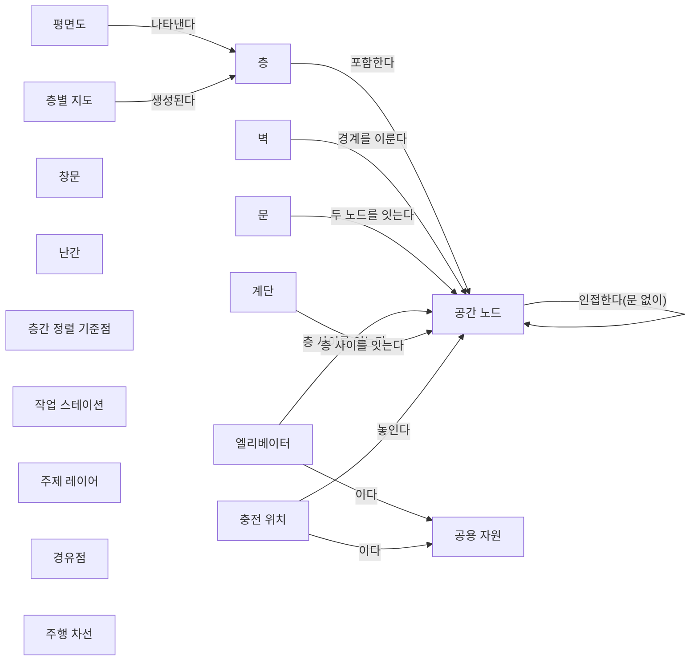
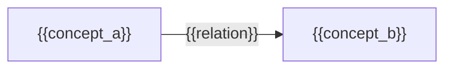

```mermaid
flowchart LR
  plan["평면도"] -->|"나타낸다"| floor["층"]
  floor -->|"포함한다"| node["공간 노드"]
  wall["벽"] -->|"경계를 이룬다"| node
  door["문"] -->|"두 노드를 잇는다"| node
  node -->|"인접한다(문 없이)"| node
  elev["엘리베이터"] -->|"층 사이를 잇는다"| node
  stairs["계단"] -->|"층 사이를 잇는다"| node
  charge["충전 위치"] -->|"놓인다"| node
  elev -->|"이다"| res["공용 자원"]
  charge -->|"이다"| res
  fmap["층별 지도"] -->|"생성된다"| floor
  window["창문"]
  railing["난간"]
  fiducial["층간 정렬 기준점"]
  station["작업 스테이션"]
  layer["주제 레이어"]
  waypoint["경유점"]
  lane["주행 차선"]
```

(너의 규칙은 시스템 프롬프트의 agents/shared-rules.md 와 agents/verifier.md 이다. 아래는 이번 실행의 컨텍스트와 입력이다.)

## 실행 컨텍스트

- run_id: 2026-10-09-26
- date: 2026-10-09
- run_type: track (트랙 실행)
- 대상: 트랙 floorplan-recognition (건축 도면 자동 인식) · 현재 단계: 단계 2. 필요한 데이터와 표준 조사 · 이번에 다룰 백로그 질문 id: q1-08, q2-04, q2-06 · 중심 세부영역: 14. 도면·BIM에서 지도 만들기 (D. 공간·지도 모델)
- 예산:
    - max_search_queries: 40
    - max_sources_per_run: 20
    - new_topic_pages: 1
    - page_updates: 2
    - max_retries: 2
- 환경 알림: web_fetch_available: true · fetch_mode: full
- 언어: ko
- verification_stage: second
- verifier_budget:
    - max_search_queries: 40
    - max_sources_per_run: 20
    - new_topic_pages: 1
    - page_updates: 2
    - max_retries: 2

## 입력

### runs/2026-10-09-26/target.json

```json
{
  "run_id": "2026-10-09-26",
  "date": "2026-10-09",
  "weekday": "Fri",
  "run_number": 159,
  "run_type": "track",
  "forced": true,
  "target": {
    "area_no": 14,
    "area_name": "14. 도면·BIM에서 지도 만들기",
    "category": "D. 공간·지도 모델",
    "category_letter": "D"
  },
  "topic": null,
  "track": {
    "slug": "floorplan-recognition",
    "name": "건축 도면 자동 인식",
    "stage": 2,
    "stages": 5,
    "stage_name": "필요한 데이터와 표준 조사",
    "question_ids": [
      "q1-08",
      "q2-04",
      "q2-06"
    ],
    "user_questions": [],
    "runs_per_week": 3,
    "question_rationale": "사용자 지정 0건, 되돌아온 질문 1건, 현재 단계 열린 질문 6건 중 오래된 순"
  },
  "corrections": [],
  "budget": {
    "max_search_queries": 40,
    "max_sources_per_run": 20,
    "new_topic_pages": 1,
    "page_updates": 2,
    "max_retries": 2
  },
  "priority_reason": null,
  "priority_questions": [],
  "excluded_areas": [],
  "lifted_areas": [],
  "deferred": {
    "monthly_recheck": false,
    "weekly_review": true
  },
  "selection_rationale": "CLI 지정 run_type=track, area=14; 트랙 실행일(Fri, track_days 앞 3개) → 트랙 floorplan-recognition 단계 2, 질문 q1-08, q2-04, q2-06 (사용자 지정 0건, 되돌아온 질문 1건, 현재 단계 열린 질문 6건 중 오래된 순)"
}
```

### runs/2026-10-09-26/research.json

```json
{
  "run_id": "2026-10-09-26",
  "date": "2026-10-09",
  "run_type": "track",
  "target": {
    "area_no": 14,
    "area_name": "14. 도면·BIM에서 지도 만들기",
    "category": "D. 공간·지도 모델"
  },
  "gaps": [
    "되돌아온 단계 1 질문 q1-08 조사 중(실행 2026-10-09-21 부분 답), 단계 2 질문 q2-04·q2-06 열림 — target.json 지정(사용자 지정 0건, 되돌아온 질문 1건, 현재 단계 열린 질문 6건 중 오래된 순). 같은 세 질문을 다룬 실행 2026-10-09-24 는 1차 검증 조건부 승인 뒤 스토리텔러 실패로 보류되어 반영되지 않음",
    "단계 2 페이지 2절 표에서 q2-04·q2-06 미답, 3절에 {#q2-04}·{#q2-06} 소제목 없음",
    "단계 2 페이지 q2-02 비교표 래스터 열 '엘리베이터: 공개 데이터셋 라벨 미확인(추정)' 칸과 아이디어 페이지 3절 데이터셋 비교표의 CubiCasa5K '계단 있음' 칸이 클래스 목록 원문·공식 코드로 확인되지 않음",
    "공간 그래프 스키마 초안 6절: '로봇 충전소는 이번에 확인한 IFC 4.3 유형 값에 없어' 항목(q2-06)이 콘센트·전기기기 유형 열거 두 개만 근거로 함 — 전기 저장 장치 유형 열거는 미확인",
    "단계 2 완료 조건: 관계(엣지) 쪽 표준 대응이 공간 그래프 스키마 초안에 없음 — 이번 실행 밖",
    "14. 도면·BIM에서 지도 만들기 섹션 7. 관련 표준·프레임워크·오픈소스 — IDS·사용자 정의 속성 세트 같은 BIM 납품 요구 수단 없음, 섹션 11 oq-197 미해결"
  ],
  "research_questions": [
    "이미 있는 도면과 건물 모델에서 로봇이 쓸 지도를 얼마나 자동으로 만들 수 있는가? [분류원문]",
    "q2-04 AI Hub 건축 도면 데이터와 CubiCasa5K 의 클래스 목록에 계단·엘리베이터가 포함되는지, 그리고 상업적 이용 조건은 무엇인가?",
    "q2-06 로봇 충전소·작업 스테이션처럼 IFC 4.3 표준 유형 값에 없는 운영 시설을 BIM 에 담으려면 사용자 정의 유형·속성 세트로 표현해야 하는가, 이를 정한 IDS·속성 세트 관례나 사례가 있는가? (q1-03 에서 파생)",
    "q1-08 국내 물류센터에서 로봇 도입 시 지도 작성·충전소 등 공용 자원 등록·제조사별 좌표 정렬에 든 시간을 단계별로 공개한 공공·학술 자료나 사례가 있는가? (q1-04 에서 파생)",
    "AI허브 원 이용정책은 데이터 가공·재배포, 학습 모델의 상업적 이용, 국외 이용을 어떻게 정하며 2차 기술(공공데이터포털)과 무엇이 다른가? (q2-04 이용 조건, 섹션 11 oq-197 겨냥)",
    "IFC 4.3 의 전기 저장 장치 유형 열거(충전기 값 포함), 프록시·USERDEFINED·속성 세트 명명 규칙과 IDS 1.0 의 엔터티·속성 패싯·값 제한은 표준 밖 운영 시설을 납품 요구로 기술하는 데 무엇을 제공하는가? (단계 2 페이지 3절, 14. 도면·BIM에서 지도 만들기 섹션 7 겨냥)"
  ],
  "findings": [
    {
      "id": "f1",
      "claim": "AI Hub 건축 도면 데이터의 라벨은 구조 8종(여닫이문·미닫이문·기타문, 여닫이창·미닫이창·기타창, 철근콘크리트벽·기타벽), 공간 12종(거실·침실·주방·현관·발코니·화장실·실외기룸·드레스룸·기타(다목적공간)·엘리베이터홀·계단실·엘리베이터), 객체 5종(변기·세면대·싱크대·욕조·가스레인지)이며, 계단 단독 클래스는 없고 충전 위치 같은 로봇 운영 클래스도 없다.",
      "tag": "사실",
      "source_ids": [
        "ref-1012"
      ],
      "cross_checked": false,
      "confidence": "medium",
      "evidence_excerpt": "데이터셋 페이지(1.1판 2023-12-15) 라벨 표: 구조 8·공간 12(엘리베이터홀·계단실·엘리베이터 포함)·객체 5, 별도로 도면 문자 인식 304,462건. 2026-10-09 원문 재열람",
      "as_of": "2023-12",
      "site_type": null,
      "flow_item": "작업 대상"
    },
    {
      "id": "f2",
      "claim": "AI Hub 건축 도면 데이터 소개 페이지는 내국인만 데이터 신청이 가능하고 승인 뒤 API 로 내려받게 한다고 적지만, 이 데이터셋에 고유한 라이선스·상업적 이용 문구는 두지 않고 상단 메뉴의 이용정책 링크와 하단 이용약관 링크만 둔다.",
      "tag": "사실",
      "source_ids": [
        "ref-1012"
      ],
      "cross_checked": false,
      "confidence": "medium",
      "evidence_excerpt": "'내국인만 데이터 신청이 가능합니다.' 승인 후 API 다운로드 안내. 데이터셋 고유 이용 조건 문구 없음(이용정책 메뉴·이용약관 링크만)",
      "as_of": "2026-10-09",
      "site_type": null,
      "flow_item": null
    },
    {
      "id": "f3",
      "claim": "AI Hub 건축 도면 데이터의 도면 48,033장은 모두 주거 유형(아파트 38,521, 연립다세대 4,859, 단독주택 4,653)이다.",
      "tag": "사실",
      "source_ids": [
        "ref-1012"
      ],
      "cross_checked": false,
      "confidence": "medium",
      "evidence_excerpt": "유형별 표: 아파트 38,521(평면도 33,998 등), 연립다세대 4,859, 단독주택 4,653, 합 48,033. 2026-10-09 원문 재열람 (재인용: 2026-10-09-21)",
      "as_of": "2023-07-26",
      "site_type": null,
      "flow_item": "작업 대상"
    },
    {
      "id": "f4",
      "claim": "AI허브 데이터 이용정책 원문은 개방 AI데이터를 영리·비영리 연구·개발 목적으로 활용할 수 있다고 하면서도 인공지능 학습모델의 학습용으로만 쓰게 하고, 데이터셋 판매 등 상업적 이용은 수행기관과 별도 협의하게 하며, 승인 없이 다른 법인·단체·개인에게 열람·제공·양도·대여·판매하지 못하게 하고, 한국지능정보사회진흥원 사업결과임을 2차적 저작물에도 밝히게 하며, 국외에 소재하는 법인·단체·개인의 이용에는 별도 합의를 요구한다.",
      "tag": "사실",
      "source_ids": [
        "ref-1421"
      ],
      "cross_checked": false,
      "confidence": "medium",
      "evidence_excerpt": "'본 AI데이터는 인공지능 학습모델의 학습용으로만 사용할 수 있습니다.' 판매 등 상업적 이용은 수행기관과 별도 협의, 국외 소재 주체는 별도 합의. 학습 모델의 배포·상업 이용은 언급 없음 (발행일 미확인, 확인일 기준)",
      "as_of": "2026-10-09",
      "site_type": null,
      "flow_item": null
    },
    {
      "id": "f5",
      "claim": "공공데이터포털의 경기도 고양시 AI 학습용 샘플 데이터 페이지(다른 데이터셋)는 AI허브 데이터의 이용 조건을 'AI허브 데이터로 학습한 AI 모델·서비스는 자유롭게 배포·활용 가능하고 영리적 판매·활용도 제한하지 않으나 AI허브 데이터 사용을 명시해야 하며, NIA·구축기업과 사전 협의한 경우 외에는 데이터를 재가공해 배포하는 행위는 원칙적으로 불가'로 옮겨 적는다.",
      "tag": "사실",
      "source_ids": [
        "ref-1424"
      ],
      "cross_checked": false,
      "confidence": "medium",
      "evidence_excerpt": "'데이터 한계' 항목: 학습 모델·서비스 자유 배포·활용, 영리적 판매·활용 제한 없음, 사용 명시, 재가공 배포는 원칙적 불가. 페이지 등록일 2025-08-16, 수정일 2026-06-16",
      "as_of": "2026-06-16",
      "site_type": null,
      "flow_item": null
    },
    {
      "id": "f6",
      "claim": "q2-04 의 AI Hub 이용 조건을 종합하면, 원 이용정책은 데이터 자체의 제3자 제공·판매와 국외 주체 이용을 제한하고 상업적 판매는 별도 협의로 두되 학습 모델의 배포·상업 이용은 직접 말하지 않으며, 학습 모델의 영리 활용을 명시적으로 허용하는 문구는 다른 데이터셋을 다룬 2차 기술에서만 확인되므로, 상용 ROP 가 이 데이터로 학습한 도면 인식 모델을 쓰는 것은 가능해 보이나 데이터의 가공·재배포·해외 활용은 별도 합의가 필요하고 모델 배포 조건도 운영기관 확인이 필요해 보인다(법적 판단 아님).",
      "tag": "추정",
      "source_ids": [
        "ref-1421",
        "ref-1424",
        "ref-1012"
      ],
      "cross_checked": false,
      "confidence": "low",
      "evidence_excerpt": "원 정책: 학습용으로만·판매는 별도 협의·국외 별도 합의(ref-1421). 2차 기술: 모델 자유 배포·영리 활용 허용(ref-1424, 다른 데이터셋 페이지). 원 정책 안에서도 '영리·비영리 연구개발 활용'과 '학습용으로만'이 함께 있음",
      "as_of": "2026-10-09",
      "site_type": null,
      "flow_item": null
    },
    {
      "id": "f7",
      "claim": "CubiCasa5K 데이터셋의 Zenodo 레코드(1.0 판, 2019-03-28 게시)는 라이선스를 Creative Commons Attribution Non Commercial Share Alike 4.0 International(CC BY-NC-SA 4.0)로 표기한다.",
      "tag": "사실",
      "source_ids": [
        "ref-1422"
      ],
      "cross_checked": false,
      "confidence": "medium",
      "evidence_excerpt": "License: CC BY-NC-SA 4.0, Version 1.0, Published 2019-03-28. 설명: 평면도 5,000장, 80개 이상 범주의 조밀한 다각형 주석",
      "as_of": "2019-03-28",
      "site_type": null,
      "flow_item": null
    },
    {
      "id": "f8",
      "claim": "CubiCasa5K 공식 코드(floortrans/loaders/house.py)는 SVG 요소의 class 속성('Space <방 이름>')에서 방 이름을 읽고 원 방 범주 목록에 Elevator(21)·StairWell(53)·Stairs(64)를 두지만, 학습용 매핑(rooms_selected·room_name_map)에서 Elevator·StairWell 을 일반 방(값 11, 'Room')으로 합치고 Stairs 는 매핑에 없으며 그 처리 블록은 주석 처리해, 기본 학습 라벨에는 계단·엘리베이터가 따로 남지 않는다.",
      "tag": "사실",
      "source_ids": [
        "ref-1423"
      ],
      "cross_checked": false,
      "confidence": "medium",
      "evidence_excerpt": "all_rooms: Elevator 21, StairWell 53, Stairs 64. rooms_selected: Elevator·StairWell → 11, room_name_map → 'Room'. '# if \"Stairs\" in e.getAttribute(\"class\"):' 블록 전부 주석. 계단·엘리베이터는 아이콘 목록에도 없음 (master 브랜치, 발행일 미확인, 확인일 기준)",
      "as_of": "2026-10-09",
      "site_type": null,
      "flow_item": null
    },
    {
      "id": "f9",
      "claim": "CubiCasa5K 공식 저장소 README 는 5,000장·80개 이상 범주의 다각형 주석과 SVG 를 실행 중 파싱하는 선택지를 적지만 계단·엘리베이터와 라이선스는 언급하지 않는다.",
      "tag": "사실",
      "source_ids": [
        "ref-062"
      ],
      "cross_checked": false,
      "confidence": "medium",
      "evidence_excerpt": "README: 'annotated into over 80 floorplan object categories', 다각형 주석, SVG 즉석 파싱 옵션. 라이선스·계단·엘리베이터 언급 없음 (발행일 미확인, 확인일 기준)",
      "as_of": "2026-10-09",
      "site_type": null,
      "flow_item": null
    },
    {
      "id": "f10",
      "claim": "q2-04 에 대해 확인한 자료를 종합하면, AI Hub 건축 도면 데이터는 엘리베이터·엘리베이터홀·계단실을 공간 클래스로 두지만(계단 단독 클래스 없음, 주거 도면 기준) CubiCasa5K 는 원 주석 범주(코드가 읽는 SVG class 이름)에 엘리베이터·계단실·계단이 있어도 공식 학습 매핑에서는 일반 방으로 합치거나 쓰지 않으므로, 기존 위키의 'CubiCasa5K 계단 라벨 있음'은 원 주석 범주 수준의 서술로 보이고, 승강기·계단 영역을 바로 학습할 수 있는 공개 라벨은 AI Hub 쪽이며, CubiCasa5K 는 비상업(CC BY-NC-SA 4.0) 조건이라 상용 이용에는 권리자의 별도 허락이 필요할 것으로 보이고(법적 판단 아님), 두 자료 모두 충전 위치 라벨은 없는 것으로 보인다.",
      "tag": "추정",
      "source_ids": [
        "ref-1012",
        "ref-1423",
        "ref-1422",
        "ref-1421"
      ],
      "cross_checked": false,
      "confidence": "low",
      "evidence_excerpt": "AI Hub 공간 12종에 엘리베이터·엘리베이터홀·계단실(f1), CubiCasa5K 코드의 원 범주와 학습 매핑 차이(f8), CC BY-NC-SA 4.0(f7). 원 SVG 에 계단·엘리베이터 주석이 실제로 몇 개 있는지는 미확인",
      "as_of": "2026-10-09",
      "site_type": null,
      "flow_item": "작업 대상"
    },
    {
      "id": "f11",
      "claim": "IFC 4.3 문서(개발 브랜치)는 IfcBuildingElementProxy 를 IfcBuiltElement 하위 유형과 같은 기능을 하는 프록시로 정의해 명세가 아직 정의하지 않은 특수 건축 요소의 교환과 응용이 의미 정의에 대응시킬 수 없는 요소에 쓰게 하고, PredefinedType 을 USERDEFINED 로 두면 ObjectType 을 반드시 주게 하며, IFC4.3.0.0 부터는 공간 자리표시·예비 공간 용도로 쓰지 말고 IfcVirtualElement 를 쓰라고 한다.",
      "tag": "사실",
      "source_ids": [
        "ref-1425"
      ],
      "cross_checked": false,
      "confidence": "medium",
      "evidence_excerpt": "형식 규칙: ObjectType 'shall be provided, if the PredefinedType is set to USERDEFINED'. IFC4.3.0.0 변경: 공간 자리표시·예비 공간에 쓰지 말고 IfcVirtualElement 사용 (ifc4.3-main, 게시판 ADD2 와 문구가 다를 수 있음, 발행일 미확인, 확인일 기준)",
      "as_of": "2026-10-09",
      "site_type": null,
      "flow_item": null
    },
    {
      "id": "f12",
      "claim": "IFC 4.3 문서의 IfcTransportElement 에도 PredefinedType 이 USERDEFINED 이면 상속받은 ObjectType 을 제공하도록 하는 형식 제약(CorrectPredefinedType)이 있다.",
      "tag": "사실",
      "source_ids": [
        "ref-213"
      ],
      "cross_checked": false,
      "confidence": "medium",
      "evidence_excerpt": "CorrectPredefinedType: 'the inherited attribute ObjectType shall be provided, if the PredefinedType is set to USERDEFINED' (입력 원문 텍스트 data/source_texts/ref-213, 개발 브랜치)",
      "as_of": "2026-10-09",
      "site_type": null,
      "flow_item": null
    },
    {
      "id": "f13",
      "claim": "IFC 4.3 문서(개발 브랜치)는 IfcElectricFlowStorageDevice 를 전기 에너지를 저장하고 점진적으로 내보낼 수 있는 장치로 정의하고(IFC4 신규 엔터티), 충전용 입력 포트와 출력 포트를 두며, PredefinedType 이 USERDEFINED 이면 ObjectType 을 요구한다.",
      "tag": "사실",
      "source_ids": [
        "ref-1428"
      ],
      "cross_checked": false,
      "confidence": "medium",
      "evidence_excerpt": "'a device in which electrical energy is stored and from which energy may be progressively released'. 포트 SINK_Line_ELECTRICAL(충전 입력)·SOURCE_Load_ELECTRICAL. CorrectPredefinedType 규칙, 'New entity in IFC4' (발행일 미확인, 확인일 기준)",
      "as_of": "2026-10-09",
      "site_type": null,
      "flow_item": null
    },
    {
      "id": "f14",
      "claim": "IFC 4.3 의 전기 저장 장치 유형 열거(IfcElectricFlowStorageDeviceTypeEnum, 개발 브랜치)는 BATTERY·UPS 등과 함께 RECHARGER 값을 두고 이를 2차 전지나 충전식 배터리에 전류를 흘려 에너지를 넣는 충전기로 정의하지만, 차량·로봇 충전은 언급하지 않는다.",
      "tag": "사실",
      "source_ids": [
        "ref-1427"
      ],
      "cross_checked": false,
      "confidence": "medium",
      "evidence_excerpt": "13개 값: BATTERY, CAPACITORBANK, HARMONICFILTER, INDUCTORBANK, UPS, CAPACITOR, COMPENSATOR, INDUCTOR, RECHARGER, USERDEFINED, NOTDEFINED 등. RECHARGER = 배터리 충전기 정의, 차량 언급 없음 (발행일 미확인, 확인일 기준)",
      "as_of": "2026-10-09",
      "site_type": null,
      "flow_item": null
    },
    {
      "id": "f15",
      "claim": "buildingSMART 의 IFC 4.3.2 개발 문서는 RECHARGER 유형의 IfcElectricFlowStorageDevice·IfcElectricFlowStorageDeviceType 에 쓰는 속성 세트 Pset_ElectricFlowStorageDeviceTypeRecharger 를 두며, 그 속성은 공급 정격 전류(NominalSupplyCurrent) 하나뿐이고 변경 이력에 IFC4.3_ADD2 신규 자원으로 적혀 있다(작업 초안 표기).",
      "tag": "사실",
      "source_ids": [
        "ref-1429"
      ],
      "cross_checked": false,
      "confidence": "medium",
      "evidence_excerpt": "적용: IfcElectricFlowStorageDevice/Type, PredefinedType RECHARGER. 속성: NominalSupplyCurrent(IfcElectricCurrentMeasure). Changelog 'New resource'(IFC4.3_ADD2), buildingSMART Working Draft 빌드 20261008",
      "as_of": "2026-10-08",
      "site_type": null,
      "flow_item": null
    },
    {
      "id": "f16",
      "claim": "IFC 4.3 의 콘센트 유형 열거(IfcOutletTypeEnum)와 전기기기 유형 열거(IfcElectricApplianceTypeEnum)에는 차량·로봇 충전 설비를 뜻하는 값이 없고 USERDEFINED·NOTDEFINED 가 남는다.",
      "tag": "사실",
      "source_ids": [
        "ref-214",
        "ref-215"
      ],
      "cross_checked": false,
      "confidence": "medium",
      "evidence_excerpt": "콘센트 7개 값(POWEROUTLET 등), 전기기기 18개 값(DISHWASHER~WASHINGMACHINE) 모두 충전 값 없음. 두 파일은 같은 발행 주체라 독립 교차 확인 아님 (2026-10-09 raw 재열람)",
      "as_of": "2026-10-09",
      "site_type": null,
      "flow_item": null
    },
    {
      "id": "f17",
      "claim": "IFC 4.3 문서의 IfcPropertySet 은 'Pset_' 접두어를 명세에 정의된 속성 세트에만 쓰고 사용자 정의 속성 세트는 이름에 넣지 않게 하며, 속성 세트는 개별 객체에는 IfcRelDefinesByProperties(역속성 DefinesOccurrence)로, 유형 객체에는 직접 연결(역속성 DefinesType)로 붙여 같은 유형의 모든 객체가 공유하게 한다.",
      "tag": "사실",
      "source_ids": [
        "ref-1426"
      ],
      "cross_checked": false,
      "confidence": "medium",
      "evidence_excerpt": "사용자 정의 속성 세트 Name 에 'Pset_' 접두어 금지. 객체: IfcRelDefinesByProperties/DefinesOccurrence, 유형: DefinesType, 템플릿: IfcRelDefinesByTemplate (개발 브랜치, 발행일 미확인, 확인일 기준)",
      "as_of": "2026-10-09",
      "site_type": null,
      "flow_item": null
    },
    {
      "id": "f18",
      "claim": "buildingSMART 는 정보 전달 명세(Information Delivery Specification, IDS)를 정보 요구사항을 컴퓨터가 해석할 수 있는 형태로 정의해 IFC 모델의 자동 적합성 검사를 가능하게 하는 표준으로 소개하며, 2024-06-01 승인된 IDS 1.0 으로 객체·분류·재료·속성·값의 전달을 지정하게 하되 기하 정보는 다루지 않고, bSDD 를 IDS 작성 때 쓸 수 있는 공유 속성 라이브러리로 설명한다.",
      "tag": "사실",
      "source_ids": [
        "ref-1430"
      ],
      "cross_checked": false,
      "confidence": "medium",
      "evidence_excerpt": "IDS 1.0 공식 표준 승인 2024-06-01(뉴스 2024-06-04). 알파뉴메릭 정보에 한정, 'doesn't cover geometrical aspects'. bSDD = 공유 용어·속성 라이브러리",
      "as_of": "2024-06-01",
      "site_type": null,
      "flow_item": null
    },
    {
      "id": "f19",
      "claim": "IDS 사용자 매뉴얼은 명세를 적용 대상(applicability)과 요구(requirements) 두 부분으로 나누고 둘 다 엔터티·속성(attribute)·분류·속성(property)·재료·부분(partOf) 패싯으로 구성하게 하며, 값 제한으로 열거·패턴(정규식)·범위·길이를 지원한다.",
      "tag": "사실",
      "source_ids": [
        "ref-1431",
        "ref-1434"
      ],
      "cross_checked": false,
      "confidence": "medium",
      "evidence_excerpt": "README: 적용 대상과 요구, 패싯 entity·attribute·classification·property·material·partOf. restrictions.md: Enumeration, Pattern(예 'DT.*'), Bounds, Length (development 브랜치, 같은 저장소라 독립 교차 확인 아님)",
      "as_of": "2026-10-09",
      "site_type": null,
      "flow_item": null
    },
    {
      "id": "f20",
      "claim": "IDS 엔터티 패싯은 IFC 클래스 이름과 선택적 predefinedType 을 검사하며, predefinedType 에 표준 값뿐 아니라 사용자 정의 문자열도 쓸 수 있고, 객체의 PredefinedType 이 USERDEFINED 이면 ObjectType(유형 객체면 ElementType) 값을 읽어 대조하므로 USERDEFINED 와 ObjectType 으로 표현한 사용자 정의 유형도 납품 요구로 검사할 수 있다.",
      "tag": "사실",
      "source_ids": [
        "ref-1432"
      ],
      "cross_checked": false,
      "confidence": "medium",
      "evidence_excerpt": "entity-facet.md: predefinedType 은 표준 값 또는 사용자 정의 텍스트, USERDEFINED 이면 ObjectType(유형은 ElementType)에서 값을 읽음. 예: IDS IFCWALL/FOO ↔ IFC USERDEFINED·ObjectType FOO → Pass",
      "as_of": "2026-10-09",
      "site_type": null,
      "flow_item": null
    },
    {
      "id": "f21",
      "claim": "IDS 속성 패싯은 사용자 정의 속성 세트·속성을 허용하되 'Pset_'·'Qto_' 접두어는 표준 세트에만 쓰게 하고, 요구의 기수를 필수(REQUIRED)·선택(OPTIONAL)·금지(PROHIBITED)로 두며, 측정값은 SI 단위로 다루고 특정 단위를 요구할 수 없다.",
      "tag": "사실",
      "source_ids": [
        "ref-1433"
      ],
      "cross_checked": false,
      "confidence": "medium",
      "evidence_excerpt": "property-facet.md: propertySet·baseName 필수, dataType·value 선택. 사용자 정의 세트에 Pset_/Qto_ 금지. REQUIRED/OPTIONAL/PROHIBITED. IDS 측정값은 SI 단위",
      "as_of": "2026-10-09",
      "site_type": null,
      "flow_item": null
    },
    {
      "id": "f22",
      "claim": "뉴질랜드 Masterspec 의 Open BIM Object standard(OBOS) V1.0 은 IFC4 Add2 에 맞는 IfcElementType 이 없는 객체를 IfcExportAs 를 IfcBuildingElementProxy 로, IfcExportType 을 USERDEFINED 로 내보내고 객체 유형을 설명하는 이름을 'ElementType' 속성에 넣도록 정하며, 이는 로봇 충전소를 대상으로 한 규정이 아니다.",
      "tag": "사실",
      "source_ids": [
        "ref-1435"
      ],
      "cross_checked": false,
      "confidence": "medium",
      "evidence_excerpt": "4.3.3 IFC proxy object designation: IfcExportAs=IfcBuildingElementProxy, IfcExportType=USERDEFINED, ElementType 속성 추가. 대상 IFC4 (Add2) (발행일 미확인, 확인일 기준)",
      "as_of": "2026-10-09",
      "site_type": null,
      "flow_item": null
    },
    {
      "id": "f23",
      "claim": "Pauwels·de Koning·Hendrikx·Torta(Advanced Engineering Informatics 56, 101959, 2023-04)는 BIM 모델에서 건물 데이터 로컬 저장소를 거쳐 로봇으로 가는 RDF·JSON 데이터 흐름을 만들었고(연계 대상: 그 데이터로 대학 건물에서 표준 주행 스택으로 한 주행 시험), 건물 데이터 모델을 더 신뢰할 수 있게 표준화하려면 모델링 가이드라인과 로봇 세계 모델이 필요하다고 제시했다.",
      "tag": "사실",
      "source_ids": [
        "ref-1436"
      ],
      "cross_checked": false,
      "confidence": "medium",
      "evidence_excerpt": "초록: BIM→로컬 저장소('digital twin of the real-world building')→로봇, RDF 그래프·JSON. 향후 과제: 모델링 가이드라인과 로봇 세계 모델을 갖춘 표준화된 건물 데이터 모델, 로봇 피드백 기반 BIM 갱신. 저장소는 현재 상태 쪽 의미",
      "as_of": "2023-04",
      "site_type": "기타",
      "flow_item": "작업 대상"
    },
    {
      "id": "f24",
      "claim": "q2-06 에 대해 확인한 규칙을 종합하면, IFC 4.3 에는 배터리 충전기 일반을 뜻하는 전기 저장 장치 유형 값 RECHARGER(공급 정격 전류만 담는 속성 세트, IFC4.3_ADD2 개발 문서)가 있어 로봇 충전기 본체의 표준 후보가 될 수 있으나 도킹 이름·접근 자세 같은 로봇 운영 정보는 표준 속성에 없으므로, 충전 위치·작업 스테이션의 운영 속성은 'Pset_' 접두어가 없는 프로젝트 속성 세트에 담고, 맞는 유형이 없을 때는 관련 엔터티나 IfcBuildingElementProxy 의 USERDEFINED·ObjectType 으로 유형을 나타내며, 이를 IDS 의 엔터티 패싯(사용자 정의 predefinedType)·속성 패싯(필수 기수)·값 제한으로 납품 요구로 적어 검사하는 경로가 표준이 허용하는 것으로 보이나, 로봇 충전소·작업 스테이션용 공개 IDS·속성 세트·bSDD 분류 관례나 실제 사례는 이번 검색 범위에서 찾지 못했다(부재 확인 아님).",
      "tag": "추정",
      "source_ids": [
        "ref-1427",
        "ref-1429",
        "ref-1428",
        "ref-1426",
        "ref-1425",
        "ref-213",
        "ref-1430",
        "ref-1432",
        "ref-1433",
        "ref-1434",
        "ref-1435",
        "ref-1436"
      ],
      "cross_checked": false,
      "confidence": "low",
      "evidence_excerpt": "RECHARGER 정의는 차량·로봇을 언급하지 않음(f14), 속성은 NominalSupplyCurrent 하나(f15). 프록시·USERDEFINED(f11·f12·f22), 사용자 정의 세트 명명(f17), IDS 패싯·값 제한(f19~f21). 로봇 충전소 IDS 사례 검색 2회에서 미발견",
      "as_of": "2026-10-09",
      "site_type": null,
      "flow_item": null
    },
    {
      "id": "f25",
      "claim": "연계 대상: Robotics 24/7 기사(2025-03-12)는 AMR 현장 설정(commissioning)이 흔히 수개월의 수작업이 드는 병목이라고 서술하고, RGo Robotics 가 3D 비전 기반 지능형 지도 작성으로 현장 설정 기간을 수개월에서 며칠로 줄인다고 밝혔다고 전하나, 도면(CAD) 사용 언급은 없다.",
      "tag": "추정",
      "source_ids": [
        "ref-1437"
      ],
      "cross_checked": false,
      "confidence": "low",
      "evidence_excerpt": "벤더 주장: 혜택 목록 'Reduces commissioning time from months to days'(RGo 측). '수개월 수작업 병목'은 기사 서술. CAD·평면도 언급 없음",
      "as_of": "2025-03-12",
      "site_type": null,
      "flow_item": "예외·성과",
      "vendor_claim": true
    },
    {
      "id": "f26",
      "claim": "q1-08 에 대해 이번 실행의 추가 검색(한국어 4회, 한국로봇산업진흥원 실증·국내 물류센터 도입 기사 대상 포함)에서도 국내 물류센터의 지도 작성·공용 자원 등록·제조사별 좌표 정렬 시간을 단계별로 공개한 공공·학술 자료를 찾지 못했고(부재 확인 아님), 새로 확인한 것은 해외 업체의 현장 설정 기간 단축 주장뿐이라 q1-08 은 여전히 부분적으로만 답할 수 있는 것으로 보인다.",
      "tag": "추정",
      "source_ids": [
        "ref-1437"
      ],
      "cross_checked": false,
      "confidence": "low",
      "evidence_excerpt": "검색 결과는 실증 사업 개요·자동화 센터 소개 기사뿐이고 단계별 기간 수치 없음. 국내 근거 아님(ref-1437 은 해외 벤더 주장)",
      "as_of": "2026-10-09",
      "site_type": "물류창고",
      "flow_item": "예외·성과"
    }
  ],
  "sources": [
    {
      "id": "ref-1012",
      "org": "AI Hub (한국지능정보사회진흥원) — 구축 주관 에이치씨아이플러스(주)",
      "title": "건축 도면 데이터",
      "published": "2023-07-26",
      "url": "https://www.aihub.or.kr/aihubdata/data/view.do?currMenu=115&topMenu=100&dataSetSn=71465",
      "type": "정부·연구기관",
      "reliability": "high",
      "accessed": "2026-10-09",
      "summary": "AI Hub 건축 도면 데이터셋 소개 페이지. 라벨 구조 8·공간 12·객체 5, 주거 도면 48,033장, 내국인만 신청, 1.0(2023-07-26)·1.1(2023-12-15) 판.",
      "fetched": true,
      "fetched_via": "webfetch",
      "fetch_url": null,
      "source_unopened": false
    },
    {
      "id": "ref-062",
      "org": "CubiCasa (Kalervo, A. 외)",
      "title": "CubiCasa5k — README (CubiCasa5K: A Dataset and an Improved Multi-Task Model for Floorplan Image Analysis)",
      "published": null,
      "url": "https://github.com/CubiCasa/CubiCasa5k",
      "type": "오픈소스 문서",
      "reliability": "medium",
      "accessed": "2026-10-09",
      "summary": "CubiCasa5K 공식 저장소 README. 5,000장·80개 이상 범주의 다각형 주석, 라이선스·계단·엘리베이터 언급 없음.",
      "fetched": true,
      "fetched_via": "github_raw",
      "fetch_url": "https://raw.githubusercontent.com/CubiCasa/CubiCasa5k/master/README.md",
      "source_unopened": false
    },
    {
      "id": "ref-213",
      "org": "buildingSMART (IFC4.3.x-development GitHub)",
      "title": "IFC 4.3 — IfcTransportElement (개발 브랜치 ifc4.3-main 원본, 게시판 IFC 4.3 ADD2와 문구가 다를 수 있음)",
      "published": null,
      "url": "https://github.com/buildingSMART/IFC4.3.x-development/blob/ifc4.3-main/docs/schemas/core/IfcProductExtension/Entities/IfcTransportElement.md",
      "type": "표준",
      "reliability": "medium",
      "accessed": "2026-10-09",
      "summary": "운송 요소 엔터티 정의와 USERDEFINED 시 ObjectType 을 요구하는 형식 제약.",
      "fetched": true,
      "fetched_via": "github_raw",
      "fetch_url": null,
      "source_unopened": false
    },
    {
      "id": "ref-214",
      "org": "buildingSMART (IFC4.3.x-development GitHub)",
      "title": "IFC 4.3 — IfcOutletTypeEnum (개발 브랜치 ifc4.3-main 원본, 게시판 IFC 4.3 ADD2와 문구가 다를 수 있음)",
      "published": null,
      "url": "https://github.com/buildingSMART/IFC4.3.x-development/blob/ifc4.3-main/docs/schemas/domain/IfcElectricalDomain/Types/IfcOutletTypeEnum.md",
      "type": "표준",
      "reliability": "medium",
      "accessed": "2026-10-09",
      "summary": "콘센트 유형 열거 7개 값. 차량·로봇 충전 값 없음.",
      "fetched": true,
      "fetched_via": "github_raw",
      "fetch_url": "https://raw.githubusercontent.com/buildingSMART/IFC4.3.x-development/ifc4.3-main/docs/schemas/domain/IfcElectricalDomain/Types/IfcOutletTypeEnum.md",
      "source_unopened": false
    },
    {
      "id": "ref-215",
      "org": "buildingSMART (IFC4.3.x-development GitHub)",
      "title": "IFC 4.3 — IfcElectricApplianceTypeEnum (개발 브랜치 ifc4.3-main 원본, 게시판 IFC 4.3 ADD2와 문구가 다를 수 있음)",
      "published": null,
      "url": "https://github.com/buildingSMART/IFC4.3.x-development/blob/ifc4.3-main/docs/schemas/domain/IfcElectricalDomain/Types/IfcElectricApplianceTypeEnum.md",
      "type": "표준",
      "reliability": "medium",
      "accessed": "2026-10-09",
      "summary": "전기기기 유형 열거 18개 값. 차량·로봇 충전 값 없음.",
      "fetched": true,
      "fetched_via": "github_raw",
      "fetch_url": "https://raw.githubusercontent.com/buildingSMART/IFC4.3.x-development/ifc4.3-main/docs/schemas/domain/IfcElectricalDomain/Types/IfcElectricApplianceTypeEnum.md",
      "source_unopened": false
    },
    {
      "id": "ref-1421",
      "org": "AI Hub (한국지능정보사회진흥원)",
      "title": "AI 허브 이용정책 (데이터 이용정책)",
      "published": null,
      "url": "https://www.aihub.or.kr/intrcn/guid/usagepolicy.do?currMenu=151&topMenu=105",
      "type": "정부·연구기관",
      "reliability": "high",
      "accessed": "2026-10-09",
      "summary": "AI허브 개방 데이터의 이용 서약. 학습용 한정, 판매 등 상업적 이용은 별도 협의, 승인 없는 제3자 제공 금지, NIA 사업결과 표시, 국외 소재 주체 별도 합의. 학습 모델 배포는 언급 없음.",
      "fetched": true,
      "fetched_via": "webfetch",
      "fetch_url": null,
      "source_unopened": false
    },
    {
      "id": "ref-1422",
      "org": "Zenodo (CubiCasa)",
      "title": "CubiCasa5k",
      "published": "2019-03-28",
      "url": "https://zenodo.org/record/2613548",
      "type": "오픈소스 문서",
      "reliability": "high",
      "accessed": "2026-10-09",
      "summary": "CubiCasa5K 데이터셋 배포 레코드. 1.0 판, CC BY-NC-SA 4.0 라이선스.",
      "fetched": true,
      "fetched_via": "webfetch",
      "fetch_url": "https://zenodo.org/records/2613548",
      "source_unopened": false
    },
    {
      "id": "ref-1423",
      "org": "CubiCasa (CubiCasa/CubiCasa5k GitHub)",
      "title": "CubiCasa5k — floortrans/loaders/house.py",
      "published": null,
      "url": "https://github.com/CubiCasa/CubiCasa5k/blob/master/floortrans/loaders/house.py",
      "type": "오픈소스 문서",
      "reliability": "high",
      "accessed": "2026-10-09",
      "summary": "CubiCasa5K SVG 주석 파서. 원 방 범주(Elevator·StairWell·Stairs 포함)와 학습용 매핑(엘리베이터·계단실은 일반 방, 계단 처리 주석 처리).",
      "fetched": true,
      "fetched_via": "github_raw",
      "fetch_url": "https://raw.githubusercontent.com/CubiCasa/CubiCasa5k/master/floortrans/loaders/house.py",
      "source_unopened": false
    },
    {
      "id": "ref-1424",
      "org": "경기도 고양시(공공데이터포털)",
      "title": "경기도 고양시_어린이 음성맥락 인식률 향상을 위한 방송 음성 및 자연어 처리(AI학습용)_20240105",
      "published": "2025-08-16",
      "url": "https://www.data.go.kr/data/15146382/fileData.do",
      "type": "정부·연구기관",
      "reliability": "medium",
      "accessed": "2026-10-09",
      "summary": "다른 데이터셋의 공공데이터포털 페이지로, '데이터 한계' 항목에 AI허브 데이터 이용 조건(학습 모델 자유 배포·영리 활용 허용, 사용 명시, 재가공 배포 원칙적 불가)을 2차로 옮겨 적음. 수정일 2026-06-16.",
      "fetched": true,
      "fetched_via": "webfetch",
      "fetch_url": null,
      "source_unopened": false
    },
    {
      "id": "ref-1425",
      "org": "buildingSMART (IFC4.3.x-development GitHub)",
      "title": "IFC 4.3 — IfcBuildingElementProxy (개발 브랜치 ifc4.3-main 원본, 게시판 IFC 4.3 ADD2와 문구가 다를 수 있음)",
      "published": null,
      "url": "https://github.com/buildingSMART/IFC4.3.x-development/blob/ifc4.3-main/docs/schemas/shared/IfcSharedBldgElements/Entities/IfcBuildingElementProxy.md",
      "type": "표준",
      "reliability": "high",
      "accessed": "2026-10-09",
      "summary": "건물 요소 프록시 정의, USERDEFINED 시 ObjectType 필수, IFC4.3.0.0 부터 공간 자리표시에는 IfcVirtualElement 사용.",
      "fetched": true,
      "fetched_via": "github_raw",
      "fetch_url": "https://raw.githubusercontent.com/buildingSMART/IFC4.3.x-development/ifc4.3-main/docs/schemas/shared/IfcSharedBldgElements/Entities/IfcBuildingElementProxy.md",
      "source_unopened": false
    },
    {
      "id": "ref-1426",
      "org": "buildingSMART (IFC4.3.x-development GitHub)",
      "title": "IFC 4.3 — IfcPropertySet (개발 브랜치 ifc4.3-main 원본, 게시판 IFC 4.3 ADD2와 문구가 다를 수 있음)",
      "published": null,
      "url": "https://github.com/buildingSMART/IFC4.3.x-development/blob/ifc4.3-main/docs/schemas/core/IfcKernel/Entities/IfcPropertySet.md",
      "type": "표준",
      "reliability": "high",
      "accessed": "2026-10-09",
      "summary": "속성 세트 정의. Pset_ 접두어는 명세 정의 세트 전용, 객체·유형·템플릿 연결 관계.",
      "fetched": true,
      "fetched_via": "github_raw",
      "fetch_url": "https://raw.githubusercontent.com/buildingSMART/IFC4.3.x-development/ifc4.3-main/docs/schemas/core/IfcKernel/Entities/IfcPropertySet.md",
      "source_unopened": false
    },
    {
      "id": "ref-1427",
      "org": "buildingSMART (IFC4.3.x-development GitHub)",
      "title": "IFC 4.3 — IfcElectricFlowStorageDeviceTypeEnum (개발 브랜치 ifc4.3-main 원본, 게시판 IFC 4.3 ADD2와 문구가 다를 수 있음)",
      "published": null,
      "url": "https://github.com/buildingSMART/IFC4.3.x-development/blob/ifc4.3-main/docs/schemas/domain/IfcElectricalDomain/Types/IfcElectricFlowStorageDeviceTypeEnum.md",
      "type": "표준",
      "reliability": "high",
      "accessed": "2026-10-09",
      "summary": "전기 저장 장치 유형 열거. RECHARGER(배터리 충전기) 값 포함, 차량 언급 없음.",
      "fetched": true,
      "fetched_via": "github_raw",
      "fetch_url": "https://raw.githubusercontent.com/buildingSMART/IFC4.3.x-development/ifc4.3-main/docs/schemas/domain/IfcElectricalDomain/Types/IfcElectricFlowStorageDeviceTypeEnum.md",
      "source_unopened": false
    },
    {
      "id": "ref-1428",
      "org": "buildingSMART (IFC4.3.x-development GitHub)",
      "title": "IFC 4.3 — IfcElectricFlowStorageDevice (개발 브랜치 ifc4.3-main 원본, 게시판 IFC 4.3 ADD2와 문구가 다를 수 있음)",
      "published": null,
      "url": "https://github.com/buildingSMART/IFC4.3.x-development/blob/ifc4.3-main/docs/schemas/domain/IfcElectricalDomain/Entities/IfcElectricFlowStorageDevice.md",
      "type": "표준",
      "reliability": "high",
      "accessed": "2026-10-09",
      "summary": "전기 저장 장치 엔터티 정의(IFC4 신규), 충전 입력·출력 포트, USERDEFINED 시 ObjectType 요구.",
      "fetched": true,
      "fetched_via": "github_raw",
      "fetch_url": "https://raw.githubusercontent.com/buildingSMART/IFC4.3.x-development/ifc4.3-main/docs/schemas/domain/IfcElectricalDomain/Entities/IfcElectricFlowStorageDevice.md",
      "source_unopened": false
    },
    {
      "id": "ref-1429",
      "org": "buildingSMART International",
      "title": "Pset_ElectricFlowStorageDeviceTypeRecharger — IFC 4.3.2.0 documentation (IFC4X3_ADD2 development build)",
      "published": null,
      "url": "https://ifc43-docs.standards.buildingsmart.org/IFC/RELEASE/IFC4x3/HTML/lexical/Pset_ElectricFlowStorageDeviceTypeRecharger.htm",
      "type": "표준",
      "reliability": "medium",
      "accessed": "2026-10-09",
      "summary": "RECHARGER 유형 전기 저장 장치용 속성 세트. 속성은 NominalSupplyCurrent 하나, IFC4.3_ADD2 신규, 작업 초안 표기.",
      "fetched": true,
      "fetched_via": "webfetch",
      "fetch_url": "https://standards.buildingsmart.org/IFC/DEV/IFC4_3/HTML/lexical/Pset_ElectricFlowStorageDeviceTypeRecharger.html",
      "source_unopened": false
    },
    {
      "id": "ref-1430",
      "org": "buildingSMART International",
      "title": "Information Delivery Specification (IDS)",
      "published": null,
      "url": "https://www.buildingsmart.org/standards/bsi-standards/information-delivery-specification-ids/",
      "type": "표준",
      "reliability": "high",
      "accessed": "2026-10-09",
      "summary": "IDS 소개. 컴퓨터 해석 가능한 정보 요구사항, IDS 1.0 2024-06-01 승인, 기하 제외, bSDD 와의 관계.",
      "fetched": true,
      "fetched_via": "webfetch",
      "fetch_url": null,
      "source_unopened": false
    },
    {
      "id": "ref-1431",
      "org": "buildingSMART (buildingSMART/IDS GitHub)",
      "title": "IDS — Documentation/UserManual/README.md",
      "published": null,
      "url": "https://github.com/buildingSMART/IDS/blob/development/Documentation/UserManual/README.md",
      "type": "표준",
      "reliability": "high",
      "accessed": "2026-10-09",
      "summary": "IDS 사용자 매뉴얼 개요. 명세의 적용 대상·요구 구조와 패싯 종류.",
      "fetched": true,
      "fetched_via": "github_raw",
      "fetch_url": "https://raw.githubusercontent.com/buildingSMART/IDS/development/Documentation/UserManual/README.md",
      "source_unopened": false
    },
    {
      "id": "ref-1432",
      "org": "buildingSMART (buildingSMART/IDS GitHub)",
      "title": "IDS — Documentation/UserManual/entity-facet.md",
      "published": null,
      "url": "https://github.com/buildingSMART/IDS/blob/development/Documentation/UserManual/entity-facet.md",
      "type": "표준",
      "reliability": "high",
      "accessed": "2026-10-09",
      "summary": "IDS 엔터티 패싯. 사용자 정의 predefinedType 허용, USERDEFINED 시 ObjectType·ElementType 대조 규칙과 예.",
      "fetched": true,
      "fetched_via": "github_raw",
      "fetch_url": "https://raw.githubusercontent.com/buildingSMART/IDS/development/Documentation/UserManual/entity-facet.md",
      "source_unopened": false
    },
    {
      "id": "ref-1433",
      "org": "buildingSMART (buildingSMART/IDS GitHub)",
      "title": "IDS — Documentation/UserManual/property-facet.md",
      "published": null,
      "url": "https://github.com/buildingSMART/IDS/blob/development/Documentation/UserManual/property-facet.md",
      "type": "표준",
      "reliability": "high",
      "accessed": "2026-10-09",
      "summary": "IDS 속성 패싯. 사용자 정의 세트 허용(Pset_/Qto_ 금지), 기수 REQUIRED·OPTIONAL·PROHIBITED, SI 단위.",
      "fetched": true,
      "fetched_via": "github_raw",
      "fetch_url": "https://raw.githubusercontent.com/buildingSMART/IDS/development/Documentation/UserManual/property-facet.md",
      "source_unopened": false
    },
    {
      "id": "ref-1434",
      "org": "buildingSMART (buildingSMART/IDS GitHub)",
      "title": "IDS — Documentation/UserManual/restrictions.md",
      "published": null,
      "url": "https://github.com/buildingSMART/IDS/blob/development/Documentation/UserManual/restrictions.md",
      "type": "표준",
      "reliability": "high",
      "accessed": "2026-10-09",
      "summary": "IDS 값 제한 4종(열거·패턴·범위·길이)과 예.",
      "fetched": true,
      "fetched_via": "github_raw",
      "fetch_url": "https://raw.githubusercontent.com/buildingSMART/IDS/development/Documentation/UserManual/restrictions.md",
      "source_unopened": false
    },
    {
      "id": "ref-1435",
      "org": "Construction Information Limited (Masterspec, 뉴질랜드)",
      "title": "4.0 Object Properties & Property Grouping — 4.3 IFC properties (Open BIM Object standard (OBOS) V1.0)",
      "published": null,
      "url": "https://masterspec.co.nz/43-IFC-Properties/7266/",
      "type": "업계 보고서",
      "reliability": "medium",
      "accessed": "2026-10-09",
      "summary": "뉴질랜드 BIM 객체 표준의 IFC 속성 절. 적합한 IfcElementType 이 없을 때 프록시·USERDEFINED·ElementType 속성으로 내보내는 관례(IFC4 Add2).",
      "fetched": true,
      "fetched_via": "webfetch",
      "fetch_url": null,
      "source_unopened": false
    },
    {
      "id": "ref-1436",
      "org": "Pauwels, P., de Koning, R., Hendrikx, B., & Torta, E. (Advanced Engineering Informatics 56, 101959)",
      "title": "Live semantic data from building digital twins for robot navigation: Overview of data transfer methods",
      "published": "2023-04",
      "url": "https://research.tue.nl/en/publications/live-semantic-data-from-building-digital-twins-for-robot-navigati/",
      "type": "논문",
      "reliability": "medium",
      "accessed": "2026-10-09",
      "summary": "TU/e 저장소 서지·초록. BIM→로컬 저장소→로봇 RDF·JSON 데이터 흐름, 대학 건물 주행 시험, 모델링 가이드라인·로봇 세계 모델 필요성. 본문은 미열람(초록만).",
      "fetched": true,
      "fetched_via": "webfetch",
      "fetch_url": null,
      "source_unopened": false
    },
    {
      "id": "ref-1437",
      "org": "Robotics 24/7",
      "title": "RGo Robotics introduces AI-powered Intelligent Mapping system",
      "published": "2025-03-12",
      "url": "https://www.robotics247.com/article/rgo-robotics-introduces-ai-powered-intelligent-mapping-system",
      "type": "기사",
      "reliability": "low",
      "accessed": "2026-10-09",
      "summary": "RGo Robotics 지능형 지도 작성 발표 기사. AMR 현장 설정의 수개월 수작업 병목과 수개월→며칠 단축 주장(벤더 주장), CAD 언급 없음.",
      "fetched": true,
      "fetched_via": "webfetch",
      "fetch_url": null,
      "source_unopened": false
    }
  ],
  "page_proposals": [
    {
      "action": "update",
      "path": "docs/tracks/floorplan-recognition/stage-2-data-and-standards.md",
      "sections": [
        "2",
        "3",
        "4",
        "5",
        "6",
        "8",
        "9"
      ],
      "rationale": "q2-04 답: f1·f2·f3·f4·f5·f6·f7·f8·f9·f10 (신뢰도 medium) / q2-06 답: f11·f12·f13·f14·f15·f16·f17·f18·f19·f20·f21·f22·f23·f24 (신뢰도 low) / q1-08 부분 답: f25·f26 — 2절 q2-04·q2-06 답함(답한 실행 2026-10-09-26, #q2-04·#q2-06), 3절 소제목 신설({#q2-04}: AI Hub 라벨·주거 구성·신청 조건 f1·f2·f3, 원 이용정책 f4 와 2차 기술 f5 를 나눠 적고 종합 f6(법적 판단 아님), CubiCasa5K 라이선스·코드상 원 범주와 학습 매핑 f7·f8·f9, 종합 f10 / {#q2-06}: 프록시·USERDEFINED·ObjectType f11·f12(IfcTransportElement 한정), 전기 저장 장치 RECHARGER 값과 속성 세트 f13·f14·f15(새 근거), 콘센트·전기기기 열거 f16, 사용자 정의 속성 세트 f17, IDS f18~f21, 실무 관례 f22(IFC4 Add2, 로봇 대상 아님), 연구 f23(연계 대상 표시), 종합 f24), q2-02 비교표 래스터 열 엘리베이터 칸을 f1(ref-1012)로 갱신하고 CubiCasa5K 계단 칸은 지우지 말고 '원 주석 범주 기준, 공식 학습 매핑에서는 계단 제외·계단실·엘리베이터는 일반 방'(f8) 병기, 충전 위치 칸에 RECHARGER 존재(f14) 병기, 4절 결론·불확실성, 5절 후속 질문, 6절 완료 조건(두 행 미충족, 전환 아니오), 8절 출처, 9절 이력. q1-08 본문은 단계 1 페이지에 싣는다."
    },
    {
      "action": "update",
      "path": "docs/tracks/floorplan-recognition/stage-1-prior-work-and-products.md",
      "sections": [
        "2",
        "3",
        "8",
        "9"
      ],
      "rationale": "트랙 산출물 갱신: q1-08 부분 답: f25·f26 — 3절 {#q1-08} 소절에 해외 업체의 현장 설정 기간 단축 주장(f25, 벤더 주장·연계 대상, '수개월 수작업 병목'은 기사 서술과 구분)과 이번 추가 검색에서도 국내 단계별 시간 자료를 찾지 못했다는 점(f26) 추가, 2절 q1-08 상태는 조사 중 유지."
    },
    {
      "action": "update",
      "path": "docs/ideas/floorplan-recognition.md",
      "sections": [
        "3",
        "4"
      ],
      "rationale": "아이디어 페이지 3절: 공개 데이터셋 비교표 CubiCasa5K 행 '계단 있음, 엘리베이터 미확인'을 지우지 않고 원 주석 범주(Elevator·StairWell·Stairs)와 공식 학습 매핑 차이(f8)·라이선스 CC BY-NC-SA 4.0(f7) 병기, AI Hub 행 '엘리베이터·계단 미확인'·'접근 조건 미확인'을 f1·f2·f4 로 갱신(ref-1012·ref-1421, ref-074 새로 인용하지 않음). 아이디어 페이지 4절: BIM(IFC 4.3) 소절의 '충전 설비 값 없음' 문장 뒤에 전기 저장 장치 RECHARGER 값·속성 세트(f13·f14·f15)를 더하고, 표준 밖 운영 시설의 IFC 표현 경로와 IDS 납품 요구(f11·f17·f20·f21·f22, 종합 f24 추정) 소절 추가."
    },
    {
      "action": "update",
      "path": "docs/tracks/floorplan-recognition/space-graph-schema-draft.md",
      "sections": [
        "2",
        "6"
      ],
      "rationale": "트랙 산출물 갱신: track.ontology_changes(충전 위치에 'BIM 표현(후보)' 속성: IfcElectricFlowStorageDevice RECHARGER 또는 USERDEFINED·ObjectType·프록시, 운영 속성은 Pset_ 접두어 없는 프로젝트 속성 세트)가 승인되면 2절 반영과 초안 v1.3 인상(f11·f13·f14·f15·f16·f17·f22). 6절 '로봇 충전소는 이번에 확인한 IFC 4.3 유형 값(개발 브랜치 기준)에 없어' 항목은 콘센트·전기기기 열거 기준이었음을 밝히고 RECHARGER 근거(f14·f15)와 IDS 납품 요구 방식(f24, 추정)을 근거 보강으로 덧붙임."
    },
    {
      "action": "update",
      "path": "docs/categories/space-and-map-model/maps-from-floor-plans-and-bim.md",
      "sections": [
        "7",
        "8",
        "11"
      ],
      "rationale": "트랙 floorplan-recognition 단계 2 반영 제안 (f1, f3, f7, f8, f14, f17, f18, f20, f24): 7절에 IDS 1.0 과 IFC 프록시·사용자 정의 속성 세트·RECHARGER 유형 값을 BIM 입력 요구 수단으로, 8절에 AI Hub·CubiCasa5K 의 계단·엘리베이터 라벨과 라이선스, 11절에 oq-197 해결 근거(f1·f3). 반영은 다음 해당 영역 실행에서."
    },
    {
      "action": "update",
      "path": "docs/categories/ai-and-learning/document-drawing-and-scene-understanding.md",
      "sections": [
        "8"
      ],
      "rationale": "트랙 floorplan-recognition 단계 2 반영 제안 (f1, f4, f6, f7, f8, f10): 교차 규칙(도면 해석은 14. 도면·BIM에서 지도 만들기에 적용)에 따라 도면 해석 학습 데이터의 클래스 구성(공식 학습 매핑에서 엘리베이터·계단실이 일반 방으로 합쳐짐)과 이용 조건(비상업 라이선스, AI허브 원 이용정책)을 45. 문서·도면·장면 이해와 14. 도면·BIM에서 지도 만들기 양쪽에 연결."
    },
    {
      "action": "update",
      "path": "docs/categories/integration/interoperability-standards-and-conformance.md",
      "sections": [
        "7"
      ],
      "rationale": "트랙 floorplan-recognition 단계 2 반영 제안 (f17, f18, f19, f20, f21, f22): IDS 1.0(2024-06-01 승인)의 패싯·값 제한·기수 구조와 IFC 사용자 정의 속성 세트 명명 규칙을 BIM 데이터 교환 요구·적합성 검사 수단으로."
    },
    {
      "action": "update",
      "path": "docs/categories/governance-law-and-society/law-regulation-insurance-and-licensing.md",
      "sections": [
        "7"
      ],
      "rationale": "트랙 floorplan-recognition 단계 2 반영 제안 (f4, f5, f6, f7): 공공 AI 학습 데이터(AI허브)의 원 이용정책과 2차 기술의 차이, 비상업 라이선스(CC BY-NC-SA 4.0) 평면도 데이터셋의 상용 이용 제약을 학습 데이터 라이선스 사례로(법적 판단 아님)."
    }
  ],
  "glossary_candidates": [
    {
      "term_ko": "buildingSMART 데이터 사전",
      "term_en": "buildingSMART Data Dictionary (bSDD)",
      "definition": "buildingSMART 가 정보 전달 명세(IDS)를 작성할 때 가져다 쓸 수 있는 공유 용어·속성 라이브러리로 설명하는 데이터 사전 서비스다."
    },
    {
      "term_ko": "건물 요소 프록시",
      "term_en": "Building Element Proxy (IfcBuildingElementProxy)",
      "definition": "IFC 명세가 아직 정의하지 않았거나 응용이 의미 정의에 대응시킬 수 없는 건축 요소를 교환하는 IFC 엔터티로, PredefinedType 을 USERDEFINED 로 두면 ObjectType 으로 유형 이름을 적어야 한다."
    },
    {
      "term_ko": "사용자 정의 속성 세트",
      "term_en": "User-defined Property Set",
      "definition": "IFC 명세에 선언되지 않은 프로젝트·조직 고유의 속성 묶음으로, 표준 세트에만 쓰는 'Pset_' 접두어 없이 이름을 짓고 IfcRelDefinesByProperties 나 유형 객체 연결로 객체에 붙인다."
    }
  ],
  "open_questions_new": [
    "CubiCasa5K 원 SVG 주석에는 계단(Stairs)·계단실(StairWell)·엘리베이터(Elevator) 범주가 실제로 몇 개 들어 있으며, 공식 학습 매핑이 이를 일반 방으로 합치거나 빼는 상태에서 기존 위키의 'CubiCasa5K 계단 라벨 있음' 서술은 원 주석 범주 기준으로 고쳐 써야 하는가? | 관련 영역: 14. 도면·BIM에서 지도 만들기, 45. 문서·도면·장면 이해 | 근거: f8 | 종류: 일반",
    "AI허브 원 이용정책은 학습 모델의 배포·상업적 이용을 직접 말하지 않고 '학습용으로만'과 '영리·비영리 연구개발 활용'을 함께 적는데, 건축 도면 데이터로 학습한 도면 인식 모델을 상용 서비스로 배포하는 것이 허용되는지와 데이터셋별 별도 조건이 있는지를 운영기관 확인으로 정할 수 있는가? | 관련 영역: 14. 도면·BIM에서 지도 만들기, 59. 법·규제·보험·라이선스 | 근거: f6 | 종류: 일반",
    "국내 공공건축 BIM 납품 기준(건설산업 BIM 시행지침 등)이나 로봇 친화형 건축물 인증이 로봇 충전 공간·작업 스테이션을 BIM 객체·속성으로 납품하도록 요구하거나 그 IDS·속성 세트를 정한 사례가 있는가? (관련 기존 질문: oq-199) | 관련 영역: 14. 도면·BIM에서 지도 만들기, 21. 상호운용 표준·적합성 | 근거: f24 | 종류: 일반"
  ],
  "open_questions_resolved": [
    "oq-197"
  ],
  "self_check": {
    "source_count": 22,
    "cross_checked_count": 0,
    "unverified": [
      "q1-08 부분 답: 국내 물류센터의 지도 작성·공용 자원 등록·좌표 정렬 단계별 소요 시간 공개 자료 여전히 없음(이번 한국어 검색 4회 포함)",
      "AI허브 이용정책 페이지의 발행일·판 미확인, 건축 도면 데이터에 데이터셋별 별도 이용 조건이 있는지 미확인",
      "CubiCasa5K 원 SVG 주석의 계단·엘리베이터 실제 주석 개수 미확인(코드 범주 기준 관찰), arXiv 논문 PDF 는 바이너리라 본문 미열람",
      "Pset_ElectricFlowStorageDeviceTypeRecharger 는 IFC4.3 ADD2 개발 빌드(작업 초안) 문서이며 게시판 IFC 4.3 ADD2 공식판 포함 여부 미확인",
      "로봇 충전소·작업 스테이션용 공개 IDS·속성 세트·bSDD 분류 사례는 이번 검색 범위에서 찾지 못함(부재 확인 아님), 작업 스테이션에 대응하는 IFC 유형 값은 조사하지 않음",
      "eCAADe 2025 KIT 예고 논문(JuBot)은 KIT 서지 검색에서 다른 논문(BIM-LCA)만 확인되어 제목·저자를 확인하지 못해 출처로 쓰지 않음",
      "ref-1436 Pauwels 외는 초록만 열람",
      "모든 finding 교차 확인 없음(단일 출처 또는 이 위키의 종합)"
    ],
    "scope_violations": [
      "f25: 3D 비전 기반 지도 작성은 분류 원문 19장 '로봇 자체 지능·제어' 연계 영역이라 '연계 대상: '으로 표시하고 현장 설정 기간 주장 근거로만 씀(벤더 주장)",
      "f23: BIM 기반 주행 시험은 로봇 쪽 연계 대상으로 괄호 안에 표시하고, BIM→로봇 데이터 흐름과 모델링 가이드라인 필요성만 ROP 근거로 씀",
      "f13~f15: 충전기 전기 설비 자체(충전 제어)는 시설·설비 제어 쪽이며, BIM 에서 충전 위치를 표현·식별하는 수단으로만 씀"
    ],
    "budget_used": {
      "queries": 10,
      "sources": 17
    },
    "limits": "트랙 실행(단계 2), web_fetch_available: true · fetch_mode full. 검색 10회/40, 신규 출처 17건/20(ref-1421~ref-1437, 예약 구간 안), 재사용 5건(ref-1012 webfetch 재열람, ref-062·ref-214·ref-215 github_raw 재열람, ref-213 inbox 원문). 같은 세 질문을 다룬 보류 실행 2026-10-09-24 의 브리프와 그 1차 검증 수정 지시를 출발점으로 원문을 다시 열어 확인했다. 보류 실행의 출처 id(ref-1427~ref-1438)는 참고문헌 목록에 없고 이번 예약 구간과 겹쳐 새 id 로 다시 부여했다(같은 URL 이면 퍼블리셔가 합침). 1차 검증 수정 지시 반영: eCAADe 2025 근거 삭제(재확인 시도 실패), f9→f10 의 '상용 쓸 수 없음'을 '권리자 별도 허락 필요(법적 판단 아님)'로, 이용정책 링크 표현 수정(f2), 공공데이터포털 기준일은 원문에서 수정일 2026-06-16 을 확인해 as_of 로 씀(f5), IfcPropertySet 연결 표현을 원문(DefinesOccurrence·DefinesType)으로(f17), IfcTransportElement 제약은 한 엔터티로 한정(f12), OBOS 는 IFC4 Add2·로봇 대상 아님 명시(f22), Pauwels 주행 시험은 연계 대상 표시·디지털 트윈은 건물 데이터 저장소 의미(f23), RGo 기사 서술과 벤더 주장 구분(f25). 새로 더한 근거: AI허브 원 이용정책 열람(f4, 보류 실행에서는 열람 실패), IFC 4.3 전기 저장 장치 RECHARGER 값·속성 세트(f13~f15 — 기존 위키의 '충전 설비 값 없음'은 콘센트·전기기기 열거 두 개 기준이었음), IDS 엔터티 패싯의 USERDEFINED·ObjectType 대조와 속성 패싯 기수·값 제한(f19~f21). 질문 선택: target.json 지정 q1-08(되돌아온 단계 1 질문)·q2-04·q2-06. 답한 질문: q2-04(클래스·이용 조건 모두 원문 확인, 종합은 low), q2-06(표준 규칙은 원문, 로봇 운영 시설용 관례·사례는 찾지 못해 종합 low). q1-08 은 새 국내 근거가 없어 부분 답으로 두고 answered_question_ids 에서 뺐다. oq-197 해결 근거: f1·f3(AI Hub 라벨에 충전 위치 같은 로봇 운영 클래스 없음, 도면 48,033장 모두 주거 유형). CubiCasa5K 계단 라벨 서술 충돌은 공식 코드가 원 주석 범주(Stairs·StairWell·Elevator)를 읽으면서 학습 매핑에서 합치거나 뺀다는 점(f8)으로 '수준 차이'로 설명되어 출처 충돌이 아닌 일반 열린 질문(실제 주석 개수)으로 올렸다. 한국 자료: AI Hub 데이터셋 페이지·이용정책(ref-1012·ref-1421), 공공데이터포털(ref-1424). 교차 규칙: 학습 데이터 근거(f1·f7·f8·f10)는 45. 문서·도면·장면 이해와 14. 도면·BIM에서 지도 만들기 양쪽에 반영 제안. 18. 실시간 세계 상태·데이터 일관성·34. 시뮬레이션·예측용 디지털 트윈 관련 주장 없음(f23 의 디지털 트윈은 건물 데이터 저장소 의미로만 인용). 정정 요청 없음. 입력 누락 없음. 후속 질문 3건. 온톨로지 변경 1건 제안(충전 위치 'BIM 표현(후보)' 속성). 페이지 제안: 트랙 산출물 4건(단계 2·단계 1 페이지, 아이디어 페이지, 스키마 초안), 세부영역 반영 제안 4건(갱신 상한과 별도)."
  },
  "track": {
    "slug": "floorplan-recognition",
    "stage": 2,
    "answered_question_ids": [
      "q2-04",
      "q2-06"
    ],
    "new_questions": [
      {
        "question": "ROP 가 BIM 납품 요구로 쓸 로봇 운영 시설용 IDS(충전 위치는 IfcElectricFlowStorageDevice RECHARGER 또는 관련 엔터티·IfcBuildingElementProxy 의 USERDEFINED·ObjectType 값으로, 작업 스테이션은 대응 유형을 정한 뒤, 'Pset_' 가 아닌 프로젝트 속성 세트에 접근 자세·도킹 이름·상호작용 노드 속성을 REQUIRED 로 요구하는 형태)를 어떤 항목으로 정의하며, 설계·시공 측이 그 값을 채울 수 있는가, 채울 수 없으면 어느 단계에서 누가 보완하는가? (q2-06 에서 파생)",
        "stage": 3,
        "rationale_finding_id": "f24"
      },
      {
        "question": "로봇 충전기를 IFC 4.3 의 전기 저장 장치 유형 값 RECHARGER(배터리 충전기 일반 정의, 속성은 공급 정격 전류뿐)로 표현할지 USERDEFINED·ObjectType 으로 표현할지 정하는 기준은 무엇이며, 실무 IFC 모델에서 로봇·차량 충전기가 실제로 어느 쪽으로 내보내지는가? (q2-06 에서 파생) (관련: q2-09)",
        "stage": 2,
        "rationale_finding_id": "f14"
      },
      {
        "question": "AI Hub 건축 도면 데이터의 엘리베이터·엘리베이터홀·계단실 라벨(아파트 코어 기준)로 학습한 모델이 물류센터·병원 같은 비주거 도면의 화물용 승강기·계단실을 얼마나 인식하는가, 라벨 정의서는 계단실과 엘리베이터 영역을 어떤 기준으로 그리는가? (q2-04 에서 파생) (관련: q2-10, oq-341)",
        "stage": 2,
        "rationale_finding_id": "f1"
      }
    ],
    "ontology_changes": [
      {
        "op": "modify",
        "kind": "concept",
        "name": "충전 위치 (Charging Location)",
        "evidence_finding_ids": [
          "f11",
          "f13",
          "f14",
          "f15",
          "f16",
          "f17",
          "f22"
        ],
        "description": "속성 'BIM 표현(후보)'을 더한다: 후보 1) IFC 4.3 전기 저장 장치 IfcElectricFlowStorageDevice 의 PredefinedType RECHARGER(배터리 충전기 일반 정의, 차량·로봇 언급 없음, 속성 세트 Pset_ElectricFlowStorageDeviceTypeRecharger 는 공급 정격 전류만 담는 IFC4.3_ADD2 개발 문서, f13·f14·f15), 후보 2) 맞는 유형이 없을 때 관련 엔터티 또는 IfcBuildingElementProxy 의 USERDEFINED 와 ObjectType 값(f11, 실무 관례 f22, 콘센트·전기기기 열거에는 충전 값 없음 f16). 도킹 이름·접근 자세 같은 운영 속성은 'Pset_' 접두어가 없는 프로젝트 속성 세트(f17). 기존 속성(위치·수·접근 지점)과 충돌하지 않는다. 기존 6절 '로봇 충전소는 IFC 4.3 유형 값에 없어' 항목은 콘센트·전기기기 열거 기준이었으므로 RECHARGER 근거로 보강이 필요하다. IDS 납품 요구 방식(f24)은 추정이라 정의에 넣지 않고 6절 질문으로 둔다. 작업 스테이션에는 적용하지 않는다(대응 유형 미조사)."
      }
    ],
    "stage_completion_self_assessment": {
      "met": false,
      "missing": [
        "표준과 대응시킨 관계(엣지) 유형이 공간 그래프 스키마 초안의 관계 목록 표에 없음",
        "q2-04·q2-06 답은 검증 승인 전이며 아이디어 3. 건축 도면 자동 인식 4절에 아직 반영되지 않음",
        "단계 2 열린 질문 q2-07·q2-08·q2-09·q2-10 미답",
        "되돌아온 단계 1 질문 q1-08 부분 답으로 남음"
      ]
    }
  }
}
```

### runs/2026-10-09-26/verification.json

```json
{
  "run_id": "2026-10-09-26",
  "stage": "first",
  "verdict": "조건부 승인",
  "claim_checks": [
    {
      "finding_id": "f1",
      "source_exists": true,
      "supports_claim": true,
      "cross_checked": false,
      "tag_decision": "유지",
      "note": "확인(2026-10-09 WebFetch, ref-1012): 구조 8종·공간 12종(엘리베이터홀 11,098·계단실 12,698·엘리베이터 9,923 포함)·객체 5종이 있고 계단 단독 클래스와 로봇 운영 클래스는 없다. 판 1.0(2023-07-26)·1.1(2023-12-15). 발행 주체 자신의 1차 자료이지만 단일 출처다."
    },
    {
      "finding_id": "f2",
      "source_exists": true,
      "supports_claim": true,
      "cross_checked": false,
      "tag_decision": "유지",
      "note": "확인: '내국인만 데이터 신청이 가능합니다' 문구가 있고 라이선스·상업적 이용 문구는 없다. 열람 결과 페이지에는 '이용정책' 링크가 있었다. '상단 메뉴'와 '하단 이용약관' 같은 위치 표현은 확인 범위를 넘으므로 본문에는 '이용정책·이용약관 링크만 둔다'로 쓴다."
    },
    {
      "finding_id": "f3",
      "source_exists": true,
      "supports_claim": true,
      "cross_checked": false,
      "tag_decision": "유지",
      "note": "확인: 아파트 38,521·연립다세대 4,859·단독주택 4,653, 합 48,033장. 실행 2026-10-09-21에서 검증한 주장과 같으므로 기존 각주 ref-1012를 재사용한다."
    },
    {
      "finding_id": "f4",
      "source_exists": true,
      "supports_claim": true,
      "cross_checked": false,
      "tag_decision": "유지",
      "note": "확인(ref-1421 원문): 영리·비영리 연구·개발 활용, '학습용으로만', 판매 등 상업적 이용은 별도 협의, 승인 없는 제3자 열람·제공·양도·대여·판매 금지, 2차적 저작물에도 NIA 사업결과임을 표시, 국외 소재 주체는 별도 합의. 페이지에 판·갱신일이 없어 확인일 기준으로 둔다. 권리 귀속 대상인 'AI데이터 등'의 정의에 사업 산출물 'AI 응용모델'이 들어 있다(f6 수정 지시 참조)."
    },
    {
      "finding_id": "f5",
      "source_exists": true,
      "supports_claim": true,
      "cross_checked": false,
      "tag_decision": "유지",
      "note": "확인(ref-1424): '데이터 한계' 항목의 문구가 주장과 맞고 등록일 2025-08-16·수정일 2026-06-16이다. 다른 데이터셋(고양시 어린이 음성) 페이지의 2차 기술이므로 본문에 그 점을 밝힌다."
    },
    {
      "finding_id": "f6",
      "source_exists": true,
      "supports_claim": true,
      "cross_checked": false,
      "tag_decision": "유지",
      "note": "추정(low, 이 위키의 종합)으로 유지한다. 다만 원 이용정책은 'AI데이터 등'에 사업 산출물 AI 응용모델을 포함하므로 '학습 모델은 직접 말하지 않는다'는 '이용자가 이 데이터로 학습시킨 모델'로 한정해야 한다. '법적 판단 아님' 단서는 유지한다."
    },
    {
      "finding_id": "f7",
      "source_exists": true,
      "supports_claim": true,
      "cross_checked": false,
      "tag_decision": "유지",
      "note": "확인(Zenodo records/2613548): 1.0판, 2019-03-28 게시, CC BY-NC-SA 4.0."
    },
    {
      "finding_id": "f8",
      "source_exists": true,
      "supports_claim": true,
      "cross_checked": false,
      "tag_decision": "유지",
      "note": "확인(raw house.py, master): all_rooms에 Elevator 21·StairWell 53·Stairs 64가 있다. rooms_selected에서 Elevator·StairWell은 11이고 room_name_map에서는 'Room'이다. Stairs는 매핑에 없고 처리 블록은 주석 처리돼 있으며 아이콘 목록에도 없다. 'Space <방 이름>' class 형식은 이번 검증에서 따로 대조하지 않았다."
    },
    {
      "finding_id": "f9",
      "source_exists": true,
      "supports_claim": true,
      "cross_checked": false,
      "tag_decision": "유지",
      "note": "확인(raw README): 80개 이상 범주, 다각형 주석, SVG 즉석 파싱 선택지가 있고 라이선스·계단·엘리베이터 언급은 없다."
    },
    {
      "finding_id": "f10",
      "source_exists": true,
      "supports_claim": true,
      "cross_checked": false,
      "tag_decision": "유지",
      "note": "추정(low, 종합)으로 유지한다. 근거 f1·f7·f8은 모두 확인했다. 원 SVG의 실제 계단·엘리베이터 주석 개수는 미확인이다. 기존 위키의 'CubiCasa5K 계단 (라벨) 있음' 칸은 지우지 않고 병기한다."
    },
    {
      "finding_id": "f11",
      "source_exists": true,
      "supports_claim": true,
      "cross_checked": false,
      "tag_decision": "유지",
      "note": "확인(raw, ifc4.3-main): IfcBuiltElement 하위 유형과 같은 기능의 프록시라는 정의, USERDEFINED일 때 ObjectType 필수, IFC4.3.0.0부터 공간 자리표시·예비 공간에 쓰지 말고 IfcVirtualElement를 쓰라는 문장이 있다. 쓰임 설명 문장은 요약 수준으로만 대조했다. 개발 브랜치 표기를 유지한다."
    },
    {
      "finding_id": "f12",
      "source_exists": true,
      "supports_claim": true,
      "cross_checked": false,
      "tag_decision": "유지",
      "note": "확인(입력 원문 data/source_texts/ref-213): CorrectPredefinedType 문장이 있다. IfcTransportElement 한 엔터티로 한정한 서술이 맞다. 브리프 출처 항목은 fetched_via github_raw이고 limits는 'inbox 원문'이라 서로 다르다(검증 노트에 기록)."
    },
    {
      "finding_id": "f13",
      "source_exists": true,
      "supports_claim": true,
      "cross_checked": false,
      "tag_decision": "유지",
      "note": "확인(raw): 정의, 'New entity in IFC4', 포트 SINK_Line_ELECTRICAL(충전 입력)·SOURCE_Load_ELECTRICAL, CorrectPredefinedType 규칙."
    },
    {
      "finding_id": "f14",
      "source_exists": true,
      "supports_claim": true,
      "cross_checked": false,
      "tag_decision": "유지",
      "note": "확인(raw): RECHARGER는 2차 전지에 에너지를 넣는 배터리 충전기로 정의되고 차량·로봇 언급은 없다. 열거 항목은 USERDEFINED·NOTDEFINED를 포함해 11개다. 브리프 발췌의 '13개 값'은 원문과 다르다(수정 지시)."
    },
    {
      "finding_id": "f15",
      "source_exists": true,
      "supports_claim": true,
      "cross_checked": false,
      "tag_decision": "유지",
      "note": "확인(DEV 경로 열람): IfcElectricFlowStorageDevice/Type의 RECHARGER에 적용되고 속성은 NominalSupplyCurrent 하나뿐이다. Changelog는 IFC4.3_ADD2 'New resource'. 'buildingSMART Working Draft' 표기, 빌드 20261008(IFC4X3_ADD2_DEV). 브리프 URL(ifc43-docs RELEASE 경로)은 이 DEV 페이지로 301 이동한다. 게시판 IFC 4.3 ADD2 공식판에 들어 있는지는 미확인이다."
    },
    {
      "finding_id": "f16",
      "source_exists": true,
      "supports_claim": true,
      "cross_checked": false,
      "tag_decision": "유지",
      "note": "확인(입력 원문 ref-214·ref-215): 콘센트 열거 7개 값, 전기기기 열거 18개 값(USERDEFINED·NOTDEFINED 포함)이고 충전 값은 없다. 같은 발행 주체라 독립 교차 확인이 아니다."
    },
    {
      "finding_id": "f17",
      "source_exists": true,
      "supports_claim": true,
      "cross_checked": false,
      "tag_decision": "유지",
      "note": "확인(raw): 'Pset_'는 명세에 정의된 세트에만 쓴다. 개체에는 IfcRelDefinesByProperties(DefinesOccurrence)로, 유형에는 DefinesType으로 직접 연결해 공유한다."
    },
    {
      "finding_id": "f18",
      "source_exists": true,
      "supports_claim": true,
      "cross_checked": false,
      "tag_decision": "유지",
      "note": "확인(buildingSMART IDS 페이지): 컴퓨터가 해석할 수 있는 정보 요구, IDS 1.0 2024-06-01 승인(뉴스 2024-06-04), 기하 제외, bSDD를 IDS 작성용 공유 속성 라이브러리로 설명한다."
    },
    {
      "finding_id": "f19",
      "source_exists": true,
      "supports_claim": true,
      "cross_checked": false,
      "tag_decision": "유지",
      "note": "확인(raw README·restrictions.md, development 브랜치): 적용 대상·요구 구조, 패싯(entity·attribute·classification·property·material·partOf. README는 'such as'로 소개한다), 값 제한 4종(열거·패턴·범위·길이). 같은 저장소라 독립 교차 확인이 아니다."
    },
    {
      "finding_id": "f20",
      "source_exists": true,
      "supports_claim": true,
      "cross_checked": false,
      "tag_decision": "유지",
      "note": "확인(raw entity-facet.md): predefinedType에는 표준 값과 사용자 정의 텍스트를 모두 쓸 수 있다. USERDEFINED이면 ObjectType(유형은 ElementType)에서 값을 읽는다. 예: IFCWALL/FOO ↔ IFCWALL/USERDEFINED·FOO → Pass."
    },
    {
      "finding_id": "f21",
      "source_exists": true,
      "supports_claim": true,
      "cross_checked": false,
      "tag_decision": "유지",
      "note": "확인(raw property-facet.md): propertySet·baseName 필수, 사용자 정의 세트에 Pset_/Qto_ 금지, REQUIRED·OPTIONAL·PROHIBITED, SI 단위로 비교하며 특정 단위는 요구할 수 없다."
    },
    {
      "finding_id": "f22",
      "source_exists": true,
      "supports_claim": true,
      "cross_checked": false,
      "tag_decision": "유지",
      "note": "확인(Masterspec, Construction Information Limited, OBOS V1.0 4.3.3): IFC4 (Add2)에 맞는 IfcElementType이 없으면 IfcExportAs=IfcBuildingElementProxy, IfcExportType=USERDEFINED로 내보내고 ElementType 속성을 더한다. 발행일 미확인. 로봇 충전소 대상 규정은 아니다."
    },
    {
      "finding_id": "f23",
      "source_exists": true,
      "supports_claim": true,
      "cross_checked": false,
      "tag_decision": "유지",
      "note": "확인(TU/e 저장소 서지·초록): AEI 56, 101959, 2023-04. BIM→로컬 저장소→로봇(RDF·JSON), 대학 건물에서 표준 주행 스택으로 시험, 향후 과제는 모델링 가이드라인·로봇 세계 모델을 갖춘 표준화된 건물 데이터 모델. 본문은 미열람(초록 기준). 주행 시험은 연계 대상이다. '디지털 트윈'은 건물 데이터 저장소(현재 상태) 의미로만 쓴다."
    },
    {
      "finding_id": "f24",
      "source_exists": true,
      "supports_claim": true,
      "cross_checked": false,
      "tag_decision": "유지",
      "note": "추정(low, 종합)으로 유지한다. 근거 f11~f22는 모두 확인했다. RECHARGER가 로봇 충전기를 뜻하는지는 원문이 말하지 않으므로 '후보'에 그쳐야 한다. 로봇 충전소용 IDS·bSDD 관례 부재는 부재 확인이 아니다."
    },
    {
      "finding_id": "f25",
      "source_exists": true,
      "supports_claim": true,
      "cross_checked": false,
      "tag_decision": "유지",
      "note": "확인(Robotics 24/7, 2025-03-12): '수개월 수작업 병목'은 기사 서술이고 'Reduces commissioning time from months to days'는 RGo 측 주장이다. CAD·평면도 언급은 없다. 추정·벤더 주장(vendor_claim true)·연계 대상 표시를 유지한다."
    },
    {
      "finding_id": "f26",
      "source_exists": true,
      "supports_claim": true,
      "cross_checked": false,
      "tag_decision": "유지",
      "note": "추정(low)으로 유지한다. 부재 확인이 아니다. 근거 ref-1437은 해외 벤더 주장이라 국내 근거가 아니다. q1-08은 부분 답(조사 중)으로 둔다."
    }
  ],
  "category_fit": {
    "ok": true,
    "reassign_to": null
  },
  "scope_boundary": {
    "ok": true,
    "issues": []
  },
  "duplication": {
    "ok": false,
    "overlaps": [
      "f14·f15(IFC 4.3 전기 저장 장치 유형 값 RECHARGER와 그 속성 세트)는 다음 기존 서술과 범위가 어긋난다: 단계 2 페이지 q2-02 표의 충전 위치 BIM 칸·4절 결론 '충전 위치는 세 입력 형식 모두에서 표준 표현이 확인되지 않아', 공간 그래프 스키마 초안 6절 '로봇 충전소는 이번에 확인한 IFC 4.3 유형 값에 없어', 아이디어 페이지 4절 BIM 소절 셋째 항목. 기존 문장은 콘센트·전기기기 열거 두 개 기준이었으므로 지우지 않고 범위를 한정해 병기한다",
      "f8·f10(CubiCasa5K 공식 학습 매핑에서 계단 제외, 계단실·엘리베이터는 일반 방)은 단계 2 페이지 q2-02 표와 아이디어 페이지 3절 비교표의 'CubiCasa5K 계단 (라벨) 있음' 서술(ref-063, 원 주석 범주 수준)과 수준이 다르다. 출처 충돌이 아니라 원 주석 범주와 학습 매핑의 차이로 보고 병기한다",
      "f1은 단계 2 페이지 q2-02 표의 엘리베이터 래스터 칸 '공개 데이터셋 라벨 미확인(추정)'과 아이디어 페이지 3절 AI Hub 행의 '엘리베이터·계단 미확인'·'접근 조건 미확인'을 대체한다",
      "ref-1012와 ref-074는 같은 AI Hub 데이터셋 페이지(dataSetSn=71465)다. 새 문장에는 ref-1012를 쓰고 중복 정리는 주간 정리로 넘긴다",
      "f3은 실행 2026-10-09-21에서 검증한 주장과 같다. 기존 각주 ref-1012를 재사용한다",
      "보류 실행 2026-10-09-24의 출처 id(ref-1427~ref-1438)는 참고문헌에 없으며 이번 id와 번호가 겹치되 다른 출처를 가리킨다. 이번 브리프의 id만 쓴다",
      "새 트랙 질문 3(AI Hub 라벨로 학습한 모델의 비주거 승강기·계단실 인식)은 q1-05(주거 학습 모델의 물류 도면 전이)·q2-10·oq-341과 관련되지만 중복은 아니다",
      "open_questions_new 3번은 oq-199와 관련되지만 중복은 아니다"
    ]
  },
  "terminology": {
    "ok": true,
    "conflicts": []
  },
  "quotation_check": {
    "ok": true
  },
  "corrections_applied": [],
  "corrections_rejected": [],
  "required_fixes": [
    "f14: 본문이나 표에 IfcElectricFlowStorageDeviceTypeEnum 값 개수를 적는다면 11개(USERDEFINED·NOTDEFINED 포함)로 적는다 — 검증 열람에서 개발 브랜치 열거 항목은 11개였고, 브리프 발췌의 '13개 값'은 원문과 다르다.",
    "f14·f15·f24: RECHARGER는 '배터리 충전기 일반 정의, 차량·로봇 언급 없음(개발 브랜치 기준)'으로, Pset_ElectricFlowStorageDeviceTypeRecharger는 'IFC4.3_ADD2 개발 빌드(buildingSMART Working Draft) 문서이며 게시판 IFC 4.3 ADD2 공식판 포함 여부는 미확인'으로 적고, 로봇 충전기를 RECHARGER로 표현할 수 있다는 내용은 [추정]의 '후보'로만 쓴다 — 원문은 로봇·차량 충전을 말하지 않는다.",
    "ref-1429 각주: 제목의 'development build' 표기를 유지하고, URL이 RELEASE 경로에서 DEV 경로(https://standards.buildingsmart.org/IFC/DEV/IFC4_3/HTML/lexical/Pset_ElectricFlowStorageDeviceTypeRecharger.html)로 이동한다는 점을 제목 괄호에 '개발 빌드 경로로 이동'으로 적는다 — 열람한 문서는 DEV 페이지다.",
    "f6: '학습 모델의 배포·상업 이용은 직접 말하지 않으며'를 '이용자가 이 데이터로 학습시킨 모델의 배포·상업 이용은 직접 말하지 않으며'로 한정하고 '법적 판단 아님'을 유지한다 — 원 이용정책은 권리 귀속 대상인 'AI데이터 등'에 사업 산출물 AI 응용모델을 포함하므로, 한정하지 않으면 과장이 된다.",
    "f5·f6: 학습 모델의 영리 활용을 허용하는 문구는 다른 데이터셋(경기도 고양시 어린이 음성) 공공데이터포털 페이지의 2차 기술이라는 점을 본문에 밝힌다. 원 정책(f4)의 '판매 등 상업적 이용은 별도 협의'와 2차 기술의 '영리 판매·활용 제한 없음'은 한쪽을 고르지 않고 둘 다 제시한다 — 대상(데이터와 모델)이 다를 수 있으나 운영기관 확인 전이다.",
    "f2: 링크 위치 표현('상단 메뉴', '하단 이용약관')을 '데이터셋 고유 이용 조건 문구 없이 이용정책·이용약관 링크만 둔다'로 쓴다 — 검증 열람에서 확인한 범위다.",
    "q2-04 답(단계 2 페이지 3절 '### q2-04 … {#q2-04}'): 클래스 구성(f1·f3·f7·f8·f9, 원문 확인)과 이용 조건(원 정책 f4, 2차 기술 f5, 종합 f6·f10 추정·low)을 나눠 적고, AI Hub 라벨은 주거 도면 기준임과 건축 도면 데이터에 데이터셋별 별도 이용 조건이 있는지 미확인임을 남은 불확실성에 둔다.",
    "단계 2 페이지 q2-02 표와 아이디어 페이지 3절 공개 데이터셋 비교표: CubiCasa5K '계단 (라벨) 있음' 칸은 지우지 않고 '원 주석 범주(Elevator·StairWell·Stairs) 기준이며 공식 학습 매핑에서는 계단 제외, 계단실·엘리베이터는 일반 방으로 합침'(f8, ref-1423)을 병기하고 라이선스 CC BY-NC-SA 4.0(f7, ref-1422)을 적는다. AI Hub 행·래스터 엘리베이터 칸은 f1로 갱신하되(엘리베이터·엘리베이터홀·계단실 있음, 계단 단독 클래스 없음, 주거 도면 기준) 각주는 ref-1012를 쓰고 ref-074를 새로 인용하지 않는다. 아이디어 페이지 AI Hub 행 접근 조건은 f2·f4(ref-1012·ref-1421)로 갱신한다.",
    "단계 2 페이지 4절 결론 '충전 위치는 세 입력 형식 모두에서 표준 표현이 확인되지 않아…', q2-02 표 충전 위치 BIM 칸, 공간 그래프 스키마 초안 6절 '로봇 충전소는 이번에 확인한 IFC 4.3 유형 값(개발 브랜치 기준)에 없어' 항목, 아이디어 페이지 4절 BIM 소절 셋째 항목: 기존 문장을 지우지 않고 '콘센트·전기기기 유형 열거 기준'으로 범위를 밝힌 뒤 전기 저장 장치 유형 값 RECHARGER(f14)와 그 속성 세트(f15, 작업 초안)를 병기한다 — 기존 [추정]은 열거 두 개만 근거로 했다.",
    "q2-06 답(단계 2 페이지 3절 '### q2-06 … {#q2-06}'): 프록시·USERDEFINED·ObjectType(f11, f12는 IfcTransportElement 한 엔터티로 한정), 전기 저장 장치 RECHARGER와 속성 세트(f13~f15), 콘센트·전기기기 열거(f16), 사용자 정의 속성 세트 명명·연결(f17), IDS(f18~f21), 실무 관례(f22: IFC4 Add2 기준 뉴질랜드 OBOS V1.0, 로봇 충전소 대상 아님, 발행일 미확인), 연구(f23), 종합(f24, 추정·low)으로 구성한다. IDS 첫 등장은 용어집 이름 '정보 전달 명세(Information Delivery Specification, IDS)'로 쓰고 ../../glossary/information-delivery-specification.md 에 연결한다.",
    "f23: 대학 건물 주행 시험 부분에 '연계 대상:'을 붙인다. '디지털 트윈'은 건물 데이터 로컬 저장소(현재 상태 쪽, 18. 실시간 세계 상태·데이터 일관성) 의미로만 쓰고 34. 시뮬레이션·예측용 디지털 트윈과 섞지 않는다. 본문은 초록 기준임을 밝힌다.",
    "f25·f26(단계 1 페이지 3절 '### q1-08 … {#q1-08}' 소절에 추가): '연계 대상:'·[추정]·'벤더 주장'을 유지한다. '수개월 수작업 병목'은 기사 서술로, 'months to days'는 RGo 측 주장으로 나눠 적는다. f26은 부재 확인이 아님을 밝힌다. q1-08은 백로그 '조사 중'(단계 1 페이지 2절 표는 '열림', answer_link null)을 유지한다.",
    "온톨로지(공간 그래프 스키마 초안): 개념 '충전 위치'에 속성 'BIM 표현(후보)'을 더하는 변경을 승인한다. 값은 '후보 1: IFC 4.3 IfcElectricFlowStorageDevice의 PredefinedType RECHARGER(배터리 충전기 일반 정의, 차량·로봇 언급 없음, 개발 브랜치 기준; 속성 세트 Pset_ElectricFlowStorageDeviceTypeRecharger는 공급 정격 전류만 담는 IFC4.3_ADD2 작업 초안) / 후보 2: 맞는 유형이 없을 때 관련 엔터티 또는 IfcBuildingElementProxy의 USERDEFINED와 ObjectType 값(실무 관례 OBOS, IFC4 Add2 기준; 콘센트·전기기기 열거에는 충전 값 없음) / 도킹 이름·접근 자세 같은 운영 속성은 Pset_ 접두어 없는 프로젝트 속성 세트'로 쓴다. 근거 칸은 finding f11·f13·f14·f15·f16·f17·f22(실행 2026-10-09-26)와 각주 ref-1425·ref-1428·ref-1427·ref-1429·ref-214·ref-215·ref-1426·ref-1435로 둔다. 행 상태는 '확정'을 유지하고, 초안 버전을 v1.2 → v1.3으로 올려 H1·auto:page-status 표식 값·프런트매터 ontology_version·ontology_draft_version 네 곳을 같게 한다. IDS 납품 요구 방식(f24, 추정)과 로봇 충전소용 공개 관례 부재는 정의에 넣지 않고 6절 항목 보강으로 둔다. 작업 스테이션에는 적용하지 않는다. 관계 표는 바꾸지 않는다.",
    "단계 2 페이지 2절: q2-04·q2-06은 '답함', 답한 실행 2026-10-09-26, 답 위치는 #q2-04·#q2-06(3절 소제목에 {#q2-04}·{#q2-06} 명시 id)으로 둔다. 새 단계 2 질문 2건(백로그 등록 후 id)은 2절 표와 5절에 '열림'으로 더한다.",
    "단계 2 페이지 6절: 완료 조건 첫 행은 충족 여부 '충족', 검증 판정 '미승인'을 유지한다. 둘째 행은 '미충족'(검증 판정 '미충족 · 미승인')이다. 아래 줄은 '다음 단계로 전환: 아니오(관계(엣지) 쪽 표준 대응 없음; 열린 질문 q2-07·q2-08·q2-09·q2-10과 이번에 등록한 단계 2 질문 2건; 되돌아온 단계 1 질문 q1-08 조사 중)'으로 쓰고, track_updates.stage_transition은 넣지 않는다. 상태 줄의 열린·답한 질문 수를 2절 표와 맞춘다.",
    "새 트랙 질문: 세 건 모두 등록한다(백로그 중복 없음). 셋째 질문(AI Hub 라벨로 학습한 모델의 비주거 승강기·계단실 인식, 단계 2) 끝의 관련 표기는 '(관련: q1-05, q2-10, oq-341)'로 고친다 — q1-05가 주거 학습 모델의 물류 도면 전이를 이미 묻는다.",
    "open_questions_new: 세 건 모두 '종류: 일반'으로 등록한다. 1번(CubiCasa5K 원 주석의 계단·엘리베이터 개수)을 등록하면서 해당 페이지에는 위 지시대로 두 서술을 병기한다. 3번은 문장의 '(관련 기존 질문: oq-199)'를 유지한다. question 필드에는 '|'·'관련 영역:' 같은 필드 문자열을 남기지 않는다.",
    "oq-197은 f1·f3 근거로 해결 처리한다(AI Hub 라벨에 충전 위치 같은 로봇 운영 클래스가 없고, 도면 48,033장은 모두 주거 유형이다).",
    "용어집: IDS는 기존 용어 information-delivery-specification을 쓰고 새로 등록하지 않는다. 'buildingSMART 데이터 사전(bSDD)' 정의는 f18 범위(IDS 작성에 쓸 수 있는 공유 속성 라이브러리로 설명되는 데이터 사전 서비스)를 넘지 않게 쓴다. '건물 요소 프록시' 정의에는 'IFC 4.3 개발 브랜치 기준'과 IFC4.3.0.0부터 공간 자리표시에 쓰지 않는다는 점을 함께 적는다.",
    "세부영역 반영 제안 4건(14. 도면·BIM에서 지도 만들기, 45. 문서·도면·장면 이해, 21. 상호운용 표준·적합성, 59. 법·규제·보험·라이선스)은 area_reflection_proposals로만 남기고 세부영역 페이지를 직접 고치지 않는다. 59 제안에는 '법적 판단 아님'을 붙인다."
  ],
  "confidence": "low",
  "verification_note": "판정: 조건부 승인. 확인 26건, 미확인 0건, 교차 확인 0건. 강등: 없음. 원문 미열람 출처: 없음(ref-1436은 초록만 열람, ref-213·ref-214·ref-215는 입력 원문 텍스트로 확인). 주의: AI Hub 건축 도면 데이터의 라벨(엘리베이터·엘리베이터홀·계단실 있음, 계단 단독·로봇 운영 클래스 없음, 주거 도면 48,033장)과 CubiCasa5K의 CC BY-NC-SA 4.0, 공식 학습 매핑의 계단 제외는 1차 자료로 확인했다. AI허브 이용 조건은 원 이용정책(학습용 한정, 판매는 별도 협의, 국외 별도 합의)과 다른 데이터셋 페이지의 2차 기술(학습 모델 영리 활용 허용)이 달라 둘 다 제시하며, 법적 판단이 아니다. IFC 4.3의 RECHARGER 유형 값과 그 속성 세트는 개발 브랜치·작업 초안 기준이고 로봇·차량 충전은 언급하지 않아 로봇 충전기 표현은 후보에 그친다. 로봇 충전소용 공개 IDS·속성 세트 관례는 이번 범위에서 찾지 못했다(부재 확인 아님). 모든 주장이 단일 출처이거나 같은 발행 주체 자료다. 브리프 발췌의 열거 값 개수 '13개'는 원문(11개)과 달라 수정을 지시했고, ref-213의 fetched_via(github_raw)는 limits의 'inbox 원문'과 다르다. q2-04 괄호 신뢰도 medium은 클래스 부분에만 해당하며 이용 조건 부분(f6·f10)은 low다. oq-197 해결 인정(f1·f3). 미사용 출처 없음. 검증 검색 0회(리서치 10회와 합쳐 10/40), 열람 21회. 온톨로지 변경 승인: 개념 '충전 위치'에 속성 'BIM 표현(후보)' 추가(f11·f13·f14·f15·f16·f17·f22), v1.2 → v1.3 / 거부: 없음(IDS 납품 요구 방식 f24는 6절 보강으로 둠). 단계 완료 조건: 미충족(부족: 표준과 대응시킨 관계(엣지) 유형이 공간 그래프 스키마 초안에 없음; 막힌 질문 q2-07·q2-08·q2-09·q2-10과 이번에 등록하는 단계 2 질문 2건, 되돌아온 단계 1 질문 q1-08 조사 중). 단계 전환: 미승인(완료 조건 미충족·막힌 질문 있음).",
  "retry_reason": null,
  "track_checks": {
    "standard_sources_ok": true,
    "vendor_claims_tagged": true,
    "ontology_changes_grounded": true,
    "backlog_duplicates": [],
    "stage_tag_issues": [],
    "completeness_wording_ok": true,
    "stage_complete": false,
    "stage_transition_approved": false
  }
}
```

### runs/2026-10-09-26/pages.json

```json
{
  "run_id": "2026-10-09-26",
  "outline": [
    {
      "path": "docs/tracks/floorplan-recognition/stage-2-data-and-standards.md",
      "section": "3. 조사 결과",
      "budget_chars": 6500,
      "summary": "q2-04: AI Hub 는 엘리베이터·엘리베이터홀·계단실 공간 라벨이 있고 CubiCasa5K 는 공식 학습 매핑에서 일반 방으로 합친다. q2-06: RECHARGER 는 로봇 충전기 표현의 후보이고 IDS 로 사용자 정의 유형·속성 세트를 검사할 수 있다. [추정][^ref-1012][^ref-1423][^ref-1427][^ref-1432]",
      "planned_findings": [
        "f1",
        "f2",
        "f3",
        "f4",
        "f5",
        "f6",
        "f7",
        "f8",
        "f9",
        "f10",
        "f11",
        "f12",
        "f13",
        "f14",
        "f15",
        "f16",
        "f17",
        "f18",
        "f19",
        "f20",
        "f21",
        "f22",
        "f23",
        "f24"
      ]
    },
    {
      "path": "docs/tracks/floorplan-recognition/stage-2-data-and-standards.md",
      "section": "4. 결론과 남은 불확실성",
      "budget_chars": 1800,
      "summary": "충전 위치 결론의 BIM 근거를 콘센트·전기기기 열거로 한정하고 RECHARGER 를 후보로 병기한다. [추정][^ref-1427][^ref-1429]"
    },
    {
      "path": "docs/tracks/floorplan-recognition/stage-1-prior-work-and-products.md",
      "section": "3. 조사 결과",
      "budget_chars": 900,
      "summary": "q1-08 보강: 해외 업체의 현장 설정 기간 주장만 더해져 부분 답으로 남는다. [추정][^ref-1437]",
      "planned_findings": [
        "f25",
        "f26"
      ]
    }
  ],
  "pages": [
    {
      "path": "docs/tracks/floorplan-recognition/stage-2-data-and-standards.md",
      "action": "update",
      "status": "draft",
      "diff_summary": "q2-04·q2-06 답함(3절 소제목 신설, q2-02 표 갱신 칸 병기), 2절 표·상태 줄 갱신, 4절 결론·불확실성 보강, 후속 질문 3건, 6절 완료 조건(전환 아니오), 출처·이력 추가",
      "patches": [
        {
          "section": "머리말",
          "action": "replace",
          "content": "(절 본문 생략 — runs/2026-10-09-26/pages/tracks/floorplan-recognition/stage-2-data-and-standards.md 의 해당 절을 본다)",
          "frontmatter": {
            "related_areas": [
              14,
              15,
              21,
              22,
              45,
              47,
              59
            ],
            "confidence": "low",
            "last_run": "2026-10-09",
            "sources": [
              "ref-156",
              "ref-157",
              "ref-158",
              "ref-214",
              "ref-331",
              "ref-332",
              "ref-333",
              "ref-334",
              "ref-335",
              "ref-336",
              "ref-337",
              "ref-338",
              "ref-339",
              "ref-340",
              "ref-341",
              "ref-342",
              "ref-343",
              "ref-344",
              "ref-345",
              "ref-346",
              "ref-347",
              "ref-348",
              "ref-349",
              "ref-419",
              "ref-420",
              "ref-421",
              "ref-422",
              "ref-423",
              "ref-424",
              "ref-425",
              "ref-426",
              "ref-427",
              "ref-428",
              "ref-429",
              "ref-430",
              "ref-431",
              "ref-432",
              "ref-433",
              "ref-434",
              "ref-435",
              "ref-436",
              "ref-213",
              "ref-215",
              "ref-063",
              "ref-066",
              "ref-067",
              "ref-069",
              "ref-070",
              "ref-073",
              "ref-074",
              "ref-078",
              "ref-081",
              "ref-084",
              "ref-031",
              "ref-046",
              "ref-079",
              "ref-105",
              "ref-212",
              "ref-227",
              "ref-440",
              "ref-441",
              "ref-442",
              "ref-062",
              "ref-1012",
              "ref-1421",
              "ref-1422",
              "ref-1423",
              "ref-1424",
              "ref-1425",
              "ref-1426",
              "ref-1427",
              "ref-1428",
              "ref-1429",
              "ref-1430",
              "ref-1431",
              "ref-1432",
              "ref-1433",
              "ref-1434",
              "ref-1435",
              "ref-1436"
            ]
          }
        },
        {
          "section": "2. 질문 목록",
          "action": "replace",
          "content": "(절 본문 생략 — runs/2026-10-09-26/pages/tracks/floorplan-recognition/stage-2-data-and-standards.md 의 해당 절을 본다)"
        },
        {
          "section": "3. 조사 결과",
          "action": "append",
          "content": "(절 본문 생략 — runs/2026-10-09-26/pages/tracks/floorplan-recognition/stage-2-data-and-standards.md 의 해당 절을 본다)"
        },
        {
          "section": "4. 결론과 남은 불확실성",
          "action": "append",
          "content": "(절 본문 생략 — runs/2026-10-09-26/pages/tracks/floorplan-recognition/stage-2-data-and-standards.md 의 해당 절을 본다)"
        },
        {
          "section": "5. 이 단계가 낳은 후속 질문",
          "action": "append",
          "content": "(절 본문 생략 — runs/2026-10-09-26/pages/tracks/floorplan-recognition/stage-2-data-and-standards.md 의 해당 절을 본다)"
        },
        {
          "section": "6. 완료 조건 충족 현황",
          "action": "replace",
          "content": "(절 본문 생략 — runs/2026-10-09-26/pages/tracks/floorplan-recognition/stage-2-data-and-standards.md 의 해당 절을 본다)"
        },
        {
          "section": "7. 관련 세부영역",
          "action": "append",
          "content": "(절 본문 생략 — runs/2026-10-09-26/pages/tracks/floorplan-recognition/stage-2-data-and-standards.md 의 해당 절을 본다)"
        },
        {
          "section": "8. 출처",
          "action": "append",
          "content": "(절 본문 생략 — runs/2026-10-09-26/pages/tracks/floorplan-recognition/stage-2-data-and-standards.md 의 해당 절을 본다)"
        },
        {
          "section": "9. 이력",
          "action": "replace",
          "content": "(절 본문 생략 — runs/2026-10-09-26/pages/tracks/floorplan-recognition/stage-2-data-and-standards.md 의 해당 절을 본다)"
        }
      ]
    },
    {
      "path": "docs/tracks/floorplan-recognition/space-graph-schema-draft.md",
      "action": "update",
      "status": "draft",
      "diff_summary": "v1.2 → v1.3: 충전 위치에 속성 'BIM 표현(후보)' 추가(2절 보충 표), 6절 충전소 항목 범위 한정·RECHARGER·IDS 근거 보강",
      "patches": [
        {
          "section": "머리말",
          "action": "replace",
          "content": "(절 본문 생략 — runs/2026-10-09-26/pages/tracks/floorplan-recognition/space-graph-schema-draft.md 의 해당 절을 본다)",
          "frontmatter": {
            "ontology_version": "1.3",
            "last_run": "2026-10-09",
            "sources": [
              "ref-031",
              "ref-063",
              "ref-064",
              "ref-065",
              "ref-068",
              "ref-069",
              "ref-070",
              "ref-071",
              "ref-072",
              "ref-078",
              "ref-079",
              "ref-080",
              "ref-081",
              "ref-082",
              "ref-084",
              "ref-085",
              "ref-086",
              "ref-223",
              "ref-224",
              "ref-046",
              "ref-212",
              "ref-213",
              "ref-214",
              "ref-215",
              "ref-216",
              "ref-156",
              "ref-331",
              "ref-332",
              "ref-333",
              "ref-334",
              "ref-336",
              "ref-338",
              "ref-339",
              "ref-343",
              "ref-348",
              "ref-419",
              "ref-420",
              "ref-421",
              "ref-422",
              "ref-426",
              "ref-427",
              "ref-428",
              "ref-432",
              "ref-435",
              "ref-073",
              "ref-346",
              "ref-440",
              "ref-441",
              "ref-442",
              "ref-536",
              "ref-640",
              "ref-414",
              "ref-413",
              "ref-642",
              "ref-573",
              "ref-574",
              "ref-461",
              "ref-229",
              "ref-228",
              "ref-283",
              "ref-575",
              "ref-315",
              "ref-406",
              "ref-629",
              "ref-153",
              "ref-644",
              "ref-645",
              "ref-648",
              "ref-569",
              "ref-651",
              "ref-221",
              "ref-653",
              "ref-652",
              "ref-654",
              "ref-649",
              "ref-105",
              "ref-230",
              "ref-667",
              "ref-286",
              "ref-670",
              "ref-345",
              "ref-668",
              "ref-162",
              "ref-687",
              "ref-688",
              "ref-689",
              "ref-1425",
              "ref-1426",
              "ref-1427",
              "ref-1428",
              "ref-1429",
              "ref-1430",
              "ref-1432",
              "ref-1433",
              "ref-1435"
            ]
          }
        },
        {
          "section": "2. 개념 목록 표",
          "action": "append",
          "content": "(절 본문 생략 — runs/2026-10-09-26/pages/tracks/floorplan-recognition/space-graph-schema-draft.md 의 해당 절을 본다)"
        },
        {
          "section": "3. 관계 목록 표",
          "action": "append",
          "content": "(절 본문 생략 — runs/2026-10-09-26/pages/tracks/floorplan-recognition/space-graph-schema-draft.md 의 해당 절을 본다)"
        },
        {
          "section": "6. 미해결 모델링 질문",
          "action": "append",
          "content": "(절 본문 생략 — runs/2026-10-09-26/pages/tracks/floorplan-recognition/space-graph-schema-draft.md 의 해당 절을 본다)"
        }
      ]
    },
    {
      "path": "docs/ideas/floorplan-recognition.md",
      "action": "update",
      "status": "draft",
      "diff_summary": "3절에 공개 데이터셋 비교표 갱신 소절(CubiCasa5K·AI Hub 행, q2-04), 4절에 표준 밖 운영 시설의 IFC 표현과 IDS 납품 요구 소절(q2-06, BIM 소절 셋째 항목 범위 한정) 추가",
      "patches": [
        {
          "section": "3. 선행 연구·제품 사례",
          "action": "append",
          "content": "(절 본문 생략 — runs/2026-10-09-26/pages/ideas/floorplan-recognition.md 의 해당 절을 본다)",
          "frontmatter": {
            "last_run": "2026-10-09",
            "sources": [
              "ref-031",
              "ref-062",
              "ref-063",
              "ref-064",
              "ref-065",
              "ref-066",
              "ref-067",
              "ref-068",
              "ref-069",
              "ref-070",
              "ref-071",
              "ref-072",
              "ref-073",
              "ref-074",
              "ref-075",
              "ref-076",
              "ref-077",
              "ref-078",
              "ref-079",
              "ref-081",
              "ref-082",
              "ref-083",
              "ref-084",
              "ref-085",
              "ref-086",
              "ref-109",
              "ref-120",
              "ref-220",
              "ref-221",
              "ref-222",
              "ref-223",
              "ref-224",
              "ref-225",
              "ref-226",
              "ref-227",
              "ref-046",
              "ref-212",
              "ref-213",
              "ref-214",
              "ref-215",
              "ref-216",
              "ref-217",
              "ref-218",
              "ref-219",
              "ref-241",
              "ref-105",
              "ref-163",
              "ref-265",
              "ref-267",
              "ref-268",
              "ref-271",
              "ref-274",
              "ref-156",
              "ref-157",
              "ref-158",
              "ref-331",
              "ref-332",
              "ref-333",
              "ref-334",
              "ref-335",
              "ref-336",
              "ref-338",
              "ref-339",
              "ref-340",
              "ref-341",
              "ref-342",
              "ref-345",
              "ref-419",
              "ref-420",
              "ref-421",
              "ref-422",
              "ref-423",
              "ref-424",
              "ref-425",
              "ref-426",
              "ref-427",
              "ref-428",
              "ref-429",
              "ref-430",
              "ref-432",
              "ref-433",
              "ref-434",
              "ref-435",
              "ref-436",
              "ref-440",
              "ref-441",
              "ref-442",
              "ref-456",
              "ref-457",
              "ref-458",
              "ref-459",
              "ref-462",
              "ref-463",
              "ref-536",
              "ref-413",
              "ref-641",
              "ref-642",
              "ref-228",
              "ref-572",
              "ref-573",
              "ref-574",
              "ref-229",
              "ref-038",
              "ref-575",
              "ref-576",
              "ref-315",
              "ref-314",
              "ref-283",
              "ref-348",
              "ref-461",
              "ref-406",
              "ref-629",
              "ref-632",
              "ref-153",
              "ref-644",
              "ref-645",
              "ref-648",
              "ref-270",
              "ref-651",
              "ref-653",
              "ref-649",
              "ref-569",
              "ref-230",
              "ref-346",
              "ref-667",
              "ref-286",
              "ref-668",
              "ref-670",
              "ref-159",
              "ref-162",
              "ref-671",
              "ref-672",
              "ref-673",
              "ref-687",
              "ref-688",
              "ref-689",
              "ref-690",
              "ref-692",
              "ref-693",
              "ref-472",
              "ref-470",
              "ref-718",
              "ref-720",
              "ref-721",
              "ref-723",
              "ref-724",
              "ref-725",
              "ref-726",
              "ref-628",
              "ref-722",
              "ref-728",
              "ref-729",
              "ref-793",
              "ref-794",
              "ref-795",
              "ref-797",
              "ref-799",
              "ref-800",
              "ref-801",
              "ref-802",
              "ref-804",
              "ref-805",
              "ref-807",
              "ref-808",
              "ref-809",
              "ref-810",
              "ref-1012",
              "ref-1329",
              "ref-1330",
              "ref-1331",
              "ref-1332",
              "ref-1367",
              "ref-1368",
              "ref-1369",
              "ref-1370",
              "ref-1371",
              "ref-1372",
              "ref-1373",
              "ref-1374",
              "ref-1421",
              "ref-1422",
              "ref-1423",
              "ref-1425",
              "ref-1426",
              "ref-1427",
              "ref-1429",
              "ref-1430",
              "ref-1432",
              "ref-1433",
              "ref-1435"
            ]
          }
        },
        {
          "section": "4. 필요한 데이터와 표준",
          "action": "append",
          "content": "(절 본문 생략 — runs/2026-10-09-26/pages/ideas/floorplan-recognition.md 의 해당 절을 본다)"
        }
      ]
    },
    {
      "path": "docs/tracks/floorplan-recognition/stage-1-prior-work-and-products.md",
      "action": "update",
      "status": "draft",
      "diff_summary": "3절 끝에 q1-08 보강 소절(f25·f26) 추가, 출처 ref-1437, 이력 메모. 단계 1 페이지가 입력에 없어 q1-08 소절 안이 아니라 3절 끝에 덧붙였고 프런트매터 sources 는 보내지 않음",
      "patches": [
        {
          "section": "3. 조사 결과",
          "action": "append",
          "content": "(절 본문 생략 — runs/2026-10-09-26/pages/tracks/floorplan-recognition/stage-1-prior-work-and-products.md 의 해당 절을 본다)"
        },
        {
          "section": "8. 출처",
          "action": "append",
          "content": "(절 본문 생략 — runs/2026-10-09-26/pages/tracks/floorplan-recognition/stage-1-prior-work-and-products.md 의 해당 절을 본다)"
        },
        {
          "section": "9. 이력",
          "action": "append",
          "content": "(절 본문 생략 — runs/2026-10-09-26/pages/tracks/floorplan-recognition/stage-1-prior-work-and-products.md 의 해당 절을 본다)"
        }
      ]
    },
    {
      "path": "docs/tracks/floorplan-recognition/index.md",
      "action": "update",
      "status": "draft",
      "diff_summary": "6절에 실행 2026-10-09-26 요약 문단 추가(스키마 초안 v1.3, q2-04·q2-06 답함). 상태 줄은 이미 최신이라 바꾸지 않음",
      "patches": [
        {
          "section": "6. 살아있는 산출물 링크",
          "action": "append",
          "content": "(절 본문 생략 — runs/2026-10-09-26/pages/tracks/floorplan-recognition/index.md 의 해당 절을 본다)"
        }
      ]
    }
  ],
  "changelog_entry": "2026-10-09 | 건축 도면 자동 인식 단계 2 | q2-04·q2-06 답함, q1-08 보강(조사 중 유지), 공간 그래프 스키마 초안 v1.2 → v1.3, 후속 질문 3건 | run 2026-10-09-26",
  "index_updates": {
    "home_recent": "2026-10-09 — 건축 도면 자동 인식 단계 2: q2-04(AI Hub·CubiCasa5K 계단·엘리베이터 라벨과 이용 조건)·q2-06(IFC RECHARGER 유형 값·사용자 정의 속성 세트·IDS 납품 요구) 답함, 공간 그래프 스키마 초안 v1.3",
    "category_recent": "2026-10-09 — 14. 도면·BIM에서 지도 만들기(건축 도면 자동 인식 트랙 단계 2): AI Hub 승강기·계단실 라벨 확인, 로봇 충전기 BIM 표현 후보와 IDS 납품 요구 경로 정리",
    "area_recent": "2026-10-09 — 14. 도면·BIM에서 지도 만들기: 트랙 단계 2 결과(IDS·RECHARGER·AI Hub 라벨, oq-197 해결 근거)의 7·8·11절 반영 제안(다음 해당 영역 실행에서 반영)"
  },
  "glossary_updates": [
    {
      "action": "new",
      "slug": "buildingsmart-data-dictionary",
      "term_ko": "buildingSMART 데이터 사전",
      "term_en": "buildingSMART Data Dictionary (bSDD)",
      "definition": "buildingSMART 가 정보 전달 명세(IDS)를 작성할 때 쓸 수 있는 공유 속성 라이브러리로 설명하는 데이터 사전 서비스다.",
      "related_areas": [
        14,
        21
      ],
      "sources": [
        "ref-1430"
      ]
    },
    {
      "action": "new",
      "slug": "building-element-proxy",
      "term_ko": "건물 요소 프록시",
      "term_en": "Building Element Proxy (IfcBuildingElementProxy)",
      "definition": "IFC 4.3 개발 브랜치 기준으로, 명세가 아직 정의하지 않았거나 응용이 의미 정의에 대응시킬 수 없는 건축 요소를 교환하는 IFC 엔터티이며, PredefinedType 을 USERDEFINED 로 두면 ObjectType 으로 유형 이름을 적어야 하고 IFC4.3.0.0 부터는 공간 자리표시·예비 공간 용도로 쓰지 않는다(그 용도는 IfcVirtualElement).",
      "related_areas": [
        14,
        21
      ],
      "sources": [
        "ref-1425"
      ]
    },
    {
      "action": "new",
      "slug": "user-defined-property-set",
      "term_ko": "사용자 정의 속성 세트",
      "term_en": "User-defined Property Set",
      "definition": "IFC 명세에 선언되지 않은 프로젝트·조직 고유의 속성 묶음으로, 명세 정의 세트에만 쓰는 'Pset_' 접두어 없이 이름을 짓고 개별 객체에는 IfcRelDefinesByProperties 로, 유형 객체에는 직접 연결로 붙인다.",
      "related_areas": [
        14,
        21
      ],
      "sources": [
        "ref-1426",
        "ref-1433"
      ]
    }
  ],
  "reference_updates": [
    {
      "id": "ref-1012",
      "org": "AI Hub (한국지능정보사회진흥원) — 구축 주관 에이치씨아이플러스(주)",
      "title": "건축 도면 데이터",
      "published": "2023-07-26",
      "url": "https://www.aihub.or.kr/aihubdata/data/view.do?currMenu=115&topMenu=100&dataSetSn=71465",
      "type": "정부·연구기관",
      "reliability": "high",
      "accessed": "2026-10-09",
      "summary": "AI Hub 건축 도면 데이터셋 소개 페이지. 라벨 구조 8·공간 12·객체 5, 주거 도면 48,033장, 내국인만 신청.",
      "cited_by": [
        "docs/tracks/floorplan-recognition/stage-2-data-and-standards.md",
        "docs/ideas/floorplan-recognition.md"
      ],
      "source_unopened": false
    },
    {
      "id": "ref-062",
      "org": "CubiCasa (Kalervo, A. 외)",
      "title": "CubiCasa5k — README (CubiCasa5K: A Dataset and an Improved Multi-Task Model for Floorplan Image Analysis)",
      "published": null,
      "url": "https://github.com/CubiCasa/CubiCasa5k",
      "type": "오픈소스 문서",
      "reliability": "medium",
      "accessed": "2026-10-09",
      "summary": "CubiCasa5K 공식 저장소 README. 5,000장·80개 이상 범주 다각형 주석, 라이선스·계단·엘리베이터 언급 없음.",
      "cited_by": [
        "docs/tracks/floorplan-recognition/stage-2-data-and-standards.md"
      ],
      "source_unopened": false
    },
    {
      "id": "ref-213",
      "org": "buildingSMART (IFC4.3.x-development GitHub)",
      "title": "IFC 4.3 — IfcTransportElement (개발 브랜치 ifc4.3-main 원본, 게시판 IFC 4.3 ADD2와 문구가 다를 수 있음)",
      "published": null,
      "url": "https://github.com/buildingSMART/IFC4.3.x-development/blob/ifc4.3-main/docs/schemas/core/IfcProductExtension/Entities/IfcTransportElement.md",
      "type": "표준",
      "reliability": "medium",
      "accessed": "2026-10-09",
      "summary": "운송 요소 엔터티 정의와 USERDEFINED 시 ObjectType 을 요구하는 형식 제약.",
      "cited_by": [
        "docs/tracks/floorplan-recognition/stage-2-data-and-standards.md"
      ],
      "source_unopened": false
    },
    {
      "id": "ref-214",
      "org": "buildingSMART (IFC4.3.x-development GitHub)",
      "title": "IFC 4.3 — IfcOutletTypeEnum (개발 브랜치 ifc4.3-main 원본, 게시판 IFC 4.3 ADD2와 문구가 다를 수 있음)",
      "published": null,
      "url": "https://github.com/buildingSMART/IFC4.3.x-development/blob/ifc4.3-main/docs/schemas/domain/IfcElectricalDomain/Types/IfcOutletTypeEnum.md",
      "type": "표준",
      "reliability": "medium",
      "accessed": "2026-10-09",
      "summary": "콘센트 유형 열거 7개 값. 차량·로봇 충전 값 없음.",
      "cited_by": [
        "docs/tracks/floorplan-recognition/stage-2-data-and-standards.md",
        "docs/tracks/floorplan-recognition/space-graph-schema-draft.md"
      ],
      "source_unopened": false
    },
    {
      "id": "ref-215",
      "org": "buildingSMART (IFC4.3.x-development GitHub)",
      "title": "IFC 4.3 — IfcElectricApplianceTypeEnum (개발 브랜치 ifc4.3-main 원본, 게시판 IFC 4.3 ADD2와 문구가 다를 수 있음)",
      "published": null,
      "url": "https://github.com/buildingSMART/IFC4.3.x-development/blob/ifc4.3-main/docs/schemas/domain/IfcElectricalDomain/Types/IfcElectricApplianceTypeEnum.md",
      "type": "표준",
      "reliability": "medium",
      "accessed": "2026-10-09",
      "summary": "전기기기 유형 열거 18개 값. 차량·로봇 충전 값 없음.",
      "cited_by": [
        "docs/tracks/floorplan-recognition/stage-2-data-and-standards.md",
        "docs/tracks/floorplan-recognition/space-graph-schema-draft.md"
      ],
      "source_unopened": false
    },
    {
      "id": "ref-1421",
      "org": "AI Hub (한국지능정보사회진흥원)",
      "title": "AI 허브 이용정책 (데이터 이용정책)",
      "published": null,
      "url": "https://www.aihub.or.kr/intrcn/guid/usagepolicy.do?currMenu=151&topMenu=105",
      "type": "정부·연구기관",
      "reliability": "high",
      "accessed": "2026-10-09",
      "summary": "AI허브 개방 데이터 이용 서약. 학습용 한정, 판매 등 상업적 이용 별도 협의, 승인 없는 제3자 제공 금지, 국외 소재 주체 별도 합의.",
      "cited_by": [
        "docs/tracks/floorplan-recognition/stage-2-data-and-standards.md",
        "docs/ideas/floorplan-recognition.md"
      ],
      "source_unopened": false
    },
    {
      "id": "ref-1422",
      "org": "Zenodo (CubiCasa)",
      "title": "CubiCasa5k",
      "published": "2019-03-28",
      "url": "https://zenodo.org/record/2613548",
      "type": "오픈소스 문서",
      "reliability": "high",
      "accessed": "2026-10-09",
      "summary": "CubiCasa5K 데이터셋 배포 레코드. 1.0 판, CC BY-NC-SA 4.0.",
      "cited_by": [
        "docs/tracks/floorplan-recognition/stage-2-data-and-standards.md",
        "docs/ideas/floorplan-recognition.md"
      ],
      "source_unopened": false
    },
    {
      "id": "ref-1423",
      "org": "CubiCasa (CubiCasa/CubiCasa5k GitHub)",
      "title": "CubiCasa5k — floortrans/loaders/house.py",
      "published": null,
      "url": "https://github.com/CubiCasa/CubiCasa5k/blob/master/floortrans/loaders/house.py",
      "type": "오픈소스 문서",
      "reliability": "high",
      "accessed": "2026-10-09",
      "summary": "CubiCasa5K SVG 주석 파서. 원 방 범주(Elevator·StairWell·Stairs)와 학습용 매핑(일반 방으로 합침, 계단 제외).",
      "cited_by": [
        "docs/tracks/floorplan-recognition/stage-2-data-and-standards.md",
        "docs/ideas/floorplan-recognition.md"
      ],
      "source_unopened": false
    },
    {
      "id": "ref-1424",
      "org": "경기도 고양시(공공데이터포털)",
      "title": "경기도 고양시_어린이 음성맥락 인식률 향상을 위한 방송 음성 및 자연어 처리(AI학습용)_20240105",
      "published": "2025-08-16",
      "url": "https://www.data.go.kr/data/15146382/fileData.do",
      "type": "정부·연구기관",
      "reliability": "medium",
      "accessed": "2026-10-09",
      "summary": "다른 데이터셋 페이지의 '데이터 한계' 항목이 AI허브 데이터 이용 조건을 2차로 옮겨 적음(학습 모델 자유 배포·영리 활용, 재가공 배포 원칙적 불가). 수정일 2026-06-16.",
      "cited_by": [
        "docs/tracks/floorplan-recognition/stage-2-data-and-standards.md"
      ],
      "source_unopened": false
    },
    {
      "id": "ref-1425",
      "org": "buildingSMART (IFC4.3.x-development GitHub)",
      "title": "IFC 4.3 — IfcBuildingElementProxy (개발 브랜치 ifc4.3-main 원본, 게시판 IFC 4.3 ADD2와 문구가 다를 수 있음)",
      "published": null,
      "url": "https://github.com/buildingSMART/IFC4.3.x-development/blob/ifc4.3-main/docs/schemas/shared/IfcSharedBldgElements/Entities/IfcBuildingElementProxy.md",
      "type": "표준",
      "reliability": "high",
      "accessed": "2026-10-09",
      "summary": "건물 요소 프록시 정의, USERDEFINED 시 ObjectType 필수, IFC4.3.0.0 부터 공간 자리표시에는 IfcVirtualElement.",
      "cited_by": [
        "docs/tracks/floorplan-recognition/stage-2-data-and-standards.md",
        "docs/tracks/floorplan-recognition/space-graph-schema-draft.md",
        "docs/ideas/floorplan-recognition.md"
      ],
      "source_unopened": false
    },
    {
      "id": "ref-1426",
      "org": "buildingSMART (IFC4.3.x-development GitHub)",
      "title": "IFC 4.3 — IfcPropertySet (개발 브랜치 ifc4.3-main 원본, 게시판 IFC 4.3 ADD2와 문구가 다를 수 있음)",
      "published": null,
      "url": "https://github.com/buildingSMART/IFC4.3.x-development/blob/ifc4.3-main/docs/schemas/core/IfcKernel/Entities/IfcPropertySet.md",
      "type": "표준",
      "reliability": "high",
      "accessed": "2026-10-09",
      "summary": "속성 세트 정의. Pset_ 접두어는 명세 정의 세트 전용, 객체·유형 연결 관계.",
      "cited_by": [
        "docs/tracks/floorplan-recognition/stage-2-data-and-standards.md",
        "docs/tracks/floorplan-recognition/space-graph-schema-draft.md",
        "docs/ideas/floorplan-recognition.md"
      ],
      "source_unopened": false
    },
    {
      "id": "ref-1427",
      "org": "buildingSMART (IFC4.3.x-development GitHub)",
      "title": "IFC 4.3 — IfcElectricFlowStorageDeviceTypeEnum (개발 브랜치 ifc4.3-main 원본, 게시판 IFC 4.3 ADD2와 문구가 다를 수 있음)",
      "published": null,
      "url": "https://github.com/buildingSMART/IFC4.3.x-development/blob/ifc4.3-main/docs/schemas/domain/IfcElectricalDomain/Types/IfcElectricFlowStorageDeviceTypeEnum.md",
      "type": "표준",
      "reliability": "high",
      "accessed": "2026-10-09",
      "summary": "전기 저장 장치 유형 열거 11개 값(USERDEFINED·NOTDEFINED 포함). RECHARGER(배터리 충전기 일반) 포함, 차량·로봇 언급 없음.",
      "cited_by": [
        "docs/tracks/floorplan-recognition/stage-2-data-and-standards.md",
        "docs/tracks/floorplan-recognition/space-graph-schema-draft.md",
        "docs/ideas/floorplan-recognition.md"
      ],
      "source_unopened": false
    },
    {
      "id": "ref-1428",
      "org": "buildingSMART (IFC4.3.x-development GitHub)",
      "title": "IFC 4.3 — IfcElectricFlowStorageDevice (개발 브랜치 ifc4.3-main 원본, 게시판 IFC 4.3 ADD2와 문구가 다를 수 있음)",
      "published": null,
      "url": "https://github.com/buildingSMART/IFC4.3.x-development/blob/ifc4.3-main/docs/schemas/domain/IfcElectricalDomain/Entities/IfcElectricFlowStorageDevice.md",
      "type": "표준",
      "reliability": "high",
      "accessed": "2026-10-09",
      "summary": "전기 저장 장치 엔터티 정의(IFC4 신규), 충전 입력·출력 포트, USERDEFINED 시 ObjectType 요구.",
      "cited_by": [
        "docs/tracks/floorplan-recognition/stage-2-data-and-standards.md",
        "docs/tracks/floorplan-recognition/space-graph-schema-draft.md"
      ],
      "source_unopened": false
    },
    {
      "id": "ref-1429",
      "org": "buildingSMART International",
      "title": "Pset_ElectricFlowStorageDeviceTypeRecharger — IFC 4.3.2.0 documentation (IFC4X3_ADD2 development build, 개발 빌드 경로로 이동)",
      "published": null,
      "url": "https://ifc43-docs.standards.buildingsmart.org/IFC/RELEASE/IFC4x3/HTML/lexical/Pset_ElectricFlowStorageDeviceTypeRecharger.htm",
      "type": "표준",
      "reliability": "medium",
      "accessed": "2026-10-09",
      "summary": "RECHARGER 유형 전기 저장 장치용 속성 세트. 속성은 NominalSupplyCurrent 하나, IFC4.3_ADD2 신규, 작업 초안 표기. RELEASE 경로는 DEV 경로로 이동.",
      "cited_by": [
        "docs/tracks/floorplan-recognition/stage-2-data-and-standards.md",
        "docs/tracks/floorplan-recognition/space-graph-schema-draft.md",
        "docs/ideas/floorplan-recognition.md"
      ],
      "source_unopened": false
    },
    {
      "id": "ref-1430",
      "org": "buildingSMART International",
      "title": "Information Delivery Specification (IDS)",
      "published": null,
      "url": "https://www.buildingsmart.org/standards/bsi-standards/information-delivery-specification-ids/",
      "type": "표준",
      "reliability": "high",
      "accessed": "2026-10-09",
      "summary": "IDS 소개. 컴퓨터 해석 가능한 정보 요구사항, IDS 1.0 2024-06-01 승인, 기하 제외, bSDD 와의 관계.",
      "cited_by": [
        "docs/tracks/floorplan-recognition/stage-2-data-and-standards.md",
        "docs/tracks/floorplan-recognition/space-graph-schema-draft.md",
        "docs/ideas/floorplan-recognition.md"
      ],
      "source_unopened": false
    },
    {
      "id": "ref-1431",
      "org": "buildingSMART (buildingSMART/IDS GitHub)",
      "title": "IDS — Documentation/UserManual/README.md",
      "published": null,
      "url": "https://github.com/buildingSMART/IDS/blob/development/Documentation/UserManual/README.md",
      "type": "표준",
      "reliability": "high",
      "accessed": "2026-10-09",
      "summary": "IDS 사용자 매뉴얼 개요. 적용 대상·요구 구조와 패싯 종류.",
      "cited_by": [
        "docs/tracks/floorplan-recognition/stage-2-data-and-standards.md"
      ],
      "source_unopened": false
    },
    {
      "id": "ref-1432",
      "org": "buildingSMART (buildingSMART/IDS GitHub)",
      "title": "IDS — Documentation/UserManual/entity-facet.md",
      "published": null,
      "url": "https://github.com/buildingSMART/IDS/blob/development/Documentation/UserManual/entity-facet.md",
      "type": "표준",
      "reliability": "high",
      "accessed": "2026-10-09",
      "summary": "IDS 엔터티 패싯. 사용자 정의 predefinedType 허용, USERDEFINED 시 ObjectType·ElementType 대조.",
      "cited_by": [
        "docs/tracks/floorplan-recognition/stage-2-data-and-standards.md",
        "docs/tracks/floorplan-recognition/space-graph-schema-draft.md",
        "docs/ideas/floorplan-recognition.md"
      ],
      "source_unopened": false
    },
    {
      "id": "ref-1433",
      "org": "buildingSMART (buildingSMART/IDS GitHub)",
      "title": "IDS — Documentation/UserManual/property-facet.md",
      "published": null,
      "url": "https://github.com/buildingSMART/IDS/blob/development/Documentation/UserManual/property-facet.md",
      "type": "표준",
      "reliability": "high",
      "accessed": "2026-10-09",
      "summary": "IDS 속성 패싯. 사용자 정의 세트 허용(Pset_/Qto_ 금지), 기수 REQUIRED·OPTIONAL·PROHIBITED, SI 단위.",
      "cited_by": [
        "docs/tracks/floorplan-recognition/stage-2-data-and-standards.md",
        "docs/tracks/floorplan-recognition/space-graph-schema-draft.md",
        "docs/ideas/floorplan-recognition.md"
      ],
      "source_unopened": false
    },
    {
      "id": "ref-1434",
      "org": "buildingSMART (buildingSMART/IDS GitHub)",
      "title": "IDS — Documentation/UserManual/restrictions.md",
      "published": null,
      "url": "https://github.com/buildingSMART/IDS/blob/development/Documentation/UserManual/restrictions.md",
      "type": "표준",
      "reliability": "high",
      "accessed": "2026-10-09",
      "summary": "IDS 값 제한 4종(열거·패턴·범위·길이)과 예.",
      "cited_by": [
        "docs/tracks/floorplan-recognition/stage-2-data-and-standards.md"
      ],
      "source_unopened": false
    },
    {
      "id": "ref-1435",
      "org": "Construction Information Limited (Masterspec, 뉴질랜드)",
      "title": "4.0 Object Properties & Property Grouping — 4.3 IFC properties (Open BIM Object standard (OBOS) V1.0)",
      "published": null,
      "url": "https://masterspec.co.nz/43-IFC-Properties/7266/",
      "type": "업계 보고서",
      "reliability": "medium",
      "accessed": "2026-10-09",
      "summary": "뉴질랜드 BIM 객체 표준의 IFC 속성 절. 맞는 IfcElementType 이 없을 때 프록시·USERDEFINED·ElementType 속성으로 내보내는 관례(IFC4 Add2).",
      "cited_by": [
        "docs/tracks/floorplan-recognition/stage-2-data-and-standards.md",
        "docs/tracks/floorplan-recognition/space-graph-schema-draft.md",
        "docs/ideas/floorplan-recognition.md"
      ],
      "source_unopened": false
    },
    {
      "id": "ref-1436",
      "org": "Pauwels, P., de Koning, R., Hendrikx, B., & Torta, E. (Advanced Engineering Informatics 56, 101959)",
      "title": "Live semantic data from building digital twins for robot navigation: Overview of data transfer methods",
      "published": "2023-04",
      "url": "https://research.tue.nl/en/publications/live-semantic-data-from-building-digital-twins-for-robot-navigati/",
      "type": "논문",
      "reliability": "medium",
      "accessed": "2026-10-09",
      "summary": "TU/e 저장소 서지·초록. BIM→로컬 저장소→로봇 RDF·JSON 데이터 흐름, 모델링 가이드라인·로봇 세계 모델 필요성. 초록만 열람.",
      "cited_by": [
        "docs/tracks/floorplan-recognition/stage-2-data-and-standards.md"
      ],
      "source_unopened": false
    },
    {
      "id": "ref-1437",
      "org": "Robotics 24/7",
      "title": "RGo Robotics introduces AI-powered Intelligent Mapping system",
      "published": "2025-03-12",
      "url": "https://www.robotics247.com/article/rgo-robotics-introduces-ai-powered-intelligent-mapping-system",
      "type": "기사",
      "reliability": "low",
      "accessed": "2026-10-09",
      "summary": "RGo Robotics 지능형 지도 작성 발표 기사. AMR 현장 설정의 수개월 수작업 병목(기사 서술)과 수개월→며칠 단축(벤더 주장), CAD 언급 없음.",
      "cited_by": [
        "docs/tracks/floorplan-recognition/stage-1-prior-work-and-products.md"
      ],
      "source_unopened": false
    }
  ],
  "open_question_updates": [
    {
      "action": "new",
      "question": "CubiCasa5K 원 SVG 주석에는 계단(Stairs)·계단실(StairWell)·엘리베이터(Elevator) 범주가 실제로 몇 개 들어 있으며, 공식 학습 매핑이 이를 일반 방으로 합치거나 빼는 상태에서 기존 위키의 'CubiCasa5K 계단 라벨 있음' 서술은 원 주석 범주 기준으로 고쳐 써야 하는가?",
      "areas": [
        14,
        45
      ],
      "status": "열림",
      "link": null
    },
    {
      "action": "new",
      "question": "AI허브 원 이용정책은 이용자가 학습시킨 모델의 배포·상업적 이용을 직접 말하지 않고 '학습용으로만'과 '영리·비영리 연구개발 활용'을 함께 적는데, 건축 도면 데이터로 학습한 도면 인식 모델을 상용 서비스로 배포하는 것이 허용되는지와 데이터셋별 별도 조건이 있는지를 운영기관 확인으로 정할 수 있는가?",
      "areas": [
        14,
        59
      ],
      "status": "열림",
      "link": null
    },
    {
      "action": "new",
      "question": "국내 공공건축 BIM 납품 기준(건설산업 BIM 시행지침 등)이나 로봇 친화형 건축물 인증이 로봇 충전 공간·작업 스테이션을 BIM 객체·속성으로 납품하도록 요구하거나 그 IDS·속성 세트를 정한 사례가 있는가? (관련 기존 질문: oq-199)",
      "areas": [
        14,
        21
      ],
      "status": "열림",
      "link": null
    },
    {
      "action": "update",
      "id": "oq-197",
      "question": "AI Hub 건축 도면 데이터의 라벨(구조 8종·공간 12종·객체 5종)에 충전 위치처럼 로봇 운영에 필요한 클래스가 들어 있는가, 비주거 건물 도면은 얼마나 포함되는가?",
      "areas": [
        14,
        45
      ],
      "status": "해결",
      "link": "docs/tracks/floorplan-recognition/stage-2-data-and-standards.md#q2-04"
    }
  ],
  "site_matrix_updates": [],
  "standards_updates": [
    {
      "name": "Open BIM Object standard (OBOS) V1.0",
      "kind": "표준",
      "org": "Construction Information Limited (Masterspec, 뉴질랜드)",
      "url": "https://masterspec.co.nz/43-IFC-Properties/7266/",
      "related_areas": [
        14,
        21
      ],
      "summary": "뉴질랜드 BIM 객체 표준. IFC4 Add2 에 맞는 IfcElementType 이 없는 객체를 IfcBuildingElementProxy·USERDEFINED 로 내보내고 유형 이름을 ElementType 속성에 넣게 한다(로봇 충전소 대상 아님).",
      "ref_id": "ref-1435"
    }
  ],
  "additional_research_requests": [
    "단계 2 완료 조건: 공간 그래프 스키마 초안 3절 관계(엣지)와 표준(IndoorGML 쌍대 그래프 엣지, IFC 공간 경계, BOT adjacentZone 등)의 대응을 근거 finding 과 함께 조사해야 단계 2 를 마칠 수 있다.",
    "q2-04 보강: CubiCasa5K 원 SVG 의 Stairs·StairWell·Elevator 실제 주석 개수 — q2-02 표·아이디어 비교표 병기를 정리하는 데 필요.",
    "AI허브 운영기관 확인 또는 건축 도면 데이터셋별 이용 조건 문서 — 학습 모델 상용 배포 조건(새 열린 질문)에 필요.",
    "Pset_ElectricFlowStorageDeviceTypeRecharger 의 게시판 IFC 4.3 ADD2 공식판 포함 여부와 작업 스테이션에 대응하는 IFC 유형 값 — 스키마 초안 작업 스테이션의 BIM 표현에 필요.",
    "q1-08: 국내 물류센터 로봇 도입 단계별(지도 작성·공용 자원 등록·좌표 정렬) 소요 시간의 국내 공공·학술 자료.",
    "단계 1 페이지가 이번 입력에 없어 q1-08 보강을 3절 끝에 덧붙이고 프런트매터 sources 에 ref-1437 을 넣지 못했다 — 다음 실행에 단계 1 페이지를 입력으로 넣어 소절 위치와 sources 를 정리할 것.",
    "출력 분량 한도 때문에 단계 2 페이지 q2-02 표·아이디어 페이지 3절 비교표·스키마 초안 2절 충전 위치 행은 칸을 직접 고치지 않고 같은 절에 갱신 칸 보충 표로 병기했다 — 다음 트랙 실행에서 원 표의 해당 칸에 통합할 것."
  ],
  "fixes_applied": [
    "f14 열거 값 개수 — 단계 2 페이지 q2-06 답과 스키마 초안 6절 보강 항목에 IfcElectricFlowStorageDeviceTypeEnum 값을 'USERDEFINED·NOTDEFINED 를 포함한 11개'로 적었고 '13개'는 쓰지 않았다.",
    "f14·f15·f24 RECHARGER 표현 — 단계 2 페이지·스키마 초안·아이디어 페이지에서 RECHARGER 를 '배터리 충전기 일반 정의, 차량·로봇 언급 없음(개발 브랜치 기준)'으로, 속성 세트를 'IFC4.3_ADD2 개발 빌드(buildingSMART Working Draft) 문서, 게시판 공식판 포함 여부 미확인'으로 적고 로봇 충전기 표현은 [추정]의 '후보'로만 썼다.",
    "ref-1429 각주 — 제목 괄호에 'IFC4X3_ADD2 development build, 개발 빌드 경로로 이동'을 적어 세 페이지 각주와 reference_updates 에 같은 제목을 썼다.",
    "f6 한정 — q2-04 답의 종합 문장을 '이용자가 이 데이터로 학습시킨 모델의 배포·상업 이용은 직접 말하지 않으며'로 한정하고 '법적 판단 아님'을 유지했으며 열린 질문 문장도 같은 범위로 맞췄다.",
    "f5·f6 2차 기술 — q2-04 답에 공공데이터포털 문구가 경기도 고양시 어린이 음성 데이터셋 페이지의 2차 기술임을 밝히고, 원 정책의 '별도 협의'와 2차 기술의 '영리 판매·활용 제한 없음'을 둘 다 제시해 열린 질문으로 올렸다.",
    "f2 링크 표현 — q2-04 답과 아이디어 페이지 갱신 표에 '데이터셋 고유 이용 조건 문구 없이 이용정책·이용약관 링크만 둔다'로 썼고 위치 표현은 쓰지 않았다.",
    "q2-04 답 구성 — 단계 2 페이지 3절 '### q2-04 … {#q2-04}'에 클래스 구성(f1·f3·f7·f8·f9)과 이용 조건(f2·f4·f5, 종합 f6·f10 추정)을 나눠 적고, 4절 남은 불확실성에 주거 도면 기준과 데이터셋별 별도 조건 미확인을 두었다.",
    "q2-02 표·아이디어 3절 비교표 — 기존 칸을 지우지 않고 각 절에 '갱신 칸' 보충 표를 두어 CubiCasa5K 계단 칸에 원 주석 범주·공식 학습 매핑 차이(ref-1423)와 CC BY-NC-SA 4.0(ref-1422)을, 래스터 엘리베이터 칸·AI Hub 행에 f1(ref-1012)을, AI Hub 접근 조건에 f2·f4(ref-1012·ref-1421)를 병기했으며 ref-074 는 새로 인용하지 않았다(출력 분량 한도로 원 표 칸 직접 수정 대신 같은 절 보충 표로 이행).",
    "충전 위치 범위 한정 — 단계 2 페이지 q2-02 갱신 칸 표와 4절 결론 추가, 아이디어 페이지 4절 새 소절 첫 문단, 스키마 초안 6절 보강 항목에서 기존 문장을 두고 '콘센트·전기기기 유형 열거 기준'을 밝힌 뒤 RECHARGER(f14)·속성 세트(f15, 작업 초안)를 병기했다(기존 문장 바로 옆이 아니라 같은 절에 덧붙인 형태).",
    "q2-06 답 구성 — 단계 2 페이지 3절 '### q2-06 … {#q2-06}'을 프록시·USERDEFINED(f11, f12 는 IfcTransportElement 한정), RECHARGER·속성 세트(f13~f15), 콘센트·전기기기 열거(f16), 사용자 정의 속성 세트(f17), IDS(f18~f21), 실무 관례(f22, IFC4 Add2·뉴질랜드 OBOS V1.0·로봇 충전소 대상 아님·발행일 미확인), 연구(f23), 종합(f24 추정)으로 구성하고 IDS 첫 등장을 '정보 전달 명세(Information Delivery Specification, IDS)'로 써서 ../../glossary/information-delivery-specification.md 에 연결했다.",
    "f23 — 주행 시험 부분에 '연계 대상:'을 붙이고 디지털 트윈을 건물 데이터 로컬 저장소(현재 상태 쪽, 18. 실시간 세계 상태·데이터 일관성) 의미로만 써 34. 시뮬레이션·예측용 디지털 트윈과 구분했으며 초록 기준임을 밝혔다.",
    "f25·f26 — 단계 1 페이지 3절에 q1-08 보강 소절을 덧붙여 '연계 대상:'·[추정]·'벤더 주장'을 유지하고 '수개월 수작업 병목'(기사 서술)과 '수개월에서 며칠'(RGo 측 주장)을 나눠 적었으며 f26 은 부재 확인 아님을 밝혔고, q1-08 은 백로그 '조사 중'·answer_link null 로 두었다(단계 1 페이지 입력 부재로 소절은 3절 끝에 덧붙임).",
    "온톨로지 — 스키마 초안 2절에 충전 위치의 속성 'BIM 표현(후보)'을 지시 문구대로 더하고(보충 표 행) 근거에 finding f11·f13·f14·f15·f16·f17·f22(실행 2026-10-09-26)와 각주 ref-1425·ref-1428·ref-1427·ref-1429·ref-214·ref-215·ref-1426·ref-1435 를 두었으며, 상태 '확정' 유지, H1·auto:page-status 표식 값·프런트매터 ontology_version·ontology_draft_version 을 1.3 으로 맞췄고, IDS 방식과 관례 부재는 6절 보강으로 두고 작업 스테이션·관계 표는 바꾸지 않았다.",
    "단계 2 페이지 2절 — q2-04·q2-06 을 '답함', 답한 실행 2026-10-09-26, 답 위치 #q2-04·#q2-06 으로 두고 새 단계 2 질문 q2-11·q2-12 를 2절 표와 5절에 '열림'으로 더했다(백로그에 있던 q2-10 도 표에 '열림'으로 더함).",
    "단계 2 페이지 6절 — 첫 행 '충족'·'미승인', 둘째 행 '미충족'·'미충족 · 미승인'으로 두고 아래 줄을 지시 문구 그대로 썼으며 stage_transition 은 넣지 않았고, 상태 줄을 열린 질문 6건·답한 질문 5건으로 2절 표와 맞췄다.",
    "새 트랙 질문 — 세 건을 q3-13·q2-11·q2-12 로 등록하고 q2-12 끝의 관련 표기를 '(관련: q1-05, q2-10, oq-341)'로 고쳤다.",
    "open_questions_new — 세 건을 종류 일반(접두어 없음)으로 냈고 3번은 '(관련 기존 질문: oq-199)'를 유지했으며 question 에 필드 구분 문자열을 남기지 않았다.",
    "oq-197 — f1·f3 근거로 '해결', link 를 단계 2 페이지 #q2-04 로 냈다.",
    "용어집 — IDS 는 새로 등록하지 않고 기존 information-delivery-specification 에 연결했으며, bSDD 정의를 f18 범위로 쓰고, 건물 요소 프록시 정의에 'IFC 4.3 개발 브랜치 기준'과 IFC4.3.0.0 부터 공간 자리표시에 쓰지 않는다는 점을 넣었다.",
    "세부영역 반영 제안 — 14. 도면·BIM에서 지도 만들기, 45. 문서·도면·장면 이해, 21. 상호운용 표준·적합성, 59. 법·규제·보험·라이선스 제안을 area_reflection_proposals 로만 남기고 세부영역 페이지는 고치지 않았으며, 59. 법·규제·보험·라이선스 제안에 '법적 판단 아님'을 붙였다."
  ],
  "track_updates": {
    "stage_page": "docs/tracks/floorplan-recognition/stage-2-data-and-standards.md",
    "ontology_draft_version": "1.3",
    "backlog_updates": [
      {
        "id": "q2-04",
        "status": "답함",
        "answer_link": "docs/tracks/floorplan-recognition/stage-2-data-and-standards.md#q2-04"
      },
      {
        "id": "q2-06",
        "status": "답함",
        "answer_link": "docs/tracks/floorplan-recognition/stage-2-data-and-standards.md#q2-06"
      },
      {
        "id": "q1-08",
        "status": "조사 중",
        "answer_link": null
      },
      {
        "id": "q3-13",
        "status": "열림",
        "answer_link": null,
        "stage": 3,
        "origin": "f24",
        "question": "ROP 가 BIM 납품 요구로 쓸 로봇 운영 시설용 IDS(충전 위치는 IfcElectricFlowStorageDevice RECHARGER 또는 관련 엔터티·IfcBuildingElementProxy 의 USERDEFINED·ObjectType 값으로, 작업 스테이션은 대응 유형을 정한 뒤, 'Pset_' 가 아닌 프로젝트 속성 세트에 접근 자세·도킹 이름·상호작용 노드 속성을 REQUIRED 로 요구하는 형태)를 어떤 항목으로 정의하며, 설계·시공 측이 그 값을 채울 수 있는가, 채울 수 없으면 어느 단계에서 누가 보완하는가? (q2-06 에서 파생)"
      },
      {
        "id": "q2-11",
        "status": "열림",
        "answer_link": null,
        "stage": 2,
        "origin": "f14",
        "question": "로봇 충전기를 IFC 4.3 의 전기 저장 장치 유형 값 RECHARGER(배터리 충전기 일반 정의, 속성은 공급 정격 전류뿐)로 표현할지 USERDEFINED·ObjectType 으로 표현할지 정하는 기준은 무엇이며, 실무 IFC 모델에서 로봇·차량 충전기가 실제로 어느 쪽으로 내보내지는가? (q2-06 에서 파생) (관련: q2-09)"
      },
      {
        "id": "q2-12",
        "status": "열림",
        "answer_link": null,
        "stage": 2,
        "origin": "f1",
        "question": "AI Hub 건축 도면 데이터의 엘리베이터·엘리베이터홀·계단실 라벨(아파트 코어 기준)로 학습한 모델이 물류센터·병원 같은 비주거 도면의 화물용 승강기·계단실을 얼마나 인식하는가, 라벨 정의서는 계단실과 엘리베이터 영역을 어떤 기준으로 그리는가? (q2-04 에서 파생) (관련: q1-05, q2-10, oq-341)"
      }
    ],
    "log_entry": "답한 질문: q2-04, q2-06 (q1-08 은 부분 답 — 조사 중 유지, 국내 단계별 시간 자료 여전히 없음) / 새 질문: q3-13(단계 3, f24), q2-11(단계 2, f14), q2-12(단계 2, f1) / 온톨로지 변경: v1.2 → v1.3: 개념 '충전 위치'에 속성 'BIM 표현(후보)' 추가(f11·f13·f14·f15·f16·f17·f22), 거부 없음(IDS 납품 요구 방식 f24 는 6절 항목 보강). 버전 이력 행: 1.3 · 2026-10-09 · 충전 위치 속성 'BIM 표현(후보)' 추가(f11·f13·f14·f15·f16·f17·f22) · 2026-10-09-26 / 완료 조건 평가: 미충족(부족: 관계(엣지) 쪽 표준 대응 없음; 열린 질문 q2-07·q2-08·q2-09·q2-10·q2-11·q2-12; 되돌아온 단계 1 질문 q1-08 조사 중) / 세부영역 반영 제안: 14. 도면·BIM에서 지도 만들기 3건(7·8·11절), 45. 문서·도면·장면 이해 1건, 21. 상호운용 표준·적합성 1건, 59. 법·규제·보험·라이선스 1건 / 다음 실행 제안: q2-07, q2-09, q2-11 과 관계(엣지) 표준 대응 / 비고: 단계 1 페이지가 입력에 없어 q1-08 보강을 3절 끝에 덧붙였고, 출력 분량 한도로 일부 표 칸은 같은 절 보충 표로 병기했다",
    "overview_progress": "단계 2 진행 중 — 열린 질문 6, 답함 5, 완료 조건 미충족 (되돌아온 단계 1 질문 q1-08 조사 중)"
  },
  "area_reflection_proposals": [
    {
      "area_no": 14,
      "section": "7. 관련 표준·프레임워크·오픈소스",
      "summary": "IDS 1.0(2024-06-01 승인)과 IFC 4.3 의 건물 요소 프록시·사용자 정의 속성 세트·전기 저장 장치 유형 값 RECHARGER(배터리 충전기 일반, 로봇 충전기 표현은 후보)를 BIM 입력 요구 수단으로 추가(f14, f17, f18, f20, f24)."
    },
    {
      "area_no": 14,
      "section": "8. 대표 연구와 자료",
      "summary": "AI Hub 건축 도면 데이터의 엘리베이터·엘리베이터홀·계단실 라벨(주거 도면 48,033장)과 CubiCasa5K 의 공식 학습 매핑 차이·CC BY-NC-SA 4.0 라이선스(f1, f3, f7, f8)."
    },
    {
      "area_no": 14,
      "section": "11. 열린 질문",
      "summary": "oq-197 해결 근거(AI Hub 라벨에 로봇 운영 클래스 없음, 도면 모두 주거 유형, f1·f3)와 새 열린 질문(CubiCasa5K 원 주석 개수, AI허브 학습 모델 상용 배포 조건, 공공건축 BIM 납품의 로봇 시설 요구)."
    },
    {
      "area_no": 45,
      "section": "8. 대표 연구와 자료",
      "summary": "교차 규칙(도면 해석은 14. 도면·BIM에서 지도 만들기에 적용)에 따라 도면 해석 학습 데이터의 클래스 구성(공식 학습 매핑에서 엘리베이터·계단실이 일반 방으로 합쳐짐)과 이용 조건(비상업 라이선스, AI허브 원 이용정책)을 반영(f1, f4, f6, f7, f8, f10)."
    },
    {
      "area_no": 21,
      "section": "7. 관련 표준·프레임워크·오픈소스",
      "summary": "IDS 1.0 의 적용 대상·요구 구조, 엔터티·속성 패싯, 값 제한·기수와 IFC 사용자 정의 속성 세트 명명 규칙, 뉴질랜드 OBOS 프록시 관례를 BIM 데이터 교환 요구·적합성 검사 수단으로(f17, f18, f19, f20, f21, f22)."
    },
    {
      "area_no": 59,
      "section": "7. 관련 표준·프레임워크·오픈소스",
      "summary": "공공 AI 학습 데이터(AI허브) 원 이용정책과 다른 데이터셋 페이지 2차 기술의 차이, CC BY-NC-SA 4.0 평면도 데이터셋의 상용 이용 제약을 학습 데이터 라이선스 사례로(f4, f5, f6, f7). 법적 판단 아님."
    }
  ]
}
```

### runs/2026-10-09-26/format_check.md

```markdown
# 형식 검증 결과(pages)

- 판정: 통과
- 차등 갱신 패치 적용:
    - docs/tracks/floorplan-recognition/stage-2-data-and-standards.md (9개 절)
    - docs/tracks/floorplan-recognition/space-graph-schema-draft.md (4개 절)
    - docs/ideas/floorplan-recognition.md (2개 절)
    - docs/tracks/floorplan-recognition/stage-1-prior-work-and-products.md (3개 절)
    - docs/tracks/floorplan-recognition/index.md (1개 절)
```

### runs/2026-10-09-26/pages/tracks/floorplan-recognition/stage-2-data-and-standards.md

```markdown
---
title: "단계 2. 필요한 데이터와 표준 조사"
type: track-stage
track: floorplan-recognition
stage: 2
related_areas: [14, 15, 21, 22, 45, 47, 59]
tags: [BIM, IFC, IndoorGML, 실내 공간 표준, 지도 형식, CAD 레이어, DXF, VDA 5050, LIF]
status: draft
confidence: low
created: 2026-09-25
updated: 2026-10-09
sources: [ref-156, ref-157, ref-158, ref-214, ref-331, ref-332, ref-333, ref-334, ref-335, ref-336, ref-337, ref-338, ref-339, ref-340, ref-341, ref-342, ref-343, ref-344, ref-345, ref-346, ref-347, ref-348, ref-349, ref-419, ref-420, ref-421, ref-422, ref-423, ref-424, ref-425, ref-426, ref-427, ref-428, ref-429, ref-430, ref-431, ref-432, ref-433, ref-434, ref-435, ref-436, ref-213, ref-215, ref-063, ref-066, ref-067, ref-069, ref-070, ref-073, ref-074, ref-078, ref-081, ref-084, ref-031, ref-046, ref-079, ref-105, ref-212, ref-227, ref-440, ref-441, ref-442, ref-062, ref-1012, ref-1421, ref-1422, ref-1423, ref-1424, ref-1425, ref-1426, ref-1427, ref-1428, ref-1429, ref-1430, ref-1431, ref-1432, ref-1433, ref-1434, ref-1435, ref-1436]
last_run: 2026-10-09
version: 5
---

[홈](../../index.md) › 중점 연구 트랙 › [건축 도면 자동 인식](index.md) › 단계 2. 필요한 데이터와 표준 조사

# 단계 2. 필요한 데이터와 표준 조사

> 단계 상태: 진행 중 · 열린 질문: 6건 · 답한 질문: 5건 · 완료 조건: 미충족 · 마지막 실행: 2026-10-09

## 1. 이 단계에서 밝힐 것

> 도면 입력 형식마다 어떤 공간 정보가 들어 있고, 공간 그래프·층별 지도·공용 자원 목록을 어떤 표준·형식으로 표현하고 교환하는가.

위 문장은 트랙 정의의 "밝힐 것"이다(트랙 정의의 단계별 밝힐 것과 완료 조건은 [트랙 개요](index.md)의 단계 진행 현황에 정리되어 있다). 조사 결과는 [아이디어 3. 건축 도면 자동 인식](../../ideas/floorplan-recognition.md)과 [공간 그래프 스키마 초안](space-graph-schema-draft.md)으로 이어진다.

## 2. 질문 목록

이 단계의 시작 질문 3개(q2-01~q2-03)와 앞선 트랙 실행에서 이 단계로 들어온 후속 질문 8개(q2-04·q2-06·q2-07·q2-08·q2-09·q2-10·q2-11·q2-12)다. q2-01은 사용자 요청의 시작 질문 문구 그대로이고, q2-02·q2-03은 구축자가 이 단계의 밝힐 것에서 정한 시작 질문이다. [가정] 상태와 답 위치는 [질문 백로그](question-backlog.md)와 일치시키며, 백로그의 "조사 중"은 이 표에서 "열림"으로 표시하고 "폐기"(q2-05)는 표에서 빼고 백로그에만 남긴다. 답은 3절의 질문 id로 시작하는 소제목에 실리고, 답 위치 칸에는 그 앵커를 적는다. 제기 근거 칸에는 finding id(실행 id 병기) 또는 "사용자"만 쓴다. 되돌아온 단계 1 질문 q1-08(조사 중)은 [단계 1](stage-1-prior-work-and-products.md)에서 다룬다.

| id | 질문 | 상태 | 제기 근거 | 답한 실행 id | 답 위치 |
|---|---|---|---|---|---|
| q2-01 | 공간 그래프를 표현하는 기존 표준(예: BIM·IFC, 실내 공간 표준)은 무엇이 있는가? | 답함 | 사용자 | 2026-09-25-28 | [답](#q2-01) |
| q2-02 | 도면 입력 형식(벡터 CAD, BIM 모델, 래스터 스캔)마다 벽·문·엘리베이터·계단·충전 위치 정보가 어떻게 들어 있고 무엇이 빠지는가? | 답함 | 사용자 | 2026-09-25-36 | [답](#q2-02) |
| q2-03 | 층별 지도와 공용 자원 목록을 로봇 관제와 ROP가 받아들이는 형식(제조사 지도 형식, 지도 교환 형식)은 무엇이 있는가? | 답함 | 사용자 | 2026-09-25-44 | [답](#q2-03) |
| q2-04 | AI Hub 건축 도면 데이터와 CubiCasa5K 의 클래스 목록에 계단·엘리베이터가 포함되는지, 그리고 상업적 이용 조건은 무엇인가? | 답함 | f17, 실행 2026-09-25-05 | 2026-10-09-26 | [답](#q2-04) |
| q2-06 | 로봇 충전소·작업 스테이션처럼 IFC 4.3 표준 유형 값에 없는 운영 시설을 BIM 에 담으려면 사용자 정의 유형·속성 세트로 표현해야 하는가, 이를 정한 IDS·속성 세트 관례나 사례가 있는가? (q1-03 에서 파생) | 답함 | f10, 실행 2026-09-25-19 | 2026-10-09-26 | [답](#q2-06) |
| q2-07 | IndoorGML 2.0 Part 1 발행판은 문·엘리베이터·계단 같은 연결과 수직 이동을 NavigableBoundary·TransferSpace 등 어떤 클래스로 표현하며, 1.x 의 ConnectionSpace·TransitionSpace 구성과 무엇이 달라졌는가? (q2-01 에서 파생) | 열림 | f4, 실행 2026-09-25-28 | | |
| q2-08 | 국내 실무 건축 CAD 도면은 KS F 1542·건설CALS 전자도면 작성표준의 레이어 체계를 얼마나 따르며, 그 표준 레이어·심벌 코드에 문·계단·승강기·충전 위치를 구분하는 코드가 있는가? (q2-02 에서 파생) | 열림 | f15, 실행 2026-09-25-36 | | |
| q2-09 | 실무 IFC 모델에서 엘리베이터·문·계단이 IfcBuildingElementProxy 로 내보내지는 경우를 어떻게 찾아 보정하며(IDS 검사, 이름·형상 규칙 등), 그 빈도를 보고한 자료가 있는가? (q2-02 에서 파생) | 열림 | f7, 실행 2026-09-25-36 | | |
| q2-10 | 물류센터·창고 평면도 인식에 필요한 학습 데이터(랙·도크·충전 구역·작업 스테이션·엘리베이터 라벨, 규모)를 어떻게 마련하는가 — 소량 직접 주석으로 미세조정, 절차적 합성 평면도 사전학습, 산업단지를 포함한 비주거 CAD 데이터셋(ArchCAD-400K 등) 활용 가운데 무엇이 가능하며 각각의 이용 조건(비상업 제한)은 어떤가? (q1-05 에서 파생) | 열림 | f9, 실행 2026-10-09-21 | | |
| q2-11 | 로봇 충전기를 IFC 4.3 의 전기 저장 장치 유형 값 RECHARGER(배터리 충전기 일반 정의, 속성은 공급 정격 전류뿐)로 표현할지 USERDEFINED·ObjectType 으로 표현할지 정하는 기준은 무엇이며, 실무 IFC 모델에서 로봇·차량 충전기가 실제로 어느 쪽으로 내보내지는가? (q2-06 에서 파생) (관련: q2-09) | 열림 | f14, 실행 2026-10-09-26 | | |
| q2-12 | AI Hub 건축 도면 데이터의 엘리베이터·엘리베이터홀·계단실 라벨(아파트 코어 기준)로 학습한 모델이 물류센터·병원 같은 비주거 도면의 화물용 승강기·계단실을 얼마나 인식하는가, 라벨 정의서는 계단실과 엘리베이터 영역을 어떤 기준으로 그리는가? (q2-04 에서 파생) (관련: q1-05, q2-10, oq-341) | 열림 | f1, 실행 2026-10-09-26 | | |

## 3. 조사 결과

이번 실행은 일반 웹 페이지 열람이 막힌 환경에서 이뤄졌다. 공식 GitHub 저장소 원문(IFC 4.3 개발 브랜치, IndoorGML 표준 작업반 저장소, BOT, ifcOWL, Open-RMF 메시지 정의)만 열었고, 나머지 출처는 검색 결과 요약 기준이며 각주에 "원문 미열람"을 표시했다. 표준마다 근거가 발행 기관 한 곳(또는 같은 계열)에만 있어 교차 확인된 주장은 없다.

### q2-01 공간 그래프를 표현하는 기존 표준은 무엇이 있는가 {#q2-01}

이 위키의 정리로는, 확인한 표준을 공간 연결을 노드–엣지 쌍대 그래프로 명시하는 실내 공간 표준(IndoorGML), 공간·층·경계를 담는 건물·도시 모델(IFC 4.3, CityGML 3.0), 의미 분류와 표준 간 대응을 주는 ISO 19164, 포함·인접 위상을 RDF로 담는 링크드 데이터 온톨로지(BOT·ifcOWL·Brick), 사람 길안내 지도 형식(IMDF)의 다섯 갈래로 나눌 수 있고, 공간 그래프 교환에 가장 가까운 것은 IndoorGML이지만 2.0 인코딩은 아직 초안인 것으로 보인다. 이 5분류를 제시한 단일 출처는 확인하지 못했다. [추정][^ref-331][^ref-333][^ref-156][^ref-334][^ref-339][^ref-158][^ref-336][^ref-342][^ref-341][^ref-338]

#### 실내 공간 표준: OGC IndoorGML 2.0

OGC는 2025-08-28 IndoorGML 2.0 Part 1(개념 모델, 문서 번호 22-045r5)을 발행했으며, 이 개념 모델은 실내 공간의 위상 연결과 여러 맥락을 기술하는 핵심(core) 데이터 모델과 실내 길찾기(navigation) 데이터 모델 두 부분으로 이루어진다. [사실][^ref-331][^ref-332][^ref-157]

IndoorGML은 방 같은 3차원 공간(셀)을 쌍대 공간(dual space)의 노드로, 두 공간이 공유하는 경계면을 두 노드를 잇는 엣지로 바꾸어 공간 연결 그래프를 만들고, 같은 실내를 지형(방·복도·계단) 레이어와 Wi-Fi·RFID 커버리지 레이어처럼 여러 주제 레이어로 나누어 표현한다. [사실][^ref-331][^ref-332]

IndoorGML 2.0 Part 2의 인코딩(XML 26-042, JSON 26-043, SQL 26-044)은 아직 초안이다. JSON 인코딩 초안(v0.5.0, 2026-02-28 제출, 승인·발행일 미정)은 IndoorFeatures·ThematicLayer·PrimalSpaceLayer·CellSpace·CellBoundary·DualSpaceLayer·Node·Edge와 길찾기 클래스(NavigableSpace·GeneralSpace·TransferSpace·NonNavigableSpace·ObjectSpace·NavigableBoundary·Route), 그리고 외부 모델을 가리키는 외부 참조 형식(ExternalReferenceType)을 둔다. 이 외부 참조가 IFC를 예로 드는지는 미확인이다. [사실][^ref-333][^ref-157]

IndoorGML 1.x 기반 확장 연구는 길찾기 모듈이 일반 방(GeneralSpace), 복도·계단 같은 전이 공간(TransitionSpace), 출입구(AnchorSpace), 문에 대응하는 연결 공간(ConnectionSpace)과 경로(RouteNode·RouteSegment·Route)를 두며, 교통약자 길찾기를 위해 엘리베이터·에스컬레이터·경사로를 TransitionSpace의 하위 클래스로 더했다고 설명한다(2020, 1.x 기준이며 2.0에서 같은 구성이 유지되는지는 미확인). [사실][^ref-348]

국내에서는 이기준·이지영(한국공간정보학회지 21(3), 2013)이 OGC가 IndoorGML 표준화 작업반을 꾸려 2013년 9월 발행을 목표로 했고 IndoorGML의 주된 목적이 실내 위치 기반 서비스의 기반인 실내 공간의 네트워크 위상 표현이라고 소개했다. [사실][^ref-344]

#### 건물 정보 모델: IFC 4.3

IFC 4.3은 ISO 16739-1:2024로 국제표준화되었고 교량·도로·철도·항만 같은 기반시설 정보를 더했으며, 앞선 ISO 16739-1:2018은 IFC4 ADD2 TC1에 해당한다. [사실][^ref-335]

IFC 4.3 문서(개발 브랜치 원본, 2026-09-25 확인)는 IfcSpace를 실제 또는 이론적으로 경계 지어진 면적·체적으로 건물 안에서 특정 기능을 제공하는 공간으로 정의하고, IfcRelAggregates로 건물 층(IfcBuildingStorey, 외부 공간은 IfcSite)에 묶으며, 공간 경계는 IfcRelSpaceBoundary로 정의한다. [사실][^ref-156]

IfcRelSpaceBoundary는 공간을 둘러싼 물리 요소(벽 등)·가상 요소·개구부와 공간을 잇는 객체화된 관계이며, 2차 수준 경계는 반대편에 다른 공간이 있는 A 유형과 건물 요소가 있는 B 유형으로 나뉜다(개발 브랜치 원본, 2026-09-25 확인). [사실][^ref-334]

IfcSpace·IfcRelSpaceBoundary 문서에는 공간과 공간을 직접 잇는 연결(인접·통행) 관계가 정의되어 있지 않아, IFC에서 공간 그래프를 얻으려면 공간 경계(2차 A 유형)·문·층 소속 관계로부터 연결을 도출해야 할 것으로 보인다. IFC 전체 관계 엔터티를 대조한 것은 아니므로 부재 확정은 아니다. [추정][^ref-156][^ref-334]

Zhu 외(Automation in Construction 171, 2025)는 IFC를 그래프로 바꾼 IFC-Graph의 의미 정보로 실내 길찾기용 연결 그래프를 만들면서, 층 사이 수직 연결을 위해 사용자 정의 엔터티 IfcRelConnectsSpace를 IFC에 더해 공간–공간·공간–출구·공간–설비 경로 탐색을 보였다. [사실][^ref-343] 수평 연결을 어떤 기존 관계에서 도출했는지와 시험 모델의 세부는 원문 미열람으로 미확인이다.

buildingSMART의 ifcOWL 저장소는 IFC 스키마를 RDF·TTL 형식의 온톨로지로 제공하며, README의 대상 판 목록은 IFC2X3_Final·IFC2X3_TC1·IFC4·IFC4_ADD1·IFC4_ADD2까지이고 IFC 4.3은 목록에 없다(다른 경로의 4.3 판 존재 여부는 미확인, 2026-09-25 확인). [사실][^ref-342]

#### 도시·건물 모델: CityGML 3.0

CityGML 3.0 Part 1 개념 모델(OGC 20-010, 2021 승인)은 공간(AbstractSpace)과 공간 경계(AbstractSpaceBoundary) 개념을 새로 두고, 건물 방을 비점유 공간의 하위 클래스인 BuildingRoom으로, 문·창문을 DoorSurface·WindowSurface 같은 채움 면으로, 가상 경계를 ClosureSurface로 표현하며 건물 층(Storey) 표현을 더했다. [사실][^ref-339][^ref-340]

CityGML 3.0에서 공간 사이 연결 그래프를 얻으려면 IFC처럼 경계·문 표현에서 연결을 도출해야 할 것으로 보이나, 이 부분은 확인된 발견 사항이 없는 이 위키의 추론이다. [추정][^ref-339]

#### 표준 간 대응: ISO 19164:2024

ISO 19164:2024는 건물 실내 위치 기반 응용에 공통으로 필요한 실내 지물(indoor feature)의 핵심 의미 분류와 속성·지물 사이 연관을 정하고 기하·위상보다 의미에 초점을 둔다. 정보성 부속서가 CityGML 3.0 건물 모델·IFC(ISO 16739-1)·IndoorGML과의 클래스 수준 대응을 제시한다는 부분은 검색 요약 기준(원문 미열람)이다. [사실][^ref-158]

#### 링크드 데이터 온톨로지: BOT·Brick

W3C 링크드 빌딩 데이터 커뮤니티 그룹의 건물 위상 온톨로지(Building Topology Ontology, BOT, v0.3.2, 2020-07-31 수정)는 Zone·Site·Building·Storey·Space·Element·Interface 클래스와 containsZone·hasStorey·hasSpace·adjacentZone·intersectsZone·adjacentElement·interfaceOf 같은 관계로 건물의 층·공간·요소 위상을 기술하는 최소 온톨로지다. W3C 권고안이 아닌 커뮤니티 그룹 사양이다. [사실][^ref-336][^ref-337]

BOT에는 문·개구부 전용 클래스가 없고 공간 사이 연결은 adjacentZone·adjacentElement 관계와 일반 개념인 Interface로만 표현되는 것으로 보여, 통행 가능 연결을 담으려면 다른 온톨로지와 결합해야 할 것으로 보인다. [추정][^ref-336]

Brick 온톨로지는 자동화에 관련된 건물 안 위치(건물·층·방)를 brick:Location으로 두고 hasPart·isPartOf 관계로 계층을 짓되, 벽 위치 같은 정확한 기하는 담지 않는 위상 중심 표현을 쓴다(발행일 미확인, 2026-09-25 확인). [사실][^ref-341]

#### 사람 길안내 지도 형식: IMDF

실내 지도 데이터 형식(Indoor Mapping Data Format, IMDF) 1.0.0은 2021-02-23 OGC 커뮤니티 표준이 되었으며, 층(level)을 방·통로·계단실·엘리베이터 같은 공간 단위(unit)로 채우고 문 같은 출입구를 접근성·출입통제 속성을 가진 opening으로, 설비·편의시설을 fixture·kiosk·amenity로, 표시 위치를 anchor로 모델링한다. [사실][^ref-338]

#### 국내 규정

국토교통부 고시 '실내공간정보 구축 작업규정'(2018-03-05 제정판 기준)은 철도역·공항처럼 유동 인구가 많은 시설의 길찾기·시설관리·안전에 쓰는 실내공간정보를 정의하고, 실내공간정보를 원칙적으로 CityGML 2.0 데이터 형식과 IndoorGML 공간 개념으로 제작하도록 한다. [사실][^ref-345] 이후 개정판(2021-12-24 판 링크 확인)의 현행 조문이 같은 원칙을 유지하는지는 미확인이다.

#### 대조 사례: 로봇 쪽 그래프 표현

Open-RMF 건물 지도 메시지는 층(Level)마다 이름·고도·배경 이미지·장소(Place)·문(Door)·주행 그래프 목록(nav_graphs)·벽 그래프를 두고, 그래프(Graph)는 이름·꼭짓점(GraphNode)·간선(GraphEdge)·파라미터로 이루어진다(발행일 미확인, 2026-09-25 확인). [사실][^ref-346][^ref-349]

연계 대상: 로봇 인식 연구의 3D 장면 그래프(Hydra 계열)는 건물·방·장소(주행 가능 자유 공간)·객체·메트릭 메시를 층으로 쌓고 포함·인접 관계를 엣지로 두는 계층 그래프이며, 표준이 아니라 로봇이 센서로 온라인 생성하는 표현이다. [사실][^ref-347] 이 표현은 로봇 자체 지능·제어 쪽 연계 대상이므로 표준 비교의 대조 사례로만 둔다.

#### 공간 그래프 스키마 초안과의 대응

이 위키의 정리로는, 확인한 표준 클래스를 스키마 초안에 대응시키면 공간 노드는 IndoorGML CellSpace·IFC IfcSpace·CityGML BuildingRoom·BOT Space·IMDF unit, 문은 IndoorGML 경계(NavigableBoundary, 1.x의 ConnectionSpace)·IFC 문과 공간 경계 관계·CityGML DoorSurface·IMDF opening, 층은 IfcBuildingStorey·BOT Storey·IMDF level에 대응할 수 있으나, 로봇 충전 위치·작업 스테이션에 대응하는 전용 클래스는 이번에 확인한 표준들에서 찾지 못한 것으로 보인다. [추정][^ref-333][^ref-348][^ref-156][^ref-334][^ref-339][^ref-336][^ref-338][^ref-214] 검증이 승인한 공간 노드·층의 대응 후보와 주제 레이어 개념은 [공간 그래프 스키마 초안](space-graph-schema-draft.md) v0.4에 반영했고, 문의 대응은 IndoorGML 2.0에서 문을 어느 클래스로 표현하는지 확인되지 않아 미해결 질문으로 두었다.

#### 분류 원문 질문과의 관계

> 제조사마다 다른 지도에서 ‘3층 출하 대기장’을 어떻게 동일한 장소로 인식할까? [옛 분류원문]

IndoorGML의 외부 참조 형식으로 공간 셀을 IFC 같은 외부 모델 요소에 이을 수 있을 것으로 보이고 ISO 19164가 IFC·CityGML·IndoorGML 사이 클래스 대응을 주므로 건물 표준 쪽 장소 식별자는 공통 기준이 될 수 있으나, 제조사 로봇 지도 좌표·지도 식별자와의 대응은 이들 표준이 다루지 않아 ROP 쪽 대응 계층이 여전히 필요할 것으로 보인다. [추정][^ref-333][^ref-158][^ref-346] 제조사 지도와 IndoorGML 셀을 대응시킨 공개 사례는 이번 조사에서 찾지 못했다.

### q2-02 도면 입력 형식마다 벽·문·엘리베이터·계단·충전 위치 정보가 어떻게 들어 있고 무엇이 빠지는가 {#q2-02}

이 위키의 정리로는, BIM(IFC 4.3) 입력은 벽·문(폭·여닫는 방식)·계단·엘리베이터·층을 유형이 붙은 객체로 담아 세 입력 형식 가운데 정보가 가장 많지만 공간 사이 연결은 도출해야 하고 실무 모델에서는 요소가 범용 프록시로 잘못 분류될 수 있으며, 벡터 CAD는 기하는 담되 요소 의미와 길이 단위가 레이어·블록·텍스트 관례에 기대고, 래스터 스캔은 요소 의미와 축척을 인식으로 복원해야 하며, 충전 위치는 세 형식 모두에서 표준 표현이 확인되지 않은 것으로 보인다. 이 3분 비교를 제시한 단일 출처는 확인하지 못했다. [추정][^ref-419][^ref-420][^ref-421][^ref-432][^ref-425][^ref-426][^ref-433][^ref-435][^ref-214]

이번 실행도 일반 웹 페이지 열람이 막힌 환경에서 이뤄졌다. IFC 4.3 개발 브랜치 원본 5건, 오픈소스 DXF 라이브러리 ezdxf 문서 3건, ArchCAD-400K 프로젝트 페이지만 공식 GitHub 원문으로 열었고, 나머지는 검색 결과 요약 기준이며 각주에 원문 미열람을 표시했다. 교차 확인된 주장은 없다.

#### 입력 형식별 비교

아래 표는 검증된 발견 사항으로 직접 만든 이 위키의 정리이며 출처의 표를 옮긴 것이 아니다. BIM 열의 클래스·속성 이름과 데이터셋 라벨 유무는 출처에서 확인한 사실이고, '(추정)'을 붙인 칸은 이 위키의 추정이다. "미확인"은 이번 실행에서 확인하지 못했다는 뜻이다.

| 요소 | BIM(IFC 4.3) | 벡터 CAD(DXF·DWG) | 래스터 스캔 |
|---|---|---|---|
| 벽 | IfcWall, 개구부는 IfcRelVoidsElement 로 붙는 개구부 요소[^ref-422] | 선·폴리라인, 의미는 레이어 이름 관례에 기댐(추정)[^ref-425] | 기호 모양에서 인식(추정)[^ref-063] |
| 문 | IfcDoor(전체 높이·폭, 여닫는 방식), IfcRelFillsElement 로 벽 개구부를 채움[^ref-419] | 블록 참조·속성 텍스트, A-DOOR 같은 레이어 이름 관례(추정)[^ref-424][^ref-428] | 기호 모양에서 인식(추정), 공개 데이터셋에 출입문 라벨 있음[^ref-074] |
| 엘리베이터 | 운송 요소 유형 값 ELEVATOR[^ref-421][^ref-213] | 레이어 코드 미확인 | 공개 데이터셋 라벨 미확인(추정)[^ref-063][^ref-074] |
| 계단 | IfcStair(계단 구간·참 슬래브·난간으로 분해 가능), 잇는 층 전용 속성 미확인[^ref-420] | 레이어 코드 미확인 | CubiCasa5K·Kratochvila 외 라벨 있음[^ref-063][^ref-078] |
| 층·축척 | IfcBuildingStorey, 층 고도는 속성 세트 사용 권고[^ref-423] | 좌표 값에 단위 없음, 모델 공간 단위는 선택 헤더 $INSUNITS[^ref-426] | 별도 메타데이터나 축척 표기·치수 문자 인식(추정)[^ref-069][^ref-435] |
| 충전 위치 | 확인한 콘센트·전기기기 유형 열거에 충전 설비 값 없음[^ref-214][^ref-215] | 레이어 코드 찾지 못함(추정)[^ref-427][^ref-428] | 공개 데이터셋 라벨 없음(추정)[^ref-063][^ref-073] |
| 주의할 점 | 실무 모델의 프록시 오분류 가능성[^ref-432], 공간 연결은 도출 필요(추정) | 표준을 따르지 않은 도면은 의미·축척 복원 필요(추정)[^ref-433] | 의미·축척 모두 인식으로 복원(추정)[^ref-435] |

#### BIM 입력: IFC 4.3

IFC 4.3 문서(개발 브랜치 원본, 2026-09-25 확인)는 문(IfcDoor)을 사람·물품·차량의 통제된 출입에 주로 쓰는 건축 요소로 정의하고, 전체 높이·폭(OverallHeight·OverallWidth)과 여닫는 방식(OperationType) 속성을 두며, 문은 IfcRelFillsElement 관계로 벽의 개구부(IfcOpeningElement)를 채운다. 높이·폭을 생략하면 관련 개구부의 형상에서 값을 얻는다. [사실][^ref-419]

벽(IfcWall)은 공간을 둘러싸거나 나누는 수직 구조로 정의되고, 문·창문 같은 개구부는 IfcRelVoidsElement 로 벽에 붙는 개구부 요소로 표현되며, 벽은 층(기본)·건물·대지(외부)에 공간적으로 포함된다(개발 브랜치 원본, 2026-09-25 확인). [사실][^ref-422]

계단(IfcStair)은 다른 높이의 층 사이를 걸어서 오가게 하는 수직 통로로 정의되고, 계단 구간(IfcStairFlight)·참 슬래브(IfcSlab LANDING)·난간(IfcRailing)으로 분해할 수 있으며, 공간 컨테이너는 기본이 IfcBuildingStorey, 층에 할당할 수 없으면 IfcBuilding, 외부는 IfcSite 이다(개발 브랜치 원본, 2026-09-25 확인). [사실][^ref-420]

엘리베이터를 담는 운송 요소 클래스(IfcTransportElement)[^ref-213]의 유형 열거(IfcTransportElementTypeEnum)는 ELEVATOR(사람·물품을 수직으로 옮기는 승강기)와 ESCALATOR·MOVINGWALKWAY·CRANEWAY·HAULINGGEAR·LIFTINGGEAR, 그리고 USERDEFINED·NOTDEFINED 값을 둔다(개발 브랜치 원본, 2026-09-25 확인). [사실][^ref-421]

층(IfcBuildingStorey)은 수직으로 경계 지어진 공간들의 (거의) 수평 집합으로 정의되며, 층 기준 고도 속성 Elevation 은 IFC4.3.0.0 에서 폐기 예정(deprecated)으로 두고 속성 세트(Pset_BuildingStoreyCommon)의 ElevationOfSSLRelative 또는 ElevationOfFFLRelative 를 쓰도록 권한다. [사실][^ref-423]

이 위키의 정리로는, IFC 입력에는 벽·문·계단·엘리베이터·층이 유형 객체와 층 포함 관계로 들어 있지만, 문이 어느 두 공간을 잇는지는 문→개구부→벽의 채움·보이드 관계와 공간 경계(q2-01 에서 다룬 IfcRelSpaceBoundary)를 거쳐 도출해야 하고, 계단·엘리베이터가 잇는 층도 직접 속성이 아니라 포함 관계·형상에서 도출해야 할 것으로 보인다. 계단이 잇는 두 층을 가리키는 전용 속성은 이번 열람 범위에서 확인하지 못했고, IFC 전체 관계 엔터티를 대조한 것은 아니어서 부재 확정은 아니다. [추정][^ref-419][^ref-422][^ref-420][^ref-334][^ref-156]

Noardo 외(Applied Sciences 11(5), 2021)는 실무자가 만든 IFC 모델을 표준 정의와 대조해 점검하면서, IFC 가 예정하지 않은 요소를 담는 범용 요소 IfcBuildingElementProxy 가 유효한 IFC 엔터티가 있는 요소의 대체로 잘못 쓰일 수 있다고 보고 모델마다 그 사용을 점검했다. [사실][^ref-432] 대체 비율은 원문을 열지 못해 미확인이다.

따라서 엘리베이터·문·계단이 IfcTransportElement(ELEVATOR)·IfcDoor·IfcStair 로 담긴다는 것은 스키마가 허용하는 가능성이고, 실무 모델에서는 이들이 프록시로 내보내져 유형 정보가 빠질 수 있어 인식 전에 클래스 사용을 점검해야 할 것으로 보인다. 실제로 프록시로 내보낸 사례·비율은 확인하지 못했다. [추정][^ref-432][^ref-421][^ref-419]

연계 대상: Vega-Torres 외는 BIM(IFC)에서 자동 생성한 2D 점유 격자 지도가 구조 요소만 담고, 가구·잡동사니와 설계–시공 편차 때문에 BIM 이 현실을 정확히 나타낸다는 가정이 성립하지 않는다고 지적했다. [사실][^ref-081] BIM 기반 지도·위치추정은 분류 원문 19장의 로봇 자체 지능·제어 쪽 연계 대상이므로, 여기서는 BIM 입력이 담지 못하는 정보(가구·설계–시공 편차)의 근거로만 쓴다.

국내에서는 국토교통부가 2022-07 BIM 성과품의 작성·납품과 활용의 방법·절차를 제시하는 '건설산업 BIM 시행지침'을 발표했다. [사실][^ref-436]

#### 벡터 CAD 입력: DXF·DWG

아래 DXF 형식 설명은 Autodesk 의 공식 DXF 참조가 아니라 오픈소스 DXF 라이브러리 ezdxf 의 문서 기준이다(발행일 미확인, 2026-09-25 확인).

ezdxf 문서는 블록(block)을 여러 번 배치할 수 있는 엔터티 묶음으로, 각 배치를 위치·회전·축척을 가진 블록 참조(INSERT 엔터티)로 설명하며, 블록 참조에 태그가 붙은 속성 텍스트(ATTRIB)를 달아 메타데이터를 실을 수 있다고 설명한다. [사실][^ref-424]

같은 문서는 레이어를 객체를 논리적 묶음으로 나누고 보이기·색상·선 종류를 제어하는 수단으로 설명하며, 벽·가구·주석 같은 레이어 구분은 사용 예로만 들 뿐 레이어 이름의 의미를 형식이 정하지는 않는다(열람 범위 기준). [사실][^ref-425]

또 ezdxf 문서는 DXF 의 길이·좌표 값에 단위 정보가 붙지 않고, 모델 공간 단위는 선택 헤더 변수 $INSUNITS 로 주어지며, $MEASUREMENT 는 미터법·야드파운드법 선 종류·해치 패턴 선택에만 관계한다고 설명한다. [사실][^ref-426]

레이어 이름 표준으로, ISO 13567-1:2017 은 CAD 파일의 레이어 구조화 원칙을 정하고 레이어 이름을 책임 주체(설계 분야, 2자)·요소(분류 체계 코드, 6자)·표현 등 고정 길이 필드로 구성하게 한다. [사실][^ref-427]

미국 국가 CAD 표준(National CAD Standard, NCS)이 채택한 AIA CAD 레이어 형식은 하이픈으로 나눈 필드(분야 지정자·주 그룹 등)로 레이어 이름을 짓고, 건축 분야의 문 레이어를 A-DOOR, 벽 레이어를 A-WALL 같은 이름으로 둔다(NCS V5 문서 기준이며, 2026-09-25 확인 시점에 V6 판 문서 ncs6_clg_lnf.pdf 가 있다). [사실][^ref-428] 계단·승강기 레이어 코드는 확인하지 못했다.

국내에서는 건설CALS/EC 전자도면 작성표준이 전자도면의 도면분류·파일명·선·색상·레이어·심벌을 정하며, V1.0 은 2004-08, V1.1(KCCS-0001-2006)은 2006-12-26 한국건설기술연구원장 공고로 나왔다. [사실][^ref-430] 이와 별도로 국가표준 KS F 1542 'CAD 도면 작성을 위한 레이어 원칙과 기준'이 있다(2020-12-21 확인). [사실][^ref-429] 두 문서 사이의 관계와, 두 문서가 문·계단·승강기·충전 위치를 구분하는 레이어 코드를 두는지는 원문을 열지 못해 미확인이다.

신동철(대한건축학회 논문집 계획계 25(11), 2009-11)은 국내 건축 표준 CAD 레이어의 실무 적용 실태를 분석했으나, 분석 결과(표준 레이어 사용 비율 등)는 이번에 확인하지 못했다. [사실][^ref-431]

ArchCAD-400K 프로젝트 페이지는 체계적으로 보관된 CAD 도면의 레이어·블록 계층을 이용해 구조 인식형 자동 라벨링을 하고, 전문가 보정을 래스터가 아닌 벡터 공간에서 직접 한다고 설명한다(발행일 미확인, 2026-09-25 확인). [사실][^ref-434] 단계 1에서 다룬 FloorPlanCAD 는 CAD 선 요소에서 문·창문 같은 기호의 인스턴스와 벽 같은 영역의 의미를 함께 판별하는 파놉틱 심볼 스포팅 과제를 정의했다. [사실][^ref-067][^ref-066]

2026-07-14 공개된 프리프린트(arXiv 2607.12678)는 CAD 평면도의 텍스트 주석이 일반 자연어도 단순 보조 라벨도 아닌 복잡한 구문과 다층 의미를 가진다고 보고, 주석의 유형·속성을 함께 인코딩해 선 요소 단위 심볼 스포팅에 결합하는 다중 모달 방법을 제안했다. [사실][^ref-433] 단계 1에서 다룬 osmAG-from-cad 는 DXF 를 기본 입력으로 받고 DWG 는 외부 변환기를 거쳐야 하며, 문자 기반 방 이름 붙이기는 기본으로 꺼져 있다. [사실][^ref-084]

이 위키의 정리로는, 벡터 CAD 입력에서 벽·문·계단·엘리베이터는 선·폴리라인·블록 참조·텍스트로 들어 있고 그 의미는 형식이 아니라 프로젝트의 레이어·블록 이름 관례(ISO 13567, NCS, KS F 1542 같은 명명 표준을 따를 수도 있음)와 텍스트 주석에서 읽어야 하며, 길이 단위도 선택 헤더에 기대므로, 표준을 따르지 않은 도면에서는 요소 의미와 축척을 인식으로 복원해야 할 것으로 보인다. 국내 실무 도면이 표준 레이어를 얼마나 따르는지는 미확인이다. [추정][^ref-424][^ref-425][^ref-426][^ref-427][^ref-428][^ref-429][^ref-433][^ref-434]

#### 래스터 스캔 입력

MLSTRUCT-FP 는 이미지별 축척(px/m) 메타데이터를 주고, Raster-to-Graph 는 512×512 로 정규화한 이미지 좌표를 쓴다. [사실][^ref-069][^ref-070] 이 두 사례로 보면 래스터 입력에서는 축척을 별도 메타데이터나 도면 안 축척 표기·치수 문자 인식으로 얻어야 할 것으로 보인다. [추정][^ref-069][^ref-070]

래스터 주택 평면 인식·3D 재구성 연구(Buildings 15(7), 2025)는 YOLOv8 과 Shi–Tomasi 모서리 검출로 치수선 끝점을 찾고 사전학습 다중 모달 문자 인식(OFA-OCR)으로 치수 숫자를 읽어 축척을 계산했으며, 축척 계산 정확도가 95%를 넘었다고 보고했다(저자 보고 단일 출처, 데이터 조건 미확인). [사실][^ref-435]

단계 1에서 확인한 공개 래스터 평면도 자료의 라벨에는 CubiCasa5K 와 Kratochvila 외의 계단·난간, AI Hub 건축 도면 데이터의 출입문·창호·벽체·도면 문자가 있다. [사실][^ref-063][^ref-078][^ref-074] 엘리베이터 라벨은 이들 자료에서 확인되지 않았으나, 전체 클래스 목록을 열람하지 못해 부재 확정은 아니다(q2-04). [추정][^ref-063][^ref-078][^ref-074]

이 위키의 정리로는, 래스터 스캔 입력에는 레이어·객체·단위가 없어 벽·문·계단은 기호 모양에서, 축척은 축척 표기·치수 문자에서, 방·층 이름은 도면 문자 인식에서 복원해야 하고, 엘리베이터 라벨이 확인된 공개 래스터 데이터셋이 없어 엘리베이터 인식은 학습 자료부터 부족할 것으로 보인다. 스캔 품질(잡음·기울기)의 영향은 조사하지 않았다. [추정][^ref-063][^ref-069][^ref-070][^ref-074][^ref-435]

#### 충전 위치

BIM 쪽에서는 앞선 실행에서 확인한 대로 IFC 4.3 콘센트·전기기기 유형 열거(개발 브랜치 기준)에 차량·로봇 충전 설비를 뜻하는 값이 없다. [사실][^ref-214][^ref-215] 이 위키의 정리로는, 확인한 CAD 레이어 표준 자료에서도 충전 위치 레이어 코드를 찾지 못했고 공개 평면도 데이터셋에도 충전 위치 라벨이 없어, 세 입력 형식 모두에서 충전 위치는 도면 밖 정보로 보완해야 할 것으로 보인다. 레이어 표준 원문을 열지 못해 코드 부재는 확정이 아니다. [추정][^ref-214][^ref-215][^ref-427][^ref-428][^ref-063][^ref-073]

#### 분류 원문 질문과의 관계

이 위키의 정리로는, 앞 소제목에서 인용한 분류 원문 질문의 '3층 출하 대기장' 같은 장소 이름과 층을 도면에서 얻을 때, BIM 입력은 공간 이름과 층 소속을 객체 속성·관계로 주지만 벡터 CAD·래스터 입력에서는 장소 이름이 텍스트 주석으로만 있어 문자 인식·텍스트 해석으로 공간에 붙여야 하고, 어느 형식이든 제조사 로봇 지도 식별자와의 대응은 도면 밖의 ROP 쪽 대응 계층이 맡아야 할 것으로 보인다. 물류센터 도면에 구역 이름이 어떻게 적히는지는 확인하지 못했다. [추정][^ref-156][^ref-423][^ref-433][^ref-074]

레이어·블록 기반 자동 라벨링, 텍스트 결합 심볼 스포팅, 문자 인식 기반 축척 계산은 분류 개정 전 원문 8장의 교차 규칙(도면 해석은 15. 지도·공간·위치 모델에 적용)에 해당하는 AI 방법이어서, [47. AI·학습·적응과 모델 운영](../../categories/ai-and-learning/ai-learning-adaptation-and-model-operations.md)과 [15. 지도·공간·위치 모델](../../categories/space-and-map-model/map-space-and-location-model.md) 양쪽에 반영을 제안했다(7절).

### q2-03 층별 지도와 공용 자원 목록을 로봇 관제와 ROP가 받아들이는 형식은 무엇이 있는가 {#q2-03}

이 위키의 분류로는, 이번에 확인한 수용 형식은 (1) 이미지와 축척·원점 메타데이터로 된 격자 지도(Nav2 map_server YAML, 제조사 관제의 PNG 평면도), (2) 노드·엣지·스테이션으로 된 레이아웃 교환 형식(VDMA LIF, Open-RMF building.yaml과 주행 그래프 파일), (3) 지도에 붙는 다각형 구역 집합(VDA 5050 zoneSet)으로 나뉘는 것으로 보이고, 충전소·승강기·스테이션 같은 공용 자원은 별도 목록 형식 없이 경유점 속성·스테이션·경로망 설정 안에 흩어져 표현되는 것으로 보인다. 이 3분류를 제시한 단일 출처는 확인하지 못했고, 공용 자원 목록 전용 교환 형식은 이번 검색 범위(검색 2회)에서 찾지 못했다(부재 확인 아님). [추정][^ref-440][^ref-441][^ref-046][^ref-031][^ref-442][^ref-079][^ref-227] VDA 5050 주문은 지도·레이아웃 교환 형식이 아니라 주문마다 보내는 주행 구간 그래프이므로 레이아웃 교환 형식과 같은 칸에 두지 않았다. [추정][^ref-031]

실행 2026-09-25-44도 일반 웹 페이지 열람이 막힌 환경에서 이뤄졌다. VDA 5050 3.0.0 명세는 입력 원문 텍스트로, VDA 5050 구역 집합 스키마·Nav2 지도 서버 README·Open-RMF traffic-editor README 는 공식 GitHub 원문으로 읽었고, VDMA LIF 공식 README 는 검증 단계에서 원문을 열어 확인했다. Open-RMF 경유점 속성·플릿 어댑터 설정·건물 지도 메시지, 제3자 LIF 스키마, MiR 문서는 앞선 실행에서 검증을 통과한 주장을 다시 쓴 것이며 각주에 원문 미열람을 표시했다. 형식마다 발행 주체 한 곳(또는 같은 계열)의 자료에 기대며 교차 확인된 주장은 없다.

#### 수용 형식 비교

아래 표는 검증된 발견 사항으로 직접 만든 이 위키의 구성이며 출처의 표를 옮긴 것이 아니다. 갈래 구분은 이 위키의 분류([추정])이고, 각 칸의 필드·절차 이름은 근거 열 출처에서 확인한 것이다. "미확인"은 이번 실행에서 확인하지 못했다는 뜻이다.

| 갈래 | 형식 | 담는 것 | 층·판 식별 | 공용 자원 표현 | 근거 |
|---|---|---|---|---|---|
| 격자 지도 | Nav2 지도 서버(map_server) | YAML 메타데이터와 이미지 한 쌍의 점유 격자 지도, 로봇 쪽 내비게이션 스택의 입력 | 미확인 | 미확인 | [^ref-440] |
| 격자 지도 | MiR Fleet Enterprise | CAD 평면도를 PNG로 올린 지도(벤더 주장) | 미확인 | 미확인 | [^ref-227] |
| 레이아웃 교환 | Open-RMF traffic-editor .building.yaml | 편집 결과 파일, building_map_generator 로 주행 그래프 파일 생성 | 층 이름 | 경유점 속성(충전소·주차·대기·도킹·디스펜서·인제스터) | [^ref-441][^ref-346][^ref-079] |
| 레이아웃 교환 | VDMA LIF | 엣지·노드·스테이션 주행 레이아웃 | 층(layoutLevelId)·판(layoutVersion), 제3자 스키마 기준 | 스테이션(유형 필드 없음, 제3자 스키마 기준) | [^ref-046][^ref-212] |
| 구역 집합 | VDA 5050 zoneSet | 지도에 붙는 꼭짓점 3개 이상의 다각형 구역과 10종 유형 | mapId | 해당 없음 | [^ref-442][^ref-031] |
| 지도 배포 | VDA 5050 지도 배포 동작 | 식별·배포·활성화·삭제 절차, 파일 내용 형식은 6.3절 범위에서 정해지지 않은 것으로 보임(추정) | mapId·mapVersion | 경로망 설정(명세 범위 밖) | [^ref-031] |

#### VDA 5050 3.0.0: 지도 식별·배포와 구역 집합

[VDA 5050](../../glossary/vda-5050.md) 3.0.0 명세에서 지도는 지도 식별자(mapId)와 지도 판(mapVersion)의 조합으로 식별된다. 관제는 지도 서버에 둔 지도 파일을 즉시 동작 downloadMap(내려받을 주소 mapDownloadLink 포함)으로 로봇이 받아 가게 하고, enableMap·deleteMap 동작으로 활성화·삭제하며, 한 번의 전송은 파일 하나로 하도록 권한다(발행일 미확인, 2026-09-25 확인). [사실][^ref-031]

구역 집합(zoneSet)은 구역 집합 식별자(zoneSetId)·지도 식별자(mapId)·구역 목록(zones)을 갖고, 각 구역은 구역 식별자(zoneId), 10종 구역 유형(BLOCKED·LINE_GUIDED·RELEASE·COORDINATED_REPLANNING·SPEED_LIMIT·ACTION·PRIORITY·PENALTY·DIRECTED·BIDIRECTED), 3개 이상의 꼭짓점과 유형별 파라미터로 표현되며, zoneSet 토픽이나 downloadZoneSet 동작으로 전달된다. 한 지도에 활성 구역 집합은 하나다. 두 출처는 같은 발행 주체라 독립 교차 확인이 아니다. [사실][^ref-442][^ref-031] 구역 유형에는 통행 금지뿐 아니라 우선·벌점·방향 유형도 있고, RELEASE 유형은 용어집의 [해제 구역](../../glossary/release-zone.md)에 해당한다.

명세는 도입 단계에서 경로를 LIF 로 관제에 가져올 수 있다고 적는다. 또 경로망 설정에서 적재·하역 스테이션, 충전 스테이션, 주변 설비(게이트·승강기·차단기), 대기 위치, 버퍼 스테이션을 정의한다고 하면서, 이 경로·경로망 설정 자체는 명세의 범위가 아니라고 밝힌다. [사실][^ref-031]

LIF 의 판·발행일은 출처마다 다르다. VDA 5050 3.0.0 은 LIF 를 VDMA 2024-03 으로 인용하고, LIF 공식 README 는 1.0.0 판을 2023-09 로 적는다. [사실][^ref-031][^ref-046] 한쪽을 고르지 않고 [열린 질문](../../open-questions.md) oq-025 에 둔다.

이번에 읽은 명세 범위(6.3절)에서는 지도 파일 자체의 내용 형식이 정해지지 않은 것으로 보여, 로봇이 내려받는 지도는 제조사별 형식일 수 있고 ROP 가 형식 변환을 따로 맡아야 할 것으로 보인다. 6.3절은 좌표계·식별·배포 절차만 다루며, 명세 전체를 대조하지 않았으므로 부재 확정은 아니다. [추정][^ref-031]

#### 레이아웃 교환 형식: VDMA LIF

[레이아웃 교환 형식](../../glossary/layout-interchange-format.md)(LIF)을 통합사업자가 엣지·노드·스테이션 레이아웃을 제3자 관제에 넘기는 교환 형식으로 정의한 공식 README 의 내용과, 제3자 JSON 스키마의 층·판·스테이션 필드(스테이션 유형 필드 없음)는 [아이디어 3. 건축 도면 자동 인식](../../ideas/floorplan-recognition.md)의 4절 '레이아웃 교환 형식(VDMA LIF)' 소절에 이미 실린 문장을 따른다. [사실][^ref-046][^ref-212]

#### Open-RMF: building.yaml·주행 그래프·경유점 속성

Open-RMF traffic-editor 는 편집 결과를 .building.yaml 파일로 저장하고, rmf_building_map_tools 의 building_map_generator 가 이 파일에서 nav 인자로 주행 경로 그래프 파일을, gazebo·ignition 인자로 시뮬레이션 월드를 생성한다(발행일 미확인, 2026-09-25 확인). [사실][^ref-441] 여기서 시뮬레이션 월드 생성은 형식 설명으로만 다루며, 시뮬레이션 활용은 [34. 시뮬레이션·예측용 디지털 트윈](../../categories/design-and-simulation/simulation-and-predictive-digital-twin.md)의 주제다.

건물 지도 메시지의 층·그래프 구성은 위 q2-01 의 '대조 사례: 로봇 쪽 그래프 표현'에 있다.[^ref-346][^ref-349] 충전소·주차 위치·대기 지점·도킹 이름·픽업 디스펜서·하역 인제스터를 traffic-editor 경유점 속성으로 사람이 입력하고, 플릿 어댑터 설정이 층별 RMF 지도 좌표와 로봇 지도 좌표의 대응점(reference_coordinates)을 적게 한다는 내용은 [단계 1의 q1-03 답](stage-1-prior-work-and-products.md#q1-03)과 아이디어 페이지에 이미 실린 문장을 따른다. [사실][^ref-079][^ref-105]

#### 격자 지도: Nav2 지도 서버와 제조사 관제

연계 대상: ROS 2 내비게이션 스택 Nav2 의 지도 서버(map_server)는 ROS 1 내비게이션과 같은 YAML 메타데이터(image, resolution, origin, negate, occupied_thresh, free_thresh)와 이미지 파일 한 쌍으로 된 [점유 격자 지도](../../glossary/occupancy-grid-map.md)(nav_msgs/msg/OccupancyGrid)를 읽는다(발행일 미확인, 2026-09-25 확인). [사실][^ref-440] 이는 로봇 쪽 내비게이션 스택의 입력 형식이며, 격자 지도 생성과 그 지도로 하는 위치추정은 분류 원문 19장의 로봇 자체 지능·제어 쪽 연계 대상이다.

MiR Fleet Enterprise 문서(1.2판, 2025-01, 유통사 게재본)가 CAD 평면도를 PNG 로 올려 지도로 쓰고 축척을 1m 당 20픽셀로 요구한다는 내용은 아이디어 페이지 3절 제품 사례에 이미 실린 문장을 따른다. [추정] 벤더 주장[^ref-227] 다른 관제 제품(ABB·KUKA·OTTO 등)의 지도 가져오기 형식과 국내 관제 제품의 지도 형식은 이번에 공개 자료로 확인하지 못했다.

#### 분류 원문 질문과의 관계

이 위키의 추론으로는, 확인한 형식들이 층을 VDA 5050 mapId·LIF layoutLevelId·Open-RMF 층 이름으로, 장소를 스테이션 이름·경유점 이름으로 각각 따로 표현하므로, 도면에서 만든 공간 그래프를 관제에 넘길 때 형식마다 층·장소 식별자를 대응시키는 변환 계층이 ROP 쪽에 필요할 것으로 보인다. 형식 사이 식별자 대응 규칙을 정한 출처는 찾지 못했다. [추정][^ref-031][^ref-212][^ref-346][^ref-079] 이 방향은 [15. 지도·공간·위치 모델](../../categories/space-and-map-model/map-space-and-location-model.md) 3절의 대응 계층 문장과 같고, [열린 질문](../../open-questions.md) oq-027(공통 좌표계와 mapId·Open-RMF 층 이름 대응)·oq-045(지도 층 이름과 승강기 층 이름 대응)와 이어진다.

연계 대상: 격자 지도 생성과 위치추정은 로봇 자체 지능·제어 쪽이고, 이종 제조사를 연결하는 ROP 는 도면 기반 결과를 레이아웃·구역·공용 자원 설정으로 변환·전달하고 지도 판을 관리하는 쪽을 맡는 경계가 될 것으로 보인다. 이는 [15. 지도·공간·위치 모델](../../categories/space-and-map-model/map-space-and-location-model.md) 9절의 경계 표와 같은 취지다. [추정][^ref-440][^ref-031][^ref-212]

### q2-04 AI Hub 건축 도면 데이터와 CubiCasa5K 의 계단·엘리베이터 클래스와 상업적 이용 조건 {#q2-04}

확인한 자료를 이 위키가 종합하면, 승강기·계단 영역을 바로 학습할 수 있는 공개 라벨은 AI Hub 건축 도면 데이터 쪽(엘리베이터·엘리베이터홀·계단실 공간 라벨, 계단 단독 클래스 없음, 주거 도면 기준)이고, CubiCasa5K 는 원 주석 범주에 엘리베이터·계단실·계단이 있어도 공식 학습 매핑에서는 일반 방으로 합치거나 쓰지 않으며, 두 자료 모두 충전 위치 라벨은 없는 것으로 보인다. CubiCasa5K 는 비상업(CC BY-NC-SA 4.0) 조건이라 상용 이용에는 권리자의 별도 허락이 필요할 것으로 보인다(법적 판단 아님). [추정][^ref-1012][^ref-1423][^ref-1422][^ref-1421]

실행 2026-10-09-26 은 일반 웹 페이지와 공식 저장소 원문을 열 수 있는 환경이었고 아래 출처는 원문을 열어 확인했다. 출처마다 발행 주체 한 곳의 자료여서 교차 확인된 주장은 없다.

#### 클래스 구성

AI Hub 건축 도면 데이터(1.1 판 2023-12-15 기준)의 라벨은 구조 8종(여닫이문·미닫이문·기타문, 여닫이창·미닫이창·기타창, 철근콘크리트벽·기타벽), 공간 12종(거실·침실·주방·현관·발코니·화장실·실외기룸·드레스룸·기타(다목적공간)·엘리베이터홀·계단실·엘리베이터), 객체 5종(변기·세면대·싱크대·욕조·가스레인지)이며, 계단 단독 클래스와 충전 위치 같은 로봇 운영 클래스는 없다. [사실][^ref-1012] 도면 48,033장은 모두 주거 유형(아파트 38,521, 연립다세대 4,859, 단독주택 4,653)이다(2023-07-26 기준). [사실][^ref-1012]

CubiCasa5K 의 Zenodo 레코드(1.0 판, 2019-03-28 게시)는 라이선스를 CC BY-NC-SA 4.0 으로 표기한다. [사실][^ref-1422] 공식 코드(floortrans/loaders/house.py, master 브랜치, 확인일 2026-10-09)는 원 방 범주에 Elevator·StairWell·Stairs 를 두지만 학습용 매핑에서 Elevator·StairWell 을 일반 방으로 합치고 Stairs 는 매핑에 없으며 그 처리 블록은 주석 처리해, 기본 학습 라벨에는 계단·엘리베이터가 따로 남지 않는다. [사실][^ref-1423] 공식 저장소 README 는 5,000장·80개 이상 범주의 다각형 주석을 적지만 계단·엘리베이터와 라이선스는 언급하지 않는다(확인일 2026-10-09). [사실][^ref-062]

따라서 q2-02 표의 'CubiCasa5K 계단 라벨 있음'은 원 주석 범주 수준의 서술로 보이며, 원 SVG 에 계단·엘리베이터 주석이 실제로 몇 개 있는지는 미확인이어서 [열린 질문](../../open-questions.md)으로 올렸다. [추정][^ref-1423]

#### 이용 조건

AI Hub 건축 도면 데이터 소개 페이지는 내국인만 데이터 신청이 가능하고 승인 뒤 API 로 내려받게 하며, 데이터셋 고유 이용 조건 문구 없이 이용정책·이용약관 링크만 둔다(확인일 2026-10-09). [사실][^ref-1012]

AI허브 데이터 이용정책 원문은 개방 AI데이터를 영리·비영리 연구·개발 목적으로 활용할 수 있다고 하면서도 인공지능 학습모델의 학습용으로만 쓰게 하고, 데이터셋 판매 등 상업적 이용은 수행기관과 별도 협의하게 하며, 승인 없는 제3자 열람·제공·양도·대여·판매를 금지하고, 한국지능정보사회진흥원 사업결과임을 2차적 저작물에도 밝히게 하며, 국외 소재 법인·단체·개인의 이용에는 별도 합의를 요구한다(판·갱신일 미확인, 확인일 2026-10-09). [사실][^ref-1421]

이와 달리 다른 데이터셋(경기도 고양시 어린이 음성맥락 인식 데이터)의 공공데이터포털 페이지는 'AI허브 데이터로 학습한 AI 모델·서비스는 자유롭게 배포·활용할 수 있고 영리적 판매·활용도 제한하지 않으나 사용을 명시해야 하며, 사전 협의 없는 데이터 재가공 배포는 원칙적으로 불가'라고 옮겨 적는다. 건축 도면 데이터가 아닌 다른 데이터셋 페이지의 2차 기술이다(수정일 2026-06-16). [사실][^ref-1424] 원 정책의 '판매 등 상업적 이용은 별도 협의'와 2차 기술의 '영리 판매·활용 제한 없음'은 대상(데이터와 모델)이 다를 수 있으나 운영기관 확인 전이어서 한쪽을 고르지 않고 둘 다 두며 열린 질문으로 올렸다. [추정][^ref-1421][^ref-1424]

이를 종합하면, 원 이용정책은 데이터 자체의 제3자 제공·판매와 국외 이용을 제한하고 상업적 판매는 별도 협의로 두되 이용자가 이 데이터로 학습시킨 모델의 배포·상업 이용은 직접 말하지 않으므로, 상용 ROP 가 이 데이터로 학습한 도면 인식 모델을 쓰는 것은 가능해 보이나 데이터의 가공·재배포·해외 활용은 별도 합의가, 모델 배포 조건은 운영기관 확인이 필요해 보인다. 이는 이 위키의 종합이며 법적 판단이 아니다. [추정][^ref-1421][^ref-1424][^ref-1012]

#### q2-02 표의 갱신 칸

q2-02 표의 기존 칸은 지우지 않고, 이번 결과를 아래와 같이 병기한다(같은 내용을 [아이디어 3. 건축 도면 자동 인식](../../ideas/floorplan-recognition.md)의 비교표에도 실었다).

| 요소 | 입력 형식 | 기존 칸(유지) | 병기 내용 |
|---|---|---|---|
| 엘리베이터 | 래스터 스캔 | 공개 데이터셋 라벨 미확인(추정) | AI Hub 건축 도면 데이터에 엘리베이터·엘리베이터홀·계단실 공간 라벨 있음(주거 도면 기준, 계단 단독 클래스 없음)[^ref-1012] |
| 계단 | 래스터 스캔 | CubiCasa5K·Kratochvila 외 라벨 있음 | CubiCasa5K 는 원 주석 범주(Elevator·StairWell·Stairs) 기준이며 공식 학습 매핑에서는 계단 제외, 계단실·엘리베이터는 일반 방으로 합침[^ref-1423], 라이선스 CC BY-NC-SA 4.0[^ref-1422] |
| 충전 위치 | BIM(IFC 4.3) | 확인한 콘센트·전기기기 유형 열거에 충전 설비 값 없음 | 이 칸은 콘센트·전기기기 유형 열거 기준이며, 전기 저장 장치 유형 값 RECHARGER(배터리 충전기 일반 정의, 차량·로봇 언급 없음, 개발 브랜치 기준)와 그 속성 세트(IFC4.3_ADD2 작업 초안)가 있어 로봇 충전기 표현의 후보(추정)[^ref-1427][^ref-1429] |

아래 '충전 위치' 소절과 4절 결론의 '충전 위치는 세 입력 형식 모두에서 표준 표현이 확인되지 않아'도 BIM 쪽은 같은 콘센트·전기기기 유형 열거 기준이었다. [추정][^ref-214][^ref-215]

### q2-06 IFC 4.3 표준 유형 값에 없는 운영 시설을 BIM 에 담는 방법과 IDS·속성 세트 관례 {#q2-06}

확인한 규칙을 이 위키가 종합하면, IFC 4.3 에는 배터리 충전기 일반을 뜻하는 전기 저장 장치 유형 값 RECHARGER 가 있어 로봇 충전기 본체 표현의 후보가 될 수 있으나 도킹 이름·접근 자세 같은 로봇 운영 정보는 표준 속성에 없으므로, 운영 속성은 'Pset_' 접두어가 없는 프로젝트 속성 세트에 담고, 맞는 유형이 없을 때는 관련 엔터티나 IfcBuildingElementProxy 의 USERDEFINED·ObjectType 으로 유형을 나타내며, 이를 [정보 전달 명세(Information Delivery Specification, IDS)](../../glossary/information-delivery-specification.md)의 엔터티 패싯·속성 패싯·값 제한으로 납품 요구로 적어 검사하는 경로가 표준이 허용하는 것으로 보인다. 로봇 충전소·작업 스테이션용 공개 IDS·속성 세트·bSDD 분류 관례나 실제 사례는 이번 검색 범위에서 찾지 못했다(부재 확인 아님). [추정][^ref-1427][^ref-1429][^ref-1428][^ref-1426][^ref-1425][^ref-213][^ref-1430][^ref-1432][^ref-1433][^ref-1434][^ref-1435][^ref-1436]

근거는 IFC 4.3 개발 브랜치(ifc4.3-main) 원본과 IFC4.3_ADD2 개발 빌드 문서이며, 게시판 IFC 4.3 ADD2 와 문구가 다를 수 있다. 충전기의 충전 제어 자체는 분류 원문 19장의 시설·설비 제어 쪽 연계 대상이며, 여기서는 BIM 에서 충전 위치를 표현·식별하는 수단으로만 다룬다.

#### 프록시와 사용자 정의 유형

IFC 4.3 문서는 IfcBuildingElementProxy 를 IfcBuiltElement 하위 유형과 같은 기능의 프록시로 정의해 명세가 아직 정의하지 않은 특수 건축 요소나 의미 정의에 대응시킬 수 없는 요소에 쓰게 하고, PredefinedType 이 USERDEFINED 이면 ObjectType 을 반드시 주게 하며, IFC4.3.0.0 부터 공간 자리표시·예비 공간에는 쓰지 말고 IfcVirtualElement 를 쓰라고 한다(확인일 2026-10-09). [사실][^ref-1425] IfcTransportElement 에도 USERDEFINED 이면 ObjectType 을 요구하는 형식 제약(CorrectPredefinedType)이 있으며, 이 관찰은 이 한 엔터티에 한정한다. [사실][^ref-213]

#### 전기 저장 장치와 RECHARGER 값

IfcElectricFlowStorageDevice 는 전기 에너지를 저장하고 점진적으로 내보내는 장치로 정의되고(IFC4 신규 엔터티) 충전 입력·출력 포트를 두며, USERDEFINED 이면 ObjectType 을 요구한다. [사실][^ref-1428] 그 유형 열거(IfcElectricFlowStorageDeviceTypeEnum)는 USERDEFINED·NOTDEFINED 를 포함한 11개 값 가운데 BATTERY·UPS 등과 함께 RECHARGER 를 두고, RECHARGER 를 2차 전지에 에너지를 넣는 배터리 충전기 일반으로 정의하며 차량·로봇 충전은 언급하지 않는다(개발 브랜치 기준). [사실][^ref-1427] RECHARGER 유형에 쓰는 속성 세트 Pset_ElectricFlowStorageDeviceTypeRecharger 는 공급 정격 전류(NominalSupplyCurrent) 하나만 담고 IFC4.3_ADD2 신규 자원으로 적혀 있으며, IFC4.3_ADD2 개발 빌드(buildingSMART Working Draft, 빌드 2026-10-08) 문서여서 게시판 IFC 4.3 ADD2 공식판 포함 여부는 미확인이다. [사실][^ref-1429] 콘센트·전기기기 유형 열거에는 충전 값이 없다(같은 발행 주체라 독립 교차 확인 아님). [사실][^ref-214][^ref-215] 원문이 로봇·차량 충전을 말하지 않으므로 로봇 충전기를 RECHARGER 로 표현하는 것은 후보에 그친다. [추정][^ref-1427][^ref-1429]

#### 사용자 정의 속성 세트

IfcPropertySet 은 'Pset_' 접두어를 명세 정의 세트에만 쓰게 하고, 속성 세트를 개별 객체에는 IfcRelDefinesByProperties(역속성 DefinesOccurrence)로, 유형 객체에는 직접 연결(역속성 DefinesType)로 붙여 같은 유형의 객체가 공유하게 한다. [사실][^ref-1426]

#### IDS

buildingSMART 는 IDS 를 정보 요구사항을 컴퓨터가 해석할 수 있게 정의해 IFC 모델의 자동 적합성 검사를 가능하게 하는 표준으로 소개하며, 2024-06-01 승인된 IDS 1.0 은 객체·분류·재료·속성·값의 전달을 지정하되 기하는 다루지 않고, buildingSMART 데이터 사전(bSDD)을 IDS 작성용 공유 속성 라이브러리로 설명한다. [사실][^ref-1430] 사용자 매뉴얼은 명세를 적용 대상과 요구로 나누고 엔터티·속성·분류·재료·부분(partOf) 같은 패싯으로 구성하며 값 제한으로 열거·패턴·범위·길이를 지원한다(같은 저장소 문서). [사실][^ref-1431][^ref-1434] 엔터티 패싯은 predefinedType 에 사용자 정의 문자열도 허용하고 USERDEFINED 이면 ObjectType(유형은 ElementType)을 읽어 대조한다. [사실][^ref-1432] 속성 패싯은 사용자 정의 세트를 허용하되 'Pset_'·'Qto_' 접두어는 표준 세트에만 쓰게 하고, 기수를 REQUIRED·OPTIONAL·PROHIBITED 로 두며, 측정값은 SI 단위로 다룬다. [사실][^ref-1433]

#### 실무 관례와 연구

뉴질랜드 Masterspec 의 Open BIM Object standard(OBOS) V1.0 은 IFC4 Add2 에 맞는 IfcElementType 이 없는 객체를 IfcBuildingElementProxy·USERDEFINED 로 내보내고 유형 이름을 'ElementType' 속성에 넣게 한다(발행일 미확인). 로봇 충전소 대상 규정은 아니다. [사실][^ref-1435]

Pauwels 외(Advanced Engineering Informatics 56, 101959, 2023-04)는 BIM 에서 건물 데이터 로컬 저장소를 거쳐 로봇으로 가는 RDF·JSON 데이터 흐름을 만들고, 건물 데이터 모델 표준화에 모델링 가이드라인과 로봇 세계 모델이 필요하다고 제시했다(초록 기준). [사실][^ref-1436] 연계 대상: 이 데이터로 대학 건물에서 한 주행 시험은 로봇 자체 지능·제어 쪽이다. 논문의 건물 디지털 트윈은 현재 상태를 담는 건물 데이터 저장소 의미로 [18. 실시간 세계 상태·데이터 일관성](../../categories/objects-people-and-live-state/real-time-world-state-and-data-consistency.md) 쪽이며 [34. 시뮬레이션·예측용 디지털 트윈](../../categories/design-and-simulation/simulation-and-predictive-digital-twin.md)과 구분한다. [추정][^ref-1436]

검증이 승인한 대로 [공간 그래프 스키마 초안](space-graph-schema-draft.md)의 충전 위치에 속성 'BIM 표현(후보)'을 더해 v1.2 → v1.3 으로 올렸고, IDS 납품 요구 방식은 추정이라 그 초안 6절 항목 보강으로 두었다. 작업 스테이션에 대응하는 IFC 유형 값은 조사하지 않았다.

## 4. 결론과 남은 불확실성

**결론**
- 공간 연결을 노드–엣지 그래프로 명시하는 실내 공간 표준은 IndoorGML이며, 2.0 Part 1(개념 모델)은 2025-08 발행됐고 Part 2 인코딩은 아직 초안이다. [사실][^ref-331][^ref-333][^ref-157]
- IFC 4.3은 공간·층·공간 경계를 담지만 공간 사이 직접 연결 관계는 확인되지 않아 연결을 도출하거나 확장해야 할 것으로 보인다. [추정][^ref-156][^ref-334][^ref-343]
- 확인한 표준들에는 로봇 충전 위치·작업 스테이션 전용 클래스가 없는 것으로 보여, 운영 시설은 표준 밖 정보로 보완해야 할 것으로 보인다. [추정][^ref-333][^ref-156][^ref-338][^ref-214]
- 건물 표준의 장소 식별자와 제조사 로봇 지도 사이 대응은 표준이 다루지 않아 ROP 쪽 대응 계층이 필요할 것으로 보인다. [추정][^ref-333][^ref-158][^ref-346]
- BIM(IFC 4.3) 입력은 벽·문·계단·엘리베이터·층을 유형 객체로 담아 세 입력 형식 가운데 정보가 가장 많지만, 공간 사이 연결은 도출해야 하고 실무 모델에서는 요소가 프록시로 잘못 분류될 수 있을 것으로 보인다. [추정][^ref-419][^ref-420][^ref-421][^ref-432]
- 벡터 CAD 입력의 요소 의미와 길이 단위는 형식이 아니라 레이어·블록·텍스트 관례와 선택 헤더에 기대고, 래스터 스캔 입력은 요소 의미와 축척을 인식으로 복원해야 할 것으로 보인다. [추정][^ref-425][^ref-426][^ref-433][^ref-435]
- 충전 위치는 세 입력 형식 모두에서 표준 표현이 확인되지 않아 도면 밖 정보로 보완해야 할 것으로 보인다. [추정][^ref-214][^ref-427][^ref-428][^ref-063]
- VDA 5050 3.0.0 은 지도를 mapId·mapVersion 으로 식별하고 관제가 downloadMap·enableMap·deleteMap 동작으로 배포·활성화·삭제하며, 지도에 붙는 구역 집합을 10종 유형의 다각형 구역으로 전달한다. [사실][^ref-031][^ref-442]
- 관제·ROP 수용 형식은 격자 지도, 레이아웃 교환 형식, 구역 집합의 세 갈래로 나뉘고 공용 자원은 전용 목록 형식 없이 경유점 속성·스테이션·경로망 설정에 흩어져 있는 것으로 보인다(이 위키의 분류). [추정][^ref-440][^ref-441][^ref-046][^ref-442][^ref-079]
- 공간 그래프 스키마 초안은 실행 2026-09-25-28에서 v0.3 → v0.4로 올렸다(공간 노드·층의 표준 대응 클래스(후보), 층 확정, 주제 레이어 추가). 문의 표준 대응 클래스와 주제 레이어의 로봇·사람 레이어 구분은 근거가 부족해 반영하지 않았다.
- 실행 2026-09-25-36에서 스키마 초안을 v0.4 → v0.5로 올렸다(문·계단의 BIM 대응 클래스, 엘리베이터 유형 값 ELEVATOR 확정, 평면도의 길이 단위·축척 정보 속성). 계단이 잇는 층의 도출 규칙과 래스터 평면도의 축척 복원 방식은 근거가 추정이어서 반영하지 않고 미해결 질문으로 두었다.
- 실행 2026-09-25-44에서 스키마 초안을 v0.5 → v0.6으로 올렸다(층별 지도의 교환 형식(후보) 속성). 지도 판(mapVersion·layoutVersion) 속성은 기존 지도 버전 질문을 근거 없이 결정하게 되어, VDA 5050 구역 집합을 공간 그래프 개념으로 두는 제안은 이름·범위가 정해지지 않아 반영하지 않고 미해결 질문으로 두었다.

**남은 불확실성**
- 모든 주장이 발행 기관 한 곳(또는 같은 계열)의 자료에 기대며 교차 확인은 0건이다.
- IndoorGML 2.0 Part 1 본문은 원문을 열지 못해 발표문·검색 요약 기준이다. 1.x의 ConnectionSpace·TransitionSpace 구성이 2.0에서 유지되는지는 미확인이다(q2-07).
- IFC 4.3 근거는 개발 브랜치 원본이며 게시판 IFC 4.3 ADD2와 문구가 다를 수 있다. IFC·BOT의 연결 관계·문 클래스 부재와 계단이 잇는 층 전용 속성 부재는 열람 범위 기준의 관찰이다.
- 실무 IFC 모델에서 요소가 IfcBuildingElementProxy 로 대체되는 비율과 엘리베이터가 프록시로 내보내진 사례는 원문 미열람으로 미확인이다(q2-09).
- DXF 형식 설명(블록·레이어·단위)은 Autodesk 공식 참조가 아닌 ezdxf 문서 기준이다.
- ISO 13567·NCS·KS F 1542·건설CALS 전자도면 작성표준은 원문 미열람이어서 문·계단·승강기·충전 위치 레이어 코드의 유무와 국내 실무 준수율을 확인하지 못했다(q2-08). NCS 근거는 V5 문서이며 V6 판이 있다.
- 래스터 축척 계산 정확도(95% 초과)는 저자 보고 단일 출처이고, 공개 래스터 데이터셋의 엘리베이터 라벨 부재는 확정이 아니다(q2-04).
- ISO 19164의 부속서 대응, CityGML 3.0, IMDF, Brick은 원문 미열람이다. IMDF의 amenity·fixture가 충전소를 담을 수 있는지는 미확인이다.
- 실내공간정보 구축 작업규정은 2018 제정판 기준이며, ISO 19164·IndoorGML 2.0의 KS 부합화 여부는 미확인이다([열린 질문](../../open-questions.md)).
- VDA 5050 이 지도 파일의 내용 형식을 정하지 않는다는 관찰은 명세 6.3절 범위 기준이고, 수용 형식 3분류와 공용 자원 목록 전용 형식 부재는 검색 2회 범위의 추론이다(부재 확인 아님).
- 제조사 관제 제품 쪽 근거는 MiR 문서(유통사 게재본, 원문 미열람)의 벤더 주장 1건뿐이며, 다른 관제 제품과 국내 관제 제품의 지도 가져오기 형식은 확인하지 못했다.
- LIF 판·발행일은 VDA 5050 의 인용(2024-03)과 LIF README(2023-09)가 달라 열린 질문 oq-025 로 남는다.
- Open-RMF 경유점 속성·플릿 어댑터 설정·건물 지도 메시지, 제3자 LIF 스키마는 이번 실행에서 다시 열지 않은 재인용이다.
- 표준에 대응시킨 관계(엣지) 유형은 아직 스키마 초안에 없다.

**결론 추가(실행 2026-10-09-26)**
- 위 결론의 '충전 위치는 세 입력 형식 모두에서 표준 표현이 확인되지 않아'는 BIM 쪽이 콘센트·전기기기 유형 열거 기준이었으며, 전기 저장 장치 유형 값 RECHARGER(배터리 충전기 일반 정의, 차량·로봇 언급 없음, 개발 브랜치 기준)와 그 속성 세트(IFC4.3_ADD2 작업 초안, 공식판 포함 미확인)를 확인했다. [사실][^ref-1427][^ref-1429] 로봇 충전기를 이 값으로 표현하는 것은 후보에 그친다. [추정][^ref-1427][^ref-1429]
- AI Hub 건축 도면 데이터는 엘리베이터·엘리베이터홀·계단실을 공간 라벨로 두고 계단 단독·로봇 운영 클래스는 없으며 도면은 모두 주거 유형이다. [사실][^ref-1012]
- CubiCasa5K 는 원 주석 범주에 엘리베이터·계단실·계단이 있으나 공식 학습 매핑에서는 일반 방으로 합치거나 쓰지 않으며 라이선스는 CC BY-NC-SA 4.0 이다. [사실][^ref-1423][^ref-1422]
- 이 데이터로 학습시킨 모델의 상용 배포 조건은 원 이용정책과 다른 데이터셋 페이지의 2차 기술이 달라 운영기관 확인이 필요해 보인다(법적 판단 아님). [추정][^ref-1421][^ref-1424]
- 표준 밖 운영 시설은 USERDEFINED·ObjectType 과 'Pset_' 가 아닌 프로젝트 속성 세트로 표현하고 IDS 로 검사하는 경로가 표준이 허용하는 것으로 보이나, 로봇 충전소용 공개 관례는 찾지 못했다(부재 확인 아님). [추정][^ref-1425][^ref-1426][^ref-1432][^ref-1433][^ref-1435]
- 실행 2026-10-09-26 에서 스키마 초안을 v1.2 → v1.3 으로 올렸다(충전 위치 속성 'BIM 표현(후보)'). IDS 방식은 6절 항목 보강으로 두고 작업 스테이션에는 적용하지 않았다.

**남은 불확실성 추가**
- 공개 래스터 데이터셋의 엘리베이터 라벨(q2-04)은 AI Hub 에서 확인했으나 주거 도면 기준이며, 건축 도면 데이터에 데이터셋별 별도 이용 조건이 있는지와 이용정책의 판·갱신일은 미확인이다.
- CubiCasa5K 원 SVG 의 계단·엘리베이터 실제 주석 개수는 미확인이다(코드 범주 기준 관찰).
- RECHARGER 와 속성 세트는 개발 브랜치·작업 초안 기준이며, 실무 IFC 모델의 로봇 충전기 표현은 미확인이다(q2-11). 작업 스테이션의 IFC 유형 값은 조사하지 않았다(q3-13).
- Pauwels 외(2023-04)는 초록만 열람했다. 되돌아온 단계 1 질문 q1-08 은 부분 답으로 남는다.

## 5. 이 단계가 낳은 후속 질문

| 새 질문 id | 질문 | 보낼 단계 | 근거 finding id | 상태 |
|---|---|---|---|---|
| q2-07 | IndoorGML 2.0 Part 1 발행판은 문·엘리베이터·계단 같은 연결과 수직 이동을 NavigableBoundary·TransferSpace 등 어떤 클래스로 표현하며, 1.x 의 ConnectionSpace·TransitionSpace 구성과 무엇이 달라졌는가? (q2-01 에서 파생) | 단계 2. 필요한 데이터와 표준 조사 | f4 (실행 2026-09-25-28) | 열림 |
| q3-05 | IFC 에 공간 사이 수직 연결 관계가 없을 때, IfcRelConnectsSpace 같은 사용자 확장 없이 IfcStair·IfcTransportElement 와 층 소속·공간 경계 관계만으로 층간 연결 엣지를 도출하려면 어떤 규칙이 필요한가? (q2-01 에서 파생) | 단계 3. 구현 가설 설계 | f9 (실행 2026-09-25-28) | 열림 |
| q2-08 | 국내 실무 건축 CAD 도면은 KS F 1542·건설CALS 전자도면 작성표준의 레이어 체계를 얼마나 따르며, 그 표준 레이어·심벌 코드에 문·계단·승강기·충전 위치를 구분하는 코드가 있는가? (q2-02 에서 파생) | 단계 2. 필요한 데이터와 표준 조사 | f15 (실행 2026-09-25-36) | 열림 |
| q2-09 | 실무 IFC 모델에서 엘리베이터·문·계단이 IfcBuildingElementProxy 로 내보내지는 경우를 어떻게 찾아 보정하며(IDS 검사, 이름·형상 규칙 등), 그 빈도를 보고한 자료가 있는가? (q2-02 에서 파생) | 단계 2. 필요한 데이터와 표준 조사 | f7 (실행 2026-09-25-36) | 열림 |
| q4-07 | VDA 5050 downloadMap 으로 배포하는 지도 파일의 내용 형식이 제조사마다 다를 때, 도면에서 만든 층별 지도를 제조사별 지도 파일로 변환·배포하고 mapVersion 을 맞추는 책임과 절차를 ROP 가 어떻게 둘 수 있는가? (q2-03 에서 파생) | 단계 4. 지도 변환 보정과 현장 정합 | f4 (실행 2026-09-25-44) | 열림 |
| q3-06 | 충전소·승강기·작업 스테이션 같은 공용 자원 목록을 관제 사이에 교환하는 전용 형식이 없을 때, LIF 스테이션·Open-RMF 경유점 속성·VDA 5050 경로망 설정 가운데 무엇을 기준으로 공용 자원 목록을 내보낼 수 있는가? (q2-03 에서 파생) | 단계 3. 구현 가설 설계 | f12 (실행 2026-09-25-44) | 열림 |

벡터 CAD 도면의 레이어·블록 이름과 텍스트 주석을 선 요소 인식과 결합해 공간 노드·문·구역 이름을 만드는 처리 흐름에서 사람 검토를 어디에 두는지는 q3-01(처리 흐름 단계별 입력·출력과 사람 검토 위치)과 중복이어서 새로 등록하지 않고 q3-01 로 흡수했다.

q4-07 은 q4-03(도면 좌표계와 로봇별 지도 좌표계 정렬)·q4-04(도면·지도 버전 관리와 재검증)와 관련되지만, 제조사 지도 파일로의 변환·배포 책임과 절차를 묻는 점이 다르다.

q3-06 은 q3-02(공간 그래프 노드·엣지 단위)와 관련되지만, 공용 자원 목록을 관제에 내보낼 기준 형식을 묻는 점이 다르다.

실행 2026-10-09-26 의 후속 질문:

| 새 질문 id | 질문 | 보낼 단계 | 근거 finding id | 상태 |
|---|---|---|---|---|
| q3-13 | ROP 가 BIM 납품 요구로 쓸 로봇 운영 시설용 IDS(충전 위치는 IfcElectricFlowStorageDevice RECHARGER 또는 관련 엔터티·IfcBuildingElementProxy 의 USERDEFINED·ObjectType 값으로, 작업 스테이션은 대응 유형을 정한 뒤, 'Pset_' 가 아닌 프로젝트 속성 세트에 접근 자세·도킹 이름·상호작용 노드 속성을 REQUIRED 로 요구하는 형태)를 어떤 항목으로 정의하며, 설계·시공 측이 그 값을 채울 수 있는가, 채울 수 없으면 어느 단계에서 누가 보완하는가? (q2-06 에서 파생) | 단계 3. 구현 가설 설계 | f24 (실행 2026-10-09-26) | 열림 |
| q2-11 | 로봇 충전기를 RECHARGER 로 표현할지 USERDEFINED·ObjectType 으로 표현할지 정하는 기준과 실무 IFC 모델의 실제 내보내기 방식(2절 표 참조, 관련: q2-09) | 단계 2. 필요한 데이터와 표준 조사 | f14 (실행 2026-10-09-26) | 열림 |
| q2-12 | AI Hub 엘리베이터·엘리베이터홀·계단실 라벨로 학습한 모델의 비주거 도면 승강기·계단실 인식과 라벨 정의 기준(2절 표 참조, 관련: q1-05, q2-10, oq-341) | 단계 2. 필요한 데이터와 표준 조사 | f1 (실행 2026-10-09-26) | 열림 |

q3-13 은 q3-06·q2-09 와 관련되지만 납품 요구 항목과 값을 채우는 주체를 묻는 점이 다르고, q2-12 는 q1-05·q2-10 과 관련되지만 AI Hub 라벨의 비주거 전이와 라벨 정의 기준을 묻는 점이 다르다.

## 6. 완료 조건 충족 현황

충족 여부는 리서치 에이전트의 자체 평가를 스토리텔러 에이전트가 옮겨 적은 값이고, 최종 판정은 내용 검증 에이전트가 한다. 둘이 다르면 검증 판정을 따른다.

| 완료 조건 | 충족 여부 | 근거 | 검증 판정 |
|---|---|---|---|
| 입력 형식별 정보 항목과 표준·형식 목록이 [아이디어 3. 건축 도면 자동 인식](../../ideas/floorplan-recognition.md)의 "4. 필요한 데이터와 표준" 절에 실림 | 충족 | 표준 목록(q2-01), 입력 형식별 정보 항목(q2-02), 관제·ROP 수용 형식(q2-03), 표준 밖 운영 시설의 IFC 표현과 IDS 납품 요구(q2-06, 실행 2026-10-09-26)가 4절에 실렸다 | 미승인 |
| 표준과 대응시킨 노드·엣지 유형이 [공간 그래프 스키마 초안](space-graph-schema-draft.md)의 개념·관계 목록 표에 반영됨 | 미충족 | 노드 쪽은 v0.4~v0.6 과 v1.3(충전 위치 BIM 표현 후보)으로 반영했으나 관계(엣지) 쪽 표준 대응은 없다 | 미충족 · 미승인 |

다음 단계로 전환: 아니오(관계(엣지) 쪽 표준 대응 없음; 열린 질문 q2-07·q2-08·q2-09·q2-10과 이번에 등록한 단계 2 질문 2건; 되돌아온 단계 1 질문 q1-08 조사 중)

## 7. 관련 세부영역

이 트랙은 분류를 바꾸지 않는다. 확인된 사실은 세부영역 페이지를 직접 고치지 않고 [트랙 로그](log.md)의 "세부영역 반영 제안"으로 남기며, 반영은 다음 해당 영역 실행에서 한다. 프런트매터 `related_areas`는 아래 목록과 같다.

- [21. 상호운용 표준·적합성](../../categories/integration/interoperability-standards-and-conformance.md) — 공간 그래프를 표현하는 표준(BIM·IFC, 실내 공간 표준)과 데이터 교환 형식을 본다. 실행 2026-09-25-28은 7. 관련 표준·프레임워크·오픈소스 절에 실내 공간 표준의 발행 상태와 표준 간 대응을, 실행 2026-09-25-36은 같은 절에 CAD 레이어 명명 표준(ISO 13567, 미국 NCS, KS F 1542, 건설CALS 전자도면 작성표준), 실무 IFC 모델의 프록시 오용 점검, 국토교통부 건설산업 BIM 시행지침을 반영하도록 제안했다. 실행 2026-09-25-44는 같은 절에 VDA 5050 의 지도 식별·배포와 구역 집합, 지도 파일 내용 형식 미규정([추정]), VDMA LIF 레이아웃 교환을 반영하도록 제안했다.
- [15. 지도·공간·위치 모델](../../categories/space-and-map-model/map-space-and-location-model.md) — 분류 개정 전 원문 10장이 건축 도면 기반 이동 지도의 중심 연구영역으로 두며, BIM·CAD에서 이동 공간을 만들고 층·목적지를 정렬하는 일 자체다. 실행 2026-09-25-28은 7. 관련 표준·프레임워크·오픈소스 절과 11. 열린 질문 절에, 실행 2026-09-25-36은 7. 관련 표준·프레임워크·오픈소스 절(도면 입력 형식별로 담기는 공간 정보와 빠지는 정보)과 8. 대표 연구와 자료 절(도면 해석 AI 연구)에 반영을 제안했다. 실행 2026-09-25-44는 7. 관련 표준·프레임워크·오픈소스 절(로봇 관제가 받는 지도·구역·레이아웃 형식)과 9. ROP가 직접 맡는 것과 외부와 연계하는 것 절(형식 변환·지도 판 관리는 기존 경계 문장과 각주를 재사용)에 반영을 제안했다.
- [47. AI·학습·적응과 모델 운영](../../categories/ai-and-learning/ai-learning-adaptation-and-model-operations.md) — 분류 개정 전 원문 8장의 교차 규칙에 따라 도면 해석은 이 영역의 방법이 15. 지도·공간·위치 모델에 적용되는 것이다. 실행 2026-09-25-36은 8. 대표 연구와 자료 절에 CAD 레이어·블록 기반 자동 라벨링, 텍스트 결합 심볼 스포팅, 래스터 축척 문자 인식 연구를 반영하도록 제안했다. 실행 2026-09-25-44의 반영 제안은 없다.
- [22. 설비·건물 시스템 연동](../../categories/integration/facility-and-building-system-integration.md) — 인식한 문·엘리베이터가 설비·건물 시스템 연동 지점이 된다. 실행 2026-09-25-44의 반영 제안은 없다.

- [14. 도면·BIM에서 지도 만들기](../../categories/space-and-map-model/maps-from-floor-plans-and-bim.md) — 트랙의 중심 영역이다. 실행 2026-10-09-26은 7. 관련 표준·프레임워크·오픈소스 절(IDS 1.0, IFC 프록시·사용자 정의 속성 세트·RECHARGER 유형 값), 8. 대표 연구와 자료 절(AI Hub·CubiCasa5K 의 계단·엘리베이터 라벨과 라이선스), 11. 열린 질문 절(oq-197 해결 근거)에 반영을 제안했다.
- [45. 문서·도면·장면 이해](../../categories/ai-and-learning/document-drawing-and-scene-understanding.md) — 분류 원문 13장의 교차 규칙(도면 해석은 14. 도면·BIM에서 지도 만들기에 적용)에 따라 도면 해석 학습 데이터의 클래스 구성과 이용 조건을 8. 대표 연구와 자료 절에 반영하도록 제안했다.
- [59. 법·규제·보험·라이선스](../../categories/governance-law-and-society/law-regulation-insurance-and-licensing.md) — AI허브 원 이용정책과 2차 기술의 차이, CC BY-NC-SA 4.0 평면도 데이터셋의 상용 이용 제약을 7절에 반영하도록 제안했다(법적 판단 아님).

실행 2026-10-09-26은 위 21. 상호운용 표준·적합성의 7절에도 IDS 1.0 의 패싯·값 제한·기수 구조와 IFC 사용자 정의 속성 세트 명명 규칙을 반영하도록 제안했다.

## 8. 출처

[^ref-156]: buildingSMART International, IFC 4.3 documentation — IfcSpace (IFC4.3.x-development), 미확인, https://github.com/buildingSMART/IFC4.3.x-development/blob/ifc4.3-main/docs/schemas/core/IfcProductExtension/Entities/IfcSpace.md, 접근일 2026-09-25
[^ref-157]: OGC IndoorGML SWG (opengeospatial/IndoorGML-SWG GitHub), IndoorGML-SWG — README and OGC IndoorGML 2.0 Part 2a – XML Encoding (26-042, Candidate SWG Draft), 미확인, https://github.com/opengeospatial/IndoorGML-SWG, 접근일 2026-09-25
[^ref-158]: ISO, ISO 19164:2024 - Geographic information — Indoor feature model, 2024, https://www.iso.org/standard/83153.html, 접근일 2026-09-25 (원문 미열람)
[^ref-214]: buildingSMART (IFC4.3.x-development GitHub), IFC 4.3 — IfcOutletTypeEnum (개발 브랜치 ifc4.3-main 원본, 게시판 IFC 4.3 ADD2와 문구가 다를 수 있음), 미확인, https://github.com/buildingSMART/IFC4.3.x-development/blob/ifc4.3-main/docs/schemas/domain/IfcElectricalDomain/Types/IfcOutletTypeEnum.md, 접근일 2026-09-25 (원문 미열람)
[^ref-331]: OGC (Open Geospatial Consortium), OGC IndoorGML 2.0 Part 1 – Conceptual Model (22-045r5), 2025-08, https://docs.ogc.org/is/22-045r5/22-045r5.html, 접근일 2026-09-25 (원문 미열람)
[^ref-332]: OGC (Open Geospatial Consortium), OGC Publishes IndoorGML 2.0 Part 1 Conceptual Model Standard, 2025-08-28, https://www.ogc.org/announcement/ogc-publishes-indoorgml-2-0-part-1-conceptual-model-standard/, 접근일 2026-09-25 (원문 미열람)
[^ref-333]: OGC IndoorGML SWG (opengeospatial/IndoorGML-SWG GitHub), OGC IndoorGML 2.0 Part 2b – JSON Encoding (26-043, Candidate SWG Draft v0.5.0), 2026-02-28, https://github.com/opengeospatial/IndoorGML-SWG/blob/master/26-043.html, 접근일 2026-09-25
[^ref-334]: buildingSMART (IFC4.3.x-development GitHub), IFC 4.3 — IfcRelSpaceBoundary (개발 브랜치 ifc4.3-main 원본, 게시판 IFC 4.3 ADD2와 문구가 다를 수 있음), 미확인, https://github.com/buildingSMART/IFC4.3.x-development/blob/ifc4.3-main/docs/schemas/core/IfcProductExtension/Entities/IfcRelSpaceBoundary.md, 접근일 2026-09-25
[^ref-335]: ISO, ISO 16739-1:2024 - Industry Foundation Classes (IFC) for data sharing in the construction and facility management industries — Part 1: Data schema, 2024, https://www.iso.org/standard/84123.html, 접근일 2026-09-25 (원문 미열람)
[^ref-336]: W3C Linked Building Data Community Group (w3c-lbd-cg GitHub), Building Topology Ontology (BOT) — bot.ttl (version 0.3.2), 2020-07-31, https://github.com/w3c-lbd-cg/bot/blob/master/bot.ttl, 접근일 2026-09-25
[^ref-337]: Rasmussen, M. H., Lefrançois, M., Schneider, G. F., & Pauwels, P., BOT: The building topology ontology of the W3C linked building data group, 2020, https://journals.sagepub.com/doi/10.3233/SW-200385, 접근일 2026-09-25 (원문 미열람)
[^ref-338]: OGC (Open Geospatial Consortium) / Apple, Indoor Mapping Data Format (1.0.0) — OGC Community Standard 20-094, 2021-02, https://docs.ogc.org/cs/20-094/, 접근일 2026-09-25 (원문 미열람)
[^ref-339]: OGC (Open Geospatial Consortium), OGC City Geography Markup Language (CityGML) Part 1: Conceptual Model Standard (20-010), 2021, https://docs.ogc.org/is/20-010/20-010.html, 접근일 2026-09-25 (원문 미열람)
[^ref-340]: PFG(Journal of Photogrammetry, Remote Sensing and Geoinformation Science) 게재 논문 저자(미확인), CityGML 3.0: New Functions Open Up New Applications, 2020, https://link.springer.com/article/10.1007/s41064-020-00095-z, 접근일 2026-09-25 (원문 미열람)
[^ref-341]: Brick Consortium (Brick Schema), Relationships — Brick Ontology Documentation, 미확인, https://docs.brickschema.org/brick/relationships.html, 접근일 2026-09-25 (원문 미열람)
[^ref-342]: buildingSMART (buildingsmart-community GitHub), ifcOWL — README (ifcOWL standard), 미확인, https://github.com/buildingsmart-community/ifcOWL, 접근일 2026-09-25
[^ref-343]: Zhu, J., Wong, M. O., Nisbet, N., Xu, J., Kelly, T., Zlatanova, S., & Brilakis, I., Semantics-based connectivity graph for indoor pathfinding powered by IFC-Graph, 2025, https://www.sciencedirect.com/science/article/pii/S0926580525000597, 접근일 2026-09-25 (원문 미열람)
[^ref-344]: 이기준, 이지영(한국공간정보학회지), 실내공간 표준안 IndoorGML의 개념 및 활용, 2013, https://www.kci.go.kr/kciportal/ci/sereArticleSearch/ciSereArtiView.kci?sereArticleSearchBean.artiId=ART001786322, 접근일 2026-09-25 (원문 미열람)
[^ref-345]: 국토교통부(법제처 국가법령정보센터), 실내공간정보 구축 작업규정, 2018-03-05, https://law.go.kr/admRulLsInfoP.do?admRulSeq=2100000116559, 접근일 2026-09-25 (원문 미열람)
[^ref-346]: Open Robotics (open-rmf), rmf_building_map_msgs — rmf_building_map_msgs/msg/Level.msg, 미확인, https://github.com/open-rmf/rmf_building_map_msgs/blob/main/rmf_building_map_msgs/msg/Level.msg, 접근일 2026-09-25
[^ref-347]: Hughes, N., Chang, Y., Hu, S., Talak, R., Abdulhai, R., Strader, J., & Carlone, L., Foundations of Spatial Perception for Robotics: Hierarchical Representations and Real-time Systems, 2023-05, https://arxiv.org/abs/2305.07154, 접근일 2026-09-25 (원문 미열람)
[^ref-348]: ISPRS International Journal of Geo-Information(MDPI) 게재 논문 저자(미확인), Data Model for IndoorGML Extension to Support Indoor Navigation of People with Mobility Disabilities, 2020, https://www.mdpi.com/2220-9964/9/2/66, 접근일 2026-09-25 (원문 미열람)
[^ref-349]: Open Robotics (open-rmf), rmf_building_map_msgs — rmf_building_map_msgs/msg/Graph.msg, 미확인, https://github.com/open-rmf/rmf_building_map_msgs/blob/main/rmf_building_map_msgs/msg/Graph.msg, 접근일 2026-09-25

[^ref-419]: buildingSMART (IFC4.3.x-development GitHub), IFC 4.3 — IfcDoor (개발 브랜치 ifc4.3-main 원본, 게시판 IFC 4.3 ADD2와 문구가 다를 수 있음), 미확인, https://github.com/buildingSMART/IFC4.3.x-development/blob/ifc4.3-main/docs/schemas/shared/IfcSharedBldgElements/Entities/IfcDoor.md, 접근일 2026-09-25
[^ref-420]: buildingSMART (IFC4.3.x-development GitHub), IFC 4.3 — IfcStair (개발 브랜치 ifc4.3-main 원본, 게시판 IFC 4.3 ADD2와 문구가 다를 수 있음), 미확인, https://github.com/buildingSMART/IFC4.3.x-development/blob/ifc4.3-main/docs/schemas/shared/IfcSharedBldgElements/Entities/IfcStair.md, 접근일 2026-09-25
[^ref-421]: buildingSMART (IFC4.3.x-development GitHub), IFC 4.3 — IfcTransportElementTypeEnum (개발 브랜치 ifc4.3-main 원본, 게시판 IFC 4.3 ADD2와 문구가 다를 수 있음), 미확인, https://github.com/buildingSMART/IFC4.3.x-development/blob/ifc4.3-main/docs/schemas/core/IfcProductExtension/Types/IfcTransportElementTypeEnum.md, 접근일 2026-09-25
[^ref-422]: buildingSMART (IFC4.3.x-development GitHub), IFC 4.3 — IfcWall (개발 브랜치 ifc4.3-main 원본, 게시판 IFC 4.3 ADD2와 문구가 다를 수 있음), 미확인, https://github.com/buildingSMART/IFC4.3.x-development/blob/ifc4.3-main/docs/schemas/shared/IfcSharedBldgElements/Entities/IfcWall.md, 접근일 2026-09-25
[^ref-423]: buildingSMART (IFC4.3.x-development GitHub), IFC 4.3 — IfcBuildingStorey (개발 브랜치 ifc4.3-main 원본, 게시판 IFC 4.3 ADD2와 문구가 다를 수 있음), 미확인, https://github.com/buildingSMART/IFC4.3.x-development/blob/ifc4.3-main/docs/schemas/core/IfcProductExtension/Entities/IfcBuildingStorey.md, 접근일 2026-09-25
[^ref-424]: Moitzi, M. (mozman/ezdxf GitHub), ezdxf documentation — Concepts: Blocks (docs/source/concepts/blocks.rst, Autodesk 공식 DXF 참조 아님), 미확인, https://github.com/mozman/ezdxf/blob/master/docs/source/concepts/blocks.rst, 접근일 2026-09-25
[^ref-425]: Moitzi, M. (mozman/ezdxf GitHub), ezdxf documentation — Concepts: Layers (docs/source/concepts/layers.rst, Autodesk 공식 DXF 참조 아님), 미확인, https://github.com/mozman/ezdxf/blob/master/docs/source/concepts/layers.rst, 접근일 2026-09-25
[^ref-426]: Moitzi, M. (mozman/ezdxf GitHub), ezdxf documentation — Concepts: DXF Units (docs/source/concepts/units.rst, Autodesk 공식 DXF 참조 아님), 미확인, https://github.com/mozman/ezdxf/blob/master/docs/source/concepts/units.rst, 접근일 2026-09-25
[^ref-427]: ISO, ISO 13567-1:2017 - Technical product documentation — Organization and naming of layers for CAD — Part 1: Overview and principles, 2017, https://www.iso.org/standard/70181.html, 접근일 2026-09-25 (원문 미열람)
[^ref-428]: National Institute of Building Sciences (United States National CAD Standard), AIA CAD Layer Guidelines, Layer Name Format (NCS V5), 미확인, https://www.nationalcadstandard.org/ncs5/pdfs/ncs5_clg_lnf.pdf, 접근일 2026-09-25 (원문 미열람)
[^ref-429]: 국가표준인증통합정보시스템(KSSN), KS F 1542(2020 확인) CAD 도면 작성을 위한 레이어 원칙과 기준, 2020-12, https://www.kssn.net/search/stddetail.do?itemNo=K001010129900, 접근일 2026-09-25 (원문 미열람)
[^ref-430]: 국토교통부 건설사업정보시스템(CALS), 건설CALS 전자도면 작성표준, 미확인, https://www.calspia.go.kr/portal/intro/introStandard02.do, 접근일 2026-09-25 (원문 미열람)
[^ref-431]: 신동철(대한건축학회 논문집 계획계), 건축 표준 캐드 레이어의 실무적용 실태 분석 연구, 2009-11, https://www.dbpia.co.kr/Journal/articleDetail?nodeId=NODE01288876, 접근일 2026-09-25 (원문 미열람)
[^ref-432]: Noardo, F., Arroyo Ohori, K., Krijnen, T., & Stoter, J. (Applied Sciences 11(5), 2232), An Inspection of IFC Models from Practice, 2021, https://www.mdpi.com/2076-3417/11/5/2232, 접근일 2026-09-25 (원문 미열람)
[^ref-433]: arXiv 2607.12678 저자(미확인), Text-Aided Multi-Modal Panoptic Symbol Spotting for CAD Floor Plan Drawings, 2026-07-14, https://arxiv.org/abs/2607.12678, 접근일 2026-09-25 (원문 미열람)
[^ref-434]: ArchiAI Lab (ArchCAD-400K 프로젝트), ArchCAD-400k: A Large-Scale CAD drawings Dataset and New Baseline for Panoptic Symbol Spotting — project page, 미확인, https://archiai-lab.github.io/ArchCAD.github.io/, 접근일 2026-09-25
[^ref-435]: Buildings(MDPI) 게재 논문 저자(미확인), Raster Image-Based House-Type Recognition and Three-Dimensional Reconstruction Technology, 2025, https://doi.org/10.3390/buildings15071178, 접근일 2026-09-25 (원문 미열람)
[^ref-436]: 국토교통부, 건설산업 BIM 시행지침 정책정보 상세보기, 2022-07, https://www.molit.go.kr/USR/policyData/m_34681/dtl.jsp?srch_usr_titl=Y&psize=10&lcmspage=1&id=4634, 접근일 2026-09-25 (원문 미열람)
[^ref-213]: buildingSMART (IFC4.3.x-development GitHub), IFC 4.3 — IfcTransportElement (개발 브랜치 ifc4.3-main 원본, 게시판 IFC 4.3 ADD2와 문구가 다를 수 있음), 미확인, https://github.com/buildingSMART/IFC4.3.x-development/blob/ifc4.3-main/docs/schemas/core/IfcProductExtension/Entities/IfcTransportElement.md, 접근일 2026-09-25
[^ref-215]: buildingSMART (IFC4.3.x-development GitHub), IFC 4.3 — IfcElectricApplianceTypeEnum (개발 브랜치 ifc4.3-main 원본, 게시판 IFC 4.3 ADD2와 문구가 다를 수 있음), 미확인, https://github.com/buildingSMART/IFC4.3.x-development/blob/ifc4.3-main/docs/schemas/domain/IfcElectricalDomain/Types/IfcElectricApplianceTypeEnum.md, 접근일 2026-09-25 (원문 미열람)
[^ref-063]: Kalervo, A., Ylioinas, J., Häikiö, M., Karhu, A., & Kannala, J., CubiCasa5K: A Dataset and an Improved Multi-Task Model for Floorplan Image Analysis, 2019-04, https://arxiv.org/abs/1904.01920, 접근일 2026-09-25 (원문 미열람)
[^ref-066]: FloorPlanCAD 프로젝트(Fan, Z. 외), FloorPlanCAD Dataset — project page (floorplancad.github.io index.md), 2021, https://floorplancad.github.io/, 접근일 2026-09-25 (원문 미열람)
[^ref-067]: Fan, Z., Zhu, L., Li, H., Chen, X., Zhu, S., & Tan, P., FloorPlanCAD: A Large-Scale CAD Drawing Dataset for Panoptic Symbol Spotting, 2021-05, https://arxiv.org/abs/2105.07147, 접근일 2026-09-25 (원문 미열람)
[^ref-069]: Pizarro, P. N., Hitschfeld, N., & Sipiran, I. (MLSTRUCT), MLStructFP — README (Large-scale multi-unit floor plan dataset for architectural plan analysis and recognition), 2023, https://github.com/MLSTRUCT/MLStructFP, 접근일 2026-09-25 (원문 미열람)
[^ref-070]: Hu, S. 외, Raster-to-Graph — README (Raster-to-Graph: Floorplan Recognition via Autoregressive Graph Prediction with an Attention Transformer), 2024, https://github.com/SizheHu/Raster-to-Graph, 접근일 2026-09-25 (원문 미열람)
[^ref-073]: Luo, R. 외, ArchCAD-400K: A Large-Scale CAD drawings Dataset and New Baseline for Panoptic Symbol Spotting, 2025-03, https://arxiv.org/abs/2503.22346, 접근일 2026-09-25 (원문 미열람)
[^ref-074]: 한국지능정보사회진흥원(AI Hub), 건축 도면 데이터, 미확인, https://aihub.or.kr/aihubdata/data/view.do?dataSetSn=71465, 접근일 2026-09-25 (원문 미열람)
[^ref-078]: Kratochvila, L., de Jong, G., Arkesteijn, M., Zemcik, T., Bilik, S., Horak, K., & Rellermeyer, J. S., Multi-Unit Floor Plan Recognition and Reconstruction Using Improved Semantic Segmentation of Raster-Wise Floor Plans, 2024-08, https://arxiv.org/abs/2408.01526, 접근일 2026-09-25 (원문 미열람)
[^ref-081]: Vega-Torres, M. A. 외, Occupancy Grid Map to Pose Graph-based Map: Robust BIM-based 2D-LiDAR Localization for Lifelong Indoor Navigation in Changing and Dynamic Environments, 2023-08, https://arxiv.org/abs/2308.05443, 접근일 2026-09-25 (원문 미열람)
[^ref-084]: Zhang, J. (jiajiezhang7 GitHub), osmAG-from-cad — README (CAD-to-osmAG pipeline), 미확인, https://github.com/jiajiezhang7/osmAG-from-cad, 접근일 2026-09-25 (원문 미열람)

[^ref-031]: VDA / VDMA (VDA5050 GitHub), VDA5050/VDA5050_EN.md — Official Specification document for the VDA 5050, 미확인, https://github.com/VDA5050/VDA5050/blob/main/VDA5050_EN.md, 접근일 2026-09-25
[^ref-046]: VDMA (Intralogistics-2X-LIF GitHub), Layout-Interchange-Format — README (Repository for the Layout Interchange Format (LIF) developed by the VDMA), 2023-09, https://github.com/Intralogistics-2X-LIF/Layout-Interchange-Format, 접근일 2026-09-25
[^ref-079]: Open Robotics, Traffic Editor - Programming Multiple Robots with ROS 2, 미확인, https://osrf.github.io/ros2multirobotbook/traffic-editor.html, 접근일 2026-09-25 (원문 미열람)
[^ref-105]: Open Robotics (open-rmf), fleet_adapter_template — fleet_adapter_template/config.yaml, 미확인, https://github.com/open-rmf/fleet_adapter_template/blob/main/fleet_adapter_template/config.yaml, 접근일 2026-09-25 (원문 미열람)
[^ref-212]: continua-systems (GitHub), vdma-lif — schema/lif-schema.json (JSON parsers and models for the VDMA LIF, VDMA 공식 산출물이 아닌 제3자 스키마), 미확인, https://github.com/continua-systems/vdma-lif/blob/main/schema/lif-schema.json, 접근일 2026-09-25 (원문 미열람)
[^ref-227]: Mobile Industrial Robots(MiR), MiR Fleet Enterprise Documentation Version 1.2 (en) — 유통사(jk.de) 게재본, 2025-01, https://jk.de/media/a2/50/ce/1738939330/mir_fleet_enterprise_documentation_1.2_en.pdf?ts=1738939330, 접근일 2026-09-25 (원문 미열람)
[^ref-440]: ROS Navigation (ros-navigation/navigation2 GitHub), nav2_map_server — README, 미확인, https://github.com/ros-navigation/navigation2/blob/main/nav2_map_server/README.md, 접근일 2026-09-25
[^ref-441]: Open Robotics (open-rmf), rmf_traffic_editor — README, 미확인, https://github.com/open-rmf/rmf_traffic_editor, 접근일 2026-09-25
[^ref-442]: VDA / VDMA (VDA5050 GitHub), VDA5050/VDA5050 — json_schemas/zoneSet.schema, 미확인, https://github.com/VDA5050/VDA5050/blob/main/json_schemas/zoneSet.schema, 접근일 2026-09-25

[^ref-062]: CubiCasa (Kalervo, A. 외), CubiCasa5k — README (CubiCasa5K: A Dataset and an Improved Multi-Task Model for Floorplan Image Analysis), 미확인, https://github.com/CubiCasa/CubiCasa5k, 접근일 2026-10-09
[^ref-1012]: AI Hub (한국지능정보사회진흥원) — 구축 주관 에이치씨아이플러스(주), 건축 도면 데이터, 2023-07-26, https://www.aihub.or.kr/aihubdata/data/view.do?currMenu=115&topMenu=100&dataSetSn=71465, 접근일 2026-10-09
[^ref-1421]: AI Hub (한국지능정보사회진흥원), AI 허브 이용정책 (데이터 이용정책), 미확인, https://www.aihub.or.kr/intrcn/guid/usagepolicy.do?currMenu=151&topMenu=105, 접근일 2026-10-09
[^ref-1422]: Zenodo (CubiCasa), CubiCasa5k, 2019-03-28, https://zenodo.org/record/2613548, 접근일 2026-10-09
[^ref-1423]: CubiCasa (CubiCasa/CubiCasa5k GitHub), CubiCasa5k — floortrans/loaders/house.py, 미확인, https://github.com/CubiCasa/CubiCasa5k/blob/master/floortrans/loaders/house.py, 접근일 2026-10-09
[^ref-1424]: 경기도 고양시(공공데이터포털), 경기도 고양시 어린이 음성맥락 인식률 향상을 위한 방송 음성 및 자연어 처리(AI학습용) 20240105, 2025-08-16, https://www.data.go.kr/data/15146382/fileData.do, 접근일 2026-10-09
[^ref-1425]: buildingSMART (IFC4.3.x-development GitHub), IFC 4.3 — IfcBuildingElementProxy (개발 브랜치 ifc4.3-main 원본, 게시판 IFC 4.3 ADD2와 문구가 다를 수 있음), 미확인, https://github.com/buildingSMART/IFC4.3.x-development/blob/ifc4.3-main/docs/schemas/shared/IfcSharedBldgElements/Entities/IfcBuildingElementProxy.md, 접근일 2026-10-09
[^ref-1426]: buildingSMART (IFC4.3.x-development GitHub), IFC 4.3 — IfcPropertySet (개발 브랜치 ifc4.3-main 원본, 게시판 IFC 4.3 ADD2와 문구가 다를 수 있음), 미확인, https://github.com/buildingSMART/IFC4.3.x-development/blob/ifc4.3-main/docs/schemas/core/IfcKernel/Entities/IfcPropertySet.md, 접근일 2026-10-09
[^ref-1427]: buildingSMART (IFC4.3.x-development GitHub), IFC 4.3 — IfcElectricFlowStorageDeviceTypeEnum (개발 브랜치 ifc4.3-main 원본, 게시판 IFC 4.3 ADD2와 문구가 다를 수 있음), 미확인, https://github.com/buildingSMART/IFC4.3.x-development/blob/ifc4.3-main/docs/schemas/domain/IfcElectricalDomain/Types/IfcElectricFlowStorageDeviceTypeEnum.md, 접근일 2026-10-09
[^ref-1428]: buildingSMART (IFC4.3.x-development GitHub), IFC 4.3 — IfcElectricFlowStorageDevice (개발 브랜치 ifc4.3-main 원본, 게시판 IFC 4.3 ADD2와 문구가 다를 수 있음), 미확인, https://github.com/buildingSMART/IFC4.3.x-development/blob/ifc4.3-main/docs/schemas/domain/IfcElectricalDomain/Entities/IfcElectricFlowStorageDevice.md, 접근일 2026-10-09
[^ref-1429]: buildingSMART International, Pset_ElectricFlowStorageDeviceTypeRecharger — IFC 4.3.2.0 documentation (IFC4X3_ADD2 development build, 개발 빌드 경로로 이동), 미확인, https://ifc43-docs.standards.buildingsmart.org/IFC/RELEASE/IFC4x3/HTML/lexical/Pset_ElectricFlowStorageDeviceTypeRecharger.htm, 접근일 2026-10-09
[^ref-1430]: buildingSMART International, Information Delivery Specification (IDS), 미확인, https://www.buildingsmart.org/standards/bsi-standards/information-delivery-specification-ids/, 접근일 2026-10-09
[^ref-1431]: buildingSMART (buildingSMART/IDS GitHub), IDS — Documentation/UserManual/README.md, 미확인, https://github.com/buildingSMART/IDS/blob/development/Documentation/UserManual/README.md, 접근일 2026-10-09
[^ref-1432]: buildingSMART (buildingSMART/IDS GitHub), IDS — Documentation/UserManual/entity-facet.md, 미확인, https://github.com/buildingSMART/IDS/blob/development/Documentation/UserManual/entity-facet.md, 접근일 2026-10-09
[^ref-1433]: buildingSMART (buildingSMART/IDS GitHub), IDS — Documentation/UserManual/property-facet.md, 미확인, https://github.com/buildingSMART/IDS/blob/development/Documentation/UserManual/property-facet.md, 접근일 2026-10-09
[^ref-1434]: buildingSMART (buildingSMART/IDS GitHub), IDS — Documentation/UserManual/restrictions.md, 미확인, https://github.com/buildingSMART/IDS/blob/development/Documentation/UserManual/restrictions.md, 접근일 2026-10-09
[^ref-1435]: Construction Information Limited (Masterspec, 뉴질랜드), 4.0 Object Properties & Property Grouping — 4.3 IFC properties (Open BIM Object standard (OBOS) V1.0), 미확인, https://masterspec.co.nz/43-IFC-Properties/7266/, 접근일 2026-10-09
[^ref-1436]: Pauwels, P., de Koning, R., Hendrikx, B., & Torta, E. (Advanced Engineering Informatics 56, 101959), Live semantic data from building digital twins for robot navigation: Overview of data transfer methods, 2023-04, https://research.tue.nl/en/publications/live-semantic-data-from-building-digital-twins-for-robot-navigati/, 접근일 2026-10-09

## 9. 이력

실행 id `build-2026-09-25`는 확장 아이디어 편입 때의 트랙 시드 생성을 나타내며, 파이프라인 실행이 아니므로 일일 로그가 없다.

| 날짜 | 실행 id | 답한 질문 | 새 질문 | 초안 변경 | 버전 |
|---|---|---|---|---|---|
| 2026-10-09 | 2026-10-09-26 | q2-04, q2-06 | q2-11, q2-12, q3-13 | v1.2 → v1.3 | 5 |
| 2026-09-25 | 2026-09-25-44 | q2-03 | q4-07, q3-06 | v0.5 → v0.6 | 4 |
| 2026-09-25 | 2026-09-25-36 | q2-02 | q2-08, q2-09 | v0.4 → v0.5 | 3 |
| 2026-09-25 | 2026-09-25-28 | q2-01 | q2-07, q3-05 | v0.3 → v0.4 | 2 |
| 2026-09-25 | build-2026-09-25(트랙 시드, 파이프라인 실행 아님) | 없음 | 시드 q2-01~q2-03(3건, [질문 백로그](question-backlog.md)에 등록) | 없음(v0 시드는 [공간 그래프 스키마 초안](space-graph-schema-draft.md)에서 생성) | 1 |
```

### docs/tracks/floorplan-recognition/stage-2-data-and-standards.md

```markdown
---
title: "단계 2. 필요한 데이터와 표준 조사"
type: track-stage
track: floorplan-recognition
stage: 2
related_areas: [15, 21, 22, 47]
tags: [BIM, IFC, IndoorGML, 실내 공간 표준, 지도 형식, CAD 레이어, DXF, VDA 5050, LIF]
status: published
confidence: medium
created: 2026-09-25
updated: 2026-09-25
sources: [ref-156, ref-157, ref-158, ref-214, ref-331, ref-332, ref-333, ref-334, ref-335, ref-336, ref-337, ref-338, ref-339, ref-340, ref-341, ref-342, ref-343, ref-344, ref-345, ref-346, ref-347, ref-348, ref-349, ref-419, ref-420, ref-421, ref-422, ref-423, ref-424, ref-425, ref-426, ref-427, ref-428, ref-429, ref-430, ref-431, ref-432, ref-433, ref-434, ref-435, ref-436, ref-213, ref-215, ref-063, ref-066, ref-067, ref-069, ref-070, ref-073, ref-074, ref-078, ref-081, ref-084, ref-031, ref-046, ref-079, ref-105, ref-212, ref-227, ref-440, ref-441, ref-442]
last_run: 2026-09-25
version: 4
---

[홈](../../index.md) › 중점 연구 트랙 › [건축 도면 자동 인식](index.md) › 단계 2. 필요한 데이터와 표준 조사

# 단계 2. 필요한 데이터와 표준 조사

> 단계 상태: 진행 중 · 열린 질문: 5건 · 답한 질문: 3건 · 완료 조건: 미충족 · 마지막 실행: 2026-09-25

## 1. 이 단계에서 밝힐 것

> 도면 입력 형식마다 어떤 공간 정보가 들어 있고, 공간 그래프·층별 지도·공용 자원 목록을 어떤 표준·형식으로 표현하고 교환하는가.

위 문장은 트랙 정의의 "밝힐 것"이다(트랙 정의의 단계별 밝힐 것과 완료 조건은 [트랙 개요](index.md)의 단계 진행 현황에 정리되어 있다). 조사 결과는 [아이디어 3. 건축 도면 자동 인식](../../ideas/floorplan-recognition.md)과 [공간 그래프 스키마 초안](space-graph-schema-draft.md)으로 이어진다.

## 2. 질문 목록

이 단계의 시작 질문 3개(q2-01~q2-03)와 앞선 트랙 실행에서 이 단계로 들어온 후속 질문 5개(q2-04·q2-06·q2-07·q2-08·q2-09)다. q2-01은 사용자 요청의 시작 질문 문구 그대로이고, q2-02·q2-03은 구축자가 이 단계의 밝힐 것에서 정한 시작 질문이다. [가정] 상태와 답 위치는 [질문 백로그](question-backlog.md)와 일치시키며, 백로그의 "조사 중"은 이 표에서 "열림"으로 표시하고 "폐기"(q2-05)는 표에서 빼고 백로그에만 남긴다. 답은 3절의 질문 id로 시작하는 소제목에 실리고, 답 위치 칸에는 그 앵커를 적는다. 제기 근거 칸에는 finding id(실행 id 병기) 또는 "사용자"만 쓴다.

| id | 질문 | 상태 | 제기 근거 | 답한 실행 id | 답 위치 |
|---|---|---|---|---|---|
| q2-01 | 공간 그래프를 표현하는 기존 표준(예: BIM·IFC, 실내 공간 표준)은 무엇이 있는가? | 답함 | 사용자 | 2026-09-25-28 | [답](#q2-01) |
| q2-02 | 도면 입력 형식(벡터 CAD, BIM 모델, 래스터 스캔)마다 벽·문·엘리베이터·계단·충전 위치 정보가 어떻게 들어 있고 무엇이 빠지는가? | 답함 | 사용자 | 2026-09-25-36 | [답](#q2-02) |
| q2-03 | 층별 지도와 공용 자원 목록을 로봇 관제와 ROP가 받아들이는 형식(제조사 지도 형식, 지도 교환 형식)은 무엇이 있는가? | 답함 | 사용자 | 2026-09-25-44 | [답](#q2-03) |
| q2-04 | AI Hub 건축 도면 데이터와 CubiCasa5K 의 클래스 목록에 계단·엘리베이터가 포함되는지, 그리고 상업적 이용 조건은 무엇인가? | 열림 | f17, 실행 2026-09-25-05 | | |
| q2-06 | 로봇 충전소·작업 스테이션처럼 IFC 4.3 표준 유형 값에 없는 운영 시설을 BIM 에 담으려면 사용자 정의 유형·속성 세트로 표현해야 하는가, 이를 정한 IDS·속성 세트 관례나 사례가 있는가? (q1-03 에서 파생) | 열림 | f10, 실행 2026-09-25-19 | | |
| q2-07 | IndoorGML 2.0 Part 1 발행판은 문·엘리베이터·계단 같은 연결과 수직 이동을 NavigableBoundary·TransferSpace 등 어떤 클래스로 표현하며, 1.x 의 ConnectionSpace·TransitionSpace 구성과 무엇이 달라졌는가? (q2-01 에서 파생) | 열림 | f4, 실행 2026-09-25-28 | | |
| q2-08 | 국내 실무 건축 CAD 도면은 KS F 1542·건설CALS 전자도면 작성표준의 레이어 체계를 얼마나 따르며, 그 표준 레이어·심벌 코드에 문·계단·승강기·충전 위치를 구분하는 코드가 있는가? (q2-02 에서 파생) | 열림 | f15, 실행 2026-09-25-36 | | |
| q2-09 | 실무 IFC 모델에서 엘리베이터·문·계단이 IfcBuildingElementProxy 로 내보내지는 경우를 어떻게 찾아 보정하며(IDS 검사, 이름·형상 규칙 등), 그 빈도를 보고한 자료가 있는가? (q2-02 에서 파생) | 열림 | f7, 실행 2026-09-25-36 | | |

## 3. 조사 결과

이번 실행은 일반 웹 페이지 열람이 막힌 환경에서 이뤄졌다. 공식 GitHub 저장소 원문(IFC 4.3 개발 브랜치, IndoorGML 표준 작업반 저장소, BOT, ifcOWL, Open-RMF 메시지 정의)만 열었고, 나머지 출처는 검색 결과 요약 기준이며 각주에 "원문 미열람"을 표시했다. 표준마다 근거가 발행 기관 한 곳(또는 같은 계열)에만 있어 교차 확인된 주장은 없다.

### q2-01 공간 그래프를 표현하는 기존 표준은 무엇이 있는가 {#q2-01}

이 위키의 정리로는, 확인한 표준을 공간 연결을 노드–엣지 쌍대 그래프로 명시하는 실내 공간 표준(IndoorGML), 공간·층·경계를 담는 건물·도시 모델(IFC 4.3, CityGML 3.0), 의미 분류와 표준 간 대응을 주는 ISO 19164, 포함·인접 위상을 RDF로 담는 링크드 데이터 온톨로지(BOT·ifcOWL·Brick), 사람 길안내 지도 형식(IMDF)의 다섯 갈래로 나눌 수 있고, 공간 그래프 교환에 가장 가까운 것은 IndoorGML이지만 2.0 인코딩은 아직 초안인 것으로 보인다. 이 5분류를 제시한 단일 출처는 확인하지 못했다. [추정][^ref-331][^ref-333][^ref-156][^ref-334][^ref-339][^ref-158][^ref-336][^ref-342][^ref-341][^ref-338]

#### 실내 공간 표준: OGC IndoorGML 2.0

OGC는 2025-08-28 IndoorGML 2.0 Part 1(개념 모델, 문서 번호 22-045r5)을 발행했으며, 이 개념 모델은 실내 공간의 위상 연결과 여러 맥락을 기술하는 핵심(core) 데이터 모델과 실내 길찾기(navigation) 데이터 모델 두 부분으로 이루어진다. [사실][^ref-331][^ref-332][^ref-157]

IndoorGML은 방 같은 3차원 공간(셀)을 쌍대 공간(dual space)의 노드로, 두 공간이 공유하는 경계면을 두 노드를 잇는 엣지로 바꾸어 공간 연결 그래프를 만들고, 같은 실내를 지형(방·복도·계단) 레이어와 Wi-Fi·RFID 커버리지 레이어처럼 여러 주제 레이어로 나누어 표현한다. [사실][^ref-331][^ref-332]

IndoorGML 2.0 Part 2의 인코딩(XML 26-042, JSON 26-043, SQL 26-044)은 아직 초안이다. JSON 인코딩 초안(v0.5.0, 2026-02-28 제출, 승인·발행일 미정)은 IndoorFeatures·ThematicLayer·PrimalSpaceLayer·CellSpace·CellBoundary·DualSpaceLayer·Node·Edge와 길찾기 클래스(NavigableSpace·GeneralSpace·TransferSpace·NonNavigableSpace·ObjectSpace·NavigableBoundary·Route), 그리고 외부 모델을 가리키는 외부 참조 형식(ExternalReferenceType)을 둔다. 이 외부 참조가 IFC를 예로 드는지는 미확인이다. [사실][^ref-333][^ref-157]

IndoorGML 1.x 기반 확장 연구는 길찾기 모듈이 일반 방(GeneralSpace), 복도·계단 같은 전이 공간(TransitionSpace), 출입구(AnchorSpace), 문에 대응하는 연결 공간(ConnectionSpace)과 경로(RouteNode·RouteSegment·Route)를 두며, 교통약자 길찾기를 위해 엘리베이터·에스컬레이터·경사로를 TransitionSpace의 하위 클래스로 더했다고 설명한다(2020, 1.x 기준이며 2.0에서 같은 구성이 유지되는지는 미확인). [사실][^ref-348]

국내에서는 이기준·이지영(한국공간정보학회지 21(3), 2013)이 OGC가 IndoorGML 표준화 작업반을 꾸려 2013년 9월 발행을 목표로 했고 IndoorGML의 주된 목적이 실내 위치 기반 서비스의 기반인 실내 공간의 네트워크 위상 표현이라고 소개했다. [사실][^ref-344]

#### 건물 정보 모델: IFC 4.3

IFC 4.3은 ISO 16739-1:2024로 국제표준화되었고 교량·도로·철도·항만 같은 기반시설 정보를 더했으며, 앞선 ISO 16739-1:2018은 IFC4 ADD2 TC1에 해당한다. [사실][^ref-335]

IFC 4.3 문서(개발 브랜치 원본, 2026-09-25 확인)는 IfcSpace를 실제 또는 이론적으로 경계 지어진 면적·체적으로 건물 안에서 특정 기능을 제공하는 공간으로 정의하고, IfcRelAggregates로 건물 층(IfcBuildingStorey, 외부 공간은 IfcSite)에 묶으며, 공간 경계는 IfcRelSpaceBoundary로 정의한다. [사실][^ref-156]

IfcRelSpaceBoundary는 공간을 둘러싼 물리 요소(벽 등)·가상 요소·개구부와 공간을 잇는 객체화된 관계이며, 2차 수준 경계는 반대편에 다른 공간이 있는 A 유형과 건물 요소가 있는 B 유형으로 나뉜다(개발 브랜치 원본, 2026-09-25 확인). [사실][^ref-334]

IfcSpace·IfcRelSpaceBoundary 문서에는 공간과 공간을 직접 잇는 연결(인접·통행) 관계가 정의되어 있지 않아, IFC에서 공간 그래프를 얻으려면 공간 경계(2차 A 유형)·문·층 소속 관계로부터 연결을 도출해야 할 것으로 보인다. IFC 전체 관계 엔터티를 대조한 것은 아니므로 부재 확정은 아니다. [추정][^ref-156][^ref-334]

Zhu 외(Automation in Construction 171, 2025)는 IFC를 그래프로 바꾼 IFC-Graph의 의미 정보로 실내 길찾기용 연결 그래프를 만들면서, 층 사이 수직 연결을 위해 사용자 정의 엔터티 IfcRelConnectsSpace를 IFC에 더해 공간–공간·공간–출구·공간–설비 경로 탐색을 보였다. [사실][^ref-343] 수평 연결을 어떤 기존 관계에서 도출했는지와 시험 모델의 세부는 원문 미열람으로 미확인이다.

buildingSMART의 ifcOWL 저장소는 IFC 스키마를 RDF·TTL 형식의 온톨로지로 제공하며, README의 대상 판 목록은 IFC2X3_Final·IFC2X3_TC1·IFC4·IFC4_ADD1·IFC4_ADD2까지이고 IFC 4.3은 목록에 없다(다른 경로의 4.3 판 존재 여부는 미확인, 2026-09-25 확인). [사실][^ref-342]

#### 도시·건물 모델: CityGML 3.0

CityGML 3.0 Part 1 개념 모델(OGC 20-010, 2021 승인)은 공간(AbstractSpace)과 공간 경계(AbstractSpaceBoundary) 개념을 새로 두고, 건물 방을 비점유 공간의 하위 클래스인 BuildingRoom으로, 문·창문을 DoorSurface·WindowSurface 같은 채움 면으로, 가상 경계를 ClosureSurface로 표현하며 건물 층(Storey) 표현을 더했다. [사실][^ref-339][^ref-340]

CityGML 3.0에서 공간 사이 연결 그래프를 얻으려면 IFC처럼 경계·문 표현에서 연결을 도출해야 할 것으로 보이나, 이 부분은 확인된 발견 사항이 없는 이 위키의 추론이다. [추정][^ref-339]

#### 표준 간 대응: ISO 19164:2024

ISO 19164:2024는 건물 실내 위치 기반 응용에 공통으로 필요한 실내 지물(indoor feature)의 핵심 의미 분류와 속성·지물 사이 연관을 정하고 기하·위상보다 의미에 초점을 둔다. 정보성 부속서가 CityGML 3.0 건물 모델·IFC(ISO 16739-1)·IndoorGML과의 클래스 수준 대응을 제시한다는 부분은 검색 요약 기준(원문 미열람)이다. [사실][^ref-158]

#### 링크드 데이터 온톨로지: BOT·Brick

W3C 링크드 빌딩 데이터 커뮤니티 그룹의 건물 위상 온톨로지(Building Topology Ontology, BOT, v0.3.2, 2020-07-31 수정)는 Zone·Site·Building·Storey·Space·Element·Interface 클래스와 containsZone·hasStorey·hasSpace·adjacentZone·intersectsZone·adjacentElement·interfaceOf 같은 관계로 건물의 층·공간·요소 위상을 기술하는 최소 온톨로지다. W3C 권고안이 아닌 커뮤니티 그룹 사양이다. [사실][^ref-336][^ref-337]

BOT에는 문·개구부 전용 클래스가 없고 공간 사이 연결은 adjacentZone·adjacentElement 관계와 일반 개념인 Interface로만 표현되는 것으로 보여, 통행 가능 연결을 담으려면 다른 온톨로지와 결합해야 할 것으로 보인다. [추정][^ref-336]

Brick 온톨로지는 자동화에 관련된 건물 안 위치(건물·층·방)를 brick:Location으로 두고 hasPart·isPartOf 관계로 계층을 짓되, 벽 위치 같은 정확한 기하는 담지 않는 위상 중심 표현을 쓴다(발행일 미확인, 2026-09-25 확인). [사실][^ref-341]

#### 사람 길안내 지도 형식: IMDF

실내 지도 데이터 형식(Indoor Mapping Data Format, IMDF) 1.0.0은 2021-02-23 OGC 커뮤니티 표준이 되었으며, 층(level)을 방·통로·계단실·엘리베이터 같은 공간 단위(unit)로 채우고 문 같은 출입구를 접근성·출입통제 속성을 가진 opening으로, 설비·편의시설을 fixture·kiosk·amenity로, 표시 위치를 anchor로 모델링한다. [사실][^ref-338]

#### 국내 규정

국토교통부 고시 '실내공간정보 구축 작업규정'(2018-03-05 제정판 기준)은 철도역·공항처럼 유동 인구가 많은 시설의 길찾기·시설관리·안전에 쓰는 실내공간정보를 정의하고, 실내공간정보를 원칙적으로 CityGML 2.0 데이터 형식과 IndoorGML 공간 개념으로 제작하도록 한다. [사실][^ref-345] 이후 개정판(2021-12-24 판 링크 확인)의 현행 조문이 같은 원칙을 유지하는지는 미확인이다.

#### 대조 사례: 로봇 쪽 그래프 표현

Open-RMF 건물 지도 메시지는 층(Level)마다 이름·고도·배경 이미지·장소(Place)·문(Door)·주행 그래프 목록(nav_graphs)·벽 그래프를 두고, 그래프(Graph)는 이름·꼭짓점(GraphNode)·간선(GraphEdge)·파라미터로 이루어진다(발행일 미확인, 2026-09-25 확인). [사실][^ref-346][^ref-349]

연계 대상: 로봇 인식 연구의 3D 장면 그래프(Hydra 계열)는 건물·방·장소(주행 가능 자유 공간)·객체·메트릭 메시를 층으로 쌓고 포함·인접 관계를 엣지로 두는 계층 그래프이며, 표준이 아니라 로봇이 센서로 온라인 생성하는 표현이다. [사실][^ref-347] 이 표현은 로봇 자체 지능·제어 쪽 연계 대상이므로 표준 비교의 대조 사례로만 둔다.

#### 공간 그래프 스키마 초안과의 대응

이 위키의 정리로는, 확인한 표준 클래스를 스키마 초안에 대응시키면 공간 노드는 IndoorGML CellSpace·IFC IfcSpace·CityGML BuildingRoom·BOT Space·IMDF unit, 문은 IndoorGML 경계(NavigableBoundary, 1.x의 ConnectionSpace)·IFC 문과 공간 경계 관계·CityGML DoorSurface·IMDF opening, 층은 IfcBuildingStorey·BOT Storey·IMDF level에 대응할 수 있으나, 로봇 충전 위치·작업 스테이션에 대응하는 전용 클래스는 이번에 확인한 표준들에서 찾지 못한 것으로 보인다. [추정][^ref-333][^ref-348][^ref-156][^ref-334][^ref-339][^ref-336][^ref-338][^ref-214] 검증이 승인한 공간 노드·층의 대응 후보와 주제 레이어 개념은 [공간 그래프 스키마 초안](space-graph-schema-draft.md) v0.4에 반영했고, 문의 대응은 IndoorGML 2.0에서 문을 어느 클래스로 표현하는지 확인되지 않아 미해결 질문으로 두었다.

#### 분류 원문 질문과의 관계

> 제조사마다 다른 지도에서 ‘3층 출하 대기장’을 어떻게 동일한 장소로 인식할까? [옛 분류원문]

IndoorGML의 외부 참조 형식으로 공간 셀을 IFC 같은 외부 모델 요소에 이을 수 있을 것으로 보이고 ISO 19164가 IFC·CityGML·IndoorGML 사이 클래스 대응을 주므로 건물 표준 쪽 장소 식별자는 공통 기준이 될 수 있으나, 제조사 로봇 지도 좌표·지도 식별자와의 대응은 이들 표준이 다루지 않아 ROP 쪽 대응 계층이 여전히 필요할 것으로 보인다. [추정][^ref-333][^ref-158][^ref-346] 제조사 지도와 IndoorGML 셀을 대응시킨 공개 사례는 이번 조사에서 찾지 못했다.

### q2-02 도면 입력 형식마다 벽·문·엘리베이터·계단·충전 위치 정보가 어떻게 들어 있고 무엇이 빠지는가 {#q2-02}

이 위키의 정리로는, BIM(IFC 4.3) 입력은 벽·문(폭·여닫는 방식)·계단·엘리베이터·층을 유형이 붙은 객체로 담아 세 입력 형식 가운데 정보가 가장 많지만 공간 사이 연결은 도출해야 하고 실무 모델에서는 요소가 범용 프록시로 잘못 분류될 수 있으며, 벡터 CAD는 기하는 담되 요소 의미와 길이 단위가 레이어·블록·텍스트 관례에 기대고, 래스터 스캔은 요소 의미와 축척을 인식으로 복원해야 하며, 충전 위치는 세 형식 모두에서 표준 표현이 확인되지 않은 것으로 보인다. 이 3분 비교를 제시한 단일 출처는 확인하지 못했다. [추정][^ref-419][^ref-420][^ref-421][^ref-432][^ref-425][^ref-426][^ref-433][^ref-435][^ref-214]

이번 실행도 일반 웹 페이지 열람이 막힌 환경에서 이뤄졌다. IFC 4.3 개발 브랜치 원본 5건, 오픈소스 DXF 라이브러리 ezdxf 문서 3건, ArchCAD-400K 프로젝트 페이지만 공식 GitHub 원문으로 열었고, 나머지는 검색 결과 요약 기준이며 각주에 원문 미열람을 표시했다. 교차 확인된 주장은 없다.

#### 입력 형식별 비교

아래 표는 검증된 발견 사항으로 직접 만든 이 위키의 정리이며 출처의 표를 옮긴 것이 아니다. BIM 열의 클래스·속성 이름과 데이터셋 라벨 유무는 출처에서 확인한 사실이고, '(추정)'을 붙인 칸은 이 위키의 추정이다. "미확인"은 이번 실행에서 확인하지 못했다는 뜻이다.

| 요소 | BIM(IFC 4.3) | 벡터 CAD(DXF·DWG) | 래스터 스캔 |
|---|---|---|---|
| 벽 | IfcWall, 개구부는 IfcRelVoidsElement 로 붙는 개구부 요소[^ref-422] | 선·폴리라인, 의미는 레이어 이름 관례에 기댐(추정)[^ref-425] | 기호 모양에서 인식(추정)[^ref-063] |
| 문 | IfcDoor(전체 높이·폭, 여닫는 방식), IfcRelFillsElement 로 벽 개구부를 채움[^ref-419] | 블록 참조·속성 텍스트, A-DOOR 같은 레이어 이름 관례(추정)[^ref-424][^ref-428] | 기호 모양에서 인식(추정), 공개 데이터셋에 출입문 라벨 있음[^ref-074] |
| 엘리베이터 | 운송 요소 유형 값 ELEVATOR[^ref-421][^ref-213] | 레이어 코드 미확인 | 공개 데이터셋 라벨 미확인(추정)[^ref-063][^ref-074] |
| 계단 | IfcStair(계단 구간·참 슬래브·난간으로 분해 가능), 잇는 층 전용 속성 미확인[^ref-420] | 레이어 코드 미확인 | CubiCasa5K·Kratochvila 외 라벨 있음[^ref-063][^ref-078] |
| 층·축척 | IfcBuildingStorey, 층 고도는 속성 세트 사용 권고[^ref-423] | 좌표 값에 단위 없음, 모델 공간 단위는 선택 헤더 $INSUNITS[^ref-426] | 별도 메타데이터나 축척 표기·치수 문자 인식(추정)[^ref-069][^ref-435] |
| 충전 위치 | 확인한 콘센트·전기기기 유형 열거에 충전 설비 값 없음[^ref-214][^ref-215] | 레이어 코드 찾지 못함(추정)[^ref-427][^ref-428] | 공개 데이터셋 라벨 없음(추정)[^ref-063][^ref-073] |
| 주의할 점 | 실무 모델의 프록시 오분류 가능성[^ref-432], 공간 연결은 도출 필요(추정) | 표준을 따르지 않은 도면은 의미·축척 복원 필요(추정)[^ref-433] | 의미·축척 모두 인식으로 복원(추정)[^ref-435] |

#### BIM 입력: IFC 4.3

IFC 4.3 문서(개발 브랜치 원본, 2026-09-25 확인)는 문(IfcDoor)을 사람·물품·차량의 통제된 출입에 주로 쓰는 건축 요소로 정의하고, 전체 높이·폭(OverallHeight·OverallWidth)과 여닫는 방식(OperationType) 속성을 두며, 문은 IfcRelFillsElement 관계로 벽의 개구부(IfcOpeningElement)를 채운다. 높이·폭을 생략하면 관련 개구부의 형상에서 값을 얻는다. [사실][^ref-419]

벽(IfcWall)은 공간을 둘러싸거나 나누는 수직 구조로 정의되고, 문·창문 같은 개구부는 IfcRelVoidsElement 로 벽에 붙는 개구부 요소로 표현되며, 벽은 층(기본)·건물·대지(외부)에 공간적으로 포함된다(개발 브랜치 원본, 2026-09-25 확인). [사실][^ref-422]

계단(IfcStair)은 다른 높이의 층 사이를 걸어서 오가게 하는 수직 통로로 정의되고, 계단 구간(IfcStairFlight)·참 슬래브(IfcSlab LANDING)·난간(IfcRailing)으로 분해할 수 있으며, 공간 컨테이너는 기본이 IfcBuildingStorey, 층에 할당할 수 없으면 IfcBuilding, 외부는 IfcSite 이다(개발 브랜치 원본, 2026-09-25 확인). [사실][^ref-420]

엘리베이터를 담는 운송 요소 클래스(IfcTransportElement)[^ref-213]의 유형 열거(IfcTransportElementTypeEnum)는 ELEVATOR(사람·물품을 수직으로 옮기는 승강기)와 ESCALATOR·MOVINGWALKWAY·CRANEWAY·HAULINGGEAR·LIFTINGGEAR, 그리고 USERDEFINED·NOTDEFINED 값을 둔다(개발 브랜치 원본, 2026-09-25 확인). [사실][^ref-421]

층(IfcBuildingStorey)은 수직으로 경계 지어진 공간들의 (거의) 수평 집합으로 정의되며, 층 기준 고도 속성 Elevation 은 IFC4.3.0.0 에서 폐기 예정(deprecated)으로 두고 속성 세트(Pset_BuildingStoreyCommon)의 ElevationOfSSLRelative 또는 ElevationOfFFLRelative 를 쓰도록 권한다. [사실][^ref-423]

이 위키의 정리로는, IFC 입력에는 벽·문·계단·엘리베이터·층이 유형 객체와 층 포함 관계로 들어 있지만, 문이 어느 두 공간을 잇는지는 문→개구부→벽의 채움·보이드 관계와 공간 경계(q2-01 에서 다룬 IfcRelSpaceBoundary)를 거쳐 도출해야 하고, 계단·엘리베이터가 잇는 층도 직접 속성이 아니라 포함 관계·형상에서 도출해야 할 것으로 보인다. 계단이 잇는 두 층을 가리키는 전용 속성은 이번 열람 범위에서 확인하지 못했고, IFC 전체 관계 엔터티를 대조한 것은 아니어서 부재 확정은 아니다. [추정][^ref-419][^ref-422][^ref-420][^ref-334][^ref-156]

Noardo 외(Applied Sciences 11(5), 2021)는 실무자가 만든 IFC 모델을 표준 정의와 대조해 점검하면서, IFC 가 예정하지 않은 요소를 담는 범용 요소 IfcBuildingElementProxy 가 유효한 IFC 엔터티가 있는 요소의 대체로 잘못 쓰일 수 있다고 보고 모델마다 그 사용을 점검했다. [사실][^ref-432] 대체 비율은 원문을 열지 못해 미확인이다.

따라서 엘리베이터·문·계단이 IfcTransportElement(ELEVATOR)·IfcDoor·IfcStair 로 담긴다는 것은 스키마가 허용하는 가능성이고, 실무 모델에서는 이들이 프록시로 내보내져 유형 정보가 빠질 수 있어 인식 전에 클래스 사용을 점검해야 할 것으로 보인다. 실제로 프록시로 내보낸 사례·비율은 확인하지 못했다. [추정][^ref-432][^ref-421][^ref-419]

연계 대상: Vega-Torres 외는 BIM(IFC)에서 자동 생성한 2D 점유 격자 지도가 구조 요소만 담고, 가구·잡동사니와 설계–시공 편차 때문에 BIM 이 현실을 정확히 나타낸다는 가정이 성립하지 않는다고 지적했다. [사실][^ref-081] BIM 기반 지도·위치추정은 분류 원문 19장의 로봇 자체 지능·제어 쪽 연계 대상이므로, 여기서는 BIM 입력이 담지 못하는 정보(가구·설계–시공 편차)의 근거로만 쓴다.

국내에서는 국토교통부가 2022-07 BIM 성과품의 작성·납품과 활용의 방법·절차를 제시하는 '건설산업 BIM 시행지침'을 발표했다. [사실][^ref-436]

#### 벡터 CAD 입력: DXF·DWG

아래 DXF 형식 설명은 Autodesk 의 공식 DXF 참조가 아니라 오픈소스 DXF 라이브러리 ezdxf 의 문서 기준이다(발행일 미확인, 2026-09-25 확인).

ezdxf 문서는 블록(block)을 여러 번 배치할 수 있는 엔터티 묶음으로, 각 배치를 위치·회전·축척을 가진 블록 참조(INSERT 엔터티)로 설명하며, 블록 참조에 태그가 붙은 속성 텍스트(ATTRIB)를 달아 메타데이터를 실을 수 있다고 설명한다. [사실][^ref-424]

같은 문서는 레이어를 객체를 논리적 묶음으로 나누고 보이기·색상·선 종류를 제어하는 수단으로 설명하며, 벽·가구·주석 같은 레이어 구분은 사용 예로만 들 뿐 레이어 이름의 의미를 형식이 정하지는 않는다(열람 범위 기준). [사실][^ref-425]

또 ezdxf 문서는 DXF 의 길이·좌표 값에 단위 정보가 붙지 않고, 모델 공간 단위는 선택 헤더 변수 $INSUNITS 로 주어지며, $MEASUREMENT 는 미터법·야드파운드법 선 종류·해치 패턴 선택에만 관계한다고 설명한다. [사실][^ref-426]

레이어 이름 표준으로, ISO 13567-1:2017 은 CAD 파일의 레이어 구조화 원칙을 정하고 레이어 이름을 책임 주체(설계 분야, 2자)·요소(분류 체계 코드, 6자)·표현 등 고정 길이 필드로 구성하게 한다. [사실][^ref-427]

미국 국가 CAD 표준(National CAD Standard, NCS)이 채택한 AIA CAD 레이어 형식은 하이픈으로 나눈 필드(분야 지정자·주 그룹 등)로 레이어 이름을 짓고, 건축 분야의 문 레이어를 A-DOOR, 벽 레이어를 A-WALL 같은 이름으로 둔다(NCS V5 문서 기준이며, 2026-09-25 확인 시점에 V6 판 문서 ncs6_clg_lnf.pdf 가 있다). [사실][^ref-428] 계단·승강기 레이어 코드는 확인하지 못했다.

국내에서는 건설CALS/EC 전자도면 작성표준이 전자도면의 도면분류·파일명·선·색상·레이어·심벌을 정하며, V1.0 은 2004-08, V1.1(KCCS-0001-2006)은 2006-12-26 한국건설기술연구원장 공고로 나왔다. [사실][^ref-430] 이와 별도로 국가표준 KS F 1542 'CAD 도면 작성을 위한 레이어 원칙과 기준'이 있다(2020-12-21 확인). [사실][^ref-429] 두 문서 사이의 관계와, 두 문서가 문·계단·승강기·충전 위치를 구분하는 레이어 코드를 두는지는 원문을 열지 못해 미확인이다.

신동철(대한건축학회 논문집 계획계 25(11), 2009-11)은 국내 건축 표준 CAD 레이어의 실무 적용 실태를 분석했으나, 분석 결과(표준 레이어 사용 비율 등)는 이번에 확인하지 못했다. [사실][^ref-431]

ArchCAD-400K 프로젝트 페이지는 체계적으로 보관된 CAD 도면의 레이어·블록 계층을 이용해 구조 인식형 자동 라벨링을 하고, 전문가 보정을 래스터가 아닌 벡터 공간에서 직접 한다고 설명한다(발행일 미확인, 2026-09-25 확인). [사실][^ref-434] 단계 1에서 다룬 FloorPlanCAD 는 CAD 선 요소에서 문·창문 같은 기호의 인스턴스와 벽 같은 영역의 의미를 함께 판별하는 파놉틱 심볼 스포팅 과제를 정의했다. [사실][^ref-067][^ref-066]

2026-07-14 공개된 프리프린트(arXiv 2607.12678)는 CAD 평면도의 텍스트 주석이 일반 자연어도 단순 보조 라벨도 아닌 복잡한 구문과 다층 의미를 가진다고 보고, 주석의 유형·속성을 함께 인코딩해 선 요소 단위 심볼 스포팅에 결합하는 다중 모달 방법을 제안했다. [사실][^ref-433] 단계 1에서 다룬 osmAG-from-cad 는 DXF 를 기본 입력으로 받고 DWG 는 외부 변환기를 거쳐야 하며, 문자 기반 방 이름 붙이기는 기본으로 꺼져 있다. [사실][^ref-084]

이 위키의 정리로는, 벡터 CAD 입력에서 벽·문·계단·엘리베이터는 선·폴리라인·블록 참조·텍스트로 들어 있고 그 의미는 형식이 아니라 프로젝트의 레이어·블록 이름 관례(ISO 13567, NCS, KS F 1542 같은 명명 표준을 따를 수도 있음)와 텍스트 주석에서 읽어야 하며, 길이 단위도 선택 헤더에 기대므로, 표준을 따르지 않은 도면에서는 요소 의미와 축척을 인식으로 복원해야 할 것으로 보인다. 국내 실무 도면이 표준 레이어를 얼마나 따르는지는 미확인이다. [추정][^ref-424][^ref-425][^ref-426][^ref-427][^ref-428][^ref-429][^ref-433][^ref-434]

#### 래스터 스캔 입력

MLSTRUCT-FP 는 이미지별 축척(px/m) 메타데이터를 주고, Raster-to-Graph 는 512×512 로 정규화한 이미지 좌표를 쓴다. [사실][^ref-069][^ref-070] 이 두 사례로 보면 래스터 입력에서는 축척을 별도 메타데이터나 도면 안 축척 표기·치수 문자 인식으로 얻어야 할 것으로 보인다. [추정][^ref-069][^ref-070]

래스터 주택 평면 인식·3D 재구성 연구(Buildings 15(7), 2025)는 YOLOv8 과 Shi–Tomasi 모서리 검출로 치수선 끝점을 찾고 사전학습 다중 모달 문자 인식(OFA-OCR)으로 치수 숫자를 읽어 축척을 계산했으며, 축척 계산 정확도가 95%를 넘었다고 보고했다(저자 보고 단일 출처, 데이터 조건 미확인). [사실][^ref-435]

단계 1에서 확인한 공개 래스터 평면도 자료의 라벨에는 CubiCasa5K 와 Kratochvila 외의 계단·난간, AI Hub 건축 도면 데이터의 출입문·창호·벽체·도면 문자가 있다. [사실][^ref-063][^ref-078][^ref-074] 엘리베이터 라벨은 이들 자료에서 확인되지 않았으나, 전체 클래스 목록을 열람하지 못해 부재 확정은 아니다(q2-04). [추정][^ref-063][^ref-078][^ref-074]

이 위키의 정리로는, 래스터 스캔 입력에는 레이어·객체·단위가 없어 벽·문·계단은 기호 모양에서, 축척은 축척 표기·치수 문자에서, 방·층 이름은 도면 문자 인식에서 복원해야 하고, 엘리베이터 라벨이 확인된 공개 래스터 데이터셋이 없어 엘리베이터 인식은 학습 자료부터 부족할 것으로 보인다. 스캔 품질(잡음·기울기)의 영향은 조사하지 않았다. [추정][^ref-063][^ref-069][^ref-070][^ref-074][^ref-435]

#### 충전 위치

BIM 쪽에서는 앞선 실행에서 확인한 대로 IFC 4.3 콘센트·전기기기 유형 열거(개발 브랜치 기준)에 차량·로봇 충전 설비를 뜻하는 값이 없다. [사실][^ref-214][^ref-215] 이 위키의 정리로는, 확인한 CAD 레이어 표준 자료에서도 충전 위치 레이어 코드를 찾지 못했고 공개 평면도 데이터셋에도 충전 위치 라벨이 없어, 세 입력 형식 모두에서 충전 위치는 도면 밖 정보로 보완해야 할 것으로 보인다. 레이어 표준 원문을 열지 못해 코드 부재는 확정이 아니다. [추정][^ref-214][^ref-215][^ref-427][^ref-428][^ref-063][^ref-073]

#### 분류 원문 질문과의 관계

이 위키의 정리로는, 앞 소제목에서 인용한 분류 원문 질문의 '3층 출하 대기장' 같은 장소 이름과 층을 도면에서 얻을 때, BIM 입력은 공간 이름과 층 소속을 객체 속성·관계로 주지만 벡터 CAD·래스터 입력에서는 장소 이름이 텍스트 주석으로만 있어 문자 인식·텍스트 해석으로 공간에 붙여야 하고, 어느 형식이든 제조사 로봇 지도 식별자와의 대응은 도면 밖의 ROP 쪽 대응 계층이 맡아야 할 것으로 보인다. 물류센터 도면에 구역 이름이 어떻게 적히는지는 확인하지 못했다. [추정][^ref-156][^ref-423][^ref-433][^ref-074]

레이어·블록 기반 자동 라벨링, 텍스트 결합 심볼 스포팅, 문자 인식 기반 축척 계산은 분류 개정 전 원문 8장의 교차 규칙(도면 해석은 15. 지도·공간·위치 모델에 적용)에 해당하는 AI 방법이어서, [47. AI·학습·적응과 모델 운영](../../categories/ai-and-learning/ai-learning-adaptation-and-model-operations.md)과 [15. 지도·공간·위치 모델](../../categories/space-and-map-model/map-space-and-location-model.md) 양쪽에 반영을 제안했다(7절).

### q2-03 층별 지도와 공용 자원 목록을 로봇 관제와 ROP가 받아들이는 형식은 무엇이 있는가 {#q2-03}

이 위키의 분류로는, 이번에 확인한 수용 형식은 (1) 이미지와 축척·원점 메타데이터로 된 격자 지도(Nav2 map_server YAML, 제조사 관제의 PNG 평면도), (2) 노드·엣지·스테이션으로 된 레이아웃 교환 형식(VDMA LIF, Open-RMF building.yaml과 주행 그래프 파일), (3) 지도에 붙는 다각형 구역 집합(VDA 5050 zoneSet)으로 나뉘는 것으로 보이고, 충전소·승강기·스테이션 같은 공용 자원은 별도 목록 형식 없이 경유점 속성·스테이션·경로망 설정 안에 흩어져 표현되는 것으로 보인다. 이 3분류를 제시한 단일 출처는 확인하지 못했고, 공용 자원 목록 전용 교환 형식은 이번 검색 범위(검색 2회)에서 찾지 못했다(부재 확인 아님). [추정][^ref-440][^ref-441][^ref-046][^ref-031][^ref-442][^ref-079][^ref-227] VDA 5050 주문은 지도·레이아웃 교환 형식이 아니라 주문마다 보내는 주행 구간 그래프이므로 레이아웃 교환 형식과 같은 칸에 두지 않았다. [추정][^ref-031]

실행 2026-09-25-44도 일반 웹 페이지 열람이 막힌 환경에서 이뤄졌다. VDA 5050 3.0.0 명세는 입력 원문 텍스트로, VDA 5050 구역 집합 스키마·Nav2 지도 서버 README·Open-RMF traffic-editor README 는 공식 GitHub 원문으로 읽었고, VDMA LIF 공식 README 는 검증 단계에서 원문을 열어 확인했다. Open-RMF 경유점 속성·플릿 어댑터 설정·건물 지도 메시지, 제3자 LIF 스키마, MiR 문서는 앞선 실행에서 검증을 통과한 주장을 다시 쓴 것이며 각주에 원문 미열람을 표시했다. 형식마다 발행 주체 한 곳(또는 같은 계열)의 자료에 기대며 교차 확인된 주장은 없다.

#### 수용 형식 비교

아래 표는 검증된 발견 사항으로 직접 만든 이 위키의 구성이며 출처의 표를 옮긴 것이 아니다. 갈래 구분은 이 위키의 분류([추정])이고, 각 칸의 필드·절차 이름은 근거 열 출처에서 확인한 것이다. "미확인"은 이번 실행에서 확인하지 못했다는 뜻이다.

| 갈래 | 형식 | 담는 것 | 층·판 식별 | 공용 자원 표현 | 근거 |
|---|---|---|---|---|---|
| 격자 지도 | Nav2 지도 서버(map_server) | YAML 메타데이터와 이미지 한 쌍의 점유 격자 지도, 로봇 쪽 내비게이션 스택의 입력 | 미확인 | 미확인 | [^ref-440] |
| 격자 지도 | MiR Fleet Enterprise | CAD 평면도를 PNG로 올린 지도(벤더 주장) | 미확인 | 미확인 | [^ref-227] |
| 레이아웃 교환 | Open-RMF traffic-editor .building.yaml | 편집 결과 파일, building_map_generator 로 주행 그래프 파일 생성 | 층 이름 | 경유점 속성(충전소·주차·대기·도킹·디스펜서·인제스터) | [^ref-441][^ref-346][^ref-079] |
| 레이아웃 교환 | VDMA LIF | 엣지·노드·스테이션 주행 레이아웃 | 층(layoutLevelId)·판(layoutVersion), 제3자 스키마 기준 | 스테이션(유형 필드 없음, 제3자 스키마 기준) | [^ref-046][^ref-212] |
| 구역 집합 | VDA 5050 zoneSet | 지도에 붙는 꼭짓점 3개 이상의 다각형 구역과 10종 유형 | mapId | 해당 없음 | [^ref-442][^ref-031] |
| 지도 배포 | VDA 5050 지도 배포 동작 | 식별·배포·활성화·삭제 절차, 파일 내용 형식은 6.3절 범위에서 정해지지 않은 것으로 보임(추정) | mapId·mapVersion | 경로망 설정(명세 범위 밖) | [^ref-031] |

#### VDA 5050 3.0.0: 지도 식별·배포와 구역 집합

[VDA 5050](../../glossary/vda-5050.md) 3.0.0 명세에서 지도는 지도 식별자(mapId)와 지도 판(mapVersion)의 조합으로 식별된다. 관제는 지도 서버에 둔 지도 파일을 즉시 동작 downloadMap(내려받을 주소 mapDownloadLink 포함)으로 로봇이 받아 가게 하고, enableMap·deleteMap 동작으로 활성화·삭제하며, 한 번의 전송은 파일 하나로 하도록 권한다(발행일 미확인, 2026-09-25 확인). [사실][^ref-031]

구역 집합(zoneSet)은 구역 집합 식별자(zoneSetId)·지도 식별자(mapId)·구역 목록(zones)을 갖고, 각 구역은 구역 식별자(zoneId), 10종 구역 유형(BLOCKED·LINE_GUIDED·RELEASE·COORDINATED_REPLANNING·SPEED_LIMIT·ACTION·PRIORITY·PENALTY·DIRECTED·BIDIRECTED), 3개 이상의 꼭짓점과 유형별 파라미터로 표현되며, zoneSet 토픽이나 downloadZoneSet 동작으로 전달된다. 한 지도에 활성 구역 집합은 하나다. 두 출처는 같은 발행 주체라 독립 교차 확인이 아니다. [사실][^ref-442][^ref-031] 구역 유형에는 통행 금지뿐 아니라 우선·벌점·방향 유형도 있고, RELEASE 유형은 용어집의 [해제 구역](../../glossary/release-zone.md)에 해당한다.

명세는 도입 단계에서 경로를 LIF 로 관제에 가져올 수 있다고 적는다. 또 경로망 설정에서 적재·하역 스테이션, 충전 스테이션, 주변 설비(게이트·승강기·차단기), 대기 위치, 버퍼 스테이션을 정의한다고 하면서, 이 경로·경로망 설정 자체는 명세의 범위가 아니라고 밝힌다. [사실][^ref-031]

LIF 의 판·발행일은 출처마다 다르다. VDA 5050 3.0.0 은 LIF 를 VDMA 2024-03 으로 인용하고, LIF 공식 README 는 1.0.0 판을 2023-09 로 적는다. [사실][^ref-031][^ref-046] 한쪽을 고르지 않고 [열린 질문](../../open-questions.md) oq-025 에 둔다.

이번에 읽은 명세 범위(6.3절)에서는 지도 파일 자체의 내용 형식이 정해지지 않은 것으로 보여, 로봇이 내려받는 지도는 제조사별 형식일 수 있고 ROP 가 형식 변환을 따로 맡아야 할 것으로 보인다. 6.3절은 좌표계·식별·배포 절차만 다루며, 명세 전체를 대조하지 않았으므로 부재 확정은 아니다. [추정][^ref-031]

#### 레이아웃 교환 형식: VDMA LIF

[레이아웃 교환 형식](../../glossary/layout-interchange-format.md)(LIF)을 통합사업자가 엣지·노드·스테이션 레이아웃을 제3자 관제에 넘기는 교환 형식으로 정의한 공식 README 의 내용과, 제3자 JSON 스키마의 층·판·스테이션 필드(스테이션 유형 필드 없음)는 [아이디어 3. 건축 도면 자동 인식](../../ideas/floorplan-recognition.md)의 4절 '레이아웃 교환 형식(VDMA LIF)' 소절에 이미 실린 문장을 따른다. [사실][^ref-046][^ref-212]

#### Open-RMF: building.yaml·주행 그래프·경유점 속성

Open-RMF traffic-editor 는 편집 결과를 .building.yaml 파일로 저장하고, rmf_building_map_tools 의 building_map_generator 가 이 파일에서 nav 인자로 주행 경로 그래프 파일을, gazebo·ignition 인자로 시뮬레이션 월드를 생성한다(발행일 미확인, 2026-09-25 확인). [사실][^ref-441] 여기서 시뮬레이션 월드 생성은 형식 설명으로만 다루며, 시뮬레이션 활용은 [34. 시뮬레이션·예측용 디지털 트윈](../../categories/design-and-simulation/simulation-and-predictive-digital-twin.md)의 주제다.

건물 지도 메시지의 층·그래프 구성은 위 q2-01 의 '대조 사례: 로봇 쪽 그래프 표현'에 있다.[^ref-346][^ref-349] 충전소·주차 위치·대기 지점·도킹 이름·픽업 디스펜서·하역 인제스터를 traffic-editor 경유점 속성으로 사람이 입력하고, 플릿 어댑터 설정이 층별 RMF 지도 좌표와 로봇 지도 좌표의 대응점(reference_coordinates)을 적게 한다는 내용은 [단계 1의 q1-03 답](stage-1-prior-work-and-products.md#q1-03)과 아이디어 페이지에 이미 실린 문장을 따른다. [사실][^ref-079][^ref-105]

#### 격자 지도: Nav2 지도 서버와 제조사 관제

연계 대상: ROS 2 내비게이션 스택 Nav2 의 지도 서버(map_server)는 ROS 1 내비게이션과 같은 YAML 메타데이터(image, resolution, origin, negate, occupied_thresh, free_thresh)와 이미지 파일 한 쌍으로 된 [점유 격자 지도](../../glossary/occupancy-grid-map.md)(nav_msgs/msg/OccupancyGrid)를 읽는다(발행일 미확인, 2026-09-25 확인). [사실][^ref-440] 이는 로봇 쪽 내비게이션 스택의 입력 형식이며, 격자 지도 생성과 그 지도로 하는 위치추정은 분류 원문 19장의 로봇 자체 지능·제어 쪽 연계 대상이다.

MiR Fleet Enterprise 문서(1.2판, 2025-01, 유통사 게재본)가 CAD 평면도를 PNG 로 올려 지도로 쓰고 축척을 1m 당 20픽셀로 요구한다는 내용은 아이디어 페이지 3절 제품 사례에 이미 실린 문장을 따른다. [추정] 벤더 주장[^ref-227] 다른 관제 제품(ABB·KUKA·OTTO 등)의 지도 가져오기 형식과 국내 관제 제품의 지도 형식은 이번에 공개 자료로 확인하지 못했다.

#### 분류 원문 질문과의 관계

이 위키의 추론으로는, 확인한 형식들이 층을 VDA 5050 mapId·LIF layoutLevelId·Open-RMF 층 이름으로, 장소를 스테이션 이름·경유점 이름으로 각각 따로 표현하므로, 도면에서 만든 공간 그래프를 관제에 넘길 때 형식마다 층·장소 식별자를 대응시키는 변환 계층이 ROP 쪽에 필요할 것으로 보인다. 형식 사이 식별자 대응 규칙을 정한 출처는 찾지 못했다. [추정][^ref-031][^ref-212][^ref-346][^ref-079] 이 방향은 [15. 지도·공간·위치 모델](../../categories/space-and-map-model/map-space-and-location-model.md) 3절의 대응 계층 문장과 같고, [열린 질문](../../open-questions.md) oq-027(공통 좌표계와 mapId·Open-RMF 층 이름 대응)·oq-045(지도 층 이름과 승강기 층 이름 대응)와 이어진다.

연계 대상: 격자 지도 생성과 위치추정은 로봇 자체 지능·제어 쪽이고, 이종 제조사를 연결하는 ROP 는 도면 기반 결과를 레이아웃·구역·공용 자원 설정으로 변환·전달하고 지도 판을 관리하는 쪽을 맡는 경계가 될 것으로 보인다. 이는 [15. 지도·공간·위치 모델](../../categories/space-and-map-model/map-space-and-location-model.md) 9절의 경계 표와 같은 취지다. [추정][^ref-440][^ref-031][^ref-212]

## 4. 결론과 남은 불확실성

**결론**
- 공간 연결을 노드–엣지 그래프로 명시하는 실내 공간 표준은 IndoorGML이며, 2.0 Part 1(개념 모델)은 2025-08 발행됐고 Part 2 인코딩은 아직 초안이다. [사실][^ref-331][^ref-333][^ref-157]
- IFC 4.3은 공간·층·공간 경계를 담지만 공간 사이 직접 연결 관계는 확인되지 않아 연결을 도출하거나 확장해야 할 것으로 보인다. [추정][^ref-156][^ref-334][^ref-343]
- 확인한 표준들에는 로봇 충전 위치·작업 스테이션 전용 클래스가 없는 것으로 보여, 운영 시설은 표준 밖 정보로 보완해야 할 것으로 보인다. [추정][^ref-333][^ref-156][^ref-338][^ref-214]
- 건물 표준의 장소 식별자와 제조사 로봇 지도 사이 대응은 표준이 다루지 않아 ROP 쪽 대응 계층이 필요할 것으로 보인다. [추정][^ref-333][^ref-158][^ref-346]
- BIM(IFC 4.3) 입력은 벽·문·계단·엘리베이터·층을 유형 객체로 담아 세 입력 형식 가운데 정보가 가장 많지만, 공간 사이 연결은 도출해야 하고 실무 모델에서는 요소가 프록시로 잘못 분류될 수 있을 것으로 보인다. [추정][^ref-419][^ref-420][^ref-421][^ref-432]
- 벡터 CAD 입력의 요소 의미와 길이 단위는 형식이 아니라 레이어·블록·텍스트 관례와 선택 헤더에 기대고, 래스터 스캔 입력은 요소 의미와 축척을 인식으로 복원해야 할 것으로 보인다. [추정][^ref-425][^ref-426][^ref-433][^ref-435]
- 충전 위치는 세 입력 형식 모두에서 표준 표현이 확인되지 않아 도면 밖 정보로 보완해야 할 것으로 보인다. [추정][^ref-214][^ref-427][^ref-428][^ref-063]
- VDA 5050 3.0.0 은 지도를 mapId·mapVersion 으로 식별하고 관제가 downloadMap·enableMap·deleteMap 동작으로 배포·활성화·삭제하며, 지도에 붙는 구역 집합을 10종 유형의 다각형 구역으로 전달한다. [사실][^ref-031][^ref-442]
- 관제·ROP 수용 형식은 격자 지도, 레이아웃 교환 형식, 구역 집합의 세 갈래로 나뉘고 공용 자원은 전용 목록 형식 없이 경유점 속성·스테이션·경로망 설정에 흩어져 있는 것으로 보인다(이 위키의 분류). [추정][^ref-440][^ref-441][^ref-046][^ref-442][^ref-079]
- 공간 그래프 스키마 초안은 실행 2026-09-25-28에서 v0.3 → v0.4로 올렸다(공간 노드·층의 표준 대응 클래스(후보), 층 확정, 주제 레이어 추가). 문의 표준 대응 클래스와 주제 레이어의 로봇·사람 레이어 구분은 근거가 부족해 반영하지 않았다.
- 실행 2026-09-25-36에서 스키마 초안을 v0.4 → v0.5로 올렸다(문·계단의 BIM 대응 클래스, 엘리베이터 유형 값 ELEVATOR 확정, 평면도의 길이 단위·축척 정보 속성). 계단이 잇는 층의 도출 규칙과 래스터 평면도의 축척 복원 방식은 근거가 추정이어서 반영하지 않고 미해결 질문으로 두었다.
- 실행 2026-09-25-44에서 스키마 초안을 v0.5 → v0.6으로 올렸다(층별 지도의 교환 형식(후보) 속성). 지도 판(mapVersion·layoutVersion) 속성은 기존 지도 버전 질문을 근거 없이 결정하게 되어, VDA 5050 구역 집합을 공간 그래프 개념으로 두는 제안은 이름·범위가 정해지지 않아 반영하지 않고 미해결 질문으로 두었다.

**남은 불확실성**
- 모든 주장이 발행 기관 한 곳(또는 같은 계열)의 자료에 기대며 교차 확인은 0건이다.
- IndoorGML 2.0 Part 1 본문은 원문을 열지 못해 발표문·검색 요약 기준이다. 1.x의 ConnectionSpace·TransitionSpace 구성이 2.0에서 유지되는지는 미확인이다(q2-07).
- IFC 4.3 근거는 개발 브랜치 원본이며 게시판 IFC 4.3 ADD2와 문구가 다를 수 있다. IFC·BOT의 연결 관계·문 클래스 부재와 계단이 잇는 층 전용 속성 부재는 열람 범위 기준의 관찰이다.
- 실무 IFC 모델에서 요소가 IfcBuildingElementProxy 로 대체되는 비율과 엘리베이터가 프록시로 내보내진 사례는 원문 미열람으로 미확인이다(q2-09).
- DXF 형식 설명(블록·레이어·단위)은 Autodesk 공식 참조가 아닌 ezdxf 문서 기준이다.
- ISO 13567·NCS·KS F 1542·건설CALS 전자도면 작성표준은 원문 미열람이어서 문·계단·승강기·충전 위치 레이어 코드의 유무와 국내 실무 준수율을 확인하지 못했다(q2-08). NCS 근거는 V5 문서이며 V6 판이 있다.
- 래스터 축척 계산 정확도(95% 초과)는 저자 보고 단일 출처이고, 공개 래스터 데이터셋의 엘리베이터 라벨 부재는 확정이 아니다(q2-04).
- ISO 19164의 부속서 대응, CityGML 3.0, IMDF, Brick은 원문 미열람이다. IMDF의 amenity·fixture가 충전소를 담을 수 있는지는 미확인이다.
- 실내공간정보 구축 작업규정은 2018 제정판 기준이며, ISO 19164·IndoorGML 2.0의 KS 부합화 여부는 미확인이다([열린 질문](../../open-questions.md)).
- VDA 5050 이 지도 파일의 내용 형식을 정하지 않는다는 관찰은 명세 6.3절 범위 기준이고, 수용 형식 3분류와 공용 자원 목록 전용 형식 부재는 검색 2회 범위의 추론이다(부재 확인 아님).
- 제조사 관제 제품 쪽 근거는 MiR 문서(유통사 게재본, 원문 미열람)의 벤더 주장 1건뿐이며, 다른 관제 제품과 국내 관제 제품의 지도 가져오기 형식은 확인하지 못했다.
- LIF 판·발행일은 VDA 5050 의 인용(2024-03)과 LIF README(2023-09)가 달라 열린 질문 oq-025 로 남는다.
- Open-RMF 경유점 속성·플릿 어댑터 설정·건물 지도 메시지, 제3자 LIF 스키마는 이번 실행에서 다시 열지 않은 재인용이다.
- 표준에 대응시킨 관계(엣지) 유형은 아직 스키마 초안에 없다.

## 5. 이 단계가 낳은 후속 질문

| 새 질문 id | 질문 | 보낼 단계 | 근거 finding id | 상태 |
|---|---|---|---|---|
| q2-07 | IndoorGML 2.0 Part 1 발행판은 문·엘리베이터·계단 같은 연결과 수직 이동을 NavigableBoundary·TransferSpace 등 어떤 클래스로 표현하며, 1.x 의 ConnectionSpace·TransitionSpace 구성과 무엇이 달라졌는가? (q2-01 에서 파생) | 단계 2. 필요한 데이터와 표준 조사 | f4 (실행 2026-09-25-28) | 열림 |
| q3-05 | IFC 에 공간 사이 수직 연결 관계가 없을 때, IfcRelConnectsSpace 같은 사용자 확장 없이 IfcStair·IfcTransportElement 와 층 소속·공간 경계 관계만으로 층간 연결 엣지를 도출하려면 어떤 규칙이 필요한가? (q2-01 에서 파생) | 단계 3. 구현 가설 설계 | f9 (실행 2026-09-25-28) | 열림 |
| q2-08 | 국내 실무 건축 CAD 도면은 KS F 1542·건설CALS 전자도면 작성표준의 레이어 체계를 얼마나 따르며, 그 표준 레이어·심벌 코드에 문·계단·승강기·충전 위치를 구분하는 코드가 있는가? (q2-02 에서 파생) | 단계 2. 필요한 데이터와 표준 조사 | f15 (실행 2026-09-25-36) | 열림 |
| q2-09 | 실무 IFC 모델에서 엘리베이터·문·계단이 IfcBuildingElementProxy 로 내보내지는 경우를 어떻게 찾아 보정하며(IDS 검사, 이름·형상 규칙 등), 그 빈도를 보고한 자료가 있는가? (q2-02 에서 파생) | 단계 2. 필요한 데이터와 표준 조사 | f7 (실행 2026-09-25-36) | 열림 |
| q4-07 | VDA 5050 downloadMap 으로 배포하는 지도 파일의 내용 형식이 제조사마다 다를 때, 도면에서 만든 층별 지도를 제조사별 지도 파일로 변환·배포하고 mapVersion 을 맞추는 책임과 절차를 ROP 가 어떻게 둘 수 있는가? (q2-03 에서 파생) | 단계 4. 지도 변환 보정과 현장 정합 | f4 (실행 2026-09-25-44) | 열림 |
| q3-06 | 충전소·승강기·작업 스테이션 같은 공용 자원 목록을 관제 사이에 교환하는 전용 형식이 없을 때, LIF 스테이션·Open-RMF 경유점 속성·VDA 5050 경로망 설정 가운데 무엇을 기준으로 공용 자원 목록을 내보낼 수 있는가? (q2-03 에서 파생) | 단계 3. 구현 가설 설계 | f12 (실행 2026-09-25-44) | 열림 |

벡터 CAD 도면의 레이어·블록 이름과 텍스트 주석을 선 요소 인식과 결합해 공간 노드·문·구역 이름을 만드는 처리 흐름에서 사람 검토를 어디에 두는지는 q3-01(처리 흐름 단계별 입력·출력과 사람 검토 위치)과 중복이어서 새로 등록하지 않고 q3-01 로 흡수했다.

q4-07 은 q4-03(도면 좌표계와 로봇별 지도 좌표계 정렬)·q4-04(도면·지도 버전 관리와 재검증)와 관련되지만, 제조사 지도 파일로의 변환·배포 책임과 절차를 묻는 점이 다르다.

q3-06 은 q3-02(공간 그래프 노드·엣지 단위)와 관련되지만, 공용 자원 목록을 관제에 내보낼 기준 형식을 묻는 점이 다르다.

## 6. 완료 조건 충족 현황

충족 여부는 리서치 에이전트의 자체 평가를 스토리텔러 에이전트가 옮겨 적은 값이고, 최종 판정은 내용 검증 에이전트가 한다. 둘이 다르면 검증 판정을 따른다.

| 완료 조건 | 충족 여부 | 근거 | 검증 판정 |
|---|---|---|---|
| 입력 형식별 정보 항목과 표준·형식 목록이 [아이디어 3. 건축 도면 자동 인식](../../ideas/floorplan-recognition.md)의 "4. 필요한 데이터와 표준" 절에 실림 | 충족 | 표준 목록(q2-01, 실행 2026-09-25-28), 입력 형식별 정보 항목(q2-02, 실행 2026-09-25-36), 관제·ROP 수용 형식(q2-03, 실행 2026-09-25-44)이 4절에 실렸다 | 미승인 |
| 표준과 대응시킨 노드·엣지 유형이 [공간 그래프 스키마 초안](space-graph-schema-draft.md)의 개념·관계 목록 표에 반영됨 | 미충족 | 노드 쪽은 v0.4(공간 노드·층의 표준 대응 클래스 후보), v0.5(문·계단의 BIM 대응 클래스, 엘리베이터 유형 값), v0.6(층별 지도의 교환 형식 후보)으로 반영했으나, 관계(엣지) 쪽 표준 대응은 없다 | 미충족 · 미승인 |

다음 단계로 전환: 아니오(관계(엣지) 쪽 표준 대응 없음; 열린 질문 q2-04·q2-06·q2-07·q2-08·q2-09)

## 7. 관련 세부영역

이 트랙은 분류를 바꾸지 않는다. 확인된 사실은 세부영역 페이지를 직접 고치지 않고 [트랙 로그](log.md)의 "세부영역 반영 제안"으로 남기며, 반영은 다음 해당 영역 실행에서 한다. 프런트매터 `related_areas`는 아래 목록과 같다.

- [21. 상호운용 표준·적합성](../../categories/integration/interoperability-standards-and-conformance.md) — 공간 그래프를 표현하는 표준(BIM·IFC, 실내 공간 표준)과 데이터 교환 형식을 본다. 실행 2026-09-25-28은 7. 관련 표준·프레임워크·오픈소스 절에 실내 공간 표준의 발행 상태와 표준 간 대응을, 실행 2026-09-25-36은 같은 절에 CAD 레이어 명명 표준(ISO 13567, 미국 NCS, KS F 1542, 건설CALS 전자도면 작성표준), 실무 IFC 모델의 프록시 오용 점검, 국토교통부 건설산업 BIM 시행지침을 반영하도록 제안했다. 실행 2026-09-25-44는 같은 절에 VDA 5050 의 지도 식별·배포와 구역 집합, 지도 파일 내용 형식 미규정([추정]), VDMA LIF 레이아웃 교환을 반영하도록 제안했다.
- [15. 지도·공간·위치 모델](../../categories/space-and-map-model/map-space-and-location-model.md) — 분류 개정 전 원문 10장이 건축 도면 기반 이동 지도의 중심 연구영역으로 두며, BIM·CAD에서 이동 공간을 만들고 층·목적지를 정렬하는 일 자체다. 실행 2026-09-25-28은 7. 관련 표준·프레임워크·오픈소스 절과 11. 열린 질문 절에, 실행 2026-09-25-36은 7. 관련 표준·프레임워크·오픈소스 절(도면 입력 형식별로 담기는 공간 정보와 빠지는 정보)과 8. 대표 연구와 자료 절(도면 해석 AI 연구)에 반영을 제안했다. 실행 2026-09-25-44는 7. 관련 표준·프레임워크·오픈소스 절(로봇 관제가 받는 지도·구역·레이아웃 형식)과 9. ROP가 직접 맡는 것과 외부와 연계하는 것 절(형식 변환·지도 판 관리는 기존 경계 문장과 각주를 재사용)에 반영을 제안했다.
- [47. AI·학습·적응과 모델 운영](../../categories/ai-and-learning/ai-learning-adaptation-and-model-operations.md) — 분류 개정 전 원문 8장의 교차 규칙에 따라 도면 해석은 이 영역의 방법이 15. 지도·공간·위치 모델에 적용되는 것이다. 실행 2026-09-25-36은 8. 대표 연구와 자료 절에 CAD 레이어·블록 기반 자동 라벨링, 텍스트 결합 심볼 스포팅, 래스터 축척 문자 인식 연구를 반영하도록 제안했다. 실행 2026-09-25-44의 반영 제안은 없다.
- [22. 설비·건물 시스템 연동](../../categories/integration/facility-and-building-system-integration.md) — 인식한 문·엘리베이터가 설비·건물 시스템 연동 지점이 된다. 실행 2026-09-25-44의 반영 제안은 없다.

## 8. 출처

[^ref-156]: buildingSMART International, IFC 4.3 documentation — IfcSpace (IFC4.3.x-development), 미확인, https://github.com/buildingSMART/IFC4.3.x-development/blob/ifc4.3-main/docs/schemas/core/IfcProductExtension/Entities/IfcSpace.md, 접근일 2026-09-25
[^ref-157]: OGC IndoorGML SWG (opengeospatial/IndoorGML-SWG GitHub), IndoorGML-SWG — README and OGC IndoorGML 2.0 Part 2a – XML Encoding (26-042, Candidate SWG Draft), 미확인, https://github.com/opengeospatial/IndoorGML-SWG, 접근일 2026-09-25
[^ref-158]: ISO, ISO 19164:2024 - Geographic information — Indoor feature model, 2024, https://www.iso.org/standard/83153.html, 접근일 2026-09-25 (원문 미열람)
[^ref-214]: buildingSMART (IFC4.3.x-development GitHub), IFC 4.3 — IfcOutletTypeEnum (개발 브랜치 ifc4.3-main 원본, 게시판 IFC 4.3 ADD2와 문구가 다를 수 있음), 미확인, https://github.com/buildingSMART/IFC4.3.x-development/blob/ifc4.3-main/docs/schemas/domain/IfcElectricalDomain/Types/IfcOutletTypeEnum.md, 접근일 2026-09-25 (원문 미열람)
[^ref-331]: OGC (Open Geospatial Consortium), OGC IndoorGML 2.0 Part 1 – Conceptual Model (22-045r5), 2025-08, https://docs.ogc.org/is/22-045r5/22-045r5.html, 접근일 2026-09-25 (원문 미열람)
[^ref-332]: OGC (Open Geospatial Consortium), OGC Publishes IndoorGML 2.0 Part 1 Conceptual Model Standard, 2025-08-28, https://www.ogc.org/announcement/ogc-publishes-indoorgml-2-0-part-1-conceptual-model-standard/, 접근일 2026-09-25 (원문 미열람)
[^ref-333]: OGC IndoorGML SWG (opengeospatial/IndoorGML-SWG GitHub), OGC IndoorGML 2.0 Part 2b – JSON Encoding (26-043, Candidate SWG Draft v0.5.0), 2026-02-28, https://github.com/opengeospatial/IndoorGML-SWG/blob/master/26-043.html, 접근일 2026-09-25
[^ref-334]: buildingSMART (IFC4.3.x-development GitHub), IFC 4.3 — IfcRelSpaceBoundary (개발 브랜치 ifc4.3-main 원본, 게시판 IFC 4.3 ADD2와 문구가 다를 수 있음), 미확인, https://github.com/buildingSMART/IFC4.3.x-development/blob/ifc4.3-main/docs/schemas/core/IfcProductExtension/Entities/IfcRelSpaceBoundary.md, 접근일 2026-09-25
[^ref-335]: ISO, ISO 16739-1:2024 - Industry Foundation Classes (IFC) for data sharing in the construction and facility management industries — Part 1: Data schema, 2024, https://www.iso.org/standard/84123.html, 접근일 2026-09-25 (원문 미열람)
[^ref-336]: W3C Linked Building Data Community Group (w3c-lbd-cg GitHub), Building Topology Ontology (BOT) — bot.ttl (version 0.3.2), 2020-07-31, https://github.com/w3c-lbd-cg/bot/blob/master/bot.ttl, 접근일 2026-09-25
[^ref-337]: Rasmussen, M. H., Lefrançois, M., Schneider, G. F., & Pauwels, P., BOT: The building topology ontology of the W3C linked building data group, 2020, https://journals.sagepub.com/doi/10.3233/SW-200385, 접근일 2026-09-25 (원문 미열람)
[^ref-338]: OGC (Open Geospatial Consortium) / Apple, Indoor Mapping Data Format (1.0.0) — OGC Community Standard 20-094, 2021-02, https://docs.ogc.org/cs/20-094/, 접근일 2026-09-25 (원문 미열람)
[^ref-339]: OGC (Open Geospatial Consortium), OGC City Geography Markup Language (CityGML) Part 1: Conceptual Model Standard (20-010), 2021, https://docs.ogc.org/is/20-010/20-010.html, 접근일 2026-09-25 (원문 미열람)
[^ref-340]: PFG(Journal of Photogrammetry, Remote Sensing and Geoinformation Science) 게재 논문 저자(미확인), CityGML 3.0: New Functions Open Up New Applications, 2020, https://link.springer.com/article/10.1007/s41064-020-00095-z, 접근일 2026-09-25 (원문 미열람)
[^ref-341]: Brick Consortium (Brick Schema), Relationships — Brick Ontology Documentation, 미확인, https://docs.brickschema.org/brick/relationships.html, 접근일 2026-09-25 (원문 미열람)
[^ref-342]: buildingSMART (buildingsmart-community GitHub), ifcOWL — README (ifcOWL standard), 미확인, https://github.com/buildingsmart-community/ifcOWL, 접근일 2026-09-25
[^ref-343]: Zhu, J., Wong, M. O., Nisbet, N., Xu, J., Kelly, T., Zlatanova, S., & Brilakis, I., Semantics-based connectivity graph for indoor pathfinding powered by IFC-Graph, 2025, https://www.sciencedirect.com/science/article/pii/S0926580525000597, 접근일 2026-09-25 (원문 미열람)
[^ref-344]: 이기준, 이지영(한국공간정보학회지), 실내공간 표준안 IndoorGML의 개념 및 활용, 2013, https://www.kci.go.kr/kciportal/ci/sereArticleSearch/ciSereArtiView.kci?sereArticleSearchBean.artiId=ART001786322, 접근일 2026-09-25 (원문 미열람)
[^ref-345]: 국토교통부(법제처 국가법령정보센터), 실내공간정보 구축 작업규정, 2018-03-05, https://law.go.kr/admRulLsInfoP.do?admRulSeq=2100000116559, 접근일 2026-09-25 (원문 미열람)
[^ref-346]: Open Robotics (open-rmf), rmf_building_map_msgs — rmf_building_map_msgs/msg/Level.msg, 미확인, https://github.com/open-rmf/rmf_building_map_msgs/blob/main/rmf_building_map_msgs/msg/Level.msg, 접근일 2026-09-25
[^ref-347]: Hughes, N., Chang, Y., Hu, S., Talak, R., Abdulhai, R., Strader, J., & Carlone, L., Foundations of Spatial Perception for Robotics: Hierarchical Representations and Real-time Systems, 2023-05, https://arxiv.org/abs/2305.07154, 접근일 2026-09-25 (원문 미열람)
[^ref-348]: ISPRS International Journal of Geo-Information(MDPI) 게재 논문 저자(미확인), Data Model for IndoorGML Extension to Support Indoor Navigation of People with Mobility Disabilities, 2020, https://www.mdpi.com/2220-9964/9/2/66, 접근일 2026-09-25 (원문 미열람)
[^ref-349]: Open Robotics (open-rmf), rmf_building_map_msgs — rmf_building_map_msgs/msg/Graph.msg, 미확인, https://github.com/open-rmf/rmf_building_map_msgs/blob/main/rmf_building_map_msgs/msg/Graph.msg, 접근일 2026-09-25

[^ref-419]: buildingSMART (IFC4.3.x-development GitHub), IFC 4.3 — IfcDoor (개발 브랜치 ifc4.3-main 원본, 게시판 IFC 4.3 ADD2와 문구가 다를 수 있음), 미확인, https://github.com/buildingSMART/IFC4.3.x-development/blob/ifc4.3-main/docs/schemas/shared/IfcSharedBldgElements/Entities/IfcDoor.md, 접근일 2026-09-25
[^ref-420]: buildingSMART (IFC4.3.x-development GitHub), IFC 4.3 — IfcStair (개발 브랜치 ifc4.3-main 원본, 게시판 IFC 4.3 ADD2와 문구가 다를 수 있음), 미확인, https://github.com/buildingSMART/IFC4.3.x-development/blob/ifc4.3-main/docs/schemas/shared/IfcSharedBldgElements/Entities/IfcStair.md, 접근일 2026-09-25
[^ref-421]: buildingSMART (IFC4.3.x-development GitHub), IFC 4.3 — IfcTransportElementTypeEnum (개발 브랜치 ifc4.3-main 원본, 게시판 IFC 4.3 ADD2와 문구가 다를 수 있음), 미확인, https://github.com/buildingSMART/IFC4.3.x-development/blob/ifc4.3-main/docs/schemas/core/IfcProductExtension/Types/IfcTransportElementTypeEnum.md, 접근일 2026-09-25
[^ref-422]: buildingSMART (IFC4.3.x-development GitHub), IFC 4.3 — IfcWall (개발 브랜치 ifc4.3-main 원본, 게시판 IFC 4.3 ADD2와 문구가 다를 수 있음), 미확인, https://github.com/buildingSMART/IFC4.3.x-development/blob/ifc4.3-main/docs/schemas/shared/IfcSharedBldgElements/Entities/IfcWall.md, 접근일 2026-09-25
[^ref-423]: buildingSMART (IFC4.3.x-development GitHub), IFC 4.3 — IfcBuildingStorey (개발 브랜치 ifc4.3-main 원본, 게시판 IFC 4.3 ADD2와 문구가 다를 수 있음), 미확인, https://github.com/buildingSMART/IFC4.3.x-development/blob/ifc4.3-main/docs/schemas/core/IfcProductExtension/Entities/IfcBuildingStorey.md, 접근일 2026-09-25
[^ref-424]: Moitzi, M. (mozman/ezdxf GitHub), ezdxf documentation — Concepts: Blocks (docs/source/concepts/blocks.rst, Autodesk 공식 DXF 참조 아님), 미확인, https://github.com/mozman/ezdxf/blob/master/docs/source/concepts/blocks.rst, 접근일 2026-09-25
[^ref-425]: Moitzi, M. (mozman/ezdxf GitHub), ezdxf documentation — Concepts: Layers (docs/source/concepts/layers.rst, Autodesk 공식 DXF 참조 아님), 미확인, https://github.com/mozman/ezdxf/blob/master/docs/source/concepts/layers.rst, 접근일 2026-09-25
[^ref-426]: Moitzi, M. (mozman/ezdxf GitHub), ezdxf documentation — Concepts: DXF Units (docs/source/concepts/units.rst, Autodesk 공식 DXF 참조 아님), 미확인, https://github.com/mozman/ezdxf/blob/master/docs/source/concepts/units.rst, 접근일 2026-09-25
[^ref-427]: ISO, ISO 13567-1:2017 - Technical product documentation — Organization and naming of layers for CAD — Part 1: Overview and principles, 2017, https://www.iso.org/standard/70181.html, 접근일 2026-09-25 (원문 미열람)
[^ref-428]: National Institute of Building Sciences (United States National CAD Standard), AIA CAD Layer Guidelines, Layer Name Format (NCS V5), 미확인, https://www.nationalcadstandard.org/ncs5/pdfs/ncs5_clg_lnf.pdf, 접근일 2026-09-25 (원문 미열람)
[^ref-429]: 국가표준인증통합정보시스템(KSSN), KS F 1542(2020 확인) CAD 도면 작성을 위한 레이어 원칙과 기준, 2020-12, https://www.kssn.net/search/stddetail.do?itemNo=K001010129900, 접근일 2026-09-25 (원문 미열람)
[^ref-430]: 국토교통부 건설사업정보시스템(CALS), 건설CALS 전자도면 작성표준, 미확인, https://www.calspia.go.kr/portal/intro/introStandard02.do, 접근일 2026-09-25 (원문 미열람)
[^ref-431]: 신동철(대한건축학회 논문집 계획계), 건축 표준 캐드 레이어의 실무적용 실태 분석 연구, 2009-11, https://www.dbpia.co.kr/Journal/articleDetail?nodeId=NODE01288876, 접근일 2026-09-25 (원문 미열람)
[^ref-432]: Noardo, F., Arroyo Ohori, K., Krijnen, T., & Stoter, J. (Applied Sciences 11(5), 2232), An Inspection of IFC Models from Practice, 2021, https://www.mdpi.com/2076-3417/11/5/2232, 접근일 2026-09-25 (원문 미열람)
[^ref-433]: arXiv 2607.12678 저자(미확인), Text-Aided Multi-Modal Panoptic Symbol Spotting for CAD Floor Plan Drawings, 2026-07-14, https://arxiv.org/abs/2607.12678, 접근일 2026-09-25 (원문 미열람)
[^ref-434]: ArchiAI Lab (ArchCAD-400K 프로젝트), ArchCAD-400k: A Large-Scale CAD drawings Dataset and New Baseline for Panoptic Symbol Spotting — project page, 미확인, https://archiai-lab.github.io/ArchCAD.github.io/, 접근일 2026-09-25
[^ref-435]: Buildings(MDPI) 게재 논문 저자(미확인), Raster Image-Based House-Type Recognition and Three-Dimensional Reconstruction Technology, 2025, https://doi.org/10.3390/buildings15071178, 접근일 2026-09-25 (원문 미열람)
[^ref-436]: 국토교통부, 건설산업 BIM 시행지침 정책정보 상세보기, 2022-07, https://www.molit.go.kr/USR/policyData/m_34681/dtl.jsp?srch_usr_titl=Y&psize=10&lcmspage=1&id=4634, 접근일 2026-09-25 (원문 미열람)
[^ref-213]: buildingSMART (IFC4.3.x-development GitHub), IFC 4.3 — IfcTransportElement (개발 브랜치 ifc4.3-main 원본, 게시판 IFC 4.3 ADD2와 문구가 다를 수 있음), 미확인, https://github.com/buildingSMART/IFC4.3.x-development/blob/ifc4.3-main/docs/schemas/core/IfcProductExtension/Entities/IfcTransportElement.md, 접근일 2026-09-25
[^ref-215]: buildingSMART (IFC4.3.x-development GitHub), IFC 4.3 — IfcElectricApplianceTypeEnum (개발 브랜치 ifc4.3-main 원본, 게시판 IFC 4.3 ADD2와 문구가 다를 수 있음), 미확인, https://github.com/buildingSMART/IFC4.3.x-development/blob/ifc4.3-main/docs/schemas/domain/IfcElectricalDomain/Types/IfcElectricApplianceTypeEnum.md, 접근일 2026-09-25 (원문 미열람)
[^ref-063]: Kalervo, A., Ylioinas, J., Häikiö, M., Karhu, A., & Kannala, J., CubiCasa5K: A Dataset and an Improved Multi-Task Model for Floorplan Image Analysis, 2019-04, https://arxiv.org/abs/1904.01920, 접근일 2026-09-25 (원문 미열람)
[^ref-066]: FloorPlanCAD 프로젝트(Fan, Z. 외), FloorPlanCAD Dataset — project page (floorplancad.github.io index.md), 2021, https://floorplancad.github.io/, 접근일 2026-09-25 (원문 미열람)
[^ref-067]: Fan, Z., Zhu, L., Li, H., Chen, X., Zhu, S., & Tan, P., FloorPlanCAD: A Large-Scale CAD Drawing Dataset for Panoptic Symbol Spotting, 2021-05, https://arxiv.org/abs/2105.07147, 접근일 2026-09-25 (원문 미열람)
[^ref-069]: Pizarro, P. N., Hitschfeld, N., & Sipiran, I. (MLSTRUCT), MLStructFP — README (Large-scale multi-unit floor plan dataset for architectural plan analysis and recognition), 2023, https://github.com/MLSTRUCT/MLStructFP, 접근일 2026-09-25 (원문 미열람)
[^ref-070]: Hu, S. 외, Raster-to-Graph — README (Raster-to-Graph: Floorplan Recognition via Autoregressive Graph Prediction with an Attention Transformer), 2024, https://github.com/SizheHu/Raster-to-Graph, 접근일 2026-09-25 (원문 미열람)
[^ref-073]: Luo, R. 외, ArchCAD-400K: A Large-Scale CAD drawings Dataset and New Baseline for Panoptic Symbol Spotting, 2025-03, https://arxiv.org/abs/2503.22346, 접근일 2026-09-25 (원문 미열람)
[^ref-074]: 한국지능정보사회진흥원(AI Hub), 건축 도면 데이터, 미확인, https://aihub.or.kr/aihubdata/data/view.do?dataSetSn=71465, 접근일 2026-09-25 (원문 미열람)
[^ref-078]: Kratochvila, L., de Jong, G., Arkesteijn, M., Zemcik, T., Bilik, S., Horak, K., & Rellermeyer, J. S., Multi-Unit Floor Plan Recognition and Reconstruction Using Improved Semantic Segmentation of Raster-Wise Floor Plans, 2024-08, https://arxiv.org/abs/2408.01526, 접근일 2026-09-25 (원문 미열람)
[^ref-081]: Vega-Torres, M. A. 외, Occupancy Grid Map to Pose Graph-based Map: Robust BIM-based 2D-LiDAR Localization for Lifelong Indoor Navigation in Changing and Dynamic Environments, 2023-08, https://arxiv.org/abs/2308.05443, 접근일 2026-09-25 (원문 미열람)
[^ref-084]: Zhang, J. (jiajiezhang7 GitHub), osmAG-from-cad — README (CAD-to-osmAG pipeline), 미확인, https://github.com/jiajiezhang7/osmAG-from-cad, 접근일 2026-09-25 (원문 미열람)

[^ref-031]: VDA / VDMA (VDA5050 GitHub), VDA5050/VDA5050_EN.md — Official Specification document for the VDA 5050, 미확인, https://github.com/VDA5050/VDA5050/blob/main/VDA5050_EN.md, 접근일 2026-09-25
[^ref-046]: VDMA (Intralogistics-2X-LIF GitHub), Layout-Interchange-Format — README (Repository for the Layout Interchange Format (LIF) developed by the VDMA), 2023-09, https://github.com/Intralogistics-2X-LIF/Layout-Interchange-Format, 접근일 2026-09-25
[^ref-079]: Open Robotics, Traffic Editor - Programming Multiple Robots with ROS 2, 미확인, https://osrf.github.io/ros2multirobotbook/traffic-editor.html, 접근일 2026-09-25 (원문 미열람)
[^ref-105]: Open Robotics (open-rmf), fleet_adapter_template — fleet_adapter_template/config.yaml, 미확인, https://github.com/open-rmf/fleet_adapter_template/blob/main/fleet_adapter_template/config.yaml, 접근일 2026-09-25 (원문 미열람)
[^ref-212]: continua-systems (GitHub), vdma-lif — schema/lif-schema.json (JSON parsers and models for the VDMA LIF, VDMA 공식 산출물이 아닌 제3자 스키마), 미확인, https://github.com/continua-systems/vdma-lif/blob/main/schema/lif-schema.json, 접근일 2026-09-25 (원문 미열람)
[^ref-227]: Mobile Industrial Robots(MiR), MiR Fleet Enterprise Documentation Version 1.2 (en) — 유통사(jk.de) 게재본, 2025-01, https://jk.de/media/a2/50/ce/1738939330/mir_fleet_enterprise_documentation_1.2_en.pdf?ts=1738939330, 접근일 2026-09-25 (원문 미열람)
[^ref-440]: ROS Navigation (ros-navigation/navigation2 GitHub), nav2_map_server — README, 미확인, https://github.com/ros-navigation/navigation2/blob/main/nav2_map_server/README.md, 접근일 2026-09-25
[^ref-441]: Open Robotics (open-rmf), rmf_traffic_editor — README, 미확인, https://github.com/open-rmf/rmf_traffic_editor, 접근일 2026-09-25
[^ref-442]: VDA / VDMA (VDA5050 GitHub), VDA5050/VDA5050 — json_schemas/zoneSet.schema, 미확인, https://github.com/VDA5050/VDA5050/blob/main/json_schemas/zoneSet.schema, 접근일 2026-09-25

## 9. 이력

실행 id `build-2026-09-25`는 확장 아이디어 편입 때의 트랙 시드 생성을 나타내며, 파이프라인 실행이 아니므로 일일 로그가 없다.

| 날짜 | 실행 id | 답한 질문 | 새 질문 | 초안 변경 | 버전 |
|---|---|---|---|---|---|
| 2026-09-25 | 2026-09-25-44 | q2-03 | q4-07, q3-06 | v0.5 → v0.6 | 4 |
| 2026-09-25 | 2026-09-25-36 | q2-02 | q2-08, q2-09 | v0.4 → v0.5 | 3 |
| 2026-09-25 | 2026-09-25-28 | q2-01 | q2-07, q3-05 | v0.3 → v0.4 | 2 |
| 2026-09-25 | build-2026-09-25(트랙 시드, 파이프라인 실행 아님) | 없음 | 시드 q2-01~q2-03(3건, [질문 백로그](question-backlog.md)에 등록) | 없음(v0 시드는 [공간 그래프 스키마 초안](space-graph-schema-draft.md)에서 생성) | 1 |
```

### runs/2026-10-09-26/pages/tracks/floorplan-recognition/space-graph-schema-draft.md

````markdown
---
title: "공간 그래프 스키마 초안"
type: ontology-draft
track: floorplan-recognition
ontology_version: '1.3'
related_areas: [5, 15, 18, 21, 22, 27, 28, 34, 35, 47, 54, 55, 57]
tags: [공간 그래프, 스키마, 층별 지도, 공용 자원, 확장 아이디어]
status: draft
confidence: low
created: 2026-09-25
updated: 2026-10-09
sources: [ref-031, ref-063, ref-064, ref-065, ref-068, ref-069, ref-070, ref-071, ref-072, ref-078, ref-079, ref-080, ref-081, ref-082, ref-084, ref-085, ref-086, ref-223, ref-224, ref-046, ref-212, ref-213, ref-214, ref-215, ref-216, ref-156, ref-331, ref-332, ref-333, ref-334, ref-336, ref-338, ref-339, ref-343, ref-348, ref-419, ref-420, ref-421, ref-422, ref-426, ref-427, ref-428, ref-432, ref-435, ref-073, ref-346, ref-440, ref-441, ref-442, ref-536, ref-640, ref-414, ref-413, ref-642, ref-573, ref-574, ref-461, ref-229, ref-228, ref-283, ref-575, ref-315, ref-406, ref-629, ref-153, ref-644, ref-645, ref-648, ref-569, ref-651, ref-221, ref-653, ref-652, ref-654, ref-649, ref-105, ref-230, ref-667, ref-286, ref-670, ref-345, ref-668, ref-162, ref-687, ref-688, ref-689, ref-1425, ref-1426, ref-1427, ref-1428, ref-1429, ref-1430, ref-1432, ref-1433, ref-1435]
last_run: 2026-10-09
version: 15
---

[홈](../../index.md) › 중점 연구 트랙 › [건축 도면 자동 인식](index.md) › 공간 그래프 스키마 초안

# 공간 그래프 스키마 초안 (v1.3)

<!-- auto:page-status:start -->
> 초안 버전: v1.3 · 페이지 상태: draft · 신뢰도: low · 페이지 버전: 15 · 마지막 갱신: 2026-10-09 · 마지막 실행: 2026-10-09
<!-- auto:page-status:end -->

## 1. 목적과 범위

이 페이지는 중점 연구 트랙 [건축 도면 자동 인식](index.md)의 살아있는 산출물이다. 평면도에서 인식한 벽·문·엘리베이터·계단·충전 위치를 층별 지도, 공용 자원 목록, 공간 그래프로 표현하는 스키마(개념과 관계)를 정하는 것이 목적이다. 이 공간 그래프는 로봇 기능 온톨로지에 적재되어 로봇 능력과 대조되고, 채팅 기반 구성·운영이 장소를 해석하는 기준이 된다. [가정]

v0은 확장 아이디어 3의 정의 문구(아래 인용)에 나오는 요소만으로 시드했다. 개념과 관계의 정의 문장은 구축자가 그 문구에서 도출한 것이므로 모두 "아이디어 정의 기반 [가정]"으로 표기했다. 출처 finding이 없는 개념·관계는 더 넣지 않는다. 이후 트랙 실행에서 리서치 에이전트가 근거 finding id와 함께 변경을 제안하고, 내용 검증 에이전트가 승인한 변경만 스토리텔러 에이전트가 반영하며 그때 초안 버전을 올린다.

> 평면도에서 벽·문·엘리베이터·계단·충전 위치를 인식해 층별 지도와 공용 자원 목록을 자동 생성하고, 공간 그래프로 온톨로지에 적재. 현장 모델링 시간을 줄이고 시뮬레이션 초기값으로 사용

초안 버전(프런트매터 `ontology_version`)은 페이지 버전(`version`)과 별개다. 키 이름은 첫 트랙의 온톨로지 초안과 같게 두어 파이프라인이 같은 방식으로 버전을 대조한다. [가정] 이 초안과 다른 아이디어의 공통 데이터 모델(공간 노드, 공용 자원, 로봇 능력, 작업)의 관계는 [확장 아이디어 연결 구조](../../ideas/index.md)에 있다.

## 2. 개념 목록 표

| 개념 | 정의 | 주요 속성 | 근거 출처 | 상태 |
|---|---|---|---|---|
| 평면도(Floor Plan) | 인식의 입력이 되는 층별 건축 도면. 모든 인식 요소의 근거 도면이 된다. 아이디어 정의 기반 [가정] | 도면 이름, 형식(값 후보: 래스터 이미지, 벡터 CAD(DXF·DWG), BIM 모델(IFC) — 단계 2에서 확정), 층, 버전(값 후보: 상태(용도 적합성) 코드·개정 코드 — 영국 BIM Framework 지침, ISO 19650-2 영국 국가 부속서 기준, 후보. 메모: IFC 입력은 요소 GlobalId 로 판 사이 요소를 대응시킬 수 있다 — IfcDiff 의 GlobalId 일관성 가정 기준), 길이 단위·축척 정보(DXF 는 선택 헤더 $INSUNITS, ezdxf 문서 기준) | 확장 아이디어 3의 정의 문구; 속성 '형식' 값 후보는 finding f1·f8·f11 (실행 2026-09-25-11)[^ref-079][^ref-084][^ref-081]; 속성 '길이 단위·축척 정보'는 finding f12 (실행 2026-09-25-36)[^ref-426]; 속성 '버전'의 값 후보와 GlobalId 대응 메모는 finding f7·f9 (실행 2026-09-25-78)[^ref-689][^ref-687] | 확정 |
| 층(Floor) | 건물의 한 층. 층별 지도와 공간 노드의 묶음 단위다. 아이디어 정의 기반 [가정] | 층 이름, 높이 기준(단계 4에서 확정; 값 후보: Open-RMF traffic-editor 층 고도(elevation, 미터)), 표준 대응 클래스(후보: IFC 4.3 IfcBuildingStorey — IfcSpace가 IfcRelAggregates로 묶임, BOT Storey, IMDF level), 시스템별 층 식별자(별칭: Open-RMF 건물 지도 층 이름·승강기 층 이름 문자열, VDA 5050 mapId, IMDF 순번(ordinal)·약칭(short_name)) | 확장 아이디어 3의 정의 문구; 확정 근거와 속성 '표준 대응 클래스(후보)'는 finding f6·f12·f15 (실행 2026-09-25-28)[^ref-156][^ref-336][^ref-338]; 속성 '높이 기준'의 값 후보 '층 고도'는 finding f2 (실행 2026-09-25-70)[^ref-079]; 속성 '시스템별 층 식별자(별칭)'는 finding f6·f9·f10·f11 (실행 2026-09-25-76)[^ref-031][^ref-346][^ref-667][^ref-286][^ref-338] | 확정 |
| 공간 노드(Space Node) | 로봇이 머물거나 지나가는 공간 단위(방·구역·통로 등). 공간 그래프의 노드다. 아이디어 정의 기반 [가정] | 종류, 층, 경계, 이름·별칭, 방 유형(부엌·침실·복도 등, 데이터셋마다 분류 체계가 다름), 표준 대응 클래스(후보: IndoorGML CellSpace(2.0 JSON 초안), IFC 4.3 IfcSpace, CityGML 3.0 BuildingRoom, BOT Space, IMDF unit — 1:1 대응 여부 미확정) | 확장 아이디어 3의 정의 문구; 속성 '방 유형'은 finding f3·f4·f9·f10 (실행 2026-09-25-05)[^ref-065][^ref-064][^ref-070][^ref-071]; 속성 '표준 대응 클래스(후보)'는 finding f3·f6·f12·f14·f15 (실행 2026-09-25-28)[^ref-333][^ref-156][^ref-336][^ref-339][^ref-338] | 확정 |
| 벽(Wall) | 공간 노드의 경계를 이루고 통과할 수 없는 요소. 아이디어 정의 기반 [가정] | 위치, 두께(단계 1·2에서 확정) | 확장 아이디어 3의 정의 문구; finding f2·f4·f8 (실행 2026-09-25-05)[^ref-063][^ref-064][^ref-069] | 확정 |
| 문(Door) | 두 공간 노드를 잇는 통과 지점. 아이디어 정의 기반 [가정] | 위치, 폭, 여닫는 방식·연동 여부(22. 설비·건물 시스템 연동; 여닫는 방식의 값 후보: Open-RMF 문 유형 hinged·double_hinged·sliding·double_sliding), 동작 범위(Open-RMF motion_degrees·motion_direction), BIM 대응 클래스(IFC 4.3 IfcDoor, 개발 브랜치 기준, IfcRelFillsElement 로 벽 개구부를 채움 — 폭·여닫는 방식의 IFC 원천은 OverallWidth·OperationType), 자동 구동 여부(IFC 4.3.2 Pset_DoorCommon.HasDrive), 장애인 접근 가능(IFC 4.3.2 Pset_DoorCommon.HandicapAccessible, 지역 건축 기준) | 확장 아이디어 3의 정의 문구; finding f4·f10 (실행 2026-09-25-05)[^ref-064][^ref-071]; 속성 'BIM 대응 클래스'는 finding f1 (실행 2026-09-25-36)[^ref-419]; 속성 '자동 구동 여부'·'장애인 접근 가능'은 finding f8 (실행 2026-09-25-65)[^ref-573]; '여닫는 방식' 값 후보(Open-RMF 문 유형)와 속성 '동작 범위'는 finding f2·f3 (실행 2026-09-25-70)[^ref-079][^ref-406] | 확정 |
| 창문(Window) | 공간 노드의 경계에 놓이는 개구부. 여러 평면도 인식 데이터셋의 인식 대상이며, ResPlan은 창문을 통한 방 연결(via_window)을 엣지 유형으로 둔다. 이 초안에서는 문과 달리 로봇이 지나는 연결로 쓰지 않는 경계 요소로 구분한다. | 위치 | finding f2·f4·f10 (실행 2026-09-25-05)[^ref-063][^ref-064][^ref-071] | 확정 |
| 난간(Railing) | 벽처럼 경계를 이루는 요소로 CubiCasa5K와 Kratochvila 외(2024)의 인식 대상이다. 벽과 같은 개념으로 묶을지는 6절 질문으로 둔다. | 위치 | finding f2·f14 (실행 2026-09-25-05)[^ref-063][^ref-078] | 확정 |
| 엘리베이터(Elevator) | 서로 다른 층의 공간 노드를 잇는 수직 이동 설비. 공용 자원이다. 아이디어 정의 기반 [가정] | 위치, 운행 층, 연동 여부, BIM 대응 클래스(IFC 4.3 IfcTransportElement, 유형 열거 값 ELEVATOR(IfcTransportElementTypeEnum), 개발 브랜치 기준), 칸 치수(Open-RMF 승강기 칸 폭·깊이, 미터) | 확장 아이디어 3의 정의 문구; 확정 근거와 속성 'BIM 대응 클래스'는 finding f8 (실행 2026-09-25-19)[^ref-213]; 유형 열거 값 ELEVATOR 는 finding f4 (실행 2026-09-25-36)[^ref-421]; 속성 '칸 치수'는 finding f2 (실행 2026-09-25-70)[^ref-079] | 확정 |
| 계단(Stairs) | 서로 다른 층의 공간 노드를 잇는 수직 이동 경로. 로봇의 계단 능력이 있어야 지날 수 있다. 아이디어 정의 기반 [가정] | 위치, 잇는 층, BIM 대응 클래스(IFC 4.3 IfcStair, 개발 브랜치 기준, IfcStairFlight·LANDING 슬래브·IfcRailing 으로 분해 가능, 기본 컨테이너 IfcBuildingStorey), 단 높이·디딤판 길이·단 수(IFC 4.3.2 Pset_StairCommon 의 RiserHeight·TreadLength·NumberOfRiser) | 확장 아이디어 3의 정의 문구; finding f2·f14 (실행 2026-09-25-05)[^ref-063][^ref-078]; 속성 'BIM 대응 클래스'는 finding f3 (실행 2026-09-25-36)[^ref-420]; 속성 '단 높이·디딤판 길이·단 수'는 finding f9 (실행 2026-09-25-65)[^ref-574] | 확정 |
| 충전 위치(Charging Location) | 로봇이 충전하는 자리. 공용 자원이다. 아이디어 정의 기반 [가정] | 위치, 수(단계 1·2에서 확정), 접근 지점(도킹 이름·접근 자세) | 확장 아이디어 3의 정의 문구; 확정 근거는 finding f1, 속성 '접근 지점'은 finding f1·f6·f14 (실행 2026-09-25-19)[^ref-079][^ref-212][^ref-216] | 확정 |
| 작업 스테이션(Work Station) | 로봇이 적재·하역·작업 인계를 하는 고정 시설(작업대·디스펜서·인제스터·적재 스테이션). Open-RMF의 픽업 디스펜서·하역 인제스터 작업셀 이름, VDA 5050 pick·drop 동작의 스테이션 파라미터, 제3자 LIF 스키마의 스테이션이 근거다. 아이디어 정의 문구에는 없는 개념이다. | 이름, 위치, 접근 지점(상호작용 노드), 관련 동작(pick·drop 등) | finding f1·f3·f6 (실행 2026-09-25-19)[^ref-079][^ref-031][^ref-212] | 확정 |
| 공용 자원(Shared Resource) | 여러 로봇이 나눠 쓰는 시설. 엘리베이터와 충전 위치가 시드 인스턴스다. 아이디어 정의 기반 [가정] | 종류, 위치(공간 노드), 수용량·예약 조건(28. 공용 자원·충전·에너지 최적화), 상호 배제 여부(Open-RMF 상호 배제 그룹 근거) | 확장 아이디어 3의 정의 문구; 확정 근거와 속성 '상호 배제 여부'는 finding f3·f9·f10 (실행 2026-09-25-58)[^ref-536][^ref-031] | 확정 |
| 층별 지도(Floor Map) | 한 층의 인식 결과로 자동 생성한 지도. 로봇 내비게이션 지도로 바꾸려면 보정이 필요하다(단계 4). 아이디어 정의 기반 [가정] | 층, 좌표계, 축척(미터당 픽셀), 도면 대비 변환(이동·회전), 생성 시각, 보정 이력, 교환 형식(후보: Nav2 격자 지도 YAML+이미지 — 딸린 속성 '내비게이션 지도 메타데이터(해상도·원점·점유/빈 공간 임계값)', Open-RMF building.yaml·주행 그래프 파일, VDMA LIF 레이아웃, VDA 5050 mapId·mapVersion으로 식별·배포되는 지도 파일 — 이 파일의 내용 형식은 명세 6.3절 범위에서 정해지지 않은 것으로 보임) | 확장 아이디어 3의 정의 문구; 속성 '축척'·'도면 대비 변환'은 finding f1·f2·f3 (실행 2026-09-25-11)[^ref-079][^ref-080]; 속성 '교환 형식(후보)'는 finding f1·f5·f7·f8 (실행 2026-09-25-44)[^ref-031][^ref-046][^ref-440][^ref-441]; 딸린 속성 '내비게이션 지도 메타데이터'는 finding f1 (실행 2026-09-25-72)[^ref-440]. 층 이름은 '층' 개념의 속성이며 관계 '층별 지도 / 층에서 생성된다'로 잇는다 | 확정 |
| 층간 정렬 기준점(Alignment Fiducial) | 여러 층 도면에서 수직으로 겹칠 것으로 기대되는 지점. 층 사이 축척과 정렬(좌표 변환)을 맞추는 데 쓴다(Open-RMF traffic-editor). 관제 쪽은 경유점마다 층 이름과 층 안의 미터 좌표를 요구한다. | 층, 도면 위 위치 | finding f1·f3 (실행 2026-09-25-11)[^ref-079][^ref-080] | 확정 |
| 주제 레이어(Thematic Layer) | 같은 실내를 서로 다른 기준으로 나눈 공간 셀 묶음. IndoorGML의 주제 레이어(ThematicLayer)와 레이어 간 연결(InterLayerConnection)이 근거다. 아이디어 정의 문구에는 없는 개념이다. | 나누는 기준, 포함하는 공간 셀, 다른 레이어와의 연결 | finding f2·f3 (실행 2026-09-25-28)[^ref-331][^ref-332][^ref-333] | 확정 |
| 경유점(Waypoint) | 로봇이 지나거나 머무는 좌표 지점. 아이디어 정의 문구에는 없는 개념이다. | 층·지도 식별자(Open-RMF 지도 이름, VDA 5050 mapId), 미터 좌표, 대기 가능·통과 전용·주차·충전 여부, 허용 편차(위치·방향), 승강기 안 여부 | finding f1·f5·f6·f7 (실행 2026-09-25-58)[^ref-536][^ref-414][^ref-080][^ref-413] | 확정 |
| 주행 차선(Lane) | 두 경유점을 잇는 주행 엣지. 아이디어 정의 문구에는 없는 개념이다. | 방향(양방향·단방향), 속도 제한, 로봇 최대 높이·적재장치 최소 높이, 주행 방향 제약, 이벤트(문·승강기·도킹·대기), 상호 배제 그룹, 플릿 그래프 번호 | finding f2·f4·f5·f7 (실행 2026-09-25-58)[^ref-536][^ref-079][^ref-640][^ref-413] | 확정 |

개념은 번호나 코드로 부르지 않고 이름으로 부른다. 상태 값은 초안(시드) / 제안(검증 승인 전) / 확정(검증 승인) / 폐기(이유 병기)이며, 폐기한 개념은 표에서 지우지 않고 상태만 바꾼다. 속성의 "(단계 n에서 확정)"은 그 단계의 조사 결과로 정한다는 뜻이다. v0.1(실행 2026-09-25-05)의 추가·확정은 내용 검증 에이전트가 승인한 변경만 반영한 것이다. v0.2(실행 2026-09-25-11)에서는 검증이 승인한 대로 층간 정렬 기준점을 추가하고 층별 지도·평면도를 확정했으며, 벤더 주장(MiR Fleet 축척 요건)과 추정(입력 형식별 자동화 수준 종합)은 근거 칸에 넣지 않았다. 문에 통과 방향·문 유형·통과 비용 속성을 더하는 제안은 반영하지 않고 6절 질문으로 두었다. v0.3(실행 2026-09-25-19)에서는 검증이 승인한 대로 작업 스테이션을 추가하고, 충전 위치에 접근 지점 속성을, 엘리베이터에 BIM 대응 클래스 속성을 더해 두 시드 개념을 확정했다. 충전 위치·작업 스테이션의 정보 출처 속성과 작업 스테이션을 공용 자원에 포함할지는 반영하지 않고 6절 질문으로 두었다. v0.4(실행 2026-09-25-28)에서는 검증이 승인한 대로 공간 노드와 층에 표준 대응 클래스(후보) 속성을 더하고 층을 확정했으며, 주제 레이어 개념을 더해 확정했다. 주제 레이어의 정의는 IndoorGML의 주제 레이어·레이어 간 연결이 근거인 범위로 한정했다. 문에 표준 대응 클래스를 더하는 제안과 주제 레이어로 로봇 주행 레이어와 사람 동선 레이어를 나눌지는 반영하지 않고 6절 질문으로 두었다. v0.5(실행 2026-09-25-36)에서는 검증이 승인한 대로 문에 BIM 대응 클래스(IfcDoor) 속성과 폭·여닫는 방식의 IFC 원천을, 계단에 BIM 대응 클래스(IfcStair) 속성을 더하고, 엘리베이터의 BIM 대응 클래스에 유형 열거 값 ELEVATOR를 확정했으며, 평면도에 길이 단위·축척 정보 속성을 더했다. 문의 BIM 대응 클래스는 IFC 한 표준에 한정한 것이며, IndoorGML 2.0에서 문을 어느 클래스로 표현하는지에 대한 6절 질문은 그대로 남는다. 계단이 잇는 층의 도출(추정)과 래스터 평면도의 축척 복원 방식은 반영하지 않고 6절 질문으로 두었다. v0.6(실행 2026-09-25-44)에서는 검증이 승인한 대로 층별 지도에 교환 형식(후보) 속성을 더하고 행 상태는 확정을 유지했다. 지도 판(mapVersion·layoutVersion) 속성은 6절의 지도 버전 질문을 근거 없이 결정하게 되어 반영하지 않고 그 항목의 근거를 보강했으며, VDA 5050 구역 집합을 공간 그래프 개념으로 두는 제안은 제안된 이름('제한 구역')이 근거의 우선·벌점·방향 유형과 맞지 않고 1절 범위와의 관계도 정해지지 않아 반영하지 않고 6절 질문으로 두었다. v0.7(실행 2026-09-25-58)에서는 검증이 승인한 대로 경유점과 주행 차선을 추가·확정하고, 공용 자원에 상호 배제 여부 속성을 더해 시드 개념을 확정했다. 두 새 개념의 정의는 좌표 경유점과 두 경유점을 잇는 주행 엣지로만 두었고 속성은 finding이 확인한 것만 넣었다. 공용 자원의 점유 요소(자원이 걸친 경유점·차선·구역) 속성은 추정 근거여서 반영하지 않았고, 경유점·주행 차선과 공간 노드의 관계와 경유점을 공간 노드와 다른 개념으로 둘지는 관계 변경 제안이 없어 6절 질문으로 두었다. v0.8(실행 2026-09-25-65)에서는 검증이 승인한 대로 문에 자동 구동 여부(Pset_DoorCommon.HasDrive)·장애인 접근 가능(HandicapAccessible) 속성을, 계단에 단 높이·디딤판 길이·단 수(Pset_StairCommon) 속성을 더하고 두 행의 상태는 확정을 유지했다. 두 속성 세트의 정의는 공식 문서 검색 요약 기준이다(원문 미열람). 개념 '통과 요구 조건'을 더하는 제안은 아이디어 정의 문구 밖 개념이고 관계가 정해지지 않았으며 매뉴얼 기반 로봇 기능 온톨로지 트랙의 '작업 요구'·'제약'·'실행 조건' 개념과의 중복 여부를 확인할 수 없어 반영하지 않고 6절 질문으로 두었다. v0.9(실행 2026-09-25-70)에서는 검증이 승인한 형태대로, 층에는 새 속성을 두지 않고 기존 속성 '높이 기준(단계 4에서 확정)'에 값 후보 'Open-RMF traffic-editor 층 고도(elevation, 미터)'를 병기했으며(단계 4 결정은 앞당기지 않음), 문에는 새 속성 '구동 유형'을 두지 않고 기존 속성 '여닫는 방식'의 값 후보로 Open-RMF 문 유형(hinged·double_hinged·sliding·double_sliding)을 더하고 '동작 범위(motion_degrees·motion_direction)' 속성을 추가했고, 엘리베이터에 '칸 치수(Open-RMF 승강기 칸 폭·깊이, 미터)' 속성을 추가했다. 세 행의 상태는 확정을 유지했다. 이번 문 값 후보는 통과 비용이 아니라 설비 동작 재현용이며, v0.2에서 반영하지 않은 문 유형·통과 비용 속성 제안과는 별개다. 로봇 스폰 위치·주문 흐름·초기 재고를 스키마 안의 개념으로 둘지는 6절 질문으로 두었다. v1.0(실행 2026-09-25-72)에서는 검증이 승인한 대로 층별 지도의 기존 속성 '교환 형식(후보)' 가운데 Nav2 격자 지도 값에 딸린 속성 '내비게이션 지도 메타데이터(해상도·원점·점유/빈 공간 임계값)'를 더하고 행 상태는 확정을 유지했다. 층별 지도에 '로봇 지도 좌표계 변환(제조사·플릿별 회전·축척·이동, 대응 경유점, 변환 오차 추정값)' 속성을 더하는 제안은 6절의 정렬 정보 질문(q4-03)을 근거 없이 결정하게 되어 반영하지 않고 그 항목의 근거 보강으로 두었다. v1.1(실행 2026-09-25-76)에서는 검증이 승인한 대로 층에 속성 '시스템별 층 식별자(별칭)'를 더하고 값 후보를 Open-RMF 건물 지도 층 이름·승강기 층 이름 문자열, VDA 5050 mapId, IMDF 순번(ordinal)·약칭(short_name)으로 두었으며 행 상태는 확정을 유지했다. MassRobotics planarDatum 은 층 필드가 아니라 로봇이 참조하는 기준면 id 로만 정의되므로 이 속성 값에 넣지 않고 6절 층·장소 식별자 대응 항목의 메모로 두었다. 기준 키를 무엇으로 둘지는 정의에 넣지 않았다. 개념 '좌표계 정렬(Coordinate Alignment)'을 더하는 제안은 반영하지 않고 6절 정렬 정보 항목의 근거 보강으로 두었다. v1.2(실행 2026-09-25-78)에서는 검증이 승인한 대로 평면도의 기존 속성 '버전'에 값 후보 '상태(용도 적합성) 코드·개정 코드(영국 BIM Framework 지침, ISO 19650-2 영국 국가 부속서 기준, 후보)'를 병기하고, IFC 입력은 요소 GlobalId 로 판 사이 요소를 대응시킬 수 있다는 메모(IfcDiff 의 GlobalId 일관성 가정)를 두었으며 행 상태는 확정을 유지했다. 상태·개정 코드의 세부 값은 업체 블로그 요약 근거라 넣지 않았다. 층별 지도에 속성 '판 식별자(후보)'(VDA 5050 mapId·mapVersion, 제3자 LIF 스키마의 layoutVersion, Open-RMF 건물 지도의 판 필드 부재)를 더하는 제안은 실행 2026-09-25-44 에서 반영하지 않은 '지도 판' 속성과 같은 대상이고, 이번 종합이 판 대응표를 별도 개념으로 두는 쪽을 가리켜 6절 지도 버전 질문을 근거 없이 결정하게 되므로 반영하지 않고 그 항목의 근거 보강으로 두었다.

**v1.3 에서 속성을 더한 개념** — 위 표의 충전 위치 행(상태 확정 유지)에 아래 속성을 더한다.

| 개념 | 더한 속성 | 근거 출처 | 상태 |
|---|---|---|---|
| 충전 위치(Charging Location) | BIM 표현(후보) — 후보 1: IFC 4.3 IfcElectricFlowStorageDevice의 PredefinedType RECHARGER(배터리 충전기 일반 정의, 차량·로봇 언급 없음, 개발 브랜치 기준; 속성 세트 Pset_ElectricFlowStorageDeviceTypeRecharger는 공급 정격 전류만 담는 IFC4.3_ADD2 작업 초안) / 후보 2: 맞는 유형이 없을 때 관련 엔터티 또는 IfcBuildingElementProxy의 USERDEFINED와 ObjectType 값(실무 관례 OBOS, IFC4 Add2 기준; 콘센트·전기기기 열거에는 충전 값 없음) / 도킹 이름·접근 자세 같은 운영 속성은 Pset_ 접두어 없는 프로젝트 속성 세트 | finding f11·f13·f14·f15·f16·f17·f22 (실행 2026-10-09-26)[^ref-1425][^ref-1428][^ref-1427][^ref-1429][^ref-214][^ref-215][^ref-1426][^ref-1435] | 확정 |

v1.3(실행 2026-10-09-26)에서는 검증이 승인한 대로 충전 위치에 속성 'BIM 표현(후보)'을 더하고 행 상태는 확정을 유지했다. RECHARGER 는 원문이 로봇·차량 충전을 말하지 않아 후보에 그치며, IDS 납품 요구 방식(추정)과 로봇 충전소용 공개 관례를 찾지 못한 점은 정의에 넣지 않고 6절 항목 보강으로 두었다. 작업 스테이션에는 적용하지 않았다(대응 유형 미조사).

## 3. 관계 목록 표

| 주어 | 관계 | 목적어 | 근거 |
|---|---|---|---|
| 평면도 | 층을 나타낸다 | 층 | 확장 아이디어 3의 정의 문구 — 아이디어 정의 기반 [가정] |
| 층 | 공간 노드를 포함한다 | 공간 노드 | 확장 아이디어 3의 정의 문구 — 아이디어 정의 기반 [가정] |
| 벽 | 공간 노드의 경계를 이룬다 | 공간 노드 | 확장 아이디어 3의 정의 문구 — 아이디어 정의 기반 [가정] |
| 문 | 두 공간 노드를 잇는다 | 공간 노드 | 확장 아이디어 3의 정의 문구 — 아이디어 정의 기반 [가정] |
| 공간 노드 | 인접한다(문 없이) | 공간 노드 | finding f10 (실행 2026-09-25-05)[^ref-071] — 문을 거치지 않고 경계를 맞대거나 개방되어 이어진 공간 사이 관계. ResPlan의 adjacency·direct 엣지에 대응하며 '문 / 두 공간 노드를 잇는다'와 구분한다 |
| 엘리베이터·계단 | 서로 다른 층의 공간 노드를 잇는다 | 공간 노드 | 확장 아이디어 3의 정의 문구 — 아이디어 정의 기반 [가정] |
| 충전 위치 | 공간 노드에 놓인다 | 공간 노드 | 확장 아이디어 3의 정의 문구 — 아이디어 정의 기반 [가정] |
| 엘리베이터·충전 위치 | 공용 자원이다 | 공용 자원 | 확장 아이디어 3의 정의 문구 — 아이디어 정의 기반 [가정] |
| 층별 지도 | 층에서 생성된다 | 층 | 확장 아이디어 3의 정의 문구 — 아이디어 정의 기반 [가정] |
| 모든 인식 요소 | 근거 평면도를 가리킨다 | 평면도 | 확장 아이디어 3의 정의 문구 — 아이디어 정의 기반 [가정] |

관계의 방향은 주어에서 목적어로 읽는다. 카디널리티는 정하지 않았으며 6절의 미해결 질문으로 둔다. 창문·난간과 공간 노드 사이의 관계는 아직 승인된 근거가 없어 표에 넣지 않았다(6절). 층간 정렬 기준점과 층·층별 지도 사이의 관계도 승인된 관계가 없어 넣지 않았다(6절). 작업 스테이션과 공간 노드·공용 자원 사이의 관계도 승인된 관계가 없어 넣지 않았다(6절). 주제 레이어와 공간 노드 사이의 관계, 그리고 표준에 대응시킨 관계(엣지) 유형도 이번에 승인된 변경이 없어 넣지 않았다(6절).

경유점·주행 차선과 공간 노드 사이의 관계(포함 관계 등)도 v0.7에서 승인된 관계 변경이 없어 넣지 않았다(6절). v0.9와 v1.0에서도 관계 변경은 없었다.

v1.1과 v1.2에서도 관계 변경은 없었다.

v1.3에서도 관계 변경은 없었다.

## 4. 다이어그램



도식은 2절의 개념과 3절의 관계만 그렸다. 창문·난간·층간 정렬 기준점·작업 스테이션·주제 레이어·경유점·주행 차선은 개념으로만 확정했고 관계가 정해지지 않아 연결선 없이 두었다.

## 5. 적용 예시

아직 없음. 단계 3(구현 가설 설계) 이후 공개 자료로 확인할 수 있는 사례 하나에 이 초안을 적용한 인스턴스 예를 둔다. 제품·제조사 자료에서 가져온 값은 `[추정]`에 "벤더 주장"을 병기한다.

## 6. 미해결 모델링 질문

v0을 아이디어 정의에서 도출하는 과정과 v0.1 갱신(실행 2026-09-25-05), v0.2 갱신(실행 2026-09-25-11), v0.3 갱신(실행 2026-09-25-19), v0.4 갱신(실행 2026-09-25-28), v0.5 갱신(실행 2026-09-25-36), v0.6 갱신(실행 2026-09-25-44)에서 생긴 질문이다. 관련 id는 [질문 백로그](question-backlog.md)의 질문이다.

- 공간 노드의 단위(방·구역·통로를 어디서 나누는가)와 엣지의 통과 조건(문 폭, 문 열림 필요, 엘리베이터 탑승)을 어떻게 정해야 배정·경로·자원 예약에 모두 쓰이는지 정해지지 않았다. — 관련: q3-02 [가정]
- 공간 그래프를 로봇 기능 온톨로지와 어떤 관계로 잇는가. "이 로봇이 이 경로를 갈 수 있는가"를 판단하려면 계단·도어 조작·충전 능력과 공간 요소의 대응 규칙이 필요하다. — 관련: q3-03 [가정]
- 표준(BIM·IFC, 실내 공간 표준)의 공간·시설 개념과 이 스키마의 개념을 어떻게 대응시키는가. — 관련: q2-01 [가정] 근거 보강(q2-01은 실행 2026-09-25-28에서 답함): 공간 노드와 층의 표준 대응 클래스(후보)는 v0.4에 반영했지만 1:1 대응 여부와 관계(엣지) 쪽 대응은 정해지지 않았다. 이 위키의 정리로는 로봇 충전 위치·작업 스테이션에 대응하는 전용 클래스를 이번에 확인한 표준들에서 찾지 못한 것으로 보인다. [추정][^ref-333][^ref-348][^ref-156][^ref-334][^ref-339][^ref-336][^ref-338][^ref-214]
- 문(Door)에 표준 대응 클래스를 둘지 정해지지 않았다(v0.4에서 반영하지 않음). IndoorGML 2.0에서 문을 경계(NavigableBoundary·CellBoundary)로 표현하는지 1.x의 연결 공간(ConnectionSpace) 계열처럼 공간으로 표현하는지 확인되지 않았다. [추정][^ref-333][^ref-348] 후보로 거론된 값은 IFC 문 요소와 IfcRelSpaceBoundary(2차 A 유형), CityGML DoorSurface, IMDF opening이며, 이 대응은 이 위키의 추정이다. [추정][^ref-334][^ref-339][^ref-338] — 관련: q2-07, q2-01
- 주제 레이어로 로봇 주행 가능 공간과 사람 동선을 서로 다른 레이어로 나눌지는 근거 finding이 없는 설계 제안이라 개념 정의에 넣지 않았다. 주제 레이어는 아이디어 정의 문구에 없는 개념이어서 1절 범위와의 관계도 함께 정해야 한다. — 관련: q3-02
- IFC에서 공간 그래프를 얻으려면 공간 경계(2차 A 유형)·문·층 소속 관계에서 연결을 도출해야 할 것으로 보인다. [추정][^ref-156][^ref-334] 층 사이 수직 연결은 사용자 정의 엔터티(IfcRelConnectsSpace)를 IFC에 더해 표현한 연구가 있다. [사실][^ref-343] 이 도출·확장 규칙은 개념·관계 표에 넣지 않았다. — 관련: q3-05, q2-01
- 도면 좌표계와 로봇별 지도 좌표계의 정렬 정보, 도면–현장 차이, 지도 버전을 층별 지도의 속성으로 둘지 별도 개념으로 둘지 정해지지 않았다. — 관련: q4-02, q4-03, q4-04 [가정] 근거 보강(실행 2026-09-25-44): VDA 5050은 mapId·mapVersion으로, 제3자 LIF 스키마는 layoutVersion으로 판을 식별한다. [사실][^ref-031][^ref-212] 지도 판을 층별 지도의 속성으로 두는 제안은 이 질문을 근거 없이 결정하게 되어 v0.6에 반영하지 않았다. 근거 보강(실행 2026-09-25-72): Open-RMF 플릿 어댑터 튜토리얼은 로봇이 RMF와 같은 좌표계를 쓰지 않을 때 층마다 대응 경유점 쌍(최소 4쌍 권장)으로 회전·축척·이동 변환을 추정하고 변환 오차 추정값을 계산하게 한다. [사실][^ref-153] 이를 층별 지도의 속성 '로봇 지도 좌표계 변환'으로 두는 제안도 이 질문을 근거 없이 결정하게 되어 v1.0에 반영하지 않았다.
- 작업대·대기 공간·버퍼처럼 정의 문구에 없는 공용 자원을 도면에서 인식할지, 도면 밖 정보로 보완할지 정해지지 않았다. — 관련: q1-03 [가정] 근거 보강(q1-03은 실행 2026-09-25-19에서 답함): 이번 검색 범위(한·영 검색 15회)에서는 운영 시설을 도면에서 자동 인식한 사례를 찾지 못했고, 확인한 사례는 사람의 주석·현장 감지·레이아웃 교환·설비 계획으로 도면 밖 정보를 채우는 것으로 보인다. [추정][^ref-079][^ref-216][^ref-046][^ref-212][^ref-031]
- 에스컬레이터(Escalator)를 층 사이를 잇는 개념으로 둘지 정하지 않았다. FloorPlanCAD의 설비 범주에 엘리베이터와 함께 있다는 근거가 제3자 데이터셋 카드의 검색 요약뿐이고, 로봇이 이용할 수 있는지에 대한 근거도 없어 v0.1에 반영하지 않았다. [추정][^ref-068] — 관련: q3-02
- 난간을 벽과 같은 개념으로 묶을지 별도로 둘지, 창문·난간이 공간 노드의 경계를 이루는 관계를 둘지 정해지지 않았다. — 관련: q3-02
- 공간 노드의 방 유형은 주거 중심 분류(부엌·침실·복도 등)라 물류 시설 구역 유형(출하 대기장 등)과의 대응이 정해지지 않았다. — 관련: q1-05, q3-02
- 그래프 출력형 평면도 인식 결과(Raster-to-Graph의 벽 구조 그래프, ResPlan의 방 연결 엣지, MSD의 방–연결 그래프)는 이 스키마의 '공간 노드–문–공간 노드' 구조와 가깝지만 층 간 연결(엘리베이터·계단)과 통과 조건은 담지 않는 것으로 보여 확장 방법이 필요하다. [추정][^ref-070][^ref-071][^ref-072] — 관련: q3-02
- 축척 정보가 없는 인식 결과(예: 512×512로 정규화한 Raster-to-Graph)를 층별 지도의 좌표계로 옮기려면 축척 복원이 필요할 것으로 보인다. [추정][^ref-069][^ref-071][^ref-070] — 관련: q4-05, q4-01, q4-03
- 문 통과 조건을 어디에 둘지 정해지지 않았다. BIRS는 통행 조건을 가중치로 담은 방향 하이퍼그래프에서 경로를 계획했다. [사실][^ref-085] Palacz 외는 방 크기·문 방향·문 유형을 하이퍼그래프 속성으로 두고 공간 통과·문 열기 비용을 고려했다. [사실][^ref-086] 통과 조건을 엣지에 둘지 문 속성에 둘지 정해지기 전까지 문 개념에 통과 방향·문 유형·통과 비용 속성을 더하지 않았다(v0.2, 실행 2026-09-25-11). — 관련: q3-02
- 층간 정렬 기준점을 층·층별 지도와 어떤 관계로 잇는지(어느 층 쌍의 변환을 정하는지) 정해지지 않았다. — 관련: q4-03
- 위 q4-02·q4-03 항목의 근거 보강: 건축 도면에서 만든 그래프와 라이다로 추정한 그래프를 결합해 도면(as-planned)과 현장(as-built)의 전역 정렬·구조 편차를 실시간 추정하는 연구가 있다(arXiv 2024-08 제출, 2025-06 개정). [사실][^ref-224] 확인한 사례 범위에서는 도면–현장 차이와 주행 차선·충전 위치가 자동 생성 결과에 담기지 않고 위치추정 쪽 보정이나 사람 주석으로 남는 것으로 보인다. [추정][^ref-079][^ref-081][^ref-223][^ref-224][^ref-082] 도면–현장 편차는 새 개념으로 넣지 않았다. — 관련: q4-02, q4-03
- 평면도 형식(래스터 이미지, 벡터 CAD, BIM 모델)마다 자동화 수준이 다를 것으로 보이나 입력 형식별 종합은 추정이어서 개념 근거 칸에 넣지 않았다. [추정][^ref-079][^ref-084][^ref-081] — 관련: q2-02
- 충전 위치에 '정보 출처(도면 인식 / 수동 주석 / 현장 감지 / 레이아웃 교환)' 속성을 둘지 정해지지 않았다. 확인한 표현들에서는 시설 위치와 접근 지점, 정보 출처를 구분해야 할 것으로 보이나 추정 근거여서 v0.3에 반영하지 않았다. [추정][^ref-079][^ref-212][^ref-216] — 관련: q3-02, q1-03
- 작업 스테이션을 공용 자원에 포함할지(28. 공용 자원·충전·에너지 최적화의 정의와의 관계)와 작업 스테이션에 정보 출처 속성을 둘지 정해지지 않았다(v0.3에서 반영하지 않음). 작업 스테이션은 아이디어 정의 문구에 없는 개념이어서 1절 범위와의 관계도 함께 정해야 한다. — 관련: q3-02
- 로봇 충전소는 이번에 확인한 IFC 4.3 유형 값(개발 브랜치 기준)에 없어, BIM 입력에서는 사용자 정의 유형·속성 세트로 따로 모델링되거나 도면에 담기지 않을 가능성이 클 것으로 보인다. [추정][^ref-213][^ref-214][^ref-215] — 관련: q2-06, q2-01
- 도면에서 만든 공간 그래프와 통합사업자가 넘기는 레이아웃(VDA 5050·LIF의 스테이션·노드)을 합칠 때 스테이션·충전소의 식별자·좌표를 어떻게 대응시킬지 정해지지 않았다. 두 정보는 별도 출처의 시설 정보가 될 것으로 보인다(스테이션 유형 필드 부재는 제3자 스키마 기준). [추정][^ref-031][^ref-046][^ref-212] — 관련: q4-03

- 계단·엘리베이터가 잇는 층을 계단·엘리베이터 개념의 속성 값으로 어떻게 채울지 정해지지 않았다. IFC 입력에서 계단·엘리베이터가 잇는 층은 직접 속성이 아니라 포함 관계·형상에서 도출해야 할 것으로 보여 v0.5의 개념 표에 넣지 않았다. [추정][^ref-419][^ref-422][^ref-420][^ref-334][^ref-156] — 관련: q3-05
- 래스터 평면도의 축척을 별도 메타데이터로 받을지, 도면 안 축척 표기·치수 문자 인식으로 복원할지 정해지지 않아 평면도의 길이 단위·축척 정보 속성 근거에는 DXF 헤더만 넣었다(v0.5). [추정][^ref-069][^ref-070][^ref-435] — 관련: q4-05
- 실무 IFC 모델에서 엘리베이터·문·계단이 범용 요소 IfcBuildingElementProxy 로 내보내지면 BIM 대응 클래스만으로는 해당 요소를 찾을 수 없을 것으로 보여, 입력 점검·보정 규칙을 어디에 둘지 정해야 한다. [추정][^ref-432][^ref-421][^ref-419] — 관련: q2-09
- 충전 위치의 표준 표현은 BIM뿐 아니라 확인한 CAD 레이어 표준 자료와 공개 평면도 데이터셋에서도 확인되지 않아, 세 입력 형식 모두에서 도면 밖 정보로 보완해야 할 것으로 보인다(레이어 표준 원문 미열람으로 부재 확정 아님). [추정][^ref-214][^ref-215][^ref-427][^ref-428][^ref-063][^ref-073] — 관련: q2-06, q2-08

- VDA 5050 구역 집합(zoneSet, 지도 mapId에 붙는 꼭짓점 3개 이상의 다각형 구역, 통행 금지·진입 허가·속도 제한·우선·벌점·방향 등 10종 유형)을 공간 그래프의 개념으로 둘지, 둔다면 이름과 층별 지도·공간 노드와의 관계를 어떻게 정할지 정해지지 않았다. [사실][^ref-442][^ref-031] 구역 집합은 도면이 아니라 관제가 만들어 배포하는 설정이다. [추정][^ref-442][^ref-031] v0.6에서는 제안된 이름('제한 구역')이 우선·벌점·방향 유형을 포함하는 근거와 맞지 않고 도면 인식 범위(1절)와의 관계도 정해지지 않아 개념으로 넣지 않았다. — 관련: q3-02
- 충전소·승강기·작업 스테이션 같은 공용 자원 목록을 관제에 내보내는 전용 교환 형식은 이번 검색 범위(검색 2회)에서 찾지 못했고(부재 확인 아님), 확인한 형식에서는 경유점 속성·스테이션·경로망 설정 안에 흩어져 있는 것으로 보여, 공용 자원 목록을 어느 형식을 기준으로 내보낼지 정해지지 않았다. [추정][^ref-046][^ref-079][^ref-031] — 관련: q3-06
- 확인한 형식들은 층을 VDA 5050 mapId·LIF layoutLevelId·Open-RMF 층 이름으로, 장소를 스테이션·경유점 이름으로 따로 표현하는 것으로 보여, 층별 지도·공간 노드를 관제에 넘길 때 형식별 층·장소 식별자 대응 규칙을 어디에 둘지 정해지지 않았다. [추정][^ref-031][^ref-212][^ref-346][^ref-079] — 관련: q4-03, q4-07

- 공용 자원에 '점유 요소(자원이 걸친 경유점·차선·구역)' 속성을 둘지 정해지지 않았다. 확인한 관제 형식에서 문·승강기는 차선 이벤트와 경유점 속성, 좁은 구역은 상호 배제 그룹이나 해제 구역 다각형, 충전은 노드 동작으로 흩어져 표현되어, 자원 예약 단위를 공용 자원 개체가 걸친 요소를 가리키는 형태로 두어야 할 것으로 보이나 추정 근거여서 v0.7에 반영하지 않았다. [추정][^ref-536][^ref-079][^ref-031] — 관련: q3-02, q3-06
- 경유점·주행 차선과 공간 노드의 관계(포함 관계로 이을지)와 경유점을 공간 노드와 다른 개념으로 둘지 정해지지 않았다. 확인한 표현을 종합하면 구역 수준 노드와 차선 수준 경유점·차선을 서로 다른 층위로 두고 포함 관계로 잇는 구조일 것으로 보이나, 이는 이 위키의 종합이며 이를 제시한 단일 출처는 없다. [추정][^ref-536][^ref-079][^ref-413][^ref-642] 관계 행은 v0.7에서 추가하지 않았다. — 관련: q3-02, q3-09
- 주행 차선의 통과 조건 가운데 로봇 능력 조건(계단 주행·문 조작)은 차선 속성이 아니라 플릿 중립 기본 그래프와 분리한 로봇별 통행 가능 여부로 두는 것이 맞아 보이나, 그 저장 위치와 도면·지도 판이 바뀔 때의 동기화 방법은 정해지지 않았다. [추정][^ref-413][^ref-031][^ref-079] — 관련: q3-03, q4-08
- 경유점의 충전 여부 속성은 rmf_traffic 그래프 정의의 충전소 속성과 주행 지도 문서의 충전소 플래그를 근거로 두었다. [사실][^ref-536][^ref-080] 충전소 지정 속성 이름을 둘러싼 출처 충돌([열린 질문](../../open-questions.md) oq-069)은 풀리지 않았다.

- 근거 보강(q3-03은 실행 2026-09-25-65에서 답했으나 이 항목은 해결로 바꾸지 않는다): 위 '공간 그래프를 로봇 기능 온톨로지와 어떤 관계로 잇는가' 항목에 대해, 확인한 자료를 종합하면 공간 요소의 통과 조건(문 폭·자동 구동 여부, 계단 단 높이, 승강기 칸 면적·통과 폭, 차선 높이 제한)과 로봇 제공 능력 속성을 맞추는 요구–제공 능력 매칭으로 판단할 수 있을 것으로 보이나, 이를 제시한 단일 출처는 없다. [추정][^ref-573][^ref-574][^ref-461][^ref-348][^ref-229][^ref-228][^ref-413] 문·승강기는 '로봇 능력 또는 설비 연동 가능' 같은 선택 조건으로 두어야 할 것으로 보인다. [추정][^ref-283][^ref-573][^ref-575][^ref-315] 매칭 규칙과 선택 조건은 추정 근거여서 개념·관계 표에 넣지 않았다. — 관련: q3-03, q3-10
- 개념 '통과 요구 조건(Traversal Requirement)'(문·계단·승강기·주행 차선을 지나기 위해 이동 주체가 갖춰야 하는 조건과 그 임계값)을 둘지 정해지지 않았다(v0.8에서 반영하지 않음). 아이디어 정의 문구 밖 개념이고 다른 개념과의 관계가 정해지지 않았으며, 매뉴얼 기반 로봇 기능 온톨로지 트랙의 '작업 요구'·'제약'·'실행 조건' 개념과 중복되는지 확인하지 못했다. 근거로 제안된 교통약자(사람) 대상의 임계 등급 판정과 제조 공정의 요구 능력·속성 제약을 로봇 공간 통과로 옮기는 것은 추정이다. [추정][^ref-348][^ref-229] — 관련: q3-03, q3-10

- 시뮬레이션 초기값에 필요하지만 도면이 주지 않는 입력(로봇 스폰 위치, 주문 흐름, 초기 재고)을 이 스키마 안의 개념으로 둘지, 스키마 밖 입력으로 둘지 정해지지 않았다(v0.9에서 반영하지 않음). Open-RMF traffic-editor 는 로봇 스폰 정보를 경유점 속성(spawn_robot_type·spawn_robot_name)으로 둔다. [사실][^ref-079] SLAPStack 은 사용 사례를 레이아웃·주문 흐름·초기 충전 수준으로 나누어 정의한다(초기 충전 수준은 README 가 WEPAStacks 사용 사례에 한정). [사실][^ref-629] 이 위키의 종합으로는 주문 흐름·초기 재고는 창고 관리 시스템에서, 로봇 모델은 제조사 자료에서 와야 할 것으로 보인다. [추정][^ref-079][^ref-406][^ref-629] — 관련: q3-04, q3-11
- 층의 '높이 기준'에 층 고도(elevation) 값 후보를 병기했지만, 층 고도를 높이 기준의 한 값으로 확정할지 별도 속성으로 둘지는 단계 4에서 정한다(v0.9). — 관련: q4-01, q4-03
- 문 '여닫는 방식'의 값 후보가 IFC OperationType 과 Open-RMF 문 유형(hinged·double_hinged·sliding·double_sliding)으로 둘이 되어, 두 값 체계를 어떻게 대응시킬지 정해지지 않았다. [추정][^ref-419][^ref-079] — 관련: q3-02

- 근거 보강(q4-01은 실행 2026-09-25-72에서 답함): 인식 결과를 로봇 내비게이션 지도로 바꿀 때의 보정 항목은 (1) 좌표·축척 보정(픽셀→미터, 세로축 반전, 원점·해상도), (2) 층 정렬과 층 고도, (3) 제조사·플릿별 로봇 지도 좌표계와의 변환과 변환 오차 확인, (4) 표현 보정(장애물 내부 채움, 점유 임계값, 유리처럼 센서가 잘 못 보는 요소의 처리), (5) 도면에 없는 가구·랙과 설계–시공 편차 반영, (6) 금지 구역·속도 제한 같은 운영 규칙 층 추가의 여섯 묶음으로 나뉘는 것으로 보이나, 이는 이 위키의 종합이며 이를 제시한 단일 출처는 없다. [추정][^ref-440][^ref-079][^ref-153][^ref-031][^ref-082][^ref-081][^ref-648][^ref-644][^ref-224] 이 보정 항목을 층별 지도의 속성(보정 이력 등)으로 둘지 별도 개념으로 둘지 정해지지 않았다. 상세는 [단계 4. 지도 변환 보정과 현장 정합](stage-4-map-conversion-and-site-alignment.md#q4-01)에 있다. — 관련: q4-01, q4-02, q4-03
- 도면 한 장에서 경로 계획용 지도, 위치추정용 지도, 운영 규칙 마스크를 따로 만들어야 할 것으로 보이며, 유리벽처럼 도면에는 벽이지만 라이다가 잘 못 보는 요소는 용도별로 다르게 다뤄야 할 것으로 보인다. 이는 이 위키의 종합이다. [추정][^ref-644][^ref-645][^ref-648][^ref-081] 층별 지도를 용도별로 나눈 개념을 둘지 정해지지 않았다. — 관련: q4-09
- 금지 구역·속도 제한 같은 운영 규칙 마스크를 이 스키마의 개념으로 둘지 정해지지 않았다. Nav2 는 금지 구역·속도 제한을 비용 지도 필터의 필터 마스크로 표현하며, 필터 마스크는 일반 지도와 같은 래스터와 YAML 메타데이터로 배포된다. [사실][^ref-644][^ref-645] 위의 VDA 5050 구역 집합 항목과 함께 정한다. — 관련: q4-10, q3-02

[^ref-573]: buildingSMART International, Pset_DoorCommon - IFC 4.3.2 Documentation, 미확인, https://ifc43-docs.standards.buildingsmart.org/IFC/RELEASE/IFC4x3/HTML/lexical/Pset_DoorCommon.htm, 접근일 2026-09-25 (원문 미열람)
[^ref-574]: buildingSMART International, Pset_StairCommon - IFC4.3.2.0 Documentation, 미확인, https://standards.buildingsmart.org/IFC/RELEASE/IFC4_3/HTML/lexical/Pset_StairCommon.htm, 접근일 2026-09-25 (원문 미열람)
[^ref-461]: Buildings(MDPI) 게재 논문 저자(Concordia University, 목록 미확인), Ontology for BIM-Based Robotic Navigation and Inspection Tasks, 2024, https://www.mdpi.com/2075-5309/14/8/2274, 접근일 2026-09-25 (원문 미열람)
[^ref-229]: IDTA (admin-shell-io/submodel-templates GitHub), IDTA 02020 Capability Description — README (Submodel Template, Version 1.0), 미확인, https://github.com/admin-shell-io/submodel-templates/tree/main/published/Capability%20Description, 접근일 2026-09-25 (원문 미열람)
[^ref-228]: VDA / VDMA (VDA5050 GitHub), VDA5050/VDA5050 — json_schemas/factsheet.schema, 미확인, https://github.com/VDA5050/VDA5050/blob/main/json_schemas/factsheet.schema, 접근일 2026-09-25
[^ref-283]: Open Robotics, Doors (integration_doors) - Programming Multiple Robots with ROS 2, 미확인, https://osrf.github.io/ros2multirobotbook/integration_doors.html, 접근일 2026-09-25
[^ref-575]: Schulze, P. R., Müller, S., Müller, T., & Gross, H.-M. (TU Ilmenau), On realizing autonomous transport services in multi story buildings with doors and elevators, 2025-02-25, https://www.frontiersin.org/journals/robotics-and-ai/articles/10.3389/frobt.2025.1546894/full, 접근일 2026-09-25 (원문 미열람)
[^ref-315]: 산업통상자원부 국가기술표준원(대한민국 정책브리핑), 국가표준(KS) 제정으로 로봇의 엘리베이터 탑승 돕는다, 2021-11-11, https://www.korea.kr/briefing/pressReleaseView.do?newsId=156480155, 접근일 2026-09-25 (원문 미열람)

- 위 '도면 좌표계와 로봇별 지도 좌표계의 정렬 정보, 도면–현장 차이, 지도 버전' 항목의 근거 보강(q4-02는 실행 2026-09-25-75에서 답했으나 이 항목은 해결로 바꾸지 않는다): VDA 5050 3.0.0 에서 구역 집합의 내용은 바꿀 수 없어 변경이 필요하면 새 zoneSetId 로 교체해야 하고 지도(mapId)마다 활성 구역 집합은 하나이며, 지도 판 갱신은 mapVersion 으로 나타내고 새 판을 미리 내려받은 뒤 관제가 활성화한다. [사실][^ref-031] Open-RMF 차선 요청 메시지는 플릿 이름과 열 차선·닫을 차선 번호 목록만 담으며, 그래프 수정 여부는 메시지 정의에서 확인되지 않는다. [사실][^ref-569] 이를 이 위키가 묶으면 도면–현장 차이는 지속성에 따라 구조 변경은 도면·지도 판 갱신, 반정적 배치 변화는 변화 탐지·지도 갱신과 관제의 구역·차선 규칙, 임시 장애물은 로봇 쪽 비용 지도의 실행 중 처리로 반영 경로가 나뉘는 것으로 보인다. 이는 이 위키의 종합이며 단일 출처는 없다. [추정][^ref-651][^ref-221][^ref-224][^ref-653][^ref-652][^ref-654][^ref-649][^ref-031][^ref-569] 이 근거는 방법·경로에 관한 것이어서 도면–현장 차이를 층별 지도의 속성으로 둘지 별도 개념으로 둘지를 정하지 않으며, 개념·관계 표는 바꾸지 않았다(v1.0 유지). 상세는 [단계 4. 지도 변환 보정과 현장 정합](stage-4-map-conversion-and-site-alignment.md#q4-02)에 있다. — 관련: q4-02, q4-03, q4-04, q4-11

[^ref-569]: Open Robotics (open-rmf), rmf_internal_msgs — rmf_fleet_msgs/msg/LaneRequest.msg, 미확인, https://github.com/open-rmf/rmf_internal_msgs/blob/main/rmf_fleet_msgs/msg/LaneRequest.msg, 접근일 2026-09-25
[^ref-651]: Bosché, F. (Advanced Engineering Informatics), Automated recognition of 3D CAD model objects in laser scans and calculation of as-built dimensions for dimensional compliance control in construction (Advanced Engineering Informatics 24(1), 107-118), 2010-01, https://www.sciencedirect.com/science/article/abs/pii/S1474034609000482, 접근일 2026-09-25 (원문 미열람)
[^ref-221]: Vega Torres, M. A., Braun, A., & Borrmann, A., BIM-SLAM: Integrating BIM Models in Multi-session SLAM for Lifelong Mapping using 3D LiDAR, 2024-08, https://arxiv.org/abs/2408.15870, 접근일 2026-09-25 (원문 미열람)
[^ref-653]: Shaik, N., Liebig, T., Kirsch, C., & Müller, H. (KI 2017), Dynamic Map Update of Non-static Facility Logistics Environment with a Multi-robot System, 2017-09, https://link.springer.com/chapter/10.1007/978-3-319-67190-1_19, 접근일 2026-09-25 (원문 미열람)
[^ref-652]: Stefanini, E., Ciancolini, E., Settimi, A., & Pallottino, L., Safe and Robust Map Updating for Long-Term Operations in Dynamic Environments, 2023-06-30, https://www.mdpi.com/1424-8220/23/13/6066, 접근일 2026-09-25 (원문 미열람)
[^ref-654]: Qian, J. 외 (RSS 2023), POV-SLAM: Probabilistic Object-Aware Variational SLAM in Semi-Static Environments, 2023-07, https://arxiv.org/abs/2307.00488, 접근일 2026-09-25 (원문 미열람)
[^ref-649]: ROS Navigation (ros-navigation/navigation2 GitHub), nav2_costmap_2d — include/nav2_costmap_2d/obstacle_layer.hpp, 미확인, https://github.com/ros-navigation/navigation2/blob/main/nav2_costmap_2d/include/nav2_costmap_2d/obstacle_layer.hpp, 접근일 2026-09-25

- 위 '도면 좌표계와 로봇별 지도 좌표계의 정렬 정보, 도면–현장 차이, 지도 버전' 항목의 근거 보강(q4-03은 실행 2026-09-25-76에서 답했으나 이 항목은 해결로 바꾸지 않는다): Open-RMF 플릿 어댑터는 로봇 지도와 RMF 좌표의 변환을 층(지도)마다 따로 구하고 층별 변환 오차 추정값을 기록하며, 템플릿 설정은 층 이름 키 아래에 RMF 좌표와 로봇 좌표를 대응점 4쌍으로 적는다. [사실][^ref-153][^ref-105] 설정이 층 키 아래 플릿별로 놓이므로 한 층에 제조사 수만큼 변환이 생길 수 있다는 점은 정렬 정보를 별도 개념으로 두는 쪽의 논거로 보인다. [추정][^ref-153][^ref-105] 반면 VDA 5050 3.0.0 은 관제와 로봇이 공유하는 프로젝트 고유 좌표계로 위치를 주므로 로봇별 변환 기록의 근거가 되지 않는다. [사실][^ref-031] traffic-editor 의 층–기준층 변환(기준점 2쌍 이상)은 제조사 지도–공통 좌표 변환과 다른 변환이다. [사실][^ref-079][^ref-153] 이 근거로 제안된 개념 '좌표계 정렬(Coordinate Alignment)'(대상 층, 대상 좌표계 식별자, 대응점 쌍, 변환, 잔차, 작성 시각)은 기존 개념 '층간 정렬 기준점'·용어집 [지도 정합](../../glossary/map-alignment.md)과의 범위 관계가 정해지지 않아 v1.1에 반영하지 않았다. 목적지별 잔차 합격 규칙은 추정이라 어느 정의에도 넣지 않는다. — 관련: q4-03, q4-12
- 위 '형식별 층·장소 식별자 대응 규칙' 항목의 근거 보강: 층 쪽 별칭 값 후보는 v1.1에서 층 속성 '시스템별 층 식별자(별칭)'로 반영했다. 층은 형식마다 따로 표현되고 공통 키가 없어, 물리적 층 순번 같은 한 키에 시스템별 층 식별자를 별칭으로 매다는 층 대응표가 필요할 것으로 보이나 기준 키를 무엇으로 둘지는 정해지지 않았다. [추정][^ref-346][^ref-667][^ref-286][^ref-031][^ref-338] 메모: MassRobotics AMR 상호운용 표준 스키마의 location 은 planarDatum 을 로봇이 참조하는 planarDatum 의 id(UUID)로만 두고 건물·층 필드는 두지 않는다. [사실][^ref-230] planarDatum 은 층 구분에 쓰일 수 있는 기준면 식별자로 보이나 층 필드가 아니어서 층 별칭 값에 넣지 않았다. [추정][^ref-230] 장소 쪽은 구역 노드 이름을 기준 키로 두고 제조사별 경유점 이름·스테이션 이름·업무 위치 식별자(GLN 하위 위치, WMS 로케이션 코드)를 대응시키는 대응표가 될 것으로 보이며, 업무 위치 식별자의 부여·관리는 상위 업무 시스템 쪽 연계 대상이다. [추정][^ref-079][^ref-031][^ref-162] WMS 로케이션 코드와의 대응 사례는 찾지 못했다([열린 질문](../../open-questions.md) oq-029), 지도 층 이름과 승강기 층 이름의 대응 규정도 찾지 못했다(oq-045). — 관련: q4-03, q4-07, q4-13
- 도면–현장 정합 절차 초안(추정, q4-02·q4-03 답을 합친 것): (1) 시설 공통 좌표계의 원점과 층별 기준점을 도면 위 고정 지점에 정하고, (2) 측정선으로 도면 축척을, 층간 기준점으로 층–기준층 변환을 정하며, (3) 시운전 전 재측량·도면 대조로 구조 변경을 확인해 도면을 고치고, (4) 제조사·플릿·층마다 대응점(최소 4쌍 권장)으로 유사 변환을 최소제곱 추정해 목적지 대응점별 잔차를 확인하고, (5) 층·장소 식별자 대응표를 등록하며, (6) 운영 중에는 반정적 배치 변화를 관제의 구역 집합·차선 폐쇄로, 구조 변경을 도면·지도 판 갱신과 (4)~(5)의 재확인으로, 임시 장애물을 로봇 쪽 비용 지도로 처리하는 순서가 될 것으로 보인다. 이는 이 위키의 종합이며 단일 출처는 없고 신뢰도는 low 이다. [추정][^ref-670][^ref-345][^ref-079][^ref-153][^ref-668][^ref-651][^ref-031][^ref-569][^ref-649] 이 절차의 결과(변환·잔차·대응표·판)를 층별 지도의 속성으로 둘지 별도 개념으로 둘지는 위 정렬 정보 항목과 함께 정한다. 상세는 [단계 4. 지도 변환 보정과 현장 정합](stage-4-map-conversion-and-site-alignment.md#q4-03)에 있다. — 관련: q4-02, q4-03, q4-04, q4-11, q4-12

- 위 '도면 좌표계와 로봇별 지도 좌표계의 정렬 정보, 도면–현장 차이, 지도 버전' 항목 가운데 지도 버전 부분의 근거 보강(q4-04는 실행 2026-09-25-78에서 답했으나 이 항목은 해결로 바꾸지 않는다): VDA 5050 3.0.0 에서 로봇은 주문에 나온 mapId 의 지도가 없으면 UNKNOWN_MAP_ID 경고를 보고하고 올바른 지도의 활성화는 관제가 책임지며, 활성화하면 같은 mapId 의 다른 판은 비활성이 되어 mapId 마다 한 판만 활성이다. 구역 집합은 mapId 에만 연결되고 mapVersion 은 참조하지 않아 한 지도의 여러 판에 같은 구역 집합을 쓸 수 있다(명세 3.0.0, 발행일 미확인 — [열린 질문](../../open-questions.md) oq-005). [사실][^ref-031] Open-RMF 건물 지도 메시지는 이름·층 목록·승강기 목록만 두고 판 필드를 두지 않는다(메시지 한 파일 관찰). [사실][^ref-688] 제3자 LIF 스키마의 레이아웃은 layoutVersion 을 가진다(LIF 공식 구조로는 미확정). [사실][^ref-212] 이를 이 위키가 묶으면 도면 개정·공통 공간 그래프 판·제조사별 지도 판·구역 집합·좌표 변환이 각기 다른 계보로 존재하므로 이들을 한 행으로 묶는 판 대응표가 따로 필요할 것으로 보이며, 이는 이 위키의 종합이다. [추정][^ref-689][^ref-687][^ref-031][^ref-212][^ref-688][^ref-153] 층별 지도에 '판 식별자(후보)' 속성을 두는 제안은 이 방향과 달라 v1.2에 반영하지 않았고, 판 대응표를 별도 개념으로 둘지는 이 항목과 함께 정한다. 상세는 [단계 4. 지도 변환 보정과 현장 정합](stage-4-map-conversion-and-site-alignment.md#q4-04)에 있다. — 관련: q4-04, q4-07, q4-08, q4-15
- 위 도면–현장 정합 절차 초안의 7단계(추정, q4-04 답): 도면·지도 판이 바뀌면 (7) 도면 판 차이(IFC 입력은 GlobalId 기준 추가·삭제·변경 요소)에서 영향받는 공간 노드·차선·목적지를 추리고, 판 대응표로 관련 제조사 지도·구역 집합·좌표 변환을 찾아 목적지 대응점 잔차와 차선·구역 규칙을 다시 확인한 뒤, 구역·동선이 바뀌었으면 안전 재검토를 요청하고, 새 지도 판은 미리 내려받아 비활성으로 두었다가 확인이 끝난 뒤 활성화하는 순서가 될 것으로 보인다. 보호 영역·안전 기능의 재검증 자체는 로봇·통합자 쪽 연계 대상이다. 이는 이 위키의 종합이며 단일 출처는 없고 신뢰도는 low 이다. [추정][^ref-687][^ref-031][^ref-153] 판 필드가 없는 형식을 쓰는 경우 공간 그래프·건물 지도의 판 식별자와 생성 이력은 ROP 가 형식 밖 메타데이터로 관리해야 할 것으로 보인다. [추정][^ref-688][^ref-212][^ref-031] GlobalId 가 없는 CAD·래스터 도면의 요소 대응 방법은 정해지지 않았다. — 관련: q4-04, q4-15

[^ref-687]: IfcOpenShell (IfcOpenShell GitHub), IfcDiff - IfcOpenShell documentation (src/ifcopenshell-python/docs/ifcdiff.rst, v0.8.0), 미확인, https://docs.ifcopenshell.org/ifcdiff.html, 접근일 2026-09-25
[^ref-688]: Open Robotics (open-rmf), rmf_building_map_msgs — rmf_building_map_msgs/msg/BuildingMap.msg, 미확인, https://github.com/open-rmf/rmf_building_map_msgs/blob/main/rmf_building_map_msgs/msg/BuildingMap.msg, 접근일 2026-09-25
[^ref-689]: UK BIM Framework, Information management according to BS EN ISO 19650 Guidance Part C: Facilitating the common data environment (workflow and technical solutions), Edition 1, 2020-09, https://ukbimframework.org/wp-content/uploads/2020/09/Guidance-Part-C_Facilitating-the-common-data-environment-workflow-and-technical-solutions_Edition-1.pdf, 접근일 2026-09-25 (원문 미열람)

- 위 '로봇 충전소는 이번에 확인한 IFC 4.3 유형 값(개발 브랜치 기준)에 없어 …' 항목의 범위 한정과 근거 보강(q2-06은 실행 2026-10-09-26에서 답했으나 이 항목은 해결로 바꾸지 않는다): 그 항목은 콘센트·전기기기 유형 열거 기준이었다. [사실][^ref-214][^ref-215] 전기 저장 장치 유형 열거(IfcElectricFlowStorageDeviceTypeEnum, 개발 브랜치 기준)는 USERDEFINED·NOTDEFINED 를 포함한 11개 값 가운데 배터리 충전기 일반을 뜻하는 RECHARGER 를 두고 차량·로봇 충전은 언급하지 않는다. [사실][^ref-1427] RECHARGER 용 속성 세트는 공급 정격 전류 하나만 담는 IFC4.3_ADD2 개발 빌드(buildingSMART Working Draft) 문서이며 게시판 IFC 4.3 ADD2 공식판 포함 여부는 미확인이다. [사실][^ref-1429] 그래서 로봇 충전기의 RECHARGER 표현은 후보에 그치고, v1.3 에서 충전 위치의 'BIM 표현(후보)' 속성으로만 반영했다. [추정][^ref-1427][^ref-1429] [정보 전달 명세(Information Delivery Specification, IDS)](../../glossary/information-delivery-specification.md)의 엔터티 패싯은 사용자 정의 predefinedType 을 허용하고 USERDEFINED 이면 ObjectType 을 대조하며, 속성 패싯은 'Pset_' 가 아닌 사용자 정의 속성 세트를 필수(REQUIRED) 기수로 요구할 수 있다. [사실][^ref-1432][^ref-1433] 이를 묶어 충전 위치·작업 스테이션의 유형과 운영 속성을 IDS 납품 요구로 적어 검사하는 경로가 표준이 허용하는 것으로 보이나, 로봇 충전소·작업 스테이션용 공개 IDS·속성 세트·bSDD 분류 관례나 사례는 이번 검색 범위에서 찾지 못했다(부재 확인 아님). [추정][^ref-1430][^ref-1432][^ref-1433][^ref-1435][^ref-1425] 이 방식은 추정이라 개념 정의에 넣지 않았다. — 관련: q2-06, q2-11, q3-13

[^ref-1425]: buildingSMART (IFC4.3.x-development GitHub), IFC 4.3 — IfcBuildingElementProxy (개발 브랜치 ifc4.3-main 원본, 게시판 IFC 4.3 ADD2와 문구가 다를 수 있음), 미확인, https://github.com/buildingSMART/IFC4.3.x-development/blob/ifc4.3-main/docs/schemas/shared/IfcSharedBldgElements/Entities/IfcBuildingElementProxy.md, 접근일 2026-10-09
[^ref-1426]: buildingSMART (IFC4.3.x-development GitHub), IFC 4.3 — IfcPropertySet (개발 브랜치 ifc4.3-main 원본, 게시판 IFC 4.3 ADD2와 문구가 다를 수 있음), 미확인, https://github.com/buildingSMART/IFC4.3.x-development/blob/ifc4.3-main/docs/schemas/core/IfcKernel/Entities/IfcPropertySet.md, 접근일 2026-10-09
[^ref-1427]: buildingSMART (IFC4.3.x-development GitHub), IFC 4.3 — IfcElectricFlowStorageDeviceTypeEnum (개발 브랜치 ifc4.3-main 원본, 게시판 IFC 4.3 ADD2와 문구가 다를 수 있음), 미확인, https://github.com/buildingSMART/IFC4.3.x-development/blob/ifc4.3-main/docs/schemas/domain/IfcElectricalDomain/Types/IfcElectricFlowStorageDeviceTypeEnum.md, 접근일 2026-10-09
[^ref-1428]: buildingSMART (IFC4.3.x-development GitHub), IFC 4.3 — IfcElectricFlowStorageDevice (개발 브랜치 ifc4.3-main 원본, 게시판 IFC 4.3 ADD2와 문구가 다를 수 있음), 미확인, https://github.com/buildingSMART/IFC4.3.x-development/blob/ifc4.3-main/docs/schemas/domain/IfcElectricalDomain/Entities/IfcElectricFlowStorageDevice.md, 접근일 2026-10-09
[^ref-1429]: buildingSMART International, Pset_ElectricFlowStorageDeviceTypeRecharger — IFC 4.3.2.0 documentation (IFC4X3_ADD2 development build, 개발 빌드 경로로 이동), 미확인, https://ifc43-docs.standards.buildingsmart.org/IFC/RELEASE/IFC4x3/HTML/lexical/Pset_ElectricFlowStorageDeviceTypeRecharger.htm, 접근일 2026-10-09
[^ref-1430]: buildingSMART International, Information Delivery Specification (IDS), 미확인, https://www.buildingsmart.org/standards/bsi-standards/information-delivery-specification-ids/, 접근일 2026-10-09
[^ref-1432]: buildingSMART (buildingSMART/IDS GitHub), IDS — Documentation/UserManual/entity-facet.md, 미확인, https://github.com/buildingSMART/IDS/blob/development/Documentation/UserManual/entity-facet.md, 접근일 2026-10-09
[^ref-1433]: buildingSMART (buildingSMART/IDS GitHub), IDS — Documentation/UserManual/property-facet.md, 미확인, https://github.com/buildingSMART/IDS/blob/development/Documentation/UserManual/property-facet.md, 접근일 2026-10-09
[^ref-1435]: Construction Information Limited (Masterspec, 뉴질랜드), 4.0 Object Properties & Property Grouping — 4.3 IFC properties (Open BIM Object standard (OBOS) V1.0), 미확인, https://masterspec.co.nz/43-IFC-Properties/7266/, 접근일 2026-10-09

## 7. 버전 이력

아래 표는 퍼블리셔가 원천 데이터 `data/tracks/floorplan-recognition/space_graph_versions.json`에서 만든다. [가정]

<!-- auto:ontology-version-history:start -->
| 버전 | 날짜 | 변경 내용 | 근거 실행 id |
|---|---|---|---|
| 0 | 2026-09-25 | v0 시드: 확장 아이디어 3의 정의 문구에서 도출한 개념 10개·관계 9개(아이디어 정의 기반 [가정]) | build-2026-09-25 |
| 0.1 | 2026-09-25 | v0 → v0.1(2026-09-25, 근거 실행 2026-09-25-05): 개념 '창문'(f2·f4·f10)·'난간'(f2·f14) 추가, 관계 '공간 노드 | 2026-09-25-05 |
| 0.2 | 2026-09-25 | v0.1 → v0.2(2026-09-25, 근거 실행 2026-09-25-11): 개념 '층간 정렬 기준점' 추가(f1·f3), '층별 지도' 속성 축척·도면 대비 변환 추가·확정(f1·f2·f3), '평면도' 형식 값 후보 추가·확정(f1·f8·f11). 거부: 문 속성 추가(f13·f14 → 6절 질문, q3-02) | 2026-09-25-11 |
| 0.3 | 2026-09-25 | v0.2 → v0.3(2026-09-25, 근거 실행 2026-09-25-19): 개념 '작업 스테이션' 추가·확정(f1·f3·f6), '충전 위치' 속성 접근 지점 추가·확정(f1·f6·f14), '엘리베이터' 속성 BIM 대응 클래스(IfcTransportElement, 개발 브랜치 기준) 추가·확정(f8). 거부: 충전 위치·작업 스테이션의 정보 출처 속성(f18·f19 추정)과 작업 스테이션의 공용 자원 포함 여부 → 6절 질문(q3-02) | 2026-09-25-19 |
| 0.4 | 2026-09-25 | v0.3 → v0.4: 공간 노드 속성 '표준 대응 클래스(후보)' 추가(f3·f6·f12·f14·f15), 층 속성 '표준 대응 클래스(후보)' 추가와 층 확정(f6·f12·f15), 개념 '주제 레이어' 추가·확정(f2·f3). 거부: 문 '표준 대응 클래스' 속성(IndoorGML 2.0 의 문 표현 미확인 → 6절 질문, q2-07·q2-01), 주제 레이어의 로봇·사람 레이어 구분(근거 없음 → 6절 질문). 근거 실행 2026-09-25-28 | 2026-09-25-28 |
| 0.5 | 2026-09-25 | v0.4 → v0.5: 문 BIM 대응 클래스 IfcDoor 추가(f1), 계단 BIM 대응 클래스 IfcStair 추가(f3), 엘리베이터 유형 값 ELEVATOR 확정(f4), 평면도 길이 단위·축척 정보 속성 추가(f12); 거부: 계단이 잇는 층 도출(f6 추정 → 6절 질문 q3-05), 래스터 축척 복원 방식(f22 강등 → 6절 질문 q4-05); 근거 실행 2026-09-25-36 | 2026-09-25-36 |
| 0.6 | 2026-09-25 | v0.5 → v0.6: 개념 '층별 지도'에 속성 '교환 형식(후보)' 추가(f1·f5·f7·f8, 근거 실행 2026-09-25-44); 거부: '지도 판' 속성(6절 지도 버전 질문 q4-02·q4-03·q4-04 근거 보강, f1·f6), 개념 '제한 구역'(6절 VDA 5050 구역 집합 질문, f2); H1 버전 표기 오류(v0.4) 수정 | 2026-09-25-44 |
| 0.7 | 2026-09-25 | v0.6 → v0.7(2026-09-25, 근거 실행 2026-09-25-58): 개념 '경유점' 추가·확정(f1·f5·f6·f7), '주행 차선' 추가·확정(f2·f4·f5·f7), '공용 자원' 속성 '상호 배제 여부' 추가와 확정(f3·f9·f10); 거부: 공용 자원 '점유 요소'(f15 추정 → 6절 질문), 관계 추가 없음(경유점·주행 차선–공간 노드 관계 → 6절 질문, f14) | 2026-09-25-58 |
| 0.8 | 2026-09-25 | v0.7 → v0.8: 문 속성 '자동 구동 여부'·'장애인 접근 가능' 추가(f8), 계단 속성 '단 높이·디딤판 길이·단 수' 추가(f9), 두 행 확정 유지; 거부: 개념 '통과 요구 조건'(f8·f9·f11·f14 → 6절 미해결 모델링 질문); 근거 실행 2026-09-25-65 | 2026-09-25-65 |
| 0.9 | 2026-09-25 | v0.8 → v0.9(2026-09-25, 근거 실행 2026-09-25-70): 층 '높이 기준'에 값 후보 층 고도(elevation) 병기(f2), 문 '여닫는 방식' 값 후보에 Open-RMF 문 유형 추가·'동작 범위' 속성 추가(f2·f3), 엘리베이터 '칸 치수' 속성 추가(f2); 거부 없음; H1 버전 표기 오류(v0.7) 수정 | 2026-09-25-70 |
| 1.0 | 2026-09-25 | v0.9 → v1.0: 층별 지도 교환 형식(후보)의 Nav2 격자 지도 값에 딸린 속성 '내비게이션 지도 메타데이터(해상도·원점·점유/빈 공간 임계값)' 추가(f1); 거부: 층별 지도 속성 '로봇 지도 좌표계 변환'(f5 → 6절 정렬 정보 질문 근거 보강, q4-03). 버전 이력 행: 1.0 | 2026-09-25-72 |
| 1.1 | 2026-09-25 | v1.0 → v1.1: 층 속성 '시스템별 층 식별자(별칭)' 추가(f6·f9·f10·f11, MassRobotics planarDatum 제외 — 6절 메모); 거부: 개념 '좌표계 정렬'(f1·f2·f5·f6·f8 → 6절 정렬 정보 항목 근거 보강). 버전 이력 행: 1.1 \| 2026-09-25 \| 층 속성 '시스템별 층 식별자(별칭)' 추가(f6·f9·f10·f11), 거부: 개념 '좌표계 정렬'(6절 근거 보강) \| 2026-09-25-76 | 2026-09-25-76 |
| 1.2 | 2026-09-25 | v1.1 → v1.2: 평면도 '버전' 값 후보(상태·개정 코드, 후보)와 IFC GlobalId 대응 메모 추가(f7·f9); 거부: 층별 지도 '판 식별자(후보)'(f1·f3·f5·f6 → 6절 지도 버전 항목 근거 보강). 버전 이력 행: 1.2 \| 2026-09-25 \| 평면도 '버전' 값 후보(상태·개정 코드)와 IFC GlobalId 대응 메모 추가(f7·f9), 거부: 층별 지도 '판 식별자(후보)'(6절 근거 보강) \| 2026-09-25-78 | 2026-09-25-78 |
<!-- auto:ontology-version-history:end -->

[^ref-031]: VDA / VDMA (VDA5050 GitHub), VDA5050/VDA5050_EN.md — Official Specification document for the VDA 5050, 미확인, https://github.com/VDA5050/VDA5050/blob/main/VDA5050_EN.md, 접근일 2026-09-25
[^ref-063]: Kalervo, A., Ylioinas, J., Häikiö, M., Karhu, A., & Kannala, J., CubiCasa5K: A Dataset and an Improved Multi-Task Model for Floorplan Image Analysis, 2019-04, https://arxiv.org/abs/1904.01920, 접근일 2026-09-25 (원문 미열람)
[^ref-064]: Zeng, Z., Li, X., Yu, Y. K., & Fu, C.-W., DeepFloorplan — README (Deep Floor Plan Recognition using a Multi-task Network with Room-boundary-Guided Attention), 2019, https://github.com/zlzeng/DeepFloorplan, 접근일 2026-09-25
[^ref-065]: Liu, C., Wu, J., Kohli, P., & Furukawa, Y., FloorplanTransformation — README (Raster-to-Vector: Revisiting Floorplan Transformation), 2017, https://github.com/art-programmer/FloorplanTransformation, 접근일 2026-09-25
[^ref-068]: Voxel51 (Hugging Face), Voxel51/FloorPlanCAD · Datasets at Hugging Face, 미확인, https://huggingface.co/datasets/Voxel51/FloorPlanCAD, 접근일 2026-09-25 (원문 미열람)
[^ref-069]: Pizarro, P. N., Hitschfeld, N., & Sipiran, I. (MLSTRUCT), MLStructFP — README (Large-scale multi-unit floor plan dataset for architectural plan analysis and recognition), 2023, https://github.com/MLSTRUCT/MLStructFP, 접근일 2026-09-25
[^ref-070]: Hu, S. 외, Raster-to-Graph — README (Raster-to-Graph: Floorplan Recognition via Autoregressive Graph Prediction with an Attention Transformer), 2024, https://github.com/SizheHu/Raster-to-Graph, 접근일 2026-09-25
[^ref-071]: Agour, M. 외 (ResPlan), ResPlan — README (ResPlan: A Large-Scale Vector-Graph Dataset of 17,000 Residential Floor Plans), 2025-08, https://github.com/m-agour/ResPlan, 접근일 2026-09-25
[^ref-072]: van Engelenburg, C. 외 (MSD), msd — README (MSD: A Benchmark Dataset for Floor Plan Generation of Building Complexes), 2024, https://github.com/caspervanengelenburg/msd, 접근일 2026-09-25
[^ref-078]: Kratochvila, L., de Jong, G., Arkesteijn, M., Zemcik, T., Bilik, S., Horak, K., & Rellermeyer, J. S., Multi-Unit Floor Plan Recognition and Reconstruction Using Improved Semantic Segmentation of Raster-Wise Floor Plans, 2024-08, https://arxiv.org/abs/2408.01526, 접근일 2026-09-25 (원문 미열람)
[^ref-079]: Open Robotics, Traffic Editor - Programming Multiple Robots with ROS 2, 미확인, https://osrf.github.io/ros2multirobotbook/traffic-editor.html, 접근일 2026-09-25
[^ref-080]: Open Robotics, Navigation Maps (integration_nav-maps) - Programming Multiple Robots with ROS 2, 미확인, https://osrf.github.io/ros2multirobotbook/integration_nav-maps.html, 접근일 2026-09-25
[^ref-081]: Vega-Torres, M. A. 외, Occupancy Grid Map to Pose Graph-based Map: Robust BIM-based 2D-LiDAR Localization for Lifelong Indoor Navigation in Changing and Dynamic Environments, 2023-08, https://arxiv.org/abs/2308.05443, 접근일 2026-09-25 (원문 미열람)
[^ref-082]: Vega-Torres, M. A. (MigVega GitHub), Ogm2Pgbm — README (Robust BIM-based 2D-LiDAR Localization for Lifelong Indoor Navigation in Changing and Dynamic Environments), 미확인, https://github.com/MigVega/Ogm2Pgbm, 접근일 2026-09-25
[^ref-084]: Zhang, J. (jiajiezhang7 GitHub), osmAG-from-cad — README (CAD-to-osmAG pipeline), 미확인, https://github.com/jiajiezhang7/osmAG-from-cad, 접근일 2026-09-25
[^ref-085]: Braga, R. G., Tahir, M. O., Karimi, S., Dah-Achinanon, U., Iordanova, I., & St-Onge, D., Intuitive BIM-aided robotic navigation and assets localization with semantic user interfaces, 2025-03-26, https://www.frontiersin.org/journals/robotics-and-ai/articles/10.3389/frobt.2025.1548684/full, 접근일 2026-09-25 (원문 미열람)
[^ref-086]: Palacz, W., Ślusarczyk, G., Strug, B., & Grabska, E., Indoor Robot Navigation Using Graph Models Based on BIM/IFC, 2019, https://www.researchgate.net/publication/333410520_Indoor_Robot_Navigation_Using_Graph_Models_Based_on_BIMIFC, 접근일 2026-09-25 (원문 미열람)
[^ref-223]: Boniardi, F., Caselitz, T., Kümmerle, R., & Burgard, W., Robust LiDAR-based localization in architectural floor plans, 2017, http://ais.informatik.uni-freiburg.de/publications/papers/boniardi17iros.pdf, 접근일 2026-09-25 (원문 미열람)
[^ref-224]: Shaheer, M., Millan-Romera, J. A., Bavle, H., Giberna, M., Sanchez-Lopez, J. L., Civera, J., & Voos, H., Tightly Coupled SLAM with Imprecise Architectural Plans (arXiv 2024-08 제출, 2025-06 개정), 2024-08, https://arxiv.org/abs/2408.01737, 접근일 2026-09-25 (원문 미열람)
[^ref-046]: VDMA (Intralogistics-2X-LIF GitHub), Layout-Interchange-Format — README (Repository for the Layout Interchange Format (LIF) developed by the VDMA), 2023-09, https://github.com/Intralogistics-2X-LIF/Layout-Interchange-Format, 접근일 2026-09-25
[^ref-212]: continua-systems (GitHub), vdma-lif — schema/lif-schema.json (JSON parsers and models for the VDMA LIF, VDMA 공식 산출물이 아닌 제3자 스키마), 미확인, https://github.com/continua-systems/vdma-lif/blob/main/schema/lif-schema.json, 접근일 2026-09-25 (원문 미열람)
[^ref-213]: buildingSMART (IFC4.3.x-development GitHub), IFC 4.3 — IfcTransportElement (개발 브랜치 ifc4.3-main 원본, 게시판 IFC 4.3 ADD2와 문구가 다를 수 있음), 미확인, https://github.com/buildingSMART/IFC4.3.x-development/blob/ifc4.3-main/docs/schemas/core/IfcProductExtension/Entities/IfcTransportElement.md, 접근일 2026-09-25
[^ref-214]: buildingSMART (IFC4.3.x-development GitHub), IFC 4.3 — IfcOutletTypeEnum (개발 브랜치 ifc4.3-main 원본, 게시판 IFC 4.3 ADD2와 문구가 다를 수 있음), 미확인, https://github.com/buildingSMART/IFC4.3.x-development/blob/ifc4.3-main/docs/schemas/domain/IfcElectricalDomain/Types/IfcOutletTypeEnum.md, 접근일 2026-09-25 (원문 미열람)
[^ref-215]: buildingSMART (IFC4.3.x-development GitHub), IFC 4.3 — IfcElectricApplianceTypeEnum (개발 브랜치 ifc4.3-main 원본, 게시판 IFC 4.3 ADD2와 문구가 다를 수 있음), 미확인, https://github.com/buildingSMART/IFC4.3.x-development/blob/ifc4.3-main/docs/schemas/domain/IfcElectricalDomain/Types/IfcElectricApplianceTypeEnum.md, 접근일 2026-09-25
[^ref-216]: ROS Navigation (ros-navigation/navigation2 GitHub), nav2_docking — README (Open Navigation's Nav2 Docking Framework), 미확인, https://github.com/ros-navigation/navigation2/blob/main/nav2_docking/README.md, 접근일 2026-09-25
[^ref-156]: buildingSMART International, IFC 4.3 documentation — IfcSpace (IFC4.3.x-development), 미확인, https://github.com/buildingSMART/IFC4.3.x-development/blob/ifc4.3-main/docs/schemas/core/IfcProductExtension/Entities/IfcSpace.md, 접근일 2026-09-25
[^ref-331]: OGC (Open Geospatial Consortium), OGC IndoorGML 2.0 Part 1 – Conceptual Model (22-045r5), 2025-08, https://docs.ogc.org/is/22-045r5/22-045r5.html, 접근일 2026-09-25 (원문 미열람)
[^ref-332]: OGC (Open Geospatial Consortium), OGC Publishes IndoorGML 2.0 Part 1 Conceptual Model Standard, 2025-08-28, https://www.ogc.org/announcement/ogc-publishes-indoorgml-2-0-part-1-conceptual-model-standard/, 접근일 2026-09-25 (원문 미열람)
[^ref-333]: OGC IndoorGML SWG (opengeospatial/IndoorGML-SWG GitHub), OGC IndoorGML 2.0 Part 2b – JSON Encoding (26-043, Candidate SWG Draft v0.5.0), 2026-02-28, https://github.com/opengeospatial/IndoorGML-SWG/blob/master/26-043.html, 접근일 2026-09-25
[^ref-334]: buildingSMART (IFC4.3.x-development GitHub), IFC 4.3 — IfcRelSpaceBoundary (개발 브랜치 ifc4.3-main 원본, 게시판 IFC 4.3 ADD2와 문구가 다를 수 있음), 미확인, https://github.com/buildingSMART/IFC4.3.x-development/blob/ifc4.3-main/docs/schemas/core/IfcProductExtension/Entities/IfcRelSpaceBoundary.md, 접근일 2026-09-25
[^ref-336]: W3C Linked Building Data Community Group (w3c-lbd-cg GitHub), Building Topology Ontology (BOT) — bot.ttl (version 0.3.2), 2020-07-31, https://github.com/w3c-lbd-cg/bot/blob/master/bot.ttl, 접근일 2026-09-25
[^ref-338]: OGC (Open Geospatial Consortium) / Apple, Indoor Mapping Data Format (1.0.0) — OGC Community Standard 20-094, 2021-02, https://docs.ogc.org/cs/20-094/, 접근일 2026-09-25 (원문 미열람)
[^ref-339]: OGC (Open Geospatial Consortium), OGC City Geography Markup Language (CityGML) Part 1: Conceptual Model Standard (20-010), 2021, https://docs.ogc.org/is/20-010/20-010.html, 접근일 2026-09-25 (원문 미열람)
[^ref-343]: Zhu, J., Wong, M. O., Nisbet, N., Xu, J., Kelly, T., Zlatanova, S., & Brilakis, I., Semantics-based connectivity graph for indoor pathfinding powered by IFC-Graph, 2025, https://www.sciencedirect.com/science/article/pii/S0926580525000597, 접근일 2026-09-25 (원문 미열람)
[^ref-348]: ISPRS International Journal of Geo-Information(MDPI) 게재 논문 저자(미확인), Data Model for IndoorGML Extension to Support Indoor Navigation of People with Mobility Disabilities, 2020, https://www.mdpi.com/2220-9964/9/2/66, 접근일 2026-09-25 (원문 미열람)
[^ref-073]: Luo, R. 외, ArchCAD-400K: A Large-Scale CAD drawings Dataset and New Baseline for Panoptic Symbol Spotting, 2025-03, https://arxiv.org/abs/2503.22346, 접근일 2026-09-25 (원문 미열람)
[^ref-419]: buildingSMART (IFC4.3.x-development GitHub), IFC 4.3 — IfcDoor (개발 브랜치 ifc4.3-main 원본, 게시판 IFC 4.3 ADD2와 문구가 다를 수 있음), 미확인, https://github.com/buildingSMART/IFC4.3.x-development/blob/ifc4.3-main/docs/schemas/shared/IfcSharedBldgElements/Entities/IfcDoor.md, 접근일 2026-09-25
[^ref-420]: buildingSMART (IFC4.3.x-development GitHub), IFC 4.3 — IfcStair (개발 브랜치 ifc4.3-main 원본, 게시판 IFC 4.3 ADD2와 문구가 다를 수 있음), 미확인, https://github.com/buildingSMART/IFC4.3.x-development/blob/ifc4.3-main/docs/schemas/shared/IfcSharedBldgElements/Entities/IfcStair.md, 접근일 2026-09-25
[^ref-421]: buildingSMART (IFC4.3.x-development GitHub), IFC 4.3 — IfcTransportElementTypeEnum (개발 브랜치 ifc4.3-main 원본, 게시판 IFC 4.3 ADD2와 문구가 다를 수 있음), 미확인, https://github.com/buildingSMART/IFC4.3.x-development/blob/ifc4.3-main/docs/schemas/core/IfcProductExtension/Types/IfcTransportElementTypeEnum.md, 접근일 2026-09-25
[^ref-422]: buildingSMART (IFC4.3.x-development GitHub), IFC 4.3 — IfcWall (개발 브랜치 ifc4.3-main 원본, 게시판 IFC 4.3 ADD2와 문구가 다를 수 있음), 미확인, https://github.com/buildingSMART/IFC4.3.x-development/blob/ifc4.3-main/docs/schemas/shared/IfcSharedBldgElements/Entities/IfcWall.md, 접근일 2026-09-25
[^ref-426]: Moitzi, M. (mozman/ezdxf GitHub), ezdxf documentation — Concepts: DXF Units (docs/source/concepts/units.rst, Autodesk 공식 DXF 참조 아님), 미확인, https://github.com/mozman/ezdxf/blob/master/docs/source/concepts/units.rst, 접근일 2026-09-25
[^ref-427]: ISO, ISO 13567-1:2017 - Technical product documentation — Organization and naming of layers for CAD — Part 1: Overview and principles, 2017, https://www.iso.org/standard/70181.html, 접근일 2026-09-25 (원문 미열람)
[^ref-428]: National Institute of Building Sciences (United States National CAD Standard), AIA CAD Layer Guidelines, Layer Name Format (NCS V5), 미확인, https://www.nationalcadstandard.org/ncs5/pdfs/ncs5_clg_lnf.pdf, 접근일 2026-09-25 (원문 미열람)
[^ref-432]: Noardo, F., Arroyo Ohori, K., Krijnen, T., & Stoter, J. (Applied Sciences 11(5), 2232), An Inspection of IFC Models from Practice, 2021, https://www.mdpi.com/2076-3417/11/5/2232, 접근일 2026-09-25 (원문 미열람)
[^ref-435]: Buildings(MDPI) 게재 논문 저자(미확인), Raster Image-Based House-Type Recognition and Three-Dimensional Reconstruction Technology, 2025, https://doi.org/10.3390/buildings15071178, 접근일 2026-09-25 (원문 미열람)
[^ref-346]: Open Robotics (open-rmf), rmf_building_map_msgs — rmf_building_map_msgs/msg/Level.msg, 미확인, https://github.com/open-rmf/rmf_building_map_msgs/blob/main/rmf_building_map_msgs/msg/Level.msg, 접근일 2026-09-25 (원문 미열람)
[^ref-440]: ROS Navigation (ros-navigation/navigation2 GitHub), nav2_map_server — README, 미확인, https://github.com/ros-navigation/navigation2/blob/main/nav2_map_server/README.md, 접근일 2026-09-25
[^ref-441]: Open Robotics (open-rmf), rmf_traffic_editor — README, 미확인, https://github.com/open-rmf/rmf_traffic_editor, 접근일 2026-09-25
[^ref-442]: VDA / VDMA (VDA5050 GitHub), VDA5050/VDA5050 — json_schemas/zoneSet.schema, 미확인, https://github.com/VDA5050/VDA5050/blob/main/json_schemas/zoneSet.schema, 접근일 2026-09-25

[^ref-536]: Open Robotics (open-rmf), rmf_traffic — rmf_traffic/include/rmf_traffic/agv/Graph.hpp, 미확인, https://github.com/open-rmf/rmf_traffic/blob/main/rmf_traffic/include/rmf_traffic/agv/Graph.hpp, 접근일 2026-09-25
[^ref-640]: Open Robotics (open-rmf), rmf_building_map_msgs — rmf_building_map_msgs/msg/GraphEdge.msg, 미확인, https://github.com/open-rmf/rmf_building_map_msgs/blob/main/rmf_building_map_msgs/msg/GraphEdge.msg, 접근일 2026-09-25
[^ref-414]: Open Robotics (open-rmf), rmf_building_map_msgs — rmf_building_map_msgs/msg/GraphNode.msg, 미확인, https://github.com/open-rmf/rmf_building_map_msgs/blob/main/rmf_building_map_msgs/msg/GraphNode.msg, 접근일 2026-09-25
[^ref-413]: VDA / VDMA (VDA5050 GitHub), VDA5050/VDA5050 — json_schemas/order.schema, 미확인, https://github.com/VDA5050/VDA5050/blob/main/json_schemas/order.schema, 접근일 2026-09-25
[^ref-642]: Claridades, A. R. C., Choi, H.-S., & Lee, J., An Indoor Space Subspacing Framework for Implementing a 3D Hierarchical Network-Based Topological Data Model, 2022, https://doi.org/10.3390/ijgi11020076, 접근일 2026-09-25 (원문 미열람)

[^ref-406]: Open Robotics, Simulation - Programming Multiple Robots with ROS 2, 미확인, https://osrf.github.io/ros2multirobotbook/simulation.html, 접근일 2026-09-25
[^ref-629]: Rinciog, A. 외 (malerinc/slapstack GitHub), slapstack — README (SLAPStack: storage location assignment simulation for block-stacking warehouses), 미확인, https://github.com/malerinc/slapstack, 접근일 2026-09-25

[^ref-153]: Open Robotics, Fleet Adapter Tutorial - Programming Multiple Robots with ROS 2, 미확인, https://osrf.github.io/ros2multirobotbook/integration_fleets_adapter_tutorial.html, 접근일 2026-09-25
[^ref-644]: ROS Navigation (ros-navigation/navigation2 GitHub), nav2_costmap_2d — README, 미확인, https://github.com/ros-navigation/navigation2/blob/main/nav2_costmap_2d/README.md, 접근일 2026-09-25
[^ref-645]: Open Navigation (Nav2 documentation), Navigating with Keepout Zones — Nav2 documentation, 미확인, https://docs.nav2.org/tutorials/docs/navigation2_with_keepout_filter.html, 접근일 2026-09-25 (원문 미열람)
[^ref-648]: Tibebu, H., Roche, J., De Silva, V., & Kondoz, A. (Loughborough University London, Sensors 21(7), 2263), LiDAR-Based Glass Detection for Improved Occupancy Grid Mapping, 2021-04, https://www.mdpi.com/1424-8220/21/7/2263, 접근일 2026-09-25 (원문 미열람)

[^ref-105]: Open Robotics (open-rmf), fleet_adapter_template — fleet_adapter_template/config.yaml, 미확인, https://github.com/open-rmf/fleet_adapter_template/blob/main/fleet_adapter_template/config.yaml, 접근일 2026-09-25
[^ref-162]: GS1, Identifying a physical location - GLN, 미확인, https://www.gs1.org/standards/id-keys/gln/physical-location, 접근일 2026-09-25 (원문 미열람)
[^ref-230]: MassRobotics, MassRobotics-AMR/AMR_Interop_Standard — AMR_Interop_Standard.json, 미확인, https://github.com/MassRobotics-AMR/AMR_Interop_Standard/blob/main/AMR_Interop_Standard.json, 접근일 2026-09-25
[^ref-286]: Open Robotics (open-rmf), rmf_internal_msgs — rmf_lift_msgs/msg/LiftState.msg, 미확인, https://github.com/open-rmf/rmf_internal_msgs/blob/main/rmf_lift_msgs/msg/LiftState.msg, 접근일 2026-09-25
[^ref-345]: 국토교통부(법제처 국가법령정보센터), 실내공간정보 구축 작업규정, 2018-03-05, https://law.go.kr/admRulLsInfoP.do?admRulSeq=2100000116559, 접근일 2026-09-25 (원문 미열람)
[^ref-667]: Open Robotics (open-rmf), rmf_building_map_msgs — rmf_building_map_msgs/msg/Lift.msg, 미확인, https://github.com/open-rmf/rmf_building_map_msgs/blob/main/rmf_building_map_msgs/msg/Lift.msg, 접근일 2026-09-25
[^ref-668]: Palonen, A. (axelpale/nudged GitHub), nudged — README (Affine transformation estimator e.g. for multi-touch gestures and calibration), 미확인, https://github.com/axelpale/nudged, 접근일 2026-09-25
[^ref-670]: ISO (iTeh Standards 미리보기), ISO/FDIS 21423 - Robotics — Industrial mobile robots — Communications and interoperability, 미확인, https://standards.iteh.ai/catalog/standards/iso/f772b16e-582a-4ed4-9f79-0a80ad376f40/iso-fdis-21423, 접근일 2026-09-25 (원문 미열람)
````

### docs/tracks/floorplan-recognition/space-graph-schema-draft.md

````markdown
---
title: "공간 그래프 스키마 초안"
type: ontology-draft
track: floorplan-recognition
ontology_version: '1.2'
related_areas: [5, 15, 18, 21, 22, 27, 28, 34, 35, 47, 54, 55, 57]
tags: [공간 그래프, 스키마, 층별 지도, 공용 자원, 확장 아이디어]
status: published
confidence: low
created: 2026-09-25
updated: 2026-09-25
sources: [ref-031, ref-063, ref-064, ref-065, ref-068, ref-069, ref-070, ref-071, ref-072, ref-078, ref-079, ref-080, ref-081, ref-082, ref-084, ref-085, ref-086, ref-223, ref-224, ref-046, ref-212, ref-213, ref-214, ref-215, ref-216, ref-156, ref-331, ref-332, ref-333, ref-334, ref-336, ref-338, ref-339, ref-343, ref-348, ref-419, ref-420, ref-421, ref-422, ref-426, ref-427, ref-428, ref-432, ref-435, ref-073, ref-346, ref-440, ref-441, ref-442, ref-536, ref-640, ref-414, ref-413, ref-642, ref-573, ref-574, ref-461, ref-229, ref-228, ref-283, ref-575, ref-315, ref-406, ref-629, ref-153, ref-644, ref-645, ref-648, ref-569, ref-651, ref-221, ref-653, ref-652, ref-654, ref-649, ref-105, ref-230, ref-667, ref-286, ref-670, ref-345, ref-668, ref-162, ref-687, ref-688, ref-689]
last_run: 2026-09-25
version: 14
---

[홈](../../index.md) › 중점 연구 트랙 › [건축 도면 자동 인식](index.md) › 공간 그래프 스키마 초안

# 공간 그래프 스키마 초안 (v1.2)

<!-- auto:page-status:start -->
> 초안 버전: v1.2 · 페이지 상태: published · 신뢰도: low · 페이지 버전: 14 · 마지막 갱신: 2026-09-25 · 마지막 실행: 2026-09-25
<!-- auto:page-status:end -->

## 1. 목적과 범위

이 페이지는 중점 연구 트랙 [건축 도면 자동 인식](index.md)의 살아있는 산출물이다. 평면도에서 인식한 벽·문·엘리베이터·계단·충전 위치를 층별 지도, 공용 자원 목록, 공간 그래프로 표현하는 스키마(개념과 관계)를 정하는 것이 목적이다. 이 공간 그래프는 로봇 기능 온톨로지에 적재되어 로봇 능력과 대조되고, 채팅 기반 구성·운영이 장소를 해석하는 기준이 된다. [가정]

v0은 확장 아이디어 3의 정의 문구(아래 인용)에 나오는 요소만으로 시드했다. 개념과 관계의 정의 문장은 구축자가 그 문구에서 도출한 것이므로 모두 "아이디어 정의 기반 [가정]"으로 표기했다. 출처 finding이 없는 개념·관계는 더 넣지 않는다. 이후 트랙 실행에서 리서치 에이전트가 근거 finding id와 함께 변경을 제안하고, 내용 검증 에이전트가 승인한 변경만 스토리텔러 에이전트가 반영하며 그때 초안 버전을 올린다.

> 평면도에서 벽·문·엘리베이터·계단·충전 위치를 인식해 층별 지도와 공용 자원 목록을 자동 생성하고, 공간 그래프로 온톨로지에 적재. 현장 모델링 시간을 줄이고 시뮬레이션 초기값으로 사용

초안 버전(프런트매터 `ontology_version`)은 페이지 버전(`version`)과 별개다. 키 이름은 첫 트랙의 온톨로지 초안과 같게 두어 파이프라인이 같은 방식으로 버전을 대조한다. [가정] 이 초안과 다른 아이디어의 공통 데이터 모델(공간 노드, 공용 자원, 로봇 능력, 작업)의 관계는 [확장 아이디어 연결 구조](../../ideas/index.md)에 있다.

## 2. 개념 목록 표

| 개념 | 정의 | 주요 속성 | 근거 출처 | 상태 |
|---|---|---|---|---|
| 평면도(Floor Plan) | 인식의 입력이 되는 층별 건축 도면. 모든 인식 요소의 근거 도면이 된다. 아이디어 정의 기반 [가정] | 도면 이름, 형식(값 후보: 래스터 이미지, 벡터 CAD(DXF·DWG), BIM 모델(IFC) — 단계 2에서 확정), 층, 버전(값 후보: 상태(용도 적합성) 코드·개정 코드 — 영국 BIM Framework 지침, ISO 19650-2 영국 국가 부속서 기준, 후보. 메모: IFC 입력은 요소 GlobalId 로 판 사이 요소를 대응시킬 수 있다 — IfcDiff 의 GlobalId 일관성 가정 기준), 길이 단위·축척 정보(DXF 는 선택 헤더 $INSUNITS, ezdxf 문서 기준) | 확장 아이디어 3의 정의 문구; 속성 '형식' 값 후보는 finding f1·f8·f11 (실행 2026-09-25-11)[^ref-079][^ref-084][^ref-081]; 속성 '길이 단위·축척 정보'는 finding f12 (실행 2026-09-25-36)[^ref-426]; 속성 '버전'의 값 후보와 GlobalId 대응 메모는 finding f7·f9 (실행 2026-09-25-78)[^ref-689][^ref-687] | 확정 |
| 층(Floor) | 건물의 한 층. 층별 지도와 공간 노드의 묶음 단위다. 아이디어 정의 기반 [가정] | 층 이름, 높이 기준(단계 4에서 확정; 값 후보: Open-RMF traffic-editor 층 고도(elevation, 미터)), 표준 대응 클래스(후보: IFC 4.3 IfcBuildingStorey — IfcSpace가 IfcRelAggregates로 묶임, BOT Storey, IMDF level), 시스템별 층 식별자(별칭: Open-RMF 건물 지도 층 이름·승강기 층 이름 문자열, VDA 5050 mapId, IMDF 순번(ordinal)·약칭(short_name)) | 확장 아이디어 3의 정의 문구; 확정 근거와 속성 '표준 대응 클래스(후보)'는 finding f6·f12·f15 (실행 2026-09-25-28)[^ref-156][^ref-336][^ref-338]; 속성 '높이 기준'의 값 후보 '층 고도'는 finding f2 (실행 2026-09-25-70)[^ref-079]; 속성 '시스템별 층 식별자(별칭)'는 finding f6·f9·f10·f11 (실행 2026-09-25-76)[^ref-031][^ref-346][^ref-667][^ref-286][^ref-338] | 확정 |
| 공간 노드(Space Node) | 로봇이 머물거나 지나가는 공간 단위(방·구역·통로 등). 공간 그래프의 노드다. 아이디어 정의 기반 [가정] | 종류, 층, 경계, 이름·별칭, 방 유형(부엌·침실·복도 등, 데이터셋마다 분류 체계가 다름), 표준 대응 클래스(후보: IndoorGML CellSpace(2.0 JSON 초안), IFC 4.3 IfcSpace, CityGML 3.0 BuildingRoom, BOT Space, IMDF unit — 1:1 대응 여부 미확정) | 확장 아이디어 3의 정의 문구; 속성 '방 유형'은 finding f3·f4·f9·f10 (실행 2026-09-25-05)[^ref-065][^ref-064][^ref-070][^ref-071]; 속성 '표준 대응 클래스(후보)'는 finding f3·f6·f12·f14·f15 (실행 2026-09-25-28)[^ref-333][^ref-156][^ref-336][^ref-339][^ref-338] | 확정 |
| 벽(Wall) | 공간 노드의 경계를 이루고 통과할 수 없는 요소. 아이디어 정의 기반 [가정] | 위치, 두께(단계 1·2에서 확정) | 확장 아이디어 3의 정의 문구; finding f2·f4·f8 (실행 2026-09-25-05)[^ref-063][^ref-064][^ref-069] | 확정 |
| 문(Door) | 두 공간 노드를 잇는 통과 지점. 아이디어 정의 기반 [가정] | 위치, 폭, 여닫는 방식·연동 여부(22. 설비·건물 시스템 연동; 여닫는 방식의 값 후보: Open-RMF 문 유형 hinged·double_hinged·sliding·double_sliding), 동작 범위(Open-RMF motion_degrees·motion_direction), BIM 대응 클래스(IFC 4.3 IfcDoor, 개발 브랜치 기준, IfcRelFillsElement 로 벽 개구부를 채움 — 폭·여닫는 방식의 IFC 원천은 OverallWidth·OperationType), 자동 구동 여부(IFC 4.3.2 Pset_DoorCommon.HasDrive), 장애인 접근 가능(IFC 4.3.2 Pset_DoorCommon.HandicapAccessible, 지역 건축 기준) | 확장 아이디어 3의 정의 문구; finding f4·f10 (실행 2026-09-25-05)[^ref-064][^ref-071]; 속성 'BIM 대응 클래스'는 finding f1 (실행 2026-09-25-36)[^ref-419]; 속성 '자동 구동 여부'·'장애인 접근 가능'은 finding f8 (실행 2026-09-25-65)[^ref-573]; '여닫는 방식' 값 후보(Open-RMF 문 유형)와 속성 '동작 범위'는 finding f2·f3 (실행 2026-09-25-70)[^ref-079][^ref-406] | 확정 |
| 창문(Window) | 공간 노드의 경계에 놓이는 개구부. 여러 평면도 인식 데이터셋의 인식 대상이며, ResPlan은 창문을 통한 방 연결(via_window)을 엣지 유형으로 둔다. 이 초안에서는 문과 달리 로봇이 지나는 연결로 쓰지 않는 경계 요소로 구분한다. | 위치 | finding f2·f4·f10 (실행 2026-09-25-05)[^ref-063][^ref-064][^ref-071] | 확정 |
| 난간(Railing) | 벽처럼 경계를 이루는 요소로 CubiCasa5K와 Kratochvila 외(2024)의 인식 대상이다. 벽과 같은 개념으로 묶을지는 6절 질문으로 둔다. | 위치 | finding f2·f14 (실행 2026-09-25-05)[^ref-063][^ref-078] | 확정 |
| 엘리베이터(Elevator) | 서로 다른 층의 공간 노드를 잇는 수직 이동 설비. 공용 자원이다. 아이디어 정의 기반 [가정] | 위치, 운행 층, 연동 여부, BIM 대응 클래스(IFC 4.3 IfcTransportElement, 유형 열거 값 ELEVATOR(IfcTransportElementTypeEnum), 개발 브랜치 기준), 칸 치수(Open-RMF 승강기 칸 폭·깊이, 미터) | 확장 아이디어 3의 정의 문구; 확정 근거와 속성 'BIM 대응 클래스'는 finding f8 (실행 2026-09-25-19)[^ref-213]; 유형 열거 값 ELEVATOR 는 finding f4 (실행 2026-09-25-36)[^ref-421]; 속성 '칸 치수'는 finding f2 (실행 2026-09-25-70)[^ref-079] | 확정 |
| 계단(Stairs) | 서로 다른 층의 공간 노드를 잇는 수직 이동 경로. 로봇의 계단 능력이 있어야 지날 수 있다. 아이디어 정의 기반 [가정] | 위치, 잇는 층, BIM 대응 클래스(IFC 4.3 IfcStair, 개발 브랜치 기준, IfcStairFlight·LANDING 슬래브·IfcRailing 으로 분해 가능, 기본 컨테이너 IfcBuildingStorey), 단 높이·디딤판 길이·단 수(IFC 4.3.2 Pset_StairCommon 의 RiserHeight·TreadLength·NumberOfRiser) | 확장 아이디어 3의 정의 문구; finding f2·f14 (실행 2026-09-25-05)[^ref-063][^ref-078]; 속성 'BIM 대응 클래스'는 finding f3 (실행 2026-09-25-36)[^ref-420]; 속성 '단 높이·디딤판 길이·단 수'는 finding f9 (실행 2026-09-25-65)[^ref-574] | 확정 |
| 충전 위치(Charging Location) | 로봇이 충전하는 자리. 공용 자원이다. 아이디어 정의 기반 [가정] | 위치, 수(단계 1·2에서 확정), 접근 지점(도킹 이름·접근 자세) | 확장 아이디어 3의 정의 문구; 확정 근거는 finding f1, 속성 '접근 지점'은 finding f1·f6·f14 (실행 2026-09-25-19)[^ref-079][^ref-212][^ref-216] | 확정 |
| 작업 스테이션(Work Station) | 로봇이 적재·하역·작업 인계를 하는 고정 시설(작업대·디스펜서·인제스터·적재 스테이션). Open-RMF의 픽업 디스펜서·하역 인제스터 작업셀 이름, VDA 5050 pick·drop 동작의 스테이션 파라미터, 제3자 LIF 스키마의 스테이션이 근거다. 아이디어 정의 문구에는 없는 개념이다. | 이름, 위치, 접근 지점(상호작용 노드), 관련 동작(pick·drop 등) | finding f1·f3·f6 (실행 2026-09-25-19)[^ref-079][^ref-031][^ref-212] | 확정 |
| 공용 자원(Shared Resource) | 여러 로봇이 나눠 쓰는 시설. 엘리베이터와 충전 위치가 시드 인스턴스다. 아이디어 정의 기반 [가정] | 종류, 위치(공간 노드), 수용량·예약 조건(28. 공용 자원·충전·에너지 최적화), 상호 배제 여부(Open-RMF 상호 배제 그룹 근거) | 확장 아이디어 3의 정의 문구; 확정 근거와 속성 '상호 배제 여부'는 finding f3·f9·f10 (실행 2026-09-25-58)[^ref-536][^ref-031] | 확정 |
| 층별 지도(Floor Map) | 한 층의 인식 결과로 자동 생성한 지도. 로봇 내비게이션 지도로 바꾸려면 보정이 필요하다(단계 4). 아이디어 정의 기반 [가정] | 층, 좌표계, 축척(미터당 픽셀), 도면 대비 변환(이동·회전), 생성 시각, 보정 이력, 교환 형식(후보: Nav2 격자 지도 YAML+이미지 — 딸린 속성 '내비게이션 지도 메타데이터(해상도·원점·점유/빈 공간 임계값)', Open-RMF building.yaml·주행 그래프 파일, VDMA LIF 레이아웃, VDA 5050 mapId·mapVersion으로 식별·배포되는 지도 파일 — 이 파일의 내용 형식은 명세 6.3절 범위에서 정해지지 않은 것으로 보임) | 확장 아이디어 3의 정의 문구; 속성 '축척'·'도면 대비 변환'은 finding f1·f2·f3 (실행 2026-09-25-11)[^ref-079][^ref-080]; 속성 '교환 형식(후보)'는 finding f1·f5·f7·f8 (실행 2026-09-25-44)[^ref-031][^ref-046][^ref-440][^ref-441]; 딸린 속성 '내비게이션 지도 메타데이터'는 finding f1 (실행 2026-09-25-72)[^ref-440]. 층 이름은 '층' 개념의 속성이며 관계 '층별 지도 / 층에서 생성된다'로 잇는다 | 확정 |
| 층간 정렬 기준점(Alignment Fiducial) | 여러 층 도면에서 수직으로 겹칠 것으로 기대되는 지점. 층 사이 축척과 정렬(좌표 변환)을 맞추는 데 쓴다(Open-RMF traffic-editor). 관제 쪽은 경유점마다 층 이름과 층 안의 미터 좌표를 요구한다. | 층, 도면 위 위치 | finding f1·f3 (실행 2026-09-25-11)[^ref-079][^ref-080] | 확정 |
| 주제 레이어(Thematic Layer) | 같은 실내를 서로 다른 기준으로 나눈 공간 셀 묶음. IndoorGML의 주제 레이어(ThematicLayer)와 레이어 간 연결(InterLayerConnection)이 근거다. 아이디어 정의 문구에는 없는 개념이다. | 나누는 기준, 포함하는 공간 셀, 다른 레이어와의 연결 | finding f2·f3 (실행 2026-09-25-28)[^ref-331][^ref-332][^ref-333] | 확정 |
| 경유점(Waypoint) | 로봇이 지나거나 머무는 좌표 지점. 아이디어 정의 문구에는 없는 개념이다. | 층·지도 식별자(Open-RMF 지도 이름, VDA 5050 mapId), 미터 좌표, 대기 가능·통과 전용·주차·충전 여부, 허용 편차(위치·방향), 승강기 안 여부 | finding f1·f5·f6·f7 (실행 2026-09-25-58)[^ref-536][^ref-414][^ref-080][^ref-413] | 확정 |
| 주행 차선(Lane) | 두 경유점을 잇는 주행 엣지. 아이디어 정의 문구에는 없는 개념이다. | 방향(양방향·단방향), 속도 제한, 로봇 최대 높이·적재장치 최소 높이, 주행 방향 제약, 이벤트(문·승강기·도킹·대기), 상호 배제 그룹, 플릿 그래프 번호 | finding f2·f4·f5·f7 (실행 2026-09-25-58)[^ref-536][^ref-079][^ref-640][^ref-413] | 확정 |

개념은 번호나 코드로 부르지 않고 이름으로 부른다. 상태 값은 초안(시드) / 제안(검증 승인 전) / 확정(검증 승인) / 폐기(이유 병기)이며, 폐기한 개념은 표에서 지우지 않고 상태만 바꾼다. 속성의 "(단계 n에서 확정)"은 그 단계의 조사 결과로 정한다는 뜻이다. v0.1(실행 2026-09-25-05)의 추가·확정은 내용 검증 에이전트가 승인한 변경만 반영한 것이다. v0.2(실행 2026-09-25-11)에서는 검증이 승인한 대로 층간 정렬 기준점을 추가하고 층별 지도·평면도를 확정했으며, 벤더 주장(MiR Fleet 축척 요건)과 추정(입력 형식별 자동화 수준 종합)은 근거 칸에 넣지 않았다. 문에 통과 방향·문 유형·통과 비용 속성을 더하는 제안은 반영하지 않고 6절 질문으로 두었다. v0.3(실행 2026-09-25-19)에서는 검증이 승인한 대로 작업 스테이션을 추가하고, 충전 위치에 접근 지점 속성을, 엘리베이터에 BIM 대응 클래스 속성을 더해 두 시드 개념을 확정했다. 충전 위치·작업 스테이션의 정보 출처 속성과 작업 스테이션을 공용 자원에 포함할지는 반영하지 않고 6절 질문으로 두었다. v0.4(실행 2026-09-25-28)에서는 검증이 승인한 대로 공간 노드와 층에 표준 대응 클래스(후보) 속성을 더하고 층을 확정했으며, 주제 레이어 개념을 더해 확정했다. 주제 레이어의 정의는 IndoorGML의 주제 레이어·레이어 간 연결이 근거인 범위로 한정했다. 문에 표준 대응 클래스를 더하는 제안과 주제 레이어로 로봇 주행 레이어와 사람 동선 레이어를 나눌지는 반영하지 않고 6절 질문으로 두었다. v0.5(실행 2026-09-25-36)에서는 검증이 승인한 대로 문에 BIM 대응 클래스(IfcDoor) 속성과 폭·여닫는 방식의 IFC 원천을, 계단에 BIM 대응 클래스(IfcStair) 속성을 더하고, 엘리베이터의 BIM 대응 클래스에 유형 열거 값 ELEVATOR를 확정했으며, 평면도에 길이 단위·축척 정보 속성을 더했다. 문의 BIM 대응 클래스는 IFC 한 표준에 한정한 것이며, IndoorGML 2.0에서 문을 어느 클래스로 표현하는지에 대한 6절 질문은 그대로 남는다. 계단이 잇는 층의 도출(추정)과 래스터 평면도의 축척 복원 방식은 반영하지 않고 6절 질문으로 두었다. v0.6(실행 2026-09-25-44)에서는 검증이 승인한 대로 층별 지도에 교환 형식(후보) 속성을 더하고 행 상태는 확정을 유지했다. 지도 판(mapVersion·layoutVersion) 속성은 6절의 지도 버전 질문을 근거 없이 결정하게 되어 반영하지 않고 그 항목의 근거를 보강했으며, VDA 5050 구역 집합을 공간 그래프 개념으로 두는 제안은 제안된 이름('제한 구역')이 근거의 우선·벌점·방향 유형과 맞지 않고 1절 범위와의 관계도 정해지지 않아 반영하지 않고 6절 질문으로 두었다. v0.7(실행 2026-09-25-58)에서는 검증이 승인한 대로 경유점과 주행 차선을 추가·확정하고, 공용 자원에 상호 배제 여부 속성을 더해 시드 개념을 확정했다. 두 새 개념의 정의는 좌표 경유점과 두 경유점을 잇는 주행 엣지로만 두었고 속성은 finding이 확인한 것만 넣었다. 공용 자원의 점유 요소(자원이 걸친 경유점·차선·구역) 속성은 추정 근거여서 반영하지 않았고, 경유점·주행 차선과 공간 노드의 관계와 경유점을 공간 노드와 다른 개념으로 둘지는 관계 변경 제안이 없어 6절 질문으로 두었다. v0.8(실행 2026-09-25-65)에서는 검증이 승인한 대로 문에 자동 구동 여부(Pset_DoorCommon.HasDrive)·장애인 접근 가능(HandicapAccessible) 속성을, 계단에 단 높이·디딤판 길이·단 수(Pset_StairCommon) 속성을 더하고 두 행의 상태는 확정을 유지했다. 두 속성 세트의 정의는 공식 문서 검색 요약 기준이다(원문 미열람). 개념 '통과 요구 조건'을 더하는 제안은 아이디어 정의 문구 밖 개념이고 관계가 정해지지 않았으며 매뉴얼 기반 로봇 기능 온톨로지 트랙의 '작업 요구'·'제약'·'실행 조건' 개념과의 중복 여부를 확인할 수 없어 반영하지 않고 6절 질문으로 두었다. v0.9(실행 2026-09-25-70)에서는 검증이 승인한 형태대로, 층에는 새 속성을 두지 않고 기존 속성 '높이 기준(단계 4에서 확정)'에 값 후보 'Open-RMF traffic-editor 층 고도(elevation, 미터)'를 병기했으며(단계 4 결정은 앞당기지 않음), 문에는 새 속성 '구동 유형'을 두지 않고 기존 속성 '여닫는 방식'의 값 후보로 Open-RMF 문 유형(hinged·double_hinged·sliding·double_sliding)을 더하고 '동작 범위(motion_degrees·motion_direction)' 속성을 추가했고, 엘리베이터에 '칸 치수(Open-RMF 승강기 칸 폭·깊이, 미터)' 속성을 추가했다. 세 행의 상태는 확정을 유지했다. 이번 문 값 후보는 통과 비용이 아니라 설비 동작 재현용이며, v0.2에서 반영하지 않은 문 유형·통과 비용 속성 제안과는 별개다. 로봇 스폰 위치·주문 흐름·초기 재고를 스키마 안의 개념으로 둘지는 6절 질문으로 두었다. v1.0(실행 2026-09-25-72)에서는 검증이 승인한 대로 층별 지도의 기존 속성 '교환 형식(후보)' 가운데 Nav2 격자 지도 값에 딸린 속성 '내비게이션 지도 메타데이터(해상도·원점·점유/빈 공간 임계값)'를 더하고 행 상태는 확정을 유지했다. 층별 지도에 '로봇 지도 좌표계 변환(제조사·플릿별 회전·축척·이동, 대응 경유점, 변환 오차 추정값)' 속성을 더하는 제안은 6절의 정렬 정보 질문(q4-03)을 근거 없이 결정하게 되어 반영하지 않고 그 항목의 근거 보강으로 두었다. v1.1(실행 2026-09-25-76)에서는 검증이 승인한 대로 층에 속성 '시스템별 층 식별자(별칭)'를 더하고 값 후보를 Open-RMF 건물 지도 층 이름·승강기 층 이름 문자열, VDA 5050 mapId, IMDF 순번(ordinal)·약칭(short_name)으로 두었으며 행 상태는 확정을 유지했다. MassRobotics planarDatum 은 층 필드가 아니라 로봇이 참조하는 기준면 id 로만 정의되므로 이 속성 값에 넣지 않고 6절 층·장소 식별자 대응 항목의 메모로 두었다. 기준 키를 무엇으로 둘지는 정의에 넣지 않았다. 개념 '좌표계 정렬(Coordinate Alignment)'을 더하는 제안은 반영하지 않고 6절 정렬 정보 항목의 근거 보강으로 두었다. v1.2(실행 2026-09-25-78)에서는 검증이 승인한 대로 평면도의 기존 속성 '버전'에 값 후보 '상태(용도 적합성) 코드·개정 코드(영국 BIM Framework 지침, ISO 19650-2 영국 국가 부속서 기준, 후보)'를 병기하고, IFC 입력은 요소 GlobalId 로 판 사이 요소를 대응시킬 수 있다는 메모(IfcDiff 의 GlobalId 일관성 가정)를 두었으며 행 상태는 확정을 유지했다. 상태·개정 코드의 세부 값은 업체 블로그 요약 근거라 넣지 않았다. 층별 지도에 속성 '판 식별자(후보)'(VDA 5050 mapId·mapVersion, 제3자 LIF 스키마의 layoutVersion, Open-RMF 건물 지도의 판 필드 부재)를 더하는 제안은 실행 2026-09-25-44 에서 반영하지 않은 '지도 판' 속성과 같은 대상이고, 이번 종합이 판 대응표를 별도 개념으로 두는 쪽을 가리켜 6절 지도 버전 질문을 근거 없이 결정하게 되므로 반영하지 않고 그 항목의 근거 보강으로 두었다.

## 3. 관계 목록 표

| 주어 | 관계 | 목적어 | 근거 |
|---|---|---|---|
| 평면도 | 층을 나타낸다 | 층 | 확장 아이디어 3의 정의 문구 — 아이디어 정의 기반 [가정] |
| 층 | 공간 노드를 포함한다 | 공간 노드 | 확장 아이디어 3의 정의 문구 — 아이디어 정의 기반 [가정] |
| 벽 | 공간 노드의 경계를 이룬다 | 공간 노드 | 확장 아이디어 3의 정의 문구 — 아이디어 정의 기반 [가정] |
| 문 | 두 공간 노드를 잇는다 | 공간 노드 | 확장 아이디어 3의 정의 문구 — 아이디어 정의 기반 [가정] |
| 공간 노드 | 인접한다(문 없이) | 공간 노드 | finding f10 (실행 2026-09-25-05)[^ref-071] — 문을 거치지 않고 경계를 맞대거나 개방되어 이어진 공간 사이 관계. ResPlan의 adjacency·direct 엣지에 대응하며 '문 / 두 공간 노드를 잇는다'와 구분한다 |
| 엘리베이터·계단 | 서로 다른 층의 공간 노드를 잇는다 | 공간 노드 | 확장 아이디어 3의 정의 문구 — 아이디어 정의 기반 [가정] |
| 충전 위치 | 공간 노드에 놓인다 | 공간 노드 | 확장 아이디어 3의 정의 문구 — 아이디어 정의 기반 [가정] |
| 엘리베이터·충전 위치 | 공용 자원이다 | 공용 자원 | 확장 아이디어 3의 정의 문구 — 아이디어 정의 기반 [가정] |
| 층별 지도 | 층에서 생성된다 | 층 | 확장 아이디어 3의 정의 문구 — 아이디어 정의 기반 [가정] |
| 모든 인식 요소 | 근거 평면도를 가리킨다 | 평면도 | 확장 아이디어 3의 정의 문구 — 아이디어 정의 기반 [가정] |

관계의 방향은 주어에서 목적어로 읽는다. 카디널리티는 정하지 않았으며 6절의 미해결 질문으로 둔다. 창문·난간과 공간 노드 사이의 관계는 아직 승인된 근거가 없어 표에 넣지 않았다(6절). 층간 정렬 기준점과 층·층별 지도 사이의 관계도 승인된 관계가 없어 넣지 않았다(6절). 작업 스테이션과 공간 노드·공용 자원 사이의 관계도 승인된 관계가 없어 넣지 않았다(6절). 주제 레이어와 공간 노드 사이의 관계, 그리고 표준에 대응시킨 관계(엣지) 유형도 이번에 승인된 변경이 없어 넣지 않았다(6절).

경유점·주행 차선과 공간 노드 사이의 관계(포함 관계 등)도 v0.7에서 승인된 관계 변경이 없어 넣지 않았다(6절). v0.9와 v1.0에서도 관계 변경은 없었다.

v1.1과 v1.2에서도 관계 변경은 없었다.

## 4. 다이어그램



도식은 2절의 개념과 3절의 관계만 그렸다. 창문·난간·층간 정렬 기준점·작업 스테이션·주제 레이어·경유점·주행 차선은 개념으로만 확정했고 관계가 정해지지 않아 연결선 없이 두었다.

## 5. 적용 예시

아직 없음. 단계 3(구현 가설 설계) 이후 공개 자료로 확인할 수 있는 사례 하나에 이 초안을 적용한 인스턴스 예를 둔다. 제품·제조사 자료에서 가져온 값은 `[추정]`에 "벤더 주장"을 병기한다.

## 6. 미해결 모델링 질문

v0을 아이디어 정의에서 도출하는 과정과 v0.1 갱신(실행 2026-09-25-05), v0.2 갱신(실행 2026-09-25-11), v0.3 갱신(실행 2026-09-25-19), v0.4 갱신(실행 2026-09-25-28), v0.5 갱신(실행 2026-09-25-36), v0.6 갱신(실행 2026-09-25-44)에서 생긴 질문이다. 관련 id는 [질문 백로그](question-backlog.md)의 질문이다.

- 공간 노드의 단위(방·구역·통로를 어디서 나누는가)와 엣지의 통과 조건(문 폭, 문 열림 필요, 엘리베이터 탑승)을 어떻게 정해야 배정·경로·자원 예약에 모두 쓰이는지 정해지지 않았다. — 관련: q3-02 [가정]
- 공간 그래프를 로봇 기능 온톨로지와 어떤 관계로 잇는가. "이 로봇이 이 경로를 갈 수 있는가"를 판단하려면 계단·도어 조작·충전 능력과 공간 요소의 대응 규칙이 필요하다. — 관련: q3-03 [가정]
- 표준(BIM·IFC, 실내 공간 표준)의 공간·시설 개념과 이 스키마의 개념을 어떻게 대응시키는가. — 관련: q2-01 [가정] 근거 보강(q2-01은 실행 2026-09-25-28에서 답함): 공간 노드와 층의 표준 대응 클래스(후보)는 v0.4에 반영했지만 1:1 대응 여부와 관계(엣지) 쪽 대응은 정해지지 않았다. 이 위키의 정리로는 로봇 충전 위치·작업 스테이션에 대응하는 전용 클래스를 이번에 확인한 표준들에서 찾지 못한 것으로 보인다. [추정][^ref-333][^ref-348][^ref-156][^ref-334][^ref-339][^ref-336][^ref-338][^ref-214]
- 문(Door)에 표준 대응 클래스를 둘지 정해지지 않았다(v0.4에서 반영하지 않음). IndoorGML 2.0에서 문을 경계(NavigableBoundary·CellBoundary)로 표현하는지 1.x의 연결 공간(ConnectionSpace) 계열처럼 공간으로 표현하는지 확인되지 않았다. [추정][^ref-333][^ref-348] 후보로 거론된 값은 IFC 문 요소와 IfcRelSpaceBoundary(2차 A 유형), CityGML DoorSurface, IMDF opening이며, 이 대응은 이 위키의 추정이다. [추정][^ref-334][^ref-339][^ref-338] — 관련: q2-07, q2-01
- 주제 레이어로 로봇 주행 가능 공간과 사람 동선을 서로 다른 레이어로 나눌지는 근거 finding이 없는 설계 제안이라 개념 정의에 넣지 않았다. 주제 레이어는 아이디어 정의 문구에 없는 개념이어서 1절 범위와의 관계도 함께 정해야 한다. — 관련: q3-02
- IFC에서 공간 그래프를 얻으려면 공간 경계(2차 A 유형)·문·층 소속 관계에서 연결을 도출해야 할 것으로 보인다. [추정][^ref-156][^ref-334] 층 사이 수직 연결은 사용자 정의 엔터티(IfcRelConnectsSpace)를 IFC에 더해 표현한 연구가 있다. [사실][^ref-343] 이 도출·확장 규칙은 개념·관계 표에 넣지 않았다. — 관련: q3-05, q2-01
- 도면 좌표계와 로봇별 지도 좌표계의 정렬 정보, 도면–현장 차이, 지도 버전을 층별 지도의 속성으로 둘지 별도 개념으로 둘지 정해지지 않았다. — 관련: q4-02, q4-03, q4-04 [가정] 근거 보강(실행 2026-09-25-44): VDA 5050은 mapId·mapVersion으로, 제3자 LIF 스키마는 layoutVersion으로 판을 식별한다. [사실][^ref-031][^ref-212] 지도 판을 층별 지도의 속성으로 두는 제안은 이 질문을 근거 없이 결정하게 되어 v0.6에 반영하지 않았다. 근거 보강(실행 2026-09-25-72): Open-RMF 플릿 어댑터 튜토리얼은 로봇이 RMF와 같은 좌표계를 쓰지 않을 때 층마다 대응 경유점 쌍(최소 4쌍 권장)으로 회전·축척·이동 변환을 추정하고 변환 오차 추정값을 계산하게 한다. [사실][^ref-153] 이를 층별 지도의 속성 '로봇 지도 좌표계 변환'으로 두는 제안도 이 질문을 근거 없이 결정하게 되어 v1.0에 반영하지 않았다.
- 작업대·대기 공간·버퍼처럼 정의 문구에 없는 공용 자원을 도면에서 인식할지, 도면 밖 정보로 보완할지 정해지지 않았다. — 관련: q1-03 [가정] 근거 보강(q1-03은 실행 2026-09-25-19에서 답함): 이번 검색 범위(한·영 검색 15회)에서는 운영 시설을 도면에서 자동 인식한 사례를 찾지 못했고, 확인한 사례는 사람의 주석·현장 감지·레이아웃 교환·설비 계획으로 도면 밖 정보를 채우는 것으로 보인다. [추정][^ref-079][^ref-216][^ref-046][^ref-212][^ref-031]
- 에스컬레이터(Escalator)를 층 사이를 잇는 개념으로 둘지 정하지 않았다. FloorPlanCAD의 설비 범주에 엘리베이터와 함께 있다는 근거가 제3자 데이터셋 카드의 검색 요약뿐이고, 로봇이 이용할 수 있는지에 대한 근거도 없어 v0.1에 반영하지 않았다. [추정][^ref-068] — 관련: q3-02
- 난간을 벽과 같은 개념으로 묶을지 별도로 둘지, 창문·난간이 공간 노드의 경계를 이루는 관계를 둘지 정해지지 않았다. — 관련: q3-02
- 공간 노드의 방 유형은 주거 중심 분류(부엌·침실·복도 등)라 물류 시설 구역 유형(출하 대기장 등)과의 대응이 정해지지 않았다. — 관련: q1-05, q3-02
- 그래프 출력형 평면도 인식 결과(Raster-to-Graph의 벽 구조 그래프, ResPlan의 방 연결 엣지, MSD의 방–연결 그래프)는 이 스키마의 '공간 노드–문–공간 노드' 구조와 가깝지만 층 간 연결(엘리베이터·계단)과 통과 조건은 담지 않는 것으로 보여 확장 방법이 필요하다. [추정][^ref-070][^ref-071][^ref-072] — 관련: q3-02
- 축척 정보가 없는 인식 결과(예: 512×512로 정규화한 Raster-to-Graph)를 층별 지도의 좌표계로 옮기려면 축척 복원이 필요할 것으로 보인다. [추정][^ref-069][^ref-071][^ref-070] — 관련: q4-05, q4-01, q4-03
- 문 통과 조건을 어디에 둘지 정해지지 않았다. BIRS는 통행 조건을 가중치로 담은 방향 하이퍼그래프에서 경로를 계획했다. [사실][^ref-085] Palacz 외는 방 크기·문 방향·문 유형을 하이퍼그래프 속성으로 두고 공간 통과·문 열기 비용을 고려했다. [사실][^ref-086] 통과 조건을 엣지에 둘지 문 속성에 둘지 정해지기 전까지 문 개념에 통과 방향·문 유형·통과 비용 속성을 더하지 않았다(v0.2, 실행 2026-09-25-11). — 관련: q3-02
- 층간 정렬 기준점을 층·층별 지도와 어떤 관계로 잇는지(어느 층 쌍의 변환을 정하는지) 정해지지 않았다. — 관련: q4-03
- 위 q4-02·q4-03 항목의 근거 보강: 건축 도면에서 만든 그래프와 라이다로 추정한 그래프를 결합해 도면(as-planned)과 현장(as-built)의 전역 정렬·구조 편차를 실시간 추정하는 연구가 있다(arXiv 2024-08 제출, 2025-06 개정). [사실][^ref-224] 확인한 사례 범위에서는 도면–현장 차이와 주행 차선·충전 위치가 자동 생성 결과에 담기지 않고 위치추정 쪽 보정이나 사람 주석으로 남는 것으로 보인다. [추정][^ref-079][^ref-081][^ref-223][^ref-224][^ref-082] 도면–현장 편차는 새 개념으로 넣지 않았다. — 관련: q4-02, q4-03
- 평면도 형식(래스터 이미지, 벡터 CAD, BIM 모델)마다 자동화 수준이 다를 것으로 보이나 입력 형식별 종합은 추정이어서 개념 근거 칸에 넣지 않았다. [추정][^ref-079][^ref-084][^ref-081] — 관련: q2-02
- 충전 위치에 '정보 출처(도면 인식 / 수동 주석 / 현장 감지 / 레이아웃 교환)' 속성을 둘지 정해지지 않았다. 확인한 표현들에서는 시설 위치와 접근 지점, 정보 출처를 구분해야 할 것으로 보이나 추정 근거여서 v0.3에 반영하지 않았다. [추정][^ref-079][^ref-212][^ref-216] — 관련: q3-02, q1-03
- 작업 스테이션을 공용 자원에 포함할지(28. 공용 자원·충전·에너지 최적화의 정의와의 관계)와 작업 스테이션에 정보 출처 속성을 둘지 정해지지 않았다(v0.3에서 반영하지 않음). 작업 스테이션은 아이디어 정의 문구에 없는 개념이어서 1절 범위와의 관계도 함께 정해야 한다. — 관련: q3-02
- 로봇 충전소는 이번에 확인한 IFC 4.3 유형 값(개발 브랜치 기준)에 없어, BIM 입력에서는 사용자 정의 유형·속성 세트로 따로 모델링되거나 도면에 담기지 않을 가능성이 클 것으로 보인다. [추정][^ref-213][^ref-214][^ref-215] — 관련: q2-06, q2-01
- 도면에서 만든 공간 그래프와 통합사업자가 넘기는 레이아웃(VDA 5050·LIF의 스테이션·노드)을 합칠 때 스테이션·충전소의 식별자·좌표를 어떻게 대응시킬지 정해지지 않았다. 두 정보는 별도 출처의 시설 정보가 될 것으로 보인다(스테이션 유형 필드 부재는 제3자 스키마 기준). [추정][^ref-031][^ref-046][^ref-212] — 관련: q4-03

- 계단·엘리베이터가 잇는 층을 계단·엘리베이터 개념의 속성 값으로 어떻게 채울지 정해지지 않았다. IFC 입력에서 계단·엘리베이터가 잇는 층은 직접 속성이 아니라 포함 관계·형상에서 도출해야 할 것으로 보여 v0.5의 개념 표에 넣지 않았다. [추정][^ref-419][^ref-422][^ref-420][^ref-334][^ref-156] — 관련: q3-05
- 래스터 평면도의 축척을 별도 메타데이터로 받을지, 도면 안 축척 표기·치수 문자 인식으로 복원할지 정해지지 않아 평면도의 길이 단위·축척 정보 속성 근거에는 DXF 헤더만 넣었다(v0.5). [추정][^ref-069][^ref-070][^ref-435] — 관련: q4-05
- 실무 IFC 모델에서 엘리베이터·문·계단이 범용 요소 IfcBuildingElementProxy 로 내보내지면 BIM 대응 클래스만으로는 해당 요소를 찾을 수 없을 것으로 보여, 입력 점검·보정 규칙을 어디에 둘지 정해야 한다. [추정][^ref-432][^ref-421][^ref-419] — 관련: q2-09
- 충전 위치의 표준 표현은 BIM뿐 아니라 확인한 CAD 레이어 표준 자료와 공개 평면도 데이터셋에서도 확인되지 않아, 세 입력 형식 모두에서 도면 밖 정보로 보완해야 할 것으로 보인다(레이어 표준 원문 미열람으로 부재 확정 아님). [추정][^ref-214][^ref-215][^ref-427][^ref-428][^ref-063][^ref-073] — 관련: q2-06, q2-08

- VDA 5050 구역 집합(zoneSet, 지도 mapId에 붙는 꼭짓점 3개 이상의 다각형 구역, 통행 금지·진입 허가·속도 제한·우선·벌점·방향 등 10종 유형)을 공간 그래프의 개념으로 둘지, 둔다면 이름과 층별 지도·공간 노드와의 관계를 어떻게 정할지 정해지지 않았다. [사실][^ref-442][^ref-031] 구역 집합은 도면이 아니라 관제가 만들어 배포하는 설정이다. [추정][^ref-442][^ref-031] v0.6에서는 제안된 이름('제한 구역')이 우선·벌점·방향 유형을 포함하는 근거와 맞지 않고 도면 인식 범위(1절)와의 관계도 정해지지 않아 개념으로 넣지 않았다. — 관련: q3-02
- 충전소·승강기·작업 스테이션 같은 공용 자원 목록을 관제에 내보내는 전용 교환 형식은 이번 검색 범위(검색 2회)에서 찾지 못했고(부재 확인 아님), 확인한 형식에서는 경유점 속성·스테이션·경로망 설정 안에 흩어져 있는 것으로 보여, 공용 자원 목록을 어느 형식을 기준으로 내보낼지 정해지지 않았다. [추정][^ref-046][^ref-079][^ref-031] — 관련: q3-06
- 확인한 형식들은 층을 VDA 5050 mapId·LIF layoutLevelId·Open-RMF 층 이름으로, 장소를 스테이션·경유점 이름으로 따로 표현하는 것으로 보여, 층별 지도·공간 노드를 관제에 넘길 때 형식별 층·장소 식별자 대응 규칙을 어디에 둘지 정해지지 않았다. [추정][^ref-031][^ref-212][^ref-346][^ref-079] — 관련: q4-03, q4-07

- 공용 자원에 '점유 요소(자원이 걸친 경유점·차선·구역)' 속성을 둘지 정해지지 않았다. 확인한 관제 형식에서 문·승강기는 차선 이벤트와 경유점 속성, 좁은 구역은 상호 배제 그룹이나 해제 구역 다각형, 충전은 노드 동작으로 흩어져 표현되어, 자원 예약 단위를 공용 자원 개체가 걸친 요소를 가리키는 형태로 두어야 할 것으로 보이나 추정 근거여서 v0.7에 반영하지 않았다. [추정][^ref-536][^ref-079][^ref-031] — 관련: q3-02, q3-06
- 경유점·주행 차선과 공간 노드의 관계(포함 관계로 이을지)와 경유점을 공간 노드와 다른 개념으로 둘지 정해지지 않았다. 확인한 표현을 종합하면 구역 수준 노드와 차선 수준 경유점·차선을 서로 다른 층위로 두고 포함 관계로 잇는 구조일 것으로 보이나, 이는 이 위키의 종합이며 이를 제시한 단일 출처는 없다. [추정][^ref-536][^ref-079][^ref-413][^ref-642] 관계 행은 v0.7에서 추가하지 않았다. — 관련: q3-02, q3-09
- 주행 차선의 통과 조건 가운데 로봇 능력 조건(계단 주행·문 조작)은 차선 속성이 아니라 플릿 중립 기본 그래프와 분리한 로봇별 통행 가능 여부로 두는 것이 맞아 보이나, 그 저장 위치와 도면·지도 판이 바뀔 때의 동기화 방법은 정해지지 않았다. [추정][^ref-413][^ref-031][^ref-079] — 관련: q3-03, q4-08
- 경유점의 충전 여부 속성은 rmf_traffic 그래프 정의의 충전소 속성과 주행 지도 문서의 충전소 플래그를 근거로 두었다. [사실][^ref-536][^ref-080] 충전소 지정 속성 이름을 둘러싼 출처 충돌([열린 질문](../../open-questions.md) oq-069)은 풀리지 않았다.

- 근거 보강(q3-03은 실행 2026-09-25-65에서 답했으나 이 항목은 해결로 바꾸지 않는다): 위 '공간 그래프를 로봇 기능 온톨로지와 어떤 관계로 잇는가' 항목에 대해, 확인한 자료를 종합하면 공간 요소의 통과 조건(문 폭·자동 구동 여부, 계단 단 높이, 승강기 칸 면적·통과 폭, 차선 높이 제한)과 로봇 제공 능력 속성을 맞추는 요구–제공 능력 매칭으로 판단할 수 있을 것으로 보이나, 이를 제시한 단일 출처는 없다. [추정][^ref-573][^ref-574][^ref-461][^ref-348][^ref-229][^ref-228][^ref-413] 문·승강기는 '로봇 능력 또는 설비 연동 가능' 같은 선택 조건으로 두어야 할 것으로 보인다. [추정][^ref-283][^ref-573][^ref-575][^ref-315] 매칭 규칙과 선택 조건은 추정 근거여서 개념·관계 표에 넣지 않았다. — 관련: q3-03, q3-10
- 개념 '통과 요구 조건(Traversal Requirement)'(문·계단·승강기·주행 차선을 지나기 위해 이동 주체가 갖춰야 하는 조건과 그 임계값)을 둘지 정해지지 않았다(v0.8에서 반영하지 않음). 아이디어 정의 문구 밖 개념이고 다른 개념과의 관계가 정해지지 않았으며, 매뉴얼 기반 로봇 기능 온톨로지 트랙의 '작업 요구'·'제약'·'실행 조건' 개념과 중복되는지 확인하지 못했다. 근거로 제안된 교통약자(사람) 대상의 임계 등급 판정과 제조 공정의 요구 능력·속성 제약을 로봇 공간 통과로 옮기는 것은 추정이다. [추정][^ref-348][^ref-229] — 관련: q3-03, q3-10

- 시뮬레이션 초기값에 필요하지만 도면이 주지 않는 입력(로봇 스폰 위치, 주문 흐름, 초기 재고)을 이 스키마 안의 개념으로 둘지, 스키마 밖 입력으로 둘지 정해지지 않았다(v0.9에서 반영하지 않음). Open-RMF traffic-editor 는 로봇 스폰 정보를 경유점 속성(spawn_robot_type·spawn_robot_name)으로 둔다. [사실][^ref-079] SLAPStack 은 사용 사례를 레이아웃·주문 흐름·초기 충전 수준으로 나누어 정의한다(초기 충전 수준은 README 가 WEPAStacks 사용 사례에 한정). [사실][^ref-629] 이 위키의 종합으로는 주문 흐름·초기 재고는 창고 관리 시스템에서, 로봇 모델은 제조사 자료에서 와야 할 것으로 보인다. [추정][^ref-079][^ref-406][^ref-629] — 관련: q3-04, q3-11
- 층의 '높이 기준'에 층 고도(elevation) 값 후보를 병기했지만, 층 고도를 높이 기준의 한 값으로 확정할지 별도 속성으로 둘지는 단계 4에서 정한다(v0.9). — 관련: q4-01, q4-03
- 문 '여닫는 방식'의 값 후보가 IFC OperationType 과 Open-RMF 문 유형(hinged·double_hinged·sliding·double_sliding)으로 둘이 되어, 두 값 체계를 어떻게 대응시킬지 정해지지 않았다. [추정][^ref-419][^ref-079] — 관련: q3-02

- 근거 보강(q4-01은 실행 2026-09-25-72에서 답함): 인식 결과를 로봇 내비게이션 지도로 바꿀 때의 보정 항목은 (1) 좌표·축척 보정(픽셀→미터, 세로축 반전, 원점·해상도), (2) 층 정렬과 층 고도, (3) 제조사·플릿별 로봇 지도 좌표계와의 변환과 변환 오차 확인, (4) 표현 보정(장애물 내부 채움, 점유 임계값, 유리처럼 센서가 잘 못 보는 요소의 처리), (5) 도면에 없는 가구·랙과 설계–시공 편차 반영, (6) 금지 구역·속도 제한 같은 운영 규칙 층 추가의 여섯 묶음으로 나뉘는 것으로 보이나, 이는 이 위키의 종합이며 이를 제시한 단일 출처는 없다. [추정][^ref-440][^ref-079][^ref-153][^ref-031][^ref-082][^ref-081][^ref-648][^ref-644][^ref-224] 이 보정 항목을 층별 지도의 속성(보정 이력 등)으로 둘지 별도 개념으로 둘지 정해지지 않았다. 상세는 [단계 4. 지도 변환 보정과 현장 정합](stage-4-map-conversion-and-site-alignment.md#q4-01)에 있다. — 관련: q4-01, q4-02, q4-03
- 도면 한 장에서 경로 계획용 지도, 위치추정용 지도, 운영 규칙 마스크를 따로 만들어야 할 것으로 보이며, 유리벽처럼 도면에는 벽이지만 라이다가 잘 못 보는 요소는 용도별로 다르게 다뤄야 할 것으로 보인다. 이는 이 위키의 종합이다. [추정][^ref-644][^ref-645][^ref-648][^ref-081] 층별 지도를 용도별로 나눈 개념을 둘지 정해지지 않았다. — 관련: q4-09
- 금지 구역·속도 제한 같은 운영 규칙 마스크를 이 스키마의 개념으로 둘지 정해지지 않았다. Nav2 는 금지 구역·속도 제한을 비용 지도 필터의 필터 마스크로 표현하며, 필터 마스크는 일반 지도와 같은 래스터와 YAML 메타데이터로 배포된다. [사실][^ref-644][^ref-645] 위의 VDA 5050 구역 집합 항목과 함께 정한다. — 관련: q4-10, q3-02

[^ref-573]: buildingSMART International, Pset_DoorCommon - IFC 4.3.2 Documentation, 미확인, https://ifc43-docs.standards.buildingsmart.org/IFC/RELEASE/IFC4x3/HTML/lexical/Pset_DoorCommon.htm, 접근일 2026-09-25 (원문 미열람)
[^ref-574]: buildingSMART International, Pset_StairCommon - IFC4.3.2.0 Documentation, 미확인, https://standards.buildingsmart.org/IFC/RELEASE/IFC4_3/HTML/lexical/Pset_StairCommon.htm, 접근일 2026-09-25 (원문 미열람)
[^ref-461]: Buildings(MDPI) 게재 논문 저자(Concordia University, 목록 미확인), Ontology for BIM-Based Robotic Navigation and Inspection Tasks, 2024, https://www.mdpi.com/2075-5309/14/8/2274, 접근일 2026-09-25 (원문 미열람)
[^ref-229]: IDTA (admin-shell-io/submodel-templates GitHub), IDTA 02020 Capability Description — README (Submodel Template, Version 1.0), 미확인, https://github.com/admin-shell-io/submodel-templates/tree/main/published/Capability%20Description, 접근일 2026-09-25 (원문 미열람)
[^ref-228]: VDA / VDMA (VDA5050 GitHub), VDA5050/VDA5050 — json_schemas/factsheet.schema, 미확인, https://github.com/VDA5050/VDA5050/blob/main/json_schemas/factsheet.schema, 접근일 2026-09-25
[^ref-283]: Open Robotics, Doors (integration_doors) - Programming Multiple Robots with ROS 2, 미확인, https://osrf.github.io/ros2multirobotbook/integration_doors.html, 접근일 2026-09-25
[^ref-575]: Schulze, P. R., Müller, S., Müller, T., & Gross, H.-M. (TU Ilmenau), On realizing autonomous transport services in multi story buildings with doors and elevators, 2025-02-25, https://www.frontiersin.org/journals/robotics-and-ai/articles/10.3389/frobt.2025.1546894/full, 접근일 2026-09-25 (원문 미열람)
[^ref-315]: 산업통상자원부 국가기술표준원(대한민국 정책브리핑), 국가표준(KS) 제정으로 로봇의 엘리베이터 탑승 돕는다, 2021-11-11, https://www.korea.kr/briefing/pressReleaseView.do?newsId=156480155, 접근일 2026-09-25 (원문 미열람)

- 위 '도면 좌표계와 로봇별 지도 좌표계의 정렬 정보, 도면–현장 차이, 지도 버전' 항목의 근거 보강(q4-02는 실행 2026-09-25-75에서 답했으나 이 항목은 해결로 바꾸지 않는다): VDA 5050 3.0.0 에서 구역 집합의 내용은 바꿀 수 없어 변경이 필요하면 새 zoneSetId 로 교체해야 하고 지도(mapId)마다 활성 구역 집합은 하나이며, 지도 판 갱신은 mapVersion 으로 나타내고 새 판을 미리 내려받은 뒤 관제가 활성화한다. [사실][^ref-031] Open-RMF 차선 요청 메시지는 플릿 이름과 열 차선·닫을 차선 번호 목록만 담으며, 그래프 수정 여부는 메시지 정의에서 확인되지 않는다. [사실][^ref-569] 이를 이 위키가 묶으면 도면–현장 차이는 지속성에 따라 구조 변경은 도면·지도 판 갱신, 반정적 배치 변화는 변화 탐지·지도 갱신과 관제의 구역·차선 규칙, 임시 장애물은 로봇 쪽 비용 지도의 실행 중 처리로 반영 경로가 나뉘는 것으로 보인다. 이는 이 위키의 종합이며 단일 출처는 없다. [추정][^ref-651][^ref-221][^ref-224][^ref-653][^ref-652][^ref-654][^ref-649][^ref-031][^ref-569] 이 근거는 방법·경로에 관한 것이어서 도면–현장 차이를 층별 지도의 속성으로 둘지 별도 개념으로 둘지를 정하지 않으며, 개념·관계 표는 바꾸지 않았다(v1.0 유지). 상세는 [단계 4. 지도 변환 보정과 현장 정합](stage-4-map-conversion-and-site-alignment.md#q4-02)에 있다. — 관련: q4-02, q4-03, q4-04, q4-11

[^ref-569]: Open Robotics (open-rmf), rmf_internal_msgs — rmf_fleet_msgs/msg/LaneRequest.msg, 미확인, https://github.com/open-rmf/rmf_internal_msgs/blob/main/rmf_fleet_msgs/msg/LaneRequest.msg, 접근일 2026-09-25
[^ref-651]: Bosché, F. (Advanced Engineering Informatics), Automated recognition of 3D CAD model objects in laser scans and calculation of as-built dimensions for dimensional compliance control in construction (Advanced Engineering Informatics 24(1), 107-118), 2010-01, https://www.sciencedirect.com/science/article/abs/pii/S1474034609000482, 접근일 2026-09-25 (원문 미열람)
[^ref-221]: Vega Torres, M. A., Braun, A., & Borrmann, A., BIM-SLAM: Integrating BIM Models in Multi-session SLAM for Lifelong Mapping using 3D LiDAR, 2024-08, https://arxiv.org/abs/2408.15870, 접근일 2026-09-25 (원문 미열람)
[^ref-653]: Shaik, N., Liebig, T., Kirsch, C., & Müller, H. (KI 2017), Dynamic Map Update of Non-static Facility Logistics Environment with a Multi-robot System, 2017-09, https://link.springer.com/chapter/10.1007/978-3-319-67190-1_19, 접근일 2026-09-25 (원문 미열람)
[^ref-652]: Stefanini, E., Ciancolini, E., Settimi, A., & Pallottino, L., Safe and Robust Map Updating for Long-Term Operations in Dynamic Environments, 2023-06-30, https://www.mdpi.com/1424-8220/23/13/6066, 접근일 2026-09-25 (원문 미열람)
[^ref-654]: Qian, J. 외 (RSS 2023), POV-SLAM: Probabilistic Object-Aware Variational SLAM in Semi-Static Environments, 2023-07, https://arxiv.org/abs/2307.00488, 접근일 2026-09-25 (원문 미열람)
[^ref-649]: ROS Navigation (ros-navigation/navigation2 GitHub), nav2_costmap_2d — include/nav2_costmap_2d/obstacle_layer.hpp, 미확인, https://github.com/ros-navigation/navigation2/blob/main/nav2_costmap_2d/include/nav2_costmap_2d/obstacle_layer.hpp, 접근일 2026-09-25

- 위 '도면 좌표계와 로봇별 지도 좌표계의 정렬 정보, 도면–현장 차이, 지도 버전' 항목의 근거 보강(q4-03은 실행 2026-09-25-76에서 답했으나 이 항목은 해결로 바꾸지 않는다): Open-RMF 플릿 어댑터는 로봇 지도와 RMF 좌표의 변환을 층(지도)마다 따로 구하고 층별 변환 오차 추정값을 기록하며, 템플릿 설정은 층 이름 키 아래에 RMF 좌표와 로봇 좌표를 대응점 4쌍으로 적는다. [사실][^ref-153][^ref-105] 설정이 층 키 아래 플릿별로 놓이므로 한 층에 제조사 수만큼 변환이 생길 수 있다는 점은 정렬 정보를 별도 개념으로 두는 쪽의 논거로 보인다. [추정][^ref-153][^ref-105] 반면 VDA 5050 3.0.0 은 관제와 로봇이 공유하는 프로젝트 고유 좌표계로 위치를 주므로 로봇별 변환 기록의 근거가 되지 않는다. [사실][^ref-031] traffic-editor 의 층–기준층 변환(기준점 2쌍 이상)은 제조사 지도–공통 좌표 변환과 다른 변환이다. [사실][^ref-079][^ref-153] 이 근거로 제안된 개념 '좌표계 정렬(Coordinate Alignment)'(대상 층, 대상 좌표계 식별자, 대응점 쌍, 변환, 잔차, 작성 시각)은 기존 개념 '층간 정렬 기준점'·용어집 [지도 정합](../../glossary/map-alignment.md)과의 범위 관계가 정해지지 않아 v1.1에 반영하지 않았다. 목적지별 잔차 합격 규칙은 추정이라 어느 정의에도 넣지 않는다. — 관련: q4-03, q4-12
- 위 '형식별 층·장소 식별자 대응 규칙' 항목의 근거 보강: 층 쪽 별칭 값 후보는 v1.1에서 층 속성 '시스템별 층 식별자(별칭)'로 반영했다. 층은 형식마다 따로 표현되고 공통 키가 없어, 물리적 층 순번 같은 한 키에 시스템별 층 식별자를 별칭으로 매다는 층 대응표가 필요할 것으로 보이나 기준 키를 무엇으로 둘지는 정해지지 않았다. [추정][^ref-346][^ref-667][^ref-286][^ref-031][^ref-338] 메모: MassRobotics AMR 상호운용 표준 스키마의 location 은 planarDatum 을 로봇이 참조하는 planarDatum 의 id(UUID)로만 두고 건물·층 필드는 두지 않는다. [사실][^ref-230] planarDatum 은 층 구분에 쓰일 수 있는 기준면 식별자로 보이나 층 필드가 아니어서 층 별칭 값에 넣지 않았다. [추정][^ref-230] 장소 쪽은 구역 노드 이름을 기준 키로 두고 제조사별 경유점 이름·스테이션 이름·업무 위치 식별자(GLN 하위 위치, WMS 로케이션 코드)를 대응시키는 대응표가 될 것으로 보이며, 업무 위치 식별자의 부여·관리는 상위 업무 시스템 쪽 연계 대상이다. [추정][^ref-079][^ref-031][^ref-162] WMS 로케이션 코드와의 대응 사례는 찾지 못했다([열린 질문](../../open-questions.md) oq-029), 지도 층 이름과 승강기 층 이름의 대응 규정도 찾지 못했다(oq-045). — 관련: q4-03, q4-07, q4-13
- 도면–현장 정합 절차 초안(추정, q4-02·q4-03 답을 합친 것): (1) 시설 공통 좌표계의 원점과 층별 기준점을 도면 위 고정 지점에 정하고, (2) 측정선으로 도면 축척을, 층간 기준점으로 층–기준층 변환을 정하며, (3) 시운전 전 재측량·도면 대조로 구조 변경을 확인해 도면을 고치고, (4) 제조사·플릿·층마다 대응점(최소 4쌍 권장)으로 유사 변환을 최소제곱 추정해 목적지 대응점별 잔차를 확인하고, (5) 층·장소 식별자 대응표를 등록하며, (6) 운영 중에는 반정적 배치 변화를 관제의 구역 집합·차선 폐쇄로, 구조 변경을 도면·지도 판 갱신과 (4)~(5)의 재확인으로, 임시 장애물을 로봇 쪽 비용 지도로 처리하는 순서가 될 것으로 보인다. 이는 이 위키의 종합이며 단일 출처는 없고 신뢰도는 low 이다. [추정][^ref-670][^ref-345][^ref-079][^ref-153][^ref-668][^ref-651][^ref-031][^ref-569][^ref-649] 이 절차의 결과(변환·잔차·대응표·판)를 층별 지도의 속성으로 둘지 별도 개념으로 둘지는 위 정렬 정보 항목과 함께 정한다. 상세는 [단계 4. 지도 변환 보정과 현장 정합](stage-4-map-conversion-and-site-alignment.md#q4-03)에 있다. — 관련: q4-02, q4-03, q4-04, q4-11, q4-12

- 위 '도면 좌표계와 로봇별 지도 좌표계의 정렬 정보, 도면–현장 차이, 지도 버전' 항목 가운데 지도 버전 부분의 근거 보강(q4-04는 실행 2026-09-25-78에서 답했으나 이 항목은 해결로 바꾸지 않는다): VDA 5050 3.0.0 에서 로봇은 주문에 나온 mapId 의 지도가 없으면 UNKNOWN_MAP_ID 경고를 보고하고 올바른 지도의 활성화는 관제가 책임지며, 활성화하면 같은 mapId 의 다른 판은 비활성이 되어 mapId 마다 한 판만 활성이다. 구역 집합은 mapId 에만 연결되고 mapVersion 은 참조하지 않아 한 지도의 여러 판에 같은 구역 집합을 쓸 수 있다(명세 3.0.0, 발행일 미확인 — [열린 질문](../../open-questions.md) oq-005). [사실][^ref-031] Open-RMF 건물 지도 메시지는 이름·층 목록·승강기 목록만 두고 판 필드를 두지 않는다(메시지 한 파일 관찰). [사실][^ref-688] 제3자 LIF 스키마의 레이아웃은 layoutVersion 을 가진다(LIF 공식 구조로는 미확정). [사실][^ref-212] 이를 이 위키가 묶으면 도면 개정·공통 공간 그래프 판·제조사별 지도 판·구역 집합·좌표 변환이 각기 다른 계보로 존재하므로 이들을 한 행으로 묶는 판 대응표가 따로 필요할 것으로 보이며, 이는 이 위키의 종합이다. [추정][^ref-689][^ref-687][^ref-031][^ref-212][^ref-688][^ref-153] 층별 지도에 '판 식별자(후보)' 속성을 두는 제안은 이 방향과 달라 v1.2에 반영하지 않았고, 판 대응표를 별도 개념으로 둘지는 이 항목과 함께 정한다. 상세는 [단계 4. 지도 변환 보정과 현장 정합](stage-4-map-conversion-and-site-alignment.md#q4-04)에 있다. — 관련: q4-04, q4-07, q4-08, q4-15
- 위 도면–현장 정합 절차 초안의 7단계(추정, q4-04 답): 도면·지도 판이 바뀌면 (7) 도면 판 차이(IFC 입력은 GlobalId 기준 추가·삭제·변경 요소)에서 영향받는 공간 노드·차선·목적지를 추리고, 판 대응표로 관련 제조사 지도·구역 집합·좌표 변환을 찾아 목적지 대응점 잔차와 차선·구역 규칙을 다시 확인한 뒤, 구역·동선이 바뀌었으면 안전 재검토를 요청하고, 새 지도 판은 미리 내려받아 비활성으로 두었다가 확인이 끝난 뒤 활성화하는 순서가 될 것으로 보인다. 보호 영역·안전 기능의 재검증 자체는 로봇·통합자 쪽 연계 대상이다. 이는 이 위키의 종합이며 단일 출처는 없고 신뢰도는 low 이다. [추정][^ref-687][^ref-031][^ref-153] 판 필드가 없는 형식을 쓰는 경우 공간 그래프·건물 지도의 판 식별자와 생성 이력은 ROP 가 형식 밖 메타데이터로 관리해야 할 것으로 보인다. [추정][^ref-688][^ref-212][^ref-031] GlobalId 가 없는 CAD·래스터 도면의 요소 대응 방법은 정해지지 않았다. — 관련: q4-04, q4-15

[^ref-687]: IfcOpenShell (IfcOpenShell GitHub), IfcDiff - IfcOpenShell documentation (src/ifcopenshell-python/docs/ifcdiff.rst, v0.8.0), 미확인, https://docs.ifcopenshell.org/ifcdiff.html, 접근일 2026-09-25
[^ref-688]: Open Robotics (open-rmf), rmf_building_map_msgs — rmf_building_map_msgs/msg/BuildingMap.msg, 미확인, https://github.com/open-rmf/rmf_building_map_msgs/blob/main/rmf_building_map_msgs/msg/BuildingMap.msg, 접근일 2026-09-25
[^ref-689]: UK BIM Framework, Information management according to BS EN ISO 19650 Guidance Part C: Facilitating the common data environment (workflow and technical solutions), Edition 1, 2020-09, https://ukbimframework.org/wp-content/uploads/2020/09/Guidance-Part-C_Facilitating-the-common-data-environment-workflow-and-technical-solutions_Edition-1.pdf, 접근일 2026-09-25 (원문 미열람)

## 7. 버전 이력

아래 표는 퍼블리셔가 원천 데이터 `data/tracks/floorplan-recognition/space_graph_versions.json`에서 만든다. [가정]

<!-- auto:ontology-version-history:start -->
| 버전 | 날짜 | 변경 내용 | 근거 실행 id |
|---|---|---|---|
| 0 | 2026-09-25 | v0 시드: 확장 아이디어 3의 정의 문구에서 도출한 개념 10개·관계 9개(아이디어 정의 기반 [가정]) | build-2026-09-25 |
| 0.1 | 2026-09-25 | v0 → v0.1(2026-09-25, 근거 실행 2026-09-25-05): 개념 '창문'(f2·f4·f10)·'난간'(f2·f14) 추가, 관계 '공간 노드 | 2026-09-25-05 |
| 0.2 | 2026-09-25 | v0.1 → v0.2(2026-09-25, 근거 실행 2026-09-25-11): 개념 '층간 정렬 기준점' 추가(f1·f3), '층별 지도' 속성 축척·도면 대비 변환 추가·확정(f1·f2·f3), '평면도' 형식 값 후보 추가·확정(f1·f8·f11). 거부: 문 속성 추가(f13·f14 → 6절 질문, q3-02) | 2026-09-25-11 |
| 0.3 | 2026-09-25 | v0.2 → v0.3(2026-09-25, 근거 실행 2026-09-25-19): 개념 '작업 스테이션' 추가·확정(f1·f3·f6), '충전 위치' 속성 접근 지점 추가·확정(f1·f6·f14), '엘리베이터' 속성 BIM 대응 클래스(IfcTransportElement, 개발 브랜치 기준) 추가·확정(f8). 거부: 충전 위치·작업 스테이션의 정보 출처 속성(f18·f19 추정)과 작업 스테이션의 공용 자원 포함 여부 → 6절 질문(q3-02) | 2026-09-25-19 |
| 0.4 | 2026-09-25 | v0.3 → v0.4: 공간 노드 속성 '표준 대응 클래스(후보)' 추가(f3·f6·f12·f14·f15), 층 속성 '표준 대응 클래스(후보)' 추가와 층 확정(f6·f12·f15), 개념 '주제 레이어' 추가·확정(f2·f3). 거부: 문 '표준 대응 클래스' 속성(IndoorGML 2.0 의 문 표현 미확인 → 6절 질문, q2-07·q2-01), 주제 레이어의 로봇·사람 레이어 구분(근거 없음 → 6절 질문). 근거 실행 2026-09-25-28 | 2026-09-25-28 |
| 0.5 | 2026-09-25 | v0.4 → v0.5: 문 BIM 대응 클래스 IfcDoor 추가(f1), 계단 BIM 대응 클래스 IfcStair 추가(f3), 엘리베이터 유형 값 ELEVATOR 확정(f4), 평면도 길이 단위·축척 정보 속성 추가(f12); 거부: 계단이 잇는 층 도출(f6 추정 → 6절 질문 q3-05), 래스터 축척 복원 방식(f22 강등 → 6절 질문 q4-05); 근거 실행 2026-09-25-36 | 2026-09-25-36 |
| 0.6 | 2026-09-25 | v0.5 → v0.6: 개념 '층별 지도'에 속성 '교환 형식(후보)' 추가(f1·f5·f7·f8, 근거 실행 2026-09-25-44); 거부: '지도 판' 속성(6절 지도 버전 질문 q4-02·q4-03·q4-04 근거 보강, f1·f6), 개념 '제한 구역'(6절 VDA 5050 구역 집합 질문, f2); H1 버전 표기 오류(v0.4) 수정 | 2026-09-25-44 |
| 0.7 | 2026-09-25 | v0.6 → v0.7(2026-09-25, 근거 실행 2026-09-25-58): 개념 '경유점' 추가·확정(f1·f5·f6·f7), '주행 차선' 추가·확정(f2·f4·f5·f7), '공용 자원' 속성 '상호 배제 여부' 추가와 확정(f3·f9·f10); 거부: 공용 자원 '점유 요소'(f15 추정 → 6절 질문), 관계 추가 없음(경유점·주행 차선–공간 노드 관계 → 6절 질문, f14) | 2026-09-25-58 |
| 0.8 | 2026-09-25 | v0.7 → v0.8: 문 속성 '자동 구동 여부'·'장애인 접근 가능' 추가(f8), 계단 속성 '단 높이·디딤판 길이·단 수' 추가(f9), 두 행 확정 유지; 거부: 개념 '통과 요구 조건'(f8·f9·f11·f14 → 6절 미해결 모델링 질문); 근거 실행 2026-09-25-65 | 2026-09-25-65 |
| 0.9 | 2026-09-25 | v0.8 → v0.9(2026-09-25, 근거 실행 2026-09-25-70): 층 '높이 기준'에 값 후보 층 고도(elevation) 병기(f2), 문 '여닫는 방식' 값 후보에 Open-RMF 문 유형 추가·'동작 범위' 속성 추가(f2·f3), 엘리베이터 '칸 치수' 속성 추가(f2); 거부 없음; H1 버전 표기 오류(v0.7) 수정 | 2026-09-25-70 |
| 1.0 | 2026-09-25 | v0.9 → v1.0: 층별 지도 교환 형식(후보)의 Nav2 격자 지도 값에 딸린 속성 '내비게이션 지도 메타데이터(해상도·원점·점유/빈 공간 임계값)' 추가(f1); 거부: 층별 지도 속성 '로봇 지도 좌표계 변환'(f5 → 6절 정렬 정보 질문 근거 보강, q4-03). 버전 이력 행: 1.0 | 2026-09-25-72 |
| 1.1 | 2026-09-25 | v1.0 → v1.1: 층 속성 '시스템별 층 식별자(별칭)' 추가(f6·f9·f10·f11, MassRobotics planarDatum 제외 — 6절 메모); 거부: 개념 '좌표계 정렬'(f1·f2·f5·f6·f8 → 6절 정렬 정보 항목 근거 보강). 버전 이력 행: 1.1 \| 2026-09-25 \| 층 속성 '시스템별 층 식별자(별칭)' 추가(f6·f9·f10·f11), 거부: 개념 '좌표계 정렬'(6절 근거 보강) \| 2026-09-25-76 | 2026-09-25-76 |
| 1.2 | 2026-09-25 | v1.1 → v1.2: 평면도 '버전' 값 후보(상태·개정 코드, 후보)와 IFC GlobalId 대응 메모 추가(f7·f9); 거부: 층별 지도 '판 식별자(후보)'(f1·f3·f5·f6 → 6절 지도 버전 항목 근거 보강). 버전 이력 행: 1.2 \| 2026-09-25 \| 평면도 '버전' 값 후보(상태·개정 코드)와 IFC GlobalId 대응 메모 추가(f7·f9), 거부: 층별 지도 '판 식별자(후보)'(6절 근거 보강) \| 2026-09-25-78 | 2026-09-25-78 |
<!-- auto:ontology-version-history:end -->

[^ref-031]: VDA / VDMA (VDA5050 GitHub), VDA5050/VDA5050_EN.md — Official Specification document for the VDA 5050, 미확인, https://github.com/VDA5050/VDA5050/blob/main/VDA5050_EN.md, 접근일 2026-09-25
[^ref-063]: Kalervo, A., Ylioinas, J., Häikiö, M., Karhu, A., & Kannala, J., CubiCasa5K: A Dataset and an Improved Multi-Task Model for Floorplan Image Analysis, 2019-04, https://arxiv.org/abs/1904.01920, 접근일 2026-09-25 (원문 미열람)
[^ref-064]: Zeng, Z., Li, X., Yu, Y. K., & Fu, C.-W., DeepFloorplan — README (Deep Floor Plan Recognition using a Multi-task Network with Room-boundary-Guided Attention), 2019, https://github.com/zlzeng/DeepFloorplan, 접근일 2026-09-25
[^ref-065]: Liu, C., Wu, J., Kohli, P., & Furukawa, Y., FloorplanTransformation — README (Raster-to-Vector: Revisiting Floorplan Transformation), 2017, https://github.com/art-programmer/FloorplanTransformation, 접근일 2026-09-25
[^ref-068]: Voxel51 (Hugging Face), Voxel51/FloorPlanCAD · Datasets at Hugging Face, 미확인, https://huggingface.co/datasets/Voxel51/FloorPlanCAD, 접근일 2026-09-25 (원문 미열람)
[^ref-069]: Pizarro, P. N., Hitschfeld, N., & Sipiran, I. (MLSTRUCT), MLStructFP — README (Large-scale multi-unit floor plan dataset for architectural plan analysis and recognition), 2023, https://github.com/MLSTRUCT/MLStructFP, 접근일 2026-09-25
[^ref-070]: Hu, S. 외, Raster-to-Graph — README (Raster-to-Graph: Floorplan Recognition via Autoregressive Graph Prediction with an Attention Transformer), 2024, https://github.com/SizheHu/Raster-to-Graph, 접근일 2026-09-25
[^ref-071]: Agour, M. 외 (ResPlan), ResPlan — README (ResPlan: A Large-Scale Vector-Graph Dataset of 17,000 Residential Floor Plans), 2025-08, https://github.com/m-agour/ResPlan, 접근일 2026-09-25
[^ref-072]: van Engelenburg, C. 외 (MSD), msd — README (MSD: A Benchmark Dataset for Floor Plan Generation of Building Complexes), 2024, https://github.com/caspervanengelenburg/msd, 접근일 2026-09-25
[^ref-078]: Kratochvila, L., de Jong, G., Arkesteijn, M., Zemcik, T., Bilik, S., Horak, K., & Rellermeyer, J. S., Multi-Unit Floor Plan Recognition and Reconstruction Using Improved Semantic Segmentation of Raster-Wise Floor Plans, 2024-08, https://arxiv.org/abs/2408.01526, 접근일 2026-09-25 (원문 미열람)
[^ref-079]: Open Robotics, Traffic Editor - Programming Multiple Robots with ROS 2, 미확인, https://osrf.github.io/ros2multirobotbook/traffic-editor.html, 접근일 2026-09-25
[^ref-080]: Open Robotics, Navigation Maps (integration_nav-maps) - Programming Multiple Robots with ROS 2, 미확인, https://osrf.github.io/ros2multirobotbook/integration_nav-maps.html, 접근일 2026-09-25
[^ref-081]: Vega-Torres, M. A. 외, Occupancy Grid Map to Pose Graph-based Map: Robust BIM-based 2D-LiDAR Localization for Lifelong Indoor Navigation in Changing and Dynamic Environments, 2023-08, https://arxiv.org/abs/2308.05443, 접근일 2026-09-25 (원문 미열람)
[^ref-082]: Vega-Torres, M. A. (MigVega GitHub), Ogm2Pgbm — README (Robust BIM-based 2D-LiDAR Localization for Lifelong Indoor Navigation in Changing and Dynamic Environments), 미확인, https://github.com/MigVega/Ogm2Pgbm, 접근일 2026-09-25
[^ref-084]: Zhang, J. (jiajiezhang7 GitHub), osmAG-from-cad — README (CAD-to-osmAG pipeline), 미확인, https://github.com/jiajiezhang7/osmAG-from-cad, 접근일 2026-09-25
[^ref-085]: Braga, R. G., Tahir, M. O., Karimi, S., Dah-Achinanon, U., Iordanova, I., & St-Onge, D., Intuitive BIM-aided robotic navigation and assets localization with semantic user interfaces, 2025-03-26, https://www.frontiersin.org/journals/robotics-and-ai/articles/10.3389/frobt.2025.1548684/full, 접근일 2026-09-25 (원문 미열람)
[^ref-086]: Palacz, W., Ślusarczyk, G., Strug, B., & Grabska, E., Indoor Robot Navigation Using Graph Models Based on BIM/IFC, 2019, https://www.researchgate.net/publication/333410520_Indoor_Robot_Navigation_Using_Graph_Models_Based_on_BIMIFC, 접근일 2026-09-25 (원문 미열람)
[^ref-223]: Boniardi, F., Caselitz, T., Kümmerle, R., & Burgard, W., Robust LiDAR-based localization in architectural floor plans, 2017, http://ais.informatik.uni-freiburg.de/publications/papers/boniardi17iros.pdf, 접근일 2026-09-25 (원문 미열람)
[^ref-224]: Shaheer, M., Millan-Romera, J. A., Bavle, H., Giberna, M., Sanchez-Lopez, J. L., Civera, J., & Voos, H., Tightly Coupled SLAM with Imprecise Architectural Plans (arXiv 2024-08 제출, 2025-06 개정), 2024-08, https://arxiv.org/abs/2408.01737, 접근일 2026-09-25 (원문 미열람)
[^ref-046]: VDMA (Intralogistics-2X-LIF GitHub), Layout-Interchange-Format — README (Repository for the Layout Interchange Format (LIF) developed by the VDMA), 2023-09, https://github.com/Intralogistics-2X-LIF/Layout-Interchange-Format, 접근일 2026-09-25
[^ref-212]: continua-systems (GitHub), vdma-lif — schema/lif-schema.json (JSON parsers and models for the VDMA LIF, VDMA 공식 산출물이 아닌 제3자 스키마), 미확인, https://github.com/continua-systems/vdma-lif/blob/main/schema/lif-schema.json, 접근일 2026-09-25 (원문 미열람)
[^ref-213]: buildingSMART (IFC4.3.x-development GitHub), IFC 4.3 — IfcTransportElement (개발 브랜치 ifc4.3-main 원본, 게시판 IFC 4.3 ADD2와 문구가 다를 수 있음), 미확인, https://github.com/buildingSMART/IFC4.3.x-development/blob/ifc4.3-main/docs/schemas/core/IfcProductExtension/Entities/IfcTransportElement.md, 접근일 2026-09-25
[^ref-214]: buildingSMART (IFC4.3.x-development GitHub), IFC 4.3 — IfcOutletTypeEnum (개발 브랜치 ifc4.3-main 원본, 게시판 IFC 4.3 ADD2와 문구가 다를 수 있음), 미확인, https://github.com/buildingSMART/IFC4.3.x-development/blob/ifc4.3-main/docs/schemas/domain/IfcElectricalDomain/Types/IfcOutletTypeEnum.md, 접근일 2026-09-25 (원문 미열람)
[^ref-215]: buildingSMART (IFC4.3.x-development GitHub), IFC 4.3 — IfcElectricApplianceTypeEnum (개발 브랜치 ifc4.3-main 원본, 게시판 IFC 4.3 ADD2와 문구가 다를 수 있음), 미확인, https://github.com/buildingSMART/IFC4.3.x-development/blob/ifc4.3-main/docs/schemas/domain/IfcElectricalDomain/Types/IfcElectricApplianceTypeEnum.md, 접근일 2026-09-25
[^ref-216]: ROS Navigation (ros-navigation/navigation2 GitHub), nav2_docking — README (Open Navigation's Nav2 Docking Framework), 미확인, https://github.com/ros-navigation/navigation2/blob/main/nav2_docking/README.md, 접근일 2026-09-25
[^ref-156]: buildingSMART International, IFC 4.3 documentation — IfcSpace (IFC4.3.x-development), 미확인, https://github.com/buildingSMART/IFC4.3.x-development/blob/ifc4.3-main/docs/schemas/core/IfcProductExtension/Entities/IfcSpace.md, 접근일 2026-09-25
[^ref-331]: OGC (Open Geospatial Consortium), OGC IndoorGML 2.0 Part 1 – Conceptual Model (22-045r5), 2025-08, https://docs.ogc.org/is/22-045r5/22-045r5.html, 접근일 2026-09-25 (원문 미열람)
[^ref-332]: OGC (Open Geospatial Consortium), OGC Publishes IndoorGML 2.0 Part 1 Conceptual Model Standard, 2025-08-28, https://www.ogc.org/announcement/ogc-publishes-indoorgml-2-0-part-1-conceptual-model-standard/, 접근일 2026-09-25 (원문 미열람)
[^ref-333]: OGC IndoorGML SWG (opengeospatial/IndoorGML-SWG GitHub), OGC IndoorGML 2.0 Part 2b – JSON Encoding (26-043, Candidate SWG Draft v0.5.0), 2026-02-28, https://github.com/opengeospatial/IndoorGML-SWG/blob/master/26-043.html, 접근일 2026-09-25
[^ref-334]: buildingSMART (IFC4.3.x-development GitHub), IFC 4.3 — IfcRelSpaceBoundary (개발 브랜치 ifc4.3-main 원본, 게시판 IFC 4.3 ADD2와 문구가 다를 수 있음), 미확인, https://github.com/buildingSMART/IFC4.3.x-development/blob/ifc4.3-main/docs/schemas/core/IfcProductExtension/Entities/IfcRelSpaceBoundary.md, 접근일 2026-09-25
[^ref-336]: W3C Linked Building Data Community Group (w3c-lbd-cg GitHub), Building Topology Ontology (BOT) — bot.ttl (version 0.3.2), 2020-07-31, https://github.com/w3c-lbd-cg/bot/blob/master/bot.ttl, 접근일 2026-09-25
[^ref-338]: OGC (Open Geospatial Consortium) / Apple, Indoor Mapping Data Format (1.0.0) — OGC Community Standard 20-094, 2021-02, https://docs.ogc.org/cs/20-094/, 접근일 2026-09-25 (원문 미열람)
[^ref-339]: OGC (Open Geospatial Consortium), OGC City Geography Markup Language (CityGML) Part 1: Conceptual Model Standard (20-010), 2021, https://docs.ogc.org/is/20-010/20-010.html, 접근일 2026-09-25 (원문 미열람)
[^ref-343]: Zhu, J., Wong, M. O., Nisbet, N., Xu, J., Kelly, T., Zlatanova, S., & Brilakis, I., Semantics-based connectivity graph for indoor pathfinding powered by IFC-Graph, 2025, https://www.sciencedirect.com/science/article/pii/S0926580525000597, 접근일 2026-09-25 (원문 미열람)
[^ref-348]: ISPRS International Journal of Geo-Information(MDPI) 게재 논문 저자(미확인), Data Model for IndoorGML Extension to Support Indoor Navigation of People with Mobility Disabilities, 2020, https://www.mdpi.com/2220-9964/9/2/66, 접근일 2026-09-25 (원문 미열람)
[^ref-073]: Luo, R. 외, ArchCAD-400K: A Large-Scale CAD drawings Dataset and New Baseline for Panoptic Symbol Spotting, 2025-03, https://arxiv.org/abs/2503.22346, 접근일 2026-09-25 (원문 미열람)
[^ref-419]: buildingSMART (IFC4.3.x-development GitHub), IFC 4.3 — IfcDoor (개발 브랜치 ifc4.3-main 원본, 게시판 IFC 4.3 ADD2와 문구가 다를 수 있음), 미확인, https://github.com/buildingSMART/IFC4.3.x-development/blob/ifc4.3-main/docs/schemas/shared/IfcSharedBldgElements/Entities/IfcDoor.md, 접근일 2026-09-25
[^ref-420]: buildingSMART (IFC4.3.x-development GitHub), IFC 4.3 — IfcStair (개발 브랜치 ifc4.3-main 원본, 게시판 IFC 4.3 ADD2와 문구가 다를 수 있음), 미확인, https://github.com/buildingSMART/IFC4.3.x-development/blob/ifc4.3-main/docs/schemas/shared/IfcSharedBldgElements/Entities/IfcStair.md, 접근일 2026-09-25
[^ref-421]: buildingSMART (IFC4.3.x-development GitHub), IFC 4.3 — IfcTransportElementTypeEnum (개발 브랜치 ifc4.3-main 원본, 게시판 IFC 4.3 ADD2와 문구가 다를 수 있음), 미확인, https://github.com/buildingSMART/IFC4.3.x-development/blob/ifc4.3-main/docs/schemas/core/IfcProductExtension/Types/IfcTransportElementTypeEnum.md, 접근일 2026-09-25
[^ref-422]: buildingSMART (IFC4.3.x-development GitHub), IFC 4.3 — IfcWall (개발 브랜치 ifc4.3-main 원본, 게시판 IFC 4.3 ADD2와 문구가 다를 수 있음), 미확인, https://github.com/buildingSMART/IFC4.3.x-development/blob/ifc4.3-main/docs/schemas/shared/IfcSharedBldgElements/Entities/IfcWall.md, 접근일 2026-09-25
[^ref-426]: Moitzi, M. (mozman/ezdxf GitHub), ezdxf documentation — Concepts: DXF Units (docs/source/concepts/units.rst, Autodesk 공식 DXF 참조 아님), 미확인, https://github.com/mozman/ezdxf/blob/master/docs/source/concepts/units.rst, 접근일 2026-09-25
[^ref-427]: ISO, ISO 13567-1:2017 - Technical product documentation — Organization and naming of layers for CAD — Part 1: Overview and principles, 2017, https://www.iso.org/standard/70181.html, 접근일 2026-09-25 (원문 미열람)
[^ref-428]: National Institute of Building Sciences (United States National CAD Standard), AIA CAD Layer Guidelines, Layer Name Format (NCS V5), 미확인, https://www.nationalcadstandard.org/ncs5/pdfs/ncs5_clg_lnf.pdf, 접근일 2026-09-25 (원문 미열람)
[^ref-432]: Noardo, F., Arroyo Ohori, K., Krijnen, T., & Stoter, J. (Applied Sciences 11(5), 2232), An Inspection of IFC Models from Practice, 2021, https://www.mdpi.com/2076-3417/11/5/2232, 접근일 2026-09-25 (원문 미열람)
[^ref-435]: Buildings(MDPI) 게재 논문 저자(미확인), Raster Image-Based House-Type Recognition and Three-Dimensional Reconstruction Technology, 2025, https://doi.org/10.3390/buildings15071178, 접근일 2026-09-25 (원문 미열람)
[^ref-346]: Open Robotics (open-rmf), rmf_building_map_msgs — rmf_building_map_msgs/msg/Level.msg, 미확인, https://github.com/open-rmf/rmf_building_map_msgs/blob/main/rmf_building_map_msgs/msg/Level.msg, 접근일 2026-09-25 (원문 미열람)
[^ref-440]: ROS Navigation (ros-navigation/navigation2 GitHub), nav2_map_server — README, 미확인, https://github.com/ros-navigation/navigation2/blob/main/nav2_map_server/README.md, 접근일 2026-09-25
[^ref-441]: Open Robotics (open-rmf), rmf_traffic_editor — README, 미확인, https://github.com/open-rmf/rmf_traffic_editor, 접근일 2026-09-25
[^ref-442]: VDA / VDMA (VDA5050 GitHub), VDA5050/VDA5050 — json_schemas/zoneSet.schema, 미확인, https://github.com/VDA5050/VDA5050/blob/main/json_schemas/zoneSet.schema, 접근일 2026-09-25

[^ref-536]: Open Robotics (open-rmf), rmf_traffic — rmf_traffic/include/rmf_traffic/agv/Graph.hpp, 미확인, https://github.com/open-rmf/rmf_traffic/blob/main/rmf_traffic/include/rmf_traffic/agv/Graph.hpp, 접근일 2026-09-25
[^ref-640]: Open Robotics (open-rmf), rmf_building_map_msgs — rmf_building_map_msgs/msg/GraphEdge.msg, 미확인, https://github.com/open-rmf/rmf_building_map_msgs/blob/main/rmf_building_map_msgs/msg/GraphEdge.msg, 접근일 2026-09-25
[^ref-414]: Open Robotics (open-rmf), rmf_building_map_msgs — rmf_building_map_msgs/msg/GraphNode.msg, 미확인, https://github.com/open-rmf/rmf_building_map_msgs/blob/main/rmf_building_map_msgs/msg/GraphNode.msg, 접근일 2026-09-25
[^ref-413]: VDA / VDMA (VDA5050 GitHub), VDA5050/VDA5050 — json_schemas/order.schema, 미확인, https://github.com/VDA5050/VDA5050/blob/main/json_schemas/order.schema, 접근일 2026-09-25
[^ref-642]: Claridades, A. R. C., Choi, H.-S., & Lee, J., An Indoor Space Subspacing Framework for Implementing a 3D Hierarchical Network-Based Topological Data Model, 2022, https://doi.org/10.3390/ijgi11020076, 접근일 2026-09-25 (원문 미열람)

[^ref-406]: Open Robotics, Simulation - Programming Multiple Robots with ROS 2, 미확인, https://osrf.github.io/ros2multirobotbook/simulation.html, 접근일 2026-09-25
[^ref-629]: Rinciog, A. 외 (malerinc/slapstack GitHub), slapstack — README (SLAPStack: storage location assignment simulation for block-stacking warehouses), 미확인, https://github.com/malerinc/slapstack, 접근일 2026-09-25

[^ref-153]: Open Robotics, Fleet Adapter Tutorial - Programming Multiple Robots with ROS 2, 미확인, https://osrf.github.io/ros2multirobotbook/integration_fleets_adapter_tutorial.html, 접근일 2026-09-25
[^ref-644]: ROS Navigation (ros-navigation/navigation2 GitHub), nav2_costmap_2d — README, 미확인, https://github.com/ros-navigation/navigation2/blob/main/nav2_costmap_2d/README.md, 접근일 2026-09-25
[^ref-645]: Open Navigation (Nav2 documentation), Navigating with Keepout Zones — Nav2 documentation, 미확인, https://docs.nav2.org/tutorials/docs/navigation2_with_keepout_filter.html, 접근일 2026-09-25 (원문 미열람)
[^ref-648]: Tibebu, H., Roche, J., De Silva, V., & Kondoz, A. (Loughborough University London, Sensors 21(7), 2263), LiDAR-Based Glass Detection for Improved Occupancy Grid Mapping, 2021-04, https://www.mdpi.com/1424-8220/21/7/2263, 접근일 2026-09-25 (원문 미열람)

[^ref-105]: Open Robotics (open-rmf), fleet_adapter_template — fleet_adapter_template/config.yaml, 미확인, https://github.com/open-rmf/fleet_adapter_template/blob/main/fleet_adapter_template/config.yaml, 접근일 2026-09-25
[^ref-162]: GS1, Identifying a physical location - GLN, 미확인, https://www.gs1.org/standards/id-keys/gln/physical-location, 접근일 2026-09-25 (원문 미열람)
[^ref-230]: MassRobotics, MassRobotics-AMR/AMR_Interop_Standard — AMR_Interop_Standard.json, 미확인, https://github.com/MassRobotics-AMR/AMR_Interop_Standard/blob/main/AMR_Interop_Standard.json, 접근일 2026-09-25
[^ref-286]: Open Robotics (open-rmf), rmf_internal_msgs — rmf_lift_msgs/msg/LiftState.msg, 미확인, https://github.com/open-rmf/rmf_internal_msgs/blob/main/rmf_lift_msgs/msg/LiftState.msg, 접근일 2026-09-25
[^ref-345]: 국토교통부(법제처 국가법령정보센터), 실내공간정보 구축 작업규정, 2018-03-05, https://law.go.kr/admRulLsInfoP.do?admRulSeq=2100000116559, 접근일 2026-09-25 (원문 미열람)
[^ref-667]: Open Robotics (open-rmf), rmf_building_map_msgs — rmf_building_map_msgs/msg/Lift.msg, 미확인, https://github.com/open-rmf/rmf_building_map_msgs/blob/main/rmf_building_map_msgs/msg/Lift.msg, 접근일 2026-09-25
[^ref-668]: Palonen, A. (axelpale/nudged GitHub), nudged — README (Affine transformation estimator e.g. for multi-touch gestures and calibration), 미확인, https://github.com/axelpale/nudged, 접근일 2026-09-25
[^ref-670]: ISO (iTeh Standards 미리보기), ISO/FDIS 21423 - Robotics — Industrial mobile robots — Communications and interoperability, 미확인, https://standards.iteh.ai/catalog/standards/iso/f772b16e-582a-4ed4-9f79-0a80ad376f40/iso-fdis-21423, 접근일 2026-09-25 (원문 미열람)
````

### runs/2026-10-09-26/pages/ideas/floorplan-recognition.md

```markdown
---
title: "아이디어 3. 건축 도면 자동 인식"
type: idea
track: floorplan-recognition
related_areas: [5, 15, 18, 21, 22, 27, 28, 34, 35, 47, 54, 55, 57]
tags: [확장 아이디어, 평면도 인식, 건축 도면, 공간 그래프, 층별 지도, 공용 자원]
status: draft
confidence: low
created: 2026-09-25
updated: 2026-10-09
sources: [ref-031, ref-062, ref-063, ref-064, ref-065, ref-066, ref-067, ref-068, ref-069, ref-070, ref-071, ref-072, ref-073, ref-074, ref-075, ref-076, ref-077, ref-078, ref-079, ref-081, ref-082, ref-083, ref-084, ref-085, ref-086, ref-109, ref-120, ref-220, ref-221, ref-222, ref-223, ref-224, ref-225, ref-226, ref-227, ref-046, ref-212, ref-213, ref-214, ref-215, ref-216, ref-217, ref-218, ref-219, ref-241, ref-105, ref-163, ref-265, ref-267, ref-268, ref-271, ref-274, ref-156, ref-157, ref-158, ref-331, ref-332, ref-333, ref-334, ref-335, ref-336, ref-338, ref-339, ref-340, ref-341, ref-342, ref-345, ref-419, ref-420, ref-421, ref-422, ref-423, ref-424, ref-425, ref-426, ref-427, ref-428, ref-429, ref-430, ref-432, ref-433, ref-434, ref-435, ref-436, ref-440, ref-441, ref-442, ref-456, ref-457, ref-458, ref-459, ref-462, ref-463, ref-536, ref-413, ref-641, ref-642, ref-228, ref-572, ref-573, ref-574, ref-229, ref-038, ref-575, ref-576, ref-315, ref-314, ref-283, ref-348, ref-461, ref-406,
  ref-629, ref-632, ref-153, ref-644, ref-645, ref-648, ref-270, ref-651, ref-653, ref-649, ref-569, ref-230, ref-346, ref-667, ref-286, ref-668, ref-670, ref-159, ref-162, ref-671, ref-672, ref-673, ref-687, ref-688, ref-689, ref-690, ref-692, ref-693, ref-472, ref-470, ref-718, ref-720, ref-721, ref-723, ref-724, ref-725, ref-726, ref-628, ref-722, ref-728, ref-729, ref-793, ref-794, ref-795, ref-797, ref-799, ref-800, ref-801, ref-802, ref-804, ref-805, ref-807, ref-808, ref-809, ref-810, ref-1012, ref-1329, ref-1330, ref-1331, ref-1332, ref-1367, ref-1368, ref-1369, ref-1370, ref-1371, ref-1372, ref-1373, ref-1374, ref-1421, ref-1422, ref-1423, ref-1425, ref-1426, ref-1427, ref-1429, ref-1430, ref-1432, ref-1433, ref-1435]
last_run: 2026-10-09
version: 21
---

[홈](../index.md) › [확장 아이디어](index.md) › 아이디어 3. 건축 도면 자동 인식

# 아이디어 3. 건축 도면 자동 인식

<!-- auto:page-status:start -->
> 페이지 상태: published · 신뢰도: low · 페이지 버전: 20 · 마지막 갱신: 2026-10-09 · 마지막 실행: 2026-10-09
<!-- auto:page-status:end -->

이 페이지는 확장 아이디어 3의 정리 페이지다. 이 아이디어는 새 중점 연구 트랙 [건축 도면 자동 인식](../tracks/floorplan-recognition/index.md)으로 연구하며, 트랙의 살아있는 산출물은 [공간 그래프 스키마 초안](../tracks/floorplan-recognition/space-graph-schema-draft.md)이다. 세 아이디어의 연결은 [확장 아이디어 연결 구조](index.md)에 있다. 3~6절은 트랙 실행이 출처와 함께 채우며, 그 전까지 조사하지 않은 내용은 쓰지 않는다.

## 1. 문제 정의

> 평면도에서 벽·문·엘리베이터·계단·충전 위치를 인식해 층별 지도와 공용 자원 목록을 자동 생성하고, 공간 그래프로 온톨로지에 적재. 현장 모델링 시간을 줄이고 시뮬레이션 초기값으로 사용

위 문장은 사용자가 정의한 아이디어 문구를 그대로 옮긴 것이다.

**풀려는 현장 문제.** 분류 원문에서 이 문제와 가장 가까운 질문은 [15. 지도·공간·위치 모델](../categories/space-and-map-model/map-space-and-location-model.md), [55. 현장 조사·설치·시운전](../categories/verification-deployment-and-lifecycle/site-survey-installation-and-commissioning.md)의 옛 분류의 질문이다.

> 제조사마다 다른 지도에서 ‘3층 출하 대기장’을 어떻게 동일한 장소로 인식할까? [옛 분류원문]

> 새 제조사나 새 물류센터를 추가할 때 반복 작업을 얼마나 줄일까? [옛 분류원문]

로봇을 새 현장에 들일 때 층별 지도, 문·엘리베이터·계단 같은 통과 지점, 충전 위치 같은 공용 자원을 사람이 현장에서 하나씩 만들고 등록해야 하며, 이 모델링이 도입 시간을 늘린다는 것이 이 아이디어가 전제하는 현장 문제다. 이 아이디어는 이미 있는 평면도에서 그 정보를 자동으로 뽑아 초안을 만들고, 같은 결과를 온톨로지와 시뮬레이션에 함께 쓰려는 것이다. [가정]

## 2. 관련 세부 연구영역

매핑표 기준이다(● 중심 영역, ○ 함께 필요한 영역). 매핑은 연결을 더할 뿐 분류를 바꾸지 않으며, 원천은 트랙 정의 `config/tracks/floorplan-recognition.yaml`의 `idea_areas`·`idea_area_notes`다.

<!-- auto:idea-areas:start -->
**중심 영역(●)**

- [14. 도면·BIM에서 지도 만들기](../categories/space-and-map-model/maps-from-floor-plans-and-bim.md) — 2026-09-28 개정 분류에서 도면·BIM에서 지도를 만드는 일이 독립 영역이 되었고, 이 아이디어의 일 자체다

**함께 필요한 영역(○)**

- [5. 로봇 능력·작업 표현](../categories/robot-ontology/robot-capability-and-task-representation.md) — '공간 그래프로 온톨로지에 적재'한 공간·시설이 로봇 능력(계단·도어 조작·충전)과 대조된다(아이디어 1과의 연결)
- [8. 채팅으로 맵 작성](../categories/chat-based-configuration-and-operation/chat-map-authoring.md) — 채팅으로 맵 작성은 도면 인식 결과(공간 그래프 초안)를 입력으로 쓴다(트랙 개편 나안: 별도 트랙 유지)
- [15. 지도·공간·위치 모델](../categories/space-and-map-model/map-space-and-location-model.md) — 분류 원문 10장이 건축 도면 기반 이동 지도의 중심 연구영역으로 두며, BIM·CAD에서 이동 공간을 만들고 층·목적지를 정렬하는 일 자체다
- [18. 실시간 세계 상태·데이터 일관성](../categories/objects-people-and-live-state/real-time-world-state-and-data-consistency.md) — 공간 노드(문·엘리베이터)에 붙는 현재 상태를 실시간으로 갱신하는 쪽이다
- [21. 상호운용 표준·적합성](../categories/integration/interoperability-standards-and-conformance.md) — 공간 그래프를 표현하는 표준(BIM·IFC, 실내 공간 표준)과 데이터 교환 형식을 본다
- [22. 설비·건물 시스템 연동](../categories/integration/facility-and-building-system-integration.md) — 인식한 문·엘리베이터가 설비·건물 시스템 연동 지점이 된다
- [27. 다중 로봇 경로·교통 관리 — MAPF](../categories/planning-and-optimization/multi-robot-path-and-traffic-management-mapf.md) — 분류 원문 10장의 함께 필요한 영역(교통 관리). 공간 그래프가 경로·통로 조율의 바탕이다
- [28. 공용 자원·충전·에너지 최적화](../categories/planning-and-optimization/shared-resource-charging-and-energy-optimization.md) — 인식한 충전 위치·엘리베이터가 공용 자원 목록이 되어 예약·배분의 대상이 된다
- [34. 시뮬레이션·예측용 디지털 트윈](../categories/design-and-simulation/simulation-and-predictive-digital-twin.md) — 분류 원문 10장의 함께 필요한 영역(시뮬레이션). 생성한 지도를 '시뮬레이션 초기값으로 사용'한다
- [35. 처리능력·규모·배치 설계](../categories/design-and-simulation/capacity-sizing-and-layout-design.md) — 층별 지도와 공용 자원 목록이 충전기·작업대 배치와 설비 계획의 입력이 된다
- [47. AI·학습·적응과 모델 운영](../categories/ai-and-learning/ai-learning-adaptation-and-model-operations.md) — 분류 원문 8장의 교차 규칙: 도면 해석은 이 영역의 방법이 15. 지도·공간·위치 모델에 적용되는 것이다
- [54. 시험·형식 검증·벤치마크](../categories/verification-deployment-and-lifecycle/testing-formal-verification-and-benchmarking.md) — 인식 결과와 생성한 지도를 시뮬레이션·실기체 주행 시험으로 검증한다
- [55. 현장 조사·설치·시운전](../categories/verification-deployment-and-lifecycle/site-survey-installation-and-commissioning.md) — 분류 원문 10장의 함께 필요한 영역(시운전). '현장 모델링 시간을 줄이는' 적용처다
- [57. 자산·소프트웨어 수명주기 관리](../categories/verification-deployment-and-lifecycle/asset-and-software-lifecycle-management.md) — 도면 개정에 따른 지도 버전 관리가 필요하다(이 영역 정의의 지도 버전)

매핑 전체와 다른 아이디어와의 비교는 [확장 아이디어 연결 구조](index.md)의 매핑표에 있다.
<!-- auto:idea-areas:end -->

## 3. 선행 연구·제품 사례

평면도에서 벽·문·창문·계단을 인식하는 공개 데이터셋은 래스터 이미지, 벡터 CAD, 그래프 출력형으로 나뉘며, 엘리베이터 범주는 벡터 CAD 쪽에서만 제3자 자료로 확인됐다. [추정][^ref-068][^ref-073] 도면에서 로봇용 지도를 만드는 사례는 래스터 이미지는 사람이 주석하는 배경, 벡터 CAD는 위상 분할 자동화, BIM/IFC는 격자 지도·위상 그래프·IndoorGML 자동 생성으로 나뉘는 것으로 보이며, 제품 쪽 근거는 벤더 주장뿐이다. [추정][^ref-079][^ref-084][^ref-081][^ref-227] 이 절은 [단계 1. 선행 연구·제품 사례 조사](../tracks/floorplan-recognition/stage-1-prior-work-and-products.md#q1-01)의 실행 2026-09-25-05 결과와 [q1-02 답](../tracks/floorplan-recognition/stage-1-prior-work-and-products.md#q1-02)(실행 2026-09-25-11)이며, 문장별 태그와 상세는 그 단계 페이지에 있다.

### 공개 데이터셋 비교 (2026-09-25 기준)

아래 표는 검증된 발견 사항으로 직접 만든 것이며 출처의 표를 옮긴 것이 아니다. 각 행의 내용은 근거 열 출처에서 확인한 사실이고, FloorPlanCAD의 엘리베이터 칸만 제3자 카드에 기댄 추정이다. "미확인"은 이번 실행에서 확인하지 못했다는 뜻이다.

| 자료 | 입력 형식 | 규모 | 주요 인식 요소 | 엘리베이터·계단 | 접근 조건 | 근거 |
|---|---|---|---|---|---|---|
| CubiCasa5K | 래스터 이미지, 주석 SVG | 5,000장, 80여 범주 | 방, 창문·문 등 아이콘, 벽·난간·계단 등 | 계단 있음, 엘리베이터 미확인 | 미확인 | [^ref-062][^ref-063] |
| Raster-to-Vector(R2V) | 래스터 → 벡터 | 벡터 표현 10만 건 이상 공개 | 벽·문(개구부)·방 유형·아이콘 | 미확인 | 원 이미지 비공개(LIFULL 라이선스) | [^ref-065] |
| DeepFloorplan(R2V·R3D) | 래스터, 픽셀 주석 | R2V 815장 | 벽·문·창문·방 유형 | 미확인 | 미확인 | [^ref-064] |
| MLSTRUCT-FP | 래스터 + JSON | 954장, 벽 사각형 70,873개 | 벽·슬래브·축척(px/m) | 미확인 | 요청 양식으로 제공 | [^ref-069] |
| CVC-FP | 스캔 평면도 | 122장 | 요소와 공간·기능 관계 | 미확인 | 미확인 | [^ref-075] |
| FloorPlanCAD | 벡터 CAD(SVG) | 15,663장, 35개 범주 | 선 단위 범주 주석 | 엘리베이터·에스컬레이터 범주(제3자 카드 근거, 추정) | 주석 CC BY-NC 4.0, 2022년 초 종료 | [^ref-066][^ref-067][^ref-068] |
| ArchCAD-400K | 벡터 CAD 조각 | 도면 5,538장 → 413,062조각, 27개 범주 | 기둥·보, 문·창문 | 미확인 | 비상업 용도 제한 | [^ref-073] |
| Raster-to-Graph | 래스터 → 구조 그래프 | 1만 장 이상 | 벽 교차점·선분, 방 유형·문 | 미확인 | LIFULL 이용 신청 | [^ref-070] |
| ResPlan | 벡터 + 그래프 | 17,000건 | 벽·문·창문·방·발코니, 방 연결 엣지 4유형 | 미확인 | CC BY 4.0 | [^ref-071] |
| MSD(생성 벤치마크) | 그래프 | 5,300여 장 | 방 노드·연결 엣지 | 미확인 | 미확인 | [^ref-072] |
| AI Hub 건축 도면 데이터 | 평면도·입면도·단면도·구조도 | 미확인 | 벽체·창문 객체, 출입문·창호·벽체 분할, 도면 문자 | 미확인 | 미확인 | [^ref-074] |

### 관련 모델과 로봇 적용 연구

- Kratochvila 외(2024)는 다세대 래스터 평면도에서 벽·창문·계단·난간을 분할하고 벡터화해 3D 모델을 만드는 방법을 제안했다. [사실][^ref-078]
- DoorDet(2025) 저자들은 세분화된 문 검출용 공개 데이터셋이 드물다고 보고 객체 검출기·대규모 언어 모델(Large Language Model, LLM)·사람 검수를 잇는 반자동 구축 절차를 제안했다. [의견][^ref-077]
- DeFazio 외(2024)는 라벨을 덧붙인 평면도를 시각-언어 모델(Vision-Language Model, VLM)로 해석해 문 통과를 포함한 이동 계획을 만드는 지도 파싱을 제안했고, GPT-4o·조밀 라벨 평면도·최대 아홉 단계 과제 조건에서 성공률 0.96을 보고했다(단일 출처). [사실][^ref-076] 이 위키는 이를 도면 해석 방법으로만 다루며, 로컬 주행·경로 실행은 로봇 쪽 연계 대상이다.

### 도면에서 로봇용 지도·공간 모델을 만드는 연구와 도구 (2026-09-25 기준)

아래 표는 q1-02에서 검증된 발견 사항으로 직접 만든 것이며 출처의 표를 옮긴 것이 아니다. "미확인"은 이번 실행에서 확인하지 못했다는 뜻이다. 위치추정·SLAM을 쓰는 연구는 도면을 기준으로 한 지도 정합·도면 해석 방법으로만 소개하며, 위치추정 자체는 로봇 자체 지능·제어 쪽 연계 대상이다. Vega-Torres 외, Ogm2Pgbm, BIM-SLAM은 같은 TUM 저자 그룹의 근거다.

| 입력 형식 | 사례 | 구분 | 자동화하는 것 | 사람에게 남는 것 | 근거 |
|---|---|---|---|---|---|
| 래스터 평면도 이미지 | Open-RMF traffic-editor | 오픈소스 도구 | 주석 결과에서 시뮬레이션 월드 생성 | 벽·문·승강기·차선 주석, 측정으로 축척 맞춤, 층 기준점, 충전 정점(is_charger) 지정 | [^ref-079] |
| 건축 CAD 평면도 | Boniardi 외(2017) | 연구 | 도면을 기준 지도로 한 스캔–도면 정합 | 미확인 | [^ref-223] |
| 건축 평면도 + 카메라 영상 | Boniardi 외(2019) | 연구 | CNN 방 배치 경계 추출과 평면도 정합 | 미확인 | [^ref-120] |
| 벡터 CAD(DXF, DWG는 외부 변환) | osmAG(Zhang 외 2025, osmAG-from-cad) | 연구·오픈소스 도구 | 구조 레이어 분리, AreaGraph 위상 분할, 층 병합, OSM 형식 계층 지도 생성 | DWG 변환, 문자 기반 방 이름(기본 꺼짐) | [^ref-083][^ref-084] |
| BIM(IFC) | Vega-Torres 외(2022·2023) | 연구 | 구조 요소만 담은 2D 점유 격자 지도 생성 | 가구·설계–시공 편차는 담기지 않음 | [^ref-081] |
| BIM/CAD 기반 격자 지도 | Ogm2Pgbm | 오픈소스 도구 | 포즈 그래프 지도로 변환 | 장애물 내부 채우기 정리 | [^ref-082] |
| BIM + 실측 데이터 | BIM-SLAM(2024) | 연구 | BIM에서 세션 데이터 생성, 다중 세션 앵커링 정렬 | 미확인 | [^ref-221] |
| BIM(IFC) | BIRS(Braga 외 2025) | 연구 | 위상·거리 지도, 방향 하이퍼그래프 경로계획 | 미확인 | [^ref-085] |
| BIM(IFC) | Palacz 외(2019) | 연구 | 하이퍼그래프와 방 크기·문 방향·문 유형 속성, 통과 비용 경로 탐색 | 미확인 | [^ref-086] |
| BIM(IFC) | ifc2indoorgml(2022) | 오픈소스 도구 | IndoorGML 모델 자동 생성 | 미확인 | [^ref-225] |
| 건축 도면 + 3D 라이다 | A-Graph·S-Graph 결합(Shaheer 외) | 연구 | 도면–현장 전역 정렬·구조 편차 실시간 추정 | 미확인 | [^ref-224] |

### 제품 사례

- MiR Fleet Enterprise 문서(1.2판, 2025-01, 제조사 공식 사이트가 아닌 유통사 게재본)는 CAD에서 만든 평면도를 PNG로 올려 지도로 쓸 수 있고, 축척은 1m당 20픽셀이어야 하며 X-Y 위치와 회전을 조정할 수 있다고 설명한다. [추정] 벤더 주장[^ref-227]
- Navitec Systems는 자사 플릿 관제가 실제 CAD 파일을 렌더링해 시각화하고 지도 작성·경로·스테이션 계획을 서비스로 제공한다고 소개한다. CAD에서 경로·설비를 자동 추출하는지는 미확인이다. [추정] 벤더 주장[^ref-222]
- Pointr는 MapScale이 DWG·DXF·벡터 PDF·GeoJSON 도면을 사람용 실내 지도 형식(IMDF)으로 수작업 없이 변환하고 경로를 자동 생성한다고 소개한다. 사람 길안내용 지도이며 로봇 지도 사례가 아니다. [추정] 벤더 주장[^ref-220]
- 물류 로봇 관제 제품이 도면에서 문·승강기·충전 위치를 자동 추출해 지도와 공용 자원 목록을 만든다는 공개 근거는 이번 검색 범위에서 찾지 못했다(부재 확인은 아님, 후속 질문 q1-06). [추정][^ref-227][^ref-222][^ref-220]

### 한계

- 물류센터·창고 평면도와 충전 위치를 라벨로 담은 데이터셋은 이번 검색 범위에서 찾지 못했다(부재 확인은 아님). [추정][^ref-063][^ref-069][^ref-070][^ref-072][^ref-073][^ref-074]
- 비상업 라이선스·승인제 접근이 많아 상용 ROP에 쓰려면 라이선스 검토가 필요할 것으로 보인다. [추정][^ref-066][^ref-073][^ref-065][^ref-070]
- 확인한 사례 범위에서는 도면–현장 차이(설계–시공 편차, 가구·장비)와 주행 차선·충전 위치 같은 로봇 운영 요소가 자동 생성 결과에 담기지 않고 위치추정 쪽 보정이나 사람의 주석으로 남는 것으로 보인다. [추정][^ref-079][^ref-081][^ref-223][^ref-224][^ref-082]
- 국내 체계적 문헌고찰(2025)은 BIM–건설로봇 연계가 단방향 IFC 변환이 다수이고 현장 검증과 지표 보고가 부족하다고 정리했으며, 대상은 건설로봇이다. [사실][^ref-226] 물류 분야의 국내 도면 활용 사례는 이번 검색 범위에서 찾지 못했다(부재 확인 아님).

[^ref-062]: CubiCasa (Kalervo, A. 외), CubiCasa5k — README (CubiCasa5K: A Dataset and an Improved Multi-Task Model for Floorplan Image Analysis), 미확인, https://github.com/CubiCasa/CubiCasa5k, 접근일 2026-09-25
[^ref-063]: Kalervo, A., Ylioinas, J., Häikiö, M., Karhu, A., & Kannala, J., CubiCasa5K: A Dataset and an Improved Multi-Task Model for Floorplan Image Analysis, 2019-04, https://arxiv.org/abs/1904.01920, 접근일 2026-09-25 (원문 미열람)
[^ref-064]: Zeng, Z., Li, X., Yu, Y. K., & Fu, C.-W., DeepFloorplan — README (Deep Floor Plan Recognition using a Multi-task Network with Room-boundary-Guided Attention), 2019, https://github.com/zlzeng/DeepFloorplan, 접근일 2026-09-25
[^ref-065]: Liu, C., Wu, J., Kohli, P., & Furukawa, Y., FloorplanTransformation — README (Raster-to-Vector: Revisiting Floorplan Transformation), 2017, https://github.com/art-programmer/FloorplanTransformation, 접근일 2026-09-25
[^ref-066]: FloorPlanCAD 프로젝트(Fan, Z. 외), FloorPlanCAD Dataset — project page (floorplancad.github.io index.md), 2021, https://floorplancad.github.io/, 접근일 2026-09-25
[^ref-067]: Fan, Z., Zhu, L., Li, H., Chen, X., Zhu, S., & Tan, P., FloorPlanCAD: A Large-Scale CAD Drawing Dataset for Panoptic Symbol Spotting, 2021-05, https://arxiv.org/abs/2105.07147, 접근일 2026-09-25 (원문 미열람)
[^ref-068]: Voxel51 (Hugging Face), Voxel51/FloorPlanCAD · Datasets at Hugging Face, 미확인, https://huggingface.co/datasets/Voxel51/FloorPlanCAD, 접근일 2026-09-25 (원문 미열람)
[^ref-069]: Pizarro, P. N., Hitschfeld, N., & Sipiran, I. (MLSTRUCT), MLStructFP — README (Large-scale multi-unit floor plan dataset for architectural plan analysis and recognition), 2023, https://github.com/MLSTRUCT/MLStructFP, 접근일 2026-09-25
[^ref-070]: Hu, S. 외, Raster-to-Graph — README (Raster-to-Graph: Floorplan Recognition via Autoregressive Graph Prediction with an Attention Transformer), 2024, https://github.com/SizheHu/Raster-to-Graph, 접근일 2026-09-25
[^ref-071]: Agour, M. 외 (ResPlan), ResPlan — README (ResPlan: A Large-Scale Vector-Graph Dataset of 17,000 Residential Floor Plans), 2025-08, https://github.com/m-agour/ResPlan, 접근일 2026-09-25
[^ref-072]: van Engelenburg, C. 외 (MSD), msd — README (MSD: A Benchmark Dataset for Floor Plan Generation of Building Complexes), 2024, https://github.com/caspervanengelenburg/msd, 접근일 2026-09-25
[^ref-073]: Luo, R. 외, ArchCAD-400K: A Large-Scale CAD drawings Dataset and New Baseline for Panoptic Symbol Spotting, 2025-03, https://arxiv.org/abs/2503.22346, 접근일 2026-09-25 (원문 미열람)
[^ref-074]: 한국지능정보사회진흥원(AI Hub), 건축 도면 데이터, 미확인, https://aihub.or.kr/aihubdata/data/view.do?dataSetSn=71465, 접근일 2026-09-25 (원문 미열람)
[^ref-075]: de las Heras, L.-P., Terrades, O. R., Robles, S., & Sánchez, G., CVC-FP and SGT: a new database for structural floor plan analysis and its groundtruthing tool, 2015, https://www.researchgate.net/publication/270597635_CVC-FP_and_SGT_a_new_database_for_structural_floor_plan_analysis_and_its_groundtruthing_tool, 접근일 2026-09-25 (원문 미열람)
[^ref-076]: DeFazio, D., Mehta, H., Wang, M., Yang, P., Blackburn, J., & Zhang, S., Vision Language Models Can Parse Floor Plan Maps, 2024-09, https://arxiv.org/abs/2409.12842, 접근일 2026-09-25 (원문 미열람)
[^ref-077]: DoorDet 저자(arXiv 2508.07714), DoorDet: Semi-Automated Multi-Class Door Detection Dataset via Object Detection and Large Language Models, 2025-08, https://arxiv.org/abs/2508.07714, 접근일 2026-09-25 (원문 미열람)
[^ref-078]: Kratochvila, L., de Jong, G., Arkesteijn, M., Zemcik, T., Bilik, S., Horak, K., & Rellermeyer, J. S., Multi-Unit Floor Plan Recognition and Reconstruction Using Improved Semantic Segmentation of Raster-Wise Floor Plans, 2024-08, https://arxiv.org/abs/2408.01526, 접근일 2026-09-25 (원문 미열람)
[^ref-079]: Open Robotics, Traffic Editor - Programming Multiple Robots with ROS 2, 미확인, https://osrf.github.io/ros2multirobotbook/traffic-editor.html, 접근일 2026-09-25
[^ref-081]: Vega-Torres, M. A. 외, Occupancy Grid Map to Pose Graph-based Map: Robust BIM-based 2D-LiDAR Localization for Lifelong Indoor Navigation in Changing and Dynamic Environments, 2023-08, https://arxiv.org/abs/2308.05443, 접근일 2026-09-25 (원문 미열람)
[^ref-082]: Vega-Torres, M. A. (MigVega GitHub), Ogm2Pgbm — README (Robust BIM-based 2D-LiDAR Localization for Lifelong Indoor Navigation in Changing and Dynamic Environments), 미확인, https://github.com/MigVega/Ogm2Pgbm, 접근일 2026-09-25
[^ref-083]: Zhang, J. 외, Generation of Indoor Open Street Maps for Robot Navigation from CAD Files, 2025-07, https://arxiv.org/abs/2507.00552, 접근일 2026-09-25 (원문 미열람)
[^ref-084]: Zhang, J. (jiajiezhang7 GitHub), osmAG-from-cad — README (CAD-to-osmAG pipeline), 미확인, https://github.com/jiajiezhang7/osmAG-from-cad, 접근일 2026-09-25
[^ref-085]: Braga, R. G., Tahir, M. O., Karimi, S., Dah-Achinanon, U., Iordanova, I., & St-Onge, D., Intuitive BIM-aided robotic navigation and assets localization with semantic user interfaces, 2025-03-26, https://www.frontiersin.org/journals/robotics-and-ai/articles/10.3389/frobt.2025.1548684/full, 접근일 2026-09-25 (원문 미열람)
[^ref-086]: Palacz, W., Ślusarczyk, G., Strug, B., & Grabska, E., Indoor Robot Navigation Using Graph Models Based on BIM/IFC, 2019, https://www.researchgate.net/publication/333410520_Indoor_Robot_Navigation_Using_Graph_Models_Based_on_BIMIFC, 접근일 2026-09-25 (원문 미열람)
[^ref-120]: Boniardi, F., Valada, A., Mohan, R., Caselitz, T., & Burgard, W., Robot Localization in Floor Plans Using a Room Layout Edge Extraction Network, 2019-03, https://arxiv.org/abs/1903.01804, 접근일 2026-09-25 (원문 미열람)
[^ref-220]: Pointr, IMDF from Floor Plan & CAD Conversion Services, 미확인, https://www.pointr.tech/technology/imdf, 접근일 2026-09-25 (원문 미열람)
[^ref-221]: Vega Torres, M. A., Braun, A., & Borrmann, A., BIM-SLAM: Integrating BIM Models in Multi-session SLAM for Lifelong Mapping using 3D LiDAR, 2024-08, https://arxiv.org/abs/2408.15870, 접근일 2026-09-25 (원문 미열람)
[^ref-222]: Navitec Systems, Universal Fleet Control Software for AGVs & AMRs, 미확인, https://navitecsystems.com/universal-fleet-control/, 접근일 2026-09-25 (원문 미열람)
[^ref-223]: Boniardi, F., Caselitz, T., Kümmerle, R., & Burgard, W., Robust LiDAR-based localization in architectural floor plans, 2017, http://ais.informatik.uni-freiburg.de/publications/papers/boniardi17iros.pdf, 접근일 2026-09-25 (원문 미열람)
[^ref-224]: Shaheer, M., Millan-Romera, J. A., Bavle, H., Giberna, M., Sanchez-Lopez, J. L., Civera, J., & Voos, H., Tightly Coupled SLAM with Imprecise Architectural Plans (arXiv 2024-08 제출, 2025-06 개정), 2024-08, https://arxiv.org/abs/2408.01737, 접근일 2026-09-25 (원문 미열람)
[^ref-225]: Diakité, A. A., Díaz-Vilariño, L., Biljecki, F., Isikdag, Ü., Simmons, S., Li, K., & Zlatanova, S., IFC2INDOORGML: An Open-Source Tool for Generating IndoorGML from IFC, 2022, https://isprs-archives.copernicus.org/articles/XLIII-B4-2022/295/2022/, 접근일 2026-09-25 (원문 미열람)
[^ref-226]: 박근홍, 박병준, 이슬기(한국산학기술학회논문지), BIM-건설로봇 통합 연구의 체계적 문헌고찰 (한국산학기술학회논문지 26(11), 218-225, DOI 10.5762/KAIS.2025.26.11.218), 2025, https://www.kci.go.kr/kciportal/ci/sereArticleSearch/ciSereArtiView.kci?sereArticleSearchBean.artiId=ART003269295, 접근일 2026-09-25 (원문 미열람)
[^ref-227]: Mobile Industrial Robots(MiR), MiR Fleet Enterprise Documentation Version 1.2 (en) — 유통사(jk.de) 게재본, 2025-01, https://jk.de/media/a2/50/ce/1738939330/mir_fleet_enterprise_documentation_1.2_en.pdf?ts=1738939330, 접근일 2026-09-25 (원문 미열람)

### 운영 시설(충전소·작업 스테이션)을 도면 밖 정보로 보완한 사례 (2026-09-25 기준)

이 소절은 [q1-03 답](../tracks/floorplan-recognition/stage-1-prior-work-and-products.md#q1-03)(실행 2026-09-25-19)의 요약이며, 문장별 상세는 단계 페이지에 있다. 이번 검색 범위(한·영 검색 15회)에서 로봇 충전소·작업 스테이션을 건축 도면에서 자동 인식한 사례는 찾지 못했고, 확인한 사례는 아래 네 방식으로 도면 밖 정보를 채우는 것으로 보인다. 이 분류는 이 위키가 만든 것이며 MiR 마커는 벤더 주장이다. [추정][^ref-079][^ref-219][^ref-216][^ref-217][^ref-241][^ref-085][^ref-046][^ref-212][^ref-031][^ref-109]

**도면 배경 위 사람의 주석**

- Open-RMF traffic-editor 문서는 경유점 속성으로 충전소(is_charger), 주차 위치, 대기 지점, 도킹 이름(dock_name), 픽업 디스펜서·하역 인제스터 작업셀 이름을 두며, 이 값은 사람이 편집기에서 입력한다(발행일 미확인, 2026-09-25 확인). [사실][^ref-079]
- MiR 충전 스테이션(MiR Charge 24V) 운영 매뉴얼(제조사 공식 사이트가 아닌 매뉴얼 게재 사이트 사본)은 로봇을 충전기 1m 안으로 직접 몰고 가 충전기 마커를 만든 뒤 마커 감지로 위치·방향을 자동 설정한다고 설명한다. [추정] 벤더 주장[^ref-219]

**현장 감지·스캔·측위로 보완**

- 연계 대상: Nav2 도킹 프레임워크는 도크 위치를 파라미터나 도크 데이터베이스 YAML에 사람이 적고, 실행 시 검출기가 내는 검출 자세로 보정한다(발행일 미확인, 2026-09-25 확인). [사실][^ref-216]
- Beinschob 외(2017)는 3D 레이저 스캐너로 벽·문·랙을 담은 의미 지도를 만들어 다중 AGV 경로망을 자동 설계하는 반자동 방법을 제시했다. [사실][^ref-217]
- Digani 외(IROS 2014)는 산업 창고에서 커버리지·연결성·경로 중복성을 고려해 다중 AGV 경로망을 자동 생성하는 방법을 제안했다(입력 조건 미확인). [사실][^ref-218]
- Sommer 외(2023)는 현장 스캔과 객체 인식으로 생산 레이아웃과 설비 의미를 기록해 공장 계획용 디지털 트윈을 자동 생성하는 방법을 다뤘다(34. 시뮬레이션·예측용 디지털 트윈 쪽 연결). [사실][^ref-241]
- Braga 외(2025)의 BIRS는 UWB 비콘으로 BIM에 없는 현장 장비·자산 위치를 찾았다(건설 현장 대상). [사실][^ref-085]

**레이아웃 교환과 설비 계획**

- 통합사업자가 넘기는 레이아웃(VDMA LIF)과 VDA 5050의 충전·적재 동작은 4절에 정리했다.
- Stark 외(2024-06 프리프린트)는 전동 산업용 트럭 플릿 창고의 충전소 최적 위치를 페이지랭크형 그래프 모델로 정하는 방법을 제안했다. [사실][^ref-109] 충전기 배치는 [35. 처리능력·규모·배치 설계](../categories/design-and-simulation/capacity-sizing-and-layout-design.md)으로 연결한다.

**시사점**

- 확인한 표현들에서 충전소·작업 스테이션은 시설 위치와 로봇이 접근·도킹하는 지점을 따로 두는 것으로 보여, 공간 그래프에서도 시설 위치와 접근 지점, 정보 출처를 구분해야 할 것으로 보인다. [추정][^ref-079][^ref-212][^ref-216]

[^ref-109]: Stark, H.-G. 외, A Page-Rank-like Approach to Optimal Placement of Charging Stations in a Warehouse, 2024-06, https://arxiv.org/abs/2406.17003, 접근일 2026-09-25 (원문 미열람)
[^ref-216]: ROS Navigation (ros-navigation/navigation2 GitHub), nav2_docking — README (Open Navigation's Nav2 Docking Framework), 미확인, https://github.com/ros-navigation/navigation2/blob/main/nav2_docking/README.md, 접근일 2026-09-25
[^ref-217]: Beinschob, P., Meyer, M., Reinke, C., Digani, V., Secchi, C., & Sabattini, L., Semi-automated map creation for fast deployment of AGV fleets in modern logistics, 2017, https://www.sciencedirect.com/science/article/abs/pii/S0921889015302724, 접근일 2026-09-25 (원문 미열람)
[^ref-218]: Digani, V., Sabattini, L., Secchi, C., & Fantuzzi, C., An automatic approach for the generation of the roadmap for multi-AGV systems in an industrial environment, 2014, https://www.researchgate.net/publication/286354583_An_automatic_approach_for_the_generation_of_the_roadmap_for_multi-AGV_systems_in_an_industrial_environment, 접근일 2026-09-25 (원문 미열람)
[^ref-219]: Mobile Industrial Robots(MiR) (ManualsLib 게재본), MiR Charge 24V Operating Manual — Setting charging station markers on the map (제조사 공식 사이트가 아닌 매뉴얼 게재 사이트 사본), 미확인, https://www.manualslib.com/manual/1941068/Mir-Mir-Charge-24v.html?page=23, 접근일 2026-09-25 (원문 미열람)
[^ref-241]: Sommer, M., Stjepandić, J., Stobrawa, S., & von Soden, M., Automated generation of digital twin for a built environment using scan and object detection as input for production planning, 2023, https://www.sciencedirect.com/science/article/abs/pii/S2452414X23000353, 접근일 2026-09-25 (원문 미열람)

### 현장 모델링 부담의 근거 (2026-09-25 기준)

이 소절은 [q1-04 답](../tracks/floorplan-recognition/stage-1-prior-work-and-products.md#q1-04)(실행 2026-09-25-22)의 요약이며, 문장별 상세는 단계 페이지에 있다. 현장 모델링 시간과 반복 작업은 정성 연구, 과제 측 보고값, 벤더 주장, 도구·형식 문서로만 확인되고, 단계별 소요 시간을 독립 측정한 자료는 이번 검색 범위에서 찾지 못한 것으로 보인다(부재 확인 아님). [추정][^ref-217][^ref-265][^ref-271][^ref-274]

- Beinschob 외(2017)는 다중 AGV 설치 병목으로 정밀 2D 지도 작성, 픽업·하역 위치 지정, 수작업 경로망 설계를 들고 하역 지점 위치를 현장에서 고치는 경우가 많다고 지적했다. [사실][^ref-217]
- 다중 AGV 경로망 자동 설계 연구(IEEE T-ASE 21(4), 2024)는 전문가 경로망 설계가 시간이 많이 들고 최적이 아닐 수 있다고 보고 개미 군집 최적화 기반 경로망 생성과 MAPF 시뮬레이터 평가를 다뤘다. [추정][^ref-267]
- Rüdt 외(KIT, 2025-11)는 수작업 경로망 생성의 시간·비용 문제를 지적하고 스테이션 상호작용 지점과 운송 수요를 반영한 자동 생성 방법을 제안했다. [사실][^ref-268]
- EU CORDIS 기사는 PAN-Robots 시스템이 AGV 설치 기간을 6개월에서 2개월로 줄일 수 있다고 전한다(과제 측 보고값, 비교 조건·측정 방법 미확인, 기준일 2015-04 재게재 기사 기준). [추정][^ref-265]
- OTTO Motors는 소프트웨어 2.28 판(2023)에서 시설 지도·작업 흐름 설정 시간이 내부 시험으로 50% 줄었다고 밝힌다(내부 시험, 측정 조건 미공개). [추정] 벤더 주장[^ref-271]
- ScaliRo는 다중 제조사 프로젝트에서 레이아웃 중복 작성 비용이 프로젝트당 수 인일에 이른다고 주장한다. [추정] 벤더 주장[^ref-274]

[^ref-265]: European Commission (CORDIS), PAN-ROBOTS: Automating logistics for the factory of the future, 미확인, https://cordis.europa.eu/article/id/160857-panrobots-automating-logistics-for-the-factory-of-the-future, 접근일 2026-09-25 (원문 미열람)
[^ref-267]: IEEE 게재 논문 저자(미확인), Simulation-Based Approach for Automatic Roadmap Design in Multi-AGV Systems (IEEE Transactions on Automation Science and Engineering 21(4), 2024 (2023 온라인 공개)), 2024, https://ieeexplore.ieee.org/document/10287275/, 접근일 2026-09-25 (원문 미열람)
[^ref-268]: Rüdt, M., Enke, C., & Furmans, K. (KIT), Automated Generation of Continuous-Space Roadmaps for Routing Mobile Robot Fleets (v2 제목: Continuous-Space Roadmap Generation for Mobile Robot Fleets with Distance Constraints and Geometry-Aware Discretization), 2025-11, https://arxiv.org/abs/2511.07175, 접근일 2026-09-25 (원문 미열람)
[^ref-271]: OTTO Motors (Rockwell Automation), Maximize AMR productivity and simplify commissioning with our latest software release, 2023, https://ottomotors.com/blog/amr-productivity-software-release/, 접근일 2026-09-25 (원문 미열람)
[^ref-274]: ScaliRo, LIF – Layout Interchange Format Explained, 미확인, https://scaliro.de/en/lif/, 접근일 2026-09-25 (원문 미열람)

### 물류 시설 도면 인식과 도면 자동 가져오기의 근거 보강 (2026-10-09 기준)

이번 검색 범위에서는 물류센터·창고 평면도 인식 데이터셋도, 물류 로봇 관제 제품의 도면 자동 가져오기 기능도 찾지 못했고(부재 확인 아님), 아래 근거는 위 ‘한계’·‘제품 사례’·‘현장 모델링 부담의 근거’ 소절을 보강하는 근접 근거다. [추정][^ref-073][^ref-1012][^ref-079] 이 소절은 [q1-05 답](../tracks/floorplan-recognition/stage-1-prior-work-and-products.md#q1-05)·[q1-06 답](../tracks/floorplan-recognition/stage-1-prior-work-and-products.md#q1-06)과 [q1-08 부분 답](../tracks/floorplan-recognition/stage-1-prior-work-and-products.md#q1-08)(실행 2026-10-09-21)의 요약이며, 위 표와 소절의 기존 문장은 그대로 둔다. 문장별 상세는 단계 페이지에 있다.

**비주거 도면 데이터셋과 전이 근거**

- ArchCAD-400K 논문(v3, 2025-03)은 자료에서 주거 건물이 14%에 그치고 사무 단지·산업단지 같은 대형 공공·상업 건물이 상당 부분을 차지하며, 27개 범주에 문·계단을 두지만 엘리베이터 범주는 열람 범위에서 확인되지 않는다고 적는다. [사실][^ref-073]
- FloorPlanCAD 는 arXiv 초록 기준으로 주거부터 상업 건물까지의 벡터 평면도 1만 장 이상과 30개 객체 범주로 이루어진다. [사실][^ref-067] 위 비교표의 15,663장·35개 범주는 프로젝트 페이지 기준 값이어서 범주 수가 출처마다 다르며, 한쪽을 고르지 않고 둘 다 두고 [열린 질문](../open-questions.md)으로 올렸다. [사실][^ref-066]
- AI Hub 건축 도면 데이터는 도면 48,033장이 모두 주거 유형(아파트·연립다세대·단독주택)이고 라벨은 구조 8·공간 12·객체 5의 25개 클래스이며, 내국인만 승인 뒤 받을 수 있고 상업적 이용 허용 여부는 소개 페이지에 명시되어 있지 않다(1.0 판 2023-07-26, 1.1 판 2023-12-15, 최종 변경 2025-05-08, 확인일 2026-10-09). [사실][^ref-1012]
- WAFFLE(WACV 2025)은 약 2만 장의 인터넷 평면도 이미지와 메타데이터로 다양한 건물 유형을 담는다고 밝히나 주거·비주거 비율은 초록에서 확인되지 않는다. [사실][^ref-1374]
- 산업용 건물 평면도 500장에 CubiCasa5K 계열 모델을 적용하면 크거나 저해상도이거나 복잡한 이미지에서 일반화가 어려웠고 수작업 주석 32장 재학습이 가장 좋았다는 석사 논문(저자·연도 미확인)이 있다. [사실][^ref-1330] 평면도 분석 연구가 대부분 특정 도면 양식에 기대고 표준 지표와 공개 데이터셋이 부족하다는 문헌 검토(2022-01)와, 시각-언어 모델의 평면도 해석이 큰 개방 구역에서 떨어진다는 보고(2024-09)도 있다. [사실][^ref-1329][^ref-076]
- 생성 과제·주거 데이터셋 사이의 결과로, 조건부 평면도 생성 모델은 데이터셋을 옮기면 성능이 최대 한 자릿수 배까지 떨어지고 합성 평면도 사전학습이 이를 줄인다는 보고(2026-07)가 있으며, 이는 인식 과제에 대한 유추 근거로만 쓴다. [사실][^ref-1331]
- 이를 종합하면 비주거 도면을 담은 가장 가까운 공개 자료(ArchCAD-400K·FloorPlanCAD)는 둘 다 비상업 이용 제한이 있고, 주거 데이터로 학습한 모델은 물류 시설 도면에서 성능이 떨어져 자체 주석 재학습이 필요할 것으로 보이나 그 저하 폭을 물류 도면으로 잰 자료는 없다. [추정][^ref-073][^ref-067][^ref-066][^ref-1330][^ref-076][^ref-1329][^ref-1331]

**제품 사례 보강**

- Open-RMF traffic-editor 는 평면도 이미지를 배경으로 두고 사람이 충전·도킹·디스펜서 경유점 속성과 벽·문·승강기를 주석하며 로봇 지도 레이어도 화면을 보며 맞추게 해, 도면에서 충전 위치·문·승강기를 자동 추출하지 않는다(확인일 2026-10-09). [사실][^ref-079]
- ABB AMR Studio 는 Visual SLAM 지도나 도면 위에 궤적을 그리고 지도 작성 중 스테이션을 정의한다고 소개하고, Kollmorgen NDC Layout Assistant(2026-04-20 발표)는 레이아웃의 구간별 주행 시간·속도를 분석한다고 소개하나, 두 자료 모두 도면에서 문·승강기·충전 위치를 자동 추출한다는 설명은 없다. [추정] 벤더 주장[^ref-1370][^ref-1371]
- 연계 대상: BlueBotics ANT lab 은 차량 안전 레이저 스캐너 기록으로 2D 지도를 만들고 운영자가 정리하는 방식을 소개하며, CAD 가져오기는 공개 자료에서 확인되지 않는다. [추정] 벤더 주장[^ref-1372]
- 로봇 관제 제품이 아닌 실내 GIS 도구의 비교 사례로, Esri ArcGIS Pro 의 Import BIM To Indoor Dataset 은 Revit 의 방·계단·문·벽 등을 실내 데이터셋으로 가져와 실내 경로망 생성에 쓰게 하고 지리참조된 BIM 을 요구하나 엘리베이터 범주는 목록에 없다. [추정] 벤더 주장[^ref-1367]
- 로봇 관제 제품이 아닌 피난 시뮬레이터의 비교 사례로, Pathfinder(2026-1)는 IFC 에서 층·문·계단을 자동 추출하되 형상 제외·비바닥 슬래브 삭제·좁은 연결 끊기·재실자와 출구 배치는 사람에게 남기며 엘리베이터는 언급하지 않는다. [추정] 벤더 주장[^ref-1368]
- KIST 의 Lee·Yun(2024-07)은 CAD 평면도를 격자 지도로 바꾸고 일반화 보로노이 그래프 세선화와 방 분할로 로봇 심부름 목적지를 갱신하는 절차를 다층 건물의 CAD 도면으로 평가했다. [사실][^ref-1332]
- 이를 종합하면, 로봇 쪽 도구·제품은 주행 지도 작성이나 도면을 배경으로 둔 사람의 지정에 기대고, 문·계단 자동 추출은 로봇 밖 도구와 연구에서만 확인되며 그마저 엘리베이터·충전 위치는 다루지 않는 것으로 보인다. [추정][^ref-079][^ref-1372][^ref-1370][^ref-1371][^ref-227][^ref-1367][^ref-1368][^ref-1332]

**현장 모델링 부담 보강**

- 연계 대상: 국내 연구(로봇학회 논문지, 2026)는 탐사와 엘리베이터 연계로 대학 건물 5개 층의 다층 지도를 27분 안에 자율 구축했고 기준 탐사 방법보다 탐사 시간이 약 33% 줄었다고 보고했으나 수작업과의 비교는 없다(현장 유형: 기타). [사실][^ref-163]
- 물류 전문지 기사(2020-04-28)는 CEVA 멜버른 시설의 400㎡ 시범 구역에 Geek+ 로봇 8대를 3주 만에 구현했다고 전하나 단계별 기간은 나누지 않았다(현장 유형: 물류창고). [사실][^ref-1369]
- 업체 제공 기사(2022-10-26)는 홍콩 풀필먼트 센터의 Geek+ 하드웨어 구현이 12일 걸렸다고 Geek+ 측 발언으로 전한다. [추정] 벤더 주장[^ref-1373]
- 국내 물류센터의 지도 작성·공용 자원 등록·좌표 정렬 단계별 소요 시간을 공개한 자료는 이번 검색 범위에서 찾지 못했다(부재 확인 아님). [추정][^ref-163][^ref-1369][^ref-1373]

[^ref-1012]: AI Hub (한국지능정보사회진흥원) — 구축 주관 에이치씨아이플러스(주), 건축 도면 데이터, 2023-07-26, https://www.aihub.or.kr/aihubdata/data/view.do?currMenu=115&topMenu=100&dataSetSn=71465, 접근일 2026-10-09
[^ref-1329]: Pizarro, P. N., Hitschfeld, N., Sipiran, I., & Saavedra, J. M. (Automation in Construction), Automatic floor plan analysis and recognition, 2022-01, https://meshinglab.dcc.uchile.cl/publication/pizarro-2022104348/, 접근일 2026-10-09
[^ref-1330]: Aalto University School of Science 석사 논문(저자 미확인), A deep learning approach to wall recognition in industrial architectural floor plan images, 미확인, https://aaltodoc.aalto.fi/items/69293ef2-19d9-4081-99c8-b30af833da8a, 접근일 2026-10-09 (원문 미열람)
[^ref-1331]: Ospici, M., Gueze, A., Bourrat, L., & Bernhardt, A., Mitigating Domain Shift in Conditioned Floor Plan Generation: Synthetic Pre-training for Data-Efficient Adaptation, 2026-07, https://arxiv.org/abs/2607.06483, 접근일 2026-10-09
[^ref-1332]: Lee, W.-J., & Yun, S.-S. (KIST, Applied Sciences 14(13), 5671), Automated Destination Renewal Process for Location-Based Robot Errands, 2024-07, https://www.mdpi.com/2076-3417/14/13/5671, 접근일 2026-10-09 (원문 미열람)
[^ref-1367]: Esri (ArcGIS Pro documentation), Import BIM To Indoor Dataset (Indoors), 미확인, https://doc.esri.com/en/arcgis-pro/latest/tool-reference/indoors/import-bim-to-indoor-dataset.html, 접근일 2026-10-09
[^ref-1368]: Thunderhead Engineering (Pathfinder documentation 2026-1), IFC Import (Pathfinder How-To), 미확인, https://www.thunderheadeng.com/docs/2026-1/pathfinder/examples/how-to/ifc-import, 접근일 2026-10-09
[^ref-1369]: ti-insight (Transport Intelligence), CEVA deploys Automated Mobile Robots at its Melbourne site, 2020-04-28, https://ti-insight.com/?p=113161, 접근일 2026-10-09
[^ref-1370]: ABB Robotics, AMR Studio — A simple and intuitive way to set up AMRs, 미확인, https://www.abb.com/gb/en/areas/robotics/products/software/amr-studio-suite/amr-studio, 접근일 2026-10-09 (원문 미열람)
[^ref-1371]: Kollmorgen, Kollmorgen launches NDC Layout Assistant, 2026-04-20, https://www.kollmorgen.com/en-us/company/press-releases/2026/kollmorgen-launches-ndc-layout-assistant-your-simple-solution-smart, 접근일 2026-10-09
[^ref-1372]: BlueBotics, ANT lab configuration software, 미확인, https://bluebotics.com/autonomous-navigation-technology/ant-lab-configuration-software, 접근일 2026-10-09 (원문 미열람)
[^ref-1373]: Logistics Matters, Fulfillment centre deploys AMRs in 12 days, 2022-10-26, https://www.logisticsmatters.co.uk/?p=1091, 접근일 2026-10-09 (원문 미열람)
[^ref-1374]: Ganon, K., Alper, M., Mikulinsky, R., & Averbuch-Elor, H. (WACV 2025), WAFFLE: Multimodal Floorplan Understanding in the Wild, 2024-12, https://arxiv.org/abs/2412.00955, 접근일 2026-10-09

### 공개 데이터셋 비교표 갱신 (2026-10-09 기준)

위 '공개 데이터셋 비교' 표의 CubiCasa5K·AI Hub 행은 지우지 않고, [q2-04 답](../tracks/floorplan-recognition/stage-2-data-and-standards.md#q2-04)(실행 2026-10-09-26)의 결과를 아래와 같이 병기한다.

| 자료 | 칸 | 기존 칸(유지) | 병기 내용 |
|---|---|---|---|
| CubiCasa5K | 엘리베이터·계단 | 계단 있음, 엘리베이터 미확인 | 원 주석 범주(Elevator·StairWell·Stairs) 기준이며 공식 학습 매핑에서는 계단 제외, 계단실·엘리베이터는 일반 방으로 합침[^ref-1423] |
| CubiCasa5K | 접근 조건 | 미확인 | CC BY-NC-SA 4.0(Zenodo 1.0 판, 2019-03-28)[^ref-1422] |
| AI Hub 건축 도면 데이터 | 엘리베이터·계단 | 미확인 | 엘리베이터·엘리베이터홀·계단실 공간 라벨 있음, 계단 단독 클래스 없음(주거 도면 기준, 도면 48,033장 모두 주거 유형)[^ref-1012] |
| AI Hub 건축 도면 데이터 | 접근 조건 | 미확인 | 내국인만 신청, 승인 뒤 API 로 내려받음, 데이터셋 고유 이용 조건 문구 없이 이용정책·이용약관 링크만 둠[^ref-1012]; 원 이용정책은 학습용 한정·판매 등 상업적 이용은 별도 협의·승인 없는 제3자 제공 금지·국외 소재 주체 별도 합의[^ref-1421] |

이에 따라 승강기·계단 영역을 바로 학습할 수 있는 공개 라벨은 AI Hub 쪽(주거 도면 기준)이고, CubiCasa5K 는 비상업 조건이라 상용 이용에 권리자의 별도 허락이 필요할 것으로 보인다(법적 판단 아님). [추정][^ref-1012][^ref-1423][^ref-1422][^ref-1421]

[^ref-1421]: AI Hub (한국지능정보사회진흥원), AI 허브 이용정책 (데이터 이용정책), 미확인, https://www.aihub.or.kr/intrcn/guid/usagepolicy.do?currMenu=151&topMenu=105, 접근일 2026-10-09
[^ref-1422]: Zenodo (CubiCasa), CubiCasa5k, 2019-03-28, https://zenodo.org/record/2613548, 접근일 2026-10-09
[^ref-1423]: CubiCasa (CubiCasa/CubiCasa5k GitHub), CubiCasa5k — floortrans/loaders/house.py, 미확인, https://github.com/CubiCasa/CubiCasa5k/blob/master/floortrans/loaders/house.py, 접근일 2026-10-09

## 4. 필요한 데이터와 표준

BIM(IFC 4.3)은 엘리베이터를 표준 클래스로 담을 수 있지만 이번에 확인한 유형 값에는 로봇 충전 설비가 없고, VDA 5050과 LIF는 충전소·적재 스테이션을 스테이션 유형이 아니라 노드에 걸린 동작과 이름으로 드러내는 것으로 보인다. [추정][^ref-213][^ref-214][^ref-031][^ref-212] 이 절의 첫 세 소절은 [단계 2. 필요한 데이터와 표준 조사](../tracks/floorplan-recognition/stage-2-data-and-standards.md) 전에 [q1-03 답](../tracks/floorplan-recognition/stage-1-prior-work-and-products.md#q1-03)(실행 2026-09-25-19)에서 확인한 선행 근거이며, 운영 시설(엘리베이터·충전소·작업 스테이션)을 표준·교환 형식이 어떻게 담는지에 한정한다. 공간 그래프 표준 목록은 '공간 그래프를 표현하는 표준' 소절(q2-01), 입력 형식별 정보 항목은 '입력 형식별 정보 항목' 소절(q2-02), 층별 지도·공용 자원 목록을 로봇 관제·ROP가 받아들이는 형식은 '관제·ROP 수용 형식' 소절(q2-03, 실행 2026-09-25-44)에 있다.

### BIM(IFC 4.3)

아래 근거는 buildingSMART 개발 저장소의 개발 브랜치(ifc4.3-main) 원본이며, 게시판 IFC 4.3 ADD2와 문구가 다를 수 있다.

- IfcTransportElement는 시설 안에서 사람·동물·물품을 옮기는 운송 관련 객체의 일반화로 정의되고 엘리베이터·에스컬레이터·무빙워크를 예로 들어, 엘리베이터는 표준 클래스로 담길 수 있다. [사실][^ref-213]
- 콘센트 유형 열거(IfcOutletTypeEnum)와 전기기기 유형 열거(IfcElectricApplianceTypeEnum)에는 차량·로봇 충전 설비를 뜻하는 값이 없고 USERDEFINED·NOTDEFINED만 남는다. 두 파일은 같은 발행 주체라 독립 교차 확인이 아니다. [사실][^ref-214][^ref-215]
- 따라서 로봇 충전소는 사용자 정의 유형·속성 세트로 따로 모델링되거나 설계 도면에 담기지 않을 가능성이 클 것으로 보인다. 다른 IFC 클래스·속성 세트와 작업대 표현은 미확인이다(후속 질문 q2-06). [추정][^ref-213][^ref-214][^ref-215]

### 레이아웃 교환 형식(VDMA LIF)

- VDMA의 LIF 공식 저장소 README는 LIF를 무인운반 차량 통합사업자가 주행 레이아웃(엣지·노드·스테이션)을 상위 관제에 넘기기 위한 구속력 없는 교환 형식으로 정의하고, 1.0.0 판을 2023-09로 적는다. [사실][^ref-046]
- VDA 5050 3.0.0 명세는 LIF를 'VDMA 2024-03'으로 인용한다. [사실][^ref-031] 두 출처의 판·발행일이 달라 한쪽을 고르지 않고 [열린 질문](../open-questions.md)으로 올렸다.
- VDMA 공식 산출물이 아닌 제3자(continua-systems) JSON 스키마에서는 스테이션이 식별자·상호작용 노드 목록·위치(x·y 미터, 선택 방향)·높이·이름·설명만 갖고 스테이션 유형 필드가 없으며, 레이아웃은 층·버전을 갖는다. 이를 LIF 표준 자체의 구조로 확정하지는 못했다. [사실][^ref-212]

### VDA 5050 3.0.0

- 충전은 즉시 동작(instantAction) 또는 노드 동작으로 쓰는 startCharging·stopCharging으로, 적재 스테이션은 pick·drop 동작의 선택 파라미터(stationType·stationName 등)로 표현되며, 구역 유형 10종에는 충전소·작업 스테이션 유형이 없다(공식 GitHub 저장소 main, 2026-09-25 확인). [사실][^ref-031]
- 지도는 mapId·mapVersion으로 식별하고 관제가 downloadMap·enableMap 동작으로 배포·활성화하며, 도입 단계에서 LIF로 경로를 관제에 가져올 수 있다. [사실][^ref-031]

### 시사점

- LIF는 통합사업자가 관제에 레이아웃을 넘기는 교환 형식으로 정의되므로, 스테이션·충전소 정보는 건물 도면에서 인식한 공간 그래프와는 별도 출처의 시설 정보가 될 것으로 보인다. 두 정보의 식별자·좌표 대응은 단계 4의 q4-03에서 다룬다. [추정][^ref-031][^ref-046][^ref-212]

[^ref-031]: VDA / VDMA (VDA5050 GitHub), VDA5050/VDA5050_EN.md — Official Specification document for the VDA 5050, 미확인, https://github.com/VDA5050/VDA5050/blob/main/VDA5050_EN.md, 접근일 2026-09-25
[^ref-046]: VDMA (Intralogistics-2X-LIF GitHub), Layout-Interchange-Format — README (Repository for the Layout Interchange Format (LIF) developed by the VDMA), 2023-09, https://github.com/Intralogistics-2X-LIF/Layout-Interchange-Format, 접근일 2026-09-25
[^ref-212]: continua-systems (GitHub), vdma-lif — schema/lif-schema.json (JSON parsers and models for the VDMA LIF, VDMA 공식 산출물이 아닌 제3자 스키마), 미확인, https://github.com/continua-systems/vdma-lif/blob/main/schema/lif-schema.json, 접근일 2026-09-25 (원문 미열람)
[^ref-213]: buildingSMART (IFC4.3.x-development GitHub), IFC 4.3 — IfcTransportElement (개발 브랜치 ifc4.3-main 원본, 게시판 IFC 4.3 ADD2와 문구가 다를 수 있음), 미확인, https://github.com/buildingSMART/IFC4.3.x-development/blob/ifc4.3-main/docs/schemas/core/IfcProductExtension/Entities/IfcTransportElement.md, 접근일 2026-09-25
[^ref-214]: buildingSMART (IFC4.3.x-development GitHub), IFC 4.3 — IfcOutletTypeEnum (개발 브랜치 ifc4.3-main 원본, 게시판 IFC 4.3 ADD2와 문구가 다를 수 있음), 미확인, https://github.com/buildingSMART/IFC4.3.x-development/blob/ifc4.3-main/docs/schemas/domain/IfcElectricalDomain/Types/IfcOutletTypeEnum.md, 접근일 2026-09-25
[^ref-215]: buildingSMART (IFC4.3.x-development GitHub), IFC 4.3 — IfcElectricApplianceTypeEnum (개발 브랜치 ifc4.3-main 원본, 게시판 IFC 4.3 ADD2와 문구가 다를 수 있음), 미확인, https://github.com/buildingSMART/IFC4.3.x-development/blob/ifc4.3-main/docs/schemas/domain/IfcElectricalDomain/Types/IfcElectricApplianceTypeEnum.md, 접근일 2026-09-25

### 공간 그래프를 표현하는 표준 (2026-09-25 기준)

확인한 표준 가운데 공간 연결을 노드–엣지 그래프로 명시하는 것은 IndoorGML이고, IFC 4.3·CityGML 3.0은 공간·층·경계를 담되 연결은 따로 도출해야 할 것으로 보이며, IndoorGML 2.0 인코딩은 아직 초안이다. 이 분류는 이 위키의 정리다. [추정][^ref-331][^ref-333][^ref-156][^ref-334][^ref-339] 이 소절은 [q2-01 답](../tracks/floorplan-recognition/stage-2-data-and-standards.md#q2-01)(실행 2026-09-25-28)의 요약이며, 문장별 상세는 단계 페이지에 있다. 입력 형식(벡터 CAD, BIM 모델, 래스터 스캔)별 정보 항목(q2-02)은 아래 '입력 형식별 정보 항목' 소절에, 층별 지도·공용 자원 목록을 로봇 관제·ROP가 받아들이는 형식(q2-03)은 아래 '관제·ROP 수용 형식' 소절에 있다.

아래 표는 검증된 발견 사항으로 직접 만든 것이며 출처의 표를 옮긴 것이 아니다. 각 칸은 근거 열 출처에서 확인한 사실이되, IFC의 '공간 사이 직접 연결 관계 없음'과 BOT의 '문 전용 클래스 없음'은 열람 범위 기준의 추정(부재 확정 아님)이다. 원문을 열지 못한 출처는 검색 요약 기준이며, "미확인"은 이번 실행에서 확인하지 못했다는 뜻이다.

| 표준 | 발행 주체와 상태 | 공간 | 공간 사이 연결 | 층 | 문 | 근거 |
|---|---|---|---|---|---|---|
| IndoorGML 2.0 | OGC. Part 1 개념 모델(22-045r5) 2025-08 발행, Part 2 인코딩(XML·JSON·SQL)은 초안(JSON v0.5.0, 2026-02-28 제출) | 셀 공간(CellSpace) | 쌍대 공간의 노드(Node)·엣지(Edge), 여러 주제 레이어와 레이어 간 연결 | 미확인 | 미확인(경계와 공간 가운데 어느 쪽으로 표현하는지 미확인) | [^ref-331][^ref-332][^ref-333][^ref-157] |
| IFC 4.3 | buildingSMART, ISO 16739-1:2024(기반시설 정보 추가). 근거는 개발 브랜치 원본 | IfcSpace | 공간–공간 직접 연결 관계 없음(추정). 공간 경계 관계 IfcRelSpaceBoundary(2차 A 유형은 반대편이 다른 공간) | IfcBuildingStorey(IfcRelAggregates로 묶음) | 개구부가 공간 경계 요소가 됨 | [^ref-156][^ref-334][^ref-335] |
| CityGML 3.0 | OGC 20-010, 2021 | BuildingRoom(비점유 공간의 하위 클래스) | 공간 경계(AbstractSpaceBoundary)와 가상 경계(ClosureSurface). 연결 표현 방식은 미확인 | Storey | DoorSurface(채움 면) | [^ref-339][^ref-340] |
| ISO 19164:2024 | ISO | 실내 지물의 핵심 의미 분류 | 기하·위상보다 의미에 초점 | 미확인 | 미확인 | [^ref-158] |
| BOT v0.3.2 | W3C 링크드 빌딩 데이터 커뮤니티 그룹(W3C 권고안 아님), 2020-07-31 수정 | Space | adjacentZone·adjacentElement 관계와 Interface | Storey | 전용 클래스 없음(추정) | [^ref-336] |
| Brick | Brick Consortium | brick:Location(방) | hasPart·isPartOf 계층, 정확한 기하는 담지 않음 | brick:Location(층) | 미확인 | [^ref-341] |
| IMDF 1.0.0 | OGC 커뮤니티 표준(2021-02-23), Apple 개발, 사람 길안내용 | unit | 미확인 | level | opening(접근성·출입통제 속성) | [^ref-338] |

- buildingSMART의 ifcOWL 저장소는 IFC 스키마를 RDF·TTL 온톨로지로 제공하며, README의 대상 판 목록은 IFC4_ADD2까지이고 IFC 4.3은 목록에 없다(2026-09-25 확인). [사실][^ref-342]
- ISO 19164:2024가 정보성 부속서로 CityGML 3.0·IFC·IndoorGML과의 클래스 수준 대응을 제시한다는 내용은 검색 요약 기준(원문 미열람)이다. [사실][^ref-158]
- 국토교통부 고시 '실내공간정보 구축 작업규정'(2018-03-05 제정판 기준)은 실내공간정보를 원칙적으로 CityGML 2.0 데이터 형식과 IndoorGML 공간 개념으로 제작하도록 한다. 현행 조문이 같은 원칙을 유지하는지는 미확인이다. [사실][^ref-345]
- 이 위키의 정리로는, 공간 노드는 IndoorGML CellSpace·IFC IfcSpace·CityGML BuildingRoom·BOT Space·IMDF unit에, 층은 IfcBuildingStorey·BOT Storey·IMDF level에 대응할 수 있으나, 로봇 충전 위치·작업 스테이션 전용 클래스는 이번에 확인한 표준들에서 찾지 못한 것으로 보인다. [추정][^ref-333][^ref-156][^ref-334][^ref-339][^ref-336][^ref-338] 검증이 승인한 대응 후보는 [공간 그래프 스키마 초안](../tracks/floorplan-recognition/space-graph-schema-draft.md) v0.4에 반영했다.

[^ref-156]: buildingSMART International, IFC 4.3 documentation — IfcSpace (IFC4.3.x-development), 미확인, https://github.com/buildingSMART/IFC4.3.x-development/blob/ifc4.3-main/docs/schemas/core/IfcProductExtension/Entities/IfcSpace.md, 접근일 2026-09-25
[^ref-157]: OGC IndoorGML SWG (opengeospatial/IndoorGML-SWG GitHub), IndoorGML-SWG — README and OGC IndoorGML 2.0 Part 2a – XML Encoding (26-042, Candidate SWG Draft), 미확인, https://github.com/opengeospatial/IndoorGML-SWG, 접근일 2026-09-25
[^ref-158]: ISO, ISO 19164:2024 - Geographic information — Indoor feature model, 2024, https://www.iso.org/standard/83153.html, 접근일 2026-09-25 (원문 미열람)
[^ref-331]: OGC (Open Geospatial Consortium), OGC IndoorGML 2.0 Part 1 – Conceptual Model (22-045r5), 2025-08, https://docs.ogc.org/is/22-045r5/22-045r5.html, 접근일 2026-09-25 (원문 미열람)
[^ref-332]: OGC (Open Geospatial Consortium), OGC Publishes IndoorGML 2.0 Part 1 Conceptual Model Standard, 2025-08-28, https://www.ogc.org/announcement/ogc-publishes-indoorgml-2-0-part-1-conceptual-model-standard/, 접근일 2026-09-25 (원문 미열람)
[^ref-333]: OGC IndoorGML SWG (opengeospatial/IndoorGML-SWG GitHub), OGC IndoorGML 2.0 Part 2b – JSON Encoding (26-043, Candidate SWG Draft v0.5.0), 2026-02-28, https://github.com/opengeospatial/IndoorGML-SWG/blob/master/26-043.html, 접근일 2026-09-25
[^ref-334]: buildingSMART (IFC4.3.x-development GitHub), IFC 4.3 — IfcRelSpaceBoundary (개발 브랜치 ifc4.3-main 원본, 게시판 IFC 4.3 ADD2와 문구가 다를 수 있음), 미확인, https://github.com/buildingSMART/IFC4.3.x-development/blob/ifc4.3-main/docs/schemas/core/IfcProductExtension/Entities/IfcRelSpaceBoundary.md, 접근일 2026-09-25
[^ref-335]: ISO, ISO 16739-1:2024 - Industry Foundation Classes (IFC) for data sharing in the construction and facility management industries — Part 1: Data schema, 2024, https://www.iso.org/standard/84123.html, 접근일 2026-09-25 (원문 미열람)
[^ref-336]: W3C Linked Building Data Community Group (w3c-lbd-cg GitHub), Building Topology Ontology (BOT) — bot.ttl (version 0.3.2), 2020-07-31, https://github.com/w3c-lbd-cg/bot/blob/master/bot.ttl, 접근일 2026-09-25
[^ref-338]: OGC (Open Geospatial Consortium) / Apple, Indoor Mapping Data Format (1.0.0) — OGC Community Standard 20-094, 2021-02, https://docs.ogc.org/cs/20-094/, 접근일 2026-09-25 (원문 미열람)
[^ref-339]: OGC (Open Geospatial Consortium), OGC City Geography Markup Language (CityGML) Part 1: Conceptual Model Standard (20-010), 2021, https://docs.ogc.org/is/20-010/20-010.html, 접근일 2026-09-25 (원문 미열람)
[^ref-340]: PFG(Journal of Photogrammetry, Remote Sensing and Geoinformation Science) 게재 논문 저자(미확인), CityGML 3.0: New Functions Open Up New Applications, 2020, https://link.springer.com/article/10.1007/s41064-020-00095-z, 접근일 2026-09-25 (원문 미열람)
[^ref-341]: Brick Consortium (Brick Schema), Relationships — Brick Ontology Documentation, 미확인, https://docs.brickschema.org/brick/relationships.html, 접근일 2026-09-25 (원문 미열람)
[^ref-342]: buildingSMART (buildingsmart-community GitHub), ifcOWL — README (ifcOWL standard), 미확인, https://github.com/buildingsmart-community/ifcOWL, 접근일 2026-09-25
[^ref-345]: 국토교통부(법제처 국가법령정보센터), 실내공간정보 구축 작업규정, 2018-03-05, https://law.go.kr/admRulLsInfoP.do?admRulSeq=2100000116559, 접근일 2026-09-25 (원문 미열람)

### 입력 형식별 정보 항목 (2026-09-25 기준)

이 위키의 정리로는, BIM(IFC 4.3) 입력은 벽·문·계단·엘리베이터·층을 유형 객체로 담아 세 입력 형식 가운데 정보가 가장 많지만 공간 사이 연결은 도출해야 하고 실무 모델에서는 프록시 오분류가 있을 수 있으며, 벡터 CAD는 요소 의미·단위가 레이어·블록·텍스트 관례에 기대고, 래스터 스캔은 의미·축척을 인식으로 복원해야 하며, 충전 위치는 세 형식 모두 표준 표현이 확인되지 않은 것으로 보인다. [추정][^ref-419][^ref-420][^ref-421][^ref-432][^ref-425][^ref-426][^ref-433][^ref-435][^ref-214] 이 소절은 [q2-02 답](../tracks/floorplan-recognition/stage-2-data-and-standards.md#q2-02)(실행 2026-09-25-36)의 요약이며, 문장별 상세는 단계 페이지에 있다.

아래 표는 검증된 발견 사항으로 직접 만든 이 위키의 정리이며 출처의 표를 옮긴 것이 아니다. BIM 열의 클래스·속성 이름과 데이터셋 라벨 유무는 출처에서 확인한 사실이고, '(추정)'을 붙인 칸은 이 위키의 추정이다. "미확인"은 이번 실행에서 확인하지 못했다는 뜻이다. DXF 설명은 Autodesk 공식 DXF 참조가 아닌 오픈소스 라이브러리 ezdxf 문서 기준이다.

| 요소 | BIM(IFC 4.3) | 벡터 CAD(DXF·DWG) | 래스터 스캔 |
|---|---|---|---|
| 벽 | IfcWall(공간을 둘러싸거나 나누는 수직 구조), 개구부는 IfcRelVoidsElement[^ref-422] | 선·폴리라인, 의미는 레이어 이름 관례에 기댐(추정)[^ref-425] | 기호 모양에서 인식(추정)[^ref-063] |
| 문 | IfcDoor(전체 높이·폭, 여닫는 방식), IfcRelFillsElement 로 벽 개구부를 채움[^ref-419] | 블록 참조·속성 텍스트, A-DOOR 같은 레이어 이름 관례(추정)[^ref-424][^ref-428] | 공개 데이터셋에 출입문 라벨 있음[^ref-074] |
| 엘리베이터 | 운송 요소 유형 값 ELEVATOR[^ref-421][^ref-213] | 레이어 코드 미확인 | 공개 데이터셋 라벨 미확인(추정)[^ref-063][^ref-074] |
| 계단 | IfcStair(계단 구간·참 슬래브·난간으로 분해 가능), 잇는 층 전용 속성 미확인[^ref-420] | 레이어 코드 미확인 | CubiCasa5K·Kratochvila 외 라벨 있음[^ref-063][^ref-078] |
| 층·축척 | IfcBuildingStorey, 층 고도는 속성 세트 사용 권고[^ref-423] | 좌표 값에 단위 없음, 모델 공간 단위는 선택 헤더 $INSUNITS[^ref-426] | 별도 메타데이터나 축척 표기·치수 문자 인식(추정)[^ref-069][^ref-435] |
| 충전 위치 | 확인한 콘센트·전기기기 유형 열거에 충전 설비 값 없음[^ref-214][^ref-215] | 레이어 코드 찾지 못함(추정)[^ref-427][^ref-428] | 공개 데이터셋 라벨 없음(추정)[^ref-063][^ref-073] |
| 주의할 점 | 실무 모델의 프록시 오분류 가능성[^ref-432], 공간 연결은 도출 필요(추정) | 표준을 따르지 않은 도면은 의미·축척 복원 필요(추정)[^ref-433] | 의미·축척 모두 인식으로 복원(추정)[^ref-435] |

- Noardo 외(Applied Sciences 11(5), 2021)는 실무 IFC 모델을 표준 정의와 대조해 점검하면서, 범용 요소 IfcBuildingElementProxy 가 유효한 IFC 엔터티가 있는 요소의 대체로 잘못 쓰일 수 있다고 보고 모델마다 그 사용을 점검했다. [사실][^ref-432]
- CAD 레이어 이름 표준으로는 ISO 13567-1:2017(책임 주체·요소·표현 등 고정 길이 필드)과 미국 NCS가 채택한 AIA 레이어 형식(하이픈으로 나눈 필드, A-DOOR·A-WALL 같은 이름, NCS V5 문서 기준이며 V6 판이 있음)이 있다. [사실][^ref-427][^ref-428]
- 국내에는 건설CALS/EC 전자도면 작성표준(V1.1 KCCS-0001-2006, 2006-12-26 한국건설기술연구원장 공고, 도면분류·파일명·선·색상·레이어·심벌 규정)과 국가표준 KS F 1542(CAD 도면 작성을 위한 레이어 원칙과 기준, 2020-12-21 확인)가 있다. 두 문서의 관계와 문·계단·승강기·충전 위치 레이어 코드 유무는 미확인이다. [사실][^ref-430][^ref-429]
- ArchCAD-400K 는 CAD 도면의 레이어·블록 계층을 자동 라벨링에 이용하고, 2026-07-14 공개된 프리프린트는 CAD 텍스트 주석의 유형·속성을 선 요소 단위 심볼 스포팅에 결합하는 다중 모달 방법을 제안했다. [사실][^ref-434][^ref-433]
- 래스터 평면도 연구(Buildings 15(7), 2025)는 치수선 검출과 문자 인식으로 축척을 계산해 정확도 95% 초과를 보고했다(저자 보고 단일 출처). [사실][^ref-435]
- 국토교통부는 2022-07 BIM 성과품의 작성·납품·활용 방법과 절차를 제시하는 '건설산업 BIM 시행지침'을 발표했다. [사실][^ref-436]

[^ref-419]: buildingSMART (IFC4.3.x-development GitHub), IFC 4.3 — IfcDoor (개발 브랜치 ifc4.3-main 원본, 게시판 IFC 4.3 ADD2와 문구가 다를 수 있음), 미확인, https://github.com/buildingSMART/IFC4.3.x-development/blob/ifc4.3-main/docs/schemas/shared/IfcSharedBldgElements/Entities/IfcDoor.md, 접근일 2026-09-25
[^ref-420]: buildingSMART (IFC4.3.x-development GitHub), IFC 4.3 — IfcStair (개발 브랜치 ifc4.3-main 원본, 게시판 IFC 4.3 ADD2와 문구가 다를 수 있음), 미확인, https://github.com/buildingSMART/IFC4.3.x-development/blob/ifc4.3-main/docs/schemas/shared/IfcSharedBldgElements/Entities/IfcStair.md, 접근일 2026-09-25
[^ref-421]: buildingSMART (IFC4.3.x-development GitHub), IFC 4.3 — IfcTransportElementTypeEnum (개발 브랜치 ifc4.3-main 원본, 게시판 IFC 4.3 ADD2와 문구가 다를 수 있음), 미확인, https://github.com/buildingSMART/IFC4.3.x-development/blob/ifc4.3-main/docs/schemas/core/IfcProductExtension/Types/IfcTransportElementTypeEnum.md, 접근일 2026-09-25
[^ref-422]: buildingSMART (IFC4.3.x-development GitHub), IFC 4.3 — IfcWall (개발 브랜치 ifc4.3-main 원본, 게시판 IFC 4.3 ADD2와 문구가 다를 수 있음), 미확인, https://github.com/buildingSMART/IFC4.3.x-development/blob/ifc4.3-main/docs/schemas/shared/IfcSharedBldgElements/Entities/IfcWall.md, 접근일 2026-09-25
[^ref-423]: buildingSMART (IFC4.3.x-development GitHub), IFC 4.3 — IfcBuildingStorey (개발 브랜치 ifc4.3-main 원본, 게시판 IFC 4.3 ADD2와 문구가 다를 수 있음), 미확인, https://github.com/buildingSMART/IFC4.3.x-development/blob/ifc4.3-main/docs/schemas/core/IfcProductExtension/Entities/IfcBuildingStorey.md, 접근일 2026-09-25
[^ref-424]: Moitzi, M. (mozman/ezdxf GitHub), ezdxf documentation — Concepts: Blocks (docs/source/concepts/blocks.rst, Autodesk 공식 DXF 참조 아님), 미확인, https://github.com/mozman/ezdxf/blob/master/docs/source/concepts/blocks.rst, 접근일 2026-09-25
[^ref-425]: Moitzi, M. (mozman/ezdxf GitHub), ezdxf documentation — Concepts: Layers (docs/source/concepts/layers.rst, Autodesk 공식 DXF 참조 아님), 미확인, https://github.com/mozman/ezdxf/blob/master/docs/source/concepts/layers.rst, 접근일 2026-09-25
[^ref-426]: Moitzi, M. (mozman/ezdxf GitHub), ezdxf documentation — Concepts: DXF Units (docs/source/concepts/units.rst, Autodesk 공식 DXF 참조 아님), 미확인, https://github.com/mozman/ezdxf/blob/master/docs/source/concepts/units.rst, 접근일 2026-09-25
[^ref-427]: ISO, ISO 13567-1:2017 - Technical product documentation — Organization and naming of layers for CAD — Part 1: Overview and principles, 2017, https://www.iso.org/standard/70181.html, 접근일 2026-09-25 (원문 미열람)
[^ref-428]: National Institute of Building Sciences (United States National CAD Standard), AIA CAD Layer Guidelines, Layer Name Format (NCS V5), 미확인, https://www.nationalcadstandard.org/ncs5/pdfs/ncs5_clg_lnf.pdf, 접근일 2026-09-25 (원문 미열람)
[^ref-429]: 국가표준인증통합정보시스템(KSSN), KS F 1542(2020 확인) CAD 도면 작성을 위한 레이어 원칙과 기준, 2020-12, https://www.kssn.net/search/stddetail.do?itemNo=K001010129900, 접근일 2026-09-25 (원문 미열람)
[^ref-430]: 국토교통부 건설사업정보시스템(CALS), 건설CALS 전자도면 작성표준, 미확인, https://www.calspia.go.kr/portal/intro/introStandard02.do, 접근일 2026-09-25 (원문 미열람)
[^ref-432]: Noardo, F., Arroyo Ohori, K., Krijnen, T., & Stoter, J. (Applied Sciences 11(5), 2232), An Inspection of IFC Models from Practice, 2021, https://www.mdpi.com/2076-3417/11/5/2232, 접근일 2026-09-25 (원문 미열람)
[^ref-433]: arXiv 2607.12678 저자(미확인), Text-Aided Multi-Modal Panoptic Symbol Spotting for CAD Floor Plan Drawings, 2026-07-14, https://arxiv.org/abs/2607.12678, 접근일 2026-09-25 (원문 미열람)
[^ref-434]: ArchiAI Lab (ArchCAD-400K 프로젝트), ArchCAD-400k: A Large-Scale CAD drawings Dataset and New Baseline for Panoptic Symbol Spotting — project page, 미확인, https://archiai-lab.github.io/ArchCAD.github.io/, 접근일 2026-09-25
[^ref-435]: Buildings(MDPI) 게재 논문 저자(미확인), Raster Image-Based House-Type Recognition and Three-Dimensional Reconstruction Technology, 2025, https://doi.org/10.3390/buildings15071178, 접근일 2026-09-25 (원문 미열람)
[^ref-436]: 국토교통부, 건설산업 BIM 시행지침 정책정보 상세보기, 2022-07, https://www.molit.go.kr/USR/policyData/m_34681/dtl.jsp?srch_usr_titl=Y&psize=10&lcmspage=1&id=4634, 접근일 2026-09-25 (원문 미열람)

### 관제·ROP 수용 형식 (2026-09-25 기준)

이 위키의 분류로는, 로봇 관제와 ROP가 받아들이는 형식은 (1) 이미지와 축척·원점 메타데이터로 된 격자 지도, (2) 노드·엣지·스테이션으로 된 레이아웃 교환 형식(VDMA LIF, Open-RMF building.yaml과 주행 그래프 파일), (3) 지도에 붙는 다각형 구역 집합(VDA 5050 zoneSet)으로 나뉘는 것으로 보이고, 충전소·승강기·스테이션 같은 공용 자원은 별도 목록 형식 없이 경유점 속성·스테이션·경로망 설정 안에 흩어져 표현되는 것으로 보인다. 이 3분류를 제시한 단일 출처는 확인하지 못했고, 공용 자원 목록 전용 교환 형식은 이번 검색 범위(검색 2회)에서 찾지 못했다(부재 확인 아님). [추정][^ref-440][^ref-441][^ref-046][^ref-031][^ref-442][^ref-079][^ref-227] VDA 5050 주문은 레이아웃 교환 형식이 아니라 주문마다 보내는 주행 구간 그래프이므로 이 분류에 넣지 않았다. [추정][^ref-031] 이 소절은 [q2-03 답](../tracks/floorplan-recognition/stage-2-data-and-standards.md#q2-03)(실행 2026-09-25-44)의 요약이며, 문장별 상세는 단계 페이지에 있다.

아래 비교는 검증된 발견 사항으로 이 위키가 구성한 것이며 출처(명세 포함)의 표를 옮긴 것이 아니다. 갈래 구분은 이 위키의 분류([추정])이고, 필드·절차 이름은 근거 열 출처에서 확인한 것이다. "미확인"은 이번 실행에서 확인하지 못했다는 뜻이다.

| 갈래 | 형식 | 담는 것 | 공용 자원 표현 | 근거 |
|---|---|---|---|---|
| 격자 지도 | Nav2 지도 서버(map_server) | YAML 메타데이터와 이미지 한 쌍의 점유 격자 지도, 로봇 쪽 내비게이션 스택의 입력 | 미확인 | [^ref-440] |
| 격자 지도 | MiR Fleet Enterprise | CAD 평면도를 PNG로 올린 지도(벤더 주장, 3절 제품 사례) | 미확인 | [^ref-227] |
| 레이아웃 교환 | Open-RMF traffic-editor .building.yaml | 편집 결과 파일, building_map_generator 로 주행 그래프 파일 생성 | 경유점 속성(3절 운영 시설 소절) | [^ref-441][^ref-079] |
| 레이아웃 교환 | VDMA LIF | 엣지·노드·스테이션 주행 레이아웃(위 LIF 소절) | 스테이션(유형 필드 없음, 제3자 스키마 기준) | [^ref-046][^ref-212] |
| 구역 집합 | VDA 5050 zoneSet | 지도(mapId)에 붙는 꼭짓점 3개 이상의 다각형 구역과 10종 유형 | 해당 없음 | [^ref-442][^ref-031] |
| 지도 배포 | VDA 5050 지도 배포 동작 | mapId·mapVersion 식별과 배포 절차, 파일 내용 형식은 6.3절 범위에서 정해지지 않은 것으로 보임(추정) | 경로망 설정(명세 범위 밖) | [^ref-031] |

- VDA 5050 3.0.0 의 구역 집합(zoneSet)은 구역 집합 식별자·지도 식별자(mapId)·구역 목록을 갖고, 각 구역은 구역 식별자, 10종 구역 유형(BLOCKED·LINE_GUIDED·RELEASE·COORDINATED_REPLANNING·SPEED_LIMIT·ACTION·PRIORITY·PENALTY·DIRECTED·BIDIRECTED), 3개 이상의 꼭짓점과 유형별 파라미터로 표현되며 zoneSet 토픽이나 downloadZoneSet 동작으로 전달된다. 두 출처는 같은 발행 주체라 독립 교차 확인이 아니다. [사실][^ref-442][^ref-031]
- 같은 명세는 경로망 설정에서 적재·하역 스테이션, 충전 스테이션, 주변 설비(게이트·승강기·차단기), 대기 위치, 버퍼 스테이션을 정의한다고 하면서, 이 경로·경로망 설정 자체는 명세 범위가 아니라고 밝힌다. [사실][^ref-031] 지도 식별·배포 동작은 위 'VDA 5050 3.0.0' 소절에 있다.
- 이번에 읽은 명세 범위(6.3절)에서는 지도 파일 자체의 내용 형식이 정해지지 않은 것으로 보여, 로봇이 내려받는 지도는 제조사별 형식일 수 있고 ROP가 형식 변환을 따로 맡아야 할 것으로 보인다(부재 확정 아님). [추정][^ref-031]
- 연계 대상: Nav2 지도 서버는 ROS 1 내비게이션과 같은 YAML 메타데이터(image, resolution, origin, negate, occupied_thresh, free_thresh)와 이미지 한 쌍으로 된 점유 격자 지도를 읽는다(2026-09-25 확인). [사실][^ref-440] 이는 로봇 쪽 내비게이션 스택의 입력 형식이며, 격자 지도 생성과 위치추정은 로봇 자체 지능·제어 쪽 연계 대상이다.
- Open-RMF traffic-editor 는 편집 결과를 .building.yaml 로 저장하고, building_map_generator 가 이 파일에서 주행 경로 그래프 파일과 시뮬레이션 월드를 생성한다(2026-09-25 확인). [사실][^ref-441] 시뮬레이션 활용은 [34. 시뮬레이션·예측용 디지털 트윈](../categories/design-and-simulation/simulation-and-predictive-digital-twin.md)의 주제다.
- LIF 판·발행일 충돌과 경유점 속성·MiR 평면도 업로드는 위 LIF 소절과 3절의 기존 문장을 따른다. 형식마다 층(mapId·layoutLevelId·Open-RMF 층 이름)과 장소(스테이션·경유점 이름) 식별자가 달라 ROP 쪽 대응 계층이 필요할 것으로 보이는 점은 단계 페이지와 [열린 질문](../open-questions.md) oq-027·oq-045에서 다룬다.

[^ref-440]: ROS Navigation (ros-navigation/navigation2 GitHub), nav2_map_server — README, 미확인, https://github.com/ros-navigation/navigation2/blob/main/nav2_map_server/README.md, 접근일 2026-09-25
[^ref-441]: Open Robotics (open-rmf), rmf_traffic_editor — README, 미확인, https://github.com/open-rmf/rmf_traffic_editor, 접근일 2026-09-25
[^ref-442]: VDA / VDMA (VDA5050 GitHub), VDA5050/VDA5050 — json_schemas/zoneSet.schema, 미확인, https://github.com/VDA5050/VDA5050/blob/main/json_schemas/zoneSet.schema, 접근일 2026-09-25

### 표준 밖 운영 시설의 IFC 표현과 IDS 납품 요구 (2026-10-09 기준)

위 'BIM(IFC 4.3)' 소절의 셋째 항목('로봇 충전소는 사용자 정의 유형·속성 세트로 따로 모델링되거나 설계 도면에 담기지 않을 가능성이 클 것으로 보인다')과 이 절 첫 문장의 '이번에 확인한 유형 값'은 콘센트·전기기기 유형 열거 기준이었다. 실행 2026-10-09-26 에서는 전기 저장 장치 유형 값 RECHARGER(배터리 충전기 일반 정의, 차량·로봇 언급 없음, 개발 브랜치 기준)와 그 속성 세트(IFC4.3_ADD2 개발 빌드 문서, 공식판 포함 미확인)를 확인했다. [사실][^ref-1427][^ref-1429] 로봇 충전기를 이 값으로 표현하는 것은 후보에 그친다. [추정][^ref-1427][^ref-1429] 이 소절은 [q2-06 답](../tracks/floorplan-recognition/stage-2-data-and-standards.md#q2-06)의 요약이다.

- 건물 요소 프록시(IfcBuildingElementProxy)는 명세가 정의하지 않은 요소에 쓰며 USERDEFINED 이면 ObjectType 을 반드시 주고, IFC4.3.0.0 부터 공간 자리표시에는 쓰지 않는다(개발 브랜치 기준). [사실][^ref-1425]
- 'Pset_' 접두어는 명세 정의 속성 세트에만 쓰고, 속성 세트는 객체에는 IfcRelDefinesByProperties 로, 유형 객체에는 직접 연결로 붙인다. [사실][^ref-1426]
- [정보 전달 명세(Information Delivery Specification, IDS)](../glossary/information-delivery-specification.md) 1.0(2024-06-01 승인)은 객체·분류·재료·속성·값의 전달을 지정하고 기하는 다루지 않는다. [사실][^ref-1430] 엔터티 패싯은 사용자 정의 predefinedType 과 USERDEFINED 의 ObjectType 을 대조하고, 속성 패싯은 사용자 정의 세트를 REQUIRED 로 요구할 수 있다. [사실][^ref-1432][^ref-1433]
- 뉴질랜드 OBOS V1.0 은 IFC4 Add2 에 맞는 유형이 없는 객체를 프록시·USERDEFINED 와 'ElementType' 속성으로 내보내게 하며, 로봇 충전소 대상 규정은 아니다. [사실][^ref-1435]
- 이를 종합하면 충전 위치·작업 스테이션은 RECHARGER(후보) 또는 USERDEFINED·ObjectType 으로 유형을, 'Pset_' 없는 프로젝트 속성 세트로 운영 속성을 담고 IDS 로 납품 요구를 검사하는 경로가 표준이 허용하는 것으로 보이나, 로봇 충전소용 공개 관례·사례는 찾지 못했다(부재 확인 아님). [추정][^ref-1427][^ref-1425][^ref-1426][^ref-1432][^ref-1433][^ref-1435] 검증이 승인한 충전 위치 속성 'BIM 표현(후보)'은 [공간 그래프 스키마 초안](../tracks/floorplan-recognition/space-graph-schema-draft.md) v1.3 에 반영했다.

[^ref-1425]: buildingSMART (IFC4.3.x-development GitHub), IFC 4.3 — IfcBuildingElementProxy (개발 브랜치 ifc4.3-main 원본, 게시판 IFC 4.3 ADD2와 문구가 다를 수 있음), 미확인, https://github.com/buildingSMART/IFC4.3.x-development/blob/ifc4.3-main/docs/schemas/shared/IfcSharedBldgElements/Entities/IfcBuildingElementProxy.md, 접근일 2026-10-09
[^ref-1426]: buildingSMART (IFC4.3.x-development GitHub), IFC 4.3 — IfcPropertySet (개발 브랜치 ifc4.3-main 원본, 게시판 IFC 4.3 ADD2와 문구가 다를 수 있음), 미확인, https://github.com/buildingSMART/IFC4.3.x-development/blob/ifc4.3-main/docs/schemas/core/IfcKernel/Entities/IfcPropertySet.md, 접근일 2026-10-09
[^ref-1427]: buildingSMART (IFC4.3.x-development GitHub), IFC 4.3 — IfcElectricFlowStorageDeviceTypeEnum (개발 브랜치 ifc4.3-main 원본, 게시판 IFC 4.3 ADD2와 문구가 다를 수 있음), 미확인, https://github.com/buildingSMART/IFC4.3.x-development/blob/ifc4.3-main/docs/schemas/domain/IfcElectricalDomain/Types/IfcElectricFlowStorageDeviceTypeEnum.md, 접근일 2026-10-09
[^ref-1429]: buildingSMART International, Pset_ElectricFlowStorageDeviceTypeRecharger — IFC 4.3.2.0 documentation (IFC4X3_ADD2 development build, 개발 빌드 경로로 이동), 미확인, https://ifc43-docs.standards.buildingsmart.org/IFC/RELEASE/IFC4x3/HTML/lexical/Pset_ElectricFlowStorageDeviceTypeRecharger.htm, 접근일 2026-10-09
[^ref-1430]: buildingSMART International, Information Delivery Specification (IDS), 미확인, https://www.buildingsmart.org/standards/bsi-standards/information-delivery-specification-ids/, 접근일 2026-10-09
[^ref-1432]: buildingSMART (buildingSMART/IDS GitHub), IDS — Documentation/UserManual/entity-facet.md, 미확인, https://github.com/buildingSMART/IDS/blob/development/Documentation/UserManual/entity-facet.md, 접근일 2026-10-09
[^ref-1433]: buildingSMART (buildingSMART/IDS GitHub), IDS — Documentation/UserManual/property-facet.md, 미확인, https://github.com/buildingSMART/IDS/blob/development/Documentation/UserManual/property-facet.md, 접근일 2026-10-09
[^ref-1435]: Construction Information Limited (Masterspec, 뉴질랜드), 4.0 Object Properties & Property Grouping — 4.3 IFC properties (Open BIM Object standard (OBOS) V1.0), 미확인, https://masterspec.co.nz/43-IFC-Properties/7266/, 접근일 2026-10-09

## 5. 구현 가설

도면 처리 흐름은 입력 정리 → 인식·벡터화 → 공간 그래프 생성 → 온톨로지 적재로 나눌 수 있고, BIM 입력은 인식·벡터화를 건너뛸 수 있으며, 충전소·스테이션 같은 운영 요소는 확인한 흐름 어디에서도 자동으로 채워지지 않는 것으로 보인다. 이 구분은 확인한 도구·연구를 이 위키가 묶은 것이다. [추정][^ref-084][^ref-070][^ref-463][^ref-441][^ref-225][^ref-456][^ref-459] 처리 흐름 소절은 [q3-01 답](../tracks/floorplan-recognition/stage-3-implementation-hypothesis.md#q3-01)(실행 2026-09-25-54), 핵심 구성 요소 가운데 공간 그래프 단위는 [q3-02 답](../tracks/floorplan-recognition/stage-3-implementation-hypothesis.md#q3-02)(실행 2026-09-25-58), 능력 대조와 다른 아이디어와의 연결은 [q3-03 답](../tracks/floorplan-recognition/stage-3-implementation-hypothesis.md#q3-03)(실행 2026-09-25-65), 시뮬레이션 초기값은 [q3-04 답](../tracks/floorplan-recognition/stage-3-implementation-hypothesis.md#q3-04)(실행 2026-09-25-70)의 요약이며, 문장별 상세는 단계 페이지에 있다. 나머지 핵심 구성 요소는 [단계 3. 구현 가설 설계](../tracks/floorplan-recognition/stage-3-implementation-hypothesis.md)와 [단계 4. 지도 변환 보정과 현장 정합](../tracks/floorplan-recognition/stage-4-map-conversion-and-site-alignment.md) 실행이 채운다.

### 처리 흐름과 사람 검토 지점 (2026-09-25 기준)

아래 표는 검증된 발견 사항으로 이 위키가 구성한 종합([추정])이며 출처의 표를 옮긴 것이 아니다.

| 단계 | 입력 → 출력 | 확인한 예 | 사람 검토 지점(추정) |
|---|---|---|---|
| 입력 정리 | 래스터·DXF·IFC → 정규화 이미지와 축척, 레이어를 가진 DXF, IFC 모델 | osmAG-from-cad, Raster-to-Graph[^ref-084][^ref-070] | 축척·좌표 기준점·레이어 대응 확정 |
| 인식·벡터화 | 정리한 도면 → 요소 목록 JSON 또는 벽 구조 그래프 | FloorplanVLM, Raster-to-Graph[^ref-463][^ref-070] | 불확실한 요소만 골라 벡터 공간에서 보정 |
| 공간 그래프 생성 | 벡터화 결과 또는 IFC → 방·구역 분할과 연결 | osmAG-from-cad, ifc2indoorgml, traffic-editor[^ref-084][^ref-225][^ref-441] | 운영 요소·장소 이름 주석 |
| 온톨로지 적재 | 공간 그래프·BIM → RDF와 검증 보고서 | IFCtoLBD, SHACL[^ref-456][^ref-459] | 검증 보고서의 위반 확인 |

**근거 사례**

- osmAG-from-cad README는 DXF → SVG·bounds.json → PNG → AreaGraph 분할 → osmAG(OSM XML) → 선택적 문자 기반 방 이름 붙이기로 흐름을 나누고, 해상도·문 폭·복도 폭·좌표 기준점을 사용자가 설정하게 하며 실행 기록을 남긴다(2026-09-25 확인). [사실][^ref-084]
- Raster-to-Graph README(2024)는 512×512로 정규화한 래스터 평면도를 벽 교차점·선분 구조 그래프로 바꾸며, 전처리가 다르면 다시 학습해야 할 수 있다고 적는다. [사실][^ref-070]
- FloorplanVLM(2026-02)은 래스터 평면도에서 벽·문·창문·방을 구조화 JSON으로 바로 출력하는 시각-언어 모델 벡터화를 제안하고 외벽 IoU 92.52%를 보고했다(저자 보고, 단일 출처). [사실][^ref-463]
- ArchCAD-400K는 레이어·블록 자동 라벨링 뒤 전문가가 벡터 공간에서 직접 보정하며, 자동 라벨링으로 비용을 50배 넘게 줄였다고 적는다(저자 보고, 단일 출처). [사실][^ref-434]
- Jakubik 외(AAAI 2022)는 기호별 불확실성으로 어려운 기호에만 전문가 판단을 받는 사람 참여 루프를 제안했다. [사실][^ref-458]
- Sketch2BIM(2025-10)은 LLM 다중 에이전트가 사람 피드백과 스키마 검증으로 JSON 레이아웃을 반복 보정해 BIM으로 바꾸며, 10장 실험에서 벽 검출이 첫 회 약 83%에서 피드백 뒤 거의 모두 맞았다고 보고했다(저자 보고, 단일 출처). [사실][^ref-457]
- DoorDet(2025)은 검출기 → LLM 문 유형 분류 → 사람 검수의 반자동 절차를 제안했다. [사실][^ref-077]
- Open-RMF traffic-editor는 사람이 주석한 .building.yaml에서 주행 그래프와 시뮬레이터 월드를 함께 만든다(2026-09-25 확인). [사실][^ref-441]
- IFCtoLBD(판 2.54.0)는 IFC를 BOT 등 링크드 빌딩 데이터 RDF로 바꾸고 SHACL 검증을 지원한다(2026-09-25 확인). [사실][^ref-456]
- SHACL(W3C 2017 권고안)은 RDF 그래프를 형상 조건으로 검증해 sh:conforms와 위반 결과를 담은 보고서를 낸다. 확인은 W3C data-shapes 저장소 편집자 초안으로 했다. [사실][^ref-459]

**종합**

- 사람 검토는 입력 파라미터 확정, 불확실 요소 보정, 운영 요소·장소 이름 주석, 적재 전 검증 보고서 확인의 네 지점에 둘 수 있을 것으로 보이며, 지점별 효과를 측정한 자료는 찾지 못했다. [추정][^ref-084][^ref-458][^ref-434][^ref-457][^ref-077][^ref-459][^ref-462]
- 방 이름은 CAD 문자 추출이 기본으로 꺼져 있거나 래스터 문자 인식에 기대므로, ‘3층 출하 대기장’ 같은 업무 장소 이름과 공간 노드를 잇는 일은 공간 그래프 생성 뒤 사람 확인 단계에 두어야 할 것으로 보인다. [추정][^ref-084][^ref-462]
- 인식·벡터화의 학습 모델은 [47. AI·학습·적응과 모델 운영](../categories/ai-and-learning/ai-learning-adaptation-and-model-operations.md)의 방법을 [15. 지도·공간·위치 모델](../categories/space-and-map-model/map-space-and-location-model.md)에 적용하는 것이다(분류 개정 전 원문 8장 교차 규칙).

### 핵심 구성 요소

#### 공간 그래프의 두 층위와 자원 예약 단위 (2026-09-25 기준)

확인한 관제 형식과 실내 공간 연구를 이 위키가 묶으면, 공간 그래프는 배정·장소 이름 해석에 쓰는 구역 수준 노드(방·구역·업무 장소)와 경로 계획·교통에 쓰는 차선 수준 경유점·차선을 서로 다른 층위로 두고 포함 관계로 잇는 구조여야 배정·경로·자원 예약에 함께 쓰일 것으로 보인다. 이 구조를 제시한 단일 출처는 확인하지 못했다. [추정][^ref-536][^ref-079][^ref-413][^ref-642]

**근거 형식**

- Open-RMF rmf_traffic 의 경유점은 지도 이름·위치와 대기·통과 전용·주차·충전소 여부, 상호 배제 그룹, 승강기 안 위치 여부를 속성으로 갖고, 같은 상호 배제 그룹의 경유점·차선은 한 번에 로봇 한 대만 점유한다(발행일 미확인, 2026-09-25 확인). [사실][^ref-536]
- Open-RMF traffic-editor는 차선에 양방향 여부·그래프 번호·주행 방향 제약을 두고 플릿마다 자기 그래프로 허용 동작을 전달한다(기본 9개 그래프, 9개 플릿). [사실][^ref-079]
- VDA 5050 주문 스키마의 엣지는 최대 속도·로봇 최대 높이·적재장치 최소 높이·방향·궤적·통로 같은 통과 조건을 갖고, 3.0.0 명세에서 로봇별로 지날 수 있는 엣지의 제한은 관제가 보유해 로봇에 전달하지 않는다. [사실][^ref-413][^ref-031]
- 같은 명세에서 해제 구역(RELEASE)은 로봇의 접근 요청과 관제의 허가 응답으로 구역 단위 점유를 다루고, 충전은 노드 동작이나 즉시 동작인 startCharging 으로 표현된다. [사실][^ref-031]
- 실내 공간의 위계를 여러 수준의 노드–관계 구조로 표현하는 세분화(subspacing) 틀을 IndoorGML 핵심 모델 확장으로 제안한 국내 연구진 참여 연구가 있다(ISPRS IJGI 2022). [사실][^ref-642]

**구현 가설(추정)**

- 자원 예약의 단위는 그래프 노드 하나가 아니라 공용 자원 개체가 자신이 걸친 경유점·차선·구역을 가리키는 형태로 두어야 할 것으로 보인다. [추정][^ref-536][^ref-079][^ref-031]
- 공간 그래프는 플릿 중립의 기본 그래프와 로봇별 통행 가능 여부(계단 주행·문 조작 같은 능력 조건)를 분리해 두는 것이 맞아 보인다. [추정][^ref-413][^ref-031][^ref-079]
- ‘3층 출하 대기장’은 구역 수준 노드 하나로 두고 제조사 플릿마다 그 구역에 포함되는 경유점·스테이션을 대응시키면 제조사별 지도 차이를 흡수할 수 있을 것으로 보인다. [추정][^ref-079][^ref-413][^ref-212]
- 도면 인식으로 얻은 차선 수준 그래프는 최종 경로망이 아니라 경로망 자동 생성·최적화의 입력 초안으로 두는 것이 맞아 보인다. [추정][^ref-641][^ref-268]

검증이 승인한 개념(경유점·주행 차선)과 공용 자원 속성(상호 배제 여부)은 [공간 그래프 스키마 초안](../tracks/floorplan-recognition/space-graph-schema-draft.md) v0.7에 반영했다.

#### 능력 대조 (2026-09-25 기준)

확인한 자료를 이 위키가 묶으면, "이 로봇이 이 경로를 갈 수 있는가"는 공간 요소가 요구하는 통과 조건(문 폭·자동 구동 여부, 계단 단 높이, 승강기 칸 면적·통과 폭, 차선 높이 제한)을 로봇의 제공 능력 속성(폭·높이, 오를 수 있는 최대 단 높이, 문 조작·승강기 이용 가능 여부)과 맞추는 [능력 매칭](../glossary/capability-matchmaking.md), 곧 [요구 능력·제공 능력](../glossary/required-and-provided-capability.md)의 대조로 판단할 수 있을 것으로 보인다. 이렇게 정의한 단일 출처는 확인하지 못했다. [추정][^ref-573][^ref-574][^ref-461][^ref-348][^ref-229][^ref-228][^ref-413]

**근거**

- VDA 5050 팩트시트 JSON 스키마(main 브랜치, 발행일 미확인)는 로봇 유형 사양·물리 파라미터(속도·높이·폭·길이)·지원 동작을 두지만 계단·문·승강기 이용 능력 전용 필드는 두지 않는다. [사실][^ref-228] Open-RMF 플릿 어댑터 템플릿 설정도 속도 한계·차체 반경·후진 가능 여부·배터리·작업 유형·동작 목록을 두고 문·승강기 이용 능력 필드는 두지 않는다. [사실][^ref-105]
- Open-RMF 에서 문 여닫기는 로봇이 아니라 문 어댑터가 DoorRequest 를 받아 진행 중인 로봇 작업을 방해하지 않을 때만 문 노드에 지시한다. [사실][^ref-283]
- IFC 4.3.2 의 문 공통 속성 세트는 자동 구동 여부(HasDrive)와 장애인 접근 가능 여부(HandicapAccessible)를, 계단 공통 속성 세트는 단 높이·디딤판 길이·단 수를 속성으로 둔다(공식 문서 검색 요약 기준). [사실][^ref-573][^ref-574]
- BIM 기반 로봇 주행·점검 온톨로지 OBRNIT(2024)은 지상 로봇에 오를 수 있는 계단 단의 최대 높이 같은 이동 제약이 있다고 본다. [사실][^ref-461]
- 교통약자(사람) 대상의 IndoorGML 확장 연구(2020)는 엘리베이터 면적·통과 폭 같은 속성을 임계값으로 통과 가능·어려움·불가로 나눠 경로 계획에 썼다. [사실][^ref-348]
- 능력 기술 서브모델 IDTA 02020(1.0)은 요구 능력과 제공 능력을 모델링해 비교하게 하고 속성 제약을 전제조건으로 쓸 수 있게 한다. [사실][^ref-229]
- 연계 대상: 팔을 단 이동 로봇이 문을 열고 사람용 인터페이스로 승강기를 조작해 층을 옮기는 운반 서비스를 현장 시험한 연구가 있다(2025-02-25). [사실][^ref-575]
- 국가기술표준원은 2021-11-11 로봇의 엘리베이터 탑승 안전 요구사항 KS 제정을 알렸고, KS B 7317 이 등재되어 있다(단차·틈새 수치 기준 미확인). [사실][^ref-315][^ref-314]

**구현 가설(추정)**

- 문·승강기 통과는 로봇 쪽 능력으로도 건물 쪽 연동(문 어댑터·자동 구동 문, 승강기 연동)으로도 충족될 수 있으므로, 능력 대조 규칙은 '로봇 능력 또는 설비 연동 가능' 같은 선택 조건으로 두어야 할 것으로 보이며, 로봇 쪽 조작 기술 자체는 연계 대상이다. [추정][^ref-283][^ref-573][^ref-575][^ref-315]
- 확인한 관제 인터페이스에 계단·문·승강기 능력 필드가 없으므로 ROP 는 로봇별 능력 속성을 따로 두고 플릿 중립 공간 그래프에서 로봇별 통행 가능 부분 그래프를 파생하며, 차선 폐쇄·문 상태 같은 현재 상태는 별도 층으로 두어야 할 것으로 보인다. [추정][^ref-228][^ref-105][^ref-031][^ref-079] 현재 상태 층은 [18. 실시간 세계 상태·데이터 일관성](../categories/objects-people-and-live-state/real-time-world-state-and-data-consistency.md)의 몫이다.

검증이 승인한 문 속성(자동 구동 여부·장애인 접근 가능)과 계단 속성(단 높이·디딤판 길이·단 수)은 [공간 그래프 스키마 초안](../tracks/floorplan-recognition/space-graph-schema-draft.md) v0.8에 반영했고, 개념 '통과 요구 조건'은 그 초안의 미해결 모델링 질문으로 두었다.

#### 시뮬레이션 초기값 (2026-09-25 기준)

확인한 자료를 이 위키가 묶으면, 도면에서 만든 층별 지도를 시뮬레이션 초기값으로 쓰려면 평면 형상 외에 3차원·층 정보(벽 높이, 바닥, 층 고도), 설비 동작 정보(문 구동 유형·동작 범위, 승강기 칸 치수·운행 층), 로봇 모델(운동 파라미터·차체·배터리), 운영 요소(스폰 위치, 충전소, 적재·하역 작업셀), 업무 부하(주문 흐름, 초기 재고), 운영 중 예측이라면 현재 상태가 더 필요한 것으로 보인다. 이 여섯 묶음을 제시한 단일 출처는 확인하지 못했다. [추정][^ref-079][^ref-406][^ref-105][^ref-228][^ref-629][^ref-632]

**근거**

- Open-RMF building_map_generator 는 주석 파일에서 주행 그래프와 함께 바닥·벽 메시, 정적 모델, 문·승강기를 담은 시뮬레이션 월드를 만든다(발행일 미확인, 2026-09-25 확인). [사실][^ref-441][^ref-406]
- traffic-editor 문서는 시뮬레이션에 쓰이는 주석으로 바닥 다각형(시뮬레이션 지면으로 필수), 벽 높이·두께, 층 고도, 문 유형과 동작 범위, 승강기 칸 치수·운행 층, 로봇 스폰 정보와 충전소·작업셀 경유점 속성을 둔다. [사실][^ref-079]
- 로봇용 slotcar 플러그인은 2륜 차동 구동을 가정하고 속도·가속도·바퀴 반지름·차체 폭·정지 거리 같은 운동 파라미터를 요구한다. [사실][^ref-406] 이런 로봇 쪽 값의 원천으로 Open-RMF 플릿 어댑터 설정(속도·가속 한계, 차체 반경, 배터리·재충전 임계값)과 VDA 5050 팩트시트(physicalParameters 의 minimumSpeed·maximumSpeed·minimumHeight·maximumHeight·width·length, typeSpecification 의 maximumLoadMass)가 있다. [사실][^ref-105][^ref-228]
- 창고 시뮬레이션 SLAPStack 은 사용 사례를 레이아웃, 도착 시각을 가진 주문 흐름, 초기 충전 수준(README 가 WEPAStacks 사용 사례에 한정)으로 정의하며, 레이아웃 코드에는 충전 설비·차량 사양이 없다(설정 위치는 README 에서 미확인). [사실][^ref-629]
- IFAC 2024 논문은 운영 결정용 시뮬레이션 기반 디지털 트윈을 실제 부하 상태로 초기화하면 빈 상태에서 시작하는 기준 모델보다 과도 구간이 크게 줄어든다고 보고했다(SAP EWM 배송 센터 예, 저자 미확인). [사실][^ref-632]

**구현 가설(추정)**

- 도면 인식이 직접 채울 수 있는 것은 평면 형상과 문·승강기·계단의 위치 정도이고, 층 고도·벽 높이는 층 정보나 BIM, 설비 동작과 로봇 모델은 설비·제조사 자료, 주문 흐름·초기 재고는 창고 관리 시스템에서 와야 하며, 가구·랙 같은 비구조 요소는 빠질 수 있는 것으로 보인다. [추정][^ref-079][^ref-406][^ref-629][^ref-081]
- 설계·도입 검토용 시뮬레이션은 도면 기반 정적 초기값과 가정한 수요로 시작하고, 운영 중 예측용 시뮬레이션은 [18. 실시간 세계 상태·데이터 일관성](../categories/objects-people-and-live-state/real-time-world-state-and-data-consistency.md)이 표현하는 현재 상태(로봇 위치·배터리, 대기 작업, 재고)로 초기화하는 것으로 나누어야 [34. 시뮬레이션·예측용 디지털 트윈](../categories/design-and-simulation/simulation-and-predictive-digital-twin.md)의 초기값 요구가 섞이지 않을 것으로 보인다(분류 개정 전 원문 7장의 현재 상태 표현 대 가정한 미래 실험 구분). [추정][^ref-632][^ref-406]
- 주문 흐름·초기 재고는 상위 업무 시스템에서 받는 입력이며, 이를 공간 그래프의 저장 위치·스테이션 노드에 붙이는 대응 규칙은 후속 질문 q3-11 로 남는다.

검증이 승인한 변경(층 '높이 기준'에 층 고도 값 후보, 문 '여닫는 방식' 값 후보와 '동작 범위', 엘리베이터 '칸 치수')은 [공간 그래프 스키마 초안](../tracks/floorplan-recognition/space-graph-schema-draft.md) v0.9에 반영했다.

#### 아직 조사되지 않은 구성 요소

적재 전 검증 형상(q3-07), 인식·벡터화 중간 산출물 형식(q3-08), 구역 수준 노드와 플릿별 경유점의 포함 관계 규칙(q3-09), 로봇 능력 속성 값의 획득과 단위 맞춤(q3-10), 주문 흐름·초기 재고와 공간 그래프 노드의 대응 규칙(q3-11)은 후속 실행이 다룬다.

### 다른 아이디어와의 연결

이 소절은 [q3-03 답](../tracks/floorplan-recognition/stage-3-implementation-hypothesis.md#q3-03)(실행 2026-09-25-65)에서 확인한 연결 지점만 적는다. 구축자가 제안한 전체 연결 구조는 [확장 아이디어 연결 구조](index.md)에 있다.

- **아이디어 1과의 연결([매뉴얼 기반 로봇 기능 온톨로지](../tracks/manual-capability-ontology/index.md) 트랙):** 능력 기술 모델은 요구 능력과 제공 능력을 속성·제약으로 비교하게 하고, 이종 자율 로봇의 기능을 일관되게 기술하는 온톨로지 기반 능력 모델도 제안되어 있다. [사실][^ref-229][^ref-038] 이를 이 위키가 묶으면, 아이디어 1의 온톨로지가 로봇 제공 능력 속성(최대 단 높이·폭·높이·문 조작·승강기 이용 가능 여부)을 가지면 이 아이디어의 공간 그래프가 가진 통과 조건과 요구–제공 능력 매칭으로 대조되고, 관제 인터페이스에 해당 필드가 없으므로 그 값은 매뉴얼 등에서 얻어 로봇별 통행 가능 부분 그래프를 만드는 입력이 될 것으로 보인다. [추정][^ref-229][^ref-038][^ref-228][^ref-105] 아이디어 1 온톨로지 초안의 능력 개념 이름과의 대응은 확인하지 못했다(후속 질문 q3-10). 공간 쪽은 [5. 로봇 능력·작업 표현](../categories/robot-ontology/robot-capability-and-task-representation.md)와 이어진다.
- **작업 배정으로 넘어가는 지점:** 연계 대상 사례로, 의미 지도에서 플랫폼별 통과 능력을 반영한 경로를 먼저 구해 이종 차량 경로·배정 문제에 넣는 틀이 제안되어 있다(점검 임무 대상, 환경 조건 미확인). [사실][^ref-576] 이를 바탕으로 보면 ‘3층 출하 대기장’에 보낼 로봇 후보는 승강기 엣지를 포함한 경로가 그 로봇의 통행 가능 부분 그래프 안에 있는지로 먼저 거른 뒤 [25. 작업 배정 — MRTA](../categories/planning-and-optimization/task-allocation-mrta.md)로 넘기는 방식이 될 것으로 보인다. [추정][^ref-576][^ref-572][^ref-031]
- **아이디어 2([채팅 기반 구성·운영](../tracks/chat-based-configuration-and-operation/index.md))와의 연결:** 이번 실행에서는 조사하지 않았다.

[^ref-456]: Oraskari, J. (jyrkioraskari GitHub), IFCtoLBD — README (IFCtoLBD converts IFC (Industry Foundation Classes STEP formatted files into the Linked Building Data ontologies), 미확인, https://github.com/jyrkioraskari/IFCtoLBD, 접근일 2026-09-25
[^ref-457]: Ratul, A. K., Acharjee, S., Park, S., & Sakib, M. N., Sketch2BIM: A Multi-Agent Human-AI Collaborative Pipeline to Convert Hand-Drawn Floor Plans to 3D BIM, 2025-10, https://arxiv.org/abs/2510.20838, 접근일 2026-09-25 (원문 미열람)
[^ref-458]: Jakubik, J., Hemmer, P., Vössing, M., Blumenstiel, B., Bartos, A., & Mohr, K., Designing a Human-in-the-Loop System for Object Detection in Floor Plans, 2022, https://ojs.aaai.org/index.php/AAAI/article/view/21522, 접근일 2026-09-25 (원문 미열람)
[^ref-459]: W3C RDF Data Shapes Working Group, Shapes Constraint Language (SHACL) (W3C data-shapes 저장소 편집자 초안으로 확인, 권고안(2017) 본문과 문구가 다를 수 있음), 2017, https://www.w3.org/TR/shacl/, 접근일 2026-09-25
[^ref-462]: arXiv 2507.11770 저자(미확인), Generating Actionable Robot Knowledge Bases by Combining 3D Scene Graphs with Robot Ontologies, 2025-07, https://arxiv.org/abs/2507.11770, 접근일 2026-09-25 (원문 미열람)
[^ref-463]: arXiv 2602.06507 저자(미확인), FloorplanVLM: A Vision-Language Model for Floorplan Vectorization, 2026-02, https://arxiv.org/abs/2602.06507, 접근일 2026-09-25 (원문 미열람)
[^ref-536]: Open Robotics (open-rmf), rmf_traffic — rmf_traffic/include/rmf_traffic/agv/Graph.hpp, 미확인, https://github.com/open-rmf/rmf_traffic/blob/main/rmf_traffic/include/rmf_traffic/agv/Graph.hpp, 접근일 2026-09-25
[^ref-413]: VDA / VDMA (VDA5050 GitHub), VDA5050/VDA5050 — json_schemas/order.schema, 미확인, https://github.com/VDA5050/VDA5050/blob/main/json_schemas/order.schema, 접근일 2026-09-25 (원문 미열람)
[^ref-641]: Henkel, C., & Toussaint, M., Optimized Directed Roadmap Graph for Multi-Agent Path Finding Using Stochastic Gradient Descent, 2020-03, https://arxiv.org/abs/2003.12924, 접근일 2026-09-25 (원문 미열람)
[^ref-642]: Claridades, A. R. C., Choi, H.-S., & Lee, J., An Indoor Space Subspacing Framework for Implementing a 3D Hierarchical Network-Based Topological Data Model, 2022, https://doi.org/10.3390/ijgi11020076, 접근일 2026-09-25 (원문 미열람)
[^ref-228]: VDA / VDMA (VDA5050 GitHub), VDA5050/VDA5050 — json_schemas/factsheet.schema, 미확인, https://github.com/VDA5050/VDA5050/blob/main/json_schemas/factsheet.schema, 접근일 2026-09-25
[^ref-283]: Open Robotics, Doors (integration_doors) - Programming Multiple Robots with ROS 2, 미확인, https://osrf.github.io/ros2multirobotbook/integration_doors.html, 접근일 2026-09-25
[^ref-573]: buildingSMART International, Pset_DoorCommon - IFC 4.3.2 Documentation, 미확인, https://ifc43-docs.standards.buildingsmart.org/IFC/RELEASE/IFC4x3/HTML/lexical/Pset_DoorCommon.htm, 접근일 2026-09-25 (원문 미열람)
[^ref-574]: buildingSMART International, Pset_StairCommon - IFC4.3.2.0 Documentation, 미확인, https://standards.buildingsmart.org/IFC/RELEASE/IFC4_3/HTML/lexical/Pset_StairCommon.htm, 접근일 2026-09-25 (원문 미열람)
[^ref-461]: Buildings(MDPI) 게재 논문 저자(Concordia University, 목록 미확인), Ontology for BIM-Based Robotic Navigation and Inspection Tasks, 2024, https://www.mdpi.com/2075-5309/14/8/2274, 접근일 2026-09-25 (원문 미열람)
[^ref-348]: ISPRS International Journal of Geo-Information(MDPI) 게재 논문 저자(미확인), Data Model for IndoorGML Extension to Support Indoor Navigation of People with Mobility Disabilities, 2020, https://www.mdpi.com/2220-9964/9/2/66, 접근일 2026-09-25 (원문 미열람)
[^ref-229]: IDTA (admin-shell-io/submodel-templates GitHub), IDTA 02020 Capability Description — README (Submodel Template, Version 1.0), 미확인, https://github.com/admin-shell-io/submodel-templates/tree/main/published/Capability%20Description, 접근일 2026-09-25 (원문 미열람)
[^ref-038]: Vieira da Silva, L. M. 외, A Capability and Skill Model for Heterogeneous Autonomous Robots, 2022-09, https://arxiv.org/abs/2209.10900, 접근일 2026-09-25 (원문 미열람)
[^ref-575]: Schulze, P. R., Müller, S., Müller, T., & Gross, H.-M. (TU Ilmenau), On realizing autonomous transport services in multi story buildings with doors and elevators, 2025-02-25, https://www.frontiersin.org/journals/robotics-and-ai/articles/10.3389/frobt.2025.1546894/full, 접근일 2026-09-25 (원문 미열람)
[^ref-576]: Morilla-Cabello, D., & Montijano, E., CHORAL: Traversal-Aware Planning for Safe and Efficient Heterogeneous Multi-Robot Routing, 2026-01, https://arxiv.org/abs/2601.10340, 접근일 2026-09-25 (원문 미열람)
[^ref-572]: Omer 외(Omer, de Vos, Pauwels, Torta, Monteriù; RoboCup 2024 심포지엄 논문집), Semantic Path Planning for Heterogeneous Robots from Building Digital Twin Data, 2025, https://link.springer.com/chapter/10.1007/978-3-031-85859-8_5, 접근일 2026-09-25 (원문 미열람)
[^ref-315]: 산업통상자원부 국가기술표준원(대한민국 정책브리핑), 국가표준(KS) 제정으로 로봇의 엘리베이터 탑승 돕는다, 2021-11-11, https://www.korea.kr/briefing/pressReleaseView.do?newsId=156480155, 접근일 2026-09-25 (원문 미열람)
[^ref-314]: 국가표준인증통합정보시스템(KSSN), KS B 7317 이동 로봇의 엘리베이터 탑승을 위한 안전 요구사항 및 평가 방법, 미확인, https://www.kssn.net/search/stddetail.do?itemNo=K001010135682, 접근일 2026-09-25 (원문 미열람)
[^ref-406]: Open Robotics, Simulation - Programming Multiple Robots with ROS 2, 미확인, https://osrf.github.io/ros2multirobotbook/simulation.html, 접근일 2026-09-25
[^ref-629]: Rinciog, A. 외 (malerinc/slapstack GitHub), slapstack — README (SLAPStack: storage location assignment simulation for block-stacking warehouses), 미확인, https://github.com/malerinc/slapstack, 접근일 2026-09-25
[^ref-632]: IFAC-PapersOnLine 게재 논문 저자(미확인), Initialization of Simulation-Based Digital Twins for Internal Transport Systems, 2024, https://www.sciencedirect.com/science/article/pii/S2405896324015374, 접근일 2026-09-25 (원문 미열람)

### 내비게이션 지도 변환 보정 (2026-09-25 기준)

확인한 자료를 이 위키가 묶으면, 인식 결과를 로봇 내비게이션 지도로 바꿀 때의 보정은 좌표·축척 보정, 층 정렬과 층 고도, 제조사·플릿별 로봇 지도 좌표계와의 변환과 변환 오차 확인, 표현 보정(장애물 내부 채움, 점유 임계값, 유리처럼 센서가 잘 못 보는 요소), 도면에 없는 가구·랙과 설계–시공 편차 반영, 금지 구역·속도 제한 같은 운영 규칙 층 추가의 여섯 묶음으로 나뉘는 것으로 보인다. 이 묶음을 제시한 단일 출처는 확인하지 못했다. [추정][^ref-440][^ref-079][^ref-153][^ref-031][^ref-082][^ref-081][^ref-648][^ref-644][^ref-224] 이 소절은 [q4-01 답](../tracks/floorplan-recognition/stage-4-map-conversion-and-site-alignment.md#q4-01)(실행 2026-09-25-72)의 요약이며, 문장별 상세는 단계 페이지에 있다.

**근거**

- Open-RMF traffic-editor 는 평면도 이미지의 픽셀 좌표로 편집하고 지도 생성 단계에서 세로축을 뒤집어 직교 좌표로 바꾸며, 실제 거리(미터)를 넣은 측정선으로 층 축척을 정하고 층마다 고도를 둔다. 여러 층에서 수직으로 겹칠 기준점 쌍으로 층 사이 이동·회전·축척 변환도 구한다(발행일 미확인, 2026-09-25 확인). [사실][^ref-079]
- Nav2 지도 서버의 점유 격자 지도 YAML 메타데이터는 이미지 파일, 해상도, 원점, 색 반전 여부, 점유·빈 공간 판정 임계값을 담는다. [사실][^ref-440]
- Open-RMF 플릿 어댑터 튜토리얼은 로봇이 RMF 와 같은 좌표계를 쓰지 않을 때 층마다 대응 경유점 쌍(최소 4쌍 권장)으로 회전·축척·이동 변환을 추정하고 변환 오차를 계산하게 한다. [사실][^ref-153]
- 연계 대상: Ogm2Pgbm README 는 BIM·CAD 기반 격자 지도를 변환하기 전에 장애물 내부를 완전히 검게 채우라고 요구한다. [사실][^ref-082]
- 연계 대상: BIM 에서 만든 점유 격자 지도로 위치추정을 할 때 가구·잡동사니와 설계–시공 편차가 정확도에 크게 영향을 준다는 연구가 있다(2023-08). [사실][^ref-081]
- 연계 대상: Nav2 비용 지도는 필터 마스크로 금지 구역·속도 제한 구역을 표현하고 로봇 외형에 따른 인플레이션을 적용한다. [사실][^ref-644] 필터 마스크는 일반 지도와 같은 래스터와 YAML 메타데이터로 배포된다. [사실][^ref-645]
- 연계 대상: slam_toolbox 는 저장한 포즈 그래프 지도를 계속 정제·확장하고 부분 지도를 합치는 기능을 제공한다. [사실][^ref-270]

**구현 가설(추정)**

- 도면 한 장에서 경로 계획용 지도, 위치추정용 지도, 운영 규칙 마스크를 따로 만들어야 할 것으로 보이며, 유리벽처럼 도면에는 벽이지만 라이다가 잘 못 보는 요소는 용도별로 다르게 다뤄야 할 것으로 보인다. [추정][^ref-644][^ref-645][^ref-648][^ref-081]
- 이종 제조사를 연결하는 ROP 는 도면 좌표·축척·층 정렬, 제조사 지도 좌표계와의 변환과 오차 확인, 운영 규칙의 공통 정의와 판 관리를 맡고, 장애물 채움·인플레이션·SLAM 재정합·위치추정 지도 갱신은 로봇·제조사 쪽 연계 대상으로 두는 경계가 될 것으로 보인다. [추정][^ref-153][^ref-031][^ref-644][^ref-270][^ref-082]

검증이 승인한 변경(층별 지도 교환 형식(후보)의 Nav2 격자 지도 값에 딸린 속성 '내비게이션 지도 메타데이터')은 [공간 그래프 스키마 초안](../tracks/floorplan-recognition/space-graph-schema-draft.md) v1.0에 반영했다. 도면–현장 차이 탐지(q4-02)는 실행 2026-09-25-75, 좌표 정렬과 층·목적지 이름 맞춤(q4-03)은 실행 2026-09-25-76에서 답했으며, 둘을 합친 도면–현장 정합 절차 초안(추정)은 아래 '도면–현장 정합 절차 초안 (추정)' 소절에 있다.

[^ref-153]: Open Robotics, Fleet Adapter Tutorial - Programming Multiple Robots with ROS 2, 미확인, https://osrf.github.io/ros2multirobotbook/integration_fleets_adapter_tutorial.html, 접근일 2026-09-25
[^ref-644]: ROS Navigation (ros-navigation/navigation2 GitHub), nav2_costmap_2d — README, 미확인, https://github.com/ros-navigation/navigation2/blob/main/nav2_costmap_2d/README.md, 접근일 2026-09-25
[^ref-645]: Open Navigation (Nav2 documentation), Navigating with Keepout Zones — Nav2 documentation, 미확인, https://docs.nav2.org/tutorials/docs/navigation2_with_keepout_filter.html, 접근일 2026-09-25 (원문 미열람)
[^ref-648]: Tibebu, H., Roche, J., De Silva, V., & Kondoz, A. (Loughborough University London, Sensors 21(7), 2263), LiDAR-Based Glass Detection for Improved Occupancy Grid Mapping, 2021-04, https://www.mdpi.com/1424-8220/21/7/2263, 접근일 2026-09-25 (원문 미열람)
[^ref-270]: Macenski, S. (SteveMacenski GitHub), slam_toolbox — README (Slam Toolbox for lifelong mapping and localization in potentially massive maps with ROS), 미확인, https://github.com/SteveMacenski/slam_toolbox, 접근일 2026-09-25

### 도면–현장 차이 탐지와 반영 (2026-09-25 기준)

확인한 자료를 이 위키가 묶으면, 도면–현장 차이는 지속성에 따라 구조 변경(개보수)은 재측량이나 도면 기반 다중 세션 정렬로 찾아 도면·지도 판을 갱신하고, 랙·팔레트·가구 같은 반정적 배치 변화는 반복 주행 데이터의 변화 탐지와 관제의 구역·차선 규칙으로 반영하며, 임시 장애물은 정적 지도에 넣지 않고 로봇 쪽 비용 지도가 실행 중에 처리하는 세 갈래로 나뉘는 것으로 보인다. 이는 이 위키의 종합이며 이를 제시한 단일 출처는 없다. [추정][^ref-651][^ref-221][^ref-653][^ref-649][^ref-031][^ref-569] 이 소절은 [q4-02 답](../tracks/floorplan-recognition/stage-4-map-conversion-and-site-alignment.md#q4-02)(실행 2026-09-25-75)의 요약이며, 문장별 상세는 단계 페이지에 있다.

**근거**

- Bosché(2010)는 설계 3D CAD·BIM 모델을 현장 레이저 스캔 점군에 정합한 뒤 모델 객체를 자동 인식하고 시공 치수를 계산해 치수 적합성을 관리하는 방법을 제안했다(건설 시공 품질 관리 대상). [사실][^ref-651] 이 방식은 scan-vs-BIM 으로 불리는 것으로 보이나 이 명칭은 위 출처에서 확인하지 못했고, 물류 시설 적용은 미확인이다. [추정][^ref-651]
- 연계 대상: BIM-SLAM(2024-08)은 BIM 에서 만든 세션 데이터와 실제 3D 라이다 세션을 다중 세션 앵커링으로 정렬한 뒤 BIM 에 없는 새 요소를 탐지·재구성한다. [사실][^ref-221]
- 연계 대상: Shaik 외(KI 2017)는 팔레트 임시 적치로 정적이지 않은 물류 시설에서 여러 로봇이 변화를 감지해 임시 지도를 만들고 현재 지도에 병합하는 실시간 지도 갱신을 제안했다. [사실][^ref-653]
- 연계 대상: Nav2 비용 지도의 장애물 층은 레이저·점군 관측으로 장애물을 표시하고 광선 추적으로 빈 공간을 지워 임시 장애물을 정적 지도와 별도로 실행 중에 반영한다. [사실][^ref-649][^ref-644] 두 출처는 같은 Nav2 프로젝트라 독립 교차 확인이 아니다.
- VDA 5050 3.0.0 은 환경의 일시적 변경을 관제 기능으로 두고, 구역 집합은 내용을 바꿀 수 없어 새 zoneSetId 로 교체해야 하며 지도마다 활성 구역 집합은 하나다. [사실][^ref-031] 로봇은 노드에 도달할 수 없으면 NODE_UNREACHABLE 오류를 보고하고 재시도 없이 관제의 결정을 기다린다. [사실][^ref-031] 그래서 현장의 예기치 않은 막힘이 관제 쪽 신호로 올라오는 것으로 볼 수 있다. [추정][^ref-031]
- Open-RMF 차선 요청 메시지는 플릿 이름과 열 차선·닫을 차선 번호 목록만 담는다. [사실][^ref-569] 이 요청이 그래프 자체를 고치지 않고 차선 폐쇄를 반영하는 것으로 보이나 메시지 정의는 이를 말하지 않는다. [추정][^ref-569]

**구현 가설(추정)**

- 차이를 찾는 경로는 시운전 전 재측량과 도면 대조, 반복 주행 데이터의 다중 세션 정렬·변화 탐지, 운영 중 도달 불가 같은 예외 신호로 나뉘며, 이종 제조사를 연결하는 ROP 는 변화 탐지 계산은 로봇·제조사에 맡기고 탐지된 차이를 구역 집합·차선 폐쇄·지도 판으로 반영하고 도면 변경 이력을 관리하는 쪽을 맡는 경계가 될 것으로 보인다. 이는 이 위키의 종합이다. [추정][^ref-651][^ref-221][^ref-031][^ref-569][^ref-270]
- 짧은 막힘을 구역·차선으로 처리할지 지도 판을 올릴지 가르는 기준은 근거가 없어 후속 질문 q4-11 로 남겼다.

좌표 정렬과 층·목적지 이름 맞춤(q4-03)은 실행 2026-09-25-76에서 답했으며, 이 소절과 합친 도면–현장 정합 절차 초안(추정)은 아래 소절에 있다. 실행 2026-09-25-75에서는 [공간 그래프 스키마 초안](../tracks/floorplan-recognition/space-graph-schema-draft.md)의 개념·관계가 바뀌지 않았다(v1.0 유지).

[^ref-651]: Bosché, F. (Advanced Engineering Informatics), Automated recognition of 3D CAD model objects in laser scans and calculation of as-built dimensions for dimensional compliance control in construction (Advanced Engineering Informatics 24(1), 107-118), 2010-01, https://www.sciencedirect.com/science/article/abs/pii/S1474034609000482, 접근일 2026-09-25 (원문 미열람)
[^ref-653]: Shaik, N., Liebig, T., Kirsch, C., & Müller, H. (KI 2017), Dynamic Map Update of Non-static Facility Logistics Environment with a Multi-robot System, 2017-09, https://link.springer.com/chapter/10.1007/978-3-319-67190-1_19, 접근일 2026-09-25 (원문 미열람)
[^ref-649]: ROS Navigation (ros-navigation/navigation2 GitHub), nav2_costmap_2d — include/nav2_costmap_2d/obstacle_layer.hpp, 미확인, https://github.com/ros-navigation/navigation2/blob/main/nav2_costmap_2d/include/nav2_costmap_2d/obstacle_layer.hpp, 접근일 2026-09-25
[^ref-569]: Open Robotics (open-rmf), rmf_internal_msgs — rmf_fleet_msgs/msg/LaneRequest.msg, 미확인, https://github.com/open-rmf/rmf_internal_msgs/blob/main/rmf_fleet_msgs/msg/LaneRequest.msg, 접근일 2026-09-25

### 좌표 정렬과 층·목적지 이름 맞춤 (2026-09-25 기준)

확인한 도구·규격을 이 위키가 묶으면, 도면 좌표계와 로봇별 지도 좌표계의 정렬은 공통 좌표계 원점·층별 기준점 지정, 측정선 축척과 층–기준층 변환, 제조사·플릿·층별 대응점(최소 4쌍 권장) 유사 변환의 최소제곱 추정, 잔차 확인, 층·장소 식별자 대응표 등록의 순서가 될 것으로 보인다. 이를 제시한 단일 출처는 없다. [추정][^ref-670][^ref-345][^ref-079][^ref-153][^ref-105][^ref-668][^ref-031] 이 소절은 [q4-03 답](../tracks/floorplan-recognition/stage-4-map-conversion-and-site-alignment.md#q4-03)(실행 2026-09-25-76)의 요약이며 문장별 상세는 단계 페이지에 있다.

**근거**

- ISO/FDIS 21423 소개 자료는 공통 좌표계(CCS)의 원점을 시설 안에서 임의로 고른 한 점으로 두고 시설의 속성으로 보며 공유 위치를 그 원점에 대한 미터 단위 위치로 정한다고 전한다. FDIS 미리보기(iTeh Standards) 검색 요약 기준이며 발행판 문구·층별 원점 여부·기준점 개수는 미확인이다. [사실][^ref-670][^ref-159]
- Open-RMF traffic-editor 는 측정선으로 도면 축척을, 기준점 2쌍 이상으로 층–기준층 변환을 구하며 작업 목적지 경유점에 이름을 요구한다. [사실][^ref-079] 플릿 어댑터 튜토리얼은 이와 다른 변환으로, 층마다 대응 경유점(최소 4쌍 권장)으로 로봇 지도와 RMF 좌표의 회전·축척·이동을 추정하고 변환 오차 추정값(평균제곱오차)을 기록하게 한다. [사실][^ref-153]
- VDA 5050 3.0.0 은 프로젝트 고유 좌표계와 층별 고유 mapId 를 쓰고 pick·drop 동작의 stationName 으로 스테이션을 가리킨다. [사실][^ref-031] MassRobotics 스키마의 location 은 planarDatum(UUID)을 필수로 두고 층 필드는 두지 않는다. [사실][^ref-230]
- Open-RMF 승강기 메시지는 운행 층을 층 이름 문자열 목록으로 두고 승강기 상태는 층을 주석 없는 문자열로만 나타내며, IMDF 1.0.0 은 물리적 층 순번(지상 출입 최저층 0, 지하 음수)과 약칭을 따로 둔다. [사실][^ref-667][^ref-286][^ref-338]
- GS1 GLN 확장 요소는 하위 위치를 식별할 수 있으나 조직 내부나 거래 당사자 간 합의로만 쓴다. [사실][^ref-162]

**구현 가설(추정)**

- 층은 공통 키가 없으므로 물리적 층 순번 같은 한 키에 Open-RMF 층·승강기 층 이름, VDA 5050 mapId, IMDF 순번·약칭을 별칭으로 매다는 층 대응표가 필요할 것으로 보이며, MassRobotics planarDatum 은 층 구분에 쓰일 수 있는 기준면 식별자로 보이는 값이라 대응표에 넣을지 별도로 정해야 한다. [추정][^ref-346][^ref-667][^ref-286][^ref-031][^ref-230][^ref-338]
- 목적지 이름은 구역 노드 이름을 기준 키로 두고 제조사별 경유점·스테이션 이름과 업무 위치 식별자를 잇는 대응표로 맞추는 방식이 될 것으로 보이며, GLN·WMS 로케이션 코드의 부여·관리는 상위 업무 시스템 쪽 연계 대상이다. WMS 대응 사례는 찾지 못했다([열린 질문](../open-questions.md) oq-029). [추정][^ref-079][^ref-031][^ref-162]
- ROP 는 원점·대응표·제조사별 변환과 잔차 확인을 맡고, 제조사 지도 작성·위치추정은 연계 대상으로 두며, 격자 지도–도면 자동 정합 알고리즘은 제조사 SLAM 지도를 입력으로 대응점 입력을 줄이는 시운전 보조 도구 후보로 보는 경계가 될 것으로 보인다(한 연구는 대략적 정렬 수준으로 보고됐다). [추정][^ref-153][^ref-031][^ref-670][^ref-671][^ref-672][^ref-673]

### 도면–현장 정합 절차 초안 (추정)

위 '도면–현장 차이 탐지와 반영' 소절(q4-02)과 '좌표 정렬과 층·목적지 이름 맞춤' 소절(q4-03)을 합치면 다음과 같은 도면–현장 정합 절차 초안이 된다. 이는 이 위키의 종합이며 단일 출처는 없고 신뢰도는 low 이다. [추정][^ref-670][^ref-345][^ref-079][^ref-153][^ref-651][^ref-031][^ref-569][^ref-649]

1. 시설 공통 좌표계의 원점과 층별 기준점을 도면 위 고정 지점에 정한다.
2. 측정선으로 도면 축척을, 층간 기준점으로 층–기준층 변환을 정한다.
3. 시운전 전 재측량·도면 대조로 구조 변경을 확인해 도면을 고친다.
4. 제조사·플릿·층마다 대응점(최소 4쌍 권장)으로 유사 변환을 추정하고, 층 평균이 아니라 목적지 대응점별 잔차로 합격을 판정한다.
5. 층·장소 식별자 대응표를 등록한다.
6. 운영 중 반정적 배치 변화는 관제의 구역 집합·차선 폐쇄로, 구조 변경은 도면·지도 판 갱신과 4~5단계 재확인으로, 임시 장애물은 로봇 쪽 비용 지도로 처리한다.

국소 왜곡이 있을 때의 분할 변환(q4-12)과 층 대응표의 기준 키(q4-13)는 후속 질문으로 남는다. 같은 초안은 [공간 그래프 스키마 초안](../tracks/floorplan-recognition/space-graph-schema-draft.md) 6절에 실었고, 검증이 승인한 층 속성 '시스템별 층 식별자(별칭)'를 반영해 그 초안을 v1.1로 올렸다.

[^ref-159]: ISO, ISO 21423 - Robotics — Industrial mobile robots — Communications and interoperability, 미확인, https://www.iso.org/standard/86749.html, 접근일 2026-09-25 (원문 미열람)
[^ref-162]: GS1, Identifying a physical location - GLN, 미확인, https://www.gs1.org/standards/id-keys/gln/physical-location, 접근일 2026-09-25 (원문 미열람)
[^ref-230]: MassRobotics, MassRobotics-AMR/AMR_Interop_Standard — AMR_Interop_Standard.json, 미확인, https://github.com/MassRobotics-AMR/AMR_Interop_Standard/blob/main/AMR_Interop_Standard.json, 접근일 2026-09-25
[^ref-286]: Open Robotics (open-rmf), rmf_internal_msgs — rmf_lift_msgs/msg/LiftState.msg, 미확인, https://github.com/open-rmf/rmf_internal_msgs/blob/main/rmf_lift_msgs/msg/LiftState.msg, 접근일 2026-09-25
[^ref-346]: Open Robotics (open-rmf), rmf_building_map_msgs — rmf_building_map_msgs/msg/Level.msg, 미확인, https://github.com/open-rmf/rmf_building_map_msgs/blob/main/rmf_building_map_msgs/msg/Level.msg, 접근일 2026-09-25
[^ref-667]: Open Robotics (open-rmf), rmf_building_map_msgs — rmf_building_map_msgs/msg/Lift.msg, 미확인, https://github.com/open-rmf/rmf_building_map_msgs/blob/main/rmf_building_map_msgs/msg/Lift.msg, 접근일 2026-09-25
[^ref-668]: Palonen, A. (axelpale/nudged GitHub), nudged — README (Affine transformation estimator e.g. for multi-touch gestures and calibration), 미확인, https://github.com/axelpale/nudged, 접근일 2026-09-25
[^ref-670]: ISO (iTeh Standards 미리보기), ISO/FDIS 21423 - Robotics — Industrial mobile robots — Communications and interoperability, 미확인, https://standards.iteh.ai/catalog/standards/iso/f772b16e-582a-4ed4-9f79-0a80ad376f40/iso-fdis-21423, 접근일 2026-09-25 (원문 미열람)
[^ref-671]: Carpin, S. (Autonomous Robots), Fast and accurate map merging for multi-robot systems, 2008, https://link.springer.com/article/10.1007/s10514-008-9097-4, 접근일 2026-09-25 (원문 미열람)
[^ref-672]: Kakuma, D., Tsuichihara, S., Garcia Ricardez, G. A., Takamatsu, J., & Ogasawara, T., Alignment of Occupancy Grid and Floor Maps Using Graph Matching, 2017, https://ieeexplore.ieee.org/document/7889504/, 접근일 2026-09-25 (원문 미열람)
[^ref-673]: Hou, J., Kuang, H., & Schwertfeger, S. (ROBIO 2019), Fast 2D Map Matching Based on Area Graphs, 2019, https://arxiv.org/abs/1911.07432, 접근일 2026-09-25 (원문 미열람)

### 도면·지도 판 관리와 재검증 (2026-09-25 기준)

확인한 자료를 이 위키가 묶으면, 도면 개정(공통 데이터 환경의 상태·개정 코드, IFC 요소 GlobalId), 공통 공간 그래프 판, 제조사별 지도 판(mapId·mapVersion), 구역 집합(zoneSetId), 제조사·층별 좌표 변환이 서로 다른 계보로 바뀌므로, ROP 는 이들을 한 행으로 묶는 판 대응표를 두고 도면 판 차이에서 영향받는 요소만 다시 확인하는 식으로 재검증 범위를 좁혀야 할 것으로 보인다. 이는 이 위키의 종합이며 단일 출처는 없다. [추정][^ref-689][^ref-687][^ref-031][^ref-212][^ref-688][^ref-153] 이 소절은 [q4-04 답](../tracks/floorplan-recognition/stage-4-map-conversion-and-site-alignment.md#q4-04)(실행 2026-09-25-78)의 요약이며, 문장별 상세는 단계 페이지에 있다.

**근거**

- VDA 5050 3.0.0 에서 로봇은 주문에 나온 mapId 의 지도가 없으면 UNKNOWN_MAP_ID 경고를 보고하고 올바른 지도의 활성화는 관제가 책임지며, 지도를 활성화하면 같은 mapId 의 다른 판은 비활성이 된다. 로봇은 지도를 스스로 지우지 않고 삭제는 관제가 deleteMap 으로 요청하며, 구역 집합은 mapVersion 을 참조하지 않아 한 지도의 여러 판에 쓸 수 있다(명세 3.0.0, 발행일 미확인 — [열린 질문](../open-questions.md) oq-005). [사실][^ref-031]
- Open-RMF 건물 지도 메시지는 이름·층 목록·승강기 목록만 두고 판 필드를 두지 않으며(메시지 한 파일 관찰), 제3자 LIF 스키마의 레이아웃은 layoutVersion 을 가진다(LIF 공식 구조로는 미확정). [사실][^ref-688][^ref-212]
- 영국 BIM Framework 지침 Part C(2020-09, ISO 19650-2 영국 국가 부속서 기준)는 CDE 정보 컨테이너 메타데이터에 상태·개정 코드를 두며, 작업 중·공유·발행·보관 상태 목록은 BIM 소프트웨어 업체 블로그(벤더 문서) 요약 기준이다. [추정][^ref-689][^ref-690]
- IfcOpenShell 의 IfcDiff 는 두 IFC 모델의 추가·삭제·변경 요소를 GlobalId 목록으로 내며 같은 요소의 GlobalId 가 두 모델에서 같다고 가정한다(v0.8.0 문서, 2026-09-25 확인). [사실][^ref-687] IFC 판 비교를 어렵게 하는 등가 변환을 정규화로 줄이는 연구와 그래프 변환으로 객체 수준 변경을 병합하는 연구도 있다(2023). [사실][^ref-692][^ref-693]
- 연계 대상: ISO 3691-4:2023 판은 운용 구역의 상태가 무인 산업용 트럭의 안전 운행에 큰 영향을 준다고 보고, ANSI/A3 R15.08-2-2023 은 위험성평가를 반복 과정으로 강조한다. 지도 변경 시 재검증·재평가 조문은 미확인이다. [사실][^ref-470][^ref-472]

**구현 가설(추정)**

- 새 지도 판을 미리 내려받아 비활성으로 두고 재검증을 마친 뒤 같은 시점에 활성화하며, 직전 판은 삭제 전까지 되돌림 후보로 남기는 배포 순서가 가능해 보인다. 명세를 읽은 범위에서는 되돌림 절차가 따로 정해져 있지 않은 것으로 보인다. [추정][^ref-031]
- 판 필드가 없는 형식을 쓰는 경우 이종 제조사를 연결하는 ROP 는 공간 그래프·건물 지도의 판 식별자와 생성 이력을 형식 밖 메타데이터로 직접 관리해야 할 것으로 보인다. [추정][^ref-688][^ref-212][^ref-031]
- 도면·지도 변경은 구역·동선 변경 여부에 따라 안전 재검토가 필요한 변경과 그렇지 않은 변경으로 나누고, 보호 영역·안전 기능의 재검증 자체는 로봇·통합자 쪽 연계 대상으로 두어야 할 것으로 보인다. [추정][^ref-470][^ref-472]

위 '도면–현장 정합 절차 초안 (추정)' 소절의 6단계 뒤에는 판 교체 시 재검증 단계를 이어 둘 수 있을 것으로 보인다. 이 역시 이 위키의 종합이다. [추정][^ref-687][^ref-031][^ref-153]

7. 도면·지도 판이 바뀌면 판 차이에서 영향받는 공간 노드·차선·목적지를 추리고, 판 대응표로 관련 제조사 지도·구역 집합·좌표 변환을 찾아 목적지 대응점 잔차와 차선·구역 규칙을 다시 확인한 뒤, 구역·동선이 바뀌었으면 안전 재검토를 요청하고, 미리 내려받아 둔 새 지도 판을 확인이 끝난 뒤 활성화한다.

GlobalId 가 없는 CAD·래스터 도면의 요소 대응과 재검증 범위 규칙은 후속 질문 q4-15, 판 교체 뒤 재검증 시험의 합격 기준과 공수 지표는 q5-08 로 남는다. 검증이 승인한 평면도 '버전' 값 후보(상태·개정 코드, 후보)와 IFC GlobalId 대응 메모는 [공간 그래프 스키마 초안](../tracks/floorplan-recognition/space-graph-schema-draft.md) v1.2에 반영했다.

[^ref-687]: IfcOpenShell (IfcOpenShell GitHub), IfcDiff - IfcOpenShell documentation (src/ifcopenshell-python/docs/ifcdiff.rst, v0.8.0), 미확인, https://docs.ifcopenshell.org/ifcdiff.html, 접근일 2026-09-25
[^ref-688]: Open Robotics (open-rmf), rmf_building_map_msgs — rmf_building_map_msgs/msg/BuildingMap.msg, 미확인, https://github.com/open-rmf/rmf_building_map_msgs/blob/main/rmf_building_map_msgs/msg/BuildingMap.msg, 접근일 2026-09-25
[^ref-689]: UK BIM Framework, Information management according to BS EN ISO 19650 Guidance Part C: Facilitating the common data environment (workflow and technical solutions), Edition 1, 2020-09, https://ukbimframework.org/wp-content/uploads/2020/09/Guidance-Part-C_Facilitating-the-common-data-environment-workflow-and-technical-solutions_Edition-1.pdf, 접근일 2026-09-25 (원문 미열람)
[^ref-690]: ACCA software (BibLus), Container Information States ISO 19650: WIP, Shared, Published, Archived, 미확인, https://biblus.accasoftware.com/en/container-information-states-iso-19650-wip-shared-published-archived/, 접근일 2026-09-25 (원문 미열람)
[^ref-692]: Liu, H., Gao, G., & Gu, M. (EG-ICE 2023, 511-520), A Parallel IFC Normalization Algorithm for Incremental Storage and Version Control (arXiv 프리프린트), 2023-12, https://arxiv.org/abs/2312.14931, 접근일 2026-09-25 (원문 미열람)
[^ref-693]: Esser, S., Vilgertshofer, S., & Borrmann, A. (Automation in Construction 155, 105063), Version control for asynchronous BIM collaboration: Model merging through graph analysis and transformation, 2023-11, https://www.sciencedirect.com/science/article/pii/S0926580523003230, 접근일 2026-09-25 (원문 미열람)
[^ref-472]: A3 (Association for Advancing Automation), ANSI/A3 R15.08-2 Safety Standard for Industrial Mobile Robot Systems and Applications Now Available, 2023-10, https://www.automate.org/robotics/news/ansi-a3-r15-08-2-safety-standard-for-industrial-mobile-robot-systems-and-applications-now-available, 접근일 2026-09-25 (원문 미열람)
[^ref-470]: ISO, ISO 3691-4:2023 - Industrial trucks — Safety requirements and verification — Part 4: Driverless industrial trucks and their systems, 2023, https://www.iso.org/standard/83545.html, 접근일 2026-09-25 (원문 미열람)

## 6. 검증 방법

이 절의 앞 두 소절('가설 3 판정의 비교 기준 후보', '측정 대상 후보: 반복 작업 목록')은 [단계 5. 검증 방법과 가설 판정](../tracks/floorplan-recognition/stage-5-verification-and-hypotheses.md) 조사 전의 선행 근거로 [q1-04 답](../tracks/floorplan-recognition/stage-1-prior-work-and-products.md#q1-04)(실행 2026-09-25-22)에서 확인한 것이고, '평가 지표' 소절은 단계 5의 [q5-01 답](../tracks/floorplan-recognition/stage-5-verification-and-hypotheses.md#q5-01)(실행 2026-09-25-80)의 요약이다. '검증 절차: 현장 모델링 시간 단축 측정' 소절은 단계 5의 [q5-02 답](../tracks/floorplan-recognition/stage-5-verification-and-hypotheses.md#q5-02)(실행 2026-09-25-82)의 요약이고, '가설 판정 절차' 소절은 단계 5의 [q5-03 답](../tracks/floorplan-recognition/stage-5-verification-and-hypotheses.md#q5-03)(실행 2026-09-25-84)의 요약이다.

### 가설 3 판정의 비교 기준 후보

- EU CORDIS 기사는 FP7 과제 PAN-Robots의 반자동 3D 지도 작성·경로망 자동 설계 시스템이 AGV 설치 기간을 6개월에서 2개월로 줄일 수 있다고 전한다. 과제 측 보고값이며 비교 조건·측정 방법은 미확인이다(기준일 2015-04, 재게재 기사 기준, CORDIS 원 게재일 미확인). [추정][^ref-265] 비교 조건 확인은 후속 질문 q5-04로 넘겼다.
- 기준 시간 자료를 독립적으로 측정한 연구는 이번 검색 범위(리서치 25회, 검증 11회)에서 찾지 못했다. 부재가 확인된 것은 아니다. [추정][^ref-217][^ref-265][^ref-271]
- 벤더 수치(OTTO Motors 내부 시험 50%, ScaliRo 프로젝트당 수 인일)는 측정 조건이 공개되지 않아 가설 3 판정 근거로 쓰지 않는다.

### 측정 대상 후보: 반복 작업 목록

확인한 자료에서 새 현장·새 제조사마다 반복되는 작업은 층마다의 지도 작성 주행, 픽업·하역·충전 위치 지정, 경로망 설계, 제조사 지도와 공통 지도의 좌표 대응, 제조사·관제 형식별 레이아웃 재입력으로 정리되며, 이 가운데 위치 지정·경로망 초안·좌표 대응이 도면 기반 자동 생성이 줄일 후보로 보인다. [추정][^ref-217][^ref-079][^ref-105][^ref-046][^ref-274][^ref-268][^ref-163] 연계 대상: 로봇 쪽 SLAM 지도 작성 주행은 분류 원문 19장의 연계 대상이므로, ROP 쪽 측정 대상은 공용 자원 등록, 좌표·층 이름 정렬, 레이아웃 전달·버전 관리 같은 설정 작업이 될 것으로 보인다. [추정][^ref-105][^ref-046]

[^ref-105]: Open Robotics (open-rmf), fleet_adapter_template — fleet_adapter_template/config.yaml, 미확인, https://github.com/open-rmf/fleet_adapter_template/blob/main/fleet_adapter_template/config.yaml, 접근일 2026-09-25
[^ref-163]: 노주형, 강규리, 김연찬, 심현철(로봇학회 논문지), 탐사 및 엘리베이터 연계를 이용한 완전 자율 다층 실내 지도 구축 시스템, 2026, https://www.kci.go.kr/kciportal/landing/article.kci?arti_id=ART003305667, 접근일 2026-09-25 (원문 미열람)

### 평가 지표 (q5-01, 2026-09-25 기준)

확인한 자료를 이 위키가 묶으면, 도면 인식과 생성 지도의 품질은 요소 인식, 공간 구조·그래프, 지도·정렬과 주행의 세 층으로 나누어 재는 구성이 근거가 가장 많은 것으로 보이며, 세 층을 한 번에 제시한 단일 출처는 없다. [추정][^ref-718][^ref-067][^ref-070][^ref-720][^ref-721][^ref-725][^ref-628][^ref-153] 이 소절은 [q5-01 답](../tracks/floorplan-recognition/stage-5-verification-and-hypotheses.md#q5-01)(실행 2026-09-25-80)의 요약이며, 문장별 상세는 단계 페이지에 있다.

아래 표는 검증된 발견 사항으로 이 위키가 구성한 종합([추정])이며 출처의 표를 옮긴 것이 아니다.

| 층 | 지표 후보 | 측정 주체 | 근거 |
|---|---|---|---|
| 1. 요소 인식 | 클래스별 정밀도·재현율·F1(IoU 0.5 초과 또는 거리 임계값 매칭), 벡터 CAD 는 파놉틱 품질, 미터 단위 모서리·문 중심 거리와 각도 오차 | ROP 쪽 | [^ref-718][^ref-067] |
| 2. 구조·그래프 | 방 IoU, 공간 그래프의 엣지 F1·그래프 편집 거리(문·승강기 연결 포함) | ROP 쪽 | [^ref-070][^ref-720] |
| 3. 지도·정렬 | 기준 지도 대비 지도 정확도, 목적지 대응점 잔차, 경로 차이, 도착 인정 판정 | ROP 쪽 | [^ref-153][^ref-031] |
| 3. 주행 | 주행 성공률, SPL, 경로 이탈, 좁은 통로 통과, 그 지도 위 위치추정 오차 | 연계 대상(제조사·통합자 시험 결과 수용) | [^ref-721][^ref-725][^ref-726][^ref-628] |

**근거**

- Floor-SP(2019-08)는 평면도 재구성을 모서리·방·각도 세 수준의 정밀도·재현율·F1 로 평가하며, 모서리는 정답과 10픽셀 안, 각도는 모서리가 맞고 5° 미만 차이, 방은 IoU 가 임계값을 넘을 때 맞은 것으로 본다. [사실][^ref-718]
- FloorPlanCAD(2021-05) 계열은 파놉틱 품질을 분할 품질과 인식 품질의 곱으로 정의하고, 의미 라벨이 같고 IoU 가 0.5 를 넘으면 예측 심볼을 정답과 매칭한다. [사실][^ref-067]
- SSIG(ICCV Workshops 2023)는 평면도 구조 유사도를 IoU 와 방 연결 그래프의 그래프 편집 거리의 가중합으로 정의하고, 시험한 세 쌍 조합의 38% 넘게에서 두 지표의 순위가 반대였다고 보고한다. [사실][^ref-720]
- 연계 대상: ISO 18646-2:2024 는 이동 서비스 로봇의 주행 성능을 자세 정확도·반복성, 장애물 감지·회피, 경로 이탈, 좁은 통로 통과, 지도 작성 정확도로 측정한다(시험 절차 세부 미확인). [사실][^ref-721] ASTM F3244(2021 개정)와 NIST 의 AGV 경로 추종 시험도 같은 로봇 쪽 주행 시험이다. [사실][^ref-723][^ref-724]
- 경로 길이 가중 성공률(SPL)은 에피소드마다 성공 여부에 최단 경로 길이/max(실제 경로 길이, 최단 경로 길이)를 곱한 평균이다. [사실][^ref-725]

**구현 가설(추정)**

- 확인한 인식 지표는 이미지 픽셀 기준 임계값을 쓰므로, 축척으로 미터 단위로 바꾸고 임계값은 VDA 5050 노드 허용 편차 같은 운영 허용치에 맞춰 정해야 할 것으로 보인다. [추정][^ref-718][^ref-067][^ref-031][^ref-153]
- '경로 차이'는 같은 출발–도착 쌍에서 도면 기반 지도와 기준 지도의 경로를 비교해 길이 비율과 지나는 공간·문·승강기 순서를 함께 재는 방식으로 정의할 수 있을 것으로 보인다. [추정][^ref-725][^ref-720]
- 주행 시험 자체는 로봇·제조사 쪽 성능이므로 ROP 쪽 지표는 도면 인식·공간 그래프·좌표 정렬 품질과 도착 인정 판정에 한정하고, 주행 시험 결과는 제조사·통합자 시험을 받아 쓰는 경계가 될 것으로 보인다. [추정][^ref-721][^ref-723][^ref-724][^ref-031]

확인한 인식 지표는 주거 평면도 기준이며 물류센터 도면에 적용한 평가는 이번 검색 범위에서 찾지 못했다(부재 확인 아님). [추정][^ref-722][^ref-729][^ref-728] 가설 판정(q5-03)은 아래 가설 판정 절차 소절(실행 2026-09-25-84)에 있고, 합격 임계값 도출(q5-09)과 경로 차이 시험 세트 구성(q5-10)은 후속 질문으로 남는다.

[^ref-718]: Chen, J., Liu, C., Wu, J., & Furukawa, Y., Floor-SP: Inverse CAD for Floorplans by Sequential Room-wise Shortest Path, 2019-08, https://arxiv.org/abs/1908.06702, 접근일 2026-09-25 (원문 미열람)
[^ref-720]: van Engelenburg, C. 외 (caspervanengelenburg GitHub), ssig — README (SSIG: A Visually-Guided Graph Edit Distance for Floor Plan Similarity, ICCVW 2023), 2023, https://github.com/caspervanengelenburg/ssig, 접근일 2026-09-25
[^ref-721]: ISO, ISO 18646-2:2024 - Robotics — Performance criteria and related test methods for service robots — Part 2: Navigation, 2024-01, https://www.iso.org/standard/82643.html, 접근일 2026-09-25 (원문 미열람)
[^ref-723]: ASTM International, F3244 Standard Test Method for Navigation: Defined Area, 2021, https://store.astm.org/f3244-21.html, 접근일 2026-09-25 (원문 미열람)
[^ref-724]: Bostelman, R. V., Hong, T. H., & Cheok, G. S. (NIST), Navigation Performance Evaluation for Automated Guided Vehicles, 2015, https://www.nist.gov/publications/navigation-performance-evaluation-automated-guided-vehicles, 접근일 2026-09-25 (원문 미열람)
[^ref-725]: Anderson, P. 외, On Evaluation of Embodied Navigation Agents, 2018-07, https://arxiv.org/abs/1807.06757, 접근일 2026-09-25 (원문 미열람)
[^ref-726]: Kästner, L. 외, Arena-Bench: A Benchmarking Suite for Obstacle Avoidance Approaches in Highly Dynamic Environments, 2022-06, https://arxiv.org/abs/2206.05728, 접근일 2026-09-25 (원문 미열람)
[^ref-628]: Lee, H.-C., Woo, H.-M., & Shin, S. (International Journal of Precision Engineering and Manufacturing), Digital Twin-based Sensor-Free Virtual Mapping for Autonomous Mobile Robot Localization, 2026, https://link.springer.com/article/10.1007/s12541-026-01598-2, 접근일 2026-09-25 (원문 미열람)
[^ref-722]: KISTI ScienceON(정부 R&D 보고서), 이동/조작/HRI/통신성능 등 서비스로봇 성능평가 및 표준화 기술개발, 미확인, https://scienceon.kisti.re.kr/srch/selectPORSrchReport.do?cn=TRKO201800040065, 접근일 2026-09-25 (원문 미열람)
[^ref-728]: Francis, A. 외, Long-Range Indoor Navigation with PRM-RL, 2019-02, https://arxiv.org/abs/1902.09458, 접근일 2026-09-25 (원문 미열람)
[^ref-729]: HKUST Aerial Robotics Group (HKUST-Aerial-Robotics GitHub), SLABIM — README (SLABIM: A SLAM-BIM Coupled Dataset in HKUST Main Building), 2025-01-28, https://github.com/HKUST-Aerial-Robotics/SLABIM, 접근일 2026-09-25

### 검증 절차: 현장 모델링 시간 단축 측정 (q5-02, 2026-09-25 기준)

이 소절은 [q5-02 답](../tracks/floorplan-recognition/stage-5-verification-and-hypotheses.md#q5-02)(실행 2026-09-25-82)의 요약이며, 문장별 상세는 단계 페이지에 있다. 무엇을 셀지는 위 [측정 대상 후보: 반복 작업 목록](#측정-대상-후보-반복-작업-목록) 소절의 작업 목록을 따르고, 이 소절은 그 작업을 어떻게 잴지만 다룬다.

확인한 자료를 이 위키가 묶으면, 현장 모델링 시간 단축은 같은 도면·현장을 수작업 기준과 '자동 생성+사람 보정' 두 조건으로 처리해 다음 세 축을 함께 재는 구성이 근거가 가장 많은 것으로 보인다. 이를 제시한 단일 출처는 없고, 물류 로봇 설정 작업을 같은 조건으로 잰 사례는 찾지 못했다. [추정][^ref-793][^ref-794][^ref-795][^ref-799][^ref-801][^ref-805][^ref-217]

1. 시간: 입력 준비·자동 처리·사람 보정 시간을 단계별로 따로 기록한 총 소요 시간
2. 수정: 요소 유형(벽·문·엘리베이터·계단·충전 위치·목적지)별 추가·삭제·이동 편집 연산 수와 가중 편집 비용
3. 결과 품질: 보정 후 결과가 위 '평가 지표' 소절(q5-01)의 합격 기준을 만족하는지

**근거**

- 래스터 평면도 벡터화 결과를 고치는 사람의 일을 벽·방·개구부 편집 연산 유형별 비용으로 채점하는 편집 비용 지표가 제안되어 있고, 그 저자는 F1 이 수정 노력을 좌우하는 실패 유형에 둔감하다고 보았다(2026-08 프리프린트). [사실][^ref-793]
- Polygon-RNN++(CVPR 2018)는 반자동 다각형 주석의 사람 노력을 예측을 고치는 클릭 수로 잰다. [사실][^ref-795] 기계번역의 HTER(2006)는 사람이 최소로 고친 결과와의 편집 수로 사후 편집 노력을 잰다. [사실][^ref-799]
- 평면도 이미지 주석에서 숙련 사용자의 수작업 주석 40분 대비 자동 주석 뒤 수정 5분을 보고한 진행 중 연구가 있다(저자 보고, IPIN 2019 대회 지도 1건, 자동 처리 시간 포함 여부 미확인, 검증 재검색에서 수치 미재확인). [추정][^ref-794] 도면 인식 기반 준자동 BIM 생성이 모델링 시간을 줄인다는 저자 보고도 있으나 단계별 시간 수치는 미확인이다. [추정][^ref-805]
- 기계번역 사후 편집 연구에서는 편집 수와 시간의 상관이 약하다는 선행 문헌 서술과, 사후 편집 시간과 키 입력 수의 상관이 높다는 결과가 같은 논문 안에 함께 있는 것으로 보인다. [추정][^ref-801][^ref-800]

**구현 가설(추정)**

- 수정 횟수는 소요 시간의 대용치로만 쓰지 말고 시간과 함께 기록하며, 편집 비용의 연산별 가중치는 측정한 연산별 평균 시간으로 보정해야 할 것으로 보인다. [추정][^ref-801][^ref-800][^ref-793]
- 현장 수작업 기준 시간을 실측하기 어려우면 편집 연산 순서를 나열해 키 입력 수준 모델(KLM)로 숙련자 무오류 시간을 추정하는 방법을 보조로 쓸 수 있어 보이나, 판단·확인 시간과 오류 수정 시간이 빠지므로 실측을 대신하지 못할 것으로 보인다. [추정][^ref-802][^ref-797]
- 측정 대상은 위 반복 작업 소절의 ROP 쪽 설정 작업에 도면 인식 결과 보정과 목적지 대응표 작성을 더한 것으로 한정하고, 연계 대상: 로봇 쪽 지도 작성 주행·위치추정 조정 시간은 제조사·통합자의 기록을 받아 전체 시운전 기간의 구성 요소로만 합산하는 경계가 될 것으로 보인다. [추정][^ref-217][^ref-105]

국내 자료로는 Scan-to-BIM 자동화의 건물 단위 실증이 확인됐으나 수작업 대비 시간 비교는 확인하지 못했다. [사실][^ref-804] PAN-Robots 설치 기간의 비교 조건(q5-04)은 아직 조사하지 않았고, 가설 판정(q5-03)은 아래 가설 판정 절차 소절(실행 2026-09-25-84)에 있다. 비교 실험의 통제와 시간 기록 단위(q5-12), 편집 비용 가중치의 시간 보정(q5-13)은 후속 질문으로 남는다.

[^ref-793]: Zhang, H. (Independent Researcher, arXiv 2608.25608), When Should a Network Emit Geometry, and When Should It Detect It? Readout, Reconciliation, and Representation in Floorplan Vectorization, 2026-08, https://arxiv.org/abs/2608.25608, 접근일 2026-09-25 (원문 미열람)
[^ref-794]: Opiela, M., & Hrehová, M. (Pavol Jozef Šafárik University, IPIN-WiP 2023, CEUR-WS Vol-3581), Map Model Extraction from Image Floor Plans, 2023, https://ceur-ws.org/Vol-3581/194_WiP.pdf, 접근일 2026-09-25 (원문 미열람)
[^ref-795]: Acuna, D., Ling, H., Kar, A., & Fidler, S. (CVPR 2018), Efficient Interactive Annotation of Segmentation Datasets with Polygon-RNN++, 2018-03, https://arxiv.org/abs/1803.09693, 접근일 2026-09-25 (원문 미열람)
[^ref-797]: Song, W. 외 (BMVC 2023, arXiv 2311.18166), A-Scan2BIM: Assistive Scan to Building Information Modeling, 2023-11, https://arxiv.org/abs/2311.18166, 접근일 2026-09-25 (원문 미열람)
[^ref-799]: Snover, M., Dorr, B., Schwartz, R., Micciulla, L., & Makhoul, J. (AMTA 2006), A Study of Translation Edit Rate with Targeted Human Annotation, 2006-08, https://aclanthology.org/2006.amta-papers.25/, 접근일 2026-09-25 (원문 미열람)
[^ref-800]: Koponen, M., Aziz, W., Ramos, L., & Specia, L. (AMTA 2012 WPTP), Post-editing time as a measure of cognitive effort, 2012-10, https://aclanthology.org/2012.amta-wptp.2/, 접근일 2026-09-25 (원문 미열람)
[^ref-801]: Alvarez, S., Oliver, A., & Badia, T. (EAMT 2020), Quantitative Analysis of Post-Editing Effort Indicators for NMT, 2020-11, https://aclanthology.org/2020.eamt-1.44.pdf, 접근일 2026-09-25 (원문 미열람)
[^ref-802]: Kieras, D. (University of Michigan), Using the Keystroke-Level Model to Estimate Execution Times, 미확인, https://www.cs.umd.edu/~golbeck/INST631/KSM.pdf, 접근일 2026-09-25 (원문 미열람)
[^ref-804]: 박준우, 김재홍, 김소현, 이지민, 최창순, 정광복, 이재욱(KIBIM Magazine 11(4), 53-62), Scan-to-BIM 자동화 기술을 활용한 건축물 단위의 BIM 모델 생성 - 강원소방학교 BIM 모델링 실증을 중심으로 -, 2021, https://www.kci.go.kr/kciportal/ci/sereArticleSearch/ciSereArtiView.kci?sereArticleSearchBean.artiId=ART002801297, 접근일 2026-09-25 (원문 미열람)
[^ref-805]: Journal of Asian Architecture and Building Engineering 게재 논문 저자(미확인), Automated BIM generation using drawing recognition and line-text extraction, 2020, https://www.tandfonline.com/doi/full/10.1080/13467581.2020.1806071, 접근일 2026-09-25 (원문 미열람)

### 가설 판정 절차 (q5-03, 2026-09-25 기준)

이 소절은 [q5-03 답](../tracks/floorplan-recognition/stage-5-verification-and-hypotheses.md#q5-03)(실행 2026-09-25-84)의 요약이며, 문장별 상세는 단계 페이지에 있다. 확인한 근거 평가 체계를 이 위키가 묶으면, 가설 판정은 각 가설을 하위 주장으로 나누고 하위 주장마다 근거의 확실성을 GRADE 식 영역으로 낮춰 매긴 뒤 판정 값으로 모으는 절차가 근거가 가장 많은 것으로 보인다. 가설 판정 규칙을 직접 정한 출처는 없다. [추정][^ref-807][^ref-808]

**근거**

- GRADE 접근법은 근거 묶음의 확실성을 결과별로 높음·중간·낮음·매우 낮음 네 수준으로 매기고, 비뚤림 위험·비일관성·비직접성·비정밀성·출판 비뚤림 다섯 영역으로 확실성을 낮춘다(발행일 미확인). [사실][^ref-807]
- NASA ESTO 의 기술 준비 수준(TRL) 정의는 TRL 5(관련 환경 검증)와 TRL 6(관련 환경 시연)을 구분한다(발행일 미확인). [사실][^ref-809] 국내에서는 방위사업청 '기술성숙도평가(TRA) 업무지침'이 핵심기술요소의 성숙도를 정량 평가하는 공식 절차를 두고 TRL 6 이면 체계개발 진입이 가능하다고 본다(판·규칙 번호 미확인). [사실][^ref-810]

**판정 규칙과 잠정 판정(추정)**

- 판정 값은 지지(핵심 하위 주장 모두 물류 조건의 직접 근거가 있고 확실성 중간 이상), 부분 지지(일부만 근거가 있거나 빠지는 부분이 확인됨), 기각(직접 반대 근거), 미판정(직접 근거 없음)으로 두고, 기술 성숙도 수준을 보조 축으로 병기하는 방식이 가능해 보인다. 이는 이 위키의 설계 제안이며 '부분 지지'와 '미판정'의 조건은 겹칠 수 있다. [추정][^ref-807][^ref-809][^ref-810]
- 이 규칙을 단계 1~4 결과에 적용한 잠정 판정은 가설 1 부분 지지(확실성 낮음, 물류 도면 직접 근거가 없어 미판정 조건과도 겹침), 가설 2 부분 지지(표현 가능성만 확인), 가설 3 미판정이며, 트랙 개요 3절에 '잠정'으로 실었다. [추정][^ref-063][^ref-214][^ref-229][^ref-228][^ref-794][^ref-632]
- 판정을 옮기려면 물류센터 도면 인식 실험, 능력 대조 판정 대 실제 주행 비교, 두 조건 모델링 시간 실험, 시뮬레이션 예측 대 현장 측정 비교가 사용자 실험으로 필요할 것으로 보인다. [추정][^ref-809][^ref-807] 계획은 [실험](../tracks/floorplan-recognition/experiments.md)의 E5-01~E5-04 에 있다.

[^ref-807]: Cochrane, Chapter 14: Completing ‘Summary of findings’ tables and grading the certainty of the evidence, 미확인, https://www.cochrane.org/authors/handbooks-and-manuals/handbook/current/chapter-14, 접근일 2026-09-25 (원문 미열람)
[^ref-808]: Dybå, T., & Dingsøyr, T. (ESEM 2008), Strength of evidence in systematic reviews in software engineering, 2008, https://dl.acm.org/doi/10.1145/1414004.1414034, 접근일 2026-09-25 (원문 미열람)
[^ref-809]: NASA ESTO, Definition Of Technology Readiness Levels, 미확인, https://esto.nasa.gov/files/trl_definitions.pdf, 접근일 2026-09-25 (원문 미열람)
[^ref-810]: 방위사업청(국가법령정보센터), 기술성숙도평가(TRA) 업무지침, 미확인, https://www.law.go.kr/LSW/admRulLsInfoP.do?admRulSeq=2000000018891, 접근일 2026-09-25 (원문 미열람)

## 7. 미해결 질문 백로그

아래 표는 퍼블리셔가 트랙 [질문 백로그](../tracks/floorplan-recognition/question-backlog.md)의 원천 데이터에서 상태순(열림 → 조사 중 → 답함 → 보류 → 폐기)으로 자동으로 만든다.

<!-- auto:idea-backlog:start -->
원천: [질문 백로그](../tracks/floorplan-recognition/question-backlog.md)([건축 도면 자동 인식](../tracks/floorplan-recognition/index.md) 트랙) · 열림 34건 · 조사 중 1건 · 답함 20건 · 폐기 5건

| 상태 | id | 질문 | 단계 | 제기 근거 | 답 |
|---|---|---|---|---|---|
| 열림 | q2-04 | AI Hub 건축 도면 데이터와 CubiCasa5K 의 클래스 목록에 계단·엘리베이터가 포함되는지, 그리고 상업적 이용 조건은 무엇인가? | [단계 2. 필요한 데이터와 표준 조사](../tracks/floorplan-recognition/stage-2-data-and-standards.md) | f17 | — |
| 열림 | q2-06 | 로봇 충전소·작업 스테이션처럼 IFC 4.3 표준 유형 값에 없는 운영 시설을 BIM 에 담으려면 사용자 정의 유형·속성 세트로 표현해야 하는가, 이를 정한 IDS·속성 세트 관례나 사례가 있는가? (q1-03 에서 파생) | [단계 2. 필요한 데이터와 표준 조사](../tracks/floorplan-recognition/stage-2-data-and-standards.md) | f10 | — |
| 열림 | q2-07 | IndoorGML 2.0 Part 1 발행판은 문·엘리베이터·계단 같은 연결과 수직 이동을 NavigableBoundary·TransferSpace 등 어떤 클래스로 표현하며, 1.x 의 ConnectionSpace·TransitionSpace 구성과 무엇이 달라졌는가? (q2-01 에서 파생) | [단계 2. 필요한 데이터와 표준 조사](../tracks/floorplan-recognition/stage-2-data-and-standards.md) | f4 | — |
| 열림 | q2-08 | 국내 실무 건축 CAD 도면은 KS F 1542·건설CALS 전자도면 작성표준의 레이어 체계를 얼마나 따르며, 그 표준 레이어·심벌 코드에 문·계단·승강기·충전 위치를 구분하는 코드가 있는가? (q2-02 에서 파생) | [단계 2. 필요한 데이터와 표준 조사](../tracks/floorplan-recognition/stage-2-data-and-standards.md) | f15 | — |
| 열림 | q2-09 | 실무 IFC 모델에서 엘리베이터·문·계단이 IfcBuildingElementProxy 로 내보내지는 경우를 어떻게 찾아 보정하며(IDS 검사, 이름·형상 규칙 등), 그 빈도를 보고한 자료가 있는가? (q2-02 에서 파생) | [단계 2. 필요한 데이터와 표준 조사](../tracks/floorplan-recognition/stage-2-data-and-standards.md) | f7 | — |
| 열림 | q2-10 | 물류센터·창고 평면도 인식에 필요한 학습 데이터(랙·도크·충전 구역·작업 스테이션·엘리베이터 라벨, 규모)를 어떻게 마련하는가 — 소량 직접 주석으로 미세조정, 절차적 합성 평면도 사전학습, 산업단지를 포함한 비주거 CAD 데이터셋(ArchCAD-400K 등) 활용 가운데 무엇이 가능하며 각각의 이용 조건(비상업 제한)은 어떤가? (q1-05 에서 파생) | [단계 2. 필요한 데이터와 표준 조사](../tracks/floorplan-recognition/stage-2-data-and-standards.md) | f9 | — |
| 열림 | q3-05 | IFC 에 공간 사이 수직 연결 관계가 없을 때, IfcRelConnectsSpace 같은 사용자 확장 없이 IfcStair·IfcTransportElement 와 층 소속·공간 경계 관계만으로 층간 연결 엣지를 도출하려면 어떤 규칙이 필요한가? (q2-01 에서 파생) | [단계 3. 구현 가설 설계](../tracks/floorplan-recognition/stage-3-implementation-hypothesis.md) | f9 | — |
| 열림 | q3-06 | 충전소·승강기·작업 스테이션 같은 공용 자원 목록을 관제 사이에 교환하는 전용 형식이 없을 때, LIF 스테이션·Open-RMF 경유점 속성·VDA 5050 경로망 설정 가운데 무엇을 기준으로 공용 자원 목록을 내보낼 수 있는가? (q2-03 에서 파생) | [단계 3. 구현 가설 설계](../tracks/floorplan-recognition/stage-3-implementation-hypothesis.md) | f12 | — |
| 열림 | q3-07 | 공간 그래프를 온톨로지에 적재하기 전 검증 관문으로 쓸 SHACL 형상(예: 모든 문은 두 공간 노드를 잇는다, 모든 공간 노드는 한 층에 속한다, 충전 위치는 접근 지점을 가진다)은 무엇이며, 위반 보고서를 누가 어떻게 처리하는가? (q3-01 에서 파생) | [단계 3. 구현 가설 설계](../tracks/floorplan-recognition/stage-3-implementation-hypothesis.md) | f11 | — |
| 열림 | q3-08 | 여러 인식 방법(구조 그래프 예측, 시각-언어 모델 JSON 출력, CAD 레이어 기반 분할, IFC 직접 변환)을 바꿔 끼울 수 있게 하려면 인식·벡터화 단계의 중간 산출물 형식을 무엇으로 정해야 하는가? (q3-01 에서 파생) | [단계 3. 구현 가설 설계](../tracks/floorplan-recognition/stage-3-implementation-hypothesis.md) | f16 | — |
| 열림 | q3-09 | 도면 인식은 방·구역 같은 구역 수준 노드를 주지만 주행 경유점·차선은 주지 않을 때, 구역 수준 노드와 제조사 플릿별 차선 수준 경유점·스테이션 사이의 포함 관계를 자동으로 만들거나 사람이 확인하는 규칙은 무엇인가? (q3-02 에서 파생) | [단계 3. 구현 가설 설계](../tracks/floorplan-recognition/stage-3-implementation-hypothesis.md) | f14 | — |
| 열림 | q3-10 | VDA 5050 팩트시트·Open-RMF 플릿 설정에 계단·문·승강기 능력 필드가 없을 때, 로봇별 최대 단 높이·문 조작·승강기 이용 가능 여부 같은 능력 속성 값을 매뉴얼이나 현장 시험에서 어떻게 얻어 공간 그래프의 통과 요구 조건과 같은 단위로 맞추는가? (q3-03 에서 파생, 매뉴얼 기반 로봇 기능 온톨로지 트랙과 연결) | [단계 3. 구현 가설 설계](../tracks/floorplan-recognition/stage-3-implementation-hypothesis.md) | f23 | — |
| 열림 | q3-11 | 시뮬레이션 초기값에 필요한 주문 흐름·초기 재고를 창고 관리 시스템의 로케이션 코드로 받아 공간 그래프의 저장 위치·스테이션 노드에 붙이려면 어떤 대응 규칙과 식별자가 필요한가? (q3-04 에서 파생) | [단계 3. 구현 가설 설계](../tracks/floorplan-recognition/stage-3-implementation-hypothesis.md) | f7 | — |
| 열림 | q3-12 | BIM 에서 층·문·계단을 자동 추출하는 로봇 밖 도구(실내 GIS 가져오기, 피난 시뮬레이터)의 출력을 ROP 공간 그래프의 입력 초안으로 그대로 쓸 수 있는가, 쓴다면 엘리베이터·충전 위치·작업 스테이션은 어떤 정보로 보완하는가? (q1-06 에서 파생) | [단계 3. 구현 가설 설계](../tracks/floorplan-recognition/stage-3-implementation-hypothesis.md) | f17 | — |
| 열림 | q4-05 | 축척 정보가 없는 래스터 평면도의 인식 결과를 로봇 지도 좌표(미터)로 옮기기 위해 축척을 어떻게 복원하는가(치수 문자 OCR, 문 폭 등 기준 요소, 현장 측정)? | [단계 4. 지도 변환 보정과 현장 정합](../tracks/floorplan-recognition/stage-4-map-conversion-and-site-alignment.md) | f21 | — |
| 열림 | q4-07 | VDA 5050 downloadMap 으로 배포하는 지도 파일의 내용 형식이 제조사마다 다를 때, 도면에서 만든 층별 지도를 제조사별 지도 파일로 변환·배포하고 mapVersion 을 맞추는 책임과 절차를 ROP 가 어떻게 둘 수 있는가? (q2-03 에서 파생) | [단계 4. 지도 변환 보정과 현장 정합](../tracks/floorplan-recognition/stage-4-map-conversion-and-site-alignment.md) | f4 | — |
| 열림 | q4-08 | 플릿 중립의 기본 공간 그래프에서 제조사 플릿별 주행 그래프(Open-RMF graph_idx)나 VDA 5050 관제 보유 통행 제한을 파생·동기화할 때, 로봇별 통행 가능 여부를 어디에 저장하고 도면·지도 판이 바뀌면 어떻게 다시 맞추는가? (q3-02 에서 파생) | [단계 4. 지도 변환 보정과 현장 정합](../tracks/floorplan-recognition/stage-4-map-conversion-and-site-alignment.md) | f16 | — |
| 열림 | q4-09 | 도면 한 장에서 경로 계획용 지도, 위치추정용 지도, 운영 규칙 마스크를 따로 만들 때 유리벽·창문·문·가구 같은 요소를 어느 지도에 어떻게 넣을지 정하는 규칙은 무엇이며, 그 규칙이 맞는지 시운전에서 어떻게 확인하는가? (q4-01 에서 파생) | [단계 4. 지도 변환 보정과 현장 정합](../tracks/floorplan-recognition/stage-4-map-conversion-and-site-alignment.md) | f18 | — |
| 열림 | q4-10 | 금지 구역·속도 제한 같은 운영 규칙을 도면 기반 공간 그래프에서 한 벌로 정의해 Nav2 필터 마스크와 VDA 5050 구역 집합처럼 형식이 다른 대상으로 내보낼 수 있는가, 내보낼 때 무엇이 빠지는가? (q4-01 에서 파생) | [단계 4. 지도 변환 보정과 현장 정합](../tracks/floorplan-recognition/stage-4-map-conversion-and-site-alignment.md) | f12 | — |
| 열림 | q4-11 | 로봇이 보고한 도달 불가(VDA 5050 NODE_UNREACHABLE)나 제조사 SLAM 의 변화 탐지 결과를 임시 막힘과 반정적 배치 변화로 가르고, 구역 집합·차선 폐쇄로 처리할지 지도 판을 올릴지 정하는 기준(지속 시간, 반복 횟수, 여러 로봇의 일치)은 무엇인가? (q4-02 에서 파생) | [단계 4. 지도 변환 보정과 현장 정합](../tracks/floorplan-recognition/stage-4-map-conversion-and-site-alignment.md) | f17 | — |
| 열림 | q4-12 | 제조사 SLAM 지도에 국소 왜곡이 있어 층당 유사 변환 하나의 목적지별 잔차가 노드 허용 편차(VDA 5050 allowedDeviationXY 등)를 넘을 때, 구역별 분할 변환이나 목적지별 보정점을 어떻게 두고 시운전 합격 기준을 무엇으로 정하는가? (q4-03 에서 파생) | [단계 4. 지도 변환 보정과 현장 정합](../tracks/floorplan-recognition/stage-4-map-conversion-and-site-alignment.md) | f20 | — |
| 열림 | q4-13 | 메자닌·중층·지하층·다른 건물 동이 섞인 물류센터에서 물리적 층 순번(IMDF ordinal 등)을 층 대응표의 기준 키로 쓰고 Open-RMF 층·승강기 층 이름, VDA 5050 mapId, 그리고 층 구분에 쓰일 수 있는 기준면 식별자로 보이는 MassRobotics planarDatum 을 별칭으로 매달 때, 같은 순번에 여러 표기가 있거나 층이 부분적으로 겹치는 경우를 어떻게 표현하는가? (q4-03 에서 파생) | [단계 4. 지도 변환 보정과 현장 정합](../tracks/floorplan-recognition/stage-4-map-conversion-and-site-alignment.md) | f19 | — |
| 열림 | q4-15 | 도면 개정의 판 차이(IfcDiff 의 추가·삭제·변경 요소)에서 영향받는 공간 노드·차선·목적지와 그 요소가 걸친 제조사별 지도 판·구역 집합·좌표 변환을 자동으로 추려 재검증 범위를 정하는 규칙은 무엇이며, GlobalId 가 없는 CAD·래스터 도면에서는 요소 대응을 어떻게 만드는가? (q4-04 에서 파생) | [단계 4. 지도 변환 보정과 현장 정합](../tracks/floorplan-recognition/stage-4-map-conversion-and-site-alignment.md) | f18 | — |
| 열림 | q5-04 | PAN-Robots 과제가 보고한 설치 기간 6개월→2개월의 비교 조건(대상 공장 규모, 기준 시스템, 단계별 소요 시간)을 과제 결과 보고서·산출물로 확인해, 도면 기반 자동 생성의 시간 단축 효과를 판정할 기준 자료로 쓸 수 있는가? (q1-04 에서 파생) | [단계 5. 검증 방법과 가설 판정](../tracks/floorplan-recognition/stage-5-verification-and-hypotheses.md) | f2 | — |
| 열림 | q5-05 | 요구–제공 능력 매칭으로 만든 로봇별 통행 가능 판정이 실제 주행에서 틀리는 경우(통과 가능 판정 후 실패, 불가 판정의 과잉 제한)를 시뮬레이션·실기체 시험으로 어떻게 측정하고 임계값을 보정하는가? (q3-03 에서 파생) | [단계 5. 검증 방법과 가설 판정](../tracks/floorplan-recognition/stage-5-verification-and-hypotheses.md) | f21 | — |
| 열림 | q5-06 | 도면 기반으로 만든 시뮬레이션 월드로 예측한 처리량·혼잡 지점을 실제 현장 측정과 비교해, 가설 3 의 '시뮬레이션 초기값으로 쓸 수 있다'를 판정하는 지표와 허용 오차는 무엇인가? (q3-04 에서 파생) | [단계 5. 검증 방법과 가설 판정](../tracks/floorplan-recognition/stage-5-verification-and-hypotheses.md) | f14 | — |
| 열림 | q5-07 | 도면–현장 차이 탐지 방법(재측량 대조, 다중 세션 변화 탐지)의 성능을 물류 현장에서 놓친 변화·잘못 탐지한 변화와 지도 갱신 지연으로 측정하려면 어떤 지표와 시험 절차가 필요한가? (q4-02 에서 파생) | [단계 5. 검증 방법과 가설 판정](../tracks/floorplan-recognition/stage-5-verification-and-hypotheses.md) | f8 | — |
| 열림 | q5-08 | 지도 판을 교체한 뒤 재검증 시험(목적지 대응점 잔차, 영향받은 차선 주행, 구역 규칙 확인)의 합격 기준과 판 교체에 드는 중단 시간·재검증 공수를 어떤 지표로 측정하는가? (q4-04 에서 파생) | [단계 5. 검증 방법과 가설 판정](../tracks/floorplan-recognition/stage-5-verification-and-hypotheses.md) | f19 | — |
| 열림 | q5-09 | 요소 검출 F1·위치 오차·목적지 잔차·도착 성공률 같은 지도 품질 지표의 합격 임계값을 이미지 픽셀 기준이 아니라 물류 로봇의 노드 허용 편차(VDA 5050 allowedDeviationXY)·문 폭 대비 차체 여유 같은 운영 허용치에서 어떻게 도출하는가? (q5-01 에서 파생) (관련: q4-12, q5-08) | [단계 5. 검증 방법과 가설 판정](../tracks/floorplan-recognition/stage-5-verification-and-hypotheses.md) | f20 | — |
| 열림 | q5-10 | 도면 기반 지도와 기준 지도(측량 또는 현장 SLAM 지도)에서 같은 출발–도착 쌍으로 경로 차이(길이 비율, 지나는 공간·문·승강기 순서)를 재는 시험 세트를 물류센터에서 어떻게 구성하는가(쌍 선택, 층간 이동 포함, 제조사별 반복)? (q5-01 에서 파생) | [단계 5. 검증 방법과 가설 판정](../tracks/floorplan-recognition/stage-5-verification-and-hypotheses.md) | f21 | — |
| 열림 | q5-12 | 같은 물류센터 층을 ROP 운영자가 수작업과 '도면 자동 생성+보정' 두 조건으로 모델링하는 비교 실험에서, 학습 효과(같은 도면 반복)와 숙련도 차이를 어떻게 통제하고(참가자·층 배정, 순서 균형), 입력 준비·자동 처리·보정·검증 시간을 어떤 단위로 기록하는가? (q5-02 에서 파생) | [단계 5. 검증 방법과 가설 판정](../tracks/floorplan-recognition/stage-5-verification-and-hypotheses.md) | f14 | — |
| 열림 | q5-13 | 편집 비용 지표의 연산별 가중치(벽 삭제, 문·엘리베이터·충전 위치 추가, 목적지 이름 수정 등)를 실제 보정 작업의 연산별 평균 소요 시간으로 보정하려면 어떤 기록(편집 로그·화면 기록)이 필요하며, 편집 수와 시간의 상관을 어떻게 확인하는가? (q5-02 에서 파생) | [단계 5. 검증 방법과 가설 판정](../tracks/floorplan-recognition/stage-5-verification-and-hypotheses.md) | f15 | — |
| 열림 | q5-14 | 가설 판정 규칙에서 '물류 조건의 직접 근거'로 인정할 사용자 실험의 최소 규모(도면 수·층 수·제조사 수)와, 주거·사무 건물 대상 공개 연구 결과를 비직접 근거로 한 단계 낮춰 반영하는 기준은 무엇인가? (q5-03 에서 파생) | [단계 5. 검증 방법과 가설 판정](../tracks/floorplan-recognition/stage-5-verification-and-hypotheses.md) | f22 | — |
| 열림 | q5-15 | 새 근거(사용자 실험, 새 연구)가 들어올 때 가설 판정표를 다시 여는 조건과 판정 이력(이전 판정·근거·확실성 수준·판정 실행 id)을 남기는 형식은 무엇인가? (q5-03 에서 파생) | [단계 5. 검증 방법과 가설 판정](../tracks/floorplan-recognition/stage-5-verification-and-hypotheses.md) | f21 | — |
| 조사 중 | q1-08 | 국내 물류센터에서 로봇 도입 시 지도 작성·충전소 등 공용 자원 등록·제조사별 좌표 정렬에 든 시간을 단계별로 공개한 공공·학술 자료나 사례가 있는가? (q1-04 에서 파생) | [단계 1. 선행 연구·제품 사례 조사](../tracks/floorplan-recognition/stage-1-prior-work-and-products.md) | f17 | — |
| 답함 | q1-01 | 평면도에서 벽·문·엘리베이터·계단을 인식하는 공개 데이터셋과 모델은 무엇이 있는가? | [단계 1. 선행 연구·제품 사례 조사](../tracks/floorplan-recognition/stage-1-prior-work-and-products.md) | 사용자 | [답](../tracks/floorplan-recognition/stage-1-prior-work-and-products.md#q1-01) |
| 답함 | q1-02 | 건축 도면(CAD·BIM·스캔 이미지)에서 로봇용 지도나 공간 모델을 자동으로 만드는 연구·제품 사례는 무엇이 있고, 입력 형식마다 무엇을 자동화하는가? | [단계 1. 선행 연구·제품 사례 조사](../tracks/floorplan-recognition/stage-1-prior-work-and-products.md) | 사용자 | [답](../tracks/floorplan-recognition/stage-1-prior-work-and-products.md#q1-02) |
| 답함 | q1-03 | 충전 위치·작업대처럼 로봇 운영에 쓰는 시설을 도면에서 인식하거나 도면 밖 정보로 보완한 사례가 있는가? | [단계 1. 선행 연구·제품 사례 조사](../tracks/floorplan-recognition/stage-1-prior-work-and-products.md) | 사용자 | [답](../tracks/floorplan-recognition/stage-1-prior-work-and-products.md#q1-03) |
| 답함 | q1-04 | 로봇을 새 현장에 들일 때 지도 작성과 공용 자원 등록에 드는 시간과 반복 작업은 어떤 자료로 확인할 수 있는가? | [단계 1. 선행 연구·제품 사례 조사](../tracks/floorplan-recognition/stage-1-prior-work-and-products.md) | 사용자 | [답](../tracks/floorplan-recognition/stage-1-prior-work-and-products.md#q1-04) |
| 답함 | q1-05 | 물류센터·창고 평면도(랙·도크·충전 구역 포함)를 대상으로 한 공개 평면도 인식 데이터셋이나 모델이 있는가, 없으면 주거·상업 데이터셋으로 학습한 모델이 물류 시설 도면에 얼마나 옮겨지는가? | [단계 1. 선행 연구·제품 사례 조사](../tracks/floorplan-recognition/stage-1-prior-work-and-products.md) | f18 | [답](../tracks/floorplan-recognition/stage-1-prior-work-and-products.md#q1-05) |
| 답함 | q1-06 | 물류 로봇 관제 제품 가운데 CAD·BIM 도면에서 문·승강기·충전 위치를 자동으로 가져와 지도와 공용 자원 목록을 만드는 기능을 공개 매뉴얼·API 문서로 확인할 수 있는 것이 있는가? | [단계 1. 선행 연구·제품 사례 조사](../tracks/floorplan-recognition/stage-1-prior-work-and-products.md) | f21 | [답](../tracks/floorplan-recognition/stage-1-prior-work-and-products.md#q1-06) |
| 답함 | q2-01 | 공간 그래프를 표현하는 기존 표준(예: BIM·IFC, 실내 공간 표준)은 무엇이 있는가? | [단계 2. 필요한 데이터와 표준 조사](../tracks/floorplan-recognition/stage-2-data-and-standards.md) | 사용자 | [답](../tracks/floorplan-recognition/stage-2-data-and-standards.md#q2-01) |
| 답함 | q2-02 | 도면 입력 형식(벡터 CAD, BIM 모델, 래스터 스캔)마다 벽·문·엘리베이터·계단·충전 위치 정보가 어떻게 들어 있고 무엇이 빠지는가? | [단계 2. 필요한 데이터와 표준 조사](../tracks/floorplan-recognition/stage-2-data-and-standards.md) | 사용자 | [답](../tracks/floorplan-recognition/stage-2-data-and-standards.md#q2-02) |
| 답함 | q2-03 | 층별 지도와 공용 자원 목록을 로봇 관제와 ROP가 받아들이는 형식(제조사 지도 형식, 지도 교환 형식)은 무엇이 있는가? | [단계 2. 필요한 데이터와 표준 조사](../tracks/floorplan-recognition/stage-2-data-and-standards.md) | 사용자 | [답](../tracks/floorplan-recognition/stage-2-data-and-standards.md#q2-03) |
| 답함 | q3-01 | 인식 → 벡터화 → 공간 그래프 생성 → 온톨로지 적재의 흐름에서 단계마다 입력·출력은 무엇이고 사람 검토는 어디에 두는가? | [단계 3. 구현 가설 설계](../tracks/floorplan-recognition/stage-3-implementation-hypothesis.md) | 사용자 | [답](../tracks/floorplan-recognition/stage-3-implementation-hypothesis.md#q3-01) |
| 답함 | q3-02 | 공간 그래프의 노드(방·구역·문·엘리베이터·계단·충전 위치)와 엣지(연결·통과 조건)를 어떤 단위로 정해야 배정·경로·자원 예약에 모두 쓰이는가? | [단계 3. 구현 가설 설계](../tracks/floorplan-recognition/stage-3-implementation-hypothesis.md) | 사용자 | [답](../tracks/floorplan-recognition/stage-3-implementation-hypothesis.md#q3-02) |
| 답함 | q3-03 | 인식한 공간·시설을 로봇 기능 온톨로지의 능력(계단·도어 조작·충전)과 어떻게 이어 "이 로봇이 이 경로를 갈 수 있는가"를 판단하게 하는가? | [단계 3. 구현 가설 설계](../tracks/floorplan-recognition/stage-3-implementation-hypothesis.md) | 사용자 | [답](../tracks/floorplan-recognition/stage-3-implementation-hypothesis.md#q3-03) |
| 답함 | q3-04 | 생성한 층별 지도를 시뮬레이션 초기값으로 쓰려면 어떤 정보가 더 필요한가? | [단계 3. 구현 가설 설계](../tracks/floorplan-recognition/stage-3-implementation-hypothesis.md) | 사용자 | [답](../tracks/floorplan-recognition/stage-3-implementation-hypothesis.md#q3-04) |
| 답함 | q4-01 | 인식 결과를 로봇 내비게이션 지도로 바꿀 때 필요한 보정은 무엇인가? | [단계 4. 지도 변환 보정과 현장 정합](../tracks/floorplan-recognition/stage-4-map-conversion-and-site-alignment.md) | 사용자 | [답](../tracks/floorplan-recognition/stage-4-map-conversion-and-site-alignment.md#q4-01) |
| 답함 | q4-02 | 도면과 현장의 차이(개보수, 가구·랙 배치, 임시 장애물)를 어떻게 찾아 지도에 반영하는가? | [단계 4. 지도 변환 보정과 현장 정합](../tracks/floorplan-recognition/stage-4-map-conversion-and-site-alignment.md) | 사용자 | [답](../tracks/floorplan-recognition/stage-4-map-conversion-and-site-alignment.md#q4-02) |
| 답함 | q4-03 | 도면 좌표계와 로봇별 지도 좌표계를 정렬하고 층·목적지 이름을 맞추는 방법은 무엇인가? | [단계 4. 지도 변환 보정과 현장 정합](../tracks/floorplan-recognition/stage-4-map-conversion-and-site-alignment.md) | 사용자 | [답](../tracks/floorplan-recognition/stage-4-map-conversion-and-site-alignment.md#q4-03) |
| 답함 | q4-04 | 도면과 지도가 바뀔 때 버전 관리와 재검증은 어떻게 두는가? | [단계 4. 지도 변환 보정과 현장 정합](../tracks/floorplan-recognition/stage-4-map-conversion-and-site-alignment.md) | 사용자 | [답](../tracks/floorplan-recognition/stage-4-map-conversion-and-site-alignment.md#q4-04) |
| 답함 | q5-01 | 요소별 인식 정확도(검출·위치 오차)와 지도 품질(주행 성공률, 경로 차이)을 어떤 지표로 측정하는가? | [단계 5. 검증 방법과 가설 판정](../tracks/floorplan-recognition/stage-5-verification-and-hypotheses.md) | 사용자 | [답](../tracks/floorplan-recognition/stage-5-verification-and-hypotheses.md#q5-01) |
| 답함 | q5-02 | 현장 모델링 시간 단축 효과를 어떤 기준(수작업 대비 소요 시간, 수정 횟수)으로 측정하는가? | [단계 5. 검증 방법과 가설 판정](../tracks/floorplan-recognition/stage-5-verification-and-hypotheses.md) | 사용자 | [답](../tracks/floorplan-recognition/stage-5-verification-and-hypotheses.md#q5-02) |
| 답함 | q5-03 | 가설 1~3은 단계 1~4의 결과로 어떻게 판정되는가? | [단계 5. 검증 방법과 가설 판정](../tracks/floorplan-recognition/stage-5-verification-and-hypotheses.md) | 사용자 | [답](../tracks/floorplan-recognition/stage-5-verification-and-hypotheses.md#q5-03) |
| 폐기 | q1-07 | 물류 로봇 관제 제품 가운데 CAD·BIM 도면에서 문·승강기·충전 위치를 자동으로 가져와 지도와 공용 자원 목록을 만드는 기능을 공개 매뉴얼·API 문서로 확인할 수 있는 것이 있는가? (q1-02 에서 파생) | [단계 1. 선행 연구·제품 사례 조사](../tracks/floorplan-recognition/stage-1-prior-work-and-products.md) | f21 | — |
| 폐기 | q2-05 | 공간 그래프 교환 형식으로 IndoorGML, osmAG(OSM XML), Open-RMF building.yaml 가운데 무엇을 기준으로 삼을 수 있고 서로 변환할 때 무엇이 빠지는가? (q1-02 에서 파생) | [단계 2. 필요한 데이터와 표준 조사](../tracks/floorplan-recognition/stage-2-data-and-standards.md) | f19 | — |
| 폐기 | q4-06 | 도면(as-planned)과 현장(as-built)의 구조 편차를 추정하는 방법(A-Graph·S-Graph 결합 등)을 ROP 지도 정합 절차에 넣으려면 허용 편차 기준과 사람 확인 지점을 어떻게 두는가? (q1-02 에서 파생) | [단계 4. 지도 변환 보정과 현장 정합](../tracks/floorplan-recognition/stage-4-map-conversion-and-site-alignment.md) | f17 | — |
| 폐기 | q4-14 | 메자닌·중층·지하층·다른 건물 동이 섞인 물류센터에서 물리적 층 순번(IMDF ordinal 등)을 층 대응표의 기준 키로 쓰고 Open-RMF 층·승강기 층 이름, VDA 5050 mapId, MassRobotics planarDatum 을 별칭으로 매달 때, 같은 순번에 여러 표기가 있거나 층이 부분적으로 겹치는 경우를 어떻게 표현하는가? (q4-03 에서 파생) | [단계 4. 지도 변환 보정과 현장 정합](../tracks/floorplan-recognition/stage-4-map-conversion-and-site-alignment.md) | f19 | — |
| 폐기 | q5-11 | 요소 검출 F1·위치 오차·목적지 잔차·도착 성공률 같은 지도 품질 지표의 합격 임계값을 이미지 픽셀 기준이 아니라 물류 로봇의 노드 허용 편차(VDA 5050 allowedDeviationXY)·문 폭 대비 차체 여유 같은 운영 허용치에서 어떻게 도출하는가? (q5-01 에서 파생) | [단계 5. 검증 방법과 가설 판정](../tracks/floorplan-recognition/stage-5-verification-and-hypotheses.md) | f20 | — |
<!-- auto:idea-backlog:end -->
```

### docs/ideas/floorplan-recognition.md

```markdown
---
title: "아이디어 3. 건축 도면 자동 인식"
type: idea
track: floorplan-recognition
related_areas: [5, 15, 18, 21, 22, 27, 28, 34, 35, 47, 54, 55, 57]
tags: [확장 아이디어, 평면도 인식, 건축 도면, 공간 그래프, 층별 지도, 공용 자원]
status: published
confidence: low
created: 2026-09-25
updated: 2026-10-09
sources: [ref-031, ref-062, ref-063, ref-064, ref-065, ref-066, ref-067, ref-068, ref-069, ref-070, ref-071, ref-072, ref-073, ref-074, ref-075, ref-076, ref-077, ref-078, ref-079, ref-081, ref-082, ref-083, ref-084, ref-085, ref-086, ref-109, ref-120, ref-220, ref-221, ref-222, ref-223, ref-224, ref-225, ref-226, ref-227, ref-046, ref-212, ref-213, ref-214, ref-215, ref-216, ref-217, ref-218, ref-219, ref-241, ref-105, ref-163, ref-265, ref-267, ref-268, ref-271, ref-274, ref-156, ref-157, ref-158, ref-331, ref-332, ref-333, ref-334, ref-335, ref-336, ref-338, ref-339, ref-340, ref-341, ref-342, ref-345, ref-419, ref-420, ref-421, ref-422, ref-423, ref-424, ref-425, ref-426, ref-427, ref-428, ref-429, ref-430, ref-432, ref-433, ref-434, ref-435, ref-436, ref-440, ref-441, ref-442, ref-456, ref-457, ref-458, ref-459, ref-462, ref-463, ref-536, ref-413, ref-641, ref-642, ref-228, ref-572, ref-573, ref-574, ref-229, ref-038, ref-575, ref-576, ref-315, ref-314, ref-283, ref-348, ref-461, ref-406,
  ref-629, ref-632, ref-153, ref-644, ref-645, ref-648, ref-270, ref-651, ref-653, ref-649, ref-569, ref-230, ref-346, ref-667, ref-286, ref-668, ref-670, ref-159, ref-162, ref-671, ref-672, ref-673, ref-687, ref-688, ref-689, ref-690, ref-692, ref-693, ref-472, ref-470, ref-718, ref-720, ref-721, ref-723, ref-724, ref-725, ref-726, ref-628, ref-722, ref-728, ref-729, ref-793, ref-794, ref-795, ref-797, ref-799, ref-800, ref-801, ref-802, ref-804, ref-805, ref-807, ref-808, ref-809, ref-810, ref-1012, ref-1329, ref-1330, ref-1331, ref-1332, ref-1367, ref-1368, ref-1369, ref-1370, ref-1371, ref-1372, ref-1373, ref-1374]
last_run: 2026-10-09
version: 20
---

[홈](../index.md) › [확장 아이디어](index.md) › 아이디어 3. 건축 도면 자동 인식

# 아이디어 3. 건축 도면 자동 인식

<!-- auto:page-status:start -->
> 페이지 상태: published · 신뢰도: low · 페이지 버전: 20 · 마지막 갱신: 2026-10-09 · 마지막 실행: 2026-10-09
<!-- auto:page-status:end -->

이 페이지는 확장 아이디어 3의 정리 페이지다. 이 아이디어는 새 중점 연구 트랙 [건축 도면 자동 인식](../tracks/floorplan-recognition/index.md)으로 연구하며, 트랙의 살아있는 산출물은 [공간 그래프 스키마 초안](../tracks/floorplan-recognition/space-graph-schema-draft.md)이다. 세 아이디어의 연결은 [확장 아이디어 연결 구조](index.md)에 있다. 3~6절은 트랙 실행이 출처와 함께 채우며, 그 전까지 조사하지 않은 내용은 쓰지 않는다.

## 1. 문제 정의

> 평면도에서 벽·문·엘리베이터·계단·충전 위치를 인식해 층별 지도와 공용 자원 목록을 자동 생성하고, 공간 그래프로 온톨로지에 적재. 현장 모델링 시간을 줄이고 시뮬레이션 초기값으로 사용

위 문장은 사용자가 정의한 아이디어 문구를 그대로 옮긴 것이다.

**풀려는 현장 문제.** 분류 원문에서 이 문제와 가장 가까운 질문은 [15. 지도·공간·위치 모델](../categories/space-and-map-model/map-space-and-location-model.md), [55. 현장 조사·설치·시운전](../categories/verification-deployment-and-lifecycle/site-survey-installation-and-commissioning.md)의 옛 분류의 질문이다.

> 제조사마다 다른 지도에서 ‘3층 출하 대기장’을 어떻게 동일한 장소로 인식할까? [옛 분류원문]

> 새 제조사나 새 물류센터를 추가할 때 반복 작업을 얼마나 줄일까? [옛 분류원문]

로봇을 새 현장에 들일 때 층별 지도, 문·엘리베이터·계단 같은 통과 지점, 충전 위치 같은 공용 자원을 사람이 현장에서 하나씩 만들고 등록해야 하며, 이 모델링이 도입 시간을 늘린다는 것이 이 아이디어가 전제하는 현장 문제다. 이 아이디어는 이미 있는 평면도에서 그 정보를 자동으로 뽑아 초안을 만들고, 같은 결과를 온톨로지와 시뮬레이션에 함께 쓰려는 것이다. [가정]

## 2. 관련 세부 연구영역

매핑표 기준이다(● 중심 영역, ○ 함께 필요한 영역). 매핑은 연결을 더할 뿐 분류를 바꾸지 않으며, 원천은 트랙 정의 `config/tracks/floorplan-recognition.yaml`의 `idea_areas`·`idea_area_notes`다.

<!-- auto:idea-areas:start -->
**중심 영역(●)**

- [14. 도면·BIM에서 지도 만들기](../categories/space-and-map-model/maps-from-floor-plans-and-bim.md) — 2026-09-28 개정 분류에서 도면·BIM에서 지도를 만드는 일이 독립 영역이 되었고, 이 아이디어의 일 자체다

**함께 필요한 영역(○)**

- [5. 로봇 능력·작업 표현](../categories/robot-ontology/robot-capability-and-task-representation.md) — '공간 그래프로 온톨로지에 적재'한 공간·시설이 로봇 능력(계단·도어 조작·충전)과 대조된다(아이디어 1과의 연결)
- [8. 채팅으로 맵 작성](../categories/chat-based-configuration-and-operation/chat-map-authoring.md) — 채팅으로 맵 작성은 도면 인식 결과(공간 그래프 초안)를 입력으로 쓴다(트랙 개편 나안: 별도 트랙 유지)
- [15. 지도·공간·위치 모델](../categories/space-and-map-model/map-space-and-location-model.md) — 분류 원문 10장이 건축 도면 기반 이동 지도의 중심 연구영역으로 두며, BIM·CAD에서 이동 공간을 만들고 층·목적지를 정렬하는 일 자체다
- [18. 실시간 세계 상태·데이터 일관성](../categories/objects-people-and-live-state/real-time-world-state-and-data-consistency.md) — 공간 노드(문·엘리베이터)에 붙는 현재 상태를 실시간으로 갱신하는 쪽이다
- [21. 상호운용 표준·적합성](../categories/integration/interoperability-standards-and-conformance.md) — 공간 그래프를 표현하는 표준(BIM·IFC, 실내 공간 표준)과 데이터 교환 형식을 본다
- [22. 설비·건물 시스템 연동](../categories/integration/facility-and-building-system-integration.md) — 인식한 문·엘리베이터가 설비·건물 시스템 연동 지점이 된다
- [27. 다중 로봇 경로·교통 관리 — MAPF](../categories/planning-and-optimization/multi-robot-path-and-traffic-management-mapf.md) — 분류 원문 10장의 함께 필요한 영역(교통 관리). 공간 그래프가 경로·통로 조율의 바탕이다
- [28. 공용 자원·충전·에너지 최적화](../categories/planning-and-optimization/shared-resource-charging-and-energy-optimization.md) — 인식한 충전 위치·엘리베이터가 공용 자원 목록이 되어 예약·배분의 대상이 된다
- [34. 시뮬레이션·예측용 디지털 트윈](../categories/design-and-simulation/simulation-and-predictive-digital-twin.md) — 분류 원문 10장의 함께 필요한 영역(시뮬레이션). 생성한 지도를 '시뮬레이션 초기값으로 사용'한다
- [35. 처리능력·규모·배치 설계](../categories/design-and-simulation/capacity-sizing-and-layout-design.md) — 층별 지도와 공용 자원 목록이 충전기·작업대 배치와 설비 계획의 입력이 된다
- [47. AI·학습·적응과 모델 운영](../categories/ai-and-learning/ai-learning-adaptation-and-model-operations.md) — 분류 원문 8장의 교차 규칙: 도면 해석은 이 영역의 방법이 15. 지도·공간·위치 모델에 적용되는 것이다
- [54. 시험·형식 검증·벤치마크](../categories/verification-deployment-and-lifecycle/testing-formal-verification-and-benchmarking.md) — 인식 결과와 생성한 지도를 시뮬레이션·실기체 주행 시험으로 검증한다
- [55. 현장 조사·설치·시운전](../categories/verification-deployment-and-lifecycle/site-survey-installation-and-commissioning.md) — 분류 원문 10장의 함께 필요한 영역(시운전). '현장 모델링 시간을 줄이는' 적용처다
- [57. 자산·소프트웨어 수명주기 관리](../categories/verification-deployment-and-lifecycle/asset-and-software-lifecycle-management.md) — 도면 개정에 따른 지도 버전 관리가 필요하다(이 영역 정의의 지도 버전)

매핑 전체와 다른 아이디어와의 비교는 [확장 아이디어 연결 구조](index.md)의 매핑표에 있다.
<!-- auto:idea-areas:end -->

## 3. 선행 연구·제품 사례

평면도에서 벽·문·창문·계단을 인식하는 공개 데이터셋은 래스터 이미지, 벡터 CAD, 그래프 출력형으로 나뉘며, 엘리베이터 범주는 벡터 CAD 쪽에서만 제3자 자료로 확인됐다. [추정][^ref-068][^ref-073] 도면에서 로봇용 지도를 만드는 사례는 래스터 이미지는 사람이 주석하는 배경, 벡터 CAD는 위상 분할 자동화, BIM/IFC는 격자 지도·위상 그래프·IndoorGML 자동 생성으로 나뉘는 것으로 보이며, 제품 쪽 근거는 벤더 주장뿐이다. [추정][^ref-079][^ref-084][^ref-081][^ref-227] 이 절은 [단계 1. 선행 연구·제품 사례 조사](../tracks/floorplan-recognition/stage-1-prior-work-and-products.md#q1-01)의 실행 2026-09-25-05 결과와 [q1-02 답](../tracks/floorplan-recognition/stage-1-prior-work-and-products.md#q1-02)(실행 2026-09-25-11)이며, 문장별 태그와 상세는 그 단계 페이지에 있다.

### 공개 데이터셋 비교 (2026-09-25 기준)

아래 표는 검증된 발견 사항으로 직접 만든 것이며 출처의 표를 옮긴 것이 아니다. 각 행의 내용은 근거 열 출처에서 확인한 사실이고, FloorPlanCAD의 엘리베이터 칸만 제3자 카드에 기댄 추정이다. "미확인"은 이번 실행에서 확인하지 못했다는 뜻이다.

| 자료 | 입력 형식 | 규모 | 주요 인식 요소 | 엘리베이터·계단 | 접근 조건 | 근거 |
|---|---|---|---|---|---|---|
| CubiCasa5K | 래스터 이미지, 주석 SVG | 5,000장, 80여 범주 | 방, 창문·문 등 아이콘, 벽·난간·계단 등 | 계단 있음, 엘리베이터 미확인 | 미확인 | [^ref-062][^ref-063] |
| Raster-to-Vector(R2V) | 래스터 → 벡터 | 벡터 표현 10만 건 이상 공개 | 벽·문(개구부)·방 유형·아이콘 | 미확인 | 원 이미지 비공개(LIFULL 라이선스) | [^ref-065] |
| DeepFloorplan(R2V·R3D) | 래스터, 픽셀 주석 | R2V 815장 | 벽·문·창문·방 유형 | 미확인 | 미확인 | [^ref-064] |
| MLSTRUCT-FP | 래스터 + JSON | 954장, 벽 사각형 70,873개 | 벽·슬래브·축척(px/m) | 미확인 | 요청 양식으로 제공 | [^ref-069] |
| CVC-FP | 스캔 평면도 | 122장 | 요소와 공간·기능 관계 | 미확인 | 미확인 | [^ref-075] |
| FloorPlanCAD | 벡터 CAD(SVG) | 15,663장, 35개 범주 | 선 단위 범주 주석 | 엘리베이터·에스컬레이터 범주(제3자 카드 근거, 추정) | 주석 CC BY-NC 4.0, 2022년 초 종료 | [^ref-066][^ref-067][^ref-068] |
| ArchCAD-400K | 벡터 CAD 조각 | 도면 5,538장 → 413,062조각, 27개 범주 | 기둥·보, 문·창문 | 미확인 | 비상업 용도 제한 | [^ref-073] |
| Raster-to-Graph | 래스터 → 구조 그래프 | 1만 장 이상 | 벽 교차점·선분, 방 유형·문 | 미확인 | LIFULL 이용 신청 | [^ref-070] |
| ResPlan | 벡터 + 그래프 | 17,000건 | 벽·문·창문·방·발코니, 방 연결 엣지 4유형 | 미확인 | CC BY 4.0 | [^ref-071] |
| MSD(생성 벤치마크) | 그래프 | 5,300여 장 | 방 노드·연결 엣지 | 미확인 | 미확인 | [^ref-072] |
| AI Hub 건축 도면 데이터 | 평면도·입면도·단면도·구조도 | 미확인 | 벽체·창문 객체, 출입문·창호·벽체 분할, 도면 문자 | 미확인 | 미확인 | [^ref-074] |

### 관련 모델과 로봇 적용 연구

- Kratochvila 외(2024)는 다세대 래스터 평면도에서 벽·창문·계단·난간을 분할하고 벡터화해 3D 모델을 만드는 방법을 제안했다. [사실][^ref-078]
- DoorDet(2025) 저자들은 세분화된 문 검출용 공개 데이터셋이 드물다고 보고 객체 검출기·대규모 언어 모델(Large Language Model, LLM)·사람 검수를 잇는 반자동 구축 절차를 제안했다. [의견][^ref-077]
- DeFazio 외(2024)는 라벨을 덧붙인 평면도를 시각-언어 모델(Vision-Language Model, VLM)로 해석해 문 통과를 포함한 이동 계획을 만드는 지도 파싱을 제안했고, GPT-4o·조밀 라벨 평면도·최대 아홉 단계 과제 조건에서 성공률 0.96을 보고했다(단일 출처). [사실][^ref-076] 이 위키는 이를 도면 해석 방법으로만 다루며, 로컬 주행·경로 실행은 로봇 쪽 연계 대상이다.

### 도면에서 로봇용 지도·공간 모델을 만드는 연구와 도구 (2026-09-25 기준)

아래 표는 q1-02에서 검증된 발견 사항으로 직접 만든 것이며 출처의 표를 옮긴 것이 아니다. "미확인"은 이번 실행에서 확인하지 못했다는 뜻이다. 위치추정·SLAM을 쓰는 연구는 도면을 기준으로 한 지도 정합·도면 해석 방법으로만 소개하며, 위치추정 자체는 로봇 자체 지능·제어 쪽 연계 대상이다. Vega-Torres 외, Ogm2Pgbm, BIM-SLAM은 같은 TUM 저자 그룹의 근거다.

| 입력 형식 | 사례 | 구분 | 자동화하는 것 | 사람에게 남는 것 | 근거 |
|---|---|---|---|---|---|
| 래스터 평면도 이미지 | Open-RMF traffic-editor | 오픈소스 도구 | 주석 결과에서 시뮬레이션 월드 생성 | 벽·문·승강기·차선 주석, 측정으로 축척 맞춤, 층 기준점, 충전 정점(is_charger) 지정 | [^ref-079] |
| 건축 CAD 평면도 | Boniardi 외(2017) | 연구 | 도면을 기준 지도로 한 스캔–도면 정합 | 미확인 | [^ref-223] |
| 건축 평면도 + 카메라 영상 | Boniardi 외(2019) | 연구 | CNN 방 배치 경계 추출과 평면도 정합 | 미확인 | [^ref-120] |
| 벡터 CAD(DXF, DWG는 외부 변환) | osmAG(Zhang 외 2025, osmAG-from-cad) | 연구·오픈소스 도구 | 구조 레이어 분리, AreaGraph 위상 분할, 층 병합, OSM 형식 계층 지도 생성 | DWG 변환, 문자 기반 방 이름(기본 꺼짐) | [^ref-083][^ref-084] |
| BIM(IFC) | Vega-Torres 외(2022·2023) | 연구 | 구조 요소만 담은 2D 점유 격자 지도 생성 | 가구·설계–시공 편차는 담기지 않음 | [^ref-081] |
| BIM/CAD 기반 격자 지도 | Ogm2Pgbm | 오픈소스 도구 | 포즈 그래프 지도로 변환 | 장애물 내부 채우기 정리 | [^ref-082] |
| BIM + 실측 데이터 | BIM-SLAM(2024) | 연구 | BIM에서 세션 데이터 생성, 다중 세션 앵커링 정렬 | 미확인 | [^ref-221] |
| BIM(IFC) | BIRS(Braga 외 2025) | 연구 | 위상·거리 지도, 방향 하이퍼그래프 경로계획 | 미확인 | [^ref-085] |
| BIM(IFC) | Palacz 외(2019) | 연구 | 하이퍼그래프와 방 크기·문 방향·문 유형 속성, 통과 비용 경로 탐색 | 미확인 | [^ref-086] |
| BIM(IFC) | ifc2indoorgml(2022) | 오픈소스 도구 | IndoorGML 모델 자동 생성 | 미확인 | [^ref-225] |
| 건축 도면 + 3D 라이다 | A-Graph·S-Graph 결합(Shaheer 외) | 연구 | 도면–현장 전역 정렬·구조 편차 실시간 추정 | 미확인 | [^ref-224] |

### 제품 사례

- MiR Fleet Enterprise 문서(1.2판, 2025-01, 제조사 공식 사이트가 아닌 유통사 게재본)는 CAD에서 만든 평면도를 PNG로 올려 지도로 쓸 수 있고, 축척은 1m당 20픽셀이어야 하며 X-Y 위치와 회전을 조정할 수 있다고 설명한다. [추정] 벤더 주장[^ref-227]
- Navitec Systems는 자사 플릿 관제가 실제 CAD 파일을 렌더링해 시각화하고 지도 작성·경로·스테이션 계획을 서비스로 제공한다고 소개한다. CAD에서 경로·설비를 자동 추출하는지는 미확인이다. [추정] 벤더 주장[^ref-222]
- Pointr는 MapScale이 DWG·DXF·벡터 PDF·GeoJSON 도면을 사람용 실내 지도 형식(IMDF)으로 수작업 없이 변환하고 경로를 자동 생성한다고 소개한다. 사람 길안내용 지도이며 로봇 지도 사례가 아니다. [추정] 벤더 주장[^ref-220]
- 물류 로봇 관제 제품이 도면에서 문·승강기·충전 위치를 자동 추출해 지도와 공용 자원 목록을 만든다는 공개 근거는 이번 검색 범위에서 찾지 못했다(부재 확인은 아님, 후속 질문 q1-06). [추정][^ref-227][^ref-222][^ref-220]

### 한계

- 물류센터·창고 평면도와 충전 위치를 라벨로 담은 데이터셋은 이번 검색 범위에서 찾지 못했다(부재 확인은 아님). [추정][^ref-063][^ref-069][^ref-070][^ref-072][^ref-073][^ref-074]
- 비상업 라이선스·승인제 접근이 많아 상용 ROP에 쓰려면 라이선스 검토가 필요할 것으로 보인다. [추정][^ref-066][^ref-073][^ref-065][^ref-070]
- 확인한 사례 범위에서는 도면–현장 차이(설계–시공 편차, 가구·장비)와 주행 차선·충전 위치 같은 로봇 운영 요소가 자동 생성 결과에 담기지 않고 위치추정 쪽 보정이나 사람의 주석으로 남는 것으로 보인다. [추정][^ref-079][^ref-081][^ref-223][^ref-224][^ref-082]
- 국내 체계적 문헌고찰(2025)은 BIM–건설로봇 연계가 단방향 IFC 변환이 다수이고 현장 검증과 지표 보고가 부족하다고 정리했으며, 대상은 건설로봇이다. [사실][^ref-226] 물류 분야의 국내 도면 활용 사례는 이번 검색 범위에서 찾지 못했다(부재 확인 아님).

[^ref-062]: CubiCasa (Kalervo, A. 외), CubiCasa5k — README (CubiCasa5K: A Dataset and an Improved Multi-Task Model for Floorplan Image Analysis), 미확인, https://github.com/CubiCasa/CubiCasa5k, 접근일 2026-09-25
[^ref-063]: Kalervo, A., Ylioinas, J., Häikiö, M., Karhu, A., & Kannala, J., CubiCasa5K: A Dataset and an Improved Multi-Task Model for Floorplan Image Analysis, 2019-04, https://arxiv.org/abs/1904.01920, 접근일 2026-09-25 (원문 미열람)
[^ref-064]: Zeng, Z., Li, X., Yu, Y. K., & Fu, C.-W., DeepFloorplan — README (Deep Floor Plan Recognition using a Multi-task Network with Room-boundary-Guided Attention), 2019, https://github.com/zlzeng/DeepFloorplan, 접근일 2026-09-25
[^ref-065]: Liu, C., Wu, J., Kohli, P., & Furukawa, Y., FloorplanTransformation — README (Raster-to-Vector: Revisiting Floorplan Transformation), 2017, https://github.com/art-programmer/FloorplanTransformation, 접근일 2026-09-25
[^ref-066]: FloorPlanCAD 프로젝트(Fan, Z. 외), FloorPlanCAD Dataset — project page (floorplancad.github.io index.md), 2021, https://floorplancad.github.io/, 접근일 2026-09-25
[^ref-067]: Fan, Z., Zhu, L., Li, H., Chen, X., Zhu, S., & Tan, P., FloorPlanCAD: A Large-Scale CAD Drawing Dataset for Panoptic Symbol Spotting, 2021-05, https://arxiv.org/abs/2105.07147, 접근일 2026-09-25 (원문 미열람)
[^ref-068]: Voxel51 (Hugging Face), Voxel51/FloorPlanCAD · Datasets at Hugging Face, 미확인, https://huggingface.co/datasets/Voxel51/FloorPlanCAD, 접근일 2026-09-25 (원문 미열람)
[^ref-069]: Pizarro, P. N., Hitschfeld, N., & Sipiran, I. (MLSTRUCT), MLStructFP — README (Large-scale multi-unit floor plan dataset for architectural plan analysis and recognition), 2023, https://github.com/MLSTRUCT/MLStructFP, 접근일 2026-09-25
[^ref-070]: Hu, S. 외, Raster-to-Graph — README (Raster-to-Graph: Floorplan Recognition via Autoregressive Graph Prediction with an Attention Transformer), 2024, https://github.com/SizheHu/Raster-to-Graph, 접근일 2026-09-25
[^ref-071]: Agour, M. 외 (ResPlan), ResPlan — README (ResPlan: A Large-Scale Vector-Graph Dataset of 17,000 Residential Floor Plans), 2025-08, https://github.com/m-agour/ResPlan, 접근일 2026-09-25
[^ref-072]: van Engelenburg, C. 외 (MSD), msd — README (MSD: A Benchmark Dataset for Floor Plan Generation of Building Complexes), 2024, https://github.com/caspervanengelenburg/msd, 접근일 2026-09-25
[^ref-073]: Luo, R. 외, ArchCAD-400K: A Large-Scale CAD drawings Dataset and New Baseline for Panoptic Symbol Spotting, 2025-03, https://arxiv.org/abs/2503.22346, 접근일 2026-09-25 (원문 미열람)
[^ref-074]: 한국지능정보사회진흥원(AI Hub), 건축 도면 데이터, 미확인, https://aihub.or.kr/aihubdata/data/view.do?dataSetSn=71465, 접근일 2026-09-25 (원문 미열람)
[^ref-075]: de las Heras, L.-P., Terrades, O. R., Robles, S., & Sánchez, G., CVC-FP and SGT: a new database for structural floor plan analysis and its groundtruthing tool, 2015, https://www.researchgate.net/publication/270597635_CVC-FP_and_SGT_a_new_database_for_structural_floor_plan_analysis_and_its_groundtruthing_tool, 접근일 2026-09-25 (원문 미열람)
[^ref-076]: DeFazio, D., Mehta, H., Wang, M., Yang, P., Blackburn, J., & Zhang, S., Vision Language Models Can Parse Floor Plan Maps, 2024-09, https://arxiv.org/abs/2409.12842, 접근일 2026-09-25 (원문 미열람)
[^ref-077]: DoorDet 저자(arXiv 2508.07714), DoorDet: Semi-Automated Multi-Class Door Detection Dataset via Object Detection and Large Language Models, 2025-08, https://arxiv.org/abs/2508.07714, 접근일 2026-09-25 (원문 미열람)
[^ref-078]: Kratochvila, L., de Jong, G., Arkesteijn, M., Zemcik, T., Bilik, S., Horak, K., & Rellermeyer, J. S., Multi-Unit Floor Plan Recognition and Reconstruction Using Improved Semantic Segmentation of Raster-Wise Floor Plans, 2024-08, https://arxiv.org/abs/2408.01526, 접근일 2026-09-25 (원문 미열람)
[^ref-079]: Open Robotics, Traffic Editor - Programming Multiple Robots with ROS 2, 미확인, https://osrf.github.io/ros2multirobotbook/traffic-editor.html, 접근일 2026-09-25
[^ref-081]: Vega-Torres, M. A. 외, Occupancy Grid Map to Pose Graph-based Map: Robust BIM-based 2D-LiDAR Localization for Lifelong Indoor Navigation in Changing and Dynamic Environments, 2023-08, https://arxiv.org/abs/2308.05443, 접근일 2026-09-25 (원문 미열람)
[^ref-082]: Vega-Torres, M. A. (MigVega GitHub), Ogm2Pgbm — README (Robust BIM-based 2D-LiDAR Localization for Lifelong Indoor Navigation in Changing and Dynamic Environments), 미확인, https://github.com/MigVega/Ogm2Pgbm, 접근일 2026-09-25
[^ref-083]: Zhang, J. 외, Generation of Indoor Open Street Maps for Robot Navigation from CAD Files, 2025-07, https://arxiv.org/abs/2507.00552, 접근일 2026-09-25 (원문 미열람)
[^ref-084]: Zhang, J. (jiajiezhang7 GitHub), osmAG-from-cad — README (CAD-to-osmAG pipeline), 미확인, https://github.com/jiajiezhang7/osmAG-from-cad, 접근일 2026-09-25
[^ref-085]: Braga, R. G., Tahir, M. O., Karimi, S., Dah-Achinanon, U., Iordanova, I., & St-Onge, D., Intuitive BIM-aided robotic navigation and assets localization with semantic user interfaces, 2025-03-26, https://www.frontiersin.org/journals/robotics-and-ai/articles/10.3389/frobt.2025.1548684/full, 접근일 2026-09-25 (원문 미열람)
[^ref-086]: Palacz, W., Ślusarczyk, G., Strug, B., & Grabska, E., Indoor Robot Navigation Using Graph Models Based on BIM/IFC, 2019, https://www.researchgate.net/publication/333410520_Indoor_Robot_Navigation_Using_Graph_Models_Based_on_BIMIFC, 접근일 2026-09-25 (원문 미열람)
[^ref-120]: Boniardi, F., Valada, A., Mohan, R., Caselitz, T., & Burgard, W., Robot Localization in Floor Plans Using a Room Layout Edge Extraction Network, 2019-03, https://arxiv.org/abs/1903.01804, 접근일 2026-09-25 (원문 미열람)
[^ref-220]: Pointr, IMDF from Floor Plan & CAD Conversion Services, 미확인, https://www.pointr.tech/technology/imdf, 접근일 2026-09-25 (원문 미열람)
[^ref-221]: Vega Torres, M. A., Braun, A., & Borrmann, A., BIM-SLAM: Integrating BIM Models in Multi-session SLAM for Lifelong Mapping using 3D LiDAR, 2024-08, https://arxiv.org/abs/2408.15870, 접근일 2026-09-25 (원문 미열람)
[^ref-222]: Navitec Systems, Universal Fleet Control Software for AGVs & AMRs, 미확인, https://navitecsystems.com/universal-fleet-control/, 접근일 2026-09-25 (원문 미열람)
[^ref-223]: Boniardi, F., Caselitz, T., Kümmerle, R., & Burgard, W., Robust LiDAR-based localization in architectural floor plans, 2017, http://ais.informatik.uni-freiburg.de/publications/papers/boniardi17iros.pdf, 접근일 2026-09-25 (원문 미열람)
[^ref-224]: Shaheer, M., Millan-Romera, J. A., Bavle, H., Giberna, M., Sanchez-Lopez, J. L., Civera, J., & Voos, H., Tightly Coupled SLAM with Imprecise Architectural Plans (arXiv 2024-08 제출, 2025-06 개정), 2024-08, https://arxiv.org/abs/2408.01737, 접근일 2026-09-25 (원문 미열람)
[^ref-225]: Diakité, A. A., Díaz-Vilariño, L., Biljecki, F., Isikdag, Ü., Simmons, S., Li, K., & Zlatanova, S., IFC2INDOORGML: An Open-Source Tool for Generating IndoorGML from IFC, 2022, https://isprs-archives.copernicus.org/articles/XLIII-B4-2022/295/2022/, 접근일 2026-09-25 (원문 미열람)
[^ref-226]: 박근홍, 박병준, 이슬기(한국산학기술학회논문지), BIM-건설로봇 통합 연구의 체계적 문헌고찰 (한국산학기술학회논문지 26(11), 218-225, DOI 10.5762/KAIS.2025.26.11.218), 2025, https://www.kci.go.kr/kciportal/ci/sereArticleSearch/ciSereArtiView.kci?sereArticleSearchBean.artiId=ART003269295, 접근일 2026-09-25 (원문 미열람)
[^ref-227]: Mobile Industrial Robots(MiR), MiR Fleet Enterprise Documentation Version 1.2 (en) — 유통사(jk.de) 게재본, 2025-01, https://jk.de/media/a2/50/ce/1738939330/mir_fleet_enterprise_documentation_1.2_en.pdf?ts=1738939330, 접근일 2026-09-25 (원문 미열람)

### 운영 시설(충전소·작업 스테이션)을 도면 밖 정보로 보완한 사례 (2026-09-25 기준)

이 소절은 [q1-03 답](../tracks/floorplan-recognition/stage-1-prior-work-and-products.md#q1-03)(실행 2026-09-25-19)의 요약이며, 문장별 상세는 단계 페이지에 있다. 이번 검색 범위(한·영 검색 15회)에서 로봇 충전소·작업 스테이션을 건축 도면에서 자동 인식한 사례는 찾지 못했고, 확인한 사례는 아래 네 방식으로 도면 밖 정보를 채우는 것으로 보인다. 이 분류는 이 위키가 만든 것이며 MiR 마커는 벤더 주장이다. [추정][^ref-079][^ref-219][^ref-216][^ref-217][^ref-241][^ref-085][^ref-046][^ref-212][^ref-031][^ref-109]

**도면 배경 위 사람의 주석**

- Open-RMF traffic-editor 문서는 경유점 속성으로 충전소(is_charger), 주차 위치, 대기 지점, 도킹 이름(dock_name), 픽업 디스펜서·하역 인제스터 작업셀 이름을 두며, 이 값은 사람이 편집기에서 입력한다(발행일 미확인, 2026-09-25 확인). [사실][^ref-079]
- MiR 충전 스테이션(MiR Charge 24V) 운영 매뉴얼(제조사 공식 사이트가 아닌 매뉴얼 게재 사이트 사본)은 로봇을 충전기 1m 안으로 직접 몰고 가 충전기 마커를 만든 뒤 마커 감지로 위치·방향을 자동 설정한다고 설명한다. [추정] 벤더 주장[^ref-219]

**현장 감지·스캔·측위로 보완**

- 연계 대상: Nav2 도킹 프레임워크는 도크 위치를 파라미터나 도크 데이터베이스 YAML에 사람이 적고, 실행 시 검출기가 내는 검출 자세로 보정한다(발행일 미확인, 2026-09-25 확인). [사실][^ref-216]
- Beinschob 외(2017)는 3D 레이저 스캐너로 벽·문·랙을 담은 의미 지도를 만들어 다중 AGV 경로망을 자동 설계하는 반자동 방법을 제시했다. [사실][^ref-217]
- Digani 외(IROS 2014)는 산업 창고에서 커버리지·연결성·경로 중복성을 고려해 다중 AGV 경로망을 자동 생성하는 방법을 제안했다(입력 조건 미확인). [사실][^ref-218]
- Sommer 외(2023)는 현장 스캔과 객체 인식으로 생산 레이아웃과 설비 의미를 기록해 공장 계획용 디지털 트윈을 자동 생성하는 방법을 다뤘다(34. 시뮬레이션·예측용 디지털 트윈 쪽 연결). [사실][^ref-241]
- Braga 외(2025)의 BIRS는 UWB 비콘으로 BIM에 없는 현장 장비·자산 위치를 찾았다(건설 현장 대상). [사실][^ref-085]

**레이아웃 교환과 설비 계획**

- 통합사업자가 넘기는 레이아웃(VDMA LIF)과 VDA 5050의 충전·적재 동작은 4절에 정리했다.
- Stark 외(2024-06 프리프린트)는 전동 산업용 트럭 플릿 창고의 충전소 최적 위치를 페이지랭크형 그래프 모델로 정하는 방법을 제안했다. [사실][^ref-109] 충전기 배치는 [35. 처리능력·규모·배치 설계](../categories/design-and-simulation/capacity-sizing-and-layout-design.md)으로 연결한다.

**시사점**

- 확인한 표현들에서 충전소·작업 스테이션은 시설 위치와 로봇이 접근·도킹하는 지점을 따로 두는 것으로 보여, 공간 그래프에서도 시설 위치와 접근 지점, 정보 출처를 구분해야 할 것으로 보인다. [추정][^ref-079][^ref-212][^ref-216]

[^ref-109]: Stark, H.-G. 외, A Page-Rank-like Approach to Optimal Placement of Charging Stations in a Warehouse, 2024-06, https://arxiv.org/abs/2406.17003, 접근일 2026-09-25 (원문 미열람)
[^ref-216]: ROS Navigation (ros-navigation/navigation2 GitHub), nav2_docking — README (Open Navigation's Nav2 Docking Framework), 미확인, https://github.com/ros-navigation/navigation2/blob/main/nav2_docking/README.md, 접근일 2026-09-25
[^ref-217]: Beinschob, P., Meyer, M., Reinke, C., Digani, V., Secchi, C., & Sabattini, L., Semi-automated map creation for fast deployment of AGV fleets in modern logistics, 2017, https://www.sciencedirect.com/science/article/abs/pii/S0921889015302724, 접근일 2026-09-25 (원문 미열람)
[^ref-218]: Digani, V., Sabattini, L., Secchi, C., & Fantuzzi, C., An automatic approach for the generation of the roadmap for multi-AGV systems in an industrial environment, 2014, https://www.researchgate.net/publication/286354583_An_automatic_approach_for_the_generation_of_the_roadmap_for_multi-AGV_systems_in_an_industrial_environment, 접근일 2026-09-25 (원문 미열람)
[^ref-219]: Mobile Industrial Robots(MiR) (ManualsLib 게재본), MiR Charge 24V Operating Manual — Setting charging station markers on the map (제조사 공식 사이트가 아닌 매뉴얼 게재 사이트 사본), 미확인, https://www.manualslib.com/manual/1941068/Mir-Mir-Charge-24v.html?page=23, 접근일 2026-09-25 (원문 미열람)
[^ref-241]: Sommer, M., Stjepandić, J., Stobrawa, S., & von Soden, M., Automated generation of digital twin for a built environment using scan and object detection as input for production planning, 2023, https://www.sciencedirect.com/science/article/abs/pii/S2452414X23000353, 접근일 2026-09-25 (원문 미열람)

### 현장 모델링 부담의 근거 (2026-09-25 기준)

이 소절은 [q1-04 답](../tracks/floorplan-recognition/stage-1-prior-work-and-products.md#q1-04)(실행 2026-09-25-22)의 요약이며, 문장별 상세는 단계 페이지에 있다. 현장 모델링 시간과 반복 작업은 정성 연구, 과제 측 보고값, 벤더 주장, 도구·형식 문서로만 확인되고, 단계별 소요 시간을 독립 측정한 자료는 이번 검색 범위에서 찾지 못한 것으로 보인다(부재 확인 아님). [추정][^ref-217][^ref-265][^ref-271][^ref-274]

- Beinschob 외(2017)는 다중 AGV 설치 병목으로 정밀 2D 지도 작성, 픽업·하역 위치 지정, 수작업 경로망 설계를 들고 하역 지점 위치를 현장에서 고치는 경우가 많다고 지적했다. [사실][^ref-217]
- 다중 AGV 경로망 자동 설계 연구(IEEE T-ASE 21(4), 2024)는 전문가 경로망 설계가 시간이 많이 들고 최적이 아닐 수 있다고 보고 개미 군집 최적화 기반 경로망 생성과 MAPF 시뮬레이터 평가를 다뤘다. [추정][^ref-267]
- Rüdt 외(KIT, 2025-11)는 수작업 경로망 생성의 시간·비용 문제를 지적하고 스테이션 상호작용 지점과 운송 수요를 반영한 자동 생성 방법을 제안했다. [사실][^ref-268]
- EU CORDIS 기사는 PAN-Robots 시스템이 AGV 설치 기간을 6개월에서 2개월로 줄일 수 있다고 전한다(과제 측 보고값, 비교 조건·측정 방법 미확인, 기준일 2015-04 재게재 기사 기준). [추정][^ref-265]
- OTTO Motors는 소프트웨어 2.28 판(2023)에서 시설 지도·작업 흐름 설정 시간이 내부 시험으로 50% 줄었다고 밝힌다(내부 시험, 측정 조건 미공개). [추정] 벤더 주장[^ref-271]
- ScaliRo는 다중 제조사 프로젝트에서 레이아웃 중복 작성 비용이 프로젝트당 수 인일에 이른다고 주장한다. [추정] 벤더 주장[^ref-274]

[^ref-265]: European Commission (CORDIS), PAN-ROBOTS: Automating logistics for the factory of the future, 미확인, https://cordis.europa.eu/article/id/160857-panrobots-automating-logistics-for-the-factory-of-the-future, 접근일 2026-09-25 (원문 미열람)
[^ref-267]: IEEE 게재 논문 저자(미확인), Simulation-Based Approach for Automatic Roadmap Design in Multi-AGV Systems (IEEE Transactions on Automation Science and Engineering 21(4), 2024 (2023 온라인 공개)), 2024, https://ieeexplore.ieee.org/document/10287275/, 접근일 2026-09-25 (원문 미열람)
[^ref-268]: Rüdt, M., Enke, C., & Furmans, K. (KIT), Automated Generation of Continuous-Space Roadmaps for Routing Mobile Robot Fleets (v2 제목: Continuous-Space Roadmap Generation for Mobile Robot Fleets with Distance Constraints and Geometry-Aware Discretization), 2025-11, https://arxiv.org/abs/2511.07175, 접근일 2026-09-25 (원문 미열람)
[^ref-271]: OTTO Motors (Rockwell Automation), Maximize AMR productivity and simplify commissioning with our latest software release, 2023, https://ottomotors.com/blog/amr-productivity-software-release/, 접근일 2026-09-25 (원문 미열람)
[^ref-274]: ScaliRo, LIF – Layout Interchange Format Explained, 미확인, https://scaliro.de/en/lif/, 접근일 2026-09-25 (원문 미열람)

### 물류 시설 도면 인식과 도면 자동 가져오기의 근거 보강 (2026-10-09 기준)

이번 검색 범위에서는 물류센터·창고 평면도 인식 데이터셋도, 물류 로봇 관제 제품의 도면 자동 가져오기 기능도 찾지 못했고(부재 확인 아님), 아래 근거는 위 ‘한계’·‘제품 사례’·‘현장 모델링 부담의 근거’ 소절을 보강하는 근접 근거다. [추정][^ref-073][^ref-1012][^ref-079] 이 소절은 [q1-05 답](../tracks/floorplan-recognition/stage-1-prior-work-and-products.md#q1-05)·[q1-06 답](../tracks/floorplan-recognition/stage-1-prior-work-and-products.md#q1-06)과 [q1-08 부분 답](../tracks/floorplan-recognition/stage-1-prior-work-and-products.md#q1-08)(실행 2026-10-09-21)의 요약이며, 위 표와 소절의 기존 문장은 그대로 둔다. 문장별 상세는 단계 페이지에 있다.

**비주거 도면 데이터셋과 전이 근거**

- ArchCAD-400K 논문(v3, 2025-03)은 자료에서 주거 건물이 14%에 그치고 사무 단지·산업단지 같은 대형 공공·상업 건물이 상당 부분을 차지하며, 27개 범주에 문·계단을 두지만 엘리베이터 범주는 열람 범위에서 확인되지 않는다고 적는다. [사실][^ref-073]
- FloorPlanCAD 는 arXiv 초록 기준으로 주거부터 상업 건물까지의 벡터 평면도 1만 장 이상과 30개 객체 범주로 이루어진다. [사실][^ref-067] 위 비교표의 15,663장·35개 범주는 프로젝트 페이지 기준 값이어서 범주 수가 출처마다 다르며, 한쪽을 고르지 않고 둘 다 두고 [열린 질문](../open-questions.md)으로 올렸다. [사실][^ref-066]
- AI Hub 건축 도면 데이터는 도면 48,033장이 모두 주거 유형(아파트·연립다세대·단독주택)이고 라벨은 구조 8·공간 12·객체 5의 25개 클래스이며, 내국인만 승인 뒤 받을 수 있고 상업적 이용 허용 여부는 소개 페이지에 명시되어 있지 않다(1.0 판 2023-07-26, 1.1 판 2023-12-15, 최종 변경 2025-05-08, 확인일 2026-10-09). [사실][^ref-1012]
- WAFFLE(WACV 2025)은 약 2만 장의 인터넷 평면도 이미지와 메타데이터로 다양한 건물 유형을 담는다고 밝히나 주거·비주거 비율은 초록에서 확인되지 않는다. [사실][^ref-1374]
- 산업용 건물 평면도 500장에 CubiCasa5K 계열 모델을 적용하면 크거나 저해상도이거나 복잡한 이미지에서 일반화가 어려웠고 수작업 주석 32장 재학습이 가장 좋았다는 석사 논문(저자·연도 미확인)이 있다. [사실][^ref-1330] 평면도 분석 연구가 대부분 특정 도면 양식에 기대고 표준 지표와 공개 데이터셋이 부족하다는 문헌 검토(2022-01)와, 시각-언어 모델의 평면도 해석이 큰 개방 구역에서 떨어진다는 보고(2024-09)도 있다. [사실][^ref-1329][^ref-076]
- 생성 과제·주거 데이터셋 사이의 결과로, 조건부 평면도 생성 모델은 데이터셋을 옮기면 성능이 최대 한 자릿수 배까지 떨어지고 합성 평면도 사전학습이 이를 줄인다는 보고(2026-07)가 있으며, 이는 인식 과제에 대한 유추 근거로만 쓴다. [사실][^ref-1331]
- 이를 종합하면 비주거 도면을 담은 가장 가까운 공개 자료(ArchCAD-400K·FloorPlanCAD)는 둘 다 비상업 이용 제한이 있고, 주거 데이터로 학습한 모델은 물류 시설 도면에서 성능이 떨어져 자체 주석 재학습이 필요할 것으로 보이나 그 저하 폭을 물류 도면으로 잰 자료는 없다. [추정][^ref-073][^ref-067][^ref-066][^ref-1330][^ref-076][^ref-1329][^ref-1331]

**제품 사례 보강**

- Open-RMF traffic-editor 는 평면도 이미지를 배경으로 두고 사람이 충전·도킹·디스펜서 경유점 속성과 벽·문·승강기를 주석하며 로봇 지도 레이어도 화면을 보며 맞추게 해, 도면에서 충전 위치·문·승강기를 자동 추출하지 않는다(확인일 2026-10-09). [사실][^ref-079]
- ABB AMR Studio 는 Visual SLAM 지도나 도면 위에 궤적을 그리고 지도 작성 중 스테이션을 정의한다고 소개하고, Kollmorgen NDC Layout Assistant(2026-04-20 발표)는 레이아웃의 구간별 주행 시간·속도를 분석한다고 소개하나, 두 자료 모두 도면에서 문·승강기·충전 위치를 자동 추출한다는 설명은 없다. [추정] 벤더 주장[^ref-1370][^ref-1371]
- 연계 대상: BlueBotics ANT lab 은 차량 안전 레이저 스캐너 기록으로 2D 지도를 만들고 운영자가 정리하는 방식을 소개하며, CAD 가져오기는 공개 자료에서 확인되지 않는다. [추정] 벤더 주장[^ref-1372]
- 로봇 관제 제품이 아닌 실내 GIS 도구의 비교 사례로, Esri ArcGIS Pro 의 Import BIM To Indoor Dataset 은 Revit 의 방·계단·문·벽 등을 실내 데이터셋으로 가져와 실내 경로망 생성에 쓰게 하고 지리참조된 BIM 을 요구하나 엘리베이터 범주는 목록에 없다. [추정] 벤더 주장[^ref-1367]
- 로봇 관제 제품이 아닌 피난 시뮬레이터의 비교 사례로, Pathfinder(2026-1)는 IFC 에서 층·문·계단을 자동 추출하되 형상 제외·비바닥 슬래브 삭제·좁은 연결 끊기·재실자와 출구 배치는 사람에게 남기며 엘리베이터는 언급하지 않는다. [추정] 벤더 주장[^ref-1368]
- KIST 의 Lee·Yun(2024-07)은 CAD 평면도를 격자 지도로 바꾸고 일반화 보로노이 그래프 세선화와 방 분할로 로봇 심부름 목적지를 갱신하는 절차를 다층 건물의 CAD 도면으로 평가했다. [사실][^ref-1332]
- 이를 종합하면, 로봇 쪽 도구·제품은 주행 지도 작성이나 도면을 배경으로 둔 사람의 지정에 기대고, 문·계단 자동 추출은 로봇 밖 도구와 연구에서만 확인되며 그마저 엘리베이터·충전 위치는 다루지 않는 것으로 보인다. [추정][^ref-079][^ref-1372][^ref-1370][^ref-1371][^ref-227][^ref-1367][^ref-1368][^ref-1332]

**현장 모델링 부담 보강**

- 연계 대상: 국내 연구(로봇학회 논문지, 2026)는 탐사와 엘리베이터 연계로 대학 건물 5개 층의 다층 지도를 27분 안에 자율 구축했고 기준 탐사 방법보다 탐사 시간이 약 33% 줄었다고 보고했으나 수작업과의 비교는 없다(현장 유형: 기타). [사실][^ref-163]
- 물류 전문지 기사(2020-04-28)는 CEVA 멜버른 시설의 400㎡ 시범 구역에 Geek+ 로봇 8대를 3주 만에 구현했다고 전하나 단계별 기간은 나누지 않았다(현장 유형: 물류창고). [사실][^ref-1369]
- 업체 제공 기사(2022-10-26)는 홍콩 풀필먼트 센터의 Geek+ 하드웨어 구현이 12일 걸렸다고 Geek+ 측 발언으로 전한다. [추정] 벤더 주장[^ref-1373]
- 국내 물류센터의 지도 작성·공용 자원 등록·좌표 정렬 단계별 소요 시간을 공개한 자료는 이번 검색 범위에서 찾지 못했다(부재 확인 아님). [추정][^ref-163][^ref-1369][^ref-1373]

[^ref-1012]: AI Hub (한국지능정보사회진흥원) — 구축 주관 에이치씨아이플러스(주), 건축 도면 데이터, 2023-07-26, https://www.aihub.or.kr/aihubdata/data/view.do?currMenu=115&topMenu=100&dataSetSn=71465, 접근일 2026-10-09
[^ref-1329]: Pizarro, P. N., Hitschfeld, N., Sipiran, I., & Saavedra, J. M. (Automation in Construction), Automatic floor plan analysis and recognition, 2022-01, https://meshinglab.dcc.uchile.cl/publication/pizarro-2022104348/, 접근일 2026-10-09
[^ref-1330]: Aalto University School of Science 석사 논문(저자 미확인), A deep learning approach to wall recognition in industrial architectural floor plan images, 미확인, https://aaltodoc.aalto.fi/items/69293ef2-19d9-4081-99c8-b30af833da8a, 접근일 2026-10-09 (원문 미열람)
[^ref-1331]: Ospici, M., Gueze, A., Bourrat, L., & Bernhardt, A., Mitigating Domain Shift in Conditioned Floor Plan Generation: Synthetic Pre-training for Data-Efficient Adaptation, 2026-07, https://arxiv.org/abs/2607.06483, 접근일 2026-10-09
[^ref-1332]: Lee, W.-J., & Yun, S.-S. (KIST, Applied Sciences 14(13), 5671), Automated Destination Renewal Process for Location-Based Robot Errands, 2024-07, https://www.mdpi.com/2076-3417/14/13/5671, 접근일 2026-10-09 (원문 미열람)
[^ref-1367]: Esri (ArcGIS Pro documentation), Import BIM To Indoor Dataset (Indoors), 미확인, https://doc.esri.com/en/arcgis-pro/latest/tool-reference/indoors/import-bim-to-indoor-dataset.html, 접근일 2026-10-09
[^ref-1368]: Thunderhead Engineering (Pathfinder documentation 2026-1), IFC Import (Pathfinder How-To), 미확인, https://www.thunderheadeng.com/docs/2026-1/pathfinder/examples/how-to/ifc-import, 접근일 2026-10-09
[^ref-1369]: ti-insight (Transport Intelligence), CEVA deploys Automated Mobile Robots at its Melbourne site, 2020-04-28, https://ti-insight.com/?p=113161, 접근일 2026-10-09
[^ref-1370]: ABB Robotics, AMR Studio — A simple and intuitive way to set up AMRs, 미확인, https://www.abb.com/gb/en/areas/robotics/products/software/amr-studio-suite/amr-studio, 접근일 2026-10-09 (원문 미열람)
[^ref-1371]: Kollmorgen, Kollmorgen launches NDC Layout Assistant, 2026-04-20, https://www.kollmorgen.com/en-us/company/press-releases/2026/kollmorgen-launches-ndc-layout-assistant-your-simple-solution-smart, 접근일 2026-10-09
[^ref-1372]: BlueBotics, ANT lab configuration software, 미확인, https://bluebotics.com/autonomous-navigation-technology/ant-lab-configuration-software, 접근일 2026-10-09 (원문 미열람)
[^ref-1373]: Logistics Matters, Fulfillment centre deploys AMRs in 12 days, 2022-10-26, https://www.logisticsmatters.co.uk/?p=1091, 접근일 2026-10-09 (원문 미열람)
[^ref-1374]: Ganon, K., Alper, M., Mikulinsky, R., & Averbuch-Elor, H. (WACV 2025), WAFFLE: Multimodal Floorplan Understanding in the Wild, 2024-12, https://arxiv.org/abs/2412.00955, 접근일 2026-10-09

## 4. 필요한 데이터와 표준

BIM(IFC 4.3)은 엘리베이터를 표준 클래스로 담을 수 있지만 이번에 확인한 유형 값에는 로봇 충전 설비가 없고, VDA 5050과 LIF는 충전소·적재 스테이션을 스테이션 유형이 아니라 노드에 걸린 동작과 이름으로 드러내는 것으로 보인다. [추정][^ref-213][^ref-214][^ref-031][^ref-212] 이 절의 첫 세 소절은 [단계 2. 필요한 데이터와 표준 조사](../tracks/floorplan-recognition/stage-2-data-and-standards.md) 전에 [q1-03 답](../tracks/floorplan-recognition/stage-1-prior-work-and-products.md#q1-03)(실행 2026-09-25-19)에서 확인한 선행 근거이며, 운영 시설(엘리베이터·충전소·작업 스테이션)을 표준·교환 형식이 어떻게 담는지에 한정한다. 공간 그래프 표준 목록은 '공간 그래프를 표현하는 표준' 소절(q2-01), 입력 형식별 정보 항목은 '입력 형식별 정보 항목' 소절(q2-02), 층별 지도·공용 자원 목록을 로봇 관제·ROP가 받아들이는 형식은 '관제·ROP 수용 형식' 소절(q2-03, 실행 2026-09-25-44)에 있다.

### BIM(IFC 4.3)

아래 근거는 buildingSMART 개발 저장소의 개발 브랜치(ifc4.3-main) 원본이며, 게시판 IFC 4.3 ADD2와 문구가 다를 수 있다.

- IfcTransportElement는 시설 안에서 사람·동물·물품을 옮기는 운송 관련 객체의 일반화로 정의되고 엘리베이터·에스컬레이터·무빙워크를 예로 들어, 엘리베이터는 표준 클래스로 담길 수 있다. [사실][^ref-213]
- 콘센트 유형 열거(IfcOutletTypeEnum)와 전기기기 유형 열거(IfcElectricApplianceTypeEnum)에는 차량·로봇 충전 설비를 뜻하는 값이 없고 USERDEFINED·NOTDEFINED만 남는다. 두 파일은 같은 발행 주체라 독립 교차 확인이 아니다. [사실][^ref-214][^ref-215]
- 따라서 로봇 충전소는 사용자 정의 유형·속성 세트로 따로 모델링되거나 설계 도면에 담기지 않을 가능성이 클 것으로 보인다. 다른 IFC 클래스·속성 세트와 작업대 표현은 미확인이다(후속 질문 q2-06). [추정][^ref-213][^ref-214][^ref-215]

### 레이아웃 교환 형식(VDMA LIF)

- VDMA의 LIF 공식 저장소 README는 LIF를 무인운반 차량 통합사업자가 주행 레이아웃(엣지·노드·스테이션)을 상위 관제에 넘기기 위한 구속력 없는 교환 형식으로 정의하고, 1.0.0 판을 2023-09로 적는다. [사실][^ref-046]
- VDA 5050 3.0.0 명세는 LIF를 'VDMA 2024-03'으로 인용한다. [사실][^ref-031] 두 출처의 판·발행일이 달라 한쪽을 고르지 않고 [열린 질문](../open-questions.md)으로 올렸다.
- VDMA 공식 산출물이 아닌 제3자(continua-systems) JSON 스키마에서는 스테이션이 식별자·상호작용 노드 목록·위치(x·y 미터, 선택 방향)·높이·이름·설명만 갖고 스테이션 유형 필드가 없으며, 레이아웃은 층·버전을 갖는다. 이를 LIF 표준 자체의 구조로 확정하지는 못했다. [사실][^ref-212]

### VDA 5050 3.0.0

- 충전은 즉시 동작(instantAction) 또는 노드 동작으로 쓰는 startCharging·stopCharging으로, 적재 스테이션은 pick·drop 동작의 선택 파라미터(stationType·stationName 등)로 표현되며, 구역 유형 10종에는 충전소·작업 스테이션 유형이 없다(공식 GitHub 저장소 main, 2026-09-25 확인). [사실][^ref-031]
- 지도는 mapId·mapVersion으로 식별하고 관제가 downloadMap·enableMap 동작으로 배포·활성화하며, 도입 단계에서 LIF로 경로를 관제에 가져올 수 있다. [사실][^ref-031]

### 시사점

- LIF는 통합사업자가 관제에 레이아웃을 넘기는 교환 형식으로 정의되므로, 스테이션·충전소 정보는 건물 도면에서 인식한 공간 그래프와는 별도 출처의 시설 정보가 될 것으로 보인다. 두 정보의 식별자·좌표 대응은 단계 4의 q4-03에서 다룬다. [추정][^ref-031][^ref-046][^ref-212]

[^ref-031]: VDA / VDMA (VDA5050 GitHub), VDA5050/VDA5050_EN.md — Official Specification document for the VDA 5050, 미확인, https://github.com/VDA5050/VDA5050/blob/main/VDA5050_EN.md, 접근일 2026-09-25
[^ref-046]: VDMA (Intralogistics-2X-LIF GitHub), Layout-Interchange-Format — README (Repository for the Layout Interchange Format (LIF) developed by the VDMA), 2023-09, https://github.com/Intralogistics-2X-LIF/Layout-Interchange-Format, 접근일 2026-09-25
[^ref-212]: continua-systems (GitHub), vdma-lif — schema/lif-schema.json (JSON parsers and models for the VDMA LIF, VDMA 공식 산출물이 아닌 제3자 스키마), 미확인, https://github.com/continua-systems/vdma-lif/blob/main/schema/lif-schema.json, 접근일 2026-09-25 (원문 미열람)
[^ref-213]: buildingSMART (IFC4.3.x-development GitHub), IFC 4.3 — IfcTransportElement (개발 브랜치 ifc4.3-main 원본, 게시판 IFC 4.3 ADD2와 문구가 다를 수 있음), 미확인, https://github.com/buildingSMART/IFC4.3.x-development/blob/ifc4.3-main/docs/schemas/core/IfcProductExtension/Entities/IfcTransportElement.md, 접근일 2026-09-25
[^ref-214]: buildingSMART (IFC4.3.x-development GitHub), IFC 4.3 — IfcOutletTypeEnum (개발 브랜치 ifc4.3-main 원본, 게시판 IFC 4.3 ADD2와 문구가 다를 수 있음), 미확인, https://github.com/buildingSMART/IFC4.3.x-development/blob/ifc4.3-main/docs/schemas/domain/IfcElectricalDomain/Types/IfcOutletTypeEnum.md, 접근일 2026-09-25
[^ref-215]: buildingSMART (IFC4.3.x-development GitHub), IFC 4.3 — IfcElectricApplianceTypeEnum (개발 브랜치 ifc4.3-main 원본, 게시판 IFC 4.3 ADD2와 문구가 다를 수 있음), 미확인, https://github.com/buildingSMART/IFC4.3.x-development/blob/ifc4.3-main/docs/schemas/domain/IfcElectricalDomain/Types/IfcElectricApplianceTypeEnum.md, 접근일 2026-09-25

### 공간 그래프를 표현하는 표준 (2026-09-25 기준)

확인한 표준 가운데 공간 연결을 노드–엣지 그래프로 명시하는 것은 IndoorGML이고, IFC 4.3·CityGML 3.0은 공간·층·경계를 담되 연결은 따로 도출해야 할 것으로 보이며, IndoorGML 2.0 인코딩은 아직 초안이다. 이 분류는 이 위키의 정리다. [추정][^ref-331][^ref-333][^ref-156][^ref-334][^ref-339] 이 소절은 [q2-01 답](../tracks/floorplan-recognition/stage-2-data-and-standards.md#q2-01)(실행 2026-09-25-28)의 요약이며, 문장별 상세는 단계 페이지에 있다. 입력 형식(벡터 CAD, BIM 모델, 래스터 스캔)별 정보 항목(q2-02)은 아래 '입력 형식별 정보 항목' 소절에, 층별 지도·공용 자원 목록을 로봇 관제·ROP가 받아들이는 형식(q2-03)은 아래 '관제·ROP 수용 형식' 소절에 있다.

아래 표는 검증된 발견 사항으로 직접 만든 것이며 출처의 표를 옮긴 것이 아니다. 각 칸은 근거 열 출처에서 확인한 사실이되, IFC의 '공간 사이 직접 연결 관계 없음'과 BOT의 '문 전용 클래스 없음'은 열람 범위 기준의 추정(부재 확정 아님)이다. 원문을 열지 못한 출처는 검색 요약 기준이며, "미확인"은 이번 실행에서 확인하지 못했다는 뜻이다.

| 표준 | 발행 주체와 상태 | 공간 | 공간 사이 연결 | 층 | 문 | 근거 |
|---|---|---|---|---|---|---|
| IndoorGML 2.0 | OGC. Part 1 개념 모델(22-045r5) 2025-08 발행, Part 2 인코딩(XML·JSON·SQL)은 초안(JSON v0.5.0, 2026-02-28 제출) | 셀 공간(CellSpace) | 쌍대 공간의 노드(Node)·엣지(Edge), 여러 주제 레이어와 레이어 간 연결 | 미확인 | 미확인(경계와 공간 가운데 어느 쪽으로 표현하는지 미확인) | [^ref-331][^ref-332][^ref-333][^ref-157] |
| IFC 4.3 | buildingSMART, ISO 16739-1:2024(기반시설 정보 추가). 근거는 개발 브랜치 원본 | IfcSpace | 공간–공간 직접 연결 관계 없음(추정). 공간 경계 관계 IfcRelSpaceBoundary(2차 A 유형은 반대편이 다른 공간) | IfcBuildingStorey(IfcRelAggregates로 묶음) | 개구부가 공간 경계 요소가 됨 | [^ref-156][^ref-334][^ref-335] |
| CityGML 3.0 | OGC 20-010, 2021 | BuildingRoom(비점유 공간의 하위 클래스) | 공간 경계(AbstractSpaceBoundary)와 가상 경계(ClosureSurface). 연결 표현 방식은 미확인 | Storey | DoorSurface(채움 면) | [^ref-339][^ref-340] |
| ISO 19164:2024 | ISO | 실내 지물의 핵심 의미 분류 | 기하·위상보다 의미에 초점 | 미확인 | 미확인 | [^ref-158] |
| BOT v0.3.2 | W3C 링크드 빌딩 데이터 커뮤니티 그룹(W3C 권고안 아님), 2020-07-31 수정 | Space | adjacentZone·adjacentElement 관계와 Interface | Storey | 전용 클래스 없음(추정) | [^ref-336] |
| Brick | Brick Consortium | brick:Location(방) | hasPart·isPartOf 계층, 정확한 기하는 담지 않음 | brick:Location(층) | 미확인 | [^ref-341] |
| IMDF 1.0.0 | OGC 커뮤니티 표준(2021-02-23), Apple 개발, 사람 길안내용 | unit | 미확인 | level | opening(접근성·출입통제 속성) | [^ref-338] |

- buildingSMART의 ifcOWL 저장소는 IFC 스키마를 RDF·TTL 온톨로지로 제공하며, README의 대상 판 목록은 IFC4_ADD2까지이고 IFC 4.3은 목록에 없다(2026-09-25 확인). [사실][^ref-342]
- ISO 19164:2024가 정보성 부속서로 CityGML 3.0·IFC·IndoorGML과의 클래스 수준 대응을 제시한다는 내용은 검색 요약 기준(원문 미열람)이다. [사실][^ref-158]
- 국토교통부 고시 '실내공간정보 구축 작업규정'(2018-03-05 제정판 기준)은 실내공간정보를 원칙적으로 CityGML 2.0 데이터 형식과 IndoorGML 공간 개념으로 제작하도록 한다. 현행 조문이 같은 원칙을 유지하는지는 미확인이다. [사실][^ref-345]
- 이 위키의 정리로는, 공간 노드는 IndoorGML CellSpace·IFC IfcSpace·CityGML BuildingRoom·BOT Space·IMDF unit에, 층은 IfcBuildingStorey·BOT Storey·IMDF level에 대응할 수 있으나, 로봇 충전 위치·작업 스테이션 전용 클래스는 이번에 확인한 표준들에서 찾지 못한 것으로 보인다. [추정][^ref-333][^ref-156][^ref-334][^ref-339][^ref-336][^ref-338] 검증이 승인한 대응 후보는 [공간 그래프 스키마 초안](../tracks/floorplan-recognition/space-graph-schema-draft.md) v0.4에 반영했다.

[^ref-156]: buildingSMART International, IFC 4.3 documentation — IfcSpace (IFC4.3.x-development), 미확인, https://github.com/buildingSMART/IFC4.3.x-development/blob/ifc4.3-main/docs/schemas/core/IfcProductExtension/Entities/IfcSpace.md, 접근일 2026-09-25
[^ref-157]: OGC IndoorGML SWG (opengeospatial/IndoorGML-SWG GitHub), IndoorGML-SWG — README and OGC IndoorGML 2.0 Part 2a – XML Encoding (26-042, Candidate SWG Draft), 미확인, https://github.com/opengeospatial/IndoorGML-SWG, 접근일 2026-09-25
[^ref-158]: ISO, ISO 19164:2024 - Geographic information — Indoor feature model, 2024, https://www.iso.org/standard/83153.html, 접근일 2026-09-25 (원문 미열람)
[^ref-331]: OGC (Open Geospatial Consortium), OGC IndoorGML 2.0 Part 1 – Conceptual Model (22-045r5), 2025-08, https://docs.ogc.org/is/22-045r5/22-045r5.html, 접근일 2026-09-25 (원문 미열람)
[^ref-332]: OGC (Open Geospatial Consortium), OGC Publishes IndoorGML 2.0 Part 1 Conceptual Model Standard, 2025-08-28, https://www.ogc.org/announcement/ogc-publishes-indoorgml-2-0-part-1-conceptual-model-standard/, 접근일 2026-09-25 (원문 미열람)
[^ref-333]: OGC IndoorGML SWG (opengeospatial/IndoorGML-SWG GitHub), OGC IndoorGML 2.0 Part 2b – JSON Encoding (26-043, Candidate SWG Draft v0.5.0), 2026-02-28, https://github.com/opengeospatial/IndoorGML-SWG/blob/master/26-043.html, 접근일 2026-09-25
[^ref-334]: buildingSMART (IFC4.3.x-development GitHub), IFC 4.3 — IfcRelSpaceBoundary (개발 브랜치 ifc4.3-main 원본, 게시판 IFC 4.3 ADD2와 문구가 다를 수 있음), 미확인, https://github.com/buildingSMART/IFC4.3.x-development/blob/ifc4.3-main/docs/schemas/core/IfcProductExtension/Entities/IfcRelSpaceBoundary.md, 접근일 2026-09-25
[^ref-335]: ISO, ISO 16739-1:2024 - Industry Foundation Classes (IFC) for data sharing in the construction and facility management industries — Part 1: Data schema, 2024, https://www.iso.org/standard/84123.html, 접근일 2026-09-25 (원문 미열람)
[^ref-336]: W3C Linked Building Data Community Group (w3c-lbd-cg GitHub), Building Topology Ontology (BOT) — bot.ttl (version 0.3.2), 2020-07-31, https://github.com/w3c-lbd-cg/bot/blob/master/bot.ttl, 접근일 2026-09-25
[^ref-338]: OGC (Open Geospatial Consortium) / Apple, Indoor Mapping Data Format (1.0.0) — OGC Community Standard 20-094, 2021-02, https://docs.ogc.org/cs/20-094/, 접근일 2026-09-25 (원문 미열람)
[^ref-339]: OGC (Open Geospatial Consortium), OGC City Geography Markup Language (CityGML) Part 1: Conceptual Model Standard (20-010), 2021, https://docs.ogc.org/is/20-010/20-010.html, 접근일 2026-09-25 (원문 미열람)
[^ref-340]: PFG(Journal of Photogrammetry, Remote Sensing and Geoinformation Science) 게재 논문 저자(미확인), CityGML 3.0: New Functions Open Up New Applications, 2020, https://link.springer.com/article/10.1007/s41064-020-00095-z, 접근일 2026-09-25 (원문 미열람)
[^ref-341]: Brick Consortium (Brick Schema), Relationships — Brick Ontology Documentation, 미확인, https://docs.brickschema.org/brick/relationships.html, 접근일 2026-09-25 (원문 미열람)
[^ref-342]: buildingSMART (buildingsmart-community GitHub), ifcOWL — README (ifcOWL standard), 미확인, https://github.com/buildingsmart-community/ifcOWL, 접근일 2026-09-25
[^ref-345]: 국토교통부(법제처 국가법령정보센터), 실내공간정보 구축 작업규정, 2018-03-05, https://law.go.kr/admRulLsInfoP.do?admRulSeq=2100000116559, 접근일 2026-09-25 (원문 미열람)

### 입력 형식별 정보 항목 (2026-09-25 기준)

이 위키의 정리로는, BIM(IFC 4.3) 입력은 벽·문·계단·엘리베이터·층을 유형 객체로 담아 세 입력 형식 가운데 정보가 가장 많지만 공간 사이 연결은 도출해야 하고 실무 모델에서는 프록시 오분류가 있을 수 있으며, 벡터 CAD는 요소 의미·단위가 레이어·블록·텍스트 관례에 기대고, 래스터 스캔은 의미·축척을 인식으로 복원해야 하며, 충전 위치는 세 형식 모두 표준 표현이 확인되지 않은 것으로 보인다. [추정][^ref-419][^ref-420][^ref-421][^ref-432][^ref-425][^ref-426][^ref-433][^ref-435][^ref-214] 이 소절은 [q2-02 답](../tracks/floorplan-recognition/stage-2-data-and-standards.md#q2-02)(실행 2026-09-25-36)의 요약이며, 문장별 상세는 단계 페이지에 있다.

아래 표는 검증된 발견 사항으로 직접 만든 이 위키의 정리이며 출처의 표를 옮긴 것이 아니다. BIM 열의 클래스·속성 이름과 데이터셋 라벨 유무는 출처에서 확인한 사실이고, '(추정)'을 붙인 칸은 이 위키의 추정이다. "미확인"은 이번 실행에서 확인하지 못했다는 뜻이다. DXF 설명은 Autodesk 공식 DXF 참조가 아닌 오픈소스 라이브러리 ezdxf 문서 기준이다.

| 요소 | BIM(IFC 4.3) | 벡터 CAD(DXF·DWG) | 래스터 스캔 |
|---|---|---|---|
| 벽 | IfcWall(공간을 둘러싸거나 나누는 수직 구조), 개구부는 IfcRelVoidsElement[^ref-422] | 선·폴리라인, 의미는 레이어 이름 관례에 기댐(추정)[^ref-425] | 기호 모양에서 인식(추정)[^ref-063] |
| 문 | IfcDoor(전체 높이·폭, 여닫는 방식), IfcRelFillsElement 로 벽 개구부를 채움[^ref-419] | 블록 참조·속성 텍스트, A-DOOR 같은 레이어 이름 관례(추정)[^ref-424][^ref-428] | 공개 데이터셋에 출입문 라벨 있음[^ref-074] |
| 엘리베이터 | 운송 요소 유형 값 ELEVATOR[^ref-421][^ref-213] | 레이어 코드 미확인 | 공개 데이터셋 라벨 미확인(추정)[^ref-063][^ref-074] |
| 계단 | IfcStair(계단 구간·참 슬래브·난간으로 분해 가능), 잇는 층 전용 속성 미확인[^ref-420] | 레이어 코드 미확인 | CubiCasa5K·Kratochvila 외 라벨 있음[^ref-063][^ref-078] |
| 층·축척 | IfcBuildingStorey, 층 고도는 속성 세트 사용 권고[^ref-423] | 좌표 값에 단위 없음, 모델 공간 단위는 선택 헤더 $INSUNITS[^ref-426] | 별도 메타데이터나 축척 표기·치수 문자 인식(추정)[^ref-069][^ref-435] |
| 충전 위치 | 확인한 콘센트·전기기기 유형 열거에 충전 설비 값 없음[^ref-214][^ref-215] | 레이어 코드 찾지 못함(추정)[^ref-427][^ref-428] | 공개 데이터셋 라벨 없음(추정)[^ref-063][^ref-073] |
| 주의할 점 | 실무 모델의 프록시 오분류 가능성[^ref-432], 공간 연결은 도출 필요(추정) | 표준을 따르지 않은 도면은 의미·축척 복원 필요(추정)[^ref-433] | 의미·축척 모두 인식으로 복원(추정)[^ref-435] |

- Noardo 외(Applied Sciences 11(5), 2021)는 실무 IFC 모델을 표준 정의와 대조해 점검하면서, 범용 요소 IfcBuildingElementProxy 가 유효한 IFC 엔터티가 있는 요소의 대체로 잘못 쓰일 수 있다고 보고 모델마다 그 사용을 점검했다. [사실][^ref-432]
- CAD 레이어 이름 표준으로는 ISO 13567-1:2017(책임 주체·요소·표현 등 고정 길이 필드)과 미국 NCS가 채택한 AIA 레이어 형식(하이픈으로 나눈 필드, A-DOOR·A-WALL 같은 이름, NCS V5 문서 기준이며 V6 판이 있음)이 있다. [사실][^ref-427][^ref-428]
- 국내에는 건설CALS/EC 전자도면 작성표준(V1.1 KCCS-0001-2006, 2006-12-26 한국건설기술연구원장 공고, 도면분류·파일명·선·색상·레이어·심벌 규정)과 국가표준 KS F 1542(CAD 도면 작성을 위한 레이어 원칙과 기준, 2020-12-21 확인)가 있다. 두 문서의 관계와 문·계단·승강기·충전 위치 레이어 코드 유무는 미확인이다. [사실][^ref-430][^ref-429]
- ArchCAD-400K 는 CAD 도면의 레이어·블록 계층을 자동 라벨링에 이용하고, 2026-07-14 공개된 프리프린트는 CAD 텍스트 주석의 유형·속성을 선 요소 단위 심볼 스포팅에 결합하는 다중 모달 방법을 제안했다. [사실][^ref-434][^ref-433]
- 래스터 평면도 연구(Buildings 15(7), 2025)는 치수선 검출과 문자 인식으로 축척을 계산해 정확도 95% 초과를 보고했다(저자 보고 단일 출처). [사실][^ref-435]
- 국토교통부는 2022-07 BIM 성과품의 작성·납품·활용 방법과 절차를 제시하는 '건설산업 BIM 시행지침'을 발표했다. [사실][^ref-436]

[^ref-419]: buildingSMART (IFC4.3.x-development GitHub), IFC 4.3 — IfcDoor (개발 브랜치 ifc4.3-main 원본, 게시판 IFC 4.3 ADD2와 문구가 다를 수 있음), 미확인, https://github.com/buildingSMART/IFC4.3.x-development/blob/ifc4.3-main/docs/schemas/shared/IfcSharedBldgElements/Entities/IfcDoor.md, 접근일 2026-09-25
[^ref-420]: buildingSMART (IFC4.3.x-development GitHub), IFC 4.3 — IfcStair (개발 브랜치 ifc4.3-main 원본, 게시판 IFC 4.3 ADD2와 문구가 다를 수 있음), 미확인, https://github.com/buildingSMART/IFC4.3.x-development/blob/ifc4.3-main/docs/schemas/shared/IfcSharedBldgElements/Entities/IfcStair.md, 접근일 2026-09-25
[^ref-421]: buildingSMART (IFC4.3.x-development GitHub), IFC 4.3 — IfcTransportElementTypeEnum (개발 브랜치 ifc4.3-main 원본, 게시판 IFC 4.3 ADD2와 문구가 다를 수 있음), 미확인, https://github.com/buildingSMART/IFC4.3.x-development/blob/ifc4.3-main/docs/schemas/core/IfcProductExtension/Types/IfcTransportElementTypeEnum.md, 접근일 2026-09-25
[^ref-422]: buildingSMART (IFC4.3.x-development GitHub), IFC 4.3 — IfcWall (개발 브랜치 ifc4.3-main 원본, 게시판 IFC 4.3 ADD2와 문구가 다를 수 있음), 미확인, https://github.com/buildingSMART/IFC4.3.x-development/blob/ifc4.3-main/docs/schemas/shared/IfcSharedBldgElements/Entities/IfcWall.md, 접근일 2026-09-25
[^ref-423]: buildingSMART (IFC4.3.x-development GitHub), IFC 4.3 — IfcBuildingStorey (개발 브랜치 ifc4.3-main 원본, 게시판 IFC 4.3 ADD2와 문구가 다를 수 있음), 미확인, https://github.com/buildingSMART/IFC4.3.x-development/blob/ifc4.3-main/docs/schemas/core/IfcProductExtension/Entities/IfcBuildingStorey.md, 접근일 2026-09-25
[^ref-424]: Moitzi, M. (mozman/ezdxf GitHub), ezdxf documentation — Concepts: Blocks (docs/source/concepts/blocks.rst, Autodesk 공식 DXF 참조 아님), 미확인, https://github.com/mozman/ezdxf/blob/master/docs/source/concepts/blocks.rst, 접근일 2026-09-25
[^ref-425]: Moitzi, M. (mozman/ezdxf GitHub), ezdxf documentation — Concepts: Layers (docs/source/concepts/layers.rst, Autodesk 공식 DXF 참조 아님), 미확인, https://github.com/mozman/ezdxf/blob/master/docs/source/concepts/layers.rst, 접근일 2026-09-25
[^ref-426]: Moitzi, M. (mozman/ezdxf GitHub), ezdxf documentation — Concepts: DXF Units (docs/source/concepts/units.rst, Autodesk 공식 DXF 참조 아님), 미확인, https://github.com/mozman/ezdxf/blob/master/docs/source/concepts/units.rst, 접근일 2026-09-25
[^ref-427]: ISO, ISO 13567-1:2017 - Technical product documentation — Organization and naming of layers for CAD — Part 1: Overview and principles, 2017, https://www.iso.org/standard/70181.html, 접근일 2026-09-25 (원문 미열람)
[^ref-428]: National Institute of Building Sciences (United States National CAD Standard), AIA CAD Layer Guidelines, Layer Name Format (NCS V5), 미확인, https://www.nationalcadstandard.org/ncs5/pdfs/ncs5_clg_lnf.pdf, 접근일 2026-09-25 (원문 미열람)
[^ref-429]: 국가표준인증통합정보시스템(KSSN), KS F 1542(2020 확인) CAD 도면 작성을 위한 레이어 원칙과 기준, 2020-12, https://www.kssn.net/search/stddetail.do?itemNo=K001010129900, 접근일 2026-09-25 (원문 미열람)
[^ref-430]: 국토교통부 건설사업정보시스템(CALS), 건설CALS 전자도면 작성표준, 미확인, https://www.calspia.go.kr/portal/intro/introStandard02.do, 접근일 2026-09-25 (원문 미열람)
[^ref-432]: Noardo, F., Arroyo Ohori, K., Krijnen, T., & Stoter, J. (Applied Sciences 11(5), 2232), An Inspection of IFC Models from Practice, 2021, https://www.mdpi.com/2076-3417/11/5/2232, 접근일 2026-09-25 (원문 미열람)
[^ref-433]: arXiv 2607.12678 저자(미확인), Text-Aided Multi-Modal Panoptic Symbol Spotting for CAD Floor Plan Drawings, 2026-07-14, https://arxiv.org/abs/2607.12678, 접근일 2026-09-25 (원문 미열람)
[^ref-434]: ArchiAI Lab (ArchCAD-400K 프로젝트), ArchCAD-400k: A Large-Scale CAD drawings Dataset and New Baseline for Panoptic Symbol Spotting — project page, 미확인, https://archiai-lab.github.io/ArchCAD.github.io/, 접근일 2026-09-25
[^ref-435]: Buildings(MDPI) 게재 논문 저자(미확인), Raster Image-Based House-Type Recognition and Three-Dimensional Reconstruction Technology, 2025, https://doi.org/10.3390/buildings15071178, 접근일 2026-09-25 (원문 미열람)
[^ref-436]: 국토교통부, 건설산업 BIM 시행지침 정책정보 상세보기, 2022-07, https://www.molit.go.kr/USR/policyData/m_34681/dtl.jsp?srch_usr_titl=Y&psize=10&lcmspage=1&id=4634, 접근일 2026-09-25 (원문 미열람)

### 관제·ROP 수용 형식 (2026-09-25 기준)

이 위키의 분류로는, 로봇 관제와 ROP가 받아들이는 형식은 (1) 이미지와 축척·원점 메타데이터로 된 격자 지도, (2) 노드·엣지·스테이션으로 된 레이아웃 교환 형식(VDMA LIF, Open-RMF building.yaml과 주행 그래프 파일), (3) 지도에 붙는 다각형 구역 집합(VDA 5050 zoneSet)으로 나뉘는 것으로 보이고, 충전소·승강기·스테이션 같은 공용 자원은 별도 목록 형식 없이 경유점 속성·스테이션·경로망 설정 안에 흩어져 표현되는 것으로 보인다. 이 3분류를 제시한 단일 출처는 확인하지 못했고, 공용 자원 목록 전용 교환 형식은 이번 검색 범위(검색 2회)에서 찾지 못했다(부재 확인 아님). [추정][^ref-440][^ref-441][^ref-046][^ref-031][^ref-442][^ref-079][^ref-227] VDA 5050 주문은 레이아웃 교환 형식이 아니라 주문마다 보내는 주행 구간 그래프이므로 이 분류에 넣지 않았다. [추정][^ref-031] 이 소절은 [q2-03 답](../tracks/floorplan-recognition/stage-2-data-and-standards.md#q2-03)(실행 2026-09-25-44)의 요약이며, 문장별 상세는 단계 페이지에 있다.

아래 비교는 검증된 발견 사항으로 이 위키가 구성한 것이며 출처(명세 포함)의 표를 옮긴 것이 아니다. 갈래 구분은 이 위키의 분류([추정])이고, 필드·절차 이름은 근거 열 출처에서 확인한 것이다. "미확인"은 이번 실행에서 확인하지 못했다는 뜻이다.

| 갈래 | 형식 | 담는 것 | 공용 자원 표현 | 근거 |
|---|---|---|---|---|
| 격자 지도 | Nav2 지도 서버(map_server) | YAML 메타데이터와 이미지 한 쌍의 점유 격자 지도, 로봇 쪽 내비게이션 스택의 입력 | 미확인 | [^ref-440] |
| 격자 지도 | MiR Fleet Enterprise | CAD 평면도를 PNG로 올린 지도(벤더 주장, 3절 제품 사례) | 미확인 | [^ref-227] |
| 레이아웃 교환 | Open-RMF traffic-editor .building.yaml | 편집 결과 파일, building_map_generator 로 주행 그래프 파일 생성 | 경유점 속성(3절 운영 시설 소절) | [^ref-441][^ref-079] |
| 레이아웃 교환 | VDMA LIF | 엣지·노드·스테이션 주행 레이아웃(위 LIF 소절) | 스테이션(유형 필드 없음, 제3자 스키마 기준) | [^ref-046][^ref-212] |
| 구역 집합 | VDA 5050 zoneSet | 지도(mapId)에 붙는 꼭짓점 3개 이상의 다각형 구역과 10종 유형 | 해당 없음 | [^ref-442][^ref-031] |
| 지도 배포 | VDA 5050 지도 배포 동작 | mapId·mapVersion 식별과 배포 절차, 파일 내용 형식은 6.3절 범위에서 정해지지 않은 것으로 보임(추정) | 경로망 설정(명세 범위 밖) | [^ref-031] |

- VDA 5050 3.0.0 의 구역 집합(zoneSet)은 구역 집합 식별자·지도 식별자(mapId)·구역 목록을 갖고, 각 구역은 구역 식별자, 10종 구역 유형(BLOCKED·LINE_GUIDED·RELEASE·COORDINATED_REPLANNING·SPEED_LIMIT·ACTION·PRIORITY·PENALTY·DIRECTED·BIDIRECTED), 3개 이상의 꼭짓점과 유형별 파라미터로 표현되며 zoneSet 토픽이나 downloadZoneSet 동작으로 전달된다. 두 출처는 같은 발행 주체라 독립 교차 확인이 아니다. [사실][^ref-442][^ref-031]
- 같은 명세는 경로망 설정에서 적재·하역 스테이션, 충전 스테이션, 주변 설비(게이트·승강기·차단기), 대기 위치, 버퍼 스테이션을 정의한다고 하면서, 이 경로·경로망 설정 자체는 명세 범위가 아니라고 밝힌다. [사실][^ref-031] 지도 식별·배포 동작은 위 'VDA 5050 3.0.0' 소절에 있다.
- 이번에 읽은 명세 범위(6.3절)에서는 지도 파일 자체의 내용 형식이 정해지지 않은 것으로 보여, 로봇이 내려받는 지도는 제조사별 형식일 수 있고 ROP가 형식 변환을 따로 맡아야 할 것으로 보인다(부재 확정 아님). [추정][^ref-031]
- 연계 대상: Nav2 지도 서버는 ROS 1 내비게이션과 같은 YAML 메타데이터(image, resolution, origin, negate, occupied_thresh, free_thresh)와 이미지 한 쌍으로 된 점유 격자 지도를 읽는다(2026-09-25 확인). [사실][^ref-440] 이는 로봇 쪽 내비게이션 스택의 입력 형식이며, 격자 지도 생성과 위치추정은 로봇 자체 지능·제어 쪽 연계 대상이다.
- Open-RMF traffic-editor 는 편집 결과를 .building.yaml 로 저장하고, building_map_generator 가 이 파일에서 주행 경로 그래프 파일과 시뮬레이션 월드를 생성한다(2026-09-25 확인). [사실][^ref-441] 시뮬레이션 활용은 [34. 시뮬레이션·예측용 디지털 트윈](../categories/design-and-simulation/simulation-and-predictive-digital-twin.md)의 주제다.
- LIF 판·발행일 충돌과 경유점 속성·MiR 평면도 업로드는 위 LIF 소절과 3절의 기존 문장을 따른다. 형식마다 층(mapId·layoutLevelId·Open-RMF 층 이름)과 장소(스테이션·경유점 이름) 식별자가 달라 ROP 쪽 대응 계층이 필요할 것으로 보이는 점은 단계 페이지와 [열린 질문](../open-questions.md) oq-027·oq-045에서 다룬다.

[^ref-440]: ROS Navigation (ros-navigation/navigation2 GitHub), nav2_map_server — README, 미확인, https://github.com/ros-navigation/navigation2/blob/main/nav2_map_server/README.md, 접근일 2026-09-25
[^ref-441]: Open Robotics (open-rmf), rmf_traffic_editor — README, 미확인, https://github.com/open-rmf/rmf_traffic_editor, 접근일 2026-09-25
[^ref-442]: VDA / VDMA (VDA5050 GitHub), VDA5050/VDA5050 — json_schemas/zoneSet.schema, 미확인, https://github.com/VDA5050/VDA5050/blob/main/json_schemas/zoneSet.schema, 접근일 2026-09-25

## 5. 구현 가설

도면 처리 흐름은 입력 정리 → 인식·벡터화 → 공간 그래프 생성 → 온톨로지 적재로 나눌 수 있고, BIM 입력은 인식·벡터화를 건너뛸 수 있으며, 충전소·스테이션 같은 운영 요소는 확인한 흐름 어디에서도 자동으로 채워지지 않는 것으로 보인다. 이 구분은 확인한 도구·연구를 이 위키가 묶은 것이다. [추정][^ref-084][^ref-070][^ref-463][^ref-441][^ref-225][^ref-456][^ref-459] 처리 흐름 소절은 [q3-01 답](../tracks/floorplan-recognition/stage-3-implementation-hypothesis.md#q3-01)(실행 2026-09-25-54), 핵심 구성 요소 가운데 공간 그래프 단위는 [q3-02 답](../tracks/floorplan-recognition/stage-3-implementation-hypothesis.md#q3-02)(실행 2026-09-25-58), 능력 대조와 다른 아이디어와의 연결은 [q3-03 답](../tracks/floorplan-recognition/stage-3-implementation-hypothesis.md#q3-03)(실행 2026-09-25-65), 시뮬레이션 초기값은 [q3-04 답](../tracks/floorplan-recognition/stage-3-implementation-hypothesis.md#q3-04)(실행 2026-09-25-70)의 요약이며, 문장별 상세는 단계 페이지에 있다. 나머지 핵심 구성 요소는 [단계 3. 구현 가설 설계](../tracks/floorplan-recognition/stage-3-implementation-hypothesis.md)와 [단계 4. 지도 변환 보정과 현장 정합](../tracks/floorplan-recognition/stage-4-map-conversion-and-site-alignment.md) 실행이 채운다.

### 처리 흐름과 사람 검토 지점 (2026-09-25 기준)

아래 표는 검증된 발견 사항으로 이 위키가 구성한 종합([추정])이며 출처의 표를 옮긴 것이 아니다.

| 단계 | 입력 → 출력 | 확인한 예 | 사람 검토 지점(추정) |
|---|---|---|---|
| 입력 정리 | 래스터·DXF·IFC → 정규화 이미지와 축척, 레이어를 가진 DXF, IFC 모델 | osmAG-from-cad, Raster-to-Graph[^ref-084][^ref-070] | 축척·좌표 기준점·레이어 대응 확정 |
| 인식·벡터화 | 정리한 도면 → 요소 목록 JSON 또는 벽 구조 그래프 | FloorplanVLM, Raster-to-Graph[^ref-463][^ref-070] | 불확실한 요소만 골라 벡터 공간에서 보정 |
| 공간 그래프 생성 | 벡터화 결과 또는 IFC → 방·구역 분할과 연결 | osmAG-from-cad, ifc2indoorgml, traffic-editor[^ref-084][^ref-225][^ref-441] | 운영 요소·장소 이름 주석 |
| 온톨로지 적재 | 공간 그래프·BIM → RDF와 검증 보고서 | IFCtoLBD, SHACL[^ref-456][^ref-459] | 검증 보고서의 위반 확인 |

**근거 사례**

- osmAG-from-cad README는 DXF → SVG·bounds.json → PNG → AreaGraph 분할 → osmAG(OSM XML) → 선택적 문자 기반 방 이름 붙이기로 흐름을 나누고, 해상도·문 폭·복도 폭·좌표 기준점을 사용자가 설정하게 하며 실행 기록을 남긴다(2026-09-25 확인). [사실][^ref-084]
- Raster-to-Graph README(2024)는 512×512로 정규화한 래스터 평면도를 벽 교차점·선분 구조 그래프로 바꾸며, 전처리가 다르면 다시 학습해야 할 수 있다고 적는다. [사실][^ref-070]
- FloorplanVLM(2026-02)은 래스터 평면도에서 벽·문·창문·방을 구조화 JSON으로 바로 출력하는 시각-언어 모델 벡터화를 제안하고 외벽 IoU 92.52%를 보고했다(저자 보고, 단일 출처). [사실][^ref-463]
- ArchCAD-400K는 레이어·블록 자동 라벨링 뒤 전문가가 벡터 공간에서 직접 보정하며, 자동 라벨링으로 비용을 50배 넘게 줄였다고 적는다(저자 보고, 단일 출처). [사실][^ref-434]
- Jakubik 외(AAAI 2022)는 기호별 불확실성으로 어려운 기호에만 전문가 판단을 받는 사람 참여 루프를 제안했다. [사실][^ref-458]
- Sketch2BIM(2025-10)은 LLM 다중 에이전트가 사람 피드백과 스키마 검증으로 JSON 레이아웃을 반복 보정해 BIM으로 바꾸며, 10장 실험에서 벽 검출이 첫 회 약 83%에서 피드백 뒤 거의 모두 맞았다고 보고했다(저자 보고, 단일 출처). [사실][^ref-457]
- DoorDet(2025)은 검출기 → LLM 문 유형 분류 → 사람 검수의 반자동 절차를 제안했다. [사실][^ref-077]
- Open-RMF traffic-editor는 사람이 주석한 .building.yaml에서 주행 그래프와 시뮬레이터 월드를 함께 만든다(2026-09-25 확인). [사실][^ref-441]
- IFCtoLBD(판 2.54.0)는 IFC를 BOT 등 링크드 빌딩 데이터 RDF로 바꾸고 SHACL 검증을 지원한다(2026-09-25 확인). [사실][^ref-456]
- SHACL(W3C 2017 권고안)은 RDF 그래프를 형상 조건으로 검증해 sh:conforms와 위반 결과를 담은 보고서를 낸다. 확인은 W3C data-shapes 저장소 편집자 초안으로 했다. [사실][^ref-459]

**종합**

- 사람 검토는 입력 파라미터 확정, 불확실 요소 보정, 운영 요소·장소 이름 주석, 적재 전 검증 보고서 확인의 네 지점에 둘 수 있을 것으로 보이며, 지점별 효과를 측정한 자료는 찾지 못했다. [추정][^ref-084][^ref-458][^ref-434][^ref-457][^ref-077][^ref-459][^ref-462]
- 방 이름은 CAD 문자 추출이 기본으로 꺼져 있거나 래스터 문자 인식에 기대므로, ‘3층 출하 대기장’ 같은 업무 장소 이름과 공간 노드를 잇는 일은 공간 그래프 생성 뒤 사람 확인 단계에 두어야 할 것으로 보인다. [추정][^ref-084][^ref-462]
- 인식·벡터화의 학습 모델은 [47. AI·학습·적응과 모델 운영](../categories/ai-and-learning/ai-learning-adaptation-and-model-operations.md)의 방법을 [15. 지도·공간·위치 모델](../categories/space-and-map-model/map-space-and-location-model.md)에 적용하는 것이다(분류 개정 전 원문 8장 교차 규칙).

### 핵심 구성 요소

#### 공간 그래프의 두 층위와 자원 예약 단위 (2026-09-25 기준)

확인한 관제 형식과 실내 공간 연구를 이 위키가 묶으면, 공간 그래프는 배정·장소 이름 해석에 쓰는 구역 수준 노드(방·구역·업무 장소)와 경로 계획·교통에 쓰는 차선 수준 경유점·차선을 서로 다른 층위로 두고 포함 관계로 잇는 구조여야 배정·경로·자원 예약에 함께 쓰일 것으로 보인다. 이 구조를 제시한 단일 출처는 확인하지 못했다. [추정][^ref-536][^ref-079][^ref-413][^ref-642]

**근거 형식**

- Open-RMF rmf_traffic 의 경유점은 지도 이름·위치와 대기·통과 전용·주차·충전소 여부, 상호 배제 그룹, 승강기 안 위치 여부를 속성으로 갖고, 같은 상호 배제 그룹의 경유점·차선은 한 번에 로봇 한 대만 점유한다(발행일 미확인, 2026-09-25 확인). [사실][^ref-536]
- Open-RMF traffic-editor는 차선에 양방향 여부·그래프 번호·주행 방향 제약을 두고 플릿마다 자기 그래프로 허용 동작을 전달한다(기본 9개 그래프, 9개 플릿). [사실][^ref-079]
- VDA 5050 주문 스키마의 엣지는 최대 속도·로봇 최대 높이·적재장치 최소 높이·방향·궤적·통로 같은 통과 조건을 갖고, 3.0.0 명세에서 로봇별로 지날 수 있는 엣지의 제한은 관제가 보유해 로봇에 전달하지 않는다. [사실][^ref-413][^ref-031]
- 같은 명세에서 해제 구역(RELEASE)은 로봇의 접근 요청과 관제의 허가 응답으로 구역 단위 점유를 다루고, 충전은 노드 동작이나 즉시 동작인 startCharging 으로 표현된다. [사실][^ref-031]
- 실내 공간의 위계를 여러 수준의 노드–관계 구조로 표현하는 세분화(subspacing) 틀을 IndoorGML 핵심 모델 확장으로 제안한 국내 연구진 참여 연구가 있다(ISPRS IJGI 2022). [사실][^ref-642]

**구현 가설(추정)**

- 자원 예약의 단위는 그래프 노드 하나가 아니라 공용 자원 개체가 자신이 걸친 경유점·차선·구역을 가리키는 형태로 두어야 할 것으로 보인다. [추정][^ref-536][^ref-079][^ref-031]
- 공간 그래프는 플릿 중립의 기본 그래프와 로봇별 통행 가능 여부(계단 주행·문 조작 같은 능력 조건)를 분리해 두는 것이 맞아 보인다. [추정][^ref-413][^ref-031][^ref-079]
- ‘3층 출하 대기장’은 구역 수준 노드 하나로 두고 제조사 플릿마다 그 구역에 포함되는 경유점·스테이션을 대응시키면 제조사별 지도 차이를 흡수할 수 있을 것으로 보인다. [추정][^ref-079][^ref-413][^ref-212]
- 도면 인식으로 얻은 차선 수준 그래프는 최종 경로망이 아니라 경로망 자동 생성·최적화의 입력 초안으로 두는 것이 맞아 보인다. [추정][^ref-641][^ref-268]

검증이 승인한 개념(경유점·주행 차선)과 공용 자원 속성(상호 배제 여부)은 [공간 그래프 스키마 초안](../tracks/floorplan-recognition/space-graph-schema-draft.md) v0.7에 반영했다.

#### 능력 대조 (2026-09-25 기준)

확인한 자료를 이 위키가 묶으면, "이 로봇이 이 경로를 갈 수 있는가"는 공간 요소가 요구하는 통과 조건(문 폭·자동 구동 여부, 계단 단 높이, 승강기 칸 면적·통과 폭, 차선 높이 제한)을 로봇의 제공 능력 속성(폭·높이, 오를 수 있는 최대 단 높이, 문 조작·승강기 이용 가능 여부)과 맞추는 [능력 매칭](../glossary/capability-matchmaking.md), 곧 [요구 능력·제공 능력](../glossary/required-and-provided-capability.md)의 대조로 판단할 수 있을 것으로 보인다. 이렇게 정의한 단일 출처는 확인하지 못했다. [추정][^ref-573][^ref-574][^ref-461][^ref-348][^ref-229][^ref-228][^ref-413]

**근거**

- VDA 5050 팩트시트 JSON 스키마(main 브랜치, 발행일 미확인)는 로봇 유형 사양·물리 파라미터(속도·높이·폭·길이)·지원 동작을 두지만 계단·문·승강기 이용 능력 전용 필드는 두지 않는다. [사실][^ref-228] Open-RMF 플릿 어댑터 템플릿 설정도 속도 한계·차체 반경·후진 가능 여부·배터리·작업 유형·동작 목록을 두고 문·승강기 이용 능력 필드는 두지 않는다. [사실][^ref-105]
- Open-RMF 에서 문 여닫기는 로봇이 아니라 문 어댑터가 DoorRequest 를 받아 진행 중인 로봇 작업을 방해하지 않을 때만 문 노드에 지시한다. [사실][^ref-283]
- IFC 4.3.2 의 문 공통 속성 세트는 자동 구동 여부(HasDrive)와 장애인 접근 가능 여부(HandicapAccessible)를, 계단 공통 속성 세트는 단 높이·디딤판 길이·단 수를 속성으로 둔다(공식 문서 검색 요약 기준). [사실][^ref-573][^ref-574]
- BIM 기반 로봇 주행·점검 온톨로지 OBRNIT(2024)은 지상 로봇에 오를 수 있는 계단 단의 최대 높이 같은 이동 제약이 있다고 본다. [사실][^ref-461]
- 교통약자(사람) 대상의 IndoorGML 확장 연구(2020)는 엘리베이터 면적·통과 폭 같은 속성을 임계값으로 통과 가능·어려움·불가로 나눠 경로 계획에 썼다. [사실][^ref-348]
- 능력 기술 서브모델 IDTA 02020(1.0)은 요구 능력과 제공 능력을 모델링해 비교하게 하고 속성 제약을 전제조건으로 쓸 수 있게 한다. [사실][^ref-229]
- 연계 대상: 팔을 단 이동 로봇이 문을 열고 사람용 인터페이스로 승강기를 조작해 층을 옮기는 운반 서비스를 현장 시험한 연구가 있다(2025-02-25). [사실][^ref-575]
- 국가기술표준원은 2021-11-11 로봇의 엘리베이터 탑승 안전 요구사항 KS 제정을 알렸고, KS B 7317 이 등재되어 있다(단차·틈새 수치 기준 미확인). [사실][^ref-315][^ref-314]

**구현 가설(추정)**

- 문·승강기 통과는 로봇 쪽 능력으로도 건물 쪽 연동(문 어댑터·자동 구동 문, 승강기 연동)으로도 충족될 수 있으므로, 능력 대조 규칙은 '로봇 능력 또는 설비 연동 가능' 같은 선택 조건으로 두어야 할 것으로 보이며, 로봇 쪽 조작 기술 자체는 연계 대상이다. [추정][^ref-283][^ref-573][^ref-575][^ref-315]
- 확인한 관제 인터페이스에 계단·문·승강기 능력 필드가 없으므로 ROP 는 로봇별 능력 속성을 따로 두고 플릿 중립 공간 그래프에서 로봇별 통행 가능 부분 그래프를 파생하며, 차선 폐쇄·문 상태 같은 현재 상태는 별도 층으로 두어야 할 것으로 보인다. [추정][^ref-228][^ref-105][^ref-031][^ref-079] 현재 상태 층은 [18. 실시간 세계 상태·데이터 일관성](../categories/objects-people-and-live-state/real-time-world-state-and-data-consistency.md)의 몫이다.

검증이 승인한 문 속성(자동 구동 여부·장애인 접근 가능)과 계단 속성(단 높이·디딤판 길이·단 수)은 [공간 그래프 스키마 초안](../tracks/floorplan-recognition/space-graph-schema-draft.md) v0.8에 반영했고, 개념 '통과 요구 조건'은 그 초안의 미해결 모델링 질문으로 두었다.

#### 시뮬레이션 초기값 (2026-09-25 기준)

확인한 자료를 이 위키가 묶으면, 도면에서 만든 층별 지도를 시뮬레이션 초기값으로 쓰려면 평면 형상 외에 3차원·층 정보(벽 높이, 바닥, 층 고도), 설비 동작 정보(문 구동 유형·동작 범위, 승강기 칸 치수·운행 층), 로봇 모델(운동 파라미터·차체·배터리), 운영 요소(스폰 위치, 충전소, 적재·하역 작업셀), 업무 부하(주문 흐름, 초기 재고), 운영 중 예측이라면 현재 상태가 더 필요한 것으로 보인다. 이 여섯 묶음을 제시한 단일 출처는 확인하지 못했다. [추정][^ref-079][^ref-406][^ref-105][^ref-228][^ref-629][^ref-632]

**근거**

- Open-RMF building_map_generator 는 주석 파일에서 주행 그래프와 함께 바닥·벽 메시, 정적 모델, 문·승강기를 담은 시뮬레이션 월드를 만든다(발행일 미확인, 2026-09-25 확인). [사실][^ref-441][^ref-406]
- traffic-editor 문서는 시뮬레이션에 쓰이는 주석으로 바닥 다각형(시뮬레이션 지면으로 필수), 벽 높이·두께, 층 고도, 문 유형과 동작 범위, 승강기 칸 치수·운행 층, 로봇 스폰 정보와 충전소·작업셀 경유점 속성을 둔다. [사실][^ref-079]
- 로봇용 slotcar 플러그인은 2륜 차동 구동을 가정하고 속도·가속도·바퀴 반지름·차체 폭·정지 거리 같은 운동 파라미터를 요구한다. [사실][^ref-406] 이런 로봇 쪽 값의 원천으로 Open-RMF 플릿 어댑터 설정(속도·가속 한계, 차체 반경, 배터리·재충전 임계값)과 VDA 5050 팩트시트(physicalParameters 의 minimumSpeed·maximumSpeed·minimumHeight·maximumHeight·width·length, typeSpecification 의 maximumLoadMass)가 있다. [사실][^ref-105][^ref-228]
- 창고 시뮬레이션 SLAPStack 은 사용 사례를 레이아웃, 도착 시각을 가진 주문 흐름, 초기 충전 수준(README 가 WEPAStacks 사용 사례에 한정)으로 정의하며, 레이아웃 코드에는 충전 설비·차량 사양이 없다(설정 위치는 README 에서 미확인). [사실][^ref-629]
- IFAC 2024 논문은 운영 결정용 시뮬레이션 기반 디지털 트윈을 실제 부하 상태로 초기화하면 빈 상태에서 시작하는 기준 모델보다 과도 구간이 크게 줄어든다고 보고했다(SAP EWM 배송 센터 예, 저자 미확인). [사실][^ref-632]

**구현 가설(추정)**

- 도면 인식이 직접 채울 수 있는 것은 평면 형상과 문·승강기·계단의 위치 정도이고, 층 고도·벽 높이는 층 정보나 BIM, 설비 동작과 로봇 모델은 설비·제조사 자료, 주문 흐름·초기 재고는 창고 관리 시스템에서 와야 하며, 가구·랙 같은 비구조 요소는 빠질 수 있는 것으로 보인다. [추정][^ref-079][^ref-406][^ref-629][^ref-081]
- 설계·도입 검토용 시뮬레이션은 도면 기반 정적 초기값과 가정한 수요로 시작하고, 운영 중 예측용 시뮬레이션은 [18. 실시간 세계 상태·데이터 일관성](../categories/objects-people-and-live-state/real-time-world-state-and-data-consistency.md)이 표현하는 현재 상태(로봇 위치·배터리, 대기 작업, 재고)로 초기화하는 것으로 나누어야 [34. 시뮬레이션·예측용 디지털 트윈](../categories/design-and-simulation/simulation-and-predictive-digital-twin.md)의 초기값 요구가 섞이지 않을 것으로 보인다(분류 개정 전 원문 7장의 현재 상태 표현 대 가정한 미래 실험 구분). [추정][^ref-632][^ref-406]
- 주문 흐름·초기 재고는 상위 업무 시스템에서 받는 입력이며, 이를 공간 그래프의 저장 위치·스테이션 노드에 붙이는 대응 규칙은 후속 질문 q3-11 로 남는다.

검증이 승인한 변경(층 '높이 기준'에 층 고도 값 후보, 문 '여닫는 방식' 값 후보와 '동작 범위', 엘리베이터 '칸 치수')은 [공간 그래프 스키마 초안](../tracks/floorplan-recognition/space-graph-schema-draft.md) v0.9에 반영했다.

#### 아직 조사되지 않은 구성 요소

적재 전 검증 형상(q3-07), 인식·벡터화 중간 산출물 형식(q3-08), 구역 수준 노드와 플릿별 경유점의 포함 관계 규칙(q3-09), 로봇 능력 속성 값의 획득과 단위 맞춤(q3-10), 주문 흐름·초기 재고와 공간 그래프 노드의 대응 규칙(q3-11)은 후속 실행이 다룬다.

### 다른 아이디어와의 연결

이 소절은 [q3-03 답](../tracks/floorplan-recognition/stage-3-implementation-hypothesis.md#q3-03)(실행 2026-09-25-65)에서 확인한 연결 지점만 적는다. 구축자가 제안한 전체 연결 구조는 [확장 아이디어 연결 구조](index.md)에 있다.

- **아이디어 1과의 연결([매뉴얼 기반 로봇 기능 온톨로지](../tracks/manual-capability-ontology/index.md) 트랙):** 능력 기술 모델은 요구 능력과 제공 능력을 속성·제약으로 비교하게 하고, 이종 자율 로봇의 기능을 일관되게 기술하는 온톨로지 기반 능력 모델도 제안되어 있다. [사실][^ref-229][^ref-038] 이를 이 위키가 묶으면, 아이디어 1의 온톨로지가 로봇 제공 능력 속성(최대 단 높이·폭·높이·문 조작·승강기 이용 가능 여부)을 가지면 이 아이디어의 공간 그래프가 가진 통과 조건과 요구–제공 능력 매칭으로 대조되고, 관제 인터페이스에 해당 필드가 없으므로 그 값은 매뉴얼 등에서 얻어 로봇별 통행 가능 부분 그래프를 만드는 입력이 될 것으로 보인다. [추정][^ref-229][^ref-038][^ref-228][^ref-105] 아이디어 1 온톨로지 초안의 능력 개념 이름과의 대응은 확인하지 못했다(후속 질문 q3-10). 공간 쪽은 [5. 로봇 능력·작업 표현](../categories/robot-ontology/robot-capability-and-task-representation.md)와 이어진다.
- **작업 배정으로 넘어가는 지점:** 연계 대상 사례로, 의미 지도에서 플랫폼별 통과 능력을 반영한 경로를 먼저 구해 이종 차량 경로·배정 문제에 넣는 틀이 제안되어 있다(점검 임무 대상, 환경 조건 미확인). [사실][^ref-576] 이를 바탕으로 보면 ‘3층 출하 대기장’에 보낼 로봇 후보는 승강기 엣지를 포함한 경로가 그 로봇의 통행 가능 부분 그래프 안에 있는지로 먼저 거른 뒤 [25. 작업 배정 — MRTA](../categories/planning-and-optimization/task-allocation-mrta.md)로 넘기는 방식이 될 것으로 보인다. [추정][^ref-576][^ref-572][^ref-031]
- **아이디어 2([채팅 기반 구성·운영](../tracks/chat-based-configuration-and-operation/index.md))와의 연결:** 이번 실행에서는 조사하지 않았다.

[^ref-456]: Oraskari, J. (jyrkioraskari GitHub), IFCtoLBD — README (IFCtoLBD converts IFC (Industry Foundation Classes STEP formatted files into the Linked Building Data ontologies), 미확인, https://github.com/jyrkioraskari/IFCtoLBD, 접근일 2026-09-25
[^ref-457]: Ratul, A. K., Acharjee, S., Park, S., & Sakib, M. N., Sketch2BIM: A Multi-Agent Human-AI Collaborative Pipeline to Convert Hand-Drawn Floor Plans to 3D BIM, 2025-10, https://arxiv.org/abs/2510.20838, 접근일 2026-09-25 (원문 미열람)
[^ref-458]: Jakubik, J., Hemmer, P., Vössing, M., Blumenstiel, B., Bartos, A., & Mohr, K., Designing a Human-in-the-Loop System for Object Detection in Floor Plans, 2022, https://ojs.aaai.org/index.php/AAAI/article/view/21522, 접근일 2026-09-25 (원문 미열람)
[^ref-459]: W3C RDF Data Shapes Working Group, Shapes Constraint Language (SHACL) (W3C data-shapes 저장소 편집자 초안으로 확인, 권고안(2017) 본문과 문구가 다를 수 있음), 2017, https://www.w3.org/TR/shacl/, 접근일 2026-09-25
[^ref-462]: arXiv 2507.11770 저자(미확인), Generating Actionable Robot Knowledge Bases by Combining 3D Scene Graphs with Robot Ontologies, 2025-07, https://arxiv.org/abs/2507.11770, 접근일 2026-09-25 (원문 미열람)
[^ref-463]: arXiv 2602.06507 저자(미확인), FloorplanVLM: A Vision-Language Model for Floorplan Vectorization, 2026-02, https://arxiv.org/abs/2602.06507, 접근일 2026-09-25 (원문 미열람)
[^ref-536]: Open Robotics (open-rmf), rmf_traffic — rmf_traffic/include/rmf_traffic/agv/Graph.hpp, 미확인, https://github.com/open-rmf/rmf_traffic/blob/main/rmf_traffic/include/rmf_traffic/agv/Graph.hpp, 접근일 2026-09-25
[^ref-413]: VDA / VDMA (VDA5050 GitHub), VDA5050/VDA5050 — json_schemas/order.schema, 미확인, https://github.com/VDA5050/VDA5050/blob/main/json_schemas/order.schema, 접근일 2026-09-25 (원문 미열람)
[^ref-641]: Henkel, C., & Toussaint, M., Optimized Directed Roadmap Graph for Multi-Agent Path Finding Using Stochastic Gradient Descent, 2020-03, https://arxiv.org/abs/2003.12924, 접근일 2026-09-25 (원문 미열람)
[^ref-642]: Claridades, A. R. C., Choi, H.-S., & Lee, J., An Indoor Space Subspacing Framework for Implementing a 3D Hierarchical Network-Based Topological Data Model, 2022, https://doi.org/10.3390/ijgi11020076, 접근일 2026-09-25 (원문 미열람)
[^ref-228]: VDA / VDMA (VDA5050 GitHub), VDA5050/VDA5050 — json_schemas/factsheet.schema, 미확인, https://github.com/VDA5050/VDA5050/blob/main/json_schemas/factsheet.schema, 접근일 2026-09-25
[^ref-283]: Open Robotics, Doors (integration_doors) - Programming Multiple Robots with ROS 2, 미확인, https://osrf.github.io/ros2multirobotbook/integration_doors.html, 접근일 2026-09-25
[^ref-573]: buildingSMART International, Pset_DoorCommon - IFC 4.3.2 Documentation, 미확인, https://ifc43-docs.standards.buildingsmart.org/IFC/RELEASE/IFC4x3/HTML/lexical/Pset_DoorCommon.htm, 접근일 2026-09-25 (원문 미열람)
[^ref-574]: buildingSMART International, Pset_StairCommon - IFC4.3.2.0 Documentation, 미확인, https://standards.buildingsmart.org/IFC/RELEASE/IFC4_3/HTML/lexical/Pset_StairCommon.htm, 접근일 2026-09-25 (원문 미열람)
[^ref-461]: Buildings(MDPI) 게재 논문 저자(Concordia University, 목록 미확인), Ontology for BIM-Based Robotic Navigation and Inspection Tasks, 2024, https://www.mdpi.com/2075-5309/14/8/2274, 접근일 2026-09-25 (원문 미열람)
[^ref-348]: ISPRS International Journal of Geo-Information(MDPI) 게재 논문 저자(미확인), Data Model for IndoorGML Extension to Support Indoor Navigation of People with Mobility Disabilities, 2020, https://www.mdpi.com/2220-9964/9/2/66, 접근일 2026-09-25 (원문 미열람)
[^ref-229]: IDTA (admin-shell-io/submodel-templates GitHub), IDTA 02020 Capability Description — README (Submodel Template, Version 1.0), 미확인, https://github.com/admin-shell-io/submodel-templates/tree/main/published/Capability%20Description, 접근일 2026-09-25 (원문 미열람)
[^ref-038]: Vieira da Silva, L. M. 외, A Capability and Skill Model for Heterogeneous Autonomous Robots, 2022-09, https://arxiv.org/abs/2209.10900, 접근일 2026-09-25 (원문 미열람)
[^ref-575]: Schulze, P. R., Müller, S., Müller, T., & Gross, H.-M. (TU Ilmenau), On realizing autonomous transport services in multi story buildings with doors and elevators, 2025-02-25, https://www.frontiersin.org/journals/robotics-and-ai/articles/10.3389/frobt.2025.1546894/full, 접근일 2026-09-25 (원문 미열람)
[^ref-576]: Morilla-Cabello, D., & Montijano, E., CHORAL: Traversal-Aware Planning for Safe and Efficient Heterogeneous Multi-Robot Routing, 2026-01, https://arxiv.org/abs/2601.10340, 접근일 2026-09-25 (원문 미열람)
[^ref-572]: Omer 외(Omer, de Vos, Pauwels, Torta, Monteriù; RoboCup 2024 심포지엄 논문집), Semantic Path Planning for Heterogeneous Robots from Building Digital Twin Data, 2025, https://link.springer.com/chapter/10.1007/978-3-031-85859-8_5, 접근일 2026-09-25 (원문 미열람)
[^ref-315]: 산업통상자원부 국가기술표준원(대한민국 정책브리핑), 국가표준(KS) 제정으로 로봇의 엘리베이터 탑승 돕는다, 2021-11-11, https://www.korea.kr/briefing/pressReleaseView.do?newsId=156480155, 접근일 2026-09-25 (원문 미열람)
[^ref-314]: 국가표준인증통합정보시스템(KSSN), KS B 7317 이동 로봇의 엘리베이터 탑승을 위한 안전 요구사항 및 평가 방법, 미확인, https://www.kssn.net/search/stddetail.do?itemNo=K001010135682, 접근일 2026-09-25 (원문 미열람)
[^ref-406]: Open Robotics, Simulation - Programming Multiple Robots with ROS 2, 미확인, https://osrf.github.io/ros2multirobotbook/simulation.html, 접근일 2026-09-25
[^ref-629]: Rinciog, A. 외 (malerinc/slapstack GitHub), slapstack — README (SLAPStack: storage location assignment simulation for block-stacking warehouses), 미확인, https://github.com/malerinc/slapstack, 접근일 2026-09-25
[^ref-632]: IFAC-PapersOnLine 게재 논문 저자(미확인), Initialization of Simulation-Based Digital Twins for Internal Transport Systems, 2024, https://www.sciencedirect.com/science/article/pii/S2405896324015374, 접근일 2026-09-25 (원문 미열람)

### 내비게이션 지도 변환 보정 (2026-09-25 기준)

확인한 자료를 이 위키가 묶으면, 인식 결과를 로봇 내비게이션 지도로 바꿀 때의 보정은 좌표·축척 보정, 층 정렬과 층 고도, 제조사·플릿별 로봇 지도 좌표계와의 변환과 변환 오차 확인, 표현 보정(장애물 내부 채움, 점유 임계값, 유리처럼 센서가 잘 못 보는 요소), 도면에 없는 가구·랙과 설계–시공 편차 반영, 금지 구역·속도 제한 같은 운영 규칙 층 추가의 여섯 묶음으로 나뉘는 것으로 보인다. 이 묶음을 제시한 단일 출처는 확인하지 못했다. [추정][^ref-440][^ref-079][^ref-153][^ref-031][^ref-082][^ref-081][^ref-648][^ref-644][^ref-224] 이 소절은 [q4-01 답](../tracks/floorplan-recognition/stage-4-map-conversion-and-site-alignment.md#q4-01)(실행 2026-09-25-72)의 요약이며, 문장별 상세는 단계 페이지에 있다.

**근거**

- Open-RMF traffic-editor 는 평면도 이미지의 픽셀 좌표로 편집하고 지도 생성 단계에서 세로축을 뒤집어 직교 좌표로 바꾸며, 실제 거리(미터)를 넣은 측정선으로 층 축척을 정하고 층마다 고도를 둔다. 여러 층에서 수직으로 겹칠 기준점 쌍으로 층 사이 이동·회전·축척 변환도 구한다(발행일 미확인, 2026-09-25 확인). [사실][^ref-079]
- Nav2 지도 서버의 점유 격자 지도 YAML 메타데이터는 이미지 파일, 해상도, 원점, 색 반전 여부, 점유·빈 공간 판정 임계값을 담는다. [사실][^ref-440]
- Open-RMF 플릿 어댑터 튜토리얼은 로봇이 RMF 와 같은 좌표계를 쓰지 않을 때 층마다 대응 경유점 쌍(최소 4쌍 권장)으로 회전·축척·이동 변환을 추정하고 변환 오차를 계산하게 한다. [사실][^ref-153]
- 연계 대상: Ogm2Pgbm README 는 BIM·CAD 기반 격자 지도를 변환하기 전에 장애물 내부를 완전히 검게 채우라고 요구한다. [사실][^ref-082]
- 연계 대상: BIM 에서 만든 점유 격자 지도로 위치추정을 할 때 가구·잡동사니와 설계–시공 편차가 정확도에 크게 영향을 준다는 연구가 있다(2023-08). [사실][^ref-081]
- 연계 대상: Nav2 비용 지도는 필터 마스크로 금지 구역·속도 제한 구역을 표현하고 로봇 외형에 따른 인플레이션을 적용한다. [사실][^ref-644] 필터 마스크는 일반 지도와 같은 래스터와 YAML 메타데이터로 배포된다. [사실][^ref-645]
- 연계 대상: slam_toolbox 는 저장한 포즈 그래프 지도를 계속 정제·확장하고 부분 지도를 합치는 기능을 제공한다. [사실][^ref-270]

**구현 가설(추정)**

- 도면 한 장에서 경로 계획용 지도, 위치추정용 지도, 운영 규칙 마스크를 따로 만들어야 할 것으로 보이며, 유리벽처럼 도면에는 벽이지만 라이다가 잘 못 보는 요소는 용도별로 다르게 다뤄야 할 것으로 보인다. [추정][^ref-644][^ref-645][^ref-648][^ref-081]
- 이종 제조사를 연결하는 ROP 는 도면 좌표·축척·층 정렬, 제조사 지도 좌표계와의 변환과 오차 확인, 운영 규칙의 공통 정의와 판 관리를 맡고, 장애물 채움·인플레이션·SLAM 재정합·위치추정 지도 갱신은 로봇·제조사 쪽 연계 대상으로 두는 경계가 될 것으로 보인다. [추정][^ref-153][^ref-031][^ref-644][^ref-270][^ref-082]

검증이 승인한 변경(층별 지도 교환 형식(후보)의 Nav2 격자 지도 값에 딸린 속성 '내비게이션 지도 메타데이터')은 [공간 그래프 스키마 초안](../tracks/floorplan-recognition/space-graph-schema-draft.md) v1.0에 반영했다. 도면–현장 차이 탐지(q4-02)는 실행 2026-09-25-75, 좌표 정렬과 층·목적지 이름 맞춤(q4-03)은 실행 2026-09-25-76에서 답했으며, 둘을 합친 도면–현장 정합 절차 초안(추정)은 아래 '도면–현장 정합 절차 초안 (추정)' 소절에 있다.

[^ref-153]: Open Robotics, Fleet Adapter Tutorial - Programming Multiple Robots with ROS 2, 미확인, https://osrf.github.io/ros2multirobotbook/integration_fleets_adapter_tutorial.html, 접근일 2026-09-25
[^ref-644]: ROS Navigation (ros-navigation/navigation2 GitHub), nav2_costmap_2d — README, 미확인, https://github.com/ros-navigation/navigation2/blob/main/nav2_costmap_2d/README.md, 접근일 2026-09-25
[^ref-645]: Open Navigation (Nav2 documentation), Navigating with Keepout Zones — Nav2 documentation, 미확인, https://docs.nav2.org/tutorials/docs/navigation2_with_keepout_filter.html, 접근일 2026-09-25 (원문 미열람)
[^ref-648]: Tibebu, H., Roche, J., De Silva, V., & Kondoz, A. (Loughborough University London, Sensors 21(7), 2263), LiDAR-Based Glass Detection for Improved Occupancy Grid Mapping, 2021-04, https://www.mdpi.com/1424-8220/21/7/2263, 접근일 2026-09-25 (원문 미열람)
[^ref-270]: Macenski, S. (SteveMacenski GitHub), slam_toolbox — README (Slam Toolbox for lifelong mapping and localization in potentially massive maps with ROS), 미확인, https://github.com/SteveMacenski/slam_toolbox, 접근일 2026-09-25

### 도면–현장 차이 탐지와 반영 (2026-09-25 기준)

확인한 자료를 이 위키가 묶으면, 도면–현장 차이는 지속성에 따라 구조 변경(개보수)은 재측량이나 도면 기반 다중 세션 정렬로 찾아 도면·지도 판을 갱신하고, 랙·팔레트·가구 같은 반정적 배치 변화는 반복 주행 데이터의 변화 탐지와 관제의 구역·차선 규칙으로 반영하며, 임시 장애물은 정적 지도에 넣지 않고 로봇 쪽 비용 지도가 실행 중에 처리하는 세 갈래로 나뉘는 것으로 보인다. 이는 이 위키의 종합이며 이를 제시한 단일 출처는 없다. [추정][^ref-651][^ref-221][^ref-653][^ref-649][^ref-031][^ref-569] 이 소절은 [q4-02 답](../tracks/floorplan-recognition/stage-4-map-conversion-and-site-alignment.md#q4-02)(실행 2026-09-25-75)의 요약이며, 문장별 상세는 단계 페이지에 있다.

**근거**

- Bosché(2010)는 설계 3D CAD·BIM 모델을 현장 레이저 스캔 점군에 정합한 뒤 모델 객체를 자동 인식하고 시공 치수를 계산해 치수 적합성을 관리하는 방법을 제안했다(건설 시공 품질 관리 대상). [사실][^ref-651] 이 방식은 scan-vs-BIM 으로 불리는 것으로 보이나 이 명칭은 위 출처에서 확인하지 못했고, 물류 시설 적용은 미확인이다. [추정][^ref-651]
- 연계 대상: BIM-SLAM(2024-08)은 BIM 에서 만든 세션 데이터와 실제 3D 라이다 세션을 다중 세션 앵커링으로 정렬한 뒤 BIM 에 없는 새 요소를 탐지·재구성한다. [사실][^ref-221]
- 연계 대상: Shaik 외(KI 2017)는 팔레트 임시 적치로 정적이지 않은 물류 시설에서 여러 로봇이 변화를 감지해 임시 지도를 만들고 현재 지도에 병합하는 실시간 지도 갱신을 제안했다. [사실][^ref-653]
- 연계 대상: Nav2 비용 지도의 장애물 층은 레이저·점군 관측으로 장애물을 표시하고 광선 추적으로 빈 공간을 지워 임시 장애물을 정적 지도와 별도로 실행 중에 반영한다. [사실][^ref-649][^ref-644] 두 출처는 같은 Nav2 프로젝트라 독립 교차 확인이 아니다.
- VDA 5050 3.0.0 은 환경의 일시적 변경을 관제 기능으로 두고, 구역 집합은 내용을 바꿀 수 없어 새 zoneSetId 로 교체해야 하며 지도마다 활성 구역 집합은 하나다. [사실][^ref-031] 로봇은 노드에 도달할 수 없으면 NODE_UNREACHABLE 오류를 보고하고 재시도 없이 관제의 결정을 기다린다. [사실][^ref-031] 그래서 현장의 예기치 않은 막힘이 관제 쪽 신호로 올라오는 것으로 볼 수 있다. [추정][^ref-031]
- Open-RMF 차선 요청 메시지는 플릿 이름과 열 차선·닫을 차선 번호 목록만 담는다. [사실][^ref-569] 이 요청이 그래프 자체를 고치지 않고 차선 폐쇄를 반영하는 것으로 보이나 메시지 정의는 이를 말하지 않는다. [추정][^ref-569]

**구현 가설(추정)**

- 차이를 찾는 경로는 시운전 전 재측량과 도면 대조, 반복 주행 데이터의 다중 세션 정렬·변화 탐지, 운영 중 도달 불가 같은 예외 신호로 나뉘며, 이종 제조사를 연결하는 ROP 는 변화 탐지 계산은 로봇·제조사에 맡기고 탐지된 차이를 구역 집합·차선 폐쇄·지도 판으로 반영하고 도면 변경 이력을 관리하는 쪽을 맡는 경계가 될 것으로 보인다. 이는 이 위키의 종합이다. [추정][^ref-651][^ref-221][^ref-031][^ref-569][^ref-270]
- 짧은 막힘을 구역·차선으로 처리할지 지도 판을 올릴지 가르는 기준은 근거가 없어 후속 질문 q4-11 로 남겼다.

좌표 정렬과 층·목적지 이름 맞춤(q4-03)은 실행 2026-09-25-76에서 답했으며, 이 소절과 합친 도면–현장 정합 절차 초안(추정)은 아래 소절에 있다. 실행 2026-09-25-75에서는 [공간 그래프 스키마 초안](../tracks/floorplan-recognition/space-graph-schema-draft.md)의 개념·관계가 바뀌지 않았다(v1.0 유지).

[^ref-651]: Bosché, F. (Advanced Engineering Informatics), Automated recognition of 3D CAD model objects in laser scans and calculation of as-built dimensions for dimensional compliance control in construction (Advanced Engineering Informatics 24(1), 107-118), 2010-01, https://www.sciencedirect.com/science/article/abs/pii/S1474034609000482, 접근일 2026-09-25 (원문 미열람)
[^ref-653]: Shaik, N., Liebig, T., Kirsch, C., & Müller, H. (KI 2017), Dynamic Map Update of Non-static Facility Logistics Environment with a Multi-robot System, 2017-09, https://link.springer.com/chapter/10.1007/978-3-319-67190-1_19, 접근일 2026-09-25 (원문 미열람)
[^ref-649]: ROS Navigation (ros-navigation/navigation2 GitHub), nav2_costmap_2d — include/nav2_costmap_2d/obstacle_layer.hpp, 미확인, https://github.com/ros-navigation/navigation2/blob/main/nav2_costmap_2d/include/nav2_costmap_2d/obstacle_layer.hpp, 접근일 2026-09-25
[^ref-569]: Open Robotics (open-rmf), rmf_internal_msgs — rmf_fleet_msgs/msg/LaneRequest.msg, 미확인, https://github.com/open-rmf/rmf_internal_msgs/blob/main/rmf_fleet_msgs/msg/LaneRequest.msg, 접근일 2026-09-25

### 좌표 정렬과 층·목적지 이름 맞춤 (2026-09-25 기준)

확인한 도구·규격을 이 위키가 묶으면, 도면 좌표계와 로봇별 지도 좌표계의 정렬은 공통 좌표계 원점·층별 기준점 지정, 측정선 축척과 층–기준층 변환, 제조사·플릿·층별 대응점(최소 4쌍 권장) 유사 변환의 최소제곱 추정, 잔차 확인, 층·장소 식별자 대응표 등록의 순서가 될 것으로 보인다. 이를 제시한 단일 출처는 없다. [추정][^ref-670][^ref-345][^ref-079][^ref-153][^ref-105][^ref-668][^ref-031] 이 소절은 [q4-03 답](../tracks/floorplan-recognition/stage-4-map-conversion-and-site-alignment.md#q4-03)(실행 2026-09-25-76)의 요약이며 문장별 상세는 단계 페이지에 있다.

**근거**

- ISO/FDIS 21423 소개 자료는 공통 좌표계(CCS)의 원점을 시설 안에서 임의로 고른 한 점으로 두고 시설의 속성으로 보며 공유 위치를 그 원점에 대한 미터 단위 위치로 정한다고 전한다. FDIS 미리보기(iTeh Standards) 검색 요약 기준이며 발행판 문구·층별 원점 여부·기준점 개수는 미확인이다. [사실][^ref-670][^ref-159]
- Open-RMF traffic-editor 는 측정선으로 도면 축척을, 기준점 2쌍 이상으로 층–기준층 변환을 구하며 작업 목적지 경유점에 이름을 요구한다. [사실][^ref-079] 플릿 어댑터 튜토리얼은 이와 다른 변환으로, 층마다 대응 경유점(최소 4쌍 권장)으로 로봇 지도와 RMF 좌표의 회전·축척·이동을 추정하고 변환 오차 추정값(평균제곱오차)을 기록하게 한다. [사실][^ref-153]
- VDA 5050 3.0.0 은 프로젝트 고유 좌표계와 층별 고유 mapId 를 쓰고 pick·drop 동작의 stationName 으로 스테이션을 가리킨다. [사실][^ref-031] MassRobotics 스키마의 location 은 planarDatum(UUID)을 필수로 두고 층 필드는 두지 않는다. [사실][^ref-230]
- Open-RMF 승강기 메시지는 운행 층을 층 이름 문자열 목록으로 두고 승강기 상태는 층을 주석 없는 문자열로만 나타내며, IMDF 1.0.0 은 물리적 층 순번(지상 출입 최저층 0, 지하 음수)과 약칭을 따로 둔다. [사실][^ref-667][^ref-286][^ref-338]
- GS1 GLN 확장 요소는 하위 위치를 식별할 수 있으나 조직 내부나 거래 당사자 간 합의로만 쓴다. [사실][^ref-162]

**구현 가설(추정)**

- 층은 공통 키가 없으므로 물리적 층 순번 같은 한 키에 Open-RMF 층·승강기 층 이름, VDA 5050 mapId, IMDF 순번·약칭을 별칭으로 매다는 층 대응표가 필요할 것으로 보이며, MassRobotics planarDatum 은 층 구분에 쓰일 수 있는 기준면 식별자로 보이는 값이라 대응표에 넣을지 별도로 정해야 한다. [추정][^ref-346][^ref-667][^ref-286][^ref-031][^ref-230][^ref-338]
- 목적지 이름은 구역 노드 이름을 기준 키로 두고 제조사별 경유점·스테이션 이름과 업무 위치 식별자를 잇는 대응표로 맞추는 방식이 될 것으로 보이며, GLN·WMS 로케이션 코드의 부여·관리는 상위 업무 시스템 쪽 연계 대상이다. WMS 대응 사례는 찾지 못했다([열린 질문](../open-questions.md) oq-029). [추정][^ref-079][^ref-031][^ref-162]
- ROP 는 원점·대응표·제조사별 변환과 잔차 확인을 맡고, 제조사 지도 작성·위치추정은 연계 대상으로 두며, 격자 지도–도면 자동 정합 알고리즘은 제조사 SLAM 지도를 입력으로 대응점 입력을 줄이는 시운전 보조 도구 후보로 보는 경계가 될 것으로 보인다(한 연구는 대략적 정렬 수준으로 보고됐다). [추정][^ref-153][^ref-031][^ref-670][^ref-671][^ref-672][^ref-673]

### 도면–현장 정합 절차 초안 (추정)

위 '도면–현장 차이 탐지와 반영' 소절(q4-02)과 '좌표 정렬과 층·목적지 이름 맞춤' 소절(q4-03)을 합치면 다음과 같은 도면–현장 정합 절차 초안이 된다. 이는 이 위키의 종합이며 단일 출처는 없고 신뢰도는 low 이다. [추정][^ref-670][^ref-345][^ref-079][^ref-153][^ref-651][^ref-031][^ref-569][^ref-649]

1. 시설 공통 좌표계의 원점과 층별 기준점을 도면 위 고정 지점에 정한다.
2. 측정선으로 도면 축척을, 층간 기준점으로 층–기준층 변환을 정한다.
3. 시운전 전 재측량·도면 대조로 구조 변경을 확인해 도면을 고친다.
4. 제조사·플릿·층마다 대응점(최소 4쌍 권장)으로 유사 변환을 추정하고, 층 평균이 아니라 목적지 대응점별 잔차로 합격을 판정한다.
5. 층·장소 식별자 대응표를 등록한다.
6. 운영 중 반정적 배치 변화는 관제의 구역 집합·차선 폐쇄로, 구조 변경은 도면·지도 판 갱신과 4~5단계 재확인으로, 임시 장애물은 로봇 쪽 비용 지도로 처리한다.

국소 왜곡이 있을 때의 분할 변환(q4-12)과 층 대응표의 기준 키(q4-13)는 후속 질문으로 남는다. 같은 초안은 [공간 그래프 스키마 초안](../tracks/floorplan-recognition/space-graph-schema-draft.md) 6절에 실었고, 검증이 승인한 층 속성 '시스템별 층 식별자(별칭)'를 반영해 그 초안을 v1.1로 올렸다.

[^ref-159]: ISO, ISO 21423 - Robotics — Industrial mobile robots — Communications and interoperability, 미확인, https://www.iso.org/standard/86749.html, 접근일 2026-09-25 (원문 미열람)
[^ref-162]: GS1, Identifying a physical location - GLN, 미확인, https://www.gs1.org/standards/id-keys/gln/physical-location, 접근일 2026-09-25 (원문 미열람)
[^ref-230]: MassRobotics, MassRobotics-AMR/AMR_Interop_Standard — AMR_Interop_Standard.json, 미확인, https://github.com/MassRobotics-AMR/AMR_Interop_Standard/blob/main/AMR_Interop_Standard.json, 접근일 2026-09-25
[^ref-286]: Open Robotics (open-rmf), rmf_internal_msgs — rmf_lift_msgs/msg/LiftState.msg, 미확인, https://github.com/open-rmf/rmf_internal_msgs/blob/main/rmf_lift_msgs/msg/LiftState.msg, 접근일 2026-09-25
[^ref-346]: Open Robotics (open-rmf), rmf_building_map_msgs — rmf_building_map_msgs/msg/Level.msg, 미확인, https://github.com/open-rmf/rmf_building_map_msgs/blob/main/rmf_building_map_msgs/msg/Level.msg, 접근일 2026-09-25
[^ref-667]: Open Robotics (open-rmf), rmf_building_map_msgs — rmf_building_map_msgs/msg/Lift.msg, 미확인, https://github.com/open-rmf/rmf_building_map_msgs/blob/main/rmf_building_map_msgs/msg/Lift.msg, 접근일 2026-09-25
[^ref-668]: Palonen, A. (axelpale/nudged GitHub), nudged — README (Affine transformation estimator e.g. for multi-touch gestures and calibration), 미확인, https://github.com/axelpale/nudged, 접근일 2026-09-25
[^ref-670]: ISO (iTeh Standards 미리보기), ISO/FDIS 21423 - Robotics — Industrial mobile robots — Communications and interoperability, 미확인, https://standards.iteh.ai/catalog/standards/iso/f772b16e-582a-4ed4-9f79-0a80ad376f40/iso-fdis-21423, 접근일 2026-09-25 (원문 미열람)
[^ref-671]: Carpin, S. (Autonomous Robots), Fast and accurate map merging for multi-robot systems, 2008, https://link.springer.com/article/10.1007/s10514-008-9097-4, 접근일 2026-09-25 (원문 미열람)
[^ref-672]: Kakuma, D., Tsuichihara, S., Garcia Ricardez, G. A., Takamatsu, J., & Ogasawara, T., Alignment of Occupancy Grid and Floor Maps Using Graph Matching, 2017, https://ieeexplore.ieee.org/document/7889504/, 접근일 2026-09-25 (원문 미열람)
[^ref-673]: Hou, J., Kuang, H., & Schwertfeger, S. (ROBIO 2019), Fast 2D Map Matching Based on Area Graphs, 2019, https://arxiv.org/abs/1911.07432, 접근일 2026-09-25 (원문 미열람)

### 도면·지도 판 관리와 재검증 (2026-09-25 기준)

확인한 자료를 이 위키가 묶으면, 도면 개정(공통 데이터 환경의 상태·개정 코드, IFC 요소 GlobalId), 공통 공간 그래프 판, 제조사별 지도 판(mapId·mapVersion), 구역 집합(zoneSetId), 제조사·층별 좌표 변환이 서로 다른 계보로 바뀌므로, ROP 는 이들을 한 행으로 묶는 판 대응표를 두고 도면 판 차이에서 영향받는 요소만 다시 확인하는 식으로 재검증 범위를 좁혀야 할 것으로 보인다. 이는 이 위키의 종합이며 단일 출처는 없다. [추정][^ref-689][^ref-687][^ref-031][^ref-212][^ref-688][^ref-153] 이 소절은 [q4-04 답](../tracks/floorplan-recognition/stage-4-map-conversion-and-site-alignment.md#q4-04)(실행 2026-09-25-78)의 요약이며, 문장별 상세는 단계 페이지에 있다.

**근거**

- VDA 5050 3.0.0 에서 로봇은 주문에 나온 mapId 의 지도가 없으면 UNKNOWN_MAP_ID 경고를 보고하고 올바른 지도의 활성화는 관제가 책임지며, 지도를 활성화하면 같은 mapId 의 다른 판은 비활성이 된다. 로봇은 지도를 스스로 지우지 않고 삭제는 관제가 deleteMap 으로 요청하며, 구역 집합은 mapVersion 을 참조하지 않아 한 지도의 여러 판에 쓸 수 있다(명세 3.0.0, 발행일 미확인 — [열린 질문](../open-questions.md) oq-005). [사실][^ref-031]
- Open-RMF 건물 지도 메시지는 이름·층 목록·승강기 목록만 두고 판 필드를 두지 않으며(메시지 한 파일 관찰), 제3자 LIF 스키마의 레이아웃은 layoutVersion 을 가진다(LIF 공식 구조로는 미확정). [사실][^ref-688][^ref-212]
- 영국 BIM Framework 지침 Part C(2020-09, ISO 19650-2 영국 국가 부속서 기준)는 CDE 정보 컨테이너 메타데이터에 상태·개정 코드를 두며, 작업 중·공유·발행·보관 상태 목록은 BIM 소프트웨어 업체 블로그(벤더 문서) 요약 기준이다. [추정][^ref-689][^ref-690]
- IfcOpenShell 의 IfcDiff 는 두 IFC 모델의 추가·삭제·변경 요소를 GlobalId 목록으로 내며 같은 요소의 GlobalId 가 두 모델에서 같다고 가정한다(v0.8.0 문서, 2026-09-25 확인). [사실][^ref-687] IFC 판 비교를 어렵게 하는 등가 변환을 정규화로 줄이는 연구와 그래프 변환으로 객체 수준 변경을 병합하는 연구도 있다(2023). [사실][^ref-692][^ref-693]
- 연계 대상: ISO 3691-4:2023 판은 운용 구역의 상태가 무인 산업용 트럭의 안전 운행에 큰 영향을 준다고 보고, ANSI/A3 R15.08-2-2023 은 위험성평가를 반복 과정으로 강조한다. 지도 변경 시 재검증·재평가 조문은 미확인이다. [사실][^ref-470][^ref-472]

**구현 가설(추정)**

- 새 지도 판을 미리 내려받아 비활성으로 두고 재검증을 마친 뒤 같은 시점에 활성화하며, 직전 판은 삭제 전까지 되돌림 후보로 남기는 배포 순서가 가능해 보인다. 명세를 읽은 범위에서는 되돌림 절차가 따로 정해져 있지 않은 것으로 보인다. [추정][^ref-031]
- 판 필드가 없는 형식을 쓰는 경우 이종 제조사를 연결하는 ROP 는 공간 그래프·건물 지도의 판 식별자와 생성 이력을 형식 밖 메타데이터로 직접 관리해야 할 것으로 보인다. [추정][^ref-688][^ref-212][^ref-031]
- 도면·지도 변경은 구역·동선 변경 여부에 따라 안전 재검토가 필요한 변경과 그렇지 않은 변경으로 나누고, 보호 영역·안전 기능의 재검증 자체는 로봇·통합자 쪽 연계 대상으로 두어야 할 것으로 보인다. [추정][^ref-470][^ref-472]

위 '도면–현장 정합 절차 초안 (추정)' 소절의 6단계 뒤에는 판 교체 시 재검증 단계를 이어 둘 수 있을 것으로 보인다. 이 역시 이 위키의 종합이다. [추정][^ref-687][^ref-031][^ref-153]

7. 도면·지도 판이 바뀌면 판 차이에서 영향받는 공간 노드·차선·목적지를 추리고, 판 대응표로 관련 제조사 지도·구역 집합·좌표 변환을 찾아 목적지 대응점 잔차와 차선·구역 규칙을 다시 확인한 뒤, 구역·동선이 바뀌었으면 안전 재검토를 요청하고, 미리 내려받아 둔 새 지도 판을 확인이 끝난 뒤 활성화한다.

GlobalId 가 없는 CAD·래스터 도면의 요소 대응과 재검증 범위 규칙은 후속 질문 q4-15, 판 교체 뒤 재검증 시험의 합격 기준과 공수 지표는 q5-08 로 남는다. 검증이 승인한 평면도 '버전' 값 후보(상태·개정 코드, 후보)와 IFC GlobalId 대응 메모는 [공간 그래프 스키마 초안](../tracks/floorplan-recognition/space-graph-schema-draft.md) v1.2에 반영했다.

[^ref-687]: IfcOpenShell (IfcOpenShell GitHub), IfcDiff - IfcOpenShell documentation (src/ifcopenshell-python/docs/ifcdiff.rst, v0.8.0), 미확인, https://docs.ifcopenshell.org/ifcdiff.html, 접근일 2026-09-25
[^ref-688]: Open Robotics (open-rmf), rmf_building_map_msgs — rmf_building_map_msgs/msg/BuildingMap.msg, 미확인, https://github.com/open-rmf/rmf_building_map_msgs/blob/main/rmf_building_map_msgs/msg/BuildingMap.msg, 접근일 2026-09-25
[^ref-689]: UK BIM Framework, Information management according to BS EN ISO 19650 Guidance Part C: Facilitating the common data environment (workflow and technical solutions), Edition 1, 2020-09, https://ukbimframework.org/wp-content/uploads/2020/09/Guidance-Part-C_Facilitating-the-common-data-environment-workflow-and-technical-solutions_Edition-1.pdf, 접근일 2026-09-25 (원문 미열람)
[^ref-690]: ACCA software (BibLus), Container Information States ISO 19650: WIP, Shared, Published, Archived, 미확인, https://biblus.accasoftware.com/en/container-information-states-iso-19650-wip-shared-published-archived/, 접근일 2026-09-25 (원문 미열람)
[^ref-692]: Liu, H., Gao, G., & Gu, M. (EG-ICE 2023, 511-520), A Parallel IFC Normalization Algorithm for Incremental Storage and Version Control (arXiv 프리프린트), 2023-12, https://arxiv.org/abs/2312.14931, 접근일 2026-09-25 (원문 미열람)
[^ref-693]: Esser, S., Vilgertshofer, S., & Borrmann, A. (Automation in Construction 155, 105063), Version control for asynchronous BIM collaboration: Model merging through graph analysis and transformation, 2023-11, https://www.sciencedirect.com/science/article/pii/S0926580523003230, 접근일 2026-09-25 (원문 미열람)
[^ref-472]: A3 (Association for Advancing Automation), ANSI/A3 R15.08-2 Safety Standard for Industrial Mobile Robot Systems and Applications Now Available, 2023-10, https://www.automate.org/robotics/news/ansi-a3-r15-08-2-safety-standard-for-industrial-mobile-robot-systems-and-applications-now-available, 접근일 2026-09-25 (원문 미열람)
[^ref-470]: ISO, ISO 3691-4:2023 - Industrial trucks — Safety requirements and verification — Part 4: Driverless industrial trucks and their systems, 2023, https://www.iso.org/standard/83545.html, 접근일 2026-09-25 (원문 미열람)

## 6. 검증 방법

이 절의 앞 두 소절('가설 3 판정의 비교 기준 후보', '측정 대상 후보: 반복 작업 목록')은 [단계 5. 검증 방법과 가설 판정](../tracks/floorplan-recognition/stage-5-verification-and-hypotheses.md) 조사 전의 선행 근거로 [q1-04 답](../tracks/floorplan-recognition/stage-1-prior-work-and-products.md#q1-04)(실행 2026-09-25-22)에서 확인한 것이고, '평가 지표' 소절은 단계 5의 [q5-01 답](../tracks/floorplan-recognition/stage-5-verification-and-hypotheses.md#q5-01)(실행 2026-09-25-80)의 요약이다. '검증 절차: 현장 모델링 시간 단축 측정' 소절은 단계 5의 [q5-02 답](../tracks/floorplan-recognition/stage-5-verification-and-hypotheses.md#q5-02)(실행 2026-09-25-82)의 요약이고, '가설 판정 절차' 소절은 단계 5의 [q5-03 답](../tracks/floorplan-recognition/stage-5-verification-and-hypotheses.md#q5-03)(실행 2026-09-25-84)의 요약이다.

### 가설 3 판정의 비교 기준 후보

- EU CORDIS 기사는 FP7 과제 PAN-Robots의 반자동 3D 지도 작성·경로망 자동 설계 시스템이 AGV 설치 기간을 6개월에서 2개월로 줄일 수 있다고 전한다. 과제 측 보고값이며 비교 조건·측정 방법은 미확인이다(기준일 2015-04, 재게재 기사 기준, CORDIS 원 게재일 미확인). [추정][^ref-265] 비교 조건 확인은 후속 질문 q5-04로 넘겼다.
- 기준 시간 자료를 독립적으로 측정한 연구는 이번 검색 범위(리서치 25회, 검증 11회)에서 찾지 못했다. 부재가 확인된 것은 아니다. [추정][^ref-217][^ref-265][^ref-271]
- 벤더 수치(OTTO Motors 내부 시험 50%, ScaliRo 프로젝트당 수 인일)는 측정 조건이 공개되지 않아 가설 3 판정 근거로 쓰지 않는다.

### 측정 대상 후보: 반복 작업 목록

확인한 자료에서 새 현장·새 제조사마다 반복되는 작업은 층마다의 지도 작성 주행, 픽업·하역·충전 위치 지정, 경로망 설계, 제조사 지도와 공통 지도의 좌표 대응, 제조사·관제 형식별 레이아웃 재입력으로 정리되며, 이 가운데 위치 지정·경로망 초안·좌표 대응이 도면 기반 자동 생성이 줄일 후보로 보인다. [추정][^ref-217][^ref-079][^ref-105][^ref-046][^ref-274][^ref-268][^ref-163] 연계 대상: 로봇 쪽 SLAM 지도 작성 주행은 분류 원문 19장의 연계 대상이므로, ROP 쪽 측정 대상은 공용 자원 등록, 좌표·층 이름 정렬, 레이아웃 전달·버전 관리 같은 설정 작업이 될 것으로 보인다. [추정][^ref-105][^ref-046]

[^ref-105]: Open Robotics (open-rmf), fleet_adapter_template — fleet_adapter_template/config.yaml, 미확인, https://github.com/open-rmf/fleet_adapter_template/blob/main/fleet_adapter_template/config.yaml, 접근일 2026-09-25
[^ref-163]: 노주형, 강규리, 김연찬, 심현철(로봇학회 논문지), 탐사 및 엘리베이터 연계를 이용한 완전 자율 다층 실내 지도 구축 시스템, 2026, https://www.kci.go.kr/kciportal/landing/article.kci?arti_id=ART003305667, 접근일 2026-09-25 (원문 미열람)

### 평가 지표 (q5-01, 2026-09-25 기준)

확인한 자료를 이 위키가 묶으면, 도면 인식과 생성 지도의 품질은 요소 인식, 공간 구조·그래프, 지도·정렬과 주행의 세 층으로 나누어 재는 구성이 근거가 가장 많은 것으로 보이며, 세 층을 한 번에 제시한 단일 출처는 없다. [추정][^ref-718][^ref-067][^ref-070][^ref-720][^ref-721][^ref-725][^ref-628][^ref-153] 이 소절은 [q5-01 답](../tracks/floorplan-recognition/stage-5-verification-and-hypotheses.md#q5-01)(실행 2026-09-25-80)의 요약이며, 문장별 상세는 단계 페이지에 있다.

아래 표는 검증된 발견 사항으로 이 위키가 구성한 종합([추정])이며 출처의 표를 옮긴 것이 아니다.

| 층 | 지표 후보 | 측정 주체 | 근거 |
|---|---|---|---|
| 1. 요소 인식 | 클래스별 정밀도·재현율·F1(IoU 0.5 초과 또는 거리 임계값 매칭), 벡터 CAD 는 파놉틱 품질, 미터 단위 모서리·문 중심 거리와 각도 오차 | ROP 쪽 | [^ref-718][^ref-067] |
| 2. 구조·그래프 | 방 IoU, 공간 그래프의 엣지 F1·그래프 편집 거리(문·승강기 연결 포함) | ROP 쪽 | [^ref-070][^ref-720] |
| 3. 지도·정렬 | 기준 지도 대비 지도 정확도, 목적지 대응점 잔차, 경로 차이, 도착 인정 판정 | ROP 쪽 | [^ref-153][^ref-031] |
| 3. 주행 | 주행 성공률, SPL, 경로 이탈, 좁은 통로 통과, 그 지도 위 위치추정 오차 | 연계 대상(제조사·통합자 시험 결과 수용) | [^ref-721][^ref-725][^ref-726][^ref-628] |

**근거**

- Floor-SP(2019-08)는 평면도 재구성을 모서리·방·각도 세 수준의 정밀도·재현율·F1 로 평가하며, 모서리는 정답과 10픽셀 안, 각도는 모서리가 맞고 5° 미만 차이, 방은 IoU 가 임계값을 넘을 때 맞은 것으로 본다. [사실][^ref-718]
- FloorPlanCAD(2021-05) 계열은 파놉틱 품질을 분할 품질과 인식 품질의 곱으로 정의하고, 의미 라벨이 같고 IoU 가 0.5 를 넘으면 예측 심볼을 정답과 매칭한다. [사실][^ref-067]
- SSIG(ICCV Workshops 2023)는 평면도 구조 유사도를 IoU 와 방 연결 그래프의 그래프 편집 거리의 가중합으로 정의하고, 시험한 세 쌍 조합의 38% 넘게에서 두 지표의 순위가 반대였다고 보고한다. [사실][^ref-720]
- 연계 대상: ISO 18646-2:2024 는 이동 서비스 로봇의 주행 성능을 자세 정확도·반복성, 장애물 감지·회피, 경로 이탈, 좁은 통로 통과, 지도 작성 정확도로 측정한다(시험 절차 세부 미확인). [사실][^ref-721] ASTM F3244(2021 개정)와 NIST 의 AGV 경로 추종 시험도 같은 로봇 쪽 주행 시험이다. [사실][^ref-723][^ref-724]
- 경로 길이 가중 성공률(SPL)은 에피소드마다 성공 여부에 최단 경로 길이/max(실제 경로 길이, 최단 경로 길이)를 곱한 평균이다. [사실][^ref-725]

**구현 가설(추정)**

- 확인한 인식 지표는 이미지 픽셀 기준 임계값을 쓰므로, 축척으로 미터 단위로 바꾸고 임계값은 VDA 5050 노드 허용 편차 같은 운영 허용치에 맞춰 정해야 할 것으로 보인다. [추정][^ref-718][^ref-067][^ref-031][^ref-153]
- '경로 차이'는 같은 출발–도착 쌍에서 도면 기반 지도와 기준 지도의 경로를 비교해 길이 비율과 지나는 공간·문·승강기 순서를 함께 재는 방식으로 정의할 수 있을 것으로 보인다. [추정][^ref-725][^ref-720]
- 주행 시험 자체는 로봇·제조사 쪽 성능이므로 ROP 쪽 지표는 도면 인식·공간 그래프·좌표 정렬 품질과 도착 인정 판정에 한정하고, 주행 시험 결과는 제조사·통합자 시험을 받아 쓰는 경계가 될 것으로 보인다. [추정][^ref-721][^ref-723][^ref-724][^ref-031]

확인한 인식 지표는 주거 평면도 기준이며 물류센터 도면에 적용한 평가는 이번 검색 범위에서 찾지 못했다(부재 확인 아님). [추정][^ref-722][^ref-729][^ref-728] 가설 판정(q5-03)은 아래 가설 판정 절차 소절(실행 2026-09-25-84)에 있고, 합격 임계값 도출(q5-09)과 경로 차이 시험 세트 구성(q5-10)은 후속 질문으로 남는다.

[^ref-718]: Chen, J., Liu, C., Wu, J., & Furukawa, Y., Floor-SP: Inverse CAD for Floorplans by Sequential Room-wise Shortest Path, 2019-08, https://arxiv.org/abs/1908.06702, 접근일 2026-09-25 (원문 미열람)
[^ref-720]: van Engelenburg, C. 외 (caspervanengelenburg GitHub), ssig — README (SSIG: A Visually-Guided Graph Edit Distance for Floor Plan Similarity, ICCVW 2023), 2023, https://github.com/caspervanengelenburg/ssig, 접근일 2026-09-25
[^ref-721]: ISO, ISO 18646-2:2024 - Robotics — Performance criteria and related test methods for service robots — Part 2: Navigation, 2024-01, https://www.iso.org/standard/82643.html, 접근일 2026-09-25 (원문 미열람)
[^ref-723]: ASTM International, F3244 Standard Test Method for Navigation: Defined Area, 2021, https://store.astm.org/f3244-21.html, 접근일 2026-09-25 (원문 미열람)
[^ref-724]: Bostelman, R. V., Hong, T. H., & Cheok, G. S. (NIST), Navigation Performance Evaluation for Automated Guided Vehicles, 2015, https://www.nist.gov/publications/navigation-performance-evaluation-automated-guided-vehicles, 접근일 2026-09-25 (원문 미열람)
[^ref-725]: Anderson, P. 외, On Evaluation of Embodied Navigation Agents, 2018-07, https://arxiv.org/abs/1807.06757, 접근일 2026-09-25 (원문 미열람)
[^ref-726]: Kästner, L. 외, Arena-Bench: A Benchmarking Suite for Obstacle Avoidance Approaches in Highly Dynamic Environments, 2022-06, https://arxiv.org/abs/2206.05728, 접근일 2026-09-25 (원문 미열람)
[^ref-628]: Lee, H.-C., Woo, H.-M., & Shin, S. (International Journal of Precision Engineering and Manufacturing), Digital Twin-based Sensor-Free Virtual Mapping for Autonomous Mobile Robot Localization, 2026, https://link.springer.com/article/10.1007/s12541-026-01598-2, 접근일 2026-09-25 (원문 미열람)
[^ref-722]: KISTI ScienceON(정부 R&D 보고서), 이동/조작/HRI/통신성능 등 서비스로봇 성능평가 및 표준화 기술개발, 미확인, https://scienceon.kisti.re.kr/srch/selectPORSrchReport.do?cn=TRKO201800040065, 접근일 2026-09-25 (원문 미열람)
[^ref-728]: Francis, A. 외, Long-Range Indoor Navigation with PRM-RL, 2019-02, https://arxiv.org/abs/1902.09458, 접근일 2026-09-25 (원문 미열람)
[^ref-729]: HKUST Aerial Robotics Group (HKUST-Aerial-Robotics GitHub), SLABIM — README (SLABIM: A SLAM-BIM Coupled Dataset in HKUST Main Building), 2025-01-28, https://github.com/HKUST-Aerial-Robotics/SLABIM, 접근일 2026-09-25

### 검증 절차: 현장 모델링 시간 단축 측정 (q5-02, 2026-09-25 기준)

이 소절은 [q5-02 답](../tracks/floorplan-recognition/stage-5-verification-and-hypotheses.md#q5-02)(실행 2026-09-25-82)의 요약이며, 문장별 상세는 단계 페이지에 있다. 무엇을 셀지는 위 [측정 대상 후보: 반복 작업 목록](#측정-대상-후보-반복-작업-목록) 소절의 작업 목록을 따르고, 이 소절은 그 작업을 어떻게 잴지만 다룬다.

확인한 자료를 이 위키가 묶으면, 현장 모델링 시간 단축은 같은 도면·현장을 수작업 기준과 '자동 생성+사람 보정' 두 조건으로 처리해 다음 세 축을 함께 재는 구성이 근거가 가장 많은 것으로 보인다. 이를 제시한 단일 출처는 없고, 물류 로봇 설정 작업을 같은 조건으로 잰 사례는 찾지 못했다. [추정][^ref-793][^ref-794][^ref-795][^ref-799][^ref-801][^ref-805][^ref-217]

1. 시간: 입력 준비·자동 처리·사람 보정 시간을 단계별로 따로 기록한 총 소요 시간
2. 수정: 요소 유형(벽·문·엘리베이터·계단·충전 위치·목적지)별 추가·삭제·이동 편집 연산 수와 가중 편집 비용
3. 결과 품질: 보정 후 결과가 위 '평가 지표' 소절(q5-01)의 합격 기준을 만족하는지

**근거**

- 래스터 평면도 벡터화 결과를 고치는 사람의 일을 벽·방·개구부 편집 연산 유형별 비용으로 채점하는 편집 비용 지표가 제안되어 있고, 그 저자는 F1 이 수정 노력을 좌우하는 실패 유형에 둔감하다고 보았다(2026-08 프리프린트). [사실][^ref-793]
- Polygon-RNN++(CVPR 2018)는 반자동 다각형 주석의 사람 노력을 예측을 고치는 클릭 수로 잰다. [사실][^ref-795] 기계번역의 HTER(2006)는 사람이 최소로 고친 결과와의 편집 수로 사후 편집 노력을 잰다. [사실][^ref-799]
- 평면도 이미지 주석에서 숙련 사용자의 수작업 주석 40분 대비 자동 주석 뒤 수정 5분을 보고한 진행 중 연구가 있다(저자 보고, IPIN 2019 대회 지도 1건, 자동 처리 시간 포함 여부 미확인, 검증 재검색에서 수치 미재확인). [추정][^ref-794] 도면 인식 기반 준자동 BIM 생성이 모델링 시간을 줄인다는 저자 보고도 있으나 단계별 시간 수치는 미확인이다. [추정][^ref-805]
- 기계번역 사후 편집 연구에서는 편집 수와 시간의 상관이 약하다는 선행 문헌 서술과, 사후 편집 시간과 키 입력 수의 상관이 높다는 결과가 같은 논문 안에 함께 있는 것으로 보인다. [추정][^ref-801][^ref-800]

**구현 가설(추정)**

- 수정 횟수는 소요 시간의 대용치로만 쓰지 말고 시간과 함께 기록하며, 편집 비용의 연산별 가중치는 측정한 연산별 평균 시간으로 보정해야 할 것으로 보인다. [추정][^ref-801][^ref-800][^ref-793]
- 현장 수작업 기준 시간을 실측하기 어려우면 편집 연산 순서를 나열해 키 입력 수준 모델(KLM)로 숙련자 무오류 시간을 추정하는 방법을 보조로 쓸 수 있어 보이나, 판단·확인 시간과 오류 수정 시간이 빠지므로 실측을 대신하지 못할 것으로 보인다. [추정][^ref-802][^ref-797]
- 측정 대상은 위 반복 작업 소절의 ROP 쪽 설정 작업에 도면 인식 결과 보정과 목적지 대응표 작성을 더한 것으로 한정하고, 연계 대상: 로봇 쪽 지도 작성 주행·위치추정 조정 시간은 제조사·통합자의 기록을 받아 전체 시운전 기간의 구성 요소로만 합산하는 경계가 될 것으로 보인다. [추정][^ref-217][^ref-105]

국내 자료로는 Scan-to-BIM 자동화의 건물 단위 실증이 확인됐으나 수작업 대비 시간 비교는 확인하지 못했다. [사실][^ref-804] PAN-Robots 설치 기간의 비교 조건(q5-04)은 아직 조사하지 않았고, 가설 판정(q5-03)은 아래 가설 판정 절차 소절(실행 2026-09-25-84)에 있다. 비교 실험의 통제와 시간 기록 단위(q5-12), 편집 비용 가중치의 시간 보정(q5-13)은 후속 질문으로 남는다.

[^ref-793]: Zhang, H. (Independent Researcher, arXiv 2608.25608), When Should a Network Emit Geometry, and When Should It Detect It? Readout, Reconciliation, and Representation in Floorplan Vectorization, 2026-08, https://arxiv.org/abs/2608.25608, 접근일 2026-09-25 (원문 미열람)
[^ref-794]: Opiela, M., & Hrehová, M. (Pavol Jozef Šafárik University, IPIN-WiP 2023, CEUR-WS Vol-3581), Map Model Extraction from Image Floor Plans, 2023, https://ceur-ws.org/Vol-3581/194_WiP.pdf, 접근일 2026-09-25 (원문 미열람)
[^ref-795]: Acuna, D., Ling, H., Kar, A., & Fidler, S. (CVPR 2018), Efficient Interactive Annotation of Segmentation Datasets with Polygon-RNN++, 2018-03, https://arxiv.org/abs/1803.09693, 접근일 2026-09-25 (원문 미열람)
[^ref-797]: Song, W. 외 (BMVC 2023, arXiv 2311.18166), A-Scan2BIM: Assistive Scan to Building Information Modeling, 2023-11, https://arxiv.org/abs/2311.18166, 접근일 2026-09-25 (원문 미열람)
[^ref-799]: Snover, M., Dorr, B., Schwartz, R., Micciulla, L., & Makhoul, J. (AMTA 2006), A Study of Translation Edit Rate with Targeted Human Annotation, 2006-08, https://aclanthology.org/2006.amta-papers.25/, 접근일 2026-09-25 (원문 미열람)
[^ref-800]: Koponen, M., Aziz, W., Ramos, L., & Specia, L. (AMTA 2012 WPTP), Post-editing time as a measure of cognitive effort, 2012-10, https://aclanthology.org/2012.amta-wptp.2/, 접근일 2026-09-25 (원문 미열람)
[^ref-801]: Alvarez, S., Oliver, A., & Badia, T. (EAMT 2020), Quantitative Analysis of Post-Editing Effort Indicators for NMT, 2020-11, https://aclanthology.org/2020.eamt-1.44.pdf, 접근일 2026-09-25 (원문 미열람)
[^ref-802]: Kieras, D. (University of Michigan), Using the Keystroke-Level Model to Estimate Execution Times, 미확인, https://www.cs.umd.edu/~golbeck/INST631/KSM.pdf, 접근일 2026-09-25 (원문 미열람)
[^ref-804]: 박준우, 김재홍, 김소현, 이지민, 최창순, 정광복, 이재욱(KIBIM Magazine 11(4), 53-62), Scan-to-BIM 자동화 기술을 활용한 건축물 단위의 BIM 모델 생성 - 강원소방학교 BIM 모델링 실증을 중심으로 -, 2021, https://www.kci.go.kr/kciportal/ci/sereArticleSearch/ciSereArtiView.kci?sereArticleSearchBean.artiId=ART002801297, 접근일 2026-09-25 (원문 미열람)
[^ref-805]: Journal of Asian Architecture and Building Engineering 게재 논문 저자(미확인), Automated BIM generation using drawing recognition and line-text extraction, 2020, https://www.tandfonline.com/doi/full/10.1080/13467581.2020.1806071, 접근일 2026-09-25 (원문 미열람)

### 가설 판정 절차 (q5-03, 2026-09-25 기준)

이 소절은 [q5-03 답](../tracks/floorplan-recognition/stage-5-verification-and-hypotheses.md#q5-03)(실행 2026-09-25-84)의 요약이며, 문장별 상세는 단계 페이지에 있다. 확인한 근거 평가 체계를 이 위키가 묶으면, 가설 판정은 각 가설을 하위 주장으로 나누고 하위 주장마다 근거의 확실성을 GRADE 식 영역으로 낮춰 매긴 뒤 판정 값으로 모으는 절차가 근거가 가장 많은 것으로 보인다. 가설 판정 규칙을 직접 정한 출처는 없다. [추정][^ref-807][^ref-808]

**근거**

- GRADE 접근법은 근거 묶음의 확실성을 결과별로 높음·중간·낮음·매우 낮음 네 수준으로 매기고, 비뚤림 위험·비일관성·비직접성·비정밀성·출판 비뚤림 다섯 영역으로 확실성을 낮춘다(발행일 미확인). [사실][^ref-807]
- NASA ESTO 의 기술 준비 수준(TRL) 정의는 TRL 5(관련 환경 검증)와 TRL 6(관련 환경 시연)을 구분한다(발행일 미확인). [사실][^ref-809] 국내에서는 방위사업청 '기술성숙도평가(TRA) 업무지침'이 핵심기술요소의 성숙도를 정량 평가하는 공식 절차를 두고 TRL 6 이면 체계개발 진입이 가능하다고 본다(판·규칙 번호 미확인). [사실][^ref-810]

**판정 규칙과 잠정 판정(추정)**

- 판정 값은 지지(핵심 하위 주장 모두 물류 조건의 직접 근거가 있고 확실성 중간 이상), 부분 지지(일부만 근거가 있거나 빠지는 부분이 확인됨), 기각(직접 반대 근거), 미판정(직접 근거 없음)으로 두고, 기술 성숙도 수준을 보조 축으로 병기하는 방식이 가능해 보인다. 이는 이 위키의 설계 제안이며 '부분 지지'와 '미판정'의 조건은 겹칠 수 있다. [추정][^ref-807][^ref-809][^ref-810]
- 이 규칙을 단계 1~4 결과에 적용한 잠정 판정은 가설 1 부분 지지(확실성 낮음, 물류 도면 직접 근거가 없어 미판정 조건과도 겹침), 가설 2 부분 지지(표현 가능성만 확인), 가설 3 미판정이며, 트랙 개요 3절에 '잠정'으로 실었다. [추정][^ref-063][^ref-214][^ref-229][^ref-228][^ref-794][^ref-632]
- 판정을 옮기려면 물류센터 도면 인식 실험, 능력 대조 판정 대 실제 주행 비교, 두 조건 모델링 시간 실험, 시뮬레이션 예측 대 현장 측정 비교가 사용자 실험으로 필요할 것으로 보인다. [추정][^ref-809][^ref-807] 계획은 [실험](../tracks/floorplan-recognition/experiments.md)의 E5-01~E5-04 에 있다.

[^ref-807]: Cochrane, Chapter 14: Completing ‘Summary of findings’ tables and grading the certainty of the evidence, 미확인, https://www.cochrane.org/authors/handbooks-and-manuals/handbook/current/chapter-14, 접근일 2026-09-25 (원문 미열람)
[^ref-808]: Dybå, T., & Dingsøyr, T. (ESEM 2008), Strength of evidence in systematic reviews in software engineering, 2008, https://dl.acm.org/doi/10.1145/1414004.1414034, 접근일 2026-09-25 (원문 미열람)
[^ref-809]: NASA ESTO, Definition Of Technology Readiness Levels, 미확인, https://esto.nasa.gov/files/trl_definitions.pdf, 접근일 2026-09-25 (원문 미열람)
[^ref-810]: 방위사업청(국가법령정보센터), 기술성숙도평가(TRA) 업무지침, 미확인, https://www.law.go.kr/LSW/admRulLsInfoP.do?admRulSeq=2000000018891, 접근일 2026-09-25 (원문 미열람)

## 7. 미해결 질문 백로그

아래 표는 퍼블리셔가 트랙 [질문 백로그](../tracks/floorplan-recognition/question-backlog.md)의 원천 데이터에서 상태순(열림 → 조사 중 → 답함 → 보류 → 폐기)으로 자동으로 만든다.

<!-- auto:idea-backlog:start -->
원천: [질문 백로그](../tracks/floorplan-recognition/question-backlog.md)([건축 도면 자동 인식](../tracks/floorplan-recognition/index.md) 트랙) · 열림 34건 · 조사 중 1건 · 답함 20건 · 폐기 5건

| 상태 | id | 질문 | 단계 | 제기 근거 | 답 |
|---|---|---|---|---|---|
| 열림 | q2-04 | AI Hub 건축 도면 데이터와 CubiCasa5K 의 클래스 목록에 계단·엘리베이터가 포함되는지, 그리고 상업적 이용 조건은 무엇인가? | [단계 2. 필요한 데이터와 표준 조사](../tracks/floorplan-recognition/stage-2-data-and-standards.md) | f17 | — |
| 열림 | q2-06 | 로봇 충전소·작업 스테이션처럼 IFC 4.3 표준 유형 값에 없는 운영 시설을 BIM 에 담으려면 사용자 정의 유형·속성 세트로 표현해야 하는가, 이를 정한 IDS·속성 세트 관례나 사례가 있는가? (q1-03 에서 파생) | [단계 2. 필요한 데이터와 표준 조사](../tracks/floorplan-recognition/stage-2-data-and-standards.md) | f10 | — |
| 열림 | q2-07 | IndoorGML 2.0 Part 1 발행판은 문·엘리베이터·계단 같은 연결과 수직 이동을 NavigableBoundary·TransferSpace 등 어떤 클래스로 표현하며, 1.x 의 ConnectionSpace·TransitionSpace 구성과 무엇이 달라졌는가? (q2-01 에서 파생) | [단계 2. 필요한 데이터와 표준 조사](../tracks/floorplan-recognition/stage-2-data-and-standards.md) | f4 | — |
| 열림 | q2-08 | 국내 실무 건축 CAD 도면은 KS F 1542·건설CALS 전자도면 작성표준의 레이어 체계를 얼마나 따르며, 그 표준 레이어·심벌 코드에 문·계단·승강기·충전 위치를 구분하는 코드가 있는가? (q2-02 에서 파생) | [단계 2. 필요한 데이터와 표준 조사](../tracks/floorplan-recognition/stage-2-data-and-standards.md) | f15 | — |
| 열림 | q2-09 | 실무 IFC 모델에서 엘리베이터·문·계단이 IfcBuildingElementProxy 로 내보내지는 경우를 어떻게 찾아 보정하며(IDS 검사, 이름·형상 규칙 등), 그 빈도를 보고한 자료가 있는가? (q2-02 에서 파생) | [단계 2. 필요한 데이터와 표준 조사](../tracks/floorplan-recognition/stage-2-data-and-standards.md) | f7 | — |
| 열림 | q2-10 | 물류센터·창고 평면도 인식에 필요한 학습 데이터(랙·도크·충전 구역·작업 스테이션·엘리베이터 라벨, 규모)를 어떻게 마련하는가 — 소량 직접 주석으로 미세조정, 절차적 합성 평면도 사전학습, 산업단지를 포함한 비주거 CAD 데이터셋(ArchCAD-400K 등) 활용 가운데 무엇이 가능하며 각각의 이용 조건(비상업 제한)은 어떤가? (q1-05 에서 파생) | [단계 2. 필요한 데이터와 표준 조사](../tracks/floorplan-recognition/stage-2-data-and-standards.md) | f9 | — |
| 열림 | q3-05 | IFC 에 공간 사이 수직 연결 관계가 없을 때, IfcRelConnectsSpace 같은 사용자 확장 없이 IfcStair·IfcTransportElement 와 층 소속·공간 경계 관계만으로 층간 연결 엣지를 도출하려면 어떤 규칙이 필요한가? (q2-01 에서 파생) | [단계 3. 구현 가설 설계](../tracks/floorplan-recognition/stage-3-implementation-hypothesis.md) | f9 | — |
| 열림 | q3-06 | 충전소·승강기·작업 스테이션 같은 공용 자원 목록을 관제 사이에 교환하는 전용 형식이 없을 때, LIF 스테이션·Open-RMF 경유점 속성·VDA 5050 경로망 설정 가운데 무엇을 기준으로 공용 자원 목록을 내보낼 수 있는가? (q2-03 에서 파생) | [단계 3. 구현 가설 설계](../tracks/floorplan-recognition/stage-3-implementation-hypothesis.md) | f12 | — |
| 열림 | q3-07 | 공간 그래프를 온톨로지에 적재하기 전 검증 관문으로 쓸 SHACL 형상(예: 모든 문은 두 공간 노드를 잇는다, 모든 공간 노드는 한 층에 속한다, 충전 위치는 접근 지점을 가진다)은 무엇이며, 위반 보고서를 누가 어떻게 처리하는가? (q3-01 에서 파생) | [단계 3. 구현 가설 설계](../tracks/floorplan-recognition/stage-3-implementation-hypothesis.md) | f11 | — |
| 열림 | q3-08 | 여러 인식 방법(구조 그래프 예측, 시각-언어 모델 JSON 출력, CAD 레이어 기반 분할, IFC 직접 변환)을 바꿔 끼울 수 있게 하려면 인식·벡터화 단계의 중간 산출물 형식을 무엇으로 정해야 하는가? (q3-01 에서 파생) | [단계 3. 구현 가설 설계](../tracks/floorplan-recognition/stage-3-implementation-hypothesis.md) | f16 | — |
| 열림 | q3-09 | 도면 인식은 방·구역 같은 구역 수준 노드를 주지만 주행 경유점·차선은 주지 않을 때, 구역 수준 노드와 제조사 플릿별 차선 수준 경유점·스테이션 사이의 포함 관계를 자동으로 만들거나 사람이 확인하는 규칙은 무엇인가? (q3-02 에서 파생) | [단계 3. 구현 가설 설계](../tracks/floorplan-recognition/stage-3-implementation-hypothesis.md) | f14 | — |
| 열림 | q3-10 | VDA 5050 팩트시트·Open-RMF 플릿 설정에 계단·문·승강기 능력 필드가 없을 때, 로봇별 최대 단 높이·문 조작·승강기 이용 가능 여부 같은 능력 속성 값을 매뉴얼이나 현장 시험에서 어떻게 얻어 공간 그래프의 통과 요구 조건과 같은 단위로 맞추는가? (q3-03 에서 파생, 매뉴얼 기반 로봇 기능 온톨로지 트랙과 연결) | [단계 3. 구현 가설 설계](../tracks/floorplan-recognition/stage-3-implementation-hypothesis.md) | f23 | — |
| 열림 | q3-11 | 시뮬레이션 초기값에 필요한 주문 흐름·초기 재고를 창고 관리 시스템의 로케이션 코드로 받아 공간 그래프의 저장 위치·스테이션 노드에 붙이려면 어떤 대응 규칙과 식별자가 필요한가? (q3-04 에서 파생) | [단계 3. 구현 가설 설계](../tracks/floorplan-recognition/stage-3-implementation-hypothesis.md) | f7 | — |
| 열림 | q3-12 | BIM 에서 층·문·계단을 자동 추출하는 로봇 밖 도구(실내 GIS 가져오기, 피난 시뮬레이터)의 출력을 ROP 공간 그래프의 입력 초안으로 그대로 쓸 수 있는가, 쓴다면 엘리베이터·충전 위치·작업 스테이션은 어떤 정보로 보완하는가? (q1-06 에서 파생) | [단계 3. 구현 가설 설계](../tracks/floorplan-recognition/stage-3-implementation-hypothesis.md) | f17 | — |
| 열림 | q4-05 | 축척 정보가 없는 래스터 평면도의 인식 결과를 로봇 지도 좌표(미터)로 옮기기 위해 축척을 어떻게 복원하는가(치수 문자 OCR, 문 폭 등 기준 요소, 현장 측정)? | [단계 4. 지도 변환 보정과 현장 정합](../tracks/floorplan-recognition/stage-4-map-conversion-and-site-alignment.md) | f21 | — |
| 열림 | q4-07 | VDA 5050 downloadMap 으로 배포하는 지도 파일의 내용 형식이 제조사마다 다를 때, 도면에서 만든 층별 지도를 제조사별 지도 파일로 변환·배포하고 mapVersion 을 맞추는 책임과 절차를 ROP 가 어떻게 둘 수 있는가? (q2-03 에서 파생) | [단계 4. 지도 변환 보정과 현장 정합](../tracks/floorplan-recognition/stage-4-map-conversion-and-site-alignment.md) | f4 | — |
| 열림 | q4-08 | 플릿 중립의 기본 공간 그래프에서 제조사 플릿별 주행 그래프(Open-RMF graph_idx)나 VDA 5050 관제 보유 통행 제한을 파생·동기화할 때, 로봇별 통행 가능 여부를 어디에 저장하고 도면·지도 판이 바뀌면 어떻게 다시 맞추는가? (q3-02 에서 파생) | [단계 4. 지도 변환 보정과 현장 정합](../tracks/floorplan-recognition/stage-4-map-conversion-and-site-alignment.md) | f16 | — |
| 열림 | q4-09 | 도면 한 장에서 경로 계획용 지도, 위치추정용 지도, 운영 규칙 마스크를 따로 만들 때 유리벽·창문·문·가구 같은 요소를 어느 지도에 어떻게 넣을지 정하는 규칙은 무엇이며, 그 규칙이 맞는지 시운전에서 어떻게 확인하는가? (q4-01 에서 파생) | [단계 4. 지도 변환 보정과 현장 정합](../tracks/floorplan-recognition/stage-4-map-conversion-and-site-alignment.md) | f18 | — |
| 열림 | q4-10 | 금지 구역·속도 제한 같은 운영 규칙을 도면 기반 공간 그래프에서 한 벌로 정의해 Nav2 필터 마스크와 VDA 5050 구역 집합처럼 형식이 다른 대상으로 내보낼 수 있는가, 내보낼 때 무엇이 빠지는가? (q4-01 에서 파생) | [단계 4. 지도 변환 보정과 현장 정합](../tracks/floorplan-recognition/stage-4-map-conversion-and-site-alignment.md) | f12 | — |
| 열림 | q4-11 | 로봇이 보고한 도달 불가(VDA 5050 NODE_UNREACHABLE)나 제조사 SLAM 의 변화 탐지 결과를 임시 막힘과 반정적 배치 변화로 가르고, 구역 집합·차선 폐쇄로 처리할지 지도 판을 올릴지 정하는 기준(지속 시간, 반복 횟수, 여러 로봇의 일치)은 무엇인가? (q4-02 에서 파생) | [단계 4. 지도 변환 보정과 현장 정합](../tracks/floorplan-recognition/stage-4-map-conversion-and-site-alignment.md) | f17 | — |
| 열림 | q4-12 | 제조사 SLAM 지도에 국소 왜곡이 있어 층당 유사 변환 하나의 목적지별 잔차가 노드 허용 편차(VDA 5050 allowedDeviationXY 등)를 넘을 때, 구역별 분할 변환이나 목적지별 보정점을 어떻게 두고 시운전 합격 기준을 무엇으로 정하는가? (q4-03 에서 파생) | [단계 4. 지도 변환 보정과 현장 정합](../tracks/floorplan-recognition/stage-4-map-conversion-and-site-alignment.md) | f20 | — |
| 열림 | q4-13 | 메자닌·중층·지하층·다른 건물 동이 섞인 물류센터에서 물리적 층 순번(IMDF ordinal 등)을 층 대응표의 기준 키로 쓰고 Open-RMF 층·승강기 층 이름, VDA 5050 mapId, 그리고 층 구분에 쓰일 수 있는 기준면 식별자로 보이는 MassRobotics planarDatum 을 별칭으로 매달 때, 같은 순번에 여러 표기가 있거나 층이 부분적으로 겹치는 경우를 어떻게 표현하는가? (q4-03 에서 파생) | [단계 4. 지도 변환 보정과 현장 정합](../tracks/floorplan-recognition/stage-4-map-conversion-and-site-alignment.md) | f19 | — |
| 열림 | q4-15 | 도면 개정의 판 차이(IfcDiff 의 추가·삭제·변경 요소)에서 영향받는 공간 노드·차선·목적지와 그 요소가 걸친 제조사별 지도 판·구역 집합·좌표 변환을 자동으로 추려 재검증 범위를 정하는 규칙은 무엇이며, GlobalId 가 없는 CAD·래스터 도면에서는 요소 대응을 어떻게 만드는가? (q4-04 에서 파생) | [단계 4. 지도 변환 보정과 현장 정합](../tracks/floorplan-recognition/stage-4-map-conversion-and-site-alignment.md) | f18 | — |
| 열림 | q5-04 | PAN-Robots 과제가 보고한 설치 기간 6개월→2개월의 비교 조건(대상 공장 규모, 기준 시스템, 단계별 소요 시간)을 과제 결과 보고서·산출물로 확인해, 도면 기반 자동 생성의 시간 단축 효과를 판정할 기준 자료로 쓸 수 있는가? (q1-04 에서 파생) | [단계 5. 검증 방법과 가설 판정](../tracks/floorplan-recognition/stage-5-verification-and-hypotheses.md) | f2 | — |
| 열림 | q5-05 | 요구–제공 능력 매칭으로 만든 로봇별 통행 가능 판정이 실제 주행에서 틀리는 경우(통과 가능 판정 후 실패, 불가 판정의 과잉 제한)를 시뮬레이션·실기체 시험으로 어떻게 측정하고 임계값을 보정하는가? (q3-03 에서 파생) | [단계 5. 검증 방법과 가설 판정](../tracks/floorplan-recognition/stage-5-verification-and-hypotheses.md) | f21 | — |
| 열림 | q5-06 | 도면 기반으로 만든 시뮬레이션 월드로 예측한 처리량·혼잡 지점을 실제 현장 측정과 비교해, 가설 3 의 '시뮬레이션 초기값으로 쓸 수 있다'를 판정하는 지표와 허용 오차는 무엇인가? (q3-04 에서 파생) | [단계 5. 검증 방법과 가설 판정](../tracks/floorplan-recognition/stage-5-verification-and-hypotheses.md) | f14 | — |
| 열림 | q5-07 | 도면–현장 차이 탐지 방법(재측량 대조, 다중 세션 변화 탐지)의 성능을 물류 현장에서 놓친 변화·잘못 탐지한 변화와 지도 갱신 지연으로 측정하려면 어떤 지표와 시험 절차가 필요한가? (q4-02 에서 파생) | [단계 5. 검증 방법과 가설 판정](../tracks/floorplan-recognition/stage-5-verification-and-hypotheses.md) | f8 | — |
| 열림 | q5-08 | 지도 판을 교체한 뒤 재검증 시험(목적지 대응점 잔차, 영향받은 차선 주행, 구역 규칙 확인)의 합격 기준과 판 교체에 드는 중단 시간·재검증 공수를 어떤 지표로 측정하는가? (q4-04 에서 파생) | [단계 5. 검증 방법과 가설 판정](../tracks/floorplan-recognition/stage-5-verification-and-hypotheses.md) | f19 | — |
| 열림 | q5-09 | 요소 검출 F1·위치 오차·목적지 잔차·도착 성공률 같은 지도 품질 지표의 합격 임계값을 이미지 픽셀 기준이 아니라 물류 로봇의 노드 허용 편차(VDA 5050 allowedDeviationXY)·문 폭 대비 차체 여유 같은 운영 허용치에서 어떻게 도출하는가? (q5-01 에서 파생) (관련: q4-12, q5-08) | [단계 5. 검증 방법과 가설 판정](../tracks/floorplan-recognition/stage-5-verification-and-hypotheses.md) | f20 | — |
| 열림 | q5-10 | 도면 기반 지도와 기준 지도(측량 또는 현장 SLAM 지도)에서 같은 출발–도착 쌍으로 경로 차이(길이 비율, 지나는 공간·문·승강기 순서)를 재는 시험 세트를 물류센터에서 어떻게 구성하는가(쌍 선택, 층간 이동 포함, 제조사별 반복)? (q5-01 에서 파생) | [단계 5. 검증 방법과 가설 판정](../tracks/floorplan-recognition/stage-5-verification-and-hypotheses.md) | f21 | — |
| 열림 | q5-12 | 같은 물류센터 층을 ROP 운영자가 수작업과 '도면 자동 생성+보정' 두 조건으로 모델링하는 비교 실험에서, 학습 효과(같은 도면 반복)와 숙련도 차이를 어떻게 통제하고(참가자·층 배정, 순서 균형), 입력 준비·자동 처리·보정·검증 시간을 어떤 단위로 기록하는가? (q5-02 에서 파생) | [단계 5. 검증 방법과 가설 판정](../tracks/floorplan-recognition/stage-5-verification-and-hypotheses.md) | f14 | — |
| 열림 | q5-13 | 편집 비용 지표의 연산별 가중치(벽 삭제, 문·엘리베이터·충전 위치 추가, 목적지 이름 수정 등)를 실제 보정 작업의 연산별 평균 소요 시간으로 보정하려면 어떤 기록(편집 로그·화면 기록)이 필요하며, 편집 수와 시간의 상관을 어떻게 확인하는가? (q5-02 에서 파생) | [단계 5. 검증 방법과 가설 판정](../tracks/floorplan-recognition/stage-5-verification-and-hypotheses.md) | f15 | — |
| 열림 | q5-14 | 가설 판정 규칙에서 '물류 조건의 직접 근거'로 인정할 사용자 실험의 최소 규모(도면 수·층 수·제조사 수)와, 주거·사무 건물 대상 공개 연구 결과를 비직접 근거로 한 단계 낮춰 반영하는 기준은 무엇인가? (q5-03 에서 파생) | [단계 5. 검증 방법과 가설 판정](../tracks/floorplan-recognition/stage-5-verification-and-hypotheses.md) | f22 | — |
| 열림 | q5-15 | 새 근거(사용자 실험, 새 연구)가 들어올 때 가설 판정표를 다시 여는 조건과 판정 이력(이전 판정·근거·확실성 수준·판정 실행 id)을 남기는 형식은 무엇인가? (q5-03 에서 파생) | [단계 5. 검증 방법과 가설 판정](../tracks/floorplan-recognition/stage-5-verification-and-hypotheses.md) | f21 | — |
| 조사 중 | q1-08 | 국내 물류센터에서 로봇 도입 시 지도 작성·충전소 등 공용 자원 등록·제조사별 좌표 정렬에 든 시간을 단계별로 공개한 공공·학술 자료나 사례가 있는가? (q1-04 에서 파생) | [단계 1. 선행 연구·제품 사례 조사](../tracks/floorplan-recognition/stage-1-prior-work-and-products.md) | f17 | — |
| 답함 | q1-01 | 평면도에서 벽·문·엘리베이터·계단을 인식하는 공개 데이터셋과 모델은 무엇이 있는가? | [단계 1. 선행 연구·제품 사례 조사](../tracks/floorplan-recognition/stage-1-prior-work-and-products.md) | 사용자 | [답](../tracks/floorplan-recognition/stage-1-prior-work-and-products.md#q1-01) |
| 답함 | q1-02 | 건축 도면(CAD·BIM·스캔 이미지)에서 로봇용 지도나 공간 모델을 자동으로 만드는 연구·제품 사례는 무엇이 있고, 입력 형식마다 무엇을 자동화하는가? | [단계 1. 선행 연구·제품 사례 조사](../tracks/floorplan-recognition/stage-1-prior-work-and-products.md) | 사용자 | [답](../tracks/floorplan-recognition/stage-1-prior-work-and-products.md#q1-02) |
| 답함 | q1-03 | 충전 위치·작업대처럼 로봇 운영에 쓰는 시설을 도면에서 인식하거나 도면 밖 정보로 보완한 사례가 있는가? | [단계 1. 선행 연구·제품 사례 조사](../tracks/floorplan-recognition/stage-1-prior-work-and-products.md) | 사용자 | [답](../tracks/floorplan-recognition/stage-1-prior-work-and-products.md#q1-03) |
| 답함 | q1-04 | 로봇을 새 현장에 들일 때 지도 작성과 공용 자원 등록에 드는 시간과 반복 작업은 어떤 자료로 확인할 수 있는가? | [단계 1. 선행 연구·제품 사례 조사](../tracks/floorplan-recognition/stage-1-prior-work-and-products.md) | 사용자 | [답](../tracks/floorplan-recognition/stage-1-prior-work-and-products.md#q1-04) |
| 답함 | q1-05 | 물류센터·창고 평면도(랙·도크·충전 구역 포함)를 대상으로 한 공개 평면도 인식 데이터셋이나 모델이 있는가, 없으면 주거·상업 데이터셋으로 학습한 모델이 물류 시설 도면에 얼마나 옮겨지는가? | [단계 1. 선행 연구·제품 사례 조사](../tracks/floorplan-recognition/stage-1-prior-work-and-products.md) | f18 | [답](../tracks/floorplan-recognition/stage-1-prior-work-and-products.md#q1-05) |
| 답함 | q1-06 | 물류 로봇 관제 제품 가운데 CAD·BIM 도면에서 문·승강기·충전 위치를 자동으로 가져와 지도와 공용 자원 목록을 만드는 기능을 공개 매뉴얼·API 문서로 확인할 수 있는 것이 있는가? | [단계 1. 선행 연구·제품 사례 조사](../tracks/floorplan-recognition/stage-1-prior-work-and-products.md) | f21 | [답](../tracks/floorplan-recognition/stage-1-prior-work-and-products.md#q1-06) |
| 답함 | q2-01 | 공간 그래프를 표현하는 기존 표준(예: BIM·IFC, 실내 공간 표준)은 무엇이 있는가? | [단계 2. 필요한 데이터와 표준 조사](../tracks/floorplan-recognition/stage-2-data-and-standards.md) | 사용자 | [답](../tracks/floorplan-recognition/stage-2-data-and-standards.md#q2-01) |
| 답함 | q2-02 | 도면 입력 형식(벡터 CAD, BIM 모델, 래스터 스캔)마다 벽·문·엘리베이터·계단·충전 위치 정보가 어떻게 들어 있고 무엇이 빠지는가? | [단계 2. 필요한 데이터와 표준 조사](../tracks/floorplan-recognition/stage-2-data-and-standards.md) | 사용자 | [답](../tracks/floorplan-recognition/stage-2-data-and-standards.md#q2-02) |
| 답함 | q2-03 | 층별 지도와 공용 자원 목록을 로봇 관제와 ROP가 받아들이는 형식(제조사 지도 형식, 지도 교환 형식)은 무엇이 있는가? | [단계 2. 필요한 데이터와 표준 조사](../tracks/floorplan-recognition/stage-2-data-and-standards.md) | 사용자 | [답](../tracks/floorplan-recognition/stage-2-data-and-standards.md#q2-03) |
| 답함 | q3-01 | 인식 → 벡터화 → 공간 그래프 생성 → 온톨로지 적재의 흐름에서 단계마다 입력·출력은 무엇이고 사람 검토는 어디에 두는가? | [단계 3. 구현 가설 설계](../tracks/floorplan-recognition/stage-3-implementation-hypothesis.md) | 사용자 | [답](../tracks/floorplan-recognition/stage-3-implementation-hypothesis.md#q3-01) |
| 답함 | q3-02 | 공간 그래프의 노드(방·구역·문·엘리베이터·계단·충전 위치)와 엣지(연결·통과 조건)를 어떤 단위로 정해야 배정·경로·자원 예약에 모두 쓰이는가? | [단계 3. 구현 가설 설계](../tracks/floorplan-recognition/stage-3-implementation-hypothesis.md) | 사용자 | [답](../tracks/floorplan-recognition/stage-3-implementation-hypothesis.md#q3-02) |
| 답함 | q3-03 | 인식한 공간·시설을 로봇 기능 온톨로지의 능력(계단·도어 조작·충전)과 어떻게 이어 "이 로봇이 이 경로를 갈 수 있는가"를 판단하게 하는가? | [단계 3. 구현 가설 설계](../tracks/floorplan-recognition/stage-3-implementation-hypothesis.md) | 사용자 | [답](../tracks/floorplan-recognition/stage-3-implementation-hypothesis.md#q3-03) |
| 답함 | q3-04 | 생성한 층별 지도를 시뮬레이션 초기값으로 쓰려면 어떤 정보가 더 필요한가? | [단계 3. 구현 가설 설계](../tracks/floorplan-recognition/stage-3-implementation-hypothesis.md) | 사용자 | [답](../tracks/floorplan-recognition/stage-3-implementation-hypothesis.md#q3-04) |
| 답함 | q4-01 | 인식 결과를 로봇 내비게이션 지도로 바꿀 때 필요한 보정은 무엇인가? | [단계 4. 지도 변환 보정과 현장 정합](../tracks/floorplan-recognition/stage-4-map-conversion-and-site-alignment.md) | 사용자 | [답](../tracks/floorplan-recognition/stage-4-map-conversion-and-site-alignment.md#q4-01) |
| 답함 | q4-02 | 도면과 현장의 차이(개보수, 가구·랙 배치, 임시 장애물)를 어떻게 찾아 지도에 반영하는가? | [단계 4. 지도 변환 보정과 현장 정합](../tracks/floorplan-recognition/stage-4-map-conversion-and-site-alignment.md) | 사용자 | [답](../tracks/floorplan-recognition/stage-4-map-conversion-and-site-alignment.md#q4-02) |
| 답함 | q4-03 | 도면 좌표계와 로봇별 지도 좌표계를 정렬하고 층·목적지 이름을 맞추는 방법은 무엇인가? | [단계 4. 지도 변환 보정과 현장 정합](../tracks/floorplan-recognition/stage-4-map-conversion-and-site-alignment.md) | 사용자 | [답](../tracks/floorplan-recognition/stage-4-map-conversion-and-site-alignment.md#q4-03) |
| 답함 | q4-04 | 도면과 지도가 바뀔 때 버전 관리와 재검증은 어떻게 두는가? | [단계 4. 지도 변환 보정과 현장 정합](../tracks/floorplan-recognition/stage-4-map-conversion-and-site-alignment.md) | 사용자 | [답](../tracks/floorplan-recognition/stage-4-map-conversion-and-site-alignment.md#q4-04) |
| 답함 | q5-01 | 요소별 인식 정확도(검출·위치 오차)와 지도 품질(주행 성공률, 경로 차이)을 어떤 지표로 측정하는가? | [단계 5. 검증 방법과 가설 판정](../tracks/floorplan-recognition/stage-5-verification-and-hypotheses.md) | 사용자 | [답](../tracks/floorplan-recognition/stage-5-verification-and-hypotheses.md#q5-01) |
| 답함 | q5-02 | 현장 모델링 시간 단축 효과를 어떤 기준(수작업 대비 소요 시간, 수정 횟수)으로 측정하는가? | [단계 5. 검증 방법과 가설 판정](../tracks/floorplan-recognition/stage-5-verification-and-hypotheses.md) | 사용자 | [답](../tracks/floorplan-recognition/stage-5-verification-and-hypotheses.md#q5-02) |
| 답함 | q5-03 | 가설 1~3은 단계 1~4의 결과로 어떻게 판정되는가? | [단계 5. 검증 방법과 가설 판정](../tracks/floorplan-recognition/stage-5-verification-and-hypotheses.md) | 사용자 | [답](../tracks/floorplan-recognition/stage-5-verification-and-hypotheses.md#q5-03) |
| 폐기 | q1-07 | 물류 로봇 관제 제품 가운데 CAD·BIM 도면에서 문·승강기·충전 위치를 자동으로 가져와 지도와 공용 자원 목록을 만드는 기능을 공개 매뉴얼·API 문서로 확인할 수 있는 것이 있는가? (q1-02 에서 파생) | [단계 1. 선행 연구·제품 사례 조사](../tracks/floorplan-recognition/stage-1-prior-work-and-products.md) | f21 | — |
| 폐기 | q2-05 | 공간 그래프 교환 형식으로 IndoorGML, osmAG(OSM XML), Open-RMF building.yaml 가운데 무엇을 기준으로 삼을 수 있고 서로 변환할 때 무엇이 빠지는가? (q1-02 에서 파생) | [단계 2. 필요한 데이터와 표준 조사](../tracks/floorplan-recognition/stage-2-data-and-standards.md) | f19 | — |
| 폐기 | q4-06 | 도면(as-planned)과 현장(as-built)의 구조 편차를 추정하는 방법(A-Graph·S-Graph 결합 등)을 ROP 지도 정합 절차에 넣으려면 허용 편차 기준과 사람 확인 지점을 어떻게 두는가? (q1-02 에서 파생) | [단계 4. 지도 변환 보정과 현장 정합](../tracks/floorplan-recognition/stage-4-map-conversion-and-site-alignment.md) | f17 | — |
| 폐기 | q4-14 | 메자닌·중층·지하층·다른 건물 동이 섞인 물류센터에서 물리적 층 순번(IMDF ordinal 등)을 층 대응표의 기준 키로 쓰고 Open-RMF 층·승강기 층 이름, VDA 5050 mapId, MassRobotics planarDatum 을 별칭으로 매달 때, 같은 순번에 여러 표기가 있거나 층이 부분적으로 겹치는 경우를 어떻게 표현하는가? (q4-03 에서 파생) | [단계 4. 지도 변환 보정과 현장 정합](../tracks/floorplan-recognition/stage-4-map-conversion-and-site-alignment.md) | f19 | — |
| 폐기 | q5-11 | 요소 검출 F1·위치 오차·목적지 잔차·도착 성공률 같은 지도 품질 지표의 합격 임계값을 이미지 픽셀 기준이 아니라 물류 로봇의 노드 허용 편차(VDA 5050 allowedDeviationXY)·문 폭 대비 차체 여유 같은 운영 허용치에서 어떻게 도출하는가? (q5-01 에서 파생) | [단계 5. 검증 방법과 가설 판정](../tracks/floorplan-recognition/stage-5-verification-and-hypotheses.md) | f20 | — |
<!-- auto:idea-backlog:end -->
```

### runs/2026-10-09-26/pages/tracks/floorplan-recognition/stage-1-prior-work-and-products.md

```markdown
---
title: "단계 1. 선행 연구·제품 사례 조사"
type: track-stage
track: floorplan-recognition
stage: 1
related_areas: [14, 15, 21, 27, 28, 34, 35, 45, 47, 55]
tags: [평면도 인식, 공개 데이터셋, 선행 연구, 제품 사례, 운영 시설]
status: draft
confidence: low
created: 2026-09-25
updated: 2026-10-09
sources: [ref-031, ref-062, ref-063, ref-064, ref-065, ref-066, ref-067, ref-068, ref-069, ref-070, ref-071, ref-072, ref-073, ref-074, ref-075, ref-076, ref-077, ref-078, ref-079, ref-080, ref-081, ref-082, ref-083, ref-084, ref-085, ref-086, ref-109, ref-120, ref-220, ref-221, ref-222, ref-223, ref-224, ref-225, ref-226, ref-227, ref-046, ref-212, ref-213, ref-214, ref-215, ref-216, ref-217, ref-218, ref-219, ref-241, ref-105, ref-163, ref-265, ref-266, ref-267, ref-268, ref-269, ref-270, ref-271, ref-273, ref-274, ref-1012, ref-1329, ref-1330, ref-1331, ref-1332, ref-1367, ref-1368, ref-1369, ref-1370, ref-1371, ref-1372, ref-1373, ref-1374]
last_run: 2026-10-09
version: 7
---

[홈](../../index.md) › 중점 연구 트랙 › [건축 도면 자동 인식](index.md) › 단계 1. 선행 연구·제품 사례 조사

# 단계 1. 선행 연구·제품 사례 조사

> 단계 상태: 재개 · 열린 질문: 1건 · 답한 질문: 6건 · 완료 조건: 충족 · 마지막 실행: 2026-10-09

## 1. 이 단계에서 밝힐 것

> 평면도·건축 도면에서 공간 요소를 인식하고 로봇용 지도·공간 모델을 만드는 기존 연구·데이터셋·제품은 무엇을 자동화하고 무엇을 남기는가.

위 문장은 트랙 정의의 "밝힐 것"이다(트랙 정의의 단계별 밝힐 것과 완료 조건은 [트랙 개요](index.md)의 단계 진행 현황에 정리되어 있다). 조사 결과는 [아이디어 3. 건축 도면 자동 인식](../../ideas/floorplan-recognition.md)과 [공간 그래프 스키마 초안](space-graph-schema-draft.md)으로 이어진다.

## 2. 질문 목록

이 단계의 시작 질문 4개(q1-01~q1-04)와 앞선 트랙 실행에서 이 단계로 들어온 후속 질문 3개(q1-05·q1-06·q1-08)다. 상태와 답 위치는 [질문 백로그](question-backlog.md)와 일치시키며, 백로그의 ‘조사 중’은 이 표에서 ‘열림’으로 표시하고 ‘폐기’(q1-07)는 표에서 빼고 백로그에만 남긴다. 답은 3절의 질문 id로 시작하는 소제목에 실리고, 답 위치 칸에는 그 앵커를 적는다. 제기 근거 칸에는 finding id(실행 id 병기) 또는 ‘사용자’만 쓴다. q1-05·q1-06·q1-08은 단계 2 진행 중에 이 단계로 되돌아온 질문으로, 실행 2026-10-09-21이 다뤘다.

| id | 질문 | 상태 | 제기 근거 | 답한 실행 id | 답 위치 |
|---|---|---|---|---|---|
| q1-01 | 평면도에서 벽·문·엘리베이터·계단을 인식하는 공개 데이터셋과 모델은 무엇이 있는가? | 답함 | 사용자 | 2026-09-25-05 | [답](#q1-01) |
| q1-02 | 건축 도면(CAD·BIM·스캔 이미지)에서 로봇용 지도나 공간 모델을 자동으로 만드는 연구·제품 사례는 무엇이 있고, 입력 형식마다 무엇을 자동화하는가? | 답함 | 사용자 | 2026-09-25-11 | [답](#q1-02) |
| q1-03 | 충전 위치·작업대처럼 로봇 운영에 쓰는 시설을 도면에서 인식하거나 도면 밖 정보로 보완한 사례가 있는가? | 답함 | 사용자 | 2026-09-25-19 | [답](#q1-03) |
| q1-04 | 로봇을 새 현장에 들일 때 지도 작성과 공용 자원 등록에 드는 시간과 반복 작업은 어떤 자료로 확인할 수 있는가? | 답함 | 사용자 | 2026-09-25-22 | [답](#q1-04) |
| q1-05 | 물류센터·창고 평면도(랙·도크·충전 구역 포함)를 대상으로 한 공개 평면도 인식 데이터셋이나 모델이 있는가, 없으면 주거·상업 데이터셋으로 학습한 모델이 물류 시설 도면에 얼마나 옮겨지는가? | 답함 | f18, 실행 2026-09-25-05 | 2026-10-09-21 | [답](#q1-05) |
| q1-06 | 물류 로봇 관제 제품 가운데 CAD·BIM 도면에서 문·승강기·충전 위치를 자동으로 가져와 지도와 공용 자원 목록을 만드는 기능을 공개 매뉴얼·API 문서로 확인할 수 있는 것이 있는가? | 답함 | f21, 실행 2026-09-25-11 | 2026-10-09-21 | [답](#q1-06) |
| q1-08 | 국내 물류센터에서 로봇 도입 시 지도 작성·충전소 등 공용 자원 등록·제조사별 좌표 정렬에 든 시간을 단계별로 공개한 공공·학술 자료나 사례가 있는가? (q1-04 에서 파생) | 열림 | f17, 실행 2026-09-25-22 | | |

## 3. 조사 결과

### q1-01 평면도에서 벽·문·엘리베이터·계단을 인식하는 공개 데이터셋과 모델 {#q1-01}

이번 실행(2026-09-25-05)에서 확인한 공개 자료를 입력 형식에 따라 래스터 평면도 이미지, 벡터 CAD 도면, 그래프 출력형, 국내 공공 데이터, 로봇용 평면도 해석 연구로 나누어 정리한다. 데이터셋마다 저자 계열의 1차 출처만 있어 교차 확인된 항목은 없다. 데이터셋별 비교표는 [아이디어 3. 건축 도면 자동 인식](../../ideas/floorplan-recognition.md)의 "3. 선행 연구·제품 사례" 절에 있다.

#### 래스터 평면도 이미지 데이터셋과 모델

CubiCasa5K는 평면도 이미지 5,000장을 80개가 넘는 객체 범주로 다각형(polygon) 주석한 공개 데이터셋이며 2019년 논문과 함께 공개되었다. [사실][^ref-062][^ref-063] 원본은 핀란드 부동산 마케팅 자료의 CAD 기반 평면도이고, 주석은 방(부엌·침실·욕실·복도 등), 아이콘(창문·문·위생기구 등), 구조 요소(벽·난간·계단 등)를 SVG 벡터 형식으로 담는다. [사실][^ref-063]

Liu 외(ICCV 2017)의 래스터–벡터 변환(Raster-to-Vector) 방법은 래스터 평면도 이미지를 벽·문(개구부)·방 유형·아이콘을 담은 벡터 표현으로 바꾼다. 원 래스터 이미지(LIFULL 데이터)는 라이선스 때문에 공유하지 않고, 벡터 주석과 알고리즘이 생성한 10만 건 이상의 벡터 표현을 공개했다. [사실][^ref-065]

Zeng 외(ICCV 2019)의 DeepFloorplan은 방 경계를 이용한 주의(attention) 다중 작업 신경망으로 벽·문·창문과 방 유형을 인식하며, Raster-to-Vector 이미지 815장에 픽셀 주석을 단 R2V 데이터셋과 R3D 데이터셋을 쓴다. [사실][^ref-064]

MLSTRUCT-FP는 다세대 평면도 이미지 954장에 벽 사각형 70,873개와 슬래브(실내 영역) 다각형, 축척(px/m) 메타데이터를 JSON으로 주석한 데이터셋이며 Automation in Construction(2023)에 발표되었다. [사실][^ref-069] 평면도의 출처 국가는 공식 저장소 설명에서 확인하지 못했다(미확인).

CVC-FP는 스캔한 실제 건축 평면도 122장을 출처·양식에 따라 네 묶음으로 나누고 요소와 공간·기능 관계를 주석한 데이터셋이다(2015년 발표). [사실][^ref-075]

Kratochvila 외(2024)는 다세대 래스터 평면도에서 벽·창문·계단·난간을 픽셀 단위로 분할하는 개선된 U-Net 계열 방법과, 분할 결과를 벡터화해 3D 모델을 만드는 재구성 단계를 제안했다. [사실][^ref-078]

DoorDet(2025) 저자들은 평면도의 세분화된 다중 유형 문 검출용 공개 데이터셋이 드물다고 보고, 객체 검출기로 문을 찾은 뒤 대규모 언어 모델(Large Language Model, LLM)이 문 유형을 분류하고 사람이 검수하는 반자동 구축 절차를 제안했다. [의견][^ref-077]

#### 벡터 CAD 도면 데이터셋

FloorPlanCAD는 주거·상업 건물의 실제 CAD 도면 15,663장(초판 11,602장)을 SVG 벡터로 담고 35개 범주를 선 단위로 주석해 파놉틱 심볼 스포팅(panoptic symbol spotting) 과제를 정의한 데이터셋(ICCV 2021)이다. 주석은 CC BY-NC 4.0(비상업) 라이선스이고 프로젝트는 2022년 초 종료되었다. [사실][^ref-066][^ref-067]

FloorPlanCAD를 재배포한 제3자 데이터셋 카드의 검색 요약에 따르면 범주에 문·창문·계단과 함께 설비 범주로 엘리베이터(elevator)·에스컬레이터(escalator)가 있다. 공식 프로젝트 페이지에는 범주 목록이 없어 이 내용은 제3자 카드에만 기댄다(2026-09-25 확인). [추정][^ref-068]

ArchCAD-400K(NeurIPS 2025)는 표준화된 건축 CAD 도면 5,538장을 잘라 만든 413,062개 조각에 기둥·보 같은 구조 요소와 문·창문 같은 비구조 요소 등 27개 범주를 주석한 데이터셋이다. 주거 건물은 14%이고 대형 공공·상업 시설이 다수이며, 비상업 용도로 제한 공개된다. [사실][^ref-073]

#### 그래프 형태로 결과를 내는 데이터셋

Raster-to-Graph(Computer Graphics Forum, EG 2024)는 평면도 인식을 벽 교차점·벽 선분을 순차 예측하는 구조 그래프 예측 문제로 바꾸고, LIFULL HOME'S 데이터에서 만든 1만 장 이상의 주거 평면도에 구조(벽)와 의미(방 유형·문) 주석을 달았다. 데이터는 LIFULL 이용 신청 뒤에 받을 수 있다. [사실][^ref-070]

ResPlan은 온라인 부동산 매물에서 만든 주거 평면도 17,000건에 벽·문·창문·방·발코니의 벡터 형상(미터 좌표)과, 방 사이 연결을 via_door·adjacency·direct·via_window 네 유형의 엣지로 담은 그래프를 제공하며 데이터는 CC BY 4.0이다(2025년 8월 기준). [사실][^ref-071]

Modified Swiss Dwellings(MSD, ECCV 2024)는 스위스 다세대 건물 평면도 5,300여 장(아파트 18,900여 호)을 방을 노드, 문·벽 등 연결을 엣지로 하는 그래프 구조로 담은 평면도 생성 벤치마크이며 인식용 데이터셋은 아니다. [사실][^ref-072]

#### 국내 공공 데이터

한국지능정보사회진흥원 AI Hub의 '건축 도면 데이터'는 아파트·연립다세대·단독주택의 평면도·입면도·단면도·구조도를 대상으로 하며, 벽체·창문 등의 객체 인식(YOLOv5), 출입문·창호·벽체 구조 인식 세그멘테이션(DeepLabV3+), 도면 문자 인식(YOLOv5+CRNN) 학습 모델을 함께 제공한다(2026-09-25 확인). [사실][^ref-074]

#### 로봇용 평면도 해석 연구

DeFazio 외(2024)는 이동 로봇이 방 이름과 문 표시를 덧붙인 평면도 이미지를 시각-언어 모델(Vision-Language Model, VLM)에 넣어 문 접근·통과를 포함한 이동 계획을 만드는 '지도 파싱(map parsing)'을 제안했다. [사실][^ref-076] 이 연구가 보고한 성공률 0.96은 GPT-4o를 쓰고 연구진이 라벨을 조밀하게 덧붙인 평면도에서 최대 아홉 단계 이동 과제를 수행한 조건의 값이며, 단일 출처 수치다. [사실][^ref-076] 이 위키에서는 이 연구를 도면 해석 방법으로만 다룬다. 로컬 주행과 경로 실행은 분류 원문 19장 경계에 따라 로봇 자체 지능·제어 쪽의 연계 대상이다.

#### 엘리베이터·계단 라벨과 ROP 적용상 한계

이번에 확인한 공개 자료 가운데 엘리베이터를 범주로 명시한 것은 벡터 CAD 도면 데이터셋(FloorPlanCAD — 제3자 데이터셋 카드 근거, 그리고 검색 요약상 ArchCAD-400K)이고, 래스터 주거 평면도 데이터셋(CubiCasa5K, R2V, MLSTRUCT-FP, ResPlan)은 벽·문·창문·방(일부는 계단·난간) 중심이어서 엘리베이터 라벨은 확인되지 않았다. CubiCasa5K와 AI Hub 데이터의 전체 클래스 목록은 원문을 열지 못해 엘리베이터 부재를 확정하지 못했다. [추정][^ref-068][^ref-073][^ref-063][^ref-064][^ref-069][^ref-071]

확인한 공개 데이터셋은 주거 건물(핀란드·일본·스위스·국내 주택) 중심이거나 공공·상업 시설 CAD이며, 물류센터·창고 평면도와 로봇 충전 위치를 라벨로 담은 데이터셋은 이번 검색 범위에서 찾지 못했다. 찾지 못했다는 뜻이며 없다는 것이 확인된 것은 아니다. [추정][^ref-063][^ref-069][^ref-070][^ref-072][^ref-073][^ref-074]

FloorPlanCAD·ArchCAD-400K 주석이 비상업 라이선스이고 R2V·Raster-to-Graph의 원 이미지가 LIFULL 이용 승인을 요구하므로, 상용 ROP가 이 데이터셋으로 학습한 모델을 그대로 쓰기에는 라이선스 검토가 필요할 것으로 보인다. [추정][^ref-066][^ref-073][^ref-065][^ref-070]

Raster-to-Graph의 벽 구조 그래프, ResPlan의 유형 붙은 방 연결 엣지(via_door·adjacency 등), MSD의 방–연결 그래프는 [공간 그래프 스키마 초안](space-graph-schema-draft.md)의 '공간 노드–문–공간 노드' 구조와 가까운 출력 형태이나, 층 간 연결(엘리베이터·계단)과 통과 조건은 담지 않는 것으로 보인다. [추정][^ref-070][^ref-071][^ref-072]

MLSTRUCT-FP(px/m 축척)와 ResPlan(미터 좌표)처럼 축척 정보를 함께 주는 데이터셋은 일부이고, 512×512로 정규화한 Raster-to-Graph처럼 축척 없이 이미지 좌표만 다루는 경우가 있어, 인식 결과를 로봇 지도 좌표로 옮기려면 축척 복원이 별도 과제가 될 것으로 보인다. [추정][^ref-069][^ref-071][^ref-070]

### q1-02 건축 도면에서 로봇용 지도·공간 모델을 자동으로 만드는 연구·제품 사례 {#q1-02}

이번 실행(2026-09-25-11)에서 확인한 사례를 입력 형식에 따라 래스터 평면도 이미지, 벡터 CAD 도면, BIM(Building Information Modeling)/IFC(Industry Foundation Classes) 모델로 나누고, 도면–현장 차이, 입력 형식별 종합, 제품 쪽 근거, ROP 범위 경계를 이어서 정리한다. 사례마다 저자 계열의 1차 출처만 있어 교차 확인된 항목은 없다. 원문을 연 출처는 Open-RMF 문서 두 건과 GitHub 저장소 README 두 건이고, 나머지는 검색 요약 범위다. 입력 형식별 비교표는 [아이디어 3. 건축 도면 자동 인식](../../ideas/floorplan-recognition.md)의 "3. 선행 연구·제품 사례" 절에 있다.

#### 래스터 평면도 이미지: 사람이 주석하는 배경과 위치추정 기준

Open-RMF의 교통 편집기(traffic-editor)는 평면도 이미지를 배경 캔버스로 들여와 사람이 벽·문·승강기·주행 차선을 정점 클릭으로 주석하게 한다. 축척은 기본값(1픽셀=5cm)에서 시작해 두 점 사이 실제 거리를 입력하는 측정으로 맞추고, 여러 층은 층 사이에 수직으로 겹치는 기준점(fiducial)으로 정렬한다(발행일 미확인, 2026-09-25 확인). [사실][^ref-079]

같은 도구에서는 주석 결과로부터 building_map_generator가 시뮬레이션 월드를 자동 생성한다. [사실][^ref-079] 이 기능은 [34. 시뮬레이션·예측용 디지털 트윈](../../categories/design-and-simulation/simulation-and-predictive-digital-twin.md)과 이어지는 지점으로만 다루며, 현재 상태를 표현하는 18. 실시간 세계 상태·데이터 일관성과는 구분한다.

같은 문서는 로봇 지도를 레이어로 평면도 위에 올려 축척·이동·회전 변환으로 두 지도를 맞추게 하고, 주행 차선 위 정점에 is_charger 속성을 켜면 플릿 어댑터(rmf_fleet_adapter)가 그 지점을 충전소로 다룬다. [사실][^ref-079]

Open-RMF 통합 문서는 로봇 경로 지도의 경유점마다 층 이름(B1·L1 등)과 층 안의 미터 단위 (x, y) 좌표를 요구하고, 지도 데이터가 텍스트로 주어지면 건물 구조와의 좌표계·정렬을 화면 캡처로 점검하라고 권한다(발행일 미확인, 2026-09-25 확인). [사실][^ref-080]

MiR Fleet Enterprise 문서(1.2판, 2025-01, 제조사 공식 사이트가 아닌 유통사 게재본)는 CAD에서 만든 평면도를 PNG로 올려 지도로 쓸 수 있고, 올릴 때 축척은 1m당 20픽셀이어야 하며 X-Y 위치와 회전을 조정할 수 있다고 설명한다. [추정] 벤더 주장[^ref-227]

Boniardi 외(IROS 2017)는 건축 CAD 평면도를 2D 라이다 위치추정의 기준 지도로 쓰면서, 벽 근처 가구·장비가 도면 요소를 가리는 문제를 포즈 그래프를 도면에 맞추는 제약과 GICP 기반 스캔–지도 정합으로 다뤘다. [사실][^ref-223] Boniardi 외(IROS 2019, arXiv 2019-03)는 단안 카메라 영상에서 합성곱 신경망(Convolutional Neural Network, CNN)으로 방 배치 경계를 추출해 입자 필터로 건축 평면도와 맞추는 방법을 제안했고, 같은 센서로 수집한 지도를 전문가가 만들어야 하는 설치 부담을 줄이는 것을 동기로 들었다. [사실][^ref-120] 두 연구는 이 위키에서 도면을 기준으로 한 지도 정합·도면 해석 방법으로만 소개한다. 위치추정 자체는 분류 원문 19장의 로봇 자체 지능·제어 쪽 연계 대상이다. 학습 모델로 도면을 해석하는 방법이므로 [47. AI·학습·적응과 모델 운영](../../categories/ai-and-learning/ai-learning-adaptation-and-model-operations.md)과도 연결한다.

#### 벡터 CAD 도면: 구조 레이어 분리와 위상 분할

Zhang 외(2025-07 프리프린트)는 건축 CAD 파일에서 구조 레이어를 분리하고 AreaGraph 기반 위상 분할로 이동 가능 공간의 계층 그래프를 만들며, CAD 문자로 방 이름을 붙이고 여러 층을 하나로 합친 계층형 위상·거리 지도(osmAG, OpenStreetMap 형식)를 자동 생성해 위치추정·경로계획·주행 제어에 썼다. [사실][^ref-083][^ref-084] 두 출처는 같은 저자의 논문과 저장소라 독립 교차 확인이 아니다.

osmAG-from-cad 공식 저장소는 DXF를 기본 입력으로 받아 DXF→SVG→PNG→AreaGraph 분할→osmAG.osm 순으로 처리한다. DWG는 외부 변환기(ODA File Converter)가 필요하고, 문자 기반 방 이름 붙이기는 기본으로 꺼져 있으며, 실험에 쓴 캠퍼스 CAD 도면은 비공개 기관 자료라 공개하지 않는다(발행일 미확인, 2026-09-25 확인). [사실][^ref-084]

Navitec Systems는 자사 플릿 관제가 실제 CAD 파일을 화면에 렌더링해 시각화하고, 지도 작성·경로·스테이션 계획을 서비스로 제공한다고 소개한다. CAD에서 경로·설비를 자동 추출하는지는 미확인이다. [추정] 벤더 주장[^ref-222]

Pointr는 MapScale이 DWG·DXF·벡터 PDF·GeoJSON 도면을 사람용 실내 지도 형식(IMDF)으로 수작업 없이 변환하고 경로를 자동 생성한다고 소개한다. 이는 사람 길안내용 지도이며 로봇 지도 생성 사례가 아니다. [추정] 벤더 주장[^ref-220]

#### BIM/IFC 모델: 점유 격자 지도·위상 그래프·IndoorGML 생성

Vega-Torres 외(ECPPM 2022, arXiv 2023-08)는 여러 층의 복잡한 BIM(IFC) 모델에서 구조 요소만 담은 2D 점유 격자 지도(Occupancy Grid Map)를 자동 생성했다. 이들은 BIM에서 뽑은 격자 지도로 위치추정을 하는 기존 연구들이 BIM이 현실을 정확히 나타낸다고 가정하지만, 가구·잡동사니와 설계(as-planned)–시공(as-built) 편차 때문에 그렇지 않다고 지적했다. [사실][^ref-081]

Ogm2Pgbm 공식 저장소는 지상 레이저 스캐너(TLS) 점군이나 BIM/CAD 모델에서 만든 점유 격자 지도를 Cartographer(.pbstream)·SLAM Toolbox(.posegraph)용 포즈 그래프 지도로 바꾸며, 입력 격자 지도에서 장애물 내부를 모두 검게 칠하는 사람의 정리 작업을 요구한다(발행일 미확인, 2026-09-25 확인). [사실][^ref-082]

BIM-SLAM(Vega Torres·Braun·Borrmann, arXiv 2024-08)은 BIM 모델에서 세션 데이터(포즈 그래프 지도·기술자)를 만들고 다중 세션 앵커링으로 실측 데이터를 정렬하며, BIM에 없는 새 요소를 재구성한다. [사실][^ref-221] IFC로 로봇이 질의할 수 있는 URDF 건물 월드를 만들고 BIM에서 점유 격자 지도를 생성한다는 내용은 검색 요약 기준이며 미확인이다. [추정][^ref-221] Vega-Torres 외, Ogm2Pgbm, BIM-SLAM은 같은 뮌헨공대(TUM) 저자 그룹의 근거여서 서로 독립 출처가 아니다.

Braga 외(Frontiers in Robotics and AI, 2025-03-26)의 BIRS는 IFC를 BIM과 ROS 사이 교환 형식으로 삼아 Dynamo 스크립트로 IFC 클래스·파라미터를 XML로 뽑고 Python으로 ROS 형식으로 옮겨 위상·거리 지도를 만들며, 통행 조건을 가중치로 담은 방향 하이퍼그래프에서 경로를 계획하고 건설 현장에서 실험했다. [사실][^ref-085]

Palacz 외(ICAISC 2019)는 IFC 모델에서 건물 배치의 하이퍼그래프를 만들고 방 크기·문 방향·문 유형을 속성으로 붙여, 공간 통과와 문 열기에 드는 비용을 고려한 수정 최단 경로 탐색으로 실내 로봇 경로를 계획했다. [사실][^ref-086]

ifc2indoorgml(ISPRS Archives XLIII-B4-2022)은 IFC 데이터에서 실내 공간 표준 IndoorGML 모델을 자동 생성하는 오픈소스 도구이며, 저자들은 IndoorGML이 개념은 탄탄하나 실용 도구가 부족해 만들기 어렵다는 점을 개발 동기로 든다. [사실][^ref-225]

국내 체계적 문헌고찰(한국산학기술학회논문지, 2025)은 2020~2025년 BIM–건설로봇 통합 문헌 1,356편을 분석해 연구가 시뮬레이션에 치우치고 BIM–로봇 연계는 단방향 IFC 변환이 다수이며, 실시간 양방향 연계·설계–제어 종단 간 흐름·현장 검증과 지표 보고가 부족하다고 정리했다. 대상은 건설로봇이며 물류 로봇이 아니다. [사실][^ref-226]

#### 도면–현장 차이를 함께 추정하는 연구

Shaheer 외(arXiv 2024-08 제출, 2025-06 개정)는 건축 도면에서 만든 계층 그래프(A-Graph)와 3D 라이다로 온라인 추정한 상황 그래프(S-Graph)를 결합해, 로봇 위치와 함께 도면(as-planned)과 현장(as-built)의 전역 정렬·구조 편차를 실시간으로 추정했다. [사실][^ref-224] 이 연구가 보고한 최대 35cm·15도 편차까지의 견고성은 시뮬레이션·실제 데이터셋 실험 조건의 단일 출처 수치다. [사실][^ref-224] 이 연구도 도면–현장 정합 방법으로만 다루며, SLAM 자체는 로봇 자체 지능·제어 쪽 연계 대상이다.

#### 입력 형식별 종합과 남는 수작업

확인한 사례를 입력 형식별로 보면, 래스터 평면도 이미지는 사람이 축척을 맞추고 요소를 주석하는 배경(traffic-editor, MiR Fleet)이나 위치추정 기준(Boniardi 외)으로 쓰이고, 벡터 CAD는 구조 레이어 분리와 위상 분할까지 자동화되며(osmAG), BIM/IFC는 IfcSpace·IfcDoor 같은 의미 클래스 덕분에[^ref-086] 점유 격자 지도·위상 그래프·IndoorGML 생성이 자동화되는 것으로 보인다. 이 분류를 제시한 단일 출처는 없고, q1-01의 래스터 이미지 자동 인식을 로봇 지도까지 이은 공개 사례는 이번에 찾지 못했다. [추정][^ref-079][^ref-227][^ref-223][^ref-083][^ref-084][^ref-081][^ref-085][^ref-225]

확인한 사례 범위에서는 도면과 현장의 차이(설계–시공 편차, 가구·장비)와 주행 차선·충전 위치 같은 로봇 운영 요소가 자동 생성 결과에 담기지 않고 위치추정 쪽 보정이나 사람의 주석으로 남는 것으로 보인다. traffic-editor의 is_charger처럼 충전 위치도 도면 인식이 아니라 사람이 주석하는 항목으로 두는 것으로 읽힌다. [추정][^ref-079][^ref-081][^ref-223][^ref-224][^ref-082]

이번에 확인한 제품 쪽 근거(MiR Fleet, Navitec, Pointr)는 도면 가져오기·시각화·사람용 지도 변환에 관한 벤더 설명뿐이고, 물류 로봇 관제 제품이 도면에서 문·승강기·충전 위치를 자동 추출해 지도와 공용 자원 목록을 만든다는 공개 근거는 찾지 못했다. 검색 범위 안의 부재이며 부재가 확인된 것은 아니다(후속 질문 q1-06). [추정][^ref-227][^ref-222][^ref-220]

#### ROP 범위 경계

연계 대상: 도면·BIM을 기준으로 한 로봇 위치추정과 SLAM(Boniardi 외, Ogm2Pgbm, A-Graph·S-Graph 계열)은 분류 원문 19장의 로봇 자체 지능·제어 쪽이므로, 이종 제조사를 연결하는 ROP는 도면에서 만든 층별 지도·공간 그래프의 좌표·층 이름 정렬과 버전 관리를 맡고 로컬 지도 생성·위치추정은 제조사 쪽에 맡기는 경계가 될 것으로 보인다. [추정][^ref-223][^ref-082][^ref-224][^ref-080]

### q1-03 충전 위치·작업대 같은 운영 시설을 도면에서 인식하거나 도면 밖 정보로 보완한 사례 {#q1-03}

이번 검색 범위(한·영 검색 15회)에서 로봇 충전소·작업 스테이션을 건축 도면에서 자동 인식한 사례는 찾지 못했고, 확인한 사례는 사람의 주석, 현장 감지, 레이아웃 교환, 설비 계획으로 도면 밖 정보를 채우는 것으로 보인다(아래 종합 참조). [추정][^ref-079][^ref-216][^ref-046][^ref-109] 이번 실행(2026-09-25-19)에서 원문을 연 출처는 GitHub 원본 8건(traffic-editor 문서, VDA 5050 명세, LIF 공식 README, 제3자 LIF 스키마, IFC 4.3 개발 원본 3건, Nav2 도킹 README)이고, 논문과 벤더 매뉴얼은 검색 요약 범위다. 교차 확인된 항목은 없다.

#### 도면 배경 위 사람의 주석

q1-02에서 본 충전소 속성(is_charger) 외에도, Open-RMF traffic-editor 문서는 주행 차선 위 경유점의 속성으로 주차 위치(is_parking_spot), 대기 지점(is_holding_point), 도킹 이름(dock_name), 배송 작업의 픽업 디스펜서(pickup_dispenser)·하역 인제스터(dropoff_ingestor) 작업셀 이름을 두며, 이 값은 사람이 편집기에서 경유점마다 입력한다(발행일 미확인, 2026-09-25 확인). [사실][^ref-079]

이번에 연 이 문서에는 충전소·작업셀 같은 운영 시설을 배경 평면도 이미지에서 자동으로 인식하는 기능 설명이 없고, 시설 속성은 편집기에서 사람이 입력하는 것으로 설명된다. 설명을 찾지 못했다는 뜻이며 기능 부재를 확정한 것은 아니다. [추정][^ref-079]

MiR 충전 스테이션(MiR Charge 24V) 운영 매뉴얼(제조사 공식 사이트가 아닌 매뉴얼 게재 사이트 사본)은 사용자가 로봇을 충전기 1m 안으로 직접 몰고 가 지도에 충전기 유형 마커를 만든 뒤 마커 감지 기능을 쓰면 충전기의 V자 마커로 위치·방향이 자동 설정된다고 설명한다. [추정] 벤더 주장[^ref-219]

#### BIM(IFC 4.3) 표준 클래스의 범위

아래 IFC 근거는 buildingSMART 개발 저장소의 개발 브랜치(ifc4.3-main) 원본이며, 게시판 IFC 4.3 ADD2와 문구가 다를 수 있다.

IFC 4.3 개발 원본은 IfcTransportElement를 시설 안에서 사람·동물·물품을 옮기는 운송 관련 객체의 일반화로 정의하고 엘리베이터·에스컬레이터·무빙워크를 예로 들어, BIM 모델에서는 엘리베이터가 표준 클래스로 담길 수 있다. [사실][^ref-213]

같은 개발 원본의 콘센트 유형 열거(IfcOutletTypeEnum: 음향영상·통신·전원·데이터·전화 콘센트)와 전기기기 유형 열거(IfcElectricApplianceTypeEnum: 식기세척기·복사기·자판기 등)에는 차량·로봇 충전 설비를 뜻하는 값이 없고 USERDEFINED·NOTDEFINED만 남는다. 두 파일은 같은 발행 주체의 것이라 독립 교차 확인이 아니다. [사실][^ref-214][^ref-215]

따라서 BIM(IFC) 입력에서 엘리베이터는 표준 클래스로 얻을 수 있지만 로봇 충전소는 이번에 확인한 유형 값에 없어, 사용자 정의 유형·속성 세트로 따로 모델링되거나 설계 도면에 아예 담기지 않을 가능성이 클 것으로 보인다. IFC의 다른 클래스·속성 세트는 대조하지 않았고, 작업대의 IFC 표현도 미확인이다(후속 질문 q2-06). [추정][^ref-213][^ref-214][^ref-215]

#### 레이아웃 교환 형식과 제조사 인터페이스의 시설 표현

VDA 5050 3.0.0 명세(공식 GitHub 저장소 main, 2026-09-25 확인)에서 충전은 즉시 동작(instantAction) 또는 노드 동작으로 쓰는 startCharging·stopCharging으로 표현되고, 적재 스테이션은 pick·drop 동작의 선택 파라미터(stationType·stationName 등)로 표현된다. 주행 제약·교통 관리용 구역(zone) 유형 10종(BLOCKED·LINE_GUIDED·RELEASE·SPEED_LIMIT·ACTION 등)에는 충전소나 작업 스테이션을 뜻하는 유형이 없다. [사실][^ref-031]

같은 명세는 도입 단계에서 VDMA의 레이아웃 교환 형식(Layout Interchange Format, LIF)으로 경로를 관제에 가져올 수 있다고 적고 LIF를 'VDMA 2024-03'으로 인용하며, 지도는 mapId·mapVersion으로 식별해 관제가 downloadMap·enableMap 동작으로 배포·활성화하게 한다. [사실][^ref-031]

VDMA의 LIF 공식 저장소 README는 LIF를 무인운반 차량 통합사업자가 주행 레이아웃(엣지·노드·스테이션의 모음)을 상위 관제에 넘기기 위한 구속력 없는 교환 형식으로 정의하고, 1.0.0 판을 2023-09로 적으며 VDA 5050 인터페이스 정의의 영향을 받았다고 밝힌다. [사실][^ref-046] 두 출처가 적은 LIF의 판·발행일(VDMA 2024-03 대 1.0.0·2023-09)은 서로 다르며, 이 위키는 한쪽을 고르지 않고 [열린 질문](../../open-questions.md)으로 올렸다.

VDMA 공식 산출물이 아닌 제3자(continua-systems)가 LIF 1.0.0 지침을 바탕으로 만든 JSON 스키마에서는 스테이션이 식별자, 상호작용 노드 목록(interactionNodeIds), 위치(x·y 미터, 선택 방향 theta), 높이·이름·설명만 갖고 스테이션 유형 필드가 없으며, 노드의 차종별 속성에 동작(action)을 두고 레이아웃은 층(layoutLevelId)·버전(layoutVersion)을 갖는다. [사실][^ref-212] VDMA 공식 지침 본문은 열지 못해 이 구조를 LIF 표준 자체의 구조로 확정하지 못했다.

이를 종합하면 VDA 5050과 LIF에서는 충전소·적재 스테이션의 종류가 스테이션 유형 값이 아니라 상호작용 노드에 걸린 동작(startCharging, pick·drop)과 이름으로 드러나는 것으로 보이고, LIF는 통합사업자가 관제에 레이아웃을 넘기는 교환 형식으로 정의되므로, 이 정보는 건물 도면에서 인식한 공간 그래프와는 별도 출처의 시설 정보가 될 것으로 보인다. 스테이션 유형 필드가 없다는 점은 제3자 스키마 기준이다. [추정][^ref-031][^ref-046][^ref-212] 두 정보의 식별자·좌표 대응은 [단계 4. 지도 변환 보정과 현장 정합](stage-4-map-conversion-and-site-alignment.md)의 q4-03에서 다룬다.

#### 현장 감지·스캔·측위로 보완하는 사례

연계 대상: Nav2 도킹 프레임워크는 도크 위치를 설정 파라미터나 도크 데이터베이스 YAML에 유형·좌표계·자세로 사람이 적고, 실행 시 AprilTag 같은 검출기가 내는 검출 자세(detected_dock_pose)로 자세를 보정하며, README에는 지도·평면도에서 도크 위치를 도출하는 방법이 없다(발행일 미확인, 2026-09-25 확인). [사실][^ref-216]

Beinschob 외(Robotics and Autonomous Systems 87, 2017)는 다중 AGV 도입의 병목으로 정밀 2D 지도 작성, 픽업·하역 위치의 3D 좌표 지정, 사람의 경로망(roadmap) 설계를 들고, 3D 레이저 스캐너로 벽·문·랙의 크기·위치·방향을 담은 의미 지도를 만들어 경로망을 자동 설계하는 반자동 방법을 제시했다. [사실][^ref-217]

Digani 외(IROS 2014)는 산업 창고에서 커버리지·연결성·경로 중복성을 고려해 다중 AGV 경로망을 자동 생성하는 방법을 제안했다(입력 조건과 작업 지점 입력 방식은 미확인). [사실][^ref-218]

Sommer·Stjepandić·Stobrawa·von Soden(Journal of Industrial Information Integration, 2023)은 공장 계획용으로 현장 스캔과 객체 인식으로 생산 레이아웃과 설비 의미를 기록해 건조 환경(built environment)의 디지털 트윈을 자동 생성하는 방법을 다뤘다. [사실][^ref-241] 이 연구는 계획용 트윈이므로 [34. 시뮬레이션·예측용 디지털 트윈](../../categories/design-and-simulation/simulation-and-predictive-digital-twin.md)과만 연결하고, 현재 상태를 표현하는 18. 실시간 세계 상태·데이터 일관성과 섞지 않는다.

Braga 외(2025)의 BIRS는 IFC에서 만든 위상·거리 지도와 별도로 UWB(초광대역) 비콘으로 현장 장비·자산의 위치를 찾아, BIM에 없는 자산 위치를 무선 측위로 보완했다. 대상은 건설 현장이다. [사실][^ref-085]

#### 설비 계획에서 정하는 충전 위치

Stark 외(2024-06 프리프린트)는 전동 산업용 트럭 플릿이 쓰는 창고에서 충전소 최적 위치를 페이지랭크형 그래프 모델로 정하는 방법을 제안했다. [사실][^ref-109] 충전기 배치는 이 위키에서 [35. 처리능력·규모·배치 설계](../../categories/design-and-simulation/capacity-sizing-and-layout-design.md)으로 연결한다.

#### 종합: 네 가지 보완 방식과 시설 위치·접근 지점

이번 검색 범위(한·영 검색 15회)에서 로봇 충전소·작업 스테이션을 건축 도면에서 자동 인식한 사례는 찾지 못했다. 확인한 사례는 (1) 도면 배경 지도 위 사람의 주석(traffic-editor, MiR 마커 — 벤더 주장), (2) 현장 감지로 위치 보정(MiR V자 마커 — 벤더 주장, Nav2 AprilTag, 3D 스캔 의미 지도, 스캔·객체 인식 디지털 트윈, UWB 측위), (3) 통합사업자가 넘기는 레이아웃 교환(LIF 스테이션과 VDA 5050 동작), (4) 설비 계획 최적화(충전소 배치)로 도면 밖 정보를 채우는 방식으로 나뉘는 것으로 보인다. 이 분류는 이 위키가 만든 것이며 부재는 검색 범위 기준이다. [추정][^ref-079][^ref-219][^ref-216][^ref-217][^ref-241][^ref-085][^ref-046][^ref-212][^ref-031][^ref-109]

확인한 표현들에서 충전소·작업 스테이션은 시설 자체의 위치와 로봇이 접근·도킹하는 지점(traffic-editor 경유점과 dock_name, 제3자 LIF 스키마의 상호작용 노드, Nav2 도크 자세)을 따로 두는 것으로 보여, 공간 그래프에서도 시설 위치와 접근 지점, 정보 출처를 구분해야 할 것으로 보인다. [추정][^ref-079][^ref-212][^ref-216]

#### ROP 범위 경계

연계 대상: 충전기 앞 정밀 도킹과 마커 감지(MiR V자 마커 — 벤더 주장, Nav2 도킹)는 분류 원문 19장의 로봇 자체 지능·제어 쪽이므로, 이종 제조사를 연결하는 ROP는 충전소·스테이션의 목록과 대략 위치, 접근 지점, 제조사 동작(startCharging, pick·drop)으로의 매핑과 정보 출처 관리를 맡는 경계가 될 것으로 보인다. [추정][^ref-219][^ref-216][^ref-031][^ref-212]

### q1-04 새 현장 도입의 지도 작성·공용 자원 등록 시간과 반복 작업을 확인할 수 있는 자료 {#q1-04}

이번 검색 범위(리서치 한·영 검색 25회, 검증 검색 11회)에서 현장 모델링 시간과 반복 작업은 (1) 설치 병목을 정성적으로 기술한 연구, (2) 과제 측 설치 기간 비교, (3) 벤더의 내부 시험·주장, (4) 반복 작업 항목을 드러내는 도구·형식 문서로만 확인되고, 단계별 소요 시간을 독립적으로 측정한 시간 연구는 찾지 못한 것으로 보인다. 이 분류는 이 위키가 만든 것이며, 찾지 못했다는 뜻이고 부재가 확인된 것은 아니다. [추정][^ref-217][^ref-267][^ref-269][^ref-265][^ref-271][^ref-274][^ref-079][^ref-105][^ref-046][^ref-273] 이번 실행(2026-09-25-22)에서 원문을 연 출처는 GitHub 원본 README 두 건(LIF, SLAM Toolbox)이고, 검증 에이전트가 traffic-editor 문서와 플릿 어댑터 설정 파일의 GitHub 원본을 열었다. 나머지는 검색 요약 범위이며 교차 확인된 항목은 없다.

#### 설치 병목을 정성적으로 기술한 연구

q1-03에서 본 Beinschob 외(Robotics and Autonomous Systems 87, 2017)는 다중 AGV 도입의 긴 설치 시간 원인으로 정밀 2D 지도 작성, 픽업·하역 위치의 3D 좌표 지정, 전문 기술자의 수작업 경로망 설계를 들고, 지도 작성에 숙련 인력이 필요하며 하역 지점 위치 정보가 없거나 부정확해 현장에서 고쳐야 하는 경우가 많다고 지적했다. 검색 요약에는 소요 시간 수치가 없다(원문 미열람). [사실][^ref-217]

Beinschob·Reinke(2015)는 반사판 기반 AGV가 위치추정을 위해 수백에서 수천 개의 반사판 설치를 요구하는 등 도입에 큰 노력과 투자가 들며, PAN-Robots 과제가 자연 지형지물 기반의 반자동 공장 탐사로 설치 시간과 비용을 줄이려 한다고 밝혔다. [사실][^ref-266]

다중 AGV 경로망(roadmap) 자동 설계 연구(IEEE Transactions on Automation Science and Engineering 21(4), 2024, 2023 온라인 공개, 저자 미확인)는 경로망이 보통 전문가가 설계해 시간이 많이 들고 최적이 아닐 수 있다고 보고, 개미 군집 최적화로 경로망을 생성해 SIPP 기반 다중 에이전트 경로 찾기(MAPF) 시뮬레이터로 평가하고 처리량 기반 플릿 규모를 제안했다. [추정][^ref-267]

Rüdt·Enke·Furmans(KIT, arXiv 2511.07175, 2025-11)는 산업 현장의 수작업 경로망 생성이 시간·비용이 많이 들고 최적이 아니라고 지적하며, 스테이션 상호작용 지점 등에 노드를 두고 스테이션 간 운송 수요를 반영해 경로망을 자동 생성하는 방법을 제안했다. 노드 배치 세부(자유 공간의 볼록 모서리)는 v1 요약 기준이다. [사실][^ref-268]

Heselden·Das(ICRA 2024 Field Robotics 워크숍, 2024-04)는 새 환경에 로봇을 배치할 때 지도 작성이 시간이 많이 드는 과정이고 지도 관리가 체계적이지 않으면 위험하다고 보고, 위치·객체·위상·점유 정보를 표준화한 지도 처리 방식과 템플릿·절차적 생성으로 빠진 데이터를 채우는 관리 스크립트를 제안했다. [사실][^ref-269]

#### 과제 측 설치 기간 비교

유럽연합 CORDIS 기사는 FP7 과제 PAN-Robots의 반자동 3D 지도 작성·경로망 자동 설계 시스템이 AGV 시스템 설치 기간을 6개월에서 2개월로 줄여 공장 가동 중단 시간을 아낄 수 있다고 전한다. 과제 측 보고값이며 비교 조건·측정 방법은 미확인이다(기준일 2015-04, 재게재 기사 기준, CORDIS 원 게재일 미확인). 재게재본은 같은 원문이라 독립 출처가 아니다. [추정][^ref-265]

#### 지도 계산 속도와 병목의 위치

오픈소스 SLAM Toolbox의 README는 약 30,000 제곱피트까지 실시간의 5배 이상, 약 60,000 제곱피트까지 3배 속도로 지도를 처리하고 200,000 제곱피트 시설에서 쓰였다고 적으며, 저장한 포즈 그래프에서 이어서 지도를 작성하는 기능·지도 병합·수동 그래프 편집을 제공한다. 이 수치는 프로젝트 문서의 자체 벤치마크 보고값(독립 측정 아님)이고, 데이터 수집 주행 시간은 포함하지 않는다(발행일 미확인, 2026-09-25 확인). [사실][^ref-270] 연계 대상: SLAM 지도 작성은 분류 원문 19장의 로봇 자체 지능·제어 쪽이며, 이 위키는 이를 설치 부담의 근거로만 다룬다.

SLAM 계산 자체가 실시간보다 빠르다는 보고와 설치 병목으로 지도 작성·위치 지정·경로망 설계를 든 연구를 함께 보면, 현장 모델링 시간의 큰 부분은 계산보다 데이터 수집 주행과 사람의 후처리·주석·설계에서 나오는 것으로 보인다. 단계별 소요 시간을 나눠 측정한 자료는 찾지 못했다. [추정][^ref-270][^ref-217][^ref-267][^ref-268]

#### 제조사·도구 문서에 드러난 반복 작업

MiR250 사용자 매뉴얼(제조사 공식 사이트가 아닌 매뉴얼 게재 사이트 사본)은 지도를 만들 때 로봇을 수동 모드로 두고 사람이 현장 전체를 몰고 다니며 레이저 스캔으로 지도를 기록한 뒤 지도를 설정하도록 안내한다. 소요 시간 수치는 없다. [추정] 벤더 주장[^ref-273]

OTTO Motors는 소프트웨어 2.28 판(2023) 발표에서 자사 내부 시험으로 시설 지도와 새 작업 흐름을 설정하는 시간이 이전 판보다 50% 줄었고, 충전기·팔레트 같은 여러 끝점의 설정을 한 번에 복제·변경하며 시설 일부만 다시 지도화할 수 있다고 밝힌다(내부 시험, 측정 조건 미공개). [추정] 벤더 주장[^ref-271]

q1-03에서 본 것처럼 Open-RMF traffic-editor는 충전소·주차 위치·대기 지점·도킹 이름·픽업 디스펜서·하역 인제스터를 경유점 속성으로 사람이 편집기에서 입력하게 한다. [사실][^ref-079] 이 구조에서는 현장마다 공용 자원 등록이 수작업 주석으로 반복될 것으로 보인다. [추정][^ref-079]

Open-RMF 플릿 어댑터 템플릿 설정 파일은 플릿마다 층별 RMF 지도 좌표와 로봇 지도 좌표의 대응점(reference_coordinates), 속도·차체·배터리 사양, 수행 가능 작업 유형을 적게 한다(발행일 미확인, 2026-09-25 확인). [사실][^ref-105] 설정 파일 구조로 보면 제조사 플릿을 하나 더할 때마다 좌표 정렬과 설정이 반복될 것으로 보인다. [추정][^ref-105]

#### 다중 제조사 레이아웃 전달

VDMA LIF 공식 저장소 README는 통합사업자가 엣지·노드·스테이션으로 된 주행 레이아웃을 제3자 중앙 관제에 처음 넘겨 쓰게 하는 것을 목적으로 적는다(1.0.0 판, 2023-09. 판·발행일 충돌은 [열린 질문](../../open-questions.md) oq-025). 작업량·시간 절감 수치는 README에 없다. [사실][^ref-046]

LIF 해설을 낸 관제 소프트웨어 업체 ScaliRo는 다중 제조사 프로젝트에서 레이아웃을 중복 작성하는 비용이 프로젝트당 수 인일(person-day)에 이른다고 주장한다(근거 자료·측정 방법 미공개). [추정] 벤더 주장[^ref-274]

#### 국내 연구

노주형 외(로봇학회 논문지 21(1), 2026)는 3D 라이다–IMU SLAM 기반 탐사와 RGB-D 카메라·4자유도 매니퓰레이터로 엘리베이터 버튼을 누르는 층간 이동을 결합해 다층 실내 지도를 사람 개입 없이 자율로 구축하는 시스템을 제안했다. 소요 시간 수치는 확인하지 못했다. [사실][^ref-163] 연계 대상: 자율 탐사 SLAM과 엘리베이터 버튼 조작은 로봇 자체 지능·제어 쪽 기술이다.

#### 종합: 새 현장·새 제조사마다 반복되는 작업

확인한 자료에서 반복되는 작업은 층마다의 지도 작성 주행, 픽업·하역·충전 위치 지정, 경로망 설계, 제조사 지도와 공통 지도의 좌표 대응, 제조사·관제 형식별 레이아웃 재입력으로 정리되며, 이 가운데 위치 지정·경로망 초안·좌표 대응이 도면 기반 자동 생성이 줄일 후보로 보인다. 실제로 줄어드는 시간은 측정 자료가 없어 가설 3 판정([단계 5. 검증 방법과 가설 판정](stage-5-verification-and-hypotheses.md)의 q5-02)으로 넘긴다. [추정][^ref-217][^ref-079][^ref-105][^ref-046][^ref-274][^ref-268][^ref-163]

#### ROP 범위 경계

연계 대상: SLAM 지도 작성 주행과 로봇 쪽 위치추정 지도의 생성은 분류 원문 19장의 로봇 자체 지능·제어 쪽이므로, 이종 제조사를 연결하는 ROP가 시간 단축을 측정·책임질 대상은 공용 자원 등록, 좌표·층 이름 정렬, 레이아웃 전달·버전 관리 같은 ROP 쪽 설정 작업이 될 것으로 보인다. [추정][^ref-270][^ref-273][^ref-105][^ref-046]

아래 q1-05·q1-06·q1-08 세 소제목은 실행 2026-10-09-21이 다뤘다. 이번 실행은 일반 웹 페이지를 열 수 있는 환경이었으나 MDPI·Aalto 저장소(접근 거부), KIST 저장소(차단), ABB(연결 끊김), MiR 문서(파일 크기 초과)는 원문을 열지 못해 각주에 원문 미열람을 표시했다. 모든 사실 주장은 단일 출처이며 교차 확인된 주장은 없다.

### q1-05 물류 시설 도면을 담은 인식 데이터셋과 주거 학습 모델의 이전 {#q1-05}

이번 검색 범위(평면도 데이터셋 관련 검색 7회)에서는 랙·도크·충전 구역을 라벨로 둔 물류센터·창고 평면도 인식 공개 데이터셋이나 모델을 찾지 못했으며(부재 확인 아님), 이 답은 근접 근거로 만든 이 위키의 종합이라 종합 신뢰도는 low 이다. [추정][^ref-073][^ref-067][^ref-1012]

#### 비주거 도면을 담은 공개 자료 (2026-10-09 확인)

- ArchCAD-400K 논문(v3, 2025-03)은 자료에서 주거 건물이 14%에 그치고 사무 단지·산업단지 같은 대형 공공·상업 건물이 상당 부분을 차지하며, 의미 범주 27개에 문·계단을 두지만 엘리베이터 범주는 열람 범위에서 확인되지 않는다고 적는다. 물류창고·병원은 언급되지 않는다. [사실][^ref-073] q1-01 소절은 검색 요약을 근거로 ArchCAD-400K 에 엘리베이터 범주가 있다고 보았으나 이번 v3 본문 열람 범위에서는 확인되지 않아 두 근거가 다르다. [추정][^ref-073] 한쪽을 고르지 않고 두 근거를 모두 두며 [열린 질문](../../open-questions.md)으로 올렸다.
- FloorPlanCAD 는 arXiv 초록 기준으로 주거부터 상업 건물까지의 벡터 평면도 1만 장 이상과 30개 객체 범주로 이루어진다. [사실][^ref-067] 앞선 실행이 근거로 쓴 프로젝트 페이지 기준 값은 15,663장·35개 범주여서 범주 수가 출처마다 다르며, 한쪽을 고르지 않고 둘 다 두고 [열린 질문](../../open-questions.md)으로 올렸다. [사실][^ref-066]
- 국내 공공 자료인 AI Hub 건축 도면 데이터는 도면 48,033장이 모두 주거 유형(아파트 38,521, 연립다세대 4,859, 단독주택 4,653)이고 라벨은 구조 8·공간 12·객체 5의 25개 클래스이며, 내국인만 승인 뒤 받을 수 있고 상업적 이용 허용 여부는 데이터 소개 페이지에 명시되어 있지 않다(1.0 판 2023-07-26, 1.1 판 2023-12-15, 최종 변경 2025-05-08, 확인일 2026-10-09). [사실][^ref-1012]
- WAFFLE(WACV 2025, arXiv 2024-12)은 인터넷에서 모아 대규모 언어 모델·다중 모달 기반 모델로 정리한 약 2만 장의 평면도 이미지와 메타데이터로 다양한 건물 유형·지역·형식을 담는다고 밝히나, 주거·비주거 비율은 초록에서 확인되지 않는다. [사실][^ref-1374]

#### 주거 데이터로 학습한 모델이 다른 도면으로 옮겨질 때

- Aalto 대학 석사 논문(저자·연도 미확인)은 Kalervo 외(CubiCasa5K)의 평면도 분석 모델을 실제 건축 웹 응용에서 모은 산업용 건물 평면도 이미지 500장에 적용했을 때 크거나 해상도가 낮거나 시각적으로 복잡한 이미지에서 일반화가 어려웠고, 수작업 주석 32장으로 재학습한 경우가 가장 좋았으며 사용자 그림 주석 298장으로 학습한 경우는 불일치 때문에 더 나빴다고 보고했다(성능 수치 미확인). [사실][^ref-1330]
- Pizarro 외(Automation in Construction, 2022-01)의 1995~2021년 평면도 분석 문헌 검토는 대부분의 연구가 특정 도면 양식에 기대며, 표준 평가 지표가 없고 공개 데이터셋이 제한되어 일반화와 비교에 문제가 있다고 정리했다. [사실][^ref-1329]
- DeFazio 외(2024-09, v1 기준)는 시각-언어 모델(Vision-Language Model, VLM)의 평면도 지도 해석이 작은 지도와 단순 과제에서 더 잘 되고 큰 개방 구역에서는 성능이 떨어진다고 초록에 적었다. [사실][^ref-076]
- Ospici 외(arXiv 2607.06483, 2026-07, 2026-09 개정)는 인식이 아닌 생성 과제에서 주거 데이터셋(RPLAN·MagicPlan·Swiss Dwellings) 사이로 옮긴 결과로, 조건부 평면도 생성 모델의 성능이 최대 한 자릿수 배까지 떨어지고 절차적으로 만든 합성 평면도 사전학습이 영점 교차 도메인 성능과 미세조정 초기값을 개선한다고(저데이터 설정에서 실데이터 초기화보다 최대 40%, 저자 보고) 보고했으며, 이 위키는 이를 인식 과제에 대한 유추 근거로만 쓴다. [사실][^ref-1331]

#### 종합

이를 종합하면, 비주거 도면을 담은 가장 가까운 공개 자료는 산업단지·사무 단지를 포함한 ArchCAD-400K 와 상업 건물을 포함한 FloorPlanCAD 이고 둘 다 비상업 이용 제한이 있으며, 국내 공공 자료(AI Hub)는 주거 유형만 담는 것으로 보인다. [추정][^ref-073][^ref-067][^ref-066][^ref-1012] 산업용 건물 도면 전이 실패, 큰 개방 구역의 성능 저하, 도면 양식 의존 보고를 보면 주거 데이터로 학습한 모델은 물류 시설 도면에서 성능이 떨어져 자체 주석으로 재학습해야 할 것으로 보이나, 그 저하 폭을 물류 도면으로 잰 자료는 없다. [추정][^ref-1330][^ref-076][^ref-1329][^ref-1331]

도면 해석 모델의 도메인 이동은 분류 원문 13장의 교차 규칙상 [45. 문서·도면·장면 이해](../../categories/ai-and-learning/document-drawing-and-scene-understanding.md)의 방법을 [14. 도면·BIM에서 지도 만들기](../../categories/space-and-map-model/maps-from-floor-plans-and-bim.md)에 적용하는 문제이므로 두 영역 모두에 반영을 제안했다(7절).

### q1-06 물류 로봇 관제 제품의 CAD·BIM 도면 자동 가져오기 {#q1-06}

이번 검색 범위(제품 관련 검색 8회)에서는 물류 로봇 관제 제품의 공개 매뉴얼·API 문서에서 CAD·BIM 도면의 문·승강기·충전 위치를 자동으로 가져와 지도와 공용 자원 목록을 만드는 기능을 찾지 못했으며(부재 확인 아님), 이 답은 근접 근거로 만든 이 위키의 종합이라 종합 신뢰도는 low 이다. [추정][^ref-079][^ref-1370][^ref-1371][^ref-1372]

#### 로봇 쪽 도구·제품 (2026-10-09 확인)

- Open-RMF traffic-editor 문서는 평면도 이미지를 배경 캔버스로 불러온 뒤 사람이 경유점 속성(is_charger, dock_name, pickup_dispenser 등)과 벽·문·승강기를 직접 주석하고(승강기는 이름·기준층·칸 중심 좌표를 대화상자에 입력), 로봇 지도 레이어는 축척·이동·회전 값을 화면을 보며 맞추게 해, 도면에서 충전 위치·문·승강기를 자동 추출하지 않는다(발행일 미확인). [사실][^ref-079]
- ABB 는 AMR Studio 에서 Visual SLAM 지도나 도면을 바탕으로 궤적을 그리고 지도 작성 중에 관심 지점·스테이션을 정의한다고 소개하나, 도면에서 문·승강기·충전 위치를 자동 추출한다는 설명은 확인되지 않는다. [추정] 벤더 주장[^ref-1370]
- Kollmorgen 의 NDC Layout Assistant 발표(2026-04-20)는 Layout Designer 로 만든 레이아웃을 구간 단위 주행 시간·속도로 분석해 시뮬레이션 전에 개선 지점을 보여 준다고 소개하며, CAD 가져오기나 문·승강기·충전소 자동 인식은 언급하지 않는다. [추정] 벤더 주장[^ref-1371]
- 연계 대상: BlueBotics 는 ANT lab 구성 소프트웨어가 차량 안전 레이저 스캐너 기록으로 2D 지도를 만들고 운영자가 동적 물체를 지워 위치추정 기준 특징을 정하는 방식을 소개하며, CAD 도면 가져오기는 공개 자료에서 확인되지 않는다. [추정] 벤더 주장[^ref-1372] 레이저 스캐너 기반 지도 작성 자체는 분류 원문 19장의 로봇 자체 지능·제어 쪽이며, 여기서는 CAD 가져오기 부재의 근거로만 쓴다.
- 앞선 실행에서 확인한 MiR Fleet Enterprise 문서(유통사 게재본)의 CAD 평면도 PNG 업로드와 축척 요건은 이번 실행에서 다시 열지 못한 재인용이다. [추정] 벤더 주장[^ref-227]

#### 로봇 밖 도구와 연구 (비교 사례)

- 로봇 관제 제품이 아닌 실내 지리정보시스템(Geographic Information System, GIS) 도구의 비교 사례로, Esri ArcGIS Pro 의 Import BIM To Indoor Dataset 도구 문서는 Revit 의 Rooms·Stairs·Shaft Openings 를 Units 로, Doors·Stairs·Walls·Windows 등을 Details 피처 클래스로 가져오고 그 결과를 실내 경로망 생성에 쓸 수 있으며 원본 BIM 은 미리 지리참조되어 있어야 한다고 설명하나, 엘리베이터 범주는 목록에 없다(발행일 미확인). [추정] 벤더 주장[^ref-1367]
- 로봇 관제 제품이 아닌 피난 시뮬레이터의 비교 사례로, Thunderhead Engineering 의 Pathfinder(2026-1) 문서는 IFC 가져오기에서 층·문·계단을 자동 추출한다고 하면서, 방 분할을 망치는 형상 제외, 바닥이 아닌 슬래브 삭제, 좁은 연결 끊기(Close Gaps), 재실자·출구 배치는 사람이 해야 한다고 적으며 엘리베이터는 언급하지 않는다(발행일 미확인). [추정] 벤더 주장[^ref-1368]
- KIST 의 Lee·Yun(Applied Sciences 14(13), 2024-07)은 새 공간의 CAD 평면도를 로봇 주행용 격자 지도로 바꾼 뒤 일반화 보로노이 그래프(Generalized Voronoi Graph, GVG) 세선화로 초기 노드를 만들고 방 분할·분류로 심부름 목적지를 갱신하는 절차를 제안해 다층 건물의 CAD 도면으로 단계별 성능을 평가했다(건물 유형·단계별 수치 미확인). [사실][^ref-1332]

#### 종합

이를 종합하면, 확인한 로봇 쪽 도구·제품은 주행 지도 작성이나 도면을 배경으로 둔 사람의 스테이션·충전 위치 지정에 기대고, 도면에서 문·계단을 자동 추출하는 기능은 실내 GIS·피난 시뮬레이션 같은 로봇 밖 도구와 연구에서만 확인되며 그마저 엘리베이터·충전 위치는 다루지 않는 것으로 보인다. [추정][^ref-079][^ref-1372][^ref-1370][^ref-1371][^ref-227][^ref-1367][^ref-1368][^ref-1332]

### q1-08 국내 물류센터 로봇 도입의 단계별 소요 시간 (부분 답) {#q1-08}

이번 검색 범위(한국어 검색 6회, 한국로봇산업진흥원·KCI 대상 포함)에서는 국내 물류센터의 지도 작성·충전소 등 공용 자원 등록·제조사별 좌표 정렬 시간을 단계별로 공개한 공공·학술 자료를 찾지 못했으며(부재 확인 아님), 아래는 확인된 부분만 적은 부분 답이다. [추정][^ref-163][^ref-1369][^ref-1373]

- 연계 대상: 노주형 외(로봇학회 논문지 21(1), 2026)는 탐사와 엘리베이터 연계로 다층 실내 지도를 자율 구축하는 시스템이 KAIST N1 건물 5개 층(5~9층)에서 연속 탐사와 엘리베이터 이동을 27분 안에 마쳤고 기준 탐사 방법보다 탐사 시간이 약 33% 줄었다고 보고했으나, 수작업 지도 작성과의 비교는 없다(현장 유형: 기타, 대학 건물). [사실][^ref-163] 자율 탐사·SLAM 지도 작성은 로봇 자체 지능·제어 쪽이며, 여기서는 지도 작성 시간의 근거로만 쓴다.
- 물류 전문지 기사(2020-04-28)는 CEVA Logistics 호주 멜버른 시설(약 25만㎡)에서 400㎡ 시범 구역에 Geek+ 로봇 8대를 설치하는 사업이 3주 만에 구현되었다고 전하나, 지도 작성·설정 단계별 소요 시간은 나누지 않았다(현장 유형: 물류창고). [사실][^ref-1369]
- 업체 제공 기사(2022-10-26)는 홍콩의 한 풀필먼트 센터에서 Geek+ 시스템의 하드웨어 구현이 12일 걸렸다고 Geek+ 측 발언으로 전하나, 지도 작성·시운전 기간을 나누지 않는다(현장 유형: 물류창고). [추정] 벤더 주장[^ref-1373]

확인한 정량 자료는 대학 건물의 자율 다층 지도 작성 시간과 해외 물류센터의 단계 구분 없는 전체 구현 기간뿐이라, q1-08 은 부분적으로만 답할 수 있는 것으로 보인다. [추정][^ref-163][^ref-1369][^ref-1373] 빠진 부분은 4절 남은 불확실성에 적었다.

### q1-08 보강: 해외 업체의 현장 설정 기간 주장과 추가 검색 결과 (실행 2026-10-09-26)

이 소절은 위 [q1-08 부분 답](#q1-08)에 덧붙인 것이며, q1-08 은 여전히 부분 답이다.

연계 대상: Robotics 24/7 기사(2025-03-12)는 자율이동로봇(Autonomous Mobile Robot, AMR) 현장 설정(commissioning)이 흔히 수개월의 수작업이 드는 병목이라고 서술한다. [추정][^ref-1437] 같은 기사는 RGo Robotics 가 3D 비전 기반 지능형 지도 작성으로 현장 설정 기간을 수개월에서 며칠로 줄인다고 밝혔다고 전하며, 이는 RGo 측 주장이고 도면(CAD) 사용 언급은 없다. [추정] 벤더 주장[^ref-1437] 3D 비전 지도 작성은 분류 원문 19장의 로봇 자체 지능·제어 쪽 연계 대상이다.

이번 추가 검색(한국어 4회, 한국로봇산업진흥원 실증·국내 물류센터 도입 기사 대상 포함)에서도 국내 물류센터의 지도 작성·공용 자원 등록·제조사별 좌표 정렬 시간을 단계별로 공개한 공공·학술 자료는 찾지 못했다(부재 확인 아님). 새로 확인한 것은 해외 업체의 주장뿐이어서 국내 근거가 되지 않는다. [추정][^ref-1437]

## 4. 결론과 남은 불확실성

**결론**
- q1-01의 답으로 래스터 평면도 데이터셋·모델(CubiCasa5K, Raster-to-Vector·DeepFloorplan, MLSTRUCT-FP, CVC-FP), 벡터 CAD 데이터셋(FloorPlanCAD, ArchCAD-400K), 그래프 출력형 데이터셋(Raster-to-Graph, ResPlan, MSD), 국내 AI Hub 건축 도면 데이터를 확인했다. [사실][^ref-062][^ref-064][^ref-065][^ref-066][^ref-069][^ref-070][^ref-071][^ref-072][^ref-073][^ref-074][^ref-075]
- 계단은 CubiCasa5K와 Kratochvila 외(2024)에서 인식 대상으로 확인됐다. [사실][^ref-063][^ref-078]
- 벽·문·창문은 확인한 자료 대부분에서 기본 인식 대상인 것으로 보인다(여러 자료의 범주 기술을 대조한 종합 판단). [추정][^ref-063][^ref-064][^ref-078]
- 방 연결을 그래프로 내는 자료가 있어 공간 그래프 스키마 초안의 '공간 노드–문–공간 노드' 구조와 출력 형태가 가깝다. [추정][^ref-070][^ref-071][^ref-072]
- q1-02의 답으로, Open-RMF traffic-editor는 평면도 이미지를 배경으로 사람이 벽·문·승강기·차선을 주석하고 측정으로 축척을, 기준점으로 층을 맞추게 하며, 관제 연동에는 경유점마다 층 이름과 미터 좌표가 필요하다. [사실][^ref-079][^ref-080]
- 벡터 CAD(osmAG-from-cad)와 BIM/IFC(점유 격자 지도 생성, BIRS, ifc2indoorgml)에서 로봇용 위상·거리 지도나 실내 공간 모델을 자동 생성하는 연구·오픈소스 도구가 있다. [사실][^ref-084][^ref-081][^ref-085][^ref-225]
- 입력 형식이 구조화될수록(래스터 → 벡터 CAD → BIM/IFC) 자동화 범위가 넓어지는 것으로 보인다. [추정][^ref-079][^ref-084][^ref-081][^ref-086]
- q1-03의 답으로, 도면에서 운영 시설(충전소·작업 스테이션)을 자동 인식한 사례는 이번 검색 범위(한·영 검색 15회)에서 찾지 못했고, 확인한 사례는 사람의 주석·현장 감지·레이아웃 교환·설비 계획으로 도면 밖 정보를 채우는 것으로 보인다. 없다고 확인한 것은 아니다. [추정][^ref-079][^ref-216][^ref-046][^ref-109]
- Open-RMF traffic-editor는 충전소·주차·대기 지점·도킹 이름·픽업 디스펜서·하역 인제스터 작업셀을 경유점 속성으로 사람이 입력하게 한다. [사실][^ref-079]
- VDA 5050 3.0.0은 충전을 startCharging·stopCharging 동작으로, 적재 스테이션을 pick·drop 동작의 파라미터로 표현하며 구역 유형에 충전소·작업 스테이션을 두지 않는다. [사실][^ref-031]
- IFC 4.3 개발 원본에서 엘리베이터는 IfcTransportElement로 담을 수 있으나, 확인한 콘센트·전기기기 유형 열거에는 로봇 충전 설비 값이 없다. [사실][^ref-213][^ref-214][^ref-215]

**남은 불확실성**
- 엘리베이터 범주는 벡터 CAD 데이터셋에서만, 그것도 제3자 데이터셋 카드와 검색 요약으로만 확인됐다. CubiCasa5K·AI Hub 데이터의 전체 클래스 목록은 미확인이다(후속 질문 q2-04). [추정][^ref-068][^ref-073]
- 물류센터·창고 평면도와 충전 위치 라벨을 담은 데이터셋은 찾지 못했으며 부재가 확인된 것은 아니다(후속 질문 q1-05). [추정][^ref-063][^ref-074]
- 다수 데이터셋이 비상업 라이선스이거나 승인제로 접근하므로 상용 적용 전 라이선스 검토가 필요할 것으로 보인다. CubiCasa5K·AI Hub 데이터의 상업 이용 조건은 미확인이다. [추정][^ref-066][^ref-073]
- 축척 정보가 없는 데이터셋이 있어 로봇 지도 좌표로 옮길 때 축척 복원 방법이 필요하다(후속 질문 q4-05). [추정][^ref-070]
- 교차 확인된 항목은 없고, 원문을 열지 못한 출처(ref-063, ref-067, ref-068, ref-073, ref-074, ref-075, ref-076, ref-077, ref-078)에 기댄 내용은 검색 요약 범위다.
- q1-02의 제품 쪽 근거는 벤더 주장 3건(MiR Fleet, Navitec, Pointr)뿐이고, 도면에서 문·승강기·충전 위치를 자동 추출하는 물류 로봇 관제 제품의 공개 근거가 없다는 것은 검색 범위 기준이다(후속 질문 q1-06). [추정][^ref-227][^ref-222][^ref-220]
- q1-02의 연구 근거도 저자 계열 1차 출처뿐이고, Vega-Torres 외·Ogm2Pgbm·BIM-SLAM은 같은 TUM 저자 그룹이다. BIM-SLAM의 URDF 건물 월드·점유 격자 지도 생성은 미확인이고, A-Graph·S-Graph 연구의 35cm·15도 수치는 단일 출처다. 원문을 열지 못한 출처(ref-081, ref-083, ref-085, ref-086, ref-120, ref-220~ref-227)에 기댄 내용은 검색 요약 범위다.
- 국내 체계적 문헌고찰은 건설로봇을 대상으로 한다. [사실][^ref-226] 물류 분야의 국내 도면 활용 사례는 이번 검색 범위에서 찾지 못했다(부재 확인 아님, 열린 질문으로 올림).
- q1-03: LIF의 판·발행일은 VDA 5050 3.0.0(VDMA 2024-03)과 LIF 공식 README(1.0.0, 2023-09)가 서로 달라 열린 질문으로 올렸다. LIF 스테이션 구조는 VDMA 공식이 아닌 제3자 스키마 기준이다. [사실][^ref-031][^ref-046][^ref-212]
- q1-03: IFC 근거는 개발 브랜치(ifc4.3-main) 원본이라 게시판 IFC 4.3 ADD2와 문구가 다를 수 있고, 다른 IFC 클래스·속성 세트와 작업대의 IFC 표현은 미확인이다(후속 질문 q2-06).
- q1-03: MiR 충전기 마커 절차는 매뉴얼 게재 사이트 사본의 벤더 주장이다. 논문(ref-085, ref-109, ref-217, ref-218, ref-241)과 벤더 매뉴얼(ref-219)은 원문 미열람이며, Digani 외(2014)의 입력 조건은 미확인이다. 국내 물류센터에서 도면·레이아웃 자료로 충전소·작업대를 관제에 등록한 사례는 한국어 검색에서 찾지 못했다(oq-022 미해결).
- 온톨로지 변경: [공간 그래프 스키마 초안](space-graph-schema-draft.md)을 v0에서 v0.1로 올렸다(창문·난간 개념, 문 없는 인접 관계, 공간 노드의 방 유형 속성 추가, 벽·문·계단·공간 노드 확정). 에스컬레이터는 근거가 강등된 제3자 단일 출처라 반영하지 않고 초안 6절 질문으로 두었다.
- 온톨로지 변경(실행 2026-09-25-11): 초안을 v0.1에서 v0.2로 올렸다(층간 정렬 기준점 추가, 층별 지도·평면도 확정). 문에 통과 방향·문 유형·통과 비용 속성을 더하는 제안은 통과 조건을 엣지에 둘지 문 속성에 둘지(q3-02)가 미결이어서 반영하지 않고 초안 6절 질문으로 두었다.
- 온톨로지 변경(실행 2026-09-25-19): 초안을 v0.2에서 v0.3으로 올렸다(작업 스테이션 개념 추가, 충전 위치에 접근 지점 속성 추가·확정, 엘리베이터에 BIM 대응 클래스 속성 추가·확정). 충전 위치·작업 스테이션의 정보 출처 속성과 작업 스테이션의 공용 자원 포함 여부는 추정 근거라 반영하지 않고 초안 6절 질문으로 두었다.

**결론(실행 2026-09-25-22, q1-04)**
- 현장 모델링 시간과 반복 작업은 정성 연구, 과제 측 보고값(PAN-Robots 6개월→2개월), 벤더 주장(OTTO 50%, ScaliRo 수 인일), 도구·형식 문서로만 확인되는 것으로 보인다. [추정][^ref-217][^ref-265][^ref-271][^ref-274][^ref-079][^ref-105]
- 반복 작업은 지도 작성 주행, 픽업·하역·충전 위치 지정, 경로망 설계, 좌표 대응, 형식별 레이아웃 재입력으로 정리되며, 위치 지정·경로망 초안·좌표 대응이 도면 기반 자동 생성의 단축 후보로 보인다. [추정][^ref-217][^ref-105][^ref-046][^ref-268]

**남은 불확실성(실행 2026-09-25-22)**
- 단계별 소요 시간을 독립적으로 측정한 시간 연구는 검색 범위(리서치 25회, 검증 11회)에서 찾지 못했다. 부재가 확인된 것은 아니다.
- PAN-Robots 설치 기간 비교는 과제 측 단일 출처이고 비교 조건이 미확인이다(후속 질문 q5-04). OTTO 50%·ScaliRo 수 인일은 벤더 주장이며 가설 3 판정 근거로 쓰지 않는다.
- SLAM Toolbox 처리 속도는 프로젝트 자체 보고값이다. ref-267 저자는 미확인이고, ref-265~ref-269·ref-271·ref-273·ref-274·ref-163은 원문 미열람이다.
- 국내 물류센터의 지도 작성·시운전 소요 시간 공개 자료는 찾지 못했다(후속 질문 q1-08, oq-022 미해결).
- 온톨로지 변경(실행 2026-09-25-22): 없음. q1-04는 시간·작업 부담 자료에 관한 질문이어서 공간 그래프의 개념·관계에 새 근거를 주지 않았다(초안 v0.3 유지).

**결론 (실행 2026-10-09-21 추가)**
- 이번 검색 범위에서 물류센터·창고 평면도 인식 공개 데이터셋은 찾지 못했고(부재 확인 아님), 비주거 도면을 담은 가장 가까운 공개 자료는 비상업 이용 제한이 있는 ArchCAD-400K·FloorPlanCAD 인 것으로 보인다. [추정][^ref-073][^ref-067][^ref-066]
- 국내 공공 자료인 AI Hub 건축 도면 데이터는 도면 48,033장이 모두 주거 유형이다(확인일 2026-10-09). [사실][^ref-1012]
- 주거 데이터로 학습한 인식 모델은 물류 시설 도면에서 성능이 떨어져 자체 주석 재학습이 필요할 것으로 보인다. [추정][^ref-1330][^ref-076][^ref-1329][^ref-1331]
- 물류 로봇 관제 제품의 도면 자동 가져오기 기능은 공개 문서에서 확인하지 못했고(부재 확인 아님), 문·계단 자동 추출은 로봇 밖 도구에서만 확인된 것으로 보인다. [추정][^ref-079][^ref-1370][^ref-1371][^ref-1367][^ref-1368]

**남은 불확실성 (실행 2026-10-09-21 추가)**
- q1-05·q1-06 의 결론은 종합 신뢰도 low 의 이 위키 종합이며, 모든 사실 주장은 단일 출처이고 교차 확인은 0건이다.
- 물류 시설 도면을 대상으로 한 인식 성능 측정값이 없어 성능 저하 폭은 미확인이다.
- FloorPlanCAD 의 범주 수가 arXiv 초록(30개)과 프로젝트 페이지(35개)로 출처마다 달라 열린 질문으로 남겼다. FloorPlanCAD 개정판이 담는 건물 유형도 원문을 열지 못해 미확인이다.
- ArchCAD-400K 의 엘리베이터 범주는 앞선 실행의 검색 요약(있음)과 이번 v3 본문 열람 결과(확인되지 않음)가 달라 열린 질문으로 남겼다.
- Aalto 석사 논문(저자·연도·성능 수치), KIST Lee·Yun 논문(건물 유형·단계별 수치), ABB AMR Studio 는 원문 미열람이고, MiR 문서는 이번에 다시 열지 못했다.
- AI Hub 데이터의 이용정책 별도 페이지와 구조 8개 클래스의 전체 목록은 미확인이다.
- q1-08 부분 답: 국내 물류센터의 지도 작성·공용 자원 등록·좌표 정렬 단계별 소요 시간 자료는 없고, 국내 정량 자료는 대학 건물의 자율 지도 작성 27분뿐이다.
- 공간 그래프 스키마 초안은 이번 실행에서 바꾸지 않았다(v1.2 유지). 이번 finding 은 데이터셋·제품·도입 기간에 관한 것이어서 개념·관계를 뒷받침하지 않는다.

## 5. 이 단계가 낳은 후속 질문

| 새 질문 id | 질문 | 보낼 단계 | 근거 finding id | 상태 |
|---|---|---|---|---|
| q1-05 | 물류센터·창고 평면도(랙·도크·충전 구역 포함)를 대상으로 한 공개 평면도 인식 데이터셋이나 모델이 있는가, 없으면 주거·상업 데이터셋으로 학습한 모델이 물류 시설 도면에 얼마나 옮겨지는가? | 단계 1. 선행 연구·제품 사례 조사 | f18 (실행 2026-09-25-05) | 답함 |
| q2-04 | AI Hub 건축 도면 데이터와 CubiCasa5K 의 클래스 목록에 계단·엘리베이터가 포함되는지, 그리고 상업적 이용 조건은 무엇인가? | [단계 2. 필요한 데이터와 표준 조사](stage-2-data-and-standards.md) | f17 (실행 2026-09-25-05) | 열림 |
| q4-05 | 축척 정보가 없는 래스터 평면도의 인식 결과를 로봇 지도 좌표(미터)로 옮기기 위해 축척을 어떻게 복원하는가(치수 문자 OCR, 문 폭 등 기준 요소, 현장 측정)? | [단계 4. 지도 변환 보정과 현장 정합](stage-4-map-conversion-and-site-alignment.md) | f21 (실행 2026-09-25-05) | 열림 |
| q1-06 | 물류 로봇 관제 제품 가운데 CAD·BIM 도면에서 문·승강기·충전 위치를 자동으로 가져와 지도와 공용 자원 목록을 만드는 기능을 공개 매뉴얼·API 문서로 확인할 수 있는 것이 있는가? | 단계 1. 선행 연구·제품 사례 조사 | f21 (실행 2026-09-25-11) | 답함 |
| q2-06 | 로봇 충전소·작업 스테이션처럼 IFC 4.3 표준 유형 값에 없는 운영 시설을 BIM 에 담으려면 사용자 정의 유형·속성 세트로 표현해야 하는가, 이를 정한 IDS·속성 세트 관례나 사례가 있는가? | [단계 2. 필요한 데이터와 표준 조사](stage-2-data-and-standards.md) | f10 (실행 2026-09-25-19) | 열림 |

그래프 출력형 평면도 인식을 층 간 연결(엘리베이터·계단)과 통과 조건을 갖춘 공간 그래프로 확장하는 질문(근거 f20)은 기존 질문 q3-02와 같은 뜻이어서 새로 등록하지 않았다. f20은 [단계 3. 구현 가설 설계](stage-3-implementation-hypothesis.md)의 q3-02 관련 근거로 연결한다.

실행 2026-09-25-11에서 제기된 공간 그래프 교환 형식 질문(근거 f19)은 기존 q2-01·q2-03과 같은 뜻이어서 새로 등록하지 않았다. IndoorGML(ifc2indoorgml이 IFC에서 생성), osmAG(OSM XML), Open-RMF traffic-editor 주석 결과가 [단계 2. 필요한 데이터와 표준 조사](stage-2-data-and-standards.md)의 q2-01·q2-03 조사 후보다.

도면(as-planned)과 현장(as-built)의 구조 편차 추정 방법을 지도 정합 절차에 넣는 질문(근거 f17)은 기존 q4-02와 같은 뜻이어서 새로 등록하지 않았다. f17(A-Graph·S-Graph 결합 연구)은 [단계 4. 지도 변환 보정과 현장 정합](stage-4-map-conversion-and-site-alignment.md)의 q4-02 관련 근거로 연결한다.

실행 2026-09-25-19에서 제기된, 도면에서 만든 공간 그래프와 통합사업자가 넘기는 레이아웃(VDMA LIF·VDA 5050 지도)을 합칠 때 스테이션·충전소의 식별자와 좌표를 대응시키는 질문(근거 f7)은 기존 q4-03과 같은 뜻이어서 새로 등록하지 않았다. f7은 [단계 4. 지도 변환 보정과 현장 정합](stage-4-map-conversion-and-site-alignment.md)의 q4-03 관련 근거로 연결한다.

백로그 정리(실행 2026-09-25-19): 실행 2026-09-25-11에서 백로그에 중복 등록된 q1-07(q1-06과 같은 질문), q2-05(q2-01·q2-03과 같은 뜻), q4-06(q4-02와 같은 뜻)은 폐기했다. 폐기 질문은 이 표에 두지 않고 [질문 백로그](question-backlog.md)에만 남는다.

실행 2026-09-25-22(q1-04)에서 등록한 후속 질문:

| 새 질문 id | 질문 | 보낼 단계 | 근거 finding id | 상태 |
|---|---|---|---|---|
| q1-08 | 국내 물류센터에서 로봇 도입 시 지도 작성·충전소 등 공용 자원 등록·제조사별 좌표 정렬에 든 시간을 단계별로 공개한 공공·학술 자료나 사례가 있는가? | 단계 1. 선행 연구·제품 사례 조사 | f17 (실행 2026-09-25-22) | 열림 |
| q5-04 | PAN-Robots 과제가 보고한 설치 기간 6개월→2개월의 비교 조건(대상 공장 규모, 기준 시스템, 단계별 소요 시간)을 과제 결과 보고서·산출물로 확인해, 도면 기반 자동 생성의 시간 단축 효과를 판정할 기준 자료로 쓸 수 있는가? | [단계 5. 검증 방법과 가설 판정](stage-5-verification-and-hypotheses.md) | f2 (실행 2026-09-25-22) | 열림 |

실행 2026-10-09-21 이 등록한 후속 질문은 다음과 같다. 두 질문 모두 백로그와 중복되지 않는다.

| 새 질문 id | 질문 | 보낼 단계 | 근거 finding id | 상태 |
|---|---|---|---|---|
| q2-10 | 물류센터·창고 평면도 인식에 필요한 학습 데이터(랙·도크·충전 구역·작업 스테이션·엘리베이터 라벨, 규모)를 어떻게 마련하는가 — 소량 직접 주석으로 미세조정, 절차적 합성 평면도 사전학습, 산업단지를 포함한 비주거 CAD 데이터셋(ArchCAD-400K 등) 활용 가운데 무엇이 가능하며 각각의 이용 조건(비상업 제한)은 어떤가? (q1-05 에서 파생) | 단계 2. 필요한 데이터와 표준 조사 | f9 (실행 2026-10-09-21) | 열림 |
| q3-12 | BIM 에서 층·문·계단을 자동 추출하는 로봇 밖 도구(실내 GIS 가져오기, 피난 시뮬레이터)의 출력을 ROP 공간 그래프의 입력 초안으로 그대로 쓸 수 있는가, 쓴다면 엘리베이터·충전 위치·작업 스테이션은 어떤 정보로 보완하는가? (q1-06 에서 파생) | 단계 3. 구현 가설 설계 | f17 (실행 2026-10-09-21) | 열림 |

## 6. 완료 조건 충족 현황

충족 여부는 리서치 에이전트의 자체 평가를 스토리텔러 에이전트가 옮겨 적은 값이고, 최종 판정은 내용 검증 에이전트가 한다. 둘이 다르면 검증 판정을 따른다.

| 완료 조건 | 충족 여부 | 근거 | 검증 판정 |
|---|---|---|---|
| 선행 연구·데이터셋·제품 사례 비교가 [아이디어 3. 건축 도면 자동 인식](../../ideas/floorplan-recognition.md)의 "3. 선행 연구·제품 사례" 절에 실림 | 충족 | 데이터셋 비교(실행 2026-09-25-05), 도면→로봇 지도 연구·오픈소스 도구 비교와 제품 사례(실행 2026-09-25-11), 운영 시설 보완 사례(실행 2026-09-25-19), 현장 모델링 부담의 근거(실행 2026-09-25-22)가 실렸다. 제품 쪽 근거는 벤더 주장뿐이다 | 충족 · 미승인 |
| 인식 대상 요소 목록이 [공간 그래프 스키마 초안](space-graph-schema-draft.md)에 반영됨 | 충족 | 초안 v0.1에 창문·난간 추가, 벽·문·계단 확정(실행 2026-09-25-05). v0.2에서 층간 정렬 기준점 추가(실행 2026-09-25-11). v0.3에서 작업 스테이션 추가, 충전 위치·엘리베이터 확정(실행 2026-09-25-19) | 충족 · 미승인 |

다음 단계로 전환: 아니오(막힌 질문 q1-08)

## 7. 관련 세부영역

이 트랙은 분류를 바꾸지 않는다. 확인된 사실은 세부영역 페이지를 직접 고치지 않고 [트랙 로그](log.md)의 "세부영역 반영 제안"으로 남기며, 반영은 다음 해당 영역 실행에서 한다. 프런트매터 `related_areas`는 아래 목록과 같다.

- [15. 지도·공간·위치 모델](../../categories/space-and-map-model/map-space-and-location-model.md) — 분류 개정 전 원문 10장이 건축 도면 기반 이동 지도의 중심 연구영역으로 두며, BIM·CAD에서 이동 공간을 만들고 층·목적지를 정렬하는 일 자체다. 실행 2026-09-25-11의 반영 제안: 6. 대표 접근법과 기술, 7. 관련 표준·프레임워크·오픈소스, 8. 대표 연구와 자료, 9. ROP가 직접 맡는 것과 외부와 연계하는 것 (책임 경계 기준). 실행 2026-09-25-19의 반영 제안: 6. 대표 접근법과 기술(도면 밖 정보로 운영 시설을 채우는 방식), 7. 관련 표준·프레임워크·오픈소스(VDMA LIF, IFC 4.3 운송 요소, VDA 5050 지도 배포)
- [47. AI·학습·적응과 모델 운영](../../categories/ai-and-learning/ai-learning-adaptation-and-model-operations.md) — 분류 개정 전 원문 8장의 교차 규칙: 도면 해석은 이 영역의 방법이 15. 지도·공간·위치 모델에 적용되는 것이다
- [55. 현장 조사·설치·시운전](../../categories/verification-deployment-and-lifecycle/site-survey-installation-and-commissioning.md) — 분류 개정 전 원문 10장의 함께 필요한 영역(시운전). '현장 모델링 시간을 줄이는' 적용처다. 실행 2026-09-25-11의 반영 제안: 6. 대표 접근법과 기술, 8. 대표 연구와 자료. 실행 2026-09-25-19의 반영 제안: 6. 대표 접근법과 기술(3D 스캔 반자동 지도 작성, 충전기 위치 등록 절차)
- [34. 시뮬레이션·예측용 디지털 트윈](../../categories/design-and-simulation/simulation-and-predictive-digital-twin.md) — Open-RMF traffic-editor 주석 결과에서 시뮬레이션 월드를 생성하는 연결 지점. 실행 2026-09-25-19의 반영 제안: 8. 대표 연구와 자료(스캔·객체 인식 기반 공장 디지털 트윈 자동 생성)
- [21. 상호운용 표준·적합성](../../categories/integration/interoperability-standards-and-conformance.md) — 공간 정보 교환 형식(IFC·IndoorGML·osmAG). 실행 2026-09-25-11의 반영 제안: 7. 관련 표준·프레임워크·오픈소스(IFC·IndoorGML은 발행 기관 자료로 확인하지 않음). 실행 2026-09-25-19의 반영 제안: 7. 관련 표준·프레임워크·오픈소스(VDMA LIF와 판·발행일 충돌, VDA 5050의 LIF 참조, IFC 4.3 충전 설비 유형 값 부재)
- [28. 공용 자원·충전·에너지 최적화](../../categories/planning-and-optimization/shared-resource-charging-and-energy-optimization.md) — 충전 위치·작업 스테이션이 공용 자원 목록의 후보가 된다. 실행 2026-09-25-19의 반영 제안: 6. 대표 접근법과 기술(충전소 위치 정보의 출처, 시설 위치와 접근 지점 분리), 7. 관련 표준·프레임워크·오픈소스(VDA 5050 충전 동작), 10. 다른 연구영역과의 연결 (번호와 이름을 함께 표기)(충전소 배치는 35. 처리능력·규모·배치 설계)
- [35. 처리능력·규모·배치 설계](../../categories/design-and-simulation/capacity-sizing-and-layout-design.md) — 충전기 배치 결정. 실행 2026-09-25-19의 반영 제안: 8. 대표 연구와 자료(창고 충전소 배치 최적화)

실행 2026-09-25-22(q1-04)의 반영 제안:

- [15. 지도·공간·위치 모델](../../categories/space-and-map-model/map-space-and-location-model.md) — 3. 왜 중요한가(지도 작성이 새 환경 배치의 시간 병목), 9. ROP가 직접 맡는 것과 외부와 연계하는 것 (책임 경계 기준)(SLAM 지도 작성은 연계 대상, 좌표 정렬·레이아웃 전달은 ROP 쪽)
- [55. 현장 조사·설치·시운전](../../categories/verification-deployment-and-lifecycle/site-survey-installation-and-commissioning.md) — 3. 왜 중요한가, 6. 대표 접근법과 기술, 8. 대표 연구와 자료(설치 병목 연구, 반복 작업 항목, 과제 측 설치 기간 비교)
- [27. 다중 로봇 경로·교통 관리 — MAPF](../../categories/planning-and-optimization/multi-robot-path-and-traffic-management-mapf.md) — 6. 대표 접근법과 기술, 8. 대표 연구와 자료(경로망 수작업 설계의 한계와 자동 경로망 생성)

실행 2026-10-09-21 은 다음 세부영역에 반영을 제안했다. 반영은 다음 해당 영역 실행에서 한다.

- [14. 도면·BIM에서 지도 만들기](../../categories/space-and-map-model/maps-from-floor-plans-and-bim.md) — 8. 대표 연구와 자료(비주거 도면 데이터셋 구성, 산업용 건물 도면 전이 한계, CAD 평면도→격자 지도·목적지 자동 갱신 연구), 11. 열린 질문(oq-196·oq-197·oq-299 부분 근거)
- [45. 문서·도면·장면 이해](../../categories/ai-and-learning/document-drawing-and-scene-understanding.md) — 8. 대표 연구와 자료(도면 해석 모델의 도메인 이동 근거, 분류 원문 13장 교차 규칙)
- [55. 현장 조사·설치·시운전](../../categories/verification-deployment-and-lifecycle/site-survey-installation-and-commissioning.md) — 5. 적용 사례 (현장 유형 명시)(물류창고 시범 구현 기간, 기타 현장의 자율 다층 지도 작성 시간), 11. 열린 질문(국내 단계별 설치 시간 자료 부재)

## 8. 출처

[^ref-031]: VDA / VDMA (VDA5050 GitHub), VDA5050/VDA5050_EN.md — Official Specification document for the VDA 5050, 미확인, https://github.com/VDA5050/VDA5050/blob/main/VDA5050_EN.md, 접근일 2026-09-25
[^ref-062]: CubiCasa (Kalervo, A. 외), CubiCasa5k — README (CubiCasa5K: A Dataset and an Improved Multi-Task Model for Floorplan Image Analysis), 미확인, https://github.com/CubiCasa/CubiCasa5k, 접근일 2026-09-25
[^ref-063]: Kalervo, A., Ylioinas, J., Häikiö, M., Karhu, A., & Kannala, J., CubiCasa5K: A Dataset and an Improved Multi-Task Model for Floorplan Image Analysis, 2019-04, https://arxiv.org/abs/1904.01920, 접근일 2026-09-25 (원문 미열람)
[^ref-064]: Zeng, Z., Li, X., Yu, Y. K., & Fu, C.-W., DeepFloorplan — README (Deep Floor Plan Recognition using a Multi-task Network with Room-boundary-Guided Attention), 2019, https://github.com/zlzeng/DeepFloorplan, 접근일 2026-09-25
[^ref-065]: Liu, C., Wu, J., Kohli, P., & Furukawa, Y., FloorplanTransformation — README (Raster-to-Vector: Revisiting Floorplan Transformation), 2017, https://github.com/art-programmer/FloorplanTransformation, 접근일 2026-09-25
[^ref-066]: FloorPlanCAD 프로젝트(Fan, Z. 외), FloorPlanCAD Dataset — project page (floorplancad.github.io index.md), 2021, https://floorplancad.github.io/, 접근일 2026-09-25
[^ref-067]: Fan, Z., Zhu, L., Li, H., Chen, X., Zhu, S., & Tan, P., FloorPlanCAD: A Large-Scale CAD Drawing Dataset for Panoptic Symbol Spotting, 2021-05, https://arxiv.org/abs/2105.07147, 접근일 2026-09-25 (원문 미열람)
[^ref-068]: Voxel51 (Hugging Face), Voxel51/FloorPlanCAD · Datasets at Hugging Face, 미확인, https://huggingface.co/datasets/Voxel51/FloorPlanCAD, 접근일 2026-09-25 (원문 미열람)
[^ref-069]: Pizarro, P. N., Hitschfeld, N., & Sipiran, I. (MLSTRUCT), MLStructFP — README (Large-scale multi-unit floor plan dataset for architectural plan analysis and recognition), 2023, https://github.com/MLSTRUCT/MLStructFP, 접근일 2026-09-25
[^ref-070]: Hu, S. 외, Raster-to-Graph — README (Raster-to-Graph: Floorplan Recognition via Autoregressive Graph Prediction with an Attention Transformer), 2024, https://github.com/SizheHu/Raster-to-Graph, 접근일 2026-09-25
[^ref-071]: Agour, M. 외 (ResPlan), ResPlan — README (ResPlan: A Large-Scale Vector-Graph Dataset of 17,000 Residential Floor Plans), 2025-08, https://github.com/m-agour/ResPlan, 접근일 2026-09-25
[^ref-072]: van Engelenburg, C. 외 (MSD), msd — README (MSD: A Benchmark Dataset for Floor Plan Generation of Building Complexes), 2024, https://github.com/caspervanengelenburg/msd, 접근일 2026-09-25
[^ref-073]: Luo, R. 외, ArchCAD-400K: A Large-Scale CAD drawings Dataset and New Baseline for Panoptic Symbol Spotting, 2025-03, https://arxiv.org/abs/2503.22346, 접근일 2026-09-25 (원문 미열람)
[^ref-074]: 한국지능정보사회진흥원(AI Hub), 건축 도면 데이터, 미확인, https://aihub.or.kr/aihubdata/data/view.do?dataSetSn=71465, 접근일 2026-09-25 (원문 미열람)
[^ref-075]: de las Heras, L.-P., Terrades, O. R., Robles, S., & Sánchez, G., CVC-FP and SGT: a new database for structural floor plan analysis and its groundtruthing tool, 2015, https://www.researchgate.net/publication/270597635_CVC-FP_and_SGT_a_new_database_for_structural_floor_plan_analysis_and_its_groundtruthing_tool, 접근일 2026-09-25 (원문 미열람)
[^ref-076]: DeFazio, D., Mehta, H., Wang, M., Yang, P., Blackburn, J., & Zhang, S., Vision Language Models Can Parse Floor Plan Maps, 2024-09, https://arxiv.org/abs/2409.12842, 접근일 2026-09-25 (원문 미열람)
[^ref-077]: DoorDet 저자(arXiv 2508.07714), DoorDet: Semi-Automated Multi-Class Door Detection Dataset via Object Detection and Large Language Models, 2025-08, https://arxiv.org/abs/2508.07714, 접근일 2026-09-25 (원문 미열람)
[^ref-078]: Kratochvila, L., de Jong, G., Arkesteijn, M., Zemcik, T., Bilik, S., Horak, K., & Rellermeyer, J. S., Multi-Unit Floor Plan Recognition and Reconstruction Using Improved Semantic Segmentation of Raster-Wise Floor Plans, 2024-08, https://arxiv.org/abs/2408.01526, 접근일 2026-09-25 (원문 미열람)
[^ref-079]: Open Robotics, Traffic Editor - Programming Multiple Robots with ROS 2, 미확인, https://osrf.github.io/ros2multirobotbook/traffic-editor.html, 접근일 2026-09-25
[^ref-080]: Open Robotics, Navigation Maps (integration_nav-maps) - Programming Multiple Robots with ROS 2, 미확인, https://osrf.github.io/ros2multirobotbook/integration_nav-maps.html, 접근일 2026-09-25
[^ref-081]: Vega-Torres, M. A. 외, Occupancy Grid Map to Pose Graph-based Map: Robust BIM-based 2D-LiDAR Localization for Lifelong Indoor Navigation in Changing and Dynamic Environments, 2023-08, https://arxiv.org/abs/2308.05443, 접근일 2026-09-25 (원문 미열람)
[^ref-082]: Vega-Torres, M. A. (MigVega GitHub), Ogm2Pgbm — README (Robust BIM-based 2D-LiDAR Localization for Lifelong Indoor Navigation in Changing and Dynamic Environments), 미확인, https://github.com/MigVega/Ogm2Pgbm, 접근일 2026-09-25
[^ref-083]: Zhang, J. 외, Generation of Indoor Open Street Maps for Robot Navigation from CAD Files, 2025-07, https://arxiv.org/abs/2507.00552, 접근일 2026-09-25 (원문 미열람)
[^ref-084]: Zhang, J. (jiajiezhang7 GitHub), osmAG-from-cad — README (CAD-to-osmAG pipeline), 미확인, https://github.com/jiajiezhang7/osmAG-from-cad, 접근일 2026-09-25
[^ref-085]: Braga, R. G., Tahir, M. O., Karimi, S., Dah-Achinanon, U., Iordanova, I., & St-Onge, D., Intuitive BIM-aided robotic navigation and assets localization with semantic user interfaces, 2025-03-26, https://www.frontiersin.org/journals/robotics-and-ai/articles/10.3389/frobt.2025.1548684/full, 접근일 2026-09-25 (원문 미열람)
[^ref-086]: Palacz, W., Ślusarczyk, G., Strug, B., & Grabska, E., Indoor Robot Navigation Using Graph Models Based on BIM/IFC, 2019, https://www.researchgate.net/publication/333410520_Indoor_Robot_Navigation_Using_Graph_Models_Based_on_BIMIFC, 접근일 2026-09-25 (원문 미열람)
[^ref-109]: Stark, H.-G. 외, A Page-Rank-like Approach to Optimal Placement of Charging Stations in a Warehouse, 2024-06, https://arxiv.org/abs/2406.17003, 접근일 2026-09-25 (원문 미열람)
[^ref-120]: Boniardi, F., Valada, A., Mohan, R., Caselitz, T., & Burgard, W., Robot Localization in Floor Plans Using a Room Layout Edge Extraction Network, 2019-03, https://arxiv.org/abs/1903.01804, 접근일 2026-09-25 (원문 미열람)
[^ref-220]: Pointr, IMDF from Floor Plan & CAD Conversion Services, 미확인, https://www.pointr.tech/technology/imdf, 접근일 2026-09-25 (원문 미열람)
[^ref-221]: Vega Torres, M. A., Braun, A., & Borrmann, A., BIM-SLAM: Integrating BIM Models in Multi-session SLAM for Lifelong Mapping using 3D LiDAR, 2024-08, https://arxiv.org/abs/2408.15870, 접근일 2026-09-25 (원문 미열람)
[^ref-222]: Navitec Systems, Universal Fleet Control Software for AGVs & AMRs, 미확인, https://navitecsystems.com/universal-fleet-control/, 접근일 2026-09-25 (원문 미열람)
[^ref-223]: Boniardi, F., Caselitz, T., Kümmerle, R., & Burgard, W., Robust LiDAR-based localization in architectural floor plans, 2017, http://ais.informatik.uni-freiburg.de/publications/papers/boniardi17iros.pdf, 접근일 2026-09-25 (원문 미열람)
[^ref-224]: Shaheer, M., Millan-Romera, J. A., Bavle, H., Giberna, M., Sanchez-Lopez, J. L., Civera, J., & Voos, H., Tightly Coupled SLAM with Imprecise Architectural Plans (arXiv 2024-08 제출, 2025-06 개정), 2024-08, https://arxiv.org/abs/2408.01737, 접근일 2026-09-25 (원문 미열람)
[^ref-225]: Diakité, A. A., Díaz-Vilariño, L., Biljecki, F., Isikdag, Ü., Simmons, S., Li, K., & Zlatanova, S., IFC2INDOORGML: An Open-Source Tool for Generating IndoorGML from IFC, 2022, https://isprs-archives.copernicus.org/articles/XLIII-B4-2022/295/2022/, 접근일 2026-09-25 (원문 미열람)
[^ref-226]: 박근홍, 박병준, 이슬기(한국산학기술학회논문지), BIM-건설로봇 통합 연구의 체계적 문헌고찰 (한국산학기술학회논문지 26(11), 218-225, DOI 10.5762/KAIS.2025.26.11.218), 2025, https://www.kci.go.kr/kciportal/ci/sereArticleSearch/ciSereArtiView.kci?sereArticleSearchBean.artiId=ART003269295, 접근일 2026-09-25 (원문 미열람)
[^ref-227]: Mobile Industrial Robots(MiR), MiR Fleet Enterprise Documentation Version 1.2 (en) — 유통사(jk.de) 게재본, 2025-01, https://jk.de/media/a2/50/ce/1738939330/mir_fleet_enterprise_documentation_1.2_en.pdf?ts=1738939330, 접근일 2026-09-25 (원문 미열람)
[^ref-046]: VDMA (Intralogistics-2X-LIF GitHub), Layout-Interchange-Format — README (Repository for the Layout Interchange Format (LIF) developed by the VDMA), 2023-09, https://github.com/Intralogistics-2X-LIF/Layout-Interchange-Format, 접근일 2026-09-25
[^ref-212]: continua-systems (GitHub), vdma-lif — schema/lif-schema.json (JSON parsers and models for the VDMA LIF, VDMA 공식 산출물이 아닌 제3자 스키마), 미확인, https://github.com/continua-systems/vdma-lif/blob/main/schema/lif-schema.json, 접근일 2026-09-25
[^ref-213]: buildingSMART (IFC4.3.x-development GitHub), IFC 4.3 — IfcTransportElement (개발 브랜치 ifc4.3-main 원본, 게시판 IFC 4.3 ADD2와 문구가 다를 수 있음), 미확인, https://github.com/buildingSMART/IFC4.3.x-development/blob/ifc4.3-main/docs/schemas/core/IfcProductExtension/Entities/IfcTransportElement.md, 접근일 2026-09-25
[^ref-214]: buildingSMART (IFC4.3.x-development GitHub), IFC 4.3 — IfcOutletTypeEnum (개발 브랜치 ifc4.3-main 원본, 게시판 IFC 4.3 ADD2와 문구가 다를 수 있음), 미확인, https://github.com/buildingSMART/IFC4.3.x-development/blob/ifc4.3-main/docs/schemas/domain/IfcElectricalDomain/Types/IfcOutletTypeEnum.md, 접근일 2026-09-25
[^ref-215]: buildingSMART (IFC4.3.x-development GitHub), IFC 4.3 — IfcElectricApplianceTypeEnum (개발 브랜치 ifc4.3-main 원본, 게시판 IFC 4.3 ADD2와 문구가 다를 수 있음), 미확인, https://github.com/buildingSMART/IFC4.3.x-development/blob/ifc4.3-main/docs/schemas/domain/IfcElectricalDomain/Types/IfcElectricApplianceTypeEnum.md, 접근일 2026-09-25
[^ref-216]: ROS Navigation (ros-navigation/navigation2 GitHub), nav2_docking — README (Open Navigation's Nav2 Docking Framework), 미확인, https://github.com/ros-navigation/navigation2/blob/main/nav2_docking/README.md, 접근일 2026-09-25
[^ref-217]: Beinschob, P., Meyer, M., Reinke, C., Digani, V., Secchi, C., & Sabattini, L., Semi-automated map creation for fast deployment of AGV fleets in modern logistics, 2017, https://www.sciencedirect.com/science/article/abs/pii/S0921889015302724, 접근일 2026-09-25 (원문 미열람)
[^ref-218]: Digani, V., Sabattini, L., Secchi, C., & Fantuzzi, C., An automatic approach for the generation of the roadmap for multi-AGV systems in an industrial environment, 2014, https://www.researchgate.net/publication/286354583_An_automatic_approach_for_the_generation_of_the_roadmap_for_multi-AGV_systems_in_an_industrial_environment, 접근일 2026-09-25 (원문 미열람)
[^ref-219]: Mobile Industrial Robots(MiR) (ManualsLib 게재본), MiR Charge 24V Operating Manual — Setting charging station markers on the map (제조사 공식 사이트가 아닌 매뉴얼 게재 사이트 사본), 미확인, https://www.manualslib.com/manual/1941068/Mir-Mir-Charge-24v.html?page=23, 접근일 2026-09-25 (원문 미열람)
[^ref-241]: Sommer, M., Stjepandić, J., Stobrawa, S., & von Soden, M., Automated generation of digital twin for a built environment using scan and object detection as input for production planning, 2023, https://www.sciencedirect.com/science/article/abs/pii/S2452414X23000353, 접근일 2026-09-25 (원문 미열람)

[^ref-105]: Open Robotics (open-rmf), fleet_adapter_template — fleet_adapter_template/config.yaml, 미확인, https://github.com/open-rmf/fleet_adapter_template/blob/main/fleet_adapter_template/config.yaml, 접근일 2026-09-25
[^ref-163]: 노주형, 강규리, 김연찬, 심현철(로봇학회 논문지), 탐사 및 엘리베이터 연계를 이용한 완전 자율 다층 실내 지도 구축 시스템, 2026, https://www.kci.go.kr/kciportal/landing/article.kci?arti_id=ART003305667, 접근일 2026-09-25 (원문 미열람)
[^ref-265]: European Commission (CORDIS), PAN-ROBOTS: Automating logistics for the factory of the future, 미확인, https://cordis.europa.eu/article/id/160857-panrobots-automating-logistics-for-the-factory-of-the-future, 접근일 2026-09-25 (원문 미열람)
[^ref-266]: Beinschob, P., & Reinke, C., Graph SLAM based mapping for AGV localization in large-scale warehouses, 2015, https://ieeexplore.ieee.org/document/7312637/, 접근일 2026-09-25 (원문 미열람)
[^ref-267]: IEEE 게재 논문 저자(미확인), Simulation-Based Approach for Automatic Roadmap Design in Multi-AGV Systems (IEEE Transactions on Automation Science and Engineering 21(4), 2024 (2023 온라인 공개)), 2024, https://ieeexplore.ieee.org/document/10287275/, 접근일 2026-09-25 (원문 미열람)
[^ref-268]: Rüdt, M., Enke, C., & Furmans, K. (KIT), Automated Generation of Continuous-Space Roadmaps for Routing Mobile Robot Fleets (v2 제목: Continuous-Space Roadmap Generation for Mobile Robot Fleets with Distance Constraints and Geometry-Aware Discretization), 2025-11, https://arxiv.org/abs/2511.07175, 접근일 2026-09-25 (원문 미열람)
[^ref-269]: Heselden, J. R., & Das, G. P., Unified Map Handling for Robotic Systems: Enhancing Interoperability and Efficiency Across Diverse Environments, 2024-04, https://arxiv.org/abs/2404.13499, 접근일 2026-09-25 (원문 미열람)
[^ref-270]: Macenski, S. (SteveMacenski GitHub), slam_toolbox — README (Slam Toolbox for lifelong mapping and localization in potentially massive maps with ROS), 미확인, https://github.com/SteveMacenski/slam_toolbox, 접근일 2026-09-25
[^ref-271]: OTTO Motors (Rockwell Automation), Maximize AMR productivity and simplify commissioning with our latest software release, 2023, https://ottomotors.com/blog/amr-productivity-software-release/, 접근일 2026-09-25 (원문 미열람)
[^ref-273]: Mobile Industrial Robots(MiR) (ManualsLib 게재본), MiR250 User Manual — Creating and configuring a map (page 104, 제조사 공식 사이트가 아닌 매뉴얼 게재 사이트 사본), 미확인, https://www.manualslib.com/manual/1941073/Mir-Mir250.html?page=104, 접근일 2026-09-25 (원문 미열람)
[^ref-274]: ScaliRo, LIF – Layout Interchange Format Explained, 미확인, https://scaliro.de/en/lif/, 접근일 2026-09-25 (원문 미열람)

[^ref-1012]: AI Hub (한국지능정보사회진흥원) — 구축 주관 에이치씨아이플러스(주), 건축 도면 데이터, 2023-07-26, https://www.aihub.or.kr/aihubdata/data/view.do?currMenu=115&topMenu=100&dataSetSn=71465, 접근일 2026-10-09
[^ref-1329]: Pizarro, P. N., Hitschfeld, N., Sipiran, I., & Saavedra, J. M. (Automation in Construction), Automatic floor plan analysis and recognition, 2022-01, https://meshinglab.dcc.uchile.cl/publication/pizarro-2022104348/, 접근일 2026-10-09
[^ref-1330]: Aalto University School of Science 석사 논문(저자 미확인), A deep learning approach to wall recognition in industrial architectural floor plan images, 미확인, https://aaltodoc.aalto.fi/items/69293ef2-19d9-4081-99c8-b30af833da8a, 접근일 2026-10-09 (원문 미열람)
[^ref-1331]: Ospici, M., Gueze, A., Bourrat, L., & Bernhardt, A., Mitigating Domain Shift in Conditioned Floor Plan Generation: Synthetic Pre-training for Data-Efficient Adaptation, 2026-07, https://arxiv.org/abs/2607.06483, 접근일 2026-10-09
[^ref-1332]: Lee, W.-J., & Yun, S.-S. (KIST, Applied Sciences 14(13), 5671), Automated Destination Renewal Process for Location-Based Robot Errands, 2024-07, https://www.mdpi.com/2076-3417/14/13/5671, 접근일 2026-10-09 (원문 미열람)
[^ref-1367]: Esri (ArcGIS Pro documentation), Import BIM To Indoor Dataset (Indoors), 미확인, https://doc.esri.com/en/arcgis-pro/latest/tool-reference/indoors/import-bim-to-indoor-dataset.html, 접근일 2026-10-09
[^ref-1368]: Thunderhead Engineering (Pathfinder documentation 2026-1), IFC Import (Pathfinder How-To), 미확인, https://www.thunderheadeng.com/docs/2026-1/pathfinder/examples/how-to/ifc-import, 접근일 2026-10-09
[^ref-1369]: ti-insight (Transport Intelligence), CEVA deploys Automated Mobile Robots at its Melbourne site, 2020-04-28, https://ti-insight.com/?p=113161, 접근일 2026-10-09
[^ref-1370]: ABB Robotics, AMR Studio — A simple and intuitive way to set up AMRs, 미확인, https://www.abb.com/gb/en/areas/robotics/products/software/amr-studio-suite/amr-studio, 접근일 2026-10-09 (원문 미열람)
[^ref-1371]: Kollmorgen, Kollmorgen launches NDC Layout Assistant, 2026-04-20, https://www.kollmorgen.com/en-us/company/press-releases/2026/kollmorgen-launches-ndc-layout-assistant-your-simple-solution-smart, 접근일 2026-10-09
[^ref-1372]: BlueBotics, ANT lab configuration software, 미확인, https://bluebotics.com/autonomous-navigation-technology/ant-lab-configuration-software, 접근일 2026-10-09 (원문 미열람)
[^ref-1373]: Logistics Matters, Fulfillment centre deploys AMRs in 12 days, 2022-10-26, https://www.logisticsmatters.co.uk/?p=1091, 접근일 2026-10-09 (원문 미열람)
[^ref-1374]: Ganon, K., Alper, M., Mikulinsky, R., & Averbuch-Elor, H. (WACV 2025), WAFFLE: Multimodal Floorplan Understanding in the Wild, 2024-12, https://arxiv.org/abs/2412.00955, 접근일 2026-10-09

[^ref-1437]: Robotics 24/7, RGo Robotics introduces AI-powered Intelligent Mapping system, 2025-03-12, https://www.robotics247.com/article/rgo-robotics-introduces-ai-powered-intelligent-mapping-system, 접근일 2026-10-09

## 9. 이력

실행 id `build-2026-09-25`는 확장 아이디어 편입 때의 트랙 시드 생성을 나타내며, 파이프라인 실행이 아니므로 일일 로그가 없다.

| 날짜 | 실행 id | 답한 질문 | 새 질문 | 초안 변경 | 버전 |
|---|---|---|---|---|---|
| 2026-09-25 | 2026-09-25-22 | q1-04 | q1-08, q5-04 | 없음(v0.3 유지) | 5 |
| 2026-09-25 | 2026-09-25-19 | q1-03 | q2-06(q1-07·q2-05·q4-06 폐기) | v0.2 → v0.3 | 4 |
| 2026-09-25 | 2026-09-25-11 | q1-02 | q1-06 | v0.1 → v0.2 | 3 |
| 2026-09-25 | 2026-09-25-05 | q1-01 | q1-05, q2-04, q4-05 | v0 → v0.1 | 2 |
| 2026-09-25 | build-2026-09-25(트랙 시드, 파이프라인 실행 아님) | 없음 | 시드 q1-01~q1-04(4건, [질문 백로그](question-backlog.md)에 등록) | 없음(v0 시드는 [공간 그래프 스키마 초안](space-graph-schema-draft.md)에서 생성) | 1 |

되돌아온 단계 1 질문을 다룬 실행의 이력이다(단계 2 진행 중의 실행).

| 날짜 | 실행 id | 답한 질문 | 새 질문 | 초안 변경 | 버전 |
|---|---|---|---|---|---|
| 2026-10-09 | 2026-10-09-21 | q1-05, q1-06 (q1-08 부분 답) | q2-10, q3-12 | 없음(v1.2 유지) | 6 |

실행 2026-10-09-26(단계 2 진행 중)에서 3절에 'q1-08 보강' 소절을 덧붙였다(답한 질문 없음, q1-08 조사 중 유지, 온톨로지 변경 없음).
```

### docs/tracks/floorplan-recognition/stage-1-prior-work-and-products.md

```markdown
---
title: "단계 1. 선행 연구·제품 사례 조사"
type: track-stage
track: floorplan-recognition
stage: 1
related_areas: [14, 15, 21, 27, 28, 34, 35, 45, 47, 55]
tags: [평면도 인식, 공개 데이터셋, 선행 연구, 제품 사례, 운영 시설]
status: published
confidence: low
created: 2026-09-25
updated: 2026-10-09
sources: [ref-031, ref-062, ref-063, ref-064, ref-065, ref-066, ref-067, ref-068, ref-069, ref-070, ref-071, ref-072, ref-073, ref-074, ref-075, ref-076, ref-077, ref-078, ref-079, ref-080, ref-081, ref-082, ref-083, ref-084, ref-085, ref-086, ref-109, ref-120, ref-220, ref-221, ref-222, ref-223, ref-224, ref-225, ref-226, ref-227, ref-046, ref-212, ref-213, ref-214, ref-215, ref-216, ref-217, ref-218, ref-219, ref-241, ref-105, ref-163, ref-265, ref-266, ref-267, ref-268, ref-269, ref-270, ref-271, ref-273, ref-274, ref-1012, ref-1329, ref-1330, ref-1331, ref-1332, ref-1367, ref-1368, ref-1369, ref-1370, ref-1371, ref-1372, ref-1373, ref-1374]
last_run: 2026-10-09
version: 6
---

[홈](../../index.md) › 중점 연구 트랙 › [건축 도면 자동 인식](index.md) › 단계 1. 선행 연구·제품 사례 조사

# 단계 1. 선행 연구·제품 사례 조사

> 단계 상태: 재개 · 열린 질문: 1건 · 답한 질문: 6건 · 완료 조건: 충족 · 마지막 실행: 2026-10-09

## 1. 이 단계에서 밝힐 것

> 평면도·건축 도면에서 공간 요소를 인식하고 로봇용 지도·공간 모델을 만드는 기존 연구·데이터셋·제품은 무엇을 자동화하고 무엇을 남기는가.

위 문장은 트랙 정의의 "밝힐 것"이다(트랙 정의의 단계별 밝힐 것과 완료 조건은 [트랙 개요](index.md)의 단계 진행 현황에 정리되어 있다). 조사 결과는 [아이디어 3. 건축 도면 자동 인식](../../ideas/floorplan-recognition.md)과 [공간 그래프 스키마 초안](space-graph-schema-draft.md)으로 이어진다.

## 2. 질문 목록

이 단계의 시작 질문 4개(q1-01~q1-04)와 앞선 트랙 실행에서 이 단계로 들어온 후속 질문 3개(q1-05·q1-06·q1-08)다. 상태와 답 위치는 [질문 백로그](question-backlog.md)와 일치시키며, 백로그의 ‘조사 중’은 이 표에서 ‘열림’으로 표시하고 ‘폐기’(q1-07)는 표에서 빼고 백로그에만 남긴다. 답은 3절의 질문 id로 시작하는 소제목에 실리고, 답 위치 칸에는 그 앵커를 적는다. 제기 근거 칸에는 finding id(실행 id 병기) 또는 ‘사용자’만 쓴다. q1-05·q1-06·q1-08은 단계 2 진행 중에 이 단계로 되돌아온 질문으로, 실행 2026-10-09-21이 다뤘다.

| id | 질문 | 상태 | 제기 근거 | 답한 실행 id | 답 위치 |
|---|---|---|---|---|---|
| q1-01 | 평면도에서 벽·문·엘리베이터·계단을 인식하는 공개 데이터셋과 모델은 무엇이 있는가? | 답함 | 사용자 | 2026-09-25-05 | [답](#q1-01) |
| q1-02 | 건축 도면(CAD·BIM·스캔 이미지)에서 로봇용 지도나 공간 모델을 자동으로 만드는 연구·제품 사례는 무엇이 있고, 입력 형식마다 무엇을 자동화하는가? | 답함 | 사용자 | 2026-09-25-11 | [답](#q1-02) |
| q1-03 | 충전 위치·작업대처럼 로봇 운영에 쓰는 시설을 도면에서 인식하거나 도면 밖 정보로 보완한 사례가 있는가? | 답함 | 사용자 | 2026-09-25-19 | [답](#q1-03) |
| q1-04 | 로봇을 새 현장에 들일 때 지도 작성과 공용 자원 등록에 드는 시간과 반복 작업은 어떤 자료로 확인할 수 있는가? | 답함 | 사용자 | 2026-09-25-22 | [답](#q1-04) |
| q1-05 | 물류센터·창고 평면도(랙·도크·충전 구역 포함)를 대상으로 한 공개 평면도 인식 데이터셋이나 모델이 있는가, 없으면 주거·상업 데이터셋으로 학습한 모델이 물류 시설 도면에 얼마나 옮겨지는가? | 답함 | f18, 실행 2026-09-25-05 | 2026-10-09-21 | [답](#q1-05) |
| q1-06 | 물류 로봇 관제 제품 가운데 CAD·BIM 도면에서 문·승강기·충전 위치를 자동으로 가져와 지도와 공용 자원 목록을 만드는 기능을 공개 매뉴얼·API 문서로 확인할 수 있는 것이 있는가? | 답함 | f21, 실행 2026-09-25-11 | 2026-10-09-21 | [답](#q1-06) |
| q1-08 | 국내 물류센터에서 로봇 도입 시 지도 작성·충전소 등 공용 자원 등록·제조사별 좌표 정렬에 든 시간을 단계별로 공개한 공공·학술 자료나 사례가 있는가? (q1-04 에서 파생) | 열림 | f17, 실행 2026-09-25-22 | | |

## 3. 조사 결과

### q1-01 평면도에서 벽·문·엘리베이터·계단을 인식하는 공개 데이터셋과 모델 {#q1-01}

이번 실행(2026-09-25-05)에서 확인한 공개 자료를 입력 형식에 따라 래스터 평면도 이미지, 벡터 CAD 도면, 그래프 출력형, 국내 공공 데이터, 로봇용 평면도 해석 연구로 나누어 정리한다. 데이터셋마다 저자 계열의 1차 출처만 있어 교차 확인된 항목은 없다. 데이터셋별 비교표는 [아이디어 3. 건축 도면 자동 인식](../../ideas/floorplan-recognition.md)의 "3. 선행 연구·제품 사례" 절에 있다.

#### 래스터 평면도 이미지 데이터셋과 모델

CubiCasa5K는 평면도 이미지 5,000장을 80개가 넘는 객체 범주로 다각형(polygon) 주석한 공개 데이터셋이며 2019년 논문과 함께 공개되었다. [사실][^ref-062][^ref-063] 원본은 핀란드 부동산 마케팅 자료의 CAD 기반 평면도이고, 주석은 방(부엌·침실·욕실·복도 등), 아이콘(창문·문·위생기구 등), 구조 요소(벽·난간·계단 등)를 SVG 벡터 형식으로 담는다. [사실][^ref-063]

Liu 외(ICCV 2017)의 래스터–벡터 변환(Raster-to-Vector) 방법은 래스터 평면도 이미지를 벽·문(개구부)·방 유형·아이콘을 담은 벡터 표현으로 바꾼다. 원 래스터 이미지(LIFULL 데이터)는 라이선스 때문에 공유하지 않고, 벡터 주석과 알고리즘이 생성한 10만 건 이상의 벡터 표현을 공개했다. [사실][^ref-065]

Zeng 외(ICCV 2019)의 DeepFloorplan은 방 경계를 이용한 주의(attention) 다중 작업 신경망으로 벽·문·창문과 방 유형을 인식하며, Raster-to-Vector 이미지 815장에 픽셀 주석을 단 R2V 데이터셋과 R3D 데이터셋을 쓴다. [사실][^ref-064]

MLSTRUCT-FP는 다세대 평면도 이미지 954장에 벽 사각형 70,873개와 슬래브(실내 영역) 다각형, 축척(px/m) 메타데이터를 JSON으로 주석한 데이터셋이며 Automation in Construction(2023)에 발표되었다. [사실][^ref-069] 평면도의 출처 국가는 공식 저장소 설명에서 확인하지 못했다(미확인).

CVC-FP는 스캔한 실제 건축 평면도 122장을 출처·양식에 따라 네 묶음으로 나누고 요소와 공간·기능 관계를 주석한 데이터셋이다(2015년 발표). [사실][^ref-075]

Kratochvila 외(2024)는 다세대 래스터 평면도에서 벽·창문·계단·난간을 픽셀 단위로 분할하는 개선된 U-Net 계열 방법과, 분할 결과를 벡터화해 3D 모델을 만드는 재구성 단계를 제안했다. [사실][^ref-078]

DoorDet(2025) 저자들은 평면도의 세분화된 다중 유형 문 검출용 공개 데이터셋이 드물다고 보고, 객체 검출기로 문을 찾은 뒤 대규모 언어 모델(Large Language Model, LLM)이 문 유형을 분류하고 사람이 검수하는 반자동 구축 절차를 제안했다. [의견][^ref-077]

#### 벡터 CAD 도면 데이터셋

FloorPlanCAD는 주거·상업 건물의 실제 CAD 도면 15,663장(초판 11,602장)을 SVG 벡터로 담고 35개 범주를 선 단위로 주석해 파놉틱 심볼 스포팅(panoptic symbol spotting) 과제를 정의한 데이터셋(ICCV 2021)이다. 주석은 CC BY-NC 4.0(비상업) 라이선스이고 프로젝트는 2022년 초 종료되었다. [사실][^ref-066][^ref-067]

FloorPlanCAD를 재배포한 제3자 데이터셋 카드의 검색 요약에 따르면 범주에 문·창문·계단과 함께 설비 범주로 엘리베이터(elevator)·에스컬레이터(escalator)가 있다. 공식 프로젝트 페이지에는 범주 목록이 없어 이 내용은 제3자 카드에만 기댄다(2026-09-25 확인). [추정][^ref-068]

ArchCAD-400K(NeurIPS 2025)는 표준화된 건축 CAD 도면 5,538장을 잘라 만든 413,062개 조각에 기둥·보 같은 구조 요소와 문·창문 같은 비구조 요소 등 27개 범주를 주석한 데이터셋이다. 주거 건물은 14%이고 대형 공공·상업 시설이 다수이며, 비상업 용도로 제한 공개된다. [사실][^ref-073]

#### 그래프 형태로 결과를 내는 데이터셋

Raster-to-Graph(Computer Graphics Forum, EG 2024)는 평면도 인식을 벽 교차점·벽 선분을 순차 예측하는 구조 그래프 예측 문제로 바꾸고, LIFULL HOME'S 데이터에서 만든 1만 장 이상의 주거 평면도에 구조(벽)와 의미(방 유형·문) 주석을 달았다. 데이터는 LIFULL 이용 신청 뒤에 받을 수 있다. [사실][^ref-070]

ResPlan은 온라인 부동산 매물에서 만든 주거 평면도 17,000건에 벽·문·창문·방·발코니의 벡터 형상(미터 좌표)과, 방 사이 연결을 via_door·adjacency·direct·via_window 네 유형의 엣지로 담은 그래프를 제공하며 데이터는 CC BY 4.0이다(2025년 8월 기준). [사실][^ref-071]

Modified Swiss Dwellings(MSD, ECCV 2024)는 스위스 다세대 건물 평면도 5,300여 장(아파트 18,900여 호)을 방을 노드, 문·벽 등 연결을 엣지로 하는 그래프 구조로 담은 평면도 생성 벤치마크이며 인식용 데이터셋은 아니다. [사실][^ref-072]

#### 국내 공공 데이터

한국지능정보사회진흥원 AI Hub의 '건축 도면 데이터'는 아파트·연립다세대·단독주택의 평면도·입면도·단면도·구조도를 대상으로 하며, 벽체·창문 등의 객체 인식(YOLOv5), 출입문·창호·벽체 구조 인식 세그멘테이션(DeepLabV3+), 도면 문자 인식(YOLOv5+CRNN) 학습 모델을 함께 제공한다(2026-09-25 확인). [사실][^ref-074]

#### 로봇용 평면도 해석 연구

DeFazio 외(2024)는 이동 로봇이 방 이름과 문 표시를 덧붙인 평면도 이미지를 시각-언어 모델(Vision-Language Model, VLM)에 넣어 문 접근·통과를 포함한 이동 계획을 만드는 '지도 파싱(map parsing)'을 제안했다. [사실][^ref-076] 이 연구가 보고한 성공률 0.96은 GPT-4o를 쓰고 연구진이 라벨을 조밀하게 덧붙인 평면도에서 최대 아홉 단계 이동 과제를 수행한 조건의 값이며, 단일 출처 수치다. [사실][^ref-076] 이 위키에서는 이 연구를 도면 해석 방법으로만 다룬다. 로컬 주행과 경로 실행은 분류 원문 19장 경계에 따라 로봇 자체 지능·제어 쪽의 연계 대상이다.

#### 엘리베이터·계단 라벨과 ROP 적용상 한계

이번에 확인한 공개 자료 가운데 엘리베이터를 범주로 명시한 것은 벡터 CAD 도면 데이터셋(FloorPlanCAD — 제3자 데이터셋 카드 근거, 그리고 검색 요약상 ArchCAD-400K)이고, 래스터 주거 평면도 데이터셋(CubiCasa5K, R2V, MLSTRUCT-FP, ResPlan)은 벽·문·창문·방(일부는 계단·난간) 중심이어서 엘리베이터 라벨은 확인되지 않았다. CubiCasa5K와 AI Hub 데이터의 전체 클래스 목록은 원문을 열지 못해 엘리베이터 부재를 확정하지 못했다. [추정][^ref-068][^ref-073][^ref-063][^ref-064][^ref-069][^ref-071]

확인한 공개 데이터셋은 주거 건물(핀란드·일본·스위스·국내 주택) 중심이거나 공공·상업 시설 CAD이며, 물류센터·창고 평면도와 로봇 충전 위치를 라벨로 담은 데이터셋은 이번 검색 범위에서 찾지 못했다. 찾지 못했다는 뜻이며 없다는 것이 확인된 것은 아니다. [추정][^ref-063][^ref-069][^ref-070][^ref-072][^ref-073][^ref-074]

FloorPlanCAD·ArchCAD-400K 주석이 비상업 라이선스이고 R2V·Raster-to-Graph의 원 이미지가 LIFULL 이용 승인을 요구하므로, 상용 ROP가 이 데이터셋으로 학습한 모델을 그대로 쓰기에는 라이선스 검토가 필요할 것으로 보인다. [추정][^ref-066][^ref-073][^ref-065][^ref-070]

Raster-to-Graph의 벽 구조 그래프, ResPlan의 유형 붙은 방 연결 엣지(via_door·adjacency 등), MSD의 방–연결 그래프는 [공간 그래프 스키마 초안](space-graph-schema-draft.md)의 '공간 노드–문–공간 노드' 구조와 가까운 출력 형태이나, 층 간 연결(엘리베이터·계단)과 통과 조건은 담지 않는 것으로 보인다. [추정][^ref-070][^ref-071][^ref-072]

MLSTRUCT-FP(px/m 축척)와 ResPlan(미터 좌표)처럼 축척 정보를 함께 주는 데이터셋은 일부이고, 512×512로 정규화한 Raster-to-Graph처럼 축척 없이 이미지 좌표만 다루는 경우가 있어, 인식 결과를 로봇 지도 좌표로 옮기려면 축척 복원이 별도 과제가 될 것으로 보인다. [추정][^ref-069][^ref-071][^ref-070]

### q1-02 건축 도면에서 로봇용 지도·공간 모델을 자동으로 만드는 연구·제품 사례 {#q1-02}

이번 실행(2026-09-25-11)에서 확인한 사례를 입력 형식에 따라 래스터 평면도 이미지, 벡터 CAD 도면, BIM(Building Information Modeling)/IFC(Industry Foundation Classes) 모델로 나누고, 도면–현장 차이, 입력 형식별 종합, 제품 쪽 근거, ROP 범위 경계를 이어서 정리한다. 사례마다 저자 계열의 1차 출처만 있어 교차 확인된 항목은 없다. 원문을 연 출처는 Open-RMF 문서 두 건과 GitHub 저장소 README 두 건이고, 나머지는 검색 요약 범위다. 입력 형식별 비교표는 [아이디어 3. 건축 도면 자동 인식](../../ideas/floorplan-recognition.md)의 "3. 선행 연구·제품 사례" 절에 있다.

#### 래스터 평면도 이미지: 사람이 주석하는 배경과 위치추정 기준

Open-RMF의 교통 편집기(traffic-editor)는 평면도 이미지를 배경 캔버스로 들여와 사람이 벽·문·승강기·주행 차선을 정점 클릭으로 주석하게 한다. 축척은 기본값(1픽셀=5cm)에서 시작해 두 점 사이 실제 거리를 입력하는 측정으로 맞추고, 여러 층은 층 사이에 수직으로 겹치는 기준점(fiducial)으로 정렬한다(발행일 미확인, 2026-09-25 확인). [사실][^ref-079]

같은 도구에서는 주석 결과로부터 building_map_generator가 시뮬레이션 월드를 자동 생성한다. [사실][^ref-079] 이 기능은 [34. 시뮬레이션·예측용 디지털 트윈](../../categories/design-and-simulation/simulation-and-predictive-digital-twin.md)과 이어지는 지점으로만 다루며, 현재 상태를 표현하는 18. 실시간 세계 상태·데이터 일관성과는 구분한다.

같은 문서는 로봇 지도를 레이어로 평면도 위에 올려 축척·이동·회전 변환으로 두 지도를 맞추게 하고, 주행 차선 위 정점에 is_charger 속성을 켜면 플릿 어댑터(rmf_fleet_adapter)가 그 지점을 충전소로 다룬다. [사실][^ref-079]

Open-RMF 통합 문서는 로봇 경로 지도의 경유점마다 층 이름(B1·L1 등)과 층 안의 미터 단위 (x, y) 좌표를 요구하고, 지도 데이터가 텍스트로 주어지면 건물 구조와의 좌표계·정렬을 화면 캡처로 점검하라고 권한다(발행일 미확인, 2026-09-25 확인). [사실][^ref-080]

MiR Fleet Enterprise 문서(1.2판, 2025-01, 제조사 공식 사이트가 아닌 유통사 게재본)는 CAD에서 만든 평면도를 PNG로 올려 지도로 쓸 수 있고, 올릴 때 축척은 1m당 20픽셀이어야 하며 X-Y 위치와 회전을 조정할 수 있다고 설명한다. [추정] 벤더 주장[^ref-227]

Boniardi 외(IROS 2017)는 건축 CAD 평면도를 2D 라이다 위치추정의 기준 지도로 쓰면서, 벽 근처 가구·장비가 도면 요소를 가리는 문제를 포즈 그래프를 도면에 맞추는 제약과 GICP 기반 스캔–지도 정합으로 다뤘다. [사실][^ref-223] Boniardi 외(IROS 2019, arXiv 2019-03)는 단안 카메라 영상에서 합성곱 신경망(Convolutional Neural Network, CNN)으로 방 배치 경계를 추출해 입자 필터로 건축 평면도와 맞추는 방법을 제안했고, 같은 센서로 수집한 지도를 전문가가 만들어야 하는 설치 부담을 줄이는 것을 동기로 들었다. [사실][^ref-120] 두 연구는 이 위키에서 도면을 기준으로 한 지도 정합·도면 해석 방법으로만 소개한다. 위치추정 자체는 분류 원문 19장의 로봇 자체 지능·제어 쪽 연계 대상이다. 학습 모델로 도면을 해석하는 방법이므로 [47. AI·학습·적응과 모델 운영](../../categories/ai-and-learning/ai-learning-adaptation-and-model-operations.md)과도 연결한다.

#### 벡터 CAD 도면: 구조 레이어 분리와 위상 분할

Zhang 외(2025-07 프리프린트)는 건축 CAD 파일에서 구조 레이어를 분리하고 AreaGraph 기반 위상 분할로 이동 가능 공간의 계층 그래프를 만들며, CAD 문자로 방 이름을 붙이고 여러 층을 하나로 합친 계층형 위상·거리 지도(osmAG, OpenStreetMap 형식)를 자동 생성해 위치추정·경로계획·주행 제어에 썼다. [사실][^ref-083][^ref-084] 두 출처는 같은 저자의 논문과 저장소라 독립 교차 확인이 아니다.

osmAG-from-cad 공식 저장소는 DXF를 기본 입력으로 받아 DXF→SVG→PNG→AreaGraph 분할→osmAG.osm 순으로 처리한다. DWG는 외부 변환기(ODA File Converter)가 필요하고, 문자 기반 방 이름 붙이기는 기본으로 꺼져 있으며, 실험에 쓴 캠퍼스 CAD 도면은 비공개 기관 자료라 공개하지 않는다(발행일 미확인, 2026-09-25 확인). [사실][^ref-084]

Navitec Systems는 자사 플릿 관제가 실제 CAD 파일을 화면에 렌더링해 시각화하고, 지도 작성·경로·스테이션 계획을 서비스로 제공한다고 소개한다. CAD에서 경로·설비를 자동 추출하는지는 미확인이다. [추정] 벤더 주장[^ref-222]

Pointr는 MapScale이 DWG·DXF·벡터 PDF·GeoJSON 도면을 사람용 실내 지도 형식(IMDF)으로 수작업 없이 변환하고 경로를 자동 생성한다고 소개한다. 이는 사람 길안내용 지도이며 로봇 지도 생성 사례가 아니다. [추정] 벤더 주장[^ref-220]

#### BIM/IFC 모델: 점유 격자 지도·위상 그래프·IndoorGML 생성

Vega-Torres 외(ECPPM 2022, arXiv 2023-08)는 여러 층의 복잡한 BIM(IFC) 모델에서 구조 요소만 담은 2D 점유 격자 지도(Occupancy Grid Map)를 자동 생성했다. 이들은 BIM에서 뽑은 격자 지도로 위치추정을 하는 기존 연구들이 BIM이 현실을 정확히 나타낸다고 가정하지만, 가구·잡동사니와 설계(as-planned)–시공(as-built) 편차 때문에 그렇지 않다고 지적했다. [사실][^ref-081]

Ogm2Pgbm 공식 저장소는 지상 레이저 스캐너(TLS) 점군이나 BIM/CAD 모델에서 만든 점유 격자 지도를 Cartographer(.pbstream)·SLAM Toolbox(.posegraph)용 포즈 그래프 지도로 바꾸며, 입력 격자 지도에서 장애물 내부를 모두 검게 칠하는 사람의 정리 작업을 요구한다(발행일 미확인, 2026-09-25 확인). [사실][^ref-082]

BIM-SLAM(Vega Torres·Braun·Borrmann, arXiv 2024-08)은 BIM 모델에서 세션 데이터(포즈 그래프 지도·기술자)를 만들고 다중 세션 앵커링으로 실측 데이터를 정렬하며, BIM에 없는 새 요소를 재구성한다. [사실][^ref-221] IFC로 로봇이 질의할 수 있는 URDF 건물 월드를 만들고 BIM에서 점유 격자 지도를 생성한다는 내용은 검색 요약 기준이며 미확인이다. [추정][^ref-221] Vega-Torres 외, Ogm2Pgbm, BIM-SLAM은 같은 뮌헨공대(TUM) 저자 그룹의 근거여서 서로 독립 출처가 아니다.

Braga 외(Frontiers in Robotics and AI, 2025-03-26)의 BIRS는 IFC를 BIM과 ROS 사이 교환 형식으로 삼아 Dynamo 스크립트로 IFC 클래스·파라미터를 XML로 뽑고 Python으로 ROS 형식으로 옮겨 위상·거리 지도를 만들며, 통행 조건을 가중치로 담은 방향 하이퍼그래프에서 경로를 계획하고 건설 현장에서 실험했다. [사실][^ref-085]

Palacz 외(ICAISC 2019)는 IFC 모델에서 건물 배치의 하이퍼그래프를 만들고 방 크기·문 방향·문 유형을 속성으로 붙여, 공간 통과와 문 열기에 드는 비용을 고려한 수정 최단 경로 탐색으로 실내 로봇 경로를 계획했다. [사실][^ref-086]

ifc2indoorgml(ISPRS Archives XLIII-B4-2022)은 IFC 데이터에서 실내 공간 표준 IndoorGML 모델을 자동 생성하는 오픈소스 도구이며, 저자들은 IndoorGML이 개념은 탄탄하나 실용 도구가 부족해 만들기 어렵다는 점을 개발 동기로 든다. [사실][^ref-225]

국내 체계적 문헌고찰(한국산학기술학회논문지, 2025)은 2020~2025년 BIM–건설로봇 통합 문헌 1,356편을 분석해 연구가 시뮬레이션에 치우치고 BIM–로봇 연계는 단방향 IFC 변환이 다수이며, 실시간 양방향 연계·설계–제어 종단 간 흐름·현장 검증과 지표 보고가 부족하다고 정리했다. 대상은 건설로봇이며 물류 로봇이 아니다. [사실][^ref-226]

#### 도면–현장 차이를 함께 추정하는 연구

Shaheer 외(arXiv 2024-08 제출, 2025-06 개정)는 건축 도면에서 만든 계층 그래프(A-Graph)와 3D 라이다로 온라인 추정한 상황 그래프(S-Graph)를 결합해, 로봇 위치와 함께 도면(as-planned)과 현장(as-built)의 전역 정렬·구조 편차를 실시간으로 추정했다. [사실][^ref-224] 이 연구가 보고한 최대 35cm·15도 편차까지의 견고성은 시뮬레이션·실제 데이터셋 실험 조건의 단일 출처 수치다. [사실][^ref-224] 이 연구도 도면–현장 정합 방법으로만 다루며, SLAM 자체는 로봇 자체 지능·제어 쪽 연계 대상이다.

#### 입력 형식별 종합과 남는 수작업

확인한 사례를 입력 형식별로 보면, 래스터 평면도 이미지는 사람이 축척을 맞추고 요소를 주석하는 배경(traffic-editor, MiR Fleet)이나 위치추정 기준(Boniardi 외)으로 쓰이고, 벡터 CAD는 구조 레이어 분리와 위상 분할까지 자동화되며(osmAG), BIM/IFC는 IfcSpace·IfcDoor 같은 의미 클래스 덕분에[^ref-086] 점유 격자 지도·위상 그래프·IndoorGML 생성이 자동화되는 것으로 보인다. 이 분류를 제시한 단일 출처는 없고, q1-01의 래스터 이미지 자동 인식을 로봇 지도까지 이은 공개 사례는 이번에 찾지 못했다. [추정][^ref-079][^ref-227][^ref-223][^ref-083][^ref-084][^ref-081][^ref-085][^ref-225]

확인한 사례 범위에서는 도면과 현장의 차이(설계–시공 편차, 가구·장비)와 주행 차선·충전 위치 같은 로봇 운영 요소가 자동 생성 결과에 담기지 않고 위치추정 쪽 보정이나 사람의 주석으로 남는 것으로 보인다. traffic-editor의 is_charger처럼 충전 위치도 도면 인식이 아니라 사람이 주석하는 항목으로 두는 것으로 읽힌다. [추정][^ref-079][^ref-081][^ref-223][^ref-224][^ref-082]

이번에 확인한 제품 쪽 근거(MiR Fleet, Navitec, Pointr)는 도면 가져오기·시각화·사람용 지도 변환에 관한 벤더 설명뿐이고, 물류 로봇 관제 제품이 도면에서 문·승강기·충전 위치를 자동 추출해 지도와 공용 자원 목록을 만든다는 공개 근거는 찾지 못했다. 검색 범위 안의 부재이며 부재가 확인된 것은 아니다(후속 질문 q1-06). [추정][^ref-227][^ref-222][^ref-220]

#### ROP 범위 경계

연계 대상: 도면·BIM을 기준으로 한 로봇 위치추정과 SLAM(Boniardi 외, Ogm2Pgbm, A-Graph·S-Graph 계열)은 분류 원문 19장의 로봇 자체 지능·제어 쪽이므로, 이종 제조사를 연결하는 ROP는 도면에서 만든 층별 지도·공간 그래프의 좌표·층 이름 정렬과 버전 관리를 맡고 로컬 지도 생성·위치추정은 제조사 쪽에 맡기는 경계가 될 것으로 보인다. [추정][^ref-223][^ref-082][^ref-224][^ref-080]

### q1-03 충전 위치·작업대 같은 운영 시설을 도면에서 인식하거나 도면 밖 정보로 보완한 사례 {#q1-03}

이번 검색 범위(한·영 검색 15회)에서 로봇 충전소·작업 스테이션을 건축 도면에서 자동 인식한 사례는 찾지 못했고, 확인한 사례는 사람의 주석, 현장 감지, 레이아웃 교환, 설비 계획으로 도면 밖 정보를 채우는 것으로 보인다(아래 종합 참조). [추정][^ref-079][^ref-216][^ref-046][^ref-109] 이번 실행(2026-09-25-19)에서 원문을 연 출처는 GitHub 원본 8건(traffic-editor 문서, VDA 5050 명세, LIF 공식 README, 제3자 LIF 스키마, IFC 4.3 개발 원본 3건, Nav2 도킹 README)이고, 논문과 벤더 매뉴얼은 검색 요약 범위다. 교차 확인된 항목은 없다.

#### 도면 배경 위 사람의 주석

q1-02에서 본 충전소 속성(is_charger) 외에도, Open-RMF traffic-editor 문서는 주행 차선 위 경유점의 속성으로 주차 위치(is_parking_spot), 대기 지점(is_holding_point), 도킹 이름(dock_name), 배송 작업의 픽업 디스펜서(pickup_dispenser)·하역 인제스터(dropoff_ingestor) 작업셀 이름을 두며, 이 값은 사람이 편집기에서 경유점마다 입력한다(발행일 미확인, 2026-09-25 확인). [사실][^ref-079]

이번에 연 이 문서에는 충전소·작업셀 같은 운영 시설을 배경 평면도 이미지에서 자동으로 인식하는 기능 설명이 없고, 시설 속성은 편집기에서 사람이 입력하는 것으로 설명된다. 설명을 찾지 못했다는 뜻이며 기능 부재를 확정한 것은 아니다. [추정][^ref-079]

MiR 충전 스테이션(MiR Charge 24V) 운영 매뉴얼(제조사 공식 사이트가 아닌 매뉴얼 게재 사이트 사본)은 사용자가 로봇을 충전기 1m 안으로 직접 몰고 가 지도에 충전기 유형 마커를 만든 뒤 마커 감지 기능을 쓰면 충전기의 V자 마커로 위치·방향이 자동 설정된다고 설명한다. [추정] 벤더 주장[^ref-219]

#### BIM(IFC 4.3) 표준 클래스의 범위

아래 IFC 근거는 buildingSMART 개발 저장소의 개발 브랜치(ifc4.3-main) 원본이며, 게시판 IFC 4.3 ADD2와 문구가 다를 수 있다.

IFC 4.3 개발 원본은 IfcTransportElement를 시설 안에서 사람·동물·물품을 옮기는 운송 관련 객체의 일반화로 정의하고 엘리베이터·에스컬레이터·무빙워크를 예로 들어, BIM 모델에서는 엘리베이터가 표준 클래스로 담길 수 있다. [사실][^ref-213]

같은 개발 원본의 콘센트 유형 열거(IfcOutletTypeEnum: 음향영상·통신·전원·데이터·전화 콘센트)와 전기기기 유형 열거(IfcElectricApplianceTypeEnum: 식기세척기·복사기·자판기 등)에는 차량·로봇 충전 설비를 뜻하는 값이 없고 USERDEFINED·NOTDEFINED만 남는다. 두 파일은 같은 발행 주체의 것이라 독립 교차 확인이 아니다. [사실][^ref-214][^ref-215]

따라서 BIM(IFC) 입력에서 엘리베이터는 표준 클래스로 얻을 수 있지만 로봇 충전소는 이번에 확인한 유형 값에 없어, 사용자 정의 유형·속성 세트로 따로 모델링되거나 설계 도면에 아예 담기지 않을 가능성이 클 것으로 보인다. IFC의 다른 클래스·속성 세트는 대조하지 않았고, 작업대의 IFC 표현도 미확인이다(후속 질문 q2-06). [추정][^ref-213][^ref-214][^ref-215]

#### 레이아웃 교환 형식과 제조사 인터페이스의 시설 표현

VDA 5050 3.0.0 명세(공식 GitHub 저장소 main, 2026-09-25 확인)에서 충전은 즉시 동작(instantAction) 또는 노드 동작으로 쓰는 startCharging·stopCharging으로 표현되고, 적재 스테이션은 pick·drop 동작의 선택 파라미터(stationType·stationName 등)로 표현된다. 주행 제약·교통 관리용 구역(zone) 유형 10종(BLOCKED·LINE_GUIDED·RELEASE·SPEED_LIMIT·ACTION 등)에는 충전소나 작업 스테이션을 뜻하는 유형이 없다. [사실][^ref-031]

같은 명세는 도입 단계에서 VDMA의 레이아웃 교환 형식(Layout Interchange Format, LIF)으로 경로를 관제에 가져올 수 있다고 적고 LIF를 'VDMA 2024-03'으로 인용하며, 지도는 mapId·mapVersion으로 식별해 관제가 downloadMap·enableMap 동작으로 배포·활성화하게 한다. [사실][^ref-031]

VDMA의 LIF 공식 저장소 README는 LIF를 무인운반 차량 통합사업자가 주행 레이아웃(엣지·노드·스테이션의 모음)을 상위 관제에 넘기기 위한 구속력 없는 교환 형식으로 정의하고, 1.0.0 판을 2023-09로 적으며 VDA 5050 인터페이스 정의의 영향을 받았다고 밝힌다. [사실][^ref-046] 두 출처가 적은 LIF의 판·발행일(VDMA 2024-03 대 1.0.0·2023-09)은 서로 다르며, 이 위키는 한쪽을 고르지 않고 [열린 질문](../../open-questions.md)으로 올렸다.

VDMA 공식 산출물이 아닌 제3자(continua-systems)가 LIF 1.0.0 지침을 바탕으로 만든 JSON 스키마에서는 스테이션이 식별자, 상호작용 노드 목록(interactionNodeIds), 위치(x·y 미터, 선택 방향 theta), 높이·이름·설명만 갖고 스테이션 유형 필드가 없으며, 노드의 차종별 속성에 동작(action)을 두고 레이아웃은 층(layoutLevelId)·버전(layoutVersion)을 갖는다. [사실][^ref-212] VDMA 공식 지침 본문은 열지 못해 이 구조를 LIF 표준 자체의 구조로 확정하지 못했다.

이를 종합하면 VDA 5050과 LIF에서는 충전소·적재 스테이션의 종류가 스테이션 유형 값이 아니라 상호작용 노드에 걸린 동작(startCharging, pick·drop)과 이름으로 드러나는 것으로 보이고, LIF는 통합사업자가 관제에 레이아웃을 넘기는 교환 형식으로 정의되므로, 이 정보는 건물 도면에서 인식한 공간 그래프와는 별도 출처의 시설 정보가 될 것으로 보인다. 스테이션 유형 필드가 없다는 점은 제3자 스키마 기준이다. [추정][^ref-031][^ref-046][^ref-212] 두 정보의 식별자·좌표 대응은 [단계 4. 지도 변환 보정과 현장 정합](stage-4-map-conversion-and-site-alignment.md)의 q4-03에서 다룬다.

#### 현장 감지·스캔·측위로 보완하는 사례

연계 대상: Nav2 도킹 프레임워크는 도크 위치를 설정 파라미터나 도크 데이터베이스 YAML에 유형·좌표계·자세로 사람이 적고, 실행 시 AprilTag 같은 검출기가 내는 검출 자세(detected_dock_pose)로 자세를 보정하며, README에는 지도·평면도에서 도크 위치를 도출하는 방법이 없다(발행일 미확인, 2026-09-25 확인). [사실][^ref-216]

Beinschob 외(Robotics and Autonomous Systems 87, 2017)는 다중 AGV 도입의 병목으로 정밀 2D 지도 작성, 픽업·하역 위치의 3D 좌표 지정, 사람의 경로망(roadmap) 설계를 들고, 3D 레이저 스캐너로 벽·문·랙의 크기·위치·방향을 담은 의미 지도를 만들어 경로망을 자동 설계하는 반자동 방법을 제시했다. [사실][^ref-217]

Digani 외(IROS 2014)는 산업 창고에서 커버리지·연결성·경로 중복성을 고려해 다중 AGV 경로망을 자동 생성하는 방법을 제안했다(입력 조건과 작업 지점 입력 방식은 미확인). [사실][^ref-218]

Sommer·Stjepandić·Stobrawa·von Soden(Journal of Industrial Information Integration, 2023)은 공장 계획용으로 현장 스캔과 객체 인식으로 생산 레이아웃과 설비 의미를 기록해 건조 환경(built environment)의 디지털 트윈을 자동 생성하는 방법을 다뤘다. [사실][^ref-241] 이 연구는 계획용 트윈이므로 [34. 시뮬레이션·예측용 디지털 트윈](../../categories/design-and-simulation/simulation-and-predictive-digital-twin.md)과만 연결하고, 현재 상태를 표현하는 18. 실시간 세계 상태·데이터 일관성과 섞지 않는다.

Braga 외(2025)의 BIRS는 IFC에서 만든 위상·거리 지도와 별도로 UWB(초광대역) 비콘으로 현장 장비·자산의 위치를 찾아, BIM에 없는 자산 위치를 무선 측위로 보완했다. 대상은 건설 현장이다. [사실][^ref-085]

#### 설비 계획에서 정하는 충전 위치

Stark 외(2024-06 프리프린트)는 전동 산업용 트럭 플릿이 쓰는 창고에서 충전소 최적 위치를 페이지랭크형 그래프 모델로 정하는 방법을 제안했다. [사실][^ref-109] 충전기 배치는 이 위키에서 [35. 처리능력·규모·배치 설계](../../categories/design-and-simulation/capacity-sizing-and-layout-design.md)으로 연결한다.

#### 종합: 네 가지 보완 방식과 시설 위치·접근 지점

이번 검색 범위(한·영 검색 15회)에서 로봇 충전소·작업 스테이션을 건축 도면에서 자동 인식한 사례는 찾지 못했다. 확인한 사례는 (1) 도면 배경 지도 위 사람의 주석(traffic-editor, MiR 마커 — 벤더 주장), (2) 현장 감지로 위치 보정(MiR V자 마커 — 벤더 주장, Nav2 AprilTag, 3D 스캔 의미 지도, 스캔·객체 인식 디지털 트윈, UWB 측위), (3) 통합사업자가 넘기는 레이아웃 교환(LIF 스테이션과 VDA 5050 동작), (4) 설비 계획 최적화(충전소 배치)로 도면 밖 정보를 채우는 방식으로 나뉘는 것으로 보인다. 이 분류는 이 위키가 만든 것이며 부재는 검색 범위 기준이다. [추정][^ref-079][^ref-219][^ref-216][^ref-217][^ref-241][^ref-085][^ref-046][^ref-212][^ref-031][^ref-109]

확인한 표현들에서 충전소·작업 스테이션은 시설 자체의 위치와 로봇이 접근·도킹하는 지점(traffic-editor 경유점과 dock_name, 제3자 LIF 스키마의 상호작용 노드, Nav2 도크 자세)을 따로 두는 것으로 보여, 공간 그래프에서도 시설 위치와 접근 지점, 정보 출처를 구분해야 할 것으로 보인다. [추정][^ref-079][^ref-212][^ref-216]

#### ROP 범위 경계

연계 대상: 충전기 앞 정밀 도킹과 마커 감지(MiR V자 마커 — 벤더 주장, Nav2 도킹)는 분류 원문 19장의 로봇 자체 지능·제어 쪽이므로, 이종 제조사를 연결하는 ROP는 충전소·스테이션의 목록과 대략 위치, 접근 지점, 제조사 동작(startCharging, pick·drop)으로의 매핑과 정보 출처 관리를 맡는 경계가 될 것으로 보인다. [추정][^ref-219][^ref-216][^ref-031][^ref-212]

### q1-04 새 현장 도입의 지도 작성·공용 자원 등록 시간과 반복 작업을 확인할 수 있는 자료 {#q1-04}

이번 검색 범위(리서치 한·영 검색 25회, 검증 검색 11회)에서 현장 모델링 시간과 반복 작업은 (1) 설치 병목을 정성적으로 기술한 연구, (2) 과제 측 설치 기간 비교, (3) 벤더의 내부 시험·주장, (4) 반복 작업 항목을 드러내는 도구·형식 문서로만 확인되고, 단계별 소요 시간을 독립적으로 측정한 시간 연구는 찾지 못한 것으로 보인다. 이 분류는 이 위키가 만든 것이며, 찾지 못했다는 뜻이고 부재가 확인된 것은 아니다. [추정][^ref-217][^ref-267][^ref-269][^ref-265][^ref-271][^ref-274][^ref-079][^ref-105][^ref-046][^ref-273] 이번 실행(2026-09-25-22)에서 원문을 연 출처는 GitHub 원본 README 두 건(LIF, SLAM Toolbox)이고, 검증 에이전트가 traffic-editor 문서와 플릿 어댑터 설정 파일의 GitHub 원본을 열었다. 나머지는 검색 요약 범위이며 교차 확인된 항목은 없다.

#### 설치 병목을 정성적으로 기술한 연구

q1-03에서 본 Beinschob 외(Robotics and Autonomous Systems 87, 2017)는 다중 AGV 도입의 긴 설치 시간 원인으로 정밀 2D 지도 작성, 픽업·하역 위치의 3D 좌표 지정, 전문 기술자의 수작업 경로망 설계를 들고, 지도 작성에 숙련 인력이 필요하며 하역 지점 위치 정보가 없거나 부정확해 현장에서 고쳐야 하는 경우가 많다고 지적했다. 검색 요약에는 소요 시간 수치가 없다(원문 미열람). [사실][^ref-217]

Beinschob·Reinke(2015)는 반사판 기반 AGV가 위치추정을 위해 수백에서 수천 개의 반사판 설치를 요구하는 등 도입에 큰 노력과 투자가 들며, PAN-Robots 과제가 자연 지형지물 기반의 반자동 공장 탐사로 설치 시간과 비용을 줄이려 한다고 밝혔다. [사실][^ref-266]

다중 AGV 경로망(roadmap) 자동 설계 연구(IEEE Transactions on Automation Science and Engineering 21(4), 2024, 2023 온라인 공개, 저자 미확인)는 경로망이 보통 전문가가 설계해 시간이 많이 들고 최적이 아닐 수 있다고 보고, 개미 군집 최적화로 경로망을 생성해 SIPP 기반 다중 에이전트 경로 찾기(MAPF) 시뮬레이터로 평가하고 처리량 기반 플릿 규모를 제안했다. [추정][^ref-267]

Rüdt·Enke·Furmans(KIT, arXiv 2511.07175, 2025-11)는 산업 현장의 수작업 경로망 생성이 시간·비용이 많이 들고 최적이 아니라고 지적하며, 스테이션 상호작용 지점 등에 노드를 두고 스테이션 간 운송 수요를 반영해 경로망을 자동 생성하는 방법을 제안했다. 노드 배치 세부(자유 공간의 볼록 모서리)는 v1 요약 기준이다. [사실][^ref-268]

Heselden·Das(ICRA 2024 Field Robotics 워크숍, 2024-04)는 새 환경에 로봇을 배치할 때 지도 작성이 시간이 많이 드는 과정이고 지도 관리가 체계적이지 않으면 위험하다고 보고, 위치·객체·위상·점유 정보를 표준화한 지도 처리 방식과 템플릿·절차적 생성으로 빠진 데이터를 채우는 관리 스크립트를 제안했다. [사실][^ref-269]

#### 과제 측 설치 기간 비교

유럽연합 CORDIS 기사는 FP7 과제 PAN-Robots의 반자동 3D 지도 작성·경로망 자동 설계 시스템이 AGV 시스템 설치 기간을 6개월에서 2개월로 줄여 공장 가동 중단 시간을 아낄 수 있다고 전한다. 과제 측 보고값이며 비교 조건·측정 방법은 미확인이다(기준일 2015-04, 재게재 기사 기준, CORDIS 원 게재일 미확인). 재게재본은 같은 원문이라 독립 출처가 아니다. [추정][^ref-265]

#### 지도 계산 속도와 병목의 위치

오픈소스 SLAM Toolbox의 README는 약 30,000 제곱피트까지 실시간의 5배 이상, 약 60,000 제곱피트까지 3배 속도로 지도를 처리하고 200,000 제곱피트 시설에서 쓰였다고 적으며, 저장한 포즈 그래프에서 이어서 지도를 작성하는 기능·지도 병합·수동 그래프 편집을 제공한다. 이 수치는 프로젝트 문서의 자체 벤치마크 보고값(독립 측정 아님)이고, 데이터 수집 주행 시간은 포함하지 않는다(발행일 미확인, 2026-09-25 확인). [사실][^ref-270] 연계 대상: SLAM 지도 작성은 분류 원문 19장의 로봇 자체 지능·제어 쪽이며, 이 위키는 이를 설치 부담의 근거로만 다룬다.

SLAM 계산 자체가 실시간보다 빠르다는 보고와 설치 병목으로 지도 작성·위치 지정·경로망 설계를 든 연구를 함께 보면, 현장 모델링 시간의 큰 부분은 계산보다 데이터 수집 주행과 사람의 후처리·주석·설계에서 나오는 것으로 보인다. 단계별 소요 시간을 나눠 측정한 자료는 찾지 못했다. [추정][^ref-270][^ref-217][^ref-267][^ref-268]

#### 제조사·도구 문서에 드러난 반복 작업

MiR250 사용자 매뉴얼(제조사 공식 사이트가 아닌 매뉴얼 게재 사이트 사본)은 지도를 만들 때 로봇을 수동 모드로 두고 사람이 현장 전체를 몰고 다니며 레이저 스캔으로 지도를 기록한 뒤 지도를 설정하도록 안내한다. 소요 시간 수치는 없다. [추정] 벤더 주장[^ref-273]

OTTO Motors는 소프트웨어 2.28 판(2023) 발표에서 자사 내부 시험으로 시설 지도와 새 작업 흐름을 설정하는 시간이 이전 판보다 50% 줄었고, 충전기·팔레트 같은 여러 끝점의 설정을 한 번에 복제·변경하며 시설 일부만 다시 지도화할 수 있다고 밝힌다(내부 시험, 측정 조건 미공개). [추정] 벤더 주장[^ref-271]

q1-03에서 본 것처럼 Open-RMF traffic-editor는 충전소·주차 위치·대기 지점·도킹 이름·픽업 디스펜서·하역 인제스터를 경유점 속성으로 사람이 편집기에서 입력하게 한다. [사실][^ref-079] 이 구조에서는 현장마다 공용 자원 등록이 수작업 주석으로 반복될 것으로 보인다. [추정][^ref-079]

Open-RMF 플릿 어댑터 템플릿 설정 파일은 플릿마다 층별 RMF 지도 좌표와 로봇 지도 좌표의 대응점(reference_coordinates), 속도·차체·배터리 사양, 수행 가능 작업 유형을 적게 한다(발행일 미확인, 2026-09-25 확인). [사실][^ref-105] 설정 파일 구조로 보면 제조사 플릿을 하나 더할 때마다 좌표 정렬과 설정이 반복될 것으로 보인다. [추정][^ref-105]

#### 다중 제조사 레이아웃 전달

VDMA LIF 공식 저장소 README는 통합사업자가 엣지·노드·스테이션으로 된 주행 레이아웃을 제3자 중앙 관제에 처음 넘겨 쓰게 하는 것을 목적으로 적는다(1.0.0 판, 2023-09. 판·발행일 충돌은 [열린 질문](../../open-questions.md) oq-025). 작업량·시간 절감 수치는 README에 없다. [사실][^ref-046]

LIF 해설을 낸 관제 소프트웨어 업체 ScaliRo는 다중 제조사 프로젝트에서 레이아웃을 중복 작성하는 비용이 프로젝트당 수 인일(person-day)에 이른다고 주장한다(근거 자료·측정 방법 미공개). [추정] 벤더 주장[^ref-274]

#### 국내 연구

노주형 외(로봇학회 논문지 21(1), 2026)는 3D 라이다–IMU SLAM 기반 탐사와 RGB-D 카메라·4자유도 매니퓰레이터로 엘리베이터 버튼을 누르는 층간 이동을 결합해 다층 실내 지도를 사람 개입 없이 자율로 구축하는 시스템을 제안했다. 소요 시간 수치는 확인하지 못했다. [사실][^ref-163] 연계 대상: 자율 탐사 SLAM과 엘리베이터 버튼 조작은 로봇 자체 지능·제어 쪽 기술이다.

#### 종합: 새 현장·새 제조사마다 반복되는 작업

확인한 자료에서 반복되는 작업은 층마다의 지도 작성 주행, 픽업·하역·충전 위치 지정, 경로망 설계, 제조사 지도와 공통 지도의 좌표 대응, 제조사·관제 형식별 레이아웃 재입력으로 정리되며, 이 가운데 위치 지정·경로망 초안·좌표 대응이 도면 기반 자동 생성이 줄일 후보로 보인다. 실제로 줄어드는 시간은 측정 자료가 없어 가설 3 판정([단계 5. 검증 방법과 가설 판정](stage-5-verification-and-hypotheses.md)의 q5-02)으로 넘긴다. [추정][^ref-217][^ref-079][^ref-105][^ref-046][^ref-274][^ref-268][^ref-163]

#### ROP 범위 경계

연계 대상: SLAM 지도 작성 주행과 로봇 쪽 위치추정 지도의 생성은 분류 원문 19장의 로봇 자체 지능·제어 쪽이므로, 이종 제조사를 연결하는 ROP가 시간 단축을 측정·책임질 대상은 공용 자원 등록, 좌표·층 이름 정렬, 레이아웃 전달·버전 관리 같은 ROP 쪽 설정 작업이 될 것으로 보인다. [추정][^ref-270][^ref-273][^ref-105][^ref-046]

아래 q1-05·q1-06·q1-08 세 소제목은 실행 2026-10-09-21이 다뤘다. 이번 실행은 일반 웹 페이지를 열 수 있는 환경이었으나 MDPI·Aalto 저장소(접근 거부), KIST 저장소(차단), ABB(연결 끊김), MiR 문서(파일 크기 초과)는 원문을 열지 못해 각주에 원문 미열람을 표시했다. 모든 사실 주장은 단일 출처이며 교차 확인된 주장은 없다.

### q1-05 물류 시설 도면을 담은 인식 데이터셋과 주거 학습 모델의 이전 {#q1-05}

이번 검색 범위(평면도 데이터셋 관련 검색 7회)에서는 랙·도크·충전 구역을 라벨로 둔 물류센터·창고 평면도 인식 공개 데이터셋이나 모델을 찾지 못했으며(부재 확인 아님), 이 답은 근접 근거로 만든 이 위키의 종합이라 종합 신뢰도는 low 이다. [추정][^ref-073][^ref-067][^ref-1012]

#### 비주거 도면을 담은 공개 자료 (2026-10-09 확인)

- ArchCAD-400K 논문(v3, 2025-03)은 자료에서 주거 건물이 14%에 그치고 사무 단지·산업단지 같은 대형 공공·상업 건물이 상당 부분을 차지하며, 의미 범주 27개에 문·계단을 두지만 엘리베이터 범주는 열람 범위에서 확인되지 않는다고 적는다. 물류창고·병원은 언급되지 않는다. [사실][^ref-073] q1-01 소절은 검색 요약을 근거로 ArchCAD-400K 에 엘리베이터 범주가 있다고 보았으나 이번 v3 본문 열람 범위에서는 확인되지 않아 두 근거가 다르다. [추정][^ref-073] 한쪽을 고르지 않고 두 근거를 모두 두며 [열린 질문](../../open-questions.md)으로 올렸다.
- FloorPlanCAD 는 arXiv 초록 기준으로 주거부터 상업 건물까지의 벡터 평면도 1만 장 이상과 30개 객체 범주로 이루어진다. [사실][^ref-067] 앞선 실행이 근거로 쓴 프로젝트 페이지 기준 값은 15,663장·35개 범주여서 범주 수가 출처마다 다르며, 한쪽을 고르지 않고 둘 다 두고 [열린 질문](../../open-questions.md)으로 올렸다. [사실][^ref-066]
- 국내 공공 자료인 AI Hub 건축 도면 데이터는 도면 48,033장이 모두 주거 유형(아파트 38,521, 연립다세대 4,859, 단독주택 4,653)이고 라벨은 구조 8·공간 12·객체 5의 25개 클래스이며, 내국인만 승인 뒤 받을 수 있고 상업적 이용 허용 여부는 데이터 소개 페이지에 명시되어 있지 않다(1.0 판 2023-07-26, 1.1 판 2023-12-15, 최종 변경 2025-05-08, 확인일 2026-10-09). [사실][^ref-1012]
- WAFFLE(WACV 2025, arXiv 2024-12)은 인터넷에서 모아 대규모 언어 모델·다중 모달 기반 모델로 정리한 약 2만 장의 평면도 이미지와 메타데이터로 다양한 건물 유형·지역·형식을 담는다고 밝히나, 주거·비주거 비율은 초록에서 확인되지 않는다. [사실][^ref-1374]

#### 주거 데이터로 학습한 모델이 다른 도면으로 옮겨질 때

- Aalto 대학 석사 논문(저자·연도 미확인)은 Kalervo 외(CubiCasa5K)의 평면도 분석 모델을 실제 건축 웹 응용에서 모은 산업용 건물 평면도 이미지 500장에 적용했을 때 크거나 해상도가 낮거나 시각적으로 복잡한 이미지에서 일반화가 어려웠고, 수작업 주석 32장으로 재학습한 경우가 가장 좋았으며 사용자 그림 주석 298장으로 학습한 경우는 불일치 때문에 더 나빴다고 보고했다(성능 수치 미확인). [사실][^ref-1330]
- Pizarro 외(Automation in Construction, 2022-01)의 1995~2021년 평면도 분석 문헌 검토는 대부분의 연구가 특정 도면 양식에 기대며, 표준 평가 지표가 없고 공개 데이터셋이 제한되어 일반화와 비교에 문제가 있다고 정리했다. [사실][^ref-1329]
- DeFazio 외(2024-09, v1 기준)는 시각-언어 모델(Vision-Language Model, VLM)의 평면도 지도 해석이 작은 지도와 단순 과제에서 더 잘 되고 큰 개방 구역에서는 성능이 떨어진다고 초록에 적었다. [사실][^ref-076]
- Ospici 외(arXiv 2607.06483, 2026-07, 2026-09 개정)는 인식이 아닌 생성 과제에서 주거 데이터셋(RPLAN·MagicPlan·Swiss Dwellings) 사이로 옮긴 결과로, 조건부 평면도 생성 모델의 성능이 최대 한 자릿수 배까지 떨어지고 절차적으로 만든 합성 평면도 사전학습이 영점 교차 도메인 성능과 미세조정 초기값을 개선한다고(저데이터 설정에서 실데이터 초기화보다 최대 40%, 저자 보고) 보고했으며, 이 위키는 이를 인식 과제에 대한 유추 근거로만 쓴다. [사실][^ref-1331]

#### 종합

이를 종합하면, 비주거 도면을 담은 가장 가까운 공개 자료는 산업단지·사무 단지를 포함한 ArchCAD-400K 와 상업 건물을 포함한 FloorPlanCAD 이고 둘 다 비상업 이용 제한이 있으며, 국내 공공 자료(AI Hub)는 주거 유형만 담는 것으로 보인다. [추정][^ref-073][^ref-067][^ref-066][^ref-1012] 산업용 건물 도면 전이 실패, 큰 개방 구역의 성능 저하, 도면 양식 의존 보고를 보면 주거 데이터로 학습한 모델은 물류 시설 도면에서 성능이 떨어져 자체 주석으로 재학습해야 할 것으로 보이나, 그 저하 폭을 물류 도면으로 잰 자료는 없다. [추정][^ref-1330][^ref-076][^ref-1329][^ref-1331]

도면 해석 모델의 도메인 이동은 분류 원문 13장의 교차 규칙상 [45. 문서·도면·장면 이해](../../categories/ai-and-learning/document-drawing-and-scene-understanding.md)의 방법을 [14. 도면·BIM에서 지도 만들기](../../categories/space-and-map-model/maps-from-floor-plans-and-bim.md)에 적용하는 문제이므로 두 영역 모두에 반영을 제안했다(7절).

### q1-06 물류 로봇 관제 제품의 CAD·BIM 도면 자동 가져오기 {#q1-06}

이번 검색 범위(제품 관련 검색 8회)에서는 물류 로봇 관제 제품의 공개 매뉴얼·API 문서에서 CAD·BIM 도면의 문·승강기·충전 위치를 자동으로 가져와 지도와 공용 자원 목록을 만드는 기능을 찾지 못했으며(부재 확인 아님), 이 답은 근접 근거로 만든 이 위키의 종합이라 종합 신뢰도는 low 이다. [추정][^ref-079][^ref-1370][^ref-1371][^ref-1372]

#### 로봇 쪽 도구·제품 (2026-10-09 확인)

- Open-RMF traffic-editor 문서는 평면도 이미지를 배경 캔버스로 불러온 뒤 사람이 경유점 속성(is_charger, dock_name, pickup_dispenser 등)과 벽·문·승강기를 직접 주석하고(승강기는 이름·기준층·칸 중심 좌표를 대화상자에 입력), 로봇 지도 레이어는 축척·이동·회전 값을 화면을 보며 맞추게 해, 도면에서 충전 위치·문·승강기를 자동 추출하지 않는다(발행일 미확인). [사실][^ref-079]
- ABB 는 AMR Studio 에서 Visual SLAM 지도나 도면을 바탕으로 궤적을 그리고 지도 작성 중에 관심 지점·스테이션을 정의한다고 소개하나, 도면에서 문·승강기·충전 위치를 자동 추출한다는 설명은 확인되지 않는다. [추정] 벤더 주장[^ref-1370]
- Kollmorgen 의 NDC Layout Assistant 발표(2026-04-20)는 Layout Designer 로 만든 레이아웃을 구간 단위 주행 시간·속도로 분석해 시뮬레이션 전에 개선 지점을 보여 준다고 소개하며, CAD 가져오기나 문·승강기·충전소 자동 인식은 언급하지 않는다. [추정] 벤더 주장[^ref-1371]
- 연계 대상: BlueBotics 는 ANT lab 구성 소프트웨어가 차량 안전 레이저 스캐너 기록으로 2D 지도를 만들고 운영자가 동적 물체를 지워 위치추정 기준 특징을 정하는 방식을 소개하며, CAD 도면 가져오기는 공개 자료에서 확인되지 않는다. [추정] 벤더 주장[^ref-1372] 레이저 스캐너 기반 지도 작성 자체는 분류 원문 19장의 로봇 자체 지능·제어 쪽이며, 여기서는 CAD 가져오기 부재의 근거로만 쓴다.
- 앞선 실행에서 확인한 MiR Fleet Enterprise 문서(유통사 게재본)의 CAD 평면도 PNG 업로드와 축척 요건은 이번 실행에서 다시 열지 못한 재인용이다. [추정] 벤더 주장[^ref-227]

#### 로봇 밖 도구와 연구 (비교 사례)

- 로봇 관제 제품이 아닌 실내 지리정보시스템(Geographic Information System, GIS) 도구의 비교 사례로, Esri ArcGIS Pro 의 Import BIM To Indoor Dataset 도구 문서는 Revit 의 Rooms·Stairs·Shaft Openings 를 Units 로, Doors·Stairs·Walls·Windows 등을 Details 피처 클래스로 가져오고 그 결과를 실내 경로망 생성에 쓸 수 있으며 원본 BIM 은 미리 지리참조되어 있어야 한다고 설명하나, 엘리베이터 범주는 목록에 없다(발행일 미확인). [추정] 벤더 주장[^ref-1367]
- 로봇 관제 제품이 아닌 피난 시뮬레이터의 비교 사례로, Thunderhead Engineering 의 Pathfinder(2026-1) 문서는 IFC 가져오기에서 층·문·계단을 자동 추출한다고 하면서, 방 분할을 망치는 형상 제외, 바닥이 아닌 슬래브 삭제, 좁은 연결 끊기(Close Gaps), 재실자·출구 배치는 사람이 해야 한다고 적으며 엘리베이터는 언급하지 않는다(발행일 미확인). [추정] 벤더 주장[^ref-1368]
- KIST 의 Lee·Yun(Applied Sciences 14(13), 2024-07)은 새 공간의 CAD 평면도를 로봇 주행용 격자 지도로 바꾼 뒤 일반화 보로노이 그래프(Generalized Voronoi Graph, GVG) 세선화로 초기 노드를 만들고 방 분할·분류로 심부름 목적지를 갱신하는 절차를 제안해 다층 건물의 CAD 도면으로 단계별 성능을 평가했다(건물 유형·단계별 수치 미확인). [사실][^ref-1332]

#### 종합

이를 종합하면, 확인한 로봇 쪽 도구·제품은 주행 지도 작성이나 도면을 배경으로 둔 사람의 스테이션·충전 위치 지정에 기대고, 도면에서 문·계단을 자동 추출하는 기능은 실내 GIS·피난 시뮬레이션 같은 로봇 밖 도구와 연구에서만 확인되며 그마저 엘리베이터·충전 위치는 다루지 않는 것으로 보인다. [추정][^ref-079][^ref-1372][^ref-1370][^ref-1371][^ref-227][^ref-1367][^ref-1368][^ref-1332]

### q1-08 국내 물류센터 로봇 도입의 단계별 소요 시간 (부분 답) {#q1-08}

이번 검색 범위(한국어 검색 6회, 한국로봇산업진흥원·KCI 대상 포함)에서는 국내 물류센터의 지도 작성·충전소 등 공용 자원 등록·제조사별 좌표 정렬 시간을 단계별로 공개한 공공·학술 자료를 찾지 못했으며(부재 확인 아님), 아래는 확인된 부분만 적은 부분 답이다. [추정][^ref-163][^ref-1369][^ref-1373]

- 연계 대상: 노주형 외(로봇학회 논문지 21(1), 2026)는 탐사와 엘리베이터 연계로 다층 실내 지도를 자율 구축하는 시스템이 KAIST N1 건물 5개 층(5~9층)에서 연속 탐사와 엘리베이터 이동을 27분 안에 마쳤고 기준 탐사 방법보다 탐사 시간이 약 33% 줄었다고 보고했으나, 수작업 지도 작성과의 비교는 없다(현장 유형: 기타, 대학 건물). [사실][^ref-163] 자율 탐사·SLAM 지도 작성은 로봇 자체 지능·제어 쪽이며, 여기서는 지도 작성 시간의 근거로만 쓴다.
- 물류 전문지 기사(2020-04-28)는 CEVA Logistics 호주 멜버른 시설(약 25만㎡)에서 400㎡ 시범 구역에 Geek+ 로봇 8대를 설치하는 사업이 3주 만에 구현되었다고 전하나, 지도 작성·설정 단계별 소요 시간은 나누지 않았다(현장 유형: 물류창고). [사실][^ref-1369]
- 업체 제공 기사(2022-10-26)는 홍콩의 한 풀필먼트 센터에서 Geek+ 시스템의 하드웨어 구현이 12일 걸렸다고 Geek+ 측 발언으로 전하나, 지도 작성·시운전 기간을 나누지 않는다(현장 유형: 물류창고). [추정] 벤더 주장[^ref-1373]

확인한 정량 자료는 대학 건물의 자율 다층 지도 작성 시간과 해외 물류센터의 단계 구분 없는 전체 구현 기간뿐이라, q1-08 은 부분적으로만 답할 수 있는 것으로 보인다. [추정][^ref-163][^ref-1369][^ref-1373] 빠진 부분은 4절 남은 불확실성에 적었다.

## 4. 결론과 남은 불확실성

**결론**
- q1-01의 답으로 래스터 평면도 데이터셋·모델(CubiCasa5K, Raster-to-Vector·DeepFloorplan, MLSTRUCT-FP, CVC-FP), 벡터 CAD 데이터셋(FloorPlanCAD, ArchCAD-400K), 그래프 출력형 데이터셋(Raster-to-Graph, ResPlan, MSD), 국내 AI Hub 건축 도면 데이터를 확인했다. [사실][^ref-062][^ref-064][^ref-065][^ref-066][^ref-069][^ref-070][^ref-071][^ref-072][^ref-073][^ref-074][^ref-075]
- 계단은 CubiCasa5K와 Kratochvila 외(2024)에서 인식 대상으로 확인됐다. [사실][^ref-063][^ref-078]
- 벽·문·창문은 확인한 자료 대부분에서 기본 인식 대상인 것으로 보인다(여러 자료의 범주 기술을 대조한 종합 판단). [추정][^ref-063][^ref-064][^ref-078]
- 방 연결을 그래프로 내는 자료가 있어 공간 그래프 스키마 초안의 '공간 노드–문–공간 노드' 구조와 출력 형태가 가깝다. [추정][^ref-070][^ref-071][^ref-072]
- q1-02의 답으로, Open-RMF traffic-editor는 평면도 이미지를 배경으로 사람이 벽·문·승강기·차선을 주석하고 측정으로 축척을, 기준점으로 층을 맞추게 하며, 관제 연동에는 경유점마다 층 이름과 미터 좌표가 필요하다. [사실][^ref-079][^ref-080]
- 벡터 CAD(osmAG-from-cad)와 BIM/IFC(점유 격자 지도 생성, BIRS, ifc2indoorgml)에서 로봇용 위상·거리 지도나 실내 공간 모델을 자동 생성하는 연구·오픈소스 도구가 있다. [사실][^ref-084][^ref-081][^ref-085][^ref-225]
- 입력 형식이 구조화될수록(래스터 → 벡터 CAD → BIM/IFC) 자동화 범위가 넓어지는 것으로 보인다. [추정][^ref-079][^ref-084][^ref-081][^ref-086]
- q1-03의 답으로, 도면에서 운영 시설(충전소·작업 스테이션)을 자동 인식한 사례는 이번 검색 범위(한·영 검색 15회)에서 찾지 못했고, 확인한 사례는 사람의 주석·현장 감지·레이아웃 교환·설비 계획으로 도면 밖 정보를 채우는 것으로 보인다. 없다고 확인한 것은 아니다. [추정][^ref-079][^ref-216][^ref-046][^ref-109]
- Open-RMF traffic-editor는 충전소·주차·대기 지점·도킹 이름·픽업 디스펜서·하역 인제스터 작업셀을 경유점 속성으로 사람이 입력하게 한다. [사실][^ref-079]
- VDA 5050 3.0.0은 충전을 startCharging·stopCharging 동작으로, 적재 스테이션을 pick·drop 동작의 파라미터로 표현하며 구역 유형에 충전소·작업 스테이션을 두지 않는다. [사실][^ref-031]
- IFC 4.3 개발 원본에서 엘리베이터는 IfcTransportElement로 담을 수 있으나, 확인한 콘센트·전기기기 유형 열거에는 로봇 충전 설비 값이 없다. [사실][^ref-213][^ref-214][^ref-215]

**남은 불확실성**
- 엘리베이터 범주는 벡터 CAD 데이터셋에서만, 그것도 제3자 데이터셋 카드와 검색 요약으로만 확인됐다. CubiCasa5K·AI Hub 데이터의 전체 클래스 목록은 미확인이다(후속 질문 q2-04). [추정][^ref-068][^ref-073]
- 물류센터·창고 평면도와 충전 위치 라벨을 담은 데이터셋은 찾지 못했으며 부재가 확인된 것은 아니다(후속 질문 q1-05). [추정][^ref-063][^ref-074]
- 다수 데이터셋이 비상업 라이선스이거나 승인제로 접근하므로 상용 적용 전 라이선스 검토가 필요할 것으로 보인다. CubiCasa5K·AI Hub 데이터의 상업 이용 조건은 미확인이다. [추정][^ref-066][^ref-073]
- 축척 정보가 없는 데이터셋이 있어 로봇 지도 좌표로 옮길 때 축척 복원 방법이 필요하다(후속 질문 q4-05). [추정][^ref-070]
- 교차 확인된 항목은 없고, 원문을 열지 못한 출처(ref-063, ref-067, ref-068, ref-073, ref-074, ref-075, ref-076, ref-077, ref-078)에 기댄 내용은 검색 요약 범위다.
- q1-02의 제품 쪽 근거는 벤더 주장 3건(MiR Fleet, Navitec, Pointr)뿐이고, 도면에서 문·승강기·충전 위치를 자동 추출하는 물류 로봇 관제 제품의 공개 근거가 없다는 것은 검색 범위 기준이다(후속 질문 q1-06). [추정][^ref-227][^ref-222][^ref-220]
- q1-02의 연구 근거도 저자 계열 1차 출처뿐이고, Vega-Torres 외·Ogm2Pgbm·BIM-SLAM은 같은 TUM 저자 그룹이다. BIM-SLAM의 URDF 건물 월드·점유 격자 지도 생성은 미확인이고, A-Graph·S-Graph 연구의 35cm·15도 수치는 단일 출처다. 원문을 열지 못한 출처(ref-081, ref-083, ref-085, ref-086, ref-120, ref-220~ref-227)에 기댄 내용은 검색 요약 범위다.
- 국내 체계적 문헌고찰은 건설로봇을 대상으로 한다. [사실][^ref-226] 물류 분야의 국내 도면 활용 사례는 이번 검색 범위에서 찾지 못했다(부재 확인 아님, 열린 질문으로 올림).
- q1-03: LIF의 판·발행일은 VDA 5050 3.0.0(VDMA 2024-03)과 LIF 공식 README(1.0.0, 2023-09)가 서로 달라 열린 질문으로 올렸다. LIF 스테이션 구조는 VDMA 공식이 아닌 제3자 스키마 기준이다. [사실][^ref-031][^ref-046][^ref-212]
- q1-03: IFC 근거는 개발 브랜치(ifc4.3-main) 원본이라 게시판 IFC 4.3 ADD2와 문구가 다를 수 있고, 다른 IFC 클래스·속성 세트와 작업대의 IFC 표현은 미확인이다(후속 질문 q2-06).
- q1-03: MiR 충전기 마커 절차는 매뉴얼 게재 사이트 사본의 벤더 주장이다. 논문(ref-085, ref-109, ref-217, ref-218, ref-241)과 벤더 매뉴얼(ref-219)은 원문 미열람이며, Digani 외(2014)의 입력 조건은 미확인이다. 국내 물류센터에서 도면·레이아웃 자료로 충전소·작업대를 관제에 등록한 사례는 한국어 검색에서 찾지 못했다(oq-022 미해결).
- 온톨로지 변경: [공간 그래프 스키마 초안](space-graph-schema-draft.md)을 v0에서 v0.1로 올렸다(창문·난간 개념, 문 없는 인접 관계, 공간 노드의 방 유형 속성 추가, 벽·문·계단·공간 노드 확정). 에스컬레이터는 근거가 강등된 제3자 단일 출처라 반영하지 않고 초안 6절 질문으로 두었다.
- 온톨로지 변경(실행 2026-09-25-11): 초안을 v0.1에서 v0.2로 올렸다(층간 정렬 기준점 추가, 층별 지도·평면도 확정). 문에 통과 방향·문 유형·통과 비용 속성을 더하는 제안은 통과 조건을 엣지에 둘지 문 속성에 둘지(q3-02)가 미결이어서 반영하지 않고 초안 6절 질문으로 두었다.
- 온톨로지 변경(실행 2026-09-25-19): 초안을 v0.2에서 v0.3으로 올렸다(작업 스테이션 개념 추가, 충전 위치에 접근 지점 속성 추가·확정, 엘리베이터에 BIM 대응 클래스 속성 추가·확정). 충전 위치·작업 스테이션의 정보 출처 속성과 작업 스테이션의 공용 자원 포함 여부는 추정 근거라 반영하지 않고 초안 6절 질문으로 두었다.

**결론(실행 2026-09-25-22, q1-04)**
- 현장 모델링 시간과 반복 작업은 정성 연구, 과제 측 보고값(PAN-Robots 6개월→2개월), 벤더 주장(OTTO 50%, ScaliRo 수 인일), 도구·형식 문서로만 확인되는 것으로 보인다. [추정][^ref-217][^ref-265][^ref-271][^ref-274][^ref-079][^ref-105]
- 반복 작업은 지도 작성 주행, 픽업·하역·충전 위치 지정, 경로망 설계, 좌표 대응, 형식별 레이아웃 재입력으로 정리되며, 위치 지정·경로망 초안·좌표 대응이 도면 기반 자동 생성의 단축 후보로 보인다. [추정][^ref-217][^ref-105][^ref-046][^ref-268]

**남은 불확실성(실행 2026-09-25-22)**
- 단계별 소요 시간을 독립적으로 측정한 시간 연구는 검색 범위(리서치 25회, 검증 11회)에서 찾지 못했다. 부재가 확인된 것은 아니다.
- PAN-Robots 설치 기간 비교는 과제 측 단일 출처이고 비교 조건이 미확인이다(후속 질문 q5-04). OTTO 50%·ScaliRo 수 인일은 벤더 주장이며 가설 3 판정 근거로 쓰지 않는다.
- SLAM Toolbox 처리 속도는 프로젝트 자체 보고값이다. ref-267 저자는 미확인이고, ref-265~ref-269·ref-271·ref-273·ref-274·ref-163은 원문 미열람이다.
- 국내 물류센터의 지도 작성·시운전 소요 시간 공개 자료는 찾지 못했다(후속 질문 q1-08, oq-022 미해결).
- 온톨로지 변경(실행 2026-09-25-22): 없음. q1-04는 시간·작업 부담 자료에 관한 질문이어서 공간 그래프의 개념·관계에 새 근거를 주지 않았다(초안 v0.3 유지).

**결론 (실행 2026-10-09-21 추가)**
- 이번 검색 범위에서 물류센터·창고 평면도 인식 공개 데이터셋은 찾지 못했고(부재 확인 아님), 비주거 도면을 담은 가장 가까운 공개 자료는 비상업 이용 제한이 있는 ArchCAD-400K·FloorPlanCAD 인 것으로 보인다. [추정][^ref-073][^ref-067][^ref-066]
- 국내 공공 자료인 AI Hub 건축 도면 데이터는 도면 48,033장이 모두 주거 유형이다(확인일 2026-10-09). [사실][^ref-1012]
- 주거 데이터로 학습한 인식 모델은 물류 시설 도면에서 성능이 떨어져 자체 주석 재학습이 필요할 것으로 보인다. [추정][^ref-1330][^ref-076][^ref-1329][^ref-1331]
- 물류 로봇 관제 제품의 도면 자동 가져오기 기능은 공개 문서에서 확인하지 못했고(부재 확인 아님), 문·계단 자동 추출은 로봇 밖 도구에서만 확인된 것으로 보인다. [추정][^ref-079][^ref-1370][^ref-1371][^ref-1367][^ref-1368]

**남은 불확실성 (실행 2026-10-09-21 추가)**
- q1-05·q1-06 의 결론은 종합 신뢰도 low 의 이 위키 종합이며, 모든 사실 주장은 단일 출처이고 교차 확인은 0건이다.
- 물류 시설 도면을 대상으로 한 인식 성능 측정값이 없어 성능 저하 폭은 미확인이다.
- FloorPlanCAD 의 범주 수가 arXiv 초록(30개)과 프로젝트 페이지(35개)로 출처마다 달라 열린 질문으로 남겼다. FloorPlanCAD 개정판이 담는 건물 유형도 원문을 열지 못해 미확인이다.
- ArchCAD-400K 의 엘리베이터 범주는 앞선 실행의 검색 요약(있음)과 이번 v3 본문 열람 결과(확인되지 않음)가 달라 열린 질문으로 남겼다.
- Aalto 석사 논문(저자·연도·성능 수치), KIST Lee·Yun 논문(건물 유형·단계별 수치), ABB AMR Studio 는 원문 미열람이고, MiR 문서는 이번에 다시 열지 못했다.
- AI Hub 데이터의 이용정책 별도 페이지와 구조 8개 클래스의 전체 목록은 미확인이다.
- q1-08 부분 답: 국내 물류센터의 지도 작성·공용 자원 등록·좌표 정렬 단계별 소요 시간 자료는 없고, 국내 정량 자료는 대학 건물의 자율 지도 작성 27분뿐이다.
- 공간 그래프 스키마 초안은 이번 실행에서 바꾸지 않았다(v1.2 유지). 이번 finding 은 데이터셋·제품·도입 기간에 관한 것이어서 개념·관계를 뒷받침하지 않는다.

## 5. 이 단계가 낳은 후속 질문

| 새 질문 id | 질문 | 보낼 단계 | 근거 finding id | 상태 |
|---|---|---|---|---|
| q1-05 | 물류센터·창고 평면도(랙·도크·충전 구역 포함)를 대상으로 한 공개 평면도 인식 데이터셋이나 모델이 있는가, 없으면 주거·상업 데이터셋으로 학습한 모델이 물류 시설 도면에 얼마나 옮겨지는가? | 단계 1. 선행 연구·제품 사례 조사 | f18 (실행 2026-09-25-05) | 답함 |
| q2-04 | AI Hub 건축 도면 데이터와 CubiCasa5K 의 클래스 목록에 계단·엘리베이터가 포함되는지, 그리고 상업적 이용 조건은 무엇인가? | [단계 2. 필요한 데이터와 표준 조사](stage-2-data-and-standards.md) | f17 (실행 2026-09-25-05) | 열림 |
| q4-05 | 축척 정보가 없는 래스터 평면도의 인식 결과를 로봇 지도 좌표(미터)로 옮기기 위해 축척을 어떻게 복원하는가(치수 문자 OCR, 문 폭 등 기준 요소, 현장 측정)? | [단계 4. 지도 변환 보정과 현장 정합](stage-4-map-conversion-and-site-alignment.md) | f21 (실행 2026-09-25-05) | 열림 |
| q1-06 | 물류 로봇 관제 제품 가운데 CAD·BIM 도면에서 문·승강기·충전 위치를 자동으로 가져와 지도와 공용 자원 목록을 만드는 기능을 공개 매뉴얼·API 문서로 확인할 수 있는 것이 있는가? | 단계 1. 선행 연구·제품 사례 조사 | f21 (실행 2026-09-25-11) | 답함 |
| q2-06 | 로봇 충전소·작업 스테이션처럼 IFC 4.3 표준 유형 값에 없는 운영 시설을 BIM 에 담으려면 사용자 정의 유형·속성 세트로 표현해야 하는가, 이를 정한 IDS·속성 세트 관례나 사례가 있는가? | [단계 2. 필요한 데이터와 표준 조사](stage-2-data-and-standards.md) | f10 (실행 2026-09-25-19) | 열림 |

그래프 출력형 평면도 인식을 층 간 연결(엘리베이터·계단)과 통과 조건을 갖춘 공간 그래프로 확장하는 질문(근거 f20)은 기존 질문 q3-02와 같은 뜻이어서 새로 등록하지 않았다. f20은 [단계 3. 구현 가설 설계](stage-3-implementation-hypothesis.md)의 q3-02 관련 근거로 연결한다.

실행 2026-09-25-11에서 제기된 공간 그래프 교환 형식 질문(근거 f19)은 기존 q2-01·q2-03과 같은 뜻이어서 새로 등록하지 않았다. IndoorGML(ifc2indoorgml이 IFC에서 생성), osmAG(OSM XML), Open-RMF traffic-editor 주석 결과가 [단계 2. 필요한 데이터와 표준 조사](stage-2-data-and-standards.md)의 q2-01·q2-03 조사 후보다.

도면(as-planned)과 현장(as-built)의 구조 편차 추정 방법을 지도 정합 절차에 넣는 질문(근거 f17)은 기존 q4-02와 같은 뜻이어서 새로 등록하지 않았다. f17(A-Graph·S-Graph 결합 연구)은 [단계 4. 지도 변환 보정과 현장 정합](stage-4-map-conversion-and-site-alignment.md)의 q4-02 관련 근거로 연결한다.

실행 2026-09-25-19에서 제기된, 도면에서 만든 공간 그래프와 통합사업자가 넘기는 레이아웃(VDMA LIF·VDA 5050 지도)을 합칠 때 스테이션·충전소의 식별자와 좌표를 대응시키는 질문(근거 f7)은 기존 q4-03과 같은 뜻이어서 새로 등록하지 않았다. f7은 [단계 4. 지도 변환 보정과 현장 정합](stage-4-map-conversion-and-site-alignment.md)의 q4-03 관련 근거로 연결한다.

백로그 정리(실행 2026-09-25-19): 실행 2026-09-25-11에서 백로그에 중복 등록된 q1-07(q1-06과 같은 질문), q2-05(q2-01·q2-03과 같은 뜻), q4-06(q4-02와 같은 뜻)은 폐기했다. 폐기 질문은 이 표에 두지 않고 [질문 백로그](question-backlog.md)에만 남는다.

실행 2026-09-25-22(q1-04)에서 등록한 후속 질문:

| 새 질문 id | 질문 | 보낼 단계 | 근거 finding id | 상태 |
|---|---|---|---|---|
| q1-08 | 국내 물류센터에서 로봇 도입 시 지도 작성·충전소 등 공용 자원 등록·제조사별 좌표 정렬에 든 시간을 단계별로 공개한 공공·학술 자료나 사례가 있는가? | 단계 1. 선행 연구·제품 사례 조사 | f17 (실행 2026-09-25-22) | 열림 |
| q5-04 | PAN-Robots 과제가 보고한 설치 기간 6개월→2개월의 비교 조건(대상 공장 규모, 기준 시스템, 단계별 소요 시간)을 과제 결과 보고서·산출물로 확인해, 도면 기반 자동 생성의 시간 단축 효과를 판정할 기준 자료로 쓸 수 있는가? | [단계 5. 검증 방법과 가설 판정](stage-5-verification-and-hypotheses.md) | f2 (실행 2026-09-25-22) | 열림 |

실행 2026-10-09-21 이 등록한 후속 질문은 다음과 같다. 두 질문 모두 백로그와 중복되지 않는다.

| 새 질문 id | 질문 | 보낼 단계 | 근거 finding id | 상태 |
|---|---|---|---|---|
| q2-10 | 물류센터·창고 평면도 인식에 필요한 학습 데이터(랙·도크·충전 구역·작업 스테이션·엘리베이터 라벨, 규모)를 어떻게 마련하는가 — 소량 직접 주석으로 미세조정, 절차적 합성 평면도 사전학습, 산업단지를 포함한 비주거 CAD 데이터셋(ArchCAD-400K 등) 활용 가운데 무엇이 가능하며 각각의 이용 조건(비상업 제한)은 어떤가? (q1-05 에서 파생) | 단계 2. 필요한 데이터와 표준 조사 | f9 (실행 2026-10-09-21) | 열림 |
| q3-12 | BIM 에서 층·문·계단을 자동 추출하는 로봇 밖 도구(실내 GIS 가져오기, 피난 시뮬레이터)의 출력을 ROP 공간 그래프의 입력 초안으로 그대로 쓸 수 있는가, 쓴다면 엘리베이터·충전 위치·작업 스테이션은 어떤 정보로 보완하는가? (q1-06 에서 파생) | 단계 3. 구현 가설 설계 | f17 (실행 2026-10-09-21) | 열림 |

## 6. 완료 조건 충족 현황

충족 여부는 리서치 에이전트의 자체 평가를 스토리텔러 에이전트가 옮겨 적은 값이고, 최종 판정은 내용 검증 에이전트가 한다. 둘이 다르면 검증 판정을 따른다.

| 완료 조건 | 충족 여부 | 근거 | 검증 판정 |
|---|---|---|---|
| 선행 연구·데이터셋·제품 사례 비교가 [아이디어 3. 건축 도면 자동 인식](../../ideas/floorplan-recognition.md)의 "3. 선행 연구·제품 사례" 절에 실림 | 충족 | 데이터셋 비교(실행 2026-09-25-05), 도면→로봇 지도 연구·오픈소스 도구 비교와 제품 사례(실행 2026-09-25-11), 운영 시설 보완 사례(실행 2026-09-25-19), 현장 모델링 부담의 근거(실행 2026-09-25-22)가 실렸다. 제품 쪽 근거는 벤더 주장뿐이다 | 충족 · 미승인 |
| 인식 대상 요소 목록이 [공간 그래프 스키마 초안](space-graph-schema-draft.md)에 반영됨 | 충족 | 초안 v0.1에 창문·난간 추가, 벽·문·계단 확정(실행 2026-09-25-05). v0.2에서 층간 정렬 기준점 추가(실행 2026-09-25-11). v0.3에서 작업 스테이션 추가, 충전 위치·엘리베이터 확정(실행 2026-09-25-19) | 충족 · 미승인 |

다음 단계로 전환: 아니오(막힌 질문 q1-08)

## 7. 관련 세부영역

이 트랙은 분류를 바꾸지 않는다. 확인된 사실은 세부영역 페이지를 직접 고치지 않고 [트랙 로그](log.md)의 "세부영역 반영 제안"으로 남기며, 반영은 다음 해당 영역 실행에서 한다. 프런트매터 `related_areas`는 아래 목록과 같다.

- [15. 지도·공간·위치 모델](../../categories/space-and-map-model/map-space-and-location-model.md) — 분류 개정 전 원문 10장이 건축 도면 기반 이동 지도의 중심 연구영역으로 두며, BIM·CAD에서 이동 공간을 만들고 층·목적지를 정렬하는 일 자체다. 실행 2026-09-25-11의 반영 제안: 6. 대표 접근법과 기술, 7. 관련 표준·프레임워크·오픈소스, 8. 대표 연구와 자료, 9. ROP가 직접 맡는 것과 외부와 연계하는 것 (책임 경계 기준). 실행 2026-09-25-19의 반영 제안: 6. 대표 접근법과 기술(도면 밖 정보로 운영 시설을 채우는 방식), 7. 관련 표준·프레임워크·오픈소스(VDMA LIF, IFC 4.3 운송 요소, VDA 5050 지도 배포)
- [47. AI·학습·적응과 모델 운영](../../categories/ai-and-learning/ai-learning-adaptation-and-model-operations.md) — 분류 개정 전 원문 8장의 교차 규칙: 도면 해석은 이 영역의 방법이 15. 지도·공간·위치 모델에 적용되는 것이다
- [55. 현장 조사·설치·시운전](../../categories/verification-deployment-and-lifecycle/site-survey-installation-and-commissioning.md) — 분류 개정 전 원문 10장의 함께 필요한 영역(시운전). '현장 모델링 시간을 줄이는' 적용처다. 실행 2026-09-25-11의 반영 제안: 6. 대표 접근법과 기술, 8. 대표 연구와 자료. 실행 2026-09-25-19의 반영 제안: 6. 대표 접근법과 기술(3D 스캔 반자동 지도 작성, 충전기 위치 등록 절차)
- [34. 시뮬레이션·예측용 디지털 트윈](../../categories/design-and-simulation/simulation-and-predictive-digital-twin.md) — Open-RMF traffic-editor 주석 결과에서 시뮬레이션 월드를 생성하는 연결 지점. 실행 2026-09-25-19의 반영 제안: 8. 대표 연구와 자료(스캔·객체 인식 기반 공장 디지털 트윈 자동 생성)
- [21. 상호운용 표준·적합성](../../categories/integration/interoperability-standards-and-conformance.md) — 공간 정보 교환 형식(IFC·IndoorGML·osmAG). 실행 2026-09-25-11의 반영 제안: 7. 관련 표준·프레임워크·오픈소스(IFC·IndoorGML은 발행 기관 자료로 확인하지 않음). 실행 2026-09-25-19의 반영 제안: 7. 관련 표준·프레임워크·오픈소스(VDMA LIF와 판·발행일 충돌, VDA 5050의 LIF 참조, IFC 4.3 충전 설비 유형 값 부재)
- [28. 공용 자원·충전·에너지 최적화](../../categories/planning-and-optimization/shared-resource-charging-and-energy-optimization.md) — 충전 위치·작업 스테이션이 공용 자원 목록의 후보가 된다. 실행 2026-09-25-19의 반영 제안: 6. 대표 접근법과 기술(충전소 위치 정보의 출처, 시설 위치와 접근 지점 분리), 7. 관련 표준·프레임워크·오픈소스(VDA 5050 충전 동작), 10. 다른 연구영역과의 연결 (번호와 이름을 함께 표기)(충전소 배치는 35. 처리능력·규모·배치 설계)
- [35. 처리능력·규모·배치 설계](../../categories/design-and-simulation/capacity-sizing-and-layout-design.md) — 충전기 배치 결정. 실행 2026-09-25-19의 반영 제안: 8. 대표 연구와 자료(창고 충전소 배치 최적화)

실행 2026-09-25-22(q1-04)의 반영 제안:

- [15. 지도·공간·위치 모델](../../categories/space-and-map-model/map-space-and-location-model.md) — 3. 왜 중요한가(지도 작성이 새 환경 배치의 시간 병목), 9. ROP가 직접 맡는 것과 외부와 연계하는 것 (책임 경계 기준)(SLAM 지도 작성은 연계 대상, 좌표 정렬·레이아웃 전달은 ROP 쪽)
- [55. 현장 조사·설치·시운전](../../categories/verification-deployment-and-lifecycle/site-survey-installation-and-commissioning.md) — 3. 왜 중요한가, 6. 대표 접근법과 기술, 8. 대표 연구와 자료(설치 병목 연구, 반복 작업 항목, 과제 측 설치 기간 비교)
- [27. 다중 로봇 경로·교통 관리 — MAPF](../../categories/planning-and-optimization/multi-robot-path-and-traffic-management-mapf.md) — 6. 대표 접근법과 기술, 8. 대표 연구와 자료(경로망 수작업 설계의 한계와 자동 경로망 생성)

실행 2026-10-09-21 은 다음 세부영역에 반영을 제안했다. 반영은 다음 해당 영역 실행에서 한다.

- [14. 도면·BIM에서 지도 만들기](../../categories/space-and-map-model/maps-from-floor-plans-and-bim.md) — 8. 대표 연구와 자료(비주거 도면 데이터셋 구성, 산업용 건물 도면 전이 한계, CAD 평면도→격자 지도·목적지 자동 갱신 연구), 11. 열린 질문(oq-196·oq-197·oq-299 부분 근거)
- [45. 문서·도면·장면 이해](../../categories/ai-and-learning/document-drawing-and-scene-understanding.md) — 8. 대표 연구와 자료(도면 해석 모델의 도메인 이동 근거, 분류 원문 13장 교차 규칙)
- [55. 현장 조사·설치·시운전](../../categories/verification-deployment-and-lifecycle/site-survey-installation-and-commissioning.md) — 5. 적용 사례 (현장 유형 명시)(물류창고 시범 구현 기간, 기타 현장의 자율 다층 지도 작성 시간), 11. 열린 질문(국내 단계별 설치 시간 자료 부재)

## 8. 출처

[^ref-031]: VDA / VDMA (VDA5050 GitHub), VDA5050/VDA5050_EN.md — Official Specification document for the VDA 5050, 미확인, https://github.com/VDA5050/VDA5050/blob/main/VDA5050_EN.md, 접근일 2026-09-25
[^ref-062]: CubiCasa (Kalervo, A. 외), CubiCasa5k — README (CubiCasa5K: A Dataset and an Improved Multi-Task Model for Floorplan Image Analysis), 미확인, https://github.com/CubiCasa/CubiCasa5k, 접근일 2026-09-25
[^ref-063]: Kalervo, A., Ylioinas, J., Häikiö, M., Karhu, A., & Kannala, J., CubiCasa5K: A Dataset and an Improved Multi-Task Model for Floorplan Image Analysis, 2019-04, https://arxiv.org/abs/1904.01920, 접근일 2026-09-25 (원문 미열람)
[^ref-064]: Zeng, Z., Li, X., Yu, Y. K., & Fu, C.-W., DeepFloorplan — README (Deep Floor Plan Recognition using a Multi-task Network with Room-boundary-Guided Attention), 2019, https://github.com/zlzeng/DeepFloorplan, 접근일 2026-09-25
[^ref-065]: Liu, C., Wu, J., Kohli, P., & Furukawa, Y., FloorplanTransformation — README (Raster-to-Vector: Revisiting Floorplan Transformation), 2017, https://github.com/art-programmer/FloorplanTransformation, 접근일 2026-09-25
[^ref-066]: FloorPlanCAD 프로젝트(Fan, Z. 외), FloorPlanCAD Dataset — project page (floorplancad.github.io index.md), 2021, https://floorplancad.github.io/, 접근일 2026-09-25
[^ref-067]: Fan, Z., Zhu, L., Li, H., Chen, X., Zhu, S., & Tan, P., FloorPlanCAD: A Large-Scale CAD Drawing Dataset for Panoptic Symbol Spotting, 2021-05, https://arxiv.org/abs/2105.07147, 접근일 2026-09-25 (원문 미열람)
[^ref-068]: Voxel51 (Hugging Face), Voxel51/FloorPlanCAD · Datasets at Hugging Face, 미확인, https://huggingface.co/datasets/Voxel51/FloorPlanCAD, 접근일 2026-09-25 (원문 미열람)
[^ref-069]: Pizarro, P. N., Hitschfeld, N., & Sipiran, I. (MLSTRUCT), MLStructFP — README (Large-scale multi-unit floor plan dataset for architectural plan analysis and recognition), 2023, https://github.com/MLSTRUCT/MLStructFP, 접근일 2026-09-25
[^ref-070]: Hu, S. 외, Raster-to-Graph — README (Raster-to-Graph: Floorplan Recognition via Autoregressive Graph Prediction with an Attention Transformer), 2024, https://github.com/SizheHu/Raster-to-Graph, 접근일 2026-09-25
[^ref-071]: Agour, M. 외 (ResPlan), ResPlan — README (ResPlan: A Large-Scale Vector-Graph Dataset of 17,000 Residential Floor Plans), 2025-08, https://github.com/m-agour/ResPlan, 접근일 2026-09-25
[^ref-072]: van Engelenburg, C. 외 (MSD), msd — README (MSD: A Benchmark Dataset for Floor Plan Generation of Building Complexes), 2024, https://github.com/caspervanengelenburg/msd, 접근일 2026-09-25
[^ref-073]: Luo, R. 외, ArchCAD-400K: A Large-Scale CAD drawings Dataset and New Baseline for Panoptic Symbol Spotting, 2025-03, https://arxiv.org/abs/2503.22346, 접근일 2026-09-25 (원문 미열람)
[^ref-074]: 한국지능정보사회진흥원(AI Hub), 건축 도면 데이터, 미확인, https://aihub.or.kr/aihubdata/data/view.do?dataSetSn=71465, 접근일 2026-09-25 (원문 미열람)
[^ref-075]: de las Heras, L.-P., Terrades, O. R., Robles, S., & Sánchez, G., CVC-FP and SGT: a new database for structural floor plan analysis and its groundtruthing tool, 2015, https://www.researchgate.net/publication/270597635_CVC-FP_and_SGT_a_new_database_for_structural_floor_plan_analysis_and_its_groundtruthing_tool, 접근일 2026-09-25 (원문 미열람)
[^ref-076]: DeFazio, D., Mehta, H., Wang, M., Yang, P., Blackburn, J., & Zhang, S., Vision Language Models Can Parse Floor Plan Maps, 2024-09, https://arxiv.org/abs/2409.12842, 접근일 2026-09-25 (원문 미열람)
[^ref-077]: DoorDet 저자(arXiv 2508.07714), DoorDet: Semi-Automated Multi-Class Door Detection Dataset via Object Detection and Large Language Models, 2025-08, https://arxiv.org/abs/2508.07714, 접근일 2026-09-25 (원문 미열람)
[^ref-078]: Kratochvila, L., de Jong, G., Arkesteijn, M., Zemcik, T., Bilik, S., Horak, K., & Rellermeyer, J. S., Multi-Unit Floor Plan Recognition and Reconstruction Using Improved Semantic Segmentation of Raster-Wise Floor Plans, 2024-08, https://arxiv.org/abs/2408.01526, 접근일 2026-09-25 (원문 미열람)
[^ref-079]: Open Robotics, Traffic Editor - Programming Multiple Robots with ROS 2, 미확인, https://osrf.github.io/ros2multirobotbook/traffic-editor.html, 접근일 2026-09-25
[^ref-080]: Open Robotics, Navigation Maps (integration_nav-maps) - Programming Multiple Robots with ROS 2, 미확인, https://osrf.github.io/ros2multirobotbook/integration_nav-maps.html, 접근일 2026-09-25
[^ref-081]: Vega-Torres, M. A. 외, Occupancy Grid Map to Pose Graph-based Map: Robust BIM-based 2D-LiDAR Localization for Lifelong Indoor Navigation in Changing and Dynamic Environments, 2023-08, https://arxiv.org/abs/2308.05443, 접근일 2026-09-25 (원문 미열람)
[^ref-082]: Vega-Torres, M. A. (MigVega GitHub), Ogm2Pgbm — README (Robust BIM-based 2D-LiDAR Localization for Lifelong Indoor Navigation in Changing and Dynamic Environments), 미확인, https://github.com/MigVega/Ogm2Pgbm, 접근일 2026-09-25
[^ref-083]: Zhang, J. 외, Generation of Indoor Open Street Maps for Robot Navigation from CAD Files, 2025-07, https://arxiv.org/abs/2507.00552, 접근일 2026-09-25 (원문 미열람)
[^ref-084]: Zhang, J. (jiajiezhang7 GitHub), osmAG-from-cad — README (CAD-to-osmAG pipeline), 미확인, https://github.com/jiajiezhang7/osmAG-from-cad, 접근일 2026-09-25
[^ref-085]: Braga, R. G., Tahir, M. O., Karimi, S., Dah-Achinanon, U., Iordanova, I., & St-Onge, D., Intuitive BIM-aided robotic navigation and assets localization with semantic user interfaces, 2025-03-26, https://www.frontiersin.org/journals/robotics-and-ai/articles/10.3389/frobt.2025.1548684/full, 접근일 2026-09-25 (원문 미열람)
[^ref-086]: Palacz, W., Ślusarczyk, G., Strug, B., & Grabska, E., Indoor Robot Navigation Using Graph Models Based on BIM/IFC, 2019, https://www.researchgate.net/publication/333410520_Indoor_Robot_Navigation_Using_Graph_Models_Based_on_BIMIFC, 접근일 2026-09-25 (원문 미열람)
[^ref-109]: Stark, H.-G. 외, A Page-Rank-like Approach to Optimal Placement of Charging Stations in a Warehouse, 2024-06, https://arxiv.org/abs/2406.17003, 접근일 2026-09-25 (원문 미열람)
[^ref-120]: Boniardi, F., Valada, A., Mohan, R., Caselitz, T., & Burgard, W., Robot Localization in Floor Plans Using a Room Layout Edge Extraction Network, 2019-03, https://arxiv.org/abs/1903.01804, 접근일 2026-09-25 (원문 미열람)
[^ref-220]: Pointr, IMDF from Floor Plan & CAD Conversion Services, 미확인, https://www.pointr.tech/technology/imdf, 접근일 2026-09-25 (원문 미열람)
[^ref-221]: Vega Torres, M. A., Braun, A., & Borrmann, A., BIM-SLAM: Integrating BIM Models in Multi-session SLAM for Lifelong Mapping using 3D LiDAR, 2024-08, https://arxiv.org/abs/2408.15870, 접근일 2026-09-25 (원문 미열람)
[^ref-222]: Navitec Systems, Universal Fleet Control Software for AGVs & AMRs, 미확인, https://navitecsystems.com/universal-fleet-control/, 접근일 2026-09-25 (원문 미열람)
[^ref-223]: Boniardi, F., Caselitz, T., Kümmerle, R., & Burgard, W., Robust LiDAR-based localization in architectural floor plans, 2017, http://ais.informatik.uni-freiburg.de/publications/papers/boniardi17iros.pdf, 접근일 2026-09-25 (원문 미열람)
[^ref-224]: Shaheer, M., Millan-Romera, J. A., Bavle, H., Giberna, M., Sanchez-Lopez, J. L., Civera, J., & Voos, H., Tightly Coupled SLAM with Imprecise Architectural Plans (arXiv 2024-08 제출, 2025-06 개정), 2024-08, https://arxiv.org/abs/2408.01737, 접근일 2026-09-25 (원문 미열람)
[^ref-225]: Diakité, A. A., Díaz-Vilariño, L., Biljecki, F., Isikdag, Ü., Simmons, S., Li, K., & Zlatanova, S., IFC2INDOORGML: An Open-Source Tool for Generating IndoorGML from IFC, 2022, https://isprs-archives.copernicus.org/articles/XLIII-B4-2022/295/2022/, 접근일 2026-09-25 (원문 미열람)
[^ref-226]: 박근홍, 박병준, 이슬기(한국산학기술학회논문지), BIM-건설로봇 통합 연구의 체계적 문헌고찰 (한국산학기술학회논문지 26(11), 218-225, DOI 10.5762/KAIS.2025.26.11.218), 2025, https://www.kci.go.kr/kciportal/ci/sereArticleSearch/ciSereArtiView.kci?sereArticleSearchBean.artiId=ART003269295, 접근일 2026-09-25 (원문 미열람)
[^ref-227]: Mobile Industrial Robots(MiR), MiR Fleet Enterprise Documentation Version 1.2 (en) — 유통사(jk.de) 게재본, 2025-01, https://jk.de/media/a2/50/ce/1738939330/mir_fleet_enterprise_documentation_1.2_en.pdf?ts=1738939330, 접근일 2026-09-25 (원문 미열람)
[^ref-046]: VDMA (Intralogistics-2X-LIF GitHub), Layout-Interchange-Format — README (Repository for the Layout Interchange Format (LIF) developed by the VDMA), 2023-09, https://github.com/Intralogistics-2X-LIF/Layout-Interchange-Format, 접근일 2026-09-25
[^ref-212]: continua-systems (GitHub), vdma-lif — schema/lif-schema.json (JSON parsers and models for the VDMA LIF, VDMA 공식 산출물이 아닌 제3자 스키마), 미확인, https://github.com/continua-systems/vdma-lif/blob/main/schema/lif-schema.json, 접근일 2026-09-25
[^ref-213]: buildingSMART (IFC4.3.x-development GitHub), IFC 4.3 — IfcTransportElement (개발 브랜치 ifc4.3-main 원본, 게시판 IFC 4.3 ADD2와 문구가 다를 수 있음), 미확인, https://github.com/buildingSMART/IFC4.3.x-development/blob/ifc4.3-main/docs/schemas/core/IfcProductExtension/Entities/IfcTransportElement.md, 접근일 2026-09-25
[^ref-214]: buildingSMART (IFC4.3.x-development GitHub), IFC 4.3 — IfcOutletTypeEnum (개발 브랜치 ifc4.3-main 원본, 게시판 IFC 4.3 ADD2와 문구가 다를 수 있음), 미확인, https://github.com/buildingSMART/IFC4.3.x-development/blob/ifc4.3-main/docs/schemas/domain/IfcElectricalDomain/Types/IfcOutletTypeEnum.md, 접근일 2026-09-25
[^ref-215]: buildingSMART (IFC4.3.x-development GitHub), IFC 4.3 — IfcElectricApplianceTypeEnum (개발 브랜치 ifc4.3-main 원본, 게시판 IFC 4.3 ADD2와 문구가 다를 수 있음), 미확인, https://github.com/buildingSMART/IFC4.3.x-development/blob/ifc4.3-main/docs/schemas/domain/IfcElectricalDomain/Types/IfcElectricApplianceTypeEnum.md, 접근일 2026-09-25
[^ref-216]: ROS Navigation (ros-navigation/navigation2 GitHub), nav2_docking — README (Open Navigation's Nav2 Docking Framework), 미확인, https://github.com/ros-navigation/navigation2/blob/main/nav2_docking/README.md, 접근일 2026-09-25
[^ref-217]: Beinschob, P., Meyer, M., Reinke, C., Digani, V., Secchi, C., & Sabattini, L., Semi-automated map creation for fast deployment of AGV fleets in modern logistics, 2017, https://www.sciencedirect.com/science/article/abs/pii/S0921889015302724, 접근일 2026-09-25 (원문 미열람)
[^ref-218]: Digani, V., Sabattini, L., Secchi, C., & Fantuzzi, C., An automatic approach for the generation of the roadmap for multi-AGV systems in an industrial environment, 2014, https://www.researchgate.net/publication/286354583_An_automatic_approach_for_the_generation_of_the_roadmap_for_multi-AGV_systems_in_an_industrial_environment, 접근일 2026-09-25 (원문 미열람)
[^ref-219]: Mobile Industrial Robots(MiR) (ManualsLib 게재본), MiR Charge 24V Operating Manual — Setting charging station markers on the map (제조사 공식 사이트가 아닌 매뉴얼 게재 사이트 사본), 미확인, https://www.manualslib.com/manual/1941068/Mir-Mir-Charge-24v.html?page=23, 접근일 2026-09-25 (원문 미열람)
[^ref-241]: Sommer, M., Stjepandić, J., Stobrawa, S., & von Soden, M., Automated generation of digital twin for a built environment using scan and object detection as input for production planning, 2023, https://www.sciencedirect.com/science/article/abs/pii/S2452414X23000353, 접근일 2026-09-25 (원문 미열람)

[^ref-105]: Open Robotics (open-rmf), fleet_adapter_template — fleet_adapter_template/config.yaml, 미확인, https://github.com/open-rmf/fleet_adapter_template/blob/main/fleet_adapter_template/config.yaml, 접근일 2026-09-25
[^ref-163]: 노주형, 강규리, 김연찬, 심현철(로봇학회 논문지), 탐사 및 엘리베이터 연계를 이용한 완전 자율 다층 실내 지도 구축 시스템, 2026, https://www.kci.go.kr/kciportal/landing/article.kci?arti_id=ART003305667, 접근일 2026-09-25 (원문 미열람)
[^ref-265]: European Commission (CORDIS), PAN-ROBOTS: Automating logistics for the factory of the future, 미확인, https://cordis.europa.eu/article/id/160857-panrobots-automating-logistics-for-the-factory-of-the-future, 접근일 2026-09-25 (원문 미열람)
[^ref-266]: Beinschob, P., & Reinke, C., Graph SLAM based mapping for AGV localization in large-scale warehouses, 2015, https://ieeexplore.ieee.org/document/7312637/, 접근일 2026-09-25 (원문 미열람)
[^ref-267]: IEEE 게재 논문 저자(미확인), Simulation-Based Approach for Automatic Roadmap Design in Multi-AGV Systems (IEEE Transactions on Automation Science and Engineering 21(4), 2024 (2023 온라인 공개)), 2024, https://ieeexplore.ieee.org/document/10287275/, 접근일 2026-09-25 (원문 미열람)
[^ref-268]: Rüdt, M., Enke, C., & Furmans, K. (KIT), Automated Generation of Continuous-Space Roadmaps for Routing Mobile Robot Fleets (v2 제목: Continuous-Space Roadmap Generation for Mobile Robot Fleets with Distance Constraints and Geometry-Aware Discretization), 2025-11, https://arxiv.org/abs/2511.07175, 접근일 2026-09-25 (원문 미열람)
[^ref-269]: Heselden, J. R., & Das, G. P., Unified Map Handling for Robotic Systems: Enhancing Interoperability and Efficiency Across Diverse Environments, 2024-04, https://arxiv.org/abs/2404.13499, 접근일 2026-09-25 (원문 미열람)
[^ref-270]: Macenski, S. (SteveMacenski GitHub), slam_toolbox — README (Slam Toolbox for lifelong mapping and localization in potentially massive maps with ROS), 미확인, https://github.com/SteveMacenski/slam_toolbox, 접근일 2026-09-25
[^ref-271]: OTTO Motors (Rockwell Automation), Maximize AMR productivity and simplify commissioning with our latest software release, 2023, https://ottomotors.com/blog/amr-productivity-software-release/, 접근일 2026-09-25 (원문 미열람)
[^ref-273]: Mobile Industrial Robots(MiR) (ManualsLib 게재본), MiR250 User Manual — Creating and configuring a map (page 104, 제조사 공식 사이트가 아닌 매뉴얼 게재 사이트 사본), 미확인, https://www.manualslib.com/manual/1941073/Mir-Mir250.html?page=104, 접근일 2026-09-25 (원문 미열람)
[^ref-274]: ScaliRo, LIF – Layout Interchange Format Explained, 미확인, https://scaliro.de/en/lif/, 접근일 2026-09-25 (원문 미열람)

[^ref-1012]: AI Hub (한국지능정보사회진흥원) — 구축 주관 에이치씨아이플러스(주), 건축 도면 데이터, 2023-07-26, https://www.aihub.or.kr/aihubdata/data/view.do?currMenu=115&topMenu=100&dataSetSn=71465, 접근일 2026-10-09
[^ref-1329]: Pizarro, P. N., Hitschfeld, N., Sipiran, I., & Saavedra, J. M. (Automation in Construction), Automatic floor plan analysis and recognition, 2022-01, https://meshinglab.dcc.uchile.cl/publication/pizarro-2022104348/, 접근일 2026-10-09
[^ref-1330]: Aalto University School of Science 석사 논문(저자 미확인), A deep learning approach to wall recognition in industrial architectural floor plan images, 미확인, https://aaltodoc.aalto.fi/items/69293ef2-19d9-4081-99c8-b30af833da8a, 접근일 2026-10-09 (원문 미열람)
[^ref-1331]: Ospici, M., Gueze, A., Bourrat, L., & Bernhardt, A., Mitigating Domain Shift in Conditioned Floor Plan Generation: Synthetic Pre-training for Data-Efficient Adaptation, 2026-07, https://arxiv.org/abs/2607.06483, 접근일 2026-10-09
[^ref-1332]: Lee, W.-J., & Yun, S.-S. (KIST, Applied Sciences 14(13), 5671), Automated Destination Renewal Process for Location-Based Robot Errands, 2024-07, https://www.mdpi.com/2076-3417/14/13/5671, 접근일 2026-10-09 (원문 미열람)
[^ref-1367]: Esri (ArcGIS Pro documentation), Import BIM To Indoor Dataset (Indoors), 미확인, https://doc.esri.com/en/arcgis-pro/latest/tool-reference/indoors/import-bim-to-indoor-dataset.html, 접근일 2026-10-09
[^ref-1368]: Thunderhead Engineering (Pathfinder documentation 2026-1), IFC Import (Pathfinder How-To), 미확인, https://www.thunderheadeng.com/docs/2026-1/pathfinder/examples/how-to/ifc-import, 접근일 2026-10-09
[^ref-1369]: ti-insight (Transport Intelligence), CEVA deploys Automated Mobile Robots at its Melbourne site, 2020-04-28, https://ti-insight.com/?p=113161, 접근일 2026-10-09
[^ref-1370]: ABB Robotics, AMR Studio — A simple and intuitive way to set up AMRs, 미확인, https://www.abb.com/gb/en/areas/robotics/products/software/amr-studio-suite/amr-studio, 접근일 2026-10-09 (원문 미열람)
[^ref-1371]: Kollmorgen, Kollmorgen launches NDC Layout Assistant, 2026-04-20, https://www.kollmorgen.com/en-us/company/press-releases/2026/kollmorgen-launches-ndc-layout-assistant-your-simple-solution-smart, 접근일 2026-10-09
[^ref-1372]: BlueBotics, ANT lab configuration software, 미확인, https://bluebotics.com/autonomous-navigation-technology/ant-lab-configuration-software, 접근일 2026-10-09 (원문 미열람)
[^ref-1373]: Logistics Matters, Fulfillment centre deploys AMRs in 12 days, 2022-10-26, https://www.logisticsmatters.co.uk/?p=1091, 접근일 2026-10-09 (원문 미열람)
[^ref-1374]: Ganon, K., Alper, M., Mikulinsky, R., & Averbuch-Elor, H. (WACV 2025), WAFFLE: Multimodal Floorplan Understanding in the Wild, 2024-12, https://arxiv.org/abs/2412.00955, 접근일 2026-10-09

## 9. 이력

실행 id `build-2026-09-25`는 확장 아이디어 편입 때의 트랙 시드 생성을 나타내며, 파이프라인 실행이 아니므로 일일 로그가 없다.

| 날짜 | 실행 id | 답한 질문 | 새 질문 | 초안 변경 | 버전 |
|---|---|---|---|---|---|
| 2026-09-25 | 2026-09-25-22 | q1-04 | q1-08, q5-04 | 없음(v0.3 유지) | 5 |
| 2026-09-25 | 2026-09-25-19 | q1-03 | q2-06(q1-07·q2-05·q4-06 폐기) | v0.2 → v0.3 | 4 |
| 2026-09-25 | 2026-09-25-11 | q1-02 | q1-06 | v0.1 → v0.2 | 3 |
| 2026-09-25 | 2026-09-25-05 | q1-01 | q1-05, q2-04, q4-05 | v0 → v0.1 | 2 |
| 2026-09-25 | build-2026-09-25(트랙 시드, 파이프라인 실행 아님) | 없음 | 시드 q1-01~q1-04(4건, [질문 백로그](question-backlog.md)에 등록) | 없음(v0 시드는 [공간 그래프 스키마 초안](space-graph-schema-draft.md)에서 생성) | 1 |

되돌아온 단계 1 질문을 다룬 실행의 이력이다(단계 2 진행 중의 실행).

| 날짜 | 실행 id | 답한 질문 | 새 질문 | 초안 변경 | 버전 |
|---|---|---|---|---|---|
| 2026-10-09 | 2026-10-09-21 | q1-05, q1-06 (q1-08 부분 답) | q2-10, q3-12 | 없음(v1.2 유지) | 6 |
```

### runs/2026-10-09-26/pages/tracks/floorplan-recognition/index.md

```markdown
---
title: "건축 도면 자동 인식"
type: track
track: floorplan-recognition
related_areas: [5, 15, 18, 21, 22, 27, 28, 34, 35, 47, 54, 55, 57]
tags: [평면도 인식, 건축 도면, 공간 그래프, 층별 지도, 공용 자원, 중점 연구 트랙, 확장 아이디어]
status: draft
created: 2026-09-25
updated: 2026-10-09
last_run: 2026-10-09
version: 21
sources: [ref-807, ref-809, ref-810]
confidence: low
---

[홈](../../index.md) › 중점 연구 트랙 › 건축 도면 자동 인식

# 건축 도면 자동 인식

> 트랙 상태: active · 현재 단계: 단계 2. 필요한 데이터와 표준 조사 · 마지막 트랙 실행: 2026-10-09

이 페이지는 중점 연구 트랙 "건축 도면 자동 인식"의 개요다. 이 트랙은 [아이디어 3. 건축 도면 자동 인식](../../ideas/floorplan-recognition.md)(확장 아이디어 3)의 연구를 위해 2026-09-25에 추가되었다. 트랙(track)은 분류 원문의 17개 대분류·67개 세부 연구영역을 바꾸지 않고, 여러 세부영역을 가로지르는 하나의 연구 주제를 단계적으로 파고드는 집중 연구 프로그램이다. 페이지 구성·백로그 형식·단계 전환 규칙은 첫 트랙 [매뉴얼 기반 로봇 기능 온톨로지](../manual-capability-ontology/index.md)와 같고, 단계는 다섯 개다.

트랙 정의 파일은 `config/tracks/floorplan-recognition.yaml`이다. 트랙 공통 운영 규칙(트랙 실행 1회가 반드시 내는 결과, 단계 전환, 트랙 조사 비중 설정)은 [에이전트 소개](../../about/agents.md)의 "트랙 실행이 일반 실행과 다른 점" 절에 있다. 세 확장 아이디어가 이어지는 구조와 공통 데이터 모델은 [확장 아이디어 연결 구조](../../ideas/index.md)에 있다. 조사 결과는 각 단계 페이지와 아래 살아있는 산출물에 실리며, 모든 조사 내용은 트랙 실행이 출처와 함께 채운다. 첫 결과는 실행 2026-09-25-05에서 [단계 1. 선행 연구·제품 사례 조사](stage-1-prior-work-and-products.md)에 실렸다.

## 1. 컨셉

> 평면도에서 벽·문·엘리베이터·계단·충전 위치를 인식해 층별 지도와 공용 자원 목록을 자동 생성하고, 공간 그래프로 온톨로지에 적재. 현장 모델링 시간을 줄이고 시뮬레이션 초기값으로 사용

위 문장은 사용자가 정의한 확장 아이디어 3의 문구를 그대로 옮긴 것이다. 이 트랙은 분류 개정 전 원문 10장의 "건축 도면 기반 이동 지도" 아이디어에서 출발한다([논의한 아이디어의 연구영역 매핑](../../about/idea-mapping.md)). 인식 결과(공간·시설)는 공간 그래프로 [매뉴얼 기반 로봇 기능 온톨로지](../manual-capability-ontology/index.md) 트랙(확장 아이디어 1)의 온톨로지에 들어가고, [채팅 기반 구성·운영](../chat-based-configuration-and-operation/index.md) 트랙(확장 아이디어 2)이 그 온톨로지를 질의해 장소를 해석하고 로봇을 고르는 구조를 전제로 한다. [가정] 도면을 로봇이 실제로 쓰는 지도로 바꿀 때의 보정과 도면–현장 차이는 [15. 지도·공간·위치 모델](../../categories/space-and-map-model/map-space-and-location-model.md)의 원문 주석이 요구하는 범위와 겹친다.

## 2. 연구 목표

1. 평면도에서 벽·문·엘리베이터·계단·충전 위치를 인식하는 방법의 현재 수준과 한계를 밝힌다.
2. 인식 결과로 층별 지도와 공용 자원 목록을 자동 생성하고 공간 그래프로 온톨로지에 적재하는 방법을 밝힌다.
3. 인식 결과를 로봇 내비게이션 지도로 바꾸는 보정과 도면–현장 정합 방법을 밝힌다.
4. 현장 모델링 시간 단축과 시뮬레이션 초기값으로서의 쓸모를 측정하는 방법을 정한다.

목표 1은 단계 1·2, 목표 2는 단계 2·3, 목표 3은 단계 4, 목표 4는 단계 5에 주로 대응한다. [가정]

## 3. 가설과 판정 상태

| 가설 | 내용 | 판정 | 근거(단계·실행 id) |
|---|---|---|---|
| 가설 1 | 평면도 인식만으로 벽·문·엘리베이터·계단·충전 위치의 대부분을 추출해 층별 지도와 공용 자원 목록의 초안을 만들 수 있다. 무엇이 빠지고 사람이 어디를 보정해야 하는지가 핵심 질문이다. [가설] | 부분 지지(잠정, 확실성 낮음) | [단계 5](stage-5-verification-and-hypotheses.md#q5-03)·실행 2026-09-25-84 |
| 가설 2 | 인식 결과를 공간 그래프로 온톨로지에 적재하면 로봇 능력(계단·도어 조작·충전)과 공간 조건을 같은 기준으로 대조할 수 있다. [가설] | 부분 지지(잠정, 확실성 낮음 — 표현 가능성만 확인) | [단계 5](stage-5-verification-and-hypotheses.md#q5-03)·실행 2026-09-25-84 |
| 가설 3 | 도면 기반 자동 생성은 현장 모델링 시간을 줄이고, 생성한 지도는 시뮬레이션 초기값으로 쓸 수 있다. [가설] | 미판정 | [단계 5](stage-5-verification-and-hypotheses.md#q5-03)·실행 2026-09-25-84 |

판정 값은 지지 / 부분 지지 / 기각 / 미판정 네 가지다. 구축 시점에는 모두 미판정이었고, 판정은 [단계 5. 검증 방법과 가설 판정](stage-5-verification-and-hypotheses.md)에서 내용 검증 에이전트의 승인을 받은 결과만 적는다. 가설은 `[사실]`로 승격되기 전까지 `[가설]` 태그를 유지한다. 가설 문장은 아이디어 정의에서 구축자가 도출한 것이다. [가정]

판정 규칙은 이 위키의 설계 제안이다. 각 가설을 하위 주장으로 나누고, 하위 주장마다 근거의 확실성을 GRADE 식 영역(비직접성·비정밀성·비뚤림 등)으로 낮춰 매긴 뒤, 핵심 하위 주장 모두 물류 조건의 직접 근거가 있고 확실성이 중간 이상이면 지지, 일부만 근거가 있거나 빠지는 부분이 확인되면 부분 지지, 핵심 하위 주장에 직접 반대 근거가 있으면 기각, 직접 근거가 없으면 미판정으로 두고, 근거가 실험실 수준인지 관련 환경 시연 수준인지를 기술 성숙도(TRL) 식 보조 축으로 병기한다. GRADE·TRL 이 가설 판정 규칙을 정한 것은 아니며, '부분 지지'와 '미판정'의 조건은 겹칠 수 있다. [추정][^ref-807][^ref-809][^ref-810]

위 판정은 물류센터 조건의 직접 근거가 없는 잠정 판정이며, 판정을 옮기는 데 필요한 사용자 실험은 [실험](experiments.md)에 제안했다.

- 2026-09-25 · 실행 2026-09-25-84: 가설 1·2 미판정 → 부분 지지(잠정), 가설 3 미판정 유지. q5-03 에서 판정 규칙을 적용한 잠정 판정이다.

## 4. 관련 세부영역

이 트랙은 분류를 바꾸지 않는다. 아래 목록은 [확장 아이디어 연결 구조](../../ideas/index.md)의 매핑표(● 중심 영역, ○ 함께 필요한 영역)에서 자동으로 만들며, 원천은 트랙 정의의 `idea_areas`와 `idea_area_notes`다. 프런트매터 `related_areas`는 이 목록과 같다. 매핑은 구축자 제안이며 근거는 결정 기록에 남겼다. [가정]

<!-- auto:idea-areas:start -->
**중심 영역(●)**

- [14. 도면·BIM에서 지도 만들기](../../categories/space-and-map-model/maps-from-floor-plans-and-bim.md) — 2026-09-28 개정 분류에서 도면·BIM에서 지도를 만드는 일이 독립 영역이 되었고, 이 아이디어의 일 자체다

**함께 필요한 영역(○)**

- [5. 로봇 능력·작업 표현](../../categories/robot-ontology/robot-capability-and-task-representation.md) — '공간 그래프로 온톨로지에 적재'한 공간·시설이 로봇 능력(계단·도어 조작·충전)과 대조된다(아이디어 1과의 연결)
- [8. 채팅으로 맵 작성](../../categories/chat-based-configuration-and-operation/chat-map-authoring.md) — 채팅으로 맵 작성은 도면 인식 결과(공간 그래프 초안)를 입력으로 쓴다(트랙 개편 나안: 별도 트랙 유지)
- [15. 지도·공간·위치 모델](../../categories/space-and-map-model/map-space-and-location-model.md) — 분류 원문 10장이 건축 도면 기반 이동 지도의 중심 연구영역으로 두며, BIM·CAD에서 이동 공간을 만들고 층·목적지를 정렬하는 일 자체다
- [18. 실시간 세계 상태·데이터 일관성](../../categories/objects-people-and-live-state/real-time-world-state-and-data-consistency.md) — 공간 노드(문·엘리베이터)에 붙는 현재 상태를 실시간으로 갱신하는 쪽이다
- [21. 상호운용 표준·적합성](../../categories/integration/interoperability-standards-and-conformance.md) — 공간 그래프를 표현하는 표준(BIM·IFC, 실내 공간 표준)과 데이터 교환 형식을 본다
- [22. 설비·건물 시스템 연동](../../categories/integration/facility-and-building-system-integration.md) — 인식한 문·엘리베이터가 설비·건물 시스템 연동 지점이 된다
- [27. 다중 로봇 경로·교통 관리 — MAPF](../../categories/planning-and-optimization/multi-robot-path-and-traffic-management-mapf.md) — 분류 원문 10장의 함께 필요한 영역(교통 관리). 공간 그래프가 경로·통로 조율의 바탕이다
- [28. 공용 자원·충전·에너지 최적화](../../categories/planning-and-optimization/shared-resource-charging-and-energy-optimization.md) — 인식한 충전 위치·엘리베이터가 공용 자원 목록이 되어 예약·배분의 대상이 된다
- [34. 시뮬레이션·예측용 디지털 트윈](../../categories/design-and-simulation/simulation-and-predictive-digital-twin.md) — 분류 원문 10장의 함께 필요한 영역(시뮬레이션). 생성한 지도를 '시뮬레이션 초기값으로 사용'한다
- [35. 처리능력·규모·배치 설계](../../categories/design-and-simulation/capacity-sizing-and-layout-design.md) — 층별 지도와 공용 자원 목록이 충전기·작업대 배치와 설비 계획의 입력이 된다
- [47. AI·학습·적응과 모델 운영](../../categories/ai-and-learning/ai-learning-adaptation-and-model-operations.md) — 분류 원문 8장의 교차 규칙: 도면 해석은 이 영역의 방법이 15. 지도·공간·위치 모델에 적용되는 것이다
- [54. 시험·형식 검증·벤치마크](../../categories/verification-deployment-and-lifecycle/testing-formal-verification-and-benchmarking.md) — 인식 결과와 생성한 지도를 시뮬레이션·실기체 주행 시험으로 검증한다
- [55. 현장 조사·설치·시운전](../../categories/verification-deployment-and-lifecycle/site-survey-installation-and-commissioning.md) — 분류 원문 10장의 함께 필요한 영역(시운전). '현장 모델링 시간을 줄이는' 적용처다
- [57. 자산·소프트웨어 수명주기 관리](../../categories/verification-deployment-and-lifecycle/asset-and-software-lifecycle-management.md) — 도면 개정에 따른 지도 버전 관리가 필요하다(이 영역 정의의 지도 버전)

매핑 전체와 다른 아이디어와의 비교는 [확장 아이디어 연결 구조](../../ideas/index.md)의 매핑표에 있다.
<!-- auto:idea-areas:end -->

## 5. 단계 진행 현황 표

다섯 단계는 각각 시작 질문에 답하고, 답하는 과정에서 생긴 후속 질문을 [질문 백로그](question-backlog.md)에 쌓고, 완료 조건을 채우면 다음 단계로 넘어간다. 뒤 단계에서 생긴 질문이 앞 단계를 다시 열 수 있다. 단계별로 밝힐 것과 완료 조건은 다음과 같다.

| 단계 | 밝힐 것 | 완료 조건 | 시작 질문 수 |
|---|---|---|---|
| [단계 1. 선행 연구·제품 사례 조사](stage-1-prior-work-and-products.md) | 평면도·건축 도면에서 공간 요소를 인식하고 로봇용 지도·공간 모델을 만드는 기존 연구·데이터셋·제품은 무엇을 자동화하고 무엇을 남기는가. | 선행 연구·데이터셋·제품 사례 비교가 [아이디어 3. 건축 도면 자동 인식](../../ideas/floorplan-recognition.md)의 "3. 선행 연구·제품 사례" 절에 실림; 인식 대상 요소 목록이 [공간 그래프 스키마 초안](space-graph-schema-draft.md)에 반영됨 | 4 |
| [단계 2. 필요한 데이터와 표준 조사](stage-2-data-and-standards.md) | 도면 입력 형식마다 어떤 공간 정보가 들어 있고, 공간 그래프·층별 지도·공용 자원 목록을 어떤 표준·형식으로 표현하고 교환하는가. | 입력 형식별 정보 항목과 표준·형식 목록이 [아이디어 3. 건축 도면 자동 인식](../../ideas/floorplan-recognition.md)의 "4. 필요한 데이터와 표준" 절에 실림; 표준과 대응시킨 노드·엣지 유형이 [공간 그래프 스키마 초안](space-graph-schema-draft.md)의 개념·관계 목록 표에 반영됨 | 3 |
| [단계 3. 구현 가설 설계](stage-3-implementation-hypothesis.md) | 인식에서 온톨로지 적재까지의 처리 흐름은 어떻게 되고, 공간 그래프가 배정·경로·자원 예약·시뮬레이션에 모두 쓰이려면 어떤 구조여야 하는가. | 처리 흐름·핵심 구성 요소·다른 아이디어와의 연결이 [아이디어 3. 건축 도면 자동 인식](../../ideas/floorplan-recognition.md)의 "5. 구현 가설" 절에 실림; [공간 그래프 스키마 초안](space-graph-schema-draft.md)이 근거 finding과 함께 v0.1 이상으로 갱신됨; 사용자에게 제안하는 실험 계획이 [실험](experiments.md)에 실림 | 4 |
| [단계 4. 지도 변환 보정과 현장 정합](stage-4-map-conversion-and-site-alignment.md) | 도면에서 얻은 공간 그래프를 로봇이 실제로 주행하는 지도로 바꿀 때 무엇을 보정하고, 도면과 현장의 차이를 어떻게 찾고 관리하는가. | 보정 항목 목록과 도면–현장 정합 절차 초안이 [공간 그래프 스키마 초안](space-graph-schema-draft.md)의 미해결 모델링 질문과 [아이디어 3. 건축 도면 자동 인식](../../ideas/floorplan-recognition.md)의 "5. 구현 가설" 절에 반영됨 | 4 |
| [단계 5. 검증 방법과 가설 판정](stage-5-verification-and-hypotheses.md) | 인식·지도 품질과 현장 모델링 시간 단축 효과를 어떻게 측정하고, 가설 1~3을 어떻게 판정하는가. | 평가 지표와 검증 절차가 [아이디어 3. 건축 도면 자동 인식](../../ideas/floorplan-recognition.md)의 "6. 검증 방법" 절에 실림; 가설 판정표가 [트랙 개요](index.md)의 "3. 가설과 판정 상태"에 실림; 사용자에게 제안하는 실험 계획이 [실험](experiments.md)에 실림 | 3 |

아래 표는 퍼블리셔가 트랙 정의와 질문 백로그에서 자동으로 만든다(단계 / 상태 / 열린 질문 수 / 완료 조건 충족 여부).

<!-- auto:track-progress:start -->
| 단계 | 상태 | 열린 질문 수 | 완료 조건 충족 여부 |
|---|---|---|---|
| [단계 1. 선행 연구·제품 사례 조사](stage-1-prior-work-and-products.md) | 진행 중 | 1 | 미충족 |
| [단계 2. 필요한 데이터와 표준 조사](stage-2-data-and-standards.md) | 대기 | 6 | 미충족 |
| [단계 3. 구현 가설 설계](stage-3-implementation-hypothesis.md) | 대기 | 8 | 미충족 |
| [단계 4. 지도 변환 보정과 현장 정합](stage-4-map-conversion-and-site-alignment.md) | 대기 | 9 | 미충족 |
| [단계 5. 검증 방법과 가설 판정](stage-5-verification-and-hypotheses.md) | 대기 | 11 | 미충족 |

현재 단계: 단계 1. 선행 연구·제품 사례 조사 (1 / 5) · 트랙 상태: active
<!-- auto:track-progress:end -->

## 6. 살아있는 산출물 링크

- [공간 그래프 스키마 초안](space-graph-schema-draft.md) — 현재 버전 v1.2. 실행 2026-09-25-05에서 창문·난간 개념과 문 없는 인접 관계를 더하고 공간 노드에 방 유형 속성을 넣었으며 벽·문·계단·공간 노드를 확정했다. 실행 2026-09-25-11에서 층간 정렬 기준점을 더하고 층별 지도(축척·도면 대비 변환)와 평면도(형식 값 후보)를 확정했으며, 문 속성 추가 제안은 미해결 질문으로 두었다. 실행 2026-09-25-19에서 작업 스테이션 개념을 더하고 충전 위치(접근 지점 속성)·엘리베이터(BIM 대응 클래스 속성)를 확정했으며, 정보 출처 속성과 작업 스테이션의 공용 자원 포함 여부는 미해결 질문으로 두었다. 실행 2026-09-25-22에서는 변경이 없었다. 실행 2026-09-25-28에서 공간 노드·층에 표준 대응 클래스(후보) 속성을 더하고 층을 확정했으며 주제 레이어 개념을 더했고, 문의 표준 대응 클래스와 주제 레이어의 로봇·사람 레이어 구분은 미해결 질문으로 두었다. 실행 2026-09-25-36에서 문·계단에 BIM 대응 클래스(IfcDoor·IfcStair) 속성을, 평면도에 길이 단위·축척 정보 속성을 더하고 엘리베이터 유형 값 ELEVATOR를 확정했으며, 계단이 잇는 층의 도출과 래스터 축척 복원 방식은 미해결 질문으로 두었다. 실행 2026-09-25-44에서 층별 지도에 교환 형식(후보) 속성을 더했으며, 지도 판 속성과 VDA 5050 구역 집합의 개념화는 미해결 질문으로 두었다. 실행 2026-09-25-54(단계 3, q3-01)에서는 변경이 없었다. 실행 2026-09-25-58(단계 3, q3-02)에서 경유점·주행 차선 개념을 더하고 공용 자원에 상호 배제 여부 속성을 넣어 확정했으며, 공용 자원의 점유 요소 속성과 경유점·주행 차선과 공간 노드의 관계는 미해결 질문으로 두었다. 실행 2026-09-25-65(단계 3, q3-03)에서 문에 자동 구동 여부·장애인 접근 가능 속성을, 계단에 단 높이·디딤판 길이·단 수 속성을 더했으며, 개념 '통과 요구 조건'은 미해결 질문으로 두었다. 실행 2026-09-25-70(단계 3, q3-04)에서 층의 높이 기준에 층 고도 값 후보를 병기하고, 문의 여닫는 방식에 Open-RMF 문 유형 값 후보와 동작 범위 속성을, 엘리베이터에 칸 치수 속성을 더했으며, 로봇 스폰 위치·주문 흐름·초기 재고를 스키마 안에 둘지는 미해결 질문으로 두었다. 실행 2026-09-25-72(단계 4, q4-01)에서 층별 지도 교환 형식(후보)의 Nav2 격자 지도 값에 딸린 속성 '내비게이션 지도 메타데이터'를 더해 v1.0으로 올렸으며, 층별 지도 속성 '로봇 지도 좌표계 변환'은 반영하지 않고 정렬 정보 질문의 근거 보강으로 두었고, 보정 항목 목록·용도별 지도·운영 규칙 마스크를 미해결 질문으로 더했다.
- [아이디어 3. 건축 도면 자동 인식](../../ideas/floorplan-recognition.md) — 확장 아이디어 페이지. 3절(선행 연구·제품 사례)에 공개 데이터셋 비교(실행 2026-09-25-05), 도면→로봇 지도 연구·오픈소스 도구 비교와 제품 사례(벤더 주장 병기, 실행 2026-09-25-11), 운영 시설(충전소·작업 스테이션) 보완 사례(실행 2026-09-25-19), 현장 모델링 부담의 근거(실행 2026-09-25-22)가 실렸다. 4절에는 IFC 4.3·VDMA LIF·VDA 5050의 시설 표현(실행 2026-09-25-19), 공간 그래프를 표현하는 표준 비교(q2-01, 실행 2026-09-25-28), 입력 형식(BIM·벡터 CAD·래스터 스캔)별 정보 항목(q2-02, 실행 2026-09-25-36), 관제·ROP 수용 형식(q2-03, 실행 2026-09-25-44)이 실렸다. 5절(구현 가설)에는 처리 흐름의 단계별 입력·출력과 사람 검토 지점(q3-01, 실행 2026-09-25-54), 핵심 구성 요소 가운데 공간 그래프의 두 층위·자원 예약 단위·통과 조건 분리(q3-02, 실행 2026-09-25-58, 추정), 능력 대조와 다른 아이디어와의 연결(q3-03, 실행 2026-09-25-65, 추정), 시뮬레이션 초기값과 설계용·운영 예측용 초기화 구분(q3-04, 실행 2026-09-25-70, 추정), 내비게이션 지도 변환 보정(q4-01, 실행 2026-09-25-72, 추정)이 실렸고, 도면–현장 정합 절차와 나머지 핵심 구성 요소는 단계 3·4 실행이 채운다. 6절에는 단계 5 조사 전 선행 근거로 가설 3 판정의 비교 기준 후보와 측정 대상 반복 작업이 실렸다(실행 2026-09-25-22).
- [질문 백로그](question-backlog.md) — 시작 질문 18건과 후속 질문 23건(실행 2026-09-25-05의 3건, 실행 2026-09-25-11의 1건, 실행 2026-09-25-19의 1건, 실행 2026-09-25-22의 2건, 실행 2026-09-25-28의 2건, 실행 2026-09-25-36의 2건, 실행 2026-09-25-44의 2건, 실행 2026-09-25-54의 2건, 실행 2026-09-25-58의 2건, 실행 2026-09-25-65의 2건, 실행 2026-09-25-70의 2건, 실행 2026-09-25-72의 2건). 실행 2026-09-25-11에서 중복 등록된 q1-07·q2-05·q4-06은 실행 2026-09-25-19에서 폐기했다. q1-01·q1-02·q1-03·q1-04·q2-01·q2-02·q2-03·q3-01·q3-02·q3-03·q3-04·q4-01 답함. 최신 수치는 백로그 페이지의 자동 표를 따른다.
- [트랙 로그](log.md) — 실행별 기록
- [실험](experiments.md) — 제안된 실험 계획과 사용자 실험 결과 요약(선택). 현재 제안된 실험은 없다.

실행 2026-09-25-75(단계 4, q4-02)에서는 [공간 그래프 스키마 초안](space-graph-schema-draft.md)의 개념·관계에 변경이 없어 v1.0 을 유지하고 6절 정렬 정보·도면–현장 차이·지도 버전 항목의 근거를 보강했으며, [아이디어 3. 건축 도면 자동 인식](../../ideas/floorplan-recognition.md) 5절에 도면–현장 차이 탐지와 반영 소절(추정 중심)을 더했다. [질문 백로그](question-backlog.md)에는 q4-02 답함과 후속 질문 q4-11·q5-07 이 반영된다.

실행 2026-09-25-76(단계 4, q4-03)에서는 [공간 그래프 스키마 초안](space-graph-schema-draft.md)의 층에 속성 '시스템별 층 식별자(별칭)'를 더해 v1.1 로 올렸고, 개념 '좌표계 정렬' 추가 제안은 반영하지 않고 6절 정렬 정보 항목의 근거 보강으로 두었다. 스키마 초안 6절과 [아이디어 3. 건축 도면 자동 인식](../../ideas/floorplan-recognition.md) 5절에는 q4-02·q4-03 답을 합친 도면–현장 정합 절차 초안(추정)을 실었다. [질문 백로그](question-backlog.md)에는 q4-03 답함과 후속 질문 q4-12·q4-13 이 반영된다. 단계 전환은 승인되지 않았다.

실행 2026-09-25-78(단계 4, q4-04)에서는 [공간 그래프 스키마 초안](space-graph-schema-draft.md)의 평면도 '버전' 속성에 값 후보(상태·개정 코드, 후보)와 IFC GlobalId 대응 메모를 더해 v1.2 로 올렸고, 층별 지도 '판 식별자(후보)' 속성 제안은 반영하지 않고 6절 지도 버전 항목의 근거 보강으로 두었다. 스키마 초안 6절과 [아이디어 3. 건축 도면 자동 인식](../../ideas/floorplan-recognition.md) 5절의 정합 절차 초안에는 판 교체 시 재검증 단계(추정)를 덧붙였다. [질문 백로그](question-backlog.md)에는 q4-04 답함, 후속 질문 q4-15·q5-08, 그리고 q4-13 과 중복 등록된 q4-14 의 폐기가 반영된다. 단계 전환은 승인되지 않았다.

실행 2026-09-25-80(단계 5, q5-01)에서는 [단계 5. 검증 방법과 가설 판정](stage-5-verification-and-hypotheses.md) 3절에 요소 인식·구조·그래프·지도·정렬과 주행의 세 층 평가 지표(추정 종합, 주행 지표는 연계 대상)를 싣고, [아이디어 3. 건축 도면 자동 인식](../../ideas/floorplan-recognition.md) 6절에 '평가 지표' 소절을 더했다. [공간 그래프 스키마 초안](space-graph-schema-draft.md)은 변경이 없어 v1.2 를 유지했다. [질문 백로그](question-backlog.md)에는 q5-01 답함과 후속 질문 q5-09·q5-10 이 반영된다. 검증 절차(q5-02)·가설 판정표(q5-03)·실험 계획이 없어 단계 5 완료 조건은 미충족이다.

실행 2026-09-25-82(단계 5, q5-02)에서는 [단계 5. 검증 방법과 가설 판정](stage-5-verification-and-hypotheses.md) 3절에 사람 수정 노력 지표(편집 비용, 클릭 수, 사후 편집 편집 수)와 현장 모델링 시간 단축을 시간·수정·결과 품질의 세 축으로 재는 측정 구성(추정 중심)을 싣고, [아이디어 3. 건축 도면 자동 인식](../../ideas/floorplan-recognition.md) 6절에 '검증 절차: 현장 모델링 시간 단축 측정' 소절을 더했다. [공간 그래프 스키마 초안](space-graph-schema-draft.md)은 변경이 없어 v1.2 를 유지했다. [질문 백로그](question-backlog.md)에는 q5-02 답함, 후속 질문 q5-12·q5-13, 그리고 q5-09 와 중복 등록된 q5-11 의 폐기가 반영된다. 가설 판정표(q5-03)와 실험 계획이 없어 단계 5 완료 조건은 미충족이며 단계 전환은 승인되지 않았다.

실행 2026-09-25-84(단계 5, q5-03)에서는 [단계 5. 검증 방법과 가설 판정](stage-5-verification-and-hypotheses.md#q5-03) 3절에 판정 절차·판정 값 규칙·잠정 판정표(추정 중심)를 싣고, 이 페이지 3절에 잠정 판정을, [아이디어 3. 건축 도면 자동 인식](../../ideas/floorplan-recognition.md) 6절에 '가설 판정 절차' 소절을 더했으며, [실험](experiments.md)에 실험 계획 E5-01~E5-04 를 제안 상태로 실었다(위 실험 항목의 '제안된 실험 없음'은 이 실행 전 기준이다). [공간 그래프 스키마 초안](space-graph-schema-draft.md)은 변경이 없어 v1.2 를 유지했다. [질문 백로그](question-backlog.md)에는 q5-03 답함과 후속 질문 q5-14·q5-15 가 반영된다. 단계 전환과 트랙 done 전환은 승인되지 않았다.

실행 2026-10-09-21(단계 2 진행 중, 되돌아온 단계 1 질문 q1-05·q1-06·q1-08 을 다룸)에서는 [단계 1. 선행 연구·제품 사례 조사](stage-1-prior-work-and-products.md#q1-05) 3절에 물류 시설 도면을 담은 인식 데이터셋과 주거 학습 모델의 이전 근거(q1-05), 물류 로봇 관제 제품의 도면 자동 가져오기 근거(q1-06)를 답으로, 국내 도입 단계별 소요 시간(q1-08)을 부분 답으로 싣고, [아이디어 3. 건축 도면 자동 인식](../../ideas/floorplan-recognition.md) 3절에 근거 보강 소절을 더했다. 두 답의 핵심 결론은 ‘이번 검색 범위에서 찾지 못함(부재 확인 아님)’과 근접 근거로 만든 종합이며 종합 신뢰도는 low 이다. [공간 그래프 스키마 초안](space-graph-schema-draft.md)은 변경이 없어 v1.2 를 유지했다. [질문 백로그](question-backlog.md)에는 q1-05·q1-06 답함, q1-08 조사 중, 후속 질문 q2-10·q3-12 가 반영된다. 단계 2 완료 조건은 미충족이며 단계 전환은 승인되지 않았다.

실행 2026-10-09-26(단계 2, q2-04·q2-06 과 되돌아온 단계 1 질문 q1-08)에서는 [단계 2. 필요한 데이터와 표준 조사](stage-2-data-and-standards.md#q2-04) 3절에 AI Hub 건축 도면 데이터·CubiCasa5K 의 계단·엘리베이터 라벨과 이용 조건(q2-04), IFC 4.3 의 RECHARGER 유형 값·프록시·사용자 정의 속성 세트와 IDS 납품 요구(q2-06)를 답으로 싣고, 기존 '충전 위치 표준 표현 없음'이 콘센트·전기기기 유형 열거 기준임을 병기했다. [공간 그래프 스키마 초안](space-graph-schema-draft.md)은 충전 위치에 속성 'BIM 표현(후보)'을 더해 현재 버전이 v1.3 이 되었다(위 첫 항목의 v1.2 는 이 실행 전 기준이다). [아이디어 3. 건축 도면 자동 인식](../../ideas/floorplan-recognition.md)에는 3절 비교표 갱신과 4절 IDS 소절을 더했다. [단계 1](stage-1-prior-work-and-products.md#q1-08)의 q1-08 은 부분 답으로 남았다. [질문 백로그](question-backlog.md)에는 q2-04·q2-06 답함, 후속 질문 q3-13·q2-11·q2-12 가 반영된다. 단계 2 완료 조건은 미충족이며 단계 전환은 승인되지 않았다.

## 7. 최근 실행

<!-- auto:track-recent-runs:start -->
| 실행 id | 날짜 | 단계 | 판정(1차 / 2차) | 생성 / 갱신 | 일일 로그 |
|---|---|---|---|---|---|
| 2026-10-09-21 | 2026-10-09 | 단계 2. 필요한 데이터와 표준 조사 | 조건부 승인 / 통과 | 0 / 3 | [로그](../../changelog.md) |
| 2026-09-25-84 | 2026-09-25 | 단계 5. 검증 방법과 가설 판정 | 조건부 승인 / 통과 | 0 / 4 | [로그](../../changelog.md) |
| 2026-09-25-82 | 2026-09-25 | 단계 5. 검증 방법과 가설 판정 | 조건부 승인 / 통과 | 0 / 3 | [로그](../../changelog.md) |
| 2026-09-25-80 | 2026-09-25 | 단계 5. 검증 방법과 가설 판정 | 조건부 승인 / 통과 | 0 / 3 | [로그](../../changelog.md) |
| 2026-09-25-78 | 2026-09-25 | 단계 4. 지도 변환 보정과 현장 정합 | 조건부 승인 / 통과 | 0 / 4 | [로그](../../changelog.md) |
<!-- auto:track-recent-runs:end -->

## 8. 참고 자료

[^ref-807]: Cochrane, Chapter 14: Completing ‘Summary of findings’ tables and grading the certainty of the evidence, 미확인, https://www.cochrane.org/authors/handbooks-and-manuals/handbook/current/chapter-14, 접근일 2026-09-25 (원문 미열람)
[^ref-809]: NASA ESTO, Definition Of Technology Readiness Levels, 미확인, https://esto.nasa.gov/files/trl_definitions.pdf, 접근일 2026-09-25 (원문 미열람)
[^ref-810]: 방위사업청(국가법령정보센터), 기술성숙도평가(TRA) 업무지침, 미확인, https://www.law.go.kr/LSW/admRulLsInfoP.do?admRulSeq=2000000018891, 접근일 2026-09-25 (원문 미열람)
```

### docs/tracks/floorplan-recognition/index.md

```markdown
---
title: "건축 도면 자동 인식"
type: track
track: floorplan-recognition
related_areas: [5, 15, 18, 21, 22, 27, 28, 34, 35, 47, 54, 55, 57]
tags: [평면도 인식, 건축 도면, 공간 그래프, 층별 지도, 공용 자원, 중점 연구 트랙, 확장 아이디어]
status: published
created: 2026-09-25
updated: 2026-10-09
last_run: 2026-10-09
version: 20
sources: [ref-807, ref-809, ref-810]
confidence: low
---

[홈](../../index.md) › 중점 연구 트랙 › 건축 도면 자동 인식

# 건축 도면 자동 인식

> 트랙 상태: active · 현재 단계: 단계 2. 필요한 데이터와 표준 조사 · 마지막 트랙 실행: 2026-10-09

이 페이지는 중점 연구 트랙 "건축 도면 자동 인식"의 개요다. 이 트랙은 [아이디어 3. 건축 도면 자동 인식](../../ideas/floorplan-recognition.md)(확장 아이디어 3)의 연구를 위해 2026-09-25에 추가되었다. 트랙(track)은 분류 원문의 17개 대분류·67개 세부 연구영역을 바꾸지 않고, 여러 세부영역을 가로지르는 하나의 연구 주제를 단계적으로 파고드는 집중 연구 프로그램이다. 페이지 구성·백로그 형식·단계 전환 규칙은 첫 트랙 [매뉴얼 기반 로봇 기능 온톨로지](../manual-capability-ontology/index.md)와 같고, 단계는 다섯 개다.

트랙 정의 파일은 `config/tracks/floorplan-recognition.yaml`이다. 트랙 공통 운영 규칙(트랙 실행 1회가 반드시 내는 결과, 단계 전환, 트랙 조사 비중 설정)은 [에이전트 소개](../../about/agents.md)의 "트랙 실행이 일반 실행과 다른 점" 절에 있다. 세 확장 아이디어가 이어지는 구조와 공통 데이터 모델은 [확장 아이디어 연결 구조](../../ideas/index.md)에 있다. 조사 결과는 각 단계 페이지와 아래 살아있는 산출물에 실리며, 모든 조사 내용은 트랙 실행이 출처와 함께 채운다. 첫 결과는 실행 2026-09-25-05에서 [단계 1. 선행 연구·제품 사례 조사](stage-1-prior-work-and-products.md)에 실렸다.

## 1. 컨셉

> 평면도에서 벽·문·엘리베이터·계단·충전 위치를 인식해 층별 지도와 공용 자원 목록을 자동 생성하고, 공간 그래프로 온톨로지에 적재. 현장 모델링 시간을 줄이고 시뮬레이션 초기값으로 사용

위 문장은 사용자가 정의한 확장 아이디어 3의 문구를 그대로 옮긴 것이다. 이 트랙은 분류 개정 전 원문 10장의 "건축 도면 기반 이동 지도" 아이디어에서 출발한다([논의한 아이디어의 연구영역 매핑](../../about/idea-mapping.md)). 인식 결과(공간·시설)는 공간 그래프로 [매뉴얼 기반 로봇 기능 온톨로지](../manual-capability-ontology/index.md) 트랙(확장 아이디어 1)의 온톨로지에 들어가고, [채팅 기반 구성·운영](../chat-based-configuration-and-operation/index.md) 트랙(확장 아이디어 2)이 그 온톨로지를 질의해 장소를 해석하고 로봇을 고르는 구조를 전제로 한다. [가정] 도면을 로봇이 실제로 쓰는 지도로 바꿀 때의 보정과 도면–현장 차이는 [15. 지도·공간·위치 모델](../../categories/space-and-map-model/map-space-and-location-model.md)의 원문 주석이 요구하는 범위와 겹친다.

## 2. 연구 목표

1. 평면도에서 벽·문·엘리베이터·계단·충전 위치를 인식하는 방법의 현재 수준과 한계를 밝힌다.
2. 인식 결과로 층별 지도와 공용 자원 목록을 자동 생성하고 공간 그래프로 온톨로지에 적재하는 방법을 밝힌다.
3. 인식 결과를 로봇 내비게이션 지도로 바꾸는 보정과 도면–현장 정합 방법을 밝힌다.
4. 현장 모델링 시간 단축과 시뮬레이션 초기값으로서의 쓸모를 측정하는 방법을 정한다.

목표 1은 단계 1·2, 목표 2는 단계 2·3, 목표 3은 단계 4, 목표 4는 단계 5에 주로 대응한다. [가정]

## 3. 가설과 판정 상태

| 가설 | 내용 | 판정 | 근거(단계·실행 id) |
|---|---|---|---|
| 가설 1 | 평면도 인식만으로 벽·문·엘리베이터·계단·충전 위치의 대부분을 추출해 층별 지도와 공용 자원 목록의 초안을 만들 수 있다. 무엇이 빠지고 사람이 어디를 보정해야 하는지가 핵심 질문이다. [가설] | 부분 지지(잠정, 확실성 낮음) | [단계 5](stage-5-verification-and-hypotheses.md#q5-03)·실행 2026-09-25-84 |
| 가설 2 | 인식 결과를 공간 그래프로 온톨로지에 적재하면 로봇 능력(계단·도어 조작·충전)과 공간 조건을 같은 기준으로 대조할 수 있다. [가설] | 부분 지지(잠정, 확실성 낮음 — 표현 가능성만 확인) | [단계 5](stage-5-verification-and-hypotheses.md#q5-03)·실행 2026-09-25-84 |
| 가설 3 | 도면 기반 자동 생성은 현장 모델링 시간을 줄이고, 생성한 지도는 시뮬레이션 초기값으로 쓸 수 있다. [가설] | 미판정 | [단계 5](stage-5-verification-and-hypotheses.md#q5-03)·실행 2026-09-25-84 |

판정 값은 지지 / 부분 지지 / 기각 / 미판정 네 가지다. 구축 시점에는 모두 미판정이었고, 판정은 [단계 5. 검증 방법과 가설 판정](stage-5-verification-and-hypotheses.md)에서 내용 검증 에이전트의 승인을 받은 결과만 적는다. 가설은 `[사실]`로 승격되기 전까지 `[가설]` 태그를 유지한다. 가설 문장은 아이디어 정의에서 구축자가 도출한 것이다. [가정]

판정 규칙은 이 위키의 설계 제안이다. 각 가설을 하위 주장으로 나누고, 하위 주장마다 근거의 확실성을 GRADE 식 영역(비직접성·비정밀성·비뚤림 등)으로 낮춰 매긴 뒤, 핵심 하위 주장 모두 물류 조건의 직접 근거가 있고 확실성이 중간 이상이면 지지, 일부만 근거가 있거나 빠지는 부분이 확인되면 부분 지지, 핵심 하위 주장에 직접 반대 근거가 있으면 기각, 직접 근거가 없으면 미판정으로 두고, 근거가 실험실 수준인지 관련 환경 시연 수준인지를 기술 성숙도(TRL) 식 보조 축으로 병기한다. GRADE·TRL 이 가설 판정 규칙을 정한 것은 아니며, '부분 지지'와 '미판정'의 조건은 겹칠 수 있다. [추정][^ref-807][^ref-809][^ref-810]

위 판정은 물류센터 조건의 직접 근거가 없는 잠정 판정이며, 판정을 옮기는 데 필요한 사용자 실험은 [실험](experiments.md)에 제안했다.

- 2026-09-25 · 실행 2026-09-25-84: 가설 1·2 미판정 → 부분 지지(잠정), 가설 3 미판정 유지. q5-03 에서 판정 규칙을 적용한 잠정 판정이다.

## 4. 관련 세부영역

이 트랙은 분류를 바꾸지 않는다. 아래 목록은 [확장 아이디어 연결 구조](../../ideas/index.md)의 매핑표(● 중심 영역, ○ 함께 필요한 영역)에서 자동으로 만들며, 원천은 트랙 정의의 `idea_areas`와 `idea_area_notes`다. 프런트매터 `related_areas`는 이 목록과 같다. 매핑은 구축자 제안이며 근거는 결정 기록에 남겼다. [가정]

<!-- auto:idea-areas:start -->
**중심 영역(●)**

- [14. 도면·BIM에서 지도 만들기](../../categories/space-and-map-model/maps-from-floor-plans-and-bim.md) — 2026-09-28 개정 분류에서 도면·BIM에서 지도를 만드는 일이 독립 영역이 되었고, 이 아이디어의 일 자체다

**함께 필요한 영역(○)**

- [5. 로봇 능력·작업 표현](../../categories/robot-ontology/robot-capability-and-task-representation.md) — '공간 그래프로 온톨로지에 적재'한 공간·시설이 로봇 능력(계단·도어 조작·충전)과 대조된다(아이디어 1과의 연결)
- [8. 채팅으로 맵 작성](../../categories/chat-based-configuration-and-operation/chat-map-authoring.md) — 채팅으로 맵 작성은 도면 인식 결과(공간 그래프 초안)를 입력으로 쓴다(트랙 개편 나안: 별도 트랙 유지)
- [15. 지도·공간·위치 모델](../../categories/space-and-map-model/map-space-and-location-model.md) — 분류 원문 10장이 건축 도면 기반 이동 지도의 중심 연구영역으로 두며, BIM·CAD에서 이동 공간을 만들고 층·목적지를 정렬하는 일 자체다
- [18. 실시간 세계 상태·데이터 일관성](../../categories/objects-people-and-live-state/real-time-world-state-and-data-consistency.md) — 공간 노드(문·엘리베이터)에 붙는 현재 상태를 실시간으로 갱신하는 쪽이다
- [21. 상호운용 표준·적합성](../../categories/integration/interoperability-standards-and-conformance.md) — 공간 그래프를 표현하는 표준(BIM·IFC, 실내 공간 표준)과 데이터 교환 형식을 본다
- [22. 설비·건물 시스템 연동](../../categories/integration/facility-and-building-system-integration.md) — 인식한 문·엘리베이터가 설비·건물 시스템 연동 지점이 된다
- [27. 다중 로봇 경로·교통 관리 — MAPF](../../categories/planning-and-optimization/multi-robot-path-and-traffic-management-mapf.md) — 분류 원문 10장의 함께 필요한 영역(교통 관리). 공간 그래프가 경로·통로 조율의 바탕이다
- [28. 공용 자원·충전·에너지 최적화](../../categories/planning-and-optimization/shared-resource-charging-and-energy-optimization.md) — 인식한 충전 위치·엘리베이터가 공용 자원 목록이 되어 예약·배분의 대상이 된다
- [34. 시뮬레이션·예측용 디지털 트윈](../../categories/design-and-simulation/simulation-and-predictive-digital-twin.md) — 분류 원문 10장의 함께 필요한 영역(시뮬레이션). 생성한 지도를 '시뮬레이션 초기값으로 사용'한다
- [35. 처리능력·규모·배치 설계](../../categories/design-and-simulation/capacity-sizing-and-layout-design.md) — 층별 지도와 공용 자원 목록이 충전기·작업대 배치와 설비 계획의 입력이 된다
- [47. AI·학습·적응과 모델 운영](../../categories/ai-and-learning/ai-learning-adaptation-and-model-operations.md) — 분류 원문 8장의 교차 규칙: 도면 해석은 이 영역의 방법이 15. 지도·공간·위치 모델에 적용되는 것이다
- [54. 시험·형식 검증·벤치마크](../../categories/verification-deployment-and-lifecycle/testing-formal-verification-and-benchmarking.md) — 인식 결과와 생성한 지도를 시뮬레이션·실기체 주행 시험으로 검증한다
- [55. 현장 조사·설치·시운전](../../categories/verification-deployment-and-lifecycle/site-survey-installation-and-commissioning.md) — 분류 원문 10장의 함께 필요한 영역(시운전). '현장 모델링 시간을 줄이는' 적용처다
- [57. 자산·소프트웨어 수명주기 관리](../../categories/verification-deployment-and-lifecycle/asset-and-software-lifecycle-management.md) — 도면 개정에 따른 지도 버전 관리가 필요하다(이 영역 정의의 지도 버전)

매핑 전체와 다른 아이디어와의 비교는 [확장 아이디어 연결 구조](../../ideas/index.md)의 매핑표에 있다.
<!-- auto:idea-areas:end -->

## 5. 단계 진행 현황 표

다섯 단계는 각각 시작 질문에 답하고, 답하는 과정에서 생긴 후속 질문을 [질문 백로그](question-backlog.md)에 쌓고, 완료 조건을 채우면 다음 단계로 넘어간다. 뒤 단계에서 생긴 질문이 앞 단계를 다시 열 수 있다. 단계별로 밝힐 것과 완료 조건은 다음과 같다.

| 단계 | 밝힐 것 | 완료 조건 | 시작 질문 수 |
|---|---|---|---|
| [단계 1. 선행 연구·제품 사례 조사](stage-1-prior-work-and-products.md) | 평면도·건축 도면에서 공간 요소를 인식하고 로봇용 지도·공간 모델을 만드는 기존 연구·데이터셋·제품은 무엇을 자동화하고 무엇을 남기는가. | 선행 연구·데이터셋·제품 사례 비교가 [아이디어 3. 건축 도면 자동 인식](../../ideas/floorplan-recognition.md)의 "3. 선행 연구·제품 사례" 절에 실림; 인식 대상 요소 목록이 [공간 그래프 스키마 초안](space-graph-schema-draft.md)에 반영됨 | 4 |
| [단계 2. 필요한 데이터와 표준 조사](stage-2-data-and-standards.md) | 도면 입력 형식마다 어떤 공간 정보가 들어 있고, 공간 그래프·층별 지도·공용 자원 목록을 어떤 표준·형식으로 표현하고 교환하는가. | 입력 형식별 정보 항목과 표준·형식 목록이 [아이디어 3. 건축 도면 자동 인식](../../ideas/floorplan-recognition.md)의 "4. 필요한 데이터와 표준" 절에 실림; 표준과 대응시킨 노드·엣지 유형이 [공간 그래프 스키마 초안](space-graph-schema-draft.md)의 개념·관계 목록 표에 반영됨 | 3 |
| [단계 3. 구현 가설 설계](stage-3-implementation-hypothesis.md) | 인식에서 온톨로지 적재까지의 처리 흐름은 어떻게 되고, 공간 그래프가 배정·경로·자원 예약·시뮬레이션에 모두 쓰이려면 어떤 구조여야 하는가. | 처리 흐름·핵심 구성 요소·다른 아이디어와의 연결이 [아이디어 3. 건축 도면 자동 인식](../../ideas/floorplan-recognition.md)의 "5. 구현 가설" 절에 실림; [공간 그래프 스키마 초안](space-graph-schema-draft.md)이 근거 finding과 함께 v0.1 이상으로 갱신됨; 사용자에게 제안하는 실험 계획이 [실험](experiments.md)에 실림 | 4 |
| [단계 4. 지도 변환 보정과 현장 정합](stage-4-map-conversion-and-site-alignment.md) | 도면에서 얻은 공간 그래프를 로봇이 실제로 주행하는 지도로 바꿀 때 무엇을 보정하고, 도면과 현장의 차이를 어떻게 찾고 관리하는가. | 보정 항목 목록과 도면–현장 정합 절차 초안이 [공간 그래프 스키마 초안](space-graph-schema-draft.md)의 미해결 모델링 질문과 [아이디어 3. 건축 도면 자동 인식](../../ideas/floorplan-recognition.md)의 "5. 구현 가설" 절에 반영됨 | 4 |
| [단계 5. 검증 방법과 가설 판정](stage-5-verification-and-hypotheses.md) | 인식·지도 품질과 현장 모델링 시간 단축 효과를 어떻게 측정하고, 가설 1~3을 어떻게 판정하는가. | 평가 지표와 검증 절차가 [아이디어 3. 건축 도면 자동 인식](../../ideas/floorplan-recognition.md)의 "6. 검증 방법" 절에 실림; 가설 판정표가 [트랙 개요](index.md)의 "3. 가설과 판정 상태"에 실림; 사용자에게 제안하는 실험 계획이 [실험](experiments.md)에 실림 | 3 |

아래 표는 퍼블리셔가 트랙 정의와 질문 백로그에서 자동으로 만든다(단계 / 상태 / 열린 질문 수 / 완료 조건 충족 여부).

<!-- auto:track-progress:start -->
| 단계 | 상태 | 열린 질문 수 | 완료 조건 충족 여부 |
|---|---|---|---|
| [단계 1. 선행 연구·제품 사례 조사](stage-1-prior-work-and-products.md) | 진행 중 | 1 | 미충족 |
| [단계 2. 필요한 데이터와 표준 조사](stage-2-data-and-standards.md) | 대기 | 6 | 미충족 |
| [단계 3. 구현 가설 설계](stage-3-implementation-hypothesis.md) | 대기 | 8 | 미충족 |
| [단계 4. 지도 변환 보정과 현장 정합](stage-4-map-conversion-and-site-alignment.md) | 대기 | 9 | 미충족 |
| [단계 5. 검증 방법과 가설 판정](stage-5-verification-and-hypotheses.md) | 대기 | 11 | 미충족 |

현재 단계: 단계 1. 선행 연구·제품 사례 조사 (1 / 5) · 트랙 상태: active
<!-- auto:track-progress:end -->

## 6. 살아있는 산출물 링크

- [공간 그래프 스키마 초안](space-graph-schema-draft.md) — 현재 버전 v1.2. 실행 2026-09-25-05에서 창문·난간 개념과 문 없는 인접 관계를 더하고 공간 노드에 방 유형 속성을 넣었으며 벽·문·계단·공간 노드를 확정했다. 실행 2026-09-25-11에서 층간 정렬 기준점을 더하고 층별 지도(축척·도면 대비 변환)와 평면도(형식 값 후보)를 확정했으며, 문 속성 추가 제안은 미해결 질문으로 두었다. 실행 2026-09-25-19에서 작업 스테이션 개념을 더하고 충전 위치(접근 지점 속성)·엘리베이터(BIM 대응 클래스 속성)를 확정했으며, 정보 출처 속성과 작업 스테이션의 공용 자원 포함 여부는 미해결 질문으로 두었다. 실행 2026-09-25-22에서는 변경이 없었다. 실행 2026-09-25-28에서 공간 노드·층에 표준 대응 클래스(후보) 속성을 더하고 층을 확정했으며 주제 레이어 개념을 더했고, 문의 표준 대응 클래스와 주제 레이어의 로봇·사람 레이어 구분은 미해결 질문으로 두었다. 실행 2026-09-25-36에서 문·계단에 BIM 대응 클래스(IfcDoor·IfcStair) 속성을, 평면도에 길이 단위·축척 정보 속성을 더하고 엘리베이터 유형 값 ELEVATOR를 확정했으며, 계단이 잇는 층의 도출과 래스터 축척 복원 방식은 미해결 질문으로 두었다. 실행 2026-09-25-44에서 층별 지도에 교환 형식(후보) 속성을 더했으며, 지도 판 속성과 VDA 5050 구역 집합의 개념화는 미해결 질문으로 두었다. 실행 2026-09-25-54(단계 3, q3-01)에서는 변경이 없었다. 실행 2026-09-25-58(단계 3, q3-02)에서 경유점·주행 차선 개념을 더하고 공용 자원에 상호 배제 여부 속성을 넣어 확정했으며, 공용 자원의 점유 요소 속성과 경유점·주행 차선과 공간 노드의 관계는 미해결 질문으로 두었다. 실행 2026-09-25-65(단계 3, q3-03)에서 문에 자동 구동 여부·장애인 접근 가능 속성을, 계단에 단 높이·디딤판 길이·단 수 속성을 더했으며, 개념 '통과 요구 조건'은 미해결 질문으로 두었다. 실행 2026-09-25-70(단계 3, q3-04)에서 층의 높이 기준에 층 고도 값 후보를 병기하고, 문의 여닫는 방식에 Open-RMF 문 유형 값 후보와 동작 범위 속성을, 엘리베이터에 칸 치수 속성을 더했으며, 로봇 스폰 위치·주문 흐름·초기 재고를 스키마 안에 둘지는 미해결 질문으로 두었다. 실행 2026-09-25-72(단계 4, q4-01)에서 층별 지도 교환 형식(후보)의 Nav2 격자 지도 값에 딸린 속성 '내비게이션 지도 메타데이터'를 더해 v1.0으로 올렸으며, 층별 지도 속성 '로봇 지도 좌표계 변환'은 반영하지 않고 정렬 정보 질문의 근거 보강으로 두었고, 보정 항목 목록·용도별 지도·운영 규칙 마스크를 미해결 질문으로 더했다.
- [아이디어 3. 건축 도면 자동 인식](../../ideas/floorplan-recognition.md) — 확장 아이디어 페이지. 3절(선행 연구·제품 사례)에 공개 데이터셋 비교(실행 2026-09-25-05), 도면→로봇 지도 연구·오픈소스 도구 비교와 제품 사례(벤더 주장 병기, 실행 2026-09-25-11), 운영 시설(충전소·작업 스테이션) 보완 사례(실행 2026-09-25-19), 현장 모델링 부담의 근거(실행 2026-09-25-22)가 실렸다. 4절에는 IFC 4.3·VDMA LIF·VDA 5050의 시설 표현(실행 2026-09-25-19), 공간 그래프를 표현하는 표준 비교(q2-01, 실행 2026-09-25-28), 입력 형식(BIM·벡터 CAD·래스터 스캔)별 정보 항목(q2-02, 실행 2026-09-25-36), 관제·ROP 수용 형식(q2-03, 실행 2026-09-25-44)이 실렸다. 5절(구현 가설)에는 처리 흐름의 단계별 입력·출력과 사람 검토 지점(q3-01, 실행 2026-09-25-54), 핵심 구성 요소 가운데 공간 그래프의 두 층위·자원 예약 단위·통과 조건 분리(q3-02, 실행 2026-09-25-58, 추정), 능력 대조와 다른 아이디어와의 연결(q3-03, 실행 2026-09-25-65, 추정), 시뮬레이션 초기값과 설계용·운영 예측용 초기화 구분(q3-04, 실행 2026-09-25-70, 추정), 내비게이션 지도 변환 보정(q4-01, 실행 2026-09-25-72, 추정)이 실렸고, 도면–현장 정합 절차와 나머지 핵심 구성 요소는 단계 3·4 실행이 채운다. 6절에는 단계 5 조사 전 선행 근거로 가설 3 판정의 비교 기준 후보와 측정 대상 반복 작업이 실렸다(실행 2026-09-25-22).
- [질문 백로그](question-backlog.md) — 시작 질문 18건과 후속 질문 23건(실행 2026-09-25-05의 3건, 실행 2026-09-25-11의 1건, 실행 2026-09-25-19의 1건, 실행 2026-09-25-22의 2건, 실행 2026-09-25-28의 2건, 실행 2026-09-25-36의 2건, 실행 2026-09-25-44의 2건, 실행 2026-09-25-54의 2건, 실행 2026-09-25-58의 2건, 실행 2026-09-25-65의 2건, 실행 2026-09-25-70의 2건, 실행 2026-09-25-72의 2건). 실행 2026-09-25-11에서 중복 등록된 q1-07·q2-05·q4-06은 실행 2026-09-25-19에서 폐기했다. q1-01·q1-02·q1-03·q1-04·q2-01·q2-02·q2-03·q3-01·q3-02·q3-03·q3-04·q4-01 답함. 최신 수치는 백로그 페이지의 자동 표를 따른다.
- [트랙 로그](log.md) — 실행별 기록
- [실험](experiments.md) — 제안된 실험 계획과 사용자 실험 결과 요약(선택). 현재 제안된 실험은 없다.

실행 2026-09-25-75(단계 4, q4-02)에서는 [공간 그래프 스키마 초안](space-graph-schema-draft.md)의 개념·관계에 변경이 없어 v1.0 을 유지하고 6절 정렬 정보·도면–현장 차이·지도 버전 항목의 근거를 보강했으며, [아이디어 3. 건축 도면 자동 인식](../../ideas/floorplan-recognition.md) 5절에 도면–현장 차이 탐지와 반영 소절(추정 중심)을 더했다. [질문 백로그](question-backlog.md)에는 q4-02 답함과 후속 질문 q4-11·q5-07 이 반영된다.

실행 2026-09-25-76(단계 4, q4-03)에서는 [공간 그래프 스키마 초안](space-graph-schema-draft.md)의 층에 속성 '시스템별 층 식별자(별칭)'를 더해 v1.1 로 올렸고, 개념 '좌표계 정렬' 추가 제안은 반영하지 않고 6절 정렬 정보 항목의 근거 보강으로 두었다. 스키마 초안 6절과 [아이디어 3. 건축 도면 자동 인식](../../ideas/floorplan-recognition.md) 5절에는 q4-02·q4-03 답을 합친 도면–현장 정합 절차 초안(추정)을 실었다. [질문 백로그](question-backlog.md)에는 q4-03 답함과 후속 질문 q4-12·q4-13 이 반영된다. 단계 전환은 승인되지 않았다.

실행 2026-09-25-78(단계 4, q4-04)에서는 [공간 그래프 스키마 초안](space-graph-schema-draft.md)의 평면도 '버전' 속성에 값 후보(상태·개정 코드, 후보)와 IFC GlobalId 대응 메모를 더해 v1.2 로 올렸고, 층별 지도 '판 식별자(후보)' 속성 제안은 반영하지 않고 6절 지도 버전 항목의 근거 보강으로 두었다. 스키마 초안 6절과 [아이디어 3. 건축 도면 자동 인식](../../ideas/floorplan-recognition.md) 5절의 정합 절차 초안에는 판 교체 시 재검증 단계(추정)를 덧붙였다. [질문 백로그](question-backlog.md)에는 q4-04 답함, 후속 질문 q4-15·q5-08, 그리고 q4-13 과 중복 등록된 q4-14 의 폐기가 반영된다. 단계 전환은 승인되지 않았다.

실행 2026-09-25-80(단계 5, q5-01)에서는 [단계 5. 검증 방법과 가설 판정](stage-5-verification-and-hypotheses.md) 3절에 요소 인식·구조·그래프·지도·정렬과 주행의 세 층 평가 지표(추정 종합, 주행 지표는 연계 대상)를 싣고, [아이디어 3. 건축 도면 자동 인식](../../ideas/floorplan-recognition.md) 6절에 '평가 지표' 소절을 더했다. [공간 그래프 스키마 초안](space-graph-schema-draft.md)은 변경이 없어 v1.2 를 유지했다. [질문 백로그](question-backlog.md)에는 q5-01 답함과 후속 질문 q5-09·q5-10 이 반영된다. 검증 절차(q5-02)·가설 판정표(q5-03)·실험 계획이 없어 단계 5 완료 조건은 미충족이다.

실행 2026-09-25-82(단계 5, q5-02)에서는 [단계 5. 검증 방법과 가설 판정](stage-5-verification-and-hypotheses.md) 3절에 사람 수정 노력 지표(편집 비용, 클릭 수, 사후 편집 편집 수)와 현장 모델링 시간 단축을 시간·수정·결과 품질의 세 축으로 재는 측정 구성(추정 중심)을 싣고, [아이디어 3. 건축 도면 자동 인식](../../ideas/floorplan-recognition.md) 6절에 '검증 절차: 현장 모델링 시간 단축 측정' 소절을 더했다. [공간 그래프 스키마 초안](space-graph-schema-draft.md)은 변경이 없어 v1.2 를 유지했다. [질문 백로그](question-backlog.md)에는 q5-02 답함, 후속 질문 q5-12·q5-13, 그리고 q5-09 와 중복 등록된 q5-11 의 폐기가 반영된다. 가설 판정표(q5-03)와 실험 계획이 없어 단계 5 완료 조건은 미충족이며 단계 전환은 승인되지 않았다.

실행 2026-09-25-84(단계 5, q5-03)에서는 [단계 5. 검증 방법과 가설 판정](stage-5-verification-and-hypotheses.md#q5-03) 3절에 판정 절차·판정 값 규칙·잠정 판정표(추정 중심)를 싣고, 이 페이지 3절에 잠정 판정을, [아이디어 3. 건축 도면 자동 인식](../../ideas/floorplan-recognition.md) 6절에 '가설 판정 절차' 소절을 더했으며, [실험](experiments.md)에 실험 계획 E5-01~E5-04 를 제안 상태로 실었다(위 실험 항목의 '제안된 실험 없음'은 이 실행 전 기준이다). [공간 그래프 스키마 초안](space-graph-schema-draft.md)은 변경이 없어 v1.2 를 유지했다. [질문 백로그](question-backlog.md)에는 q5-03 답함과 후속 질문 q5-14·q5-15 가 반영된다. 단계 전환과 트랙 done 전환은 승인되지 않았다.

실행 2026-10-09-21(단계 2 진행 중, 되돌아온 단계 1 질문 q1-05·q1-06·q1-08 을 다룸)에서는 [단계 1. 선행 연구·제품 사례 조사](stage-1-prior-work-and-products.md#q1-05) 3절에 물류 시설 도면을 담은 인식 데이터셋과 주거 학습 모델의 이전 근거(q1-05), 물류 로봇 관제 제품의 도면 자동 가져오기 근거(q1-06)를 답으로, 국내 도입 단계별 소요 시간(q1-08)을 부분 답으로 싣고, [아이디어 3. 건축 도면 자동 인식](../../ideas/floorplan-recognition.md) 3절에 근거 보강 소절을 더했다. 두 답의 핵심 결론은 ‘이번 검색 범위에서 찾지 못함(부재 확인 아님)’과 근접 근거로 만든 종합이며 종합 신뢰도는 low 이다. [공간 그래프 스키마 초안](space-graph-schema-draft.md)은 변경이 없어 v1.2 를 유지했다. [질문 백로그](question-backlog.md)에는 q1-05·q1-06 답함, q1-08 조사 중, 후속 질문 q2-10·q3-12 가 반영된다. 단계 2 완료 조건은 미충족이며 단계 전환은 승인되지 않았다.

## 7. 최근 실행

<!-- auto:track-recent-runs:start -->
| 실행 id | 날짜 | 단계 | 판정(1차 / 2차) | 생성 / 갱신 | 일일 로그 |
|---|---|---|---|---|---|
| 2026-10-09-21 | 2026-10-09 | 단계 2. 필요한 데이터와 표준 조사 | 조건부 승인 / 통과 | 0 / 3 | [로그](../../changelog.md) |
| 2026-09-25-84 | 2026-09-25 | 단계 5. 검증 방법과 가설 판정 | 조건부 승인 / 통과 | 0 / 4 | [로그](../../changelog.md) |
| 2026-09-25-82 | 2026-09-25 | 단계 5. 검증 방법과 가설 판정 | 조건부 승인 / 통과 | 0 / 3 | [로그](../../changelog.md) |
| 2026-09-25-80 | 2026-09-25 | 단계 5. 검증 방법과 가설 판정 | 조건부 승인 / 통과 | 0 / 3 | [로그](../../changelog.md) |
| 2026-09-25-78 | 2026-09-25 | 단계 4. 지도 변환 보정과 현장 정합 | 조건부 승인 / 통과 | 0 / 4 | [로그](../../changelog.md) |
<!-- auto:track-recent-runs:end -->

## 8. 참고 자료

[^ref-807]: Cochrane, Chapter 14: Completing ‘Summary of findings’ tables and grading the certainty of the evidence, 미확인, https://www.cochrane.org/authors/handbooks-and-manuals/handbook/current/chapter-14, 접근일 2026-09-25 (원문 미열람)
[^ref-809]: NASA ESTO, Definition Of Technology Readiness Levels, 미확인, https://esto.nasa.gov/files/trl_definitions.pdf, 접근일 2026-09-25 (원문 미열람)
[^ref-810]: 방위사업청(국가법령정보센터), 기술성숙도평가(TRA) 업무지침, 미확인, https://www.law.go.kr/LSW/admRulLsInfoP.do?admRulSeq=2000000018891, 접근일 2026-09-25 (원문 미열람)
```

### docs/categories/space-and-map-model/maps-from-floor-plans-and-bim.md

```markdown
---
title: "14. 도면·BIM에서 지도 만들기"
type: area
category: "D. 공간·지도 모델"
area_no: 14
related_areas: [8, 15, 16, 18, 22, 27, 28, 45, 55, 63]
tags: [평면도 인식, BIM, IFC, 지도 정합, 층 정렬 기준점, 설계–준공 편차]
status: published
confidence: medium
created: 2026-09-28
updated: 2026-09-30
sources: [ref-079, ref-153, ref-156, ref-213, ref-063, ref-1010, ref-067, ref-1011, ref-081, ref-1012, ref-817, ref-869, ref-083, ref-221, ref-1013]
last_run: 2026-09-30
version: 2
---

[홈](../../index.md) › [D. 공간·지도 모델](index.md) › 14. 도면·BIM에서 지도 만들기

# 14. 도면·BIM에서 지도 만들기

!!! info "소속 대분류"
    [D. 공간·지도 모델](index.md) — 핵심 질문:
    로봇마다 다른 지도와 건물 도면을 어떻게 하나의 공간으로 만들고 유지할 것인가? [분류원문]

<!-- auto:area-tracks:start -->
!!! note "관련 연구 트랙"
    이 세부영역을 가로지르는 중점 연구 트랙과 확장 아이디어다. 트랙은 분류를 바꾸지 않으며, 트랙에서 확인된 사실은 이 페이지에 반영하도록 제안된다. 전체 매핑은 [확장 아이디어 연결 구조](../../ideas/index.md)에 있다.

    - [건축 도면 자동 인식](../../tracks/floorplan-recognition/index.md) — 중심 영역(●) · 확장 아이디어: [아이디어 3. 건축 도면 자동 인식](../../ideas/floorplan-recognition.md)
<!-- auto:area-tracks:end -->

<!-- auto:page-status:start -->
> 페이지 상태: published · 신뢰도: medium · 페이지 버전: 2 · 마지막 갱신: 2026-09-30 · 마지막 실행: 2026-09-30
<!-- auto:page-status:end -->

## 1. 한 줄 정의

평면도·BIM에서 공간과 시설을 인식해 지도 초안을 만들고 현장과 맞춘다 [분류원문]

이 영역이 다루는 일(2026-09-28 리스트업 기준):

- **도면 인식**: 평면도(PDF·이미지·CAD)에서 벽·문·승강기·계단·충전 위치를 인식해 층별 지도와 공용 자원 목록의 초안을 만든다
- **BIM·CAD 가져오기**: IFC 같은 건물 정보 모델에서 공간과 시설을 가져온다
- **축척 보정·도면–현장 정합**: 도면 픽셀을 미터로 보정하고, 도면과 센서 지도·현장의 차이를 확인해 맞춘다

이 영역의 일부는 이전 분류(2026-09-24)의 옛 6번 영역 ‘지도·공간·위치 모델’에서 왔다. 그 본문은 [15. 지도·공간·위치 모델](map-space-and-location-model.md)로 옮겼으며, 이 영역은 그 내용을 출발점으로 삼는다.

## 2. 핵심 질문

이미 있는 도면과 건물 모델에서 로봇이 쓸 지도를 얼마나 자동으로 만들 수 있는가? [분류원문]

> 원문 주석: 채팅 기능은 대화가 부르는 엔진과 짝을 이룬다. **맵 작성은 14·15번, 시나리오 구성과 실제 상황 재현은 33·36번, 로봇 구성은 5번, 업무 지시는 25·26번**의 기능을 대화로 쓰게 하는 것이다. [분류원문]

> 원문 주석: 지도는 한 번 만들고 끝나지 않는다. **현장과 도면의 차이 확인(14번), 좌표 정렬과 위치추정 신뢰도(15번), 지도 버전 관리(16번)**가 함께 필요하다. [분류원문]

> 원문 주석: AI는 특정 기능 하나에만 해당하지 않는다. **매뉴얼 해석은 4·55번, 도면 해석은 14번, 학습 기반 배정은 25번, 장애 분석은 38번**에 적용되는 연구 방법이다. [분류원문]

## 3. 왜 중요한가

건물 도면과 건물 정보 모델링(Building Information Modeling, BIM) 모델은 여러 제조사의 로봇 지도를 묶는 공통 기준 좌표이자, 층·문·승강기·충전 위치 같은 공용 자원 목록의 출발점이 될 수 있다. [추정][^ref-079][^ref-213]

자세한 내용은 주제 페이지 [14. 도면·BIM에서 지도 만들기 — 왜 중요한가](../../topics/2026/2026-09-30-area14-s3.md)에 있다.

## 4. 핵심 개념과 용어

도면·BIM 과 로봇 지도를 잇는 데는 층을 맞추는 기준점, 건물 모델의 공간·운송 요소, 로봇용 지도 형식, 모델과 현실의 차이라는 개념이 쓰인다. [사실][^ref-079][^ref-156][^ref-081]

자세한 내용은 주제 페이지 [14. 도면·BIM에서 지도 만들기 — 핵심 개념과 용어](../../topics/2026/2026-09-30-area14-s4.md)에 있다.

## 5. 적용 사례 (현장 유형 명시)

확인한 자료에서 도면 기반 지도를 현장에 쓴 사례는 병원 현장 시험 1건이며, 대학 건물의 BIM 기반 위치 추정 연구 시험 1건을 연계 대상 사례로 함께 싣는다. [사실][^ref-869][^ref-1011] 물류창고·제조 공장·상업 시설 사례는 이번 자료에서 확인되지 않았다.

**현장 유형:** 병원

**사례:** 병원 평면도 주석과 로봇 격자 지도 정합으로 검체 운반 준비

| 항목 | 내용 |
|---|---|
| 시작 조건 | 미확인 |
| 작업 대상 | 병원 건축 평면도(공간), 로봇이 만든 격자 지도(정보), 중환자실에서 검사실로 옮기는 시간이 중요한 혈액 검체(물건) [사실][^ref-869] |
| 수행 자원 | 원격 조작한 PAL Robotics TIAGo 로봇이 동시적 위치 추정 및 지도 작성(Simultaneous Localization and Mapping, SLAM)으로 격자 지도를 만들고, Open-RMF 교통 편집기로 평면도에 벽·문·차선·충전소·주요 위치를 주석한 뒤 격자 지도를 평면도에 정합했다 [사실][^ref-869] |
| 제약 | 무선 주파수 식별(Radio-Frequency Identification, RFID)·근접 센서로 여는 반자동 문 두 곳을 통과해야 했다 [사실][^ref-869] |
| 완료·인계 | 미확인 |
| 예외·성과 | 넓은 구역을 한 번에 매핑하면 누적 불확실성으로 지도가 비틀리기 쉬워, 작은 구역으로 나눠 매핑하고 하위 지도를 손으로 합치는 편이 더 정확했다. 처리량·시간·비용 영향은 미확인 [사실][^ref-869] |

Valner 외(2022-08)가 보고한 에스토니아 타르투 대학병원 현장 시험에서는 평면도와 격자 지도 두 좌표 표현 사이의 변환을 정한 뒤 그 지도로 검체 운반을 수행했다. [사실][^ref-869] 이 영역은 여섯 항목 가운데 작업 대상(평면도·격자 지도)과 수행 자원(주석·정합 작업), 예외·성과(매핑 오차 대처)에 주로 관여한다. [추정][^ref-869] 시작 조건과 완료·인계를 적은 근거는 이번 자료에 없어 미확인으로 둔다.

**현장 유형:** 기타

**사례:** 대학 건물에서 BIM 을 사전 지도로 쓰는 로봇 위치 추정 연구 시험(연계 대상)

| 항목 | 내용 |
|---|---|
| 시작 조건 | 미확인 |
| 작업 대상 | IFC 형식 BIM 의 의미 요소를 바꾼 로봇용 세계 모델과 이를 저장한 공간 데이터베이스(정보) [사실][^ref-1011] |
| 수행 자원 | 2D 라이다(Light Detection and Ranging, LiDAR)와 주행거리계만 가진 로봇이 주변 구조 요소를 질의해 특징 검출기를 설정하고 그래프 기반 방법으로 위치를 추정했다 [사실][^ref-1011] |
| 제약 | 미확인 |
| 완료·인계 | 미확인 |
| 예외·성과 | BIM 이 있는 대형 대학 건물에서 로봇이 자세를 추적할 수 있음을 보였다. 실패 시 복구 주체와 처리량·시간·비용 영향은 미확인 [사실][^ref-1011] |

이 사례는 상용 운영이 아니라 Hendrikx 외(ICRA 2021)가 대형 대학 건물에서 한 위치 추정 연구 시험이다. [사실][^ref-1011] BIM 을 사전 지도로 쓰는 위치 추정은 로봇 자체 지능·제어에 속하는 연계 대상이며, 이 영역과 맞닿는 부분은 같은 BIM 에서 구조 요소·공간 정보를 가져오는 단계다. [추정][^ref-1011]

## 6. 대표 접근법과 기술

도면·BIM 에서 로봇 지도를 만드는 기술은 평면도 인식, BIM·CAD 변환, 축척 보정과 도면 기준 정합, 설계–준공 편차 확인으로 나뉘며, 앞의 둘은 연구 수준에서 자동화가 진행됐고 뒤의 둘은 사람 입력과 확인에 기대는 부분이 크다. [추정][^ref-1010][^ref-081][^ref-079][^ref-153]

자세한 내용은 주제 페이지 [14. 도면·BIM에서 지도 만들기 — 대표 접근법과 기술](../../topics/2026/2026-09-30-area14-s6.md)에 있다.

## 7. 관련 표준·프레임워크·오픈소스

이 영역과 직접 닿는 표준·오픈소스는 공간·운송 요소를 정의한 IFC 4.3 과, 도면 주석·좌표 변환을 다루는 [Open-RMF](../../glossary/open-rmf.md) 도구다. [사실][^ref-156][^ref-079]

| 이름 | 유형 | 이 영역과의 관계 | 출처 |
|---|---|---|---|
| IFC 4.3 IfcSpace·IfcRelSpaceBoundary | 표준 | 공간과 그 경계를 가져와 층별 공간 목록을 만드는 입력 요소 [사실][^ref-156] | buildingSMART 개발 저장소 문서 |
| IFC 4.3 IfcTransportElement | 표준 | 승강기·에스컬레이터·무빙워크를 공용 자원 후보로 가져오는 입력 요소 [사실][^ref-213] | buildingSMART 개발 저장소 문서 |
| Open-RMF 교통 편집기(traffic-editor) | 오픈소스 | 평면도 위 벽·문·승강기·차선·충전 위치 주석, 측정선 축척, 층 정렬 기준점, 로봇 지도 레이어 정합 [사실][^ref-079] | Open Robotics 문서 |
| Open-RMF 플릿 어댑터 reference_coordinates 와 nudged | 오픈소스 | 로봇 좌표계와 도면 기준 좌표계 사이 대응점 기반 변환 추정 [사실][^ref-153] | Open Robotics 튜토리얼 |

IFC 4.3 두 행은 buildingSMART 개발 저장소(ifc4.3-main) 문서를 기준으로 했으며, 게시된 IFC 4.3 ADD2 판과 문구가 다를 수 있다. [사실][^ref-156] 전체 목록은 [표준·프레임워크 목록](../../standards/index.md)에 있다.

## 8. 대표 연구와 자료

이 영역의 대표 자료는 평면도 인식 데이터셋·방법, BIM 기반 지도·위치 추정 연구, 병원 현장 시험이다. [사실][^ref-063][^ref-081][^ref-869]

자세한 내용은 주제 페이지 [14. 도면·BIM에서 지도 만들기 — 대표 연구와 자료](../../topics/2026/2026-09-30-area14-s8.md)에 있다.

## 9. ROP가 직접 맡는 것과 외부와 연계하는 것 (책임 경계 기준)

| 경계 | ROP가 직접 맡는 것 | 외부와 연계하는 것 |
|---|---|---|
| 로봇 자체 지능·제어 | 제조사별 로봇 지도와 도면 기준 공통 좌표 사이 변환을 등록·관리하고, 도면과 현장의 차이를 표시해 사람이 확인·승인하게 한다 [추정][^ref-153][^ref-081] | 연계 대상: 로봇의 SLAM·LiDAR 위치 추정(BIM 을 사전 지도로 쓰는 위치 추정과 그 성능 포함) [추정][^ref-1011][^ref-221] |
| 시설·설비 제어 | 도면·IFC 에서 문·승강기·충전 위치 초안을 만들어 공용 자원 목록에 올린다 [추정][^ref-079][^ref-213] | 연계 대상: 승강기 운행 제어 [추정][^ref-213] |

확인한 자료를 종합하면 이 영역에서 ROP 가 직접 맡을 범위는 평면도·CAD·IFC 를 받아 공간·문·승강기·충전 위치 초안과 공용 자원 목록을 만들고, 층별 축척과 층 간 기준점을 설정하며, 제조사별 로봇 지도와 공통 좌표 사이 변환을 등록·관리하고, 도면과 현장의 차이를 표시해 사람이 확인·승인하게 하는 일로 보인다. [추정][^ref-079][^ref-153][^ref-156][^ref-213][^ref-081] 정합 결과를 누가 언제 확정하는지는 아직 확인되지 않았다(열린 질문 oq-126).

로봇의 SLAM·LiDAR 위치 추정은 로봇 자체 지능·제어에, 승강기 운행 제어는 시설·설비 제어에 속하고, BIM 모델의 저작·갱신은 건물 소유자·설계·시공 측 체계에 속한다. [추정][^ref-1011][^ref-081][^ref-221][^ref-213][^ref-1013] 따라서 이종 제조사를 잇는 ROP 는 이들로부터 모델·지도를 받아 공통 공간 모델로 정합하고 차이를 확인하는 인터페이스를 맡을 것으로 보인다. [추정][^ref-1011][^ref-081][^ref-221][^ref-213][^ref-1013]

이 경계는 제품 전략에 따라 이동할 수 있다. 자사 로봇까지 만드는 회사는 로컬 주행을 포함할 수 있지만, **이종 제조사를 연결하는 ROP는 그 기능을 제조사에 맡기고 인터페이스와 실행 보장을 담당할 수 있다.** [분류원문]

경계 기준 전체는 [범위 경계](../../about/scope-boundary.md) 페이지에 있다.

## 10. 다른 연구영역과의 연결 (번호와 이름을 함께 표기)

이 영역은 좌표 정렬·지도 관리·도면 해석 AI·설비 연동·설치 과정과 이어진다. [추정][^ref-079]

자세한 내용은 주제 페이지 [14. 도면·BIM에서 지도 만들기 — 다른 연구영역과의 연결](../../topics/2026/2026-09-30-area14-s10.md)에 있다.

## 11. 열린 질문

이 영역에는 정합 결과의 승인 주체와 변하는 현장의 BIM 동기화라는 기존 질문 두 건이 열려 있고, 이번 조사에서 새 질문 네 건이 생겼다. 전체 목록은 [열린 질문](../../open-questions.md)에 있다.

자세한 내용은 주제 페이지 [14. 도면·BIM에서 지도 만들기 — 열린 질문](../../topics/2026/2026-09-30-area14-s11.md)에 있다.

## 12. 최근 업데이트 (자동)

<!-- auto:area-recent:start -->
- 2026-09-30 · 갱신 · [14. 도면·BIM에서 지도 만들기](maps-from-floor-plans-and-bim.md) — 영역 심화: 3~11절 신규 작성(병원·기타 적용 사례, 평면도 인식·BIM 변환·도면 기준 정합, 책임 경계, 연결 10개 영역, 열린 질문 6건), 13절 각주 15건. 2차 수정: 3절 f20·f21 문장과 9절 f24 문장에 태그·각주 추가, 4절 설계–준공 편차 설명의 [의견] 각주를 떼고 용어 사용 설명으로 바꿈, 8절 BIM-SLAM 항목에 '연계 대상' 표시 (실행 2026-09-30-03)
- 2026-09-30 · 생성 · [14. 도면·BIM에서 지도 만들기 — 대표 접근법과 기술](../../topics/2026/2026-09-30-area14-s6.md) — 자동 분리: 14. 도면·BIM에서 지도 만들기 의 "6. 대표 접근법과 기술" 절(1,924자)을 옮겼다 (실행 2026-09-30-03)
- 2026-09-30 · 생성 · [14. 도면·BIM에서 지도 만들기 — 핵심 개념과 용어](../../topics/2026/2026-09-30-area14-s4.md) — 자동 분리: 14. 도면·BIM에서 지도 만들기 의 "4. 핵심 개념과 용어" 절(1,101자)을 옮겼다 (실행 2026-09-30-03)
- 2026-09-30 · 생성 · [14. 도면·BIM에서 지도 만들기 — 대표 연구와 자료](../../topics/2026/2026-09-30-area14-s8.md) — 자동 분리: 14. 도면·BIM에서 지도 만들기 의 "8. 대표 연구와 자료" 절(1,017자)을 옮겼다 (실행 2026-09-30-03)
- 2026-09-30 · 생성 · [14. 도면·BIM에서 지도 만들기 — 열린 질문](../../topics/2026/2026-09-30-area14-s11.md) — 자동 분리: 14. 도면·BIM에서 지도 만들기 의 "11. 열린 질문" 절(880자)을 옮겼다 (실행 2026-09-30-03)
<!-- auto:area-recent:end -->

## 13. 참고 자료 (각주)

[^ref-079]: Open Robotics, Traffic Editor - Programming Multiple Robots with ROS 2, 미확인, https://osrf.github.io/ros2multirobotbook/traffic-editor.html, 접근일 2026-09-30
[^ref-153]: Open Robotics, Fleet Adapter Tutorial (integration_fleets_adapter_tutorial) - Programming Multiple Robots with ROS 2, 미확인, https://osrf.github.io/ros2multirobotbook/integration_fleets_adapter_tutorial.html, 접근일 2026-09-30
[^ref-156]: buildingSMART International, IfcSpace — IFC 4.3 documentation (IFC4.3.x-development, ifc4.3-main), 미확인, https://github.com/buildingSMART/IFC4.3.x-development/blob/ifc4.3-main/docs/schemas/core/IfcProductExtension/Entities/IfcSpace.md, 접근일 2026-09-30
[^ref-213]: buildingSMART International, IfcTransportElement — IFC 4.3 documentation (IFC4.3.x-development, ifc4.3-main), 미확인, https://github.com/buildingSMART/IFC4.3.x-development/blob/ifc4.3-main/docs/schemas/core/IfcProductExtension/Entities/IfcTransportElement.md, 접근일 2026-09-30
[^ref-063]: Kalervo, A., Ylioinas, J., Häikiö, M., Karhu, A., & Kannala, J., CubiCasa5K: A Dataset and an Improved Multi-Task Model for Floorplan Image Analysis, 2019-04, https://arxiv.org/abs/1904.01920, 접근일 2026-09-30
[^ref-1010]: Liu, C., Wu, J., Kohli, P., & Furukawa, Y. (ICCV 2017), Raster-to-Vector: Revisiting Floorplan Transformation, 2017, https://art-programmer.github.io/floorplan-transformation.html, 접근일 2026-09-30
[^ref-1011]: Hendrikx, R. W. M., Pauwels, P., Torta, E., Bruyninckx, H. P. J., & van de Molengraft, M. J. G. (ICRA 2021), Connecting Semantic Building Information Models and Robotics: An application to 2D LiDAR-based localization, 2021, https://research.tue.nl/en/publications/connecting-semantic-building-information-models-and-robotics-an-a/, 접근일 2026-09-30
[^ref-081]: Vega Torres, M. A., Braun, A., & Borrmann, A. (ECPPM 2022), Occupancy Grid Map to Pose Graph-based Map: Robust BIM-based 2D-LiDAR Localization for Lifelong Indoor Navigation in Changing and Dynamic Environments, 2022-09, https://arxiv.org/abs/2308.05443, 접근일 2026-09-30
[^ref-869]: Valner, R. 외 (Frontiers in Robotics and AI), Scalable and heterogenous mobile robot fleet-based task automation in crowded hospital environments—a field test, 2022-08-23, https://www.frontiersin.org/journals/robotics-and-ai/articles/10.3389/frobt.2022.922835/full, 접근일 2026-09-30
[^ref-221]: Vega Torres, M. A., Braun, A., & Borrmann, A. (ISARC 2023), BIM-SLAM: Integrating BIM Models in Multi-session SLAM for Lifelong Mapping using 3D LiDAR, 2024-08, https://arxiv.org/abs/2408.15870, 접근일 2026-09-30
[^ref-1013]: 엔지니어링데일리, "설계부터 100% 도입" 건설산업 BIM 활성화 로드맵 공개, 2020-12-28, https://www.engdaily.com/news/articleView.html?idxno=12613, 접근일 2026-09-30
```

### docs/references/index.md (요약: 이번 대상 페이지가 인용한 224건 / 전체 1375건. 목록에 없는 출처는 새 id 로 적는다 — 같은 URL 이 이미 있으면 퍼블리셔가 기존 id 로 합친다)

```markdown
| id | 기관 | 제목 | 발행일 | URL | 접근일 | 원문 열람 |
|---|---|---|---|---|---|---|
| ref-031 | VDA / VDMA (VDA5050 GitHub) | VDA5050/VDA5050_EN.md — Official Specification document for the VDA 5050 | 미확인 | https://github.com/VDA5050/VDA5050/blob/main/VDA5050_EN.md | 2026-09-25 | 예 |
| ref-038 | Vieira da Silva, L. M., Köcher, A., & Fay, A. | A Capability and Skill Model for Heterogeneous Autonomous Robots | 2022-09 | https://arxiv.org/abs/2209.10900 | 2026-09-25 | 아니오 |
| ref-046 | VDMA (Intralogistics-2X-LIF GitHub) | Layout-Interchange-Format — README (Repository for the Layout Interchange Format (LIF) developed by the VDMA) | 2023-09 | https://github.com/Intralogistics-2X-LIF/Layout-Interchange-Format | 2026-09-25 | 아니오 |
| ref-062 | CubiCasa (Kalervo, A. 외) | CubiCasa5k — README (CubiCasa5K: A Dataset and an Improved Multi-Task Model for Floorplan Image Analysis) | 미확인 | https://github.com/CubiCasa/CubiCasa5k | 2026-09-25 | 아니오 |
| ref-063 | Kalervo, A., Ylioinas, J., Häikiö, M., Karhu, A., & Kannala, J. | CubiCasa5K: A Dataset and an Improved Multi-Task Model for Floorplan Image Analysis | 2019-04 | https://arxiv.org/abs/1904.01920 | 2026-09-25 | 아니오 |
| ref-064 | Zeng, Z., Li, X., Yu, Y. K., & Fu, C.-W. | DeepFloorplan — README (Deep Floor Plan Recognition using a Multi-task Network with Room-boundary-Guided Attention) | 2019 | https://github.com/zlzeng/DeepFloorplan | 2026-09-25 | 아니오 |
| ref-065 | Liu, C., Wu, J., Kohli, P., & Furukawa, Y. | FloorplanTransformation — README (Raster-to-Vector: Revisiting Floorplan Transformation) | 2017 | https://github.com/art-programmer/FloorplanTransformation | 2026-09-25 | 아니오 |
| ref-066 | FloorPlanCAD 프로젝트(Fan, Z. 외) | FloorPlanCAD Dataset — project page (floorplancad.github.io index.md) | 2021 | https://floorplancad.github.io/ | 2026-09-25 | 아니오 |
| ref-067 | Fan, Z., Zhu, L., Li, H., Chen, X., Zhu, S., & Tan, P. | FloorPlanCAD: A Large-Scale CAD Drawing Dataset for Panoptic Symbol Spotting | 2021-05 | https://arxiv.org/abs/2105.07147 | 2026-09-25 | 아니오 |
| ref-068 | Voxel51 (Hugging Face) | Voxel51/FloorPlanCAD · Datasets at Hugging Face | 미확인 | https://huggingface.co/datasets/Voxel51/FloorPlanCAD | 2026-09-25 | 아니오 |
| ref-069 | Pizarro, P. N., Hitschfeld, N., & Sipiran, I. (MLSTRUCT) | MLStructFP — README (Large-scale multi-unit floor plan dataset for architectural plan analysis and recognition) | 2023 | https://github.com/MLSTRUCT/MLStructFP | 2026-09-25 | 아니오 |
| ref-070 | Hu, S. 외 | Raster-to-Graph — README (Raster-to-Graph: Floorplan Recognition via Autoregressive Graph Prediction with an Attention Transformer) | 2024 | https://github.com/SizheHu/Raster-to-Graph | 2026-09-25 | 아니오 |
| ref-071 | Agour, M. 외 (ResPlan) | ResPlan — README (ResPlan: A Large-Scale Vector-Graph Dataset of 17,000 Residential Floor Plans) | 2025-08 | https://github.com/m-agour/ResPlan | 2026-09-25 | 아니오 |
| ref-072 | van Engelenburg, C. 외 (MSD) | msd — README (MSD: A Benchmark Dataset for Floor Plan Generation of Building Complexes) | 2024 | https://github.com/caspervanengelenburg/msd | 2026-09-25 | 아니오 |
| ref-073 | Luo, R. 외 | ArchCAD-400K: A Large-Scale CAD drawings Dataset and New Baseline for Panoptic Symbol Spotting | 2025-03 | https://arxiv.org/abs/2503.22346 | 2026-09-25 | 아니오 |
| ref-074 | 한국지능정보사회진흥원(AI Hub) | 건축 도면 데이터 | 미확인 | https://aihub.or.kr/aihubdata/data/view.do?dataSetSn=71465 | 2026-09-25 | 아니오 |
| ref-075 | de las Heras, L.-P., Terrades, O. R., Robles, S., & Sánchez, G. | CVC-FP and SGT: a new database for structural floor plan analysis and its groundtruthing tool | 2015 | https://www.researchgate.net/publication/270597635_CVC-FP_and_SGT_a_new_database_for_structural_floor_plan_analysis_and_its_groundtruthing_tool | 2026-09-25 | 아니오 |
| ref-076 | DeFazio, D., Mehta, H., Wang, M., Yang, P., Blackburn, J., & Zhang, S. | Vision Language Models Can Parse Floor Plan Maps | 2024-09 | https://arxiv.org/abs/2409.12842 | 2026-09-25 | 아니오 |
| ref-077 | DoorDet 저자(arXiv 2508.07714) | DoorDet: Semi-Automated Multi-Class Door Detection Dataset via Object Detection and Large Language Models | 2025-08 | https://arxiv.org/abs/2508.07714 | 2026-09-25 | 아니오 |
| ref-078 | Kratochvila, L., de Jong, G., Arkesteijn, M., Zemcik, T., Bilik, S., Horak, K., & Rellermeyer, J. S. | Multi-Unit Floor Plan Recognition and Reconstruction Using Improved Semantic Segmentation of Raster-Wise Floor Plans | 2024-08 | https://arxiv.org/abs/2408.01526 | 2026-09-25 | 아니오 |
| ref-079 | Open Robotics | Traffic Editor - Programming Multiple Robots with ROS 2 | 미확인 | https://osrf.github.io/ros2multirobotbook/traffic-editor.html | 2026-09-25 | 예 |
| ref-080 | Open Robotics | Navigation Maps (integration_nav-maps) - Programming Multiple Robots with ROS 2 | 미확인 | https://osrf.github.io/ros2multirobotbook/integration_nav-maps.html | 2026-09-25 | 예 |
| ref-081 | Vega-Torres, M. A. 외 | Occupancy Grid Map to Pose Graph-based Map: Robust BIM-based 2D-LiDAR Localization for Lifelong Indoor Navigation in Changing and Dynamic Environments | 2023-08 | https://arxiv.org/abs/2308.05443 | 2026-09-25 | 아니오 |
| ref-082 | Vega-Torres, M. A. (MigVega GitHub) | Ogm2Pgbm — README (Robust BIM-based 2D-LiDAR Localization for Lifelong Indoor Navigation in Changing and Dynamic Environments) | 미확인 | https://github.com/MigVega/Ogm2Pgbm | 2026-09-25 | 예 |
| ref-083 | Zhang, J. 외 | Generation of Indoor Open Street Maps for Robot Navigation from CAD Files | 2025-07 | https://arxiv.org/abs/2507.00552 | 2026-09-25 | 아니오 |
| ref-084 | Zhang, J. (jiajiezhang7 GitHub) | osmAG-from-cad — README (CAD-to-osmAG pipeline) | 미확인 | https://github.com/jiajiezhang7/osmAG-from-cad | 2026-09-25 | 예 |
| ref-085 | Braga, R. G., Tahir, M. O., Karimi, S., Dah-Achinanon, U., Iordanova, I., & St-Onge, D. | Intuitive BIM-aided robotic navigation and assets localization with semantic user interfaces | 2025-03-26 | https://www.frontiersin.org/journals/robotics-and-ai/articles/10.3389/frobt.2025.1548684/full | 2026-09-25 | 아니오 |
| ref-086 | Palacz, W., Ślusarczyk, G., Strug, B., & Grabska, E. | Indoor Robot Navigation Using Graph Models Based on BIM/IFC | 2019 | https://www.researchgate.net/publication/333410520_Indoor_Robot_Navigation_Using_Graph_Models_Based_on_BIMIFC | 2026-09-25 | 아니오 |
| ref-105 | Open Robotics (open-rmf) | fleet_adapter_template — fleet_adapter_template/config.yaml | 미확인 | https://github.com/open-rmf/fleet_adapter_template/blob/main/fleet_adapter_template/config.yaml | 2026-09-25 | 예 |
| ref-109 | Stark, H.-G. 외 | A Page-Rank-like Approach to Optimal Placement of Charging Stations in a Warehouse | 2024-06 | https://arxiv.org/abs/2406.17003 | 2026-09-25 | 아니오 |
| ref-120 | Boniardi, F., Valada, A., Mohan, R., Caselitz, T., & Burgard, W. | Robot Localization in Floor Plans Using a Room Layout Edge Extraction Network | 2019-03 | https://arxiv.org/abs/1903.01804 | 2026-09-25 | 아니오 |
| ref-153 | Open Robotics | Fleet Adapter Tutorial - Programming Multiple Robots with ROS 2 | 미확인 | https://osrf.github.io/ros2multirobotbook/integration_fleets_adapter_tutorial.html | 2026-09-25 | 예 |
| ref-156 | buildingSMART International | IFC 4.3 documentation — IfcSpace (IFC4.3.x-development) | 미확인 | https://github.com/buildingSMART/IFC4.3.x-development/blob/ifc4.3-main/docs/schemas/core/IfcProductExtension/Entities/IfcSpace.md | 2026-09-25 | 예 |
| ref-157 | OGC IndoorGML SWG (opengeospatial/IndoorGML-SWG GitHub) | IndoorGML-SWG — README and OGC IndoorGML 2.0 Part 2a – XML Encoding (26-042, Candidate SWG Draft) | 미확인 | https://github.com/opengeospatial/IndoorGML-SWG | 2026-09-25 | 예 |
| ref-158 | ISO | ISO 19164:2024 - Geographic information — Indoor feature model | 2024 | https://www.iso.org/standard/83153.html | 2026-09-25 | 아니오 |
| ref-159 | ISO | ISO 21423 - Robotics — Industrial mobile robots — Communications and interoperability | 미확인 | https://www.iso.org/standard/86749.html | 2026-09-25 | 아니오 |
| ref-160 | Prakhya, S. M., Yang, L., & Liu, Z. | Lifelong 3D Mapping Framework for Hand-held & Robot-mounted LiDAR Mapping Systems | 2025-01 | https://arxiv.org/abs/2501.18110 | 2026-09-25 | 아니오 |
| ref-162 | GS1 | Identifying a physical location - GLN | 미확인 | https://www.gs1.org/standards/id-keys/gln/physical-location | 2026-09-25 | 아니오 |
| ref-163 | 노주형, 강규리, 김연찬, 심현철(로봇학회 논문지) | 탐사 및 엘리베이터 연계를 이용한 완전 자율 다층 실내 지도 구축 시스템 | 2026 | https://www.kci.go.kr/kciportal/landing/article.kci?arti_id=ART003305667 | 2026-09-25 | 아니오 |
| ref-212 | continua-systems (GitHub) | vdma-lif — schema/lif-schema.json (JSON parsers and models for the VDMA LIF, VDMA 공식 산출물이 아닌 제3자 스키마) | 미확인 | https://github.com/continua-systems/vdma-lif/blob/main/schema/lif-schema.json | 2026-09-25 | 예 |
| ref-213 | buildingSMART (IFC4.3.x-development GitHub) | IFC 4.3 — IfcTransportElement (개발 브랜치 ifc4.3-main 원본, 게시판 IFC 4.3 ADD2와 문구가 다를 수 있음) | 미확인 | https://github.com/buildingSMART/IFC4.3.x-development/blob/ifc4.3-main/docs/schemas/core/IfcProductExtension/Entities/IfcTransportElement.md | 2026-09-25 | 예 |
| ref-214 | buildingSMART (IFC4.3.x-development GitHub) | IFC 4.3 — IfcOutletTypeEnum (개발 브랜치 ifc4.3-main 원본, 게시판 IFC 4.3 ADD2와 문구가 다를 수 있음) | 미확인 | https://github.com/buildingSMART/IFC4.3.x-development/blob/ifc4.3-main/docs/schemas/domain/IfcElectricalDomain/Types/IfcOutletTypeEnum.md | 2026-09-25 | 예 |
| ref-215 | buildingSMART (IFC4.3.x-development GitHub) | IFC 4.3 — IfcElectricApplianceTypeEnum (개발 브랜치 ifc4.3-main 원본, 게시판 IFC 4.3 ADD2와 문구가 다를 수 있음) | 미확인 | https://github.com/buildingSMART/IFC4.3.x-development/blob/ifc4.3-main/docs/schemas/domain/IfcElectricalDomain/Types/IfcElectricApplianceTypeEnum.md | 2026-09-25 | 예 |
| ref-216 | ROS Navigation (ros-navigation/navigation2 GitHub) | nav2_docking — README (Open Navigation's Nav2 Docking Framework) | 미확인 | https://github.com/ros-navigation/navigation2/blob/main/nav2_docking/README.md | 2026-09-25 | 예 |
| ref-217 | Beinschob, P., Meyer, M., Reinke, C., Digani, V., Secchi, C., & Sabattini, L. | Semi-automated map creation for fast deployment of AGV fleets in modern logistics | 2017 | https://www.sciencedirect.com/science/article/abs/pii/S0921889015302724 | 2026-09-25 | 아니오 |
| ref-218 | Digani, V., Sabattini, L., Secchi, C., & Fantuzzi, C. | An automatic approach for the generation of the roadmap for multi-AGV systems in an industrial environment | 2014 | https://www.researchgate.net/publication/286354583_An_automatic_approach_for_the_generation_of_the_roadmap_for_multi-AGV_systems_in_an_industrial_environment | 2026-09-25 | 아니오 |
| ref-219 | Mobile Industrial Robots(MiR) (ManualsLib 게재본) | MiR Charge 24V Operating Manual — Setting charging station markers on the map (제조사 공식 사이트가 아닌 매뉴얼 게재 사이트 사본) | 미확인 | https://www.manualslib.com/manual/1941068/Mir-Mir-Charge-24v.html?page=23 | 2026-09-25 | 아니오 |
| ref-220 | Pointr | IMDF from Floor Plan & CAD Conversion Services | 미확인 | https://www.pointr.tech/technology/imdf | 2026-09-25 | 아니오 |
| ref-221 | Vega Torres, M. A., Braun, A., & Borrmann, A. | BIM-SLAM: Integrating BIM Models in Multi-session SLAM for Lifelong Mapping using 3D LiDAR | 2024-08 | https://arxiv.org/abs/2408.15870 | 2026-09-25 | 아니오 |
| ref-222 | Navitec Systems | Universal Fleet Control Software for AGVs & AMRs | 미확인 | https://navitecsystems.com/universal-fleet-control/ | 2026-09-25 | 아니오 |
| ref-223 | Boniardi, F., Caselitz, T., Kümmerle, R., & Burgard, W. | Robust LiDAR-based localization in architectural floor plans | 2017 | http://ais.informatik.uni-freiburg.de/publications/papers/boniardi17iros.pdf | 2026-09-25 | 아니오 |
| ref-224 | Shaheer, M., Millan-Romera, J. A., Bavle, H., Giberna, M., Sanchez-Lopez, J. L., Civera, J., & Voos, H. | Tightly Coupled SLAM with Imprecise Architectural Plans | 2024-08 | https://arxiv.org/abs/2408.01737 | 2026-09-25 | 아니오 |
| ref-225 | Diakité, A. A., Díaz-Vilariño, L., Biljecki, F., Isikdag, Ü., Simmons, S., Li, K., & Zlatanova, S. | IFC2INDOORGML: An Open-Source Tool for Generating IndoorGML from IFC | 2022 | https://isprs-archives.copernicus.org/articles/XLIII-B4-2022/295/2022/ | 2026-09-25 | 아니오 |
| ref-226 | 박근홍, 박병준, 이슬기(한국산학기술학회논문지) | BIM-건설로봇 통합 연구의 체계적 문헌고찰 (한국산학기술학회논문지 26(11), 218-225, DOI 10.5762/KAIS.2025.26.11.218) | 2025 | https://www.kci.go.kr/kciportal/ci/sereArticleSearch/ciSereArtiView.kci?sereArticleSearchBean.artiId=ART003269295 | 2026-09-25 | 아니오 |
| ref-227 | Mobile Industrial Robots(MiR) | MiR Fleet Enterprise Documentation Version 1.2 (en) — 유통사(jk.de) 게재본 | 2025-01 | https://jk.de/media/a2/50/ce/1738939330/mir_fleet_enterprise_documentation_1.2_en.pdf?ts=1738939330 | 2026-09-25 | 아니오 |
| ref-228 | VDA / VDMA (VDA5050 GitHub) | VDA5050/VDA5050 — json_schemas/factsheet.schema | 미확인 | https://github.com/VDA5050/VDA5050/blob/main/json_schemas/factsheet.schema | 2026-09-25 | 예 |
| ref-229 | IDTA(Industrial Digital Twin Association) | IDTA 02020 Capability Description 1.0 — README (admin-shell-io/submodel-templates) | 미확인 | https://github.com/admin-shell-io/submodel-templates/tree/main/published/Capability%20Description | 2026-09-25 | 아니오 |
| ref-230 | MassRobotics | MassRobotics-AMR/AMR_Interop_Standard — AMR_Interop_Standard.json | 미확인 | https://github.com/MassRobotics-AMR/AMR_Interop_Standard/blob/main/AMR_Interop_Standard.json | 2026-09-25 | 예 |
| ref-241 | Sommer, M., Stjepandić, J., Stobrawa, S., & von Soden, M. | Automated generation of digital twin for a built environment using scan and object detection as input for production planning | 2023 | https://www.sciencedirect.com/science/article/abs/pii/S2452414X23000353 | 2026-09-25 | 아니오 |
| ref-265 | European Commission (CORDIS) | PAN-ROBOTS: Automating logistics for the factory of the future | 미확인 | https://cordis.europa.eu/article/id/160857-panrobots-automating-logistics-for-the-factory-of-the-future | 2026-09-25 | 아니오 |
| ref-266 | Beinschob, P., & Reinke, C. | Graph SLAM based mapping for AGV localization in large-scale warehouses | 2015 | https://ieeexplore.ieee.org/document/7312637/ | 2026-09-25 | 아니오 |
| ref-267 | IEEE 게재 논문 저자(미확인) | Simulation-Based Approach for Automatic Roadmap Design in Multi-AGV Systems (IEEE Transactions on Automation Science and Engineering 21(4), 2024 (2023 온라인 공개)) | 2024 | https://ieeexplore.ieee.org/document/10287275/ | 2026-09-25 | 아니오 |
| ref-268 | Rüdt, M., Enke, C., & Furmans, K. (KIT) | Automated Generation of Continuous-Space Roadmaps for Routing Mobile Robot Fleets (v2 제목: Continuous-Space Roadmap Generation for Mobile Robot Fleets with Distance Constraints and Geometry-Aware Discretization) | 2025-11 | https://arxiv.org/abs/2511.07175 | 2026-09-25 | 아니오 |
| ref-269 | Heselden, J. R., & Das, G. P. | Unified Map Handling for Robotic Systems: Enhancing Interoperability and Efficiency Across Diverse Environments | 2024-04 | https://arxiv.org/abs/2404.13499 | 2026-09-25 | 아니오 |
| ref-270 | Macenski, S. (SteveMacenski GitHub) | slam_toolbox — README (Slam Toolbox for lifelong mapping and localization in potentially massive maps with ROS) | 미확인 | https://github.com/SteveMacenski/slam_toolbox | 2026-09-25 | 예 |
| ref-271 | OTTO Motors (Rockwell Automation) | Maximize AMR productivity and simplify commissioning with our latest software release | 2023 | https://ottomotors.com/blog/amr-productivity-software-release/ | 2026-09-25 | 아니오 |
| ref-273 | Mobile Industrial Robots(MiR) (ManualsLib 게재본) | MiR250 User Manual — Creating and configuring a map (page 104, 제조사 공식 사이트가 아닌 매뉴얼 게재 사이트 사본) | 미확인 | https://www.manualslib.com/manual/1941073/Mir-Mir250.html?page=104 | 2026-09-25 | 아니오 |
| ref-274 | ScaliRo | LIF – Layout Interchange Format Explained | 미확인 | https://scaliro.de/en/lif/ | 2026-09-25 | 아니오 |
| ref-283 | Open Robotics | Doors (integration_doors) - Programming Multiple Robots with ROS 2 | 미확인 | https://osrf.github.io/ros2multirobotbook/integration_doors.html | 2026-09-25 | 예 |
| ref-286 | Open Robotics (open-rmf) | rmf_internal_msgs — rmf_lift_msgs/msg/LiftState.msg | 미확인 | https://github.com/open-rmf/rmf_internal_msgs/blob/main/rmf_lift_msgs/msg/LiftState.msg | 2026-09-25 | 예 |
| ref-314 | 국가표준인증통합정보시스템(KSSN) | KS B 7317 이동 로봇의 엘리베이터 탑승을 위한 안전 요구사항 및 평가 방법 | 2021-11 | https://www.kssn.net/search/stddetail.do?itemNo=K001010135682 | 2026-09-25 | 아니오 |
| ref-315 | 산업통상자원부 국가기술표준원(대한민국 정책브리핑) | 국가표준(KS) 제정으로 로봇의 엘리베이터 탑승 돕는다 | 2021-11 | https://www.korea.kr/briefing/pressReleaseView.do?newsId=156480155 | 2026-09-25 | 아니오 |
| ref-331 | OGC (Open Geospatial Consortium) | OGC IndoorGML 2.0 Part 1 – Conceptual Model (22-045r5) | 2025-08 | https://docs.ogc.org/is/22-045r5/22-045r5.html | 2026-09-25 | 예 |
| ref-332 | OGC (Open Geospatial Consortium) | OGC Publishes IndoorGML 2.0 Part 1 Conceptual Model Standard | 2025-08-28 | https://www.ogc.org/announcement/ogc-publishes-indoorgml-2-0-part-1-conceptual-model-standard/ | 2026-09-25 | 아니오 |
| ref-333 | OGC IndoorGML SWG (opengeospatial/IndoorGML-SWG GitHub) | OGC IndoorGML 2.0 Part 2b – JSON Encoding (26-043, Candidate SWG Draft v0.5.0) | 2026-02-28 | https://github.com/opengeospatial/IndoorGML-SWG/blob/master/26-043.html | 2026-09-25 | 예 |
| ref-334 | buildingSMART (IFC4.3.x-development GitHub) | IFC 4.3 — IfcRelSpaceBoundary (개발 브랜치 ifc4.3-main 원본, 게시판 IFC 4.3 ADD2와 문구가 다를 수 있음) | 미확인 | https://github.com/buildingSMART/IFC4.3.x-development/blob/ifc4.3-main/docs/schemas/core/IfcProductExtension/Entities/IfcRelSpaceBoundary.md | 2026-09-25 | 예 |
| ref-335 | ISO | ISO 16739-1:2024 - Industry Foundation Classes (IFC) for data sharing in the construction and facility management industries — Part 1: Data schema | 2024 | https://www.iso.org/standard/84123.html | 2026-09-25 | 아니오 |
| ref-336 | W3C Linked Building Data Community Group (w3c-lbd-cg GitHub) | Building Topology Ontology (BOT) — bot.ttl (version 0.3.2) | 2020-07-31 | https://github.com/w3c-lbd-cg/bot/blob/master/bot.ttl | 2026-09-25 | 예 |
| ref-337 | Rasmussen, M. H., Lefrançois, M., Schneider, G. F., & Pauwels, P. | BOT: The building topology ontology of the W3C linked building data group | 2020 | https://journals.sagepub.com/doi/10.3233/SW-200385 | 2026-09-25 | 아니오 |
| ref-338 | OGC (Open Geospatial Consortium) / Apple | Indoor Mapping Data Format (1.0.0) — OGC Community Standard 20-094 | 2021-02 | https://docs.ogc.org/cs/20-094/ | 2026-09-25 | 아니오 |
| ref-339 | OGC (Open Geospatial Consortium) | OGC City Geography Markup Language (CityGML) Part 1: Conceptual Model Standard (20-010) | 2021 | https://docs.ogc.org/is/20-010/20-010.html | 2026-09-25 | 아니오 |
| ref-340 | PFG(Journal of Photogrammetry, Remote Sensing and Geoinformation Science) 게재 논문 저자(미확인) | CityGML 3.0: New Functions Open Up New Applications | 2020 | https://link.springer.com/article/10.1007/s41064-020-00095-z | 2026-09-25 | 아니오 |
| ref-341 | Brick Consortium (Brick Schema) | Relationships — Brick Ontology Documentation | 미확인 | https://docs.brickschema.org/brick/relationships.html | 2026-09-25 | 아니오 |
| ref-342 | buildingSMART (buildingsmart-community GitHub) | ifcOWL — README (ifcOWL standard) | 미확인 | https://github.com/buildingsmart-community/ifcOWL | 2026-09-25 | 예 |
| ref-343 | Zhu, J., Wong, M. O., Nisbet, N., Xu, J., Kelly, T., Zlatanova, S., & Brilakis, I. | Semantics-based connectivity graph for indoor pathfinding powered by IFC-Graph | 2025 | https://www.sciencedirect.com/science/article/pii/S0926580525000597 | 2026-09-25 | 아니오 |
| ref-344 | 이기준, 이지영(한국공간정보학회지) | 실내공간 표준안 IndoorGML의 개념 및 활용 | 2013 | https://www.kci.go.kr/kciportal/ci/sereArticleSearch/ciSereArtiView.kci?sereArticleSearchBean.artiId=ART001786322 | 2026-09-25 | 아니오 |
| ref-345 | 국토교통부(법제처 국가법령정보센터) | 실내공간정보 구축 작업규정 | 2018-03-05 | https://law.go.kr/admRulLsInfoP.do?admRulSeq=2100000116559 | 2026-09-25 | 아니오 |
| ref-346 | Open Robotics (open-rmf) | rmf_building_map_msgs — rmf_building_map_msgs/msg/Level.msg | 미확인 | https://github.com/open-rmf/rmf_building_map_msgs/blob/main/rmf_building_map_msgs/msg/Level.msg | 2026-09-25 | 예 |
| ref-347 | Hughes, N., Chang, Y., Hu, S., Talak, R., Abdulhai, R., Strader, J., & Carlone, L. | Foundations of Spatial Perception for Robotics: Hierarchical Representations and Real-time Systems | 2023-05 | https://arxiv.org/abs/2305.07154 | 2026-09-25 | 아니오 |
| ref-348 | ISPRS International Journal of Geo-Information(MDPI) 게재 논문 저자(미확인) | Data Model for IndoorGML Extension to Support Indoor Navigation of People with Mobility Disabilities | 2020 | https://www.mdpi.com/2220-9964/9/2/66 | 2026-09-25 | 아니오 |
| ref-349 | Open Robotics (open-rmf) | rmf_building_map_msgs — rmf_building_map_msgs/msg/Graph.msg | 미확인 | https://github.com/open-rmf/rmf_building_map_msgs/blob/main/rmf_building_map_msgs/msg/Graph.msg | 2026-09-25 | 예 |
| ref-406 | Open Robotics | Simulation - Programming Multiple Robots with ROS 2 | 미확인 | https://osrf.github.io/ros2multirobotbook/simulation.html | 2026-09-25 | 예 |
| ref-413 | VDA / VDMA (VDA5050 GitHub) | VDA5050/VDA5050 — json_schemas/order.schema | 미확인 | https://github.com/VDA5050/VDA5050/blob/main/json_schemas/order.schema | 2026-09-25 | 예 |
| ref-414 | Open Robotics (open-rmf) | rmf_building_map_msgs — rmf_building_map_msgs/msg/GraphNode.msg | 미확인 | https://github.com/open-rmf/rmf_building_map_msgs/blob/main/rmf_building_map_msgs/msg/GraphNode.msg | 2026-09-25 | 예 |
| ref-419 | buildingSMART (IFC4.3.x-development GitHub) | IFC 4.3 — IfcDoor (개발 브랜치 ifc4.3-main 원본, 게시판 IFC 4.3 ADD2와 문구가 다를 수 있음) | 미확인 | https://github.com/buildingSMART/IFC4.3.x-development/blob/ifc4.3-main/docs/schemas/shared/IfcSharedBldgElements/Entities/IfcDoor.md | 2026-09-25 | 예 |
| ref-420 | buildingSMART (IFC4.3.x-development GitHub) | IFC 4.3 — IfcStair (개발 브랜치 ifc4.3-main 원본, 게시판 IFC 4.3 ADD2와 문구가 다를 수 있음) | 미확인 | https://github.com/buildingSMART/IFC4.3.x-development/blob/ifc4.3-main/docs/schemas/shared/IfcSharedBldgElements/Entities/IfcStair.md | 2026-09-25 | 예 |
| ref-421 | buildingSMART (IFC4.3.x-development GitHub) | IFC 4.3 — IfcTransportElementTypeEnum (개발 브랜치 ifc4.3-main 원본, 게시판 IFC 4.3 ADD2와 문구가 다를 수 있음) | 미확인 | https://github.com/buildingSMART/IFC4.3.x-development/blob/ifc4.3-main/docs/schemas/core/IfcProductExtension/Types/IfcTransportElementTypeEnum.md | 2026-09-25 | 예 |
| ref-422 | buildingSMART (IFC4.3.x-development GitHub) | IFC 4.3 — IfcWall (개발 브랜치 ifc4.3-main 원본, 게시판 IFC 4.3 ADD2와 문구가 다를 수 있음) | 미확인 | https://github.com/buildingSMART/IFC4.3.x-development/blob/ifc4.3-main/docs/schemas/shared/IfcSharedBldgElements/Entities/IfcWall.md | 2026-09-25 | 예 |
| ref-423 | buildingSMART (IFC4.3.x-development GitHub) | IFC 4.3 — IfcBuildingStorey (개발 브랜치 ifc4.3-main 원본, 게시판 IFC 4.3 ADD2와 문구가 다를 수 있음) | 미확인 | https://github.com/buildingSMART/IFC4.3.x-development/blob/ifc4.3-main/docs/schemas/core/IfcProductExtension/Entities/IfcBuildingStorey.md | 2026-09-25 | 예 |
| ref-424 | Moitzi, M. (mozman/ezdxf GitHub) | ezdxf documentation — Concepts: Blocks (docs/source/concepts/blocks.rst) | 미확인 | https://github.com/mozman/ezdxf/blob/master/docs/source/concepts/blocks.rst | 2026-09-25 | 예 |
| ref-425 | Moitzi, M. (mozman/ezdxf GitHub) | ezdxf documentation — Concepts: Layers (docs/source/concepts/layers.rst) | 미확인 | https://github.com/mozman/ezdxf/blob/master/docs/source/concepts/layers.rst | 2026-09-25 | 예 |
| ref-426 | Moitzi, M. (mozman/ezdxf GitHub) | ezdxf documentation — Concepts: DXF Units (docs/source/concepts/units.rst) | 미확인 | https://github.com/mozman/ezdxf/blob/master/docs/source/concepts/units.rst | 2026-09-25 | 예 |
| ref-427 | ISO | ISO 13567-1:2017 - Technical product documentation — Organization and naming of layers for CAD — Part 1: Overview and principles | 2017 | https://www.iso.org/standard/70181.html | 2026-09-25 | 아니오 |
| ref-428 | National Institute of Building Sciences (United States National CAD Standard) | AIA CAD Layer Guidelines, Layer Name Format (NCS V5) | 미확인 | https://www.nationalcadstandard.org/ncs5/pdfs/ncs5_clg_lnf.pdf | 2026-09-25 | 아니오 |
| ref-429 | 국가표준인증통합정보시스템(KSSN) | KS F 1542(2020 확인) CAD 도면 작성을 위한 레이어 원칙과 기준 | 2020-12 | https://www.kssn.net/search/stddetail.do?itemNo=K001010129900 | 2026-09-25 | 아니오 |
| ref-430 | 국토교통부 건설사업정보시스템(CALS) | 건설CALS 전자도면 작성표준 | 미확인 | https://www.calspia.go.kr/portal/intro/introStandard02.do | 2026-09-25 | 아니오 |
| ref-431 | 신동철(대한건축학회 논문집 계획계) | 건축 표준 캐드 레이어의 실무적용 실태 분석 연구 | 2009-11 | https://www.dbpia.co.kr/Journal/articleDetail?nodeId=NODE01288876 | 2026-09-25 | 아니오 |
| ref-432 | Noardo, F., Arroyo Ohori, K., Krijnen, T., & Stoter, J. (Applied Sciences 11(5), 2232) | An Inspection of IFC Models from Practice | 2021 | https://www.mdpi.com/2076-3417/11/5/2232 | 2026-09-25 | 아니오 |
| ref-433 | arXiv 2607.12678 저자(미확인) | Text-Aided Multi-Modal Panoptic Symbol Spotting for CAD Floor Plan Drawings | 2026-07-14 | https://arxiv.org/abs/2607.12678 | 2026-09-25 | 아니오 |
| ref-434 | ArchiAI Lab (ArchCAD-400K 프로젝트) | ArchCAD-400k: A Large-Scale CAD drawings Dataset and New Baseline for Panoptic Symbol Spotting — project page | 미확인 | https://archiai-lab.github.io/ArchCAD.github.io/ | 2026-09-25 | 예 |
| ref-435 | Buildings(MDPI) 게재 논문 저자(미확인) | Raster Image-Based House-Type Recognition and Three-Dimensional Reconstruction Technology | 2025 | https://doi.org/10.3390/buildings15071178 | 2026-09-25 | 아니오 |
| ref-436 | 국토교통부 | 건설산업 BIM 시행지침 정책정보 상세보기 | 2022-07 | https://www.molit.go.kr/USR/policyData/m_34681/dtl.jsp?srch_usr_titl=Y&psize=10&lcmspage=1&id=4634 | 2026-09-25 | 아니오 |
| ref-440 | ROS Navigation (ros-navigation/navigation2 GitHub) | nav2_map_server — README | 미확인 | https://github.com/ros-navigation/navigation2/blob/main/nav2_map_server/README.md | 2026-09-25 | 예 |
| ref-441 | Open Robotics (open-rmf) | rmf_traffic_editor — README | 미확인 | https://github.com/open-rmf/rmf_traffic_editor | 2026-09-25 | 예 |
| ref-442 | VDA / VDMA (VDA5050 GitHub) | VDA5050/VDA5050 — json_schemas/zoneSet.schema | 미확인 | https://github.com/VDA5050/VDA5050/blob/main/json_schemas/zoneSet.schema | 2026-09-25 | 예 |
| ref-456 | Oraskari, J. (jyrkioraskari GitHub) | IFCtoLBD — README (IFCtoLBD converts IFC (Industry Foundation Classes STEP formatted files into the Linked Building Data ontologies) | 미확인 | https://github.com/jyrkioraskari/IFCtoLBD | 2026-09-25 | 예 |
| ref-457 | Ratul, A. K., Acharjee, S., Park, S., & Sakib, M. N. | Sketch2BIM: A Multi-Agent Human-AI Collaborative Pipeline to Convert Hand-Drawn Floor Plans to 3D BIM | 2025-10 | https://arxiv.org/abs/2510.20838 | 2026-09-25 | 아니오 |
| ref-458 | Jakubik, J., Hemmer, P., Vössing, M., Blumenstiel, B., Bartos, A., & Mohr, K. | Designing a Human-in-the-Loop System for Object Detection in Floor Plans | 2022 | https://ojs.aaai.org/index.php/AAAI/article/view/21522 | 2026-09-25 | 아니오 |
| ref-459 | W3C RDF Data Shapes Working Group | Shapes Constraint Language (SHACL) (W3C data-shapes 저장소 편집자 초안으로 확인, 권고안(2017) 본문과 문구가 다를 수 있음) | 2017 | https://www.w3.org/TR/shacl/ | 2026-09-25 | 예 |
| ref-460 | 대한건축학회논문집 40(1), 297-303(DOI 10.5659/JAIK.2024.40.1.297) 게재 논문 저자(미확인) | 딥러닝과 경로계획 기반의 주택 평면도 3D 모델링 방법 | 2024 | https://www.kci.go.kr/kciportal/ci/sereArticleSearch/ciSereArtiView.kci?sereArticleSearchBean.artiId=ART003047128 | 2026-09-25 | 아니오 |
| ref-461 | Buildings(MDPI) 게재 논문 저자(Concordia University, 목록 미확인) | Ontology for BIM-Based Robotic Navigation and Inspection Tasks | 2024 | https://www.mdpi.com/2075-5309/14/8/2274 | 2026-09-25 | 아니오 |
| ref-462 | arXiv 2507.11770 저자(미확인) | Generating Actionable Robot Knowledge Bases by Combining 3D Scene Graphs with Robot Ontologies | 2025-07 | https://arxiv.org/abs/2507.11770 | 2026-09-25 | 아니오 |
| ref-463 | arXiv 2602.06507 저자(미확인) | FloorplanVLM: A Vision-Language Model for Floorplan Vectorization | 2026-02 | https://arxiv.org/abs/2602.06507 | 2026-09-25 | 아니오 |
| ref-464 | buildingSMART (buildingSMART/IDS GitHub) | IDS — README (Information Delivery Specification) | 미확인 | https://github.com/buildingSMART/IDS | 2026-09-25 | 예 |
| ref-470 | ISO | ISO 3691-4:2023 - Industrial trucks — Safety requirements and verification — Part 4: Driverless industrial trucks and their systems | 2023-06 | https://www.iso.org/standard/83545.html | 2026-09-25 | 아니오 |
| ref-472 | A3(Association for Advancing Automation) | ANSI/A3 R15.08-2 Safety Standard for Industrial Mobile Robot Systems and Applications Now Available | 2023-10 | https://www.automate.org/robotics/news/ansi-a3-r15-08-2-safety-standard-for-industrial-mobile-robot-systems-and-applications-now-available | 2026-09-25 | 아니오 |
| ref-536 | Open Robotics (open-rmf) | rmf_traffic — rmf_traffic/include/rmf_traffic/agv/Graph.hpp | 미확인 | https://github.com/open-rmf/rmf_traffic/blob/main/rmf_traffic/include/rmf_traffic/agv/Graph.hpp | 2026-09-25 | 예 |
| ref-569 | Open Robotics (open-rmf) | rmf_internal_msgs — rmf_fleet_msgs/msg/LaneRequest.msg | 미확인 | https://github.com/open-rmf/rmf_internal_msgs/blob/main/rmf_fleet_msgs/msg/LaneRequest.msg | 2026-09-25 | 예 |
| ref-570 | ROS Navigation (ros-navigation/navigation2 GitHub) | nav2_route — README (Nav2 Route Server) | 미확인 | https://github.com/ros-navigation/navigation2/blob/main/nav2_route/README.md | 2026-09-25 | 예 |
| ref-571 | de Vos, K., van den Brandt, G., Senden, J., Pauwels, P., van de Molengraft, R., & Torta, E. | Generation of skill-specific maps from graph world models for robotic systems | 2024-02 | https://arxiv.org/abs/2402.18174 | 2026-09-25 | 아니오 |
| ref-572 | Omer 외(Omer, de Vos, Pauwels, Torta, Monteriù; RoboCup 2024 심포지엄 논문집) | Semantic Path Planning for Heterogeneous Robots from Building Digital Twin Data | 2025 | https://link.springer.com/chapter/10.1007/978-3-031-85859-8_5 | 2026-09-25 | 아니오 |
| ref-573 | buildingSMART International | Pset_DoorCommon - IFC 4.3.2 Documentation | 미확인 | https://ifc43-docs.standards.buildingsmart.org/IFC/RELEASE/IFC4x3/HTML/lexical/Pset_DoorCommon.htm | 2026-09-25 | 아니오 |
| ref-574 | buildingSMART International | Pset_StairCommon - IFC4.3.2.0 Documentation | 미확인 | https://standards.buildingsmart.org/IFC/RELEASE/IFC4_3/HTML/lexical/Pset_StairCommon.htm | 2026-09-25 | 아니오 |
| ref-575 | Schulze, P. R., Müller, S., Müller, T., & Gross, H.-M. (TU Ilmenau) | On realizing autonomous transport services in multi story buildings with doors and elevators | 2025-02-25 | https://www.frontiersin.org/journals/robotics-and-ai/articles/10.3389/frobt.2025.1546894/full | 2026-09-25 | 아니오 |
| ref-576 | Morilla-Cabello, D., & Montijano, E. | CHORAL: Traversal-Aware Planning for Safe and Efficient Heterogeneous Multi-Robot Routing | 2026-01 | https://arxiv.org/abs/2601.10340 | 2026-09-25 | 아니오 |
| ref-577 | Halilovic, A., Hasic, V., & Krivic, S. | Ontology-Guided Reasoning for Affordance-Based Explanations of Robot Navigation | 2026-06 | https://arxiv.org/abs/2606.00117 | 2026-09-25 | 아니오 |
| ref-578 | 이관용, 구한민, 이윤서, 정민승, 윤동근, 김갑성(지적과 국토정보 52(2), 17-34) | 로봇 친화형 건축물 인증 지표 개발: 초점집단면접(FGI)과 분석적 계층화 과정(AHP)의 활용 | 2022 | https://www.kci.go.kr/kciportal/landing/article.kci?arti_id=ART002903574 | 2026-09-25 | 아니오 |
| ref-628 | Lee, H.-C., Woo, H.-M., & Shin, S. (International Journal of Precision Engineering and Manufacturing) | Digital Twin-based Sensor-Free Virtual Mapping for Autonomous Mobile Robot Localization | 2026 | https://link.springer.com/article/10.1007/s12541-026-01598-2 | 2026-09-25 | 아니오 |
| ref-629 | Rinciog, A. 외 (malerinc/slapstack GitHub) | slapstack — README (SLAPStack: storage location assignment simulation for block-stacking warehouses) | 미확인 | https://github.com/malerinc/slapstack | 2026-09-25 | 예 |
| ref-630 | Skoogh, A., & Johansson, B. | Time-consumption analysis of input data activities in discrete event simulation projects | 2007 | https://www.researchgate.net/publication/235719405_TIME-CONSUMPTION_ANALYSIS_OF_INPUT_DATA_ACTIVITIES_IN_DISCRETE_EVENT_SIMULATION_PROJECTS | 2026-09-25 | 아니오 |
| ref-631 | Lee, Y.-T. T. (NIST, Journal of Research of NIST) | A Journey in Standard Development: The Core Manufacturing Simulation Data (CMSD) Information Model | 2015 | https://pmc.ncbi.nlm.nih.gov/articles/PMC4730674/ | 2026-09-25 | 아니오 |
| ref-632 | IFAC-PapersOnLine 게재 논문 저자(미확인) | Initialization of Simulation-Based Digital Twins for Internal Transport Systems | 2024 | https://www.sciencedirect.com/science/article/pii/S2405896324015374 | 2026-09-25 | 아니오 |
| ref-633 | Oyediran, H., Turner, W., Kim, K., & Barrows, M. | Integration of 4D BIM and Robot Task Planning: Creation and Flow of Construction-Related Information for Action-Level Simulation of Indoor Wall Frame Installation | 2024-02 | https://arxiv.org/abs/2402.03602 | 2026-09-25 | 아니오 |
| ref-640 | Open Robotics (open-rmf) | rmf_building_map_msgs — rmf_building_map_msgs/msg/GraphEdge.msg | 미확인 | https://github.com/open-rmf/rmf_building_map_msgs/blob/main/rmf_building_map_msgs/msg/GraphEdge.msg | 2026-09-25 | 예 |
| ref-641 | Henkel, C., & Toussaint, M. | Optimized Directed Roadmap Graph for Multi-Agent Path Finding Using Stochastic Gradient Descent | 2020-03 | https://arxiv.org/abs/2003.12924 | 2026-09-25 | 아니오 |
| ref-642 | Claridades, A. R. C., Choi, H.-S., & Lee, J. | An Indoor Space Subspacing Framework for Implementing a 3D Hierarchical Network-Based Topological Data Model | 2022 | https://doi.org/10.3390/ijgi11020076 | 2026-09-25 | 아니오 |
| ref-643 | Ray, A., Bradley, C., Carlone, L., & Roy, N. | Task and Motion Planning in Hierarchical 3D Scene Graphs (ISRR 2024) | 2024-03 | https://arxiv.org/abs/2403.08094 | 2026-09-25 | 아니오 |
| ref-644 | ROS Navigation (ros-navigation/navigation2 GitHub) | nav2_costmap_2d — README | 미확인 | https://github.com/ros-navigation/navigation2/blob/main/nav2_costmap_2d/README.md | 2026-09-25 | 예 |
| ref-645 | Open Navigation (Nav2 documentation) | Navigating with Keepout Zones — Nav2 documentation | 미확인 | https://docs.nav2.org/tutorials/docs/navigation2_with_keepout_filter.html | 2026-09-25 | 아니오 |
| ref-646 | IEEE 학술대회 논문 저자(미확인) | BIM-to-Robot Mapping: Constructing IFC-Referenced Occupancy Grids and Semantic Metadata for Rule-Based Navigation | 미확인 | https://ieeexplore.ieee.org/document/11019519/ | 2026-09-25 | 아니오 |
| ref-647 | Construction Robotics(Springer) 게재 논문 저자(미확인) | Improving autonomous robotic navigation using IFC files | 2023 | https://link.springer.com/article/10.1007/s41693-023-00112-8 | 2026-09-25 | 아니오 |
| ref-648 | Tibebu, H., Roche, J., De Silva, V., & Kondoz, A. (Loughborough University London, Sensors 21(7), 2263) | LiDAR-Based Glass Detection for Improved Occupancy Grid Mapping | 2021-04 | https://www.mdpi.com/1424-8220/21/7/2263 | 2026-09-25 | 아니오 |
| ref-649 | ROS Navigation (ros-navigation/navigation2 GitHub) | nav2_costmap_2d — include/nav2_costmap_2d/obstacle_layer.hpp | 미확인 | https://github.com/ros-navigation/navigation2/blob/main/nav2_costmap_2d/include/nav2_costmap_2d/obstacle_layer.hpp | 2026-09-25 | 예 |
| ref-650 | Vega-Torres, M. A. (MigVega GitHub) | SLAM2REF — README (연계 논문 Construction Robotics 8(2), 2024-07, DOI 10.1007/s41693-024-00126-w) | 미확인 | https://github.com/MigVega/SLAM2REF | 2026-09-25 | 예 |
| ref-651 | Bosché, F. (Advanced Engineering Informatics) | Automated recognition of 3D CAD model objects in laser scans and calculation of as-built dimensions for dimensional compliance control in construction (Advanced Engineering Informatics 24(1), 107-118) | 2010-01 | https://www.sciencedirect.com/science/article/abs/pii/S1474034609000482 | 2026-09-25 | 아니오 |
| ref-652 | Stefanini, E., Ciancolini, E., Settimi, A., & Pallottino, L. | Safe and Robust Map Updating for Long-Term Operations in Dynamic Environments | 2023-06-30 | https://www.mdpi.com/1424-8220/23/13/6066 | 2026-09-25 | 아니오 |
| ref-653 | Shaik, N., Liebig, T., Kirsch, C., & Müller, H. (KI 2017) | Dynamic Map Update of Non-static Facility Logistics Environment with a Multi-robot System | 2017-09 | https://link.springer.com/chapter/10.1007/978-3-319-67190-1_19 | 2026-09-25 | 아니오 |
| ref-654 | Qian, J. 외 (RSS 2023) | POV-SLAM: Probabilistic Object-Aware Variational SLAM in Semi-Static Environments | 2023-07 | https://arxiv.org/abs/2307.00488 | 2026-09-25 | 아니오 |
| ref-655 | 윤동희, 백주미, 심지수, 이동근, 송두삼(설비공학 논문집 36(5), 251-261) | 노후건축물에서 모바일기기를 이용한 Scan-to-BIM 역설계 도면생성 방안 | 2024 | https://www.kci.go.kr/kciportal/ci/sereArticleSearch/ciSereArtiView.kci?sereArticleSearchBean.artiId=ART003077202 | 2026-09-25 | 아니오 |
| ref-667 | Open Robotics (open-rmf) | rmf_building_map_msgs — rmf_building_map_msgs/msg/Lift.msg | 미확인 | https://github.com/open-rmf/rmf_building_map_msgs/blob/main/rmf_building_map_msgs/msg/Lift.msg | 2026-09-25 | 예 |
| ref-668 | Palonen, A. (axelpale/nudged GitHub) | nudged — README (Affine transformation estimator e.g. for multi-touch gestures and calibration) | 미확인 | https://github.com/axelpale/nudged | 2026-09-25 | 예 |
| ref-669 | Umeyama, S. (IEEE Transactions on Pattern Analysis and Machine Intelligence 13(4), 376-380) | Least-Squares Estimation of Transformation Parameters Between Two Point Patterns | 1991 | https://ieeexplore.ieee.org/document/88573/ | 2026-09-25 | 아니오 |
| ref-670 | ISO (iTeh Standards 미리보기) | ISO/FDIS 21423 - Robotics — Industrial mobile robots — Communications and interoperability | 미확인 | https://standards.iteh.ai/catalog/standards/iso/f772b16e-582a-4ed4-9f79-0a80ad376f40/iso-fdis-21423 | 2026-09-25 | 아니오 |
| ref-671 | Carpin, S. (Autonomous Robots) | Fast and accurate map merging for multi-robot systems | 2008 | https://link.springer.com/article/10.1007/s10514-008-9097-4 | 2026-09-25 | 아니오 |
| ref-672 | Kakuma, D., Tsuichihara, S., Garcia Ricardez, G. A., Takamatsu, J., & Ogasawara, T. | Alignment of Occupancy Grid and Floor Maps Using Graph Matching | 2017 | https://ieeexplore.ieee.org/document/7889504/ | 2026-09-25 | 아니오 |
| ref-673 | Hou, J., Kuang, H., & Schwertfeger, S. (ROBIO 2019) | Fast 2D Map Matching Based on Area Graphs | 2019 | https://arxiv.org/abs/1911.07432 | 2026-09-25 | 아니오 |
| ref-679 | 국토교통부(법제처 국가법령정보센터) | 실내공간정보구축작업규정 (고시 제2021-1445호, 2021-12-24) | 2021-12-24 | https://www.law.go.kr/%ED%96%89%EC%A0%95%EA%B7%9C%EC%B9%99/%EC%8B%A4%EB%82%B4%EA%B3%B5%EA%B0%84%EC%A0%95%EB%B3%B4%EA%B5%AC%EC%B6%95%EC%9E%91%EC%97%85%EA%B7%9C%EC%A0%95/(2021-1445,20211224) | 2026-09-25 | 아니오 |
| ref-687 | IfcOpenShell (IfcOpenShell GitHub) | IfcDiff - IfcOpenShell documentation (src/ifcopenshell-python/docs/ifcdiff.rst, v0.8.0) | 미확인 | https://docs.ifcopenshell.org/ifcdiff.html | 2026-09-25 | 예 |
| ref-688 | Open Robotics (open-rmf) | rmf_building_map_msgs — rmf_building_map_msgs/msg/BuildingMap.msg | 미확인 | https://github.com/open-rmf/rmf_building_map_msgs/blob/main/rmf_building_map_msgs/msg/BuildingMap.msg | 2026-09-25 | 예 |
| ref-689 | UK BIM Framework | Information management according to BS EN ISO 19650 Guidance Part C: Facilitating the common data environment (workflow and technical solutions), Edition 1 | 2020-09 | https://ukbimframework.org/wp-content/uploads/2020/09/Guidance-Part-C_Facilitating-the-common-data-environment-workflow-and-technical-solutions_Edition-1.pdf | 2026-09-25 | 아니오 |
| ref-690 | ACCA software (BibLus) | Container Information States ISO 19650: WIP, Shared, Published, Archived | 미확인 | https://biblus.accasoftware.com/en/container-information-states-iso-19650-wip-shared-published-archived/ | 2026-09-25 | 아니오 |
| ref-691 | 이일곤, 김현민, 안준상, 최재웅 | ISO 19650 기반의 한국형 공통데이터환경(CDE) 개발을 위한 CDE 워크플로우와 정보컨테이너 체계 수립 연구 | 2023 | https://koreascience.kr/article/JAKO202309243229252.pdf | 2026-09-25 | 아니오 |
| ref-692 | Liu, H., Gao, G., & Gu, M. (EG-ICE 2023, 511-520) | A Parallel IFC Normalization Algorithm for Incremental Storage and Version Control (arXiv 프리프린트) | 2023-12 | https://arxiv.org/abs/2312.14931 | 2026-09-25 | 아니오 |
| ref-693 | Esser, S., Vilgertshofer, S., & Borrmann, A. (Automation in Construction 155, 105063) | Version control for asynchronous BIM collaboration: Model merging through graph analysis and transformation | 2023-11 | https://www.sciencedirect.com/science/article/pii/S0926580523003230 | 2026-09-25 | 아니오 |
| ref-694 | NODE Robotics | Real-time Robot Map Management for Mobile Fleets (NODE.maps) | 미확인 | https://node-robotics.com/solutions/node-fleet-autonomy-services/nodemaps | 2026-09-25 | 아니오 |
| ref-718 | Chen, J., Liu, C., Wu, J., & Furukawa, Y. | Floor-SP: Inverse CAD for Floorplans by Sequential Room-wise Shortest Path | 2019-08 | https://arxiv.org/abs/1908.06702 | 2026-09-25 | 아니오 |
| ref-719 | Stekovic, S., Rad, M., Fraundorfer, F., & Lepetit, V. | MonteFloor: Extending MCTS for Reconstructing Accurate Large-Scale Floor Plans | 2021-03 | https://arxiv.org/abs/2103.11161 | 2026-09-25 | 아니오 |
| ref-720 | van Engelenburg, C. 외 (caspervanengelenburg GitHub) | ssig — README (SSIG: A Visually-Guided Graph Edit Distance for Floor Plan Similarity, ICCVW 2023) | 2023 | https://github.com/caspervanengelenburg/ssig | 2026-09-25 | 예 |
| ref-721 | ISO | ISO 18646-2:2024 - Robotics — Performance criteria and related test methods for service robots — Part 2: Navigation | 2024-01 | https://www.iso.org/standard/82643.html | 2026-09-25 | 아니오 |
| ref-722 | KISTI ScienceON(정부 R&D 보고서) | 이동/조작/HRI/통신성능 등 서비스로봇 성능평가 및 표준화 기술개발 | 미확인 | https://scienceon.kisti.re.kr/srch/selectPORSrchReport.do?cn=TRKO201800040065 | 2026-09-25 | 아니오 |
| ref-723 | ASTM International | F3244 Standard Test Method for Navigation: Defined Area | 2021 | https://store.astm.org/f3244-21.html | 2026-09-25 | 아니오 |
| ref-724 | Bostelman, R. V., Hong, T. H., & Cheok, G. S. (NIST) | Navigation Performance Evaluation for Automated Guided Vehicles | 2015 | https://www.nist.gov/publications/navigation-performance-evaluation-automated-guided-vehicles | 2026-09-25 | 아니오 |
| ref-725 | Anderson, P. 외 | On Evaluation of Embodied Navigation Agents | 2018-07 | https://arxiv.org/abs/1807.06757 | 2026-09-25 | 아니오 |
| ref-726 | Kästner, L. 외 | Arena-Bench: A Benchmarking Suite for Obstacle Avoidance Approaches in Highly Dynamic Environments | 2022-06 | https://arxiv.org/abs/2206.05728 | 2026-09-25 | 아니오 |
| ref-727 | Filatov, A. 외 | 2D SLAM Quality Evaluation Methods | 2017-08 | https://arxiv.org/abs/1708.02354 | 2026-09-25 | 아니오 |
| ref-728 | Francis, A. 외 | Long-Range Indoor Navigation with PRM-RL | 2019-02 | https://arxiv.org/abs/1902.09458 | 2026-09-25 | 아니오 |
| ref-729 | HKUST Aerial Robotics Group (HKUST-Aerial-Robotics GitHub) | SLABIM — README (SLABIM: A SLAM-BIM Coupled Dataset in HKUST Main Building) | 2025-01-28 | https://github.com/HKUST-Aerial-Robotics/SLABIM | 2026-09-25 | 예 |
| ref-792 | Forte, M., Price, B., Cohen, S., Xu, N., & Pitié, F. (arXiv 2003.07932) | Getting to 99% Accuracy in Interactive Segmentation | 2020-03 | https://arxiv.org/abs/2003.07932 | 2026-09-25 | 아니오 |
| ref-793 | Zhang, H. (Independent Researcher, arXiv 2608.25608) | When Should a Network Emit Geometry, and When Should It Detect It? Readout, Reconciliation, and Representation in Floorplan Vectorization | 2026-08 | https://arxiv.org/abs/2608.25608 | 2026-09-25 | 아니오 |
| ref-794 | Opiela, M., & Hrehová, M. (Pavol Jozef Šafárik University, IPIN-WiP 2023, CEUR-WS Vol-3581) | Map Model Extraction from Image Floor Plans | 2023 | https://ceur-ws.org/Vol-3581/194_WiP.pdf | 2026-09-25 | 아니오 |
| ref-795 | Acuna, D., Ling, H., Kar, A., & Fidler, S. (CVPR 2018) | Efficient Interactive Annotation of Segmentation Datasets with Polygon-RNN++ | 2018-03 | https://arxiv.org/abs/1803.09693 | 2026-09-25 | 아니오 |
| ref-796 | Castrejón, L., Kundu, K., Urtasun, R., & Fidler, S. (CVPR 2017) | Annotating Object Instances with a Polygon-RNN | 2017-04 | https://arxiv.org/abs/1704.05548 | 2026-09-25 | 아니오 |
| ref-797 | Song, W. 외 (BMVC 2023, arXiv 2311.18166) | A-Scan2BIM: Assistive Scan to Building Information Modeling | 2023-11 | https://arxiv.org/abs/2311.18166 | 2026-09-25 | 아니오 |
| ref-798 | Song, W. (weiliansong/A-Scan2BIM GitHub) | A-Scan2BIM — README (Official implementation of the paper A-Scan2BIM: Assistive Scan to Building Information Modeling) | 미확인 | https://github.com/weiliansong/A-Scan2BIM | 2026-09-25 | 예 |
| ref-799 | Snover, M., Dorr, B., Schwartz, R., Micciulla, L., & Makhoul, J. (AMTA 2006) | A Study of Translation Edit Rate with Targeted Human Annotation | 2006-08 | https://aclanthology.org/2006.amta-papers.25/ | 2026-09-25 | 아니오 |
| ref-800 | Koponen, M., Aziz, W., Ramos, L., & Specia, L. (AMTA 2012 WPTP) | Post-editing time as a measure of cognitive effort | 2012-10 | https://aclanthology.org/2012.amta-wptp.2/ | 2026-09-25 | 아니오 |
| ref-801 | Alvarez, S., Oliver, A., & Badia, T. (EAMT 2020) | Quantitative Analysis of Post-Editing Effort Indicators for NMT | 2020-11 | https://aclanthology.org/2020.eamt-1.44.pdf | 2026-09-25 | 아니오 |
| ref-802 | Kieras, D. (University of Michigan) | Using the Keystroke-Level Model to Estimate Execution Times | 미확인 | https://www.cs.umd.edu/~golbeck/INST631/KSM.pdf | 2026-09-25 | 아니오 |
| ref-803 | ScienceDirect 게재 논문 저자(미확인) | A structured review of virtual commissioning: simulation fidelity, industrial validation, and design-oriented decision-making | 2026 | https://www.sciencedirect.com/science/article/pii/S2590123026038491 | 2026-09-25 | 아니오 |
| ref-804 | 박준우, 김재홍, 김소현, 이지민, 최창순, 정광복, 이재욱(KIBIM Magazine 11(4), 53-62) | Scan-to-BIM 자동화 기술을 활용한 건축물 단위의 BIM 모델 생성 - 강원소방학교 BIM 모델링 실증을 중심으로 - | 2021 | https://www.kci.go.kr/kciportal/ci/sereArticleSearch/ciSereArtiView.kci?sereArticleSearchBean.artiId=ART002801297 | 2026-09-25 | 아니오 |
| ref-805 | Journal of Asian Architecture and Building Engineering 게재 논문 저자(미확인) | Automated BIM generation using drawing recognition and line-text extraction | 2020 | https://www.tandfonline.com/doi/full/10.1080/13467581.2020.1806071 | 2026-09-25 | 아니오 |
| ref-806 | ResearchGate 게재 논문 저자(미확인) | Time-Benefit Analysis of Semiautomatic 3D Laser Scanning for BIM-based Facility Management | 2024-06 | https://www.researchgate.net/publication/381549957_Time-Benefit_Analysis_of_Semiautomatic_3D_Laser_Scanning_for_BIM-_based_Facility_Management | 2026-09-25 | 아니오 |
| ref-807 | Cochrane | Chapter 14: Completing ‘Summary of findings’ tables and grading the certainty of the evidence | 미확인 | https://www.cochrane.org/authors/handbooks-and-manuals/handbook/current/chapter-14 | 2026-09-25 | 아니오 |
| ref-808 | Dybå, T., & Dingsøyr, T. (ESEM 2008) | Strength of evidence in systematic reviews in software engineering | 2008 | https://dl.acm.org/doi/10.1145/1414004.1414034 | 2026-09-25 | 아니오 |
| ref-809 | NASA ESTO | Definition Of Technology Readiness Levels | 미확인 | https://esto.nasa.gov/files/trl_definitions.pdf | 2026-09-25 | 아니오 |
| ref-810 | 방위사업청(국가법령정보센터) | 기술성숙도평가(TRA) 업무지침 | 미확인 | https://www.law.go.kr/LSW/admRulLsInfoP.do?admRulSeq=2000000018891 | 2026-09-25 | 아니오 |
| ref-817 | 모빌리오(Mobilio) | [최초 공개] 산업용 순찰 로봇, 도면 연동과 센서 관제를 웹 화면 하나로 끝내는 방법 | 2026-08-24 | https://www.mobilio.io/ko/%eb%aa%a8%eb%b9%8c%eb%a6%ac%ec%98%a4-%ed%86%b5%ed%95%a9-%eb%8c%80%ec%8b%9c%eb%b3%b4%eb%93%9c-%ec%86%94%eb%a3%a8%ec%85%98/ | 2026-09-29 | 예 |
| ref-869 | Valner, R., Masnavi, H., Rybalskii, I., Põlluäär, R., Kõiv, E., Aabloo, A., Kruusamäe, K., & Singh, A. K. (University of Tartu), Frontiers in Robotics and AI | Scalable and heterogenous mobile robot fleet-based task automation in crowded hospital environments—a field test | 2022-08-23 | https://www.frontiersin.org/journals/robotics-and-ai/articles/10.3389/frobt.2022.922835/full | 2026-09-29 | 예 |
| ref-1010 | Liu, C., Wu, J., Kohli, P., & Furukawa, Y. (ICCV 2017) | Raster-to-Vector: Revisiting Floorplan Transformation | 2017 | https://art-programmer.github.io/floorplan-transformation.html | 2026-09-30 | 예 |
| ref-1011 | Hendrikx, R. W. M., Pauwels, P., Torta, E., Bruyninckx, H. P. J., & van de Molengraft, M. J. G. (ICRA 2021) | Connecting Semantic Building Information Models and Robotics: An application to 2D LiDAR-based localization | 2021 | https://research.tue.nl/en/publications/connecting-semantic-building-information-models-and-robotics-an-a/ | 2026-09-30 | 예 |
| ref-1012 | AI Hub (한국지능정보사회진흥원) — 구축 주관 에이치씨아이플러스(주) | 건축 도면 데이터 | 2023-07-26 | https://www.aihub.or.kr/aihubdata/data/view.do?currMenu=115&topMenu=100&dataSetSn=71465 | 2026-09-30 | 예 |
| ref-1013 | 엔지니어링데일리 | "설계부터 100% 도입" 건설산업 BIM 활성화 로드맵 공개 | 2020-12-28 | https://www.engdaily.com/news/articleView.html?idxno=12613 | 2026-09-30 | 예 |
| ref-1329 | Pizarro, P. N., Hitschfeld, N., Sipiran, I., & Saavedra, J. M. (Automation in Construction) | Automatic floor plan analysis and recognition | 2022-01 | https://meshinglab.dcc.uchile.cl/publication/pizarro-2022104348/ | 2026-10-09 | 예 |
| ref-1330 | Aalto University School of Science 석사 논문(저자 미확인) | A deep learning approach to wall recognition in industrial architectural floor plan images | 미확인 | https://aaltodoc.aalto.fi/items/69293ef2-19d9-4081-99c8-b30af833da8a | 2026-10-09 | 아니오 |
| ref-1331 | Ospici, M., Gueze, A., Bourrat, L., & Bernhardt, A. | Mitigating Domain Shift in Conditioned Floor Plan Generation: Synthetic Pre-training for Data-Efficient Adaptation | 2026-07 | https://arxiv.org/abs/2607.06483 | 2026-10-09 | 예 |
| ref-1332 | Lee, W.-J., & Yun, S.-S. (KIST, Applied Sciences 14(13), 5671) | Automated Destination Renewal Process for Location-Based Robot Errands | 2024-07 | https://www.mdpi.com/2076-3417/14/13/5671 | 2026-10-09 | 아니오 |
| ref-1367 | Esri (ArcGIS Pro documentation) | Import BIM To Indoor Dataset (Indoors) | 미확인 | https://doc.esri.com/en/arcgis-pro/latest/tool-reference/indoors/import-bim-to-indoor-dataset.html | 2026-10-09 | 예 |
| ref-1368 | Thunderhead Engineering (Pathfinder documentation 2026-1) | IFC Import (Pathfinder How-To) | 미확인 | https://www.thunderheadeng.com/docs/2026-1/pathfinder/examples/how-to/ifc-import | 2026-10-09 | 예 |
| ref-1369 | ti-insight (Transport Intelligence) | CEVA deploys Automated Mobile Robots at its Melbourne site | 2020-04-28 | https://ti-insight.com/?p=113161 | 2026-10-09 | 예 |
| ref-1370 | ABB Robotics | AMR Studio — A simple and intuitive way to set up AMRs | 미확인 | https://www.abb.com/gb/en/areas/robotics/products/software/amr-studio-suite/amr-studio | 2026-10-09 | 아니오 |
| ref-1371 | Kollmorgen | Kollmorgen launches NDC Layout Assistant | 2026-04-20 | https://www.kollmorgen.com/en-us/company/press-releases/2026/kollmorgen-launches-ndc-layout-assistant-your-simple-solution-smart | 2026-10-09 | 예 |
| ref-1372 | BlueBotics | ANT lab configuration software | 미확인 | https://bluebotics.com/autonomous-navigation-technology/ant-lab-configuration-software | 2026-10-09 | 아니오 |
| ref-1373 | Logistics Matters | Fulfillment centre deploys AMRs in 12 days | 2022-10-26 | https://www.logisticsmatters.co.uk/?p=1091 | 2026-10-09 | 아니오 |
| ref-1374 | Ganon, K., Alper, M., Mikulinsky, R., & Averbuch-Elor, H. (WACV 2025) | WAFFLE: Multimodal Floorplan Understanding in the Wild | 2024-12 | https://arxiv.org/abs/2412.00955 | 2026-10-09 | 예 |
```

### docs/glossary/index.md (요약: 용어 391개, slug: 한국어 (영어). 정의는 docs/glossary/<slug>.md)

```markdown
- 3d-scene-graph: 3차원 장면 그래프 (3D Scene Graph)
- 4d-scene-graph: 4차원 장면 그래프 (4D Scene Graph)
- a-b-update: A/B 업데이트 (A/B Update (Dual Partition Update with Rollback))
- aas-registry-and-discovery: 자산관리셸 레지스트리·디스커버리 (AAS Registry / Discovery)
- ablation-study: 절제 실험 (Ablation Study)
- abstract-and-concrete-scenario: 추상 시나리오·구체 시나리오 (Abstract Scenario / Concrete Scenario)
- action-dependency-graph: 행동 의존 그래프 (Action Dependency Graph (ADG))
- action-status: 동작 상태 (Action Status (VDA 5050 actionStatus))
- actively-exploited-vulnerability: 적극 악용 취약점 (Actively Exploited Vulnerability (EU Cyber Resilience Act))
- affordance: 어포던스 (Affordance)
- age-of-information: 정보 나이 (Age of Information (AoI))
- agentic-ai: 에이전틱 AI (Agentic AI)
- aggregation-event: 집계 이벤트 (AggregationEvent)
- agv-technical-data-submodel: AGV 기술 데이터 서브모델 (Technical Data for AGV in Intralogistics (IDTA 02047))
- alarm-management: 경보 관리 (Alarm Management (ANSI/ISA 18.2))
- alert-tier: 경보 등급 (Alert Tier (Open-RMF Alert))
- almere-model: 알메러 모델 (Almere Model)
- alternative-name: 대체 이름 (Alternative Name (IMDF alt_name))
- amr-assisted-order-picking: AMR 협업 피킹 (AMR-assisted Order Picking)
- api-deprecation-policy: API 폐기 정책 (API Deprecation Policy)
- approval-fatigue: 승인 피로 (Approval Fatigue (Consent Fatigue))
- ariac: 산업 자동화용 민첩 로봇 경진대회 (Agile Robotics for Industrial Automation Competition (ARIAC))
- artificial-intelligence-management-system: AI 관리 시스템 (Artificial Intelligence Management System (AIMS))
- as-planned-vs-as-built-deviation: 설계–준공 편차 (As-planned vs As-built Deviation)
- asam-openscenario: 오픈시나리오 (ASAM OpenSCENARIO)
- assembly-line-feeding-problem: 조립라인 공급 문제 (Assembly Line Feeding Problem (ALFP))
- asset-administration-shell: 자산관리셸 (Asset Administration Shell (AAS))
- association-event: 연결 이벤트 (AssociationEvent)
- asyncapi-specification: AsyncAPI 명세 (AsyncAPI Specification)
- attribute-based-access-control: 속성 기반 접근 통제 (Attribute-Based Access Control (ABAC))
- audit-trail: 감사 추적 (Audit Trail)
- automatic-recording-of-events: 자동 사건 기록 (Automatic Recording of Events (Logs, EU AI Act Article 12))
- automatic-simulation-model-generation: 자동 시뮬레이션 모델 생성 (Automatic Simulation Model Generation (ASMG))
- automation-bias: 자동화 편향 (Automation Bias)
- average-displacement-error: 평균 변위 오차 (Average Displacement Error (ADE))
- b2mml: B2MML (Business To Manufacturing Markup Language (B2MML))
- bag-file: 백 파일 (Bag File (rosbag2))
- battery-swapping: 배터리 교환 (Battery Swapping)
- behavior-domain-definition-language: 행동 영역 정의 언어 (Behavior Domain Definition Language (BDDL))
- behavior-tree: 행동 트리 (Behavior Tree)
- block-reference: 블록 참조 (Block Reference (INSERT))
- bpmn: 비즈니스 프로세스 모델 및 표기법 (Business Process Model and Notation (BPMN))
- brainless-robot: 브레인리스 로봇 (Brainless Robot)
- building-information-modeling: 건물 정보 모델링 (Building Information Modeling (BIM))
- building-topology-ontology: 건물 위상 온톨로지 (Building Topology Ontology (BOT))
- business-continuity-management-system: 업무 연속성 관리 시스템 (Business Continuity Management System (BCMS))
- business-location: 업무 위치 (Business Location (EPCIS bizLocation))
- cap-theorem: CAP 정리 (CAP Theorem)
- capabilities-skills-services: 능력·스킬·서비스 모델 (Capabilities, Skills and Services (CSS) Model)
- capability-based-task-allocation: 능력 기반 작업 배정 (Capability-based Task Allocation)
- capability-description-submodel: 능력 기술 서브모델 (Capability Description Submodel (IDTA 02020))
- capability-matchmaking: 능력 매칭 (Capability Matchmaking)
- cbv: 핵심 업무 어휘 (Core Business Vocabulary (CBV))
- cell-based-production: 셀 생산 방식 (Cell-based Production)
- clarification-question: 명확화 질문 (Clarification Question (Follow-up Clarification))
- cloud-robotics: 클라우드 로보틱스 (Cloud Robotics)
- coalition-formation: 연합 형성 (Coalition Formation)
- collaborative-application: 협동 적용 (Collaborative Application)
- collaborative-perception: 협동 인지 (Collaborative Perception)
- common-coordinate-system: 공통 좌표계 (Common Coordinate System (CCS, ISO 21423))
- common-data-environment: 공통 데이터 환경 (Common Data Environment (CDE))
- compensating-transaction: 보상 트랜잭션 (Compensating Transaction)
- competency-question: 역량 질문 (Competency Question (CQ))
- condition-based-maintenance: 상태 기반 정비 (Condition-Based Maintenance (CBM))
- configuration-copilot: 구성 코파일럿 (Configuration Copilot)
- conflict-based-search: 충돌 기반 탐색 (Conflict-Based Search (CBS))
- conformal-prediction: 등각 예측 (Conformal Prediction)
- conformance-test: 적합성 시험 (Conformance Test)
- confused-deputy: 혼란된 대리인 (Confused Deputy)
- connection-state: 연결 상태 (Connection State (VDA 5050 connectionState))
- consensus-based-bundle-algorithm: 합의 기반 번들 알고리즘 (Consensus-Based Bundle Algorithm (CBBA))
- constrained-decoding: 제약 디코딩 (Constrained Decoding)
- contrastive-explanation: 대조적 설명 (Contrastive Explanation)
- control-barrier-function: 제어 장벽 함수 (Control Barrier Function (CBF))
- cooperative-object-transport: 협동 운반 (Cooperative Object Transport)
- cora: 로봇·자동화 핵심 온톨로지 (Core Ontology for Robotics and Automation (CORA))
- core-manufacturing-simulation-data: 핵심 제조 시뮬레이션 데이터 (Core Manufacturing Simulation Data (CMSD))
- costmap: 비용 지도 (Costmap)
- crdt: 무충돌 복제 데이터 타입 (Conflict-free Replicated Data Type (CRDT))
- cross-embodiment-learning: 교차 형태 학습 (Cross-embodiment Learning)
- cross-schedule-dependency: 스케줄 간 의존 (Cross-schedule Dependency (XD))
- curb-cut: 연석 경사로 (Curb Cut (Curb Ramp))
- cyber-resilience-act: 사이버복원력법 (Cyber Resilience Act (CRA))
- data-holder: 데이터 보유자 (Data Holder (EU Data Act))
- data-provenance: 데이터 출처 추적 (Data Provenance (W3C PROV))
- dds-security: DDS 보안 규격 (DDS Security (DDS-Security))
- deadlock: 교착 (Deadlock)
- decision-focused-learning: 결정 중심 학습 (Decision-Focused Learning)
- digital-nameplate: 디지털 명판 (Digital Nameplate (IDTA 02006))
- digital-shadow: 디지털 섀도 (Digital Shadow)
- digital-thread: 디지털 스레드 (Digital Thread)
- digital-twin-composition: 디지털 트윈 결합 (Digital Twin Composition)
- digital-twin: 디지털 트윈 (Digital Twin)
- discrete-event-simulation: 이산 사건 시뮬레이션 (Discrete Event Simulation (DES))
- dispenser-ingestor: 디스펜서·인제스터 (Dispenser / Ingestor)
- distributed-tracing: 분산 추적 (Distributed Tracing)
- document-layout-analysis: 문서 레이아웃 분석 (Document Layout Analysis)
- domain-shift: 도메인 이동 (Domain Shift)
- door-to-door-robot-delivery: 도어 투 도어 로봇 배송 (Door-to-Door Robot Delivery)
- drawing-exchange-format: 도면 교환 형식 (Drawing Exchange Format (DXF))
- dual-system-architecture: 이중 시스템 구조 (Dual-system Architecture (System 1 / System 2))
- eclass: ECLASS (ECLASS)
- edit-cost: 편집 비용 (Edit Cost)
- elevator-operating-rate: 승강기 가동률 (Elevator Operating Rate (EOR))
- empanelment-programme: 등재 프로그램 (Empanelment Programme)
- enclave: 인클레이브 (Enclave (SROS 2))
- epcis-error-declaration: 오류 선언 (Error Declaration (EPCIS errorDeclaration))
- epcis: 전자 제품 코드 정보 서비스 (Electronic Product Code Information Services (EPCIS))
- ethical-black-box: 윤리적 블랙박스 (Ethical Black Box (EBB))
- event-driven-rescheduling: 사건 기반 재스케줄링 (Event-driven Rescheduling)
- event-trace: 사건 트레이스 (Event Trace)
- excessive-agency: 과도한 에이전시 (Excessive Agency)
- expected-value-of-perfect-information: 완전 정보의 기대 가치 (Expected Value of Perfect Information (EVPI))
- explainable-mapf: 설명 가능한 다중 에이전트 경로 찾기 (Explainable Multi-Agent Path Finding (Explainable MAPF))
- explicit-implicit-confirmation: 명시적 확인·암시적 확인 (Explicit / Implicit Confirmation)
- face-obfuscation: 얼굴 가림 (Face Obfuscation)
- failure-explanation: 실패 설명 (Failure Explanation)
- falsification: 반증 기반 시험 (Falsification)
- fan-out: 팬아웃 (Fan-out (human-robot team))
- fault-detection-and-diagnosis-fdd: 고장 탐지·진단 (Fault Detection and Diagnosis (FDD))
- fault-injection: 장애 주입 (Fault Injection)
- filter-mask: 필터 마스크 (Filter Mask (Nav2 costmap filter))
- finops: 핀옵스 (FinOps)
- fleet-adapter: 플릿 어댑터 (Fleet Adapter)
- fleet-control-level: 플릿 제어 수준 (Fleet Control Level (Open-RMF: Full Control / Traffic Light / Read Only))
- fleet-management-system: 플릿 관리 시스템 (Fleet Management System (FMS))
- fleet-sizing: 차량 소요대수 산정 (Fleet Sizing)
- floor-plan-recognition: 평면도 인식 (Floor Plan Recognition)
- fog-computing: 포그 컴퓨팅 (Fog Computing)
- frozen-horizon: 동결 구간 (Frozen Horizon (Frozen Zone))
- generalized-voronoi-graph: 일반화 보로노이 그래프 (Generalized Voronoi Graph (GVG))
- giai: 글로벌 개별 자산 식별자 (Global Individual Asset Identifier (GIAI))
- goal-condition: 목표 조건 (Goal Condition)
- goods-to-person: 상품-대-사람 (Goods-to-Person (GTP))
- grade-certainty-of-evidence: 근거 확실성 등급 (GRADE (Grading of Recommendations, Assessment, Development and Evaluation))
- grai: 글로벌 반환형 자산 식별자 (Global Returnable Asset Identifier (GRAI))
- graph-edit-distance: 그래프 편집 거리 (Graph Edit Distance (GED))
- guidance-graph: 안내 그래프 (Guidance Graph)
- hallucination: 환각 (Hallucination)
- hardware-in-the-loop: 하드웨어 인 더 루프 (Hardware-in-the-Loop (HiL))
- hddl: 계층 도메인 정의 언어 (Hierarchical Domain Definition Language (HDDL))
- hierarchical-task-network: 계층적 작업 네트워크 (Hierarchical Task Network (HTN))
- high-impact-ai: 고영향 인공지능 (High-impact AI (Korea AI Basic Act))
- hmi-philosophy: HMI 철학 (HMI Philosophy (ISA-TR101.01))
- human-in-the-loop: 사람 참여 루프 (Human-in-the-Loop (HITL))
- human-motion-trajectory-prediction: 사람 움직임 궤적 예측 (Human Motion Trajectory Prediction)
- hungarian-method: 헝가리안 방법 (Hungarian Method)
- i-pass-handoff-program: I-PASS 인계 프로그램 (I-PASS Handoff Program)
- idempotency-key: 멱등성 키 (Idempotency Key)
- identity-report: 신원 보고 (Identity Report (MassRobotics identityReport))
- iec-common-data-dictionary: IEC 공통 데이터 사전 (IEC Common Data Dictionary (IEC CDD))
- ifc: 산업 기초 클래스 (Industry Foundation Classes (IFC))
- imitation-learning: 모방 학습 (Imitation Learning)
- indirect-prompt-injection: 간접 프롬프트 주입 (Indirect Prompt Injection)
- indoor-mapping-data-format: 실내 지도 데이터 형식 (Indoor Mapping Data Format (IMDF))
- indoor-space-subspacing: 공간 세분화 (Subspacing (Indoor Space Subdivision))
- indoorgml: IndoorGML (IndoorGML)
- industrial-data: 산업데이터 (Industrial Data)
- information-delivery-specification: 정보 전달 명세 (Information Delivery Specification (IDS))
- information-for-use: 사용 정보 (Information for Use (Instructions for Use))
- infrastructure-mounted-sensing: 인프라 장착 센서 (Infrastructure-mounted Sensing)
- integrity-risk: 무결성 위험 (Integrity Risk)
- intent-recognition: 의도 인식 (Intent Recognition (Intent Detection))
- irdi: 국제 등록 데이터 식별자 (International Registration Data Identifier (IRDI))
- irreducible-infeasible-subset: 기약 불능 제약 집합 (Irreducible Infeasible Subset (IIS))
- isa-95: 기업–제어 시스템 통합 표준 (ISA-95 Enterprise-Control System Integration)
- it-ot-convergence: IT/OT 융합 (IT/OT Convergence)
- jailbreak: 탈옥 (Jailbreak)
- job-shop-scheduling-problem: 작업장 스케줄링 문제 (Job Shop Scheduling Problem (JSSP))
- joint-goal-accuracy: 결합 목표 정확도 (Joint Goal Accuracy (JGA))
- json-schema: JSON 스키마 (JSON Schema)
- keystroke-level-model: 키 입력 수준 모델 (Keystroke-Level Model (KLM))
- kiosk-accessibility: 무인정보단말기 접근성 (Kiosk Accessibility (Unmanned Information Terminal Accessibility))
- lane-closure: 차선 폐쇄 (Lane Closure)
- language-guided-floor-plan-generation: 언어 유도 평면도 생성 (Language-guided Floor Plan Generation)
- latent-failure: 잠재 실패 (Latent Failure)
- layout-interchange-format: 레이아웃 교환 형식 (Layout Interchange Format (LIF))
- lease-expiry: 허가 만료 시각 (Lease Expiry (VDA 5050 leaseExpiry))
- level-alignment-fiducial: 층 정렬 기준점 (Fiducial (Level Alignment Fiducial))
- life-cycle-costing: 수명주기 비용 분석 (Life Cycle Costing (LCC, IEC 60300-3-3))
- lifelong-mapf: 지속형 다중 에이전트 경로 찾기 (Lifelong Multi-Agent Path Finding (Lifelong MAPF))
- lift-adapter: 승강기 어댑터 (Lift Adapter)
- linear-temporal-logic-on-finite-traces: 유한 트레이스 선형 시간 논리 (Linear Temporal Logic on Finite Traces (LTLf))
- linear-temporal-logic: 선형 시간 논리 (Linear Temporal Logic (LTL))
- littles-law: 리틀의 법칙 (Little's Law)
- llm-agent: LLM 에이전트 (LLM Agent)
- llm-modulo-framework: LLM-모듈로 프레임워크 (LLM-Modulo Framework)
- localization-score: 위치추정 품질 점수 (Localization Score (VDA 5050 localizationScore))
- location-check-digit: 위치 체크 디지트 (Location Check Digit)
- lockout-tagout: 잠금·표지 (Lockout/Tagout (LOTO))
- log-playback: 로그 재생 (Log Playback)
- managed-node: 관리형 노드 (Managed Node (ROS 2 Lifecycle Node))
- management-of-change: 변경 관리 (Management of Change (MOC))
- map-alignment: 지도 정합 (Map Alignment)
- map-distribution: 지도 배포 (Map Distribution (VDA 5050 downloadMap / enableMap / deleteMap))
- map-version: 지도 버전 (Map Version (VDA 5050 mapId / mapVersion))
- mapf: 다중 에이전트 경로 찾기 (Multi-Agent Path Finding (MAPF))
- maps-of-dynamics: 움직임 지도 (Maps of Dynamics (MoD))
- market-based-task-allocation: 시장 기반 작업 배정 (Market-based Task Allocation)
- matter: 매터 (Matter (Connectivity Standards Alliance smart home standard))
- mcap: MCAP (MCAP)
- milp: 혼합 정수 계획 (Mixed Integer Linear Programming (MILP))
- mission-specification-pattern: 미션 명세 패턴 (Mission Specification Pattern)
- mobile-manipulator: 모바일 매니퓰레이터 (Mobile Manipulator)
- mobile-video-information-processing-device: 이동형 영상정보처리기기 (Mobile Video Information Processing Device)
- model-checking: 모델 검사 (Model Checking)
- model-context-protocol: 모델 컨텍스트 프로토콜 (Model Context Protocol (MCP))
- model-contractual-terms: 모델 계약 조항 (Model Contractual Terms (MCTs))
- model-registry: 모델 레지스트리 (Model Registry)
- model-substitution-and-routing-dilution: 모델 대체·라우팅 희석 (Model Substitution / Routing Dilution)
- models-and-simulations-credibility-assessment: 모델·시뮬레이션 신뢰도 평가 (Models and Simulations Credibility Assessment (NASA-STD-7009))
- mqtt-last-will: MQTT 유언 메시지 (MQTT Last Will (Will Message))
- mqtt-quality-of-service-level: MQTT 서비스 품질 수준 (MQTT Quality of Service (QoS) Level)
- mqtt: 메시지 큐잉 원격 측정 전송 (Message Queuing Telemetry Transport (MQTT))
- mrta: 다중 로봇 작업 배정 (Multi-Robot Task Allocation (MRTA))
- multi-agent-pickup-and-delivery: 다중 에이전트 픽업·배송 (Multi-Agent Pickup and Delivery (MAPD))
- multi-fleet-orchestration: 다중 플릿 오케스트레이션 (Multi-Fleet Orchestration)
- multi-trip-vehicle-routing-problem: 다중 운행 차량 경로 문제 (Multi-Trip Vehicle Routing Problem (MTVRP))
- nearest-vehicle-first-rule: 최근접 차량 우선 규칙 (Nearest Vehicle First (NVF) Rule)
- neuro-symbolic-ai: 신경-기호 AI (Neuro-symbolic AI)
- number-of-clicks: 클릭 수 지표 (Number of Clicks (NoC))
- oauth2-client-credentials-grant: 클라이언트 자격 증명 흐름 (OAuth 2.0 Client Credentials Grant (Machine-to-Machine))
- observability: 관측성 (Observability)
- occupancy-grid-map: 점유 격자 지도 (Occupancy Grid Map (OGM))
- ocel: 객체 중심 이벤트 로그 (Object-Centric Event Log (OCEL))
- online-simulation: 온라인 시뮬레이션 (Online Simulation)
- ontology-evolution: 온톨로지 진화 (Ontology Evolution)
- ontology-pitfall: 온톨로지 피트폴 (Ontology Pitfall)
- ontology-population: 온톨로지 채우기 (Ontology Population)
- open-rmf: 오픈 RMF (Open-RMF (Open Robotics Middleware Framework))
- openapi-specification: OpenAPI 명세 (OpenAPI Specification (OAS))
- opentelemetry-genai-semantic-conventions: 생성형 AI 의미 규약 (OpenTelemetry GenAI Semantic Conventions)
- opentelemetry: 오픈텔레메트리 (OpenTelemetry (OTel))
- operating-mode: 운용 모드 (Operating Mode (VDA 5050 operatingMode))
- operating-zone: 운용 구역 (Operating Zone (ISO 3691-4))
- operational-state: 운용 상태 (Operational State (MassRobotics statusReport operationalState))
- optimality-gap: 최적성 간격 (Optimality Gap)
- order-batching: 주문 배치 (Order Batching)
- original-instructions: 원본 설명서 (Original Instructions)
- outdoor-mobile-robot-operational-safety-certification: 실외이동로봇 운행안전인증 (Outdoor Mobile Robot Operational Safety Certification)
- over-the-air-update: 무선 업데이트 (Over-the-Air Update (OTA))
- overall-equipment-effectiveness: 종합설비효율 (Overall Equipment Effectiveness (OEE))
- panoptic-quality: 파놉틱 품질 (Panoptic Quality (PQ))
- panoptic-symbol-spotting: 파놉틱 심볼 스포팅 (Panoptic Symbol Spotting)
- pass-k: pass^k 지표 (pass^k)
- pay-per-pick: 피킹량 기반 과금 (Pay-per-pick)
- payback-period: 투자 회수 기간 (Payback Period)
- pddl: 계획 도메인 정의 언어 (Planning Domain Definition Language (PDDL))
- perfect-order-fulfillment: 완전 주문 이행률 (Perfect Order Fulfillment)
- performable-action: 수행 가능 동작 (Performable Action (Open-RMF perform_action))
- persistence-filter: 지속성 필터 (Persistence Filter)
- personal-delivery-device: 개인 배송 장치 (Personal Delivery Device (PDD))
- phased-rollout: 단계적 배포 (Phased Rollout (Staged Rollout))
- plug-and-produce: 플러그 앤 프로듀스 (Plug and Produce)
- post-encroachment-time: 침범 후 시간 (Post-Encroachment Time (PET))
- post-occupancy-evaluation: 사용 후 평가 (Post-Occupancy Evaluation (POE))
- power-and-force-limiting: 동력·힘 제한 (Power and Force Limiting (PFL))
- pre-execution-plan-verification: 사전 실행 계획 검증 (Pre-execution Plan Verification)
- pre-hold-post-condition: 전제·유지·사후 조건 (Pre-, Hold-, Post-condition)
- precedence-constraint: 선후 제약 (Precedence Constraint)
- precision-time-protocol: 정밀 시간 프로토콜 (Precision Time Protocol (PTP))
- predictive-maintenance: 예지 정비 (Predictive Maintenance)
- presumption-of-conformity: 적합성 추정 (Presumption of Conformity)
- priority-inheritance-with-backtracking: 우선순위 상속·되돌림 (Priority Inheritance with Backtracking (PIBT))
- private-5g-network: 5G 특화망(이음5G) (Private 5G Network (e-Um 5G))
- process-mining: 프로세스 마이닝 (Process Mining)
- product-liability: 제조물책임 (Product Liability)
- prompt-injection: 프롬프트 주입 (Prompt Injection)
- protective-separation-distance: 보호 분리 거리 (Protective Separation Distance)
- pseudonymisation: 가명처리 (Pseudonymisation)
- public-area-mobile-robot: 공공 영역 이동로봇 (Public-area Mobile Robot (PMR))
- put-wall: 풋월 (Put Wall)
- raster-to-vector-conversion: 래스터–벡터 변환 (Raster-to-Vector Conversion)
- raw-video-regulatory-sandbox-exemption: 영상정보 원본 활용 규제샌드박스 실증특례 (Regulatory Sandbox Special Demonstration Exemption for Raw Video Use)
- read-point: 판독 지점 (Read Point (EPCIS readPoint))
- reality-gap: 현실 격차 (Reality Gap (Sim-to-Real Gap))
- regression-testing: 회귀 시험 (Regression Testing)
- release-zone: 해제 구역 (Release Zone)
- remote-attestation: 원격 증명 (Remote Attestation)
- remote-controlled-small-vehicle: 원격 조작형 소형차 (Remote-controlled Small Vehicle (遠隔操作型小型車))
- required-and-provided-capability: 요구 능력·제공 능력 (Required Capability / Provided (Offered) Capability)
- resource-constrained-project-scheduling-problem: 자원 제약 프로젝트 스케줄링 문제 (Resource-Constrained Project Scheduling Problem (RCPSP))
- risk-assessment: 위험성평가 (Risk Assessment (ISO 12100))
- roadmap: 경로망 (Roadmap)
- robot-as-a-service: 서비스형 로봇 (Robot-as-a-Service (RaaS))
- robot-density: 로봇 밀도 (Robot Density)
- robot-foundation-model: 로봇 기반 모델 (Robot Foundation Model)
- robot-friendly-building-certification: 로봇 친화형 건축물 인증 (Robot-Friendly Building Certification)
- robot-standard-process-model: 로봇활용 표준공정모델 (Robot Standard Process Model (Korea))
- robot-task-fitness-matrix: 로봇–작업 적합도 행렬 (Robot–Task Fitness Matrix)
- robotic-middleware-for-healthcare: 의료 로봇 미들웨어 RoMi-H (Robotic Middleware for Healthcare (RoMi-H))
- robotic-mobile-fulfillment-system: 로봇 이동형 풀필먼트 시스템 (Robotic Mobile Fulfillment System (RMFS))
- role-ambiguity: 역할 모호성 (Role Ambiguity)
- role-based-access-control: 역할 기반 접근 통제 (Role-Based Access Control (RBAC))
- root-cause-analysis-rca: 근본 원인 분석 (Root Cause Analysis (RCA))
- runtime-tracing: 런타임 추적 (Runtime Tracing (ros2_tracing))
- runtime-verification: 런타임 검증 (Runtime Verification)
- safe-interval-path-planning: 안전 구간 경로 계획 (Safe Interval Path Planning (SIPP))
- safety-guardrail: 안전 가드레일 (Safety Guardrail (LLM-enabled robots))
- safety-state-report: 안전 상태 보고 (Safety State (VDA 5050 safetyState))
- saga: 사가 (Saga)
- scan-vs-bim: 스캔 대 BIM 비교 (Scan-vs-BIM)
- scenario-reconstruction: 시나리오 재구성 (Scenario Reconstruction)
- schedule-stability: 일정 안정성 (Schedule Stability)
- scor: 공급망 운영 참조 모델 (Supply Chain Operations Reference (SCOR))
- security-level-iec-62443: 보안 수준 (Security Level (SL, IEC 62443))
- self-driving-laboratory: 자율 실험실 (Self-driving Laboratory (Autonomous Laboratory))
- semantic-id: 의미 식별자 (Semantic ID (semanticId))
- semantic-map: 의미 지도 (Semantic Map)
- semantic-versioning: 의미적 버전 관리 (Semantic Versioning (SemVer))
- semi-open-queueing-network: 반개방형 대기행렬 네트워크 (Semi-Open Queueing Network (SOQN))
- semi-static-object: 반정적 객체 (Semi-static Object)
- service-level-agreement: 서비스 수준 협약 (Service Level Agreement (SLA))
- service-triad: 서비스 삼자 관계 (Service Triad (service robot, customer, frontline employee))
- shacl: 형상 제약 언어 (Shapes Constraint Language (SHACL))
- shift-handover: 교대 인수인계 (Shift Handover)
- shifting-bottleneck-detection-active-period-method: 이동 병목 탐지 (Shifting Bottleneck Detection (Active Period Method))
- shuttle-based-storage-and-retrieval-system: 셔틀 기반 저장·회수 시스템 (Shuttle-Based Storage and Retrieval System (SBS/RS))
- signal-temporal-logic: 신호 시간 논리 (Signal Temporal Logic (STL))
- sila-2: SiLA 2 (Standardization in Lab Automation 2 (SiLA 2))
- sim-vs-real-correlation-coefficient: 시뮬레이션–현실 상관 계수 (Sim-vs-Real Correlation Coefficient (SRCC))
- similarity-transformation: 유사 변환 (Similarity Transformation)
- simulation-description-format: 시뮬레이션 기술 형식 (Simulation Description Format (SDFormat))
- situation-awareness-based-agent-transparency: 상황 인식 기반 에이전트 투명성 (Situation Awareness-based Agent Transparency (SAT))
- situation-awareness: 상황 인식 (Situation Awareness (SA))
- situation-state-tracking: 상황 상태 추적 (Situation State Tracking)
- skill-interface: 스킬 인터페이스 (Skill Interface)
- skill: 스킬 (Skill)
- slot-filling: 슬롯 채우기 (Slot Filling)
- slotcar: 슬롯카 모델 (Slotcar (Open-RMF simulated robot plugin))
- smart-hospital-leading-model: 스마트병원 선도모델 (Smart Hospital Leading Model)
- smart-logistics-center-certification: 스마트물류센터 인증 (Smart Logistics Center Certification)
- social-force-model: 사회적 힘 모델 (Social Force Model)
- social-robot-navigation: 사회적 내비게이션 (Social Robot Navigation (Human-aware Navigation))
- soft-landings: 소프트 랜딩 (Soft Landings (BSRIA BG 54))
- software-bill-of-materials: 소프트웨어 자재명세서 (Software Bill of Materials (SBOM))
- software-in-the-loop: 소프트웨어 인 더 루프 (Software-in-the-Loop (SiL))
- software-nameplate: 소프트웨어 명판 (Software Nameplate (IDTA 02007))
- source-grounding: 출처 근거 연결 (Source Grounding)
- space-boundary: 공간 경계 (Space Boundary (IfcRelSpaceBoundary))
- space-graph: 공간 그래프 (Space Graph)
- speed-and-separation-monitoring: 속도·분리 감시 (Speed and Separation Monitoring (SSM))
- sscc: 물류 단위 일련 코드 (Serial Shipping Container Code (SSCC))
- stakeholder-requirements-specification: 이해관계자 요구사항 명세 (Stakeholder Requirements Specification (StRS))
- state-of-charge: 충전 상태 (State of Charge (SOC))
- state-of-health: 배터리 건강 상태 (State of Health (SOH))
- state-script: 상태 스크립트 (State Script (Mender))
- stpa: 시스템 이론적 프로세스 분석 (System-Theoretic Process Analysis (STPA))
- strict-schema: 엄격 스키마 (Strict Schema (deprecated elements removed))
- stride-threat-classification: STRIDE 위협 분류 (STRIDE (Spoofing, Tampering, Repudiation, Information Disclosure, Denial of Service, Elevation of Privilege))
- structured-output: 구조화 출력 (Structured Output)
- substantial-modification: 실질적 변경 (Substantial Modification)
- success-weighted-by-path-length: 경로 길이 가중 성공률 (Success weighted by Path Length (SPL))
- supervisory-control: 감독 제어 (Supervisory Control)
- surrogate-model: 대리 모델 (Surrogate Model)
- synchronization-loss: 동기화 손실 (Synchronization Loss)
- table-structure-recognition: 표 구조 인식 (Table Structure Recognition)
- tamper-evident-log: 변조 탐지 로그 (Tamper-evident Log)
- task-decomposition: 작업 분해 (Task Decomposition)
- task-dependency-graph: 작업 의존 그래프 (Task Dependency Graph (Dependency DAG))
- technology-readiness-level: 기술 성숙도 (Technology Readiness Level (TRL))
- teleoperation: 원격 조작 (Teleoperation)
- time-window: 시간창 (Time Window)
- topological-map: 위상 지도 (Topological Map)
- total-cost-of-ownership: 총소유비용 (Total Cost of Ownership (TCO))
- trace-context: 추적 문맥 (Trace Context (W3C traceparent / tracestate))
- transparency-level-ieee-7001: 자율 시스템 투명성 수준 (Transparency Level (IEEE 7001-2021))
- traversability: 통과 가능성 (Traversability)
- uncertainty-alignment: 불확실도 정렬 (Uncertainty Alignment)
- underspecification: 과소명세 (Underspecification)
- urdf: 통합 로봇 기술 형식 (Unified Robot Description Format (URDF))
- use-case-template: 사용 사례 템플릿 (Use Case Template (IEC 62559-2))
- user-simulator: 사용자 시뮬레이터 (User Simulator)
- utaut: 통합 기술 수용 이론 (Unified Theory of Acceptance and Use of Technology (UTAUT))
- vda-5050-cancel-order: 주문 취소 즉시 동작 (cancelOrder (VDA 5050 instant action))
- vda-5050-factsheet: VDA 5050 팩트시트 (VDA 5050 factsheet)
- vda-5050-hibernation: 절전 모드 (Hibernation (VDA 5050 startHibernation / HIBERNATING))
- vda-5050: VDA 5050 (VDA 5050)
- verification-and-validation-of-simulation-models: 시뮬레이션 모델 검증·타당성 확인 (Verification and Validation (V&V) of Simulation Models)
- version-iri: 버전 IRI (Version IRI (owl:versionIRI))
- virtual-commissioning: 가상 시운전 (Virtual Commissioning)
- vision-language-action-model: 비전 언어 행동 모델 (Vision-Language-Action Model (VLA))
- voice-picking: 음성 피킹 (Voice-Directed Picking (Voice Picking))
- waveless-order-release: 웨이브리스 출고 지시 (Waveless Order Release)
- webhook: 웹훅 (Webhook)
- wes-wcs-wms-mes-tms: 창고 실행·창고 제어·창고 관리·제조 실행·운송 관리 시스템 (Warehouse Execution System / Warehouse Control System / Warehouse Management System / Manufacturing Execution System / Transportation Management System)
- wireless-safety-rated-emergency-stop: 무선 안전 비상정지 (Wireless Safety-rated Emergency Stop)
- workflow-diagram: 워크플로 다이어그램 (Workflow Diagram (Open-RMF 상호운용 관심 그룹 제안))
- workflow-net: 워크플로 넷 (Workflow Net (WF-net))
- zone-set: 구역 집합 (Zone Set (VDA 5050 zoneSet))
- zones-and-conduits: 보안 구역과 도관 (Zones and Conduits (IEC 62443))
```

### docs/open-questions.md (요약: 대상 영역 [5, 8, 14, 15, 18, 21, 22, 27, 28, 34, 35, 47, 54, 55, 57] 에 걸린 170건 / 전체 345건)

```markdown
- oq-004 [열림] IEEE 1872 계열 로봇 온톨로지 표준이나 AAS 능력 서브모델을 KS로 부합화했거나 국내 로봇 관제 사업에 적용한 사례가 있는가? (영역 5, 21)
- oq-005 [열림] 출처 충돌: VDA 5050 3.0.0의 정확한 발행일은 언제인가? 검색 요약은 3.0 발행을 2026-03-19, 보도자료를 2026-04-20로 전하지만 보도자료 URL은 2026-04-21 계열이다. (영역 20, 21)
- oq-008 [열림] 여러 거점 사이에서 로봇을 재배치·공유하거나 성수기에 임대로 보충하는 결정을 다룬 학술·공공 자료나 국내 사례가 있는가? (영역 35, 39)
- oq-009 [열림] 교대조별 작업자 수와 로봇·작업대 수를 함께 정하는 처리능력 계획 모델이나 사례가 있는가? (영역 31, 35)
- oq-010 [열림] 국내 다층 물류센터에서 화물용 승강기나 층간 반송 설비가 로봇 처리량의 병목이 된다는 정량 자료가 있는가, 병원·호텔 사례의 승강기 혼잡 결과를 물류센터에 옮길 수 있는가? (영역 22, 35)
- oq-011 [열림] 스마트물류센터 인증의 세부 평가 지표에 로봇 대수·가동률·처리능력 같은 설비 계획 지표가 포함되는가? (영역 35, 39)
- oq-016 [열림] 창고 이동로봇 플릿에 ISO 22400식 OEE(가용성·성능·품질)를 적용하는 합의된 정의가 있는가, 충전·대기·교통 정체 시간은 어느 손실로 분류해야 하는가? (영역 28, 39)
- oq-017 [열림] 벤더 발표가 아닌 공공·학술 자료로 국내 물류 로봇 도입의 투자 효과(생산성·비용·회수 기간)를 측정한 결과가 있는가? (영역 35, 39)
- oq-020 [열림] ISA-95 작업 지시·작업 응답(B2MML, OPC UA for ISA-95 Job Control)을 VDA 5050 주문·상태나 Open-RMF 작업 요청·상태로 옮기는 표준 매핑이나 공개 구현이 있는가? (영역 20, 21, 23)
- oq-022 [열림] 국내 물류센터에서 설계 도면(CAD·BIM)을 로봇 지도 작성이나 시운전에 실제로 활용한 사례가 있는가, 있다면 도면–현장 차이를 어떻게 확인했는가? (영역 15, 55)
- oq-023 [열림] VDA 5050 팩트시트의 loadType 과 MassRobotics 의 cargoType 이 자유 문자열일 때 팔레트·용기 같은 적재물 유형을 제조사 사이에 같은 의미로 맞출 공통 어휘나 코드 체계가 있는가? (영역 5, 17)
- oq-024 [열림] 제조사가 문서로 선언한 능력(팩트시트·매뉴얼)과 현장에서 관측한 운용 능력(적재 후 속도, 배터리 저하 등)이 다를 때 작업 배정은 어느 값을 기준으로 삼고 능력 모델을 어떻게 갱신하는가? (영역 5, 18, 25)
- oq-025 [열림] 출처 충돌: VDMA LIF 의 판과 발행일은 무엇인가(VDA 5050 3.0.0 은 VDMA 2024-03 으로 인용하고, LIF 공식 저장소 README 는 1.0.0 판을 2023-09 로 적는다)? (영역 15, 21)
- oq-026 [열림] KS B 7321-2(서비스 로봇 모듈용 정보 모델 — 소프트웨어 모듈)가 ISO 22166-202와 부합화된 표준인지, 국내 물류 로봇·관제 사업에 적용한 사례가 있는가? (IEEE 1872 계열·AAS 능력 서브모델의 KS 부합화를 묻는 oq-004와 연결된다) (영역 5, 21)
- oq-027 [열림] ISO 21423 의 공통 좌표계(CCS)는 발행판에서 어떻게 정의되며, VDA 5050 mapId·Open-RMF 지도·층 이름·MassRobotics planarDatum 과 어떻게 대응하는가? (영역 15, 21)
- oq-028 [열림] 제조사마다 계산 방식이 다른 위치추정 신뢰도(VDA 5050 localizationScore 등)나 신뢰도 필드가 없는 로봇의 위치 보고를 ROP 가 같은 기준으로 수용·거부하는 방법이 있는가? (영역 15, 18)
- oq-029 [열림] 국내 물류센터에서 GLN 하위 위치나 WMS 로케이션 코드를 로봇 지도 위 경유점·스테이션과 대응시켜 목적지로 쓰는 사례가 있는가? (영역 15, 17)
- oq-030 [열림] 출처 충돌: LTAA(arXiv 2512.02810) 초록 요약은 로봇 전문화가 강한 설정에서 LLM 배정이 작업 완료율 77%로 전통 기법을 모두 앞섰다고 하지만, 다른 2차 요약은 동적 계획법의 완료율이 더 높다고 적는다. 어느 쪽이 원문 결과인가? (영역 25, 47)
- oq-031 [열림] 국내 물류센터에서 로봇을 직접 제어하는 방식과 제조사 관제에 작업을 넘기는 방식 가운데 어느 쪽이 쓰이는지, 선택 기준이나 처리량·연동 비용을 비교한 공개 자료가 있는가? (영역 20, 35)
- oq-032 [열림] 제조사 관제가 일시정지·재개나 상태 보고만 허용할 때 공용 통로·승강기·문에서 다른 플릿과의 교착을 어떻게 막는가, 제어 수준에 따른 교통 성능 차이를 측정한 연구가 있는가? (영역 20, 27)
- oq-034 [열림] 문·승강기·충전기 같은 설비 상태 정보를 몇 초까지 믿고 통과·배정을 확정할지 정한 표준이나 국내 현장 기준이 있는가, 없으면 대상별 허용 경과 시간을 어떤 근거로 정할 것인가? (영역 18, 22)
- oq-035 [열림] 상태 보고 주기와 시각 체계가 다른 로봇(VDA 5050 최소 30초 주기의 ISO 8601 시각, Open-RMF 밀리초 시각)이 섞일 때 공통 세계 상태의 시각 동기화 방식과 허용 시계 오차를 규정한 자료나 사례가 있는가? (영역 18, 20, 42)
- oq-036 [열림] 로봇이 보고한 적재물 식별·판독 결과와 WMS 재고 기록이 어긋날 때 어느 쪽을 기준으로 삼고 정정 기록을 누가 발행하는가(국내 물류센터 사례 포함)? (영역 17, 18)
- oq-037 [열림] 출처 충돌: 김지형(2023) 'OPC UA를 활용한 이기종 로봇의 실시간 디지털 트윈 설계 및 구현'의 게재 학술지를 한 검색 요약은 지능정보논문지로, KoreaScience 는 한국인터넷방송통신학회논문지(DOI 10.7236/JIIBC.2023.23.4.189)로 적는다. 어느 쪽이 맞는가? (영역 18)
- oq-040 [열림] 여러 거점의 로봇 운영을 한곳에서 관리할 때 거점별 현장 서버와 중앙 클라우드 사이 역할 분담과 데이터 동기화를 공개한 오픈소스 구성이나 사례가 있는가? (영역 35, 42)
- oq-041 [열림] 대한승강기협회 '엘리베이터와 로봇의 상호 연동을 위한 가이드라인' 단체표준은 어떤 메시지·상태(호출·탑승·하차·세션 해제 등)를 정하며, Open-RMF 승강기 요청·상태 메시지와 어떻게 대응하는가? (영역 21, 22)
- oq-042 [열림] 컨베이어·작업대와 이동로봇 사이 적재물 인계 신호(준비·허가·이송·완료)를 제조사 중립으로 정한 공개 표준이나 규격이 있는가? (영역 22, 30)
- oq-043 [열림] 로봇 관제가 출입통제·건물 자동화 시스템(BACnet 등)을 통해 보안문을 여닫는 공개 설계나 국내 사례가 있고, 권한 확인은 누가 하는가? (영역 22, 51)
- oq-044 [열림] 국내에서 ISO 19164 나 IndoorGML 2.0 을 KS 로 부합화했거나, CityGML 2.0 과 IndoorGML 공간 개념을 원칙으로 둔 실내공간정보 구축 작업규정을 새 판 표준에 맞춰 개정한 사례가 있는가? (영역 15, 21)
- oq-045 [열림] 로봇 지도의 층(level) 이름과 승강기 상태의 층 이름(Open-RMF available_floors 등)을 서로 대응시키는 규칙을 정한 표준이나 공개 구현이 있는가? (영역 15, 22)
- oq-050 [열림] 로봇 작업대의 주문·랙 순서 최적화 연구가 보고한 로봇 대수·랙 방문 절감 효과를 이종 로봇과 사람 포장대가 섞인 국내 물류센터에서 검증한 자료가 있는가? (영역 26, 35)
- oq-055 [열림] VDA 5050 에 공식 적합성 시험·인증 절차가 있는가, 없다면 제3자 오픈소스 적합성 시험 도구의 결과를 새 로봇 연동 승인 기준으로 쓸 수 있는가? (영역 20, 21, 54)
- oq-056 [열림] 로봇 관제·플릿 어댑터·승강기·문 어댑터에 SROS 2 인클레이브와 권한 파일을 어떤 단위로 나눠 설비 명령 권한을 제한하는지 공개한 구성이나 사례가 있는가? (영역 22, 51)
- oq-057 [열림] VDA 5050 3.0.0 의 해제 구역·협조 재계획 구역과 Open-RMF 교통 스케줄·협상을 한 현장에서 함께 쓰는 공개 설계나 구현이 있는가? (영역 20, 27)
- oq-058 [열림] 격자·단위 시간 가정의 MAPF 벤치마크 성과(대회 결과 포함)가 실제 물류센터 로봇의 처리량으로 얼마나 이어지는지 측정한 공개 자료나 국내 사례가 있는가? (영역 27, 54)
- oq-059 [열림] 주문 납기·출하 마감 같은 업무 우선순위를 교통 협상·통로 양보의 우선권으로 옮기는 규칙을 정한 연구나 현장 기준이 있는가? (영역 26, 27)
- oq-060 [열림] 출처 충돌: IDTA 02047 1.0 에 충전 관련 요소(ChargingTimeAsSpecified, ChargingDeviceRequirements, BatteryInformation)가 있는가? 명세 PDF 검색 요약은 있다고 전하지만, 공식 저장소 템플릿 JSON 의 잘린 열람 응답에서는 확인되지 않았다. (영역 5, 28)
- oq-061 [열림] 로봇팔·워크셀의 인수 결과와 이동로봇의 적재 상태 보고가 어긋날 때(한쪽은 성공, 다른 쪽은 적재 유지) 어느 신호를 기준으로 인계 완료를 판정하는지 정한 표준이나 현장 사례가 있는가? (영역 18, 30)
- oq-062 [열림] 반도체 업종의 SEMI E84 같은 단계별 인계 신호를 물류센터의 이동로봇–컨베이어·작업대 인계에 적용하거나 옮긴 사례가 있는가? (영역 22, 30)
- oq-063 [열림] ASTM F3499·NIST RMMA 같은 도킹·위치 정밀도 시험 결과를 로봇팔 파지 허용 오차와 연결해 인계 가능 여부를 정하는 기준이 있는가? (영역 30, 54)
- oq-065 [열림] 제조사가 다른 이동로봇이 같은 충전기를 함께 쓸 수 있게 하는 충전 커넥터·충전 통신의 공통 규격이나 공개 사례가 있는가? (영역 21, 28)
- oq-066 [열림] 물류센터 로봇의 충전 시점을 시간대별 전기 요금이나 최대 수요 전력 기준으로 계획한 연구나 국내 사례가 있는가? (영역 28, 39)
- oq-067 [열림] 여러 제조사 플릿이 한 승강기를 함께 쓸 때 세션 순서·최대 점유 시간·목적층 묶음을 정하는 배분 규칙을 공개한 표준이나 구현이 있는가? (영역 22, 28)
- oq-068 [열림] 충전 하한을 제조사가 팩트시트로 선언한 값(criticalLowChargingLevel)과 ROP 운영 설정(recharge_threshold) 가운데 어느 것으로 삼고, 둘이 다르면 어떻게 조정하는가? (영역 5, 28)
- oq-069 [열림] 출처 충돌: Open-RMF 문서는 충전소 지정을 is_parking_spot(지원 작업 문서)과 is_charger(교통 편집기 문서·데모 README) 가운데 어느 속성으로 하는가? (영역 15, 28)
- oq-076 [열림] 국내 물류센터가 새 제조사 AMR 을 관제에 등록할 때 VDA 5050 팩트시트나 MassRobotics 신원 보고 같은 표준 등록 정보를 실제로 받은 사례가 있는가, 있다면 등록·설정 공수는 얼마나 줄었는가? (영역 20, 55)
- oq-077 [열림] 제조사 로봇 지도와 공통 관제 지도 사이 지도 정합(대응점 설정)의 오차를 현장 시운전에서 어떤 기준과 시험으로 합격 판정하는가? (영역 15, 54, 55)
- oq-078 [열림] 출처 충돌: 레이아웃 교환 형식(LIF)의 현행 판과 발행일(2023-09 1.0.0 대 VDMA 2024-03)은 무엇인가? (영역 15, 55)
- oq-081 [열림] 로봇 일부가 멈춘 제한 운영 상태의 처리량 저하를 미리 추정해 전환 결정에 쓰는 방법이나 사례가 있는가? (영역 32, 34)
- oq-084 [열림] 물류센터에서 로봇 오케스트레이션 정책을 디지털 트윈으로 미리 시험한 뒤 실제 처리량과 비교해 예측 오차를 공개한 사례(특히 국내 사례)가 있는가? (영역 34, 39)
- oq-085 [열림] 제조용 ISO 23247 디지털 트윈 프레임워크(참조 구조·디지털 트윈 결합)를 물류센터의 이종 로봇·설비에 그대로 적용할 수 있는가, 물류용 확장이 필요한가? (영역 21, 34)
- oq-086 [열림] 제조사 로봇을 단순화 모델(레일식 주행 등)로 시뮬레이션할 때 실제 거동과의 차이가 처리량·병목 예측에 주는 오차를 어떤 데이터로 보정하는가? (영역 20, 34)
- oq-087 [열림] 로봇 제조사 펌웨어나 플릿 어댑터를 업데이트한 뒤 회귀 시험의 최소 기준으로 삼을 장애 시나리오 집합에 대해 공개된 기준이나 국내 사례가 있는가? (영역 54, 57)
- oq-088 [열림] BDD·모델 검사 같은 교착 부재 형식 검증을 대규모 창고 레이아웃과 동적 작업 배정에 적용하면 계산 규모의 한계는 어디이며 운영 중 재검증에 쓸 수 있는가? (영역 27, 54)
- oq-089 [열림] 국내 시험기관(한국로봇산업진흥원 등)의 로봇 시험 항목에 다중 로봇 관제·오케스트레이션 소프트웨어 수준의 시험이 포함되는가, 없다면 누가 그 기준을 정하는가? (영역 21, 54)
- oq-090 [열림] 제조사 펌웨어가 바뀔 때 어느 현장·기능을 다시 검증할지 영향 범위를 산정하는 공개 절차나 표준이 있는가? (영역 54, 57)
- oq-091 [열림] VDA 5050 2.x 판과 3.0.0 판 로봇이 섞인 플릿에서 주 버전 차이를 어떻게 운영·이행하는가? (영역 20, 21, 57)
- oq-092 [열림] 국내 협동로봇 설치 작업장 안전인증에서 제어기 펌웨어·안전 파라미터 변경이 재심사 대상인지 공식 규정으로 확인할 수 있는가? (영역 48, 57)
- oq-093 [열림] EU 기계 규정의 실질적 변경 판단이 로봇 동작을 바꾸는 오케스트레이션 정책·어댑터 업데이트에도 적용되는가? (영역 48, 57)
- oq-094 [열림] Open-RMF 시뮬레이션의 lift_supervisor 처럼 여러 플릿의 승강기·문 요청 조율을 시뮬레이션에서 검증한 결과를 실제 설비 연동 시운전의 합격 기준으로 쓸 수 있는가, 쓴다면 시뮬레이션과 현장의 차이를 어떻게 확인하는가? (영역 22, 34, 54, 55)
- oq-096 [열림] 여러 제조사 로봇이 섞인 현장에서 R15.08-2 가 말하는 통합자의 시스템 수준 위험성평가를 ROP 사업자·제조사·설비업체 중 누가 수행하고 갱신하는가? (영역 21, 48)
- oq-098 [열림] KS B 7317 이 정한 이동 로봇의 승강기 탑승 단차·틈새 기준값은 무엇이며, 국내 물류센터의 화물용 승강기와 이종 제조사 로봇에 그대로 적용되는가? (영역 15, 22)
- oq-101 [열림] 여러 화주가 로봇 플릿을 공유하는 창고에서 고객별 작업·데이터 격리를 오케스트레이션 수준에서 규정한 표준이나 공개 설계가 있는가? (영역 21, 51)
- oq-104 [열림] 창고 이동로봇 플릿의 재배정·재스케줄링 주기에서 LLM 추론 지연이 허용되는 한계를 측정했거나, LLM 을 결정 루프 밖에 둔 운영 사례가 있는가? (영역 26, 47)
- oq-105 [열림] 물류 현장 로봇의 작업 계획·배정에 쓰는 AI 가 한국 인공지능 기본법의 고영향 인공지능 영역에 해당하는가, 해당하면 ROP 사업자와 현장 운영사 중 누가 책무를 지는가? (영역 21, 47)
- oq-106 [열림] LLM 이나 학습 모델이 ROP 의 정지·경로·구역 결정에 관여할 때 EU AI Act 가 말하는 제품 안전 구성요소로 볼 수 있는가? (영역 47, 48)
- oq-107 [열림] KnowNo 의 등각 예측 보장은 보정 데이터와 운영 분포가 같다는 조건에 기대는데, 물류 지시 분포가 계절·고객에 따라 바뀔 때 보정을 얼마나 자주 다시 해야 하는가? (영역 31, 47)
- oq-108 [열림] 제조용 CMSD 같은 중립 시뮬레이션 데이터 형식을 물류센터 로봇 시뮬레이션의 입력(레이아웃·주문 흐름·재고·로봇 자원)에 쓴 사례가 있는가, 없다면 물류용 확장이 필요한가? (영역 21, 34)
- oq-109 [열림] ROP 사업자·로봇 제조사·현장 운영사가 함께 만든 로봇 운행·상태 데이터의 사용·수익 권리를 산업디지털전환촉진법의 공동 생성 규정에 따라 계약에서 어떻게 나누는가, 국내 로봇 관제 계약 사례가 있는가? (영역 21)
- oq-110 [열림] EU 데이터법의 데이터 공유 의무가 이종 로봇 플릿에서 제조사가 ROP 사업자(제3자)에게 로봇 사용 데이터를 제공해야 하는 근거가 되는가, 된다면 그 범위는 무엇인가? (영역 20, 21)
- oq-111 [열림] KOROS 1148-8:2025 의 상호운용성 시험 절차는 어떤 시험 항목을 두며, 물류 로봇 관제 연동의 적합성 시험 기준으로 쓸 수 있는가? (영역 21, 54)
- oq-112 [열림] 이종 플릿 현장에서 ROP 가 고객과 맺는 가용성·응답 시간 목표를 제조사 관제·설비업체의 서비스 수준 목표와 어떻게 연쇄해 맞추며, 공개된 계약 구조나 사례가 있는가? (영역 21, 32)
- oq-113 [열림] ROP 가 VDA 5050 updateCertificate 같은 보안 명령으로 제조사 로봇의 인증서를 교체할 때, 교체 시점·대상 승인과 실패 시 되돌림 책임은 ROP 사업자·제조사·현장 IT 조직 중 누가 지는가? (영역 20, 51, 57)
- oq-115 [열림] 제조사가 자사 로봇 지도(SLAM 지도)의 판을 바꿀 때 변경 내용과 판 식별자를 ROP 나 상위 관제에 알리는 계약·인터페이스 관행이나 공개 사례가 있는가? (영역 21, 57)
- oq-116 [열림] ISO 18646-2:2024 의 지도 작성 정확도 시험은 무엇을 어떤 기준점과 절차로 측정하며, KS 로 부합화되어 국내 물류 로봇 시험에 쓰이는가? (영역 15, 54)
- oq-117 [열림] 국내 물류센터 로봇 관제 도입에서 디지털 트윈·가상 로봇으로 관제 소프트웨어를 사전 검증한 결과를 실제 시운전 결과와 비교해 공개한 사례가 있는가? (관련 기존 질문: oq-094) (영역 34, 55)
- oq-118 [열림] 국내 물류센터 로봇 관제에서 작업 지시나 배정 결과를 배치 전에 시뮬레이션(디지털 트윈)으로 모의 실행해 확인하는 운영 사례나 연구가 있는가? (영역 25, 34)
- oq-119 [열림] 국내에서 실내공간정보 구축이나 로봇 도입 시 지도·공용 자원 설정 공수(인·일)를 산정하는 품셈이나 공공 기준이 있는가? (영역 39, 55)
- oq-120 [열림] 국내 로봇·물류 R&D 과제에서 도면 기반 지도 생성이나 로봇 관제 설정 자동화 기술의 성숙도를 기술성숙도(TRL) 기준으로 평가한 사례나 평가 기준이 있는가? (영역 54, 55)
- oq-122 [열림] 산업 디지털 전환 촉진법의 제명이 '산업 디지털 전환 및 인공지능 활용 촉진법'으로 바뀌어 시행되었는가, 바뀌었다면 데이터 공동 생성 규정의 조문 번호와 내용도 달라졌는가? (관련 기존 질문: oq-109) (영역 21)
- oq-124 [열림] 대화로 만든 층·구역·통로·문·승강기·충전 위치를 Open-RMF 빌딩 맵과 VDMA LIF 처럼 서로 다른 플릿 지도 형식으로 함께 내보낼 수 있는 공통 중간 표현이나 공식 변환 규칙이 있는가? (영역 8, 15, 21)
- oq-125 [열림] 언어 모델이 대화로 만든 지도 요소의 기하 정확도와 확인 질문 횟수·구성 완료 시간을 어떤 지표와 시험 시나리오로 평가할 것인가, 로봇 지도 작성 대화에 특화된 벤치마크나 국내 사례가 있는가? (영역 8, 13)
- oq-126 [열림] 채팅 맵 작성이 받는 도면·라이다 지도 입력의 좌표계·축척 정합 결과를 누가 확인·승인하고 어느 시점에 지도가 확정된 것으로 보는지, 이 역할을 ROP 와 로봇 제조사·통합자 가운데 누가 맡는가? (영역 8, 14, 55)
- oq-128 [열림] 국내 현장에서 VDA 5050 팩트시트나 자산관리셸 능력 기술을 로봇 등록 데이터로 실제 쓰는 사례가 있으며, 채팅 로봇 구성이 그 데이터를 읽어 되묻기를 줄일 수 있는가? (영역 10, 4, 21)
- oq-129 [열림] 채팅으로 정한 로봇 대수를 시뮬레이션 기반 대수 산정과 어떻게 연결하고, 처리량 최대화와 비용 최소화 가운데 어느 목적을 누가 정하는가? (영역 10, 35, 3)
- oq-130 [열림] 로봇 구성이 시나리오 요구를 채우지 못할 때 부족한 능력·대수를 사용자에게 어떤 형식(요구 능력별 매칭 결과, 불능 제약 집합 등)으로 설명해야 이해와 수정이 쉬운가? (영역 10, 5)
- oq-132 [열림] 재현한 시뮬레이션이 실제 기록과 '맞는다'고 판정할 지표(사건 순서 유사도·시각 오차·처리량 오차)와 허용 기준은 무엇이며, 그 판정을 누가 승인해야 조건 변경 비교의 근거로 쓸 수 있는가? (영역 11, 36, 54)
- oq-145 [열림] 언어 모델 게이트웨이의 모델 대체·라우팅 희석을 ROP 운영에서 탐지·기록하고 계약으로 막는 실무 절차나 사례가 있는가? (영역 13, 57, 58)
- oq-148 [열림] VDA 5050 팩트시트·IDTA 02047 서브모델·MassRobotics identityReport 사이의 필드 대응표(예: maximumLoadMass 와 cargoMaxWeight)가 공식으로 제공되는가, ROP 등록부는 어느 형식을 정본으로 삼고 나머지를 어떻게 변환해야 하는가? (영역 4, 21, 5)
- oq-150 [열림] 팩트시트·명판에 없는 능력(문 조작·승강기 탑승·인계 동작 등)을 등록할 때 Open-RMF 의 task_capabilities 나 자산관리셸 능력 기술 서브모델을 실제로 쓴 사례가 있는가? (영역 4, 5, 6)
- oq-152 [열림] Open-RMF 사용자 정의 동작이 교통 협상에서 빠지고 문·승강기 조작을 맡지 않을 때, ROP 는 그 동작의 배터리·설비 상태 같은 실행 시점 조건을 어디에서 검사하고 실패를 어떻게 복구하는가? (영역 6, 28, 29)
- oq-154 [열림] 제조업의 능력·스킬·서비스 모델(CSS 온톨로지·IDTA 02020)과 이동로봇 규격(VDA 5050 팩트시트·IDTA 02047 AGV 기술 데이터·Open-RMF 작업 능력) 사이의 능력 대응표가 공식으로 제공되는가, 아니면 ROP 가 직접 매핑을 만들어 관리해야 하는가? (영역 6, 21, 5)
- oq-155 [열림] 로봇 능력 온톨로지에 대해 펌웨어·매뉴얼 개정을 감지해 영향받는 작업·현장을 찾고 재검증 대기열에 넣는 절차를 구현한 공개 구현이나 현장 사례가 있는가? (영역 7, 57, 4)
- oq-156 [열림] 분류 원문이 말하는 지원 단계 표시(문서 확인·구조화·시뮬레이션 연결·어댑터 연결·시뮬레이션 검증·실기 검증)에 대응하는 기존 검증 수준·성숙도 체계가 있는가, 아니면 ROP 가 자체 정의해야 하는가? (영역 7, 54, 36)
- oq-157 [열림] 국내에서 역량 질문·추론기·SHACL 로 로봇 온톨로지를 검증하거나 버전을 관리한 연구·현장 사례가 있는가(이번 조사에서 확인된 국내 자료는 학술용어사전 온톨로지 검증 연구 1건이다)? (영역 7, 5)
- oq-158 [열림] IDTA 서브모델 템플릿의 이전 판이 새 판 발행 6개월 뒤 deprecated 로 옮겨질 때 그 판에 묶인 로봇 등록 데이터와 능력 정의를 ROP 는 어떤 기준으로 재검증·이관해야 하는가? (영역 7, 21, 4)
- oq-159 [열림] 국내 이기종 로봇 통합 관제 제품(크롬스 등)이 VDA 5050 이나 MassRobotics AMR 상호운용 표준을 지원하는지 공개 자료로 확인되는가? (영역 1, 21)
- oq-167 [열림] 국내 제조 공장에서 서로 다른 제조사의 AGV·AMR·모바일 매니퓰레이터를 VDA 5050 같은 표준 인터페이스로 하나의 관제 계층 아래 운영한 공개 사례가 있는가(확인된 국내 사례는 자체 로봇 도입과 정부 시범사업뿐이다)? (영역 62, 21)
- oq-173 [열림] 국가기술표준원이 2021년 제정을 발표한 로봇의 승강기 탑승 안전 요구사항 KS 와 실내 배송 로봇 KS 의 표준 번호·조항은 무엇이며, 그 요구(속도 제어·보호 정지·높낮이차·틈새)가 승강기 연동 계층에 어떤 정보를 요구하는가? (영역 63, 22, 59)
- oq-176 [열림] 호텔·쇼핑몰에서 제조사가 다른 배송·청소·안내 로봇을 하나의 오케스트레이션 계층(Open-RMF 등)으로 묶어 승강기를 함께 쓰게 한 국내외 공개 사례가 있는가? (영역 64, 20, 22)
- oq-179 [열림] 로봇 친화형 건축물 인증이 오피스를 넘어 호텔·쇼핑몰 같은 상업 시설로 확대됐는가? (영역 64, 22)
- oq-182 [열림] 이동로봇 특별법안이 간소화·표준화하겠다는 공동현관·엘리베이터 통신 연동 절차는 어떤 기존 표준(KS 로봇 승강기 탑승 요구사항, 홈네트워크 월패드 규격)을 참조하며, 한 단지에서 제조사가 다른 배송로봇이 같은 인터페이스를 쓰게 하는가? (영역 65, 22, 21)
- oq-190 [열림] 나라·주마다 다른 보도 로봇 규정(속도·크기·신고·보행자 의무)을 경로·속도 제약으로 기계가 읽을 수 있게 표현하는 공통 모델이 있으며, ISO 4448 의 경로 계획 충분성·운행 데이터 기록기 부분이 이를 다루는가? (영역 66, 21, 16)
- oq-191 [열림] 싱가포르 SS 713(로봇·승강기·자동문 데이터 교환)과 TR 130(로봇·중앙 관제 상호운용)은 무엇을 규정하며, ISO 제안은 어디까지 진행됐고 국내 로봇 승강기 탑승 KS 와는 어떻게 다른가? (영역 67, 22, 21)
- oq-193 [열림] 건설 현장처럼 공간이 날마다 바뀌는 곳에서 점검 로봇의 지도와 BIM 을 어떤 주기·방식으로 맞추며, 드론과 지상 로봇을 한 계층에서 함께 운영한 국내 공개 사례가 있는가? (영역 67, 14, 16)
- oq-195 [열림] SiLA 로봇·이동 로봇 작업반은 실험실 이동 로봇의 능력과 작업 인계를 어떻게 표현하려 하며, 결과물이 공개됐는가? (영역 67, 21, 5)
- oq-196 [열림] Raster-to-Vector 의 약 90% 정밀도·재현율 같은 보고된 평면도 인식 성능이 병원·공장·물류창고 같은 비주거 시설 도면에서도 확인됐는가? (영역 14, 45)
- oq-197 [열림] AI Hub 건축 도면 데이터의 라벨(구조 8종·공간 12종·객체 5종)에 충전 위치처럼 로봇 운영에 필요한 클래스가 들어 있는가, 비주거 건물 도면은 얼마나 포함되는가? (영역 14, 45)
- oq-198 [열림] 도면과 로봇 지도의 정합에 쓰는 대응점 수(Open-RMF 4개 이상 권장, 벤더 주장 3개 이상)와 허용 오차를 정한 공통 기준이나 검수 절차가 있는가? (영역 14, 15, 55)
- oq-199 [열림] 국내 공공건축 BIM 적용 확대로 만들어지는 IFC 모델을 준공 뒤 유지관리 단계에서 로봇 운영 지도로 넘겨받는 절차나 요구 수준(공간·문·승강기 정보)이 정해져 있는가? (영역 14, 22)
- oq-200 [열림] 출처 충돌: LIF 의 판·날짜가 저장소 README 기준 1.0.0(2023-09)과 VDA 5050 3.0.0 이 인용한 VDMA 2024-03 으로 다르다. 어느 쪽이 현행이며 두 날짜는 같은 판을 가리키는가? (영역 16, 21)
- oq-201 [열림] 제조사마다 다른 지도 버전(VDA 5050 mapVersion, 제조사 지도 파일)이 바뀔 때 ROP 의 장소 목록에 있는 이름·좌표 대응을 자동으로 옮기고 검수하는 방법이나 산업 현장 사례가 있는가? (영역 16, 15)
- oq-202 [열림] IEEE 1873-2015 가 2026-03 비활성 보류 상태가 된 뒤 로봇 지도 데이터 교환 표준을 잇는 IEEE·ISO 작업이 있는가? (영역 16, 21)
- oq-207 [열림] 로봇 관제 플랫폼의 외부 API 버전 관리와 하위 호환(주 버전 표기, 폐기 예고 기간) 정책을 공개한 오픈소스·제품 사례가 있는가? (영역 41, 57)
- oq-209 [열림] 국내에 클라우드 로봇·이기종 로봇 통합관제 플랫폼의 참조 구조나 외부 API 를 정한 TTA·KS 표준이 있는가? (영역 41, 21)
- oq-213 [열림] 운행 중인 로봇 작업을 끊지 않고 현장 서버·로봇에 플랫폼 소프트웨어를 순차 배포하고 되돌리는 시점·기준을 공개한 로봇 관제 제품이나 연구가 있는가? (영역 43, 57)
- oq-216 [열림] 로봇 기반 모델(VLA)을 탑재해 명시적 스킬 목록 없이 학습된 범용 기능을 가진 로봇의 능력을 플랫폼의 능력 모델에 어떻게 등록·기술하고 검증할 것인가? (영역 44, 5)
- oq-217 [열림] 언어 모델 기반 다중 로봇 계획기를 현장 제약(설비·안전·시간창)이 있는 조건에서 비교할 공통 벤치마크나 평가 기준이 있는가? (영역 44, 54)
- oq-220 [열림] 학습 기반 배정·경로 정책을 실제 운영 중인 창고나 병원에 적용해 탐색·규칙 기반 방법 대비 개선을 제3자가 측정해 공개한 자료가 있는가? (영역 46, 54)
- oq-222 [열림] 학습된 배정·경로 정책을 현장에 쓸 때 분포 이동을 감지해 탐색·규칙 기반 정책으로 되돌리는 기준을 정한 연구나 제품이 있는가? (영역 46, 47)
- oq-226 [열림] 일반 제품 데이터시트가 아니라 로봇 매뉴얼(능력·실행 조건·오류 코드)을 대상으로 LLM 추출 정확도를 측정한 공개 벤치마크나 연구가 있는가? (영역 45, 5)
- oq-227 [열림] 하드웨어 동기화가 없는 고정 카메라와 로봇 인식 결과를 하나의 현재 공간 상태로 합칠 때 허용할 시간 차와 좌표 정합 기준을 정한 연구나 제품 문서가 있는가? (영역 45, 18)
- oq-232 [열림] 착용형 장치나 출입 통제 신호로 얻은 사람 위치를 제조사가 다른 여러 로봇 플릿에 동시에 전달해 감속·정지시키는 표준 인터페이스나 사례가 있는가? (영역 49, 21)
- oq-233 [열림] 환경·로봇·사람·물품·작업·정책·물리·장애를 담는 ROP 시나리오 형식을 SDFormat·Open-RMF 건물 파일·OpenSCENARIO 같은 기존 형식을 조합해 만들 것인가, 새로 정의하고 각 형식으로 내보낼 것인가? (영역 33, 34)
- oq-234 [열림] 형식 판이 바뀔 때 개별 시나리오 인스턴스를 옮기고 호환성을 검사하는 버전 관리 규칙을 공개한 로봇 시뮬레이션 도구나 표준이 있는가? (영역 33, 57)
- oq-237 [해결] 여러 제조사 로봇의 작업 상태와 실행 로그를 한 화면·한 기록 형식으로 모을 때 공통 작업 상태 값과 로그 수준을 정한 표준이나 공개 규약이 Open-RMF 작업 상태 스키마 말고도 있는가? (영역 37, 21)
- oq-244 [열림] 싱가포르 RoMi-H 처럼 공공 조달에서 상호운용 플랫폼 연동을 로봇 도입 요구 조건으로 둔 한국 공공병원·공공기관 사례가 있는가? (영역 2, 21)
- oq-246 [열림] 여러 제조사 플릿 관리 서버와 VDA 5050 브로커·Open-RMF 어댑터를 잇는 ROP 에서 브로커·API 의 상호 인증과 TLS 설정의 최소 요구를 정한 공개 보안 프로파일이 있는가? (영역 52, 20, 21)
- oq-255 [열림] 여러 제조사 로봇 플릿을 지휘하는 플랫폼 수준에서 VDI/VDE 3693 의 MiL·SiL·HiL 구성을 적용해 오케스트레이션 논리와 플릿 어댑터를 설치 전에 가상 시운전한 절차나 공개 사례가 있는가? (영역 36, 20, 55)
- oq-258 [열림] 한 병원의 실제 기록으로 찾은 승강기 가동률 임계값 같은 운영 기준이 다른 병원 구조·승강기 제어 정책을 재현한 시뮬레이션에서도 유지되는지 검증한 연구가 있는가? (영역 36, 63, 22)
- oq-260 [열림] 로봇이 플랫폼·클라우드·로그로 내보내는 인지 출력(객체 목록·의미 지도·궤적)의 재식별 위험을 측정하는 공개 평가 기준이나 벤치마크가 있는가? (영역 53, 54)
- oq-270 [열림] 국내 공공·민간 로봇 조달에서 VDA 5050 같은 개방 인터페이스 적합성이나 통합자 인증을 입찰 요구조건으로 명시한 사례가 있는가? (영역 3, 21)
- oq-272 [열림] 여러 제조사 로봇과 설비 센서가 각자 감지한 사람 위치를 하나의 사람 흐름 모델로 합칠 때 좌표·시각·신뢰도·익명화 형식을 정한 공개 규격이나 구현이 있는가? (영역 19, 18, 53)
- oq-276 [열림] 여러 제조사 로봇을 묶는 오케스트레이션 플랫폼을 구축 팀에서 운영 팀으로 넘길 때의 완료 기준(운영 인수 조건, 초기 사후 지원 기간, 지원 책임 이전 시점)을 정한 공개 표준이나 사례가 있는가? (영역 56, 55)
- oq-277 [열림] 한 현장의 시범 운영을 다른 현장으로 넓힐 때 재사용되는 설정(지도·플릿 어댑터·능력 정의)과 현장마다 다시 해야 하는 작업의 비율이나 소요 시간을 측정한 연구가 있는가? (영역 56, 55, 4)
- oq-280 [열림] 로봇 제조사·관제 API 의 주 버전 변경이나 폐기를 오케스트레이션 플랫폼에 사전 통지하는 기간과 유예 기간을 계약이나 인터페이스 표준에 명시한 공개 사례가 있는가? (영역 58, 20, 57)
- oq-281 [열림] 국내 산업데이터 계약 가이드라인의 표준계약서와 업종별 사례가 로봇 운영 데이터(지도·작업 이력·센서 로그)처럼 여러 사업자가 함께 만드는 데이터를 어떻게 다루는가? (영역 58, 15)
- oq-283 [열림] 로봇-승강기 연동 표준 과제의 결과물(표준 번호, 연동 장애 시 승강기 제조사·로봇 제조사·관제 사업자의 책임 분담)이 공개되었는가? (영역 58, 22)
- oq-291 [열림] 로봇 오케스트레이션 플랫폼이 EU 사이버복원력법의 디지털 요소 제품 제조자에 해당하는가, 해당하면 로봇 제조사와 플랫폼 사업자 사이에 취약점 보고 의무를 어떻게 나누는가? (영역 59, 52, 57)
- oq-292 [열림] 시뮬레이션·가상 시운전에 쓰는 3D 자산(로봇 모델·건물 모델)의 라이선스와 저작자 표기를 자산 단위로 추적하는 표준 방법이 있으며, SPDX 로 3D 자산의 라이선스를 기술한 사례가 있는가? (영역 59, 36, 57)
- oq-294 [열림] 사람 존재 정보로 세계 상태 정보의 확실도를 낮추는 방식을 물류창고·병원 같은 이동로봇 현장의 문·통로·적재물 상태 판단에 적용한 연구나 사례가 있는가? (영역 18, 19, 31)
- oq-297 [열림] VDA 5050 의 지도 배포(downloadMap·enableMap·deleteMap)로 로봇마다 활성화된 지도 판과 Open-RMF 빌딩 맵·LIF 레이아웃의 판을 ROP 한 곳에서 대응시켜 관리하는 공개 구현이나 운영 절차가 있는가? (영역 16, 43, 57)
- oq-298 [열림] 시간대별 사람 흐름을 담은 움직임 지도(maps of dynamics)를 ROP 의 장소 목록·지도 판과 함께 관리하고 경로·작업 시간 계획에 넘기는 공통 형식이나 현장 사례가 있는가? (영역 16, 19, 27)
- oq-299 [열림] 비전 언어 모델의 평면도 해석이 큰 개방 구역에서 성능이 떨어진다는 보고가 물류창고·제조 공장처럼 넓은 개방 구역이 많은 비주거 시설 도면에서 어떤 오류로 나타나는가? (영역 14, 45, 61)
- oq-301 [열림] 로봇 오케스트레이션 플랫폼의 외부 API 를 OpenAPI·AsyncAPI 로 기술해 연동 적합성 시험의 기준으로 쓴 공개 시험 도구나 절차가 있는가? (영역 41, 21)
- oq-307 [열림] 사람 행동 모델로 고위험 상황을 생성하는 시뮬레이션 위험 식별 방법을 다중 이동로봇 플릿과 보행자가 많은 병원·상업 시설 공간에 적용한 사례가 있는가? (영역 48, 34, 19)
- oq-309 [열림] 이동로봇 안전 표준(ISO 3691-4 등)이나 국내 인증 기관이 시뮬레이션·가상 시운전 결과를 안전 확인 근거로 인정하는 조건과 절차가 있는가? (영역 50, 36, 54)
- oq-311 [열림] ISO/DIS 13482:2024 부속서 H 의 승강기 협동 로봇 요구가 국내 KS B 7317 과 어떻게 대응하는가? (영역 50, 22)
- oq-312 [열림] 진입 금지 구역 위반이나 정지 지시 뒤 응답 같은 안전 관련 운영 규칙을 런타임 검증으로 감시하는 방법을 제조사가 다른 이동로봇 플릿에 적용해 효과를 측정한 연구나 제품이 있는가? (영역 48, 38, 54)
- oq-315 [열림] 언어 모델 기반 고장 진단(REFLECT, SYSDIAGBENCH)을 제조사가 다른 이동로봇 플릿의 실행 기록·오류 코드에 적용해 원인 분석 정확도를 측정한 사례가 있는가? (영역 47, 38, 44)
- oq-316 [열림] 로봇 플랫폼의 AI 구성요소가 EU AI Act 고위험 AI 로 분류되면 제12조 자동 사건 기록 요건을 플랫폼 실행 기록이 충족해야 하는가, 그 기록의 보관 주체는 플랫폼 사업자와 배포자 가운데 누구인가? (영역 47, 37, 43)
- oq-318 [열림] ROP 가 제조사 플릿 관리 서버·관리 API 를 연동하기 전에 인증 뒤 권한 검사 같은 인가 결함을 확인하는 최소 보안 시험 항목을 정한 공개 기준이나 사례가 있는가? (영역 51, 20, 54)
- oq-319 [열림] 로봇이 발행 전 단계에서 위조한 텔레메트리를 설비 센서·다른 로봇 관측과 교차 확인해 플릿 수준에서 탐지하는 방법의 효과를 측정한 연구가 있는가? (관련: oq-082) (영역 52, 18, 38)
- oq-322 [열림] 로봇이 직접 관측한 승강기·문 상태와 설비 제어기가 보고한 상태가 다를 때 어느 쪽을 기준으로 통과·탑승을 확정하는지 정한 표준이나 현장 사례가 있는가? (영역 18, 22)
- oq-323 [열림] 지속성 필터처럼 마지막 관측 뒤 시간에 따라 믿음을 낮추는 확률 모델을 문·승강기·충전기 같은 설비 상태의 허용 경과 시간 판단에 적용한 연구나 사례가 있는가? (영역 18, 46)
- oq-324 [열림] 실시간 세계 상태를 예측 시뮬레이션의 초기값으로 넘길 때 어떤 상태 항목·품질·시각 정보를 넘겨야 하는지 정한 인터페이스가 다중 이동로봇 운영에 쓰인 사례가 있는가? (영역 18, 34)
- oq-325 [열림] 병원·호텔·쇼핑몰·공동주택에서 로봇의 승강기 연동이 승강기 제조사 API, 승강기 관리 솔루션, 로봇팔 버튼 조작, 제어반 전용 통신 모듈로 갈리는데, 이 방식들을 한 현장에서 같은 승강기 인터페이스로 묶어 제조사가 다른 로봇이 함께 쓰게 한 사례나 방식별 비교 자료가 있는가(관련 기존 질문 oq-176 은 오케스트레이션 계층, oq-182 는 공동주택 연동 절차, oq-191 은 싱가포르 표준을 묻고, 이 질문은 승강기 연동 방식 간 비교를 묻는다)? (영역 22, 63, 64, 65)
- oq-327 [열림] 시설 카메라의 사람 검출 결과로 플릿 주행 차선을 닫거나 속도를 제한하는 방식(Open-RMF lane_blocker)을 여러 제조사 로봇 현장에서 운영할 때 오검출·과도한 차선 폐쇄가 처리량과 지연에 주는 영향을 측정한 자료가 있는가? (영역 19, 27, 18)
- oq-328 [열림] 병원 승강기 가동률·탑승 인원 같은 혼잡 임계값(예: 고려대 구로병원의 약 60%)을 다른 병원·건물로 옮겨 로봇 배정 시점에 쓸 때 재보정하는 방법이나 다기관 연구가 있는가? (영역 19, 26, 22)
- oq-329 [열림] RoboVAST 처럼 추상 시나리오를 구체 인스턴스로 해석하고 실행마다 출처를 기록하는 방식을 여러 제조사 로봇 플릿과 승강기·문 같은 설비가 함께 있는 다중 로봇 시나리오에 적용한 사례가 있는가? (영역 33, 54)
- oq-330 [열림] Open-RMF Site Editor 의 현장 형식이 기존 traffic-editor 의 .building.yaml 을 대체하는가, 그리고 기존 건물 파일을 옮기는 공식 변환 도구나 판 이전 규칙이 있는가? (영역 33, 15)
- oq-331 [열림] OpenSCENARIO 2 DSL 로 다중 로봇 플릿의 작업 배정과 승강기·문 같은 설비 사건을 기술할 수 있는가, 기술하려면 어떤 확장 라이브러리가 필요한가? (영역 33, 22)
- oq-332 [열림] VDA 5050 동작 상태, MassRobotics 운용 상태, Open-RMF 작업 상태 값 사이의 대응표를 공개한 표준 기구나 프로젝트가 있는가, 없다면 플릿 관제 기록에서 어떤 기준으로 대응시키는가? (영역 37, 21)
- oq-334 [열림] MassRobotics 상태 보고의 오류 코드는 심각도 없는 자유 문자열인데, 이 표준을 쓰는 로봇과 VDA 5050 로봇이 섞인 플릿에서 오류 심각도를 어떤 기준으로 부여해 한 경보 체계에 넣는가? (관련: oq-033, oq-073) (영역 38, 21)
- oq-339 [열림] W3C Trace Context 의 추적 문맥을 ROS 2·DDS 메시지나 VDA 5050 같은 MQTT 기반 로봇–관제 메시지에 싣는 공식 직렬화 규약이 있는가? (영역 43, 21)
- oq-340 [열림] VDA 5050 해제 구역(RELEASE 구역)의 허가 만료 시각(leaseExpiry)과 허가 상실 시 동작(releaseLossBehavior)을 관제 장애·통신 단절 대책으로 쓸 때 만료 시간과 동작 값을 어떤 기준으로 정하는지 공개한 현장 사례나 지침이 있는가? (영역 42, 27)
- oq-341 [열림] 국내 공공 AI 학습 데이터(AI Hub 등)나 연구 과제에 물류센터·공장·병원 같은 비주거 건축 도면을 랙·도크·승강기·충전 구역 라벨과 함께 담은 데이터셋이 있거나 구축 계획이 있는가? (관련 기존 질문: oq-197, 트랙 질문 q2-04) (영역 14, 45)
- oq-342 [열림] 출처 충돌: FloorPlanCAD 의 범주 수는 30개(arXiv 초록)인가 35개(프로젝트 페이지)인가? (영역 14, 45)
- oq-343 [열림] 출처 충돌: ArchCAD-400K 의 의미 범주에 엘리베이터가 있는가(앞선 실행의 검색 요약과 v3 본문 열람 결과가 다르다)? (영역 14, 45)
- oq-345 [열림] 로봇 관제 인터페이스(VDA 5050 주문, Open-RMF 작업 요청)에 작업 사이 의존·대안 경로·기한을 표현하는 확장 제안이나 차기 판 논의가 있는가? (관련 기존 질문: oq-049, oq-137) (영역 20, 21, 24)
```

### config/tracks/floorplan-recognition.yaml

```yaml
# 중점 연구 트랙 정의 — 건축 도면 자동 인식 (확장 아이디어 3, 2026-09-25 편입)
# 형식은 첫 트랙(config/tracks/manual-capability-ontology.yaml)과 같다(빌드 사양서 8.2 "트랙 정의 파일 형식" + 구축자 추가 필드).
# 트랙은 분류를 바꾸지 않으며, 이 파일은 세부영역을 추가·병합하지 않는다. 분류 원문 10장의 "건축 도면 기반 이동 지도"가 이 트랙의 출발점이다.
slug: floorplan-recognition
name: "건축 도면 자동 인식"
status: active                     # active | paused | done
primary_area: 14                    # 15. 지도·공간·위치 모델
related_areas: [15, 8, 27, 55, 34, 47, 35, 5, 18, 22, 28, 54, 57, 21]
# 중심(●): 15. 지도·공간·위치 모델 (분류 원문 10장)
# 함께 필요(○): 27. 다중 로봇 경로·교통 관리 — MAPF, 55. 현장 조사·설치·시운전, 34. 시뮬레이션·예측용 디지털 트윈(분류 원문 10장),
#   47. AI·학습·적응과 모델 운영(분류 원문 8장 교차 규칙: 도면 해석은 15. 지도·공간·위치 모델에 적용),
#   35. 처리능력·규모·배치 설계, 5. 로봇 능력·작업 표현, 18. 실시간 세계 상태·데이터 일관성, 22. 설비·건물 시스템 연동,
#   28. 공용 자원·충전·에너지 최적화, 54. 시험·형식 검증·벤치마크, 57. 자산·소프트웨어 수명주기 관리, 21. 상호운용 표준·적합성 (구축자 제안, 근거는 idea_area_notes)
current_stage: 1
stages: 5
runs_per_week: null                # 비우면 settings.track_runs_per_week(트랙 전체의 주당 횟수)를 따르고, 트랙 사이 배분은 settings.track_weights 가 정한다
budget: {max_sources_per_run: 20, max_search_queries: 40}

stage_names:
  1: "선행 연구·제품 사례 조사"
  2: "필요한 데이터와 표준 조사"
  3: "구현 가설 설계"
  4: "지도 변환 보정과 현장 정합"
  5: "검증 방법과 가설 판정"
stage_pages:
  1: stage-1-prior-work-and-products.md
  2: stage-2-data-and-standards.md
  3: stage-3-implementation-hypothesis.md
  4: stage-4-map-conversion-and-site-alignment.md
  5: stage-5-verification-and-hypotheses.md

order: 3                           # 트랙 표시 순서
research_goals:
  - "평면도에서 벽·문·엘리베이터·계단·충전 위치를 인식하는 방법의 현재 수준과 한계를 밝힌다."
  - "인식 결과로 층별 지도와 공용 자원 목록을 자동 생성하고 공간 그래프로 온톨로지에 적재하는 방법을 밝힌다."
  - "인식 결과를 로봇 내비게이션 지도로 바꾸는 보정과 도면–현장 정합 방법을 밝힌다."
  - "현장 모델링 시간 단축과 시뮬레이션 초기값으로서의 쓸모를 측정하는 방법을 정한다."
draft_page: space-graph-schema-draft.md
draft_title: "공간 그래프 스키마 초안"
draft_template: track-draft.md
draft_versions: space_graph_versions.json
draft_version_label: "초안 버전"
stage_artifacts:
  3: [experiments.md]
  5: [experiments.md]
idea_no: 3
idea_name: "건축 도면 자동 인식"
idea_definition: "평면도에서 벽·문·엘리베이터·계단·충전 위치를 인식해 층별 지도와 공용 자원 목록을 자동 생성하고, 공간 그래프로 온톨로지에 적재. 현장 모델링 시간을 줄이고 시뮬레이션 초기값으로 사용"
idea_page: docs/ideas/floorplan-recognition.md
idea_areas:
  primary: [14]
  related: [15, 8, 35, 5, 18, 22, 27, 28, 55, 34, 54, 57, 47, 21]
idea_area_notes:
  14: "2026-09-28 개정 분류에서 도면·BIM에서 지도를 만드는 일이 독립 영역이 되었고, 이 아이디어의 일 자체다"
  8: "채팅으로 맵 작성은 도면 인식 결과(공간 그래프 초안)를 입력으로 쓴다(트랙 개편 나안: 별도 트랙 유지)"
  15: "분류 원문 10장이 건축 도면 기반 이동 지도의 중심 연구영역으로 두며, BIM·CAD에서 이동 공간을 만들고 층·목적지를 정렬하는 일 자체다"
  35: "층별 지도와 공용 자원 목록이 충전기·작업대 배치와 설비 계획의 입력이 된다"
  5: "'공간 그래프로 온톨로지에 적재'한 공간·시설이 로봇 능력(계단·도어 조작·충전)과 대조된다(아이디어 1과의 연결)"
  18: "공간 노드(문·엘리베이터)에 붙는 현재 상태를 실시간으로 갱신하는 쪽이다"
  22: "인식한 문·엘리베이터가 설비·건물 시스템 연동 지점이 된다"
  27: "분류 원문 10장의 함께 필요한 영역(교통 관리). 공간 그래프가 경로·통로 조율의 바탕이다"
  28: "인식한 충전 위치·엘리베이터가 공용 자원 목록이 되어 예약·배분의 대상이 된다"
  55: "분류 원문 10장의 함께 필요한 영역(시운전). '현장 모델링 시간을 줄이는' 적용처다"
  34: "분류 원문 10장의 함께 필요한 영역(시뮬레이션). 생성한 지도를 '시뮬레이션 초기값으로 사용'한다"
  54: "인식 결과와 생성한 지도를 시뮬레이션·실기체 주행 시험으로 검증한다"
  57: "도면 개정에 따른 지도 버전 관리가 필요하다(이 영역 정의의 지도 버전)"
  47: "분류 원문 8장의 교차 규칙: 도면 해석은 이 영역의 방법이 15. 지도·공간·위치 모델에 적용되는 것이다"
  21: "공간 그래프를 표현하는 표준(BIM·IFC, 실내 공간 표준)과 데이터 교환 형식을 본다"
glossary_targets:
  - "평면도 인식(floor plan recognition)"
  - "래스터–벡터 변환(raster-to-vector)"
  - "BIM(Building Information Modeling)"
  - "IFC(Industry Foundation Classes)"
  - "IndoorGML"
  - "공간 그래프(space graph)"
  - "위상 지도(topological map)"
  - "점유 격자 지도(occupancy grid map)"
  - "지도 정합(map alignment)"
```

### docs/tracks/floorplan-recognition/index.md

```markdown
---
title: "건축 도면 자동 인식"
type: track
track: floorplan-recognition
related_areas: [5, 15, 18, 21, 22, 27, 28, 34, 35, 47, 54, 55, 57]
tags: [평면도 인식, 건축 도면, 공간 그래프, 층별 지도, 공용 자원, 중점 연구 트랙, 확장 아이디어]
status: published
created: 2026-09-25
updated: 2026-10-09
last_run: 2026-10-09
version: 20
sources: [ref-807, ref-809, ref-810]
confidence: low
---

[홈](../../index.md) › 중점 연구 트랙 › 건축 도면 자동 인식

# 건축 도면 자동 인식

> 트랙 상태: active · 현재 단계: 단계 2. 필요한 데이터와 표준 조사 · 마지막 트랙 실행: 2026-10-09

이 페이지는 중점 연구 트랙 "건축 도면 자동 인식"의 개요다. 이 트랙은 [아이디어 3. 건축 도면 자동 인식](../../ideas/floorplan-recognition.md)(확장 아이디어 3)의 연구를 위해 2026-09-25에 추가되었다. 트랙(track)은 분류 원문의 17개 대분류·67개 세부 연구영역을 바꾸지 않고, 여러 세부영역을 가로지르는 하나의 연구 주제를 단계적으로 파고드는 집중 연구 프로그램이다. 페이지 구성·백로그 형식·단계 전환 규칙은 첫 트랙 [매뉴얼 기반 로봇 기능 온톨로지](../manual-capability-ontology/index.md)와 같고, 단계는 다섯 개다.

트랙 정의 파일은 `config/tracks/floorplan-recognition.yaml`이다. 트랙 공통 운영 규칙(트랙 실행 1회가 반드시 내는 결과, 단계 전환, 트랙 조사 비중 설정)은 [에이전트 소개](../../about/agents.md)의 "트랙 실행이 일반 실행과 다른 점" 절에 있다. 세 확장 아이디어가 이어지는 구조와 공통 데이터 모델은 [확장 아이디어 연결 구조](../../ideas/index.md)에 있다. 조사 결과는 각 단계 페이지와 아래 살아있는 산출물에 실리며, 모든 조사 내용은 트랙 실행이 출처와 함께 채운다. 첫 결과는 실행 2026-09-25-05에서 [단계 1. 선행 연구·제품 사례 조사](stage-1-prior-work-and-products.md)에 실렸다.

## 1. 컨셉

> 평면도에서 벽·문·엘리베이터·계단·충전 위치를 인식해 층별 지도와 공용 자원 목록을 자동 생성하고, 공간 그래프로 온톨로지에 적재. 현장 모델링 시간을 줄이고 시뮬레이션 초기값으로 사용

위 문장은 사용자가 정의한 확장 아이디어 3의 문구를 그대로 옮긴 것이다. 이 트랙은 분류 개정 전 원문 10장의 "건축 도면 기반 이동 지도" 아이디어에서 출발한다([논의한 아이디어의 연구영역 매핑](../../about/idea-mapping.md)). 인식 결과(공간·시설)는 공간 그래프로 [매뉴얼 기반 로봇 기능 온톨로지](../manual-capability-ontology/index.md) 트랙(확장 아이디어 1)의 온톨로지에 들어가고, [채팅 기반 구성·운영](../chat-based-configuration-and-operation/index.md) 트랙(확장 아이디어 2)이 그 온톨로지를 질의해 장소를 해석하고 로봇을 고르는 구조를 전제로 한다. [가정] 도면을 로봇이 실제로 쓰는 지도로 바꿀 때의 보정과 도면–현장 차이는 [15. 지도·공간·위치 모델](../../categories/space-and-map-model/map-space-and-location-model.md)의 원문 주석이 요구하는 범위와 겹친다.

## 2. 연구 목표

1. 평면도에서 벽·문·엘리베이터·계단·충전 위치를 인식하는 방법의 현재 수준과 한계를 밝힌다.
2. 인식 결과로 층별 지도와 공용 자원 목록을 자동 생성하고 공간 그래프로 온톨로지에 적재하는 방법을 밝힌다.
3. 인식 결과를 로봇 내비게이션 지도로 바꾸는 보정과 도면–현장 정합 방법을 밝힌다.
4. 현장 모델링 시간 단축과 시뮬레이션 초기값으로서의 쓸모를 측정하는 방법을 정한다.

목표 1은 단계 1·2, 목표 2는 단계 2·3, 목표 3은 단계 4, 목표 4는 단계 5에 주로 대응한다. [가정]

## 3. 가설과 판정 상태

| 가설 | 내용 | 판정 | 근거(단계·실행 id) |
|---|---|---|---|
| 가설 1 | 평면도 인식만으로 벽·문·엘리베이터·계단·충전 위치의 대부분을 추출해 층별 지도와 공용 자원 목록의 초안을 만들 수 있다. 무엇이 빠지고 사람이 어디를 보정해야 하는지가 핵심 질문이다. [가설] | 부분 지지(잠정, 확실성 낮음) | [단계 5](stage-5-verification-and-hypotheses.md#q5-03)·실행 2026-09-25-84 |
| 가설 2 | 인식 결과를 공간 그래프로 온톨로지에 적재하면 로봇 능력(계단·도어 조작·충전)과 공간 조건을 같은 기준으로 대조할 수 있다. [가설] | 부분 지지(잠정, 확실성 낮음 — 표현 가능성만 확인) | [단계 5](stage-5-verification-and-hypotheses.md#q5-03)·실행 2026-09-25-84 |
| 가설 3 | 도면 기반 자동 생성은 현장 모델링 시간을 줄이고, 생성한 지도는 시뮬레이션 초기값으로 쓸 수 있다. [가설] | 미판정 | [단계 5](stage-5-verification-and-hypotheses.md#q5-03)·실행 2026-09-25-84 |

판정 값은 지지 / 부분 지지 / 기각 / 미판정 네 가지다. 구축 시점에는 모두 미판정이었고, 판정은 [단계 5. 검증 방법과 가설 판정](stage-5-verification-and-hypotheses.md)에서 내용 검증 에이전트의 승인을 받은 결과만 적는다. 가설은 `[사실]`로 승격되기 전까지 `[가설]` 태그를 유지한다. 가설 문장은 아이디어 정의에서 구축자가 도출한 것이다. [가정]

판정 규칙은 이 위키의 설계 제안이다. 각 가설을 하위 주장으로 나누고, 하위 주장마다 근거의 확실성을 GRADE 식 영역(비직접성·비정밀성·비뚤림 등)으로 낮춰 매긴 뒤, 핵심 하위 주장 모두 물류 조건의 직접 근거가 있고 확실성이 중간 이상이면 지지, 일부만 근거가 있거나 빠지는 부분이 확인되면 부분 지지, 핵심 하위 주장에 직접 반대 근거가 있으면 기각, 직접 근거가 없으면 미판정으로 두고, 근거가 실험실 수준인지 관련 환경 시연 수준인지를 기술 성숙도(TRL) 식 보조 축으로 병기한다. GRADE·TRL 이 가설 판정 규칙을 정한 것은 아니며, '부분 지지'와 '미판정'의 조건은 겹칠 수 있다. [추정][^ref-807][^ref-809][^ref-810]

위 판정은 물류센터 조건의 직접 근거가 없는 잠정 판정이며, 판정을 옮기는 데 필요한 사용자 실험은 [실험](experiments.md)에 제안했다.

- 2026-09-25 · 실행 2026-09-25-84: 가설 1·2 미판정 → 부분 지지(잠정), 가설 3 미판정 유지. q5-03 에서 판정 규칙을 적용한 잠정 판정이다.

## 4. 관련 세부영역

이 트랙은 분류를 바꾸지 않는다. 아래 목록은 [확장 아이디어 연결 구조](../../ideas/index.md)의 매핑표(● 중심 영역, ○ 함께 필요한 영역)에서 자동으로 만들며, 원천은 트랙 정의의 `idea_areas`와 `idea_area_notes`다. 프런트매터 `related_areas`는 이 목록과 같다. 매핑은 구축자 제안이며 근거는 결정 기록에 남겼다. [가정]

<!-- auto:idea-areas:start -->
**중심 영역(●)**

- [14. 도면·BIM에서 지도 만들기](../../categories/space-and-map-model/maps-from-floor-plans-and-bim.md) — 2026-09-28 개정 분류에서 도면·BIM에서 지도를 만드는 일이 독립 영역이 되었고, 이 아이디어의 일 자체다

**함께 필요한 영역(○)**

- [5. 로봇 능력·작업 표현](../../categories/robot-ontology/robot-capability-and-task-representation.md) — '공간 그래프로 온톨로지에 적재'한 공간·시설이 로봇 능력(계단·도어 조작·충전)과 대조된다(아이디어 1과의 연결)
- [8. 채팅으로 맵 작성](../../categories/chat-based-configuration-and-operation/chat-map-authoring.md) — 채팅으로 맵 작성은 도면 인식 결과(공간 그래프 초안)를 입력으로 쓴다(트랙 개편 나안: 별도 트랙 유지)
- [15. 지도·공간·위치 모델](../../categories/space-and-map-model/map-space-and-location-model.md) — 분류 원문 10장이 건축 도면 기반 이동 지도의 중심 연구영역으로 두며, BIM·CAD에서 이동 공간을 만들고 층·목적지를 정렬하는 일 자체다
- [18. 실시간 세계 상태·데이터 일관성](../../categories/objects-people-and-live-state/real-time-world-state-and-data-consistency.md) — 공간 노드(문·엘리베이터)에 붙는 현재 상태를 실시간으로 갱신하는 쪽이다
- [21. 상호운용 표준·적합성](../../categories/integration/interoperability-standards-and-conformance.md) — 공간 그래프를 표현하는 표준(BIM·IFC, 실내 공간 표준)과 데이터 교환 형식을 본다
- [22. 설비·건물 시스템 연동](../../categories/integration/facility-and-building-system-integration.md) — 인식한 문·엘리베이터가 설비·건물 시스템 연동 지점이 된다
- [27. 다중 로봇 경로·교통 관리 — MAPF](../../categories/planning-and-optimization/multi-robot-path-and-traffic-management-mapf.md) — 분류 원문 10장의 함께 필요한 영역(교통 관리). 공간 그래프가 경로·통로 조율의 바탕이다
- [28. 공용 자원·충전·에너지 최적화](../../categories/planning-and-optimization/shared-resource-charging-and-energy-optimization.md) — 인식한 충전 위치·엘리베이터가 공용 자원 목록이 되어 예약·배분의 대상이 된다
- [34. 시뮬레이션·예측용 디지털 트윈](../../categories/design-and-simulation/simulation-and-predictive-digital-twin.md) — 분류 원문 10장의 함께 필요한 영역(시뮬레이션). 생성한 지도를 '시뮬레이션 초기값으로 사용'한다
- [35. 처리능력·규모·배치 설계](../../categories/design-and-simulation/capacity-sizing-and-layout-design.md) — 층별 지도와 공용 자원 목록이 충전기·작업대 배치와 설비 계획의 입력이 된다
- [47. AI·학습·적응과 모델 운영](../../categories/ai-and-learning/ai-learning-adaptation-and-model-operations.md) — 분류 원문 8장의 교차 규칙: 도면 해석은 이 영역의 방법이 15. 지도·공간·위치 모델에 적용되는 것이다
- [54. 시험·형식 검증·벤치마크](../../categories/verification-deployment-and-lifecycle/testing-formal-verification-and-benchmarking.md) — 인식 결과와 생성한 지도를 시뮬레이션·실기체 주행 시험으로 검증한다
- [55. 현장 조사·설치·시운전](../../categories/verification-deployment-and-lifecycle/site-survey-installation-and-commissioning.md) — 분류 원문 10장의 함께 필요한 영역(시운전). '현장 모델링 시간을 줄이는' 적용처다
- [57. 자산·소프트웨어 수명주기 관리](../../categories/verification-deployment-and-lifecycle/asset-and-software-lifecycle-management.md) — 도면 개정에 따른 지도 버전 관리가 필요하다(이 영역 정의의 지도 버전)

매핑 전체와 다른 아이디어와의 비교는 [확장 아이디어 연결 구조](../../ideas/index.md)의 매핑표에 있다.
<!-- auto:idea-areas:end -->

## 5. 단계 진행 현황 표

다섯 단계는 각각 시작 질문에 답하고, 답하는 과정에서 생긴 후속 질문을 [질문 백로그](question-backlog.md)에 쌓고, 완료 조건을 채우면 다음 단계로 넘어간다. 뒤 단계에서 생긴 질문이 앞 단계를 다시 열 수 있다. 단계별로 밝힐 것과 완료 조건은 다음과 같다.

| 단계 | 밝힐 것 | 완료 조건 | 시작 질문 수 |
|---|---|---|---|
| [단계 1. 선행 연구·제품 사례 조사](stage-1-prior-work-and-products.md) | 평면도·건축 도면에서 공간 요소를 인식하고 로봇용 지도·공간 모델을 만드는 기존 연구·데이터셋·제품은 무엇을 자동화하고 무엇을 남기는가. | 선행 연구·데이터셋·제품 사례 비교가 [아이디어 3. 건축 도면 자동 인식](../../ideas/floorplan-recognition.md)의 "3. 선행 연구·제품 사례" 절에 실림; 인식 대상 요소 목록이 [공간 그래프 스키마 초안](space-graph-schema-draft.md)에 반영됨 | 4 |
| [단계 2. 필요한 데이터와 표준 조사](stage-2-data-and-standards.md) | 도면 입력 형식마다 어떤 공간 정보가 들어 있고, 공간 그래프·층별 지도·공용 자원 목록을 어떤 표준·형식으로 표현하고 교환하는가. | 입력 형식별 정보 항목과 표준·형식 목록이 [아이디어 3. 건축 도면 자동 인식](../../ideas/floorplan-recognition.md)의 "4. 필요한 데이터와 표준" 절에 실림; 표준과 대응시킨 노드·엣지 유형이 [공간 그래프 스키마 초안](space-graph-schema-draft.md)의 개념·관계 목록 표에 반영됨 | 3 |
| [단계 3. 구현 가설 설계](stage-3-implementation-hypothesis.md) | 인식에서 온톨로지 적재까지의 처리 흐름은 어떻게 되고, 공간 그래프가 배정·경로·자원 예약·시뮬레이션에 모두 쓰이려면 어떤 구조여야 하는가. | 처리 흐름·핵심 구성 요소·다른 아이디어와의 연결이 [아이디어 3. 건축 도면 자동 인식](../../ideas/floorplan-recognition.md)의 "5. 구현 가설" 절에 실림; [공간 그래프 스키마 초안](space-graph-schema-draft.md)이 근거 finding과 함께 v0.1 이상으로 갱신됨; 사용자에게 제안하는 실험 계획이 [실험](experiments.md)에 실림 | 4 |
| [단계 4. 지도 변환 보정과 현장 정합](stage-4-map-conversion-and-site-alignment.md) | 도면에서 얻은 공간 그래프를 로봇이 실제로 주행하는 지도로 바꿀 때 무엇을 보정하고, 도면과 현장의 차이를 어떻게 찾고 관리하는가. | 보정 항목 목록과 도면–현장 정합 절차 초안이 [공간 그래프 스키마 초안](space-graph-schema-draft.md)의 미해결 모델링 질문과 [아이디어 3. 건축 도면 자동 인식](../../ideas/floorplan-recognition.md)의 "5. 구현 가설" 절에 반영됨 | 4 |
| [단계 5. 검증 방법과 가설 판정](stage-5-verification-and-hypotheses.md) | 인식·지도 품질과 현장 모델링 시간 단축 효과를 어떻게 측정하고, 가설 1~3을 어떻게 판정하는가. | 평가 지표와 검증 절차가 [아이디어 3. 건축 도면 자동 인식](../../ideas/floorplan-recognition.md)의 "6. 검증 방법" 절에 실림; 가설 판정표가 [트랙 개요](index.md)의 "3. 가설과 판정 상태"에 실림; 사용자에게 제안하는 실험 계획이 [실험](experiments.md)에 실림 | 3 |

아래 표는 퍼블리셔가 트랙 정의와 질문 백로그에서 자동으로 만든다(단계 / 상태 / 열린 질문 수 / 완료 조건 충족 여부).

<!-- auto:track-progress:start -->
| 단계 | 상태 | 열린 질문 수 | 완료 조건 충족 여부 |
|---|---|---|---|
| [단계 1. 선행 연구·제품 사례 조사](stage-1-prior-work-and-products.md) | 진행 중 | 1 | 미충족 |
| [단계 2. 필요한 데이터와 표준 조사](stage-2-data-and-standards.md) | 대기 | 6 | 미충족 |
| [단계 3. 구현 가설 설계](stage-3-implementation-hypothesis.md) | 대기 | 8 | 미충족 |
| [단계 4. 지도 변환 보정과 현장 정합](stage-4-map-conversion-and-site-alignment.md) | 대기 | 9 | 미충족 |
| [단계 5. 검증 방법과 가설 판정](stage-5-verification-and-hypotheses.md) | 대기 | 11 | 미충족 |

현재 단계: 단계 1. 선행 연구·제품 사례 조사 (1 / 5) · 트랙 상태: active
<!-- auto:track-progress:end -->

## 6. 살아있는 산출물 링크

- [공간 그래프 스키마 초안](space-graph-schema-draft.md) — 현재 버전 v1.2. 실행 2026-09-25-05에서 창문·난간 개념과 문 없는 인접 관계를 더하고 공간 노드에 방 유형 속성을 넣었으며 벽·문·계단·공간 노드를 확정했다. 실행 2026-09-25-11에서 층간 정렬 기준점을 더하고 층별 지도(축척·도면 대비 변환)와 평면도(형식 값 후보)를 확정했으며, 문 속성 추가 제안은 미해결 질문으로 두었다. 실행 2026-09-25-19에서 작업 스테이션 개념을 더하고 충전 위치(접근 지점 속성)·엘리베이터(BIM 대응 클래스 속성)를 확정했으며, 정보 출처 속성과 작업 스테이션의 공용 자원 포함 여부는 미해결 질문으로 두었다. 실행 2026-09-25-22에서는 변경이 없었다. 실행 2026-09-25-28에서 공간 노드·층에 표준 대응 클래스(후보) 속성을 더하고 층을 확정했으며 주제 레이어 개념을 더했고, 문의 표준 대응 클래스와 주제 레이어의 로봇·사람 레이어 구분은 미해결 질문으로 두었다. 실행 2026-09-25-36에서 문·계단에 BIM 대응 클래스(IfcDoor·IfcStair) 속성을, 평면도에 길이 단위·축척 정보 속성을 더하고 엘리베이터 유형 값 ELEVATOR를 확정했으며, 계단이 잇는 층의 도출과 래스터 축척 복원 방식은 미해결 질문으로 두었다. 실행 2026-09-25-44에서 층별 지도에 교환 형식(후보) 속성을 더했으며, 지도 판 속성과 VDA 5050 구역 집합의 개념화는 미해결 질문으로 두었다. 실행 2026-09-25-54(단계 3, q3-01)에서는 변경이 없었다. 실행 2026-09-25-58(단계 3, q3-02)에서 경유점·주행 차선 개념을 더하고 공용 자원에 상호 배제 여부 속성을 넣어 확정했으며, 공용 자원의 점유 요소 속성과 경유점·주행 차선과 공간 노드의 관계는 미해결 질문으로 두었다. 실행 2026-09-25-65(단계 3, q3-03)에서 문에 자동 구동 여부·장애인 접근 가능 속성을, 계단에 단 높이·디딤판 길이·단 수 속성을 더했으며, 개념 '통과 요구 조건'은 미해결 질문으로 두었다. 실행 2026-09-25-70(단계 3, q3-04)에서 층의 높이 기준에 층 고도 값 후보를 병기하고, 문의 여닫는 방식에 Open-RMF 문 유형 값 후보와 동작 범위 속성을, 엘리베이터에 칸 치수 속성을 더했으며, 로봇 스폰 위치·주문 흐름·초기 재고를 스키마 안에 둘지는 미해결 질문으로 두었다. 실행 2026-09-25-72(단계 4, q4-01)에서 층별 지도 교환 형식(후보)의 Nav2 격자 지도 값에 딸린 속성 '내비게이션 지도 메타데이터'를 더해 v1.0으로 올렸으며, 층별 지도 속성 '로봇 지도 좌표계 변환'은 반영하지 않고 정렬 정보 질문의 근거 보강으로 두었고, 보정 항목 목록·용도별 지도·운영 규칙 마스크를 미해결 질문으로 더했다.
- [아이디어 3. 건축 도면 자동 인식](../../ideas/floorplan-recognition.md) — 확장 아이디어 페이지. 3절(선행 연구·제품 사례)에 공개 데이터셋 비교(실행 2026-09-25-05), 도면→로봇 지도 연구·오픈소스 도구 비교와 제품 사례(벤더 주장 병기, 실행 2026-09-25-11), 운영 시설(충전소·작업 스테이션) 보완 사례(실행 2026-09-25-19), 현장 모델링 부담의 근거(실행 2026-09-25-22)가 실렸다. 4절에는 IFC 4.3·VDMA LIF·VDA 5050의 시설 표현(실행 2026-09-25-19), 공간 그래프를 표현하는 표준 비교(q2-01, 실행 2026-09-25-28), 입력 형식(BIM·벡터 CAD·래스터 스캔)별 정보 항목(q2-02, 실행 2026-09-25-36), 관제·ROP 수용 형식(q2-03, 실행 2026-09-25-44)이 실렸다. 5절(구현 가설)에는 처리 흐름의 단계별 입력·출력과 사람 검토 지점(q3-01, 실행 2026-09-25-54), 핵심 구성 요소 가운데 공간 그래프의 두 층위·자원 예약 단위·통과 조건 분리(q3-02, 실행 2026-09-25-58, 추정), 능력 대조와 다른 아이디어와의 연결(q3-03, 실행 2026-09-25-65, 추정), 시뮬레이션 초기값과 설계용·운영 예측용 초기화 구분(q3-04, 실행 2026-09-25-70, 추정), 내비게이션 지도 변환 보정(q4-01, 실행 2026-09-25-72, 추정)이 실렸고, 도면–현장 정합 절차와 나머지 핵심 구성 요소는 단계 3·4 실행이 채운다. 6절에는 단계 5 조사 전 선행 근거로 가설 3 판정의 비교 기준 후보와 측정 대상 반복 작업이 실렸다(실행 2026-09-25-22).
- [질문 백로그](question-backlog.md) — 시작 질문 18건과 후속 질문 23건(실행 2026-09-25-05의 3건, 실행 2026-09-25-11의 1건, 실행 2026-09-25-19의 1건, 실행 2026-09-25-22의 2건, 실행 2026-09-25-28의 2건, 실행 2026-09-25-36의 2건, 실행 2026-09-25-44의 2건, 실행 2026-09-25-54의 2건, 실행 2026-09-25-58의 2건, 실행 2026-09-25-65의 2건, 실행 2026-09-25-70의 2건, 실행 2026-09-25-72의 2건). 실행 2026-09-25-11에서 중복 등록된 q1-07·q2-05·q4-06은 실행 2026-09-25-19에서 폐기했다. q1-01·q1-02·q1-03·q1-04·q2-01·q2-02·q2-03·q3-01·q3-02·q3-03·q3-04·q4-01 답함. 최신 수치는 백로그 페이지의 자동 표를 따른다.
- [트랙 로그](log.md) — 실행별 기록
- [실험](experiments.md) — 제안된 실험 계획과 사용자 실험 결과 요약(선택). 현재 제안된 실험은 없다.

실행 2026-09-25-75(단계 4, q4-02)에서는 [공간 그래프 스키마 초안](space-graph-schema-draft.md)의 개념·관계에 변경이 없어 v1.0 을 유지하고 6절 정렬 정보·도면–현장 차이·지도 버전 항목의 근거를 보강했으며, [아이디어 3. 건축 도면 자동 인식](../../ideas/floorplan-recognition.md) 5절에 도면–현장 차이 탐지와 반영 소절(추정 중심)을 더했다. [질문 백로그](question-backlog.md)에는 q4-02 답함과 후속 질문 q4-11·q5-07 이 반영된다.

실행 2026-09-25-76(단계 4, q4-03)에서는 [공간 그래프 스키마 초안](space-graph-schema-draft.md)의 층에 속성 '시스템별 층 식별자(별칭)'를 더해 v1.1 로 올렸고, 개념 '좌표계 정렬' 추가 제안은 반영하지 않고 6절 정렬 정보 항목의 근거 보강으로 두었다. 스키마 초안 6절과 [아이디어 3. 건축 도면 자동 인식](../../ideas/floorplan-recognition.md) 5절에는 q4-02·q4-03 답을 합친 도면–현장 정합 절차 초안(추정)을 실었다. [질문 백로그](question-backlog.md)에는 q4-03 답함과 후속 질문 q4-12·q4-13 이 반영된다. 단계 전환은 승인되지 않았다.

실행 2026-09-25-78(단계 4, q4-04)에서는 [공간 그래프 스키마 초안](space-graph-schema-draft.md)의 평면도 '버전' 속성에 값 후보(상태·개정 코드, 후보)와 IFC GlobalId 대응 메모를 더해 v1.2 로 올렸고, 층별 지도 '판 식별자(후보)' 속성 제안은 반영하지 않고 6절 지도 버전 항목의 근거 보강으로 두었다. 스키마 초안 6절과 [아이디어 3. 건축 도면 자동 인식](../../ideas/floorplan-recognition.md) 5절의 정합 절차 초안에는 판 교체 시 재검증 단계(추정)를 덧붙였다. [질문 백로그](question-backlog.md)에는 q4-04 답함, 후속 질문 q4-15·q5-08, 그리고 q4-13 과 중복 등록된 q4-14 의 폐기가 반영된다. 단계 전환은 승인되지 않았다.

실행 2026-09-25-80(단계 5, q5-01)에서는 [단계 5. 검증 방법과 가설 판정](stage-5-verification-and-hypotheses.md) 3절에 요소 인식·구조·그래프·지도·정렬과 주행의 세 층 평가 지표(추정 종합, 주행 지표는 연계 대상)를 싣고, [아이디어 3. 건축 도면 자동 인식](../../ideas/floorplan-recognition.md) 6절에 '평가 지표' 소절을 더했다. [공간 그래프 스키마 초안](space-graph-schema-draft.md)은 변경이 없어 v1.2 를 유지했다. [질문 백로그](question-backlog.md)에는 q5-01 답함과 후속 질문 q5-09·q5-10 이 반영된다. 검증 절차(q5-02)·가설 판정표(q5-03)·실험 계획이 없어 단계 5 완료 조건은 미충족이다.

실행 2026-09-25-82(단계 5, q5-02)에서는 [단계 5. 검증 방법과 가설 판정](stage-5-verification-and-hypotheses.md) 3절에 사람 수정 노력 지표(편집 비용, 클릭 수, 사후 편집 편집 수)와 현장 모델링 시간 단축을 시간·수정·결과 품질의 세 축으로 재는 측정 구성(추정 중심)을 싣고, [아이디어 3. 건축 도면 자동 인식](../../ideas/floorplan-recognition.md) 6절에 '검증 절차: 현장 모델링 시간 단축 측정' 소절을 더했다. [공간 그래프 스키마 초안](space-graph-schema-draft.md)은 변경이 없어 v1.2 를 유지했다. [질문 백로그](question-backlog.md)에는 q5-02 답함, 후속 질문 q5-12·q5-13, 그리고 q5-09 와 중복 등록된 q5-11 의 폐기가 반영된다. 가설 판정표(q5-03)와 실험 계획이 없어 단계 5 완료 조건은 미충족이며 단계 전환은 승인되지 않았다.

실행 2026-09-25-84(단계 5, q5-03)에서는 [단계 5. 검증 방법과 가설 판정](stage-5-verification-and-hypotheses.md#q5-03) 3절에 판정 절차·판정 값 규칙·잠정 판정표(추정 중심)를 싣고, 이 페이지 3절에 잠정 판정을, [아이디어 3. 건축 도면 자동 인식](../../ideas/floorplan-recognition.md) 6절에 '가설 판정 절차' 소절을 더했으며, [실험](experiments.md)에 실험 계획 E5-01~E5-04 를 제안 상태로 실었다(위 실험 항목의 '제안된 실험 없음'은 이 실행 전 기준이다). [공간 그래프 스키마 초안](space-graph-schema-draft.md)은 변경이 없어 v1.2 를 유지했다. [질문 백로그](question-backlog.md)에는 q5-03 답함과 후속 질문 q5-14·q5-15 가 반영된다. 단계 전환과 트랙 done 전환은 승인되지 않았다.

실행 2026-10-09-21(단계 2 진행 중, 되돌아온 단계 1 질문 q1-05·q1-06·q1-08 을 다룸)에서는 [단계 1. 선행 연구·제품 사례 조사](stage-1-prior-work-and-products.md#q1-05) 3절에 물류 시설 도면을 담은 인식 데이터셋과 주거 학습 모델의 이전 근거(q1-05), 물류 로봇 관제 제품의 도면 자동 가져오기 근거(q1-06)를 답으로, 국내 도입 단계별 소요 시간(q1-08)을 부분 답으로 싣고, [아이디어 3. 건축 도면 자동 인식](../../ideas/floorplan-recognition.md) 3절에 근거 보강 소절을 더했다. 두 답의 핵심 결론은 ‘이번 검색 범위에서 찾지 못함(부재 확인 아님)’과 근접 근거로 만든 종합이며 종합 신뢰도는 low 이다. [공간 그래프 스키마 초안](space-graph-schema-draft.md)은 변경이 없어 v1.2 를 유지했다. [질문 백로그](question-backlog.md)에는 q1-05·q1-06 답함, q1-08 조사 중, 후속 질문 q2-10·q3-12 가 반영된다. 단계 2 완료 조건은 미충족이며 단계 전환은 승인되지 않았다.

## 7. 최근 실행

<!-- auto:track-recent-runs:start -->
| 실행 id | 날짜 | 단계 | 판정(1차 / 2차) | 생성 / 갱신 | 일일 로그 |
|---|---|---|---|---|---|
| 2026-10-09-21 | 2026-10-09 | 단계 2. 필요한 데이터와 표준 조사 | 조건부 승인 / 통과 | 0 / 3 | [로그](../../changelog.md) |
| 2026-09-25-84 | 2026-09-25 | 단계 5. 검증 방법과 가설 판정 | 조건부 승인 / 통과 | 0 / 4 | [로그](../../changelog.md) |
| 2026-09-25-82 | 2026-09-25 | 단계 5. 검증 방법과 가설 판정 | 조건부 승인 / 통과 | 0 / 3 | [로그](../../changelog.md) |
| 2026-09-25-80 | 2026-09-25 | 단계 5. 검증 방법과 가설 판정 | 조건부 승인 / 통과 | 0 / 3 | [로그](../../changelog.md) |
| 2026-09-25-78 | 2026-09-25 | 단계 4. 지도 변환 보정과 현장 정합 | 조건부 승인 / 통과 | 0 / 4 | [로그](../../changelog.md) |
<!-- auto:track-recent-runs:end -->

## 8. 참고 자료

[^ref-807]: Cochrane, Chapter 14: Completing ‘Summary of findings’ tables and grading the certainty of the evidence, 미확인, https://www.cochrane.org/authors/handbooks-and-manuals/handbook/current/chapter-14, 접근일 2026-09-25 (원문 미열람)
[^ref-809]: NASA ESTO, Definition Of Technology Readiness Levels, 미확인, https://esto.nasa.gov/files/trl_definitions.pdf, 접근일 2026-09-25 (원문 미열람)
[^ref-810]: 방위사업청(국가법령정보센터), 기술성숙도평가(TRA) 업무지침, 미확인, https://www.law.go.kr/LSW/admRulLsInfoP.do?admRulSeq=2000000018891, 접근일 2026-09-25 (원문 미열람)
```

### docs/tracks/floorplan-recognition/stage-2-data-and-standards.md

```markdown
---
title: "단계 2. 필요한 데이터와 표준 조사"
type: track-stage
track: floorplan-recognition
stage: 2
related_areas: [15, 21, 22, 47]
tags: [BIM, IFC, IndoorGML, 실내 공간 표준, 지도 형식, CAD 레이어, DXF, VDA 5050, LIF]
status: published
confidence: medium
created: 2026-09-25
updated: 2026-09-25
sources: [ref-156, ref-157, ref-158, ref-214, ref-331, ref-332, ref-333, ref-334, ref-335, ref-336, ref-337, ref-338, ref-339, ref-340, ref-341, ref-342, ref-343, ref-344, ref-345, ref-346, ref-347, ref-348, ref-349, ref-419, ref-420, ref-421, ref-422, ref-423, ref-424, ref-425, ref-426, ref-427, ref-428, ref-429, ref-430, ref-431, ref-432, ref-433, ref-434, ref-435, ref-436, ref-213, ref-215, ref-063, ref-066, ref-067, ref-069, ref-070, ref-073, ref-074, ref-078, ref-081, ref-084, ref-031, ref-046, ref-079, ref-105, ref-212, ref-227, ref-440, ref-441, ref-442]
last_run: 2026-09-25
version: 4
---

[홈](../../index.md) › 중점 연구 트랙 › [건축 도면 자동 인식](index.md) › 단계 2. 필요한 데이터와 표준 조사

# 단계 2. 필요한 데이터와 표준 조사

> 단계 상태: 진행 중 · 열린 질문: 5건 · 답한 질문: 3건 · 완료 조건: 미충족 · 마지막 실행: 2026-09-25

## 1. 이 단계에서 밝힐 것

> 도면 입력 형식마다 어떤 공간 정보가 들어 있고, 공간 그래프·층별 지도·공용 자원 목록을 어떤 표준·형식으로 표현하고 교환하는가.

위 문장은 트랙 정의의 "밝힐 것"이다(트랙 정의의 단계별 밝힐 것과 완료 조건은 [트랙 개요](index.md)의 단계 진행 현황에 정리되어 있다). 조사 결과는 [아이디어 3. 건축 도면 자동 인식](../../ideas/floorplan-recognition.md)과 [공간 그래프 스키마 초안](space-graph-schema-draft.md)으로 이어진다.

## 2. 질문 목록

이 단계의 시작 질문 3개(q2-01~q2-03)와 앞선 트랙 실행에서 이 단계로 들어온 후속 질문 5개(q2-04·q2-06·q2-07·q2-08·q2-09)다. q2-01은 사용자 요청의 시작 질문 문구 그대로이고, q2-02·q2-03은 구축자가 이 단계의 밝힐 것에서 정한 시작 질문이다. [가정] 상태와 답 위치는 [질문 백로그](question-backlog.md)와 일치시키며, 백로그의 "조사 중"은 이 표에서 "열림"으로 표시하고 "폐기"(q2-05)는 표에서 빼고 백로그에만 남긴다. 답은 3절의 질문 id로 시작하는 소제목에 실리고, 답 위치 칸에는 그 앵커를 적는다. 제기 근거 칸에는 finding id(실행 id 병기) 또는 "사용자"만 쓴다.

| id | 질문 | 상태 | 제기 근거 | 답한 실행 id | 답 위치 |
|---|---|---|---|---|---|
| q2-01 | 공간 그래프를 표현하는 기존 표준(예: BIM·IFC, 실내 공간 표준)은 무엇이 있는가? | 답함 | 사용자 | 2026-09-25-28 | [답](#q2-01) |
| q2-02 | 도면 입력 형식(벡터 CAD, BIM 모델, 래스터 스캔)마다 벽·문·엘리베이터·계단·충전 위치 정보가 어떻게 들어 있고 무엇이 빠지는가? | 답함 | 사용자 | 2026-09-25-36 | [답](#q2-02) |
| q2-03 | 층별 지도와 공용 자원 목록을 로봇 관제와 ROP가 받아들이는 형식(제조사 지도 형식, 지도 교환 형식)은 무엇이 있는가? | 답함 | 사용자 | 2026-09-25-44 | [답](#q2-03) |
| q2-04 | AI Hub 건축 도면 데이터와 CubiCasa5K 의 클래스 목록에 계단·엘리베이터가 포함되는지, 그리고 상업적 이용 조건은 무엇인가? | 열림 | f17, 실행 2026-09-25-05 | | |
| q2-06 | 로봇 충전소·작업 스테이션처럼 IFC 4.3 표준 유형 값에 없는 운영 시설을 BIM 에 담으려면 사용자 정의 유형·속성 세트로 표현해야 하는가, 이를 정한 IDS·속성 세트 관례나 사례가 있는가? (q1-03 에서 파생) | 열림 | f10, 실행 2026-09-25-19 | | |
| q2-07 | IndoorGML 2.0 Part 1 발행판은 문·엘리베이터·계단 같은 연결과 수직 이동을 NavigableBoundary·TransferSpace 등 어떤 클래스로 표현하며, 1.x 의 ConnectionSpace·TransitionSpace 구성과 무엇이 달라졌는가? (q2-01 에서 파생) | 열림 | f4, 실행 2026-09-25-28 | | |
| q2-08 | 국내 실무 건축 CAD 도면은 KS F 1542·건설CALS 전자도면 작성표준의 레이어 체계를 얼마나 따르며, 그 표준 레이어·심벌 코드에 문·계단·승강기·충전 위치를 구분하는 코드가 있는가? (q2-02 에서 파생) | 열림 | f15, 실행 2026-09-25-36 | | |
| q2-09 | 실무 IFC 모델에서 엘리베이터·문·계단이 IfcBuildingElementProxy 로 내보내지는 경우를 어떻게 찾아 보정하며(IDS 검사, 이름·형상 규칙 등), 그 빈도를 보고한 자료가 있는가? (q2-02 에서 파생) | 열림 | f7, 실행 2026-09-25-36 | | |

## 3. 조사 결과

이번 실행은 일반 웹 페이지 열람이 막힌 환경에서 이뤄졌다. 공식 GitHub 저장소 원문(IFC 4.3 개발 브랜치, IndoorGML 표준 작업반 저장소, BOT, ifcOWL, Open-RMF 메시지 정의)만 열었고, 나머지 출처는 검색 결과 요약 기준이며 각주에 "원문 미열람"을 표시했다. 표준마다 근거가 발행 기관 한 곳(또는 같은 계열)에만 있어 교차 확인된 주장은 없다.

### q2-01 공간 그래프를 표현하는 기존 표준은 무엇이 있는가 {#q2-01}

이 위키의 정리로는, 확인한 표준을 공간 연결을 노드–엣지 쌍대 그래프로 명시하는 실내 공간 표준(IndoorGML), 공간·층·경계를 담는 건물·도시 모델(IFC 4.3, CityGML 3.0), 의미 분류와 표준 간 대응을 주는 ISO 19164, 포함·인접 위상을 RDF로 담는 링크드 데이터 온톨로지(BOT·ifcOWL·Brick), 사람 길안내 지도 형식(IMDF)의 다섯 갈래로 나눌 수 있고, 공간 그래프 교환에 가장 가까운 것은 IndoorGML이지만 2.0 인코딩은 아직 초안인 것으로 보인다. 이 5분류를 제시한 단일 출처는 확인하지 못했다. [추정][^ref-331][^ref-333][^ref-156][^ref-334][^ref-339][^ref-158][^ref-336][^ref-342][^ref-341][^ref-338]

#### 실내 공간 표준: OGC IndoorGML 2.0

OGC는 2025-08-28 IndoorGML 2.0 Part 1(개념 모델, 문서 번호 22-045r5)을 발행했으며, 이 개념 모델은 실내 공간의 위상 연결과 여러 맥락을 기술하는 핵심(core) 데이터 모델과 실내 길찾기(navigation) 데이터 모델 두 부분으로 이루어진다. [사실][^ref-331][^ref-332][^ref-157]

IndoorGML은 방 같은 3차원 공간(셀)을 쌍대 공간(dual space)의 노드로, 두 공간이 공유하는 경계면을 두 노드를 잇는 엣지로 바꾸어 공간 연결 그래프를 만들고, 같은 실내를 지형(방·복도·계단) 레이어와 Wi-Fi·RFID 커버리지 레이어처럼 여러 주제 레이어로 나누어 표현한다. [사실][^ref-331][^ref-332]

IndoorGML 2.0 Part 2의 인코딩(XML 26-042, JSON 26-043, SQL 26-044)은 아직 초안이다. JSON 인코딩 초안(v0.5.0, 2026-02-28 제출, 승인·발행일 미정)은 IndoorFeatures·ThematicLayer·PrimalSpaceLayer·CellSpace·CellBoundary·DualSpaceLayer·Node·Edge와 길찾기 클래스(NavigableSpace·GeneralSpace·TransferSpace·NonNavigableSpace·ObjectSpace·NavigableBoundary·Route), 그리고 외부 모델을 가리키는 외부 참조 형식(ExternalReferenceType)을 둔다. 이 외부 참조가 IFC를 예로 드는지는 미확인이다. [사실][^ref-333][^ref-157]

IndoorGML 1.x 기반 확장 연구는 길찾기 모듈이 일반 방(GeneralSpace), 복도·계단 같은 전이 공간(TransitionSpace), 출입구(AnchorSpace), 문에 대응하는 연결 공간(ConnectionSpace)과 경로(RouteNode·RouteSegment·Route)를 두며, 교통약자 길찾기를 위해 엘리베이터·에스컬레이터·경사로를 TransitionSpace의 하위 클래스로 더했다고 설명한다(2020, 1.x 기준이며 2.0에서 같은 구성이 유지되는지는 미확인). [사실][^ref-348]

국내에서는 이기준·이지영(한국공간정보학회지 21(3), 2013)이 OGC가 IndoorGML 표준화 작업반을 꾸려 2013년 9월 발행을 목표로 했고 IndoorGML의 주된 목적이 실내 위치 기반 서비스의 기반인 실내 공간의 네트워크 위상 표현이라고 소개했다. [사실][^ref-344]

#### 건물 정보 모델: IFC 4.3

IFC 4.3은 ISO 16739-1:2024로 국제표준화되었고 교량·도로·철도·항만 같은 기반시설 정보를 더했으며, 앞선 ISO 16739-1:2018은 IFC4 ADD2 TC1에 해당한다. [사실][^ref-335]

IFC 4.3 문서(개발 브랜치 원본, 2026-09-25 확인)는 IfcSpace를 실제 또는 이론적으로 경계 지어진 면적·체적으로 건물 안에서 특정 기능을 제공하는 공간으로 정의하고, IfcRelAggregates로 건물 층(IfcBuildingStorey, 외부 공간은 IfcSite)에 묶으며, 공간 경계는 IfcRelSpaceBoundary로 정의한다. [사실][^ref-156]

IfcRelSpaceBoundary는 공간을 둘러싼 물리 요소(벽 등)·가상 요소·개구부와 공간을 잇는 객체화된 관계이며, 2차 수준 경계는 반대편에 다른 공간이 있는 A 유형과 건물 요소가 있는 B 유형으로 나뉜다(개발 브랜치 원본, 2026-09-25 확인). [사실][^ref-334]

IfcSpace·IfcRelSpaceBoundary 문서에는 공간과 공간을 직접 잇는 연결(인접·통행) 관계가 정의되어 있지 않아, IFC에서 공간 그래프를 얻으려면 공간 경계(2차 A 유형)·문·층 소속 관계로부터 연결을 도출해야 할 것으로 보인다. IFC 전체 관계 엔터티를 대조한 것은 아니므로 부재 확정은 아니다. [추정][^ref-156][^ref-334]

Zhu 외(Automation in Construction 171, 2025)는 IFC를 그래프로 바꾼 IFC-Graph의 의미 정보로 실내 길찾기용 연결 그래프를 만들면서, 층 사이 수직 연결을 위해 사용자 정의 엔터티 IfcRelConnectsSpace를 IFC에 더해 공간–공간·공간–출구·공간–설비 경로 탐색을 보였다. [사실][^ref-343] 수평 연결을 어떤 기존 관계에서 도출했는지와 시험 모델의 세부는 원문 미열람으로 미확인이다.

buildingSMART의 ifcOWL 저장소는 IFC 스키마를 RDF·TTL 형식의 온톨로지로 제공하며, README의 대상 판 목록은 IFC2X3_Final·IFC2X3_TC1·IFC4·IFC4_ADD1·IFC4_ADD2까지이고 IFC 4.3은 목록에 없다(다른 경로의 4.3 판 존재 여부는 미확인, 2026-09-25 확인). [사실][^ref-342]

#### 도시·건물 모델: CityGML 3.0

CityGML 3.0 Part 1 개념 모델(OGC 20-010, 2021 승인)은 공간(AbstractSpace)과 공간 경계(AbstractSpaceBoundary) 개념을 새로 두고, 건물 방을 비점유 공간의 하위 클래스인 BuildingRoom으로, 문·창문을 DoorSurface·WindowSurface 같은 채움 면으로, 가상 경계를 ClosureSurface로 표현하며 건물 층(Storey) 표현을 더했다. [사실][^ref-339][^ref-340]

CityGML 3.0에서 공간 사이 연결 그래프를 얻으려면 IFC처럼 경계·문 표현에서 연결을 도출해야 할 것으로 보이나, 이 부분은 확인된 발견 사항이 없는 이 위키의 추론이다. [추정][^ref-339]

#### 표준 간 대응: ISO 19164:2024

ISO 19164:2024는 건물 실내 위치 기반 응용에 공통으로 필요한 실내 지물(indoor feature)의 핵심 의미 분류와 속성·지물 사이 연관을 정하고 기하·위상보다 의미에 초점을 둔다. 정보성 부속서가 CityGML 3.0 건물 모델·IFC(ISO 16739-1)·IndoorGML과의 클래스 수준 대응을 제시한다는 부분은 검색 요약 기준(원문 미열람)이다. [사실][^ref-158]

#### 링크드 데이터 온톨로지: BOT·Brick

W3C 링크드 빌딩 데이터 커뮤니티 그룹의 건물 위상 온톨로지(Building Topology Ontology, BOT, v0.3.2, 2020-07-31 수정)는 Zone·Site·Building·Storey·Space·Element·Interface 클래스와 containsZone·hasStorey·hasSpace·adjacentZone·intersectsZone·adjacentElement·interfaceOf 같은 관계로 건물의 층·공간·요소 위상을 기술하는 최소 온톨로지다. W3C 권고안이 아닌 커뮤니티 그룹 사양이다. [사실][^ref-336][^ref-337]

BOT에는 문·개구부 전용 클래스가 없고 공간 사이 연결은 adjacentZone·adjacentElement 관계와 일반 개념인 Interface로만 표현되는 것으로 보여, 통행 가능 연결을 담으려면 다른 온톨로지와 결합해야 할 것으로 보인다. [추정][^ref-336]

Brick 온톨로지는 자동화에 관련된 건물 안 위치(건물·층·방)를 brick:Location으로 두고 hasPart·isPartOf 관계로 계층을 짓되, 벽 위치 같은 정확한 기하는 담지 않는 위상 중심 표현을 쓴다(발행일 미확인, 2026-09-25 확인). [사실][^ref-341]

#### 사람 길안내 지도 형식: IMDF

실내 지도 데이터 형식(Indoor Mapping Data Format, IMDF) 1.0.0은 2021-02-23 OGC 커뮤니티 표준이 되었으며, 층(level)을 방·통로·계단실·엘리베이터 같은 공간 단위(unit)로 채우고 문 같은 출입구를 접근성·출입통제 속성을 가진 opening으로, 설비·편의시설을 fixture·kiosk·amenity로, 표시 위치를 anchor로 모델링한다. [사실][^ref-338]

#### 국내 규정

국토교통부 고시 '실내공간정보 구축 작업규정'(2018-03-05 제정판 기준)은 철도역·공항처럼 유동 인구가 많은 시설의 길찾기·시설관리·안전에 쓰는 실내공간정보를 정의하고, 실내공간정보를 원칙적으로 CityGML 2.0 데이터 형식과 IndoorGML 공간 개념으로 제작하도록 한다. [사실][^ref-345] 이후 개정판(2021-12-24 판 링크 확인)의 현행 조문이 같은 원칙을 유지하는지는 미확인이다.

#### 대조 사례: 로봇 쪽 그래프 표현

Open-RMF 건물 지도 메시지는 층(Level)마다 이름·고도·배경 이미지·장소(Place)·문(Door)·주행 그래프 목록(nav_graphs)·벽 그래프를 두고, 그래프(Graph)는 이름·꼭짓점(GraphNode)·간선(GraphEdge)·파라미터로 이루어진다(발행일 미확인, 2026-09-25 확인). [사실][^ref-346][^ref-349]

연계 대상: 로봇 인식 연구의 3D 장면 그래프(Hydra 계열)는 건물·방·장소(주행 가능 자유 공간)·객체·메트릭 메시를 층으로 쌓고 포함·인접 관계를 엣지로 두는 계층 그래프이며, 표준이 아니라 로봇이 센서로 온라인 생성하는 표현이다. [사실][^ref-347] 이 표현은 로봇 자체 지능·제어 쪽 연계 대상이므로 표준 비교의 대조 사례로만 둔다.

#### 공간 그래프 스키마 초안과의 대응

이 위키의 정리로는, 확인한 표준 클래스를 스키마 초안에 대응시키면 공간 노드는 IndoorGML CellSpace·IFC IfcSpace·CityGML BuildingRoom·BOT Space·IMDF unit, 문은 IndoorGML 경계(NavigableBoundary, 1.x의 ConnectionSpace)·IFC 문과 공간 경계 관계·CityGML DoorSurface·IMDF opening, 층은 IfcBuildingStorey·BOT Storey·IMDF level에 대응할 수 있으나, 로봇 충전 위치·작업 스테이션에 대응하는 전용 클래스는 이번에 확인한 표준들에서 찾지 못한 것으로 보인다. [추정][^ref-333][^ref-348][^ref-156][^ref-334][^ref-339][^ref-336][^ref-338][^ref-214] 검증이 승인한 공간 노드·층의 대응 후보와 주제 레이어 개념은 [공간 그래프 스키마 초안](space-graph-schema-draft.md) v0.4에 반영했고, 문의 대응은 IndoorGML 2.0에서 문을 어느 클래스로 표현하는지 확인되지 않아 미해결 질문으로 두었다.

#### 분류 원문 질문과의 관계

> 제조사마다 다른 지도에서 ‘3층 출하 대기장’을 어떻게 동일한 장소로 인식할까? [옛 분류원문]

IndoorGML의 외부 참조 형식으로 공간 셀을 IFC 같은 외부 모델 요소에 이을 수 있을 것으로 보이고 ISO 19164가 IFC·CityGML·IndoorGML 사이 클래스 대응을 주므로 건물 표준 쪽 장소 식별자는 공통 기준이 될 수 있으나, 제조사 로봇 지도 좌표·지도 식별자와의 대응은 이들 표준이 다루지 않아 ROP 쪽 대응 계층이 여전히 필요할 것으로 보인다. [추정][^ref-333][^ref-158][^ref-346] 제조사 지도와 IndoorGML 셀을 대응시킨 공개 사례는 이번 조사에서 찾지 못했다.

### q2-02 도면 입력 형식마다 벽·문·엘리베이터·계단·충전 위치 정보가 어떻게 들어 있고 무엇이 빠지는가 {#q2-02}

이 위키의 정리로는, BIM(IFC 4.3) 입력은 벽·문(폭·여닫는 방식)·계단·엘리베이터·층을 유형이 붙은 객체로 담아 세 입력 형식 가운데 정보가 가장 많지만 공간 사이 연결은 도출해야 하고 실무 모델에서는 요소가 범용 프록시로 잘못 분류될 수 있으며, 벡터 CAD는 기하는 담되 요소 의미와 길이 단위가 레이어·블록·텍스트 관례에 기대고, 래스터 스캔은 요소 의미와 축척을 인식으로 복원해야 하며, 충전 위치는 세 형식 모두에서 표준 표현이 확인되지 않은 것으로 보인다. 이 3분 비교를 제시한 단일 출처는 확인하지 못했다. [추정][^ref-419][^ref-420][^ref-421][^ref-432][^ref-425][^ref-426][^ref-433][^ref-435][^ref-214]

이번 실행도 일반 웹 페이지 열람이 막힌 환경에서 이뤄졌다. IFC 4.3 개발 브랜치 원본 5건, 오픈소스 DXF 라이브러리 ezdxf 문서 3건, ArchCAD-400K 프로젝트 페이지만 공식 GitHub 원문으로 열었고, 나머지는 검색 결과 요약 기준이며 각주에 원문 미열람을 표시했다. 교차 확인된 주장은 없다.

#### 입력 형식별 비교

아래 표는 검증된 발견 사항으로 직접 만든 이 위키의 정리이며 출처의 표를 옮긴 것이 아니다. BIM 열의 클래스·속성 이름과 데이터셋 라벨 유무는 출처에서 확인한 사실이고, '(추정)'을 붙인 칸은 이 위키의 추정이다. "미확인"은 이번 실행에서 확인하지 못했다는 뜻이다.

| 요소 | BIM(IFC 4.3) | 벡터 CAD(DXF·DWG) | 래스터 스캔 |
|---|---|---|---|
| 벽 | IfcWall, 개구부는 IfcRelVoidsElement 로 붙는 개구부 요소[^ref-422] | 선·폴리라인, 의미는 레이어 이름 관례에 기댐(추정)[^ref-425] | 기호 모양에서 인식(추정)[^ref-063] |
| 문 | IfcDoor(전체 높이·폭, 여닫는 방식), IfcRelFillsElement 로 벽 개구부를 채움[^ref-419] | 블록 참조·속성 텍스트, A-DOOR 같은 레이어 이름 관례(추정)[^ref-424][^ref-428] | 기호 모양에서 인식(추정), 공개 데이터셋에 출입문 라벨 있음[^ref-074] |
| 엘리베이터 | 운송 요소 유형 값 ELEVATOR[^ref-421][^ref-213] | 레이어 코드 미확인 | 공개 데이터셋 라벨 미확인(추정)[^ref-063][^ref-074] |
| 계단 | IfcStair(계단 구간·참 슬래브·난간으로 분해 가능), 잇는 층 전용 속성 미확인[^ref-420] | 레이어 코드 미확인 | CubiCasa5K·Kratochvila 외 라벨 있음[^ref-063][^ref-078] |
| 층·축척 | IfcBuildingStorey, 층 고도는 속성 세트 사용 권고[^ref-423] | 좌표 값에 단위 없음, 모델 공간 단위는 선택 헤더 $INSUNITS[^ref-426] | 별도 메타데이터나 축척 표기·치수 문자 인식(추정)[^ref-069][^ref-435] |
| 충전 위치 | 확인한 콘센트·전기기기 유형 열거에 충전 설비 값 없음[^ref-214][^ref-215] | 레이어 코드 찾지 못함(추정)[^ref-427][^ref-428] | 공개 데이터셋 라벨 없음(추정)[^ref-063][^ref-073] |
| 주의할 점 | 실무 모델의 프록시 오분류 가능성[^ref-432], 공간 연결은 도출 필요(추정) | 표준을 따르지 않은 도면은 의미·축척 복원 필요(추정)[^ref-433] | 의미·축척 모두 인식으로 복원(추정)[^ref-435] |

#### BIM 입력: IFC 4.3

IFC 4.3 문서(개발 브랜치 원본, 2026-09-25 확인)는 문(IfcDoor)을 사람·물품·차량의 통제된 출입에 주로 쓰는 건축 요소로 정의하고, 전체 높이·폭(OverallHeight·OverallWidth)과 여닫는 방식(OperationType) 속성을 두며, 문은 IfcRelFillsElement 관계로 벽의 개구부(IfcOpeningElement)를 채운다. 높이·폭을 생략하면 관련 개구부의 형상에서 값을 얻는다. [사실][^ref-419]

벽(IfcWall)은 공간을 둘러싸거나 나누는 수직 구조로 정의되고, 문·창문 같은 개구부는 IfcRelVoidsElement 로 벽에 붙는 개구부 요소로 표현되며, 벽은 층(기본)·건물·대지(외부)에 공간적으로 포함된다(개발 브랜치 원본, 2026-09-25 확인). [사실][^ref-422]

계단(IfcStair)은 다른 높이의 층 사이를 걸어서 오가게 하는 수직 통로로 정의되고, 계단 구간(IfcStairFlight)·참 슬래브(IfcSlab LANDING)·난간(IfcRailing)으로 분해할 수 있으며, 공간 컨테이너는 기본이 IfcBuildingStorey, 층에 할당할 수 없으면 IfcBuilding, 외부는 IfcSite 이다(개발 브랜치 원본, 2026-09-25 확인). [사실][^ref-420]

엘리베이터를 담는 운송 요소 클래스(IfcTransportElement)[^ref-213]의 유형 열거(IfcTransportElementTypeEnum)는 ELEVATOR(사람·물품을 수직으로 옮기는 승강기)와 ESCALATOR·MOVINGWALKWAY·CRANEWAY·HAULINGGEAR·LIFTINGGEAR, 그리고 USERDEFINED·NOTDEFINED 값을 둔다(개발 브랜치 원본, 2026-09-25 확인). [사실][^ref-421]

층(IfcBuildingStorey)은 수직으로 경계 지어진 공간들의 (거의) 수평 집합으로 정의되며, 층 기준 고도 속성 Elevation 은 IFC4.3.0.0 에서 폐기 예정(deprecated)으로 두고 속성 세트(Pset_BuildingStoreyCommon)의 ElevationOfSSLRelative 또는 ElevationOfFFLRelative 를 쓰도록 권한다. [사실][^ref-423]

이 위키의 정리로는, IFC 입력에는 벽·문·계단·엘리베이터·층이 유형 객체와 층 포함 관계로 들어 있지만, 문이 어느 두 공간을 잇는지는 문→개구부→벽의 채움·보이드 관계와 공간 경계(q2-01 에서 다룬 IfcRelSpaceBoundary)를 거쳐 도출해야 하고, 계단·엘리베이터가 잇는 층도 직접 속성이 아니라 포함 관계·형상에서 도출해야 할 것으로 보인다. 계단이 잇는 두 층을 가리키는 전용 속성은 이번 열람 범위에서 확인하지 못했고, IFC 전체 관계 엔터티를 대조한 것은 아니어서 부재 확정은 아니다. [추정][^ref-419][^ref-422][^ref-420][^ref-334][^ref-156]

Noardo 외(Applied Sciences 11(5), 2021)는 실무자가 만든 IFC 모델을 표준 정의와 대조해 점검하면서, IFC 가 예정하지 않은 요소를 담는 범용 요소 IfcBuildingElementProxy 가 유효한 IFC 엔터티가 있는 요소의 대체로 잘못 쓰일 수 있다고 보고 모델마다 그 사용을 점검했다. [사실][^ref-432] 대체 비율은 원문을 열지 못해 미확인이다.

따라서 엘리베이터·문·계단이 IfcTransportElement(ELEVATOR)·IfcDoor·IfcStair 로 담긴다는 것은 스키마가 허용하는 가능성이고, 실무 모델에서는 이들이 프록시로 내보내져 유형 정보가 빠질 수 있어 인식 전에 클래스 사용을 점검해야 할 것으로 보인다. 실제로 프록시로 내보낸 사례·비율은 확인하지 못했다. [추정][^ref-432][^ref-421][^ref-419]

연계 대상: Vega-Torres 외는 BIM(IFC)에서 자동 생성한 2D 점유 격자 지도가 구조 요소만 담고, 가구·잡동사니와 설계–시공 편차 때문에 BIM 이 현실을 정확히 나타낸다는 가정이 성립하지 않는다고 지적했다. [사실][^ref-081] BIM 기반 지도·위치추정은 분류 원문 19장의 로봇 자체 지능·제어 쪽 연계 대상이므로, 여기서는 BIM 입력이 담지 못하는 정보(가구·설계–시공 편차)의 근거로만 쓴다.

국내에서는 국토교통부가 2022-07 BIM 성과품의 작성·납품과 활용의 방법·절차를 제시하는 '건설산업 BIM 시행지침'을 발표했다. [사실][^ref-436]

#### 벡터 CAD 입력: DXF·DWG

아래 DXF 형식 설명은 Autodesk 의 공식 DXF 참조가 아니라 오픈소스 DXF 라이브러리 ezdxf 의 문서 기준이다(발행일 미확인, 2026-09-25 확인).

ezdxf 문서는 블록(block)을 여러 번 배치할 수 있는 엔터티 묶음으로, 각 배치를 위치·회전·축척을 가진 블록 참조(INSERT 엔터티)로 설명하며, 블록 참조에 태그가 붙은 속성 텍스트(ATTRIB)를 달아 메타데이터를 실을 수 있다고 설명한다. [사실][^ref-424]

같은 문서는 레이어를 객체를 논리적 묶음으로 나누고 보이기·색상·선 종류를 제어하는 수단으로 설명하며, 벽·가구·주석 같은 레이어 구분은 사용 예로만 들 뿐 레이어 이름의 의미를 형식이 정하지는 않는다(열람 범위 기준). [사실][^ref-425]

또 ezdxf 문서는 DXF 의 길이·좌표 값에 단위 정보가 붙지 않고, 모델 공간 단위는 선택 헤더 변수 $INSUNITS 로 주어지며, $MEASUREMENT 는 미터법·야드파운드법 선 종류·해치 패턴 선택에만 관계한다고 설명한다. [사실][^ref-426]

레이어 이름 표준으로, ISO 13567-1:2017 은 CAD 파일의 레이어 구조화 원칙을 정하고 레이어 이름을 책임 주체(설계 분야, 2자)·요소(분류 체계 코드, 6자)·표현 등 고정 길이 필드로 구성하게 한다. [사실][^ref-427]

미국 국가 CAD 표준(National CAD Standard, NCS)이 채택한 AIA CAD 레이어 형식은 하이픈으로 나눈 필드(분야 지정자·주 그룹 등)로 레이어 이름을 짓고, 건축 분야의 문 레이어를 A-DOOR, 벽 레이어를 A-WALL 같은 이름으로 둔다(NCS V5 문서 기준이며, 2026-09-25 확인 시점에 V6 판 문서 ncs6_clg_lnf.pdf 가 있다). [사실][^ref-428] 계단·승강기 레이어 코드는 확인하지 못했다.

국내에서는 건설CALS/EC 전자도면 작성표준이 전자도면의 도면분류·파일명·선·색상·레이어·심벌을 정하며, V1.0 은 2004-08, V1.1(KCCS-0001-2006)은 2006-12-26 한국건설기술연구원장 공고로 나왔다. [사실][^ref-430] 이와 별도로 국가표준 KS F 1542 'CAD 도면 작성을 위한 레이어 원칙과 기준'이 있다(2020-12-21 확인). [사실][^ref-429] 두 문서 사이의 관계와, 두 문서가 문·계단·승강기·충전 위치를 구분하는 레이어 코드를 두는지는 원문을 열지 못해 미확인이다.

신동철(대한건축학회 논문집 계획계 25(11), 2009-11)은 국내 건축 표준 CAD 레이어의 실무 적용 실태를 분석했으나, 분석 결과(표준 레이어 사용 비율 등)는 이번에 확인하지 못했다. [사실][^ref-431]

ArchCAD-400K 프로젝트 페이지는 체계적으로 보관된 CAD 도면의 레이어·블록 계층을 이용해 구조 인식형 자동 라벨링을 하고, 전문가 보정을 래스터가 아닌 벡터 공간에서 직접 한다고 설명한다(발행일 미확인, 2026-09-25 확인). [사실][^ref-434] 단계 1에서 다룬 FloorPlanCAD 는 CAD 선 요소에서 문·창문 같은 기호의 인스턴스와 벽 같은 영역의 의미를 함께 판별하는 파놉틱 심볼 스포팅 과제를 정의했다. [사실][^ref-067][^ref-066]

2026-07-14 공개된 프리프린트(arXiv 2607.12678)는 CAD 평면도의 텍스트 주석이 일반 자연어도 단순 보조 라벨도 아닌 복잡한 구문과 다층 의미를 가진다고 보고, 주석의 유형·속성을 함께 인코딩해 선 요소 단위 심볼 스포팅에 결합하는 다중 모달 방법을 제안했다. [사실][^ref-433] 단계 1에서 다룬 osmAG-from-cad 는 DXF 를 기본 입력으로 받고 DWG 는 외부 변환기를 거쳐야 하며, 문자 기반 방 이름 붙이기는 기본으로 꺼져 있다. [사실][^ref-084]

이 위키의 정리로는, 벡터 CAD 입력에서 벽·문·계단·엘리베이터는 선·폴리라인·블록 참조·텍스트로 들어 있고 그 의미는 형식이 아니라 프로젝트의 레이어·블록 이름 관례(ISO 13567, NCS, KS F 1542 같은 명명 표준을 따를 수도 있음)와 텍스트 주석에서 읽어야 하며, 길이 단위도 선택 헤더에 기대므로, 표준을 따르지 않은 도면에서는 요소 의미와 축척을 인식으로 복원해야 할 것으로 보인다. 국내 실무 도면이 표준 레이어를 얼마나 따르는지는 미확인이다. [추정][^ref-424][^ref-425][^ref-426][^ref-427][^ref-428][^ref-429][^ref-433][^ref-434]

#### 래스터 스캔 입력

MLSTRUCT-FP 는 이미지별 축척(px/m) 메타데이터를 주고, Raster-to-Graph 는 512×512 로 정규화한 이미지 좌표를 쓴다. [사실][^ref-069][^ref-070] 이 두 사례로 보면 래스터 입력에서는 축척을 별도 메타데이터나 도면 안 축척 표기·치수 문자 인식으로 얻어야 할 것으로 보인다. [추정][^ref-069][^ref-070]

래스터 주택 평면 인식·3D 재구성 연구(Buildings 15(7), 2025)는 YOLOv8 과 Shi–Tomasi 모서리 검출로 치수선 끝점을 찾고 사전학습 다중 모달 문자 인식(OFA-OCR)으로 치수 숫자를 읽어 축척을 계산했으며, 축척 계산 정확도가 95%를 넘었다고 보고했다(저자 보고 단일 출처, 데이터 조건 미확인). [사실][^ref-435]

단계 1에서 확인한 공개 래스터 평면도 자료의 라벨에는 CubiCasa5K 와 Kratochvila 외의 계단·난간, AI Hub 건축 도면 데이터의 출입문·창호·벽체·도면 문자가 있다. [사실][^ref-063][^ref-078][^ref-074] 엘리베이터 라벨은 이들 자료에서 확인되지 않았으나, 전체 클래스 목록을 열람하지 못해 부재 확정은 아니다(q2-04). [추정][^ref-063][^ref-078][^ref-074]

이 위키의 정리로는, 래스터 스캔 입력에는 레이어·객체·단위가 없어 벽·문·계단은 기호 모양에서, 축척은 축척 표기·치수 문자에서, 방·층 이름은 도면 문자 인식에서 복원해야 하고, 엘리베이터 라벨이 확인된 공개 래스터 데이터셋이 없어 엘리베이터 인식은 학습 자료부터 부족할 것으로 보인다. 스캔 품질(잡음·기울기)의 영향은 조사하지 않았다. [추정][^ref-063][^ref-069][^ref-070][^ref-074][^ref-435]

#### 충전 위치

BIM 쪽에서는 앞선 실행에서 확인한 대로 IFC 4.3 콘센트·전기기기 유형 열거(개발 브랜치 기준)에 차량·로봇 충전 설비를 뜻하는 값이 없다. [사실][^ref-214][^ref-215] 이 위키의 정리로는, 확인한 CAD 레이어 표준 자료에서도 충전 위치 레이어 코드를 찾지 못했고 공개 평면도 데이터셋에도 충전 위치 라벨이 없어, 세 입력 형식 모두에서 충전 위치는 도면 밖 정보로 보완해야 할 것으로 보인다. 레이어 표준 원문을 열지 못해 코드 부재는 확정이 아니다. [추정][^ref-214][^ref-215][^ref-427][^ref-428][^ref-063][^ref-073]

#### 분류 원문 질문과의 관계

이 위키의 정리로는, 앞 소제목에서 인용한 분류 원문 질문의 '3층 출하 대기장' 같은 장소 이름과 층을 도면에서 얻을 때, BIM 입력은 공간 이름과 층 소속을 객체 속성·관계로 주지만 벡터 CAD·래스터 입력에서는 장소 이름이 텍스트 주석으로만 있어 문자 인식·텍스트 해석으로 공간에 붙여야 하고, 어느 형식이든 제조사 로봇 지도 식별자와의 대응은 도면 밖의 ROP 쪽 대응 계층이 맡아야 할 것으로 보인다. 물류센터 도면에 구역 이름이 어떻게 적히는지는 확인하지 못했다. [추정][^ref-156][^ref-423][^ref-433][^ref-074]

레이어·블록 기반 자동 라벨링, 텍스트 결합 심볼 스포팅, 문자 인식 기반 축척 계산은 분류 개정 전 원문 8장의 교차 규칙(도면 해석은 15. 지도·공간·위치 모델에 적용)에 해당하는 AI 방법이어서, [47. AI·학습·적응과 모델 운영](../../categories/ai-and-learning/ai-learning-adaptation-and-model-operations.md)과 [15. 지도·공간·위치 모델](../../categories/space-and-map-model/map-space-and-location-model.md) 양쪽에 반영을 제안했다(7절).

### q2-03 층별 지도와 공용 자원 목록을 로봇 관제와 ROP가 받아들이는 형식은 무엇이 있는가 {#q2-03}

이 위키의 분류로는, 이번에 확인한 수용 형식은 (1) 이미지와 축척·원점 메타데이터로 된 격자 지도(Nav2 map_server YAML, 제조사 관제의 PNG 평면도), (2) 노드·엣지·스테이션으로 된 레이아웃 교환 형식(VDMA LIF, Open-RMF building.yaml과 주행 그래프 파일), (3) 지도에 붙는 다각형 구역 집합(VDA 5050 zoneSet)으로 나뉘는 것으로 보이고, 충전소·승강기·스테이션 같은 공용 자원은 별도 목록 형식 없이 경유점 속성·스테이션·경로망 설정 안에 흩어져 표현되는 것으로 보인다. 이 3분류를 제시한 단일 출처는 확인하지 못했고, 공용 자원 목록 전용 교환 형식은 이번 검색 범위(검색 2회)에서 찾지 못했다(부재 확인 아님). [추정][^ref-440][^ref-441][^ref-046][^ref-031][^ref-442][^ref-079][^ref-227] VDA 5050 주문은 지도·레이아웃 교환 형식이 아니라 주문마다 보내는 주행 구간 그래프이므로 레이아웃 교환 형식과 같은 칸에 두지 않았다. [추정][^ref-031]

실행 2026-09-25-44도 일반 웹 페이지 열람이 막힌 환경에서 이뤄졌다. VDA 5050 3.0.0 명세는 입력 원문 텍스트로, VDA 5050 구역 집합 스키마·Nav2 지도 서버 README·Open-RMF traffic-editor README 는 공식 GitHub 원문으로 읽었고, VDMA LIF 공식 README 는 검증 단계에서 원문을 열어 확인했다. Open-RMF 경유점 속성·플릿 어댑터 설정·건물 지도 메시지, 제3자 LIF 스키마, MiR 문서는 앞선 실행에서 검증을 통과한 주장을 다시 쓴 것이며 각주에 원문 미열람을 표시했다. 형식마다 발행 주체 한 곳(또는 같은 계열)의 자료에 기대며 교차 확인된 주장은 없다.

#### 수용 형식 비교

아래 표는 검증된 발견 사항으로 직접 만든 이 위키의 구성이며 출처의 표를 옮긴 것이 아니다. 갈래 구분은 이 위키의 분류([추정])이고, 각 칸의 필드·절차 이름은 근거 열 출처에서 확인한 것이다. "미확인"은 이번 실행에서 확인하지 못했다는 뜻이다.

| 갈래 | 형식 | 담는 것 | 층·판 식별 | 공용 자원 표현 | 근거 |
|---|---|---|---|---|---|
| 격자 지도 | Nav2 지도 서버(map_server) | YAML 메타데이터와 이미지 한 쌍의 점유 격자 지도, 로봇 쪽 내비게이션 스택의 입력 | 미확인 | 미확인 | [^ref-440] |
| 격자 지도 | MiR Fleet Enterprise | CAD 평면도를 PNG로 올린 지도(벤더 주장) | 미확인 | 미확인 | [^ref-227] |
| 레이아웃 교환 | Open-RMF traffic-editor .building.yaml | 편집 결과 파일, building_map_generator 로 주행 그래프 파일 생성 | 층 이름 | 경유점 속성(충전소·주차·대기·도킹·디스펜서·인제스터) | [^ref-441][^ref-346][^ref-079] |
| 레이아웃 교환 | VDMA LIF | 엣지·노드·스테이션 주행 레이아웃 | 층(layoutLevelId)·판(layoutVersion), 제3자 스키마 기준 | 스테이션(유형 필드 없음, 제3자 스키마 기준) | [^ref-046][^ref-212] |
| 구역 집합 | VDA 5050 zoneSet | 지도에 붙는 꼭짓점 3개 이상의 다각형 구역과 10종 유형 | mapId | 해당 없음 | [^ref-442][^ref-031] |
| 지도 배포 | VDA 5050 지도 배포 동작 | 식별·배포·활성화·삭제 절차, 파일 내용 형식은 6.3절 범위에서 정해지지 않은 것으로 보임(추정) | mapId·mapVersion | 경로망 설정(명세 범위 밖) | [^ref-031] |

#### VDA 5050 3.0.0: 지도 식별·배포와 구역 집합

[VDA 5050](../../glossary/vda-5050.md) 3.0.0 명세에서 지도는 지도 식별자(mapId)와 지도 판(mapVersion)의 조합으로 식별된다. 관제는 지도 서버에 둔 지도 파일을 즉시 동작 downloadMap(내려받을 주소 mapDownloadLink 포함)으로 로봇이 받아 가게 하고, enableMap·deleteMap 동작으로 활성화·삭제하며, 한 번의 전송은 파일 하나로 하도록 권한다(발행일 미확인, 2026-09-25 확인). [사실][^ref-031]

구역 집합(zoneSet)은 구역 집합 식별자(zoneSetId)·지도 식별자(mapId)·구역 목록(zones)을 갖고, 각 구역은 구역 식별자(zoneId), 10종 구역 유형(BLOCKED·LINE_GUIDED·RELEASE·COORDINATED_REPLANNING·SPEED_LIMIT·ACTION·PRIORITY·PENALTY·DIRECTED·BIDIRECTED), 3개 이상의 꼭짓점과 유형별 파라미터로 표현되며, zoneSet 토픽이나 downloadZoneSet 동작으로 전달된다. 한 지도에 활성 구역 집합은 하나다. 두 출처는 같은 발행 주체라 독립 교차 확인이 아니다. [사실][^ref-442][^ref-031] 구역 유형에는 통행 금지뿐 아니라 우선·벌점·방향 유형도 있고, RELEASE 유형은 용어집의 [해제 구역](../../glossary/release-zone.md)에 해당한다.

명세는 도입 단계에서 경로를 LIF 로 관제에 가져올 수 있다고 적는다. 또 경로망 설정에서 적재·하역 스테이션, 충전 스테이션, 주변 설비(게이트·승강기·차단기), 대기 위치, 버퍼 스테이션을 정의한다고 하면서, 이 경로·경로망 설정 자체는 명세의 범위가 아니라고 밝힌다. [사실][^ref-031]

LIF 의 판·발행일은 출처마다 다르다. VDA 5050 3.0.0 은 LIF 를 VDMA 2024-03 으로 인용하고, LIF 공식 README 는 1.0.0 판을 2023-09 로 적는다. [사실][^ref-031][^ref-046] 한쪽을 고르지 않고 [열린 질문](../../open-questions.md) oq-025 에 둔다.

이번에 읽은 명세 범위(6.3절)에서는 지도 파일 자체의 내용 형식이 정해지지 않은 것으로 보여, 로봇이 내려받는 지도는 제조사별 형식일 수 있고 ROP 가 형식 변환을 따로 맡아야 할 것으로 보인다. 6.3절은 좌표계·식별·배포 절차만 다루며, 명세 전체를 대조하지 않았으므로 부재 확정은 아니다. [추정][^ref-031]

#### 레이아웃 교환 형식: VDMA LIF

[레이아웃 교환 형식](../../glossary/layout-interchange-format.md)(LIF)을 통합사업자가 엣지·노드·스테이션 레이아웃을 제3자 관제에 넘기는 교환 형식으로 정의한 공식 README 의 내용과, 제3자 JSON 스키마의 층·판·스테이션 필드(스테이션 유형 필드 없음)는 [아이디어 3. 건축 도면 자동 인식](../../ideas/floorplan-recognition.md)의 4절 '레이아웃 교환 형식(VDMA LIF)' 소절에 이미 실린 문장을 따른다. [사실][^ref-046][^ref-212]

#### Open-RMF: building.yaml·주행 그래프·경유점 속성

Open-RMF traffic-editor 는 편집 결과를 .building.yaml 파일로 저장하고, rmf_building_map_tools 의 building_map_generator 가 이 파일에서 nav 인자로 주행 경로 그래프 파일을, gazebo·ignition 인자로 시뮬레이션 월드를 생성한다(발행일 미확인, 2026-09-25 확인). [사실][^ref-441] 여기서 시뮬레이션 월드 생성은 형식 설명으로만 다루며, 시뮬레이션 활용은 [34. 시뮬레이션·예측용 디지털 트윈](../../categories/design-and-simulation/simulation-and-predictive-digital-twin.md)의 주제다.

건물 지도 메시지의 층·그래프 구성은 위 q2-01 의 '대조 사례: 로봇 쪽 그래프 표현'에 있다.[^ref-346][^ref-349] 충전소·주차 위치·대기 지점·도킹 이름·픽업 디스펜서·하역 인제스터를 traffic-editor 경유점 속성으로 사람이 입력하고, 플릿 어댑터 설정이 층별 RMF 지도 좌표와 로봇 지도 좌표의 대응점(reference_coordinates)을 적게 한다는 내용은 [단계 1의 q1-03 답](stage-1-prior-work-and-products.md#q1-03)과 아이디어 페이지에 이미 실린 문장을 따른다. [사실][^ref-079][^ref-105]

#### 격자 지도: Nav2 지도 서버와 제조사 관제

연계 대상: ROS 2 내비게이션 스택 Nav2 의 지도 서버(map_server)는 ROS 1 내비게이션과 같은 YAML 메타데이터(image, resolution, origin, negate, occupied_thresh, free_thresh)와 이미지 파일 한 쌍으로 된 [점유 격자 지도](../../glossary/occupancy-grid-map.md)(nav_msgs/msg/OccupancyGrid)를 읽는다(발행일 미확인, 2026-09-25 확인). [사실][^ref-440] 이는 로봇 쪽 내비게이션 스택의 입력 형식이며, 격자 지도 생성과 그 지도로 하는 위치추정은 분류 원문 19장의 로봇 자체 지능·제어 쪽 연계 대상이다.

MiR Fleet Enterprise 문서(1.2판, 2025-01, 유통사 게재본)가 CAD 평면도를 PNG 로 올려 지도로 쓰고 축척을 1m 당 20픽셀로 요구한다는 내용은 아이디어 페이지 3절 제품 사례에 이미 실린 문장을 따른다. [추정] 벤더 주장[^ref-227] 다른 관제 제품(ABB·KUKA·OTTO 등)의 지도 가져오기 형식과 국내 관제 제품의 지도 형식은 이번에 공개 자료로 확인하지 못했다.

#### 분류 원문 질문과의 관계

이 위키의 추론으로는, 확인한 형식들이 층을 VDA 5050 mapId·LIF layoutLevelId·Open-RMF 층 이름으로, 장소를 스테이션 이름·경유점 이름으로 각각 따로 표현하므로, 도면에서 만든 공간 그래프를 관제에 넘길 때 형식마다 층·장소 식별자를 대응시키는 변환 계층이 ROP 쪽에 필요할 것으로 보인다. 형식 사이 식별자 대응 규칙을 정한 출처는 찾지 못했다. [추정][^ref-031][^ref-212][^ref-346][^ref-079] 이 방향은 [15. 지도·공간·위치 모델](../../categories/space-and-map-model/map-space-and-location-model.md) 3절의 대응 계층 문장과 같고, [열린 질문](../../open-questions.md) oq-027(공통 좌표계와 mapId·Open-RMF 층 이름 대응)·oq-045(지도 층 이름과 승강기 층 이름 대응)와 이어진다.

연계 대상: 격자 지도 생성과 위치추정은 로봇 자체 지능·제어 쪽이고, 이종 제조사를 연결하는 ROP 는 도면 기반 결과를 레이아웃·구역·공용 자원 설정으로 변환·전달하고 지도 판을 관리하는 쪽을 맡는 경계가 될 것으로 보인다. 이는 [15. 지도·공간·위치 모델](../../categories/space-and-map-model/map-space-and-location-model.md) 9절의 경계 표와 같은 취지다. [추정][^ref-440][^ref-031][^ref-212]

## 4. 결론과 남은 불확실성

**결론**
- 공간 연결을 노드–엣지 그래프로 명시하는 실내 공간 표준은 IndoorGML이며, 2.0 Part 1(개념 모델)은 2025-08 발행됐고 Part 2 인코딩은 아직 초안이다. [사실][^ref-331][^ref-333][^ref-157]
- IFC 4.3은 공간·층·공간 경계를 담지만 공간 사이 직접 연결 관계는 확인되지 않아 연결을 도출하거나 확장해야 할 것으로 보인다. [추정][^ref-156][^ref-334][^ref-343]
- 확인한 표준들에는 로봇 충전 위치·작업 스테이션 전용 클래스가 없는 것으로 보여, 운영 시설은 표준 밖 정보로 보완해야 할 것으로 보인다. [추정][^ref-333][^ref-156][^ref-338][^ref-214]
- 건물 표준의 장소 식별자와 제조사 로봇 지도 사이 대응은 표준이 다루지 않아 ROP 쪽 대응 계층이 필요할 것으로 보인다. [추정][^ref-333][^ref-158][^ref-346]
- BIM(IFC 4.3) 입력은 벽·문·계단·엘리베이터·층을 유형 객체로 담아 세 입력 형식 가운데 정보가 가장 많지만, 공간 사이 연결은 도출해야 하고 실무 모델에서는 요소가 프록시로 잘못 분류될 수 있을 것으로 보인다. [추정][^ref-419][^ref-420][^ref-421][^ref-432]
- 벡터 CAD 입력의 요소 의미와 길이 단위는 형식이 아니라 레이어·블록·텍스트 관례와 선택 헤더에 기대고, 래스터 스캔 입력은 요소 의미와 축척을 인식으로 복원해야 할 것으로 보인다. [추정][^ref-425][^ref-426][^ref-433][^ref-435]
- 충전 위치는 세 입력 형식 모두에서 표준 표현이 확인되지 않아 도면 밖 정보로 보완해야 할 것으로 보인다. [추정][^ref-214][^ref-427][^ref-428][^ref-063]
- VDA 5050 3.0.0 은 지도를 mapId·mapVersion 으로 식별하고 관제가 downloadMap·enableMap·deleteMap 동작으로 배포·활성화·삭제하며, 지도에 붙는 구역 집합을 10종 유형의 다각형 구역으로 전달한다. [사실][^ref-031][^ref-442]
- 관제·ROP 수용 형식은 격자 지도, 레이아웃 교환 형식, 구역 집합의 세 갈래로 나뉘고 공용 자원은 전용 목록 형식 없이 경유점 속성·스테이션·경로망 설정에 흩어져 있는 것으로 보인다(이 위키의 분류). [추정][^ref-440][^ref-441][^ref-046][^ref-442][^ref-079]
- 공간 그래프 스키마 초안은 실행 2026-09-25-28에서 v0.3 → v0.4로 올렸다(공간 노드·층의 표준 대응 클래스(후보), 층 확정, 주제 레이어 추가). 문의 표준 대응 클래스와 주제 레이어의 로봇·사람 레이어 구분은 근거가 부족해 반영하지 않았다.
- 실행 2026-09-25-36에서 스키마 초안을 v0.4 → v0.5로 올렸다(문·계단의 BIM 대응 클래스, 엘리베이터 유형 값 ELEVATOR 확정, 평면도의 길이 단위·축척 정보 속성). 계단이 잇는 층의 도출 규칙과 래스터 평면도의 축척 복원 방식은 근거가 추정이어서 반영하지 않고 미해결 질문으로 두었다.
- 실행 2026-09-25-44에서 스키마 초안을 v0.5 → v0.6으로 올렸다(층별 지도의 교환 형식(후보) 속성). 지도 판(mapVersion·layoutVersion) 속성은 기존 지도 버전 질문을 근거 없이 결정하게 되어, VDA 5050 구역 집합을 공간 그래프 개념으로 두는 제안은 이름·범위가 정해지지 않아 반영하지 않고 미해결 질문으로 두었다.

**남은 불확실성**
- 모든 주장이 발행 기관 한 곳(또는 같은 계열)의 자료에 기대며 교차 확인은 0건이다.
- IndoorGML 2.0 Part 1 본문은 원문을 열지 못해 발표문·검색 요약 기준이다. 1.x의 ConnectionSpace·TransitionSpace 구성이 2.0에서 유지되는지는 미확인이다(q2-07).
- IFC 4.3 근거는 개발 브랜치 원본이며 게시판 IFC 4.3 ADD2와 문구가 다를 수 있다. IFC·BOT의 연결 관계·문 클래스 부재와 계단이 잇는 층 전용 속성 부재는 열람 범위 기준의 관찰이다.
- 실무 IFC 모델에서 요소가 IfcBuildingElementProxy 로 대체되는 비율과 엘리베이터가 프록시로 내보내진 사례는 원문 미열람으로 미확인이다(q2-09).
- DXF 형식 설명(블록·레이어·단위)은 Autodesk 공식 참조가 아닌 ezdxf 문서 기준이다.
- ISO 13567·NCS·KS F 1542·건설CALS 전자도면 작성표준은 원문 미열람이어서 문·계단·승강기·충전 위치 레이어 코드의 유무와 국내 실무 준수율을 확인하지 못했다(q2-08). NCS 근거는 V5 문서이며 V6 판이 있다.
- 래스터 축척 계산 정확도(95% 초과)는 저자 보고 단일 출처이고, 공개 래스터 데이터셋의 엘리베이터 라벨 부재는 확정이 아니다(q2-04).
- ISO 19164의 부속서 대응, CityGML 3.0, IMDF, Brick은 원문 미열람이다. IMDF의 amenity·fixture가 충전소를 담을 수 있는지는 미확인이다.
- 실내공간정보 구축 작업규정은 2018 제정판 기준이며, ISO 19164·IndoorGML 2.0의 KS 부합화 여부는 미확인이다([열린 질문](../../open-questions.md)).
- VDA 5050 이 지도 파일의 내용 형식을 정하지 않는다는 관찰은 명세 6.3절 범위 기준이고, 수용 형식 3분류와 공용 자원 목록 전용 형식 부재는 검색 2회 범위의 추론이다(부재 확인 아님).
- 제조사 관제 제품 쪽 근거는 MiR 문서(유통사 게재본, 원문 미열람)의 벤더 주장 1건뿐이며, 다른 관제 제품과 국내 관제 제품의 지도 가져오기 형식은 확인하지 못했다.
- LIF 판·발행일은 VDA 5050 의 인용(2024-03)과 LIF README(2023-09)가 달라 열린 질문 oq-025 로 남는다.
- Open-RMF 경유점 속성·플릿 어댑터 설정·건물 지도 메시지, 제3자 LIF 스키마는 이번 실행에서 다시 열지 않은 재인용이다.
- 표준에 대응시킨 관계(엣지) 유형은 아직 스키마 초안에 없다.

## 5. 이 단계가 낳은 후속 질문

| 새 질문 id | 질문 | 보낼 단계 | 근거 finding id | 상태 |
|---|---|---|---|---|
| q2-07 | IndoorGML 2.0 Part 1 발행판은 문·엘리베이터·계단 같은 연결과 수직 이동을 NavigableBoundary·TransferSpace 등 어떤 클래스로 표현하며, 1.x 의 ConnectionSpace·TransitionSpace 구성과 무엇이 달라졌는가? (q2-01 에서 파생) | 단계 2. 필요한 데이터와 표준 조사 | f4 (실행 2026-09-25-28) | 열림 |
| q3-05 | IFC 에 공간 사이 수직 연결 관계가 없을 때, IfcRelConnectsSpace 같은 사용자 확장 없이 IfcStair·IfcTransportElement 와 층 소속·공간 경계 관계만으로 층간 연결 엣지를 도출하려면 어떤 규칙이 필요한가? (q2-01 에서 파생) | 단계 3. 구현 가설 설계 | f9 (실행 2026-09-25-28) | 열림 |
| q2-08 | 국내 실무 건축 CAD 도면은 KS F 1542·건설CALS 전자도면 작성표준의 레이어 체계를 얼마나 따르며, 그 표준 레이어·심벌 코드에 문·계단·승강기·충전 위치를 구분하는 코드가 있는가? (q2-02 에서 파생) | 단계 2. 필요한 데이터와 표준 조사 | f15 (실행 2026-09-25-36) | 열림 |
| q2-09 | 실무 IFC 모델에서 엘리베이터·문·계단이 IfcBuildingElementProxy 로 내보내지는 경우를 어떻게 찾아 보정하며(IDS 검사, 이름·형상 규칙 등), 그 빈도를 보고한 자료가 있는가? (q2-02 에서 파생) | 단계 2. 필요한 데이터와 표준 조사 | f7 (실행 2026-09-25-36) | 열림 |
| q4-07 | VDA 5050 downloadMap 으로 배포하는 지도 파일의 내용 형식이 제조사마다 다를 때, 도면에서 만든 층별 지도를 제조사별 지도 파일로 변환·배포하고 mapVersion 을 맞추는 책임과 절차를 ROP 가 어떻게 둘 수 있는가? (q2-03 에서 파생) | 단계 4. 지도 변환 보정과 현장 정합 | f4 (실행 2026-09-25-44) | 열림 |
| q3-06 | 충전소·승강기·작업 스테이션 같은 공용 자원 목록을 관제 사이에 교환하는 전용 형식이 없을 때, LIF 스테이션·Open-RMF 경유점 속성·VDA 5050 경로망 설정 가운데 무엇을 기준으로 공용 자원 목록을 내보낼 수 있는가? (q2-03 에서 파생) | 단계 3. 구현 가설 설계 | f12 (실행 2026-09-25-44) | 열림 |

벡터 CAD 도면의 레이어·블록 이름과 텍스트 주석을 선 요소 인식과 결합해 공간 노드·문·구역 이름을 만드는 처리 흐름에서 사람 검토를 어디에 두는지는 q3-01(처리 흐름 단계별 입력·출력과 사람 검토 위치)과 중복이어서 새로 등록하지 않고 q3-01 로 흡수했다.

q4-07 은 q4-03(도면 좌표계와 로봇별 지도 좌표계 정렬)·q4-04(도면·지도 버전 관리와 재검증)와 관련되지만, 제조사 지도 파일로의 변환·배포 책임과 절차를 묻는 점이 다르다.

q3-06 은 q3-02(공간 그래프 노드·엣지 단위)와 관련되지만, 공용 자원 목록을 관제에 내보낼 기준 형식을 묻는 점이 다르다.

## 6. 완료 조건 충족 현황

충족 여부는 리서치 에이전트의 자체 평가를 스토리텔러 에이전트가 옮겨 적은 값이고, 최종 판정은 내용 검증 에이전트가 한다. 둘이 다르면 검증 판정을 따른다.

| 완료 조건 | 충족 여부 | 근거 | 검증 판정 |
|---|---|---|---|
| 입력 형식별 정보 항목과 표준·형식 목록이 [아이디어 3. 건축 도면 자동 인식](../../ideas/floorplan-recognition.md)의 "4. 필요한 데이터와 표준" 절에 실림 | 충족 | 표준 목록(q2-01, 실행 2026-09-25-28), 입력 형식별 정보 항목(q2-02, 실행 2026-09-25-36), 관제·ROP 수용 형식(q2-03, 실행 2026-09-25-44)이 4절에 실렸다 | 미승인 |
| 표준과 대응시킨 노드·엣지 유형이 [공간 그래프 스키마 초안](space-graph-schema-draft.md)의 개념·관계 목록 표에 반영됨 | 미충족 | 노드 쪽은 v0.4(공간 노드·층의 표준 대응 클래스 후보), v0.5(문·계단의 BIM 대응 클래스, 엘리베이터 유형 값), v0.6(층별 지도의 교환 형식 후보)으로 반영했으나, 관계(엣지) 쪽 표준 대응은 없다 | 미충족 · 미승인 |

다음 단계로 전환: 아니오(관계(엣지) 쪽 표준 대응 없음; 열린 질문 q2-04·q2-06·q2-07·q2-08·q2-09)

## 7. 관련 세부영역

이 트랙은 분류를 바꾸지 않는다. 확인된 사실은 세부영역 페이지를 직접 고치지 않고 [트랙 로그](log.md)의 "세부영역 반영 제안"으로 남기며, 반영은 다음 해당 영역 실행에서 한다. 프런트매터 `related_areas`는 아래 목록과 같다.

- [21. 상호운용 표준·적합성](../../categories/integration/interoperability-standards-and-conformance.md) — 공간 그래프를 표현하는 표준(BIM·IFC, 실내 공간 표준)과 데이터 교환 형식을 본다. 실행 2026-09-25-28은 7. 관련 표준·프레임워크·오픈소스 절에 실내 공간 표준의 발행 상태와 표준 간 대응을, 실행 2026-09-25-36은 같은 절에 CAD 레이어 명명 표준(ISO 13567, 미국 NCS, KS F 1542, 건설CALS 전자도면 작성표준), 실무 IFC 모델의 프록시 오용 점검, 국토교통부 건설산업 BIM 시행지침을 반영하도록 제안했다. 실행 2026-09-25-44는 같은 절에 VDA 5050 의 지도 식별·배포와 구역 집합, 지도 파일 내용 형식 미규정([추정]), VDMA LIF 레이아웃 교환을 반영하도록 제안했다.
- [15. 지도·공간·위치 모델](../../categories/space-and-map-model/map-space-and-location-model.md) — 분류 개정 전 원문 10장이 건축 도면 기반 이동 지도의 중심 연구영역으로 두며, BIM·CAD에서 이동 공간을 만들고 층·목적지를 정렬하는 일 자체다. 실행 2026-09-25-28은 7. 관련 표준·프레임워크·오픈소스 절과 11. 열린 질문 절에, 실행 2026-09-25-36은 7. 관련 표준·프레임워크·오픈소스 절(도면 입력 형식별로 담기는 공간 정보와 빠지는 정보)과 8. 대표 연구와 자료 절(도면 해석 AI 연구)에 반영을 제안했다. 실행 2026-09-25-44는 7. 관련 표준·프레임워크·오픈소스 절(로봇 관제가 받는 지도·구역·레이아웃 형식)과 9. ROP가 직접 맡는 것과 외부와 연계하는 것 절(형식 변환·지도 판 관리는 기존 경계 문장과 각주를 재사용)에 반영을 제안했다.
- [47. AI·학습·적응과 모델 운영](../../categories/ai-and-learning/ai-learning-adaptation-and-model-operations.md) — 분류 개정 전 원문 8장의 교차 규칙에 따라 도면 해석은 이 영역의 방법이 15. 지도·공간·위치 모델에 적용되는 것이다. 실행 2026-09-25-36은 8. 대표 연구와 자료 절에 CAD 레이어·블록 기반 자동 라벨링, 텍스트 결합 심볼 스포팅, 래스터 축척 문자 인식 연구를 반영하도록 제안했다. 실행 2026-09-25-44의 반영 제안은 없다.
- [22. 설비·건물 시스템 연동](../../categories/integration/facility-and-building-system-integration.md) — 인식한 문·엘리베이터가 설비·건물 시스템 연동 지점이 된다. 실행 2026-09-25-44의 반영 제안은 없다.

## 8. 출처

[^ref-156]: buildingSMART International, IFC 4.3 documentation — IfcSpace (IFC4.3.x-development), 미확인, https://github.com/buildingSMART/IFC4.3.x-development/blob/ifc4.3-main/docs/schemas/core/IfcProductExtension/Entities/IfcSpace.md, 접근일 2026-09-25
[^ref-157]: OGC IndoorGML SWG (opengeospatial/IndoorGML-SWG GitHub), IndoorGML-SWG — README and OGC IndoorGML 2.0 Part 2a – XML Encoding (26-042, Candidate SWG Draft), 미확인, https://github.com/opengeospatial/IndoorGML-SWG, 접근일 2026-09-25
[^ref-158]: ISO, ISO 19164:2024 - Geographic information — Indoor feature model, 2024, https://www.iso.org/standard/83153.html, 접근일 2026-09-25 (원문 미열람)
[^ref-214]: buildingSMART (IFC4.3.x-development GitHub), IFC 4.3 — IfcOutletTypeEnum (개발 브랜치 ifc4.3-main 원본, 게시판 IFC 4.3 ADD2와 문구가 다를 수 있음), 미확인, https://github.com/buildingSMART/IFC4.3.x-development/blob/ifc4.3-main/docs/schemas/domain/IfcElectricalDomain/Types/IfcOutletTypeEnum.md, 접근일 2026-09-25 (원문 미열람)
[^ref-331]: OGC (Open Geospatial Consortium), OGC IndoorGML 2.0 Part 1 – Conceptual Model (22-045r5), 2025-08, https://docs.ogc.org/is/22-045r5/22-045r5.html, 접근일 2026-09-25 (원문 미열람)
[^ref-332]: OGC (Open Geospatial Consortium), OGC Publishes IndoorGML 2.0 Part 1 Conceptual Model Standard, 2025-08-28, https://www.ogc.org/announcement/ogc-publishes-indoorgml-2-0-part-1-conceptual-model-standard/, 접근일 2026-09-25 (원문 미열람)
[^ref-333]: OGC IndoorGML SWG (opengeospatial/IndoorGML-SWG GitHub), OGC IndoorGML 2.0 Part 2b – JSON Encoding (26-043, Candidate SWG Draft v0.5.0), 2026-02-28, https://github.com/opengeospatial/IndoorGML-SWG/blob/master/26-043.html, 접근일 2026-09-25
[^ref-334]: buildingSMART (IFC4.3.x-development GitHub), IFC 4.3 — IfcRelSpaceBoundary (개발 브랜치 ifc4.3-main 원본, 게시판 IFC 4.3 ADD2와 문구가 다를 수 있음), 미확인, https://github.com/buildingSMART/IFC4.3.x-development/blob/ifc4.3-main/docs/schemas/core/IfcProductExtension/Entities/IfcRelSpaceBoundary.md, 접근일 2026-09-25
[^ref-335]: ISO, ISO 16739-1:2024 - Industry Foundation Classes (IFC) for data sharing in the construction and facility management industries — Part 1: Data schema, 2024, https://www.iso.org/standard/84123.html, 접근일 2026-09-25 (원문 미열람)
[^ref-336]: W3C Linked Building Data Community Group (w3c-lbd-cg GitHub), Building Topology Ontology (BOT) — bot.ttl (version 0.3.2), 2020-07-31, https://github.com/w3c-lbd-cg/bot/blob/master/bot.ttl, 접근일 2026-09-25
[^ref-337]: Rasmussen, M. H., Lefrançois, M., Schneider, G. F., & Pauwels, P., BOT: The building topology ontology of the W3C linked building data group, 2020, https://journals.sagepub.com/doi/10.3233/SW-200385, 접근일 2026-09-25 (원문 미열람)
[^ref-338]: OGC (Open Geospatial Consortium) / Apple, Indoor Mapping Data Format (1.0.0) — OGC Community Standard 20-094, 2021-02, https://docs.ogc.org/cs/20-094/, 접근일 2026-09-25 (원문 미열람)
[^ref-339]: OGC (Open Geospatial Consortium), OGC City Geography Markup Language (CityGML) Part 1: Conceptual Model Standard (20-010), 2021, https://docs.ogc.org/is/20-010/20-010.html, 접근일 2026-09-25 (원문 미열람)
[^ref-340]: PFG(Journal of Photogrammetry, Remote Sensing and Geoinformation Science) 게재 논문 저자(미확인), CityGML 3.0: New Functions Open Up New Applications, 2020, https://link.springer.com/article/10.1007/s41064-020-00095-z, 접근일 2026-09-25 (원문 미열람)
[^ref-341]: Brick Consortium (Brick Schema), Relationships — Brick Ontology Documentation, 미확인, https://docs.brickschema.org/brick/relationships.html, 접근일 2026-09-25 (원문 미열람)
[^ref-342]: buildingSMART (buildingsmart-community GitHub), ifcOWL — README (ifcOWL standard), 미확인, https://github.com/buildingsmart-community/ifcOWL, 접근일 2026-09-25
[^ref-343]: Zhu, J., Wong, M. O., Nisbet, N., Xu, J., Kelly, T., Zlatanova, S., & Brilakis, I., Semantics-based connectivity graph for indoor pathfinding powered by IFC-Graph, 2025, https://www.sciencedirect.com/science/article/pii/S0926580525000597, 접근일 2026-09-25 (원문 미열람)
[^ref-344]: 이기준, 이지영(한국공간정보학회지), 실내공간 표준안 IndoorGML의 개념 및 활용, 2013, https://www.kci.go.kr/kciportal/ci/sereArticleSearch/ciSereArtiView.kci?sereArticleSearchBean.artiId=ART001786322, 접근일 2026-09-25 (원문 미열람)
[^ref-345]: 국토교통부(법제처 국가법령정보센터), 실내공간정보 구축 작업규정, 2018-03-05, https://law.go.kr/admRulLsInfoP.do?admRulSeq=2100000116559, 접근일 2026-09-25 (원문 미열람)
[^ref-346]: Open Robotics (open-rmf), rmf_building_map_msgs — rmf_building_map_msgs/msg/Level.msg, 미확인, https://github.com/open-rmf/rmf_building_map_msgs/blob/main/rmf_building_map_msgs/msg/Level.msg, 접근일 2026-09-25
[^ref-347]: Hughes, N., Chang, Y., Hu, S., Talak, R., Abdulhai, R., Strader, J., & Carlone, L., Foundations of Spatial Perception for Robotics: Hierarchical Representations and Real-time Systems, 2023-05, https://arxiv.org/abs/2305.07154, 접근일 2026-09-25 (원문 미열람)
[^ref-348]: ISPRS International Journal of Geo-Information(MDPI) 게재 논문 저자(미확인), Data Model for IndoorGML Extension to Support Indoor Navigation of People with Mobility Disabilities, 2020, https://www.mdpi.com/2220-9964/9/2/66, 접근일 2026-09-25 (원문 미열람)
[^ref-349]: Open Robotics (open-rmf), rmf_building_map_msgs — rmf_building_map_msgs/msg/Graph.msg, 미확인, https://github.com/open-rmf/rmf_building_map_msgs/blob/main/rmf_building_map_msgs/msg/Graph.msg, 접근일 2026-09-25

[^ref-419]: buildingSMART (IFC4.3.x-development GitHub), IFC 4.3 — IfcDoor (개발 브랜치 ifc4.3-main 원본, 게시판 IFC 4.3 ADD2와 문구가 다를 수 있음), 미확인, https://github.com/buildingSMART/IFC4.3.x-development/blob/ifc4.3-main/docs/schemas/shared/IfcSharedBldgElements/Entities/IfcDoor.md, 접근일 2026-09-25
[^ref-420]: buildingSMART (IFC4.3.x-development GitHub), IFC 4.3 — IfcStair (개발 브랜치 ifc4.3-main 원본, 게시판 IFC 4.3 ADD2와 문구가 다를 수 있음), 미확인, https://github.com/buildingSMART/IFC4.3.x-development/blob/ifc4.3-main/docs/schemas/shared/IfcSharedBldgElements/Entities/IfcStair.md, 접근일 2026-09-25
[^ref-421]: buildingSMART (IFC4.3.x-development GitHub), IFC 4.3 — IfcTransportElementTypeEnum (개발 브랜치 ifc4.3-main 원본, 게시판 IFC 4.3 ADD2와 문구가 다를 수 있음), 미확인, https://github.com/buildingSMART/IFC4.3.x-development/blob/ifc4.3-main/docs/schemas/core/IfcProductExtension/Types/IfcTransportElementTypeEnum.md, 접근일 2026-09-25
[^ref-422]: buildingSMART (IFC4.3.x-development GitHub), IFC 4.3 — IfcWall (개발 브랜치 ifc4.3-main 원본, 게시판 IFC 4.3 ADD2와 문구가 다를 수 있음), 미확인, https://github.com/buildingSMART/IFC4.3.x-development/blob/ifc4.3-main/docs/schemas/shared/IfcSharedBldgElements/Entities/IfcWall.md, 접근일 2026-09-25
[^ref-423]: buildingSMART (IFC4.3.x-development GitHub), IFC 4.3 — IfcBuildingStorey (개발 브랜치 ifc4.3-main 원본, 게시판 IFC 4.3 ADD2와 문구가 다를 수 있음), 미확인, https://github.com/buildingSMART/IFC4.3.x-development/blob/ifc4.3-main/docs/schemas/core/IfcProductExtension/Entities/IfcBuildingStorey.md, 접근일 2026-09-25
[^ref-424]: Moitzi, M. (mozman/ezdxf GitHub), ezdxf documentation — Concepts: Blocks (docs/source/concepts/blocks.rst, Autodesk 공식 DXF 참조 아님), 미확인, https://github.com/mozman/ezdxf/blob/master/docs/source/concepts/blocks.rst, 접근일 2026-09-25
[^ref-425]: Moitzi, M. (mozman/ezdxf GitHub), ezdxf documentation — Concepts: Layers (docs/source/concepts/layers.rst, Autodesk 공식 DXF 참조 아님), 미확인, https://github.com/mozman/ezdxf/blob/master/docs/source/concepts/layers.rst, 접근일 2026-09-25
[^ref-426]: Moitzi, M. (mozman/ezdxf GitHub), ezdxf documentation — Concepts: DXF Units (docs/source/concepts/units.rst, Autodesk 공식 DXF 참조 아님), 미확인, https://github.com/mozman/ezdxf/blob/master/docs/source/concepts/units.rst, 접근일 2026-09-25
[^ref-427]: ISO, ISO 13567-1:2017 - Technical product documentation — Organization and naming of layers for CAD — Part 1: Overview and principles, 2017, https://www.iso.org/standard/70181.html, 접근일 2026-09-25 (원문 미열람)
[^ref-428]: National Institute of Building Sciences (United States National CAD Standard), AIA CAD Layer Guidelines, Layer Name Format (NCS V5), 미확인, https://www.nationalcadstandard.org/ncs5/pdfs/ncs5_clg_lnf.pdf, 접근일 2026-09-25 (원문 미열람)
[^ref-429]: 국가표준인증통합정보시스템(KSSN), KS F 1542(2020 확인) CAD 도면 작성을 위한 레이어 원칙과 기준, 2020-12, https://www.kssn.net/search/stddetail.do?itemNo=K001010129900, 접근일 2026-09-25 (원문 미열람)
[^ref-430]: 국토교통부 건설사업정보시스템(CALS), 건설CALS 전자도면 작성표준, 미확인, https://www.calspia.go.kr/portal/intro/introStandard02.do, 접근일 2026-09-25 (원문 미열람)
[^ref-431]: 신동철(대한건축학회 논문집 계획계), 건축 표준 캐드 레이어의 실무적용 실태 분석 연구, 2009-11, https://www.dbpia.co.kr/Journal/articleDetail?nodeId=NODE01288876, 접근일 2026-09-25 (원문 미열람)
[^ref-432]: Noardo, F., Arroyo Ohori, K., Krijnen, T., & Stoter, J. (Applied Sciences 11(5), 2232), An Inspection of IFC Models from Practice, 2021, https://www.mdpi.com/2076-3417/11/5/2232, 접근일 2026-09-25 (원문 미열람)
[^ref-433]: arXiv 2607.12678 저자(미확인), Text-Aided Multi-Modal Panoptic Symbol Spotting for CAD Floor Plan Drawings, 2026-07-14, https://arxiv.org/abs/2607.12678, 접근일 2026-09-25 (원문 미열람)
[^ref-434]: ArchiAI Lab (ArchCAD-400K 프로젝트), ArchCAD-400k: A Large-Scale CAD drawings Dataset and New Baseline for Panoptic Symbol Spotting — project page, 미확인, https://archiai-lab.github.io/ArchCAD.github.io/, 접근일 2026-09-25
[^ref-435]: Buildings(MDPI) 게재 논문 저자(미확인), Raster Image-Based House-Type Recognition and Three-Dimensional Reconstruction Technology, 2025, https://doi.org/10.3390/buildings15071178, 접근일 2026-09-25 (원문 미열람)
[^ref-436]: 국토교통부, 건설산업 BIM 시행지침 정책정보 상세보기, 2022-07, https://www.molit.go.kr/USR/policyData/m_34681/dtl.jsp?srch_usr_titl=Y&psize=10&lcmspage=1&id=4634, 접근일 2026-09-25 (원문 미열람)
[^ref-213]: buildingSMART (IFC4.3.x-development GitHub), IFC 4.3 — IfcTransportElement (개발 브랜치 ifc4.3-main 원본, 게시판 IFC 4.3 ADD2와 문구가 다를 수 있음), 미확인, https://github.com/buildingSMART/IFC4.3.x-development/blob/ifc4.3-main/docs/schemas/core/IfcProductExtension/Entities/IfcTransportElement.md, 접근일 2026-09-25
[^ref-215]: buildingSMART (IFC4.3.x-development GitHub), IFC 4.3 — IfcElectricApplianceTypeEnum (개발 브랜치 ifc4.3-main 원본, 게시판 IFC 4.3 ADD2와 문구가 다를 수 있음), 미확인, https://github.com/buildingSMART/IFC4.3.x-development/blob/ifc4.3-main/docs/schemas/domain/IfcElectricalDomain/Types/IfcElectricApplianceTypeEnum.md, 접근일 2026-09-25 (원문 미열람)
[^ref-063]: Kalervo, A., Ylioinas, J., Häikiö, M., Karhu, A., & Kannala, J., CubiCasa5K: A Dataset and an Improved Multi-Task Model for Floorplan Image Analysis, 2019-04, https://arxiv.org/abs/1904.01920, 접근일 2026-09-25 (원문 미열람)
[^ref-066]: FloorPlanCAD 프로젝트(Fan, Z. 외), FloorPlanCAD Dataset — project page (floorplancad.github.io index.md), 2021, https://floorplancad.github.io/, 접근일 2026-09-25 (원문 미열람)
[^ref-067]: Fan, Z., Zhu, L., Li, H., Chen, X., Zhu, S., & Tan, P., FloorPlanCAD: A Large-Scale CAD Drawing Dataset for Panoptic Symbol Spotting, 2021-05, https://arxiv.org/abs/2105.07147, 접근일 2026-09-25 (원문 미열람)
[^ref-069]: Pizarro, P. N., Hitschfeld, N., & Sipiran, I. (MLSTRUCT), MLStructFP — README (Large-scale multi-unit floor plan dataset for architectural plan analysis and recognition), 2023, https://github.com/MLSTRUCT/MLStructFP, 접근일 2026-09-25 (원문 미열람)
[^ref-070]: Hu, S. 외, Raster-to-Graph — README (Raster-to-Graph: Floorplan Recognition via Autoregressive Graph Prediction with an Attention Transformer), 2024, https://github.com/SizheHu/Raster-to-Graph, 접근일 2026-09-25 (원문 미열람)
[^ref-073]: Luo, R. 외, ArchCAD-400K: A Large-Scale CAD drawings Dataset and New Baseline for Panoptic Symbol Spotting, 2025-03, https://arxiv.org/abs/2503.22346, 접근일 2026-09-25 (원문 미열람)
[^ref-074]: 한국지능정보사회진흥원(AI Hub), 건축 도면 데이터, 미확인, https://aihub.or.kr/aihubdata/data/view.do?dataSetSn=71465, 접근일 2026-09-25 (원문 미열람)
[^ref-078]: Kratochvila, L., de Jong, G., Arkesteijn, M., Zemcik, T., Bilik, S., Horak, K., & Rellermeyer, J. S., Multi-Unit Floor Plan Recognition and Reconstruction Using Improved Semantic Segmentation of Raster-Wise Floor Plans, 2024-08, https://arxiv.org/abs/2408.01526, 접근일 2026-09-25 (원문 미열람)
[^ref-081]: Vega-Torres, M. A. 외, Occupancy Grid Map to Pose Graph-based Map: Robust BIM-based 2D-LiDAR Localization for Lifelong Indoor Navigation in Changing and Dynamic Environments, 2023-08, https://arxiv.org/abs/2308.05443, 접근일 2026-09-25 (원문 미열람)
[^ref-084]: Zhang, J. (jiajiezhang7 GitHub), osmAG-from-cad — README (CAD-to-osmAG pipeline), 미확인, https://github.com/jiajiezhang7/osmAG-from-cad, 접근일 2026-09-25 (원문 미열람)

[^ref-031]: VDA / VDMA (VDA5050 GitHub), VDA5050/VDA5050_EN.md — Official Specification document for the VDA 5050, 미확인, https://github.com/VDA5050/VDA5050/blob/main/VDA5050_EN.md, 접근일 2026-09-25
[^ref-046]: VDMA (Intralogistics-2X-LIF GitHub), Layout-Interchange-Format — README (Repository for the Layout Interchange Format (LIF) developed by the VDMA), 2023-09, https://github.com/Intralogistics-2X-LIF/Layout-Interchange-Format, 접근일 2026-09-25
[^ref-079]: Open Robotics, Traffic Editor - Programming Multiple Robots with ROS 2, 미확인, https://osrf.github.io/ros2multirobotbook/traffic-editor.html, 접근일 2026-09-25 (원문 미열람)
[^ref-105]: Open Robotics (open-rmf), fleet_adapter_template — fleet_adapter_template/config.yaml, 미확인, https://github.com/open-rmf/fleet_adapter_template/blob/main/fleet_adapter_template/config.yaml, 접근일 2026-09-25 (원문 미열람)
[^ref-212]: continua-systems (GitHub), vdma-lif — schema/lif-schema.json (JSON parsers and models for the VDMA LIF, VDMA 공식 산출물이 아닌 제3자 스키마), 미확인, https://github.com/continua-systems/vdma-lif/blob/main/schema/lif-schema.json, 접근일 2026-09-25 (원문 미열람)
[^ref-227]: Mobile Industrial Robots(MiR), MiR Fleet Enterprise Documentation Version 1.2 (en) — 유통사(jk.de) 게재본, 2025-01, https://jk.de/media/a2/50/ce/1738939330/mir_fleet_enterprise_documentation_1.2_en.pdf?ts=1738939330, 접근일 2026-09-25 (원문 미열람)
[^ref-440]: ROS Navigation (ros-navigation/navigation2 GitHub), nav2_map_server — README, 미확인, https://github.com/ros-navigation/navigation2/blob/main/nav2_map_server/README.md, 접근일 2026-09-25
[^ref-441]: Open Robotics (open-rmf), rmf_traffic_editor — README, 미확인, https://github.com/open-rmf/rmf_traffic_editor, 접근일 2026-09-25
[^ref-442]: VDA / VDMA (VDA5050 GitHub), VDA5050/VDA5050 — json_schemas/zoneSet.schema, 미확인, https://github.com/VDA5050/VDA5050/blob/main/json_schemas/zoneSet.schema, 접근일 2026-09-25

## 9. 이력

실행 id `build-2026-09-25`는 확장 아이디어 편입 때의 트랙 시드 생성을 나타내며, 파이프라인 실행이 아니므로 일일 로그가 없다.

| 날짜 | 실행 id | 답한 질문 | 새 질문 | 초안 변경 | 버전 |
|---|---|---|---|---|---|
| 2026-09-25 | 2026-09-25-44 | q2-03 | q4-07, q3-06 | v0.5 → v0.6 | 4 |
| 2026-09-25 | 2026-09-25-36 | q2-02 | q2-08, q2-09 | v0.4 → v0.5 | 3 |
| 2026-09-25 | 2026-09-25-28 | q2-01 | q2-07, q3-05 | v0.3 → v0.4 | 2 |
| 2026-09-25 | build-2026-09-25(트랙 시드, 파이프라인 실행 아님) | 없음 | 시드 q2-01~q2-03(3건, [질문 백로그](question-backlog.md)에 등록) | 없음(v0 시드는 [공간 그래프 스키마 초안](space-graph-schema-draft.md)에서 생성) | 1 |
```

### data/tracks/floorplan-recognition/backlog.json

```json
{
  "items": [
    {
      "id": "q1-01",
      "question": "평면도에서 벽·문·엘리베이터·계단을 인식하는 공개 데이터셋과 모델은 무엇이 있는가?",
      "stage": 1,
      "origin": "사용자",
      "status": "답함",
      "answered_run_id": "2026-09-25-05",
      "answer_link": "docs/tracks/floorplan-recognition/stage-1-prior-work-and-products.md#q1-01",
      "created": "2026-09-25"
    },
    {
      "id": "q1-02",
      "question": "건축 도면(CAD·BIM·스캔 이미지)에서 로봇용 지도나 공간 모델을 자동으로 만드는 연구·제품 사례는 무엇이 있고, 입력 형식마다 무엇을 자동화하는가?",
      "stage": 1,
      "origin": "사용자",
      "status": "답함",
      "answered_run_id": "2026-09-25-11",
      "answer_link": "docs/tracks/floorplan-recognition/stage-1-prior-work-and-products.md#q1-02",
      "created": "2026-09-25"
    },
    {
      "id": "q1-03",
      "question": "충전 위치·작업대처럼 로봇 운영에 쓰는 시설을 도면에서 인식하거나 도면 밖 정보로 보완한 사례가 있는가?",
      "stage": 1,
      "origin": "사용자",
      "status": "답함",
      "answered_run_id": "2026-09-25-19",
      "answer_link": "docs/tracks/floorplan-recognition/stage-1-prior-work-and-products.md#q1-03",
      "created": "2026-09-25"
    },
    {
      "id": "q1-04",
      "question": "로봇을 새 현장에 들일 때 지도 작성과 공용 자원 등록에 드는 시간과 반복 작업은 어떤 자료로 확인할 수 있는가?",
      "stage": 1,
      "origin": "사용자",
      "status": "답함",
      "answered_run_id": "2026-09-25-22",
      "answer_link": "docs/tracks/floorplan-recognition/stage-1-prior-work-and-products.md#q1-04",
      "created": "2026-09-25"
    },
    {
      "id": "q2-01",
      "question": "공간 그래프를 표현하는 기존 표준(예: BIM·IFC, 실내 공간 표준)은 무엇이 있는가?",
      "stage": 2,
      "origin": "사용자",
      "status": "답함",
      "answered_run_id": "2026-09-25-28",
      "answer_link": "docs/tracks/floorplan-recognition/stage-2-data-and-standards.md#q2-01",
      "created": "2026-09-25"
    },
    {
      "id": "q2-02",
      "question": "도면 입력 형식(벡터 CAD, BIM 모델, 래스터 스캔)마다 벽·문·엘리베이터·계단·충전 위치 정보가 어떻게 들어 있고 무엇이 빠지는가?",
      "stage": 2,
      "origin": "사용자",
      "status": "답함",
      "answered_run_id": "2026-09-25-36",
      "answer_link": "docs/tracks/floorplan-recognition/stage-2-data-and-standards.md#q2-02",
      "created": "2026-09-25"
    },
    {
      "id": "q2-03",
      "question": "층별 지도와 공용 자원 목록을 로봇 관제와 ROP가 받아들이는 형식(제조사 지도 형식, 지도 교환 형식)은 무엇이 있는가?",
      "stage": 2,
      "origin": "사용자",
      "status": "답함",
      "answered_run_id": "2026-09-25-44",
      "answer_link": "docs/tracks/floorplan-recognition/stage-2-data-and-standards.md#q2-03",
      "created": "2026-09-25"
    },
    {
      "id": "q3-01",
      "question": "인식 → 벡터화 → 공간 그래프 생성 → 온톨로지 적재의 흐름에서 단계마다 입력·출력은 무엇이고 사람 검토는 어디에 두는가?",
      "stage": 3,
      "origin": "사용자",
      "status": "답함",
      "answered_run_id": "2026-09-25-54",
      "answer_link": "docs/tracks/floorplan-recognition/stage-3-implementation-hypothesis.md#q3-01",
      "created": "2026-09-25"
    },
    {
      "id": "q3-02",
      "question": "공간 그래프의 노드(방·구역·문·엘리베이터·계단·충전 위치)와 엣지(연결·통과 조건)를 어떤 단위로 정해야 배정·경로·자원 예약에 모두 쓰이는가?",
      "stage": 3,
      "origin": "사용자",
      "status": "답함",
      "answered_run_id": "2026-09-25-58",
      "answer_link": "docs/tracks/floorplan-recognition/stage-3-implementation-hypothesis.md#q3-02",
      "created": "2026-09-25"
    },
    {
      "id": "q3-03",
      "question": "인식한 공간·시설을 로봇 기능 온톨로지의 능력(계단·도어 조작·충전)과 어떻게 이어 \"이 로봇이 이 경로를 갈 수 있는가\"를 판단하게 하는가?",
      "stage": 3,
      "origin": "사용자",
      "status": "답함",
      "answered_run_id": "2026-09-25-65",
      "answer_link": "docs/tracks/floorplan-recognition/stage-3-implementation-hypothesis.md#q3-03",
      "created": "2026-09-25"
    },
    {
      "id": "q3-04",
      "question": "생성한 층별 지도를 시뮬레이션 초기값으로 쓰려면 어떤 정보가 더 필요한가?",
      "stage": 3,
      "origin": "사용자",
      "status": "답함",
      "answered_run_id": "2026-09-25-70",
      "answer_link": "docs/tracks/floorplan-recognition/stage-3-implementation-hypothesis.md#q3-04",
      "created": "2026-09-25"
    },
    {
      "id": "q4-01",
      "question": "인식 결과를 로봇 내비게이션 지도로 바꿀 때 필요한 보정은 무엇인가?",
      "stage": 4,
      "origin": "사용자",
      "status": "답함",
      "answered_run_id": "2026-09-25-72",
      "answer_link": "docs/tracks/floorplan-recognition/stage-4-map-conversion-and-site-alignment.md#q4-01",
      "created": "2026-09-25"
    },
    {
      "id": "q4-02",
      "question": "도면과 현장의 차이(개보수, 가구·랙 배치, 임시 장애물)를 어떻게 찾아 지도에 반영하는가?",
      "stage": 4,
      "origin": "사용자",
      "status": "답함",
      "answered_run_id": "2026-09-25-75",
      "answer_link": "docs/tracks/floorplan-recognition/stage-4-map-conversion-and-site-alignment.md#q4-02",
      "created": "2026-09-25"
    },
    {
      "id": "q4-03",
      "question": "도면 좌표계와 로봇별 지도 좌표계를 정렬하고 층·목적지 이름을 맞추는 방법은 무엇인가?",
      "stage": 4,
      "origin": "사용자",
      "status": "답함",
      "answered_run_id": "2026-09-25-76",
      "answer_link": "docs/tracks/floorplan-recognition/stage-4-map-conversion-and-site-alignment.md#q4-03",
      "created": "2026-09-25"
    },
    {
      "id": "q4-04",
      "question": "도면과 지도가 바뀔 때 버전 관리와 재검증은 어떻게 두는가?",
      "stage": 4,
      "origin": "사용자",
      "status": "답함",
      "answered_run_id": "2026-09-25-78",
      "answer_link": "docs/tracks/floorplan-recognition/stage-4-map-conversion-and-site-alignment.md#q4-04",
      "created": "2026-09-25"
    },
    {
      "id": "q5-01",
      "question": "요소별 인식 정확도(검출·위치 오차)와 지도 품질(주행 성공률, 경로 차이)을 어떤 지표로 측정하는가?",
      "stage": 5,
      "origin": "사용자",
      "status": "답함",
      "answered_run_id": "2026-09-25-80",
      "answer_link": "docs/tracks/floorplan-recognition/stage-5-verification-and-hypotheses.md#q5-01",
      "created": "2026-09-25"
    },
    {
      "id": "q5-02",
      "question": "현장 모델링 시간 단축 효과를 어떤 기준(수작업 대비 소요 시간, 수정 횟수)으로 측정하는가?",
      "stage": 5,
      "origin": "사용자",
      "status": "답함",
      "answered_run_id": "2026-09-25-82",
      "answer_link": "docs/tracks/floorplan-recognition/stage-5-verification-and-hypotheses.md#q5-02",
      "created": "2026-09-25"
    },
    {
      "id": "q5-03",
      "question": "가설 1~3은 단계 1~4의 결과로 어떻게 판정되는가?",
      "stage": 5,
      "origin": "사용자",
      "status": "답함",
      "answered_run_id": "2026-09-25-84",
      "answer_link": "docs/tracks/floorplan-recognition/stage-5-verification-and-hypotheses.md#q5-03",
      "created": "2026-09-25"
    },
    {
      "id": "q1-05",
      "question": "물류센터·창고 평면도(랙·도크·충전 구역 포함)를 대상으로 한 공개 평면도 인식 데이터셋이나 모델이 있는가, 없으면 주거·상업 데이터셋으로 학습한 모델이 물류 시설 도면에 얼마나 옮겨지는가?",
      "stage": 1,
      "origin": "f18",
      "status": "답함",
      "answered_run_id": "2026-10-09-21",
      "answer_link": "docs/tracks/floorplan-recognition/stage-1-prior-work-and-products.md#q1-05",
      "created": "2026-09-25",
      "origin_run_id": "2026-09-25-05"
    },
    {
      "id": "q2-04",
      "question": "AI Hub 건축 도면 데이터와 CubiCasa5K 의 클래스 목록에 계단·엘리베이터가 포함되는지, 그리고 상업적 이용 조건은 무엇인가?",
      "stage": 2,
      "origin": "f17",
      "status": "열림",
      "answered_run_id": null,
      "answer_link": null,
      "created": "2026-09-25",
      "origin_run_id": "2026-09-25-05"
    },
    {
      "id": "q4-05",
      "question": "축척 정보가 없는 래스터 평면도의 인식 결과를 로봇 지도 좌표(미터)로 옮기기 위해 축척을 어떻게 복원하는가(치수 문자 OCR, 문 폭 등 기준 요소, 현장 측정)?",
      "stage": 4,
      "origin": "f21",
      "status": "열림",
      "answered_run_id": null,
      "answer_link": null,
      "created": "2026-09-25",
      "origin_run_id": "2026-09-25-05"
    },
    {
      "id": "q1-06",
      "question": "물류 로봇 관제 제품 가운데 CAD·BIM 도면에서 문·승강기·충전 위치를 자동으로 가져와 지도와 공용 자원 목록을 만드는 기능을 공개 매뉴얼·API 문서로 확인할 수 있는 것이 있는가?",
      "stage": 1,
      "origin": "f21",
      "status": "답함",
      "answered_run_id": "2026-10-09-21",
      "answer_link": "docs/tracks/floorplan-recognition/stage-1-prior-work-and-products.md#q1-06",
      "created": "2026-09-25",
      "origin_run_id": "2026-09-25-11"
    },
    {
      "id": "q1-07",
      "question": "물류 로봇 관제 제품 가운데 CAD·BIM 도면에서 문·승강기·충전 위치를 자동으로 가져와 지도와 공용 자원 목록을 만드는 기능을 공개 매뉴얼·API 문서로 확인할 수 있는 것이 있는가? (q1-02 에서 파생)",
      "stage": 1,
      "origin": "f21",
      "status": "폐기",
      "answered_run_id": null,
      "answer_link": null,
      "created": "2026-09-25",
      "origin_run_id": "2026-09-25-11"
    },
    {
      "id": "q2-05",
      "question": "공간 그래프 교환 형식으로 IndoorGML, osmAG(OSM XML), Open-RMF building.yaml 가운데 무엇을 기준으로 삼을 수 있고 서로 변환할 때 무엇이 빠지는가? (q1-02 에서 파생)",
      "stage": 2,
      "origin": "f19",
      "status": "폐기",
      "answered_run_id": null,
      "answer_link": null,
      "created": "2026-09-25",
      "origin_run_id": "2026-09-25-11"
    },
    {
      "id": "q4-06",
      "question": "도면(as-planned)과 현장(as-built)의 구조 편차를 추정하는 방법(A-Graph·S-Graph 결합 등)을 ROP 지도 정합 절차에 넣으려면 허용 편차 기준과 사람 확인 지점을 어떻게 두는가? (q1-02 에서 파생)",
      "stage": 4,
      "origin": "f17",
      "status": "폐기",
      "answered_run_id": null,
      "answer_link": null,
      "created": "2026-09-25",
      "origin_run_id": "2026-09-25-11"
    },
    {
      "id": "q2-06",
      "question": "로봇 충전소·작업 스테이션처럼 IFC 4.3 표준 유형 값에 없는 운영 시설을 BIM 에 담으려면 사용자 정의 유형·속성 세트로 표현해야 하는가, 이를 정한 IDS·속성 세트 관례나 사례가 있는가? (q1-03 에서 파생)",
      "stage": 2,
      "origin": "f10",
      "status": "열림",
      "answered_run_id": null,
      "answer_link": null,
      "created": "2026-09-25",
      "origin_run_id": "2026-09-25-19"
    },
    {
      "id": "q1-08",
      "question": "국내 물류센터에서 로봇 도입 시 지도 작성·충전소 등 공용 자원 등록·제조사별 좌표 정렬에 든 시간을 단계별로 공개한 공공·학술 자료나 사례가 있는가? (q1-04 에서 파생)",
      "stage": 1,
      "origin": "f17",
      "status": "조사 중",
      "answered_run_id": null,
      "answer_link": null,
      "created": "2026-09-25",
      "origin_run_id": "2026-09-25-22"
    },
    {
      "id": "q5-04",
      "question": "PAN-Robots 과제가 보고한 설치 기간 6개월→2개월의 비교 조건(대상 공장 규모, 기준 시스템, 단계별 소요 시간)을 과제 결과 보고서·산출물로 확인해, 도면 기반 자동 생성의 시간 단축 효과를 판정할 기준 자료로 쓸 수 있는가? (q1-04 에서 파생)",
      "stage": 5,
      "origin": "f2",
      "status": "열림",
      "answered_run_id": null,
      "answer_link": null,
      "created": "2026-09-25",
      "origin_run_id": "2026-09-25-22"
    },
    {
      "id": "q2-07",
      "question": "IndoorGML 2.0 Part 1 발행판은 문·엘리베이터·계단 같은 연결과 수직 이동을 NavigableBoundary·TransferSpace 등 어떤 클래스로 표현하며, 1.x 의 ConnectionSpace·TransitionSpace 구성과 무엇이 달라졌는가? (q2-01 에서 파생)",
      "stage": 2,
      "origin": "f4",
      "status": "열림",
      "answered_run_id": null,
      "answer_link": null,
      "created": "2026-09-25",
      "origin_run_id": "2026-09-25-28"
    },
    {
      "id": "q3-05",
      "question": "IFC 에 공간 사이 수직 연결 관계가 없을 때, IfcRelConnectsSpace 같은 사용자 확장 없이 IfcStair·IfcTransportElement 와 층 소속·공간 경계 관계만으로 층간 연결 엣지를 도출하려면 어떤 규칙이 필요한가? (q2-01 에서 파생)",
      "stage": 3,
      "origin": "f9",
      "status": "열림",
      "answered_run_id": null,
      "answer_link": null,
      "created": "2026-09-25",
      "origin_run_id": "2026-09-25-28"
    },
    {
      "id": "q2-08",
      "question": "국내 실무 건축 CAD 도면은 KS F 1542·건설CALS 전자도면 작성표준의 레이어 체계를 얼마나 따르며, 그 표준 레이어·심벌 코드에 문·계단·승강기·충전 위치를 구분하는 코드가 있는가? (q2-02 에서 파생)",
      "stage": 2,
      "origin": "f15",
      "status": "열림",
      "answered_run_id": null,
      "answer_link": null,
      "created": "2026-09-25",
      "origin_run_id": "2026-09-25-36"
    },
    {
      "id": "q2-09",
      "question": "실무 IFC 모델에서 엘리베이터·문·계단이 IfcBuildingElementProxy 로 내보내지는 경우를 어떻게 찾아 보정하며(IDS 검사, 이름·형상 규칙 등), 그 빈도를 보고한 자료가 있는가? (q2-02 에서 파생)",
      "stage": 2,
      "origin": "f7",
      "status": "열림",
      "answered_run_id": null,
      "answer_link": null,
      "created": "2026-09-25",
      "origin_run_id": "2026-09-25-36"
    },
    {
      "id": "q4-07",
      "question": "VDA 5050 downloadMap 으로 배포하는 지도 파일의 내용 형식이 제조사마다 다를 때, 도면에서 만든 층별 지도를 제조사별 지도 파일로 변환·배포하고 mapVersion 을 맞추는 책임과 절차를 ROP 가 어떻게 둘 수 있는가? (q2-03 에서 파생)",
      "stage": 4,
      "origin": "f4",
      "status": "열림",
      "answered_run_id": null,
      "answer_link": null,
      "created": "2026-09-25",
      "origin_run_id": "2026-09-25-44"
    },
    {
      "id": "q3-06",
      "question": "충전소·승강기·작업 스테이션 같은 공용 자원 목록을 관제 사이에 교환하는 전용 형식이 없을 때, LIF 스테이션·Open-RMF 경유점 속성·VDA 5050 경로망 설정 가운데 무엇을 기준으로 공용 자원 목록을 내보낼 수 있는가? (q2-03 에서 파생)",
      "stage": 3,
      "origin": "f12",
      "status": "열림",
      "answered_run_id": null,
      "answer_link": null,
      "created": "2026-09-25",
      "origin_run_id": "2026-09-25-44"
    },
    {
      "id": "q3-07",
      "question": "공간 그래프를 온톨로지에 적재하기 전 검증 관문으로 쓸 SHACL 형상(예: 모든 문은 두 공간 노드를 잇는다, 모든 공간 노드는 한 층에 속한다, 충전 위치는 접근 지점을 가진다)은 무엇이며, 위반 보고서를 누가 어떻게 처리하는가? (q3-01 에서 파생)",
      "stage": 3,
      "origin": "f11",
      "status": "열림",
      "answered_run_id": null,
      "answer_link": null,
      "created": "2026-09-25",
      "origin_run_id": "2026-09-25-54"
    },
    {
      "id": "q3-08",
      "question": "여러 인식 방법(구조 그래프 예측, 시각-언어 모델 JSON 출력, CAD 레이어 기반 분할, IFC 직접 변환)을 바꿔 끼울 수 있게 하려면 인식·벡터화 단계의 중간 산출물 형식을 무엇으로 정해야 하는가? (q3-01 에서 파생)",
      "stage": 3,
      "origin": "f16",
      "status": "열림",
      "answered_run_id": null,
      "answer_link": null,
      "created": "2026-09-25",
      "origin_run_id": "2026-09-25-54"
    },
    {
      "id": "q3-09",
      "question": "도면 인식은 방·구역 같은 구역 수준 노드를 주지만 주행 경유점·차선은 주지 않을 때, 구역 수준 노드와 제조사 플릿별 차선 수준 경유점·스테이션 사이의 포함 관계를 자동으로 만들거나 사람이 확인하는 규칙은 무엇인가? (q3-02 에서 파생)",
      "stage": 3,
      "origin": "f14",
      "status": "열림",
      "answered_run_id": null,
      "answer_link": null,
      "created": "2026-09-25",
      "origin_run_id": "2026-09-25-58"
    },
    {
      "id": "q4-08",
      "question": "플릿 중립의 기본 공간 그래프에서 제조사 플릿별 주행 그래프(Open-RMF graph_idx)나 VDA 5050 관제 보유 통행 제한을 파생·동기화할 때, 로봇별 통행 가능 여부를 어디에 저장하고 도면·지도 판이 바뀌면 어떻게 다시 맞추는가? (q3-02 에서 파생)",
      "stage": 4,
      "origin": "f16",
      "status": "열림",
      "answered_run_id": null,
      "answer_link": null,
      "created": "2026-09-25",
      "origin_run_id": "2026-09-25-58"
    },
    {
      "id": "q3-10",
      "question": "VDA 5050 팩트시트·Open-RMF 플릿 설정에 계단·문·승강기 능력 필드가 없을 때, 로봇별 최대 단 높이·문 조작·승강기 이용 가능 여부 같은 능력 속성 값을 매뉴얼이나 현장 시험에서 어떻게 얻어 공간 그래프의 통과 요구 조건과 같은 단위로 맞추는가? (q3-03 에서 파생, 매뉴얼 기반 로봇 기능 온톨로지 트랙과 연결)",
      "stage": 3,
      "origin": "f23",
      "status": "열림",
      "answered_run_id": null,
      "answer_link": null,
      "created": "2026-09-25",
      "origin_run_id": "2026-09-25-65"
    },
    {
      "id": "q5-05",
      "question": "요구–제공 능력 매칭으로 만든 로봇별 통행 가능 판정이 실제 주행에서 틀리는 경우(통과 가능 판정 후 실패, 불가 판정의 과잉 제한)를 시뮬레이션·실기체 시험으로 어떻게 측정하고 임계값을 보정하는가? (q3-03 에서 파생)",
      "stage": 5,
      "origin": "f21",
      "status": "열림",
      "answered_run_id": null,
      "answer_link": null,
      "created": "2026-09-25",
      "origin_run_id": "2026-09-25-65"
    },
    {
      "id": "q3-11",
      "question": "시뮬레이션 초기값에 필요한 주문 흐름·초기 재고를 창고 관리 시스템의 로케이션 코드로 받아 공간 그래프의 저장 위치·스테이션 노드에 붙이려면 어떤 대응 규칙과 식별자가 필요한가? (q3-04 에서 파생)",
      "stage": 3,
      "origin": "f7",
      "status": "열림",
      "answered_run_id": null,
      "answer_link": null,
      "created": "2026-09-25",
      "origin_run_id": "2026-09-25-70"
    },
    {
      "id": "q5-06",
      "question": "도면 기반으로 만든 시뮬레이션 월드로 예측한 처리량·혼잡 지점을 실제 현장 측정과 비교해, 가설 3 의 '시뮬레이션 초기값으로 쓸 수 있다'를 판정하는 지표와 허용 오차는 무엇인가? (q3-04 에서 파생)",
      "stage": 5,
      "origin": "f14",
      "status": "열림",
      "answered_run_id": null,
      "answer_link": null,
      "created": "2026-09-25",
      "origin_run_id": "2026-09-25-70"
    },
    {
      "id": "q4-09",
      "question": "도면 한 장에서 경로 계획용 지도, 위치추정용 지도, 운영 규칙 마스크를 따로 만들 때 유리벽·창문·문·가구 같은 요소를 어느 지도에 어떻게 넣을지 정하는 규칙은 무엇이며, 그 규칙이 맞는지 시운전에서 어떻게 확인하는가? (q4-01 에서 파생)",
      "stage": 4,
      "origin": "f18",
      "status": "열림",
      "answered_run_id": null,
      "answer_link": null,
      "created": "2026-09-25",
      "origin_run_id": "2026-09-25-72"
    },
    {
      "id": "q4-10",
      "question": "금지 구역·속도 제한 같은 운영 규칙을 도면 기반 공간 그래프에서 한 벌로 정의해 Nav2 필터 마스크와 VDA 5050 구역 집합처럼 형식이 다른 대상으로 내보낼 수 있는가, 내보낼 때 무엇이 빠지는가? (q4-01 에서 파생)",
      "stage": 4,
      "origin": "f12",
      "status": "열림",
      "answered_run_id": null,
      "answer_link": null,
      "created": "2026-09-25",
      "origin_run_id": "2026-09-25-72"
    },
    {
      "id": "q4-11",
      "question": "로봇이 보고한 도달 불가(VDA 5050 NODE_UNREACHABLE)나 제조사 SLAM 의 변화 탐지 결과를 임시 막힘과 반정적 배치 변화로 가르고, 구역 집합·차선 폐쇄로 처리할지 지도 판을 올릴지 정하는 기준(지속 시간, 반복 횟수, 여러 로봇의 일치)은 무엇인가? (q4-02 에서 파생)",
      "stage": 4,
      "origin": "f17",
      "status": "열림",
      "answered_run_id": null,
      "answer_link": null,
      "created": "2026-09-25",
      "origin_run_id": "2026-09-25-75"
    },
    {
      "id": "q5-07",
      "question": "도면–현장 차이 탐지 방법(재측량 대조, 다중 세션 변화 탐지)의 성능을 물류 현장에서 놓친 변화·잘못 탐지한 변화와 지도 갱신 지연으로 측정하려면 어떤 지표와 시험 절차가 필요한가? (q4-02 에서 파생)",
      "stage": 5,
      "origin": "f8",
      "status": "열림",
      "answered_run_id": null,
      "answer_link": null,
      "created": "2026-09-25",
      "origin_run_id": "2026-09-25-75"
    },
    {
      "id": "q4-12",
      "question": "제조사 SLAM 지도에 국소 왜곡이 있어 층당 유사 변환 하나의 목적지별 잔차가 노드 허용 편차(VDA 5050 allowedDeviationXY 등)를 넘을 때, 구역별 분할 변환이나 목적지별 보정점을 어떻게 두고 시운전 합격 기준을 무엇으로 정하는가? (q4-03 에서 파생)",
      "stage": 4,
      "origin": "f20",
      "status": "열림",
      "answered_run_id": null,
      "answer_link": null,
      "created": "2026-09-25",
      "origin_run_id": "2026-09-25-76"
    },
    {
      "id": "q4-13",
      "question": "메자닌·중층·지하층·다른 건물 동이 섞인 물류센터에서 물리적 층 순번(IMDF ordinal 등)을 층 대응표의 기준 키로 쓰고 Open-RMF 층·승강기 층 이름, VDA 5050 mapId, 그리고 층 구분에 쓰일 수 있는 기준면 식별자로 보이는 MassRobotics planarDatum 을 별칭으로 매달 때, 같은 순번에 여러 표기가 있거나 층이 부분적으로 겹치는 경우를 어떻게 표현하는가? (q4-03 에서 파생)",
      "stage": 4,
      "origin": "f19",
      "status": "열림",
      "answered_run_id": null,
      "answer_link": null,
      "created": "2026-09-25",
      "origin_run_id": "2026-09-25-76"
    },
    {
      "id": "q4-14",
      "question": "메자닌·중층·지하층·다른 건물 동이 섞인 물류센터에서 물리적 층 순번(IMDF ordinal 등)을 층 대응표의 기준 키로 쓰고 Open-RMF 층·승강기 층 이름, VDA 5050 mapId, MassRobotics planarDatum 을 별칭으로 매달 때, 같은 순번에 여러 표기가 있거나 층이 부분적으로 겹치는 경우를 어떻게 표현하는가? (q4-03 에서 파생)",
      "stage": 4,
      "origin": "f19",
      "status": "폐기",
      "answered_run_id": null,
      "answer_link": null,
      "created": "2026-09-25",
      "origin_run_id": "2026-09-25-76"
    },
    {
      "id": "q4-15",
      "question": "도면 개정의 판 차이(IfcDiff 의 추가·삭제·변경 요소)에서 영향받는 공간 노드·차선·목적지와 그 요소가 걸친 제조사별 지도 판·구역 집합·좌표 변환을 자동으로 추려 재검증 범위를 정하는 규칙은 무엇이며, GlobalId 가 없는 CAD·래스터 도면에서는 요소 대응을 어떻게 만드는가? (q4-04 에서 파생)",
      "stage": 4,
      "origin": "f18",
      "status": "열림",
      "answered_run_id": null,
      "answer_link": null,
      "created": "2026-09-25",
      "origin_run_id": "2026-09-25-78"
    },
    {
      "id": "q5-08",
      "question": "지도 판을 교체한 뒤 재검증 시험(목적지 대응점 잔차, 영향받은 차선 주행, 구역 규칙 확인)의 합격 기준과 판 교체에 드는 중단 시간·재검증 공수를 어떤 지표로 측정하는가? (q4-04 에서 파생)",
      "stage": 5,
      "origin": "f19",
      "status": "열림",
      "answered_run_id": null,
      "answer_link": null,
      "created": "2026-09-25",
      "origin_run_id": "2026-09-25-78"
    },
    {
      "id": "q5-09",
      "question": "요소 검출 F1·위치 오차·목적지 잔차·도착 성공률 같은 지도 품질 지표의 합격 임계값을 이미지 픽셀 기준이 아니라 물류 로봇의 노드 허용 편차(VDA 5050 allowedDeviationXY)·문 폭 대비 차체 여유 같은 운영 허용치에서 어떻게 도출하는가? (q5-01 에서 파생) (관련: q4-12, q5-08)",
      "stage": 5,
      "origin": "f20",
      "status": "열림",
      "answered_run_id": null,
      "answer_link": null,
      "created": "2026-09-25",
      "origin_run_id": "2026-09-25-80"
    },
    {
      "id": "q5-10",
      "question": "도면 기반 지도와 기준 지도(측량 또는 현장 SLAM 지도)에서 같은 출발–도착 쌍으로 경로 차이(길이 비율, 지나는 공간·문·승강기 순서)를 재는 시험 세트를 물류센터에서 어떻게 구성하는가(쌍 선택, 층간 이동 포함, 제조사별 반복)? (q5-01 에서 파생)",
      "stage": 5,
      "origin": "f21",
      "status": "열림",
      "answered_run_id": null,
      "answer_link": null,
      "created": "2026-09-25",
      "origin_run_id": "2026-09-25-80"
    },
    {
      "id": "q5-11",
      "question": "요소 검출 F1·위치 오차·목적지 잔차·도착 성공률 같은 지도 품질 지표의 합격 임계값을 이미지 픽셀 기준이 아니라 물류 로봇의 노드 허용 편차(VDA 5050 allowedDeviationXY)·문 폭 대비 차체 여유 같은 운영 허용치에서 어떻게 도출하는가? (q5-01 에서 파생)",
      "stage": 5,
      "origin": "f20",
      "status": "폐기",
      "answered_run_id": null,
      "answer_link": null,
      "created": "2026-09-25",
      "origin_run_id": "2026-09-25-80"
    },
    {
      "id": "q5-12",
      "question": "같은 물류센터 층을 ROP 운영자가 수작업과 '도면 자동 생성+보정' 두 조건으로 모델링하는 비교 실험에서, 학습 효과(같은 도면 반복)와 숙련도 차이를 어떻게 통제하고(참가자·층 배정, 순서 균형), 입력 준비·자동 처리·보정·검증 시간을 어떤 단위로 기록하는가? (q5-02 에서 파생)",
      "stage": 5,
      "origin": "f14",
      "status": "열림",
      "answered_run_id": null,
      "answer_link": null,
      "created": "2026-09-25",
      "origin_run_id": "2026-09-25-82"
    },
    {
      "id": "q5-13",
      "question": "편집 비용 지표의 연산별 가중치(벽 삭제, 문·엘리베이터·충전 위치 추가, 목적지 이름 수정 등)를 실제 보정 작업의 연산별 평균 소요 시간으로 보정하려면 어떤 기록(편집 로그·화면 기록)이 필요하며, 편집 수와 시간의 상관을 어떻게 확인하는가? (q5-02 에서 파생)",
      "stage": 5,
      "origin": "f15",
      "status": "열림",
      "answered_run_id": null,
      "answer_link": null,
      "created": "2026-09-25",
      "origin_run_id": "2026-09-25-82"
    },
    {
      "id": "q5-14",
      "question": "가설 판정 규칙에서 '물류 조건의 직접 근거'로 인정할 사용자 실험의 최소 규모(도면 수·층 수·제조사 수)와, 주거·사무 건물 대상 공개 연구 결과를 비직접 근거로 한 단계 낮춰 반영하는 기준은 무엇인가? (q5-03 에서 파생)",
      "stage": 5,
      "origin": "f22",
      "status": "열림",
      "answered_run_id": null,
      "answer_link": null,
      "created": "2026-09-25",
      "origin_run_id": "2026-09-25-84"
    },
    {
      "id": "q5-15",
      "question": "새 근거(사용자 실험, 새 연구)가 들어올 때 가설 판정표를 다시 여는 조건과 판정 이력(이전 판정·근거·확실성 수준·판정 실행 id)을 남기는 형식은 무엇인가? (q5-03 에서 파생)",
      "stage": 5,
      "origin": "f21",
      "status": "열림",
      "answered_run_id": null,
      "answer_link": null,
      "created": "2026-09-25",
      "origin_run_id": "2026-09-25-84"
    },
    {
      "id": "q2-10",
      "question": "물류센터·창고 평면도 인식에 필요한 학습 데이터(랙·도크·충전 구역·작업 스테이션·엘리베이터 라벨, 규모)를 어떻게 마련하는가 — 소량 직접 주석으로 미세조정, 절차적 합성 평면도 사전학습, 산업단지를 포함한 비주거 CAD 데이터셋(ArchCAD-400K 등) 활용 가운데 무엇이 가능하며 각각의 이용 조건(비상업 제한)은 어떤가? (q1-05 에서 파생)",
      "stage": 2,
      "origin": "f9",
      "status": "열림",
      "answered_run_id": null,
      "answer_link": null,
      "created": "2026-10-09",
      "origin_run_id": "2026-10-09-21"
    },
    {
      "id": "q3-12",
      "question": "BIM 에서 층·문·계단을 자동 추출하는 로봇 밖 도구(실내 GIS 가져오기, 피난 시뮬레이터)의 출력을 ROP 공간 그래프의 입력 초안으로 그대로 쓸 수 있는가, 쓴다면 엘리베이터·충전 위치·작업 스테이션은 어떤 정보로 보완하는가? (q1-06 에서 파생)",
      "stage": 3,
      "origin": "f17",
      "status": "열림",
      "answered_run_id": null,
      "answer_link": null,
      "created": "2026-10-09",
      "origin_run_id": "2026-10-09-21"
    }
  ]
}
```

### docs/tracks/floorplan-recognition/space-graph-schema-draft.md

````markdown
---
title: "공간 그래프 스키마 초안"
type: ontology-draft
track: floorplan-recognition
ontology_version: '1.2'
related_areas: [5, 15, 18, 21, 22, 27, 28, 34, 35, 47, 54, 55, 57]
tags: [공간 그래프, 스키마, 층별 지도, 공용 자원, 확장 아이디어]
status: published
confidence: low
created: 2026-09-25
updated: 2026-09-25
sources: [ref-031, ref-063, ref-064, ref-065, ref-068, ref-069, ref-070, ref-071, ref-072, ref-078, ref-079, ref-080, ref-081, ref-082, ref-084, ref-085, ref-086, ref-223, ref-224, ref-046, ref-212, ref-213, ref-214, ref-215, ref-216, ref-156, ref-331, ref-332, ref-333, ref-334, ref-336, ref-338, ref-339, ref-343, ref-348, ref-419, ref-420, ref-421, ref-422, ref-426, ref-427, ref-428, ref-432, ref-435, ref-073, ref-346, ref-440, ref-441, ref-442, ref-536, ref-640, ref-414, ref-413, ref-642, ref-573, ref-574, ref-461, ref-229, ref-228, ref-283, ref-575, ref-315, ref-406, ref-629, ref-153, ref-644, ref-645, ref-648, ref-569, ref-651, ref-221, ref-653, ref-652, ref-654, ref-649, ref-105, ref-230, ref-667, ref-286, ref-670, ref-345, ref-668, ref-162, ref-687, ref-688, ref-689]
last_run: 2026-09-25
version: 14
---

[홈](../../index.md) › 중점 연구 트랙 › [건축 도면 자동 인식](index.md) › 공간 그래프 스키마 초안

# 공간 그래프 스키마 초안 (v1.2)

<!-- auto:page-status:start -->
> 초안 버전: v1.2 · 페이지 상태: published · 신뢰도: low · 페이지 버전: 14 · 마지막 갱신: 2026-09-25 · 마지막 실행: 2026-09-25
<!-- auto:page-status:end -->

## 1. 목적과 범위

이 페이지는 중점 연구 트랙 [건축 도면 자동 인식](index.md)의 살아있는 산출물이다. 평면도에서 인식한 벽·문·엘리베이터·계단·충전 위치를 층별 지도, 공용 자원 목록, 공간 그래프로 표현하는 스키마(개념과 관계)를 정하는 것이 목적이다. 이 공간 그래프는 로봇 기능 온톨로지에 적재되어 로봇 능력과 대조되고, 채팅 기반 구성·운영이 장소를 해석하는 기준이 된다. [가정]

v0은 확장 아이디어 3의 정의 문구(아래 인용)에 나오는 요소만으로 시드했다. 개념과 관계의 정의 문장은 구축자가 그 문구에서 도출한 것이므로 모두 "아이디어 정의 기반 [가정]"으로 표기했다. 출처 finding이 없는 개념·관계는 더 넣지 않는다. 이후 트랙 실행에서 리서치 에이전트가 근거 finding id와 함께 변경을 제안하고, 내용 검증 에이전트가 승인한 변경만 스토리텔러 에이전트가 반영하며 그때 초안 버전을 올린다.

> 평면도에서 벽·문·엘리베이터·계단·충전 위치를 인식해 층별 지도와 공용 자원 목록을 자동 생성하고, 공간 그래프로 온톨로지에 적재. 현장 모델링 시간을 줄이고 시뮬레이션 초기값으로 사용

초안 버전(프런트매터 `ontology_version`)은 페이지 버전(`version`)과 별개다. 키 이름은 첫 트랙의 온톨로지 초안과 같게 두어 파이프라인이 같은 방식으로 버전을 대조한다. [가정] 이 초안과 다른 아이디어의 공통 데이터 모델(공간 노드, 공용 자원, 로봇 능력, 작업)의 관계는 [확장 아이디어 연결 구조](../../ideas/index.md)에 있다.

## 2. 개념 목록 표

| 개념 | 정의 | 주요 속성 | 근거 출처 | 상태 |
|---|---|---|---|---|
| 평면도(Floor Plan) | 인식의 입력이 되는 층별 건축 도면. 모든 인식 요소의 근거 도면이 된다. 아이디어 정의 기반 [가정] | 도면 이름, 형식(값 후보: 래스터 이미지, 벡터 CAD(DXF·DWG), BIM 모델(IFC) — 단계 2에서 확정), 층, 버전(값 후보: 상태(용도 적합성) 코드·개정 코드 — 영국 BIM Framework 지침, ISO 19650-2 영국 국가 부속서 기준, 후보. 메모: IFC 입력은 요소 GlobalId 로 판 사이 요소를 대응시킬 수 있다 — IfcDiff 의 GlobalId 일관성 가정 기준), 길이 단위·축척 정보(DXF 는 선택 헤더 $INSUNITS, ezdxf 문서 기준) | 확장 아이디어 3의 정의 문구; 속성 '형식' 값 후보는 finding f1·f8·f11 (실행 2026-09-25-11)[^ref-079][^ref-084][^ref-081]; 속성 '길이 단위·축척 정보'는 finding f12 (실행 2026-09-25-36)[^ref-426]; 속성 '버전'의 값 후보와 GlobalId 대응 메모는 finding f7·f9 (실행 2026-09-25-78)[^ref-689][^ref-687] | 확정 |
| 층(Floor) | 건물의 한 층. 층별 지도와 공간 노드의 묶음 단위다. 아이디어 정의 기반 [가정] | 층 이름, 높이 기준(단계 4에서 확정; 값 후보: Open-RMF traffic-editor 층 고도(elevation, 미터)), 표준 대응 클래스(후보: IFC 4.3 IfcBuildingStorey — IfcSpace가 IfcRelAggregates로 묶임, BOT Storey, IMDF level), 시스템별 층 식별자(별칭: Open-RMF 건물 지도 층 이름·승강기 층 이름 문자열, VDA 5050 mapId, IMDF 순번(ordinal)·약칭(short_name)) | 확장 아이디어 3의 정의 문구; 확정 근거와 속성 '표준 대응 클래스(후보)'는 finding f6·f12·f15 (실행 2026-09-25-28)[^ref-156][^ref-336][^ref-338]; 속성 '높이 기준'의 값 후보 '층 고도'는 finding f2 (실행 2026-09-25-70)[^ref-079]; 속성 '시스템별 층 식별자(별칭)'는 finding f6·f9·f10·f11 (실행 2026-09-25-76)[^ref-031][^ref-346][^ref-667][^ref-286][^ref-338] | 확정 |
| 공간 노드(Space Node) | 로봇이 머물거나 지나가는 공간 단위(방·구역·통로 등). 공간 그래프의 노드다. 아이디어 정의 기반 [가정] | 종류, 층, 경계, 이름·별칭, 방 유형(부엌·침실·복도 등, 데이터셋마다 분류 체계가 다름), 표준 대응 클래스(후보: IndoorGML CellSpace(2.0 JSON 초안), IFC 4.3 IfcSpace, CityGML 3.0 BuildingRoom, BOT Space, IMDF unit — 1:1 대응 여부 미확정) | 확장 아이디어 3의 정의 문구; 속성 '방 유형'은 finding f3·f4·f9·f10 (실행 2026-09-25-05)[^ref-065][^ref-064][^ref-070][^ref-071]; 속성 '표준 대응 클래스(후보)'는 finding f3·f6·f12·f14·f15 (실행 2026-09-25-28)[^ref-333][^ref-156][^ref-336][^ref-339][^ref-338] | 확정 |
| 벽(Wall) | 공간 노드의 경계를 이루고 통과할 수 없는 요소. 아이디어 정의 기반 [가정] | 위치, 두께(단계 1·2에서 확정) | 확장 아이디어 3의 정의 문구; finding f2·f4·f8 (실행 2026-09-25-05)[^ref-063][^ref-064][^ref-069] | 확정 |
| 문(Door) | 두 공간 노드를 잇는 통과 지점. 아이디어 정의 기반 [가정] | 위치, 폭, 여닫는 방식·연동 여부(22. 설비·건물 시스템 연동; 여닫는 방식의 값 후보: Open-RMF 문 유형 hinged·double_hinged·sliding·double_sliding), 동작 범위(Open-RMF motion_degrees·motion_direction), BIM 대응 클래스(IFC 4.3 IfcDoor, 개발 브랜치 기준, IfcRelFillsElement 로 벽 개구부를 채움 — 폭·여닫는 방식의 IFC 원천은 OverallWidth·OperationType), 자동 구동 여부(IFC 4.3.2 Pset_DoorCommon.HasDrive), 장애인 접근 가능(IFC 4.3.2 Pset_DoorCommon.HandicapAccessible, 지역 건축 기준) | 확장 아이디어 3의 정의 문구; finding f4·f10 (실행 2026-09-25-05)[^ref-064][^ref-071]; 속성 'BIM 대응 클래스'는 finding f1 (실행 2026-09-25-36)[^ref-419]; 속성 '자동 구동 여부'·'장애인 접근 가능'은 finding f8 (실행 2026-09-25-65)[^ref-573]; '여닫는 방식' 값 후보(Open-RMF 문 유형)와 속성 '동작 범위'는 finding f2·f3 (실행 2026-09-25-70)[^ref-079][^ref-406] | 확정 |
| 창문(Window) | 공간 노드의 경계에 놓이는 개구부. 여러 평면도 인식 데이터셋의 인식 대상이며, ResPlan은 창문을 통한 방 연결(via_window)을 엣지 유형으로 둔다. 이 초안에서는 문과 달리 로봇이 지나는 연결로 쓰지 않는 경계 요소로 구분한다. | 위치 | finding f2·f4·f10 (실행 2026-09-25-05)[^ref-063][^ref-064][^ref-071] | 확정 |
| 난간(Railing) | 벽처럼 경계를 이루는 요소로 CubiCasa5K와 Kratochvila 외(2024)의 인식 대상이다. 벽과 같은 개념으로 묶을지는 6절 질문으로 둔다. | 위치 | finding f2·f14 (실행 2026-09-25-05)[^ref-063][^ref-078] | 확정 |
| 엘리베이터(Elevator) | 서로 다른 층의 공간 노드를 잇는 수직 이동 설비. 공용 자원이다. 아이디어 정의 기반 [가정] | 위치, 운행 층, 연동 여부, BIM 대응 클래스(IFC 4.3 IfcTransportElement, 유형 열거 값 ELEVATOR(IfcTransportElementTypeEnum), 개발 브랜치 기준), 칸 치수(Open-RMF 승강기 칸 폭·깊이, 미터) | 확장 아이디어 3의 정의 문구; 확정 근거와 속성 'BIM 대응 클래스'는 finding f8 (실행 2026-09-25-19)[^ref-213]; 유형 열거 값 ELEVATOR 는 finding f4 (실행 2026-09-25-36)[^ref-421]; 속성 '칸 치수'는 finding f2 (실행 2026-09-25-70)[^ref-079] | 확정 |
| 계단(Stairs) | 서로 다른 층의 공간 노드를 잇는 수직 이동 경로. 로봇의 계단 능력이 있어야 지날 수 있다. 아이디어 정의 기반 [가정] | 위치, 잇는 층, BIM 대응 클래스(IFC 4.3 IfcStair, 개발 브랜치 기준, IfcStairFlight·LANDING 슬래브·IfcRailing 으로 분해 가능, 기본 컨테이너 IfcBuildingStorey), 단 높이·디딤판 길이·단 수(IFC 4.3.2 Pset_StairCommon 의 RiserHeight·TreadLength·NumberOfRiser) | 확장 아이디어 3의 정의 문구; finding f2·f14 (실행 2026-09-25-05)[^ref-063][^ref-078]; 속성 'BIM 대응 클래스'는 finding f3 (실행 2026-09-25-36)[^ref-420]; 속성 '단 높이·디딤판 길이·단 수'는 finding f9 (실행 2026-09-25-65)[^ref-574] | 확정 |
| 충전 위치(Charging Location) | 로봇이 충전하는 자리. 공용 자원이다. 아이디어 정의 기반 [가정] | 위치, 수(단계 1·2에서 확정), 접근 지점(도킹 이름·접근 자세) | 확장 아이디어 3의 정의 문구; 확정 근거는 finding f1, 속성 '접근 지점'은 finding f1·f6·f14 (실행 2026-09-25-19)[^ref-079][^ref-212][^ref-216] | 확정 |
| 작업 스테이션(Work Station) | 로봇이 적재·하역·작업 인계를 하는 고정 시설(작업대·디스펜서·인제스터·적재 스테이션). Open-RMF의 픽업 디스펜서·하역 인제스터 작업셀 이름, VDA 5050 pick·drop 동작의 스테이션 파라미터, 제3자 LIF 스키마의 스테이션이 근거다. 아이디어 정의 문구에는 없는 개념이다. | 이름, 위치, 접근 지점(상호작용 노드), 관련 동작(pick·drop 등) | finding f1·f3·f6 (실행 2026-09-25-19)[^ref-079][^ref-031][^ref-212] | 확정 |
| 공용 자원(Shared Resource) | 여러 로봇이 나눠 쓰는 시설. 엘리베이터와 충전 위치가 시드 인스턴스다. 아이디어 정의 기반 [가정] | 종류, 위치(공간 노드), 수용량·예약 조건(28. 공용 자원·충전·에너지 최적화), 상호 배제 여부(Open-RMF 상호 배제 그룹 근거) | 확장 아이디어 3의 정의 문구; 확정 근거와 속성 '상호 배제 여부'는 finding f3·f9·f10 (실행 2026-09-25-58)[^ref-536][^ref-031] | 확정 |
| 층별 지도(Floor Map) | 한 층의 인식 결과로 자동 생성한 지도. 로봇 내비게이션 지도로 바꾸려면 보정이 필요하다(단계 4). 아이디어 정의 기반 [가정] | 층, 좌표계, 축척(미터당 픽셀), 도면 대비 변환(이동·회전), 생성 시각, 보정 이력, 교환 형식(후보: Nav2 격자 지도 YAML+이미지 — 딸린 속성 '내비게이션 지도 메타데이터(해상도·원점·점유/빈 공간 임계값)', Open-RMF building.yaml·주행 그래프 파일, VDMA LIF 레이아웃, VDA 5050 mapId·mapVersion으로 식별·배포되는 지도 파일 — 이 파일의 내용 형식은 명세 6.3절 범위에서 정해지지 않은 것으로 보임) | 확장 아이디어 3의 정의 문구; 속성 '축척'·'도면 대비 변환'은 finding f1·f2·f3 (실행 2026-09-25-11)[^ref-079][^ref-080]; 속성 '교환 형식(후보)'는 finding f1·f5·f7·f8 (실행 2026-09-25-44)[^ref-031][^ref-046][^ref-440][^ref-441]; 딸린 속성 '내비게이션 지도 메타데이터'는 finding f1 (실행 2026-09-25-72)[^ref-440]. 층 이름은 '층' 개념의 속성이며 관계 '층별 지도 / 층에서 생성된다'로 잇는다 | 확정 |
| 층간 정렬 기준점(Alignment Fiducial) | 여러 층 도면에서 수직으로 겹칠 것으로 기대되는 지점. 층 사이 축척과 정렬(좌표 변환)을 맞추는 데 쓴다(Open-RMF traffic-editor). 관제 쪽은 경유점마다 층 이름과 층 안의 미터 좌표를 요구한다. | 층, 도면 위 위치 | finding f1·f3 (실행 2026-09-25-11)[^ref-079][^ref-080] | 확정 |
| 주제 레이어(Thematic Layer) | 같은 실내를 서로 다른 기준으로 나눈 공간 셀 묶음. IndoorGML의 주제 레이어(ThematicLayer)와 레이어 간 연결(InterLayerConnection)이 근거다. 아이디어 정의 문구에는 없는 개념이다. | 나누는 기준, 포함하는 공간 셀, 다른 레이어와의 연결 | finding f2·f3 (실행 2026-09-25-28)[^ref-331][^ref-332][^ref-333] | 확정 |
| 경유점(Waypoint) | 로봇이 지나거나 머무는 좌표 지점. 아이디어 정의 문구에는 없는 개념이다. | 층·지도 식별자(Open-RMF 지도 이름, VDA 5050 mapId), 미터 좌표, 대기 가능·통과 전용·주차·충전 여부, 허용 편차(위치·방향), 승강기 안 여부 | finding f1·f5·f6·f7 (실행 2026-09-25-58)[^ref-536][^ref-414][^ref-080][^ref-413] | 확정 |
| 주행 차선(Lane) | 두 경유점을 잇는 주행 엣지. 아이디어 정의 문구에는 없는 개념이다. | 방향(양방향·단방향), 속도 제한, 로봇 최대 높이·적재장치 최소 높이, 주행 방향 제약, 이벤트(문·승강기·도킹·대기), 상호 배제 그룹, 플릿 그래프 번호 | finding f2·f4·f5·f7 (실행 2026-09-25-58)[^ref-536][^ref-079][^ref-640][^ref-413] | 확정 |

개념은 번호나 코드로 부르지 않고 이름으로 부른다. 상태 값은 초안(시드) / 제안(검증 승인 전) / 확정(검증 승인) / 폐기(이유 병기)이며, 폐기한 개념은 표에서 지우지 않고 상태만 바꾼다. 속성의 "(단계 n에서 확정)"은 그 단계의 조사 결과로 정한다는 뜻이다. v0.1(실행 2026-09-25-05)의 추가·확정은 내용 검증 에이전트가 승인한 변경만 반영한 것이다. v0.2(실행 2026-09-25-11)에서는 검증이 승인한 대로 층간 정렬 기준점을 추가하고 층별 지도·평면도를 확정했으며, 벤더 주장(MiR Fleet 축척 요건)과 추정(입력 형식별 자동화 수준 종합)은 근거 칸에 넣지 않았다. 문에 통과 방향·문 유형·통과 비용 속성을 더하는 제안은 반영하지 않고 6절 질문으로 두었다. v0.3(실행 2026-09-25-19)에서는 검증이 승인한 대로 작업 스테이션을 추가하고, 충전 위치에 접근 지점 속성을, 엘리베이터에 BIM 대응 클래스 속성을 더해 두 시드 개념을 확정했다. 충전 위치·작업 스테이션의 정보 출처 속성과 작업 스테이션을 공용 자원에 포함할지는 반영하지 않고 6절 질문으로 두었다. v0.4(실행 2026-09-25-28)에서는 검증이 승인한 대로 공간 노드와 층에 표준 대응 클래스(후보) 속성을 더하고 층을 확정했으며, 주제 레이어 개념을 더해 확정했다. 주제 레이어의 정의는 IndoorGML의 주제 레이어·레이어 간 연결이 근거인 범위로 한정했다. 문에 표준 대응 클래스를 더하는 제안과 주제 레이어로 로봇 주행 레이어와 사람 동선 레이어를 나눌지는 반영하지 않고 6절 질문으로 두었다. v0.5(실행 2026-09-25-36)에서는 검증이 승인한 대로 문에 BIM 대응 클래스(IfcDoor) 속성과 폭·여닫는 방식의 IFC 원천을, 계단에 BIM 대응 클래스(IfcStair) 속성을 더하고, 엘리베이터의 BIM 대응 클래스에 유형 열거 값 ELEVATOR를 확정했으며, 평면도에 길이 단위·축척 정보 속성을 더했다. 문의 BIM 대응 클래스는 IFC 한 표준에 한정한 것이며, IndoorGML 2.0에서 문을 어느 클래스로 표현하는지에 대한 6절 질문은 그대로 남는다. 계단이 잇는 층의 도출(추정)과 래스터 평면도의 축척 복원 방식은 반영하지 않고 6절 질문으로 두었다. v0.6(실행 2026-09-25-44)에서는 검증이 승인한 대로 층별 지도에 교환 형식(후보) 속성을 더하고 행 상태는 확정을 유지했다. 지도 판(mapVersion·layoutVersion) 속성은 6절의 지도 버전 질문을 근거 없이 결정하게 되어 반영하지 않고 그 항목의 근거를 보강했으며, VDA 5050 구역 집합을 공간 그래프 개념으로 두는 제안은 제안된 이름('제한 구역')이 근거의 우선·벌점·방향 유형과 맞지 않고 1절 범위와의 관계도 정해지지 않아 반영하지 않고 6절 질문으로 두었다. v0.7(실행 2026-09-25-58)에서는 검증이 승인한 대로 경유점과 주행 차선을 추가·확정하고, 공용 자원에 상호 배제 여부 속성을 더해 시드 개념을 확정했다. 두 새 개념의 정의는 좌표 경유점과 두 경유점을 잇는 주행 엣지로만 두었고 속성은 finding이 확인한 것만 넣었다. 공용 자원의 점유 요소(자원이 걸친 경유점·차선·구역) 속성은 추정 근거여서 반영하지 않았고, 경유점·주행 차선과 공간 노드의 관계와 경유점을 공간 노드와 다른 개념으로 둘지는 관계 변경 제안이 없어 6절 질문으로 두었다. v0.8(실행 2026-09-25-65)에서는 검증이 승인한 대로 문에 자동 구동 여부(Pset_DoorCommon.HasDrive)·장애인 접근 가능(HandicapAccessible) 속성을, 계단에 단 높이·디딤판 길이·단 수(Pset_StairCommon) 속성을 더하고 두 행의 상태는 확정을 유지했다. 두 속성 세트의 정의는 공식 문서 검색 요약 기준이다(원문 미열람). 개념 '통과 요구 조건'을 더하는 제안은 아이디어 정의 문구 밖 개념이고 관계가 정해지지 않았으며 매뉴얼 기반 로봇 기능 온톨로지 트랙의 '작업 요구'·'제약'·'실행 조건' 개념과의 중복 여부를 확인할 수 없어 반영하지 않고 6절 질문으로 두었다. v0.9(실행 2026-09-25-70)에서는 검증이 승인한 형태대로, 층에는 새 속성을 두지 않고 기존 속성 '높이 기준(단계 4에서 확정)'에 값 후보 'Open-RMF traffic-editor 층 고도(elevation, 미터)'를 병기했으며(단계 4 결정은 앞당기지 않음), 문에는 새 속성 '구동 유형'을 두지 않고 기존 속성 '여닫는 방식'의 값 후보로 Open-RMF 문 유형(hinged·double_hinged·sliding·double_sliding)을 더하고 '동작 범위(motion_degrees·motion_direction)' 속성을 추가했고, 엘리베이터에 '칸 치수(Open-RMF 승강기 칸 폭·깊이, 미터)' 속성을 추가했다. 세 행의 상태는 확정을 유지했다. 이번 문 값 후보는 통과 비용이 아니라 설비 동작 재현용이며, v0.2에서 반영하지 않은 문 유형·통과 비용 속성 제안과는 별개다. 로봇 스폰 위치·주문 흐름·초기 재고를 스키마 안의 개념으로 둘지는 6절 질문으로 두었다. v1.0(실행 2026-09-25-72)에서는 검증이 승인한 대로 층별 지도의 기존 속성 '교환 형식(후보)' 가운데 Nav2 격자 지도 값에 딸린 속성 '내비게이션 지도 메타데이터(해상도·원점·점유/빈 공간 임계값)'를 더하고 행 상태는 확정을 유지했다. 층별 지도에 '로봇 지도 좌표계 변환(제조사·플릿별 회전·축척·이동, 대응 경유점, 변환 오차 추정값)' 속성을 더하는 제안은 6절의 정렬 정보 질문(q4-03)을 근거 없이 결정하게 되어 반영하지 않고 그 항목의 근거 보강으로 두었다. v1.1(실행 2026-09-25-76)에서는 검증이 승인한 대로 층에 속성 '시스템별 층 식별자(별칭)'를 더하고 값 후보를 Open-RMF 건물 지도 층 이름·승강기 층 이름 문자열, VDA 5050 mapId, IMDF 순번(ordinal)·약칭(short_name)으로 두었으며 행 상태는 확정을 유지했다. MassRobotics planarDatum 은 층 필드가 아니라 로봇이 참조하는 기준면 id 로만 정의되므로 이 속성 값에 넣지 않고 6절 층·장소 식별자 대응 항목의 메모로 두었다. 기준 키를 무엇으로 둘지는 정의에 넣지 않았다. 개념 '좌표계 정렬(Coordinate Alignment)'을 더하는 제안은 반영하지 않고 6절 정렬 정보 항목의 근거 보강으로 두었다. v1.2(실행 2026-09-25-78)에서는 검증이 승인한 대로 평면도의 기존 속성 '버전'에 값 후보 '상태(용도 적합성) 코드·개정 코드(영국 BIM Framework 지침, ISO 19650-2 영국 국가 부속서 기준, 후보)'를 병기하고, IFC 입력은 요소 GlobalId 로 판 사이 요소를 대응시킬 수 있다는 메모(IfcDiff 의 GlobalId 일관성 가정)를 두었으며 행 상태는 확정을 유지했다. 상태·개정 코드의 세부 값은 업체 블로그 요약 근거라 넣지 않았다. 층별 지도에 속성 '판 식별자(후보)'(VDA 5050 mapId·mapVersion, 제3자 LIF 스키마의 layoutVersion, Open-RMF 건물 지도의 판 필드 부재)를 더하는 제안은 실행 2026-09-25-44 에서 반영하지 않은 '지도 판' 속성과 같은 대상이고, 이번 종합이 판 대응표를 별도 개념으로 두는 쪽을 가리켜 6절 지도 버전 질문을 근거 없이 결정하게 되므로 반영하지 않고 그 항목의 근거 보강으로 두었다.

## 3. 관계 목록 표

| 주어 | 관계 | 목적어 | 근거 |
|---|---|---|---|
| 평면도 | 층을 나타낸다 | 층 | 확장 아이디어 3의 정의 문구 — 아이디어 정의 기반 [가정] |
| 층 | 공간 노드를 포함한다 | 공간 노드 | 확장 아이디어 3의 정의 문구 — 아이디어 정의 기반 [가정] |
| 벽 | 공간 노드의 경계를 이룬다 | 공간 노드 | 확장 아이디어 3의 정의 문구 — 아이디어 정의 기반 [가정] |
| 문 | 두 공간 노드를 잇는다 | 공간 노드 | 확장 아이디어 3의 정의 문구 — 아이디어 정의 기반 [가정] |
| 공간 노드 | 인접한다(문 없이) | 공간 노드 | finding f10 (실행 2026-09-25-05)[^ref-071] — 문을 거치지 않고 경계를 맞대거나 개방되어 이어진 공간 사이 관계. ResPlan의 adjacency·direct 엣지에 대응하며 '문 / 두 공간 노드를 잇는다'와 구분한다 |
| 엘리베이터·계단 | 서로 다른 층의 공간 노드를 잇는다 | 공간 노드 | 확장 아이디어 3의 정의 문구 — 아이디어 정의 기반 [가정] |
| 충전 위치 | 공간 노드에 놓인다 | 공간 노드 | 확장 아이디어 3의 정의 문구 — 아이디어 정의 기반 [가정] |
| 엘리베이터·충전 위치 | 공용 자원이다 | 공용 자원 | 확장 아이디어 3의 정의 문구 — 아이디어 정의 기반 [가정] |
| 층별 지도 | 층에서 생성된다 | 층 | 확장 아이디어 3의 정의 문구 — 아이디어 정의 기반 [가정] |
| 모든 인식 요소 | 근거 평면도를 가리킨다 | 평면도 | 확장 아이디어 3의 정의 문구 — 아이디어 정의 기반 [가정] |

관계의 방향은 주어에서 목적어로 읽는다. 카디널리티는 정하지 않았으며 6절의 미해결 질문으로 둔다. 창문·난간과 공간 노드 사이의 관계는 아직 승인된 근거가 없어 표에 넣지 않았다(6절). 층간 정렬 기준점과 층·층별 지도 사이의 관계도 승인된 관계가 없어 넣지 않았다(6절). 작업 스테이션과 공간 노드·공용 자원 사이의 관계도 승인된 관계가 없어 넣지 않았다(6절). 주제 레이어와 공간 노드 사이의 관계, 그리고 표준에 대응시킨 관계(엣지) 유형도 이번에 승인된 변경이 없어 넣지 않았다(6절).

경유점·주행 차선과 공간 노드 사이의 관계(포함 관계 등)도 v0.7에서 승인된 관계 변경이 없어 넣지 않았다(6절). v0.9와 v1.0에서도 관계 변경은 없었다.

v1.1과 v1.2에서도 관계 변경은 없었다.

## 4. 다이어그램


도식은 2절의 개념과 3절의 관계만 그렸다. 창문·난간·층간 정렬 기준점·작업 스테이션·주제 레이어·경유점·주행 차선은 개념으로만 확정했고 관계가 정해지지 않아 연결선 없이 두었다.

## 5. 적용 예시

아직 없음. 단계 3(구현 가설 설계) 이후 공개 자료로 확인할 수 있는 사례 하나에 이 초안을 적용한 인스턴스 예를 둔다. 제품·제조사 자료에서 가져온 값은 `[추정]`에 "벤더 주장"을 병기한다.

## 6. 미해결 모델링 질문

v0을 아이디어 정의에서 도출하는 과정과 v0.1 갱신(실행 2026-09-25-05), v0.2 갱신(실행 2026-09-25-11), v0.3 갱신(실행 2026-09-25-19), v0.4 갱신(실행 2026-09-25-28), v0.5 갱신(실행 2026-09-25-36), v0.6 갱신(실행 2026-09-25-44)에서 생긴 질문이다. 관련 id는 [질문 백로그](question-backlog.md)의 질문이다.

- 공간 노드의 단위(방·구역·통로를 어디서 나누는가)와 엣지의 통과 조건(문 폭, 문 열림 필요, 엘리베이터 탑승)을 어떻게 정해야 배정·경로·자원 예약에 모두 쓰이는지 정해지지 않았다. — 관련: q3-02 [가정]
- 공간 그래프를 로봇 기능 온톨로지와 어떤 관계로 잇는가. "이 로봇이 이 경로를 갈 수 있는가"를 판단하려면 계단·도어 조작·충전 능력과 공간 요소의 대응 규칙이 필요하다. — 관련: q3-03 [가정]
- 표준(BIM·IFC, 실내 공간 표준)의 공간·시설 개념과 이 스키마의 개념을 어떻게 대응시키는가. — 관련: q2-01 [가정] 근거 보강(q2-01은 실행 2026-09-25-28에서 답함): 공간 노드와 층의 표준 대응 클래스(후보)는 v0.4에 반영했지만 1:1 대응 여부와 관계(엣지) 쪽 대응은 정해지지 않았다. 이 위키의 정리로는 로봇 충전 위치·작업 스테이션에 대응하는 전용 클래스를 이번에 확인한 표준들에서 찾지 못한 것으로 보인다. [추정][^ref-333][^ref-348][^ref-156][^ref-334][^ref-339][^ref-336][^ref-338][^ref-214]
- 문(Door)에 표준 대응 클래스를 둘지 정해지지 않았다(v0.4에서 반영하지 않음). IndoorGML 2.0에서 문을 경계(NavigableBoundary·CellBoundary)로 표현하는지 1.x의 연결 공간(ConnectionSpace) 계열처럼 공간으로 표현하는지 확인되지 않았다. [추정][^ref-333][^ref-348] 후보로 거론된 값은 IFC 문 요소와 IfcRelSpaceBoundary(2차 A 유형), CityGML DoorSurface, IMDF opening이며, 이 대응은 이 위키의 추정이다. [추정][^ref-334][^ref-339][^ref-338] — 관련: q2-07, q2-01
- 주제 레이어로 로봇 주행 가능 공간과 사람 동선을 서로 다른 레이어로 나눌지는 근거 finding이 없는 설계 제안이라 개념 정의에 넣지 않았다. 주제 레이어는 아이디어 정의 문구에 없는 개념이어서 1절 범위와의 관계도 함께 정해야 한다. — 관련: q3-02
- IFC에서 공간 그래프를 얻으려면 공간 경계(2차 A 유형)·문·층 소속 관계에서 연결을 도출해야 할 것으로 보인다. [추정][^ref-156][^ref-334] 층 사이 수직 연결은 사용자 정의 엔터티(IfcRelConnectsSpace)를 IFC에 더해 표현한 연구가 있다. [사실][^ref-343] 이 도출·확장 규칙은 개념·관계 표에 넣지 않았다. — 관련: q3-05, q2-01
- 도면 좌표계와 로봇별 지도 좌표계의 정렬 정보, 도면–현장 차이, 지도 버전을 층별 지도의 속성으로 둘지 별도 개념으로 둘지 정해지지 않았다. — 관련: q4-02, q4-03, q4-04 [가정] 근거 보강(실행 2026-09-25-44): VDA 5050은 mapId·mapVersion으로, 제3자 LIF 스키마는 layoutVersion으로 판을 식별한다. [사실][^ref-031][^ref-212] 지도 판을 층별 지도의 속성으로 두는 제안은 이 질문을 근거 없이 결정하게 되어 v0.6에 반영하지 않았다. 근거 보강(실행 2026-09-25-72): Open-RMF 플릿 어댑터 튜토리얼은 로봇이 RMF와 같은 좌표계를 쓰지 않을 때 층마다 대응 경유점 쌍(최소 4쌍 권장)으로 회전·축척·이동 변환을 추정하고 변환 오차 추정값을 계산하게 한다. [사실][^ref-153] 이를 층별 지도의 속성 '로봇 지도 좌표계 변환'으로 두는 제안도 이 질문을 근거 없이 결정하게 되어 v1.0에 반영하지 않았다.
- 작업대·대기 공간·버퍼처럼 정의 문구에 없는 공용 자원을 도면에서 인식할지, 도면 밖 정보로 보완할지 정해지지 않았다. — 관련: q1-03 [가정] 근거 보강(q1-03은 실행 2026-09-25-19에서 답함): 이번 검색 범위(한·영 검색 15회)에서는 운영 시설을 도면에서 자동 인식한 사례를 찾지 못했고, 확인한 사례는 사람의 주석·현장 감지·레이아웃 교환·설비 계획으로 도면 밖 정보를 채우는 것으로 보인다. [추정][^ref-079][^ref-216][^ref-046][^ref-212][^ref-031]
- 에스컬레이터(Escalator)를 층 사이를 잇는 개념으로 둘지 정하지 않았다. FloorPlanCAD의 설비 범주에 엘리베이터와 함께 있다는 근거가 제3자 데이터셋 카드의 검색 요약뿐이고, 로봇이 이용할 수 있는지에 대한 근거도 없어 v0.1에 반영하지 않았다. [추정][^ref-068] — 관련: q3-02
- 난간을 벽과 같은 개념으로 묶을지 별도로 둘지, 창문·난간이 공간 노드의 경계를 이루는 관계를 둘지 정해지지 않았다. — 관련: q3-02
- 공간 노드의 방 유형은 주거 중심 분류(부엌·침실·복도 등)라 물류 시설 구역 유형(출하 대기장 등)과의 대응이 정해지지 않았다. — 관련: q1-05, q3-02
- 그래프 출력형 평면도 인식 결과(Raster-to-Graph의 벽 구조 그래프, ResPlan의 방 연결 엣지, MSD의 방–연결 그래프)는 이 스키마의 '공간 노드–문–공간 노드' 구조와 가깝지만 층 간 연결(엘리베이터·계단)과 통과 조건은 담지 않는 것으로 보여 확장 방법이 필요하다. [추정][^ref-070][^ref-071][^ref-072] — 관련: q3-02
- 축척 정보가 없는 인식 결과(예: 512×512로 정규화한 Raster-to-Graph)를 층별 지도의 좌표계로 옮기려면 축척 복원이 필요할 것으로 보인다. [추정][^ref-069][^ref-071][^ref-070] — 관련: q4-05, q4-01, q4-03
- 문 통과 조건을 어디에 둘지 정해지지 않았다. BIRS는 통행 조건을 가중치로 담은 방향 하이퍼그래프에서 경로를 계획했다. [사실][^ref-085] Palacz 외는 방 크기·문 방향·문 유형을 하이퍼그래프 속성으로 두고 공간 통과·문 열기 비용을 고려했다. [사실][^ref-086] 통과 조건을 엣지에 둘지 문 속성에 둘지 정해지기 전까지 문 개념에 통과 방향·문 유형·통과 비용 속성을 더하지 않았다(v0.2, 실행 2026-09-25-11). — 관련: q3-02
- 층간 정렬 기준점을 층·층별 지도와 어떤 관계로 잇는지(어느 층 쌍의 변환을 정하는지) 정해지지 않았다. — 관련: q4-03
- 위 q4-02·q4-03 항목의 근거 보강: 건축 도면에서 만든 그래프와 라이다로 추정한 그래프를 결합해 도면(as-planned)과 현장(as-built)의 전역 정렬·구조 편차를 실시간 추정하는 연구가 있다(arXiv 2024-08 제출, 2025-06 개정). [사실][^ref-224] 확인한 사례 범위에서는 도면–현장 차이와 주행 차선·충전 위치가 자동 생성 결과에 담기지 않고 위치추정 쪽 보정이나 사람 주석으로 남는 것으로 보인다. [추정][^ref-079][^ref-081][^ref-223][^ref-224][^ref-082] 도면–현장 편차는 새 개념으로 넣지 않았다. — 관련: q4-02, q4-03
- 평면도 형식(래스터 이미지, 벡터 CAD, BIM 모델)마다 자동화 수준이 다를 것으로 보이나 입력 형식별 종합은 추정이어서 개념 근거 칸에 넣지 않았다. [추정][^ref-079][^ref-084][^ref-081] — 관련: q2-02
- 충전 위치에 '정보 출처(도면 인식 / 수동 주석 / 현장 감지 / 레이아웃 교환)' 속성을 둘지 정해지지 않았다. 확인한 표현들에서는 시설 위치와 접근 지점, 정보 출처를 구분해야 할 것으로 보이나 추정 근거여서 v0.3에 반영하지 않았다. [추정][^ref-079][^ref-212][^ref-216] — 관련: q3-02, q1-03
- 작업 스테이션을 공용 자원에 포함할지(28. 공용 자원·충전·에너지 최적화의 정의와의 관계)와 작업 스테이션에 정보 출처 속성을 둘지 정해지지 않았다(v0.3에서 반영하지 않음). 작업 스테이션은 아이디어 정의 문구에 없는 개념이어서 1절 범위와의 관계도 함께 정해야 한다. — 관련: q3-02
- 로봇 충전소는 이번에 확인한 IFC 4.3 유형 값(개발 브랜치 기준)에 없어, BIM 입력에서는 사용자 정의 유형·속성 세트로 따로 모델링되거나 도면에 담기지 않을 가능성이 클 것으로 보인다. [추정][^ref-213][^ref-214][^ref-215] — 관련: q2-06, q2-01
- 도면에서 만든 공간 그래프와 통합사업자가 넘기는 레이아웃(VDA 5050·LIF의 스테이션·노드)을 합칠 때 스테이션·충전소의 식별자·좌표를 어떻게 대응시킬지 정해지지 않았다. 두 정보는 별도 출처의 시설 정보가 될 것으로 보인다(스테이션 유형 필드 부재는 제3자 스키마 기준). [추정][^ref-031][^ref-046][^ref-212] — 관련: q4-03

- 계단·엘리베이터가 잇는 층을 계단·엘리베이터 개념의 속성 값으로 어떻게 채울지 정해지지 않았다. IFC 입력에서 계단·엘리베이터가 잇는 층은 직접 속성이 아니라 포함 관계·형상에서 도출해야 할 것으로 보여 v0.5의 개념 표에 넣지 않았다. [추정][^ref-419][^ref-422][^ref-420][^ref-334][^ref-156] — 관련: q3-05
- 래스터 평면도의 축척을 별도 메타데이터로 받을지, 도면 안 축척 표기·치수 문자 인식으로 복원할지 정해지지 않아 평면도의 길이 단위·축척 정보 속성 근거에는 DXF 헤더만 넣었다(v0.5). [추정][^ref-069][^ref-070][^ref-435] — 관련: q4-05
- 실무 IFC 모델에서 엘리베이터·문·계단이 범용 요소 IfcBuildingElementProxy 로 내보내지면 BIM 대응 클래스만으로는 해당 요소를 찾을 수 없을 것으로 보여, 입력 점검·보정 규칙을 어디에 둘지 정해야 한다. [추정][^ref-432][^ref-421][^ref-419] — 관련: q2-09
- 충전 위치의 표준 표현은 BIM뿐 아니라 확인한 CAD 레이어 표준 자료와 공개 평면도 데이터셋에서도 확인되지 않아, 세 입력 형식 모두에서 도면 밖 정보로 보완해야 할 것으로 보인다(레이어 표준 원문 미열람으로 부재 확정 아님). [추정][^ref-214][^ref-215][^ref-427][^ref-428][^ref-063][^ref-073] — 관련: q2-06, q2-08

- VDA 5050 구역 집합(zoneSet, 지도 mapId에 붙는 꼭짓점 3개 이상의 다각형 구역, 통행 금지·진입 허가·속도 제한·우선·벌점·방향 등 10종 유형)을 공간 그래프의 개념으로 둘지, 둔다면 이름과 층별 지도·공간 노드와의 관계를 어떻게 정할지 정해지지 않았다. [사실][^ref-442][^ref-031] 구역 집합은 도면이 아니라 관제가 만들어 배포하는 설정이다. [추정][^ref-442][^ref-031] v0.6에서는 제안된 이름('제한 구역')이 우선·벌점·방향 유형을 포함하는 근거와 맞지 않고 도면 인식 범위(1절)와의 관계도 정해지지 않아 개념으로 넣지 않았다. — 관련: q3-02
- 충전소·승강기·작업 스테이션 같은 공용 자원 목록을 관제에 내보내는 전용 교환 형식은 이번 검색 범위(검색 2회)에서 찾지 못했고(부재 확인 아님), 확인한 형식에서는 경유점 속성·스테이션·경로망 설정 안에 흩어져 있는 것으로 보여, 공용 자원 목록을 어느 형식을 기준으로 내보낼지 정해지지 않았다. [추정][^ref-046][^ref-079][^ref-031] — 관련: q3-06
- 확인한 형식들은 층을 VDA 5050 mapId·LIF layoutLevelId·Open-RMF 층 이름으로, 장소를 스테이션·경유점 이름으로 따로 표현하는 것으로 보여, 층별 지도·공간 노드를 관제에 넘길 때 형식별 층·장소 식별자 대응 규칙을 어디에 둘지 정해지지 않았다. [추정][^ref-031][^ref-212][^ref-346][^ref-079] — 관련: q4-03, q4-07

- 공용 자원에 '점유 요소(자원이 걸친 경유점·차선·구역)' 속성을 둘지 정해지지 않았다. 확인한 관제 형식에서 문·승강기는 차선 이벤트와 경유점 속성, 좁은 구역은 상호 배제 그룹이나 해제 구역 다각형, 충전은 노드 동작으로 흩어져 표현되어, 자원 예약 단위를 공용 자원 개체가 걸친 요소를 가리키는 형태로 두어야 할 것으로 보이나 추정 근거여서 v0.7에 반영하지 않았다. [추정][^ref-536][^ref-079][^ref-031] — 관련: q3-02, q3-06
- 경유점·주행 차선과 공간 노드의 관계(포함 관계로 이을지)와 경유점을 공간 노드와 다른 개념으로 둘지 정해지지 않았다. 확인한 표현을 종합하면 구역 수준 노드와 차선 수준 경유점·차선을 서로 다른 층위로 두고 포함 관계로 잇는 구조일 것으로 보이나, 이는 이 위키의 종합이며 이를 제시한 단일 출처는 없다. [추정][^ref-536][^ref-079][^ref-413][^ref-642] 관계 행은 v0.7에서 추가하지 않았다. — 관련: q3-02, q3-09
- 주행 차선의 통과 조건 가운데 로봇 능력 조건(계단 주행·문 조작)은 차선 속성이 아니라 플릿 중립 기본 그래프와 분리한 로봇별 통행 가능 여부로 두는 것이 맞아 보이나, 그 저장 위치와 도면·지도 판이 바뀔 때의 동기화 방법은 정해지지 않았다. [추정][^ref-413][^ref-031][^ref-079] — 관련: q3-03, q4-08
- 경유점의 충전 여부 속성은 rmf_traffic 그래프 정의의 충전소 속성과 주행 지도 문서의 충전소 플래그를 근거로 두었다. [사실][^ref-536][^ref-080] 충전소 지정 속성 이름을 둘러싼 출처 충돌([열린 질문](../../open-questions.md) oq-069)은 풀리지 않았다.

- 근거 보강(q3-03은 실행 2026-09-25-65에서 답했으나 이 항목은 해결로 바꾸지 않는다): 위 '공간 그래프를 로봇 기능 온톨로지와 어떤 관계로 잇는가' 항목에 대해, 확인한 자료를 종합하면 공간 요소의 통과 조건(문 폭·자동 구동 여부, 계단 단 높이, 승강기 칸 면적·통과 폭, 차선 높이 제한)과 로봇 제공 능력 속성을 맞추는 요구–제공 능력 매칭으로 판단할 수 있을 것으로 보이나, 이를 제시한 단일 출처는 없다. [추정][^ref-573][^ref-574][^ref-461][^ref-348][^ref-229][^ref-228][^ref-413] 문·승강기는 '로봇 능력 또는 설비 연동 가능' 같은 선택 조건으로 두어야 할 것으로 보인다. [추정][^ref-283][^ref-573][^ref-575][^ref-315] 매칭 규칙과 선택 조건은 추정 근거여서 개념·관계 표에 넣지 않았다. — 관련: q3-03, q3-10
- 개념 '통과 요구 조건(Traversal Requirement)'(문·계단·승강기·주행 차선을 지나기 위해 이동 주체가 갖춰야 하는 조건과 그 임계값)을 둘지 정해지지 않았다(v0.8에서 반영하지 않음). 아이디어 정의 문구 밖 개념이고 다른 개념과의 관계가 정해지지 않았으며, 매뉴얼 기반 로봇 기능 온톨로지 트랙의 '작업 요구'·'제약'·'실행 조건' 개념과 중복되는지 확인하지 못했다. 근거로 제안된 교통약자(사람) 대상의 임계 등급 판정과 제조 공정의 요구 능력·속성 제약을 로봇 공간 통과로 옮기는 것은 추정이다. [추정][^ref-348][^ref-229] — 관련: q3-03, q3-10

- 시뮬레이션 초기값에 필요하지만 도면이 주지 않는 입력(로봇 스폰 위치, 주문 흐름, 초기 재고)을 이 스키마 안의 개념으로 둘지, 스키마 밖 입력으로 둘지 정해지지 않았다(v0.9에서 반영하지 않음). Open-RMF traffic-editor 는 로봇 스폰 정보를 경유점 속성(spawn_robot_type·spawn_robot_name)으로 둔다. [사실][^ref-079] SLAPStack 은 사용 사례를 레이아웃·주문 흐름·초기 충전 수준으로 나누어 정의한다(초기 충전 수준은 README 가 WEPAStacks 사용 사례에 한정). [사실][^ref-629] 이 위키의 종합으로는 주문 흐름·초기 재고는 창고 관리 시스템에서, 로봇 모델은 제조사 자료에서 와야 할 것으로 보인다. [추정][^ref-079][^ref-406][^ref-629] — 관련: q3-04, q3-11
- 층의 '높이 기준'에 층 고도(elevation) 값 후보를 병기했지만, 층 고도를 높이 기준의 한 값으로 확정할지 별도 속성으로 둘지는 단계 4에서 정한다(v0.9). — 관련: q4-01, q4-03
- 문 '여닫는 방식'의 값 후보가 IFC OperationType 과 Open-RMF 문 유형(hinged·double_hinged·sliding·double_sliding)으로 둘이 되어, 두 값 체계를 어떻게 대응시킬지 정해지지 않았다. [추정][^ref-419][^ref-079] — 관련: q3-02

- 근거 보강(q4-01은 실행 2026-09-25-72에서 답함): 인식 결과를 로봇 내비게이션 지도로 바꿀 때의 보정 항목은 (1) 좌표·축척 보정(픽셀→미터, 세로축 반전, 원점·해상도), (2) 층 정렬과 층 고도, (3) 제조사·플릿별 로봇 지도 좌표계와의 변환과 변환 오차 확인, (4) 표현 보정(장애물 내부 채움, 점유 임계값, 유리처럼 센서가 잘 못 보는 요소의 처리), (5) 도면에 없는 가구·랙과 설계–시공 편차 반영, (6) 금지 구역·속도 제한 같은 운영 규칙 층 추가의 여섯 묶음으로 나뉘는 것으로 보이나, 이는 이 위키의 종합이며 이를 제시한 단일 출처는 없다. [추정][^ref-440][^ref-079][^ref-153][^ref-031][^ref-082][^ref-081][^ref-648][^ref-644][^ref-224] 이 보정 항목을 층별 지도의 속성(보정 이력 등)으로 둘지 별도 개념으로 둘지 정해지지 않았다. 상세는 [단계 4. 지도 변환 보정과 현장 정합](stage-4-map-conversion-and-site-alignment.md#q4-01)에 있다. — 관련: q4-01, q4-02, q4-03
- 도면 한 장에서 경로 계획용 지도, 위치추정용 지도, 운영 규칙 마스크를 따로 만들어야 할 것으로 보이며, 유리벽처럼 도면에는 벽이지만 라이다가 잘 못 보는 요소는 용도별로 다르게 다뤄야 할 것으로 보인다. 이는 이 위키의 종합이다. [추정][^ref-644][^ref-645][^ref-648][^ref-081] 층별 지도를 용도별로 나눈 개념을 둘지 정해지지 않았다. — 관련: q4-09
- 금지 구역·속도 제한 같은 운영 규칙 마스크를 이 스키마의 개념으로 둘지 정해지지 않았다. Nav2 는 금지 구역·속도 제한을 비용 지도 필터의 필터 마스크로 표현하며, 필터 마스크는 일반 지도와 같은 래스터와 YAML 메타데이터로 배포된다. [사실][^ref-644][^ref-645] 위의 VDA 5050 구역 집합 항목과 함께 정한다. — 관련: q4-10, q3-02

[^ref-573]: buildingSMART International, Pset_DoorCommon - IFC 4.3.2 Documentation, 미확인, https://ifc43-docs.standards.buildingsmart.org/IFC/RELEASE/IFC4x3/HTML/lexical/Pset_DoorCommon.htm, 접근일 2026-09-25 (원문 미열람)
[^ref-574]: buildingSMART International, Pset_StairCommon - IFC4.3.2.0 Documentation, 미확인, https://standards.buildingsmart.org/IFC/RELEASE/IFC4_3/HTML/lexical/Pset_StairCommon.htm, 접근일 2026-09-25 (원문 미열람)
[^ref-461]: Buildings(MDPI) 게재 논문 저자(Concordia University, 목록 미확인), Ontology for BIM-Based Robotic Navigation and Inspection Tasks, 2024, https://www.mdpi.com/2075-5309/14/8/2274, 접근일 2026-09-25 (원문 미열람)
[^ref-229]: IDTA (admin-shell-io/submodel-templates GitHub), IDTA 02020 Capability Description — README (Submodel Template, Version 1.0), 미확인, https://github.com/admin-shell-io/submodel-templates/tree/main/published/Capability%20Description, 접근일 2026-09-25 (원문 미열람)
[^ref-228]: VDA / VDMA (VDA5050 GitHub), VDA5050/VDA5050 — json_schemas/factsheet.schema, 미확인, https://github.com/VDA5050/VDA5050/blob/main/json_schemas/factsheet.schema, 접근일 2026-09-25
[^ref-283]: Open Robotics, Doors (integration_doors) - Programming Multiple Robots with ROS 2, 미확인, https://osrf.github.io/ros2multirobotbook/integration_doors.html, 접근일 2026-09-25
[^ref-575]: Schulze, P. R., Müller, S., Müller, T., & Gross, H.-M. (TU Ilmenau), On realizing autonomous transport services in multi story buildings with doors and elevators, 2025-02-25, https://www.frontiersin.org/journals/robotics-and-ai/articles/10.3389/frobt.2025.1546894/full, 접근일 2026-09-25 (원문 미열람)
[^ref-315]: 산업통상자원부 국가기술표준원(대한민국 정책브리핑), 국가표준(KS) 제정으로 로봇의 엘리베이터 탑승 돕는다, 2021-11-11, https://www.korea.kr/briefing/pressReleaseView.do?newsId=156480155, 접근일 2026-09-25 (원문 미열람)

- 위 '도면 좌표계와 로봇별 지도 좌표계의 정렬 정보, 도면–현장 차이, 지도 버전' 항목의 근거 보강(q4-02는 실행 2026-09-25-75에서 답했으나 이 항목은 해결로 바꾸지 않는다): VDA 5050 3.0.0 에서 구역 집합의 내용은 바꿀 수 없어 변경이 필요하면 새 zoneSetId 로 교체해야 하고 지도(mapId)마다 활성 구역 집합은 하나이며, 지도 판 갱신은 mapVersion 으로 나타내고 새 판을 미리 내려받은 뒤 관제가 활성화한다. [사실][^ref-031] Open-RMF 차선 요청 메시지는 플릿 이름과 열 차선·닫을 차선 번호 목록만 담으며, 그래프 수정 여부는 메시지 정의에서 확인되지 않는다. [사실][^ref-569] 이를 이 위키가 묶으면 도면–현장 차이는 지속성에 따라 구조 변경은 도면·지도 판 갱신, 반정적 배치 변화는 변화 탐지·지도 갱신과 관제의 구역·차선 규칙, 임시 장애물은 로봇 쪽 비용 지도의 실행 중 처리로 반영 경로가 나뉘는 것으로 보인다. 이는 이 위키의 종합이며 단일 출처는 없다. [추정][^ref-651][^ref-221][^ref-224][^ref-653][^ref-652][^ref-654][^ref-649][^ref-031][^ref-569] 이 근거는 방법·경로에 관한 것이어서 도면–현장 차이를 층별 지도의 속성으로 둘지 별도 개념으로 둘지를 정하지 않으며, 개념·관계 표는 바꾸지 않았다(v1.0 유지). 상세는 [단계 4. 지도 변환 보정과 현장 정합](stage-4-map-conversion-and-site-alignment.md#q4-02)에 있다. — 관련: q4-02, q4-03, q4-04, q4-11

[^ref-569]: Open Robotics (open-rmf), rmf_internal_msgs — rmf_fleet_msgs/msg/LaneRequest.msg, 미확인, https://github.com/open-rmf/rmf_internal_msgs/blob/main/rmf_fleet_msgs/msg/LaneRequest.msg, 접근일 2026-09-25
[^ref-651]: Bosché, F. (Advanced Engineering Informatics), Automated recognition of 3D CAD model objects in laser scans and calculation of as-built dimensions for dimensional compliance control in construction (Advanced Engineering Informatics 24(1), 107-118), 2010-01, https://www.sciencedirect.com/science/article/abs/pii/S1474034609000482, 접근일 2026-09-25 (원문 미열람)
[^ref-221]: Vega Torres, M. A., Braun, A., & Borrmann, A., BIM-SLAM: Integrating BIM Models in Multi-session SLAM for Lifelong Mapping using 3D LiDAR, 2024-08, https://arxiv.org/abs/2408.15870, 접근일 2026-09-25 (원문 미열람)
[^ref-653]: Shaik, N., Liebig, T., Kirsch, C., & Müller, H. (KI 2017), Dynamic Map Update of Non-static Facility Logistics Environment with a Multi-robot System, 2017-09, https://link.springer.com/chapter/10.1007/978-3-319-67190-1_19, 접근일 2026-09-25 (원문 미열람)
[^ref-652]: Stefanini, E., Ciancolini, E., Settimi, A., & Pallottino, L., Safe and Robust Map Updating for Long-Term Operations in Dynamic Environments, 2023-06-30, https://www.mdpi.com/1424-8220/23/13/6066, 접근일 2026-09-25 (원문 미열람)
[^ref-654]: Qian, J. 외 (RSS 2023), POV-SLAM: Probabilistic Object-Aware Variational SLAM in Semi-Static Environments, 2023-07, https://arxiv.org/abs/2307.00488, 접근일 2026-09-25 (원문 미열람)
[^ref-649]: ROS Navigation (ros-navigation/navigation2 GitHub), nav2_costmap_2d — include/nav2_costmap_2d/obstacle_layer.hpp, 미확인, https://github.com/ros-navigation/navigation2/blob/main/nav2_costmap_2d/include/nav2_costmap_2d/obstacle_layer.hpp, 접근일 2026-09-25

- 위 '도면 좌표계와 로봇별 지도 좌표계의 정렬 정보, 도면–현장 차이, 지도 버전' 항목의 근거 보강(q4-03은 실행 2026-09-25-76에서 답했으나 이 항목은 해결로 바꾸지 않는다): Open-RMF 플릿 어댑터는 로봇 지도와 RMF 좌표의 변환을 층(지도)마다 따로 구하고 층별 변환 오차 추정값을 기록하며, 템플릿 설정은 층 이름 키 아래에 RMF 좌표와 로봇 좌표를 대응점 4쌍으로 적는다. [사실][^ref-153][^ref-105] 설정이 층 키 아래 플릿별로 놓이므로 한 층에 제조사 수만큼 변환이 생길 수 있다는 점은 정렬 정보를 별도 개념으로 두는 쪽의 논거로 보인다. [추정][^ref-153][^ref-105] 반면 VDA 5050 3.0.0 은 관제와 로봇이 공유하는 프로젝트 고유 좌표계로 위치를 주므로 로봇별 변환 기록의 근거가 되지 않는다. [사실][^ref-031] traffic-editor 의 층–기준층 변환(기준점 2쌍 이상)은 제조사 지도–공통 좌표 변환과 다른 변환이다. [사실][^ref-079][^ref-153] 이 근거로 제안된 개념 '좌표계 정렬(Coordinate Alignment)'(대상 층, 대상 좌표계 식별자, 대응점 쌍, 변환, 잔차, 작성 시각)은 기존 개념 '층간 정렬 기준점'·용어집 [지도 정합](../../glossary/map-alignment.md)과의 범위 관계가 정해지지 않아 v1.1에 반영하지 않았다. 목적지별 잔차 합격 규칙은 추정이라 어느 정의에도 넣지 않는다. — 관련: q4-03, q4-12
- 위 '형식별 층·장소 식별자 대응 규칙' 항목의 근거 보강: 층 쪽 별칭 값 후보는 v1.1에서 층 속성 '시스템별 층 식별자(별칭)'로 반영했다. 층은 형식마다 따로 표현되고 공통 키가 없어, 물리적 층 순번 같은 한 키에 시스템별 층 식별자를 별칭으로 매다는 층 대응표가 필요할 것으로 보이나 기준 키를 무엇으로 둘지는 정해지지 않았다. [추정][^ref-346][^ref-667][^ref-286][^ref-031][^ref-338] 메모: MassRobotics AMR 상호운용 표준 스키마의 location 은 planarDatum 을 로봇이 참조하는 planarDatum 의 id(UUID)로만 두고 건물·층 필드는 두지 않는다. [사실][^ref-230] planarDatum 은 층 구분에 쓰일 수 있는 기준면 식별자로 보이나 층 필드가 아니어서 층 별칭 값에 넣지 않았다. [추정][^ref-230] 장소 쪽은 구역 노드 이름을 기준 키로 두고 제조사별 경유점 이름·스테이션 이름·업무 위치 식별자(GLN 하위 위치, WMS 로케이션 코드)를 대응시키는 대응표가 될 것으로 보이며, 업무 위치 식별자의 부여·관리는 상위 업무 시스템 쪽 연계 대상이다. [추정][^ref-079][^ref-031][^ref-162] WMS 로케이션 코드와의 대응 사례는 찾지 못했다([열린 질문](../../open-questions.md) oq-029), 지도 층 이름과 승강기 층 이름의 대응 규정도 찾지 못했다(oq-045). — 관련: q4-03, q4-07, q4-13
- 도면–현장 정합 절차 초안(추정, q4-02·q4-03 답을 합친 것): (1) 시설 공통 좌표계의 원점과 층별 기준점을 도면 위 고정 지점에 정하고, (2) 측정선으로 도면 축척을, 층간 기준점으로 층–기준층 변환을 정하며, (3) 시운전 전 재측량·도면 대조로 구조 변경을 확인해 도면을 고치고, (4) 제조사·플릿·층마다 대응점(최소 4쌍 권장)으로 유사 변환을 최소제곱 추정해 목적지 대응점별 잔차를 확인하고, (5) 층·장소 식별자 대응표를 등록하며, (6) 운영 중에는 반정적 배치 변화를 관제의 구역 집합·차선 폐쇄로, 구조 변경을 도면·지도 판 갱신과 (4)~(5)의 재확인으로, 임시 장애물을 로봇 쪽 비용 지도로 처리하는 순서가 될 것으로 보인다. 이는 이 위키의 종합이며 단일 출처는 없고 신뢰도는 low 이다. [추정][^ref-670][^ref-345][^ref-079][^ref-153][^ref-668][^ref-651][^ref-031][^ref-569][^ref-649] 이 절차의 결과(변환·잔차·대응표·판)를 층별 지도의 속성으로 둘지 별도 개념으로 둘지는 위 정렬 정보 항목과 함께 정한다. 상세는 [단계 4. 지도 변환 보정과 현장 정합](stage-4-map-conversion-and-site-alignment.md#q4-03)에 있다. — 관련: q4-02, q4-03, q4-04, q4-11, q4-12

- 위 '도면 좌표계와 로봇별 지도 좌표계의 정렬 정보, 도면–현장 차이, 지도 버전' 항목 가운데 지도 버전 부분의 근거 보강(q4-04는 실행 2026-09-25-78에서 답했으나 이 항목은 해결로 바꾸지 않는다): VDA 5050 3.0.0 에서 로봇은 주문에 나온 mapId 의 지도가 없으면 UNKNOWN_MAP_ID 경고를 보고하고 올바른 지도의 활성화는 관제가 책임지며, 활성화하면 같은 mapId 의 다른 판은 비활성이 되어 mapId 마다 한 판만 활성이다. 구역 집합은 mapId 에만 연결되고 mapVersion 은 참조하지 않아 한 지도의 여러 판에 같은 구역 집합을 쓸 수 있다(명세 3.0.0, 발행일 미확인 — [열린 질문](../../open-questions.md) oq-005). [사실][^ref-031] Open-RMF 건물 지도 메시지는 이름·층 목록·승강기 목록만 두고 판 필드를 두지 않는다(메시지 한 파일 관찰). [사실][^ref-688] 제3자 LIF 스키마의 레이아웃은 layoutVersion 을 가진다(LIF 공식 구조로는 미확정). [사실][^ref-212] 이를 이 위키가 묶으면 도면 개정·공통 공간 그래프 판·제조사별 지도 판·구역 집합·좌표 변환이 각기 다른 계보로 존재하므로 이들을 한 행으로 묶는 판 대응표가 따로 필요할 것으로 보이며, 이는 이 위키의 종합이다. [추정][^ref-689][^ref-687][^ref-031][^ref-212][^ref-688][^ref-153] 층별 지도에 '판 식별자(후보)' 속성을 두는 제안은 이 방향과 달라 v1.2에 반영하지 않았고, 판 대응표를 별도 개념으로 둘지는 이 항목과 함께 정한다. 상세는 [단계 4. 지도 변환 보정과 현장 정합](stage-4-map-conversion-and-site-alignment.md#q4-04)에 있다. — 관련: q4-04, q4-07, q4-08, q4-15
- 위 도면–현장 정합 절차 초안의 7단계(추정, q4-04 답): 도면·지도 판이 바뀌면 (7) 도면 판 차이(IFC 입력은 GlobalId 기준 추가·삭제·변경 요소)에서 영향받는 공간 노드·차선·목적지를 추리고, 판 대응표로 관련 제조사 지도·구역 집합·좌표 변환을 찾아 목적지 대응점 잔차와 차선·구역 규칙을 다시 확인한 뒤, 구역·동선이 바뀌었으면 안전 재검토를 요청하고, 새 지도 판은 미리 내려받아 비활성으로 두었다가 확인이 끝난 뒤 활성화하는 순서가 될 것으로 보인다. 보호 영역·안전 기능의 재검증 자체는 로봇·통합자 쪽 연계 대상이다. 이는 이 위키의 종합이며 단일 출처는 없고 신뢰도는 low 이다. [추정][^ref-687][^ref-031][^ref-153] 판 필드가 없는 형식을 쓰는 경우 공간 그래프·건물 지도의 판 식별자와 생성 이력은 ROP 가 형식 밖 메타데이터로 관리해야 할 것으로 보인다. [추정][^ref-688][^ref-212][^ref-031] GlobalId 가 없는 CAD·래스터 도면의 요소 대응 방법은 정해지지 않았다. — 관련: q4-04, q4-15

[^ref-687]: IfcOpenShell (IfcOpenShell GitHub), IfcDiff - IfcOpenShell documentation (src/ifcopenshell-python/docs/ifcdiff.rst, v0.8.0), 미확인, https://docs.ifcopenshell.org/ifcdiff.html, 접근일 2026-09-25
[^ref-688]: Open Robotics (open-rmf), rmf_building_map_msgs — rmf_building_map_msgs/msg/BuildingMap.msg, 미확인, https://github.com/open-rmf/rmf_building_map_msgs/blob/main/rmf_building_map_msgs/msg/BuildingMap.msg, 접근일 2026-09-25
[^ref-689]: UK BIM Framework, Information management according to BS EN ISO 19650 Guidance Part C: Facilitating the common data environment (workflow and technical solutions), Edition 1, 2020-09, https://ukbimframework.org/wp-content/uploads/2020/09/Guidance-Part-C_Facilitating-the-common-data-environment-workflow-and-technical-solutions_Edition-1.pdf, 접근일 2026-09-25 (원문 미열람)

## 7. 버전 이력

아래 표는 퍼블리셔가 원천 데이터 `data/tracks/floorplan-recognition/space_graph_versions.json`에서 만든다. [가정]

<!-- auto:ontology-version-history:start -->
| 버전 | 날짜 | 변경 내용 | 근거 실행 id |
|---|---|---|---|
| 0 | 2026-09-25 | v0 시드: 확장 아이디어 3의 정의 문구에서 도출한 개념 10개·관계 9개(아이디어 정의 기반 [가정]) | build-2026-09-25 |
| 0.1 | 2026-09-25 | v0 → v0.1(2026-09-25, 근거 실행 2026-09-25-05): 개념 '창문'(f2·f4·f10)·'난간'(f2·f14) 추가, 관계 '공간 노드 | 2026-09-25-05 |
| 0.2 | 2026-09-25 | v0.1 → v0.2(2026-09-25, 근거 실행 2026-09-25-11): 개념 '층간 정렬 기준점' 추가(f1·f3), '층별 지도' 속성 축척·도면 대비 변환 추가·확정(f1·f2·f3), '평면도' 형식 값 후보 추가·확정(f1·f8·f11). 거부: 문 속성 추가(f13·f14 → 6절 질문, q3-02) | 2026-09-25-11 |
| 0.3 | 2026-09-25 | v0.2 → v0.3(2026-09-25, 근거 실행 2026-09-25-19): 개념 '작업 스테이션' 추가·확정(f1·f3·f6), '충전 위치' 속성 접근 지점 추가·확정(f1·f6·f14), '엘리베이터' 속성 BIM 대응 클래스(IfcTransportElement, 개발 브랜치 기준) 추가·확정(f8). 거부: 충전 위치·작업 스테이션의 정보 출처 속성(f18·f19 추정)과 작업 스테이션의 공용 자원 포함 여부 → 6절 질문(q3-02) | 2026-09-25-19 |
| 0.4 | 2026-09-25 | v0.3 → v0.4: 공간 노드 속성 '표준 대응 클래스(후보)' 추가(f3·f6·f12·f14·f15), 층 속성 '표준 대응 클래스(후보)' 추가와 층 확정(f6·f12·f15), 개념 '주제 레이어' 추가·확정(f2·f3). 거부: 문 '표준 대응 클래스' 속성(IndoorGML 2.0 의 문 표현 미확인 → 6절 질문, q2-07·q2-01), 주제 레이어의 로봇·사람 레이어 구분(근거 없음 → 6절 질문). 근거 실행 2026-09-25-28 | 2026-09-25-28 |
| 0.5 | 2026-09-25 | v0.4 → v0.5: 문 BIM 대응 클래스 IfcDoor 추가(f1), 계단 BIM 대응 클래스 IfcStair 추가(f3), 엘리베이터 유형 값 ELEVATOR 확정(f4), 평면도 길이 단위·축척 정보 속성 추가(f12); 거부: 계단이 잇는 층 도출(f6 추정 → 6절 질문 q3-05), 래스터 축척 복원 방식(f22 강등 → 6절 질문 q4-05); 근거 실행 2026-09-25-36 | 2026-09-25-36 |
| 0.6 | 2026-09-25 | v0.5 → v0.6: 개념 '층별 지도'에 속성 '교환 형식(후보)' 추가(f1·f5·f7·f8, 근거 실행 2026-09-25-44); 거부: '지도 판' 속성(6절 지도 버전 질문 q4-02·q4-03·q4-04 근거 보강, f1·f6), 개념 '제한 구역'(6절 VDA 5050 구역 집합 질문, f2); H1 버전 표기 오류(v0.4) 수정 | 2026-09-25-44 |
| 0.7 | 2026-09-25 | v0.6 → v0.7(2026-09-25, 근거 실행 2026-09-25-58): 개념 '경유점' 추가·확정(f1·f5·f6·f7), '주행 차선' 추가·확정(f2·f4·f5·f7), '공용 자원' 속성 '상호 배제 여부' 추가와 확정(f3·f9·f10); 거부: 공용 자원 '점유 요소'(f15 추정 → 6절 질문), 관계 추가 없음(경유점·주행 차선–공간 노드 관계 → 6절 질문, f14) | 2026-09-25-58 |
| 0.8 | 2026-09-25 | v0.7 → v0.8: 문 속성 '자동 구동 여부'·'장애인 접근 가능' 추가(f8), 계단 속성 '단 높이·디딤판 길이·단 수' 추가(f9), 두 행 확정 유지; 거부: 개념 '통과 요구 조건'(f8·f9·f11·f14 → 6절 미해결 모델링 질문); 근거 실행 2026-09-25-65 | 2026-09-25-65 |
| 0.9 | 2026-09-25 | v0.8 → v0.9(2026-09-25, 근거 실행 2026-09-25-70): 층 '높이 기준'에 값 후보 층 고도(elevation) 병기(f2), 문 '여닫는 방식' 값 후보에 Open-RMF 문 유형 추가·'동작 범위' 속성 추가(f2·f3), 엘리베이터 '칸 치수' 속성 추가(f2); 거부 없음; H1 버전 표기 오류(v0.7) 수정 | 2026-09-25-70 |
| 1.0 | 2026-09-25 | v0.9 → v1.0: 층별 지도 교환 형식(후보)의 Nav2 격자 지도 값에 딸린 속성 '내비게이션 지도 메타데이터(해상도·원점·점유/빈 공간 임계값)' 추가(f1); 거부: 층별 지도 속성 '로봇 지도 좌표계 변환'(f5 → 6절 정렬 정보 질문 근거 보강, q4-03). 버전 이력 행: 1.0 | 2026-09-25-72 |
| 1.1 | 2026-09-25 | v1.0 → v1.1: 층 속성 '시스템별 층 식별자(별칭)' 추가(f6·f9·f10·f11, MassRobotics planarDatum 제외 — 6절 메모); 거부: 개념 '좌표계 정렬'(f1·f2·f5·f6·f8 → 6절 정렬 정보 항목 근거 보강). 버전 이력 행: 1.1 \| 2026-09-25 \| 층 속성 '시스템별 층 식별자(별칭)' 추가(f6·f9·f10·f11), 거부: 개념 '좌표계 정렬'(6절 근거 보강) \| 2026-09-25-76 | 2026-09-25-76 |
| 1.2 | 2026-09-25 | v1.1 → v1.2: 평면도 '버전' 값 후보(상태·개정 코드, 후보)와 IFC GlobalId 대응 메모 추가(f7·f9); 거부: 층별 지도 '판 식별자(후보)'(f1·f3·f5·f6 → 6절 지도 버전 항목 근거 보강). 버전 이력 행: 1.2 \| 2026-09-25 \| 평면도 '버전' 값 후보(상태·개정 코드)와 IFC GlobalId 대응 메모 추가(f7·f9), 거부: 층별 지도 '판 식별자(후보)'(6절 근거 보강) \| 2026-09-25-78 | 2026-09-25-78 |
<!-- auto:ontology-version-history:end -->

[^ref-031]: VDA / VDMA (VDA5050 GitHub), VDA5050/VDA5050_EN.md — Official Specification document for the VDA 5050, 미확인, https://github.com/VDA5050/VDA5050/blob/main/VDA5050_EN.md, 접근일 2026-09-25
[^ref-063]: Kalervo, A., Ylioinas, J., Häikiö, M., Karhu, A., & Kannala, J., CubiCasa5K: A Dataset and an Improved Multi-Task Model for Floorplan Image Analysis, 2019-04, https://arxiv.org/abs/1904.01920, 접근일 2026-09-25 (원문 미열람)
[^ref-064]: Zeng, Z., Li, X., Yu, Y. K., & Fu, C.-W., DeepFloorplan — README (Deep Floor Plan Recognition using a Multi-task Network with Room-boundary-Guided Attention), 2019, https://github.com/zlzeng/DeepFloorplan, 접근일 2026-09-25
[^ref-065]: Liu, C., Wu, J., Kohli, P., & Furukawa, Y., FloorplanTransformation — README (Raster-to-Vector: Revisiting Floorplan Transformation), 2017, https://github.com/art-programmer/FloorplanTransformation, 접근일 2026-09-25
[^ref-068]: Voxel51 (Hugging Face), Voxel51/FloorPlanCAD · Datasets at Hugging Face, 미확인, https://huggingface.co/datasets/Voxel51/FloorPlanCAD, 접근일 2026-09-25 (원문 미열람)
[^ref-069]: Pizarro, P. N., Hitschfeld, N., & Sipiran, I. (MLSTRUCT), MLStructFP — README (Large-scale multi-unit floor plan dataset for architectural plan analysis and recognition), 2023, https://github.com/MLSTRUCT/MLStructFP, 접근일 2026-09-25
[^ref-070]: Hu, S. 외, Raster-to-Graph — README (Raster-to-Graph: Floorplan Recognition via Autoregressive Graph Prediction with an Attention Transformer), 2024, https://github.com/SizheHu/Raster-to-Graph, 접근일 2026-09-25
[^ref-071]: Agour, M. 외 (ResPlan), ResPlan — README (ResPlan: A Large-Scale Vector-Graph Dataset of 17,000 Residential Floor Plans), 2025-08, https://github.com/m-agour/ResPlan, 접근일 2026-09-25
[^ref-072]: van Engelenburg, C. 외 (MSD), msd — README (MSD: A Benchmark Dataset for Floor Plan Generation of Building Complexes), 2024, https://github.com/caspervanengelenburg/msd, 접근일 2026-09-25
[^ref-078]: Kratochvila, L., de Jong, G., Arkesteijn, M., Zemcik, T., Bilik, S., Horak, K., & Rellermeyer, J. S., Multi-Unit Floor Plan Recognition and Reconstruction Using Improved Semantic Segmentation of Raster-Wise Floor Plans, 2024-08, https://arxiv.org/abs/2408.01526, 접근일 2026-09-25 (원문 미열람)
[^ref-079]: Open Robotics, Traffic Editor - Programming Multiple Robots with ROS 2, 미확인, https://osrf.github.io/ros2multirobotbook/traffic-editor.html, 접근일 2026-09-25
[^ref-080]: Open Robotics, Navigation Maps (integration_nav-maps) - Programming Multiple Robots with ROS 2, 미확인, https://osrf.github.io/ros2multirobotbook/integration_nav-maps.html, 접근일 2026-09-25
[^ref-081]: Vega-Torres, M. A. 외, Occupancy Grid Map to Pose Graph-based Map: Robust BIM-based 2D-LiDAR Localization for Lifelong Indoor Navigation in Changing and Dynamic Environments, 2023-08, https://arxiv.org/abs/2308.05443, 접근일 2026-09-25 (원문 미열람)
[^ref-082]: Vega-Torres, M. A. (MigVega GitHub), Ogm2Pgbm — README (Robust BIM-based 2D-LiDAR Localization for Lifelong Indoor Navigation in Changing and Dynamic Environments), 미확인, https://github.com/MigVega/Ogm2Pgbm, 접근일 2026-09-25
[^ref-084]: Zhang, J. (jiajiezhang7 GitHub), osmAG-from-cad — README (CAD-to-osmAG pipeline), 미확인, https://github.com/jiajiezhang7/osmAG-from-cad, 접근일 2026-09-25
[^ref-085]: Braga, R. G., Tahir, M. O., Karimi, S., Dah-Achinanon, U., Iordanova, I., & St-Onge, D., Intuitive BIM-aided robotic navigation and assets localization with semantic user interfaces, 2025-03-26, https://www.frontiersin.org/journals/robotics-and-ai/articles/10.3389/frobt.2025.1548684/full, 접근일 2026-09-25 (원문 미열람)
[^ref-086]: Palacz, W., Ślusarczyk, G., Strug, B., & Grabska, E., Indoor Robot Navigation Using Graph Models Based on BIM/IFC, 2019, https://www.researchgate.net/publication/333410520_Indoor_Robot_Navigation_Using_Graph_Models_Based_on_BIMIFC, 접근일 2026-09-25 (원문 미열람)
[^ref-223]: Boniardi, F., Caselitz, T., Kümmerle, R., & Burgard, W., Robust LiDAR-based localization in architectural floor plans, 2017, http://ais.informatik.uni-freiburg.de/publications/papers/boniardi17iros.pdf, 접근일 2026-09-25 (원문 미열람)
[^ref-224]: Shaheer, M., Millan-Romera, J. A., Bavle, H., Giberna, M., Sanchez-Lopez, J. L., Civera, J., & Voos, H., Tightly Coupled SLAM with Imprecise Architectural Plans (arXiv 2024-08 제출, 2025-06 개정), 2024-08, https://arxiv.org/abs/2408.01737, 접근일 2026-09-25 (원문 미열람)
[^ref-046]: VDMA (Intralogistics-2X-LIF GitHub), Layout-Interchange-Format — README (Repository for the Layout Interchange Format (LIF) developed by the VDMA), 2023-09, https://github.com/Intralogistics-2X-LIF/Layout-Interchange-Format, 접근일 2026-09-25
[^ref-212]: continua-systems (GitHub), vdma-lif — schema/lif-schema.json (JSON parsers and models for the VDMA LIF, VDMA 공식 산출물이 아닌 제3자 스키마), 미확인, https://github.com/continua-systems/vdma-lif/blob/main/schema/lif-schema.json, 접근일 2026-09-25 (원문 미열람)
[^ref-213]: buildingSMART (IFC4.3.x-development GitHub), IFC 4.3 — IfcTransportElement (개발 브랜치 ifc4.3-main 원본, 게시판 IFC 4.3 ADD2와 문구가 다를 수 있음), 미확인, https://github.com/buildingSMART/IFC4.3.x-development/blob/ifc4.3-main/docs/schemas/core/IfcProductExtension/Entities/IfcTransportElement.md, 접근일 2026-09-25
[^ref-214]: buildingSMART (IFC4.3.x-development GitHub), IFC 4.3 — IfcOutletTypeEnum (개발 브랜치 ifc4.3-main 원본, 게시판 IFC 4.3 ADD2와 문구가 다를 수 있음), 미확인, https://github.com/buildingSMART/IFC4.3.x-development/blob/ifc4.3-main/docs/schemas/domain/IfcElectricalDomain/Types/IfcOutletTypeEnum.md, 접근일 2026-09-25 (원문 미열람)
[^ref-215]: buildingSMART (IFC4.3.x-development GitHub), IFC 4.3 — IfcElectricApplianceTypeEnum (개발 브랜치 ifc4.3-main 원본, 게시판 IFC 4.3 ADD2와 문구가 다를 수 있음), 미확인, https://github.com/buildingSMART/IFC4.3.x-development/blob/ifc4.3-main/docs/schemas/domain/IfcElectricalDomain/Types/IfcElectricApplianceTypeEnum.md, 접근일 2026-09-25
[^ref-216]: ROS Navigation (ros-navigation/navigation2 GitHub), nav2_docking — README (Open Navigation's Nav2 Docking Framework), 미확인, https://github.com/ros-navigation/navigation2/blob/main/nav2_docking/README.md, 접근일 2026-09-25
[^ref-156]: buildingSMART International, IFC 4.3 documentation — IfcSpace (IFC4.3.x-development), 미확인, https://github.com/buildingSMART/IFC4.3.x-development/blob/ifc4.3-main/docs/schemas/core/IfcProductExtension/Entities/IfcSpace.md, 접근일 2026-09-25
[^ref-331]: OGC (Open Geospatial Consortium), OGC IndoorGML 2.0 Part 1 – Conceptual Model (22-045r5), 2025-08, https://docs.ogc.org/is/22-045r5/22-045r5.html, 접근일 2026-09-25 (원문 미열람)
[^ref-332]: OGC (Open Geospatial Consortium), OGC Publishes IndoorGML 2.0 Part 1 Conceptual Model Standard, 2025-08-28, https://www.ogc.org/announcement/ogc-publishes-indoorgml-2-0-part-1-conceptual-model-standard/, 접근일 2026-09-25 (원문 미열람)
[^ref-333]: OGC IndoorGML SWG (opengeospatial/IndoorGML-SWG GitHub), OGC IndoorGML 2.0 Part 2b – JSON Encoding (26-043, Candidate SWG Draft v0.5.0), 2026-02-28, https://github.com/opengeospatial/IndoorGML-SWG/blob/master/26-043.html, 접근일 2026-09-25
[^ref-334]: buildingSMART (IFC4.3.x-development GitHub), IFC 4.3 — IfcRelSpaceBoundary (개발 브랜치 ifc4.3-main 원본, 게시판 IFC 4.3 ADD2와 문구가 다를 수 있음), 미확인, https://github.com/buildingSMART/IFC4.3.x-development/blob/ifc4.3-main/docs/schemas/core/IfcProductExtension/Entities/IfcRelSpaceBoundary.md, 접근일 2026-09-25
[^ref-336]: W3C Linked Building Data Community Group (w3c-lbd-cg GitHub), Building Topology Ontology (BOT) — bot.ttl (version 0.3.2), 2020-07-31, https://github.com/w3c-lbd-cg/bot/blob/master/bot.ttl, 접근일 2026-09-25
[^ref-338]: OGC (Open Geospatial Consortium) / Apple, Indoor Mapping Data Format (1.0.0) — OGC Community Standard 20-094, 2021-02, https://docs.ogc.org/cs/20-094/, 접근일 2026-09-25 (원문 미열람)
[^ref-339]: OGC (Open Geospatial Consortium), OGC City Geography Markup Language (CityGML) Part 1: Conceptual Model Standard (20-010), 2021, https://docs.ogc.org/is/20-010/20-010.html, 접근일 2026-09-25 (원문 미열람)
[^ref-343]: Zhu, J., Wong, M. O., Nisbet, N., Xu, J., Kelly, T., Zlatanova, S., & Brilakis, I., Semantics-based connectivity graph for indoor pathfinding powered by IFC-Graph, 2025, https://www.sciencedirect.com/science/article/pii/S0926580525000597, 접근일 2026-09-25 (원문 미열람)
[^ref-348]: ISPRS International Journal of Geo-Information(MDPI) 게재 논문 저자(미확인), Data Model for IndoorGML Extension to Support Indoor Navigation of People with Mobility Disabilities, 2020, https://www.mdpi.com/2220-9964/9/2/66, 접근일 2026-09-25 (원문 미열람)
[^ref-073]: Luo, R. 외, ArchCAD-400K: A Large-Scale CAD drawings Dataset and New Baseline for Panoptic Symbol Spotting, 2025-03, https://arxiv.org/abs/2503.22346, 접근일 2026-09-25 (원문 미열람)
[^ref-419]: buildingSMART (IFC4.3.x-development GitHub), IFC 4.3 — IfcDoor (개발 브랜치 ifc4.3-main 원본, 게시판 IFC 4.3 ADD2와 문구가 다를 수 있음), 미확인, https://github.com/buildingSMART/IFC4.3.x-development/blob/ifc4.3-main/docs/schemas/shared/IfcSharedBldgElements/Entities/IfcDoor.md, 접근일 2026-09-25
[^ref-420]: buildingSMART (IFC4.3.x-development GitHub), IFC 4.3 — IfcStair (개발 브랜치 ifc4.3-main 원본, 게시판 IFC 4.3 ADD2와 문구가 다를 수 있음), 미확인, https://github.com/buildingSMART/IFC4.3.x-development/blob/ifc4.3-main/docs/schemas/shared/IfcSharedBldgElements/Entities/IfcStair.md, 접근일 2026-09-25
[^ref-421]: buildingSMART (IFC4.3.x-development GitHub), IFC 4.3 — IfcTransportElementTypeEnum (개발 브랜치 ifc4.3-main 원본, 게시판 IFC 4.3 ADD2와 문구가 다를 수 있음), 미확인, https://github.com/buildingSMART/IFC4.3.x-development/blob/ifc4.3-main/docs/schemas/core/IfcProductExtension/Types/IfcTransportElementTypeEnum.md, 접근일 2026-09-25
[^ref-422]: buildingSMART (IFC4.3.x-development GitHub), IFC 4.3 — IfcWall (개발 브랜치 ifc4.3-main 원본, 게시판 IFC 4.3 ADD2와 문구가 다를 수 있음), 미확인, https://github.com/buildingSMART/IFC4.3.x-development/blob/ifc4.3-main/docs/schemas/shared/IfcSharedBldgElements/Entities/IfcWall.md, 접근일 2026-09-25
[^ref-426]: Moitzi, M. (mozman/ezdxf GitHub), ezdxf documentation — Concepts: DXF Units (docs/source/concepts/units.rst, Autodesk 공식 DXF 참조 아님), 미확인, https://github.com/mozman/ezdxf/blob/master/docs/source/concepts/units.rst, 접근일 2026-09-25
[^ref-427]: ISO, ISO 13567-1:2017 - Technical product documentation — Organization and naming of layers for CAD — Part 1: Overview and principles, 2017, https://www.iso.org/standard/70181.html, 접근일 2026-09-25 (원문 미열람)
[^ref-428]: National Institute of Building Sciences (United States National CAD Standard), AIA CAD Layer Guidelines, Layer Name Format (NCS V5), 미확인, https://www.nationalcadstandard.org/ncs5/pdfs/ncs5_clg_lnf.pdf, 접근일 2026-09-25 (원문 미열람)
[^ref-432]: Noardo, F., Arroyo Ohori, K., Krijnen, T., & Stoter, J. (Applied Sciences 11(5), 2232), An Inspection of IFC Models from Practice, 2021, https://www.mdpi.com/2076-3417/11/5/2232, 접근일 2026-09-25 (원문 미열람)
[^ref-435]: Buildings(MDPI) 게재 논문 저자(미확인), Raster Image-Based House-Type Recognition and Three-Dimensional Reconstruction Technology, 2025, https://doi.org/10.3390/buildings15071178, 접근일 2026-09-25 (원문 미열람)
[^ref-346]: Open Robotics (open-rmf), rmf_building_map_msgs — rmf_building_map_msgs/msg/Level.msg, 미확인, https://github.com/open-rmf/rmf_building_map_msgs/blob/main/rmf_building_map_msgs/msg/Level.msg, 접근일 2026-09-25 (원문 미열람)
[^ref-440]: ROS Navigation (ros-navigation/navigation2 GitHub), nav2_map_server — README, 미확인, https://github.com/ros-navigation/navigation2/blob/main/nav2_map_server/README.md, 접근일 2026-09-25
[^ref-441]: Open Robotics (open-rmf), rmf_traffic_editor — README, 미확인, https://github.com/open-rmf/rmf_traffic_editor, 접근일 2026-09-25
[^ref-442]: VDA / VDMA (VDA5050 GitHub), VDA5050/VDA5050 — json_schemas/zoneSet.schema, 미확인, https://github.com/VDA5050/VDA5050/blob/main/json_schemas/zoneSet.schema, 접근일 2026-09-25

[^ref-536]: Open Robotics (open-rmf), rmf_traffic — rmf_traffic/include/rmf_traffic/agv/Graph.hpp, 미확인, https://github.com/open-rmf/rmf_traffic/blob/main/rmf_traffic/include/rmf_traffic/agv/Graph.hpp, 접근일 2026-09-25
[^ref-640]: Open Robotics (open-rmf), rmf_building_map_msgs — rmf_building_map_msgs/msg/GraphEdge.msg, 미확인, https://github.com/open-rmf/rmf_building_map_msgs/blob/main/rmf_building_map_msgs/msg/GraphEdge.msg, 접근일 2026-09-25
[^ref-414]: Open Robotics (open-rmf), rmf_building_map_msgs — rmf_building_map_msgs/msg/GraphNode.msg, 미확인, https://github.com/open-rmf/rmf_building_map_msgs/blob/main/rmf_building_map_msgs/msg/GraphNode.msg, 접근일 2026-09-25
[^ref-413]: VDA / VDMA (VDA5050 GitHub), VDA5050/VDA5050 — json_schemas/order.schema, 미확인, https://github.com/VDA5050/VDA5050/blob/main/json_schemas/order.schema, 접근일 2026-09-25
[^ref-642]: Claridades, A. R. C., Choi, H.-S., & Lee, J., An Indoor Space Subspacing Framework for Implementing a 3D Hierarchical Network-Based Topological Data Model, 2022, https://doi.org/10.3390/ijgi11020076, 접근일 2026-09-25 (원문 미열람)

[^ref-406]: Open Robotics, Simulation - Programming Multiple Robots with ROS 2, 미확인, https://osrf.github.io/ros2multirobotbook/simulation.html, 접근일 2026-09-25
[^ref-629]: Rinciog, A. 외 (malerinc/slapstack GitHub), slapstack — README (SLAPStack: storage location assignment simulation for block-stacking warehouses), 미확인, https://github.com/malerinc/slapstack, 접근일 2026-09-25

[^ref-153]: Open Robotics, Fleet Adapter Tutorial - Programming Multiple Robots with ROS 2, 미확인, https://osrf.github.io/ros2multirobotbook/integration_fleets_adapter_tutorial.html, 접근일 2026-09-25
[^ref-644]: ROS Navigation (ros-navigation/navigation2 GitHub), nav2_costmap_2d — README, 미확인, https://github.com/ros-navigation/navigation2/blob/main/nav2_costmap_2d/README.md, 접근일 2026-09-25
[^ref-645]: Open Navigation (Nav2 documentation), Navigating with Keepout Zones — Nav2 documentation, 미확인, https://docs.nav2.org/tutorials/docs/navigation2_with_keepout_filter.html, 접근일 2026-09-25 (원문 미열람)
[^ref-648]: Tibebu, H., Roche, J., De Silva, V., & Kondoz, A. (Loughborough University London, Sensors 21(7), 2263), LiDAR-Based Glass Detection for Improved Occupancy Grid Mapping, 2021-04, https://www.mdpi.com/1424-8220/21/7/2263, 접근일 2026-09-25 (원문 미열람)

[^ref-105]: Open Robotics (open-rmf), fleet_adapter_template — fleet_adapter_template/config.yaml, 미확인, https://github.com/open-rmf/fleet_adapter_template/blob/main/fleet_adapter_template/config.yaml, 접근일 2026-09-25
[^ref-162]: GS1, Identifying a physical location - GLN, 미확인, https://www.gs1.org/standards/id-keys/gln/physical-location, 접근일 2026-09-25 (원문 미열람)
[^ref-230]: MassRobotics, MassRobotics-AMR/AMR_Interop_Standard — AMR_Interop_Standard.json, 미확인, https://github.com/MassRobotics-AMR/AMR_Interop_Standard/blob/main/AMR_Interop_Standard.json, 접근일 2026-09-25
[^ref-286]: Open Robotics (open-rmf), rmf_internal_msgs — rmf_lift_msgs/msg/LiftState.msg, 미확인, https://github.com/open-rmf/rmf_internal_msgs/blob/main/rmf_lift_msgs/msg/LiftState.msg, 접근일 2026-09-25
[^ref-345]: 국토교통부(법제처 국가법령정보센터), 실내공간정보 구축 작업규정, 2018-03-05, https://law.go.kr/admRulLsInfoP.do?admRulSeq=2100000116559, 접근일 2026-09-25 (원문 미열람)
[^ref-667]: Open Robotics (open-rmf), rmf_building_map_msgs — rmf_building_map_msgs/msg/Lift.msg, 미확인, https://github.com/open-rmf/rmf_building_map_msgs/blob/main/rmf_building_map_msgs/msg/Lift.msg, 접근일 2026-09-25
[^ref-668]: Palonen, A. (axelpale/nudged GitHub), nudged — README (Affine transformation estimator e.g. for multi-touch gestures and calibration), 미확인, https://github.com/axelpale/nudged, 접근일 2026-09-25
[^ref-670]: ISO (iTeh Standards 미리보기), ISO/FDIS 21423 - Robotics — Industrial mobile robots — Communications and interoperability, 미확인, https://standards.iteh.ai/catalog/standards/iso/f772b16e-582a-4ed4-9f79-0a80ad376f40/iso-fdis-21423, 접근일 2026-09-25 (원문 미열람)
````

### docs/ideas/floorplan-recognition.md

```markdown
---
title: "아이디어 3. 건축 도면 자동 인식"
type: idea
track: floorplan-recognition
related_areas: [5, 15, 18, 21, 22, 27, 28, 34, 35, 47, 54, 55, 57]
tags: [확장 아이디어, 평면도 인식, 건축 도면, 공간 그래프, 층별 지도, 공용 자원]
status: published
confidence: low
created: 2026-09-25
updated: 2026-10-09
sources: [ref-031, ref-062, ref-063, ref-064, ref-065, ref-066, ref-067, ref-068, ref-069, ref-070, ref-071, ref-072, ref-073, ref-074, ref-075, ref-076, ref-077, ref-078, ref-079, ref-081, ref-082, ref-083, ref-084, ref-085, ref-086, ref-109, ref-120, ref-220, ref-221, ref-222, ref-223, ref-224, ref-225, ref-226, ref-227, ref-046, ref-212, ref-213, ref-214, ref-215, ref-216, ref-217, ref-218, ref-219, ref-241, ref-105, ref-163, ref-265, ref-267, ref-268, ref-271, ref-274, ref-156, ref-157, ref-158, ref-331, ref-332, ref-333, ref-334, ref-335, ref-336, ref-338, ref-339, ref-340, ref-341, ref-342, ref-345, ref-419, ref-420, ref-421, ref-422, ref-423, ref-424, ref-425, ref-426, ref-427, ref-428, ref-429, ref-430, ref-432, ref-433, ref-434, ref-435, ref-436, ref-440, ref-441, ref-442, ref-456, ref-457, ref-458, ref-459, ref-462, ref-463, ref-536, ref-413, ref-641, ref-642, ref-228, ref-572, ref-573, ref-574, ref-229, ref-038, ref-575, ref-576, ref-315, ref-314, ref-283, ref-348, ref-461, ref-406,
  ref-629, ref-632, ref-153, ref-644, ref-645, ref-648, ref-270, ref-651, ref-653, ref-649, ref-569, ref-230, ref-346, ref-667, ref-286, ref-668, ref-670, ref-159, ref-162, ref-671, ref-672, ref-673, ref-687, ref-688, ref-689, ref-690, ref-692, ref-693, ref-472, ref-470, ref-718, ref-720, ref-721, ref-723, ref-724, ref-725, ref-726, ref-628, ref-722, ref-728, ref-729, ref-793, ref-794, ref-795, ref-797, ref-799, ref-800, ref-801, ref-802, ref-804, ref-805, ref-807, ref-808, ref-809, ref-810, ref-1012, ref-1329, ref-1330, ref-1331, ref-1332, ref-1367, ref-1368, ref-1369, ref-1370, ref-1371, ref-1372, ref-1373, ref-1374]
last_run: 2026-10-09
version: 20
---

[홈](../index.md) › [확장 아이디어](index.md) › 아이디어 3. 건축 도면 자동 인식

# 아이디어 3. 건축 도면 자동 인식

<!-- auto:page-status:start -->
> 페이지 상태: published · 신뢰도: low · 페이지 버전: 20 · 마지막 갱신: 2026-10-09 · 마지막 실행: 2026-10-09
<!-- auto:page-status:end -->

이 페이지는 확장 아이디어 3의 정리 페이지다. 이 아이디어는 새 중점 연구 트랙 [건축 도면 자동 인식](../tracks/floorplan-recognition/index.md)으로 연구하며, 트랙의 살아있는 산출물은 [공간 그래프 스키마 초안](../tracks/floorplan-recognition/space-graph-schema-draft.md)이다. 세 아이디어의 연결은 [확장 아이디어 연결 구조](index.md)에 있다. 3~6절은 트랙 실행이 출처와 함께 채우며, 그 전까지 조사하지 않은 내용은 쓰지 않는다.

## 1. 문제 정의

> 평면도에서 벽·문·엘리베이터·계단·충전 위치를 인식해 층별 지도와 공용 자원 목록을 자동 생성하고, 공간 그래프로 온톨로지에 적재. 현장 모델링 시간을 줄이고 시뮬레이션 초기값으로 사용

위 문장은 사용자가 정의한 아이디어 문구를 그대로 옮긴 것이다.

**풀려는 현장 문제.** 분류 원문에서 이 문제와 가장 가까운 질문은 [15. 지도·공간·위치 모델](../categories/space-and-map-model/map-space-and-location-model.md), [55. 현장 조사·설치·시운전](../categories/verification-deployment-and-lifecycle/site-survey-installation-and-commissioning.md)의 옛 분류의 질문이다.

> 제조사마다 다른 지도에서 ‘3층 출하 대기장’을 어떻게 동일한 장소로 인식할까? [옛 분류원문]

> 새 제조사나 새 물류센터를 추가할 때 반복 작업을 얼마나 줄일까? [옛 분류원문]

로봇을 새 현장에 들일 때 층별 지도, 문·엘리베이터·계단 같은 통과 지점, 충전 위치 같은 공용 자원을 사람이 현장에서 하나씩 만들고 등록해야 하며, 이 모델링이 도입 시간을 늘린다는 것이 이 아이디어가 전제하는 현장 문제다. 이 아이디어는 이미 있는 평면도에서 그 정보를 자동으로 뽑아 초안을 만들고, 같은 결과를 온톨로지와 시뮬레이션에 함께 쓰려는 것이다. [가정]

## 2. 관련 세부 연구영역

매핑표 기준이다(● 중심 영역, ○ 함께 필요한 영역). 매핑은 연결을 더할 뿐 분류를 바꾸지 않으며, 원천은 트랙 정의 `config/tracks/floorplan-recognition.yaml`의 `idea_areas`·`idea_area_notes`다.

<!-- auto:idea-areas:start -->
**중심 영역(●)**

- [14. 도면·BIM에서 지도 만들기](../categories/space-and-map-model/maps-from-floor-plans-and-bim.md) — 2026-09-28 개정 분류에서 도면·BIM에서 지도를 만드는 일이 독립 영역이 되었고, 이 아이디어의 일 자체다

**함께 필요한 영역(○)**

- [5. 로봇 능력·작업 표현](../categories/robot-ontology/robot-capability-and-task-representation.md) — '공간 그래프로 온톨로지에 적재'한 공간·시설이 로봇 능력(계단·도어 조작·충전)과 대조된다(아이디어 1과의 연결)
- [8. 채팅으로 맵 작성](../categories/chat-based-configuration-and-operation/chat-map-authoring.md) — 채팅으로 맵 작성은 도면 인식 결과(공간 그래프 초안)를 입력으로 쓴다(트랙 개편 나안: 별도 트랙 유지)
- [15. 지도·공간·위치 모델](../categories/space-and-map-model/map-space-and-location-model.md) — 분류 원문 10장이 건축 도면 기반 이동 지도의 중심 연구영역으로 두며, BIM·CAD에서 이동 공간을 만들고 층·목적지를 정렬하는 일 자체다
- [18. 실시간 세계 상태·데이터 일관성](../categories/objects-people-and-live-state/real-time-world-state-and-data-consistency.md) — 공간 노드(문·엘리베이터)에 붙는 현재 상태를 실시간으로 갱신하는 쪽이다
- [21. 상호운용 표준·적합성](../categories/integration/interoperability-standards-and-conformance.md) — 공간 그래프를 표현하는 표준(BIM·IFC, 실내 공간 표준)과 데이터 교환 형식을 본다
- [22. 설비·건물 시스템 연동](../categories/integration/facility-and-building-system-integration.md) — 인식한 문·엘리베이터가 설비·건물 시스템 연동 지점이 된다
- [27. 다중 로봇 경로·교통 관리 — MAPF](../categories/planning-and-optimization/multi-robot-path-and-traffic-management-mapf.md) — 분류 원문 10장의 함께 필요한 영역(교통 관리). 공간 그래프가 경로·통로 조율의 바탕이다
- [28. 공용 자원·충전·에너지 최적화](../categories/planning-and-optimization/shared-resource-charging-and-energy-optimization.md) — 인식한 충전 위치·엘리베이터가 공용 자원 목록이 되어 예약·배분의 대상이 된다
- [34. 시뮬레이션·예측용 디지털 트윈](../categories/design-and-simulation/simulation-and-predictive-digital-twin.md) — 분류 원문 10장의 함께 필요한 영역(시뮬레이션). 생성한 지도를 '시뮬레이션 초기값으로 사용'한다
- [35. 처리능력·규모·배치 설계](../categories/design-and-simulation/capacity-sizing-and-layout-design.md) — 층별 지도와 공용 자원 목록이 충전기·작업대 배치와 설비 계획의 입력이 된다
- [47. AI·학습·적응과 모델 운영](../categories/ai-and-learning/ai-learning-adaptation-and-model-operations.md) — 분류 원문 8장의 교차 규칙: 도면 해석은 이 영역의 방법이 15. 지도·공간·위치 모델에 적용되는 것이다
- [54. 시험·형식 검증·벤치마크](../categories/verification-deployment-and-lifecycle/testing-formal-verification-and-benchmarking.md) — 인식 결과와 생성한 지도를 시뮬레이션·실기체 주행 시험으로 검증한다
- [55. 현장 조사·설치·시운전](../categories/verification-deployment-and-lifecycle/site-survey-installation-and-commissioning.md) — 분류 원문 10장의 함께 필요한 영역(시운전). '현장 모델링 시간을 줄이는' 적용처다
- [57. 자산·소프트웨어 수명주기 관리](../categories/verification-deployment-and-lifecycle/asset-and-software-lifecycle-management.md) — 도면 개정에 따른 지도 버전 관리가 필요하다(이 영역 정의의 지도 버전)

매핑 전체와 다른 아이디어와의 비교는 [확장 아이디어 연결 구조](index.md)의 매핑표에 있다.
<!-- auto:idea-areas:end -->

## 3. 선행 연구·제품 사례

평면도에서 벽·문·창문·계단을 인식하는 공개 데이터셋은 래스터 이미지, 벡터 CAD, 그래프 출력형으로 나뉘며, 엘리베이터 범주는 벡터 CAD 쪽에서만 제3자 자료로 확인됐다. [추정][^ref-068][^ref-073] 도면에서 로봇용 지도를 만드는 사례는 래스터 이미지는 사람이 주석하는 배경, 벡터 CAD는 위상 분할 자동화, BIM/IFC는 격자 지도·위상 그래프·IndoorGML 자동 생성으로 나뉘는 것으로 보이며, 제품 쪽 근거는 벤더 주장뿐이다. [추정][^ref-079][^ref-084][^ref-081][^ref-227] 이 절은 [단계 1. 선행 연구·제품 사례 조사](../tracks/floorplan-recognition/stage-1-prior-work-and-products.md#q1-01)의 실행 2026-09-25-05 결과와 [q1-02 답](../tracks/floorplan-recognition/stage-1-prior-work-and-products.md#q1-02)(실행 2026-09-25-11)이며, 문장별 태그와 상세는 그 단계 페이지에 있다.

### 공개 데이터셋 비교 (2026-09-25 기준)

아래 표는 검증된 발견 사항으로 직접 만든 것이며 출처의 표를 옮긴 것이 아니다. 각 행의 내용은 근거 열 출처에서 확인한 사실이고, FloorPlanCAD의 엘리베이터 칸만 제3자 카드에 기댄 추정이다. "미확인"은 이번 실행에서 확인하지 못했다는 뜻이다.

| 자료 | 입력 형식 | 규모 | 주요 인식 요소 | 엘리베이터·계단 | 접근 조건 | 근거 |
|---|---|---|---|---|---|---|
| CubiCasa5K | 래스터 이미지, 주석 SVG | 5,000장, 80여 범주 | 방, 창문·문 등 아이콘, 벽·난간·계단 등 | 계단 있음, 엘리베이터 미확인 | 미확인 | [^ref-062][^ref-063] |
| Raster-to-Vector(R2V) | 래스터 → 벡터 | 벡터 표현 10만 건 이상 공개 | 벽·문(개구부)·방 유형·아이콘 | 미확인 | 원 이미지 비공개(LIFULL 라이선스) | [^ref-065] |
| DeepFloorplan(R2V·R3D) | 래스터, 픽셀 주석 | R2V 815장 | 벽·문·창문·방 유형 | 미확인 | 미확인 | [^ref-064] |
| MLSTRUCT-FP | 래스터 + JSON | 954장, 벽 사각형 70,873개 | 벽·슬래브·축척(px/m) | 미확인 | 요청 양식으로 제공 | [^ref-069] |
| CVC-FP | 스캔 평면도 | 122장 | 요소와 공간·기능 관계 | 미확인 | 미확인 | [^ref-075] |
| FloorPlanCAD | 벡터 CAD(SVG) | 15,663장, 35개 범주 | 선 단위 범주 주석 | 엘리베이터·에스컬레이터 범주(제3자 카드 근거, 추정) | 주석 CC BY-NC 4.0, 2022년 초 종료 | [^ref-066][^ref-067][^ref-068] |
| ArchCAD-400K | 벡터 CAD 조각 | 도면 5,538장 → 413,062조각, 27개 범주 | 기둥·보, 문·창문 | 미확인 | 비상업 용도 제한 | [^ref-073] |
| Raster-to-Graph | 래스터 → 구조 그래프 | 1만 장 이상 | 벽 교차점·선분, 방 유형·문 | 미확인 | LIFULL 이용 신청 | [^ref-070] |
| ResPlan | 벡터 + 그래프 | 17,000건 | 벽·문·창문·방·발코니, 방 연결 엣지 4유형 | 미확인 | CC BY 4.0 | [^ref-071] |
| MSD(생성 벤치마크) | 그래프 | 5,300여 장 | 방 노드·연결 엣지 | 미확인 | 미확인 | [^ref-072] |
| AI Hub 건축 도면 데이터 | 평면도·입면도·단면도·구조도 | 미확인 | 벽체·창문 객체, 출입문·창호·벽체 분할, 도면 문자 | 미확인 | 미확인 | [^ref-074] |

### 관련 모델과 로봇 적용 연구

- Kratochvila 외(2024)는 다세대 래스터 평면도에서 벽·창문·계단·난간을 분할하고 벡터화해 3D 모델을 만드는 방법을 제안했다. [사실][^ref-078]
- DoorDet(2025) 저자들은 세분화된 문 검출용 공개 데이터셋이 드물다고 보고 객체 검출기·대규모 언어 모델(Large Language Model, LLM)·사람 검수를 잇는 반자동 구축 절차를 제안했다. [의견][^ref-077]
- DeFazio 외(2024)는 라벨을 덧붙인 평면도를 시각-언어 모델(Vision-Language Model, VLM)로 해석해 문 통과를 포함한 이동 계획을 만드는 지도 파싱을 제안했고, GPT-4o·조밀 라벨 평면도·최대 아홉 단계 과제 조건에서 성공률 0.96을 보고했다(단일 출처). [사실][^ref-076] 이 위키는 이를 도면 해석 방법으로만 다루며, 로컬 주행·경로 실행은 로봇 쪽 연계 대상이다.

### 도면에서 로봇용 지도·공간 모델을 만드는 연구와 도구 (2026-09-25 기준)

아래 표는 q1-02에서 검증된 발견 사항으로 직접 만든 것이며 출처의 표를 옮긴 것이 아니다. "미확인"은 이번 실행에서 확인하지 못했다는 뜻이다. 위치추정·SLAM을 쓰는 연구는 도면을 기준으로 한 지도 정합·도면 해석 방법으로만 소개하며, 위치추정 자체는 로봇 자체 지능·제어 쪽 연계 대상이다. Vega-Torres 외, Ogm2Pgbm, BIM-SLAM은 같은 TUM 저자 그룹의 근거다.

| 입력 형식 | 사례 | 구분 | 자동화하는 것 | 사람에게 남는 것 | 근거 |
|---|---|---|---|---|---|
| 래스터 평면도 이미지 | Open-RMF traffic-editor | 오픈소스 도구 | 주석 결과에서 시뮬레이션 월드 생성 | 벽·문·승강기·차선 주석, 측정으로 축척 맞춤, 층 기준점, 충전 정점(is_charger) 지정 | [^ref-079] |
| 건축 CAD 평면도 | Boniardi 외(2017) | 연구 | 도면을 기준 지도로 한 스캔–도면 정합 | 미확인 | [^ref-223] |
| 건축 평면도 + 카메라 영상 | Boniardi 외(2019) | 연구 | CNN 방 배치 경계 추출과 평면도 정합 | 미확인 | [^ref-120] |
| 벡터 CAD(DXF, DWG는 외부 변환) | osmAG(Zhang 외 2025, osmAG-from-cad) | 연구·오픈소스 도구 | 구조 레이어 분리, AreaGraph 위상 분할, 층 병합, OSM 형식 계층 지도 생성 | DWG 변환, 문자 기반 방 이름(기본 꺼짐) | [^ref-083][^ref-084] |
| BIM(IFC) | Vega-Torres 외(2022·2023) | 연구 | 구조 요소만 담은 2D 점유 격자 지도 생성 | 가구·설계–시공 편차는 담기지 않음 | [^ref-081] |
| BIM/CAD 기반 격자 지도 | Ogm2Pgbm | 오픈소스 도구 | 포즈 그래프 지도로 변환 | 장애물 내부 채우기 정리 | [^ref-082] |
| BIM + 실측 데이터 | BIM-SLAM(2024) | 연구 | BIM에서 세션 데이터 생성, 다중 세션 앵커링 정렬 | 미확인 | [^ref-221] |
| BIM(IFC) | BIRS(Braga 외 2025) | 연구 | 위상·거리 지도, 방향 하이퍼그래프 경로계획 | 미확인 | [^ref-085] |
| BIM(IFC) | Palacz 외(2019) | 연구 | 하이퍼그래프와 방 크기·문 방향·문 유형 속성, 통과 비용 경로 탐색 | 미확인 | [^ref-086] |
| BIM(IFC) | ifc2indoorgml(2022) | 오픈소스 도구 | IndoorGML 모델 자동 생성 | 미확인 | [^ref-225] |
| 건축 도면 + 3D 라이다 | A-Graph·S-Graph 결합(Shaheer 외) | 연구 | 도면–현장 전역 정렬·구조 편차 실시간 추정 | 미확인 | [^ref-224] |

### 제품 사례

- MiR Fleet Enterprise 문서(1.2판, 2025-01, 제조사 공식 사이트가 아닌 유통사 게재본)는 CAD에서 만든 평면도를 PNG로 올려 지도로 쓸 수 있고, 축척은 1m당 20픽셀이어야 하며 X-Y 위치와 회전을 조정할 수 있다고 설명한다. [추정] 벤더 주장[^ref-227]
- Navitec Systems는 자사 플릿 관제가 실제 CAD 파일을 렌더링해 시각화하고 지도 작성·경로·스테이션 계획을 서비스로 제공한다고 소개한다. CAD에서 경로·설비를 자동 추출하는지는 미확인이다. [추정] 벤더 주장[^ref-222]
- Pointr는 MapScale이 DWG·DXF·벡터 PDF·GeoJSON 도면을 사람용 실내 지도 형식(IMDF)으로 수작업 없이 변환하고 경로를 자동 생성한다고 소개한다. 사람 길안내용 지도이며 로봇 지도 사례가 아니다. [추정] 벤더 주장[^ref-220]
- 물류 로봇 관제 제품이 도면에서 문·승강기·충전 위치를 자동 추출해 지도와 공용 자원 목록을 만든다는 공개 근거는 이번 검색 범위에서 찾지 못했다(부재 확인은 아님, 후속 질문 q1-06). [추정][^ref-227][^ref-222][^ref-220]

### 한계

- 물류센터·창고 평면도와 충전 위치를 라벨로 담은 데이터셋은 이번 검색 범위에서 찾지 못했다(부재 확인은 아님). [추정][^ref-063][^ref-069][^ref-070][^ref-072][^ref-073][^ref-074]
- 비상업 라이선스·승인제 접근이 많아 상용 ROP에 쓰려면 라이선스 검토가 필요할 것으로 보인다. [추정][^ref-066][^ref-073][^ref-065][^ref-070]
- 확인한 사례 범위에서는 도면–현장 차이(설계–시공 편차, 가구·장비)와 주행 차선·충전 위치 같은 로봇 운영 요소가 자동 생성 결과에 담기지 않고 위치추정 쪽 보정이나 사람의 주석으로 남는 것으로 보인다. [추정][^ref-079][^ref-081][^ref-223][^ref-224][^ref-082]
- 국내 체계적 문헌고찰(2025)은 BIM–건설로봇 연계가 단방향 IFC 변환이 다수이고 현장 검증과 지표 보고가 부족하다고 정리했으며, 대상은 건설로봇이다. [사실][^ref-226] 물류 분야의 국내 도면 활용 사례는 이번 검색 범위에서 찾지 못했다(부재 확인 아님).

[^ref-062]: CubiCasa (Kalervo, A. 외), CubiCasa5k — README (CubiCasa5K: A Dataset and an Improved Multi-Task Model for Floorplan Image Analysis), 미확인, https://github.com/CubiCasa/CubiCasa5k, 접근일 2026-09-25
[^ref-063]: Kalervo, A., Ylioinas, J., Häikiö, M., Karhu, A., & Kannala, J., CubiCasa5K: A Dataset and an Improved Multi-Task Model for Floorplan Image Analysis, 2019-04, https://arxiv.org/abs/1904.01920, 접근일 2026-09-25 (원문 미열람)
[^ref-064]: Zeng, Z., Li, X., Yu, Y. K., & Fu, C.-W., DeepFloorplan — README (Deep Floor Plan Recognition using a Multi-task Network with Room-boundary-Guided Attention), 2019, https://github.com/zlzeng/DeepFloorplan, 접근일 2026-09-25
[^ref-065]: Liu, C., Wu, J., Kohli, P., & Furukawa, Y., FloorplanTransformation — README (Raster-to-Vector: Revisiting Floorplan Transformation), 2017, https://github.com/art-programmer/FloorplanTransformation, 접근일 2026-09-25
[^ref-066]: FloorPlanCAD 프로젝트(Fan, Z. 외), FloorPlanCAD Dataset — project page (floorplancad.github.io index.md), 2021, https://floorplancad.github.io/, 접근일 2026-09-25
[^ref-067]: Fan, Z., Zhu, L., Li, H., Chen, X., Zhu, S., & Tan, P., FloorPlanCAD: A Large-Scale CAD Drawing Dataset for Panoptic Symbol Spotting, 2021-05, https://arxiv.org/abs/2105.07147, 접근일 2026-09-25 (원문 미열람)
[^ref-068]: Voxel51 (Hugging Face), Voxel51/FloorPlanCAD · Datasets at Hugging Face, 미확인, https://huggingface.co/datasets/Voxel51/FloorPlanCAD, 접근일 2026-09-25 (원문 미열람)
[^ref-069]: Pizarro, P. N., Hitschfeld, N., & Sipiran, I. (MLSTRUCT), MLStructFP — README (Large-scale multi-unit floor plan dataset for architectural plan analysis and recognition), 2023, https://github.com/MLSTRUCT/MLStructFP, 접근일 2026-09-25
[^ref-070]: Hu, S. 외, Raster-to-Graph — README (Raster-to-Graph: Floorplan Recognition via Autoregressive Graph Prediction with an Attention Transformer), 2024, https://github.com/SizheHu/Raster-to-Graph, 접근일 2026-09-25
[^ref-071]: Agour, M. 외 (ResPlan), ResPlan — README (ResPlan: A Large-Scale Vector-Graph Dataset of 17,000 Residential Floor Plans), 2025-08, https://github.com/m-agour/ResPlan, 접근일 2026-09-25
[^ref-072]: van Engelenburg, C. 외 (MSD), msd — README (MSD: A Benchmark Dataset for Floor Plan Generation of Building Complexes), 2024, https://github.com/caspervanengelenburg/msd, 접근일 2026-09-25
[^ref-073]: Luo, R. 외, ArchCAD-400K: A Large-Scale CAD drawings Dataset and New Baseline for Panoptic Symbol Spotting, 2025-03, https://arxiv.org/abs/2503.22346, 접근일 2026-09-25 (원문 미열람)
[^ref-074]: 한국지능정보사회진흥원(AI Hub), 건축 도면 데이터, 미확인, https://aihub.or.kr/aihubdata/data/view.do?dataSetSn=71465, 접근일 2026-09-25 (원문 미열람)
[^ref-075]: de las Heras, L.-P., Terrades, O. R., Robles, S., & Sánchez, G., CVC-FP and SGT: a new database for structural floor plan analysis and its groundtruthing tool, 2015, https://www.researchgate.net/publication/270597635_CVC-FP_and_SGT_a_new_database_for_structural_floor_plan_analysis_and_its_groundtruthing_tool, 접근일 2026-09-25 (원문 미열람)
[^ref-076]: DeFazio, D., Mehta, H., Wang, M., Yang, P., Blackburn, J., & Zhang, S., Vision Language Models Can Parse Floor Plan Maps, 2024-09, https://arxiv.org/abs/2409.12842, 접근일 2026-09-25 (원문 미열람)
[^ref-077]: DoorDet 저자(arXiv 2508.07714), DoorDet: Semi-Automated Multi-Class Door Detection Dataset via Object Detection and Large Language Models, 2025-08, https://arxiv.org/abs/2508.07714, 접근일 2026-09-25 (원문 미열람)
[^ref-078]: Kratochvila, L., de Jong, G., Arkesteijn, M., Zemcik, T., Bilik, S., Horak, K., & Rellermeyer, J. S., Multi-Unit Floor Plan Recognition and Reconstruction Using Improved Semantic Segmentation of Raster-Wise Floor Plans, 2024-08, https://arxiv.org/abs/2408.01526, 접근일 2026-09-25 (원문 미열람)
[^ref-079]: Open Robotics, Traffic Editor - Programming Multiple Robots with ROS 2, 미확인, https://osrf.github.io/ros2multirobotbook/traffic-editor.html, 접근일 2026-09-25
[^ref-081]: Vega-Torres, M. A. 외, Occupancy Grid Map to Pose Graph-based Map: Robust BIM-based 2D-LiDAR Localization for Lifelong Indoor Navigation in Changing and Dynamic Environments, 2023-08, https://arxiv.org/abs/2308.05443, 접근일 2026-09-25 (원문 미열람)
[^ref-082]: Vega-Torres, M. A. (MigVega GitHub), Ogm2Pgbm — README (Robust BIM-based 2D-LiDAR Localization for Lifelong Indoor Navigation in Changing and Dynamic Environments), 미확인, https://github.com/MigVega/Ogm2Pgbm, 접근일 2026-09-25
[^ref-083]: Zhang, J. 외, Generation of Indoor Open Street Maps for Robot Navigation from CAD Files, 2025-07, https://arxiv.org/abs/2507.00552, 접근일 2026-09-25 (원문 미열람)
[^ref-084]: Zhang, J. (jiajiezhang7 GitHub), osmAG-from-cad — README (CAD-to-osmAG pipeline), 미확인, https://github.com/jiajiezhang7/osmAG-from-cad, 접근일 2026-09-25
[^ref-085]: Braga, R. G., Tahir, M. O., Karimi, S., Dah-Achinanon, U., Iordanova, I., & St-Onge, D., Intuitive BIM-aided robotic navigation and assets localization with semantic user interfaces, 2025-03-26, https://www.frontiersin.org/journals/robotics-and-ai/articles/10.3389/frobt.2025.1548684/full, 접근일 2026-09-25 (원문 미열람)
[^ref-086]: Palacz, W., Ślusarczyk, G., Strug, B., & Grabska, E., Indoor Robot Navigation Using Graph Models Based on BIM/IFC, 2019, https://www.researchgate.net/publication/333410520_Indoor_Robot_Navigation_Using_Graph_Models_Based_on_BIMIFC, 접근일 2026-09-25 (원문 미열람)
[^ref-120]: Boniardi, F., Valada, A., Mohan, R., Caselitz, T., & Burgard, W., Robot Localization in Floor Plans Using a Room Layout Edge Extraction Network, 2019-03, https://arxiv.org/abs/1903.01804, 접근일 2026-09-25 (원문 미열람)
[^ref-220]: Pointr, IMDF from Floor Plan & CAD Conversion Services, 미확인, https://www.pointr.tech/technology/imdf, 접근일 2026-09-25 (원문 미열람)
[^ref-221]: Vega Torres, M. A., Braun, A., & Borrmann, A., BIM-SLAM: Integrating BIM Models in Multi-session SLAM for Lifelong Mapping using 3D LiDAR, 2024-08, https://arxiv.org/abs/2408.15870, 접근일 2026-09-25 (원문 미열람)
[^ref-222]: Navitec Systems, Universal Fleet Control Software for AGVs & AMRs, 미확인, https://navitecsystems.com/universal-fleet-control/, 접근일 2026-09-25 (원문 미열람)
[^ref-223]: Boniardi, F., Caselitz, T., Kümmerle, R., & Burgard, W., Robust LiDAR-based localization in architectural floor plans, 2017, http://ais.informatik.uni-freiburg.de/publications/papers/boniardi17iros.pdf, 접근일 2026-09-25 (원문 미열람)
[^ref-224]: Shaheer, M., Millan-Romera, J. A., Bavle, H., Giberna, M., Sanchez-Lopez, J. L., Civera, J., & Voos, H., Tightly Coupled SLAM with Imprecise Architectural Plans (arXiv 2024-08 제출, 2025-06 개정), 2024-08, https://arxiv.org/abs/2408.01737, 접근일 2026-09-25 (원문 미열람)
[^ref-225]: Diakité, A. A., Díaz-Vilariño, L., Biljecki, F., Isikdag, Ü., Simmons, S., Li, K., & Zlatanova, S., IFC2INDOORGML: An Open-Source Tool for Generating IndoorGML from IFC, 2022, https://isprs-archives.copernicus.org/articles/XLIII-B4-2022/295/2022/, 접근일 2026-09-25 (원문 미열람)
[^ref-226]: 박근홍, 박병준, 이슬기(한국산학기술학회논문지), BIM-건설로봇 통합 연구의 체계적 문헌고찰 (한국산학기술학회논문지 26(11), 218-225, DOI 10.5762/KAIS.2025.26.11.218), 2025, https://www.kci.go.kr/kciportal/ci/sereArticleSearch/ciSereArtiView.kci?sereArticleSearchBean.artiId=ART003269295, 접근일 2026-09-25 (원문 미열람)
[^ref-227]: Mobile Industrial Robots(MiR), MiR Fleet Enterprise Documentation Version 1.2 (en) — 유통사(jk.de) 게재본, 2025-01, https://jk.de/media/a2/50/ce/1738939330/mir_fleet_enterprise_documentation_1.2_en.pdf?ts=1738939330, 접근일 2026-09-25 (원문 미열람)

### 운영 시설(충전소·작업 스테이션)을 도면 밖 정보로 보완한 사례 (2026-09-25 기준)

이 소절은 [q1-03 답](../tracks/floorplan-recognition/stage-1-prior-work-and-products.md#q1-03)(실행 2026-09-25-19)의 요약이며, 문장별 상세는 단계 페이지에 있다. 이번 검색 범위(한·영 검색 15회)에서 로봇 충전소·작업 스테이션을 건축 도면에서 자동 인식한 사례는 찾지 못했고, 확인한 사례는 아래 네 방식으로 도면 밖 정보를 채우는 것으로 보인다. 이 분류는 이 위키가 만든 것이며 MiR 마커는 벤더 주장이다. [추정][^ref-079][^ref-219][^ref-216][^ref-217][^ref-241][^ref-085][^ref-046][^ref-212][^ref-031][^ref-109]

**도면 배경 위 사람의 주석**

- Open-RMF traffic-editor 문서는 경유점 속성으로 충전소(is_charger), 주차 위치, 대기 지점, 도킹 이름(dock_name), 픽업 디스펜서·하역 인제스터 작업셀 이름을 두며, 이 값은 사람이 편집기에서 입력한다(발행일 미확인, 2026-09-25 확인). [사실][^ref-079]
- MiR 충전 스테이션(MiR Charge 24V) 운영 매뉴얼(제조사 공식 사이트가 아닌 매뉴얼 게재 사이트 사본)은 로봇을 충전기 1m 안으로 직접 몰고 가 충전기 마커를 만든 뒤 마커 감지로 위치·방향을 자동 설정한다고 설명한다. [추정] 벤더 주장[^ref-219]

**현장 감지·스캔·측위로 보완**

- 연계 대상: Nav2 도킹 프레임워크는 도크 위치를 파라미터나 도크 데이터베이스 YAML에 사람이 적고, 실행 시 검출기가 내는 검출 자세로 보정한다(발행일 미확인, 2026-09-25 확인). [사실][^ref-216]
- Beinschob 외(2017)는 3D 레이저 스캐너로 벽·문·랙을 담은 의미 지도를 만들어 다중 AGV 경로망을 자동 설계하는 반자동 방법을 제시했다. [사실][^ref-217]
- Digani 외(IROS 2014)는 산업 창고에서 커버리지·연결성·경로 중복성을 고려해 다중 AGV 경로망을 자동 생성하는 방법을 제안했다(입력 조건 미확인). [사실][^ref-218]
- Sommer 외(2023)는 현장 스캔과 객체 인식으로 생산 레이아웃과 설비 의미를 기록해 공장 계획용 디지털 트윈을 자동 생성하는 방법을 다뤘다(34. 시뮬레이션·예측용 디지털 트윈 쪽 연결). [사실][^ref-241]
- Braga 외(2025)의 BIRS는 UWB 비콘으로 BIM에 없는 현장 장비·자산 위치를 찾았다(건설 현장 대상). [사실][^ref-085]

**레이아웃 교환과 설비 계획**

- 통합사업자가 넘기는 레이아웃(VDMA LIF)과 VDA 5050의 충전·적재 동작은 4절에 정리했다.
- Stark 외(2024-06 프리프린트)는 전동 산업용 트럭 플릿 창고의 충전소 최적 위치를 페이지랭크형 그래프 모델로 정하는 방법을 제안했다. [사실][^ref-109] 충전기 배치는 [35. 처리능력·규모·배치 설계](../categories/design-and-simulation/capacity-sizing-and-layout-design.md)으로 연결한다.

**시사점**

- 확인한 표현들에서 충전소·작업 스테이션은 시설 위치와 로봇이 접근·도킹하는 지점을 따로 두는 것으로 보여, 공간 그래프에서도 시설 위치와 접근 지점, 정보 출처를 구분해야 할 것으로 보인다. [추정][^ref-079][^ref-212][^ref-216]

[^ref-109]: Stark, H.-G. 외, A Page-Rank-like Approach to Optimal Placement of Charging Stations in a Warehouse, 2024-06, https://arxiv.org/abs/2406.17003, 접근일 2026-09-25 (원문 미열람)
[^ref-216]: ROS Navigation (ros-navigation/navigation2 GitHub), nav2_docking — README (Open Navigation's Nav2 Docking Framework), 미확인, https://github.com/ros-navigation/navigation2/blob/main/nav2_docking/README.md, 접근일 2026-09-25
[^ref-217]: Beinschob, P., Meyer, M., Reinke, C., Digani, V., Secchi, C., & Sabattini, L., Semi-automated map creation for fast deployment of AGV fleets in modern logistics, 2017, https://www.sciencedirect.com/science/article/abs/pii/S0921889015302724, 접근일 2026-09-25 (원문 미열람)
[^ref-218]: Digani, V., Sabattini, L., Secchi, C., & Fantuzzi, C., An automatic approach for the generation of the roadmap for multi-AGV systems in an industrial environment, 2014, https://www.researchgate.net/publication/286354583_An_automatic_approach_for_the_generation_of_the_roadmap_for_multi-AGV_systems_in_an_industrial_environment, 접근일 2026-09-25 (원문 미열람)
[^ref-219]: Mobile Industrial Robots(MiR) (ManualsLib 게재본), MiR Charge 24V Operating Manual — Setting charging station markers on the map (제조사 공식 사이트가 아닌 매뉴얼 게재 사이트 사본), 미확인, https://www.manualslib.com/manual/1941068/Mir-Mir-Charge-24v.html?page=23, 접근일 2026-09-25 (원문 미열람)
[^ref-241]: Sommer, M., Stjepandić, J., Stobrawa, S., & von Soden, M., Automated generation of digital twin for a built environment using scan and object detection as input for production planning, 2023, https://www.sciencedirect.com/science/article/abs/pii/S2452414X23000353, 접근일 2026-09-25 (원문 미열람)

### 현장 모델링 부담의 근거 (2026-09-25 기준)

이 소절은 [q1-04 답](../tracks/floorplan-recognition/stage-1-prior-work-and-products.md#q1-04)(실행 2026-09-25-22)의 요약이며, 문장별 상세는 단계 페이지에 있다. 현장 모델링 시간과 반복 작업은 정성 연구, 과제 측 보고값, 벤더 주장, 도구·형식 문서로만 확인되고, 단계별 소요 시간을 독립 측정한 자료는 이번 검색 범위에서 찾지 못한 것으로 보인다(부재 확인 아님). [추정][^ref-217][^ref-265][^ref-271][^ref-274]

- Beinschob 외(2017)는 다중 AGV 설치 병목으로 정밀 2D 지도 작성, 픽업·하역 위치 지정, 수작업 경로망 설계를 들고 하역 지점 위치를 현장에서 고치는 경우가 많다고 지적했다. [사실][^ref-217]
- 다중 AGV 경로망 자동 설계 연구(IEEE T-ASE 21(4), 2024)는 전문가 경로망 설계가 시간이 많이 들고 최적이 아닐 수 있다고 보고 개미 군집 최적화 기반 경로망 생성과 MAPF 시뮬레이터 평가를 다뤘다. [추정][^ref-267]
- Rüdt 외(KIT, 2025-11)는 수작업 경로망 생성의 시간·비용 문제를 지적하고 스테이션 상호작용 지점과 운송 수요를 반영한 자동 생성 방법을 제안했다. [사실][^ref-268]
- EU CORDIS 기사는 PAN-Robots 시스템이 AGV 설치 기간을 6개월에서 2개월로 줄일 수 있다고 전한다(과제 측 보고값, 비교 조건·측정 방법 미확인, 기준일 2015-04 재게재 기사 기준). [추정][^ref-265]
- OTTO Motors는 소프트웨어 2.28 판(2023)에서 시설 지도·작업 흐름 설정 시간이 내부 시험으로 50% 줄었다고 밝힌다(내부 시험, 측정 조건 미공개). [추정] 벤더 주장[^ref-271]
- ScaliRo는 다중 제조사 프로젝트에서 레이아웃 중복 작성 비용이 프로젝트당 수 인일에 이른다고 주장한다. [추정] 벤더 주장[^ref-274]

[^ref-265]: European Commission (CORDIS), PAN-ROBOTS: Automating logistics for the factory of the future, 미확인, https://cordis.europa.eu/article/id/160857-panrobots-automating-logistics-for-the-factory-of-the-future, 접근일 2026-09-25 (원문 미열람)
[^ref-267]: IEEE 게재 논문 저자(미확인), Simulation-Based Approach for Automatic Roadmap Design in Multi-AGV Systems (IEEE Transactions on Automation Science and Engineering 21(4), 2024 (2023 온라인 공개)), 2024, https://ieeexplore.ieee.org/document/10287275/, 접근일 2026-09-25 (원문 미열람)
[^ref-268]: Rüdt, M., Enke, C., & Furmans, K. (KIT), Automated Generation of Continuous-Space Roadmaps for Routing Mobile Robot Fleets (v2 제목: Continuous-Space Roadmap Generation for Mobile Robot Fleets with Distance Constraints and Geometry-Aware Discretization), 2025-11, https://arxiv.org/abs/2511.07175, 접근일 2026-09-25 (원문 미열람)
[^ref-271]: OTTO Motors (Rockwell Automation), Maximize AMR productivity and simplify commissioning with our latest software release, 2023, https://ottomotors.com/blog/amr-productivity-software-release/, 접근일 2026-09-25 (원문 미열람)
[^ref-274]: ScaliRo, LIF – Layout Interchange Format Explained, 미확인, https://scaliro.de/en/lif/, 접근일 2026-09-25 (원문 미열람)

### 물류 시설 도면 인식과 도면 자동 가져오기의 근거 보강 (2026-10-09 기준)

이번 검색 범위에서는 물류센터·창고 평면도 인식 데이터셋도, 물류 로봇 관제 제품의 도면 자동 가져오기 기능도 찾지 못했고(부재 확인 아님), 아래 근거는 위 ‘한계’·‘제품 사례’·‘현장 모델링 부담의 근거’ 소절을 보강하는 근접 근거다. [추정][^ref-073][^ref-1012][^ref-079] 이 소절은 [q1-05 답](../tracks/floorplan-recognition/stage-1-prior-work-and-products.md#q1-05)·[q1-06 답](../tracks/floorplan-recognition/stage-1-prior-work-and-products.md#q1-06)과 [q1-08 부분 답](../tracks/floorplan-recognition/stage-1-prior-work-and-products.md#q1-08)(실행 2026-10-09-21)의 요약이며, 위 표와 소절의 기존 문장은 그대로 둔다. 문장별 상세는 단계 페이지에 있다.

**비주거 도면 데이터셋과 전이 근거**

- ArchCAD-400K 논문(v3, 2025-03)은 자료에서 주거 건물이 14%에 그치고 사무 단지·산업단지 같은 대형 공공·상업 건물이 상당 부분을 차지하며, 27개 범주에 문·계단을 두지만 엘리베이터 범주는 열람 범위에서 확인되지 않는다고 적는다. [사실][^ref-073]
- FloorPlanCAD 는 arXiv 초록 기준으로 주거부터 상업 건물까지의 벡터 평면도 1만 장 이상과 30개 객체 범주로 이루어진다. [사실][^ref-067] 위 비교표의 15,663장·35개 범주는 프로젝트 페이지 기준 값이어서 범주 수가 출처마다 다르며, 한쪽을 고르지 않고 둘 다 두고 [열린 질문](../open-questions.md)으로 올렸다. [사실][^ref-066]
- AI Hub 건축 도면 데이터는 도면 48,033장이 모두 주거 유형(아파트·연립다세대·단독주택)이고 라벨은 구조 8·공간 12·객체 5의 25개 클래스이며, 내국인만 승인 뒤 받을 수 있고 상업적 이용 허용 여부는 소개 페이지에 명시되어 있지 않다(1.0 판 2023-07-26, 1.1 판 2023-12-15, 최종 변경 2025-05-08, 확인일 2026-10-09). [사실][^ref-1012]
- WAFFLE(WACV 2025)은 약 2만 장의 인터넷 평면도 이미지와 메타데이터로 다양한 건물 유형을 담는다고 밝히나 주거·비주거 비율은 초록에서 확인되지 않는다. [사실][^ref-1374]
- 산업용 건물 평면도 500장에 CubiCasa5K 계열 모델을 적용하면 크거나 저해상도이거나 복잡한 이미지에서 일반화가 어려웠고 수작업 주석 32장 재학습이 가장 좋았다는 석사 논문(저자·연도 미확인)이 있다. [사실][^ref-1330] 평면도 분석 연구가 대부분 특정 도면 양식에 기대고 표준 지표와 공개 데이터셋이 부족하다는 문헌 검토(2022-01)와, 시각-언어 모델의 평면도 해석이 큰 개방 구역에서 떨어진다는 보고(2024-09)도 있다. [사실][^ref-1329][^ref-076]
- 생성 과제·주거 데이터셋 사이의 결과로, 조건부 평면도 생성 모델은 데이터셋을 옮기면 성능이 최대 한 자릿수 배까지 떨어지고 합성 평면도 사전학습이 이를 줄인다는 보고(2026-07)가 있으며, 이는 인식 과제에 대한 유추 근거로만 쓴다. [사실][^ref-1331]
- 이를 종합하면 비주거 도면을 담은 가장 가까운 공개 자료(ArchCAD-400K·FloorPlanCAD)는 둘 다 비상업 이용 제한이 있고, 주거 데이터로 학습한 모델은 물류 시설 도면에서 성능이 떨어져 자체 주석 재학습이 필요할 것으로 보이나 그 저하 폭을 물류 도면으로 잰 자료는 없다. [추정][^ref-073][^ref-067][^ref-066][^ref-1330][^ref-076][^ref-1329][^ref-1331]

**제품 사례 보강**

- Open-RMF traffic-editor 는 평면도 이미지를 배경으로 두고 사람이 충전·도킹·디스펜서 경유점 속성과 벽·문·승강기를 주석하며 로봇 지도 레이어도 화면을 보며 맞추게 해, 도면에서 충전 위치·문·승강기를 자동 추출하지 않는다(확인일 2026-10-09). [사실][^ref-079]
- ABB AMR Studio 는 Visual SLAM 지도나 도면 위에 궤적을 그리고 지도 작성 중 스테이션을 정의한다고 소개하고, Kollmorgen NDC Layout Assistant(2026-04-20 발표)는 레이아웃의 구간별 주행 시간·속도를 분석한다고 소개하나, 두 자료 모두 도면에서 문·승강기·충전 위치를 자동 추출한다는 설명은 없다. [추정] 벤더 주장[^ref-1370][^ref-1371]
- 연계 대상: BlueBotics ANT lab 은 차량 안전 레이저 스캐너 기록으로 2D 지도를 만들고 운영자가 정리하는 방식을 소개하며, CAD 가져오기는 공개 자료에서 확인되지 않는다. [추정] 벤더 주장[^ref-1372]
- 로봇 관제 제품이 아닌 실내 GIS 도구의 비교 사례로, Esri ArcGIS Pro 의 Import BIM To Indoor Dataset 은 Revit 의 방·계단·문·벽 등을 실내 데이터셋으로 가져와 실내 경로망 생성에 쓰게 하고 지리참조된 BIM 을 요구하나 엘리베이터 범주는 목록에 없다. [추정] 벤더 주장[^ref-1367]
- 로봇 관제 제품이 아닌 피난 시뮬레이터의 비교 사례로, Pathfinder(2026-1)는 IFC 에서 층·문·계단을 자동 추출하되 형상 제외·비바닥 슬래브 삭제·좁은 연결 끊기·재실자와 출구 배치는 사람에게 남기며 엘리베이터는 언급하지 않는다. [추정] 벤더 주장[^ref-1368]
- KIST 의 Lee·Yun(2024-07)은 CAD 평면도를 격자 지도로 바꾸고 일반화 보로노이 그래프 세선화와 방 분할로 로봇 심부름 목적지를 갱신하는 절차를 다층 건물의 CAD 도면으로 평가했다. [사실][^ref-1332]
- 이를 종합하면, 로봇 쪽 도구·제품은 주행 지도 작성이나 도면을 배경으로 둔 사람의 지정에 기대고, 문·계단 자동 추출은 로봇 밖 도구와 연구에서만 확인되며 그마저 엘리베이터·충전 위치는 다루지 않는 것으로 보인다. [추정][^ref-079][^ref-1372][^ref-1370][^ref-1371][^ref-227][^ref-1367][^ref-1368][^ref-1332]

**현장 모델링 부담 보강**

- 연계 대상: 국내 연구(로봇학회 논문지, 2026)는 탐사와 엘리베이터 연계로 대학 건물 5개 층의 다층 지도를 27분 안에 자율 구축했고 기준 탐사 방법보다 탐사 시간이 약 33% 줄었다고 보고했으나 수작업과의 비교는 없다(현장 유형: 기타). [사실][^ref-163]
- 물류 전문지 기사(2020-04-28)는 CEVA 멜버른 시설의 400㎡ 시범 구역에 Geek+ 로봇 8대를 3주 만에 구현했다고 전하나 단계별 기간은 나누지 않았다(현장 유형: 물류창고). [사실][^ref-1369]
- 업체 제공 기사(2022-10-26)는 홍콩 풀필먼트 센터의 Geek+ 하드웨어 구현이 12일 걸렸다고 Geek+ 측 발언으로 전한다. [추정] 벤더 주장[^ref-1373]
- 국내 물류센터의 지도 작성·공용 자원 등록·좌표 정렬 단계별 소요 시간을 공개한 자료는 이번 검색 범위에서 찾지 못했다(부재 확인 아님). [추정][^ref-163][^ref-1369][^ref-1373]

[^ref-1012]: AI Hub (한국지능정보사회진흥원) — 구축 주관 에이치씨아이플러스(주), 건축 도면 데이터, 2023-07-26, https://www.aihub.or.kr/aihubdata/data/view.do?currMenu=115&topMenu=100&dataSetSn=71465, 접근일 2026-10-09
[^ref-1329]: Pizarro, P. N., Hitschfeld, N., Sipiran, I., & Saavedra, J. M. (Automation in Construction), Automatic floor plan analysis and recognition, 2022-01, https://meshinglab.dcc.uchile.cl/publication/pizarro-2022104348/, 접근일 2026-10-09
[^ref-1330]: Aalto University School of Science 석사 논문(저자 미확인), A deep learning approach to wall recognition in industrial architectural floor plan images, 미확인, https://aaltodoc.aalto.fi/items/69293ef2-19d9-4081-99c8-b30af833da8a, 접근일 2026-10-09 (원문 미열람)
[^ref-1331]: Ospici, M., Gueze, A., Bourrat, L., & Bernhardt, A., Mitigating Domain Shift in Conditioned Floor Plan Generation: Synthetic Pre-training for Data-Efficient Adaptation, 2026-07, https://arxiv.org/abs/2607.06483, 접근일 2026-10-09
[^ref-1332]: Lee, W.-J., & Yun, S.-S. (KIST, Applied Sciences 14(13), 5671), Automated Destination Renewal Process for Location-Based Robot Errands, 2024-07, https://www.mdpi.com/2076-3417/14/13/5671, 접근일 2026-10-09 (원문 미열람)
[^ref-1367]: Esri (ArcGIS Pro documentation), Import BIM To Indoor Dataset (Indoors), 미확인, https://doc.esri.com/en/arcgis-pro/latest/tool-reference/indoors/import-bim-to-indoor-dataset.html, 접근일 2026-10-09
[^ref-1368]: Thunderhead Engineering (Pathfinder documentation 2026-1), IFC Import (Pathfinder How-To), 미확인, https://www.thunderheadeng.com/docs/2026-1/pathfinder/examples/how-to/ifc-import, 접근일 2026-10-09
[^ref-1369]: ti-insight (Transport Intelligence), CEVA deploys Automated Mobile Robots at its Melbourne site, 2020-04-28, https://ti-insight.com/?p=113161, 접근일 2026-10-09
[^ref-1370]: ABB Robotics, AMR Studio — A simple and intuitive way to set up AMRs, 미확인, https://www.abb.com/gb/en/areas/robotics/products/software/amr-studio-suite/amr-studio, 접근일 2026-10-09 (원문 미열람)
[^ref-1371]: Kollmorgen, Kollmorgen launches NDC Layout Assistant, 2026-04-20, https://www.kollmorgen.com/en-us/company/press-releases/2026/kollmorgen-launches-ndc-layout-assistant-your-simple-solution-smart, 접근일 2026-10-09
[^ref-1372]: BlueBotics, ANT lab configuration software, 미확인, https://bluebotics.com/autonomous-navigation-technology/ant-lab-configuration-software, 접근일 2026-10-09 (원문 미열람)
[^ref-1373]: Logistics Matters, Fulfillment centre deploys AMRs in 12 days, 2022-10-26, https://www.logisticsmatters.co.uk/?p=1091, 접근일 2026-10-09 (원문 미열람)
[^ref-1374]: Ganon, K., Alper, M., Mikulinsky, R., & Averbuch-Elor, H. (WACV 2025), WAFFLE: Multimodal Floorplan Understanding in the Wild, 2024-12, https://arxiv.org/abs/2412.00955, 접근일 2026-10-09

## 4. 필요한 데이터와 표준

BIM(IFC 4.3)은 엘리베이터를 표준 클래스로 담을 수 있지만 이번에 확인한 유형 값에는 로봇 충전 설비가 없고, VDA 5050과 LIF는 충전소·적재 스테이션을 스테이션 유형이 아니라 노드에 걸린 동작과 이름으로 드러내는 것으로 보인다. [추정][^ref-213][^ref-214][^ref-031][^ref-212] 이 절의 첫 세 소절은 [단계 2. 필요한 데이터와 표준 조사](../tracks/floorplan-recognition/stage-2-data-and-standards.md) 전에 [q1-03 답](../tracks/floorplan-recognition/stage-1-prior-work-and-products.md#q1-03)(실행 2026-09-25-19)에서 확인한 선행 근거이며, 운영 시설(엘리베이터·충전소·작업 스테이션)을 표준·교환 형식이 어떻게 담는지에 한정한다. 공간 그래프 표준 목록은 '공간 그래프를 표현하는 표준' 소절(q2-01), 입력 형식별 정보 항목은 '입력 형식별 정보 항목' 소절(q2-02), 층별 지도·공용 자원 목록을 로봇 관제·ROP가 받아들이는 형식은 '관제·ROP 수용 형식' 소절(q2-03, 실행 2026-09-25-44)에 있다.

### BIM(IFC 4.3)

아래 근거는 buildingSMART 개발 저장소의 개발 브랜치(ifc4.3-main) 원본이며, 게시판 IFC 4.3 ADD2와 문구가 다를 수 있다.

- IfcTransportElement는 시설 안에서 사람·동물·물품을 옮기는 운송 관련 객체의 일반화로 정의되고 엘리베이터·에스컬레이터·무빙워크를 예로 들어, 엘리베이터는 표준 클래스로 담길 수 있다. [사실][^ref-213]
- 콘센트 유형 열거(IfcOutletTypeEnum)와 전기기기 유형 열거(IfcElectricApplianceTypeEnum)에는 차량·로봇 충전 설비를 뜻하는 값이 없고 USERDEFINED·NOTDEFINED만 남는다. 두 파일은 같은 발행 주체라 독립 교차 확인이 아니다. [사실][^ref-214][^ref-215]
- 따라서 로봇 충전소는 사용자 정의 유형·속성 세트로 따로 모델링되거나 설계 도면에 담기지 않을 가능성이 클 것으로 보인다. 다른 IFC 클래스·속성 세트와 작업대 표현은 미확인이다(후속 질문 q2-06). [추정][^ref-213][^ref-214][^ref-215]

### 레이아웃 교환 형식(VDMA LIF)

- VDMA의 LIF 공식 저장소 README는 LIF를 무인운반 차량 통합사업자가 주행 레이아웃(엣지·노드·스테이션)을 상위 관제에 넘기기 위한 구속력 없는 교환 형식으로 정의하고, 1.0.0 판을 2023-09로 적는다. [사실][^ref-046]
- VDA 5050 3.0.0 명세는 LIF를 'VDMA 2024-03'으로 인용한다. [사실][^ref-031] 두 출처의 판·발행일이 달라 한쪽을 고르지 않고 [열린 질문](../open-questions.md)으로 올렸다.
- VDMA 공식 산출물이 아닌 제3자(continua-systems) JSON 스키마에서는 스테이션이 식별자·상호작용 노드 목록·위치(x·y 미터, 선택 방향)·높이·이름·설명만 갖고 스테이션 유형 필드가 없으며, 레이아웃은 층·버전을 갖는다. 이를 LIF 표준 자체의 구조로 확정하지는 못했다. [사실][^ref-212]

### VDA 5050 3.0.0

- 충전은 즉시 동작(instantAction) 또는 노드 동작으로 쓰는 startCharging·stopCharging으로, 적재 스테이션은 pick·drop 동작의 선택 파라미터(stationType·stationName 등)로 표현되며, 구역 유형 10종에는 충전소·작업 스테이션 유형이 없다(공식 GitHub 저장소 main, 2026-09-25 확인). [사실][^ref-031]
- 지도는 mapId·mapVersion으로 식별하고 관제가 downloadMap·enableMap 동작으로 배포·활성화하며, 도입 단계에서 LIF로 경로를 관제에 가져올 수 있다. [사실][^ref-031]

### 시사점

- LIF는 통합사업자가 관제에 레이아웃을 넘기는 교환 형식으로 정의되므로, 스테이션·충전소 정보는 건물 도면에서 인식한 공간 그래프와는 별도 출처의 시설 정보가 될 것으로 보인다. 두 정보의 식별자·좌표 대응은 단계 4의 q4-03에서 다룬다. [추정][^ref-031][^ref-046][^ref-212]

[^ref-031]: VDA / VDMA (VDA5050 GitHub), VDA5050/VDA5050_EN.md — Official Specification document for the VDA 5050, 미확인, https://github.com/VDA5050/VDA5050/blob/main/VDA5050_EN.md, 접근일 2026-09-25
[^ref-046]: VDMA (Intralogistics-2X-LIF GitHub), Layout-Interchange-Format — README (Repository for the Layout Interchange Format (LIF) developed by the VDMA), 2023-09, https://github.com/Intralogistics-2X-LIF/Layout-Interchange-Format, 접근일 2026-09-25
[^ref-212]: continua-systems (GitHub), vdma-lif — schema/lif-schema.json (JSON parsers and models for the VDMA LIF, VDMA 공식 산출물이 아닌 제3자 스키마), 미확인, https://github.com/continua-systems/vdma-lif/blob/main/schema/lif-schema.json, 접근일 2026-09-25 (원문 미열람)
[^ref-213]: buildingSMART (IFC4.3.x-development GitHub), IFC 4.3 — IfcTransportElement (개발 브랜치 ifc4.3-main 원본, 게시판 IFC 4.3 ADD2와 문구가 다를 수 있음), 미확인, https://github.com/buildingSMART/IFC4.3.x-development/blob/ifc4.3-main/docs/schemas/core/IfcProductExtension/Entities/IfcTransportElement.md, 접근일 2026-09-25
[^ref-214]: buildingSMART (IFC4.3.x-development GitHub), IFC 4.3 — IfcOutletTypeEnum (개발 브랜치 ifc4.3-main 원본, 게시판 IFC 4.3 ADD2와 문구가 다를 수 있음), 미확인, https://github.com/buildingSMART/IFC4.3.x-development/blob/ifc4.3-main/docs/schemas/domain/IfcElectricalDomain/Types/IfcOutletTypeEnum.md, 접근일 2026-09-25
[^ref-215]: buildingSMART (IFC4.3.x-development GitHub), IFC 4.3 — IfcElectricApplianceTypeEnum (개발 브랜치 ifc4.3-main 원본, 게시판 IFC 4.3 ADD2와 문구가 다를 수 있음), 미확인, https://github.com/buildingSMART/IFC4.3.x-development/blob/ifc4.3-main/docs/schemas/domain/IfcElectricalDomain/Types/IfcElectricApplianceTypeEnum.md, 접근일 2026-09-25

### 공간 그래프를 표현하는 표준 (2026-09-25 기준)

확인한 표준 가운데 공간 연결을 노드–엣지 그래프로 명시하는 것은 IndoorGML이고, IFC 4.3·CityGML 3.0은 공간·층·경계를 담되 연결은 따로 도출해야 할 것으로 보이며, IndoorGML 2.0 인코딩은 아직 초안이다. 이 분류는 이 위키의 정리다. [추정][^ref-331][^ref-333][^ref-156][^ref-334][^ref-339] 이 소절은 [q2-01 답](../tracks/floorplan-recognition/stage-2-data-and-standards.md#q2-01)(실행 2026-09-25-28)의 요약이며, 문장별 상세는 단계 페이지에 있다. 입력 형식(벡터 CAD, BIM 모델, 래스터 스캔)별 정보 항목(q2-02)은 아래 '입력 형식별 정보 항목' 소절에, 층별 지도·공용 자원 목록을 로봇 관제·ROP가 받아들이는 형식(q2-03)은 아래 '관제·ROP 수용 형식' 소절에 있다.

아래 표는 검증된 발견 사항으로 직접 만든 것이며 출처의 표를 옮긴 것이 아니다. 각 칸은 근거 열 출처에서 확인한 사실이되, IFC의 '공간 사이 직접 연결 관계 없음'과 BOT의 '문 전용 클래스 없음'은 열람 범위 기준의 추정(부재 확정 아님)이다. 원문을 열지 못한 출처는 검색 요약 기준이며, "미확인"은 이번 실행에서 확인하지 못했다는 뜻이다.

| 표준 | 발행 주체와 상태 | 공간 | 공간 사이 연결 | 층 | 문 | 근거 |
|---|---|---|---|---|---|---|
| IndoorGML 2.0 | OGC. Part 1 개념 모델(22-045r5) 2025-08 발행, Part 2 인코딩(XML·JSON·SQL)은 초안(JSON v0.5.0, 2026-02-28 제출) | 셀 공간(CellSpace) | 쌍대 공간의 노드(Node)·엣지(Edge), 여러 주제 레이어와 레이어 간 연결 | 미확인 | 미확인(경계와 공간 가운데 어느 쪽으로 표현하는지 미확인) | [^ref-331][^ref-332][^ref-333][^ref-157] |
| IFC 4.3 | buildingSMART, ISO 16739-1:2024(기반시설 정보 추가). 근거는 개발 브랜치 원본 | IfcSpace | 공간–공간 직접 연결 관계 없음(추정). 공간 경계 관계 IfcRelSpaceBoundary(2차 A 유형은 반대편이 다른 공간) | IfcBuildingStorey(IfcRelAggregates로 묶음) | 개구부가 공간 경계 요소가 됨 | [^ref-156][^ref-334][^ref-335] |
| CityGML 3.0 | OGC 20-010, 2021 | BuildingRoom(비점유 공간의 하위 클래스) | 공간 경계(AbstractSpaceBoundary)와 가상 경계(ClosureSurface). 연결 표현 방식은 미확인 | Storey | DoorSurface(채움 면) | [^ref-339][^ref-340] |
| ISO 19164:2024 | ISO | 실내 지물의 핵심 의미 분류 | 기하·위상보다 의미에 초점 | 미확인 | 미확인 | [^ref-158] |
| BOT v0.3.2 | W3C 링크드 빌딩 데이터 커뮤니티 그룹(W3C 권고안 아님), 2020-07-31 수정 | Space | adjacentZone·adjacentElement 관계와 Interface | Storey | 전용 클래스 없음(추정) | [^ref-336] |
| Brick | Brick Consortium | brick:Location(방) | hasPart·isPartOf 계층, 정확한 기하는 담지 않음 | brick:Location(층) | 미확인 | [^ref-341] |
| IMDF 1.0.0 | OGC 커뮤니티 표준(2021-02-23), Apple 개발, 사람 길안내용 | unit | 미확인 | level | opening(접근성·출입통제 속성) | [^ref-338] |

- buildingSMART의 ifcOWL 저장소는 IFC 스키마를 RDF·TTL 온톨로지로 제공하며, README의 대상 판 목록은 IFC4_ADD2까지이고 IFC 4.3은 목록에 없다(2026-09-25 확인). [사실][^ref-342]
- ISO 19164:2024가 정보성 부속서로 CityGML 3.0·IFC·IndoorGML과의 클래스 수준 대응을 제시한다는 내용은 검색 요약 기준(원문 미열람)이다. [사실][^ref-158]
- 국토교통부 고시 '실내공간정보 구축 작업규정'(2018-03-05 제정판 기준)은 실내공간정보를 원칙적으로 CityGML 2.0 데이터 형식과 IndoorGML 공간 개념으로 제작하도록 한다. 현행 조문이 같은 원칙을 유지하는지는 미확인이다. [사실][^ref-345]
- 이 위키의 정리로는, 공간 노드는 IndoorGML CellSpace·IFC IfcSpace·CityGML BuildingRoom·BOT Space·IMDF unit에, 층은 IfcBuildingStorey·BOT Storey·IMDF level에 대응할 수 있으나, 로봇 충전 위치·작업 스테이션 전용 클래스는 이번에 확인한 표준들에서 찾지 못한 것으로 보인다. [추정][^ref-333][^ref-156][^ref-334][^ref-339][^ref-336][^ref-338] 검증이 승인한 대응 후보는 [공간 그래프 스키마 초안](../tracks/floorplan-recognition/space-graph-schema-draft.md) v0.4에 반영했다.

[^ref-156]: buildingSMART International, IFC 4.3 documentation — IfcSpace (IFC4.3.x-development), 미확인, https://github.com/buildingSMART/IFC4.3.x-development/blob/ifc4.3-main/docs/schemas/core/IfcProductExtension/Entities/IfcSpace.md, 접근일 2026-09-25
[^ref-157]: OGC IndoorGML SWG (opengeospatial/IndoorGML-SWG GitHub), IndoorGML-SWG — README and OGC IndoorGML 2.0 Part 2a – XML Encoding (26-042, Candidate SWG Draft), 미확인, https://github.com/opengeospatial/IndoorGML-SWG, 접근일 2026-09-25
[^ref-158]: ISO, ISO 19164:2024 - Geographic information — Indoor feature model, 2024, https://www.iso.org/standard/83153.html, 접근일 2026-09-25 (원문 미열람)
[^ref-331]: OGC (Open Geospatial Consortium), OGC IndoorGML 2.0 Part 1 – Conceptual Model (22-045r5), 2025-08, https://docs.ogc.org/is/22-045r5/22-045r5.html, 접근일 2026-09-25 (원문 미열람)
[^ref-332]: OGC (Open Geospatial Consortium), OGC Publishes IndoorGML 2.0 Part 1 Conceptual Model Standard, 2025-08-28, https://www.ogc.org/announcement/ogc-publishes-indoorgml-2-0-part-1-conceptual-model-standard/, 접근일 2026-09-25 (원문 미열람)
[^ref-333]: OGC IndoorGML SWG (opengeospatial/IndoorGML-SWG GitHub), OGC IndoorGML 2.0 Part 2b – JSON Encoding (26-043, Candidate SWG Draft v0.5.0), 2026-02-28, https://github.com/opengeospatial/IndoorGML-SWG/blob/master/26-043.html, 접근일 2026-09-25
[^ref-334]: buildingSMART (IFC4.3.x-development GitHub), IFC 4.3 — IfcRelSpaceBoundary (개발 브랜치 ifc4.3-main 원본, 게시판 IFC 4.3 ADD2와 문구가 다를 수 있음), 미확인, https://github.com/buildingSMART/IFC4.3.x-development/blob/ifc4.3-main/docs/schemas/core/IfcProductExtension/Entities/IfcRelSpaceBoundary.md, 접근일 2026-09-25
[^ref-335]: ISO, ISO 16739-1:2024 - Industry Foundation Classes (IFC) for data sharing in the construction and facility management industries — Part 1: Data schema, 2024, https://www.iso.org/standard/84123.html, 접근일 2026-09-25 (원문 미열람)
[^ref-336]: W3C Linked Building Data Community Group (w3c-lbd-cg GitHub), Building Topology Ontology (BOT) — bot.ttl (version 0.3.2), 2020-07-31, https://github.com/w3c-lbd-cg/bot/blob/master/bot.ttl, 접근일 2026-09-25
[^ref-338]: OGC (Open Geospatial Consortium) / Apple, Indoor Mapping Data Format (1.0.0) — OGC Community Standard 20-094, 2021-02, https://docs.ogc.org/cs/20-094/, 접근일 2026-09-25 (원문 미열람)
[^ref-339]: OGC (Open Geospatial Consortium), OGC City Geography Markup Language (CityGML) Part 1: Conceptual Model Standard (20-010), 2021, https://docs.ogc.org/is/20-010/20-010.html, 접근일 2026-09-25 (원문 미열람)
[^ref-340]: PFG(Journal of Photogrammetry, Remote Sensing and Geoinformation Science) 게재 논문 저자(미확인), CityGML 3.0: New Functions Open Up New Applications, 2020, https://link.springer.com/article/10.1007/s41064-020-00095-z, 접근일 2026-09-25 (원문 미열람)
[^ref-341]: Brick Consortium (Brick Schema), Relationships — Brick Ontology Documentation, 미확인, https://docs.brickschema.org/brick/relationships.html, 접근일 2026-09-25 (원문 미열람)
[^ref-342]: buildingSMART (buildingsmart-community GitHub), ifcOWL — README (ifcOWL standard), 미확인, https://github.com/buildingsmart-community/ifcOWL, 접근일 2026-09-25
[^ref-345]: 국토교통부(법제처 국가법령정보센터), 실내공간정보 구축 작업규정, 2018-03-05, https://law.go.kr/admRulLsInfoP.do?admRulSeq=2100000116559, 접근일 2026-09-25 (원문 미열람)

### 입력 형식별 정보 항목 (2026-09-25 기준)

이 위키의 정리로는, BIM(IFC 4.3) 입력은 벽·문·계단·엘리베이터·층을 유형 객체로 담아 세 입력 형식 가운데 정보가 가장 많지만 공간 사이 연결은 도출해야 하고 실무 모델에서는 프록시 오분류가 있을 수 있으며, 벡터 CAD는 요소 의미·단위가 레이어·블록·텍스트 관례에 기대고, 래스터 스캔은 의미·축척을 인식으로 복원해야 하며, 충전 위치는 세 형식 모두 표준 표현이 확인되지 않은 것으로 보인다. [추정][^ref-419][^ref-420][^ref-421][^ref-432][^ref-425][^ref-426][^ref-433][^ref-435][^ref-214] 이 소절은 [q2-02 답](../tracks/floorplan-recognition/stage-2-data-and-standards.md#q2-02)(실행 2026-09-25-36)의 요약이며, 문장별 상세는 단계 페이지에 있다.

아래 표는 검증된 발견 사항으로 직접 만든 이 위키의 정리이며 출처의 표를 옮긴 것이 아니다. BIM 열의 클래스·속성 이름과 데이터셋 라벨 유무는 출처에서 확인한 사실이고, '(추정)'을 붙인 칸은 이 위키의 추정이다. "미확인"은 이번 실행에서 확인하지 못했다는 뜻이다. DXF 설명은 Autodesk 공식 DXF 참조가 아닌 오픈소스 라이브러리 ezdxf 문서 기준이다.

| 요소 | BIM(IFC 4.3) | 벡터 CAD(DXF·DWG) | 래스터 스캔 |
|---|---|---|---|
| 벽 | IfcWall(공간을 둘러싸거나 나누는 수직 구조), 개구부는 IfcRelVoidsElement[^ref-422] | 선·폴리라인, 의미는 레이어 이름 관례에 기댐(추정)[^ref-425] | 기호 모양에서 인식(추정)[^ref-063] |
| 문 | IfcDoor(전체 높이·폭, 여닫는 방식), IfcRelFillsElement 로 벽 개구부를 채움[^ref-419] | 블록 참조·속성 텍스트, A-DOOR 같은 레이어 이름 관례(추정)[^ref-424][^ref-428] | 공개 데이터셋에 출입문 라벨 있음[^ref-074] |
| 엘리베이터 | 운송 요소 유형 값 ELEVATOR[^ref-421][^ref-213] | 레이어 코드 미확인 | 공개 데이터셋 라벨 미확인(추정)[^ref-063][^ref-074] |
| 계단 | IfcStair(계단 구간·참 슬래브·난간으로 분해 가능), 잇는 층 전용 속성 미확인[^ref-420] | 레이어 코드 미확인 | CubiCasa5K·Kratochvila 외 라벨 있음[^ref-063][^ref-078] |
| 층·축척 | IfcBuildingStorey, 층 고도는 속성 세트 사용 권고[^ref-423] | 좌표 값에 단위 없음, 모델 공간 단위는 선택 헤더 $INSUNITS[^ref-426] | 별도 메타데이터나 축척 표기·치수 문자 인식(추정)[^ref-069][^ref-435] |
| 충전 위치 | 확인한 콘센트·전기기기 유형 열거에 충전 설비 값 없음[^ref-214][^ref-215] | 레이어 코드 찾지 못함(추정)[^ref-427][^ref-428] | 공개 데이터셋 라벨 없음(추정)[^ref-063][^ref-073] |
| 주의할 점 | 실무 모델의 프록시 오분류 가능성[^ref-432], 공간 연결은 도출 필요(추정) | 표준을 따르지 않은 도면은 의미·축척 복원 필요(추정)[^ref-433] | 의미·축척 모두 인식으로 복원(추정)[^ref-435] |

- Noardo 외(Applied Sciences 11(5), 2021)는 실무 IFC 모델을 표준 정의와 대조해 점검하면서, 범용 요소 IfcBuildingElementProxy 가 유효한 IFC 엔터티가 있는 요소의 대체로 잘못 쓰일 수 있다고 보고 모델마다 그 사용을 점검했다. [사실][^ref-432]
- CAD 레이어 이름 표준으로는 ISO 13567-1:2017(책임 주체·요소·표현 등 고정 길이 필드)과 미국 NCS가 채택한 AIA 레이어 형식(하이픈으로 나눈 필드, A-DOOR·A-WALL 같은 이름, NCS V5 문서 기준이며 V6 판이 있음)이 있다. [사실][^ref-427][^ref-428]
- 국내에는 건설CALS/EC 전자도면 작성표준(V1.1 KCCS-0001-2006, 2006-12-26 한국건설기술연구원장 공고, 도면분류·파일명·선·색상·레이어·심벌 규정)과 국가표준 KS F 1542(CAD 도면 작성을 위한 레이어 원칙과 기준, 2020-12-21 확인)가 있다. 두 문서의 관계와 문·계단·승강기·충전 위치 레이어 코드 유무는 미확인이다. [사실][^ref-430][^ref-429]
- ArchCAD-400K 는 CAD 도면의 레이어·블록 계층을 자동 라벨링에 이용하고, 2026-07-14 공개된 프리프린트는 CAD 텍스트 주석의 유형·속성을 선 요소 단위 심볼 스포팅에 결합하는 다중 모달 방법을 제안했다. [사실][^ref-434][^ref-433]
- 래스터 평면도 연구(Buildings 15(7), 2025)는 치수선 검출과 문자 인식으로 축척을 계산해 정확도 95% 초과를 보고했다(저자 보고 단일 출처). [사실][^ref-435]
- 국토교통부는 2022-07 BIM 성과품의 작성·납품·활용 방법과 절차를 제시하는 '건설산업 BIM 시행지침'을 발표했다. [사실][^ref-436]

[^ref-419]: buildingSMART (IFC4.3.x-development GitHub), IFC 4.3 — IfcDoor (개발 브랜치 ifc4.3-main 원본, 게시판 IFC 4.3 ADD2와 문구가 다를 수 있음), 미확인, https://github.com/buildingSMART/IFC4.3.x-development/blob/ifc4.3-main/docs/schemas/shared/IfcSharedBldgElements/Entities/IfcDoor.md, 접근일 2026-09-25
[^ref-420]: buildingSMART (IFC4.3.x-development GitHub), IFC 4.3 — IfcStair (개발 브랜치 ifc4.3-main 원본, 게시판 IFC 4.3 ADD2와 문구가 다를 수 있음), 미확인, https://github.com/buildingSMART/IFC4.3.x-development/blob/ifc4.3-main/docs/schemas/shared/IfcSharedBldgElements/Entities/IfcStair.md, 접근일 2026-09-25
[^ref-421]: buildingSMART (IFC4.3.x-development GitHub), IFC 4.3 — IfcTransportElementTypeEnum (개발 브랜치 ifc4.3-main 원본, 게시판 IFC 4.3 ADD2와 문구가 다를 수 있음), 미확인, https://github.com/buildingSMART/IFC4.3.x-development/blob/ifc4.3-main/docs/schemas/core/IfcProductExtension/Types/IfcTransportElementTypeEnum.md, 접근일 2026-09-25
[^ref-422]: buildingSMART (IFC4.3.x-development GitHub), IFC 4.3 — IfcWall (개발 브랜치 ifc4.3-main 원본, 게시판 IFC 4.3 ADD2와 문구가 다를 수 있음), 미확인, https://github.com/buildingSMART/IFC4.3.x-development/blob/ifc4.3-main/docs/schemas/shared/IfcSharedBldgElements/Entities/IfcWall.md, 접근일 2026-09-25
[^ref-423]: buildingSMART (IFC4.3.x-development GitHub), IFC 4.3 — IfcBuildingStorey (개발 브랜치 ifc4.3-main 원본, 게시판 IFC 4.3 ADD2와 문구가 다를 수 있음), 미확인, https://github.com/buildingSMART/IFC4.3.x-development/blob/ifc4.3-main/docs/schemas/core/IfcProductExtension/Entities/IfcBuildingStorey.md, 접근일 2026-09-25
[^ref-424]: Moitzi, M. (mozman/ezdxf GitHub), ezdxf documentation — Concepts: Blocks (docs/source/concepts/blocks.rst, Autodesk 공식 DXF 참조 아님), 미확인, https://github.com/mozman/ezdxf/blob/master/docs/source/concepts/blocks.rst, 접근일 2026-09-25
[^ref-425]: Moitzi, M. (mozman/ezdxf GitHub), ezdxf documentation — Concepts: Layers (docs/source/concepts/layers.rst, Autodesk 공식 DXF 참조 아님), 미확인, https://github.com/mozman/ezdxf/blob/master/docs/source/concepts/layers.rst, 접근일 2026-09-25
[^ref-426]: Moitzi, M. (mozman/ezdxf GitHub), ezdxf documentation — Concepts: DXF Units (docs/source/concepts/units.rst, Autodesk 공식 DXF 참조 아님), 미확인, https://github.com/mozman/ezdxf/blob/master/docs/source/concepts/units.rst, 접근일 2026-09-25
[^ref-427]: ISO, ISO 13567-1:2017 - Technical product documentation — Organization and naming of layers for CAD — Part 1: Overview and principles, 2017, https://www.iso.org/standard/70181.html, 접근일 2026-09-25 (원문 미열람)
[^ref-428]: National Institute of Building Sciences (United States National CAD Standard), AIA CAD Layer Guidelines, Layer Name Format (NCS V5), 미확인, https://www.nationalcadstandard.org/ncs5/pdfs/ncs5_clg_lnf.pdf, 접근일 2026-09-25 (원문 미열람)
[^ref-429]: 국가표준인증통합정보시스템(KSSN), KS F 1542(2020 확인) CAD 도면 작성을 위한 레이어 원칙과 기준, 2020-12, https://www.kssn.net/search/stddetail.do?itemNo=K001010129900, 접근일 2026-09-25 (원문 미열람)
[^ref-430]: 국토교통부 건설사업정보시스템(CALS), 건설CALS 전자도면 작성표준, 미확인, https://www.calspia.go.kr/portal/intro/introStandard02.do, 접근일 2026-09-25 (원문 미열람)
[^ref-432]: Noardo, F., Arroyo Ohori, K., Krijnen, T., & Stoter, J. (Applied Sciences 11(5), 2232), An Inspection of IFC Models from Practice, 2021, https://www.mdpi.com/2076-3417/11/5/2232, 접근일 2026-09-25 (원문 미열람)
[^ref-433]: arXiv 2607.12678 저자(미확인), Text-Aided Multi-Modal Panoptic Symbol Spotting for CAD Floor Plan Drawings, 2026-07-14, https://arxiv.org/abs/2607.12678, 접근일 2026-09-25 (원문 미열람)
[^ref-434]: ArchiAI Lab (ArchCAD-400K 프로젝트), ArchCAD-400k: A Large-Scale CAD drawings Dataset and New Baseline for Panoptic Symbol Spotting — project page, 미확인, https://archiai-lab.github.io/ArchCAD.github.io/, 접근일 2026-09-25
[^ref-435]: Buildings(MDPI) 게재 논문 저자(미확인), Raster Image-Based House-Type Recognition and Three-Dimensional Reconstruction Technology, 2025, https://doi.org/10.3390/buildings15071178, 접근일 2026-09-25 (원문 미열람)
[^ref-436]: 국토교통부, 건설산업 BIM 시행지침 정책정보 상세보기, 2022-07, https://www.molit.go.kr/USR/policyData/m_34681/dtl.jsp?srch_usr_titl=Y&psize=10&lcmspage=1&id=4634, 접근일 2026-09-25 (원문 미열람)

### 관제·ROP 수용 형식 (2026-09-25 기준)

이 위키의 분류로는, 로봇 관제와 ROP가 받아들이는 형식은 (1) 이미지와 축척·원점 메타데이터로 된 격자 지도, (2) 노드·엣지·스테이션으로 된 레이아웃 교환 형식(VDMA LIF, Open-RMF building.yaml과 주행 그래프 파일), (3) 지도에 붙는 다각형 구역 집합(VDA 5050 zoneSet)으로 나뉘는 것으로 보이고, 충전소·승강기·스테이션 같은 공용 자원은 별도 목록 형식 없이 경유점 속성·스테이션·경로망 설정 안에 흩어져 표현되는 것으로 보인다. 이 3분류를 제시한 단일 출처는 확인하지 못했고, 공용 자원 목록 전용 교환 형식은 이번 검색 범위(검색 2회)에서 찾지 못했다(부재 확인 아님). [추정][^ref-440][^ref-441][^ref-046][^ref-031][^ref-442][^ref-079][^ref-227] VDA 5050 주문은 레이아웃 교환 형식이 아니라 주문마다 보내는 주행 구간 그래프이므로 이 분류에 넣지 않았다. [추정][^ref-031] 이 소절은 [q2-03 답](../tracks/floorplan-recognition/stage-2-data-and-standards.md#q2-03)(실행 2026-09-25-44)의 요약이며, 문장별 상세는 단계 페이지에 있다.

아래 비교는 검증된 발견 사항으로 이 위키가 구성한 것이며 출처(명세 포함)의 표를 옮긴 것이 아니다. 갈래 구분은 이 위키의 분류([추정])이고, 필드·절차 이름은 근거 열 출처에서 확인한 것이다. "미확인"은 이번 실행에서 확인하지 못했다는 뜻이다.

| 갈래 | 형식 | 담는 것 | 공용 자원 표현 | 근거 |
|---|---|---|---|---|
| 격자 지도 | Nav2 지도 서버(map_server) | YAML 메타데이터와 이미지 한 쌍의 점유 격자 지도, 로봇 쪽 내비게이션 스택의 입력 | 미확인 | [^ref-440] |
| 격자 지도 | MiR Fleet Enterprise | CAD 평면도를 PNG로 올린 지도(벤더 주장, 3절 제품 사례) | 미확인 | [^ref-227] |
| 레이아웃 교환 | Open-RMF traffic-editor .building.yaml | 편집 결과 파일, building_map_generator 로 주행 그래프 파일 생성 | 경유점 속성(3절 운영 시설 소절) | [^ref-441][^ref-079] |
| 레이아웃 교환 | VDMA LIF | 엣지·노드·스테이션 주행 레이아웃(위 LIF 소절) | 스테이션(유형 필드 없음, 제3자 스키마 기준) | [^ref-046][^ref-212] |
| 구역 집합 | VDA 5050 zoneSet | 지도(mapId)에 붙는 꼭짓점 3개 이상의 다각형 구역과 10종 유형 | 해당 없음 | [^ref-442][^ref-031] |
| 지도 배포 | VDA 5050 지도 배포 동작 | mapId·mapVersion 식별과 배포 절차, 파일 내용 형식은 6.3절 범위에서 정해지지 않은 것으로 보임(추정) | 경로망 설정(명세 범위 밖) | [^ref-031] |

- VDA 5050 3.0.0 의 구역 집합(zoneSet)은 구역 집합 식별자·지도 식별자(mapId)·구역 목록을 갖고, 각 구역은 구역 식별자, 10종 구역 유형(BLOCKED·LINE_GUIDED·RELEASE·COORDINATED_REPLANNING·SPEED_LIMIT·ACTION·PRIORITY·PENALTY·DIRECTED·BIDIRECTED), 3개 이상의 꼭짓점과 유형별 파라미터로 표현되며 zoneSet 토픽이나 downloadZoneSet 동작으로 전달된다. 두 출처는 같은 발행 주체라 독립 교차 확인이 아니다. [사실][^ref-442][^ref-031]
- 같은 명세는 경로망 설정에서 적재·하역 스테이션, 충전 스테이션, 주변 설비(게이트·승강기·차단기), 대기 위치, 버퍼 스테이션을 정의한다고 하면서, 이 경로·경로망 설정 자체는 명세 범위가 아니라고 밝힌다. [사실][^ref-031] 지도 식별·배포 동작은 위 'VDA 5050 3.0.0' 소절에 있다.
- 이번에 읽은 명세 범위(6.3절)에서는 지도 파일 자체의 내용 형식이 정해지지 않은 것으로 보여, 로봇이 내려받는 지도는 제조사별 형식일 수 있고 ROP가 형식 변환을 따로 맡아야 할 것으로 보인다(부재 확정 아님). [추정][^ref-031]
- 연계 대상: Nav2 지도 서버는 ROS 1 내비게이션과 같은 YAML 메타데이터(image, resolution, origin, negate, occupied_thresh, free_thresh)와 이미지 한 쌍으로 된 점유 격자 지도를 읽는다(2026-09-25 확인). [사실][^ref-440] 이는 로봇 쪽 내비게이션 스택의 입력 형식이며, 격자 지도 생성과 위치추정은 로봇 자체 지능·제어 쪽 연계 대상이다.
- Open-RMF traffic-editor 는 편집 결과를 .building.yaml 로 저장하고, building_map_generator 가 이 파일에서 주행 경로 그래프 파일과 시뮬레이션 월드를 생성한다(2026-09-25 확인). [사실][^ref-441] 시뮬레이션 활용은 [34. 시뮬레이션·예측용 디지털 트윈](../categories/design-and-simulation/simulation-and-predictive-digital-twin.md)의 주제다.
- LIF 판·발행일 충돌과 경유점 속성·MiR 평면도 업로드는 위 LIF 소절과 3절의 기존 문장을 따른다. 형식마다 층(mapId·layoutLevelId·Open-RMF 층 이름)과 장소(스테이션·경유점 이름) 식별자가 달라 ROP 쪽 대응 계층이 필요할 것으로 보이는 점은 단계 페이지와 [열린 질문](../open-questions.md) oq-027·oq-045에서 다룬다.

[^ref-440]: ROS Navigation (ros-navigation/navigation2 GitHub), nav2_map_server — README, 미확인, https://github.com/ros-navigation/navigation2/blob/main/nav2_map_server/README.md, 접근일 2026-09-25
[^ref-441]: Open Robotics (open-rmf), rmf_traffic_editor — README, 미확인, https://github.com/open-rmf/rmf_traffic_editor, 접근일 2026-09-25
[^ref-442]: VDA / VDMA (VDA5050 GitHub), VDA5050/VDA5050 — json_schemas/zoneSet.schema, 미확인, https://github.com/VDA5050/VDA5050/blob/main/json_schemas/zoneSet.schema, 접근일 2026-09-25

## 5. 구현 가설

도면 처리 흐름은 입력 정리 → 인식·벡터화 → 공간 그래프 생성 → 온톨로지 적재로 나눌 수 있고, BIM 입력은 인식·벡터화를 건너뛸 수 있으며, 충전소·스테이션 같은 운영 요소는 확인한 흐름 어디에서도 자동으로 채워지지 않는 것으로 보인다. 이 구분은 확인한 도구·연구를 이 위키가 묶은 것이다. [추정][^ref-084][^ref-070][^ref-463][^ref-441][^ref-225][^ref-456][^ref-459] 처리 흐름 소절은 [q3-01 답](../tracks/floorplan-recognition/stage-3-implementation-hypothesis.md#q3-01)(실행 2026-09-25-54), 핵심 구성 요소 가운데 공간 그래프 단위는 [q3-02 답](../tracks/floorplan-recognition/stage-3-implementation-hypothesis.md#q3-02)(실행 2026-09-25-58), 능력 대조와 다른 아이디어와의 연결은 [q3-03 답](../tracks/floorplan-recognition/stage-3-implementation-hypothesis.md#q3-03)(실행 2026-09-25-65), 시뮬레이션 초기값은 [q3-04 답](../tracks/floorplan-recognition/stage-3-implementation-hypothesis.md#q3-04)(실행 2026-09-25-70)의 요약이며, 문장별 상세는 단계 페이지에 있다. 나머지 핵심 구성 요소는 [단계 3. 구현 가설 설계](../tracks/floorplan-recognition/stage-3-implementation-hypothesis.md)와 [단계 4. 지도 변환 보정과 현장 정합](../tracks/floorplan-recognition/stage-4-map-conversion-and-site-alignment.md) 실행이 채운다.

### 처리 흐름과 사람 검토 지점 (2026-09-25 기준)

아래 표는 검증된 발견 사항으로 이 위키가 구성한 종합([추정])이며 출처의 표를 옮긴 것이 아니다.

| 단계 | 입력 → 출력 | 확인한 예 | 사람 검토 지점(추정) |
|---|---|---|---|
| 입력 정리 | 래스터·DXF·IFC → 정규화 이미지와 축척, 레이어를 가진 DXF, IFC 모델 | osmAG-from-cad, Raster-to-Graph[^ref-084][^ref-070] | 축척·좌표 기준점·레이어 대응 확정 |
| 인식·벡터화 | 정리한 도면 → 요소 목록 JSON 또는 벽 구조 그래프 | FloorplanVLM, Raster-to-Graph[^ref-463][^ref-070] | 불확실한 요소만 골라 벡터 공간에서 보정 |
| 공간 그래프 생성 | 벡터화 결과 또는 IFC → 방·구역 분할과 연결 | osmAG-from-cad, ifc2indoorgml, traffic-editor[^ref-084][^ref-225][^ref-441] | 운영 요소·장소 이름 주석 |
| 온톨로지 적재 | 공간 그래프·BIM → RDF와 검증 보고서 | IFCtoLBD, SHACL[^ref-456][^ref-459] | 검증 보고서의 위반 확인 |

**근거 사례**

- osmAG-from-cad README는 DXF → SVG·bounds.json → PNG → AreaGraph 분할 → osmAG(OSM XML) → 선택적 문자 기반 방 이름 붙이기로 흐름을 나누고, 해상도·문 폭·복도 폭·좌표 기준점을 사용자가 설정하게 하며 실행 기록을 남긴다(2026-09-25 확인). [사실][^ref-084]
- Raster-to-Graph README(2024)는 512×512로 정규화한 래스터 평면도를 벽 교차점·선분 구조 그래프로 바꾸며, 전처리가 다르면 다시 학습해야 할 수 있다고 적는다. [사실][^ref-070]
- FloorplanVLM(2026-02)은 래스터 평면도에서 벽·문·창문·방을 구조화 JSON으로 바로 출력하는 시각-언어 모델 벡터화를 제안하고 외벽 IoU 92.52%를 보고했다(저자 보고, 단일 출처). [사실][^ref-463]
- ArchCAD-400K는 레이어·블록 자동 라벨링 뒤 전문가가 벡터 공간에서 직접 보정하며, 자동 라벨링으로 비용을 50배 넘게 줄였다고 적는다(저자 보고, 단일 출처). [사실][^ref-434]
- Jakubik 외(AAAI 2022)는 기호별 불확실성으로 어려운 기호에만 전문가 판단을 받는 사람 참여 루프를 제안했다. [사실][^ref-458]
- Sketch2BIM(2025-10)은 LLM 다중 에이전트가 사람 피드백과 스키마 검증으로 JSON 레이아웃을 반복 보정해 BIM으로 바꾸며, 10장 실험에서 벽 검출이 첫 회 약 83%에서 피드백 뒤 거의 모두 맞았다고 보고했다(저자 보고, 단일 출처). [사실][^ref-457]
- DoorDet(2025)은 검출기 → LLM 문 유형 분류 → 사람 검수의 반자동 절차를 제안했다. [사실][^ref-077]
- Open-RMF traffic-editor는 사람이 주석한 .building.yaml에서 주행 그래프와 시뮬레이터 월드를 함께 만든다(2026-09-25 확인). [사실][^ref-441]
- IFCtoLBD(판 2.54.0)는 IFC를 BOT 등 링크드 빌딩 데이터 RDF로 바꾸고 SHACL 검증을 지원한다(2026-09-25 확인). [사실][^ref-456]
- SHACL(W3C 2017 권고안)은 RDF 그래프를 형상 조건으로 검증해 sh:conforms와 위반 결과를 담은 보고서를 낸다. 확인은 W3C data-shapes 저장소 편집자 초안으로 했다. [사실][^ref-459]

**종합**

- 사람 검토는 입력 파라미터 확정, 불확실 요소 보정, 운영 요소·장소 이름 주석, 적재 전 검증 보고서 확인의 네 지점에 둘 수 있을 것으로 보이며, 지점별 효과를 측정한 자료는 찾지 못했다. [추정][^ref-084][^ref-458][^ref-434][^ref-457][^ref-077][^ref-459][^ref-462]
- 방 이름은 CAD 문자 추출이 기본으로 꺼져 있거나 래스터 문자 인식에 기대므로, ‘3층 출하 대기장’ 같은 업무 장소 이름과 공간 노드를 잇는 일은 공간 그래프 생성 뒤 사람 확인 단계에 두어야 할 것으로 보인다. [추정][^ref-084][^ref-462]
- 인식·벡터화의 학습 모델은 [47. AI·학습·적응과 모델 운영](../categories/ai-and-learning/ai-learning-adaptation-and-model-operations.md)의 방법을 [15. 지도·공간·위치 모델](../categories/space-and-map-model/map-space-and-location-model.md)에 적용하는 것이다(분류 개정 전 원문 8장 교차 규칙).

### 핵심 구성 요소

#### 공간 그래프의 두 층위와 자원 예약 단위 (2026-09-25 기준)

확인한 관제 형식과 실내 공간 연구를 이 위키가 묶으면, 공간 그래프는 배정·장소 이름 해석에 쓰는 구역 수준 노드(방·구역·업무 장소)와 경로 계획·교통에 쓰는 차선 수준 경유점·차선을 서로 다른 층위로 두고 포함 관계로 잇는 구조여야 배정·경로·자원 예약에 함께 쓰일 것으로 보인다. 이 구조를 제시한 단일 출처는 확인하지 못했다. [추정][^ref-536][^ref-079][^ref-413][^ref-642]

**근거 형식**

- Open-RMF rmf_traffic 의 경유점은 지도 이름·위치와 대기·통과 전용·주차·충전소 여부, 상호 배제 그룹, 승강기 안 위치 여부를 속성으로 갖고, 같은 상호 배제 그룹의 경유점·차선은 한 번에 로봇 한 대만 점유한다(발행일 미확인, 2026-09-25 확인). [사실][^ref-536]
- Open-RMF traffic-editor는 차선에 양방향 여부·그래프 번호·주행 방향 제약을 두고 플릿마다 자기 그래프로 허용 동작을 전달한다(기본 9개 그래프, 9개 플릿). [사실][^ref-079]
- VDA 5050 주문 스키마의 엣지는 최대 속도·로봇 최대 높이·적재장치 최소 높이·방향·궤적·통로 같은 통과 조건을 갖고, 3.0.0 명세에서 로봇별로 지날 수 있는 엣지의 제한은 관제가 보유해 로봇에 전달하지 않는다. [사실][^ref-413][^ref-031]
- 같은 명세에서 해제 구역(RELEASE)은 로봇의 접근 요청과 관제의 허가 응답으로 구역 단위 점유를 다루고, 충전은 노드 동작이나 즉시 동작인 startCharging 으로 표현된다. [사실][^ref-031]
- 실내 공간의 위계를 여러 수준의 노드–관계 구조로 표현하는 세분화(subspacing) 틀을 IndoorGML 핵심 모델 확장으로 제안한 국내 연구진 참여 연구가 있다(ISPRS IJGI 2022). [사실][^ref-642]

**구현 가설(추정)**

- 자원 예약의 단위는 그래프 노드 하나가 아니라 공용 자원 개체가 자신이 걸친 경유점·차선·구역을 가리키는 형태로 두어야 할 것으로 보인다. [추정][^ref-536][^ref-079][^ref-031]
- 공간 그래프는 플릿 중립의 기본 그래프와 로봇별 통행 가능 여부(계단 주행·문 조작 같은 능력 조건)를 분리해 두는 것이 맞아 보인다. [추정][^ref-413][^ref-031][^ref-079]
- ‘3층 출하 대기장’은 구역 수준 노드 하나로 두고 제조사 플릿마다 그 구역에 포함되는 경유점·스테이션을 대응시키면 제조사별 지도 차이를 흡수할 수 있을 것으로 보인다. [추정][^ref-079][^ref-413][^ref-212]
- 도면 인식으로 얻은 차선 수준 그래프는 최종 경로망이 아니라 경로망 자동 생성·최적화의 입력 초안으로 두는 것이 맞아 보인다. [추정][^ref-641][^ref-268]

검증이 승인한 개념(경유점·주행 차선)과 공용 자원 속성(상호 배제 여부)은 [공간 그래프 스키마 초안](../tracks/floorplan-recognition/space-graph-schema-draft.md) v0.7에 반영했다.

#### 능력 대조 (2026-09-25 기준)

확인한 자료를 이 위키가 묶으면, "이 로봇이 이 경로를 갈 수 있는가"는 공간 요소가 요구하는 통과 조건(문 폭·자동 구동 여부, 계단 단 높이, 승강기 칸 면적·통과 폭, 차선 높이 제한)을 로봇의 제공 능력 속성(폭·높이, 오를 수 있는 최대 단 높이, 문 조작·승강기 이용 가능 여부)과 맞추는 [능력 매칭](../glossary/capability-matchmaking.md), 곧 [요구 능력·제공 능력](../glossary/required-and-provided-capability.md)의 대조로 판단할 수 있을 것으로 보인다. 이렇게 정의한 단일 출처는 확인하지 못했다. [추정][^ref-573][^ref-574][^ref-461][^ref-348][^ref-229][^ref-228][^ref-413]

**근거**

- VDA 5050 팩트시트 JSON 스키마(main 브랜치, 발행일 미확인)는 로봇 유형 사양·물리 파라미터(속도·높이·폭·길이)·지원 동작을 두지만 계단·문·승강기 이용 능력 전용 필드는 두지 않는다. [사실][^ref-228] Open-RMF 플릿 어댑터 템플릿 설정도 속도 한계·차체 반경·후진 가능 여부·배터리·작업 유형·동작 목록을 두고 문·승강기 이용 능력 필드는 두지 않는다. [사실][^ref-105]
- Open-RMF 에서 문 여닫기는 로봇이 아니라 문 어댑터가 DoorRequest 를 받아 진행 중인 로봇 작업을 방해하지 않을 때만 문 노드에 지시한다. [사실][^ref-283]
- IFC 4.3.2 의 문 공통 속성 세트는 자동 구동 여부(HasDrive)와 장애인 접근 가능 여부(HandicapAccessible)를, 계단 공통 속성 세트는 단 높이·디딤판 길이·단 수를 속성으로 둔다(공식 문서 검색 요약 기준). [사실][^ref-573][^ref-574]
- BIM 기반 로봇 주행·점검 온톨로지 OBRNIT(2024)은 지상 로봇에 오를 수 있는 계단 단의 최대 높이 같은 이동 제약이 있다고 본다. [사실][^ref-461]
- 교통약자(사람) 대상의 IndoorGML 확장 연구(2020)는 엘리베이터 면적·통과 폭 같은 속성을 임계값으로 통과 가능·어려움·불가로 나눠 경로 계획에 썼다. [사실][^ref-348]
- 능력 기술 서브모델 IDTA 02020(1.0)은 요구 능력과 제공 능력을 모델링해 비교하게 하고 속성 제약을 전제조건으로 쓸 수 있게 한다. [사실][^ref-229]
- 연계 대상: 팔을 단 이동 로봇이 문을 열고 사람용 인터페이스로 승강기를 조작해 층을 옮기는 운반 서비스를 현장 시험한 연구가 있다(2025-02-25). [사실][^ref-575]
- 국가기술표준원은 2021-11-11 로봇의 엘리베이터 탑승 안전 요구사항 KS 제정을 알렸고, KS B 7317 이 등재되어 있다(단차·틈새 수치 기준 미확인). [사실][^ref-315][^ref-314]

**구현 가설(추정)**

- 문·승강기 통과는 로봇 쪽 능력으로도 건물 쪽 연동(문 어댑터·자동 구동 문, 승강기 연동)으로도 충족될 수 있으므로, 능력 대조 규칙은 '로봇 능력 또는 설비 연동 가능' 같은 선택 조건으로 두어야 할 것으로 보이며, 로봇 쪽 조작 기술 자체는 연계 대상이다. [추정][^ref-283][^ref-573][^ref-575][^ref-315]
- 확인한 관제 인터페이스에 계단·문·승강기 능력 필드가 없으므로 ROP 는 로봇별 능력 속성을 따로 두고 플릿 중립 공간 그래프에서 로봇별 통행 가능 부분 그래프를 파생하며, 차선 폐쇄·문 상태 같은 현재 상태는 별도 층으로 두어야 할 것으로 보인다. [추정][^ref-228][^ref-105][^ref-031][^ref-079] 현재 상태 층은 [18. 실시간 세계 상태·데이터 일관성](../categories/objects-people-and-live-state/real-time-world-state-and-data-consistency.md)의 몫이다.

검증이 승인한 문 속성(자동 구동 여부·장애인 접근 가능)과 계단 속성(단 높이·디딤판 길이·단 수)은 [공간 그래프 스키마 초안](../tracks/floorplan-recognition/space-graph-schema-draft.md) v0.8에 반영했고, 개념 '통과 요구 조건'은 그 초안의 미해결 모델링 질문으로 두었다.

#### 시뮬레이션 초기값 (2026-09-25 기준)

확인한 자료를 이 위키가 묶으면, 도면에서 만든 층별 지도를 시뮬레이션 초기값으로 쓰려면 평면 형상 외에 3차원·층 정보(벽 높이, 바닥, 층 고도), 설비 동작 정보(문 구동 유형·동작 범위, 승강기 칸 치수·운행 층), 로봇 모델(운동 파라미터·차체·배터리), 운영 요소(스폰 위치, 충전소, 적재·하역 작업셀), 업무 부하(주문 흐름, 초기 재고), 운영 중 예측이라면 현재 상태가 더 필요한 것으로 보인다. 이 여섯 묶음을 제시한 단일 출처는 확인하지 못했다. [추정][^ref-079][^ref-406][^ref-105][^ref-228][^ref-629][^ref-632]

**근거**

- Open-RMF building_map_generator 는 주석 파일에서 주행 그래프와 함께 바닥·벽 메시, 정적 모델, 문·승강기를 담은 시뮬레이션 월드를 만든다(발행일 미확인, 2026-09-25 확인). [사실][^ref-441][^ref-406]
- traffic-editor 문서는 시뮬레이션에 쓰이는 주석으로 바닥 다각형(시뮬레이션 지면으로 필수), 벽 높이·두께, 층 고도, 문 유형과 동작 범위, 승강기 칸 치수·운행 층, 로봇 스폰 정보와 충전소·작업셀 경유점 속성을 둔다. [사실][^ref-079]
- 로봇용 slotcar 플러그인은 2륜 차동 구동을 가정하고 속도·가속도·바퀴 반지름·차체 폭·정지 거리 같은 운동 파라미터를 요구한다. [사실][^ref-406] 이런 로봇 쪽 값의 원천으로 Open-RMF 플릿 어댑터 설정(속도·가속 한계, 차체 반경, 배터리·재충전 임계값)과 VDA 5050 팩트시트(physicalParameters 의 minimumSpeed·maximumSpeed·minimumHeight·maximumHeight·width·length, typeSpecification 의 maximumLoadMass)가 있다. [사실][^ref-105][^ref-228]
- 창고 시뮬레이션 SLAPStack 은 사용 사례를 레이아웃, 도착 시각을 가진 주문 흐름, 초기 충전 수준(README 가 WEPAStacks 사용 사례에 한정)으로 정의하며, 레이아웃 코드에는 충전 설비·차량 사양이 없다(설정 위치는 README 에서 미확인). [사실][^ref-629]
- IFAC 2024 논문은 운영 결정용 시뮬레이션 기반 디지털 트윈을 실제 부하 상태로 초기화하면 빈 상태에서 시작하는 기준 모델보다 과도 구간이 크게 줄어든다고 보고했다(SAP EWM 배송 센터 예, 저자 미확인). [사실][^ref-632]

**구현 가설(추정)**

- 도면 인식이 직접 채울 수 있는 것은 평면 형상과 문·승강기·계단의 위치 정도이고, 층 고도·벽 높이는 층 정보나 BIM, 설비 동작과 로봇 모델은 설비·제조사 자료, 주문 흐름·초기 재고는 창고 관리 시스템에서 와야 하며, 가구·랙 같은 비구조 요소는 빠질 수 있는 것으로 보인다. [추정][^ref-079][^ref-406][^ref-629][^ref-081]
- 설계·도입 검토용 시뮬레이션은 도면 기반 정적 초기값과 가정한 수요로 시작하고, 운영 중 예측용 시뮬레이션은 [18. 실시간 세계 상태·데이터 일관성](../categories/objects-people-and-live-state/real-time-world-state-and-data-consistency.md)이 표현하는 현재 상태(로봇 위치·배터리, 대기 작업, 재고)로 초기화하는 것으로 나누어야 [34. 시뮬레이션·예측용 디지털 트윈](../categories/design-and-simulation/simulation-and-predictive-digital-twin.md)의 초기값 요구가 섞이지 않을 것으로 보인다(분류 개정 전 원문 7장의 현재 상태 표현 대 가정한 미래 실험 구분). [추정][^ref-632][^ref-406]
- 주문 흐름·초기 재고는 상위 업무 시스템에서 받는 입력이며, 이를 공간 그래프의 저장 위치·스테이션 노드에 붙이는 대응 규칙은 후속 질문 q3-11 로 남는다.

검증이 승인한 변경(층 '높이 기준'에 층 고도 값 후보, 문 '여닫는 방식' 값 후보와 '동작 범위', 엘리베이터 '칸 치수')은 [공간 그래프 스키마 초안](../tracks/floorplan-recognition/space-graph-schema-draft.md) v0.9에 반영했다.

#### 아직 조사되지 않은 구성 요소

적재 전 검증 형상(q3-07), 인식·벡터화 중간 산출물 형식(q3-08), 구역 수준 노드와 플릿별 경유점의 포함 관계 규칙(q3-09), 로봇 능력 속성 값의 획득과 단위 맞춤(q3-10), 주문 흐름·초기 재고와 공간 그래프 노드의 대응 규칙(q3-11)은 후속 실행이 다룬다.

### 다른 아이디어와의 연결

이 소절은 [q3-03 답](../tracks/floorplan-recognition/stage-3-implementation-hypothesis.md#q3-03)(실행 2026-09-25-65)에서 확인한 연결 지점만 적는다. 구축자가 제안한 전체 연결 구조는 [확장 아이디어 연결 구조](index.md)에 있다.

- **아이디어 1과의 연결([매뉴얼 기반 로봇 기능 온톨로지](../tracks/manual-capability-ontology/index.md) 트랙):** 능력 기술 모델은 요구 능력과 제공 능력을 속성·제약으로 비교하게 하고, 이종 자율 로봇의 기능을 일관되게 기술하는 온톨로지 기반 능력 모델도 제안되어 있다. [사실][^ref-229][^ref-038] 이를 이 위키가 묶으면, 아이디어 1의 온톨로지가 로봇 제공 능력 속성(최대 단 높이·폭·높이·문 조작·승강기 이용 가능 여부)을 가지면 이 아이디어의 공간 그래프가 가진 통과 조건과 요구–제공 능력 매칭으로 대조되고, 관제 인터페이스에 해당 필드가 없으므로 그 값은 매뉴얼 등에서 얻어 로봇별 통행 가능 부분 그래프를 만드는 입력이 될 것으로 보인다. [추정][^ref-229][^ref-038][^ref-228][^ref-105] 아이디어 1 온톨로지 초안의 능력 개념 이름과의 대응은 확인하지 못했다(후속 질문 q3-10). 공간 쪽은 [5. 로봇 능력·작업 표현](../categories/robot-ontology/robot-capability-and-task-representation.md)와 이어진다.
- **작업 배정으로 넘어가는 지점:** 연계 대상 사례로, 의미 지도에서 플랫폼별 통과 능력을 반영한 경로를 먼저 구해 이종 차량 경로·배정 문제에 넣는 틀이 제안되어 있다(점검 임무 대상, 환경 조건 미확인). [사실][^ref-576] 이를 바탕으로 보면 ‘3층 출하 대기장’에 보낼 로봇 후보는 승강기 엣지를 포함한 경로가 그 로봇의 통행 가능 부분 그래프 안에 있는지로 먼저 거른 뒤 [25. 작업 배정 — MRTA](../categories/planning-and-optimization/task-allocation-mrta.md)로 넘기는 방식이 될 것으로 보인다. [추정][^ref-576][^ref-572][^ref-031]
- **아이디어 2([채팅 기반 구성·운영](../tracks/chat-based-configuration-and-operation/index.md))와의 연결:** 이번 실행에서는 조사하지 않았다.

[^ref-456]: Oraskari, J. (jyrkioraskari GitHub), IFCtoLBD — README (IFCtoLBD converts IFC (Industry Foundation Classes STEP formatted files into the Linked Building Data ontologies), 미확인, https://github.com/jyrkioraskari/IFCtoLBD, 접근일 2026-09-25
[^ref-457]: Ratul, A. K., Acharjee, S., Park, S., & Sakib, M. N., Sketch2BIM: A Multi-Agent Human-AI Collaborative Pipeline to Convert Hand-Drawn Floor Plans to 3D BIM, 2025-10, https://arxiv.org/abs/2510.20838, 접근일 2026-09-25 (원문 미열람)
[^ref-458]: Jakubik, J., Hemmer, P., Vössing, M., Blumenstiel, B., Bartos, A., & Mohr, K., Designing a Human-in-the-Loop System for Object Detection in Floor Plans, 2022, https://ojs.aaai.org/index.php/AAAI/article/view/21522, 접근일 2026-09-25 (원문 미열람)
[^ref-459]: W3C RDF Data Shapes Working Group, Shapes Constraint Language (SHACL) (W3C data-shapes 저장소 편집자 초안으로 확인, 권고안(2017) 본문과 문구가 다를 수 있음), 2017, https://www.w3.org/TR/shacl/, 접근일 2026-09-25
[^ref-462]: arXiv 2507.11770 저자(미확인), Generating Actionable Robot Knowledge Bases by Combining 3D Scene Graphs with Robot Ontologies, 2025-07, https://arxiv.org/abs/2507.11770, 접근일 2026-09-25 (원문 미열람)
[^ref-463]: arXiv 2602.06507 저자(미확인), FloorplanVLM: A Vision-Language Model for Floorplan Vectorization, 2026-02, https://arxiv.org/abs/2602.06507, 접근일 2026-09-25 (원문 미열람)
[^ref-536]: Open Robotics (open-rmf), rmf_traffic — rmf_traffic/include/rmf_traffic/agv/Graph.hpp, 미확인, https://github.com/open-rmf/rmf_traffic/blob/main/rmf_traffic/include/rmf_traffic/agv/Graph.hpp, 접근일 2026-09-25
[^ref-413]: VDA / VDMA (VDA5050 GitHub), VDA5050/VDA5050 — json_schemas/order.schema, 미확인, https://github.com/VDA5050/VDA5050/blob/main/json_schemas/order.schema, 접근일 2026-09-25 (원문 미열람)
[^ref-641]: Henkel, C., & Toussaint, M., Optimized Directed Roadmap Graph for Multi-Agent Path Finding Using Stochastic Gradient Descent, 2020-03, https://arxiv.org/abs/2003.12924, 접근일 2026-09-25 (원문 미열람)
[^ref-642]: Claridades, A. R. C., Choi, H.-S., & Lee, J., An Indoor Space Subspacing Framework for Implementing a 3D Hierarchical Network-Based Topological Data Model, 2022, https://doi.org/10.3390/ijgi11020076, 접근일 2026-09-25 (원문 미열람)
[^ref-228]: VDA / VDMA (VDA5050 GitHub), VDA5050/VDA5050 — json_schemas/factsheet.schema, 미확인, https://github.com/VDA5050/VDA5050/blob/main/json_schemas/factsheet.schema, 접근일 2026-09-25
[^ref-283]: Open Robotics, Doors (integration_doors) - Programming Multiple Robots with ROS 2, 미확인, https://osrf.github.io/ros2multirobotbook/integration_doors.html, 접근일 2026-09-25
[^ref-573]: buildingSMART International, Pset_DoorCommon - IFC 4.3.2 Documentation, 미확인, https://ifc43-docs.standards.buildingsmart.org/IFC/RELEASE/IFC4x3/HTML/lexical/Pset_DoorCommon.htm, 접근일 2026-09-25 (원문 미열람)
[^ref-574]: buildingSMART International, Pset_StairCommon - IFC4.3.2.0 Documentation, 미확인, https://standards.buildingsmart.org/IFC/RELEASE/IFC4_3/HTML/lexical/Pset_StairCommon.htm, 접근일 2026-09-25 (원문 미열람)
[^ref-461]: Buildings(MDPI) 게재 논문 저자(Concordia University, 목록 미확인), Ontology for BIM-Based Robotic Navigation and Inspection Tasks, 2024, https://www.mdpi.com/2075-5309/14/8/2274, 접근일 2026-09-25 (원문 미열람)
[^ref-348]: ISPRS International Journal of Geo-Information(MDPI) 게재 논문 저자(미확인), Data Model for IndoorGML Extension to Support Indoor Navigation of People with Mobility Disabilities, 2020, https://www.mdpi.com/2220-9964/9/2/66, 접근일 2026-09-25 (원문 미열람)
[^ref-229]: IDTA (admin-shell-io/submodel-templates GitHub), IDTA 02020 Capability Description — README (Submodel Template, Version 1.0), 미확인, https://github.com/admin-shell-io/submodel-templates/tree/main/published/Capability%20Description, 접근일 2026-09-25 (원문 미열람)
[^ref-038]: Vieira da Silva, L. M. 외, A Capability and Skill Model for Heterogeneous Autonomous Robots, 2022-09, https://arxiv.org/abs/2209.10900, 접근일 2026-09-25 (원문 미열람)
[^ref-575]: Schulze, P. R., Müller, S., Müller, T., & Gross, H.-M. (TU Ilmenau), On realizing autonomous transport services in multi story buildings with doors and elevators, 2025-02-25, https://www.frontiersin.org/journals/robotics-and-ai/articles/10.3389/frobt.2025.1546894/full, 접근일 2026-09-25 (원문 미열람)
[^ref-576]: Morilla-Cabello, D., & Montijano, E., CHORAL: Traversal-Aware Planning for Safe and Efficient Heterogeneous Multi-Robot Routing, 2026-01, https://arxiv.org/abs/2601.10340, 접근일 2026-09-25 (원문 미열람)
[^ref-572]: Omer 외(Omer, de Vos, Pauwels, Torta, Monteriù; RoboCup 2024 심포지엄 논문집), Semantic Path Planning for Heterogeneous Robots from Building Digital Twin Data, 2025, https://link.springer.com/chapter/10.1007/978-3-031-85859-8_5, 접근일 2026-09-25 (원문 미열람)
[^ref-315]: 산업통상자원부 국가기술표준원(대한민국 정책브리핑), 국가표준(KS) 제정으로 로봇의 엘리베이터 탑승 돕는다, 2021-11-11, https://www.korea.kr/briefing/pressReleaseView.do?newsId=156480155, 접근일 2026-09-25 (원문 미열람)
[^ref-314]: 국가표준인증통합정보시스템(KSSN), KS B 7317 이동 로봇의 엘리베이터 탑승을 위한 안전 요구사항 및 평가 방법, 미확인, https://www.kssn.net/search/stddetail.do?itemNo=K001010135682, 접근일 2026-09-25 (원문 미열람)
[^ref-406]: Open Robotics, Simulation - Programming Multiple Robots with ROS 2, 미확인, https://osrf.github.io/ros2multirobotbook/simulation.html, 접근일 2026-09-25
[^ref-629]: Rinciog, A. 외 (malerinc/slapstack GitHub), slapstack — README (SLAPStack: storage location assignment simulation for block-stacking warehouses), 미확인, https://github.com/malerinc/slapstack, 접근일 2026-09-25
[^ref-632]: IFAC-PapersOnLine 게재 논문 저자(미확인), Initialization of Simulation-Based Digital Twins for Internal Transport Systems, 2024, https://www.sciencedirect.com/science/article/pii/S2405896324015374, 접근일 2026-09-25 (원문 미열람)

### 내비게이션 지도 변환 보정 (2026-09-25 기준)

확인한 자료를 이 위키가 묶으면, 인식 결과를 로봇 내비게이션 지도로 바꿀 때의 보정은 좌표·축척 보정, 층 정렬과 층 고도, 제조사·플릿별 로봇 지도 좌표계와의 변환과 변환 오차 확인, 표현 보정(장애물 내부 채움, 점유 임계값, 유리처럼 센서가 잘 못 보는 요소), 도면에 없는 가구·랙과 설계–시공 편차 반영, 금지 구역·속도 제한 같은 운영 규칙 층 추가의 여섯 묶음으로 나뉘는 것으로 보인다. 이 묶음을 제시한 단일 출처는 확인하지 못했다. [추정][^ref-440][^ref-079][^ref-153][^ref-031][^ref-082][^ref-081][^ref-648][^ref-644][^ref-224] 이 소절은 [q4-01 답](../tracks/floorplan-recognition/stage-4-map-conversion-and-site-alignment.md#q4-01)(실행 2026-09-25-72)의 요약이며, 문장별 상세는 단계 페이지에 있다.

**근거**

- Open-RMF traffic-editor 는 평면도 이미지의 픽셀 좌표로 편집하고 지도 생성 단계에서 세로축을 뒤집어 직교 좌표로 바꾸며, 실제 거리(미터)를 넣은 측정선으로 층 축척을 정하고 층마다 고도를 둔다. 여러 층에서 수직으로 겹칠 기준점 쌍으로 층 사이 이동·회전·축척 변환도 구한다(발행일 미확인, 2026-09-25 확인). [사실][^ref-079]
- Nav2 지도 서버의 점유 격자 지도 YAML 메타데이터는 이미지 파일, 해상도, 원점, 색 반전 여부, 점유·빈 공간 판정 임계값을 담는다. [사실][^ref-440]
- Open-RMF 플릿 어댑터 튜토리얼은 로봇이 RMF 와 같은 좌표계를 쓰지 않을 때 층마다 대응 경유점 쌍(최소 4쌍 권장)으로 회전·축척·이동 변환을 추정하고 변환 오차를 계산하게 한다. [사실][^ref-153]
- 연계 대상: Ogm2Pgbm README 는 BIM·CAD 기반 격자 지도를 변환하기 전에 장애물 내부를 완전히 검게 채우라고 요구한다. [사실][^ref-082]
- 연계 대상: BIM 에서 만든 점유 격자 지도로 위치추정을 할 때 가구·잡동사니와 설계–시공 편차가 정확도에 크게 영향을 준다는 연구가 있다(2023-08). [사실][^ref-081]
- 연계 대상: Nav2 비용 지도는 필터 마스크로 금지 구역·속도 제한 구역을 표현하고 로봇 외형에 따른 인플레이션을 적용한다. [사실][^ref-644] 필터 마스크는 일반 지도와 같은 래스터와 YAML 메타데이터로 배포된다. [사실][^ref-645]
- 연계 대상: slam_toolbox 는 저장한 포즈 그래프 지도를 계속 정제·확장하고 부분 지도를 합치는 기능을 제공한다. [사실][^ref-270]

**구현 가설(추정)**

- 도면 한 장에서 경로 계획용 지도, 위치추정용 지도, 운영 규칙 마스크를 따로 만들어야 할 것으로 보이며, 유리벽처럼 도면에는 벽이지만 라이다가 잘 못 보는 요소는 용도별로 다르게 다뤄야 할 것으로 보인다. [추정][^ref-644][^ref-645][^ref-648][^ref-081]
- 이종 제조사를 연결하는 ROP 는 도면 좌표·축척·층 정렬, 제조사 지도 좌표계와의 변환과 오차 확인, 운영 규칙의 공통 정의와 판 관리를 맡고, 장애물 채움·인플레이션·SLAM 재정합·위치추정 지도 갱신은 로봇·제조사 쪽 연계 대상으로 두는 경계가 될 것으로 보인다. [추정][^ref-153][^ref-031][^ref-644][^ref-270][^ref-082]

검증이 승인한 변경(층별 지도 교환 형식(후보)의 Nav2 격자 지도 값에 딸린 속성 '내비게이션 지도 메타데이터')은 [공간 그래프 스키마 초안](../tracks/floorplan-recognition/space-graph-schema-draft.md) v1.0에 반영했다. 도면–현장 차이 탐지(q4-02)는 실행 2026-09-25-75, 좌표 정렬과 층·목적지 이름 맞춤(q4-03)은 실행 2026-09-25-76에서 답했으며, 둘을 합친 도면–현장 정합 절차 초안(추정)은 아래 '도면–현장 정합 절차 초안 (추정)' 소절에 있다.

[^ref-153]: Open Robotics, Fleet Adapter Tutorial - Programming Multiple Robots with ROS 2, 미확인, https://osrf.github.io/ros2multirobotbook/integration_fleets_adapter_tutorial.html, 접근일 2026-09-25
[^ref-644]: ROS Navigation (ros-navigation/navigation2 GitHub), nav2_costmap_2d — README, 미확인, https://github.com/ros-navigation/navigation2/blob/main/nav2_costmap_2d/README.md, 접근일 2026-09-25
[^ref-645]: Open Navigation (Nav2 documentation), Navigating with Keepout Zones — Nav2 documentation, 미확인, https://docs.nav2.org/tutorials/docs/navigation2_with_keepout_filter.html, 접근일 2026-09-25 (원문 미열람)
[^ref-648]: Tibebu, H., Roche, J., De Silva, V., & Kondoz, A. (Loughborough University London, Sensors 21(7), 2263), LiDAR-Based Glass Detection for Improved Occupancy Grid Mapping, 2021-04, https://www.mdpi.com/1424-8220/21/7/2263, 접근일 2026-09-25 (원문 미열람)
[^ref-270]: Macenski, S. (SteveMacenski GitHub), slam_toolbox — README (Slam Toolbox for lifelong mapping and localization in potentially massive maps with ROS), 미확인, https://github.com/SteveMacenski/slam_toolbox, 접근일 2026-09-25

### 도면–현장 차이 탐지와 반영 (2026-09-25 기준)

확인한 자료를 이 위키가 묶으면, 도면–현장 차이는 지속성에 따라 구조 변경(개보수)은 재측량이나 도면 기반 다중 세션 정렬로 찾아 도면·지도 판을 갱신하고, 랙·팔레트·가구 같은 반정적 배치 변화는 반복 주행 데이터의 변화 탐지와 관제의 구역·차선 규칙으로 반영하며, 임시 장애물은 정적 지도에 넣지 않고 로봇 쪽 비용 지도가 실행 중에 처리하는 세 갈래로 나뉘는 것으로 보인다. 이는 이 위키의 종합이며 이를 제시한 단일 출처는 없다. [추정][^ref-651][^ref-221][^ref-653][^ref-649][^ref-031][^ref-569] 이 소절은 [q4-02 답](../tracks/floorplan-recognition/stage-4-map-conversion-and-site-alignment.md#q4-02)(실행 2026-09-25-75)의 요약이며, 문장별 상세는 단계 페이지에 있다.

**근거**

- Bosché(2010)는 설계 3D CAD·BIM 모델을 현장 레이저 스캔 점군에 정합한 뒤 모델 객체를 자동 인식하고 시공 치수를 계산해 치수 적합성을 관리하는 방법을 제안했다(건설 시공 품질 관리 대상). [사실][^ref-651] 이 방식은 scan-vs-BIM 으로 불리는 것으로 보이나 이 명칭은 위 출처에서 확인하지 못했고, 물류 시설 적용은 미확인이다. [추정][^ref-651]
- 연계 대상: BIM-SLAM(2024-08)은 BIM 에서 만든 세션 데이터와 실제 3D 라이다 세션을 다중 세션 앵커링으로 정렬한 뒤 BIM 에 없는 새 요소를 탐지·재구성한다. [사실][^ref-221]
- 연계 대상: Shaik 외(KI 2017)는 팔레트 임시 적치로 정적이지 않은 물류 시설에서 여러 로봇이 변화를 감지해 임시 지도를 만들고 현재 지도에 병합하는 실시간 지도 갱신을 제안했다. [사실][^ref-653]
- 연계 대상: Nav2 비용 지도의 장애물 층은 레이저·점군 관측으로 장애물을 표시하고 광선 추적으로 빈 공간을 지워 임시 장애물을 정적 지도와 별도로 실행 중에 반영한다. [사실][^ref-649][^ref-644] 두 출처는 같은 Nav2 프로젝트라 독립 교차 확인이 아니다.
- VDA 5050 3.0.0 은 환경의 일시적 변경을 관제 기능으로 두고, 구역 집합은 내용을 바꿀 수 없어 새 zoneSetId 로 교체해야 하며 지도마다 활성 구역 집합은 하나다. [사실][^ref-031] 로봇은 노드에 도달할 수 없으면 NODE_UNREACHABLE 오류를 보고하고 재시도 없이 관제의 결정을 기다린다. [사실][^ref-031] 그래서 현장의 예기치 않은 막힘이 관제 쪽 신호로 올라오는 것으로 볼 수 있다. [추정][^ref-031]
- Open-RMF 차선 요청 메시지는 플릿 이름과 열 차선·닫을 차선 번호 목록만 담는다. [사실][^ref-569] 이 요청이 그래프 자체를 고치지 않고 차선 폐쇄를 반영하는 것으로 보이나 메시지 정의는 이를 말하지 않는다. [추정][^ref-569]

**구현 가설(추정)**

- 차이를 찾는 경로는 시운전 전 재측량과 도면 대조, 반복 주행 데이터의 다중 세션 정렬·변화 탐지, 운영 중 도달 불가 같은 예외 신호로 나뉘며, 이종 제조사를 연결하는 ROP 는 변화 탐지 계산은 로봇·제조사에 맡기고 탐지된 차이를 구역 집합·차선 폐쇄·지도 판으로 반영하고 도면 변경 이력을 관리하는 쪽을 맡는 경계가 될 것으로 보인다. 이는 이 위키의 종합이다. [추정][^ref-651][^ref-221][^ref-031][^ref-569][^ref-270]
- 짧은 막힘을 구역·차선으로 처리할지 지도 판을 올릴지 가르는 기준은 근거가 없어 후속 질문 q4-11 로 남겼다.

좌표 정렬과 층·목적지 이름 맞춤(q4-03)은 실행 2026-09-25-76에서 답했으며, 이 소절과 합친 도면–현장 정합 절차 초안(추정)은 아래 소절에 있다. 실행 2026-09-25-75에서는 [공간 그래프 스키마 초안](../tracks/floorplan-recognition/space-graph-schema-draft.md)의 개념·관계가 바뀌지 않았다(v1.0 유지).

[^ref-651]: Bosché, F. (Advanced Engineering Informatics), Automated recognition of 3D CAD model objects in laser scans and calculation of as-built dimensions for dimensional compliance control in construction (Advanced Engineering Informatics 24(1), 107-118), 2010-01, https://www.sciencedirect.com/science/article/abs/pii/S1474034609000482, 접근일 2026-09-25 (원문 미열람)
[^ref-653]: Shaik, N., Liebig, T., Kirsch, C., & Müller, H. (KI 2017), Dynamic Map Update of Non-static Facility Logistics Environment with a Multi-robot System, 2017-09, https://link.springer.com/chapter/10.1007/978-3-319-67190-1_19, 접근일 2026-09-25 (원문 미열람)
[^ref-649]: ROS Navigation (ros-navigation/navigation2 GitHub), nav2_costmap_2d — include/nav2_costmap_2d/obstacle_layer.hpp, 미확인, https://github.com/ros-navigation/navigation2/blob/main/nav2_costmap_2d/include/nav2_costmap_2d/obstacle_layer.hpp, 접근일 2026-09-25
[^ref-569]: Open Robotics (open-rmf), rmf_internal_msgs — rmf_fleet_msgs/msg/LaneRequest.msg, 미확인, https://github.com/open-rmf/rmf_internal_msgs/blob/main/rmf_fleet_msgs/msg/LaneRequest.msg, 접근일 2026-09-25

### 좌표 정렬과 층·목적지 이름 맞춤 (2026-09-25 기준)

확인한 도구·규격을 이 위키가 묶으면, 도면 좌표계와 로봇별 지도 좌표계의 정렬은 공통 좌표계 원점·층별 기준점 지정, 측정선 축척과 층–기준층 변환, 제조사·플릿·층별 대응점(최소 4쌍 권장) 유사 변환의 최소제곱 추정, 잔차 확인, 층·장소 식별자 대응표 등록의 순서가 될 것으로 보인다. 이를 제시한 단일 출처는 없다. [추정][^ref-670][^ref-345][^ref-079][^ref-153][^ref-105][^ref-668][^ref-031] 이 소절은 [q4-03 답](../tracks/floorplan-recognition/stage-4-map-conversion-and-site-alignment.md#q4-03)(실행 2026-09-25-76)의 요약이며 문장별 상세는 단계 페이지에 있다.

**근거**

- ISO/FDIS 21423 소개 자료는 공통 좌표계(CCS)의 원점을 시설 안에서 임의로 고른 한 점으로 두고 시설의 속성으로 보며 공유 위치를 그 원점에 대한 미터 단위 위치로 정한다고 전한다. FDIS 미리보기(iTeh Standards) 검색 요약 기준이며 발행판 문구·층별 원점 여부·기준점 개수는 미확인이다. [사실][^ref-670][^ref-159]
- Open-RMF traffic-editor 는 측정선으로 도면 축척을, 기준점 2쌍 이상으로 층–기준층 변환을 구하며 작업 목적지 경유점에 이름을 요구한다. [사실][^ref-079] 플릿 어댑터 튜토리얼은 이와 다른 변환으로, 층마다 대응 경유점(최소 4쌍 권장)으로 로봇 지도와 RMF 좌표의 회전·축척·이동을 추정하고 변환 오차 추정값(평균제곱오차)을 기록하게 한다. [사실][^ref-153]
- VDA 5050 3.0.0 은 프로젝트 고유 좌표계와 층별 고유 mapId 를 쓰고 pick·drop 동작의 stationName 으로 스테이션을 가리킨다. [사실][^ref-031] MassRobotics 스키마의 location 은 planarDatum(UUID)을 필수로 두고 층 필드는 두지 않는다. [사실][^ref-230]
- Open-RMF 승강기 메시지는 운행 층을 층 이름 문자열 목록으로 두고 승강기 상태는 층을 주석 없는 문자열로만 나타내며, IMDF 1.0.0 은 물리적 층 순번(지상 출입 최저층 0, 지하 음수)과 약칭을 따로 둔다. [사실][^ref-667][^ref-286][^ref-338]
- GS1 GLN 확장 요소는 하위 위치를 식별할 수 있으나 조직 내부나 거래 당사자 간 합의로만 쓴다. [사실][^ref-162]

**구현 가설(추정)**

- 층은 공통 키가 없으므로 물리적 층 순번 같은 한 키에 Open-RMF 층·승강기 층 이름, VDA 5050 mapId, IMDF 순번·약칭을 별칭으로 매다는 층 대응표가 필요할 것으로 보이며, MassRobotics planarDatum 은 층 구분에 쓰일 수 있는 기준면 식별자로 보이는 값이라 대응표에 넣을지 별도로 정해야 한다. [추정][^ref-346][^ref-667][^ref-286][^ref-031][^ref-230][^ref-338]
- 목적지 이름은 구역 노드 이름을 기준 키로 두고 제조사별 경유점·스테이션 이름과 업무 위치 식별자를 잇는 대응표로 맞추는 방식이 될 것으로 보이며, GLN·WMS 로케이션 코드의 부여·관리는 상위 업무 시스템 쪽 연계 대상이다. WMS 대응 사례는 찾지 못했다([열린 질문](../open-questions.md) oq-029). [추정][^ref-079][^ref-031][^ref-162]
- ROP 는 원점·대응표·제조사별 변환과 잔차 확인을 맡고, 제조사 지도 작성·위치추정은 연계 대상으로 두며, 격자 지도–도면 자동 정합 알고리즘은 제조사 SLAM 지도를 입력으로 대응점 입력을 줄이는 시운전 보조 도구 후보로 보는 경계가 될 것으로 보인다(한 연구는 대략적 정렬 수준으로 보고됐다). [추정][^ref-153][^ref-031][^ref-670][^ref-671][^ref-672][^ref-673]

### 도면–현장 정합 절차 초안 (추정)

위 '도면–현장 차이 탐지와 반영' 소절(q4-02)과 '좌표 정렬과 층·목적지 이름 맞춤' 소절(q4-03)을 합치면 다음과 같은 도면–현장 정합 절차 초안이 된다. 이는 이 위키의 종합이며 단일 출처는 없고 신뢰도는 low 이다. [추정][^ref-670][^ref-345][^ref-079][^ref-153][^ref-651][^ref-031][^ref-569][^ref-649]

1. 시설 공통 좌표계의 원점과 층별 기준점을 도면 위 고정 지점에 정한다.
2. 측정선으로 도면 축척을, 층간 기준점으로 층–기준층 변환을 정한다.
3. 시운전 전 재측량·도면 대조로 구조 변경을 확인해 도면을 고친다.
4. 제조사·플릿·층마다 대응점(최소 4쌍 권장)으로 유사 변환을 추정하고, 층 평균이 아니라 목적지 대응점별 잔차로 합격을 판정한다.
5. 층·장소 식별자 대응표를 등록한다.
6. 운영 중 반정적 배치 변화는 관제의 구역 집합·차선 폐쇄로, 구조 변경은 도면·지도 판 갱신과 4~5단계 재확인으로, 임시 장애물은 로봇 쪽 비용 지도로 처리한다.

국소 왜곡이 있을 때의 분할 변환(q4-12)과 층 대응표의 기준 키(q4-13)는 후속 질문으로 남는다. 같은 초안은 [공간 그래프 스키마 초안](../tracks/floorplan-recognition/space-graph-schema-draft.md) 6절에 실었고, 검증이 승인한 층 속성 '시스템별 층 식별자(별칭)'를 반영해 그 초안을 v1.1로 올렸다.

[^ref-159]: ISO, ISO 21423 - Robotics — Industrial mobile robots — Communications and interoperability, 미확인, https://www.iso.org/standard/86749.html, 접근일 2026-09-25 (원문 미열람)
[^ref-162]: GS1, Identifying a physical location - GLN, 미확인, https://www.gs1.org/standards/id-keys/gln/physical-location, 접근일 2026-09-25 (원문 미열람)
[^ref-230]: MassRobotics, MassRobotics-AMR/AMR_Interop_Standard — AMR_Interop_Standard.json, 미확인, https://github.com/MassRobotics-AMR/AMR_Interop_Standard/blob/main/AMR_Interop_Standard.json, 접근일 2026-09-25
[^ref-286]: Open Robotics (open-rmf), rmf_internal_msgs — rmf_lift_msgs/msg/LiftState.msg, 미확인, https://github.com/open-rmf/rmf_internal_msgs/blob/main/rmf_lift_msgs/msg/LiftState.msg, 접근일 2026-09-25
[^ref-346]: Open Robotics (open-rmf), rmf_building_map_msgs — rmf_building_map_msgs/msg/Level.msg, 미확인, https://github.com/open-rmf/rmf_building_map_msgs/blob/main/rmf_building_map_msgs/msg/Level.msg, 접근일 2026-09-25
[^ref-667]: Open Robotics (open-rmf), rmf_building_map_msgs — rmf_building_map_msgs/msg/Lift.msg, 미확인, https://github.com/open-rmf/rmf_building_map_msgs/blob/main/rmf_building_map_msgs/msg/Lift.msg, 접근일 2026-09-25
[^ref-668]: Palonen, A. (axelpale/nudged GitHub), nudged — README (Affine transformation estimator e.g. for multi-touch gestures and calibration), 미확인, https://github.com/axelpale/nudged, 접근일 2026-09-25
[^ref-670]: ISO (iTeh Standards 미리보기), ISO/FDIS 21423 - Robotics — Industrial mobile robots — Communications and interoperability, 미확인, https://standards.iteh.ai/catalog/standards/iso/f772b16e-582a-4ed4-9f79-0a80ad376f40/iso-fdis-21423, 접근일 2026-09-25 (원문 미열람)
[^ref-671]: Carpin, S. (Autonomous Robots), Fast and accurate map merging for multi-robot systems, 2008, https://link.springer.com/article/10.1007/s10514-008-9097-4, 접근일 2026-09-25 (원문 미열람)
[^ref-672]: Kakuma, D., Tsuichihara, S., Garcia Ricardez, G. A., Takamatsu, J., & Ogasawara, T., Alignment of Occupancy Grid and Floor Maps Using Graph Matching, 2017, https://ieeexplore.ieee.org/document/7889504/, 접근일 2026-09-25 (원문 미열람)
[^ref-673]: Hou, J., Kuang, H., & Schwertfeger, S. (ROBIO 2019), Fast 2D Map Matching Based on Area Graphs, 2019, https://arxiv.org/abs/1911.07432, 접근일 2026-09-25 (원문 미열람)

### 도면·지도 판 관리와 재검증 (2026-09-25 기준)

확인한 자료를 이 위키가 묶으면, 도면 개정(공통 데이터 환경의 상태·개정 코드, IFC 요소 GlobalId), 공통 공간 그래프 판, 제조사별 지도 판(mapId·mapVersion), 구역 집합(zoneSetId), 제조사·층별 좌표 변환이 서로 다른 계보로 바뀌므로, ROP 는 이들을 한 행으로 묶는 판 대응표를 두고 도면 판 차이에서 영향받는 요소만 다시 확인하는 식으로 재검증 범위를 좁혀야 할 것으로 보인다. 이는 이 위키의 종합이며 단일 출처는 없다. [추정][^ref-689][^ref-687][^ref-031][^ref-212][^ref-688][^ref-153] 이 소절은 [q4-04 답](../tracks/floorplan-recognition/stage-4-map-conversion-and-site-alignment.md#q4-04)(실행 2026-09-25-78)의 요약이며, 문장별 상세는 단계 페이지에 있다.

**근거**

- VDA 5050 3.0.0 에서 로봇은 주문에 나온 mapId 의 지도가 없으면 UNKNOWN_MAP_ID 경고를 보고하고 올바른 지도의 활성화는 관제가 책임지며, 지도를 활성화하면 같은 mapId 의 다른 판은 비활성이 된다. 로봇은 지도를 스스로 지우지 않고 삭제는 관제가 deleteMap 으로 요청하며, 구역 집합은 mapVersion 을 참조하지 않아 한 지도의 여러 판에 쓸 수 있다(명세 3.0.0, 발행일 미확인 — [열린 질문](../open-questions.md) oq-005). [사실][^ref-031]
- Open-RMF 건물 지도 메시지는 이름·층 목록·승강기 목록만 두고 판 필드를 두지 않으며(메시지 한 파일 관찰), 제3자 LIF 스키마의 레이아웃은 layoutVersion 을 가진다(LIF 공식 구조로는 미확정). [사실][^ref-688][^ref-212]
- 영국 BIM Framework 지침 Part C(2020-09, ISO 19650-2 영국 국가 부속서 기준)는 CDE 정보 컨테이너 메타데이터에 상태·개정 코드를 두며, 작업 중·공유·발행·보관 상태 목록은 BIM 소프트웨어 업체 블로그(벤더 문서) 요약 기준이다. [추정][^ref-689][^ref-690]
- IfcOpenShell 의 IfcDiff 는 두 IFC 모델의 추가·삭제·변경 요소를 GlobalId 목록으로 내며 같은 요소의 GlobalId 가 두 모델에서 같다고 가정한다(v0.8.0 문서, 2026-09-25 확인). [사실][^ref-687] IFC 판 비교를 어렵게 하는 등가 변환을 정규화로 줄이는 연구와 그래프 변환으로 객체 수준 변경을 병합하는 연구도 있다(2023). [사실][^ref-692][^ref-693]
- 연계 대상: ISO 3691-4:2023 판은 운용 구역의 상태가 무인 산업용 트럭의 안전 운행에 큰 영향을 준다고 보고, ANSI/A3 R15.08-2-2023 은 위험성평가를 반복 과정으로 강조한다. 지도 변경 시 재검증·재평가 조문은 미확인이다. [사실][^ref-470][^ref-472]

**구현 가설(추정)**

- 새 지도 판을 미리 내려받아 비활성으로 두고 재검증을 마친 뒤 같은 시점에 활성화하며, 직전 판은 삭제 전까지 되돌림 후보로 남기는 배포 순서가 가능해 보인다. 명세를 읽은 범위에서는 되돌림 절차가 따로 정해져 있지 않은 것으로 보인다. [추정][^ref-031]
- 판 필드가 없는 형식을 쓰는 경우 이종 제조사를 연결하는 ROP 는 공간 그래프·건물 지도의 판 식별자와 생성 이력을 형식 밖 메타데이터로 직접 관리해야 할 것으로 보인다. [추정][^ref-688][^ref-212][^ref-031]
- 도면·지도 변경은 구역·동선 변경 여부에 따라 안전 재검토가 필요한 변경과 그렇지 않은 변경으로 나누고, 보호 영역·안전 기능의 재검증 자체는 로봇·통합자 쪽 연계 대상으로 두어야 할 것으로 보인다. [추정][^ref-470][^ref-472]

위 '도면–현장 정합 절차 초안 (추정)' 소절의 6단계 뒤에는 판 교체 시 재검증 단계를 이어 둘 수 있을 것으로 보인다. 이 역시 이 위키의 종합이다. [추정][^ref-687][^ref-031][^ref-153]

7. 도면·지도 판이 바뀌면 판 차이에서 영향받는 공간 노드·차선·목적지를 추리고, 판 대응표로 관련 제조사 지도·구역 집합·좌표 변환을 찾아 목적지 대응점 잔차와 차선·구역 규칙을 다시 확인한 뒤, 구역·동선이 바뀌었으면 안전 재검토를 요청하고, 미리 내려받아 둔 새 지도 판을 확인이 끝난 뒤 활성화한다.

GlobalId 가 없는 CAD·래스터 도면의 요소 대응과 재검증 범위 규칙은 후속 질문 q4-15, 판 교체 뒤 재검증 시험의 합격 기준과 공수 지표는 q5-08 로 남는다. 검증이 승인한 평면도 '버전' 값 후보(상태·개정 코드, 후보)와 IFC GlobalId 대응 메모는 [공간 그래프 스키마 초안](../tracks/floorplan-recognition/space-graph-schema-draft.md) v1.2에 반영했다.

[^ref-687]: IfcOpenShell (IfcOpenShell GitHub), IfcDiff - IfcOpenShell documentation (src/ifcopenshell-python/docs/ifcdiff.rst, v0.8.0), 미확인, https://docs.ifcopenshell.org/ifcdiff.html, 접근일 2026-09-25
[^ref-688]: Open Robotics (open-rmf), rmf_building_map_msgs — rmf_building_map_msgs/msg/BuildingMap.msg, 미확인, https://github.com/open-rmf/rmf_building_map_msgs/blob/main/rmf_building_map_msgs/msg/BuildingMap.msg, 접근일 2026-09-25
[^ref-689]: UK BIM Framework, Information management according to BS EN ISO 19650 Guidance Part C: Facilitating the common data environment (workflow and technical solutions), Edition 1, 2020-09, https://ukbimframework.org/wp-content/uploads/2020/09/Guidance-Part-C_Facilitating-the-common-data-environment-workflow-and-technical-solutions_Edition-1.pdf, 접근일 2026-09-25 (원문 미열람)
[^ref-690]: ACCA software (BibLus), Container Information States ISO 19650: WIP, Shared, Published, Archived, 미확인, https://biblus.accasoftware.com/en/container-information-states-iso-19650-wip-shared-published-archived/, 접근일 2026-09-25 (원문 미열람)
[^ref-692]: Liu, H., Gao, G., & Gu, M. (EG-ICE 2023, 511-520), A Parallel IFC Normalization Algorithm for Incremental Storage and Version Control (arXiv 프리프린트), 2023-12, https://arxiv.org/abs/2312.14931, 접근일 2026-09-25 (원문 미열람)
[^ref-693]: Esser, S., Vilgertshofer, S., & Borrmann, A. (Automation in Construction 155, 105063), Version control for asynchronous BIM collaboration: Model merging through graph analysis and transformation, 2023-11, https://www.sciencedirect.com/science/article/pii/S0926580523003230, 접근일 2026-09-25 (원문 미열람)
[^ref-472]: A3 (Association for Advancing Automation), ANSI/A3 R15.08-2 Safety Standard for Industrial Mobile Robot Systems and Applications Now Available, 2023-10, https://www.automate.org/robotics/news/ansi-a3-r15-08-2-safety-standard-for-industrial-mobile-robot-systems-and-applications-now-available, 접근일 2026-09-25 (원문 미열람)
[^ref-470]: ISO, ISO 3691-4:2023 - Industrial trucks — Safety requirements and verification — Part 4: Driverless industrial trucks and their systems, 2023, https://www.iso.org/standard/83545.html, 접근일 2026-09-25 (원문 미열람)

## 6. 검증 방법

이 절의 앞 두 소절('가설 3 판정의 비교 기준 후보', '측정 대상 후보: 반복 작업 목록')은 [단계 5. 검증 방법과 가설 판정](../tracks/floorplan-recognition/stage-5-verification-and-hypotheses.md) 조사 전의 선행 근거로 [q1-04 답](../tracks/floorplan-recognition/stage-1-prior-work-and-products.md#q1-04)(실행 2026-09-25-22)에서 확인한 것이고, '평가 지표' 소절은 단계 5의 [q5-01 답](../tracks/floorplan-recognition/stage-5-verification-and-hypotheses.md#q5-01)(실행 2026-09-25-80)의 요약이다. '검증 절차: 현장 모델링 시간 단축 측정' 소절은 단계 5의 [q5-02 답](../tracks/floorplan-recognition/stage-5-verification-and-hypotheses.md#q5-02)(실행 2026-09-25-82)의 요약이고, '가설 판정 절차' 소절은 단계 5의 [q5-03 답](../tracks/floorplan-recognition/stage-5-verification-and-hypotheses.md#q5-03)(실행 2026-09-25-84)의 요약이다.

### 가설 3 판정의 비교 기준 후보

- EU CORDIS 기사는 FP7 과제 PAN-Robots의 반자동 3D 지도 작성·경로망 자동 설계 시스템이 AGV 설치 기간을 6개월에서 2개월로 줄일 수 있다고 전한다. 과제 측 보고값이며 비교 조건·측정 방법은 미확인이다(기준일 2015-04, 재게재 기사 기준, CORDIS 원 게재일 미확인). [추정][^ref-265] 비교 조건 확인은 후속 질문 q5-04로 넘겼다.
- 기준 시간 자료를 독립적으로 측정한 연구는 이번 검색 범위(리서치 25회, 검증 11회)에서 찾지 못했다. 부재가 확인된 것은 아니다. [추정][^ref-217][^ref-265][^ref-271]
- 벤더 수치(OTTO Motors 내부 시험 50%, ScaliRo 프로젝트당 수 인일)는 측정 조건이 공개되지 않아 가설 3 판정 근거로 쓰지 않는다.

### 측정 대상 후보: 반복 작업 목록

확인한 자료에서 새 현장·새 제조사마다 반복되는 작업은 층마다의 지도 작성 주행, 픽업·하역·충전 위치 지정, 경로망 설계, 제조사 지도와 공통 지도의 좌표 대응, 제조사·관제 형식별 레이아웃 재입력으로 정리되며, 이 가운데 위치 지정·경로망 초안·좌표 대응이 도면 기반 자동 생성이 줄일 후보로 보인다. [추정][^ref-217][^ref-079][^ref-105][^ref-046][^ref-274][^ref-268][^ref-163] 연계 대상: 로봇 쪽 SLAM 지도 작성 주행은 분류 원문 19장의 연계 대상이므로, ROP 쪽 측정 대상은 공용 자원 등록, 좌표·층 이름 정렬, 레이아웃 전달·버전 관리 같은 설정 작업이 될 것으로 보인다. [추정][^ref-105][^ref-046]

[^ref-105]: Open Robotics (open-rmf), fleet_adapter_template — fleet_adapter_template/config.yaml, 미확인, https://github.com/open-rmf/fleet_adapter_template/blob/main/fleet_adapter_template/config.yaml, 접근일 2026-09-25
[^ref-163]: 노주형, 강규리, 김연찬, 심현철(로봇학회 논문지), 탐사 및 엘리베이터 연계를 이용한 완전 자율 다층 실내 지도 구축 시스템, 2026, https://www.kci.go.kr/kciportal/landing/article.kci?arti_id=ART003305667, 접근일 2026-09-25 (원문 미열람)

### 평가 지표 (q5-01, 2026-09-25 기준)

확인한 자료를 이 위키가 묶으면, 도면 인식과 생성 지도의 품질은 요소 인식, 공간 구조·그래프, 지도·정렬과 주행의 세 층으로 나누어 재는 구성이 근거가 가장 많은 것으로 보이며, 세 층을 한 번에 제시한 단일 출처는 없다. [추정][^ref-718][^ref-067][^ref-070][^ref-720][^ref-721][^ref-725][^ref-628][^ref-153] 이 소절은 [q5-01 답](../tracks/floorplan-recognition/stage-5-verification-and-hypotheses.md#q5-01)(실행 2026-09-25-80)의 요약이며, 문장별 상세는 단계 페이지에 있다.

아래 표는 검증된 발견 사항으로 이 위키가 구성한 종합([추정])이며 출처의 표를 옮긴 것이 아니다.

| 층 | 지표 후보 | 측정 주체 | 근거 |
|---|---|---|---|
| 1. 요소 인식 | 클래스별 정밀도·재현율·F1(IoU 0.5 초과 또는 거리 임계값 매칭), 벡터 CAD 는 파놉틱 품질, 미터 단위 모서리·문 중심 거리와 각도 오차 | ROP 쪽 | [^ref-718][^ref-067] |
| 2. 구조·그래프 | 방 IoU, 공간 그래프의 엣지 F1·그래프 편집 거리(문·승강기 연결 포함) | ROP 쪽 | [^ref-070][^ref-720] |
| 3. 지도·정렬 | 기준 지도 대비 지도 정확도, 목적지 대응점 잔차, 경로 차이, 도착 인정 판정 | ROP 쪽 | [^ref-153][^ref-031] |
| 3. 주행 | 주행 성공률, SPL, 경로 이탈, 좁은 통로 통과, 그 지도 위 위치추정 오차 | 연계 대상(제조사·통합자 시험 결과 수용) | [^ref-721][^ref-725][^ref-726][^ref-628] |

**근거**

- Floor-SP(2019-08)는 평면도 재구성을 모서리·방·각도 세 수준의 정밀도·재현율·F1 로 평가하며, 모서리는 정답과 10픽셀 안, 각도는 모서리가 맞고 5° 미만 차이, 방은 IoU 가 임계값을 넘을 때 맞은 것으로 본다. [사실][^ref-718]
- FloorPlanCAD(2021-05) 계열은 파놉틱 품질을 분할 품질과 인식 품질의 곱으로 정의하고, 의미 라벨이 같고 IoU 가 0.5 를 넘으면 예측 심볼을 정답과 매칭한다. [사실][^ref-067]
- SSIG(ICCV Workshops 2023)는 평면도 구조 유사도를 IoU 와 방 연결 그래프의 그래프 편집 거리의 가중합으로 정의하고, 시험한 세 쌍 조합의 38% 넘게에서 두 지표의 순위가 반대였다고 보고한다. [사실][^ref-720]
- 연계 대상: ISO 18646-2:2024 는 이동 서비스 로봇의 주행 성능을 자세 정확도·반복성, 장애물 감지·회피, 경로 이탈, 좁은 통로 통과, 지도 작성 정확도로 측정한다(시험 절차 세부 미확인). [사실][^ref-721] ASTM F3244(2021 개정)와 NIST 의 AGV 경로 추종 시험도 같은 로봇 쪽 주행 시험이다. [사실][^ref-723][^ref-724]
- 경로 길이 가중 성공률(SPL)은 에피소드마다 성공 여부에 최단 경로 길이/max(실제 경로 길이, 최단 경로 길이)를 곱한 평균이다. [사실][^ref-725]

**구현 가설(추정)**

- 확인한 인식 지표는 이미지 픽셀 기준 임계값을 쓰므로, 축척으로 미터 단위로 바꾸고 임계값은 VDA 5050 노드 허용 편차 같은 운영 허용치에 맞춰 정해야 할 것으로 보인다. [추정][^ref-718][^ref-067][^ref-031][^ref-153]
- '경로 차이'는 같은 출발–도착 쌍에서 도면 기반 지도와 기준 지도의 경로를 비교해 길이 비율과 지나는 공간·문·승강기 순서를 함께 재는 방식으로 정의할 수 있을 것으로 보인다. [추정][^ref-725][^ref-720]
- 주행 시험 자체는 로봇·제조사 쪽 성능이므로 ROP 쪽 지표는 도면 인식·공간 그래프·좌표 정렬 품질과 도착 인정 판정에 한정하고, 주행 시험 결과는 제조사·통합자 시험을 받아 쓰는 경계가 될 것으로 보인다. [추정][^ref-721][^ref-723][^ref-724][^ref-031]

확인한 인식 지표는 주거 평면도 기준이며 물류센터 도면에 적용한 평가는 이번 검색 범위에서 찾지 못했다(부재 확인 아님). [추정][^ref-722][^ref-729][^ref-728] 가설 판정(q5-03)은 아래 가설 판정 절차 소절(실행 2026-09-25-84)에 있고, 합격 임계값 도출(q5-09)과 경로 차이 시험 세트 구성(q5-10)은 후속 질문으로 남는다.

[^ref-718]: Chen, J., Liu, C., Wu, J., & Furukawa, Y., Floor-SP: Inverse CAD for Floorplans by Sequential Room-wise Shortest Path, 2019-08, https://arxiv.org/abs/1908.06702, 접근일 2026-09-25 (원문 미열람)
[^ref-720]: van Engelenburg, C. 외 (caspervanengelenburg GitHub), ssig — README (SSIG: A Visually-Guided Graph Edit Distance for Floor Plan Similarity, ICCVW 2023), 2023, https://github.com/caspervanengelenburg/ssig, 접근일 2026-09-25
[^ref-721]: ISO, ISO 18646-2:2024 - Robotics — Performance criteria and related test methods for service robots — Part 2: Navigation, 2024-01, https://www.iso.org/standard/82643.html, 접근일 2026-09-25 (원문 미열람)
[^ref-723]: ASTM International, F3244 Standard Test Method for Navigation: Defined Area, 2021, https://store.astm.org/f3244-21.html, 접근일 2026-09-25 (원문 미열람)
[^ref-724]: Bostelman, R. V., Hong, T. H., & Cheok, G. S. (NIST), Navigation Performance Evaluation for Automated Guided Vehicles, 2015, https://www.nist.gov/publications/navigation-performance-evaluation-automated-guided-vehicles, 접근일 2026-09-25 (원문 미열람)
[^ref-725]: Anderson, P. 외, On Evaluation of Embodied Navigation Agents, 2018-07, https://arxiv.org/abs/1807.06757, 접근일 2026-09-25 (원문 미열람)
[^ref-726]: Kästner, L. 외, Arena-Bench: A Benchmarking Suite for Obstacle Avoidance Approaches in Highly Dynamic Environments, 2022-06, https://arxiv.org/abs/2206.05728, 접근일 2026-09-25 (원문 미열람)
[^ref-628]: Lee, H.-C., Woo, H.-M., & Shin, S. (International Journal of Precision Engineering and Manufacturing), Digital Twin-based Sensor-Free Virtual Mapping for Autonomous Mobile Robot Localization, 2026, https://link.springer.com/article/10.1007/s12541-026-01598-2, 접근일 2026-09-25 (원문 미열람)
[^ref-722]: KISTI ScienceON(정부 R&D 보고서), 이동/조작/HRI/통신성능 등 서비스로봇 성능평가 및 표준화 기술개발, 미확인, https://scienceon.kisti.re.kr/srch/selectPORSrchReport.do?cn=TRKO201800040065, 접근일 2026-09-25 (원문 미열람)
[^ref-728]: Francis, A. 외, Long-Range Indoor Navigation with PRM-RL, 2019-02, https://arxiv.org/abs/1902.09458, 접근일 2026-09-25 (원문 미열람)
[^ref-729]: HKUST Aerial Robotics Group (HKUST-Aerial-Robotics GitHub), SLABIM — README (SLABIM: A SLAM-BIM Coupled Dataset in HKUST Main Building), 2025-01-28, https://github.com/HKUST-Aerial-Robotics/SLABIM, 접근일 2026-09-25

### 검증 절차: 현장 모델링 시간 단축 측정 (q5-02, 2026-09-25 기준)

이 소절은 [q5-02 답](../tracks/floorplan-recognition/stage-5-verification-and-hypotheses.md#q5-02)(실행 2026-09-25-82)의 요약이며, 문장별 상세는 단계 페이지에 있다. 무엇을 셀지는 위 [측정 대상 후보: 반복 작업 목록](#측정-대상-후보-반복-작업-목록) 소절의 작업 목록을 따르고, 이 소절은 그 작업을 어떻게 잴지만 다룬다.

확인한 자료를 이 위키가 묶으면, 현장 모델링 시간 단축은 같은 도면·현장을 수작업 기준과 '자동 생성+사람 보정' 두 조건으로 처리해 다음 세 축을 함께 재는 구성이 근거가 가장 많은 것으로 보인다. 이를 제시한 단일 출처는 없고, 물류 로봇 설정 작업을 같은 조건으로 잰 사례는 찾지 못했다. [추정][^ref-793][^ref-794][^ref-795][^ref-799][^ref-801][^ref-805][^ref-217]

1. 시간: 입력 준비·자동 처리·사람 보정 시간을 단계별로 따로 기록한 총 소요 시간
2. 수정: 요소 유형(벽·문·엘리베이터·계단·충전 위치·목적지)별 추가·삭제·이동 편집 연산 수와 가중 편집 비용
3. 결과 품질: 보정 후 결과가 위 '평가 지표' 소절(q5-01)의 합격 기준을 만족하는지

**근거**

- 래스터 평면도 벡터화 결과를 고치는 사람의 일을 벽·방·개구부 편집 연산 유형별 비용으로 채점하는 편집 비용 지표가 제안되어 있고, 그 저자는 F1 이 수정 노력을 좌우하는 실패 유형에 둔감하다고 보았다(2026-08 프리프린트). [사실][^ref-793]
- Polygon-RNN++(CVPR 2018)는 반자동 다각형 주석의 사람 노력을 예측을 고치는 클릭 수로 잰다. [사실][^ref-795] 기계번역의 HTER(2006)는 사람이 최소로 고친 결과와의 편집 수로 사후 편집 노력을 잰다. [사실][^ref-799]
- 평면도 이미지 주석에서 숙련 사용자의 수작업 주석 40분 대비 자동 주석 뒤 수정 5분을 보고한 진행 중 연구가 있다(저자 보고, IPIN 2019 대회 지도 1건, 자동 처리 시간 포함 여부 미확인, 검증 재검색에서 수치 미재확인). [추정][^ref-794] 도면 인식 기반 준자동 BIM 생성이 모델링 시간을 줄인다는 저자 보고도 있으나 단계별 시간 수치는 미확인이다. [추정][^ref-805]
- 기계번역 사후 편집 연구에서는 편집 수와 시간의 상관이 약하다는 선행 문헌 서술과, 사후 편집 시간과 키 입력 수의 상관이 높다는 결과가 같은 논문 안에 함께 있는 것으로 보인다. [추정][^ref-801][^ref-800]

**구현 가설(추정)**

- 수정 횟수는 소요 시간의 대용치로만 쓰지 말고 시간과 함께 기록하며, 편집 비용의 연산별 가중치는 측정한 연산별 평균 시간으로 보정해야 할 것으로 보인다. [추정][^ref-801][^ref-800][^ref-793]
- 현장 수작업 기준 시간을 실측하기 어려우면 편집 연산 순서를 나열해 키 입력 수준 모델(KLM)로 숙련자 무오류 시간을 추정하는 방법을 보조로 쓸 수 있어 보이나, 판단·확인 시간과 오류 수정 시간이 빠지므로 실측을 대신하지 못할 것으로 보인다. [추정][^ref-802][^ref-797]
- 측정 대상은 위 반복 작업 소절의 ROP 쪽 설정 작업에 도면 인식 결과 보정과 목적지 대응표 작성을 더한 것으로 한정하고, 연계 대상: 로봇 쪽 지도 작성 주행·위치추정 조정 시간은 제조사·통합자의 기록을 받아 전체 시운전 기간의 구성 요소로만 합산하는 경계가 될 것으로 보인다. [추정][^ref-217][^ref-105]

국내 자료로는 Scan-to-BIM 자동화의 건물 단위 실증이 확인됐으나 수작업 대비 시간 비교는 확인하지 못했다. [사실][^ref-804] PAN-Robots 설치 기간의 비교 조건(q5-04)은 아직 조사하지 않았고, 가설 판정(q5-03)은 아래 가설 판정 절차 소절(실행 2026-09-25-84)에 있다. 비교 실험의 통제와 시간 기록 단위(q5-12), 편집 비용 가중치의 시간 보정(q5-13)은 후속 질문으로 남는다.

[^ref-793]: Zhang, H. (Independent Researcher, arXiv 2608.25608), When Should a Network Emit Geometry, and When Should It Detect It? Readout, Reconciliation, and Representation in Floorplan Vectorization, 2026-08, https://arxiv.org/abs/2608.25608, 접근일 2026-09-25 (원문 미열람)
[^ref-794]: Opiela, M., & Hrehová, M. (Pavol Jozef Šafárik University, IPIN-WiP 2023, CEUR-WS Vol-3581), Map Model Extraction from Image Floor Plans, 2023, https://ceur-ws.org/Vol-3581/194_WiP.pdf, 접근일 2026-09-25 (원문 미열람)
[^ref-795]: Acuna, D., Ling, H., Kar, A., & Fidler, S. (CVPR 2018), Efficient Interactive Annotation of Segmentation Datasets with Polygon-RNN++, 2018-03, https://arxiv.org/abs/1803.09693, 접근일 2026-09-25 (원문 미열람)
[^ref-797]: Song, W. 외 (BMVC 2023, arXiv 2311.18166), A-Scan2BIM: Assistive Scan to Building Information Modeling, 2023-11, https://arxiv.org/abs/2311.18166, 접근일 2026-09-25 (원문 미열람)
[^ref-799]: Snover, M., Dorr, B., Schwartz, R., Micciulla, L., & Makhoul, J. (AMTA 2006), A Study of Translation Edit Rate with Targeted Human Annotation, 2006-08, https://aclanthology.org/2006.amta-papers.25/, 접근일 2026-09-25 (원문 미열람)
[^ref-800]: Koponen, M., Aziz, W., Ramos, L., & Specia, L. (AMTA 2012 WPTP), Post-editing time as a measure of cognitive effort, 2012-10, https://aclanthology.org/2012.amta-wptp.2/, 접근일 2026-09-25 (원문 미열람)
[^ref-801]: Alvarez, S., Oliver, A., & Badia, T. (EAMT 2020), Quantitative Analysis of Post-Editing Effort Indicators for NMT, 2020-11, https://aclanthology.org/2020.eamt-1.44.pdf, 접근일 2026-09-25 (원문 미열람)
[^ref-802]: Kieras, D. (University of Michigan), Using the Keystroke-Level Model to Estimate Execution Times, 미확인, https://www.cs.umd.edu/~golbeck/INST631/KSM.pdf, 접근일 2026-09-25 (원문 미열람)
[^ref-804]: 박준우, 김재홍, 김소현, 이지민, 최창순, 정광복, 이재욱(KIBIM Magazine 11(4), 53-62), Scan-to-BIM 자동화 기술을 활용한 건축물 단위의 BIM 모델 생성 - 강원소방학교 BIM 모델링 실증을 중심으로 -, 2021, https://www.kci.go.kr/kciportal/ci/sereArticleSearch/ciSereArtiView.kci?sereArticleSearchBean.artiId=ART002801297, 접근일 2026-09-25 (원문 미열람)
[^ref-805]: Journal of Asian Architecture and Building Engineering 게재 논문 저자(미확인), Automated BIM generation using drawing recognition and line-text extraction, 2020, https://www.tandfonline.com/doi/full/10.1080/13467581.2020.1806071, 접근일 2026-09-25 (원문 미열람)

### 가설 판정 절차 (q5-03, 2026-09-25 기준)

이 소절은 [q5-03 답](../tracks/floorplan-recognition/stage-5-verification-and-hypotheses.md#q5-03)(실행 2026-09-25-84)의 요약이며, 문장별 상세는 단계 페이지에 있다. 확인한 근거 평가 체계를 이 위키가 묶으면, 가설 판정은 각 가설을 하위 주장으로 나누고 하위 주장마다 근거의 확실성을 GRADE 식 영역으로 낮춰 매긴 뒤 판정 값으로 모으는 절차가 근거가 가장 많은 것으로 보인다. 가설 판정 규칙을 직접 정한 출처는 없다. [추정][^ref-807][^ref-808]

**근거**

- GRADE 접근법은 근거 묶음의 확실성을 결과별로 높음·중간·낮음·매우 낮음 네 수준으로 매기고, 비뚤림 위험·비일관성·비직접성·비정밀성·출판 비뚤림 다섯 영역으로 확실성을 낮춘다(발행일 미확인). [사실][^ref-807]
- NASA ESTO 의 기술 준비 수준(TRL) 정의는 TRL 5(관련 환경 검증)와 TRL 6(관련 환경 시연)을 구분한다(발행일 미확인). [사실][^ref-809] 국내에서는 방위사업청 '기술성숙도평가(TRA) 업무지침'이 핵심기술요소의 성숙도를 정량 평가하는 공식 절차를 두고 TRL 6 이면 체계개발 진입이 가능하다고 본다(판·규칙 번호 미확인). [사실][^ref-810]

**판정 규칙과 잠정 판정(추정)**

- 판정 값은 지지(핵심 하위 주장 모두 물류 조건의 직접 근거가 있고 확실성 중간 이상), 부분 지지(일부만 근거가 있거나 빠지는 부분이 확인됨), 기각(직접 반대 근거), 미판정(직접 근거 없음)으로 두고, 기술 성숙도 수준을 보조 축으로 병기하는 방식이 가능해 보인다. 이는 이 위키의 설계 제안이며 '부분 지지'와 '미판정'의 조건은 겹칠 수 있다. [추정][^ref-807][^ref-809][^ref-810]
- 이 규칙을 단계 1~4 결과에 적용한 잠정 판정은 가설 1 부분 지지(확실성 낮음, 물류 도면 직접 근거가 없어 미판정 조건과도 겹침), 가설 2 부분 지지(표현 가능성만 확인), 가설 3 미판정이며, 트랙 개요 3절에 '잠정'으로 실었다. [추정][^ref-063][^ref-214][^ref-229][^ref-228][^ref-794][^ref-632]
- 판정을 옮기려면 물류센터 도면 인식 실험, 능력 대조 판정 대 실제 주행 비교, 두 조건 모델링 시간 실험, 시뮬레이션 예측 대 현장 측정 비교가 사용자 실험으로 필요할 것으로 보인다. [추정][^ref-809][^ref-807] 계획은 [실험](../tracks/floorplan-recognition/experiments.md)의 E5-01~E5-04 에 있다.

[^ref-807]: Cochrane, Chapter 14: Completing ‘Summary of findings’ tables and grading the certainty of the evidence, 미확인, https://www.cochrane.org/authors/handbooks-and-manuals/handbook/current/chapter-14, 접근일 2026-09-25 (원문 미열람)
[^ref-808]: Dybå, T., & Dingsøyr, T. (ESEM 2008), Strength of evidence in systematic reviews in software engineering, 2008, https://dl.acm.org/doi/10.1145/1414004.1414034, 접근일 2026-09-25 (원문 미열람)
[^ref-809]: NASA ESTO, Definition Of Technology Readiness Levels, 미확인, https://esto.nasa.gov/files/trl_definitions.pdf, 접근일 2026-09-25 (원문 미열람)
[^ref-810]: 방위사업청(국가법령정보센터), 기술성숙도평가(TRA) 업무지침, 미확인, https://www.law.go.kr/LSW/admRulLsInfoP.do?admRulSeq=2000000018891, 접근일 2026-09-25 (원문 미열람)

## 7. 미해결 질문 백로그

아래 표는 퍼블리셔가 트랙 [질문 백로그](../tracks/floorplan-recognition/question-backlog.md)의 원천 데이터에서 상태순(열림 → 조사 중 → 답함 → 보류 → 폐기)으로 자동으로 만든다.

<!-- auto:idea-backlog:start -->
원천: [질문 백로그](../tracks/floorplan-recognition/question-backlog.md)([건축 도면 자동 인식](../tracks/floorplan-recognition/index.md) 트랙) · 열림 34건 · 조사 중 1건 · 답함 20건 · 폐기 5건

| 상태 | id | 질문 | 단계 | 제기 근거 | 답 |
|---|---|---|---|---|---|
| 열림 | q2-04 | AI Hub 건축 도면 데이터와 CubiCasa5K 의 클래스 목록에 계단·엘리베이터가 포함되는지, 그리고 상업적 이용 조건은 무엇인가? | [단계 2. 필요한 데이터와 표준 조사](../tracks/floorplan-recognition/stage-2-data-and-standards.md) | f17 | — |
| 열림 | q2-06 | 로봇 충전소·작업 스테이션처럼 IFC 4.3 표준 유형 값에 없는 운영 시설을 BIM 에 담으려면 사용자 정의 유형·속성 세트로 표현해야 하는가, 이를 정한 IDS·속성 세트 관례나 사례가 있는가? (q1-03 에서 파생) | [단계 2. 필요한 데이터와 표준 조사](../tracks/floorplan-recognition/stage-2-data-and-standards.md) | f10 | — |
| 열림 | q2-07 | IndoorGML 2.0 Part 1 발행판은 문·엘리베이터·계단 같은 연결과 수직 이동을 NavigableBoundary·TransferSpace 등 어떤 클래스로 표현하며, 1.x 의 ConnectionSpace·TransitionSpace 구성과 무엇이 달라졌는가? (q2-01 에서 파생) | [단계 2. 필요한 데이터와 표준 조사](../tracks/floorplan-recognition/stage-2-data-and-standards.md) | f4 | — |
| 열림 | q2-08 | 국내 실무 건축 CAD 도면은 KS F 1542·건설CALS 전자도면 작성표준의 레이어 체계를 얼마나 따르며, 그 표준 레이어·심벌 코드에 문·계단·승강기·충전 위치를 구분하는 코드가 있는가? (q2-02 에서 파생) | [단계 2. 필요한 데이터와 표준 조사](../tracks/floorplan-recognition/stage-2-data-and-standards.md) | f15 | — |
| 열림 | q2-09 | 실무 IFC 모델에서 엘리베이터·문·계단이 IfcBuildingElementProxy 로 내보내지는 경우를 어떻게 찾아 보정하며(IDS 검사, 이름·형상 규칙 등), 그 빈도를 보고한 자료가 있는가? (q2-02 에서 파생) | [단계 2. 필요한 데이터와 표준 조사](../tracks/floorplan-recognition/stage-2-data-and-standards.md) | f7 | — |
| 열림 | q2-10 | 물류센터·창고 평면도 인식에 필요한 학습 데이터(랙·도크·충전 구역·작업 스테이션·엘리베이터 라벨, 규모)를 어떻게 마련하는가 — 소량 직접 주석으로 미세조정, 절차적 합성 평면도 사전학습, 산업단지를 포함한 비주거 CAD 데이터셋(ArchCAD-400K 등) 활용 가운데 무엇이 가능하며 각각의 이용 조건(비상업 제한)은 어떤가? (q1-05 에서 파생) | [단계 2. 필요한 데이터와 표준 조사](../tracks/floorplan-recognition/stage-2-data-and-standards.md) | f9 | — |
| 열림 | q3-05 | IFC 에 공간 사이 수직 연결 관계가 없을 때, IfcRelConnectsSpace 같은 사용자 확장 없이 IfcStair·IfcTransportElement 와 층 소속·공간 경계 관계만으로 층간 연결 엣지를 도출하려면 어떤 규칙이 필요한가? (q2-01 에서 파생) | [단계 3. 구현 가설 설계](../tracks/floorplan-recognition/stage-3-implementation-hypothesis.md) | f9 | — |
| 열림 | q3-06 | 충전소·승강기·작업 스테이션 같은 공용 자원 목록을 관제 사이에 교환하는 전용 형식이 없을 때, LIF 스테이션·Open-RMF 경유점 속성·VDA 5050 경로망 설정 가운데 무엇을 기준으로 공용 자원 목록을 내보낼 수 있는가? (q2-03 에서 파생) | [단계 3. 구현 가설 설계](../tracks/floorplan-recognition/stage-3-implementation-hypothesis.md) | f12 | — |
| 열림 | q3-07 | 공간 그래프를 온톨로지에 적재하기 전 검증 관문으로 쓸 SHACL 형상(예: 모든 문은 두 공간 노드를 잇는다, 모든 공간 노드는 한 층에 속한다, 충전 위치는 접근 지점을 가진다)은 무엇이며, 위반 보고서를 누가 어떻게 처리하는가? (q3-01 에서 파생) | [단계 3. 구현 가설 설계](../tracks/floorplan-recognition/stage-3-implementation-hypothesis.md) | f11 | — |
| 열림 | q3-08 | 여러 인식 방법(구조 그래프 예측, 시각-언어 모델 JSON 출력, CAD 레이어 기반 분할, IFC 직접 변환)을 바꿔 끼울 수 있게 하려면 인식·벡터화 단계의 중간 산출물 형식을 무엇으로 정해야 하는가? (q3-01 에서 파생) | [단계 3. 구현 가설 설계](../tracks/floorplan-recognition/stage-3-implementation-hypothesis.md) | f16 | — |
| 열림 | q3-09 | 도면 인식은 방·구역 같은 구역 수준 노드를 주지만 주행 경유점·차선은 주지 않을 때, 구역 수준 노드와 제조사 플릿별 차선 수준 경유점·스테이션 사이의 포함 관계를 자동으로 만들거나 사람이 확인하는 규칙은 무엇인가? (q3-02 에서 파생) | [단계 3. 구현 가설 설계](../tracks/floorplan-recognition/stage-3-implementation-hypothesis.md) | f14 | — |
| 열림 | q3-10 | VDA 5050 팩트시트·Open-RMF 플릿 설정에 계단·문·승강기 능력 필드가 없을 때, 로봇별 최대 단 높이·문 조작·승강기 이용 가능 여부 같은 능력 속성 값을 매뉴얼이나 현장 시험에서 어떻게 얻어 공간 그래프의 통과 요구 조건과 같은 단위로 맞추는가? (q3-03 에서 파생, 매뉴얼 기반 로봇 기능 온톨로지 트랙과 연결) | [단계 3. 구현 가설 설계](../tracks/floorplan-recognition/stage-3-implementation-hypothesis.md) | f23 | — |
| 열림 | q3-11 | 시뮬레이션 초기값에 필요한 주문 흐름·초기 재고를 창고 관리 시스템의 로케이션 코드로 받아 공간 그래프의 저장 위치·스테이션 노드에 붙이려면 어떤 대응 규칙과 식별자가 필요한가? (q3-04 에서 파생) | [단계 3. 구현 가설 설계](../tracks/floorplan-recognition/stage-3-implementation-hypothesis.md) | f7 | — |
| 열림 | q3-12 | BIM 에서 층·문·계단을 자동 추출하는 로봇 밖 도구(실내 GIS 가져오기, 피난 시뮬레이터)의 출력을 ROP 공간 그래프의 입력 초안으로 그대로 쓸 수 있는가, 쓴다면 엘리베이터·충전 위치·작업 스테이션은 어떤 정보로 보완하는가? (q1-06 에서 파생) | [단계 3. 구현 가설 설계](../tracks/floorplan-recognition/stage-3-implementation-hypothesis.md) | f17 | — |
| 열림 | q4-05 | 축척 정보가 없는 래스터 평면도의 인식 결과를 로봇 지도 좌표(미터)로 옮기기 위해 축척을 어떻게 복원하는가(치수 문자 OCR, 문 폭 등 기준 요소, 현장 측정)? | [단계 4. 지도 변환 보정과 현장 정합](../tracks/floorplan-recognition/stage-4-map-conversion-and-site-alignment.md) | f21 | — |
| 열림 | q4-07 | VDA 5050 downloadMap 으로 배포하는 지도 파일의 내용 형식이 제조사마다 다를 때, 도면에서 만든 층별 지도를 제조사별 지도 파일로 변환·배포하고 mapVersion 을 맞추는 책임과 절차를 ROP 가 어떻게 둘 수 있는가? (q2-03 에서 파생) | [단계 4. 지도 변환 보정과 현장 정합](../tracks/floorplan-recognition/stage-4-map-conversion-and-site-alignment.md) | f4 | — |
| 열림 | q4-08 | 플릿 중립의 기본 공간 그래프에서 제조사 플릿별 주행 그래프(Open-RMF graph_idx)나 VDA 5050 관제 보유 통행 제한을 파생·동기화할 때, 로봇별 통행 가능 여부를 어디에 저장하고 도면·지도 판이 바뀌면 어떻게 다시 맞추는가? (q3-02 에서 파생) | [단계 4. 지도 변환 보정과 현장 정합](../tracks/floorplan-recognition/stage-4-map-conversion-and-site-alignment.md) | f16 | — |
| 열림 | q4-09 | 도면 한 장에서 경로 계획용 지도, 위치추정용 지도, 운영 규칙 마스크를 따로 만들 때 유리벽·창문·문·가구 같은 요소를 어느 지도에 어떻게 넣을지 정하는 규칙은 무엇이며, 그 규칙이 맞는지 시운전에서 어떻게 확인하는가? (q4-01 에서 파생) | [단계 4. 지도 변환 보정과 현장 정합](../tracks/floorplan-recognition/stage-4-map-conversion-and-site-alignment.md) | f18 | — |
| 열림 | q4-10 | 금지 구역·속도 제한 같은 운영 규칙을 도면 기반 공간 그래프에서 한 벌로 정의해 Nav2 필터 마스크와 VDA 5050 구역 집합처럼 형식이 다른 대상으로 내보낼 수 있는가, 내보낼 때 무엇이 빠지는가? (q4-01 에서 파생) | [단계 4. 지도 변환 보정과 현장 정합](../tracks/floorplan-recognition/stage-4-map-conversion-and-site-alignment.md) | f12 | — |
| 열림 | q4-11 | 로봇이 보고한 도달 불가(VDA 5050 NODE_UNREACHABLE)나 제조사 SLAM 의 변화 탐지 결과를 임시 막힘과 반정적 배치 변화로 가르고, 구역 집합·차선 폐쇄로 처리할지 지도 판을 올릴지 정하는 기준(지속 시간, 반복 횟수, 여러 로봇의 일치)은 무엇인가? (q4-02 에서 파생) | [단계 4. 지도 변환 보정과 현장 정합](../tracks/floorplan-recognition/stage-4-map-conversion-and-site-alignment.md) | f17 | — |
| 열림 | q4-12 | 제조사 SLAM 지도에 국소 왜곡이 있어 층당 유사 변환 하나의 목적지별 잔차가 노드 허용 편차(VDA 5050 allowedDeviationXY 등)를 넘을 때, 구역별 분할 변환이나 목적지별 보정점을 어떻게 두고 시운전 합격 기준을 무엇으로 정하는가? (q4-03 에서 파생) | [단계 4. 지도 변환 보정과 현장 정합](../tracks/floorplan-recognition/stage-4-map-conversion-and-site-alignment.md) | f20 | — |
| 열림 | q4-13 | 메자닌·중층·지하층·다른 건물 동이 섞인 물류센터에서 물리적 층 순번(IMDF ordinal 등)을 층 대응표의 기준 키로 쓰고 Open-RMF 층·승강기 층 이름, VDA 5050 mapId, 그리고 층 구분에 쓰일 수 있는 기준면 식별자로 보이는 MassRobotics planarDatum 을 별칭으로 매달 때, 같은 순번에 여러 표기가 있거나 층이 부분적으로 겹치는 경우를 어떻게 표현하는가? (q4-03 에서 파생) | [단계 4. 지도 변환 보정과 현장 정합](../tracks/floorplan-recognition/stage-4-map-conversion-and-site-alignment.md) | f19 | — |
| 열림 | q4-15 | 도면 개정의 판 차이(IfcDiff 의 추가·삭제·변경 요소)에서 영향받는 공간 노드·차선·목적지와 그 요소가 걸친 제조사별 지도 판·구역 집합·좌표 변환을 자동으로 추려 재검증 범위를 정하는 규칙은 무엇이며, GlobalId 가 없는 CAD·래스터 도면에서는 요소 대응을 어떻게 만드는가? (q4-04 에서 파생) | [단계 4. 지도 변환 보정과 현장 정합](../tracks/floorplan-recognition/stage-4-map-conversion-and-site-alignment.md) | f18 | — |
| 열림 | q5-04 | PAN-Robots 과제가 보고한 설치 기간 6개월→2개월의 비교 조건(대상 공장 규모, 기준 시스템, 단계별 소요 시간)을 과제 결과 보고서·산출물로 확인해, 도면 기반 자동 생성의 시간 단축 효과를 판정할 기준 자료로 쓸 수 있는가? (q1-04 에서 파생) | [단계 5. 검증 방법과 가설 판정](../tracks/floorplan-recognition/stage-5-verification-and-hypotheses.md) | f2 | — |
| 열림 | q5-05 | 요구–제공 능력 매칭으로 만든 로봇별 통행 가능 판정이 실제 주행에서 틀리는 경우(통과 가능 판정 후 실패, 불가 판정의 과잉 제한)를 시뮬레이션·실기체 시험으로 어떻게 측정하고 임계값을 보정하는가? (q3-03 에서 파생) | [단계 5. 검증 방법과 가설 판정](../tracks/floorplan-recognition/stage-5-verification-and-hypotheses.md) | f21 | — |
| 열림 | q5-06 | 도면 기반으로 만든 시뮬레이션 월드로 예측한 처리량·혼잡 지점을 실제 현장 측정과 비교해, 가설 3 의 '시뮬레이션 초기값으로 쓸 수 있다'를 판정하는 지표와 허용 오차는 무엇인가? (q3-04 에서 파생) | [단계 5. 검증 방법과 가설 판정](../tracks/floorplan-recognition/stage-5-verification-and-hypotheses.md) | f14 | — |
| 열림 | q5-07 | 도면–현장 차이 탐지 방법(재측량 대조, 다중 세션 변화 탐지)의 성능을 물류 현장에서 놓친 변화·잘못 탐지한 변화와 지도 갱신 지연으로 측정하려면 어떤 지표와 시험 절차가 필요한가? (q4-02 에서 파생) | [단계 5. 검증 방법과 가설 판정](../tracks/floorplan-recognition/stage-5-verification-and-hypotheses.md) | f8 | — |
| 열림 | q5-08 | 지도 판을 교체한 뒤 재검증 시험(목적지 대응점 잔차, 영향받은 차선 주행, 구역 규칙 확인)의 합격 기준과 판 교체에 드는 중단 시간·재검증 공수를 어떤 지표로 측정하는가? (q4-04 에서 파생) | [단계 5. 검증 방법과 가설 판정](../tracks/floorplan-recognition/stage-5-verification-and-hypotheses.md) | f19 | — |
| 열림 | q5-09 | 요소 검출 F1·위치 오차·목적지 잔차·도착 성공률 같은 지도 품질 지표의 합격 임계값을 이미지 픽셀 기준이 아니라 물류 로봇의 노드 허용 편차(VDA 5050 allowedDeviationXY)·문 폭 대비 차체 여유 같은 운영 허용치에서 어떻게 도출하는가? (q5-01 에서 파생) (관련: q4-12, q5-08) | [단계 5. 검증 방법과 가설 판정](../tracks/floorplan-recognition/stage-5-verification-and-hypotheses.md) | f20 | — |
| 열림 | q5-10 | 도면 기반 지도와 기준 지도(측량 또는 현장 SLAM 지도)에서 같은 출발–도착 쌍으로 경로 차이(길이 비율, 지나는 공간·문·승강기 순서)를 재는 시험 세트를 물류센터에서 어떻게 구성하는가(쌍 선택, 층간 이동 포함, 제조사별 반복)? (q5-01 에서 파생) | [단계 5. 검증 방법과 가설 판정](../tracks/floorplan-recognition/stage-5-verification-and-hypotheses.md) | f21 | — |
| 열림 | q5-12 | 같은 물류센터 층을 ROP 운영자가 수작업과 '도면 자동 생성+보정' 두 조건으로 모델링하는 비교 실험에서, 학습 효과(같은 도면 반복)와 숙련도 차이를 어떻게 통제하고(참가자·층 배정, 순서 균형), 입력 준비·자동 처리·보정·검증 시간을 어떤 단위로 기록하는가? (q5-02 에서 파생) | [단계 5. 검증 방법과 가설 판정](../tracks/floorplan-recognition/stage-5-verification-and-hypotheses.md) | f14 | — |
| 열림 | q5-13 | 편집 비용 지표의 연산별 가중치(벽 삭제, 문·엘리베이터·충전 위치 추가, 목적지 이름 수정 등)를 실제 보정 작업의 연산별 평균 소요 시간으로 보정하려면 어떤 기록(편집 로그·화면 기록)이 필요하며, 편집 수와 시간의 상관을 어떻게 확인하는가? (q5-02 에서 파생) | [단계 5. 검증 방법과 가설 판정](../tracks/floorplan-recognition/stage-5-verification-and-hypotheses.md) | f15 | — |
| 열림 | q5-14 | 가설 판정 규칙에서 '물류 조건의 직접 근거'로 인정할 사용자 실험의 최소 규모(도면 수·층 수·제조사 수)와, 주거·사무 건물 대상 공개 연구 결과를 비직접 근거로 한 단계 낮춰 반영하는 기준은 무엇인가? (q5-03 에서 파생) | [단계 5. 검증 방법과 가설 판정](../tracks/floorplan-recognition/stage-5-verification-and-hypotheses.md) | f22 | — |
| 열림 | q5-15 | 새 근거(사용자 실험, 새 연구)가 들어올 때 가설 판정표를 다시 여는 조건과 판정 이력(이전 판정·근거·확실성 수준·판정 실행 id)을 남기는 형식은 무엇인가? (q5-03 에서 파생) | [단계 5. 검증 방법과 가설 판정](../tracks/floorplan-recognition/stage-5-verification-and-hypotheses.md) | f21 | — |
| 조사 중 | q1-08 | 국내 물류센터에서 로봇 도입 시 지도 작성·충전소 등 공용 자원 등록·제조사별 좌표 정렬에 든 시간을 단계별로 공개한 공공·학술 자료나 사례가 있는가? (q1-04 에서 파생) | [단계 1. 선행 연구·제품 사례 조사](../tracks/floorplan-recognition/stage-1-prior-work-and-products.md) | f17 | — |
| 답함 | q1-01 | 평면도에서 벽·문·엘리베이터·계단을 인식하는 공개 데이터셋과 모델은 무엇이 있는가? | [단계 1. 선행 연구·제품 사례 조사](../tracks/floorplan-recognition/stage-1-prior-work-and-products.md) | 사용자 | [답](../tracks/floorplan-recognition/stage-1-prior-work-and-products.md#q1-01) |
| 답함 | q1-02 | 건축 도면(CAD·BIM·스캔 이미지)에서 로봇용 지도나 공간 모델을 자동으로 만드는 연구·제품 사례는 무엇이 있고, 입력 형식마다 무엇을 자동화하는가? | [단계 1. 선행 연구·제품 사례 조사](../tracks/floorplan-recognition/stage-1-prior-work-and-products.md) | 사용자 | [답](../tracks/floorplan-recognition/stage-1-prior-work-and-products.md#q1-02) |
| 답함 | q1-03 | 충전 위치·작업대처럼 로봇 운영에 쓰는 시설을 도면에서 인식하거나 도면 밖 정보로 보완한 사례가 있는가? | [단계 1. 선행 연구·제품 사례 조사](../tracks/floorplan-recognition/stage-1-prior-work-and-products.md) | 사용자 | [답](../tracks/floorplan-recognition/stage-1-prior-work-and-products.md#q1-03) |
| 답함 | q1-04 | 로봇을 새 현장에 들일 때 지도 작성과 공용 자원 등록에 드는 시간과 반복 작업은 어떤 자료로 확인할 수 있는가? | [단계 1. 선행 연구·제품 사례 조사](../tracks/floorplan-recognition/stage-1-prior-work-and-products.md) | 사용자 | [답](../tracks/floorplan-recognition/stage-1-prior-work-and-products.md#q1-04) |
| 답함 | q1-05 | 물류센터·창고 평면도(랙·도크·충전 구역 포함)를 대상으로 한 공개 평면도 인식 데이터셋이나 모델이 있는가, 없으면 주거·상업 데이터셋으로 학습한 모델이 물류 시설 도면에 얼마나 옮겨지는가? | [단계 1. 선행 연구·제품 사례 조사](../tracks/floorplan-recognition/stage-1-prior-work-and-products.md) | f18 | [답](../tracks/floorplan-recognition/stage-1-prior-work-and-products.md#q1-05) |
| 답함 | q1-06 | 물류 로봇 관제 제품 가운데 CAD·BIM 도면에서 문·승강기·충전 위치를 자동으로 가져와 지도와 공용 자원 목록을 만드는 기능을 공개 매뉴얼·API 문서로 확인할 수 있는 것이 있는가? | [단계 1. 선행 연구·제품 사례 조사](../tracks/floorplan-recognition/stage-1-prior-work-and-products.md) | f21 | [답](../tracks/floorplan-recognition/stage-1-prior-work-and-products.md#q1-06) |
| 답함 | q2-01 | 공간 그래프를 표현하는 기존 표준(예: BIM·IFC, 실내 공간 표준)은 무엇이 있는가? | [단계 2. 필요한 데이터와 표준 조사](../tracks/floorplan-recognition/stage-2-data-and-standards.md) | 사용자 | [답](../tracks/floorplan-recognition/stage-2-data-and-standards.md#q2-01) |
| 답함 | q2-02 | 도면 입력 형식(벡터 CAD, BIM 모델, 래스터 스캔)마다 벽·문·엘리베이터·계단·충전 위치 정보가 어떻게 들어 있고 무엇이 빠지는가? | [단계 2. 필요한 데이터와 표준 조사](../tracks/floorplan-recognition/stage-2-data-and-standards.md) | 사용자 | [답](../tracks/floorplan-recognition/stage-2-data-and-standards.md#q2-02) |
| 답함 | q2-03 | 층별 지도와 공용 자원 목록을 로봇 관제와 ROP가 받아들이는 형식(제조사 지도 형식, 지도 교환 형식)은 무엇이 있는가? | [단계 2. 필요한 데이터와 표준 조사](../tracks/floorplan-recognition/stage-2-data-and-standards.md) | 사용자 | [답](../tracks/floorplan-recognition/stage-2-data-and-standards.md#q2-03) |
| 답함 | q3-01 | 인식 → 벡터화 → 공간 그래프 생성 → 온톨로지 적재의 흐름에서 단계마다 입력·출력은 무엇이고 사람 검토는 어디에 두는가? | [단계 3. 구현 가설 설계](../tracks/floorplan-recognition/stage-3-implementation-hypothesis.md) | 사용자 | [답](../tracks/floorplan-recognition/stage-3-implementation-hypothesis.md#q3-01) |
| 답함 | q3-02 | 공간 그래프의 노드(방·구역·문·엘리베이터·계단·충전 위치)와 엣지(연결·통과 조건)를 어떤 단위로 정해야 배정·경로·자원 예약에 모두 쓰이는가? | [단계 3. 구현 가설 설계](../tracks/floorplan-recognition/stage-3-implementation-hypothesis.md) | 사용자 | [답](../tracks/floorplan-recognition/stage-3-implementation-hypothesis.md#q3-02) |
| 답함 | q3-03 | 인식한 공간·시설을 로봇 기능 온톨로지의 능력(계단·도어 조작·충전)과 어떻게 이어 "이 로봇이 이 경로를 갈 수 있는가"를 판단하게 하는가? | [단계 3. 구현 가설 설계](../tracks/floorplan-recognition/stage-3-implementation-hypothesis.md) | 사용자 | [답](../tracks/floorplan-recognition/stage-3-implementation-hypothesis.md#q3-03) |
| 답함 | q3-04 | 생성한 층별 지도를 시뮬레이션 초기값으로 쓰려면 어떤 정보가 더 필요한가? | [단계 3. 구현 가설 설계](../tracks/floorplan-recognition/stage-3-implementation-hypothesis.md) | 사용자 | [답](../tracks/floorplan-recognition/stage-3-implementation-hypothesis.md#q3-04) |
| 답함 | q4-01 | 인식 결과를 로봇 내비게이션 지도로 바꿀 때 필요한 보정은 무엇인가? | [단계 4. 지도 변환 보정과 현장 정합](../tracks/floorplan-recognition/stage-4-map-conversion-and-site-alignment.md) | 사용자 | [답](../tracks/floorplan-recognition/stage-4-map-conversion-and-site-alignment.md#q4-01) |
| 답함 | q4-02 | 도면과 현장의 차이(개보수, 가구·랙 배치, 임시 장애물)를 어떻게 찾아 지도에 반영하는가? | [단계 4. 지도 변환 보정과 현장 정합](../tracks/floorplan-recognition/stage-4-map-conversion-and-site-alignment.md) | 사용자 | [답](../tracks/floorplan-recognition/stage-4-map-conversion-and-site-alignment.md#q4-02) |
| 답함 | q4-03 | 도면 좌표계와 로봇별 지도 좌표계를 정렬하고 층·목적지 이름을 맞추는 방법은 무엇인가? | [단계 4. 지도 변환 보정과 현장 정합](../tracks/floorplan-recognition/stage-4-map-conversion-and-site-alignment.md) | 사용자 | [답](../tracks/floorplan-recognition/stage-4-map-conversion-and-site-alignment.md#q4-03) |
| 답함 | q4-04 | 도면과 지도가 바뀔 때 버전 관리와 재검증은 어떻게 두는가? | [단계 4. 지도 변환 보정과 현장 정합](../tracks/floorplan-recognition/stage-4-map-conversion-and-site-alignment.md) | 사용자 | [답](../tracks/floorplan-recognition/stage-4-map-conversion-and-site-alignment.md#q4-04) |
| 답함 | q5-01 | 요소별 인식 정확도(검출·위치 오차)와 지도 품질(주행 성공률, 경로 차이)을 어떤 지표로 측정하는가? | [단계 5. 검증 방법과 가설 판정](../tracks/floorplan-recognition/stage-5-verification-and-hypotheses.md) | 사용자 | [답](../tracks/floorplan-recognition/stage-5-verification-and-hypotheses.md#q5-01) |
| 답함 | q5-02 | 현장 모델링 시간 단축 효과를 어떤 기준(수작업 대비 소요 시간, 수정 횟수)으로 측정하는가? | [단계 5. 검증 방법과 가설 판정](../tracks/floorplan-recognition/stage-5-verification-and-hypotheses.md) | 사용자 | [답](../tracks/floorplan-recognition/stage-5-verification-and-hypotheses.md#q5-02) |
| 답함 | q5-03 | 가설 1~3은 단계 1~4의 결과로 어떻게 판정되는가? | [단계 5. 검증 방법과 가설 판정](../tracks/floorplan-recognition/stage-5-verification-and-hypotheses.md) | 사용자 | [답](../tracks/floorplan-recognition/stage-5-verification-and-hypotheses.md#q5-03) |
| 폐기 | q1-07 | 물류 로봇 관제 제품 가운데 CAD·BIM 도면에서 문·승강기·충전 위치를 자동으로 가져와 지도와 공용 자원 목록을 만드는 기능을 공개 매뉴얼·API 문서로 확인할 수 있는 것이 있는가? (q1-02 에서 파생) | [단계 1. 선행 연구·제품 사례 조사](../tracks/floorplan-recognition/stage-1-prior-work-and-products.md) | f21 | — |
| 폐기 | q2-05 | 공간 그래프 교환 형식으로 IndoorGML, osmAG(OSM XML), Open-RMF building.yaml 가운데 무엇을 기준으로 삼을 수 있고 서로 변환할 때 무엇이 빠지는가? (q1-02 에서 파생) | [단계 2. 필요한 데이터와 표준 조사](../tracks/floorplan-recognition/stage-2-data-and-standards.md) | f19 | — |
| 폐기 | q4-06 | 도면(as-planned)과 현장(as-built)의 구조 편차를 추정하는 방법(A-Graph·S-Graph 결합 등)을 ROP 지도 정합 절차에 넣으려면 허용 편차 기준과 사람 확인 지점을 어떻게 두는가? (q1-02 에서 파생) | [단계 4. 지도 변환 보정과 현장 정합](../tracks/floorplan-recognition/stage-4-map-conversion-and-site-alignment.md) | f17 | — |
| 폐기 | q4-14 | 메자닌·중층·지하층·다른 건물 동이 섞인 물류센터에서 물리적 층 순번(IMDF ordinal 등)을 층 대응표의 기준 키로 쓰고 Open-RMF 층·승강기 층 이름, VDA 5050 mapId, MassRobotics planarDatum 을 별칭으로 매달 때, 같은 순번에 여러 표기가 있거나 층이 부분적으로 겹치는 경우를 어떻게 표현하는가? (q4-03 에서 파생) | [단계 4. 지도 변환 보정과 현장 정합](../tracks/floorplan-recognition/stage-4-map-conversion-and-site-alignment.md) | f19 | — |
| 폐기 | q5-11 | 요소 검출 F1·위치 오차·목적지 잔차·도착 성공률 같은 지도 품질 지표의 합격 임계값을 이미지 픽셀 기준이 아니라 물류 로봇의 노드 허용 편차(VDA 5050 allowedDeviationXY)·문 폭 대비 차체 여유 같은 운영 허용치에서 어떻게 도출하는가? (q5-01 에서 파생) | [단계 5. 검증 방법과 가설 판정](../tracks/floorplan-recognition/stage-5-verification-and-hypotheses.md) | f20 | — |
<!-- auto:idea-backlog:end -->
```

### templates/track-draft.md

````markdown
---
title: "{{draft_title}}"                    # 트랙의 살아있는 초안 문서 이름. 트랙 정의(config/tracks/<slug>.yaml)의 draft_title. 예: "업무 분해·배정 설계 초안", "공간 그래프 스키마 초안". H1·이동 경로의 마지막 항목과 같은 문자열
type: ontology-draft                        # 트랙 초안 문서 유형. 첫 트랙의 온톨로지 초안과 같은 유형을 써서 퍼블리셔·검사가 같은 방식으로 다룬다 [가정]
track: {{track_slug}}                       # 예: chat-based-configuration-and-operation
ontology_version: "{{draft_version}}"       # 초안 버전(문자열). v0 시드는 "0", 검증이 승인한 변경을 반영할 때마다 "0.1", "0.2", … 로 올린다(pages.json 의 track_updates.ontology_draft_version 과 같은 값). 키 이름은 첫 트랙과 같게 둔다 [가정]
related_areas: [{{related_areas}}]          # 트랙 정의의 primary_area 와 related_areas
tags: [{{tags}}]
status: {{status}}                          # seed(v0) | draft | verified | published | needs_update | deprecated
confidence: {{confidence}}                  # high | medium | low. v0 시드는 이 줄을 뺀다
created: {{created}}                        # YYYY-MM-DD
updated: {{updated}}                        # YYYY-MM-DD
sources: [{{sources}}]                      # 개념·관계의 근거 참고문헌 id
last_run: {{last_run}}                      # 마지막으로 이 페이지를 바꾼 트랙 실행 날짜. 없으면 이 줄을 뺀다
version: {{version}}                        # 페이지 버전(정수). 초안 버전(ontology_version)과 별개
---
<!--
[템플릿] 트랙 초안 문서 (type: ontology-draft, 두 번째 이후 트랙용 일반 템플릿) [가정]
경로: docs/tracks/<트랙 slug>/<draft_page> — 파일명은 트랙 정의의 draft_page(예: task-model-draft.md, space-graph-schema-draft.md). 트랙 정의의 draft_template 이 이 파일(track-draft.md)을 가리킨다. 첫 트랙은 templates/ontology-draft.md 를 쓴다.
쓰임: 구축 시 v0 시드(그 트랙이 연구하는 확장 아이디어의 정의 문구에 나오는 요소만. 개념·관계의 근거 칸은 "아이디어 정의 기반 [가정]"). 이후 트랙 실행에서 스토리텔러가 내용 검증 에이전트가 승인한 변경(verification.json 의 ontology_changes_grounded 가 true 인 research.json 의 track.ontology_changes)만 반영하고 ontology_version 을 올린다. 주로 단계 2(필요한 데이터와 표준)·3(구현 가설 설계)·4의 결과로 갱신된다.
일곱 섹션: 목적과 범위 / 개념 목록 표 / 관계 목록 표 / 다이어그램 / 적용 예시 / 미해결 모델링 질문 / 버전 이력. 첫 트랙의 온톨로지 초안(사양서 5.4)과 같은 제목·순서이며 고정이다. 7절은 퍼블리셔가 원천 데이터 data/tracks/<slug>/<draft_versions>(트랙 정의의 draft_versions)에서 자동 갱신한다(auto key 는 첫 트랙과 같은 ontology-version-history).
상태 줄: H1 아래에 auto:page-status 마커만 둔다. 퍼블리셔가 "> 초안 버전: v… · 페이지 상태: … · 신뢰도: … · 페이지 버전: … · 마지막 갱신: … · 마지막 실행: …" 한 줄을 만든다(라벨은 트랙 정의의 draft_version_label). 마커 밖에 "페이지 상태:" 줄을 쓰면 check_frontmatter 가 반려한다.
규칙: 개념·관계의 추가·변경·삭제에는 근거 finding id 와 출처 각주가 있어야 한다. 근거 없는 개념·관계를 넣지 않는다. 기존 개념·관계와 충돌하는 변경은 검증이 승인하기 전에는 6절의 질문으로만 둔다. 삭제한 개념은 표에서 지우지 않고 상태를 "폐기"로 바꾸고 이유를 적는다. 다른 아이디어의 공통 데이터 모델(공간 노드, 공용 자원, 로봇 능력, 작업)과 겹치는 개념은 docs/ideas/index.md 의 정의와 같은 이름을 쓰고, 달라지면 6절 질문으로 올린다.

[공통 규칙] 모든 템플릿에 같은 규칙이 적용된다.
1. 자리 표시: {{...}} 는 모두 실제 값으로 바꾼다. 자리 표시({{ }})가 남은 페이지는 퍼블리셔가 반려한다. 값이 없는 선택 필드는 줄 자체를 지운다.
2. 섹션 제목과 순서는 고정이다. 제목 문구를 바꾸거나, 섹션을 빼거나, 순서를 바꾸지 않는다. 채울 근거가 없는 섹션은 제목 아래에 "아직 작성되지 않음" 한 줄만 둔다. 섹션 안의 소제목(###)은 자유롭게 둘 수 있다.
3. 자동 갱신 영역: auto:<key>:start 와 auto:<key>:end 마커 사이는 퍼블리셔 스크립트가 다시 쓴다. 마커를 지우거나 옮기지 않으며, 마커 사이의 내용은 손대지 않는다(새 페이지에서는 템플릿의 안내 문구를 그대로 둔다). 마커 밖의 본문은 스크립트가 건드리지 않는다.
4. 안내 주석 처리: 이 블록을 포함한 HTML 주석과 프런트매터의 # 주석은 완성 페이지에서 지운다. auto 마커 주석만 남긴다.
5. 문체: 한국어 평서체("~이다/~한다"), 짧은 단락, 전문용어는 첫 등장 시 영문 병기, 약어는 첫 등장 시 풀어 쓴다. 마케팅 표현 금지, 근거 없는 단정 금지. 독자는 로봇·플랫폼·기획 실무자이며 전문가가 아니어도 이해할 수 있어야 한다.
6. 항목 호칭: 대분류·세부영역은 항상 번호와 이름을 함께 쓴다. 예: "17. 작업 대상·자산 식별과 인계 추적", "B. 로봇 온톨로지". "B-7", "2-1", "7번"처럼 코드·번호만으로 부르지 않는다. 표·도식·링크 텍스트 안에서도 같다.
7. 사실 표기: 주장 문장의 끝에 [사실] / [추정] / [의견] 중 하나와 각주를 함께 붙인다. 예: "GS1 EPCIS는 제품·자산의 상태·위치·이동·인계 이벤트를 공유하는 표준이다. [사실][^ref-003]". 트랙 가설은 [가설], 사용자가 experiments/ 에 넣은 실험 결과는 [사용자 실험]으로 표기하고, 둘 다 [사실]로 올리려면 내용 검증 에이전트의 판정이 필요하다. 벤더의 기능·성능 주장은 독립 출처로 확인되기 전까지 [추정]에 "벤더 주장"을 병기한다. 출처 없는 수치·사례는 쓰지 않는다. 핵심 수치는 2개 이상 출처로 교차 확인한다. 확인하지 못한 것은 지어내지 않고 "미확인"으로 남기거나 열린 질문으로 보낸다. 모든 사실에는 기준일(발행일 또는 확인일)을 남긴다. 서로 다른 출처가 충돌하면 한쪽을 고르지 않고 둘 다 제시하고 열린 질문에 올린다. "빠짐없이", "완전", "모든 기능" 같은 표현은 측정 결과(커버리지 지표)가 있을 때만 쓴다.
8. 분류 원문: _source/ROP_연구분야_분류.md 에서 가져온 문장은 한 글자도 바꾸지 않고(굵게·기울임 같은 마크다운 표기와 원문의 [1]~[10] 번호 표기 포함) 문장(또는 표) 끝에 [분류원문] 을 붙인다. 2026-09-28 개정 전 원문(보관본 _source/archive/ROP_SCM_연구분야_분류_2026-09-24.md)의 문장은 옛 영역의 정의·질문·주석을 이력으로 남길 때만 같은 방식으로 옮기고 [옛 분류원문] 을 붙인다. 두 태그 줄 모두 퍼블리셔가 해당 원문과 글자 단위로 대조한다. 원문의 대분류·세부영역 명칭·번호·정의·질문은 변경·축약·병합하지 않는다(B. 로봇 온톨로지, C. 채팅 기반 구성·운영과 그 세부영역 이름도 줄이지 않는다). 세부영역을 새로 만들거나 분류를 확장하지 않는다. 필요해 보이면 열린 질문에 "분류 확장 제안"으로만 기록한다.
9. 각주: 본문에서는 [^ref-003] 형식으로 쓴다. 각주 정의는 페이지 마지막 "참고 자료" 또는 "출처" 섹션에 "[^ref-003]: 기관, 제목, 발행일, URL, 접근일 YYYY-MM-DD" 형식으로 둔다(시드 docs/references/ref-003.md·docs/about/what-is-rop.md 와 같은 형식. 예: "[^ref-003]: GS1, EPCIS and CBV Linked Data Model, 미확인, https://ref.gs1.org/epcis/, 접근일 2026-09-24"). 발행일을 모르면 발행일 자리에 "미확인"을 쓰고, 접근일은 날짜 앞에 "접근일 "을 붙인다. 원문을 열지 못한 출처는 접근일 뒤에 " (원문 미열람)"을 붙인다. 참고문헌 id 는 ref-001 ~ ref-010 이 분류 원문 22장(참고 자료)의 1~10번에 대응한다(ref-001 ASCM SCOR Digital Standard(이전 판 분류가 업무 프로세스 범위를 잡을 때 참고한 자료), ref-002 ISA-95, ref-003 GS1 EPCIS, ref-004 Open-RMF, ref-005 Li et al. Lifelong MAPF, ref-006 Ma et al. MAPD, ref-007 NIST 협업 로봇 성능, ref-008 NIST ARIAC, ref-009 ROS 2 DDS-Security, ref-010 ROS 2 위협 모델). 새 출처는 ref-011 부터 리서치 브리프가 준 id 를 그대로 쓴다. 같은 주장에는 기존 각주를 재사용한다. 출처 원문 직접 인용은 출처당 1회, 짧은 구절만 허용하고 나머지는 요약·재서술한다. 표·그림은 복제하지 않고 필요하면 Mermaid로 직접 그린다.
10. 링크: 이 페이지의 위치 기준 상대 경로 마크다운 링크를 쓰고 .md 확장자를 포함한다. 링크 텍스트는 원문 명칭 그대로 쓴다.
11. 도식: mermaid 코드 펜스를 쓴다. 노드 id 는 영문으로, 표시 이름은 한국어 이름으로 쓴다. 도식 안에서도 번호만 쓰지 말고 이름을 쓴다.
12. 범위 경계: 분류 원문 19장을 기준으로 한다. 외부 연계 영역(수요예측·구매·재무·전사 자원 계획 / 센서 인식·SLAM·로컬 회피·파지·모터·관절 제어 / 승강기·컨베이어·PLC·설비 안전 제어 / 배차·운송계획·운임·국제물류 / 의료·식품·위험물·실외 차량·드론 등의 전문 요구사항)은 "연계 대상"으로 짧게 다루고 ROP 직접 범위처럼 서술하지 않는다.
13. 교차 규칙: L. AI·학습 기술의 AI는 매뉴얼 해석은 4. 이기종 로봇 등록과 55. 현장 조사·설치·시운전, 도면 해석은 14. 도면·BIM에서 지도 만들기, 학습 기반 배정은 25. 작업 배정 — MRTA, 장애 분석은 38. 모니터링·이상 탐지·원인 분석에 적용되는 연구 방법이다. AI 관련 내용은 L. AI·학습 기술의 해당 영역 페이지(예: 45. 문서·도면·장면 이해, 47. AI·학습·적응과 모델 운영)와 적용 대상 영역 페이지 양쪽에 연결한다. 18. 실시간 세계 상태·데이터 일관성(현재 상태를 표현)과 34. 시뮬레이션·예측용 디지털 트윈(가정한 미래를 실험)의 구분을 지킨다. C. 채팅 기반 구성·운영의 채팅 기능은 대화가 부르는 엔진과 짝을 이룬다(맵 작성은 14·15번, 시나리오 구성과 실제 상황 재현은 33·36번, 로봇 구성은 5번, 업무 지시는 25·26번 영역). 채팅 영역을 다루면 짝이 되는 엔진 영역을 함께 연결한다.
14. 날짜는 YYYY-MM-DD(Asia/Seoul). 실행 id 는 YYYY-MM-DD-NN(예 2026-09-25-01). 열린 질문 id 는 oq-001 부터, 트랙 백로그 질문 id 는 q<단계>-<두 자리>(예 q1-01), 참고문헌 id 는 ref-NNN.
15. 현장 유형: 이 위키는 ROP를 구현하고 운영하는 데 관여하는 일 전체의 기술 지형도이며, 물류창고는 현장 유형(물류창고·제조 공장·병원·상업 시설·가정·실외·기타) 가운데 하나다. 적용 사례·예시는 현장 유형 하나를 명시하고 여섯 항목(시작 조건, 작업 대상, 수행 자원, 제약, 완료·인계, 예외·성과, 원문 21장)을 채운다. 물류 흐름(입고~반품)을 모든 영역의 기본 틀로 쓰지 않는다.

[경로 규약] 이 페이지에서 홈은 ../../index.md, 트랙 개요는 index.md, 단계 페이지·산출물은 <파일>.md, 세부영역은 ../../categories/<대분류 slug>/<파일>.md, 용어집은 ../../glossary/<slug>.md 이다.
| 번호 | 세부영역(원문 명칭) | 대분류 | 파일 (docs/categories/ 아래) |
|-|-|-|-|
| 1 | 1. 기술·시장·업체 동향 | A. 기획·사업 | planning-and-business/technology-market-and-vendor-trends.md |
| 2 | 2. 사용 사례·요구·책임 범위 | A. 기획·사업 | planning-and-business/use-cases-requirements-and-scope.md |
| 3 | 3. 경제성·조달·사업 모델 | A. 기획·사업 | planning-and-business/economics-procurement-and-business-models.md |
| 4 | 4. 이기종 로봇 등록 | B. 로봇 온톨로지 | robot-ontology/heterogeneous-robot-registration.md |
| 5 | 5. 로봇 능력·작업 표현 | B. 로봇 온톨로지 | robot-ontology/robot-capability-and-task-representation.md |
| 6 | 6. 온톨로지 기반 시스템·로봇 연동 | B. 로봇 온톨로지 | robot-ontology/ontology-based-system-and-robot-integration.md |
| 7 | 7. 온톨로지 검증·변경 관리 | B. 로봇 온톨로지 | robot-ontology/ontology-verification-and-change-management.md |
| 8 | 8. 채팅으로 맵 작성 | C. 채팅 기반 구성·운영 | chat-based-configuration-and-operation/chat-map-authoring.md |
| 9 | 9. 채팅으로 시나리오 구성 | C. 채팅 기반 구성·운영 | chat-based-configuration-and-operation/chat-scenario-composition.md |
| 10 | 10. 채팅으로 로봇 구성 | C. 채팅 기반 구성·운영 | chat-based-configuration-and-operation/chat-robot-configuration.md |
| 11 | 11. 채팅으로 실제 상황 시뮬레이션 재현 | C. 채팅 기반 구성·운영 | chat-based-configuration-and-operation/chat-real-situation-simulation-replay.md |
| 12 | 12. 채팅으로 업무 지시·오케스트레이션 | C. 채팅 기반 구성·운영 | chat-based-configuration-and-operation/chat-task-instruction-and-orchestration.md |
| 13 | 13. 대화형 기능의 신뢰·기반 | C. 채팅 기반 구성·운영 | chat-based-configuration-and-operation/conversational-trust-and-foundations.md |
| 14 | 14. 도면·BIM에서 지도 만들기 | D. 공간·지도 모델 | space-and-map-model/maps-from-floor-plans-and-bim.md |
| 15 | 15. 지도·공간·위치 모델 | D. 공간·지도 모델 | space-and-map-model/map-space-and-location-model.md |
| 16 | 16. 장소 의미·지도 관리 | D. 공간·지도 모델 | space-and-map-model/place-semantics-and-map-management.md |
| 17 | 17. 작업 대상·자산 식별과 인계 추적 | E. 사물·사람·실시간 상태 | objects-people-and-live-state/work-object-and-asset-identification-and-handover-tracking.md |
| 18 | 18. 실시간 세계 상태·데이터 일관성 | E. 사물·사람·실시간 상태 | objects-people-and-live-state/real-time-world-state-and-data-consistency.md |
| 19 | 19. 사람·보행자 모델 | E. 사물·사람·실시간 상태 | objects-people-and-live-state/people-and-pedestrian-model.md |
| 20 | 20. 로봇·제조사 관제 연동 | F. 연동 | integration/robot-and-vendor-fleet-manager-integration.md |
| 21 | 21. 상호운용 표준·적합성 | F. 연동 | integration/interoperability-standards-and-conformance.md |
| 22 | 22. 설비·건물 시스템 연동 | F. 연동 | integration/facility-and-building-system-integration.md |
| 23 | 23. 업무 시스템 연동 | F. 연동 | integration/business-system-integration.md |
| 24 | 24. 작업·워크플로 모델링 | G. 계획·최적화 | planning-and-optimization/task-and-workflow-modeling.md |
| 25 | 25. 작업 배정 — MRTA | G. 계획·최적화 | planning-and-optimization/task-allocation-mrta.md |
| 26 | 26. 작업 순서·스케줄링 | G. 계획·최적화 | planning-and-optimization/task-sequencing-and-scheduling.md |
| 27 | 27. 다중 로봇 경로·교통 관리 — MAPF | G. 계획·최적화 | planning-and-optimization/multi-robot-path-and-traffic-management-mapf.md |
| 28 | 28. 공용 자원·충전·에너지 최적화 | G. 계획·최적화 | planning-and-optimization/shared-resource-charging-and-energy-optimization.md |
| 29 | 29. 명령·작업 실행의 신뢰성 | H. 실행·협업·예외 복구 | execution-collaboration-and-recovery/command-and-task-execution-reliability.md |
| 30 | 30. 로봇 간 협업·물리적 인계 | H. 실행·협업·예외 복구 | execution-collaboration-and-recovery/robot-to-robot-collaboration-and-physical-handover.md |
| 31 | 31. 사람–로봇 협업 | H. 실행·협업·예외 복구 | execution-collaboration-and-recovery/human-robot-collaboration.md |
| 32 | 32. 예외 복구·재계획·업무 연속성 | H. 실행·협업·예외 복구 | execution-collaboration-and-recovery/exception-recovery-replanning-and-business-continuity.md |
| 33 | 33. 시나리오 모델·편집 | I. 설계·시뮬레이션 | design-and-simulation/scenario-model-and-editing.md |
| 34 | 34. 시뮬레이션·예측용 디지털 트윈 | I. 설계·시뮬레이션 | design-and-simulation/simulation-and-predictive-digital-twin.md |
| 35 | 35. 처리능력·규모·배치 설계 | I. 설계·시뮬레이션 | design-and-simulation/capacity-sizing-and-layout-design.md |
| 36 | 36. 가상 시운전·실제 상황 재현 | I. 설계·시뮬레이션 | design-and-simulation/virtual-commissioning-and-real-situation-replay.md |
| 37 | 37. 관제 화면·실행 기록 | J. 현장 운영·관제 | field-operations-and-monitoring/control-screen-and-execution-records.md |
| 38 | 38. 모니터링·이상 탐지·원인 분석 | J. 현장 운영·관제 | field-operations-and-monitoring/monitoring-anomaly-detection-and-root-cause-analysis.md |
| 39 | 39. 운영 성과 측정·개선 | J. 현장 운영·관제 | field-operations-and-monitoring/operational-performance-measurement-and-improvement.md |
| 40 | 40. 운영 절차·요청 창구 | J. 현장 운영·관제 | field-operations-and-monitoring/operating-procedures-and-request-channels.md |
| 41 | 41. 플랫폼 아키텍처·외부 API | K. 플랫폼 아키텍처·인프라 | platform-architecture-and-infrastructure/platform-architecture-and-external-api.md |
| 42 | 42. 분산 시스템·통신·컴퓨팅 구조 | K. 플랫폼 아키텍처·인프라 | platform-architecture-and-infrastructure/distributed-systems-communication-and-computing.md |
| 43 | 43. 데이터·관측성·배포 | K. 플랫폼 아키텍처·인프라 | platform-architecture-and-infrastructure/data-observability-and-deployment.md |
| 44 | 44. 로봇 기반 모델·언어 모델 계획 | L. AI·학습 기술 | ai-and-learning/robot-foundation-models-and-llm-planning.md |
| 45 | 45. 문서·도면·장면 이해 | L. AI·학습 기술 | ai-and-learning/document-drawing-and-scene-understanding.md |
| 46 | 46. 예측·학습 기반 최적화 | L. AI·학습 기술 | ai-and-learning/prediction-and-learning-based-optimization.md |
| 47 | 47. AI·학습·적응과 모델 운영 | L. AI·학습 기술 | ai-and-learning/ai-learning-adaptation-and-model-operations.md |
| 48 | 48. 안전·위험 관리 | M. 안전 | safety/safety-and-risk-management.md |
| 49 | 49. 사람 근접 안전 | M. 안전 | safety/human-proximity-safety.md |
| 50 | 50. 안전 표준·인증·사고 조사 | M. 안전 | safety/safety-standards-certification-and-incident-investigation.md |
| 51 | 51. 인증·권한·격리 | N. 보안·개인정보 | security-and-privacy/authentication-authorization-and-isolation.md |
| 52 | 52. 통신 보호·위협 관리·감사 | N. 보안·개인정보 | security-and-privacy/communication-protection-threat-management-and-audit.md |
| 53 | 53. 개인정보·영상 데이터 | N. 보안·개인정보 | security-and-privacy/privacy-and-video-data.md |
| 54 | 54. 시험·형식 검증·벤치마크 | O. 검증·도입·수명주기 | verification-deployment-and-lifecycle/testing-formal-verification-and-benchmarking.md |
| 55 | 55. 현장 조사·설치·시운전 | O. 검증·도입·수명주기 | verification-deployment-and-lifecycle/site-survey-installation-and-commissioning.md |
| 56 | 56. 운영 이관·확대·교육 | O. 검증·도입·수명주기 | verification-deployment-and-lifecycle/operations-handover-scale-out-and-training.md |
| 57 | 57. 자산·소프트웨어 수명주기 관리 | O. 검증·도입·수명주기 | verification-deployment-and-lifecycle/asset-and-software-lifecycle-management.md |
| 58 | 58. 다사업자 책임·계약·데이터 | P. 거버넌스·법규·사회 | governance-law-and-society/multi-party-responsibility-contracts-and-data.md |
| 59 | 59. 법·규제·보험·라이선스 | P. 거버넌스·법규·사회 | governance-law-and-society/law-regulation-insurance-and-licensing.md |
| 60 | 60. 노동·수용성·접근성 | P. 거버넌스·법규·사회 | governance-law-and-society/labor-acceptance-and-accessibility.md |
| 61 | 61. 물류창고 | Q. 현장 유형별 적용 | site-type-applications/warehouse.md |
| 62 | 62. 제조 공장 | Q. 현장 유형별 적용 | site-type-applications/manufacturing-plant.md |
| 63 | 63. 병원·의료 | Q. 현장 유형별 적용 | site-type-applications/hospital-and-healthcare.md |
| 64 | 64. 상업 시설 | Q. 현장 유형별 적용 | site-type-applications/commercial-facilities.md |
| 65 | 65. 가정·공동주택 | Q. 현장 유형별 적용 | site-type-applications/home-and-apartment.md |
| 66 | 66. 실외 | Q. 현장 유형별 적용 | site-type-applications/outdoor.md |
| 67 | 67. 기타 현장 | Q. 현장 유형별 적용 | site-type-applications/other-sites.md |
-->
[홈](../../index.md) › 중점 연구 트랙 › [{{track_name}}](index.md) › {{draft_title}}

# {{draft_title}} (v{{draft_version}})

<!-- auto:page-status:start -->
<!-- auto:page-status:end -->

## 1. 목적과 범위

{{purpose_and_scope}}
<!-- 이 초안이 무엇을 표현하는지, 어느 트랙·아이디어의 살아있는 산출물인지, v0 을 무엇에서 시드했는지(아이디어 정의 문구 인용), 범위 밖(분류 원문 19장 경계). 한두 단락. -->

## 2. 개념 목록 표

| 개념 | 정의 | 주요 속성 | 근거 출처 | 상태 |
|---|---|---|---|---|
| {{concept_name}} | {{definition}} | {{attributes}} | {{evidence}} | {{concept_status}} |
<!-- 개념 이름은 한국어(영문 병기). 근거 출처: v0 은 "아이디어 정의 기반 [가정]", 이후는 finding id 와 각주. 상태: 초안 | 제안 | 확정 | 폐기 -->

## 3. 관계 목록 표

| 주어 | 관계 | 목적어 | 근거 |
|---|---|---|---|
| {{subject}} | {{relation}} | {{object}} | {{evidence}} |

## 4. 다이어그램


<!-- 2절의 개념과 3절의 관계만 그린다. 노드 id 는 영문, 표시 이름은 한국어 개념 이름. -->

## 5. 적용 예시

{{example_or_아직 없음}}
<!-- 공개 자료로 확인할 수 있는 사례 하나에 이 초안을 적용한 인스턴스 예. 제품·제조사 자료의 값은 [추정]에 "벤더 주장" 병기. 없으면 "아직 없음"과 언제 채우는지. -->

## 6. 미해결 모델링 질문

- {{question}} — 관련: {{backlog_ids}}
<!-- 질문 백로그(question-backlog.md)의 id 를 쓴다. 검증이 승인하지 않은 제안도 여기에 질문으로 둔다. -->

## 7. 버전 이력

아래 표는 퍼블리셔가 원천 데이터 `data/tracks/{{track_slug}}/{{draft_versions}}`에서 만든다.

<!-- auto:ontology-version-history:start -->
퍼블리셔가 자동으로 채운다.
<!-- auto:ontology-version-history:end -->
````
