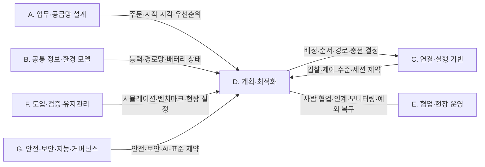

(너의 규칙은 시스템 프롬프트의 agents/shared-rules.md 와 agents/storyteller.md 이다. 아래는 이번 실행의 컨텍스트와 입력이다.)

## 실행 컨텍스트

- run_id: 2026-10-10-01
- date: 2026-10-10
- run_type: update (갱신)
- 대상: 24. 작업·워크플로 모델링 (G. 계획·최적화)
- 예산:
    - max_search_queries: 30
    - max_sources_per_run: 15
    - new_topic_pages: 1
    - page_updates: 2
    - max_retries: 2
- 환경 알림: web_fetch_available: true · fetch_mode: full
- 세부영역 반영 제안: 2건 — 트랙 실행이 이 영역 페이지에 반영하자고 제안한 내용(입력 data/area_reflection_proposals.json). 이번 실행의 조사·검증을 거쳐 해당 절에 반영을 검토한다(사양서 6.3 절차 9 '반영은 다음 해당 영역 실행에서')
- 언어: ko
- retry_count: 1
- max_retries: 2

## 입력

### runs/2026-10-10-01/target.json

```json
{
  "run_id": "2026-10-10-01",
  "date": "2026-10-10",
  "weekday": "Sat",
  "run_number": 161,
  "run_type": "update",
  "forced": true,
  "target": {
    "area_no": 24,
    "area_name": "24. 작업·워크플로 모델링",
    "category": "G. 계획·최적화",
    "category_letter": "G"
  },
  "topic": null,
  "track": null,
  "corrections": [],
  "budget": {
    "max_search_queries": 30,
    "max_sources_per_run": 15,
    "new_topic_pages": 1,
    "page_updates": 2,
    "max_retries": 2
  },
  "priority_reason": null,
  "priority_questions": [],
  "excluded_areas": [],
  "lifted_areas": [],
  "deferred": {
    "monthly_recheck": false,
    "weekly_review": false
  },
  "selection_rationale": "CLI 지정 run_type=update, area=24"
}
```

### runs/2026-10-10-01/research.json

```json
{
  "run_id": "2026-10-10-01",
  "date": "2026-10-10",
  "run_type": "update",
  "target": {
    "area_no": 24,
    "area_name": "24. 작업·워크플로 모델링",
    "category": "G. 계획·최적화"
  },
  "gaps": [
    "섹션 3. 왜 중요한가 — 첫 문단이 drop 완료·IngestorResult SUCCESS 를 CBV arriving 수준이라고 [추정]으로 묶어, 각 규격 정의(CBV 세 단계, VDA 5050 표 5, IngestorResult 기본 필드)의 원문 위치와 범위가 드러나지 않음",
    "섹션 5. 적용 사례 (현장 유형 명시) — 물류창고 가상 시나리오 2건뿐이고 다른 현장 유형(농업·지상 로봇 협업 등)의 공개 작업 모델링 사례가 없음",
    "섹션 6. 대표 접근법과 기술(주제 페이지로 분리) — BPMN 메시지 대기 근거가 벤더 문서(Camunda, ref-113)와 미열람 소개 페이지(ref-112)뿐이고, 취소 후 정리·보상, rmf_task_sequence 의 단계·이벤트 구성이 없음",
    "섹션 7. 관련 표준·프레임워크·오픈소스(주제 페이지로 분리) — VDA 5050 3.0.0 의 blockingType(SINGLE 추가)과 rmf_fleet_adapter 의 최근 변경(2026-09-26)이 반영되지 않음",
    "섹션 8. 대표 연구와 자료(주제 페이지로 분리) — Filippone 외(ref-116)가 원문 미열람 상태로 2026-03 초판 표기만 있고 연구 방법·게재처가 없음",
    "섹션 11. 열린 질문(주제 페이지로 분리) — oq-001·oq-014 에 근거가 붙지 않았음"
  ],
  "research_questions": [
    "현장 업무를 로봇이 실행할 수 있는 단계와 완료 조건으로 어떻게 나눌 것인가? [분류원문]",
    "로봇의 하역 완료 신호(VDA 5050 drop FINISHED, IngestorResult SUCCESS)와 GS1 CBV 업무 단계(arriving·accepting·receiving)는 원문 정의상 어떻게 다른가? (섹션 3 겨냥)",
    "인수 확인 대기·상관·시간 초과를 BPMN 규범 원문은 어떤 요소로 정의하며, 취소 후 정리와 보상은 어떻게 다루는가? (섹션 6 겨냥)",
    "Open-RMF rmf_task_sequence 는 작업을 어떤 단계·이벤트로 구성하며, 최근 변경(단계 건너뛰기)은 무엇인가? (섹션 6·7 겨냥)",
    "VDA 5050 3.0.0 은 동작의 병행 가능성(blockingType)에서 무엇이 바뀌었는가? (섹션 7 겨냥)",
    "oq-001 로봇의 적재·하역 완료 신호(VDA 5050 drop 동작 완료, Open-RMF IngestorResult)를 EPCIS 인계 이벤트로 옮기는 표준 매핑이나 공개 구현 사례가 있는가? (섹션 11 겨냥)",
    "oq-014 업무 프로세스 모델(BPMN 등)의 단계 상태와 로봇 작업 상태(Open-RMF 작업 상태, VDA 5050 동작 상태)를 동기화하는 표준 매핑이나 공개 구현이 있는가? (섹션 5·8·11 겨냥)"
  ],
  "findings": [
    {
      "id": "f1",
      "claim": "GS1 핵심 업무 어휘(CBV) 2.0 온톨로지는 arriving 을 물체가 위치에 도착하는 활동, accepting 을 점유 또는 소유가 바뀌는 활동, receiving 을 위치에서 수령되어 수령자 재고에 편입되는 활동으로 구분하고, receiving 의 사용은 arriving·accepting 의 사용과 상호 배타적이라고 적는다.",
      "tag": "사실",
      "source_ids": [
        "ref-044"
      ],
      "cross_checked": false,
      "confidence": "medium",
      "evidence_excerpt": "CBV.ttl BizStep-arriving \"an object arrives at a location\", BizStep-accepting \"changes possession and/or ownership\", BizStep-receiving \"is being received at a location and is added to the receiver's inventory. The use of `receiving` is mutually exclusive from the use of `arriving` and `accepting`.\" (rdfs:comment, 2021-09-30 판, 확인일 기준)",
      "as_of": "2026-10-10",
      "site_type": null,
      "flow_item": "완료·인계"
    },
    {
      "id": "f2",
      "claim": "VDA 5050 3.0.0 은 미리 정의된 drop 동작의 FINISHED 상태를 하역이 끝나 적재물이 이동로봇을 떠나고 로봇이 새 적재 상태를 보고한 때로 정의한다.",
      "tag": "사실",
      "source_ids": [
        "ref-031"
      ],
      "cross_checked": false,
      "confidence": "medium",
      "evidence_excerpt": "3.0.0 태그 명세 §6.2.3.2 Action states, Table 5 'Expected behavior in action states of predefined actions'의 drop 행 FINISHED 칸: \"Drop has been done. Load has left the mobile robot and mobile robot reports new load state.\" (확인일 기준)",
      "as_of": "2026-10-10",
      "site_type": null,
      "flow_item": "완료·인계"
    },
    {
      "id": "f3",
      "claim": "Open-RMF IngestorResult 메시지의 기본 정의 필드(time·request_guid·source_guid·status, status 는 ACKNOWLEDGED·SUCCESS·FAILED)에는 수령자 재고 편입 여부를 나타내는 필드가 없다.",
      "tag": "사실",
      "source_ids": [
        "ref-049"
      ],
      "cross_checked": false,
      "confidence": "medium",
      "evidence_excerpt": "IngestorResult.msg: builtin_interfaces/Time time, string request_guid, string source_guid, uint8 status (ACKNOWLEDGED=0, SUCCESS=1, FAILED=2). 끝에 '# below are custom workcell message fields' 주석이 있어 워크셀별 추가 필드는 열려 있으므로 범위를 기본 정의 필드로 한정했다 (발행일 미확인, 확인일 기준)",
      "as_of": "2026-10-10",
      "site_type": null,
      "flow_item": "완료·인계"
    },
    {
      "id": "f4",
      "claim": "로봇의 하역 완료(drop FINISHED, IngestorResult SUCCESS)를 특정 CBV 업무 단계와 자동으로 동일시하지 말고, 해당 업무의 인수·재고 확정 조건을 별도 완료 조건으로 모델링하는 편이 타당하다.",
      "tag": "의견",
      "source_ids": [
        "ref-044",
        "ref-031",
        "ref-049"
      ],
      "cross_checked": false,
      "confidence": "medium",
      "evidence_excerpt": "f1~f3 의 정의를 대조한 판단. 세 규격 사이 공식 변환 매핑은 발견하지 못했다. CBV 가 receiving 과 arriving·accepting 을 상호 배타적으로 설명하므로 한 이벤트에 세 의미를 동시에 붙이는 근거로 쓰지 않는다. 3절 기존 [추정] 문장(ref-031·ref-049·ref-044)의 근거 범위를 좁히는 보완",
      "as_of": "2026-10-10",
      "site_type": null,
      "flow_item": "완료·인계"
    },
    {
      "id": "f5",
      "claim": "BPMN 2.0.2 규범 문서는 외부 참여자의 메시지가 도착하면 완료되는 수신 작업(Receive Task), 메시지를 프로세스 인스턴스에 연결하는 상관 키(CorrelationKey), 지연·시간 조건을 표현하는 타이머 이벤트(Timer Event)를 정의한다.",
      "tag": "사실",
      "source_ids": [
        "ref-502"
      ],
      "cross_checked": false,
      "confidence": "medium",
      "evidence_excerpt": "OMG formal/2013-12-09(발행 2014-01). §10.3.3 Tasks(인쇄 p.159) \"A Receive Task is a simple Task that is designed to wait for a Message to arrive from an external Participant ... Once the Message has been received, the Task is completed.\" §8.4.2 Correlation 의 CorrelationKey, §10.5.4 Intermediate Event 의 Timer(정상 흐름에서 지연 장치로 동작) (확인일 기준)",
      "as_of": "2026-10-10",
      "site_type": null,
      "flow_item": null
    },
    {
      "id": "f6",
      "claim": "운반 뒤 인수 확인 메시지를 기다리고 시간 초과 시 분기하는 구조는 BPMN 규범 요소(수신 작업·상관 키·타이머 이벤트)로 표현할 수 있어 특정 벤더 엔진에 한정되지 않지만, 로봇 작업 식별자나 화물 식별자를 어떤 상관 키로 쓸지는 구현에서 정해야 하는 것으로 보인다.",
      "tag": "추정",
      "source_ids": [
        "ref-502",
        "ref-1423"
      ],
      "cross_checked": false,
      "confidence": "medium",
      "evidence_excerpt": "f5 의 규범 정의와 FaMe 모델링 지침 G5(Delays and timers via timer events)·G4(Execution errors via error events)·CONFIGURATION(signal event 의 type 을 ROS 메시지 형으로 지정)를 엮은 추정. 6절 분리 페이지의 기존 Camunda 근거 문장(ref-113, 벤더 주장)을 보완한다. Camunda 고유의 TTL·중복 거부 동작은 BPMN 표준의 보장으로 확대하지 않는다. 로봇 인수 확인에 적용한 사례는 미확인",
      "as_of": "2026-10-10",
      "site_type": null,
      "flow_item": null
    },
    {
      "id": "f7",
      "claim": "FaMe 연구팀(University of Camerino PROS Lab)은 공식 페이지에서 지상 로봇 협업(ground vehicle cooperation)과 농업(agriculture scenario) 두 시나리오의 시뮬레이션 패키지와 엔진 패키지 빌드·실행 절차(colcon build, ros2 launch)를 공개한다.",
      "tag": "사실",
      "source_ids": [
        "ref-1423"
      ],
      "cross_checked": false,
      "confidence": "medium",
      "evidence_excerpt": "FaMe 페이지 'Reproducing the simulation': \"Download a simulation package (s.a. ground vehicle cooperation or agriculture scenario) and the engine package\" 후 colcon build·ros2 launch·splitter 실행. 요구사항 Ubuntu 20.04+, ROS2 Foxy+, Gazebo(실제 로봇 실행에는 불필요). 페이지 게시일 2022-05-03. 현장 유형은 농업·지상 로봇 협업 시뮬레이션이며 실외 현장 운영 여부는 페이지에 명시 없음",
      "as_of": "2026-10-10",
      "site_type": "기타",
      "flow_item": null
    },
    {
      "id": "f8",
      "claim": "FaMe 모델링 지침은 로봇을 풀(Pool), 임무를 프로세스(Process), 동작을 활동(Activity)으로 나타내고, 병렬 동작은 AND 게이트웨이, 내부 선택은 XOR 게이트웨이, 시간 대기는 타이머 이벤트, 실행 오류는 오류 이벤트로 표현하게 한다.",
      "tag": "사실",
      "source_ids": [
        "ref-1423"
      ],
      "cross_checked": false,
      "confidence": "medium",
      "evidence_excerpt": "MODELING 지침: G1 Robots as pools, G2 Mission as a process, G2.1 Actions as activities, G2.3 Concurrent behaviors by means of AND gateways, G2.4 Internal choices as XOR gateways, G4 Execution errors via error events, G5 Delays and timers via timer events (G1~G7). 기존 ref-503(FaMe GitHub README)·ref-114(Corradini 외 논문)와 같은 연구팀 자료이므로 독립 교차 확인으로 세지 않는다",
      "as_of": "2026-10-10",
      "site_type": "기타",
      "flow_item": "수행 자원"
    },
    {
      "id": "f9",
      "claim": "FaMe 예제는 창고 밖(농업·지상 로봇 협업)의 작업 모델링 사례로 5절에 추가할 수 있지만, 시뮬레이션 실험이므로 국내 상용 운영 실적이나 현장 성능 근거로 분류하지 않는 편이 좋다.",
      "tag": "의견",
      "source_ids": [
        "ref-1423"
      ],
      "cross_checked": false,
      "confidence": "low",
      "evidence_excerpt": "공식 페이지는 시뮬레이션 재현 절차와 모델링 지침을 제시한다. 연구팀의 실물 실험 사진이 있다는 메모 서술은 시뮬레이션 성능을 현장 성능으로 환산하는 근거로 쓰지 않았다. 국내 운영 실적은 확인 못 함",
      "as_of": "2026-10-10",
      "site_type": "기타",
      "flow_item": null
    },
    {
      "id": "f10",
      "claim": "Open-RMF rmf_task 의 Task::Active::cancel() 주석은 취소 뒤에도 작업이 로봇을 짐 없는 상태로 되돌리기 위한 단계를 계속 수행할 수 있고(대기 단계가 그런 단계로 바뀔 수 있음), 완료 콜백이 호출되어야 취소가 끝난다고 설명한다.",
      "tag": "사실",
      "source_ids": [
        "ref-366"
      ],
      "cross_checked": false,
      "confidence": "medium",
      "evidence_excerpt": "Task.hpp cancel(): \"The Task may continue to perform some phases after being canceled. The pending_phases are likely to change after the Task is canceled, being replaced with phases that will help to relieve the robot ...\" \"When its finished callback is triggered, the cancellation is complete.\" kill() 은 cancel() 에 우선한다 (발행일 미확인, 확인일 기준)",
      "as_of": "2026-10-10",
      "site_type": null,
      "flow_item": "예외·성과"
    },
    {
      "id": "f11",
      "claim": "BPMN 2.0.2 는 이미 성공적으로 완료한 단계의 효과를 되돌리는 보상(Compensation)을 별도 개념으로 정의한다.",
      "tag": "사실",
      "source_ids": [
        "ref-502"
      ],
      "cross_checked": false,
      "confidence": "medium",
      "evidence_excerpt": "§10.7 Compensation: \"Compensation is concerned with undoing steps that were already successfully completed, because their results and possibly side effects are no longer desired and need to be reversed.\" (formal/2013-12-09, 확인일 기준)",
      "as_of": "2026-10-10",
      "site_type": null,
      "flow_item": "예외·성과"
    },
    {
      "id": "f12",
      "claim": "워크플로에는 취소 요청과 취소 후 정리 완료를 서로 다른 상태로 나누고, 실제 물건의 이동을 되돌릴 수 있는지에 따라 보상 단계를 따로 정의하는 편이 좋다.",
      "tag": "의견",
      "source_ids": [
        "ref-502",
        "ref-366"
      ],
      "cross_checked": false,
      "confidence": "medium",
      "evidence_excerpt": "f10·f11 근거. 두 자료가 같은 상태 체계를 공유한다는 뜻은 아니며, 공통으로 취소와 사후 처리를 구별한다는 설계 근거다. rmf_task README 도 단계마다 취소·중단 시 반응을 지정할 수 있다고 적는다",
      "as_of": "2026-10-10",
      "site_type": null,
      "flow_item": "예외·성과"
    },
    {
      "id": "f13",
      "claim": "Open-RMF rmf_task_sequence::Task 는 작업 완료를 위해 순서대로 실행할 단계(Phase)의 연쇄이고, 각 단계는 이벤트(Event)들로 구성되며, 모델은 rmf_task_sequence 에, 실제 로봇 명령 구현은 rmf_fleet_adapter 에 둔다.",
      "tag": "사실",
      "source_ids": [
        "ref-404"
      ],
      "cross_checked": false,
      "confidence": "medium",
      "evidence_excerpt": "rmf_task README rmf_task_sequence 절: \"a task to be composed of a sequence of phases that need to be executed in-order ... A phase inturn may be composed of a set of Events.\" Usage 절: 모델 구현은 rmf_task_sequence, Active 구현은 rmf_fleet_adapter; fleet adapter 는 현재 rmf_task_sequence 의 단계 연쇄 작업만 지원 (발행일 미확인, 확인일 기준)",
      "as_of": "2026-10-10",
      "site_type": null,
      "flow_item": null
    },
    {
      "id": "f14",
      "claim": "rmf_task README 는 rmf_task_sequence 가 기본 제공하는 이벤트로 Bundle, DropOff, GoToPlace, PerformAction, PickUp, Placeholder, WaitFor 일곱 가지를 열거한다.",
      "tag": "사실",
      "source_ids": [
        "ref-404"
      ],
      "cross_checked": false,
      "confidence": "medium",
      "evidence_excerpt": "README rmf_task_sequence 절 이벤트 목록(알파벳순): Bundle, DropOff, GoToPlace, PerformAction, PickUp, Placeholder, WaitFor — 메모는 Placeholder 를 빠뜨렸으나 검증에서 7개로 정정 (확인일 기준)",
      "as_of": "2026-10-10",
      "site_type": null,
      "flow_item": null
    },
    {
      "id": "f15",
      "claim": "기본 이벤트 목록과 단계 연쇄 구조만으로는 rmf_task_sequence 를 임의의 업무 병렬 분기·합류를 실행하는 범용 BPMN 엔진으로 보기 어려워 보인다.",
      "tag": "추정",
      "source_ids": [
        "ref-502",
        "ref-404"
      ],
      "cross_checked": false,
      "confidence": "low",
      "evidence_excerpt": "f13·f14 와 BPMN 게이트웨이 개념의 대조. 지원 이벤트의 존재와 임의 업무 그래프 지원은 구분했다. Bundle 의 정확한 병렬·합류 의미는 원문에서 확인하지 않았다",
      "as_of": "2026-10-10",
      "site_type": null,
      "flow_item": null
    },
    {
      "id": "f16",
      "claim": "VDA 5050 3.0.0 은 동작의 blockingType 을 NONE·SINGLE·SOFT·HARD 네 값으로 두며, SINGLE 은 주행은 허용하되 다른 동작의 병렬 실행은 허용하지 않고 HARD 는 그 시점에 허용되는 유일한 동작이다.",
      "tag": "사실",
      "source_ids": [
        "ref-031"
      ],
      "cross_checked": false,
      "confidence": "medium",
      "evidence_excerpt": "3.0.0 태그 명세 §6.2.2 Action blocking types and sequence, Table 3(주행·병렬 실행에 따른 blocking type 정의); 필드 표 \"'SINGLE': allows driving but no other actions; 'SOFT': allows other actions but not driving; 'HARD': is the only allowed action at that time.\" (발표일은 근거 미확인이라 적지 않음)",
      "as_of": "2026-10-10",
      "site_type": null,
      "flow_item": "제약"
    },
    {
      "id": "f17",
      "claim": "VDA 5050 2.1.0 명세의 blockingType 은 NONE·SOFT·HARD 세 값뿐이어서, SINGLE 은 3.0.0 에서 추가된 값이다.",
      "tag": "사실",
      "source_ids": [
        "ref-031",
        "ref-1425"
      ],
      "cross_checked": false,
      "confidence": "medium",
      "evidence_excerpt": "2.1.0 태그 명세: blockingType \"Enum {'NONE', 'SOFT', 'HARD'}\", \"Actions can have three distinct blocking types, described in Table 3.\" 2.1.0 본문에 SINGLE 문자열 없음. 3.0.0 은 \"four distinct blocking types\"(§6.2.2). 같은 발행 계열 두 판의 대조이며 독립 교차 확인은 아니다. 릴리스 노트 페이지는 원문 미확인이라 근거에서 뺐다",
      "as_of": "2026-10-10",
      "site_type": null,
      "flow_item": "제약"
    },
    {
      "id": "f18",
      "claim": "주행과 작업 활동의 동시 수행 가능성을 공정 모델의 제약으로 표현할 때 VDA 5050 의 SINGLE 과 HARD 를 구별해 다루는 편이 좋다.",
      "tag": "의견",
      "source_ids": [
        "ref-031"
      ],
      "cross_checked": false,
      "confidence": "medium",
      "evidence_excerpt": "f16 의 정의(SINGLE 은 주행 허용, HARD 는 유일 동작)에서 끌어낸 모델링 권고. 메모는 이 문장을 [사실]로 달았으나 '구별해야 한다'는 판단이라 의견으로 분리",
      "as_of": "2026-10-10",
      "site_type": null,
      "flow_item": "제약"
    },
    {
      "id": "f19",
      "claim": "Open-RMF rmf_fleet_adapter 패키지 2.14.0(2026-09-26) 변경 이력에는 단계 건너뛰기 요청의 키를 고친 항목 'Fix phase key for skip requests (#543)' 이 있다.",
      "tag": "사실",
      "source_ids": [
        "ref-1424"
      ],
      "cross_checked": false,
      "confidence": "medium",
      "evidence_excerpt": "rmf_ros2 2.14.0 태그의 rmf_fleet_adapter/CHANGELOG.rst '2.14.0 (2026-09-26)' 절: \"Fix phase key for skip requests (#543)\". 고친 키의 실제 이름은 변경 이력만으로 확인하지 않았다. 개별 패키지 버전이며 Open-RMF 전체 배포판 버전이 아니다",
      "as_of": "2026-10-10",
      "site_type": null,
      "flow_item": null
    },
    {
      "id": "f20",
      "claim": "단계 건너뛰기를 운영 정책에 넣는 구현은 rmf_fleet_adapter 패키지 버전과 건너뛰기 요청 스키마를 함께 기록해 두는 편이 좋다.",
      "tag": "의견",
      "source_ids": [
        "ref-1424",
        "ref-366"
      ],
      "cross_checked": false,
      "confidence": "low",
      "evidence_excerpt": "f19 의 변경과 Task.hpp skip(phase_id, value) — 운영자가 수동 개입으로 특정 단계를 건너뛰게 하는 API — 를 근거로 한 운영 권고",
      "as_of": "2026-10-10",
      "site_type": null,
      "flow_item": null
    },
    {
      "id": "f21",
      "claim": "Filippone·Pettinari·Pelliccione 의 비교 연구(arXiv 2603.15427, v1 2026-03-16, v2 2026-08-17, Journal ref IEEE Transactions on Software Engineering (2026))는 행동 트리·상태 기계·계층적 작업 네트워크(HTN)·BPMN 을 제어 구조·임무 개념 표현(표현력)·도구 지원 기준으로 비교한다.",
      "tag": "사실",
      "source_ids": [
        "ref-116"
      ],
      "cross_checked": false,
      "confidence": "medium",
      "evidence_excerpt": "arXiv abs 페이지 \"Submitted on 16 Mar 2026 (v1), last revised 17 Aug 2026 (this version, v2)\", Journal ref \"IEEE Transactions on Software Engineering (2026)\". v2 본문 §IV~VI 비교, 표 II(제어 구조)·IV·VI·VII 확인 (확인일 기준)",
      "as_of": "2026-10-10",
      "site_type": null,
      "flow_item": null
    },
    {
      "id": "f22",
      "claim": "이 연구는 2026년 1월 4주 동안 83명에게 설문을 요청해 29개 완성 응답(응답률 34.94%)을 받고 일부 참여자와 후속 인터뷰(3명 실시간, 1명 서면)를 했으며, 같은 로봇 현장에서 형식별 처리량을 측정한 성능 비교가 아니라 분석 비교를 전문가 설문으로 검증한 연구다.",
      "tag": "사실",
      "source_ids": [
        "ref-116"
      ],
      "cross_checked": false,
      "confidence": "medium",
      "evidence_excerpt": "v2 §III: \"29 complete responses out of 83 invitations, corresponding to a response rate of 34.94%\"(2026-01, 4주), \"Three participants ... were interviewed in live sessions, while one ... provided written responses\". 결과는 completeness·correctness·alignment 리커트 평가. 같은 논문의 재열람이며 독립 교차 확인 아님",
      "as_of": "2026-10-10",
      "site_type": null,
      "flow_item": null
    },
    {
      "id": "f23",
      "claim": "Filippone 외 비교 연구는 임무 기술 형식 선택의 검토 자료로 쓰되, 특정 형식이 항상 우수하다는 결론으로 옮기지 않는 편이 좋다.",
      "tag": "의견",
      "source_ids": [
        "ref-116"
      ],
      "cross_checked": false,
      "confidence": "medium",
      "evidence_excerpt": "f22 의 연구 방법(분석 비교 + 전문가 설문)과 §VII 타당성 위협 절을 근거로 한 판단",
      "as_of": "2026-10-10",
      "site_type": null,
      "flow_item": null
    },
    {
      "id": "f24",
      "claim": "FaMe 는 BPMN 협업 다이어그램으로 다중 로봇 임무를 정의하고 모델링·구성·실행 단계를 거쳐 각 로봇에서 ROS 2 위에 그 협업을 직접 실행하는 공개 프레임워크이며, 구성 단계에서 신호 이벤트의 type 속성에 ROS 메시지 형을 지정해 BPMN 이벤트와 ROS 메시지를 잇는다.",
      "tag": "사실",
      "source_ids": [
        "ref-1423"
      ],
      "cross_checked": false,
      "confidence": "medium",
      "evidence_excerpt": "FaMe 페이지 Framework Description: \"allows the definition of an MRS mission using BPMN Collaborations and the execution of the system exploiting the ROS2 framework ... modeling, configuration, and enactment\"; \"The enactment phase executes the BPMN collaboration directly on each involved robot.\" CONFIGURATION > Signal Events: \"Add a property named type, with a value equal to the ROS message type\". oq-014 부분 근거",
      "as_of": "2026-10-10",
      "site_type": null,
      "flow_item": null
    },
    {
      "id": "f25",
      "claim": "FaMe 는 BPMN 과 ROS 2 를 잇는 공개 구현이지만 Open-RMF 작업 상태나 VDA 5050 동작 상태와 BPMN 단계 상태 사이의 표준 매핑으로 볼 근거는 확인하지 못했으므로, oq-014 는 열린 상태로 두는 것이 맞다.",
      "tag": "의견",
      "source_ids": [
        "ref-1423",
        "ref-031",
        "ref-404"
      ],
      "cross_checked": false,
      "confidence": "medium",
      "evidence_excerpt": "FaMe 페이지·VDA 5050 3.0.0 명세·rmf_task README 어디에도 서로의 상태를 대응시키는 매핑 절이 없음. oq-014 부분 답변",
      "as_of": "2026-10-10",
      "site_type": null,
      "flow_item": null
    },
    {
      "id": "f26",
      "claim": "확인한 원문들(CBV.ttl, VDA 5050 3.0.0, IngestorResult.msg)은 로봇 동작 완료와 업무 단계 각각의 정의까지만 제공하며, 로봇 하역 완료를 EPCIS 인계 이벤트로 옮기는 표준 변환은 확인되지 않는다.",
      "tag": "추정",
      "source_ids": [
        "ref-044",
        "ref-031",
        "ref-049"
      ],
      "cross_checked": false,
      "confidence": "medium",
      "evidence_excerpt": "oq-001 부분 답변. 세 원문 어디에도 상대 규격을 참조하는 매핑 절이 없다. 공개 구현 사례 검색은 이번 메모 범위에서 하지 않았으므로 '없음'이 아니라 '확인 못 함'",
      "as_of": "2026-10-10",
      "site_type": null,
      "flow_item": null
    },
    {
      "id": "f27",
      "claim": "VDA 5050 drop 완료를 곧바로 CBV arriving 또는 receiving 으로 단정하지 않고, 업무 측 확인으로 어느 단계인지 정하는 수준까지만 oq-001 의 답을 보강하는 것이 적절하다.",
      "tag": "의견",
      "source_ids": [
        "ref-044",
        "ref-031"
      ],
      "cross_checked": false,
      "confidence": "medium",
      "evidence_excerpt": "f1·f2 와 CBV 의 receiving 상호 배타 규정을 근거로 한 판단. oq-001 은 열린 상태 유지",
      "as_of": "2026-10-10",
      "site_type": null,
      "flow_item": null
    }
  ],
  "sources": [
    {
      "id": "ref-044",
      "org": "GS1",
      "title": "gs1/EPCIS — Ontology/CBV.ttl (Core Business Vocabulary ontology 2.0)",
      "published": "2021-09-30",
      "url": "https://github.com/gs1/EPCIS/blob/master/Ontology/CBV.ttl",
      "type": "표준",
      "reliability": "high",
      "accessed": "2026-10-10",
      "summary": "GS1 CBV 2.0 온톨로지. arriving·accepting·receiving 등 업무 단계(BizStep)의 정의와 receiving 의 상호 배타 규정을 담는다.",
      "fetched": true,
      "fetched_via": "github_raw",
      "fetch_url": "https://raw.githubusercontent.com/gs1/EPCIS/master/Ontology/CBV.ttl",
      "source_unopened": false
    },
    {
      "id": "ref-031",
      "org": "VDA / VDMA (VDA5050 GitHub)",
      "title": "VDA5050/VDA5050_EN.md — Official Specification document for the VDA 5050",
      "published": null,
      "url": "https://github.com/VDA5050/VDA5050/blob/main/VDA5050_EN.md",
      "type": "표준",
      "reliability": "high",
      "accessed": "2026-10-10",
      "summary": "VDA 5050 공식 명세 본문. 이번에는 3.0.0 태그 고정판을 열어 §6.2.2 표 3(blockingType 네 값, SINGLE)과 §6.2.3.2 표 5(drop FINISHED 정의)를 확인했다. 발표일은 근거 미확인.",
      "fetched": true,
      "fetched_via": "github_raw",
      "fetch_url": "https://raw.githubusercontent.com/VDA5050/VDA5050/3.0.0/VDA5050_EN.md",
      "source_unopened": false
    },
    {
      "id": "ref-049",
      "org": "Open Robotics (open-rmf)",
      "title": "rmf_internal_msgs — rmf_ingestor_msgs/msg/IngestorResult.msg",
      "published": null,
      "url": "https://github.com/open-rmf/rmf_internal_msgs/blob/main/rmf_ingestor_msgs/msg/IngestorResult.msg",
      "type": "오픈소스 문서",
      "reliability": "high",
      "accessed": "2026-10-10",
      "summary": "Open-RMF 하역 워크셀 결과 메시지 정의. 기본 필드는 time·request_guid·source_guid·status(ACKNOWLEDGED·SUCCESS·FAILED)이고 워크셀별 추가 필드 주석이 있다.",
      "fetched": true,
      "fetched_via": "github_raw",
      "fetch_url": "https://raw.githubusercontent.com/open-rmf/rmf_internal_msgs/main/rmf_ingestor_msgs/msg/IngestorResult.msg",
      "source_unopened": false
    },
    {
      "id": "ref-502",
      "org": "OMG(Object Management Group)",
      "title": "Business Process Model and Notation (BPMN), Version 2.0.2",
      "published": "2014-01",
      "url": "https://www.omg.org/spec/BPMN/2.0.2/",
      "type": "표준",
      "reliability": "high",
      "accessed": "2026-10-10",
      "summary": "BPMN 2.0.2 규범 문서(formal/2013-12-09). 수신 작업(§10.3.3, 인쇄 p.159)·상관 키(§8.4.2)·타이머 등 중간 이벤트(§10.5.4)·보상(§10.7)을 정의한다.",
      "fetched": true,
      "fetched_via": "webfetch",
      "fetch_url": "https://www.omg.org/spec/BPMN/2.0.2/PDF",
      "source_unopened": false
    },
    {
      "id": "ref-1423",
      "org": "University of Camerino PROS Lab",
      "title": "FaMe — A BPMN-driven Framework for Multi-Robot System Development (공식 페이지·사용 지침)",
      "published": "2022-05-03",
      "url": "https://pros.unicam.it/fame/",
      "type": "정부·연구기관",
      "reliability": "medium",
      "accessed": "2026-10-10",
      "summary": "FaMe 연구팀의 공식 페이지. 지상 로봇 협업·농업 시뮬레이션 재현 절차, BPMN 모델링 지침 G1~G7, 구성 절차(신호 이벤트와 ROS 메시지 형 연결)를 제시한다. 기존 ref-503(GitHub README)·ref-114(논문)와 같은 연구팀 자료다.",
      "fetched": true,
      "fetched_via": "webfetch",
      "fetch_url": null,
      "source_unopened": false
    },
    {
      "id": "ref-366",
      "org": "Open Robotics (open-rmf)",
      "title": "rmf_task — rmf_task/include/rmf_task/Task.hpp",
      "published": null,
      "url": "https://github.com/open-rmf/rmf_task/blob/main/rmf_task/include/rmf_task/Task.hpp",
      "type": "오픈소스 문서",
      "reliability": "high",
      "accessed": "2026-10-10",
      "summary": "Open-RMF 작업 인터페이스 헤더. Task::Active 의 cancel()·kill()·skip() 의 의미(취소 후 정리 단계, 완료 콜백으로 취소 종료)를 주석으로 설명한다.",
      "fetched": true,
      "fetched_via": "github_raw",
      "fetch_url": "https://raw.githubusercontent.com/open-rmf/rmf_task/main/rmf_task/include/rmf_task/Task.hpp",
      "source_unopened": false
    },
    {
      "id": "ref-404",
      "org": "Open Robotics (open-rmf)",
      "title": "rmf_task — README",
      "published": null,
      "url": "https://github.com/open-rmf/rmf_task",
      "type": "오픈소스 문서",
      "reliability": "high",
      "accessed": "2026-10-10",
      "summary": "rmf_task 저장소 README. rmf_task_sequence 의 단계·이벤트 구조와 기본 이벤트 7종(Bundle·DropOff·GoToPlace·PerformAction·PickUp·Placeholder·WaitFor), 모델과 실행 구현의 위치를 설명한다.",
      "fetched": true,
      "fetched_via": "github_raw",
      "fetch_url": "https://raw.githubusercontent.com/open-rmf/rmf_task/main/README.md",
      "source_unopened": false
    },
    {
      "id": "ref-116",
      "org": "Filippone, G., Pettinari, S., & Pelliccione, P.",
      "title": "Formalisms for Robotic Mission Specification and Execution: A Comparative Analysis",
      "published": "2026-03-16",
      "url": "https://arxiv.org/abs/2603.15427",
      "type": "논문",
      "reliability": "medium",
      "accessed": "2026-10-10",
      "summary": "행동 트리·상태 기계·HTN·BPMN 을 제어 구조·표현력·도구 지원으로 비교하고 전문가 설문(83명 요청, 29개 응답)과 후속 인터뷰로 검증한 연구. v1 2026-03-16, v2 2026-08-17, Journal ref IEEE Transactions on Software Engineering (2026). 이번에 v2 본문을 열람했다.",
      "fetched": true,
      "fetched_via": "webfetch",
      "fetch_url": "https://arxiv.org/html/2603.15427v2",
      "source_unopened": false
    },
    {
      "id": "ref-1424",
      "org": "Open Robotics (open-rmf)",
      "title": "rmf_ros2 (tag 2.14.0) — rmf_fleet_adapter/CHANGELOG.rst",
      "published": "2026-09-26",
      "url": "https://github.com/open-rmf/rmf_ros2/blob/2.14.0/rmf_fleet_adapter/CHANGELOG.rst",
      "type": "오픈소스 문서",
      "reliability": "high",
      "accessed": "2026-10-10",
      "summary": "rmf_fleet_adapter 패키지 변경 이력. 2.14.0(2026-09-26) 절에 단계 건너뛰기 요청 키 수정(#543) 항목이 있다.",
      "fetched": true,
      "fetched_via": "github_raw",
      "fetch_url": "https://raw.githubusercontent.com/open-rmf/rmf_ros2/2.14.0/rmf_fleet_adapter/CHANGELOG.rst",
      "source_unopened": false
    },
    {
      "id": "ref-1425",
      "org": "VDA / VDMA (VDA5050 GitHub)",
      "title": "VDA5050/VDA5050 (tag 2.1.0) — VDA5050_EN.md",
      "published": null,
      "url": "https://github.com/VDA5050/VDA5050/blob/2.1.0/VDA5050_EN.md",
      "type": "표준",
      "reliability": "high",
      "accessed": "2026-10-10",
      "summary": "VDA 5050 2.1.0 명세 본문. blockingType 을 NONE·SOFT·HARD 세 값으로 정의해 3.0.0 의 SINGLE 추가를 대조하는 근거가 된다.",
      "fetched": true,
      "fetched_via": "github_raw",
      "fetch_url": "https://raw.githubusercontent.com/VDA5050/VDA5050/2.1.0/VDA5050_EN.md",
      "source_unopened": false
    }
  ],
  "page_proposals": [
    {
      "action": "update",
      "path": "docs/categories/planning-and-optimization/task-and-workflow-modeling.md",
      "sections": [
        "3",
        "5",
        "6",
        "7",
        "8",
        "11"
      ],
      "rationale": "갱신(차등, 외부 조사 메모 변환): 섹션 3 — 첫 문단의 근거를 원문 정의로 구체화: CBV 세 단계(f1), drop FINISHED 표 5(f2), IngestorResult 기본 필드 범위(f3), 별도 완료 조건 권고(f4, 의견) / 섹션 5 — 창고 밖 사례로 FaMe 농업·지상 로봇 협업 시뮬레이션(f7·f8, site_type 기타)과 분류 한계(f9) 추가 / 섹션 6(주제 페이지 2026-09-25-area02-s6 요약) — BPMN 규범 근거로 수신 작업·상관 키·타이머(f5·f6, 기존 Camunda 문장 보완), 취소 후 정리·보상(f10~f12), rmf_task_sequence 단계·이벤트 7종(f13~f15) / 섹션 7(주제 페이지 2026-09-25-area02-s7 요약) — VDA 5050 3.0.0 blockingType SINGLE(f16·f17, 발표일 언급 없음)과 SINGLE·HARD 구별 권고(f18, 의견), rmf_fleet_adapter 2.14.0 단계 건너뛰기 키 수정(f19·f20); 표의 BPMN 행을 2.0.2 규범판(ref-502)으로 보강 / 섹션 8(주제 페이지 2026-09-25-area02-s8 요약) — Filippone 외(ref-116) 항목을 v2·게재처·연구 방법으로 보강(f21~f23); FaMe 항목(ref-114)은 기존 내용 확인 / 섹션 11(주제 페이지 2026-09-25-area02-s11) — oq-014 부분 근거(f24·f25), oq-001 부분 근거(f26·f27), 새 질문 3건. 섹션 4·9·10 은 바꾸지 않는다. 다음 실행 후보: 32. 예외 복구·재계획·업무 연속성(f10~f12), 20. 로봇·제조사 관제 연동(f16~f18), 17. 작업 대상·자산 식별과 인계 추적(f1~f4)."
    }
  ],
  "glossary_candidates": [
    {
      "term_ko": "수신 작업",
      "term_en": "Receive Task (BPMN)",
      "definition": "외부 참여자가 보낸 메시지가 도착할 때까지 기다리다가 메시지를 받으면 완료되는 BPMN 작업 유형이다."
    },
    {
      "term_ko": "보상",
      "term_en": "Compensation (BPMN)",
      "definition": "이미 성공적으로 끝난 단계의 결과가 더는 필요 없을 때 그 효과를 되돌리는 처리를 별도 활동으로 표현하는 BPMN 개념이다."
    }
  ],
  "open_questions_new": [
    "로봇이 이미 하역한 뒤 작업이 취소되면, 로봇 쪽 정리 단계 완료와 업무상 인수 취소(재고 반영 취소)를 어떤 완료 조건으로 나눠야 하는가? | 관련 영역: 24. 작업·워크플로 모델링, 32. 예외 복구·재계획·업무 연속성 | 근거: f10 | 종류: 일반",
    "Open-RMF rmf_task_sequence 의 Bundle 이벤트와 BPMN 병렬 게이트웨이 합류의 의미 차이를 자동으로 검사하거나 변환하는 공개 도구가 있는가? | 관련 영역: 24. 작업·워크플로 모델링, 54. 시험·형식 검증·벤치마크 | 근거: f15 | 종류: 일반",
    "운영 정책 버전이 바뀔 때 이미 시작한 워크플로 인스턴스가 이전 정책을 유지하는지 새 정책으로 옮기는지에 대한 공개 운영 기준이 있는가? | 관련 영역: 24. 작업·워크플로 모델링, 57. 자산·소프트웨어 수명주기 관리 | 근거: f20 | 종류: 일반"
  ],
  "open_questions_resolved": [],
  "self_check": {
    "source_count": 10,
    "cross_checked_count": 0,
    "unverified": [
      "리서치 단계 산출물 출처: 외부 AI(ChatGPT) 조사 메모(runs/2026-10-10-01/external_research.md)를 변환했다. 2026-10-10 Claude 서브에이전트가 메모의 [사실] 주장을 원문과 대조 검증했고, 검증에서 나온 수정(태그 강등·표현 정정·메타데이터 정정)을 반영했다.",
      "VDA 5050 3.0.0 의 발표일(메모의 2026-03-19)은 근거를 확인하지 못해 적지 않았고(ref-031 published null), 릴리스 노트 페이지(메모 n10)는 원문 확인이 안 돼 출처에서 뺐다",
      "f19: 'Fix phase key for skip requests (#543)' 에서 고친 키의 실제 이름은 변경 이력만으로 확인하지 않았다(#543 본문 미열람)",
      "f15: rmf_task_sequence Bundle 이벤트의 병렬·합류 의미는 API 문서를 열지 않아 미확인",
      "f7~f9: FaMe 시뮬레이션 시나리오가 실외 현장인지, 실물 로봇 실험의 규모는 공식 페이지에서 확인하지 못했다(site_type 기타)",
      "f26: 로봇 하역 완료를 EPCIS 이벤트로 옮기는 공개 구현 사례는 이번 메모 범위에서 검색하지 않았다(확인 못 함)",
      "ref-1425(VDA 5050 2.1.0) 발행일 미확인"
    ],
    "scope_violations": [
      "f16~f18: VDA 5050 blockingType 은 로봇·제조사 관제 인터페이스(20. 로봇·제조사 관제 연동) 쪽 정의이므로 이 영역에서는 공정 모델의 병행 제약 근거로만 쓴다",
      "f10~f12: 취소·보상 처리 절차는 32. 예외 복구·재계획·업무 연속성과 겹치며, 이 영역에서는 워크플로의 상태·완료 조건 구분으로 한정한다",
      "f1~f4: 재고 확정(CBV receiving)은 상위 업무 시스템(WMS) 연계 대상이며 ROP 는 완료 조건 구분과 대기만 맡는다"
    ],
    "budget_used": {
      "queries": 0,
      "sources": 3
    },
    "limits": "외부 조사 변환이라 검색·열람 집계 없음(queries 0 은 실제 검색 수가 아니다). web_fetch_available: true. 신규 출처 3건(ref-1423~ref-1425, 예약 구간 ref-1423~ref-1452 안), 기존 id 재사용 7건(ref-044·ref-031·ref-049·ref-502·ref-366·ref-404·ref-116). 메모의 출처 10개 중 n10(VDA 5050 3.0.0 릴리스 노트)은 원문 미확인으로 제외하고, SINGLE 추가의 대조 근거로 VDA 5050 2.1.0 명세(ref-1425)를 더했다. 메모의 n2(3.0.0 태그 명세)는 main 판 ref-031 과 같은 문서로 보아 ref-031 에 3.0.0 태그 raw 경로를 fetch_url 로 적었고, n4(BPMN 2.0.2 PDF)는 ref-502 와 같은 문서다. 검증 수정 반영: SINGLE 정의는 사실(f16)·'구별해야 한다'는 의견(f18)으로 분리, 발표일 삭제, IngestorResult 범위를 기본 정의 필드로 한정(f3), rmf_task_sequence 이벤트 7개(Placeholder 포함, f14), 변경 이력 키 이름 단정 안 함(f19), Filippone 외 v1·v2 날짜와 IEEE TSE 게재 정보 추가(f21), drop FINISHED 근거 위치 §6.2.3.2 표 5(f2), BPMN 2.0.2 서지(formal/2013-12-09, 2014-01)와 절 위치(f5·f11), FaMe 공식 페이지는 ref-503·ref-114 와 같은 연구팀 자료라 독립 교차 확인으로 세지 않음(f8). 교차 확인 0건이며 사실 finding 은 단일 출처라 신뢰도 medium 이하. 현장 유형 사례 finding 은 FaMe 농업·지상 로봇 협업 시뮬레이션(f7~f9, 기타)뿐이다. 열린 질문 해결 제안 없음: oq-001(f26·f27)·oq-014(f24·f25) 부분 근거만 냈다. oq-012·oq-013 근거 없음. 국내 자료 없음."
  }
}
```

### runs/2026-10-10-01/verification.json

```json
{
  "run_id": "2026-10-10-01",
  "stage": "first",
  "verdict": "조건부 승인",
  "claim_checks": [
    {
      "finding_id": "f1",
      "source_exists": true,
      "supports_claim": true,
      "cross_checked": false,
      "tag_decision": "유지",
      "note": "확인: 입력 원문(data/source_texts/ref-044)과 raw CBV.ttl 재열람에서 arriving·accepting·receiving 의 rdfs:comment 와 receiving 상호 배타 문장 일치. dct:modified 2021-09-30, versionInfo 2.0. 단일 출처."
    },
    {
      "finding_id": "f2",
      "source_exists": true,
      "supports_claim": true,
      "cross_checked": false,
      "tag_decision": "유지",
      "note": "확인: VDA 5050 3.0.0 태그 명세 §6.2.3.2 Action states 표 5의 drop 행 FINISHED 문구 일치. 발표일 미확인 유지."
    },
    {
      "finding_id": "f3",
      "source_exists": true,
      "supports_claim": true,
      "cross_checked": false,
      "tag_decision": "유지",
      "note": "확인: IngestorResult.msg 원문의 기본 필드(time·request_guid·source_guid·status ACKNOWLEDGED/SUCCESS/FAILED)와 끝의 custom workcell 필드 주석 일치. 범위를 기본 정의 필드로 한정한 표현이 적절하다. 발행일 미확인."
    },
    {
      "finding_id": "f4",
      "source_exists": true,
      "supports_claim": true,
      "cross_checked": false,
      "tag_decision": "유지",
      "note": "의견 유지: f1~f3 정의 대조에서 나온 이 위키의 판단이다. 누구의 의견인지('이 위키의 판단') 밝혀야 한다. 기존 3절 첫 문단 [추정] 문장('arriving 수준')과 5절 시나리오 1의 'arriving에 가깝다' 문장의 근거 범위를 좁히는 내용이라 해당 문장 수정이 필요하다."
    },
    {
      "finding_id": "f5",
      "source_exists": true,
      "supports_claim": true,
      "cross_checked": false,
      "tag_decision": "유지",
      "note": "확인(일부 간접): OMG 사양 페이지에서 BPMN 2.0.2, formal/13-12-09, 2014년 1월 발행을 확인했다. 검증자 WebFetch 로는 PDF 본문 텍스트를 추출하지 못했고, 수신 작업 정의 문장은 BPMN 2.0.2 §10.3.3 을 인용한 2차 자료(Flowable 문서) 검색 결과로 대조했다. CorrelationKey(§8.4.2)·Timer(§10.5.4)의 절 번호는 검증자가 원문으로 확인하지 못했다. 리서치는 fetched true 로 기록했다."
    },
    {
      "finding_id": "f6",
      "source_exists": true,
      "supports_claim": true,
      "cross_checked": false,
      "tag_decision": "유지",
      "note": "추정 유지: FaMe 모델링 지침 G4·G5 와 구성 절(신호 이벤트 type 속성에 ROS 메시지 형)은 공식 페이지에서 확인했다. Camunda 고유 동작을 표준 보장으로 넓히지 않는 한정과 '로봇 인수 확인 적용 사례 미확인'을 본문에 남겨야 한다."
    },
    {
      "finding_id": "f7",
      "source_exists": true,
      "supports_claim": true,
      "cross_checked": false,
      "tag_decision": "유지",
      "note": "확인: FaMe 공식 페이지 'Reproducing the simulation'에 ground vehicle cooperation·agriculture scenario 패키지, 엔진 패키지, colcon build·launch·splitter 절차가 있다. 요구사항 Ubuntu 20.04+, ROS2 Foxy+, Gazebo(실제 로봇에는 불필요), NodeJS. 게시일 2022-05-03. 브리프 출처 항목의 fetch_url 이 null 이다(R-1, 아래 노트 참조)."
    },
    {
      "finding_id": "f8",
      "source_exists": true,
      "supports_claim": true,
      "cross_checked": false,
      "tag_decision": "유지",
      "note": "확인: G1 Robots as pools, G2 Mission as a process, G2.1 Actions as activities, G2.3 AND gateways, G2.4 XOR gateways, G4 error events, G5 timer events 의 제목이 페이지와 같다. 같은 연구팀 자료(ref-503·ref-114)라 독립 교차 확인이 아니라는 브리프 판단도 맞다."
    },
    {
      "finding_id": "f9",
      "source_exists": true,
      "supports_claim": true,
      "cross_checked": false,
      "tag_decision": "유지",
      "note": "의견 유지: 시뮬레이션 재현 절차만 공개돼 있다는 점과 맞는다. '이 위키의 판단'임을 밝히고 현장 성능 근거로 쓰지 않는다."
    },
    {
      "finding_id": "f10",
      "source_exists": true,
      "supports_claim": true,
      "cross_checked": false,
      "tag_decision": "유지",
      "note": "확인: Task.hpp 원문(입력 source_texts)의 cancel() 주석(취소 뒤 일부 단계 계속, pending_phases 가 로봇을 짐 없는 상태로 되돌리는 단계로 바뀔 수 있음, finished 콜백으로 취소 종료), kill() 이 cancel() 에 우선함이 일치. 발행일 미확인."
    },
    {
      "finding_id": "f11",
      "source_exists": true,
      "supports_claim": true,
      "cross_checked": false,
      "tag_decision": "유지",
      "note": "확인(일부 간접): 보상 정의 문장은 검증자가 PDF 텍스트로 대조하지 못했다. BPMN 보상 개념을 같은 취지로 옮긴 2차 자료(Camunda·No Magic 문서) 검색 결과와는 일치한다. §10.7 절 번호는 검증자가 확인하지 못했다."
    },
    {
      "finding_id": "f12",
      "source_exists": true,
      "supports_claim": true,
      "cross_checked": false,
      "tag_decision": "유지",
      "note": "의견 유지: f10·f11 과 rmf_task README('단계마다 취소·중단 시 반응을 지정할 수 있다')로 뒷받침된다. 두 체계가 같은 상태 체계라는 뜻이 아니라는 한정을 유지하고 '이 위키의 판단'임을 밝힌다."
    },
    {
      "finding_id": "f13",
      "source_exists": true,
      "supports_claim": true,
      "cross_checked": false,
      "tag_decision": "유지",
      "note": "확인: rmf_task README 원문에 단계의 순서 실행, 단계의 이벤트 구성, 모델 구현은 rmf_task_sequence·Active 구현은 rmf_fleet_adapter, fleet adapter 는 현재 rmf_task_sequence 단계 연쇄 작업만 지원한다는 문장이 있다. 발행일 미확인."
    },
    {
      "finding_id": "f14",
      "source_exists": true,
      "supports_claim": true,
      "cross_checked": false,
      "tag_decision": "유지",
      "note": "확인: README 이벤트 목록이 Bundle·DropOff·GoToPlace·PerformAction·PickUp·Placeholder·WaitFor 일곱 가지로 일치한다('presently available' — 현재 기준)."
    },
    {
      "finding_id": "f15",
      "source_exists": true,
      "supports_claim": true,
      "cross_checked": false,
      "tag_decision": "유지",
      "note": "추정 유지(low): Bundle 의 병렬·합류 의미는 원문 미확인이므로 본문에 '미확인'을 남긴다."
    },
    {
      "finding_id": "f16",
      "source_exists": true,
      "supports_claim": true,
      "cross_checked": false,
      "tag_decision": "유지",
      "note": "확인: 3.0.0 태그 명세 §6.2.2 'four distinct blocking types'·표 3(병렬 실행·자동 주행 허용 여부)과 §7.3 action 표 blockingType 설명(SINGLE: allows driving but no other actions; HARD: is the only allowed action at that time) 일치."
    },
    {
      "finding_id": "f17",
      "source_exists": true,
      "supports_claim": true,
      "cross_checked": false,
      "tag_decision": "유지",
      "note": "확인: 2.1.0 태그 명세 blockingType Enum {'NONE','SOFT','HARD'}와 'three distinct blocking types' 일치, SINGLE 없음. 같은 발행 계열 두 판의 대조이므로 독립 교차 확인이 아니다. 2.1.0 과 3.0.0 사이 다른 판을 확인하지 않았으므로 '3.0.0 에서 추가'가 아니라 '2.1.0 명세에는 없고 3.0.0 명세에는 있다'로 적어야 한다(수정 지시)."
    },
    {
      "finding_id": "f18",
      "source_exists": true,
      "supports_claim": true,
      "cross_checked": false,
      "tag_decision": "유지",
      "note": "의견 유지: f16 정의에서 끌어낸 이 위키의 모델링 권고다. 출처를 밝힌다."
    },
    {
      "finding_id": "f19",
      "source_exists": true,
      "supports_claim": true,
      "cross_checked": false,
      "tag_decision": "유지",
      "note": "확인: rmf_ros2 2.14.0 태그 rmf_fleet_adapter/CHANGELOG.rst 첫 절 '2.14.0 (2026-09-26)'에 'Fix phase key for skip requests (#543)' 항목 있음. 고친 키 이름은 미확인, 개별 패키지 버전이라는 한정 유지."
    },
    {
      "finding_id": "f20",
      "source_exists": true,
      "supports_claim": true,
      "cross_checked": false,
      "tag_decision": "유지",
      "note": "의견 유지(low): f19 와 Task.hpp skip(phase_id, value)(운영자 수동 개입용) 근거의 운영 권고다. '이 위키의 판단'임을 밝힌다."
    },
    {
      "finding_id": "f21",
      "source_exists": true,
      "supports_claim": true,
      "cross_checked": false,
      "tag_decision": "유지",
      "note": "확인: arXiv abs 페이지에서 제목·저자, v1 2026-03-16·v2 2026-08-17, Journal ref IEEE Transactions on Software Engineering (2026), 네 형식(BT·SM·HTN·BPMN)을 제어 구조·표현력·도구 지원으로 비교한다는 초록을 확인했다. 기존 페이지 각주 ref-116(2026-03, 원문 미열람)은 고쳐야 한다."
    },
    {
      "finding_id": "f22",
      "source_exists": true,
      "supports_claim": true,
      "cross_checked": false,
      "tag_decision": "유지",
      "note": "확인: v2 HTML §III-C 에서 '2026년 1월 4주', '83 invitations 중 29 complete responses, 34.94%', 실시간 인터뷰 3명·서면 응답 1명을 확인했다. 로봇 처리량 측정 서술은 없다. 같은 논문이라 독립 교차 확인이 아니다."
    },
    {
      "finding_id": "f23",
      "source_exists": true,
      "supports_claim": true,
      "cross_checked": false,
      "tag_decision": "유지",
      "note": "의견 유지: 연구 방법(분석 비교 + 전문가 검증)으로 뒷받침된다. §VII 이 Threats to Validity 임은 확인했으나 그 내용은 검증자가 읽지 않았다. '이 위키의 판단'임을 밝힌다."
    },
    {
      "finding_id": "f24",
      "source_exists": true,
      "supports_claim": true,
      "cross_checked": false,
      "tag_decision": "유지",
      "note": "확인: FaMe 페이지의 BPMN 협업으로 MRS 임무 정의·ROS2 실행, modeling·configuration·enactment 세 단계, 각 로봇에서 협업 직접 실행, 신호 이벤트 type 속성에 ROS 메시지 형(예 std_msgs/msg/Bool) 지정 일치. oq-014 부분 근거로만 쓴다."
    },
    {
      "finding_id": "f25",
      "source_exists": true,
      "supports_claim": true,
      "cross_checked": false,
      "tag_decision": "유지",
      "note": "의견 유지: 세 원문에 상호 상태 매핑 절이 없다는 판단이며 oq-014 는 열린 상태로 둔다. '이 위키의 판단'임을 밝힌다."
    },
    {
      "finding_id": "f26",
      "source_exists": true,
      "supports_claim": true,
      "cross_checked": false,
      "tag_decision": "유지",
      "note": "추정 유지: 공개 구현 사례는 검색하지 않았으므로 '없음'이 아니라 '확인 못 함'으로 쓴다. oq-001 해결로 바꾸지 않는다."
    },
    {
      "finding_id": "f27",
      "source_exists": true,
      "supports_claim": true,
      "cross_checked": false,
      "tag_decision": "유지",
      "note": "의견 유지: f1·f2 와 receiving 상호 배타 규정에 근거한다. 기존 5절 시나리오 1 문장('이 시점은 CBV로 보면 arriving에 가깝다')과 어긋나지 않도록 그 문장을 고쳐야 한다(수정 지시)."
    }
  ],
  "category_fit": {
    "ok": true,
    "reassign_to": null
  },
  "scope_boundary": {
    "ok": true,
    "issues": []
  },
  "duplication": {
    "ok": false,
    "overlaps": [
      "f4·f27 이 기존 3절 첫 문단 [추정] 문장('완료 신호는 GS1 CBV의 arriving 수준의 물리적 인도만 나타내고', ref-031·ref-049·ref-044)과 5절 시나리오 1 문장('이 시점은 CBV로 보면 arriving에 가깝다')의 근거 범위를 좁힌다 — 기존 문장 수정 대상",
      "f5·f6 이 6절 분리 주제 페이지의 기존 BPMN 메시지 대기 근거(ref-112 원문 미열람, ref-113 Camunda 벤더 문서)와 같은 주장을 다룬다 — 기존 각주는 유지하고 ref-502 를 더한다",
      "f7·f8·f24(ref-1423 FaMe 공식 페이지)는 기존 ref-503(FaMe GitHub README)·ref-114(Corradini 외 논문)와 같은 연구팀 자료다 — 독립 교차 확인으로 세지 않는다",
      "f21~f23 은 기존 8절 분리 주제 페이지의 ref-116 항목(2026-03, 원문 미열람)을 보강한다 — 같은 ref-116 을 재사용한다",
      "트랙 반영 제안(실행 2026-09-25-51)의 FaMe(f10)·임무 기술 형식 비교 연구(f16) 항목이 이번 f24·f21~f23 과 겹친다",
      "ref-1423·ref-1424·ref-1425 는 실행 2026-10-09-26 브리프가 다른 출처(CubiCasa5k house.py, 공공데이터포털 고양시 페이지, IFC IfcBuildingElementProxy)에 준 id 와 같다 — 그 실행이 게시됐으면 참고문헌 id 충돌"
    ]
  },
  "terminology": {
    "ok": false,
    "conflicts": [
      "용어 후보 '보상 (Compensation (BPMN))'이 기존 용어 compensating-transaction '보상 트랜잭션 (Compensating Transaction)'과 한글 표기가 겹친다 — 같은 개념이 아니므로 구분되는 표기로 등록하고 서로 연결해야 한다"
    ]
  },
  "quotation_check": {
    "ok": true,
    "issues": [
      "evidence_excerpt 에 같은 출처의 원문 구절이 여러 개 들어 있다(ref-044 는 f1 에 세 구절, ref-031 은 f2·f16 에, ref-502 는 f5·f11 에). 페이지 본문에서는 출처당 직접 인용 1회 이하로 제한하고 나머지는 재서술해야 한다"
    ]
  },
  "corrections_applied": [],
  "corrections_rejected": [],
  "required_fixes": [
    "3절 첫 문단: 기존 [추정] 문장('…GS1 CBV의 arriving 수준의 물리적 인도만 나타내고…')을 고친다. 하역 완료 신호를 특정 CBV 단계와 같다고 보는 표현을 빼고, f1 [사실][^ref-044](arriving·accepting·receiving 정의와 receiving 의 상호 배타), f2 [사실][^ref-031](3.0.0 §6.2.3.2 표 5 drop FINISHED), f3 [사실][^ref-049](기본 정의 필드 한정)로 나눠 적는다. 그 뒤에 f4 를 [의견](이 위키의 판단)으로 덧붙이고 '이 구성을 적용한 표준·사례는 확인하지 못했다' 한정을 유지한다 — f4 가 기존 문장의 근거 범위를 좁힌다.",
    "5절 시나리오 1: '이 시점은 CBV로 보면 arriving에 가깝다' 문장을 f27 [의견]과 맞게 바꾼다. 로봇 drop 완료를 곧바로 arriving 이나 receiving 으로 단정하지 않고, 어느 업무 단계인지는 업무 측 확인으로 정한다고 쓴다 — 기존 [추정]과 f27 의 판단이 어긋난다.",
    "5절: 창고 밖 사례를 새 소절로 추가한다. 현장 유형 '기타'(농업·지상 로봇 협업 시뮬레이션, 67. 기타 현장)를 밝히고 f7·f8 을 여섯 항목에 놓는다. 근거가 없는 항목(시작 조건·제약·완료·인계·예외·성과 등)은 '미확인'으로 두고, f9 는 [의견](이 위키의 판단)으로 '시뮬레이션 재현 자료이며 현장 운영 성능 근거가 아니다'를 적는다. site_matrix_updates 의 site_type 은 '기타'로 한다.",
    "f17: '3.0.0 에서 추가된 값'을 '2.1.0 명세에는 없고 3.0.0 명세에는 있다'로 고친다 — 두 판 사이 다른 판을 확인하지 않았다. 같은 발행 계열 두 판의 대조이므로 교차 확인으로 표시하지 않는다.",
    "f4·f9·f12·f18·f20·f23·f25·f27 의 [의견] 문장마다 '이 위키의 판단'임을 밝힌다 — 공통 규칙 5항은 의견의 주체를 밝히게 한다.",
    "8절 분리 주제 페이지와 13절 각주의 ref-116: 발행일을 2026-03-16 으로, 접근일을 2026-10-10 으로 고치고 '(원문 미열람)'을 뺀다(이번에 v2 본문 열람 확인). 본문에는 v2(2026-08-17)·IEEE Transactions on Software Engineering (2026) 게재 정보와 f22 의 연구 방법(설문 83명 요청·29개 응답, 인터뷰 3명·서면 1명, 로봇 처리량 측정 아님)을 적는다.",
    "ref-031 을 인용하는 새 문장(f2·f16): 3.0.0 태그판 기준임을 본문에 밝히고(main 브랜치 판과 다를 수 있음) 발표일은 쓰지 않는다. 각주 접근일은 2026-10-10 으로 고친다.",
    "f19·f20: '개별 패키지 rmf_fleet_adapter 2.14.0(2026-09-26)'으로 적고 Open-RMF 배포판 버전으로 쓰지 않는다. 고친 키의 이름은 '미확인'으로 둔다.",
    "f15·f26: 각각 'Bundle 의 병렬·합류 의미 원문 미확인', '공개 구현 사례는 검색하지 않아 확인 못 함' 한정을 본문에 남긴다. '없다'로 단정하지 않는다.",
    "범위 경계: f1~f4·f26·f27 에서 수령자 재고 편입(CBV receiving)과 EPCIS 이벤트 생성·재고 확정은 '연계 대상: 상위 업무 시스템(WMS 등)'으로 표시한다. ROP 몫은 완료 조건 구분과 대기·분기로 한정한다(분류 원문 19장 상위 업무 시스템 경계).",
    "연결: f16~f18 은 20. 로봇·제조사 관제 연동, f10~f12 는 32. 예외 복구·재계획·업무 연속성, f1~f4 는 17. 작업 대상·자산 식별과 인계 추적과 연결한다. 이 영역 본문에서는 공정 모델의 병행 제약과 완료·취소 상태 구분으로만 쓴다 — 세부영역 번호와 이름을 함께 적는다.",
    "6절 분리 주제 페이지(2026-09-25-area02-s6): 기존 Camunda 문장(ref-113)과 ref-112 각주는 지우지 않는다. BPMN 2.0.2 규범 근거 f5(ref-502)·f6 을 더하고, Camunda 고유의 TTL·중복 거부 동작을 BPMN 표준의 보장으로 넓히지 않는다.",
    "7절 분리 주제 페이지(2026-09-25-area02-s7): 표의 BPMN 행에 ref-502(OMG, BPMN 2.0.2, formal/13-12-09, 2014-01)를 더한다. VDA 5050 blockingType(f16·f17)과 rmf_fleet_adapter 2.14.0(f19)을 기준일과 함께 적는다.",
    "트랙 반영 제안 2건: 이번 브리프 finding 으로 뒷받침되는 FaMe(f7·f8·f24)와 임무 기술 형식 비교 연구(f21~f23)만 반영한다. 나머지 항목(OPC UA for ISA-95 작업 응답, BPMN 2.0.2 사람 수행자·자원 배정, Serverless Workflow DSL, Isaac Mission Dispatch, PlanSys2, DART-LLM, LTLf→행동 트리, Open-RMF 워크플로 다이어그램, crossflow)은 이번 실행에서 검증하지 않았으므로 본문에 넣지 않고 '제안' 상태로 남긴다.",
    "11절 분리 주제 페이지(2026-09-25-area02-s11)와 open_question_updates: oq-001(f26·f27)·oq-014(f24·f25)는 '열림'을 유지하고 부분 근거만 단다. open_questions_new 3건은 관련 영역(24. 작업·워크플로 모델링, 32. 예외 복구·재계획·업무 연속성 / 54. 시험·형식 검증·벤치마크 / 57. 자산·소프트웨어 수명주기 관리)을 번호와 이름으로 옮겨 등록한다.",
    "glossary_updates: '수신 작업 (Receive Task (BPMN))'은 신규 등록한다. '보상' 후보는 기존 '보상 트랜잭션 (Compensating Transaction)'과 구분되도록 'BPMN 보상 (Compensation (BPMN))'처럼 표기하고, 정의에 보상 트랜잭션과의 관계를 연결로 적는다.",
    "인용: 페이지 본문의 직접 인용은 출처당 1회 이하로 한다(ref-044·ref-031·ref-502 는 여러 구절이 브리프에 있음). 나머지는 재서술한다.",
    "reference_updates 의 ref-1423·ref-1424·ref-1425: 브리프 id 를 그대로 쓴다. 다만 이 셋은 실행 2026-10-09-26 브리프가 다른 출처에 준 id 와 같으므로, changelog_entry 비고에 'id 충돌 여부 퍼블리셔 확인 필요'를 남긴다."
  ],
  "confidence": "medium",
  "verification_note": "판정: 조건부 승인. 확인 27건, 미확인 0건, 교차 확인 0건. 강등: 없음(f17 은 표현 정정 지시). 원문 미열람 출처: 없음. 다만 BPMN 2.0.2 PDF(ref-502)는 검증자 도구로 본문 텍스트를 추출하지 못했다. OMG 사양 페이지(formal/13-12-09, 2014-01)와 §10.3.3 을 인용한 2차 자료로 대조했고, f5·f11 의 절 번호는 검증자가 원문으로 확인하지 못했다. 브리프 ref-1423 은 fetched true 인데 fetch_url 이 null 이다(검증자가 https://pros.unicam.it/fame/ 를 열어 확인). 주의: 사실 주장은 모두 단일 출처(표준·오픈소스 원문)다. 이번 리서치는 외부 조사 메모를 변환한 것이라 검색 0회이고 한국어 검색과 국내 자료가 없다(공통 규칙 8 미충족, 다음 갱신에서 보강 필요). 창고 밖 사례는 FaMe 농업·지상 로봇 협업 시뮬레이션(현장 유형 기타) 하나뿐이며 현장 운영 성능 근거가 아니다. oq-001·oq-014 는 부분 근거만 있어 열림을 유지한다(해결 인정 없음). 트랙 반영 제안 2건 가운데 FaMe·임무 기술 형식 비교 연구만 반영하고, 나머지는 검증되지 않아 제안으로 남긴다. ref-1423~ref-1425 는 실행 2026-10-09-26 브리프의 다른 출처 id 와 겹쳐 퍼블리셔 확인이 필요하다. 정정 요청 없음.",
  "retry_reason": null
}
```

### docs/categories/planning-and-optimization/task-and-workflow-modeling.md

```markdown
---
title: "24. 작업·워크플로 모델링"
type: area
category: "G. 계획·최적화"
area_no: 24
related_areas: [17, 20, 23, 26, 29, 38, 39, 54]
tags: [BPMN, ISA-95, 완료 조건, 인수 확인, 워크플로 넷, Open-RMF]
status: published
confidence: medium
created: 2026-09-24
updated: 2026-09-25
sources: [ref-023, ref-031, ref-044, ref-049, ref-110, ref-111, ref-112, ref-113, ref-116, ref-117, ref-118, ref-119, ref-121, ref-123, ref-124]
last_run: 2026-09-25
version: 2
---

[홈](../../index.md) › [G. 계획·최적화](index.md) › 24. 작업·워크플로 모델링

# 24. 작업·워크플로 모델링

!!! info "소속 대분류"
    [G. 계획·최적화](index.md) — 핵심 질문:
    누가, 언제, 어디로, 어떤 자원을 써서 일할 것인가? [분류원문]

<!-- auto:area-tracks:start -->
!!! note "관련 연구 트랙"
    이 세부영역을 가로지르는 중점 연구 트랙과 확장 아이디어다. 트랙은 분류를 바꾸지 않으며, 트랙에서 확인된 사실은 이 페이지에 반영하도록 제안된다. 전체 매핑은 [확장 아이디어 연결 구조](../../ideas/index.md)에 있다.

    - [채팅 기반 구성·운영](../../tracks/chat-based-configuration-and-operation/index.md) — 함께 필요한 영역(○) · 확장 아이디어: [아이디어 2. 채팅 기반 구성·운영](../../ideas/chat-based-configuration-and-operation.md)
<!-- auto:area-tracks:end -->

<!-- auto:page-status:start -->
> 페이지 상태: published · 신뢰도: medium · 페이지 버전: 2 · 마지막 갱신: 2026-09-25 · 마지막 실행: 2026-09-25
<!-- auto:page-status:end -->

## 1. 한 줄 정의

현장 업무를 단계·선후관계·완료 조건으로 정의하고, 계획과 실행이 따를 운영 정책을 정한다 [분류원문]

이 영역이 다루는 일(2026-09-28 리스트업 기준):

- **작업·워크플로 모델링**: 현장 업무(운반·배송·순찰·점검·조작·서비스 등)를 단계·선후관계·완료 조건으로 분해해 정의한다
- **동작 완료와 업무 완료 연결**: 로봇의 동작 완료(도착·내려놓음)와 업무 완료(인수 확인·기록 반영)를 구분해 잇는다
- **운영 정책 설정**: 우선순위·운영 시간·구역 규칙·충전 기준 같은 운영 정책을 설정하고 버전으로 관리해 계획과 실행이 따르게 한다

이전 분류(2026-09-24)에서 이 페이지는 옛 2번 영역 ‘공정·워크플로 모델링’(옛 대분류 A. 업무·공급망 설계)이었다. 아래는 그때의 원문 정의·질문·주석이며, 보관한 옛 원문과 글자 단위로 같다.

> 옛 정의: 입고·검수·적치·보충·피킹·이송·생산·포장·출하·반품을 작업 단계로 분해하고, 선후관계와 완료 조건을 정의 [옛 분류원문]

> 옛 질문: ‘운반 완료’와 ‘인수 확인·재고 반영 완료’를 어떻게 연결할까? [옛 분류원문]

## 2. 핵심 질문

현장 업무를 로봇이 실행할 수 있는 단계와 완료 조건으로 어떻게 나눌 것인가? [분류원문]

## 3. 왜 중요한가

로봇 관제 규격의 완료 신호(VDA 5050 drop 완료, Open-RMF IngestorResult SUCCESS)는 GS1 CBV의 arriving 수준의 물리적 인도만 나타내고 수령자 재고 반영(receiving)과 점유·소유 변경(accepting)은 다른 규격이 정의하므로, 공정 모델은 ‘운반 완료’와 ‘인수 확인·재고 반영 완료’를 서로 다른 단계와 완료 조건으로 두고 둘을 잇는 식별 키를 명시해야 할 것으로 보인다(이 구성을 적용한 표준·사례는 확인하지 못했다). [추정][^ref-031][^ref-049][^ref-044]

공급망 참조 모델도 업무 완료를 로봇 동작이 아니라 인수 시점에 둔다. ASCM SCOR 모델의 B2C 이행(F1)은 F1.3 Pick Product 같은 단계를 거쳐 마지막 단계인 F1.11 Obtain Proof of Delivery or Customer Acceptance(배송 증빙 또는 고객 인수 확보)로 끝난다(2026-09-25 확인). [사실][^ref-123]

국내 제도도 물류센터를 처리 과정 단위로 나누어 본다. 국토교통부 스마트물류센터 인증은 입고·보관·피킹·출고 등 물류처리 과정별 첨단·자동화 정도를 보는 기능영역과, 시설의 구조적 성능·정보시스템 도입 수준 등을 보는 기반영역으로 평가해 1~5등급을 부여한다(2026-09-25 확인). [사실][^ref-124]

## 4. 핵심 개념과 용어

작업 단계와 완료 조건을 표현하는 데 쓰이는 핵심 용어는 다음과 같다.

자세한 내용은 주제 페이지 [24. 작업·워크플로 모델링 — 핵심 개념과 용어](../../topics/2026/2026-09-25-area02-s4.md)에 있다.

## 5. 적용 사례 (현장 유형 명시)

> **현장 유형: 물류창고.** 아래 시나리오는 이전 분류가 모든 영역에 물류 흐름 7단계를 적용하던 때(2026-09-25) 쓴 물류창고 사례다. 다른 현장 유형의 적용 사례는 이어지는 조사에서 더한다.

다음은 설명을 위한 가상의 시나리오이며, 로봇의 완료 신호와 업무상 완료가 어디서 갈리는지를 보인다.

### 시나리오 1

**물류 흐름 단계:** 입고 → 적치

**시나리오:** 도크에서 하역된 입고 팔레트를 로봇이 하역 지점(워크셀)으로 운반해 인계하고, 입고 확정 뒤 보관 구역에 적치

| 항목 | 내용 |
|---|---|
| 시작 조건 | 입고 예정 화물이 도크에 도착해 상위 업무 시스템(WMS)이 입고 운반 작업을 요청한다. |
| 작업 대상 | 입고 팔레트와 그 화물 식별자. 이 식별자나 작업 id가 로봇 작업과 업무 확인을 잇는 키가 된다. |
| 수행 자원 | 로봇은 운반·하역을, 하역 지점 워크셀은 하역 결과 보고를, WMS는 인수 확인과 재고 반영을 맡는다. Open-RMF 배송 작업에서 로봇은 하역 지점에서 IngestorResult를 받을 때까지 IngestorRequest를 보낸다. [사실][^ref-023][^ref-049] |
| 제약 | 검수 종료 후 적치 시작, 같은 도크의 상차·하차 병행 금지, 하역 종료 후 일정 시간 안의 입고 확정 같은 선후·병행·시간 제약. ISA-95 세그먼트 의존 유형(AfterEnd, NotInParallel, NoLaterAfterEnd)으로 이런 제약을 단순 순서보다 세밀하게 표현할 수 있을 것으로 보이지만, ISA-95는 제조 운영 관리 표준이며 창고 작업에 적용한 사례는 확인하지 못했다. [추정][^ref-117][^ref-118] |
| 완료·인계 | VDA 5050 3.0.0은 drop 동작 완료를 적재물이 이동로봇을 떠나고 로봇이 새 적재 상태를 보고한 때로 정의한다. [사실][^ref-031] IngestorResult는 요청 id·워크셀 id·상태(ACKNOWLEDGED, SUCCESS, FAILED)만 담는다. [사실][^ref-049] 따라서 입고 완료와 재고 변경은 CBV receiving에 해당하는 WMS 인수 확인이 따로 있어야 인정할 수 있을 것으로 보인다(적용 표준·사례 미확인). [추정][^ref-031][^ref-049][^ref-044] |
| 예외·성과 | 인수 확인이 오지 않거나 하역이 실패하면 공정은 대기하거나 예외로 분기해야 한다. [추정][^ref-044][^ref-119] Open-RMF 작업 상태 스키마는 failed·canceled·delayed 등 작업 상태와 단계별 이벤트·소요 시간 추정값을 보고한다. [사실][^ref-111] 처리량·시간·비용 영향은 미확인이다. |

로봇이 팔레트를 내려놓으면 로봇 쪽 작업은 끝나지만, 이 시점은 CBV로 보면 arriving에 가깝다. [추정][^ref-031][^ref-049][^ref-044] BPMN 모델에서 로봇 운반을 하나의 작업 단계로 두고 그 뒤에 WMS 인수 확인 메시지를 기다리는 수신 단계를 두어 작업 id나 화물 식별자로 상관시키면, 두 완료를 서로 다른 완료 조건을 가진 연속 단계로 표현할 수 있을 것으로 보인다(이 구성을 물류 로봇에 적용한 표준·사례는 확인하지 못했다). [추정][^ref-112][^ref-113][^ref-044]

입고 확정이 나야 적치 작업이 시작되므로, 적치 단계의 선후 제약은 입고 단계의 완료 조건에 기대게 된다. [추정][^ref-117][^ref-118]

### 시나리오 2

**물류 흐름 단계:** 출하

**시나리오:** 출하 대기 화물을 로봇이 출하 도크로 운반해 인도

| 항목 | 내용 |
|---|---|
| 시작 조건 | 해당 없음 |
| 작업 대상 | 포장을 마친 출하 화물 |
| 수행 자원 | 해당 없음 |
| 제약 | 해당 없음 |
| 완료·인계 | 로봇의 drop 완료는 화물의 물리적 인도까지만 가리킨다. [사실][^ref-031] 업무상 이행의 끝은 SCOR B2C 이행의 마지막 단계 F1.11 배송 증빙 또는 고객 인수 확보이다. [사실][^ref-123] |
| 예외·성과 | 해당 없음 |

출하에서도 로봇 작업 완료와 고객 인수 사이에 업무 단계가 남는다. [추정][^ref-031][^ref-123]

## 6. 대표 접근법과 기술

이 위키는 이 영역의 관련 접근법을 업무 프로세스 표기(BPMN), 제조 운영 표준의 세그먼트 의존(ISA-95·B2MML), 로봇 오케스트레이션의 작업 단계 구성(Open-RMF), 형식적 설계 점검(워크플로 넷)의 네 갈래로 정리한다. [의견][^ref-112][^ref-117][^ref-110][^ref-121]

자세한 내용은 주제 페이지 [24. 작업·워크플로 모델링 — 대표 접근법과 기술](../../topics/2026/2026-09-25-area02-s6.md)에 있다.

## 7. 관련 표준·프레임워크·오픈소스

이 영역과 관련된 표준·오픈소스는 다음과 같다. 전체 목록은 [표준·프레임워크 목록](../../standards/index.md)에 있다.

자세한 내용은 주제 페이지 [24. 작업·워크플로 모델링 — 관련 표준·프레임워크·오픈소스](../../topics/2026/2026-09-25-area02-s7.md)에 있다.

## 8. 대표 연구와 자료

로봇 작업을 업무 프로세스 형식으로 기술·실행하고 그 실행 기록을 분석하는 연구가 대표 자료다.

자세한 내용은 주제 페이지 [24. 작업·워크플로 모델링 — 대표 연구와 자료](../../topics/2026/2026-09-25-area02-s8.md)에 있다.

## 9. ROP가 직접 맡는 것과 외부와 연계하는 것 (책임 경계 기준)

이 영역에서 ROP는 업무 단계와 로봇 작업 단위 사이의 순서·대기·완료 조건을 맡고, 재고 확정과 로봇 내부 동작 흐름은 연계 대상으로 두는 구조가 경계와 맞아 보인다. [추정][^ref-044][^ref-119][^ref-116]

| 경계 | ROP가 직접 맡는 것 | 외부와 연계하는 것 |
|---|---|---|
| 상위 업무 시스템 | 운반 완료 이벤트를 전달하고 인수 확인을 기다리거나 예외로 분기하는 공정 단계 [추정][^ref-044][^ref-119] | 연계 대상: 수령자 재고 반영(CBV receiving)과 재고 운영 관리(IEC 62264-3) — WMS·MES 재고 확정 [추정][^ref-044][^ref-119] |
| 로봇 자체 지능·제어 | 업무 단계(BPMN·ISA-95·SCOR 수준)와 로봇 작업 단위(Open-RMF 단계, VDA 5050 동작) 사이의 순서·대기·완료 조건 [추정][^ref-112][^ref-110] | 연계 대상: 로봇 내부 동작 흐름(행동 트리·상태 기계로 구현되는 주행·파지 등) — 제조사 [추정][^ref-116] |

이 경계는 제품 전략에 따라 이동할 수 있다. 자사 로봇까지 만드는 회사는 로컬 주행을 포함할 수 있지만, **이종 제조사를 연결하는 ROP는 그 기능을 제조사에 맡기고 인터페이스와 실행 보장을 담당할 수 있다.** [분류원문]

두 층의 상태를 잇는 표준 매핑은 확인하지 못했으므로 위 표는 표준 정의를 엮은 추정이다. [추정][^ref-110][^ref-031] 경계의 전체 기준은 [범위 경계](../../about/scope-boundary.md) 페이지에 있다.

## 10. 다른 연구영역과의 연결 (번호와 이름을 함께 표기)

공정 모델의 단계와 완료 조건은 업무 시스템·식별·관제·실행 신뢰성·스케줄링·분석·검증 영역과 맞물린다.

자세한 내용은 주제 페이지 [24. 작업·워크플로 모델링 — 다른 연구영역과의 연결](../../topics/2026/2026-09-25-area02-s10.md)에 있다.

## 11. 열린 질문

이 영역에서 아직 답하지 못한 질문이다. 전체 목록은 [열린 질문](../../open-questions.md)에 있다.

자세한 내용은 주제 페이지 [24. 작업·워크플로 모델링 — 열린 질문](../../topics/2026/2026-09-25-area02-s11.md)에 있다.

## 12. 최근 업데이트 (자동)

<!-- auto:area-recent:start -->
- 2026-09-25 · 갱신 · [24. 작업·워크플로 모델링](task-and-workflow-modeling.md) — 섹션 3~11 신규 작성(BPMN·ISA-95/B2MML·Open-RMF 작업 단계·CBV 업무 단계·워크플로 넷·OCEL 2.0, 입고 → 적치·출하 시나리오), 페이지 상태 자동 영역 추가. 2차 수정: 5절 태그 강등 2건·예외 칸 태그 추가, 6절 요약 [의견], 프런트매터 sources 정리 (실행 2026-09-25-09)
- 2026-09-25 · 생성 · [24. 작업·워크플로 모델링 — 핵심 개념과 용어](../../topics/2026/2026-09-25-area02-s4.md) — 자동 분리: 2. 공정·워크플로 모델링 의 "4. 핵심 개념과 용어" 절을 옮겼다. 2차 수정: ref-120 각주와 건전성의 교착·라이브락 문장을 빼고 ref-121 근거 문장으로 줄였다 (실행 2026-09-25-09)
- 2026-09-25 · 생성 · [24. 작업·워크플로 모델링 — 대표 접근법과 기술](../../topics/2026/2026-09-25-area02-s6.md) — 자동 분리: 2. 공정·워크플로 모델링 의 "6. 대표 접근법과 기술" 절을 옮겼다. 2차 수정: 첫 문장을 [의견] 정리로 바꾸고 ref-120 문장을 ref-121 근거 문장으로 줄였다 (실행 2026-09-25-09)
- 2026-09-25 · 생성 · [24. 작업·워크플로 모델링 — 관련 표준·프레임워크·오픈소스](../../topics/2026/2026-09-25-area02-s7.md) — 자동 분리: 2. 공정·워크플로 모델링 의 "7. 관련 표준·프레임워크·오픈소스" 절(1,105자)을 옮겼다 (실행 2026-09-25-09)
- 2026-09-25 · 생성 · [24. 작업·워크플로 모델링 — 대표 연구와 자료](../../topics/2026/2026-09-25-area02-s8.md) — 자동 분리: 2. 공정·워크플로 모델링 의 "8. 대표 연구와 자료" 절(870자)을 옮겼다 (실행 2026-09-25-09)
<!-- auto:area-recent:end -->

## 13. 참고 자료 (각주)

[^ref-023]: Open Robotics, Workcells - Programming Multiple Robots with ROS 2, 미확인, https://osrf.github.io/ros2multirobotbook/integration_workcells.html, 접근일 2026-09-25
[^ref-031]: VDA / VDMA (VDA5050 GitHub), VDA5050/VDA5050_EN.md — Official Specification document for the VDA 5050, 미확인, https://github.com/VDA5050/VDA5050/blob/main/VDA5050_EN.md, 접근일 2026-09-25
[^ref-044]: GS1, gs1/EPCIS — Ontology/CBV.ttl (Core Business Vocabulary ontology 2.0), 2021-09-30, https://github.com/gs1/EPCIS/blob/master/Ontology/CBV.ttl, 접근일 2026-09-25
[^ref-049]: Open Robotics (open-rmf), rmf_internal_msgs — rmf_ingestor_msgs/msg/IngestorResult.msg, 미확인, https://github.com/open-rmf/rmf_internal_msgs/blob/main/rmf_ingestor_msgs/msg/IngestorResult.msg, 접근일 2026-09-25
[^ref-110]: Open Robotics, Tasks in RMF (task_new) - Programming Multiple Robots with ROS 2, 미확인, https://osrf.github.io/ros2multirobotbook/task_new.html, 접근일 2026-09-25
[^ref-111]: Open Robotics (open-rmf), rmf_api_msgs — rmf_api_msgs/schemas/task_state.json, 미확인, https://github.com/open-rmf/rmf_api_msgs/blob/main/rmf_api_msgs/schemas/task_state.json, 접근일 2026-09-25
[^ref-112]: OMG(Object Management Group), About the Business Process Model And Notation Specification Version 2.0, 미확인, https://www.omg.org/spec/BPMN/2.0/About-BPMN, 접근일 2026-09-25 (원문 미열람)
[^ref-113]: Camunda, Messages | Camunda 8 Docs (camunda-docs: docs/components/concepts/messages.md), 미확인, https://docs.camunda.io/docs/components/concepts/messages/, 접근일 2026-09-25
[^ref-116]: Filippone, G., Pettinari, S., & Pelliccione, P., Formalisms for Robotic Mission Specification and Execution: A Comparative Analysis, 2026-03, https://arxiv.org/abs/2603.15427, 접근일 2026-09-25 (원문 미열람)
[^ref-117]: MESA International, B2MML-BatchML — Schema/B2MML-Common.xsd, 2023, https://github.com/MESAInternational/B2MML-BatchML/blob/master/Schema/B2MML-Common.xsd, 접근일 2026-09-25
[^ref-118]: MESA International, B2MML-BatchML — Schema/B2MML-OperationsDefinition.xsd, 미확인, https://github.com/MESAInternational/B2MML-BatchML/blob/master/Schema/B2MML-OperationsDefinition.xsd, 접근일 2026-09-25
[^ref-119]: IEC / ISO, IEC 62264-3:2016 - Enterprise-control system integration — Part 3: Activity models of manufacturing operations management, 2016, https://www.iso.org/standard/67480.html, 접근일 2026-09-25 (원문 미열람)
[^ref-121]: Blondin, M., Mazowiecki, F., & Offtermatt, P. (LICS 2022), The complexity of soundness in workflow nets, 2022, https://arxiv.org/abs/2201.05588, 접근일 2026-09-25 (원문 미열람)
[^ref-123]: ASCM, SCOR Model — Fulfill F1.3 Pick Product, 미확인, https://scor.ascm.org/processes/fulfill/F1.3, 접근일 2026-09-25 (원문 미열람)
[^ref-124]: 국가물류통합정보센터(국토교통부), 스마트물류센터 인증제 안내, 미확인, https://www.nlic.go.kr/nlic/board0010.action?S_DOC_ID=5897&S_DOC_SEQ=&command=VIEW, 접근일 2026-09-25 (원문 미열람)
```

### docs/categories/planning-and-optimization/index.md

````markdown
---
title: "G. 계획·최적화"
type: category
status: published
created: 2026-09-24
updated: 2026-09-25
version: 2
sources: [ref-005, ref-006, ref-004, ref-031, ref-051, ref-079, ref-090, ref-104, ref-105, ref-109, ref-117, ref-125, ref-132, ref-133, ref-134, ref-146, ref-168, ref-186, ref-188, ref-199, ref-228, ref-236, ref-237, ref-267, ref-286, ref-312, ref-376, ref-381, ref-385, ref-388, ref-398, ref-399, ref-401, ref-402, ref-403, ref-405, ref-531, ref-533, ref-493, ref-494]
---

[홈](../../index.md) › G. 계획·최적화

# G. 계획·최적화

## 핵심 질문

누가, 언제, 어디로, 어떤 자원을 써서 일할 것인가? [분류원문]

## 개요

작업을 모델링·분해하고, 로봇에 배정하고, 순서·경로·공용 자원·충전을 최적화하는 결정 알고리즘. [분류원문]

## 세부 연구영역

표의 세부 연구영역·무엇을 연구하는가·핵심 질문 열은 원문 그대로이고, 페이지·현재 상태 열은 위키에서 덧붙인 것이다. 현재 상태는 퍼블리셔가 자동으로 갱신한다.

<!-- auto:category-area-table:start -->
| 세부 연구영역 | 무엇을 연구하는가 | 핵심 질문 | 페이지 | 현재 상태 |
|---|---|---|---|---|
| **24. 작업·워크플로 모델링** | 현장 업무를 단계·선후관계·완료 조건으로 정의하고, 계획과 실행이 따를 운영 정책을 정한다 | 현장 업무를 로봇이 실행할 수 있는 단계와 완료 조건으로 어떻게 나눌 것인가? | [24. 작업·워크플로 모델링](task-and-workflow-modeling.md) | published |
| **25. 작업 배정 — MRTA** | 작업을 로봇 또는 로봇 팀에 배정한다 | 가장 가까운 로봇에 맡기는 것이 전체적으로도 유리한가? | [25. 작업 배정 — MRTA](task-allocation-mrta.md) | published |
| **26. 작업 순서·스케줄링** | 순서·시간 제약·긴급 삽입을 다루고, 계속 들어오는 작업에 맞춰 다시 계획한다 | 일이 계속 새로 들어올 때 무엇을 먼저, 언제 할지 어떻게 정할 것인가? | [26. 작업 순서·스케줄링](task-sequencing-and-scheduling.md) | published |
| **27. 다중 로봇 경로·교통 관리 — MAPF** | 여러 로봇의 경로·통과 시점·우선권을 조율한다 | 서로 다른 제조사의 로봇이 좁은 통로에서 마주치면 누가 양보할까? | [27. 다중 로봇 경로·교통 관리 — MAPF](multi-robot-path-and-traffic-management-mapf.md) | published |
| **28. 공용 자원·충전·에너지 최적화** | 공용 자원을 예약·배분하고 충전·에너지를 계획한다 | 로봇들이 동시에 충전하거나 승강기를 기다리는 상황을 어떻게 줄일까? | [28. 공용 자원·충전·에너지 최적화](shared-resource-charging-and-energy-optimization.md) | published |

[분류원문]
<!-- auto:category-area-table:end -->

## 이 대분류의 핵심 포인트

로봇 운영에서는 **작업이 계속 새로 들어오는 조건**이 중요하다. 정해진 목적지까지 한 번 이동하는 문제와 요청이 계속 들어오는 운영은 다르다. 이를 다루는 연구가 *Lifelong MAPF*, *Multi-Agent Pickup and Delivery*이다. [5][6] [분류원문]

## 다른 대분류와의 연결

> **이전 분류 기준 내용.** 아래는 이전 분류(7개 대분류)에서 D. 계획·최적화 페이지에 2026-09-25 작성한 연결이다. 대분류 이름은 그때의 것이고, 링크는 새 영역 페이지로 옮겨 두었다. 새 17개 대분류 기준의 연결은 이어지는 조사에서 다시 쓴다.


D. 계획·최적화의 네 세부영역은 다른 대분류에서 주문·능력·지도·상태를 입력으로 받고, 결정한 배정·순서·경로·충전 계획을 실행 기반에 넘긴다. 아래 연결은 게시된 세부영역 페이지의 검증된 주장과, 이번 실행에서 공식 저장소 원문을 다시 연 자료(확인일 2026-09-25)에 기댄다. 연결 대부분은 단일 출처에 기대고 교차 확인되지 않았다. E. 협업·현장 운영, F. 도입·검증·유지관리, G. 안전·보안·지능·거버넌스의 세부영역 다수가 아직 심화되지 않아 그쪽 연결은 D. 계획·최적화 쪽 근거에 기댄다.



### [옛 A. 업무·공급망 설계](../planning-and-business/index.md)

- **[25. 작업 배정 — MRTA](task-allocation-mrta.md) ↔ [23. 업무 시스템 연동](../integration/business-system-integration.md)**: VDA 5050 명세(3.0.0 판)는 이동로봇에 대한 주문 배정을 관제(fleet control)의 기능으로 두면서, 주변 설비·인프라·외부 IT 시스템과의 인터페이스는 명세 범위에서 뺀다. [사실][^ref-031] 로봇 인터페이스 표준이 상위 시스템 연동을 범위 밖에 두고 Open-RMF 작업 요청에도 마감 필드가 없으므로, 배정의 입력인 주문·납기·출하 마감 제약은 창고 관리 시스템(Warehouse Management System, WMS) 같은 상위 업무 시스템에서 받아 ROP가 배정 기준으로 옮겨야 할 것으로 보인다. [추정][^ref-031][^ref-125] 납기·출하 마감을 정하는 일 자체는 분류 원문 19장의 상위 업무 시스템 경계에 속하는 연계 대상이며, 결합 방법은 [열린 질문](../../open-questions.md) oq-054 로 남아 있다.
- **[26. 작업 순서·스케줄링](task-sequencing-and-scheduling.md) ↔ 23. 업무 시스템 연동**: Open-RMF 작업 요청 스키마는 시각·순서 관련 필드로 가장 이른 시작 시각과 우선순위를 두고, 마감 시각이나 다른 작업과의 선후를 지정하는 필드는 두지 않는다(2026-09-25 확인). [사실][^ref-125] 웨이브·웨이브리스 출고 지시 정책 연구(2010)와 동적으로 도착하는 주문의 피킹 재최적화 연구(2025)는 상위 시스템의 출고 지시·우선순위 변경이 작업 순서 결정 문제로 넘어가는 지점을 다루는 것으로 보인다. [추정][^ref-134][^ref-133]
- **26. 작업 순서·스케줄링 ↔ [24. 작업·워크플로 모델링](task-and-workflow-modeling.md)**: B2MML 공통 스키마의 Dependency1Type 은 두 요소 사이 실행 의존(선후·병행 금지·시작 후 간격 등)을 표현하며, 창고 물류 작업에 적용한 사례는 확인되지 않았다(oq-013). [사실][^ref-117]
- **26. 작업 순서·스케줄링 ↔ [35. 처리능력·규모·배치 설계](../design-and-simulation/capacity-sizing-and-layout-design.md)**: 랙 이동 로봇 작업대의 주문 배치·순서와 랙 도착 순서를 함께 정한 2017년 연구는, 최적화된 주문 처리가 흔한 단순 규칙보다 필요한 로봇 대수를 절반 넘게 줄였다고 보고했다. 이는 저자 계산 실험 조건의 보고값이며 독립 재현은 확인되지 않았다. [사실][^ref-381]
- **26. 작업 순서·스케줄링 ↔ [39. 운영 성과 측정·개선](../field-operations-and-monitoring/operational-performance-measurement-and-improvement.md)**: 풋월 주문 통합 연구(2019)는 빈 방출 순서가 맞지 않으면 포장 작업자가 유휴 대기한다고 보아, 포장 작업자 대기가 순서 결정의 성과 지표로 이어진다(지표 정의는 oq-051). [사실][^ref-385]
- **[28. 공용 자원·충전·에너지 최적화](shared-resource-charging-and-energy-optimization.md) ↔ 35. 처리능력·규모·배치 설계**: 충전 정책 연구(2024)와 창고 충전소 배치 최적화 연구(2024)가 있어, 충전 정책 결정이 충전기 수·위치 같은 설비 계획으로 이어지는 것으로 보인다. [추정][^ref-533][^ref-109]
- **28. 공용 자원·충전·에너지 최적화 ↔ 39. 운영 성과 측정·개선**: Omega 게재 연구(2024)는 로봇 이동형 풀필먼트 시스템에서 동적 우선순위 규칙이 선착순보다 에너지 소비를 3.41% 줄이고 처리량을 26.07% 높였다고 보고했다. 이 값은 모델·시뮬레이션 조건의 저자 보고값으로 현장 실측이 아니며 독립 재현은 확인되지 않았다. [사실][^ref-146]

### [옛 B. 공통 정보·환경 모델](../robot-ontology/index.md)

- **25. 작업 배정 — MRTA ↔ [5. 로봇 능력·작업 표현](../robot-ontology/robot-capability-and-task-representation.md)**: 능력 온톨로지로 이종 로봇·자원의 작업 수행 가능성을 추론해 배정 후보를 정하는 연구가 있다(2022, 2026-08). [사실][^ref-236][^ref-237]
- **28. 공용 자원·충전·에너지 최적화 ↔ 5. 로봇 능력·작업 표현**: VDA 5050 팩트시트는 임계 저충전 수준(criticalLowChargingLevel)과 최소·최대 희망 충전 수준·최소 충전 시간을 로봇 선언으로 두고, Open-RMF 플릿 어댑터 템플릿은 운영 설정 recharge_threshold(예시값 0.10)와 충전 목표 recharge_soc(예시값 1.0)를 둔다(2026-09-25 확인). [사실][^ref-228][^ref-105] 두 값 가운데 무엇을 충전 하한으로 삼을지는 oq-068 로 남아 있다.
- **[27. 다중 로봇 경로·교통 관리 — MAPF](multi-robot-path-and-traffic-management-mapf.md) ↔ [15. 지도·공간·위치 모델](../space-and-map-model/map-space-and-location-model.md)**: Open-RMF traffic-editor 는 차선의 양방향 여부와 대기 지점·충전소·주차 지점 같은 경유점 속성, 문·승강기를 주석하게 하고, 이 그래프를 building_map_generator 로 주행 그래프로 내보내 플릿 어댑터의 경로 계획에 쓰게 한다. [사실][^ref-079]
- **28. 공용 자원·충전·에너지 최적화 ↔ [18. 실시간 세계 상태·데이터 일관성](../objects-people-and-live-state/real-time-world-state-and-data-consistency.md)**: Open-RMF 는 로봇이 작업을 끝낼 충전량이 부족하면 충전 작업을 일정에 끼워 넣으므로, 충전 시점 계획은 로봇이 보고하는 현재 배터리 상태를 입력으로 쓰며, 이 현재 상태 표현은 18. 실시간 세계 상태·데이터 일관성 쪽에 속하는 것으로 보인다. [추정][^ref-104][^ref-051] 이 연결은 현재 상태를 표현하는 쪽이며, 가정한 미래를 실험하는 34. 시뮬레이션·예측용 디지털 트윈 연결(아래 F. 도입·검증·유지관리)과 구분한다.

### [옛 C. 연결·실행 기반](../integration/index.md)

- **25. 작업 배정 — MRTA ↔ [20. 로봇·제조사 관제 연동](../integration/robot-and-vendor-fleet-manager-integration.md)**: Open-RMF 디스패처는 작업 요청을 받으면 모든 플릿 어댑터에 입찰 공고(BidNotice)를 보내고, 처리 가능한 플릿이 비용을 담은 입찰(BidProposal)을 내면 가장 빨리 끝나는 것·가장 낮은 비용 같은 설정 기준으로 비교해 작업을 줄 플릿을 정한다. [사실][^ref-376] 작업 요청 스키마의 fleet_name 필드는 작업을 수행할 수 있는 플릿 이름(하나 또는 목록)을 지정해, 요청 단계에서 배정 후보 플릿을 제한할 수 있게 한다. [사실][^ref-125]
- **27. 다중 로봇 경로·교통 관리 — MAPF ↔ 20. 로봇·제조사 관제 연동**: Open-RMF 는 플릿 연동을 전체 제어·신호등(일시정지·재개)·읽기 전용으로 나누고 공유 공간마다 읽기 전용 플릿을 최대 하나만 허용하며, 충돌이 나면 플릿들이 선호 경로와 상대를 수용하는 경로를 내고 시스템 통합사가 배치한 제3자 판정자가 조합을 고른다. [사실][^ref-004] VDA 5050 은 경로 결정·우선순위·혼잡 처리·교착 해소 같은 교통 조율 전략과 알고리즘을 명세에서 빼면서도, 막힘 탐지·해소와 교통 제어(버퍼 경로·대기 위치)를 관제 기능으로 둔다. [사실][^ref-031]
- **28. 공용 자원·충전·에너지 최적화 ↔ 20. 로봇·제조사 관제 연동**: VDA 5050 은 충전 주문이 운반 주문을 중단시킬 수 있다는 것을 관제의 에너지 관리 기능으로 두고, 과충전 보호는 이동로봇의 책임으로 명시한다. [사실][^ref-031] 과충전 보호는 분류 원문 19장의 로봇 자체 지능·제어 경계에 속하는 연계 대상이며, ROP는 충전 시작·중지 요청과 상태 확인만 맡는다.
- **28. 공용 자원·충전·에너지 최적화 ↔ [22. 설비·건물 시스템 연동](../integration/facility-and-building-system-integration.md)**: Open-RMF 승강기 요청은 요청자 사이에서 유일한 세션 id 로 승강기를 점유하고 세션 종료 요청을 보낼 때까지 제어권이 그 세션에 남으며, AGV 모드에서는 승강기가 정지해 있는 동안 문이 열린 채 유지된다. [사실][^ref-312][^ref-286] 승강기 운행과 설비 안전 제어는 분류 원문 19장의 시설·설비 제어 경계에 속하는 연계 대상이며, ROP는 승강기 세션 요청과 운영 모드 확인만 맡는다.
- **26. 작업 순서·스케줄링 ↔ [29. 명령·작업 실행의 신뢰성](../execution-collaboration-and-recovery/command-and-task-execution-reliability.md)**: VDA 5050 에서 이미 로봇에 넘긴 기반(base) 경로는 바꿀 수 없으므로, 우선순위 변경에 따른 재정렬은 아직 해제하지 않은 호라이즌 구간과 새 주문에만 적용할 수 있을 것으로 보인다. [추정][^ref-031]
- **25. 작업 배정 — MRTA ↔ [42. 분산 시스템·통신·컴퓨팅 구조](../platform-architecture-and-infrastructure/distributed-systems-communication-and-computing.md)**: Lott·Honary(2026-09, 프리프린트, 원문 미열람)는 분산 작업 배정기 6종(CBAA, ACBBA, PI, HIPC, DMCHBA, DGA)을 패킷 손실·페이딩 등 통신 저하 조건에서 비교했다. [사실][^ref-493] 이 비교와 클라우드에 연결된 로봇·로봇그룹의 작업 계획을 다룬 국내 과제 보고서가 있어, 배정 계산을 클라우드·현장 서버·로봇 가운데 어디에 둘지가 두 영역을 잇는 설계 쟁점이 될 것으로 보이나, 물류센터 적용 근거는 없다. [추정][^ref-493][^ref-401]

### [옛 E. 협업·현장 운영](../execution-collaboration-and-recovery/index.md)

- **25. 작업 배정 — MRTA ↔ [31. 사람–로봇 협업](../execution-collaboration-and-recovery/human-robot-collaboration.md)**: 작업자가 피킹하고 자율이동로봇이 운반하는 동적 주문 피킹 연구(2025)가 있어, 로봇 배정이 사람 작업자의 배치와 맞물린다. [사실][^ref-132]
- **26. 작업 순서·스케줄링 ↔ 31. 사람–로봇 협업**: 복수 포장대와 피킹-패킹 전환 정책(작업자가 피킹과 포장 사이를 옮겨 감)의 작업자 스케줄링을 다룬 국내 연구(2025)가 있다(결과 수치는 미확인). [사실][^ref-388]
- **26. 작업 순서·스케줄링 ↔ [30. 로봇 간 협업·물리적 인계](../execution-collaboration-and-recovery/robot-to-robot-collaboration-and-physical-handover.md)**: Open-RMF 배정이 플릿 단위 입찰로 이루어지고 작업 요청 스키마에 작업 간 선후 필드가 없으므로, 피킹 로봇 완료 뒤 운반 로봇 출발 같은 제조사 간 인계 선후는 ROP가 작업 흐름 수준에서 관리해야 할 것으로 보인다(oq-049). [추정][^ref-376][^ref-125]
- **27. 다중 로봇 경로·교통 관리 — MAPF ↔ [32. 예외 복구·재계획·업무 연속성](../execution-collaboration-and-recovery/exception-recovery-replanning-and-business-continuity.md)**: 창고 MAPF 실행 연구(2019)는 지연이 쌓일 때 행동 의존 그래프로 순서를 지키며 실행을 이어가는 방법을 다루어, 계획 유지와 재계획의 판단이 두 영역을 잇는다. [사실][^ref-188]
- **25. 작업 배정 — MRTA ↔ 32. 예외 복구·재계획·업무 연속성**: VDA 5050 에서 브로커 연결이 끊긴 로봇은 받은 주문 정보를 유지한 채 마지막으로 해제된 노드까지 주문을 수행하므로, 통신 단절 때 ROP가 다시 배정할 수 있는 몫은 아직 해제하지 않은 구간과 새 작업으로 한정될 것으로 보인다. [추정][^ref-031]
- **25. 작업 배정 — MRTA ↔ [38. 모니터링·이상 탐지·원인 분석](../field-operations-and-monitoring/monitoring-anomaly-detection-and-root-cause-analysis.md)**: 위치 스푸핑을 다룬 2026-08 프리프린트의 신뢰 인지 모니터는 위치 신뢰도와 작업 실행 행동 증거를 결합해 에이전트를 분류하므로, 실행 기록으로 이상 로봇을 가려 배정 입력에서 빼는 일이 모니터링과 배정을 잇는 지점이 될 것으로 보인다. 이 연구는 GPS 스푸핑 데이터와 택시 수요로 실험했으며 물류센터 적용은 확인되지 않았다. [추정][^ref-494]

### [옛 F. 도입·검증·유지관리](../verification-deployment-and-lifecycle/index.md)

- **25. 작업 배정 — MRTA ↔ [34. 시뮬레이션·예측용 디지털 트윈](../design-and-simulation/simulation-and-predictive-digital-twin.md)**: 로봇 이동형 풀필먼트 시스템(2019)과 국내 자동물류센터의 이산 사건 시뮬레이션 연구가 배정 규칙을 가정한 미래에서 실험하는 도구로 쓰였고, 한 연구에서는 피킹 주문 배정 규칙이 단위 처리량을 크게 바꾸었다. [사실][^ref-398][^ref-402]
- **27. 다중 로봇 경로·교통 관리 — MAPF ↔ 34. 시뮬레이션·예측용 디지털 트윈**: 다중 AGV 시스템의 경로망을 시뮬레이션으로 자동 설계하는 연구(2024)가 있어, 경로망 설계 평가는 가정한 미래를 실험하는 쪽에 속하는 것으로 보인다. [추정][^ref-267]
- **27. 다중 로봇 경로·교통 관리 — MAPF ↔ [55. 현장 조사·설치·시운전](../verification-deployment-and-lifecycle/site-survey-installation-and-commissioning.md)**: 현장 도입 때 플릿별 경로망과 차선 방향, 대기·충전·주차 경유점을 traffic-editor 로 주석해 설정하는 일이 온보딩 작업이 될 것으로 보인다. [추정][^ref-079]
- **27. 다중 로봇 경로·교통 관리 — MAPF ↔ [54. 시험·형식 검증·벤치마크](../verification-deployment-and-lifecycle/testing-formal-verification-and-benchmarking.md)**: MAPF 연구는 정의·변형·벤치마크를 정리한 공통 틀(2019)을 가지고 있으나, 격자·단위 시간 가정의 벤치마크 성과가 실제 물류센터 처리량으로 얼마나 이어지는지는 확인되지 않았다(oq-058). [사실][^ref-186]
- **25. 작업 배정 — MRTA ↔ 54. 시험·형식 검증·벤치마크**: 분산 배정기를 같은 사례 묶음과 통신 조건에서 이동 거리·안정성·계산 부담으로 비교하는 벤치마크(2026-09, 프리프린트)가 있어, 배정 방식 선택을 시험 조건과 함께 평가하는 틀이 된다. [사실][^ref-493]
- **28. 공용 자원·충전·에너지 최적화 ↔ [57. 자산·소프트웨어 수명주기 관리](../verification-deployment-and-lifecycle/asset-and-software-lifecycle-management.md)**: 플릿 수준에서 배터리 건강(열화)을 고려해 자율이동로봇의 일정을 정하는 연구(2026-03)가 있어, 충전·배정 계획이 배터리 열화 관리와 이어진다. [사실][^ref-403]

### [옛 G. 안전·보안·지능·거버넌스](../governance-law-and-society/index.md)

- **28. 공용 자원·충전·에너지 최적화 ↔ [48. 안전·위험 관리](../safety/safety-and-risk-management.md)**: Open-RMF 승강기 상태의 운영 모드에는 사람·AGV·화재·오프라인·비상이 있고(설정은 사람·AGV 모드만 가능), Open-RMF 데모는 비상 경보가 켜지면 모든 로봇을 가장 가까운 주차 위치로 보낸다. [사실][^ref-286][^ref-104] 설비 안전 제어는 분류 원문 19장의 시설·설비 제어 경계에 속하는 연계 대상이며, ROP는 운영 모드를 확인해 계획에 반영하는 쪽을 맡는다.
- **27. 다중 로봇 경로·교통 관리 — MAPF ↔ 48. 안전·위험 관리**: VDA 5050 은 진입 금지·속도 제한·해제·우선·벌점 등 구역 유형을 교통 관리 수단으로 정의하면서, 이 문서가 기능·운영·시스템 안전 요구를 정하지 않으며 안전 표준으로 적용해서는 안 된다고 밝힌다. [사실][^ref-031] 따라서 이 연결은 교통 관리 수단과 안전 기능을 구분하는 지점으로만 다룬다.
- **25. 작업 배정 — MRTA ↔ [51. 인증·권한·격리](../security-and-privacy/authentication-authorization-and-isolation.md)**: 2026-08 프리프린트는 위치 스푸핑으로 오염된 에이전트가 계획 정보와 실행을 어긋나게 하면 롤아웃 기반 다중 로봇 배정·경로 계획의 비용 개선이 사라질 수 있다고 보고, 스푸핑 공격 모델과 탐지된 적대 에이전트를 이후 계획에서 빼는 방법을 제안한다. 실험은 GPS 스푸핑 데이터와 택시 수요로 했으며 물류센터 적용은 확인되지 않았다. [사실][^ref-494] Open-RMF 문서는 같은 신원과 접근통제 규칙을 공유하는 프로세스 묶음인 SROS 2 인클레이브로 구성요소의 권한을 나누고, 웹 대시보드는 TLS 로 제공하며 OIDC 로 사용자 역할을 담은 서명 토큰을 API 서버에 보내 역할에 따라 접근을 허용한다고 설명한다. [사실][^ref-405] 작업 요청이 대시보드·API 서버를 거쳐 디스패처로 들어가고 배정이 플릿의 입찰 비용과 위치 보고에 기대므로, 누가 작업을 요청·우선 지정할 수 있는지와 입찰·위치 보고를 얼마나 믿을지가 배정의 보안 경계가 될 것으로 보인다. 창고 배정의 보안 사례는 찾지 못했다. [추정][^ref-405][^ref-376][^ref-494]
- **25. 작업 배정 — MRTA ↔ [47. AI·학습·적응과 모델 운영](../ai-and-learning/ai-learning-adaptation-and-model-operations.md)**: 분류 개정 전 원문 8장의 교차 규칙은 학습 기반 배차를 25. 작업 배정 — MRTA에 적용되는 47. AI·학습·적응과 모델 운영의 연구 방법으로 둔다. 학습 기반 배차(이종 그래프 어텐션 스케줄러)와 대규모 언어 모델(Large Language Model, LLM) 기반 다중 로봇 작업 배정 연구가 있어 이 교차 규칙에 따라 두 영역이 이어진다. [사실][^ref-399][^ref-090][^ref-168] LLM 배정의 결과 수치는 출처가 충돌해(oq-030) 여기서 쓰지 않는다.
- **27. 다중 로봇 경로·교통 관리 — MAPF ↔ 47. AI·학습·적응과 모델 운영**: 모방 학습을 적용한 지속형 MAPF 연구(2024-10)가 있어, 학습 기반 경로 계획이 두 영역을 잇는다. [사실][^ref-199]
- **28. 공용 자원·충전·에너지 최적화 ↔ 47. AI·학습·적응과 모델 운영**: 자율 피킹 로봇의 충전소 선택·충전 시간 결정에 심층 강화학습을 쓰는 연구(2026-07)가 있어, 학습 기반 충전 결정이 두 영역을 잇는 것으로 보인다. [추정][^ref-531]
- **27. 다중 로봇 경로·교통 관리 — MAPF ↔ [21. 상호운용 표준·적합성](../integration/interoperability-standards-and-conformance.md)**: VDA 5050 은 구역·경로 해제로 교통 규칙을 정하되 조율 전략은 빼고, Open-RMF 는 여러 플릿의 교통 협상에서 시스템 통합사가 배치한 판정자가 조합을 고르게 하므로, 한 현장에서 우선권 판정 규칙을 누가 정하고 승인하는지가 거버넌스 과제로 넘어갈 것으로 보인다(oq-057). [추정][^ref-031][^ref-004]

### 아직 다루지 않은 연결

- [17. 작업 대상·자산 식별과 인계 추적](../objects-people-and-live-state/work-object-and-asset-identification-and-handover-tracking.md)과 D. 계획·최적화를 잇는 근거는 이번 조사에서 확보하지 못했다.
- 42. 분산 시스템·통신·컴퓨팅 구조, 38. 모니터링·이상 탐지·원인 분석, 51. 인증·권한·격리와의 연결은 물류센터 조건이 아닌 2026년 프리프린트 두 편에 기대므로, 물류 현장 근거가 나오면 다시 확인한다.

## 이 대분류의 자료

<!-- auto:category-sources:start -->
이 대분류의 페이지가 인용했거나 이 대분류 영역과 연결된 출처는 모두 108건이다(논문 66건 · 기사·보고서 0건 · 업체 발표 2건 · 표준·오픈소스·기관 자료 40건). 유형은 참고문헌의 출처 유형을 따르며, 업체 발표는 '벤더 문서' 유형이다. 묶음마다 발행일이 최근인 것부터 10건까지 보이고, 전체 목록은 [참고문헌](../../references/index.md)에 있다.

**논문**

- [ref-493](../../references/ref-493.md) — Lott, J., & Honary, V.(University of San Diego), Decentralized Multi-Robot Task Allocation Under Degraded Communication: A Benchmark of Performance, Reliability, and Computation (발행 2026-09)
- [ref-192](../../references/ref-192.md) — Bonetti, A., Proia, S., Guidetti, S., & Sabattini, L., A traffic management system for large and heterogeneous vehicles in narrow industrial environments (발행 2026-09)
- [ref-236](../../references/ref-236.md) — Electronics(MDPI) 게재 논문(저자 미확인), Semantic Feasibility Reasoning for Heterogeneous Multi-Robot Task Allocation (발행 2026-08-11)
- [ref-494](../../references/ref-494.md) — Francos, R. M., Garces, D., Akgün, O. E., Bastian, N. D., & Gil, S.(Harvard·JHU), Trust-Aware Sequential Decision Making and Rollout Planning for Resilient Multi-Robot Systems (발행 2026-08)
- [ref-531](../../references/ref-531.md) — arXiv 2607.05683 저자(미확인), Deep Reinforcement Learning for Dynamic Battery Management of Autonomous Order Pickers (발행 2026-07)
- [ref-403](../../references/ref-403.md) — Li, J., Li, S., Chu, J., Li, W., & Chen, D.(UT Austin), Fleet-Level Battery-Health-Aware Scheduling for Autonomous Mobile Robots (발행 2026-03)
- [ref-116](../../references/ref-116.md) — Filippone, G., Pettinari, S., & Pelliccione, P., Formalisms for Robotic Mission Specification and Execution: A Comparative Analysis (발행 2026-03)
- [ref-060](../../references/ref-060.md) — Lee, Y. 외(Digital Health), Feasibility of autonomous medication delivery robots considering elevator utilization in high-traffic hospital environments (발행 2026)
- [ref-168](../../references/ref-168.md) — Kaitha, S., & Yu, S. 외(arXiv 2512.02810), Phase-Adaptive LLM Framework with Multi-Stage Validation for Construction Robot Task Allocation: A Systematic Benchmark Against Traditional Optimization Algorithms (발행 2025-12)
- [ref-268](../../references/ref-268.md) — Rüdt, M., Enke, C., & Furmans, K. (KIT), Automated Generation of Continuous-Space Roadmaps for Routing Mobile Robot Fleets (v2 제목: Continuous-Space Roadmap Generation for Mobile Robot Fleets with Distance Constraints and Geometry-Aware Discretization) (발행 2025-11)
- 그 밖에 56건

**기사·보고서**

- 아직 없음

**업체 발표**

- [ref-219](../../references/ref-219.md) — Mobile Industrial Robots(MiR) (ManualsLib 게재본), MiR Charge 24V Operating Manual — Setting charging station markers on the map (제조사 공식 사이트가 아닌 매뉴얼 게재 사이트 사본) (발행 미확인)
- [ref-113](../../references/ref-113.md) — Camunda, Messages \| Camunda 8 Docs (camunda-docs: docs/components/concepts/messages.md) (발행 미확인)

**표준·오픈소스·기관 자료**

- [ref-117](../../references/ref-117.md) — MESA International, B2MML-BatchML — Schema/B2MML-Common.xsd (발행 2023)
- [ref-044](../../references/ref-044.md) — GS1, gs1/EPCIS — Ontology/CBV.ttl (Core Business Vocabulary ontology 2.0) (발행 2021-09-30)
- [ref-119](../../references/ref-119.md) — IEC / ISO, IEC 62264-3:2016 - Enterprise-control system integration — Part 3: Activity models of manufacturing operations management (발행 2016)
- [ref-538](../../references/ref-538.md) — Open Robotics (open-rmf), rmf_reservation — Experimental reservation library in rust (GitHub) (발행 미확인)
- [ref-537](../../references/ref-537.md) — Open Robotics (open-rmf), rmf_ros2 — rmf_fleet_adapter/include/rmf_fleet_adapter/agv/RobotUpdateHandle.hpp (발행 미확인)
- [ref-536](../../references/ref-536.md) — Open Robotics (open-rmf), rmf_traffic — rmf_traffic/include/rmf_traffic/agv/Graph.hpp (발행 미확인)
- [ref-405](../../references/ref-405.md) — Open Robotics, Security - Programming Multiple Robots with ROS 2 (발행 미확인)
- [ref-404](../../references/ref-404.md) — Open Robotics (open-rmf), rmf_task — README (발행 미확인)
- [ref-401](../../references/ref-401.md) — KISTI ScienceON 수록 국가R&D 과제 보고서(수행기관 미확인), 클라우드에 연결된 개별 로봇 및 로봇그룹의 작업 계획 기술 개발 (발행 미확인)
- [ref-390](../../references/ref-390.md) — Open Robotics (open-rmf), rmf_task — rmf_task/include/rmf_task/BinaryPriorityScheme.hpp (발행 미확인)
- 그 밖에 30건
<!-- auto:category-sources:end -->

## 최근 업데이트

<!-- auto:category-recent:start -->
- 2026-09-25 · 갱신 · [G. 계획·최적화](index.md) — '다른 대분류와의 연결' 절 신규 작성(A·B·C·E·F·G 여섯 대분류, 아직 다루지 않은 연결에 7. 화물·재고·자산 식별과 추적 명시), '참고 자료' 끝에 새 각주 정의 38건 추가 (실행 2026-09-25-55)
- 2026-09-25 · 요약 · [G. 계획·최적화](index.md) — D. 계획·최적화: '다른 대분류와의 연결' 절 신규 작성(A·B·C·E·F·G 여섯 대분류, 1차 수정 지시 14건 이행) (실행 2026-09-25-55)
- 2026-09-25 · 갱신 · [28. 공용 자원·충전·에너지 최적화](shared-resource-charging-and-energy-optimization.md) — 섹션 3~11 신규 작성(트랙 반영 제안 4건 반영, 1차 수정 지시 13건 이행), 2차 수정: 4·8절 연결 문장 태그 제거, 5절 조사 한계 문장 태그·각주 제거와 oq-010 연결, 6절 첫 문장을 출처 범위로 좁힘 (실행 2026-09-25-40)
- 2026-09-25 · 생성 · [28. 공용 자원·충전·에너지 최적화 — 대표 접근법과 기술](../../topics/2026/2026-09-25-area16-s6.md) — 자동 분리: 16. 공용 자원·충전·에너지 최적화 의 "6. 대표 접근법과 기술" 절을 옮겼다. 2차 수정: 세 줄 요약·본문 첫 문장을 출처 범위(충전 작업 삽입·뮤텍스 그룹·승강기 세션)로 좁혔다 (실행 2026-09-25-40)
- 2026-09-25 · 생성 · [28. 공용 자원·충전·에너지 최적화 — 대표 연구와 자료](../../topics/2026/2026-09-25-area16-s8.md) — 자동 분리: 16. 공용 자원·충전·에너지 최적화 의 "8. 대표 연구와 자료" 절을 옮겼다. 2차 수정: 첫 문장 태그 제거, 병원·호텔 연구 문구를 연관 관계로 고침, ref-535 제목 원문 복원 (실행 2026-09-25-40)
<!-- auto:category-recent:end -->

## 참고 자료

원문의 [5]는 참고문헌 [ref-005](../../references/ref-005.md)에 해당한다.[^ref-005] 원문의 [6]은 참고문헌 [ref-006](../../references/ref-006.md)에 해당한다.[^ref-006]

[^ref-005]: Li, J., Tinka, A., Kiesel, S., Durham, J. W., Kumar, T. K. S., & Koenig, S., Lifelong Multi-Agent Path Finding in Large-Scale Warehouses, 2020, https://arxiv.org/abs/2005.07371, 접근일 2026-09-24
[^ref-006]: Ma, H., Li, J., Kumar, T. K. S., & Koenig, S., Lifelong Multi-Agent Path Finding for Online Pickup and Delivery Tasks, 2017, https://arxiv.org/abs/1705.10868, 접근일 2026-09-24
[^ref-004]: Open Robotics, RMF Core Overview — Programming Multiple Robots with ROS 2, 미확인, https://osrf.github.io/ros2multirobotbook/rmf-core.html, 접근일 2026-09-25
[^ref-031]: VDA / VDMA (VDA5050 GitHub), VDA5050/VDA5050_EN.md — Official Specification document for the VDA 5050, 미확인, https://github.com/VDA5050/VDA5050/blob/main/VDA5050_EN.md, 접근일 2026-09-25
[^ref-051]: VDA / VDMA (VDA5050 GitHub), VDA5050/VDA5050 — json_schemas/state.schema, 미확인, https://github.com/VDA5050/VDA5050/blob/main/json_schemas/state.schema, 접근일 2026-09-25 (원문 미열람)
[^ref-079]: Open Robotics, Traffic Editor - Programming Multiple Robots with ROS 2, 미확인, https://osrf.github.io/ros2multirobotbook/traffic-editor.html, 접근일 2026-09-25
[^ref-090]: Kannan, S. S., Venkatesh, V. L. N., & Min, B.-C., SMART-LLM: Smart Multi-Agent Robot Task Planning using Large Language Models, 2023-09, https://arxiv.org/abs/2309.10062, 접근일 2026-09-25 (원문 미열람)
[^ref-104]: Open Robotics (open-rmf), rmf_demos — Demonstrations of Open-RMF (README), 미확인, https://github.com/open-rmf/rmf_demos, 접근일 2026-09-25
[^ref-105]: Open Robotics (open-rmf), fleet_adapter_template — fleet_adapter_template/config.yaml, 미확인, https://github.com/open-rmf/fleet_adapter_template/blob/main/fleet_adapter_template/config.yaml, 접근일 2026-09-25
[^ref-109]: Stark, H.-G. 외, A Page-Rank-like Approach to Optimal Placement of Charging Stations in a Warehouse, 2024-06, https://arxiv.org/abs/2406.17003, 접근일 2026-09-25 (원문 미열람)
[^ref-117]: MESA International, B2MML-BatchML — Schema/B2MML-Common.xsd, 2023, https://github.com/MESAInternational/B2MML-BatchML/blob/master/Schema/B2MML-Common.xsd, 접근일 2026-09-25 (원문 미열람)
[^ref-125]: Open Robotics (open-rmf), rmf_api_msgs — rmf_api_msgs/schemas/task_request.json, 미확인, https://github.com/open-rmf/rmf_api_msgs/blob/main/rmf_api_msgs/schemas/task_request.json, 접근일 2026-09-25
[^ref-132]: Yu, S., & Srinivas, S., Collaborative Human–Robot Teaming for Dynamic Order Picking: Interventionist strategies for improving warehouse intralogistics operations, 2025, https://www.sciencedirect.com/science/article/abs/pii/S1366554525001231, 접근일 2026-09-25 (원문 미열람)
[^ref-133]: Lorenz, Otto, & Gendreau (Networks, Wiley), Picking Operations in Warehouses With Dynamically Arriving Orders: How Good is Reoptimization?, 2025, https://onlinelibrary.wiley.com/doi/full/10.1002/net.22281, 접근일 2026-09-25 (원문 미열람)
[^ref-134]: Gallien, J., & Weber, T. G., To Wave or Not to Wave? Order Release Policies for Warehouses with an Automated Sorter, 2010, https://pubsonline.informs.org/doi/abs/10.1287/msom.1100.0291, 접근일 2026-09-25 (원문 미열람)
[^ref-146]: Omega 게재 논문(저자 미확인), The role of energy consumption in robotic mobile fulfillment systems: Performance evaluation and operating policies with dynamic priority, 2024, https://www.sciencedirect.com/science/article/abs/pii/S0305048324001336, 접근일 2026-09-25 (원문 미열람)
[^ref-168]: Kaitha, S., & Yu, S. 외(arXiv 2512.02810), Phase-Adaptive LLM Framework with Multi-Stage Validation for Construction Robot Task Allocation: A Systematic Benchmark Against Traditional Optimization Algorithms, 2025-12, https://arxiv.org/abs/2512.02810, 접근일 2026-09-25 (원문 미열람)
[^ref-186]: Stern, R., Sturtevant, N. R., Felner, A., Koenig, S. 외, Multi-Agent Pathfinding: Definitions, Variants, and Benchmarks, 2019-06, https://arxiv.org/abs/1906.08291, 접근일 2026-09-25 (원문 미열람)
[^ref-188]: Hönig, W., Kiesel, S. 외, Persistent and Robust Execution of MAPF Schedules in Warehouses, 2019, https://ieeexplore.ieee.org/abstract/document/8620328/, 접근일 2026-09-25 (원문 미열람)
[^ref-199]: arXiv 2410.21415 저자(미확인), Deploying Ten Thousand Robots: Scalable Imitation Learning for Lifelong Multi-Agent Path Finding, 2024-10, https://arxiv.org/abs/2410.21415, 접근일 2026-09-25 (원문 미열람)
[^ref-228]: VDA / VDMA (VDA5050 GitHub), VDA5050/VDA5050 — json_schemas/factsheet.schema, 미확인, https://github.com/VDA5050/VDA5050/blob/main/json_schemas/factsheet.schema, 접근일 2026-09-25
[^ref-236]: Electronics(MDPI) 게재 논문(저자 미확인), Semantic Feasibility Reasoning for Heterogeneous Multi-Robot Task Allocation, 2026-08-11, https://doi.org/10.3390/electronics15163562, 접근일 2026-09-25 (원문 미열람)
[^ref-237]: Kluge-Wilkes, A. 외(RWTH Aachen WZL), Ontology-based task allocation for heterogeneous resources in Line-less Mobile Assembly Systems, 2022, https://www.techrxiv.org/users/685235/articles/679210-ontology-based-task-allocation-for-heterogeneous-resources-in-line-less-mobile-assembly-systems, 접근일 2026-09-25 (원문 미열람)
[^ref-267]: IEEE 게재 논문 저자(미확인), Simulation-Based Approach for Automatic Roadmap Design in Multi-AGV Systems (IEEE Transactions on Automation Science and Engineering 21(4), 2024 (2023 온라인 공개)), 2024, https://ieeexplore.ieee.org/document/10287275/, 접근일 2026-09-25 (원문 미열람)
[^ref-286]: Open Robotics (open-rmf), rmf_internal_msgs — rmf_lift_msgs/msg/LiftState.msg, 미확인, https://github.com/open-rmf/rmf_internal_msgs/blob/main/rmf_lift_msgs/msg/LiftState.msg, 접근일 2026-09-25
[^ref-312]: Open Robotics (open-rmf), rmf_internal_msgs — rmf_lift_msgs/msg/LiftRequest.msg, 미확인, https://github.com/open-rmf/rmf_internal_msgs/blob/main/rmf_lift_msgs/msg/LiftRequest.msg, 접근일 2026-09-25
[^ref-376]: Open Robotics, Tasks in RMF (task) - Programming Multiple Robots with ROS 2, 미확인, https://osrf.github.io/ros2multirobotbook/task.html, 접근일 2026-09-25
[^ref-381]: Boysen, N., Briskorn, D., & Emde, S., Parts-to-picker based order processing in a rack-moving mobile robots environment, 2017, https://www.sciencedirect.com/science/article/abs/pii/S0377221717302758, 접근일 2026-09-25 (원문 미열람)
[^ref-385]: Boysen, N., Stephan, K., & Weidinger, F., Manual order consolidation with put walls: the batched order bin sequencing problem, 2019, https://www.sciencedirect.com/science/article/pii/S2192437620300315, 접근일 2026-09-25 (원문 미열람)
[^ref-388]: Tran Bo Tao Huong, 이광헌, 홍순도(대한산업공학회지), 복수 포장대와 피킹-패킹 전환 정책을 운영하는 물류센터에서의 작업자 스케줄링, 2025, https://www.kci.go.kr/kciportal/ci/sereArticleSearch/ciSereArtiView.kci?sereArticleSearchBean.artiId=ART003194570, 접근일 2026-09-25 (원문 미열람)
[^ref-398]: Merschformann, M., Lamballais, T., de Koster, R., & Suhl, L., Decision rules for robotic mobile fulfillment systems, 2019, https://www.sciencedirect.com/science/article/pii/S2214716019300946, 접근일 2026-09-25 (원문 미열람)
[^ref-399]: Wang, Z., & Gombolay, M., Heterogeneous graph attention networks for scalable multi-robot scheduling with temporospatial constraints, 미확인, https://link.springer.com/article/10.1007/s10514-021-09997-2, 접근일 2026-09-25 (원문 미열람)
[^ref-401]: KISTI ScienceON 수록 국가R&D 과제 보고서(수행기관 미확인), 클라우드에 연결된 개별 로봇 및 로봇그룹의 작업 계획 기술 개발, 미확인, https://scienceon.kisti.re.kr/srch/selectPORSrchReport.do?cn=TRKO202400003952, 접근일 2026-09-25 (원문 미열람)
[^ref-402]: KISTI ScienceON 수록 논문(저자 미확인), 시뮬레이션과 메타모델을 이용한 자동물류센터 설계 최적화, 미확인, https://scienceon.kisti.re.kr/srch/selectPORSrchArticle.do?cn=JAKO200634515151716, 접근일 2026-09-25 (원문 미열람)
[^ref-403]: Li, J., Li, S., Chu, J., Li, W., & Chen, D.(UT Austin), Fleet-Level Battery-Health-Aware Scheduling for Autonomous Mobile Robots, 2026-03, https://arxiv.org/abs/2603.22731, 접근일 2026-09-25 (원문 미열람)
[^ref-405]: Open Robotics, Security - Programming Multiple Robots with ROS 2, 미확인, https://osrf.github.io/ros2multirobotbook/security.html, 접근일 2026-09-25
[^ref-531]: arXiv 2607.05683 저자(미확인), Deep Reinforcement Learning for Dynamic Battery Management of Autonomous Order Pickers, 2026-07, https://arxiv.org/abs/2607.05683, 접근일 2026-09-25 (원문 미열람)
[^ref-533]: Chen, W., Gong, Y., Chen, Q., & Wang, H., Does battery management matter? Performance evaluation and operating policies in a self-climbing robotic warehouse, 2024-01, https://www.sciencedirect.com/science/article/abs/pii/S0377221723004770, 접근일 2026-09-25 (원문 미열람)
[^ref-493]: Lott, J., & Honary, V.(University of San Diego), Decentralized Multi-Robot Task Allocation Under Degraded Communication: A Benchmark of Performance, Reliability, and Computation, 2026-09, https://arxiv.org/abs/2609.13711, 접근일 2026-09-25 (원문 미열람)
[^ref-494]: Francos, R. M., Garces, D., Akgün, O. E., Bastian, N. D., & Gil, S.(Harvard·JHU), Trust-Aware Sequential Decision Making and Rollout Planning for Resilient Multi-Robot Systems, 2026-08, https://arxiv.org/abs/2608.25690, 접근일 2026-09-25 (원문 미열람)
````

### data/area_reflection_proposals.json (대상 영역 24. 작업·워크플로 모델링 에 대한 트랙 반영 제안 2건, status 제안 — 반영은 이 실행에서: 사양서 6.3 절차 9·공통 규칙 11)

```json
{
  "items": [
    {
      "run_id": "2026-09-25-51",
      "date": "2026-09-25",
      "track": "chat-based-configuration-and-operation",
      "stage": 2,
      "area_no": 24,
      "section": "7. 관련 표준·프레임워크·오픈소스",
      "summary": "OPC UA for ISA-95 작업 응답의 실제 시작·종료 시각·작업 상태·실적 필드(f7), BPMN 2.0.2 의 사람 수행자·잠재 담당자·자원 배정 식(f9, 원문 미열람), BPMN 기반 다중 로봇 개발 틀 FaMe(f10), Serverless Workflow DSL 의 순차·병렬 작업·시간 초과·일정(f11), 임무 기술 형식 네 가지 비교 연구(f16, 원문 미열람).",
      "status": "제안"
    },
    {
      "run_id": "2026-10-09-25",
      "date": "2026-10-09",
      "track": "chat-based-configuration-and-operation",
      "stage": 2,
      "area_no": 24,
      "section": "7. 관련 표준·프레임워크·오픈소스",
      "summary": "행동 트리 임무를 VDA 5050 주문으로 옮기는 Isaac Mission Dispatch(f16), PDDL 계획을 행동 트리로 실행하는 PlanSys2(f19), 의존 DAG(DART-LLM, f20), LTLf→행동 트리 변환(f23), 분기·동기화·순환을 표현하는 Open-RMF 진영 워크플로 다이어그램(f24·f25, Open Robotics Discourse 포럼 공지 근거)과 crossflow README(f26, 워크플로 다이어그램의 구현으로 단정하지 않음).",
      "status": "제안"
    }
  ]
}
```

### templates/area.md

```markdown
---
title: "{{area_no}}. {{area_name}}"        # 원문 명칭 그대로. 예: "17. 작업 대상·자산 식별과 인계 추적"
type: area
category: "{{category}}"                    # 소속 대분류 원문 명칭. 예: "E. 사물·사람·실시간 상태"
area_no: {{area_no}}                        # 1~67 정수
related_areas: [{{related_areas}}]          # 10절에서 연결한 세부영역 번호. 예: [18, 29, 30]. 없으면 []
tags: [{{tags}}]                            # 핵심 용어 3~6개. 예: [EPCIS, 인계 확인, 자산 추적]. 시드면 []
status: {{status}}                          # seed | draft | verified | published | needs_update | deprecated
confidence: {{confidence}}                  # high | medium | low. 내용 검증 에이전트가 부여. 시드면 이 줄을 뺀다
created: {{created}}                        # YYYY-MM-DD. 페이지를 처음 만든 날
updated: {{updated}}                        # YYYY-MM-DD. 마지막으로 내용을 바꾼 날
sources: [{{sources}}]                      # 이 페이지 각주에 쓴 참고문헌 id. 예: [ref-003, ref-021]. 없으면 []
last_run: {{last_run}}                      # 이 페이지를 마지막으로 다룬 실행 날짜 YYYY-MM-DD. 시드면 이 줄을 뺀다
version: {{version}}                        # 정수. 시드 1, 갱신마다 +1
---
<!--
[템플릿] 세부 연구영역 페이지 (type: area)
경로: docs/categories/<대분류 slug>/<영역 slug>.md  (아래 경로 규약 표. 2026-09-28 개정부터 폴더·파일 이름에 대분류 문자·영역 번호를 붙이지 않는다)
쓰임: 구축 시 시드 생성 → 영역 심화 실행(1주기)에서 3~11절 작성 → 갱신·월간 재검증 실행에서 부분 갱신.
시드 규칙(4.4): 1절·2절의 원문 정의·질문, 소속 대분류, 원문 주석(2절의 "> 원문 주석:" 인용 블록. 예: 17. 작업 대상·자산 식별과 인계 추적의 EPCIS 언급, 14. 도면·BIM에서 지도 만들기·15. 지도·공간·위치 모델·16. 장소 의미·지도 관리의 지도 관리 주석, 18. 실시간 세계 상태·데이터 일관성과 34. 시뮬레이션·예측용 디지털 트윈의 구분, L. AI·학습 기술의 교차 적용 주석, C. 채팅 기반 구성·운영의 엔진 짝 주석), 1절 아래 "이 영역이 다루는 일(2026-09-28 리스트업 기준)" 목록(data/area_items.json)과 옛 영역에서 이어받은 경우의 계보 안내(data/area_lineage.json)만 넣고, 3~11절은 제목만 두고 "아직 작성되지 않음"으로 표시한다. status 는 seed.
분량: 3~11절의 본문 글자 수(공백 포함, 표 구분 기호·각주 정의·프런트매터 제외)를 4,000자 이내로 한다. 넘치면 주제 페이지(docs/topics/)로 분리하고 이 페이지에서는 링크한다.
갱신 규칙: 갱신 실행에서는 기존 본문 중 유지할 부분과 바꿀 부분을 정하고, 브리프에 없는 새 사실을 더하지 않는다. 조건부 승인의 수정 목록은 모두 반영한다. 변경 요약은 pages.json 의 diff_summary 와 changelog_entry 로 내고(12절 최근 업데이트는 퍼블리셔가 채운다) version 을 올린다.
절 제목: 아래 13개 H2 문자열은 사양서 5.4 문구 그대로(괄호 설명 포함)이며 pipeline/checks/protect_source.py 의 AREA_SECTIONS 와 글자 단위로 같다. 괄호까지 포함해 그대로 쓴다. 다르면 "섹션 제목·순서 불일치"로 반려된다.

[공통 규칙] 모든 템플릿에 같은 규칙이 적용된다.
1. 자리 표시: {{...}} 는 모두 실제 값으로 바꾼다. 자리 표시({{ }})가 남은 페이지는 퍼블리셔가 반려한다. 값이 없는 선택 필드는 줄 자체를 지운다.
2. 섹션 제목과 순서는 고정이다. 제목 문구를 바꾸거나, 섹션을 빼거나, 순서를 바꾸지 않는다. 채울 근거가 없는 섹션은 제목 아래에 "아직 작성되지 않음" 한 줄만 둔다. 섹션 안의 소제목(###)은 자유롭게 둘 수 있다.
3. 자동 갱신 영역: auto:<key>:start 와 auto:<key>:end 마커 사이는 퍼블리셔 스크립트가 다시 쓴다. 마커를 지우거나 옮기지 않으며, 마커 사이의 내용은 손대지 않는다(새 페이지에서는 템플릿의 안내 문구를 그대로 둔다). 마커 밖의 본문은 스크립트가 건드리지 않는다.
4. 안내 주석 처리: 이 블록을 포함한 HTML 주석과 프런트매터의 # 주석은 완성 페이지에서 지운다. auto 마커 주석만 남긴다.
5. 문체: 한국어 평서체("~이다/~한다"), 짧은 단락, 전문용어는 첫 등장 시 영문 병기, 약어는 첫 등장 시 풀어 쓴다. 마케팅 표현 금지, 근거 없는 단정 금지. 독자는 로봇·플랫폼·기획 실무자이며 전문가가 아니어도 이해할 수 있어야 한다.
6. 항목 호칭: 대분류·세부영역은 항상 번호와 이름을 함께 쓴다. 예: "17. 작업 대상·자산 식별과 인계 추적", "B. 로봇 온톨로지". "B-7", "2-1", "7번"처럼 코드·번호만으로 부르지 않는다. 표·도식·링크 텍스트 안에서도 같다.
7. 사실 표기: 주장 문장의 끝에 [사실] / [추정] / [의견] 중 하나와 각주를 함께 붙인다. 예: "GS1 EPCIS는 제품·자산의 상태·위치·이동·인계 이벤트를 공유하는 표준이다. [사실][^ref-003]". 트랙 가설은 [가설], 사용자가 experiments/ 에 넣은 실험 결과는 [사용자 실험]으로 표기하고, 둘 다 [사실]로 올리려면 내용 검증 에이전트의 판정이 필요하다. 벤더의 기능·성능 주장은 독립 출처로 확인되기 전까지 [추정]에 "벤더 주장"을 병기한다. 출처 없는 수치·사례는 쓰지 않는다. 핵심 수치는 2개 이상 출처로 교차 확인한다. 확인하지 못한 것은 지어내지 않고 "미확인"으로 남기거나 열린 질문으로 보낸다. 모든 사실에는 기준일(발행일 또는 확인일)을 남긴다. 서로 다른 출처가 충돌하면 한쪽을 고르지 않고 둘 다 제시하고 열린 질문에 올린다. "빠짐없이", "완전", "모든 기능" 같은 표현은 측정 결과(커버리지 지표)가 있을 때만 쓴다.
8. 분류 원문: _source/ROP_연구분야_분류.md 에서 가져온 문장은 한 글자도 바꾸지 않고(굵게·기울임 같은 마크다운 표기와 원문의 [1]~[10] 번호 표기 포함) 문장(또는 표) 끝에 [분류원문] 을 붙인다. 2026-09-28 개정 전 원문(보관본 _source/archive/ROP_SCM_연구분야_분류_2026-09-24.md)의 문장은 옛 영역의 정의·질문·주석을 이력으로 남길 때만 같은 방식으로 옮기고 [옛 분류원문] 을 붙인다. 두 태그 줄 모두 퍼블리셔가 해당 원문과 글자 단위로 대조한다. 원문의 대분류·세부영역 명칭·번호·정의·질문은 변경·축약·병합하지 않는다(B. 로봇 온톨로지, C. 채팅 기반 구성·운영과 그 세부영역 이름도 줄이지 않는다). 세부영역을 새로 만들거나 분류를 확장하지 않는다. 필요해 보이면 열린 질문에 "분류 확장 제안"으로만 기록한다.
9. 각주: 본문에서는 [^ref-003] 형식으로 쓴다. 각주 정의는 페이지 마지막 "참고 자료" 또는 "출처" 섹션에 "[^ref-003]: 기관, 제목, 발행일, URL, 접근일 YYYY-MM-DD" 형식으로 둔다(시드 docs/references/ref-003.md·docs/about/what-is-rop.md 와 같은 형식. 예: "[^ref-003]: GS1, EPCIS and CBV Linked Data Model, 미확인, https://ref.gs1.org/epcis/, 접근일 2026-09-24"). 발행일을 모르면 발행일 자리에 "미확인"을 쓰고, 접근일은 날짜 앞에 "접근일 "을 붙인다. 원문을 열지 못한 출처는 접근일 뒤에 " (원문 미열람)"을 붙인다. 참고문헌 id 는 ref-001 ~ ref-010 이 분류 원문 22장(참고 자료)의 1~10번에 대응한다(ref-001 ASCM SCOR Digital Standard(이전 판 분류가 업무 프로세스 범위를 잡을 때 참고한 자료), ref-002 ISA-95, ref-003 GS1 EPCIS, ref-004 Open-RMF, ref-005 Li et al. Lifelong MAPF, ref-006 Ma et al. MAPD, ref-007 NIST 협업 로봇 성능, ref-008 NIST ARIAC, ref-009 ROS 2 DDS-Security, ref-010 ROS 2 위협 모델). 새 출처는 ref-011 부터 리서치 브리프가 준 id 를 그대로 쓴다. 같은 주장에는 기존 각주를 재사용한다. 출처 원문 직접 인용은 출처당 1회, 짧은 구절만 허용하고 나머지는 요약·재서술한다. 표·그림은 복제하지 않고 필요하면 Mermaid로 직접 그린다.
10. 링크: 이 페이지의 위치 기준 상대 경로 마크다운 링크를 쓰고 .md 확장자를 포함한다. 링크 텍스트는 원문 명칭 그대로 쓴다.
11. 도식: mermaid 코드 펜스를 쓴다. 노드 id 는 영문으로, 표시 이름은 한국어 이름으로 쓴다. 도식 안에서도 번호만 쓰지 말고 이름을 쓴다.
12. 범위 경계: 분류 원문 19장을 기준으로 한다. 외부 연계 영역(수요예측·구매·재무·전사 자원 계획 / 센서 인식·SLAM·로컬 회피·파지·모터·관절 제어 / 승강기·컨베이어·PLC·설비 안전 제어 / 배차·운송계획·운임·국제물류 / 의료·식품·위험물·실외 차량·드론 등의 전문 요구사항)은 "연계 대상"으로 짧게 다루고 ROP 직접 범위처럼 서술하지 않는다.
13. 교차 규칙: L. AI·학습 기술의 AI는 매뉴얼 해석은 4. 이기종 로봇 등록과 55. 현장 조사·설치·시운전, 도면 해석은 14. 도면·BIM에서 지도 만들기, 학습 기반 배정은 25. 작업 배정 — MRTA, 장애 분석은 38. 모니터링·이상 탐지·원인 분석에 적용되는 연구 방법이다. AI 관련 내용은 L. AI·학습 기술의 해당 영역 페이지(예: 45. 문서·도면·장면 이해, 47. AI·학습·적응과 모델 운영)와 적용 대상 영역 페이지 양쪽에 연결한다. 18. 실시간 세계 상태·데이터 일관성(현재 상태를 표현)과 34. 시뮬레이션·예측용 디지털 트윈(가정한 미래를 실험)의 구분을 지킨다. C. 채팅 기반 구성·운영의 채팅 기능은 대화가 부르는 엔진과 짝을 이룬다(맵 작성은 14·15번, 시나리오 구성과 실제 상황 재현은 33·36번, 로봇 구성은 5번, 업무 지시는 25·26번 영역). 채팅 영역을 다루면 짝이 되는 엔진 영역을 함께 연결한다.
14. 날짜는 YYYY-MM-DD(Asia/Seoul). 실행 id 는 YYYY-MM-DD-NN(예 2026-09-25-01). 열린 질문 id 는 oq-001 부터, 트랙 백로그 질문 id 는 q<단계>-<두 자리>(예 q1-01), 참고문헌 id 는 ref-NNN.
15. 현장 유형: 이 위키는 ROP를 구현하고 운영하는 데 관여하는 일 전체의 기술 지형도이며, 물류창고는 현장 유형(물류창고·제조 공장·병원·상업 시설·가정·실외·기타) 가운데 하나다. 적용 사례·예시는 현장 유형 하나를 명시하고 여섯 항목(시작 조건, 작업 대상, 수행 자원, 제약, 완료·인계, 예외·성과, 원문 21장)을 채운다. 물류 흐름(입고~반품)을 모든 영역의 기본 틀로 쓰지 않는다.

[경로 규약] 대분류 폴더와 세부영역 파일. 같은 대분류 안의 세부영역은 파일명만으로, 다른 대분류의 세부영역은 ../<대분류 slug>/<파일>로 링크한다. 홈은 ../../index.md, 열린 질문은 ../../open-questions.md, 현장 유형 매트릭스는 ../../site-matrix.md, 용어집은 ../../glossary/<slug>.md, 참고문헌은 ../../references/ref-NNN.md, 표준 목록은 ../../standards/index.md, 주제 페이지는 ../../topics/YYYY/YYYY-MM-DD-slug.md, 트랙 개요는 ../../tracks/<트랙 slug>/index.md(예: manual-capability-ontology, chat-based-configuration-and-operation, floorplan-recognition) 이다.
| 대분류 | 핵심 질문 | 폴더 (docs/categories/ 아래, index.md 가 대분류 페이지) |
|-|-|-|
| A. 기획·사업 | 어떤 일을 로봇에게 맡기고, 무엇을 들여, 어떤 효과를 볼 것인가? | planning-and-business/ |
| B. 로봇 온톨로지 | 서로 다른 제조사의 로봇을 어떻게 등록하고, 할 수 있는 일을 같은 말로 표현해, 시스템과 쉽게 연결할 것인가? | robot-ontology/ |
| C. 채팅 기반 구성·운영 | 맵 작성, 시나리오 구성, 로봇 구성, 실제 상황 재현, 업무 지시를 비전문 사용자가 대화만으로 할 수 있게 하려면? | chat-based-configuration-and-operation/ |
| D. 공간·지도 모델 | 로봇마다 다른 지도와 건물 도면을 어떻게 하나의 공간으로 만들고 유지할 것인가? | space-and-map-model/ |
| E. 사물·사람·실시간 상태 | 작업 대상·사람·설비·로봇이 지금 어디에 어떤 상태로 있는지 어떻게 믿을 수 있게 알 것인가? | objects-people-and-live-state/ |
| F. 연동 | 제조사 관제·로봇·문·승강기·업무 시스템과 어떻게 확실하게 연결할 것인가? | integration/ |
| G. 계획·최적화 | 누가, 언제, 어디로, 어떤 자원을 써서 일할 것인가? | planning-and-optimization/ |
| H. 실행·협업·예외 복구 | 계획한 일을 여러 로봇과 사람이 함께 끝까지 해내고, 어긋나면 어떻게 이어 갈 것인가? | execution-collaboration-and-recovery/ |
| I. 설계·시뮬레이션 | 현장을 바꾸거나 로봇을 늘리기 전에 가상으로 설계하고 결과를 미리 볼 수 있는가? | design-and-simulation/ |
| J. 현장 운영·관제 | 운영자가 지금 무슨 일이 일어나는지 보고, 이상을 알아차리고, 성과를 확인할 수 있는가? | field-operations-and-monitoring/ |
| K. 플랫폼 아키텍처·인프라 | 플랫폼을 어디에 어떻게 두어야 끊김·확장·다현장 조건에서도 계속 동작하는가? | platform-architecture-and-infrastructure/ |
| L. AI·학습 기술 | 학습·언어 모델 같은 AI 기술을 어디에 쓰고, 그 결과를 어떤 기준으로 믿을 것인가? | ai-and-learning/ |
| M. 안전 | 여러 로봇·사람·설비가 함께 움직일 때 생기는 위험을 어떻게 찾고 막을 것인가? | safety/ |
| N. 보안·개인정보 | 누가 어떤 로봇에 무엇을 시킬 수 있는지 통제하고, 데이터와 사람의 정보를 어떻게 지킬 것인가? | security-and-privacy/ |
| O. 검증·도입·수명주기 | 만든 것을 어떻게 검증하고, 현장에 설치해 넘기고, 오래 바꿔 가며 운영할 것인가? | verification-deployment-and-lifecycle/ |
| P. 거버넌스·법규·사회 | 여러 사업자와 법, 사회적 요구 속에서 책임과 규칙을 어떻게 정할 것인가? | governance-law-and-society/ |
| Q. 현장 유형별 적용 | 현장마다 다른 요구를 플랫폼이 어떻게 받아들이고, 실제로 어디에 어떻게 쓰이고 있는가? | site-type-applications/ |

| 번호 | 세부영역(원문 명칭) | 대분류 | 파일 (docs/categories/ 아래) |
|-|-|-|-|
| 1 | 1. 기술·시장·업체 동향 | A. 기획·사업 | planning-and-business/technology-market-and-vendor-trends.md |
| 2 | 2. 사용 사례·요구·책임 범위 | A. 기획·사업 | planning-and-business/use-cases-requirements-and-scope.md |
| 3 | 3. 경제성·조달·사업 모델 | A. 기획·사업 | planning-and-business/economics-procurement-and-business-models.md |
| 4 | 4. 이기종 로봇 등록 | B. 로봇 온톨로지 | robot-ontology/heterogeneous-robot-registration.md |
| 5 | 5. 로봇 능력·작업 표현 | B. 로봇 온톨로지 | robot-ontology/robot-capability-and-task-representation.md |
| 6 | 6. 온톨로지 기반 시스템·로봇 연동 | B. 로봇 온톨로지 | robot-ontology/ontology-based-system-and-robot-integration.md |
| 7 | 7. 온톨로지 검증·변경 관리 | B. 로봇 온톨로지 | robot-ontology/ontology-verification-and-change-management.md |
| 8 | 8. 채팅으로 맵 작성 | C. 채팅 기반 구성·운영 | chat-based-configuration-and-operation/chat-map-authoring.md |
| 9 | 9. 채팅으로 시나리오 구성 | C. 채팅 기반 구성·운영 | chat-based-configuration-and-operation/chat-scenario-composition.md |
| 10 | 10. 채팅으로 로봇 구성 | C. 채팅 기반 구성·운영 | chat-based-configuration-and-operation/chat-robot-configuration.md |
| 11 | 11. 채팅으로 실제 상황 시뮬레이션 재현 | C. 채팅 기반 구성·운영 | chat-based-configuration-and-operation/chat-real-situation-simulation-replay.md |
| 12 | 12. 채팅으로 업무 지시·오케스트레이션 | C. 채팅 기반 구성·운영 | chat-based-configuration-and-operation/chat-task-instruction-and-orchestration.md |
| 13 | 13. 대화형 기능의 신뢰·기반 | C. 채팅 기반 구성·운영 | chat-based-configuration-and-operation/conversational-trust-and-foundations.md |
| 14 | 14. 도면·BIM에서 지도 만들기 | D. 공간·지도 모델 | space-and-map-model/maps-from-floor-plans-and-bim.md |
| 15 | 15. 지도·공간·위치 모델 | D. 공간·지도 모델 | space-and-map-model/map-space-and-location-model.md |
| 16 | 16. 장소 의미·지도 관리 | D. 공간·지도 모델 | space-and-map-model/place-semantics-and-map-management.md |
| 17 | 17. 작업 대상·자산 식별과 인계 추적 | E. 사물·사람·실시간 상태 | objects-people-and-live-state/work-object-and-asset-identification-and-handover-tracking.md |
| 18 | 18. 실시간 세계 상태·데이터 일관성 | E. 사물·사람·실시간 상태 | objects-people-and-live-state/real-time-world-state-and-data-consistency.md |
| 19 | 19. 사람·보행자 모델 | E. 사물·사람·실시간 상태 | objects-people-and-live-state/people-and-pedestrian-model.md |
| 20 | 20. 로봇·제조사 관제 연동 | F. 연동 | integration/robot-and-vendor-fleet-manager-integration.md |
| 21 | 21. 상호운용 표준·적합성 | F. 연동 | integration/interoperability-standards-and-conformance.md |
| 22 | 22. 설비·건물 시스템 연동 | F. 연동 | integration/facility-and-building-system-integration.md |
| 23 | 23. 업무 시스템 연동 | F. 연동 | integration/business-system-integration.md |
| 24 | 24. 작업·워크플로 모델링 | G. 계획·최적화 | planning-and-optimization/task-and-workflow-modeling.md |
| 25 | 25. 작업 배정 — MRTA | G. 계획·최적화 | planning-and-optimization/task-allocation-mrta.md |
| 26 | 26. 작업 순서·스케줄링 | G. 계획·최적화 | planning-and-optimization/task-sequencing-and-scheduling.md |
| 27 | 27. 다중 로봇 경로·교통 관리 — MAPF | G. 계획·최적화 | planning-and-optimization/multi-robot-path-and-traffic-management-mapf.md |
| 28 | 28. 공용 자원·충전·에너지 최적화 | G. 계획·최적화 | planning-and-optimization/shared-resource-charging-and-energy-optimization.md |
| 29 | 29. 명령·작업 실행의 신뢰성 | H. 실행·협업·예외 복구 | execution-collaboration-and-recovery/command-and-task-execution-reliability.md |
| 30 | 30. 로봇 간 협업·물리적 인계 | H. 실행·협업·예외 복구 | execution-collaboration-and-recovery/robot-to-robot-collaboration-and-physical-handover.md |
| 31 | 31. 사람–로봇 협업 | H. 실행·협업·예외 복구 | execution-collaboration-and-recovery/human-robot-collaboration.md |
| 32 | 32. 예외 복구·재계획·업무 연속성 | H. 실행·협업·예외 복구 | execution-collaboration-and-recovery/exception-recovery-replanning-and-business-continuity.md |
| 33 | 33. 시나리오 모델·편집 | I. 설계·시뮬레이션 | design-and-simulation/scenario-model-and-editing.md |
| 34 | 34. 시뮬레이션·예측용 디지털 트윈 | I. 설계·시뮬레이션 | design-and-simulation/simulation-and-predictive-digital-twin.md |
| 35 | 35. 처리능력·규모·배치 설계 | I. 설계·시뮬레이션 | design-and-simulation/capacity-sizing-and-layout-design.md |
| 36 | 36. 가상 시운전·실제 상황 재현 | I. 설계·시뮬레이션 | design-and-simulation/virtual-commissioning-and-real-situation-replay.md |
| 37 | 37. 관제 화면·실행 기록 | J. 현장 운영·관제 | field-operations-and-monitoring/control-screen-and-execution-records.md |
| 38 | 38. 모니터링·이상 탐지·원인 분석 | J. 현장 운영·관제 | field-operations-and-monitoring/monitoring-anomaly-detection-and-root-cause-analysis.md |
| 39 | 39. 운영 성과 측정·개선 | J. 현장 운영·관제 | field-operations-and-monitoring/operational-performance-measurement-and-improvement.md |
| 40 | 40. 운영 절차·요청 창구 | J. 현장 운영·관제 | field-operations-and-monitoring/operating-procedures-and-request-channels.md |
| 41 | 41. 플랫폼 아키텍처·외부 API | K. 플랫폼 아키텍처·인프라 | platform-architecture-and-infrastructure/platform-architecture-and-external-api.md |
| 42 | 42. 분산 시스템·통신·컴퓨팅 구조 | K. 플랫폼 아키텍처·인프라 | platform-architecture-and-infrastructure/distributed-systems-communication-and-computing.md |
| 43 | 43. 데이터·관측성·배포 | K. 플랫폼 아키텍처·인프라 | platform-architecture-and-infrastructure/data-observability-and-deployment.md |
| 44 | 44. 로봇 기반 모델·언어 모델 계획 | L. AI·학습 기술 | ai-and-learning/robot-foundation-models-and-llm-planning.md |
| 45 | 45. 문서·도면·장면 이해 | L. AI·학습 기술 | ai-and-learning/document-drawing-and-scene-understanding.md |
| 46 | 46. 예측·학습 기반 최적화 | L. AI·학습 기술 | ai-and-learning/prediction-and-learning-based-optimization.md |
| 47 | 47. AI·학습·적응과 모델 운영 | L. AI·학습 기술 | ai-and-learning/ai-learning-adaptation-and-model-operations.md |
| 48 | 48. 안전·위험 관리 | M. 안전 | safety/safety-and-risk-management.md |
| 49 | 49. 사람 근접 안전 | M. 안전 | safety/human-proximity-safety.md |
| 50 | 50. 안전 표준·인증·사고 조사 | M. 안전 | safety/safety-standards-certification-and-incident-investigation.md |
| 51 | 51. 인증·권한·격리 | N. 보안·개인정보 | security-and-privacy/authentication-authorization-and-isolation.md |
| 52 | 52. 통신 보호·위협 관리·감사 | N. 보안·개인정보 | security-and-privacy/communication-protection-threat-management-and-audit.md |
| 53 | 53. 개인정보·영상 데이터 | N. 보안·개인정보 | security-and-privacy/privacy-and-video-data.md |
| 54 | 54. 시험·형식 검증·벤치마크 | O. 검증·도입·수명주기 | verification-deployment-and-lifecycle/testing-formal-verification-and-benchmarking.md |
| 55 | 55. 현장 조사·설치·시운전 | O. 검증·도입·수명주기 | verification-deployment-and-lifecycle/site-survey-installation-and-commissioning.md |
| 56 | 56. 운영 이관·확대·교육 | O. 검증·도입·수명주기 | verification-deployment-and-lifecycle/operations-handover-scale-out-and-training.md |
| 57 | 57. 자산·소프트웨어 수명주기 관리 | O. 검증·도입·수명주기 | verification-deployment-and-lifecycle/asset-and-software-lifecycle-management.md |
| 58 | 58. 다사업자 책임·계약·데이터 | P. 거버넌스·법규·사회 | governance-law-and-society/multi-party-responsibility-contracts-and-data.md |
| 59 | 59. 법·규제·보험·라이선스 | P. 거버넌스·법규·사회 | governance-law-and-society/law-regulation-insurance-and-licensing.md |
| 60 | 60. 노동·수용성·접근성 | P. 거버넌스·법규·사회 | governance-law-and-society/labor-acceptance-and-accessibility.md |
| 61 | 61. 물류창고 | Q. 현장 유형별 적용 | site-type-applications/warehouse.md |
| 62 | 62. 제조 공장 | Q. 현장 유형별 적용 | site-type-applications/manufacturing-plant.md |
| 63 | 63. 병원·의료 | Q. 현장 유형별 적용 | site-type-applications/hospital-and-healthcare.md |
| 64 | 64. 상업 시설 | Q. 현장 유형별 적용 | site-type-applications/commercial-facilities.md |
| 65 | 65. 가정·공동주택 | Q. 현장 유형별 적용 | site-type-applications/home-and-apartment.md |
| 66 | 66. 실외 | Q. 현장 유형별 적용 | site-type-applications/outdoor.md |
| 67 | 67. 기타 현장 | Q. 현장 유형별 적용 | site-type-applications/other-sites.md |
-->
[홈](../../index.md) › [{{category}}](index.md) › {{area_no}}. {{area_name}}

# {{area_no}}. {{area_name}}

!!! info "소속 대분류"
    [{{category}}](index.md) — 핵심 질문:
    {{category_core_question}} [분류원문]
<!-- 4.8: 세부영역 페이지 상단에 소속 대분류와 핵심 질문을 노출한다. 시드 67페이지(예: docs/categories/robot-ontology/robot-capability-and-task-representation.md)·agents/storyteller.md 4.2·agents/verifier.md 11절 항목 3·부록 C 와 같은 세 줄 admonition 블록이다.
1줄: !!! info "소속 대분류"
2줄: 공백 4칸 + 대분류 링크 + " — 핵심 질문:" (콜론에서 줄이 끝난다. 콜론 뒤에 공백을 두지 않는다)
3줄: 공백 4칸 + 분류 원문 1장 표의 핵심 질문 문장 그대로(위 경로 규약의 대분류 표 참고) + " [분류원문]"
예(B. 로봇 온톨로지):
!!! info "소속 대분류"
    [B. 로봇 온톨로지](index.md) — 핵심 질문:
    서로 다른 제조사의 로봇을 어떻게 등록하고, 할 수 있는 일을 같은 말로 표현해, 시스템과 쉽게 연결할 것인가? [분류원문]
3줄은 태그를 뗀 문자열이 분류 원문 표 셀 하나와 글자 단위로 같아야 퍼블리셔 원문 보호 검사(protect_source.py 의 check_area·check_tagged_lines)를 통과한다. 링크와 핵심 질문을 한 줄에 합치면 태그 줄이 원문 셀과 달라져 반려된다. 갱신 실행에서는 입력으로 받은 시드의 이 세 줄을 들여쓰기·줄바꿈 위치까지 한 글자도 바꾸지 않고 그대로 둔다. 2차 검증(verifier.md 항목 3·부록 C)은 이 블록을 입력 시드와 줄바꿈까지 글자 단위로 대조하며, 한 줄로 합치거나 "**소속 대분류:** …" 단락으로 바꾸면 [분류원문] 훼손으로 불통과된다. -->

<!-- auto:area-tracks:start -->
<!-- auto:area-tracks:end -->
<!-- "관련 연구 트랙" 안내. 퍼블리셔가 config/tracks/*.yaml 의 primary_area·related_areas·idea_areas 에서 만든다(연결된 트랙이 없으면 빈 영역). 시드 67페이지 모두 admonition 블록 바로 아래에 이 마커가 있다. 마커를 지우거나 옮기지 않는다. -->

<!-- auto:page-status:start -->
<!-- auto:page-status:end -->
<!-- 페이지 상태 줄은 손으로 쓰지 않는다. 상태의 단일 원천은 프런트매터(status·confidence·version·updated·last_run)이며, 퍼블리셔가 이 마커 안에 "> 페이지 상태: … · 신뢰도: … · 페이지 버전: … · 마지막 갱신: … · 마지막 실행: …" 한 줄을 만든다. 마커 밖에 "페이지 상태:" 나 "> 상태: draft …" 같은 줄을 쓰면 check_frontmatter 가 반려한다. 시드 세부영역에는 이 마커가 없으며, 영역 심화 실행에서 area-tracks 마커 아래(1절 제목 위)에 빈 마커 두 줄을 넣는다. 새 시드를 이 템플릿으로 만들 때는 이 마커를 지운다. -->

## 1. 한 줄 정의

{{definition}} [분류원문]

{{area_items_block}}
<!--
첫 내용 줄: 분류 원문 표의 "무엇을 연구하는가" 칸 문장을 한 글자도 바꾸지 않고 옮기고 끝에 " [분류원문]" 을 붙인다. 예: "물품·자산·도구 같은 작업 대상의 식별·위치·인계 책임을 추적하고, 사람에게 넘길 때 수령인을 확인한다 [분류원문]".
이 절의 첫 내용 줄은 정의 문장 + " [분류원문]" 과 글자 단위로 같아야 한다. 태그 뒤에 각주나 다른 글자를 붙이지 않는다. 원문 주석(현재 원문)은 이 절이 아니라 2절의 인용 블록에 둔다.
{{area_items_block}}: 시드가 넣은 위키 문구를 그대로 둔다(pipeline/scaffold.py area_items_block). (1) "이 영역이 다루는 일(2026-09-28 리스트업 기준):" 과 그 아래 "- **일 이름**: 정의" 목록(data/area_items.json), (2) 옛 영역에서 일부를 이어받은 영역이면 계보 안내 문장(data/area_lineage.json), (3) 옛 영역 본문을 이어받은 영역이면 옛 영역 안내 문장과 옛 정의·질문·주석 인용 블록("> 옛 정의: … [옛 분류원문]", "> 옛 질문: … [옛 분류원문]", "> 옛 원문 주석: … [옛 분류원문]"). 옛 인용 블록은 보관한 옛 원문(_source/archive/ROP_SCM_연구분야_분류_2026-09-24.md)과 글자 단위로 같아야 하며(protect_source.py check_tagged_lines), 이력 기록이므로 에이전트가 고치거나 새 문장을 [옛 분류원문] 으로 태그하지 않는다. 해당 내용이 없는 영역은 이 자리 표시 줄을 지운다.
이 절의 원문 문장과 옛 원문 인용은 에이전트가 수정하지 않는다. 퍼블리셔(pipeline/checks/protect_source.py check_area)가 _source/ 원문과 글자 단위로 대조한다.
-->

## 2. 핵심 질문

{{core_question}} [분류원문]

> 원문 주석: {{source_note_paragraph}} [분류원문]

{{source_note_footnote_sentence}}
<!--
첫 내용 줄은 분류 원문 세부영역 표의 "핵심 질문" 칸 문장 + " [분류원문]" 과 글자 단위로 같아야 한다. 예: "로봇이 도착했을 때 실제로 무엇이 누구에게 넘겨졌는지 어떻게 확인할 것인가? [분류원문]". 수정 금지. (대분류 페이지의 핵심 질문과 다른 문장이다. 소속 대분류의 핵심 질문은 H1 아래 admonition 에 둔다.)
원문 주석: 분류 원문에서 이 세부영역을 "N번"으로 명시해 언급하는 표 아래 문단이 있는 영역은 문단마다 이 절 안에 "> 원문 주석: <문단 그대로> [분류원문]" 인용 블록 하나를 둔다. 해당 영역(2026-09-28 원문 기준): 4. 이기종 로봇 등록, 5. 로봇 능력·작업 표현, 14. 도면·BIM에서 지도 만들기, 15. 지도·공간·위치 모델, 16. 장소 의미·지도 관리, 17. 작업 대상·자산 식별과 인계 추적, 18. 실시간 세계 상태·데이터 일관성, 25. 작업 배정 — MRTA, 26. 작업 순서·스케줄링, 30. 로봇 간 협업·물리적 인계, 33. 시나리오 모델·편집, 34. 시뮬레이션·예측용 디지털 트윈, 36. 가상 시운전·실제 상황 재현, 38. 모니터링·이상 탐지·원인 분석, 55. 현장 조사·설치·시운전. 예: 17. 작업 대상·자산 식별과 인계 추적의 EPCIS 언급, 14~16번의 지도 관리 주석, 18. 실시간 세계 상태·데이터 일관성과 34. 시뮬레이션·예측용 디지털 트윈의 구분, L. AI·학습 기술의 교차 적용 주석("매뉴얼 해석은 4·55번, 도면 해석은 14번, 학습 기반 배정은 25번, 장애 분석은 38번"), C. 채팅 기반 구성·운영의 엔진 짝 주석("맵 작성은 14·15번, 시나리오 구성과 실제 상황 재현은 33·36번, 로봇 구성은 5번, 업무 지시는 25·26번").
굵게 표기와 원문의 [n] 번호를 그대로 두고, 인용 블록은 " [분류원문]" 으로 끝나야 하며 그 뒤에 각주를 붙이지 않는다. 한 문단이 여러 영역을 언급하면 각 영역 페이지에 같은 인용 블록을 둔다. 문단이 여럿인 영역(예: 14. 도면·BIM에서 지도 만들기는 셋, 15. 지도·공간·위치 모델과 25. 작업 배정 — MRTA는 둘)은 인용 블록도 원문 순서대로 그 수만큼 둔다. 원문 주석이 없는 영역은 인용 블록 줄과 각주 문장 줄을 지운다. 정확한 목록은 pipeline/lib/source.py 의 area_notes(번호)가 정한다.
각주: 원문의 [n] 에 대응하는 참고문헌 각주는 인용 블록 밖의 별도 문장에 둔다. 예: "원문의 [3]은 참고문헌 [ref-003](../../references/ref-003.md)에 해당한다.[^ref-003]". 각주 정의는 13절에 둔다. [n] 이 없는 주석이면 각주 문장 줄을 지운다.
퍼블리셔(pipeline/checks/protect_source.py check_area)가 이 절의 첫 줄과 "> 원문 주석:" 인용 블록 목록을 _source/ 원문과 글자 단위로 대조한다. 인용 블록이 1절에 있거나, "원문 주석: "으로 시작하지 않거나, 태그 뒤에 각주가 붙으면 "원문 주석 인용 불일치"로 반려된다.
-->

## 3. 왜 중요한가

{{why_it_matters}}
<!--
2~4개의 짧은 단락. 이 영역이 없으면 ROP를 구현·운영할 때 무엇이 막히는지, 로봇 개별 성능과 업무 전체 성과가 어떻게 갈리는지를 쓴다. 2절의 핵심 질문에서 출발한다. 특정 현장 유형(예: 물류창고)에만 해당하는 이야기로 좁히지 말고, 현장 유형에 따라 달라지는 점이 있으면 어느 현장 유형인지 밝힌다.
주장마다 태그와 각주를 붙인다. 근거가 브리프에 없으면 [의견]으로 쓰거나 쓰지 않는다. 사례·수치는 출처가 있을 때만 쓴다.
-->

## 4. 핵심 개념과 용어

{{key_concepts}}
<!--
형식: "- **용어(영문)** — 한 줄 설명. [태그][^ref]" 목록. 3~8개.
약어는 첫 등장 시 풀어 쓴다. 예: "VDA 5050(독일자동차산업협회 무인운반차 인터페이스)", "WMS(Warehouse Management System, 창고 관리 시스템)". 용어집에 있는 용어는 ../../glossary/<slug>.md 로 링크한다. 새 용어는 pages.json 의 glossary_updates 로도 낸다.
-->

## 5. 적용 사례 (현장 유형 명시)

**현장 유형:** {{site_types}}
<!-- 이 사례가 놓이는 현장 유형을 분류 원문 21장의 일곱 가지(물류창고 / 제조 공장 / 병원 / 상업 시설 / 가정 / 실외 / 기타) 가운데 하나로 명시한다. 예: "병원". 물류창고는 일곱 현장 유형 가운데 하나일 뿐이므로 기본값으로 쓰지 않고, 브리프 근거가 있는 현장 유형을 고른다. 물류창고 사례라면 입고 → 적치 → 보충 → 피킹 → 포장 → 출하 → 반품 중 어느 단계인지를 사례 제목이나 서술에 덧붙일 수 있다. -->

**사례:** {{case_title}}
<!-- 한 현장의 구체적 작업 하나를 제목으로 쓴다. 예: "병원에서 검체를 검사실로 운반", "제조 공장에서 공정 사이 부품 운반". -->

| 항목 | 내용 |
|---|---|
| 시작 조건 | {{trigger}} |
| 작업 대상 | {{object}} |
| 수행 자원 | {{resources}} |
| 제약 | {{constraints}} |
| 완료·인계 | {{completion_handover}} |
| 예외·성과 | {{exception_performance}} |

{{case_narrative}}
<!--
여섯 항목은 분류 원문 21장의 정의를 따른다. 시작 조건: 어떤 요청·이벤트가 작업을 발생시키는가? / 작업 대상: 어떤 물건·공간·정보·사람을 다루는가? / 수행 자원: 로봇·사람·설비 중 누가 어떤 부분을 맡는가? / 제약: 시간·공간·적재량·설비·권한·안전 제약은 무엇인가? / 완료·인계: 무엇이 확인돼야 일이 끝났다고 인정하는가? / 예외·성과: 실패하면 누가 복구하며, 처리량·시간·비용에 어떤 영향을 주는가?
표 아래에 1~3단락으로 사례를 서술한다. 이 영역이 여섯 항목 중 어디에 관여하는지가 드러나야 한다. 실제 도입 사례는 출처 각주와 함께 쓰고, 설명용 가상 사례이면 첫 문장에 밝힌다(예: "다음은 설명을 위한 가상의 사례이다."). 지어낸 현장 수치는 쓰지 않는다.
사례가 여럿이면 "**현장 유형:** … / **사례:** … / 여섯 항목 표 / 서술" 묶음을 사례마다 반복한다(서로 다른 현장 유형의 사례를 우선한다). 2026-09-28 개정 전에 쓴 물류창고 시나리오는 "현장 유형: 물류창고" 사례로 유지한다.
다룬 칸(현장 유형 × 항목)은 pages.json 의 site_matrix_updates 로 함께 낸다(항목마다 site_type·item·link·title. 대분류는 퍼블리셔가 link 에서 정한다). 현장 유형 매트릭스 페이지: ../../site-matrix.md
-->

## 6. 대표 접근법과 기술

{{approaches}}
<!--
소제목(###)별로 접근법을 2~5개 정리한다. 각 접근법: 무엇을 해결하는가, 어떻게 동작하는가, 한계는 무엇인가. 주장마다 태그·각주.
벤더 제품의 기능·성능은 [추정]에 "벤더 주장"을 병기한다. 표·그림은 복제하지 않고 필요하면 mermaid 로 직접 그린다.
-->

## 7. 관련 표준·프레임워크·오픈소스

{{standards}}
<!--
표 형식: | 이름 | 유형(표준 / 오픈소스 / 평가 프로그램 / 프레임워크) | 이 영역과의 관계 | 출처 |. 각 행의 출처 칸에 각주.
표준·규격은 발행 기관의 공식 자료를 근거로 하고, 원문을 못 열었으면 "원문 미열람"을 표기한다. 대체·개정된 표준은 현재 버전을 확인해 기준일을 쓴다. 표준 목록 페이지(../../standards/index.md)와 용어집 링크를 함께 둔다.
-->

## 8. 대표 연구와 자료

{{key_research}}
<!--
목록 형식: "- 저자 또는 기관, 제목(연도) — 한두 문장 요약과 이 영역에서의 의미. [태그][^ref]". 3~8건. 학술 논문·표준·정부·연구기관 보고서를 우선하고 기사·벤더 문서는 보조로 둔다.
-->

## 9. ROP가 직접 맡는 것과 외부와 연계하는 것 (책임 경계 기준)

| 경계 | ROP가 직접 맡는 것 | 외부와 연계하는 것 |
|---|---|---|
| {{boundary_row}} | {{owned}} | {{external}} |

{{boundary_note}}
<!--
분류 원문 19장(ROP가 직접 소유할 범위와 외부 연계 경계)의 다섯 경계(상위 업무 시스템 / 로봇 자체 지능·제어 / 시설·설비 제어 / 현장 간 운송 / 업종별 조건) 중 이 영역에 해당하는 행만 골라 채운다(최소 1행). 이 표는 위키의 열 이름과 영역에 맞게 고쳐 쓴 셀을 섞은 합성 표이므로 행 끝에 [분류원문] 을 붙이지 않는다(원문의 줄도 셀도 아닌 문장에 태그가 붙으면 태그 줄 원문 대조에 실패한다). 원문 19장 표를 열 이름·셀까지 그대로 옮길 때만 표 아래 빈 줄 다음에 [분류원문] 한 줄을 두고, 영역에 맞게 고쳐 쓴 행·문장에는 태그를 붙이지 않고 주장에 [사실]/[추정]/[의견]과 각주를 붙인다. 원문 셀 문구를 인용할 때는 문장 안에 따옴표로 인용하고 범위 경계 페이지(../../about/scope-boundary.md)로 링크한다.
표 아래 1~2단락: 경계가 제품 전략에 따라 이동할 수 있다는 점과, 이 영역에서 이종 제조사를 연결하는 ROP가 어디까지를 인터페이스와 실행 보장으로 맡는지를 쓴다. 외부 연계 영역을 ROP 직접 범위처럼 서술하지 않는다. 범위 경계 페이지: ../../about/scope-boundary.md
-->

## 10. 다른 연구영역과의 연결 (번호와 이름을 함께 표기)

{{connections}}
<!--
목록 형식: "- [18. 실시간 세계 상태·데이터 일관성](real-time-world-state-and-data-consistency.md) — 연결 이유 한 문장"(같은 대분류 E. 사물·사람·실시간 상태 안의 예). 다른 대분류의 영역은 ../<대분류 slug>/<파일>.md 로 링크한다(경로 규약 표 참고).
반드시 번호와 이름을 함께 쓴다. 여기에 적은 번호를 프런트매터 related_areas 에 넣는다.
교차 규칙: AI를 다루면 L. AI·학습 기술의 해당 영역(예: 45. 문서·도면·장면 이해, 47. AI·학습·적응과 모델 운영)을 연결한다. 18. 실시간 세계 상태·데이터 일관성(현재 상태를 표현)과 34. 시뮬레이션·예측용 디지털 트윈(가정한 미래를 실험)의 구분을 지킨다. C. 채팅 기반 구성·운영의 영역이면 짝이 되는 엔진 영역(맵 작성은 14·15번, 시나리오 구성과 실제 상황 재현은 33·36번, 로봇 구성은 5번, 업무 지시는 25·26번)을 연결한다. 현장 유형별 요구·도입 사례는 Q. 현장 유형별 적용의 해당 영역(61. 물류창고 ~ 67. 기타 현장)을 연결한다. 트랙과 관련된 영역이면 트랙 개요(../../tracks/<트랙 slug>/index.md. 예: manual-capability-ontology, chat-based-configuration-and-operation, floorplan-recognition)도 연결한다.
-->

## 11. 열린 질문

{{open_questions}}
<!--
목록 형식: "- **oq-012** (상태: 열림 | 조사 중 | 해결 | 보류 · 제기 2026-09-25 · 실행 2026-09-25-01) 질문 문장". 해결된 질문은 답이 실린 페이지 링크를 덧붙인다.
새 질문·해결된 질문은 pages.json 의 open_question_updates 로도 낸다. 전체 목록: ../../open-questions.md
트랙 전용 질문(q1-01 형식)은 여기에 두지 않고 트랙 백로그(../../tracks/<트랙 slug>/question-backlog.md)로 링크만 둔다.
출처가 충돌한 주장, 확인하지 못한 수치, "분류 확장 제안"은 여기에 질문으로 올린다.
-->

## 12. 최근 업데이트 (자동)

<!-- auto:area-recent:start -->
퍼블리셔가 자동으로 채운다.
<!-- auto:area-recent:end -->
<!-- 퍼블리셔가 이 영역을 다룬 실행과 주제 페이지를 최신순으로 넣는다(날짜 | 실행 id | 변경 요약 | 페이지 링크). 스토리텔러는 마커 사이를 건드리지 않는다. -->

## 13. 참고 자료 (각주)

{{footnotes}}
<!--
각주 정의만 둔다. 형식: "[^ref-003]: GS1, EPCIS and CBV Linked Data Model, 미확인, https://ref.gs1.org/epcis/, 접근일 2026-09-24"(공통 규칙 9). 본문에서 쓴 각주는 모두 여기에 정의하고, 정의만 있고 본문에 없는 각주는 지운다. 프런트매터 sources 와 일치시킨다.
시드 페이지는 2절 원문 주석의 [n] 에 대응하는 각주 정의만 둔다(없으면 "아직 작성되지 않음"). 각주 정의는 이 절에만 두고 [분류원문] 이 붙은 줄에는 붙이지 않는다.
-->
```

### templates/topic.md

```markdown
---
title: "{{title}}"                          # 주제 제목. 질문형 또는 명사구. 예: "로봇 도착과 작업 대상 인계 확인은 어떻게 다른가"
type: topic
category: "{{category}}"                    # 주 연구영역이 속한 대분류 원문 명칭. 예: "E. 사물·사람·실시간 상태"
primary_area_no: {{primary_area_no}}        # 주 연구영역 번호(1~67). 반드시 하나
track: {{track_slug}}                       # 트랙 실행에서 나온 주제 페이지만. 예: manual-capability-ontology, chat-based-configuration-and-operation, floorplan-recognition. 아니면 이 줄을 뺀다
related_areas: [{{related_areas}}]          # 관련 영역 번호 0개 이상. 예: [18, 29]. 없으면 []
tags: [{{tags}}]                            # 핵심 용어 3~6개
status: {{status}}                          # draft | verified | published | needs_update | deprecated
confidence: {{confidence}}                  # high | medium | low. 내용 검증 에이전트가 부여
created: {{created}}                        # YYYY-MM-DD
updated: {{updated}}                        # YYYY-MM-DD
sources: [{{sources}}]                      # 이 페이지 각주에 쓴 참고문헌 id
last_run: {{last_run}}                      # 이 페이지를 마지막으로 다룬 실행 날짜
version: {{version}}                        # 정수. 신규 1, 갱신마다 +1
---
<!--
[템플릿] 주제 페이지 (type: topic)
경로: docs/topics/YYYY/YYYY-MM-DD-slug.md  (YYYY-MM-DD 는 생성한 실행 날짜, slug 는 영문 소문자·하이픈)
쓰임: 파이프라인 2주기부터의 주제 조사 실행, 세부영역 페이지가 4,000자를 넘어 분리한 글, 트랙 실행에서 하나의 질문을 깊게 다룬 글. 하루 신규 주제 페이지 상한은 daily_budget.new_topic_pages 를 따른다.
필수: 주 연구영역 하나(primary_area_no)와 0개 이상의 관련 영역. 트랙 실행에서 나온 페이지는 프런트매터에 track 을 넣고, 해당 트랙 단계 페이지의 3절(조사 결과)에서 이 페이지를 링크한다.
분량: 1~7절 텍스트 합계(공백 포함, 표 구분 기호·각주 정의·프런트매터 제외) 1,500~2,500자.
서사 골격: 왜 중요한가 → 현장에서 무슨 일이 벌어지는가(현장 유형을 밝힌 적용 사례) → 무엇이 알려져 있는가(검증된 사실) → ROP는 무엇을 맡고 무엇을 연계하는가 → 다른 영역과 어떻게 이어지는가 → 아직 모르는 것.
브리프의 발견 사항(finding)만 쓴다. 새 사실을 더하지 않는다. 필요한 사실이 브리프에 없으면 본문에 넣지 않고 pages.json 의 additional_research_requests 에 기록한다.

[공통 규칙] 모든 템플릿에 같은 규칙이 적용된다.
1. 자리 표시: {{...}} 는 모두 실제 값으로 바꾼다. 자리 표시({{ }})가 남은 페이지는 퍼블리셔가 반려한다. 값이 없는 선택 필드는 줄 자체를 지운다.
2. 섹션 제목과 순서는 고정이다. 제목 문구를 바꾸거나, 섹션을 빼거나, 순서를 바꾸지 않는다. 채울 근거가 없는 섹션은 제목 아래에 "아직 작성되지 않음" 한 줄만 둔다. 섹션 안의 소제목(###)은 자유롭게 둘 수 있다.
3. 자동 갱신 영역: auto:<key>:start 와 auto:<key>:end 마커 사이는 퍼블리셔 스크립트가 다시 쓴다. 마커를 지우거나 옮기지 않으며, 마커 사이의 내용은 손대지 않는다(새 페이지에서는 템플릿의 안내 문구를 그대로 둔다). 마커 밖의 본문은 스크립트가 건드리지 않는다.
4. 안내 주석 처리: 이 블록을 포함한 HTML 주석과 프런트매터의 # 주석은 완성 페이지에서 지운다. auto 마커 주석만 남긴다.
5. 문체: 한국어 평서체("~이다/~한다"), 짧은 단락, 전문용어는 첫 등장 시 영문 병기, 약어는 첫 등장 시 풀어 쓴다. 마케팅 표현 금지, 근거 없는 단정 금지. 독자는 로봇·플랫폼·기획 실무자이며 전문가가 아니어도 이해할 수 있어야 한다.
6. 항목 호칭: 대분류·세부영역은 항상 번호와 이름을 함께 쓴다. 예: "17. 작업 대상·자산 식별과 인계 추적", "B. 로봇 온톨로지". "B-7", "2-1", "7번"처럼 코드·번호만으로 부르지 않는다. 표·도식·링크 텍스트 안에서도 같다.
7. 사실 표기: 주장 문장의 끝에 [사실] / [추정] / [의견] 중 하나와 각주를 함께 붙인다. 예: "GS1 EPCIS는 제품·자산의 상태·위치·이동·인계 이벤트를 공유하는 표준이다. [사실][^ref-003]". 트랙 가설은 [가설], 사용자가 experiments/ 에 넣은 실험 결과는 [사용자 실험]으로 표기하고, 둘 다 [사실]로 올리려면 내용 검증 에이전트의 판정이 필요하다. 벤더의 기능·성능 주장은 독립 출처로 확인되기 전까지 [추정]에 "벤더 주장"을 병기한다. 출처 없는 수치·사례는 쓰지 않는다. 핵심 수치는 2개 이상 출처로 교차 확인한다. 확인하지 못한 것은 지어내지 않고 "미확인"으로 남기거나 열린 질문으로 보낸다. 모든 사실에는 기준일(발행일 또는 확인일)을 남긴다. 서로 다른 출처가 충돌하면 한쪽을 고르지 않고 둘 다 제시하고 열린 질문에 올린다. "빠짐없이", "완전", "모든 기능" 같은 표현은 측정 결과(커버리지 지표)가 있을 때만 쓴다.
8. 분류 원문: _source/ROP_연구분야_분류.md 에서 가져온 문장은 한 글자도 바꾸지 않고(굵게·기울임 같은 마크다운 표기와 원문의 [1]~[10] 번호 표기 포함) 문장(또는 표) 끝에 [분류원문] 을 붙인다. 2026-09-28 개정 전 원문(보관본 _source/archive/ROP_SCM_연구분야_분류_2026-09-24.md)의 문장은 옛 영역의 정의·질문·주석을 이력으로 남길 때만 같은 방식으로 옮기고 [옛 분류원문] 을 붙인다. 두 태그 줄 모두 퍼블리셔가 해당 원문과 글자 단위로 대조한다. 원문의 대분류·세부영역 명칭·번호·정의·질문은 변경·축약·병합하지 않는다(B. 로봇 온톨로지, C. 채팅 기반 구성·운영과 그 세부영역 이름도 줄이지 않는다). 세부영역을 새로 만들거나 분류를 확장하지 않는다. 필요해 보이면 열린 질문에 "분류 확장 제안"으로만 기록한다.
9. 각주: 본문에서는 [^ref-003] 형식으로 쓴다. 각주 정의는 페이지 마지막 "참고 자료" 또는 "출처" 섹션에 "[^ref-003]: 기관, 제목, 발행일, URL, 접근일 YYYY-MM-DD" 형식으로 둔다(시드 docs/references/ref-003.md·docs/about/what-is-rop.md 와 같은 형식. 예: "[^ref-003]: GS1, EPCIS and CBV Linked Data Model, 미확인, https://ref.gs1.org/epcis/, 접근일 2026-09-24"). 발행일을 모르면 발행일 자리에 "미확인"을 쓰고, 접근일은 날짜 앞에 "접근일 "을 붙인다. 원문을 열지 못한 출처는 접근일 뒤에 " (원문 미열람)"을 붙인다. 참고문헌 id 는 ref-001 ~ ref-010 이 분류 원문 22장(참고 자료)의 1~10번에 대응한다(ref-001 ASCM SCOR Digital Standard(이전 판 분류가 업무 프로세스 범위를 잡을 때 참고한 자료), ref-002 ISA-95, ref-003 GS1 EPCIS, ref-004 Open-RMF, ref-005 Li et al. Lifelong MAPF, ref-006 Ma et al. MAPD, ref-007 NIST 협업 로봇 성능, ref-008 NIST ARIAC, ref-009 ROS 2 DDS-Security, ref-010 ROS 2 위협 모델). 새 출처는 ref-011 부터 리서치 브리프가 준 id 를 그대로 쓴다. 같은 주장에는 기존 각주를 재사용한다. 출처 원문 직접 인용은 출처당 1회, 짧은 구절만 허용하고 나머지는 요약·재서술한다. 표·그림은 복제하지 않고 필요하면 Mermaid로 직접 그린다.
10. 링크: 이 페이지의 위치 기준 상대 경로 마크다운 링크를 쓰고 .md 확장자를 포함한다. 링크 텍스트는 원문 명칭 그대로 쓴다.
11. 도식: mermaid 코드 펜스를 쓴다. 노드 id 는 영문으로, 표시 이름은 한국어 이름으로 쓴다. 도식 안에서도 번호만 쓰지 말고 이름을 쓴다.
12. 범위 경계: 분류 원문 19장을 기준으로 한다. 외부 연계 영역(수요예측·구매·재무·전사 자원 계획 / 센서 인식·SLAM·로컬 회피·파지·모터·관절 제어 / 승강기·컨베이어·PLC·설비 안전 제어 / 배차·운송계획·운임·국제물류 / 의료·식품·위험물·실외 차량·드론 등의 전문 요구사항)은 "연계 대상"으로 짧게 다루고 ROP 직접 범위처럼 서술하지 않는다.
13. 교차 규칙: L. AI·학습 기술의 AI는 매뉴얼 해석은 4. 이기종 로봇 등록과 55. 현장 조사·설치·시운전, 도면 해석은 14. 도면·BIM에서 지도 만들기, 학습 기반 배정은 25. 작업 배정 — MRTA, 장애 분석은 38. 모니터링·이상 탐지·원인 분석에 적용되는 연구 방법이다. AI 관련 내용은 L. AI·학습 기술의 해당 영역 페이지(예: 45. 문서·도면·장면 이해, 47. AI·학습·적응과 모델 운영)와 적용 대상 영역 페이지 양쪽에 연결한다. 18. 실시간 세계 상태·데이터 일관성(현재 상태를 표현)과 34. 시뮬레이션·예측용 디지털 트윈(가정한 미래를 실험)의 구분을 지킨다. C. 채팅 기반 구성·운영의 채팅 기능은 대화가 부르는 엔진과 짝을 이룬다(맵 작성은 14·15번, 시나리오 구성과 실제 상황 재현은 33·36번, 로봇 구성은 5번, 업무 지시는 25·26번 영역). 채팅 영역을 다루면 짝이 되는 엔진 영역을 함께 연결한다.
14. 날짜는 YYYY-MM-DD(Asia/Seoul). 실행 id 는 YYYY-MM-DD-NN(예 2026-09-25-01). 열린 질문 id 는 oq-001 부터, 트랙 백로그 질문 id 는 q<단계>-<두 자리>(예 q1-01), 참고문헌 id 는 ref-NNN.
15. 현장 유형: 이 위키는 ROP를 구현하고 운영하는 데 관여하는 일 전체의 기술 지형도이며, 물류창고는 현장 유형(물류창고·제조 공장·병원·상업 시설·가정·실외·기타) 가운데 하나다. 적용 사례·예시는 현장 유형 하나를 명시하고 여섯 항목(시작 조건, 작업 대상, 수행 자원, 제약, 완료·인계, 예외·성과, 원문 21장)을 채운다. 물류 흐름(입고~반품)을 모든 영역의 기본 틀로 쓰지 않는다.

[경로 규약] 이 페이지에서 홈은 ../../index.md, 주제 목록은 ../index.md, 세부영역 페이지는 ../../categories/<대분류 slug>/<파일>, 대분류 페이지는 ../../categories/<대분류 slug>/index.md, 용어집은 ../../glossary/<slug>.md, 참고문헌은 ../../references/ref-NNN.md, 열린 질문은 ../../open-questions.md, 현장 유형 매트릭스는 ../../site-matrix.md, 트랙은 ../../tracks/<트랙 slug>/<파일>.md 이다.
| 대분류 | 핵심 질문 | 폴더 (docs/categories/ 아래, index.md 가 대분류 페이지) |
|-|-|-|
| A. 기획·사업 | 어떤 일을 로봇에게 맡기고, 무엇을 들여, 어떤 효과를 볼 것인가? | planning-and-business/ |
| B. 로봇 온톨로지 | 서로 다른 제조사의 로봇을 어떻게 등록하고, 할 수 있는 일을 같은 말로 표현해, 시스템과 쉽게 연결할 것인가? | robot-ontology/ |
| C. 채팅 기반 구성·운영 | 맵 작성, 시나리오 구성, 로봇 구성, 실제 상황 재현, 업무 지시를 비전문 사용자가 대화만으로 할 수 있게 하려면? | chat-based-configuration-and-operation/ |
| D. 공간·지도 모델 | 로봇마다 다른 지도와 건물 도면을 어떻게 하나의 공간으로 만들고 유지할 것인가? | space-and-map-model/ |
| E. 사물·사람·실시간 상태 | 작업 대상·사람·설비·로봇이 지금 어디에 어떤 상태로 있는지 어떻게 믿을 수 있게 알 것인가? | objects-people-and-live-state/ |
| F. 연동 | 제조사 관제·로봇·문·승강기·업무 시스템과 어떻게 확실하게 연결할 것인가? | integration/ |
| G. 계획·최적화 | 누가, 언제, 어디로, 어떤 자원을 써서 일할 것인가? | planning-and-optimization/ |
| H. 실행·협업·예외 복구 | 계획한 일을 여러 로봇과 사람이 함께 끝까지 해내고, 어긋나면 어떻게 이어 갈 것인가? | execution-collaboration-and-recovery/ |
| I. 설계·시뮬레이션 | 현장을 바꾸거나 로봇을 늘리기 전에 가상으로 설계하고 결과를 미리 볼 수 있는가? | design-and-simulation/ |
| J. 현장 운영·관제 | 운영자가 지금 무슨 일이 일어나는지 보고, 이상을 알아차리고, 성과를 확인할 수 있는가? | field-operations-and-monitoring/ |
| K. 플랫폼 아키텍처·인프라 | 플랫폼을 어디에 어떻게 두어야 끊김·확장·다현장 조건에서도 계속 동작하는가? | platform-architecture-and-infrastructure/ |
| L. AI·학습 기술 | 학습·언어 모델 같은 AI 기술을 어디에 쓰고, 그 결과를 어떤 기준으로 믿을 것인가? | ai-and-learning/ |
| M. 안전 | 여러 로봇·사람·설비가 함께 움직일 때 생기는 위험을 어떻게 찾고 막을 것인가? | safety/ |
| N. 보안·개인정보 | 누가 어떤 로봇에 무엇을 시킬 수 있는지 통제하고, 데이터와 사람의 정보를 어떻게 지킬 것인가? | security-and-privacy/ |
| O. 검증·도입·수명주기 | 만든 것을 어떻게 검증하고, 현장에 설치해 넘기고, 오래 바꿔 가며 운영할 것인가? | verification-deployment-and-lifecycle/ |
| P. 거버넌스·법규·사회 | 여러 사업자와 법, 사회적 요구 속에서 책임과 규칙을 어떻게 정할 것인가? | governance-law-and-society/ |
| Q. 현장 유형별 적용 | 현장마다 다른 요구를 플랫폼이 어떻게 받아들이고, 실제로 어디에 어떻게 쓰이고 있는가? | site-type-applications/ |

| 번호 | 세부영역(원문 명칭) | 대분류 | 파일 (docs/categories/ 아래) |
|-|-|-|-|
| 1 | 1. 기술·시장·업체 동향 | A. 기획·사업 | planning-and-business/technology-market-and-vendor-trends.md |
| 2 | 2. 사용 사례·요구·책임 범위 | A. 기획·사업 | planning-and-business/use-cases-requirements-and-scope.md |
| 3 | 3. 경제성·조달·사업 모델 | A. 기획·사업 | planning-and-business/economics-procurement-and-business-models.md |
| 4 | 4. 이기종 로봇 등록 | B. 로봇 온톨로지 | robot-ontology/heterogeneous-robot-registration.md |
| 5 | 5. 로봇 능력·작업 표현 | B. 로봇 온톨로지 | robot-ontology/robot-capability-and-task-representation.md |
| 6 | 6. 온톨로지 기반 시스템·로봇 연동 | B. 로봇 온톨로지 | robot-ontology/ontology-based-system-and-robot-integration.md |
| 7 | 7. 온톨로지 검증·변경 관리 | B. 로봇 온톨로지 | robot-ontology/ontology-verification-and-change-management.md |
| 8 | 8. 채팅으로 맵 작성 | C. 채팅 기반 구성·운영 | chat-based-configuration-and-operation/chat-map-authoring.md |
| 9 | 9. 채팅으로 시나리오 구성 | C. 채팅 기반 구성·운영 | chat-based-configuration-and-operation/chat-scenario-composition.md |
| 10 | 10. 채팅으로 로봇 구성 | C. 채팅 기반 구성·운영 | chat-based-configuration-and-operation/chat-robot-configuration.md |
| 11 | 11. 채팅으로 실제 상황 시뮬레이션 재현 | C. 채팅 기반 구성·운영 | chat-based-configuration-and-operation/chat-real-situation-simulation-replay.md |
| 12 | 12. 채팅으로 업무 지시·오케스트레이션 | C. 채팅 기반 구성·운영 | chat-based-configuration-and-operation/chat-task-instruction-and-orchestration.md |
| 13 | 13. 대화형 기능의 신뢰·기반 | C. 채팅 기반 구성·운영 | chat-based-configuration-and-operation/conversational-trust-and-foundations.md |
| 14 | 14. 도면·BIM에서 지도 만들기 | D. 공간·지도 모델 | space-and-map-model/maps-from-floor-plans-and-bim.md |
| 15 | 15. 지도·공간·위치 모델 | D. 공간·지도 모델 | space-and-map-model/map-space-and-location-model.md |
| 16 | 16. 장소 의미·지도 관리 | D. 공간·지도 모델 | space-and-map-model/place-semantics-and-map-management.md |
| 17 | 17. 작업 대상·자산 식별과 인계 추적 | E. 사물·사람·실시간 상태 | objects-people-and-live-state/work-object-and-asset-identification-and-handover-tracking.md |
| 18 | 18. 실시간 세계 상태·데이터 일관성 | E. 사물·사람·실시간 상태 | objects-people-and-live-state/real-time-world-state-and-data-consistency.md |
| 19 | 19. 사람·보행자 모델 | E. 사물·사람·실시간 상태 | objects-people-and-live-state/people-and-pedestrian-model.md |
| 20 | 20. 로봇·제조사 관제 연동 | F. 연동 | integration/robot-and-vendor-fleet-manager-integration.md |
| 21 | 21. 상호운용 표준·적합성 | F. 연동 | integration/interoperability-standards-and-conformance.md |
| 22 | 22. 설비·건물 시스템 연동 | F. 연동 | integration/facility-and-building-system-integration.md |
| 23 | 23. 업무 시스템 연동 | F. 연동 | integration/business-system-integration.md |
| 24 | 24. 작업·워크플로 모델링 | G. 계획·최적화 | planning-and-optimization/task-and-workflow-modeling.md |
| 25 | 25. 작업 배정 — MRTA | G. 계획·최적화 | planning-and-optimization/task-allocation-mrta.md |
| 26 | 26. 작업 순서·스케줄링 | G. 계획·최적화 | planning-and-optimization/task-sequencing-and-scheduling.md |
| 27 | 27. 다중 로봇 경로·교통 관리 — MAPF | G. 계획·최적화 | planning-and-optimization/multi-robot-path-and-traffic-management-mapf.md |
| 28 | 28. 공용 자원·충전·에너지 최적화 | G. 계획·최적화 | planning-and-optimization/shared-resource-charging-and-energy-optimization.md |
| 29 | 29. 명령·작업 실행의 신뢰성 | H. 실행·협업·예외 복구 | execution-collaboration-and-recovery/command-and-task-execution-reliability.md |
| 30 | 30. 로봇 간 협업·물리적 인계 | H. 실행·협업·예외 복구 | execution-collaboration-and-recovery/robot-to-robot-collaboration-and-physical-handover.md |
| 31 | 31. 사람–로봇 협업 | H. 실행·협업·예외 복구 | execution-collaboration-and-recovery/human-robot-collaboration.md |
| 32 | 32. 예외 복구·재계획·업무 연속성 | H. 실행·협업·예외 복구 | execution-collaboration-and-recovery/exception-recovery-replanning-and-business-continuity.md |
| 33 | 33. 시나리오 모델·편집 | I. 설계·시뮬레이션 | design-and-simulation/scenario-model-and-editing.md |
| 34 | 34. 시뮬레이션·예측용 디지털 트윈 | I. 설계·시뮬레이션 | design-and-simulation/simulation-and-predictive-digital-twin.md |
| 35 | 35. 처리능력·규모·배치 설계 | I. 설계·시뮬레이션 | design-and-simulation/capacity-sizing-and-layout-design.md |
| 36 | 36. 가상 시운전·실제 상황 재현 | I. 설계·시뮬레이션 | design-and-simulation/virtual-commissioning-and-real-situation-replay.md |
| 37 | 37. 관제 화면·실행 기록 | J. 현장 운영·관제 | field-operations-and-monitoring/control-screen-and-execution-records.md |
| 38 | 38. 모니터링·이상 탐지·원인 분석 | J. 현장 운영·관제 | field-operations-and-monitoring/monitoring-anomaly-detection-and-root-cause-analysis.md |
| 39 | 39. 운영 성과 측정·개선 | J. 현장 운영·관제 | field-operations-and-monitoring/operational-performance-measurement-and-improvement.md |
| 40 | 40. 운영 절차·요청 창구 | J. 현장 운영·관제 | field-operations-and-monitoring/operating-procedures-and-request-channels.md |
| 41 | 41. 플랫폼 아키텍처·외부 API | K. 플랫폼 아키텍처·인프라 | platform-architecture-and-infrastructure/platform-architecture-and-external-api.md |
| 42 | 42. 분산 시스템·통신·컴퓨팅 구조 | K. 플랫폼 아키텍처·인프라 | platform-architecture-and-infrastructure/distributed-systems-communication-and-computing.md |
| 43 | 43. 데이터·관측성·배포 | K. 플랫폼 아키텍처·인프라 | platform-architecture-and-infrastructure/data-observability-and-deployment.md |
| 44 | 44. 로봇 기반 모델·언어 모델 계획 | L. AI·학습 기술 | ai-and-learning/robot-foundation-models-and-llm-planning.md |
| 45 | 45. 문서·도면·장면 이해 | L. AI·학습 기술 | ai-and-learning/document-drawing-and-scene-understanding.md |
| 46 | 46. 예측·학습 기반 최적화 | L. AI·학습 기술 | ai-and-learning/prediction-and-learning-based-optimization.md |
| 47 | 47. AI·학습·적응과 모델 운영 | L. AI·학습 기술 | ai-and-learning/ai-learning-adaptation-and-model-operations.md |
| 48 | 48. 안전·위험 관리 | M. 안전 | safety/safety-and-risk-management.md |
| 49 | 49. 사람 근접 안전 | M. 안전 | safety/human-proximity-safety.md |
| 50 | 50. 안전 표준·인증·사고 조사 | M. 안전 | safety/safety-standards-certification-and-incident-investigation.md |
| 51 | 51. 인증·권한·격리 | N. 보안·개인정보 | security-and-privacy/authentication-authorization-and-isolation.md |
| 52 | 52. 통신 보호·위협 관리·감사 | N. 보안·개인정보 | security-and-privacy/communication-protection-threat-management-and-audit.md |
| 53 | 53. 개인정보·영상 데이터 | N. 보안·개인정보 | security-and-privacy/privacy-and-video-data.md |
| 54 | 54. 시험·형식 검증·벤치마크 | O. 검증·도입·수명주기 | verification-deployment-and-lifecycle/testing-formal-verification-and-benchmarking.md |
| 55 | 55. 현장 조사·설치·시운전 | O. 검증·도입·수명주기 | verification-deployment-and-lifecycle/site-survey-installation-and-commissioning.md |
| 56 | 56. 운영 이관·확대·교육 | O. 검증·도입·수명주기 | verification-deployment-and-lifecycle/operations-handover-scale-out-and-training.md |
| 57 | 57. 자산·소프트웨어 수명주기 관리 | O. 검증·도입·수명주기 | verification-deployment-and-lifecycle/asset-and-software-lifecycle-management.md |
| 58 | 58. 다사업자 책임·계약·데이터 | P. 거버넌스·법규·사회 | governance-law-and-society/multi-party-responsibility-contracts-and-data.md |
| 59 | 59. 법·규제·보험·라이선스 | P. 거버넌스·법규·사회 | governance-law-and-society/law-regulation-insurance-and-licensing.md |
| 60 | 60. 노동·수용성·접근성 | P. 거버넌스·법규·사회 | governance-law-and-society/labor-acceptance-and-accessibility.md |
| 61 | 61. 물류창고 | Q. 현장 유형별 적용 | site-type-applications/warehouse.md |
| 62 | 62. 제조 공장 | Q. 현장 유형별 적용 | site-type-applications/manufacturing-plant.md |
| 63 | 63. 병원·의료 | Q. 현장 유형별 적용 | site-type-applications/hospital-and-healthcare.md |
| 64 | 64. 상업 시설 | Q. 현장 유형별 적용 | site-type-applications/commercial-facilities.md |
| 65 | 65. 가정·공동주택 | Q. 현장 유형별 적용 | site-type-applications/home-and-apartment.md |
| 66 | 66. 실외 | Q. 현장 유형별 적용 | site-type-applications/outdoor.md |
| 67 | 67. 기타 현장 | Q. 현장 유형별 적용 | site-type-applications/other-sites.md |
-->
[홈](../../index.md) › [주제](../index.md) › {{title}}

# {{title}}

**주 연구영역:** [{{primary_area_no}}. {{primary_area_name}}](../../categories/{{category_slug}}/{{area_file}}.md) · **관련 영역:** {{related_area_links_or_없음}} · **실행:** {{run_id}}
<!-- 관련 영역 링크는 "[18. 실시간 세계 상태·데이터 일관성](../../categories/objects-people-and-live-state/real-time-world-state-and-data-consistency.md)" 형식으로 쉼표 구분. 트랙 페이지면 "· **트랙:** [트랙 이름](../../tracks/<트랙 slug>/index.md) 단계 n" 을 덧붙인다(예: [매뉴얼 기반 로봇 기능 온톨로지](../../tracks/manual-capability-ontology/index.md), [채팅 기반 구성·운영](../../tracks/chat-based-configuration-and-operation/index.md)). -->

<!-- auto:page-status:start -->
<!-- auto:page-status:end -->
<!-- 페이지 상태 줄은 손으로 쓰지 않는다. 상태의 단일 원천은 프런트매터이며, 퍼블리셔가 이 마커 안에 "> 페이지 상태: … · 신뢰도: … · 페이지 버전: … · 마지막 갱신: … · 마지막 실행: …" 한 줄을 만든다. 마커 밖에 "페이지 상태:" 나 "> 상태: draft …" 같은 줄을 쓰면 check_frontmatter 가 반려한다. 새 페이지에는 빈 마커 두 줄만 둔다. -->

## 1. 세 줄 요약

- {{summary_line_1}}
- {{summary_line_2}}
- {{summary_line_3}}
<!-- 정확히 세 줄. 각 줄은 한 문장. 첫 줄은 무엇을 밝혔는가, 둘째 줄은 ROP 운영에 무엇을 뜻하는가, 셋째 줄은 무엇이 아직 확인되지 않았는가. 요약에도 핵심 주장에는 태그를 붙인다. -->

## 2. 배경

{{background}}
<!--
어느 연구영역의 어떤 질문에서 출발했는지 쓴다. 주 연구영역의 원문 "핵심 질문"을 인용하면 그대로 옮기고 [분류원문] 을 붙인다. 출발점이 열린 질문(oq-NNN)이나 트랙 백로그 질문(q1-01), 정정 요청, priority.yaml 의 우선 주제이면 그 id 와 링크를 적는다. 1~2단락.
-->

## 3. 본문

### {{subheading_1}}

{{body_1}}

### {{subheading_2}}

{{body_2}}
<!--
소제목은 자유(2~5개). 주장마다 태그·각주. 검증된 발견 사항만 쓰고 순서는 서사 골격을 따른다. 출처가 충돌하면 둘 다 제시하고 7절 열린 질문에 올린다.
표·그림 복제 금지. 도식이 필요하면 mermaid 로 그리고 도식 안에서도 이름을 쓴다. 벤더 주장은 [추정]에 "벤더 주장" 병기. 조건부 승인의 수정 목록을 모두 반영하고 pages.json 의 fixes_applied 에 표시한다.
-->

## 4. 현장 시나리오

**현장 유형:** {{site_types}}

**사례:** {{case_title}}

| 항목 | 내용 |
|---|---|
| 시작 조건 | {{trigger}} |
| 작업 대상 | {{object}} |
| 수행 자원 | {{resources}} |
| 제약 | {{constraints}} |
| 완료·인계 | {{completion_handover}} |
| 예외·성과 | {{exception_performance}} |

{{case_narrative}}
<!--
절 제목 "4. 현장 시나리오"는 파이프라인(pipeline/lib/validate.py)이 쓰는 고정 문자열이므로 바꾸지 않는다. 내용은 분류 원문 21장의 방법대로 쓴다: 현장 유형(물류창고 / 제조 공장 / 병원 / 상업 시설 / 가정 / 실외 / 기타) 하나를 명시하고, 여섯 항목(시작 조건: 어떤 요청·이벤트가 작업을 발생시키는가 / 작업 대상: 어떤 물건·공간·정보·사람을 다루는가 / 수행 자원 / 제약 / 완료·인계 / 예외·성과)을 채운다. 물류창고는 일곱 현장 유형 가운데 하나이므로 기본값으로 쓰지 않는다. 이 주제와 직접 관련 없는 항목은 "해당 없음"으로 둔다. 실제 사례는 출처 각주와 함께, 설명용 가상 사례이면 첫 문장에 밝히고 지어낸 수치는 쓰지 않는다. 다룬 칸(현장 유형 × 항목)은 pages.json 의 site_matrix_updates 로 낸다.
-->

## 5. ROP 관점의 시사점

**직접 범위:**
{{direct_scope_implications}}

**연계 범위:**
{{external_scope_implications}}
<!-- 분류 원문 19장(ROP가 직접 소유할 범위와 외부 연계 경계)의 경계를 기준으로 ROP가 직접 맡는 것과 외부와 연계하는 것을 나누어 쓴다. 각 항목은 목록으로, 주장마다 태그·각주. 외부 연계 영역을 ROP 직접 범위처럼 쓰지 않는다. -->

## 6. 연결되는 연구영역

{{connected_areas}}
<!-- 목록 형식: "- [25. 작업 배정 — MRTA](../../categories/planning-and-optimization/task-allocation-mrta.md) — 연결 이유 한 문장". 주 연구영역을 첫 줄에, 관련 영역을 그 아래에. 번호와 이름을 함께 쓴다. 여기 적은 번호는 프런트매터 primary_area_no·related_areas 와 일치시킨다. AI를 다루면 27. AI·학습·적응과 모델 운영을 함께 연결한다. -->

## 7. 열린 질문

{{open_questions}}
<!-- 목록 형식: "- **oq-012** (상태: 열림 · 제기 2026-09-25 · 실행 2026-09-25-01) 질문 문장". 이 글에서 새로 생긴 질문과 답한(해결한) 질문을 나누어 적고, 해결한 질문에는 답이 있는 절을 표시한다. 트랙 질문(q1-01)은 트랙 백로그 링크만 둔다. pages.json 의 open_question_updates 로도 낸다. 없으면 "없음"과 이유. -->

## 8. 출처

{{footnotes}}
<!-- 각주 정의만 둔다. 형식: "[^ref-003]: 기관, 제목, 발행일, URL, 접근일 YYYY-MM-DD". 본문의 각주와 프런트매터 sources 를 일치시킨다. 새 출처는 pages.json 의 reference_updates 로도 낸다. -->

## 9. 검증 노트

- 판정: 1차 {{first_verdict}} / 2차 {{second_verdict}}
- 확인·미확인: 확인 {{confirmed_count}}건 · 미확인 {{unconfirmed_count}}건 · 교차 확인 {{cross_checked_count}}건
- 강등된 주장: {{downgraded_claims_or_없음}}
- 검증자 주의: {{verification_note}}
- 신뢰도: {{confidence}}
<!-- 내용 검증 에이전트의 verification.json 에서 옮긴다. 판정 값: 1차 = 승인 | 조건부 승인 | 반려, 2차 = 통과 | 수정 후 재검증 | 불통과. 강등된 주장은 finding id 와 "사실 → 추정" 같은 변경을 적는다. "검증자 주의"는 verification_note 문구를 그대로 쓴다. 스토리텔러는 여기에 자기 의견을 넣지 않는다. -->

## 10. 이력

| 날짜 | 실행 id | 변경 | 버전 |
|---|---|---|---|
| {{date}} | {{run_id}} | {{change_summary}} | {{version}} |
<!-- 신규 작성은 "신규 작성". 갱신마다 한 행을 위에 추가하고 프런트매터 version 을 올린다. 정정 요청을 반영했으면 corr-NNN id 를 적는다. -->
```

### docs/references/index.md (요약: 이번 대상 페이지가 인용한 16건 / 전체 1399건. 목록에 없는 출처는 새 id 로 적는다 — 같은 URL 이 이미 있으면 퍼블리셔가 기존 id 로 합친다)

```markdown
| id | 기관 | 제목 | 발행일 | URL | 접근일 | 원문 열람 |
|---|---|---|---|---|---|---|
| ref-023 | Open Robotics | Workcells - Programming Multiple Robots with ROS 2 | 미확인 | https://osrf.github.io/ros2multirobotbook/integration_workcells.html | 2026-09-25 | 예 |
| ref-031 | VDA / VDMA (VDA5050 GitHub) | VDA5050/VDA5050_EN.md — Official Specification document for the VDA 5050 | 미확인 | https://github.com/VDA5050/VDA5050/blob/main/VDA5050_EN.md | 2026-09-25 | 예 |
| ref-044 | GS1 | gs1/EPCIS — Ontology/CBV.ttl (Core Business Vocabulary ontology 2.0) | 2021-09-30 | https://github.com/gs1/EPCIS/blob/master/Ontology/CBV.ttl | 2026-09-25 | 예 |
| ref-049 | Open Robotics (open-rmf) | rmf_internal_msgs — rmf_ingestor_msgs/msg/IngestorResult.msg | 미확인 | https://github.com/open-rmf/rmf_internal_msgs/blob/main/rmf_ingestor_msgs/msg/IngestorResult.msg | 2026-09-25 | 예 |
| ref-110 | Open Robotics | Tasks in RMF (task_new) - Programming Multiple Robots with ROS 2 | 미확인 | https://osrf.github.io/ros2multirobotbook/task_new.html | 2026-09-25 | 예 |
| ref-111 | Open Robotics (open-rmf) | rmf_api_msgs — rmf_api_msgs/schemas/task_state.json | 미확인 | https://github.com/open-rmf/rmf_api_msgs/blob/main/rmf_api_msgs/schemas/task_state.json | 2026-09-25 | 예 |
| ref-112 | OMG(Object Management Group) | About the Business Process Model And Notation Specification Version 2.0 | 미확인 | https://www.omg.org/spec/BPMN/2.0/About-BPMN | 2026-09-25 | 아니오 |
| ref-113 | Camunda | Messages | Camunda 8 Docs (camunda-docs: docs/components/concepts/messages.md) | 미확인 | https://docs.camunda.io/docs/components/concepts/messages/ | 2026-09-25 | 예 |
| ref-116 | Filippone, G., Pettinari, S., & Pelliccione, P. | Formalisms for Robotic Mission Specification and Execution: A Comparative Analysis | 2026-03 | https://arxiv.org/abs/2603.15427 | 2026-09-25 | 아니오 |
| ref-117 | MESA International | B2MML-BatchML — Schema/B2MML-Common.xsd | 2023 | https://github.com/MESAInternational/B2MML-BatchML/blob/master/Schema/B2MML-Common.xsd | 2026-09-25 | 예 |
| ref-118 | MESA International | B2MML-BatchML — Schema/B2MML-OperationsDefinition.xsd | 미확인 | https://github.com/MESAInternational/B2MML-BatchML/blob/master/Schema/B2MML-OperationsDefinition.xsd | 2026-09-25 | 예 |
| ref-119 | IEC / ISO | IEC 62264-3:2016 - Enterprise-control system integration — Part 3: Activity models of manufacturing operations management | 2016 | https://www.iso.org/standard/67480.html | 2026-09-25 | 아니오 |
| ref-120 | Boniardi, F., Valada, A., Mohan, R., Caselitz, T., & Burgard, W. | Robot Localization in Floor Plans Using a Room Layout Edge Extraction Network | 2019-03 | https://arxiv.org/abs/1903.01804 | 2026-09-25 | 아니오 |
| ref-121 | Blondin, M., Mazowiecki, F., & Offtermatt, P. (LICS 2022) | The complexity of soundness in workflow nets | 2022 | https://arxiv.org/abs/2201.05588 | 2026-09-25 | 아니오 |
| ref-123 | ASCM | SCOR Model — Fulfill F1.3 Pick Product | 미확인 | https://scor.ascm.org/processes/fulfill/F1.3 | 2026-09-25 | 아니오 |
| ref-124 | 국가물류통합정보센터(국토교통부) | 스마트물류센터 인증제 안내 | 미확인 | https://www.nlic.go.kr/nlic/board0010.action?S_DOC_ID=5897&S_DOC_SEQ=&command=VIEW | 2026-09-25 | 아니오 |
```

### docs/glossary/index.md (요약: 용어 396개, slug: 한국어 (영어). 정의는 docs/glossary/<slug>.md)

```markdown
- 3d-scene-graph: 3차원 장면 그래프 (3D Scene Graph)
- 4d-scene-graph: 4차원 장면 그래프 (4D Scene Graph)
- a-b-update: A/B 업데이트 (A/B Update (Dual Partition Update with Rollback))
- aas-registry-and-discovery: 자산관리셸 레지스트리·디스커버리 (AAS Registry / Discovery)
- ablation-study: 절제 실험 (Ablation Study)
- abstract-and-concrete-scenario: 추상 시나리오·구체 시나리오 (Abstract Scenario / Concrete Scenario)
- action-dependency-graph: 행동 의존 그래프 (Action Dependency Graph (ADG))
- action-status: 동작 상태 (Action Status (VDA 5050 actionStatus))
- actively-exploited-vulnerability: 적극 악용 취약점 (Actively Exploited Vulnerability (EU Cyber Resilience Act))
- affordance: 어포던스 (Affordance)
- age-of-information: 정보 나이 (Age of Information (AoI))
- agentic-ai: 에이전틱 AI (Agentic AI)
- aggregation-event: 집계 이벤트 (AggregationEvent)
- agv-technical-data-submodel: AGV 기술 데이터 서브모델 (Technical Data for AGV in Intralogistics (IDTA 02047))
- alarm-management: 경보 관리 (Alarm Management (ANSI/ISA 18.2))
- alert-tier: 경보 등급 (Alert Tier (Open-RMF Alert))
- almere-model: 알메러 모델 (Almere Model)
- alternative-name: 대체 이름 (Alternative Name (IMDF alt_name))
- amr-assisted-order-picking: AMR 협업 피킹 (AMR-assisted Order Picking)
- api-deprecation-policy: API 폐기 정책 (API Deprecation Policy)
- approval-fatigue: 승인 피로 (Approval Fatigue (Consent Fatigue))
- ariac: 산업 자동화용 민첩 로봇 경진대회 (Agile Robotics for Industrial Automation Competition (ARIAC))
- artificial-intelligence-management-system: AI 관리 시스템 (Artificial Intelligence Management System (AIMS))
- as-planned-vs-as-built-deviation: 설계–준공 편차 (As-planned vs As-built Deviation)
- asam-openscenario: 오픈시나리오 (ASAM OpenSCENARIO)
- assembly-line-feeding-problem: 조립라인 공급 문제 (Assembly Line Feeding Problem (ALFP))
- asset-administration-shell: 자산관리셸 (Asset Administration Shell (AAS))
- association-event: 연결 이벤트 (AssociationEvent)
- asyncapi-specification: AsyncAPI 명세 (AsyncAPI Specification)
- attribute-based-access-control: 속성 기반 접근 통제 (Attribute-Based Access Control (ABAC))
- audit-trail: 감사 추적 (Audit Trail)
- automatic-recording-of-events: 자동 사건 기록 (Automatic Recording of Events (Logs, EU AI Act Article 12))
- automatic-simulation-model-generation: 자동 시뮬레이션 모델 생성 (Automatic Simulation Model Generation (ASMG))
- automation-bias: 자동화 편향 (Automation Bias)
- average-displacement-error: 평균 변위 오차 (Average Displacement Error (ADE))
- b2mml: B2MML (Business To Manufacturing Markup Language (B2MML))
- bag-file: 백 파일 (Bag File (rosbag2))
- battery-swapping: 배터리 교환 (Battery Swapping)
- behavior-domain-definition-language: 행동 영역 정의 언어 (Behavior Domain Definition Language (BDDL))
- behavior-tree: 행동 트리 (Behavior Tree)
- block-reference: 블록 참조 (Block Reference (INSERT))
- bpmn: 비즈니스 프로세스 모델 및 표기법 (Business Process Model and Notation (BPMN))
- brainless-robot: 브레인리스 로봇 (Brainless Robot)
- building-element-proxy: 건물 요소 프록시 (Building Element Proxy (IfcBuildingElementProxy))
- building-information-modeling: 건물 정보 모델링 (Building Information Modeling (BIM))
- building-topology-ontology: 건물 위상 온톨로지 (Building Topology Ontology (BOT))
- buildingsmart-data-dictionary: buildingSMART 데이터 사전 (buildingSMART Data Dictionary (bSDD))
- business-continuity-management-system: 업무 연속성 관리 시스템 (Business Continuity Management System (BCMS))
- business-location: 업무 위치 (Business Location (EPCIS bizLocation))
- cap-theorem: CAP 정리 (CAP Theorem)
- capabilities-skills-services: 능력·스킬·서비스 모델 (Capabilities, Skills and Services (CSS) Model)
- capability-based-task-allocation: 능력 기반 작업 배정 (Capability-based Task Allocation)
- capability-description-submodel: 능력 기술 서브모델 (Capability Description Submodel (IDTA 02020))
- capability-matchmaking: 능력 매칭 (Capability Matchmaking)
- cbv: 핵심 업무 어휘 (Core Business Vocabulary (CBV))
- cell-based-production: 셀 생산 방식 (Cell-based Production)
- clarification-question: 명확화 질문 (Clarification Question (Follow-up Clarification))
- cloud-robotics: 클라우드 로보틱스 (Cloud Robotics)
- coalition-formation: 연합 형성 (Coalition Formation)
- collaborative-application: 협동 적용 (Collaborative Application)
- collaborative-perception: 협동 인지 (Collaborative Perception)
- common-coordinate-system: 공통 좌표계 (Common Coordinate System (CCS, ISO 21423))
- common-data-environment: 공통 데이터 환경 (Common Data Environment (CDE))
- compensating-transaction: 보상 트랜잭션 (Compensating Transaction)
- competency-question: 역량 질문 (Competency Question (CQ))
- condition-based-maintenance: 상태 기반 정비 (Condition-Based Maintenance (CBM))
- configuration-copilot: 구성 코파일럿 (Configuration Copilot)
- conflict-based-search: 충돌 기반 탐색 (Conflict-Based Search (CBS))
- conformal-prediction: 등각 예측 (Conformal Prediction)
- conformance-test: 적합성 시험 (Conformance Test)
- confused-deputy: 혼란된 대리인 (Confused Deputy)
- connection-state: 연결 상태 (Connection State (VDA 5050 connectionState))
- consensus-based-bundle-algorithm: 합의 기반 번들 알고리즘 (Consensus-Based Bundle Algorithm (CBBA))
- constrained-decoding: 제약 디코딩 (Constrained Decoding)
- contrastive-explanation: 대조적 설명 (Contrastive Explanation)
- control-barrier-function: 제어 장벽 함수 (Control Barrier Function (CBF))
- cooperative-object-transport: 협동 운반 (Cooperative Object Transport)
- cora: 로봇·자동화 핵심 온톨로지 (Core Ontology for Robotics and Automation (CORA))
- core-manufacturing-simulation-data: 핵심 제조 시뮬레이션 데이터 (Core Manufacturing Simulation Data (CMSD))
- costmap: 비용 지도 (Costmap)
- crdt: 무충돌 복제 데이터 타입 (Conflict-free Replicated Data Type (CRDT))
- cross-embodiment-learning: 교차 형태 학습 (Cross-embodiment Learning)
- cross-schedule-dependency: 스케줄 간 의존 (Cross-schedule Dependency (XD))
- curb-cut: 연석 경사로 (Curb Cut (Curb Ramp))
- cyber-resilience-act: 사이버복원력법 (Cyber Resilience Act (CRA))
- data-holder: 데이터 보유자 (Data Holder (EU Data Act))
- data-provenance: 데이터 출처 추적 (Data Provenance (W3C PROV))
- dds-security: DDS 보안 규격 (DDS Security (DDS-Security))
- deadlock: 교착 (Deadlock)
- decision-focused-learning: 결정 중심 학습 (Decision-Focused Learning)
- digital-nameplate: 디지털 명판 (Digital Nameplate (IDTA 02006))
- digital-shadow: 디지털 섀도 (Digital Shadow)
- digital-thread: 디지털 스레드 (Digital Thread)
- digital-twin-composition: 디지털 트윈 결합 (Digital Twin Composition)
- digital-twin: 디지털 트윈 (Digital Twin)
- discrete-event-simulation: 이산 사건 시뮬레이션 (Discrete Event Simulation (DES))
- dispenser-ingestor: 디스펜서·인제스터 (Dispenser / Ingestor)
- distributed-tracing: 분산 추적 (Distributed Tracing)
- document-layout-analysis: 문서 레이아웃 분석 (Document Layout Analysis)
- domain-shift: 도메인 이동 (Domain Shift)
- door-to-door-robot-delivery: 도어 투 도어 로봇 배송 (Door-to-Door Robot Delivery)
- drawing-exchange-format: 도면 교환 형식 (Drawing Exchange Format (DXF))
- dual-system-architecture: 이중 시스템 구조 (Dual-system Architecture (System 1 / System 2))
- eclass: ECLASS (ECLASS)
- edit-cost: 편집 비용 (Edit Cost)
- elevator-operating-rate: 승강기 가동률 (Elevator Operating Rate (EOR))
- empanelment-programme: 등재 프로그램 (Empanelment Programme)
- enclave: 인클레이브 (Enclave (SROS 2))
- epcis-error-declaration: 오류 선언 (Error Declaration (EPCIS errorDeclaration))
- epcis: 전자 제품 코드 정보 서비스 (Electronic Product Code Information Services (EPCIS))
- ethical-black-box: 윤리적 블랙박스 (Ethical Black Box (EBB))
- event-driven-rescheduling: 사건 기반 재스케줄링 (Event-driven Rescheduling)
- event-trace: 사건 트레이스 (Event Trace)
- excessive-agency: 과도한 에이전시 (Excessive Agency)
- expected-value-of-perfect-information: 완전 정보의 기대 가치 (Expected Value of Perfect Information (EVPI))
- explainable-mapf: 설명 가능한 다중 에이전트 경로 찾기 (Explainable Multi-Agent Path Finding (Explainable MAPF))
- explicit-implicit-confirmation: 명시적 확인·암시적 확인 (Explicit / Implicit Confirmation)
- face-obfuscation: 얼굴 가림 (Face Obfuscation)
- failure-explanation: 실패 설명 (Failure Explanation)
- falsification: 반증 기반 시험 (Falsification)
- fan-out: 팬아웃 (Fan-out (human-robot team))
- fault-detection-and-diagnosis-fdd: 고장 탐지·진단 (Fault Detection and Diagnosis (FDD))
- fault-injection: 장애 주입 (Fault Injection)
- filter-mask: 필터 마스크 (Filter Mask (Nav2 costmap filter))
- finops: 핀옵스 (FinOps)
- fleet-adapter: 플릿 어댑터 (Fleet Adapter)
- fleet-control-level: 플릿 제어 수준 (Fleet Control Level (Open-RMF: Full Control / Traffic Light / Read Only))
- fleet-management-system: 플릿 관리 시스템 (Fleet Management System (FMS))
- fleet-sizing: 차량 소요대수 산정 (Fleet Sizing)
- floor-plan-recognition: 평면도 인식 (Floor Plan Recognition)
- fog-computing: 포그 컴퓨팅 (Fog Computing)
- frozen-horizon: 동결 구간 (Frozen Horizon (Frozen Zone))
- generalized-voronoi-graph: 일반화 보로노이 그래프 (Generalized Voronoi Graph (GVG))
- giai: 글로벌 개별 자산 식별자 (Global Individual Asset Identifier (GIAI))
- gln-extension-component: GLN 확장 성분 (GLN Extension Component)
- goal-condition: 목표 조건 (Goal Condition)
- goods-to-person: 상품-대-사람 (Goods-to-Person (GTP))
- grade-certainty-of-evidence: 근거 확실성 등급 (GRADE (Grading of Recommendations, Assessment, Development and Evaluation))
- grai: 글로벌 반환형 자산 식별자 (Global Returnable Asset Identifier (GRAI))
- graph-edit-distance: 그래프 편집 거리 (Graph Edit Distance (GED))
- guidance-graph: 안내 그래프 (Guidance Graph)
- hallucination: 환각 (Hallucination)
- hardware-in-the-loop: 하드웨어 인 더 루프 (Hardware-in-the-Loop (HiL))
- hddl: 계층 도메인 정의 언어 (Hierarchical Domain Definition Language (HDDL))
- hierarchical-task-network: 계층적 작업 네트워크 (Hierarchical Task Network (HTN))
- high-impact-ai: 고영향 인공지능 (High-impact AI (Korea AI Basic Act))
- hmi-philosophy: HMI 철학 (HMI Philosophy (ISA-TR101.01))
- human-in-the-loop: 사람 참여 루프 (Human-in-the-Loop (HITL))
- human-motion-trajectory-prediction: 사람 움직임 궤적 예측 (Human Motion Trajectory Prediction)
- hungarian-method: 헝가리안 방법 (Hungarian Method)
- i-pass-handoff-program: I-PASS 인계 프로그램 (I-PASS Handoff Program)
- idempotency-key: 멱등성 키 (Idempotency Key)
- identity-report: 신원 보고 (Identity Report (MassRobotics identityReport))
- iec-common-data-dictionary: IEC 공통 데이터 사전 (IEC Common Data Dictionary (IEC CDD))
- ifc: 산업 기초 클래스 (Industry Foundation Classes (IFC))
- imitation-learning: 모방 학습 (Imitation Learning)
- indirect-prompt-injection: 간접 프롬프트 주입 (Indirect Prompt Injection)
- indoor-mapping-data-format: 실내 지도 데이터 형식 (Indoor Mapping Data Format (IMDF))
- indoor-space-subspacing: 공간 세분화 (Subspacing (Indoor Space Subdivision))
- indoorgml: IndoorGML (IndoorGML)
- industrial-data: 산업데이터 (Industrial Data)
- information-delivery-specification: 정보 전달 명세 (Information Delivery Specification (IDS))
- information-for-use: 사용 정보 (Information for Use (Instructions for Use))
- infrastructure-mounted-sensing: 인프라 장착 센서 (Infrastructure-mounted Sensing)
- integrity-risk: 무결성 위험 (Integrity Risk)
- intent-recognition: 의도 인식 (Intent Recognition (Intent Detection))
- irdi: 국제 등록 데이터 식별자 (International Registration Data Identifier (IRDI))
- irreducible-infeasible-subset: 기약 불능 제약 집합 (Irreducible Infeasible Subset (IIS))
- isa-95: 기업–제어 시스템 통합 표준 (ISA-95 Enterprise-Control System Integration)
- it-ot-convergence: IT/OT 융합 (IT/OT Convergence)
- jailbreak: 탈옥 (Jailbreak)
- job-shop-scheduling-problem: 작업장 스케줄링 문제 (Job Shop Scheduling Problem (JSSP))
- joint-goal-accuracy: 결합 목표 정확도 (Joint Goal Accuracy (JGA))
- json-schema: JSON 스키마 (JSON Schema)
- keystroke-level-model: 키 입력 수준 모델 (Keystroke-Level Model (KLM))
- kiosk-accessibility: 무인정보단말기 접근성 (Kiosk Accessibility (Unmanned Information Terminal Accessibility))
- lane-closure: 차선 폐쇄 (Lane Closure)
- language-guided-floor-plan-generation: 언어 유도 평면도 생성 (Language-guided Floor Plan Generation)
- latent-failure: 잠재 실패 (Latent Failure)
- layout-interchange-format: 레이아웃 교환 형식 (Layout Interchange Format (LIF))
- lease-expiry: 허가 만료 시각 (Lease Expiry (VDA 5050 leaseExpiry))
- level-alignment-fiducial: 층 정렬 기준점 (Fiducial (Level Alignment Fiducial))
- life-cycle-costing: 수명주기 비용 분석 (Life Cycle Costing (LCC, IEC 60300-3-3))
- lifelong-mapf: 지속형 다중 에이전트 경로 찾기 (Lifelong Multi-Agent Path Finding (Lifelong MAPF))
- lift-adapter: 승강기 어댑터 (Lift Adapter)
- linear-temporal-logic-on-finite-traces: 유한 트레이스 선형 시간 논리 (Linear Temporal Logic on Finite Traces (LTLf))
- linear-temporal-logic: 선형 시간 논리 (Linear Temporal Logic (LTL))
- littles-law: 리틀의 법칙 (Little's Law)
- llm-agent: LLM 에이전트 (LLM Agent)
- llm-modulo-framework: LLM-모듈로 프레임워크 (LLM-Modulo Framework)
- localization-score: 위치추정 품질 점수 (Localization Score (VDA 5050 localizationScore))
- location-check-digit: 위치 체크 디지트 (Location Check Digit)
- lockout-tagout: 잠금·표지 (Lockout/Tagout (LOTO))
- log-playback: 로그 재생 (Log Playback)
- managed-node: 관리형 노드 (Managed Node (ROS 2 Lifecycle Node))
- management-of-change: 변경 관리 (Management of Change (MOC))
- map-alignment: 지도 정합 (Map Alignment)
- map-distribution: 지도 배포 (Map Distribution (VDA 5050 downloadMap / enableMap / deleteMap))
- map-version: 지도 버전 (Map Version (VDA 5050 mapId / mapVersion))
- mapf: 다중 에이전트 경로 찾기 (Multi-Agent Path Finding (MAPF))
- maps-of-dynamics: 움직임 지도 (Maps of Dynamics (MoD))
- market-based-task-allocation: 시장 기반 작업 배정 (Market-based Task Allocation)
- matter: 매터 (Matter (Connectivity Standards Alliance smart home standard))
- mcap: MCAP (MCAP)
- milp: 혼합 정수 계획 (Mixed Integer Linear Programming (MILP))
- mission-specification-pattern: 미션 명세 패턴 (Mission Specification Pattern)
- mobile-manipulator: 모바일 매니퓰레이터 (Mobile Manipulator)
- mobile-video-information-processing-device: 이동형 영상정보처리기기 (Mobile Video Information Processing Device)
- model-checking: 모델 검사 (Model Checking)
- model-context-protocol: 모델 컨텍스트 프로토콜 (Model Context Protocol (MCP))
- model-contractual-terms: 모델 계약 조항 (Model Contractual Terms (MCTs))
- model-registry: 모델 레지스트리 (Model Registry)
- model-substitution-and-routing-dilution: 모델 대체·라우팅 희석 (Model Substitution / Routing Dilution)
- models-and-simulations-credibility-assessment: 모델·시뮬레이션 신뢰도 평가 (Models and Simulations Credibility Assessment (NASA-STD-7009))
- mqtt-last-will: MQTT 유언 메시지 (MQTT Last Will (Will Message))
- mqtt-quality-of-service-level: MQTT 서비스 품질 수준 (MQTT Quality of Service (QoS) Level)
- mqtt: 메시지 큐잉 원격 측정 전송 (Message Queuing Telemetry Transport (MQTT))
- mrta: 다중 로봇 작업 배정 (Multi-Robot Task Allocation (MRTA))
- multi-agent-pickup-and-delivery: 다중 에이전트 픽업·배송 (Multi-Agent Pickup and Delivery (MAPD))
- multi-fleet-orchestration: 다중 플릿 오케스트레이션 (Multi-Fleet Orchestration)
- multi-trip-vehicle-routing-problem: 다중 운행 차량 경로 문제 (Multi-Trip Vehicle Routing Problem (MTVRP))
- nearest-vehicle-first-rule: 최근접 차량 우선 규칙 (Nearest Vehicle First (NVF) Rule)
- neuro-symbolic-ai: 신경-기호 AI (Neuro-symbolic AI)
- number-of-clicks: 클릭 수 지표 (Number of Clicks (NoC))
- oauth2-client-credentials-grant: 클라이언트 자격 증명 흐름 (OAuth 2.0 Client Credentials Grant (Machine-to-Machine))
- observability: 관측성 (Observability)
- occupancy-grid-map: 점유 격자 지도 (Occupancy Grid Map (OGM))
- ocel: 객체 중심 이벤트 로그 (Object-Centric Event Log (OCEL))
- online-simulation: 온라인 시뮬레이션 (Online Simulation)
- ontology-evolution: 온톨로지 진화 (Ontology Evolution)
- ontology-pitfall: 온톨로지 피트폴 (Ontology Pitfall)
- ontology-population: 온톨로지 채우기 (Ontology Population)
- open-rmf: 오픈 RMF (Open-RMF (Open Robotics Middleware Framework))
- openapi-specification: OpenAPI 명세 (OpenAPI Specification (OAS))
- opentelemetry-genai-semantic-conventions: 생성형 AI 의미 규약 (OpenTelemetry GenAI Semantic Conventions)
- opentelemetry: 오픈텔레메트리 (OpenTelemetry (OTel))
- operating-mode: 운용 모드 (Operating Mode (VDA 5050 operatingMode))
- operating-zone: 운용 구역 (Operating Zone (ISO 3691-4))
- operational-state: 운용 상태 (Operational State (MassRobotics statusReport operationalState))
- optimality-gap: 최적성 간격 (Optimality Gap)
- order-batching: 주문 배치 (Order Batching)
- original-instructions: 원본 설명서 (Original Instructions)
- outdoor-mobile-robot-operational-safety-certification: 실외이동로봇 운행안전인증 (Outdoor Mobile Robot Operational Safety Certification)
- over-the-air-update: 무선 업데이트 (Over-the-Air Update (OTA))
- overall-equipment-effectiveness: 종합설비효율 (Overall Equipment Effectiveness (OEE))
- panoptic-quality: 파놉틱 품질 (Panoptic Quality (PQ))
- panoptic-symbol-spotting: 파놉틱 심볼 스포팅 (Panoptic Symbol Spotting)
- pass-k: pass^k 지표 (pass^k)
- pay-per-pick: 피킹량 기반 과금 (Pay-per-pick)
- payback-period: 투자 회수 기간 (Payback Period)
- pddl: 계획 도메인 정의 언어 (Planning Domain Definition Language (PDDL))
- perfect-order-fulfillment: 완전 주문 이행률 (Perfect Order Fulfillment)
- performable-action: 수행 가능 동작 (Performable Action (Open-RMF perform_action))
- persistence-filter: 지속성 필터 (Persistence Filter)
- personal-delivery-device: 개인 배송 장치 (Personal Delivery Device (PDD))
- phased-rollout: 단계적 배포 (Phased Rollout (Staged Rollout))
- plug-and-produce: 플러그 앤 프로듀스 (Plug and Produce)
- post-encroachment-time: 침범 후 시간 (Post-Encroachment Time (PET))
- post-occupancy-evaluation: 사용 후 평가 (Post-Occupancy Evaluation (POE))
- power-and-force-limiting: 동력·힘 제한 (Power and Force Limiting (PFL))
- pre-execution-plan-verification: 사전 실행 계획 검증 (Pre-execution Plan Verification)
- pre-hold-post-condition: 전제·유지·사후 조건 (Pre-, Hold-, Post-condition)
- precedence-constraint: 선후 제약 (Precedence Constraint)
- precision-time-protocol: 정밀 시간 프로토콜 (Precision Time Protocol (PTP))
- predictive-maintenance: 예지 정비 (Predictive Maintenance)
- presumption-of-conformity: 적합성 추정 (Presumption of Conformity)
- priority-inheritance-with-backtracking: 우선순위 상속·되돌림 (Priority Inheritance with Backtracking (PIBT))
- private-5g-network: 5G 특화망(이음5G) (Private 5G Network (e-Um 5G))
- process-mining: 프로세스 마이닝 (Process Mining)
- product-liability: 제조물책임 (Product Liability)
- prompt-injection: 프롬프트 주입 (Prompt Injection)
- protective-separation-distance: 보호 분리 거리 (Protective Separation Distance)
- pseudonymisation: 가명처리 (Pseudonymisation)
- public-area-mobile-robot: 공공 영역 이동로봇 (Public-area Mobile Robot (PMR))
- put-wall: 풋월 (Put Wall)
- raster-to-vector-conversion: 래스터–벡터 변환 (Raster-to-Vector Conversion)
- raw-video-regulatory-sandbox-exemption: 영상정보 원본 활용 규제샌드박스 실증특례 (Regulatory Sandbox Special Demonstration Exemption for Raw Video Use)
- read-point: 판독 지점 (Read Point (EPCIS readPoint))
- reality-gap: 현실 격차 (Reality Gap (Sim-to-Real Gap))
- regression-testing: 회귀 시험 (Regression Testing)
- release-zone: 해제 구역 (Release Zone)
- remote-attestation: 원격 증명 (Remote Attestation)
- remote-controlled-small-vehicle: 원격 조작형 소형차 (Remote-controlled Small Vehicle (遠隔操作型小型車))
- required-and-provided-capability: 요구 능력·제공 능력 (Required Capability / Provided (Offered) Capability)
- resource-constrained-project-scheduling-problem: 자원 제약 프로젝트 스케줄링 문제 (Resource-Constrained Project Scheduling Problem (RCPSP))
- risk-assessment: 위험성평가 (Risk Assessment (ISO 12100))
- roadmap: 경로망 (Roadmap)
- robot-as-a-service: 서비스형 로봇 (Robot-as-a-Service (RaaS))
- robot-density: 로봇 밀도 (Robot Density)
- robot-foundation-model: 로봇 기반 모델 (Robot Foundation Model)
- robot-friendly-building-certification: 로봇 친화형 건축물 인증 (Robot-Friendly Building Certification)
- robot-standard-process-model: 로봇활용 표준공정모델 (Robot Standard Process Model (Korea))
- robot-task-fitness-matrix: 로봇–작업 적합도 행렬 (Robot–Task Fitness Matrix)
- robotic-middleware-for-healthcare: 의료 로봇 미들웨어 RoMi-H (Robotic Middleware for Healthcare (RoMi-H))
- robotic-mobile-fulfillment-system: 로봇 이동형 풀필먼트 시스템 (Robotic Mobile Fulfillment System (RMFS))
- role-ambiguity: 역할 모호성 (Role Ambiguity)
- role-based-access-control: 역할 기반 접근 통제 (Role-Based Access Control (RBAC))
- root-cause-analysis-rca: 근본 원인 분석 (Root Cause Analysis (RCA))
- runtime-tracing: 런타임 추적 (Runtime Tracing (ros2_tracing))
- runtime-verification: 런타임 검증 (Runtime Verification)
- safe-interval-path-planning: 안전 구간 경로 계획 (Safe Interval Path Planning (SIPP))
- safety-guardrail: 안전 가드레일 (Safety Guardrail (LLM-enabled robots))
- safety-state-report: 안전 상태 보고 (Safety State (VDA 5050 safetyState))
- saga: 사가 (Saga)
- scan-vs-bim: 스캔 대 BIM 비교 (Scan-vs-BIM)
- scenario-reconstruction: 시나리오 재구성 (Scenario Reconstruction)
- schedule-stability: 일정 안정성 (Schedule Stability)
- scor: 공급망 운영 참조 모델 (Supply Chain Operations Reference (SCOR))
- security-level-iec-62443: 보안 수준 (Security Level (SL, IEC 62443))
- self-driving-laboratory: 자율 실험실 (Self-driving Laboratory (Autonomous Laboratory))
- semantic-id: 의미 식별자 (Semantic ID (semanticId))
- semantic-map: 의미 지도 (Semantic Map)
- semantic-versioning: 의미적 버전 관리 (Semantic Versioning (SemVer))
- semi-open-queueing-network: 반개방형 대기행렬 네트워크 (Semi-Open Queueing Network (SOQN))
- semi-static-object: 반정적 객체 (Semi-static Object)
- service-level-agreement: 서비스 수준 협약 (Service Level Agreement (SLA))
- service-triad: 서비스 삼자 관계 (Service Triad (service robot, customer, frontline employee))
- shacl: 형상 제약 언어 (Shapes Constraint Language (SHACL))
- shift-handover: 교대 인수인계 (Shift Handover)
- shifting-bottleneck-detection-active-period-method: 이동 병목 탐지 (Shifting Bottleneck Detection (Active Period Method))
- shuttle-based-storage-and-retrieval-system: 셔틀 기반 저장·회수 시스템 (Shuttle-Based Storage and Retrieval System (SBS/RS))
- signal-temporal-logic: 신호 시간 논리 (Signal Temporal Logic (STL))
- sila-2: SiLA 2 (Standardization in Lab Automation 2 (SiLA 2))
- sim-vs-real-correlation-coefficient: 시뮬레이션–현실 상관 계수 (Sim-vs-Real Correlation Coefficient (SRCC))
- similarity-transformation: 유사 변환 (Similarity Transformation)
- simulation-description-format: 시뮬레이션 기술 형식 (Simulation Description Format (SDFormat))
- situation-awareness-based-agent-transparency: 상황 인식 기반 에이전트 투명성 (Situation Awareness-based Agent Transparency (SAT))
- situation-awareness: 상황 인식 (Situation Awareness (SA))
- situation-state-tracking: 상황 상태 추적 (Situation State Tracking)
- skill-interface: 스킬 인터페이스 (Skill Interface)
- skill: 스킬 (Skill)
- skos: 단순 지식 조직 체계 (Simple Knowledge Organization System (SKOS))
- slot-filling: 슬롯 채우기 (Slot Filling)
- slotcar: 슬롯카 모델 (Slotcar (Open-RMF simulated robot plugin))
- smart-hospital-leading-model: 스마트병원 선도모델 (Smart Hospital Leading Model)
- smart-logistics-center-certification: 스마트물류센터 인증 (Smart Logistics Center Certification)
- social-force-model: 사회적 힘 모델 (Social Force Model)
- social-robot-navigation: 사회적 내비게이션 (Social Robot Navigation (Human-aware Navigation))
- soft-landings: 소프트 랜딩 (Soft Landings (BSRIA BG 54))
- software-bill-of-materials: 소프트웨어 자재명세서 (Software Bill of Materials (SBOM))
- software-in-the-loop: 소프트웨어 인 더 루프 (Software-in-the-Loop (SiL))
- software-nameplate: 소프트웨어 명판 (Software Nameplate (IDTA 02007))
- source-grounding: 출처 근거 연결 (Source Grounding)
- space-boundary: 공간 경계 (Space Boundary (IfcRelSpaceBoundary))
- space-graph: 공간 그래프 (Space Graph)
- speed-and-separation-monitoring: 속도·분리 감시 (Speed and Separation Monitoring (SSM))
- sscc: 물류 단위 일련 코드 (Serial Shipping Container Code (SSCC))
- stakeholder-requirements-specification: 이해관계자 요구사항 명세 (Stakeholder Requirements Specification (StRS))
- state-of-charge: 충전 상태 (State of Charge (SOC))
- state-of-health: 배터리 건강 상태 (State of Health (SOH))
- state-script: 상태 스크립트 (State Script (Mender))
- stpa: 시스템 이론적 프로세스 분석 (System-Theoretic Process Analysis (STPA))
- strict-schema: 엄격 스키마 (Strict Schema (deprecated elements removed))
- stride-threat-classification: STRIDE 위협 분류 (STRIDE (Spoofing, Tampering, Repudiation, Information Disclosure, Denial of Service, Elevation of Privilege))
- structured-output: 구조화 출력 (Structured Output)
- substantial-modification: 실질적 변경 (Substantial Modification)
- success-weighted-by-path-length: 경로 길이 가중 성공률 (Success weighted by Path Length (SPL))
- supervisory-control: 감독 제어 (Supervisory Control)
- surrogate-model: 대리 모델 (Surrogate Model)
- synchronization-loss: 동기화 손실 (Synchronization Loss)
- table-structure-recognition: 표 구조 인식 (Table Structure Recognition)
- tamper-evident-log: 변조 탐지 로그 (Tamper-evident Log)
- task-decomposition: 작업 분해 (Task Decomposition)
- task-dependency-graph: 작업 의존 그래프 (Task Dependency Graph (Dependency DAG))
- technology-readiness-level: 기술 성숙도 (Technology Readiness Level (TRL))
- teleoperation: 원격 조작 (Teleoperation)
- time-window: 시간창 (Time Window)
- topological-map: 위상 지도 (Topological Map)
- total-cost-of-ownership: 총소유비용 (Total Cost of Ownership (TCO))
- trace-context: 추적 문맥 (Trace Context (W3C traceparent / tracestate))
- transparency-level-ieee-7001: 자율 시스템 투명성 수준 (Transparency Level (IEEE 7001-2021))
- traversability: 통과 가능성 (Traversability)
- uncertainty-alignment: 불확실도 정렬 (Uncertainty Alignment)
- underspecification: 과소명세 (Underspecification)
- urdf: 통합 로봇 기술 형식 (Unified Robot Description Format (URDF))
- use-case-template: 사용 사례 템플릿 (Use Case Template (IEC 62559-2))
- user-defined-property-set: 사용자 정의 속성 세트 (User-defined Property Set)
- user-simulator: 사용자 시뮬레이터 (User Simulator)
- utaut: 통합 기술 수용 이론 (Unified Theory of Acceptance and Use of Technology (UTAUT))
- vda-5050-cancel-order: 주문 취소 즉시 동작 (cancelOrder (VDA 5050 instant action))
- vda-5050-factsheet: VDA 5050 팩트시트 (VDA 5050 factsheet)
- vda-5050-hibernation: 절전 모드 (Hibernation (VDA 5050 startHibernation / HIBERNATING))
- vda-5050: VDA 5050 (VDA 5050)
- verification-and-validation-of-simulation-models: 시뮬레이션 모델 검증·타당성 확인 (Verification and Validation (V&V) of Simulation Models)
- version-iri: 버전 IRI (Version IRI (owl:versionIRI))
- virtual-commissioning: 가상 시운전 (Virtual Commissioning)
- vision-language-action-model: 비전 언어 행동 모델 (Vision-Language-Action Model (VLA))
- voice-picking: 음성 피킹 (Voice-Directed Picking (Voice Picking))
- waveless-order-release: 웨이브리스 출고 지시 (Waveless Order Release)
- webhook: 웹훅 (Webhook)
- wes-wcs-wms-mes-tms: 창고 실행·창고 제어·창고 관리·제조 실행·운송 관리 시스템 (Warehouse Execution System / Warehouse Control System / Warehouse Management System / Manufacturing Execution System / Transportation Management System)
- wireless-safety-rated-emergency-stop: 무선 안전 비상정지 (Wireless Safety-rated Emergency Stop)
- workflow-diagram: 워크플로 다이어그램 (Workflow Diagram (Open-RMF 상호운용 관심 그룹 제안))
- workflow-net: 워크플로 넷 (Workflow Net (WF-net))
- zone-set: 구역 집합 (Zone Set (VDA 5050 zoneSet))
- zones-and-conduits: 보안 구역과 도관 (Zones and Conduits (IEC 62443))
```

### docs/open-questions.md (요약: 대상 영역 [24] 에 걸린 6건 / 전체 348건)

```markdown
- oq-012 [열림] 국내 물류센터는 로봇의 운반 완료와 WMS의 입고·인수 확정을 별도 단계로 두는가, 그렇다면 두 단계를 잇는 식별 키와 확정 대기 시간 기준은 무엇인가? (영역 23, 24)
- oq-013 [열림] ISA-95 세그먼트 의존 유형(B2MML DependencyType)을 입고·적치·피킹·출하 같은 창고 물류 작업의 선후관계 표현에 적용한 사례나 확장이 있는가? (영역 24, 26)
- oq-014 [열림] 업무 프로세스 모델(BPMN 등)의 단계 상태와 로봇 작업 상태(Open-RMF 작업 상태, VDA 5050 동작 상태)를 동기화하는 표준 매핑이나 공개 구현이 있는가? (영역 20, 24, 29)
- oq-137 [열림] 완료 기한·반복 주기·실패 처리 조건처럼 관제 작업 요청 스키마에 자리가 없는 시나리오 항목을 어느 층(시나리오 모델·워크플로 모델·스케줄러)이 보관하고 실행 시점에 어떻게 작업 요청으로 변환하는가? (영역 9, 24, 26, 20)
- oq-243 [열림] IEC 62559 사용 사례 템플릿이나 ISO/IEC/IEEE 29148 요구 명세 형식을 다중 로봇·로봇 오케스트레이션 사용 사례 정의에 적용한 사례가 있는가? (영역 2, 24)
- oq-345 [열림] 로봇 관제 인터페이스(VDA 5050 주문, Open-RMF 작업 요청)에 작업 사이 의존·대안 경로·기한을 표현하는 확장 제안이나 차기 판 논의가 있는가? (관련 기존 질문: oq-049, oq-137) (영역 20, 21, 24)
```

### docs/standards/index.md (요약: 341개 — 이름 · 종류 · 발행 기관)

```markdown
- SCOR (SCOR Digital Standard) · 표준 · ASCM(Association for Supply Chain Management)
- ISA-95 (ANSI/ISA-95) · 표준 · ISA(International Society of Automation)
- GS1 EPCIS · 표준 · GS1
- Open-RMF · 오픈소스 · Open Robotics
- ROS 2 DDS-Security (ROS 2 DDS-Security Integration) · 프레임워크 · ROS 2 Design
- ROS 2 위협 모델 (ROS 2 Robotic Systems Threat Model) · 프레임워크 · ROS 2 Design
- NIST 협업 로봇 성능 (Performance of Collaborative Robot Systems) · 평가 프로그램 · NIST(National Institute of Standards and Technology)
- ARIAC · 평가 프로그램 · NIST
- GS1 EPCIS 2.0 (ISO/IEC 19987:2024) · ISO/IEC · GS1 · 표준
- GS1 CBV (Core Business Vocabulary) · GS1 · 표준
- SSCC (Serial Shipping Container Code) · GS1 · 표준
- GS1 Logistic Label Guideline · GS1 · 표준
- GRAI (Global Returnable Asset Identifier) · GS1 · 표준
- GIAI (Global Individual Asset Identifier) · GS1 · 표준
- EPC Tag Data Standard (1.11판) · GS1 · 표준
- VDA 5050 (2.0.0) · VDA(Verband der Automobilindustrie) · 표준
- OpenEPCIS · OpenEPCIS · 오픈소스
- IEEE 1872-2015 Standard Ontologies for Robotics and Automation (CORA) · IEEE · 표준
- IEEE 1872.2-2021 Standard for Autonomous Robotics (AuR) Ontology · IEEE · 표준
- W3C/OGC Semantic Sensor Network Ontology (SSN/SOSA) · W3C / OGC · 표준
- VDA 5050 (3.0.0) · VDA(Verband der Automobilindustrie) · 표준
- MassRobotics AMR Interoperability Standard (1.0) · MassRobotics · 표준
- OPC UA for Robotics Part 1: Vertical Integration (OPC 40010-1) · OPC Foundation / VDMA · 표준
- Information Model for Capabilities, Skills & Services (CSS) · Plattform Industrie 4.0 · 프레임워크
- Oliot EPCIS (GS1 EPCIS/CBV 2.0 오픈소스 구현) · Auto-ID Labs Korea(세종대학교) · 오픈소스
- RAWSim-O · Merschformann, M. (RAWSim-O GitHub) · 오픈소스
- 스마트물류센터 인증제 · 한국교통연구원(인증스마트물류센터) · 평가 프로그램
- BPMN 2.0 (ISO/IEC 19510:2013) · OMG(Object Management Group) · ISO/IEC · 표준
- IEC 62264-3:2016 (ISA-95 Part 3) 제조 운영 관리 활동 모델 · IEC / ISO · 표준
- B2MML (Business To Manufacturing Markup Language, 판 0701) · MESA International · 표준
- OCEL 2.0 (Object-Centric Event Log) · arXiv:2403.01975 저자(미확인) · 표준
- ISO 22400-2:2014 제조 운영 관리 KPI 정의 · ISO · 표준
- WERC DC Measures · WERC(Warehousing Education and Research Council) · 평가 프로그램
- PM4Py · Process Intelligence Solutions · 오픈소스
- OPC UA for ISA-95 Part 4: Job Control (OPC 10031-4, 노드셋 2.0.0) · OPC Foundation / ISA · 표준
- osmAG-from-cad (CAD-to-osmAG 파이프라인) · Zhang, J. (jiajiezhang7 GitHub) · 오픈소스
- Ogm2Pgbm · Vega-Torres, M. A. (MigVega GitHub) · 오픈소스
- ifc2indoorgml · Diakité, A. A. 외 · 오픈소스
- IDTA 02020 Capability Description 1.0 · IDTA(Industrial Digital Twin Association) · 표준
- IDTA 02047 Technical Data for Automated Guided Vehicles 1.0 · IDTA(Industrial Digital Twin Association) · 표준
- CaSkMan · CaSkade-Automation (GitHub) · 오픈소스
- SOMA (Socio-physical Model of Activities) · EASE CRC · 오픈소스
- IEEE 1872.2 AuR 온톨로지 OWL 구현(IndustrialStandard-ODP-IEEE1872-2) · Helmut Schmidt University, Institute of Automation Technology · 오픈소스
- ISO 22166-201:2024 서비스 로봇 모듈 공통 정보 모델 · ISO · 표준
- KS B 7321-2 서비스 로봇 모듈용 정보 모델 — 제2부: 소프트웨어 모듈용 정보 모델 · 국가표준인증통합정보시스템(KSSN) · 표준
- VDMA LIF (Layout Interchange Format) · VDMA · 표준
- IFC 4.3 (Industry Foundation Classes, 개발 저장소 ifc4.3-main) · buildingSMART · 표준
- Nav2 Docking Framework (nav2_docking) · ROS Navigation (Open Navigation) · 오픈소스
- IDTA 02020 Capability Description (AAS 서브모델 1.0) · IDTA(Industrial Digital Twin Association) · 표준
- IDTA 02047 Technical Data for Automated Guided Vehicles (1.0) · IDTA(Industrial Digital Twin Association) · 표준
- AAS Part 3a: Data Specification – IEC 61360 (IDTA-01003-a 3.0.2) · IDTA(Industrial Digital Twin Association) · 표준
- ISO 22166-202:2025 서비스 로봇 소프트웨어 모듈 정보 모델 · ISO · 표준
- KS B 7321-2 로봇 — 서비스 로봇 모듈용 정보 모델 — 제2부: 소프트웨어 모듈용 정보 모델 · 국가표준인증통합정보시스템(KSSN) · 표준
- SkiROS2 · RVMI lab, Aalborg University · 오픈소스
- LIF (Layout Interchange Format) 1.0.0 · VDMA · 표준
- ISO 21423 Industrial mobile robots — Communications and interoperability · ISO · 표준
- IFC 4.3 (IfcSpace) · buildingSMART International · 표준
- OGC IndoorGML 2.0 · OGC · 표준
- ISO 19164:2024 Indoor feature model · ISO · 표준
- GS1 GLN (Global Location Number) · GS1 · 표준
- REP 105 Coordinate Frames for Mobile Platforms · ROS (ros-infrastructure/rep) · 프레임워크
- ROSA (ROS Agent) · NASA Jet Propulsion Laboratory · 오픈소스
- RAI · Robotec.ai · 오픈소스
- free_fleet (Open-RMF 플릿 어댑터) · Open Robotics (open-rmf) · 오픈소스
- ros_amr_interop (VDA5050 커넥터·MassRobotics 송신 노드) · InOrbit · 오픈소스
- Open-RMF fleet_adapter_template · Open Robotics (open-rmf) · 오픈소스
- SLAM Toolbox · Macenski, S. (SteveMacenski GitHub) · 오픈소스
- ROS 2 QoS 정책 (Deadline·Lifespan·Liveliness, Jazzy 문서) · Open Robotics (ROS 2 Documentation) · 오픈소스
- Eclipse Sparkplug (Chapter 5 Operational Behavior) · Eclipse Foundation · 표준
- OPC UA Part 4: Services (7.11 DataValue) · OPC Foundation · 표준
- ISO 23247 제조 디지털 트윈 프레임워크 · ISO (NIST 해설 경유) · 표준
- ROS 2 설계 문서 — ROS on DDS · QoS 정책 · ROS 2 Design · 프레임워크
- rmw_zenoh (Zenoh 기반 ROS 2 미들웨어) · ROS 2 (ros2/rmw_zenoh) · 오픈소스
- KubeEdge · KubeEdge (CNCF) · 오픈소스
- Open-RMF rmf-web (대시보드·API 서버) · Open Robotics (open-rmf) · 오픈소스
- MQTT Version 5.0 · OASIS · 표준
- NIST SP 500-325 Fog Computing Conceptual Model · NIST · 프레임워크
- KS B 7317 이동 로봇의 엘리베이터 탑승을 위한 안전 요구사항 및 평가 방법 · 산업통상자원부 국가기술표준원 · 표준
- Open-RMF 승강기·문 메시지(rmf_internal_msgs의 rmf_lift_msgs·rmf_door_msgs) · Open Robotics (open-rmf) · 오픈소스
- KnowRob (하이브리드 지식 베이스) · KnowRob (knowrob GitHub) · 오픈소스
- IEEE1872-owl (CORA 공개 OWL 번역, 제3자) · srfiorini (IEEE1872-owl GitHub) · 오픈소스
- CityGML 3.0 Part 1: Conceptual Model (OGC 20-010) · OGC · 표준
- IMDF (Indoor Mapping Data Format) 1.0.0 · OGC / Apple · 표준
- BOT (Building Topology Ontology) 0.3.2 · W3C Linked Building Data Community Group · 프레임워크
- ifcOWL · buildingSMART · 표준
- Brick Schema · Brick Consortium · 오픈소스
- ISO 16739-1:2024 (IFC 4.3) · ISO · 표준
- Rasa 폼(Forms, Rasa 3.x) · Rasa Technologies · 오픈소스
- ROS 2 액션 설계(Actions) · ROS 2 Design · 프레임워크
- ROS 2 관리형 노드 수명주기(Managed nodes) · ROS 2 Design · 프레임워크
- Open-RMF rmf_task · Open Robotics (open-rmf) · 오픈소스
- IETF Idempotency-Key HTTP 헤더 초안(draft-ietf-httpapi-idempotency-key-header) · IETF HTTPAPI Working Group · 표준
- OPC UA Part 10: Programs (v1.04) · OPC Foundation · 표준
- ISA-TR88.00.02 Machine and Unit States (PackML) · ISA · 표준
- BehaviorTree.CPP · BehaviorTree (GitHub) · 오픈소스
- OR-Tools CP-SAT (스케줄링 레시피) · Google · 오픈소스
- Open-RMF rmf_task (TaskPlanner·BinaryPriorityScheme) · Open Robotics (open-rmf) · 오픈소스
- rmf_task (Open-RMF 작업 계획기 TaskPlanner) · Open Robotics (open-rmf) · 오픈소스
- ISO 13567-1:2017 CAD 레이어 구성·명명 — Part 1: 개요와 원칙 · ISO · 표준
- 미국 국가 CAD 표준(NCS) AIA CAD 레이어 이름 형식(V5, V6 판 있음) · National Institute of Building Sciences · 표준
- KS F 1542 CAD 도면 작성을 위한 레이어 원칙과 기준 · 국가표준인증통합정보시스템(KSSN) · 표준
- 건설CALS/EC 전자도면 작성표준(V1.1, KCCS-0001-2006) · 한국건설기술연구원(건설CALS 체계) · 표준
- ezdxf (DXF 읽기·쓰기 라이브러리) · Moitzi, M. (mozman/ezdxf GitHub) · 오픈소스
- ECLASS (제품·서비스 분류·속성 사전, Release 15.0·16.0) · ECLASS e.V. · 표준
- IEC 공통 데이터 사전(IEC CDD) · IEC · 표준
- rmf_traffic (Open-RMF 교통 스케줄링·협상 패키지) · Open Robotics (open-rmf) · 오픈소스
- Open-RMF Traffic Editor · Open Robotics · 오픈소스
- MAPF-LRR2023 (League of Robot Runners 2023 팀 해법 WPPL) · DiligentPanda (Team Pikachu, GitHub) · 오픈소스
- SEMI E84 Enhanced Carrier Handoff Parallel I/O Interface · SEMI · 표준
- ASTM F3499-21 A-UGV 도킹 성능 시험 방법 · ASTM International · 표준
- ANSI/A3 R15.08-2-2023 Industrial Mobile Robots — Safety Requirements — Part 2 · ANSI / A3 · 표준
- KS B ISO 10218-2 산업용 로봇의 안전 — 제2부: 로봇 시스템 및 통합 · 국가표준인증통합정보시스템(KSSN) · 표준
- Open-RMF 디스펜서·인제스터 메시지(rmf_internal_msgs의 rmf_dispenser_msgs) · Open Robotics (open-rmf) · 오픈소스
- Open-RMF rmf_traffic (교통 그래프·뮤텍스 그룹) · Open Robotics (open-rmf) · 오픈소스
- Open-RMF rmf_reservation (실험적 예약 라이브러리) · Open Robotics (open-rmf) · 오픈소스
- ISO 3691-4:2023 무인 산업용 트럭과 그 시스템의 안전 요구·검증 · ISO · 표준
- ISO 10218-1·10218-2:2025 산업용 로봇 안전(협동 적용 통합) · ISO (A3 해설 경유) · 표준
- ANSI/A3 R15.08-2 산업용 이동로봇 시스템·적용 안전 표준 · A3(Association for Advancing Automation) · 표준
- 고정식·이동식 산업용 로봇의 협동작업 안전 가이드 · 고용노동부·한국산업안전보건공단 · 프레임워크
- 이동식 협동로봇 안전기준 KS(표준 번호 미확인) · 중소벤처기업부 발표(대구 이동식 협동로봇 규제자유특구) · 표준
- Open-RMF rmf_demos · Open Robotics (open-rmf) · 오픈소스
- IEC 61360-7:2024 교차 도메인 개념 데이터 사전(General items) · IEC · 표준
- IDTA 02003 Generic Frame for Technical Data for Industrial Equipment in Manufacturing (1.2) · IDTA(Industrial Digital Twin Association) · 표준
- Nav2 map_server (ROS 2 지도 서버, 점유 격자 지도 YAML 형식) · ROS Navigation (ros-navigation/navigation2) · 오픈소스
- ROS 2 diagnostics · ROS (ros/diagnostics GitHub) · 오픈소스
- ros2_tracing · ROS 2 (ros2/ros2_tracing GitHub) · 오픈소스
- OpenTelemetry Specification · OpenTelemetry (CNCF) · 오픈소스
- Open-RMF 작업 상태 스키마(rmf_api_msgs task_state) · Open Robotics (open-rmf) · 오픈소스
- Open-RMF 경보 메시지(rmf_task_msgs Alert) · Open Robotics (open-rmf) · 오픈소스
- IFCtoLBD (IFC → 링크드 빌딩 데이터 변환기, 판 2.54.0) · Oraskari, J. (jyrkioraskari GitHub) · 오픈소스
- SHACL (Shapes Constraint Language) · W3C · 표준
- IDS (Information Delivery Specification) · buildingSMART · 표준
- RMF Site Editor (rmf_site) · Open Robotics (open-rmf) · 오픈소스
- ISO 22301:2019 업무 연속성 관리 시스템 요구사항(개정 1:2024 별도) · ISO · 표준
- 기업재난관리표준·재해경감 우수기업 인증제 · 행정안전부 · 평가 프로그램
- 중소규모 사업장 기능연속성계획(BCP) 수립 가이드(2022) · 고용노동부 · 프레임워크
- 보상 트랜잭션 패턴(Compensating Transaction pattern) · Microsoft (Azure Architecture Center) · 프레임워크
- Open-RMF rmf_ros2 플릿 어댑터(RobotUpdateHandle) · Open Robotics (open-rmf) · 오픈소스
- IEEE 1872.1-2024 Standard for Robot Task Representation · IEEE Standards Association · 표준
- Serverless Workflow (Open Workflow Specification) DSL · CNCF Serverless Workflow · 오픈소스
- HDDL (Hierarchical Domain Definition Language) · Höller 외(IPC 2020 계층 계획 부문) · 프레임워크
- FaMe (BPMN 기반 다중 로봇 시스템 개발 틀) · Pettinari, S. (UNICAM PROS) · 오픈소스
- ISO 20607:2019 기계 안전 — 설명서 일반 작성 원칙 · ISO · 표준
- IEC/IEEE 82079-1:2019 제품 사용 정보 작성 — Part 1: 원칙과 일반 요구사항 · IEC / IEEE / ISO · 표준
- OmniDocBench (PDF 문서 파싱 벤치마크) · OpenDataLab · 오픈소스
- ISO 23247-6:2026 제조 디지털 트윈 프레임워크 — 제6부: 디지털 트윈 결합 · ISO · 표준
- KS X ISO 23247 제조를 위한 디지털 트윈 프레임워크(제1부 개요 및 일반 원리 등) · 국가표준인증종합정보센터(KSSN) · 표준
- Open-RMF rmf_simulation (시뮬레이션 플러그인) · Open Robotics (open-rmf) · 오픈소스
- OFacT (Open Factory Twin) · OpenFactoryTwin (Fraunhofer ISST, HSBI, FH Dortmund) · 오픈소스
- League of Robot Runners · League of Robot Runners (Amazon Robotics 후원) · 평가 프로그램
- ASTM F45 위원회(무인 자동 유도 산업 차량) · ASTM International (NIST 참여) · 표준
- KS B ISO 18646-1 서비스 로봇 성능 기준 및 시험방법 — 제1부: 바퀴형 로봇의 이동능력 · 국가표준인증종합정보센터(KSSN) · 표준
- 한국로봇산업진흥원 로봇 시험평가 · 한국로봇산업진흥원(KIRIA) · 평가 프로그램
- ros2_fault_injection · reeceholland (GitHub) · 오픈소스
- ROSMonitoring · University of Liverpool Autonomy and Verification · 오픈소스
- LSMART (Lifelong Scalable Multi-Agent Realistic Testbed) · Yan, J. 외(arXiv 2602.15721) · 오픈소스
- IDTA 02007 Nameplate for Software in Manufacturing (Software Nameplate 1.0) · IDTA(Industrial Digital Twin Association) · 표준
- ISO 17359:2018 기계 상태 감시·진단 일반 지침 · ISO · 표준
- ISO 55000:2024 자산 관리 — 용어·개요·원칙 · ISO (ISO/TC 251) · 표준
- IEC TR 62443-2-3:2015 IACS 환경의 패치 관리 · IEC · 표준
- REP 2000 ROS 2 Releases and Target Platforms · Open Robotics (ROS REP) · 프레임워크
- rmf_simulation (Open-RMF 시뮬레이션 플러그인) · Open Robotics (open-rmf) · 오픈소스
- 협동로봇 설치 작업장 안전인증 · 한국로봇사용자협회 · 평가 프로그램
- ISO 12100:2010 기계 안전 — 설계 일반 원칙 — 위험성평가와 위험 감소 · ISO (CEN EN ISO 12100:2010) · 표준
- KS B ISO/TS 15066 로봇 및 로봇 장치 — 협동로봇 · 국가기술표준원(KSSN) · 표준
- Nav2 Route Server (nav2_route) · ROS Navigation (ros-navigation/navigation2) · 오픈소스
- NIST SP 800-82 Rev. 3 Guide to Operational Technology (OT) Security · NIST · 프레임워크
- Eclipse Mosquitto (MQTT 브로커, mosquitto.conf ACL·인증서 인증) · Eclipse Foundation · 오픈소스
- SROS 2 접근 제어 정책(ROS 2 Access Control Policies) · ROS 2 Design · 프레임워크
- ROS 2 보안 인클레이브(ROS 2 Security Enclaves) · ROS 2 Design · 프레임워크
- KISA 로봇 보안취약점 점검 체크리스트 해설서 · 한국인터넷진흥원(KISA) · 프레임워크
- NIST AI RMF 1.0 (NIST AI 100-1) · NIST · 프레임워크
- ISO/IEC 42001:2023 AI 관리 시스템 · ISO/IEC · 표준
- ISO/IEC 23894:2023 AI 위험관리 지침 · ISO/IEC · 표준
- MLflow 모델 레지스트리 · MLflow (Linux Foundation 오픈소스 프로젝트) · 오픈소스
- LoTa-Bench · lbaa2022 (LoTa-Bench 공식 저장소) · 오픈소스
- AmbiK 데이터셋 · cog-model (AmbiK 저자) · 오픈소스
- SISO CMSD (Core Manufacturing Simulation Data, SISO-STD-008-2010·SISO-STD-008-01-2012) · SISO(Simulation Interoperability Standards Organization) · 표준
- SLAPStack (블록 적재 창고 저장 위치 배정 시뮬레이션) · Rinciog, A. 외 (malerinc/slapstack GitHub) · 오픈소스
- Semantic Versioning 2.0.0 · Semantic Versioning (semver.org) · 프레임워크
- IETF RFC 9745 The Deprecation HTTP Response Header Field · IETF · 표준
- IEC 62443-3-3:2013 시스템 보안 요구사항과 보안 수준 · IEC · 표준
- ISO/IEC 20000-1:2018 서비스 관리 시스템 요구사항 · ISO/IEC · 표준
- KOROS 1148-8:2025 서비스 로봇을 위한 모듈 — 제2-8부: 소프트웨어 모듈용 정보모델 상호운용성 시험 절차 · 한국지능형로봇표준포럼(KOROS) · 표준
- OPC Foundation 인증 프로그램(적합성 시험 도구 CTT·독립 시험소 인증) · OPC Foundation · 평가 프로그램
- Nav2 costmap_2d (비용 지도·비용 지도 필터: 금지 구역·속도 제한) · ROS Navigation (ros-navigation/navigation2) · 오픈소스
- SLAM2REF (라이다 데이터의 기준 지도 다중 세션 정렬 도구) · Vega-Torres, M. A. (MigVega GitHub) · 오픈소스
- Open-RMF rmf_task_ros2 디스패처·입찰 경매자(평가기) · Open Robotics (open-rmf) · 오픈소스
- Rasa 폴백·사람 인계(Fallback and Human Handoff, Rasa 3.x) · Rasa Technologies · 오픈소스
- nudged (2D 유사 변환 추정 라이브러리) · Palonen, A. (axelpale/nudged GitHub) · 오픈소스
- Rasa CALM 대화 복구 패턴(rasa-calm-demo patterns.yml) · Rasa Technologies · 오픈소스
- IfcDiff (IfcOpenShell IFC 모델 비교 도구, v0.8.0 문서) · IfcOpenShell · 오픈소스
- BS EN ISO 19650 Guidance Part C: 공통 데이터 환경(Edition 1) · UK BIM Framework · 프레임워크
- OWASP Top 10 for LLM Applications 2025 (LLM06 Excessive Agency) · OWASP · 프레임워크
- Model Context Protocol 명세 2025-06-18 (Server Features: Tools) · Model Context Protocol (modelcontextprotocol GitHub) · 표준
- LangChain Human-in-the-loop 미들웨어 · LangChain · 오픈소스
- ISO 18646-2:2024 서비스 로봇 성능 기준과 시험 방법 — Part 2: 주행 · ISO · 표준
- ASTM F3244 Standard Test Method for Navigation: Defined Area · ASTM International · 표준
- SSIG (평면도 구조 유사도 지표) · van Engelenburg, C. 외 (caspervanengelenburg GitHub) · 오픈소스
- SLABIM (SLAM–BIM 결합 데이터셋) · HKUST Aerial Robotics Group · 오픈소스
- vda5050-sim (VDA 5050 가상 로봇 플릿 시뮬레이터) · gpue (vda5050-sim GitHub, 개인 저장소) · 오픈소스
- vda-5050-lib.js (가상 AGV 어댑터 포함 VDA 5050 라이브러리) · coatyio · 오픈소스
- τ-bench (도구–에이전트–사용자 상호작용 벤치마크) · sierra-research · 평가 프로그램
- SafeAgentBench (LLM 체화 에이전트 안전 계획 벤치마크) · SafeAgentBench 저자(shengyin1224 공식 저장소) · 평가 프로그램
- JSON Schema Validation (json-schema-spec, main 브랜치 차기판 초안) · JSON Schema (json-schema-org) · 표준
- VAL (PDDL 계획 검증 도구) · KCL-Planning · 오픈소스
- JSONSchemaBench · guidance-ai · 오픈소스
- Model Context Protocol 명세 2025-06-18 (Basic: Authorization) · Model Context Protocol (modelcontextprotocol GitHub) · 표준
- NIST SP 800-162 속성 기반 접근 통제(ABAC) 정의와 고려 사항 · NIST · 프레임워크
- RobotFleet (LLM·MILP 작업 배정기를 둔 중앙 다중 로봇 계획 틀) · therohangupta (RobotFleet 공식 저장소) · 오픈소스
- rosbag2 · ROS 2 (ros2/rosbag2 GitHub) · 오픈소스
- Simod (로그 기반 업무 프로세스 시뮬레이션 모델 자동 발견 도구) · Camargo, M., Dumas, M., & González-Rojas, O. · 오픈소스
- Open-RMF 작업 요청 스키마(rmf_api_msgs task_request) · Open Robotics (open-rmf) · 오픈소스
- Open-RMF 작업 구성(compose 범주)과 단계 API(ros2multirobotbook task_new) · Open Robotics · 오픈소스
- VerifyLLM (LLM 기반 사전 실행 작업 계획 검증 모듈, 코드 공개) · Grigorev, D. S., Kovalev, A. K., & Panov, A. I. (IROS 2025) · 오픈소스
- EU AI Act 제12조 기록 보관 (Regulation (EU) 2024/1689, Article 12 Record-keeping) · European Union (유럽위원회 AI Act Service Desk 게재) · 프레임워크
- 생성형 인공지능(AI) 개발·활용을 위한 개인정보 처리 안내서(2025.8.) · 개인정보보호위원회 · 프레임워크
- 2024 신뢰할 수 있는 인공지능 개발 안내서 — 일반분야 · 과학기술정보통신부·한국정보통신기술협회(TTA) · 프레임워크
- Embodied Agent Interface (체화 의사결정 언어 모델 벤치마크) · Li, M. 외 (NeurIPS 2024 Datasets and Benchmarks) · 평가 프로그램
- langbar (다중 모달 GUI–MCP 아키텍처 참조 구현) · van Dam, H. G. W. · 오픈소스
- IDTA 02006 Digital Nameplate for Industrial Equipment (3.0) · IDTA(Industrial Digital Twin Association) · 표준
- IDTA-01002 Asset Administration Shell Specification — API (3.2.0) · IDTA(Industrial Digital Twin Association) · 표준
- RoMi-H Empanelment Programme (싱가포르 공공 의료기관 시스템 통합사 등재) · Changi General Hospital CHART(Centre for Healthcare Assistive & Robotics Technology) · 평가 프로그램
- CSS 온톨로지 (CaSkade-Automation/CSS, Plattform Industrie 4.0 능력·스킬·서비스 모델의 OWL 구현) · CaSkade-Automation (Helmut Schmidt University, Institute of Automation Technology) · 오픈소스
- OWL 2 Web Ontology Language Structural Specification (Second Edition) · W3C · 표준
- IDTA 서브모델 템플릿 공식 저장소(admin-shell-io/submodel-templates) 판·폐기 규칙 · IDTA(Industrial Digital Twin Association) · 표준
- KGCL (Knowledge Graph Change Language) · Hegde, H. 외 (Database, Oxford) · 프레임워크
- ISO 13482 (서비스 로봇 안전 요구사항) · ISO · 표준
- RoMi-H (Robotic Middleware for Healthcare) · Changi General Hospital CHART(Centre for Healthcare Assistive & Robotics Technology) · 오픈소스
- 서비스로봇 실증사업 · 한국로봇산업진흥원 · 평가 프로그램
- 스마트병원 선도모델(9개 모듈) · 한국보건산업진흥원 스마트병원 확산지원센터 · 프레임워크
- 로봇 친화형 건축물 인증 · 스마트도시협회 · 평가 프로그램
- Matter 1.2 (로봇청소기 장치 유형 포함) · Connectivity Standards Alliance (CSA) · 표준
- 실외이동로봇 운행안전인증 (지능형로봇법 제40조의2) · 한국로봇산업진흥원 · 평가 프로그램
- ISO/TR 4448-1:2024 Public-area mobile robots (PMR) — Part 1: Overview of paradigm · ISO (ISO/TC 204) · 표준
- ISO 4448 시리즈 (Public-area mobile robots, Part 6·9·16 개발 중) · ISO/TC 204 · 표준
- Nav2 GPS 항법 구성 (navsat_transform·두 EKF 융합·rolling 전역 비용 지도) · Open Navigation (Nav2) · 오픈소스
- SiLA 2 (Standardization in Lab Automation 2) · SiLA Consortium · 표준
- ISO 18497-3:2024 부분 자동·반자율·자율 농업기계 안전 — 제3부: 자율 운용 구역 · ISO · 표준
- SS 713 Data Exchange Between Robots, Lifts and Automated Doorways · 싱가포르(발행 기관명 미확인, The Robot Report 보도 기준) · 표준
- TR 130 Interoperability Between Robots and Central Command Systems · 싱가포르(발행 기관명 미확인, The Robot Report 보도 기준) · 표준
- IEEE 1873-2015 Robot Map Data Representation for Navigation · IEEE Standards Association (IEEE RAS) · 표준
- osmAG (OSM 형식 계층형 위상·거리 의미 지도) · Feng, D. 외 (arXiv) · 프레임워크
- Open-RMF 차선 요청 메시지(rmf_fleet_msgs LaneRequest) · Open Robotics (open-rmf) · 오픈소스
- OpenAPI Specification 3.1.0 · OpenAPI Initiative · 표준
- AsyncAPI Specification 3.1.0 · AsyncAPI Initiative · 표준
- FogROS2 (클라우드·포그 로보틱스 플랫폼) · Ichnowski, J., Chen, K., Dharmarajan, K. 외 · 오픈소스
- MCAP (rosbag2 기본 기록 형식, ROS 2 Iron 부터) · Foxglove (ROS 2 채택: Open Robotics) · 오픈소스
- OpenTelemetry 생성형 AI 의미 규약 — 토큰 지표 · OpenTelemetry (CNCF) · 오픈소스
- ros-opentelemetry · szobov (GitHub, 개인 저장소) · 오픈소스
- Mender (OTA 업데이트 관리자) · Northern.tech (mendersoftware) · 오픈소스
- FinOps 프레임워크 (FinOps Phases) · FinOps Foundation · 프레임워크
- FOCUS 1.2 (FinOps 청구 데이터 명세) · FinOps Foundation · 표준
- Open X-Embodiment 데이터셋·RT-X 모델 · Open X-Embodiment Collaboration · 오픈소스
- OpenVLA · Kim, M. J., Pertsch, K., Karamcheti, S. 외 · 오픈소스
- GR00T N1 · NVIDIA · 오픈소스
- POGEMA (협동 다중 에이전트 경로 찾기 벤치마크 플랫폼) · Skrynnik, A. 외 (ICLR 2025) · 평가 프로그램
- ISO 13381-1:2025 기계 상태 감시·진단 — 예지 — Part 1: 일반 지침과 요구사항 · ISO (ISO/TC 108) · 표준
- Docling (AI 기반 문서 변환 오픈소스 도구) · IBM Research · 오픈소스
- LangExtract (원문 위치 근거를 붙이는 LLM 정보 추출 라이브러리) · Google (google/langextract) · 오픈소스
- AECV-Bench (건축·엔지니어링 도면 이해 벤치마크) · Kondratenko, A. 외 (arXiv 2601.04819) · 평가 프로그램
- FloorPlanCAD (파놉틱 심볼 스포팅용 CAD 평면도 데이터셋) · Fan, Z. 외 (arXiv 2105.07147) · 평가 프로그램
- Nav2 Collision Monitor (nav2_collision_monitor) · Open Navigation (ros-navigation/navigation2) · 오픈소스
- ASAM OpenSCENARIO XML (1.4.0) · ASAM e.V. · 표준
- SDFormat (Simulation Description Format) · Open Source Robotics Foundation · 오픈소스
- BEHAVIOR-1K (BDDL 활동 명세·OmniGibson) · Stanford 등 (Li, C. 외) · 평가 프로그램
- Moving AI MAPF 벤치마크 · Moving AI Lab (Sturtevant 외) · 평가 프로그램
- Arena-Bench · Kästner, L. 외 (RA-L 2022) · 평가 프로그램
- ISA-101 시리즈 (ISA-101.01-2015, ISA-TR101.01-2022 HMI 철학, ISA-TR101.02-2019 HMI 사용성과 성능) · ISA(International Society of Automation) · 표준
- Open-RMF rmf_visualization · Open Robotics (open-rmf) · 오픈소스
- Open-RMF 작업 로그 스키마(rmf_api_msgs task_log·log_entry) · Open Robotics (open-rmf) · 오픈소스
- IEC 62559 사용 사례 방법론 (Part 1~4) · IEC · 표준
- ISO/IEC/IEEE 29148:2018 요구공학 · ISO / IEC / IEEE · 표준
- 로봇활용 표준공정모델 · 산업통상자원부 · 프레임워크
- OWASP Top 10 for LLM Applications 2025 (LLM01 Prompt Injection) · OWASP GenAI Security Project · 프레임워크
- EU 기계류 규정 (EU) 2023/1230 (변조 보호·개입 증거 기록, 업계 해설 기준) · European Union (IES 해설 경유) · 프레임워크
- KISA 로봇 분야 보안모델 고도화판·사이버보안 요구사항 해설서 · 과학기술정보통신부·한국인터넷진흥원(KISA) · 프레임워크
- 윤리적 블랙박스(EBB) 공개 표준 초안 (An Ethical Black Box for Social Robots: a draft Open Standard) · Winfield, A. F. T., van Maris, A., Salvini, P., & Jirotka, M. (arXiv) · 프레임워크
- VDI/VDE 3693 Blatt 1 가상 시운전 — 모델 유형·용어·정의 (2025-05 개정판) · VDI/VDE (VDI/VDE-Gesellschaft Mess- und Automatisierungstechnik) · 표준
- NASA-STD-7009B Standard for Models and Simulations · NASA · 표준
- 개인정보 보호법 제25조의2(이동형 영상정보처리기기의 운영 제한) · 개인정보보호위원회 · 프레임워크
- 이동형 영상정보처리기기를 위한 개인영상정보 보호·활용 안내서(2024.9.) · 개인정보보호위원회 · 프레임워크
- 가명정보 처리 가이드라인(2024-02 개정, 비정형 데이터 포함) · 개인정보보호위원회 · 프레임워크
- 영상정보 원본 활용 규제샌드박스 실증특례 · 개인정보보호위원회 · 프레임워크
- EDPB Guidelines 3/2019 on processing of personal data through video devices · European Data Protection Board (EDPB) · 프레임워크
- EgoBlur · Meta Reality Labs · 오픈소스
- ANSI/A3 R15.08-3-2026 산업용 이동로봇 안전 요구사항 제3부: IMR 응용의 사용 · ANSI / A3(Association for Advancing Automation) · 표준
- HSE Human Factors Briefing Note No. 8 — Safety-Critical Communications · UK Health and Safety Executive (HSE) · 프레임워크
- IEC 60300-3-3:2017 신뢰성 관리 — 적용 지침 — 수명주기 비용 · IEC(International Electrotechnical Commission) · 표준
- REP 155 Conventions, Topics, Interfaces for Perception in Human-Robot Interaction (ROS4HRI) · ROS (ros-infrastructure/rep) · 프레임워크
- HuNavSim (ROS 2 사람 보행 시뮬레이터) · Pérez-Higueras, N., Otero, R., Caballero, F., & Merino, L. · 오픈소스
- Open-RMF CrowdSim (Menge 기반 군중 시뮬레이션) · Open Robotics · 오픈소스
- 사회적 내비게이션 평가 원칙·지침 (Principles and Guidelines for Evaluating Social Robot Navigation Algorithms) · Francis, A. 외 · 프레임워크
- BSRIA BG 54/2018 Soft Landings Framework (소프트 랜딩 프레임워크) · BSRIA · 프레임워크
- 산업안전보건법 시행규칙 별표 5 로봇작업 특별교육 · 법제처(법령해석 법제처-23-0872 경유) · 프레임워크
- EU 데이터법 (Regulation (EU) 2023/2854, Data Act) · European Union (European Commission 해설) · 프레임워크
- EU 데이터법 모델 계약 조항·클라우드 표준 계약 조항 권고 초안 · European Commission · 프레임워크
- 산업데이터 계약 가이드라인 · 산업통상부 · 프레임워크
- Kubernetes Deprecation Policy (API 폐기 정책) · The Kubernetes Authors · 오픈소스
- ISO/IEC 19086-1:2016 클라우드 SLA 프레임워크 — Part 1: 개요와 개념 · ISO/IEC (JTC 1) · 표준
- IEC 62443-2-4:2023 IACS 서비스 제공자 보안 프로그램 요구사항 · IEC · 표준
- EU AI법 제25조(AI 가치사슬 책임)·제26조(고위험 AI 배포자 의무) · European Union (Future of Life Institute 비공식 게재본 경유) · 프레임워크
- 21 CFR Part 11 §11.10 폐쇄형 시스템 통제(감사 추적) · U.S. Food and Drug Administration · 프레임워크
- ISO/IEC Guide 71:2014 표준의 접근성 반영 지침(2판) · ISO/IEC · 표준
- 장애인차별금지법에 따른 무인정보단말기 접근성 의무(2026-01-28 전면 시행) · 보건복지부 · 프레임워크
- 근로자참여 및 협력증진에 관한 법률 제20조(협의 사항) · 대한민국 국회 · 프레임워크
- 독일 사업장조직법(BetrVG) 제87조 공동결정권 · Bundesministerium der Justiz · 프레임워크
- 지능형로봇법·도로교통법 개정(실외이동로봇 보도 통행·운용자 의무·보험 의무, 2023-11-17 시행) · 산업통상자원부·경찰청 · 프레임워크
- 버지니아주법 §46.2-908.1:1 개인 배송 장치(Personal Delivery Devices) · Commonwealth of Virginia · 프레임워크
- EU 개정 제조물책임지침 (Directive (EU) 2024/2853) · European Union (Gibson Dunn 해설 경유) · 프레임워크
- 한국 제조물책임법 · 대한민국 (김·장 법률사무소 해설 경유) · 프레임워크
- 인공지능 기본법 (2026-01-22 시행) · 과학기술정보통신부 · 프레임워크
- EU 사이버복원력법(CRA) 보고 의무 · European Commission · 프레임워크
- 산업안전보건법 안전검사 (산업용 로봇·컨베이어) · 고용노동부 · 프레임워크
- ROS 2 개발자 가이드 (패키지 라이선스·저작권 규칙) · Open Robotics (ROS 2 Documentation) · 오픈소스
- REP 2004 Package Quality Categories · ROS (ros-infrastructure/rep) · 프레임워크
- SPDX (ISO/IEC 5962:2021) · SPDX Project (Linux Foundation) · 표준
- Gazebo(클래식) 모델 구조·요구사항 (모델 데이터베이스 라이선스 표기) · Open Robotics (Gazebo Classic) · 오픈소스
- ANSI/ISA 18.2-2016 공정 산업 경보 시스템 관리 (Management of Alarm Systems for the Process Industries) · ISA(International Society of Automation) · 표준
- IDTA 02005 Provision of Simulation Models (1.0) · IDTA(Industrial Digital Twin Association) · 표준
- autoware_rosbag2_anonymizer · Autoware Foundation · 오픈소스
- Gazebo Fuel Tools (gz-fuel-tools) · Open Robotics · 오픈소스
- ISO/AWI 26159-2 로봇 응용을 위한 기반시설 — 승강기·자동문 연동 요구사항 (초안) · ISO (ISO/TC 299 Robotics) · 표준
- ISO/CD TS 8100-11 승강기와 다른 시스템의 상호운용 (위원회 초안) · ISO (ISO/TC 178 Lifts, escalators and moving walks) · 표준
- 싱가포르 Technical Reference 93 (TR 93) 로봇–건물 설비 데이터 교환 · 싱가포르 (CGH 보도자료 기준, 발행 기관명 미확인) · 표준
- Open-RMF 장애물 메시지(rmf_internal_msgs의 rmf_obstacle_msgs) · Open Robotics (open-rmf) · 오픈소스
- Open-RMF rmf_obstacle (사람 검출·lane_blocker) · Open Robotics (open-rmf) · 오픈소스
- Scenario Execution for Robotics (OpenSCENARIO 2 기반 로봇 시나리오 실행 라이브러리) · Pasch, F. 외 (Intel Labs 외) · 오픈소스
- RoboVAST (출처 기록 기반 시뮬레이션 시험 틀) · Ortega, A., Wiest, S., Pasch, F., & Hochgeschwender, N. · 프레임워크
- ISO 11064 관제 센터 인간공학 설계(Ergonomic design of control centres) 계열 · ISO · 표준
- IEEE 7001-2021 자율 시스템 투명성 표준 · IEEE Standards Association · 표준
- W3C Trace Context (traceparent·tracestate, 권고안 2021-11-23) · W3C · 표준
- EU AI Act 제19조 자동 생성 로그 (Article 19) · European Union (유럽위원회 AI Act Service Desk 게재) · 프레임워크
- EU 기계류 지침 2006/42/EC 부속서 I 1.7.4.1 (설명서 언어·원본·번역 표기) · European Parliament and Council (legislation.gov.uk 게재본) · 프레임워크
- MMLongBench-Doc (긴 문서 이해 벤치마크) · Ma, Y. 외 (NeurIPS 2024 Datasets and Benchmarks) · 평가 프로그램
- NVIDIA Isaac Mission Dispatch · NVIDIA (nvidia-isaac) · 오픈소스
- NVIDIA Isaac Mission Control · NVIDIA (nvidia-isaac) · 오픈소스
- PlanSys2 (ROS 2 Planning System) · PlanSys2 프로젝트 · 오픈소스
- crossflow · Open Robotics (open-rmf) · 오픈소스
- Open BIM Object standard (OBOS) V1.0 · Construction Information Limited (Masterspec, 뉴질랜드) · 표준
- W3C SKOS (Simple Knowledge Organization System) Reference · W3C · 표준
```

### runs/2026-10-10-01/docs_tree.txt

```text
about/agents.md
about/how-to-contribute.md
about/idea-mapping.md
about/reading-guide.md
about/research-method.md
about/scope-boundary.md
about/simulator.md
about/what-is-rop.md
categories/ai-and-learning/ai-learning-adaptation-and-model-operations.md
categories/ai-and-learning/document-drawing-and-scene-understanding.md
categories/ai-and-learning/index.md
categories/ai-and-learning/prediction-and-learning-based-optimization.md
categories/ai-and-learning/robot-foundation-models-and-llm-planning.md
categories/chat-based-configuration-and-operation/chat-map-authoring.md
categories/chat-based-configuration-and-operation/chat-real-situation-simulation-replay.md
categories/chat-based-configuration-and-operation/chat-robot-configuration.md
categories/chat-based-configuration-and-operation/chat-scenario-composition.md
categories/chat-based-configuration-and-operation/chat-task-instruction-and-orchestration.md
categories/chat-based-configuration-and-operation/conversational-trust-and-foundations.md
categories/chat-based-configuration-and-operation/index.md
categories/design-and-simulation/capacity-sizing-and-layout-design.md
categories/design-and-simulation/index.md
categories/design-and-simulation/scenario-model-and-editing.md
categories/design-and-simulation/simulation-and-predictive-digital-twin.md
categories/design-and-simulation/virtual-commissioning-and-real-situation-replay.md
categories/execution-collaboration-and-recovery/command-and-task-execution-reliability.md
categories/execution-collaboration-and-recovery/exception-recovery-replanning-and-business-continuity.md
categories/execution-collaboration-and-recovery/human-robot-collaboration.md
categories/execution-collaboration-and-recovery/index.md
categories/execution-collaboration-and-recovery/robot-to-robot-collaboration-and-physical-handover.md
categories/field-operations-and-monitoring/control-screen-and-execution-records.md
categories/field-operations-and-monitoring/index.md
categories/field-operations-and-monitoring/monitoring-anomaly-detection-and-root-cause-analysis.md
categories/field-operations-and-monitoring/operating-procedures-and-request-channels.md
categories/field-operations-and-monitoring/operational-performance-measurement-and-improvement.md
categories/governance-law-and-society/index.md
categories/governance-law-and-society/labor-acceptance-and-accessibility.md
categories/governance-law-and-society/law-regulation-insurance-and-licensing.md
categories/governance-law-and-society/multi-party-responsibility-contracts-and-data.md
categories/integration/business-system-integration.md
categories/integration/facility-and-building-system-integration.md
categories/integration/index.md
categories/integration/interoperability-standards-and-conformance.md
categories/integration/robot-and-vendor-fleet-manager-integration.md
categories/objects-people-and-live-state/index.md
categories/objects-people-and-live-state/people-and-pedestrian-model.md
categories/objects-people-and-live-state/real-time-world-state-and-data-consistency.md
categories/objects-people-and-live-state/work-object-and-asset-identification-and-handover-tracking.md
categories/planning-and-business/economics-procurement-and-business-models.md
categories/planning-and-business/index.md
categories/planning-and-business/technology-market-and-vendor-trends.md
categories/planning-and-business/use-cases-requirements-and-scope.md
categories/planning-and-optimization/index.md
categories/planning-and-optimization/multi-robot-path-and-traffic-management-mapf.md
categories/planning-and-optimization/shared-resource-charging-and-energy-optimization.md
categories/planning-and-optimization/task-allocation-mrta.md
categories/planning-and-optimization/task-and-workflow-modeling.md
categories/planning-and-optimization/task-sequencing-and-scheduling.md
categories/platform-architecture-and-infrastructure/data-observability-and-deployment.md
categories/platform-architecture-and-infrastructure/distributed-systems-communication-and-computing.md
categories/platform-architecture-and-infrastructure/index.md
categories/platform-architecture-and-infrastructure/platform-architecture-and-external-api.md
categories/robot-ontology/heterogeneous-robot-registration.md
categories/robot-ontology/index.md
categories/robot-ontology/ontology-based-system-and-robot-integration.md
categories/robot-ontology/ontology-verification-and-change-management.md
categories/robot-ontology/robot-capability-and-task-representation.md
categories/safety/human-proximity-safety.md
categories/safety/index.md
categories/safety/safety-and-risk-management.md
categories/safety/safety-standards-certification-and-incident-investigation.md
categories/security-and-privacy/authentication-authorization-and-isolation.md
categories/security-and-privacy/communication-protection-threat-management-and-audit.md
categories/security-and-privacy/index.md
categories/security-and-privacy/privacy-and-video-data.md
categories/site-type-applications/commercial-facilities.md
categories/site-type-applications/home-and-apartment.md
categories/site-type-applications/hospital-and-healthcare.md
categories/site-type-applications/index.md
categories/site-type-applications/manufacturing-plant.md
categories/site-type-applications/other-sites.md
categories/site-type-applications/outdoor.md
categories/site-type-applications/warehouse.md
categories/space-and-map-model/index.md
categories/space-and-map-model/map-space-and-location-model.md
categories/space-and-map-model/maps-from-floor-plans-and-bim.md
categories/space-and-map-model/place-semantics-and-map-management.md
categories/verification-deployment-and-lifecycle/asset-and-software-lifecycle-management.md
categories/verification-deployment-and-lifecycle/index.md
categories/verification-deployment-and-lifecycle/operations-handover-scale-out-and-training.md
categories/verification-deployment-and-lifecycle/site-survey-installation-and-commissioning.md
categories/verification-deployment-and-lifecycle/testing-formal-verification-and-benchmarking.md
changelog.md
corrections.md
glossary/3d-scene-graph.md
glossary/4d-scene-graph.md
glossary/a-b-update.md
glossary/aas-registry-and-discovery.md
glossary/ablation-study.md
glossary/abstract-and-concrete-scenario.md
glossary/action-dependency-graph.md
glossary/action-status.md
glossary/actively-exploited-vulnerability.md
glossary/affordance.md
glossary/age-of-information.md
glossary/agentic-ai.md
glossary/aggregation-event.md
glossary/agv-technical-data-submodel.md
glossary/alarm-management.md
glossary/alert-tier.md
glossary/almere-model.md
glossary/alternative-name.md
glossary/amr-assisted-order-picking.md
glossary/api-deprecation-policy.md
glossary/approval-fatigue.md
glossary/ariac.md
glossary/artificial-intelligence-management-system.md
glossary/as-planned-vs-as-built-deviation.md
glossary/asam-openscenario.md
glossary/assembly-line-feeding-problem.md
glossary/asset-administration-shell.md
glossary/association-event.md
glossary/asyncapi-specification.md
glossary/attribute-based-access-control.md
glossary/audit-trail.md
glossary/automatic-recording-of-events.md
glossary/automatic-simulation-model-generation.md
glossary/automation-bias.md
glossary/average-displacement-error.md
glossary/b2mml.md
glossary/bag-file.md
glossary/battery-swapping.md
glossary/behavior-domain-definition-language.md
glossary/behavior-tree.md
glossary/block-reference.md
glossary/bpmn.md
glossary/brainless-robot.md
glossary/building-element-proxy.md
glossary/building-information-modeling.md
glossary/building-topology-ontology.md
glossary/buildingsmart-data-dictionary.md
glossary/business-continuity-management-system.md
glossary/business-location.md
glossary/cap-theorem.md
glossary/capabilities-skills-services.md
glossary/capability-based-task-allocation.md
glossary/capability-description-submodel.md
glossary/capability-matchmaking.md
glossary/cbv.md
glossary/cell-based-production.md
glossary/clarification-question.md
glossary/cloud-robotics.md
glossary/coalition-formation.md
glossary/collaborative-application.md
glossary/collaborative-perception.md
glossary/common-coordinate-system.md
glossary/common-data-environment.md
glossary/compensating-transaction.md
glossary/competency-question.md
glossary/condition-based-maintenance.md
glossary/configuration-copilot.md
glossary/conflict-based-search.md
glossary/conformal-prediction.md
glossary/conformance-test.md
glossary/confused-deputy.md
glossary/connection-state.md
glossary/consensus-based-bundle-algorithm.md
glossary/constrained-decoding.md
glossary/contrastive-explanation.md
glossary/control-barrier-function.md
glossary/cooperative-object-transport.md
glossary/cora.md
glossary/core-manufacturing-simulation-data.md
glossary/costmap.md
glossary/crdt.md
glossary/cross-embodiment-learning.md
glossary/cross-schedule-dependency.md
glossary/curb-cut.md
glossary/cyber-resilience-act.md
glossary/data-holder.md
glossary/data-provenance.md
glossary/dds-security.md
glossary/deadlock.md
glossary/decision-focused-learning.md
glossary/digital-nameplate.md
glossary/digital-shadow.md
glossary/digital-thread.md
glossary/digital-twin-composition.md
glossary/digital-twin.md
glossary/discrete-event-simulation.md
glossary/dispenser-ingestor.md
glossary/distributed-tracing.md
glossary/document-layout-analysis.md
glossary/domain-shift.md
glossary/door-to-door-robot-delivery.md
glossary/drawing-exchange-format.md
glossary/dual-system-architecture.md
glossary/eclass.md
glossary/edit-cost.md
glossary/elevator-operating-rate.md
glossary/empanelment-programme.md
glossary/enclave.md
glossary/epcis-error-declaration.md
glossary/epcis.md
glossary/ethical-black-box.md
glossary/event-driven-rescheduling.md
glossary/event-trace.md
glossary/excessive-agency.md
glossary/expected-value-of-perfect-information.md
glossary/explainable-mapf.md
glossary/explicit-implicit-confirmation.md
glossary/face-obfuscation.md
glossary/failure-explanation.md
glossary/falsification.md
glossary/fan-out.md
glossary/fault-detection-and-diagnosis-fdd.md
glossary/fault-injection.md
glossary/filter-mask.md
glossary/finops.md
glossary/fleet-adapter.md
glossary/fleet-control-level.md
glossary/fleet-management-system.md
glossary/fleet-sizing.md
glossary/floor-plan-recognition.md
glossary/fog-computing.md
glossary/frozen-horizon.md
glossary/generalized-voronoi-graph.md
glossary/giai.md
glossary/gln-extension-component.md
glossary/goal-condition.md
glossary/goods-to-person.md
glossary/grade-certainty-of-evidence.md
glossary/grai.md
glossary/graph-edit-distance.md
glossary/guidance-graph.md
glossary/hallucination.md
glossary/hardware-in-the-loop.md
glossary/hddl.md
glossary/hierarchical-task-network.md
glossary/high-impact-ai.md
glossary/hmi-philosophy.md
glossary/human-in-the-loop.md
glossary/human-motion-trajectory-prediction.md
glossary/hungarian-method.md
glossary/i-pass-handoff-program.md
glossary/idempotency-key.md
glossary/identity-report.md
glossary/iec-common-data-dictionary.md
glossary/ifc.md
glossary/imitation-learning.md
glossary/index.md
glossary/indirect-prompt-injection.md
glossary/indoor-mapping-data-format.md
glossary/indoor-space-subspacing.md
glossary/indoorgml.md
glossary/industrial-data.md
glossary/information-delivery-specification.md
glossary/information-for-use.md
glossary/infrastructure-mounted-sensing.md
glossary/integrity-risk.md
glossary/intent-recognition.md
glossary/irdi.md
glossary/irreducible-infeasible-subset.md
glossary/isa-95.md
glossary/it-ot-convergence.md
glossary/jailbreak.md
glossary/job-shop-scheduling-problem.md
glossary/joint-goal-accuracy.md
glossary/json-schema.md
glossary/keystroke-level-model.md
glossary/kiosk-accessibility.md
glossary/lane-closure.md
glossary/language-guided-floor-plan-generation.md
glossary/latent-failure.md
glossary/layout-interchange-format.md
glossary/lease-expiry.md
glossary/level-alignment-fiducial.md
glossary/life-cycle-costing.md
glossary/lifelong-mapf.md
glossary/lift-adapter.md
glossary/linear-temporal-logic-on-finite-traces.md
glossary/linear-temporal-logic.md
glossary/littles-law.md
glossary/llm-agent.md
glossary/llm-modulo-framework.md
glossary/localization-score.md
glossary/location-check-digit.md
glossary/lockout-tagout.md
glossary/log-playback.md
glossary/managed-node.md
glossary/management-of-change.md
glossary/map-alignment.md
glossary/map-distribution.md
glossary/map-version.md
glossary/mapf.md
glossary/maps-of-dynamics.md
glossary/market-based-task-allocation.md
glossary/matter.md
glossary/mcap.md
glossary/milp.md
glossary/mission-specification-pattern.md
glossary/mobile-manipulator.md
glossary/mobile-video-information-processing-device.md
glossary/model-checking.md
glossary/model-context-protocol.md
glossary/model-contractual-terms.md
glossary/model-registry.md
glossary/model-substitution-and-routing-dilution.md
glossary/models-and-simulations-credibility-assessment.md
glossary/mqtt-last-will.md
glossary/mqtt-quality-of-service-level.md
glossary/mqtt.md
glossary/mrta.md
glossary/multi-agent-pickup-and-delivery.md
glossary/multi-fleet-orchestration.md
glossary/multi-trip-vehicle-routing-problem.md
glossary/nearest-vehicle-first-rule.md
glossary/neuro-symbolic-ai.md
glossary/number-of-clicks.md
glossary/oauth2-client-credentials-grant.md
glossary/observability.md
glossary/occupancy-grid-map.md
glossary/ocel.md
glossary/online-simulation.md
glossary/ontology-evolution.md
glossary/ontology-pitfall.md
glossary/ontology-population.md
glossary/open-rmf.md
glossary/openapi-specification.md
glossary/opentelemetry-genai-semantic-conventions.md
glossary/opentelemetry.md
glossary/operating-mode.md
glossary/operating-zone.md
glossary/operational-state.md
glossary/optimality-gap.md
glossary/order-batching.md
glossary/original-instructions.md
glossary/outdoor-mobile-robot-operational-safety-certification.md
glossary/over-the-air-update.md
glossary/overall-equipment-effectiveness.md
glossary/panoptic-quality.md
glossary/panoptic-symbol-spotting.md
glossary/pass-k.md
glossary/pay-per-pick.md
glossary/payback-period.md
glossary/pddl.md
glossary/perfect-order-fulfillment.md
glossary/performable-action.md
glossary/persistence-filter.md
glossary/personal-delivery-device.md
glossary/phased-rollout.md
glossary/plug-and-produce.md
glossary/post-encroachment-time.md
glossary/post-occupancy-evaluation.md
glossary/power-and-force-limiting.md
glossary/pre-execution-plan-verification.md
glossary/pre-hold-post-condition.md
glossary/precedence-constraint.md
glossary/precision-time-protocol.md
glossary/predictive-maintenance.md
glossary/presumption-of-conformity.md
glossary/priority-inheritance-with-backtracking.md
glossary/private-5g-network.md
glossary/process-mining.md
glossary/product-liability.md
glossary/prompt-injection.md
glossary/protective-separation-distance.md
glossary/pseudonymisation.md
glossary/public-area-mobile-robot.md
glossary/put-wall.md
glossary/raster-to-vector-conversion.md
glossary/raw-video-regulatory-sandbox-exemption.md
glossary/read-point.md
glossary/reality-gap.md
glossary/regression-testing.md
glossary/release-zone.md
glossary/remote-attestation.md
glossary/remote-controlled-small-vehicle.md
glossary/required-and-provided-capability.md
glossary/resource-constrained-project-scheduling-problem.md
glossary/risk-assessment.md
glossary/roadmap.md
glossary/robot-as-a-service.md
glossary/robot-density.md
glossary/robot-foundation-model.md
glossary/robot-friendly-building-certification.md
glossary/robot-standard-process-model.md
glossary/robot-task-fitness-matrix.md
glossary/robotic-middleware-for-healthcare.md
glossary/robotic-mobile-fulfillment-system.md
glossary/role-ambiguity.md
glossary/role-based-access-control.md
glossary/root-cause-analysis-rca.md
glossary/runtime-tracing.md
glossary/runtime-verification.md
glossary/safe-interval-path-planning.md
glossary/safety-guardrail.md
glossary/safety-state-report.md
glossary/saga.md
glossary/scan-vs-bim.md
glossary/scenario-reconstruction.md
glossary/schedule-stability.md
glossary/scor.md
glossary/security-level-iec-62443.md
glossary/self-driving-laboratory.md
glossary/semantic-id.md
glossary/semantic-map.md
glossary/semantic-versioning.md
glossary/semi-open-queueing-network.md
glossary/semi-static-object.md
glossary/service-level-agreement.md
glossary/service-triad.md
glossary/shacl.md
glossary/shift-handover.md
glossary/shifting-bottleneck-detection-active-period-method.md
glossary/shuttle-based-storage-and-retrieval-system.md
glossary/signal-temporal-logic.md
glossary/sila-2.md
glossary/sim-vs-real-correlation-coefficient.md
glossary/similarity-transformation.md
glossary/simulation-description-format.md
glossary/situation-awareness-based-agent-transparency.md
glossary/situation-awareness.md
glossary/situation-state-tracking.md
glossary/skill-interface.md
glossary/skill.md
glossary/skos.md
glossary/slot-filling.md
glossary/slotcar.md
glossary/smart-hospital-leading-model.md
glossary/smart-logistics-center-certification.md
glossary/social-force-model.md
glossary/social-robot-navigation.md
glossary/soft-landings.md
glossary/software-bill-of-materials.md
glossary/software-in-the-loop.md
glossary/software-nameplate.md
glossary/source-grounding.md
glossary/space-boundary.md
glossary/space-graph.md
glossary/speed-and-separation-monitoring.md
glossary/sscc.md
glossary/stakeholder-requirements-specification.md
glossary/state-of-charge.md
glossary/state-of-health.md
glossary/state-script.md
glossary/stpa.md
glossary/strict-schema.md
glossary/stride-threat-classification.md
glossary/structured-output.md
glossary/substantial-modification.md
glossary/success-weighted-by-path-length.md
glossary/supervisory-control.md
glossary/surrogate-model.md
glossary/synchronization-loss.md
glossary/table-structure-recognition.md
glossary/tamper-evident-log.md
glossary/task-decomposition.md
glossary/task-dependency-graph.md
glossary/technology-readiness-level.md
glossary/teleoperation.md
glossary/time-window.md
glossary/topological-map.md
glossary/total-cost-of-ownership.md
glossary/trace-context.md
glossary/transparency-level-ieee-7001.md
glossary/traversability.md
glossary/uncertainty-alignment.md
glossary/underspecification.md
glossary/urdf.md
glossary/use-case-template.md
glossary/user-defined-property-set.md
glossary/user-simulator.md
glossary/utaut.md
glossary/vda-5050-cancel-order.md
glossary/vda-5050-factsheet.md
glossary/vda-5050-hibernation.md
glossary/vda-5050.md
glossary/verification-and-validation-of-simulation-models.md
glossary/version-iri.md
glossary/virtual-commissioning.md
glossary/vision-language-action-model.md
glossary/voice-picking.md
glossary/waveless-order-release.md
glossary/webhook.md
glossary/wes-wcs-wms-mes-tms.md
glossary/wireless-safety-rated-emergency-stop.md
glossary/workflow-diagram.md
glossary/workflow-net.md
glossary/zone-set.md
glossary/zones-and-conduits.md
ideas/chat-based-configuration-and-operation.md
ideas/floorplan-recognition.md
ideas/index.md
ideas/robot-capability-ontology.md
index.md
logs/daily/2026-09-25.md
logs/daily/2026-09-26.md
logs/daily/2026-09-29.md
logs/daily/2026-09-30.md
logs/daily/2026-10-09.md
logs/index.md
logs/weekly/2026-W39.md
metrics.md
open-questions.md
references/index.md
references/ref-001.md
references/ref-002.md
references/ref-003.md
references/ref-004.md
references/ref-005.md
references/ref-006.md
references/ref-007.md
references/ref-008.md
references/ref-009.md
references/ref-010.md
references/ref-011.md
references/ref-012.md
references/ref-013.md
references/ref-014.md
references/ref-015.md
references/ref-016.md
references/ref-017.md
references/ref-018.md
references/ref-019.md
references/ref-020.md
references/ref-021.md
references/ref-022.md
references/ref-023.md
references/ref-024.md
references/ref-025.md
references/ref-026.md
references/ref-027.md
references/ref-028.md
references/ref-029.md
references/ref-030.md
references/ref-031.md
references/ref-032.md
references/ref-033.md
references/ref-034.md
references/ref-035.md
references/ref-036.md
references/ref-037.md
references/ref-038.md
references/ref-039.md
references/ref-040.md
references/ref-041.md
references/ref-042.md
references/ref-043.md
references/ref-044.md
references/ref-045.md
references/ref-046.md
references/ref-047.md
references/ref-048.md
references/ref-049.md
references/ref-050.md
references/ref-051.md
references/ref-052.md
references/ref-053.md
references/ref-054.md
references/ref-055.md
references/ref-056.md
references/ref-057.md
references/ref-058.md
references/ref-059.md
references/ref-060.md
references/ref-061.md
references/ref-062.md
references/ref-063.md
references/ref-064.md
references/ref-065.md
references/ref-066.md
references/ref-067.md
references/ref-068.md
references/ref-069.md
references/ref-070.md
references/ref-071.md
references/ref-072.md
references/ref-073.md
references/ref-074.md
references/ref-075.md
references/ref-076.md
references/ref-077.md
references/ref-078.md
references/ref-079.md
references/ref-080.md
references/ref-081.md
references/ref-082.md
references/ref-083.md
references/ref-084.md
references/ref-085.md
references/ref-086.md
references/ref-087.md
references/ref-088.md
references/ref-089.md
references/ref-090.md
references/ref-091.md
references/ref-092.md
references/ref-093.md
references/ref-094.md
references/ref-095.md
references/ref-096.md
references/ref-097.md
references/ref-098.md
references/ref-099.md
references/ref-100.md
references/ref-1000.md
references/ref-1001.md
references/ref-1002.md
references/ref-1003.md
references/ref-1004.md
references/ref-1005.md
references/ref-1006.md
references/ref-1007.md
references/ref-1008.md
references/ref-1009.md
references/ref-101.md
references/ref-1010.md
references/ref-1011.md
references/ref-1012.md
references/ref-1013.md
references/ref-1014.md
references/ref-1015.md
references/ref-1016.md
references/ref-1017.md
references/ref-1018.md
references/ref-1019.md
references/ref-102.md
references/ref-1020.md
references/ref-1021.md
references/ref-1022.md
references/ref-1023.md
references/ref-1024.md
references/ref-1025.md
references/ref-1026.md
references/ref-1027.md
references/ref-1028.md
references/ref-1029.md
references/ref-103.md
references/ref-1030.md
references/ref-1031.md
references/ref-1032.md
references/ref-1033.md
references/ref-1034.md
references/ref-1035.md
references/ref-1036.md
references/ref-1037.md
references/ref-1038.md
references/ref-1039.md
references/ref-104.md
references/ref-1040.md
references/ref-1041.md
references/ref-1042.md
references/ref-1043.md
references/ref-1044.md
references/ref-1045.md
references/ref-1046.md
references/ref-1047.md
references/ref-1048.md
references/ref-1049.md
references/ref-105.md
references/ref-1050.md
references/ref-1051.md
references/ref-1052.md
references/ref-1053.md
references/ref-1054.md
references/ref-1055.md
references/ref-1056.md
references/ref-1057.md
references/ref-1058.md
references/ref-1059.md
references/ref-106.md
references/ref-1060.md
references/ref-1061.md
references/ref-1062.md
references/ref-1063.md
references/ref-1064.md
references/ref-1065.md
references/ref-1066.md
references/ref-1067.md
references/ref-1068.md
references/ref-1069.md
references/ref-107.md
references/ref-1070.md
references/ref-1071.md
references/ref-1072.md
references/ref-1073.md
references/ref-1074.md
references/ref-1075.md
references/ref-1076.md
references/ref-1077.md
references/ref-1078.md
references/ref-1079.md
references/ref-108.md
references/ref-1080.md
references/ref-1081.md
references/ref-1082.md
references/ref-1083.md
references/ref-1084.md
references/ref-1085.md
references/ref-1086.md
references/ref-1087.md
references/ref-1088.md
references/ref-1089.md
references/ref-109.md
references/ref-1090.md
references/ref-1091.md
references/ref-1092.md
references/ref-1093.md
references/ref-1094.md
references/ref-1095.md
references/ref-1096.md
references/ref-1097.md
references/ref-1098.md
references/ref-1099.md
references/ref-110.md
references/ref-1100.md
references/ref-1101.md
references/ref-1102.md
references/ref-1103.md
references/ref-1104.md
references/ref-1105.md
references/ref-1106.md
references/ref-1107.md
references/ref-1108.md
references/ref-1109.md
references/ref-111.md
references/ref-1110.md
references/ref-1111.md
references/ref-1112.md
references/ref-1113.md
references/ref-1114.md
references/ref-1115.md
references/ref-1116.md
references/ref-1117.md
references/ref-1118.md
references/ref-1119.md
references/ref-112.md
references/ref-1120.md
references/ref-1121.md
references/ref-1122.md
references/ref-1123.md
references/ref-1124.md
references/ref-1125.md
references/ref-1126.md
references/ref-1127.md
references/ref-1128.md
references/ref-1129.md
references/ref-113.md
references/ref-1130.md
references/ref-1131.md
references/ref-1132.md
references/ref-1133.md
references/ref-1134.md
references/ref-1135.md
references/ref-1136.md
references/ref-1137.md
references/ref-1138.md
references/ref-1139.md
references/ref-114.md
references/ref-1140.md
references/ref-1141.md
references/ref-1142.md
references/ref-1143.md
references/ref-1144.md
references/ref-1145.md
references/ref-1146.md
references/ref-1147.md
references/ref-1148.md
references/ref-1149.md
references/ref-115.md
references/ref-1150.md
references/ref-1151.md
references/ref-1152.md
references/ref-1153.md
references/ref-1154.md
references/ref-1155.md
references/ref-1156.md
references/ref-1157.md
references/ref-1158.md
references/ref-1159.md
references/ref-116.md
references/ref-1160.md
references/ref-1161.md
references/ref-1162.md
references/ref-1163.md
references/ref-1164.md
references/ref-1165.md
references/ref-1166.md
references/ref-1167.md
references/ref-1168.md
references/ref-1169.md
references/ref-117.md
references/ref-1170.md
references/ref-1171.md
references/ref-1172.md
references/ref-1173.md
references/ref-1174.md
references/ref-1175.md
references/ref-1176.md
references/ref-1177.md
references/ref-1178.md
references/ref-1179.md
references/ref-118.md
references/ref-1180.md
references/ref-1181.md
references/ref-1182.md
references/ref-1183.md
references/ref-1184.md
references/ref-1185.md
references/ref-1186.md
references/ref-1187.md
references/ref-1188.md
references/ref-1189.md
references/ref-119.md
references/ref-1190.md
references/ref-1191.md
references/ref-1192.md
references/ref-1193.md
references/ref-1194.md
references/ref-1195.md
references/ref-1196.md
references/ref-1197.md
references/ref-1198.md
references/ref-1199.md
references/ref-120.md
references/ref-1200.md
references/ref-1201.md
references/ref-1202.md
references/ref-1203.md
references/ref-1204.md
references/ref-1205.md
references/ref-1206.md
references/ref-1207.md
references/ref-1208.md
references/ref-1209.md
references/ref-121.md
references/ref-1210.md
references/ref-1211.md
references/ref-1212.md
references/ref-1213.md
references/ref-1214.md
references/ref-1215.md
references/ref-1216.md
references/ref-1217.md
references/ref-1218.md
references/ref-1219.md
references/ref-122.md
references/ref-1220.md
references/ref-1221.md
references/ref-1222.md
references/ref-1223.md
references/ref-1224.md
references/ref-1225.md
references/ref-1226.md
references/ref-1227.md
references/ref-1228.md
references/ref-1229.md
references/ref-123.md
references/ref-1230.md
references/ref-1231.md
references/ref-1232.md
references/ref-1233.md
references/ref-1234.md
references/ref-1235.md
references/ref-1236.md
references/ref-1237.md
references/ref-1238.md
references/ref-1239.md
references/ref-124.md
references/ref-1240.md
references/ref-1241.md
references/ref-1242.md
references/ref-1243.md
references/ref-1244.md
references/ref-1245.md
references/ref-1246.md
references/ref-1247.md
references/ref-1248.md
references/ref-1249.md
references/ref-125.md
references/ref-1250.md
references/ref-1251.md
references/ref-1252.md
references/ref-1253.md
references/ref-1254.md
references/ref-1255.md
references/ref-1256.md
references/ref-1257.md
references/ref-1258.md
references/ref-1259.md
references/ref-126.md
references/ref-1260.md
references/ref-1261.md
references/ref-1262.md
references/ref-1263.md
references/ref-1264.md
references/ref-1265.md
references/ref-1266.md
references/ref-1267.md
references/ref-1268.md
references/ref-1269.md
references/ref-127.md
references/ref-1270.md
references/ref-1271.md
references/ref-1272.md
references/ref-1273.md
references/ref-1274.md
references/ref-1275.md
references/ref-1276.md
references/ref-1277.md
references/ref-1278.md
references/ref-1279.md
references/ref-128.md
references/ref-1280.md
references/ref-1281.md
references/ref-1282.md
references/ref-1283.md
references/ref-1284.md
references/ref-1285.md
references/ref-1286.md
references/ref-1287.md
references/ref-1288.md
references/ref-1289.md
references/ref-129.md
references/ref-1290.md
references/ref-1291.md
references/ref-1292.md
references/ref-1293.md
references/ref-1294.md
references/ref-1295.md
references/ref-1296.md
references/ref-1297.md
references/ref-1298.md
references/ref-1299.md
references/ref-130.md
references/ref-1300.md
references/ref-1301.md
references/ref-1302.md
references/ref-1303.md
references/ref-1304.md
references/ref-1305.md
references/ref-1306.md
references/ref-1307.md
references/ref-1308.md
references/ref-1309.md
references/ref-131.md
references/ref-1310.md
references/ref-1311.md
references/ref-1312.md
references/ref-1313.md
references/ref-1314.md
references/ref-1315.md
references/ref-1316.md
references/ref-1317.md
references/ref-1318.md
references/ref-1319.md
references/ref-132.md
references/ref-1320.md
references/ref-1321.md
references/ref-1322.md
references/ref-1323.md
references/ref-1324.md
references/ref-1325.md
references/ref-1326.md
references/ref-1327.md
references/ref-1328.md
references/ref-1329.md
references/ref-133.md
references/ref-1330.md
references/ref-1331.md
references/ref-1332.md
references/ref-1333.md
references/ref-1334.md
references/ref-1335.md
references/ref-1336.md
references/ref-1337.md
references/ref-1338.md
references/ref-1339.md
references/ref-134.md
references/ref-1340.md
references/ref-1341.md
references/ref-1342.md
references/ref-1343.md
references/ref-1344.md
references/ref-1345.md
references/ref-1346.md
references/ref-1347.md
references/ref-1348.md
references/ref-1349.md
references/ref-135.md
references/ref-1350.md
references/ref-1351.md
references/ref-1352.md
references/ref-1353.md
references/ref-1354.md
references/ref-1355.md
references/ref-1356.md
references/ref-1357.md
references/ref-1358.md
references/ref-1359.md
references/ref-136.md
references/ref-1360.md
references/ref-1361.md
references/ref-1362.md
references/ref-1363.md
references/ref-1364.md
references/ref-1365.md
references/ref-1366.md
references/ref-1367.md
references/ref-1368.md
references/ref-1369.md
references/ref-137.md
references/ref-1370.md
references/ref-1371.md
references/ref-1372.md
references/ref-1373.md
references/ref-1374.md
references/ref-1375.md
references/ref-1376.md
references/ref-1377.md
references/ref-1378.md
references/ref-1379.md
references/ref-138.md
references/ref-1380.md
references/ref-1381.md
references/ref-1382.md
references/ref-1383.md
references/ref-1384.md
references/ref-1385.md
references/ref-1386.md
references/ref-1387.md
references/ref-1388.md
references/ref-1389.md
references/ref-139.md
references/ref-1390.md
references/ref-1391.md
references/ref-1392.md
references/ref-1393.md
references/ref-1394.md
references/ref-1395.md
references/ref-1396.md
references/ref-1397.md
references/ref-140.md
references/ref-141.md
references/ref-142.md
references/ref-1421.md
references/ref-1422.md
references/ref-143.md
references/ref-144.md
references/ref-145.md
references/ref-146.md
references/ref-147.md
references/ref-148.md
references/ref-149.md
references/ref-150.md
references/ref-151.md
references/ref-152.md
references/ref-153.md
references/ref-154.md
references/ref-155.md
references/ref-156.md
references/ref-157.md
references/ref-158.md
references/ref-159.md
references/ref-160.md
references/ref-161.md
references/ref-162.md
references/ref-163.md
references/ref-164.md
references/ref-165.md
references/ref-166.md
references/ref-167.md
references/ref-168.md
references/ref-169.md
references/ref-170.md
references/ref-171.md
references/ref-172.md
references/ref-173.md
references/ref-174.md
references/ref-175.md
references/ref-176.md
references/ref-177.md
references/ref-178.md
references/ref-179.md
references/ref-180.md
references/ref-181.md
references/ref-182.md
references/ref-183.md
references/ref-184.md
references/ref-185.md
references/ref-186.md
references/ref-187.md
references/ref-188.md
references/ref-189.md
references/ref-190.md
references/ref-191.md
references/ref-192.md
references/ref-193.md
references/ref-194.md
references/ref-195.md
references/ref-196.md
references/ref-197.md
references/ref-198.md
references/ref-199.md
references/ref-200.md
references/ref-201.md
references/ref-202.md
references/ref-203.md
references/ref-204.md
references/ref-205.md
references/ref-206.md
references/ref-207.md
references/ref-208.md
references/ref-209.md
references/ref-210.md
references/ref-211.md
references/ref-212.md
references/ref-213.md
references/ref-214.md
references/ref-215.md
references/ref-216.md
references/ref-217.md
references/ref-218.md
references/ref-219.md
references/ref-220.md
references/ref-221.md
references/ref-222.md
references/ref-223.md
references/ref-224.md
references/ref-225.md
references/ref-226.md
references/ref-227.md
references/ref-228.md
references/ref-229.md
references/ref-230.md
references/ref-231.md
references/ref-232.md
references/ref-233.md
references/ref-234.md
references/ref-235.md
references/ref-236.md
references/ref-237.md
references/ref-238.md
references/ref-239.md
references/ref-240.md
references/ref-241.md
references/ref-242.md
references/ref-243.md
references/ref-244.md
references/ref-245.md
references/ref-246.md
references/ref-247.md
references/ref-248.md
references/ref-249.md
references/ref-250.md
references/ref-251.md
references/ref-252.md
references/ref-253.md
references/ref-254.md
references/ref-255.md
references/ref-256.md
references/ref-257.md
references/ref-258.md
references/ref-259.md
references/ref-260.md
references/ref-261.md
references/ref-262.md
references/ref-263.md
references/ref-264.md
references/ref-265.md
references/ref-266.md
references/ref-267.md
references/ref-268.md
references/ref-269.md
references/ref-270.md
references/ref-271.md
references/ref-272.md
references/ref-273.md
references/ref-274.md
references/ref-275.md
references/ref-276.md
references/ref-277.md
references/ref-278.md
references/ref-279.md
references/ref-280.md
references/ref-281.md
references/ref-282.md
references/ref-283.md
references/ref-284.md
references/ref-285.md
references/ref-286.md
references/ref-287.md
references/ref-288.md
references/ref-289.md
references/ref-290.md
references/ref-291.md
references/ref-292.md
references/ref-293.md
references/ref-294.md
references/ref-295.md
references/ref-296.md
references/ref-297.md
references/ref-298.md
references/ref-299.md
references/ref-300.md
references/ref-301.md
references/ref-302.md
references/ref-303.md
references/ref-304.md
references/ref-305.md
references/ref-306.md
references/ref-307.md
references/ref-308.md
references/ref-309.md
references/ref-310.md
references/ref-311.md
references/ref-312.md
references/ref-313.md
references/ref-314.md
references/ref-315.md
references/ref-316.md
references/ref-317.md
references/ref-318.md
references/ref-319.md
references/ref-320.md
references/ref-321.md
references/ref-322.md
references/ref-323.md
references/ref-324.md
references/ref-325.md
references/ref-326.md
references/ref-327.md
references/ref-328.md
references/ref-329.md
references/ref-330.md
references/ref-331.md
references/ref-332.md
references/ref-333.md
references/ref-334.md
references/ref-335.md
references/ref-336.md
references/ref-337.md
references/ref-338.md
references/ref-339.md
references/ref-340.md
references/ref-341.md
references/ref-342.md
references/ref-343.md
references/ref-344.md
references/ref-345.md
references/ref-346.md
references/ref-347.md
references/ref-348.md
references/ref-349.md
references/ref-350.md
references/ref-351.md
references/ref-352.md
references/ref-353.md
references/ref-354.md
references/ref-355.md
references/ref-356.md
references/ref-357.md
references/ref-358.md
references/ref-359.md
references/ref-360.md
references/ref-361.md
references/ref-362.md
references/ref-363.md
references/ref-364.md
references/ref-365.md
references/ref-366.md
references/ref-367.md
references/ref-368.md
references/ref-369.md
references/ref-370.md
references/ref-371.md
references/ref-372.md
references/ref-373.md
references/ref-374.md
references/ref-375.md
references/ref-376.md
references/ref-377.md
references/ref-378.md
references/ref-379.md
references/ref-380.md
references/ref-381.md
references/ref-382.md
references/ref-383.md
references/ref-384.md
references/ref-385.md
references/ref-386.md
references/ref-387.md
references/ref-388.md
references/ref-389.md
references/ref-390.md
references/ref-391.md
references/ref-392.md
references/ref-393.md
references/ref-394.md
references/ref-395.md
references/ref-396.md
references/ref-397.md
references/ref-398.md
references/ref-399.md
references/ref-400.md
references/ref-401.md
references/ref-402.md
references/ref-403.md
references/ref-404.md
references/ref-405.md
references/ref-406.md
references/ref-407.md
references/ref-408.md
references/ref-409.md
references/ref-410.md
references/ref-411.md
references/ref-412.md
references/ref-413.md
references/ref-414.md
references/ref-415.md
references/ref-416.md
references/ref-417.md
references/ref-418.md
references/ref-419.md
references/ref-420.md
references/ref-421.md
references/ref-422.md
references/ref-423.md
references/ref-424.md
references/ref-425.md
references/ref-426.md
references/ref-427.md
references/ref-428.md
references/ref-429.md
references/ref-430.md
references/ref-431.md
references/ref-432.md
references/ref-433.md
references/ref-434.md
references/ref-435.md
references/ref-436.md
references/ref-437.md
references/ref-438.md
references/ref-439.md
references/ref-440.md
references/ref-441.md
references/ref-442.md
references/ref-443.md
references/ref-444.md
references/ref-445.md
references/ref-446.md
references/ref-447.md
references/ref-448.md
references/ref-449.md
references/ref-450.md
references/ref-451.md
references/ref-452.md
references/ref-453.md
references/ref-454.md
references/ref-455.md
references/ref-456.md
references/ref-457.md
references/ref-458.md
references/ref-459.md
references/ref-460.md
references/ref-461.md
references/ref-462.md
references/ref-463.md
references/ref-464.md
references/ref-465.md
references/ref-466.md
references/ref-467.md
references/ref-468.md
references/ref-469.md
references/ref-470.md
references/ref-471.md
references/ref-472.md
references/ref-473.md
references/ref-474.md
references/ref-475.md
references/ref-476.md
references/ref-477.md
references/ref-478.md
references/ref-479.md
references/ref-480.md
references/ref-481.md
references/ref-482.md
references/ref-483.md
references/ref-484.md
references/ref-485.md
references/ref-486.md
references/ref-487.md
references/ref-488.md
references/ref-489.md
references/ref-490.md
references/ref-491.md
references/ref-492.md
references/ref-493.md
references/ref-494.md
references/ref-495.md
references/ref-496.md
references/ref-497.md
references/ref-498.md
references/ref-499.md
references/ref-500.md
references/ref-501.md
references/ref-502.md
references/ref-503.md
references/ref-504.md
references/ref-505.md
references/ref-506.md
references/ref-507.md
references/ref-508.md
references/ref-509.md
references/ref-510.md
references/ref-511.md
references/ref-512.md
references/ref-513.md
references/ref-514.md
references/ref-515.md
references/ref-516.md
references/ref-517.md
references/ref-518.md
references/ref-519.md
references/ref-520.md
references/ref-521.md
references/ref-522.md
references/ref-523.md
references/ref-524.md
references/ref-525.md
references/ref-526.md
references/ref-527.md
references/ref-528.md
references/ref-529.md
references/ref-530.md
references/ref-531.md
references/ref-532.md
references/ref-533.md
references/ref-534.md
references/ref-535.md
references/ref-536.md
references/ref-537.md
references/ref-538.md
references/ref-539.md
references/ref-540.md
references/ref-541.md
references/ref-542.md
references/ref-543.md
references/ref-544.md
references/ref-545.md
references/ref-546.md
references/ref-547.md
references/ref-548.md
references/ref-549.md
references/ref-550.md
references/ref-551.md
references/ref-552.md
references/ref-553.md
references/ref-554.md
references/ref-555.md
references/ref-556.md
references/ref-557.md
references/ref-558.md
references/ref-559.md
references/ref-560.md
references/ref-561.md
references/ref-562.md
references/ref-563.md
references/ref-564.md
references/ref-565.md
references/ref-566.md
references/ref-567.md
references/ref-568.md
references/ref-569.md
references/ref-570.md
references/ref-571.md
references/ref-572.md
references/ref-573.md
references/ref-574.md
references/ref-575.md
references/ref-576.md
references/ref-577.md
references/ref-578.md
references/ref-579.md
references/ref-580.md
references/ref-581.md
references/ref-582.md
references/ref-583.md
references/ref-584.md
references/ref-585.md
references/ref-586.md
references/ref-587.md
references/ref-588.md
references/ref-589.md
references/ref-590.md
references/ref-591.md
references/ref-592.md
references/ref-593.md
references/ref-594.md
references/ref-595.md
references/ref-596.md
references/ref-597.md
references/ref-598.md
references/ref-599.md
references/ref-600.md
references/ref-601.md
references/ref-602.md
references/ref-603.md
references/ref-604.md
references/ref-605.md
references/ref-606.md
references/ref-607.md
references/ref-608.md
references/ref-609.md
references/ref-610.md
references/ref-611.md
references/ref-612.md
references/ref-613.md
references/ref-614.md
references/ref-615.md
references/ref-616.md
references/ref-617.md
references/ref-618.md
references/ref-619.md
references/ref-620.md
references/ref-621.md
references/ref-622.md
references/ref-623.md
references/ref-624.md
references/ref-625.md
references/ref-626.md
references/ref-627.md
references/ref-628.md
references/ref-629.md
references/ref-630.md
references/ref-631.md
references/ref-632.md
references/ref-633.md
references/ref-634.md
references/ref-635.md
references/ref-636.md
references/ref-637.md
references/ref-638.md
references/ref-639.md
references/ref-640.md
references/ref-641.md
references/ref-642.md
references/ref-643.md
references/ref-644.md
references/ref-645.md
references/ref-646.md
references/ref-647.md
references/ref-648.md
references/ref-649.md
references/ref-650.md
references/ref-651.md
references/ref-652.md
references/ref-653.md
references/ref-654.md
references/ref-655.md
references/ref-656.md
references/ref-657.md
references/ref-658.md
references/ref-659.md
references/ref-660.md
references/ref-661.md
references/ref-662.md
references/ref-663.md
references/ref-664.md
references/ref-665.md
references/ref-666.md
references/ref-667.md
references/ref-668.md
references/ref-669.md
references/ref-670.md
references/ref-671.md
references/ref-672.md
references/ref-673.md
references/ref-674.md
references/ref-675.md
references/ref-676.md
references/ref-677.md
references/ref-678.md
references/ref-679.md
references/ref-680.md
references/ref-681.md
references/ref-682.md
references/ref-683.md
references/ref-684.md
references/ref-685.md
references/ref-686.md
references/ref-687.md
references/ref-688.md
references/ref-689.md
references/ref-690.md
references/ref-691.md
references/ref-692.md
references/ref-693.md
references/ref-694.md
references/ref-695.md
references/ref-696.md
references/ref-697.md
references/ref-698.md
references/ref-699.md
references/ref-700.md
references/ref-701.md
references/ref-702.md
references/ref-703.md
references/ref-704.md
references/ref-705.md
references/ref-706.md
references/ref-707.md
references/ref-708.md
references/ref-709.md
references/ref-710.md
references/ref-711.md
references/ref-712.md
references/ref-713.md
references/ref-714.md
references/ref-715.md
references/ref-716.md
references/ref-717.md
references/ref-718.md
references/ref-719.md
references/ref-720.md
references/ref-721.md
references/ref-722.md
references/ref-723.md
references/ref-724.md
references/ref-725.md
references/ref-726.md
references/ref-727.md
references/ref-728.md
references/ref-729.md
references/ref-730.md
references/ref-731.md
references/ref-732.md
references/ref-733.md
references/ref-734.md
references/ref-735.md
references/ref-736.md
references/ref-737.md
references/ref-738.md
references/ref-739.md
references/ref-740.md
references/ref-741.md
references/ref-742.md
references/ref-743.md
references/ref-744.md
references/ref-745.md
references/ref-746.md
references/ref-747.md
references/ref-748.md
references/ref-749.md
references/ref-750.md
references/ref-751.md
references/ref-752.md
references/ref-753.md
references/ref-754.md
references/ref-755.md
references/ref-756.md
references/ref-757.md
references/ref-758.md
references/ref-759.md
references/ref-760.md
references/ref-761.md
references/ref-762.md
references/ref-763.md
references/ref-764.md
references/ref-765.md
references/ref-766.md
references/ref-767.md
references/ref-768.md
references/ref-769.md
references/ref-770.md
references/ref-771.md
references/ref-772.md
references/ref-773.md
references/ref-774.md
references/ref-775.md
references/ref-776.md
references/ref-777.md
references/ref-778.md
references/ref-779.md
references/ref-780.md
references/ref-781.md
references/ref-782.md
references/ref-783.md
references/ref-784.md
references/ref-785.md
references/ref-786.md
references/ref-787.md
references/ref-788.md
references/ref-789.md
references/ref-790.md
references/ref-791.md
references/ref-792.md
references/ref-793.md
references/ref-794.md
references/ref-795.md
references/ref-796.md
references/ref-797.md
references/ref-798.md
references/ref-799.md
references/ref-800.md
references/ref-801.md
references/ref-802.md
references/ref-803.md
references/ref-804.md
references/ref-805.md
references/ref-806.md
references/ref-807.md
references/ref-808.md
references/ref-809.md
references/ref-810.md
references/ref-811.md
references/ref-812.md
references/ref-813.md
references/ref-814.md
references/ref-815.md
references/ref-816.md
references/ref-817.md
references/ref-818.md
references/ref-819.md
references/ref-820.md
references/ref-821.md
references/ref-822.md
references/ref-823.md
references/ref-824.md
references/ref-825.md
references/ref-826.md
references/ref-827.md
references/ref-828.md
references/ref-829.md
references/ref-830.md
references/ref-831.md
references/ref-832.md
references/ref-833.md
references/ref-834.md
references/ref-835.md
references/ref-836.md
references/ref-837.md
references/ref-838.md
references/ref-839.md
references/ref-840.md
references/ref-841.md
references/ref-842.md
references/ref-843.md
references/ref-844.md
references/ref-845.md
references/ref-846.md
references/ref-847.md
references/ref-848.md
references/ref-849.md
references/ref-850.md
references/ref-851.md
references/ref-852.md
references/ref-853.md
references/ref-854.md
references/ref-855.md
references/ref-856.md
references/ref-857.md
references/ref-858.md
references/ref-859.md
references/ref-860.md
references/ref-861.md
references/ref-862.md
references/ref-863.md
references/ref-864.md
references/ref-865.md
references/ref-866.md
references/ref-867.md
references/ref-868.md
references/ref-869.md
references/ref-870.md
references/ref-871.md
references/ref-872.md
references/ref-873.md
references/ref-874.md
references/ref-875.md
references/ref-876.md
references/ref-877.md
references/ref-878.md
references/ref-879.md
references/ref-880.md
references/ref-881.md
references/ref-882.md
references/ref-883.md
references/ref-884.md
references/ref-885.md
references/ref-886.md
references/ref-887.md
references/ref-888.md
references/ref-889.md
references/ref-890.md
references/ref-891.md
references/ref-892.md
references/ref-893.md
references/ref-894.md
references/ref-895.md
references/ref-896.md
references/ref-897.md
references/ref-898.md
references/ref-899.md
references/ref-900.md
references/ref-901.md
references/ref-902.md
references/ref-903.md
references/ref-904.md
references/ref-905.md
references/ref-906.md
references/ref-907.md
references/ref-908.md
references/ref-909.md
references/ref-910.md
references/ref-911.md
references/ref-912.md
references/ref-913.md
references/ref-914.md
references/ref-915.md
references/ref-916.md
references/ref-917.md
references/ref-918.md
references/ref-919.md
references/ref-920.md
references/ref-921.md
references/ref-922.md
references/ref-923.md
references/ref-924.md
references/ref-925.md
references/ref-926.md
references/ref-927.md
references/ref-928.md
references/ref-929.md
references/ref-930.md
references/ref-931.md
references/ref-932.md
references/ref-933.md
references/ref-934.md
references/ref-935.md
references/ref-936.md
references/ref-937.md
references/ref-938.md
references/ref-939.md
references/ref-940.md
references/ref-941.md
references/ref-942.md
references/ref-943.md
references/ref-944.md
references/ref-945.md
references/ref-946.md
references/ref-947.md
references/ref-948.md
references/ref-949.md
references/ref-950.md
references/ref-951.md
references/ref-952.md
references/ref-953.md
references/ref-954.md
references/ref-955.md
references/ref-956.md
references/ref-957.md
references/ref-958.md
references/ref-959.md
references/ref-960.md
references/ref-961.md
references/ref-962.md
references/ref-963.md
references/ref-964.md
references/ref-965.md
references/ref-966.md
references/ref-967.md
references/ref-968.md
references/ref-969.md
references/ref-970.md
references/ref-971.md
references/ref-972.md
references/ref-973.md
references/ref-974.md
references/ref-975.md
references/ref-976.md
references/ref-977.md
references/ref-978.md
references/ref-979.md
references/ref-980.md
references/ref-981.md
references/ref-982.md
references/ref-983.md
references/ref-984.md
references/ref-985.md
references/ref-986.md
references/ref-987.md
references/ref-988.md
references/ref-989.md
references/ref-990.md
references/ref-991.md
references/ref-992.md
references/ref-993.md
references/ref-994.md
references/ref-995.md
references/ref-996.md
references/ref-997.md
references/ref-998.md
references/ref-999.md
site-matrix.md
standards/index.md
topics/2026/2026-09-25-area01-s11.md
topics/2026/2026-09-25-area01-s3.md
topics/2026/2026-09-25-area01-s4.md
topics/2026/2026-09-25-area01-s6.md
topics/2026/2026-09-25-area01-s7.md
topics/2026/2026-09-25-area01-s8.md
topics/2026/2026-09-25-area02-s10.md
topics/2026/2026-09-25-area02-s11.md
topics/2026/2026-09-25-area02-s4.md
topics/2026/2026-09-25-area02-s6.md
topics/2026/2026-09-25-area02-s7.md
topics/2026/2026-09-25-area02-s8.md
topics/2026/2026-09-25-area03-s11.md
topics/2026/2026-09-25-area03-s6.md
topics/2026/2026-09-25-area03-s7.md
topics/2026/2026-09-25-area03-s8.md
topics/2026/2026-09-25-area04-s11.md
topics/2026/2026-09-25-area04-s4.md
topics/2026/2026-09-25-area04-s6.md
topics/2026/2026-09-25-area04-s7.md
topics/2026/2026-09-25-area04-s8.md
topics/2026/2026-09-25-area05-s4.md
topics/2026/2026-09-25-area05-s6.md
topics/2026/2026-09-25-area05-s7.md
topics/2026/2026-09-25-area05-s8.md
topics/2026/2026-09-25-area06-s10.md
topics/2026/2026-09-25-area06-s3.md
topics/2026/2026-09-25-area06-s4.md
topics/2026/2026-09-25-area06-s6.md
topics/2026/2026-09-25-area06-s7.md
topics/2026/2026-09-25-area06-s8.md
topics/2026/2026-09-25-area07-s6.md
topics/2026/2026-09-25-area07-s7.md
topics/2026/2026-09-25-area08-s10.md
topics/2026/2026-09-25-area08-s11.md
topics/2026/2026-09-25-area08-s3.md
topics/2026/2026-09-25-area08-s4.md
topics/2026/2026-09-25-area08-s6.md
topics/2026/2026-09-25-area08-s7.md
topics/2026/2026-09-25-area08-s8.md
topics/2026/2026-09-25-area09-s10.md
topics/2026/2026-09-25-area09-s11.md
topics/2026/2026-09-25-area09-s4.md
topics/2026/2026-09-25-area09-s6.md
topics/2026/2026-09-25-area09-s7.md
topics/2026/2026-09-25-area09-s8.md
topics/2026/2026-09-25-area10-s10.md
topics/2026/2026-09-25-area10-s11.md
topics/2026/2026-09-25-area10-s4.md
topics/2026/2026-09-25-area10-s7.md
topics/2026/2026-09-25-area10-s8.md
topics/2026/2026-09-25-area11-s10.md
topics/2026/2026-09-25-area11-s4.md
topics/2026/2026-09-25-area11-s6.md
topics/2026/2026-09-25-area11-s7.md
topics/2026/2026-09-25-area11-s8.md
topics/2026/2026-09-25-area12-s11.md
topics/2026/2026-09-25-area12-s4.md
topics/2026/2026-09-25-area12-s6.md
topics/2026/2026-09-25-area12-s7.md
topics/2026/2026-09-25-area12-s8.md
topics/2026/2026-09-25-area13-s11.md
topics/2026/2026-09-25-area13-s4.md
topics/2026/2026-09-25-area13-s6.md
topics/2026/2026-09-25-area13-s7.md
topics/2026/2026-09-25-area13-s8.md
topics/2026/2026-09-25-area14-s11.md
topics/2026/2026-09-25-area14-s4.md
topics/2026/2026-09-25-area14-s6.md
topics/2026/2026-09-25-area14-s8.md
topics/2026/2026-09-25-area15-s3.md
topics/2026/2026-09-25-area15-s4.md
topics/2026/2026-09-25-area15-s6.md
topics/2026/2026-09-25-area15-s7.md
topics/2026/2026-09-25-area15-s8.md
topics/2026/2026-09-25-area16-s11.md
topics/2026/2026-09-25-area16-s4.md
topics/2026/2026-09-25-area16-s6.md
topics/2026/2026-09-25-area16-s7.md
topics/2026/2026-09-25-area16-s8.md
topics/2026/2026-09-25-area17-s10.md
topics/2026/2026-09-25-area17-s11.md
topics/2026/2026-09-25-area17-s4.md
topics/2026/2026-09-25-area17-s6.md
topics/2026/2026-09-25-area17-s7.md
topics/2026/2026-09-25-area17-s8.md
topics/2026/2026-09-25-area18-s4.md
topics/2026/2026-09-25-area18-s6.md
topics/2026/2026-09-25-area18-s7.md
topics/2026/2026-09-25-area18-s8.md
topics/2026/2026-09-25-area19-s11.md
topics/2026/2026-09-25-area19-s4.md
topics/2026/2026-09-25-area19-s6.md
topics/2026/2026-09-25-area19-s7.md
topics/2026/2026-09-25-area19-s8.md
topics/2026/2026-09-25-area20-s10.md
topics/2026/2026-09-25-area20-s11.md
topics/2026/2026-09-25-area20-s4.md
topics/2026/2026-09-25-area20-s6.md
topics/2026/2026-09-25-area20-s7.md
topics/2026/2026-09-25-area21-s4.md
topics/2026/2026-09-25-area21-s6.md
topics/2026/2026-09-25-area21-s7.md
topics/2026/2026-09-25-area21-s8.md
topics/2026/2026-09-25-area22-s10.md
topics/2026/2026-09-25-area22-s4.md
topics/2026/2026-09-25-area22-s6.md
topics/2026/2026-09-25-area22-s7.md
topics/2026/2026-09-25-area22-s8.md
topics/2026/2026-09-25-area23-s10.md
topics/2026/2026-09-25-area23-s11.md
topics/2026/2026-09-25-area23-s4.md
topics/2026/2026-09-25-area23-s6.md
topics/2026/2026-09-25-area23-s7.md
topics/2026/2026-09-25-area24-s10.md
topics/2026/2026-09-25-area24-s3.md
topics/2026/2026-09-25-area24-s4.md
topics/2026/2026-09-25-area24-s6.md
topics/2026/2026-09-25-area24-s7.md
topics/2026/2026-09-25-area25-s11.md
topics/2026/2026-09-25-area25-s3.md
topics/2026/2026-09-25-area25-s6.md
topics/2026/2026-09-25-area25-s7.md
topics/2026/2026-09-25-area25-s8.md
topics/2026/2026-09-25-area26-s10.md
topics/2026/2026-09-25-area26-s11.md
topics/2026/2026-09-25-area26-s3.md
topics/2026/2026-09-25-area26-s4.md
topics/2026/2026-09-25-area26-s6.md
topics/2026/2026-09-25-area26-s7.md
topics/2026/2026-09-25-area26-s8.md
topics/2026/2026-09-25-area27-s10.md
topics/2026/2026-09-25-area27-s4.md
topics/2026/2026-09-25-area27-s6.md
topics/2026/2026-09-25-area27-s7.md
topics/2026/2026-09-25-area27-s8.md
topics/2026/2026-09-25-area28-s11.md
topics/2026/2026-09-25-area28-s3.md
topics/2026/2026-09-25-area28-s4.md
topics/2026/2026-09-25-area28-s6.md
topics/2026/2026-09-25-area28-s7.md
topics/2026/2026-09-25-epcis-event-design-for-robot-handover.md
topics/2026/2026-09-25-robot-load-reporting-handover-confirmation.md
topics/2026/2026-09-26-area04-s10.md
topics/2026/2026-09-26-area25-s7.md
topics/2026/2026-09-29-area01-s10.md
topics/2026/2026-09-29-area01-s11.md
topics/2026/2026-09-29-area01-s3.md
topics/2026/2026-09-29-area01-s4.md
topics/2026/2026-09-29-area01-s6.md
topics/2026/2026-09-29-area01-s7.md
topics/2026/2026-09-29-area01-s8.md
topics/2026/2026-09-29-area04-s10.md
topics/2026/2026-09-29-area04-s11.md
topics/2026/2026-09-29-area04-s3.md
topics/2026/2026-09-29-area04-s4.md
topics/2026/2026-09-29-area04-s6.md
topics/2026/2026-09-29-area04-s7.md
topics/2026/2026-09-29-area04-s8.md
topics/2026/2026-09-29-area06-s10.md
topics/2026/2026-09-29-area06-s11.md
topics/2026/2026-09-29-area06-s3.md
topics/2026/2026-09-29-area06-s4.md
topics/2026/2026-09-29-area06-s6.md
topics/2026/2026-09-29-area06-s7.md
topics/2026/2026-09-29-area06-s8.md
topics/2026/2026-09-29-area07-s10.md
topics/2026/2026-09-29-area07-s11.md
topics/2026/2026-09-29-area07-s3.md
topics/2026/2026-09-29-area07-s4.md
topics/2026/2026-09-29-area07-s6.md
topics/2026/2026-09-29-area07-s7.md
topics/2026/2026-09-29-area07-s8.md
topics/2026/2026-09-29-area08-s10.md
topics/2026/2026-09-29-area08-s11.md
topics/2026/2026-09-29-area08-s3.md
topics/2026/2026-09-29-area08-s4.md
topics/2026/2026-09-29-area08-s6.md
topics/2026/2026-09-29-area08-s7.md
topics/2026/2026-09-29-area08-s8.md
topics/2026/2026-09-29-area09-s10.md
topics/2026/2026-09-29-area09-s11.md
topics/2026/2026-09-29-area09-s3.md
topics/2026/2026-09-29-area09-s4.md
topics/2026/2026-09-29-area09-s6.md
topics/2026/2026-09-29-area09-s7.md
topics/2026/2026-09-29-area09-s8.md
topics/2026/2026-09-29-area10-s10.md
topics/2026/2026-09-29-area10-s11.md
topics/2026/2026-09-29-area10-s3.md
topics/2026/2026-09-29-area10-s4.md
topics/2026/2026-09-29-area10-s6.md
topics/2026/2026-09-29-area10-s7.md
topics/2026/2026-09-29-area10-s8.md
topics/2026/2026-09-29-area11-s10.md
topics/2026/2026-09-29-area11-s11.md
topics/2026/2026-09-29-area11-s3.md
topics/2026/2026-09-29-area11-s4.md
topics/2026/2026-09-29-area11-s6.md
topics/2026/2026-09-29-area11-s7.md
topics/2026/2026-09-29-area11-s8.md
topics/2026/2026-09-29-area12-s10.md
topics/2026/2026-09-29-area12-s11.md
topics/2026/2026-09-29-area12-s3.md
topics/2026/2026-09-29-area12-s4.md
topics/2026/2026-09-29-area12-s6.md
topics/2026/2026-09-29-area12-s7.md
topics/2026/2026-09-29-area12-s8.md
topics/2026/2026-09-29-area13-s10.md
topics/2026/2026-09-29-area13-s11.md
topics/2026/2026-09-29-area13-s3.md
topics/2026/2026-09-29-area13-s4.md
topics/2026/2026-09-29-area13-s6.md
topics/2026/2026-09-29-area13-s7.md
topics/2026/2026-09-29-area13-s8.md
topics/2026/2026-09-29-area61-s10.md
topics/2026/2026-09-29-area61-s11.md
topics/2026/2026-09-29-area61-s3.md
topics/2026/2026-09-29-area61-s4.md
topics/2026/2026-09-29-area61-s6.md
topics/2026/2026-09-29-area61-s7.md
topics/2026/2026-09-29-area61-s8.md
topics/2026/2026-09-29-area62-s10.md
topics/2026/2026-09-29-area62-s11.md
topics/2026/2026-09-29-area62-s3.md
topics/2026/2026-09-29-area62-s4.md
topics/2026/2026-09-29-area62-s6.md
topics/2026/2026-09-29-area62-s7.md
topics/2026/2026-09-29-area62-s8.md
topics/2026/2026-09-29-area63-s10.md
topics/2026/2026-09-29-area63-s11.md
topics/2026/2026-09-29-area63-s3.md
topics/2026/2026-09-29-area63-s4.md
topics/2026/2026-09-29-area63-s6.md
topics/2026/2026-09-29-area63-s7.md
topics/2026/2026-09-29-area63-s8.md
topics/2026/2026-09-29-area64-s10.md
topics/2026/2026-09-29-area64-s11.md
topics/2026/2026-09-29-area64-s3.md
topics/2026/2026-09-29-area64-s4.md
topics/2026/2026-09-29-area64-s6.md
topics/2026/2026-09-29-area64-s7.md
topics/2026/2026-09-29-area64-s8.md
topics/2026/2026-09-29-area65-s10.md
topics/2026/2026-09-29-area65-s11.md
topics/2026/2026-09-29-area65-s3.md
topics/2026/2026-09-29-area65-s4.md
topics/2026/2026-09-29-area65-s6.md
topics/2026/2026-09-29-area65-s7.md
topics/2026/2026-09-29-area65-s8.md
topics/2026/2026-09-30-area02-s10.md
topics/2026/2026-09-30-area02-s11.md
topics/2026/2026-09-30-area02-s3.md
topics/2026/2026-09-30-area02-s4.md
topics/2026/2026-09-30-area02-s6.md
topics/2026/2026-09-30-area02-s7.md
topics/2026/2026-09-30-area02-s8.md
topics/2026/2026-09-30-area03-s10.md
topics/2026/2026-09-30-area03-s11.md
topics/2026/2026-09-30-area03-s3.md
topics/2026/2026-09-30-area03-s4.md
topics/2026/2026-09-30-area03-s6.md
topics/2026/2026-09-30-area03-s7.md
topics/2026/2026-09-30-area03-s8.md
topics/2026/2026-09-30-area14-s10.md
topics/2026/2026-09-30-area14-s11.md
topics/2026/2026-09-30-area14-s3.md
topics/2026/2026-09-30-area14-s4.md
topics/2026/2026-09-30-area14-s6.md
topics/2026/2026-09-30-area14-s8.md
topics/2026/2026-09-30-area16-s10.md
topics/2026/2026-09-30-area16-s11.md
topics/2026/2026-09-30-area16-s4.md
topics/2026/2026-09-30-area16-s6.md
topics/2026/2026-09-30-area16-s7.md
topics/2026/2026-09-30-area16-s8.md
topics/2026/2026-09-30-area19-s10.md
topics/2026/2026-09-30-area19-s11.md
topics/2026/2026-09-30-area19-s3.md
topics/2026/2026-09-30-area19-s4.md
topics/2026/2026-09-30-area19-s6.md
topics/2026/2026-09-30-area19-s7.md
topics/2026/2026-09-30-area19-s8.md
topics/2026/2026-09-30-area33-s10.md
topics/2026/2026-09-30-area33-s11.md
topics/2026/2026-09-30-area33-s3.md
topics/2026/2026-09-30-area33-s4.md
topics/2026/2026-09-30-area33-s6.md
topics/2026/2026-09-30-area33-s7.md
topics/2026/2026-09-30-area33-s8.md
topics/2026/2026-09-30-area36-s10.md
topics/2026/2026-09-30-area36-s11.md
topics/2026/2026-09-30-area36-s3.md
topics/2026/2026-09-30-area36-s4.md
topics/2026/2026-09-30-area36-s6.md
topics/2026/2026-09-30-area36-s7.md
topics/2026/2026-09-30-area36-s8.md
topics/2026/2026-09-30-area37-s10.md
topics/2026/2026-09-30-area37-s4.md
topics/2026/2026-09-30-area37-s6.md
topics/2026/2026-09-30-area37-s8.md
topics/2026/2026-09-30-area40-s10.md
topics/2026/2026-09-30-area40-s11.md
topics/2026/2026-09-30-area40-s3.md
topics/2026/2026-09-30-area40-s4.md
topics/2026/2026-09-30-area40-s6.md
topics/2026/2026-09-30-area40-s7.md
topics/2026/2026-09-30-area40-s8.md
topics/2026/2026-09-30-area41-s10.md
topics/2026/2026-09-30-area41-s11.md
topics/2026/2026-09-30-area41-s3.md
topics/2026/2026-09-30-area41-s4.md
topics/2026/2026-09-30-area41-s6.md
topics/2026/2026-09-30-area41-s7.md
topics/2026/2026-09-30-area41-s8.md
topics/2026/2026-09-30-area43-s10.md
topics/2026/2026-09-30-area43-s11.md
topics/2026/2026-09-30-area43-s3.md
topics/2026/2026-09-30-area43-s4.md
topics/2026/2026-09-30-area43-s6.md
topics/2026/2026-09-30-area43-s7.md
topics/2026/2026-09-30-area44-s10.md
topics/2026/2026-09-30-area44-s11.md
topics/2026/2026-09-30-area44-s3.md
topics/2026/2026-09-30-area44-s4.md
topics/2026/2026-09-30-area44-s6.md
topics/2026/2026-09-30-area44-s7.md
topics/2026/2026-09-30-area44-s8.md
topics/2026/2026-09-30-area45-s10.md
topics/2026/2026-09-30-area45-s11.md
topics/2026/2026-09-30-area45-s3.md
topics/2026/2026-09-30-area45-s4.md
topics/2026/2026-09-30-area45-s6.md
topics/2026/2026-09-30-area45-s7.md
topics/2026/2026-09-30-area45-s8.md
topics/2026/2026-09-30-area46-s10.md
topics/2026/2026-09-30-area46-s11.md
topics/2026/2026-09-30-area46-s3.md
topics/2026/2026-09-30-area46-s4.md
topics/2026/2026-09-30-area46-s6.md
topics/2026/2026-09-30-area46-s7.md
topics/2026/2026-09-30-area46-s8.md
topics/2026/2026-09-30-area49-s10.md
topics/2026/2026-09-30-area49-s11.md
topics/2026/2026-09-30-area49-s3.md
topics/2026/2026-09-30-area49-s4.md
topics/2026/2026-09-30-area49-s6.md
topics/2026/2026-09-30-area49-s7.md
topics/2026/2026-09-30-area49-s8.md
topics/2026/2026-09-30-area50-s10.md
topics/2026/2026-09-30-area50-s11.md
topics/2026/2026-09-30-area50-s3.md
topics/2026/2026-09-30-area50-s4.md
topics/2026/2026-09-30-area50-s6.md
topics/2026/2026-09-30-area50-s7.md
topics/2026/2026-09-30-area50-s8.md
topics/2026/2026-09-30-area52-s10.md
topics/2026/2026-09-30-area52-s11.md
topics/2026/2026-09-30-area52-s3.md
topics/2026/2026-09-30-area52-s4.md
topics/2026/2026-09-30-area52-s6.md
topics/2026/2026-09-30-area52-s8.md
topics/2026/2026-09-30-area53-s10.md
topics/2026/2026-09-30-area53-s11.md
topics/2026/2026-09-30-area53-s3.md
topics/2026/2026-09-30-area53-s4.md
topics/2026/2026-09-30-area53-s6.md
topics/2026/2026-09-30-area53-s7.md
topics/2026/2026-09-30-area53-s8.md
topics/2026/2026-09-30-area56-s10.md
topics/2026/2026-09-30-area56-s11.md
topics/2026/2026-09-30-area56-s3.md
topics/2026/2026-09-30-area56-s4.md
topics/2026/2026-09-30-area56-s6.md
topics/2026/2026-09-30-area56-s7.md
topics/2026/2026-09-30-area56-s8.md
topics/2026/2026-09-30-area58-s10.md
topics/2026/2026-09-30-area58-s11.md
topics/2026/2026-09-30-area58-s3.md
topics/2026/2026-09-30-area58-s4.md
topics/2026/2026-09-30-area58-s6.md
topics/2026/2026-09-30-area58-s7.md
topics/2026/2026-09-30-area59-s10.md
topics/2026/2026-09-30-area59-s11.md
topics/2026/2026-09-30-area59-s3.md
topics/2026/2026-09-30-area59-s4.md
topics/2026/2026-09-30-area59-s6.md
topics/2026/2026-09-30-area59-s7.md
topics/2026/2026-09-30-area59-s8.md
topics/2026/2026-09-30-area60-s10.md
topics/2026/2026-09-30-area60-s11.md
topics/2026/2026-09-30-area60-s3.md
topics/2026/2026-09-30-area60-s4.md
topics/2026/2026-09-30-area60-s6.md
topics/2026/2026-09-30-area60-s7.md
topics/2026/2026-09-30-area60-s8.md
topics/2026/2026-09-30-area66-s10.md
topics/2026/2026-09-30-area66-s11.md
topics/2026/2026-09-30-area66-s3.md
topics/2026/2026-09-30-area66-s4.md
topics/2026/2026-09-30-area66-s6.md
topics/2026/2026-09-30-area66-s7.md
topics/2026/2026-09-30-area66-s8.md
topics/2026/2026-09-30-area67-s10.md
topics/2026/2026-09-30-area67-s11.md
topics/2026/2026-09-30-area67-s3.md
topics/2026/2026-09-30-area67-s4.md
topics/2026/2026-09-30-area67-s6.md
topics/2026/2026-09-30-area67-s7.md
topics/2026/2026-09-30-area67-s8.md
topics/2026/2026-10-09-area18-s10.md
topics/2026/2026-10-09-area18-s11.md
topics/2026/2026-10-09-area18-s6.md
topics/2026/2026-10-09-area18-s7.md
topics/2026/2026-10-09-area18-s8.md
topics/2026/2026-10-09-area19-s10.md
topics/2026/2026-10-09-area19-s11.md
topics/2026/2026-10-09-area19-s6.md
topics/2026/2026-10-09-area19-s7.md
topics/2026/2026-10-09-area19-s8.md
topics/2026/2026-10-09-area33-s10.md
topics/2026/2026-10-09-area33-s11.md
topics/2026/2026-10-09-area33-s3.md
topics/2026/2026-10-09-area33-s6.md
topics/2026/2026-10-09-area33-s7.md
topics/2026/2026-10-09-area33-s8.md
topics/2026/2026-10-09-area37-s11.md
topics/2026/2026-10-09-area37-s3.md
topics/2026/2026-10-09-area37-s7.md
topics/2026/2026-10-09-area38-s10.md
topics/2026/2026-10-09-area38-s11.md
topics/2026/2026-10-09-area38-s3.md
topics/2026/2026-10-09-area38-s7.md
topics/2026/2026-10-09-area41-s11.md
topics/2026/2026-10-09-area41-s6.md
topics/2026/2026-10-09-area41-s7.md
topics/2026/2026-10-09-area42-s10.md
topics/2026/2026-10-09-area42-s11.md
topics/2026/2026-10-09-area42-s3.md
topics/2026/2026-10-09-area42-s7.md
topics/2026/2026-10-09-area43-s10.md
topics/2026/2026-10-09-area43-s11.md
topics/2026/2026-10-09-area43-s6.md
topics/2026/2026-10-09-area43-s7.md
topics/2026/2026-10-09-area43-s8.md
topics/index.md
tracks/chat-based-configuration-and-operation/experiments.md
tracks/chat-based-configuration-and-operation/index.md
tracks/chat-based-configuration-and-operation/log.md
tracks/chat-based-configuration-and-operation/question-backlog.md
tracks/chat-based-configuration-and-operation/stage-1-prior-work-and-products.md
tracks/chat-based-configuration-and-operation/stage-10-integrated-verification.md
tracks/chat-based-configuration-and-operation/stage-2-data-and-standards.md
tracks/chat-based-configuration-and-operation/stage-3-implementation-hypothesis.md
tracks/chat-based-configuration-and-operation/stage-4-misinterpretation-safeguards.md
tracks/chat-based-configuration-and-operation/stage-5-verification-and-hypotheses.md
tracks/chat-based-configuration-and-operation/stage-6-chat-map-authoring.md
tracks/chat-based-configuration-and-operation/stage-7-chat-scenario-composition.md
tracks/chat-based-configuration-and-operation/stage-8-chat-robot-configuration.md
tracks/chat-based-configuration-and-operation/stage-9-chat-real-situation-replay.md
tracks/chat-based-configuration-and-operation/task-model-draft.md
tracks/floorplan-recognition/experiments.md
tracks/floorplan-recognition/index.md
tracks/floorplan-recognition/log.md
tracks/floorplan-recognition/question-backlog.md
tracks/floorplan-recognition/space-graph-schema-draft.md
tracks/floorplan-recognition/stage-1-prior-work-and-products.md
tracks/floorplan-recognition/stage-2-data-and-standards.md
tracks/floorplan-recognition/stage-3-implementation-hypothesis.md
tracks/floorplan-recognition/stage-4-map-conversion-and-site-alignment.md
tracks/floorplan-recognition/stage-5-verification-and-hypotheses.md
tracks/manual-capability-ontology/document-type-matrix.md
tracks/manual-capability-ontology/evaluation-and-verification.md
tracks/manual-capability-ontology/experiments.md
tracks/manual-capability-ontology/index.md
tracks/manual-capability-ontology/log.md
tracks/manual-capability-ontology/model-standard-comparison.md
tracks/manual-capability-ontology/ontology-draft.md
tracks/manual-capability-ontology/question-backlog.md
tracks/manual-capability-ontology/stage-1-existing-models-and-standards.md
tracks/manual-capability-ontology/stage-2-document-types.md
tracks/manual-capability-ontology/stage-3-extraction-methods.md
tracks/manual-capability-ontology/stage-4-execution-grounding.md
tracks/manual-capability-ontology/stage-5-completeness-verification.md
tracks/manual-capability-ontology/stage-6-lifecycle-governance.md
tracks/manual-capability-ontology/stage-7-rop-scenarios-and-hypotheses.md
```

### inbox/corrections.md

````markdown
# 정정 요청함 (inbox/corrections.md)

이 파일은 위키 내용에 대한 정정 요청을 모으는 곳이다. 형식, 처리 흐름, 거부되는 경우는 docs/corrections.md(정정 요청 안내)에 있다.

- 한 요청은 `## corr-NNN` 제목으로 시작하는 블록 하나다. id 는 corr-001 부터 순서대로 늘리며, 아래 "요청 목록"에 새 블록을 덧붙인다.
- 필드는 서식의 여섯 줄(페이지, 문제 문장, 근거, 요청일, 요청자, 상태)을 그대로 쓰고 값만 채운다. 각 필드는 한 줄로 쓴다. 페이지·문제 문장·근거·요청일은 빌드 사양서 7.4 의 필드이고, 요청자·상태는 구축자가 더한 것이다. [가정]
- 상태는 요청자가 `open` 으로 쓴다. `applied`(반영됨)·`rejected`(반영하지 않음)는 퍼블리셔가 바꾸고, 그때 "처리 실행"과 "처리 메모" 줄을 덧붙인다.
- 리서치 에이전트는 다음 실행에서 이 파일 전체를 읽는다. 대상 페이지에 걸린 `open` 요청은 반드시 조사 질문에 들어가고, 내용 검증 에이전트가 1차 검증 항목 11(정정 요청 반영 여부)로 확인하며, 처리 결과는 docs/changelog.md(변경 이력)에 남는다.
- 분류 원문의 명칭·번호·정의·질문은 정정 대상이 아니다. 새 주제나 우선 영역은 config/priority.yaml 에 적는다.

## 서식

아래 블록을 복사해 "요청 목록" 끝에 붙이고, 제목의 `corr-NNN` 을 실제 id 로 바꾼 뒤 값을 채운다. 코드 펜스 안의 서식은 요청으로 읽히지 않는다(정정 요청을 읽는 스크립트는 코드 펜스 안의 `## corr-` 줄을 제외해야 한다). [가정]

```markdown
## corr-NNN

- 페이지: docs/<경로>/<파일>.md
- 문제 문장: "페이지에 있는 문장을 태그까지 그대로 옮긴다"
- 근거: 출처 URL 또는 설명
- 요청일: YYYY-MM-DD
- 요청자: 이름 또는 역할
- 상태: open
```

## 요청 목록

(아직 요청이 없다.)
````

### runs/2026-10-10-01/pages.json

```json
{
  "run_id": "2026-10-10-01",
  "outline": [
    {
      "path": "docs/categories/planning-and-optimization/task-and-workflow-modeling.md",
      "section": "3. 왜 중요한가",
      "budget_chars": 1400,
      "summary": "로봇 관제 규격의 하역 완료와 업무 어휘의 인수·재고 반영은 서로 다른 원문이 각각 정의한다(2026-10-10 확인). [사실][^ref-044][^ref-031][^ref-049] 하역 완료를 특정 CBV 단계와 자동으로 같다고 보지 않고 인수·재고 확정을 별도 완료 조건으로 두는 것이 이 위키의 판단이다. [의견][^ref-044][^ref-031][^ref-049]",
      "planned_findings": [
        "f1",
        "f2",
        "f3",
        "f4"
      ]
    },
    {
      "path": "docs/categories/planning-and-optimization/task-and-workflow-modeling.md",
      "section": "5. 적용 사례 (현장 유형 명시)",
      "budget_chars": 3300,
      "summary": "물류창고 가상 시나리오 2건(입고 → 적치, 출하)은 유지하되 drop 완료를 CBV 단계로 단정하지 않도록 고치고, 현장 유형 기타(농업·지상 로봇 협업 시뮬레이션, FaMe) 사례를 더한다. [사실][^ref-1423]",
      "planned_findings": [
        "f3",
        "f7",
        "f8",
        "f9",
        "f24",
        "f27"
      ]
    },
    {
      "path": "docs/categories/planning-and-optimization/task-and-workflow-modeling.md",
      "section": "6. 대표 접근법과 기술",
      "budget_chars": 1600,
      "summary": "BPMN 2.0.2 규범 문서는 수신 작업·상관 키·타이머 이벤트와 보상을 정의한다. [사실][^ref-502] Open-RMF rmf_task_sequence 작업은 단계의 연쇄이고 단계는 이벤트로 구성된다. [사실][^ref-404]",
      "planned_findings": [
        "f5",
        "f6",
        "f10",
        "f11",
        "f12",
        "f13",
        "f14",
        "f15"
      ]
    },
    {
      "path": "docs/categories/planning-and-optimization/task-and-workflow-modeling.md",
      "section": "7. 관련 표준·프레임워크·오픈소스",
      "budget_chars": 1400,
      "summary": "VDA 5050 3.0.0 태그판은 blockingType 을 NONE·SINGLE·SOFT·HARD 네 값으로 둔다. [사실][^ref-031] 개별 패키지 rmf_fleet_adapter 2.14.0(2026-09-26)에 단계 건너뛰기 요청 키 수정이 있다. [사실][^ref-1424]",
      "planned_findings": [
        "f16",
        "f17",
        "f18",
        "f19",
        "f20"
      ]
    },
    {
      "path": "docs/categories/planning-and-optimization/task-and-workflow-modeling.md",
      "section": "8. 대표 연구와 자료",
      "budget_chars": 900,
      "summary": "Filippone 외 비교 연구(v2 2026-08-17, IEEE TSE 2026)는 네 임무 기술 형식을 분석 비교하고 전문가 설문으로 검증했다. [사실][^ref-116] FaMe 는 BPMN 협업을 ROS 2 위에서 직접 실행한다. [사실][^ref-1423]",
      "planned_findings": [
        "f21",
        "f22",
        "f23",
        "f24"
      ]
    },
    {
      "path": "docs/categories/planning-and-optimization/task-and-workflow-modeling.md",
      "section": "10. 다른 연구영역과의 연결 (번호와 이름을 함께 표기)",
      "budget_chars": 450,
      "summary": "32. 예외 복구·재계획·업무 연속성과 67. 기타 현장을 연결에 더하고 17·20번 연결 근거를 짚는다.",
      "planned_findings": [
        "f10",
        "f12",
        "f7",
        "f16"
      ]
    },
    {
      "path": "docs/categories/planning-and-optimization/task-and-workflow-modeling.md",
      "section": "11. 열린 질문",
      "budget_chars": 1100,
      "summary": "oq-001·oq-014 는 부분 근거만 더하고 열림을 유지한다. [추정][^ref-044][^ref-031][^ref-049] 새 질문 3건을 올린다.",
      "planned_findings": [
        "f24",
        "f25",
        "f26",
        "f27"
      ]
    }
  ],
  "pages": [
    {
      "path": "docs/categories/planning-and-optimization/task-and-workflow-modeling.md",
      "action": "update",
      "status": "draft",
      "diff_summary": "3절 첫 문단을 원문 정의(CBV 세 단계·VDA 5050 3.0.0 drop FINISHED·IngestorResult 기본 필드)와 [의견]으로 나눠 다시 씀, 5절 시나리오 1 문장 수정·IngestorResult 범위 한정과 사례 3(현장 유형 기타, FaMe) 추가, 6·7·8·10·11절 보강 덧붙임(BPMN 2.0.2·취소·rmf_task_sequence·blockingType·rmf_fleet_adapter 2.14.0·Filippone 외 v2), 13절 각주 갱신(ref-031·ref-044·ref-049·ref-116)과 새 각주 6건",
      "patches": [
        {
          "section": "3. 왜 중요한가",
          "action": "replace",
          "frontmatter": {
            "related_areas": [
              17,
              20,
              23,
              26,
              29,
              32,
              38,
              39,
              54,
              67
            ],
            "sources": [
              "ref-023",
              "ref-031",
              "ref-044",
              "ref-049",
              "ref-110",
              "ref-111",
              "ref-112",
              "ref-113",
              "ref-116",
              "ref-117",
              "ref-118",
              "ref-119",
              "ref-121",
              "ref-123",
              "ref-124",
              "ref-366",
              "ref-404",
              "ref-502",
              "ref-1423",
              "ref-1424",
              "ref-1425"
            ],
            "last_run": "2026-10-10"
          },
          "content": "로봇 관제 규격의 하역 완료와 업무 어휘의 인수·재고 반영은 서로 다른 원문이 각각 정의한다(2026-10-10 확인). [사실][^ref-044][^ref-031][^ref-049]\n\n- GS1 핵심 업무 어휘(Core Business Vocabulary, CBV) 2.0 온톨로지(2021-09-30 판)는 arriving을 물체가 어떤 위치에 도착하는 활동, accepting을 점유나 소유가 바뀌는 활동, receiving을 위치에서 수령되어 수령자 재고에 더해지는 활동으로 구분하고, receiving을 쓰는 것은 arriving·accepting을 쓰는 것과 상호 배타적이라고 적는다. [사실][^ref-044]\n- VDA 5050 명세의 3.0.0 태그판(main 브랜치 판과 다를 수 있다)은 미리 정의된 drop 동작의 완료(FINISHED) 상태를, 하역이 끝나 적재물이 이동로봇을 떠나고 로봇이 새 적재 상태를 보고한 때로 정의한다(§6.2.3.2 표 5). [사실][^ref-031]\n- Open-RMF의 하역 워크셀 결과 메시지 IngestorResult는 기본 정의 필드로 시각·요청 id·워크셀 id·상태(ACKNOWLEDGED·SUCCESS·FAILED)를 두며, 이 기본 필드에는 수령자 재고 편입 여부를 나타내는 항목이 없다(워크셀별 추가 필드 자리는 열려 있다). [사실][^ref-049]\n\n세 정의를 대조하면, 로봇의 하역 완료(drop 완료, IngestorResult SUCCESS)를 특정 CBV 업무 단계와 자동으로 같다고 보지 말고 해당 업무의 인수·재고 확정 조건을 별도 완료 조건으로 모델링하는 편이 타당하다는 것이 이 위키의 판단이다(이 구성을 적용한 표준·사례는 확인하지 못했다). [의견][^ref-044][^ref-031][^ref-049] 수령자 재고 편입(CBV receiving)과 재고 확정은 연계 대상: 상위 업무 시스템(창고 관리 시스템(Warehouse Management System, WMS) 등)이고, ROP 몫은 두 완료 조건의 구분과 인수 확인 대기·분기로 한정된다는 것도 이 위키의 판단이다. [의견][^ref-044] 작업 대상의 인계 기록은 [17. 작업 대상·자산 식별과 인계 추적](../objects-people-and-live-state/work-object-and-asset-identification-and-handover-tracking.md)과 이어진다.\n\n공급망 참조 모델도 업무 완료를 로봇 동작이 아니라 인수 시점에 둔다. ASCM SCOR 모델의 B2C 이행(F1)은 F1.3 Pick Product 같은 단계를 거쳐 마지막 단계인 F1.11 Obtain Proof of Delivery or Customer Acceptance(배송 증빙 또는 고객 인수 확보)로 끝난다(2026-09-25 확인). [사실][^ref-123]\n\n국내 제도도 물류센터를 처리 과정 단위로 나누어 본다. 국토교통부 스마트물류센터 인증은 입고·보관·피킹·출고 등 물류처리 과정별 첨단·자동화 정도를 보는 기능영역과, 시설의 구조적 성능·정보시스템 도입 수준 등을 보는 기반영역으로 평가해 1~5등급을 부여한다(2026-09-25 확인). [사실][^ref-124]"
        },
        {
          "section": "5. 적용 사례 (현장 유형 명시)",
          "action": "replace",
          "content": "> **현장 유형: 물류창고.** 아래 시나리오 1·2는 이전 분류가 모든 영역에 물류 흐름 7단계를 적용하던 때(2026-09-25) 쓴 물류창고 사례다. 물류창고 밖의 사례는 아래 사례 3(현장 유형: 기타)에 있다.\n\n다음은 설명을 위한 가상의 시나리오이며, 로봇의 완료 신호와 업무상 완료가 어디서 갈리는지를 보인다.\n\n### 시나리오 1\n\n**물류 흐름 단계:** 입고 → 적치\n\n**시나리오:** 도크에서 하역된 입고 팔레트를 로봇이 하역 지점(워크셀)으로 운반해 인계하고, 입고 확정 뒤 보관 구역에 적치\n\n| 항목 | 내용 |\n|---|---|\n| 시작 조건 | 입고 예정 화물이 도크에 도착해 상위 업무 시스템(WMS)이 입고 운반 작업을 요청한다. |\n| 작업 대상 | 입고 팔레트와 그 화물 식별자. 이 식별자나 작업 id가 로봇 작업과 업무 확인을 잇는 키가 된다. |\n| 수행 자원 | 로봇은 운반·하역을, 하역 지점 워크셀은 하역 결과 보고를, WMS는 인수 확인과 재고 반영을 맡는다. Open-RMF 배송 작업에서 로봇은 하역 지점에서 IngestorResult를 받을 때까지 IngestorRequest를 보낸다. [사실][^ref-023][^ref-049] |\n| 제약 | 검수 종료 후 적치 시작, 같은 도크의 상차·하차 병행 금지, 하역 종료 후 일정 시간 안의 입고 확정 같은 선후·병행·시간 제약. ISA-95 세그먼트 의존 유형(AfterEnd, NotInParallel, NoLaterAfterEnd)으로 이런 제약을 단순 순서보다 세밀하게 표현할 수 있을 것으로 보이지만, ISA-95는 제조 운영 관리 표준이며 창고 작업에 적용한 사례는 확인하지 못했다. [추정][^ref-117][^ref-118] |\n| 완료·인계 | VDA 5050 3.0.0은 drop 동작 완료를 적재물이 이동로봇을 떠나고 로봇이 새 적재 상태를 보고한 때로 정의한다. [사실][^ref-031] IngestorResult의 기본 정의 필드는 시각·요청 id·워크셀 id·상태(ACKNOWLEDGED, SUCCESS, FAILED)이며, 이 기본 필드에는 수령자 재고 편입 여부가 없다. [사실][^ref-049] 따라서 입고 완료와 재고 변경은 CBV receiving에 해당하는 WMS 인수 확인이 따로 있어야 인정할 수 있을 것으로 보인다(적용 표준·사례 미확인). [추정][^ref-031][^ref-049][^ref-044] |\n| 예외·성과 | 인수 확인이 오지 않거나 하역이 실패하면 공정은 대기하거나 예외로 분기해야 한다. [추정][^ref-044][^ref-119] Open-RMF 작업 상태 스키마는 failed·canceled·delayed 등 작업 상태와 단계별 이벤트·소요 시간 추정값을 보고한다. [사실][^ref-111] 처리량·시간·비용 영향은 미확인이다. |\n\n로봇이 팔레트를 내려놓으면 로봇 쪽 작업은 끝나지만, 이 시점을 곧바로 CBV arriving이나 receiving으로 단정하지 않고 어느 업무 단계에 해당하는지는 WMS 같은 업무 측 확인으로 정하는 것이 적절하다는 것이 이 위키의 판단이다. [의견][^ref-044][^ref-031] BPMN 모델에서 로봇 운반을 하나의 작업 단계로 두고 그 뒤에 WMS 인수 확인 메시지를 기다리는 수신 단계를 두어 작업 id나 화물 식별자로 상관시키면, 두 완료를 서로 다른 완료 조건을 가진 연속 단계로 표현할 수 있을 것으로 보인다(이 구성을 물류 로봇에 적용한 표준·사례는 확인하지 못했다). [추정][^ref-112][^ref-113][^ref-044]\n\n입고 확정이 나야 적치 작업이 시작되므로, 적치 단계의 선후 제약은 입고 단계의 완료 조건에 기대게 된다. [추정][^ref-117][^ref-118]\n\n### 시나리오 2\n\n**물류 흐름 단계:** 출하\n\n**시나리오:** 출하 대기 화물을 로봇이 출하 도크로 운반해 인도\n\n| 항목 | 내용 |\n|---|---|\n| 시작 조건 | 해당 없음 |\n| 작업 대상 | 포장을 마친 출하 화물 |\n| 수행 자원 | 해당 없음 |\n| 제약 | 해당 없음 |\n| 완료·인계 | 로봇의 drop 완료는 화물의 물리적 인도까지만 가리킨다. [사실][^ref-031] 업무상 이행의 끝은 SCOR B2C 이행의 마지막 단계 F1.11 배송 증빙 또는 고객 인수 확보이다. [사실][^ref-123] |\n| 예외·성과 | 해당 없음 |\n\n출하에서도 로봇 작업 완료와 고객 인수 사이에 업무 단계가 남는다. [추정][^ref-031][^ref-123]\n\n### 사례 3 — 물류창고 밖: 농업·지상 로봇 협업 시뮬레이션\n\n**현장 유형:** 기타\n\n**사례:** 농업·지상 로봇 협업 시뮬레이션에서 BPMN 협업 모델로 다중 로봇 임무를 실행하는 공개 예제(FaMe, [67. 기타 현장](../site-type-applications/other-sites.md))\n\n| 항목 | 내용 |\n|---|---|\n| 시작 조건 | 미확인 |\n| 작업 대상 | BPMN 협업 다이어그램으로 정의한 다중 로봇 임무(정보). FaMe는 이 협업을 모델링·구성·실행 단계를 거쳐 각 로봇에서 ROS 2 위에 직접 실행한다. [사실][^ref-1423] 시나리오 속 물체·공간은 미확인이다. |\n| 수행 자원 | 모델링 지침은 로봇을 풀(Pool), 임무를 프로세스(Process), 동작을 활동(Activity)으로 나타낸다. [사실][^ref-1423] |\n| 제약 | 미확인 |\n| 완료·인계 | 미확인 |\n| 예외·성과 | 미확인 |\n\n이 사례는 물류창고 밖의 공개 작업 모델링 예제다. FaMe 연구팀(University of Camerino PROS Lab)은 공식 페이지(2022-05-03 게시)에서 지상 로봇 협업과 농업 두 시나리오의 시뮬레이션 패키지와 엔진 패키지의 빌드·실행 절차(colcon build, ros2 launch)를 공개한다. [사실][^ref-1423] 같은 지침은 병렬 동작을 AND 게이트웨이, 내부 선택을 XOR 게이트웨이, 시간 대기를 타이머 이벤트, 실행 오류를 오류 이벤트로 표현하게 한다. [사실][^ref-1423] 이 예제의 시작 조건·제약·완료 조건·예외 처리의 구체 내용과, 시나리오가 실외 현장인지는 공식 페이지에서 확인하지 못해 현장 유형을 기타로 둔다.\n\n이 예제는 시뮬레이션 재현 자료이며 현장 운영 성능 근거가 아니므로, 국내 상용 운영 실적이나 현장 성능 근거로 분류하지 않는 편이 좋다는 것이 이 위키의 판단이다. [의견][^ref-1423]"
        },
        {
          "section": "6. 대표 접근법과 기술",
          "action": "append",
          "content": "### 2026-10-10 보강: BPMN 규범 근거, 취소 후 정리, Open-RMF 단계 구성\n\nBPMN 2.0.2 규범 문서(OMG formal/13-12-09, 2014-01 발행)는 외부 참여자의 메시지가 도착하면 완료되는 수신 작업(Receive Task), 메시지를 프로세스 인스턴스에 연결하는 상관 키(CorrelationKey), 지연·시간 조건을 표현하는 타이머 이벤트(Timer Event)를 정의한다. [사실][^ref-502] 따라서 운반 뒤 인수 확인 메시지를 기다리고 시간 초과 시 분기하는 구조는 특정 벤더 엔진에 한정되지 않고 BPMN 규범 요소로 표현할 수 있지만, 로봇 작업 식별자나 화물 식별자를 어떤 상관 키로 쓸지는 구현에서 정해야 하는 것으로 보인다. [추정][^ref-502][^ref-1423] 기존 근거인 Camunda 문서의 고유 동작(메시지 보존 시간·중복 거부)은 BPMN 표준이 보장하는 것으로 넓히지 않으며, 이 구조를 로봇 인수 확인에 적용한 사례는 확인하지 못했다.\n\n#### 취소와 보상의 구분\n\nOpen-RMF rmf_task의 작업 인터페이스(Task.hpp) 주석은 취소 뒤에도 작업이 로봇을 짐 없는 상태로 되돌리기 위한 단계를 계속 수행할 수 있고(남은 대기 단계가 그런 단계로 바뀔 수 있다), 완료 콜백이 호출되어야 취소가 끝난다고 설명한다(2026-10-10 확인). [사실][^ref-366] BPMN 2.0.2는 이미 성공적으로 끝난 단계의 효과를 되돌리는 보상(Compensation)을 별도 개념으로 정의한다. [사실][^ref-502] 두 자료가 같은 상태 체계를 공유한다는 뜻은 아니지만, 워크플로에서 취소 요청과 취소 후 정리 완료를 서로 다른 상태로 나누고 실제 물건의 이동을 되돌릴 수 있는지에 따라 보상 단계를 따로 정의하는 편이 좋다는 것이 이 위키의 판단이다. [의견][^ref-502][^ref-366] 복구 절차 자체는 [32. 예외 복구·재계획·업무 연속성](../execution-collaboration-and-recovery/exception-recovery-replanning-and-business-continuity.md)에서 다루고, 이 영역은 워크플로의 취소·완료 상태 구분으로 한정한다.\n\n#### Open-RMF rmf_task_sequence의 단계·이벤트\n\nrmf_task README에 따르면 rmf_task_sequence의 작업은 순서대로 실행할 단계(Phase)의 연쇄이고 각 단계는 이벤트(Event)들로 구성되며, 작업 모델은 rmf_task_sequence에, 실제 로봇 명령 구현은 rmf_fleet_adapter에 둔다. [사실][^ref-404] 같은 README는 현재 기본 제공 이벤트로 Bundle, DropOff, GoToPlace, PerformAction, PickUp, Placeholder, WaitFor 일곱 가지를 든다(2026-10-10 확인). [사실][^ref-404] 이 기본 이벤트 목록과 단계 연쇄 구조만으로는 rmf_task_sequence를 임의의 업무 병렬 분기·합류를 실행하는 범용 BPMN 엔진으로 보기 어려워 보인다(Bundle 이벤트의 병렬·합류 의미는 원문 미확인). [추정][^ref-502][^ref-404]"
        },
        {
          "section": "7. 관련 표준·프레임워크·오픈소스",
          "action": "append",
          "content": "### 2026-10-10 보강: 규범판·판 차이·패키지 변경\n\n| 이름 | 유형 | 이 영역과의 관계 | 출처 |\n|---|---|---|---|\n| BPMN 2.0.2 (OMG formal/13-12-09, 2014-01) | 표준 | 수신 작업·상관 키·타이머 이벤트·보상을 규범으로 정의해 인수 확인 대기와 취소 후 처리 표현의 근거가 된다 | [사실][^ref-502] |\n| VDA 5050 3.0.0 태그판 | 표준 | 동작의 blockingType으로 주행과 다른 동작의 병행 가능 여부를 정한다 | [사실][^ref-031] |\n| Open-RMF rmf_task (rmf_task_sequence) | 오픈소스 | 작업을 단계·이벤트의 연쇄로 구성한다 | [사실][^ref-404] |\n| Open-RMF rmf_fleet_adapter (rmf_ros2, 패키지 2.14.0) | 오픈소스 | rmf_task_sequence 작업의 실제 로봇 명령 구현을 맡는다 | [사실][^ref-404][^ref-1424] |\n| FaMe | 프레임워크 | BPMN 협업 다이어그램을 각 로봇에서 ROS 2 위에 실행한다 | [사실][^ref-1423] |\n\nVDA 5050 명세 3.0.0 태그판(main 브랜치 판과 다를 수 있음, 2026-10-10 확인)은 동작의 blockingType을 NONE·SINGLE·SOFT·HARD 네 값으로 두며, SINGLE은 주행은 허용하되 다른 동작의 병렬 실행은 허용하지 않고 HARD는 그 시점에 허용되는 유일한 동작이다. [사실][^ref-031] 2.1.0 태그판 명세의 blockingType은 NONE·SOFT·HARD 세 값이어서, SINGLE은 2.1.0 명세에는 없고 3.0.0 명세에는 있다(두 판 사이의 다른 판은 확인하지 않았고, 같은 발행 계열 두 판의 대조라 교차 확인이 아니다). [사실][^ref-031][^ref-1425] 공정 모델에서 주행과 작업 활동의 동시 수행 가능성을 제약으로 표현할 때는 SINGLE과 HARD를 구별해 다루는 편이 좋다는 것이 이 위키의 판단이다. [의견][^ref-031] blockingType은 [20. 로봇·제조사 관제 연동](../integration/robot-and-vendor-fleet-manager-integration.md) 쪽 인터페이스 정의이며, 이 영역에서는 공정 모델의 병행 제약 근거로만 쓴다.\n\n개별 패키지 rmf_fleet_adapter 2.14.0(2026-09-26)의 변경 이력에는 단계 건너뛰기 요청의 키를 고친 항목(#543)이 있다. 이 버전은 Open-RMF 배포판 버전이 아니며, 고친 키의 이름은 미확인이다. [사실][^ref-1424] 단계 건너뛰기를 운영 정책에 넣는 구현은 rmf_fleet_adapter 패키지 버전과 건너뛰기 요청 스키마를 함께 기록해 두는 편이 좋다는 것이 이 위키의 판단이다. [의견][^ref-1424][^ref-366]"
        },
        {
          "section": "8. 대표 연구와 자료",
          "action": "append",
          "content": "### 2026-10-10 보강\n\n- Filippone·Pettinari·Pelliccione, Formalisms for Robotic Mission Specification and Execution: A Comparative Analysis(arXiv 2603.15427, v1 2026-03-16, v2 2026-08-17, IEEE Transactions on Software Engineering (2026) 게재 정보) — 행동 트리·상태 기계·계층적 작업 네트워크(Hierarchical Task Network, HTN)·BPMN을 제어 구조, 임무 개념 표현(표현력), 도구 지원 기준으로 비교한다. [사실][^ref-116] 2026년 1월 4주 동안 83명에게 설문을 요청해 29개 완성 응답(응답률 34.94%)을 받고 일부 참여자와 후속 인터뷰(실시간 3명, 서면 1명)를 했으며, 같은 로봇 현장에서 형식별 처리량을 측정한 성능 비교가 아니라 분석 비교를 전문가 설문으로 검증한 연구다. [사실][^ref-116] 따라서 임무 기술 형식 선택의 검토 자료로 쓰되, 특정 형식이 항상 우수하다는 결론으로 옮기지 않는 편이 좋다는 것이 이 위키의 판단이다. [의견][^ref-116]\n- University of Camerino PROS Lab, FaMe 공식 페이지·사용 지침(2022-05-03 게시) — BPMN 협업 다이어그램으로 다중 로봇 임무를 정의하고 모델링·구성·실행 단계를 거쳐 각 로봇에서 ROS 2 위에 그 협업을 직접 실행하는 공개 프레임워크이며, 구성 단계에서 신호 이벤트의 type 속성에 ROS 메시지 형을 지정해 BPMN 이벤트와 ROS 메시지를 잇는다. [사실][^ref-1423]"
        },
        {
          "section": "10. 다른 연구영역과의 연결 (번호와 이름을 함께 표기)",
          "action": "append",
          "content": "2026-10-10 보강으로 더한 연결:\n\n- [32. 예외 복구·재계획·업무 연속성](../execution-collaboration-and-recovery/exception-recovery-replanning-and-business-continuity.md) — 취소 요청과 취소 후 정리 완료, 보상 단계의 구분(6절 보강)이 예외 복구 절차와 이어진다.\n- [67. 기타 현장](../site-type-applications/other-sites.md) — 농업·지상 로봇 협업 시뮬레이션 사례(5절 사례 3)의 현장 유형이다.\n- 기존 연결 가운데 [17. 작업 대상·자산 식별과 인계 추적](../objects-people-and-live-state/work-object-and-asset-identification-and-handover-tracking.md)은 하역 완료와 인수·재고 반영의 구분(3절)으로, [20. 로봇·제조사 관제 연동](../integration/robot-and-vendor-fleet-manager-integration.md)은 VDA 5050 blockingType의 병행 제약(7절 보강)으로 이어진다."
        },
        {
          "section": "11. 열린 질문",
          "action": "append",
          "content": "### 2026-10-10 보강\n\n- **oq-001** (상태: 열림 · 부분 근거 2026-10-10 · 실행 2026-10-10-01) 로봇의 적재·하역 완료 신호(VDA 5050 drop 동작 완료, Open-RMF IngestorResult)를 EPCIS 인계 이벤트로 옮기는 표준 매핑이나 공개 구현 사례가 있는가? 확인한 원문(CBV.ttl, VDA 5050 3.0.0 태그판, IngestorResult.msg)은 로봇 동작 완료와 업무 단계 각각의 정의까지만 제공하며, 로봇 하역 완료를 EPCIS 인계 이벤트로 옮기는 표준 변환은 확인되지 않는다(공개 구현 사례는 검색하지 않아 확인 못 함). [추정][^ref-044][^ref-031][^ref-049] drop 완료를 곧바로 CBV arriving이나 receiving으로 단정하지 않고 업무 측 확인으로 어느 단계인지 정하는 수준까지만 답을 보강하는 것이 적절하다는 것이 이 위키의 판단이다. [의견][^ref-044][^ref-031] EPCIS 이벤트 생성과 재고 확정은 연계 대상: 상위 업무 시스템(WMS 등)이다.\n- **oq-014** (상태: 열림 · 부분 근거 2026-10-10 · 실행 2026-10-10-01) 업무 프로세스 모델(BPMN 등)의 단계 상태와 로봇 작업 상태(Open-RMF 작업 상태, VDA 5050 동작 상태)를 동기화하는 표준 매핑이나 공개 구현이 있는가? FaMe는 BPMN 협업 다이어그램을 각 로봇에서 ROS 2 위에 실행하는 공개 구현으로, 신호 이벤트의 type 속성에 ROS 메시지 형을 지정해 BPMN 이벤트와 ROS 메시지를 잇는다. [사실][^ref-1423] 그러나 Open-RMF 작업 상태나 VDA 5050 동작 상태와 BPMN 단계 상태 사이의 표준 매핑으로 볼 근거는 확인하지 못했으므로 이 질문은 열린 상태로 두는 것이 맞다는 것이 이 위키의 판단이다. [의견][^ref-1423][^ref-031][^ref-404]\n\n새로 올린 질문(번호는 [열린 질문](../../open-questions.md) 목록에서 부여한다):\n\n- (상태: 열림 · 제기 2026-10-10 · 실행 2026-10-10-01) 로봇이 이미 하역한 뒤 작업이 취소되면, 로봇 쪽 정리 단계 완료와 업무상 인수 취소(재고 반영 취소)를 어떤 완료 조건으로 나눠야 하는가? (24. 작업·워크플로 모델링, 32. 예외 복구·재계획·업무 연속성과 관련)\n- (상태: 열림 · 제기 2026-10-10 · 실행 2026-10-10-01) Open-RMF rmf_task_sequence의 Bundle 이벤트와 BPMN 병렬 게이트웨이 합류의 의미 차이를 자동으로 검사하거나 변환하는 공개 도구가 있는가? (24. 작업·워크플로 모델링, 54. 시험·형식 검증·벤치마크와 관련)\n- (상태: 열림 · 제기 2026-10-10 · 실행 2026-10-10-01) 운영 정책 버전이 바뀔 때 이미 시작한 워크플로 인스턴스가 이전 정책을 유지하는지 새 정책으로 옮기는지에 대한 공개 운영 기준이 있는가? (24. 작업·워크플로 모델링, 57. 자산·소프트웨어 수명주기 관리와 관련)"
        },
        {
          "section": "13. 참고 자료 (각주)",
          "action": "replace",
          "content": "[^ref-023]: Open Robotics, Workcells - Programming Multiple Robots with ROS 2, 미확인, https://osrf.github.io/ros2multirobotbook/integration_workcells.html, 접근일 2026-09-25\n[^ref-031]: VDA / VDMA (VDA5050 GitHub), VDA5050/VDA5050_EN.md — Official Specification document for the VDA 5050, 미확인, https://github.com/VDA5050/VDA5050/blob/main/VDA5050_EN.md, 접근일 2026-10-10\n[^ref-044]: GS1, gs1/EPCIS — Ontology/CBV.ttl (Core Business Vocabulary ontology 2.0), 2021-09-30, https://github.com/gs1/EPCIS/blob/master/Ontology/CBV.ttl, 접근일 2026-10-10\n[^ref-049]: Open Robotics (open-rmf), rmf_internal_msgs — rmf_ingestor_msgs/msg/IngestorResult.msg, 미확인, https://github.com/open-rmf/rmf_internal_msgs/blob/main/rmf_ingestor_msgs/msg/IngestorResult.msg, 접근일 2026-10-10\n[^ref-110]: Open Robotics, Tasks in RMF (task_new) - Programming Multiple Robots with ROS 2, 미확인, https://osrf.github.io/ros2multirobotbook/task_new.html, 접근일 2026-09-25\n[^ref-111]: Open Robotics (open-rmf), rmf_api_msgs — rmf_api_msgs/schemas/task_state.json, 미확인, https://github.com/open-rmf/rmf_api_msgs/blob/main/rmf_api_msgs/schemas/task_state.json, 접근일 2026-09-25\n[^ref-112]: OMG(Object Management Group), About the Business Process Model And Notation Specification Version 2.0, 미확인, https://www.omg.org/spec/BPMN/2.0/About-BPMN, 접근일 2026-09-25 (원문 미열람)\n[^ref-113]: Camunda, Messages | Camunda 8 Docs (camunda-docs: docs/components/concepts/messages.md), 미확인, https://docs.camunda.io/docs/components/concepts/messages/, 접근일 2026-09-25\n[^ref-116]: Filippone, G., Pettinari, S., & Pelliccione, P., Formalisms for Robotic Mission Specification and Execution: A Comparative Analysis, 2026-03-16, https://arxiv.org/abs/2603.15427, 접근일 2026-10-10\n[^ref-117]: MESA International, B2MML-BatchML — Schema/B2MML-Common.xsd, 2023, https://github.com/MESAInternational/B2MML-BatchML/blob/master/Schema/B2MML-Common.xsd, 접근일 2026-09-25\n[^ref-118]: MESA International, B2MML-BatchML — Schema/B2MML-OperationsDefinition.xsd, 미확인, https://github.com/MESAInternational/B2MML-BatchML/blob/master/Schema/B2MML-OperationsDefinition.xsd, 접근일 2026-09-25\n[^ref-119]: IEC / ISO, IEC 62264-3:2016 - Enterprise-control system integration — Part 3: Activity models of manufacturing operations management, 2016, https://www.iso.org/standard/67480.html, 접근일 2026-09-25 (원문 미열람)\n[^ref-121]: Blondin, M., Mazowiecki, F., & Offtermatt, P. (LICS 2022), The complexity of soundness in workflow nets, 2022, https://arxiv.org/abs/2201.05588, 접근일 2026-09-25 (원문 미열람)\n[^ref-123]: ASCM, SCOR Model — Fulfill F1.3 Pick Product, 미확인, https://scor.ascm.org/processes/fulfill/F1.3, 접근일 2026-09-25 (원문 미열람)\n[^ref-124]: 국가물류통합정보센터(국토교통부), 스마트물류센터 인증제 안내, 미확인, https://www.nlic.go.kr/nlic/board0010.action?S_DOC_ID=5897&S_DOC_SEQ=&command=VIEW, 접근일 2026-09-25 (원문 미열람)\n[^ref-366]: Open Robotics (open-rmf), rmf_task — rmf_task/include/rmf_task/Task.hpp, 미확인, https://github.com/open-rmf/rmf_task/blob/main/rmf_task/include/rmf_task/Task.hpp, 접근일 2026-10-10\n[^ref-404]: Open Robotics (open-rmf), rmf_task — README, 미확인, https://github.com/open-rmf/rmf_task, 접근일 2026-10-10\n[^ref-502]: OMG(Object Management Group), Business Process Model and Notation (BPMN), Version 2.0.2, 2014-01, https://www.omg.org/spec/BPMN/2.0.2/, 접근일 2026-10-10\n[^ref-1423]: University of Camerino PROS Lab, FaMe — A BPMN-driven Framework for Multi-Robot System Development (공식 페이지·사용 지침), 2022-05-03, https://pros.unicam.it/fame/, 접근일 2026-10-10\n[^ref-1424]: Open Robotics (open-rmf), rmf_ros2 (tag 2.14.0) — rmf_fleet_adapter/CHANGELOG.rst, 2026-09-26, https://github.com/open-rmf/rmf_ros2/blob/2.14.0/rmf_fleet_adapter/CHANGELOG.rst, 접근일 2026-10-10\n[^ref-1425]: VDA / VDMA (VDA5050 GitHub), VDA5050/VDA5050 (tag 2.1.0) — VDA5050_EN.md, 미확인, https://github.com/VDA5050/VDA5050/blob/2.1.0/VDA5050_EN.md, 접근일 2026-10-10"
        }
      ]
    },
    {
      "path": "docs/topics/2026/2026-10-10-area24-s11.md",
      "action": "create",
      "status": "draft",
      "diff_summary": "자동 분리: 24. 작업·워크플로 모델링 의 \"11. 열린 질문\" 절(1,494자)을 옮겼다"
    },
    {
      "path": "docs/topics/2026/2026-10-10-area24-s6.md",
      "action": "create",
      "status": "draft",
      "diff_summary": "자동 분리: 24. 작업·워크플로 모델링 의 \"6. 대표 접근법과 기술\" 절(1,442자)을 옮겼다"
    },
    {
      "path": "docs/topics/2026/2026-10-10-area24-s3.md",
      "action": "create",
      "status": "draft",
      "diff_summary": "자동 분리: 24. 작업·워크플로 모델링 의 \"3. 왜 중요한가\" 절(1,339자)을 옮겼다"
    },
    {
      "path": "docs/topics/2026/2026-10-10-area24-s7.md",
      "action": "create",
      "status": "draft",
      "diff_summary": "자동 분리: 24. 작업·워크플로 모델링 의 \"7. 관련 표준·프레임워크·오픈소스\" 절(1,287자)을 옮겼다"
    },
    {
      "path": "docs/topics/2026/2026-10-10-area24-s8.md",
      "action": "create",
      "status": "draft",
      "diff_summary": "자동 분리: 24. 작업·워크플로 모델링 의 \"8. 대표 연구와 자료\" 절(882자)을 옮겼다"
    }
  ],
  "changelog_entry": "2026-10-10 | 24. 작업·워크플로 모델링 | 3절 하역 완료와 인수·재고 반영을 원문 정의별로 분리, 5절 시나리오 1 문장 수정과 사례 3(현장 유형 기타) 추가, 6·7·8·10·11절 보강(BPMN 2.0.2·취소 후 정리·rmf_task_sequence·VDA 5050 blockingType·rmf_fleet_adapter 2.14.0·Filippone 외 v2·FaMe), 13절 각주 갱신. 비고: ref-1423~ref-1425 는 실행 2026-10-09-26 브리프의 다른 출처 id 와 같아 id 충돌 여부 퍼블리셔 확인 필요 | run 2026-10-10-01",
  "index_updates": {
    "home_recent": "2026-10-10 — 24. 작업·워크플로 모델링: 로봇 하역 완료와 업무상 인수·재고 반영의 원문 정의를 나누고, 기타 현장(농업·지상 로봇 협업 시뮬레이션) 사례와 BPMN 2.0.2·rmf_task_sequence·VDA 5050 3.0.0 blockingType 근거를 보강",
    "category_recent": "2026-10-10 — 24. 작업·워크플로 모델링: 3절 완료 신호 정의 분리, 5절 기타 현장 사례 추가, 6·7·8·10·11절 보강과 각주 갱신",
    "area_recent": "2026-10-10 — 24. 작업·워크플로 모델링: 3절 첫 문단을 CBV·VDA 5050 3.0.0·IngestorResult 원문 정의와 [의견]으로 다시 쓰고, 5절 사례 3(현장 유형 기타, FaMe)과 6·7·8·10·11절 보강을 덧붙임"
  },
  "glossary_updates": [
    {
      "action": "new",
      "slug": "receive-task-bpmn",
      "term_ko": "수신 작업",
      "term_en": "Receive Task (BPMN)",
      "definition": "외부 참여자가 보낸 메시지가 도착할 때까지 기다리다가 메시지를 받으면 완료되는 BPMN 작업 유형이다.",
      "description": "BPMN 2.0.2 규범 문서가 정의한다. 메시지를 프로세스 인스턴스에 연결하는 상관 키(CorrelationKey), 시간 조건을 표현하는 타이머 이벤트와 함께 쓰면 운반 뒤 인수 확인을 기다리고 시간 초과 시 분기하는 구조를 표현할 수 있다.",
      "related_areas": [
        24
      ],
      "sources": [
        "ref-502"
      ]
    },
    {
      "action": "new",
      "slug": "bpmn-compensation",
      "term_ko": "BPMN 보상",
      "term_en": "Compensation (BPMN)",
      "definition": "이미 성공적으로 끝난 단계의 결과가 더는 필요 없을 때 그 효과를 되돌리는 처리를 별도 활동으로 표현하는 BPMN 개념이다.",
      "description": "BPMN 2.0.2 규범 문서가 정의하는 프로세스 모델 요소다. 한글 표기가 비슷한 용어집 항목 '보상 트랜잭션 (Compensating Transaction)'(compensating-transaction)과 같은 개념이 아니므로 구분해 쓰고, 두 항목을 서로 연결해 참고한다.",
      "related_areas": [
        24,
        32
      ],
      "sources": [
        "ref-502"
      ]
    }
  ],
  "reference_updates": [
    {
      "id": "ref-044",
      "org": "GS1",
      "title": "gs1/EPCIS — Ontology/CBV.ttl (Core Business Vocabulary ontology 2.0)",
      "published": "2021-09-30",
      "url": "https://github.com/gs1/EPCIS/blob/master/Ontology/CBV.ttl",
      "type": "표준",
      "reliability": "high",
      "accessed": "2026-10-10",
      "summary": "GS1 CBV 2.0 온톨로지. arriving·accepting·receiving 등 업무 단계(BizStep)의 정의와 receiving 의 상호 배타 규정을 담는다.",
      "source_unopened": false,
      "cited_by": [
        "docs/categories/planning-and-optimization/task-and-workflow-modeling.md"
      ]
    },
    {
      "id": "ref-031",
      "org": "VDA / VDMA (VDA5050 GitHub)",
      "title": "VDA5050/VDA5050_EN.md — Official Specification document for the VDA 5050",
      "published": null,
      "url": "https://github.com/VDA5050/VDA5050/blob/main/VDA5050_EN.md",
      "type": "표준",
      "reliability": "high",
      "accessed": "2026-10-10",
      "summary": "VDA 5050 공식 명세 본문. 이번에는 3.0.0 태그 고정판을 열어 §6.2.2 표 3(blockingType 네 값, SINGLE)과 §6.2.3.2 표 5(drop FINISHED 정의)를 확인했다. 발표일은 근거 미확인.",
      "source_unopened": false,
      "cited_by": [
        "docs/categories/planning-and-optimization/task-and-workflow-modeling.md"
      ]
    },
    {
      "id": "ref-049",
      "org": "Open Robotics (open-rmf)",
      "title": "rmf_internal_msgs — rmf_ingestor_msgs/msg/IngestorResult.msg",
      "published": null,
      "url": "https://github.com/open-rmf/rmf_internal_msgs/blob/main/rmf_ingestor_msgs/msg/IngestorResult.msg",
      "type": "오픈소스 문서",
      "reliability": "high",
      "accessed": "2026-10-10",
      "summary": "Open-RMF 하역 워크셀 결과 메시지 정의. 기본 필드는 time·request_guid·source_guid·status(ACKNOWLEDGED·SUCCESS·FAILED)이고 워크셀별 추가 필드 주석이 있다.",
      "source_unopened": false,
      "cited_by": [
        "docs/categories/planning-and-optimization/task-and-workflow-modeling.md"
      ]
    },
    {
      "id": "ref-502",
      "org": "OMG(Object Management Group)",
      "title": "Business Process Model and Notation (BPMN), Version 2.0.2",
      "published": "2014-01",
      "url": "https://www.omg.org/spec/BPMN/2.0.2/",
      "type": "표준",
      "reliability": "high",
      "accessed": "2026-10-10",
      "summary": "BPMN 2.0.2 규범 문서(formal/2013-12-09). 수신 작업·상관 키·타이머 등 중간 이벤트·보상을 정의한다.",
      "source_unopened": false,
      "cited_by": [
        "docs/categories/planning-and-optimization/task-and-workflow-modeling.md"
      ]
    },
    {
      "id": "ref-1423",
      "org": "University of Camerino PROS Lab",
      "title": "FaMe — A BPMN-driven Framework for Multi-Robot System Development (공식 페이지·사용 지침)",
      "published": "2022-05-03",
      "url": "https://pros.unicam.it/fame/",
      "type": "정부·연구기관",
      "reliability": "medium",
      "accessed": "2026-10-10",
      "summary": "FaMe 연구팀의 공식 페이지. 지상 로봇 협업·농업 시뮬레이션 재현 절차, BPMN 모델링 지침 G1~G7, 구성 절차(신호 이벤트와 ROS 메시지 형 연결)를 제시한다. 기존 ref-503(GitHub README)·ref-114(논문)와 같은 연구팀 자료다.",
      "source_unopened": false,
      "cited_by": [
        "docs/categories/planning-and-optimization/task-and-workflow-modeling.md"
      ]
    },
    {
      "id": "ref-366",
      "org": "Open Robotics (open-rmf)",
      "title": "rmf_task — rmf_task/include/rmf_task/Task.hpp",
      "published": null,
      "url": "https://github.com/open-rmf/rmf_task/blob/main/rmf_task/include/rmf_task/Task.hpp",
      "type": "오픈소스 문서",
      "reliability": "high",
      "accessed": "2026-10-10",
      "summary": "Open-RMF 작업 인터페이스 헤더. Task::Active 의 cancel()·kill()·skip() 의 의미(취소 후 정리 단계, 완료 콜백으로 취소 종료)를 주석으로 설명한다.",
      "source_unopened": false,
      "cited_by": [
        "docs/categories/planning-and-optimization/task-and-workflow-modeling.md"
      ]
    },
    {
      "id": "ref-404",
      "org": "Open Robotics (open-rmf)",
      "title": "rmf_task — README",
      "published": null,
      "url": "https://github.com/open-rmf/rmf_task",
      "type": "오픈소스 문서",
      "reliability": "high",
      "accessed": "2026-10-10",
      "summary": "rmf_task 저장소 README. rmf_task_sequence 의 단계·이벤트 구조와 기본 이벤트 7종(Bundle·DropOff·GoToPlace·PerformAction·PickUp·Placeholder·WaitFor), 모델과 실행 구현의 위치를 설명한다.",
      "source_unopened": false,
      "cited_by": [
        "docs/categories/planning-and-optimization/task-and-workflow-modeling.md"
      ]
    },
    {
      "id": "ref-116",
      "org": "Filippone, G., Pettinari, S., & Pelliccione, P.",
      "title": "Formalisms for Robotic Mission Specification and Execution: A Comparative Analysis",
      "published": "2026-03-16",
      "url": "https://arxiv.org/abs/2603.15427",
      "type": "논문",
      "reliability": "medium",
      "accessed": "2026-10-10",
      "summary": "행동 트리·상태 기계·HTN·BPMN 을 제어 구조·표현력·도구 지원으로 비교하고 전문가 설문(83명 요청, 29개 응답)과 후속 인터뷰로 검증한 연구. v1 2026-03-16, v2 2026-08-17, Journal ref IEEE Transactions on Software Engineering (2026). 이번에 v2 본문을 열람했다.",
      "source_unopened": false,
      "cited_by": [
        "docs/categories/planning-and-optimization/task-and-workflow-modeling.md"
      ]
    },
    {
      "id": "ref-1424",
      "org": "Open Robotics (open-rmf)",
      "title": "rmf_ros2 (tag 2.14.0) — rmf_fleet_adapter/CHANGELOG.rst",
      "published": "2026-09-26",
      "url": "https://github.com/open-rmf/rmf_ros2/blob/2.14.0/rmf_fleet_adapter/CHANGELOG.rst",
      "type": "오픈소스 문서",
      "reliability": "high",
      "accessed": "2026-10-10",
      "summary": "rmf_fleet_adapter 패키지 변경 이력. 2.14.0(2026-09-26) 절에 단계 건너뛰기 요청 키 수정(#543) 항목이 있다.",
      "source_unopened": false,
      "cited_by": [
        "docs/categories/planning-and-optimization/task-and-workflow-modeling.md"
      ]
    },
    {
      "id": "ref-1425",
      "org": "VDA / VDMA (VDA5050 GitHub)",
      "title": "VDA5050/VDA5050 (tag 2.1.0) — VDA5050_EN.md",
      "published": null,
      "url": "https://github.com/VDA5050/VDA5050/blob/2.1.0/VDA5050_EN.md",
      "type": "표준",
      "reliability": "high",
      "accessed": "2026-10-10",
      "summary": "VDA 5050 2.1.0 명세 본문. blockingType 을 NONE·SOFT·HARD 세 값으로 정의해 3.0.0 의 SINGLE 과 대조하는 근거가 된다.",
      "source_unopened": false,
      "cited_by": [
        "docs/categories/planning-and-optimization/task-and-workflow-modeling.md"
      ]
    }
  ],
  "open_question_updates": [
    {
      "action": "new",
      "question": "로봇이 이미 하역한 뒤 작업이 취소되면, 로봇 쪽 정리 단계 완료와 업무상 인수 취소(재고 반영 취소)를 어떤 완료 조건으로 나눠야 하는가?",
      "areas": [
        24,
        32
      ],
      "status": "열림",
      "link": null
    },
    {
      "action": "new",
      "question": "Open-RMF rmf_task_sequence 의 Bundle 이벤트와 BPMN 병렬 게이트웨이 합류의 의미 차이를 자동으로 검사하거나 변환하는 공개 도구가 있는가?",
      "areas": [
        24,
        54
      ],
      "status": "열림",
      "link": null
    },
    {
      "action": "new",
      "question": "운영 정책 버전이 바뀔 때 이미 시작한 워크플로 인스턴스가 이전 정책을 유지하는지 새 정책으로 옮기는지에 대한 공개 운영 기준이 있는가?",
      "areas": [
        24,
        57
      ],
      "status": "열림",
      "link": null
    }
  ],
  "site_matrix_updates": [
    {
      "site_type": "기타",
      "item": "작업 대상",
      "link": "docs/categories/planning-and-optimization/task-and-workflow-modeling.md#5-적용-사례-현장-유형-명시",
      "title": "24. 작업·워크플로 모델링"
    },
    {
      "site_type": "기타",
      "item": "수행 자원",
      "link": "docs/categories/planning-and-optimization/task-and-workflow-modeling.md#5-적용-사례-현장-유형-명시",
      "title": "24. 작업·워크플로 모델링"
    },
    {
      "site_type": "물류창고",
      "item": "완료·인계",
      "link": "docs/categories/planning-and-optimization/task-and-workflow-modeling.md#5-적용-사례-현장-유형-명시",
      "title": "24. 작업·워크플로 모델링"
    }
  ],
  "standards_updates": [
    {
      "name": "BPMN 2.0.2 (OMG formal/13-12-09)",
      "kind": "표준",
      "org": "OMG(Object Management Group)",
      "url": "https://www.omg.org/spec/BPMN/2.0.2/",
      "related_areas": [
        24
      ],
      "summary": "2014-01 발행 BPMN 규범 문서. 수신 작업·상관 키·타이머 이벤트·보상을 정의해 인수 확인 대기와 취소 후 처리를 프로세스 모델로 표현하는 근거가 된다.",
      "ref_id": "ref-502"
    }
  ],
  "additional_research_requests": [
    "분리 주제 페이지(2026-09-25-area02-s6·s7·s8·s11) 본문이 입력에 없고 하루 갱신 상한(2)도 있어 직접 고치지 못했다(예산으로 미룸). 다음 갱신 실행에서 이 페이지들을 입력으로 넣어 s8 의 ref-116 각주(발행일 2026-03 → 2026-03-16, 접근일 2026-10-10, '원문 미열람' 삭제)와 s7 표의 BPMN 행(ref-502 추가)을 고쳐야 한다. 보강 내용은 이번에 세부영역 6·7·8·11절에 덧붙였다.",
    "3·5절: 한국어 검색과 국내 자료(국내 물류센터·제조 현장의 운반 완료와 인수 확정 분리, 작업 모델링 사례)가 없다. 공통 규칙 8 충족을 위해 다음 갱신에서 보강이 필요하다.",
    "5절: 병원·제조 공장·상업 시설 등 다른 현장 유형의 실제 작업 모델링 사례가 없다. 시작 조건·제약·완료·인계·예외·성과를 채울 공개 사례가 필요하다.",
    "5절 사례 3: FaMe 농업·지상 로봇 협업 시나리오의 시작 조건·제약·완료 조건·예외 처리, 실외 현장 여부, 실물 로봇 실험 규모를 확인할 원문(시나리오 패키지·논문)이 필요하다.",
    "6절: rmf_task_sequence Bundle 이벤트의 병렬·합류 의미를 API 문서 원문으로 확인해야 한다(f15 한정 해소).",
    "7절: rmf_fleet_adapter #543 에서 고친 단계 건너뛰기 요청 키의 실제 이름을 풀 리퀘스트 원문으로 확인해야 한다.",
    "11절 oq-001: 로봇 하역 완료를 EPCIS 인계 이벤트로 옮기는 공개 구현 사례를 실제로 검색해야 한다(이번 브리프는 검색하지 않아 '확인 못 함').",
    "트랙 반영 제안 2건 가운데 이번 브리프로 뒷받침되지 않은 항목(OPC UA for ISA-95 작업 응답, BPMN 2.0.2 사람 수행자·자원 배정, Serverless Workflow DSL, Isaac Mission Dispatch, PlanSys2, DART-LLM, LTLf→행동 트리, Open-RMF 워크플로 다이어그램, crossflow)은 다음 실행에서 검증한 뒤 반영해야 한다."
  ],
  "fixes_applied": [
    "3절 첫 문단 — 기존 [추정] 문장('arriving 수준의 물리적 인도')을 지우고 f1 [사실][^ref-044]·f2 [사실][^ref-031](3.0.0 §6.2.3.2 표 5)·f3 [사실][^ref-049](기본 정의 필드 한정)로 나눠 적은 뒤 f4 를 [의견](이 위키의 판단)으로 덧붙이고 '이 구성을 적용한 표준·사례는 확인하지 못했다' 한정을 유지했다.",
    "5절 시나리오 1 — 'CBV로 보면 arriving에 가깝다' 문장을 f27 [의견]으로 바꿔 drop 완료를 arriving·receiving 으로 단정하지 않고 업무 측(WMS) 확인으로 단계를 정한다고 썼다(완료·인계 칸의 IngestorResult 문장도 f3 대로 기본 정의 필드로 한정했다).",
    "5절 — 사례 3(현장 유형 기타, 농업·지상 로봇 협업 시뮬레이션, 67. 기타 현장 링크)을 새로 두고 f7·f8·f24 를 작업 대상·수행 자원·서술에 놓았으며, 시작 조건·제약·완료·인계·예외·성과는 '미확인'으로 두고 f9 를 [의견](이 위키의 판단)으로 적었다. site_matrix_updates 의 site_type 은 '기타'로 냈다.",
    "f17 — 7절 보강에서 'SINGLE 은 2.1.0 명세에는 없고 3.0.0 명세에는 있다'로 쓰고, 두 판 사이 다른 판 미확인과 같은 발행 계열 두 판의 대조라 교차 확인이 아님을 밝혔다.",
    "의견 주체 — f4·f9·f12·f18·f20·f23·f25·f27 을 쓴 [의견] 문장마다 '이 위키의 판단이다'를 넣었다(3·5·6·7·8·11절).",
    "ref-116 — 세부영역 13절 각주를 발행일 2026-03-16·접근일 2026-10-10 으로 고치고 '(원문 미열람)'을 뺐으며, 8절 보강에 v2(2026-08-17)·IEEE Transactions on Software Engineering (2026) 게재 정보와 f22 연구 방법(83명 요청·29개 응답, 인터뷰 3명·서면 1명, 처리량 측정 아님)을 적었다. 8절 분리 주제 페이지(2026-09-25-area02-s8)는 본문이 입력에 없고 갱신 상한이 있어 직접 고치지 못해 reference_updates 로 참고문헌 ref-116 을 갱신하고 additional_research_requests 에 남겼다.",
    "ref-031 — 새 문장(3절 f2, 7절 f16)에 '3.0.0 태그판(main 브랜치 판과 다를 수 있다)'을 밝히고 발표일은 쓰지 않았으며, 13절 각주 접근일을 2026-10-10 으로 고쳤다.",
    "f19·f20 — 7절 보강에 '개별 패키지 rmf_fleet_adapter 2.14.0(2026-09-26)'으로 적고 Open-RMF 배포판 버전이 아니라고 밝혔으며, 고친 키의 이름은 '미확인'으로 두었다.",
    "f15·f26 — 6절에 'Bundle 이벤트의 병렬·합류 의미는 원문 미확인', 11절 oq-001 에 '공개 구현 사례는 검색하지 않아 확인 못 함' 한정을 남기고 '없다'로 단정하지 않았다.",
    "범위 경계 — 3절과 11절에 수령자 재고 편입(CBV receiving)·EPCIS 이벤트 생성·재고 확정을 '연계 대상: 상위 업무 시스템(WMS 등)'으로 표시하고 ROP 몫을 완료 조건 구분과 대기·분기로 한정했다.",
    "연결 — f16~f18 은 7절에서 20. 로봇·제조사 관제 연동, f10~f12 는 6절에서 32. 예외 복구·재계획·업무 연속성, f1~f4 는 3절에서 17. 작업 대상·자산 식별과 인계 추적과 번호·이름으로 연결하고 10절에 덧붙였으며 프런트매터 related_areas 에 32·67 을 더했다.",
    "6절 분리 주제 페이지 — 본문이 입력에 없어 해당 페이지는 고치지 않고(기존 Camunda 문장 ref-113 과 ref-112 각주는 그 페이지와 5절에 그대로 남음) 세부영역 6절에 f5(ref-502)·f6 을 덧붙였으며, Camunda 고유의 메시지 보존 시간·중복 거부 동작을 BPMN 표준 보장으로 넓히지 않는다고 적었다.",
    "7절 분리 주제 페이지 — 그 페이지 표는 입력에 없어 고치지 못하고, 세부영역 7절에 BPMN 2.0.2(ref-502, formal/13-12-09, 2014-01) 행을 포함한 보강 표를 더했으며 VDA 5050 blockingType(f16·f17)과 rmf_fleet_adapter 2.14.0(f19)을 기준일과 함께 적었다.",
    "트랙 반영 제안 2건 — 이번 브리프로 뒷받침되는 FaMe(f7·f8·f24, 5·8·11절)와 임무 기술 형식 비교 연구(f21~f23, 8절)만 반영하고, 나머지 항목은 본문에 넣지 않고 '제안'으로 남겼다(additional_research_requests 에 기록).",
    "11절과 open_question_updates — oq-001(f26·f27)·oq-014(f24·f25)는 '열림'을 유지한 채 11절에 부분 근거만 달았고(상태가 바뀌지 않아 update 는 내지 않음), 새 질문 3건을 관련 영역 24·32 / 24·54 / 24·57 로 등록했다.",
    "glossary_updates — '수신 작업 (Receive Task (BPMN))'을 신규로, 보상 후보는 'BPMN 보상 (Compensation (BPMN))'으로 표기하고 설명에 기존 '보상 트랜잭션 (Compensating Transaction)'과 다른 개념임과 연결을 적었다.",
    "인용 — 페이지 본문에 출처 원문의 직접 인용을 넣지 않고 모두 재서술했다(ref-044·ref-031·ref-502 포함).",
    "reference_updates 의 ref-1423·ref-1424·ref-1425 — 브리프 id 를 그대로 쓰고 changelog_entry 비고에 'id 충돌 여부 퍼블리셔 확인 필요'를 남겼다.",
    "분량 초과 자동 분리: 24. 작업·워크플로 모델링 본문 10,290자 > 기준 4,000자 → 5개 절을 주제 페이지로 옮김, 남은 본문 4,446자"
  ]
}
```

### runs/2026-10-10-01/pages/categories/planning-and-optimization/task-and-workflow-modeling.md

```markdown
---
title: "24. 작업·워크플로 모델링"
type: area
category: "G. 계획·최적화"
area_no: 24
related_areas: [17, 20, 23, 26, 29, 32, 38, 39, 54, 67]
tags: [BPMN, ISA-95, 완료 조건, 인수 확인, 워크플로 넷, Open-RMF]
status: draft
confidence: medium
created: 2026-09-24
updated: 2026-10-10
sources: [ref-023, ref-031, ref-044, ref-049, ref-110, ref-111, ref-112, ref-113, ref-116, ref-117, ref-118, ref-119, ref-121, ref-123, ref-124, ref-366, ref-404, ref-502, ref-1423, ref-1424, ref-1425]
last_run: 2026-10-10
version: 3
---

[홈](../../index.md) › [G. 계획·최적화](index.md) › 24. 작업·워크플로 모델링

# 24. 작업·워크플로 모델링

!!! info "소속 대분류"
    [G. 계획·최적화](index.md) — 핵심 질문:
    누가, 언제, 어디로, 어떤 자원을 써서 일할 것인가? [분류원문]

<!-- auto:area-tracks:start -->
!!! note "관련 연구 트랙"
    이 세부영역을 가로지르는 중점 연구 트랙과 확장 아이디어다. 트랙은 분류를 바꾸지 않으며, 트랙에서 확인된 사실은 이 페이지에 반영하도록 제안된다. 전체 매핑은 [확장 아이디어 연결 구조](../../ideas/index.md)에 있다.

    - [채팅 기반 구성·운영](../../tracks/chat-based-configuration-and-operation/index.md) — 함께 필요한 영역(○) · 확장 아이디어: [아이디어 2. 채팅 기반 구성·운영](../../ideas/chat-based-configuration-and-operation.md)
<!-- auto:area-tracks:end -->

<!-- auto:page-status:start -->
> 페이지 상태: published · 신뢰도: medium · 페이지 버전: 2 · 마지막 갱신: 2026-09-25 · 마지막 실행: 2026-09-25
<!-- auto:page-status:end -->

## 1. 한 줄 정의

현장 업무를 단계·선후관계·완료 조건으로 정의하고, 계획과 실행이 따를 운영 정책을 정한다 [분류원문]

이 영역이 다루는 일(2026-09-28 리스트업 기준):

- **작업·워크플로 모델링**: 현장 업무(운반·배송·순찰·점검·조작·서비스 등)를 단계·선후관계·완료 조건으로 분해해 정의한다
- **동작 완료와 업무 완료 연결**: 로봇의 동작 완료(도착·내려놓음)와 업무 완료(인수 확인·기록 반영)를 구분해 잇는다
- **운영 정책 설정**: 우선순위·운영 시간·구역 규칙·충전 기준 같은 운영 정책을 설정하고 버전으로 관리해 계획과 실행이 따르게 한다

이전 분류(2026-09-24)에서 이 페이지는 옛 2번 영역 ‘공정·워크플로 모델링’(옛 대분류 A. 업무·공급망 설계)이었다. 아래는 그때의 원문 정의·질문·주석이며, 보관한 옛 원문과 글자 단위로 같다.

> 옛 정의: 입고·검수·적치·보충·피킹·이송·생산·포장·출하·반품을 작업 단계로 분해하고, 선후관계와 완료 조건을 정의 [옛 분류원문]

> 옛 질문: ‘운반 완료’와 ‘인수 확인·재고 반영 완료’를 어떻게 연결할까? [옛 분류원문]

## 2. 핵심 질문

현장 업무를 로봇이 실행할 수 있는 단계와 완료 조건으로 어떻게 나눌 것인가? [분류원문]

## 3. 왜 중요한가

로봇 관제 규격의 하역 완료와 업무 어휘의 인수·재고 반영은 서로 다른 원문이 각각 정의한다(2026-10-10 확인). [사실][^ref-044][^ref-031][^ref-049]

자세한 내용은 주제 페이지 [24. 작업·워크플로 모델링 — 왜 중요한가](../../topics/2026/2026-10-10-area24-s3.md)에 있다.

## 4. 핵심 개념과 용어

작업 단계와 완료 조건을 표현하는 데 쓰이는 핵심 용어는 다음과 같다.

자세한 내용은 주제 페이지 [24. 작업·워크플로 모델링 — 핵심 개념과 용어](../../topics/2026/2026-09-25-area02-s4.md)에 있다.

## 5. 적용 사례 (현장 유형 명시)

> **현장 유형: 물류창고.** 아래 시나리오 1·2는 이전 분류가 모든 영역에 물류 흐름 7단계를 적용하던 때(2026-09-25) 쓴 물류창고 사례다. 물류창고 밖의 사례는 아래 사례 3(현장 유형: 기타)에 있다.

다음은 설명을 위한 가상의 시나리오이며, 로봇의 완료 신호와 업무상 완료가 어디서 갈리는지를 보인다.

### 시나리오 1

**물류 흐름 단계:** 입고 → 적치

**시나리오:** 도크에서 하역된 입고 팔레트를 로봇이 하역 지점(워크셀)으로 운반해 인계하고, 입고 확정 뒤 보관 구역에 적치

| 항목 | 내용 |
|---|---|
| 시작 조건 | 입고 예정 화물이 도크에 도착해 상위 업무 시스템(WMS)이 입고 운반 작업을 요청한다. |
| 작업 대상 | 입고 팔레트와 그 화물 식별자. 이 식별자나 작업 id가 로봇 작업과 업무 확인을 잇는 키가 된다. |
| 수행 자원 | 로봇은 운반·하역을, 하역 지점 워크셀은 하역 결과 보고를, WMS는 인수 확인과 재고 반영을 맡는다. Open-RMF 배송 작업에서 로봇은 하역 지점에서 IngestorResult를 받을 때까지 IngestorRequest를 보낸다. [사실][^ref-023][^ref-049] |
| 제약 | 검수 종료 후 적치 시작, 같은 도크의 상차·하차 병행 금지, 하역 종료 후 일정 시간 안의 입고 확정 같은 선후·병행·시간 제약. ISA-95 세그먼트 의존 유형(AfterEnd, NotInParallel, NoLaterAfterEnd)으로 이런 제약을 단순 순서보다 세밀하게 표현할 수 있을 것으로 보이지만, ISA-95는 제조 운영 관리 표준이며 창고 작업에 적용한 사례는 확인하지 못했다. [추정][^ref-117][^ref-118] |
| 완료·인계 | VDA 5050 3.0.0은 drop 동작 완료를 적재물이 이동로봇을 떠나고 로봇이 새 적재 상태를 보고한 때로 정의한다. [사실][^ref-031] IngestorResult의 기본 정의 필드는 시각·요청 id·워크셀 id·상태(ACKNOWLEDGED, SUCCESS, FAILED)이며, 이 기본 필드에는 수령자 재고 편입 여부가 없다. [사실][^ref-049] 따라서 입고 완료와 재고 변경은 CBV receiving에 해당하는 WMS 인수 확인이 따로 있어야 인정할 수 있을 것으로 보인다(적용 표준·사례 미확인). [추정][^ref-031][^ref-049][^ref-044] |
| 예외·성과 | 인수 확인이 오지 않거나 하역이 실패하면 공정은 대기하거나 예외로 분기해야 한다. [추정][^ref-044][^ref-119] Open-RMF 작업 상태 스키마는 failed·canceled·delayed 등 작업 상태와 단계별 이벤트·소요 시간 추정값을 보고한다. [사실][^ref-111] 처리량·시간·비용 영향은 미확인이다. |

로봇이 팔레트를 내려놓으면 로봇 쪽 작업은 끝나지만, 이 시점을 곧바로 CBV arriving이나 receiving으로 단정하지 않고 어느 업무 단계에 해당하는지는 WMS 같은 업무 측 확인으로 정하는 것이 적절하다는 것이 이 위키의 판단이다. [의견][^ref-044][^ref-031] BPMN 모델에서 로봇 운반을 하나의 작업 단계로 두고 그 뒤에 WMS 인수 확인 메시지를 기다리는 수신 단계를 두어 작업 id나 화물 식별자로 상관시키면, 두 완료를 서로 다른 완료 조건을 가진 연속 단계로 표현할 수 있을 것으로 보인다(이 구성을 물류 로봇에 적용한 표준·사례는 확인하지 못했다). [추정][^ref-112][^ref-113][^ref-044]

입고 확정이 나야 적치 작업이 시작되므로, 적치 단계의 선후 제약은 입고 단계의 완료 조건에 기대게 된다. [추정][^ref-117][^ref-118]

### 시나리오 2

**물류 흐름 단계:** 출하

**시나리오:** 출하 대기 화물을 로봇이 출하 도크로 운반해 인도

| 항목 | 내용 |
|---|---|
| 시작 조건 | 해당 없음 |
| 작업 대상 | 포장을 마친 출하 화물 |
| 수행 자원 | 해당 없음 |
| 제약 | 해당 없음 |
| 완료·인계 | 로봇의 drop 완료는 화물의 물리적 인도까지만 가리킨다. [사실][^ref-031] 업무상 이행의 끝은 SCOR B2C 이행의 마지막 단계 F1.11 배송 증빙 또는 고객 인수 확보이다. [사실][^ref-123] |
| 예외·성과 | 해당 없음 |

출하에서도 로봇 작업 완료와 고객 인수 사이에 업무 단계가 남는다. [추정][^ref-031][^ref-123]

### 사례 3 — 물류창고 밖: 농업·지상 로봇 협업 시뮬레이션

**현장 유형:** 기타

**사례:** 농업·지상 로봇 협업 시뮬레이션에서 BPMN 협업 모델로 다중 로봇 임무를 실행하는 공개 예제(FaMe, [67. 기타 현장](../site-type-applications/other-sites.md))

| 항목 | 내용 |
|---|---|
| 시작 조건 | 미확인 |
| 작업 대상 | BPMN 협업 다이어그램으로 정의한 다중 로봇 임무(정보). FaMe는 이 협업을 모델링·구성·실행 단계를 거쳐 각 로봇에서 ROS 2 위에 직접 실행한다. [사실][^ref-1423] 시나리오 속 물체·공간은 미확인이다. |
| 수행 자원 | 모델링 지침은 로봇을 풀(Pool), 임무를 프로세스(Process), 동작을 활동(Activity)으로 나타낸다. [사실][^ref-1423] |
| 제약 | 미확인 |
| 완료·인계 | 미확인 |
| 예외·성과 | 미확인 |

이 사례는 물류창고 밖의 공개 작업 모델링 예제다. FaMe 연구팀(University of Camerino PROS Lab)은 공식 페이지(2022-05-03 게시)에서 지상 로봇 협업과 농업 두 시나리오의 시뮬레이션 패키지와 엔진 패키지의 빌드·실행 절차(colcon build, ros2 launch)를 공개한다. [사실][^ref-1423] 같은 지침은 병렬 동작을 AND 게이트웨이, 내부 선택을 XOR 게이트웨이, 시간 대기를 타이머 이벤트, 실행 오류를 오류 이벤트로 표현하게 한다. [사실][^ref-1423] 이 예제의 시작 조건·제약·완료 조건·예외 처리의 구체 내용과, 시나리오가 실외 현장인지는 공식 페이지에서 확인하지 못해 현장 유형을 기타로 둔다.

이 예제는 시뮬레이션 재현 자료이며 현장 운영 성능 근거가 아니므로, 국내 상용 운영 실적이나 현장 성능 근거로 분류하지 않는 편이 좋다는 것이 이 위키의 판단이다. [의견][^ref-1423]

## 6. 대표 접근법과 기술

이 위키는 이 영역의 관련 접근법을 업무 프로세스 표기(BPMN), 제조 운영 표준의 세그먼트 의존(ISA-95·B2MML), 로봇 오케스트레이션의 작업 단계 구성(Open-RMF), 형식적 설계 점검(워크플로 넷)의 네 갈래로 정리한다. [의견][^ref-112][^ref-117][^ref-110][^ref-121]

자세한 내용은 주제 페이지 [24. 작업·워크플로 모델링 — 대표 접근법과 기술](../../topics/2026/2026-10-10-area24-s6.md)에 있다.

## 7. 관련 표준·프레임워크·오픈소스

이 영역과 관련된 표준·오픈소스는 다음과 같다. 전체 목록은 [표준·프레임워크 목록](../../standards/index.md)에 있다.

자세한 내용은 주제 페이지 [24. 작업·워크플로 모델링 — 관련 표준·프레임워크·오픈소스](../../topics/2026/2026-10-10-area24-s7.md)에 있다.

## 8. 대표 연구와 자료

로봇 작업을 업무 프로세스 형식으로 기술·실행하고 그 실행 기록을 분석하는 연구가 대표 자료다.

자세한 내용은 주제 페이지 [24. 작업·워크플로 모델링 — 대표 연구와 자료](../../topics/2026/2026-10-10-area24-s8.md)에 있다.

## 9. ROP가 직접 맡는 것과 외부와 연계하는 것 (책임 경계 기준)

이 영역에서 ROP는 업무 단계와 로봇 작업 단위 사이의 순서·대기·완료 조건을 맡고, 재고 확정과 로봇 내부 동작 흐름은 연계 대상으로 두는 구조가 경계와 맞아 보인다. [추정][^ref-044][^ref-119][^ref-116]

| 경계 | ROP가 직접 맡는 것 | 외부와 연계하는 것 |
|---|---|---|
| 상위 업무 시스템 | 운반 완료 이벤트를 전달하고 인수 확인을 기다리거나 예외로 분기하는 공정 단계 [추정][^ref-044][^ref-119] | 연계 대상: 수령자 재고 반영(CBV receiving)과 재고 운영 관리(IEC 62264-3) — WMS·MES 재고 확정 [추정][^ref-044][^ref-119] |
| 로봇 자체 지능·제어 | 업무 단계(BPMN·ISA-95·SCOR 수준)와 로봇 작업 단위(Open-RMF 단계, VDA 5050 동작) 사이의 순서·대기·완료 조건 [추정][^ref-112][^ref-110] | 연계 대상: 로봇 내부 동작 흐름(행동 트리·상태 기계로 구현되는 주행·파지 등) — 제조사 [추정][^ref-116] |

이 경계는 제품 전략에 따라 이동할 수 있다. 자사 로봇까지 만드는 회사는 로컬 주행을 포함할 수 있지만, **이종 제조사를 연결하는 ROP는 그 기능을 제조사에 맡기고 인터페이스와 실행 보장을 담당할 수 있다.** [분류원문]

두 층의 상태를 잇는 표준 매핑은 확인하지 못했으므로 위 표는 표준 정의를 엮은 추정이다. [추정][^ref-110][^ref-031] 경계의 전체 기준은 [범위 경계](../../about/scope-boundary.md) 페이지에 있다.

## 10. 다른 연구영역과의 연결 (번호와 이름을 함께 표기)

공정 모델의 단계와 완료 조건은 업무 시스템·식별·관제·실행 신뢰성·스케줄링·분석·검증 영역과 맞물린다.

자세한 내용은 주제 페이지 [24. 작업·워크플로 모델링 — 다른 연구영역과의 연결](../../topics/2026/2026-09-25-area02-s10.md)에 있다.

2026-10-10 보강으로 더한 연결:

- [32. 예외 복구·재계획·업무 연속성](../execution-collaboration-and-recovery/exception-recovery-replanning-and-business-continuity.md) — 취소 요청과 취소 후 정리 완료, 보상 단계의 구분(6절 보강)이 예외 복구 절차와 이어진다.
- [67. 기타 현장](../site-type-applications/other-sites.md) — 농업·지상 로봇 협업 시뮬레이션 사례(5절 사례 3)의 현장 유형이다.
- 기존 연결 가운데 [17. 작업 대상·자산 식별과 인계 추적](../objects-people-and-live-state/work-object-and-asset-identification-and-handover-tracking.md)은 하역 완료와 인수·재고 반영의 구분(3절)으로, [20. 로봇·제조사 관제 연동](../integration/robot-and-vendor-fleet-manager-integration.md)은 VDA 5050 blockingType의 병행 제약(7절 보강)으로 이어진다.

## 11. 열린 질문

이 영역에서 아직 답하지 못한 질문이다. 전체 목록은 [열린 질문](../../open-questions.md)에 있다.

자세한 내용은 주제 페이지 [24. 작업·워크플로 모델링 — 열린 질문](../../topics/2026/2026-10-10-area24-s11.md)에 있다.

## 12. 최근 업데이트 (자동)

<!-- auto:area-recent:start -->
- 2026-09-25 · 갱신 · [24. 작업·워크플로 모델링](task-and-workflow-modeling.md) — 섹션 3~11 신규 작성(BPMN·ISA-95/B2MML·Open-RMF 작업 단계·CBV 업무 단계·워크플로 넷·OCEL 2.0, 입고 → 적치·출하 시나리오), 페이지 상태 자동 영역 추가. 2차 수정: 5절 태그 강등 2건·예외 칸 태그 추가, 6절 요약 [의견], 프런트매터 sources 정리 (실행 2026-09-25-09)
- 2026-09-25 · 생성 · [24. 작업·워크플로 모델링 — 핵심 개념과 용어](../../topics/2026/2026-09-25-area02-s4.md) — 자동 분리: 2. 공정·워크플로 모델링 의 "4. 핵심 개념과 용어" 절을 옮겼다. 2차 수정: ref-120 각주와 건전성의 교착·라이브락 문장을 빼고 ref-121 근거 문장으로 줄였다 (실행 2026-09-25-09)
- 2026-09-25 · 생성 · [24. 작업·워크플로 모델링 — 대표 접근법과 기술](../../topics/2026/2026-09-25-area02-s6.md) — 자동 분리: 2. 공정·워크플로 모델링 의 "6. 대표 접근법과 기술" 절을 옮겼다. 2차 수정: 첫 문장을 [의견] 정리로 바꾸고 ref-120 문장을 ref-121 근거 문장으로 줄였다 (실행 2026-09-25-09)
- 2026-09-25 · 생성 · [24. 작업·워크플로 모델링 — 관련 표준·프레임워크·오픈소스](../../topics/2026/2026-09-25-area02-s7.md) — 자동 분리: 2. 공정·워크플로 모델링 의 "7. 관련 표준·프레임워크·오픈소스" 절(1,105자)을 옮겼다 (실행 2026-09-25-09)
- 2026-09-25 · 생성 · [24. 작업·워크플로 모델링 — 대표 연구와 자료](../../topics/2026/2026-09-25-area02-s8.md) — 자동 분리: 2. 공정·워크플로 모델링 의 "8. 대표 연구와 자료" 절(870자)을 옮겼다 (실행 2026-09-25-09)
<!-- auto:area-recent:end -->

## 13. 참고 자료 (각주)

[^ref-023]: Open Robotics, Workcells - Programming Multiple Robots with ROS 2, 미확인, https://osrf.github.io/ros2multirobotbook/integration_workcells.html, 접근일 2026-09-25
[^ref-031]: VDA / VDMA (VDA5050 GitHub), VDA5050/VDA5050_EN.md — Official Specification document for the VDA 5050, 미확인, https://github.com/VDA5050/VDA5050/blob/main/VDA5050_EN.md, 접근일 2026-10-10
[^ref-044]: GS1, gs1/EPCIS — Ontology/CBV.ttl (Core Business Vocabulary ontology 2.0), 2021-09-30, https://github.com/gs1/EPCIS/blob/master/Ontology/CBV.ttl, 접근일 2026-10-10
[^ref-049]: Open Robotics (open-rmf), rmf_internal_msgs — rmf_ingestor_msgs/msg/IngestorResult.msg, 미확인, https://github.com/open-rmf/rmf_internal_msgs/blob/main/rmf_ingestor_msgs/msg/IngestorResult.msg, 접근일 2026-10-10
[^ref-110]: Open Robotics, Tasks in RMF (task_new) - Programming Multiple Robots with ROS 2, 미확인, https://osrf.github.io/ros2multirobotbook/task_new.html, 접근일 2026-09-25
[^ref-111]: Open Robotics (open-rmf), rmf_api_msgs — rmf_api_msgs/schemas/task_state.json, 미확인, https://github.com/open-rmf/rmf_api_msgs/blob/main/rmf_api_msgs/schemas/task_state.json, 접근일 2026-09-25
[^ref-112]: OMG(Object Management Group), About the Business Process Model And Notation Specification Version 2.0, 미확인, https://www.omg.org/spec/BPMN/2.0/About-BPMN, 접근일 2026-09-25 (원문 미열람)
[^ref-113]: Camunda, Messages | Camunda 8 Docs (camunda-docs: docs/components/concepts/messages.md), 미확인, https://docs.camunda.io/docs/components/concepts/messages/, 접근일 2026-09-25
[^ref-116]: Filippone, G., Pettinari, S., & Pelliccione, P., Formalisms for Robotic Mission Specification and Execution: A Comparative Analysis, 2026-03-16, https://arxiv.org/abs/2603.15427, 접근일 2026-10-10
[^ref-117]: MESA International, B2MML-BatchML — Schema/B2MML-Common.xsd, 2023, https://github.com/MESAInternational/B2MML-BatchML/blob/master/Schema/B2MML-Common.xsd, 접근일 2026-09-25
[^ref-118]: MESA International, B2MML-BatchML — Schema/B2MML-OperationsDefinition.xsd, 미확인, https://github.com/MESAInternational/B2MML-BatchML/blob/master/Schema/B2MML-OperationsDefinition.xsd, 접근일 2026-09-25
[^ref-119]: IEC / ISO, IEC 62264-3:2016 - Enterprise-control system integration — Part 3: Activity models of manufacturing operations management, 2016, https://www.iso.org/standard/67480.html, 접근일 2026-09-25 (원문 미열람)
[^ref-121]: Blondin, M., Mazowiecki, F., & Offtermatt, P. (LICS 2022), The complexity of soundness in workflow nets, 2022, https://arxiv.org/abs/2201.05588, 접근일 2026-09-25 (원문 미열람)
[^ref-123]: ASCM, SCOR Model — Fulfill F1.3 Pick Product, 미확인, https://scor.ascm.org/processes/fulfill/F1.3, 접근일 2026-09-25 (원문 미열람)
[^ref-1423]: University of Camerino PROS Lab, FaMe — A BPMN-driven Framework for Multi-Robot System Development (공식 페이지·사용 지침), 2022-05-03, https://pros.unicam.it/fame/, 접근일 2026-10-10
```

### runs/2026-10-10-01/pages/topics/2026/2026-10-10-area24-s11.md

```markdown
---
title: "24. 작업·워크플로 모델링 — 열린 질문"
type: topic
category: "G. 계획·최적화"
primary_area_no: 24
related_areas: [17, 20, 23, 26, 29, 32, 38, 39, 54, 67]
tags: [분리 페이지]
status: draft
confidence: medium
created: 2026-10-10
updated: 2026-10-10
sources: [ref-031, ref-044, ref-049, ref-1423, ref-404]
last_run: 2026-10-10
version: 1
split_from: docs/categories/planning-and-optimization/task-and-workflow-modeling.md#11
---

[홈](../../index.md) › [주제](../index.md) › 24. 작업·워크플로 모델링 — 열린 질문

# 24. 작업·워크플로 모델링 — 열린 질문

<!-- auto:page-status:start -->
<!-- auto:page-status:end -->

## 1. 세 줄 요약

- 이 영역에서 아직 답하지 못한 질문이다. 전체 목록은 [열린 질문](../../open-questions.md)에 있다.
- 이 페이지는 [24. 작업·워크플로 모델링](../../categories/planning-and-optimization/task-and-workflow-modeling.md) 페이지의 "열린 질문" 절이 분량 기준을 넘어 옮겨 온 것이다. 원 페이지의 검증을 거친 내용이며 새 주장은 없다.

## 2. 배경

[24. 작업·워크플로 모델링](../../categories/planning-and-optimization/task-and-workflow-modeling.md) 페이지를 쓰는 과정에서 "열린 질문" 절의 분량이 세부영역 페이지 기준(4,000자)을 넘어, 내용을 줄이지 않고 이 주제 페이지로 분리했다.

## 3. 본문

이 영역에서 아직 답하지 못한 질문이다. 전체 목록은 [열린 질문](../../open-questions.md)에 있다.


### 2026-10-10 보강

- **oq-001** (상태: 열림 · 부분 근거 2026-10-10 · 실행 2026-10-10-01) 로봇의 적재·하역 완료 신호(VDA 5050 drop 동작 완료, Open-RMF IngestorResult)를 EPCIS 인계 이벤트로 옮기는 표준 매핑이나 공개 구현 사례가 있는가? 확인한 원문(CBV.ttl, VDA 5050 3.0.0 태그판, IngestorResult.msg)은 로봇 동작 완료와 업무 단계 각각의 정의까지만 제공하며, 로봇 하역 완료를 EPCIS 인계 이벤트로 옮기는 표준 변환은 확인되지 않는다(공개 구현 사례는 검색하지 않아 확인 못 함). [추정][^ref-044][^ref-031][^ref-049] drop 완료를 곧바로 CBV arriving이나 receiving으로 단정하지 않고 업무 측 확인으로 어느 단계인지 정하는 수준까지만 답을 보강하는 것이 적절하다는 것이 이 위키의 판단이다. [의견][^ref-044][^ref-031] EPCIS 이벤트 생성과 재고 확정은 연계 대상: 상위 업무 시스템(WMS 등)이다.
- **oq-014** (상태: 열림 · 부분 근거 2026-10-10 · 실행 2026-10-10-01) 업무 프로세스 모델(BPMN 등)의 단계 상태와 로봇 작업 상태(Open-RMF 작업 상태, VDA 5050 동작 상태)를 동기화하는 표준 매핑이나 공개 구현이 있는가? FaMe는 BPMN 협업 다이어그램을 각 로봇에서 ROS 2 위에 실행하는 공개 구현으로, 신호 이벤트의 type 속성에 ROS 메시지 형을 지정해 BPMN 이벤트와 ROS 메시지를 잇는다. [사실][^ref-1423] 그러나 Open-RMF 작업 상태나 VDA 5050 동작 상태와 BPMN 단계 상태 사이의 표준 매핑으로 볼 근거는 확인하지 못했으므로 이 질문은 열린 상태로 두는 것이 맞다는 것이 이 위키의 판단이다. [의견][^ref-1423][^ref-031][^ref-404]

새로 올린 질문(번호는 [열린 질문](../../open-questions.md) 목록에서 부여한다):

- (상태: 열림 · 제기 2026-10-10 · 실행 2026-10-10-01) 로봇이 이미 하역한 뒤 작업이 취소되면, 로봇 쪽 정리 단계 완료와 업무상 인수 취소(재고 반영 취소)를 어떤 완료 조건으로 나눠야 하는가? (24. 작업·워크플로 모델링, 32. 예외 복구·재계획·업무 연속성과 관련)
- (상태: 열림 · 제기 2026-10-10 · 실행 2026-10-10-01) Open-RMF rmf_task_sequence의 Bundle 이벤트와 BPMN 병렬 게이트웨이 합류의 의미 차이를 자동으로 검사하거나 변환하는 공개 도구가 있는가? (24. 작업·워크플로 모델링, 54. 시험·형식 검증·벤치마크와 관련)
- (상태: 열림 · 제기 2026-10-10 · 실행 2026-10-10-01) 운영 정책 버전이 바뀔 때 이미 시작한 워크플로 인스턴스가 이전 정책을 유지하는지 새 정책으로 옮기는지에 대한 공개 운영 기준이 있는가? (24. 작업·워크플로 모델링, 57. 자산·소프트웨어 수명주기 관리와 관련)

## 4. 현장 시나리오

현장 시나리오는 원 페이지의 [5. 적용 사례 (현장 유형 명시)](../../categories/planning-and-optimization/task-and-workflow-modeling.md) 절에 있다.

## 5. ROP 관점의 시사점

ROP가 직접 맡는 것과 외부와 연계하는 것은 원 페이지의 [9. ROP가 직접 맡는 것과 외부와 연계하는 것 (책임 경계 기준)](../../categories/planning-and-optimization/task-and-workflow-modeling.md) 절에 있다.

## 6. 연결되는 연구영역

- 주 연구영역: [24. 작업·워크플로 모델링](../../categories/planning-and-optimization/task-and-workflow-modeling.md)
- 관련 영역: [17. 작업 대상·자산 식별과 인계 추적](../../categories/objects-people-and-live-state/work-object-and-asset-identification-and-handover-tracking.md), [20. 로봇·제조사 관제 연동](../../categories/integration/robot-and-vendor-fleet-manager-integration.md), [23. 업무 시스템 연동](../../categories/integration/business-system-integration.md), [26. 작업 순서·스케줄링](../../categories/planning-and-optimization/task-sequencing-and-scheduling.md), [29. 명령·작업 실행의 신뢰성](../../categories/execution-collaboration-and-recovery/command-and-task-execution-reliability.md), [32. 예외 복구·재계획·업무 연속성](../../categories/execution-collaboration-and-recovery/exception-recovery-replanning-and-business-continuity.md), [38. 모니터링·이상 탐지·원인 분석](../../categories/field-operations-and-monitoring/monitoring-anomaly-detection-and-root-cause-analysis.md), [39. 운영 성과 측정·개선](../../categories/field-operations-and-monitoring/operational-performance-measurement-and-improvement.md), [54. 시험·형식 검증·벤치마크](../../categories/verification-deployment-and-lifecycle/testing-formal-verification-and-benchmarking.md), [67. 기타 현장](../../categories/site-type-applications/other-sites.md)

## 7. 열린 질문

열린 질문은 원 페이지의 [11. 열린 질문](../../categories/planning-and-optimization/task-and-workflow-modeling.md) 절과 [열린 질문](../../open-questions.md) 페이지에 모은다.

## 8. 출처

[^ref-031]: VDA / VDMA (VDA5050 GitHub), VDA5050/VDA5050_EN.md — Official Specification document for the VDA 5050, 미확인, https://github.com/VDA5050/VDA5050/blob/main/VDA5050_EN.md, 접근일 2026-10-10
[^ref-044]: GS1, gs1/EPCIS — Ontology/CBV.ttl (Core Business Vocabulary ontology 2.0), 2021-09-30, https://github.com/gs1/EPCIS/blob/master/Ontology/CBV.ttl, 접근일 2026-10-10
[^ref-049]: Open Robotics (open-rmf), rmf_internal_msgs — rmf_ingestor_msgs/msg/IngestorResult.msg, 미확인, https://github.com/open-rmf/rmf_internal_msgs/blob/main/rmf_ingestor_msgs/msg/IngestorResult.msg, 접근일 2026-10-10
[^ref-1423]: University of Camerino PROS Lab, FaMe — A BPMN-driven Framework for Multi-Robot System Development (공식 페이지·사용 지침), 2022-05-03, https://pros.unicam.it/fame/, 접근일 2026-10-10
[^ref-404]: Open Robotics (open-rmf), rmf_task — README, 미확인, https://github.com/open-rmf/rmf_task, 접근일 2026-10-10

## 9. 검증 노트

원 페이지와 함께 실행 2026-10-10-01 의 1차·2차 검증을 거쳤다. 분리는 코드가 했고 내용은 바꾸지 않았다.

## 10. 이력

| 날짜 | 실행 id | 변경 |
|---|---|---|
| 2026-10-10 | 2026-10-10-01 | 24. 작업·워크플로 모델링 의 "열린 질문" 절에서 분리 |
```

### runs/2026-10-10-01/pages/topics/2026/2026-10-10-area24-s6.md

```markdown
---
title: "24. 작업·워크플로 모델링 — 대표 접근법과 기술"
type: topic
category: "G. 계획·최적화"
primary_area_no: 24
related_areas: [17, 20, 23, 26, 29, 32, 38, 39, 54, 67]
tags: [분리 페이지]
status: draft
confidence: medium
created: 2026-10-10
updated: 2026-10-10
sources: [ref-110, ref-112, ref-117, ref-121, ref-1423, ref-366, ref-404, ref-502]
last_run: 2026-10-10
version: 1
split_from: docs/categories/planning-and-optimization/task-and-workflow-modeling.md#6
---

[홈](../../index.md) › [주제](../index.md) › 24. 작업·워크플로 모델링 — 대표 접근법과 기술

# 24. 작업·워크플로 모델링 — 대표 접근법과 기술

<!-- auto:page-status:start -->
<!-- auto:page-status:end -->

## 1. 세 줄 요약

- 이 위키는 이 영역의 관련 접근법을 업무 프로세스 표기(BPMN), 제조 운영 표준의 세그먼트 의존(ISA-95·B2MML), 로봇 오케스트레이션의 작업 단계 구성(Open-RMF), 형식적 설계 점검(워크플로 넷)의 네 갈래로 정리한다. [의견][^ref-112][^ref-117][^ref-110][^ref-121]
- 이 페이지는 [24. 작업·워크플로 모델링](../../categories/planning-and-optimization/task-and-workflow-modeling.md) 페이지의 "대표 접근법과 기술" 절이 분량 기준을 넘어 옮겨 온 것이다. 원 페이지의 검증을 거친 내용이며 새 주장은 없다.

## 2. 배경

[24. 작업·워크플로 모델링](../../categories/planning-and-optimization/task-and-workflow-modeling.md) 페이지를 쓰는 과정에서 "대표 접근법과 기술" 절의 분량이 세부영역 페이지 기준(4,000자)을 넘어, 내용을 줄이지 않고 이 주제 페이지로 분리했다.

## 3. 본문

이 위키는 이 영역의 관련 접근법을 업무 프로세스 표기(BPMN), 제조 운영 표준의 세그먼트 의존(ISA-95·B2MML), 로봇 오케스트레이션의 작업 단계 구성(Open-RMF), 형식적 설계 점검(워크플로 넷)의 네 갈래로 정리한다. [의견][^ref-112][^ref-117][^ref-110][^ref-121]


### 2026-10-10 보강: BPMN 규범 근거, 취소 후 정리, Open-RMF 단계 구성

BPMN 2.0.2 규범 문서(OMG formal/13-12-09, 2014-01 발행)는 외부 참여자의 메시지가 도착하면 완료되는 수신 작업(Receive Task), 메시지를 프로세스 인스턴스에 연결하는 상관 키(CorrelationKey), 지연·시간 조건을 표현하는 타이머 이벤트(Timer Event)를 정의한다. [사실][^ref-502] 따라서 운반 뒤 인수 확인 메시지를 기다리고 시간 초과 시 분기하는 구조는 특정 벤더 엔진에 한정되지 않고 BPMN 규범 요소로 표현할 수 있지만, 로봇 작업 식별자나 화물 식별자를 어떤 상관 키로 쓸지는 구현에서 정해야 하는 것으로 보인다. [추정][^ref-502][^ref-1423] 기존 근거인 Camunda 문서의 고유 동작(메시지 보존 시간·중복 거부)은 BPMN 표준이 보장하는 것으로 넓히지 않으며, 이 구조를 로봇 인수 확인에 적용한 사례는 확인하지 못했다.

#### 취소와 보상의 구분

Open-RMF rmf_task의 작업 인터페이스(Task.hpp) 주석은 취소 뒤에도 작업이 로봇을 짐 없는 상태로 되돌리기 위한 단계를 계속 수행할 수 있고(남은 대기 단계가 그런 단계로 바뀔 수 있다), 완료 콜백이 호출되어야 취소가 끝난다고 설명한다(2026-10-10 확인). [사실][^ref-366] BPMN 2.0.2는 이미 성공적으로 끝난 단계의 효과를 되돌리는 보상(Compensation)을 별도 개념으로 정의한다. [사실][^ref-502] 두 자료가 같은 상태 체계를 공유한다는 뜻은 아니지만, 워크플로에서 취소 요청과 취소 후 정리 완료를 서로 다른 상태로 나누고 실제 물건의 이동을 되돌릴 수 있는지에 따라 보상 단계를 따로 정의하는 편이 좋다는 것이 이 위키의 판단이다. [의견][^ref-502][^ref-366] 복구 절차 자체는 [32. 예외 복구·재계획·업무 연속성](../../categories/execution-collaboration-and-recovery/exception-recovery-replanning-and-business-continuity.md)에서 다루고, 이 영역은 워크플로의 취소·완료 상태 구분으로 한정한다.

#### Open-RMF rmf_task_sequence의 단계·이벤트

rmf_task README에 따르면 rmf_task_sequence의 작업은 순서대로 실행할 단계(Phase)의 연쇄이고 각 단계는 이벤트(Event)들로 구성되며, 작업 모델은 rmf_task_sequence에, 실제 로봇 명령 구현은 rmf_fleet_adapter에 둔다. [사실][^ref-404] 같은 README는 현재 기본 제공 이벤트로 Bundle, DropOff, GoToPlace, PerformAction, PickUp, Placeholder, WaitFor 일곱 가지를 든다(2026-10-10 확인). [사실][^ref-404] 이 기본 이벤트 목록과 단계 연쇄 구조만으로는 rmf_task_sequence를 임의의 업무 병렬 분기·합류를 실행하는 범용 BPMN 엔진으로 보기 어려워 보인다(Bundle 이벤트의 병렬·합류 의미는 원문 미확인). [추정][^ref-502][^ref-404]

## 4. 현장 시나리오

현장 시나리오는 원 페이지의 [5. 적용 사례 (현장 유형 명시)](../../categories/planning-and-optimization/task-and-workflow-modeling.md) 절에 있다.

## 5. ROP 관점의 시사점

ROP가 직접 맡는 것과 외부와 연계하는 것은 원 페이지의 [9. ROP가 직접 맡는 것과 외부와 연계하는 것 (책임 경계 기준)](../../categories/planning-and-optimization/task-and-workflow-modeling.md) 절에 있다.

## 6. 연결되는 연구영역

- 주 연구영역: [24. 작업·워크플로 모델링](../../categories/planning-and-optimization/task-and-workflow-modeling.md)
- 관련 영역: [17. 작업 대상·자산 식별과 인계 추적](../../categories/objects-people-and-live-state/work-object-and-asset-identification-and-handover-tracking.md), [20. 로봇·제조사 관제 연동](../../categories/integration/robot-and-vendor-fleet-manager-integration.md), [23. 업무 시스템 연동](../../categories/integration/business-system-integration.md), [26. 작업 순서·스케줄링](../../categories/planning-and-optimization/task-sequencing-and-scheduling.md), [29. 명령·작업 실행의 신뢰성](../../categories/execution-collaboration-and-recovery/command-and-task-execution-reliability.md), [32. 예외 복구·재계획·업무 연속성](../../categories/execution-collaboration-and-recovery/exception-recovery-replanning-and-business-continuity.md), [38. 모니터링·이상 탐지·원인 분석](../../categories/field-operations-and-monitoring/monitoring-anomaly-detection-and-root-cause-analysis.md), [39. 운영 성과 측정·개선](../../categories/field-operations-and-monitoring/operational-performance-measurement-and-improvement.md), [54. 시험·형식 검증·벤치마크](../../categories/verification-deployment-and-lifecycle/testing-formal-verification-and-benchmarking.md), [67. 기타 현장](../../categories/site-type-applications/other-sites.md)

## 7. 열린 질문

열린 질문은 원 페이지의 [11. 열린 질문](../../categories/planning-and-optimization/task-and-workflow-modeling.md) 절과 [열린 질문](../../open-questions.md) 페이지에 모은다.

## 8. 출처

[^ref-110]: Open Robotics, Tasks in RMF (task_new) - Programming Multiple Robots with ROS 2, 미확인, https://osrf.github.io/ros2multirobotbook/task_new.html, 접근일 2026-09-25
[^ref-112]: OMG(Object Management Group), About the Business Process Model And Notation Specification Version 2.0, 미확인, https://www.omg.org/spec/BPMN/2.0/About-BPMN, 접근일 2026-09-25 (원문 미열람)
[^ref-117]: MESA International, B2MML-BatchML — Schema/B2MML-Common.xsd, 2023, https://github.com/MESAInternational/B2MML-BatchML/blob/master/Schema/B2MML-Common.xsd, 접근일 2026-09-25
[^ref-121]: Blondin, M., Mazowiecki, F., & Offtermatt, P. (LICS 2022), The complexity of soundness in workflow nets, 2022, https://arxiv.org/abs/2201.05588, 접근일 2026-09-25 (원문 미열람)
[^ref-1423]: University of Camerino PROS Lab, FaMe — A BPMN-driven Framework for Multi-Robot System Development (공식 페이지·사용 지침), 2022-05-03, https://pros.unicam.it/fame/, 접근일 2026-10-10
[^ref-366]: Open Robotics (open-rmf), rmf_task — rmf_task/include/rmf_task/Task.hpp, 미확인, https://github.com/open-rmf/rmf_task/blob/main/rmf_task/include/rmf_task/Task.hpp, 접근일 2026-10-10
[^ref-404]: Open Robotics (open-rmf), rmf_task — README, 미확인, https://github.com/open-rmf/rmf_task, 접근일 2026-10-10
[^ref-502]: OMG(Object Management Group), Business Process Model and Notation (BPMN), Version 2.0.2, 2014-01, https://www.omg.org/spec/BPMN/2.0.2/, 접근일 2026-10-10

## 9. 검증 노트

원 페이지와 함께 실행 2026-10-10-01 의 1차·2차 검증을 거쳤다. 분리는 코드가 했고 내용은 바꾸지 않았다.

## 10. 이력

| 날짜 | 실행 id | 변경 |
|---|---|---|
| 2026-10-10 | 2026-10-10-01 | 24. 작업·워크플로 모델링 의 "대표 접근법과 기술" 절에서 분리 |
```

### runs/2026-10-10-01/pages/topics/2026/2026-10-10-area24-s3.md

```markdown
---
title: "24. 작업·워크플로 모델링 — 왜 중요한가"
type: topic
category: "G. 계획·최적화"
primary_area_no: 24
related_areas: [17, 20, 23, 26, 29, 32, 38, 39, 54, 67]
tags: [분리 페이지]
status: draft
confidence: medium
created: 2026-10-10
updated: 2026-10-10
sources: [ref-031, ref-044, ref-049, ref-123, ref-124]
last_run: 2026-10-10
version: 1
split_from: docs/categories/planning-and-optimization/task-and-workflow-modeling.md#3
---

[홈](../../index.md) › [주제](../index.md) › 24. 작업·워크플로 모델링 — 왜 중요한가

# 24. 작업·워크플로 모델링 — 왜 중요한가

<!-- auto:page-status:start -->
<!-- auto:page-status:end -->

## 1. 세 줄 요약

- 로봇 관제 규격의 하역 완료와 업무 어휘의 인수·재고 반영은 서로 다른 원문이 각각 정의한다(2026-10-10 확인). [사실][^ref-044][^ref-031][^ref-049]
- 이 페이지는 [24. 작업·워크플로 모델링](../../categories/planning-and-optimization/task-and-workflow-modeling.md) 페이지의 "왜 중요한가" 절이 분량 기준을 넘어 옮겨 온 것이다. 원 페이지의 검증을 거친 내용이며 새 주장은 없다.

## 2. 배경

[24. 작업·워크플로 모델링](../../categories/planning-and-optimization/task-and-workflow-modeling.md) 페이지를 쓰는 과정에서 "왜 중요한가" 절의 분량이 세부영역 페이지 기준(4,000자)을 넘어, 내용을 줄이지 않고 이 주제 페이지로 분리했다.

## 3. 본문

로봇 관제 규격의 하역 완료와 업무 어휘의 인수·재고 반영은 서로 다른 원문이 각각 정의한다(2026-10-10 확인). [사실][^ref-044][^ref-031][^ref-049]

- GS1 핵심 업무 어휘(Core Business Vocabulary, CBV) 2.0 온톨로지(2021-09-30 판)는 arriving을 물체가 어떤 위치에 도착하는 활동, accepting을 점유나 소유가 바뀌는 활동, receiving을 위치에서 수령되어 수령자 재고에 더해지는 활동으로 구분하고, receiving을 쓰는 것은 arriving·accepting을 쓰는 것과 상호 배타적이라고 적는다. [사실][^ref-044]
- VDA 5050 명세의 3.0.0 태그판(main 브랜치 판과 다를 수 있다)은 미리 정의된 drop 동작의 완료(FINISHED) 상태를, 하역이 끝나 적재물이 이동로봇을 떠나고 로봇이 새 적재 상태를 보고한 때로 정의한다(§6.2.3.2 표 5). [사실][^ref-031]
- Open-RMF의 하역 워크셀 결과 메시지 IngestorResult는 기본 정의 필드로 시각·요청 id·워크셀 id·상태(ACKNOWLEDGED·SUCCESS·FAILED)를 두며, 이 기본 필드에는 수령자 재고 편입 여부를 나타내는 항목이 없다(워크셀별 추가 필드 자리는 열려 있다). [사실][^ref-049]

세 정의를 대조하면, 로봇의 하역 완료(drop 완료, IngestorResult SUCCESS)를 특정 CBV 업무 단계와 자동으로 같다고 보지 말고 해당 업무의 인수·재고 확정 조건을 별도 완료 조건으로 모델링하는 편이 타당하다는 것이 이 위키의 판단이다(이 구성을 적용한 표준·사례는 확인하지 못했다). [의견][^ref-044][^ref-031][^ref-049] 수령자 재고 편입(CBV receiving)과 재고 확정은 연계 대상: 상위 업무 시스템(창고 관리 시스템(Warehouse Management System, WMS) 등)이고, ROP 몫은 두 완료 조건의 구분과 인수 확인 대기·분기로 한정된다는 것도 이 위키의 판단이다. [의견][^ref-044] 작업 대상의 인계 기록은 [17. 작업 대상·자산 식별과 인계 추적](../../categories/objects-people-and-live-state/work-object-and-asset-identification-and-handover-tracking.md)과 이어진다.

공급망 참조 모델도 업무 완료를 로봇 동작이 아니라 인수 시점에 둔다. ASCM SCOR 모델의 B2C 이행(F1)은 F1.3 Pick Product 같은 단계를 거쳐 마지막 단계인 F1.11 Obtain Proof of Delivery or Customer Acceptance(배송 증빙 또는 고객 인수 확보)로 끝난다(2026-09-25 확인). [사실][^ref-123]

국내 제도도 물류센터를 처리 과정 단위로 나누어 본다. 국토교통부 스마트물류센터 인증은 입고·보관·피킹·출고 등 물류처리 과정별 첨단·자동화 정도를 보는 기능영역과, 시설의 구조적 성능·정보시스템 도입 수준 등을 보는 기반영역으로 평가해 1~5등급을 부여한다(2026-09-25 확인). [사실][^ref-124]

## 4. 현장 시나리오

현장 시나리오는 원 페이지의 [5. 적용 사례 (현장 유형 명시)](../../categories/planning-and-optimization/task-and-workflow-modeling.md) 절에 있다.

## 5. ROP 관점의 시사점

ROP가 직접 맡는 것과 외부와 연계하는 것은 원 페이지의 [9. ROP가 직접 맡는 것과 외부와 연계하는 것 (책임 경계 기준)](../../categories/planning-and-optimization/task-and-workflow-modeling.md) 절에 있다.

## 6. 연결되는 연구영역

- 주 연구영역: [24. 작업·워크플로 모델링](../../categories/planning-and-optimization/task-and-workflow-modeling.md)
- 관련 영역: [17. 작업 대상·자산 식별과 인계 추적](../../categories/objects-people-and-live-state/work-object-and-asset-identification-and-handover-tracking.md), [20. 로봇·제조사 관제 연동](../../categories/integration/robot-and-vendor-fleet-manager-integration.md), [23. 업무 시스템 연동](../../categories/integration/business-system-integration.md), [26. 작업 순서·스케줄링](../../categories/planning-and-optimization/task-sequencing-and-scheduling.md), [29. 명령·작업 실행의 신뢰성](../../categories/execution-collaboration-and-recovery/command-and-task-execution-reliability.md), [32. 예외 복구·재계획·업무 연속성](../../categories/execution-collaboration-and-recovery/exception-recovery-replanning-and-business-continuity.md), [38. 모니터링·이상 탐지·원인 분석](../../categories/field-operations-and-monitoring/monitoring-anomaly-detection-and-root-cause-analysis.md), [39. 운영 성과 측정·개선](../../categories/field-operations-and-monitoring/operational-performance-measurement-and-improvement.md), [54. 시험·형식 검증·벤치마크](../../categories/verification-deployment-and-lifecycle/testing-formal-verification-and-benchmarking.md), [67. 기타 현장](../../categories/site-type-applications/other-sites.md)

## 7. 열린 질문

열린 질문은 원 페이지의 [11. 열린 질문](../../categories/planning-and-optimization/task-and-workflow-modeling.md) 절과 [열린 질문](../../open-questions.md) 페이지에 모은다.

## 8. 출처

[^ref-031]: VDA / VDMA (VDA5050 GitHub), VDA5050/VDA5050_EN.md — Official Specification document for the VDA 5050, 미확인, https://github.com/VDA5050/VDA5050/blob/main/VDA5050_EN.md, 접근일 2026-10-10
[^ref-044]: GS1, gs1/EPCIS — Ontology/CBV.ttl (Core Business Vocabulary ontology 2.0), 2021-09-30, https://github.com/gs1/EPCIS/blob/master/Ontology/CBV.ttl, 접근일 2026-10-10
[^ref-049]: Open Robotics (open-rmf), rmf_internal_msgs — rmf_ingestor_msgs/msg/IngestorResult.msg, 미확인, https://github.com/open-rmf/rmf_internal_msgs/blob/main/rmf_ingestor_msgs/msg/IngestorResult.msg, 접근일 2026-10-10
[^ref-123]: ASCM, SCOR Model — Fulfill F1.3 Pick Product, 미확인, https://scor.ascm.org/processes/fulfill/F1.3, 접근일 2026-09-25 (원문 미열람)
[^ref-124]: 국가물류통합정보센터(국토교통부), 스마트물류센터 인증제 안내, 미확인, https://www.nlic.go.kr/nlic/board0010.action?S_DOC_ID=5897&S_DOC_SEQ=&command=VIEW, 접근일 2026-09-25 (원문 미열람)

## 9. 검증 노트

원 페이지와 함께 실행 2026-10-10-01 의 1차·2차 검증을 거쳤다. 분리는 코드가 했고 내용은 바꾸지 않았다.

## 10. 이력

| 날짜 | 실행 id | 변경 |
|---|---|---|
| 2026-10-10 | 2026-10-10-01 | 24. 작업·워크플로 모델링 의 "왜 중요한가" 절에서 분리 |
```

### runs/2026-10-10-01/pages/topics/2026/2026-10-10-area24-s7.md

```markdown
---
title: "24. 작업·워크플로 모델링 — 관련 표준·프레임워크·오픈소스"
type: topic
category: "G. 계획·최적화"
primary_area_no: 24
related_areas: [17, 20, 23, 26, 29, 32, 38, 39, 54, 67]
tags: [분리 페이지]
status: draft
confidence: medium
created: 2026-10-10
updated: 2026-10-10
sources: [ref-031, ref-1423, ref-1424, ref-1425, ref-366, ref-404, ref-502]
last_run: 2026-10-10
version: 1
split_from: docs/categories/planning-and-optimization/task-and-workflow-modeling.md#7
---

[홈](../../index.md) › [주제](../index.md) › 24. 작업·워크플로 모델링 — 관련 표준·프레임워크·오픈소스

# 24. 작업·워크플로 모델링 — 관련 표준·프레임워크·오픈소스

<!-- auto:page-status:start -->
<!-- auto:page-status:end -->

## 1. 세 줄 요약

- 이 영역과 관련된 표준·오픈소스는 다음과 같다. 전체 목록은 [표준·프레임워크 목록](../../standards/index.md)에 있다.
- 이 페이지는 [24. 작업·워크플로 모델링](../../categories/planning-and-optimization/task-and-workflow-modeling.md) 페이지의 "관련 표준·프레임워크·오픈소스" 절이 분량 기준을 넘어 옮겨 온 것이다. 원 페이지의 검증을 거친 내용이며 새 주장은 없다.

## 2. 배경

[24. 작업·워크플로 모델링](../../categories/planning-and-optimization/task-and-workflow-modeling.md) 페이지를 쓰는 과정에서 "관련 표준·프레임워크·오픈소스" 절의 분량이 세부영역 페이지 기준(4,000자)을 넘어, 내용을 줄이지 않고 이 주제 페이지로 분리했다.

## 3. 본문

이 영역과 관련된 표준·오픈소스는 다음과 같다. 전체 목록은 [표준·프레임워크 목록](../../standards/index.md)에 있다.


### 2026-10-10 보강: 규범판·판 차이·패키지 변경

| 이름 | 유형 | 이 영역과의 관계 | 출처 |
|---|---|---|---|
| BPMN 2.0.2 (OMG formal/13-12-09, 2014-01) | 표준 | 수신 작업·상관 키·타이머 이벤트·보상을 규범으로 정의해 인수 확인 대기와 취소 후 처리 표현의 근거가 된다 | [사실][^ref-502] |
| VDA 5050 3.0.0 태그판 | 표준 | 동작의 blockingType으로 주행과 다른 동작의 병행 가능 여부를 정한다 | [사실][^ref-031] |
| Open-RMF rmf_task (rmf_task_sequence) | 오픈소스 | 작업을 단계·이벤트의 연쇄로 구성한다 | [사실][^ref-404] |
| Open-RMF rmf_fleet_adapter (rmf_ros2, 패키지 2.14.0) | 오픈소스 | rmf_task_sequence 작업의 실제 로봇 명령 구현을 맡는다 | [사실][^ref-404][^ref-1424] |
| FaMe | 프레임워크 | BPMN 협업 다이어그램을 각 로봇에서 ROS 2 위에 실행한다 | [사실][^ref-1423] |

VDA 5050 명세 3.0.0 태그판(main 브랜치 판과 다를 수 있음, 2026-10-10 확인)은 동작의 blockingType을 NONE·SINGLE·SOFT·HARD 네 값으로 두며, SINGLE은 주행은 허용하되 다른 동작의 병렬 실행은 허용하지 않고 HARD는 그 시점에 허용되는 유일한 동작이다. [사실][^ref-031] 2.1.0 태그판 명세의 blockingType은 NONE·SOFT·HARD 세 값이어서, SINGLE은 2.1.0 명세에는 없고 3.0.0 명세에는 있다(두 판 사이의 다른 판은 확인하지 않았고, 같은 발행 계열 두 판의 대조라 교차 확인이 아니다). [사실][^ref-031][^ref-1425] 공정 모델에서 주행과 작업 활동의 동시 수행 가능성을 제약으로 표현할 때는 SINGLE과 HARD를 구별해 다루는 편이 좋다는 것이 이 위키의 판단이다. [의견][^ref-031] blockingType은 [20. 로봇·제조사 관제 연동](../../categories/integration/robot-and-vendor-fleet-manager-integration.md) 쪽 인터페이스 정의이며, 이 영역에서는 공정 모델의 병행 제약 근거로만 쓴다.

개별 패키지 rmf_fleet_adapter 2.14.0(2026-09-26)의 변경 이력에는 단계 건너뛰기 요청의 키를 고친 항목(#543)이 있다. 이 버전은 Open-RMF 배포판 버전이 아니며, 고친 키의 이름은 미확인이다. [사실][^ref-1424] 단계 건너뛰기를 운영 정책에 넣는 구현은 rmf_fleet_adapter 패키지 버전과 건너뛰기 요청 스키마를 함께 기록해 두는 편이 좋다는 것이 이 위키의 판단이다. [의견][^ref-1424][^ref-366]

## 4. 현장 시나리오

현장 시나리오는 원 페이지의 [5. 적용 사례 (현장 유형 명시)](../../categories/planning-and-optimization/task-and-workflow-modeling.md) 절에 있다.

## 5. ROP 관점의 시사점

ROP가 직접 맡는 것과 외부와 연계하는 것은 원 페이지의 [9. ROP가 직접 맡는 것과 외부와 연계하는 것 (책임 경계 기준)](../../categories/planning-and-optimization/task-and-workflow-modeling.md) 절에 있다.

## 6. 연결되는 연구영역

- 주 연구영역: [24. 작업·워크플로 모델링](../../categories/planning-and-optimization/task-and-workflow-modeling.md)
- 관련 영역: [17. 작업 대상·자산 식별과 인계 추적](../../categories/objects-people-and-live-state/work-object-and-asset-identification-and-handover-tracking.md), [20. 로봇·제조사 관제 연동](../../categories/integration/robot-and-vendor-fleet-manager-integration.md), [23. 업무 시스템 연동](../../categories/integration/business-system-integration.md), [26. 작업 순서·스케줄링](../../categories/planning-and-optimization/task-sequencing-and-scheduling.md), [29. 명령·작업 실행의 신뢰성](../../categories/execution-collaboration-and-recovery/command-and-task-execution-reliability.md), [32. 예외 복구·재계획·업무 연속성](../../categories/execution-collaboration-and-recovery/exception-recovery-replanning-and-business-continuity.md), [38. 모니터링·이상 탐지·원인 분석](../../categories/field-operations-and-monitoring/monitoring-anomaly-detection-and-root-cause-analysis.md), [39. 운영 성과 측정·개선](../../categories/field-operations-and-monitoring/operational-performance-measurement-and-improvement.md), [54. 시험·형식 검증·벤치마크](../../categories/verification-deployment-and-lifecycle/testing-formal-verification-and-benchmarking.md), [67. 기타 현장](../../categories/site-type-applications/other-sites.md)

## 7. 열린 질문

열린 질문은 원 페이지의 [11. 열린 질문](../../categories/planning-and-optimization/task-and-workflow-modeling.md) 절과 [열린 질문](../../open-questions.md) 페이지에 모은다.

## 8. 출처

[^ref-031]: VDA / VDMA (VDA5050 GitHub), VDA5050/VDA5050_EN.md — Official Specification document for the VDA 5050, 미확인, https://github.com/VDA5050/VDA5050/blob/main/VDA5050_EN.md, 접근일 2026-10-10
[^ref-1423]: University of Camerino PROS Lab, FaMe — A BPMN-driven Framework for Multi-Robot System Development (공식 페이지·사용 지침), 2022-05-03, https://pros.unicam.it/fame/, 접근일 2026-10-10
[^ref-1424]: Open Robotics (open-rmf), rmf_ros2 (tag 2.14.0) — rmf_fleet_adapter/CHANGELOG.rst, 2026-09-26, https://github.com/open-rmf/rmf_ros2/blob/2.14.0/rmf_fleet_adapter/CHANGELOG.rst, 접근일 2026-10-10
[^ref-1425]: VDA / VDMA (VDA5050 GitHub), VDA5050/VDA5050 (tag 2.1.0) — VDA5050_EN.md, 미확인, https://github.com/VDA5050/VDA5050/blob/2.1.0/VDA5050_EN.md, 접근일 2026-10-10
[^ref-366]: Open Robotics (open-rmf), rmf_task — rmf_task/include/rmf_task/Task.hpp, 미확인, https://github.com/open-rmf/rmf_task/blob/main/rmf_task/include/rmf_task/Task.hpp, 접근일 2026-10-10
[^ref-404]: Open Robotics (open-rmf), rmf_task — README, 미확인, https://github.com/open-rmf/rmf_task, 접근일 2026-10-10
[^ref-502]: OMG(Object Management Group), Business Process Model and Notation (BPMN), Version 2.0.2, 2014-01, https://www.omg.org/spec/BPMN/2.0.2/, 접근일 2026-10-10

## 9. 검증 노트

원 페이지와 함께 실행 2026-10-10-01 의 1차·2차 검증을 거쳤다. 분리는 코드가 했고 내용은 바꾸지 않았다.

## 10. 이력

| 날짜 | 실행 id | 변경 |
|---|---|---|
| 2026-10-10 | 2026-10-10-01 | 24. 작업·워크플로 모델링 의 "관련 표준·프레임워크·오픈소스" 절에서 분리 |
```

### runs/2026-10-10-01/pages/topics/2026/2026-10-10-area24-s8.md

```markdown
---
title: "24. 작업·워크플로 모델링 — 대표 연구와 자료"
type: topic
category: "G. 계획·최적화"
primary_area_no: 24
related_areas: [17, 20, 23, 26, 29, 32, 38, 39, 54, 67]
tags: [분리 페이지]
status: draft
confidence: medium
created: 2026-10-10
updated: 2026-10-10
sources: [ref-116, ref-1423]
last_run: 2026-10-10
version: 1
split_from: docs/categories/planning-and-optimization/task-and-workflow-modeling.md#8
---

[홈](../../index.md) › [주제](../index.md) › 24. 작업·워크플로 모델링 — 대표 연구와 자료

# 24. 작업·워크플로 모델링 — 대표 연구와 자료

<!-- auto:page-status:start -->
<!-- auto:page-status:end -->

## 1. 세 줄 요약

- 로봇 작업을 업무 프로세스 형식으로 기술·실행하고 그 실행 기록을 분석하는 연구가 대표 자료다.
- 이 페이지는 [24. 작업·워크플로 모델링](../../categories/planning-and-optimization/task-and-workflow-modeling.md) 페이지의 "대표 연구와 자료" 절이 분량 기준을 넘어 옮겨 온 것이다. 원 페이지의 검증을 거친 내용이며 새 주장은 없다.

## 2. 배경

[24. 작업·워크플로 모델링](../../categories/planning-and-optimization/task-and-workflow-modeling.md) 페이지를 쓰는 과정에서 "대표 연구와 자료" 절의 분량이 세부영역 페이지 기준(4,000자)을 넘어, 내용을 줄이지 않고 이 주제 페이지로 분리했다.

## 3. 본문

로봇 작업을 업무 프로세스 형식으로 기술·실행하고 그 실행 기록을 분석하는 연구가 대표 자료다.


### 2026-10-10 보강

- Filippone·Pettinari·Pelliccione, Formalisms for Robotic Mission Specification and Execution: A Comparative Analysis(arXiv 2603.15427, v1 2026-03-16, v2 2026-08-17, IEEE Transactions on Software Engineering (2026) 게재 정보) — 행동 트리·상태 기계·계층적 작업 네트워크(Hierarchical Task Network, HTN)·BPMN을 제어 구조, 임무 개념 표현(표현력), 도구 지원 기준으로 비교한다. [사실][^ref-116] 2026년 1월 4주 동안 83명에게 설문을 요청해 29개 완성 응답(응답률 34.94%)을 받고 일부 참여자와 후속 인터뷰(실시간 3명, 서면 1명)를 했으며, 같은 로봇 현장에서 형식별 처리량을 측정한 성능 비교가 아니라 분석 비교를 전문가 설문으로 검증한 연구다. [사실][^ref-116] 따라서 임무 기술 형식 선택의 검토 자료로 쓰되, 특정 형식이 항상 우수하다는 결론으로 옮기지 않는 편이 좋다는 것이 이 위키의 판단이다. [의견][^ref-116]
- University of Camerino PROS Lab, FaMe 공식 페이지·사용 지침(2022-05-03 게시) — BPMN 협업 다이어그램으로 다중 로봇 임무를 정의하고 모델링·구성·실행 단계를 거쳐 각 로봇에서 ROS 2 위에 그 협업을 직접 실행하는 공개 프레임워크이며, 구성 단계에서 신호 이벤트의 type 속성에 ROS 메시지 형을 지정해 BPMN 이벤트와 ROS 메시지를 잇는다. [사실][^ref-1423]

## 4. 현장 시나리오

현장 시나리오는 원 페이지의 [5. 적용 사례 (현장 유형 명시)](../../categories/planning-and-optimization/task-and-workflow-modeling.md) 절에 있다.

## 5. ROP 관점의 시사점

ROP가 직접 맡는 것과 외부와 연계하는 것은 원 페이지의 [9. ROP가 직접 맡는 것과 외부와 연계하는 것 (책임 경계 기준)](../../categories/planning-and-optimization/task-and-workflow-modeling.md) 절에 있다.

## 6. 연결되는 연구영역

- 주 연구영역: [24. 작업·워크플로 모델링](../../categories/planning-and-optimization/task-and-workflow-modeling.md)
- 관련 영역: [17. 작업 대상·자산 식별과 인계 추적](../../categories/objects-people-and-live-state/work-object-and-asset-identification-and-handover-tracking.md), [20. 로봇·제조사 관제 연동](../../categories/integration/robot-and-vendor-fleet-manager-integration.md), [23. 업무 시스템 연동](../../categories/integration/business-system-integration.md), [26. 작업 순서·스케줄링](../../categories/planning-and-optimization/task-sequencing-and-scheduling.md), [29. 명령·작업 실행의 신뢰성](../../categories/execution-collaboration-and-recovery/command-and-task-execution-reliability.md), [32. 예외 복구·재계획·업무 연속성](../../categories/execution-collaboration-and-recovery/exception-recovery-replanning-and-business-continuity.md), [38. 모니터링·이상 탐지·원인 분석](../../categories/field-operations-and-monitoring/monitoring-anomaly-detection-and-root-cause-analysis.md), [39. 운영 성과 측정·개선](../../categories/field-operations-and-monitoring/operational-performance-measurement-and-improvement.md), [54. 시험·형식 검증·벤치마크](../../categories/verification-deployment-and-lifecycle/testing-formal-verification-and-benchmarking.md), [67. 기타 현장](../../categories/site-type-applications/other-sites.md)

## 7. 열린 질문

열린 질문은 원 페이지의 [11. 열린 질문](../../categories/planning-and-optimization/task-and-workflow-modeling.md) 절과 [열린 질문](../../open-questions.md) 페이지에 모은다.

## 8. 출처

[^ref-116]: Filippone, G., Pettinari, S., & Pelliccione, P., Formalisms for Robotic Mission Specification and Execution: A Comparative Analysis, 2026-03-16, https://arxiv.org/abs/2603.15427, 접근일 2026-10-10
[^ref-1423]: University of Camerino PROS Lab, FaMe — A BPMN-driven Framework for Multi-Robot System Development (공식 페이지·사용 지침), 2022-05-03, https://pros.unicam.it/fame/, 접근일 2026-10-10

## 9. 검증 노트

원 페이지와 함께 실행 2026-10-10-01 의 1차·2차 검증을 거쳤다. 분리는 코드가 했고 내용은 바꾸지 않았다.

## 10. 이력

| 날짜 | 실행 id | 변경 |
|---|---|---|
| 2026-10-10 | 2026-10-10-01 | 24. 작업·워크플로 모델링 의 "대표 연구와 자료" 절에서 분리 |
```

### runs/2026-10-10-01/verification2.json

```json
{
  "run_id": "2026-10-10-01",
  "stage": "second",
  "verdict": "수정 후 재검증",
  "claim_checks": [],
  "category_fit": {
    "ok": true,
    "reassign_to": null
  },
  "scope_boundary": {
    "ok": true,
    "issues": []
  },
  "duplication": {
    "ok": false,
    "overlaps": [
      "세부영역 6·7·8·11절이 append 패치 뒤 자동 분리되면서 기존 분리 주제 페이지(2026-09-25-area02-s6·s7·s8·s11)로 가는 '자세한 내용은 주제 페이지 […]에 있다.' 줄이 새 분리 페이지(2026-10-10-area24-s6·s7·s8·s11)에 옮겨지지 않았다. 그래서 기존 페이지의 검증된 내용(6절 Camunda·ISA-95·워크플로 넷 서술과 ref-112·ref-113, 7절 표준 표, 8절 FaMe ref-114 등 연구 목록, 11절 oq-012·oq-013 등)이 세부영역 페이지와 새 분리 페이지 어디에서도 링크되지 않는다",
      "기존 8절 분리 페이지(2026-09-25-area02-s8)의 ref-116 각주(2026-03, 원문 미열람)가 이번에 갱신한 참고문헌 ref-116(2026-03-16, 열람)과 다르다. 스토리텔러가 additional_research_requests 로 다음 갱신에 넘겼다",
      "ref-1423·ref-1424·ref-1425 와 실행 2026-10-09-26 브리프의 다른 출처 id 가 겹치는지 아직 확인하지 않았다(changelog_entry 비고에 남김, 퍼블리셔 확인 필요)"
    ]
  },
  "terminology": {
    "ok": true,
    "conflicts": []
  },
  "quotation_check": {
    "ok": true,
    "issues": []
  },
  "corrections_applied": [],
  "corrections_rejected": [],
  "required_fixes": [
    "세부영역 6·7·8·11절(머리말 제외 각 절 patch, action replace): 이번 갱신으로 기존 분리 주제 페이지로 가는 링크가 사라졌다(1차 지시 '6절 분리 주제 페이지의 기존 Camunda 문장(ref-113)과 ref-112 각주는 지우지 않는다'가 실질적으로 지켜지지 않음). 각 절의 '### 2026-10-10 보강' 소절 첫 줄에 기존 페이지 링크를 둔다. 예: '이전 정리(2026-09-25)는 [24. 작업·워크플로 모델링 — 대표 접근법과 기술](../../topics/2026/2026-09-25-area02-s6.md)에 있다.' 7절은 '— 관련 표준·프레임워크·오픈소스'(2026-09-25-area02-s7.md), 8절은 '— 대표 연구와 자료'(2026-09-25-area02-s8.md), 11절은 '— 열린 질문'(2026-09-25-area02-s11.md)으로 같은 형식을 쓴다. 이 상대 경로는 세부영역 페이지와 docs/topics/2026/ 분리 페이지에서 모두 유효하므로 자동 분리 뒤에도 링크가 남는다.",
    "5절 사례 3 표의 작업 대상 칸: 'BPMN 협업 다이어그램으로 정의한 다중 로봇 임무(정보)'와 f24 문장은 FaMe 프레임워크의 실행 방식에 관한 내용이다. 이 시나리오가 다루는 물건·공간·정보·사람이 아니고, 브리프(f7·f8·f24)에도 이 시나리오의 작업 대상은 나오지 않는다. 작업 대상 칸은 '미확인'으로 두고, f24 문장([사실][^ref-1423])은 표 아래 서술 문단으로 옮긴다. site_matrix_updates 에서 {site_type: 기타, item: 작업 대상} 항목을 빼고, {기타, 수행 자원} 항목은 그대로 둔다.",
    "6절 보강 첫 문단(분리 페이지 2026-10-10-area24-s6)의 'Camunda 문서의 고유 동작(메시지 보존 시간·중복 거부)' 구절은 벤더 기능을 서술하는데 태그·각주가 없다. 기존 각주 [^ref-113]을 붙이고 '벤더 주장'을 병기한다. 또는 구체 동작 이름을 빼고 '기존 Camunda 근거 문장'으로만 가리킨다.",
    "pages.json pages[0].diff_summary 의 '13절 … 새 각주 6건'을 실제 상태로 고친다. 세부영역 13절에 새로 들어간 각주는 ref-1423 1건이고, ref-366·ref-404·ref-502·ref-1424·ref-1425 는 분리 주제 페이지의 출처 절에만 있다."
  ],
  "confidence": "medium",
  "verification_note": "판정: 조건부 승인 / 2차 수정 후 재검증. 확인 27건, 미확인 0건, 교차 확인 0건. 강등: 없음(f17 은 표현만 정정: '2.1.0 명세에는 없고 3.0.0 명세에는 있다'). 원문 미열람 출처: 없음. 다만 BPMN 2.0.2 PDF(ref-502)는 1차 검증자 도구로 본문을 추출하지 못해 OMG 사양 페이지와 2차 자료로 대조했다. f5·f11 의 절 번호는 원문으로 확인하지 못했다. 주의: 사실 주장은 모두 단일 출처(표준·오픈소스 원문)다. 이번 리서치는 외부 조사 메모를 변환한 것이어서 한국어 검색과 국내 자료가 없다. 창고 밖 사례는 FaMe 농업·지상 로봇 협업 시뮬레이션(현장 유형 기타) 하나이며 현장 운영 성능 근거가 아니다. oq-001·oq-014 는 부분 근거만 있어 열림을 유지한다. ref-1423~ref-1425 는 실행 2026-10-09-26 의 다른 출처 id 와 겹치는지 퍼블리셔가 확인해야 한다. 정정 요청 없음. 2차: 드리프트 없음(브리프 밖 사실·수치 추가 없음, [의견] 문장마다 '이 위키의 판단' 명시, 범위 경계 '연계 대상: 상위 업무 시스템' 표시 이행). [분류원문] 보존, 섹션 순서 준수. 링크는 대상 경로가 유효하지만 고칠 점이 있다. 자동 분리 과정에서 기존 분리 페이지 2026-09-25-area02-s6·s7·s8·s11 로 가는 링크 줄이 빠져 그 페이지들이 고립됐으므로 링크 복원을 지시했다(분리 코드가 '자세한 내용은 주제 페이지' 줄을 옮기지 않는 듯하다. pipeline 담당 확인 필요). 5절 사례 3 의 작업 대상 칸은 근거가 없어 '미확인'으로 되돌리고 매트릭스 칸을 빼도록 지시했다. 기존 s6·s7·s8 페이지의 ref-116 각주·BPMN 행 보강은 다음 갱신으로 넘겼다. 세부영역 프런트매터 sources 에는 분리 페이지에서만 인용하는 출처(ref-124·ref-366·ref-404·ref-502·ref-1424·ref-1425)가 함께 들어 있다(형식 검증 통과, 참고 사항).",
  "retry_reason": null
}
```


## 수정 지시

- 판정(verdict): 수정 후 재검증
- 재작업 사유(retry_reason): —
- 수정 지시(required_fixes):
    - 세부영역 6·7·8·11절(머리말 제외 각 절 patch, action replace): 이번 갱신으로 기존 분리 주제 페이지로 가는 링크가 사라졌다(1차 지시 '6절 분리 주제 페이지의 기존 Camunda 문장(ref-113)과 ref-112 각주는 지우지 않는다'가 실질적으로 지켜지지 않음). 각 절의 '### 2026-10-10 보강' 소절 첫 줄에 기존 페이지 링크를 둔다. 예: '이전 정리(2026-09-25)는 [24. 작업·워크플로 모델링 — 대표 접근법과 기술](../../topics/2026/2026-09-25-area02-s6.md)에 있다.' 7절은 '— 관련 표준·프레임워크·오픈소스'(2026-09-25-area02-s7.md), 8절은 '— 대표 연구와 자료'(2026-09-25-area02-s8.md), 11절은 '— 열린 질문'(2026-09-25-area02-s11.md)으로 같은 형식을 쓴다. 이 상대 경로는 세부영역 페이지와 docs/topics/2026/ 분리 페이지에서 모두 유효하므로 자동 분리 뒤에도 링크가 남는다.
    - 5절 사례 3 표의 작업 대상 칸: 'BPMN 협업 다이어그램으로 정의한 다중 로봇 임무(정보)'와 f24 문장은 FaMe 프레임워크의 실행 방식에 관한 내용이다. 이 시나리오가 다루는 물건·공간·정보·사람이 아니고, 브리프(f7·f8·f24)에도 이 시나리오의 작업 대상은 나오지 않는다. 작업 대상 칸은 '미확인'으로 두고, f24 문장([사실][^ref-1423])은 표 아래 서술 문단으로 옮긴다. site_matrix_updates 에서 {site_type: 기타, item: 작업 대상} 항목을 빼고, {기타, 수행 자원} 항목은 그대로 둔다.
    - 6절 보강 첫 문단(분리 페이지 2026-10-10-area24-s6)의 'Camunda 문서의 고유 동작(메시지 보존 시간·중복 거부)' 구절은 벤더 기능을 서술하는데 태그·각주가 없다. 기존 각주 [^ref-113]을 붙이고 '벤더 주장'을 병기한다. 또는 구체 동작 이름을 빼고 '기존 Camunda 근거 문장'으로만 가리킨다.
    - pages.json pages[0].diff_summary 의 '13절 … 새 각주 6건'을 실제 상태로 고친다. 세부영역 13절에 새로 들어간 각주는 ref-1423 1건이고, ref-366·ref-404·ref-502·ref-1424·ref-1425 는 분리 주제 페이지의 출처 절에만 있다.
- 검증 노트: 판정: 조건부 승인 / 2차 수정 후 재검증. 확인 27건, 미확인 0건, 교차 확인 0건. 강등: 없음(f17 은 표현만 정정: '2.1.0 명세에는 없고 3.0.0 명세에는 있다'). 원문 미열람 출처: 없음. 다만 BPMN 2.0.2 PDF(ref-502)는 1차 검증자 도구로 본문을 추출하지 못해 OMG 사양 페이지와 2차 자료로 대조했다. f5·f11 의 절 번호는 원문으로 확인하지 못했다. 주의: 사실 주장은 모두 단일 출처(표준·오픈소스 원문)다. 이번 리서치는 외부 조사 메모를 변환한 것이어서 한국어 검색과 국내 자료가 없다. 창고 밖 사례는 FaMe 농업·지상 로봇 협업 시뮬레이션(현장 유형 기타) 하나이며 현장 운영 성능 근거가 아니다. oq-001·oq-014 는 부분 근거만 있어 열림을 유지한다. ref-1423~ref-1425 는 실행 2026-10-09-26 의 다른 출처 id 와 겹치는지 퍼블리셔가 확인해야 한다. 정정 요청 없음. 2차: 드리프트 없음(브리프 밖 사실·수치 추가 없음, [의견] 문장마다 '이 위키의 판단' 명시, 범위 경계 '연계 대상: 상위 업무 시스템' 표시 이행). [분류원문] 보존, 섹션 순서 준수. 링크는 대상 경로가 유효하지만 고칠 점이 있다. 자동 분리 과정에서 기존 분리 페이지 2026-09-25-area02-s6·s7·s8·s11 로 가는 링크 줄이 빠져 그 페이지들이 고립됐으므로 링크 복원을 지시했다(분리 코드가 '자세한 내용은 주제 페이지' 줄을 옮기지 않는 듯하다. pipeline 담당 확인 필요). 5절 사례 3 의 작업 대상 칸은 근거가 없어 '미확인'으로 되돌리고 매트릭스 칸을 빼도록 지시했다. 기존 s6·s7·s8 페이지의 ref-116 각주·BPMN 행 보강은 다음 갱신으로 넘겼다. 세부영역 프런트매터 sources 에는 분리 페이지에서만 인용하는 출처(ref-124·ref-366·ref-404·ref-502·ref-1424·ref-1425)가 함께 들어 있다(형식 검증 통과, 참고 사항).

이전 초안(runs/<run_id>/pages.json, pages/)과 2차 판정(verification2.json)은 입력에 있다. storyteller.md 9절대로 이행하고 모든 페이지의 content 를 포함한 전체 pages.json 을 다시 반환한다.
