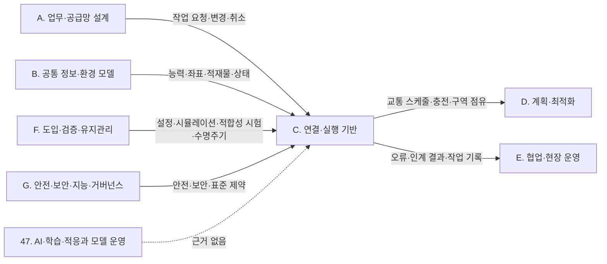

(너의 규칙은 시스템 프롬프트의 agents/shared-rules.md 와 agents/storyteller.md 이다. 아래는 이번 실행의 컨텍스트와 입력이다.)

## 실행 컨텍스트

- run_id: 2026-10-10-06
- date: 2026-10-10
- run_type: update (갱신)
- 대상: 20. 로봇·제조사 관제 연동 (F. 연동)
- 예산:
    - max_search_queries: 30
    - max_sources_per_run: 15
    - new_topic_pages: 1
    - page_updates: 2
    - max_retries: 2
- 환경 알림: web_fetch_available: true · fetch_mode: full
- 세부영역 반영 제안: 2건 — 트랙 실행이 이 영역 페이지에 반영하자고 제안한 내용(입력 data/area_reflection_proposals.json). 이번 실행의 조사·검증을 거쳐 해당 절에 반영을 검토한다(사양서 6.3 절차 9 '반영은 다음 해당 영역 실행에서')
- 언어: ko
- retry_count: 2
- max_retries: 2

## 입력

### runs/2026-10-10-06/target.json

```json
{
  "run_id": "2026-10-10-06",
  "date": "2026-10-10",
  "weekday": "Sat",
  "run_number": 166,
  "run_type": "update",
  "forced": true,
  "target": {
    "area_no": 20,
    "area_name": "20. 로봇·제조사 관제 연동",
    "category": "F. 연동",
    "category_letter": "F"
  },
  "topic": null,
  "track": null,
  "corrections": [],
  "budget": {
    "max_search_queries": 30,
    "max_sources_per_run": 15,
    "new_topic_pages": 1,
    "page_updates": 2,
    "max_retries": 2
  },
  "priority_reason": null,
  "priority_questions": [],
  "excluded_areas": [],
  "lifted_areas": [],
  "deferred": {
    "monthly_recheck": false,
    "weekly_review": false
  },
  "selection_rationale": "CLI 지정 run_type=update, area=20"
}
```

### runs/2026-10-10-06/research.json

```json
{
  "run_id": "2026-10-10-06",
  "date": "2026-10-10",
  "run_type": "update",
  "target": {
    "area_no": 20,
    "area_name": "20. 로봇·제조사 관제 연동",
    "category": "F. 연동"
  },
  "gaps": [
    "섹션 3. 왜 중요한가 — IO-AMRs 과제 문장(ref-258)이 원문 미열람이고 주관 기관·과제 단계(계획인지 완료인지)가 없음",
    "섹션 5. 적용 사례 (현장 유형 명시) — 물류창고 출하 시나리오 하나뿐이고 '수행 자원' 행이 추정이며 직접 제어·위임 비교 자료 없음(oq-031). 연동 위치와 제어 수준을 나눠 보는 기준, 상업 시설·전시 시연 사례 없음",
    "섹션 6. 대표 접근법과 기술 — 연결 단절 시 실행 의미와 상태 분리, 신호등 수준 연동의 정지 시간 전제·교착 시 사람 개입(oq-032), 상태·오류 변환의 실제 필드 매핑 사례(oq-033) 근거가 약함",
    "섹션 7. 관련 표준·프레임워크·오픈소스 — VDA 5050 3.0.0 발행일 미확인(oq-005), 공개 구현(free_fleet·ros_amr_interop·vda-5050-lib.js)의 판별 지원 범위와 Open-RMF 구역 기능의 개발 상태 미반영",
    "섹션 8. 대표 연구와 자료 — Lopes 외 논문(ref-136) 저자 미확인·120 ms 지표 명칭과 측정 조건 미확인, Franke 외(ref-1429) 원문 미열람·워크숍 구성 미기재",
    "섹션 10. 다른 연구영역과의 연결 — 21. 상호운용 표준·적합성(ISO 21423 단계), 47. AI·학습·적응과 모델 운영(MCP 연동)과의 연결 없음",
    "섹션 11. 열린 질문 — oq-005·oq-031·oq-032·oq-033 부분 근거 미반영",
    "정정 요청 없음"
  ],
  "research_questions": [
    "로봇을 하나씩 직접 움직일지, 제조사 관제에 맡길지, 어떤 방식으로 통신할지 어떻게 정할 것인가? [분류원문]",
    "oq-005 VDA 5050 3.0.0 의 발행일은 공식 자료에서 무엇으로 표시되는가? (섹션 7·11 겨냥)",
    "oq-032 제조사 관제가 일시정지·재개만 허용하는 신호등 수준 연동에서 정지·교착 처리의 전제는 무엇인가? (섹션 6·11 겨냥)",
    "oq-033 공개 구현은 로봇 상태·오류를 표준 필드로 어떻게 옮기는가? (섹션 6·11 겨냥)",
    "oq-031 직접 제어와 제조사 관제 위임을 고르는 기준이나 비교 자료가 있는가? (섹션 5·11 겨냥)",
    "기존 8절·3절 연구 자료(Lopes 외, Franke 외, IO-AMRs)의 서지·측정 조건·단계는 원문에서 무엇으로 확인되는가? (섹션 3·8 겨냥)",
    "VDA 5050·Open-RMF 공개 구현의 판별 지원 범위와 개발 중 기능은 무엇인가? (섹션 7 겨냥)"
  ],
  "findings": [
    {
      "id": "f1",
      "claim": "VDA 보도자료 'Version 3.0 of VDA 5050 released'의 본문 날짜는 2026-04-20(Berlin, April 20, 2026)이며, 보도자료 URL 은 260421 계열이다.",
      "tag": "사실",
      "source_ids": [
        "ref-032"
      ],
      "cross_checked": false,
      "confidence": "medium",
      "evidence_excerpt": "보도자료 제목 아래 \"Berlin\" · \"April 20, 2026\". URL 경로 260421_PM_VDA_5050_EN 의 숫자를 본문 날짜로 대체하지 않음. oq-005 관련",
      "as_of": "2026-10-10",
      "site_type": null,
      "flow_item": null
    },
    {
      "id": "f2",
      "claim": "VDA 발행물 카탈로그의 VDA 5050 Version 3.0.0 항목은 날짜를 2026-03-17(March 17, 2026)로 표시한다.",
      "tag": "사실",
      "source_ids": [
        "ref-1423"
      ],
      "cross_checked": false,
      "confidence": "medium",
      "evidence_excerpt": "카탈로그 제목 'VDA 5050' 아래 \"March 17, 2026\", VDA-Recommendations PDF 3,38 MB, 'VDA 5050 Version 3.0.0 Mobile Robot Communication Interface'. 카탈로그 표시일이 문서 발행일인지는 페이지에 설명 없음",
      "as_of": "2026-10-10",
      "site_type": null,
      "flow_item": null
    },
    {
      "id": "f3",
      "claim": "VDA 가 배포하는 VDA 5050 3.0.0 공식 PDF 의 표지는 판 표기를 'Version 3.0.0, March 2026'으로 적어 월 단위(2026-03)까지만 밝힌다.",
      "tag": "사실",
      "source_ids": [
        "ref-031"
      ],
      "cross_checked": false,
      "confidence": "medium",
      "evidence_excerpt": "공식 PDF(https://www.vda.de/dam/jcr%3A09f03b91-13e2-4db3-bf30-4f221710071b/VDA5050-V3.0.0-2025-03.pdf) 표지 \"Version 3.0.0, March 2026\". 파일 이름의 2025 는 발행연도로 쓰지 않음. ref-031 과 같은 명세의 PDF 판",
      "as_of": "2026-10-10",
      "site_type": null,
      "flow_item": null
    },
    {
      "id": "f4",
      "claim": "VDA 의 공식 자료 세 가지가 VDA 5050 3.0.0 의 날짜를 서로 다르게 표시한다: 카탈로그 2026-03-17, 보도자료 본문 2026-04-20, 명세 표지 2026-03.",
      "tag": "사실",
      "source_ids": [
        "ref-1423",
        "ref-032",
        "ref-031"
      ],
      "cross_checked": false,
      "confidence": "medium",
      "evidence_excerpt": "f1·f2·f3 의 원문 표시를 나란히 둔 것. 세 자료 모두 VDA 계열이라 독립 교차 확인이 아니다. 일자 차이의 원인(업무 단계)은 어느 자료에도 설명이 없다",
      "as_of": "2026-10-10",
      "site_type": null,
      "flow_item": null
    },
    {
      "id": "f5",
      "claim": "VDA 5050 3.0.0 의 발행일은 하나로 확정하지 않고 서지에는 판 표기의 월(2026-03)을 적으며, 카탈로그 표시일(2026-03-17)과 보도자료 날짜(2026-04-20)는 주석으로 함께 남기는 것이 맞아 보인다(oq-005 부분 답변).",
      "tag": "의견",
      "source_ids": [
        "ref-031",
        "ref-032",
        "ref-1423"
      ],
      "cross_checked": false,
      "confidence": "low",
      "evidence_excerpt": "f4 에서 도출. 저장소 릴리스 설명에 있다는 2026-03-19 와 게시 시각은 이번 환경에서 원문을 확인하지 못해 근거로 쓰지 않음",
      "as_of": "2026-10-10",
      "site_type": null,
      "flow_item": null
    },
    {
      "id": "f6",
      "claim": "VDA 5050 3.0.0 §4.1 은 로봇이 브로커와 연결이 끊겨도 받은 주문 정보를 유지하고 마지막으로 해제된 노드까지 주문을 수행한다고 정한다.",
      "tag": "사실",
      "source_ids": [
        "ref-031"
      ],
      "cross_checked": false,
      "confidence": "medium",
      "evidence_excerpt": "§4.1 Connection handling, security and QoS: \"it keeps all the order information and fulfills the order up to the last released node\". 대분류 F 개요(42↔32 연결)에 같은 번역어 '마지막으로 해제된 노드'로 이미 있음",
      "as_of": "2026-10-10",
      "site_type": null,
      "flow_item": null
    },
    {
      "id": "f7",
      "claim": "VDA 5050 3.0.0 은 주문에 딸린 동작·즉시 동작·구역 동작의 상태를 상태 메시지의 actionStates·instantActionStates·zoneActionStates 세 배열로 나눠 보고하게 하며, 구역 동작의 예정 상태 보고는 선택 사항이다.",
      "tag": "사실",
      "source_ids": [
        "ref-031"
      ],
      "cross_checked": false,
      "confidence": "medium",
      "evidence_excerpt": "§6.6.9 Action states, §7.8 state 메시지 표. actionStates 는 새 주문 수락 시 비우고, instantActionStates·zoneActionStates 는 clearInstantActions·clearZoneActions 실행 때까지 유지(목록이 길면 *_STATES_FULL 오류 가능). 구역 동작 지원 시 zoneActionStates 필수",
      "as_of": "2026-10-10",
      "site_type": null,
      "flow_item": null
    },
    {
      "id": "f8",
      "claim": "로봇이 단절 중에도 해제된 노드까지 주행을 이어 가므로(f6) ROP 어댑터는 연결 단절(connection 상태)을 곧 정지로 해석하지 말고, 연결 상태와 동작 실패(동작 상태 배열의 FAILED)를 별도 상태로 보존해 단절 시 실행 의미와 상태를 분리하는 것이 좋아 보인다.",
      "tag": "의견",
      "source_ids": [
        "ref-031"
      ],
      "cross_checked": false,
      "confidence": "low",
      "evidence_excerpt": "f6·f7 에서 도출한 설계 판단. 단절 뒤 복구 절차는 32. 예외 복구·재계획·업무 연속성 연결로 한정. 명세 3.0.0 범위",
      "as_of": "2026-10-10",
      "site_type": null,
      "flow_item": null
    },
    {
      "id": "f9",
      "claim": "Open-RMF EasyTrafficLight API(rmf_fleet_adapter 2.14.0)의 moving_from() 경고는 로봇이 다음 체크포인트에서 멈출 시간이 있을 때만, 곧 정지 명령의 통신 지연과 로봇 최대 감속을 감안해 호출하라고 하며, 이를 어기면 MovingError·WaitingError 가 나고 교통 흐름이 끊기거나 교착될 수 있다고 적는다.",
      "tag": "사실",
      "source_ids": [
        "ref-1424"
      ],
      "cross_checked": false,
      "confidence": "medium",
      "evidence_excerpt": "EasyTrafficLight.hpp \\warning: \"accounting for the network latency of sending out the stop command and the maximum deceleration of the robot\". API 계약의 전제이며 실험 수치가 아님",
      "as_of": "2026-10-10",
      "site_type": null,
      "flow_item": null
    },
    {
      "id": "f10",
      "claim": "같은 헤더의 Blocker 설명은 해결할 수 없는 충돌로 교착이 생기면 RMF 교통 협상 시스템이 충돌 참여자를 충분히 제어하지 못하므로 사람 개입이 필요할 수 있다고 적는다.",
      "tag": "사실",
      "source_ids": [
        "ref-1424"
      ],
      "cross_checked": false,
      "confidence": "medium",
      "evidence_excerpt": "deadlock_callback 에 넘기는 Blocker 클래스 주석: \"Human intervention may be required at this point, because the RMF traffic negotiation system does not have a high enough level of control\"",
      "as_of": "2026-10-10",
      "site_type": null,
      "flow_item": null
    },
    {
      "id": "f11",
      "claim": "신호등 수준으로 붙는 제조사 플릿의 연동 계약에는 정지 명령의 유무만이 아니라 정지 가능 시간(통신 지연·최대 감속)과 정지 확인 응답, 교착 시 사람 개입 경로를 함께 적는 것이 좋아 보이며, 제어 수준별 교통 성능을 같은 조건에서 비교한 자료는 여전히 찾지 못했다(oq-032 부분 근거).",
      "tag": "의견",
      "source_ids": [
        "ref-1424"
      ],
      "cross_checked": false,
      "confidence": "low",
      "evidence_excerpt": "f9·f10 에서 도출. 단일 프로젝트 API 문서 근거이며 제한 제어가 모든 교착을 해결한다는 보장으로 넓히지 않음",
      "as_of": "2026-10-10",
      "site_type": null,
      "flow_item": null
    },
    {
      "id": "f12",
      "claim": "신호등 연동을 평가·재현할 때는 쓰는 rmf_fleet_adapter 패키지 판을 함께 기록하는 것이 좋아 보인다. 2.14.0(2026-09-26) 변경 이력에 EasyTrafficLight 의 플릿 상태 발행 수정(#525)과 누적 지연 계산 수정(#524)이 들어 있기 때문이다.",
      "tag": "의견",
      "source_ids": [
        "ref-1398"
      ],
      "cross_checked": false,
      "confidence": "low",
      "evidence_excerpt": "CHANGELOG 2.14.0: \"Fix EasyTrafficLight publish fleet state\"(#525), \"Fix cumulative delay calculation in EasyTrafficLight\"(#524). 이 수정 사실은 27. 다중 로봇 경로·교통 관리 — MAPF 주제 페이지에 이미 있어 영역 20 에는 평가 관점만 더함. 수정 이력은 성능 향상을 증명하지 않음",
      "as_of": "2026-10-10",
      "site_type": null,
      "flow_item": null
    },
    {
      "id": "f13",
      "claim": "InOrbit 개발자 문서는 InOrbit 이 제어하는 로봇 플릿을 RMF core 에 잇는 오픈소스 전체 제어(full control) 플릿 어댑터를 제공해 여러 제조사 로봇의 중앙 교통 조정을 가능하게 한다고 밝힌다.",
      "tag": "추정",
      "source_ids": [
        "ref-1029"
      ],
      "cross_checked": false,
      "confidence": "low",
      "evidence_excerpt": "벤더 주장: Open-RMF 절 \"InOrbit provides an open source full control fleet adapter for RMF\". 제조사 관제 API 경유 전체 제어 조건은 5절 '제약' 행(ref-251)에 이미 있어 보강 근거로만 씀 (발행일 미확인, 확인일 기준)",
      "as_of": "2026-10-10",
      "site_type": null,
      "flow_item": null,
      "vendor_claim": true
    },
    {
      "id": "f14",
      "claim": "연동 위치(제조사 관제 API 를 거치는지, 로봇에 직접 붙는지)와 제어 수준(전체 제어인지)은 따로 판단해 별도 항목으로 기록하고, 제어 권한은 경로 지정·교체, 정지, 진행 상태 반환으로 나눠 적는 것이 좋아 보인다(oq-031 판단 기준 보강).",
      "tag": "의견",
      "source_ids": [
        "ref-251",
        "ref-1029"
      ],
      "cross_checked": false,
      "confidence": "low",
      "evidence_excerpt": "Open-RMF 책은 전체 제어 조건을 '제조사 관제가 명시 경로를 지정·중단·교체할 수 있고 위치를 갱신'으로 둠(\"fleet manager allows us to specify explicit paths\"). InOrbit 문서는 관제 플랫폼 경유 전체 제어 어댑터를 밝힘. 국내 물류센터 비중·비용·처리량 비교는 미확인",
      "as_of": "2026-10-10",
      "site_type": null,
      "flow_item": null
    },
    {
      "id": "f15",
      "claim": "Lopes 외(Applied Sciences 2025, 15(13), 7235, 2025-06-27) 논문은 본문 §6.2 에서 로봇 상태의 평균 갱신 간격(average update interval)을 약 120 ms, 사용자 화면 지연을 1초 미만으로 보고하며, 초록은 같은 값을 'average latency'로 표현한다.",
      "tag": "사실",
      "source_ids": [
        "ref-136"
      ],
      "cross_checked": false,
      "confidence": "medium",
      "evidence_excerpt": "p.21 §6.2 \"The average update interval for the robot status was approximately 120 ms\". p.1 초록 \"average latency of 120 ms\". 측정 지점·타임스탬프 정의는 논문에 없음",
      "as_of": "2026-10-10",
      "site_type": null,
      "flow_item": null
    },
    {
      "id": "f16",
      "claim": "같은 논문은 실험 시험 중 AMR·AGV 를 포함해 최대 20대를 화면·서버 성능의 큰 저하 없이 동시에 감시할 수 있었고 시험 기간 서버 가동률이 99.5% 이상이었다고 보고한다.",
      "tag": "사실",
      "source_ids": [
        "ref-136"
      ],
      "cross_checked": false,
      "confidence": "medium",
      "evidence_excerpt": "p.21 §6.2 \"simultaneously monitor up to 20 robots, including AMRs ... and AGVs\". 20대의 기종 구성·시험 기간·표본 수는 밝히지 않음. 감시·감독 중심 결과이며 주행 제어 성능이 아님",
      "as_of": "2026-10-10",
      "site_type": null,
      "flow_item": null
    },
    {
      "id": "f17",
      "claim": "같은 논문의 §5.3(로봇 지도 작성·연결) 시험은 코임브라 공학연구소 기계공학과의 약 500 m² 실험실에서 수행됐으며, 120 ms·20대 결과를 어디서 측정했는지는 논문에 명시돼 있지 않다.",
      "tag": "사실",
      "source_ids": [
        "ref-136"
      ],
      "cross_checked": false,
      "confidence": "medium",
      "evidence_excerpt": "p.12 §5.3 Mapping and Interconnection of Robots: \"within a laboratory covering an area of approximately 500 m2\", 시제품이 설치될 공장 조건을 대략 모사. 기존 위키의 ref-136 저자 '미확인'은 17명 저자로 정정",
      "as_of": "2026-10-10",
      "site_type": null,
      "flow_item": null
    },
    {
      "id": "f18",
      "claim": "Lopes 외의 결과는 자동차 공장 적용을 목표로 한 실험실 연구의 감시 성능이므로, 자동차 공장의 장기 운영 지연이나 20대 동시 주행 제어 성능으로 인용하지 않고, 기존 '작업 상태 갱신 평균 지연 120 ms' 표현은 '로봇 상태 평균 갱신 간격 약 120 ms'로 고치는 것이 맞아 보인다.",
      "tag": "의견",
      "source_ids": [
        "ref-136"
      ],
      "cross_checked": false,
      "confidence": "low",
      "evidence_excerpt": "f15~f17 에서 도출. 단일 연구팀 결과이며 독립 재현 미확인",
      "as_of": "2026-10-10",
      "site_type": null,
      "flow_item": null
    },
    {
      "id": "f19",
      "claim": "Franke 외(Logistics Journal: Proceedings No.19, 2023-10-11) 연구는 2023년 봄 소프트웨어 기업 2곳·하드웨어 제조사 3곳·창고 사용자 1곳 등 여섯 회사가 참여한 워크숍으로 VDA 5050 개념에 기반한 새 표준 인터페이스 요구를 수집했다.",
      "tag": "사실",
      "source_ids": [
        "ref-1429"
      ],
      "cross_checked": false,
      "confidence": "medium",
      "evidence_excerpt": "p.5 §3.1: \"two software enterprises, three hardware manufacturers and one end-user from warehousing\", \"six participating\", \"in spring 2023\". DOI 10.2195/lj_proc_franke_en_202310_01",
      "as_of": "2026-10-10",
      "site_type": null,
      "flow_item": null
    },
    {
      "id": "f20",
      "claim": "Franke 외 연구는 연동 요구 분석 자료로 분류하고, 실물 플릿을 비교한 실험이 아니므로 직접 제어와 제조사 관제 위임의 처리량 비교 근거로 쓰지 않는 것이 맞아 보인다.",
      "tag": "의견",
      "source_ids": [
        "ref-1429"
      ],
      "cross_checked": false,
      "confidence": "low",
      "evidence_excerpt": "f19 에서 도출. 워크숍 기반 요구 수집 연구. 기존 8절의 '주변 설비 인터페이스 미포함' 문장은 반복하지 않음",
      "as_of": "2026-10-10",
      "site_type": null,
      "flow_item": null
    },
    {
      "id": "f21",
      "claim": "ARM Institute 의 IO-AMRs 과제 소개는 주관 기관을 Siemens Technology 로, 협력 기관을 FedEx·Yaskawa Motoman·Waypoint Robotics·University of Memphis 로 적는다.",
      "tag": "사실",
      "source_ids": [
        "ref-258"
      ],
      "cross_checked": false,
      "confidence": "medium",
      "evidence_excerpt": "Participants: \"Lead: Siemens Technology\", \"Partners: FedEx, Yaskawa Motoman, Waypoint Robotics, University of Memphis\" (발행일 미확인, 확인일 기준)",
      "as_of": "2026-10-10",
      "site_type": null,
      "flow_item": null
    },
    {
      "id": "f22",
      "claim": "IO-AMRs 과제 소개는 다중 지도 관리자·연결 계층·전역 플릿 관리자를 이전 ARM 지원 과제의 산출물을 활용해 만들 '계획'으로 서술해, 이 과제가 소개 시점에 계획 단계였음을 보여 준다.",
      "tag": "사실",
      "source_ids": [
        "ref-258"
      ],
      "cross_checked": false,
      "confidence": "medium",
      "evidence_excerpt": "Technical Approach: \"will leverage outputs from a prior ARM-funded project to create a muti-map manager[원문 철자], connectivity layer, and global fleet manager\". 운영자 면담으로 인력·기술 전환 계획도 만든다고 함. 완료일·공개 코드·실물 결과는 페이지에 없음 (발행일 미확인, 확인일 기준)",
      "as_of": "2026-10-10",
      "site_type": null,
      "flow_item": null
    },
    {
      "id": "f23",
      "claim": "IO-AMRs 소개는 과제 목표의 근거로만 쓰고 달성한 운영 성과의 근거로 쓰지 않으며, 3절의 목표 문장에는 주관 기관과 계획 단계라는 범위만 보태는 것이 맞아 보인다.",
      "tag": "의견",
      "source_ids": [
        "ref-258"
      ],
      "cross_checked": false,
      "confidence": "low",
      "evidence_excerpt": "f21·f22 에서 도출. 과제 발주 기관의 1차 자료이나 독립 성능 평가가 아님",
      "as_of": "2026-10-10",
      "site_type": null,
      "flow_item": null
    },
    {
      "id": "f24",
      "claim": "Open-RMF rmf_ros2 PR #516 'Add GoToZone feature'는 구역 이름을 받아 구역 안 경유점을 예약하는 기능을 제안하며 2026-10-10 기준 미병합 상태인 것으로 보이나, 이번 환경에서 PR 원문과 상태를 직접 확인하지 못했다.",
      "tag": "추정",
      "source_ids": [
        "ref-1425"
      ],
      "cross_checked": false,
      "confidence": "low",
      "evidence_excerpt": "외부 조사 메모의 PR 설명('zone booking system')·상태 Open·merged_at null 기록에 의존. GitHub API 접근이 막혀 대조 실패",
      "as_of": "2026-10-10",
      "site_type": null,
      "flow_item": null,
      "source_unopened": true
    },
    {
      "id": "f25",
      "claim": "Open Robotics Discourse 의 2026-05-04 Interop SIG 공지는 CHART 가 RMF-2.0 프로젝트로 개발한 새 기능을 단계적으로 공개하며 첫 단계가 시설 '구역(zones)' 관리 기능이고, 공지 시점에 이 기능이 검토 중(currently undergoing review)이라고 밝힌다.",
      "tag": "사실",
      "source_ids": [
        "ref-1426"
      ],
      "cross_checked": false,
      "confidence": "medium",
      "evidence_excerpt": "공지(2026-05-04 게시, 확인일 2026-10-10): \"this new zone feature which is currently undergoing review\". 발표 예시로 환자 중심 목적지 선택과 승강기 공유를 듦. 2026-07-08 녹화 링크 게시. 병합 여부는 이 공지로 알 수 없음",
      "as_of": "2026-10-10",
      "site_type": null,
      "flow_item": null
    },
    {
      "id": "f26",
      "claim": "어댑터 기능 목록을 정리할 때는 배포판(태그)에 든 기능과 검토 중인 기능(예: Open-RMF 구역 기능)을 구분해 적는 것이 좋아 보인다.",
      "tag": "의견",
      "source_ids": [
        "ref-1426",
        "ref-1425"
      ],
      "cross_checked": false,
      "confidence": "low",
      "evidence_excerpt": "f24·f25 에서 도출. CHART 의 하드웨어 시험 주장을 업스트림 배포판 검증으로 바꾸지 않음",
      "as_of": "2026-10-10",
      "site_type": null,
      "flow_item": null
    },
    {
      "id": "f27",
      "claim": "ros_amr_interop 1.1.1 의 MassRobotics 송신 예제 설정은 ROS 토픽 /we_b_robots/mode(std_msgs/String)를 operationalState 에, /troubleshooting/errorcodes 를 errorCodes 에 연결하고, 오류 코드는 쉼표로 구분한 문자열로 받아 MassRobotics 표준이 요구하는 배열로 바꾼다고 주석에 적는다.",
      "tag": "사실",
      "source_ids": [
        "ref-255"
      ],
      "cross_checked": false,
      "confidence": "medium",
      "evidence_excerpt": "massrobotics_amr_sender_py/params/sample_config.yaml(태그 1.1.1): operationalState.valueFrom.rosTopic, errorCodes.valueFrom.rosTopic, 주석 \"Error codes are expected to be comma-separated strings\" (발행일 미확인, 확인일 기준)",
      "as_of": "2026-10-10",
      "site_type": null,
      "flow_item": null
    },
    {
      "id": "f28",
      "claim": "MassRobotics AMR 상호운용 표준 1.0 태그의 JSON 스키마는 상태 보고(statusReport)의 필수 필드를 uuid·timestamp·operationalState·location 넷으로 둔다.",
      "tag": "사실",
      "source_ids": [
        "ref-230"
      ],
      "cross_checked": false,
      "confidence": "medium",
      "evidence_excerpt": "AMR_Interop_Standard.json(태그 1.0) statusReport.required = [uuid, timestamp, operationalState, location]. errorCodes 는 필수가 아님 (발행일 미확인, 확인일 기준)",
      "as_of": "2026-10-10",
      "site_type": null,
      "flow_item": null
    },
    {
      "id": "f29",
      "claim": "ros_amr_interop 예제는 ROS→MassRobotics 한 방향의 운용 상태·오류 매핑 사례일 뿐이므로 Open-RMF·VDA 5050·MassRobotics 세 체계의 공통 상태·오류 어휘 표준으로 일반화하지 않는 것이 맞아 보이며, 세 체계를 함께 다루는 표준 매핑은 이번에도 확인하지 못했다(oq-033 부분 근거).",
      "tag": "의견",
      "source_ids": [
        "ref-255",
        "ref-230"
      ],
      "cross_checked": false,
      "confidence": "low",
      "evidence_excerpt": "f27·f28 에서 도출. 1.1.1·1.0 은 고정된 과거 태그이며 최신 지원 범위를 뜻하지 않음",
      "as_of": "2026-10-10",
      "site_type": null,
      "flow_item": null
    },
    {
      "id": "f30",
      "claim": "free_fleet 1.3.0 태그의 README 는 메시지를 CycloneDDS 의 dds_idlc 로 FleetMessages.idl 에서 생성한다고 설명하고, ROS 1·ROS 2 양쪽의 cyclonedds 판을 같게 맞춰야 한다고 권고하며, DDS 를 쓰지 않는 새 판을 준비 중이라고 적는다.",
      "tag": "사실",
      "source_ids": [
        "ref-256"
      ],
      "cross_checked": false,
      "confidence": "medium",
      "evidence_excerpt": "README(태그 1.3.0) Message Generation: \"dds_idlc from CycloneDDS\". Prerequisites: \"the version of cyclonedds used/built should be the same\". 태그 커밋일은 확인하지 못해 발행일 미확인 (발행일 미확인, 확인일 기준)",
      "as_of": "2026-10-10",
      "site_type": null,
      "flow_item": null
    },
    {
      "id": "f31",
      "claim": "위키의 free_fleet 설명(현재 기본 브랜치의 zenoh 기반 Nav2·Nav1 어댑터)과 과거 태그 1.3.0 의 CycloneDDS 기반 설치 절차는 섞지 않고 판을 밝혀 적는 것이 좋아 보인다.",
      "tag": "의견",
      "source_ids": [
        "ref-256"
      ],
      "cross_checked": false,
      "confidence": "low",
      "evidence_excerpt": "f30 과 기존 7절(ref-256 기본 브랜치 README, zenoh) 비교에서 도출. zenoh 판에 대응하는 배포 태그는 확인하지 못함",
      "as_of": "2026-10-10",
      "site_type": null,
      "flow_item": null
    },
    {
      "id": "f32",
      "claim": "vda-5050-lib.js 의 v1.7.0(2026-04-29) 변경 이력은 VDA 5050 3.0 지원을 추가하며 새 Topic.ZoneSet·Topic.Responses 토픽, VdaVersion 의 '3.0.0', 3.0 용 사전 컴파일 검증기와 타입을 넣었다고 적는다.",
      "tag": "사실",
      "source_ids": [
        "ref-742"
      ],
      "cross_checked": false,
      "confidence": "medium",
      "evidence_excerpt": "CHANGELOG.md 1.7.0 (2026-04-29) 'VDA5050 V3.0 Support': \"new Topic.ZoneSet and Topic.Responses topics, extended VdaVersion type with \\\"3.0.0\\\", V3.0 pre-compiled validators\"",
      "as_of": "2026-10-10",
      "site_type": null,
      "flow_item": null
    },
    {
      "id": "f33",
      "claim": "어댑터에 VDA 5050 라이브러리를 쓸 때는 라이브러리 판과 지원 규격 판을 함께 고정하는 것이 좋아 보이며, 라이브러리가 선언한 3.0 지원은 제조사 로봇과의 적합성·실물 호환성 검증으로 세지 않는 것이 맞아 보인다.",
      "tag": "의견",
      "source_ids": [
        "ref-742"
      ],
      "cross_checked": false,
      "confidence": "low",
      "evidence_excerpt": "f32 에서 도출. 규격 원문과 별개 프로젝트의 구현 이력",
      "as_of": "2026-10-10",
      "site_type": null,
      "flow_item": null
    },
    {
      "id": "f34",
      "claim": "InOrbit 은 Automate 2026 시연에서 Ati Robotics·Kärcher·Neura Robotics·Omron·Peer Robotics·Quasi Robotics·Unitree 7개사 로봇이 공유 공간에서 함께 임무를 수행하고, Slamcore·Guide Robotics 의 실시간 위치 추적(RTLS)으로 수동 차량까지 묶어 InOrbit 을 포함해 10개사가 협업했다고 밝힌다.",
      "tag": "추정",
      "source_ids": [
        "ref-1427"
      ],
      "cross_checked": false,
      "confidence": "low",
      "evidence_excerpt": "벤더 주장: \"Robots from Ati Robotics, Kärcher, Neura Robotics, Omron, Peer Robotics, Quasi Robotics, and Unitree ... execute complex missions together\", \"ten companies in total, including InOrbit.AI\". 현장 유형은 전시 시연 (발행일 미확인, 확인일 기준)",
      "as_of": "2026-10-10",
      "site_type": "기타",
      "flow_item": null,
      "vendor_claim": true
    },
    {
      "id": "f35",
      "claim": "Automate 2026 시연의 '10개사'는 참여 기업 수(로봇 7·위치 추적 2·InOrbit 1)이지 로봇 대수나 AMR 제조사 수가 아니므로, 상용 운영 사례가 아닌 전시 시연으로 분류하는 것이 맞아 보인다.",
      "tag": "의견",
      "source_ids": [
        "ref-1427"
      ],
      "cross_checked": false,
      "confidence": "low",
      "evidence_excerpt": "f34 에서 도출. 로봇 대수·성능·가동률·실패 기록은 페이지에 없음",
      "as_of": "2026-10-10",
      "site_type": "기타",
      "flow_item": null
    },
    {
      "id": "f36",
      "claim": "카카오모빌리티는 2024년 로보티즈와 업무협약을 맺고 신라스테이 서초·반얀트리 클럽 앤 스파 서울 등 호텔에 상용 로봇 배송 서비스를 적용해 왔다고 발표했다(2026-03-16).",
      "tag": "추정",
      "source_ids": [
        "ref-1428",
        "ref-1200"
      ],
      "cross_checked": false,
      "confidence": "low",
      "evidence_excerpt": "벤더 주장: 보도자료 \"신라스테이 서초, 반얀트리 클럽 앤 스파 서울 등 프리미엄 호텔에서 상용 로봇 배송 서비스를 적용\". 아시아경제 기사(ref-1200)는 보도자료를 옮긴 것이라 독립 확인 아님. 2. 사용 사례·요구·책임 범위에 같은 사례 있음",
      "as_of": "2026-10-10",
      "site_type": "상업 시설",
      "flow_item": null,
      "vendor_claim": true
    },
    {
      "id": "f37",
      "claim": "카카오모빌리티–로보티즈 호텔 사례는 국내 플랫폼–로봇 제조사 연동 사례로 분류하되, 제어 위임 방식·API·로봇 대수가 공개되지 않아 한 현장에서 여러 제조사 플릿을 함께 운영한 증거나 직접 제어·위임 비교 근거(oq-031)로는 쓰지 않는 것이 맞아 보인다.",
      "tag": "의견",
      "source_ids": [
        "ref-1428",
        "ref-1200"
      ],
      "cross_checked": false,
      "confidence": "low",
      "evidence_excerpt": "f36 에서 도출. 가동률 8배·배송 성공률 100% 는 분모·기간 미확인이라 새로 넣지 않음. 다수 제조사 협력은 사업 계획으로만 언급됨",
      "as_of": "2026-10-10",
      "site_type": "상업 시설",
      "flow_item": null
    },
    {
      "id": "f38",
      "claim": "연계 대상: ISO 21423(산업용 이동로봇 통신·상호운용) 공식 카탈로그가 2026-10-10 기준 '60.00 Under publication' 단계를 표시한다는 외부 메모의 기록이 있으나, iso.org 가 403 으로 막혀 이번에 직접 확인하지 못했다.",
      "tag": "추정",
      "source_ids": [
        "ref-159"
      ],
      "cross_checked": false,
      "confidence": "low",
      "evidence_excerpt": "외부 조사 메모 기록에 의존(카탈로그 Life cycle 60.00). 규격 본문 미열람. 공통 좌표계 등 내용은 oq-027(21. 상호운용 표준·적합성)에서 다룸",
      "as_of": "2026-10-10",
      "site_type": null,
      "flow_item": null,
      "source_unopened": true
    },
    {
      "id": "f39",
      "claim": "Open Robotics Discourse 의 Interop SIG 2026-07-02 세션 공지는 Open-RMF REST API 를 언어 모델이 호출할 수 있는 MCP 도구로 노출하는 서버와, 영어 명령을 다단계 RMF 임무로 바꿔 NVIDIA Isaac Sim 창고의 로봇이 Nav2 로 실행하는 에이전트(Nayantra)를 발표한다고 알린다.",
      "tag": "사실",
      "source_ids": [
        "ref-854"
      ],
      "cross_checked": false,
      "confidence": "medium",
      "evidence_excerpt": "2026-06-25 공지: \"an MCP server that exposes the Open-RMF REST API as LLM-callable tools\", \"executed by a robot in an NVIDIA Isaac Sim warehouse\". 영상 전체·실물 대수는 확인하지 않음",
      "as_of": "2026-10-10",
      "site_type": null,
      "flow_item": null
    },
    {
      "id": "f40",
      "claim": "MCP 로 Open-RMF REST API 를 노출하는 시연은 47. AI·학습·적응과 모델 운영(및 12. 채팅으로 업무 지시·오케스트레이션)과의 연결 지점으로 제안할 만하나, 시뮬레이션 창고 시연이므로 실물 다사업자 플릿의 안정성 근거로 쓰지 않는 것이 맞아 보인다.",
      "tag": "의견",
      "source_ids": [
        "ref-854"
      ],
      "cross_checked": false,
      "confidence": "low",
      "evidence_excerpt": "f39 에서 도출. 승인 관문 위치는 기존 oq-141 이 다룸. 코드 태그·실패 처리 시험은 확인하지 않음",
      "as_of": "2026-10-10",
      "site_type": null,
      "flow_item": null
    }
  ],
  "sources": [
    {
      "id": "ref-031",
      "org": "VDA / VDMA (VDA5050 GitHub)",
      "title": "VDA5050/VDA5050_EN.md — Official Specification document for the VDA 5050",
      "published": null,
      "url": "https://github.com/VDA5050/VDA5050/blob/main/VDA5050_EN.md",
      "type": "표준",
      "reliability": "high",
      "accessed": "2026-10-10",
      "summary": "VDA 5050 3.0.0 명세 원문. 이번에는 3.0.0 태그판의 §4.1(단절 시 마지막으로 해제된 노드까지 수행)·§6.6.9·§7.8(세 동작 상태 배열)을 대조했고, VDA 공식 PDF 표지의 판 표기 'Version 3.0.0, March 2026'을 확인했다.",
      "fetched": true,
      "fetched_via": "github_raw",
      "fetch_url": "https://raw.githubusercontent.com/VDA5050/VDA5050/3.0.0/VDA5050_EN.md",
      "source_unopened": false
    },
    {
      "id": "ref-032",
      "org": "VDA(Verband der Automobilindustrie)",
      "title": "Version 3.0 of VDA 5050 released",
      "published": "2026-04-20",
      "url": "https://www.vda.de/en/press/press-releases/2026/260421_PM_VDA_5050_EN",
      "type": "표준",
      "reliability": "medium",
      "accessed": "2026-10-10",
      "summary": "VDA 5050 3.0 판 공개를 알리는 VDA 보도자료. 본문 날짜는 'Berlin, April 20, 2026'이다(URL 은 260421 계열).",
      "fetched": true,
      "fetched_via": "webfetch",
      "fetch_url": null,
      "source_unopened": false
    },
    {
      "id": "ref-1423",
      "org": "VDA(Verband der Automobilindustrie)",
      "title": "VDA 5050",
      "published": "2026-03-17",
      "url": "https://www.vda.de/en/news/publications/publication/vda-5050",
      "type": "표준",
      "reliability": "medium",
      "accessed": "2026-10-10",
      "summary": "VDA 발행물 카탈로그의 VDA 5050 Version 3.0.0(Interface for the Communication between Mobile Robots and a Fleet Control) 항목. 표시 날짜는 2026-03-17이며 PDF(3.38 MB) 내려받기를 제공한다. 발행일은 카탈로그 표시일 기준이다.",
      "fetched": true,
      "fetched_via": "webfetch",
      "fetch_url": null,
      "source_unopened": false
    },
    {
      "id": "ref-251",
      "org": "Open Robotics",
      "title": "Mobile Robot Fleets (integration_fleets) - Programming Multiple Robots with ROS 2",
      "published": null,
      "url": "https://osrf.github.io/ros2multirobotbook/integration_fleets.html",
      "type": "오픈소스 문서",
      "reliability": "high",
      "accessed": "2026-10-10",
      "summary": "Open-RMF 책의 플릿 통합 장. 전체 제어·신호등·읽기 전용 수준과, 전체 제어에 필요한 조건(제조사 관제가 명시 경로를 지정·중단·교체)을 설명한다.",
      "fetched": true,
      "fetched_via": "webfetch",
      "fetch_url": null,
      "source_unopened": false
    },
    {
      "id": "ref-1029",
      "org": "InOrbit",
      "title": "Contents — InOrbit Developer Portal",
      "published": null,
      "url": "https://developer.inorbit.ai/docs",
      "type": "벤더 문서",
      "reliability": "medium",
      "accessed": "2026-10-10",
      "summary": "로봇 운영 플랫폼의 API·SDK·커넥터를 설명하는 개발자 문서. 이번에는 Open-RMF 절의 오픈소스 전체 제어 플릿 어댑터 언급을 확인했다.",
      "fetched": true,
      "fetched_via": "webfetch",
      "fetch_url": null,
      "source_unopened": false
    },
    {
      "id": "ref-1424",
      "org": "Open Robotics (open-rmf)",
      "title": "rmf_ros2 — rmf_fleet_adapter/include/rmf_fleet_adapter/agv/EasyTrafficLight.hpp (2.14.0)",
      "published": "2026-09-26",
      "url": "https://github.com/open-rmf/rmf_ros2/blob/2.14.0/rmf_fleet_adapter/include/rmf_fleet_adapter/agv/EasyTrafficLight.hpp",
      "type": "오픈소스 문서",
      "reliability": "high",
      "accessed": "2026-10-10",
      "summary": "Open-RMF 신호등 수준 연동 API 헤더(2.14.0 태그). moving_from() 호출 전제(정지 시간·통신 지연·최대 감속)와 교착 시 사람 개입 가능성(Blocker)을 적는다. 발행일은 2.14.0 패키지판 날짜다.",
      "fetched": true,
      "fetched_via": "github_raw",
      "fetch_url": "https://raw.githubusercontent.com/open-rmf/rmf_ros2/2.14.0/rmf_fleet_adapter/include/rmf_fleet_adapter/agv/EasyTrafficLight.hpp",
      "source_unopened": false
    },
    {
      "id": "ref-1398",
      "org": "Open Robotics (open-rmf)",
      "title": "rmf_ros2 — rmf_fleet_adapter/CHANGELOG.rst (2.14.0)",
      "published": "2026-09-26",
      "url": "https://github.com/open-rmf/rmf_ros2/blob/2.14.0/rmf_fleet_adapter/CHANGELOG.rst",
      "type": "오픈소스 문서",
      "reliability": "high",
      "accessed": "2026-10-10",
      "summary": "rmf_fleet_adapter 패키지 변경 이력(2.14.0 태그). 2.14.0(2026-09-26)에 EasyTrafficLight 플릿 상태 발행 수정(#525)과 누적 지연 계산 수정(#524)이 기록돼 있다.",
      "fetched": true,
      "fetched_via": "github_raw",
      "fetch_url": "https://raw.githubusercontent.com/open-rmf/rmf_ros2/2.14.0/rmf_fleet_adapter/CHANGELOG.rst",
      "source_unopened": false
    },
    {
      "id": "ref-136",
      "org": "Lopes, D., Pereira, T., Gonçalves, A. 외 17명 (Polytechnic University of Coimbra 등; Applied Sciences, MDPI)",
      "title": "Integrated Fleet Management of Mobile Robots for Enhancing Industrial Efficiency: A Case Study on Interoperability in Multi-Brand Environments Within the Automotive Sector",
      "published": "2025-06-27",
      "url": "https://www.mdpi.com/2076-3417/15/13/7235",
      "type": "논문",
      "reliability": "medium",
      "accessed": "2026-10-10",
      "summary": "Applied Sciences 15(13) 7235, DOI 10.3390/app15137235. 자동차 공장 적용을 목표로 여러 제조사 AGV·AMR 을 하나의 웹 플랫폼으로 감시하는 플릿 관리 소프트웨어를 실험실에서 시험했다. 기존 ref-136 저자 '미확인' 정정(출판 PDF 첫 원문 열람, 저자 17명 확인).",
      "fetched": true,
      "fetched_via": "webfetch",
      "fetch_url": "https://mdpi-res.com/d_attachment/applsci/applsci-15-07235/article_deploy/applsci-15-07235.pdf",
      "source_unopened": false
    },
    {
      "id": "ref-1429",
      "org": "Franke, S., Lünsch, D., Jost, J., & Roidl, M.",
      "title": "Identification of requirements and opportunities for new types of standardized interfaces for AGV systems based on the VDA 5050 concept",
      "published": "2023-10-11",
      "url": "https://proc.logistics-journal.de/article/download/1067/1036/8465",
      "type": "논문",
      "reliability": "medium",
      "accessed": "2026-10-10",
      "summary": "Logistics Journal: Proceedings No.19, DOI 10.2195/lj_proc_franke_en_202310_01. 2023년 봄 여섯 회사 워크숍으로 VDA 5050 개념 기반 새 표준 인터페이스 요구를 정리했다. 기존 ResearchGate URL 대신 학술지 원문 PDF 를 처음 열람했다.",
      "fetched": true,
      "fetched_via": "webfetch",
      "fetch_url": null,
      "source_unopened": false
    },
    {
      "id": "ref-258",
      "org": "ARM Institute",
      "title": "Interoperability and Orchestration of Autonomous Mobile Robots (IO-AMRs)",
      "published": null,
      "url": "https://arminstitute.org/projects/interoperability-and-orchestration-of-autonomous-mobile-robots-io-amrs/",
      "type": "정부·연구기관",
      "reliability": "medium",
      "accessed": "2026-10-10",
      "summary": "ARM Institute 과제 소개. 주관 기관 Siemens Technology, 협력 기관 FedEx·Yaskawa Motoman·Waypoint Robotics·University of Memphis 이며 다중 지도 관리자·연결 계층·전역 플릿 관리자를 만들 계획을 적는다. 이번이 첫 원문 열람이다.",
      "fetched": true,
      "fetched_via": "webfetch",
      "fetch_url": null,
      "source_unopened": false
    },
    {
      "id": "ref-1425",
      "org": "chart-singapore / CHART (open-rmf/rmf_ros2 GitHub)",
      "title": "Add GoToZone feature (rmf_ros2 pull request #516)",
      "published": null,
      "url": "https://github.com/open-rmf/rmf_ros2/pull/516",
      "type": "오픈소스 문서",
      "reliability": "medium",
      "accessed": "2026-10-10",
      "summary": "원문 미열람. 구역 이름을 받아 구역 안 경유점을 예약하는 GoToZone 기능을 제안하는 풀 리퀘스트로 외부 조사 메모가 미병합이라 기록했으나, 이번 환경에서 GitHub 접근이 막혀 상태를 확인하지 못했다.",
      "fetched": false,
      "fetched_via": null,
      "fetch_url": null,
      "source_unopened": true
    },
    {
      "id": "ref-1426",
      "org": "Open Robotics Discourse (OSRA Interop SIG)",
      "title": "Interop SIG, 7 May 2026: Open-RMF Upcoming Zone Feature",
      "published": "2026-05-04",
      "url": "https://discourse.openrobotics.org/t/interop-sig-7-may-2026-open-rmf-upcoming-zone-feature/54490",
      "type": "오픈소스 문서",
      "reliability": "medium",
      "accessed": "2026-10-10",
      "summary": "CHART 가 RMF-2.0 프로젝트로 개발한 Open-RMF 구역(zones) 기능을 소개하는 2026-05-07 SIG 세션 공지. 공지 시점에 기능이 검토 중이라고 밝히고, 2026-07-08 녹화 링크가 덧붙었다.",
      "fetched": true,
      "fetched_via": "webfetch",
      "fetch_url": "https://discourse.openrobotics.org/t/54490.json",
      "source_unopened": false
    },
    {
      "id": "ref-255",
      "org": "InOrbit (inorbit-ai GitHub)",
      "title": "ros_amr_interop — README (ROS packages for AMR interoperability: VDA5050 connector, MassRobotics AMR sender)",
      "published": null,
      "url": "https://github.com/inorbit-ai/ros_amr_interop",
      "type": "오픈소스 문서",
      "reliability": "high",
      "accessed": "2026-10-10",
      "summary": "InOrbit 의 AMR 상호운용 ROS 패키지 저장소. 이번에는 1.1.1 태그의 MassRobotics 송신 예제 설정(operationalState·errorCodes 토픽 매핑)을 확인했다.",
      "fetched": true,
      "fetched_via": "github_raw",
      "fetch_url": "https://raw.githubusercontent.com/inorbit-ai/ros_amr_interop/1.1.1/massrobotics_amr_sender_py/params/sample_config.yaml",
      "source_unopened": false
    },
    {
      "id": "ref-230",
      "org": "MassRobotics",
      "title": "MassRobotics-AMR/AMR_Interop_Standard — AMR_Interop_Standard.json",
      "published": null,
      "url": "https://github.com/MassRobotics-AMR/AMR_Interop_Standard/blob/main/AMR_Interop_Standard.json",
      "type": "표준",
      "reliability": "high",
      "accessed": "2026-10-10",
      "summary": "MassRobotics AMR 상호운용 표준 JSON 스키마. 이번에는 1.0 태그에서 statusReport 필수 필드(uuid·timestamp·operationalState·location)를 확인했다.",
      "fetched": true,
      "fetched_via": "github_raw",
      "fetch_url": "https://raw.githubusercontent.com/MassRobotics-AMR/AMR_Interop_Standard/1.0/AMR_Interop_Standard.json",
      "source_unopened": false
    },
    {
      "id": "ref-256",
      "org": "Open Robotics (open-rmf)",
      "title": "free_fleet — README (A free fleet management system)",
      "published": null,
      "url": "https://github.com/open-rmf/free_fleet",
      "type": "오픈소스 문서",
      "reliability": "high",
      "accessed": "2026-10-10",
      "summary": "Open-RMF free_fleet README. 이번에는 과거 태그 1.3.0 의 README(CycloneDDS dds_idlc 메시지 생성, ROS 1·2 cyclonedds 판 일치 권고)를 확인했다. 태그 커밋일은 확인하지 못했다.",
      "fetched": true,
      "fetched_via": "github_raw",
      "fetch_url": "https://raw.githubusercontent.com/open-rmf/free_fleet/1.3.0/README.md",
      "source_unopened": false
    },
    {
      "id": "ref-742",
      "org": "coatyio (vda-5050-lib.js GitHub)",
      "title": "vda-5050-lib.js — Universal VDA 5050 library for Node.js and browsers (README)",
      "published": null,
      "url": "https://github.com/coatyio/vda-5050-lib.js",
      "type": "오픈소스 문서",
      "reliability": "medium",
      "accessed": "2026-10-10",
      "summary": "Node.js·브라우저용 VDA 5050 라이브러리. 이번에는 v1.7.0(2026-04-29) 변경 이력의 VDA 5050 3.0 지원(ZoneSet·Responses 토픽, 3.0 검증기)을 확인했다.",
      "fetched": true,
      "fetched_via": "github_raw",
      "fetch_url": "https://raw.githubusercontent.com/coatyio/vda-5050-lib.js/v1.7.0/CHANGELOG.md",
      "source_unopened": false
    },
    {
      "id": "ref-1427",
      "org": "InOrbit.AI",
      "title": "10 Companies around the World Collaborate to Showcase Robot Orchestration at Automate 2026",
      "published": null,
      "url": "https://www.inorbit.ai/automate-2026",
      "type": "벤더 문서",
      "reliability": "low",
      "accessed": "2026-10-10",
      "summary": "InOrbit 의 Automate 2026 다중 제조사 로봇 오케스트레이션 시연 페이지. 로봇 7개사·위치 추적 2개사·InOrbit 을 합쳐 10개사 협업이라고 밝힌다.",
      "fetched": true,
      "fetched_via": "webfetch",
      "fetch_url": null,
      "source_unopened": false
    },
    {
      "id": "ref-1428",
      "org": "카카오모빌리티",
      "title": "카카오모빌리티, 국내 로봇 기업 협력해 ’플랫폼 기반 로봇 생태계 확장’ 지속",
      "published": "2026-03-16",
      "url": "https://www.kakaomobility.com/newsroom/detail/%EC%B9%B4%EC%B9%B4%EC%98%A4%EB%AA%A8%EB%B9%8C%EB%A6%AC%ED%8B%B0-%EA%B5%AD%EB%82%B4-%EB%A1%9C%EB%B4%87-%EA%B8%B0%EC%97%85-%ED%98%91%EB%A0%A5%ED%95%B4-%ED%94%8C%EB%9E%AB%ED%8F%BC-%EA%B8%B0%EB%B0%98-%EB%A1%9C%EB%B4%87-%EC%83%9D%ED%83%9C%EA%B3%84-%ED%99%95%EC%9E%A5-%EC%A7%80%EC%86%8D-361",
      "type": "벤더 문서",
      "reliability": "low",
      "accessed": "2026-10-10",
      "summary": "카카오모빌리티 보도자료. 로보티즈와 협력해 신라스테이 서초·반얀트리 클럽 앤 스파 서울 등 호텔에 상용 로봇 배송 서비스를 적용했고 가동률·성공률 개선을 주장한다. 같은 내용을 옮긴 기사는 기존 ref-1200 이다.",
      "fetched": true,
      "fetched_via": "webfetch",
      "fetch_url": null,
      "source_unopened": false
    },
    {
      "id": "ref-1200",
      "org": "아시아경제",
      "title": "호텔 룸서비스도 카카오모빌리티 로봇이…\"가동률 ... (제목 일부만 확인)",
      "published": "2026-03-16",
      "url": "https://view.asiae.co.kr/article/2026031610244491183",
      "type": "기사",
      "reliability": "low",
      "accessed": "2026-10-10",
      "summary": "카카오모빌리티·로보티즈의 호텔 룸서비스 로봇 배송 사례(신라스테이 서초·반얀트리 클럽 앤 스파 서울)와 회사가 밝힌 가동률·성공률·매출 수치를 전한 기사. 카카오모빌리티 보도자료(ref-1428)를 옮긴 것이다.",
      "fetched": true,
      "fetched_via": "webfetch",
      "fetch_url": null,
      "source_unopened": false
    },
    {
      "id": "ref-159",
      "org": "ISO",
      "title": "ISO 21423 - Robotics — Industrial mobile robots — Communications and interoperability",
      "published": null,
      "url": "https://www.iso.org/standard/86749.html",
      "type": "표준",
      "reliability": "medium",
      "accessed": "2026-10-10",
      "summary": "원문 미열람. 서로 다른 공급사의 산업용 이동로봇·플릿 관리자 사이 통신·상호운용을 다루는 ISO 규격 페이지. 외부 메모는 2026-10-10 단계 60.00(발행 중)을 기록했으나 이번 환경에서 iso.org 가 403 으로 막혀 확인하지 못했다.",
      "fetched": false,
      "fetched_via": null,
      "fetch_url": null,
      "source_unopened": true
    },
    {
      "id": "ref-854",
      "org": "Open Source Robotics Alliance (OSRA) Interop SIG, Open Robotics Discourse",
      "title": "Interop SIG, 02 July 2026: Natural-Language Control of Open-RMF Fleets via the Model Context Protocol (MCP)",
      "published": "2026-06-25",
      "url": "https://discourse.openrobotics.org/t/interop-sig-02-july-2026-natural-language-control-of-open-rmf-fleets-via-the-model-context-protocol-mcp/55687",
      "type": "오픈소스 문서",
      "reliability": "medium",
      "accessed": "2026-10-10",
      "summary": "OSRA 상호운용 SIG 2026-07-02 세션 공지(2026-06-25 게시). Open-RMF REST API 를 MCP 도구로 노출하는 서버와 NVIDIA Isaac Sim 창고 로봇을 움직이는 에이전트(Nayantra)를 다룬다.",
      "fetched": true,
      "fetched_via": "webfetch",
      "fetch_url": "https://discourse.openrobotics.org/t/55687.json",
      "source_unopened": false
    }
  ],
  "page_proposals": [
    {
      "action": "update",
      "path": "docs/categories/integration/robot-and-vendor-fleet-manager-integration.md",
      "sections": [
        "3",
        "5",
        "6",
        "7",
        "8",
        "10",
        "11"
      ],
      "rationale": "갱신(차등): 섹션 3 — IO-AMRs 목표 문장(기존 내용 확인)에 주관 기관 Siemens Technology·협력 기관과 '계획 단계' 범위만 보탬(f21·f22·f23). / 섹션 5 — 연동 위치와 제어 수준을 따로 기록하는 기준(f14, InOrbit 문서 f13 은 벤더 주장 보강 근거로만; 제조사 관제 API 경유 전체 제어 조건은 '제약' 행 ref-251 에 이미 있어 중복 추가 안 함), 새 사례 두 개: 전시 시연(현장 유형 기타, f34·f35, 벤더 주장), 국내 호텔(현장 유형 상업 시설, f36·f37, 벤더 주장; 2. 사용 사례·요구·책임 범위의 ref-1200 사례와 같은 건이므로 '플랫폼–제조사 연동 사례' 분류 관점만 짧게). / 섹션 6(주제 페이지 2026-09-25-area09-s6 요약) — VDA 연결 단절 시 실행 의미와 상태 분리(f6~f8; '마지막으로 해제된 노드' 번역어는 대분류 개요와 같게, f6 사실은 개요에 이미 있으므로 영역 20 에는 상태 분리 관점으로), 신호등 연동의 정지 시간 전제·교착 시 사람 개입(f9~f11), 상태·오류 변환표 절에 ros_amr_interop→MassRobotics 필드 매핑 사례(f27~f29). / 섹션 7(주제 페이지 2026-09-25-area09-s7 표) — VDA 5050 3.0.0 행의 '정확한 발행일 미확인'을 공식 자료 세 날짜 표시로 교체(f1~f5), Open-RMF 신호등 연동 평가 시 패키지 판 기록(f12; 2.14.0 수정 사실은 27. 다중 로봇 경로·교통 관리 — MAPF 에 이미 있음), Open-RMF 구역 기능 개발 상태(f24 추정·f25·f26), free_fleet 1.3.0 판 구분(f30·f31), vda-5050-lib.js v1.7.0 3.0 지원(f32·f33). / 섹션 8(주제 페이지 2026-09-25-area09-s8) — Lopes 외 항목의 저자 '미확인'을 17명 저자·DOI 로, '작업 상태 갱신 평균 지연 120 ms'를 '로봇 상태 평균 갱신 간격 약 120 ms'로 정정하고 20대 감시·§5.3 실험실 범위 추가(f15~f18), Franke 외 항목에 워크숍 구성과 서지 보강(f19·f20). / 섹션 10(주제 페이지 2026-09-25-area09-s10) — 21. 상호운용 표준·적합성: ISO 21423 단계 기록은 추정으로 연결 제안 수준(f38, oq-027 과 겹치므로 링크만), 47. AI·학습·적응과 모델 운영·12. 채팅으로 업무 지시·오케스트레이션: MCP 로 Open-RMF REST API 노출 시연(f39·f40, oq-141 관련). / 섹션 11(주제 페이지 2026-09-25-area09-s11) — 분리 페이지의 '신규' 세 질문을 실제 id 로 표기(oq-031·oq-032·oq-033), 부분 근거: oq-005 ← f1~f5, oq-032 ← f9~f11, oq-033 ← f27~f29, oq-031 ← f14·f20·f37(답 아님, 판단 기준만). 모두 열림 유지. 새 질문 5건. 다음 실행 후보: 21. 상호운용 표준·적합성(ISO 21423 발행 확인, f38), 27. 다중 로봇 경로·교통 관리 — MAPF(신호등 연동 교착, f9~f11)."
    }
  ],
  "glossary_candidates": [],
  "open_questions_new": [
    "Lopes 외 논문이 보고한 로봇 상태 평균 갱신 간격 약 120 ms 와 최대 20대 동시 감시는 어디서 어떤 로봇 구성·시험 기간·측정 지점(타임스탬프 정의)으로 측정했는가? | 관련 영역: 20. 로봇·제조사 관제 연동, 37. 관제 화면·실행 기록 | 근거: f15 | 종류: 일반",
    "ARM Institute IO-AMRs 과제의 완료 보고서·공개 코드·실물 로봇 대수와 정량 결과는 공개됐는가? | 관련 영역: 20. 로봇·제조사 관제 연동 | 근거: f22 | 종류: 일반",
    "zenoh 기반 free_fleet 어댑터에 대응하는 배포 태그와 지원 조합(ROS 2 배포판·Nav2·zenoh 판) 시험표는 무엇인가? | 관련 영역: 20. 로봇·제조사 관제 연동, 42. 분산 시스템·통신·컴퓨팅 구조 | 근거: f30 | 종류: 일반",
    "InOrbit 의 Automate 2026 다중 제조사 시연에서 실제 투입된 로봇 대수와 임무 실패·재시도 기록이 공개됐는가? | 관련 영역: 20. 로봇·제조사 관제 연동 | 근거: f34 | 종류: 일반",
    "카카오모빌리티–로보티즈 호텔 배송 서비스에서 플랫폼은 로봇을 직접 제어하는가, 로보티즈 관제에 임무 단위로 맡기는가, 그 연동 API 와 로봇 대수·운영 기간은 공개됐는가? | 관련 영역: 20. 로봇·제조사 관제 연동, 64. 상업 시설 | 근거: f36 | 종류: 일반"
  ],
  "open_questions_resolved": [],
  "self_check": {
    "source_count": 21,
    "cross_checked_count": 0,
    "unverified": [
      "리서치 단계 산출물 출처: 외부 AI(ChatGPT) 조사 메모(runs/2026-10-10-06/external_research.md)를 변환했다. 2026-10-10 Claude 서브에이전트가 메모의 [사실] 주장을 원문과 대조 검증했고, 검증에서 나온 수정(태그 강등·표현 정정·메타데이터 정정)을 반영했다.",
      "VDA 5050 3.0.0 GitHub 릴리스 설명의 'March 19th, 2026'과 게시 시각(published_at)은 이 환경에서 확인하지 못해 출처로 넣지 않았다(발행일 null 유지).",
      "f24: GoToZone PR #516(ref-1425)의 설명·미병합 상태는 GitHub 접근 차단으로 원문 대조 실패. 간접 근거로 2026-05-04 SIG 공지(ref-1426, f25)만 사실로 둠",
      "f38: ISO 21423 카탈로그의 '60.00 Under publication' 단계는 iso.org 403 으로 확인 실패(ref-159 원문 미열람)",
      "f15~f17: Lopes 외 120 ms·20대 결과의 측정 장소·로봇 구성·시험 기간은 논문에 명시돼 있지 않음",
      "f30: free_fleet 1.3.0 태그 커밋일 미확인(published null)",
      "f34·f36: Automate 2026 시연과 카카오모빌리티 호텔 사례는 벤더 발표만 있고 독립 확인 없음(ref-1200 은 보도자료를 옮긴 기사)",
      "oq-031: 국내 물류센터의 직접 제어·위임 비중·비용·처리량 비교 자료는 이번에도 찾지 못함"
    ],
    "scope_violations": [
      "f38: ISO 21423 은 21. 상호운용 표준·적합성 쪽 내용이므로 claim 을 '연계 대상: '으로 시작하고 10절 연결 제안 수준으로만 씀",
      "f9~f11: 신호등 연동의 교착 처리는 27. 다중 로봇 경로·교통 관리 — MAPF 와 겹치므로 영역 20 에는 연동 계약 관점으로 한정",
      "f39·f40: MCP·언어 모델 연동은 47. AI·학습·적응과 모델 운영·12. 채팅으로 업무 지시·오케스트레이션 쪽 내용이라 연결 제안으로만 씀",
      "f36·f37: 호텔 사례의 업무 범위는 2. 사용 사례·요구·책임 범위·64. 상업 시설에 이미 있으므로 영역 20 에는 연동 사례 분류만"
    ],
    "budget_used": {
      "queries": 0,
      "sources": 6
    },
    "limits": "외부 조사 변환이라 검색·열람 횟수 집계 없음(queries 0 은 집계 없음을 뜻함). 신규 출처 6건(ref-1423, ref-1424, ref-1425, ref-1426, ref-1427, ref-1428, 예약 구간 ref-1423~ref-1452 안), 재사용 15건. 메모 출처 매핑: n1·VDA 공식 PDF→ref-031, n3→ref-032, n4→ref-1423(신규), n5→ref-251, n6→ref-1424(신규, 위키에 EasyTrafficLight.hpp 출처 없음), n7→ref-136, n8→ref-1429, n9→ref-258, n10→ref-1398, n11→ref-1425(신규, 미열람), n12→ref-742, n13→ref-255, n14→ref-230, n15→ref-256, n16→ref-1427(신규; 기존 ref-177 은 RoboticsTomorrow 게재 보도자료라 다른 문서), n17→ref-1428(신규, 카카오모빌리티 보도자료 원문)+ref-1200(같은 내용을 옮긴 아시아경제 기사, 이번에 재열람해 호텔 이름 확인), n18→ref-854, n19→ref-159, n20→ref-1029. n2(GitHub 릴리스)는 넣지 않음. 간접 근거로 SIG 공지 ref-1426(신규) 추가. 검증 수정 반영: VDA 날짜는 세 공식 표시가 다르다는 것을 사실로, 하나로 확정하지 않는 것은 의견으로(f4·f5); 상태 배열 근거를 §6.6.9·§7.8 로(§7.7 아님, f7); '마지막으로 해제된 노드' 번역어를 대분류 개요와 맞춤(f6); Lopes 120 ms 를 '평균 갱신 간격'으로, 실험실 범위를 §5.3 지도 작성·연결 작업으로 좁힘(f15~f17); Franke 근거 쪽수 p.5(f19); IO-AMRs 는 주관 기관·계획 단계만 새로(f21·f22); 제조사 관제 API 경유 전체 제어는 5절 '제약' 행 기존 내용이라 중복 추가 안 함(f13 은 보강); EasyTrafficLight 2.14.0 수정은 의견으로만(f12); GoToZone PR·ISO 21423 단계는 추정·미열람(f24·f38); Automate·호텔은 벤더 주장·추정 유지. 교차 확인 0건: VDA 날짜 세 자료는 모두 VDA 계열, Open-RMF 헤더·변경 이력은 같은 프로젝트, ref-1200 은 ref-1428 을 옮긴 기사라 독립 출처가 아니다. 열린 질문은 해결 제안 없이 부분 근거만 냈다: oq-005 근거 f1~f5, oq-032 근거 f9~f11, oq-033 근거 f27~f29, oq-031 판단 기준 f14·f20·f37. 분리 페이지 11절의 '신규' 세 질문은 oq-031·oq-032·oq-033 이다. 메모의 새 질문 U1~U11 가운데 기존 질문과 겹치는 U1(oq-005)·U2(oq-031)·U3(oq-032)·U4(oq-033)·U11(oq-141 과 겹침)과 본문 근거가 없는 U6 은 빼고 U5·U7·U8·U9·U10 을 다듬어 5건을 올렸다. 현장 유형 사례 finding: 상업 시설(호텔, f36·f37), 기타(전시 시연, f34·f35). 용어 후보 없음(플릿 어댑터·VDA 5050·오픈 RMF 는 용어집에 있음). 입력 누락 없음. 우선 지정 질문 없음."
  }
}
```

### runs/2026-10-10-06/verification.json

```json
{
  "run_id": "2026-10-10-06",
  "stage": "first",
  "verdict": "조건부 승인",
  "claim_checks": [
    {
      "finding_id": "f1",
      "source_exists": true,
      "supports_claim": true,
      "cross_checked": false,
      "tag_decision": "유지",
      "note": "확인: VDA 보도자료를 열람함. 제목 'Version 3.0 of VDA 5050 released', 날짜 표기 'Berlin, April 20, 2026'. 단일 출처."
    },
    {
      "finding_id": "f2",
      "source_exists": true,
      "supports_claim": true,
      "cross_checked": false,
      "tag_decision": "유지",
      "note": "확인: VDA 발행물 카탈로그를 열람함. 'March 17, 2026', 'VDA 5050 Version 3.0.0', 'PDF 3,38 MB'. 카탈로그 표시일이 문서 발행일인지는 페이지에 설명이 없다(브리프와 같은 판단)."
    },
    {
      "finding_id": "f3",
      "source_exists": true,
      "supports_claim": false,
      "cross_checked": false,
      "tag_decision": "강등",
      "note": "사실 → 추정. 검증 단계에서 VDA 배포 PDF(3.4 MB, 카탈로그 표시 크기와 일치)를 열었으나 바이너리여서 표지 문구 'Version 3.0.0, March 2026'을 대조하지 못함. 또 ref-031 의 URL 은 GitHub 마크다운 명세이고 그 본문에는 'Version 3.0.0'만 있고 월 표기가 없다. 따라서 PDF 표지에 관한 주장의 근거로는 맞지 않는다."
    },
    {
      "finding_id": "f4",
      "source_exists": true,
      "supports_claim": false,
      "cross_checked": false,
      "tag_decision": "강등",
      "note": "부분 확인: 카탈로그(2026-03-17)와 보도자료(2026-04-20)의 날짜가 다르다는 것은 확인함. 세 번째 표시(PDF 표지 2026-03)는 f3 과 같은 이유로 미대조. 세 자료 모두 VDA 계열이라 독립 교차 확인이 아니다."
    },
    {
      "finding_id": "f5",
      "source_exists": true,
      "supports_claim": true,
      "cross_checked": false,
      "tag_decision": "유지",
      "note": "의견 유지(위키 의견으로 표기). 발행일을 하나로 확정하지 않는다는 판단은 f1·f2 로 뒷받침된다. 다만 전제인 PDF 표지 월(f3)이 강등됐으므로 ref-031 각주의 발행일을 2026-03 으로 바꾸지 않는다. 산업계 2차 자료(idealworks)는 2026-03-19 공개를 적고 있어 oq-005 는 열린 채로 둔다."
    },
    {
      "finding_id": "f6",
      "source_exists": true,
      "supports_claim": true,
      "cross_checked": false,
      "tag_decision": "유지",
      "note": "확인: 입력 원문 data/source_texts/ref-031.txt §4.1 'it keeps all the order information and fulfills the order up to the last released node'. 대분류 F 개요에 같은 사실이 이미 있다(중복). 영역 20 에는 상태 분리 관점으로만 쓴다."
    },
    {
      "finding_id": "f7",
      "source_exists": true,
      "supports_claim": true,
      "cross_checked": false,
      "tag_decision": "유지",
      "note": "확인: 3.0.0 태그 원문 §6.6.9·§7.8 을 열람함. 세 배열 구분과 각 배열의 보존·삭제 규칙(actionStates 는 새 주문 수락 시 삭제, 나머지 둘은 clearInstantActions·clearZoneActions 실행 때까지 유지)이 맞다. zoneActionStates 는 구역 동작을 지원하면 필수이고, 예정 구역 동작 보고는 선택이다. *_STATES_FULL 은 'may throw'이며, 6.6.5.4 오류 표와 errorType 열거값에는 없다."
    },
    {
      "finding_id": "f8",
      "source_exists": true,
      "supports_claim": true,
      "cross_checked": false,
      "tag_decision": "유지",
      "note": "의견 유지. f6·f7 에서 도출한 설계 판단이며, 위키 의견임을 밝힌다. 복구 절차는 '32. 예외 복구·재계획·업무 연속성'과 연결만 한다."
    },
    {
      "finding_id": "f9",
      "source_exists": true,
      "supports_claim": true,
      "cross_checked": false,
      "tag_decision": "유지",
      "note": "확인: EasyTrafficLight.hpp(2.14.0 태그)를 열람함. \\warning 문구(network latency·maximum deceleration)와 MovingError·WaitingError, 'interrupted or deadlocked'가 맞다. 이는 API 계약의 전제이며 실험 수치가 아니다."
    },
    {
      "finding_id": "f10",
      "source_exists": true,
      "supports_claim": true,
      "cross_checked": false,
      "tag_decision": "유지",
      "note": "확인: 같은 헤더의 Blocker 주석 'Human intervention may be required at this point'를 확인함."
    },
    {
      "finding_id": "f11",
      "source_exists": true,
      "supports_claim": true,
      "cross_checked": false,
      "tag_decision": "유지",
      "note": "의견 유지. 단일 프로젝트 API 문서에서 도출했다. 제어 수준별 교통 성능 비교 자료가 없다는 점은 oq-032 의 부분 근거로만 쓴다."
    },
    {
      "finding_id": "f12",
      "source_exists": true,
      "supports_claim": true,
      "cross_checked": false,
      "tag_decision": "유지",
      "note": "확인: CHANGELOG.rst 2.14.0(2026-09-26)에 #524·#525 가 있음. 같은 URL 이 실행 2026-10-10-04 에서 ref-1513 으로도 등록돼 있어 id 가 중복된다(퍼블리셔 URL 병합 대상)."
    },
    {
      "finding_id": "f13",
      "source_exists": true,
      "supports_claim": true,
      "cross_checked": false,
      "tag_decision": "유지",
      "note": "확인(벤더 주장): InOrbit 개발자 문서에서 'open source full control fleet adapter for RMF'를 확인함. 추정·벤더 주장으로 유지한다. 발행일 미확인."
    },
    {
      "finding_id": "f14",
      "source_exists": true,
      "supports_claim": true,
      "cross_checked": false,
      "tag_decision": "유지",
      "note": "의견 유지. ref-251 원문(입력 source_texts)에 전체 제어 조건('specify explicit paths … interrupted … replaced')이 있음. 국내 비중·비용 비교 자료는 미확인."
    },
    {
      "finding_id": "f15",
      "source_exists": true,
      "supports_claim": false,
      "cross_checked": false,
      "tag_decision": "강등",
      "note": "사실 → 추정(본문 부분). MDPI HTML 은 403 이고 PDF 본문은 판독하지 못함. PDF 메타데이터와 검색 결과의 초록은 'an average latency of 120 ms for task status updates'와 'interface refresh rate of less than 1 s'로 적는다. 즉 초록은 '작업 상태 갱신'의 평균 지연이라 하고, 브리프가 인용한 본문 §6.2 는 '로봇 상태' 평균 갱신 간격이라 한다. 같은 논문 안에서 표현이 다르다. 초록 문장은 확인한 사실, 본문 §6.2 문장은 검증 단계에서 대조하지 못한 것이다."
    },
    {
      "finding_id": "f16",
      "source_exists": true,
      "supports_claim": false,
      "cross_checked": false,
      "tag_decision": "강등",
      "note": "사실 → 추정. '최대 20대 동시 감시'와 '서버 가동률 99.5% 이상'은 본문 §6.2 기준이다. 검증 단계에서는 PDF 판독 실패와 MDPI 403 때문에 대조하지 못했고, 검색 결과(초록)에도 없음. 리서치의 열람 기록에만 의존한다."
    },
    {
      "finding_id": "f17",
      "source_exists": true,
      "supports_claim": false,
      "cross_checked": false,
      "tag_decision": "강등",
      "note": "사실 → 추정. §5.3 의 약 500 m² 실험실과 '측정 장소 미명시'는 본문 기준이며 검증 단계에서 대조하지 못함. 저자 17명은 PDF 메타데이터로 확인함(David Lopes 외 16명)."
    },
    {
      "finding_id": "f18",
      "source_exists": true,
      "supports_claim": false,
      "cross_checked": false,
      "tag_decision": "열린 질문 이동",
      "note": "기존 위키 표현 '작업 상태 갱신 평균 지연 120 ms'는 검증 단계에서 확인한 초록 문구와 일치한다. 그러므로 이를 본문 표현으로 '고치는' 것은 같은 논문 안의 두 표현 가운데 하나를 고르는 일이 된다(공통 규칙 2절). 교체하지 않고 두 표현을 함께 둔다. 차이는 Lopes 관련 새 열린 질문에 합친다. 실험실 감시 결과를 장기 운영·주행 제어 성능으로 인용하지 않는다는 한정은 f15~f17 서술 안에 남길 수 있다."
    },
    {
      "finding_id": "f19",
      "source_exists": true,
      "supports_claim": false,
      "cross_checked": false,
      "tag_decision": "강등",
      "note": "부분 확인: 학술지 페이지(proc.logistics-journal.de/article/view/1067)에서 저자 4명, 발행 2023-10-11, DOI 10.2195/lj_proc_franke_en_202310_01, Proceedings Nr. 19, '소프트웨어 업체·하드웨어 제조사·최종 사용자와의 워크숍'을 확인함. '2·3·1, 여섯 회사, 2023년 봄'이라는 구성 수치는 본문 p.5 기준이며, PDF 판독 실패로 검증 단계에서 대조하지 못함. 페이지 원제는 독일어이고 브리프 제목은 영문판이다."
    },
    {
      "finding_id": "f20",
      "source_exists": true,
      "supports_claim": true,
      "cross_checked": false,
      "tag_decision": "유지",
      "note": "의견 유지. 초록이 워크숍 기반 요구 수집 연구임을 확인함. 처리량 비교 근거로 쓰지 않는다는 한정은 타당하다."
    },
    {
      "finding_id": "f21",
      "source_exists": true,
      "supports_claim": true,
      "cross_checked": false,
      "tag_decision": "유지",
      "note": "확인: ARM Institute 과제 페이지를 열람함. 'Lead: Siemens Technology', 협력 기관 FedEx·Yaskawa Motoman·Waypoint Robotics·University of Memphis. 발행일 미확인."
    },
    {
      "finding_id": "f22",
      "source_exists": true,
      "supports_claim": true,
      "cross_checked": false,
      "tag_decision": "유지",
      "note": "확인: Technical Approach 의 'will leverage outputs from a prior ARM-funded project to create a muti-map manager …'(원문 철자). 완료일·결과는 페이지에 없음."
    },
    {
      "finding_id": "f23",
      "source_exists": true,
      "supports_claim": true,
      "cross_checked": false,
      "tag_decision": "유지",
      "note": "의견 유지. 과제 소개는 계획 서술이므로 성과 근거로 쓰지 않는다는 판단은 타당하다."
    },
    {
      "finding_id": "f24",
      "source_exists": false,
      "supports_claim": false,
      "cross_checked": false,
      "tag_decision": "삭제",
      "note": "ref-1425(rmf_ros2 PR #516)는 github.com 과 api.github.com 모두 403 이고, 'Add GoToZone feature' 검색에서도 해당 PR 이 나오지 않아 실재를 확인하지 못함. 외부 메모에만 의존한 주장이므로 삭제한다. 구역 기능의 개발 상태는 f25(ref-1426)만으로 서술한다."
    },
    {
      "finding_id": "f25",
      "source_exists": true,
      "supports_claim": true,
      "cross_checked": false,
      "tag_decision": "유지",
      "note": "확인: Discourse 공지를 열람함(2026-05-04 게시). 'currently undergoing review', CHART, RMF-2.0 Project, 환자 중심 목적지 선택·승강기 공유 예시, 2026-07-08 녹화 게시를 확인함. 병합 여부는 알 수 없다."
    },
    {
      "finding_id": "f26",
      "source_exists": true,
      "supports_claim": true,
      "cross_checked": false,
      "tag_decision": "유지",
      "note": "의견 유지. 근거 출처는 ref-1426 하나로 줄인다(f24 삭제)."
    },
    {
      "finding_id": "f27",
      "source_exists": true,
      "supports_claim": true,
      "cross_checked": false,
      "tag_decision": "유지",
      "note": "확인: 1.1.1 태그 sample_config.yaml 을 열람함. /we_b_robots/mode → operationalState, /troubleshooting/errorcodes → errorCodes, 쉼표 구분 문자열을 MassRobotics 표준의 배열로 바꾼다는 주석이 있다."
    },
    {
      "finding_id": "f28",
      "source_exists": true,
      "supports_claim": true,
      "cross_checked": false,
      "tag_decision": "유지",
      "note": "확인: 1.0 태그 JSON 스키마에서 statusReport.required 는 uuid·timestamp·operationalState·location 이고 errorCodes 는 선택이다."
    },
    {
      "finding_id": "f29",
      "source_exists": true,
      "supports_claim": true,
      "cross_checked": false,
      "tag_decision": "유지",
      "note": "의견 유지. 한 방향 예제를 일반화하지 않는다는 한정은 타당하다. oq-033 의 부분 근거."
    },
    {
      "finding_id": "f30",
      "source_exists": true,
      "supports_claim": true,
      "cross_checked": false,
      "tag_decision": "유지",
      "note": "확인: free_fleet 1.3.0 README 를 열람함. dds_idlc 로 FleetMessages.idl 에서 생성, 'the version of cyclonedds used/built should be the same', DDS 를 쓰지 않는 새 판 작업 중. 태그 날짜는 미확인."
    },
    {
      "finding_id": "f31",
      "source_exists": true,
      "supports_claim": true,
      "cross_checked": false,
      "tag_decision": "유지",
      "note": "의견 유지. 판을 밝혀 적는다는 권고."
    },
    {
      "finding_id": "f32",
      "source_exists": true,
      "supports_claim": true,
      "cross_checked": false,
      "tag_decision": "유지",
      "note": "확인: CHANGELOG 1.7.0(2026-04-29) 'VDA5050 V3.0 Support', ZoneSet·Responses 토픽, VdaVersion '3.0.0', V3.0 사전 컴파일 검증기(타입은 별도 패키지 vda-5050-types-3.0)."
    },
    {
      "finding_id": "f33",
      "source_exists": true,
      "supports_claim": true,
      "cross_checked": false,
      "tag_decision": "유지",
      "note": "의견 유지. 라이브러리의 지원 선언을 적합성 근거로 세지 않는다는 한정."
    },
    {
      "finding_id": "f34",
      "source_exists": true,
      "supports_claim": true,
      "cross_checked": false,
      "tag_decision": "유지",
      "note": "확인(벤더 주장): InOrbit 페이지에서 로봇 7개사, RTLS 2개사(Slamcore·Guide Robotics), 'ten companies in total, including InOrbit.AI'를 확인함. 로봇 대수와 행사 날짜는 페이지에 없다. 추정·벤더 주장으로 유지한다."
    },
    {
      "finding_id": "f35",
      "source_exists": true,
      "supports_claim": true,
      "cross_checked": false,
      "tag_decision": "유지",
      "note": "의견 유지. 10개사는 참여 기업 수라는 해석이 페이지와 맞다."
    },
    {
      "finding_id": "f36",
      "source_exists": true,
      "supports_claim": true,
      "cross_checked": false,
      "tag_decision": "유지",
      "note": "확인(벤더 주장): 카카오모빌리티 보도자료(2026-03-16)에서 2024년 로보티즈 업무협약과 신라스테이 서초·반얀트리 클럽 앤 스파 서울을 확인함. 아시아경제 기사(ref-1200, 2026-03-16)는 같은 내용을 옮긴 것이라 독립 확인이 아니다. '2. 사용 사례·요구·책임 범위'에 같은 사례가 있다."
    },
    {
      "finding_id": "f37",
      "source_exists": true,
      "supports_claim": true,
      "cross_checked": false,
      "tag_decision": "유지",
      "note": "의견 유지. 제어 위임 방식·API·대수가 공개되지 않았음을 두 자료에서 확인함. 가동률 8배 등 수치를 넣지 않는다는 판단은 타당하다."
    },
    {
      "finding_id": "f38",
      "source_exists": true,
      "supports_claim": true,
      "cross_checked": false,
      "tag_decision": "유지",
      "note": "검증 단계에서 iso.org 카탈로그를 열어 'ISO 21423 Robotics — Industrial mobile robots — Communications and interoperability', 단계 60.00(발행 중)을 확인함. 브리프에는 미열람으로 적혀 있고 태그는 올리지 않으므로 [추정]과 '연계 대상' 서술을 유지한다. 규격 본문은 미열람."
    },
    {
      "finding_id": "f39",
      "source_exists": true,
      "supports_claim": true,
      "cross_checked": false,
      "tag_decision": "유지",
      "note": "확인: Discourse 공지(2026-06-25 게시). 'an MCP server that exposes the Open-RMF REST API as LLM-callable tools', plain-English 명령을 다단계 임무로 바꾸는 에이전트(Nayantra), NVIDIA Isaac Sim 창고, Nav2."
    },
    {
      "finding_id": "f40",
      "source_exists": true,
      "supports_claim": true,
      "cross_checked": false,
      "tag_decision": "유지",
      "note": "의견 유지. 시뮬레이션 시연이므로 실물 근거로 쓰지 않는다는 한정은 타당하다. 승인 관문 문제는 oq-141 과 연결만 한다."
    }
  ],
  "category_fit": {
    "ok": true,
    "reassign_to": null
  },
  "scope_boundary": {
    "ok": true,
    "issues": []
  },
  "duplication": {
    "ok": false,
    "overlaps": [
      "f6(VDA 5050 §4.1, 마지막으로 해제된 노드까지 수행)은 F. 연동 대분류 개요에 이미 있다 — 같은 번역어·각주(ref-031)를 쓰고, 영역 20 에는 상태 분리 관점만 더한다",
      "f12(rmf_fleet_adapter 2.14.0 EasyTrafficLight 수정)는 27. 다중 로봇 경로·교통 관리 — MAPF 갱신(실행 2026-10-10-04)에 이미 있다. 또 같은 URL(rmf_ros2 2.14.0 CHANGELOG.rst)에 ref-1398(이번 브리프·실행 2026-10-10-05)과 ref-1513(실행 2026-10-10-04) 두 id 가 붙어 있다",
      "f13 이 근거로 쓰는 전체 제어 조건은 5절 '제약' 행(ref-251)에 이미 있다 — 새 문장을 만들지 않는다",
      "f36(카카오모빌리티–로보티즈 호텔)은 2. 사용 사례·요구·책임 범위의 ref-1200 사례와 같은 건이다",
      "f38(ISO 21423)은 oq-027·21. 상호운용 표준·적합성의 내용과 겹친다 — 링크만 둔다",
      "f39·f40(MCP 로 Open-RMF REST API 노출)은 oq-141 과 겹친다",
      "f15·f18: 초록의 '작업 상태 갱신 평균 지연 120 ms'(기존 위키 표현과 같음)와 본문 §6.2 의 '로봇 상태 평균 갱신 간격 약 120 ms'(브리프)가 같은 논문 안에서 서로 다르다"
    ]
  },
  "terminology": {
    "ok": true,
    "conflicts": []
  },
  "quotation_check": {
    "ok": true
  },
  "corrections_applied": [],
  "corrections_rejected": [],
  "required_fixes": [
    "f3: [사실]을 [추정]으로 강등한다. 'VDA 배포 PDF 표지는 판 표기를 2026년 3월로 적는 것으로 보고됐다(검증 단계 미대조)'처럼 쓰고, 각주는 그 PDF를 내려받게 하는 카탈로그 ref-1423 으로 단다. 이유: ref-031 의 URL 은 GitHub 마크다운 명세로 월 표기가 없고, 검증 단계에서 PDF 표지를 판독하지 못했다.",
    "f4: 'VDA 카탈로그(2026-03-17)와 보도자료 본문(2026-04-20)의 날짜가 서로 다르다'는 [사실](ref-1423·ref-032)로 쓰고, PDF 표지의 월(2026-03)은 f3 처럼 [추정]으로 나눠 쓴다. 이유: 세 번째 표시가 미대조다.",
    "f5: [의견]으로 두되 '이 위키는 …로 본다'처럼 누구의 의견인지 밝힌다. ref-031 각주의 발행일은 '미확인'으로 둔다(2026-03 으로 바꾸지 않는다). 이유: 근거가 된 f3 이 강등됐고, oq-005 는 열린 채로 남는다.",
    "7절(주제 페이지 2026-09-25-area09-s7)과 11절의 oq-005: 해결로 바꾸지 않는다. 부분 근거로 f1·f2·f4(나눠 쓴 형태)와 f5 의견만 덧붙이고 상태는 '열림'으로 유지한다.",
    "f15: 같은 논문 안의 두 표현을 함께 제시한다. 초록 '작업 상태 갱신(task status updates)의 평균 지연 120 ms, 화면 갱신 1초 미만'은 [사실](ref-136)로, 본문 §6.2 '로봇 상태 평균 갱신 간격 약 120 ms'는 [추정](검증 단계 미대조)으로 쓴다. 이유: 초록과 본문이 측정 대상을 다르게 부르고, 본문은 검증 단계에서 대조하지 못했다.",
    "f18: 8절의 기존 표현 '작업 상태 갱신 평균 지연 120 ms'를 '로봇 상태 평균 갱신 간격'으로 교체하지 않는다. 대신 f15 의 두 표현 병기로 처리하고, 실험실 감시 결과라는 한정만 서술에 남긴다. 표현 차이는 Lopes 관련 새 열린 질문 문장에 '초록의 작업 상태 갱신 지연과 본문의 로봇 상태 갱신 간격은 같은 측정인가'로 합친다. 이유: 기존 표현은 초록과 일치하므로 한쪽을 고르면 안 된다.",
    "f16·f17: [사실]을 [추정]으로 강등하고 '논문 본문 §6.2·§5.3 은 …를 보고한다(검증 단계 미대조)'로 쓴다. 이유: 20대·99.5%·500 m²는 본문 수치인데 검증 단계에서 PDF 판독 실패와 MDPI 403 으로 대조하지 못했다.",
    "ref-136: 기관 칸 'Lopes, D., Pereira, T., Gonçalves, A. 외 17명'을 'Lopes, D., Pereira, T., Gonçalves, A. 외 14명(저자 17명)'으로 고친다. 8절 분리 페이지의 저자 '미확인'은 이것으로 바꾼다. 이유: PDF 메타데이터 기준 저자는 모두 17명이다.",
    "f19: 저자 4명, 발행 2023-10-11, DOI, 'Logistics Journal: Proceedings Nr. 19', '소프트웨어 업체·하드웨어 제조사·최종 사용자와의 워크숍'은 [사실](ref-1429)로 쓴다. '소프트웨어 2·하드웨어 3·창고 사용자 1, 여섯 회사, 2023년 봄'은 [추정](본문 p.5 기준, 검증 단계 미대조)으로 쓴다.",
    "ref-1429 각주: URL 을 학술지 원문 PDF(https://proc.logistics-journal.de/article/download/1067/1036/8465)로, 발행일을 2023-10-11 로, 접근일을 2026-10-10 으로 바꾸고 '(원문 미열람)'을 뗀다. 기존 8절 문장 'VDA 5050이 주변 설비 인터페이스를 다루지 않는다는 한계를 지적한 연구가 있다'는 초록으로 확인됐으므로 유지한다.",
    "ref-258 각주: 접근일을 2026-10-10 으로 바꾸고 '(원문 미열람)'을 뗀다(이번 브리프 fetched true, 검증 단계 열람 확인). 3절 IO-AMRs 문장에는 f21(주관 기관)·f22(계획 단계)·f23 의 범위 한정만 덧붙이고, 성과 근거로 쓰지 않는다.",
    "f24: 본문·표·열린 질문 어디에도 넣지 않는다. ref-1425 는 reference_updates 에서 뺀다(미사용·실재 미확인 출처). f26 의 근거 각주는 ref-1426 하나로 단다. 이유: PR #516 은 github.com·api.github.com 403 이고 검색에서도 확인되지 않았다.",
    "f12: 2.14.0 CHANGELOG 의 각주는 퍼블리셔 참고문헌 색인에서 그 URL 에 이미 붙은 id 하나만 쓴다(ref-1398 과 ref-1513 이 같은 URL 이다). 수정 사실 자체는 27. 다중 로봇 경로·교통 관리 — MAPF 에 있으므로 영역 20 에는 '판을 기록한다'는 평가 관점만 [의견]으로 쓴다.",
    "f6: 문장을 새로 만들지 않고, 대분류 F 개요와 같은 번역어 '마지막으로 해제된 노드'와 같은 각주(ref-031)를 쓴다. 6절에는 f8 의 상태 분리 관점([의견])을 중심으로 쓴다. 이유: 같은 사실이 대분류 개요에 이미 있다.",
    "f13·f34·f36: [추정]에 '벤더 주장'을 병기한다. 독립 확인이 없으며, ref-1200 은 ref-1428 을 옮긴 기사이므로 교차 확인으로 쓰지 않는다.",
    "5절 새 사례 두 건(현장 유형 '기타' 전시 시연 f34·f35, '상업 시설' 호텔 f36·f37): 여섯 항목(시작 조건·작업 대상·수행 자원·제약·완료·인계·예외·성과) 가운데 근거가 없는 칸은 '미확인'으로 둔다. 로봇 대수·위임 방식·성과 수치는 채우지 않는다. site_matrix_updates 에는 근거로 실제로 채운 칸만 낸다.",
    "f38: '연계 대상: ' 서술과 [추정]을 유지하고, 10절에서 21. 상호운용 표준·적합성으로 연결만 한다. ref-159 각주는 브리프 기록대로 접근일 뒤 '(원문 미열람)'을 둔다.",
    "f39·f40: 10절에서 47. AI·학습·적응과 모델 운영, 12. 채팅으로 업무 지시·오케스트레이션과 연결하는 문장으로만 쓰고(번호와 이름 함께), 승인 관문 문제는 oq-141 링크로 넘긴다. 시뮬레이션 시연임을 밝힌다.",
    "직접 인용: 페이지에서는 출처마다 직접 인용을 1회 이하로 한다. 특히 ref-031(f6), ref-136(f15~f17), ref-1424(f9·f10), ref-1427(f34)은 브리프 발췌에 인용이 여러 개이므로 하나만 남기고 나머지는 재서술한다. ARM 페이지 인용의 'muti-map' 같은 원문 오탈자는 재서술로 피한다.",
    "트랙 반영 제안(data/area_reflection_proposals.json): 실행 2026-09-25-23 의 제안(팩트시트 2.x→3.0.0 필드 이름 변화)은 이번 브리프에 근거 finding 이 없으므로 이번 실행에서 7절에 반영하지 않고 '제안' 상태로 둔다. 실행 2026-09-25-35 의 제안은 f28(statusReport 필수 필드) 범위만 반영한다. 운용 상태 9종·적재 여유 비율·형식·단위 정규화는 이번 브리프 finding 이 없으므로 반영하지 않는다.",
    "open_questions_new: 다섯 질문은 형식이 맞으므로 등록한다. 다만 첫 질문(Lopes)에는 f18 처리에 따라 초록과 본문 표현의 차이를 함께 묻는 문장을 덧붙인다. oq-031·oq-032·oq-033·oq-005 는 모두 '열림'을 유지하고 부분 근거만 단다. oq-032 는 f9~f11, oq-033 은 f27~f29, oq-031 은 f14·f20·f37 이다."
  ],
  "confidence": "medium",
  "verification_note": "판정: 1차 조건부 승인. 확인 32건, 미확인 8건, 교차 확인 0건. 강등: f3·f4·f15·f16·f17·f19 사실 → 추정(VDA PDF 표지와 Lopes·Franke 논문 본문 수치는 검증 단계에서 원문 판독 실패로 미대조), f18 열린 질문 이동(초록 '작업 상태 갱신 평균 지연 120 ms'와 본문 '로봇 상태 평균 갱신 간격'의 표현 차이), f24 삭제(ref-1425 실재 미확인). 원문 미열람 출처: ref-1425(제외), ref-159(브리프 기준 미열람. 검증 단계에서 iso.org 카탈로그의 단계 60.00 표시는 확인함). 주의: VDA 5050 3.0.0 의 날짜는 VDA 카탈로그 2026-03-17 과 보도자료 2026-04-20 이 서로 다르다. 산업계 2차 자료에는 2026-03-19 공개라는 기록도 있어 발행일을 하나로 확정하지 않으며, oq-005 는 열려 있다. 새로 더한 내용은 대부분 단일 출처이거나 위키 의견(신호등 연동 계약 항목, 연결 상태와 동작 실패의 분리, 판 기록)이다. 전시 시연(기타)과 호텔(상업 시설) 사례는 벤더 주장이고 로봇 대수·위임 방식은 공개되지 않았다. 같은 URL(rmf_ros2 2.14.0 CHANGELOG)에 ref-1398·ref-1513 두 id 가 있어 퍼블리셔 병합이 필요하다. 트랙 반영 제안 2건 가운데 근거 finding 이 있는 MassRobotics 상태 보고 필수 필드만 반영하고, 나머지는 제안으로 남긴다. 정정 요청 없음. 검증 검색 5회 사용.",
  "retry_reason": null
}
```

### docs/categories/integration/robot-and-vendor-fleet-manager-integration.md

```markdown
---
title: "20. 로봇·제조사 관제 연동"
type: area
category: "F. 연동"
area_no: 20
related_areas: [5, 15, 22, 25, 27, 29, 32, 42]
tags: [플릿 어댑터, VDA 5050, Open-RMF, MassRobotics, 제조사 관제, 명령·상태 변환]
status: published
confidence: medium
created: 2026-09-24
updated: 2026-09-25
sources: [ref-004, ref-031, ref-105, ref-148, ref-251, ref-252, ref-153, ref-254, ref-256, ref-257, ref-258, ref-259]
last_run: 2026-09-25
version: 2
---

[홈](../../index.md) › [F. 연동](index.md) › 20. 로봇·제조사 관제 연동

# 20. 로봇·제조사 관제 연동

!!! info "소속 대분류"
    [F. 연동](index.md) — 핵심 질문:
    제조사 관제·로봇·문·승강기·업무 시스템과 어떻게 확실하게 연결할 것인가? [분류원문]

<!-- auto:area-tracks:start -->
!!! note "관련 연구 트랙"
    이 세부영역을 가로지르는 중점 연구 트랙과 확장 아이디어다. 트랙은 분류를 바꾸지 않으며, 트랙에서 확인된 사실은 이 페이지에 반영하도록 제안된다. 전체 매핑은 [확장 아이디어 연결 구조](../../ideas/index.md)에 있다.

    - [매뉴얼 기반 로봇 기능 온톨로지](../../tracks/manual-capability-ontology/index.md) — 함께 필요한 영역(○) · 확장 아이디어: [아이디어 1. 로봇 기능 온톨로지](../../ideas/robot-capability-ontology.md)
<!-- auto:area-tracks:end -->

<!-- auto:page-status:start -->
> 페이지 상태: published · 신뢰도: medium · 페이지 버전: 2 · 마지막 갱신: 2026-09-25 · 마지막 실행: 2026-09-25
<!-- auto:page-status:end -->

## 1. 한 줄 정의

제조사 API·SDK·관제 시스템과 연결하는 어댑터, 공통 명령·관측 계약, 로봇과 주고받는 통신 방식 [분류원문]

이 영역이 다루는 일(2026-09-28 리스트업 기준):

- **로봇·제조사 관제 연동 어댑터**: 제조사 API·SDK·관제 시스템을 연결해 명령·상태·오류를 변환하는 어댑터를 만든다
- **제어 위임 수준 결정**: 로봇을 하나씩 직접 제어할지, 제조사 관제에 임무 단위로 맡길지 정한다
- **공통 명령·관측 계약**: 단위와 시각 기준을 명시한 제조사 중립 명령·관측 형식을 정한다
- **로봇 통신 방식·메시징**: 명령·상태·지도·영상 데이터를 어떤 통신 방식(MQTT·DDS·gRPC·WebRTC 등)과 주기로 주고받을지 정하고 끊김·지연에 대비한다

이전 분류(2026-09-24)에서 이 페이지는 옛 9번 영역 ‘로봇·제조사 관제 연동’(옛 대분류 C. 연결·실행 기반)이었다. 아래는 그때의 원문 정의·질문·주석이며, 보관한 옛 원문과 글자 단위로 같다.

> 옛 정의: 제조사 API·SDK·표준 프로토콜을 연결하고 명령·상태·오류를 변환하는 어댑터 [옛 분류원문]

> 옛 질문: 개별 로봇을 제어할까, 제조사 관제에 미션을 맡길까? [옛 분류원문]

## 2. 핵심 질문

로봇을 하나씩 직접 움직일지, 제조사 관제에 맡길지, 어떤 방식으로 통신할지 어떻게 정할 것인가? [분류원문]

## 3. 왜 중요한가

AMR(Autonomous Mobile Robot, 자율이동로봇) 제조사마다 자체 플릿 관리 소프트웨어를 쓰기 때문에 여러 브랜드를 섞은 플릿을 한 현장에서 운영하기 어렵다는 문제가 연구 과제로 다뤄지고 있다. [사실][^ref-258] 미국 ARM Institute의 IO-AMRs 과제는 이 문제를 풀려고 다중 지도 관리자·연결 계층·전역 플릿 관리자를 만드는 것을 목표로 한다. [사실][^ref-258]

표준 쪽에서도 같은 문제를 다룬다. VDA 5050은 서로 다른 제조사의 AGV(Automated Guided Vehicle, 무인운반차)·AMR을 하나의 관제(fleet control)로 운용하기 위한 제조사 중립 통신 인터페이스이다. [사실][^ref-031][^ref-259]

이 영역의 옛 분류의 질문은 개별 로봇을 직접 제어할지, 제조사 관제에 작업을 맡길지이다. Interact Analysis는 자사 분석(의견)에서 제3자 관제가 로봇에 직접 접속하는 저수준 제어가 현재 가장 흔하고 제조사 관제에 작업을 넘기는 고수준 제어가 늘고 있으나, 장기적으로 어느 쪽이 쓰일지는 아직 정해지지 않았다고 본다. [의견][^ref-257] 어느 쪽을 고르느냐에 따라 ROP가 공용 통로·승강기·문에서 다른 플릿과 교통을 조정할 수 있는 정도와 제조사에 요구해야 할 API가 달라질 것으로 보인다. [추정][^ref-004][^ref-251]

## 4. 핵심 개념과 용어

**[플릿 어댑터](../../glossary/fleet-adapter.md)(Fleet Adapter)** — Open-RMF에서 제조사별 API를 RMF 교통 스케줄·협상 시스템의 인터페이스에 잇고, 로봇의 예상 이동 경로(itinerary)를 시설 전체의 중앙 교통 스케줄에 보고해 플릿 사이 충돌을 찾아 협상하게 하는 구성요소이다. [사실][^ref-004] Open-RMF 통합 문서는 어댑터를 하드웨어별 인터페이스와 RMF 범용 인터페이스 사이의 다리로 설명한다. [사실][^ref-252]

자세한 내용은 주제 페이지 [20. 로봇·제조사 관제 연동 — 핵심 개념과 용어](../../topics/2026/2026-09-25-area09-s4.md)에 있다.

## 5. 적용 사례 (현장 유형 명시)

> **현장 유형: 물류창고.** 아래 시나리오는 이전 분류가 모든 영역에 물류 흐름 7단계를 적용하던 때(2026-09-25) 쓴 물류창고 사례다. 다른 현장 유형의 적용 사례는 이어지는 조사에서 더한다.

**물류 흐름 단계:** 출하

**시나리오:** 출하 팔레트를 제조사가 다른 AMR로 출하 도크까지 운반

| 항목 | 내용 |
|---|---|
| 시작 조건 | 상위 시스템이 출하 팔레트 운반을 요청하면, ROP는 연동 방식에 따라 이를 VDA 5050 주문(노드·엣지와 pick·drop action)이나 제조사 관제·Open-RMF 어댑터의 이동·동작 명령으로 바꿔 전달해야 할 것으로 보인다. [추정][^ref-031][^ref-153] |
| 작업 대상 | 해당 없음(화물 식별은 [17. 작업 대상·자산 식별과 인계 추적](../objects-people-and-live-state/work-object-and-asset-identification-and-handover-tracking.md)에서 다룬다) |
| 수행 자원 | 개별 로봇 제어(저수준 제어·전체 제어·VDA 5050 직접 연결)는 ROP가 경로·교통을 통합 조정할 수 있는 대신 제조사가 경로 지정·중단·교체 API나 VDA 5050 지원을 제공해야 하고, 제조사 관제 위임이나 신호등·읽기 전용 수준 연동은 연동 부담이 작은 대신 공용 통로·승강기·문에서의 조정이 일시정지·재개나 상태 관측에 그칠 것으로 보인다. [추정][^ref-004][^ref-251][^ref-257][^ref-031] 두 방식의 처리량·비용을 정량 비교한 자료는 이번 조사에서 찾지 못했다. |
| 제약 | Open-RMF 전체 제어로 붙이려면 제조사 관제(또는 로봇 API)가 로봇이 따를 명시적 경로를 지정할 수 있고, 그 경로를 언제든 중단해 새 경로로 바꿀 수 있으며, 이동 중 위치를 실시간으로 갱신해 주어야 한다. [사실][^ref-251] |
| 완료·인계 | VDA 5050 3.0.0의 pick·drop action은 적재물이 로봇에 들어왔거나 떠났고 로봇이 새 적재 상태를 보고했을 때를 완료(FINISHED)로 정의하므로, 관제는 action 상태와 적재 상태로 적재·하역 완료를 확인할 수 있다. [사실][^ref-031] Open-RMF 어댑터 튜토리얼은 로봇·제조사 관제 API에 명령 완료 확인 함수를 요구한다. [사실][^ref-153] |
| 예외·성과 | 주문 거절 오류(NO_ROUTE_TO_TARGET 등), 연결 단절(CONNECTION_BROKEN), Open-RMF 로봇 상태 error가 보고되면 ROP는 이를 공통 예외로 옮겨 다른 로봇·플릿 재배정이나 사람 확인으로 넘겨야 할 것으로 보인다. [추정][^ref-031][^ref-148] |

다음은 설명을 위한 가상의 시나리오이다. 한 물류센터가 VDA 5050을 지원하는 A사 AMR 플릿과 자체 관제 API만 여는 B사 AMR 플릿을 함께 쓰고, ROP가 상위 시스템의 출하 운반 요청을 두 플릿에 나눠 준다고 가정한다.

A사 플릿에는 ROP가 주문을 직접 보내고 pick·drop action 완료로 적재·하역을 확인한다. B사 플릿은 제조사 관제가 경로 교체를 허용하지 않으면 신호등이나 읽기 전용 수준으로만 붙으므로, 공용 통로에서 ROP가 할 수 있는 일이 일시정지·재개나 관측으로 좁아진다. 오류가 나면 두 플릿의 서로 다른 오류 어휘를 공통 예외로 옮긴 뒤 복구를 [32. 예외 복구·재계획·업무 연속성](../execution-collaboration-and-recovery/exception-recovery-replanning-and-business-continuity.md)의 규칙에 넘긴다.

## 6. 대표 접근법과 기술

Open-RMF 플릿 어댑터는 제조사 관제나 로봇 API가 허용하는 제어 수준에 따라 전체 제어·신호등·읽기 전용 가운데 하나로 RMF에 붙는다. [사실][^ref-004][^ref-251] 아래는 이번 조사에서 확인한 연동 방식이다.

자세한 내용은 주제 페이지 [20. 로봇·제조사 관제 연동 — 대표 접근법과 기술](../../topics/2026/2026-09-25-area09-s6.md)에 있다.

## 7. 관련 표준·프레임워크·오픈소스

VDA 5050 3.0.0은 제조사 중립 관제–로봇 인터페이스로서 팩트시트, 주문 거절 오류, action 진행 상태 보고를 둔다. [사실][^ref-031] 아래 표는 이 영역이 참조하는 표준과 공개 구현이다.

자세한 내용은 주제 페이지 [20. 로봇·제조사 관제 연동 — 관련 표준·프레임워크·오픈소스](../../topics/2026/2026-09-25-area09-s7.md)에 있다.

## 8. 대표 연구와 자료

VDA 5050이 주변 설비 인터페이스를 다루지 않는다는 한계를 지적한 연구가 있다. [사실][^ref-259] 이번 조사에서 찾은 국내 자료는 기사·벤더 발표뿐이다.

자세한 내용은 주제 페이지 [20. 로봇·제조사 관제 연동 — 대표 연구와 자료](../../topics/2026/2026-09-25-area09-s8.md)에 있다.

## 9. ROP가 직접 맡는 것과 외부와 연계하는 것 (책임 경계 기준)

| 경계 | ROP가 직접 맡는 것 | 외부와 연계하는 것 |
|---|---|---|
| 로봇 자체 지능·제어 | 이종 제조사를 잇는 어댑터의 명령·상태·오류 변환, 지도 좌표 변환, 완료 확인, 교통·설비 조정 인터페이스 [추정][^ref-031][^ref-251][^ref-105][^ref-153] | 연계 대상: 로컬 경로 계획·장애물 회피·위치추정 같은 로봇 자체 주행 기능은 로봇·제조사 쪽에 남는 것으로 보인다. [추정][^ref-031][^ref-251][^ref-105][^ref-153] |
| 시설·설비 제어 | 로봇 작업과 설비를 잇는 별도 인터페이스. [추정][^ref-031][^ref-251][^ref-105][^ref-153] VDA 5050은 AGV·관제와 주변 설비 사이 인터페이스를 다루지 않는다. [사실][^ref-259] | 연계 대상: 승강기·문 제어 자체. Open-RMF 커뮤니티는 승강기·문 어댑터를 플릿 어댑터와 따로 둔다. [사실][^ref-254] |

이종 제조사를 잇는 ROP의 어댑터는 명령·상태·오류 변환, 지도 좌표 변환, 완료 확인, 교통·설비 조정 인터페이스를 맡는 것으로 보인다. [추정][^ref-031][^ref-251][^ref-105][^ref-153] 교통 조정은 VDA 5050 명세 범위 밖이어서 관제 구현의 몫으로 남는다. [사실][^ref-031]

분류 원문 19장은 이 경계가 제품 전략에 따라 이동할 수 있다고 보며, 이종 제조사를 연결하는 ROP는 로컬 주행 기능을 제조사에 맡기고 "인터페이스와 실행 보장을 담당할 수 있다"고 적는다([범위 경계](../../about/scope-boundary.md)). free_fleet처럼 내비게이션 스택에 직접 붙는 방식도 주행 기능을 ROP로 가져오는 것이 아니라 연결 지점을 바꾸는 것이다. [추정][^ref-256]

## 10. 다른 연구영역과의 연결 (번호와 이름을 함께 표기)

[5. 로봇 능력·작업 표현](../robot-ontology/robot-capability-and-task-representation.md) — VDA 5050 팩트시트와 Open-RMF task_capabilities 선언은 능력 모델과 맞춰야 할 입력으로 보인다. [추정][^ref-031][^ref-105]

자세한 내용은 주제 페이지 [20. 로봇·제조사 관제 연동 — 다른 연구영역과의 연결](../../topics/2026/2026-09-25-area09-s10.md)에 있다.

## 11. 열린 질문

이 영역에 걸린 기존 질문과 이번 실행에서 새로 올린 질문이다. 전체 목록은 [열린 질문](../../open-questions.md)에 있다.

자세한 내용은 주제 페이지 [20. 로봇·제조사 관제 연동 — 열린 질문](../../topics/2026/2026-09-25-area09-s11.md)에 있다.

## 12. 최근 업데이트 (자동)

<!-- auto:area-recent:start -->
- 2026-09-25 · 갱신 · [20. 로봇·제조사 관제 연동](robot-and-vendor-fleet-manager-integration.md) — 섹션 3~11 신규 작성(제어 수준 4범주, 어댑터 API 요구, VDA 5050 3.0.0, MassRobotics, 출하 시나리오), 트랙 반영 제안 7절 반영, 페이지 상태 표식 추가. 2차 수정: 9절 설비 행 태그 분리·free_fleet 문장 태그와 ref-256 각주 추가, 8절 요약 문장 교체 (실행 2026-09-25-20)
- 2026-09-25 · 생성 · [20. 로봇·제조사 관제 연동 — 관련 표준·프레임워크·오픈소스](../../topics/2026/2026-09-25-area09-s7.md) — 자동 분리: 9. 로봇·제조사 관제 연동 의 "7. 관련 표준·프레임워크·오픈소스" 절(1,784자)을 옮겼다 (실행 2026-09-25-20)
- 2026-09-25 · 생성 · [20. 로봇·제조사 관제 연동 — 대표 연구와 자료](../../topics/2026/2026-09-25-area09-s8.md) — 자동 분리: 9. 로봇·제조사 관제 연동 의 "8. 대표 연구와 자료" 절(1,706자)을 옮겼다. 2차 수정: 1절·3절 첫 요약 문장을 ref-259 범위 문장과 조사 범위 설명 두 문장으로 교체 (실행 2026-09-25-20)
- 2026-09-25 · 생성 · [20. 로봇·제조사 관제 연동 — 대표 접근법과 기술](../../topics/2026/2026-09-25-area09-s6.md) — 자동 분리: 9. 로봇·제조사 관제 연동 의 "6. 대표 접근법과 기술" 절(1,498자)을 옮겼다 (실행 2026-09-25-20)
- 2026-09-25 · 생성 · [20. 로봇·제조사 관제 연동 — 열린 질문](../../topics/2026/2026-09-25-area09-s11.md) — 자동 분리: 9. 로봇·제조사 관제 연동 의 "11. 열린 질문" 절(1,297자)을 옮겼다 (실행 2026-09-25-20)
<!-- auto:area-recent:end -->

## 13. 참고 자료 (각주)

[^ref-004]: Open Robotics, RMF Core Overview — Programming Multiple Robots with ROS 2, 미확인, https://osrf.github.io/ros2multirobotbook/rmf-core.html, 접근일 2026-09-25
[^ref-031]: VDA / VDMA (VDA5050 GitHub), VDA5050/VDA5050_EN.md — Official Specification document for the VDA 5050, 미확인, https://github.com/VDA5050/VDA5050/blob/main/VDA5050_EN.md, 접근일 2026-09-25
[^ref-105]: Open Robotics (open-rmf), fleet_adapter_template — fleet_adapter_template/config.yaml, 미확인, https://github.com/open-rmf/fleet_adapter_template/blob/main/fleet_adapter_template/config.yaml, 접근일 2026-09-25
[^ref-148]: Open Robotics (open-rmf), rmf_api_msgs — rmf_api_msgs/schemas/robot_state.json, 미확인, https://github.com/open-rmf/rmf_api_msgs/blob/main/rmf_api_msgs/schemas/robot_state.json, 접근일 2026-09-25
[^ref-251]: Open Robotics, Mobile Robot Fleets (integration_fleets) - Programming Multiple Robots with ROS 2, 미확인, https://osrf.github.io/ros2multirobotbook/integration_fleets.html, 접근일 2026-09-25
[^ref-252]: Open Robotics, Integration (integration) - Programming Multiple Robots with ROS 2, 미확인, https://osrf.github.io/ros2multirobotbook/integration.html, 접근일 2026-09-25
[^ref-153]: Open Robotics, Fleet Adapter Tutorial (integration_fleets_adapter_tutorial) - Programming Multiple Robots with ROS 2, 미확인, https://osrf.github.io/ros2multirobotbook/integration_fleets_adapter_tutorial.html, 접근일 2026-09-25
[^ref-254]: Open Robotics (open-rmf), awesome_adapters — A curated list of adapters from the community which can be used with Open-RMF (README), 미확인, https://github.com/open-rmf/awesome_adapters, 접근일 2026-09-25
[^ref-256]: Open Robotics (open-rmf), free_fleet — README (A free fleet management system), 미확인, https://github.com/open-rmf/free_fleet, 접근일 2026-09-25
[^ref-257]: Interact Analysis, AMR Multi-Fleet Orchestration Software Explained, 미확인, https://interactanalysis.com/insight/amr-multi-fleet-orchestration-software/, 접근일 2026-09-25 (원문 미열람)
[^ref-258]: ARM Institute, Interoperability and Orchestration of Autonomous Mobile Robots (IO-AMRs), 미확인, https://arminstitute.org/projects/interoperability-and-orchestration-of-autonomous-mobile-robots-io-amrs/, 접근일 2026-09-25 (원문 미열람)
[^ref-259]: Franke, S., Lünsch, D., Jost, J., & Roidl, M., Identification of requirements and opportunities for new types of standardized interfaces for AGV systems based on the VDA 5050 concept, 2023, https://www.researchgate.net/publication/374741902_Identification_of_requirements_and_opportunities_for_new_types_of_standardized_interfaces_for_AGV_systems_based_on_the_VDA_5050_concept, 접근일 2026-09-25 (원문 미열람)
```

### docs/categories/integration/index.md

````markdown
---
title: "F. 연동"
type: category
status: published
created: 2026-09-24
updated: 2026-09-25
version: 2
sources: [ref-004, ref-009, ref-023, ref-031, ref-049, ref-051, ref-060, ref-079, ref-103, ref-105, ref-111, ref-125, ref-129, ref-130, ref-148, ref-153, ref-159, ref-228, ref-251, ref-253, ref-282, ref-283, ref-284, ref-285, ref-286, ref-287, ref-300, ref-310, ref-312, ref-314, ref-315, ref-316, ref-317, ref-364, ref-365, ref-367, ref-374, ref-405, ref-406, ref-407, ref-408, ref-409]
---

[홈](../../index.md) › F. 연동

# F. 연동

## 핵심 질문

제조사 관제·로봇·문·승강기·업무 시스템과 어떻게 확실하게 연결할 것인가? [분류원문]

## 개요

제조사 관제·로봇, 문·승강기 같은 설비, 업무 시스템과 실제로 연결하고 표준으로 호환성을 확보하는 일. [분류원문]

## 세부 연구영역

표의 세부 연구영역·무엇을 연구하는가·핵심 질문 열은 원문 그대로이고, 페이지·현재 상태 열은 위키에서 덧붙인 것이다. 현재 상태는 퍼블리셔가 자동으로 갱신한다.

<!-- auto:category-area-table:start -->
| 세부 연구영역 | 무엇을 연구하는가 | 핵심 질문 | 페이지 | 현재 상태 |
|---|---|---|---|---|
| **20. 로봇·제조사 관제 연동** | 제조사 API·SDK·관제 시스템과 연결하는 어댑터, 공통 명령·관측 계약, 로봇과 주고받는 통신 방식 | 로봇을 하나씩 직접 움직일지, 제조사 관제에 맡길지, 어떤 방식으로 통신할지 어떻게 정할 것인가? | [20. 로봇·제조사 관제 연동](robot-and-vendor-fleet-manager-integration.md) | published |
| **21. 상호운용 표준·적합성** | 로봇 상호운용 표준을 채택·변환하고 적합성을 시험한다 | 어떤 상호운용 표준을 따르고, 제조사가 그 표준을 지키는지 어떻게 확인할 것인가? | [21. 상호운용 표준·적합성](interoperability-standards-and-conformance.md) | published |
| **22. 설비·건물 시스템 연동** | 문·승강기·출입통제·컨베이어·PLC·고정 센서와 작업을 연계한다 | 문·승강기·설비의 준비와 로봇의 도착을 어떻게 맞출 것인가? | [22. 설비·건물 시스템 연동](facility-and-building-system-integration.md) | published |
| **23. 업무 시스템 연동** | 업무 요청을 받아 작업으로 바꾸고, 진행·완료를 되돌려 반영한다 | 업무 시스템의 요청이 바뀌거나 취소되면 진행 중인 로봇 작업을 어떻게 바꿀 것인가? | [23. 업무 시스템 연동](business-system-integration.md) | published |

[분류원문]
<!-- auto:category-area-table:end -->

## 이 대분류의 핵심 포인트

Open-RMF도 제조사별 Fleet Adapter와 건물 설비 인터페이스를 통해 로봇·문·승강기 등을 연결한다. **로봇 연결과 시설 연결을 함께 보는 것**이 필요하다. [4] [분류원문]

업무 시스템과 현장 운영·제어의 경계를 정리할 때는 ISA-95의 기업–제어 시스템 통합 관점이 참고가 된다. 실제 제품별로 업무 시스템·관제·ROP의 책임은 겹칠 수 있다. [2] [분류원문]

## 다른 대분류와의 연결

> **이전 분류 기준 내용.** 아래는 이전 분류(7개 대분류)에서 C. 연결·실행 기반 페이지에 2026-09-25 작성한 연결이다. 대분류 이름은 그때의 것이고, 링크는 새 영역 페이지로 옮겨 두었다. 새 17개 대분류 기준의 연결은 이어지는 조사에서 다시 쓴다.


C. 연결·실행 기반은 다른 대분류가 정한 업무·모델·계획을 로봇과 설비가 실제로 받는 명령과 상태로 옮기는 자리이므로, 다른 대분류와의 연결은 대부분 "무엇을 넘겨받고 무엇을 되돌려 주는가"의 문제로 나타난다. [의견] 이 절의 연결은 게시된 [20. 로봇·제조사 관제 연동](robot-and-vendor-fleet-manager-integration.md), [22. 설비·건물 시스템 연동](facility-and-building-system-integration.md), [42. 분산 시스템·통신·컴퓨팅 구조](../platform-architecture-and-infrastructure/distributed-systems-communication-and-computing.md), [29. 명령·작업 실행의 신뢰성](../execution-collaboration-and-recovery/command-and-task-execution-reliability.md) 페이지와 A. 업무·공급망 설계·B. 공통 정보·환경 모델 대분류 페이지의 검증된 주장을 다시 쓴 것이 많다. D. 계획·최적화부터 G. 안전·보안·지능·거버넌스까지의 세부영역은 대부분 아직 본문이 없어서, 상대편 쪽 서술도 C. 연결·실행 기반 쪽 근거에 기댄다.



### A. 업무·공급망 설계

[A. 업무·공급망 설계](../planning-and-business/index.md) 쪽에서 본 같은 연결은 그 페이지의 [다른 대분류와의 연결](../planning-and-business/index.md#다른-대분류와의-연결) 절에 같은 태그와 각주로 실려 있다.

- **20. 로봇·제조사 관제 연동 ↔ [23. 업무 시스템 연동](business-system-integration.md)**: VDA 5050 3.0.0 은 외부 IT 시스템과의 인터페이스를 범위에서 제외한다. 그래서 상위 주문을 Open-RMF 작업 요청 같은 로봇 작업 요청으로 번역하는 계층이 두 대분류가 일을 넘겨받는 지점이 될 것으로 보인다. [추정][^ref-031][^ref-125]
- **29. 명령·작업 실행의 신뢰성 ↔ 23. 업무 시스템 연동·[24. 작업·워크플로 모델링](../planning-and-optimization/task-and-workflow-modeling.md)**: 상위 쪽은 B2MML 거래 동사(CHANGE·CANCEL 등)와 OPC UA for ISA-95 Job Control 메서드(Update·Pause·Resume·Abort·Cancel 등)로 변경·취소를 표현한다. 로봇 쪽 Open-RMF 작업 상태는 queued·underway·completed·canceled·killed·failed 같은 상태 값과 취소·강제 종료 요청 기록을 담는다. [사실][^ref-129][^ref-130][^ref-111] 세 자료는 서로 다른 계층의 사례이며 같은 내용을 교차 확인한 것은 아니다.
- **29. 명령·작업 실행의 신뢰성 ↔ 23. 업무 시스템 연동**: Open-RMF 작업 요청·파견 요청 스키마에는 요청자가 정하는 요청 식별자 필드가 없다. 따라서 상위 요청 id 와 작업 id 의 대응을 ROP 쪽에서 보존해 중복을 걸러야 할 것으로 보인다. [추정][^ref-365][^ref-125][^ref-367] 그 대응을 얼마 동안 보존할지는 [열린 질문](../../open-questions.md) oq-046 으로 남아 있다.
- **22. 설비·건물 시스템 연동 ↔ [35. 처리능력·규모·배치 설계](../design-and-simulation/capacity-sizing-and-layout-design.md)**: 병원 약품 배송 로봇 사례에서 승강기 가동률이 높을수록 배송 실패가 많고 시간이 길었으며, 다층 호텔 배송 연구는 승강기를 경로 계획의 대기·운행 시간으로 모델링했다. [사실][^ref-060][^ref-103] 두 사례는 병원·호텔이며 물류센터 적용은 미확인이다(oq-010). 승강기 제어 자체는 분류 원문 19장 '시설·설비 제어' 경계의 연계 대상이며, 35. 처리능력·규모·배치 설계은 이를 제약 입력으로만 받는다. [의견]
- **22. 설비·건물 시스템 연동·42. 분산 시스템·통신·컴퓨팅 구조 ↔ 35. 처리능력·규모·배치 설계**: 국내에서 업무용 건축물 대상 로봇 친화형 건축물 인증을 아파트 단지로 확장한 인증 모델은 건축·시설 설계, 네트워크·시스템, 건축 운영 관리, 로봇 지원 4개 분야의 28개 항목(총점 176점)으로 구성된다(2023년 발행). [사실][^ref-409] 이 모델의 대상은 공동주택(아파트 단지)이며 물류센터가 아니다. 건물 설비와 통신 기반을 로봇 운영 조건으로 평가하는 이런 틀이 거점·설비 계획과 설비·통신 연동을 잇는 근거가 될 수 있다. [추정][^ref-409]
- **42. 분산 시스템·통신·컴퓨팅 구조 ↔ 23. 업무 시스템 연동**: 외부망이 끊긴 동안 현장 관제는 이미 받은 주문을 이어 갈 수 있으나 클라우드 WMS 의 새 주문 수신과 재고 확정은 멈추고, CAP 제약에 따라 재연결 뒤 현장 완료 기록과 WMS 기록을 맞추는 절차가 필요할 것으로 보인다. [추정][^ref-031][^ref-300][^ref-310] 물류센터 운영 기준은 미확인이다(oq-038).

### B. 공통 정보·환경 모델

[B. 공통 정보·환경 모델](../robot-ontology/index.md) 페이지의 [다른 대분류와의 연결](../robot-ontology/index.md#다른-대분류와의-연결) 절에 같은 연결이 같은 각주로 있다.

- **20. 로봇·제조사 관제 연동 ↔ [5. 로봇 능력·작업 표현](../robot-ontology/robot-capability-and-task-representation.md)**: VDA 5050 팩트시트는 적재 명세(loadSets)와 지원 동작(mobileRobotActions)을, Open-RMF [플릿 어댑터](../../glossary/fleet-adapter.md) 템플릿 설정은 수행 가능한 작업 유형(task_capabilities)과 동작 이름(actions)을 선언한다. [사실][^ref-228][^ref-105]
- **20. 로봇·제조사 관제 연동 ↔ [15. 지도·공간·위치 모델](../space-and-map-model/map-space-and-location-model.md)**: 플릿 어댑터는 로봇 좌표계가 RMF 와 다르면 같은 위치를 가리키는 좌표 쌍으로 회전·축척·이동 변환을 추정하고, 템플릿 설정은 층별 reference_coordinates 로 이 좌표 쌍을 둔다. [사실][^ref-153][^ref-105] 이 작업이 용어집의 [지도 정합](../../glossary/map-alignment.md)이다.
- **22. 설비·건물 시스템 연동 ↔ 15. 지도·공간·위치 모델**: Open-RMF 승강기 상태는 층을 층 이름 문자열(available_floors, current_floor, destination_floor)로 나타내므로, 지도의 층 이름과 승강기 층 이름을 맞추는 대응이 필요할 것으로 보인다. [추정][^ref-286][^ref-079] 대응 규칙을 정한 표준은 미확인이다(oq-045).
- **20. 로봇·제조사 관제 연동 ↔ [17. 작업 대상·자산 식별과 인계 추적](../objects-people-and-live-state/work-object-and-asset-identification-and-handover-tracking.md)**: VDA 5050 상태 스키마의 적재물 목록(loads)은 적재 상태를 판단할 수 없는 로봇이 생략할 수 있고, 적재물 식별 번호(loadId)는 바코드·RFID 같은 식별 값이며 아직 식별하지 않았으면 비워 둔다. [사실][^ref-051]
- **22. 설비·건물 시스템 연동 ↔ [18. 실시간 세계 상태·데이터 일관성](../objects-people-and-live-state/real-time-world-state-and-data-consistency.md)**: Open-RMF 문·승강기 상태 메시지는 시각 필드(door_time, lift_time)를 담고, [승강기 어댑터](../../glossary/lift-adapter.md)는 적절하다고 판단한 요청만 승강기에 전달한다. [사실][^ref-285][^ref-286][^ref-284] 상태를 몇 초까지 믿을지 정한 규칙은 미확인이다(oq-034).
- **42. 분산 시스템·통신·컴퓨팅 구조 ↔ 18. 실시간 세계 상태·데이터 일관성**: ROS 2 QoS 의 기한·생존성 정책, Sparkplug 의 노드 종료 뒤 지표 STALE 표시, VDA 5050 의 MQTT 유언을 통한 연결 끊김 통지처럼 통신 계층에 상태의 오래됨을 알리는 장치가 있다. [사실][^ref-282][^ref-287][^ref-031] 이 연결은 현재 상태를 표현하는 쪽이며, 가정한 미래를 실험하는 34. 시뮬레이션·예측용 디지털 트윈과는 아래 F. 도입·검증·유지관리 항목에서 따로 다룬다.

### D. 계획·최적화

- **20. 로봇·제조사 관제 연동 ↔ [27. 다중 로봇 경로·교통 관리 — MAPF](../planning-and-optimization/multi-robot-path-and-traffic-management-mapf.md)**: [D. 계획·최적화](../planning-and-optimization/index.md)의 교통 관리와 관련해, Open-RMF 플릿 어댑터는 로봇의 예상 이동 경로를 시설 전체의 중앙 교통 스케줄에 보고해 플릿 사이 충돌을 찾아 협상하게 하며, 제조사 관제가 허용하는 제어 수준에 따라 전체 제어·신호등·읽기 전용 가운데 하나로 붙는다. [사실][^ref-004][^ref-251] 제어 수준별 교통 성능 차이는 미확인이다(oq-032).
- **20. 로봇·제조사 관제 연동 ↔ [25. 작업 배정 — MRTA](../planning-and-optimization/task-allocation-mrta.md)**: 플릿 어댑터 템플릿 설정은 배터리가 recharge_threshold 아래로 내려간 로봇에게 작업을 맡기지 않게 하고, 충전 목표·로봇별 충전기·작업 종료 후 동작(park·charge·nothing)을 둔다. [사실][^ref-105]
- **22. 설비·건물 시스템 연동 ↔ [28. 공용 자원·충전·에너지 최적화](../planning-and-optimization/shared-resource-charging-and-energy-optimization.md)**: Open-RMF 승강기 요청은 세션 단위로 승강기를 점유하고 AGV 모드에서는 정지 시 문이 열려 있으며, VDA 5050 3.0.0 은 [해제 구역](../../glossary/release-zone.md) 진입 요청에 관제가 허가·대기·철회·거절로 답하게 한다. [사실][^ref-312][^ref-031] 이런 점유·허가 정보가 승강기와 구역을 공용 자원으로 예약·배분하는 입력이 될 것으로 보인다. [추정][^ref-312][^ref-031]
- **29. 명령·작업 실행의 신뢰성 ↔ [26. 작업 순서·스케줄링](../planning-and-optimization/task-sequencing-and-scheduling.md)**: VDA 5050 에서 이미 로봇에 넘긴 기반(base) 경로는 바꿀 수 없으므로, 우선순위 변경에 따른 재정렬은 아직 해제하지 않은 호라이즌 구간과 새 주문에만 적용할 수 있을 것으로 보인다. [추정][^ref-031]

### E. 협업·현장 운영

- **22. 설비·건물 시스템 연동 ↔ [30. 로봇 간 협업·물리적 인계](../execution-collaboration-and-recovery/robot-to-robot-collaboration-and-physical-handover.md)**: [E. 협업·현장 운영](../execution-collaboration-and-recovery/index.md)의 물리적 인계와 관련해, Open-RMF 배송 작업에서 로봇은 하역 지점 워크셀([디스펜서·인제스터](../../glossary/dispenser-ingestor.md))에 IngestorRequest 를 보내고 IngestorResult 를 받을 때까지 반복하며, IngestorResult 는 시각·요청 id·워크셀 id·상태(ACKNOWLEDGED·SUCCESS·FAILED)를 담는다. [사실][^ref-023][^ref-049] 인수 결과를 화물 식별·인계 기록과 잇는 방법은 열린 질문으로 남아 있다(oq-001, oq-042).
- **20. 로봇·제조사 관제 연동 ↔ [32. 예외 복구·재계획·업무 연속성](../execution-collaboration-and-recovery/exception-recovery-replanning-and-business-continuity.md)**: VDA 5050 의 주문 거절 오류(NO_ROUTE_TO_TARGET 등)·연결 단절(CONNECTION_BROKEN)과 Open-RMF 로봇 상태 error 를 공통 예외로 옮긴 뒤 재배정이나 사람 확인으로 넘기는 것이 두 대분류의 인계 지점이 될 것으로 보인다. [추정][^ref-031][^ref-148] 공통 상태·오류 어휘 매핑은 미확인이다(oq-033).
- **29. 명령·작업 실행의 신뢰성 ↔ 32. 예외 복구·재계획·업무 연속성**: Open-RMF 저장소 이슈 #224 는 플릿 어댑터가 재시작되면 배정된 작업이 사라진다고 지적하고, 작업 로그·백업을 SQLite 에 저장해 복구하는 기능이 별도 풀 리퀘스트로 제안되었다고 적는다. [사실][^ref-374] 현재 배포판 반영 여부는 미확인이다(oq-048).
- **42. 분산 시스템·통신·컴퓨팅 구조 ↔ 32. 예외 복구·재계획·업무 연속성**: VDA 5050 3.0.0 에서 로봇은 브로커와 연결이 끊겨도 받은 주문 정보를 유지하고, 명세 표현으로 "fulfills the order up to the last released node", 곧 마지막으로 해제된 노드까지 주문을 수행한다. [사실][^ref-031]
- **29. 명령·작업 실행의 신뢰성 ↔ [38. 모니터링·이상 탐지·원인 분석](../field-operations-and-monitoring/monitoring-anomaly-detection-and-root-cause-analysis.md)**: Open-RMF 작업 상태 기록(취소·강제 종료·중단 요청, 시작·종료 시각)이 이상 탐지와 원인 분석의 입력이 될 것으로 보인다. [추정][^ref-111]

### F. 도입·검증·유지관리

- **20. 로봇·제조사 관제 연동 ↔ [55. 현장 조사·설치·시운전](../verification-deployment-and-lifecycle/site-survey-installation-and-commissioning.md)**: [F. 도입·검증·유지관리](../verification-deployment-and-lifecycle/index.md)의 온보딩과 관련해, 새 플릿을 붙일 때 플릿 어댑터 설정에 층별 기준 좌표 쌍·충전기·지원 작업·동작을 채우는 일이 로봇 등록·지도 설정의 반복 작업이 될 것으로 보인다. [추정][^ref-105][^ref-153] 온보딩 소요를 측정한 자료는 확인하지 못했다.
- **22. 설비·건물 시스템 연동 ↔ [34. 시뮬레이션·예측용 디지털 트윈](../design-and-simulation/simulation-and-predictive-digital-twin.md)**: Open-RMF 문서는 traffic-editor 로 주석한 지도에서 문·승강기·워크셀(TeleportDispenser·TeleportIngestor)을 포함한 시뮬레이션 세계를 생성하고, 여러 플릿의 승강기 요청을 조율하는 lift_supervisor 까지 재현하는 흐름을 제시한다. [사실][^ref-406] 이는 가정한 운영 상황을 가상으로 실험하는 쪽이며, 현재 상태를 표현하는 18. 실시간 세계 상태·데이터 일관성의 문·승강기 상태 메시지와는 구분한다.
- **22. 설비·건물 시스템 연동 ↔ [54. 시험·형식 검증·벤치마크](../verification-deployment-and-lifecycle/testing-formal-verification-and-benchmarking.md)**: 같은 문서는 이렇게 만든 시뮬레이션으로 배치 전에 설비 연동을 시험해 시간과 자원을 아낄 수 있다고 설명한다. [사실][^ref-406]
- **20. 로봇·제조사 관제 연동·29. 명령·작업 실행의 신뢰성 ↔ 54. 시험·형식 검증·벤치마크**: 공개 오픈소스 가운데 VDA 5050 3.0.0 로봇 플릿 시뮬레이터(vda5050-sim)는 주문 수명주기·사전 정의 동작·교통 제어 의미를 명세와 대조하는 적합성 시험 묶음과 고장 주입을 둔다고, MQTT 기록 진단 도구(vda5050-lab)는 반복된 주문·갱신 id, 기반·호라이즌 연결, 재연결 뒤 연결 상태, 취소·동작 수명주기 불일치를 진단한다고 각각 README 에 적는다. [사실][^ref-407][^ref-408] 두 도구는 개인 프로젝트의 자기 기술이며 VDA·VDMA 공식 적합성 시험이 아니다.
- **29. 명령·작업 실행의 신뢰성 ↔ [57. 자산·소프트웨어 수명주기 관리](../verification-deployment-and-lifecycle/asset-and-software-lifecycle-management.md)**: ROS 2 [관리형 노드](../../glossary/managed-node.md)는 Unconfigured·Inactive·Active·Finalized 상태와 configure·activate·deactivate·cleanup·shutdown 같은 전이를 두어, 감독 도구가 모든 구성요소가 올바르게 준비됐는지 확인한 뒤 실행을 허용하게 한다. [사실][^ref-364]

### G. 안전·보안·지능·거버넌스

- **22. 설비·건물 시스템 연동 ↔ [48. 안전·위험 관리](../safety/safety-and-risk-management.md)**: [G. 안전·보안·지능·거버넌스](../governance-law-and-society/index.md)의 안전 관리와 관련해, 국가기술표준원은 2021년 11월 이동 로봇의 엘리베이터 탑승 안전 요구사항과 평가 방법을 정한 KS B 7317 을 제정했고, Open-RMF 승강기 상태의 운영 모드에는 사람·AGV·화재·오프라인·비상이 있다. [사실][^ref-314][^ref-315][^ref-286] ROP 는 운영 모드 확인과 작업·경로 제약 반영만 맡고, 승강기 탑승 안전과 설비 안전 제어 자체는 분류 원문 19장 '시설·설비 제어' 경계의 연계 대상이다. [의견]
- **42. 분산 시스템·통신·컴퓨팅 구조·20. 로봇·제조사 관제 연동 ↔ [51. 인증·권한·격리](../security-and-privacy/authentication-authorization-and-isolation.md)**: ROS 2 는 [DDS 보안 규격](../../glossary/dds-security.md)의 인증(PKI)·접근통제(거버넌스·권한 파일)·암호화 플러그인을 쓴다. Open-RMF 문서는 같은 신원과 접근통제 규칙을 공유하는 프로세스 묶음인 SROS 2 인클레이브로 RMF 구성요소의 권한을 나누고, 웹 대시보드에는 TLS·OIDC 인증을 더한다고 설명한다. [사실][^ref-009][^ref-405]
- **22. 설비·건물 시스템 연동 ↔ 51. 인증·권한·격리**: 로봇 관제가 문·승강기 어댑터에 요청을 보내는 구조에서는 어느 관제 구성요소가 어떤 설비 명령을 낼 수 있는지를 인클레이브·권한 파일 같은 접근통제 단위로 정해야 할 것으로 보인다. [추정][^ref-405][^ref-283][^ref-284] 출입통제 시스템 연동 사례는 미확인이다(oq-043).
- **20. 로봇·제조사 관제 연동 ↔ [21. 상호운용 표준·적합성](interoperability-standards-and-conformance.md)**: 제조사 중립 연동의 기준으로 VDA 5050(관제–이동로봇 통신), MassRobotics AMR 상호운용 표준(상태 보고), 그리고 개발 중인 국제표준 ISO 21423(산업용 이동로봇의 통신·상호운용성, 검색 결과상 FDIS 단계, 발행 여부 미확인)이 있다. [사실][^ref-031][^ref-253][^ref-159]
- **20. 로봇·제조사 관제 연동 ↔ 21. 상호운용 표준·적합성**: 이번에 확인한 VDA 5050 적합성 시험 도구가 제3자 오픈소스뿐이라, 어느 시험 결과를 연동 승인 기준으로 삼고 누가 연동 오류를 판정할지가 거버넌스 과제로 넘어갈 것으로 보인다. [추정][^ref-407][^ref-408][^ref-031] VDA 공식 적합성 인증 절차가 없다는 것은 확정된 사실이 아니다.
- **22. 설비·건물 시스템 연동 ↔ 21. 상호운용 표준·적합성**: 국내에서는 대한승강기협회가 엘리베이터와 로봇의 연동을 위한 단체표준을 제정했다고 전해진다(기사 보도 기준, 단체표준 원문·발행일 미확인). [추정][^ref-316][^ref-317] 표준이 정하는 메시지 내용은 oq-041 로 남아 있다.

### 아직 다루지 않은 연결

- **[47. AI·학습·적응과 모델 운영](../ai-and-learning/ai-learning-adaptation-and-model-operations.md)**: 이번 조사에서 C. 연결·실행 기반의 네 세부영역과 47. AI·학습·적응과 모델 운영을 잇는 검증된 근거를 찾지 못했다. 위의 29. 명령·작업 실행의 신뢰성 ↔ 38. 모니터링·이상 탐지·원인 분석 연결도 AI 기반 장애 분석이 아니라 작업 기록을 입력으로 쓰는 일반 연결로만 적었다.
- **[31. 사람–로봇 협업](../execution-collaboration-and-recovery/human-robot-collaboration.md)**, **[39. 운영 성과 측정·개선](../field-operations-and-monitoring/operational-performance-measurement-and-improvement.md)**: 이번 실행에서는 C. 연결·실행 기반과 잇는 근거를 조사하지 않았다.
- 새로 올린 열린 질문: VDA 5050 공식 적합성 시험·인증 절차의 유무와 제3자 시험 결과의 승인 기준 활용, 그리고 로봇 관제·플릿 어댑터·승강기·문 어댑터에 SROS 2 인클레이브와 권한 파일을 나누는 공개 구성 사례. 두 질문은 [열린 질문](../../open-questions.md) 목록에 등록된다.

## 이 대분류의 자료

<!-- auto:category-sources:start -->
이 대분류의 페이지가 인용했거나 이 대분류 영역과 연결된 출처는 모두 91건이다(논문 12건 · 기사·보고서 10건 · 업체 발표 3건 · 표준·오픈소스·기관 자료 66건). 유형은 참고문헌의 출처 유형을 따르며, 업체 발표는 '벤더 문서' 유형이다. 묶음마다 발행일이 최근인 것부터 10건까지 보이고, 전체 목록은 [참고문헌](../../references/index.md)에 있다.

**논문**

- [ref-260](../../references/ref-260.md) — ScienceDirect 게재 논문(저자 미확인), Heterogeneous multi-agent fleet control system for material handling in a Software-Defined Factory (발행 2026)
- [ref-163](../../references/ref-163.md) — 노주형, 강규리, 김연찬, 심현철(로봇학회 논문지), 탐사 및 엘리베이터 연계를 이용한 완전 자율 다층 실내 지도 구축 시스템 (발행 2026)
- [ref-060](../../references/ref-060.md) — Lee, Y. 외(Digital Health), Feasibility of autonomous medication delivery robots considering elevator utilization in high-traffic hospital environments (발행 2026)
- [ref-321](../../references/ref-321.md) — Electronics(MDPI) 게재 논문(저자 미확인), Efficient Graph-Based Multi-Story Path Planning with Optimized Elevator Selection for Indoor Delivery Robots (발행 2025)
- [ref-136](../../references/ref-136.md) — Applied Sciences(MDPI) 게재 논문 저자(미확인), Integrated Fleet Management of Mobile Robots for Enhancing Industrial Efficiency: A Case Study on Interoperability in Multi-Brand Environments Within the Automotive Sector (발행 2025)
- [ref-133](../../references/ref-133.md) — Lorenz, Otto, & Gendreau (Networks, Wiley), Picking Operations in Warehouses With Dynamically Arriving Orders: How Good is Reoptimization? (발행 2025)
- [ref-132](../../references/ref-132.md) — Yu, S., & Srinivas, S., Collaborative Human–Robot Teaming for Dynamic Order Picking: Interventionist strategies for improving warehouse intralogistics operations (발행 2025)
- [ref-409](../../references/ref-409.md) — 한국 학술지 게재 논문(지적과 국토정보 53(1), 83-105, 저자 미확인), 아파트 단지의 로봇 친화형 환경 인증 모델 개발 (지적과 국토정보 53(1), 83-105) (발행 2023)
- [ref-259](../../references/ref-259.md) — Franke, S., Lünsch, D., Jost, J., & Roidl, M., Identification of requirements and opportunities for new types of standardized interfaces for AGV systems based on the VDA 5050 concept (발행 2023)
- [ref-134](../../references/ref-134.md) — Gallien, J., & Weber, T. G., To Wave or Not to Wave? Order Release Policies for Warehouses with an Automated Sorter (발행 2010)
- 그 밖에 2건

**기사·보고서**

- [ref-264](../../references/ref-264.md) — 머니투데이, "로봇 통합 관제 기술, 인정받았다"..노바테크, 70억원 투자 유치 (발행 2026-07-14)
- [ref-263](../../references/ref-263.md) — 디지털투데이, 카카오모빌리티, 로봇 플랫폼 사업 본격화..."이기종 로봇 통합 운영" (발행 2026-05)
- [ref-137](../../references/ref-137.md) — 머니투데이, 물류센터 관리시스템에 로봇 연동…"물류 자동화 새 표준 만든다" (발행 2025-01)
- [ref-002](../../references/ref-002.md) — ISA, Update to ISA-95 Standard Addresses Integration of Enterprise and Manufacturing Control Systems (발행 2025)
- [ref-320](../../references/ref-320.md) — 파이낸셜뉴스, 현대엘리베이터 '오픈 API' 참여 다각화..."엘리베이터와 로봇 연동" (발행 2023-02)
- [ref-319](../../references/ref-319.md) — 한국경제, 현대엘리베이터, 엘리베이터-로봇 연계 가능한 '오픈 API' 공개 (발행 2022-03)
- [ref-317](../../references/ref-317.md) — 전기신문, 승강기협회 '로봇-승강기 연동 표준개발'로 승강기 4차산업 견인 (발행 미확인)
- [ref-316](../../references/ref-316.md) — 건설기술신문, 승강기협, 엘리베이터-로봇 연동 단체표준 제정 (발행 미확인)
- [ref-261](../../references/ref-261.md) — 헬로티(HelloT), 미르, 다기종 모바일 로봇 연동 SW 어댑터 ‘MiR VDA 5050’ 론칭 (발행 미확인)
- [ref-257](../../references/ref-257.md) — Interact Analysis, AMR Multi-Fleet Orchestration Software Explained (발행 미확인)

**업체 발표**

- [ref-608](../../references/ref-608.md) — OTTO by Rockwell Automation, OTTO Adds VDA 5050 Certifications to Support Mixed-Fleet Deployments (발행 2026-04)
- [ref-318](../../references/ref-318.md) — KONE, KONE Service Robot API (발행 미확인)
- [ref-262](../../references/ref-262.md) — 클로봇(Clobot), 통합 로봇 관제 플랫폼 크롬스[CROMS] (발행 미확인)

**표준·오픈소스·기관 자료**

- [ref-032](../../references/ref-032.md) — VDA(Verband der Automobilindustrie), Version 3.0 of VDA 5050 released (발행 2026-04)
- [ref-710](../../references/ref-710.md) — 한국지능형로봇표준포럼(KOROS), KOROS 1148-8:2025 서비스 로봇을 위한 모듈 - 제2-8부 : 소프트웨어 모듈용 정보모델 상호운용성 시험 절차 (발행 2025-06-04)
- [ref-560](../../references/ref-560.md) — ISO, ISO 10218-2:2025 - Robotics — Safety requirements — Part 2: Industrial robot applications and robot cells (발행 2025-02)
- [ref-135](../../references/ref-135.md) — ASCM, SCOR Digital Standard — Introduction and Front Matter (SCOR Version 14.0, 2025) (발행 2025)
- [ref-704](../../references/ref-704.md) — Open Source Robotics Alliance, Charter of the Open Source Robotics Alliance Project 'Open-RMF' (발행 2024-03)
- [ref-130](../../references/ref-130.md) — OPC Foundation, UA-Nodeset ISA95-JOBCONTROL — opc.ua.isa95-jobcontrol.nodeset2 (NodeSet2.xml·documentation.csv) (발행 2024-01-31)
- [ref-636](../../references/ref-636.md) — European Union (EUR-Lex), Regulation (EU) 2023/2854 of the European Parliament and of the Council of 13 December 2023 on harmonised rules on fair access to and use of data (Data Act) (발행 2023-12-13)
- [ref-129](../../references/ref-129.md) — MESA International, B2MML-BatchML/Schema/B2MML-TransactionProfile.xsd (발행 2023)
- [ref-637](../../references/ref-637.md) — 국가법령정보센터(산업통상자원부), 산업 디지털 전환 촉진법 (법률 제18692호) (발행 2022-01-04)
- [ref-709](../../references/ref-709.md) — 대한민국 정책브리핑(산업통상자원부 국가기술표준원), 국가표준(KS) 제정으로 로봇의 엘리베이터 탑승 돕는다 (발행 2021-11-11)
- 그 밖에 56건
<!-- auto:category-sources:end -->

## 최근 업데이트

<!-- auto:category-recent:start -->
- 2026-09-25 · 갱신 · [21. 상호운용 표준·적합성](interoperability-standards-and-conformance.md) — seed → draft: 3~11절 첫 작성, 페이지 상태 자동 영역 추가, 13절 각주. 2차: 9절 승강기 연계 칸 [추정]으로 정정, ISO 10218-2 적용 범위 미확인 단서 추가, 5절 시작 조건 칸에 가상 설정 표시와 [추정] 태그 추가 (실행 2026-09-25-69)
- 2026-09-25 · 생성 · [21. 상호운용 표준·적합성 — 관련 표준·프레임워크·오픈소스](../../topics/2026/2026-09-25-area28-s7.md) — 자동 분리: 28. 표준·상호운용성·다사업자 거버넌스 의 "7. 관련 표준·프레임워크·오픈소스" 절(1,840자)을 옮겼다 (실행 2026-09-25-69)
- 2026-09-25 · 생성 · [21. 상호운용 표준·적합성 — 대표 접근법과 기술](../../topics/2026/2026-09-25-area28-s6.md) — 자동 분리: 28. 표준·상호운용성·다사업자 거버넌스 의 "6. 대표 접근법과 기술" 절(1,549자)을 옮겼다 (실행 2026-09-25-69)
- 2026-09-25 · 생성 · [21. 상호운용 표준·적합성 — 열린 질문](../../topics/2026/2026-09-25-area28-s11.md) — 자동 분리: 28. 표준·상호운용성·다사업자 거버넌스 의 "11. 열린 질문" 절(1,233자)을 옮겼다 (실행 2026-09-25-69)
- 2026-09-25 · 생성 · [21. 상호운용 표준·적합성 — 핵심 개념과 용어](../../topics/2026/2026-09-25-area28-s4.md) — 자동 분리: 28. 표준·상호운용성·다사업자 거버넌스 의 "4. 핵심 개념과 용어" 절(1,053자)을 옮겼다 (실행 2026-09-25-69)
<!-- auto:category-recent:end -->

## 참고 자료

원문의 [4]는 참고문헌 [ref-004](../../references/ref-004.md)에 해당한다.[^ref-004] 원문의 [2]는 참고문헌 [ref-002](../../references/ref-002.md)에 해당한다.[^ref-002]

[^ref-002]: ISA, Update to ISA-95 Standard Addresses Integration of Enterprise and Manufacturing Control Systems, 2025, https://www.isa.org/news-press-releases/2025/april/update-to-isa-95-standard-addresses-integration-of, 접근일 2026-09-28

[^ref-004]: Open Robotics, RMF Core Overview — Programming Multiple Robots with ROS 2, 미확인, https://osrf.github.io/ros2multirobotbook/rmf-core.html, 접근일 2026-09-24
[^ref-009]: ROS 2 Design, ROS 2 DDS-Security Integration, 미확인, https://design.ros2.org/articles/ros2_dds_security.html, 접근일 2026-09-25
[^ref-023]: Open Robotics, Workcells - Programming Multiple Robots with ROS 2, 미확인, https://osrf.github.io/ros2multirobotbook/integration_workcells.html, 접근일 2026-09-25
[^ref-031]: VDA / VDMA (VDA5050 GitHub), VDA5050/VDA5050_EN.md — Official Specification document for the VDA 5050, 미확인, https://github.com/VDA5050/VDA5050/blob/main/VDA5050_EN.md, 접근일 2026-09-25
[^ref-049]: Open Robotics (open-rmf), rmf_internal_msgs — rmf_ingestor_msgs/msg/IngestorResult.msg, 미확인, https://github.com/open-rmf/rmf_internal_msgs/blob/main/rmf_ingestor_msgs/msg/IngestorResult.msg, 접근일 2026-09-25 (원문 미열람)
[^ref-051]: VDA / VDMA (VDA5050 GitHub), VDA5050/VDA5050 — json_schemas/state.schema, 미확인, https://github.com/VDA5050/VDA5050/blob/main/json_schemas/state.schema, 접근일 2026-09-25 (원문 미열람)
[^ref-060]: Lee, Y. 외(Digital Health), Feasibility of autonomous medication delivery robots considering elevator utilization in high-traffic hospital environments, 2026, https://doi.org/10.1177/20552076261437181, 접근일 2026-09-25 (원문 미열람)
[^ref-079]: Open Robotics, Traffic Editor - Programming Multiple Robots with ROS 2, 미확인, https://osrf.github.io/ros2multirobotbook/traffic-editor.html, 접근일 2026-09-25 (원문 미열람)
[^ref-103]: PMC 게재 논문(저자 미확인), The Path Planning Problem of Robotic Delivery in Multi-Floor Hotel Environments, 미확인, https://pmc.ncbi.nlm.nih.gov/articles/PMC11946681/, 접근일 2026-09-25 (원문 미열람)
[^ref-105]: Open Robotics (open-rmf), fleet_adapter_template — fleet_adapter_template/config.yaml, 미확인, https://github.com/open-rmf/fleet_adapter_template/blob/main/fleet_adapter_template/config.yaml, 접근일 2026-09-25 (원문 미열람)
[^ref-111]: Open Robotics (open-rmf), rmf_api_msgs — rmf_api_msgs/schemas/task_state.json, 미확인, https://github.com/open-rmf/rmf_api_msgs/blob/main/rmf_api_msgs/schemas/task_state.json, 접근일 2026-09-25 (원문 미열람)
[^ref-125]: Open Robotics (open-rmf), rmf_api_msgs — rmf_api_msgs/schemas/task_request.json, 미확인, https://github.com/open-rmf/rmf_api_msgs/blob/main/rmf_api_msgs/schemas/task_request.json, 접근일 2026-09-25 (원문 미열람)
[^ref-129]: MESA International, B2MML-BatchML/Schema/B2MML-TransactionProfile.xsd, 2023, https://github.com/MESAInternational/B2MML-BatchML/blob/master/Schema/B2MML-TransactionProfile.xsd, 접근일 2026-09-25 (원문 미열람)
[^ref-130]: OPC Foundation, UA-Nodeset ISA95-JOBCONTROL — opc.ua.isa95-jobcontrol.nodeset2 (NodeSet2.xml·documentation.csv), 2024-01-31, https://github.com/OPCFoundation/UA-Nodeset/tree/latest/ISA95-JOBCONTROL, 접근일 2026-09-25 (원문 미열람)
[^ref-148]: Open Robotics (open-rmf), rmf_api_msgs — rmf_api_msgs/schemas/robot_state.json, 미확인, https://github.com/open-rmf/rmf_api_msgs/blob/main/rmf_api_msgs/schemas/robot_state.json, 접근일 2026-09-25 (원문 미열람)
[^ref-153]: Open Robotics, Fleet Adapter Tutorial - Programming Multiple Robots with ROS 2, 미확인, https://osrf.github.io/ros2multirobotbook/integration_fleets_adapter_tutorial.html, 접근일 2026-09-25 (원문 미열람)
[^ref-159]: ISO, ISO 21423 - Robotics — Industrial mobile robots — Communications and interoperability, 미확인, https://www.iso.org/standard/86749.html, 접근일 2026-09-25 (원문 미열람)
[^ref-228]: VDA / VDMA (VDA5050 GitHub), VDA5050/VDA5050 — json_schemas/factsheet.schema, 미확인, https://github.com/VDA5050/VDA5050/blob/main/json_schemas/factsheet.schema, 접근일 2026-09-25 (원문 미열람)
[^ref-251]: Open Robotics, Mobile Robot Fleets (integration_fleets) - Programming Multiple Robots with ROS 2, 미확인, https://osrf.github.io/ros2multirobotbook/integration_fleets.html, 접근일 2026-09-25 (원문 미열람)
[^ref-253]: MassRobotics, MassRobotics-AMR/AMR_Interop_Standard — README, 미확인, https://github.com/MassRobotics-AMR/AMR_Interop_Standard, 접근일 2026-09-25 (원문 미열람)
[^ref-282]: Open Robotics (ROS 2 Documentation), Quality of Service settings — ROS 2 Documentation: Jazzy, 미확인, https://docs.ros.org/en/jazzy/Concepts/Intermediate/About-Quality-of-Service-Settings.html, 접근일 2026-09-25 (원문 미열람)
[^ref-283]: Open Robotics, Doors (integration_doors) - Programming Multiple Robots with ROS 2, 미확인, https://osrf.github.io/ros2multirobotbook/integration_doors.html, 접근일 2026-09-25 (원문 미열람)
[^ref-284]: Open Robotics, Lifts (integration_lifts) - Programming Multiple Robots with ROS 2, 미확인, https://osrf.github.io/ros2multirobotbook/integration_lifts.html, 접근일 2026-09-25 (원문 미열람)
[^ref-285]: Open Robotics (open-rmf), rmf_internal_msgs — rmf_door_msgs/msg/DoorState.msg, 미확인, https://github.com/open-rmf/rmf_internal_msgs/blob/main/rmf_door_msgs/msg/DoorState.msg, 접근일 2026-09-25 (원문 미열람)
[^ref-286]: Open Robotics (open-rmf), rmf_internal_msgs — rmf_lift_msgs/msg/LiftState.msg, 미확인, https://github.com/open-rmf/rmf_internal_msgs/blob/main/rmf_lift_msgs/msg/LiftState.msg, 접근일 2026-09-25 (원문 미열람)
[^ref-287]: Eclipse Foundation (eclipse-sparkplug GitHub), Sparkplug Specification — Chapter 5 Operational Behavior (Sparkplug_5_Operational_Behavior.adoc), 미확인, https://github.com/eclipse-sparkplug/sparkplug/blob/master/specification/src/main/asciidoc/chapters/Sparkplug_5_Operational_Behavior.adoc, 접근일 2026-09-25 (원문 미열람)
[^ref-300]: KubeEdge (CNCF, kubeedge GitHub), KubeEdge — README, 미확인, https://github.com/kubeedge/kubeedge, 접근일 2026-09-25 (원문 미열람)
[^ref-310]: Gilbert, S., & Lynch, N., Brewer's conjecture and the feasibility of consistent, available, partition-tolerant web services, 2002-06, https://dl.acm.org/doi/10.1145/564585.564601, 접근일 2026-09-25 (원문 미열람)
[^ref-312]: Open Robotics (open-rmf), rmf_internal_msgs — rmf_lift_msgs/msg/LiftRequest.msg, 미확인, https://github.com/open-rmf/rmf_internal_msgs/blob/main/rmf_lift_msgs/msg/LiftRequest.msg, 접근일 2026-09-25 (원문 미열람)
[^ref-314]: 국가표준인증통합정보시스템(KSSN), KS B 7317 이동 로봇의 엘리베이터 탑승을 위한 안전 요구사항 및 평가 방법, 2021-11, https://www.kssn.net/search/stddetail.do?itemNo=K001010135682, 접근일 2026-09-25 (원문 미열람)
[^ref-315]: 산업통상자원부 국가기술표준원(대한민국 정책브리핑), 국가표준(KS) 제정으로 로봇의 엘리베이터 탑승 돕는다, 2021-11, https://www.korea.kr/briefing/pressReleaseView.do?newsId=156480155, 접근일 2026-09-25 (원문 미열람)
[^ref-316]: 건설기술신문, 승강기협, 엘리베이터-로봇 연동 단체표준 제정, 미확인, https://www.ctman.kr/35296, 접근일 2026-09-25 (원문 미열람)
[^ref-317]: 전기신문, 승강기협회 '로봇-승강기 연동 표준개발'로 승강기 4차산업 견인, 미확인, https://www.electimes.com/news/articleView.html?idxno=320147, 접근일 2026-09-25 (원문 미열람)
[^ref-364]: ROS 2 Design, Managed nodes (ROS 2 Design: node_lifecycle), 미확인, https://design.ros2.org/articles/node_lifecycle.html, 접근일 2026-09-25
[^ref-365]: Open Robotics (open-rmf), rmf_api_msgs — rmf_api_msgs/schemas/dispatch_task_request.json, 미확인, https://github.com/open-rmf/rmf_api_msgs/blob/main/rmf_api_msgs/schemas/dispatch_task_request.json, 접근일 2026-09-25 (원문 미열람)
[^ref-367]: IETF HTTPAPI Working Group (Jena, J., & Dalal, S.), The Idempotency-Key HTTP Header Field (draft-ietf-httpapi-idempotency-key-header), 미확인, https://github.com/ietf-wg-httpapi/idempotency/blob/main/draft-ietf-httpapi-idempotency-key-header.md, 접근일 2026-09-25 (원문 미열람)
[^ref-374]: Open Robotics (open-rmf/rmf_ros2 GitHub), Task recovery when fleet adapter get restarted · Issue #224 · open-rmf/rmf_ros2, 미확인, https://github.com/open-rmf/rmf_ros2/issues/224, 접근일 2026-09-25 (원문 미열람)
[^ref-405]: Open Robotics, Security - Programming Multiple Robots with ROS 2, 미확인, https://osrf.github.io/ros2multirobotbook/security.html, 접근일 2026-09-25
[^ref-406]: Open Robotics, Simulation - Programming Multiple Robots with ROS 2, 미확인, https://osrf.github.io/ros2multirobotbook/simulation.html, 접근일 2026-09-25
[^ref-407]: gpue (GitHub), vda5050-sim — README (Standards-compliant VDA5050 (v3.0.0) robot fleet simulator — MQTT or NATS), 미확인, https://github.com/gpue/vda5050-sim, 접근일 2026-09-25
[^ref-408]: ekusiadadus (GitHub), vda5050-lab — README (Diagnose VDA 5050 order, reconnect, and cancel failures from MQTT traces), 미확인, https://github.com/ekusiadadus/vda5050-lab, 접근일 2026-09-25
[^ref-409]: 한국 학술지 게재 논문(지적과 국토정보 53(1), 83-105, 저자 미확인), 아파트 단지의 로봇 친화형 환경 인증 모델 개발 (지적과 국토정보 53(1), 83-105), 2023, https://www.kci.go.kr/kciportal/landing/article.kci?arti_id=ART002978381, 접근일 2026-09-25 (원문 미열람)
````

### data/area_reflection_proposals.json (대상 영역 20. 로봇·제조사 관제 연동 에 대한 트랙 반영 제안 2건, status 제안 — 반영은 이 실행에서: 사양서 6.3 절차 9·공통 규칙 11)

```json
{
  "items": [
    {
      "run_id": "2026-09-25-23",
      "date": "2026-09-25",
      "track": "manual-capability-ontology",
      "stage": 1,
      "area_no": 20,
      "section": "7. 관련 표준·프레임워크·오픈소스",
      "summary": "VDA 5050 팩트시트 2.x(공식 저장소 2.1.0 태그)와 3.0.0(main)의 확인된 필드 이름 변화(agvGeometry→mobileRobotGeometry, maxWeight→maximumWeight 등)와 추가 필드(ZONE 범위, 필수 pauseAllowed·cancelAllowed, supportedZones, batteryCharging). 어댑터가 두 판을 함께 받으려면 필드 이름 대응표로 정규화가 필요할 것으로 보인다([추정], 실행 2026-09-25-23, f3~f6).",
      "status": "제안"
    },
    {
      "run_id": "2026-09-25-35",
      "date": "2026-09-25",
      "track": "manual-capability-ontology",
      "stage": 1,
      "area_no": 20,
      "section": "7. 관련 표준·프레임워크·오픈소스",
      "summary": "MassRobotics 식별 보고의 필수·선택 필드와 상태 보고의 운용 상태 9종·적재 여유 비율·오류 코드(사실, ref-230), 화물 최대 중량(문자열)·최대 부피(객체) 값을 수치 비교하려면 어댑터의 형식·단위 정규화가 필요함(추정, ref-230). 근거: 트랙 단계 1 실행 2026-09-25-35 f1·f2·f6.",
      "status": "제안"
    }
  ]
}
```

### templates/area.md

```markdown
---
title: "{{area_no}}. {{area_name}}"        # 원문 명칭 그대로. 예: "17. 작업 대상·자산 식별과 인계 추적"
type: area
category: "{{category}}"                    # 소속 대분류 원문 명칭. 예: "E. 사물·사람·실시간 상태"
area_no: {{area_no}}                        # 1~67 정수
related_areas: [{{related_areas}}]          # 10절에서 연결한 세부영역 번호. 예: [18, 29, 30]. 없으면 []
tags: [{{tags}}]                            # 핵심 용어 3~6개. 예: [EPCIS, 인계 확인, 자산 추적]. 시드면 []
status: {{status}}                          # seed | draft | verified | published | needs_update | deprecated
confidence: {{confidence}}                  # high | medium | low. 내용 검증 에이전트가 부여. 시드면 이 줄을 뺀다
created: {{created}}                        # YYYY-MM-DD. 페이지를 처음 만든 날
updated: {{updated}}                        # YYYY-MM-DD. 마지막으로 내용을 바꾼 날
sources: [{{sources}}]                      # 이 페이지 각주에 쓴 참고문헌 id. 예: [ref-003, ref-021]. 없으면 []
last_run: {{last_run}}                      # 이 페이지를 마지막으로 다룬 실행 날짜 YYYY-MM-DD. 시드면 이 줄을 뺀다
version: {{version}}                        # 정수. 시드 1, 갱신마다 +1
---
<!--
[템플릿] 세부 연구영역 페이지 (type: area)
경로: docs/categories/<대분류 slug>/<영역 slug>.md  (아래 경로 규약 표. 2026-09-28 개정부터 폴더·파일 이름에 대분류 문자·영역 번호를 붙이지 않는다)
쓰임: 구축 시 시드 생성 → 영역 심화 실행(1주기)에서 3~11절 작성 → 갱신·월간 재검증 실행에서 부분 갱신.
시드 규칙(4.4): 1절·2절의 원문 정의·질문, 소속 대분류, 원문 주석(2절의 "> 원문 주석:" 인용 블록. 예: 17. 작업 대상·자산 식별과 인계 추적의 EPCIS 언급, 14. 도면·BIM에서 지도 만들기·15. 지도·공간·위치 모델·16. 장소 의미·지도 관리의 지도 관리 주석, 18. 실시간 세계 상태·데이터 일관성과 34. 시뮬레이션·예측용 디지털 트윈의 구분, L. AI·학습 기술의 교차 적용 주석, C. 채팅 기반 구성·운영의 엔진 짝 주석), 1절 아래 "이 영역이 다루는 일(2026-09-28 리스트업 기준)" 목록(data/area_items.json)과 옛 영역에서 이어받은 경우의 계보 안내(data/area_lineage.json)만 넣고, 3~11절은 제목만 두고 "아직 작성되지 않음"으로 표시한다. status 는 seed.
분량: 3~11절의 본문 글자 수(공백 포함, 표 구분 기호·각주 정의·프런트매터 제외)를 4,000자 이내로 한다. 넘치면 주제 페이지(docs/topics/)로 분리하고 이 페이지에서는 링크한다.
갱신 규칙: 갱신 실행에서는 기존 본문 중 유지할 부분과 바꿀 부분을 정하고, 브리프에 없는 새 사실을 더하지 않는다. 조건부 승인의 수정 목록은 모두 반영한다. 변경 요약은 pages.json 의 diff_summary 와 changelog_entry 로 내고(12절 최근 업데이트는 퍼블리셔가 채운다) version 을 올린다.
절 제목: 아래 13개 H2 문자열은 사양서 5.4 문구 그대로(괄호 설명 포함)이며 pipeline/checks/protect_source.py 의 AREA_SECTIONS 와 글자 단위로 같다. 괄호까지 포함해 그대로 쓴다. 다르면 "섹션 제목·순서 불일치"로 반려된다.

[공통 규칙] 모든 템플릿에 같은 규칙이 적용된다.
1. 자리 표시: {{...}} 는 모두 실제 값으로 바꾼다. 자리 표시({{ }})가 남은 페이지는 퍼블리셔가 반려한다. 값이 없는 선택 필드는 줄 자체를 지운다.
2. 섹션 제목과 순서는 고정이다. 제목 문구를 바꾸거나, 섹션을 빼거나, 순서를 바꾸지 않는다. 채울 근거가 없는 섹션은 제목 아래에 "아직 작성되지 않음" 한 줄만 둔다. 섹션 안의 소제목(###)은 자유롭게 둘 수 있다.
3. 자동 갱신 영역: auto:<key>:start 와 auto:<key>:end 마커 사이는 퍼블리셔 스크립트가 다시 쓴다. 마커를 지우거나 옮기지 않으며, 마커 사이의 내용은 손대지 않는다(새 페이지에서는 템플릿의 안내 문구를 그대로 둔다). 마커 밖의 본문은 스크립트가 건드리지 않는다.
4. 안내 주석 처리: 이 블록을 포함한 HTML 주석과 프런트매터의 # 주석은 완성 페이지에서 지운다. auto 마커 주석만 남긴다.
5. 문체: 한국어 평서체("~이다/~한다"), 짧은 단락, 전문용어는 첫 등장 시 영문 병기, 약어는 첫 등장 시 풀어 쓴다. 마케팅 표현 금지, 근거 없는 단정 금지. 독자는 로봇·플랫폼·기획 실무자이며 전문가가 아니어도 이해할 수 있어야 한다.
6. 항목 호칭: 대분류·세부영역은 항상 번호와 이름을 함께 쓴다. 예: "17. 작업 대상·자산 식별과 인계 추적", "B. 로봇 온톨로지". "B-7", "2-1", "7번"처럼 코드·번호만으로 부르지 않는다. 표·도식·링크 텍스트 안에서도 같다.
7. 사실 표기: 주장 문장의 끝에 [사실] / [추정] / [의견] 중 하나와 각주를 함께 붙인다. 예: "GS1 EPCIS는 제품·자산의 상태·위치·이동·인계 이벤트를 공유하는 표준이다. [사실][^ref-003]". 트랙 가설은 [가설], 사용자가 experiments/ 에 넣은 실험 결과는 [사용자 실험]으로 표기하고, 둘 다 [사실]로 올리려면 내용 검증 에이전트의 판정이 필요하다. 벤더의 기능·성능 주장은 독립 출처로 확인되기 전까지 [추정]에 "벤더 주장"을 병기한다. 출처 없는 수치·사례는 쓰지 않는다. 핵심 수치는 2개 이상 출처로 교차 확인한다. 확인하지 못한 것은 지어내지 않고 "미확인"으로 남기거나 열린 질문으로 보낸다. 모든 사실에는 기준일(발행일 또는 확인일)을 남긴다. 서로 다른 출처가 충돌하면 한쪽을 고르지 않고 둘 다 제시하고 열린 질문에 올린다. "빠짐없이", "완전", "모든 기능" 같은 표현은 측정 결과(커버리지 지표)가 있을 때만 쓴다.
8. 분류 원문: _source/ROP_연구분야_분류.md 에서 가져온 문장은 한 글자도 바꾸지 않고(굵게·기울임 같은 마크다운 표기와 원문의 [1]~[10] 번호 표기 포함) 문장(또는 표) 끝에 [분류원문] 을 붙인다. 2026-09-28 개정 전 원문(보관본 _source/archive/ROP_SCM_연구분야_분류_2026-09-24.md)의 문장은 옛 영역의 정의·질문·주석을 이력으로 남길 때만 같은 방식으로 옮기고 [옛 분류원문] 을 붙인다. 두 태그 줄 모두 퍼블리셔가 해당 원문과 글자 단위로 대조한다. 원문의 대분류·세부영역 명칭·번호·정의·질문은 변경·축약·병합하지 않는다(B. 로봇 온톨로지, C. 채팅 기반 구성·운영과 그 세부영역 이름도 줄이지 않는다). 세부영역을 새로 만들거나 분류를 확장하지 않는다. 필요해 보이면 열린 질문에 "분류 확장 제안"으로만 기록한다.
9. 각주: 본문에서는 [^ref-003] 형식으로 쓴다. 각주 정의는 페이지 마지막 "참고 자료" 또는 "출처" 섹션에 "[^ref-003]: 기관, 제목, 발행일, URL, 접근일 YYYY-MM-DD" 형식으로 둔다(시드 docs/references/ref-003.md·docs/about/what-is-rop.md 와 같은 형식. 예: "[^ref-003]: GS1, EPCIS and CBV Linked Data Model, 미확인, https://ref.gs1.org/epcis/, 접근일 2026-09-24"). 발행일을 모르면 발행일 자리에 "미확인"을 쓰고, 접근일은 날짜 앞에 "접근일 "을 붙인다. 원문을 열지 못한 출처는 접근일 뒤에 " (원문 미열람)"을 붙인다. 참고문헌 id 는 ref-001 ~ ref-010 이 분류 원문 22장(참고 자료)의 1~10번에 대응한다(ref-001 ASCM SCOR Digital Standard(이전 판 분류가 업무 프로세스 범위를 잡을 때 참고한 자료), ref-002 ISA-95, ref-003 GS1 EPCIS, ref-004 Open-RMF, ref-005 Li et al. Lifelong MAPF, ref-006 Ma et al. MAPD, ref-007 NIST 협업 로봇 성능, ref-008 NIST ARIAC, ref-009 ROS 2 DDS-Security, ref-010 ROS 2 위협 모델). 새 출처는 ref-011 부터 리서치 브리프가 준 id 를 그대로 쓴다. 같은 주장에는 기존 각주를 재사용한다. 출처 원문 직접 인용은 출처당 1회, 짧은 구절만 허용하고 나머지는 요약·재서술한다. 표·그림은 복제하지 않고 필요하면 Mermaid로 직접 그린다.
10. 링크: 이 페이지의 위치 기준 상대 경로 마크다운 링크를 쓰고 .md 확장자를 포함한다. 링크 텍스트는 원문 명칭 그대로 쓴다.
11. 도식: mermaid 코드 펜스를 쓴다. 노드 id 는 영문으로, 표시 이름은 한국어 이름으로 쓴다. 도식 안에서도 번호만 쓰지 말고 이름을 쓴다.
12. 범위 경계: 분류 원문 19장을 기준으로 한다. 외부 연계 영역(수요예측·구매·재무·전사 자원 계획 / 센서 인식·SLAM·로컬 회피·파지·모터·관절 제어 / 승강기·컨베이어·PLC·설비 안전 제어 / 배차·운송계획·운임·국제물류 / 의료·식품·위험물·실외 차량·드론 등의 전문 요구사항)은 "연계 대상"으로 짧게 다루고 ROP 직접 범위처럼 서술하지 않는다.
13. 교차 규칙: L. AI·학습 기술의 AI는 매뉴얼 해석은 4. 이기종 로봇 등록과 55. 현장 조사·설치·시운전, 도면 해석은 14. 도면·BIM에서 지도 만들기, 학습 기반 배정은 25. 작업 배정 — MRTA, 장애 분석은 38. 모니터링·이상 탐지·원인 분석에 적용되는 연구 방법이다. AI 관련 내용은 L. AI·학습 기술의 해당 영역 페이지(예: 45. 문서·도면·장면 이해, 47. AI·학습·적응과 모델 운영)와 적용 대상 영역 페이지 양쪽에 연결한다. 18. 실시간 세계 상태·데이터 일관성(현재 상태를 표현)과 34. 시뮬레이션·예측용 디지털 트윈(가정한 미래를 실험)의 구분을 지킨다. C. 채팅 기반 구성·운영의 채팅 기능은 대화가 부르는 엔진과 짝을 이룬다(맵 작성은 14·15번, 시나리오 구성과 실제 상황 재현은 33·36번, 로봇 구성은 5번, 업무 지시는 25·26번 영역). 채팅 영역을 다루면 짝이 되는 엔진 영역을 함께 연결한다.
14. 날짜는 YYYY-MM-DD(Asia/Seoul). 실행 id 는 YYYY-MM-DD-NN(예 2026-09-25-01). 열린 질문 id 는 oq-001 부터, 트랙 백로그 질문 id 는 q<단계>-<두 자리>(예 q1-01), 참고문헌 id 는 ref-NNN.
15. 현장 유형: 이 위키는 ROP를 구현하고 운영하는 데 관여하는 일 전체의 기술 지형도이며, 물류창고는 현장 유형(물류창고·제조 공장·병원·상업 시설·가정·실외·기타) 가운데 하나다. 적용 사례·예시는 현장 유형 하나를 명시하고 여섯 항목(시작 조건, 작업 대상, 수행 자원, 제약, 완료·인계, 예외·성과, 원문 21장)을 채운다. 물류 흐름(입고~반품)을 모든 영역의 기본 틀로 쓰지 않는다.

[경로 규약] 대분류 폴더와 세부영역 파일. 같은 대분류 안의 세부영역은 파일명만으로, 다른 대분류의 세부영역은 ../<대분류 slug>/<파일>로 링크한다. 홈은 ../../index.md, 열린 질문은 ../../open-questions.md, 현장 유형 매트릭스는 ../../site-matrix.md, 용어집은 ../../glossary/<slug>.md, 참고문헌은 ../../references/ref-NNN.md, 표준 목록은 ../../standards/index.md, 주제 페이지는 ../../topics/YYYY/YYYY-MM-DD-slug.md, 트랙 개요는 ../../tracks/<트랙 slug>/index.md(예: manual-capability-ontology, chat-based-configuration-and-operation, floorplan-recognition) 이다.
| 대분류 | 핵심 질문 | 폴더 (docs/categories/ 아래, index.md 가 대분류 페이지) |
|-|-|-|
| A. 기획·사업 | 어떤 일을 로봇에게 맡기고, 무엇을 들여, 어떤 효과를 볼 것인가? | planning-and-business/ |
| B. 로봇 온톨로지 | 서로 다른 제조사의 로봇을 어떻게 등록하고, 할 수 있는 일을 같은 말로 표현해, 시스템과 쉽게 연결할 것인가? | robot-ontology/ |
| C. 채팅 기반 구성·운영 | 맵 작성, 시나리오 구성, 로봇 구성, 실제 상황 재현, 업무 지시를 비전문 사용자가 대화만으로 할 수 있게 하려면? | chat-based-configuration-and-operation/ |
| D. 공간·지도 모델 | 로봇마다 다른 지도와 건물 도면을 어떻게 하나의 공간으로 만들고 유지할 것인가? | space-and-map-model/ |
| E. 사물·사람·실시간 상태 | 작업 대상·사람·설비·로봇이 지금 어디에 어떤 상태로 있는지 어떻게 믿을 수 있게 알 것인가? | objects-people-and-live-state/ |
| F. 연동 | 제조사 관제·로봇·문·승강기·업무 시스템과 어떻게 확실하게 연결할 것인가? | integration/ |
| G. 계획·최적화 | 누가, 언제, 어디로, 어떤 자원을 써서 일할 것인가? | planning-and-optimization/ |
| H. 실행·협업·예외 복구 | 계획한 일을 여러 로봇과 사람이 함께 끝까지 해내고, 어긋나면 어떻게 이어 갈 것인가? | execution-collaboration-and-recovery/ |
| I. 설계·시뮬레이션 | 현장을 바꾸거나 로봇을 늘리기 전에 가상으로 설계하고 결과를 미리 볼 수 있는가? | design-and-simulation/ |
| J. 현장 운영·관제 | 운영자가 지금 무슨 일이 일어나는지 보고, 이상을 알아차리고, 성과를 확인할 수 있는가? | field-operations-and-monitoring/ |
| K. 플랫폼 아키텍처·인프라 | 플랫폼을 어디에 어떻게 두어야 끊김·확장·다현장 조건에서도 계속 동작하는가? | platform-architecture-and-infrastructure/ |
| L. AI·학습 기술 | 학습·언어 모델 같은 AI 기술을 어디에 쓰고, 그 결과를 어떤 기준으로 믿을 것인가? | ai-and-learning/ |
| M. 안전 | 여러 로봇·사람·설비가 함께 움직일 때 생기는 위험을 어떻게 찾고 막을 것인가? | safety/ |
| N. 보안·개인정보 | 누가 어떤 로봇에 무엇을 시킬 수 있는지 통제하고, 데이터와 사람의 정보를 어떻게 지킬 것인가? | security-and-privacy/ |
| O. 검증·도입·수명주기 | 만든 것을 어떻게 검증하고, 현장에 설치해 넘기고, 오래 바꿔 가며 운영할 것인가? | verification-deployment-and-lifecycle/ |
| P. 거버넌스·법규·사회 | 여러 사업자와 법, 사회적 요구 속에서 책임과 규칙을 어떻게 정할 것인가? | governance-law-and-society/ |
| Q. 현장 유형별 적용 | 현장마다 다른 요구를 플랫폼이 어떻게 받아들이고, 실제로 어디에 어떻게 쓰이고 있는가? | site-type-applications/ |

| 번호 | 세부영역(원문 명칭) | 대분류 | 파일 (docs/categories/ 아래) |
|-|-|-|-|
| 1 | 1. 기술·시장·업체 동향 | A. 기획·사업 | planning-and-business/technology-market-and-vendor-trends.md |
| 2 | 2. 사용 사례·요구·책임 범위 | A. 기획·사업 | planning-and-business/use-cases-requirements-and-scope.md |
| 3 | 3. 경제성·조달·사업 모델 | A. 기획·사업 | planning-and-business/economics-procurement-and-business-models.md |
| 4 | 4. 이기종 로봇 등록 | B. 로봇 온톨로지 | robot-ontology/heterogeneous-robot-registration.md |
| 5 | 5. 로봇 능력·작업 표현 | B. 로봇 온톨로지 | robot-ontology/robot-capability-and-task-representation.md |
| 6 | 6. 온톨로지 기반 시스템·로봇 연동 | B. 로봇 온톨로지 | robot-ontology/ontology-based-system-and-robot-integration.md |
| 7 | 7. 온톨로지 검증·변경 관리 | B. 로봇 온톨로지 | robot-ontology/ontology-verification-and-change-management.md |
| 8 | 8. 채팅으로 맵 작성 | C. 채팅 기반 구성·운영 | chat-based-configuration-and-operation/chat-map-authoring.md |
| 9 | 9. 채팅으로 시나리오 구성 | C. 채팅 기반 구성·운영 | chat-based-configuration-and-operation/chat-scenario-composition.md |
| 10 | 10. 채팅으로 로봇 구성 | C. 채팅 기반 구성·운영 | chat-based-configuration-and-operation/chat-robot-configuration.md |
| 11 | 11. 채팅으로 실제 상황 시뮬레이션 재현 | C. 채팅 기반 구성·운영 | chat-based-configuration-and-operation/chat-real-situation-simulation-replay.md |
| 12 | 12. 채팅으로 업무 지시·오케스트레이션 | C. 채팅 기반 구성·운영 | chat-based-configuration-and-operation/chat-task-instruction-and-orchestration.md |
| 13 | 13. 대화형 기능의 신뢰·기반 | C. 채팅 기반 구성·운영 | chat-based-configuration-and-operation/conversational-trust-and-foundations.md |
| 14 | 14. 도면·BIM에서 지도 만들기 | D. 공간·지도 모델 | space-and-map-model/maps-from-floor-plans-and-bim.md |
| 15 | 15. 지도·공간·위치 모델 | D. 공간·지도 모델 | space-and-map-model/map-space-and-location-model.md |
| 16 | 16. 장소 의미·지도 관리 | D. 공간·지도 모델 | space-and-map-model/place-semantics-and-map-management.md |
| 17 | 17. 작업 대상·자산 식별과 인계 추적 | E. 사물·사람·실시간 상태 | objects-people-and-live-state/work-object-and-asset-identification-and-handover-tracking.md |
| 18 | 18. 실시간 세계 상태·데이터 일관성 | E. 사물·사람·실시간 상태 | objects-people-and-live-state/real-time-world-state-and-data-consistency.md |
| 19 | 19. 사람·보행자 모델 | E. 사물·사람·실시간 상태 | objects-people-and-live-state/people-and-pedestrian-model.md |
| 20 | 20. 로봇·제조사 관제 연동 | F. 연동 | integration/robot-and-vendor-fleet-manager-integration.md |
| 21 | 21. 상호운용 표준·적합성 | F. 연동 | integration/interoperability-standards-and-conformance.md |
| 22 | 22. 설비·건물 시스템 연동 | F. 연동 | integration/facility-and-building-system-integration.md |
| 23 | 23. 업무 시스템 연동 | F. 연동 | integration/business-system-integration.md |
| 24 | 24. 작업·워크플로 모델링 | G. 계획·최적화 | planning-and-optimization/task-and-workflow-modeling.md |
| 25 | 25. 작업 배정 — MRTA | G. 계획·최적화 | planning-and-optimization/task-allocation-mrta.md |
| 26 | 26. 작업 순서·스케줄링 | G. 계획·최적화 | planning-and-optimization/task-sequencing-and-scheduling.md |
| 27 | 27. 다중 로봇 경로·교통 관리 — MAPF | G. 계획·최적화 | planning-and-optimization/multi-robot-path-and-traffic-management-mapf.md |
| 28 | 28. 공용 자원·충전·에너지 최적화 | G. 계획·최적화 | planning-and-optimization/shared-resource-charging-and-energy-optimization.md |
| 29 | 29. 명령·작업 실행의 신뢰성 | H. 실행·협업·예외 복구 | execution-collaboration-and-recovery/command-and-task-execution-reliability.md |
| 30 | 30. 로봇 간 협업·물리적 인계 | H. 실행·협업·예외 복구 | execution-collaboration-and-recovery/robot-to-robot-collaboration-and-physical-handover.md |
| 31 | 31. 사람–로봇 협업 | H. 실행·협업·예외 복구 | execution-collaboration-and-recovery/human-robot-collaboration.md |
| 32 | 32. 예외 복구·재계획·업무 연속성 | H. 실행·협업·예외 복구 | execution-collaboration-and-recovery/exception-recovery-replanning-and-business-continuity.md |
| 33 | 33. 시나리오 모델·편집 | I. 설계·시뮬레이션 | design-and-simulation/scenario-model-and-editing.md |
| 34 | 34. 시뮬레이션·예측용 디지털 트윈 | I. 설계·시뮬레이션 | design-and-simulation/simulation-and-predictive-digital-twin.md |
| 35 | 35. 처리능력·규모·배치 설계 | I. 설계·시뮬레이션 | design-and-simulation/capacity-sizing-and-layout-design.md |
| 36 | 36. 가상 시운전·실제 상황 재현 | I. 설계·시뮬레이션 | design-and-simulation/virtual-commissioning-and-real-situation-replay.md |
| 37 | 37. 관제 화면·실행 기록 | J. 현장 운영·관제 | field-operations-and-monitoring/control-screen-and-execution-records.md |
| 38 | 38. 모니터링·이상 탐지·원인 분석 | J. 현장 운영·관제 | field-operations-and-monitoring/monitoring-anomaly-detection-and-root-cause-analysis.md |
| 39 | 39. 운영 성과 측정·개선 | J. 현장 운영·관제 | field-operations-and-monitoring/operational-performance-measurement-and-improvement.md |
| 40 | 40. 운영 절차·요청 창구 | J. 현장 운영·관제 | field-operations-and-monitoring/operating-procedures-and-request-channels.md |
| 41 | 41. 플랫폼 아키텍처·외부 API | K. 플랫폼 아키텍처·인프라 | platform-architecture-and-infrastructure/platform-architecture-and-external-api.md |
| 42 | 42. 분산 시스템·통신·컴퓨팅 구조 | K. 플랫폼 아키텍처·인프라 | platform-architecture-and-infrastructure/distributed-systems-communication-and-computing.md |
| 43 | 43. 데이터·관측성·배포 | K. 플랫폼 아키텍처·인프라 | platform-architecture-and-infrastructure/data-observability-and-deployment.md |
| 44 | 44. 로봇 기반 모델·언어 모델 계획 | L. AI·학습 기술 | ai-and-learning/robot-foundation-models-and-llm-planning.md |
| 45 | 45. 문서·도면·장면 이해 | L. AI·학습 기술 | ai-and-learning/document-drawing-and-scene-understanding.md |
| 46 | 46. 예측·학습 기반 최적화 | L. AI·학습 기술 | ai-and-learning/prediction-and-learning-based-optimization.md |
| 47 | 47. AI·학습·적응과 모델 운영 | L. AI·학습 기술 | ai-and-learning/ai-learning-adaptation-and-model-operations.md |
| 48 | 48. 안전·위험 관리 | M. 안전 | safety/safety-and-risk-management.md |
| 49 | 49. 사람 근접 안전 | M. 안전 | safety/human-proximity-safety.md |
| 50 | 50. 안전 표준·인증·사고 조사 | M. 안전 | safety/safety-standards-certification-and-incident-investigation.md |
| 51 | 51. 인증·권한·격리 | N. 보안·개인정보 | security-and-privacy/authentication-authorization-and-isolation.md |
| 52 | 52. 통신 보호·위협 관리·감사 | N. 보안·개인정보 | security-and-privacy/communication-protection-threat-management-and-audit.md |
| 53 | 53. 개인정보·영상 데이터 | N. 보안·개인정보 | security-and-privacy/privacy-and-video-data.md |
| 54 | 54. 시험·형식 검증·벤치마크 | O. 검증·도입·수명주기 | verification-deployment-and-lifecycle/testing-formal-verification-and-benchmarking.md |
| 55 | 55. 현장 조사·설치·시운전 | O. 검증·도입·수명주기 | verification-deployment-and-lifecycle/site-survey-installation-and-commissioning.md |
| 56 | 56. 운영 이관·확대·교육 | O. 검증·도입·수명주기 | verification-deployment-and-lifecycle/operations-handover-scale-out-and-training.md |
| 57 | 57. 자산·소프트웨어 수명주기 관리 | O. 검증·도입·수명주기 | verification-deployment-and-lifecycle/asset-and-software-lifecycle-management.md |
| 58 | 58. 다사업자 책임·계약·데이터 | P. 거버넌스·법규·사회 | governance-law-and-society/multi-party-responsibility-contracts-and-data.md |
| 59 | 59. 법·규제·보험·라이선스 | P. 거버넌스·법규·사회 | governance-law-and-society/law-regulation-insurance-and-licensing.md |
| 60 | 60. 노동·수용성·접근성 | P. 거버넌스·법규·사회 | governance-law-and-society/labor-acceptance-and-accessibility.md |
| 61 | 61. 물류창고 | Q. 현장 유형별 적용 | site-type-applications/warehouse.md |
| 62 | 62. 제조 공장 | Q. 현장 유형별 적용 | site-type-applications/manufacturing-plant.md |
| 63 | 63. 병원·의료 | Q. 현장 유형별 적용 | site-type-applications/hospital-and-healthcare.md |
| 64 | 64. 상업 시설 | Q. 현장 유형별 적용 | site-type-applications/commercial-facilities.md |
| 65 | 65. 가정·공동주택 | Q. 현장 유형별 적용 | site-type-applications/home-and-apartment.md |
| 66 | 66. 실외 | Q. 현장 유형별 적용 | site-type-applications/outdoor.md |
| 67 | 67. 기타 현장 | Q. 현장 유형별 적용 | site-type-applications/other-sites.md |
-->
[홈](../../index.md) › [{{category}}](index.md) › {{area_no}}. {{area_name}}

# {{area_no}}. {{area_name}}

!!! info "소속 대분류"
    [{{category}}](index.md) — 핵심 질문:
    {{category_core_question}} [분류원문]
<!-- 4.8: 세부영역 페이지 상단에 소속 대분류와 핵심 질문을 노출한다. 시드 67페이지(예: docs/categories/robot-ontology/robot-capability-and-task-representation.md)·agents/storyteller.md 4.2·agents/verifier.md 11절 항목 3·부록 C 와 같은 세 줄 admonition 블록이다.
1줄: !!! info "소속 대분류"
2줄: 공백 4칸 + 대분류 링크 + " — 핵심 질문:" (콜론에서 줄이 끝난다. 콜론 뒤에 공백을 두지 않는다)
3줄: 공백 4칸 + 분류 원문 1장 표의 핵심 질문 문장 그대로(위 경로 규약의 대분류 표 참고) + " [분류원문]"
예(B. 로봇 온톨로지):
!!! info "소속 대분류"
    [B. 로봇 온톨로지](index.md) — 핵심 질문:
    서로 다른 제조사의 로봇을 어떻게 등록하고, 할 수 있는 일을 같은 말로 표현해, 시스템과 쉽게 연결할 것인가? [분류원문]
3줄은 태그를 뗀 문자열이 분류 원문 표 셀 하나와 글자 단위로 같아야 퍼블리셔 원문 보호 검사(protect_source.py 의 check_area·check_tagged_lines)를 통과한다. 링크와 핵심 질문을 한 줄에 합치면 태그 줄이 원문 셀과 달라져 반려된다. 갱신 실행에서는 입력으로 받은 시드의 이 세 줄을 들여쓰기·줄바꿈 위치까지 한 글자도 바꾸지 않고 그대로 둔다. 2차 검증(verifier.md 항목 3·부록 C)은 이 블록을 입력 시드와 줄바꿈까지 글자 단위로 대조하며, 한 줄로 합치거나 "**소속 대분류:** …" 단락으로 바꾸면 [분류원문] 훼손으로 불통과된다. -->

<!-- auto:area-tracks:start -->
<!-- auto:area-tracks:end -->
<!-- "관련 연구 트랙" 안내. 퍼블리셔가 config/tracks/*.yaml 의 primary_area·related_areas·idea_areas 에서 만든다(연결된 트랙이 없으면 빈 영역). 시드 67페이지 모두 admonition 블록 바로 아래에 이 마커가 있다. 마커를 지우거나 옮기지 않는다. -->

<!-- auto:page-status:start -->
<!-- auto:page-status:end -->
<!-- 페이지 상태 줄은 손으로 쓰지 않는다. 상태의 단일 원천은 프런트매터(status·confidence·version·updated·last_run)이며, 퍼블리셔가 이 마커 안에 "> 페이지 상태: … · 신뢰도: … · 페이지 버전: … · 마지막 갱신: … · 마지막 실행: …" 한 줄을 만든다. 마커 밖에 "페이지 상태:" 나 "> 상태: draft …" 같은 줄을 쓰면 check_frontmatter 가 반려한다. 시드 세부영역에는 이 마커가 없으며, 영역 심화 실행에서 area-tracks 마커 아래(1절 제목 위)에 빈 마커 두 줄을 넣는다. 새 시드를 이 템플릿으로 만들 때는 이 마커를 지운다. -->

## 1. 한 줄 정의

{{definition}} [분류원문]

{{area_items_block}}
<!--
첫 내용 줄: 분류 원문 표의 "무엇을 연구하는가" 칸 문장을 한 글자도 바꾸지 않고 옮기고 끝에 " [분류원문]" 을 붙인다. 예: "물품·자산·도구 같은 작업 대상의 식별·위치·인계 책임을 추적하고, 사람에게 넘길 때 수령인을 확인한다 [분류원문]".
이 절의 첫 내용 줄은 정의 문장 + " [분류원문]" 과 글자 단위로 같아야 한다. 태그 뒤에 각주나 다른 글자를 붙이지 않는다. 원문 주석(현재 원문)은 이 절이 아니라 2절의 인용 블록에 둔다.
{{area_items_block}}: 시드가 넣은 위키 문구를 그대로 둔다(pipeline/scaffold.py area_items_block). (1) "이 영역이 다루는 일(2026-09-28 리스트업 기준):" 과 그 아래 "- **일 이름**: 정의" 목록(data/area_items.json), (2) 옛 영역에서 일부를 이어받은 영역이면 계보 안내 문장(data/area_lineage.json), (3) 옛 영역 본문을 이어받은 영역이면 옛 영역 안내 문장과 옛 정의·질문·주석 인용 블록("> 옛 정의: … [옛 분류원문]", "> 옛 질문: … [옛 분류원문]", "> 옛 원문 주석: … [옛 분류원문]"). 옛 인용 블록은 보관한 옛 원문(_source/archive/ROP_SCM_연구분야_분류_2026-09-24.md)과 글자 단위로 같아야 하며(protect_source.py check_tagged_lines), 이력 기록이므로 에이전트가 고치거나 새 문장을 [옛 분류원문] 으로 태그하지 않는다. 해당 내용이 없는 영역은 이 자리 표시 줄을 지운다.
이 절의 원문 문장과 옛 원문 인용은 에이전트가 수정하지 않는다. 퍼블리셔(pipeline/checks/protect_source.py check_area)가 _source/ 원문과 글자 단위로 대조한다.
-->

## 2. 핵심 질문

{{core_question}} [분류원문]

> 원문 주석: {{source_note_paragraph}} [분류원문]

{{source_note_footnote_sentence}}
<!--
첫 내용 줄은 분류 원문 세부영역 표의 "핵심 질문" 칸 문장 + " [분류원문]" 과 글자 단위로 같아야 한다. 예: "로봇이 도착했을 때 실제로 무엇이 누구에게 넘겨졌는지 어떻게 확인할 것인가? [분류원문]". 수정 금지. (대분류 페이지의 핵심 질문과 다른 문장이다. 소속 대분류의 핵심 질문은 H1 아래 admonition 에 둔다.)
원문 주석: 분류 원문에서 이 세부영역을 "N번"으로 명시해 언급하는 표 아래 문단이 있는 영역은 문단마다 이 절 안에 "> 원문 주석: <문단 그대로> [분류원문]" 인용 블록 하나를 둔다. 해당 영역(2026-09-28 원문 기준): 4. 이기종 로봇 등록, 5. 로봇 능력·작업 표현, 14. 도면·BIM에서 지도 만들기, 15. 지도·공간·위치 모델, 16. 장소 의미·지도 관리, 17. 작업 대상·자산 식별과 인계 추적, 18. 실시간 세계 상태·데이터 일관성, 25. 작업 배정 — MRTA, 26. 작업 순서·스케줄링, 30. 로봇 간 협업·물리적 인계, 33. 시나리오 모델·편집, 34. 시뮬레이션·예측용 디지털 트윈, 36. 가상 시운전·실제 상황 재현, 38. 모니터링·이상 탐지·원인 분석, 55. 현장 조사·설치·시운전. 예: 17. 작업 대상·자산 식별과 인계 추적의 EPCIS 언급, 14~16번의 지도 관리 주석, 18. 실시간 세계 상태·데이터 일관성과 34. 시뮬레이션·예측용 디지털 트윈의 구분, L. AI·학습 기술의 교차 적용 주석("매뉴얼 해석은 4·55번, 도면 해석은 14번, 학습 기반 배정은 25번, 장애 분석은 38번"), C. 채팅 기반 구성·운영의 엔진 짝 주석("맵 작성은 14·15번, 시나리오 구성과 실제 상황 재현은 33·36번, 로봇 구성은 5번, 업무 지시는 25·26번").
굵게 표기와 원문의 [n] 번호를 그대로 두고, 인용 블록은 " [분류원문]" 으로 끝나야 하며 그 뒤에 각주를 붙이지 않는다. 한 문단이 여러 영역을 언급하면 각 영역 페이지에 같은 인용 블록을 둔다. 문단이 여럿인 영역(예: 14. 도면·BIM에서 지도 만들기는 셋, 15. 지도·공간·위치 모델과 25. 작업 배정 — MRTA는 둘)은 인용 블록도 원문 순서대로 그 수만큼 둔다. 원문 주석이 없는 영역은 인용 블록 줄과 각주 문장 줄을 지운다. 정확한 목록은 pipeline/lib/source.py 의 area_notes(번호)가 정한다.
각주: 원문의 [n] 에 대응하는 참고문헌 각주는 인용 블록 밖의 별도 문장에 둔다. 예: "원문의 [3]은 참고문헌 [ref-003](../../references/ref-003.md)에 해당한다.[^ref-003]". 각주 정의는 13절에 둔다. [n] 이 없는 주석이면 각주 문장 줄을 지운다.
퍼블리셔(pipeline/checks/protect_source.py check_area)가 이 절의 첫 줄과 "> 원문 주석:" 인용 블록 목록을 _source/ 원문과 글자 단위로 대조한다. 인용 블록이 1절에 있거나, "원문 주석: "으로 시작하지 않거나, 태그 뒤에 각주가 붙으면 "원문 주석 인용 불일치"로 반려된다.
-->

## 3. 왜 중요한가

{{why_it_matters}}
<!--
2~4개의 짧은 단락. 이 영역이 없으면 ROP를 구현·운영할 때 무엇이 막히는지, 로봇 개별 성능과 업무 전체 성과가 어떻게 갈리는지를 쓴다. 2절의 핵심 질문에서 출발한다. 특정 현장 유형(예: 물류창고)에만 해당하는 이야기로 좁히지 말고, 현장 유형에 따라 달라지는 점이 있으면 어느 현장 유형인지 밝힌다.
주장마다 태그와 각주를 붙인다. 근거가 브리프에 없으면 [의견]으로 쓰거나 쓰지 않는다. 사례·수치는 출처가 있을 때만 쓴다.
-->

## 4. 핵심 개념과 용어

{{key_concepts}}
<!--
형식: "- **용어(영문)** — 한 줄 설명. [태그][^ref]" 목록. 3~8개.
약어는 첫 등장 시 풀어 쓴다. 예: "VDA 5050(독일자동차산업협회 무인운반차 인터페이스)", "WMS(Warehouse Management System, 창고 관리 시스템)". 용어집에 있는 용어는 ../../glossary/<slug>.md 로 링크한다. 새 용어는 pages.json 의 glossary_updates 로도 낸다.
-->

## 5. 적용 사례 (현장 유형 명시)

**현장 유형:** {{site_types}}
<!-- 이 사례가 놓이는 현장 유형을 분류 원문 21장의 일곱 가지(물류창고 / 제조 공장 / 병원 / 상업 시설 / 가정 / 실외 / 기타) 가운데 하나로 명시한다. 예: "병원". 물류창고는 일곱 현장 유형 가운데 하나일 뿐이므로 기본값으로 쓰지 않고, 브리프 근거가 있는 현장 유형을 고른다. 물류창고 사례라면 입고 → 적치 → 보충 → 피킹 → 포장 → 출하 → 반품 중 어느 단계인지를 사례 제목이나 서술에 덧붙일 수 있다. -->

**사례:** {{case_title}}
<!-- 한 현장의 구체적 작업 하나를 제목으로 쓴다. 예: "병원에서 검체를 검사실로 운반", "제조 공장에서 공정 사이 부품 운반". -->

| 항목 | 내용 |
|---|---|
| 시작 조건 | {{trigger}} |
| 작업 대상 | {{object}} |
| 수행 자원 | {{resources}} |
| 제약 | {{constraints}} |
| 완료·인계 | {{completion_handover}} |
| 예외·성과 | {{exception_performance}} |

{{case_narrative}}
<!--
여섯 항목은 분류 원문 21장의 정의를 따른다. 시작 조건: 어떤 요청·이벤트가 작업을 발생시키는가? / 작업 대상: 어떤 물건·공간·정보·사람을 다루는가? / 수행 자원: 로봇·사람·설비 중 누가 어떤 부분을 맡는가? / 제약: 시간·공간·적재량·설비·권한·안전 제약은 무엇인가? / 완료·인계: 무엇이 확인돼야 일이 끝났다고 인정하는가? / 예외·성과: 실패하면 누가 복구하며, 처리량·시간·비용에 어떤 영향을 주는가?
표 아래에 1~3단락으로 사례를 서술한다. 이 영역이 여섯 항목 중 어디에 관여하는지가 드러나야 한다. 실제 도입 사례는 출처 각주와 함께 쓰고, 설명용 가상 사례이면 첫 문장에 밝힌다(예: "다음은 설명을 위한 가상의 사례이다."). 지어낸 현장 수치는 쓰지 않는다.
사례가 여럿이면 "**현장 유형:** … / **사례:** … / 여섯 항목 표 / 서술" 묶음을 사례마다 반복한다(서로 다른 현장 유형의 사례를 우선한다). 2026-09-28 개정 전에 쓴 물류창고 시나리오는 "현장 유형: 물류창고" 사례로 유지한다.
다룬 칸(현장 유형 × 항목)은 pages.json 의 site_matrix_updates 로 함께 낸다(항목마다 site_type·item·link·title. 대분류는 퍼블리셔가 link 에서 정한다). 현장 유형 매트릭스 페이지: ../../site-matrix.md
-->

## 6. 대표 접근법과 기술

{{approaches}}
<!--
소제목(###)별로 접근법을 2~5개 정리한다. 각 접근법: 무엇을 해결하는가, 어떻게 동작하는가, 한계는 무엇인가. 주장마다 태그·각주.
벤더 제품의 기능·성능은 [추정]에 "벤더 주장"을 병기한다. 표·그림은 복제하지 않고 필요하면 mermaid 로 직접 그린다.
-->

## 7. 관련 표준·프레임워크·오픈소스

{{standards}}
<!--
표 형식: | 이름 | 유형(표준 / 오픈소스 / 평가 프로그램 / 프레임워크) | 이 영역과의 관계 | 출처 |. 각 행의 출처 칸에 각주.
표준·규격은 발행 기관의 공식 자료를 근거로 하고, 원문을 못 열었으면 "원문 미열람"을 표기한다. 대체·개정된 표준은 현재 버전을 확인해 기준일을 쓴다. 표준 목록 페이지(../../standards/index.md)와 용어집 링크를 함께 둔다.
-->

## 8. 대표 연구와 자료

{{key_research}}
<!--
목록 형식: "- 저자 또는 기관, 제목(연도) — 한두 문장 요약과 이 영역에서의 의미. [태그][^ref]". 3~8건. 학술 논문·표준·정부·연구기관 보고서를 우선하고 기사·벤더 문서는 보조로 둔다.
-->

## 9. ROP가 직접 맡는 것과 외부와 연계하는 것 (책임 경계 기준)

| 경계 | ROP가 직접 맡는 것 | 외부와 연계하는 것 |
|---|---|---|
| {{boundary_row}} | {{owned}} | {{external}} |

{{boundary_note}}
<!--
분류 원문 19장(ROP가 직접 소유할 범위와 외부 연계 경계)의 다섯 경계(상위 업무 시스템 / 로봇 자체 지능·제어 / 시설·설비 제어 / 현장 간 운송 / 업종별 조건) 중 이 영역에 해당하는 행만 골라 채운다(최소 1행). 이 표는 위키의 열 이름과 영역에 맞게 고쳐 쓴 셀을 섞은 합성 표이므로 행 끝에 [분류원문] 을 붙이지 않는다(원문의 줄도 셀도 아닌 문장에 태그가 붙으면 태그 줄 원문 대조에 실패한다). 원문 19장 표를 열 이름·셀까지 그대로 옮길 때만 표 아래 빈 줄 다음에 [분류원문] 한 줄을 두고, 영역에 맞게 고쳐 쓴 행·문장에는 태그를 붙이지 않고 주장에 [사실]/[추정]/[의견]과 각주를 붙인다. 원문 셀 문구를 인용할 때는 문장 안에 따옴표로 인용하고 범위 경계 페이지(../../about/scope-boundary.md)로 링크한다.
표 아래 1~2단락: 경계가 제품 전략에 따라 이동할 수 있다는 점과, 이 영역에서 이종 제조사를 연결하는 ROP가 어디까지를 인터페이스와 실행 보장으로 맡는지를 쓴다. 외부 연계 영역을 ROP 직접 범위처럼 서술하지 않는다. 범위 경계 페이지: ../../about/scope-boundary.md
-->

## 10. 다른 연구영역과의 연결 (번호와 이름을 함께 표기)

{{connections}}
<!--
목록 형식: "- [18. 실시간 세계 상태·데이터 일관성](real-time-world-state-and-data-consistency.md) — 연결 이유 한 문장"(같은 대분류 E. 사물·사람·실시간 상태 안의 예). 다른 대분류의 영역은 ../<대분류 slug>/<파일>.md 로 링크한다(경로 규약 표 참고).
반드시 번호와 이름을 함께 쓴다. 여기에 적은 번호를 프런트매터 related_areas 에 넣는다.
교차 규칙: AI를 다루면 L. AI·학습 기술의 해당 영역(예: 45. 문서·도면·장면 이해, 47. AI·학습·적응과 모델 운영)을 연결한다. 18. 실시간 세계 상태·데이터 일관성(현재 상태를 표현)과 34. 시뮬레이션·예측용 디지털 트윈(가정한 미래를 실험)의 구분을 지킨다. C. 채팅 기반 구성·운영의 영역이면 짝이 되는 엔진 영역(맵 작성은 14·15번, 시나리오 구성과 실제 상황 재현은 33·36번, 로봇 구성은 5번, 업무 지시는 25·26번)을 연결한다. 현장 유형별 요구·도입 사례는 Q. 현장 유형별 적용의 해당 영역(61. 물류창고 ~ 67. 기타 현장)을 연결한다. 트랙과 관련된 영역이면 트랙 개요(../../tracks/<트랙 slug>/index.md. 예: manual-capability-ontology, chat-based-configuration-and-operation, floorplan-recognition)도 연결한다.
-->

## 11. 열린 질문

{{open_questions}}
<!--
목록 형식: "- **oq-012** (상태: 열림 | 조사 중 | 해결 | 보류 · 제기 2026-09-25 · 실행 2026-09-25-01) 질문 문장". 해결된 질문은 답이 실린 페이지 링크를 덧붙인다.
새 질문·해결된 질문은 pages.json 의 open_question_updates 로도 낸다. 전체 목록: ../../open-questions.md
트랙 전용 질문(q1-01 형식)은 여기에 두지 않고 트랙 백로그(../../tracks/<트랙 slug>/question-backlog.md)로 링크만 둔다.
출처가 충돌한 주장, 확인하지 못한 수치, "분류 확장 제안"은 여기에 질문으로 올린다.
-->

## 12. 최근 업데이트 (자동)

<!-- auto:area-recent:start -->
퍼블리셔가 자동으로 채운다.
<!-- auto:area-recent:end -->
<!-- 퍼블리셔가 이 영역을 다룬 실행과 주제 페이지를 최신순으로 넣는다(날짜 | 실행 id | 변경 요약 | 페이지 링크). 스토리텔러는 마커 사이를 건드리지 않는다. -->

## 13. 참고 자료 (각주)

{{footnotes}}
<!--
각주 정의만 둔다. 형식: "[^ref-003]: GS1, EPCIS and CBV Linked Data Model, 미확인, https://ref.gs1.org/epcis/, 접근일 2026-09-24"(공통 규칙 9). 본문에서 쓴 각주는 모두 여기에 정의하고, 정의만 있고 본문에 없는 각주는 지운다. 프런트매터 sources 와 일치시킨다.
시드 페이지는 2절 원문 주석의 [n] 에 대응하는 각주 정의만 둔다(없으면 "아직 작성되지 않음"). 각주 정의는 이 절에만 두고 [분류원문] 이 붙은 줄에는 붙이지 않는다.
-->
```

### templates/topic.md

```markdown
---
title: "{{title}}"                          # 주제 제목. 질문형 또는 명사구. 예: "로봇 도착과 작업 대상 인계 확인은 어떻게 다른가"
type: topic
category: "{{category}}"                    # 주 연구영역이 속한 대분류 원문 명칭. 예: "E. 사물·사람·실시간 상태"
primary_area_no: {{primary_area_no}}        # 주 연구영역 번호(1~67). 반드시 하나
track: {{track_slug}}                       # 트랙 실행에서 나온 주제 페이지만. 예: manual-capability-ontology, chat-based-configuration-and-operation, floorplan-recognition. 아니면 이 줄을 뺀다
related_areas: [{{related_areas}}]          # 관련 영역 번호 0개 이상. 예: [18, 29]. 없으면 []
tags: [{{tags}}]                            # 핵심 용어 3~6개
status: {{status}}                          # draft | verified | published | needs_update | deprecated
confidence: {{confidence}}                  # high | medium | low. 내용 검증 에이전트가 부여
created: {{created}}                        # YYYY-MM-DD
updated: {{updated}}                        # YYYY-MM-DD
sources: [{{sources}}]                      # 이 페이지 각주에 쓴 참고문헌 id
last_run: {{last_run}}                      # 이 페이지를 마지막으로 다룬 실행 날짜
version: {{version}}                        # 정수. 신규 1, 갱신마다 +1
---
<!--
[템플릿] 주제 페이지 (type: topic)
경로: docs/topics/YYYY/YYYY-MM-DD-slug.md  (YYYY-MM-DD 는 생성한 실행 날짜, slug 는 영문 소문자·하이픈)
쓰임: 파이프라인 2주기부터의 주제 조사 실행, 세부영역 페이지가 4,000자를 넘어 분리한 글, 트랙 실행에서 하나의 질문을 깊게 다룬 글. 하루 신규 주제 페이지 상한은 daily_budget.new_topic_pages 를 따른다.
필수: 주 연구영역 하나(primary_area_no)와 0개 이상의 관련 영역. 트랙 실행에서 나온 페이지는 프런트매터에 track 을 넣고, 해당 트랙 단계 페이지의 3절(조사 결과)에서 이 페이지를 링크한다.
분량: 1~7절 텍스트 합계(공백 포함, 표 구분 기호·각주 정의·프런트매터 제외) 1,500~2,500자.
서사 골격: 왜 중요한가 → 현장에서 무슨 일이 벌어지는가(현장 유형을 밝힌 적용 사례) → 무엇이 알려져 있는가(검증된 사실) → ROP는 무엇을 맡고 무엇을 연계하는가 → 다른 영역과 어떻게 이어지는가 → 아직 모르는 것.
브리프의 발견 사항(finding)만 쓴다. 새 사실을 더하지 않는다. 필요한 사실이 브리프에 없으면 본문에 넣지 않고 pages.json 의 additional_research_requests 에 기록한다.

[공통 규칙] 모든 템플릿에 같은 규칙이 적용된다.
1. 자리 표시: {{...}} 는 모두 실제 값으로 바꾼다. 자리 표시({{ }})가 남은 페이지는 퍼블리셔가 반려한다. 값이 없는 선택 필드는 줄 자체를 지운다.
2. 섹션 제목과 순서는 고정이다. 제목 문구를 바꾸거나, 섹션을 빼거나, 순서를 바꾸지 않는다. 채울 근거가 없는 섹션은 제목 아래에 "아직 작성되지 않음" 한 줄만 둔다. 섹션 안의 소제목(###)은 자유롭게 둘 수 있다.
3. 자동 갱신 영역: auto:<key>:start 와 auto:<key>:end 마커 사이는 퍼블리셔 스크립트가 다시 쓴다. 마커를 지우거나 옮기지 않으며, 마커 사이의 내용은 손대지 않는다(새 페이지에서는 템플릿의 안내 문구를 그대로 둔다). 마커 밖의 본문은 스크립트가 건드리지 않는다.
4. 안내 주석 처리: 이 블록을 포함한 HTML 주석과 프런트매터의 # 주석은 완성 페이지에서 지운다. auto 마커 주석만 남긴다.
5. 문체: 한국어 평서체("~이다/~한다"), 짧은 단락, 전문용어는 첫 등장 시 영문 병기, 약어는 첫 등장 시 풀어 쓴다. 마케팅 표현 금지, 근거 없는 단정 금지. 독자는 로봇·플랫폼·기획 실무자이며 전문가가 아니어도 이해할 수 있어야 한다.
6. 항목 호칭: 대분류·세부영역은 항상 번호와 이름을 함께 쓴다. 예: "17. 작업 대상·자산 식별과 인계 추적", "B. 로봇 온톨로지". "B-7", "2-1", "7번"처럼 코드·번호만으로 부르지 않는다. 표·도식·링크 텍스트 안에서도 같다.
7. 사실 표기: 주장 문장의 끝에 [사실] / [추정] / [의견] 중 하나와 각주를 함께 붙인다. 예: "GS1 EPCIS는 제품·자산의 상태·위치·이동·인계 이벤트를 공유하는 표준이다. [사실][^ref-003]". 트랙 가설은 [가설], 사용자가 experiments/ 에 넣은 실험 결과는 [사용자 실험]으로 표기하고, 둘 다 [사실]로 올리려면 내용 검증 에이전트의 판정이 필요하다. 벤더의 기능·성능 주장은 독립 출처로 확인되기 전까지 [추정]에 "벤더 주장"을 병기한다. 출처 없는 수치·사례는 쓰지 않는다. 핵심 수치는 2개 이상 출처로 교차 확인한다. 확인하지 못한 것은 지어내지 않고 "미확인"으로 남기거나 열린 질문으로 보낸다. 모든 사실에는 기준일(발행일 또는 확인일)을 남긴다. 서로 다른 출처가 충돌하면 한쪽을 고르지 않고 둘 다 제시하고 열린 질문에 올린다. "빠짐없이", "완전", "모든 기능" 같은 표현은 측정 결과(커버리지 지표)가 있을 때만 쓴다.
8. 분류 원문: _source/ROP_연구분야_분류.md 에서 가져온 문장은 한 글자도 바꾸지 않고(굵게·기울임 같은 마크다운 표기와 원문의 [1]~[10] 번호 표기 포함) 문장(또는 표) 끝에 [분류원문] 을 붙인다. 2026-09-28 개정 전 원문(보관본 _source/archive/ROP_SCM_연구분야_분류_2026-09-24.md)의 문장은 옛 영역의 정의·질문·주석을 이력으로 남길 때만 같은 방식으로 옮기고 [옛 분류원문] 을 붙인다. 두 태그 줄 모두 퍼블리셔가 해당 원문과 글자 단위로 대조한다. 원문의 대분류·세부영역 명칭·번호·정의·질문은 변경·축약·병합하지 않는다(B. 로봇 온톨로지, C. 채팅 기반 구성·운영과 그 세부영역 이름도 줄이지 않는다). 세부영역을 새로 만들거나 분류를 확장하지 않는다. 필요해 보이면 열린 질문에 "분류 확장 제안"으로만 기록한다.
9. 각주: 본문에서는 [^ref-003] 형식으로 쓴다. 각주 정의는 페이지 마지막 "참고 자료" 또는 "출처" 섹션에 "[^ref-003]: 기관, 제목, 발행일, URL, 접근일 YYYY-MM-DD" 형식으로 둔다(시드 docs/references/ref-003.md·docs/about/what-is-rop.md 와 같은 형식. 예: "[^ref-003]: GS1, EPCIS and CBV Linked Data Model, 미확인, https://ref.gs1.org/epcis/, 접근일 2026-09-24"). 발행일을 모르면 발행일 자리에 "미확인"을 쓰고, 접근일은 날짜 앞에 "접근일 "을 붙인다. 원문을 열지 못한 출처는 접근일 뒤에 " (원문 미열람)"을 붙인다. 참고문헌 id 는 ref-001 ~ ref-010 이 분류 원문 22장(참고 자료)의 1~10번에 대응한다(ref-001 ASCM SCOR Digital Standard(이전 판 분류가 업무 프로세스 범위를 잡을 때 참고한 자료), ref-002 ISA-95, ref-003 GS1 EPCIS, ref-004 Open-RMF, ref-005 Li et al. Lifelong MAPF, ref-006 Ma et al. MAPD, ref-007 NIST 협업 로봇 성능, ref-008 NIST ARIAC, ref-009 ROS 2 DDS-Security, ref-010 ROS 2 위협 모델). 새 출처는 ref-011 부터 리서치 브리프가 준 id 를 그대로 쓴다. 같은 주장에는 기존 각주를 재사용한다. 출처 원문 직접 인용은 출처당 1회, 짧은 구절만 허용하고 나머지는 요약·재서술한다. 표·그림은 복제하지 않고 필요하면 Mermaid로 직접 그린다.
10. 링크: 이 페이지의 위치 기준 상대 경로 마크다운 링크를 쓰고 .md 확장자를 포함한다. 링크 텍스트는 원문 명칭 그대로 쓴다.
11. 도식: mermaid 코드 펜스를 쓴다. 노드 id 는 영문으로, 표시 이름은 한국어 이름으로 쓴다. 도식 안에서도 번호만 쓰지 말고 이름을 쓴다.
12. 범위 경계: 분류 원문 19장을 기준으로 한다. 외부 연계 영역(수요예측·구매·재무·전사 자원 계획 / 센서 인식·SLAM·로컬 회피·파지·모터·관절 제어 / 승강기·컨베이어·PLC·설비 안전 제어 / 배차·운송계획·운임·국제물류 / 의료·식품·위험물·실외 차량·드론 등의 전문 요구사항)은 "연계 대상"으로 짧게 다루고 ROP 직접 범위처럼 서술하지 않는다.
13. 교차 규칙: L. AI·학습 기술의 AI는 매뉴얼 해석은 4. 이기종 로봇 등록과 55. 현장 조사·설치·시운전, 도면 해석은 14. 도면·BIM에서 지도 만들기, 학습 기반 배정은 25. 작업 배정 — MRTA, 장애 분석은 38. 모니터링·이상 탐지·원인 분석에 적용되는 연구 방법이다. AI 관련 내용은 L. AI·학습 기술의 해당 영역 페이지(예: 45. 문서·도면·장면 이해, 47. AI·학습·적응과 모델 운영)와 적용 대상 영역 페이지 양쪽에 연결한다. 18. 실시간 세계 상태·데이터 일관성(현재 상태를 표현)과 34. 시뮬레이션·예측용 디지털 트윈(가정한 미래를 실험)의 구분을 지킨다. C. 채팅 기반 구성·운영의 채팅 기능은 대화가 부르는 엔진과 짝을 이룬다(맵 작성은 14·15번, 시나리오 구성과 실제 상황 재현은 33·36번, 로봇 구성은 5번, 업무 지시는 25·26번 영역). 채팅 영역을 다루면 짝이 되는 엔진 영역을 함께 연결한다.
14. 날짜는 YYYY-MM-DD(Asia/Seoul). 실행 id 는 YYYY-MM-DD-NN(예 2026-09-25-01). 열린 질문 id 는 oq-001 부터, 트랙 백로그 질문 id 는 q<단계>-<두 자리>(예 q1-01), 참고문헌 id 는 ref-NNN.
15. 현장 유형: 이 위키는 ROP를 구현하고 운영하는 데 관여하는 일 전체의 기술 지형도이며, 물류창고는 현장 유형(물류창고·제조 공장·병원·상업 시설·가정·실외·기타) 가운데 하나다. 적용 사례·예시는 현장 유형 하나를 명시하고 여섯 항목(시작 조건, 작업 대상, 수행 자원, 제약, 완료·인계, 예외·성과, 원문 21장)을 채운다. 물류 흐름(입고~반품)을 모든 영역의 기본 틀로 쓰지 않는다.

[경로 규약] 이 페이지에서 홈은 ../../index.md, 주제 목록은 ../index.md, 세부영역 페이지는 ../../categories/<대분류 slug>/<파일>, 대분류 페이지는 ../../categories/<대분류 slug>/index.md, 용어집은 ../../glossary/<slug>.md, 참고문헌은 ../../references/ref-NNN.md, 열린 질문은 ../../open-questions.md, 현장 유형 매트릭스는 ../../site-matrix.md, 트랙은 ../../tracks/<트랙 slug>/<파일>.md 이다.
| 대분류 | 핵심 질문 | 폴더 (docs/categories/ 아래, index.md 가 대분류 페이지) |
|-|-|-|
| A. 기획·사업 | 어떤 일을 로봇에게 맡기고, 무엇을 들여, 어떤 효과를 볼 것인가? | planning-and-business/ |
| B. 로봇 온톨로지 | 서로 다른 제조사의 로봇을 어떻게 등록하고, 할 수 있는 일을 같은 말로 표현해, 시스템과 쉽게 연결할 것인가? | robot-ontology/ |
| C. 채팅 기반 구성·운영 | 맵 작성, 시나리오 구성, 로봇 구성, 실제 상황 재현, 업무 지시를 비전문 사용자가 대화만으로 할 수 있게 하려면? | chat-based-configuration-and-operation/ |
| D. 공간·지도 모델 | 로봇마다 다른 지도와 건물 도면을 어떻게 하나의 공간으로 만들고 유지할 것인가? | space-and-map-model/ |
| E. 사물·사람·실시간 상태 | 작업 대상·사람·설비·로봇이 지금 어디에 어떤 상태로 있는지 어떻게 믿을 수 있게 알 것인가? | objects-people-and-live-state/ |
| F. 연동 | 제조사 관제·로봇·문·승강기·업무 시스템과 어떻게 확실하게 연결할 것인가? | integration/ |
| G. 계획·최적화 | 누가, 언제, 어디로, 어떤 자원을 써서 일할 것인가? | planning-and-optimization/ |
| H. 실행·협업·예외 복구 | 계획한 일을 여러 로봇과 사람이 함께 끝까지 해내고, 어긋나면 어떻게 이어 갈 것인가? | execution-collaboration-and-recovery/ |
| I. 설계·시뮬레이션 | 현장을 바꾸거나 로봇을 늘리기 전에 가상으로 설계하고 결과를 미리 볼 수 있는가? | design-and-simulation/ |
| J. 현장 운영·관제 | 운영자가 지금 무슨 일이 일어나는지 보고, 이상을 알아차리고, 성과를 확인할 수 있는가? | field-operations-and-monitoring/ |
| K. 플랫폼 아키텍처·인프라 | 플랫폼을 어디에 어떻게 두어야 끊김·확장·다현장 조건에서도 계속 동작하는가? | platform-architecture-and-infrastructure/ |
| L. AI·학습 기술 | 학습·언어 모델 같은 AI 기술을 어디에 쓰고, 그 결과를 어떤 기준으로 믿을 것인가? | ai-and-learning/ |
| M. 안전 | 여러 로봇·사람·설비가 함께 움직일 때 생기는 위험을 어떻게 찾고 막을 것인가? | safety/ |
| N. 보안·개인정보 | 누가 어떤 로봇에 무엇을 시킬 수 있는지 통제하고, 데이터와 사람의 정보를 어떻게 지킬 것인가? | security-and-privacy/ |
| O. 검증·도입·수명주기 | 만든 것을 어떻게 검증하고, 현장에 설치해 넘기고, 오래 바꿔 가며 운영할 것인가? | verification-deployment-and-lifecycle/ |
| P. 거버넌스·법규·사회 | 여러 사업자와 법, 사회적 요구 속에서 책임과 규칙을 어떻게 정할 것인가? | governance-law-and-society/ |
| Q. 현장 유형별 적용 | 현장마다 다른 요구를 플랫폼이 어떻게 받아들이고, 실제로 어디에 어떻게 쓰이고 있는가? | site-type-applications/ |

| 번호 | 세부영역(원문 명칭) | 대분류 | 파일 (docs/categories/ 아래) |
|-|-|-|-|
| 1 | 1. 기술·시장·업체 동향 | A. 기획·사업 | planning-and-business/technology-market-and-vendor-trends.md |
| 2 | 2. 사용 사례·요구·책임 범위 | A. 기획·사업 | planning-and-business/use-cases-requirements-and-scope.md |
| 3 | 3. 경제성·조달·사업 모델 | A. 기획·사업 | planning-and-business/economics-procurement-and-business-models.md |
| 4 | 4. 이기종 로봇 등록 | B. 로봇 온톨로지 | robot-ontology/heterogeneous-robot-registration.md |
| 5 | 5. 로봇 능력·작업 표현 | B. 로봇 온톨로지 | robot-ontology/robot-capability-and-task-representation.md |
| 6 | 6. 온톨로지 기반 시스템·로봇 연동 | B. 로봇 온톨로지 | robot-ontology/ontology-based-system-and-robot-integration.md |
| 7 | 7. 온톨로지 검증·변경 관리 | B. 로봇 온톨로지 | robot-ontology/ontology-verification-and-change-management.md |
| 8 | 8. 채팅으로 맵 작성 | C. 채팅 기반 구성·운영 | chat-based-configuration-and-operation/chat-map-authoring.md |
| 9 | 9. 채팅으로 시나리오 구성 | C. 채팅 기반 구성·운영 | chat-based-configuration-and-operation/chat-scenario-composition.md |
| 10 | 10. 채팅으로 로봇 구성 | C. 채팅 기반 구성·운영 | chat-based-configuration-and-operation/chat-robot-configuration.md |
| 11 | 11. 채팅으로 실제 상황 시뮬레이션 재현 | C. 채팅 기반 구성·운영 | chat-based-configuration-and-operation/chat-real-situation-simulation-replay.md |
| 12 | 12. 채팅으로 업무 지시·오케스트레이션 | C. 채팅 기반 구성·운영 | chat-based-configuration-and-operation/chat-task-instruction-and-orchestration.md |
| 13 | 13. 대화형 기능의 신뢰·기반 | C. 채팅 기반 구성·운영 | chat-based-configuration-and-operation/conversational-trust-and-foundations.md |
| 14 | 14. 도면·BIM에서 지도 만들기 | D. 공간·지도 모델 | space-and-map-model/maps-from-floor-plans-and-bim.md |
| 15 | 15. 지도·공간·위치 모델 | D. 공간·지도 모델 | space-and-map-model/map-space-and-location-model.md |
| 16 | 16. 장소 의미·지도 관리 | D. 공간·지도 모델 | space-and-map-model/place-semantics-and-map-management.md |
| 17 | 17. 작업 대상·자산 식별과 인계 추적 | E. 사물·사람·실시간 상태 | objects-people-and-live-state/work-object-and-asset-identification-and-handover-tracking.md |
| 18 | 18. 실시간 세계 상태·데이터 일관성 | E. 사물·사람·실시간 상태 | objects-people-and-live-state/real-time-world-state-and-data-consistency.md |
| 19 | 19. 사람·보행자 모델 | E. 사물·사람·실시간 상태 | objects-people-and-live-state/people-and-pedestrian-model.md |
| 20 | 20. 로봇·제조사 관제 연동 | F. 연동 | integration/robot-and-vendor-fleet-manager-integration.md |
| 21 | 21. 상호운용 표준·적합성 | F. 연동 | integration/interoperability-standards-and-conformance.md |
| 22 | 22. 설비·건물 시스템 연동 | F. 연동 | integration/facility-and-building-system-integration.md |
| 23 | 23. 업무 시스템 연동 | F. 연동 | integration/business-system-integration.md |
| 24 | 24. 작업·워크플로 모델링 | G. 계획·최적화 | planning-and-optimization/task-and-workflow-modeling.md |
| 25 | 25. 작업 배정 — MRTA | G. 계획·최적화 | planning-and-optimization/task-allocation-mrta.md |
| 26 | 26. 작업 순서·스케줄링 | G. 계획·최적화 | planning-and-optimization/task-sequencing-and-scheduling.md |
| 27 | 27. 다중 로봇 경로·교통 관리 — MAPF | G. 계획·최적화 | planning-and-optimization/multi-robot-path-and-traffic-management-mapf.md |
| 28 | 28. 공용 자원·충전·에너지 최적화 | G. 계획·최적화 | planning-and-optimization/shared-resource-charging-and-energy-optimization.md |
| 29 | 29. 명령·작업 실행의 신뢰성 | H. 실행·협업·예외 복구 | execution-collaboration-and-recovery/command-and-task-execution-reliability.md |
| 30 | 30. 로봇 간 협업·물리적 인계 | H. 실행·협업·예외 복구 | execution-collaboration-and-recovery/robot-to-robot-collaboration-and-physical-handover.md |
| 31 | 31. 사람–로봇 협업 | H. 실행·협업·예외 복구 | execution-collaboration-and-recovery/human-robot-collaboration.md |
| 32 | 32. 예외 복구·재계획·업무 연속성 | H. 실행·협업·예외 복구 | execution-collaboration-and-recovery/exception-recovery-replanning-and-business-continuity.md |
| 33 | 33. 시나리오 모델·편집 | I. 설계·시뮬레이션 | design-and-simulation/scenario-model-and-editing.md |
| 34 | 34. 시뮬레이션·예측용 디지털 트윈 | I. 설계·시뮬레이션 | design-and-simulation/simulation-and-predictive-digital-twin.md |
| 35 | 35. 처리능력·규모·배치 설계 | I. 설계·시뮬레이션 | design-and-simulation/capacity-sizing-and-layout-design.md |
| 36 | 36. 가상 시운전·실제 상황 재현 | I. 설계·시뮬레이션 | design-and-simulation/virtual-commissioning-and-real-situation-replay.md |
| 37 | 37. 관제 화면·실행 기록 | J. 현장 운영·관제 | field-operations-and-monitoring/control-screen-and-execution-records.md |
| 38 | 38. 모니터링·이상 탐지·원인 분석 | J. 현장 운영·관제 | field-operations-and-monitoring/monitoring-anomaly-detection-and-root-cause-analysis.md |
| 39 | 39. 운영 성과 측정·개선 | J. 현장 운영·관제 | field-operations-and-monitoring/operational-performance-measurement-and-improvement.md |
| 40 | 40. 운영 절차·요청 창구 | J. 현장 운영·관제 | field-operations-and-monitoring/operating-procedures-and-request-channels.md |
| 41 | 41. 플랫폼 아키텍처·외부 API | K. 플랫폼 아키텍처·인프라 | platform-architecture-and-infrastructure/platform-architecture-and-external-api.md |
| 42 | 42. 분산 시스템·통신·컴퓨팅 구조 | K. 플랫폼 아키텍처·인프라 | platform-architecture-and-infrastructure/distributed-systems-communication-and-computing.md |
| 43 | 43. 데이터·관측성·배포 | K. 플랫폼 아키텍처·인프라 | platform-architecture-and-infrastructure/data-observability-and-deployment.md |
| 44 | 44. 로봇 기반 모델·언어 모델 계획 | L. AI·학습 기술 | ai-and-learning/robot-foundation-models-and-llm-planning.md |
| 45 | 45. 문서·도면·장면 이해 | L. AI·학습 기술 | ai-and-learning/document-drawing-and-scene-understanding.md |
| 46 | 46. 예측·학습 기반 최적화 | L. AI·학습 기술 | ai-and-learning/prediction-and-learning-based-optimization.md |
| 47 | 47. AI·학습·적응과 모델 운영 | L. AI·학습 기술 | ai-and-learning/ai-learning-adaptation-and-model-operations.md |
| 48 | 48. 안전·위험 관리 | M. 안전 | safety/safety-and-risk-management.md |
| 49 | 49. 사람 근접 안전 | M. 안전 | safety/human-proximity-safety.md |
| 50 | 50. 안전 표준·인증·사고 조사 | M. 안전 | safety/safety-standards-certification-and-incident-investigation.md |
| 51 | 51. 인증·권한·격리 | N. 보안·개인정보 | security-and-privacy/authentication-authorization-and-isolation.md |
| 52 | 52. 통신 보호·위협 관리·감사 | N. 보안·개인정보 | security-and-privacy/communication-protection-threat-management-and-audit.md |
| 53 | 53. 개인정보·영상 데이터 | N. 보안·개인정보 | security-and-privacy/privacy-and-video-data.md |
| 54 | 54. 시험·형식 검증·벤치마크 | O. 검증·도입·수명주기 | verification-deployment-and-lifecycle/testing-formal-verification-and-benchmarking.md |
| 55 | 55. 현장 조사·설치·시운전 | O. 검증·도입·수명주기 | verification-deployment-and-lifecycle/site-survey-installation-and-commissioning.md |
| 56 | 56. 운영 이관·확대·교육 | O. 검증·도입·수명주기 | verification-deployment-and-lifecycle/operations-handover-scale-out-and-training.md |
| 57 | 57. 자산·소프트웨어 수명주기 관리 | O. 검증·도입·수명주기 | verification-deployment-and-lifecycle/asset-and-software-lifecycle-management.md |
| 58 | 58. 다사업자 책임·계약·데이터 | P. 거버넌스·법규·사회 | governance-law-and-society/multi-party-responsibility-contracts-and-data.md |
| 59 | 59. 법·규제·보험·라이선스 | P. 거버넌스·법규·사회 | governance-law-and-society/law-regulation-insurance-and-licensing.md |
| 60 | 60. 노동·수용성·접근성 | P. 거버넌스·법규·사회 | governance-law-and-society/labor-acceptance-and-accessibility.md |
| 61 | 61. 물류창고 | Q. 현장 유형별 적용 | site-type-applications/warehouse.md |
| 62 | 62. 제조 공장 | Q. 현장 유형별 적용 | site-type-applications/manufacturing-plant.md |
| 63 | 63. 병원·의료 | Q. 현장 유형별 적용 | site-type-applications/hospital-and-healthcare.md |
| 64 | 64. 상업 시설 | Q. 현장 유형별 적용 | site-type-applications/commercial-facilities.md |
| 65 | 65. 가정·공동주택 | Q. 현장 유형별 적용 | site-type-applications/home-and-apartment.md |
| 66 | 66. 실외 | Q. 현장 유형별 적용 | site-type-applications/outdoor.md |
| 67 | 67. 기타 현장 | Q. 현장 유형별 적용 | site-type-applications/other-sites.md |
-->
[홈](../../index.md) › [주제](../index.md) › {{title}}

# {{title}}

**주 연구영역:** [{{primary_area_no}}. {{primary_area_name}}](../../categories/{{category_slug}}/{{area_file}}.md) · **관련 영역:** {{related_area_links_or_없음}} · **실행:** {{run_id}}
<!-- 관련 영역 링크는 "[18. 실시간 세계 상태·데이터 일관성](../../categories/objects-people-and-live-state/real-time-world-state-and-data-consistency.md)" 형식으로 쉼표 구분. 트랙 페이지면 "· **트랙:** [트랙 이름](../../tracks/<트랙 slug>/index.md) 단계 n" 을 덧붙인다(예: [매뉴얼 기반 로봇 기능 온톨로지](../../tracks/manual-capability-ontology/index.md), [채팅 기반 구성·운영](../../tracks/chat-based-configuration-and-operation/index.md)). -->

<!-- auto:page-status:start -->
<!-- auto:page-status:end -->
<!-- 페이지 상태 줄은 손으로 쓰지 않는다. 상태의 단일 원천은 프런트매터이며, 퍼블리셔가 이 마커 안에 "> 페이지 상태: … · 신뢰도: … · 페이지 버전: … · 마지막 갱신: … · 마지막 실행: …" 한 줄을 만든다. 마커 밖에 "페이지 상태:" 나 "> 상태: draft …" 같은 줄을 쓰면 check_frontmatter 가 반려한다. 새 페이지에는 빈 마커 두 줄만 둔다. -->

## 1. 세 줄 요약

- {{summary_line_1}}
- {{summary_line_2}}
- {{summary_line_3}}
<!-- 정확히 세 줄. 각 줄은 한 문장. 첫 줄은 무엇을 밝혔는가, 둘째 줄은 ROP 운영에 무엇을 뜻하는가, 셋째 줄은 무엇이 아직 확인되지 않았는가. 요약에도 핵심 주장에는 태그를 붙인다. -->

## 2. 배경

{{background}}
<!--
어느 연구영역의 어떤 질문에서 출발했는지 쓴다. 주 연구영역의 원문 "핵심 질문"을 인용하면 그대로 옮기고 [분류원문] 을 붙인다. 출발점이 열린 질문(oq-NNN)이나 트랙 백로그 질문(q1-01), 정정 요청, priority.yaml 의 우선 주제이면 그 id 와 링크를 적는다. 1~2단락.
-->

## 3. 본문

### {{subheading_1}}

{{body_1}}

### {{subheading_2}}

{{body_2}}
<!--
소제목은 자유(2~5개). 주장마다 태그·각주. 검증된 발견 사항만 쓰고 순서는 서사 골격을 따른다. 출처가 충돌하면 둘 다 제시하고 7절 열린 질문에 올린다.
표·그림 복제 금지. 도식이 필요하면 mermaid 로 그리고 도식 안에서도 이름을 쓴다. 벤더 주장은 [추정]에 "벤더 주장" 병기. 조건부 승인의 수정 목록을 모두 반영하고 pages.json 의 fixes_applied 에 표시한다.
-->

## 4. 현장 시나리오

**현장 유형:** {{site_types}}

**사례:** {{case_title}}

| 항목 | 내용 |
|---|---|
| 시작 조건 | {{trigger}} |
| 작업 대상 | {{object}} |
| 수행 자원 | {{resources}} |
| 제약 | {{constraints}} |
| 완료·인계 | {{completion_handover}} |
| 예외·성과 | {{exception_performance}} |

{{case_narrative}}
<!--
절 제목 "4. 현장 시나리오"는 파이프라인(pipeline/lib/validate.py)이 쓰는 고정 문자열이므로 바꾸지 않는다. 내용은 분류 원문 21장의 방법대로 쓴다: 현장 유형(물류창고 / 제조 공장 / 병원 / 상업 시설 / 가정 / 실외 / 기타) 하나를 명시하고, 여섯 항목(시작 조건: 어떤 요청·이벤트가 작업을 발생시키는가 / 작업 대상: 어떤 물건·공간·정보·사람을 다루는가 / 수행 자원 / 제약 / 완료·인계 / 예외·성과)을 채운다. 물류창고는 일곱 현장 유형 가운데 하나이므로 기본값으로 쓰지 않는다. 이 주제와 직접 관련 없는 항목은 "해당 없음"으로 둔다. 실제 사례는 출처 각주와 함께, 설명용 가상 사례이면 첫 문장에 밝히고 지어낸 수치는 쓰지 않는다. 다룬 칸(현장 유형 × 항목)은 pages.json 의 site_matrix_updates 로 낸다.
-->

## 5. ROP 관점의 시사점

**직접 범위:**
{{direct_scope_implications}}

**연계 범위:**
{{external_scope_implications}}
<!-- 분류 원문 19장(ROP가 직접 소유할 범위와 외부 연계 경계)의 경계를 기준으로 ROP가 직접 맡는 것과 외부와 연계하는 것을 나누어 쓴다. 각 항목은 목록으로, 주장마다 태그·각주. 외부 연계 영역을 ROP 직접 범위처럼 쓰지 않는다. -->

## 6. 연결되는 연구영역

{{connected_areas}}
<!-- 목록 형식: "- [25. 작업 배정 — MRTA](../../categories/planning-and-optimization/task-allocation-mrta.md) — 연결 이유 한 문장". 주 연구영역을 첫 줄에, 관련 영역을 그 아래에. 번호와 이름을 함께 쓴다. 여기 적은 번호는 프런트매터 primary_area_no·related_areas 와 일치시킨다. AI를 다루면 27. AI·학습·적응과 모델 운영을 함께 연결한다. -->

## 7. 열린 질문

{{open_questions}}
<!-- 목록 형식: "- **oq-012** (상태: 열림 · 제기 2026-09-25 · 실행 2026-09-25-01) 질문 문장". 이 글에서 새로 생긴 질문과 답한(해결한) 질문을 나누어 적고, 해결한 질문에는 답이 있는 절을 표시한다. 트랙 질문(q1-01)은 트랙 백로그 링크만 둔다. pages.json 의 open_question_updates 로도 낸다. 없으면 "없음"과 이유. -->

## 8. 출처

{{footnotes}}
<!-- 각주 정의만 둔다. 형식: "[^ref-003]: 기관, 제목, 발행일, URL, 접근일 YYYY-MM-DD". 본문의 각주와 프런트매터 sources 를 일치시킨다. 새 출처는 pages.json 의 reference_updates 로도 낸다. -->

## 9. 검증 노트

- 판정: 1차 {{first_verdict}} / 2차 {{second_verdict}}
- 확인·미확인: 확인 {{confirmed_count}}건 · 미확인 {{unconfirmed_count}}건 · 교차 확인 {{cross_checked_count}}건
- 강등된 주장: {{downgraded_claims_or_없음}}
- 검증자 주의: {{verification_note}}
- 신뢰도: {{confidence}}
<!-- 내용 검증 에이전트의 verification.json 에서 옮긴다. 판정 값: 1차 = 승인 | 조건부 승인 | 반려, 2차 = 통과 | 수정 후 재검증 | 불통과. 강등된 주장은 finding id 와 "사실 → 추정" 같은 변경을 적는다. "검증자 주의"는 verification_note 문구를 그대로 쓴다. 스토리텔러는 여기에 자기 의견을 넣지 않는다. -->

## 10. 이력

| 날짜 | 실행 id | 변경 | 버전 |
|---|---|---|---|
| {{date}} | {{run_id}} | {{change_summary}} | {{version}} |
<!-- 신규 작성은 "신규 작성". 갱신마다 한 행을 위에 추가하고 프런트매터 version 을 올린다. 정정 요청을 반영했으면 corr-NNN id 를 적는다. -->
```

### docs/references/index.md (요약: 이번 대상 페이지가 인용한 12건 / 전체 1413건. 목록에 없는 출처는 새 id 로 적는다 — 같은 URL 이 이미 있으면 퍼블리셔가 기존 id 로 합친다)

```markdown
| id | 기관 | 제목 | 발행일 | URL | 접근일 | 원문 열람 |
|---|---|---|---|---|---|---|
| ref-004 | Open Robotics | RMF Core Overview — Programming Multiple Robots with ROS 2 | 미확인 | https://osrf.github.io/ros2multirobotbook/rmf-core.html | 2026-09-25 | 예 |
| ref-031 | VDA / VDMA (VDA5050 GitHub) | VDA5050/VDA5050_EN.md — Official Specification document for the VDA 5050 | 미확인 | https://github.com/VDA5050/VDA5050/blob/main/VDA5050_EN.md | 2026-09-25 | 예 |
| ref-105 | Open Robotics (open-rmf) | fleet_adapter_template — fleet_adapter_template/config.yaml | 미확인 | https://github.com/open-rmf/fleet_adapter_template/blob/main/fleet_adapter_template/config.yaml | 2026-09-25 | 예 |
| ref-148 | Open Robotics (open-rmf) | rmf_api_msgs — rmf_api_msgs/schemas/robot_state.json | 미확인 | https://github.com/open-rmf/rmf_api_msgs/blob/main/rmf_api_msgs/schemas/robot_state.json | 2026-09-25 | 예 |
| ref-153 | Open Robotics | Fleet Adapter Tutorial - Programming Multiple Robots with ROS 2 | 미확인 | https://osrf.github.io/ros2multirobotbook/integration_fleets_adapter_tutorial.html | 2026-09-25 | 예 |
| ref-251 | Open Robotics | Mobile Robot Fleets (integration_fleets) - Programming Multiple Robots with ROS 2 | 미확인 | https://osrf.github.io/ros2multirobotbook/integration_fleets.html | 2026-09-25 | 예 |
| ref-252 | Open Robotics | Integration (integration) - Programming Multiple Robots with ROS 2 | 미확인 | https://osrf.github.io/ros2multirobotbook/integration.html | 2026-09-25 | 예 |
| ref-254 | Open Robotics (open-rmf) | awesome_adapters — A curated list of adapters from the community which can be used with Open-RMF (README) | 미확인 | https://github.com/open-rmf/awesome_adapters | 2026-09-25 | 예 |
| ref-256 | Open Robotics (open-rmf) | free_fleet — README (A free fleet management system) | 미확인 | https://github.com/open-rmf/free_fleet | 2026-09-25 | 예 |
| ref-257 | Interact Analysis | AMR Multi-Fleet Orchestration Software Explained | 미확인 | https://interactanalysis.com/insight/amr-multi-fleet-orchestration-software/ | 2026-09-25 | 아니오 |
| ref-258 | ARM Institute | Interoperability and Orchestration of Autonomous Mobile Robots (IO-AMRs) | 미확인 | https://arminstitute.org/projects/interoperability-and-orchestration-of-autonomous-mobile-robots-io-amrs/ | 2026-09-25 | 아니오 |
| ref-259 | Franke, S., Lünsch, D., Jost, J., & Roidl, M. | Identification of requirements and opportunities for new types of standardized interfaces for AGV systems based on the VDA 5050 concept | 2023 | https://www.researchgate.net/publication/374741902_Identification_of_requirements_and_opportunities_for_new_types_of_standardized_interfaces_for_AGV_systems_based_on_the_VDA_5050_concept | 2026-09-25 | 아니오 |
```

### docs/glossary/index.md (요약: 용어 399개, slug: 한국어 (영어). 정의는 docs/glossary/<slug>.md)

```markdown
- 3d-scene-graph: 3차원 장면 그래프 (3D Scene Graph)
- 4d-scene-graph: 4차원 장면 그래프 (4D Scene Graph)
- a-b-update: A/B 업데이트 (A/B Update (Dual Partition Update with Rollback))
- aas-registry-and-discovery: 자산관리셸 레지스트리·디스커버리 (AAS Registry / Discovery)
- ablation-study: 절제 실험 (Ablation Study)
- abstract-and-concrete-scenario: 추상 시나리오·구체 시나리오 (Abstract Scenario / Concrete Scenario)
- action-dependency-graph: 행동 의존 그래프 (Action Dependency Graph (ADG))
- action-status: 동작 상태 (Action Status (VDA 5050 actionStatus))
- actively-exploited-vulnerability: 적극 악용 취약점 (Actively Exploited Vulnerability (EU Cyber Resilience Act))
- affordance: 어포던스 (Affordance)
- age-of-information: 정보 나이 (Age of Information (AoI))
- agentic-ai: 에이전틱 AI (Agentic AI)
- aggregation-event: 집계 이벤트 (AggregationEvent)
- agv-technical-data-submodel: AGV 기술 데이터 서브모델 (Technical Data for AGV in Intralogistics (IDTA 02047))
- alarm-management: 경보 관리 (Alarm Management (ANSI/ISA 18.2))
- alert-tier: 경보 등급 (Alert Tier (Open-RMF Alert))
- almere-model: 알메러 모델 (Almere Model)
- alternative-name: 대체 이름 (Alternative Name (IMDF alt_name))
- amr-assisted-order-picking: AMR 협업 피킹 (AMR-assisted Order Picking)
- api-deprecation-policy: API 폐기 정책 (API Deprecation Policy)
- approval-fatigue: 승인 피로 (Approval Fatigue (Consent Fatigue))
- ariac: 산업 자동화용 민첩 로봇 경진대회 (Agile Robotics for Industrial Automation Competition (ARIAC))
- artificial-intelligence-management-system: AI 관리 시스템 (Artificial Intelligence Management System (AIMS))
- as-planned-vs-as-built-deviation: 설계–준공 편차 (As-planned vs As-built Deviation)
- asam-openscenario: 오픈시나리오 (ASAM OpenSCENARIO)
- assembly-line-feeding-problem: 조립라인 공급 문제 (Assembly Line Feeding Problem (ALFP))
- asset-administration-shell: 자산관리셸 (Asset Administration Shell (AAS))
- association-event: 연결 이벤트 (AssociationEvent)
- asyncapi-specification: AsyncAPI 명세 (AsyncAPI Specification)
- attribute-based-access-control: 속성 기반 접근 통제 (Attribute-Based Access Control (ABAC))
- audit-trail: 감사 추적 (Audit Trail)
- automatic-recording-of-events: 자동 사건 기록 (Automatic Recording of Events (Logs, EU AI Act Article 12))
- automatic-simulation-model-generation: 자동 시뮬레이션 모델 생성 (Automatic Simulation Model Generation (ASMG))
- automation-bias: 자동화 편향 (Automation Bias)
- average-displacement-error: 평균 변위 오차 (Average Displacement Error (ADE))
- b2mml: B2MML (Business To Manufacturing Markup Language (B2MML))
- bag-file: 백 파일 (Bag File (rosbag2))
- battery-swapping: 배터리 교환 (Battery Swapping)
- behavior-domain-definition-language: 행동 영역 정의 언어 (Behavior Domain Definition Language (BDDL))
- behavior-tree: 행동 트리 (Behavior Tree)
- block-reference: 블록 참조 (Block Reference (INSERT))
- bpmn: 비즈니스 프로세스 모델 및 표기법 (Business Process Model and Notation (BPMN))
- brainless-robot: 브레인리스 로봇 (Brainless Robot)
- building-element-proxy: 건물 요소 프록시 (Building Element Proxy (IfcBuildingElementProxy))
- building-information-modeling: 건물 정보 모델링 (Building Information Modeling (BIM))
- building-topology-ontology: 건물 위상 온톨로지 (Building Topology Ontology (BOT))
- buildingsmart-data-dictionary: buildingSMART 데이터 사전 (buildingSMART Data Dictionary (bSDD))
- business-continuity-management-system: 업무 연속성 관리 시스템 (Business Continuity Management System (BCMS))
- business-location: 업무 위치 (Business Location (EPCIS bizLocation))
- cap-theorem: CAP 정리 (CAP Theorem)
- capabilities-skills-services: 능력·스킬·서비스 모델 (Capabilities, Skills and Services (CSS) Model)
- capability-based-task-allocation: 능력 기반 작업 배정 (Capability-based Task Allocation)
- capability-description-submodel: 능력 기술 서브모델 (Capability Description Submodel (IDTA 02020))
- capability-matchmaking: 능력 매칭 (Capability Matchmaking)
- cbv: 핵심 업무 어휘 (Core Business Vocabulary (CBV))
- cell-based-production: 셀 생산 방식 (Cell-based Production)
- clarification-question: 명확화 질문 (Clarification Question (Follow-up Clarification))
- cloud-robotics: 클라우드 로보틱스 (Cloud Robotics)
- coalition-formation: 연합 형성 (Coalition Formation)
- collaborative-application: 협동 적용 (Collaborative Application)
- collaborative-perception: 협동 인지 (Collaborative Perception)
- common-coordinate-system: 공통 좌표계 (Common Coordinate System (CCS, ISO 21423))
- common-data-environment: 공통 데이터 환경 (Common Data Environment (CDE))
- compensating-transaction: 보상 트랜잭션 (Compensating Transaction)
- competency-question: 역량 질문 (Competency Question (CQ))
- condition-based-maintenance: 상태 기반 정비 (Condition-Based Maintenance (CBM))
- configuration-copilot: 구성 코파일럿 (Configuration Copilot)
- conflict-based-search: 충돌 기반 탐색 (Conflict-Based Search (CBS))
- conformal-prediction: 등각 예측 (Conformal Prediction)
- conformance-test: 적합성 시험 (Conformance Test)
- confused-deputy: 혼란된 대리인 (Confused Deputy)
- connection-state: 연결 상태 (Connection State (VDA 5050 connectionState))
- consensus-based-bundle-algorithm: 합의 기반 번들 알고리즘 (Consensus-Based Bundle Algorithm (CBBA))
- constrained-decoding: 제약 디코딩 (Constrained Decoding)
- contrastive-explanation: 대조적 설명 (Contrastive Explanation)
- control-barrier-function: 제어 장벽 함수 (Control Barrier Function (CBF))
- cooperative-object-transport: 협동 운반 (Cooperative Object Transport)
- cora: 로봇·자동화 핵심 온톨로지 (Core Ontology for Robotics and Automation (CORA))
- core-manufacturing-simulation-data: 핵심 제조 시뮬레이션 데이터 (Core Manufacturing Simulation Data (CMSD))
- costmap: 비용 지도 (Costmap)
- crdt: 무충돌 복제 데이터 타입 (Conflict-free Replicated Data Type (CRDT))
- cross-embodiment-learning: 교차 형태 학습 (Cross-embodiment Learning)
- cross-schedule-dependency: 스케줄 간 의존 (Cross-schedule Dependency (XD))
- curb-cut: 연석 경사로 (Curb Cut (Curb Ramp))
- cyber-resilience-act: 사이버복원력법 (Cyber Resilience Act (CRA))
- data-holder: 데이터 보유자 (Data Holder (EU Data Act))
- data-provenance: 데이터 출처 추적 (Data Provenance (W3C PROV))
- dds-security: DDS 보안 규격 (DDS Security (DDS-Security))
- deadlock: 교착 (Deadlock)
- decision-focused-learning: 결정 중심 학습 (Decision-Focused Learning)
- digital-nameplate: 디지털 명판 (Digital Nameplate (IDTA 02006))
- digital-shadow: 디지털 섀도 (Digital Shadow)
- digital-thread: 디지털 스레드 (Digital Thread)
- digital-twin-composition: 디지털 트윈 결합 (Digital Twin Composition)
- digital-twin: 디지털 트윈 (Digital Twin)
- discrete-event-simulation: 이산 사건 시뮬레이션 (Discrete Event Simulation (DES))
- dispenser-ingestor: 디스펜서·인제스터 (Dispenser / Ingestor)
- distributed-tracing: 분산 추적 (Distributed Tracing)
- document-layout-analysis: 문서 레이아웃 분석 (Document Layout Analysis)
- domain-shift: 도메인 이동 (Domain Shift)
- door-to-door-robot-delivery: 도어 투 도어 로봇 배송 (Door-to-Door Robot Delivery)
- drawing-exchange-format: 도면 교환 형식 (Drawing Exchange Format (DXF))
- dual-system-architecture: 이중 시스템 구조 (Dual-system Architecture (System 1 / System 2))
- eclass: ECLASS (ECLASS)
- edit-cost: 편집 비용 (Edit Cost)
- elevator-operating-rate: 승강기 가동률 (Elevator Operating Rate (EOR))
- empanelment-programme: 등재 프로그램 (Empanelment Programme)
- enclave: 인클레이브 (Enclave (SROS 2))
- epcis-error-declaration: 오류 선언 (Error Declaration (EPCIS errorDeclaration))
- epcis: 전자 제품 코드 정보 서비스 (Electronic Product Code Information Services (EPCIS))
- ethical-black-box: 윤리적 블랙박스 (Ethical Black Box (EBB))
- event-driven-rescheduling: 사건 기반 재스케줄링 (Event-driven Rescheduling)
- event-trace: 사건 트레이스 (Event Trace)
- excessive-agency: 과도한 에이전시 (Excessive Agency)
- expected-value-of-perfect-information: 완전 정보의 기대 가치 (Expected Value of Perfect Information (EVPI))
- explainable-mapf: 설명 가능한 다중 에이전트 경로 찾기 (Explainable Multi-Agent Path Finding (Explainable MAPF))
- explicit-implicit-confirmation: 명시적 확인·암시적 확인 (Explicit / Implicit Confirmation)
- face-obfuscation: 얼굴 가림 (Face Obfuscation)
- failure-explanation: 실패 설명 (Failure Explanation)
- falsification: 반증 기반 시험 (Falsification)
- fan-out: 팬아웃 (Fan-out (human-robot team))
- fault-detection-and-diagnosis-fdd: 고장 탐지·진단 (Fault Detection and Diagnosis (FDD))
- fault-injection: 장애 주입 (Fault Injection)
- filter-mask: 필터 마스크 (Filter Mask (Nav2 costmap filter))
- finops: 핀옵스 (FinOps)
- fleet-adapter: 플릿 어댑터 (Fleet Adapter)
- fleet-control-level: 플릿 제어 수준 (Fleet Control Level (Open-RMF: Full Control / Traffic Light / Read Only))
- fleet-management-system: 플릿 관리 시스템 (Fleet Management System (FMS))
- fleet-sizing: 차량 소요대수 산정 (Fleet Sizing)
- floor-plan-recognition: 평면도 인식 (Floor Plan Recognition)
- fog-computing: 포그 컴퓨팅 (Fog Computing)
- frozen-horizon: 동결 구간 (Frozen Horizon (Frozen Zone))
- generalized-voronoi-graph: 일반화 보로노이 그래프 (Generalized Voronoi Graph (GVG))
- giai: 글로벌 개별 자산 식별자 (Global Individual Asset Identifier (GIAI))
- gln-extension-component: GLN 확장 성분 (GLN Extension Component)
- goal-condition: 목표 조건 (Goal Condition)
- goods-to-person: 상품-대-사람 (Goods-to-Person (GTP))
- grade-certainty-of-evidence: 근거 확실성 등급 (GRADE (Grading of Recommendations, Assessment, Development and Evaluation))
- grai: 글로벌 반환형 자산 식별자 (Global Returnable Asset Identifier (GRAI))
- graph-edit-distance: 그래프 편집 거리 (Graph Edit Distance (GED))
- guidance-graph: 안내 그래프 (Guidance Graph)
- hallucination: 환각 (Hallucination)
- hardware-in-the-loop: 하드웨어 인 더 루프 (Hardware-in-the-Loop (HiL))
- hddl: 계층 도메인 정의 언어 (Hierarchical Domain Definition Language (HDDL))
- hierarchical-task-network: 계층적 작업 네트워크 (Hierarchical Task Network (HTN))
- high-impact-ai: 고영향 인공지능 (High-impact AI (Korea AI Basic Act))
- hmi-philosophy: HMI 철학 (HMI Philosophy (ISA-TR101.01))
- human-in-the-loop: 사람 참여 루프 (Human-in-the-Loop (HITL))
- human-motion-trajectory-prediction: 사람 움직임 궤적 예측 (Human Motion Trajectory Prediction)
- hungarian-method: 헝가리안 방법 (Hungarian Method)
- i-pass-handoff-program: I-PASS 인계 프로그램 (I-PASS Handoff Program)
- idempotency-key: 멱등성 키 (Idempotency Key)
- identity-report: 신원 보고 (Identity Report (MassRobotics identityReport))
- iec-common-data-dictionary: IEC 공통 데이터 사전 (IEC Common Data Dictionary (IEC CDD))
- ifc: 산업 기초 클래스 (Industry Foundation Classes (IFC))
- imitation-learning: 모방 학습 (Imitation Learning)
- indirect-prompt-injection: 간접 프롬프트 주입 (Indirect Prompt Injection)
- indoor-mapping-data-format: 실내 지도 데이터 형식 (Indoor Mapping Data Format (IMDF))
- indoor-space-subspacing: 공간 세분화 (Subspacing (Indoor Space Subdivision))
- indoorgml: IndoorGML (IndoorGML)
- industrial-data: 산업데이터 (Industrial Data)
- information-delivery-specification: 정보 전달 명세 (Information Delivery Specification (IDS))
- information-for-use: 사용 정보 (Information for Use (Instructions for Use))
- infrastructure-mounted-sensing: 인프라 장착 센서 (Infrastructure-mounted Sensing)
- integrity-risk: 무결성 위험 (Integrity Risk)
- intent-recognition: 의도 인식 (Intent Recognition (Intent Detection))
- irdi: 국제 등록 데이터 식별자 (International Registration Data Identifier (IRDI))
- irreducible-infeasible-subset: 기약 불능 제약 집합 (Irreducible Infeasible Subset (IIS))
- isa-95: 기업–제어 시스템 통합 표준 (ISA-95 Enterprise-Control System Integration)
- it-ot-convergence: IT/OT 융합 (IT/OT Convergence)
- jailbreak: 탈옥 (Jailbreak)
- job-shop-scheduling-problem: 작업장 스케줄링 문제 (Job Shop Scheduling Problem (JSSP))
- joint-goal-accuracy: 결합 목표 정확도 (Joint Goal Accuracy (JGA))
- json-schema: JSON 스키마 (JSON Schema)
- keystroke-level-model: 키 입력 수준 모델 (Keystroke-Level Model (KLM))
- kiosk-accessibility: 무인정보단말기 접근성 (Kiosk Accessibility (Unmanned Information Terminal Accessibility))
- lane-closure: 차선 폐쇄 (Lane Closure)
- language-guided-floor-plan-generation: 언어 유도 평면도 생성 (Language-guided Floor Plan Generation)
- latent-failure: 잠재 실패 (Latent Failure)
- layout-interchange-format: 레이아웃 교환 형식 (Layout Interchange Format (LIF))
- lease-expiry: 허가 만료 시각 (Lease Expiry (VDA 5050 leaseExpiry))
- level-alignment-fiducial: 층 정렬 기준점 (Fiducial (Level Alignment Fiducial))
- life-cycle-costing: 수명주기 비용 분석 (Life Cycle Costing (LCC, IEC 60300-3-3))
- lifelong-mapf: 지속형 다중 에이전트 경로 찾기 (Lifelong Multi-Agent Path Finding (Lifelong MAPF))
- lift-adapter: 승강기 어댑터 (Lift Adapter)
- linear-temporal-logic-on-finite-traces: 유한 트레이스 선형 시간 논리 (Linear Temporal Logic on Finite Traces (LTLf))
- linear-temporal-logic: 선형 시간 논리 (Linear Temporal Logic (LTL))
- littles-law: 리틀의 법칙 (Little's Law)
- llm-agent: LLM 에이전트 (LLM Agent)
- llm-modulo-framework: LLM-모듈로 프레임워크 (LLM-Modulo Framework)
- localization-score: 위치추정 품질 점수 (Localization Score (VDA 5050 localizationScore))
- location-check-digit: 위치 체크 디지트 (Location Check Digit)
- lockout-tagout: 잠금·표지 (Lockout/Tagout (LOTO))
- log-playback: 로그 재생 (Log Playback)
- makespan: 메이크스팬 (Makespan)
- managed-node: 관리형 노드 (Managed Node (ROS 2 Lifecycle Node))
- management-of-change: 변경 관리 (Management of Change (MOC))
- map-alignment: 지도 정합 (Map Alignment)
- map-distribution: 지도 배포 (Map Distribution (VDA 5050 downloadMap / enableMap / deleteMap))
- map-version: 지도 버전 (Map Version (VDA 5050 mapId / mapVersion))
- mapf: 다중 에이전트 경로 찾기 (Multi-Agent Path Finding (MAPF))
- maps-of-dynamics: 움직임 지도 (Maps of Dynamics (MoD))
- market-based-task-allocation: 시장 기반 작업 배정 (Market-based Task Allocation)
- matter: 매터 (Matter (Connectivity Standards Alliance smart home standard))
- mcap: MCAP (MCAP)
- milp: 혼합 정수 계획 (Mixed Integer Linear Programming (MILP))
- minimum-cost-flow: 최소 비용 흐름 (Minimum-Cost Flow)
- mission-specification-pattern: 미션 명세 패턴 (Mission Specification Pattern)
- mobile-manipulator: 모바일 매니퓰레이터 (Mobile Manipulator)
- mobile-video-information-processing-device: 이동형 영상정보처리기기 (Mobile Video Information Processing Device)
- model-checking: 모델 검사 (Model Checking)
- model-context-protocol: 모델 컨텍스트 프로토콜 (Model Context Protocol (MCP))
- model-contractual-terms: 모델 계약 조항 (Model Contractual Terms (MCTs))
- model-registry: 모델 레지스트리 (Model Registry)
- model-substitution-and-routing-dilution: 모델 대체·라우팅 희석 (Model Substitution / Routing Dilution)
- models-and-simulations-credibility-assessment: 모델·시뮬레이션 신뢰도 평가 (Models and Simulations Credibility Assessment (NASA-STD-7009))
- mqtt-last-will: MQTT 유언 메시지 (MQTT Last Will (Will Message))
- mqtt-quality-of-service-level: MQTT 서비스 품질 수준 (MQTT Quality of Service (QoS) Level)
- mqtt: 메시지 큐잉 원격 측정 전송 (Message Queuing Telemetry Transport (MQTT))
- mrta: 다중 로봇 작업 배정 (Multi-Robot Task Allocation (MRTA))
- multi-agent-pickup-and-delivery: 다중 에이전트 픽업·배송 (Multi-Agent Pickup and Delivery (MAPD))
- multi-fleet-orchestration: 다중 플릿 오케스트레이션 (Multi-Fleet Orchestration)
- multi-trip-vehicle-routing-problem: 다중 운행 차량 경로 문제 (Multi-Trip Vehicle Routing Problem (MTVRP))
- nearest-vehicle-first-rule: 최근접 차량 우선 규칙 (Nearest Vehicle First (NVF) Rule)
- neuro-symbolic-ai: 신경-기호 AI (Neuro-symbolic AI)
- number-of-clicks: 클릭 수 지표 (Number of Clicks (NoC))
- oauth2-client-credentials-grant: 클라이언트 자격 증명 흐름 (OAuth 2.0 Client Credentials Grant (Machine-to-Machine))
- observability: 관측성 (Observability)
- occupancy-grid-map: 점유 격자 지도 (Occupancy Grid Map (OGM))
- ocel: 객체 중심 이벤트 로그 (Object-Centric Event Log (OCEL))
- online-simulation: 온라인 시뮬레이션 (Online Simulation)
- ontology-evolution: 온톨로지 진화 (Ontology Evolution)
- ontology-pitfall: 온톨로지 피트폴 (Ontology Pitfall)
- ontology-population: 온톨로지 채우기 (Ontology Population)
- open-rmf: 오픈 RMF (Open-RMF (Open Robotics Middleware Framework))
- openapi-specification: OpenAPI 명세 (OpenAPI Specification (OAS))
- opentelemetry-genai-semantic-conventions: 생성형 AI 의미 규약 (OpenTelemetry GenAI Semantic Conventions)
- opentelemetry: 오픈텔레메트리 (OpenTelemetry (OTel))
- operating-mode: 운용 모드 (Operating Mode (VDA 5050 operatingMode))
- operating-zone: 운용 구역 (Operating Zone (ISO 3691-4))
- operational-state: 운용 상태 (Operational State (MassRobotics statusReport operationalState))
- optimality-gap: 최적성 간격 (Optimality Gap)
- order-batching: 주문 배치 (Order Batching)
- original-instructions: 원본 설명서 (Original Instructions)
- outdoor-mobile-robot-operational-safety-certification: 실외이동로봇 운행안전인증 (Outdoor Mobile Robot Operational Safety Certification)
- over-the-air-update: 무선 업데이트 (Over-the-Air Update (OTA))
- overall-equipment-effectiveness: 종합설비효율 (Overall Equipment Effectiveness (OEE))
- panoptic-quality: 파놉틱 품질 (Panoptic Quality (PQ))
- panoptic-symbol-spotting: 파놉틱 심볼 스포팅 (Panoptic Symbol Spotting)
- pass-k: pass^k 지표 (pass^k)
- pay-per-pick: 피킹량 기반 과금 (Pay-per-pick)
- payback-period: 투자 회수 기간 (Payback Period)
- pddl: 계획 도메인 정의 언어 (Planning Domain Definition Language (PDDL))
- perfect-order-fulfillment: 완전 주문 이행률 (Perfect Order Fulfillment)
- performable-action: 수행 가능 동작 (Performable Action (Open-RMF perform_action))
- persistence-filter: 지속성 필터 (Persistence Filter)
- personal-delivery-device: 개인 배송 장치 (Personal Delivery Device (PDD))
- phased-rollout: 단계적 배포 (Phased Rollout (Staged Rollout))
- plug-and-produce: 플러그 앤 프로듀스 (Plug and Produce)
- post-encroachment-time: 침범 후 시간 (Post-Encroachment Time (PET))
- post-occupancy-evaluation: 사용 후 평가 (Post-Occupancy Evaluation (POE))
- power-and-force-limiting: 동력·힘 제한 (Power and Force Limiting (PFL))
- pre-execution-plan-verification: 사전 실행 계획 검증 (Pre-execution Plan Verification)
- pre-hold-post-condition: 전제·유지·사후 조건 (Pre-, Hold-, Post-condition)
- precedence-constraint: 선후 제약 (Precedence Constraint)
- precision-time-protocol: 정밀 시간 프로토콜 (Precision Time Protocol (PTP))
- predictive-maintenance: 예지 정비 (Predictive Maintenance)
- presumption-of-conformity: 적합성 추정 (Presumption of Conformity)
- priority-inheritance-with-backtracking: 우선순위 상속·되돌림 (Priority Inheritance with Backtracking (PIBT))
- private-5g-network: 5G 특화망(이음5G) (Private 5G Network (e-Um 5G))
- process-mining: 프로세스 마이닝 (Process Mining)
- product-liability: 제조물책임 (Product Liability)
- prompt-injection: 프롬프트 주입 (Prompt Injection)
- protective-separation-distance: 보호 분리 거리 (Protective Separation Distance)
- pseudonymisation: 가명처리 (Pseudonymisation)
- public-area-mobile-robot: 공공 영역 이동로봇 (Public-area Mobile Robot (PMR))
- put-wall: 풋월 (Put Wall)
- raster-to-vector-conversion: 래스터–벡터 변환 (Raster-to-Vector Conversion)
- raw-video-regulatory-sandbox-exemption: 영상정보 원본 활용 규제샌드박스 실증특례 (Regulatory Sandbox Special Demonstration Exemption for Raw Video Use)
- read-point: 판독 지점 (Read Point (EPCIS readPoint))
- reality-gap: 현실 격차 (Reality Gap (Sim-to-Real Gap))
- regression-testing: 회귀 시험 (Regression Testing)
- release-zone: 해제 구역 (Release Zone)
- remote-attestation: 원격 증명 (Remote Attestation)
- remote-controlled-small-vehicle: 원격 조작형 소형차 (Remote-controlled Small Vehicle (遠隔操作型小型車))
- required-and-provided-capability: 요구 능력·제공 능력 (Required Capability / Provided (Offered) Capability)
- resource-constrained-project-scheduling-problem: 자원 제약 프로젝트 스케줄링 문제 (Resource-Constrained Project Scheduling Problem (RCPSP))
- risk-assessment: 위험성평가 (Risk Assessment (ISO 12100))
- roadmap: 경로망 (Roadmap)
- robot-as-a-service: 서비스형 로봇 (Robot-as-a-Service (RaaS))
- robot-density: 로봇 밀도 (Robot Density)
- robot-foundation-model: 로봇 기반 모델 (Robot Foundation Model)
- robot-friendly-building-certification: 로봇 친화형 건축물 인증 (Robot-Friendly Building Certification)
- robot-standard-process-model: 로봇활용 표준공정모델 (Robot Standard Process Model (Korea))
- robot-task-fitness-matrix: 로봇–작업 적합도 행렬 (Robot–Task Fitness Matrix)
- robotic-middleware-for-healthcare: 의료 로봇 미들웨어 RoMi-H (Robotic Middleware for Healthcare (RoMi-H))
- robotic-mobile-fulfillment-system: 로봇 이동형 풀필먼트 시스템 (Robotic Mobile Fulfillment System (RMFS))
- role-ambiguity: 역할 모호성 (Role Ambiguity)
- role-based-access-control: 역할 기반 접근 통제 (Role-Based Access Control (RBAC))
- root-cause-analysis-rca: 근본 원인 분석 (Root Cause Analysis (RCA))
- runtime-tracing: 런타임 추적 (Runtime Tracing (ros2_tracing))
- runtime-verification: 런타임 검증 (Runtime Verification)
- safe-interval-path-planning: 안전 구간 경로 계획 (Safe Interval Path Planning (SIPP))
- safety-guardrail: 안전 가드레일 (Safety Guardrail (LLM-enabled robots))
- safety-state-report: 안전 상태 보고 (Safety State (VDA 5050 safetyState))
- saga: 사가 (Saga)
- satisfiability-modulo-theories: 이론 모듈로 만족 가능성 (Satisfiability Modulo Theories (SMT))
- scan-vs-bim: 스캔 대 BIM 비교 (Scan-vs-BIM)
- scenario-reconstruction: 시나리오 재구성 (Scenario Reconstruction)
- schedule-stability: 일정 안정성 (Schedule Stability)
- scor: 공급망 운영 참조 모델 (Supply Chain Operations Reference (SCOR))
- security-level-iec-62443: 보안 수준 (Security Level (SL, IEC 62443))
- self-driving-laboratory: 자율 실험실 (Self-driving Laboratory (Autonomous Laboratory))
- semantic-id: 의미 식별자 (Semantic ID (semanticId))
- semantic-map: 의미 지도 (Semantic Map)
- semantic-versioning: 의미적 버전 관리 (Semantic Versioning (SemVer))
- semi-open-queueing-network: 반개방형 대기행렬 네트워크 (Semi-Open Queueing Network (SOQN))
- semi-static-object: 반정적 객체 (Semi-static Object)
- service-level-agreement: 서비스 수준 협약 (Service Level Agreement (SLA))
- service-triad: 서비스 삼자 관계 (Service Triad (service robot, customer, frontline employee))
- shacl: 형상 제약 언어 (Shapes Constraint Language (SHACL))
- shift-handover: 교대 인수인계 (Shift Handover)
- shifting-bottleneck-detection-active-period-method: 이동 병목 탐지 (Shifting Bottleneck Detection (Active Period Method))
- shuttle-based-storage-and-retrieval-system: 셔틀 기반 저장·회수 시스템 (Shuttle-Based Storage and Retrieval System (SBS/RS))
- signal-temporal-logic: 신호 시간 논리 (Signal Temporal Logic (STL))
- sila-2: SiLA 2 (Standardization in Lab Automation 2 (SiLA 2))
- sim-vs-real-correlation-coefficient: 시뮬레이션–현실 상관 계수 (Sim-vs-Real Correlation Coefficient (SRCC))
- similarity-transformation: 유사 변환 (Similarity Transformation)
- simulation-description-format: 시뮬레이션 기술 형식 (Simulation Description Format (SDFormat))
- situation-awareness-based-agent-transparency: 상황 인식 기반 에이전트 투명성 (Situation Awareness-based Agent Transparency (SAT))
- situation-awareness: 상황 인식 (Situation Awareness (SA))
- situation-state-tracking: 상황 상태 추적 (Situation State Tracking)
- skill-interface: 스킬 인터페이스 (Skill Interface)
- skill: 스킬 (Skill)
- skos: 단순 지식 조직 체계 (Simple Knowledge Organization System (SKOS))
- slot-filling: 슬롯 채우기 (Slot Filling)
- slotcar: 슬롯카 모델 (Slotcar (Open-RMF simulated robot plugin))
- smart-hospital-leading-model: 스마트병원 선도모델 (Smart Hospital Leading Model)
- smart-logistics-center-certification: 스마트물류센터 인증 (Smart Logistics Center Certification)
- social-force-model: 사회적 힘 모델 (Social Force Model)
- social-robot-navigation: 사회적 내비게이션 (Social Robot Navigation (Human-aware Navigation))
- soft-landings: 소프트 랜딩 (Soft Landings (BSRIA BG 54))
- software-bill-of-materials: 소프트웨어 자재명세서 (Software Bill of Materials (SBOM))
- software-in-the-loop: 소프트웨어 인 더 루프 (Software-in-the-Loop (SiL))
- software-nameplate: 소프트웨어 명판 (Software Nameplate (IDTA 02007))
- source-grounding: 출처 근거 연결 (Source Grounding)
- space-boundary: 공간 경계 (Space Boundary (IfcRelSpaceBoundary))
- space-graph: 공간 그래프 (Space Graph)
- speed-and-separation-monitoring: 속도·분리 감시 (Speed and Separation Monitoring (SSM))
- sscc: 물류 단위 일련 코드 (Serial Shipping Container Code (SSCC))
- stakeholder-requirements-specification: 이해관계자 요구사항 명세 (Stakeholder Requirements Specification (StRS))
- state-of-charge: 충전 상태 (State of Charge (SOC))
- state-of-health: 배터리 건강 상태 (State of Health (SOH))
- state-script: 상태 스크립트 (State Script (Mender))
- stpa: 시스템 이론적 프로세스 분석 (System-Theoretic Process Analysis (STPA))
- strict-schema: 엄격 스키마 (Strict Schema (deprecated elements removed))
- stride-threat-classification: STRIDE 위협 분류 (STRIDE (Spoofing, Tampering, Repudiation, Information Disclosure, Denial of Service, Elevation of Privilege))
- structured-output: 구조화 출력 (Structured Output)
- substantial-modification: 실질적 변경 (Substantial Modification)
- success-weighted-by-path-length: 경로 길이 가중 성공률 (Success weighted by Path Length (SPL))
- supervisory-control: 감독 제어 (Supervisory Control)
- surrogate-model: 대리 모델 (Surrogate Model)
- synchronization-loss: 동기화 손실 (Synchronization Loss)
- table-structure-recognition: 표 구조 인식 (Table Structure Recognition)
- tamper-evident-log: 변조 탐지 로그 (Tamper-evident Log)
- task-decomposition: 작업 분해 (Task Decomposition)
- task-dependency-graph: 작업 의존 그래프 (Task Dependency Graph (Dependency DAG))
- technology-readiness-level: 기술 성숙도 (Technology Readiness Level (TRL))
- teleoperation: 원격 조작 (Teleoperation)
- time-window: 시간창 (Time Window)
- topological-map: 위상 지도 (Topological Map)
- total-cost-of-ownership: 총소유비용 (Total Cost of Ownership (TCO))
- trace-context: 추적 문맥 (Trace Context (W3C traceparent / tracestate))
- transparency-level-ieee-7001: 자율 시스템 투명성 수준 (Transparency Level (IEEE 7001-2021))
- traversability: 통과 가능성 (Traversability)
- uncertainty-alignment: 불확실도 정렬 (Uncertainty Alignment)
- underspecification: 과소명세 (Underspecification)
- urdf: 통합 로봇 기술 형식 (Unified Robot Description Format (URDF))
- use-case-template: 사용 사례 템플릿 (Use Case Template (IEC 62559-2))
- user-defined-property-set: 사용자 정의 속성 세트 (User-defined Property Set)
- user-simulator: 사용자 시뮬레이터 (User Simulator)
- utaut: 통합 기술 수용 이론 (Unified Theory of Acceptance and Use of Technology (UTAUT))
- vda-5050-cancel-order: 주문 취소 즉시 동작 (cancelOrder (VDA 5050 instant action))
- vda-5050-factsheet: VDA 5050 팩트시트 (VDA 5050 factsheet)
- vda-5050-hibernation: 절전 모드 (Hibernation (VDA 5050 startHibernation / HIBERNATING))
- vda-5050: VDA 5050 (VDA 5050)
- verification-and-validation-of-simulation-models: 시뮬레이션 모델 검증·타당성 확인 (Verification and Validation (V&V) of Simulation Models)
- version-iri: 버전 IRI (Version IRI (owl:versionIRI))
- virtual-commissioning: 가상 시운전 (Virtual Commissioning)
- vision-language-action-model: 비전 언어 행동 모델 (Vision-Language-Action Model (VLA))
- voice-picking: 음성 피킹 (Voice-Directed Picking (Voice Picking))
- waveless-order-release: 웨이브리스 출고 지시 (Waveless Order Release)
- webhook: 웹훅 (Webhook)
- wes-wcs-wms-mes-tms: 창고 실행·창고 제어·창고 관리·제조 실행·운송 관리 시스템 (Warehouse Execution System / Warehouse Control System / Warehouse Management System / Manufacturing Execution System / Transportation Management System)
- wireless-safety-rated-emergency-stop: 무선 안전 비상정지 (Wireless Safety-rated Emergency Stop)
- workflow-diagram: 워크플로 다이어그램 (Workflow Diagram (Open-RMF 상호운용 관심 그룹 제안))
- workflow-net: 워크플로 넷 (Workflow Net (WF-net))
- zone-set: 구역 집합 (Zone Set (VDA 5050 zoneSet))
- zones-and-conduits: 보안 구역과 도관 (Zones and Conduits (IEC 62443))
```

### docs/open-questions.md (요약: 대상 영역 [20] 에 걸린 40건 / 전체 364건)

```markdown
- oq-001 [열림] 로봇의 적재·하역 완료 신호(VDA 5050 drop 동작 완료, Open-RMF IngestorResult)를 EPCIS 인계 이벤트로 옮기는 표준 매핑이나 공개 구현 사례가 있는가? (영역 17, 20, 30)
- oq-005 [열림] 출처 충돌: VDA 5050 3.0.0의 정확한 발행일은 언제인가? 검색 요약은 3.0 발행을 2026-03-19, 보도자료를 2026-04-20로 전하지만 보도자료 URL은 2026-04-21 계열이다. (영역 20, 21)
- oq-007 [열림] VDA 5050 3.0.0에서 관제가 loadId를 정할 때 SSCC 같은 GS1 키를 그대로 쓰도록 권고하거나 제약하는 규정이 있는가, 로봇이 판독한 식별자와 다르면 어떻게 보고하는가? (영역 17, 20)
- oq-014 [열림] 업무 프로세스 모델(BPMN 등)의 단계 상태와 로봇 작업 상태(Open-RMF 작업 상태, VDA 5050 동작 상태)를 동기화하는 표준 매핑이나 공개 구현이 있는가? (영역 20, 24, 29)
- oq-020 [열림] ISA-95 작업 지시·작업 응답(B2MML, OPC UA for ISA-95 Job Control)을 VDA 5050 주문·상태나 Open-RMF 작업 요청·상태로 옮기는 표준 매핑이나 공개 구현이 있는가? (영역 20, 21, 23)
- oq-031 [열림] 국내 물류센터에서 로봇을 직접 제어하는 방식과 제조사 관제에 작업을 넘기는 방식 가운데 어느 쪽이 쓰이는지, 선택 기준이나 처리량·연동 비용을 비교한 공개 자료가 있는가? (영역 20, 35)
- oq-032 [열림] 제조사 관제가 일시정지·재개나 상태 보고만 허용할 때 공용 통로·승강기·문에서 다른 플릿과의 교착을 어떻게 막는가, 제어 수준에 따른 교통 성능 차이를 측정한 연구가 있는가? (영역 20, 27)
- oq-033 [열림] Open-RMF 로봇 상태, VDA 5050 action 상태·오류, MassRobotics 운용 상태를 하나의 공통 상태·오류 어휘로 옮기는 표준 매핑이나 공개 구현이 있는가? (영역 20, 29, 38)
- oq-035 [열림] 상태 보고 주기와 시각 체계가 다른 로봇(VDA 5050 최소 30초 주기의 ISO 8601 시각, Open-RMF 밀리초 시각)이 섞일 때 공통 세계 상태의 시각 동기화 방식과 허용 시계 오차를 규정한 자료나 사례가 있는가? (영역 18, 20, 42)
- oq-039 [열림] 물류센터 로봇 관제 통신(와이파이·5G 특화망)에서 명령·상태 메시지의 허용 지연·손실률·로밍 중단 시간을 정한 표준이나 공개 측정 자료가 있는가? (영역 20, 42)
- oq-047 [열림] VDA 5050 로봇이 재부팅되면 받아 둔 주문을 유지하는지에 대한 규정이 명세에서 확인되지 않는데, 제조사 구현이나 공개 사례는 재부팅 뒤 주문·동작 상태를 어떻게 복원하거나 폐기하는가? (영역 20, 29)
- oq-049 [열림] 제조사가 다른 로봇 플릿 사이의 작업 선후(예: 피킹 로봇 완료 뒤 운반 로봇 출발)를 작업 요청 수준에서 표현·집행하는 표준 필드나 공개 구현이 있는가? (영역 20, 25, 26)
- oq-053 [열림] ROP 가 플릿 단위로 작업을 입찰·배정하고 제조사 관제가 플릿 안에서 다시 로봇을 고르는 두 수준 배정에서 전체 최적성이 얼마나 손실되며, 이를 줄이려면 제조사 관제가 어떤 비용·상태 정보를 내야 하는가? (관련 기존 질문: oq-031) (영역 20, 25)
- oq-055 [열림] VDA 5050 에 공식 적합성 시험·인증 절차가 있는가, 없다면 제3자 오픈소스 적합성 시험 도구의 결과를 새 로봇 연동 승인 기준으로 쓸 수 있는가? (영역 20, 21, 54)
- oq-057 [열림] VDA 5050 3.0.0 의 해제 구역·협조 재계획 구역과 Open-RMF 교통 스케줄·협상을 한 현장에서 함께 쓰는 공개 설계나 구현이 있는가? (영역 20, 27)
- oq-073 [열림] VDA 5050 3.0.0 판의 네 단계 오류 수준(WARNING·URGENT·CRITICAL·FATAL)과 이전 판(2.x)의 오류 수준이 다를 때, 두 판이 섞인 이종 플릿에서 오류 수준을 어떻게 맞춰 해석하는가? (영역 20, 38)
- oq-076 [열림] 국내 물류센터가 새 제조사 AMR 을 관제에 등록할 때 VDA 5050 팩트시트나 MassRobotics 신원 보고 같은 표준 등록 정보를 실제로 받은 사례가 있는가, 있다면 등록·설정 공수는 얼마나 줄었는가? (영역 20, 55)
- oq-086 [열림] 제조사 로봇을 단순화 모델(레일식 주행 등)로 시뮬레이션할 때 실제 거동과의 차이가 처리량·병목 예측에 주는 오차를 어떤 데이터로 보정하는가? (영역 20, 34)
- oq-091 [열림] VDA 5050 2.x 판과 3.0.0 판 로봇이 섞인 플릿에서 주 버전 차이를 어떻게 운영·이행하는가? (영역 20, 21, 57)
- oq-100 [열림] 외부 유지보수 계정의 권한을 로봇·명령 단위로 나눈 매트릭스(예: 진단은 허용, 이동은 불허)를 공개한 로봇 관제·ROP 구성이나 표준이 있는가? (영역 20, 51)
- oq-110 [열림] EU 데이터법의 데이터 공유 의무가 이종 로봇 플릿에서 제조사가 ROP 사업자(제3자)에게 로봇 사용 데이터를 제공해야 하는 근거가 되는가, 된다면 그 범위는 무엇인가? (영역 20, 21)
- oq-113 [열림] ROP 가 VDA 5050 updateCertificate 같은 보안 명령으로 제조사 로봇의 인증서를 교체할 때, 교체 시점·대상 승인과 실패 시 되돌림 책임은 ROP 사업자·제조사·현장 IT 조직 중 누가 지는가? (영역 20, 51, 57)
- oq-137 [열림] 완료 기한·반복 주기·실패 처리 조건처럼 관제 작업 요청 스키마에 자리가 없는 시나리오 항목을 어느 층(시나리오 모델·워크플로 모델·스케줄러)이 보관하고 실행 시점에 어떻게 작업 요청으로 변환하는가? (영역 9, 24, 26, 20)
- oq-141 [열림] 언어 모델이 MCP 도구 호출로 관제 작업 API 를 직접 부르는 구현에서 실행 전 승인 관문을 어디에 두는지(에이전트 안·MCP 서버·관제 API 앞) 공개 구현이나 운영 사례가 있는가? (영역 12, 20, 13)
- oq-151 [열림] 등록된 능력 온톨로지나 자산관리셸 능력 기술에서 플릿 어댑터의 설정·명령 핸들러·상태 변환 규칙 초안을 자동 생성한 공개 구현이나 현장 사례가 있는가? (영역 6, 20, 4)
- oq-163 [열림] 국내 물류센터에서 서로 다른 제조사의 AGV·소팅봇·무인지게차·하역 로봇을 하나의 오케스트레이션 계층으로 관제한 공개 사례가 있는가(쿠팡 대구·CJ대한통운 사례는 설비별 도입만 확인됐다)? (영역 61, 20)
- oq-174 [열림] 한림대성심병원처럼 제조사가 다른 여러 로봇을 통합관제하는 국내 병원은 어떤 인터페이스·표준(Open-RMF, VDA 5050, 제조사 API)으로 로봇과 승강기를 연결하며 그 구조가 공개돼 있는가? (영역 63, 20)
- oq-176 [열림] 호텔·쇼핑몰에서 제조사가 다른 배송·청소·안내 로봇을 하나의 오케스트레이션 계층(Open-RMF 등)으로 묶어 승강기를 함께 쓰게 한 국내외 공개 사례가 있는가? (영역 64, 20, 22)
- oq-183 [열림] 한 아파트 단지에서 제조사가 다른 배송·청소·순찰·주차 로봇을 하나의 관제 계층으로 묶어 공동현관·승강기를 함께 쓰게 한 국내외 공개 사례가 있는가? (영역 65, 20)
- oq-187 [열림] 운행안전인증 대상이 로봇과 관제장치의 조합인데, 제조사가 다른 실외 로봇을 하나의 오케스트레이션 계층에서 지시할 때 그 계층이 인증상 관제장치에 해당하는지, 재인증이 필요한지에 관한 기준이나 해석이 있는가? (영역 66, 20, 59)
- oq-192 [열림] 농촌진흥청 통합 관리 프로그램은 다른 제조사의 농업 로봇도 연결할 수 있는 공개 인터페이스를 갖는가, 아니면 자체 개발 로봇 3종 전용인가? (영역 67, 20)
- oq-246 [열림] 여러 제조사 플릿 관리 서버와 VDA 5050 브로커·Open-RMF 어댑터를 잇는 ROP 에서 브로커·API 의 상호 인증과 TLS 설정의 최소 요구를 정한 공개 보안 프로파일이 있는가? (영역 52, 20, 21)
- oq-255 [열림] 여러 제조사 로봇 플릿을 지휘하는 플랫폼 수준에서 VDI/VDE 3693 의 MiL·SiL·HiL 구성을 적용해 오케스트레이션 논리와 플릿 어댑터를 설치 전에 가상 시운전한 절차나 공개 사례가 있는가? (영역 36, 20, 55)
- oq-271 [열림] 이기종 로봇 통합 비용이 로봇 도입 총소유비용에서 차지하는 비중과, 공통 인터페이스·오케스트레이션 플랫폼이 그 비용을 얼마나 줄이는지 측정한 독립 연구가 있는가? (영역 3, 20)
- oq-280 [열림] 로봇 제조사·관제 API 의 주 버전 변경이나 폐기를 오케스트레이션 플랫폼에 사전 통지하는 기간과 유예 기간을 계약이나 인터페이스 표준에 명시한 공개 사례가 있는가? (영역 58, 20, 57)
- oq-318 [열림] ROP 가 제조사 플릿 관리 서버·관리 API 를 연동하기 전에 인증 뒤 권한 검사 같은 인가 결함을 확인하는 최소 보안 시험 항목을 정한 공개 기준이나 사례가 있는가? (영역 51, 20, 54)
- oq-345 [열림] 로봇 관제 인터페이스(VDA 5050 주문, Open-RMF 작업 요청)에 작업 사이 의존·대안 경로·기한을 표현하는 확장 제안이나 차기 판 논의가 있는가? (관련 기존 질문: oq-049, oq-137) (영역 20, 21, 24)
- oq-354 [열림] 서로 다른 제조사 관제가 낸 입찰 비용이 같은 시간·금액 단위와 같은 계산 범위를 뜻하도록 정규화하는 공개 규칙이 있는가? (관련 기존 질문: oq-053, oq-082) (영역 25, 20)
- oq-355 [열림] 플릿이 입찰에서 밝힌 예상 수행 로봇과 실제 수행 로봇이 달라질 때 비용·완료 시각을 언제 다시 평가해야 하는가? (영역 25, 20)
- oq-359 [열림] 제조사별 예상 완료 시간의 오차를 고려해 출하 마감 대비 여유 시간을 얼마나 두는가? (영역 26, 20)
```

### docs/standards/index.md (요약: 343개 — 이름 · 종류 · 발행 기관)

```markdown
- SCOR (SCOR Digital Standard) · 표준 · ASCM(Association for Supply Chain Management)
- ISA-95 (ANSI/ISA-95) · 표준 · ISA(International Society of Automation)
- GS1 EPCIS · 표준 · GS1
- Open-RMF · 오픈소스 · Open Robotics
- ROS 2 DDS-Security (ROS 2 DDS-Security Integration) · 프레임워크 · ROS 2 Design
- ROS 2 위협 모델 (ROS 2 Robotic Systems Threat Model) · 프레임워크 · ROS 2 Design
- NIST 협업 로봇 성능 (Performance of Collaborative Robot Systems) · 평가 프로그램 · NIST(National Institute of Standards and Technology)
- ARIAC · 평가 프로그램 · NIST
- GS1 EPCIS 2.0 (ISO/IEC 19987:2024) · ISO/IEC · GS1 · 표준
- GS1 CBV (Core Business Vocabulary) · GS1 · 표준
- SSCC (Serial Shipping Container Code) · GS1 · 표준
- GS1 Logistic Label Guideline · GS1 · 표준
- GRAI (Global Returnable Asset Identifier) · GS1 · 표준
- GIAI (Global Individual Asset Identifier) · GS1 · 표준
- EPC Tag Data Standard (1.11판) · GS1 · 표준
- VDA 5050 (2.0.0) · VDA(Verband der Automobilindustrie) · 표준
- OpenEPCIS · OpenEPCIS · 오픈소스
- IEEE 1872-2015 Standard Ontologies for Robotics and Automation (CORA) · IEEE · 표준
- IEEE 1872.2-2021 Standard for Autonomous Robotics (AuR) Ontology · IEEE · 표준
- W3C/OGC Semantic Sensor Network Ontology (SSN/SOSA) · W3C / OGC · 표준
- VDA 5050 (3.0.0) · VDA(Verband der Automobilindustrie) · 표준
- MassRobotics AMR Interoperability Standard (1.0) · MassRobotics · 표준
- OPC UA for Robotics Part 1: Vertical Integration (OPC 40010-1) · OPC Foundation / VDMA · 표준
- Information Model for Capabilities, Skills & Services (CSS) · Plattform Industrie 4.0 · 프레임워크
- Oliot EPCIS (GS1 EPCIS/CBV 2.0 오픈소스 구현) · Auto-ID Labs Korea(세종대학교) · 오픈소스
- RAWSim-O · Merschformann, M. (RAWSim-O GitHub) · 오픈소스
- 스마트물류센터 인증제 · 한국교통연구원(인증스마트물류센터) · 평가 프로그램
- BPMN 2.0 (ISO/IEC 19510:2013) · OMG(Object Management Group) · ISO/IEC · 표준
- IEC 62264-3:2016 (ISA-95 Part 3) 제조 운영 관리 활동 모델 · IEC / ISO · 표준
- B2MML (Business To Manufacturing Markup Language, 판 0701) · MESA International · 표준
- OCEL 2.0 (Object-Centric Event Log) · arXiv:2403.01975 저자(미확인) · 표준
- ISO 22400-2:2014 제조 운영 관리 KPI 정의 · ISO · 표준
- WERC DC Measures · WERC(Warehousing Education and Research Council) · 평가 프로그램
- PM4Py · Process Intelligence Solutions · 오픈소스
- OPC UA for ISA-95 Part 4: Job Control (OPC 10031-4, 노드셋 2.0.0) · OPC Foundation / ISA · 표준
- osmAG-from-cad (CAD-to-osmAG 파이프라인) · Zhang, J. (jiajiezhang7 GitHub) · 오픈소스
- Ogm2Pgbm · Vega-Torres, M. A. (MigVega GitHub) · 오픈소스
- ifc2indoorgml · Diakité, A. A. 외 · 오픈소스
- IDTA 02020 Capability Description 1.0 · IDTA(Industrial Digital Twin Association) · 표준
- IDTA 02047 Technical Data for Automated Guided Vehicles 1.0 · IDTA(Industrial Digital Twin Association) · 표준
- CaSkMan · CaSkade-Automation (GitHub) · 오픈소스
- SOMA (Socio-physical Model of Activities) · EASE CRC · 오픈소스
- IEEE 1872.2 AuR 온톨로지 OWL 구현(IndustrialStandard-ODP-IEEE1872-2) · Helmut Schmidt University, Institute of Automation Technology · 오픈소스
- ISO 22166-201:2024 서비스 로봇 모듈 공통 정보 모델 · ISO · 표준
- KS B 7321-2 서비스 로봇 모듈용 정보 모델 — 제2부: 소프트웨어 모듈용 정보 모델 · 국가표준인증통합정보시스템(KSSN) · 표준
- VDMA LIF (Layout Interchange Format) · VDMA · 표준
- IFC 4.3 (Industry Foundation Classes, 개발 저장소 ifc4.3-main) · buildingSMART · 표준
- Nav2 Docking Framework (nav2_docking) · ROS Navigation (Open Navigation) · 오픈소스
- IDTA 02020 Capability Description (AAS 서브모델 1.0) · IDTA(Industrial Digital Twin Association) · 표준
- IDTA 02047 Technical Data for Automated Guided Vehicles (1.0) · IDTA(Industrial Digital Twin Association) · 표준
- AAS Part 3a: Data Specification – IEC 61360 (IDTA-01003-a 3.0.2) · IDTA(Industrial Digital Twin Association) · 표준
- ISO 22166-202:2025 서비스 로봇 소프트웨어 모듈 정보 모델 · ISO · 표준
- KS B 7321-2 로봇 — 서비스 로봇 모듈용 정보 모델 — 제2부: 소프트웨어 모듈용 정보 모델 · 국가표준인증통합정보시스템(KSSN) · 표준
- SkiROS2 · RVMI lab, Aalborg University · 오픈소스
- LIF (Layout Interchange Format) 1.0.0 · VDMA · 표준
- ISO 21423 Industrial mobile robots — Communications and interoperability · ISO · 표준
- IFC 4.3 (IfcSpace) · buildingSMART International · 표준
- OGC IndoorGML 2.0 · OGC · 표준
- ISO 19164:2024 Indoor feature model · ISO · 표준
- GS1 GLN (Global Location Number) · GS1 · 표준
- REP 105 Coordinate Frames for Mobile Platforms · ROS (ros-infrastructure/rep) · 프레임워크
- ROSA (ROS Agent) · NASA Jet Propulsion Laboratory · 오픈소스
- RAI · Robotec.ai · 오픈소스
- free_fleet (Open-RMF 플릿 어댑터) · Open Robotics (open-rmf) · 오픈소스
- ros_amr_interop (VDA5050 커넥터·MassRobotics 송신 노드) · InOrbit · 오픈소스
- Open-RMF fleet_adapter_template · Open Robotics (open-rmf) · 오픈소스
- SLAM Toolbox · Macenski, S. (SteveMacenski GitHub) · 오픈소스
- ROS 2 QoS 정책 (Deadline·Lifespan·Liveliness, Jazzy 문서) · Open Robotics (ROS 2 Documentation) · 오픈소스
- Eclipse Sparkplug (Chapter 5 Operational Behavior) · Eclipse Foundation · 표준
- OPC UA Part 4: Services (7.11 DataValue) · OPC Foundation · 표준
- ISO 23247 제조 디지털 트윈 프레임워크 · ISO (NIST 해설 경유) · 표준
- ROS 2 설계 문서 — ROS on DDS · QoS 정책 · ROS 2 Design · 프레임워크
- rmw_zenoh (Zenoh 기반 ROS 2 미들웨어) · ROS 2 (ros2/rmw_zenoh) · 오픈소스
- KubeEdge · KubeEdge (CNCF) · 오픈소스
- Open-RMF rmf-web (대시보드·API 서버) · Open Robotics (open-rmf) · 오픈소스
- MQTT Version 5.0 · OASIS · 표준
- NIST SP 500-325 Fog Computing Conceptual Model · NIST · 프레임워크
- KS B 7317 이동 로봇의 엘리베이터 탑승을 위한 안전 요구사항 및 평가 방법 · 산업통상자원부 국가기술표준원 · 표준
- Open-RMF 승강기·문 메시지(rmf_internal_msgs의 rmf_lift_msgs·rmf_door_msgs) · Open Robotics (open-rmf) · 오픈소스
- KnowRob (하이브리드 지식 베이스) · KnowRob (knowrob GitHub) · 오픈소스
- IEEE1872-owl (CORA 공개 OWL 번역, 제3자) · srfiorini (IEEE1872-owl GitHub) · 오픈소스
- CityGML 3.0 Part 1: Conceptual Model (OGC 20-010) · OGC · 표준
- IMDF (Indoor Mapping Data Format) 1.0.0 · OGC / Apple · 표준
- BOT (Building Topology Ontology) 0.3.2 · W3C Linked Building Data Community Group · 프레임워크
- ifcOWL · buildingSMART · 표준
- Brick Schema · Brick Consortium · 오픈소스
- ISO 16739-1:2024 (IFC 4.3) · ISO · 표준
- Rasa 폼(Forms, Rasa 3.x) · Rasa Technologies · 오픈소스
- ROS 2 액션 설계(Actions) · ROS 2 Design · 프레임워크
- ROS 2 관리형 노드 수명주기(Managed nodes) · ROS 2 Design · 프레임워크
- Open-RMF rmf_task · Open Robotics (open-rmf) · 오픈소스
- IETF Idempotency-Key HTTP 헤더 초안(draft-ietf-httpapi-idempotency-key-header) · IETF HTTPAPI Working Group · 표준
- OPC UA Part 10: Programs (v1.04) · OPC Foundation · 표준
- ISA-TR88.00.02 Machine and Unit States (PackML) · ISA · 표준
- BehaviorTree.CPP · BehaviorTree (GitHub) · 오픈소스
- OR-Tools CP-SAT (스케줄링 레시피) · Google · 오픈소스
- Open-RMF rmf_task (TaskPlanner·BinaryPriorityScheme) · Open Robotics (open-rmf) · 오픈소스
- rmf_task (Open-RMF 작업 계획기 TaskPlanner) · Open Robotics (open-rmf) · 오픈소스
- ISO 13567-1:2017 CAD 레이어 구성·명명 — Part 1: 개요와 원칙 · ISO · 표준
- 미국 국가 CAD 표준(NCS) AIA CAD 레이어 이름 형식(V5, V6 판 있음) · National Institute of Building Sciences · 표준
- KS F 1542 CAD 도면 작성을 위한 레이어 원칙과 기준 · 국가표준인증통합정보시스템(KSSN) · 표준
- 건설CALS/EC 전자도면 작성표준(V1.1, KCCS-0001-2006) · 한국건설기술연구원(건설CALS 체계) · 표준
- ezdxf (DXF 읽기·쓰기 라이브러리) · Moitzi, M. (mozman/ezdxf GitHub) · 오픈소스
- ECLASS (제품·서비스 분류·속성 사전, Release 15.0·16.0) · ECLASS e.V. · 표준
- IEC 공통 데이터 사전(IEC CDD) · IEC · 표준
- rmf_traffic (Open-RMF 교통 스케줄링·협상 패키지) · Open Robotics (open-rmf) · 오픈소스
- Open-RMF Traffic Editor · Open Robotics · 오픈소스
- MAPF-LRR2023 (League of Robot Runners 2023 팀 해법 WPPL) · DiligentPanda (Team Pikachu, GitHub) · 오픈소스
- SEMI E84 Enhanced Carrier Handoff Parallel I/O Interface · SEMI · 표준
- ASTM F3499-21 A-UGV 도킹 성능 시험 방법 · ASTM International · 표준
- ANSI/A3 R15.08-2-2023 Industrial Mobile Robots — Safety Requirements — Part 2 · ANSI / A3 · 표준
- KS B ISO 10218-2 산업용 로봇의 안전 — 제2부: 로봇 시스템 및 통합 · 국가표준인증통합정보시스템(KSSN) · 표준
- Open-RMF 디스펜서·인제스터 메시지(rmf_internal_msgs의 rmf_dispenser_msgs) · Open Robotics (open-rmf) · 오픈소스
- Open-RMF rmf_traffic (교통 그래프·뮤텍스 그룹) · Open Robotics (open-rmf) · 오픈소스
- Open-RMF rmf_reservation (실험적 예약 라이브러리) · Open Robotics (open-rmf) · 오픈소스
- ISO 3691-4:2023 무인 산업용 트럭과 그 시스템의 안전 요구·검증 · ISO · 표준
- ISO 10218-1·10218-2:2025 산업용 로봇 안전(협동 적용 통합) · ISO (A3 해설 경유) · 표준
- ANSI/A3 R15.08-2 산업용 이동로봇 시스템·적용 안전 표준 · A3(Association for Advancing Automation) · 표준
- 고정식·이동식 산업용 로봇의 협동작업 안전 가이드 · 고용노동부·한국산업안전보건공단 · 프레임워크
- 이동식 협동로봇 안전기준 KS(표준 번호 미확인) · 중소벤처기업부 발표(대구 이동식 협동로봇 규제자유특구) · 표준
- Open-RMF rmf_demos · Open Robotics (open-rmf) · 오픈소스
- IEC 61360-7:2024 교차 도메인 개념 데이터 사전(General items) · IEC · 표준
- IDTA 02003 Generic Frame for Technical Data for Industrial Equipment in Manufacturing (1.2) · IDTA(Industrial Digital Twin Association) · 표준
- Nav2 map_server (ROS 2 지도 서버, 점유 격자 지도 YAML 형식) · ROS Navigation (ros-navigation/navigation2) · 오픈소스
- ROS 2 diagnostics · ROS (ros/diagnostics GitHub) · 오픈소스
- ros2_tracing · ROS 2 (ros2/ros2_tracing GitHub) · 오픈소스
- OpenTelemetry Specification · OpenTelemetry (CNCF) · 오픈소스
- Open-RMF 작업 상태 스키마(rmf_api_msgs task_state) · Open Robotics (open-rmf) · 오픈소스
- Open-RMF 경보 메시지(rmf_task_msgs Alert) · Open Robotics (open-rmf) · 오픈소스
- IFCtoLBD (IFC → 링크드 빌딩 데이터 변환기, 판 2.54.0) · Oraskari, J. (jyrkioraskari GitHub) · 오픈소스
- SHACL (Shapes Constraint Language) · W3C · 표준
- IDS (Information Delivery Specification) · buildingSMART · 표준
- RMF Site Editor (rmf_site) · Open Robotics (open-rmf) · 오픈소스
- ISO 22301:2019 업무 연속성 관리 시스템 요구사항(개정 1:2024 별도) · ISO · 표준
- 기업재난관리표준·재해경감 우수기업 인증제 · 행정안전부 · 평가 프로그램
- 중소규모 사업장 기능연속성계획(BCP) 수립 가이드(2022) · 고용노동부 · 프레임워크
- 보상 트랜잭션 패턴(Compensating Transaction pattern) · Microsoft (Azure Architecture Center) · 프레임워크
- Open-RMF rmf_ros2 플릿 어댑터(RobotUpdateHandle) · Open Robotics (open-rmf) · 오픈소스
- IEEE 1872.1-2024 Standard for Robot Task Representation · IEEE Standards Association · 표준
- Serverless Workflow (Open Workflow Specification) DSL · CNCF Serverless Workflow · 오픈소스
- HDDL (Hierarchical Domain Definition Language) · Höller 외(IPC 2020 계층 계획 부문) · 프레임워크
- FaMe (BPMN 기반 다중 로봇 시스템 개발 틀) · Pettinari, S. (UNICAM PROS) · 오픈소스
- ISO 20607:2019 기계 안전 — 설명서 일반 작성 원칙 · ISO · 표준
- IEC/IEEE 82079-1:2019 제품 사용 정보 작성 — Part 1: 원칙과 일반 요구사항 · IEC / IEEE / ISO · 표준
- OmniDocBench (PDF 문서 파싱 벤치마크) · OpenDataLab · 오픈소스
- ISO 23247-6:2026 제조 디지털 트윈 프레임워크 — 제6부: 디지털 트윈 결합 · ISO · 표준
- KS X ISO 23247 제조를 위한 디지털 트윈 프레임워크(제1부 개요 및 일반 원리 등) · 국가표준인증종합정보센터(KSSN) · 표준
- Open-RMF rmf_simulation (시뮬레이션 플러그인) · Open Robotics (open-rmf) · 오픈소스
- OFacT (Open Factory Twin) · OpenFactoryTwin (Fraunhofer ISST, HSBI, FH Dortmund) · 오픈소스
- League of Robot Runners · League of Robot Runners (Amazon Robotics 후원) · 평가 프로그램
- ASTM F45 위원회(무인 자동 유도 산업 차량) · ASTM International (NIST 참여) · 표준
- KS B ISO 18646-1 서비스 로봇 성능 기준 및 시험방법 — 제1부: 바퀴형 로봇의 이동능력 · 국가표준인증종합정보센터(KSSN) · 표준
- 한국로봇산업진흥원 로봇 시험평가 · 한국로봇산업진흥원(KIRIA) · 평가 프로그램
- ros2_fault_injection · reeceholland (GitHub) · 오픈소스
- ROSMonitoring · University of Liverpool Autonomy and Verification · 오픈소스
- LSMART (Lifelong Scalable Multi-Agent Realistic Testbed) · Yan, J. 외(arXiv 2602.15721) · 오픈소스
- IDTA 02007 Nameplate for Software in Manufacturing (Software Nameplate 1.0) · IDTA(Industrial Digital Twin Association) · 표준
- ISO 17359:2018 기계 상태 감시·진단 일반 지침 · ISO · 표준
- ISO 55000:2024 자산 관리 — 용어·개요·원칙 · ISO (ISO/TC 251) · 표준
- IEC TR 62443-2-3:2015 IACS 환경의 패치 관리 · IEC · 표준
- REP 2000 ROS 2 Releases and Target Platforms · Open Robotics (ROS REP) · 프레임워크
- rmf_simulation (Open-RMF 시뮬레이션 플러그인) · Open Robotics (open-rmf) · 오픈소스
- 협동로봇 설치 작업장 안전인증 · 한국로봇사용자협회 · 평가 프로그램
- ISO 12100:2010 기계 안전 — 설계 일반 원칙 — 위험성평가와 위험 감소 · ISO (CEN EN ISO 12100:2010) · 표준
- KS B ISO/TS 15066 로봇 및 로봇 장치 — 협동로봇 · 국가기술표준원(KSSN) · 표준
- Nav2 Route Server (nav2_route) · ROS Navigation (ros-navigation/navigation2) · 오픈소스
- NIST SP 800-82 Rev. 3 Guide to Operational Technology (OT) Security · NIST · 프레임워크
- Eclipse Mosquitto (MQTT 브로커, mosquitto.conf ACL·인증서 인증) · Eclipse Foundation · 오픈소스
- SROS 2 접근 제어 정책(ROS 2 Access Control Policies) · ROS 2 Design · 프레임워크
- ROS 2 보안 인클레이브(ROS 2 Security Enclaves) · ROS 2 Design · 프레임워크
- KISA 로봇 보안취약점 점검 체크리스트 해설서 · 한국인터넷진흥원(KISA) · 프레임워크
- NIST AI RMF 1.0 (NIST AI 100-1) · NIST · 프레임워크
- ISO/IEC 42001:2023 AI 관리 시스템 · ISO/IEC · 표준
- ISO/IEC 23894:2023 AI 위험관리 지침 · ISO/IEC · 표준
- MLflow 모델 레지스트리 · MLflow (Linux Foundation 오픈소스 프로젝트) · 오픈소스
- LoTa-Bench · lbaa2022 (LoTa-Bench 공식 저장소) · 오픈소스
- AmbiK 데이터셋 · cog-model (AmbiK 저자) · 오픈소스
- SISO CMSD (Core Manufacturing Simulation Data, SISO-STD-008-2010·SISO-STD-008-01-2012) · SISO(Simulation Interoperability Standards Organization) · 표준
- SLAPStack (블록 적재 창고 저장 위치 배정 시뮬레이션) · Rinciog, A. 외 (malerinc/slapstack GitHub) · 오픈소스
- Semantic Versioning 2.0.0 · Semantic Versioning (semver.org) · 프레임워크
- IETF RFC 9745 The Deprecation HTTP Response Header Field · IETF · 표준
- IEC 62443-3-3:2013 시스템 보안 요구사항과 보안 수준 · IEC · 표준
- ISO/IEC 20000-1:2018 서비스 관리 시스템 요구사항 · ISO/IEC · 표준
- KOROS 1148-8:2025 서비스 로봇을 위한 모듈 — 제2-8부: 소프트웨어 모듈용 정보모델 상호운용성 시험 절차 · 한국지능형로봇표준포럼(KOROS) · 표준
- OPC Foundation 인증 프로그램(적합성 시험 도구 CTT·독립 시험소 인증) · OPC Foundation · 평가 프로그램
- Nav2 costmap_2d (비용 지도·비용 지도 필터: 금지 구역·속도 제한) · ROS Navigation (ros-navigation/navigation2) · 오픈소스
- SLAM2REF (라이다 데이터의 기준 지도 다중 세션 정렬 도구) · Vega-Torres, M. A. (MigVega GitHub) · 오픈소스
- Open-RMF rmf_task_ros2 디스패처·입찰 경매자(평가기) · Open Robotics (open-rmf) · 오픈소스
- Rasa 폴백·사람 인계(Fallback and Human Handoff, Rasa 3.x) · Rasa Technologies · 오픈소스
- nudged (2D 유사 변환 추정 라이브러리) · Palonen, A. (axelpale/nudged GitHub) · 오픈소스
- Rasa CALM 대화 복구 패턴(rasa-calm-demo patterns.yml) · Rasa Technologies · 오픈소스
- IfcDiff (IfcOpenShell IFC 모델 비교 도구, v0.8.0 문서) · IfcOpenShell · 오픈소스
- BS EN ISO 19650 Guidance Part C: 공통 데이터 환경(Edition 1) · UK BIM Framework · 프레임워크
- OWASP Top 10 for LLM Applications 2025 (LLM06 Excessive Agency) · OWASP · 프레임워크
- Model Context Protocol 명세 2025-06-18 (Server Features: Tools) · Model Context Protocol (modelcontextprotocol GitHub) · 표준
- LangChain Human-in-the-loop 미들웨어 · LangChain · 오픈소스
- ISO 18646-2:2024 서비스 로봇 성능 기준과 시험 방법 — Part 2: 주행 · ISO · 표준
- ASTM F3244 Standard Test Method for Navigation: Defined Area · ASTM International · 표준
- SSIG (평면도 구조 유사도 지표) · van Engelenburg, C. 외 (caspervanengelenburg GitHub) · 오픈소스
- SLABIM (SLAM–BIM 결합 데이터셋) · HKUST Aerial Robotics Group · 오픈소스
- vda5050-sim (VDA 5050 가상 로봇 플릿 시뮬레이터) · gpue (vda5050-sim GitHub, 개인 저장소) · 오픈소스
- vda-5050-lib.js (가상 AGV 어댑터 포함 VDA 5050 라이브러리) · coatyio · 오픈소스
- τ-bench (도구–에이전트–사용자 상호작용 벤치마크) · sierra-research · 평가 프로그램
- SafeAgentBench (LLM 체화 에이전트 안전 계획 벤치마크) · SafeAgentBench 저자(shengyin1224 공식 저장소) · 평가 프로그램
- JSON Schema Validation (json-schema-spec, main 브랜치 차기판 초안) · JSON Schema (json-schema-org) · 표준
- VAL (PDDL 계획 검증 도구) · KCL-Planning · 오픈소스
- JSONSchemaBench · guidance-ai · 오픈소스
- Model Context Protocol 명세 2025-06-18 (Basic: Authorization) · Model Context Protocol (modelcontextprotocol GitHub) · 표준
- NIST SP 800-162 속성 기반 접근 통제(ABAC) 정의와 고려 사항 · NIST · 프레임워크
- RobotFleet (LLM·MILP 작업 배정기를 둔 중앙 다중 로봇 계획 틀) · therohangupta (RobotFleet 공식 저장소) · 오픈소스
- rosbag2 · ROS 2 (ros2/rosbag2 GitHub) · 오픈소스
- Simod (로그 기반 업무 프로세스 시뮬레이션 모델 자동 발견 도구) · Camargo, M., Dumas, M., & González-Rojas, O. · 오픈소스
- Open-RMF 작업 요청 스키마(rmf_api_msgs task_request) · Open Robotics (open-rmf) · 오픈소스
- Open-RMF 작업 구성(compose 범주)과 단계 API(ros2multirobotbook task_new) · Open Robotics · 오픈소스
- VerifyLLM (LLM 기반 사전 실행 작업 계획 검증 모듈, 코드 공개) · Grigorev, D. S., Kovalev, A. K., & Panov, A. I. (IROS 2025) · 오픈소스
- EU AI Act 제12조 기록 보관 (Regulation (EU) 2024/1689, Article 12 Record-keeping) · European Union (유럽위원회 AI Act Service Desk 게재) · 프레임워크
- 생성형 인공지능(AI) 개발·활용을 위한 개인정보 처리 안내서(2025.8.) · 개인정보보호위원회 · 프레임워크
- 2024 신뢰할 수 있는 인공지능 개발 안내서 — 일반분야 · 과학기술정보통신부·한국정보통신기술협회(TTA) · 프레임워크
- Embodied Agent Interface (체화 의사결정 언어 모델 벤치마크) · Li, M. 외 (NeurIPS 2024 Datasets and Benchmarks) · 평가 프로그램
- langbar (다중 모달 GUI–MCP 아키텍처 참조 구현) · van Dam, H. G. W. · 오픈소스
- IDTA 02006 Digital Nameplate for Industrial Equipment (3.0) · IDTA(Industrial Digital Twin Association) · 표준
- IDTA-01002 Asset Administration Shell Specification — API (3.2.0) · IDTA(Industrial Digital Twin Association) · 표준
- RoMi-H Empanelment Programme (싱가포르 공공 의료기관 시스템 통합사 등재) · Changi General Hospital CHART(Centre for Healthcare Assistive & Robotics Technology) · 평가 프로그램
- CSS 온톨로지 (CaSkade-Automation/CSS, Plattform Industrie 4.0 능력·스킬·서비스 모델의 OWL 구현) · CaSkade-Automation (Helmut Schmidt University, Institute of Automation Technology) · 오픈소스
- OWL 2 Web Ontology Language Structural Specification (Second Edition) · W3C · 표준
- IDTA 서브모델 템플릿 공식 저장소(admin-shell-io/submodel-templates) 판·폐기 규칙 · IDTA(Industrial Digital Twin Association) · 표준
- KGCL (Knowledge Graph Change Language) · Hegde, H. 외 (Database, Oxford) · 프레임워크
- ISO 13482 (서비스 로봇 안전 요구사항) · ISO · 표준
- RoMi-H (Robotic Middleware for Healthcare) · Changi General Hospital CHART(Centre for Healthcare Assistive & Robotics Technology) · 오픈소스
- 서비스로봇 실증사업 · 한국로봇산업진흥원 · 평가 프로그램
- 스마트병원 선도모델(9개 모듈) · 한국보건산업진흥원 스마트병원 확산지원센터 · 프레임워크
- 로봇 친화형 건축물 인증 · 스마트도시협회 · 평가 프로그램
- Matter 1.2 (로봇청소기 장치 유형 포함) · Connectivity Standards Alliance (CSA) · 표준
- 실외이동로봇 운행안전인증 (지능형로봇법 제40조의2) · 한국로봇산업진흥원 · 평가 프로그램
- ISO/TR 4448-1:2024 Public-area mobile robots (PMR) — Part 1: Overview of paradigm · ISO (ISO/TC 204) · 표준
- ISO 4448 시리즈 (Public-area mobile robots, Part 6·9·16 개발 중) · ISO/TC 204 · 표준
- Nav2 GPS 항법 구성 (navsat_transform·두 EKF 융합·rolling 전역 비용 지도) · Open Navigation (Nav2) · 오픈소스
- SiLA 2 (Standardization in Lab Automation 2) · SiLA Consortium · 표준
- ISO 18497-3:2024 부분 자동·반자율·자율 농업기계 안전 — 제3부: 자율 운용 구역 · ISO · 표준
- SS 713 Data Exchange Between Robots, Lifts and Automated Doorways · 싱가포르(발행 기관명 미확인, The Robot Report 보도 기준) · 표준
- TR 130 Interoperability Between Robots and Central Command Systems · 싱가포르(발행 기관명 미확인, The Robot Report 보도 기준) · 표준
- IEEE 1873-2015 Robot Map Data Representation for Navigation · IEEE Standards Association (IEEE RAS) · 표준
- osmAG (OSM 형식 계층형 위상·거리 의미 지도) · Feng, D. 외 (arXiv) · 프레임워크
- Open-RMF 차선 요청 메시지(rmf_fleet_msgs LaneRequest) · Open Robotics (open-rmf) · 오픈소스
- OpenAPI Specification 3.1.0 · OpenAPI Initiative · 표준
- AsyncAPI Specification 3.1.0 · AsyncAPI Initiative · 표준
- FogROS2 (클라우드·포그 로보틱스 플랫폼) · Ichnowski, J., Chen, K., Dharmarajan, K. 외 · 오픈소스
- MCAP (rosbag2 기본 기록 형식, ROS 2 Iron 부터) · Foxglove (ROS 2 채택: Open Robotics) · 오픈소스
- OpenTelemetry 생성형 AI 의미 규약 — 토큰 지표 · OpenTelemetry (CNCF) · 오픈소스
- ros-opentelemetry · szobov (GitHub, 개인 저장소) · 오픈소스
- Mender (OTA 업데이트 관리자) · Northern.tech (mendersoftware) · 오픈소스
- FinOps 프레임워크 (FinOps Phases) · FinOps Foundation · 프레임워크
- FOCUS 1.2 (FinOps 청구 데이터 명세) · FinOps Foundation · 표준
- Open X-Embodiment 데이터셋·RT-X 모델 · Open X-Embodiment Collaboration · 오픈소스
- OpenVLA · Kim, M. J., Pertsch, K., Karamcheti, S. 외 · 오픈소스
- GR00T N1 · NVIDIA · 오픈소스
- POGEMA (협동 다중 에이전트 경로 찾기 벤치마크 플랫폼) · Skrynnik, A. 외 (ICLR 2025) · 평가 프로그램
- ISO 13381-1:2025 기계 상태 감시·진단 — 예지 — Part 1: 일반 지침과 요구사항 · ISO (ISO/TC 108) · 표준
- Docling (AI 기반 문서 변환 오픈소스 도구) · IBM Research · 오픈소스
- LangExtract (원문 위치 근거를 붙이는 LLM 정보 추출 라이브러리) · Google (google/langextract) · 오픈소스
- AECV-Bench (건축·엔지니어링 도면 이해 벤치마크) · Kondratenko, A. 외 (arXiv 2601.04819) · 평가 프로그램
- FloorPlanCAD (파놉틱 심볼 스포팅용 CAD 평면도 데이터셋) · Fan, Z. 외 (arXiv 2105.07147) · 평가 프로그램
- Nav2 Collision Monitor (nav2_collision_monitor) · Open Navigation (ros-navigation/navigation2) · 오픈소스
- ASAM OpenSCENARIO XML (1.4.0) · ASAM e.V. · 표준
- SDFormat (Simulation Description Format) · Open Source Robotics Foundation · 오픈소스
- BEHAVIOR-1K (BDDL 활동 명세·OmniGibson) · Stanford 등 (Li, C. 외) · 평가 프로그램
- Moving AI MAPF 벤치마크 · Moving AI Lab (Sturtevant 외) · 평가 프로그램
- Arena-Bench · Kästner, L. 외 (RA-L 2022) · 평가 프로그램
- ISA-101 시리즈 (ISA-101.01-2015, ISA-TR101.01-2022 HMI 철학, ISA-TR101.02-2019 HMI 사용성과 성능) · ISA(International Society of Automation) · 표준
- Open-RMF rmf_visualization · Open Robotics (open-rmf) · 오픈소스
- Open-RMF 작업 로그 스키마(rmf_api_msgs task_log·log_entry) · Open Robotics (open-rmf) · 오픈소스
- IEC 62559 사용 사례 방법론 (Part 1~4) · IEC · 표준
- ISO/IEC/IEEE 29148:2018 요구공학 · ISO / IEC / IEEE · 표준
- 로봇활용 표준공정모델 · 산업통상자원부 · 프레임워크
- OWASP Top 10 for LLM Applications 2025 (LLM01 Prompt Injection) · OWASP GenAI Security Project · 프레임워크
- EU 기계류 규정 (EU) 2023/1230 (변조 보호·개입 증거 기록, 업계 해설 기준) · European Union (IES 해설 경유) · 프레임워크
- KISA 로봇 분야 보안모델 고도화판·사이버보안 요구사항 해설서 · 과학기술정보통신부·한국인터넷진흥원(KISA) · 프레임워크
- 윤리적 블랙박스(EBB) 공개 표준 초안 (An Ethical Black Box for Social Robots: a draft Open Standard) · Winfield, A. F. T., van Maris, A., Salvini, P., & Jirotka, M. (arXiv) · 프레임워크
- VDI/VDE 3693 Blatt 1 가상 시운전 — 모델 유형·용어·정의 (2025-05 개정판) · VDI/VDE (VDI/VDE-Gesellschaft Mess- und Automatisierungstechnik) · 표준
- NASA-STD-7009B Standard for Models and Simulations · NASA · 표준
- 개인정보 보호법 제25조의2(이동형 영상정보처리기기의 운영 제한) · 개인정보보호위원회 · 프레임워크
- 이동형 영상정보처리기기를 위한 개인영상정보 보호·활용 안내서(2024.9.) · 개인정보보호위원회 · 프레임워크
- 가명정보 처리 가이드라인(2024-02 개정, 비정형 데이터 포함) · 개인정보보호위원회 · 프레임워크
- 영상정보 원본 활용 규제샌드박스 실증특례 · 개인정보보호위원회 · 프레임워크
- EDPB Guidelines 3/2019 on processing of personal data through video devices · European Data Protection Board (EDPB) · 프레임워크
- EgoBlur · Meta Reality Labs · 오픈소스
- ANSI/A3 R15.08-3-2026 산업용 이동로봇 안전 요구사항 제3부: IMR 응용의 사용 · ANSI / A3(Association for Advancing Automation) · 표준
- HSE Human Factors Briefing Note No. 8 — Safety-Critical Communications · UK Health and Safety Executive (HSE) · 프레임워크
- IEC 60300-3-3:2017 신뢰성 관리 — 적용 지침 — 수명주기 비용 · IEC(International Electrotechnical Commission) · 표준
- REP 155 Conventions, Topics, Interfaces for Perception in Human-Robot Interaction (ROS4HRI) · ROS (ros-infrastructure/rep) · 프레임워크
- HuNavSim (ROS 2 사람 보행 시뮬레이터) · Pérez-Higueras, N., Otero, R., Caballero, F., & Merino, L. · 오픈소스
- Open-RMF CrowdSim (Menge 기반 군중 시뮬레이션) · Open Robotics · 오픈소스
- 사회적 내비게이션 평가 원칙·지침 (Principles and Guidelines for Evaluating Social Robot Navigation Algorithms) · Francis, A. 외 · 프레임워크
- BSRIA BG 54/2018 Soft Landings Framework (소프트 랜딩 프레임워크) · BSRIA · 프레임워크
- 산업안전보건법 시행규칙 별표 5 로봇작업 특별교육 · 법제처(법령해석 법제처-23-0872 경유) · 프레임워크
- EU 데이터법 (Regulation (EU) 2023/2854, Data Act) · European Union (European Commission 해설) · 프레임워크
- EU 데이터법 모델 계약 조항·클라우드 표준 계약 조항 권고 초안 · European Commission · 프레임워크
- 산업데이터 계약 가이드라인 · 산업통상부 · 프레임워크
- Kubernetes Deprecation Policy (API 폐기 정책) · The Kubernetes Authors · 오픈소스
- ISO/IEC 19086-1:2016 클라우드 SLA 프레임워크 — Part 1: 개요와 개념 · ISO/IEC (JTC 1) · 표준
- IEC 62443-2-4:2023 IACS 서비스 제공자 보안 프로그램 요구사항 · IEC · 표준
- EU AI법 제25조(AI 가치사슬 책임)·제26조(고위험 AI 배포자 의무) · European Union (Future of Life Institute 비공식 게재본 경유) · 프레임워크
- 21 CFR Part 11 §11.10 폐쇄형 시스템 통제(감사 추적) · U.S. Food and Drug Administration · 프레임워크
- ISO/IEC Guide 71:2014 표준의 접근성 반영 지침(2판) · ISO/IEC · 표준
- 장애인차별금지법에 따른 무인정보단말기 접근성 의무(2026-01-28 전면 시행) · 보건복지부 · 프레임워크
- 근로자참여 및 협력증진에 관한 법률 제20조(협의 사항) · 대한민국 국회 · 프레임워크
- 독일 사업장조직법(BetrVG) 제87조 공동결정권 · Bundesministerium der Justiz · 프레임워크
- 지능형로봇법·도로교통법 개정(실외이동로봇 보도 통행·운용자 의무·보험 의무, 2023-11-17 시행) · 산업통상자원부·경찰청 · 프레임워크
- 버지니아주법 §46.2-908.1:1 개인 배송 장치(Personal Delivery Devices) · Commonwealth of Virginia · 프레임워크
- EU 개정 제조물책임지침 (Directive (EU) 2024/2853) · European Union (Gibson Dunn 해설 경유) · 프레임워크
- 한국 제조물책임법 · 대한민국 (김·장 법률사무소 해설 경유) · 프레임워크
- 인공지능 기본법 (2026-01-22 시행) · 과학기술정보통신부 · 프레임워크
- EU 사이버복원력법(CRA) 보고 의무 · European Commission · 프레임워크
- 산업안전보건법 안전검사 (산업용 로봇·컨베이어) · 고용노동부 · 프레임워크
- ROS 2 개발자 가이드 (패키지 라이선스·저작권 규칙) · Open Robotics (ROS 2 Documentation) · 오픈소스
- REP 2004 Package Quality Categories · ROS (ros-infrastructure/rep) · 프레임워크
- SPDX (ISO/IEC 5962:2021) · SPDX Project (Linux Foundation) · 표준
- Gazebo(클래식) 모델 구조·요구사항 (모델 데이터베이스 라이선스 표기) · Open Robotics (Gazebo Classic) · 오픈소스
- ANSI/ISA 18.2-2016 공정 산업 경보 시스템 관리 (Management of Alarm Systems for the Process Industries) · ISA(International Society of Automation) · 표준
- IDTA 02005 Provision of Simulation Models (1.0) · IDTA(Industrial Digital Twin Association) · 표준
- autoware_rosbag2_anonymizer · Autoware Foundation · 오픈소스
- Gazebo Fuel Tools (gz-fuel-tools) · Open Robotics · 오픈소스
- ISO/AWI 26159-2 로봇 응용을 위한 기반시설 — 승강기·자동문 연동 요구사항 (초안) · ISO (ISO/TC 299 Robotics) · 표준
- ISO/CD TS 8100-11 승강기와 다른 시스템의 상호운용 (위원회 초안) · ISO (ISO/TC 178 Lifts, escalators and moving walks) · 표준
- 싱가포르 Technical Reference 93 (TR 93) 로봇–건물 설비 데이터 교환 · 싱가포르 (CGH 보도자료 기준, 발행 기관명 미확인) · 표준
- Open-RMF 장애물 메시지(rmf_internal_msgs의 rmf_obstacle_msgs) · Open Robotics (open-rmf) · 오픈소스
- Open-RMF rmf_obstacle (사람 검출·lane_blocker) · Open Robotics (open-rmf) · 오픈소스
- Scenario Execution for Robotics (OpenSCENARIO 2 기반 로봇 시나리오 실행 라이브러리) · Pasch, F. 외 (Intel Labs 외) · 오픈소스
- RoboVAST (출처 기록 기반 시뮬레이션 시험 틀) · Ortega, A., Wiest, S., Pasch, F., & Hochgeschwender, N. · 프레임워크
- ISO 11064 관제 센터 인간공학 설계(Ergonomic design of control centres) 계열 · ISO · 표준
- IEEE 7001-2021 자율 시스템 투명성 표준 · IEEE Standards Association · 표준
- W3C Trace Context (traceparent·tracestate, 권고안 2021-11-23) · W3C · 표준
- EU AI Act 제19조 자동 생성 로그 (Article 19) · European Union (유럽위원회 AI Act Service Desk 게재) · 프레임워크
- EU 기계류 지침 2006/42/EC 부속서 I 1.7.4.1 (설명서 언어·원본·번역 표기) · European Parliament and Council (legislation.gov.uk 게재본) · 프레임워크
- MMLongBench-Doc (긴 문서 이해 벤치마크) · Ma, Y. 외 (NeurIPS 2024 Datasets and Benchmarks) · 평가 프로그램
- NVIDIA Isaac Mission Dispatch · NVIDIA (nvidia-isaac) · 오픈소스
- NVIDIA Isaac Mission Control · NVIDIA (nvidia-isaac) · 오픈소스
- PlanSys2 (ROS 2 Planning System) · PlanSys2 프로젝트 · 오픈소스
- crossflow · Open Robotics (open-rmf) · 오픈소스
- Open BIM Object standard (OBOS) V1.0 · Construction Information Limited (Masterspec, 뉴질랜드) · 표준
- W3C SKOS (Simple Knowledge Organization System) Reference · W3C · 표준
- BPMN 2.0.2 (OMG formal/13-12-09) · OMG(Object Management Group) · 표준
- Open-RMF 입찰 제안 메시지(rmf_internal_msgs의 rmf_task_msgs BidProposal) · Open Robotics (open-rmf) · 오픈소스
```

### runs/2026-10-10-06/docs_tree.txt

```text
about/agents.md
about/how-to-contribute.md
about/idea-mapping.md
about/reading-guide.md
about/research-method.md
about/scope-boundary.md
about/simulator.md
about/what-is-rop.md
categories/ai-and-learning/ai-learning-adaptation-and-model-operations.md
categories/ai-and-learning/document-drawing-and-scene-understanding.md
categories/ai-and-learning/index.md
categories/ai-and-learning/prediction-and-learning-based-optimization.md
categories/ai-and-learning/robot-foundation-models-and-llm-planning.md
categories/chat-based-configuration-and-operation/chat-map-authoring.md
categories/chat-based-configuration-and-operation/chat-real-situation-simulation-replay.md
categories/chat-based-configuration-and-operation/chat-robot-configuration.md
categories/chat-based-configuration-and-operation/chat-scenario-composition.md
categories/chat-based-configuration-and-operation/chat-task-instruction-and-orchestration.md
categories/chat-based-configuration-and-operation/conversational-trust-and-foundations.md
categories/chat-based-configuration-and-operation/index.md
categories/design-and-simulation/capacity-sizing-and-layout-design.md
categories/design-and-simulation/index.md
categories/design-and-simulation/scenario-model-and-editing.md
categories/design-and-simulation/simulation-and-predictive-digital-twin.md
categories/design-and-simulation/virtual-commissioning-and-real-situation-replay.md
categories/execution-collaboration-and-recovery/command-and-task-execution-reliability.md
categories/execution-collaboration-and-recovery/exception-recovery-replanning-and-business-continuity.md
categories/execution-collaboration-and-recovery/human-robot-collaboration.md
categories/execution-collaboration-and-recovery/index.md
categories/execution-collaboration-and-recovery/robot-to-robot-collaboration-and-physical-handover.md
categories/field-operations-and-monitoring/control-screen-and-execution-records.md
categories/field-operations-and-monitoring/index.md
categories/field-operations-and-monitoring/monitoring-anomaly-detection-and-root-cause-analysis.md
categories/field-operations-and-monitoring/operating-procedures-and-request-channels.md
categories/field-operations-and-monitoring/operational-performance-measurement-and-improvement.md
categories/governance-law-and-society/index.md
categories/governance-law-and-society/labor-acceptance-and-accessibility.md
categories/governance-law-and-society/law-regulation-insurance-and-licensing.md
categories/governance-law-and-society/multi-party-responsibility-contracts-and-data.md
categories/integration/business-system-integration.md
categories/integration/facility-and-building-system-integration.md
categories/integration/index.md
categories/integration/interoperability-standards-and-conformance.md
categories/integration/robot-and-vendor-fleet-manager-integration.md
categories/objects-people-and-live-state/index.md
categories/objects-people-and-live-state/people-and-pedestrian-model.md
categories/objects-people-and-live-state/real-time-world-state-and-data-consistency.md
categories/objects-people-and-live-state/work-object-and-asset-identification-and-handover-tracking.md
categories/planning-and-business/economics-procurement-and-business-models.md
categories/planning-and-business/index.md
categories/planning-and-business/technology-market-and-vendor-trends.md
categories/planning-and-business/use-cases-requirements-and-scope.md
categories/planning-and-optimization/index.md
categories/planning-and-optimization/multi-robot-path-and-traffic-management-mapf.md
categories/planning-and-optimization/shared-resource-charging-and-energy-optimization.md
categories/planning-and-optimization/task-allocation-mrta.md
categories/planning-and-optimization/task-and-workflow-modeling.md
categories/planning-and-optimization/task-sequencing-and-scheduling.md
categories/platform-architecture-and-infrastructure/data-observability-and-deployment.md
categories/platform-architecture-and-infrastructure/distributed-systems-communication-and-computing.md
categories/platform-architecture-and-infrastructure/index.md
categories/platform-architecture-and-infrastructure/platform-architecture-and-external-api.md
categories/robot-ontology/heterogeneous-robot-registration.md
categories/robot-ontology/index.md
categories/robot-ontology/ontology-based-system-and-robot-integration.md
categories/robot-ontology/ontology-verification-and-change-management.md
categories/robot-ontology/robot-capability-and-task-representation.md
categories/safety/human-proximity-safety.md
categories/safety/index.md
categories/safety/safety-and-risk-management.md
categories/safety/safety-standards-certification-and-incident-investigation.md
categories/security-and-privacy/authentication-authorization-and-isolation.md
categories/security-and-privacy/communication-protection-threat-management-and-audit.md
categories/security-and-privacy/index.md
categories/security-and-privacy/privacy-and-video-data.md
categories/site-type-applications/commercial-facilities.md
categories/site-type-applications/home-and-apartment.md
categories/site-type-applications/hospital-and-healthcare.md
categories/site-type-applications/index.md
categories/site-type-applications/manufacturing-plant.md
categories/site-type-applications/other-sites.md
categories/site-type-applications/outdoor.md
categories/site-type-applications/warehouse.md
categories/space-and-map-model/index.md
categories/space-and-map-model/map-space-and-location-model.md
categories/space-and-map-model/maps-from-floor-plans-and-bim.md
categories/space-and-map-model/place-semantics-and-map-management.md
categories/verification-deployment-and-lifecycle/asset-and-software-lifecycle-management.md
categories/verification-deployment-and-lifecycle/index.md
categories/verification-deployment-and-lifecycle/operations-handover-scale-out-and-training.md
categories/verification-deployment-and-lifecycle/site-survey-installation-and-commissioning.md
categories/verification-deployment-and-lifecycle/testing-formal-verification-and-benchmarking.md
changelog.md
corrections.md
glossary/3d-scene-graph.md
glossary/4d-scene-graph.md
glossary/a-b-update.md
glossary/aas-registry-and-discovery.md
glossary/ablation-study.md
glossary/abstract-and-concrete-scenario.md
glossary/action-dependency-graph.md
glossary/action-status.md
glossary/actively-exploited-vulnerability.md
glossary/affordance.md
glossary/age-of-information.md
glossary/agentic-ai.md
glossary/aggregation-event.md
glossary/agv-technical-data-submodel.md
glossary/alarm-management.md
glossary/alert-tier.md
glossary/almere-model.md
glossary/alternative-name.md
glossary/amr-assisted-order-picking.md
glossary/api-deprecation-policy.md
glossary/approval-fatigue.md
glossary/ariac.md
glossary/artificial-intelligence-management-system.md
glossary/as-planned-vs-as-built-deviation.md
glossary/asam-openscenario.md
glossary/assembly-line-feeding-problem.md
glossary/asset-administration-shell.md
glossary/association-event.md
glossary/asyncapi-specification.md
glossary/attribute-based-access-control.md
glossary/audit-trail.md
glossary/automatic-recording-of-events.md
glossary/automatic-simulation-model-generation.md
glossary/automation-bias.md
glossary/average-displacement-error.md
glossary/b2mml.md
glossary/bag-file.md
glossary/battery-swapping.md
glossary/behavior-domain-definition-language.md
glossary/behavior-tree.md
glossary/block-reference.md
glossary/bpmn.md
glossary/brainless-robot.md
glossary/building-element-proxy.md
glossary/building-information-modeling.md
glossary/building-topology-ontology.md
glossary/buildingsmart-data-dictionary.md
glossary/business-continuity-management-system.md
glossary/business-location.md
glossary/cap-theorem.md
glossary/capabilities-skills-services.md
glossary/capability-based-task-allocation.md
glossary/capability-description-submodel.md
glossary/capability-matchmaking.md
glossary/cbv.md
glossary/cell-based-production.md
glossary/clarification-question.md
glossary/cloud-robotics.md
glossary/coalition-formation.md
glossary/collaborative-application.md
glossary/collaborative-perception.md
glossary/common-coordinate-system.md
glossary/common-data-environment.md
glossary/compensating-transaction.md
glossary/competency-question.md
glossary/condition-based-maintenance.md
glossary/configuration-copilot.md
glossary/conflict-based-search.md
glossary/conformal-prediction.md
glossary/conformance-test.md
glossary/confused-deputy.md
glossary/connection-state.md
glossary/consensus-based-bundle-algorithm.md
glossary/constrained-decoding.md
glossary/contrastive-explanation.md
glossary/control-barrier-function.md
glossary/cooperative-object-transport.md
glossary/cora.md
glossary/core-manufacturing-simulation-data.md
glossary/costmap.md
glossary/crdt.md
glossary/cross-embodiment-learning.md
glossary/cross-schedule-dependency.md
glossary/curb-cut.md
glossary/cyber-resilience-act.md
glossary/data-holder.md
glossary/data-provenance.md
glossary/dds-security.md
glossary/deadlock.md
glossary/decision-focused-learning.md
glossary/digital-nameplate.md
glossary/digital-shadow.md
glossary/digital-thread.md
glossary/digital-twin-composition.md
glossary/digital-twin.md
glossary/discrete-event-simulation.md
glossary/dispenser-ingestor.md
glossary/distributed-tracing.md
glossary/document-layout-analysis.md
glossary/domain-shift.md
glossary/door-to-door-robot-delivery.md
glossary/drawing-exchange-format.md
glossary/dual-system-architecture.md
glossary/eclass.md
glossary/edit-cost.md
glossary/elevator-operating-rate.md
glossary/empanelment-programme.md
glossary/enclave.md
glossary/epcis-error-declaration.md
glossary/epcis.md
glossary/ethical-black-box.md
glossary/event-driven-rescheduling.md
glossary/event-trace.md
glossary/excessive-agency.md
glossary/expected-value-of-perfect-information.md
glossary/explainable-mapf.md
glossary/explicit-implicit-confirmation.md
glossary/face-obfuscation.md
glossary/failure-explanation.md
glossary/falsification.md
glossary/fan-out.md
glossary/fault-detection-and-diagnosis-fdd.md
glossary/fault-injection.md
glossary/filter-mask.md
glossary/finops.md
glossary/fleet-adapter.md
glossary/fleet-control-level.md
glossary/fleet-management-system.md
glossary/fleet-sizing.md
glossary/floor-plan-recognition.md
glossary/fog-computing.md
glossary/frozen-horizon.md
glossary/generalized-voronoi-graph.md
glossary/giai.md
glossary/gln-extension-component.md
glossary/goal-condition.md
glossary/goods-to-person.md
glossary/grade-certainty-of-evidence.md
glossary/grai.md
glossary/graph-edit-distance.md
glossary/guidance-graph.md
glossary/hallucination.md
glossary/hardware-in-the-loop.md
glossary/hddl.md
glossary/hierarchical-task-network.md
glossary/high-impact-ai.md
glossary/hmi-philosophy.md
glossary/human-in-the-loop.md
glossary/human-motion-trajectory-prediction.md
glossary/hungarian-method.md
glossary/i-pass-handoff-program.md
glossary/idempotency-key.md
glossary/identity-report.md
glossary/iec-common-data-dictionary.md
glossary/ifc.md
glossary/imitation-learning.md
glossary/index.md
glossary/indirect-prompt-injection.md
glossary/indoor-mapping-data-format.md
glossary/indoor-space-subspacing.md
glossary/indoorgml.md
glossary/industrial-data.md
glossary/information-delivery-specification.md
glossary/information-for-use.md
glossary/infrastructure-mounted-sensing.md
glossary/integrity-risk.md
glossary/intent-recognition.md
glossary/irdi.md
glossary/irreducible-infeasible-subset.md
glossary/isa-95.md
glossary/it-ot-convergence.md
glossary/jailbreak.md
glossary/job-shop-scheduling-problem.md
glossary/joint-goal-accuracy.md
glossary/json-schema.md
glossary/keystroke-level-model.md
glossary/kiosk-accessibility.md
glossary/lane-closure.md
glossary/language-guided-floor-plan-generation.md
glossary/latent-failure.md
glossary/layout-interchange-format.md
glossary/lease-expiry.md
glossary/level-alignment-fiducial.md
glossary/life-cycle-costing.md
glossary/lifelong-mapf.md
glossary/lift-adapter.md
glossary/linear-temporal-logic-on-finite-traces.md
glossary/linear-temporal-logic.md
glossary/littles-law.md
glossary/llm-agent.md
glossary/llm-modulo-framework.md
glossary/localization-score.md
glossary/location-check-digit.md
glossary/lockout-tagout.md
glossary/log-playback.md
glossary/makespan.md
glossary/managed-node.md
glossary/management-of-change.md
glossary/map-alignment.md
glossary/map-distribution.md
glossary/map-version.md
glossary/mapf.md
glossary/maps-of-dynamics.md
glossary/market-based-task-allocation.md
glossary/matter.md
glossary/mcap.md
glossary/milp.md
glossary/minimum-cost-flow.md
glossary/mission-specification-pattern.md
glossary/mobile-manipulator.md
glossary/mobile-video-information-processing-device.md
glossary/model-checking.md
glossary/model-context-protocol.md
glossary/model-contractual-terms.md
glossary/model-registry.md
glossary/model-substitution-and-routing-dilution.md
glossary/models-and-simulations-credibility-assessment.md
glossary/mqtt-last-will.md
glossary/mqtt-quality-of-service-level.md
glossary/mqtt.md
glossary/mrta.md
glossary/multi-agent-pickup-and-delivery.md
glossary/multi-fleet-orchestration.md
glossary/multi-trip-vehicle-routing-problem.md
glossary/nearest-vehicle-first-rule.md
glossary/neuro-symbolic-ai.md
glossary/number-of-clicks.md
glossary/oauth2-client-credentials-grant.md
glossary/observability.md
glossary/occupancy-grid-map.md
glossary/ocel.md
glossary/online-simulation.md
glossary/ontology-evolution.md
glossary/ontology-pitfall.md
glossary/ontology-population.md
glossary/open-rmf.md
glossary/openapi-specification.md
glossary/opentelemetry-genai-semantic-conventions.md
glossary/opentelemetry.md
glossary/operating-mode.md
glossary/operating-zone.md
glossary/operational-state.md
glossary/optimality-gap.md
glossary/order-batching.md
glossary/original-instructions.md
glossary/outdoor-mobile-robot-operational-safety-certification.md
glossary/over-the-air-update.md
glossary/overall-equipment-effectiveness.md
glossary/panoptic-quality.md
glossary/panoptic-symbol-spotting.md
glossary/pass-k.md
glossary/pay-per-pick.md
glossary/payback-period.md
glossary/pddl.md
glossary/perfect-order-fulfillment.md
glossary/performable-action.md
glossary/persistence-filter.md
glossary/personal-delivery-device.md
glossary/phased-rollout.md
glossary/plug-and-produce.md
glossary/post-encroachment-time.md
glossary/post-occupancy-evaluation.md
glossary/power-and-force-limiting.md
glossary/pre-execution-plan-verification.md
glossary/pre-hold-post-condition.md
glossary/precedence-constraint.md
glossary/precision-time-protocol.md
glossary/predictive-maintenance.md
glossary/presumption-of-conformity.md
glossary/priority-inheritance-with-backtracking.md
glossary/private-5g-network.md
glossary/process-mining.md
glossary/product-liability.md
glossary/prompt-injection.md
glossary/protective-separation-distance.md
glossary/pseudonymisation.md
glossary/public-area-mobile-robot.md
glossary/put-wall.md
glossary/raster-to-vector-conversion.md
glossary/raw-video-regulatory-sandbox-exemption.md
glossary/read-point.md
glossary/reality-gap.md
glossary/regression-testing.md
glossary/release-zone.md
glossary/remote-attestation.md
glossary/remote-controlled-small-vehicle.md
glossary/required-and-provided-capability.md
glossary/resource-constrained-project-scheduling-problem.md
glossary/risk-assessment.md
glossary/roadmap.md
glossary/robot-as-a-service.md
glossary/robot-density.md
glossary/robot-foundation-model.md
glossary/robot-friendly-building-certification.md
glossary/robot-standard-process-model.md
glossary/robot-task-fitness-matrix.md
glossary/robotic-middleware-for-healthcare.md
glossary/robotic-mobile-fulfillment-system.md
glossary/role-ambiguity.md
glossary/role-based-access-control.md
glossary/root-cause-analysis-rca.md
glossary/runtime-tracing.md
glossary/runtime-verification.md
glossary/safe-interval-path-planning.md
glossary/safety-guardrail.md
glossary/safety-state-report.md
glossary/saga.md
glossary/satisfiability-modulo-theories.md
glossary/scan-vs-bim.md
glossary/scenario-reconstruction.md
glossary/schedule-stability.md
glossary/scor.md
glossary/security-level-iec-62443.md
glossary/self-driving-laboratory.md
glossary/semantic-id.md
glossary/semantic-map.md
glossary/semantic-versioning.md
glossary/semi-open-queueing-network.md
glossary/semi-static-object.md
glossary/service-level-agreement.md
glossary/service-triad.md
glossary/shacl.md
glossary/shift-handover.md
glossary/shifting-bottleneck-detection-active-period-method.md
glossary/shuttle-based-storage-and-retrieval-system.md
glossary/signal-temporal-logic.md
glossary/sila-2.md
glossary/sim-vs-real-correlation-coefficient.md
glossary/similarity-transformation.md
glossary/simulation-description-format.md
glossary/situation-awareness-based-agent-transparency.md
glossary/situation-awareness.md
glossary/situation-state-tracking.md
glossary/skill-interface.md
glossary/skill.md
glossary/skos.md
glossary/slot-filling.md
glossary/slotcar.md
glossary/smart-hospital-leading-model.md
glossary/smart-logistics-center-certification.md
glossary/social-force-model.md
glossary/social-robot-navigation.md
glossary/soft-landings.md
glossary/software-bill-of-materials.md
glossary/software-in-the-loop.md
glossary/software-nameplate.md
glossary/source-grounding.md
glossary/space-boundary.md
glossary/space-graph.md
glossary/speed-and-separation-monitoring.md
glossary/sscc.md
glossary/stakeholder-requirements-specification.md
glossary/state-of-charge.md
glossary/state-of-health.md
glossary/state-script.md
glossary/stpa.md
glossary/strict-schema.md
glossary/stride-threat-classification.md
glossary/structured-output.md
glossary/substantial-modification.md
glossary/success-weighted-by-path-length.md
glossary/supervisory-control.md
glossary/surrogate-model.md
glossary/synchronization-loss.md
glossary/table-structure-recognition.md
glossary/tamper-evident-log.md
glossary/task-decomposition.md
glossary/task-dependency-graph.md
glossary/technology-readiness-level.md
glossary/teleoperation.md
glossary/time-window.md
glossary/topological-map.md
glossary/total-cost-of-ownership.md
glossary/trace-context.md
glossary/transparency-level-ieee-7001.md
glossary/traversability.md
glossary/uncertainty-alignment.md
glossary/underspecification.md
glossary/urdf.md
glossary/use-case-template.md
glossary/user-defined-property-set.md
glossary/user-simulator.md
glossary/utaut.md
glossary/vda-5050-cancel-order.md
glossary/vda-5050-factsheet.md
glossary/vda-5050-hibernation.md
glossary/vda-5050.md
glossary/verification-and-validation-of-simulation-models.md
glossary/version-iri.md
glossary/virtual-commissioning.md
glossary/vision-language-action-model.md
glossary/voice-picking.md
glossary/waveless-order-release.md
glossary/webhook.md
glossary/wes-wcs-wms-mes-tms.md
glossary/wireless-safety-rated-emergency-stop.md
glossary/workflow-diagram.md
glossary/workflow-net.md
glossary/zone-set.md
glossary/zones-and-conduits.md
ideas/chat-based-configuration-and-operation.md
ideas/floorplan-recognition.md
ideas/index.md
ideas/robot-capability-ontology.md
index.md
logs/daily/2026-09-25.md
logs/daily/2026-09-26.md
logs/daily/2026-09-29.md
logs/daily/2026-09-30.md
logs/daily/2026-10-09.md
logs/daily/2026-10-10.md
logs/index.md
logs/weekly/2026-W39.md
metrics.md
open-questions.md
references/index.md
references/ref-001.md
references/ref-002.md
references/ref-003.md
references/ref-004.md
references/ref-005.md
references/ref-006.md
references/ref-007.md
references/ref-008.md
references/ref-009.md
references/ref-010.md
references/ref-011.md
references/ref-012.md
references/ref-013.md
references/ref-014.md
references/ref-015.md
references/ref-016.md
references/ref-017.md
references/ref-018.md
references/ref-019.md
references/ref-020.md
references/ref-021.md
references/ref-022.md
references/ref-023.md
references/ref-024.md
references/ref-025.md
references/ref-026.md
references/ref-027.md
references/ref-028.md
references/ref-029.md
references/ref-030.md
references/ref-031.md
references/ref-032.md
references/ref-033.md
references/ref-034.md
references/ref-035.md
references/ref-036.md
references/ref-037.md
references/ref-038.md
references/ref-039.md
references/ref-040.md
references/ref-041.md
references/ref-042.md
references/ref-043.md
references/ref-044.md
references/ref-045.md
references/ref-046.md
references/ref-047.md
references/ref-048.md
references/ref-049.md
references/ref-050.md
references/ref-051.md
references/ref-052.md
references/ref-053.md
references/ref-054.md
references/ref-055.md
references/ref-056.md
references/ref-057.md
references/ref-058.md
references/ref-059.md
references/ref-060.md
references/ref-061.md
references/ref-062.md
references/ref-063.md
references/ref-064.md
references/ref-065.md
references/ref-066.md
references/ref-067.md
references/ref-068.md
references/ref-069.md
references/ref-070.md
references/ref-071.md
references/ref-072.md
references/ref-073.md
references/ref-074.md
references/ref-075.md
references/ref-076.md
references/ref-077.md
references/ref-078.md
references/ref-079.md
references/ref-080.md
references/ref-081.md
references/ref-082.md
references/ref-083.md
references/ref-084.md
references/ref-085.md
references/ref-086.md
references/ref-087.md
references/ref-088.md
references/ref-089.md
references/ref-090.md
references/ref-091.md
references/ref-092.md
references/ref-093.md
references/ref-094.md
references/ref-095.md
references/ref-096.md
references/ref-097.md
references/ref-098.md
references/ref-099.md
references/ref-100.md
references/ref-1000.md
references/ref-1001.md
references/ref-1002.md
references/ref-1003.md
references/ref-1004.md
references/ref-1005.md
references/ref-1006.md
references/ref-1007.md
references/ref-1008.md
references/ref-1009.md
references/ref-101.md
references/ref-1010.md
references/ref-1011.md
references/ref-1012.md
references/ref-1013.md
references/ref-1014.md
references/ref-1015.md
references/ref-1016.md
references/ref-1017.md
references/ref-1018.md
references/ref-1019.md
references/ref-102.md
references/ref-1020.md
references/ref-1021.md
references/ref-1022.md
references/ref-1023.md
references/ref-1024.md
references/ref-1025.md
references/ref-1026.md
references/ref-1027.md
references/ref-1028.md
references/ref-1029.md
references/ref-103.md
references/ref-1030.md
references/ref-1031.md
references/ref-1032.md
references/ref-1033.md
references/ref-1034.md
references/ref-1035.md
references/ref-1036.md
references/ref-1037.md
references/ref-1038.md
references/ref-1039.md
references/ref-104.md
references/ref-1040.md
references/ref-1041.md
references/ref-1042.md
references/ref-1043.md
references/ref-1044.md
references/ref-1045.md
references/ref-1046.md
references/ref-1047.md
references/ref-1048.md
references/ref-1049.md
references/ref-105.md
references/ref-1050.md
references/ref-1051.md
references/ref-1052.md
references/ref-1053.md
references/ref-1054.md
references/ref-1055.md
references/ref-1056.md
references/ref-1057.md
references/ref-1058.md
references/ref-1059.md
references/ref-106.md
references/ref-1060.md
references/ref-1061.md
references/ref-1062.md
references/ref-1063.md
references/ref-1064.md
references/ref-1065.md
references/ref-1066.md
references/ref-1067.md
references/ref-1068.md
references/ref-1069.md
references/ref-107.md
references/ref-1070.md
references/ref-1071.md
references/ref-1072.md
references/ref-1073.md
references/ref-1074.md
references/ref-1075.md
references/ref-1076.md
references/ref-1077.md
references/ref-1078.md
references/ref-1079.md
references/ref-108.md
references/ref-1080.md
references/ref-1081.md
references/ref-1082.md
references/ref-1083.md
references/ref-1084.md
references/ref-1085.md
references/ref-1086.md
references/ref-1087.md
references/ref-1088.md
references/ref-1089.md
references/ref-109.md
references/ref-1090.md
references/ref-1091.md
references/ref-1092.md
references/ref-1093.md
references/ref-1094.md
references/ref-1095.md
references/ref-1096.md
references/ref-1097.md
references/ref-1098.md
references/ref-1099.md
references/ref-110.md
references/ref-1100.md
references/ref-1101.md
references/ref-1102.md
references/ref-1103.md
references/ref-1104.md
references/ref-1105.md
references/ref-1106.md
references/ref-1107.md
references/ref-1108.md
references/ref-1109.md
references/ref-111.md
references/ref-1110.md
references/ref-1111.md
references/ref-1112.md
references/ref-1113.md
references/ref-1114.md
references/ref-1115.md
references/ref-1116.md
references/ref-1117.md
references/ref-1118.md
references/ref-1119.md
references/ref-112.md
references/ref-1120.md
references/ref-1121.md
references/ref-1122.md
references/ref-1123.md
references/ref-1124.md
references/ref-1125.md
references/ref-1126.md
references/ref-1127.md
references/ref-1128.md
references/ref-1129.md
references/ref-113.md
references/ref-1130.md
references/ref-1131.md
references/ref-1132.md
references/ref-1133.md
references/ref-1134.md
references/ref-1135.md
references/ref-1136.md
references/ref-1137.md
references/ref-1138.md
references/ref-1139.md
references/ref-114.md
references/ref-1140.md
references/ref-1141.md
references/ref-1142.md
references/ref-1143.md
references/ref-1144.md
references/ref-1145.md
references/ref-1146.md
references/ref-1147.md
references/ref-1148.md
references/ref-1149.md
references/ref-115.md
references/ref-1150.md
references/ref-1151.md
references/ref-1152.md
references/ref-1153.md
references/ref-1154.md
references/ref-1155.md
references/ref-1156.md
references/ref-1157.md
references/ref-1158.md
references/ref-1159.md
references/ref-116.md
references/ref-1160.md
references/ref-1161.md
references/ref-1162.md
references/ref-1163.md
references/ref-1164.md
references/ref-1165.md
references/ref-1166.md
references/ref-1167.md
references/ref-1168.md
references/ref-1169.md
references/ref-117.md
references/ref-1170.md
references/ref-1171.md
references/ref-1172.md
references/ref-1173.md
references/ref-1174.md
references/ref-1175.md
references/ref-1176.md
references/ref-1177.md
references/ref-1178.md
references/ref-1179.md
references/ref-118.md
references/ref-1180.md
references/ref-1181.md
references/ref-1182.md
references/ref-1183.md
references/ref-1184.md
references/ref-1185.md
references/ref-1186.md
references/ref-1187.md
references/ref-1188.md
references/ref-1189.md
references/ref-119.md
references/ref-1190.md
references/ref-1191.md
references/ref-1192.md
references/ref-1193.md
references/ref-1194.md
references/ref-1195.md
references/ref-1196.md
references/ref-1197.md
references/ref-1198.md
references/ref-1199.md
references/ref-120.md
references/ref-1200.md
references/ref-1201.md
references/ref-1202.md
references/ref-1203.md
references/ref-1204.md
references/ref-1205.md
references/ref-1206.md
references/ref-1207.md
references/ref-1208.md
references/ref-1209.md
references/ref-121.md
references/ref-1210.md
references/ref-1211.md
references/ref-1212.md
references/ref-1213.md
references/ref-1214.md
references/ref-1215.md
references/ref-1216.md
references/ref-1217.md
references/ref-1218.md
references/ref-1219.md
references/ref-122.md
references/ref-1220.md
references/ref-1221.md
references/ref-1222.md
references/ref-1223.md
references/ref-1224.md
references/ref-1225.md
references/ref-1226.md
references/ref-1227.md
references/ref-1228.md
references/ref-1229.md
references/ref-123.md
references/ref-1230.md
references/ref-1231.md
references/ref-1232.md
references/ref-1233.md
references/ref-1234.md
references/ref-1235.md
references/ref-1236.md
references/ref-1237.md
references/ref-1238.md
references/ref-1239.md
references/ref-124.md
references/ref-1240.md
references/ref-1241.md
references/ref-1242.md
references/ref-1243.md
references/ref-1244.md
references/ref-1245.md
references/ref-1246.md
references/ref-1247.md
references/ref-1248.md
references/ref-1249.md
references/ref-125.md
references/ref-1250.md
references/ref-1251.md
references/ref-1252.md
references/ref-1253.md
references/ref-1254.md
references/ref-1255.md
references/ref-1256.md
references/ref-1257.md
references/ref-1258.md
references/ref-1259.md
references/ref-126.md
references/ref-1260.md
references/ref-1261.md
references/ref-1262.md
references/ref-1263.md
references/ref-1264.md
references/ref-1265.md
references/ref-1266.md
references/ref-1267.md
references/ref-1268.md
references/ref-1269.md
references/ref-127.md
references/ref-1270.md
references/ref-1271.md
references/ref-1272.md
references/ref-1273.md
references/ref-1274.md
references/ref-1275.md
references/ref-1276.md
references/ref-1277.md
references/ref-1278.md
references/ref-1279.md
references/ref-128.md
references/ref-1280.md
references/ref-1281.md
references/ref-1282.md
references/ref-1283.md
references/ref-1284.md
references/ref-1285.md
references/ref-1286.md
references/ref-1287.md
references/ref-1288.md
references/ref-1289.md
references/ref-129.md
references/ref-1290.md
references/ref-1291.md
references/ref-1292.md
references/ref-1293.md
references/ref-1294.md
references/ref-1295.md
references/ref-1296.md
references/ref-1297.md
references/ref-1298.md
references/ref-1299.md
references/ref-130.md
references/ref-1300.md
references/ref-1301.md
references/ref-1302.md
references/ref-1303.md
references/ref-1304.md
references/ref-1305.md
references/ref-1306.md
references/ref-1307.md
references/ref-1308.md
references/ref-1309.md
references/ref-131.md
references/ref-1310.md
references/ref-1311.md
references/ref-1312.md
references/ref-1313.md
references/ref-1314.md
references/ref-1315.md
references/ref-1316.md
references/ref-1317.md
references/ref-1318.md
references/ref-1319.md
references/ref-132.md
references/ref-1320.md
references/ref-1321.md
references/ref-1322.md
references/ref-1323.md
references/ref-1324.md
references/ref-1325.md
references/ref-1326.md
references/ref-1327.md
references/ref-1328.md
references/ref-1329.md
references/ref-133.md
references/ref-1330.md
references/ref-1331.md
references/ref-1332.md
references/ref-1333.md
references/ref-1334.md
references/ref-1335.md
references/ref-1336.md
references/ref-1337.md
references/ref-1338.md
references/ref-1339.md
references/ref-134.md
references/ref-1340.md
references/ref-1341.md
references/ref-1342.md
references/ref-1343.md
references/ref-1344.md
references/ref-1345.md
references/ref-1346.md
references/ref-1347.md
references/ref-1348.md
references/ref-1349.md
references/ref-135.md
references/ref-1350.md
references/ref-1351.md
references/ref-1352.md
references/ref-1353.md
references/ref-1354.md
references/ref-1355.md
references/ref-1356.md
references/ref-1357.md
references/ref-1358.md
references/ref-1359.md
references/ref-136.md
references/ref-1360.md
references/ref-1361.md
references/ref-1362.md
references/ref-1363.md
references/ref-1364.md
references/ref-1365.md
references/ref-1366.md
references/ref-1367.md
references/ref-1368.md
references/ref-1369.md
references/ref-137.md
references/ref-1370.md
references/ref-1371.md
references/ref-1372.md
references/ref-1373.md
references/ref-1374.md
references/ref-1375.md
references/ref-1376.md
references/ref-1377.md
references/ref-1378.md
references/ref-1379.md
references/ref-138.md
references/ref-1380.md
references/ref-1381.md
references/ref-1382.md
references/ref-1383.md
references/ref-1384.md
references/ref-1385.md
references/ref-1386.md
references/ref-1387.md
references/ref-1388.md
references/ref-1389.md
references/ref-139.md
references/ref-1390.md
references/ref-1391.md
references/ref-1392.md
references/ref-1393.md
references/ref-1394.md
references/ref-1395.md
references/ref-1396.md
references/ref-1397.md
references/ref-1398.md
references/ref-1399.md
references/ref-140.md
references/ref-1400.md
references/ref-1401.md
references/ref-1402.md
references/ref-1403.md
references/ref-1404.md
references/ref-1405.md
references/ref-1406.md
references/ref-1407.md
references/ref-1408.md
references/ref-1409.md
references/ref-141.md
references/ref-1410.md
references/ref-1411.md
references/ref-142.md
references/ref-1421.md
references/ref-1422.md
references/ref-143.md
references/ref-144.md
references/ref-145.md
references/ref-146.md
references/ref-147.md
references/ref-148.md
references/ref-149.md
references/ref-150.md
references/ref-151.md
references/ref-152.md
references/ref-153.md
references/ref-154.md
references/ref-155.md
references/ref-156.md
references/ref-157.md
references/ref-158.md
references/ref-159.md
references/ref-160.md
references/ref-161.md
references/ref-162.md
references/ref-163.md
references/ref-164.md
references/ref-165.md
references/ref-166.md
references/ref-167.md
references/ref-168.md
references/ref-169.md
references/ref-170.md
references/ref-171.md
references/ref-172.md
references/ref-173.md
references/ref-174.md
references/ref-175.md
references/ref-176.md
references/ref-177.md
references/ref-178.md
references/ref-179.md
references/ref-180.md
references/ref-181.md
references/ref-182.md
references/ref-183.md
references/ref-184.md
references/ref-185.md
references/ref-186.md
references/ref-187.md
references/ref-188.md
references/ref-189.md
references/ref-190.md
references/ref-191.md
references/ref-192.md
references/ref-193.md
references/ref-194.md
references/ref-195.md
references/ref-196.md
references/ref-197.md
references/ref-198.md
references/ref-199.md
references/ref-200.md
references/ref-201.md
references/ref-202.md
references/ref-203.md
references/ref-204.md
references/ref-205.md
references/ref-206.md
references/ref-207.md
references/ref-208.md
references/ref-209.md
references/ref-210.md
references/ref-211.md
references/ref-212.md
references/ref-213.md
references/ref-214.md
references/ref-215.md
references/ref-216.md
references/ref-217.md
references/ref-218.md
references/ref-219.md
references/ref-220.md
references/ref-221.md
references/ref-222.md
references/ref-223.md
references/ref-224.md
references/ref-225.md
references/ref-226.md
references/ref-227.md
references/ref-228.md
references/ref-229.md
references/ref-230.md
references/ref-231.md
references/ref-232.md
references/ref-233.md
references/ref-234.md
references/ref-235.md
references/ref-236.md
references/ref-237.md
references/ref-238.md
references/ref-239.md
references/ref-240.md
references/ref-241.md
references/ref-242.md
references/ref-243.md
references/ref-244.md
references/ref-245.md
references/ref-246.md
references/ref-247.md
references/ref-248.md
references/ref-249.md
references/ref-250.md
references/ref-251.md
references/ref-252.md
references/ref-253.md
references/ref-254.md
references/ref-255.md
references/ref-256.md
references/ref-257.md
references/ref-258.md
references/ref-259.md
references/ref-260.md
references/ref-261.md
references/ref-262.md
references/ref-263.md
references/ref-264.md
references/ref-265.md
references/ref-266.md
references/ref-267.md
references/ref-268.md
references/ref-269.md
references/ref-270.md
references/ref-271.md
references/ref-272.md
references/ref-273.md
references/ref-274.md
references/ref-275.md
references/ref-276.md
references/ref-277.md
references/ref-278.md
references/ref-279.md
references/ref-280.md
references/ref-281.md
references/ref-282.md
references/ref-283.md
references/ref-284.md
references/ref-285.md
references/ref-286.md
references/ref-287.md
references/ref-288.md
references/ref-289.md
references/ref-290.md
references/ref-291.md
references/ref-292.md
references/ref-293.md
references/ref-294.md
references/ref-295.md
references/ref-296.md
references/ref-297.md
references/ref-298.md
references/ref-299.md
references/ref-300.md
references/ref-301.md
references/ref-302.md
references/ref-303.md
references/ref-304.md
references/ref-305.md
references/ref-306.md
references/ref-307.md
references/ref-308.md
references/ref-309.md
references/ref-310.md
references/ref-311.md
references/ref-312.md
references/ref-313.md
references/ref-314.md
references/ref-315.md
references/ref-316.md
references/ref-317.md
references/ref-318.md
references/ref-319.md
references/ref-320.md
references/ref-321.md
references/ref-322.md
references/ref-323.md
references/ref-324.md
references/ref-325.md
references/ref-326.md
references/ref-327.md
references/ref-328.md
references/ref-329.md
references/ref-330.md
references/ref-331.md
references/ref-332.md
references/ref-333.md
references/ref-334.md
references/ref-335.md
references/ref-336.md
references/ref-337.md
references/ref-338.md
references/ref-339.md
references/ref-340.md
references/ref-341.md
references/ref-342.md
references/ref-343.md
references/ref-344.md
references/ref-345.md
references/ref-346.md
references/ref-347.md
references/ref-348.md
references/ref-349.md
references/ref-350.md
references/ref-351.md
references/ref-352.md
references/ref-353.md
references/ref-354.md
references/ref-355.md
references/ref-356.md
references/ref-357.md
references/ref-358.md
references/ref-359.md
references/ref-360.md
references/ref-361.md
references/ref-362.md
references/ref-363.md
references/ref-364.md
references/ref-365.md
references/ref-366.md
references/ref-367.md
references/ref-368.md
references/ref-369.md
references/ref-370.md
references/ref-371.md
references/ref-372.md
references/ref-373.md
references/ref-374.md
references/ref-375.md
references/ref-376.md
references/ref-377.md
references/ref-378.md
references/ref-379.md
references/ref-380.md
references/ref-381.md
references/ref-382.md
references/ref-383.md
references/ref-384.md
references/ref-385.md
references/ref-386.md
references/ref-387.md
references/ref-388.md
references/ref-389.md
references/ref-390.md
references/ref-391.md
references/ref-392.md
references/ref-393.md
references/ref-394.md
references/ref-395.md
references/ref-396.md
references/ref-397.md
references/ref-398.md
references/ref-399.md
references/ref-400.md
references/ref-401.md
references/ref-402.md
references/ref-403.md
references/ref-404.md
references/ref-405.md
references/ref-406.md
references/ref-407.md
references/ref-408.md
references/ref-409.md
references/ref-410.md
references/ref-411.md
references/ref-412.md
references/ref-413.md
references/ref-414.md
references/ref-415.md
references/ref-416.md
references/ref-417.md
references/ref-418.md
references/ref-419.md
references/ref-420.md
references/ref-421.md
references/ref-422.md
references/ref-423.md
references/ref-424.md
references/ref-425.md
references/ref-426.md
references/ref-427.md
references/ref-428.md
references/ref-429.md
references/ref-430.md
references/ref-431.md
references/ref-432.md
references/ref-433.md
references/ref-434.md
references/ref-435.md
references/ref-436.md
references/ref-437.md
references/ref-438.md
references/ref-439.md
references/ref-440.md
references/ref-441.md
references/ref-442.md
references/ref-443.md
references/ref-444.md
references/ref-445.md
references/ref-446.md
references/ref-447.md
references/ref-448.md
references/ref-449.md
references/ref-450.md
references/ref-451.md
references/ref-452.md
references/ref-453.md
references/ref-454.md
references/ref-455.md
references/ref-456.md
references/ref-457.md
references/ref-458.md
references/ref-459.md
references/ref-460.md
references/ref-461.md
references/ref-462.md
references/ref-463.md
references/ref-464.md
references/ref-465.md
references/ref-466.md
references/ref-467.md
references/ref-468.md
references/ref-469.md
references/ref-470.md
references/ref-471.md
references/ref-472.md
references/ref-473.md
references/ref-474.md
references/ref-475.md
references/ref-476.md
references/ref-477.md
references/ref-478.md
references/ref-479.md
references/ref-480.md
references/ref-481.md
references/ref-482.md
references/ref-483.md
references/ref-484.md
references/ref-485.md
references/ref-486.md
references/ref-487.md
references/ref-488.md
references/ref-489.md
references/ref-490.md
references/ref-491.md
references/ref-492.md
references/ref-493.md
references/ref-494.md
references/ref-495.md
references/ref-496.md
references/ref-497.md
references/ref-498.md
references/ref-499.md
references/ref-500.md
references/ref-501.md
references/ref-502.md
references/ref-503.md
references/ref-504.md
references/ref-505.md
references/ref-506.md
references/ref-507.md
references/ref-508.md
references/ref-509.md
references/ref-510.md
references/ref-511.md
references/ref-512.md
references/ref-513.md
references/ref-514.md
references/ref-515.md
references/ref-516.md
references/ref-517.md
references/ref-518.md
references/ref-519.md
references/ref-520.md
references/ref-521.md
references/ref-522.md
references/ref-523.md
references/ref-524.md
references/ref-525.md
references/ref-526.md
references/ref-527.md
references/ref-528.md
references/ref-529.md
references/ref-530.md
references/ref-531.md
references/ref-532.md
references/ref-533.md
references/ref-534.md
references/ref-535.md
references/ref-536.md
references/ref-537.md
references/ref-538.md
references/ref-539.md
references/ref-540.md
references/ref-541.md
references/ref-542.md
references/ref-543.md
references/ref-544.md
references/ref-545.md
references/ref-546.md
references/ref-547.md
references/ref-548.md
references/ref-549.md
references/ref-550.md
references/ref-551.md
references/ref-552.md
references/ref-553.md
references/ref-554.md
references/ref-555.md
references/ref-556.md
references/ref-557.md
references/ref-558.md
references/ref-559.md
references/ref-560.md
references/ref-561.md
references/ref-562.md
references/ref-563.md
references/ref-564.md
references/ref-565.md
references/ref-566.md
references/ref-567.md
references/ref-568.md
references/ref-569.md
references/ref-570.md
references/ref-571.md
references/ref-572.md
references/ref-573.md
references/ref-574.md
references/ref-575.md
references/ref-576.md
references/ref-577.md
references/ref-578.md
references/ref-579.md
references/ref-580.md
references/ref-581.md
references/ref-582.md
references/ref-583.md
references/ref-584.md
references/ref-585.md
references/ref-586.md
references/ref-587.md
references/ref-588.md
references/ref-589.md
references/ref-590.md
references/ref-591.md
references/ref-592.md
references/ref-593.md
references/ref-594.md
references/ref-595.md
references/ref-596.md
references/ref-597.md
references/ref-598.md
references/ref-599.md
references/ref-600.md
references/ref-601.md
references/ref-602.md
references/ref-603.md
references/ref-604.md
references/ref-605.md
references/ref-606.md
references/ref-607.md
references/ref-608.md
references/ref-609.md
references/ref-610.md
references/ref-611.md
references/ref-612.md
references/ref-613.md
references/ref-614.md
references/ref-615.md
references/ref-616.md
references/ref-617.md
references/ref-618.md
references/ref-619.md
references/ref-620.md
references/ref-621.md
references/ref-622.md
references/ref-623.md
references/ref-624.md
references/ref-625.md
references/ref-626.md
references/ref-627.md
references/ref-628.md
references/ref-629.md
references/ref-630.md
references/ref-631.md
references/ref-632.md
references/ref-633.md
references/ref-634.md
references/ref-635.md
references/ref-636.md
references/ref-637.md
references/ref-638.md
references/ref-639.md
references/ref-640.md
references/ref-641.md
references/ref-642.md
references/ref-643.md
references/ref-644.md
references/ref-645.md
references/ref-646.md
references/ref-647.md
references/ref-648.md
references/ref-649.md
references/ref-650.md
references/ref-651.md
references/ref-652.md
references/ref-653.md
references/ref-654.md
references/ref-655.md
references/ref-656.md
references/ref-657.md
references/ref-658.md
references/ref-659.md
references/ref-660.md
references/ref-661.md
references/ref-662.md
references/ref-663.md
references/ref-664.md
references/ref-665.md
references/ref-666.md
references/ref-667.md
references/ref-668.md
references/ref-669.md
references/ref-670.md
references/ref-671.md
references/ref-672.md
references/ref-673.md
references/ref-674.md
references/ref-675.md
references/ref-676.md
references/ref-677.md
references/ref-678.md
references/ref-679.md
references/ref-680.md
references/ref-681.md
references/ref-682.md
references/ref-683.md
references/ref-684.md
references/ref-685.md
references/ref-686.md
references/ref-687.md
references/ref-688.md
references/ref-689.md
references/ref-690.md
references/ref-691.md
references/ref-692.md
references/ref-693.md
references/ref-694.md
references/ref-695.md
references/ref-696.md
references/ref-697.md
references/ref-698.md
references/ref-699.md
references/ref-700.md
references/ref-701.md
references/ref-702.md
references/ref-703.md
references/ref-704.md
references/ref-705.md
references/ref-706.md
references/ref-707.md
references/ref-708.md
references/ref-709.md
references/ref-710.md
references/ref-711.md
references/ref-712.md
references/ref-713.md
references/ref-714.md
references/ref-715.md
references/ref-716.md
references/ref-717.md
references/ref-718.md
references/ref-719.md
references/ref-720.md
references/ref-721.md
references/ref-722.md
references/ref-723.md
references/ref-724.md
references/ref-725.md
references/ref-726.md
references/ref-727.md
references/ref-728.md
references/ref-729.md
references/ref-730.md
references/ref-731.md
references/ref-732.md
references/ref-733.md
references/ref-734.md
references/ref-735.md
references/ref-736.md
references/ref-737.md
references/ref-738.md
references/ref-739.md
references/ref-740.md
references/ref-741.md
references/ref-742.md
references/ref-743.md
references/ref-744.md
references/ref-745.md
references/ref-746.md
references/ref-747.md
references/ref-748.md
references/ref-749.md
references/ref-750.md
references/ref-751.md
references/ref-752.md
references/ref-753.md
references/ref-754.md
references/ref-755.md
references/ref-756.md
references/ref-757.md
references/ref-758.md
references/ref-759.md
references/ref-760.md
references/ref-761.md
references/ref-762.md
references/ref-763.md
references/ref-764.md
references/ref-765.md
references/ref-766.md
references/ref-767.md
references/ref-768.md
references/ref-769.md
references/ref-770.md
references/ref-771.md
references/ref-772.md
references/ref-773.md
references/ref-774.md
references/ref-775.md
references/ref-776.md
references/ref-777.md
references/ref-778.md
references/ref-779.md
references/ref-780.md
references/ref-781.md
references/ref-782.md
references/ref-783.md
references/ref-784.md
references/ref-785.md
references/ref-786.md
references/ref-787.md
references/ref-788.md
references/ref-789.md
references/ref-790.md
references/ref-791.md
references/ref-792.md
references/ref-793.md
references/ref-794.md
references/ref-795.md
references/ref-796.md
references/ref-797.md
references/ref-798.md
references/ref-799.md
references/ref-800.md
references/ref-801.md
references/ref-802.md
references/ref-803.md
references/ref-804.md
references/ref-805.md
references/ref-806.md
references/ref-807.md
references/ref-808.md
references/ref-809.md
references/ref-810.md
references/ref-811.md
references/ref-812.md
references/ref-813.md
references/ref-814.md
references/ref-815.md
references/ref-816.md
references/ref-817.md
references/ref-818.md
references/ref-819.md
references/ref-820.md
references/ref-821.md
references/ref-822.md
references/ref-823.md
references/ref-824.md
references/ref-825.md
references/ref-826.md
references/ref-827.md
references/ref-828.md
references/ref-829.md
references/ref-830.md
references/ref-831.md
references/ref-832.md
references/ref-833.md
references/ref-834.md
references/ref-835.md
references/ref-836.md
references/ref-837.md
references/ref-838.md
references/ref-839.md
references/ref-840.md
references/ref-841.md
references/ref-842.md
references/ref-843.md
references/ref-844.md
references/ref-845.md
references/ref-846.md
references/ref-847.md
references/ref-848.md
references/ref-849.md
references/ref-850.md
references/ref-851.md
references/ref-852.md
references/ref-853.md
references/ref-854.md
references/ref-855.md
references/ref-856.md
references/ref-857.md
references/ref-858.md
references/ref-859.md
references/ref-860.md
references/ref-861.md
references/ref-862.md
references/ref-863.md
references/ref-864.md
references/ref-865.md
references/ref-866.md
references/ref-867.md
references/ref-868.md
references/ref-869.md
references/ref-870.md
references/ref-871.md
references/ref-872.md
references/ref-873.md
references/ref-874.md
references/ref-875.md
references/ref-876.md
references/ref-877.md
references/ref-878.md
references/ref-879.md
references/ref-880.md
references/ref-881.md
references/ref-882.md
references/ref-883.md
references/ref-884.md
references/ref-885.md
references/ref-886.md
references/ref-887.md
references/ref-888.md
references/ref-889.md
references/ref-890.md
references/ref-891.md
references/ref-892.md
references/ref-893.md
references/ref-894.md
references/ref-895.md
references/ref-896.md
references/ref-897.md
references/ref-898.md
references/ref-899.md
references/ref-900.md
references/ref-901.md
references/ref-902.md
references/ref-903.md
references/ref-904.md
references/ref-905.md
references/ref-906.md
references/ref-907.md
references/ref-908.md
references/ref-909.md
references/ref-910.md
references/ref-911.md
references/ref-912.md
references/ref-913.md
references/ref-914.md
references/ref-915.md
references/ref-916.md
references/ref-917.md
references/ref-918.md
references/ref-919.md
references/ref-920.md
references/ref-921.md
references/ref-922.md
references/ref-923.md
references/ref-924.md
references/ref-925.md
references/ref-926.md
references/ref-927.md
references/ref-928.md
references/ref-929.md
references/ref-930.md
references/ref-931.md
references/ref-932.md
references/ref-933.md
references/ref-934.md
references/ref-935.md
references/ref-936.md
references/ref-937.md
references/ref-938.md
references/ref-939.md
references/ref-940.md
references/ref-941.md
references/ref-942.md
references/ref-943.md
references/ref-944.md
references/ref-945.md
references/ref-946.md
references/ref-947.md
references/ref-948.md
references/ref-949.md
references/ref-950.md
references/ref-951.md
references/ref-952.md
references/ref-953.md
references/ref-954.md
references/ref-955.md
references/ref-956.md
references/ref-957.md
references/ref-958.md
references/ref-959.md
references/ref-960.md
references/ref-961.md
references/ref-962.md
references/ref-963.md
references/ref-964.md
references/ref-965.md
references/ref-966.md
references/ref-967.md
references/ref-968.md
references/ref-969.md
references/ref-970.md
references/ref-971.md
references/ref-972.md
references/ref-973.md
references/ref-974.md
references/ref-975.md
references/ref-976.md
references/ref-977.md
references/ref-978.md
references/ref-979.md
references/ref-980.md
references/ref-981.md
references/ref-982.md
references/ref-983.md
references/ref-984.md
references/ref-985.md
references/ref-986.md
references/ref-987.md
references/ref-988.md
references/ref-989.md
references/ref-990.md
references/ref-991.md
references/ref-992.md
references/ref-993.md
references/ref-994.md
references/ref-995.md
references/ref-996.md
references/ref-997.md
references/ref-998.md
references/ref-999.md
site-matrix.md
standards/index.md
topics/2026/2026-09-25-area01-s11.md
topics/2026/2026-09-25-area01-s3.md
topics/2026/2026-09-25-area01-s4.md
topics/2026/2026-09-25-area01-s6.md
topics/2026/2026-09-25-area01-s7.md
topics/2026/2026-09-25-area01-s8.md
topics/2026/2026-09-25-area02-s10.md
topics/2026/2026-09-25-area02-s11.md
topics/2026/2026-09-25-area02-s4.md
topics/2026/2026-09-25-area02-s6.md
topics/2026/2026-09-25-area02-s7.md
topics/2026/2026-09-25-area02-s8.md
topics/2026/2026-09-25-area03-s11.md
topics/2026/2026-09-25-area03-s6.md
topics/2026/2026-09-25-area03-s7.md
topics/2026/2026-09-25-area03-s8.md
topics/2026/2026-09-25-area04-s11.md
topics/2026/2026-09-25-area04-s4.md
topics/2026/2026-09-25-area04-s6.md
topics/2026/2026-09-25-area04-s7.md
topics/2026/2026-09-25-area04-s8.md
topics/2026/2026-09-25-area05-s4.md
topics/2026/2026-09-25-area05-s6.md
topics/2026/2026-09-25-area05-s7.md
topics/2026/2026-09-25-area05-s8.md
topics/2026/2026-09-25-area06-s10.md
topics/2026/2026-09-25-area06-s3.md
topics/2026/2026-09-25-area06-s4.md
topics/2026/2026-09-25-area06-s6.md
topics/2026/2026-09-25-area06-s7.md
topics/2026/2026-09-25-area06-s8.md
topics/2026/2026-09-25-area07-s6.md
topics/2026/2026-09-25-area07-s7.md
topics/2026/2026-09-25-area08-s10.md
topics/2026/2026-09-25-area08-s11.md
topics/2026/2026-09-25-area08-s3.md
topics/2026/2026-09-25-area08-s4.md
topics/2026/2026-09-25-area08-s6.md
topics/2026/2026-09-25-area08-s7.md
topics/2026/2026-09-25-area08-s8.md
topics/2026/2026-09-25-area09-s10.md
topics/2026/2026-09-25-area09-s11.md
topics/2026/2026-09-25-area09-s4.md
topics/2026/2026-09-25-area09-s6.md
topics/2026/2026-09-25-area09-s7.md
topics/2026/2026-09-25-area09-s8.md
topics/2026/2026-09-25-area10-s10.md
topics/2026/2026-09-25-area10-s11.md
topics/2026/2026-09-25-area10-s4.md
topics/2026/2026-09-25-area10-s7.md
topics/2026/2026-09-25-area10-s8.md
topics/2026/2026-09-25-area11-s10.md
topics/2026/2026-09-25-area11-s4.md
topics/2026/2026-09-25-area11-s6.md
topics/2026/2026-09-25-area11-s7.md
topics/2026/2026-09-25-area11-s8.md
topics/2026/2026-09-25-area12-s11.md
topics/2026/2026-09-25-area12-s4.md
topics/2026/2026-09-25-area12-s6.md
topics/2026/2026-09-25-area12-s7.md
topics/2026/2026-09-25-area12-s8.md
topics/2026/2026-09-25-area13-s11.md
topics/2026/2026-09-25-area13-s4.md
topics/2026/2026-09-25-area13-s6.md
topics/2026/2026-09-25-area13-s7.md
topics/2026/2026-09-25-area13-s8.md
topics/2026/2026-09-25-area14-s11.md
topics/2026/2026-09-25-area14-s4.md
topics/2026/2026-09-25-area14-s6.md
topics/2026/2026-09-25-area14-s8.md
topics/2026/2026-09-25-area15-s3.md
topics/2026/2026-09-25-area15-s4.md
topics/2026/2026-09-25-area15-s6.md
topics/2026/2026-09-25-area15-s7.md
topics/2026/2026-09-25-area15-s8.md
topics/2026/2026-09-25-area16-s11.md
topics/2026/2026-09-25-area16-s4.md
topics/2026/2026-09-25-area16-s6.md
topics/2026/2026-09-25-area16-s7.md
topics/2026/2026-09-25-area16-s8.md
topics/2026/2026-09-25-area17-s10.md
topics/2026/2026-09-25-area17-s11.md
topics/2026/2026-09-25-area17-s4.md
topics/2026/2026-09-25-area17-s6.md
topics/2026/2026-09-25-area17-s7.md
topics/2026/2026-09-25-area17-s8.md
topics/2026/2026-09-25-area18-s4.md
topics/2026/2026-09-25-area18-s6.md
topics/2026/2026-09-25-area18-s7.md
topics/2026/2026-09-25-area18-s8.md
topics/2026/2026-09-25-area19-s11.md
topics/2026/2026-09-25-area19-s4.md
topics/2026/2026-09-25-area19-s6.md
topics/2026/2026-09-25-area19-s7.md
topics/2026/2026-09-25-area19-s8.md
topics/2026/2026-09-25-area20-s10.md
topics/2026/2026-09-25-area20-s11.md
topics/2026/2026-09-25-area20-s4.md
topics/2026/2026-09-25-area20-s6.md
topics/2026/2026-09-25-area20-s7.md
topics/2026/2026-09-25-area21-s4.md
topics/2026/2026-09-25-area21-s6.md
topics/2026/2026-09-25-area21-s7.md
topics/2026/2026-09-25-area21-s8.md
topics/2026/2026-09-25-area22-s10.md
topics/2026/2026-09-25-area22-s4.md
topics/2026/2026-09-25-area22-s6.md
topics/2026/2026-09-25-area22-s7.md
topics/2026/2026-09-25-area22-s8.md
topics/2026/2026-09-25-area23-s10.md
topics/2026/2026-09-25-area23-s11.md
topics/2026/2026-09-25-area23-s4.md
topics/2026/2026-09-25-area23-s6.md
topics/2026/2026-09-25-area23-s7.md
topics/2026/2026-09-25-area24-s10.md
topics/2026/2026-09-25-area24-s3.md
topics/2026/2026-09-25-area24-s4.md
topics/2026/2026-09-25-area24-s6.md
topics/2026/2026-09-25-area24-s7.md
topics/2026/2026-09-25-area25-s11.md
topics/2026/2026-09-25-area25-s3.md
topics/2026/2026-09-25-area25-s6.md
topics/2026/2026-09-25-area25-s7.md
topics/2026/2026-09-25-area25-s8.md
topics/2026/2026-09-25-area26-s10.md
topics/2026/2026-09-25-area26-s11.md
topics/2026/2026-09-25-area26-s3.md
topics/2026/2026-09-25-area26-s4.md
topics/2026/2026-09-25-area26-s6.md
topics/2026/2026-09-25-area26-s7.md
topics/2026/2026-09-25-area26-s8.md
topics/2026/2026-09-25-area27-s10.md
topics/2026/2026-09-25-area27-s4.md
topics/2026/2026-09-25-area27-s6.md
topics/2026/2026-09-25-area27-s7.md
topics/2026/2026-09-25-area27-s8.md
topics/2026/2026-09-25-area28-s11.md
topics/2026/2026-09-25-area28-s3.md
topics/2026/2026-09-25-area28-s4.md
topics/2026/2026-09-25-area28-s6.md
topics/2026/2026-09-25-area28-s7.md
topics/2026/2026-09-25-epcis-event-design-for-robot-handover.md
topics/2026/2026-09-25-robot-load-reporting-handover-confirmation.md
topics/2026/2026-09-26-area04-s10.md
topics/2026/2026-09-26-area25-s7.md
topics/2026/2026-09-29-area01-s10.md
topics/2026/2026-09-29-area01-s11.md
topics/2026/2026-09-29-area01-s3.md
topics/2026/2026-09-29-area01-s4.md
topics/2026/2026-09-29-area01-s6.md
topics/2026/2026-09-29-area01-s7.md
topics/2026/2026-09-29-area01-s8.md
topics/2026/2026-09-29-area04-s10.md
topics/2026/2026-09-29-area04-s11.md
topics/2026/2026-09-29-area04-s3.md
topics/2026/2026-09-29-area04-s4.md
topics/2026/2026-09-29-area04-s6.md
topics/2026/2026-09-29-area04-s7.md
topics/2026/2026-09-29-area04-s8.md
topics/2026/2026-09-29-area06-s10.md
topics/2026/2026-09-29-area06-s11.md
topics/2026/2026-09-29-area06-s3.md
topics/2026/2026-09-29-area06-s4.md
topics/2026/2026-09-29-area06-s6.md
topics/2026/2026-09-29-area06-s7.md
topics/2026/2026-09-29-area06-s8.md
topics/2026/2026-09-29-area07-s10.md
topics/2026/2026-09-29-area07-s11.md
topics/2026/2026-09-29-area07-s3.md
topics/2026/2026-09-29-area07-s4.md
topics/2026/2026-09-29-area07-s6.md
topics/2026/2026-09-29-area07-s7.md
topics/2026/2026-09-29-area07-s8.md
topics/2026/2026-09-29-area08-s10.md
topics/2026/2026-09-29-area08-s11.md
topics/2026/2026-09-29-area08-s3.md
topics/2026/2026-09-29-area08-s4.md
topics/2026/2026-09-29-area08-s6.md
topics/2026/2026-09-29-area08-s7.md
topics/2026/2026-09-29-area08-s8.md
topics/2026/2026-09-29-area09-s10.md
topics/2026/2026-09-29-area09-s11.md
topics/2026/2026-09-29-area09-s3.md
topics/2026/2026-09-29-area09-s4.md
topics/2026/2026-09-29-area09-s6.md
topics/2026/2026-09-29-area09-s7.md
topics/2026/2026-09-29-area09-s8.md
topics/2026/2026-09-29-area10-s10.md
topics/2026/2026-09-29-area10-s11.md
topics/2026/2026-09-29-area10-s3.md
topics/2026/2026-09-29-area10-s4.md
topics/2026/2026-09-29-area10-s6.md
topics/2026/2026-09-29-area10-s7.md
topics/2026/2026-09-29-area10-s8.md
topics/2026/2026-09-29-area11-s10.md
topics/2026/2026-09-29-area11-s11.md
topics/2026/2026-09-29-area11-s3.md
topics/2026/2026-09-29-area11-s4.md
topics/2026/2026-09-29-area11-s6.md
topics/2026/2026-09-29-area11-s7.md
topics/2026/2026-09-29-area11-s8.md
topics/2026/2026-09-29-area12-s10.md
topics/2026/2026-09-29-area12-s11.md
topics/2026/2026-09-29-area12-s3.md
topics/2026/2026-09-29-area12-s4.md
topics/2026/2026-09-29-area12-s6.md
topics/2026/2026-09-29-area12-s7.md
topics/2026/2026-09-29-area12-s8.md
topics/2026/2026-09-29-area13-s10.md
topics/2026/2026-09-29-area13-s11.md
topics/2026/2026-09-29-area13-s3.md
topics/2026/2026-09-29-area13-s4.md
topics/2026/2026-09-29-area13-s6.md
topics/2026/2026-09-29-area13-s7.md
topics/2026/2026-09-29-area13-s8.md
topics/2026/2026-09-29-area61-s10.md
topics/2026/2026-09-29-area61-s11.md
topics/2026/2026-09-29-area61-s3.md
topics/2026/2026-09-29-area61-s4.md
topics/2026/2026-09-29-area61-s6.md
topics/2026/2026-09-29-area61-s7.md
topics/2026/2026-09-29-area61-s8.md
topics/2026/2026-09-29-area62-s10.md
topics/2026/2026-09-29-area62-s11.md
topics/2026/2026-09-29-area62-s3.md
topics/2026/2026-09-29-area62-s4.md
topics/2026/2026-09-29-area62-s6.md
topics/2026/2026-09-29-area62-s7.md
topics/2026/2026-09-29-area62-s8.md
topics/2026/2026-09-29-area63-s10.md
topics/2026/2026-09-29-area63-s11.md
topics/2026/2026-09-29-area63-s3.md
topics/2026/2026-09-29-area63-s4.md
topics/2026/2026-09-29-area63-s6.md
topics/2026/2026-09-29-area63-s7.md
topics/2026/2026-09-29-area63-s8.md
topics/2026/2026-09-29-area64-s10.md
topics/2026/2026-09-29-area64-s11.md
topics/2026/2026-09-29-area64-s3.md
topics/2026/2026-09-29-area64-s4.md
topics/2026/2026-09-29-area64-s6.md
topics/2026/2026-09-29-area64-s7.md
topics/2026/2026-09-29-area64-s8.md
topics/2026/2026-09-29-area65-s10.md
topics/2026/2026-09-29-area65-s11.md
topics/2026/2026-09-29-area65-s3.md
topics/2026/2026-09-29-area65-s4.md
topics/2026/2026-09-29-area65-s6.md
topics/2026/2026-09-29-area65-s7.md
topics/2026/2026-09-29-area65-s8.md
topics/2026/2026-09-30-area02-s10.md
topics/2026/2026-09-30-area02-s11.md
topics/2026/2026-09-30-area02-s3.md
topics/2026/2026-09-30-area02-s4.md
topics/2026/2026-09-30-area02-s6.md
topics/2026/2026-09-30-area02-s7.md
topics/2026/2026-09-30-area02-s8.md
topics/2026/2026-09-30-area03-s10.md
topics/2026/2026-09-30-area03-s11.md
topics/2026/2026-09-30-area03-s3.md
topics/2026/2026-09-30-area03-s4.md
topics/2026/2026-09-30-area03-s6.md
topics/2026/2026-09-30-area03-s7.md
topics/2026/2026-09-30-area03-s8.md
topics/2026/2026-09-30-area14-s10.md
topics/2026/2026-09-30-area14-s11.md
topics/2026/2026-09-30-area14-s3.md
topics/2026/2026-09-30-area14-s4.md
topics/2026/2026-09-30-area14-s6.md
topics/2026/2026-09-30-area14-s8.md
topics/2026/2026-09-30-area16-s10.md
topics/2026/2026-09-30-area16-s11.md
topics/2026/2026-09-30-area16-s4.md
topics/2026/2026-09-30-area16-s6.md
topics/2026/2026-09-30-area16-s7.md
topics/2026/2026-09-30-area16-s8.md
topics/2026/2026-09-30-area19-s10.md
topics/2026/2026-09-30-area19-s11.md
topics/2026/2026-09-30-area19-s3.md
topics/2026/2026-09-30-area19-s4.md
topics/2026/2026-09-30-area19-s6.md
topics/2026/2026-09-30-area19-s7.md
topics/2026/2026-09-30-area19-s8.md
topics/2026/2026-09-30-area33-s10.md
topics/2026/2026-09-30-area33-s11.md
topics/2026/2026-09-30-area33-s3.md
topics/2026/2026-09-30-area33-s4.md
topics/2026/2026-09-30-area33-s6.md
topics/2026/2026-09-30-area33-s7.md
topics/2026/2026-09-30-area33-s8.md
topics/2026/2026-09-30-area36-s10.md
topics/2026/2026-09-30-area36-s11.md
topics/2026/2026-09-30-area36-s3.md
topics/2026/2026-09-30-area36-s4.md
topics/2026/2026-09-30-area36-s6.md
topics/2026/2026-09-30-area36-s7.md
topics/2026/2026-09-30-area36-s8.md
topics/2026/2026-09-30-area37-s10.md
topics/2026/2026-09-30-area37-s4.md
topics/2026/2026-09-30-area37-s6.md
topics/2026/2026-09-30-area37-s8.md
topics/2026/2026-09-30-area40-s10.md
topics/2026/2026-09-30-area40-s11.md
topics/2026/2026-09-30-area40-s3.md
topics/2026/2026-09-30-area40-s4.md
topics/2026/2026-09-30-area40-s6.md
topics/2026/2026-09-30-area40-s7.md
topics/2026/2026-09-30-area40-s8.md
topics/2026/2026-09-30-area41-s10.md
topics/2026/2026-09-30-area41-s11.md
topics/2026/2026-09-30-area41-s3.md
topics/2026/2026-09-30-area41-s4.md
topics/2026/2026-09-30-area41-s6.md
topics/2026/2026-09-30-area41-s7.md
topics/2026/2026-09-30-area41-s8.md
topics/2026/2026-09-30-area43-s10.md
topics/2026/2026-09-30-area43-s11.md
topics/2026/2026-09-30-area43-s3.md
topics/2026/2026-09-30-area43-s4.md
topics/2026/2026-09-30-area43-s6.md
topics/2026/2026-09-30-area43-s7.md
topics/2026/2026-09-30-area44-s10.md
topics/2026/2026-09-30-area44-s11.md
topics/2026/2026-09-30-area44-s3.md
topics/2026/2026-09-30-area44-s4.md
topics/2026/2026-09-30-area44-s6.md
topics/2026/2026-09-30-area44-s7.md
topics/2026/2026-09-30-area44-s8.md
topics/2026/2026-09-30-area45-s10.md
topics/2026/2026-09-30-area45-s11.md
topics/2026/2026-09-30-area45-s3.md
topics/2026/2026-09-30-area45-s4.md
topics/2026/2026-09-30-area45-s6.md
topics/2026/2026-09-30-area45-s7.md
topics/2026/2026-09-30-area45-s8.md
topics/2026/2026-09-30-area46-s10.md
topics/2026/2026-09-30-area46-s11.md
topics/2026/2026-09-30-area46-s3.md
topics/2026/2026-09-30-area46-s4.md
topics/2026/2026-09-30-area46-s6.md
topics/2026/2026-09-30-area46-s7.md
topics/2026/2026-09-30-area46-s8.md
topics/2026/2026-09-30-area49-s10.md
topics/2026/2026-09-30-area49-s11.md
topics/2026/2026-09-30-area49-s3.md
topics/2026/2026-09-30-area49-s4.md
topics/2026/2026-09-30-area49-s6.md
topics/2026/2026-09-30-area49-s7.md
topics/2026/2026-09-30-area49-s8.md
topics/2026/2026-09-30-area50-s10.md
topics/2026/2026-09-30-area50-s11.md
topics/2026/2026-09-30-area50-s3.md
topics/2026/2026-09-30-area50-s4.md
topics/2026/2026-09-30-area50-s6.md
topics/2026/2026-09-30-area50-s7.md
topics/2026/2026-09-30-area50-s8.md
topics/2026/2026-09-30-area52-s10.md
topics/2026/2026-09-30-area52-s11.md
topics/2026/2026-09-30-area52-s3.md
topics/2026/2026-09-30-area52-s4.md
topics/2026/2026-09-30-area52-s6.md
topics/2026/2026-09-30-area52-s8.md
topics/2026/2026-09-30-area53-s10.md
topics/2026/2026-09-30-area53-s11.md
topics/2026/2026-09-30-area53-s3.md
topics/2026/2026-09-30-area53-s4.md
topics/2026/2026-09-30-area53-s6.md
topics/2026/2026-09-30-area53-s7.md
topics/2026/2026-09-30-area53-s8.md
topics/2026/2026-09-30-area56-s10.md
topics/2026/2026-09-30-area56-s11.md
topics/2026/2026-09-30-area56-s3.md
topics/2026/2026-09-30-area56-s4.md
topics/2026/2026-09-30-area56-s6.md
topics/2026/2026-09-30-area56-s7.md
topics/2026/2026-09-30-area56-s8.md
topics/2026/2026-09-30-area58-s10.md
topics/2026/2026-09-30-area58-s11.md
topics/2026/2026-09-30-area58-s3.md
topics/2026/2026-09-30-area58-s4.md
topics/2026/2026-09-30-area58-s6.md
topics/2026/2026-09-30-area58-s7.md
topics/2026/2026-09-30-area59-s10.md
topics/2026/2026-09-30-area59-s11.md
topics/2026/2026-09-30-area59-s3.md
topics/2026/2026-09-30-area59-s4.md
topics/2026/2026-09-30-area59-s6.md
topics/2026/2026-09-30-area59-s7.md
topics/2026/2026-09-30-area59-s8.md
topics/2026/2026-09-30-area60-s10.md
topics/2026/2026-09-30-area60-s11.md
topics/2026/2026-09-30-area60-s3.md
topics/2026/2026-09-30-area60-s4.md
topics/2026/2026-09-30-area60-s6.md
topics/2026/2026-09-30-area60-s7.md
topics/2026/2026-09-30-area60-s8.md
topics/2026/2026-09-30-area66-s10.md
topics/2026/2026-09-30-area66-s11.md
topics/2026/2026-09-30-area66-s3.md
topics/2026/2026-09-30-area66-s4.md
topics/2026/2026-09-30-area66-s6.md
topics/2026/2026-09-30-area66-s7.md
topics/2026/2026-09-30-area66-s8.md
topics/2026/2026-09-30-area67-s10.md
topics/2026/2026-09-30-area67-s11.md
topics/2026/2026-09-30-area67-s3.md
topics/2026/2026-09-30-area67-s4.md
topics/2026/2026-09-30-area67-s6.md
topics/2026/2026-09-30-area67-s7.md
topics/2026/2026-09-30-area67-s8.md
topics/2026/2026-10-09-area18-s10.md
topics/2026/2026-10-09-area18-s11.md
topics/2026/2026-10-09-area18-s6.md
topics/2026/2026-10-09-area18-s7.md
topics/2026/2026-10-09-area18-s8.md
topics/2026/2026-10-09-area19-s10.md
topics/2026/2026-10-09-area19-s11.md
topics/2026/2026-10-09-area19-s6.md
topics/2026/2026-10-09-area19-s7.md
topics/2026/2026-10-09-area19-s8.md
topics/2026/2026-10-09-area33-s10.md
topics/2026/2026-10-09-area33-s11.md
topics/2026/2026-10-09-area33-s3.md
topics/2026/2026-10-09-area33-s6.md
topics/2026/2026-10-09-area33-s7.md
topics/2026/2026-10-09-area33-s8.md
topics/2026/2026-10-09-area37-s11.md
topics/2026/2026-10-09-area37-s3.md
topics/2026/2026-10-09-area37-s7.md
topics/2026/2026-10-09-area38-s10.md
topics/2026/2026-10-09-area38-s11.md
topics/2026/2026-10-09-area38-s3.md
topics/2026/2026-10-09-area38-s7.md
topics/2026/2026-10-09-area41-s11.md
topics/2026/2026-10-09-area41-s6.md
topics/2026/2026-10-09-area41-s7.md
topics/2026/2026-10-09-area42-s10.md
topics/2026/2026-10-09-area42-s11.md
topics/2026/2026-10-09-area42-s3.md
topics/2026/2026-10-09-area42-s7.md
topics/2026/2026-10-09-area43-s10.md
topics/2026/2026-10-09-area43-s11.md
topics/2026/2026-10-09-area43-s6.md
topics/2026/2026-10-09-area43-s7.md
topics/2026/2026-10-09-area43-s8.md
topics/2026/2026-10-10-area24-s11.md
topics/2026/2026-10-10-area24-s3.md
topics/2026/2026-10-10-area24-s6.md
topics/2026/2026-10-10-area24-s7.md
topics/2026/2026-10-10-area24-s8.md
topics/2026/2026-10-10-area25-s10.md
topics/2026/2026-10-10-area25-s11.md
topics/2026/2026-10-10-area25-s3.md
topics/2026/2026-10-10-area25-s6.md
topics/2026/2026-10-10-area25-s7.md
topics/2026/2026-10-10-area25-s8.md
topics/2026/2026-10-10-area26-s10.md
topics/2026/2026-10-10-area26-s11.md
topics/2026/2026-10-10-area26-s3.md
topics/2026/2026-10-10-area26-s7.md
topics/2026/2026-10-10-area26-s8.md
topics/2026/2026-10-10-area27-s10.md
topics/2026/2026-10-10-area27-s11.md
topics/2026/2026-10-10-area27-s6.md
topics/2026/2026-10-10-area27-s7.md
topics/2026/2026-10-10-area27-s8.md
topics/2026/2026-10-10-area28-s10.md
topics/2026/2026-10-10-area28-s11.md
topics/2026/2026-10-10-area28-s3.md
topics/2026/2026-10-10-area28-s6.md
topics/2026/2026-10-10-area28-s7.md
topics/2026/2026-10-10-area28-s8.md
topics/2026/2026-10-10-binary-priority-cost-deadline-and-replanning.md
topics/2026/2026-10-10-charging-threshold-charger-lift-evidence.md
topics/index.md
tracks/chat-based-configuration-and-operation/experiments.md
tracks/chat-based-configuration-and-operation/index.md
tracks/chat-based-configuration-and-operation/log.md
tracks/chat-based-configuration-and-operation/question-backlog.md
tracks/chat-based-configuration-and-operation/stage-1-prior-work-and-products.md
tracks/chat-based-configuration-and-operation/stage-10-integrated-verification.md
tracks/chat-based-configuration-and-operation/stage-2-data-and-standards.md
tracks/chat-based-configuration-and-operation/stage-3-implementation-hypothesis.md
tracks/chat-based-configuration-and-operation/stage-4-misinterpretation-safeguards.md
tracks/chat-based-configuration-and-operation/stage-5-verification-and-hypotheses.md
tracks/chat-based-configuration-and-operation/stage-6-chat-map-authoring.md
tracks/chat-based-configuration-and-operation/stage-7-chat-scenario-composition.md
tracks/chat-based-configuration-and-operation/stage-8-chat-robot-configuration.md
tracks/chat-based-configuration-and-operation/stage-9-chat-real-situation-replay.md
tracks/chat-based-configuration-and-operation/task-model-draft.md
tracks/floorplan-recognition/experiments.md
tracks/floorplan-recognition/index.md
tracks/floorplan-recognition/log.md
tracks/floorplan-recognition/question-backlog.md
tracks/floorplan-recognition/space-graph-schema-draft.md
tracks/floorplan-recognition/stage-1-prior-work-and-products.md
tracks/floorplan-recognition/stage-2-data-and-standards.md
tracks/floorplan-recognition/stage-3-implementation-hypothesis.md
tracks/floorplan-recognition/stage-4-map-conversion-and-site-alignment.md
tracks/floorplan-recognition/stage-5-verification-and-hypotheses.md
tracks/manual-capability-ontology/document-type-matrix.md
tracks/manual-capability-ontology/evaluation-and-verification.md
tracks/manual-capability-ontology/experiments.md
tracks/manual-capability-ontology/index.md
tracks/manual-capability-ontology/log.md
tracks/manual-capability-ontology/model-standard-comparison.md
tracks/manual-capability-ontology/ontology-draft.md
tracks/manual-capability-ontology/question-backlog.md
tracks/manual-capability-ontology/stage-1-existing-models-and-standards.md
tracks/manual-capability-ontology/stage-2-document-types.md
tracks/manual-capability-ontology/stage-3-extraction-methods.md
tracks/manual-capability-ontology/stage-4-execution-grounding.md
tracks/manual-capability-ontology/stage-5-completeness-verification.md
tracks/manual-capability-ontology/stage-6-lifecycle-governance.md
tracks/manual-capability-ontology/stage-7-rop-scenarios-and-hypotheses.md
```

### inbox/corrections.md

````markdown
# 정정 요청함 (inbox/corrections.md)

이 파일은 위키 내용에 대한 정정 요청을 모으는 곳이다. 형식, 처리 흐름, 거부되는 경우는 docs/corrections.md(정정 요청 안내)에 있다.

- 한 요청은 `## corr-NNN` 제목으로 시작하는 블록 하나다. id 는 corr-001 부터 순서대로 늘리며, 아래 "요청 목록"에 새 블록을 덧붙인다.
- 필드는 서식의 여섯 줄(페이지, 문제 문장, 근거, 요청일, 요청자, 상태)을 그대로 쓰고 값만 채운다. 각 필드는 한 줄로 쓴다. 페이지·문제 문장·근거·요청일은 빌드 사양서 7.4 의 필드이고, 요청자·상태는 구축자가 더한 것이다. [가정]
- 상태는 요청자가 `open` 으로 쓴다. `applied`(반영됨)·`rejected`(반영하지 않음)는 퍼블리셔가 바꾸고, 그때 "처리 실행"과 "처리 메모" 줄을 덧붙인다.
- 리서치 에이전트는 다음 실행에서 이 파일 전체를 읽는다. 대상 페이지에 걸린 `open` 요청은 반드시 조사 질문에 들어가고, 내용 검증 에이전트가 1차 검증 항목 11(정정 요청 반영 여부)로 확인하며, 처리 결과는 docs/changelog.md(변경 이력)에 남는다.
- 분류 원문의 명칭·번호·정의·질문은 정정 대상이 아니다. 새 주제나 우선 영역은 config/priority.yaml 에 적는다.

## 서식

아래 블록을 복사해 "요청 목록" 끝에 붙이고, 제목의 `corr-NNN` 을 실제 id 로 바꾼 뒤 값을 채운다. 코드 펜스 안의 서식은 요청으로 읽히지 않는다(정정 요청을 읽는 스크립트는 코드 펜스 안의 `## corr-` 줄을 제외해야 한다). [가정]

```markdown
## corr-NNN

- 페이지: docs/<경로>/<파일>.md
- 문제 문장: "페이지에 있는 문장을 태그까지 그대로 옮긴다"
- 근거: 출처 URL 또는 설명
- 요청일: YYYY-MM-DD
- 요청자: 이름 또는 역할
- 상태: open
```

## 요청 목록

(아직 요청이 없다.)
````

### runs/2026-10-10-06/pages.json

```json
{
  "run_id": "2026-10-10-06",
  "outline": [
    {
      "path": "docs/categories/integration/robot-and-vendor-fleet-manager-integration.md",
      "section": "3. 왜 중요한가",
      "budget_chars": 1100,
      "summary": "기존 3단락을 유지하고 IO-AMRs 과제의 주관·협력 기관과 계획 단계라는 범위 한정 단락만 더한다. [사실][^ref-258]",
      "planned_findings": [
        "f21",
        "f22",
        "f23"
      ]
    },
    {
      "path": "docs/categories/integration/robot-and-vendor-fleet-manager-integration.md",
      "section": "5. 적용 사례 (현장 유형 명시)",
      "budget_chars": 1900,
      "summary": "연동 위치와 제어 수준을 나눠 기록하자는 위키 의견을 더하고, 전시 시연(기타)과 호텔 배송(상업 시설) 사례를 벤더 주장으로 추가한다. [의견][^ref-251][^ref-1029]",
      "planned_findings": [
        "f13",
        "f14",
        "f34",
        "f35",
        "f36",
        "f37"
      ]
    },
    {
      "path": "docs/categories/integration/robot-and-vendor-fleet-manager-integration.md",
      "section": "6. 대표 접근법과 기술",
      "budget_chars": 1600,
      "summary": "2026-09-25 분리 페이지 링크를 되살리고, VDA 5050 단절 시 연결 상태와 동작 실패를 나눠 보존하는 관점, 신호등 연동의 정지 시간 전제와 교착 시 사람 개입, ROS→MassRobotics 상태·오류 매핑 사례를 더한다. [의견][^ref-031]",
      "planned_findings": [
        "f6",
        "f7",
        "f8",
        "f9",
        "f10",
        "f11",
        "f27",
        "f29"
      ]
    },
    {
      "path": "docs/categories/integration/robot-and-vendor-fleet-manager-integration.md",
      "section": "7. 관련 표준·프레임워크·오픈소스",
      "budget_chars": 1700,
      "summary": "2026-09-25 분리 페이지 링크를 되살리고, VDA 5050 3.0.0 공식 자료의 날짜가 서로 다름(카탈로그 2026-03-17, 보도자료 2026-04-20)을 병기하며 공개 구현의 판 정보를 더한다. [사실][^ref-1423][^ref-032]",
      "planned_findings": [
        "f1",
        "f2",
        "f3",
        "f4",
        "f5",
        "f12",
        "f25",
        "f26",
        "f28",
        "f30",
        "f31",
        "f32",
        "f33"
      ]
    },
    {
      "path": "docs/categories/integration/robot-and-vendor-fleet-manager-integration.md",
      "section": "8. 대표 연구와 자료",
      "budget_chars": 1400,
      "summary": "2026-09-25 분리 페이지 링크를 되살리고, Lopes 외 논문의 초록·본문 표현 차이를 병기해 실험실 감시 결과로 한정하며, Franke 외 연구(ref-1430)의 서지와 워크숍 구성을 보강한다. [사실][^ref-136][^ref-1430]",
      "planned_findings": [
        "f15",
        "f16",
        "f17",
        "f19",
        "f20"
      ]
    },
    {
      "path": "docs/categories/integration/robot-and-vendor-fleet-manager-integration.md",
      "section": "10. 다른 연구영역과의 연결 (번호와 이름을 함께 표기)",
      "budget_chars": 1000,
      "summary": "2026-09-25 분리 페이지 링크를 되살리고, 21. 상호운용 표준·적합성(ISO 21423 단계, 추정), 47. AI·학습·적응과 모델 운영·12. 채팅으로 업무 지시·오케스트레이션(MCP 시연), 2·64·67번 사례 연결을 더한다. [사실][^ref-854]",
      "planned_findings": [
        "f38",
        "f39",
        "f40"
      ]
    },
    {
      "path": "docs/categories/integration/robot-and-vendor-fleet-manager-integration.md",
      "section": "11. 열린 질문",
      "budget_chars": 1100,
      "summary": "2026-09-25 분리 페이지 링크를 되살리고, oq-005·oq-031·oq-032·oq-033 에 부분 근거만 달아 열림을 유지하며 새 질문 5건을 적는다.",
      "planned_findings": [
        "f5",
        "f11",
        "f14",
        "f29"
      ]
    }
  ],
  "pages": [
    {
      "path": "docs/categories/integration/robot-and-vendor-fleet-manager-integration.md",
      "action": "update",
      "status": "draft",
      "diff_summary": "차등 갱신: 3절 IO-AMRs 범위 한정 추가, 5절 연동 위치·제어 수준 기록 기준과 상업 시설·기타 사례 추가, 6절 단절 시 상태 분리·신호등 연동 전제·상태 변환 사례, 7절 VDA 5050 3.0.0 날짜 병기·공개 구현 판 정보, 8절 Lopes·Franke 서지·범위 보강, 10절 21·47·12·2·64·67번 연결, 11절 부분 근거와 새 질문 5건, 6·7·8·10·11절에 2026-09-25 분리 페이지 링크 유지, 13절 각주 갱신(ref-1430·ref-258 열람 반영, ref-031·ref-251·ref-256 접근일, 신규 각주)",
      "patches": [
        {
          "section": "3. 왜 중요한가",
          "action": "replace",
          "frontmatter": {
            "related_areas": [
              2,
              5,
              12,
              15,
              21,
              22,
              25,
              27,
              29,
              32,
              42,
              47,
              64,
              67
            ],
            "sources": [
              "ref-004",
              "ref-031",
              "ref-032",
              "ref-105",
              "ref-136",
              "ref-148",
              "ref-153",
              "ref-159",
              "ref-230",
              "ref-251",
              "ref-252",
              "ref-254",
              "ref-255",
              "ref-256",
              "ref-257",
              "ref-258",
              "ref-1430",
              "ref-742",
              "ref-854",
              "ref-1029",
              "ref-1398",
              "ref-1423",
              "ref-1424",
              "ref-1426",
              "ref-1427",
              "ref-1428"
            ],
            "last_run": "2026-10-10"
          },
          "content": "AMR(Autonomous Mobile Robot, 자율이동로봇) 제조사마다 자체 플릿 관리 소프트웨어를 쓰기 때문에 여러 브랜드를 섞은 플릿을 한 현장에서 운영하기 어렵다는 문제가 연구 과제로 다뤄지고 있다. [사실][^ref-258] 미국 ARM Institute의 IO-AMRs 과제는 이 문제를 풀려고 다중 지도 관리자·연결 계층·전역 플릿 관리자를 만드는 것을 목표로 한다. [사실][^ref-258]\n\n과제 소개 페이지는 주관 기관을 Siemens Technology로, 협력 기관을 FedEx·Yaskawa Motoman·Waypoint Robotics·University of Memphis로 적는다(발행일 미확인, 2026-10-10 확인). [사실][^ref-258] 같은 페이지는 위 세 구성요소를 이전 ARM Institute 지원 과제의 산출물을 활용해 만들 계획으로 서술하므로, 소개 시점의 과제는 계획 단계였다. [사실][^ref-258] 완료일·공개 코드·실물 결과가 소개 페이지에 없으므로, 이 위키는 이 소개를 과제 목표의 근거로만 쓰고 달성한 운영 성과의 근거로는 쓰지 않는다. [의견][^ref-258]\n\n표준 쪽에서도 같은 문제를 다룬다. VDA 5050은 서로 다른 제조사의 AGV(Automated Guided Vehicle, 무인운반차)·AMR을 하나의 관제(fleet control)로 운용하기 위한 제조사 중립 통신 인터페이스이다. [사실][^ref-031][^ref-1430]\n\n이 영역의 옛 분류의 질문은 개별 로봇을 직접 제어할지, 제조사 관제에 작업을 맡길지이다. Interact Analysis는 자사 분석(의견)에서 제3자 관제가 로봇에 직접 접속하는 저수준 제어가 현재 가장 흔하고 제조사 관제에 작업을 넘기는 고수준 제어가 늘고 있으나, 장기적으로 어느 쪽이 쓰일지는 아직 정해지지 않았다고 본다. [의견][^ref-257] 어느 쪽을 고르느냐에 따라 ROP가 공용 통로·승강기·문에서 다른 플릿과 교통을 조정할 수 있는 정도와 제조사에 요구해야 할 API가 달라질 것으로 보인다. [추정][^ref-004][^ref-251]"
        },
        {
          "section": "5. 적용 사례 (현장 유형 명시)",
          "action": "append",
          "content": "### 연동 위치와 제어 수준을 나눠 기록하기\n\n위 물류창고 사례의 '수행 자원'과 '제약' 행은 연동 위치와 제어 수준을 한데 다룬다. 이 위키는 연동 위치(제조사 관제 API를 거치는지, 로봇에 직접 붙는지)와 [제어 수준](../../glossary/fleet-control-level.md)(전체 제어인지)을 따로 판단해 별도 항목으로 기록하고, 제어 권한은 경로 지정·교체, 정지, 진행 상태 반환으로 나눠 적는 것이 좋다고 본다. [의견][^ref-251][^ref-1029]\n\nInOrbit 개발자 문서는 자사 플랫폼이 제어하는 로봇 플릿을 RMF core에 잇는 오픈소스 전체 제어 플릿 어댑터를 제공해 여러 제조사 로봇의 중앙 교통 조정을 가능하게 한다고 밝힌다(벤더 주장, 발행일 미확인, 2026-10-10 확인). [추정][^ref-1029] 관제 플랫폼을 거치는 연동도 전체 제어로 붙을 수 있다는 예이므로, 위치와 수준을 한 항목으로 묶으면 이런 구성이 구분되지 않는다고 이 위키는 본다. [의견][^ref-251][^ref-1029] 직접 제어와 제조사 관제 위임의 처리량·비용을 같은 조건에서 비교한 자료는 이번 갱신(2026-10-10)에서도 찾지 못했다([열린 질문](../../open-questions.md) oq-031).\n\n**현장 유형:** 기타\n\n**사례:** 전시회 공유 공간에서 여러 제조사 로봇이 함께 임무를 수행하는 시연(Automate 2026)\n\n| 항목 | 내용 |\n|---|---|\n| 시작 조건 | 미확인 |\n| 작업 대상 | 미확인 |\n| 수행 자원 | Ati Robotics·Kärcher·Neura Robotics·Omron·Peer Robotics·Quasi Robotics·Unitree 7개사 로봇이 공유 공간에서 함께 임무를 수행하고, Slamcore·Guide Robotics의 실시간 위치 추적(Real-Time Locating System, RTLS)으로 수동 차량까지 묶었다고 InOrbit이 밝힌다(벤더 주장, 로봇 대수 미확인). [추정][^ref-1427] |\n| 제약 | 미확인 |\n| 완료·인계 | 미확인 |\n| 예외·성과 | 미확인 |\n\nInOrbit은 이 시연에 자사를 포함해 모두 10개사가 협업했다고 밝힌다(벤더 주장, 발행일 미확인, 2026-10-10 확인). [추정][^ref-1427] 이 위키는 '10개사'를 로봇 7개사·위치 추적 2개사·InOrbit을 합친 참여 기업 수로 읽으며, 로봇 대수나 AMR 제조사 수가 아니므로 상용 운영 사례가 아닌 전시 시연으로 분류한다. [의견][^ref-1427] 발표 페이지에는 로봇 대수·성능·임무 실패 기록이 없어, 이 사례를 연동 방식의 효과를 판단하는 근거로 쓰지 않는다.\n\n**현장 유형:** 상업 시설\n\n**사례:** 호텔 로봇 배송에서 플랫폼과 로봇 제조사의 연동(카카오모빌리티–로보티즈)\n\n| 항목 | 내용 |\n|---|---|\n| 시작 조건 | 미확인 |\n| 작업 대상 | 미확인 |\n| 수행 자원 | 카카오모빌리티(플랫폼)가 2024년 로보티즈(로봇 제조사)와 업무협약을 맺고 호텔에 상용 로봇 배송 서비스를 적용해 왔다고 발표했다(벤더 주장). [추정][^ref-1428] 제어 위임 방식·연동 API·로봇 대수는 미확인이다. |\n| 제약 | 미확인 |\n| 완료·인계 | 미확인 |\n| 예외·성과 | 미확인(회사가 밝힌 가동률·성공률 수치는 분모·기간이 확인되지 않아 싣지 않는다) |\n\n카카오모빌리티는 2026-03-16 보도자료에서 신라스테이 서초·반얀트리 클럽 앤 스파 서울 등 호텔에 이 서비스를 적용했다고 밝혔다(벤더 주장, 독립 확인 없음). [추정][^ref-1428] 같은 사례가 [2. 사용 사례·요구·책임 범위](../planning-and-business/use-cases-requirements-and-scope.md)에도 있다. 이 위키는 이 사례를 국내 플랫폼–로봇 제조사 연동 사례로 분류하되, 제어 위임 방식·API·로봇 대수가 공개되지 않았으므로 한 현장에서 여러 제조사 플릿을 함께 운영한 증거나 직접 제어·위임 비교 근거(oq-031)로는 쓰지 않는다. [의견][^ref-1428]"
        },
        {
          "section": "6. 대표 접근법과 기술",
          "action": "append",
          "content": "2026-09-25까지 정리한 연동 방식은 주제 페이지 [20. 로봇·제조사 관제 연동 — 대표 접근법과 기술 (2026-09-25)](../../topics/2026/2026-09-25-area09-s6.md)에 있다.\n\n### 연결 단절 시 실행 의미와 상태 분리\n\n[F. 연동](index.md) 대분류 페이지에 적었듯이 VDA 5050 3.0.0에서 로봇은 브로커와 연결이 끊겨도 받은 주문 정보를 유지하고 마지막으로 해제된 노드까지 주문을 수행한다. [사실][^ref-031] 같은 판은 주문에 딸린 동작·즉시 동작·구역 동작의 [동작 상태](../../glossary/action-status.md)를 상태 메시지의 actionStates·instantActionStates·zoneActionStates 세 배열로 나눠 보고하게 하며, 구역 동작의 예정 상태 보고는 선택 사항이다. [사실][^ref-031]\n\n이 위키는 로봇이 단절 중에도 해제된 노드까지 주행을 이어 가므로, ROP 어댑터가 [연결 상태](../../glossary/connection-state.md)의 단절을 곧 정지로 해석하지 말고 연결 상태와 동작 실패(동작 상태 배열의 FAILED)를 별도 상태로 보존해야 한다고 본다. [의견][^ref-031] 단절 뒤 복구 절차는 [32. 예외 복구·재계획·업무 연속성](../execution-collaboration-and-recovery/exception-recovery-replanning-and-business-continuity.md)에서 다룬다.\n\n### 신호등 수준 연동의 전제\n\nOpen-RMF의 신호등 수준 연동 API(EasyTrafficLight, rmf_fleet_adapter 2.14.0, 2026-09-26)는 로봇이 다음 체크포인트에서 멈출 시간이 있을 때만, 곧 정지 명령의 통신 지연과 로봇의 최대 감속을 감안해 이동 시작을 알리라고 경고한다. 이를 어기면 이동·대기 오류(MovingError·WaitingError)가 나고 교통 흐름이 끊기거나 교착될 수 있다고 적는다. [사실][^ref-1424] 이는 API 계약의 전제이며 실험 수치가 아니다.\n\n같은 헤더는 해결할 수 없는 충돌로 [교착](../../glossary/deadlock.md)이 생기면 RMF 교통 협상 시스템이 충돌 참여자를 충분히 제어하지 못하므로 사람 개입이 필요할 수 있다고 적는다. [사실][^ref-1424] 이 위키는 신호등 수준으로 붙는 제조사 플릿의 연동 계약에 정지 명령의 유무만이 아니라 정지 가능 시간(통신 지연·최대 감속), 정지 확인 응답, 교착 시 사람 개입 경로를 함께 적는 것이 좋다고 본다. [의견][^ref-1424] 제어 수준별 교통 성능을 같은 조건에서 비교한 자료는 여전히 찾지 못했다(oq-032). 교착 해소 방법 자체는 [27. 다중 로봇 경로·교통 관리 — MAPF](../planning-and-optimization/multi-robot-path-and-traffic-management-mapf.md)에서 다룬다.\n\n### 상태·오류 변환 사례\n\nros_amr_interop 1.1.1 태그의 MassRobotics 송신 예제 설정은 ROS 토픽 /we_b_robots/mode를 [운용 상태](../../glossary/operational-state.md)(operationalState)에, /troubleshooting/errorcodes를 오류 코드(errorCodes)에 잇고, 쉼표로 구분한 오류 코드 문자열을 MassRobotics 표준이 요구하는 배열로 바꾼다고 주석에 적는다(발행일 미확인, 2026-10-10 확인). [사실][^ref-255] MassRobotics 상태 보고의 필수 필드는 20. 로봇·제조사 관제 연동의 「7. 관련 표준·프레임워크·오픈소스」 절에 적었다.\n\n이 위키는 이 예제를 ROS에서 MassRobotics로 가는 한 방향의 운용 상태·오류 매핑 사례로만 보고, Open-RMF·VDA 5050·MassRobotics 세 체계의 공통 상태·오류 어휘로 일반화하지 않는다. [의견][^ref-255][^ref-230] 세 체계를 함께 다루는 표준 매핑은 이번에도 확인하지 못했다(oq-033)."
        },
        {
          "section": "7. 관련 표준·프레임워크·오픈소스",
          "action": "append",
          "content": "2026-09-25까지 정리한 표준·공개 구현 표는 주제 페이지 [20. 로봇·제조사 관제 연동 — 관련 표준·프레임워크·오픈소스 (2026-09-25)](../../topics/2026/2026-09-25-area09-s7.md)에 있다.\n\n### VDA 5050 3.0.0의 날짜 표시\n\nVDA 발행물 카탈로그의 [VDA 5050](../../glossary/vda-5050.md) Version 3.0.0 항목은 날짜를 2026-03-17로 표시하고, VDA 보도자료 'Version 3.0 of VDA 5050 released'의 본문 날짜는 2026-04-20(베를린)이어서 두 공식 자료의 날짜가 서로 다르다. [사실][^ref-1423][^ref-032] 카탈로그 표시일이 문서 발행일인지는 그 페이지에 설명이 없다. [사실][^ref-1423]\n\n카탈로그에서 내려받는 VDA 배포 PDF의 표지는 판 표기를 2026년 3월로 적는 것으로 보고됐으나, 검증 단계에서 표지 문구를 대조하지 못했다. [추정][^ref-1423] 이 자료들은 모두 VDA 계열이라 독립 교차 확인이 아니며, 날짜 차이의 원인은 어느 자료에도 설명이 없다.\n\n이 위키는 VDA 5050 3.0.0의 발행일을 하나로 확정하지 않고, 카탈로그 표시일(2026-03-17)과 보도자료 날짜(2026-04-20)를 함께 남기는 것이 맞다고 본다. [의견][^ref-1423][^ref-032] 명세 원문 각주의 발행일은 '미확인'으로 두며, [열린 질문](../../open-questions.md) oq-005는 열린 채로 남는다.\n\n### 공개 구현과 판 정보\n\n- **MassRobotics AMR 상호운용 표준**: 1.0 태그의 JSON 스키마는 상태 보고(statusReport)의 필수 필드를 uuid·timestamp·operationalState·location 넷으로 두며, 오류 코드(errorCodes)는 필수가 아니다(발행일 미확인, 2026-10-10 확인). [사실][^ref-230]\n- **Open-RMF 신호등 연동**: 이 위키는 신호등 연동을 평가·재현할 때 쓰는 rmf_fleet_adapter 패키지 판을 함께 기록하는 것이 좋다고 본다. 2.14.0(2026-09-26) 변경 이력에 EasyTrafficLight 관련 수정이 들어 있기 때문이며, 수정 내용은 [27. 다중 로봇 경로·교통 관리 — MAPF](../planning-and-optimization/multi-robot-path-and-traffic-management-mapf.md)에서 다룬다. [의견][^ref-1398]\n- **Open-RMF 구역 기능**: Open Robotics Discourse의 상호운용 관심 그룹(Interop SIG) 공지(2026-05-04 게시)는 CHART가 RMF-2.0 프로젝트로 개발한 새 기능을 단계적으로 공개하며, 첫 단계인 시설 구역(zones) 관리 기능이 공지 시점에 검토 중이라고 밝힌다. 병합 여부는 이 공지로 알 수 없다. [사실][^ref-1426] 이 위키는 어댑터 기능 목록을 정리할 때 배포판(태그)에 든 기능과 이런 검토 중 기능을 구분해 적는 것이 좋다고 본다. [의견][^ref-1426]\n- **free_fleet**: 1.3.0 태그의 README는 메시지를 CycloneDDS의 dds_idlc로 FleetMessages.idl에서 생성하고, ROS 1·ROS 2 양쪽의 cyclonedds 판을 같게 맞추라고 권고하며, DDS를 쓰지 않는 새 판을 준비 중이라고 적는다(태그 날짜 미확인, 2026-10-10 확인). [사실][^ref-256] 이 위키는 현재 기본 브랜치의 zenoh 기반 어댑터 설명과 과거 1.3.0 태그의 CycloneDDS 기반 설치 절차를 섞지 않고 판을 밝혀 적는 것이 좋다고 본다. [의견][^ref-256]\n- **vda-5050-lib.js**: v1.7.0(2026-04-29) 변경 이력은 VDA 5050 3.0 지원을 추가하며 [구역 집합](../../glossary/zone-set.md)(ZoneSet)·응답(Responses) 토픽, 판 값 3.0.0, 3.0용 사전 컴파일 검증기를 넣었다고 적는다. [사실][^ref-742] 이 위키는 어댑터에 VDA 5050 라이브러리를 쓸 때 라이브러리 판과 지원 규격 판을 함께 고정하고, 라이브러리가 선언한 3.0 지원을 제조사 로봇과의 적합성·실물 호환성 검증으로 세지 않는 것이 좋다고 본다. [의견][^ref-742]"
        },
        {
          "section": "8. 대표 연구와 자료",
          "action": "append",
          "content": "2026-09-25까지 정리한 연구·자료 목록은 주제 페이지 [20. 로봇·제조사 관제 연동 — 대표 연구와 자료 (2026-09-25)](../../topics/2026/2026-09-25-area09-s8.md)에 있다.\n\n### 서지와 결과 범위 보강(2026-10-10)\n\n- Lopes, D., Pereira, T., Gonçalves, A. 외 14명(저자 17명), Integrated Fleet Management of Mobile Robots for Enhancing Industrial Efficiency(Applied Sciences 15(13) 7235, 2025-06-27) — 초록은 작업 상태 갱신(task status updates)의 평균 지연을 120 ms, 화면 갱신을 1초 미만으로 보고한다. [사실][^ref-136] 반면 본문 §6.2는 같은 값을 로봇 상태의 평균 갱신 간격(약 120 ms)으로 적는 것으로 보고됐으나 검증 단계에서 대조하지 못했다. [추정][^ref-136] 두 표현이 같은 측정인지는 열린 질문으로 남긴다.\n- 같은 논문 본문 §6.2는 AMR·AGV를 포함해 최대 20대를 화면·서버 성능의 큰 저하 없이 동시에 감시했고 시험 기간 서버 가동률이 99.5% 이상이었다고 보고한다(검증 단계 미대조). [추정][^ref-136] 본문 §5.3의 지도 작성·연결 시험은 약 500 m² 실험실에서 이뤄졌고, 120 ms·20대 결과의 측정 장소는 논문에 명시되지 않은 것으로 보고됐다(검증 단계 미대조). [추정][^ref-136] 이 위키는 이 결과를 실험실 감시 성능으로 한정하고, 자동차 공장의 장기 운영 지연이나 20대 동시 주행 제어 성능으로 인용하지 않는다. [의견][^ref-136]\n- Franke, S., Lünsch, D., Jost, J., & Roidl, M.(Logistics Journal: Proceedings Nr. 19, 2023-10-11, DOI 10.2195/lj_proc_franke_en_202310_01) — 소프트웨어 업체·하드웨어 제조사·최종 사용자와의 워크숍으로 VDA 5050 개념에 기반한 새 표준 인터페이스 요구를 정리한 연구다. [사실][^ref-1430] 본문 p.5는 참여사를 소프트웨어 기업 2곳·하드웨어 제조사 3곳·창고 사용자 1곳의 여섯 회사로, 시기를 2023년 봄으로 적는 것으로 보고됐다(검증 단계 미대조). [추정][^ref-1430] 이 위키는 이 연구를 연동 요구 분석 자료로 분류하며, 실물 플릿을 비교한 실험이 아니므로 직접 제어와 제조사 관제 위임의 처리량 비교 근거로 쓰지 않는다. [의견][^ref-1430]"
        },
        {
          "section": "10. 다른 연구영역과의 연결 (번호와 이름을 함께 표기)",
          "action": "append",
          "content": "2026-09-25까지 정리한 영역 연결은 주제 페이지 [20. 로봇·제조사 관제 연동 — 다른 연구영역과의 연결 (2026-09-25)](../../topics/2026/2026-09-25-area09-s10.md)에 있다.\n\n### 이번 갱신에서 더한 연결(2026-10-10)\n\n- [21. 상호운용 표준·적합성](interoperability-standards-and-conformance.md) — 연계 대상: ISO 21423(산업용 이동로봇의 통신·상호운용)의 공식 카탈로그가 2026-10-10 기준 60.00(발행 중) 단계를 표시한다는 외부 메모 기록이 있으나, 리서치 단계에서는 원문을 열지 못했다. [추정][^ref-159] 규격 내용과 공통 좌표계 문제는 21. 상호운용 표준·적합성 페이지와 oq-027에서 다룬다.\n- [47. AI·학습·적응과 모델 운영](../ai-and-learning/ai-learning-adaptation-and-model-operations.md), [12. 채팅으로 업무 지시·오케스트레이션](../chat-based-configuration-and-operation/chat-task-instruction-and-orchestration.md) — Open Robotics Discourse의 상호운용 관심 그룹 2026-07-02 세션 공지(2026-06-25 게시)는 Open-RMF REST API를 언어 모델이 호출할 수 있는 [모델 컨텍스트 프로토콜](../../glossary/model-context-protocol.md)(MCP) 도구로 노출하는 서버와, 영어 명령을 다단계 RMF 임무로 바꿔 NVIDIA Isaac Sim 창고의 로봇이 Nav2로 실행하게 하는 에이전트(Nayantra)를 발표한다고 알린다. [사실][^ref-854] 이 위키는 이를 관제 연동과 언어 모델 연동이 만나는 지점으로 보되, 시뮬레이션 창고 시연이므로 실물 다사업자 플릿의 안정성 근거로 쓰지 않는다. [의견][^ref-854] 실행 전 승인 관문을 어디에 둘지는 [열린 질문](../../open-questions.md) oq-141에서 다룬다.\n- [2. 사용 사례·요구·책임 범위](../planning-and-business/use-cases-requirements-and-scope.md) — 20. 로봇·제조사 관제 연동의 「5. 적용 사례 (현장 유형 명시)」 절에 있는 호텔 배송 사례가 업무 범위 쪽에서 실려 있다.\n- [64. 상업 시설](../site-type-applications/commercial-facilities.md) — 20. 로봇·제조사 관제 연동의 「5. 적용 사례 (현장 유형 명시)」 절에 있는 호텔 배송 사례가 놓이는 현장 유형이다.\n- [67. 기타 현장](../site-type-applications/other-sites.md) — 20. 로봇·제조사 관제 연동의 「5. 적용 사례 (현장 유형 명시)」 절에 있는 전시 시연 사례가 놓이는 현장 유형이다."
        },
        {
          "section": "11. 열린 질문",
          "action": "append",
          "content": "2026-09-25까지 정리한 열린 질문 목록은 주제 페이지 [20. 로봇·제조사 관제 연동 — 열린 질문 (2026-09-25)](../../topics/2026/2026-09-25-area09-s11.md)에 있다.\n\n### 이번 갱신에서 덧붙인 근거와 새 질문(2026-10-10)\n\n위 2026-09-25 열린 질문 페이지의 '신규' 세 질문은 각각 oq-031·oq-032·oq-033이다. 아래 기존 질문은 모두 열림을 유지하며, 이번 갱신은 부분 근거만 더했다.\n\n- **oq-005** (상태: 열림) VDA 5050 3.0.0의 발행일 — 카탈로그 2026-03-17과 보도자료 2026-04-20이 서로 다르고, PDF 표지의 월 표기는 검증 단계에서 대조하지 못했다(20. 로봇·제조사 관제 연동의 「7. 관련 표준·프레임워크·오픈소스」 절).\n- **oq-031** (상태: 열림) 직접 제어와 제조사 관제 위임의 선택 — 판단 기준(연동 위치와 제어 수준을 나눠 기록)만 보탰고, Franke 외 연구와 호텔 사례는 비교 근거가 아니다(20. 로봇·제조사 관제 연동의 「5. 적용 사례 (현장 유형 명시)」·「8. 대표 연구와 자료」 절).\n- **oq-032** (상태: 열림) 신호등 수준 연동의 교착 — 정지 가능 시간 전제와 교착 시 사람 개입 가능성을 API 문서에서 확인했으나 성능 비교 자료는 없다(20. 로봇·제조사 관제 연동의 「6. 대표 접근법과 기술」 절).\n- **oq-033** (상태: 열림) 공통 상태·오류 어휘 — ROS에서 MassRobotics로 가는 한 방향 매핑 예제만 확인했다(20. 로봇·제조사 관제 연동의 「6. 대표 접근법과 기술」 절).\n\n이번 실행에서 새로 올린 질문(id는 등록 때 부여된다):\n\n- **신규** (상태: 열림 · 제기 2026-10-10 · 실행 2026-10-10-06) Lopes 외 논문 초록의 작업 상태 갱신 평균 지연 120 ms와 본문 §6.2의 로봇 상태 평균 갱신 간격 약 120 ms는 같은 측정인가, 그리고 이 값과 최대 20대 동시 감시는 어디서 어떤 로봇 구성·시험 기간·측정 지점으로 측정했는가?\n- **신규** (상태: 열림 · 제기 2026-10-10 · 실행 2026-10-10-06) ARM Institute IO-AMRs 과제의 완료 보고서·공개 코드·실물 로봇 대수와 정량 결과는 공개됐는가?\n- **신규** (상태: 열림 · 제기 2026-10-10 · 실행 2026-10-10-06) zenoh 기반 free_fleet 어댑터에 대응하는 배포 태그와 지원 조합(ROS 2 배포판·Nav2·zenoh 판) 시험표는 무엇인가?\n- **신규** (상태: 열림 · 제기 2026-10-10 · 실행 2026-10-10-06) InOrbit의 Automate 2026 다중 제조사 시연에서 실제 투입된 로봇 대수와 임무 실패·재시도 기록이 공개됐는가?\n- **신규** (상태: 열림 · 제기 2026-10-10 · 실행 2026-10-10-06) 카카오모빌리티–로보티즈 호텔 배송 서비스에서 플랫폼은 로봇을 직접 제어하는가, 로보티즈 관제에 임무 단위로 맡기는가, 그 연동 API와 로봇 대수·운영 기간은 공개됐는가?"
        },
        {
          "section": "13. 참고 자료 (각주)",
          "action": "replace",
          "content": "[^ref-004]: Open Robotics, RMF Core Overview — Programming Multiple Robots with ROS 2, 미확인, https://osrf.github.io/ros2multirobotbook/rmf-core.html, 접근일 2026-09-25\n[^ref-031]: VDA / VDMA (VDA5050 GitHub), VDA5050/VDA5050_EN.md — Official Specification document for the VDA 5050, 미확인, https://github.com/VDA5050/VDA5050/blob/main/VDA5050_EN.md, 접근일 2026-10-10\n[^ref-032]: VDA(Verband der Automobilindustrie), Version 3.0 of VDA 5050 released, 2026-04-20, https://www.vda.de/en/press/press-releases/2026/260421_PM_VDA_5050_EN, 접근일 2026-10-10\n[^ref-105]: Open Robotics (open-rmf), fleet_adapter_template — fleet_adapter_template/config.yaml, 미확인, https://github.com/open-rmf/fleet_adapter_template/blob/main/fleet_adapter_template/config.yaml, 접근일 2026-09-25\n[^ref-148]: Open Robotics (open-rmf), rmf_api_msgs — rmf_api_msgs/schemas/robot_state.json, 미확인, https://github.com/open-rmf/rmf_api_msgs/blob/main/rmf_api_msgs/schemas/robot_state.json, 접근일 2026-09-25\n[^ref-251]: Open Robotics, Mobile Robot Fleets (integration_fleets) - Programming Multiple Robots with ROS 2, 미확인, https://osrf.github.io/ros2multirobotbook/integration_fleets.html, 접근일 2026-10-10\n[^ref-252]: Open Robotics, Integration (integration) - Programming Multiple Robots with ROS 2, 미확인, https://osrf.github.io/ros2multirobotbook/integration.html, 접근일 2026-09-25\n[^ref-153]: Open Robotics, Fleet Adapter Tutorial (integration_fleets_adapter_tutorial) - Programming Multiple Robots with ROS 2, 미확인, https://osrf.github.io/ros2multirobotbook/integration_fleets_adapter_tutorial.html, 접근일 2026-09-25\n[^ref-254]: Open Robotics (open-rmf), awesome_adapters — A curated list of adapters from the community which can be used with Open-RMF (README), 미확인, https://github.com/open-rmf/awesome_adapters, 접근일 2026-09-25\n[^ref-256]: Open Robotics (open-rmf), free_fleet — README (A free fleet management system), 미확인, https://github.com/open-rmf/free_fleet, 접근일 2026-10-10\n[^ref-257]: Interact Analysis, AMR Multi-Fleet Orchestration Software Explained, 미확인, https://interactanalysis.com/insight/amr-multi-fleet-orchestration-software/, 접근일 2026-09-25 (원문 미열람)\n[^ref-258]: ARM Institute, Interoperability and Orchestration of Autonomous Mobile Robots (IO-AMRs), 미확인, https://arminstitute.org/projects/interoperability-and-orchestration-of-autonomous-mobile-robots-io-amrs/, 접근일 2026-10-10\n[^ref-1430]: Franke, S., Lünsch, D., Jost, J., & Roidl, M., Identification of requirements and opportunities for new types of standardized interfaces for AGV systems based on the VDA 5050 concept, 2023-10-11, https://proc.logistics-journal.de/article/download/1067/1036/8465, 접근일 2026-10-10\n[^ref-136]: Lopes, D., Pereira, T., Gonçalves, A. 외 14명(저자 17명) (Polytechnic University of Coimbra 등; Applied Sciences, MDPI), Integrated Fleet Management of Mobile Robots for Enhancing Industrial Efficiency: A Case Study on Interoperability in Multi-Brand Environments Within the Automotive Sector, 2025-06-27, https://www.mdpi.com/2076-3417/15/13/7235, 접근일 2026-10-10\n[^ref-159]: ISO, ISO 21423 - Robotics — Industrial mobile robots — Communications and interoperability, 미확인, https://www.iso.org/standard/86749.html, 접근일 2026-10-10 (원문 미열람)\n[^ref-230]: MassRobotics, MassRobotics-AMR/AMR_Interop_Standard — AMR_Interop_Standard.json, 미확인, https://github.com/MassRobotics-AMR/AMR_Interop_Standard/blob/main/AMR_Interop_Standard.json, 접근일 2026-10-10\n[^ref-255]: InOrbit (inorbit-ai GitHub), ros_amr_interop — README (ROS packages for AMR interoperability: VDA5050 connector, MassRobotics AMR sender), 미확인, https://github.com/inorbit-ai/ros_amr_interop, 접근일 2026-10-10\n[^ref-742]: coatyio (vda-5050-lib.js GitHub), vda-5050-lib.js — Universal VDA 5050 library for Node.js and browsers (README), 미확인, https://github.com/coatyio/vda-5050-lib.js, 접근일 2026-10-10\n[^ref-854]: Open Source Robotics Alliance (OSRA) Interop SIG, Open Robotics Discourse, Interop SIG, 02 July 2026: Natural-Language Control of Open-RMF Fleets via the Model Context Protocol (MCP), 2026-06-25, https://discourse.openrobotics.org/t/interop-sig-02-july-2026-natural-language-control-of-open-rmf-fleets-via-the-model-context-protocol-mcp/55687, 접근일 2026-10-10\n[^ref-1029]: InOrbit, Contents — InOrbit Developer Portal, 미확인, https://developer.inorbit.ai/docs, 접근일 2026-10-10\n[^ref-1398]: Open Robotics (open-rmf), rmf_ros2 — rmf_fleet_adapter/CHANGELOG.rst (2.14.0), 2026-09-26, https://github.com/open-rmf/rmf_ros2/blob/2.14.0/rmf_fleet_adapter/CHANGELOG.rst, 접근일 2026-10-10\n[^ref-1423]: VDA(Verband der Automobilindustrie), VDA 5050, 2026-03-17, https://www.vda.de/en/news/publications/publication/vda-5050, 접근일 2026-10-10\n[^ref-1424]: Open Robotics (open-rmf), rmf_ros2 — rmf_fleet_adapter/include/rmf_fleet_adapter/agv/EasyTrafficLight.hpp (2.14.0), 2026-09-26, https://github.com/open-rmf/rmf_ros2/blob/2.14.0/rmf_fleet_adapter/include/rmf_fleet_adapter/agv/EasyTrafficLight.hpp, 접근일 2026-10-10\n[^ref-1426]: Open Robotics Discourse (OSRA Interop SIG), Interop SIG, 7 May 2026: Open-RMF Upcoming Zone Feature, 2026-05-04, https://discourse.openrobotics.org/t/interop-sig-7-may-2026-open-rmf-upcoming-zone-feature/54490, 접근일 2026-10-10\n[^ref-1427]: InOrbit.AI, 10 Companies around the World Collaborate to Showcase Robot Orchestration at Automate 2026, 미확인, https://www.inorbit.ai/automate-2026, 접근일 2026-10-10\n[^ref-1428]: 카카오모빌리티, 카카오모빌리티, 국내 로봇 기업 협력해 ’플랫폼 기반 로봇 생태계 확장’ 지속, 2026-03-16, https://www.kakaomobility.com/newsroom/detail/%EC%B9%B4%EC%B9%B4%EC%98%A4%EB%AA%A8%EB%B9%8C%EB%A6%AC%ED%8B%B0-%EA%B5%AD%EB%82%B4-%EB%A1%9C%EB%B4%87-%EA%B8%B0%EC%97%85-%ED%98%91%EB%A0%A5%ED%95%B4-%ED%94%8C%EB%9E%AB%ED%8F%BC-%EA%B8%B0%EB%B0%98-%EB%A1%9C%EB%B4%87-%EC%83%9D%ED%83%9C%EA%B3%84-%ED%99%95%EC%9E%A5-%EC%A7%80%EC%86%8D-361, 접근일 2026-10-10"
        }
      ]
    },
    {
      "path": "docs/topics/2026/2026-10-10-area20-s7.md",
      "action": "create",
      "status": "draft",
      "diff_summary": "자동 분리: 20. 로봇·제조사 관제 연동 의 \"7. 관련 표준·프레임워크·오픈소스\" 절(1,938자)을 옮겼다"
    },
    {
      "path": "docs/topics/2026/2026-10-10-area20-s6.md",
      "action": "create",
      "status": "draft",
      "diff_summary": "자동 분리: 20. 로봇·제조사 관제 연동 의 \"6. 대표 접근법과 기술\" 절(1,684자)을 옮겼다"
    },
    {
      "path": "docs/topics/2026/2026-10-10-area20-s11.md",
      "action": "create",
      "status": "draft",
      "diff_summary": "자동 분리: 20. 로봇·제조사 관제 연동 의 \"11. 열린 질문\" 절(1,604자)을 옮겼다"
    },
    {
      "path": "docs/topics/2026/2026-10-10-area20-s8.md",
      "action": "create",
      "status": "draft",
      "diff_summary": "자동 분리: 20. 로봇·제조사 관제 연동 의 \"8. 대표 연구와 자료\" 절(1,251자)을 옮겼다"
    },
    {
      "path": "docs/topics/2026/2026-10-10-area20-s10.md",
      "action": "create",
      "status": "draft",
      "diff_summary": "자동 분리: 20. 로봇·제조사 관제 연동 의 \"10. 다른 연구영역과의 연결 (번호와 이름을 함께 표기)\" 절(1,088자)을 옮겼다"
    },
    {
      "path": "docs/topics/2026/2026-10-10-area20-s3.md",
      "action": "create",
      "status": "draft",
      "diff_summary": "자동 분리: 20. 로봇·제조사 관제 연동 의 \"3. 왜 중요한가\" 절(915자)을 옮겼다"
    }
  ],
  "changelog_entry": "2026-10-10 | 20. 로봇·제조사 관제 연동 | 차등 갱신: VDA 5050 3.0.0 공식 자료 날짜 차이 병기, 단절 시 상태 분리·신호등 연동 전제·상태 변환 사례, 상업 시설·기타 사례 추가, Lopes·Franke·IO-AMRs 서지·범위 보강, 새 열린 질문 5건 | run 2026-10-10-06",
  "index_updates": {
    "home_recent": "2026-10-10 — 20. 로봇·제조사 관제 연동: VDA 5050 3.0.0 공식 자료의 날짜 차이(카탈로그 2026-03-17·보도자료 2026-04-20) 병기, 신호등 연동 전제와 단절 시 상태 분리, 상업 시설·기타 현장 사례 추가",
    "category_recent": "2026-10-10 — 20. 로봇·제조사 관제 연동: 3·5·6·7·8·10·11절 차등 갱신(VDA 5050 3.0.0 날짜 병기, Open-RMF 신호등 연동 전제, ros_amr_interop 상태 매핑, Lopes·Franke 서지 보강)",
    "area_recent": "2026-10-10 — 20. 로봇·제조사 관제 연동: 연동 위치·제어 수준 기록 기준과 호텔(상업 시설)·전시 시연(기타) 사례, 단절 시 상태 분리, 공개 구현 판 정보, 21·47·12번 연결과 새 열린 질문 5건 추가"
  },
  "glossary_updates": [],
  "reference_updates": [
    {
      "id": "ref-031",
      "org": "VDA / VDMA (VDA5050 GitHub)",
      "title": "VDA5050/VDA5050_EN.md — Official Specification document for the VDA 5050",
      "published": null,
      "url": "https://github.com/VDA5050/VDA5050/blob/main/VDA5050_EN.md",
      "type": "표준",
      "reliability": "high",
      "accessed": "2026-10-10",
      "summary": "VDA 5050 3.0.0 명세 원문. 3.0.0 태그판의 §4.1(단절 시 마지막으로 해제된 노드까지 수행)·§6.6.9·§7.8(세 동작 상태 배열)을 대조했다. 이 마크다운 본문에는 판의 월 표기가 없어 발행일은 미확인으로 둔다.",
      "cited_by": [
        "docs/categories/integration/robot-and-vendor-fleet-manager-integration.md"
      ],
      "source_unopened": false
    },
    {
      "id": "ref-032",
      "org": "VDA(Verband der Automobilindustrie)",
      "title": "Version 3.0 of VDA 5050 released",
      "published": "2026-04-20",
      "url": "https://www.vda.de/en/press/press-releases/2026/260421_PM_VDA_5050_EN",
      "type": "표준",
      "reliability": "medium",
      "accessed": "2026-10-10",
      "summary": "VDA 5050 3.0 판 공개를 알리는 VDA 보도자료. 본문 날짜는 2026-04-20(베를린)이며 URL 은 260421 계열이다. 카탈로그 표시일(2026-03-17)과 다르다.",
      "cited_by": [
        "docs/categories/integration/robot-and-vendor-fleet-manager-integration.md"
      ],
      "source_unopened": false
    },
    {
      "id": "ref-1423",
      "org": "VDA(Verband der Automobilindustrie)",
      "title": "VDA 5050",
      "published": "2026-03-17",
      "url": "https://www.vda.de/en/news/publications/publication/vda-5050",
      "type": "표준",
      "reliability": "medium",
      "accessed": "2026-10-10",
      "summary": "VDA 발행물 카탈로그의 VDA 5050 Version 3.0.0 항목. 표시 날짜 2026-03-17, PDF(3.38 MB) 내려받기 제공. 표시일이 문서 발행일인지는 설명이 없고, 배포 PDF 표지의 판 표기(2026년 3월)는 검증 단계에서 대조하지 못했다.",
      "cited_by": [
        "docs/categories/integration/robot-and-vendor-fleet-manager-integration.md"
      ],
      "source_unopened": false
    },
    {
      "id": "ref-251",
      "org": "Open Robotics",
      "title": "Mobile Robot Fleets (integration_fleets) - Programming Multiple Robots with ROS 2",
      "published": null,
      "url": "https://osrf.github.io/ros2multirobotbook/integration_fleets.html",
      "type": "오픈소스 문서",
      "reliability": "high",
      "accessed": "2026-10-10",
      "summary": "Open-RMF 책의 플릿 통합 장. 전체 제어·신호등·읽기 전용 수준과, 전체 제어에 필요한 조건(제조사 관제가 명시 경로를 지정·중단·교체)을 설명한다.",
      "cited_by": [
        "docs/categories/integration/robot-and-vendor-fleet-manager-integration.md"
      ],
      "source_unopened": false
    },
    {
      "id": "ref-1029",
      "org": "InOrbit",
      "title": "Contents — InOrbit Developer Portal",
      "published": null,
      "url": "https://developer.inorbit.ai/docs",
      "type": "벤더 문서",
      "reliability": "medium",
      "accessed": "2026-10-10",
      "summary": "로봇 운영 플랫폼의 API·SDK·커넥터를 설명하는 개발자 문서. Open-RMF 절에서 InOrbit 이 제어하는 플릿을 RMF core 에 잇는 오픈소스 전체 제어 플릿 어댑터를 밝힌다(벤더 주장).",
      "cited_by": [
        "docs/categories/integration/robot-and-vendor-fleet-manager-integration.md"
      ],
      "source_unopened": false
    },
    {
      "id": "ref-1424",
      "org": "Open Robotics (open-rmf)",
      "title": "rmf_ros2 — rmf_fleet_adapter/include/rmf_fleet_adapter/agv/EasyTrafficLight.hpp (2.14.0)",
      "published": "2026-09-26",
      "url": "https://github.com/open-rmf/rmf_ros2/blob/2.14.0/rmf_fleet_adapter/include/rmf_fleet_adapter/agv/EasyTrafficLight.hpp",
      "type": "오픈소스 문서",
      "reliability": "high",
      "accessed": "2026-10-10",
      "summary": "Open-RMF 신호등 수준 연동 API 헤더(2.14.0 태그). 이동 시작 통지의 전제(정지 시간·통신 지연·최대 감속)와 교착 시 사람 개입 가능성(Blocker)을 적는다. 발행일은 2.14.0 패키지판 날짜다.",
      "cited_by": [
        "docs/categories/integration/robot-and-vendor-fleet-manager-integration.md"
      ],
      "source_unopened": false
    },
    {
      "id": "ref-1398",
      "org": "Open Robotics (open-rmf)",
      "title": "rmf_ros2 — rmf_fleet_adapter/CHANGELOG.rst (2.14.0)",
      "published": "2026-09-26",
      "url": "https://github.com/open-rmf/rmf_ros2/blob/2.14.0/rmf_fleet_adapter/CHANGELOG.rst",
      "type": "오픈소스 문서",
      "reliability": "high",
      "accessed": "2026-10-10",
      "summary": "rmf_fleet_adapter 패키지 변경 이력(2.14.0 태그). 2.14.0(2026-09-26)에 EasyTrafficLight 플릿 상태 발행 수정(#525)과 누적 지연 계산 수정(#524)이 기록돼 있다. 같은 URL 에 ref-1513 이 붙어 있어 병합이 필요하다.",
      "cited_by": [
        "docs/categories/integration/robot-and-vendor-fleet-manager-integration.md"
      ],
      "source_unopened": false
    },
    {
      "id": "ref-136",
      "org": "Lopes, D., Pereira, T., Gonçalves, A. 외 14명(저자 17명) (Polytechnic University of Coimbra 등; Applied Sciences, MDPI)",
      "title": "Integrated Fleet Management of Mobile Robots for Enhancing Industrial Efficiency: A Case Study on Interoperability in Multi-Brand Environments Within the Automotive Sector",
      "published": "2025-06-27",
      "url": "https://www.mdpi.com/2076-3417/15/13/7235",
      "type": "논문",
      "reliability": "medium",
      "accessed": "2026-10-10",
      "summary": "Applied Sciences 15(13) 7235, DOI 10.3390/app15137235. 자동차 공장 적용을 목표로 여러 제조사 AGV·AMR 을 하나의 웹 플랫폼으로 감시하는 플릿 관리 소프트웨어를 실험실에서 시험했다. 초록은 작업 상태 갱신 평균 지연 120 ms 를, 본문 §6.2 는 로봇 상태 평균 갱신 간격 약 120 ms 를 적는 것으로 보고됐다(본문은 검증 단계 미대조). 저자 '미확인'을 17명으로 정정.",
      "cited_by": [
        "docs/categories/integration/robot-and-vendor-fleet-manager-integration.md"
      ],
      "source_unopened": false
    },
    {
      "id": "ref-1430",
      "org": "Franke, S., Lünsch, D., Jost, J., & Roidl, M.",
      "title": "Identification of requirements and opportunities for new types of standardized interfaces for AGV systems based on the VDA 5050 concept",
      "published": "2023-10-11",
      "url": "https://proc.logistics-journal.de/article/download/1067/1036/8465",
      "type": "논문",
      "reliability": "medium",
      "accessed": "2026-10-10",
      "summary": "Logistics Journal: Proceedings Nr. 19, DOI 10.2195/lj_proc_franke_en_202310_01. 소프트웨어 업체·하드웨어 제조사·최종 사용자와의 워크숍으로 VDA 5050 개념 기반 새 표준 인터페이스 요구를 정리했다. URL 을 기존 ResearchGate 대신 학술지 원문 PDF 로 바꾸고 원문 열람을 반영했다(원 페이지 제목은 독일어, 여기 제목은 영문판).",
      "cited_by": [
        "docs/categories/integration/robot-and-vendor-fleet-manager-integration.md"
      ],
      "source_unopened": false
    },
    {
      "id": "ref-258",
      "org": "ARM Institute",
      "title": "Interoperability and Orchestration of Autonomous Mobile Robots (IO-AMRs)",
      "published": null,
      "url": "https://arminstitute.org/projects/interoperability-and-orchestration-of-autonomous-mobile-robots-io-amrs/",
      "type": "정부·연구기관",
      "reliability": "medium",
      "accessed": "2026-10-10",
      "summary": "ARM Institute 과제 소개. 주관 기관 Siemens Technology, 협력 기관 FedEx·Yaskawa Motoman·Waypoint Robotics·University of Memphis 이며 다중 지도 관리자·연결 계층·전역 플릿 관리자를 만들 계획을 적는다. 완료일·결과는 페이지에 없다.",
      "cited_by": [
        "docs/categories/integration/robot-and-vendor-fleet-manager-integration.md"
      ],
      "source_unopened": false
    },
    {
      "id": "ref-1426",
      "org": "Open Robotics Discourse (OSRA Interop SIG)",
      "title": "Interop SIG, 7 May 2026: Open-RMF Upcoming Zone Feature",
      "published": "2026-05-04",
      "url": "https://discourse.openrobotics.org/t/interop-sig-7-may-2026-open-rmf-upcoming-zone-feature/54490",
      "type": "오픈소스 문서",
      "reliability": "medium",
      "accessed": "2026-10-10",
      "summary": "CHART 가 RMF-2.0 프로젝트로 개발한 Open-RMF 구역(zones) 기능을 소개하는 2026-05-07 SIG 세션 공지. 공지 시점에 기능이 검토 중이라고 밝히며 병합 여부는 알 수 없다.",
      "cited_by": [
        "docs/categories/integration/robot-and-vendor-fleet-manager-integration.md"
      ],
      "source_unopened": false
    },
    {
      "id": "ref-255",
      "org": "InOrbit (inorbit-ai GitHub)",
      "title": "ros_amr_interop — README (ROS packages for AMR interoperability: VDA5050 connector, MassRobotics AMR sender)",
      "published": null,
      "url": "https://github.com/inorbit-ai/ros_amr_interop",
      "type": "오픈소스 문서",
      "reliability": "high",
      "accessed": "2026-10-10",
      "summary": "InOrbit 의 AMR 상호운용 ROS 패키지 저장소. 1.1.1 태그의 MassRobotics 송신 예제 설정에서 운용 상태·오류 코드 토픽 매핑과 쉼표 구분 문자열의 배열 변환을 확인했다.",
      "cited_by": [
        "docs/categories/integration/robot-and-vendor-fleet-manager-integration.md"
      ],
      "source_unopened": false
    },
    {
      "id": "ref-230",
      "org": "MassRobotics",
      "title": "MassRobotics-AMR/AMR_Interop_Standard — AMR_Interop_Standard.json",
      "published": null,
      "url": "https://github.com/MassRobotics-AMR/AMR_Interop_Standard/blob/main/AMR_Interop_Standard.json",
      "type": "표준",
      "reliability": "high",
      "accessed": "2026-10-10",
      "summary": "MassRobotics AMR 상호운용 표준 JSON 스키마. 1.0 태그에서 statusReport 필수 필드(uuid·timestamp·operationalState·location)와 errorCodes 가 선택임을 확인했다.",
      "cited_by": [
        "docs/categories/integration/robot-and-vendor-fleet-manager-integration.md"
      ],
      "source_unopened": false
    },
    {
      "id": "ref-256",
      "org": "Open Robotics (open-rmf)",
      "title": "free_fleet — README (A free fleet management system)",
      "published": null,
      "url": "https://github.com/open-rmf/free_fleet",
      "type": "오픈소스 문서",
      "reliability": "high",
      "accessed": "2026-10-10",
      "summary": "Open-RMF free_fleet README. 과거 태그 1.3.0 의 README(CycloneDDS dds_idlc 메시지 생성, ROS 1·2 cyclonedds 판 일치 권고, DDS 를 쓰지 않는 새 판 준비)를 확인했다. 태그 날짜는 미확인.",
      "cited_by": [
        "docs/categories/integration/robot-and-vendor-fleet-manager-integration.md"
      ],
      "source_unopened": false
    },
    {
      "id": "ref-742",
      "org": "coatyio (vda-5050-lib.js GitHub)",
      "title": "vda-5050-lib.js — Universal VDA 5050 library for Node.js and browsers (README)",
      "published": null,
      "url": "https://github.com/coatyio/vda-5050-lib.js",
      "type": "오픈소스 문서",
      "reliability": "medium",
      "accessed": "2026-10-10",
      "summary": "Node.js·브라우저용 VDA 5050 라이브러리. v1.7.0(2026-04-29) 변경 이력의 VDA 5050 3.0 지원(ZoneSet·Responses 토픽, 판 값 3.0.0, 3.0 검증기)을 확인했다.",
      "cited_by": [
        "docs/categories/integration/robot-and-vendor-fleet-manager-integration.md"
      ],
      "source_unopened": false
    },
    {
      "id": "ref-1427",
      "org": "InOrbit.AI",
      "title": "10 Companies around the World Collaborate to Showcase Robot Orchestration at Automate 2026",
      "published": null,
      "url": "https://www.inorbit.ai/automate-2026",
      "type": "벤더 문서",
      "reliability": "low",
      "accessed": "2026-10-10",
      "summary": "InOrbit 의 Automate 2026 다중 제조사 로봇 오케스트레이션 시연 페이지. 로봇 7개사·위치 추적 2개사·InOrbit 을 합쳐 10개사 협업이라고 밝힌다(벤더 주장). 로봇 대수·행사 날짜는 없다.",
      "cited_by": [
        "docs/categories/integration/robot-and-vendor-fleet-manager-integration.md"
      ],
      "source_unopened": false
    },
    {
      "id": "ref-1428",
      "org": "카카오모빌리티",
      "title": "카카오모빌리티, 국내 로봇 기업 협력해 ’플랫폼 기반 로봇 생태계 확장’ 지속",
      "published": "2026-03-16",
      "url": "https://www.kakaomobility.com/newsroom/detail/%EC%B9%B4%EC%B9%B4%EC%98%A4%EB%AA%A8%EB%B9%8C%EB%A6%AC%ED%8B%B0-%EA%B5%AD%EB%82%B4-%EB%A1%9C%EB%B4%87-%EA%B8%B0%EC%97%85-%ED%98%91%EB%A0%A5%ED%95%B4-%ED%94%8C%EB%9E%AB%ED%8F%BC-%EA%B8%B0%EB%B0%98-%EB%A1%9C%EB%B4%87-%EC%83%9D%ED%83%9C%EA%B3%84-%ED%99%95%EC%9E%A5-%EC%A7%80%EC%86%8D-361",
      "type": "벤더 문서",
      "reliability": "low",
      "accessed": "2026-10-10",
      "summary": "카카오모빌리티 보도자료. 2024년 로보티즈와 업무협약을 맺고 신라스테이 서초·반얀트리 클럽 앤 스파 서울 등 호텔에 상용 로봇 배송 서비스를 적용했다고 밝힌다(벤더 주장). 제어 위임 방식·API·로봇 대수는 공개되지 않았다.",
      "cited_by": [
        "docs/categories/integration/robot-and-vendor-fleet-manager-integration.md"
      ],
      "source_unopened": false
    },
    {
      "id": "ref-159",
      "org": "ISO",
      "title": "ISO 21423 - Robotics — Industrial mobile robots — Communications and interoperability",
      "published": null,
      "url": "https://www.iso.org/standard/86749.html",
      "type": "표준",
      "reliability": "medium",
      "accessed": "2026-10-10",
      "summary": "원문 미열람. 서로 다른 공급사의 산업용 이동로봇·플릿 관리자 사이 통신·상호운용을 다루는 ISO 규격 페이지. 외부 메모는 2026-10-10 단계 60.00(발행 중)을 기록했으나 리서치 단계에서 iso.org 가 막혀 확인하지 못했다.",
      "cited_by": [
        "docs/categories/integration/robot-and-vendor-fleet-manager-integration.md"
      ],
      "source_unopened": true
    },
    {
      "id": "ref-854",
      "org": "Open Source Robotics Alliance (OSRA) Interop SIG, Open Robotics Discourse",
      "title": "Interop SIG, 02 July 2026: Natural-Language Control of Open-RMF Fleets via the Model Context Protocol (MCP)",
      "published": "2026-06-25",
      "url": "https://discourse.openrobotics.org/t/interop-sig-02-july-2026-natural-language-control-of-open-rmf-fleets-via-the-model-context-protocol-mcp/55687",
      "type": "오픈소스 문서",
      "reliability": "medium",
      "accessed": "2026-10-10",
      "summary": "OSRA 상호운용 SIG 2026-07-02 세션 공지(2026-06-25 게시). Open-RMF REST API 를 MCP 도구로 노출하는 서버와 NVIDIA Isaac Sim 창고 로봇을 움직이는 에이전트(Nayantra)를 다룬다.",
      "cited_by": [
        "docs/categories/integration/robot-and-vendor-fleet-manager-integration.md"
      ],
      "source_unopened": false
    }
  ],
  "open_question_updates": [
    {
      "action": "new",
      "question": "Lopes 외 논문 초록의 작업 상태 갱신 평균 지연 120 ms 와 본문 §6.2 의 로봇 상태 평균 갱신 간격 약 120 ms 는 같은 측정인가, 그리고 이 값과 최대 20대 동시 감시는 어디서 어떤 로봇 구성·시험 기간·측정 지점(타임스탬프 정의)으로 측정했는가?",
      "areas": [
        20,
        37
      ],
      "status": "열림",
      "link": null
    },
    {
      "action": "new",
      "question": "ARM Institute IO-AMRs 과제의 완료 보고서·공개 코드·실물 로봇 대수와 정량 결과는 공개됐는가?",
      "areas": [
        20
      ],
      "status": "열림",
      "link": null
    },
    {
      "action": "new",
      "question": "zenoh 기반 free_fleet 어댑터에 대응하는 배포 태그와 지원 조합(ROS 2 배포판·Nav2·zenoh 판) 시험표는 무엇인가?",
      "areas": [
        20,
        42
      ],
      "status": "열림",
      "link": null
    },
    {
      "action": "new",
      "question": "InOrbit 의 Automate 2026 다중 제조사 시연에서 실제 투입된 로봇 대수와 임무 실패·재시도 기록이 공개됐는가?",
      "areas": [
        20
      ],
      "status": "열림",
      "link": null
    },
    {
      "action": "new",
      "question": "카카오모빌리티–로보티즈 호텔 배송 서비스에서 플랫폼은 로봇을 직접 제어하는가, 로보티즈 관제에 임무 단위로 맡기는가, 그 연동 API 와 로봇 대수·운영 기간은 공개됐는가?",
      "areas": [
        20,
        64
      ],
      "status": "열림",
      "link": null
    }
  ],
  "site_matrix_updates": [
    {
      "site_type": "기타",
      "item": "수행 자원",
      "link": "docs/categories/integration/robot-and-vendor-fleet-manager-integration.md#5-적용-사례-현장-유형-명시",
      "title": "20. 로봇·제조사 관제 연동"
    },
    {
      "site_type": "상업 시설",
      "item": "수행 자원",
      "link": "docs/categories/integration/robot-and-vendor-fleet-manager-integration.md#5-적용-사례-현장-유형-명시",
      "title": "20. 로봇·제조사 관제 연동"
    }
  ],
  "additional_research_requests": [
    "분리 주제 페이지 topics/2026/2026-09-25-area09-s7.md·s8.md·s11.md 의 본문이 이번 입력에 없어 직접 고치지 못했다. 다음 갱신에서 그 페이지들을 입력으로 넣어 (1) s7 표 VDA 5050 3.0.0 행의 '정확한 발행일 미확인'을 카탈로그 2026-03-17·보도자료 2026-04-20 병기로, (2) s8 의 ref-136 저자 '미확인'을 'Lopes, D., Pereira, T., Gonçalves, A. 외 14명(저자 17명)'으로, (3) s11 의 '신규' 세 질문을 oq-031·oq-032·oq-033 으로 바꾸도록 요청한다(이번에는 세부영역 페이지 7·8·11절과 reference_updates 로만 반영).",
    "트랙 반영 제안(실행 2026-09-25-23): VDA 5050 팩트시트 2.1.0 태그와 3.0.0 의 필드 이름 변화(agvGeometry→mobileRobotGeometry 등)와 추가 필드를 7절에 넣으려면 이번 브리프에 없는 원문 대조 finding 이 필요하다.",
    "트랙 반영 제안(실행 2026-09-25-35): MassRobotics 운용 상태 9종·적재 여유 비율·화물 최대 중량·부피의 형식·단위 정규화를 7절에 넣으려면 ref-230 원문 대조 finding 이 필요하다.",
    "3절·8절: IO-AMRs 과제의 완료 여부·결과 보고서, Lopes 외 논문 본문 §6.2·§5.3 수치(PDF 판독)와 Franke 외(ref-1430) p.5 워크숍 구성의 원문 대조가 필요하다(현재 [추정]).",
    "7절·10절: VDA 5050 3.0.0 GitHub 릴리스 설명의 날짜와 ISO 21423 카탈로그 단계(60.00)를 원문으로 확인해 oq-005·21. 상호운용 표준·적합성 쪽에 반영할 근거가 필요하다.",
    "7절: Open-RMF 구역(zones) 기능이 배포판(태그)에 병합됐는지 확인할 원문 근거가 필요하다(rmf_ros2 PR #516 은 실재 미확인으로 제외).",
    "실행 스크립트 담당: 자동 분리가 기존 절의 '자세한 내용은 주제 페이지 […2026-09-25-area09-sN.md]에 있다' 줄을 새 분리 페이지 링크로 덮어쓰며 옮기지 않았다. 이번에는 append 패치 첫머리에 옛 분리 페이지 링크 줄을 넣어 대응했으나, 재분리 시 기존 링크 줄을 보존하거나 새 분리 페이지 본문으로 옮기도록 분리 코드를 고쳐 달라고 요청한다. 또 이전 렌더링에서 패치 밖 9절과 auto:area-recent 안의 ref-1430 가 ref-1429 로 바뀐 원인(id 치환 처리)을 확인해 달라."
  ],
  "fixes_applied": [
    "f3 강등 — 7절에서 PDF 표지의 판 표기(2026년 3월)를 '보고됐으나 검증 단계에서 대조하지 못했다' [추정]으로 쓰고 각주를 ref-1423 으로 달았다.",
    "f4 분리 — 7절에서 카탈로그 2026-03-17 과 보도자료 2026-04-20 의 날짜 차이는 [사실](ref-1423·ref-032)로, PDF 표지의 월은 별도 [추정] 문장으로 나눠 썼다.",
    "f5 — 7절에 '이 위키는 … 맞다고 본다' 형식의 [의견]으로 썼고, 13절 ref-031 각주 발행일은 '미확인' 그대로 두었다.",
    "oq-005 — 7절과 11절에 부분 근거(f1·f2·f4 분리형, f5 의견)만 덧붙이고 상태는 열림으로 유지했다(open_question_updates 에 해결 변경 없음).",
    "f15 — 8절에서 초록의 작업 상태 갱신(task status updates) 평균 지연 120 ms·화면 갱신 1초 미만은 [사실], 본문 §6.2 의 로봇 상태 평균 갱신 간격은 [추정](검증 단계 미대조)으로 병기했다.",
    "f18 — 기존 '작업 상태 갱신 평균 지연 120 ms' 표현을 교체하지 않고 8절에 두 표현을 병기했으며, 실험실 감시 결과라는 한정만 [의견]으로 남기고 표현 차이는 Lopes 새 열린 질문 문장에 합쳤다.",
    "f16·f17 — 8절에서 20대·99.5%·약 500 m²·측정 장소 미명시를 '논문 본문 §6.2·§5.3 은 … 보고한다(검증 단계 미대조)' [추정]으로 썼다.",
    "ref-136 기관 — reference_updates 와 13절 각주의 기관을 'Lopes, D., Pereira, T., Gonçalves, A. 외 14명(저자 17명)'으로 고쳤다. 분리 페이지(2026-09-25-area09-s8)의 본문은 입력에 없어 직접 패치하지 못했고, 참고문헌 갱신으로 반영되도록 하고 additional_research_requests 에 후속 갱신을 요청했다.",
    "f19 — 8절에서 저자 4명·2023-10-11·DOI·Proceedings Nr. 19·워크숍 참여 주체는 [사실], 2·3·1 여섯 회사·2023년 봄은 [추정](본문 p.5, 검증 단계 미대조)으로 썼다(각주는 2차 지시대로 ref-1430).",
    "ref-1429 각주 — 기존 Franke 각주(ref-1430)를 고치라는 뜻으로 이행해 13절에서 URL 을 학술지 PDF 로, 발행일 2023-10-11, 접근일 2026-10-10 으로 바꾸고 '(원문 미열람)'을 뗐으며, 분리 페이지의 주변 설비 인터페이스 문장은 건드리지 않았다.",
    "ref-258 각주 — 13절에서 접근일을 2026-10-10 으로 바꾸고 '(원문 미열람)'을 뗐으며, 3절에 f21·f22 와 성과 근거로 쓰지 않는다는 f23 범위 한정만 덧붙였다.",
    "f24 — 본문·표·열린 질문 어디에도 넣지 않았고 ref-1425 를 reference_updates 에서 뺐으며, 7절 구역 기능의 의견(f26)은 ref-1426 하나만 각주로 달았다.",
    "f12 — 참고문헌 색인에 있는 ref-1398 하나만 각주로 쓰고(ref-1513 미사용), 7절에 패키지 판을 기록한다는 평가 관점만 [의견]으로 쓰며 수정 내용은 27. 다중 로봇 경로·교통 관리 — MAPF 로 넘겼다.",
    "f6 — 6절에서 새 사실 문장을 만들지 않고 F. 연동 대분류 페이지를 가리키며 같은 번역어 '마지막으로 해제된 노드'와 같은 각주 ref-031 을 썼고, 중심은 f8 의 상태 분리 [의견]으로 두었다.",
    "f13·f34·f36 — 5절의 해당 문장 모두 [추정]에 '벤더 주장'을 병기했고, ref-1200 은 인용·교차 확인에 쓰지 않았다.",
    "5절 새 사례 — 기타(전시 시연)와 상업 시설(호텔) 사례의 근거 없는 칸은 '미확인'으로 두고 로봇 대수·위임 방식·성과 수치를 채우지 않았으며, site_matrix_updates 에는 근거로 채운 '수행 자원' 칸 두 개만 냈다.",
    "f38 — 10절에서 '연계 대상: ' 서술과 [추정]을 유지해 21. 상호운용 표준·적합성으로 연결만 했고, 13절 ref-159 각주에 '(원문 미열람)'을 두었다.",
    "f39·f40 — 10절에서 47. AI·학습·적응과 모델 운영, 12. 채팅으로 업무 지시·오케스트레이션과 잇는 연결 문장으로만 쓰고 시뮬레이션 시연임을 밝혔으며 승인 관문 문제는 oq-141 로 넘겼다.",
    "직접 인용 — 출처 원문 인용은 ref-136 의 'task status updates' 한 구절뿐이며, ref-031·ref-1424·ref-1427·ref-258 은 모두 재서술했다('muti-map' 오탈자는 쓰지 않음).",
    "트랙 반영 제안 — 실행 2026-09-25-23 제안(팩트시트 필드 이름 변화)은 반영하지 않고 제안 상태로 두었고, 실행 2026-09-25-35 제안은 7절에 f28(statusReport 필수 필드) 범위만 반영했다.",
    "open_questions_new — 다섯 질문을 open_question_updates 에 new 로 냈고 Lopes 질문에 초록·본문 표현 차이를 묻는 문장을 합쳤으며, oq-005·oq-031·oq-032·oq-033 은 상태 변경 없이 11절에 부분 근거(oq-032 f9~f11, oq-033 f27~f29, oq-031 f14·f20·f37)만 달았다.",
    "2차: 2026-09-25 분리 페이지 링크 복원 — 6·7·8·10·11절 append 패치 첫머리에 각각 2026-09-25-area09-s6·s7·s8·s10·s11.md 로 가는 링크 줄('2026-09-25까지 정리한 … 주제 페이지 […(2026-09-25)](../../topics/2026/2026-09-25-area09-sN.md)에 있다.')을 넣어, 재분리돼도 새 분리 페이지 본문에 남게 했다. 분리 코드가 기존 링크 줄을 덮어쓰는 동작 자체는 패치로 고칠 수 없어 additional_research_requests 에 실행 스크립트 담당 요청으로 적었다.",
    "2차: Franke 외 논문 id — 3절(VDA 5050 문장)·8절 append·13절 각주·프런트매터 sources 의 ref-1429 를 모두 ref-1430 로 되돌렸고, reference_updates 항목 id 를 ref-1430 로 바꿔 URL(학술지 PDF)·발행일 2023-10-11·접근일 2026-10-10·source_unopened false 를 갱신했다. 9절 표와 auto:area-recent 마커 안은 패치하지 않아 기존 ref-1430 표기를 그대로 둔다.",
    "2차: 절 번호만 쓴 참조 — 6절의 'MassRobotics 상태 보고의 필수 필드는 7절에 적었다'와 11절 oq-005·oq-031·oq-032·oq-033 줄의 '(7절)'·'(5절·8절)'·'(6절)'을 '20. 로봇·제조사 관제 연동의 「7. 관련 표준·프레임워크·오픈소스」 절' 형식의 원 페이지 절 이름으로 바꿨고, 같은 문제가 있던 10절의 '5절의 … 사례' 세 줄과 11절의 '분리 페이지의 신규 세 질문'도 절 이름·링크로 바꿨다.",
    "2차: 각주 접근일 — 13절의 ref-031·ref-251·ref-256 각주 접근일을 reference_updates 의 accessed 와 같은 2026-10-10 으로 고쳤다(분리 페이지 8절 출처는 이 각주에서 생성된다).",
    "분량 초과 자동 분리: 20. 로봇·제조사 관제 연동 본문 12,637자 > 기준 4,000자 → 6개 절을 주제 페이지로 옮김, 남은 본문 5,097자"
  ]
}
```

### runs/2026-10-10-06/pages/categories/integration/robot-and-vendor-fleet-manager-integration.md

```markdown
---
title: "20. 로봇·제조사 관제 연동"
type: area
category: "F. 연동"
area_no: 20
related_areas: [2, 5, 12, 15, 21, 22, 25, 27, 29, 32, 42, 47, 64, 67]
tags: [플릿 어댑터, VDA 5050, Open-RMF, MassRobotics, 제조사 관제, 명령·상태 변환]
status: draft
confidence: medium
created: 2026-09-24
updated: 2026-10-10
sources: [ref-004, ref-031, ref-032, ref-105, ref-136, ref-148, ref-153, ref-159, ref-230, ref-251, ref-252, ref-254, ref-255, ref-256, ref-257, ref-258, ref-1430, ref-742, ref-854, ref-1029, ref-1398, ref-1423, ref-1424, ref-1426, ref-1427, ref-1428]
last_run: 2026-10-10
version: 3
---

[홈](../../index.md) › [F. 연동](index.md) › 20. 로봇·제조사 관제 연동

# 20. 로봇·제조사 관제 연동

!!! info "소속 대분류"
    [F. 연동](index.md) — 핵심 질문:
    제조사 관제·로봇·문·승강기·업무 시스템과 어떻게 확실하게 연결할 것인가? [분류원문]

<!-- auto:area-tracks:start -->
!!! note "관련 연구 트랙"
    이 세부영역을 가로지르는 중점 연구 트랙과 확장 아이디어다. 트랙은 분류를 바꾸지 않으며, 트랙에서 확인된 사실은 이 페이지에 반영하도록 제안된다. 전체 매핑은 [확장 아이디어 연결 구조](../../ideas/index.md)에 있다.

    - [매뉴얼 기반 로봇 기능 온톨로지](../../tracks/manual-capability-ontology/index.md) — 함께 필요한 영역(○) · 확장 아이디어: [아이디어 1. 로봇 기능 온톨로지](../../ideas/robot-capability-ontology.md)
<!-- auto:area-tracks:end -->

<!-- auto:page-status:start -->
> 페이지 상태: published · 신뢰도: medium · 페이지 버전: 2 · 마지막 갱신: 2026-09-25 · 마지막 실행: 2026-09-25
<!-- auto:page-status:end -->

## 1. 한 줄 정의

제조사 API·SDK·관제 시스템과 연결하는 어댑터, 공통 명령·관측 계약, 로봇과 주고받는 통신 방식 [분류원문]

이 영역이 다루는 일(2026-09-28 리스트업 기준):

- **로봇·제조사 관제 연동 어댑터**: 제조사 API·SDK·관제 시스템을 연결해 명령·상태·오류를 변환하는 어댑터를 만든다
- **제어 위임 수준 결정**: 로봇을 하나씩 직접 제어할지, 제조사 관제에 임무 단위로 맡길지 정한다
- **공통 명령·관측 계약**: 단위와 시각 기준을 명시한 제조사 중립 명령·관측 형식을 정한다
- **로봇 통신 방식·메시징**: 명령·상태·지도·영상 데이터를 어떤 통신 방식(MQTT·DDS·gRPC·WebRTC 등)과 주기로 주고받을지 정하고 끊김·지연에 대비한다

이전 분류(2026-09-24)에서 이 페이지는 옛 9번 영역 ‘로봇·제조사 관제 연동’(옛 대분류 C. 연결·실행 기반)이었다. 아래는 그때의 원문 정의·질문·주석이며, 보관한 옛 원문과 글자 단위로 같다.

> 옛 정의: 제조사 API·SDK·표준 프로토콜을 연결하고 명령·상태·오류를 변환하는 어댑터 [옛 분류원문]

> 옛 질문: 개별 로봇을 제어할까, 제조사 관제에 미션을 맡길까? [옛 분류원문]

## 2. 핵심 질문

로봇을 하나씩 직접 움직일지, 제조사 관제에 맡길지, 어떤 방식으로 통신할지 어떻게 정할 것인가? [분류원문]

## 3. 왜 중요한가

AMR(Autonomous Mobile Robot, 자율이동로봇) 제조사마다 자체 플릿 관리 소프트웨어를 쓰기 때문에 여러 브랜드를 섞은 플릿을 한 현장에서 운영하기 어렵다는 문제가 연구 과제로 다뤄지고 있다. [사실][^ref-258] 미국 ARM Institute의 IO-AMRs 과제는 이 문제를 풀려고 다중 지도 관리자·연결 계층·전역 플릿 관리자를 만드는 것을 목표로 한다. [사실][^ref-258]

자세한 내용은 주제 페이지 [20. 로봇·제조사 관제 연동 — 왜 중요한가](../../topics/2026/2026-10-10-area20-s3.md)에 있다.

## 4. 핵심 개념과 용어

**[플릿 어댑터](../../glossary/fleet-adapter.md)(Fleet Adapter)** — Open-RMF에서 제조사별 API를 RMF 교통 스케줄·협상 시스템의 인터페이스에 잇고, 로봇의 예상 이동 경로(itinerary)를 시설 전체의 중앙 교통 스케줄에 보고해 플릿 사이 충돌을 찾아 협상하게 하는 구성요소이다. [사실][^ref-004] Open-RMF 통합 문서는 어댑터를 하드웨어별 인터페이스와 RMF 범용 인터페이스 사이의 다리로 설명한다. [사실][^ref-252]

자세한 내용은 주제 페이지 [20. 로봇·제조사 관제 연동 — 핵심 개념과 용어](../../topics/2026/2026-09-25-area09-s4.md)에 있다.

## 5. 적용 사례 (현장 유형 명시)

> **현장 유형: 물류창고.** 아래 시나리오는 이전 분류가 모든 영역에 물류 흐름 7단계를 적용하던 때(2026-09-25) 쓴 물류창고 사례다. 다른 현장 유형의 적용 사례는 이어지는 조사에서 더한다.

**물류 흐름 단계:** 출하

**시나리오:** 출하 팔레트를 제조사가 다른 AMR로 출하 도크까지 운반

| 항목 | 내용 |
|---|---|
| 시작 조건 | 상위 시스템이 출하 팔레트 운반을 요청하면, ROP는 연동 방식에 따라 이를 VDA 5050 주문(노드·엣지와 pick·drop action)이나 제조사 관제·Open-RMF 어댑터의 이동·동작 명령으로 바꿔 전달해야 할 것으로 보인다. [추정][^ref-031][^ref-153] |
| 작업 대상 | 해당 없음(화물 식별은 [17. 작업 대상·자산 식별과 인계 추적](../objects-people-and-live-state/work-object-and-asset-identification-and-handover-tracking.md)에서 다룬다) |
| 수행 자원 | 개별 로봇 제어(저수준 제어·전체 제어·VDA 5050 직접 연결)는 ROP가 경로·교통을 통합 조정할 수 있는 대신 제조사가 경로 지정·중단·교체 API나 VDA 5050 지원을 제공해야 하고, 제조사 관제 위임이나 신호등·읽기 전용 수준 연동은 연동 부담이 작은 대신 공용 통로·승강기·문에서의 조정이 일시정지·재개나 상태 관측에 그칠 것으로 보인다. [추정][^ref-004][^ref-251][^ref-257][^ref-031] 두 방식의 처리량·비용을 정량 비교한 자료는 이번 조사에서 찾지 못했다. |
| 제약 | Open-RMF 전체 제어로 붙이려면 제조사 관제(또는 로봇 API)가 로봇이 따를 명시적 경로를 지정할 수 있고, 그 경로를 언제든 중단해 새 경로로 바꿀 수 있으며, 이동 중 위치를 실시간으로 갱신해 주어야 한다. [사실][^ref-251] |
| 완료·인계 | VDA 5050 3.0.0의 pick·drop action은 적재물이 로봇에 들어왔거나 떠났고 로봇이 새 적재 상태를 보고했을 때를 완료(FINISHED)로 정의하므로, 관제는 action 상태와 적재 상태로 적재·하역 완료를 확인할 수 있다. [사실][^ref-031] Open-RMF 어댑터 튜토리얼은 로봇·제조사 관제 API에 명령 완료 확인 함수를 요구한다. [사실][^ref-153] |
| 예외·성과 | 주문 거절 오류(NO_ROUTE_TO_TARGET 등), 연결 단절(CONNECTION_BROKEN), Open-RMF 로봇 상태 error가 보고되면 ROP는 이를 공통 예외로 옮겨 다른 로봇·플릿 재배정이나 사람 확인으로 넘겨야 할 것으로 보인다. [추정][^ref-031][^ref-148] |

다음은 설명을 위한 가상의 시나리오이다. 한 물류센터가 VDA 5050을 지원하는 A사 AMR 플릿과 자체 관제 API만 여는 B사 AMR 플릿을 함께 쓰고, ROP가 상위 시스템의 출하 운반 요청을 두 플릿에 나눠 준다고 가정한다.

A사 플릿에는 ROP가 주문을 직접 보내고 pick·drop action 완료로 적재·하역을 확인한다. B사 플릿은 제조사 관제가 경로 교체를 허용하지 않으면 신호등이나 읽기 전용 수준으로만 붙으므로, 공용 통로에서 ROP가 할 수 있는 일이 일시정지·재개나 관측으로 좁아진다. 오류가 나면 두 플릿의 서로 다른 오류 어휘를 공통 예외로 옮긴 뒤 복구를 [32. 예외 복구·재계획·업무 연속성](../execution-collaboration-and-recovery/exception-recovery-replanning-and-business-continuity.md)의 규칙에 넘긴다.

### 연동 위치와 제어 수준을 나눠 기록하기

위 물류창고 사례의 '수행 자원'과 '제약' 행은 연동 위치와 제어 수준을 한데 다룬다. 이 위키는 연동 위치(제조사 관제 API를 거치는지, 로봇에 직접 붙는지)와 [제어 수준](../../glossary/fleet-control-level.md)(전체 제어인지)을 따로 판단해 별도 항목으로 기록하고, 제어 권한은 경로 지정·교체, 정지, 진행 상태 반환으로 나눠 적는 것이 좋다고 본다. [의견][^ref-251][^ref-1029]

InOrbit 개발자 문서는 자사 플랫폼이 제어하는 로봇 플릿을 RMF core에 잇는 오픈소스 전체 제어 플릿 어댑터를 제공해 여러 제조사 로봇의 중앙 교통 조정을 가능하게 한다고 밝힌다(벤더 주장, 발행일 미확인, 2026-10-10 확인). [추정][^ref-1029] 관제 플랫폼을 거치는 연동도 전체 제어로 붙을 수 있다는 예이므로, 위치와 수준을 한 항목으로 묶으면 이런 구성이 구분되지 않는다고 이 위키는 본다. [의견][^ref-251][^ref-1029] 직접 제어와 제조사 관제 위임의 처리량·비용을 같은 조건에서 비교한 자료는 이번 갱신(2026-10-10)에서도 찾지 못했다([열린 질문](../../open-questions.md) oq-031).

**현장 유형:** 기타

**사례:** 전시회 공유 공간에서 여러 제조사 로봇이 함께 임무를 수행하는 시연(Automate 2026)

| 항목 | 내용 |
|---|---|
| 시작 조건 | 미확인 |
| 작업 대상 | 미확인 |
| 수행 자원 | Ati Robotics·Kärcher·Neura Robotics·Omron·Peer Robotics·Quasi Robotics·Unitree 7개사 로봇이 공유 공간에서 함께 임무를 수행하고, Slamcore·Guide Robotics의 실시간 위치 추적(Real-Time Locating System, RTLS)으로 수동 차량까지 묶었다고 InOrbit이 밝힌다(벤더 주장, 로봇 대수 미확인). [추정][^ref-1427] |
| 제약 | 미확인 |
| 완료·인계 | 미확인 |
| 예외·성과 | 미확인 |

InOrbit은 이 시연에 자사를 포함해 모두 10개사가 협업했다고 밝힌다(벤더 주장, 발행일 미확인, 2026-10-10 확인). [추정][^ref-1427] 이 위키는 '10개사'를 로봇 7개사·위치 추적 2개사·InOrbit을 합친 참여 기업 수로 읽으며, 로봇 대수나 AMR 제조사 수가 아니므로 상용 운영 사례가 아닌 전시 시연으로 분류한다. [의견][^ref-1427] 발표 페이지에는 로봇 대수·성능·임무 실패 기록이 없어, 이 사례를 연동 방식의 효과를 판단하는 근거로 쓰지 않는다.

**현장 유형:** 상업 시설

**사례:** 호텔 로봇 배송에서 플랫폼과 로봇 제조사의 연동(카카오모빌리티–로보티즈)

| 항목 | 내용 |
|---|---|
| 시작 조건 | 미확인 |
| 작업 대상 | 미확인 |
| 수행 자원 | 카카오모빌리티(플랫폼)가 2024년 로보티즈(로봇 제조사)와 업무협약을 맺고 호텔에 상용 로봇 배송 서비스를 적용해 왔다고 발표했다(벤더 주장). [추정][^ref-1428] 제어 위임 방식·연동 API·로봇 대수는 미확인이다. |
| 제약 | 미확인 |
| 완료·인계 | 미확인 |
| 예외·성과 | 미확인(회사가 밝힌 가동률·성공률 수치는 분모·기간이 확인되지 않아 싣지 않는다) |

카카오모빌리티는 2026-03-16 보도자료에서 신라스테이 서초·반얀트리 클럽 앤 스파 서울 등 호텔에 이 서비스를 적용했다고 밝혔다(벤더 주장, 독립 확인 없음). [추정][^ref-1428] 같은 사례가 [2. 사용 사례·요구·책임 범위](../planning-and-business/use-cases-requirements-and-scope.md)에도 있다. 이 위키는 이 사례를 국내 플랫폼–로봇 제조사 연동 사례로 분류하되, 제어 위임 방식·API·로봇 대수가 공개되지 않았으므로 한 현장에서 여러 제조사 플릿을 함께 운영한 증거나 직접 제어·위임 비교 근거(oq-031)로는 쓰지 않는다. [의견][^ref-1428]

## 6. 대표 접근법과 기술

Open-RMF 플릿 어댑터는 제조사 관제나 로봇 API가 허용하는 제어 수준에 따라 전체 제어·신호등·읽기 전용 가운데 하나로 RMF에 붙는다. [사실][^ref-004][^ref-251] 아래는 이번 조사에서 확인한 연동 방식이다.

자세한 내용은 주제 페이지 [20. 로봇·제조사 관제 연동 — 대표 접근법과 기술](../../topics/2026/2026-10-10-area20-s6.md)에 있다.

## 7. 관련 표준·프레임워크·오픈소스

VDA 5050 3.0.0은 제조사 중립 관제–로봇 인터페이스로서 팩트시트, 주문 거절 오류, action 진행 상태 보고를 둔다. [사실][^ref-031] 아래 표는 이 영역이 참조하는 표준과 공개 구현이다.

자세한 내용은 주제 페이지 [20. 로봇·제조사 관제 연동 — 관련 표준·프레임워크·오픈소스](../../topics/2026/2026-10-10-area20-s7.md)에 있다.

## 8. 대표 연구와 자료

VDA 5050이 주변 설비 인터페이스를 다루지 않는다는 한계를 지적한 연구가 있다. [사실][^ref-1430] 이번 조사에서 찾은 국내 자료는 기사·벤더 발표뿐이다.

자세한 내용은 주제 페이지 [20. 로봇·제조사 관제 연동 — 대표 연구와 자료](../../topics/2026/2026-10-10-area20-s8.md)에 있다.

## 9. ROP가 직접 맡는 것과 외부와 연계하는 것 (책임 경계 기준)

| 경계 | ROP가 직접 맡는 것 | 외부와 연계하는 것 |
|---|---|---|
| 로봇 자체 지능·제어 | 이종 제조사를 잇는 어댑터의 명령·상태·오류 변환, 지도 좌표 변환, 완료 확인, 교통·설비 조정 인터페이스 [추정][^ref-031][^ref-251][^ref-105][^ref-153] | 연계 대상: 로컬 경로 계획·장애물 회피·위치추정 같은 로봇 자체 주행 기능은 로봇·제조사 쪽에 남는 것으로 보인다. [추정][^ref-031][^ref-251][^ref-105][^ref-153] |
| 시설·설비 제어 | 로봇 작업과 설비를 잇는 별도 인터페이스. [추정][^ref-031][^ref-251][^ref-105][^ref-153] VDA 5050은 AGV·관제와 주변 설비 사이 인터페이스를 다루지 않는다. [사실][^ref-1430] | 연계 대상: 승강기·문 제어 자체. Open-RMF 커뮤니티는 승강기·문 어댑터를 플릿 어댑터와 따로 둔다. [사실][^ref-254] |

이종 제조사를 잇는 ROP의 어댑터는 명령·상태·오류 변환, 지도 좌표 변환, 완료 확인, 교통·설비 조정 인터페이스를 맡는 것으로 보인다. [추정][^ref-031][^ref-251][^ref-105][^ref-153] 교통 조정은 VDA 5050 명세 범위 밖이어서 관제 구현의 몫으로 남는다. [사실][^ref-031]

분류 원문 19장은 이 경계가 제품 전략에 따라 이동할 수 있다고 보며, 이종 제조사를 연결하는 ROP는 로컬 주행 기능을 제조사에 맡기고 "인터페이스와 실행 보장을 담당할 수 있다"고 적는다([범위 경계](../../about/scope-boundary.md)). free_fleet처럼 내비게이션 스택에 직접 붙는 방식도 주행 기능을 ROP로 가져오는 것이 아니라 연결 지점을 바꾸는 것이다. [추정][^ref-256]

## 10. 다른 연구영역과의 연결 (번호와 이름을 함께 표기)

[5. 로봇 능력·작업 표현](../robot-ontology/robot-capability-and-task-representation.md) — VDA 5050 팩트시트와 Open-RMF task_capabilities 선언은 능력 모델과 맞춰야 할 입력으로 보인다. [추정][^ref-031][^ref-105]

자세한 내용은 주제 페이지 [20. 로봇·제조사 관제 연동 — 다른 연구영역과의 연결](../../topics/2026/2026-10-10-area20-s10.md)에 있다.

## 11. 열린 질문

이 영역에 걸린 기존 질문과 이번 실행에서 새로 올린 질문이다. 전체 목록은 [열린 질문](../../open-questions.md)에 있다.

자세한 내용은 주제 페이지 [20. 로봇·제조사 관제 연동 — 열린 질문](../../topics/2026/2026-10-10-area20-s11.md)에 있다.

## 12. 최근 업데이트 (자동)

<!-- auto:area-recent:start -->
- 2026-09-25 · 갱신 · [20. 로봇·제조사 관제 연동](robot-and-vendor-fleet-manager-integration.md) — 섹션 3~11 신규 작성(제어 수준 4범주, 어댑터 API 요구, VDA 5050 3.0.0, MassRobotics, 출하 시나리오), 트랙 반영 제안 7절 반영, 페이지 상태 표식 추가. 2차 수정: 9절 설비 행 태그 분리·free_fleet 문장 태그와 ref-256 각주 추가, 8절 요약 문장 교체 (실행 2026-09-25-20)
- 2026-09-25 · 생성 · [20. 로봇·제조사 관제 연동 — 관련 표준·프레임워크·오픈소스](../../topics/2026/2026-09-25-area09-s7.md) — 자동 분리: 9. 로봇·제조사 관제 연동 의 "7. 관련 표준·프레임워크·오픈소스" 절(1,784자)을 옮겼다 (실행 2026-09-25-20)
- 2026-09-25 · 생성 · [20. 로봇·제조사 관제 연동 — 대표 연구와 자료](../../topics/2026/2026-09-25-area09-s8.md) — 자동 분리: 9. 로봇·제조사 관제 연동 의 "8. 대표 연구와 자료" 절(1,706자)을 옮겼다. 2차 수정: 1절·3절 첫 요약 문장을 ref-1430 범위 문장과 조사 범위 설명 두 문장으로 교체 (실행 2026-09-25-20)
- 2026-09-25 · 생성 · [20. 로봇·제조사 관제 연동 — 대표 접근법과 기술](../../topics/2026/2026-09-25-area09-s6.md) — 자동 분리: 9. 로봇·제조사 관제 연동 의 "6. 대표 접근법과 기술" 절(1,498자)을 옮겼다 (실행 2026-09-25-20)
- 2026-09-25 · 생성 · [20. 로봇·제조사 관제 연동 — 열린 질문](../../topics/2026/2026-09-25-area09-s11.md) — 자동 분리: 9. 로봇·제조사 관제 연동 의 "11. 열린 질문" 절(1,297자)을 옮겼다 (실행 2026-09-25-20)
<!-- auto:area-recent:end -->

## 13. 참고 자료 (각주)

[^ref-004]: Open Robotics, RMF Core Overview — Programming Multiple Robots with ROS 2, 미확인, https://osrf.github.io/ros2multirobotbook/rmf-core.html, 접근일 2026-09-25
[^ref-031]: VDA / VDMA (VDA5050 GitHub), VDA5050/VDA5050_EN.md — Official Specification document for the VDA 5050, 미확인, https://github.com/VDA5050/VDA5050/blob/main/VDA5050_EN.md, 접근일 2026-10-10
[^ref-105]: Open Robotics (open-rmf), fleet_adapter_template — fleet_adapter_template/config.yaml, 미확인, https://github.com/open-rmf/fleet_adapter_template/blob/main/fleet_adapter_template/config.yaml, 접근일 2026-09-25
[^ref-148]: Open Robotics (open-rmf), rmf_api_msgs — rmf_api_msgs/schemas/robot_state.json, 미확인, https://github.com/open-rmf/rmf_api_msgs/blob/main/rmf_api_msgs/schemas/robot_state.json, 접근일 2026-09-25
[^ref-251]: Open Robotics, Mobile Robot Fleets (integration_fleets) - Programming Multiple Robots with ROS 2, 미확인, https://osrf.github.io/ros2multirobotbook/integration_fleets.html, 접근일 2026-10-10
[^ref-252]: Open Robotics, Integration (integration) - Programming Multiple Robots with ROS 2, 미확인, https://osrf.github.io/ros2multirobotbook/integration.html, 접근일 2026-09-25
[^ref-153]: Open Robotics, Fleet Adapter Tutorial (integration_fleets_adapter_tutorial) - Programming Multiple Robots with ROS 2, 미확인, https://osrf.github.io/ros2multirobotbook/integration_fleets_adapter_tutorial.html, 접근일 2026-09-25
[^ref-254]: Open Robotics (open-rmf), awesome_adapters — A curated list of adapters from the community which can be used with Open-RMF (README), 미확인, https://github.com/open-rmf/awesome_adapters, 접근일 2026-09-25
[^ref-256]: Open Robotics (open-rmf), free_fleet — README (A free fleet management system), 미확인, https://github.com/open-rmf/free_fleet, 접근일 2026-10-10
[^ref-257]: Interact Analysis, AMR Multi-Fleet Orchestration Software Explained, 미확인, https://interactanalysis.com/insight/amr-multi-fleet-orchestration-software/, 접근일 2026-09-25 (원문 미열람)
[^ref-258]: ARM Institute, Interoperability and Orchestration of Autonomous Mobile Robots (IO-AMRs), 미확인, https://arminstitute.org/projects/interoperability-and-orchestration-of-autonomous-mobile-robots-io-amrs/, 접근일 2026-10-10
[^ref-1430]: Franke, S., Lünsch, D., Jost, J., & Roidl, M., Identification of requirements and opportunities for new types of standardized interfaces for AGV systems based on the VDA 5050 concept, 2023-10-11, https://proc.logistics-journal.de/article/download/1067/1036/8465, 접근일 2026-10-10
[^ref-1029]: InOrbit, Contents — InOrbit Developer Portal, 미확인, https://developer.inorbit.ai/docs, 접근일 2026-10-10
[^ref-1427]: InOrbit.AI, 10 Companies around the World Collaborate to Showcase Robot Orchestration at Automate 2026, 미확인, https://www.inorbit.ai/automate-2026, 접근일 2026-10-10
[^ref-1428]: 카카오모빌리티, 카카오모빌리티, 국내 로봇 기업 협력해 ’플랫폼 기반 로봇 생태계 확장’ 지속, 2026-03-16, https://www.kakaomobility.com/newsroom/detail/%EC%B9%B4%EC%B9%B4%EC%98%A4%EB%AA%A8%EB%B9%8C%EB%A6%AC%ED%8B%B0-%EA%B5%AD%EB%82%B4-%EB%A1%9C%EB%B4%87-%EA%B8%B0%EC%97%85-%ED%98%91%EB%A0%A5%ED%95%B4-%ED%94%8C%EB%9E%AB%ED%8F%BC-%EA%B8%B0%EB%B0%98-%EB%A1%9C%EB%B4%87-%EC%83%9D%ED%83%9C%EA%B3%84-%ED%99%95%EC%9E%A5-%EC%A7%80%EC%86%8D-361, 접근일 2026-10-10
```

### runs/2026-10-10-06/pages/topics/2026/2026-10-10-area20-s7.md

```markdown
---
title: "20. 로봇·제조사 관제 연동 — 관련 표준·프레임워크·오픈소스"
type: topic
category: "F. 연동"
primary_area_no: 20
related_areas: [2, 5, 12, 15, 21, 22, 25, 27, 29, 32, 42, 47, 64, 67]
tags: [분리 페이지]
status: draft
confidence: medium
created: 2026-10-10
updated: 2026-10-10
sources: [ref-031, ref-032, ref-1398, ref-1423, ref-1426, ref-230, ref-256, ref-742]
last_run: 2026-10-10
version: 1
split_from: docs/categories/integration/robot-and-vendor-fleet-manager-integration.md#7
---

[홈](../../index.md) › [주제](../index.md) › 20. 로봇·제조사 관제 연동 — 관련 표준·프레임워크·오픈소스

# 20. 로봇·제조사 관제 연동 — 관련 표준·프레임워크·오픈소스

<!-- auto:page-status:start -->
<!-- auto:page-status:end -->

## 1. 세 줄 요약

- VDA 5050 3.0.0은 제조사 중립 관제–로봇 인터페이스로서 팩트시트, 주문 거절 오류, action 진행 상태 보고를 둔다. [사실][^ref-031] 아래 표는 이 영역이 참조하는 표준과 공개 구현이다.
- 이 페이지는 [20. 로봇·제조사 관제 연동](../../categories/integration/robot-and-vendor-fleet-manager-integration.md) 페이지의 "관련 표준·프레임워크·오픈소스" 절이 분량 기준을 넘어 옮겨 온 것이다. 원 페이지의 검증을 거친 내용이며 새 주장은 없다.

## 2. 배경

[20. 로봇·제조사 관제 연동](../../categories/integration/robot-and-vendor-fleet-manager-integration.md) 페이지를 쓰는 과정에서 "관련 표준·프레임워크·오픈소스" 절의 분량이 세부영역 페이지 기준(4,000자)을 넘어, 내용을 줄이지 않고 이 주제 페이지로 분리했다.

## 3. 본문

VDA 5050 3.0.0은 제조사 중립 관제–로봇 인터페이스로서 팩트시트, 주문 거절 오류, action 진행 상태 보고를 둔다. [사실][^ref-031] 아래 표는 이 영역이 참조하는 표준과 공개 구현이다.


2026-09-25까지 정리한 표준·공개 구현 표는 주제 페이지 [20. 로봇·제조사 관제 연동 — 관련 표준·프레임워크·오픈소스 (2026-09-25)](2026-09-25-area09-s7.md)에 있다.

### VDA 5050 3.0.0의 날짜 표시

VDA 발행물 카탈로그의 [VDA 5050](../../glossary/vda-5050.md) Version 3.0.0 항목은 날짜를 2026-03-17로 표시하고, VDA 보도자료 'Version 3.0 of VDA 5050 released'의 본문 날짜는 2026-04-20(베를린)이어서 두 공식 자료의 날짜가 서로 다르다. [사실][^ref-1423][^ref-032] 카탈로그 표시일이 문서 발행일인지는 그 페이지에 설명이 없다. [사실][^ref-1423]

카탈로그에서 내려받는 VDA 배포 PDF의 표지는 판 표기를 2026년 3월로 적는 것으로 보고됐으나, 검증 단계에서 표지 문구를 대조하지 못했다. [추정][^ref-1423] 이 자료들은 모두 VDA 계열이라 독립 교차 확인이 아니며, 날짜 차이의 원인은 어느 자료에도 설명이 없다.

이 위키는 VDA 5050 3.0.0의 발행일을 하나로 확정하지 않고, 카탈로그 표시일(2026-03-17)과 보도자료 날짜(2026-04-20)를 함께 남기는 것이 맞다고 본다. [의견][^ref-1423][^ref-032] 명세 원문 각주의 발행일은 '미확인'으로 두며, [열린 질문](../../open-questions.md) oq-005는 열린 채로 남는다.

### 공개 구현과 판 정보

- **MassRobotics AMR 상호운용 표준**: 1.0 태그의 JSON 스키마는 상태 보고(statusReport)의 필수 필드를 uuid·timestamp·operationalState·location 넷으로 두며, 오류 코드(errorCodes)는 필수가 아니다(발행일 미확인, 2026-10-10 확인). [사실][^ref-230]
- **Open-RMF 신호등 연동**: 이 위키는 신호등 연동을 평가·재현할 때 쓰는 rmf_fleet_adapter 패키지 판을 함께 기록하는 것이 좋다고 본다. 2.14.0(2026-09-26) 변경 이력에 EasyTrafficLight 관련 수정이 들어 있기 때문이며, 수정 내용은 [27. 다중 로봇 경로·교통 관리 — MAPF](../../categories/planning-and-optimization/multi-robot-path-and-traffic-management-mapf.md)에서 다룬다. [의견][^ref-1398]
- **Open-RMF 구역 기능**: Open Robotics Discourse의 상호운용 관심 그룹(Interop SIG) 공지(2026-05-04 게시)는 CHART가 RMF-2.0 프로젝트로 개발한 새 기능을 단계적으로 공개하며, 첫 단계인 시설 구역(zones) 관리 기능이 공지 시점에 검토 중이라고 밝힌다. 병합 여부는 이 공지로 알 수 없다. [사실][^ref-1426] 이 위키는 어댑터 기능 목록을 정리할 때 배포판(태그)에 든 기능과 이런 검토 중 기능을 구분해 적는 것이 좋다고 본다. [의견][^ref-1426]
- **free_fleet**: 1.3.0 태그의 README는 메시지를 CycloneDDS의 dds_idlc로 FleetMessages.idl에서 생성하고, ROS 1·ROS 2 양쪽의 cyclonedds 판을 같게 맞추라고 권고하며, DDS를 쓰지 않는 새 판을 준비 중이라고 적는다(태그 날짜 미확인, 2026-10-10 확인). [사실][^ref-256] 이 위키는 현재 기본 브랜치의 zenoh 기반 어댑터 설명과 과거 1.3.0 태그의 CycloneDDS 기반 설치 절차를 섞지 않고 판을 밝혀 적는 것이 좋다고 본다. [의견][^ref-256]
- **vda-5050-lib.js**: v1.7.0(2026-04-29) 변경 이력은 VDA 5050 3.0 지원을 추가하며 [구역 집합](../../glossary/zone-set.md)(ZoneSet)·응답(Responses) 토픽, 판 값 3.0.0, 3.0용 사전 컴파일 검증기를 넣었다고 적는다. [사실][^ref-742] 이 위키는 어댑터에 VDA 5050 라이브러리를 쓸 때 라이브러리 판과 지원 규격 판을 함께 고정하고, 라이브러리가 선언한 3.0 지원을 제조사 로봇과의 적합성·실물 호환성 검증으로 세지 않는 것이 좋다고 본다. [의견][^ref-742]

## 4. 현장 시나리오

현장 시나리오는 원 페이지의 [5. 적용 사례 (현장 유형 명시)](../../categories/integration/robot-and-vendor-fleet-manager-integration.md) 절에 있다.

## 5. ROP 관점의 시사점

ROP가 직접 맡는 것과 외부와 연계하는 것은 원 페이지의 [9. ROP가 직접 맡는 것과 외부와 연계하는 것 (책임 경계 기준)](../../categories/integration/robot-and-vendor-fleet-manager-integration.md) 절에 있다.

## 6. 연결되는 연구영역

- 주 연구영역: [20. 로봇·제조사 관제 연동](../../categories/integration/robot-and-vendor-fleet-manager-integration.md)
- 관련 영역: [2. 사용 사례·요구·책임 범위](../../categories/planning-and-business/use-cases-requirements-and-scope.md), [5. 로봇 능력·작업 표현](../../categories/robot-ontology/robot-capability-and-task-representation.md), [12. 채팅으로 업무 지시·오케스트레이션](../../categories/chat-based-configuration-and-operation/chat-task-instruction-and-orchestration.md), [15. 지도·공간·위치 모델](../../categories/space-and-map-model/map-space-and-location-model.md), [21. 상호운용 표준·적합성](../../categories/integration/interoperability-standards-and-conformance.md), [22. 설비·건물 시스템 연동](../../categories/integration/facility-and-building-system-integration.md), [25. 작업 배정 — MRTA](../../categories/planning-and-optimization/task-allocation-mrta.md), [27. 다중 로봇 경로·교통 관리 — MAPF](../../categories/planning-and-optimization/multi-robot-path-and-traffic-management-mapf.md), [29. 명령·작업 실행의 신뢰성](../../categories/execution-collaboration-and-recovery/command-and-task-execution-reliability.md), [32. 예외 복구·재계획·업무 연속성](../../categories/execution-collaboration-and-recovery/exception-recovery-replanning-and-business-continuity.md), [42. 분산 시스템·통신·컴퓨팅 구조](../../categories/platform-architecture-and-infrastructure/distributed-systems-communication-and-computing.md), [47. AI·학습·적응과 모델 운영](../../categories/ai-and-learning/ai-learning-adaptation-and-model-operations.md), [64. 상업 시설](../../categories/site-type-applications/commercial-facilities.md), [67. 기타 현장](../../categories/site-type-applications/other-sites.md)

## 7. 열린 질문

열린 질문은 원 페이지의 [11. 열린 질문](../../categories/integration/robot-and-vendor-fleet-manager-integration.md) 절과 [열린 질문](../../open-questions.md) 페이지에 모은다.

## 8. 출처

[^ref-031]: VDA / VDMA (VDA5050 GitHub), VDA5050/VDA5050_EN.md — Official Specification document for the VDA 5050, 미확인, https://github.com/VDA5050/VDA5050/blob/main/VDA5050_EN.md, 접근일 2026-10-10
[^ref-032]: VDA(Verband der Automobilindustrie), Version 3.0 of VDA 5050 released, 2026-04-20, https://www.vda.de/en/press/press-releases/2026/260421_PM_VDA_5050_EN, 접근일 2026-10-10
[^ref-1398]: Open Robotics (open-rmf), rmf_ros2 — rmf_fleet_adapter/CHANGELOG.rst (2.14.0), 2026-09-26, https://github.com/open-rmf/rmf_ros2/blob/2.14.0/rmf_fleet_adapter/CHANGELOG.rst, 접근일 2026-10-10
[^ref-1423]: VDA(Verband der Automobilindustrie), VDA 5050, 2026-03-17, https://www.vda.de/en/news/publications/publication/vda-5050, 접근일 2026-10-10
[^ref-1426]: Open Robotics Discourse (OSRA Interop SIG), Interop SIG, 7 May 2026: Open-RMF Upcoming Zone Feature, 2026-05-04, https://discourse.openrobotics.org/t/interop-sig-7-may-2026-open-rmf-upcoming-zone-feature/54490, 접근일 2026-10-10
[^ref-230]: MassRobotics, MassRobotics-AMR/AMR_Interop_Standard — AMR_Interop_Standard.json, 미확인, https://github.com/MassRobotics-AMR/AMR_Interop_Standard/blob/main/AMR_Interop_Standard.json, 접근일 2026-10-10
[^ref-256]: Open Robotics (open-rmf), free_fleet — README (A free fleet management system), 미확인, https://github.com/open-rmf/free_fleet, 접근일 2026-10-10
[^ref-742]: coatyio (vda-5050-lib.js GitHub), vda-5050-lib.js — Universal VDA 5050 library for Node.js and browsers (README), 미확인, https://github.com/coatyio/vda-5050-lib.js, 접근일 2026-10-10

## 9. 검증 노트

원 페이지와 함께 실행 2026-10-10-06 의 1차·2차 검증을 거쳤다. 분리는 코드가 했고 내용은 바꾸지 않았다.

## 10. 이력

| 날짜 | 실행 id | 변경 |
|---|---|---|
| 2026-10-10 | 2026-10-10-06 | 20. 로봇·제조사 관제 연동 의 "관련 표준·프레임워크·오픈소스" 절에서 분리 |
```

### runs/2026-10-10-06/pages/topics/2026/2026-10-10-area20-s6.md

```markdown
---
title: "20. 로봇·제조사 관제 연동 — 대표 접근법과 기술"
type: topic
category: "F. 연동"
primary_area_no: 20
related_areas: [2, 5, 12, 15, 21, 22, 25, 27, 29, 32, 42, 47, 64, 67]
tags: [분리 페이지]
status: draft
confidence: medium
created: 2026-10-10
updated: 2026-10-10
sources: [ref-004, ref-031, ref-1424, ref-230, ref-251, ref-255]
last_run: 2026-10-10
version: 1
split_from: docs/categories/integration/robot-and-vendor-fleet-manager-integration.md#6
---

[홈](../../index.md) › [주제](../index.md) › 20. 로봇·제조사 관제 연동 — 대표 접근법과 기술

# 20. 로봇·제조사 관제 연동 — 대표 접근법과 기술

<!-- auto:page-status:start -->
<!-- auto:page-status:end -->

## 1. 세 줄 요약

- Open-RMF 플릿 어댑터는 제조사 관제나 로봇 API가 허용하는 제어 수준에 따라 전체 제어·신호등·읽기 전용 가운데 하나로 RMF에 붙는다. [사실][^ref-004][^ref-251] 아래는 이번 조사에서 확인한 연동 방식이다.
- 이 페이지는 [20. 로봇·제조사 관제 연동](../../categories/integration/robot-and-vendor-fleet-manager-integration.md) 페이지의 "대표 접근법과 기술" 절이 분량 기준을 넘어 옮겨 온 것이다. 원 페이지의 검증을 거친 내용이며 새 주장은 없다.

## 2. 배경

[20. 로봇·제조사 관제 연동](../../categories/integration/robot-and-vendor-fleet-manager-integration.md) 페이지를 쓰는 과정에서 "대표 접근법과 기술" 절의 분량이 세부영역 페이지 기준(4,000자)을 넘어, 내용을 줄이지 않고 이 주제 페이지로 분리했다.

## 3. 본문

Open-RMF 플릿 어댑터는 제조사 관제나 로봇 API가 허용하는 제어 수준에 따라 전체 제어·신호등·읽기 전용 가운데 하나로 RMF에 붙는다. [사실][^ref-004][^ref-251] 아래는 이번 조사에서 확인한 연동 방식이다.


2026-09-25까지 정리한 연동 방식은 주제 페이지 [20. 로봇·제조사 관제 연동 — 대표 접근법과 기술 (2026-09-25)](2026-09-25-area09-s6.md)에 있다.

### 연결 단절 시 실행 의미와 상태 분리

[F. 연동](../../categories/integration/index.md) 대분류 페이지에 적었듯이 VDA 5050 3.0.0에서 로봇은 브로커와 연결이 끊겨도 받은 주문 정보를 유지하고 마지막으로 해제된 노드까지 주문을 수행한다. [사실][^ref-031] 같은 판은 주문에 딸린 동작·즉시 동작·구역 동작의 [동작 상태](../../glossary/action-status.md)를 상태 메시지의 actionStates·instantActionStates·zoneActionStates 세 배열로 나눠 보고하게 하며, 구역 동작의 예정 상태 보고는 선택 사항이다. [사실][^ref-031]

이 위키는 로봇이 단절 중에도 해제된 노드까지 주행을 이어 가므로, ROP 어댑터가 [연결 상태](../../glossary/connection-state.md)의 단절을 곧 정지로 해석하지 말고 연결 상태와 동작 실패(동작 상태 배열의 FAILED)를 별도 상태로 보존해야 한다고 본다. [의견][^ref-031] 단절 뒤 복구 절차는 [32. 예외 복구·재계획·업무 연속성](../../categories/execution-collaboration-and-recovery/exception-recovery-replanning-and-business-continuity.md)에서 다룬다.

### 신호등 수준 연동의 전제

Open-RMF의 신호등 수준 연동 API(EasyTrafficLight, rmf_fleet_adapter 2.14.0, 2026-09-26)는 로봇이 다음 체크포인트에서 멈출 시간이 있을 때만, 곧 정지 명령의 통신 지연과 로봇의 최대 감속을 감안해 이동 시작을 알리라고 경고한다. 이를 어기면 이동·대기 오류(MovingError·WaitingError)가 나고 교통 흐름이 끊기거나 교착될 수 있다고 적는다. [사실][^ref-1424] 이는 API 계약의 전제이며 실험 수치가 아니다.

같은 헤더는 해결할 수 없는 충돌로 [교착](../../glossary/deadlock.md)이 생기면 RMF 교통 협상 시스템이 충돌 참여자를 충분히 제어하지 못하므로 사람 개입이 필요할 수 있다고 적는다. [사실][^ref-1424] 이 위키는 신호등 수준으로 붙는 제조사 플릿의 연동 계약에 정지 명령의 유무만이 아니라 정지 가능 시간(통신 지연·최대 감속), 정지 확인 응답, 교착 시 사람 개입 경로를 함께 적는 것이 좋다고 본다. [의견][^ref-1424] 제어 수준별 교통 성능을 같은 조건에서 비교한 자료는 여전히 찾지 못했다(oq-032). 교착 해소 방법 자체는 [27. 다중 로봇 경로·교통 관리 — MAPF](../../categories/planning-and-optimization/multi-robot-path-and-traffic-management-mapf.md)에서 다룬다.

### 상태·오류 변환 사례

ros_amr_interop 1.1.1 태그의 MassRobotics 송신 예제 설정은 ROS 토픽 /we_b_robots/mode를 [운용 상태](../../glossary/operational-state.md)(operationalState)에, /troubleshooting/errorcodes를 오류 코드(errorCodes)에 잇고, 쉼표로 구분한 오류 코드 문자열을 MassRobotics 표준이 요구하는 배열로 바꾼다고 주석에 적는다(발행일 미확인, 2026-10-10 확인). [사실][^ref-255] MassRobotics 상태 보고의 필수 필드는 20. 로봇·제조사 관제 연동의 「7. 관련 표준·프레임워크·오픈소스」 절에 적었다.

이 위키는 이 예제를 ROS에서 MassRobotics로 가는 한 방향의 운용 상태·오류 매핑 사례로만 보고, Open-RMF·VDA 5050·MassRobotics 세 체계의 공통 상태·오류 어휘로 일반화하지 않는다. [의견][^ref-255][^ref-230] 세 체계를 함께 다루는 표준 매핑은 이번에도 확인하지 못했다(oq-033).

## 4. 현장 시나리오

현장 시나리오는 원 페이지의 [5. 적용 사례 (현장 유형 명시)](../../categories/integration/robot-and-vendor-fleet-manager-integration.md) 절에 있다.

## 5. ROP 관점의 시사점

ROP가 직접 맡는 것과 외부와 연계하는 것은 원 페이지의 [9. ROP가 직접 맡는 것과 외부와 연계하는 것 (책임 경계 기준)](../../categories/integration/robot-and-vendor-fleet-manager-integration.md) 절에 있다.

## 6. 연결되는 연구영역

- 주 연구영역: [20. 로봇·제조사 관제 연동](../../categories/integration/robot-and-vendor-fleet-manager-integration.md)
- 관련 영역: [2. 사용 사례·요구·책임 범위](../../categories/planning-and-business/use-cases-requirements-and-scope.md), [5. 로봇 능력·작업 표현](../../categories/robot-ontology/robot-capability-and-task-representation.md), [12. 채팅으로 업무 지시·오케스트레이션](../../categories/chat-based-configuration-and-operation/chat-task-instruction-and-orchestration.md), [15. 지도·공간·위치 모델](../../categories/space-and-map-model/map-space-and-location-model.md), [21. 상호운용 표준·적합성](../../categories/integration/interoperability-standards-and-conformance.md), [22. 설비·건물 시스템 연동](../../categories/integration/facility-and-building-system-integration.md), [25. 작업 배정 — MRTA](../../categories/planning-and-optimization/task-allocation-mrta.md), [27. 다중 로봇 경로·교통 관리 — MAPF](../../categories/planning-and-optimization/multi-robot-path-and-traffic-management-mapf.md), [29. 명령·작업 실행의 신뢰성](../../categories/execution-collaboration-and-recovery/command-and-task-execution-reliability.md), [32. 예외 복구·재계획·업무 연속성](../../categories/execution-collaboration-and-recovery/exception-recovery-replanning-and-business-continuity.md), [42. 분산 시스템·통신·컴퓨팅 구조](../../categories/platform-architecture-and-infrastructure/distributed-systems-communication-and-computing.md), [47. AI·학습·적응과 모델 운영](../../categories/ai-and-learning/ai-learning-adaptation-and-model-operations.md), [64. 상업 시설](../../categories/site-type-applications/commercial-facilities.md), [67. 기타 현장](../../categories/site-type-applications/other-sites.md)

## 7. 열린 질문

열린 질문은 원 페이지의 [11. 열린 질문](../../categories/integration/robot-and-vendor-fleet-manager-integration.md) 절과 [열린 질문](../../open-questions.md) 페이지에 모은다.

## 8. 출처

[^ref-004]: Open Robotics, RMF Core Overview — Programming Multiple Robots with ROS 2, 미확인, https://osrf.github.io/ros2multirobotbook/rmf-core.html, 접근일 2026-09-25
[^ref-031]: VDA / VDMA (VDA5050 GitHub), VDA5050/VDA5050_EN.md — Official Specification document for the VDA 5050, 미확인, https://github.com/VDA5050/VDA5050/blob/main/VDA5050_EN.md, 접근일 2026-10-10
[^ref-1424]: Open Robotics (open-rmf), rmf_ros2 — rmf_fleet_adapter/include/rmf_fleet_adapter/agv/EasyTrafficLight.hpp (2.14.0), 2026-09-26, https://github.com/open-rmf/rmf_ros2/blob/2.14.0/rmf_fleet_adapter/include/rmf_fleet_adapter/agv/EasyTrafficLight.hpp, 접근일 2026-10-10
[^ref-230]: MassRobotics, MassRobotics-AMR/AMR_Interop_Standard — AMR_Interop_Standard.json, 미확인, https://github.com/MassRobotics-AMR/AMR_Interop_Standard/blob/main/AMR_Interop_Standard.json, 접근일 2026-10-10
[^ref-251]: Open Robotics, Mobile Robot Fleets (integration_fleets) - Programming Multiple Robots with ROS 2, 미확인, https://osrf.github.io/ros2multirobotbook/integration_fleets.html, 접근일 2026-10-10
[^ref-255]: InOrbit (inorbit-ai GitHub), ros_amr_interop — README (ROS packages for AMR interoperability: VDA5050 connector, MassRobotics AMR sender), 미확인, https://github.com/inorbit-ai/ros_amr_interop, 접근일 2026-10-10

## 9. 검증 노트

원 페이지와 함께 실행 2026-10-10-06 의 1차·2차 검증을 거쳤다. 분리는 코드가 했고 내용은 바꾸지 않았다.

## 10. 이력

| 날짜 | 실행 id | 변경 |
|---|---|---|
| 2026-10-10 | 2026-10-10-06 | 20. 로봇·제조사 관제 연동 의 "대표 접근법과 기술" 절에서 분리 |
```

### runs/2026-10-10-06/pages/topics/2026/2026-10-10-area20-s11.md

```markdown
---
title: "20. 로봇·제조사 관제 연동 — 열린 질문"
type: topic
category: "F. 연동"
primary_area_no: 20
related_areas: [2, 5, 12, 15, 21, 22, 25, 27, 29, 32, 42, 47, 64, 67]
tags: [분리 페이지]
status: draft
confidence: medium
created: 2026-10-10
updated: 2026-10-10
sources: []
last_run: 2026-10-10
version: 1
split_from: docs/categories/integration/robot-and-vendor-fleet-manager-integration.md#11
---

[홈](../../index.md) › [주제](../index.md) › 20. 로봇·제조사 관제 연동 — 열린 질문

# 20. 로봇·제조사 관제 연동 — 열린 질문

<!-- auto:page-status:start -->
<!-- auto:page-status:end -->

## 1. 세 줄 요약

- 이 영역에 걸린 기존 질문과 이번 실행에서 새로 올린 질문이다. 전체 목록은 [열린 질문](../../open-questions.md)에 있다.
- 이 페이지는 [20. 로봇·제조사 관제 연동](../../categories/integration/robot-and-vendor-fleet-manager-integration.md) 페이지의 "열린 질문" 절이 분량 기준을 넘어 옮겨 온 것이다. 원 페이지의 검증을 거친 내용이며 새 주장은 없다.

## 2. 배경

[20. 로봇·제조사 관제 연동](../../categories/integration/robot-and-vendor-fleet-manager-integration.md) 페이지를 쓰는 과정에서 "열린 질문" 절의 분량이 세부영역 페이지 기준(4,000자)을 넘어, 내용을 줄이지 않고 이 주제 페이지로 분리했다.

## 3. 본문

이 영역에 걸린 기존 질문과 이번 실행에서 새로 올린 질문이다. 전체 목록은 [열린 질문](../../open-questions.md)에 있다.


2026-09-25까지 정리한 열린 질문 목록은 주제 페이지 [20. 로봇·제조사 관제 연동 — 열린 질문 (2026-09-25)](2026-09-25-area09-s11.md)에 있다.

### 이번 갱신에서 덧붙인 근거와 새 질문(2026-10-10)

위 2026-09-25 열린 질문 페이지의 '신규' 세 질문은 각각 oq-031·oq-032·oq-033이다. 아래 기존 질문은 모두 열림을 유지하며, 이번 갱신은 부분 근거만 더했다.

- **oq-005** (상태: 열림) VDA 5050 3.0.0의 발행일 — 카탈로그 2026-03-17과 보도자료 2026-04-20이 서로 다르고, PDF 표지의 월 표기는 검증 단계에서 대조하지 못했다(20. 로봇·제조사 관제 연동의 「7. 관련 표준·프레임워크·오픈소스」 절).
- **oq-031** (상태: 열림) 직접 제어와 제조사 관제 위임의 선택 — 판단 기준(연동 위치와 제어 수준을 나눠 기록)만 보탰고, Franke 외 연구와 호텔 사례는 비교 근거가 아니다(20. 로봇·제조사 관제 연동의 「5. 적용 사례 (현장 유형 명시)」·「8. 대표 연구와 자료」 절).
- **oq-032** (상태: 열림) 신호등 수준 연동의 교착 — 정지 가능 시간 전제와 교착 시 사람 개입 가능성을 API 문서에서 확인했으나 성능 비교 자료는 없다(20. 로봇·제조사 관제 연동의 「6. 대표 접근법과 기술」 절).
- **oq-033** (상태: 열림) 공통 상태·오류 어휘 — ROS에서 MassRobotics로 가는 한 방향 매핑 예제만 확인했다(20. 로봇·제조사 관제 연동의 「6. 대표 접근법과 기술」 절).

이번 실행에서 새로 올린 질문(id는 등록 때 부여된다):

- **신규** (상태: 열림 · 제기 2026-10-10 · 실행 2026-10-10-06) Lopes 외 논문 초록의 작업 상태 갱신 평균 지연 120 ms와 본문 §6.2의 로봇 상태 평균 갱신 간격 약 120 ms는 같은 측정인가, 그리고 이 값과 최대 20대 동시 감시는 어디서 어떤 로봇 구성·시험 기간·측정 지점으로 측정했는가?
- **신규** (상태: 열림 · 제기 2026-10-10 · 실행 2026-10-10-06) ARM Institute IO-AMRs 과제의 완료 보고서·공개 코드·실물 로봇 대수와 정량 결과는 공개됐는가?
- **신규** (상태: 열림 · 제기 2026-10-10 · 실행 2026-10-10-06) zenoh 기반 free_fleet 어댑터에 대응하는 배포 태그와 지원 조합(ROS 2 배포판·Nav2·zenoh 판) 시험표는 무엇인가?
- **신규** (상태: 열림 · 제기 2026-10-10 · 실행 2026-10-10-06) InOrbit의 Automate 2026 다중 제조사 시연에서 실제 투입된 로봇 대수와 임무 실패·재시도 기록이 공개됐는가?
- **신규** (상태: 열림 · 제기 2026-10-10 · 실행 2026-10-10-06) 카카오모빌리티–로보티즈 호텔 배송 서비스에서 플랫폼은 로봇을 직접 제어하는가, 로보티즈 관제에 임무 단위로 맡기는가, 그 연동 API와 로봇 대수·운영 기간은 공개됐는가?

## 4. 현장 시나리오

현장 시나리오는 원 페이지의 [5. 적용 사례 (현장 유형 명시)](../../categories/integration/robot-and-vendor-fleet-manager-integration.md) 절에 있다.

## 5. ROP 관점의 시사점

ROP가 직접 맡는 것과 외부와 연계하는 것은 원 페이지의 [9. ROP가 직접 맡는 것과 외부와 연계하는 것 (책임 경계 기준)](../../categories/integration/robot-and-vendor-fleet-manager-integration.md) 절에 있다.

## 6. 연결되는 연구영역

- 주 연구영역: [20. 로봇·제조사 관제 연동](../../categories/integration/robot-and-vendor-fleet-manager-integration.md)
- 관련 영역: [2. 사용 사례·요구·책임 범위](../../categories/planning-and-business/use-cases-requirements-and-scope.md), [5. 로봇 능력·작업 표현](../../categories/robot-ontology/robot-capability-and-task-representation.md), [12. 채팅으로 업무 지시·오케스트레이션](../../categories/chat-based-configuration-and-operation/chat-task-instruction-and-orchestration.md), [15. 지도·공간·위치 모델](../../categories/space-and-map-model/map-space-and-location-model.md), [21. 상호운용 표준·적합성](../../categories/integration/interoperability-standards-and-conformance.md), [22. 설비·건물 시스템 연동](../../categories/integration/facility-and-building-system-integration.md), [25. 작업 배정 — MRTA](../../categories/planning-and-optimization/task-allocation-mrta.md), [27. 다중 로봇 경로·교통 관리 — MAPF](../../categories/planning-and-optimization/multi-robot-path-and-traffic-management-mapf.md), [29. 명령·작업 실행의 신뢰성](../../categories/execution-collaboration-and-recovery/command-and-task-execution-reliability.md), [32. 예외 복구·재계획·업무 연속성](../../categories/execution-collaboration-and-recovery/exception-recovery-replanning-and-business-continuity.md), [42. 분산 시스템·통신·컴퓨팅 구조](../../categories/platform-architecture-and-infrastructure/distributed-systems-communication-and-computing.md), [47. AI·학습·적응과 모델 운영](../../categories/ai-and-learning/ai-learning-adaptation-and-model-operations.md), [64. 상업 시설](../../categories/site-type-applications/commercial-facilities.md), [67. 기타 현장](../../categories/site-type-applications/other-sites.md)

## 7. 열린 질문

열린 질문은 원 페이지의 [11. 열린 질문](../../categories/integration/robot-and-vendor-fleet-manager-integration.md) 절과 [열린 질문](../../open-questions.md) 페이지에 모은다.

## 8. 출처

이 절에는 각주가 없다.

## 9. 검증 노트

원 페이지와 함께 실행 2026-10-10-06 의 1차·2차 검증을 거쳤다. 분리는 코드가 했고 내용은 바꾸지 않았다.

## 10. 이력

| 날짜 | 실행 id | 변경 |
|---|---|---|
| 2026-10-10 | 2026-10-10-06 | 20. 로봇·제조사 관제 연동 의 "열린 질문" 절에서 분리 |
```

### runs/2026-10-10-06/pages/topics/2026/2026-10-10-area20-s8.md

```markdown
---
title: "20. 로봇·제조사 관제 연동 — 대표 연구와 자료"
type: topic
category: "F. 연동"
primary_area_no: 20
related_areas: [2, 5, 12, 15, 21, 22, 25, 27, 29, 32, 42, 47, 64, 67]
tags: [분리 페이지]
status: draft
confidence: medium
created: 2026-10-10
updated: 2026-10-10
sources: [ref-136, ref-1430]
last_run: 2026-10-10
version: 1
split_from: docs/categories/integration/robot-and-vendor-fleet-manager-integration.md#8
---

[홈](../../index.md) › [주제](../index.md) › 20. 로봇·제조사 관제 연동 — 대표 연구와 자료

# 20. 로봇·제조사 관제 연동 — 대표 연구와 자료

<!-- auto:page-status:start -->
<!-- auto:page-status:end -->

## 1. 세 줄 요약

- VDA 5050이 주변 설비 인터페이스를 다루지 않는다는 한계를 지적한 연구가 있다. [사실][^ref-1430] 이번 조사에서 찾은 국내 자료는 기사·벤더 발표뿐이다.
- 이 페이지는 [20. 로봇·제조사 관제 연동](../../categories/integration/robot-and-vendor-fleet-manager-integration.md) 페이지의 "대표 연구와 자료" 절이 분량 기준을 넘어 옮겨 온 것이다. 원 페이지의 검증을 거친 내용이며 새 주장은 없다.

## 2. 배경

[20. 로봇·제조사 관제 연동](../../categories/integration/robot-and-vendor-fleet-manager-integration.md) 페이지를 쓰는 과정에서 "대표 연구와 자료" 절의 분량이 세부영역 페이지 기준(4,000자)을 넘어, 내용을 줄이지 않고 이 주제 페이지로 분리했다.

## 3. 본문

VDA 5050이 주변 설비 인터페이스를 다루지 않는다는 한계를 지적한 연구가 있다. [사실][^ref-1430] 이번 조사에서 찾은 국내 자료는 기사·벤더 발표뿐이다.


2026-09-25까지 정리한 연구·자료 목록은 주제 페이지 [20. 로봇·제조사 관제 연동 — 대표 연구와 자료 (2026-09-25)](2026-09-25-area09-s8.md)에 있다.

### 서지와 결과 범위 보강(2026-10-10)

- Lopes, D., Pereira, T., Gonçalves, A. 외 14명(저자 17명), Integrated Fleet Management of Mobile Robots for Enhancing Industrial Efficiency(Applied Sciences 15(13) 7235, 2025-06-27) — 초록은 작업 상태 갱신(task status updates)의 평균 지연을 120 ms, 화면 갱신을 1초 미만으로 보고한다. [사실][^ref-136] 반면 본문 §6.2는 같은 값을 로봇 상태의 평균 갱신 간격(약 120 ms)으로 적는 것으로 보고됐으나 검증 단계에서 대조하지 못했다. [추정][^ref-136] 두 표현이 같은 측정인지는 열린 질문으로 남긴다.
- 같은 논문 본문 §6.2는 AMR·AGV를 포함해 최대 20대를 화면·서버 성능의 큰 저하 없이 동시에 감시했고 시험 기간 서버 가동률이 99.5% 이상이었다고 보고한다(검증 단계 미대조). [추정][^ref-136] 본문 §5.3의 지도 작성·연결 시험은 약 500 m² 실험실에서 이뤄졌고, 120 ms·20대 결과의 측정 장소는 논문에 명시되지 않은 것으로 보고됐다(검증 단계 미대조). [추정][^ref-136] 이 위키는 이 결과를 실험실 감시 성능으로 한정하고, 자동차 공장의 장기 운영 지연이나 20대 동시 주행 제어 성능으로 인용하지 않는다. [의견][^ref-136]
- Franke, S., Lünsch, D., Jost, J., & Roidl, M.(Logistics Journal: Proceedings Nr. 19, 2023-10-11, DOI 10.2195/lj_proc_franke_en_202310_01) — 소프트웨어 업체·하드웨어 제조사·최종 사용자와의 워크숍으로 VDA 5050 개념에 기반한 새 표준 인터페이스 요구를 정리한 연구다. [사실][^ref-1430] 본문 p.5는 참여사를 소프트웨어 기업 2곳·하드웨어 제조사 3곳·창고 사용자 1곳의 여섯 회사로, 시기를 2023년 봄으로 적는 것으로 보고됐다(검증 단계 미대조). [추정][^ref-1430] 이 위키는 이 연구를 연동 요구 분석 자료로 분류하며, 실물 플릿을 비교한 실험이 아니므로 직접 제어와 제조사 관제 위임의 처리량 비교 근거로 쓰지 않는다. [의견][^ref-1430]

## 4. 현장 시나리오

현장 시나리오는 원 페이지의 [5. 적용 사례 (현장 유형 명시)](../../categories/integration/robot-and-vendor-fleet-manager-integration.md) 절에 있다.

## 5. ROP 관점의 시사점

ROP가 직접 맡는 것과 외부와 연계하는 것은 원 페이지의 [9. ROP가 직접 맡는 것과 외부와 연계하는 것 (책임 경계 기준)](../../categories/integration/robot-and-vendor-fleet-manager-integration.md) 절에 있다.

## 6. 연결되는 연구영역

- 주 연구영역: [20. 로봇·제조사 관제 연동](../../categories/integration/robot-and-vendor-fleet-manager-integration.md)
- 관련 영역: [2. 사용 사례·요구·책임 범위](../../categories/planning-and-business/use-cases-requirements-and-scope.md), [5. 로봇 능력·작업 표현](../../categories/robot-ontology/robot-capability-and-task-representation.md), [12. 채팅으로 업무 지시·오케스트레이션](../../categories/chat-based-configuration-and-operation/chat-task-instruction-and-orchestration.md), [15. 지도·공간·위치 모델](../../categories/space-and-map-model/map-space-and-location-model.md), [21. 상호운용 표준·적합성](../../categories/integration/interoperability-standards-and-conformance.md), [22. 설비·건물 시스템 연동](../../categories/integration/facility-and-building-system-integration.md), [25. 작업 배정 — MRTA](../../categories/planning-and-optimization/task-allocation-mrta.md), [27. 다중 로봇 경로·교통 관리 — MAPF](../../categories/planning-and-optimization/multi-robot-path-and-traffic-management-mapf.md), [29. 명령·작업 실행의 신뢰성](../../categories/execution-collaboration-and-recovery/command-and-task-execution-reliability.md), [32. 예외 복구·재계획·업무 연속성](../../categories/execution-collaboration-and-recovery/exception-recovery-replanning-and-business-continuity.md), [42. 분산 시스템·통신·컴퓨팅 구조](../../categories/platform-architecture-and-infrastructure/distributed-systems-communication-and-computing.md), [47. AI·학습·적응과 모델 운영](../../categories/ai-and-learning/ai-learning-adaptation-and-model-operations.md), [64. 상업 시설](../../categories/site-type-applications/commercial-facilities.md), [67. 기타 현장](../../categories/site-type-applications/other-sites.md)

## 7. 열린 질문

열린 질문은 원 페이지의 [11. 열린 질문](../../categories/integration/robot-and-vendor-fleet-manager-integration.md) 절과 [열린 질문](../../open-questions.md) 페이지에 모은다.

## 8. 출처

[^ref-136]: Lopes, D., Pereira, T., Gonçalves, A. 외 14명(저자 17명) (Polytechnic University of Coimbra 등; Applied Sciences, MDPI), Integrated Fleet Management of Mobile Robots for Enhancing Industrial Efficiency: A Case Study on Interoperability in Multi-Brand Environments Within the Automotive Sector, 2025-06-27, https://www.mdpi.com/2076-3417/15/13/7235, 접근일 2026-10-10
[^ref-1430]: Franke, S., Lünsch, D., Jost, J., & Roidl, M., Identification of requirements and opportunities for new types of standardized interfaces for AGV systems based on the VDA 5050 concept, 2023-10-11, https://proc.logistics-journal.de/article/download/1067/1036/8465, 접근일 2026-10-10

## 9. 검증 노트

원 페이지와 함께 실행 2026-10-10-06 의 1차·2차 검증을 거쳤다. 분리는 코드가 했고 내용은 바꾸지 않았다.

## 10. 이력

| 날짜 | 실행 id | 변경 |
|---|---|---|
| 2026-10-10 | 2026-10-10-06 | 20. 로봇·제조사 관제 연동 의 "대표 연구와 자료" 절에서 분리 |
```

### runs/2026-10-10-06/pages/topics/2026/2026-10-10-area20-s10.md

```markdown
---
title: "20. 로봇·제조사 관제 연동 — 다른 연구영역과의 연결"
type: topic
category: "F. 연동"
primary_area_no: 20
related_areas: [2, 5, 12, 15, 21, 22, 25, 27, 29, 32, 42, 47, 64, 67]
tags: [분리 페이지]
status: draft
confidence: medium
created: 2026-10-10
updated: 2026-10-10
sources: [ref-031, ref-105, ref-159, ref-854]
last_run: 2026-10-10
version: 1
split_from: docs/categories/integration/robot-and-vendor-fleet-manager-integration.md#10
---

[홈](../../index.md) › [주제](../index.md) › 20. 로봇·제조사 관제 연동 — 다른 연구영역과의 연결

# 20. 로봇·제조사 관제 연동 — 다른 연구영역과의 연결

<!-- auto:page-status:start -->
<!-- auto:page-status:end -->

## 1. 세 줄 요약

- [5. 로봇 능력·작업 표현](../../categories/robot-ontology/robot-capability-and-task-representation.md) — VDA 5050 팩트시트와 Open-RMF task_capabilities 선언은 능력 모델과 맞춰야 할 입력으로 보인다. [추정][^ref-031][^ref-105]
- 이 페이지는 [20. 로봇·제조사 관제 연동](../../categories/integration/robot-and-vendor-fleet-manager-integration.md) 페이지의 "다른 연구영역과의 연결" 절이 분량 기준을 넘어 옮겨 온 것이다. 원 페이지의 검증을 거친 내용이며 새 주장은 없다.

## 2. 배경

[20. 로봇·제조사 관제 연동](../../categories/integration/robot-and-vendor-fleet-manager-integration.md) 페이지를 쓰는 과정에서 "다른 연구영역과의 연결 (번호와 이름을 함께 표기)" 절의 분량이 세부영역 페이지 기준(4,000자)을 넘어, 내용을 줄이지 않고 이 주제 페이지로 분리했다.

## 3. 본문

[5. 로봇 능력·작업 표현](../../categories/robot-ontology/robot-capability-and-task-representation.md) — VDA 5050 팩트시트와 Open-RMF task_capabilities 선언은 능력 모델과 맞춰야 할 입력으로 보인다. [추정][^ref-031][^ref-105]


2026-09-25까지 정리한 영역 연결은 주제 페이지 [20. 로봇·제조사 관제 연동 — 다른 연구영역과의 연결 (2026-09-25)](2026-09-25-area09-s10.md)에 있다.

### 이번 갱신에서 더한 연결(2026-10-10)

- [21. 상호운용 표준·적합성](../../categories/integration/interoperability-standards-and-conformance.md) — 연계 대상: ISO 21423(산업용 이동로봇의 통신·상호운용)의 공식 카탈로그가 2026-10-10 기준 60.00(발행 중) 단계를 표시한다는 외부 메모 기록이 있으나, 리서치 단계에서는 원문을 열지 못했다. [추정][^ref-159] 규격 내용과 공통 좌표계 문제는 21. 상호운용 표준·적합성 페이지와 oq-027에서 다룬다.
- [47. AI·학습·적응과 모델 운영](../../categories/ai-and-learning/ai-learning-adaptation-and-model-operations.md), [12. 채팅으로 업무 지시·오케스트레이션](../../categories/chat-based-configuration-and-operation/chat-task-instruction-and-orchestration.md) — Open Robotics Discourse의 상호운용 관심 그룹 2026-07-02 세션 공지(2026-06-25 게시)는 Open-RMF REST API를 언어 모델이 호출할 수 있는 [모델 컨텍스트 프로토콜](../../glossary/model-context-protocol.md)(MCP) 도구로 노출하는 서버와, 영어 명령을 다단계 RMF 임무로 바꿔 NVIDIA Isaac Sim 창고의 로봇이 Nav2로 실행하게 하는 에이전트(Nayantra)를 발표한다고 알린다. [사실][^ref-854] 이 위키는 이를 관제 연동과 언어 모델 연동이 만나는 지점으로 보되, 시뮬레이션 창고 시연이므로 실물 다사업자 플릿의 안정성 근거로 쓰지 않는다. [의견][^ref-854] 실행 전 승인 관문을 어디에 둘지는 [열린 질문](../../open-questions.md) oq-141에서 다룬다.
- [2. 사용 사례·요구·책임 범위](../../categories/planning-and-business/use-cases-requirements-and-scope.md) — 20. 로봇·제조사 관제 연동의 「5. 적용 사례 (현장 유형 명시)」 절에 있는 호텔 배송 사례가 업무 범위 쪽에서 실려 있다.
- [64. 상업 시설](../../categories/site-type-applications/commercial-facilities.md) — 20. 로봇·제조사 관제 연동의 「5. 적용 사례 (현장 유형 명시)」 절에 있는 호텔 배송 사례가 놓이는 현장 유형이다.
- [67. 기타 현장](../../categories/site-type-applications/other-sites.md) — 20. 로봇·제조사 관제 연동의 「5. 적용 사례 (현장 유형 명시)」 절에 있는 전시 시연 사례가 놓이는 현장 유형이다.

## 4. 현장 시나리오

현장 시나리오는 원 페이지의 [5. 적용 사례 (현장 유형 명시)](../../categories/integration/robot-and-vendor-fleet-manager-integration.md) 절에 있다.

## 5. ROP 관점의 시사점

ROP가 직접 맡는 것과 외부와 연계하는 것은 원 페이지의 [9. ROP가 직접 맡는 것과 외부와 연계하는 것 (책임 경계 기준)](../../categories/integration/robot-and-vendor-fleet-manager-integration.md) 절에 있다.

## 6. 연결되는 연구영역

- 주 연구영역: [20. 로봇·제조사 관제 연동](../../categories/integration/robot-and-vendor-fleet-manager-integration.md)
- 관련 영역: [2. 사용 사례·요구·책임 범위](../../categories/planning-and-business/use-cases-requirements-and-scope.md), [5. 로봇 능력·작업 표현](../../categories/robot-ontology/robot-capability-and-task-representation.md), [12. 채팅으로 업무 지시·오케스트레이션](../../categories/chat-based-configuration-and-operation/chat-task-instruction-and-orchestration.md), [15. 지도·공간·위치 모델](../../categories/space-and-map-model/map-space-and-location-model.md), [21. 상호운용 표준·적합성](../../categories/integration/interoperability-standards-and-conformance.md), [22. 설비·건물 시스템 연동](../../categories/integration/facility-and-building-system-integration.md), [25. 작업 배정 — MRTA](../../categories/planning-and-optimization/task-allocation-mrta.md), [27. 다중 로봇 경로·교통 관리 — MAPF](../../categories/planning-and-optimization/multi-robot-path-and-traffic-management-mapf.md), [29. 명령·작업 실행의 신뢰성](../../categories/execution-collaboration-and-recovery/command-and-task-execution-reliability.md), [32. 예외 복구·재계획·업무 연속성](../../categories/execution-collaboration-and-recovery/exception-recovery-replanning-and-business-continuity.md), [42. 분산 시스템·통신·컴퓨팅 구조](../../categories/platform-architecture-and-infrastructure/distributed-systems-communication-and-computing.md), [47. AI·학습·적응과 모델 운영](../../categories/ai-and-learning/ai-learning-adaptation-and-model-operations.md), [64. 상업 시설](../../categories/site-type-applications/commercial-facilities.md), [67. 기타 현장](../../categories/site-type-applications/other-sites.md)

## 7. 열린 질문

열린 질문은 원 페이지의 [11. 열린 질문](../../categories/integration/robot-and-vendor-fleet-manager-integration.md) 절과 [열린 질문](../../open-questions.md) 페이지에 모은다.

## 8. 출처

[^ref-031]: VDA / VDMA (VDA5050 GitHub), VDA5050/VDA5050_EN.md — Official Specification document for the VDA 5050, 미확인, https://github.com/VDA5050/VDA5050/blob/main/VDA5050_EN.md, 접근일 2026-10-10
[^ref-105]: Open Robotics (open-rmf), fleet_adapter_template — fleet_adapter_template/config.yaml, 미확인, https://github.com/open-rmf/fleet_adapter_template/blob/main/fleet_adapter_template/config.yaml, 접근일 2026-09-25
[^ref-159]: ISO, ISO 21423 - Robotics — Industrial mobile robots — Communications and interoperability, 미확인, https://www.iso.org/standard/86749.html, 접근일 2026-10-10 (원문 미열람)
[^ref-854]: Open Source Robotics Alliance (OSRA) Interop SIG, Open Robotics Discourse, Interop SIG, 02 July 2026: Natural-Language Control of Open-RMF Fleets via the Model Context Protocol (MCP), 2026-06-25, https://discourse.openrobotics.org/t/interop-sig-02-july-2026-natural-language-control-of-open-rmf-fleets-via-the-model-context-protocol-mcp/55687, 접근일 2026-10-10

## 9. 검증 노트

원 페이지와 함께 실행 2026-10-10-06 의 1차·2차 검증을 거쳤다. 분리는 코드가 했고 내용은 바꾸지 않았다.

## 10. 이력

| 날짜 | 실행 id | 변경 |
|---|---|---|
| 2026-10-10 | 2026-10-10-06 | 20. 로봇·제조사 관제 연동 의 "다른 연구영역과의 연결" 절에서 분리 |
```

### runs/2026-10-10-06/pages/topics/2026/2026-10-10-area20-s3.md

```markdown
---
title: "20. 로봇·제조사 관제 연동 — 왜 중요한가"
type: topic
category: "F. 연동"
primary_area_no: 20
related_areas: [2, 5, 12, 15, 21, 22, 25, 27, 29, 32, 42, 47, 64, 67]
tags: [분리 페이지]
status: draft
confidence: medium
created: 2026-10-10
updated: 2026-10-10
sources: [ref-004, ref-031, ref-251, ref-257, ref-258, ref-1430]
last_run: 2026-10-10
version: 1
split_from: docs/categories/integration/robot-and-vendor-fleet-manager-integration.md#3
---

[홈](../../index.md) › [주제](../index.md) › 20. 로봇·제조사 관제 연동 — 왜 중요한가

# 20. 로봇·제조사 관제 연동 — 왜 중요한가

<!-- auto:page-status:start -->
<!-- auto:page-status:end -->

## 1. 세 줄 요약

- AMR(Autonomous Mobile Robot, 자율이동로봇) 제조사마다 자체 플릿 관리 소프트웨어를 쓰기 때문에 여러 브랜드를 섞은 플릿을 한 현장에서 운영하기 어렵다는 문제가 연구 과제로 다뤄지고 있다. [사실][^ref-258] 미국 ARM Institute의 IO-AMRs 과제는 이 문제를 풀려고 다중 지도 관리자·연결 계층·전역 플릿 관리자를 만드는 것을 목표로 한다. [사실][^ref-258]
- 이 페이지는 [20. 로봇·제조사 관제 연동](../../categories/integration/robot-and-vendor-fleet-manager-integration.md) 페이지의 "왜 중요한가" 절이 분량 기준을 넘어 옮겨 온 것이다. 원 페이지의 검증을 거친 내용이며 새 주장은 없다.

## 2. 배경

[20. 로봇·제조사 관제 연동](../../categories/integration/robot-and-vendor-fleet-manager-integration.md) 페이지를 쓰는 과정에서 "왜 중요한가" 절의 분량이 세부영역 페이지 기준(4,000자)을 넘어, 내용을 줄이지 않고 이 주제 페이지로 분리했다.

## 3. 본문

AMR(Autonomous Mobile Robot, 자율이동로봇) 제조사마다 자체 플릿 관리 소프트웨어를 쓰기 때문에 여러 브랜드를 섞은 플릿을 한 현장에서 운영하기 어렵다는 문제가 연구 과제로 다뤄지고 있다. [사실][^ref-258] 미국 ARM Institute의 IO-AMRs 과제는 이 문제를 풀려고 다중 지도 관리자·연결 계층·전역 플릿 관리자를 만드는 것을 목표로 한다. [사실][^ref-258]

과제 소개 페이지는 주관 기관을 Siemens Technology로, 협력 기관을 FedEx·Yaskawa Motoman·Waypoint Robotics·University of Memphis로 적는다(발행일 미확인, 2026-10-10 확인). [사실][^ref-258] 같은 페이지는 위 세 구성요소를 이전 ARM Institute 지원 과제의 산출물을 활용해 만들 계획으로 서술하므로, 소개 시점의 과제는 계획 단계였다. [사실][^ref-258] 완료일·공개 코드·실물 결과가 소개 페이지에 없으므로, 이 위키는 이 소개를 과제 목표의 근거로만 쓰고 달성한 운영 성과의 근거로는 쓰지 않는다. [의견][^ref-258]

표준 쪽에서도 같은 문제를 다룬다. VDA 5050은 서로 다른 제조사의 AGV(Automated Guided Vehicle, 무인운반차)·AMR을 하나의 관제(fleet control)로 운용하기 위한 제조사 중립 통신 인터페이스이다. [사실][^ref-031][^ref-1430]

이 영역의 옛 분류의 질문은 개별 로봇을 직접 제어할지, 제조사 관제에 작업을 맡길지이다. Interact Analysis는 자사 분석(의견)에서 제3자 관제가 로봇에 직접 접속하는 저수준 제어가 현재 가장 흔하고 제조사 관제에 작업을 넘기는 고수준 제어가 늘고 있으나, 장기적으로 어느 쪽이 쓰일지는 아직 정해지지 않았다고 본다. [의견][^ref-257] 어느 쪽을 고르느냐에 따라 ROP가 공용 통로·승강기·문에서 다른 플릿과 교통을 조정할 수 있는 정도와 제조사에 요구해야 할 API가 달라질 것으로 보인다. [추정][^ref-004][^ref-251]

## 4. 현장 시나리오

현장 시나리오는 원 페이지의 [5. 적용 사례 (현장 유형 명시)](../../categories/integration/robot-and-vendor-fleet-manager-integration.md) 절에 있다.

## 5. ROP 관점의 시사점

ROP가 직접 맡는 것과 외부와 연계하는 것은 원 페이지의 [9. ROP가 직접 맡는 것과 외부와 연계하는 것 (책임 경계 기준)](../../categories/integration/robot-and-vendor-fleet-manager-integration.md) 절에 있다.

## 6. 연결되는 연구영역

- 주 연구영역: [20. 로봇·제조사 관제 연동](../../categories/integration/robot-and-vendor-fleet-manager-integration.md)
- 관련 영역: [2. 사용 사례·요구·책임 범위](../../categories/planning-and-business/use-cases-requirements-and-scope.md), [5. 로봇 능력·작업 표현](../../categories/robot-ontology/robot-capability-and-task-representation.md), [12. 채팅으로 업무 지시·오케스트레이션](../../categories/chat-based-configuration-and-operation/chat-task-instruction-and-orchestration.md), [15. 지도·공간·위치 모델](../../categories/space-and-map-model/map-space-and-location-model.md), [21. 상호운용 표준·적합성](../../categories/integration/interoperability-standards-and-conformance.md), [22. 설비·건물 시스템 연동](../../categories/integration/facility-and-building-system-integration.md), [25. 작업 배정 — MRTA](../../categories/planning-and-optimization/task-allocation-mrta.md), [27. 다중 로봇 경로·교통 관리 — MAPF](../../categories/planning-and-optimization/multi-robot-path-and-traffic-management-mapf.md), [29. 명령·작업 실행의 신뢰성](../../categories/execution-collaboration-and-recovery/command-and-task-execution-reliability.md), [32. 예외 복구·재계획·업무 연속성](../../categories/execution-collaboration-and-recovery/exception-recovery-replanning-and-business-continuity.md), [42. 분산 시스템·통신·컴퓨팅 구조](../../categories/platform-architecture-and-infrastructure/distributed-systems-communication-and-computing.md), [47. AI·학습·적응과 모델 운영](../../categories/ai-and-learning/ai-learning-adaptation-and-model-operations.md), [64. 상업 시설](../../categories/site-type-applications/commercial-facilities.md), [67. 기타 현장](../../categories/site-type-applications/other-sites.md)

## 7. 열린 질문

열린 질문은 원 페이지의 [11. 열린 질문](../../categories/integration/robot-and-vendor-fleet-manager-integration.md) 절과 [열린 질문](../../open-questions.md) 페이지에 모은다.

## 8. 출처

[^ref-004]: Open Robotics, RMF Core Overview — Programming Multiple Robots with ROS 2, 미확인, https://osrf.github.io/ros2multirobotbook/rmf-core.html, 접근일 2026-09-25
[^ref-031]: VDA / VDMA (VDA5050 GitHub), VDA5050/VDA5050_EN.md — Official Specification document for the VDA 5050, 미확인, https://github.com/VDA5050/VDA5050/blob/main/VDA5050_EN.md, 접근일 2026-10-10
[^ref-251]: Open Robotics, Mobile Robot Fleets (integration_fleets) - Programming Multiple Robots with ROS 2, 미확인, https://osrf.github.io/ros2multirobotbook/integration_fleets.html, 접근일 2026-10-10
[^ref-257]: Interact Analysis, AMR Multi-Fleet Orchestration Software Explained, 미확인, https://interactanalysis.com/insight/amr-multi-fleet-orchestration-software/, 접근일 2026-09-25 (원문 미열람)
[^ref-258]: ARM Institute, Interoperability and Orchestration of Autonomous Mobile Robots (IO-AMRs), 미확인, https://arminstitute.org/projects/interoperability-and-orchestration-of-autonomous-mobile-robots-io-amrs/, 접근일 2026-10-10
[^ref-1430]: Franke, S., Lünsch, D., Jost, J., & Roidl, M., Identification of requirements and opportunities for new types of standardized interfaces for AGV systems based on the VDA 5050 concept, 2023-10-11, https://proc.logistics-journal.de/article/download/1067/1036/8465, 접근일 2026-10-10

## 9. 검증 노트

원 페이지와 함께 실행 2026-10-10-06 의 1차·2차 검증을 거쳤다. 분리는 코드가 했고 내용은 바꾸지 않았다.

## 10. 이력

| 날짜 | 실행 id | 변경 |
|---|---|---|
| 2026-10-10 | 2026-10-10-06 | 20. 로봇·제조사 관제 연동 의 "왜 중요한가" 절에서 분리 |
```

### runs/2026-10-10-06/verification2.json

```json
{
  "run_id": "2026-10-10-06",
  "stage": "second",
  "verdict": "수정 후 재검증",
  "claim_checks": [],
  "category_fit": {
    "ok": true,
    "reassign_to": null
  },
  "scope_boundary": {
    "ok": true,
    "issues": []
  },
  "duplication": {
    "ok": false,
    "overlaps": [
      "Franke 외 논문(VDA 5050 개념 기반 표준 인터페이스 요구)의 각주 id가 실행 단계마다 다르다. 이번 검증 입력의 참고문헌 색인과 기존 페이지(docs/categories/integration/robot-and-vendor-fleet-manager-integration.md 8·9절, 13절, auto:area-recent)에서 이 논문의 id는 ref-259(ResearchGate URL)이다. 그런데 초안은 3절(분리 페이지 s3)·8절(분리 페이지 s8)·13절 각주·프런트매터 sources·reference_updates에서 ref-1430(학술지 PDF URL)을 쓴다. ref-1430은 이번 실행의 예약 구간(ref-1423~ref-1452)에 들어 있어 새 id로 보이며, URL도 달라 퍼블리셔의 URL 병합으로는 ref-259와 합쳐지지 않는다. 그러면 한 논문에 id가 둘 생긴다.",
      "패치 대상이 아닌 9절 표 두 곳과 auto:area-recent 마커 안의 '…범위 문장' 표기가 기존 페이지의 ref-259에서 ref-1430으로 바뀌어 있다. 스토리텔러는 이 부분을 패치하지 않았으므로 패치 적용이나 입력 렌더링 과정에서 id가 치환된 것으로 보인다. 같은 논문을 리서치는 '기존 id' ref-1429로, 스토리텔러는 '기존 id' ref-1430으로, 이번 검증 입력은 ref-259로 받았다.",
      "rmf_ros2 2.14.0 CHANGELOG.rst 하나의 URL에 ref-1398과 ref-1513이 함께 붙어 있다(1차에서 넘어온 사항). 페이지는 ref-1398만 쓰므로 퍼블리셔 병합이 필요하다."
    ]
  },
  "terminology": {
    "ok": true,
    "conflicts": []
  },
  "quotation_check": {
    "ok": true
  },
  "corrections_applied": [],
  "corrections_rejected": [],
  "required_fixes": [
    "Franke 외 논문의 각주 id를 하나로 맞춘다(직전 2차 지시 2번 미이행). 쓸 id는 입력으로 받은 기존 세부영역 페이지의 패치하지 않는 9절 표에서 Franke 논문에 붙은 id이고, 참고문헌 색인에서 ResearchGate URL(https://www.researchgate.net/publication/374741902_…)에 붙은 id와 같다. 이번 검증 입력에서 그 id는 ref-259이다. 이 id를 3절 VDA 5050 문장(분리 페이지 s3 본문·출처·프런트매터 sources), 8절 append 패치(분리 페이지 s8의 1절 요약·3절 본문·8절 출처·sources), 13절 각주 정의, 세부영역 페이지 프런트매터 sources, reference_updates 항목 id에 똑같이 쓴다. reference_updates에서는 그 기존 id 항목의 URL을 학술지 PDF(https://proc.logistics-journal.de/article/download/1067/1036/8465)로, 발행일을 2023-10-11로, 접근일을 2026-10-10으로 바꾸고 source_unopened를 false로 둔다. 새 id(ref-1429·ref-1430 등 예약 구간 id)는 쓰지 않는다. 이유: 새 id를 쓰면 같은 논문에 참고문헌 id가 둘 생기고(공통 규칙 10, 기존 각주 재사용), URL이 달라 퍼블리셔 병합으로도 합쳐지지 않는다.",
    "9절과 auto:area-recent 마커 안은 패치하지 않는다. 다만 스토리텔러 입력의 기존 페이지 9절에 적힌 Franke 논문 id가 참고문헌 색인의 ResearchGate URL 행 id와 다르다면, 그 차이(입력에서 본 두 id)를 fixes_applied에 그대로 적는다. 또 additional_research_requests에 '참고문헌 id 치환 처리(ref-259·ref-1429·ref-1430) 점검'을 실행 스크립트 담당 요청으로 남긴다. 이유: 이번 초안은 패치하지 않은 9절과 자동 영역 안 표기가 기존 페이지(ref-259)와 다르고(ref-1430), 실행 단계마다 같은 논문이 다른 id로 보인다. 이는 패치로 고칠 수 없는 처리 단계의 문제일 가능성이 높다."
  ],
  "confidence": "medium",
  "verification_note": "판정: 1차 조건부 승인 / 2차 수정 후 재검증(재검증 1회차). 확인 32건, 미확인 8건, 교차 확인 0건. 강등: f3·f4·f15·f16·f17·f19는 사실 → 추정이다(VDA PDF 표지와 Lopes·Franke 논문 본문 수치는 검증 단계에서 원문 판독에 실패해 대조하지 못했다). f18은 열린 질문으로 옮겼고(초록의 '작업 상태 갱신 평균 지연 120 ms'와 본문의 '로봇 상태 평균 갱신 간격'은 표현이 다르다), f24는 삭제했다(ref-1425 실재 미확인). 원문 미열람 출처: ref-1425(제외), ref-159(브리프 기준 미열람. 검증 단계에서 iso.org 카탈로그의 단계 60.00 표시는 확인했다). 주의: VDA 5050 3.0.0의 날짜는 VDA 카탈로그(2026-03-17)와 보도자료(2026-04-20)가 서로 다르다. 산업계 2차 자료에는 2026-03-19 공개라는 기록도 있어 발행일을 하나로 확정하지 않으며, oq-005는 열려 있다. 새로 더한 내용은 대부분 단일 출처이거나 위키 의견이다(신호등 연동 계약 항목, 연결 상태와 동작 실패의 분리, 판 기록). 전시 시연(기타)과 호텔(상업 시설) 사례는 벤더 주장이며, 로봇 대수와 위임 방식은 공개되지 않았다. 같은 URL(rmf_ros2 2.14.0 CHANGELOG)에 ref-1398·ref-1513 두 id가 있어 퍼블리셔 병합이 필요하다. 트랙 반영 제안 2건 가운데 근거 finding이 있는 MassRobotics 상태 보고 필수 필드만 반영했고, 나머지는 제안으로 남겼다. 정정 요청 없음. 검증 검색 5회 사용. 2차: 드리프트 없음. [분류원문]·[옛 분류원문]은 보존됐고 섹션 순서도 지켰다. 재검증 결과는 다음과 같다. 직전 2차 지시 4건 가운데 3건을 이행했다. (1) 2026-09-25 분리 페이지(area09-s6·s7·s8·s10·s11)로 가는 링크를 새 분리 페이지 본문에 되살렸다. (2) 분리 페이지에서 절 번호만 쓴 참조를 원 페이지 절 이름으로 바꿨다. (3) ref-031·ref-251·ref-256 각주의 접근일을 2026-10-10으로 맞췄다. 이행하지 않은 1건은 Franke 논문 id다. 이번 입력의 참고문헌 색인과 기존 페이지에서 이 논문은 ref-259인데, 초안은 예약 구간의 새 id ref-1430을 쓴다. 또 패치하지 않은 9절과 auto:area-recent 안의 표기도 ref-259에서 ref-1430으로 바뀌어 있다. 리서치(ref-1429)·스토리텔러(ref-1430)·검증 입력(ref-259)이 같은 논문을 서로 다른 '기존 id'로 받았으므로, 참고문헌 id 치환 처리를 실행 스크립트 담당이 점검해야 한다. 재검증에서 새로 찾은 문제는 없다. 표기 의견: 분리 페이지 s7의 '아래 표는 …' 문장 아래에는 표 대신 2026-09-25 페이지 링크가 온다.",
  "retry_reason": null
}
```


## 수정 지시

- 판정(verdict): 수정 후 재검증
- 재작업 사유(retry_reason): —
- 수정 지시(required_fixes):
    - Franke 외 논문의 각주 id를 하나로 맞춘다(직전 2차 지시 2번 미이행). 쓸 id는 입력으로 받은 기존 세부영역 페이지의 패치하지 않는 9절 표에서 Franke 논문에 붙은 id이고, 참고문헌 색인에서 ResearchGate URL(https://www.researchgate.net/publication/374741902_…)에 붙은 id와 같다. 이번 검증 입력에서 그 id는 ref-259이다. 이 id를 3절 VDA 5050 문장(분리 페이지 s3 본문·출처·프런트매터 sources), 8절 append 패치(분리 페이지 s8의 1절 요약·3절 본문·8절 출처·sources), 13절 각주 정의, 세부영역 페이지 프런트매터 sources, reference_updates 항목 id에 똑같이 쓴다. reference_updates에서는 그 기존 id 항목의 URL을 학술지 PDF(https://proc.logistics-journal.de/article/download/1067/1036/8465)로, 발행일을 2023-10-11로, 접근일을 2026-10-10으로 바꾸고 source_unopened를 false로 둔다. 새 id(ref-1429·ref-1430 등 예약 구간 id)는 쓰지 않는다. 이유: 새 id를 쓰면 같은 논문에 참고문헌 id가 둘 생기고(공통 규칙 10, 기존 각주 재사용), URL이 달라 퍼블리셔 병합으로도 합쳐지지 않는다.
    - 9절과 auto:area-recent 마커 안은 패치하지 않는다. 다만 스토리텔러 입력의 기존 페이지 9절에 적힌 Franke 논문 id가 참고문헌 색인의 ResearchGate URL 행 id와 다르다면, 그 차이(입력에서 본 두 id)를 fixes_applied에 그대로 적는다. 또 additional_research_requests에 '참고문헌 id 치환 처리(ref-259·ref-1429·ref-1430) 점검'을 실행 스크립트 담당 요청으로 남긴다. 이유: 이번 초안은 패치하지 않은 9절과 자동 영역 안 표기가 기존 페이지(ref-259)와 다르고(ref-1430), 실행 단계마다 같은 논문이 다른 id로 보인다. 이는 패치로 고칠 수 없는 처리 단계의 문제일 가능성이 높다.
- 검증 노트: 판정: 1차 조건부 승인 / 2차 수정 후 재검증(재검증 1회차). 확인 32건, 미확인 8건, 교차 확인 0건. 강등: f3·f4·f15·f16·f17·f19는 사실 → 추정이다(VDA PDF 표지와 Lopes·Franke 논문 본문 수치는 검증 단계에서 원문 판독에 실패해 대조하지 못했다). f18은 열린 질문으로 옮겼고(초록의 '작업 상태 갱신 평균 지연 120 ms'와 본문의 '로봇 상태 평균 갱신 간격'은 표현이 다르다), f24는 삭제했다(ref-1425 실재 미확인). 원문 미열람 출처: ref-1425(제외), ref-159(브리프 기준 미열람. 검증 단계에서 iso.org 카탈로그의 단계 60.00 표시는 확인했다). 주의: VDA 5050 3.0.0의 날짜는 VDA 카탈로그(2026-03-17)와 보도자료(2026-04-20)가 서로 다르다. 산업계 2차 자료에는 2026-03-19 공개라는 기록도 있어 발행일을 하나로 확정하지 않으며, oq-005는 열려 있다. 새로 더한 내용은 대부분 단일 출처이거나 위키 의견이다(신호등 연동 계약 항목, 연결 상태와 동작 실패의 분리, 판 기록). 전시 시연(기타)과 호텔(상업 시설) 사례는 벤더 주장이며, 로봇 대수와 위임 방식은 공개되지 않았다. 같은 URL(rmf_ros2 2.14.0 CHANGELOG)에 ref-1398·ref-1513 두 id가 있어 퍼블리셔 병합이 필요하다. 트랙 반영 제안 2건 가운데 근거 finding이 있는 MassRobotics 상태 보고 필수 필드만 반영했고, 나머지는 제안으로 남겼다. 정정 요청 없음. 검증 검색 5회 사용. 2차: 드리프트 없음. [분류원문]·[옛 분류원문]은 보존됐고 섹션 순서도 지켰다. 재검증 결과는 다음과 같다. 직전 2차 지시 4건 가운데 3건을 이행했다. (1) 2026-09-25 분리 페이지(area09-s6·s7·s8·s10·s11)로 가는 링크를 새 분리 페이지 본문에 되살렸다. (2) 분리 페이지에서 절 번호만 쓴 참조를 원 페이지 절 이름으로 바꿨다. (3) ref-031·ref-251·ref-256 각주의 접근일을 2026-10-10으로 맞췄다. 이행하지 않은 1건은 Franke 논문 id다. 이번 입력의 참고문헌 색인과 기존 페이지에서 이 논문은 ref-259인데, 초안은 예약 구간의 새 id ref-1430을 쓴다. 또 패치하지 않은 9절과 auto:area-recent 안의 표기도 ref-259에서 ref-1430으로 바뀌어 있다. 리서치(ref-1429)·스토리텔러(ref-1430)·검증 입력(ref-259)이 같은 논문을 서로 다른 '기존 id'로 받았으므로, 참고문헌 id 치환 처리를 실행 스크립트 담당이 점검해야 한다. 재검증에서 새로 찾은 문제는 없다. 표기 의견: 분리 페이지 s7의 '아래 표는 …' 문장 아래에는 표 대신 2026-09-25 페이지 링크가 온다.

이전 초안(runs/<run_id>/pages.json, pages/)과 2차 판정(verification2.json)은 입력에 있다. storyteller.md 9절대로 이행하고 모든 페이지의 content 를 포함한 전체 pages.json 을 다시 반환한다.
