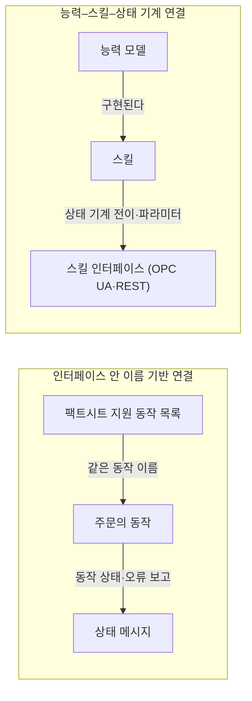

[홈](../../index.md) › 중점 연구 트랙 › [매뉴얼 기반 로봇 기능 온톨로지](index.md) › 단계 1. 기존 능력 표현 모델과 표준 조사

# 단계 1. 기존 능력 표현 모델과 표준 조사

> 단계 상태: 진행 중 · 열린 질문: 5건 · 답한 질문: 4건 · 완료 조건: 미충족 · 마지막 실행: 2026-09-25

## 1. 이 단계에서 밝힐 것

> 로봇의 능력·스킬·작업을 표현하는 기존 온톨로지와 표준이 무엇을 담고 무엇을 못 담는가.

위 문장은 트랙 정의의 "밝힐 것"을 그대로 옮긴 것이다(트랙 정의의 단계별 밝힐 것과 완료 조건은 [트랙 개요](index.md)의 단계 진행 현황에 정리되어 있다). 이 단계는 트랙의 중심 영역인 [5. 로봇 능력·작업 온톨로지](../../categories/b-common-information-and-environment-model/05-robot-capability-and-task-ontology.md)에서 출발한다. 조사 결과는 [모델·표준 비교표](model-standard-comparison.md)와, 로봇 오케스트레이션 플랫폼(Robot Orchestration Platform, ROP)용 능력 개념 요구 목록 초안의 형태로 [능력 온톨로지 초안](ontology-draft.md)에 반영된다.

## 2. 질문 목록

이 단계의 시작 질문 6개와, 실행 2026-09-25-02에서 생겨 이 단계로 들어온 후속 질문 2개, 실행 2026-09-25-06에서 생겨 이 단계로 들어온 후속 질문 1개다. 시작 질문 문장은 괄호 안의 내용까지 트랙 정의 그대로다. 괄호 안의 이름은 리서치 에이전트가 실재·최신성을 확인해야 할 출처 후보이지 확인된 출처가 아니다. 후보 이름 속 약어(IEEE, PDDL, W3C, VDA, OPC UA 등)는 트랙 정의의 후보 이름 그대로 두며, 실재를 확인한 뒤 발행 기관의 공식 명칭으로 풀어 쓴다. 상태와 답 위치는 [질문 백로그](question-backlog.md)와 일치시키며, 백로그의 "조사 중"은 이 표에서 "열림"으로 표시하고 "폐기"는 표에서 빼고 백로그에만 남긴다. [가정] 답은 3절의 질문 id로 시작하는 소제목에 실리고, 답 위치 칸에는 그 앵커(예: `#q1-01`) 또는 주제 페이지 링크를 적는다. 뒤 단계에서 되돌아온 질문은 이 단계 태그로 이 표에 추가하고 다음 트랙 실행에서 우선 처리한다. 제기 근거 칸의 값은 [질문 백로그](question-backlog.md)의 항목 형식과 같이 finding id(제안한 실행의 발견 사항 id) 또는 "사용자" 가운데 하나만 쓴다. 시드 질문은 사용자가 정의한 트랙 정의의 시작 질문이므로 백로그와 같게 "사용자"로 적는다.

페이지 상단의 단계 상태 줄(단계 상태 · 열린 질문 · 답한 질문 · 완료 조건 · 마지막 실행)은 퍼블리셔가 다시 쓰는 자동 갱신 영역이 아니라, 스토리텔러 에이전트가 이 페이지를 갱신할 때 [질문 백로그](question-backlog.md)와 맞추는 값이다. 기준값은 [트랙 개요](index.md)의 단계 진행 현황 자동 표(상태·열린 질문 수·완료 조건 충족 여부)와 최근 실행 자동 표(마지막 실행)이며, 이 줄과 그 표가 다르면 그 표를 따른다. [가정]

| id | 질문 | 상태 | 제기 근거 | 답한 실행 id | 답 위치 |
|---|---|---|---|---|---|
| q1-01 | 로봇 능력·작업을 표현하는 온톨로지·지식 모델에는 무엇이 있고 각각 무엇을 표현하는가? (후보: IEEE 1872 CORA, IEEE 1872.2 자율 로봇 온톨로지, KnowRob·SOMA, PDDL 계열 행동 모델, W3C SSN/SOSA) | 답함 | 사용자 | 2026-09-25-02 | [#q1-01](#q1-01) |
| q1-02 | 산업 상호운용 규격은 로봇 기능을 어떤 형식으로 기술하는가? (후보: VDA 5050의 팩트시트, MassRobotics AMR 상호운용 표준, OPC UA Robotics, Asset Administration Shell의 능력·스킬·서비스 모델, Open-RMF Fleet Adapter의 기능 기술) | 답함 | 사용자 | 2026-09-25-02 | [#q1-02](#q1-02) |
| q1-03 | 이 모델들은 ROP가 배정·실행·검증에 필요로 하는 정보 — 전제조건, 파라미터 범위, 적재·환경 제약, 완료 확인 방법, 오류의 의미 — 를 얼마나 담는가? 빠진 것은 무엇인가? | 열림 | 사용자 | | |
| q1-04 | 능력 기술과 실행 인터페이스(명령·상태)는 기존 표준에서 어떻게 연결되는가? | 답함 | 사용자 | 2026-09-25-06 | [#q1-04](#q1-04) |
| q1-05 | 제조사마다 같은 이름의 기능('운반', '도킹', '리프트')이 다른 의미를 갖는 문제를 기존 모델은 어떻게 다루는가? | 답함 | 사용자 | 2026-09-25-06 | [#q1-05](#q1-05) |
| q1-06 | 부록 A 5번 정의의 요소(제조사별 기능·제약·장착 장비·실행 조건, 작업 요구)를 기준으로 ROP용 능력 개념에 무엇을 더 추가해야 하는가? | 열림 | 사용자 | | |
| q1-07 | VDA 5050 3.0에서 팩트시트(유형 명세·적재 명세·지원 action)의 필드가 2.0 대비 어떻게 바뀌었으며, 적재 제약을 어떤 필드로 기술하는가? | 열림 | f12, 실행 2026-09-25-02 | | |
| q1-08 | MassRobotics AMR 상호운용 표준의 setup·status 메시지 스키마에는 로봇 능력(적재량, 지원 작업, 부착 장비)을 기술하는 필드가 있는가? | 열림 | f13, 실행 2026-09-25-02 | | |
| q1-09 | ECLASS 나 IEC 공통 데이터 사전에 이동로봇의 운반·도킹·리프트·충전 능력을 가리킬 수 있는 클래스·속성이 있는가? | 열림 | f23, 실행 2026-09-25-06 | | |

표의 질문 문장은 트랙 정의(q1-01~q1-06)와 리서치 브리프(q1-07~q1-09) 그대로 두었다. 다음은 구축자 보충이다. q1-06의 "부록 A 5번 정의"에서 5번은 [5. 로봇 능력·작업 온톨로지](../../categories/b-common-information-and-environment-model/05-robot-capability-and-task-ontology.md)를 가리킨다. "부록 A"는 이 위키의 분류 원문(`_source/ROP_SCM_연구분야_분류.md`)을 뜻한다. q1-02의 AMR은 자율이동로봇(Autonomous Mobile Robot, AMR)이다. q1-09의 IEC 공통 데이터 사전은 IEC Common Data Dictionary(CDD)다.

## 3. 조사 결과

실행 2026-09-25-02는 페이지 열람이 차단된 환경에서 이루어져, 그 실행의 출처는 검색 결과의 기관·제목·URL 일치로만 실재를 확인했다. 실행 2026-09-25-06은 일반 웹 페이지 열람이 막히고 GitHub 공식 저장소 원문만 열리는 환경에서 이루어졌고, VDA 5050 명세·JSON 스키마, MassRobotics JSON 스키마, CaSkMan README, SOMA-ACT 온톨로지 파일, OPC UA Robotics 노드셋 문서화 파일, Open-RMF 튜토리얼 원본은 공식 저장소 원문을 읽었다(각주에 "원문 미열람" 표시가 없는 출처). 핵심 주장마다 독립 출처로 교차 확인된 것은 없다. 공식 원문은 각 규격 발행 기관 한 곳의 산출물이기 때문이다. 조사 결과를 모은 표는 [모델·표준 비교표](model-standard-comparison.md)에, 반영된 개념 변경은 [능력 온톨로지 초안](ontology-draft.md) v0.2에 있다.

### q1-01 로봇 능력·작업을 표현하는 온톨로지·지식 모델 {#q1-01}

로봇 분야의 공통 어휘로는 IEEE(Institute of Electrical and Electronics Engineers)의 표준 계열이 있다. IEEE 1872-2015는 로봇·자동화 분야의 가장 일반적인 개념·관계·공리를 정한 핵심 온톨로지 CORA(Core Ontology for Robotics and Automation)와 보조 온톨로지 CORAX·POS·RPARTS로 구성되며, 상위 온톨로지 SUMO에 연결된다(2015년 발행). [사실][^ref-025] IEEE 1872.2-2021은 CORA를 확장해 자율 로봇(Autonomous Robotics, AuR)의 설계 패턴·시스템 아키텍처를 표현하는 온톨로지 표준이다(2022년 발행). [사실][^ref-026]

로봇이 작업을 추론하는 데 쓰는 지식 모델도 있다. KnowRob 2.0은 Prolog로 구현된 로봇용 지식 처리 프레임워크로, 논리 표현의 일부를 실시간 센서·운동 데이터와 모션 계획 결과에서 필요할 때 만들어 조작 행동을 추론하게 한다(2018년 논문 기준). [사실][^ref-027] SOMA(Socio-physical Model of Activities)는 DUL 기반으로 일상 활동의 물리·사회적 맥락을 표현하는 로봇용 온톨로지이며, 행동·로봇·어포던스·실행 실패를 다루는 하위 온톨로지를 가진다(2021년 논문 기준). [사실][^ref-028]

행동을 계획 문제로 기술하는 모델로는 계획 도메인 정의 언어(Planning Domain Definition Language, PDDL)가 있다. PDDL은 1998년 AIPS-98 계획 경진대회를 위해 McDermott 등이 만든 언어로, 파라미터를 가진 행동을 전제조건(precondition)과 효과(effect)로 기술하고 도메인 기술과 문제 인스턴스를 분리한다. [사실][^ref-029] 센서·액추에이터 쪽에서는 W3C(World Wide Web Consortium)와 OGC(Open Geospatial Consortium)의 공동 표준인 Semantic Sensor Network Ontology(SSN)가 2017-10-19 W3C 권고안으로 발행되었고, 경량 핵심 모듈 SOSA와 확장 모듈 SSN으로 센서·액추에이터·샘플러와 관측·작동·샘플링 활동 및 사용된 절차(procedure)를 표현한다. [사실][^ref-030] SSN의 System Capabilities 모듈은 특정 조건(Condition) 아래의 시스템 성능(SystemCapability), 정상 운용 범위(OperatingRange), 손상 없이 견디는 범위(SurvivalRange)를 표현하는 클래스를 둔다. [사실][^ref-030]

후보 밖에서도 두 자료가 확인됐다. Robotic Capability Ontology(RCO)를 제안한 2025년 논문은 로봇 능력을 제조사가 명시한 광고 능력(advertised capability)과 실제 운용 성능을 반영한 운용 능력(operational capability)으로 구분한다. [사실][^ref-041] 자율 로봇의 신뢰성을 위한 온톨로지 활용을 조사한 2024년 서베이는 조사 대상 온톨로지가 주로 행동의 선택·배열(자율성·계획·행위 개념)과 비상 상황 극복(고장·적응 개념)에 관련된다고 정리한다. [사실][^ref-042]

### q1-02 산업 상호운용 규격의 로봇 기능 기술 형식 {#q1-02}

독일자동차산업협회(Verband der Automobilindustrie, VDA)의 VDA 5050 2.0.0(2022년 1월판) 기준으로, 차량은 팩트시트(factsheet) 토픽으로 자신의 기능(차량 유형, 구동 방식 등)을 상위 관제(master control)에 미리 알린다. [추정][^ref-022] VDA 5050 공식 저장소 main 브랜치(3.0.0판)의 팩트시트 JSON 스키마는 유형 명세(typeSpecification), 물리 파라미터(physicalParameters), 프로토콜 한계(protocolLimits), 지원 기능(protocolFeatures), 이동로봇 기하(mobileRobotGeometry), 적재 명세(loadSpecification)를 필수 블록으로, 이동로봇 구성(mobileRobotConfiguration)을 선택 블록으로 둔다(3.0.0 main 기준, 기준일 2026-09-25). [사실][^ref-136] 이전 실행에서 판 미확인으로 적었던 차량 기하(agvGeometry)는 2.0.0 계열의 블록 이름으로 보이며, 2.0.0 원문과의 필드 대조는 실시하지 않았다. [추정][^ref-136] 2.0.0 기준 상태 메시지는 오류를 유형(errorType)·등급(errorLevel: WARNING 또는 FATAL)·설명·참조로 보고하고, action 완료는 actionStatus 가 finished 로 바뀐 상태 메시지로 알린다. [사실][^ref-022]

VDA 5050은 3.0.0판이 2026년에 발행되어(3.0.0 발행 2026-03, 보도자료 2026-04) 자율도 높은 이동로봇 통합을 위해 인터페이스를 확장했다. [사실][^ref-032] 확장 내용으로 구역(zone) 개념, 경로 공유, 새 오류 등급 CRITICAL·URGENT, 절전 모드 action 추가와 기존 궤적·회랑 방식 유지가 거론되지만, 이 목록은 검색 요약 기준이며 원문 미열람이다. [추정][^ref-032] 이와 별도로, 공식 저장소 main(3.0.0판)의 상태 메시지 JSON 스키마는 오류 등급을 WARNING·URGENT·CRITICAL·FATAL 네 값으로 정의한다(기준일 2026-09-25). [사실][^ref-051] 팩트시트 필드가 2.0.0 대비 어떻게 바뀌었는지는 미확인이다(후속 질문 q1-07).

MassRobotics AMR 상호운용 표준 1.0(2021년 5월)은 식별·설정(setup) 메시지와 상태(status) 메시지 두 가지로 제조사·모델, 위치·속도·방향, 상태(health), 작업·가용 상태를 공유하게 한다. [사실][^ref-033] OPC UA(Open Platform Communications Unified Architecture) for Robotics Part 1: Vertical Integration(OPC 40010-1, 판·발행일 미확인)은 VDMA(Verband Deutscher Maschinen- und Anlagenbau)와 OPC Foundation이 만든 동반 규격으로, 모션 장치 시스템(컨트롤러 1대와 모션 장치 1..n대)의 자산 관리·상태 감시 데이터를 상위 시스템(공장 제어·제조 실행 시스템(Manufacturing Execution System, MES)·클라우드)에 제공하는 정보 모델을 정의한다. [사실][^ref-034]

Plattform Industrie 4.0의 능력·스킬·서비스(Capabilities, Skills and Services, CSS) 정보 모델 토론 문서(2022년 11월)는 능력(capability)을 구현과 무관한 기능 명세로, 스킬(skill)을 그 능력의 실행 가능한 구현으로 구분하고 서비스(service)와의 관계를 정한다. [사실][^ref-035][^ref-036] 이 위키의 [능력 온톨로지 초안](ontology-draft.md)에서는 CSS의 능력(capability)을 기능(Capability)으로 부른다. 자산관리셸(Asset Administration Shell, AAS) 쪽에서는 IDTA 02020 Capability Description 서브모델이 능력을 CapabilitySet 안의 CapabilityContainer로 표현하고, 속성(PropertySet), 제약(ConditionContainer), 속성과 스킬 파라미터를 잇는 realizedBy 관계를 두는 것으로 설명된다(IDTA 원문 미열람, 제3자 논문 경유). [추정][^ref-037] IDTA 공식 저장소의 02020 템플릿에는 제약 요소가 ConstraintSet·PropertyConstraintContainer·TransitionConstraintContainer 로 정의되어 있어(기준일 2026-09-25), 제3자 논문 경유 표기 ConditionContainer 와 이름이 다르다. [사실][^ref-138] Vieira da Silva·Köcher·Fay(2022)는 제조 분야의 능력·스킬 모델을 이종 자율 로봇 팀에 적용·확장하고, AAS 서브모델과 능력·스킬 온톨로지 사이의 양방향 매핑 개념을 제시했다. [사실][^ref-038] 국내에서는 신민종·한영석·정재윤의 논문 「자산관리쉘 표준을 이용한 자율이동로봇 모니터링 시스템 설계」가 한국전자거래학회지 29권 4호 203-213쪽(2024)에 게재되었다(논문 본문 내용은 미확인). [사실][^ref-043]

Open-RMF는 청소(Clean)·배송(Delivery)·순회(Loop) 작업 유형을 지원하며, 플릿 어댑터 설정의 작업 능력(task capabilities) 항목으로 플릿이 수행할 수 있는 작업 유형을 선언한다(확인일 2026-09-25). [사실][^ref-039] 플릿 어댑터는 설정 파일에 수행 가능한 사용자 정의 동작(performable actions) 목록을 둘 수 있고, 해당 동작이 배정되면 execute_action 콜백이 호출되며 RMF는 완료 신호를 받을 때까지 로봇 제어를 어댑터에 넘긴다(확인일 2026-09-25). [사실][^ref-040]

### q1-03 ROP가 필요로 하는 다섯 정보의 담김 정도 (부분 답)

공식 원문으로 확인한 범위에서 다섯 정보 항목(전제조건, 파라미터 범위, 적재·환경 제약, 완료 확인 방법, 오류의 의미)은 여러 규격에 흩어져 있고, 한 규격의 능력 기술 안에 다섯 항목이 모두 구조화된 경우는 확인되지 않았다. [추정][^ref-136][^ref-051][^ref-031][^ref-137] 실행 2026-09-25-06은 산업 규격 쪽 후보를 공식 저장소 파일 기준으로 다시 확인해 이전 부분 답을 고쳤다. IEEE 1872 계열·SSN·PDDL·KnowRob은 이번에도 원문을 열지 못해 이 행들은 이전 실행의 추론에 머물고, 그래서 이 질문은 아직 부분 답이다.

**VDA 5050 3.0.0 팩트시트.** 적재 명세의 적재 집합(loadSets)은 적재 유형(loadType)·적재 위치·적재 치수·최대 중량(maximumWeight), 적재 처리 높이·깊이·기울기의 최소·최대값, 적재 시 최대 속도·가감속, 픽·드롭 소요 시간(pickTime, dropTime)을 기술하는 필드를 둔다. [사실][^ref-136] 지원 동작 목록(mobileRobotActions)은 동작마다 동작 유형(actionType)·설명(actionDescription)·적용 범위(actionScopes: INSTANT·NODE·EDGE·ZONE)·파라미터(actionParameters: key·valueDataType·description·isOptional)·결과(actionResult)·차단 유형(blockingTypes: NONE·SOFT·SINGLE·HARD)·일시정지 허용(pauseAllowed)·취소 허용(cancelAllowed)을 기술한다. [사실][^ref-136] 동작 파라미터 기술은 이름·자료형·설명·선택 여부만 담아 허용 값 범위와 실행 전제조건을 구조화된 필드로 담지 않으며, 범위 정보는 물리 파라미터·적재 명세 쪽 최소·최대 필드에 흩어져 있는 것으로 보인다. [추정][^ref-136]

**VDA 5050 3.0.0 상태 메시지와 동작 정의.** 동작 상태(actionStatus)는 WAITING·INITIALIZING·RUNNING·PAUSED·RETRIABLE·FINISHED·FAILED 일곱 값이며, RETRIABLE 은 실패했으나 재시도할 수 있는 동작을 뜻한다. [사실][^ref-051] 오류는 유형(errorType)·등급(errorLevel)을 필수로, 참조(errorReferences)·설명(errorDescription)·조치 힌트(errorHint)와 그 번역을 선택으로 담고, 등급 WARNING·URGENT·CRITICAL·FATAL 은 현재 주문을 계속할 수 있는지와 새 주문을 받을 수 있는지에 따라 구분된다. [사실][^ref-051] 2.0.0의 오류 등급은 WARNING·FATAL 두 값이었다. [사실][^ref-022] 명세 본문은 사전 정의 동작마다 완료·실패 판정을 상태 필드로 정한다. 예를 들어 pick 은 적재물이 로봇에 들어오고 새 적재 상태를 보고하면 FINISHED, 스테이션이 예상과 달리 비어 있는 경우 등은 FAILED 이고, startCharging 은 충전이 시작되어 powerSupply.charging 이 true 로 보고되면 FINISHED 이다. [사실][^ref-031]

**MassRobotics AMR 상호운용 표준 JSON 스키마.** 식별 보고(identityReport)에 최대 속도·예상 가동 시간·충전기 유형·화물 설명·화물 최대 부피·최대 중량·제품 문서 링크 필드를, 상태 보고(statusReport)에 운영 상태(navigating·idle·charging·waitingHumanEvent 등)·배터리 잔량·남은 적재 용량 비율 필드를 둔다(스키마 판 미확인, 기준일 2026-09-25). [사실][^ref-139]

**IDTA 02020 능력 기술 서브모델 1.0.** 이 서브모델은 능력을 구현과 무관한 기능 명세로 정의하고, 능력을 속성(최대 속도·허용 오차·온도 범위 등), 제약(전제조건·불변조건·사후조건을 담는 속성 제약과 순서 요구를 담는 전이 제약), 능력을 구현하는 스킬로 기술한다. [사실][^ref-137] 템플릿에는 CapabilitySet·CapabilityContainer·PropertySet 과 관계 요소 CapabilityRealizedBy·CapabilityComposedOf·CapabilityGeneralizedBy·SameProperty, 제약 요소 ConstraintSet·PropertyConstraintContainer·TransitionConstraintContainer 가 정의되어 있고, 각 요소의 의미 식별자(semanticId)는 IDTA 자체 식별자 형식이다. [사실][^ref-138]

**SOMA와 OPC UA Robotics 노드셋.** SOMA 공식 저장소의 SOMA-ACT 온톨로지 파일은 활동의 실행 상태를 실패·성공·진행 중·취소·일시정지·대기 개체로 정의하고, 충족되지 않은 사후조건 같은 기대 불일치를 NonmanifestedSituation 클래스로 표현한다. [사실][^ref-141] OPC UA for Robotics 공식 노드셋 문서화 파일에는 MotionDeviceSystemType·MotionDeviceType·ControllerType 과 함께 TaskControlType, SafetyStateType, LoadType 형식과 운전 모드·실행 모드 열거형이 정의되어 있다(명세 본문이 아니며 메서드 목록은 미확인). [사실][^ref-142]

**원문을 열지 못한 모델(이전 실행 기준).** 전제조건·효과는 PDDL이, 파라미터와 제약은 SSN 운용 범위가 일부씩 담는 것으로 보인다. [추정][^ref-029][^ref-030] OPC 40010-1은 자산 관리·상태 감시가 목적이어서, ROP의 작업 배정에 필요한 작업 단위 능력과 그 전제조건·완료 확인 방법은 이 규격의 범위 밖에 있을 가능성이 높다(Part 2 이후 부의 범위는 미확인). [추정][^ref-034] 매뉴얼에서 가져온 능력 정보는 RCO의 구분으로는 제조사가 명시한 광고 능력에 해당하므로, ROP가 배정에 쓰려면 현장 운용 성능(운용 능력)으로 보완·검증하는 절차가 필요할 것으로 보인다. [추정][^ref-041] 이 추정은 트랙 가설 1의 판정 근거로 쓰지 않는다.

### q1-04 능력 기술과 실행 인터페이스의 연결 {#q1-04}

기존 표준에서 능력 기술과 실행 인터페이스의 연결은 두 방식으로 나뉘는 것으로 보인다. VDA 5050·Open-RMF는 같은 인터페이스 안에서 선언한 동작 이름을 명령과 상태 보고에 그대로 쓰는 방식이고, CSS·IDTA 02020·CaSkMan·PackML 계열은 별도 능력 모델을 스킬과 상태 기계 인터페이스로 잇는 방식이며, 두 방식을 서로 매핑한 표준은 검색 범위에서 찾지 못했다. [추정][^ref-136][^ref-040][^ref-137][^ref-140][^ref-036]

**같은 인터페이스 안에서 이름으로 잇는 방식.** VDA 5050 3.0.0은 모든 이동로봇이 따르는 사전 정의 동작(pick, drop, startCharging 등)을 동작별 의미·파라미터·상태 전이와 함께 정하고, 사전 정의 동작으로 옮길 수 없는 동작만 제조사가 추가로 정의해 팩트시트의 지원 동작 목록에 같은 형식으로 선언하게 한다(공식 저장소 main 기준, 기준일 2026-09-25). [사실][^ref-031][^ref-136] 이동로봇이 수행할 수 없는 동작(예: 최대 리프트 높이를 넘는 높이)을 담은 주문을 받으면 오류 유형 INVALID_ORDER_ACTION 을 등급 WARNING 으로 보고하게 해, 능력 한계와 명령의 불일치를 로봇 쪽 검증으로 드러낸다. [사실][^ref-031] 동작의 진행과 실패는 앞의 동작 상태 일곱 값과 오류 등급으로 상태 메시지에 돌아온다. [사실][^ref-051] Open-RMF 플릿 어댑터는 수행 가능한 동작을 설정의 rmf_fleet actions 키에 이름 목록으로만 선언하고, 작업 요청은 category(동작 이름)와 JSON description 으로 이를 호출하며, execute_action 콜백이 category·description·execution 을 받아 실행한 뒤 execution.finished() 로 완료를 알린다. 선언에는 파라미터 스키마·전제조건·오류 의미를 적는 항목이 없다(확인일 2026-09-25). [사실][^ref-040]

**별도 능력 모델을 스킬과 상태 기계로 잇는 방식.** 제조 분야 능력·스킬 참조 모델은 스킬을 OPC UA 같은 명확한 호출 인터페이스를 가진 능력의 구현으로 보고, 스킬 인터페이스로 상태 기계의 전이를 일으키거나 파라미터를 설정하게 한다(2022년 논문 기준). [사실][^ref-036] IDTA 02020 템플릿은 능력과 그것을 구현하는 스킬을 CapabilityRealizedBy 관계 요소로 잇는다. [사실][^ref-138] 오픈소스 온톨로지 CaSkMan 은 제조 설비의 능력(입출력 제품을 가진 공정)과 스킬(상태 기계를 가진 실행 구현), 스킬 인터페이스(REST 웹서비스·OPC UA)를 연결하고, VDI 3682·VDI 2860·DIN 8580·ISA 88·DIN EN 61360 을 잇는 정렬 온톨로지로 자신을 소개한다. [사실][^ref-140] OPC 30050(OPC UA for PackML)은 ISA-88 기반 상태 기계를 담은 정보 모델로, 인스턴스마다 가능한 상태·전이(AvailableStates, AvailableTransitions)를 제공하게 하고 장비 내부 상태와 명령을 표준 상태 모델과 표준 명령 집합으로 옮기게 한다(판·발행일 미확인). [사실][^ref-145]

**두 방식이 한 시스템에 함께 쓰인 사례.** Jungbluth 외(2023, at – Automatisierungstechnik 71(2) 163–175)는 OPC UA 동반 규격 기반 정보 모델과 스킬 개념으로 주문 기반 생산의 운반 시스템을 제어하는 사례를 제시하며, 셔틀 요청·예약(GetTransporter)과 해제(ReleaseSpecificShuttle) 스킬을 두고 무인운반차(Automated Guided Vehicle, AGV) 통신은 VDA 5050 에 따른 MQTT 로 둔다. [추정][^ref-146] 이 사례에서 두 방식 사이의 매핑 규칙은 확인하지 못했다. 매핑 문제는 백로그 q4-06(단계 4. 온톨로지를 실행에 연결하는 방법 조사)에서 이어서 다룬다.

### q1-05 같은 이름 기능의 의미 차이를 다루는 방식 {#q1-05}

같은 이름 기능의 의미 차이에 대해 기존 모델은 고정 어휘로 동작 의미를 정의하는 방식(VDA 5050 사전 정의 동작), 외부 사전 식별자로 의미를 참조하는 방식(AAS semanticId), 표준 분류의 하위 클래스로 고정하는 방식(CaSkMan), 일반화·구성 관계로 능력 계층을 두는 방식(IDTA 02020), 핵심 온톨로지로 도메인 어휘를 잇는 방식(SWARMs), 구성요소에서 능력을 추론하는 방식을 쓰는 것으로 보이며, 제조사 추가 동작은 자유 문장 설명에 남아 이 문제가 풀리지 않는 것으로 보인다. [추정][^ref-031][^ref-144][^ref-140][^ref-138][^ref-115][^ref-143]

**고정 어휘.** VDA 5050 3.0.0은 pick·drop·startCharging 같은 사전 정의 동작의 의미·파라미터·상태 전이를 규격이 정하고, 여기에 옮길 수 없는 동작만 제조사가 추가로 정의하게 한다. [사실][^ref-031]

**외부 사전 식별자.** 자산관리셸(AAS) 메타모델 명세(IDTA-01001 3.0.1, 2024년판)는 서브모델 요소의 의미를 의미 식별자(semanticId)로 ECLASS·IEC 공통 데이터 사전(CDD) 같은 외부 사전의 식별자(IRDI 등)에 연결해 제조사·통합자·운영자가 같은 데이터를 모호하지 않게 이해하도록 한다. [사실][^ref-144]

**표준 분류의 하위 클래스.** CaSkMan 은 능력을 일반 Capability 인스턴스로 두지 말고 VDI 2860(취급 작업)·DIN 8580(제조 공정) 분류에서 파생한 하위 클래스로 기술하도록 권해, 기능 이름 대신 표준 분류 체계의 위치로 의미를 고정한다. [사실][^ref-140]

**능력 계층.** IDTA 02020 템플릿은 능력 사이의 일반화(CapabilityGeneralizedBy)와 구성(CapabilityComposedOf) 관계 요소를 둔다. [사실][^ref-138]

**핵심 온톨로지와 구성요소 기반 추론.** 이종 수중 로봇 협업용 SWARMs 온톨로지 논문(2017)은 서로 다른 로봇이 같은 용어를 다른 의미로 쓰는 문제를 들고, 핵심 온톨로지로 임무·차량·통신·환경 인식 도메인 온톨로지를 서로 연결해 의미 상호운용을 확보하려 했다. [사실][^ref-115] Dussard 외(2023)는 로봇 능력을 구성요소 사이에 하드코딩된 연결로 두지 않고, 로봇이 가진 구성요소와 하위 능력으로부터 능력을 추론하는 온톨로지 기반 기술 방법을 제안했다. [사실][^ref-143]

물류 자율이동로봇의 '운반'·'도킹'·'리프트'를 직접 비교한 연구와, 이 문제를 다룬 국내 자료는 이번 검색 범위에서 찾지 못했다.

## 4. 결론과 남은 불확실성

**결론**

- 로봇 능력을 표현하는 기존 모델로 IEEE 1872 계열 온톨로지, KnowRob·SOMA, PDDL, W3C SSN/SOSA가 확인됐고, 각각 공통 개념·관계, 조작 행동 추론·활동 맥락, 행동의 전제조건·효과, 센서·작동과 운용 범위를 표현한다. [사실][^ref-025][^ref-026][^ref-027][^ref-028][^ref-029][^ref-030]
- CSS 모델은 능력(구현 독립 명세)과 스킬(실행 가능한 구현)을 구분한다. [사실][^ref-035][^ref-036]
- 산업 규격 쪽 기능 기술은 VDA 5050 팩트시트, Open-RMF 작업 유형·사용자 정의 동작 선언처럼 관제 연동 메시지·설정 안에 들어 있다. [추정][^ref-022][^ref-039][^ref-040]
- VDA 5050 3.0.0(공식 저장소 main 기준)은 팩트시트에 적재 명세와 지원 동작 목록을, 상태 메시지에 동작 상태 일곱 값과 오류 등급 네 값을 두고, 동작별 완료·실패 판정은 명세 본문의 사전 정의 동작에 둔다. [사실][^ref-136][^ref-051][^ref-031]
- MassRobotics AMR 상호운용 표준 1.0은 setup·status 메시지로 제조사·모델, 위치·속도·방향, 상태, 작업·가용 상태를 공유하게 한다. [사실][^ref-033] 공식 JSON 스키마(판 미확인)는 식별 보고에 최대 속도·화물 최대 부피·최대 중량 같은 필드를 둔다. [사실][^ref-139] 이 필드가 q1-08이 묻는 능력 기술에 답하는지는 다음 실행에서 판정한다.
- 다섯 정보 항목은 여러 규격에 흩어져 있고, 한 규격의 능력 기술 안에 모두 구조화된 경우는 확인되지 않았다(q1-03 부분 답). [추정][^ref-136][^ref-051][^ref-031][^ref-137]
- 능력 기술과 실행 인터페이스의 연결은 인터페이스 안 이름 기반 방식과 능력–스킬–상태 기계 방식으로 나뉘는 것으로 보이며, 둘을 매핑한 표준은 찾지 못했다(q1-04). [추정][^ref-136][^ref-040][^ref-137][^ref-140][^ref-036]
- 같은 이름 기능의 의미 차이는 고정 어휘·외부 사전 식별자·표준 분류·능력 계층·핵심 온톨로지·구성요소 추론으로 다뤄지는 것으로 보이나, 제조사 추가 동작의 의미는 자유 문장에 남는다(q1-05). [추정][^ref-031][^ref-144][^ref-140][^ref-138][^ref-115][^ref-143]
- [능력 온톨로지 초안](ontology-draft.md)은 실행 2026-09-25-02에서 v0 → v0.1로 올랐다: 효과·스킬·오류 개념, "기능 / 구현된다 / 스킬" 관계, 기능의 능력 출처 구분(광고 능력 / 운용 능력) 속성이 반영됐다. 제안된 전제조건 개념은 기존 실행 조건과 정의가 겹쳐 반영하지 않고 초안 6절 질문으로 두었다.
- 실행 2026-09-25-06에서 초안이 v0.1 → v0.2로 올랐다: 개념 실행 상태 추가, 오류의 등급(3.0.0 네 값)·참조·조치 힌트 속성과 기능의 의미 참조 속성 추가, 관계 "스킬 / 실행 상태를 드러낸다 / 실행 상태"·"기능 / 일반화된다 / 기능"·"기능 / 구성된다 / 기능" 추가. 제약 개념에 IDTA 02020의 속성 제약·전이 제약 종류를 더하자는 제안은 전제조건을 어디에 둘지에 관한 초안 6절 질문과 충돌해 반영하지 않고 6절 질문으로 옮겼다.

**남은 불확실성**

- 교차 확인은 0건이다. 원문을 연 것은 GitHub 공식 저장소 파일이며, 모두 각 규격 발행 기관 한 곳의 산출물이다. 논문·AAS 메타모델·OPC 30050 참조는 원문 미열람이다.
- q1-03 부분 답: IEEE 1872 계열·SSN·PDDL·KnowRob은 원문 미열람이라 다섯 정보 항목의 판정이 이전 실행 수준이다.
- VDA 5050 팩트시트의 2.0.0 대비 필드 변경은 2.0.0 원문과 대조하지 않았다(q1-07). 동작 한계를 제조사가 어디에 적는지는 단계 2 질문 q2-06으로 넘겼다.
- VDA 5050 3.0.0의 정확한 발행일이 미확인이다. 검색 요약은 3.0 발행을 2026-03-19, 보도자료를 2026-04-20로 전하지만 보도자료 URL은 260421 계열이다.
- MassRobotics JSON 스키마의 판 번호와 2.0의 현재 상태는 미확인이다.
- OPC UA Robotics 노드셋의 메서드 목록과 형식별 소속 부(Part), OPC 40010-1의 판·발행일과 Part 2 이후 부의 범위는 미확인이다.
- CSS 계열 스킬의 FeasibilityCheck·PreconditionCheck·ContextCheck 설명은 출처가 확정되지 않았다.
- IDTA 02020은 공식 저장소의 README·템플릿으로 구조를 확인했으나, 이 실행의 브리프 기록에 따라 원문 미열람 표시를 유지한다.
- 이동로봇 운반 시스템에서 VDA 5050 동작과 OPC UA 스킬을 함께 쓴 사례의 매핑 규칙, 두 연결 방식을 매핑한 표준은 확인하지 못했다(q4-06).
- 물류 자율이동로봇의 '운반'·'도킹'·'리프트'를 직접 비교한 연구와 국내 자료는 찾지 못했다.
- 국내 논문(신민종·한영석·정재윤, 2024)은 게재 사실만 확인했고 본문 내용은 미확인이다.
- ref-031·ref-034·ref-039·ref-040·ref-051·ref-136~ref-142·ref-117의 발행일은 미확인이다.

## 5. 이 단계가 낳은 후속 질문

| 새 질문 id | 질문 | 보낼 단계 | 근거 finding id | 상태 |
|---|---|---|---|---|
| q1-07 | VDA 5050 3.0에서 팩트시트(유형 명세·적재 명세·지원 action)의 필드가 2.0 대비 어떻게 바뀌었으며, 적재 제약을 어떤 필드로 기술하는가? | 단계 1. 기존 능력 표현 모델과 표준 조사 | f12 (실행 2026-09-25-02) | 열림 |
| q1-08 | MassRobotics AMR 상호운용 표준의 setup·status 메시지 스키마에는 로봇 능력(적재량, 지원 작업, 부착 장비)을 기술하는 필드가 있는가? | 단계 1. 기존 능력 표현 모델과 표준 조사 | f13 (실행 2026-09-25-02) | 열림 |
| q4-06 | IDTA 02020 능력 서브모델의 속성·제약(ConditionContainer)과 VDA 5050 팩트시트의 적재 명세·지원 action 을 서로 매핑할 수 있는가, 매핑하면 무엇이 남는가? | 단계 4. 온톨로지를 실행에 연결하는 방법 조사 | f17 (실행 2026-09-25-02) | 열림 |
| q5-05 | 제조사 매뉴얼에서 추출한 광고 능력과 현장 시험으로 확인한 운용 능력의 차이를 어떤 지표로 측정하고 온톨로지에 함께 기록할 것인가? | 단계 5. 완전성과 정확성을 검증하는 방법 조사 | f27 (실행 2026-09-25-02) | 열림 |
| q1-09 | ECLASS 나 IEC 공통 데이터 사전에 이동로봇의 운반·도킹·리프트·충전 능력을 가리킬 수 있는 클래스·속성이 있는가? | 단계 1. 기존 능력 표현 모델과 표준 조사 | f23 (실행 2026-09-25-06) | 열림 |
| q2-06 | VDA 5050 3.0.0 팩트시트의 동작 파라미터에 허용 범위 필드가 없을 때, 제조사는 리프트 높이 같은 동작 한계를 물리 파라미터·적재 명세의 최소·최대 필드와 자유 문장 설명 가운데 어디에 적는가? | 단계 2. 로봇 문서 유형과 정보 구조 조사 | f4 (실행 2026-09-25-06) | 열림 |
| q2-07 | 제조사 매뉴얼·통합 가이드는 VDA 5050 추가 동작이나 Open-RMF 사용자 정의 동작의 의미·파라미터·완료 조건을 어떤 형식으로 설명하는가? | 단계 2. 로봇 문서 유형과 정보 구조 조사 | f16 (실행 2026-09-25-06) | 열림 |

같은 질문은 [질문 백로그](question-backlog.md)에 등록된다(백로그 반영은 퍼블리셔가 한다). 실행 2026-09-25-06에서 제안된 VDA 5050 사전 정의 동작과 IDTA 02020 능력·VDI 2860 취급 분류의 매핑 질문은 q4-06과 뜻이 겹쳐 새로 등록하지 않았다.

## 6. 완료 조건 충족 현황

완료 조건은 트랙 정의의 문장을 옮기되 파일명은 페이지 링크로 바꾸고, 조건이 여러 항목이면 행을 나눴다. 트랙 정의의 문장은 아래 인용 블록에 그대로 두었고, [트랙 개요](index.md)의 단계 진행 현황 표에도 같은 조건이 링크를 붙인 형태로 있다. 충족 여부는 리서치 에이전트의 자체 평가(research.json 의 track 블록)를 스토리텔러 에이전트가 옮겨 적은 값이고, 최종 판정은 내용 검증 에이전트가 한다. 둘이 다르면 검증 판정을 따른다.

> 완료 조건: 모델·표준 비교표(`model-standard-comparison.md`) 작성, ROP용 능력 개념 요구 목록 초안이 온톨로지 초안에 반영됨.

| 완료 조건 | 충족 여부 | 근거 | 검증 판정 |
|---|---|---|---|
| 모델·표준 비교표([model-standard-comparison.md](model-standard-comparison.md)) 작성 | 미충족 | [모델·표준 비교표](model-standard-comparison.md)에서 실행 2026-09-25-06에 VDA 5050·MassRobotics·CaSkMan 행을 공식 저장소 원문 기준으로 채웠고(상태 "확인"), IDTA 02020·SOMA·OPC UA Robotics·Open-RMF 행을 보강했으나, IEEE 1872 계열·SSN·PDDL·KnowRob 행의 다섯 정보 항목 열은 미조사다 | 미충족 · 미승인 |
| ROP용 능력 개념 요구 목록 초안이 온톨로지 초안에 반영됨 | 미충족 | [능력 온톨로지 초안](ontology-draft.md) v0.2에 실행 상태 개념과 오류·기능 속성, 관계 3건이 반영됐으나, q1-06을 조사하지 않아 요구 목록 초안은 없다 | 미충족 · 미승인 |

다음 단계로 전환: 아니오(비교표의 IEEE 1872 계열·SSN·PDDL·KnowRob 행 다섯 정보 항목 미조사, ROP용 능력 개념 요구 목록 초안 미반영, 막힌 질문 q1-03·q1-06·q1-07·q1-08·q1-09)

## 7. 관련 세부영역

이 트랙은 분류를 바꾸지 않는다. 각 항목 뒤에는 이 단계에서 확인된 사실을 그 영역 페이지의 어느 절에 반영하자고 제안할지를 적었다. 반영 제안은 세부영역 페이지를 직접 고치지 않고 [트랙 로그](log.md)의 "세부영역 반영 제안" 항목으로 남기며, 반영은 다음 해당 영역 실행에서 한다. 프런트매터 `related_areas`는 아래 목록과 같다.

**중심 영역**

- [5. 로봇 능력·작업 온톨로지](../../categories/b-common-information-and-environment-model/05-robot-capability-and-task-ontology.md) — 트랙이 출발하는 영역이다. 실행 2026-09-25-02에서 "4. 핵심 개념과 용어"(능력·스킬 구분, 전제조건·효과, 광고 능력·운용 능력), "7. 관련 표준·프레임워크·오픈소스"(IEEE 1872 계열, SSN/SOSA, CSS, IDTA 02020), "8. 대표 연구와 자료"(KnowRob·SOMA, RCO, 서베이, 국내 논문) 절에 반영을 제안했다. 실행 2026-09-25-06에서는 "6. 대표 접근법과 기술"(능력–스킬–상태 기계 연결 방식, 같은 이름 기능의 의미 고정 방식)과 "7. 관련 표준·프레임워크·오픈소스"(IDTA 02020 템플릿 구조, CaSkMan, AAS semanticId, VDA 5050 3.0.0 팩트시트) 절에 반영을 제안했다.

**연구 방법으로 연결되는 영역(분류 원문 8장의 교차 규칙)**

- [27. AI·학습·적응과 모델 운영](../../categories/g-safety-security-intelligence-and-governance/27-ai-learning-adaptation-and-model-operations.md) — 매뉴얼 해석은 이 영역의 방법이 5. 로봇 능력·작업 온톨로지와 21. 온보딩·설정·현장 시운전에 적용되는 것으로 다룬다. 단계 1에서는 기존 모델·표준이 AI가 해석한 기능 정보(신뢰도, 근거 위치)를 담을 자리를 갖는지의 관점으로 연결한다. 실행 2026-09-25-02와 2026-09-25-06 모두 이 영역에 해당하는 발견 사항이 없어 반영 제안을 내지 않았다.

**이 단계의 질문이 언급하는 영역(트랙 개요의 배정에 따른 추가 연결, [가정])**

- [9. 로봇·제조사 관제 연동](../../categories/c-connectivity-and-execution-foundation/09-robot-and-vendor-fleet-manager-integration.md) — q1-04(능력 기술과 실행 인터페이스의 연결)와 q1-02의 Open-RMF Fleet Adapter 후보가 이 영역의 어댑터 문제에 닿는다. 실행 2026-09-25-02에서 "7. 관련 표준·프레임워크·오픈소스" 절에 VDA 5050 팩트시트·오류 보고, MassRobotics 메시지, Open-RMF 작업 능력·사용자 정의 동작의 반영을 제안했다. 실행 2026-09-25-06에서는 "6. 대표 접근법과 기술"(사전 정의 동작·제조사 추가 동작 규칙, 수행 불가 주문의 INVALID_ORDER_ACTION 보고)과 "7. 관련 표준·프레임워크·오픈소스"(VDA 5050 3.0.0 지원 동작·동작 상태·오류 등급, Open-RMF 동작 선언·실행 콜백, VDA 5050과 OPC UA 스킬 병행 사례) 절에 반영을 제안했다.
- [28. 표준·상호운용성·다사업자 거버넌스](../../categories/g-safety-security-intelligence-and-governance/28-standards-interoperability-and-multi-vendor-governance.md) — q1-02의 산업 상호운용 규격 조사가 이 영역의 공통 규격·적합성 시험에 닿는다. 실행 2026-09-25-02에서 "7. 관련 표준·프레임워크·오픈소스" 절에 능력 기술 관련 표준·규격의 발행 기관과 현재 판의 반영을 제안했다. 실행 2026-09-25-06에서는 같은 절에 MassRobotics JSON 스키마, OPC UA Robotics 노드셋, OPC 30050 PackML, AAS semanticId의 외부 사전 참조를 제안했다.

## 8. 출처

[^ref-022]: VDA(Verband der Automobilindustrie), VDA 5050 Version 2.0.0 — Interface for the communication between automated guided vehicles (AGV) and a master control, 2022-01, https://www.vda.de/dam/jcr:f0c9c019-1506-4dee-998a-e92723fbf025/EN-VDA5050-V2_0_0.pdf, 접근일 2026-09-25 (원문 미열람)
[^ref-025]: IEEE, 1872-2015 - IEEE Standard Ontologies for Robotics and Automation, 2015, https://ieeexplore.ieee.org/document/7084073/, 접근일 2026-09-25 (원문 미열람)
[^ref-026]: IEEE, IEEE 1872.2-2021 - IEEE Standard for Autonomous Robotics (AuR) Ontology, 2022, https://standards.ieee.org/standard/1872_2-2021.html, 접근일 2026-09-25 (원문 미열람)
[^ref-027]: Beetz, M., Beßler, D., Haidu, A., Pomarlan, M., Bozcuoglu, A. K., & Bartels, G., KnowRob 2.0 — A 2nd Generation Knowledge Processing Framework for Cognition-Enabled Robotic Agents, 2018, https://ai.uni-bremen.de/papers/beetz18knowrob.pdf, 접근일 2026-09-25 (원문 미열람)
[^ref-028]: Beßler, D. 외, Foundations of the Socio-physical Model of Activities (SOMA) for Autonomous Robotic Agents, 2021, https://arxiv.org/pdf/2011.11972, 접근일 2026-09-25 (원문 미열람)
[^ref-029]: McDermott, D. 외, PDDL - The Planning Domain Definition Language, 1998, https://www.researchgate.net/publication/2278933_PDDL_-_The_Planning_Domain_Definition_Language, 접근일 2026-09-25 (원문 미열람)
[^ref-030]: W3C / OGC, Semantic Sensor Network Ontology, 2017-10-19, https://www.w3.org/TR/vocab-ssn/, 접근일 2026-09-25 (원문 미열람)
[^ref-031]: VDA / VDMA (VDA5050 GitHub), VDA5050/VDA5050_EN.md — Official Specification document for the VDA 5050, 미확인, https://github.com/VDA5050/VDA5050/blob/main/VDA5050_EN.md, 접근일 2026-09-25
[^ref-032]: VDA(Verband der Automobilindustrie), Version 3.0 of VDA 5050 released, 2026-04, https://www.vda.de/en/press/press-releases/2026/260421_PM_VDA_5050_EN, 접근일 2026-09-25 (원문 미열람)
[^ref-033]: MassRobotics, Autonomous Mobile Robot Standards Published by MassRobotics, 2021-05, https://www.massrobotics.org/autonomous-mobile-robot-standards-published-by-massrobotics/, 접근일 2026-09-25 (원문 미열람)
[^ref-034]: OPC Foundation / VDMA, OPC-40010-1 – OPC UA for Robotics - Part 1: Vertical Integration, 미확인, https://reference.opcfoundation.org/specs/OPC-40010-1, 접근일 2026-09-25 (원문 미열람)
[^ref-035]: Plattform Industrie 4.0, Information Model for Capabilities, Skills & Services, 2022-11, https://www.plattform-i40.de/IP/Redaktion/EN/Downloads/Publikation/CapabilitiesSkillsServices.html, 접근일 2026-09-25 (원문 미열람)
[^ref-036]: Köcher, A. 외, A Reference Model for Common Understanding of Capabilities and Skills in Manufacturing, 2022, https://arxiv.org/abs/2209.09632, 접근일 2026-09-25 (원문 미열람)
[^ref-037]: Vieira da Silva, L. M., Köcher, A., Gill, M. S., Weiss, M., & Fay, A., Toward a Mapping of Capability and Skill Models using Asset Administration Shells and Ontologies, 2023-07, https://arxiv.org/abs/2307.00827, 접근일 2026-09-25 (원문 미열람)
[^ref-038]: Vieira da Silva, L. M., Köcher, A., & Fay, A., A Capability and Skill Model for Heterogeneous Autonomous Robots, 2022-09, https://arxiv.org/abs/2209.10900, 접근일 2026-09-25 (원문 미열람)
[^ref-039]: Open Robotics, Currently supported Tasks - Programming Multiple Robots with ROS 2, 미확인, https://osrf.github.io/ros2multirobotbook/task_types.html, 접근일 2026-09-25 (원문 미열람)
[^ref-040]: Open Robotics, PerformAction Tutorial - Programming Multiple Robots with ROS 2, 미확인, https://osrf.github.io/ros2multirobotbook/integration_fleets_action_tutorial.html, 접근일 2026-09-25
[^ref-041]: Naqvi, M. R. 외(Scientific Reports), Ontology-driven integration of advertised and operational capabilities in robots, 2025-10-02, https://www.nature.com/articles/s41598-025-16649-3, 접근일 2026-09-25 (원문 미열람)
[^ref-042]: Aguado, E., Gomez, V., Hernando, M., Rossi, C., & Sanz, R., A survey of ontology-enabled processes for dependable robot autonomy, 2024-07, https://www.frontiersin.org/journals/robotics-and-ai/articles/10.3389/frobt.2024.1377897/full, 접근일 2026-09-25 (원문 미열람)
[^ref-043]: 신민종, 한영석, 정재윤, 자산관리쉘 표준을 이용한 자율이동로봇 모니터링 시스템 설계, 2024, https://www.kci.go.kr/kciportal/ci/sereArticleSearch/ciSereArtiView.kci?sereArticleSearchBean.artiId=ART003140560, 접근일 2026-09-25 (원문 미열람)
[^ref-136]: VDA / VDMA (VDA5050 GitHub), VDA5050/json_schemas/factsheet.schema, 미확인, https://github.com/VDA5050/VDA5050/blob/main/json_schemas/factsheet.schema, 접근일 2026-09-25
[^ref-051]: VDA / VDMA (VDA5050 GitHub), VDA5050/json_schemas/state.schema, 미확인, https://github.com/VDA5050/VDA5050/blob/main/json_schemas/state.schema, 접근일 2026-09-25
[^ref-137]: IDTA(Industrial Digital Twin Association), IDTA 02020 Capability Description 1.0 — README (admin-shell-io/submodel-templates), 미확인, https://github.com/admin-shell-io/submodel-templates/tree/main/published/Capability%20Description/1/0, 접근일 2026-09-25 (원문 미열람)
[^ref-138]: IDTA(Industrial Digital Twin Association), IDTA 02020_Template_Capability_Description.json, 미확인, https://github.com/admin-shell-io/submodel-templates/tree/main/published/Capability%20Description/1/0, 접근일 2026-09-25 (원문 미열람)
[^ref-139]: MassRobotics, MassRobotics-AMR/AMR_Interop_Standard — AMR_Interop_Standard.json, 미확인, https://github.com/MassRobotics-AMR/AMR_Interop_Standard/blob/main/AMR_Interop_Standard.json, 접근일 2026-09-25
[^ref-140]: CaSkade-Automation (GitHub), CaSkMan - An OWL ontology to model capabilities and skills in manufacturing (README), 미확인, https://github.com/CaSkade-Automation/CaSkMan, 접근일 2026-09-25
[^ref-141]: EASE CRC (ease-crc/soma), SOMA — owl/SOMA-ACT.owl, 미확인, https://github.com/ease-crc/soma/blob/master/owl/SOMA-ACT.owl, 접근일 2026-09-25
[^ref-142]: OPC Foundation / VDMA, UA-Nodeset Robotics — Opc.Ua.Robotics.Nodeset2.documentation.csv, 미확인, https://github.com/OPCFoundation/UA-Nodeset/blob/latest/Robotics/Opc.Ua.Robotics.Nodeset2.documentation.csv, 접근일 2026-09-25
[^ref-143]: Dussard, B. 외, Ontological Component-based Description of Robot Capabilities, 2023-06, https://arxiv.org/abs/2306.07569, 접근일 2026-09-25 (원문 미열람)
[^ref-115]: Li, X. 외(Sensors, MDPI), SWARMs Ontology: A Common Information Model for the Cooperation of Underwater Robots, 2017, https://doi.org/10.3390/s17030569, 접근일 2026-09-25 (원문 미열람)
[^ref-144]: IDTA(Industrial Digital Twin Association), Specification of the Asset Administration Shell Part 1: Metamodel (IDTA-01001-3-0-1), 2024, https://industrialdigitaltwin.org/wp-content/uploads/2024/06/IDTA-01001-3-0-1_SpecificationAssetAdministrationShell_Part1_Metamodel.pdf, 접근일 2026-09-25 (원문 미열람)
[^ref-145]: OPC Foundation / OMAC, OPC-30050 – OPC UA for PackML - Common Object Model: PackML, 미확인, https://reference.opcfoundation.org/specs/OPC-30050, 접근일 2026-09-25 (원문 미열람)
[^ref-146]: Jungbluth, S., Barth, T., Nußbaum, J., Hermann, J., & Ruskowski, M., Developing a skill-based flexible transport system using OPC UA, 2023, https://www.degruyterbrill.com/document/doi/10.1515/auto-2022-0115/html?lang=en, 접근일 2026-09-25 (원문 미열람)

## 9. 이력

실행 id는 트랙 실행의 id(YYYY-MM-DD-NN)이며, 구축 시드 항목은 [트랙 로그](log.md)와 같은 표기 `build-2026-09-24`를 쓴다. 이 값은 실행 id가 아니라 위키 구축 시점을 나타내며, 파이프라인 실행이 아니므로 일일 로그가 없다.

| 날짜 | 실행 id | 답한 질문 | 새 질문 | 온톨로지 변경 | 버전 |
|---|---|---|---|---|---|
| 2026-09-25 | 2026-09-25-06 | q1-04, q1-05(q1-03 부분 답 보강) | q1-09, q2-06, q2-07 | v0.1 → v0.2 | 3 |
| 2026-09-25 | 2026-09-25-02 | q1-01, q1-02(q1-03 부분 답) | q1-07, q1-08, q4-06, q5-05 | v0 → v0.1 | 2 |
| 2026-09-24 | build-2026-09-24(구축 시드, 파이프라인 실행 아님) | 없음 | 시드 q1-01~q1-06(6건, 구축 시 [질문 백로그](question-backlog.md)에 등록) | 없음(v0 시드는 [능력 온톨로지 초안](ontology-draft.md)에서 생성) | 1 |
