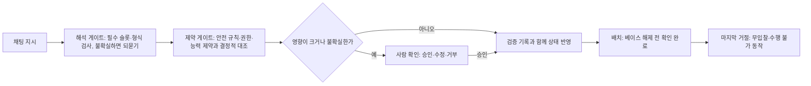
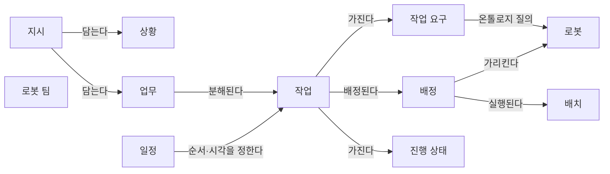
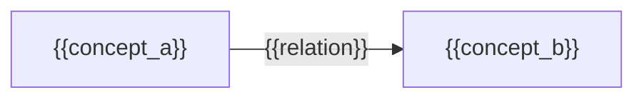

(너의 규칙은 시스템 프롬프트의 agents/shared-rules.md 와 agents/researcher.md 이다. 아래는 이번 실행의 컨텍스트와 입력이다.)

## 실행 컨텍스트

- run_id: 2026-09-25-92
- date: 2026-09-25
- run_type: track (트랙 실행)
- 대상: 트랙 nl-task-chatbot (자연어 업무 지시 챗봇) · 현재 단계: 단계 4. 오해석 방지와 확인 절차 · 이번에 다룰 백로그 질문 id: q4-03 · 중심 세부영역: 13. 작업 배정 — MRTA (D. 계획·최적화)
- 예산:
    - max_search_queries: 40
    - max_sources_per_run: 20
    - new_topic_pages: 1
    - page_updates: 2
    - max_retries: 2
- 환경 알림: web_fetch_available: false · fetch_mode: mirror_only (일반 웹 페이지 열람은 네트워크 정책으로 막혀 있다. raw.githubusercontent.com 은 열린다: 공식 문서가 GitHub 에 있는 출처는 입력의 config/source_mirrors.yaml 경로를 WebFetch 로 열어 원문을 읽고 sources[].fetched=true, fetched_via=github_raw, fetch_url 을 적는다. 입력에 원문 텍스트(data/source_texts)가 있는 출처는 fetched_via=inbox. 그 밖의 출처는 fetched=false 이며 코드가 신뢰도 상한(medium)을 강제한다 — 공통 규칙 0절 6항)
- 언어: ko
- next_ref_id: ref-730
- 새 출처 id 구간: ref-730 ~ ref-759 — 이 실행 전용으로 예약한 번호다(동시에 도는 다른 실행과 겹치지 않는다). 새 출처는 ref-730 부터 순서대로 쓰고 ref-759 를 넘기지 않는다. 기존 출처는 참고문헌 목록의 id 를 그대로 쓴다

## 입력

### runs/2026-09-25-92/target.json

```json
{
  "run_id": "2026-09-25-92",
  "date": "2026-09-25",
  "weekday": "Fri",
  "run_number": 92,
  "run_type": "track",
  "forced": true,
  "target": {
    "area_no": 13,
    "area_name": "13. 작업 배정 — MRTA",
    "category": "D. 계획·최적화",
    "category_letter": "D"
  },
  "topic": null,
  "track": {
    "slug": "nl-task-chatbot",
    "name": "자연어 업무 지시 챗봇",
    "stage": 4,
    "stages": 5,
    "stage_name": "오해석 방지와 확인 절차",
    "question_ids": [
      "q4-03"
    ],
    "user_questions": [],
    "runs_per_week": 3,
    "question_rationale": "CLI 지정 질문 id"
  },
  "corrections": [],
  "budget": {
    "max_search_queries": 40,
    "max_sources_per_run": 20,
    "new_topic_pages": 1,
    "page_updates": 2,
    "max_retries": 2
  },
  "priority_reason": null,
  "priority_questions": [],
  "excluded_areas": [],
  "lifted_areas": [],
  "deferred": {
    "monthly_recheck": false,
    "weekly_review": true
  },
  "selection_rationale": "CLI 지정 run_type=track, area=13; 트랙 실행일(Fri, track_days 앞 3개) → 트랙 nl-task-chatbot 단계 4, 질문 q4-03 (CLI 지정 질문 id)"
}
```

### docs/categories/d-planning-and-optimization/13-task-allocation-mrta.md

```markdown
---
title: "13. 작업 배정 — MRTA"
type: area
category: "D. 계획·최적화"
area_no: 13
related_areas: [1, 5, 9, 14, 15, 16, 22, 27]
tags: [MRTA, 작업 배정, 시장 기반 배정, 최근접 배정, Open-RMF, LLM 기반 배정]
status: published
confidence: medium
created: 2026-09-24
updated: 2026-09-25
sources: [ref-006, ref-031, ref-059, ref-089, ref-090, ref-101, ref-105, ref-132, ref-152, ref-166, ref-167, ref-168, ref-181, ref-236, ref-237, ref-242, ref-393, ref-394, ref-395, ref-396, ref-397, ref-398, ref-399, ref-400, ref-376, ref-401, ref-402, ref-403, ref-404]
last_run: 2026-09-25
version: 2
---

[홈](../../index.md) › [D. 계획·최적화](index.md) › 13. 작업 배정 — MRTA

# 13. 작업 배정 — MRTA

!!! info "소속 대분류"
    [D. 계획·최적화](index.md) — 핵심 질문:
    누가, 언제, 어디로, 어떤 자원을 사용해 작업할 것인가? [분류원문]

<!-- auto:area-tracks:start -->
!!! note "관련 연구 트랙"
    이 세부영역을 가로지르는 중점 연구 트랙과 확장 아이디어다. 트랙은 분류를 바꾸지 않으며, 트랙에서 확인된 사실은 이 페이지에 반영하도록 제안된다. 전체 매핑은 [확장 아이디어 연결 구조](../../ideas/index.md)에 있다.

    - [매뉴얼 기반 로봇 기능 온톨로지](../../tracks/manual-capability-ontology/index.md) — 함께 필요한 영역(○) · 확장 아이디어: [아이디어 1. 로봇 기능 온톨로지](../../ideas/robot-capability-ontology.md)
    - [자연어 업무 지시 챗봇](../../tracks/nl-task-chatbot/index.md) — 중심 영역(●) · 확장 아이디어: [아이디어 2. 자연어 업무 지시 챗봇](../../ideas/nl-task-chatbot.md)
<!-- auto:area-tracks:end -->

<!-- auto:page-status:start -->
> 페이지 상태: published · 신뢰도: medium · 페이지 버전: 2 · 마지막 갱신: 2026-09-25 · 마지막 실행: 2026-09-25
<!-- auto:page-status:end -->

## 1. 한 줄 정의

능력·위치·적재량·배터리·납기 등을 고려해 로봇 또는 로봇 팀에 작업을 배정 [분류원문]

## 2. SCM 관점의 질문

가장 가까운 로봇에 맡기는 것이 전체적으로도 유리한가? [분류원문]

> 원문 주석: 27번의 AI는 특정 기능 하나에만 해당하지 않는다. **매뉴얼 해석은 5·21번, 도면 해석은 6번, 학습 기반 배차는 13번, 장애 분석은 19번**에 적용되는 연구 방법이다. [분류원문]

## 3. 왜 중요한가

[로봇 이동형 풀필먼트 시스템(RMFS)](../../glossary/robotic-mobile-fulfillment-system.md)의 이산 사건 시뮬레이션에서 피킹 주문을 작업대에 배정하는 규칙은 단위 처리량을 크게 바꾸었다고 보고됐다. [사실][^ref-398] 배정은 개별 로봇의 문제가 아니라 창고 전체 처리량의 문제가 될 수 있다. [추정][^ref-398]

2절의 질문처럼 가장 가까운 로봇에 맡기는 최근접 배정은 단순해서 다중 에이전트 픽업·배송 알고리즘과 국내 자동물류센터 시뮬레이션에서 기본 규칙으로 쓰였다. [사실][^ref-006][^ref-402] 그러나 작업장(shop floor) 사례 연구에서 앞으로의 운반 요청을 고려한 조합 최적화 배차가 무작위·최근접 규칙보다 작업 대기 시간을 더 잘 통제했다고 저자가 보고했다(2019). [사실][^ref-400]

두 결과를 함께 보면 최근접 배정이 전체 최적이라는 보장은 없다. 다만 근거는 작업장 사례 연구(지표: 작업 대기 시간)와 시뮬레이션뿐이며, 창고 현장에서 둘을 직접 비교한 실측 자료는 이번 조사에서 찾지 못했다. [추정][^ref-006][^ref-400][^ref-402][^ref-398]

## 4. 핵심 개념과 용어

**MRTA 분류 체계(Gerkey–Matarić taxonomy)** — [다중 로봇 작업 배정(MRTA)](../../glossary/mrta.md)을 단일 작업 로봇(ST)/다중 작업 로봇(MT), 단일 로봇 작업(SR)/다중 로봇 작업(MR), 즉시 배정(IA)/시간 확장 배정(TA)의 세 축으로 나누는 도메인 독립 분류다(2004). [사실][^ref-393]
- **최적 배정 문제(Optimal Assignment Problem)** — ST-SR-IA 유형은 이 문제의 한 사례로, 헝가리안 방법(Hungarian Method) 같은 다항 시간 해법으로 최적해를 구할 수 있다. [사실][^ref-393]

자세한 내용은 주제 페이지 [13. 작업 배정 — MRTA — 핵심 개념과 용어](../../topics/2026/2026-09-25-area13-s4.md)에 있다.

## 5. 현장 시나리오 (물류 흐름의 어느 단계인지 명시)

**물류 흐름 단계:** 피킹

**시나리오:** 피킹한 토트의 운반 작업을 여러 제조사 로봇 가운데 누구에게 맡길지 정하기

| 항목 | 내용 |
|---|---|
| 시작 조건 | 상위 업무 시스템(WMS 등)이 피킹 주문을 내려 운반 작업이 생긴다. 주문·납기·재고 정책 자체는 ROP 밖의 연계 대상이다. [추정][^ref-031] |
| 작업 대상 | 피킹한 상품을 담은 토트(설명용 가정) |
| 수행 자원 | 작업자가 피킹하고 AMR(Autonomous Mobile Robot, 자율이동로봇)이 운반하는 협업 설정이 연구되어 있다. [사실][^ref-132] ROP 는 플릿별 입찰을 비교해 작업을 줄 플릿을 고르는 역할을 맡을 수 있다. [추정][^ref-376][^ref-031] |
| 제약 | 배터리가 설정 임계값(Open-RMF 템플릿 예시값 0.10) 아래인 로봇은 작업하지 않도록 해 배정 후보에서 빠진다. [사실][^ref-105] 출하 마감을 배정 목적함수에 넣는 방법은 미확인이다. |
| 완료·인계 | 해당 없음 |
| 예외·성과 | RMFS 이산 사건 시뮬레이션에서 피킹 주문 배정 규칙이 단위 처리량을 크게 바꾸었다. [사실][^ref-398] 최근접 배정이 전체 최적이라는 보장은 없다. [추정][^ref-400] |

다음은 설명을 위한 가상의 시나리오이다. 두 제조사의 AMR 플릿이 같은 피킹 구역을 쓰고, 작업자가 피킹한 토트를 다음 공정으로 옮길 운반 작업이 계속 들어온다. 이 영역이 관여하는 칸은 수행 자원(누구에게 맡길지), 제약(배터리·능력으로 후보 거르기), 예외·성과(배정 규칙이 처리량에 주는 영향)다.

Open-RMF 방식이라면 디스패처가 각 플릿 어댑터에 입찰 공고를 보내고, 처리할 수 있는 플릿이 비용을 담아 입찰하면 가장 빨리 끝나는 것 같은 설정 기준으로 비교해 작업을 준다. [사실][^ref-376] 가장 가까운 로봇을 고르는 규칙은 계산이 가볍지만 뒤이어 들어올 요청을 고려하지 않으므로 전체 이동이나 대기가 늘 수 있다. [추정][^ref-400]

## 6. 대표 접근법과 기술

이동로봇 플릿 작업 배정 연구를 알고리즘 계열별로 정리한 문헌 검토가 있으나(2025-01), 검토 편수·계열 구분·실험 플릿 규모에 관한 수치는 이 위키에서 확인하지 못했다(미확인). [추정][^ref-152] 주제 페이지에 여섯 갈래(중앙 최적화, 시장 기반 경매·분산 합의, 최근접 규칙, 학습 기반 배차, LLM 기반 배정, 배터리·충전 결합)로 정리했다.

자세한 내용은 주제 페이지 [13. 작업 배정 — MRTA — 대표 접근법과 기술](../../topics/2026/2026-09-25-area13-s6.md)에 있다.

## 7. 관련 표준·프레임워크·오픈소스

표준과 오픈소스는 배정을 어느 구성요소의 책임으로 두는지 보여 주며, Open-RMF 는 입찰 기반 배정을 구현하고 VDA 5050 은 배정을 관제의 기능으로만 규정한다. [사실][^ref-376][^ref-031]

자세한 내용은 주제 페이지 [13. 작업 배정 — MRTA — 관련 표준·프레임워크·오픈소스](../../topics/2026/2026-09-25-area13-s7.md)에 있다.

## 8. 대표 연구와 자료

분류 체계와 시장 기반 방법의 고전 연구, 창고 결정 규칙의 시뮬레이션 연구, 국내 자료를 이 영역의 대표 자료로 골랐다(이 위키의 선정).

자세한 내용은 주제 페이지 [13. 작업 배정 — MRTA — 대표 연구와 자료](../../topics/2026/2026-09-25-area13-s8.md)에 있다.

## 9. ROP가 직접 맡는 것과 외부와 연계하는 것 (부록 A 9장 기준)

이종 제조사를 잇는 ROP 는 어느 플릿·로봇에 작업을 줄지의 배정 결정과 기준을 맡고, 플릿 내부 경로·주행은 제조사 관제나 로봇에 맡기는 분담이 가능할 것으로 보인다. [추정][^ref-376][^ref-031]

| 경계 | ROP가 직접 맡는 것 | 외부와 연계하는 것 |
|---|---|---|
| 상위 업무 시스템 | 주문·납기·재고 제약을 배정의 입력으로 받아 쓰고 결과를 되돌린다. [추정][^ref-031] | 수요예측·전사 재고정책(연계 대상) |
| 로봇 자체 지능·제어 | 플릿·로봇 사이 배정 결정과 기준(비용·완료 시각). [추정][^ref-376][^ref-031] | 플릿 내부 경로·주행, 로컬 회피(제조사 관제·로봇) |

VDA 5050 은 주문 배정을 관제의 기능으로 두지만 배정 알고리즘 자체는 규정하지 않는다. [사실][^ref-031] 두 수준으로 나눈 배정이 전체 최적성을 얼마나 잃는지는 확인하지 못해 11절에 질문으로 둔다.

연계 대상: VDA 5050 은 관제–이동로봇 통신과 무관한 외부 IT 시스템 인터페이스를 범위에서 제외하므로, 배정 입력이 되는 주문·납기·재고 제약은 WMS 등 상위 업무 시스템에서 오고 그 정책은 ROP 밖에 있다. [추정][^ref-031] 이 경계는 제품 전략에 따라 이동할 수 있다([범위 경계](../../about/scope-boundary.md)).

## 10. 다른 연구영역과의 연결 (번호와 이름을 함께 표기)

배정은 로봇 능력 정보를 입력으로 받고 순서·경로·충전 결정과 맞물린다. 교차 규칙(분류 원문 8장)에 따라 학습·LLM 기반 배차는 27. AI·학습·적응과 모델 운영과 이 영역 양쪽에 연결한다.

- [5. 로봇 능력·작업 온톨로지](../b-common-information-and-environment-model/05-robot-capability-and-task-ontology.md) — 능력 온톨로지로 이종 로봇·자원의 작업 수행 가능성을 추론해 배정 후보를 정하는 연구가 있다(2022, 2026). [사실][^ref-236][^ref-237]
- [9. 로봇·제조사 관제 연동](../c-connectivity-and-execution-foundation/09-robot-and-vendor-fleet-manager-integration.md) — Open-RMF 플릿 어댑터 입찰과 VDA 5050 관제 기능이 배정의 인터페이스가 된다. [사실][^ref-376][^ref-031]
- [14. 작업 순서·스케줄링](14-task-sequencing-and-scheduling.md) — 작업 간 의존(ID·XD)과 rmf_task 의 배정·순서 동시 결정이 두 영역을 잇는다. [사실][^ref-394][^ref-404]
- [15. 다중 로봇 경로·교통 관리 — MAPF](15-multi-robot-path-and-traffic-management-mapf.md) — MAPD 토큰 패싱은 작업 선택과 충돌 없는 경로 계획을 함께 다룬다. [사실][^ref-006]
- [16. 공용 자원·충전·에너지 최적화](16-shared-resource-charging-and-energy-optimization.md) — 배터리 임계값·충전 작업 삽입·충전기 조율이 배정 후보와 일정에 들어간다. [사실][^ref-105][^ref-404][^ref-403]
- [22. 시뮬레이션·예측용 디지털 트윈](../f-deployment-verification-and-maintenance/22-simulation-and-predictive-digital-twin.md) — RMFS·자동물류센터 시뮬레이션은 배정 규칙을 가정한 미래에서 실험하는 도구다. [사실][^ref-398][^ref-402]
- [27. AI·학습·적응과 모델 운영](../g-safety-security-intelligence-and-governance/27-ai-learning-adaptation-and-model-operations.md) — 학습 기반 배차(ScheduleNet)와 LLM 기반 배정은 27. AI·학습·적응과 모델 운영의 연구 방법이 이 영역에 적용된 것이다. [사실][^ref-399][^ref-090][^ref-168]
- [1. 주문·업무 시스템 연계](../a-business-supply-chain-design/01-order-and-business-system-integration.md) — 배정 입력인 주문·납기 제약이 상위 업무 시스템에서 온다. [추정][^ref-031]

## 11. 열린 질문

이 위키의 열린 질문 현황이다. LLM 배정 결과의 출처 충돌과 선언·관측 능력 차이가 아직 풀리지 않았고, 창고 비교 실측·두 수준 배정·납기 결합에 관한 질문을 새로 올렸다.

자세한 내용은 주제 페이지 [13. 작업 배정 — MRTA — 열린 질문](../../topics/2026/2026-09-25-area13-s11.md)에 있다.

## 12. 최근 업데이트 (자동)

<!-- auto:area-recent:start -->
- 2026-09-25 · 갱신 · [13. 작업 배정 — MRTA](13-task-allocation-mrta.md) — 섹션 3~11 신규 작성(분류 체계·배정 방식·Open-RMF 입찰·LLM 기반 배정·열린 질문), 트랙 반영 제안 반영, 페이지 상태 마커 추가. 2차 수정: 6·8·10·11절 첫 문장의 표기·태그 정리 (실행 2026-09-25-33)
- 2026-09-25 · 생성 · [13. 작업 배정 — MRTA — 대표 접근법과 기술](../../topics/2026/2026-09-25-area13-s6.md) — 자동 분리: 13. 작업 배정 — MRTA 의 "6. 대표 접근법과 기술" 절을 옮겼다. 2차 수정: 내부 용어 '브리프' 삭제, 원 페이지 3절 참조를 링크로 명시 (실행 2026-09-25-33)
- 2026-09-25 · 생성 · [13. 작업 배정 — MRTA — 대표 연구와 자료](../../topics/2026/2026-09-25-area13-s8.md) — 자동 분리: 13. 작업 배정 — MRTA 의 "8. 대표 연구와 자료" 절을 옮겼다. 2차 수정: '대표 자료' 선정 문장을 이 위키의 선정으로 밝힌 안내 문장으로 고침 (실행 2026-09-25-33)
- 2026-09-25 · 생성 · [13. 작업 배정 — MRTA — 열린 질문](../../topics/2026/2026-09-25-area13-s11.md) — 자동 분리: 13. 작업 배정 — MRTA 의 "11. 열린 질문" 절을 옮겼다. 2차 수정: 안내 문장의 태그·각주 제거, oq-024 항목의 단정을 [추정] 문장으로 고침 (실행 2026-09-25-33)
- 2026-09-25 · 생성 · [13. 작업 배정 — MRTA — 관련 표준·프레임워크·오픈소스](../../topics/2026/2026-09-25-area13-s7.md) — 자동 분리: 13. 작업 배정 — MRTA 의 "7. 관련 표준·프레임워크·오픈소스" 절을 옮겼다(2차 수정 대상 아님, 변경 없음) (실행 2026-09-25-33)
<!-- auto:area-recent:end -->

## 13. 참고 자료 (각주)

[^ref-006]: Ma, H., Li, J., Kumar, T. K. S., & Koenig, S., Lifelong Multi-Agent Path Finding for Online Pickup and Delivery Tasks, 2017, https://arxiv.org/abs/1705.10868, 접근일 2026-09-24 (원문 미열람)
[^ref-031]: VDA / VDMA (VDA5050 GitHub), VDA5050/VDA5050_EN.md — Official Specification document for the VDA 5050, 미확인, https://github.com/VDA5050/VDA5050/blob/main/VDA5050_EN.md, 접근일 2026-09-25
[^ref-090]: Kannan, S. S., Venkatesh, V. L. N., & Min, B.-C., SMART-LLM: Smart Multi-Agent Robot Task Planning using Large Language Models, 2023-09, https://arxiv.org/abs/2309.10062, 접근일 2026-09-25 (원문 미열람)
[^ref-105]: Open Robotics (open-rmf), fleet_adapter_template — fleet_adapter_template/config.yaml, 미확인, https://github.com/open-rmf/fleet_adapter_template/blob/main/fleet_adapter_template/config.yaml, 접근일 2026-09-25 (원문 미열람)
[^ref-132]: Yu, S., & Srinivas, S., Collaborative Human–Robot Teaming for Dynamic Order Picking: Interventionist strategies for improving warehouse intralogistics operations, 2025, https://www.sciencedirect.com/science/article/abs/pii/S1366554525001231, 접근일 2026-09-25 (원문 미열람)
[^ref-152]: Meseguer Valenzuela, A., & Blanes Noguera, F., Task Allocation in Mobile Robot Fleets: A review, 2025-01, https://arxiv.org/abs/2501.08726, 접근일 2026-09-25 (원문 미열람)
[^ref-168]: Kaitha, S., & Yu, S. 외(arXiv 2512.02810), Phase-Adaptive LLM Framework with Multi-Stage Validation for Construction Robot Task Allocation: A Systematic Benchmark Against Traditional Optimization Algorithms, 2025-12, https://arxiv.org/abs/2512.02810, 접근일 2026-09-25 (원문 미열람)
[^ref-236]: Electronics(MDPI) 게재 논문(저자 미확인), Semantic Feasibility Reasoning for Heterogeneous Multi-Robot Task Allocation, 2026-08-11, https://doi.org/10.3390/electronics15163562, 접근일 2026-09-25 (원문 미열람)
[^ref-237]: Kluge-Wilkes, A. 외(RWTH Aachen WZL), Ontology-based task allocation for heterogeneous resources in Line-less Mobile Assembly Systems, 2022, https://www.techrxiv.org/users/685235/articles/679210-ontology-based-task-allocation-for-heterogeneous-resources-in-line-less-mobile-assembly-systems, 접근일 2026-09-25 (원문 미열람)
[^ref-393]: Gerkey, B. P., & Matarić, M. J., A Formal Analysis and Taxonomy of Task Allocation in Multi-Robot Systems, 2004-09, https://journals.sagepub.com/doi/10.1177/0278364904045564, 접근일 2026-09-25 (원문 미열람)
[^ref-394]: Korsah, G. A., Stentz, A., & Dias, M. B., A comprehensive taxonomy for multi-robot task allocation, 2013, https://journals.sagepub.com/doi/10.1177/0278364913496484, 접근일 2026-09-25 (원문 미열람)
[^ref-398]: Merschformann, M., Lamballais, T., de Koster, R., & Suhl, L., Decision rules for robotic mobile fulfillment systems (arXiv 2018-01 공개, Operations Research Perspectives 2019 게재, 이산 사건 시뮬레이션 조건), 2019, https://www.sciencedirect.com/science/article/pii/S2214716019300946, 접근일 2026-09-25 (원문 미열람)
[^ref-399]: Wang, Z., & Gombolay, M., Heterogeneous graph attention networks for scalable multi-robot scheduling with temporospatial constraints, 미확인, https://link.springer.com/article/10.1007/s10514-021-09997-2, 접근일 2026-09-25 (원문 미열람)
[^ref-400]: International Journal of Planning and Scheduling 게재 논문(저자 미확인), Automated guided vehicle dispatching based on combinatorial optimisation to minimise job waiting time on shop floors, 2019, https://www.inderscience.com/info/inarticle.php?artid=103016, 접근일 2026-09-25 (원문 미열람)
[^ref-376]: Open Robotics, Tasks in RMF (task) - Programming Multiple Robots with ROS 2, 미확인, https://osrf.github.io/ros2multirobotbook/task.html, 접근일 2026-09-25
[^ref-402]: KISTI ScienceON 수록 논문(저자 미확인), 시뮬레이션과 메타모델을 이용한 자동물류센터 설계 최적화, 미확인, https://scienceon.kisti.re.kr/srch/selectPORSrchArticle.do?cn=JAKO200634515151716, 접근일 2026-09-25 (원문 미열람)
[^ref-403]: Li, J., Li, S., Chu, J., Li, W., & Chen, D.(UT Austin), Fleet-Level Battery-Health-Aware Scheduling for Autonomous Mobile Robots, 2026-03, https://arxiv.org/abs/2603.22731, 접근일 2026-09-25 (원문 미열람)
[^ref-404]: Open Robotics (open-rmf), rmf_task — README, 미확인, https://github.com/open-rmf/rmf_task, 접근일 2026-09-25
```

### docs/categories/d-planning-and-optimization/14-task-sequencing-and-scheduling.md (요약)

```markdown
# 14. 작업 순서·스케줄링

소속 대분류: D. 계획·최적화 · 상태: published · 신뢰도: medium · 마지막 갱신: 2026-09-25 · 버전: 2

## 1. 한 줄 정의

주문 묶음, 작업 선후관계, 시간 제약, 공정 간 동기화, 긴급 작업 삽입 [분류원문]

## 2. SCM 관점의 질문

피킹·운반·포장이 서로 기다리지 않게 어떤 순서로 실행할까? [분류원문]
```

### docs/categories/e-collaboration-and-field-operations/18-human-robot-collaboration-and-operator-interface.md (요약)

```markdown
# 18. 사람–로봇 협업·운영 인터페이스

소속 대분류: E. 협업·현장 운영 · 상태: published · 신뢰도: medium · 마지막 갱신: 2026-09-25 · 버전: 2

## 1. 한 줄 정의

작업자에게 일 배정, 승인·수동 전환, 원격 조작, 설명 가능한 상태 표시, 인체공학 [분류원문]

## 2. SCM 관점의 질문

사람이 피킹하고 로봇이 운반할 때 서로 기다리지 않게 하려면? [분류원문]
```

### docs/categories/g-safety-security-intelligence-and-governance/27-ai-learning-adaptation-and-model-operations.md (요약)

```markdown
# 27. AI·학습·적응과 모델 운영

소속 대분류: G. 안전·보안·지능·거버넌스 · 상태: published · 신뢰도: medium · 마지막 갱신: 2026-09-25 · 버전: 2

## 1. 한 줄 정의

문서·도면 해석, 수요·고장 예측, 학습 기반 계획, LLM 에이전트, 불확실성 평가, 모델 변경 관리 [분류원문]

## 2. SCM 관점의 질문

AI가 만든 작업 계획이나 기능 해석을 어떤 기준으로 실행에 사용할까? [분류원문]

> 원문 주석: 27번의 AI는 특정 기능 하나에만 해당하지 않는다. **매뉴얼 해석은 5·21번, 도면 해석은 6번, 학습 기반 배차는 13번, 장애 분석은 19번**에 적용되는 연구 방법이다. [분류원문]
```

### docs/categories/a-business-supply-chain-design/01-order-and-business-system-integration.md (요약)

```markdown
# 1. 주문·업무 시스템 연계

소속 대분류: A. 업무·공급망 설계 · 상태: published · 신뢰도: medium · 마지막 갱신: 2026-09-25 · 버전: 2

## 1. 한 줄 정의

ERP, WMS, MES, WES, TMS의 주문·재고·생산 요청을 받아 작업으로 변환하고, 변경·취소·완료를 다시 반영하는 방법 [분류원문]

## 2. SCM 관점의 질문

출고 우선순위가 바뀌면 이미 진행 중인 로봇 작업을 어떻게 바꿀까? [분류원문]
```

### docs/categories/a-business-supply-chain-design/02-process-and-workflow-modeling.md (요약)

```markdown
# 2. 공정·워크플로 모델링

소속 대분류: A. 업무·공급망 설계 · 상태: published · 신뢰도: medium · 마지막 갱신: 2026-09-25 · 버전: 2

## 1. 한 줄 정의

입고·검수·적치·보충·피킹·이송·생산·포장·출하·반품을 작업 단계로 분해하고, 선후관계와 완료 조건을 정의 [분류원문]

## 2. SCM 관점의 질문

‘운반 완료’와 ‘인수 확인·재고 반영 완료’를 어떻게 연결할까? [분류원문]
```

### docs/categories/b-common-information-and-environment-model/05-robot-capability-and-task-ontology.md (요약)

```markdown
# 5. 로봇 능력·작업 온톨로지

소속 대분류: B. 공통 정보·환경 모델 · 상태: published · 신뢰도: medium · 마지막 갱신: 2026-09-25 · 버전: 2

## 1. 한 줄 정의

제조사별 기능·제약·장착 장비·실행 조건을 공통 모델로 표현하고, 작업 요구와 연결 [분류원문]

## 2. SCM 관점의 질문

같은 ‘운반 로봇’ 중 누가 이 화물을 실제로 취급할 수 있는가? [분류원문]

> 원문 주석: 27번의 AI는 특정 기능 하나에만 해당하지 않는다. **매뉴얼 해석은 5·21번, 도면 해석은 6번, 학습 기반 배차는 13번, 장애 분석은 19번**에 적용되는 연구 방법이다. [분류원문]
```

### docs/categories/b-common-information-and-environment-model/06-map-space-and-location-model.md (요약)

```markdown
# 6. 지도·공간·위치 모델

소속 대분류: B. 공통 정보·환경 모델 · 상태: published · 신뢰도: medium · 마지막 갱신: 2026-09-25 · 버전: 2

## 1. 한 줄 정의

BIM·CAD·센서 지도에서 이동 공간과 경로를 만들고, 로봇별 좌표계·층·목적지를 정렬 [분류원문]

## 2. SCM 관점의 질문

제조사마다 다른 지도에서 ‘3층 출하 대기장’을 어떻게 동일한 장소로 인식할까? [분류원문]

> 원문 주석: 6번에는 지도 생성뿐 아니라 **현장과 도면의 차이 확인, 지도 버전 관리, 위치추정 결과의 신뢰도**도 포함해야 한다. [분류원문]

> 원문 주석: 27번의 AI는 특정 기능 하나에만 해당하지 않는다. **매뉴얼 해석은 5·21번, 도면 해석은 6번, 학습 기반 배차는 13번, 장애 분석은 19번**에 적용되는 연구 방법이다. [분류원문]
```

### docs/categories/b-common-information-and-environment-model/08-real-time-world-state-and-data-consistency.md (요약)

```markdown
# 8. 실시간 세계 상태·데이터 일관성

소속 대분류: B. 공통 정보·환경 모델 · 상태: published · 신뢰도: low · 마지막 갱신: 2026-09-25 · 버전: 2

## 1. 한 줄 정의

로봇·설비·공간·화물의 현재 상태를 통합하고, 시간 지연·누락·충돌·불확실성을 관리 [분류원문]

## 2. SCM 관점의 질문

문이 열려 있다는 정보가 30초 전이라면 지금도 통과 가능하다고 볼 수 있을까? [분류원문]

> 원문 주석: 8번의 실시간 모델이 **현재 상태를 표현**한다면, 22번은 그 모델을 이용해 **가정한 미래를 실험**한다. 구분해두면 디지털 트윈이라는 이름 아래 서로 다른 기능이 섞이지 않는다. [분류원문]
```

### docs/categories/c-connectivity-and-execution-foundation/12-command-and-task-execution-reliability.md (요약)

```markdown
# 12. 명령·작업 실행의 신뢰성

소속 대분류: C. 연결·실행 기반 · 상태: published · 신뢰도: medium · 마지막 갱신: 2026-09-25 · 버전: 2

## 1. 한 줄 정의

접수·실행·완료·취소 상태, 제어권, 중복 요청 방지, 시간 초과, 재시작 후 상태 복원 [분류원문]

## 2. SCM 관점의 질문

응답이 끊긴 운반 요청을 다시 보내면 같은 화물을 두 번 처리하지 않을까? [분류원문]
```

### docs/categories/d-planning-and-optimization/16-shared-resource-charging-and-energy-optimization.md (요약)

```markdown
# 16. 공용 자원·충전·에너지 최적화

소속 대분류: D. 계획·최적화 · 상태: published · 신뢰도: medium · 마지막 갱신: 2026-09-25 · 버전: 2

## 1. 한 줄 정의

충전기·승강기·작업대·대기 공간·버퍼의 예약과 배분, 충전 시점과 에너지 사용 계획 [분류원문]

## 2. SCM 관점의 질문

로봇들이 동시에 충전하거나 승강기를 기다리는 상황을 어떻게 줄일까? [분류원문]
```

### docs/categories/e-collaboration-and-field-operations/19-monitoring-anomaly-detection-and-root-cause-analysis.md (요약)

```markdown
# 19. 모니터링·이상 탐지·원인 분석

소속 대분류: E. 협업·현장 운영 · 상태: published · 신뢰도: low · 마지막 갱신: 2026-09-25 · 버전: 2

## 1. 한 줄 정의

로그·이벤트·성능 지표를 연결해 이상을 탐지하고, 로봇·설비·통신·공정 원인을 구분 [분류원문]

## 2. SCM 관점의 질문

지연 원인이 로봇 고장인지, 문인지, 앞 공정인지 어떻게 찾을까? [분류원문]

> 원문 주석: 27번의 AI는 특정 기능 하나에만 해당하지 않는다. **매뉴얼 해석은 5·21번, 도면 해석은 6번, 학습 기반 배차는 13번, 장애 분석은 19번**에 적용되는 연구 방법이다. [분류원문]
```

### docs/categories/e-collaboration-and-field-operations/20-exception-recovery-replanning-and-business-continuity.md (요약)

```markdown
# 20. 예외 복구·재계획·업무 연속성

소속 대분류: E. 협업·현장 운영 · 상태: published · 신뢰도: medium · 마지막 갱신: 2026-09-25 · 버전: 2

## 1. 한 줄 정의

고장·통신 단절·화물 누락·긴급 주문 등에 대해 재배정, 우회, 수동 처리, 제한 운영을 결정 [분류원문]

## 2. SCM 관점의 질문

운반 중 고장 난 로봇의 화물과 남은 주문은 어떻게 처리할까? [분류원문]
```

### docs/categories/f-deployment-verification-and-maintenance/23-testing-formal-verification-and-benchmarking.md (요약)

```markdown
# 23. 시험·형식 검증·벤치마크

소속 대분류: F. 도입·검증·유지관리 · 상태: published · 신뢰도: medium · 마지막 갱신: 2026-09-25 · 버전: 2

## 1. 한 줄 정의

시뮬레이션·실기체 시험, 장애 주입, 교착·제약 위반 검증, 회귀시험, 성능 비교 [분류원문]

## 2. SCM 관점의 질문

업데이트 후 정상 상황뿐 아니라 장애 상황도 여전히 처리되는가? [분류원문]
```

### docs/categories/g-safety-security-intelligence-and-governance/25-safety-and-risk-management.md (요약)

```markdown
# 25. 안전·위험 관리

소속 대분류: G. 안전·보안·지능·거버넌스 · 상태: published · 신뢰도: medium · 마지막 갱신: 2026-09-25 · 버전: 2

## 1. 한 줄 정의

로봇·사람·설비 상호작용의 위험, 안전 조건, 정지·재개 절차, 비상 상황 대응, 안전 책임 경계 [분류원문]

## 2. SCM 관점의 질문

여러 장비는 각각 안전해도 함께 움직일 때 새로운 위험이 생기지 않는가? [분류원문]
```

### docs/categories/g-safety-security-intelligence-and-governance/26-cybersecurity-access-control-and-privacy.md (요약)

```markdown
# 26. 사이버보안·접근권한·개인정보

소속 대분류: G. 안전·보안·지능·거버넌스 · 상태: published · 신뢰도: medium · 마지막 갱신: 2026-09-25 · 버전: 2

## 1. 한 줄 정의

장비 인증, 통신 보호, 명령 권한, 원격 접속, 고객별 격리, 영상·작업자 데이터 보호 [분류원문]

## 2. SCM 관점의 질문

외부 유지보수 계정이 어느 로봇에 어떤 명령까지 내릴 수 있는가? [분류원문]
```

### docs/categories/d-planning-and-optimization/15-multi-robot-path-and-traffic-management-mapf.md (요약)

```markdown
# 15. 다중 로봇 경로·교통 관리 — MAPF

소속 대분류: D. 계획·최적화 · 상태: published · 신뢰도: medium · 마지막 갱신: 2026-09-25 · 버전: 2

## 1. 한 줄 정의

여러 로봇의 경로와 통과 시점을 조율하고, 혼잡·교착·우선권을 처리 [분류원문]

## 2. SCM 관점의 질문

서로 다른 제조사의 로봇이 좁은 통로에서 마주치면 누가 양보할까? [분류원문]
```

### docs/categories/c-connectivity-and-execution-foundation/09-robot-and-vendor-fleet-manager-integration.md (요약)

```markdown
# 9. 로봇·제조사 관제 연동

소속 대분류: C. 연결·실행 기반 · 상태: published · 신뢰도: medium · 마지막 갱신: 2026-09-25 · 버전: 2

## 1. 한 줄 정의

제조사 API·SDK·표준 프로토콜을 연결하고 명령·상태·오류를 변환하는 어댑터 [분류원문]

## 2. SCM 관점의 질문

개별 로봇을 제어할까, 제조사 관제에 미션을 맡길까? [분류원문]
```

### docs/categories/f-deployment-verification-and-maintenance/22-simulation-and-predictive-digital-twin.md (요약)

```markdown
# 22. 시뮬레이션·예측용 디지털 트윈

소속 대분류: F. 도입·검증·유지관리 · 상태: published · 신뢰도: medium · 마지막 갱신: 2026-09-25 · 버전: 2

## 1. 한 줄 정의

로봇·설비·물동량을 가상 환경에서 재현하고, 배치·운영 정책·수요 변화의 효과를 예측 [분류원문]

## 2. SCM 관점의 질문

성수기 주문량이 늘면 어디가 먼저 막힐까? [분류원문]

> 원문 주석: 8번의 실시간 모델이 **현재 상태를 표현**한다면, 22번은 그 모델을 이용해 **가정한 미래를 실험**한다. 구분해두면 디지털 트윈이라는 이름 아래 서로 다른 기능이 섞이지 않는다. [분류원문]
```

### docs/references/index.md (요약: 이번 대상 페이지가 인용한 174건 / 전체 729건. 목록에 없는 출처는 새 id 로 적는다 — 같은 URL 이 이미 있으면 퍼블리셔가 기존 id 로 합친다)

```markdown
| id | 기관 | 제목 | 발행일 | URL | 접근일 | 원문 열람 |
|---|---|---|---|---|---|---|
| ref-006 | Ma, H., Li, J., Kumar, T. K. S., & Koenig, S. | Lifelong Multi-Agent Path Finding for Online Pickup and Delivery Tasks | 2017 | https://arxiv.org/abs/1705.10868 | 2026-09-24 | 아니오 |
| ref-015 | GS1 | EPCIS and CBV Implementation Guideline | 미확인 | https://www.gs1.org/docs/epc/EPCIS_Guideline.pdf | 2026-09-25 | 아니오 |
| ref-031 | VDA / VDMA (VDA5050 GitHub) | VDA5050/VDA5050_EN.md — Official Specification document for the VDA 5050 | 미확인 | https://github.com/VDA5050/VDA5050/blob/main/VDA5050_EN.md | 2026-09-25 | 예 |
| ref-039 | Open Robotics | Currently supported Tasks - Programming Multiple Robots with ROS 2 | 미확인 | https://osrf.github.io/ros2multirobotbook/task_types.html | 2026-09-25 | 예 |
| ref-041 | Naqvi, M. R. 외(Scientific Reports) | Ontology-driven integration of advertised and operational capabilities in robots | 2025-10-02 | https://www.nature.com/articles/s41598-025-16649-3 | 2026-09-25 | 아니오 |
| ref-053 | NVIDIA Research (NVlabs) | progprompt-vh — ProgPrompt: Generating Situated Robot Task Plans using Large Language Models (GitHub README) | 미확인 | https://github.com/NVlabs/progprompt-vh | 2026-09-25 | 예 |
| ref-054 | Singh, I. 외 | ProgPrompt: Generating Situated Robot Task Plans using Large Language Models | 2022-09 | https://arxiv.org/abs/2209.11302 | 2026-09-25 | 아니오 |
| ref-055 | Brown University H2R Lab | Lang2LTL — Code for paper Lang2LTL: Grounding Complex Natural Language Commands for Temporal Tasks in Unseen Environments (GitHub README) | 미확인 | https://github.com/h2r/Lang2LTL | 2026-09-25 | 예 |
| ref-056 | Liu, J. X. 외 | Grounding Complex Natural Language Commands for Temporal Tasks in Unseen Environments | 2023-02 | https://arxiv.org/abs/2302.11649 | 2026-09-25 | 아니오 |
| ref-057 | Tellex, S. 외 | Understanding Natural Language Commands for Robotic Navigation and Mobile Manipulation | 2011-08 | https://ojs.aaai.org/index.php/AAAI/article/view/7979 | 2026-09-25 | 아니오 |
| ref-058 | Cohen, V., Liu, J. X., Mooney, R., Tellex, S., & Watkins, D. | A Survey of Robotic Language Grounding: Tradeoffs between Symbols and Embeddings | 2024-08 | https://www.ijcai.org/proceedings/2024/885 | 2026-09-25 | 아니오 |
| ref-059 | Wang, Y. 외(DART-LLM 저자) | DART-LLM: Dependency-Aware Multi-Robot Task Decomposition and Execution using Large Language Models | 2024-11 | https://arxiv.org/abs/2411.09022 | 2026-09-25 | 아니오 |
| ref-061 | Izzo, R. A., Bardaro, G., & Matteucci, M. (Politecnico di Milano AIRLab) | BTGenBot: Behavior Tree Generation for Robotic Tasks with Lightweight LLMs | 2024-03 | https://arxiv.org/abs/2403.12761 | 2026-09-25 | 아니오 |
| ref-087 | Google Research | SayCan (google-research/saycan README) | 미확인 | https://github.com/google-research/google-research/blob/master/saycan/README.md | 2026-09-25 | 아니오 |
| ref-088 | Ahn, M. 외(Google) | Do As I Can, Not As I Say: Grounding Language in Robotic Affordances | 2022-04 | https://arxiv.org/abs/2204.01691 | 2026-09-25 | 아니오 |
| ref-089 | SMARTlab-Purdue (Purdue University) | SMART-LLM: Smart Multi-Agent Robot Task Planning using Large Language Models (GitHub README) | 미확인 | https://github.com/SMARTlab-Purdue/SMART-LLM | 2026-09-25 | 아니오 |
| ref-090 | Kannan, S. S., Venkatesh, V. L. N., & Min, B.-C. | SMART-LLM: Smart Multi-Agent Robot Task Planning using Large Language Models | 2023-09 | https://arxiv.org/abs/2309.10062 | 2026-09-25 | 아니오 |
| ref-091 | Cranial-XIX (LLM+P 저자) | llm-pddl — LLM+P: Empowering Large Language Models with Optimal Planning Proficiency (GitHub README) | 미확인 | https://github.com/Cranial-XIX/llm-pddl | 2026-09-25 | 아니오 |
| ref-092 | Liu, B., Jiang, Y., Zhang, X., Liu, Q., Zhang, S., Biswas, J., & Stone, P. | LLM+P: Empowering Large Language Models with Optimal Planning Proficiency | 2023-04 | https://arxiv.org/abs/2304.11477 | 2026-09-25 | 아니오 |
| ref-093 | Huang, W., Abbeel, P., Pathak, D., & Mordatch, I. | Language Models as Zero-Shot Planners: Extracting Actionable Knowledge for Embodied Agents | 2022-07 | https://proceedings.mlr.press/v162/huang22a.html | 2026-09-25 | 아니오 |
| ref-094 | Huang, W. (language-planner 공식 저장소) | language-planner — Official Code for "Language Models as Zero-Shot Planners" (GitHub README) | 미확인 | https://github.com/huangwl18/language-planner | 2026-09-25 | 아니오 |
| ref-095 | Google Research | Code as Policies: Language Model Programs for Embodied Control (google-research/code_as_policies README) | 미확인 | https://github.com/google-research/google-research/blob/master/code_as_policies/README.md | 2026-09-25 | 아니오 |
| ref-101 | Merschformann, M. (RAWSim-O GitHub) | RAWSim-O: A simulation framework for Robotic Mobile Fulfillment Systems (README) | 미확인 | https://github.com/merschformann/RAWSim-O | 2026-09-25 | 예 |
| ref-105 | Open Robotics (open-rmf) | fleet_adapter_template — fleet_adapter_template/config.yaml | 미확인 | https://github.com/open-rmf/fleet_adapter_template/blob/main/fleet_adapter_template/config.yaml | 2026-09-25 | 예 |
| ref-111 | Open Robotics (open-rmf) | rmf_api_msgs — rmf_api_msgs/schemas/task_state.json | 미확인 | https://github.com/open-rmf/rmf_api_msgs/blob/main/rmf_api_msgs/schemas/task_state.json | 2026-09-25 | 예 |
| ref-116 | Filippone, G., Pettinari, S., & Pelliccione, P. | Formalisms for Robotic Mission Specification and Execution: A Comparative Analysis | 2026-03 | https://arxiv.org/abs/2603.15427 | 2026-09-25 | 아니오 |
| ref-125 | Open Robotics (open-rmf) | rmf_api_msgs — rmf_api_msgs/schemas/task_request.json | 미확인 | https://github.com/open-rmf/rmf_api_msgs/blob/main/rmf_api_msgs/schemas/task_request.json | 2026-09-25 | 아니오 |
| ref-126 | Open Robotics (open-rmf) | rmf_api_msgs — rmf_api_msgs/schemas/cancel_task_request.json | 미확인 | https://github.com/open-rmf/rmf_api_msgs/blob/main/rmf_api_msgs/schemas/cancel_task_request.json | 2026-09-25 | 아니오 |
| ref-127 | Open Robotics (open-rmf) | rmf_api_msgs — rmf_api_msgs/schemas/interrupt_task_request.json | 미확인 | https://github.com/open-rmf/rmf_api_msgs/blob/main/rmf_api_msgs/schemas/interrupt_task_request.json | 2026-09-25 | 아니오 |
| ref-130 | OPC Foundation | UA-Nodeset ISA95-JOBCONTROL — opc.ua.isa95-jobcontrol.nodeset2 (NodeSet2.xml·documentation.csv) | 2024-01-31 | https://github.com/OPCFoundation/UA-Nodeset/tree/latest/ISA95-JOBCONTROL | 2026-09-25 | 아니오 |
| ref-132 | Yu, S., & Srinivas, S. | Collaborative Human–Robot Teaming for Dynamic Order Picking: Interventionist strategies for improving warehouse intralogistics operations | 2025 | https://www.sciencedirect.com/science/article/abs/pii/S1366554525001231 | 2026-09-25 | 아니오 |
| ref-152 | Meseguer Valenzuela, A., & Blanes Noguera, F. | Task Allocation in Mobile Robot Fleets: A review | 2025-01 | https://arxiv.org/abs/2501.08726 | 2026-09-25 | 아니오 |
| ref-164 | TASL Lab (LaMMA-P 저자) | LaMMA-P: Generalizable Multi-Agent Long-Horizon Task Allocation and Planning with LM-Driven PDDL Planner (GitHub README) | 미확인 | https://github.com/tasl-lab/LaMMA-P | 2026-09-25 | 예 |
| ref-165 | Autonomous Robots 게재 서베이(arXiv 2502.03814) 저자 | Large Language Models for Multi-Robot Systems: A Survey | 2025-02 | https://arxiv.org/abs/2502.03814 | 2026-09-25 | 아니오 |
| ref-166 | Obata, K., Aoki, T., Horii, T., Taniguchi, T., & Nagai, T. | LiP-LLM: Integrating Linear Programming and dependency graph with Large Language Models for multi-robot task planning | 2024-10 | https://arxiv.org/abs/2410.21040 | 2026-09-25 | 아니오 |
| ref-167 | Peng, M., Chen, Z., Yang, J., Huang, J., Shi, Z., Liu, Q., Li, X., & Gao, L. | Automatic MILP Model Construction for Multi-Robot Task Allocation and Scheduling Based on Large Language Models | 2025-03 | https://arxiv.org/abs/2503.13813 | 2026-09-25 | 아니오 |
| ref-168 | Kaitha, S., & Yu, S. 외(arXiv 2512.02810) | Phase-Adaptive LLM Framework with Multi-Stage Validation for Construction Robot Task Allocation: A Systematic Benchmark Against Traditional Optimization Algorithms | 2025-12 | https://arxiv.org/abs/2512.02810 | 2026-09-25 | 아니오 |
| ref-169 | SHAILAB-IPEC (COHERENT 저자) | COHERENT: Collaboration of Heterogeneous Multi-Robot System with Large Language Models (GitHub README) | 미확인 | https://github.com/SHAILAB-IPEC/COHERENT | 2026-09-25 | 예 |
| ref-170 | Su, X., Xu, J., van Kaick, O., Xu, K., & Hu, R. | IMR-LLM: Industrial Multi-Robot Task Planning and Program Generation using Large Language Models | 2026-03 | https://arxiv.org/abs/2603.02669 | 2026-09-25 | 아니오 |
| ref-171 | NASA Jet Propulsion Laboratory (nasa-jpl) | ROSA — ROS Agent (GitHub README) | 미확인 | https://github.com/nasa-jpl/rosa | 2026-09-25 | 예 |
| ref-172 | NASA Jet Propulsion Laboratory (nasa-jpl) | Custom Agents · nasa-jpl/rosa Wiki | 미확인 | https://github.com/nasa-jpl/rosa/wiki/Custom-Agents | 2026-09-25 | 예 |
| ref-173 | Microsoft | PromptCraft-Robotics (GitHub README) | 미확인 | https://github.com/microsoft/PromptCraft-Robotics | 2026-09-25 | 예 |
| ref-174 | Vemprala, S., Bonatti, R., Bucker, A., & Kapoor, A. (Microsoft) | ChatGPT for Robotics: Design Principles and Model Abilities | 2023-07 | https://arxiv.org/abs/2306.17582 | 2026-09-25 | 아니오 |
| ref-175 | Robotec.ai (RobotecAI) | RAI — vendor agnostic agentic framework for Physical AI robotics (GitHub README) | 미확인 | https://github.com/RobotecAI/rai | 2026-09-25 | 예 |
| ref-176 | InOrbit.AI | InOrbit Unveils RobOps Copilot for AI-Powered Robot Optimization at Automate 2024 | 2024-05 | https://www.inorbit.ai/press/inorbit-robops-copilot | 2026-09-25 | 아니오 |
| ref-177 | InOrbit.AI (RoboticsTomorrow 게재 보도자료) | InOrbit.AI Demonstrates the Future of Multi-Vendor Robot Orchestration and Physical AI at Automate 2026 | 2026-06-22 | https://www.roboticstomorrow.com/news/2026/06/22/inorbitai-demonstrates-the-future-of-multi-vendor-robot-orchestration-and-physical-ai-at-automate-2026/26757/ | 2026-09-25 | 아니오 |
| ref-178 | Formant (Business Wire 보도자료) | Formant F3 Brings Generative AI and Agentic Reasoning to Robot Ops | 2025-06-30 | https://www.businesswire.com/news/home/20250630008190/en/Formant-F3-Brings-Generative-AI-and-Agentic-Reasoning-to-Robot-Ops | 2026-09-25 | 아니오 |
| ref-179 | 와우테일 | 다임리서치, 중기부-인텔 '인지니어스' 글로벌 협업 기업 선정 | 2026-08-27 | https://wowtale.net/2026/08/27/263530/ | 2026-09-25 | 아니오 |
| ref-180 | 이종록, 황정훈, 박민철(한국전자기술연구원) | LLM 기반 로봇관제시스템의 Agent AI 구축 | 미확인 | https://d2j16w31g89z0j.cloudfront.net/site/2026w/abs/0560-YDVVV.pdf | 2026-09-25 | 아니오 |
| ref-181 | Shi, G., Wu, Y., Kumar, V., & Sukhatme, G. S. | PIP-LLM: Integrating PDDL-Integer Programming with LLMs for Coordinating Multi-Robot Teams Using Natural Language | 2025-10 | https://arxiv.org/abs/2510.22784 | 2026-09-25 | 아니오 |
| ref-228 | VDA / VDMA (VDA5050 GitHub) | VDA5050/VDA5050 — json_schemas/factsheet.schema | 미확인 | https://github.com/VDA5050/VDA5050/blob/main/json_schemas/factsheet.schema | 2026-09-25 | 예 |
| ref-230 | MassRobotics | MassRobotics-AMR/AMR_Interop_Standard — AMR_Interop_Standard.json | 미확인 | https://github.com/MassRobotics-AMR/AMR_Interop_Standard/blob/main/AMR_Interop_Standard.json | 2026-09-25 | 예 |
| ref-236 | Electronics(MDPI) 게재 논문(저자 미확인) | Semantic Feasibility Reasoning for Heterogeneous Multi-Robot Task Allocation | 2026-08-11 | https://doi.org/10.3390/electronics15163562 | 2026-09-25 | 아니오 |
| ref-237 | Kluge-Wilkes, A. 외(RWTH Aachen WZL) | Ontology-based task allocation for heterogeneous resources in Line-less Mobile Assembly Systems | 2022 | https://www.techrxiv.org/users/685235/articles/679210-ontology-based-task-allocation-for-heterogeneous-resources-in-line-less-mobile-assembly-systems | 2026-09-25 | 아니오 |
| ref-242 | Rivera, C., Byrd, G., Booker, M., Kemp, B., Gaines, A., Holmes, E., Uplinger, J., de Melo, C. M., & Handelman, D.(JHU APL·JHU·DEVCOM ARL) | FLEET: Formal Language-Grounded Scheduling for Heterogeneous Robot Teams | 2025-10 | https://arxiv.org/abs/2510.07417 | 2026-09-25 | 아니오 |
| ref-272 | Lucas Systems | Voice-Directed Warehousing - Solutions | Lucas Systems | 미확인 | https://www.lucasware.com/voice-directed-warehousing/ | 2026-09-25 | 아니오 |
| ref-275 | USPTO(미국 특허 공보, 양수인 VOCOLLECT, INC.) | System and method for generating and updating location check digits (US 8868519) | 미확인 | https://image-ppubs.uspto.gov/dirsearch-public/print/downloadPdf/8868519 | 2026-09-25 | 아니오 |
| ref-276 | Amazon | Amazon unveils next-gen Proteus robot as part of €10 billion European investment in its fulfillment network | 2026-06 | https://www.aboutamazon.com/news/operations/amazon-proteus-robot-europe-investment-employee-support | 2026-09-25 | 아니오 |
| ref-277 | The Robot Report | Proteus gets natural-language ability as Amazon expands European robot deployments | 2026-06 | https://www.therobotreport.com/proteus-gets-natural-language-ability-amazon-expands-europe-robot-deployments/ | 2026-09-25 | 아니오 |
| ref-278 | InOrbit.AI | InOrbit RobOps Copilot - Bring AI power to robot operations | 미확인 | https://www.inorbit.ai/robopscopilot | 2026-09-25 | 아니오 |
| ref-279 | Locus Robotics | Efficient Robot Interface for Seamless Human-Robot Collaboration (LocusONE user interface) | 미확인 | https://locusrobotics.com/locusone/automated-warehouse-software/user-interface | 2026-09-25 | 아니오 |
| ref-280 | Aila Technologies | Locus Robotics leverages Aila's scanning to increase productivity (case study) | 미확인 | https://www.ailatech.com/blog/case-study-locus-robotics/ | 2026-09-25 | 아니오 |
| ref-281 | 뉴스핌 | 현대로템, 무인로봇 국책과제 2건 수주 | 2026-05-26 | https://www.newspim.com/news/view/20260526000361 | 2026-09-25 | 아니오 |
| ref-350 | Ren, A. Z. 외(Google DeepMind·Princeton University, KnowNo 프로젝트) | Robots That Ask For Help: Uncertainty Alignment for Large Language Model Planners — project page (robot-help.github.io) | 미확인 | https://robot-help.github.io/ | 2026-09-25 | 예 |
| ref-351 | Ren, A. Z. 외 | Robots That Ask For Help: Uncertainty Alignment for Large Language Model Planners | 2023-07 | https://arxiv.org/abs/2307.01928 | 2026-09-25 | 아니오 |
| ref-352 | Park, J. 외(고려대학교·연세대학교·Google Research, CLARA 프로젝트) | CLARA: Classifying and Disambiguating User Commands for Reliable Interactive Robotic Agents — project page (clararobot.github.io) | 미확인 | https://clararobot.github.io/ | 2026-09-25 | 예 |
| ref-353 | Park, J., Lim, S., Lee, J., Park, S., Chang, M., Yu, Y., & Choi, S. | CLARA: Classifying and Disambiguating User Commands for Reliable Interactive Robotic Agents | 2024 | https://arxiv.org/abs/2306.10376 | 2026-09-25 | 아니오 |
| ref-354 | cog-model (AmbiK 저자) | AmbiK-dataset — README (AmbiK: Dataset of Ambiguous Tasks in Kitchen Environment) | 미확인 | https://github.com/cog-model/AmbiK-dataset | 2026-09-25 | 예 |
| ref-355 | Ivanova, A. 외(AmbiK 저자, dblp 기록 기준) | AmbiK: Dataset of Ambiguous Tasks in Kitchen Environment | 2025 | https://aclanthology.org/2025.acl-long.1593/ | 2026-09-25 | 아니오 |
| ref-356 | Rasa Technologies (RasaHQ/rasa GitHub) | Forms — Rasa documentation (docs/docs/forms.mdx) | 미확인 | https://github.com/RasaHQ/rasa/blob/main/docs/docs/forms.mdx | 2026-09-25 | 예 |
| ref-357 | Weld, H., Huang, X., Long, S., Poon, J., & Han, S. C. | A Survey of Joint Intent Detection and Slot Filling Models in Natural Language Understanding | 2022-12 | https://dl.acm.org/doi/10.1145/3547138 | 2026-09-25 | 아니오 |
| ref-358 | Chen, H. 외 | Enabling Robots to Understand Incomplete Natural Language Instructions Using Commonsense Reasoning | 2019-04 | https://arxiv.org/abs/1904.12907 | 2026-09-25 | 아니오 |
| ref-359 | Wang, W. 외 | Learning to Ask: When LLM Agents Meet Unclear Instruction | 2024-09 | https://arxiv.org/abs/2409.00557 | 2026-09-25 | 아니오 |
| ref-360 | arXiv 2508.19114 저자(미확인) | DELIVER: A System for LLM-Guided Coordinated Multi-Robot Pickup and Delivery using Voronoi-Based Relay Planning | 2025-08 | https://arxiv.org/abs/2508.19114 | 2026-09-25 | 아니오 |
| ref-361 | Sucker, S., Neubauer, M., & Henrich, D. | Robot Tasks with Fuzzy Time Requirements from Natural Language Instructions | 2024-11 | https://arxiv.org/abs/2411.09436 | 2026-09-25 | 아니오 |
| ref-362 | OpenAI | Introducing Structured Outputs in the API | 2024-08 | https://openai.com/index/introducing-structured-outputs-in-the-api/ | 2026-09-25 | 아니오 |
| ref-373 | Garcia-Molina, H., & Salem, K. | Sagas | 1987 | https://dl.acm.org/doi/10.1145/38713.38742 | 2026-09-25 | 아니오 |
| ref-376 | Open Robotics | Tasks in RMF (task) - Programming Multiple Robots with ROS 2 | 미확인 | https://osrf.github.io/ros2multirobotbook/task.html | 2026-09-25 | 예 |
| ref-377 | Open Robotics (open-rmf) | rmf_task — rmf_task/include/rmf_task/TaskPlanner.hpp | 미확인 | https://github.com/open-rmf/rmf_task/blob/main/rmf_task/include/rmf_task/TaskPlanner.hpp | 2026-09-25 | 예 |
| ref-393 | Gerkey, B. P., & Matarić, M. J. | A Formal Analysis and Taxonomy of Task Allocation in Multi-Robot Systems | 2004-09 | https://journals.sagepub.com/doi/10.1177/0278364904045564 | 2026-09-25 | 아니오 |
| ref-394 | Korsah, G. A., Stentz, A., & Dias, M. B. | A comprehensive taxonomy for multi-robot task allocation | 2013 | https://journals.sagepub.com/doi/10.1177/0278364913496484 | 2026-09-25 | 아니오 |
| ref-395 | Choi, H.-L., Brunet, L., & How, J. P. | Consensus-Based Decentralized Auctions for Robust Task Allocation | 2009 | https://dl.acm.org/doi/10.1109/tro.2009.2022423 | 2026-09-25 | 아니오 |
| ref-396 | Dias, M. B., Zlot, R., Kalra, N., & Stentz, A. | Market-Based Multirobot Coordination: A Survey and Analysis | 2006-07 | https://www.ri.cmu.edu/pub_files/2006/7/01677943-1.pdf | 2026-09-25 | 아니오 |
| ref-397 | Aziz, H., Chan, H., Cseh, Á., Li, B., Ramezani, F., & Wang, C. | Multi-Robot Task Allocation—Complexity and Approximation | 2021-05 | https://arxiv.org/abs/2103.12370 | 2026-09-25 | 아니오 |
| ref-398 | Merschformann, M., Lamballais, T., de Koster, R., & Suhl, L. | Decision rules for robotic mobile fulfillment systems | 2019 | https://www.sciencedirect.com/science/article/pii/S2214716019300946 | 2026-09-25 | 아니오 |
| ref-399 | Wang, Z., & Gombolay, M. | Heterogeneous graph attention networks for scalable multi-robot scheduling with temporospatial constraints | 미확인 | https://link.springer.com/article/10.1007/s10514-021-09997-2 | 2026-09-25 | 아니오 |
| ref-400 | International Journal of Planning and Scheduling 게재 논문(저자 미확인) | Automated guided vehicle dispatching based on combinatorial optimisation to minimise job waiting time on shop floors | 2019 | https://www.inderscience.com/info/inarticle.php?artid=103016 | 2026-09-25 | 아니오 |
| ref-401 | KISTI ScienceON 수록 국가R&D 과제 보고서(수행기관 미확인) | 클라우드에 연결된 개별 로봇 및 로봇그룹의 작업 계획 기술 개발 | 미확인 | https://scienceon.kisti.re.kr/srch/selectPORSrchReport.do?cn=TRKO202400003952 | 2026-09-25 | 아니오 |
| ref-402 | KISTI ScienceON 수록 논문(저자 미확인) | 시뮬레이션과 메타모델을 이용한 자동물류센터 설계 최적화 | 미확인 | https://scienceon.kisti.re.kr/srch/selectPORSrchArticle.do?cn=JAKO200634515151716 | 2026-09-25 | 아니오 |
| ref-403 | Li, J., Li, S., Chu, J., Li, W., & Chen, D.(UT Austin) | Fleet-Level Battery-Health-Aware Scheduling for Autonomous Mobile Robots | 2026-03 | https://arxiv.org/abs/2603.22731 | 2026-09-25 | 아니오 |
| ref-404 | Open Robotics (open-rmf) | rmf_task — README | 미확인 | https://github.com/open-rmf/rmf_task | 2026-09-25 | 예 |
| ref-410 | Open Robotics (open-rmf) | rmf_ros2 — rmf_fleet_adapter/schemas/task_description__delivery.json | 미확인 | https://github.com/open-rmf/rmf_ros2/blob/main/rmf_fleet_adapter/schemas/task_description__delivery.json | 2026-09-25 | 예 |
| ref-411 | Open Robotics (open-rmf) | rmf_ros2 — rmf_fleet_adapter/schemas/event_description__payload_transfer.json | 미확인 | https://github.com/open-rmf/rmf_ros2/blob/main/rmf_fleet_adapter/schemas/event_description__payload_transfer.json | 2026-09-25 | 예 |
| ref-412 | Open Robotics (open-rmf) | rmf_ros2 — rmf_fleet_adapter/schemas/place.json | 미확인 | https://github.com/open-rmf/rmf_ros2/blob/main/rmf_fleet_adapter/schemas/place.json | 2026-09-25 | 예 |
| ref-413 | VDA / VDMA (VDA5050 GitHub) | VDA5050/VDA5050 — json_schemas/order.schema | 미확인 | https://github.com/VDA5050/VDA5050/blob/main/json_schemas/order.schema | 2026-09-25 | 예 |
| ref-414 | Open Robotics (open-rmf) | rmf_building_map_msgs — rmf_building_map_msgs/msg/GraphNode.msg | 미확인 | https://github.com/open-rmf/rmf_building_map_msgs/blob/main/rmf_building_map_msgs/msg/GraphNode.msg | 2026-09-25 | 예 |
| ref-415 | Martins, P. H., Custódio, L., & Ventura, R. | A deep learning approach for understanding natural language commands for mobile service robots | 2018-07 | https://arxiv.org/abs/1807.03053 | 2026-09-25 | 아니오 |
| ref-416 | Rana, K. 외 | SayPlan: Grounding Large Language Models using 3D Scene Graphs for Scalable Robot Task Planning | 2023-07 | https://arxiv.org/abs/2307.06135 | 2026-09-25 | 아니오 |
| ref-417 | Obi, I., Venkatesh, V. L. N., Wang, W., Wang, R., Suh, D., Amosa, T. I., Jo, W., & Min, B.-C.(Purdue University SMART Lab) | Pre-Execution Safety Gate & Task Safety Contracts for LLM-Controlled Robot Systems | 2026-04 | https://arxiv.org/abs/2604.05427 | 2026-09-25 | 아니오 |
| ref-418 | Mecalux | Mecalux integrates generative AI into Easy WMS | 미확인 | https://www.mecalux.com/news/generative-ai-easy-wms-mecalux | 2026-09-25 | 아니오 |
| ref-459 | W3C RDF Data Shapes Working Group | Shapes Constraint Language (SHACL) (W3C data-shapes 저장소 편집자 초안으로 확인, 권고안(2017) 본문과 문구가 다를 수 있음) | 2017 | https://www.w3.org/TR/shacl/ | 2026-09-25 | 예 |
| ref-495 | Open Robotics (open-rmf) | rmf_ros2 — rmf_fleet_adapter/schemas/task_description__compose.json | 미확인 | https://github.com/open-rmf/rmf_ros2/blob/main/rmf_fleet_adapter/schemas/task_description__compose.json | 2026-09-25 | 예 |
| ref-496 | CNCF Serverless Workflow (serverlessworkflow/specification GitHub) | Serverless Workflow Specification — dsl.md | 미확인 | https://github.com/serverlessworkflow/specification/blob/main/dsl.md | 2026-09-25 | 예 |
| ref-500 | BehaviorTree.CPP (BehaviorTree GitHub) | BehaviorTree.CPP — README | 미확인 | https://github.com/BehaviorTree/BehaviorTree.CPP | 2026-09-25 | 예 |
| ref-501 | Höller, D., Behnke, G., Bercher, P., Biundo, S., Fiorino, H., Pellier, D., & Alford, R. | HDDL – A Language to Describe Hierarchical Planning Problems | 2019-11 | https://arxiv.org/abs/1911.05499 | 2026-09-25 | 아니오 |
| ref-502 | OMG(Object Management Group) | Business Process Model and Notation (BPMN), Version 2.0.2 | 2014-01 | https://www.omg.org/spec/BPMN/2.0.2/ | 2026-09-25 | 아니오 |
| ref-503 | Pettinari, S. (FaMe 공식 저장소, UNICAM PROS) | FaMe — a BPMN-driven framework for Multi-Robot System development (GitHub README) | 미확인 | https://github.com/SaraPettinari/fame | 2026-09-25 | 예 |
| ref-504 | IEEE Standards Association | IEEE 1872.1-2024 — IEEE Standard for Robot Task Representation | 2024-06-18 | https://standards.ieee.org/ieee/1872.1/6993/ | 2026-09-25 | 아니오 |
| ref-537 | Open Robotics (open-rmf) | rmf_ros2 — rmf_fleet_adapter/include/rmf_fleet_adapter/agv/RobotUpdateHandle.hpp | 미확인 | https://github.com/open-rmf/rmf_ros2/blob/main/rmf_fleet_adapter/include/rmf_fleet_adapter/agv/RobotUpdateHandle.hpp | 2026-09-25 | 예 |
| ref-539 | askforalfred (ALFRED 공식 저장소) | ALFRED — A Benchmark for Interpreting Grounded Instructions for Everyday Tasks (GitHub README) | 미확인 | https://github.com/askforalfred/alfred | 2026-09-25 | 예 |
| ref-540 | Shridhar, M. 외 | ALFRED: A Benchmark for Interpreting Grounded Instructions for Everyday Tasks | 2020 | https://openaccess.thecvf.com/content_CVPR_2020/html/Shridhar_ALFRED_A_Benchmark_for_Interpreting_Grounded_Instructions_for_Everyday_Tasks_CVPR_2020_paper.html | 2026-09-25 | 아니오 |
| ref-541 | lbaa2022 (LoTa-Bench 공식 저장소) | LLMTaskPlanning — LoTa-Bench: Benchmarking Language-oriented Task Planners for Embodied Agents (ICLR 2024) (GitHub README) | 미확인 | https://github.com/lbaa2022/LLMTaskPlanning | 2026-09-25 | 예 |
| ref-542 | LoTa-Bench 저자(arXiv 2402.08178) | LoTa-Bench: Benchmarking Language-oriented Task Planners for Embodied Agents | 2024-02 | https://arxiv.org/abs/2402.08178 | 2026-09-25 | 아니오 |
| ref-543 | Amazon Alexa (alexa/teach GitHub) | TEACh: Task-driven Embodied Agents that Chat (GitHub README) | 미확인 | https://github.com/alexa/teach | 2026-09-25 | 예 |
| ref-544 | Zhang, X. 외(LaMMA-P 저자) | LaMMA-P: Generalizable Multi-Agent Long-Horizon Task Allocation and Planning with LM-Driven PDDL Planner | 2024-09 | https://arxiv.org/abs/2409.20560 | 2026-09-25 | 아니오 |
| ref-545 | Snips (sonos/nlu-benchmark GitHub) | nlu-benchmark — 2017-06-custom-intent-engines (README) | 2017-06 | https://github.com/sonos/nlu-benchmark/tree/master/2017-06-custom-intent-engines | 2026-09-25 | 예 |
| ref-546 | 한국지능정보사회진흥원(AI Hub) | 일상생활 작업 및 명령 수행 데이터(임무수행 명령어) | 미확인 | https://aihub.or.kr/aihubdata/data/view.do?dataSetSn=71547 | 2026-09-25 | 아니오 |
| ref-547 | OpenBench 저자(arXiv 2502.09238) | OpenBench: A New Benchmark and Baseline for Semantic Navigation in Smart Logistics | 2025-02 | https://arxiv.org/abs/2502.09238 | 2026-09-25 | 아니오 |
| ref-548 | Högskolan Väst (DiVA 학위논문, 저자 미확인) | An LLM- Interface for Robot Mission Specification in Logistics | 미확인 | https://hv.diva-portal.org/smash/get/diva2:2080486/FULLTEXT01.pdf | 2026-09-25 | 아니오 |
| ref-586 | Kambhampati, S., Valmeekam, K., Guan, L., Verma, M., Stechly, K., Bhambri, S., Saldyt, L., & Murthy, A. | LLMs Can't Plan, But Can Help Planning in LLM-Modulo Frameworks | 2024-02 | https://arxiv.org/abs/2402.01817 | 2026-09-25 | 아니오 |
| ref-592 | ConstraintBench 저자(arXiv 2602.22465, 저자 미확인) | ConstraintBench: Benchmarking LLM Constraint Reasoning on Direct Optimization | 2026-02 | https://arxiv.org/abs/2602.22465 | 2026-09-25 | 아니오 |
| ref-593 | Jain, R. 외(R-ConstraintBench 저자) | R-ConstraintBench: Evaluating LLMs on NP-Complete Scheduling | 2025-08 | https://arxiv.org/abs/2508.15204 | 2026-09-25 | 아니오 |
| ref-594 | SCHEDBench 저자(arXiv 2608.00991, 저자 미확인) | SCHEDBench: A Benchmark for Evaluating LLM Constraint Faithfulness in Natural-Language Combinatorial Scheduling | 2026-08 | https://arxiv.org/abs/2608.00991 | 2026-09-25 | 아니오 |
| ref-595 | Starjob 저자(arXiv 2503.01877, 저자 미확인) | Starjob: Dataset for LLM-Driven Job Shop Scheduling | 2025-03 | https://arxiv.org/abs/2503.01877 | 2026-09-25 | 아니오 |
| ref-596 | teshnizi (OptiMUS 공식 저장소) | OptiMUS — Optimization Modeling Using mip Solvers and large language models (GitHub README) | 미확인 | https://github.com/teshnizi/OptiMUS | 2026-09-25 | 예 |
| ref-597 | AhmadiTeshnizi, A. 외(OptiMUS 저자) | OptiMUS-0.3: Using Large Language Models to Model and Solve Optimization Problems at Scale | 2024-07 | https://arxiv.org/abs/2407.19633 | 2026-09-25 | 아니오 |
| ref-598 | Kuroki, S., Nakagawa, M., Yoshida, S., Koyama, Y., & Kozuno, T.(OMRON SINIC X 등, IEEE Access 2026) | LAPPI: Interactive Optimization with LLM-Assisted Preference-Based Problem Instantiation | 2025-12 | https://arxiv.org/abs/2512.14138 | 2026-09-25 | 아니오 |
| ref-610 | DynaSchedBench 저자(arXiv 2605.27566, 저자 미확인) | DynaSchedBench: Calibrated Dynamic Scheduling Benchmarks and Observability Paradox in LLM-based Scheduling Agents | 2026-05 | https://arxiv.org/abs/2605.27566 | 2026-09-25 | 아니오 |
| ref-611 | RACE-Sched 저자(arXiv 2605.29262, 저자 미확인) | Harmonizing Real-Time Constraints and Long-Horizon Reasoning: An Asynchronous Agentic Framework for Dynamic Scheduling | 2026-05 | https://arxiv.org/abs/2605.29262 | 2026-09-25 | 아니오 |
| ref-612 | Li, J., & Li, C.(소속 미확인) | LLM-Guided Heuristic Design from Simulation Traces: A Case Study in Dynamic Production and AGV Scheduling | 2026-08 | https://arxiv.org/abs/2608.09343 | 2026-09-25 | 아니오 |
| ref-613 | Hu, J., Li, J., Lin, W., Jia, P., Ji, Y., & Lai, J. | PortAgent: LLM-driven Vehicle Dispatching Agent for Port Terminals | 2025-12 | https://arxiv.org/abs/2512.14417 | 2026-09-25 | 아니오 |
| ref-614 | Wang, Y., & Li, K. | Large Language Models in Operations Research: Methods, Applications, and Challenges | 2025-09 | https://arxiv.org/abs/2509.18180 | 2026-09-25 | 아니오 |
| ref-615 | Powell, C. 외(University of Strathclyde) | Generating textual explanations for scheduling systems leveraging the reasoning capabilities of large language models | 2025 | https://link.springer.com/article/10.1007/s10844-025-00940-w | 2026-09-25 | 아니오 |
| ref-616 | Saha, S., Das, S., Duan, H., & Liu, X.-Y. | Hybrid LLM-based Intelligent Framework for Robot Task Scheduling | 2026-05 | https://arxiv.org/abs/2605.15486 | 2026-09-25 | 아니오 |
| ref-620 | 국가법령정보센터(과학기술정보통신부) | 인공지능 발전과 신뢰 기반 조성 등에 관한 기본법 | 미확인 | https://www.law.go.kr/lsInfoP.do?lsiSeq=268543 | 2026-09-25 | 아니오 |
| ref-656 | Open Robotics (open-rmf) | rmf_ros2 — rmf_task_ros2/src/rmf_task_ros2/Dispatcher.cpp | 미확인 | https://github.com/open-rmf/rmf_ros2/blob/main/rmf_task_ros2/src/rmf_task_ros2/Dispatcher.cpp | 2026-09-25 | 예 |
| ref-657 | Open Robotics (open-rmf) | rmf_ros2 — rmf_task_ros2/include/rmf_task_ros2/bidding/Auctioneer.hpp | 미확인 | https://github.com/open-rmf/rmf_ros2/blob/main/rmf_task_ros2/include/rmf_task_ros2/bidding/Auctioneer.hpp | 2026-09-25 | 예 |
| ref-658 | Rasa Technologies (RasaHQ/rasa GitHub) | Fallback and Human Handoff — Rasa documentation (docs/docs/fallback-handoff.mdx) | 미확인 | https://github.com/RasaHQ/rasa/blob/main/docs/docs/fallback-handoff.mdx | 2026-09-25 | 예 |
| ref-659 | Göbelbecker, M., Keller, T., Eyerich, P., Brenner, M., & Nebel, B. | Coming Up With Good Excuses: What to do When no Plan Can be Found | 2010 | https://ojs.aaai.org/index.php/ICAPS/article/view/13421 | 2026-09-25 | 아니오 |
| ref-660 | Sreedharan, S., Srivastava, S., Smith, D., & Kambhampati, S. | Why Couldn't You do that? Explaining Unsolvability of Classical Planning Problems in the Presence of Plan Advice | 2019-03 | https://arxiv.org/abs/1903.08218 | 2026-09-25 | 아니오 |
| ref-661 | Chen, H. 외(OptiChat 저자) | Diagnosing Infeasible Optimization Problems Using Large Language Models | 2023-08 | https://arxiv.org/abs/2308.12923 | 2026-09-25 | 아니오 |
| ref-662 | Schneider, E. 외(CE-MRS 저자) | CE-MRS: Contrastive Explanations for Multi-Robot Systems | 2024-10 | https://arxiv.org/abs/2410.08408 | 2026-09-25 | 아니오 |
| ref-663 | Liang, K. 외(Introspective Planning 저자) | Introspective Planning: Aligning Robots' Uncertainty with Inherent Task Ambiguity | 2024-02 | https://arxiv.org/abs/2402.06529 | 2026-09-25 | 아니오 |
| ref-664 | Suri, M. 외(University of Maryland·Adobe Research) | Structured Uncertainty guided Clarification for LLM Agents | 2025-11 | https://arxiv.org/abs/2511.08798 | 2026-09-25 | 아니오 |
| ref-665 | Shida, Y. 외 | Reinforcement Learning of Multi-robot Task Allocation for Multi-object Transportation with Infeasible Tasks | 2024-04 | https://arxiv.org/abs/2404.11817 | 2026-09-25 | 아니오 |
| ref-666 | Kazmi, M. (plan-failure-bench GitHub) | plan-failure-bench — README (Benchmark measuring how LLM planners fail at robot tasks) | 미확인 | https://github.com/munawarkazmi/plan-failure-bench | 2026-09-25 | 예 |
| ref-674 | Liu, Z., Fernandez-Ayala, V. N., Wang, T., Qin, Q., Wang, X. V., Dimarogonas, D. V., & Wang, L.(KTH) | Agentic Neuro-Symbolic Planning and Commissioning for Human-in-the-Loop Industrial Robotics with Digital Twins | 2026-06 | https://arxiv.org/abs/2606.08214 | 2026-09-25 | 아니오 |
| ref-675 | Pesjak, D., & Žabkar, J. | Robot Planning via LLM Proposals and Symbolic Verification | 2026 | https://www.mdpi.com/2504-4990/8/1/22 | 2026-09-25 | 아니오 |
| ref-676 | Pesjak, D. (minigrid-crewai 공식 저장소) | minigrid-crewai — Sense–Plan–Code–Act (SPCA) framework (GitHub README) | 미확인 | https://github.com/DrejcPesjak/minigrid-crewai | 2026-09-25 | 예 |
| ref-677 | CoMuRoS 저자(arXiv 2511.22354, Frontiers in Robotics and AI 게재) | LLM-Based Generalizable Hierarchical Task Planning and Execution for Heterogeneous Robot Teams with Event-Driven Replanning | 2025-11 | https://arxiv.org/abs/2511.22354 | 2026-09-25 | 아니오 |
| ref-678 | Park, J., & Kim, J. S.(소속 미확인) | STRAP-LLM: structured task allocation and planning for heterogeneous robots using large language models | 미확인 | https://link.springer.com/article/10.1007/s11370-025-00676-0 | 2026-09-25 | 아니오 |
| ref-680 | Open Robotics (open-rmf) | rmf_api_msgs — rmf_api_msgs/schemas/skip_phase_request.json | 미확인 | https://github.com/open-rmf/rmf_api_msgs/blob/main/rmf_api_msgs/schemas/skip_phase_request.json | 2026-09-25 | 예 |
| ref-681 | OPC Foundation | OPC UA for ISA-95 - Part 4: Job Control (OPC 10031-4) — 6 ISA-95 Data Representation Model | 미확인 | https://reference.opcfoundation.org/ISA95JOBCONTROL/v200/docs/6 | 2026-09-25 | 아니오 |
| ref-682 | Vieira, G. E., Herrmann, J. W., & Lin, E. (Journal of Scheduling 6(1), 35-58) | Rescheduling Manufacturing Systems: A Framework of Strategies, Policies, and Methods | 2003 | https://link.springer.com/article/10.1023/A:1022235519958 | 2026-09-25 | 아니오 |
| ref-683 | Sridharan, S. V., Berry, W. L., & Udayabhanu, V. (Management Science 33(9), 1137-1149) | Freezing the Master Production Schedule Under Rolling Planning Horizons | 1987-09 | https://pubsonline.informs.org/doi/10.1287/mnsc.33.9.1137 | 2026-09-25 | 아니오 |
| ref-684 | InterruptBench 저자(arXiv 2604.00892, 저자 미확인) | When Users Change Their Mind: Evaluating Interruptible Agents in Long-Horizon Web Navigation | 2026-04 | https://arxiv.org/abs/2604.00892 | 2026-09-25 | 아니오 |
| ref-685 | Rasa Technologies (RasaHQ/rasa-calm-demo GitHub) | rasa-calm-demo — data/flows/patterns.yml | 미확인 | https://github.com/RasaHQ/rasa-calm-demo/blob/main/data/flows/patterns.yml | 2026-09-25 | 예 |
| ref-686 | 양진홍, 유남현(한국정보전자통신기술학회논문지 18(3), 155-171) | AI 기반 멀티 에이전트 시스템 제조 환경 도입 방법론 연구(A Study on the Methodology for Implementing AI-based Multi-Agent Systems in Manufacturing Environments) | 2025-06 | https://www.koreascience.kr/article/JAKO202519736002981.page | 2026-09-25 | 아니오 |
| ref-695 | OWASP Top 10 for LLM Applications 프로젝트 (OWASP GitHub) | LLM06:2025 Excessive Agency (2_0_vulns/LLM06_ExcessiveAgency.md) | 2024-11 | https://github.com/OWASP/www-project-top-10-for-large-language-model-applications/blob/main/2_0_vulns/LLM06_ExcessiveAgency.md | 2026-09-25 | 예 |
| ref-696 | Model Context Protocol (modelcontextprotocol GitHub) | Specification 2025-06-18 — Server Features: Tools (docs/specification/2025-06-18/server/tools.mdx) | 2025-06-18 | https://github.com/modelcontextprotocol/modelcontextprotocol/blob/main/docs/specification/2025-06-18/server/tools.mdx | 2026-09-25 | 예 |
| ref-697 | LangChain (langchain-ai/docs GitHub) | Human-in-the-loop — LangChain docs (src/oss/langchain/human-in-the-loop.mdx) | 미확인 | https://docs.langchain.com/oss/python/langchain/human-in-the-loop | 2026-09-25 | 예 |
| ref-698 | Yang, Z. 외(Brown University H2R Lab) | Plug in the Safety Chip: Enforcing Constraints for LLM-driven Robot Agents | 2023-09 | https://arxiv.org/abs/2309.09919 | 2026-09-25 | 아니오 |
| ref-699 | YzyLmc (Safety Chip 공식 저장소) | ltl_safety — README (Plug in the Safety Chip) | 미확인 | https://github.com/YzyLmc/ltl_safety | 2026-09-25 | 예 |
| ref-700 | Ravichandran, Z., Robey, A., Kumar, V., Pappas, G. J., & Hassani, H.(IEEE RA-L 2026 채택 표기) | Safety Guardrails for LLM-Enabled Robots | 2025-03 | https://arxiv.org/abs/2503.07885 | 2026-09-25 | 아니오 |
| ref-701 | KumarRobotics (RoboGuard 공식 저장소) | RoboGuard — Safety guardrails for LLM-enabled robots (GitHub README) | 미확인 | https://github.com/KumarRobotics/RoboGuard | 2026-09-25 | 예 |
| ref-702 | SafePlan 저자(arXiv 2503.06892, 저자 미확인) | SafePlan: Leveraging Formal Logic and Chain-of-Thought Reasoning for Enhanced Safety in LLM-based Robotic Task Planning | 2025-03 | https://arxiv.org/abs/2503.06892 | 2026-09-25 | 아니오 |
| ref-703 | RichardHGL (CHI 2025 Plan-then-Execute 공식 저장소) | CHI2025_Plan-then-Execute_LLMAgent — README | 미확인 | https://github.com/RichardHGL/CHI2025_Plan-then-Execute_LLMAgent | 2026-09-25 | 예 |
| ref-711 | Tang, G. 외(arXiv 2606.31339) | Verification-Gated Agentic Mission-State Governance for Intelligent Industrial Multi-Robot Systems | 2026-06 | https://arxiv.org/abs/2606.31339 | 2026-09-25 | 아니오 |
| ref-712 | robotmcp (ROS-MCP-Server 공식 저장소) | ros-mcp-server — Connect AI models like Claude & GPT with robots using MCP and ROS (GitHub README) | 미확인 | https://github.com/robotmcp/ros-mcp-server | 2026-09-25 | 예 |
| ref-713 | He, G., Demartini, G., & Gadiraju, U. | Plan-Then-Execute: An Empirical Study of User Trust and Team Performance When Using LLM Agents As A Daily Assistant | 2025-04 | https://dl.acm.org/doi/10.1145/3706598.3713218 | 2026-09-25 | 아니오 |
| ref-714 | arXiv 2604.04918 저자(미확인) | Comparing Human Oversight Strategies for Computer-Use Agents | 2026-04 | https://arxiv.org/abs/2604.04918 | 2026-09-25 | 아니오 |
| ref-715 | Future of Life Institute (artificialintelligenceact.eu, EU 규정 2024/1689 조문 게재본) | Article 14: Human Oversight | EU Artificial Intelligence Act | 2024 | https://artificialintelligenceact.eu/article/14/ | 2026-09-25 | 아니오 |
| ref-716 | arXiv 2502.10036 저자(미확인) | Automation Bias in the AI Act: On the Legal Implications of Attempting to De-Bias Human Oversight of AI | 2025-02 | https://arxiv.org/abs/2502.10036 | 2026-09-25 | 아니오 |
| ref-717 | Sagawa, H., Mitamura, T., & Nyberg, E. (INTERSPEECH 2004-ICSLP) | A comparison of confirmation styles for error handling in a speech dialog system | 2004-10 | https://www.isca-archive.org/interspeech_2004/sagawa04_interspeech.pdf | 2026-09-25 | 아니오 |
```

### docs/glossary/index.md (요약: 용어 186개, slug: 한국어 (영어). 정의는 docs/glossary/<slug>.md)

```markdown
- action-dependency-graph: 행동 의존 그래프 (Action Dependency Graph (ADG))
- age-of-information: 정보 나이 (Age of Information (AoI))
- aggregation-event: 집계 이벤트 (AggregationEvent)
- ariac: 산업 자동화용 민첩 로봇 경진대회 (Agile Robotics for Industrial Automation Competition (ARIAC))
- artificial-intelligence-management-system: AI 관리 시스템 (Artificial Intelligence Management System (AIMS))
- asset-administration-shell: 자산관리셸 (Asset Administration Shell (AAS))
- association-event: 연결 이벤트 (AssociationEvent)
- audit-trail: 감사 추적 (Audit Trail)
- automation-bias: 자동화 편향 (Automation Bias)
- b2mml: B2MML (Business To Manufacturing Markup Language (B2MML))
- battery-swapping: 배터리 교환 (Battery Swapping)
- behavior-tree: 행동 트리 (Behavior Tree)
- block-reference: 블록 참조 (Block Reference (INSERT))
- bpmn: 비즈니스 프로세스 모델 및 표기법 (Business Process Model and Notation (BPMN))
- building-information-modeling: 건물 정보 모델링 (Building Information Modeling (BIM))
- building-topology-ontology: 건물 위상 온톨로지 (Building Topology Ontology (BOT))
- business-continuity-management-system: 업무 연속성 관리 시스템 (Business Continuity Management System (BCMS))
- business-location: 업무 위치 (Business Location (EPCIS bizLocation))
- cap-theorem: CAP 정리 (CAP Theorem)
- capabilities-skills-services: 능력·스킬·서비스 모델 (Capabilities, Skills and Services (CSS) Model)
- capability-based-task-allocation: 능력 기반 작업 배정 (Capability-based Task Allocation)
- capability-matchmaking: 능력 매칭 (Capability Matchmaking)
- cbv: 핵심 업무 어휘 (Core Business Vocabulary (CBV))
- collaborative-application: 협동 적용 (Collaborative Application)
- collaborative-perception: 협동 인지 (Collaborative Perception)
- common-coordinate-system: 공통 좌표계 (Common Coordinate System (CCS, ISO 21423))
- common-data-environment: 공통 데이터 환경 (Common Data Environment (CDE))
- compensating-transaction: 보상 트랜잭션 (Compensating Transaction)
- condition-based-maintenance: 상태 기반 정비 (Condition-Based Maintenance (CBM))
- conflict-based-search: 충돌 기반 탐색 (Conflict-Based Search (CBS))
- conformal-prediction: 등각 예측 (Conformal Prediction)
- conformance-test: 적합성 시험 (Conformance Test)
- consensus-based-bundle-algorithm: 합의 기반 번들 알고리즘 (Consensus-Based Bundle Algorithm (CBBA))
- contrastive-explanation: 대조적 설명 (Contrastive Explanation)
- cooperative-object-transport: 협동 운반 (Cooperative Object Transport)
- cora: 로봇·자동화 핵심 온톨로지 (Core Ontology for Robotics and Automation (CORA))
- core-manufacturing-simulation-data: 핵심 제조 시뮬레이션 데이터 (Core Manufacturing Simulation Data (CMSD))
- costmap: 비용 지도 (Costmap)
- crdt: 무충돌 복제 데이터 타입 (Conflict-free Replicated Data Type (CRDT))
- cross-schedule-dependency: 스케줄 간 의존 (Cross-schedule Dependency (XD))
- dds-security: DDS 보안 규격 (DDS Security (DDS-Security))
- deadlock: 교착 (Deadlock)
- digital-shadow: 디지털 섀도 (Digital Shadow)
- digital-thread: 디지털 스레드 (Digital Thread)
- digital-twin-composition: 디지털 트윈 결합 (Digital Twin Composition)
- digital-twin: 디지털 트윈 (Digital Twin)
- discrete-event-simulation: 이산 사건 시뮬레이션 (Discrete Event Simulation (DES))
- dispenser-ingestor: 디스펜서·인제스터 (Dispenser / Ingestor)
- distributed-tracing: 분산 추적 (Distributed Tracing)
- drawing-exchange-format: 도면 교환 형식 (Drawing Exchange Format (DXF))
- eclass: ECLASS (ECLASS)
- enclave: 인클레이브 (Enclave (SROS 2))
- epcis-error-declaration: 오류 선언 (Error Declaration (EPCIS errorDeclaration))
- epcis: 전자 제품 코드 정보 서비스 (Electronic Product Code Information Services (EPCIS))
- event-driven-rescheduling: 사건 기반 재스케줄링 (Event-driven Rescheduling)
- excessive-agency: 과도한 에이전시 (Excessive Agency)
- explicit-implicit-confirmation: 명시적 확인·암시적 확인 (Explicit / Implicit Confirmation)
- fan-out: 팬아웃 (Fan-out (human-robot team))
- fault-detection-and-diagnosis-fdd: 고장 탐지·진단 (Fault Detection and Diagnosis (FDD))
- fault-injection: 장애 주입 (Fault Injection)
- filter-mask: 필터 마스크 (Filter Mask (Nav2 costmap filter))
- fleet-adapter: 플릿 어댑터 (Fleet Adapter)
- fleet-control-level: 플릿 제어 수준 (Fleet Control Level (Open-RMF: Full Control / Traffic Light / Read Only))
- fleet-management-system: 플릿 관리 시스템 (Fleet Management System (FMS))
- fleet-sizing: 차량 소요대수 산정 (Fleet Sizing)
- floor-plan-recognition: 평면도 인식 (Floor Plan Recognition)
- fog-computing: 포그 컴퓨팅 (Fog Computing)
- frozen-horizon: 동결 구간 (Frozen Horizon (Frozen Zone))
- giai: 글로벌 개별 자산 식별자 (Global Individual Asset Identifier (GIAI))
- goal-condition: 목표 조건 (Goal Condition)
- grai: 글로벌 반환형 자산 식별자 (Global Returnable Asset Identifier (GRAI))
- graph-edit-distance: 그래프 편집 거리 (Graph Edit Distance (GED))
- hallucination: 환각 (Hallucination)
- hddl: 계층 도메인 정의 언어 (Hierarchical Domain Definition Language (HDDL))
- hierarchical-task-network: 계층적 작업 네트워크 (Hierarchical Task Network (HTN))
- high-impact-ai: 고영향 인공지능 (High-impact AI (Korea AI Basic Act))
- human-in-the-loop: 사람 참여 루프 (Human-in-the-Loop (HITL))
- hungarian-method: 헝가리안 방법 (Hungarian Method)
- idempotency-key: 멱등성 키 (Idempotency Key)
- identity-report: 신원 보고 (Identity Report (MassRobotics identityReport))
- iec-common-data-dictionary: IEC 공통 데이터 사전 (IEC Common Data Dictionary (IEC CDD))
- ifc: 산업 기초 클래스 (Industry Foundation Classes (IFC))
- indoor-mapping-data-format: 실내 지도 데이터 형식 (Indoor Mapping Data Format (IMDF))
- indoor-space-subspacing: 공간 세분화 (Subspacing (Indoor Space Subdivision))
- indoorgml: IndoorGML (IndoorGML)
- industrial-data: 산업데이터 (Industrial Data)
- information-delivery-specification: 정보 전달 명세 (Information Delivery Specification (IDS))
- information-for-use: 사용 정보 (Information for Use (Instructions for Use))
- intent-recognition: 의도 인식 (Intent Recognition (Intent Detection))
- irdi: 국제 등록 데이터 식별자 (International Registration Data Identifier (IRDI))
- irreducible-infeasible-subset: 기약 불능 제약 집합 (Irreducible Infeasible Subset (IIS))
- isa-95: 기업–제어 시스템 통합 표준 (ISA-95 Enterprise-Control System Integration)
- job-shop-scheduling-problem: 작업장 스케줄링 문제 (Job Shop Scheduling Problem (JSSP))
- lane-closure: 차선 폐쇄 (Lane Closure)
- layout-interchange-format: 레이아웃 교환 형식 (Layout Interchange Format (LIF))
- lifelong-mapf: 지속형 다중 에이전트 경로 찾기 (Lifelong Multi-Agent Path Finding (Lifelong MAPF))
- lift-adapter: 승강기 어댑터 (Lift Adapter)
- linear-temporal-logic: 선형 시간 논리 (Linear Temporal Logic (LTL))
- littles-law: 리틀의 법칙 (Little's Law)
- llm-agent: LLM 에이전트 (LLM Agent)
- llm-modulo-framework: LLM-모듈로 프레임워크 (LLM-Modulo Framework)
- location-check-digit: 위치 체크 디지트 (Location Check Digit)
- managed-node: 관리형 노드 (Managed Node (ROS 2 Lifecycle Node))
- map-alignment: 지도 정합 (Map Alignment)
- mapf: 다중 에이전트 경로 찾기 (Multi-Agent Path Finding (MAPF))
- market-based-task-allocation: 시장 기반 작업 배정 (Market-based Task Allocation)
- milp: 혼합 정수 계획 (Mixed Integer Linear Programming (MILP))
- mobile-manipulator: 모바일 매니퓰레이터 (Mobile Manipulator)
- mobile-video-information-processing-device: 이동형 영상정보처리기기 (Mobile Video Information Processing Device)
- model-checking: 모델 검사 (Model Checking)
- model-context-protocol: 모델 컨텍스트 프로토콜 (Model Context Protocol (MCP))
- model-registry: 모델 레지스트리 (Model Registry)
- mqtt: 메시지 큐잉 원격 측정 전송 (Message Queuing Telemetry Transport (MQTT))
- mrta: 다중 로봇 작업 배정 (Multi-Robot Task Allocation (MRTA))
- multi-agent-pickup-and-delivery: 다중 에이전트 픽업·배송 (Multi-Agent Pickup and Delivery (MAPD))
- multi-fleet-orchestration: 다중 플릿 오케스트레이션 (Multi-Fleet Orchestration)
- nearest-vehicle-first-rule: 최근접 차량 우선 규칙 (Nearest Vehicle First (NVF) Rule)
- neuro-symbolic-ai: 신경-기호 AI (Neuro-symbolic AI)
- occupancy-grid-map: 점유 격자 지도 (Occupancy Grid Map (OGM))
- ocel: 객체 중심 이벤트 로그 (Object-Centric Event Log (OCEL))
- open-rmf: 오픈 RMF (Open-RMF (Open Robotics Middleware Framework))
- operating-mode: 운용 모드 (Operating Mode (VDA 5050 operatingMode))
- operating-zone: 운용 구역 (Operating Zone (ISO 3691-4))
- order-batching: 주문 배치 (Order Batching)
- over-the-air-update: 무선 업데이트 (Over-the-Air Update (OTA))
- overall-equipment-effectiveness: 종합설비효율 (Overall Equipment Effectiveness (OEE))
- panoptic-quality: 파놉틱 품질 (Panoptic Quality (PQ))
- panoptic-symbol-spotting: 파놉틱 심볼 스포팅 (Panoptic Symbol Spotting)
- pddl: 계획 도메인 정의 언어 (Planning Domain Definition Language (PDDL))
- perfect-order-fulfillment: 완전 주문 이행률 (Perfect Order Fulfillment)
- plug-and-produce: 플러그 앤 프로듀스 (Plug and Produce)
- precedence-constraint: 선후 제약 (Precedence Constraint)
- priority-inheritance-with-backtracking: 우선순위 상속·되돌림 (Priority Inheritance with Backtracking (PIBT))
- private-5g-network: 5G 특화망(이음5G) (Private 5G Network (e-Um 5G))
- process-mining: 프로세스 마이닝 (Process Mining)
- put-wall: 풋월 (Put Wall)
- raster-to-vector-conversion: 래스터–벡터 변환 (Raster-to-Vector Conversion)
- read-point: 판독 지점 (Read Point (EPCIS readPoint))
- regression-testing: 회귀 시험 (Regression Testing)
- release-zone: 해제 구역 (Release Zone)
- required-and-provided-capability: 요구 능력·제공 능력 (Required Capability / Provided (Offered) Capability)
- resource-constrained-project-scheduling-problem: 자원 제약 프로젝트 스케줄링 문제 (Resource-Constrained Project Scheduling Problem (RCPSP))
- risk-assessment: 위험성평가 (Risk Assessment (ISO 12100))
- roadmap: 경로망 (Roadmap)
- robotic-mobile-fulfillment-system: 로봇 이동형 풀필먼트 시스템 (Robotic Mobile Fulfillment System (RMFS))
- root-cause-analysis-rca: 근본 원인 분석 (Root Cause Analysis (RCA))
- runtime-verification: 런타임 검증 (Runtime Verification)
- safe-interval-path-planning: 안전 구간 경로 계획 (Safe Interval Path Planning (SIPP))
- saga: 사가 (Saga)
- scan-vs-bim: 스캔 대 BIM 비교 (Scan-vs-BIM)
- scor: 공급망 운영 참조 모델 (Supply Chain Operations Reference (SCOR))
- semantic-id: 의미 식별자 (Semantic ID (semanticId))
- semantic-versioning: 의미적 버전 관리 (Semantic Versioning (SemVer))
- semi-open-queueing-network: 반개방형 대기행렬 네트워크 (Semi-Open Queueing Network (SOQN))
- semi-static-object: 반정적 객체 (Semi-static Object)
- service-level-agreement: 서비스 수준 협약 (Service Level Agreement (SLA))
- shacl: 형상 제약 언어 (Shapes Constraint Language (SHACL))
- shifting-bottleneck-detection-active-period-method: 이동 병목 탐지 (Shifting Bottleneck Detection (Active Period Method))
- signal-temporal-logic: 신호 시간 논리 (Signal Temporal Logic (STL))
- similarity-transformation: 유사 변환 (Similarity Transformation)
- situation-awareness-based-agent-transparency: 상황 인식 기반 에이전트 투명성 (Situation Awareness-based Agent Transparency (SAT))
- skill: 스킬 (Skill)
- slot-filling: 슬롯 채우기 (Slot Filling)
- software-nameplate: 소프트웨어 명판 (Software Nameplate (IDTA 02007))
- space-graph: 공간 그래프 (Space Graph)
- sscc: 물류 단위 일련 코드 (Serial Shipping Container Code (SSCC))
- state-of-charge: 충전 상태 (State of Charge (SOC))
- state-of-health: 배터리 건강 상태 (State of Health (SOH))
- stpa: 시스템 이론적 프로세스 분석 (System-Theoretic Process Analysis (STPA))
- structured-output: 구조화 출력 (Structured Output)
- success-weighted-by-path-length: 경로 길이 가중 성공률 (Success weighted by Path Length (SPL))
- task-decomposition: 작업 분해 (Task Decomposition)
- time-window: 시간창 (Time Window)
- topological-map: 위상 지도 (Topological Map)
- traversability: 통과 가능성 (Traversability)
- vda-5050-cancel-order: 주문 취소 즉시 동작 (cancelOrder (VDA 5050 instant action))
- vda-5050-factsheet: VDA 5050 팩트시트 (VDA 5050 factsheet)
- vda-5050: VDA 5050 (VDA 5050)
- verification-and-validation-of-simulation-models: 시뮬레이션 모델 검증·타당성 확인 (Verification and Validation (V&V) of Simulation Models)
- virtual-commissioning: 가상 시운전 (Virtual Commissioning)
- voice-picking: 음성 피킹 (Voice-Directed Picking (Voice Picking))
- waveless-order-release: 웨이브리스 출고 지시 (Waveless Order Release)
- wes-wcs-wms-mes-tms: 창고 실행·창고 제어·창고 관리·제조 실행·운송 관리 시스템 (Warehouse Execution System / Warehouse Control System / Warehouse Management System / Manufacturing Execution System / Transportation Management System)
- workflow-net: 워크플로 넷 (Workflow Net (WF-net))
- zone-set: 구역 집합 (Zone Set (VDA 5050 zoneSet))
- zones-and-conduits: 보안 구역과 도관 (Zones and Conduits (IEC 62443))
```

### docs/open-questions.md (요약: 대상 영역 [1, 2, 5, 6, 8, 12, 13, 14, 16, 18, 19, 20, 23, 25, 26, 27] 에 걸린 91건 / 전체 116건)

```markdown
- oq-002 [열림] 국내 물류센터에서 SSCC 라벨이나 EPCIS 이벤트를 로봇 작업 결과(적재·하역 완료)와 연결해 운영하는 사례가 있는가? (영역 7, 1)
- oq-003 [열림] 로봇·게이트의 바코드·RFID 판독 실패나 오판독이 생기면 인계 확정을 보류·재스캔·사람 확인 중 어떤 기준으로 처리해야 하는가? (영역 7, 20)
- oq-004 [열림] IEEE 1872 계열 로봇 온톨로지 표준이나 AAS 능력 서브모델을 KS로 부합화했거나 국내 로봇 관제 사업에 적용한 사례가 있는가? (영역 28, 5)
- oq-009 [열림] 교대조별 작업자 수와 로봇·작업대 수를 함께 정하는 처리능력 계획 모델이나 사례가 있는가? (영역 3, 18)
- oq-012 [열림] 국내 물류센터는 로봇의 운반 완료와 WMS의 입고·인수 확정을 별도 단계로 두는가, 그렇다면 두 단계를 잇는 식별 키와 확정 대기 시간 기준은 무엇인가? (영역 2, 1)
- oq-013 [열림] ISA-95 세그먼트 의존 유형(B2MML DependencyType)을 입고·적치·피킹·출하 같은 창고 물류 작업의 선후관계 표현에 적용한 사례나 확장이 있는가? (영역 2, 14)
- oq-014 [열림] 업무 프로세스 모델(BPMN 등)의 단계 상태와 로봇 작업 상태(Open-RMF 작업 상태, VDA 5050 동작 상태)를 동기화하는 표준 매핑이나 공개 구현이 있는가? (영역 2, 9, 12)
- oq-015 [열림] 로봇 상태 기록(작업 중·유휴·충전·오류)과 WMS·ERP의 주문 이행 지표(완전 주문 이행률, 주문 이행 사이클 타임)를 같은 기간·같은 주문 단위로 연결해 로봇 도입이 출하량·비용 개선으로 이어졌는지 검증한 공개 사례가 있는가? (영역 4, 1)
- oq-016 [열림] 창고 이동로봇 플릿에 ISO 22400식 OEE(가용성·성능·품질)를 적용하는 합의된 정의가 있는가, 충전·대기·교통 정체 시간은 어느 손실로 분류해야 하는가? (영역 4, 16)
- oq-018 [열림] 이동로봇·작업대·승강기가 섞인 창고 흐름에 활성 구간 기반 이동 병목 탐지나 객체 중심 프로세스 마이닝을 적용한 연구가 있는가? (영역 4, 19)
- oq-019 [열림] 상위 시스템의 출고 우선순위(납기·운송 마감)를 Open-RMF 우선순위 스키마나 ROP 작업 대기열 규칙으로 옮겨 진행 중 작업을 재정렬하는 공개 설계나 사례가 있는가? (영역 1, 14)
- oq-020 [열림] ISA-95 작업 지시·작업 응답(B2MML, OPC UA for ISA-95 Job Control)을 VDA 5050 주문·상태나 Open-RMF 작업 요청·상태로 옮기는 표준 매핑이나 공개 구현이 있는가? (영역 1, 9, 28)
- oq-021 [열림] 로봇이 이미 화물을 싣거나 옮긴 뒤 상위 시스템이 주문을 취소·변경하면 되돌림 작업과 재고 반영을 누가 어떤 규칙으로 정하는가(국내 물류센터 사례 포함)? (영역 1, 20)
- oq-022 [열림] 국내 물류센터에서 설계 도면(CAD·BIM)을 로봇 지도 작성이나 시운전에 실제로 활용한 사례가 있는가, 있다면 도면–현장 차이를 어떻게 확인했는가? (영역 6, 21)
- oq-023 [열림] VDA 5050 팩트시트의 loadType 과 MassRobotics 의 cargoType 이 자유 문자열일 때 팔레트·용기 같은 적재물 유형을 제조사 사이에 같은 의미로 맞출 공통 어휘나 코드 체계가 있는가? (영역 5, 7)
- oq-024 [열림] 제조사가 문서로 선언한 능력(팩트시트·매뉴얼)과 현장에서 관측한 운용 능력(적재 후 속도, 배터리 저하 등)이 다를 때 작업 배정은 어느 값을 기준으로 삼고 능력 모델을 어떻게 갱신하는가? (영역 5, 8, 13)
- oq-025 [열림] 출처 충돌: VDMA LIF 의 판과 발행일은 무엇인가(VDA 5050 3.0.0 은 VDMA 2024-03 으로 인용하고, LIF 공식 저장소 README 는 1.0.0 판을 2023-09 로 적는다)? (영역 28, 6)
- oq-026 [열림] KS B 7321-2(서비스 로봇 모듈용 정보 모델 — 소프트웨어 모듈)가 ISO 22166-202와 부합화된 표준인지, 국내 물류 로봇·관제 사업에 적용한 사례가 있는가? (IEEE 1872 계열·AAS 능력 서브모델의 KS 부합화를 묻는 oq-004와 연결된다) (영역 28, 5)
- oq-027 [열림] ISO 21423 의 공통 좌표계(CCS)는 발행판에서 어떻게 정의되며, VDA 5050 mapId·Open-RMF 지도·층 이름·MassRobotics planarDatum 과 어떻게 대응하는가? (영역 6, 28)
- oq-028 [열림] 제조사마다 계산 방식이 다른 위치추정 신뢰도(VDA 5050 localizationScore 등)나 신뢰도 필드가 없는 로봇의 위치 보고를 ROP 가 같은 기준으로 수용·거부하는 방법이 있는가? (영역 6, 8)
- oq-029 [열림] 국내 물류센터에서 GLN 하위 위치나 WMS 로케이션 코드를 로봇 지도 위 경유점·스테이션과 대응시켜 목적지로 쓰는 사례가 있는가? (영역 6, 7)
- oq-030 [열림] 출처 충돌: LTAA(arXiv 2512.02810) 초록 요약은 로봇 전문화가 강한 설정에서 LLM 배정이 작업 완료율 77%로 전통 기법을 모두 앞섰다고 하지만, 다른 2차 요약은 동적 계획법의 완료율이 더 높다고 적는다. 어느 쪽이 원문 결과인가? (영역 13, 27)
- oq-033 [열림] Open-RMF 로봇 상태, VDA 5050 action 상태·오류, MassRobotics 운용 상태를 하나의 공통 상태·오류 어휘로 옮기는 표준 매핑이나 공개 구현이 있는가? (영역 9, 12, 19)
- oq-034 [열림] 문·승강기·충전기 같은 설비 상태 정보를 몇 초까지 믿고 통과·배정을 확정할지 정한 표준이나 국내 현장 기준이 있는가, 없으면 대상별 허용 경과 시간을 어떤 근거로 정할 것인가? (영역 8, 10)
- oq-035 [열림] 상태 보고 주기와 시각 체계가 다른 로봇(VDA 5050 최소 30초 주기의 ISO 8601 시각, Open-RMF 밀리초 시각)이 섞일 때 공통 세계 상태의 시각 동기화 방식과 허용 시계 오차를 규정한 자료나 사례가 있는가? (영역 8, 9, 11)
- oq-036 [열림] 로봇이 보고한 적재물 식별·판독 결과와 WMS 재고 기록이 어긋날 때 어느 쪽을 기준으로 삼고 정정 기록을 누가 발행하는가(국내 물류센터 사례 포함)? (영역 8, 7)
- oq-037 [열림] 출처 충돌: 김지형(2023) 'OPC UA를 활용한 이기종 로봇의 실시간 디지털 트윈 설계 및 구현'의 게재 학술지를 한 검색 요약은 지능정보논문지로, KoreaScience 는 한국인터넷방송통신학회논문지(DOI 10.7236/JIIBC.2023.23.4.189)로 적는다. 어느 쪽이 맞는가? (영역 8)
- oq-038 [열림] 외부망이 끊겨 클라우드 WMS 와 단절된 동안 현장 ROP 가 이미 받은 주문·작업을 어디까지 계속 실행하고, 재연결 뒤 재고·완료 기록을 어떻게 맞추는지 정한 국내 물류센터 운영 기준이나 사례가 있는가? (영역 11, 1, 20)
- oq-043 [열림] 로봇 관제가 출입통제·건물 자동화 시스템(BACnet 등)을 통해 보안문을 여닫는 공개 설계나 국내 사례가 있고, 권한 확인은 누가 하는가? (영역 10, 26)
- oq-044 [열림] 국내에서 ISO 19164 나 IndoorGML 2.0 을 KS 로 부합화했거나, CityGML 2.0 과 IndoorGML 공간 개념을 원칙으로 둔 실내공간정보 구축 작업규정을 새 판 표준에 맞춰 개정한 사례가 있는가? (영역 6, 28)
- oq-045 [열림] 로봇 지도의 층(level) 이름과 승강기 상태의 층 이름(Open-RMF available_floors 등)을 서로 대응시키는 규칙을 정한 표준이나 공개 구현이 있는가? (영역 6, 10)
- oq-046 [열림] 상위 시스템 요청의 중복을 판별하는 키(멱등성 키나 상위 요청 id)를 ROP 가 얼마 동안 보존해야 하는가, 운반 작업의 재전송 가능 기간에 맞춘 만료 기준을 정한 표준이나 사례가 있는가? (영역 12, 1)
- oq-047 [열림] VDA 5050 로봇이 재부팅되면 받아 둔 주문을 유지하는지에 대한 규정이 명세에서 확인되지 않는데, 제조사 구현이나 공개 사례는 재부팅 뒤 주문·동작 상태를 어떻게 복원하거나 폐기하는가? (영역 12, 9)
- oq-048 [열림] Open-RMF 플릿 어댑터 재시작 시 작업 유실을 막는 작업 백업·복원 기능(SQLite 저장 제안)이 현재 배포판에 반영되었는가, 반영되었다면 복원 뒤 로봇의 실제 위치·적재 상태와 어떻게 대조하는가? (영역 12, 20)
- oq-049 [열림] 제조사가 다른 로봇 플릿 사이의 작업 선후(예: 피킹 로봇 완료 뒤 운반 로봇 출발)를 작업 요청 수준에서 표현·집행하는 표준 필드나 공개 구현이 있는가? (영역 14, 13, 9)
- oq-050 [열림] 로봇 작업대의 주문·랙 순서 최적화 연구가 보고한 로봇 대수·랙 방문 절감 효과를 이종 로봇과 사람 포장대가 섞인 국내 물류센터에서 검증한 자료가 있는가? (영역 14, 3)
- oq-051 [열림] 피킹–포장 동기화의 성과를 포장 작업자 대기시간이나 주문 완료 시간 분산 같은 지표로 재는 합의된 정의가 있는가, ROP 가 순서 결정의 목적함수로 쓸 수 있는가? (영역 14, 4)
- oq-052 [열림] 국내외 물류센터에서 최근접 배정 규칙과 전역 최적화(또는 LLM 기반) 배정을 같은 조건에서 비교해 총 이동거리·처리량·납기 준수를 실측한 자료가 있는가? (영역 13, 4)
- oq-053 [열림] ROP 가 플릿 단위로 작업을 입찰·배정하고 제조사 관제가 플릿 안에서 다시 로봇을 고르는 두 수준 배정에서 전체 최적성이 얼마나 손실되며, 이를 줄이려면 제조사 관제가 어떤 비용·상태 정보를 내야 하는가? (관련 기존 질문: oq-031) (영역 13, 9)
- oq-054 [열림] 출하 마감·납기 같은 상위 업무 제약을 배정 목적함수(완료 시각 최소화, 비용 최소화)와 어떻게 결합하는지 정한 공개 설계나 창고 사례가 있는가? (관련 기존 질문: oq-019) (영역 13, 14, 1)
- oq-055 [열림] VDA 5050 에 공식 적합성 시험·인증 절차가 있는가, 없다면 제3자 오픈소스 적합성 시험 도구의 결과를 새 로봇 연동 승인 기준으로 쓸 수 있는가? (영역 9, 23, 28)
- oq-056 [열림] 로봇 관제·플릿 어댑터·승강기·문 어댑터에 SROS 2 인클레이브와 권한 파일을 어떤 단위로 나눠 설비 명령 권한을 제한하는지 공개한 구성이나 사례가 있는가? (영역 10, 26)
- oq-058 [열림] 격자·단위 시간 가정의 MAPF 벤치마크 성과(대회 결과 포함)가 실제 물류센터 로봇의 처리량으로 얼마나 이어지는지 측정한 공개 자료나 국내 사례가 있는가? (영역 15, 23)
- oq-059 [열림] 주문 납기·출하 마감 같은 업무 우선순위를 교통 협상·통로 양보의 우선권으로 옮기는 규칙을 정한 연구나 현장 기준이 있는가? (영역 15, 14)
- oq-060 [열림] 출처 충돌: IDTA 02047 1.0 에 충전 관련 요소(ChargingTimeAsSpecified, ChargingDeviceRequirements, BatteryInformation)가 있는가? 명세 PDF 검색 요약은 있다고 전하지만, 공식 저장소 템플릿 JSON 의 잘린 열람 응답에서는 확인되지 않았다. (영역 5, 16)
- oq-061 [열림] 로봇팔·워크셀의 인수 결과와 이동로봇의 적재 상태 보고가 어긋날 때(한쪽은 성공, 다른 쪽은 적재 유지) 어느 신호를 기준으로 인계 완료를 판정하는지 정한 표준이나 현장 사례가 있는가? (영역 17, 8)
- oq-063 [열림] ASTM F3499·NIST RMMA 같은 도킹·위치 정밀도 시험 결과를 로봇팔 파지 허용 오차와 연결해 인계 가능 여부를 정하는 기준이 있는가? (영역 17, 23)
- oq-064 [열림] 국내에 ANSI/A3 R15.08-2 의 유형 C(모바일 매니퓰레이터) 통합 안전 요구에 대응하는 KS 표준이나 인증 기준이 있는가? (영역 17, 25)
- oq-065 [열림] 제조사가 다른 이동로봇이 같은 충전기를 함께 쓸 수 있게 하는 충전 커넥터·충전 통신의 공통 규격이나 공개 사례가 있는가? (영역 16, 28)
- oq-066 [열림] 물류센터 로봇의 충전 시점을 시간대별 전기 요금이나 최대 수요 전력 기준으로 계획한 연구나 국내 사례가 있는가? (영역 16, 4)
- oq-067 [열림] 여러 제조사 플릿이 한 승강기를 함께 쓸 때 세션 순서·최대 점유 시간·목적층 묶음을 정하는 배분 규칙을 공개한 표준이나 구현이 있는가? (영역 16, 10)
- oq-068 [열림] 충전 하한을 제조사가 팩트시트로 선언한 값(criticalLowChargingLevel)과 ROP 운영 설정(recharge_threshold) 가운데 어느 것으로 삼고, 둘이 다르면 어떻게 조정하는가? (영역 16, 5)
- oq-069 [열림] 출처 충돌: Open-RMF 문서는 충전소 지정을 is_parking_spot(지원 작업 문서)과 is_charger(교통 편집기 문서·데모 README) 가운데 어느 속성으로 하는가? (영역 16, 6)
- oq-070 [열림] 2024-11 제정된 이동식 협동로봇 안전기준 KS 의 표준 번호와 내용은 무엇이며, ISO 10218-2:2025·ISO 3691-4:2023 과 어떻게 대응하는가? (영역 18, 25)
- oq-071 [열림] 국내 물류센터에서 사람 피커와 운반 로봇이 서로 기다리는 시간(피커 유휴·로봇 대기)을 실측해 공개한 자료가 있는가? (영역 18, 4)
- oq-072 [열림] 물류센터 관제 요원 한 명이 감독할 수 있는 이동로봇 수를 팬아웃이나 인지 부하 기준으로 측정한 연구나 현장 기준이 있는가? (영역 18, 19)
- oq-073 [열림] VDA 5050 3.0.0 판의 네 단계 오류 수준(WARNING·URGENT·CRITICAL·FATAL)과 이전 판(2.x)의 오류 수준이 다를 때, 두 판이 섞인 이종 플릿에서 오류 수준을 어떻게 맞춰 해석하는가? (영역 19, 9)
- oq-074 [열림] 물류 로봇 작업 지연을 로봇·설비·통신·공정 원인으로 나누는 공개 원인 분류 체계나 현장 데이터셋이 있는가? (영역 19, 4)
- oq-075 [열림] 국내 물류센터에서 로봇 정지·지연의 원인별 발생 비율이나 이상 대응 시간을 실측해 공개한 자료가 있는가? (영역 19, 20)
- oq-077 [열림] 제조사 로봇 지도와 공통 관제 지도 사이 지도 정합(대응점 설정)의 오차를 현장 시운전에서 어떤 기준과 시험으로 합격 판정하는가? (영역 21, 6, 23)
- oq-078 [열림] 출처 충돌: 레이아웃 교환 형식(LIF)의 현행 판과 발행일(2023-09 1.0.0 대 VDMA 2024-03)은 무엇인가? (영역 21, 6)
- oq-079 [열림] 운반 중 고장 난 로봇에 실린 화물을 사람이나 다른 로봇이 회수할 때 어떤 확인(스캔·무게·위치)으로 재고 위치를 바로잡는지 정한 운영 기준이나 국내 사례가 있는가? (영역 20, 7)
- oq-080 [열림] 국내 물류센터가 로봇·관제 장애 때 수동 운영이나 제한 운영으로 전환하는 기준(허용 중단 시간, 전환·복귀 절차)을 BCP 에 정한 사례가 있는가? (영역 20, 18)
- oq-081 [열림] 로봇 일부가 멈춘 제한 운영 상태의 처리량 저하를 미리 추정해 전환 결정에 쓰는 방법이나 사례가 있는가? (영역 20, 22)
- oq-082 [열림] 로봇·제조사 관제가 보고하는 위치·배터리·입찰 비용이 오염되거나 위조되었을 때 ROP 는 배정 전에 이를 어떻게 검증하고, 의심 로봇을 배정 후보에서 뺄 기준은 무엇인가? (영역 13, 26, 19)
- oq-083 [열림] 현장 서버·클라우드·로봇 사이 통신이 나빠질 때 물류센터의 작업 배정을 중앙 방식으로 유지할지 분산 방식으로 전환할지 정한 기준이나 실측 자료가 있는가? (영역 13, 11)
- oq-087 [열림] 로봇 제조사 펌웨어나 플릿 어댑터를 업데이트한 뒤 회귀 시험의 최소 기준으로 삼을 장애 시나리오 집합에 대해 공개된 기준이나 국내 사례가 있는가? (영역 23, 24)
- oq-088 [열림] BDD·모델 검사 같은 교착 부재 형식 검증을 대규모 창고 레이아웃과 동적 작업 배정에 적용하면 계산 규모의 한계는 어디이며 운영 중 재검증에 쓸 수 있는가? (영역 23, 15)
- oq-089 [열림] 국내 시험기관(한국로봇산업진흥원 등)의 로봇 시험 항목에 다중 로봇 관제·오케스트레이션 소프트웨어 수준의 시험이 포함되는가, 없다면 누가 그 기준을 정하는가? (영역 23, 28)
- oq-090 [열림] 제조사 펌웨어가 바뀔 때 어느 현장·기능을 다시 검증할지 영향 범위를 산정하는 공개 절차나 표준이 있는가? (영역 24, 23)
- oq-092 [열림] 국내 협동로봇 설치 작업장 안전인증에서 제어기 펌웨어·안전 파라미터 변경이 재심사 대상인지 공식 규정으로 확인할 수 있는가? (영역 24, 25)
- oq-093 [열림] EU 기계 규정의 실질적 변경 판단이 로봇 동작을 바꾸는 오케스트레이션 정책·어댑터 업데이트에도 적용되는가? (영역 24, 25)
- oq-094 [열림] Open-RMF 시뮬레이션의 lift_supervisor 처럼 여러 플릿의 승강기·문 요청 조율을 시뮬레이션에서 검증한 결과를 실제 설비 연동 시운전의 합격 기준으로 쓸 수 있는가, 쓴다면 시뮬레이션과 현장의 차이를 어떻게 확인하는가? (영역 22, 23, 10, 21)
- oq-095 [열림] ROP 가 VDA 5050 의 원격(REMOTE) 비상정지나 플릿 일괄 정지를 지시할 때 그 지시 경로가 안전 기능으로서 성능 수준(PL) 요구를 받는가, 아니면 운영 조율로만 보는가? (영역 25, 12)
- oq-096 [열림] 여러 제조사 로봇이 섞인 현장에서 R15.08-2 가 말하는 통합자의 시스템 수준 위험성평가를 ROP 사업자·제조사·설비업체 중 누가 수행하고 갱신하는가? (영역 25, 28)
- oq-097 [열림] 산업안전보건기준에 관한 규칙 제223조의 울타리 생략 인정이 물류센터의 자율이동로봇(AMR) 플릿에도 적용되며, 어떤 KS·국제 기준 부합이 요구되는가? (영역 25, 18)
- oq-098 [열림] KS B 7317 이 정한 이동 로봇의 승강기 탑승 단차·틈새 기준값은 무엇이며, 국내 물류센터의 화물용 승강기와 이종 제조사 로봇에 그대로 적용되는가? (영역 10, 6)
- oq-099 [열림] 물류센터 내부처럼 공개되지 않은 작업장에서 카메라를 단 로봇이 작업자를 촬영할 때 개인정보 보호법 제25조의2와 근로자 감시 설비 협의 가운데 무엇이 적용되는지 공식 해석이 있는가? (영역 26, 18)
- oq-100 [열림] 외부 유지보수 계정의 권한을 로봇·명령 단위로 나눈 매트릭스(예: 진단은 허용, 이동은 불허)를 공개한 로봇 관제·ROP 구성이나 표준이 있는가? (영역 26, 9)
- oq-101 [열림] 여러 화주가 로봇 플릿을 공유하는 창고에서 고객별 작업·데이터 격리를 오케스트레이션 수준에서 규정한 표준이나 공개 설계가 있는가? (영역 26, 28)
- oq-102 [열림] ISO 10218-1:2025 의 사이버보안 요구는 어느 조항에서 무엇(접근 제한·원격 접속·로그 등)을 요구하며 로봇 관제 연동에 어떤 조건을 주는가? (영역 26, 25)
- oq-103 [열림] EU 기계 규정 부속서 III 1.1.9 의 적용일이 사이버 복원력법(2027-12-11)에 맞춰 연기되는지 확정됐는가? (영역 26, 25)
- oq-104 [열림] 창고 이동로봇 플릿의 재배정·재스케줄링 주기에서 LLM 추론 지연이 허용되는 한계를 측정했거나, LLM 을 결정 루프 밖에 둔 운영 사례가 있는가? (영역 14, 27)
- oq-105 [열림] 물류 현장 로봇의 작업 계획·배정에 쓰는 AI 가 한국 인공지능 기본법의 고영향 인공지능 영역에 해당하는가, 해당하면 ROP 사업자와 현장 운영사 중 누가 책무를 지는가? (영역 27, 28)
- oq-106 [열림] LLM 이나 학습 모델이 ROP 의 정지·경로·구역 결정에 관여할 때 EU AI Act 가 말하는 제품 안전 구성요소로 볼 수 있는가? (영역 27, 25)
- oq-107 [열림] KnowNo 의 등각 예측 보장은 보정 데이터와 운영 분포가 같다는 조건에 기대는데, 물류 지시 분포가 계절·고객에 따라 바뀔 때 보정을 얼마나 자주 다시 해야 하는가? (영역 27, 18)
- oq-111 [열림] KOROS 1148-8:2025 의 상호운용성 시험 절차는 어떤 시험 항목을 두며, 물류 로봇 관제 연동의 적합성 시험 기준으로 쓸 수 있는가? (영역 28, 23)
- oq-112 [열림] 이종 플릿 현장에서 ROP 가 고객과 맺는 가용성·응답 시간 목표를 제조사 관제·설비업체의 서비스 수준 목표와 어떻게 연쇄해 맞추며, 공개된 계약 구조나 사례가 있는가? (영역 28, 20)
- oq-113 [열림] ROP 가 VDA 5050 updateCertificate 같은 보안 명령으로 제조사 로봇의 인증서를 교체할 때, 교체 시점·대상 승인과 실패 시 되돌림 책임은 ROP 사업자·제조사·현장 IT 조직 중 누가 지는가? (영역 26, 9, 24)
- oq-114 [열림] 로봇 관제가 배정 실패(수행 가능한 로봇·플릿 없음)를 WMS 등 상위 업무 시스템에 어떤 필드로 되돌리고, 상위 시스템이 이를 사람 작업 지시로 전환하는 표준이나 국내 물류센터 사례가 있는가? (영역 13, 1)
- oq-116 [열림] ISO 18646-2:2024 의 지도 작성 정확도 시험은 무엇을 어떤 기준점과 절차로 측정하며, KS 로 부합화되어 국내 물류 로봇 시험에 쓰이는가? (영역 23, 6)
```

### config/priority.yaml

```yaml
# config/priority.yaml — 사용자가 지정하는 우선 영역·주제·질문 (빌드 사양서 7.1, 7.4, 8.2)
#
# 비어 있으면 순환 규칙(config/rotation.yaml)만 따른다. 항목이 없는 키는 빈 목록([])으로 둔다.
# 네 키(areas, topics, questions, track_questions)는 빈 목록이라도 모두 있어야 하고, 항목의 필드 이름은 아래 예시와 같아야 한다.
# 항목의 뜻과 반영 시점은 config/README.md 와 docs/about/how-to-contribute.md 에 있다.
#
# 읽는 주체:
#   - pipeline/select_target.*  : areas·topics·questions 로 그날의 대상을 정한다(순환보다 우선, 7.1). questions 는 area_no 영역을 대상으로 올리고, 2주기에는 그 영역의 점수에도 더한다
#   - 리서치·검증 에이전트       : 이 파일 전문이 프롬프트의 "## 입력"에 들어간다. 대상 영역의 questions 는 조사 질문에 포함된다
#   - pipeline/select_target.*  : 트랙 실행의 대상 선정에서 track_questions 를 트랙 백로그(data/tracks/<slug>/backlog.json)에 제기 근거 "사용자"로 먼저 등록하고 그 실행의 질문으로 고른다
#   - 퍼블리셔                   : 대상 선정 뒤에 더해진 track_questions 를 같은 방식으로 등록한다(보완)
#
# area_no 는 1~28 의 세부영역 번호다. 사람이 읽기 쉽도록 주석에 영역 이름을 함께 적는다(예: 7. 화물·재고·자산 식별과 추적).
# 지정한 항목이 처리되면 목록에서 지워도 된다. 지우지 않으면 rotation.yaml 의 priority.skip_if_targeted_within_days 가 지난 뒤 다시 우선된다.
# 우선 지정은 조사 대상을 정할 뿐 검증 규칙과 하루 예산(daily_budget)을 바꾸지 않는다.

# 세부영역을 먼저 다루게 한다. weight 는 대상 선정 점수에 더하는 가중치, reason 은 로그(target.json·일일 로그)에 남는 지정 사유다.
areas: []
# 작성 예시:
# areas:
#   - area_no: 7            # 7. 화물·재고·자산 식별과 추적
#     weight: 10            # 대상 선정 점수에 더하는 가중치
#     reason: "인계 확인 사례가 부족하다"

# 특정 주제로 주제 조사(run_type topic)를 실행하게 한다. area_no 는 주 연구영역이다.
topics: []
# 작성 예시:
# topics:
#   - title: "팔레트 인계 확인에 EPCIS 이벤트를 쓰는 방법"
#     area_no: 7            # 주 연구영역: 7. 화물·재고·자산 식별과 추적
#     weight: 8

# 답을 찾게 할 질문이다. area_no 영역을 areas 와 같이 순환보다 먼저 대상으로 올리고(가중치는 rotation.yaml 의 priority.question_weight), 그 영역이 대상이 되면 리서치 에이전트의 조사 질문에 포함된다.
questions: []
# 작성 예시:
# questions:
#   - question: "로봇 도착과 실제 팔레트 인계를 어떤 이벤트로 구분해 기록하는가?"
#     area_no: 7            # 7. 화물·재고·자산 식별과 추적

# 트랙 백로그에 넣을 질문이다(8.2). 다음 트랙 실행의 대상 선정이 제기 근거 "사용자"로 백로그에 등록해 우선순위를 올린다(8.2).
# 처리 순서: 리서치 에이전트는 트랙 실행마다 현재 단계의 열린 질문 가운데 사용자 지정 → 앞 단계로 되돌아온 질문 → 오래된 순으로 1~3개를 고르므로(6.1),
# 현재 단계에 넣은 사용자 질문이 가장 앞에 온다. 사용자 질문이 여럿이면 priority(high → normal → low), 같으면 파일에 적힌 순이다 [가정].
# stage 가 현재 단계보다 앞이면 되돌아온 질문과 같이 다음 트랙 실행에서 우선 처리하고(8.2), 뒤이면 그 단계가 현재 단계가 될 때 다룬다 [가정].
track_questions: []
# 작성 예시:
# track_questions:
#   - track: manual-capability-ontology   # config/tracks/<slug>.yaml 의 slug
#     stage: 1              # 질문을 넣을 단계 번호(1~7). 예: 단계 1. 기존 능력 표현 모델과 표준 조사
#     question: "산업 상호운용 규격의 팩트시트는 적재 제약을 어떤 필드로 기술하는가?"
#     priority: high        # high / normal / low. 사용자 지정 질문이 여럿일 때 고르는 순서에만 쓴다 [가정]
```

### inbox/corrections.md

````markdown
# 정정 요청함 (inbox/corrections.md)

이 파일은 위키 내용에 대한 정정 요청을 모으는 곳이다. 형식, 처리 흐름, 거부되는 경우는 docs/corrections.md(정정 요청 안내)에 있다.

- 한 요청은 `## corr-NNN` 제목으로 시작하는 블록 하나다. id 는 corr-001 부터 순서대로 늘리며, 아래 "요청 목록"에 새 블록을 덧붙인다.
- 필드는 서식의 여섯 줄(페이지, 문제 문장, 근거, 요청일, 요청자, 상태)을 그대로 쓰고 값만 채운다. 각 필드는 한 줄로 쓴다. 페이지·문제 문장·근거·요청일은 빌드 사양서 7.4 의 필드이고, 요청자·상태는 구축자가 더한 것이다. [가정]
- 상태는 요청자가 `open` 으로 쓴다. `applied`(반영됨)·`rejected`(반영하지 않음)는 퍼블리셔가 바꾸고, 그때 "처리 실행"과 "처리 메모" 줄을 덧붙인다.
- 리서치 에이전트는 다음 실행에서 이 파일 전체를 읽는다. 대상 페이지에 걸린 `open` 요청은 반드시 조사 질문에 들어가고, 내용 검증 에이전트가 1차 검증 항목 11(정정 요청 반영 여부)로 확인하며, 처리 결과는 docs/changelog.md(변경 이력)에 남는다.
- 분류 원문의 명칭·번호·정의·질문은 정정 대상이 아니다. 새 주제나 우선 영역은 config/priority.yaml 에 적는다.

## 서식

아래 블록을 복사해 "요청 목록" 끝에 붙이고, 제목의 `corr-NNN` 을 실제 id 로 바꾼 뒤 값을 채운다. 코드 펜스 안의 서식은 요청으로 읽히지 않는다(정정 요청을 읽는 스크립트는 코드 펜스 안의 `## corr-` 줄을 제외해야 한다). [가정]

```markdown
## corr-NNN

- 페이지: docs/<경로>/<파일>.md
- 문제 문장: "페이지에 있는 문장을 태그까지 그대로 옮긴다"
- 근거: 출처 URL 또는 설명
- 요청일: YYYY-MM-DD
- 요청자: 이름 또는 역할
- 상태: open
```

## 요청 목록

(아직 요청이 없다.)
````

### runs/parked/2026-09-25-82/research.md (보류: 스토리텔러 에이전트 실패(스키마 불일치 1회 재실행 후에도 실패 또는 호출 오류; 7.3))

```markdown
# 리서치 브리프 2026-09-25-82

| 항목 | 값 |
|---|---|
| 실행 id | 2026-09-25-82 |
| 날짜 | 2026-09-25 |
| 실행 유형 | track (트랙 실행) |
| 대상 영역 | 6. 지도·공간·위치 모델 |
| 대분류 | B. 공통 정보·환경 모델 |

트랙 실행: 트랙 `floorplan-recognition` · 단계 5 · 답한 질문 q5-02

## 갭(비어 있거나 약한 섹션)

- 단계 5 질문 q5-02 열림(target.json 지정, CLI 지정 질문 id). 단계 5 페이지 3절에 q5-02 소제목 없음
- 완료 조건: 검증 절차(현장 모델링 시간 단축 측정)가 아이디어 3. 건축 도면 자동 인식 6절에 없음(6절에는 평가 지표 소절과 q1-04 선행 근거만 있음)
- 완료 조건: 가설 판정표(q5-03)와 실험 계획이 없음 — 이번 실행 밖
- 아이디어 3. 건축 도면 자동 인식 6절 '측정 대상 후보: 반복 작업 목록'은 무엇을 셀지(작업 목록)만 있고 어떻게 잴지(시간·수정 횟수의 정의와 비교 설계)가 비어 있음
- 21. 온보딩·설정·현장 시운전 섹션 6에 시운전·설정 공수를 수작업 대비로 측정하는 방법 근거 없음
- 23. 시험·형식 검증·벤치마크 섹션 6에 자동 생성 결과의 사람 수정 노력(편집 비용·클릭 수) 지표 근거 없음

## 조사 질문

1. 제조사마다 다른 지도에서 ‘3층 출하 대기장’을 어떻게 동일한 장소로 인식할까? [분류원문]
2. 새 제조사나 새 물류센터를 추가할 때 반복 작업을 얼마나 줄일까? [분류원문]
3. q5-02 현장 모델링 시간 단축 효과를 어떤 기준(수작업 대비 소요 시간, 수정 횟수)으로 측정하는가?
4. 도면 인식·벡터화 결과를 사람이 고치는 수고를 정확도 지표와 따로 재는 지표(편집 비용, 클릭 수, 수정 시간)에는 무엇이 있는가? (단계 5 페이지 3절, 23. 시험·형식 검증·벤치마크, 27. AI·학습·적응과 모델 운영 겨냥)
5. 수작업 대비 '자동 생성+사람 보정'의 소요 시간 비교는 Scan-to-BIM·도면→BIM·가상 시운전 연구에서 어떻게 설계·보고되며 국내 실증이 있는가? (21. 온보딩·설정·현장 시운전, 한국 자료 우선 규칙)
6. 수정 횟수와 실제 소요 시간은 얼마나 일치하며, 현장 측정이 어려울 때 작업 시간을 추정하는 모델은 무엇인가? (아이디어 3. 건축 도면 자동 인식 6절 검증 절차 겨냥)

## 발견 사항

| id | 태그 | 주장 | 출처 | 교차 확인 | 신뢰도 | 기준일 | 흐름 단계 / 항목 | 표시 |
|---|---|---|---|---|---|---|---|---|
| f1 | [사실] | He Zhang(arXiv 2608.25608)은 래스터 평면도 벡터화 결과를 사람이 고치는 데 드는 일을 벽·방·개구부에 대한 편집기 연산 유형별 비용으로 채점하는 편집 비용 지표를 제시하고, 정밀도·재현율·F1 이 수정 노력을 좌우하는 실패 유형에 둔감하다고 보았다. | ref-730 | 아니오 | medium | 2026-08 | — | 원문 미열람 |
| f2 | [사실] | Opiela·Hrehová(IPIN-WiP 2023)는 평면도 이미지에서 벽·문·구역을 주석해 지도 모델을 만드는 작업에서, IPIN 2019 대회 지도를 숙련 사용자가 수작업으로 주석하는 데 40분이 걸린 반면 자동 주석 뒤 수정에는 5분이 걸렸다고 보고했다. | ref-731 | 아니오 | medium | 2023 | — | 원문 미열람 |
| f3 | [사실] | Polygon-RNN(CVPR 2017)과 Polygon-RNN++(CVPR 2018)는 반자동 다각형 주석의 사람 노력을, 예측 꼭짓점이 정답에서 임계값 이상 벗어날 때마다 고치는 가상 주석자를 두고 그 수정 횟수(클릭 수)로 재며, Polygon-RNN++ 는 원 모델보다 클릭을 약 50% 줄였다고 보고했다. | ref-733, ref-732 | 아니오 | medium | 2018-03 | — | 원문 미열람 |
| f4 | [사실] | 대화형 분할 연구의 NoC@90 지표는 목표 IoU 90% 에 이르는 데 필요한 평균 사용자 클릭 수로 정의되며, 보통 최대 클릭 수(예: 20회)를 상한으로 둔다. | ref-744 | 아니오 | medium | 2020-03 | — | 원문 미열람 |
| f5 | [사실] | A-Scan2BIM(BMVC 2023)은 전문 건축가가 Revit 에서 수행한 Scan-to-BIM 모델링 과정을 편집 연산 이력으로 기록한 데이터셋(16개 장면, 89시간)을 만들고, 복원 품질 지표와 함께 연산 순서의 자연스러움과 다음 벽 예측 정확도를 평가했다. | ref-734, ref-735 | 아니오 | medium | 2023-11 | — | — |
| f6 | [사실] | 기계번역 분야의 HTER(Snover 외, 2006)는 시스템 출력과 사람이 최소한으로 고친 결과 사이의 삽입·삭제·치환·이동 편집 수로 사후 편집 노력을 잰다. | ref-736 | 아니오 | medium | 2006-08 | — | 원문 미열람 |
| f7 | [사실] | 기계번역 사후 편집 연구는 편집 노력을 시간적·기술적(편집 수)·인지적 노력의 세 차원(Krings 2001)으로 나누며, 세 차원의 상관이 약해 HTER 같은 편집 수 지표만으로는 노력을 다 잡지 못한다고 보고하고, 사후 편집 시간을 인지적 노력의 척도로 쓰는 연구도 있다. | ref-738, ref-737 | 아니오 | medium | 2020-11 | — | 원문 미열람 |
| f8 | [사실] | 키 입력 수준 모델(KLM, Card·Moran·Newell 1983)은 숙련 사용자가 오류 없이 과제를 수행하는 시간을 키 입력·포인팅·손 이동·정신적 준비·시스템 응답 같은 연산자 시간의 합으로 예측한다. | ref-739 | 아니오 | low | 2026-09-25 | — | 원문 미열람 |
| f9 | [사실] | Beinschob 외(2017)는 새 AGV 시스템 설치에서 벽·문·랙 같은 기반 요소의 정밀 측정, 적재·하역 지점(운영 지점) 계산, 대개 수작업인 경로망 설계가 시간이 많이 드는 작업이라고 보고 이를 반자동화했다. | ref-217 | 아니오 | medium | 2017 | — | 원문 미열람 |
| f10 | [사실] | 도면 인식·선–문자 추출로 BIM 을 자동 생성한 연구(JAABE, 2020)는 8,500㎡ 건물에서 기본 BIM 생성 15분과, 그 전에 필요한 2D CAD 도면 수작업 준비 약 1시간을 따로 보고했다. | ref-742 | 아니오 | medium | 2020 | — | 원문 미열람 |
| f11 | [사실] | 2024 년 연구는 BIM 기반 시설 관리를 위한 as-built 모델링에서 점군을 BIM 소프트웨어로 수작업 모델링하는 방식과 AI 기반 반자동 모델링을 시간과 투입 인력 면에서 비교하는 시간–편익 분석을 수행했다. | ref-743 | 아니오 | low | 2024-06 | — | 원문 미열람 |
| f12 | [의견] | 가상 시운전 연구 36건을 검토한 2026 년 구조적 리뷰는 이 연구들이 기술적으로는 발전했지만 그 능력을 검증된 시운전 결과(시운전 시간 등)와 일관되게 연결한 근거는 부족하다고 평가했다. | ref-740 | 아니오 | medium | 2026 | — | 원문 미열람 |
| f13 | [사실] | 국내 연구(박준우 외, KIBIM Magazine 11(4), 2021)는 딥러닝·매개변수 알고리즘·Dynamo 를 활용한 Scan-to-BIM 자동화로 강원소방학교 건물 단위 BIM 모델 생성을 실증했으며, 수작업 대비 소요 시간을 보고했는지는 확인하지 못했다. | ref-741 | 아니오 | medium | 2021 | — | 원문 미열람 |
| f14 | [추정] | q5-02 에 대해 확인한 자료를 이 위키가 묶으면, 현장 모델링 시간 단축은 같은 도면·현장을 두 조건(수작업 기준 대 자동 생성+사람 보정)으로 처리해 (1) 시간: 입력 준비·자동 처리·사람 보정 시간을 단계별로 따로 기록한 총 소요 시간, (2) 수정: 요소 유형(벽·문·엘리베이터·계단·충전 위치·목적지)별 추가·삭제·이동 편집 연산 수와 가중 편집 비용, (3) 결과 품질: 보정 후 결과가 q5-01 의 합격 기준을 만족하는지를 함께 재는 구성이 근거가 가장 많은 것으로 보인다. | ref-730, ref-731, ref-732, ref-736, ref-738, ref-742, ref-217 | 아니오 | low | 2026-09-25 | — | 원문 미열람 |
| f15 | [추정] | 편집 수 지표와 실제 소요 시간의 상관이 약하다는 기계번역 연구와 F1 이 수정 노력에 둔감하다는 평면도 연구를 보면, 수정 횟수는 소요 시간의 대용치로 쓰지 말고 시간과 함께 기록하며, 편집 비용의 연산별 가중치는 측정한 연산별 평균 시간으로 보정해야 할 것으로 보인다. | ref-738, ref-737, ref-730 | 아니오 | low | 2026-09-25 | — | 원문 미열람 |
| f16 | [추정] | 현장 수작업 기준 시간을 실측하기 어려우면, 수작업과 보정 작업의 편집 연산 순서를 나열해 키 입력 수준 모델로 숙련자 무오류 시간을 추정하는 방법을 보조로 쓸 수 있어 보이나, 이 추정은 판단·확인 시간과 오류 수정 시간을 빼므로 실측을 대신하지 못할 것으로 보인다. | ref-739, ref-734 | 아니오 | low | 2026-09-25 | — | 원문 미열람 |
| f17 | [추정] | 이종 제조사를 연결하는 ROP 의 측정 대상은 도면 인식 결과 보정, 공용 자원 등록, 좌표·층 정렬, 목적지 대응표 작성, 레이아웃 전달 같은 설정 작업의 시간·수정 횟수로 한정하고, 연계 대상: 로봇 쪽 지도 작성 주행·위치추정 조정 시간은 제조사·통합자의 기록을 받아 전체 시운전 기간의 구성 요소로만 합산하는 경계가 될 것으로 보인다. | ref-217, ref-105 | 아니오 | low | 2026-09-25 | — | 원문 미열람 |
| f18 | [추정] | ‘3층 출하 대기장’을 제조사가 다른 두 로봇의 목적지로 쓰게 하는 작업을 예로 들면, 도면 수신부터 대기장 구역 노드·승강기·충전 위치 등록, 두 제조사 지도와의 좌표 대응, 목적지 대응표 작성까지를 수작업과 자동 생성+보정 조건에서 각각 시간·수정 횟수로 재고, 첫 출하 작업에서 도착이 인정될 때까지 걸린 기간을 성과 지표로 볼 수 있을 것으로 보인다(설명용 가정 사례). | ref-731, ref-730, ref-105 | 아니오 | low | 2026-09-25 | 출하 / 예외·성과 | 원문 미열람 |
| f19 | [추정] | 이번 검색 범위(한국어 6회 포함 30회)에서는 물류센터 로봇 도입에서 도면 기반 자동 생성이 지도·공용 자원 설정 시간을 얼마나 줄였는지 같은 조건으로 잰 연구나 국내 사례, 실내공간정보 구축 공수를 정한 공개 품셈을 찾지 못했다(부재 확인 아님). | ref-741, ref-740, ref-731 | 아니오 | low | 2026-09-25 | — | 원문 미열람 |

### 근거 발췌

(이전 브리프 요약: 이 소절은 생략했다)
## 출처

| id | 기관 | 제목 | 발행일 | 유형 | 신뢰도 | 접근일 | URL | 원문 미열람 |
|---|---|---|---|---|---|---|---|---|
| ref-730 | Zhang, H. (Independent Researcher, arXiv 2608.25608) | When Should a Network Emit Geometry, and When Should It Detect It? Readout, Reconciliation, and Representation in Floorplan Vectorization | 2026-08 | 논문 | medium | 2026-09-25 | https://arxiv.org/abs/2608.25608 | 예 |
| ref-731 | Opiela, M., & Hrehová, M. (Pavol Jozef Šafárik University, IPIN-WiP 2023, CEUR-WS Vol-3581) | Map Model Extraction from Image Floor Plans | 2023 | 논문 | medium | 2026-09-25 | https://ceur-ws.org/Vol-3581/194_WiP.pdf | 예 |
| ref-732 | Acuna, D., Ling, H., Kar, A., & Fidler, S. (CVPR 2018) | Efficient Interactive Annotation of Segmentation Datasets with Polygon-RNN++ | 2018-03 | 논문 | medium | 2026-09-25 | https://arxiv.org/abs/1803.09693 | 예 |
| ref-733 | Castrejón, L., Kundu, K., Urtasun, R., & Fidler, S. (CVPR 2017) | Annotating Object Instances with a Polygon-RNN | 2017-04 | 논문 | medium | 2026-09-25 | https://arxiv.org/abs/1704.05548 | 예 |
| ref-734 | Song, W. 외 (BMVC 2023, arXiv 2311.18166) | A-Scan2BIM: Assistive Scan to Building Information Modeling | 2023-11 | 논문 | medium | 2026-09-25 | https://arxiv.org/abs/2311.18166 | 예 |
| ref-735 | Song, W. (weiliansong/A-Scan2BIM GitHub) | A-Scan2BIM — README (Official implementation of the paper A-Scan2BIM: Assistive Scan to Building Information Modeling) | 미확인 | 오픈소스 문서 | medium | 2026-09-25 | https://github.com/weiliansong/A-Scan2BIM | 아니오 |
| ref-736 | Snover, M., Dorr, B., Schwartz, R., Micciulla, L., & Makhoul, J. (AMTA 2006) | A Study of Translation Edit Rate with Targeted Human Annotation | 2006-08 | 논문 | medium | 2026-09-25 | https://aclanthology.org/2006.amta-papers.25/ | 예 |
| ref-737 | Koponen, M., Aziz, W., Ramos, L., & Specia, L. (AMTA 2012 WPTP) | Post-editing time as a measure of cognitive effort | 2012-10 | 논문 | medium | 2026-09-25 | https://aclanthology.org/2012.amta-wptp.2/ | 예 |
| ref-738 | Alvarez-Vidal, S., Oliver, A., & Badia, T. (EAMT 2020) | Quantitative Analysis of Post-Editing Effort Indicators for NMT | 2020-11 | 논문 | medium | 2026-09-25 | https://aclanthology.org/2020.eamt-1.44.pdf | 예 |
| ref-739 | Kieras, D. (University of Michigan) | Using the Keystroke-Level Model to Estimate Execution Times | 미확인 | 논문 | low | 2026-09-25 | https://www.cs.umd.edu/~golbeck/INST631/KSM.pdf | 예 |
| ref-740 | ScienceDirect 게재 논문 저자(미확인) | A structured review of virtual commissioning: simulation fidelity, industrial validation, and design-oriented decision-making | 2026 | 논문 | medium | 2026-09-25 | https://www.sciencedirect.com/science/article/pii/S2590123026038491 | 예 |
| ref-741 | 박준우, 김재홍, 김소현, 이지민, 최창순, 정광복, 이재욱(KIBIM Magazine 11(4), 53-62) | Scan-to-BIM 자동화 기술을 활용한 건축물 단위의 BIM 모델 생성 - 강원소방학교 BIM 모델링 실증을 중심으로 - | 2021 | 논문 | medium | 2026-09-25 | https://www.kci.go.kr/kciportal/ci/sereArticleSearch/ciSereArtiView.kci?sereArticleSearchBean.artiId=ART002801297 | 예 |
| ref-742 | Journal of Asian Architecture and Building Engineering 게재 논문 저자(미확인) | Automated BIM generation using drawing recognition and line-text extraction | 2020 | 논문 | medium | 2026-09-25 | https://www.tandfonline.com/doi/full/10.1080/13467581.2020.1806071 | 예 |
| ref-743 | ResearchGate 게재 논문 저자(미확인) | Time-Benefit Analysis of Semiautomatic 3D Laser Scanning for BIM-based Facility Management | 2024-06 | 논문 | low | 2026-09-25 | https://www.researchgate.net/publication/381549957_Time-Benefit_Analysis_of_Semiautomatic_3D_Laser_Scanning_for_BIM-_based_Facility_Management | 예 |
| ref-744 | Forte, M., Price, B., Cohen, S., Xu, N., & Pitié, F. (arXiv 2003.07932) | Getting to 99% Accuracy in Interactive Segmentation | 2020-03 | 논문 | medium | 2026-09-25 | https://arxiv.org/abs/2003.07932 | 예 |
| ref-217 | Beinschob, P., Meyer, M., Reinke, C., Digani, V., Secchi, C., & Sabattini, L. | Semi-automated map creation for fast deployment of AGV fleets in modern logistics | 2017 | 논문 | medium | 2026-09-25 | https://www.sciencedirect.com/science/article/abs/pii/S0921889015302724 | 예 |
| ref-105 | Open Robotics (open-rmf) | fleet_adapter_template — fleet_adapter_template/config.yaml | 미확인 | 오픈소스 문서 | medium | 2026-09-25 | https://github.com/open-rmf/fleet_adapter_template/blob/main/fleet_adapter_template/config.yaml | 예 |

### 출처 요약

(이전 브리프 요약: 이 소절은 생략했다)
## 페이지 제안

| 동작 | 경로 | 섹션 | 이유 |
|---|---|---|---|
| update | docs/tracks/floorplan-recognition/stage-5-verification-and-hypotheses.md | 2, 3, 4, 5, 6, 8, 9 | q5-02 답: f1·f2·f3·f4·f5·f6·f7·f8·f9·f10·f11·f12·f13·f14·f15·f16·f17·f18·f19 (신뢰도 low) — 2절 q5-02 상태 답함, 3절 q5-02 소제목 신설({#q5-02}): 수정 노력 지표(편집 비용 f1, 클릭 수 f3, NoC f4, 편집 이력 데이터셋 f5, HTER f6), 수작업 대비 시간 비교 사례(평면도 주석 40분 대 5분 f2, 도면→BIM 생성과 준비 시간 분리 f10, Scan-to-BIM 시간–편익 f11, 국내 Scan-to-BIM 실증 f13), 편집 수와 시간의 관계(f7), 시간 추정 모델(f8), 설치 병목 작업(f9), 가상 시운전 근거 한계(f12 의견), 종합: 시간·수정·결과 품질 세 축 측정 구성(f14, 표 권장)·편집 수를 시간 대용치로 쓰지 않음(f15)·KLM 보조 추정(f16)·ROP 측정 경계(f17 연계 대상 포함)·‘3층 출하 대기장’ 시나리오(f18)·근거 공백(f19) / 4절 결론·불확실성 / 5절 후속 질문 / 6절 완료 조건 현황(검증 절차 행) / 8절 출처 / 9절 이력 |
| update | docs/ideas/floorplan-recognition.md | 6 | 아이디어 페이지 6절(트랙 산출물): '검증 절차: 현장 모델링 시간 단축 측정' 소절 신설 — 세 축 측정 구성 f14·f15·f16·f17(추정), 근거 f1·f2·f3·f6·f7·f10. 기존 '측정 대상 후보: 반복 작업 목록' 소절과 연결하고 PAN-Robots 비교 조건(q5-04)·가설 판정(q5-03)은 미조사임을 명시 |
| update | docs/categories/f-deployment-verification-and-maintenance/21-onboarding-configuration-and-commissioning.md | 6 | 트랙 floorplan-recognition 단계 5 반영 제안 (f2, f9, f10, f12, f14, f17): 시운전·설정 공수를 수작업 대비로 재는 방법(단계별 시간·수정 횟수, 추정)과 가상 시운전 시간 단축 근거의 한계, 분류 원문 질문 '반복 작업을 얼마나 줄일까' 연결 |
| update | docs/categories/f-deployment-verification-and-maintenance/23-testing-formal-verification-and-benchmarking.md | 6 | 트랙 floorplan-recognition 단계 5 반영 제안 (f1, f3, f4, f6, f7, f15): 자동 생성 결과의 사람 수정 노력 지표(편집 비용, 클릭 수·NoC, HTER 유사 지표)와 편집 수·시간의 약한 상관 |
| update | docs/categories/g-safety-security-intelligence-and-governance/27-ai-learning-adaptation-and-model-operations.md | 6 | 트랙 floorplan-recognition 단계 5 반영 제안 (f1, f3, f5): 도면 해석 모델을 정확도가 아니라 사람 수정 노력(편집 비용·클릭 수·편집 이력)으로 평가하는 방법. 교차 규칙에 따라 적용 대상 6. 지도·공간·위치 모델과 양쪽 연결 |

## 용어 후보

| 용어(한글) | 용어(영문) | 한 줄 정의 |
|---|---|---|
| 편집 비용 | Edit Cost | 자동 생성 결과를 정답 수준으로 고치는 데 필요한 사람의 편집 연산(추가·삭제·이동 등)을 요소 유형별로 세거나 가중해 합한 수정 노력 지표다. |
| 클릭 수 지표 | Number of Clicks (NoC) | 대화형 주석·분할에서 목표 정확도(예: IoU 90%)에 이르거나 예측을 고치는 데 필요한 평균 사용자 클릭 수로, 사람 노력을 재는 지표다. |
| 키 입력 수준 모델 | Keystroke-Level Model (KLM) | 숙련 사용자가 오류 없이 과제를 수행하는 시간을 키 입력·포인팅·정신적 준비 같은 연산자 시간의 합으로 예측하는 GOMS 계열 모델이다. |

## 열린 질문

새로 생긴 질문:

- 국내에서 실내공간정보 구축이나 로봇 도입 시 지도·공용 자원 설정 공수(인·일)를 산정하는 품셈이나 공공 기준이 있는가? | 관련 영역: 21. 온보딩·설정·현장 시운전, 4. 성과·경제성·프로세스 개선 | 근거: f19 | 종류: 일반

해결 제안(판정은 검증 에이전트):

- 없음

## 자체 점검

- 출처 수: 17 · 교차 확인: 0
- 예산 사용량: 검색 30회 · 신규 출처 15건
- 미확인 항목:
    - 모든 finding 교차 확인 없음: 지표·사례마다 단일 출처(f3 의 두 출처는 같은 연구 그룹, f5 의 논문과 README 는 같은 저자, f7 의 두 출처는 서로 다른 주장을 뒷받침)
    - f2 의 40분 대 5분은 지도 1건 저자 보고이며 자동 처리 시간 포함 여부 미확인
    - f10 수치(15분, 준비 약 1시간)는 첫 검색 요약에만 있고 재검색에서 재확인되지 않음, 저자 미확인
    - f11 비교 수치·조건과 게재지 미확인
    - f13 국내 연구의 시간 비교 수치 미확인
    - f5 의 89시간·16장면은 README 에서 확인되지 않음
    - f8 KLM 출처는 강의 사이트 게재본
    - q5-02 부분: 물류 로봇 설정 작업을 같은 조건으로 잰 측정 사례 없음 — 측정 구성(f14~f18)은 이 위키의 종합
- 범위 경계 위반 의심:
    - f17: 로봇 쪽 지도 작성 주행·위치추정 조정은 분류 원문 9장 '로봇 자체 지능·제어' 연계 영역이라 '연계 대상: '으로 표시하고 ROP 측정 대상에서 제외하도록 서술
    - f11·f13: Scan-to-BIM 은 건설·시설 관리 영역 연구라 측정 방식의 사례로만 제안
    - f6·f7: 기계번역 분야 지표를 도면 보정에 옮기는 것은 추정(f15)으로만 서술
- 한계: web_fetch_available: false · fetch_mode mirror_only. raw.githubusercontent.com 으로 원문을 연 출처: 신규 ref-735(A-Scan2BIM README). 나머지 신규 14건(ref-730~ref-734, ref-736~ref-744)과 재사용 ref-217·ref-105 는 원문 미열람이라 신뢰도 상한 medium, high 없음. CEUR·arXiv·ScienceDirect 원문은 정책 차단. 검색 30회/40(한국어 6회), 신규 출처 15건/20(ref-730~ref-744, 예약 구간 안), 재사용 2건. 질문 선택: target.json 지정 q5-02 1건. q5-02 는 수정 노력 지표·수작업 대비 시간 비교 사례·편집 수와 시간의 관계(사실)로 답했으나 측정 구성·경계·시나리오(f14~f18)는 이 위키의 종합이고 물류 로봇 설정 작업 근거가 없어 질문 종합 신뢰도 low. 한국 자료: 국내 Scan-to-BIM 실증(ref-741) 1건, 품셈·물류 사례는 찾지 못함(일반 열린 질문 1건). 교차 규칙: 도면 해석 모델의 수정 노력 평가는 27. AI·학습·적응과 모델 운영과 적용 대상 6. 지도·공간·위치 모델 양쪽에 반영 제안. 8. 실시간 세계 상태·데이터 일관성과 22. 시뮬레이션·예측용 디지털 트윈 관련 주장 없음(f12 가상 시운전은 21. 온보딩·설정·현장 시운전 쪽 근거로만 씀). 정정 요청 없음. 온톨로지 변경 없음: 시간·수정 측정은 공간 그래프 스키마의 개념·관계가 아니라 검증 방법이므로 아이디어 페이지 6절에 둔다. 후속 질문 2건. 페이지 제안: 트랙 산출물 2건, 세부영역 반영 제안 3건(갱신 상한과 별도). 백로그 참고: q5-11 이 q5-09 와 같은 질문으로 중복 등록되어 정리 필요.

## 트랙 블록

- 트랙: floorplan-recognition · 단계: 5
- 답한 질문 id: q5-02

### 새 질문

| 제안 id | 질문 | 보낼 단계 | 근거 finding |
|---|---|---|---|
| — | 같은 물류센터 층을 ROP 운영자가 수작업과 '도면 자동 생성+보정' 두 조건으로 모델링하는 비교 실험에서, 학습 효과(같은 도면 반복)와 숙련도 차이를 어떻게 통제하고(참가자·층 배정, 순서 균형), 입력 준비·자동 처리·보정·검증 시간을 어떤 단위로 기록하는가? (q5-02 에서 파생) | 5 | f14 |
| — | 편집 비용 지표의 연산별 가중치(벽 삭제, 문·엘리베이터·충전 위치 추가, 목적지 이름 수정 등)를 실제 보정 작업의 연산별 평균 소요 시간으로 보정하려면 어떤 기록(편집 로그·화면 기록)이 필요하며, 편집 수와 시간의 상관을 어떻게 확인하는가? (q5-02 에서 파생) | 5 | f15 |

### 온톨로지 초안 변경 제안

- 없음

### 단계 완료 조건 자체 평가

- 충족 여부(자체 평가): 미충족
- 못 채운 조건:
    - 검증 절차(q5-02 답 f14~f17)는 검증 승인 전이며 아이디어 3. 건축 도면 자동 인식 6절에 아직 반영되지 않음
    - 가설 판정표(q5-03)가 트랙 개요 3절에 없음
    - 사용자에게 제안하는 실험 계획이 실험 페이지에 없음
    - 열린 질문 q5-03~q5-10(q5-11 중복 정리 필요)
```

### runs/parked/2026-09-25-82/verification.md (보류 실행의 반려 사유)

```markdown
# 1차 검증(브리프) 2026-09-25-82

**판정: 조건부 승인** · 신뢰도: low

## 주장별 검증

| finding | 출처 실재 | 주장 뒷받침 | 교차 확인 | 태그 처분 | 메모 |
|---|---|---|---|---|---|
| f1 | 예 | 예 | 아니오 | 유지 | 원문 미열람. 검색 결과로 arXiv 2608.25608(He Zhang, 2026-08-26 제출)의 기관·제목·URL 일치를 확인했다. 초록 요약은 하류에서 중요한 것은 초안의 F1이 아니라 수정 비용이며 기존 IoU·F1 벤치마크가 이를 재지 않는다고 적어 주장을 뒷받침한다. evidence_excerpt의 '벽 삭제 약 3회, 개구부 약 6회' 수치는 검증에서 재확인하지 못했으므로 본문에 쓰지 않는다. 단일 저자 프리프린트이며 교차 확인 없음. |
| f2 | 예 | 예 | 아니오 | 강등 | 원문 미열람. CEUR-WS Vol-3581 IPIN-WiP 2023(Opiela·Hrehová) 논문의 실재와 '수동 주석 또는 자동 주석 뒤 수동 수정' 구조는 검색 결과로 확인했다. 핵심 수치(40분 대 5분)는 리서치 스니펫에만 있고 검증 검색에서는 재확인되지 않았다. 지도 1건 저자 보고이며 자동 처리 시간 포함 여부도 미확인이라 사실 → 추정. |
| f3 | 예 | 예 | 아니오 | 유지 | 원문 미열람. Polygon-RNN++ 초록 요약에서 대화형 모드의 주석자 클릭 50% 감소(Cityscapes)를 확인했다. Polygon-RNN(2017)의 임계값 기반 가상 주석자 설명은 리서치 스니펫 기준이다. 두 출처는 같은 연구 그룹이라 독립 교차 확인이 아니다. |
| f4 | 예 | 예 | 아니오 | 유지 | 원문 미열람. 검증에서 재검색하지 않았고(검증 예산), 브리프 검색 결과의 기관·제목·URL(arXiv 2003.07932)이 일치하는 것으로 판단했다. NoC@90 정의는 대화형 분할 분야의 관행적 정의이며 단일 출처. |
| f5 | 예 | 예 | 아니오 | 유지 | ref-735 README는 검증에서 raw.githubusercontent.com으로 열었다. 복원 지표·순서 지표·다음 벽 예측 정확도 평가와 Revit 플러그인이 확인됐다(fetched 표시 정확). 89시간·16장면(35,000㎡)은 README에는 없고 arXiv 2311.18166 초록 검색 요약에서 확인했다(ref-734 원문 미열람). 수치에는 ref-734 각주를 달아야 한다. 논문과 README는 같은 저자라 독립 교차 확인이 아니다. |
| f6 | 예 | 예 | 아니오 | 유지 | 원문 미열람. 검증에서 재검색하지 않았고(검증 예산), 브리프 검색 결과의 ACL Anthology 2006.amta-papers.25 기관·제목 일치를 확인 근거로 삼았다. HTER 정의는 원 논문 주장과 부합한다. |
| f7 | 예 | 아니오 | 아니오 | 강등 | 원문 미열람. ACL Anthology 2020.eamt-1.44(저자 표기 Sergi Alvarez, Antoni Oliver, Toni Badia, EAMT 2020 리스본, 2020-11)의 실재를 확인했다. 그러나 초록 요약은 이 논문의 결과로 '사후 편집 시간과 키 입력 수 사이의 높은 상관'을 보고한다. '세 차원의 상관이 약하다'는 서론의 Krings 인용 문맥으로 보이며, 논문 결과로 일반화하면 맥락 이탈이다. Koponen 외(2012, ref-737)의 '사후 편집 시간을 인지적 노력의 척도로' 부분은 제목과 일치한다. 사실 → 추정, 두 진술을 함께 제시해야 한다. |
| f8 | 예 | 예 | 아니오 | 유지 | 원문 미열람. Kieras의 KLM 해설 문서가 강의 사이트(UMD INST631)에 게재된 사본이며, 브리프 검색 결과 일치를 근거로 삼았다(검증 미재검색). KLM의 숙련자·무오류 실행 시간 예측 정의는 해설 내용과 부합한다. 'Card·Moran·Newell 1983'의 연도는 해설 사본 기준으로 확인하지 못했으니 연도 없이 쓰거나 해설 기준임을 밝힌다. 발행일 미확인, 신뢰도 low. |
| f9 | 예 | 예 | 아니오 | 유지 | 원문 미열람. 기존 참고문헌 ref-217(Beinschob 외 2017)을 재사용했다. 같은 주장이 아이디어 페이지 3절에 이미 검증된 문장으로 있으므로 기존 각주와 문장을 재사용한다. |
| f10 | 예 | 아니오 | 아니오 | 강등 | 원문 미열람. JAABE 2020 논문(DOI 10.1080/13467581.2020.1806071)의 실재와 '준자동 방법이 모델링 시간을 줄인다'는 초록 취지는 확인했다. 그러나 8,500㎡·기본 BIM 15분·도면 준비 약 1시간 수치는 검증 검색 요약에 나타나지 않았다. 브리프도 재검색에서 재확인되지 않았다고 적었다. 핵심 수치가 미확인이어서 수치를 빼고 추정으로 강등한다. |
| f11 | 예 | 예 | 아니오 | 유지 | 원문 미열람. ResearchGate 게재(2024-06-11)를 확인했다. 수작업 모델링과 AI 기반 반자동 모델링을 시간·인력 면에서 비교한다는 초록 취지가 주장과 일치한다. 게재지·저자·비교 수치는 미확인이며 신뢰도 low. |
| f12 | 예 | 예 | 아니오 | 유지 | 원문 미열람. ScienceDirect 구조적 리뷰의 제목·URL과 36건 검토, 실세계 검증과 표준 KPI의 부족이라는 평가를 검증 검색에서 확인했다. 의견 태그를 유지하되 '리뷰 저자들의 평가'임을 밝혀야 한다. 저자는 미확인. |
| f13 | 예 | 예 | 아니오 | 유지 | 원문 미열람. KCI 등재 정보(KIBIM Magazine 11(4), 53-62, 2021, 박준우 외 7인, 강원소방학교 실증)가 검증 검색과 일치한다. 시간 비교 수치를 확인하지 못했다고 주장 자체에 명시한 점도 적절하다. |
| f14 | 예 | 예 | 아니오 | 유지 | 이 위키의 종합([추정])이다. 인용 출처는 모두 실재한다. 다만 근거 예시로 든 f2(40분 대 5분)와 f10(15분+준비 1시간)의 수치는 검증에서 강등·미확인 처리됐으므로 본문에서 이 수치를 다시 쓰지 않는다. '단계별 시간을 따로 기록한 보고 사례' 수준으로만 쓴다. q5-01 합격 기준과의 연결은 유지한다. |
| f15 | 예 | 아니오 | 아니오 | 유지 | 추정 태그를 유지하되 전제를 고쳐야 한다. 근거로 삼은 EAMT 2020 논문의 결과는 오히려 사후 편집 시간과 키 입력 사이의 높은 상관이다(f7 검증 메모). '편집 수 지표와 소요 시간의 상관이 약하다'를 단정 전제로 쓰지 말고, 출처에 따라 상관이 약하다는 서술과 높다는 결과가 함께 있음을 밝혀야 한다. '수정 횟수를 시간과 함께 기록하고 연산별 가중치를 실측 시간으로 보정한다'는 결론은 추정으로 남길 수 있다. |
| f16 | 예 | 예 | 아니오 | 유지 | 이 위키의 추정이다. KLM의 숙련자·무오류 가정(f8)과 편집 이력 데이터셋의 존재(f5)에서 도출했으며, 실측을 대신하지 못한다는 한계를 명시한 점이 적절하다. |
| f17 | 예 | 예 | 아니오 | 유지 | 이 위키의 추정이다. 로봇 쪽 지도 작성 주행·위치추정 조정을 '연계 대상:'으로 분리해 분류 원문 9장의 경계를 지켰다. ref-105 재사용은 이전 실행 인용이며 이번 실행에서는 다시 열지 않았다. |
| f18 | 예 | 예 | 아니오 | 유지 | 설명용 가정 사례이며 수치가 없다. 출하 / 예외·성과 흐름 표기가 적절하다. 본문에서 가상 사례임을 밝혀야 한다. |
| f19 | 예 | 예 | 아니오 | 유지 | 검색 범위 관찰이며 부재를 확인한 것이 아니라고 명시했다. 예시 목록 가운데 f2·f10 은 강등됐으므로 수치 없이 사례 이름만 든다. |

## 항목별 결과

| 항목 | 결과 | 내용 |
|---|---|---|
| 분류 적합성 | 예 | — |
| 범위 경계 | 예 | — |
| 중복·모순 | 예 | f9: 아이디어 3. 건축 도면 자동 인식 3절 '현장 모델링 부담의 근거'의 Beinschob 외(2017) 문장과 같은 주장 — 기존 문장·각주 ref-217 재사용, f17: 아이디어 3. 건축 도면 자동 인식 6절 '측정 대상 후보: 반복 작업 목록'의 ROP 쪽 측정 대상 문장과 겹침 — 새 소절에서 그 소절을 링크하고 반복 서술을 줄인다, 백로그 q5-11 은 q5-09 와 같은 질문의 중복 등록(실행 2026-09-25-80) — 이번 브리프의 새 질문과는 겹치지 않음 |
| 용어 일관성 | 예 | — |
| 인용 길이·저작권 | 예 | — |
| 정정 요청 반영 | — | — |

## 수정 지시(required_fixes)

- f2: [사실] → [추정]으로 강등한다. '저자 보고, IPIN 2019 대회 지도 1건, 자동 처리 시간 포함 여부 미확인, 검증 재검색에서 수치 미재확인'을 병기한다. 40분 대 5분 수치가 단일 스니펫 근거이기 때문이다.
- f10: [사실] → [추정]으로 강등하고 8,500㎡·15분·약 1시간 수치를 본문에서 삭제한다. '선·문자 추출 기반 준자동 BIM 생성이 모델링 시간을 줄인다고 저자가 보고했으나 단계별 시간 수치는 미확인'으로만 쓴다. 수치가 검증 검색에서 재확인되지 않았기 때문이다.
- f7: [사실] → [추정]으로 강등한다. EAMT 2020 논문(ref-738) 자체의 결과가 '사후 편집 시간과 키 입력 수의 높은 상관'임을 함께 적는다. 세 차원의 상관이 약하다는 서술은 서론의 Krings(2001) 문헌 인용으로 구분한다. 논문 결과를 서론 서술로 일반화한 맥락 이탈이기 때문이다. 각주 저자 표기는 ACL Anthology 기준 'Alvarez, S., Oliver, A., & Badia, T.'로 고친다.
- f15: 추정은 유지하되 '편집 수 지표와 실제 소요 시간의 상관이 약하다는 기계번역 연구'라는 전제를 고친다. 출처에 약한 상관 서술(서론)과 높은 상관 결과(시간–키 입력)가 함께 있음을 밝힌 뒤 '수정 횟수를 시간 대용치로만 쓰지 말고 함께 기록한다'로 쓴다 — f7 검증 결과와 맞추기 위해서다.
- f14·f19: 근거 예시에서 f2(40분 대 5분)와 f10(15분+준비 1시간)의 수치를 다시 쓰지 않는다. '입력 준비·자동 처리·보정 시간을 따로 보고한 사례' 수준으로만 쓴다. 두 finding이 강등·수치 미확인 처리됐기 때문이다.
- f1: evidence_excerpt의 '평면도당 벽 삭제 약 3회, 개구부 생성·삭제 약 6회' 수치는 본문에 쓰지 않는다. 발행일은 2026-08(arXiv 제출 2026-08-26)로 적는다. 검증에서 수치를 재확인하지 못했기 때문이다.
- f5: 89시간·16장면 수치에는 ref-734(원문 미열람) 각주만 붙인다. ref-735(README, 원문 열람)는 평가 항목(복원 지표·순서 지표·다음 벽 예측 정확도)의 근거로만 쓴다. README에는 이 수치가 없기 때문이다.
- f8: 'Card·Moran·Newell 1983'의 연도를 빼거나 'Kieras 해설 기준'으로 적는다. 발행일은 미확인으로 둔다. 확인한 사본이 강의 사이트 게재본이라 원 연도를 확인하지 못했기 때문이다.
- f12: [의견] 문장에 '36건을 검토한 리뷰 저자들의 평가'라고 의견의 주체를 밝힌다.
- 모든 각주 정의: ref-735를 뺀 출처(ref-730~ref-734, ref-736~ref-744, ref-217, ref-105)는 접근일 뒤에 ' (원문 미열람)'을 붙이고, reference_updates[]의 해당 항목에 source_unopened: true를 넣는다. ref-735는 원문 열람 표시 없이 둔다.
- 단계 5 페이지 3절: q5-02 소제목을 '### q5-02 … {#q5-02}'로 신설하고, 2절 q5-02 상태를 '답함'(답한 실행 2026-09-25-82, 답 위치 [답](#q5-02))으로 바꾼다. 4절 남은 불확실성에는 '물류 로봇 설정 작업을 같은 조건으로 잰 측정 사례 없음, 측정 구성은 이 위키의 종합'을 적는다.
- q5-11: 백로그에서 q5-09와 같은 질문의 중복 등록이므로 backlog_updates로 상태를 '폐기'(q5-09 중복)로 바꾼다. 단계 페이지 2절 표에는 넣지 않는다.
- 단계 5 페이지 6절: 완료 조건 세 행을 '미충족 · 미승인'으로 두고, 아래 줄을 '다음 단계로 전환: 아니오(가설 판정표 q5-03·실험 계획 미작성, 막힌 질문 q5-03~q5-10과 새 질문 열림)'로 쓴다. track_updates.stage_transition은 넣지 않는다. 첫 행 근거 칸에는 '검증 절차 소절이 추정 중심으로 실림(실행 2026-09-25-82)'을 적는다.
- 아이디어 페이지 6절의 새 소절 '검증 절차: 현장 모델링 시간 단축 측정'은 f14~f17을 [추정]으로 싣는다. 기존 '측정 대상 후보: 반복 작업 목록' 소절은 링크로 잇고 같은 문장을 반복하지 않는다. PAN-Robots 비교 조건(q5-04)과 가설 판정(q5-03)은 미조사라고 적는다.
- 세부영역 21. 온보딩·설정·현장 시운전, 23. 시험·형식 검증·벤치마크, 27. AI·학습·적응과 모델 운영 반영 제안은 트랙 로그의 '세부영역 반영 제안'으로만 남기고 해당 페이지를 직접 고치지 않는다. 제안 문안에서도 f2·f7·f10은 강등된 태그로 적는다.

## 검증 노트

판정: 조건부 승인. 이번 실행은 원문 열람이 차단된 환경(mirror_only)에서 검증됐다. 확인 17건, 미확인 2건(f7, f10), 교차 확인 0건. 강등: f2 사실 → 추정(40분 대 5분 수치 재확인 안 됨), f7 사실 → 추정(논문 결과는 사후 편집 시간과 키 입력 수의 높은 상관이므로 '약한 상관'으로 일반화하지 않음), f10 사실 → 추정(8,500㎡·15분·1시간 수치 미확인이라 삭제). f15는 전제 문장을 고쳐 추정으로 유지한다. 원문 미열람 출처: ref-730~ref-734, ref-736~ref-744, ref-217, ref-105. 원문을 연 출처는 ref-735(A-Scan2BIM README)이며, 검증에서 raw 원문을 다시 열어 평가 항목을 확인했다. 89시간·16장면 수치는 arXiv 초록 검색 요약으로 확인했다. 검증 검색은 10회(리서치 30회와 합쳐 40/40)다. f4·f6·f8·f9의 출처는 예산 때문에 다시 검색하지 않고, 브리프 검색 결과의 일치와 기존 참고문헌을 근거로 삼았다. 주의: q5-02에 대한 측정 구성(시간·수정·결과 품질의 세 축, 편집 수와 시간을 함께 기록, KLM 보조 추정, ROP 측정 경계)은 이 위키의 종합([추정])이다. 근거 지표는 평면도 벡터화, 다각형 주석, 기계번역 사후 편집, Scan-to-BIM 분야에서 왔고, 물류 로봇 설정 작업을 같은 조건으로 잰 사례는 없다. 정정 요청 없음. 온톨로지 변경 승인: 없음 / 거부: 없음(변경 제안 없음, 공간 그래프 스키마 초안 v1.2 유지). 새 질문 2건은 백로그와 중복되지 않고 단계 태그(단계 5)가 맞는다. 백로그 q5-11은 q5-09의 중복 등록이라 폐기를 지시했다. 질문–finding 대응: rationale의 'q5-02 답'과 answered_question_ids가 일치하며, 강등 뒤에도 남은 finding이 q5-02에 답한다. 단계 완료 조건: 미충족(부족: 가설 판정표 q5-03, 사용자에게 제안하는 실험 계획; 검증 절차는 추정 중심으로 이번에 처음 실림). 단계 전환: 미승인(막힌 질문 q5-03·q5-04·q5-05·q5-06·q5-07·q5-08·q5-09·q5-10과 이번 새 질문이 열림).

## 트랙 추가 검증

| 항목 | 결과 |
|---|---|
| 표준 출처(발행 기관 자료) | 예 |
| 벤더 주장 표기 | 예 |
| 온톨로지 변경 근거 | 예 |
| 백로그 중복 질문 | — |
| 단계 태그 문제 | — |
| 완전성 표현 | 예 |
| 단계 완료 판정 | 미충족 |
| 단계 전환 승인 | 아니오 |
```

### runs/parked/2026-09-25-81/research.md (보류: 스토리텔러 에이전트 실패(스키마 불일치 1회 재실행 후에도 실패 또는 호출 오류; 7.3))

```markdown
# 리서치 브리프 2026-09-25-81

| 항목 | 값 |
|---|---|
| 실행 id | 2026-09-25-81 |
| 날짜 | 2026-09-25 |
| 실행 유형 | track (트랙 실행) |
| 대상 영역 | 13. 작업 배정 — MRTA |
| 대분류 | D. 계획·최적화 |

트랙 실행: 트랙 `nl-task-chatbot` · 단계 4 · 답한 질문 q4-02

## 갭(비어 있거나 약한 섹션)

- 단계 4 질문 q4-02 열림(target.json 지정, CLI 지정 질문 id). 단계 4 페이지 3절에 q4-02 소제목 없음
- 단계 4 페이지 3절 q4-01 답은 다섯 겹 확인 절차의 배치만 다루고, 검증 방법(스키마 검증·온톨로지 제약 대조·계획 검증·모의 실행·사람 확인)별로 어떤 오류를 잡고 무엇을 놓치는지는 비어 있음
- 완료 조건: 실행 전 검증 단계를 담은 확인 절차 초안이 업무 분해·배정 설계 초안 6절과 아이디어 2. 자연어 업무 지시 챗봇 5절에 검증 승인 상태로 반영되지 않음(명령 권한 q4-03·제한 운영 기준 q4-04 미조사)
- 업무 분해·배정 설계 초안 6절: 개념 '검증 기록'(실행 2026-09-25-71 미반영)과 '사용자 확인'(실행 2026-09-25-79 미반영)의 경계 미해결 — 검증 방법별 기록 항목 근거 없음
- 13. 작업 배정 — MRTA 섹션 6에 배정 결과를 실행 전에 모의 실행·제약 대조로 검사하는 방법 근거 없음
- 23. 시험·형식 검증·벤치마크 섹션 6에 LLM 계획의 실행 전 검증(계획 검증기, LTL 검증, 잠재 실패 벤치마크) 근거 없음
- 22. 시뮬레이션·예측용 디지털 트윈 섹션 6에 개별 지시의 실행 전 모의 실행(dry run) 용도 근거 없음

## 조사 질문

1. 가장 가까운 로봇에 맡기는 것이 전체적으로도 유리한가? [분류원문]
2. q4-02 해석 결과를 실행 전에 검증하는 방법(스키마 검증, 온톨로지 제약 대조, 사람 확인, 모의 실행)에는 무엇이 있고 각각 어떤 오류를 잡는가?
3. 스키마 검증(JSON Schema, 구조화 출력·제약 디코딩)은 해석 결과의 어떤 오류(형식·필수 항목·허용 값)를 잡고, 어떤 오류(형식은 맞지만 값이 틀린 경우)를 놓치는가? (단계 4 페이지 3절, 27. AI·학습·적응과 모델 운영 겨냥)
4. 온톨로지·제약 대조(SHACL 검증 보고, 스킬 제약 검사, 실행 가능성 판정)와 계획 검증기·형식 논리 검증(VAL, LTL 기반 검증)은 능력 불일치·전제 조건 위반·순서 오류 가운데 무엇을 잡는가? (5. 로봇 능력·작업 온톨로지, 13. 작업 배정 — MRTA 섹션 6 겨냥)
5. 모의 실행(장면 그래프 시뮬레이터, 디지털 트윈, 기호 세계 모델)은 실행 불가 동작·잠재 실패·물리적 불가능을 어디까지 잡으며, 8. 실시간 세계 상태·데이터 일관성과 22. 시뮬레이션·예측용 디지털 트윈 가운데 어디에 속하는가? (22. 시뮬레이션·예측용 디지털 트윈, 23. 시험·형식 검증·벤치마크 연결)
6. 사람 확인과 LLM 판정자(judge)는 결정적 검사가 놓치는 오류(형식·제약은 맞지만 사용자 의도와 다른 해석)를 잡는가, 로봇 관제 쪽(VDA 5050)의 마지막 거절은 어떤 오류 유형을 구분하는가? (18. 사람–로봇 협업·운영 인터페이스, 12. 명령·작업 실행의 신뢰성 연결)
7. 국내에 LLM 로봇 지시·배정 결과를 실행 전에 검증하는 방법을 비교한 연구·사례가 있는가? (한국 자료 우선 규칙)

## 발견 사항

| id | 태그 | 주장 | 출처 | 교차 확인 | 신뢰도 | 기준일 | 흐름 단계 / 항목 | 표시 |
|---|---|---|---|---|---|---|---|---|
| f1 | [사실] | JSON Schema 검증 어휘(json-schema-spec 저장소 main 브랜치 판)는 인스턴스의 자료형(type), 허용 값(enum·const), 수치 범위(minimum·maximum), 문자열 패턴(pattern), 필수 속성(required), 조건부 필수 속성(dependentRequired), 배열·객체 크기 제한을 검사한다. | ref-773 | 아니오 | medium | 2026-09-25 | — | — |
| f2 | [추정] | OpenAI 는 구조화 출력(Structured Outputs)이 모델 출력을 개발자가 준 JSON 스키마에 맞추도록 보장한다고 설명하면서도, 모델이 JSON 객체의 값 안에서는 여전히 실수할 수 있다고 밝힌다. | ref-362 | 아니오 | low | 2024-08 | — | 원문 미열람, 벤더 주장 |
| f3 | [사실] | JSONSchemaBench 는 실제 JSON 스키마 약 1만 개로 제약 디코딩(constrained decoding) 프레임워크를 효율(생성 속도)·범위(지원하는 스키마 기능)·품질(과제 정확도에 주는 영향) 세 측면에서 평가하는 벤치마크이며, 논문은 Guidance·Outlines·Llamacpp·XGrammar·OpenAI·Gemini 여섯 프레임워크를 평가했다. | ref-774, ref-775 | 아니오 | medium | 2025-01 | — | — |
| f4 | [사실] | VDA 5050 3.0.0 은 로봇이 주문을 받기 전 형식 오류(VALIDATION_FAILURE), 쓸 수 없는 선택 필드(UNSUPPORTED_PARAMETER), 수행할 수 없는 동작(INVALID_ORDER_ACTION), 도달할 수 없는 노드(NO_ROUTE_TO_TARGET), 모르는 지도(UNKNOWN_MAP_ID), 범위 밖 시작 노드(START_NODE_OUT_OF_RANGE), 주문을 받지 않는 운용 모드(MOBILE_ROBOT_NOT_AVAILABLE)를 서로 다른 오류 유형으로 보고하고 주문을 내부 버퍼에 받지 않게 한다. | ref-031 | 아니오 | medium | 2026-09-25 | 예외·성과 | — |
| f5 | [사실] | W3C SHACL 은 검증 결과를 적합 여부(sh:conforms)와 결과 목록으로 된 검증 보고로 내고, 각 결과에 원인이 된 초점 노드·속성 경로·문제 값·사람이 읽는 메시지·심각도를 담을 수 있다. | ref-459 | 아니오 | medium | 2017 | — | 원문 미열람 |
| f6 | [사실] | Köcher·da Silva·Fay(IEEE INDIN 2021)는 온톨로지로 기술한 기계 스킬에 SHACL 제약을 걸어, 새 스킬을 생산 시스템에 추가할 때 실행에 필요한 필수 정보가 빠진 잘못 모델링된 스킬을 가려내 수정 대상으로 표시하는 방법을 제시했다. | ref-785 | 아니오 | medium | 2021-07 | — | 원문 미열람 |
| f7 | [사실] | Electronics(2026) 논문은 이종 로봇 배정에서 플릿 구성과 대상 물품의 적재 상태가 배정 실행 가능성에 영향을 준다고 보고, 온톨로지 기반 판정 결과(ReasonerOutput)가 여러 배정기에서 공통 실행 가능성 제약으로 작동했다고 보고했다. | ref-236 | 아니오 | medium | 2026-08-11 | 수행 자원 | 원문 미열람 |
| f8 | [사실] | SafePlan 은 LLM 이 만든 자연어 지시·작업 계획·작업 배정 결과를 프롬프트 건전성 추론기와 불변·전제·사후 조건 추론기로 각각 검사한다. | ref-702 | 아니오 | medium | 2025-03 | — | 원문 미열람 |
| f9 | [사실] | Guan 외(NeurIPS 2023)는 LLM 이 PDDL 도메인 모델을 만들고 건전한 도메인 독립 계획기로 계획하되, LLM 이 처음부터 완전한 모델을 만들지 못하는 문제를 PDDL 검증기와 사람의 교정 피드백을 LLM 이 모델에 반영하는 방식으로 다뤘으며, 교정한 모델로 48개 계획 과제를 풀었다고 보고했다. | ref-777 | 아니오 | medium | 2023-05 | — | 원문 미열람 |
| f10 | [사실] | KCL-Planning 의 VAL 저장소는 AI 계획의 계획과 계획 모델(PDDL, 연속 효과·파생 술어·시간 지정 초기 리터럴 포함)을 다루는 계획 검증 도구를 공개한다. | ref-776 | 아니오 | medium | 2026-09-25 | — | — |
| f11 | [사실] | VerifyLLM 은 과제 기술을 선형 시간 논리(LTL) 식으로 옮긴 뒤 LLM 이 행동 순서를 슬라이딩 윈도(최적 크기 5개 행동)로 분석해, 실행 전에 위치 오류·빠진 전제 행동·중복 행동의 세 가지 계획 불일치를 찾고 재정렬·추가·삭제로 고치는 틀이다. | ref-778 | 아니오 | medium | 2025-07 | — | 원문 미열람 |
| f12 | [사실] | SELP 는 자연어 명령에서 여러 LTL 식을 뽑아 동치인 식끼리 묶어 다수 묶음을 고르는 동치 투표와, LTL 식을 뷔히 오토마톤으로 바꿔 명세와 어긋나는 토큰을 가려 계획을 다시 뽑게 하는 제약 디코딩을 쓰며, 저자들은 드론 항법에서 안전율 10.8%, 로봇 조작에서 20.4% 개선을 보고했다. | ref-786 | 아니오 | medium | 2024-09 | — | 원문 미열람 |
| f13 | [사실] | SayPlan 은 LLM 이 만든 초기 계획을 장면 그래프 시뮬레이터의 피드백으로 반복 검증·수정해 환경이 부과하는 술어·제약과 맞지 않는 실행 불가 동작을 고치며, 이 반복 재계획으로 실행 가능성이 거의 완전해졌다고 저자들이 보고했다. | ref-416 | 아니오 | medium | 2023-07 | — | 원문 미열람 |
| f14 | [사실] | CAPE 는 동작을 실행할 수 없을 때 전제 조건 오류 정보를 LLM 에 다시 주어 교정 동작을 얻는 방식으로, VirtualHome 에서 사람 주석 계획 정확도를 SayCan 대비 28.89% 에서 49.63% 로 높였다고 저자들이 보고했다. | ref-780 | 아니오 | medium | 2022-11 | 예외·성과 | 원문 미열람 |
| f15 | [사실] | SIMMER 는 실행을 즉시 멈추지 않지만 목표 달성을 조용히 해치는 잠재 실패(latent failure)를 주방 기호 세계 모델(동작 77개, 객체 262개)로 평가하며, 저자들은 여섯 LLM 가운데 오류 없는 계획이 최대 17%, 잠재 실패를 포함한 계획이 최대 56%였고 반사실적 예견 시뮬레이션으로 잠재 실패를 최대 72% 줄였다고 보고했다. | ref-781 | 아니오 | medium | 2026-06 | 예외·성과 | 원문 미열람 |
| f16 | [사실] | Lee 외(Applied Sciences 16(8), 2026)는 LLM 이 만든 로봇 프로그램이 공간적으로 일관되지 않은 명령과 동역학적으로 불가능한 동작 같은 물리적 환각에 취약하다고 보고, 구조화된 중간 작업 표현으로 공간 접지·로봇 선택·실행 전 동역학 검증을 거친 뒤 제조사별 코드를 생성하는 디지털 트윈 통합 검증 틀을 제안했다. | ref-782 | 아니오 | medium | 2026 | — | 원문 미열람 |
| f17 | [사실] | Ko·Lin(arXiv 2609.29061)의 제안–검증–결정(Propose-Verify-Decide) 흐름은 로컬 LLM 이 운영자 의도를 구조화 요구로 바꾸고 후보 전략을 낸 뒤 의미 검사·시뮬레이션 실행·운영 제약 검사를 거쳐 사람이 결정하게 하며, 가상 분류 라인 시험 기록에서 잘못된 입력의 올바른 거부 7/8, 자율 전략 성공 3/10 을 보고했다. | ref-784 | 아니오 | medium | 2026-09 | — | 원문 미열람 |
| f18 | [사실] | Deng 외(arXiv 2506.18178)는 건설 현장 다중 로봇 배정을 정수계획으로 풀고 LLM 이 자연어 상황 서술에서 최적화 제약·파라미터를 갱신하며 디지털 트윈이 현장과 동기화되는 틀을 제안했고, 상위 LLM 들이 제약·파라미터 추출에서 97% 넘는 정확도를 보였다고 보고했다. | ref-783 | 아니오 | medium | 2025-06 | — | 원문 미열람 |
| f19 | [사실] | Hariharan 외(NeurIPS 2025 워크숍)는 판정자 LLM 이 행동 순서를 비평하고 계획자 LLM 이 고치는 반복 검증으로 불필요한 행동·모순·빠진 단계를 찾아, TEACh 수동 주석 행동에서 재현율 최대 90%, 정밀도 100% 를 보고했다. | ref-779 | 아니오 | medium | 2025-09 | — | 원문 미열람 |
| f20 | [사실] | He·Demartini·Gadiraju(CHI 2025)는 계획 후 실행 방식의 LLM 에이전트에서 사용자가 그럴듯해 보이는 계획을 쉽게 잘못 신뢰했다고 보고했고, LangChain 사람 참여 미들웨어는 도구 호출 전에 사람이 승인·인자 수정·거부를 고르게 한다. | ref-713, ref-697 | 아니오 | medium | 2025-04 | — | 원문 미열람 |
| f21 | [추정] | q4-02 에 대해 확인한 자료를 이 위키가 묶으면, 스키마 검증은 형식·필수 항목 누락·허용 값 밖 오류를, 온톨로지·제약 대조는 능력 불일치·필수 정보 누락·안전 불변 조건 위반을, 계획 검증기·형식 논리 검증은 전제 조건 위반·순서 오류·빠진 단계·중복 행동을, 모의 실행은 실행 불가 동작·잠재 실패·물리적 불가능을, 사람 확인은 형식·제약은 맞지만 사용자 의도와 다른 해석을 주로 잡고, 로봇 관제 쪽 거절은 형식·능력·경로·지도·운용 모드 오류를 마지막으로 잡는 분담으로 정리되는 것으로 보인다. | ref-773, ref-362, ref-459, ref-785, ref-702, ref-777, ref-778, ref-416, ref-781, ref-782, ref-713, ref-031 | 아니오 | low | 2026-09-25 | — | — |
| f22 | [추정] | 확인한 자료로는 각 방법이 놓치는 오류도 나뉘는 것으로 보인다: 스키마 검증은 형식은 맞지만 값이 틀린 해석(존재하는 다른 도크 번호 등)을, 제약 대조와 계획 검증은 온톨로지·명세 자체가 틀리거나 LLM 이 명세를 잘못 옮긴 경우를, 모의 실행은 모델 충실도 밖의 상황을, 사람 확인은 그럴듯한 계획에 대한 잘못된 신뢰를 놓칠 수 있어, 한 방법만으로는 해석 오류를 걸러내기 어렵다. | ref-362, ref-777, ref-786, ref-781, ref-713 | 아니오 | low | 2026-09-25 | — | 원문 미열람 |
| f23 | [추정] | 개별 지시의 실행 전 모의 실행은 가정한 미래를 실험하는 기능이므로 22. 시뮬레이션·예측용 디지털 트윈에 속하고, 그 초기 상태는 8. 실시간 세계 상태·데이터 일관성이 표현하는 현재 상태에서 가져와야 하며, 모의 실행 결과를 현재 상태처럼 반영하지 않도록 구분해야 할 것으로 보인다. | ref-416, ref-782, ref-784, ref-783 | 아니오 | low | 2026-09-25 | — | 원문 미열람 |
| f24 | [추정] | 피킹 구역 관리자가 '피킹 끝난 토트를 10시 전까지 2번 도크로'라고 지시하면, 스키마 검증은 기한 슬롯 누락을, 온톨로지 제약 대조는 토트를 운반할 수 없는 로봇 후보를, 모의 실행은 도착 예정 시각의 도크 점유·경로 차단을, 사람 확인은 관리자가 실제로 뜻한 도크가 3번인 경우를, 로봇 관제 쪽 거절은 모르는 지도·도달 불가 노드를 잡는 식으로 나뉠 수 있어 보인다(설명용 가정 사례). | ref-773, ref-785, ref-416, ref-713, ref-031 | 아니오 | low | 2026-09-25 | 피킹 / 시작 조건 | — |
| f25 | [추정] | 분류 원문 질문(가장 가까운 로봇에 맡기는 것이 전체적으로도 유리한가)과 관련해, 배정 결과를 배치 전에 모의 실행이나 최적화 모델의 제약 검사로 확인하면 최근접 배정이 뒤이은 요청의 대기·충돌을 키우는지 실행 전에 드러낼 수 있어 보이나, 이를 물류 플릿에서 잰 자료는 찾지 못했다. | ref-783, ref-784, ref-416 | 아니오 | low | 2026-09-25 | 피킹 / 수행 자원 | 원문 미열람 |
| f26 | [추정] | 이번에 확인한 실행 전 검증 근거의 평가 환경은 가정·주방 시뮬레이터, 도구 호출 JSON 스키마, 건설 현장, 다품종 소량 생산 셀, 가상 분류 라인이었고, 물류 창고 로봇에 채팅으로 준 지시의 검증 방법을 비교한 연구와 국내 연구·사례는 한국어 검색 2회를 포함한 검색 범위에서 찾지 못했다(부재의 확인은 아님). | ref-778, ref-781, ref-782, ref-783, ref-784 | 아니오 | low | 2026-09-25 | — | 원문 미열람 |

### 근거 발췌

(이전 브리프 요약: 이 소절은 생략했다)
## 출처

| id | 기관 | 제목 | 발행일 | 유형 | 신뢰도 | 접근일 | URL | 원문 미열람 |
|---|---|---|---|---|---|---|---|---|
| ref-773 | JSON Schema (json-schema-org/json-schema-spec GitHub) | json-schema-spec — specs/jsonschema-validation.md (JSON Schema Validation: A Vocabulary for Structural Validation of JSON) | 미확인 | 표준 | medium | 2026-09-25 | https://github.com/json-schema-org/json-schema-spec/blob/main/specs/jsonschema-validation.md | 아니오 |
| ref-774 | guidance-ai (JSONSchemaBench GitHub) | jsonschemabench — README (JSONSchemaBench) | 미확인 | 오픈소스 문서 | medium | 2026-09-25 | https://github.com/guidance-ai/jsonschemabench | 아니오 |
| ref-775 | Geng, S. 외(JSONSchemaBench 저자, arXiv 2501.10868) | JSONSchemaBench: A Rigorous Benchmark of Structured Outputs for Language Models | 2025-01 | 논문 | medium | 2026-09-25 | https://arxiv.org/abs/2501.10868 | 예 |
| ref-776 | KCL-Planning (VAL GitHub) | VAL — The plan validation system (README) | 미확인 | 오픈소스 문서 | medium | 2026-09-25 | https://github.com/KCL-Planning/VAL | 아니오 |
| ref-777 | Guan, L., Valmeekam, K., Sreedharan, S., & Kambhampati, S. | Leveraging Pre-trained Large Language Models to Construct and Utilize World Models for Model-based Task Planning | 2023-05 | 논문 | medium | 2026-09-25 | https://arxiv.org/abs/2305.14909 | 예 |
| ref-778 | VerifyLLM 저자(arXiv 2507.05118) | VerifyLLM: LLM-Based Pre-Execution Task Plan Verification for Robots | 2025-07 | 논문 | medium | 2026-09-25 | https://arxiv.org/abs/2507.05118 | 예 |
| ref-779 | Hariharan, A., Dongre, V., Hakkani-Tür, D., & Tur, G. | Plan Verification for LLM-Based Embodied Task Completion Agents | 2025-09 | 논문 | medium | 2026-09-25 | https://arxiv.org/abs/2509.02761 | 예 |
| ref-780 | Raman, S. S., Cohen, V., Idrees, I., Rosen, E., Mooney, R., Tellex, S., & Paulius, D. | CAPE: Corrective Actions from Precondition Errors using Large Language Models | 2022-11 | 논문 | medium | 2026-09-25 | https://arxiv.org/abs/2211.09935 | 예 |
| ref-781 | Lu, X., Zhang, R. H., & Zhang, R.(Pennsylvania State University) | SIMMER: Benchmarking Latent Failures in LLM Executable Planning with a World Model | 2026-06 | 논문 | medium | 2026-09-25 | https://arxiv.org/abs/2606.14574 | 예 |
| ref-782 | Lee, Y.-H., Nam, T., Cho, D.-S., & Kim, W.-T. | LLM-Based Adaptive Control Code Generation Framework with Digital Twin-Integrated Verification for Heterogeneous Robot Systems | 2026 | 논문 | medium | 2026-09-25 | https://doi.org/10.3390/app16083883 | 예 |
| ref-783 | Deng, M., Fu, B., Li, L., & Wang, X. | Integrating LLMs and Digital Twins for Adaptive Multi-Robot Task Allocation in Construction | 2025-06 | 논문 | medium | 2026-09-25 | https://arxiv.org/abs/2506.18178 | 예 |
| ref-784 | Ko, T.-H., & Lin, C.-T.(National Central University) | Human-AI Collaboration for Multi-Line Task Adjustment Using Local Large Language Models and a Digital Twin | 2026-09 | 논문 | medium | 2026-09-25 | https://arxiv.org/abs/2609.29061 | 예 |
| ref-785 | Köcher, A., da Silva, L. M. V., & Fay, A.(Helmut Schmidt University) | Constraint Checking of Skills using SHACL | 2021-07 | 논문 | medium | 2026-09-25 | https://ieeexplore.ieee.org/abstract/document/9557549/ | 예 |
| ref-786 | SELP 저자(arXiv 2409.19471) | SELP: Generating Safe and Efficient Task Plans for Robot Agents with Large Language Models | 2024-09 | 논문 | medium | 2026-09-25 | https://arxiv.org/abs/2409.19471 | 예 |
| ref-031 | VDA / VDMA (VDA5050 GitHub) | VDA5050/VDA5050_EN.md — Official Specification document for the VDA 5050 | 미확인 | 표준 | medium | 2026-09-25 | https://github.com/VDA5050/VDA5050/blob/main/VDA5050_EN.md | 아니오 |
| ref-362 | OpenAI | Introducing Structured Outputs in the API | 2024-08 | 벤더 문서 | low | 2026-09-25 | https://openai.com/index/introducing-structured-outputs-in-the-api/ | 예 |
| ref-416 | Rana, K. 외 | SayPlan: Grounding Large Language Models using 3D Scene Graphs for Scalable Robot Task Planning | 2023-07 | 논문 | medium | 2026-09-25 | https://arxiv.org/abs/2307.06135 | 예 |
| ref-459 | W3C RDF Data Shapes Working Group | Shapes Constraint Language (SHACL) (W3C data-shapes 저장소 편집자 초안으로 확인, 권고안(2017) 본문과 문구가 다를 수 있음) | 2017 | 표준 | medium | 2026-09-25 | https://www.w3.org/TR/shacl/ | 예 |
| ref-236 | Electronics(MDPI) 게재 논문(저자 미확인) | Semantic Feasibility Reasoning for Heterogeneous Multi-Robot Task Allocation | 2026-08-11 | 논문 | medium | 2026-09-25 | https://doi.org/10.3390/electronics15163562 | 예 |
| ref-702 | SafePlan 저자(arXiv 2503.06892, 저자 미확인) | SafePlan: Leveraging Formal Logic and Chain-of-Thought Reasoning for Enhanced Safety in LLM-based Robotic Task Planning | 2025-03 | 논문 | medium | 2026-09-25 | https://arxiv.org/abs/2503.06892 | 예 |
| ref-697 | LangChain (langchain-ai/docs GitHub) | Human-in-the-loop — LangChain docs (src/oss/langchain/human-in-the-loop.mdx) | 미확인 | 오픈소스 문서 | medium | 2026-09-25 | https://docs.langchain.com/oss/python/langchain/human-in-the-loop | 예 |
| ref-713 | He, G., Demartini, G., & Gadiraju, U. | Plan-Then-Execute: An Empirical Study of User Trust and Team Performance When Using LLM Agents As A Daily Assistant | 2025-04 | 논문 | medium | 2026-09-25 | https://dl.acm.org/doi/10.1145/3706598.3713218 | 예 |

### 출처 요약

(이전 브리프 요약: 이 소절은 생략했다)
## 페이지 제안

| 동작 | 경로 | 섹션 | 이유 |
|---|---|---|---|
| update | docs/tracks/nl-task-chatbot/stage-4-misinterpretation-safeguards.md | 2, 3, 4, 5, 6, 8, 9 | q4-02 답: f1·f2·f3·f4·f5·f6·f7·f8·f9·f10·f11·f12·f13·f14·f15·f16·f17·f18·f19·f20·f21·f22·f23·f24·f25·f26 (신뢰도 low) — 2절 q4-02 상태 답함, 3절 q4-02 소제목 신설({#q4-02}): 스키마 검증(JSON Schema 어휘 f1, 구조화 출력의 한계 f2 벤더 주장, 제약 디코딩 벤치마크 f3), 온톨로지·제약 대조(SHACL 검증 보고 f5, 스킬 제약 검사 f6, 실행 가능성 판정 f7, 불변·전제·사후 조건 f8), 계획 검증기·형식 논리(PDDL 검증기 교정 f9·f10, LTL 기반 VerifyLLM f11, SELP 동치 투표·제약 디코딩 f12), 모의 실행(장면 그래프 시뮬레이터 f13, 전제 조건 오류 피드백 f14, 잠재 실패 f15, 디지털 트윈 검증 f16·f17·f18), LLM 판정자 f19, 사람 확인 f20, 로봇 관제 쪽 거절 오류 유형 f4, 종합: 방법별 포착 오류 표(f21, 표 권장)·방법별 놓치는 오류(f22)·8. 실시간 세계 상태·데이터 일관성 대 22. 시뮬레이션·예측용 디지털 트윈 구분(f23)·피킹 시나리오(f24)·SCM 질문 연결(f25)·근거 공백(f26) / 4절 결론·불확실성 / 5절 후속 질문 / 6절 완료 조건 현황 / 8절 출처 / 9절 이력 |
| update | docs/ideas/nl-task-chatbot.md | 5 | 아이디어 페이지 5절(트랙 산출물): '오해석 방지 확인 절차' 소절에 '검증 방법별로 잡는 오류' 하위 내용 추가 — 방법별 포착·놓침 표(f21·f22, 추정), 근거 f1·f4·f5·f9·f11·f13·f15·f17·f20. 모의 실행은 22. 시뮬레이션·예측용 디지털 트윈 기능이며 초기 상태는 8. 실시간 세계 상태·데이터 일관성에서 가져온다는 구분(f23) 명시. 명령 권한(q4-03)·제한 운영 기준(q4-04)은 미조사로 유지 |
| update | docs/tracks/nl-task-chatbot/task-model-draft.md | 2, 6 | 트랙 산출물 갱신: track.ontology_changes(개념 '검증 기록' 재제안, 속성 '검증 방법'·'검출 오류 유형')가 승인되면 2절 반영과 초안 버전 인상(f4·f5·f17·f21). 미승인 시 6절 '검증 기록' 질문에 q4-02 답(f21·f22) 연결하고, 사람 확인은 '사용자 확인' 질문과 따로 두는 경계 메모 |
| update | docs/categories/d-planning-and-optimization/13-task-allocation-mrta.md | 6 | 트랙 nl-task-chatbot 단계 4 반영 제안 (f7, f8, f18, f21, f25): 배정 결과의 실행 전 검사(실행 가능성 판정, 불변 조건 추론, 정수계획 배정과 LLM 제약 갱신), 배치 전 모의 실행으로 최근접 배정의 영향을 드러내는 가능성과 분류 원문 질문 연결. 27. AI·학습·적응과 모델 운영과 양쪽 연결 |
| update | docs/categories/f-deployment-verification-and-maintenance/23-testing-formal-verification-and-benchmarking.md | 6 | 트랙 nl-task-chatbot 단계 4 반영 제안 (f3, f10, f11, f12, f15, f19): LLM 계획의 실행 전 검증 방법(PDDL 계획 검증기, LTL 기반 검증, 제약 디코딩 벤치마크, 잠재 실패 벤치마크, LLM 판정자) |
| update | docs/categories/f-deployment-verification-and-maintenance/22-simulation-and-predictive-digital-twin.md | 6 | 트랙 nl-task-chatbot 단계 4 반영 제안 (f13, f16, f17, f23): 개별 지시·계획의 실행 전 모의 실행(장면 그래프 시뮬레이터, 디지털 트윈 검증)과 8. 실시간 세계 상태·데이터 일관성에서 초기 상태를 받는 구분 |
| update | docs/categories/g-safety-security-intelligence-and-governance/27-ai-learning-adaptation-and-model-operations.md | 6 | 트랙 nl-task-chatbot 단계 4 반영 제안 (f2, f3, f12, f19, f22): LLM 출력 검증 방법(구조화 출력·제약 디코딩의 범위와 한계, LTL 제약 디코딩, 판정자 LLM)과 방법별로 놓치는 오류. 적용 대상 13. 작업 배정 — MRTA·18. 사람–로봇 협업·운영 인터페이스와 함께 연결 |

## 용어 후보

| 용어(한글) | 용어(영문) | 한 줄 정의 |
|---|---|---|
| 제약 디코딩 | Constrained Decoding | 언어 모델이 토큰을 생성할 때 스키마·문법·오토마톤에 맞지 않는 토큰을 가려, 출력이 정해진 형식이나 명세를 벗어나지 않게 하는 생성 방식이다. |
| JSON 스키마 | JSON Schema | JSON 데이터의 자료형·허용 값·필수 속성·수치 범위 같은 구조 제약을 기술하고 인스턴스가 이를 따르는지 검증하는 명세다. |
| 잠재 실패 | Latent Failure | 계획 실행을 즉시 멈추지는 않지만 목표 달성을 조용히 해치고 때로 되돌릴 수 없는 결과로 이어지는 계획 오류다. |

## 열린 질문

새로 생긴 질문:

- 국내 물류센터 로봇 관제에서 작업 지시나 배정 결과를 배치 전에 시뮬레이션(디지털 트윈)으로 모의 실행해 확인하는 운영 사례나 연구가 있는가? | 관련 영역: 22. 시뮬레이션·예측용 디지털 트윈, 13. 작업 배정 — MRTA | 근거: f26 | 종류: 일반

해결 제안(판정은 검증 에이전트):

- 없음

## 자체 점검

- 출처 수: 22 · 교차 확인: 0
- 예산 사용량: 검색 25회 · 신규 출처 14건
- 미확인 항목:
    - 모든 finding 교차 확인 없음: 방법마다 단일 논문·단일 문서이며 f3 의 README 와 논문은 같은 저자 그룹
    - f2 OpenAI 구조화 출력의 보장·한계 문구는 검색 요약 기준(원문 미열람, 벤더 주장)
    - f6·f9·f11~f19 는 검색 요약 기준 원문 미열람, 수치는 저자 보고값
    - f10 VAL 의 검증 실패 보고 형식(수리 조언 등) 미확인
    - f1 JSON Schema 는 main 브랜치 차기판 초안 기준이며 게시된 2020-12 판과의 문구 차이 미확인
    - ref-778·ref-786 저자 목록 미확인
    - f21~f26 은 이 위키의 종합이며 다섯 검증 방법을 같은 조건에서 비교한 단일 출처는 찾지 못함
    - 물류 창고 로봇 채팅 지시의 검증 방법 비교 연구·국내 사례 부재는 검색 범위 관찰
- 범위 경계 위반 의심:
    - f16: 동역학 검증·동작 스케일링은 분류 원문 9장 '로봇 자체 지능·제어' 연계 영역이며, ROP 쪽은 로봇 선택·공간 접지 수준의 검증만 서술하도록 제안
    - f4: 로봇의 주문 거절은 로봇 쪽 기능(연계 대상)이며 ROP 는 거절 오류를 받아 확인 절차의 마지막 결과로 다루는 쪽만 서술
    - f18: 건설 현장 사례는 업종별 조건이라 방법 근거로만 제안
    - f23: 모의 실행을 22. 시뮬레이션·예측용 디지털 트윈으로, 초기 상태를 8. 실시간 세계 상태·데이터 일관성으로 구분해 두 영역을 섞지 않도록 명시
- 한계: web_fetch_available: false · fetch_mode mirror_only. raw.githubusercontent.com 으로 원문을 연 신규 출처: ref-773(JSON Schema 검증 어휘)·ref-774(JSONSchemaBench README)·ref-776(VAL README). ref-031 은 입력 원문 텍스트(inbox). 나머지 신규 11건과 재사용 ref-362·ref-416·ref-459·ref-236·ref-702·ref-697·ref-713 은 이번 실행에서 원문을 열지 않아 신뢰도 상한 medium, 원문을 연 출처도 공통 규칙 0절 6항에 따라 high 를 주지 않음. 검색 25회/40(한국어 2회), 신규 출처 14건/20(ref-773~ref-786, 예약 구간 안), 재사용 8건. 질문 선택: target.json 지정 q4-02 1건. q4-02 는 방법별 근거(사실)로 답했으나 방법별 포착·놓침 분담(f21·f22)과 시나리오(f24)는 이 위키의 종합이고 근거가 물류 플릿 조건이 아니라 질문 종합 신뢰도 low. 이 실행도 단계 3 완료가 승인되지 않은 상태에서 지정된 질문으로 단계 4 를 다룸. 한국 자료: 한국어 검색 2회는 해외 논문 번역 페이지만 나와 국내 연구·사례를 찾지 못함(일반 열린 질문 1건). 교차 규칙: LLM 출력 검증 finding 은 27. AI·학습·적응과 모델 운영과 적용 대상 13. 작업 배정 — MRTA 양쪽에 반영 제안. 8. 실시간 세계 상태·데이터 일관성과 22. 시뮬레이션·예측용 디지털 트윈: 모의 실행은 22, 초기 상태는 8 로 구분(f23). 정정 요청 없음. 후속 질문 3건. 온톨로지 변경 제안 1건('검증 기록' 재제안, 이전 미반영 사유와 경계를 description 에 명시). 페이지 제안: 트랙 산출물 3건, 세부영역 반영 제안 4건(갱신 상한과 별도). 백로그 참고: q4-09·q4-10, q3-12·q3-13, q3-09·q3-10, q5-05·q5-06, q1-05·q1-06 중복 등록 정리 필요.

## 트랙 블록

- 트랙: nl-task-chatbot · 단계: 4
- 답한 질문 id: q4-02

### 새 질문

| 제안 id | 질문 | 보낼 단계 | 근거 finding |
|---|---|---|---|
| — | 해석 결과가 스키마·온톨로지 제약·모의 실행을 모두 통과했지만 사용자 의도와 다른 경우(예: 존재하는 다른 도크를 가리킨 해석)를 사람 확인 외에 해석 되말하기나 SELP 식 동치 투표 같은 방법으로 얼마나 잡을 수 있으며, 그 결과를 사람 확인 대상 선정(q4-13)에 어떻게 쓰는가? (q4-02 에서 파생) | 4 | f22 |
| — | 배치 전 모의 실행에 허용할 시간 예산(배치 지연 한계) 안에서 무엇을 모의할지(경로 점유, 도크·승강기 예약, 충전 여유), 모의 실행의 초기 상태를 8. 실시간 세계 상태·데이터 일관성의 어느 시점 상태로 잡는지는 어떻게 정하는가? (q4-02 에서 파생) (관련: oq-104) | 4 | f23 |
| — | 물류 지시에 오류(기한 누락, 없는 도크, 운반 불가 화물, 뜻과 다른 도크, 점유된 경로)를 주입한 시험 세트로 스키마 검증·온톨로지 제약 대조·계획 검증·모의 실행·사람 확인 각각의 오류 포착률과 확인 비용을 어떻게 재는가? (q4-02 에서 파생) | 5 | f21 |

### 온톨로지 초안 변경 제안

| 동작 | 종류 | 이름 | 근거 finding | 설명 |
|---|---|---|---|---|
| add | concept | 검증 기록 (Verification Record) | f4, f5, f17, f21 | 해석 결과·계획·배정이 실행 전 결정적 검사를 거친 결과의 기록. 속성 후보: 검증 방법(값 후보: 스키마 검증 / 온톨로지·제약 대조 / 계획 검증 / 모의 실행 / 로봇 관제 거절), 결과(적합 / 위반), 위반 위치·사유(SHACL 검증 보고의 초점 노드·속성 경로·메시지 f5, VDA 5050 오류 유형 f4), 검사 시각. 실행 2026-09-25-71 에서 같은 이름의 제안이 배정 속성 '확인 여부'·'사용자 확인' 질문과 겹쳐 반영되지 않았으므로, 이번 제안은 사람 확인을 담지 않고 결정적 검사만 담는 것으로 경계를 좁혔다(사람 확인은 초안 6절의 '사용자 확인' 질문으로 남김). 요청–검증 근거–결정을 잇는 추적 기록의 사례는 f17. 검증 방법 값의 분담(f21)은 추정이라 값 목록은 후보로만 둔다. |

### 단계 완료 조건 자체 평가

- 충족 여부(자체 평가): 미충족
- 못 채운 조건:
    - 실행 전 검증 단계 초안(q4-01 다섯 겹 절차, 이번 q4-02 방법별 포착 오류)이 검증 승인 전이며 업무 분해·배정 설계 초안 6절·아이디어 2. 자연어 업무 지시 챗봇 5절에 확정 반영되지 않음
    - 명령 권한(q4-03) 미조사
    - 제한 운영 기준(q4-04) 미조사
    - 열린 질문 q4-03~q4-14(q4-09·q4-10 중복 정리 필요)
```

### runs/parked/2026-09-25-81/verification.md (보류 실행의 반려 사유)

```markdown
# 1차 검증(브리프) 2026-09-25-81

**판정: 조건부 승인** · 신뢰도: low

## 주장별 검증

| finding | 출처 실재 | 주장 뒷받침 | 교차 확인 | 태그 처분 | 메모 |
|---|---|---|---|---|---|
| f1 | 예 | 예 | 아니오 | 유지 | 확인: raw.githubusercontent.com 으로 specs/jsonschema-validation.md(main 브랜치)를 열었다. type·enum·const·수치 범위·pattern·required·dependentRequired·배열·객체 크기 키워드가 있고, required 정의 문장이 발췌와 같으며, 메타스키마 IRI 는 https://json-schema.org/v1/2026 이다. 차기판 초안 기준이라 게시된 2020-12 판과 문구 차이는 미확인. 발행일 미확인, 확인일 2026-09-25 기준. |
| f2 | 예 | 예 | 아니오 | 유지 | 원문 미열람(검색 결과 일치). OpenAI 발표문 스니펫에 '값 안의 실수(수학 단계 오류)는 막지 못한다'는 문구가 있다. 스키마 준수 보장은 벤더 주장이라 [추정]·vendor_claim 표시가 맞다. 이 위키 아이디어 2 페이지 3절이 같은 ref-362 로 구조화 출력을 이미 다루므로 기존 각주를 재사용한다. |
| f3 | 예 | 예 | 아니오 | 유지 | ref-774 README(github_raw)를 열어 약 1만 개(9,558개) 스키마와 효율·범위·품질 평가, 논문 arXiv 2501.10868(Geng 외)을 확인했다. 여섯 프레임워크 이름은 README 에 없어 ref-775(원문 미열람) 요약에만 기댄다. README 와 논문은 같은 저자 그룹이므로 교차 확인이 아니다. |
| f4 | 예 | 예 | 아니오 | 유지 | 확인: 입력 원문 텍스트(data/source_texts/ref-031.txt)의 6.1.4 각 항과 Table 9 에서 VALIDATION_FAILURE·UNSUPPORTED_PARAMETER·INVALID_ORDER_ACTION·NO_ROUTE_TO_TARGET·UNKNOWN_MAP_ID·START_NODE_OUT_OF_RANGE·MOBILE_ROBOT_NOT_AVAILABLE 와 '내부 버퍼에 받지 않는다'는 규정을 확인했다(UNSUPPORTED_PARAMETER 만 CRITICAL, 나머지 WARNING). 브리프의 ref-031 출처 항목은 fetched_via 가 github_raw 인데 fetch_url 이 null 이고, self_check.limits 는 inbox 로 적어 표시가 어긋난다. 로봇 쪽 거절은 연계 대상이다. |
| f5 | 예 | 예 | 아니오 | 유지 | 재인용(실행 2026-09-25-74 에서 W3C data-shapes 편집자 초안으로 확인). 이번 실행은 원문 미열람. 2017 권고안과의 문구 일치는 미확인. |
| f6 | 예 | 예 | 아니오 | 유지 | 원문 미열람(검색 결과 일치). IEEE INDIN 2021(2021-07-21~23) 발표, 필수 정보가 빠진 잘못 모델링된 스킬을 가려 수정 대상으로 표시한다는 내용이 스니펫과 맞는다. |
| f7 | 예 | 예 | 아니오 | 유지 | 재인용(실행 2026-09-25-74), 원문 미열람. 저자 미확인. 13. 작업 배정 — MRTA 페이지 10절이 같은 ref-236 을 이미 쓴다. |
| f8 | 예 | 예 | 아니오 | 유지 | 재인용(실행 2026-09-25-79), 원문 미열람. 저자 미확인. 단계 4 페이지 q4-01 에 같은 내용이 있어 기존 각주를 재사용한다. |
| f9 | 예 | 예 | 아니오 | 유지 | 원문 미열람(검색 결과 일치). PDDL 검증기와 사람의 교정 피드백, GPT-4 로 40개 넘는 동작 모델, 48개 계획 과제 해결이 초록 스니펫에 있다(저자 보고). NeurIPS 2023 게재. |
| f10 | 예 | 예 | 아니오 | 유지 | 확인: VAL README(github_raw)는 'tools for AI Planning plans and planning models'라고 적고 연속 효과·파생 술어·시간 지정 초기 리터럴 기여를 언급한다. 실패 보고·수리 조언 설명은 없다(미확인 표시 유지). 발행일 미확인. |
| f11 | 예 | 예 | 아니오 | 유지 | 원문 미열람(검색 결과 일치). LTL 변환 모듈, 슬라이딩 윈도(최적 5개 행동), 위치 오류·빠진 전제·중복 행동 세 유형이 스니펫과 맞는다. VerifyLLM 은 외부 계획기가 만든 행동 순서를 검증하며 평가는 가정 환경이다. |
| f12 | 예 | 예 | 아니오 | 유지 | 원문 미열람(검색 결과 일치). 동치 투표·제약 디코딩·도메인 미세 조정, 드론 항법 안전율 10.8%(계획 효율 19.8%), 로봇 조작 안전율 20.4% 개선은 저자 보고. ICRA 2025 게재로 검색된다. |
| f13 | 예 | 예 | 아니오 | 유지 | 원문 미열람(검색 결과 일치). 장면 그래프 시뮬레이터 피드백으로 실행 불가 동작을 고치는 반복 재계획과 'near-perfect executability'는 저자 보고다(3층·36개 방·140개 객체 환경, CoRL 2023). '거의 완전'은 저자 표현이므로 저자 보고로만 쓴다. |
| f14 | 예 | 예 | 아니오 | 유지 | 원문 미열람(검색 결과 일치). VirtualHome 사람 주석 계획 정확도가 SayCan 대비 28.89% → 49.63% 로 올랐다는 것은 저자 보고다. Spot 로봇에서는 76.49% 개선을 보고한다. ICRA 2024 게재. |
| f15 | 예 | 아니오 | 아니오 | 강등 | 원문 미열람, 동료심사 전 프리프린트. 스니펫에서는 동작 77개·객체 262개, 오류 없는 계획 20% 미만, 잠재 실패를 포함한 계획 29~56%, 반사실적 예견 시뮬레이션으로 최대 72% 감소를 확인했다. '최대 17%'와 '여섯 LLM'은 확인하지 못했다. 사실 → 추정: 확인되지 않은 수치가 포함되어 있다. |
| f16 | 예 | 예 | 아니오 | 유지 | 원문 미열람(검색 결과 일치). Applied Sciences 게재(2026-04, DOI 10.3390/app16083883). 물리적 환각, 중간 작업 표현·공간 접지·로봇 선택·실행 전 동역학 검증·제조사별 코드 생성이 스니펫과 맞는다. 동역학 검증과 동작 스케일링은 분류 원문 9장 '로봇 자체 지능·제어' 경계의 연계 대상이다. |
| f17 | 예 | 예 | 아니오 | 유지 | 원문 미열람(검색 결과 일치). 제안–검증–결정 흐름(의미·시뮬레이션 실행·운영 제약 검사, 사람 결정, 근거 제시)을 확인했다. 올바른 거부 7/8·자율 전략 성공 3/10 은 검증 검색에서 다시 확인하지 못했다(저자 보고값, 검증 미재확인). 2026-09 프리프린트. |
| f18 | 예 | 예 | 아니오 | 유지 | 원문 미열람(검색 결과 일치). 정수계획 배정, LLM 이 자연어 서술에서 최적화 제약을 갱신, 디지털 트윈 동기화, 상위 모델 97% 넘는 제약·파라미터 추출 정확도(저자 보고)를 확인했다. 저자 Deng·Fu·Li·Wang. 건설 사례는 업종별 조건이라 방법 근거로만 쓴다. |
| f19 | 예 | 예 | 아니오 | 유지 | 원문 미열람(검색 결과 일치). 판정자·계획자 LLM 반복, TEACh 수동 주석 행동에서 재현율 최대 90%·정밀도 100%(네 LLM), 96.5% 가 3회 이하 반복으로 수렴한다는 것은 저자 보고. NeurIPS 2025(워크숍) 게재. |
| f20 | 예 | 예 | 아니오 | 유지 | 재인용(실행 2026-09-25-79), 원문 미열람. 단계 4 페이지 q4-01 이 ref-713·ref-697 로 같은 내용을 이미 싣고 있다(신뢰 보정 문제는 일상 비서 조건). 새로 쓰지 않고 기존 서술로 연결한다. |
| f21 | 예 | 예 | 아니오 | 유지 | [추정] 유지. 방법별 포착 오류 분담은 이 위키의 종합이고 다섯 방법을 같은 조건에서 비교한 출처는 없다. 로봇 관제 쪽 거절은 연계 대상으로 표시해야 한다. |
| f22 | 예 | 예 | 아니오 | 유지 | [추정] 유지. 방법별로 놓치는 오류는 ref-362(벤더 문구)·ref-777·ref-786·ref-781·ref-713 을 이 위키가 묶은 추론이다. '존재하는 다른 도크 번호' 예는 설명용 예시다. |
| f23 | 예 | 예 | 아니오 | 유지 | [추정] 유지. 모의 실행은 22. 시뮬레이션·예측용 디지털 트윈, 초기 상태는 8. 실시간 세계 상태·데이터 일관성으로 두는 구분이 분류 원문 7장(현재 상태 표현 대 가정한 미래 실험)과 맞는다. |
| f24 | 예 | 예 | 아니오 | 유지 | [추정] 유지. 수치 없는 설명용 가정 사례다. 피킹 / 시작 조건. |
| f25 | 예 | 예 | 아니오 | 유지 | [추정] 유지. 분류 원문 SCM 질문과의 연결이다. 물류 플릿 실측 자료는 없다(기존 oq-052 와 같은 방향). |
| f26 | 예 | 예 | 아니오 | 유지 | [추정] 유지. 검색 범위 관찰이며 부재의 확인이 아니다. 국내 자료는 찾지 못했다(한국어 검색 2회). |

## 항목별 결과

| 항목 | 결과 | 내용 |
|---|---|---|
| 분류 적합성 | 예 | — |
| 범위 경계 | 예 | — |
| 중복·모순 | 예 | f20 은 단계 4 페이지 q4-01 의 사람 승인 한계(ref-713)·LangChain 사람 참여 미들웨어(ref-697) 서술과 같다 — 새로 쓰지 말고 q4-01 로 연결하고 기존 각주를 재사용한다, f8(SafePlan, ref-702)·f5(SHACL 검증 보고, ref-459)·f7(ref-236)은 기존 페이지(단계 4 q4-01, 업무 분해·배정 설계 초안 6절, 13. 작업 배정 — MRTA 10절)에 이미 있는 주장이다 — 기존 각주를 재사용한다, f2(ref-362)는 아이디어 2. 자연어 업무 지시 챗봇 3절 '구조화 출력' 항목과 같은 출처다 — 같은 각주를 재사용한다, f4 는 단계 4 q4-01 의 '디스패처·로봇 쪽의 마지막 거절'(INVALID_ORDER_ACTION)을 확장한다 — 반복 서술 없이 q4-01 과 연결한다, 온톨로지 변경 '검증 기록'은 초안 6절의 기존 질문('검증 기록'·'사용자 확인')과 같은 대상이다 |
| 용어 일관성 | 예 | — |
| 인용 길이·저작권 | 예 | — |
| 정정 요청 반영 | — | — |

## 수정 지시(required_fixes)

- f15: [사실] → [추정]으로 강등하고, 수치는 검증에서 확인한 범위로 고친다('오류 없는 계획 20% 미만, 잠재 실패를 포함한 계획 29~56%, 반사실적 예견 시뮬레이션으로 잠재 실패 최대 72% 감소, 동작 77개·객체 262개'). '최대 17%'와 '여섯 LLM'은 쓰지 않거나 '미확인'으로 표시하고, '동료심사 전 프리프린트, 저자 보고'를 병기한다 — 검증 검색 스니펫에서 17%·여섯 모델을 확인하지 못했다.
- f17: '올바른 거부 7/8, 자율 전략 성공 3/10' 뒤에 '(저자 보고값, 검증 미재확인, 가상 분류 라인 30개 고정 시험 기록)'을 붙인다 — 검증 검색에서 흐름 구조는 확인했지만 수치는 다시 확인하지 못했다.
- f13: '실행 가능성이 거의 완전해졌다'는 이 위키의 단정으로 쓰지 말고 '저자들은 거의 완전한 실행 가능성(near-perfect executability)을 보고했다(사무실·가정 3D 장면 그래프 조건)'로 저자 보고임을 밝힌다 — 공통 규칙 1절 12항의 '완전' 표현 제한.
- f16: 발행일을 2026-04 로 적고(각주·reference_updates published), 본문에서 '실행 전 동역학 검증·동작 스케일링은 분류 원문 9장 로봇 자체 지능·제어 경계의 연계 대상'임을 밝히며 ROP 쪽은 로봇 선택·공간 접지 수준의 검증만 서술한다.
- f4: 로봇의 주문 거절은 로봇 쪽 기능(연계 대상)이고, ROP 는 오류 유형을 받아 확인 절차의 마지막 결과로 처리하는 쪽만 맡는다고 서술한다. 오류 수준(UNSUPPORTED_PARAMETER 는 CRITICAL, 나머지 WARNING)을 적으려면 원문 Table 9 대로 적는다.
- f21·f24: 표로 그릴 때 '로봇 관제 쪽 거절' 행에 '연계 대상(로봇 쪽 기능)'을 표시하고, 표 아래에 '출처별 보고를 이 위키가 대응시킨 종합이며 같은 조건에서 비교한 출처는 없다'를 적는다. f24 는 '설명용 가정 사례'로 밝히고 수치를 넣지 않는다.
- f3: 여섯 프레임워크 목록은 ref-775(원문 미열람) 요약 기준임을 밝히고, ref-774 README 와 ref-775 논문은 같은 저자 그룹이라 독립 교차가 아님을 본문이나 불확실성에 적는다.
- f12·f14·f9·f11·f19: 수치 뒤에 '(저자 보고, 원문 미열람)'과 평가 조건(드론·조작 / VirtualHome·Spot / 48개 과제 / 가정 환경 / TEACh)을 유지한다.
- f20: 새로 서술하지 말고 단계 4 페이지 [q4-01 답](#q4-01)의 사람 승인 한계 서술과 기존 각주 ref-713·ref-697 로 연결만 한다.
- 온톨로지 변경 '검증 기록 (Verification Record)' 추가는 반영하지 않고 업무 분해·배정 설계 초안 6절의 기존 '검증 기록' 질문에 q4-02 답(f21·f22)을 연결해 미해결 모델링 질문으로 둔다. 초안 버전은 v0.8 을 유지하고 ontology_draft_version 은 '0.8' 그대로 둔다 — 근거 가운데 f21 이 [추정]이고 f5·f17 은 원문 미열람이다. 또 사람 확인을 '사용자 확인' 개념으로 따로 둘지(6절 질문)가 정해지지 않았는데 이 제안이 그 경계를 먼저 결정하게 된다. '로봇 관제 거절'을 ROP 의 검증 방법 값으로 두는 것도 연계 대상 경계와 맞지 않는다.
- reference_updates: 원문을 열지 않은 출처(ref-775·ref-777~ref-786, 재사용 ref-362·ref-416·ref-459·ref-236·ref-702·ref-697·ref-713)는 각주 접근일 뒤에 ' (원문 미열람)'을 붙이고 reference_updates[].source_unopened: true 로 둔다. ref-773·ref-774·ref-776 은 github_raw 로 연 원문이다.
- ref-031 각주는 기존 줄을 그대로 재사용한다(원문은 입력 원문 텍스트로 열람함).
- 6절 완료 조건 충족 현황: 세 항목 모두 '미충족 · 미승인'으로 두고 '다음 단계로 전환: 아니오(명령 권한 q4-03·제한 운영 기준 q4-04 미조사, 열린 질문 q4-03~q4-14)'로 적는다. 2절 표에서 q4-02 는 '답함', 답 위치 [q4-02 답](#q4-02), 3절 소제목은 '### q4-02 … {#q4-02}' 형식으로 둔다.
- 세부영역 반영 제안(13. 작업 배정 — MRTA, 23. 시험·형식 검증·벤치마크, 22. 시뮬레이션·예측용 디지털 트윈, 27. AI·학습·적응과 모델 운영)은 세부영역 페이지를 직접 고치지 말고 트랙 로그의 반영 제안으로만 남긴다. 22. 시뮬레이션·예측용 디지털 트윈 제안에는 f23 의 구분(초기 상태는 8. 실시간 세계 상태·데이터 일관성)을 함께 적는다.

## 검증 노트

판정: 조건부 승인. 이번 실행은 원문 열람이 차단된 환경(mirror_only)에서 검증됐다. ref-773·ref-774·ref-776 은 GitHub 원문으로, ref-031 은 입력 원문 텍스트로 확인했고 나머지는 검색 결과로 대조했다. 확인 25건, 미확인 1건(f15), 교차 확인 0건. 강등: f15 사실 → 추정(스니펫에서 '최대 17%'·'여섯 LLM' 미확인). 원문 미열람 출처: ref-775, ref-777~ref-786, ref-362, ref-416, ref-459, ref-236, ref-702, ref-697, ref-713. 브리프 출처 표시 불일치: ref-031 은 fetched_via github_raw 이지만 fetch_url 이 null 이고, 한계 항목은 inbox 로 적었다. 실제 열람 경로는 입력 원문 텍스트(inbox)로 본다. 주의: q4-02 의 방법별 포착·놓침 분담(f21·f22)과 피킹 시나리오(f24)는 이 위키의 종합이다. 근거 환경도 가정·주방 시뮬레이터, 도구 호출, 건설, 제조 셀, 가상 분류 라인이어서 물류 플릿 조건이 아니다. 수치는 모두 원문 미열람 저자 보고값이다. 이번 실행도 단계 3 완료와 단계 전환이 승인되지 않은 상태에서 지정된 질문(q4-02)으로 단계 4 를 다뤘다. 트랙 개요 상태 줄(단계 3)과 자동 진행 표(단계 1)의 현재 단계 표기가 서로 달라 트랙 데이터 확인이 필요하다. 검증 검색은 12회(리서치 25회와 합쳐 37/40)였다. 온톨로지 변경 승인: 없음 / 거부: 개념 '검증 기록'(f4·f5·f17·f21 — 근거에 추정·원문 미열람이 섞였고 '사용자 확인'·배정 '확인 여부'와의 경계가 초안 6절 질문으로 남아 있음, 초안 v0.8 유지). 단계 완료 조건: 미충족(부족: 확인 절차 초안의 검증 승인 반영, 명령 권한 q4-03, 제한 운영 기준 q4-04). 단계 전환: 미승인(막힌 질문 q4-03~q4-14 열림, q4-09·q4-10 중복 정리 필요).

## 트랙 추가 검증

| 항목 | 결과 |
|---|---|
| 표준 출처(발행 기관 자료) | 예 |
| 벤더 주장 표기 | 예 |
| 온톨로지 변경 근거 | 아니오 |
| 백로그 중복 질문 | — |
| 단계 태그 문제 | — |
| 완전성 표현 | 예 |
| 단계 완료 판정 | 미충족 |
| 단계 전환 승인 | 아니오 |
```

### runs/2026-09-25-80/research.md

```markdown
# 리서치 브리프 2026-09-25-80

| 항목 | 값 |
|---|---|
| 실행 id | 2026-09-25-80 |
| 날짜 | 2026-09-25 |
| 실행 유형 | track (트랙 실행) |
| 대상 영역 | 6. 지도·공간·위치 모델 |
| 대분류 | B. 공통 정보·환경 모델 |

트랙 실행: 트랙 `floorplan-recognition` · 단계 5 · 답한 질문 q5-01

## 갭(비어 있거나 약한 섹션)

- 단계 5 질문 q5-01 열림(target.json 지정, CLI 지정 질문 id). 단계 5 페이지는 seed 상태로 3~6·8절 비어 있음(단계 5 첫 실행)
- 완료 조건: 평가 지표와 검증 절차가 아이디어 3. 건축 도면 자동 인식 6절에 없음(6절에는 q1-04 에서 온 가설 3 비교 기준 후보만 있음)
- 완료 조건: 가설 판정표(q5-03)와 실험 계획이 없음 — 이번 실행 밖
- 23. 시험·형식 검증·벤치마크 섹션 6에 도면 인식 결과·생성 지도의 품질 지표 근거 없음
- 6. 지도·공간·위치 모델 11절: 도면 기반 지도의 품질을 무엇으로 합격 판정하는지 근거 없음(oq-077 과 연결)

## 조사 질문

1. 제조사마다 다른 지도에서 ‘3층 출하 대기장’을 어떻게 동일한 장소로 인식할까? [분류원문]
2. q5-01 요소별 인식 정확도(검출·위치 오차)와 지도 품질(주행 성공률, 경로 차이)을 어떤 지표로 측정하는가?
3. 평면도 인식·재구성 연구는 요소 검출과 위치 오차를 어떤 매칭 규칙·지표(정밀도·재현율·F1, IoU, 파놉틱 품질, 모서리 거리 임계값)로 재는가? (단계 5 페이지 3절, 27. AI·학습·적응과 모델 운영 겨냥)
4. 공간 그래프(방 연결·문) 수준의 구조 정확도는 어떤 지표로 재는가? (공간 그래프 스키마 초안 검증 겨냥)
5. 로봇 주행·지도 성능 표준과 시험법(ISO 18646-2, ASTM F3244, NIST AGV 시험)은 지도 정확도·경로 이탈·좁은 통로를 어떻게 측정하는가? (23. 시험·형식 검증·벤치마크 연결)
6. 주행 성공률과 경로 차이는 내비게이션 벤치마크(SPL, Arena-Bench)에서 어떻게 정의되며, 도면·BIM 기반 지도와 SLAM 지도를 비교한 연구는 무엇을 쟀는가?
7. 국내에 로봇 지도 작성·위치인식·주행 성능 평가 기술이나 표준화 자료가 있는가? (한국 자료 우선 규칙)

## 발견 사항

| id | 태그 | 주장 | 출처 | 교차 확인 | 신뢰도 | 기준일 | 흐름 단계 / 항목 | 표시 |
|---|---|---|---|---|---|---|---|---|
| f1 | [사실] | 평면도 재구성 연구(Floor-SP, MonteFloor 등)는 모서리·방·각도 세 수준에서 정밀도·재현율·F1 을 재며, 모서리는 정답 모서리와 10픽셀 안이면 맞은 것으로 보고 가장 가까운 하나만 참 양성으로 세고, 방은 정답과의 IoU 가 임계값을 넘으면, 각도는 모서리가 맞고 정답 각도와 5° 미만 차이면 맞은 것으로 본다. | ref-743, ref-744 | 아니오 | medium | 2019 | — | 원문 미열람 |
| f2 | [사실] | FloorPlanCAD 계열의 파놉틱 심볼 스포팅은 파놉틱 품질(PQ)을 분할 품질(SQ, 참 양성의 평균 IoU)과 인식 품질(RQ, TP/(TP+0.5FP+0.5FN))의 곱으로 정의하고, 의미 라벨이 같고 IoU 가 0.5 를 넘으면 예측 심볼을 정답과 매칭한다. | ref-067 | 아니오 | medium | 2021-05 | — | 원문 미열람 |
| f3 | [사실] | CubiCasa5K 논문은 방·아이콘(문·창문 포함) 클래스별 IoU 와 정확도를 보고하며, 분할 원시 결과보다 다각형화한 인스턴스 기반 점수가 낮은 이유로 벽·아이콘 접합점을 놓치거나 잘못 위치시키면 분할 품질과 상관없이 다각형을 만들 수 없다는 점을 든다. | ref-063 | 아니오 | medium | 2019-04 | — | 원문 미열람 |
| f4 | [사실] | Raster-to-Graph 공식 README 는 구조 그래프 예측 성능을 정밀도·재현율로 계산한 엣지 F1(Edge F-1)으로 보고하며, 논문 값 96.1 과 저장소 값 96.2 의 차이는 정밀도·재현율 반올림 시점 차이라고 적는다. | ref-070 | 아니오 | medium | 2024 | — | — |
| f5 | [사실] | Raster-to-Vector(FloorplanTransformation) 공식 README 는 저자들의 방법이 약 90% 의 정밀도와 재현율을 달성했다고 요소 유형별 구분 없이 적는다. | ref-065 | 아니오 | medium | 2017 | — | — |
| f6 | [사실] | SSIG 공식 저장소 README 는 평면도 구조 유사도를 IoU 와 방 연결 그래프의 그래프 편집 거리(GED)의 가중합으로 정의하고, 시험한 평면도 세 쌍 조합의 38% 넘게에서 IoU 와 GED 의 순위가 서로 반대였다고 보고한다. | ref-745 | 아니오 | medium | 2023 | — | — |
| f7 | [사실] | ISO 18646-2:2024(2판, 2019 판을 기술 개정)는 이동 서비스 로봇의 주행 성능을 자세 정확도·반복성, 장애물 감지·회피, 경로 이탈, 좁은 통로 통과, 지도 작성 정확도로 측정하며, 실내 환경을 다루고 안전 요구사항 검증에는 쓰지 않는다. | ref-746 | 아니오 | medium | 2024-01 | — | 원문 미열람 |
| f8 | [사실] | ASTM F3244(2021 개정)은 무인 지상 차량(A-UGV)이 여유가 제한된 정의 영역을 지나는 능력을 시험하며, 시험 영역을 물리 경계·가상 경계·바닥 표시 세 방식으로 만들고 2021 개정에서 통신 장애와 경로 위 장애물을 더했다. | ref-748 | 아니오 | medium | 2021 | — | 원문 미열람 |
| f9 | [사실] | NIST 의 Bostelman·Hong·Cheok(IEEE TePRA 2015)은 AGV 가 정해진 경로를 얼마나 잘 따르는지를 다중 카메라 기준값(ground truth) 측정과 지령 데이터를 비교해 평가하는 시험 절차와 지표를 제시하고 ASTM F45 에 시험법으로 권고했다. | ref-749 | 아니오 | medium | 2015 | — | 원문 미열람 |
| f10 | [사실] | Anderson 외(2018)의 작업반 권고는 내비게이션 평가의 주 지표로 경로 길이 가중 성공률(SPL)을 두고, 이를 에피소드마다 성공 여부에 최단 경로 길이/max(실제 경로 길이, 최단 경로 길이)를 곱한 평균으로 정의한다. | ref-750 | 아니오 | medium | 2018-07 | — | 원문 미열람 |
| f11 | [사실] | Arena-Bench 는 ROS 내비게이션 방식을 성공률(충돌 2회 미만이고 시간 초과 없음), 충돌 수, 도착 시간, 경로 길이, 장애물 이격 거리, 가속도 변화·거칠기 같은 지표로 안전·강건성·효율·매끄러움을 나눠 비교한다. | ref-751 | 아니오 | medium | 2022-06 | — | 원문 미열람 |
| f12 | [사실] | Filatov 외(2017)는 2D SLAM 지도 비교를 위한 지표로, 기준 지도가 없어도 쓸 수 있는 점유 셀 비율, 모서리 수, 닫힌 영역 수를 제시해 겹침·번짐·어긋남 같은 지도 오류를 드러내게 했다. | ref-752 | 아니오 | low | 2017-08 | — | 원문 미열람 |
| f13 | [사실] | PRM-RL(Francis 외, 2019)은 건물 평면도로 만든 경로망과 같은 건물의 SLAM 지도로 만든 경로망에서 장거리 실내 주행을 평가해, SLAM 지도 경로망이 시뮬레이션과 실제 로봇 성능 차이를 좁힌다고 보고했다. | ref-753 | 아니오 | medium | 2019-02 | — | 원문 미열람 |
| f14 | [사실] | SLABIM 공식 README 는 설계 BIM 과 SLAM 센서 데이터를 묶은 데이터셋으로 라이다–BIM 전역 정합, BIM 위 로봇 자세 추적, 의미 지도 작성(바닥·벽·문·기둥) 세 과제를 검증하며, 라이다 스캔·지도의 BIM 좌표 기준 정답 자세를 제공한다. | ref-754 | 아니오 | medium | 2025-02 | — | — |
| f15 | [사실] | 연계 대상: Lee·Woo·Shin(IJPEM, 2026)은 2D 건축 CAD 도면으로 자동 생성한 점유 격자 지도의 품질을 그 지도 위 위치추정의 이동·회전 RMSE 와 궤적 일관성 오차로 SLAM 지도와 비교해 평가했다. | ref-628 | 아니오 | medium | 2026 | — | 원문 미열람 |
| f16 | [사실] | VDA 5050 3.0.0 은 로봇이 노드를 지난 것으로 보려면 제어점이 노드의 허용 편차(allowedDeviationXY, 타원) 안에, 방향이 allowedDeviationTheta 안에 있어야 한다고 규정한다. | ref-031 | 아니오 | medium | 2026-09-25 | 출하 / 완료·인계 | — |
| f17 | [사실] | Open-RMF 플릿 어댑터 튜토리얼은 로봇 지도와 RMF 좌표의 변환을 층마다 대응 경유점(최소 4쌍 권장)으로 추정하고 층별 평균제곱오차(MSE)를 기록해 정렬 정확도를 확인하게 한다. | ref-153 | 아니오 | medium | 2026-09-25 | — | 원문 미열람 |
| f18 | [사실] | 국내 정부 R&D 보고서 '이동/조작/HRI/통신성능 등 서비스로봇 성능평가 및 표준화 기술개발'은 정형·비정형 실내외 환경의 위치인식·지도작성·주행경로 성능평가 기술과 실내 정형 환경 기반 주행 성능 평가기법·성능 지표 개발을 핵심 내용으로 둔다. | ref-747 | 아니오 | medium | 2026-09-25 | — | 원문 미열람 |
| f19 | [추정] | q5-01 에 대해 확인한 지표를 이 위키가 묶으면, 측정은 (1) 요소 인식: 클래스별(벽·문·엘리베이터·계단·충전 위치) 정밀도·재현율·F1 과 매칭 규칙(IoU 0.5 초과 또는 거리 임계값), 벡터 CAD 는 파놉틱 품질, 위치 오차는 미터 단위 모서리·문 중심 거리와 각도 오차, (2) 구조·그래프: 방 IoU, 공간 그래프의 엣지 F1·그래프 편집 거리(문·승강기 연결 포함), (3) 지도·주행: 기준 지도 대비 지도 정확도, 그 지도 위 위치추정 RMSE, 목적지 대응점 잔차, 주행 성공률·SPL·경로 이탈·좁은 통로 통과의 세 층으로 두는 구성이 근거가 가장 많은 것으로 보인다. | ref-743, ref-744, ref-067, ref-063, ref-070, ref-745, ref-746, ref-750, ref-751, ref-628, ref-153 | 아니오 | low | 2026-09-25 | — | — |
| f20 | [추정] | 확인한 인식 지표는 모서리 10픽셀·IoU 0.5 같은 이미지 기준 임계값을 쓰므로 로봇 지도 품질 판정에 쓰려면 축척으로 미터 단위로 바꾸고, 임계값은 VDA 5050 노드 허용 편차나 문 폭 대비 차체 여유 같은 운영 허용치에 맞춰 정해야 할 것으로 보인다. | ref-743, ref-067, ref-031, ref-153 | 아니오 | low | 2026-09-25 | 제약 | — |
| f21 | [추정] | '경로 차이'는 같은 출발–도착 쌍에 대해 도면 기반 지도와 기준 지도(측량 또는 현장 SLAM 지도)에서 구한 경로를 비교해, 길이 비율(SPL 식)과 지나는 공간·문·승강기의 순서가 같은지(그래프 편집 거리 식)를 함께 재는 방식으로 정의할 수 있을 것으로 보인다. | ref-750, ref-745, ref-753 | 아니오 | low | 2026-09-25 | — | — |
| f22 | [추정] | ‘3층 출하 대기장’의 경우 도면에서 얻은 대기장 목적지 좌표를 제조사별 지도로 옮긴 뒤, 목적지 대응점 잔차가 노드 허용 편차 안에 드는지와 각 제조사 로봇의 실제 도착 성공률을 함께 재야 지도 품질이 SCM 쪽 도착 인정 기준으로 이어질 것으로 보인다(설명용 가정 사례). | ref-031, ref-153 | 아니오 | low | 2026-09-25 | 출하 / 완료·인계 | — |
| f23 | [추정] | 연계 대상: 장애물 회피·좁은 통로 통과·경로 추종 같은 주행 시험 자체는 로봇·제조사 쪽 성능이므로, ROP 쪽 지표는 도면 인식·공간 그래프·좌표 정렬 품질과 도착 인정 판정에 한정하고 주행 시험 결과는 제조사 시험(ISO 18646-2, ASTM F3244 식)을 받아 쓰는 경계가 될 것으로 보인다. | ref-746, ref-748, ref-749, ref-031 | 아니오 | low | 2026-09-25 | — | — |
| f24 | [추정] | 이번 검색 범위(한국어 3회 포함 17회)에서는 물류센터 평면도 인식 결과와 그 지도로 한 로봇 주행 품질을 함께 평가한 벤치마크나 국내 사례를 찾지 못했다(부재 확인 아님). | ref-747, ref-754, ref-753 | 아니오 | low | 2026-09-25 | — | — |

### 근거 발췌

(이전 브리프 요약: 이 소절은 생략했다)
## 출처

| id | 기관 | 제목 | 발행일 | 유형 | 신뢰도 | 접근일 | URL | 원문 미열람 |
|---|---|---|---|---|---|---|---|---|
| ref-743 | Chen, J., Liu, C., Wu, J., & Furukawa, Y. | Floor-SP: Inverse CAD for Floorplans by Sequential Room-wise Shortest Path | 2019-08 | 논문 | medium | 2026-09-25 | https://arxiv.org/abs/1908.06702 | 예 |
| ref-744 | Stekovic, S., Rad, M., Fraundorfer, F., & Lepetit, V. | MonteFloor: Extending MCTS for Reconstructing Accurate Large-Scale Floor Plans | 2021-03 | 논문 | medium | 2026-09-25 | https://arxiv.org/abs/2103.11161 | 예 |
| ref-745 | van Engelenburg, C. 외 (caspervanengelenburg GitHub) | ssig — README (SSIG: A Visually-Guided Graph Edit Distance for Floor Plan Similarity, ICCVW 2023) | 2023 | 오픈소스 문서 | medium | 2026-09-25 | https://github.com/caspervanengelenburg/ssig | 아니오 |
| ref-746 | ISO | ISO 18646-2:2024 - Robotics — Performance criteria and related test methods for service robots — Part 2: Navigation | 2024-01 | 표준 | medium | 2026-09-25 | https://www.iso.org/standard/82643.html | 예 |
| ref-747 | KISTI ScienceON(정부 R&D 보고서) | 이동/조작/HRI/통신성능 등 서비스로봇 성능평가 및 표준화 기술개발 | 미확인 | 정부·연구기관 | medium | 2026-09-25 | https://scienceon.kisti.re.kr/srch/selectPORSrchReport.do?cn=TRKO201800040065 | 예 |
| ref-748 | ASTM International | F3244 Standard Test Method for Navigation: Defined Area | 2021 | 표준 | medium | 2026-09-25 | https://store.astm.org/f3244-21.html | 예 |
| ref-749 | Bostelman, R. V., Hong, T. H., & Cheok, G. S. (NIST) | Navigation Performance Evaluation for Automated Guided Vehicles | 2015 | 정부·연구기관 | medium | 2026-09-25 | https://www.nist.gov/publications/navigation-performance-evaluation-automated-guided-vehicles | 예 |
| ref-750 | Anderson, P. 외 | On Evaluation of Embodied Navigation Agents | 2018-07 | 논문 | medium | 2026-09-25 | https://arxiv.org/abs/1807.06757 | 예 |
| ref-751 | Kästner, L. 외 | Arena-Bench: A Benchmarking Suite for Obstacle Avoidance Approaches in Highly Dynamic Environments | 2022-06 | 논문 | medium | 2026-09-25 | https://arxiv.org/abs/2206.05728 | 예 |
| ref-752 | Filatov, A. 외 | 2D SLAM Quality Evaluation Methods | 2017-08 | 논문 | medium | 2026-09-25 | https://arxiv.org/abs/1708.02354 | 예 |
| ref-753 | Francis, A. 외 | Long-Range Indoor Navigation with PRM-RL | 2019-02 | 논문 | medium | 2026-09-25 | https://arxiv.org/abs/1902.09458 | 예 |
| ref-754 | HKUST Aerial Robotics Group (HKUST-Aerial-Robotics GitHub) | SLABIM — README (SLABIM: A SLAM-BIM Coupled Dataset in HKUST Main Building) | 2025-02 | 오픈소스 문서 | medium | 2026-09-25 | https://github.com/HKUST-Aerial-Robotics/SLABIM | 아니오 |
| ref-063 | Kalervo, A., Ylioinas, J., Häikiö, M., Karhu, A., & Kannala, J. | CubiCasa5K: A Dataset and an Improved Multi-Task Model for Floorplan Image Analysis | 2019-04 | 논문 | medium | 2026-09-25 | https://arxiv.org/abs/1904.01920 | 예 |
| ref-067 | Fan, Z., Zhu, L., Li, H., Chen, X., Zhu, S., & Tan, P. | FloorPlanCAD: A Large-Scale CAD Drawing Dataset for Panoptic Symbol Spotting | 2021-05 | 논문 | medium | 2026-09-25 | https://arxiv.org/abs/2105.07147 | 예 |
| ref-070 | Hu, S. 외 | Raster-to-Graph — README (Raster-to-Graph: Floorplan Recognition via Autoregressive Graph Prediction with an Attention Transformer) | 2024 | 오픈소스 문서 | medium | 2026-09-25 | https://github.com/SizheHu/Raster-to-Graph | 아니오 |
| ref-065 | Liu, C., Wu, J., Kohli, P., & Furukawa, Y. | FloorplanTransformation — README (Raster-to-Vector: Revisiting Floorplan Transformation) | 2017 | 오픈소스 문서 | medium | 2026-09-25 | https://github.com/art-programmer/FloorplanTransformation | 아니오 |
| ref-628 | Lee, H.-C., Woo, H.-M., & Shin, S. (International Journal of Precision Engineering and Manufacturing) | Digital Twin-based Sensor-Free Virtual Mapping for Autonomous Mobile Robot Localization | 2026 | 논문 | medium | 2026-09-25 | https://link.springer.com/article/10.1007/s12541-026-01598-2 | 예 |
| ref-031 | VDA / VDMA (VDA5050 GitHub) | VDA5050/VDA5050_EN.md — Official Specification document for the VDA 5050 | 미확인 | 표준 | medium | 2026-09-25 | https://github.com/VDA5050/VDA5050/blob/main/VDA5050_EN.md | 아니오 |
| ref-153 | Open Robotics | Fleet Adapter Tutorial - Programming Multiple Robots with ROS 2 | 미확인 | 오픈소스 문서 | medium | 2026-09-25 | https://osrf.github.io/ros2multirobotbook/integration_fleets_adapter_tutorial.html | 예 |

### 출처 요약

(이전 브리프 요약: 이 소절은 생략했다)
## 페이지 제안

| 동작 | 경로 | 섹션 | 이유 |
|---|---|---|---|
| update | docs/tracks/floorplan-recognition/stage-5-verification-and-hypotheses.md | 2, 3, 4, 5, 6, 8, 9 | q5-01 답: f1·f2·f3·f4·f5·f6·f7·f8·f9·f10·f11·f12·f13·f14·f15·f16·f17·f18·f19·f20·f21·f22·f23·f24 (신뢰도 low) — 2절 q5-01 상태 답함, 3절 q5-01 소제목 신설({#q5-01}): 요소 인식 지표(모서리·방·각도 f1, 파놉틱 품질 f2, 클래스별 IoU f3, 엣지 F1 f4, 저자 보고 정밀도·재현율 f5), 구조·그래프 지표(SSIG f6), 주행·지도 표준·시험법(ISO 18646-2 f7, ASTM F3244 f8, NIST AGV f9, 국내 R&D f18), 주행 지표(SPL f10, Arena-Bench f11), 지도 품질(기준 지도 없는 지표 f12, 평면도·SLAM 경로망 f13, BIM–SLAM 데이터셋 f14, CAD 지도 위치추정 RMSE f15 연계 대상), 운영 허용치(VDA 5050 허용 편차 f16, 층별 MSE f17), 종합: 세 층 지표 구성(f19, 표·mermaid 권장)·임계값 변환(f20)·경로 차이 정의(f21)·‘3층 출하 대기장’ 시나리오(f22)·ROP 경계(f23)·근거 공백(f24) / 4절 결론·불확실성 / 5절 후속 질문 / 6절 완료 조건 현황 / 8절 출처 / 9절 이력 |
| update | docs/ideas/floorplan-recognition.md | 6 | 아이디어 페이지 6절(트랙 산출물): '평가 지표' 소절 신설 — 세 층 지표(f19)·임계값의 운영 허용치 변환(f20)·경로 차이 정의(f21)·ROP 경계(f23)(모두 추정), 근거 f1·f2·f6·f7·f10·f11·f14·f16. 검증 절차(q5-02 시간 단축 측정)와 가설 판정(q5-03)은 미조사임을 명시 |
| update | docs/categories/f-deployment-verification-and-maintenance/23-testing-formal-verification-and-benchmarking.md | 6 | 트랙 floorplan-recognition 단계 5 반영 제안 (f7, f8, f9, f10, f11, f19, f23): 주행 성능 시험 표준(ISO 18646-2:2024, ASTM F3244, NIST AGV 시험)과 내비게이션 지표(SPL, 성공률·경로 길이), 도면 기반 지도의 세 층 품질 지표(추정) |
| update | docs/categories/b-common-information-and-environment-model/06-map-space-and-location-model.md | 6, 8 | 트랙 floorplan-recognition 단계 5 반영 제안 (f12, f14, f15, f16, f20, f22): 지도 품질 지표(기준 지도 없는 지표, BIM 좌표 정답 자세 데이터셋, CAD 지도 위치추정 RMSE)와 목적지 잔차를 노드 허용 편차에 맞춰 판정하는 방법(추정). oq-077 근거 보강 |
| update | docs/categories/g-safety-security-intelligence-and-governance/27-ai-learning-adaptation-and-model-operations.md | 6 | 트랙 floorplan-recognition 단계 5 반영 제안 (f1, f2, f3, f6): 도면 해석 모델의 평가 지표(모서리·방 정밀도·재현율, 파놉틱 품질, 클래스별 IoU, 구조 유사도 SSIG). 교차 규칙에 따라 적용 대상 6. 지도·공간·위치 모델과 양쪽 연결 |

## 용어 후보

| 용어(한글) | 용어(영문) | 한 줄 정의 |
|---|---|---|
| 경로 길이 가중 성공률 | Success weighted by Path Length (SPL) | 내비게이션 에피소드마다 성공 여부에 최단 경로 길이를 실제 경로 길이(최단보다 짧으면 최단)로 나눈 비율을 곱해 평균한 지표로, 도착 여부와 경로 효율을 함께 잰다. |
| 파놉틱 품질 | Panoptic Quality (PQ) | 매칭된 인스턴스의 평균 IoU(분할 품질)와 TP/(TP+0.5FP+0.5FN)(인식 품질)의 곱으로, 요소를 맞게 찾았는지와 모양을 정확히 잡았는지를 함께 재는 지표다. |
| 그래프 편집 거리 | Graph Edit Distance (GED) | 한 그래프를 다른 그래프로 바꾸는 노드·엣지 추가·삭제·치환의 최소 비용으로, 평면도 방 연결 그래프의 구조 차이를 재는 데 쓴다. |

## 열린 질문

새로 생긴 질문:

- ISO 18646-2:2024 의 지도 작성 정확도 시험은 무엇을 어떤 기준점과 절차로 측정하며, KS 로 부합화되어 국내 물류 로봇 시험에 쓰이는가? | 관련 영역: 23. 시험·형식 검증·벤치마크, 6. 지도·공간·위치 모델 | 근거: f7 | 종류: 일반

해결 제안(판정은 검증 에이전트):

- 없음

## 자체 점검

- 출처 수: 19 · 교차 확인: 0
- 예산 사용량: 검색 17회 · 신규 출처 12건
- 미확인 항목:
    - 모든 finding 교차 확인 없음: 지표 정의마다 단일 출처(f1 의 두 출처는 검색 요약에서 문구 출처가 구분되지 않음)
    - f7 ISO 18646-2 지도 작성 정확도 시험 절차 세부 미확인(유료 원문 미열람)
    - f12 세 지표 이름은 인용 논문 검색 요약 기준
    - f13 PRM-RL 성공률 수치는 조건별로 요약마다 달라 넣지 않음
    - ref-747 발행일·세부 지표 미확인, KS B ISO 18646-2 부합화 여부 미확인
    - f19~f24 는 이 위키의 종합이며 세 층 지표를 한 번에 제시한 단일 출처는 찾지 못함
- 범위 경계 위반 의심:
    - f15: 도면 지도 위 위치추정은 로봇 자체 지능·제어 연계 영역이라 '연계 대상: '으로 표시하고 지도 품질 지표의 예로만 씀
    - f7·f8·f9·f11: 장애물 회피·경로 추종 시험은 로봇 쪽 성능이며 f23 에서 ROP 는 결과를 받아 쓰는 것으로 경계를 적음
- 한계: web_fetch_available: false · fetch_mode mirror_only. raw.githubusercontent.com 으로 원문을 연 출처: 신규 ref-745(SSIG README)·ref-754(SLABIM README), 재사용 ref-070(Raster-to-Graph README)·ref-065(FloorplanTransformation README). ref-031 은 입력 원문 텍스트(inbox). 나머지 신규 10건과 재사용 ref-063·ref-067·ref-628·ref-153 은 원문 미열람이라 신뢰도 상한 medium, high 는 주지 않음. 검색 17회/40(한국어 3회), 신규 출처 12건/20(ref-743~ref-754, 예약 구간 안), 재사용 7건. 질문 선택: target.json 지정 q5-01 1건. q5-01 은 요소 인식·구조 그래프·지도·주행 지표의 정의(사실)로 답했으나 세 층 구성·임계값 변환·경로 차이 정의(f19~f22)는 이 위키의 종합이라 질문 종합 신뢰도 low. 한국 자료: 서비스로봇 성능평가 R&D 보고서(ref-747) 1건, 국내 물류 사례는 찾지 못함. 교차 규칙: 도면 해석 모델 평가 지표는 27. AI·학습·적응과 모델 운영과 적용 대상 6. 지도·공간·위치 모델 양쪽에 반영 제안. 8. 실시간 세계 상태·데이터 일관성과 22. 시뮬레이션·예측용 디지털 트윈 관련 주장 없음(시뮬레이션 초기값 판정은 q5-06 범위). 정정 요청 없음. 온톨로지 변경 없음: 평가 지표는 공간 그래프 스키마의 개념·관계가 아니라 검증 방법이므로 아이디어 페이지 6절에 둔다. 후속 질문 2건. 일반 열린 질문 1건. 페이지 제안: 트랙 산출물 2건, 세부영역 반영 제안 3건(갱신 상한과 별도).

## 트랙 블록

- 트랙: floorplan-recognition · 단계: 5
- 답한 질문 id: q5-01

### 새 질문

| 제안 id | 질문 | 보낼 단계 | 근거 finding |
|---|---|---|---|
| — | 요소 검출 F1·위치 오차·목적지 잔차·도착 성공률 같은 지도 품질 지표의 합격 임계값을 이미지 픽셀 기준이 아니라 물류 로봇의 노드 허용 편차(VDA 5050 allowedDeviationXY)·문 폭 대비 차체 여유 같은 운영 허용치에서 어떻게 도출하는가? (q5-01 에서 파생) | 5 | f20 |
| — | 도면 기반 지도와 기준 지도(측량 또는 현장 SLAM 지도)에서 같은 출발–도착 쌍으로 경로 차이(길이 비율, 지나는 공간·문·승강기 순서)를 재는 시험 세트를 물류센터에서 어떻게 구성하는가(쌍 선택, 층간 이동 포함, 제조사별 반복)? (q5-01 에서 파생) | 5 | f21 |

### 온톨로지 초안 변경 제안

- 없음

### 단계 완료 조건 자체 평가

- 충족 여부(자체 평가): 미충족
- 못 채운 조건:
    - 평가 지표(q5-01 답 f19)는 검증 승인 전이며 아이디어 3. 건축 도면 자동 인식 6절에 아직 반영되지 않음
    - 검증 절차(현장 모델링 시간 단축 측정, q5-02) 미조사
    - 가설 판정표(q5-03)가 트랙 개요 3절에 없음
    - 사용자에게 제안하는 실험 계획이 실험 페이지에 없음
    - 열린 질문 q5-02~q5-08
```

### runs/2026-09-25-79/research.md

```markdown
# 리서치 브리프 2026-09-25-79

| 항목 | 값 |
|---|---|
| 실행 id | 2026-09-25-79 |
| 날짜 | 2026-09-25 |
| 실행 유형 | track (트랙 실행) |
| 대상 영역 | 13. 작업 배정 — MRTA |
| 대분류 | D. 계획·최적화 |

트랙 실행: 트랙 `nl-task-chatbot` · 단계 4 · 답한 질문 q4-01

## 갭(비어 있거나 약한 섹션)

- 단계 4 질문 q4-01 열림(target.json 지정, CLI 지정 질문 id). 단계 4 페이지는 seed 상태로 3~6·8절 비어 있음(단계 4 첫 실행)
- 완료 조건: 실행 전 검증 단계·명령 권한·제한 운영 기준을 담은 확인 절차 초안이 업무 분해·배정 설계 초안 6절과 아이디어 2. 자연어 업무 지시 챗봇 5절에 없음
- 업무 분해·배정 설계 초안 6절: '사용자 확인(승인)을 별도 개념으로 둘지, 배정의 속성(확인 여부)으로 둘지' 미해결(q4-01·q4-04 관련), 실행 2026-09-25-71 에서 개념 '검증 기록' 제안 미반영
- 13. 작업 배정 — MRTA 섹션 6에 배정 결과를 실행 전에 검증·확인하는 단계의 근거 없음
- 18. 사람–로봇 협업·운영 인터페이스 섹션 6에 승인 절차와 자동화 편향(승인 피로) 근거 약함
- 27. AI·학습·적응과 모델 운영 섹션 6에 LLM 출력의 실행 전 안전 가드레일(형식 논리 기반) 근거 약함

## 조사 질문

1. 가장 가까운 로봇에 맡기는 것이 전체적으로도 유리한가? [분류원문]
2. q4-01 LLM의 잘못된 해석이 로봇 배정으로 이어지지 않게 하는 확인 절차는 어떻게 두는가?
3. LLM 로봇 계획·배정 출력을 실행 전에 거르는 가드레일(형식 논리 기반 안전 모듈, 규칙 추론기, 결정적 게이트)은 어느 단계에서 무엇을 검사하는가? (단계 4 페이지 3절, 27. AI·학습·적응과 모델 운영 겨냥)
4. LLM 에이전트 설계 지침·도구 규격(OWASP LLM Top 10, 모델 컨텍스트 프로토콜, LangChain 사람 참여 미들웨어)은 사람 확인을 어떤 행동에, 어떤 형태(승인·수정·거부)로 요구하는가? (18. 사람–로봇 협업·운영 인터페이스, 26. 사이버보안·접근권한·개인정보 연결)
5. 로봇 관제 인터페이스(VDA 5050, Open-RMF)에서 확인이 어느 시점 전에 끝나야 하며, 로봇·디스패처 쪽의 마지막 거절 장치는 무엇인가? (12. 명령·작업 실행의 신뢰성 연결)
6. 사람 승인은 실제로 오류를 걸러내는가 — 계획 승인·행동 확인의 사용자 연구, 자동화 편향과 이를 다루는 규제(EU AI Act 제14조, 한국 인공지능기본법 제34조)는 무엇을 말하는가? (25. 안전·위험 관리 연결, 한국 자료 우선 규칙)
7. 대화 시스템의 명시적·암시적 확인 방식은 확인 부담과 오류 교정 사이에서 어떻게 나뉘는가?

## 발견 사항

| id | 태그 | 주장 | 출처 | 교차 확인 | 신뢰도 | 기준일 | 흐름 단계 / 항목 | 표시 |
|---|---|---|---|---|---|---|---|---|
| f1 | [사실] | OWASP LLM 애플리케이션 Top 10(2025판)의 과도한 에이전시(Excessive Agency) 항목은 원인을 과도한 기능·과도한 권한·과도한 자율성 셋으로 나누고, 대응으로 영향이 큰 행동 전 사람 승인, 최소 권한, 완전한 중재(complete mediation)를 든다. | ref-713 | 아니오 | medium | 2024-11 | — | — |
| f2 | [사실] | 모델 컨텍스트 프로토콜(MCP) 명세(2025-06-18판) 도구 절은 도구 호출을 거부할 수 있는 사람이 항상 루프에 있어야 한다고(SHOULD) 적고, 클라이언트가 민감한 작업에 사용자 확인을 묻고 서버 호출 전 도구 입력을 사용자에게 보여 주며 도구 사용 감사 기록을 남기도록 권고한다. | ref-714 | 아니오 | medium | 2025-06-18 | — | — |
| f3 | [사실] | LangChain 의 사람 참여(Human-in-the-Loop) 미들웨어는 설정한 도구 호출에서 에이전트 실행을 멈추고 사람이 승인(approve)·인자 수정(edit)·거부(reject, 피드백 포함)·직접 응답(respond) 가운데 하나로 결정하게 하며, 중단 상태를 보존하려면 체크포인터가 필요하다. | ref-715 | 아니오 | medium | 2026-09-25 | — | — |
| f4 | [사실] | Safety Chip(Yang 외, ICRA 2024)은 자연어로 준 금지 제약을 선형 시간 논리(LTL) 식으로 옮겨 오토마톤으로 두고, LLM 에이전트의 결정을 감시해 안전하지 않은 동작을 걸러내고 위반 이유를 설명·재프롬프트에 쓰는 질의 가능한 제약 모듈이며, VirtualHome 과 실제 로봇(Spot)에서 실험했다. | ref-716, ref-717 | 아니오 | medium | 2023-09 | — | — |
| f5 | [사실] | RoboGuard 는 미리 정한 안전 규칙을 신뢰 기반(root-of-trust) LLM 이 로봇 환경의 의미 그래프에 접지해 시간 논리 안전 명세를 만들고, 후보 계획(사람 또는 LLM 이 만든)과 명세가 충돌하면 시간 논리 제어 합성으로 해소하는 2단계 가드레일이며, 저자들은 탈옥 공격 조건에서 안전하지 않은 계획 실행을 92% 넘음에서 3% 미만으로 줄였다고 보고했다. | ref-718, ref-719 | 아니오 | medium | 2025-03 | — | — |
| f6 | [사실] | SafePlan 은 LLM 이 여러 로봇·사람에게 작업 계획, 팀 구성, 작업 배정을 만드는 시스템에서 프롬프트 건전성 추론기와 불변·전제·사후 조건 추론기로 자연어 지시, 작업 계획, 배정 결과의 안전성을 각각 검사하며, 저자들은 전문가가 만든 621개 지시 벤치마크에서 유해 작업 수용을 90.5% 줄였다고 보고했다. | ref-720 | 아니오 | medium | 2025-03 | — | 원문 미열람 |
| f7 | [사실] | SafeGate 는 자연어 명령의 안전 속성을 뽑아 결정적 판정으로 실행을 승인·거부하고, 통과한 명령을 불변 조건·가드·중단 조건으로 된 작업 안전 계약으로 분해하는 실행 전 게이트다. | ref-417 | 아니오 | medium | 2026-04 | 제약 | 원문 미열람 |
| f8 | [사실] | Tang 외는 산업용 다중 로봇에서 에이전트의 제안을 결정적 검증과 원자적 반영(atomic commit)을 거쳐야만 작업 숲·관리형 블랙보드에 받아들이고 검증 기록을 남기는 구조를 제안했다. | ref-711 | 아니오 | medium | 2026-06 | — | 원문 미열람 |
| f9 | [사실] | Rasa 폼은 필수 슬롯을 정해 두고 비어 있는 다음 필수 슬롯을 사용자에게 묻고, 추출한 값을 사용자 정의 검증 동작으로 검사한다. | ref-356 | 아니오 | medium | 2026-09-25 | 시작 조건 | 원문 미열람 |
| f10 | [사실] | VDA 5050 3.0.0 은 관제가 로봇에 풀어 준 베이스는 바꿀 수 없어 관제가 이를 이미 실행된 것으로 가정해야 하고 주문 취소도 통신 한계로 신뢰할 수 없다고 보며, 로봇은 수행할 수 없는 동작이 든 주문을 내부 버퍼에 받지 않고 INVALID_ORDER_ACTION 경고로 거절한다. | ref-031 | 아니오 | medium | 2026-09-25 | 제약 | — |
| f11 | [사실] | Open-RMF 디스패처는 입찰 기간에 어떤 플릿 어댑터도 입찰하지 않으면 작업의 배정 상태를 FailedToAssign 으로 두고 오류를 기록하며, 그 작업은 수행되지 않는다. | ref-656 | 아니오 | medium | 2026-09-25 | 예외·성과 | 원문 미열람 |
| f12 | [사실] | He·Demartini·Gadiraju(CHI 2025)는 LLM 에이전트를 계획 후 실행 방식으로 쓰는 일상 비서 과제(위험도가 다른 6개 과제, 참가자 248명, 시뮬레이션 환경)에서 사용자 참여를 조사해, 계획 품질이 높고 실행 단계 사용자 참여가 있을 때는 잘 작동하지만 그럴듯해 보이는 계획을 사용자가 쉽게 잘못 신뢰했다고 보고했다. | ref-721, ref-722 | 아니오 | medium | 2025-04 | — | — |
| f13 | [사실] | 컴퓨터 사용 에이전트의 사람 감독 전략(행동마다 확인, 위험 기반 선택적 승인, 계획 수준 감독)을 비교한 연구(arXiv 2604.04918)는 모든 전략에서 최종 공격 성공률이 상당히 남았고, 감독 전략은 문제 행동이 사용자에게 보이게 하는 데는 영향을 주었지만 보인 뒤 사용자가 멈추게 하는 데는 영향이 작았다고 보고했다. | ref-723 | 아니오 | low | 2026-04 | — | 원문 미열람 |
| f14 | [사실] | EU AI Act 제14조 제4항 (b)호는 고위험 AI 시스템을 감독하는 사람이 시스템 출력에 자동으로 의존하거나 과도하게 의존하는 경향(자동화 편향)을 계속 인식할 수 있게 설계하도록 요구한다. | ref-724, ref-725 | 예 | medium | 2024 | — | 원문 미열람 |
| f15 | [사실] | 한국 인공지능 발전과 신뢰 기반 조성 등에 관한 기본법(법률 제20676호, 2025-01-21 제정) 제34조는 고영향 인공지능 사업자가 위험관리방안, 설명 방안, 이용자 보호 방안과 함께 사람의 관리·감독 조치를 이행하도록 정한다. | ref-620 | 아니오 | medium | 2025-01-21 | — | 원문 미열람 |
| f16 | [사실] | Sagawa(INTERSPEECH 2004)는 음성 대화 시스템의 오류 처리에서 명시적 확인, 최종 확인, 암시적 확인 세 방식을 비교해 사용자 만족과 효율을 평가했다. | ref-727 | 아니오 | low | 2004-10 | — | 원문 미열람 |
| f17 | [추정] | Mecalux 는 WMS 에 통합한 대화형 비서가 긴급 주문 출고 같은 WMS 작업을 채팅 요청으로 실행하되 실행 전에 동작과 영향 항목의 요약을 보여 주고 확인을 받는다고 밝힌다. | ref-418 | 아니오 | low | 2026-09-25 | 출하 / 시작 조건 | 원문 미열람, 벤더 주장 |
| f18 | [사실] | KnowNo 는 LLM 계획기가 낸 선택지 가운데 등각 예측으로 정한 문턱을 넘는 것이 둘 이상이면 사람에게 도움을 요청하고 하나면 스스로 실행한다. | ref-350 | 아니오 | medium | 2023-07 | — | 원문 미열람 |
| f19 | [추정] | q4-01 에 대해 확인한 자료를 이 위키가 묶으면, 확인 절차는 (1) 해석 게이트: 필수 슬롯·형식 검사와 불확실성 기준에 따른 되묻기, (2) 제약 게이트: 해석 결과·계획·배정을 안전 규칙·권한·능력 제약과 결정적으로 대조, (3) 사람 확인: 영향이 크거나 불확실할 때만 해석 요약을 승인·수정·거부로 받기, (4) 검증 뒤 기록과 함께 상태에 반영, (5) 디스패처·로봇 쪽의 마지막 거절(무입찰·수행 불가 동작 거절)의 다섯 겹으로 두는 구성이 근거가 가장 많은 것으로 보인다. | ref-356, ref-350, ref-716, ref-718, ref-720, ref-417, ref-713, ref-714, ref-715, ref-711, ref-656, ref-031 | 아니오 | low | 2026-09-25 | — | — |
| f20 | [추정] | VDA 5050 에서 로봇에 풀어 준 베이스는 바꿀 수 없고 취소도 신뢰할 수 없으므로, 해석 확인은 배정 계산 전에, 배정 결과 확인은 배치(베이스 해제) 전에 끝나야 하며, 사람 확인이 필요한 작업은 확인이 날 때까지 배치를 보류하는 중단점(체크포인트)으로 두는 것이 선택지로 보인다. | ref-031, ref-715, ref-711 | 아니오 | low | 2026-09-25 | 제약 | — |
| f21 | [추정] | 사람 승인만으로는 오해석을 걸러내기 어렵다는 보고(그럴듯한 계획에 대한 잘못된 신뢰, 문제 행동이 보여도 멈추지 못함)와 자동화 편향 인식을 요구하는 규정을 보면, 결정적 게이트를 먼저 두고 사람 확인은 영향이 큰 작업에 한정해 해석 결과와 결정적 검사 결과의 차이를 드러내는 형태로 두는 편이 맞는 것으로 보인다. | ref-721, ref-722, ref-723, ref-724, ref-725, ref-713 | 아니오 | low | 2026-09-25 | 예외·성과 | — |
| f22 | [추정] | 확인 방식은 작업의 영향도와 해석 불확실성에 따라 나누어, 위험 구역 진입·적재 화물 취소·일괄 정지 같은 영향이 큰 작업은 명시적 확인(승인 전 대기)으로, 일상적 운반 지시는 응답에 해석 결과를 되풀이해 보여 주는 암시적 확인으로 두는 차등 구성이 선택지로 보인다. | ref-727, ref-713, ref-714, ref-350 | 아니오 | low | 2026-09-25 | 제약 | — |
| f23 | [추정] | 분류 원문 질문(가장 가까운 로봇에 맡기는 것이 전체적으로도 유리한가)과 관련해, 확인 화면이 사용자에게 로봇 선택 자체를 고르게 하기보다 해석한 업무(대상·장소·기한)와 디스패처가 쓴 배정 기준(가장 빨리 끝남 등)을 보여 주면, 사람은 해석 오류를 확인하고 배정의 전체 기준 일관성은 결정적 배정기가 지키는 분담이 가능해 보인다. | ref-656, ref-715, ref-714 | 아니오 | low | 2026-09-25 | 피킹 / 수행 자원 | — |
| f24 | [추정] | 피킹 구역 관리자가 채팅으로 '피킹 끝난 토트를 10시 전까지 2번 도크로'라고 지시하면, 해석 게이트가 대상·장소·기한 슬롯을 검사해 빠진 값을 되묻고, 제약 게이트가 지시자의 구역·작업 권한과 도크 도달 가능성을 대조한 뒤, 일상 운반이면 해석 요약을 응답에 보여 주고 바로 반영하며 다른 사람의 진행 작업 취소를 포함하면 명시적 승인을 받을 때까지 배치를 보류하는 흐름이 가능해 보인다(설명용 가정 사례). | ref-356, ref-714, ref-711, ref-031 | 아니오 | low | 2026-09-25 | 피킹 / 시작 조건 | — |
| f25 | [추정] | 이번에 확인한 확인·가드레일 근거의 평가 환경은 가정 시뮬레이터·실험실 로봇, 일상 비서·컴퓨터 사용 에이전트, 음성 대화 시스템이었고, 물류 창고 로봇에 채팅으로 준 지시의 확인 절차를 평가한 연구와 국내 사례는 한국어 검색 3회를 포함한 검색 범위에서 찾지 못했다(부재의 확인은 아님). | ref-716, ref-718, ref-720, ref-722, ref-723 | 아니오 | low | 2026-09-25 | — | 원문 미열람 |

### 근거 발췌

(이전 브리프 요약: 이 소절은 생략했다)
## 출처

| id | 기관 | 제목 | 발행일 | 유형 | 신뢰도 | 접근일 | URL | 원문 미열람 |
|---|---|---|---|---|---|---|---|---|
| ref-713 | OWASP Top 10 for LLM Applications 프로젝트 (OWASP GitHub) | LLM06:2025 Excessive Agency (2_0_vulns/LLM06_ExcessiveAgency.md) | 2024-11 | 오픈소스 문서 | medium | 2026-09-25 | https://github.com/OWASP/www-project-top-10-for-large-language-model-applications/blob/main/2_0_vulns/LLM06_ExcessiveAgency.md | 아니오 |
| ref-714 | Model Context Protocol (modelcontextprotocol GitHub) | Specification 2025-06-18 — Server Features: Tools (docs/specification/2025-06-18/server/tools.mdx) | 2025-06-18 | 표준 | medium | 2026-09-25 | https://github.com/modelcontextprotocol/modelcontextprotocol/blob/main/docs/specification/2025-06-18/server/tools.mdx | 아니오 |
| ref-715 | LangChain (langchain-ai/docs GitHub) | Human-in-the-loop — LangChain docs (src/oss/langchain/human-in-the-loop.mdx) | 미확인 | 오픈소스 문서 | medium | 2026-09-25 | https://docs.langchain.com/oss/python/langchain/human-in-the-loop | 아니오 |
| ref-716 | Yang, Z. 외(Brown University H2R Lab) | Plug in the Safety Chip: Enforcing Constraints for LLM-driven Robot Agents | 2023-09 | 논문 | medium | 2026-09-25 | https://arxiv.org/abs/2309.09919 | 예 |
| ref-717 | YzyLmc (Safety Chip 공식 저장소) | ltl_safety — README (Plug in the Safety Chip) | 미확인 | 오픈소스 문서 | medium | 2026-09-25 | https://github.com/YzyLmc/ltl_safety | 아니오 |
| ref-718 | RoboGuard 저자(KumarRobotics, arXiv 2503.07885) | Safety Guardrails for LLM-Enabled Robots | 2025-03 | 논문 | medium | 2026-09-25 | https://arxiv.org/abs/2503.07885 | 예 |
| ref-719 | KumarRobotics (RoboGuard 공식 저장소) | RoboGuard — Safety guardrails for LLM-enabled robots (GitHub README) | 미확인 | 오픈소스 문서 | medium | 2026-09-25 | https://github.com/KumarRobotics/RoboGuard | 아니오 |
| ref-720 | SafePlan 저자(arXiv 2503.06892, 저자 미확인) | SafePlan: Leveraging Formal Logic and Chain-of-Thought Reasoning for Enhanced Safety in LLM-based Robotic Task Planning | 2025-03 | 논문 | medium | 2026-09-25 | https://arxiv.org/abs/2503.06892 | 예 |
| ref-721 | RichardHGL (CHI 2025 Plan-then-Execute 공식 저장소) | CHI2025_Plan-then-Execute_LLMAgent — README | 미확인 | 오픈소스 문서 | medium | 2026-09-25 | https://github.com/RichardHGL/CHI2025_Plan-then-Execute_LLMAgent | 아니오 |
| ref-722 | He, G., Demartini, G., & Gadiraju, U. | Plan-Then-Execute: An Empirical Study of User Trust and Team Performance When Using LLM Agents As A Daily Assistant | 2025-04 | 논문 | medium | 2026-09-25 | https://dl.acm.org/doi/10.1145/3706598.3713218 | 예 |
| ref-723 | arXiv 2604.04918 저자(미확인) | Comparing Human Oversight Strategies for Computer-Use Agents | 2026-04 | 논문 | medium | 2026-09-25 | https://arxiv.org/abs/2604.04918 | 예 |
| ref-724 | Future of Life Institute (artificialintelligenceact.eu, EU 규정 2024/1689 조문 게재본) | Article 14: Human Oversight \| EU Artificial Intelligence Act | 2024 | 정부·연구기관 | medium | 2026-09-25 | https://artificialintelligenceact.eu/article/14/ | 예 |
| ref-725 | arXiv 2502.10036 저자(미확인) | Automation Bias in the AI Act: On the Legal Implications of Attempting to De-Bias Human Oversight of AI | 2025-02 | 논문 | medium | 2026-09-25 | https://arxiv.org/abs/2502.10036 | 예 |
| ref-620 | 국가법령정보센터(법제처) | 인공지능 발전과 신뢰 기반 조성 등에 관한 기본법 (법률 제20676호, 2025-01-21) | 2025-01-21 | 정부·연구기관 | medium | 2026-09-25 | https://www.law.go.kr/lsInfoP.do?lsiSeq=268543 | 예 |
| ref-727 | Sagawa, H. (INTERSPEECH 2004) | A comparison of confirmation styles for error handling in a speech dialog system | 2004-10 | 논문 | medium | 2026-09-25 | https://www.isca-archive.org/interspeech_2004/sagawa04_interspeech.pdf | 예 |
| ref-031 | VDA / VDMA (VDA5050 GitHub) | VDA5050/VDA5050_EN.md — Official Specification document for the VDA 5050 | 미확인 | 표준 | medium | 2026-09-25 | https://github.com/VDA5050/VDA5050/blob/main/VDA5050_EN.md | 아니오 |
| ref-350 | Ren, A. Z. 외(Google DeepMind·Princeton University, KnowNo 프로젝트) | Robots That Ask For Help: Uncertainty Alignment for Large Language Model Planners — project page (robot-help.github.io) | 미확인 | 오픈소스 문서 | medium | 2026-09-25 | https://robot-help.github.io/ | 예 |
| ref-356 | Rasa Technologies (RasaHQ/rasa GitHub) | Forms — Rasa documentation (docs/docs/forms.mdx) | 미확인 | 오픈소스 문서 | medium | 2026-09-25 | https://github.com/RasaHQ/rasa/blob/main/docs/docs/forms.mdx | 예 |
| ref-417 | Obi, I., Venkatesh, V. L. N., Wang, W., Wang, R., Suh, D., Amosa, T. I., Jo, W., & Min, B.-C.(Purdue University SMART Lab) | Pre-Execution Safety Gate & Task Safety Contracts for LLM-Controlled Robot Systems | 2026-04 | 논문 | medium | 2026-09-25 | https://arxiv.org/abs/2604.05427 | 예 |
| ref-418 | Mecalux | Mecalux integrates generative AI into Easy WMS | 미확인 | 벤더 문서 | low | 2026-09-25 | https://www.mecalux.com/news/generative-ai-easy-wms-mecalux | 예 |
| ref-656 | Open Robotics (open-rmf) | rmf_ros2 — rmf_task_ros2/src/rmf_task_ros2/Dispatcher.cpp | 미확인 | 오픈소스 문서 | medium | 2026-09-25 | https://github.com/open-rmf/rmf_ros2/blob/main/rmf_task_ros2/src/rmf_task_ros2/Dispatcher.cpp | 예 |
| ref-711 | Tang, G. 외(arXiv 2606.31339) | Verification-Gated Agentic Mission-State Governance for Intelligent Industrial Multi-Robot Systems | 2026-06 | 논문 | medium | 2026-09-25 | https://arxiv.org/abs/2606.31339 | 예 |

### 출처 요약

(이전 브리프 요약: 이 소절은 생략했다)
## 페이지 제안

| 동작 | 경로 | 섹션 | 이유 |
|---|---|---|---|
| update | docs/tracks/nl-task-chatbot/stage-4-misinterpretation-safeguards.md | 2, 3, 4, 5, 6, 8, 9 | q4-01 답: f1·f2·f3·f4·f5·f6·f7·f8·f9·f10·f11·f12·f13·f14·f15·f16·f17·f18·f19·f20·f21·f22·f23·f24·f25 (신뢰도 low) — 2절 q4-01 상태 답함, 3절 q4-01 소제목 신설({#q4-01}): 에이전트 설계 지침·도구 규격의 사람 확인(OWASP f1, MCP f2, LangChain f3), 로봇 가드레일(Safety Chip f4, RoboGuard f5, SafePlan f6 — 배정 출력 검사 포함, SafeGate f7), 검증 뒤 반영(f8), 해석 게이트(f9·f18), 로봇·디스패처 쪽 마지막 거절과 베이스 불변(f10·f11), 사람 승인의 한계(f12·f13)와 규제(EU AI Act f14, 한국 인공지능기본법 f15), 확인 방식(f16), 벤더 사례(f17 벤더 주장), 종합: 다섯 겹 확인 절차(f19, mermaid 흐름 권장)·확인 시점(f20)·사람 확인 한정(f21)·차등 확인 방식(f22)·SCM 질문 연결(f23)·피킹 시나리오(f24)·근거 공백(f25) / 4절 결론·불확실성 / 5절 후속 질문 / 6절 완료 조건 현황 / 8절 출처 / 9절 이력 |
| update | docs/ideas/nl-task-chatbot.md | 5 | 아이디어 페이지 5절(트랙 산출물): '오해석 방지 확인 절차' 소절 신설 — 다섯 겹 확인 절차 f19, 확인 시점 f20, 사람 확인 한정과 자동화 편향 f21, 차등 확인 방식 f22(모두 추정), 근거 f1·f2·f3·f4·f5·f6·f10·f12·f13·f14. 명령 권한(q4-03)·제한 운영 기준(q4-04)은 미조사임을 명시 |
| update | docs/tracks/nl-task-chatbot/task-model-draft.md | 2, 6 | 트랙 산출물 갱신: track.ontology_changes(개념 '사용자 확인' 추가)가 승인되면 2절 반영과 초안 버전 인상(f2·f3·f16·f19·f22). 미승인 시 6절 '사용자 확인(승인)을 별도 개념으로 둘지, 배정의 속성(확인 여부)으로 둘지' 질문에 q4-01 답(f19·f20) 연결, 실행 2026-09-25-71 의 '검증 기록' 질문과의 경계 메모 |
| update | docs/categories/d-planning-and-optimization/13-task-allocation-mrta.md | 6 | 트랙 nl-task-chatbot 단계 4 반영 제안 (f6, f10, f11, f19, f23): LLM 배정 출력의 실행 전 검사(SafePlan), 디스패처 무입찰·로봇 수행 불가 거절을 마지막 거절 장치로, 확인 화면에 배정 기준을 보이는 분담과 분류 원문 질문 연결. 27. AI·학습·적응과 모델 운영과 양쪽 연결 |
| update | docs/categories/e-collaboration-and-field-operations/18-human-robot-collaboration-and-operator-interface.md | 6 | 트랙 nl-task-chatbot 단계 4 반영 제안 (f3, f12, f13, f16, f21, f22): 승인·수정·거부 확인 인터페이스, 계획 승인 사용자 연구와 감독 전략 비교에서 드러난 사람 승인의 한계, 명시적·암시적 확인의 차등 적용 |
| update | docs/categories/g-safety-security-intelligence-and-governance/27-ai-learning-adaptation-and-model-operations.md | 6, 8 | 트랙 nl-task-chatbot 단계 4 반영 제안 (f4, f5, f6, f14, f15): LLM 로봇 계획의 형식 논리 가드레일(Safety Chip, RoboGuard, SafePlan), 자동화 편향 인식 요구(EU AI Act 제14조)와 인공지능기본법 제34조 사람의 관리·감독. 적용 대상 13. 작업 배정 — MRTA·18. 사람–로봇 협업·운영 인터페이스와 함께 연결 |
| update | docs/categories/g-safety-security-intelligence-and-governance/26-cybersecurity-access-control-and-privacy.md | 6 | 트랙 nl-task-chatbot 단계 4 반영 제안 (f1, f2): 과도한 에이전시의 세 원인과 최소 권한·완전한 중재, MCP 도구 명세의 접근 통제·감사 기록 권고(q4-03 명령 권한 조사와 이어짐) |

## 용어 후보

| 용어(한글) | 용어(영문) | 한 줄 정의 |
|---|---|---|
| 과도한 에이전시 | Excessive Agency | LLM 기반 시스템이 필요 이상의 기능·권한·자율성을 가져 잘못되거나 조작된 출력이 해로운 행동으로 이어지는 위험으로, OWASP LLM Top 10(2025)의 한 항목이다. |
| 자동화 편향 | Automation Bias | 사람이 자동화 시스템의 출력이나 권고를 충분히 따져 보지 않고 과도하게 믿고 따르는 경향으로, 사람 승인 절차를 형식적 확인으로 만들 수 있다. |
| 명시적 확인·암시적 확인 | Explicit / Implicit Confirmation | 대화 시스템이 이해한 내용을 사용자에게 직접 물어 승인받는 방식(명시적)과, 다음 응답 속에 이해한 내용을 되풀이해 보여 주고 사용자가 고치지 않으면 진행하는 방식(암시적)이다. |

## 열린 질문

새로 생긴 질문:

- 없음

해결 제안(판정은 검증 에이전트):

- 없음

## 자체 점검

- 출처 수: 22 · 교차 확인: 1
- 예산 사용량: 검색 18회 · 신규 출처 15건
- 미확인 항목:
    - f5 RoboGuard 수치(>92%→<3%)는 arXiv 초록 요약 기준 저자 보고값, 원문 미열람
    - f6 SafePlan 수치(90.5%, 621개)는 검색 요약 기준 저자 보고값, 저자 목록 미확인
    - f13 감독 전략 비교 연구의 조건별 수치는 요약마다 달라 넣지 않음, 저자 미확인
    - f16 Sagawa 2004 의 비교 결과(우열·수치) 미확인
    - f14 EU AI Act 조문은 공식 관보(EUR-Lex)가 아닌 게재본·논문 요약 기준
    - f15 인공지능기본법 제34조 조문 문구는 검색 요약 기준, 시행령의 구체 조치 미확인, 물류 배정 AI 의 고영향 해당 여부 미확인(oq-105)
    - f19~f25 는 이 위키의 종합이며 다섯 겹 확인 절차를 한 번에 제시한 단일 출처는 찾지 못함
    - 물류 창고 로봇 채팅 지시의 확인 절차 평가 연구·국내 사례 부재는 검색 범위 관찰
- 범위 경계 위반 의심:
    - f10: 로봇의 주문 거절은 로봇 쪽 기능(연계 대상)이며, ROP 는 거절 오류를 받아 확인 절차의 마지막 결과로 다루는 쪽만 서술하도록 제안
    - f4·f5: 로봇 쪽 안전 모듈·가드레일 연구는 가정·실험실 로봇 조건이며, 보호 정지 같은 안전 기능 자체는 로봇·통합자 쪽 연계 대상. ROP 는 작업·배정 수준의 제약 대조만 맡는 것으로 서술
    - f17: WMS 대화형 비서는 상위 업무 시스템 제품 기능(연계 대상) 사례로만 제안
- 한계: web_fetch_available: false · fetch_mode mirror_only. raw.githubusercontent.com 으로 원문을 연 신규 출처: ref-713(OWASP LLM06)·ref-714(MCP 도구 명세)·ref-715(LangChain HITL 문서)·ref-717(Safety Chip README)·ref-719(RoboGuard README)·ref-721(CHI 2025 저장소 README). ref-031 은 입력 원문 텍스트(inbox). 나머지 신규 9건(ref-716·ref-718·ref-720·ref-722~ref-727)과 재사용 ref-350·ref-356·ref-417·ref-418·ref-656·ref-711 은 이번 실행에서 원문을 열지 않아 신뢰도 상한 medium. 원문을 연 출처도 공통 규칙 0절 6항에 따라 high 를 주지 않음. 검색 18회/40(한국어 3회), 신규 출처 15건/20(ref-713~ref-727, 예약 구간 안), 재사용 7건. 질문 선택: target.json 지정 q4-01 1건. q4-01 은 에이전트 설계 지침·도구 규격의 사람 확인(사실), 로봇 가드레일 연구(사실), 로봇 관제의 확인 시점 제약(사실), 사람 승인의 한계와 규제(사실)로 답했으나 다섯 겹 확인 절차·확인 시점·차등 확인(f19~f24)은 이 위키의 종합이고 근거가 물류 플릿 조건이 아니라 질문 종합 신뢰도 low. 교차 확인은 f14 1건(EU AI Act 제14조 제4항 (b)호, 게재본과 법학 논문 요약). 한국 자료: 인공지능기본법 제34조(ref-620); 국내 물류 사례는 찾지 못함. 교차 규칙: LLM 가드레일·확인 finding 은 27. AI·학습·적응과 모델 운영과 적용 대상 13. 작업 배정 — MRTA·18. 사람–로봇 협업·운영 인터페이스 양쪽에 반영 제안. 8. 실시간 세계 상태·데이터 일관성과 22. 시뮬레이션·예측용 디지털 트윈 관련 주장 없음(모의 실행 검증은 q4-02 범위로 남김). 정정 요청 없음. 새 일반 열린 질문 없음: 고영향 AI 해당 여부는 기존 oq-105, 배정 실패의 상위 반환은 oq-114 와 겹친다. 후속 질문 3건, 온톨로지 변경 제안 1건. 페이지 제안: 트랙 산출물 3건, 세부영역 반영 제안 4건(갱신 상한과 별도). 백로그 참고: q4-09·q4-10, q3-12·q3-13, q3-09·q3-10, q5-05·q5-06, q1-05·q1-06 중복 등록 정리 필요.

## 트랙 블록

- 트랙: nl-task-chatbot · 단계: 4
- 답한 질문 id: q4-01

### 새 질문

| 제안 id | 질문 | 보낼 단계 | 근거 finding |
|---|---|---|---|
| — | 물류 지시에서 사람의 명시적 확인이 필요한 영향이 큰 작업(위험 구역 진입, 적재 화물 취소·되돌림, 일괄 정지, 다른 사람의 진행 작업 우선순위 변경 등)과 암시적 확인으로 충분한 일상 작업을 어떤 기준으로 가르고, 그 기준 목록은 누가 정하고 갱신하는가? (q4-01 에서 파생) (관련: q4-04) | 4 | f22 |
| — | 현장 안전·권한 규칙(금지 구역, 시간대 제한, 적재 제한)을 Safety Chip·RoboGuard 처럼 시간 논리 제약으로 옮겨 작업·배정 수준에서 대조하려면, 규칙을 공간 그래프·로봇 기능 온톨로지의 어떤 개념으로 표현해야 하는가? (q4-01 에서 파생) | 4 | f5 |
| — | 물류 지시 시나리오에서 관제 요원의 승인 지연 시간·거부율·수정률을 재어 승인 피로와 자동화 편향이 나타나는지, 확인 요약에 결정적 검사 결과를 함께 보이면 잘못된 지시를 멈추는 비율이 달라지는지를 어떤 실험으로 측정하는가? (q4-01 에서 파생) | 5 | f21 |

### 온톨로지 초안 변경 제안

| 동작 | 종류 | 이름 | 근거 finding | 설명 |
|---|---|---|---|---|
| add | concept | 사용자 확인 (Confirmation) | f2, f3, f16, f19 | 해석 결과·배정·지시 변경을 실행 전에 사람이 확인한 기록. 속성 후보: 확인 대상(해석 결과 / 배정 / 지시 변경), 확인 방식(명시적 / 암시적, f16), 응답(승인 / 수정 / 거부, f3), 확인자, 확인 시각, 보여 준 입력 요약(f2). 초안 6절 질문 '사용자 확인을 별도 개념으로 둘지, 배정의 속성(확인 여부)으로 둘지'에 대한 제안이며 배정 속성 '확인 여부'와 겹친다. 실행 2026-09-25-71 에서 반영되지 않은 '검증 기록'(결정적 검사 기록)과는 사람 확인만 담는 것으로 경계를 나누는 안이다. 확인이 필요한 작업의 기준(f22)은 추정이라 정의에 넣지 않는다. |

### 단계 완료 조건 자체 평가

- 충족 여부(자체 평가): 미충족
- 못 채운 조건:
    - 확인 절차 초안(이번 q4-01 답 f19·f20)은 검증 승인 전이며 업무 분해·배정 설계 초안 6절과 아이디어 2. 자연어 업무 지시 챗봇 5절에 아직 반영되지 않음
    - 명령 권한(q4-03)과 제한 운영 기준(q4-04) 미조사
    - 열린 질문 q4-02~q4-12(q4-09·q4-10 중복 정리 필요)
```

### runs/2026-09-25-77/research.md

```markdown
# 리서치 브리프 2026-09-25-77

| 항목 | 값 |
|---|---|
| 실행 id | 2026-09-25-77 |
| 날짜 | 2026-09-25 |
| 실행 유형 | track (트랙 실행) |
| 대상 영역 | 13. 작업 배정 — MRTA |
| 대분류 | D. 계획·최적화 |

트랙 실행: 트랙 `nl-task-chatbot` · 단계 3 · 답한 질문 q3-04

## 갭(비어 있거나 약한 섹션)

- 단계 3 질문 q3-04 열림(target.json 지정, CLI 지정 질문 id). 단계 3 페이지 3절에 q3-04 소제목 없음
- 업무 분해·배정 설계 초안 6절: '진행 중인 작업에 지시 변경(취소·우선순위 변경)이 들어올 때 지시·업무·작업 사이의 이력을 어떻게 남기는지' 미해결
- 업무 분해·배정 설계 초안: 작업이 어디까지 실행되어 바꿀 수 없는지(변경 허용 상태)를 담는 속성 없음
- 완료 조건: 아이디어 2. 자연어 업무 지시 챗봇 5절에 지시 변경 반영 소절 없음, 다른 아이디어와의 연결은 구조 언급 수준
- 완료 조건: 실험 페이지에 사용자에게 제안하는 실험 계획 없음(스토리텔러 몫)
- 14. 작업 순서·스케줄링 섹션 6에 재스케줄링 정책(사건 기반·주기)·동결 구간 근거 없음
- 20. 예외 복구·재계획·업무 연속성 섹션 6에 지시 취소 시 보상 작업(되돌림) 근거 약함

## 조사 질문

1. 가장 가까운 로봇에 맡기는 것이 전체적으로도 유리한가? [분류원문]
2. q3-04 진행 중인 작업에 새 지시가 들어오거나 지시가 바뀌면(취소·우선순위 변경) 작업 모델과 일정은 어떻게 갱신하는가?
3. 로봇 관제 인터페이스(VDA 5050 주문 갱신·cancelOrder, Open-RMF 취소·중단·단계 건너뛰기·재배정)는 진행 중 작업의 어느 부분을 바꿀 수 있고 어느 부분은 이미 실행된 것으로 보는가? (단계 3 페이지 3절, 12. 명령·작업 실행의 신뢰성 연결)
4. 업무 시스템 작업 지시(OPC UA for ISA-95 작업 제어)는 어떤 상태에서 작업 지시의 수정·중단·중지를 허용하는가? (1. 주문·업무 시스템 연계 연결)
5. 재스케줄링 연구는 언제(주기·사건 기반) 어떻게(부분 수선·전체 재생성) 일정을 다시 짜고, 일정 안정성(동결 구간)은 어떻게 다루는가? (14. 작업 순서·스케줄링 겨냥)
6. LLM 에이전트·대화 시스템은 사용자의 지시 추가·수정·철회를 어떻게 처리하며, 이미 실행된 물리적 단계를 되돌리는 보상 작업은 어떻게 표현하는가? (27. AI·학습·적응과 모델 운영, 20. 예외 복구·재계획·업무 연속성 연결)
7. 국내에 긴급 주문·지시 변경에 따른 재배정·재스케줄링을 다룬 연구·사례가 있는가? (한국 자료 우선 규칙)

## 발견 사항

| id | 태그 | 주장 | 출처 | 교차 확인 | 신뢰도 | 기준일 | 흐름 단계 / 항목 | 표시 |
|---|---|---|---|---|---|---|---|---|
| f1 | [사실] | VDA 5050 3.0.0 에서 관제가 이미 로봇에 풀어 준(released) 경로 구간인 베이스(base)는 바꿀 수 없어 관제는 베이스가 실행된 것으로 가정해야 하며, 풀어 주지 않은 호라이즌(horizon)만 같은 orderId 에 orderUpdateId 를 올린 주문 갱신으로 바꾸거나 지울 수 있다. | ref-031 | 아니오 | medium | 2026-09-25 | 제약 | — |
| f2 | [사실] | VDA 5050 3.0.0 의 순간 동작 cancelOrder 를 받으면 로봇은 가능한 한 빨리 멈추고 예정 동작은 FAILED 로, 취소 가능한 실행 중 동작은 취소하되 취소 불가(cancelAllowed=false) 동작은 끝까지 수행하며, 취소된 주문에는 더 이상 갱신을 보낼 수 없고(ORDER_UPDATE_FOLLOWING_CANCEL) 로봇은 유휴 상태일 때만 새 주문을 받는다(OTHER_ORDER_ACTIVE). | ref-031 | 아니오 | medium | 2026-09-25 | 예외·성과 | — |
| f3 | [사실] | Open-RMF API 는 제출된 작업에 대해 작업 id 와 라벨만으로 된 취소 요청(cancel_task_request), 나중에 재개 요청으로 이어 갈 수 있는 중단 요청(interrupt_task_request), 특정 단계를 건너뛰는 요청(skip_phase_request)을 둔다. | ref-126, ref-127, ref-715 | 아니오 | medium | 2026-09-25 | — | — |
| f4 | [사실] | Open-RMF 작업 상태 스키마는 작업의 완료된 단계(completed)·실행 중 단계(active)·대기 단계(pending)를 나누어 기록하고, 적용된 중단(interruptions, 요청 토큰별)과 취소·강제 종료(cancellation, killed) 기록에 요청 도착 시각과 라벨을 담는다. | ref-111 | 아니오 | medium | 2026-09-25 | 완료·인계 | — |
| f5 | [사실] | Open-RMF 복합 작업 기술 스키마의 on_cancel 은 해당 단계 도중 작업이 취소되면 수행할 활동 목록이며, 각 활동은 건너뛸 수는 있지만 취소할 수는 없는 별도 단계로 실행된다. | ref-495 | 아니오 | medium | 2026-09-25 | 예외·성과 | — |
| f6 | [사실] | Open-RMF 작업 요청 스키마는 우선순위와 가장 이른 시작 시각을 선택 필드로 두지만 마감 시각 필드는 두지 않는다. | ref-125 | 아니오 | medium | 2026-09-25 | 제약 | — |
| f7 | [추정] | 이번에 연 Open-RMF 요청 스키마(취소·중단·단계 건너뛰기)와 작업 요청 스키마에서는 이미 제출된 작업의 우선순위를 바꾸는 요청 형식이 확인되지 않아, 우선순위 변경은 취소 뒤 새 요청으로 다시 내는 방식이 필요할 수 있는 것으로 보인다. | ref-126, ref-127, ref-715, ref-125 | 아니오 | low | 2026-09-25 | — | — |
| f8 | [사실] | Open-RMF rmf_task 작업 계획기의 plan() 은 계획 요청 시각(time_now), 로봇들의 초기 상태, 배정할 요청 집합을 받아 배정을 새로 생성하며, 계획 도중 중단 여부를 판단하는 interrupter 함수를 옵션으로 받고, 배정 결과마다 로봇이 작업을 시작할 가장 이른 시각(deployment_time)을 담는다. | ref-377 | 아니오 | medium | 2026-09-25 | 수행 자원 | — |
| f9 | [사실] | Open-RMF 플릿 어댑터의 RobotUpdateHandle 은 로봇에 배치된 모든 작업을 다시 배정하는 reassign_dispatched_tasks, 현재 작업을 일시 중단하고 제어권을 넘기는 interrupt, 배정된 작업을 취소하는 cancel_task 를 두며, 현재 구현에서 재배정은 원래 배정된 같은 플릿 안의 로봇으로만 이루어진다. | ref-537 | 아니오 | medium | 2026-09-25 | 수행 자원 | — |
| f10 | [사실] | OPC UA for ISA-95 Part 4 작업 제어는 작업 지시를 실행 전 상태(NotAllowedToStart, AllowedToStart)에서만 Update 메서드로 바꿀 수 있게 하고, 실행 중·중단·미시작 상태의 작업 지시는 Abort 로 Aborted 상태로 보내며, Start·RevokeStart·Pause·Resume 메서드를 둔다. | ref-717 | 아니오 | medium | 2026-09-25 | 시작 조건 | 원문 미열람 |
| f11 | [사실] | Vieira·Herrmann·Lin(Journal of Scheduling 6(1), 2003)은 재스케줄링을 환경(정적·동적), 전략, 정책(주기적·사건 기반·혼합), 방법(일정 수선(repair)·전체 재생성)으로 분류하는 틀을 제시했다. | ref-718 | 아니오 | medium | 2003 | — | 원문 미열람 |
| f12 | [사실] | Sridharan·Berry·Udayabhanu(Management Science 33(9), 1987)는 롤링 계획 구간에서 기준생산계획(MPS)의 동결 방법·동결 비율·계획 구간 길이가 계획 안정성에 주는 영향을 시뮬레이션으로 분석했고, 재고생산 환경의 여러 조건에서 계획 구간의 50%까지 동결해도 생산·재고 비용 영향이 크지 않았다고 보고했다. | ref-719 | 아니오 | medium | 1987-09 | 예외·성과 | 원문 미열람 |
| f13 | [사실] | Garcia-Molina·Salem(SIGMOD 1987)의 사가(saga)는 오래 걸리는 트랜잭션을 작은 트랜잭션의 순서로 나누고, 모두 끝나지 못하면 이미 실행된 부분을 보상 트랜잭션(compensating transaction)으로 바로잡게 하는 방식이다. | ref-373 | 아니오 | medium | 1987 | — | 원문 미열람 |
| f14 | [사실] | CoMuRoS 는 채팅 인터페이스로 사용자가 실행 중 언제든 새 명령을 주거나 진행 작업을 중단하거나 의도를 바꿀 수 있게 하고, 사용자 의도 변경이나 작업 실패가 작업 관리자의 재계획·재배정을 촉발하며, 재계획 때는 완료(COMPLETED)가 아닌 작업만 다시 고려한다. | ref-677 | 아니오 | medium | 2025-11 | 시작 조건 | 원문 미열람 |
| f15 | [사실] | InterruptBench(arXiv 2604.00892)는 긴 웹 탐색 과제 도중의 사용자 끼어들기를 요구 추가(addition)·목표 수정(revision)·철회(retraction) 세 유형으로 형식화하고 WebArena-Lite 에서 유도한 벤치마크로 6개 LLM 을 평가해, LLM 에이전트가 갱신된 의도에 효과적·효율적으로 적응하는 데 어려움을 겪는다고 보고했다. | ref-720 | 아니오 | medium | 2026-04 | — | 원문 미열람 |
| f16 | [사실] | Rasa CALM 데모의 대화 복구 패턴은 앞서 준 슬롯 값을 사용자가 고치면 수정을 확인받아 적용하는 pattern_correction 과, 진행 중 흐름이 취소되면 시작되는 메타 흐름 pattern_cancel_flow 를 업무 흐름과 분리해 둔다. | ref-722 | 아니오 | medium | 2026-09-25 | 시작 조건 | — |
| f17 | [사실] | 국내 연구 Yang·Yoo(한국정보전자통신기술학회논문지 18(3), 2025)는 제조 환경 AI 기반 다중 에이전트 시스템에서 시스템 에이전트가 설비 고장·긴급 주문 같은 변화를 인식하면 자원 에이전트에 재할당을, AI 스케줄링 에이전트에 재스케줄링 계획을 요청하는 구조를 제시했다. | ref-723 | 아니오 | medium | 2025 | 시작 조건 | 원문 미열람 |
| f18 | [사실] | RACE-Sched 는 LLM 추론 지연이 산업 제어의 밀리초 단위 결정 주기와 맞지 않는다고 보고 실시간 디스패치는 저지연 기호 휴리스틱에 맡기는 구조를 제안했다. | ref-611 | 아니오 | medium | 2026-05 | — | 원문 미열람 |
| f19 | [추정] | q3-04 의 지시 변경은 추가(새 지시)·수정(우선순위·기한·장소 변경)·철회(취소)로 나눌 수 있고, 확인한 인터페이스에 대응시키면 추가는 새 요청 제출과 재계획, 수정은 아직 실행 전인 부분이면 갱신(ISA-95 Update, VDA 5050 호라이즌 갱신)·실행 중이면 중단 또는 취소 뒤 재제출, 철회는 취소 요청과 단계별 취소 시 활동 수행으로 옮겨지는 것으로 보인다. | ref-720, ref-717, ref-031, ref-126, ref-127, ref-495, ref-377 | 아니오 | low | 2026-09-25 | — | — |
| f20 | [추정] | 확인한 형식들은 모두 작업을 이미 실행되어 바꿀 수 없는 부분과 아직 바꿀 수 있는 부분으로 나누므로(VDA 5050 베이스·호라이즌, Open-RMF 완료·실행 중·대기 단계, ISA-95 실행 전 상태·실행 중 상태, CoMuRoS 완료·미완료), ROP 작업 모델은 작업마다 변경 허용 상태를 두고 지시 변경을 바꿀 수 있는 부분에만 적용하는 것이 선택지로 보이며, 이는 기준생산계획의 동결 구간과 같은 발상이다. | ref-031, ref-111, ref-717, ref-677, ref-719 | 아니오 | low | 2026-09-25 | 제약 | — |
| f21 | [추정] | 일정 갱신은 채팅 지시 변경을 사건으로 삼는 사건 기반 재스케줄링으로, 결정적 작업 계획기에 현재 로봇 상태와 남은 요청 집합을 다시 넣어 배정·순서를 재계산하고, 가까운 시각의 배정은 동결해 일정 흔들림을 줄이며, LLM 은 일정을 직접 다시 짜지 않고 변경을 요청 조작(추가·취소·중단·재제출)으로 바꾸는 역할에 그치는 분담이 근거가 가장 많은 것으로 보인다. | ref-718, ref-377, ref-719, ref-611, ref-537 | 아니오 | low | 2026-09-25 | — | — |
| f22 | [추정] | 지시 변경 이력은 원 지시를 덮어쓰지 않고 수정·철회 지시를 원 지시를 참조하는 별도 기록으로 남기고, 영향받은 작업마다 취소·중단 요청의 도착 시각과 사유 라벨을 연결하는 방식이 확인한 형식(Open-RMF 취소·중단 기록, ISA-95 Update, 대화 수정 패턴)과 맞는 것으로 보인다. | ref-111, ref-126, ref-717, ref-722 | 아니오 | low | 2026-09-25 | 완료·인계 | — |
| f23 | [추정] | 화물을 이미 실었거나 옮긴 뒤의 취소는 작업을 지우는 것이 아니라 되돌림 같은 보상 작업을 새로 만드는 일이므로, 사가의 보상 트랜잭션처럼 작업 단계마다 취소 시 수행할 활동(Open-RMF on_cancel)을 작업 모델에 미리 두는 것이 선택지로 보이며, 보상 작업과 재고 반영을 누가 정하는지는 기존 열린 질문 oq-021 과 이어진다. | ref-373, ref-495, ref-031 | 아니오 | low | 2026-09-25 | 출하 / 예외·성과 | — |
| f24 | [추정] | LLM 에이전트가 사용자 끼어들기 처리에 약하다는 보고가 있으므로, 챗봇은 지시 변경을 적용하기 전에 해석한 변경(대상 작업, 변경 유형, 영향받는 작업·로봇)을 요약해 확인받는 절차를 두는 것이 선택지로 보이며, 이는 대화 수정 패턴의 확인과 같은 방향이고 단계 4 확인 절차 설계로 이어진다. | ref-720, ref-722, ref-677 | 아니오 | low | 2026-09-25 | 시작 조건 | — |
| f25 | [추정] | 분류 원문 질문(가장 가까운 로봇에 맡기는 것이 전체적으로도 유리한가)과 관련해, 우선순위 변경이나 긴급 지시가 들어오면 처음 배정 때 가장 가까웠던 로봇이 이미 다른 작업에 묶여 있을 수 있어 남은 요청 전체를 다시 배정해야 전체 목적을 따를 수 있지만, Open-RMF 의 현재 재배정은 같은 플릿 안으로 한정되어 플릿을 넘는 재최적화는 ROP 가 따로 맡아야 할 것으로 보인다. | ref-537, ref-377 | 아니오 | low | 2026-09-25 | 피킹 / 수행 자원 | — |
| f26 | [추정] | 출하 마감 전 관리자가 채팅으로 앞서 지시한 운반을 취소하고 다른 긴급 출고를 넣으면, 챗봇은 변경을 요약해 확인받고, 시스템은 대상 작업의 변경 허용 상태를 보아 대기 중이면 취소·재제출하고 이미 화물을 실었으면 되돌림 보상 작업을 만든 뒤, 계획기가 남은 요청으로 일정을 다시 계산하는 흐름이 가능해 보인다(설명용 가정 사례). | ref-126, ref-495, ref-377, ref-722, ref-031 | 아니오 | low | 2026-09-25 | 출하 / 시작 조건 | — |
| f27 | [추정] | 이번에 확인한 지시 변경 처리 근거는 로봇 관제·업무 시스템 인터페이스 규격, 제조 재스케줄링·기준생산계획 연구, 웹 탐색 LLM 벤치마크, 실험실 이종 로봇 팀, 국내 제조 다중 에이전트 연구였고, 물류 창고 로봇에 채팅으로 준 지시를 도중에 바꾸는 상황을 평가한 연구와 국내 물류 사례는 한국어 검색 2회를 포함한 검색 범위에서 찾지 못했다(부재의 확인은 아님). | ref-720, ref-677, ref-723, ref-718 | 아니오 | low | 2026-09-25 | — | 원문 미열람 |

### 근거 발췌

(이전 브리프 요약: 이 소절은 생략했다)
## 출처

| id | 기관 | 제목 | 발행일 | 유형 | 신뢰도 | 접근일 | URL | 원문 미열람 |
|---|---|---|---|---|---|---|---|---|
| ref-031 | VDA / VDMA (VDA5050 GitHub) | VDA5050/VDA5050_EN.md — Official Specification document for the VDA 5050 | 미확인 | 표준 | medium | 2026-09-25 | https://github.com/VDA5050/VDA5050/blob/main/VDA5050_EN.md | 아니오 |
| ref-126 | Open Robotics (open-rmf) | rmf_api_msgs — rmf_api_msgs/schemas/cancel_task_request.json | 미확인 | 오픈소스 문서 | medium | 2026-09-25 | https://github.com/open-rmf/rmf_api_msgs/blob/main/rmf_api_msgs/schemas/cancel_task_request.json | 아니오 |
| ref-127 | Open Robotics (open-rmf) | rmf_api_msgs — rmf_api_msgs/schemas/interrupt_task_request.json | 미확인 | 오픈소스 문서 | medium | 2026-09-25 | https://github.com/open-rmf/rmf_api_msgs/blob/main/rmf_api_msgs/schemas/interrupt_task_request.json | 아니오 |
| ref-715 | Open Robotics (open-rmf) | rmf_api_msgs — rmf_api_msgs/schemas/skip_phase_request.json | 미확인 | 오픈소스 문서 | medium | 2026-09-25 | https://github.com/open-rmf/rmf_api_msgs/blob/main/rmf_api_msgs/schemas/skip_phase_request.json | 아니오 |
| ref-537 | Open Robotics (open-rmf) | rmf_ros2 — rmf_fleet_adapter/include/rmf_fleet_adapter/agv/RobotUpdateHandle.hpp | 미확인 | 오픈소스 문서 | medium | 2026-09-25 | https://github.com/open-rmf/rmf_ros2/blob/main/rmf_fleet_adapter/include/rmf_fleet_adapter/agv/RobotUpdateHandle.hpp | 아니오 |
| ref-717 | OPC Foundation | OPC UA for ISA-95 - Part 4: Job Control (OPC 10031-4) — 6 ISA-95 Data Representation Model | 미확인 | 표준 | medium | 2026-09-25 | https://reference.opcfoundation.org/ISA95JOBCONTROL/v200/docs/6 | 예 |
| ref-718 | Vieira, G. E., Herrmann, J. W., & Lin, E. (Journal of Scheduling 6(1), 35-58) | Rescheduling Manufacturing Systems: A Framework of Strategies, Policies, and Methods | 2003 | 논문 | medium | 2026-09-25 | https://link.springer.com/article/10.1023/A:1022235519958 | 예 |
| ref-719 | Sridharan, S. V., Berry, W. L., & Udayabhanu, V. (Management Science 33(9), 1137-1149) | Freezing the Master Production Schedule Under Rolling Planning Horizons | 1987-09 | 논문 | medium | 2026-09-25 | https://pubsonline.informs.org/doi/10.1287/mnsc.33.9.1137 | 예 |
| ref-720 | InterruptBench 저자(arXiv 2604.00892, 저자 미확인) | When Users Change Their Mind: Evaluating Interruptible Agents in Long-Horizon Web Navigation | 2026-04 | 논문 | medium | 2026-09-25 | https://arxiv.org/abs/2604.00892 | 예 |
| ref-373 | Garcia-Molina, H., & Salem, K. (ACM SIGMOD 1987) | Sagas | 1987 | 논문 | medium | 2026-09-25 | https://dl.acm.org/doi/10.1145/38713.38742 | 예 |
| ref-722 | Rasa Technologies (RasaHQ/rasa-calm-demo GitHub) | rasa-calm-demo — data/flows/patterns.yml | 미확인 | 오픈소스 문서 | medium | 2026-09-25 | https://github.com/RasaHQ/rasa-calm-demo/blob/main/data/flows/patterns.yml | 아니오 |
| ref-723 | Yang, J.-H., & Yoo, N.-H. (한국정보전자통신기술학회논문지 18(3), 155-171) | A Study on the Methodology for Implementing AI-based Multi-Agent Systems in Manufacturing Environments | 2025 | 논문 | medium | 2026-09-25 | https://www.koreascience.kr/article/JAKO202519736002981.page | 예 |
| ref-377 | Open Robotics (open-rmf) | rmf_task — rmf_task/include/rmf_task/TaskPlanner.hpp | 미확인 | 오픈소스 문서 | medium | 2026-09-25 | https://github.com/open-rmf/rmf_task/blob/main/rmf_task/include/rmf_task/TaskPlanner.hpp | 아니오 |
| ref-111 | Open Robotics (open-rmf) | rmf_api_msgs — rmf_api_msgs/schemas/task_state.json | 미확인 | 오픈소스 문서 | medium | 2026-09-25 | https://github.com/open-rmf/rmf_api_msgs/blob/main/rmf_api_msgs/schemas/task_state.json | 아니오 |
| ref-495 | Open Robotics (open-rmf) | rmf_ros2 — rmf_fleet_adapter/schemas/task_description__compose.json | 미확인 | 오픈소스 문서 | medium | 2026-09-25 | https://github.com/open-rmf/rmf_ros2/blob/main/rmf_fleet_adapter/schemas/task_description__compose.json | 아니오 |
| ref-125 | Open Robotics (open-rmf) | rmf_api_msgs — rmf_api_msgs/schemas/task_request.json | 미확인 | 오픈소스 문서 | medium | 2026-09-25 | https://github.com/open-rmf/rmf_api_msgs/blob/main/rmf_api_msgs/schemas/task_request.json | 아니오 |
| ref-677 | CoMuRoS 저자(arXiv 2511.22354, Frontiers in Robotics and AI 게재) | LLM-Based Generalizable Hierarchical Task Planning and Execution for Heterogeneous Robot Teams with Event-Driven Replanning | 2025-11 | 논문 | medium | 2026-09-25 | https://arxiv.org/abs/2511.22354 | 예 |
| ref-611 | RACE-Sched 저자(arXiv 2605.29262, 저자 미확인) | Harmonizing Real-Time Constraints and Long-Horizon Reasoning: An Asynchronous Agentic Framework for Dynamic Scheduling | 2026-05 | 논문 | medium | 2026-09-25 | https://arxiv.org/abs/2605.29262 | 예 |

### 출처 요약

(이전 브리프 요약: 이 소절은 생략했다)
## 페이지 제안

| 동작 | 경로 | 섹션 | 이유 |
|---|---|---|---|
| update | docs/tracks/nl-task-chatbot/stage-3-implementation-hypothesis.md | 2, 3, 4, 5, 6, 8, 9 | q3-04 답: f1·f2·f3·f4·f5·f6·f7·f8·f9·f10·f11·f12·f13·f14·f15·f16·f17·f18·f19·f20·f21·f22·f23·f24·f25·f26·f27 (신뢰도 low) — 2절 q3-04 상태 답함, 3절 q3-04 소제목 신설({#q3-04}): 로봇 관제의 변경 수단(VDA 5050 베이스·호라이즌·cancelOrder f1·f2, Open-RMF 취소·중단·단계 건너뛰기·재배정·on_cancel f3·f4·f5·f9, 우선순위 변경 형식 미확인 f6·f7), 업무 시스템 작업 지시 상태별 수정(ISA-95 f10), 재스케줄링 정책·동결 구간(f11·f12, 작업 계획기 입력 f8, 지연 f18), 보상 트랜잭션(f13), LLM·대화의 변경 처리(CoMuRoS f14, InterruptBench f15, Rasa 패턴 f16), 국내 제조 연구(f17), 종합: 변경 유형별 조작(f19, mermaid 흐름 권장)·변경 허용 상태(f20)·사건 기반 재스케줄링 분담(f21)·이력(f22)·보상 작업(f23)·변경 확인(f24)·SCM 질문 연결(f25)·출하 시나리오(f26)·근거 공백(f27) / 4절 결론·불확실성 / 5절 후속 질문 / 6절 완료 조건 현황 / 8절 출처 / 9절 이력 |
| update | docs/ideas/nl-task-chatbot.md | 5 | 아이디어 페이지 5절(트랙 산출물): '지시 변경 반영' 소절 신설 — 변경 유형별 조작 f19, 변경 허용 상태 f20, 사건 기반 재스케줄링 분담 f21, 보상 작업 f23, 변경 확인 f24(모두 추정), 근거 f1·f2·f3·f5·f8·f9·f10·f11·f14·f15. 이 소절로 단계 3 시작 질문 4개가 모두 답해졌음을 명시하되 다른 아이디어와의 연결은 여전히 구조 언급 수준 |
| update | docs/tracks/nl-task-chatbot/task-model-draft.md | 2, 6 | 트랙 산출물 갱신: track.ontology_changes(지시 개념에 '변경 유형'·'원 지시 참조', 작업 개념에 '변경 허용 상태'·'취소 시 보상 활동')가 승인되면 2절 반영과 초안 버전 인상(f1·f4·f5·f10·f15·f20·f22·f23). 미승인 시 6절 '지시 변경 이력' 질문에 q3-04 답(f22) 연결 |
| update | docs/categories/d-planning-and-optimization/14-task-sequencing-and-scheduling.md | 6 | 트랙 nl-task-chatbot 단계 3 반영 제안 (f8, f11, f12, f18, f21): 재스케줄링 정책(주기·사건 기반·혼합)과 방법(수선·재생성), 동결 구간, 작업 계획기 재실행으로 일정 갱신, LLM 을 결정 루프 밖에 두는 분담. 27. AI·학습·적응과 모델 운영과 양쪽 연결 |
| update | docs/categories/d-planning-and-optimization/13-task-allocation-mrta.md | 6 | 트랙 nl-task-chatbot 단계 3 반영 제안 (f9, f25): Open-RMF 재배정(같은 플릿 한정, 현재 구현)과 긴급 지시·우선순위 변경 시 남은 요청의 재배정, 분류 원문 질문 연결 |
| update | docs/categories/e-collaboration-and-field-operations/20-exception-recovery-replanning-and-business-continuity.md | 6 | 트랙 nl-task-chatbot 단계 3 반영 제안 (f2, f5, f13, f23): 진행 중 작업 취소의 로봇 쪽 동작(VDA 5050 cancelOrder), 단계별 취소 시 활동(on_cancel)과 사가 보상 트랜잭션, 화물 적재 뒤 취소의 되돌림 작업(oq-021 관련) |
| update | docs/categories/c-connectivity-and-execution-foundation/12-command-and-task-execution-reliability.md | 6 | 트랙 nl-task-chatbot 단계 3 반영 제안 (f1, f2, f3, f4): 베이스 불변·호라이즌 갱신, 취소·중단 요청 형식과 취소·중단 기록, 취소 절차도 통신 한계로 신뢰할 수 없다는 명세 서술 |
| update | docs/categories/a-business-supply-chain-design/01-order-and-business-system-integration.md | 7 | 트랙 nl-task-chatbot 단계 3 반영 제안 (f10): OPC UA for ISA-95 작업 제어의 상태별 수정 허용(실행 전 Update, 실행 중 Abort·Pause)이 지시 변경 반영 규칙의 업무 시스템 쪽 기준이 됨 |

## 용어 후보

| 용어(한글) | 용어(영문) | 한 줄 정의 |
|---|---|---|
| 사건 기반 재스케줄링 | Event-driven Rescheduling | 고장·긴급 주문·지시 변경 같은 사건이 생길 때마다 기존 일정을 다시 계산하는 재스케줄링 정책으로, 정해진 주기마다 다시 짜는 주기적 재스케줄링과 구분된다. |
| 동결 구간 | Frozen Horizon (Frozen Zone) | 계획 구간 가운데 가까운 시각의 일정을 고정해 재계산에서 바꾸지 않는 구간으로, 잦은 재계획이 일정을 흔드는 것을 줄이려고 둔다. |

## 열린 질문

새로 생긴 질문:

- 없음

해결 제안(판정은 검증 에이전트):

- 없음

## 자체 점검

- 출처 수: 18 · 교차 확인: 0
- 예산 사용량: 검색 16회 · 신규 출처 11건
- 미확인 항목:
    - 모든 finding 교차 확인 없음: 인터페이스 동작은 각 발행 주체의 단일 공식 파일(Open-RMF 파일끼리는 독립 아님), 연구는 단일 논문 검색 요약
    - f7 Open-RMF 우선순위 변경 요청 형식의 부재는 연 파일 범위 관찰이며 rmf_api_msgs 스키마 전체 목록 미확인
    - f10 ISA-95 작업 제어 상태·메서드는 OPC Foundation 온라인 참조의 검색 요약 기준(원문 미열람), 발행일 미확인
    - f11·f12·f13·f15·f17 원문 미열람(검색 요약 범위), f12·f15 결과는 저자 보고
    - ref-720 저자 목록 미확인, 평가 수치 미확인
    - f14 CoMuRoS 작업 상태 값은 검색 요약 기준
    - f19~f27 은 이 위키의 종합이며 지시 변경 유형별 처리·변경 허용 상태·이력 관리를 한 번에 제시한 단일 출처는 찾지 못함
    - Open-RMF 에서 새 요청이 들어올 때 이미 대기 중인 작업의 배정이 함께 재계산되는지는 공식 문서(task.md)에서 확인되지 않음
- 범위 경계 위반 의심:
    - f23: 화물 되돌림의 재고 반영 규칙은 상위 업무 시스템(WMS) 경계와 맞닿아 기존 oq-021 로 넘기고 ROP 쪽은 보상 작업 표현만 서술
    - f11·f12·f17: 제조 재스케줄링·기준생산계획 연구는 방법 근거로만 쓰고 물류 적용은 미확인으로 명시
    - f2: 로봇의 정지·동작 취소 실행은 로봇 쪽 기능(연계 대상)이며 ROP 는 취소 지시와 결과 반영만 맡는 것으로 서술
- 한계: web_fetch_available: false · fetch_mode mirror_only. 원문을 연 출처: ref-031(입력 원문 텍스트, inbox), raw.githubusercontent.com 으로 신규 ref-126(cancel_task_request)·ref-127(interrupt_task_request)·ref-715(skip_phase_request)·ref-537(RobotUpdateHandle.hpp)·ref-722(Rasa CALM 데모 patterns.yml), 재사용 ref-377(TaskPlanner.hpp)·ref-111(task_state)·ref-495(compose)·ref-125(task_request). ISA-95 노드셋 원문(raw)은 열람 응답이 잘려 작업 지시 수신 객체 정의를 확인하지 못해 OPC Foundation 온라인 참조(ref-717, 원문 미열람)를 썼다. 나머지 신규 5건과 재사용 ref-677·ref-611 은 원문 미열람이라 신뢰도 상한 medium. 원문을 연 출처도 공통 규칙 0절 6항에 따라 high 를 주지 않았다. 검색 16회/40(한국어 2회), 신규 출처 11건/20(ref-126~ref-723, 예약 구간 안), 재사용 7건. 질문 선택: target.json 지정 q3-04 1건. q3-04 는 인터페이스 변경 수단(사실)과 재스케줄링·보상 트랜잭션·LLM 끼어들기 연구(사실)로 답했으나 변경 유형별 처리·변경 허용 상태·재스케줄링 분담(f19~f26)은 이 위키의 종합이고 근거가 물류 플릿 조건이 아니라 질문 종합 신뢰도를 low 로 두었다. 한국 자료: 한국어 검색 2회에서 국내 물류 사례는 찾지 못했고 제조 다중 에이전트 연구 1건(ref-723)을 넣었다. 교차 규칙: LLM 끼어들기·재계획 finding 은 27. AI·학습·적응과 모델 운영과 적용 대상 13. 작업 배정 — MRTA·14. 작업 순서·스케줄링 양쪽에 반영 제안. 8. 실시간 세계 상태·데이터 일관성과 22. 시뮬레이션·예측용 디지털 트윈 관련 주장 없음. 정정 요청 없음. 새 일반 열린 질문 없음: 적재 뒤 취소의 되돌림·재고 반영은 기존 oq-021, 출고 우선순위 재정렬은 oq-019, 중복 요청 판별은 oq-046 과 겹친다. 용어 후보: 트랙 glossary_targets 는 모두 용어집에 있어 finding 근거 용어 2건을 냈다. 후속 질문 3건, 온톨로지 변경 제안 2건. 페이지 제안: 트랙 산출물 3건, 세부영역 반영 제안 5건(갱신 상한과 별도). 백로그 참고: q3-09·q3-10, q3-12·q3-13, q4-09·q4-10, q5-05·q5-06, q1-05·q1-06 중복 등록 정리 필요.

## 트랙 블록

- 트랙: nl-task-chatbot · 단계: 3
- 답한 질문 id: q3-04

### 새 질문

| 제안 id | 질문 | 보낼 단계 | 근거 finding |
|---|---|---|---|
| — | 로봇 작업의 변경 허용 상태(바꿀 수 없는 부분과 바꿀 수 있는 부분)의 경계를 어디에 둘 것인가 — VDA 5050 베이스를 얼마나 앞서 풀어 줄지, Open-RMF 단계 가운데 어디부터 동결할지, 기준생산계획의 동결 구간처럼 시간으로 둘지 단계로 둘지에 따라 지시 변경 반영 가능 범위와 이동 연속성은 어떻게 달라지는가? (q3-04 에서 파생) | 3 | f20 |
| — | 화물을 이미 실었거나 옮긴 작업을 채팅으로 취소할 때 되돌림 보상 작업의 생성·실행을 누가 승인하고, 지시 변경 요약 확인(무엇을 취소하고 무엇이 영향받는가)은 어떤 형식으로 보여 주는가? (q3-04 에서 파생) (관련: oq-021, q4-11) | 4 | f23 |
| — | InterruptBench 의 추가·수정·철회 끼어들기 유형을 물류 지시(피킹·운반·출하) 시나리오로 옮겨, 챗봇이 변경을 올바른 작업에 적용하는 비율과 재계획 뒤 일정 변동량을 어떤 지표로 재는가? (q3-04 에서 파생) | 5 | f15 |

### 온톨로지 초안 변경 제안

| 동작 | 종류 | 이름 | 근거 finding | 설명 |
|---|---|---|---|---|
| modify | concept | 지시 (Instruction) | f15, f16, f19, f22 | 속성 '변경 유형'(값 후보: 새 지시 / 추가 / 수정 / 철회 — InterruptBench 의 addition·revision·retraction 에 대응)과 '원 지시 참조'(수정·철회 지시가 가리키는 이전 지시)를 더한다. 원 지시를 덮어쓰지 않고 별도 기록으로 이력을 남기는 근거는 f22(추정)라 확정 전에는 후보로 둔다. 기존 속성(원문 메시지, 입력자, 입력 시각, 대화 id)과 충돌하지 않으며 초안 6절 '지시 변경 이력' 질문에 대응한다. |
| modify | concept | 작업 (Task) | f1, f4, f5, f10, f20, f23 | 속성 '변경 허용 상태'(바꿀 수 있는 부분과 이미 실행되어 바꿀 수 없는 부분의 경계; 외부 표현 원천 후보: VDA 5050 베이스·호라이즌, Open-RMF 완료·실행 중·대기 단계, ISA-95 NotAllowedToStart·AllowedToStart 대 Running)와 '취소 시 보상 활동'(Open-RMF on_cancel 에 해당)을 더한다. 기존 속성 '진행 상태'와 겹칠 수 있어 진행 상태 개념의 속성으로 둘지 작업 속성으로 둘지는 검증이 판단한다. 경계의 결정 규칙(f20)은 추정이라 정의에 넣지 않는다. |

### 단계 완료 조건 자체 평가

- 충족 여부(자체 평가): 미충족
- 못 채운 조건:
    - 아이디어 2. 자연어 업무 지시 챗봇 5절에 다른 아이디어와의 연결이 구조 언급 수준에 머묾(이번 q3-04 소절 제안은 검증 승인 전)
    - 사용자에게 제안하는 실험 계획이 실험 페이지에 없음
    - 열린 질문 q3-05~q3-14(q3-09·q3-10, q3-12·q3-13 중복 정리 필요)
```

### runs/2026-09-25-74/research.md

```markdown
# 리서치 브리프 2026-09-25-74

| 항목 | 값 |
|---|---|
| 실행 id | 2026-09-25-74 |
| 날짜 | 2026-09-25 |
| 실행 유형 | track (트랙 실행) |
| 대상 영역 | 13. 작업 배정 — MRTA |
| 대분류 | D. 계획·최적화 |

트랙 실행: 트랙 `nl-task-chatbot` · 단계 3 · 답한 질문 q3-03

## 갭(비어 있거나 약한 섹션)

- 단계 3 질문 q3-03 열림(target.json 지정, CLI 지정 질문 id). 단계 3 페이지 3절에 q3-03 소제목 없음
- 완료 조건: 아이디어 2. 자연어 업무 지시 챗봇 5절에 다른 아이디어와의 연결 없음, 온톨로지 질의 결과(후보 없음·후보 여럿)에 따른 되묻기 흐름 없음
- 완료 조건: 실험 페이지에 사용자에게 제안하는 실험 계획 없음(스토리텔러 몫)
- 업무 분해·배정 설계 초안: 배정이 실패했을 때(수행 가능한 로봇 없음)의 사유와 사용자에게 제시한 대안을 담는 개념·속성 없음
- 13. 작업 배정 — MRTA 섹션 6에 배정 실패 처리와 후보가 여럿일 때의 결정 규칙(평가기) 근거 없음
- 18. 사람–로봇 협업·운영 인터페이스 섹션 6에 되묻기·폴백·사람 인계 기준 근거 약함

## 조사 질문

1. 가장 가까운 로봇에 맡기는 것이 전체적으로도 유리한가? [분류원문]
2. q3-03 온톨로지 질의가 수행 가능한 로봇을 찾지 못하거나 후보를 여럿 낼 때, 챗봇은 무엇을 사용자에게 되묻고 무엇을 스스로 정하는가?
3. 오케스트레이션 도구(Open-RMF 디스패처·입찰 평가기, VDA 5050 주문 거절)는 수행 가능한 플릿·로봇이 없거나 여럿일 때 무엇을 기록하고 무엇을 자동으로 결정하는가? (단계 3 페이지 3절, 13. 작업 배정 — MRTA 섹션 6 겨냥)
4. 계획기·최적화 해법·온톨로지 검증은 '왜 실행할 수 없는지'를 사람이 고칠 수 있는 형태(해결 불가 설명, 불능 제약 집합, 검증 보고, 대조적 설명)로 돌려줄 수 있는가? (5. 로봇 능력·작업 온톨로지, 27. AI·학습·적응과 모델 운영 연결)
5. 후보가 여럿이거나 해석이 모호할 때 되묻기 여부를 정하는 기준(등각 예측, 내성적 계획, 정보 가치 기반 질문 선택, 폴백·사람 인계)은 무엇이며 되묻기 부담을 어떻게 줄이는가? (18. 사람–로봇 협업·운영 인터페이스 겨냥)
6. 실행 불가 작업을 배정에서 빼거나 사람 처리로 넘기는 방식과, 이를 다룬 국내 물류 관제 사례가 있는가? (20. 예외 복구·재계획·업무 연속성 연결, 한국 자료 우선 규칙)

## 발견 사항

| id | 태그 | 주장 | 출처 | 교차 확인 | 신뢰도 | 기준일 | 흐름 단계 / 항목 | 표시 |
|---|---|---|---|---|---|---|---|---|
| f1 | [사실] | Open-RMF 디스패처는 입찰 기간에 어떤 플릿 어댑터도 입찰하지 않으면 작업의 배정 상태를 FailedToAssign 으로 두고 'No fleet adapters offered a bid' 오류(코드 10)를 기록하며, 그 작업은 수행되지 않는다. | ref-713 | 아니오 | medium | 2026-09-25 | 예외·성과 | — |
| f2 | [사실] | Open-RMF 에서 플릿 어댑터는 설정에서 해당 작업 유형(청소·배송·순회)을 받도록 구성되어 있지 않으면 그 작업에 입찰하지 않으며, 공식 플릿 어댑터 템플릿 설정은 task_capabilities 로 loop·delivery 를 켜 둔다. | ref-039, ref-105 | 아니오 | medium | 2026-09-25 | 수행 자원 | — |
| f3 | [사실] | Open-RMF 작업 상태 스키마의 dispatch 필드는 상태(queued·selected·dispatched·failed_to_assign·canceled_in_flight)와 함께 배정 대상(fleet_name, expected_robot_name)과 오류 배열(errors)을 두어, 배정 실패의 사유를 기록할 자리를 제공한다. | ref-111 | 아니오 | medium | 2026-09-25 | 예외·성과 | — |
| f4 | [사실] | Open-RMF 디스패처는 여러 플릿이 입찰하면 평가기(evaluator)로 하나를 고르며, 기본 평가기는 가장 빨리 끝나는 입찰을 고르는 QuickestFinishEvaluator 이고 LeastFleetCostEvaluator·LeastFleetDiffCostEvaluator 로 바꾸거나 사용자 정의 평가기를 넣을 수 있다. | ref-713, ref-714 | 아니오 | medium | 2026-09-25 | 피킹 / 수행 자원 | — |
| f5 | [사실] | Open-RMF 작업 요청 스키마의 선택 필드 fleet_name 은 이 작업을 수행하도록 허용된 플릿(하나 또는 여러 개)을 지정하며, 지정하면 그 플릿만 입찰한다. | ref-125 | 아니오 | medium | 2026-09-25 | 수행 자원 | — |
| f6 | [사실] | VDA 5050 3.0.0 에서 이동로봇은 수행할 수 없는 동작이 담긴 주문(예: 최대 인상 높이를 넘는 인상)을 INVALID_ORDER_ACTION 오류로, 쓸 수 없는 선택 필드는 UNSUPPORTED_PARAMETER 로, 새 주문을 받을 수 없는 운용 모드에서는 MOBILE_ROBOT_NOT_AVAILABLE 로 거절해, 능력 부족과 일시적 가용 불가를 서로 다른 오류로 보고한다. | ref-031 | 아니오 | medium | 2026-09-25 | 예외·성과 | — |
| f7 | [사실] | Electronics(2026) 논문은 이종 로봇 배정에서 플릿 구성과 대상 물품의 적재 상태가 모두 배정 실행 가능성에 영향을 준다고 보고, 온톨로지 기반 판정 결과(ReasonerOutput)가 세 가지 플릿 구성과 네 가지 배정기에서 공통 실행 가능성 제약으로 작동했다고 보고했다. | ref-236 | 아니오 | medium | 2026-08-11 | 수행 자원 | 원문 미열람 |
| f8 | [사실] | W3C SHACL 은 검증 결과를 sh:conforms(적합 여부)와 결과 목록(sh:result)으로 된 검증 보고로 내고, 각 결과에 원인이 된 초점 노드(sh:focusNode)·속성 경로(sh:resultPath)·문제 값(sh:value)·제약 구성요소·사람이 읽는 메시지(sh:resultMessage)·심각도를 담을 수 있다. | ref-459 | 아니오 | medium | 2017-07 | — | — |
| f9 | [사실] | Göbelbecker 외(ICAPS 2010)는 계획을 찾지 못할 때 그 이유로 '변명(excuse)', 곧 계획 과제를 풀 수 있게 만드는 초기 상태의 반사실적 변경을 찾는 형식화와 알고리즘을 제안했다. | ref-717 | 아니오 | medium | 2010 | — | 원문 미열람 |
| f10 | [사실] | Sreedharan 외는 사용자가 준 제약(plan advice, 예: 주 엘리베이터를 쓰지 말라)이 계획을 풀 수 없게 만드는 원인일 수 있다고 보고, 계층적 추상화와 계획 랜드마크로 사람이 이해할 수 있는 해결 불가 사유를 만드는 방법을 제안했다. | ref-718 | 아니오 | medium | 2019-03 | — | 원문 미열람 |
| f11 | [사실] | OptiChat(Chen 외)은 GPT-4 가 최적화 해법기와 함수 호출로 연결되어 모델을 실행 불가능하게 만드는 최소 제약 집합(IIS)을 찾고, 불능 원인을 자연어로 설명하며 실행 가능하게 고칠 제안을 내는 대화형 시스템이다. | ref-719 | 아니오 | medium | 2023-08 | — | 원문 미열람 |
| f12 | [사실] | CE-MRS(Schneider 외, 2024)는 작업 배정·스케줄링·경로 계획 정보를 골라 써서 다중 로봇 시스템의 해를 사람에게 대조적으로 설명하는 방법이며, 운영자 사용자 연구에서 시스템 명세의 오류를 찾아 고치는 능력이 유의하게 좋아졌다고 저자들이 보고했다. | ref-720 | 아니오 | medium | 2024-10 | — | 원문 미열람 |
| f13 | [사실] | Shida 외는 무게를 모르는 물체의 다중 로봇 운반 배정에서 운반 불가 작업이 로봇 정지(교착)를 부를 수 있다고 보고, 작업 경험을 공유해 로봇마다 작업별 배제 수준을 학습하고 실행 불가로 보이는 작업을 일시적으로 배제하는 방법을 제안했다. | ref-723 | 아니오 | medium | 2024-04 | 예외·성과 | 원문 미열람 |
| f14 | [사실] | CLARA 는 LLM 불확실성과 상황 맥락으로 불확실한 명령을 모호한 명령과 수행 불가능한 명령으로 나누어, 모호한 명령은 질문을 만들어 사용자와 대화로 풀고 수행 불가능한 명령은 거절한다. | ref-352, ref-353 | 아니오 | medium | 2024 | 시작 조건 | 원문 미열람 |
| f15 | [사실] | KnowNo 는 LLM 계획기가 낸 선택지 가운데 등각 예측으로 정한 문턱을 넘는 것이 둘 이상이면 사람에게 도움을 요청하고, 하나면 스스로 실행한다. | ref-350, ref-351 | 아니오 | medium | 2023-07 | — | 원문 미열람 |
| f16 | [사실] | 내성적 계획(Introspective Planning, NeurIPS 2024)은 사람이 고른 안전한 계획의 사후 추론 예시를 지식 기반으로 검색해 LLM 불확실성을 과업 모호성에 맞추며, 등각 예측과 결합해 성공 보장을 유지하면서 불필요한 되묻기를 줄였다고 저자들이 보고했다. | ref-721 | 아니오 | medium | 2024-02 | — | 원문 미열람 |
| f17 | [사실] | SAGE-Agent(Suri 외, ACL 2026 Findings)는 도구 인자와 그 값 영역 위에서 사용자가 원하는 것에 대한 명세 불확실성과 모델 예측 불확실성을 나누고, 질문마다 완전 정보의 기대 가치(EVPI)와 질문 비용을 따져 되물을 질문을 고르며, 기준선 대비 모호 과제 달성 범위를 7~39% 늘리고 질문 수를 1.5~2.7배 줄였다고 보고했다. | ref-722 | 아니오 | medium | 2025-11 | — | 원문 미열람 |
| f18 | [사실] | Rasa 는 의도 분류 신뢰도가 문턱(기본 0.7) 아래면 폴백으로 넘어가 다시 말해 달라고 요청하고, 두 단계 폴백에서는 추정한 의도를 사용자에게 확인받고 부정하면 재진술을 요청한 뒤, 끝까지 실패하면 최종 폴백으로 보통 사람 상담원에게 대화를 넘긴다. | ref-716 | 아니오 | medium | 2026-09-25 | 시작 조건 | — |
| f19 | [사실] | 개인 연구자가 공개한 Plan-Failure-Bench 는 LLM 계획기가 실행 가능한 계획, 사유를 단 infeasible, 후보 지시 대상을 단 clarify 가운데 하나로 답하게 하고 도달 불가 목표·능력 부족·모호한 지칭 등 여섯 함정 유형을 기계 검증 정답으로 평가하며, 시험한 어떤 모델도 능력 부족과 도달 불가 목표를 구분하지 못했다고 보고한다. | ref-724 | 아니오 | low | 2026-09-25 | — | — |
| f20 | [사실] | LAPPI 는 LLM 이 대화로 사용자의 모호한 선호를 후보 항목·선호 점수·제약으로 바꿔 최적화 문제를 인스턴스화하고, 풀이는 기존 해법기에 맡기는 대화형 최적화 방식이다. | ref-598 | 아니오 | medium | 2025-12 | — | 원문 미열람 |
| f21 | [사실] | 로봇 능력 온톨로지(RCO) 연구(Scientific Reports, 2025)는 제조사가 광고한 능력과 경험적으로 측정한 운용 능력을 함께 표현하고 SPARQL 질의로 둘을 비교해, 선언 능력과 실제 성능이 다를 수 있음을 온톨로지 안에서 다룬다. | ref-041 | 아니오 | medium | 2025 | 수행 자원 | 원문 미열람 |
| f22 | [추정] | q3-03 의 '후보 없음'에 대해 확인한 자료를 이 위키가 묶으면, 원인은 (1) 능력 부재(어느 플릿도 그 작업 유형·능력을 선언하지 않음), (2) 일시적 가용 불가(운용 모드·배터리 임계값·점유), (3) 제약 조합의 불능(적재 상태 도달 가능성·기한), (4) 해석 오류(잘못 채운 슬롯)로 나뉘며, 챗봇은 원인과 함께 사용자가 바꿀 수 있는 항목(기한 완화, 장소·대상 변경, 사람 처리 전환)만 되묻고 재질의·대기·재입찰은 시스템이 정하는 분담이 근거가 가장 많은 것으로 보인다. | ref-713, ref-039, ref-031, ref-236, ref-105, ref-717, ref-718, ref-719, ref-714 | 아니오 | low | 2026-09-25 | 예외·성과 | — |
| f23 | [추정] | q3-03 의 '후보 여럿'에 대해서는, 후보 사이 차이가 완료 시각·비용처럼 시스템이 계산할 수 있는 목적 기준뿐이면 미리 정한 평가기·최적화로 스스로 정하고 결과를 설명하며, 차이가 사용자만 아는 정보나 선호(어느 화물·장소인지, 기한과 비용의 교환)에 걸리거나 해석 자체가 여러 갈래일 때만 되묻는 분담이 근거가 가장 많은 것으로 보인다. | ref-713, ref-376, ref-350, ref-722, ref-721, ref-598, ref-720 | 아니오 | low | 2026-09-25 | 피킹 / 수행 자원 | — |
| f24 | [추정] | 분류 원문 질문(가장 가까운 로봇에 맡기는 것이 전체적으로도 유리한가)과 관련해, 후보가 여럿일 때 '가장 가까운 로봇'은 평가기 선택지의 하나일 뿐이므로 챗봇이 채팅마다 사용자에게 고르게 하기보다 운영 조직이 평가 기준을 미리 정해 두고 채팅에서는 그 기준에 따른 선택 이유를 설명하는 편이 전체 기준의 일관성에 맞는 것으로 보인다. | ref-713, ref-714, ref-720 | 아니오 | low | 2026-09-25 | 피킹 / 수행 자원 | — |
| f25 | [추정] | 피킹 단계에서 관리자가 채팅으로 토트 운반을 지시했는데 어떤 플릿도 입찰하지 않으면, 챗봇은 배정 실패 기록(failed_to_assign·오류)을 근거로 원인을 설명하고 기한 완화·다른 장소·사람 작업자 처리 같은 선택지를 되묻는 흐름이 가능해 보인다(설명용 가정 사례). | ref-713, ref-111, ref-716, ref-719 | 아니오 | low | 2026-09-25 | 피킹 / 예외·성과 | — |
| f26 | [추정] | 이번에 확인한 배정 실패 설명·되묻기 근거의 평가 환경은 고전 계획 벤치마크, 운영과학 최적화 모델, 실험실 다중 로봇, 도구 호출 대화, 가정·사무실 시뮬레이션이었고, 물류 창고 로봇 관제에서 배정 실패를 사용자와 대화로 처리한 연구와 국내 사례는 한국어 검색 포함 검색 범위에서 찾지 못했다(부재의 확인은 아님). | ref-717, ref-719, ref-720, ref-722, ref-724, ref-723 | 아니오 | low | 2026-09-25 | — | — |

### 근거 발췌

(이전 브리프 요약: 이 소절은 생략했다)
## 출처

| id | 기관 | 제목 | 발행일 | 유형 | 신뢰도 | 접근일 | URL | 원문 미열람 |
|---|---|---|---|---|---|---|---|---|
| ref-031 | VDA / VDMA (VDA5050 GitHub) | VDA5050/VDA5050_EN.md — Official Specification document for the VDA 5050 | 미확인 | 표준 | medium | 2026-09-25 | https://github.com/VDA5050/VDA5050/blob/main/VDA5050_EN.md | 아니오 |
| ref-105 | Open Robotics (open-rmf) | fleet_adapter_template — fleet_adapter_template/config.yaml | 미확인 | 오픈소스 문서 | medium | 2026-09-25 | https://github.com/open-rmf/fleet_adapter_template/blob/main/fleet_adapter_template/config.yaml | 아니오 |
| ref-111 | Open Robotics (open-rmf) | rmf_api_msgs — rmf_api_msgs/schemas/task_state.json | 미확인 | 오픈소스 문서 | medium | 2026-09-25 | https://github.com/open-rmf/rmf_api_msgs/blob/main/rmf_api_msgs/schemas/task_state.json | 아니오 |
| ref-125 | Open Robotics (open-rmf) | rmf_api_msgs — rmf_api_msgs/schemas/task_request.json | 미확인 | 오픈소스 문서 | medium | 2026-09-25 | https://github.com/open-rmf/rmf_api_msgs/blob/main/rmf_api_msgs/schemas/task_request.json | 아니오 |
| ref-236 | Electronics(MDPI) 게재 논문(저자 미확인) | Semantic Feasibility Reasoning for Heterogeneous Multi-Robot Task Allocation | 2026-08-11 | 논문 | medium | 2026-09-25 | https://doi.org/10.3390/electronics15163562 | 예 |
| ref-350 | Ren, A. Z. 외(Google DeepMind·Princeton University, KnowNo 프로젝트) | Robots That Ask For Help: Uncertainty Alignment for Large Language Model Planners — project page (robot-help.github.io) | 미확인 | 오픈소스 문서 | medium | 2026-09-25 | https://robot-help.github.io/ | 예 |
| ref-351 | Ren, A. Z. 외 | Robots That Ask For Help: Uncertainty Alignment for Large Language Model Planners | 2023-07 | 논문 | medium | 2026-09-25 | https://arxiv.org/abs/2307.01928 | 예 |
| ref-352 | Park, J. 외(고려대학교·연세대학교·Google Research, CLARA 프로젝트) | CLARA: Classifying and Disambiguating User Commands for Reliable Interactive Robotic Agents — project page (clararobot.github.io) | 미확인 | 오픈소스 문서 | medium | 2026-09-25 | https://clararobot.github.io/ | 예 |
| ref-353 | Park, J., Lim, S., Lee, J., Park, S., Chang, M., Yu, Y., & Choi, S. | CLARA: Classifying and Disambiguating User Commands for Reliable Interactive Robotic Agents | 2024 | 논문 | medium | 2026-09-25 | https://arxiv.org/abs/2306.10376 | 예 |
| ref-376 | Open Robotics | Tasks in RMF (task) - Programming Multiple Robots with ROS 2 | 미확인 | 오픈소스 문서 | medium | 2026-09-25 | https://osrf.github.io/ros2multirobotbook/task.html | 아니오 |
| ref-598 | Kuroki, S., Nakagawa, M., Yoshida, S., Koyama, Y., & Kozuno, T.(OMRON SINIC X 등, IEEE Access 2026) | LAPPI: Interactive Optimization with LLM-Assisted Preference-Based Problem Instantiation | 2025-12 | 논문 | medium | 2026-09-25 | https://arxiv.org/abs/2512.14138 | 예 |
| ref-713 | Open Robotics (open-rmf) | rmf_ros2 — rmf_task_ros2/src/rmf_task_ros2/Dispatcher.cpp | 미확인 | 오픈소스 문서 | medium | 2026-09-25 | https://github.com/open-rmf/rmf_ros2/blob/main/rmf_task_ros2/src/rmf_task_ros2/Dispatcher.cpp | 아니오 |
| ref-714 | Open Robotics (open-rmf) | rmf_ros2 — rmf_task_ros2/include/rmf_task_ros2/bidding/Auctioneer.hpp | 미확인 | 오픈소스 문서 | medium | 2026-09-25 | https://github.com/open-rmf/rmf_ros2/blob/main/rmf_task_ros2/include/rmf_task_ros2/bidding/Auctioneer.hpp | 아니오 |
| ref-039 | Open Robotics | Currently supported Tasks (task_types) - Programming Multiple Robots with ROS 2 | 미확인 | 오픈소스 문서 | medium | 2026-09-25 | https://osrf.github.io/ros2multirobotbook/task_types.html | 아니오 |
| ref-716 | Rasa Technologies (RasaHQ/rasa GitHub) | Fallback and Human Handoff — Rasa documentation (docs/docs/fallback-handoff.mdx) | 미확인 | 오픈소스 문서 | medium | 2026-09-25 | https://github.com/RasaHQ/rasa/blob/main/docs/docs/fallback-handoff.mdx | 아니오 |
| ref-717 | Göbelbecker, M., Keller, T., Eyerich, P., Brenner, M., & Nebel, B. | Coming Up With Good Excuses: What to do When no Plan Can be Found | 2010 | 논문 | medium | 2026-09-25 | https://ojs.aaai.org/index.php/ICAPS/article/view/13421 | 예 |
| ref-718 | Sreedharan, S., Srivastava, S., Smith, D., & Kambhampati, S. | Why Couldn't You do that? Explaining Unsolvability of Classical Planning Problems in the Presence of Plan Advice | 2019-03 | 논문 | medium | 2026-09-25 | https://arxiv.org/abs/1903.08218 | 예 |
| ref-719 | Chen, H. 외(OptiChat 저자) | Diagnosing Infeasible Optimization Problems Using Large Language Models | 2023-08 | 논문 | medium | 2026-09-25 | https://arxiv.org/abs/2308.12923 | 예 |
| ref-720 | Schneider, E. 외(CE-MRS 저자) | CE-MRS: Contrastive Explanations for Multi-Robot Systems | 2024-10 | 논문 | medium | 2026-09-25 | https://arxiv.org/abs/2410.08408 | 예 |
| ref-721 | Liang, K. 외(Introspective Planning 저자) | Introspective Planning: Aligning Robots' Uncertainty with Inherent Task Ambiguity | 2024-02 | 논문 | medium | 2026-09-25 | https://arxiv.org/abs/2402.06529 | 예 |
| ref-722 | Suri, M. 외(SAGE-Agent 저자) | Structured Uncertainty guided Clarification for LLM Agents | 2025-11 | 논문 | medium | 2026-09-25 | https://arxiv.org/abs/2511.08798 | 예 |
| ref-723 | Shida, Y. 외 | Reinforcement Learning of Multi-robot Task Allocation for Multi-object Transportation with Infeasible Tasks | 2024-04 | 논문 | medium | 2026-09-25 | https://arxiv.org/abs/2404.11817 | 예 |
| ref-724 | Kazmi, M. (plan-failure-bench GitHub) | plan-failure-bench — README (Benchmark measuring how LLM planners fail at robot tasks) | 미확인 | 오픈소스 문서 | low | 2026-09-25 | https://github.com/munawarkazmi/plan-failure-bench | 아니오 |
| ref-459 | W3C | Shapes Constraint Language (SHACL) | 2017-07 | 표준 | medium | 2026-09-25 | https://www.w3.org/TR/shacl/ | 아니오 |
| ref-041 | Scientific Reports 게재 논문(저자 미확인) | Ontology-driven integration of advertised and operational capabilities in robots | 2025 | 논문 | medium | 2026-09-25 | https://www.nature.com/articles/s41598-025-16649-3 | 예 |

### 출처 요약

(이전 브리프 요약: 이 소절은 생략했다)
## 페이지 제안

| 동작 | 경로 | 섹션 | 이유 |
|---|---|---|---|
| update | docs/tracks/nl-task-chatbot/stage-3-implementation-hypothesis.md | 2, 3, 4, 5, 6, 8, 9 | q3-03 답: f1·f2·f3·f4·f5·f6·f7·f8·f9·f10·f11·f12·f13·f14·f15·f16·f17·f18·f19·f20·f21·f22·f23·f24·f25·f26 (신뢰도 low) — 2절 q3-03 상태 답함, 3절 q3-03 소제목 신설({#q3-03}): 오케스트레이션 도구의 무입찰·배정 실패 기록(f1·f2·f3), 후보 여럿일 때 평가기(f4)와 허용 플릿 지정(f5), 로봇 쪽 거절 오류의 능력 대 가용 구분(f6), 온톨로지 판정과 검증 보고(f7·f8·f21), 해결 불가 설명 연구(f9·f10·f11·f12), 실행 불가 작업 일시 배제(f13), 되묻기 기준(f14·f15·f16·f17·f18·f20), 세 응답 벤치마크(f19, 신뢰도 low), 종합: 후보 없음 원인 네 갈래와 되묻기 범위(f22)·후보 여럿일 때 자동 결정과 되묻기의 경계(f23, mermaid 판정 흐름 권장)·SCM 질문 연결(f24)·피킹 시나리오(f25)·근거 공백(f26) / 4절 결론·불확실성 / 5절 후속 질문 / 6절 완료 조건 현황 / 8절 출처 / 9절 이력 |
| update | docs/ideas/nl-task-chatbot.md | 5 | 아이디어 페이지 5절(트랙 산출물): '온톨로지 질의 결과에 따른 되묻기' 소절 신설 — 후보 없음 원인 구분과 되묻기 범위 f22(추정), 후보 여럿일 때 자동 결정·되묻기 경계 f23(추정), 근거 f1·f3·f4·f6·f11·f15·f17·f18. 다른 아이디어와의 연결: 능력 판정 불일치의 원인(아이디어 1, 선언 대 운용 능력 f21), 장소 슬롯 변경 제안(아이디어 3)은 구조만 언급 |
| update | docs/tracks/nl-task-chatbot/task-model-draft.md | 2, 6 | 트랙 산출물 갱신: track.ontology_changes(개념 '배정 실패' 추가)가 승인되면 2절 반영과 초안 버전 인상(f1·f3·f6·f22). 미승인 시 6절 질문으로 두고, 배정 실패와 진행 상태의 dispatch 값 failed_to_assign 메모, 사용자 확인 개념(q4-01·q4-04)과의 관계를 질문으로 |
| update | docs/categories/d-planning-and-optimization/13-task-allocation-mrta.md | 6 | 트랙 nl-task-chatbot 단계 3 반영 제안 (f1, f4, f5, f13, f23, f24): Open-RMF 무입찰 시 배정 실패 처리, 입찰 평가기(가장 빨리 끝남 기본·교체 가능)와 분류 원문 질문 연결, 실행 불가 작업의 일시 배제. 27. AI·학습·적응과 모델 운영과 양쪽 연결 |
| update | docs/categories/e-collaboration-and-field-operations/18-human-robot-collaboration-and-operator-interface.md | 6 | 트랙 nl-task-chatbot 단계 3 반영 제안 (f12, f16, f17, f18, f22): 배정 실패·후보 여럿일 때의 되묻기 범위, 폴백과 사람 인계, 불필요한 되묻기를 줄이는 방법, 다중 로봇 대조적 설명의 운영자 연구 |
| update | docs/categories/g-safety-security-intelligence-and-governance/27-ai-learning-adaptation-and-model-operations.md | 6, 8 | 트랙 nl-task-chatbot 단계 3 반영 제안 (f11, f16, f17, f19): LLM 과 해법기 결합의 불능 원인 진단(OptiChat), 내성적 계획·EVPI 기반 되묻기, 계획 실패 유형 벤치마크(신뢰도 low). 적용 대상 13. 작업 배정 — MRTA·18. 사람–로봇 협업·운영 인터페이스와 함께 연결 |
| update | docs/categories/b-common-information-and-environment-model/05-robot-capability-and-task-ontology.md | 10 | 트랙 nl-task-chatbot 단계 3 반영 제안 (f7, f8, f21): 온톨로지 판정이 '후보 없음'의 원인을 제약 단위(SHACL 검증 보고 같은 형식)로 13. 작업 배정 — MRTA 에 돌려주는 연결과 선언·운용 능력 차이(oq-024 관련) |

## 용어 후보

| 용어(한글) | 용어(영문) | 한 줄 정의 |
|---|---|---|
| 대조적 설명 | Contrastive Explanation | 시스템이 왜 다른 선택(예: 다른 로봇·다른 일정)이 아니라 이 선택을 했는지를 대안과 비교해 설명하는 방식으로, 사용자가 명세 오류를 찾는 데 쓰인다. |
| 기약 불능 제약 집합 | Irreducible Infeasible Subset (IIS) | 최적화 모델을 실행 불가능하게 만드는 제약 가운데, 어느 하나라도 빼면 실행 가능해지는 최소 제약 묶음으로, 불능 원인을 사람에게 보여 주는 데 쓰인다. |

## 열린 질문

새로 생긴 질문:

- 로봇 관제가 배정 실패(수행 가능한 로봇·플릿 없음)를 WMS 등 상위 업무 시스템에 어떤 필드로 되돌리고, 상위 시스템이 이를 사람 작업 지시로 전환하는 표준이나 국내 물류센터 사례가 있는가? | 관련 영역: 13. 작업 배정 — MRTA, 1. 주문·업무 시스템 연계 | 근거: f1 | 종류: 일반

해결 제안(판정은 검증 에이전트):

- 없음

## 자체 점검

- 출처 수: 25 · 교차 확인: 0
- 예산 사용량: 검색 17회 · 신규 출처 14건
- 미확인 항목:
    - 모든 finding 교차 확인 없음: 도구 동작은 단일 공식 저장소(Open Robotics 계열 파일끼리는 독립 아님), 연구는 단일 논문 검색 요약
    - f9~f13·f16·f17·f21 원문 미열람(검색 요약 범위), f17 수치는 저자 보고값
    - f4 평가기 LeastFleetCost·LeastFleetDiffCost 의 순위 기준은 헤더에 문서화가 없어 미확인
    - f7 ReasonerOutput 이 불가 사유를 필드로 담는지 미확인
    - f8 은 W3C data-shapes 저장소의 편집자 초안을 열어 확인했으며 2017-07 권고안 문구와의 일치는 미확인
    - f19 Plan-Failure-Bench 는 개인 연구자·동료심사 전 자료이고 평가 모델명 등 수치는 넣지 않음
    - ref-719·ref-720·ref-721·ref-722·ref-041 저자 목록 전체 미확인
    - f22~f25 는 이 위키의 종합이며 후보 없음·후보 여럿 처리를 한 번에 제시한 단일 출처는 찾지 못함
    - f26 물류 관제 배정 실패 대화 처리 연구·국내 사례의 부재는 검색 범위 관찰이며 부재 확인 아님
- 범위 경계 위반 의심:
    - f6: VDA 5050 주문 거절은 로봇 쪽 기능이며, ROP 는 거절 오류를 받아 원인을 구분·설명하는 관제 쪽 역할만 판단하도록 서술
    - f13: 무게를 모르는 물체 운반의 학습 배정은 로봇 파지·운반 능력(로봇 자체 지능·제어)과 맞닿아 배제 규칙 사례로만 씀
    - f25: 사람 작업자 처리 전환은 18. 사람–로봇 협업·운영 인터페이스의 운영 선택지로만 다루고 작업자 관리 정책은 서술하지 않음
- 한계: web_fetch_available: false · fetch_mode mirror_only. raw.githubusercontent.com 으로 원문을 연 출처: 신규 ref-713(Dispatcher.cpp)·ref-714(Auctioneer.hpp)·ref-039(task_types.md)·ref-716(Rasa 폴백 문서)·ref-724(Plan-Failure-Bench README)·ref-459(SHACL 편집자 초안), 재사용 ref-376(task.md)·ref-111·ref-125·ref-105. ref-031 은 입력 원문 텍스트(inbox). introplan.github.io 는 프록시가 거부. 나머지 신규 8건과 재사용 6건은 원문 미열람이라 신뢰도 상한 medium. 원문을 연 출처도 공통 규칙 0절 6항에 따라 high 를 주지 않음. 검색 17회/40, 신규 출처 14건/20(ref-713~ref-041, 예약 구간 안), 재사용 11건. 질문 선택: target.json 지정 q3-03 1건. q3-03 은 도구 동작(사실)과 해결 불가 설명·되묻기 연구(사실)로 답했으나, 후보 없음 원인 네 갈래와 되묻기 범위(f22)·후보 여럿일 때 자동 결정 경계(f23)는 이 위키의 종합이고 근거가 물류 플릿 조건이 아니라 질문 종합 신뢰도를 low 로 둠. 한국 자료: 한국어 검색 2회는 해외 논문 번역 페이지와 통합관제 제품 소개만 나와 finding 으로 쓰지 않음(국내 CLARA 는 재사용 ref-352·ref-353). 교차 규칙: LLM 되묻기·불능 진단 finding 은 27. AI·학습·적응과 모델 운영과 적용 대상 13. 작업 배정 — MRTA·18. 사람–로봇 협업·운영 인터페이스 양쪽에 반영 제안. 8. 실시간 세계 상태·데이터 일관성과 22. 시뮬레이션·예측용 디지털 트윈 관련 주장 없음. 정정 요청 없음. 새 일반 열린 질문 1건(배정 실패의 상위 시스템 반환). 용어 후보: 트랙 glossary_targets 는 모두 용어집에 있어 finding 근거 용어 2건을 냄. 후속 질문 3건, 온톨로지 변경 제안 1건. 페이지 제안: 트랙 산출물 3건, 세부영역 반영 제안 4건(갱신 상한과 별도). 백로그 참고: q3-12·q3-13, q4-09·q4-10, q3-09·q3-10, q5-05·q5-06, q1-05·q1-06 이 중복 등록되어 정리 필요.

## 트랙 블록

- 트랙: nl-task-chatbot · 단계: 3
- 답한 질문 id: q3-03

### 새 질문

| 제안 id | 질문 | 보낼 단계 | 근거 finding |
|---|---|---|---|
| — | 배정 실패 원인(능력 부재·일시적 가용 불가·제약 조합 불능·해석 오류)마다 챗봇이 사용자에게 제시할 완화 선택지(기한 완화, 장소·대상 변경, 사람 작업자 처리 전환, 대기)를 어떤 목록으로 두고, 사람 처리 전환이나 기한 완화는 누가 승인하는가? (q3-03 에서 파생) | 4 | f22 |
| — | 온톨로지 기반 실행 가능성 판정이 후보를 하나도 내지 않을 때, 어느 능력·제약 때문인지를 SHACL 검증 보고처럼 제약 단위로 돌려주는 형식을 배정기 독립 출력(ReasonerOutput)에 둘 수 있는가, 그 형식에서 챗봇이 사용자에게 보여 줄 설명을 만들 수 있는가? (q3-03 에서 파생) | 3 | f8 |
| — | 후보가 여럿일 때 '시스템이 계산할 수 있는 차이는 자동 결정, 사용자만 아는 정보에 걸린 차이만 되묻기' 규칙을 물류 지시 시나리오에 적용하면 되묻기 횟수와 오배정은 모든 경우를 묻거나 묻지 않는 방식에 비해 어떻게 달라지는가? (q3-03 에서 파생) | 5 | f23 |

### 온톨로지 초안 변경 제안

| 동작 | 종류 | 이름 | 근거 finding | 설명 |
|---|---|---|---|---|
| add | concept | 배정 실패 (Assignment Failure) | f1, f3, f6, f22 | 작업에 수행 가능한 로봇·플릿을 찾지 못한 결과. 주요 속성: 사유 유형(값 후보: 능력 부재 / 일시적 가용 불가 / 제약 조합 불능 / 해석 오류 — 분류는 f22 추정), 오류 기록 원천(Open-RMF dispatch 의 failed_to_assign·errors, VDA 5050 INVALID_ORDER_ACTION·MOBILE_ROBOT_NOT_AVAILABLE 등), 사용자에게 제시한 대안과 응답. 진행 상태 개념의 외부 표현 메모(dispatch 값 failed_to_assign)와 겹칠 수 있어, 별도 개념으로 둘지 진행 상태·배정의 속성으로 둘지는 검증이 판단한다. 사유 유형 값은 추정 근거라 확정 전에는 후보로만 둔다. |

### 단계 완료 조건 자체 평가

- 충족 여부(자체 평가): 미충족
- 못 채운 조건:
    - 아이디어 2. 자연어 업무 지시 챗봇 5절에 다른 아이디어와의 연결이 아직 없음(이번 제안은 구조 언급 수준)
    - 사용자에게 제안하는 실험 계획이 실험 페이지에 없음
    - 열린 질문 q3-04~q3-13(q3-09·q3-10, q3-12·q3-13 중복 정리 필요)
```

### runs/2026-09-25-71/research.md

```markdown
# 리서치 브리프 2026-09-25-71

| 항목 | 값 |
|---|---|
| 실행 id | 2026-09-25-71 |
| 날짜 | 2026-09-25 |
| 실행 유형 | track (트랙 실행) |
| 대상 영역 | 13. 작업 배정 — MRTA |
| 대분류 | D. 계획·최적화 |

트랙 실행: 트랙 `nl-task-chatbot` · 단계 3 · 답한 질문 q3-02

## 갭(비어 있거나 약한 섹션)

- 단계 3 질문 q3-02 열림(target.json 지정, CLI 지정 질문 id). 단계 3 페이지 3절에 q3-02 소제목 없음
- 완료 조건: 아이디어 2. 자연어 업무 지시 챗봇 5절에 처리 흐름·핵심 구성 요소가 없음(스케줄링 결정의 분담 소절만 있음)
- 완료 조건: 실험 페이지에 사용자에게 제안하는 실험 계획 없음(이번 실행 범위 밖, 스토리텔러 몫)
- 업무 분해·배정 설계 초안: 작업 요구 → 로봇(온톨로지 질의)의 출력 형식과 배정 산출 방식의 '규칙'·입찰 비교 값에 근거 없음, LLM 출력을 상태에 반영하기 전 검증 기록을 둘 곳 없음
- 13. 작업 배정 — MRTA 섹션 6에 LLM 해석–능력 판정–배정으로 이어지는 흐름에서 결정적 구성 요소 위치의 근거 없음

## 조사 질문

1. 가장 가까운 로봇에 맡기는 것이 전체적으로도 유리한가? [분류원문]
2. q3-02 지시 해석 → 작업 분해 → 능력 질의 → 배정 → 스케줄링 → 진행 관리의 흐름에서 단계마다 입력·출력은 무엇이고, 규칙·최적화처럼 결과가 정해진(결정적) 구성 요소는 어디에 두는가?
3. LLM 과 기호·결정적 검증기를 결합한 로봇 계획 구조(신경-기호 구조)는 어느 단계에 LLM 을, 어느 단계에 계획기·검증기·실행기를 두며, 결정적 검증기를 LLM 비평자로 바꾸면 결과가 어떻게 달라지는가? (단계 3 페이지 3절, 27. AI·학습·적응과 모델 운영 겨냥)
4. 능력 질의(온톨로지 추론)의 출력은 배정 알고리즘에 어떤 형식으로 넘기며, Open-RMF 입찰·rmf_task 같은 오케스트레이션 도구는 배정·일정·진행 상태를 어떤 입력·출력으로 다루는가? (13. 작업 배정 — MRTA 섹션 6, 5. 로봇 능력·작업 온톨로지 연결)
5. LLM 제안을 진행 상태·실행에 반영하기 전에 검증·승인하는 게이트(안전 게이트, 원자적 반영)는 어디에 두는가? (20. 예외 복구·재계획·업무 연속성, 25. 안전·위험 관리 연결)
6. LLM 에게 로봇을 도구(MCP, LangChain 도구)로 노출하는 방식은 결정적 구성 요소를 우회할 위험이 있는가? (26. 사이버보안·접근권한·개인정보 연결)
7. 국내에 LLM 해석과 결정적 배정·검증을 잇는 로봇 관제 처리 흐름 연구·사례가 있는가? (한국 자료 우선 규칙)

## 발견 사항

| id | 태그 | 주장 | 출처 | 교차 확인 | 신뢰도 | 기준일 | 흐름 단계 / 항목 | 표시 |
|---|---|---|---|---|---|---|---|---|
| f1 | [사실] | Open-RMF 에서는 사용자가 작업 요청을 내면 디스패처가 모든 플릿 어댑터에 입찰 공고(BidNotice)를 보내고, 처리할 수 있는 플릿 어댑터가 rmf_task 작업 계획기로 비용을 계산해 입찰(BidProposal)하며, 디스패처가 가장 빨리 끝나는 것·가장 낮은 비용 같은 설정 기준으로 비교해 이긴 플릿에 배치 요청(DispatchRequest)을 보내고, 필요하면 충전 작업이 자동으로 끼워진다. | ref-376 | 아니오 | medium | 2026-09-25 | 피킹 / 수행 자원 | — |
| f2 | [사실] | Open-RMF rmf_task 의 작업 계획기는 플릿 안의 작업과 로봇을 받아 요청된 시작 시각을 지키며 작업이 가장 빨리 끝나도록 로봇별 작업 순서를 정하는 결정적 구성 요소로, 탐욕 방식과 A* 기반 방식 가운데 하나로 풀고 배터리 제약에 따라 충전 작업을 끼워 넣는다. | ref-377, ref-404 | 아니오 | medium | 2026-09-25 | — | 원문 미열람 |
| f3 | [사실] | Open-RMF 작업 상태 스키마는 배정 결과를 assigned_to(그룹·이름)로, 배정 과정을 dispatch 상태(queued·selected·dispatched·failed_to_assign·canceled_in_flight)로, 진행을 status 값과 단계별 상태·예상 소요 시간으로 표현해, 진행 관리 단계가 받을 결정적 상태 기록의 형식이 된다. | ref-111 | 아니오 | medium | 2026-09-25 | 완료·인계 | 원문 미열람 |
| f4 | [사실] | Electronics(2026) 게재 논문은 로봇·작업·장소의 의미 모델에 선언적 추론과 절차적 평가를 결합해 여러 축의 능력 조건과 적재 상태에서의 장소 도달 가능성을 판정하고, 그 결과를 특정 배정기에 묶이지 않는 ReasonerOutput 으로 정형화해 여러 배정 알고리즘의 공통 입력으로 쓴다고 제안했다. | ref-236 | 아니오 | medium | 2026-08-11 | 수행 자원 | 원문 미열람 |
| f5 | [사실] | LiP-LLM 은 작업 계획을 기술 목록 생성, 의존 그래프 생성, 작업 배정의 세 단계로 나누고, 앞 두 단계는 LLM 이, 배정은 선형계획이 맡는다. | ref-166 | 아니오 | medium | 2024-10 | — | 원문 미열람 |
| f6 | [사실] | Liu 외(KTH, arXiv 2606.08214)는 산업용 로봇에서 언어 이해·맥락 추론만 LLM 에 맡기고 검증·순서 결정·실행은 모두 결정적으로 두는 Specifier–Designer–Inspector 구조를 제안했으며, Inspector 는 LLM 비평자 대신 기호 제약 검증기이고 LangGraph 기반 동적 경로 설정으로 실패 복구를, Unity3D 디지털 트윈으로 사람 검토를 하며, 5개 난이도의 자연어 명령 70개에서 100% 성공을 보고했다. | ref-674 | 아니오 | medium | 2026-06 | — | 원문 미열람 |
| f7 | [사실] | 같은 연구(Liu 외)의 절제 실험에서 기호 검증기(Inspector)를 같은 방식으로 프롬프트한 LLM 으로 바꾸면 전체 성공률이 98.1% 에서 3.8% 로 떨어졌다고 저자들이 보고했다. | ref-674 | 아니오 | medium | 2026-06 | 예외·성과 | 원문 미열람 |
| f8 | [사실] | Pesjak·Žabkar(Machine Learning and Knowledge Extraction 8권, 2026)의 Sense–Plan–Code–Act 틀은 LLM 이 세계 기술을 PDDL 로 바꾸고, 휴리스틱 계획기가 유효한 계획을 만들며, 두 번째 LLM 이 계획을 코드로 바꾼 뒤 그 코드를 컴파일로 구문 검증하고 시뮬레이션으로 의미 검증하는 구조다. | ref-675, ref-676 | 아니오 | medium | 2026 | — | — |
| f9 | [사실] | Tang 외(arXiv 2606.31339)는 산업용 다중 로봇에서 작업 위계를 담는 작업 숲(task forest)과 실행 상태·로봇 기록·자원 잠금·세계 믿음·제안·검증 기록을 담는 관리형 블랙보드를 동기화해 두고, 에이전트(LLM)의 제안은 결정적 검증과 원자적 반영(atomic commit)을 거쳐야만 받아들이는 구조를 제안했다. | ref-711 | 아니오 | medium | 2026-06 | 예외·성과 | 원문 미열람 |
| f10 | [사실] | CoMuRoS(arXiv 2511.22354)는 작업 관리자 LLM 이 자연어 목표를 해석·분류하고 정적 규칙과 동적 맥락(작업·이력·로봇 상태·사건)으로 하위 작업을 배정하며, 로봇마다 로컬 LLM 이 기본 기술로 실행 코드를 구성하고, 작업 실패나 사용자 의도 변경이 재계획을 촉발하는 구조로, 약 20대 로봇의 22개 텍스트 시나리오 벤치마크에서 정확도 최대 0.91을 보고했다. | ref-678 | 아니오 | medium | 2025-11 | — | 원문 미열람 |
| f11 | [사실] | SafeGate(arXiv 2604.05427)는 자연어 명령에서 안전 관련 속성을 구조화해 뽑고 ISO 13482 기반의 결정적 판정으로 실행을 승인·거부한 뒤, 통과한 명령을 불변 조건·가드·중단 조건으로 된 작업 안전 계약으로 분해하는 실행 전 게이트다. | ref-417 | 아니오 | medium | 2026-04 | 제약 | 원문 미열람 |
| f12 | [사실] | 오픈소스 ROS-MCP-Server 는 rosbridge 를 통해 로봇 코드 수정 없이 LLM 에게 ROS·ROS 2 의 토픽 발행·구독, 서비스 호출, 액션, 파라미터를 도구로 노출하며, README 에는 권한 제한이 기여 안내의 계획 항목으로만 언급되고 현재의 권한·제한 장치 설명은 없다. | ref-712 | 아니오 | medium | 2026-09-25 | — | — |
| f13 | [사실] | 한국전자기술연구원 연구진은 LangChain 에이전트의 도구를 ROS 2 토픽·서비스 인터페이스로 정의해 자연어 명령을 로봇 제어 명령으로 바꾸는 다중 로봇 관제 시스템을 발표해, 국내 사례에서도 LLM 이 닿는 범위가 도구 정의로 정해지는 구조가 쓰였다. | ref-180 | 아니오 | medium | 2026-09-25 | — | 원문 미열람 |
| f14 | [사실] | Rasa 폼은 필수 슬롯을 정해 두고 비어 있는 다음 필수 슬롯을 사용자에게 묻고, 추출한 값을 사용자 정의 검증 동작으로 검사한 뒤 필수 슬롯이 모두 채워지면 비활성화되어, 지시 해석 단계의 출력(채워진 슬롯)을 규칙으로 검사하는 결정적 구성 요소의 예가 된다. | ref-356 | 아니오 | medium | 2026-09-25 | 시작 조건 | 원문 미열람 |
| f15 | [사실] | STRAP-LLM(Park·Kim, Intelligent Service Robotics)은 구조화 프롬프트로 LLM 이 이종 로봇의 작업 배정과 기술 계획을 로봇 실행 언어로 직접 생성하게 하는 틀로, 저자들은 새 로봇을 추가해도 실행 정확도가 높게 유지된다고 보고했다. | ref-680 | 아니오 | low | 2026-09-25 | — | 원문 미열람 |
| f16 | [의견] | Kambhampati 외는 LLM 을 근사적 아이디어 생성기로 두고 외부 모델 기반 검증기·비평자와 양방향으로 결합하는 LLM-모듈로 틀을 제안하며, 자기회귀 LLM 이 혼자서는 계획이나 자기 검증을 하지 못한다고 본다. | ref-586 | 아니오 | medium | 2024-02 | — | 원문 미열람 |
| f17 | [추정] | q3-02 에 대해 확인한 자료를 이 위키가 묶으면, 처리 흐름은 (1) 지시 해석: 입력 채팅·대화 맥락 → 출력 의도·슬롯(규칙 검사), (2) 작업 분해: 입력 슬롯 → 출력 작업 목록·의존 그래프 또는 형식 명세(계획기·검증기 검사), (3) 능력 질의: 입력 작업 요구 → 출력 배정기 독립 실행 가능성 판정(온톨로지 추론), (4) 배정: 입력 판정·비용 → 출력 로봇 또는 플릿(최적화·입찰 비교), (5) 스케줄링: 입력 배정·시각 제약 → 출력 로봇별 순서·충전 삽입(작업 계획기), (6) 진행 관리: 입력 로봇·플릿 상태 보고 → 출력 진행 상태 기록과 재계획 요청으로 나눌 수 있고, LLM 은 (1)·(2)의 제안과 결과 설명에, 결정적 구성 요소는 (2)의 검사와 (3)~(6)에 두는 배치가 근거가 가장 많은 것으로 보인다. | ref-356, ref-166, ref-675, ref-236, ref-376, ref-377, ref-111, ref-674 | 아니오 | low | 2026-09-25 | — | — |
| f18 | [추정] | 확인한 신경-기호 구조들은 LLM 출력이 상태나 실행에 반영되기 직전마다 결정적 검사를 두므로(해석 뒤 슬롯 검사, 분해 뒤 계획기·컴파일·시뮬레이션 검사, 배치 전 안전 게이트·사람 검토, 진행 상태 반영 시 검증 뒤 원자적 반영), ROP 에서도 검증 게이트를 단계 사이 경계에 두는 것이 선택지로 보인다. | ref-674, ref-675, ref-711, ref-417, ref-356, ref-586 | 아니오 | low | 2026-09-25 | 예외·성과 | 원문 미열람 |
| f19 | [추정] | 반례로 CoMuRoS 와 STRAP-LLM 은 LLM 이 배정과 재계획까지 맡으면서 높은 정확도를 보고해 LLM 배정이 배제되는 것은 아니지만, 평가가 실험실·텍스트 벤치마크 조건이고 결정적 배정기와 같은 조건에서 비교한 결과는 확인되지 않아, 흐름 배치의 반박 근거로는 약한 것으로 보인다. | ref-678, ref-680, ref-674 | 아니오 | low | 2026-09-25 | — | 원문 미열람 |
| f20 | [추정] | LLM 에게 로봇 토픽·서비스·액션을 도구로 직접 노출하는 방식(ROS-MCP-Server, LangChain 도구 정의)은 LLM 이 닿는 범위를 도구 목록이 정하므로, 채팅 LLM 에 저수준 로봇 도구를 열면 위 흐름의 능력 질의·배정·검증 게이트를 우회할 수 있어, ROP 는 검증 파이프라인으로 들어가는 상위 도구(작업 요청 제출 등)만 노출해야 할 것으로 보인다. | ref-712, ref-180, ref-417 | 아니오 | low | 2026-09-25 | 제약 | — |
| f21 | [추정] | 분류 원문 질문(가장 가까운 로봇에 맡기는 것이 전체적으로도 유리한가)과 관련해, 이 흐름에서 '누구에게 맡길지'는 능력 판정으로 거른 후보 가운데 입찰 비교·최적화의 목적 기준(가장 빨리 끝남, 가장 낮은 비용)으로 결정되고 LLM 은 그 목적 가중치를 지시에서 뽑아 넘기는 데 그치므로, 최근접 배정이 전체적으로 유리한지는 배정 단계에 둔 목적 기준에 따라 달라지는 것으로 보인다. | ref-376, ref-236, ref-377 | 아니오 | low | 2026-09-25 | 피킹 / 수행 자원 | — |
| f22 | [추정] | 피킹 단계에서 관리자가 채팅으로 '피킹 끝난 토트를 10시 전까지 포장대로'라고 지시하면, 해석 단계는 장소·대상·기한 슬롯을 채워 검사하고 빠진 값을 되묻고, 능력 질의가 토트 운반이 가능한 로봇을 판정하며, 배정·스케줄링은 입찰·작업 계획기가 정하고, 진행 관리는 작업 상태 기록으로 지연을 알리는 흐름이 가능해 보인다(설명용 가정 사례). | ref-356, ref-236, ref-376, ref-377, ref-111 | 아니오 | low | 2026-09-25 | 피킹 / 시작 조건 | — |
| f23 | [추정] | 이번에 확인한 처리 흐름 연구의 평가 환경은 산업용 로봇 셀(SDI), 조작·격자 시뮬레이션(SPCA), 산업용 다중 로봇 임무(관리형 블랙보드), 실험실 이종 로봇 팀(CoMuRoS)이었고, 이종 제조사 창고 플릿에서 LLM 해석부터 진행 관리까지의 흐름 전체를 평가한 자료와 국내 연구는 검색 범위에서 찾지 못했다(부재의 확인은 아님). | ref-674, ref-675, ref-711, ref-678 | 아니오 | low | 2026-09-25 | — | 원문 미열람 |

### 근거 발췌

(이전 브리프 요약: 이 소절은 생략했다)
## 출처

| id | 기관 | 제목 | 발행일 | 유형 | 신뢰도 | 접근일 | URL | 원문 미열람 |
|---|---|---|---|---|---|---|---|---|
| ref-376 | Open Robotics | Tasks in RMF (task) - Programming Multiple Robots with ROS 2 | 미확인 | 오픈소스 문서 | medium | 2026-09-25 | https://osrf.github.io/ros2multirobotbook/task.html | 아니오 |
| ref-377 | Open Robotics (open-rmf) | rmf_task — rmf_task/include/rmf_task/TaskPlanner.hpp | 미확인 | 오픈소스 문서 | medium | 2026-09-25 | https://github.com/open-rmf/rmf_task/blob/main/rmf_task/include/rmf_task/TaskPlanner.hpp | 예 |
| ref-404 | Open Robotics (open-rmf) | rmf_task — README | 미확인 | 오픈소스 문서 | medium | 2026-09-25 | https://github.com/open-rmf/rmf_task | 예 |
| ref-111 | Open Robotics (open-rmf) | rmf_api_msgs — rmf_api_msgs/schemas/task_state.json | 미확인 | 오픈소스 문서 | medium | 2026-09-25 | https://github.com/open-rmf/rmf_api_msgs/blob/main/rmf_api_msgs/schemas/task_state.json | 예 |
| ref-236 | Electronics(MDPI) 게재 논문(저자 미확인) | Semantic Feasibility Reasoning for Heterogeneous Multi-Robot Task Allocation | 2026-08-11 | 논문 | medium | 2026-09-25 | https://doi.org/10.3390/electronics15163562 | 예 |
| ref-166 | Obata, K., Aoki, T., Horii, T., Taniguchi, T., & Nagai, T. | LiP-LLM: Integrating Linear Programming and dependency graph with Large Language Models for multi-robot task planning | 2024-10 | 논문 | medium | 2026-09-25 | https://arxiv.org/abs/2410.21040 | 예 |
| ref-417 | Obi, I., Venkatesh, V. L. N., Wang, W., Wang, R., Suh, D., Amosa, T. I., Jo, W., & Min, B.-C.(Purdue University SMART Lab) | Pre-Execution Safety Gate & Task Safety Contracts for LLM-Controlled Robot Systems | 2026-04 | 논문 | medium | 2026-09-25 | https://arxiv.org/abs/2604.05427 | 예 |
| ref-180 | 이종록, 황정훈, 박민철(한국전자기술연구원) | LLM 기반 로봇관제시스템의 Agent AI 구축 | 미확인 | 논문 | medium | 2026-09-25 | https://d2j16w31g89z0j.cloudfront.net/site/2026w/abs/0560-YDVVV.pdf | 예 |
| ref-356 | Rasa Technologies (RasaHQ/rasa GitHub) | Forms — Rasa documentation (docs/docs/forms.mdx) | 미확인 | 오픈소스 문서 | medium | 2026-09-25 | https://github.com/RasaHQ/rasa/blob/main/docs/docs/forms.mdx | 예 |
| ref-586 | Kambhampati, S., Valmeekam, K., Guan, L., Verma, M., Stechly, K., Bhambri, S., Saldyt, L., & Murthy, A. | LLMs Can't Plan, But Can Help Planning in LLM-Modulo Frameworks | 2024-02 | 논문 | medium | 2026-09-25 | https://arxiv.org/abs/2402.01817 | 예 |
| ref-674 | Liu, Z., Fernandez-Ayala, V. N., Wang, T., Qin, Q., Wang, X. V., Dimarogonas, D. V., & Wang, L.(KTH) | Agentic Neuro-Symbolic Planning and Commissioning for Human-in-the-Loop Industrial Robotics with Digital Twins | 2026-06 | 논문 | medium | 2026-09-25 | https://arxiv.org/abs/2606.08214 | 예 |
| ref-675 | Pesjak, D., & Žabkar, J. | Robot Planning via LLM Proposals and Symbolic Verification | 2026 | 논문 | medium | 2026-09-25 | https://www.mdpi.com/2504-4990/8/1/22 | 예 |
| ref-676 | Pesjak, D. (minigrid-crewai 공식 저장소) | minigrid-crewai — Sense–Plan–Code–Act (SPCA) framework (GitHub README) | 미확인 | 오픈소스 문서 | medium | 2026-09-25 | https://github.com/DrejcPesjak/minigrid-crewai | 아니오 |
| ref-711 | Tang, G. 외(arXiv 2606.31339) | Verification-Gated Agentic Mission-State Governance for Intelligent Industrial Multi-Robot Systems | 2026-06 | 논문 | medium | 2026-09-25 | https://arxiv.org/abs/2606.31339 | 예 |
| ref-678 | CoMuRoS 저자(arXiv 2511.22354, Frontiers in Robotics and AI 게재) | LLM-Based Generalizable Hierarchical Task Planning and Execution for Heterogeneous Robot Teams with Event-Driven Replanning | 2025-11 | 논문 | medium | 2026-09-25 | https://arxiv.org/abs/2511.22354 | 예 |
| ref-712 | robotmcp (ROS-MCP-Server 공식 저장소) | ros-mcp-server — Connect AI models like Claude & GPT with robots using MCP and ROS (GitHub README) | 미확인 | 오픈소스 문서 | medium | 2026-09-25 | https://github.com/robotmcp/ros-mcp-server | 아니오 |
| ref-680 | Park, J., & Kim, J. S.(소속 미확인) | STRAP-LLM: structured task allocation and planning for heterogeneous robots using large language models | 미확인 | 논문 | medium | 2026-09-25 | https://link.springer.com/article/10.1007/s11370-025-00676-0 | 예 |

### 출처 요약

(이전 브리프 요약: 이 소절은 생략했다)
## 페이지 제안

| 동작 | 경로 | 섹션 | 이유 |
|---|---|---|---|
| update | docs/tracks/nl-task-chatbot/stage-3-implementation-hypothesis.md | 2, 3, 4, 5, 6, 8, 9 | q3-02 답: f1·f2·f3·f4·f5·f6·f7·f8·f9·f10·f11·f12·f13·f14·f15·f16·f17·f18·f19·f20·f21·f22·f23 (신뢰도 low) — 2절 q3-02 상태 답함, 3절 q3-02 소제목 신설({#q3-02}): 오케스트레이션 도구의 흐름(Open-RMF 입찰 f1, 작업 계획기 f2, 작업 상태 f3), 능력 질의의 출력 형식(f4), LLM 분해+해법 배정(f5), 신경-기호 구조(SDI f6·f7, SPCA f8, 관리형 블랙보드 f9, LLM-모듈로 f16 의견), 해석 단계의 규칙 검사(f14), 실행 전 게이트(f11), 도구 노출(f12·f13, 국내 f13), 반례(f10·f15·f19), 종합: 여섯 단계 입력·출력과 결정적 구성 요소 위치(f17, mermaid 도식 권장)·검증 게이트 경계(f18)·도구 노출 경계(f20)·SCM 질문 연결(f21)·피킹 시나리오(f22)·근거 공백(f23) / 4절 결론·불확실성 / 5절 후속 질문 / 6절 완료 조건 현황 / 8절 출처 / 9절 이력 |
| update | docs/ideas/nl-task-chatbot.md | 5 | 아이디어 페이지 5절(트랙 산출물): '처리 흐름과 핵심 구성 요소' 소절 신설 — 단계별 입력·출력과 LLM·결정적 구성 요소 배치 가설 f17·f18(추정), 근거 f1·f2·f3·f4·f6·f7·f8·f9·f14, 도구 노출 경계 f20, 반례 f10·f19. 다른 아이디어와의 연결: 능력 질의(아이디어 1, f4), 장소 슬롯의 공간 노드 해석(아이디어 3)은 구조만 언급하고 근거는 기존 4절 링크 |
| update | docs/tracks/nl-task-chatbot/task-model-draft.md | 2, 3, 6 | 트랙 산출물 갱신: track.ontology_changes(배정 산출 방식에 '입찰 비교' 값, 개념 '실행 가능성 판정' 추가, 개념 '검증 기록' 추가)가 승인되면 2·3절 반영과 초안 버전 인상(f1·f4·f6·f9·f18). 미승인 부분과 '검증 기록'과 배정의 '확인 여부'·사용자 확인 개념(q4-01·q4-04) 관계는 6절 질문으로 |
| update | docs/categories/d-planning-and-optimization/13-task-allocation-mrta.md | 6 | 트랙 nl-task-chatbot 단계 3 반영 제안 (f1, f4, f5, f17, f21): 능력 판정 출력을 배정기 독립 입력으로 넘기는 방법, 입찰 비교의 위치, LLM 해석–결정적 배정 흐름과 분류 원문 질문 연결. 27. AI·학습·적응과 모델 운영과 양쪽 연결 |
| update | docs/categories/g-safety-security-intelligence-and-governance/27-ai-learning-adaptation-and-model-operations.md | 6, 8 | 트랙 nl-task-chatbot 단계 3 반영 제안 (f6, f7, f8, f9, f16, f18): 신경-기호 구조(SDI·SPCA·관리형 블랙보드)와 결정적 검증기 절제 실험, 검증 게이트 배치. 적용 대상 13. 작업 배정 — MRTA 와 함께 연결 |
| update | docs/categories/g-safety-security-intelligence-and-governance/26-cybersecurity-access-control-and-privacy.md | 6 | 트랙 nl-task-chatbot 단계 3 반영 제안 (f12, f13, f20): LLM 에 로봇 토픽·서비스를 도구로 직접 노출하는 MCP·LangChain 방식과 권한 장치 부재, 상위 도구만 노출하는 경계(추정) |
| update | docs/categories/b-common-information-and-environment-model/05-robot-capability-and-task-ontology.md | 10 | 트랙 nl-task-chatbot 단계 3 반영 제안 (f4): 온톨로지 기반 실행 가능성 판정 결과를 배정기 독립 출력으로 13. 작업 배정 — MRTA 에 넘기는 연결 |

## 용어 후보

| 용어(한글) | 용어(영문) | 한 줄 정의 |
|---|---|---|
| 모델 컨텍스트 프로토콜 | Model Context Protocol (MCP) | LLM 이 외부 시스템의 상태를 조회하고 정해진 도구로 동작을 수행하도록 도구·자원을 구조화해 노출하는 개방형 연결 규약이다. |
| 신경-기호 AI | Neuro-symbolic AI | LLM 같은 신경망 모델의 유연한 해석·생성과 계획기·검증기 같은 기호적(규칙·논리 기반) 구성 요소의 결정적 검사를 결합하는 AI 구성 방식이다. |

## 열린 질문

새로 생긴 질문:

- 없음

해결 제안(판정은 검증 에이전트):

- 없음

## 자체 점검

- 출처 수: 17 · 교차 확인: 0
- 예산 사용량: 검색 13회 · 신규 출처 7건
- 미확인 항목:
    - 모든 finding 교차 확인 없음: 연구마다 단일 논문이거나 같은 저자의 논문·저장소 쌍(f8)
    - f6·f7 SDI 수치(70개 명령 100%, 98.1%→3.8%)는 검색 요약 기준 저자 보고값, 원문 미열람(arXiv 열람은 프록시가 거부)
    - f8 SPCA: 저장소 README 는 Sense 단계를 결정적 인식으로, 논문 요약은 LLM 의 PDDL 변환으로 적어 표현 차이 있음
    - f10 CoMuRoS 저자 목록 미확인, 정확도 지표 정의 미확인
    - f15 STRAP-LLM 저자 소속·게재 연도(2025/2026)·수치·비교 대상 미확인
    - ref-236 저자 미확인, ReasonerOutput 의 필드 구성 미확인
    - f23 창고 플릿 흐름 평가 자료·국내 연구의 부재는 검색 범위 관찰이며 부재 확인 아님
    - f17·f18·f20~f22 는 이 위키의 종합이며 여섯 단계 흐름을 한 번에 제시한 단일 출처는 찾지 못함
- 범위 경계 위반 의심:
    - f12·f20: 로봇 토픽·액션 직접 제어는 분류 원문 9장 '로봇 자체 지능·제어' 경계와 맞닿아, ROP 는 상위 도구만 노출한다는 경계 판단으로만 서술
    - f6·f8·f9: 산업용 로봇 셀·조작 대상 연구라 물류 적용은 미확인으로 명시
- 한계: web_fetch_available: false · fetch_mode mirror_only. raw.githubusercontent.com 으로 원문을 연 출처: 재사용 ref-376(task.md), 신규 ref-676(SPCA README)·ref-712(ROS-MCP-Server README). arXiv 직접 열람은 프록시가 거부해 나머지 신규 5건과 재사용 9건은 원문 미열람(신뢰도 상한 medium), 모든 finding 신뢰도 medium 이하. 검색 13회/40, 신규 출처 7건/20(ref-674~ref-680, 예약 구간 안), 재사용 10건. 질문 선택: target.json 지정 q3-02 1건. q3-02 는 오케스트레이션 도구 구조와 신경-기호 연구(사실)로 답했으나, 여섯 단계 입력·출력과 결정적 구성 요소 배치(f17·f18)는 이 위키의 종합이고 근거가 물류 플릿 조건이 아니라 질문 종합 신뢰도를 low 로 두었다. 한국 자료: 한국어 검색 2회는 해외 논문 번역 페이지만 나와, 기존 국내 출처 ref-180(한국전자기술연구원)을 재인용했다. 교차 규칙: LLM 구조 finding 은 27. AI·학습·적응과 모델 운영과 적용 대상 13. 작업 배정 — MRTA 양쪽에 반영 제안했다. 8. 실시간 세계 상태·데이터 일관성과 22. 시뮬레이션·예측용 디지털 트윈: SDI 의 디지털 트윈은 사람 검토용, SPCA 의 시뮬레이션은 코드 검증 도구로만 언급해 두 영역을 섞지 않았다. 정정 요청 없음. 새 일반 열린 질문 없음: 창고 조건 비교 실측은 기존 oq-052·q3-05 와 겹친다. 용어 후보: 트랙 glossary_targets 는 모두 용어집에 있어 MCP·신경-기호 AI 2건을 냈다. 온톨로지 변경 제안 3건, 후속 질문 3건. 페이지 제안: 트랙 산출물 3건, 세부영역 반영 제안 4건(갱신 상한과 별도).

## 트랙 블록

- 트랙: nl-task-chatbot · 단계: 3
- 답한 질문 id: q3-02

### 새 질문

| 제안 id | 질문 | 보낼 단계 | 근거 finding |
|---|---|---|---|
| — | ROP 가 온톨로지 기반 실행 가능성 판정(배정기 독립 출력)으로 후보를 거른 뒤 Open-RMF 처럼 플릿 단위 입찰로 배정할 때, 판정은 플릿 단위로 넘기는가 로봇 단위로 넘기는가, 제조사 관제가 플릿 안에서 다시 로봇을 고르면 판정 결과와 어긋날 때 누가 조정하는가? (q3-02 에서 파생) | 3 | f4 |
| — | 채팅 LLM 에 노출할 도구를 작업 요청 제출 같은 상위 도구로 한정할 때, 어떤 도구 목록과 사용자별 권한을 두어야 능력 질의·배정·검증 게이트를 우회하지 않는가? (q3-02 에서 파생) | 4 | f20 |
| — | SDI 절제 실험처럼 결정적 검증기를 LLM 비평자로 바꿨을 때의 성공률 차이를 물류 지시(피킹·운반·출하) 시나리오로 재면 어떤 결과가 나오며, 어느 단계의 검증기가 가장 큰 차이를 만드는가? (q3-02 에서 파생) | 5 | f7 |

### 온톨로지 초안 변경 제안

| 동작 | 종류 | 이름 | 근거 finding | 설명 |
|---|---|---|---|---|
| modify | concept | 배정 (Assignment) | f1 | 속성 '배정 산출 방식'의 값 후보에 '입찰 비교(플릿이 낸 비용 입찰을 설정 기준—가장 빨리 끝남·가장 낮은 비용—으로 비교, Open-RMF 디스패처)'를 더한다. 기존 값(LLM 직접 추론 / 최적화 해법)과 충돌하지 않으며, 6절의 '규칙' 값 질문과는 별개다. |
| add | concept | 실행 가능성 판정 (Feasibility Result) | f4, f17 | 작업 요구를 로봇 능력·장소 모델과 대조한 온톨로지 질의의 출력으로, 로봇(또는 플릿)별 수행 가능 여부와 근거를 담으며 특정 배정 알고리즘에 묶이지 않는 입력(ReasonerOutput 에 해당)이다. 기존 관계 '작업 요구 / 온톨로지 질의로 후보 로봇을 찾는다 / 로봇'의 결과물을 개념으로 드러내는 제안이며, 관계 재구성(작업 요구 → 실행 가능성 판정 → 배정)은 검증 판단에 맡긴다. |
| add | concept | 검증 기록 (Verification Record) | f9, f6, f18 | LLM 이 낸 해석·분해·재계획 제안이 결정적 검사(슬롯 검사, 계획기·기호 검증, 안전 게이트)를 통과했는지와 반영 시각을 남기는 기록. 관리형 블랙보드의 검증 기록(f9)에 해당한다. 배정 속성 '확인 여부'와 6절 질문 '사용자 확인을 별도 개념으로 둘지'(q4-01·q4-04)와 겹칠 수 있어, 사람 확인까지 포함할지는 검증이 판단한다. |

### 단계 완료 조건 자체 평가

- 충족 여부(자체 평가): 미충족
- 못 채운 조건:
    - 처리 흐름·핵심 구성 요소가 아이디어 2. 자연어 업무 지시 챗봇 5절에 아직 실리지 않음(이번 제안의 검증 승인 전)
    - 사용자에게 제안하는 실험 계획이 실험 페이지에 없음
    - 열린 질문 q3-03~q3-11(q3-09·q3-10 중복 정리 필요)
```

### runs/2026-09-25-66/research.md

```markdown
# 리서치 브리프 2026-09-25-66

| 항목 | 값 |
|---|---|
| 실행 id | 2026-09-25-66 |
| 날짜 | 2026-09-25 |
| 실행 유형 | track (트랙 실행) |
| 대상 영역 | 13. 작업 배정 — MRTA |
| 대분류 | D. 계획·최적화 |

트랙 실행: 트랙 `nl-task-chatbot` · 단계 3 · 답한 질문 q3-01

## 갭(비어 있거나 약한 섹션)

- 단계 3 질문 q3-01 열림(target.json 지정, CLI 지정 질문 id). 단계 3 페이지 3~6·8절 비어 있음(단계 3 첫 실행)
- 완료 조건: 아이디어 2. 자연어 업무 지시 챗봇 5절(구현 가설)에 처리 흐름·핵심 구성 요소 없음
- 완료 조건: 업무 분해·배정 설계 초안의 일정(Schedule) 개념이 '초안' 상태이고 계산 주체(6절 질문 '일정을 누가 계산하는가')가 미정
- 완료 조건: 실험 페이지에 단계 3 실험 계획 없음
- 14. 작업 순서·스케줄링 페이지에 LLM 직접 스케줄 생성과 최적화 해법 결합의 비교 근거 없음
- 27. AI·학습·적응과 모델 운영 페이지 seed 상태: LLM 의 스케줄링 적용 기준 근거 없음

## 조사 질문

1. 가장 가까운 로봇에 맡기는 것이 전체적으로도 유리한가? [분류원문]
2. q3-01 스케줄링 결정은 LLM과 최적화 엔진 중 어디에 맡기는가?
3. LLM 이 스케줄을 직접 생성할 때 제약 만족(실행 가능성)과 최적성은 해법기 대비 어느 수준이며, 어떤 조건에서 무너지는가? (단계 3 페이지 3절, 14. 작업 순서·스케줄링 겨냥)
4. LLM 이 문제를 정식화·인스턴스화하고 해법기·계획기가 푸는 결합 구조(LLM+P, OptiMUS, LAPPI 등)는 역할을 어떻게 나누는가? (27. AI·학습·적응과 모델 운영 겨냥)
5. 실시간 재스케줄링에서 LLM 추론 지연을 어떻게 다루는가(규칙·휴리스틱을 LLM 이 오프라인으로 만들고 결정적 실행기가 쓰는 구조)? (20. 예외 복구·재계획·업무 연속성 연결)
6. 기존 로봇 오케스트레이션 도구(Open-RMF rmf_task, VDA 5050 관제 기능)는 스케줄링·충전 삽입을 어떤 구성 요소에 두는가? (9. 로봇·제조사 관제 연동, 16. 공용 자원·충전·에너지 최적화 연결)
7. 국내에 LLM 과 최적화 엔진의 스케줄링 역할 분담을 다룬 연구·사례가 있는가? (한국 자료 우선 규칙)

## 발견 사항

| id | 태그 | 주장 | 출처 | 교차 확인 | 신뢰도 | 기준일 | 흐름 단계 / 항목 | 표시 |
|---|---|---|---|---|---|---|---|---|
| f1 | [사실] | Open-RMF rmf_task 의 TaskPlanner 는 플릿 안의 작업과 로봇을 받아 요청된 시작 시각을 지키며 작업이 가장 짧게 끝나도록 로봇별 작업 순서를 정하고, 배터리 같은 자원 제약을 고려해 필요하면 충전 작업을 일정에 자동으로 끼워 넣는다. | ref-404, ref-377 | 아니오 | medium | 2026-09-25 | 수행 자원 | — |
| f2 | [사실] | rmf_task TaskPlanner 는 최적성을 보장하지 않지만 빠른 탐욕(greedy) 방식과 최적성을 보장하지만 오래 걸릴 수 있는 A* 기반 방식 가운데 하나로 배정을 풀고, 비용 계산기를 지정하지 않으면 BinaryPriorityCostCalculator 를 쓰며, 각 로봇의 배정 끝에 수행할 마무리 작업(예: 충전)을 만드는 요청 생성기를 옵션으로 받는다. | ref-377 | 아니오 | medium | 2026-09-25 | — | — |
| f3 | [사실] | Open-RMF 에서는 디스패처가 입찰 공고를 보내면 각 플릿 어댑터가 TaskPlanner 로 비용을 계산해 입찰하고, 디스패처가 가장 빨리 끝나는 것·가장 낮은 비용 같은 설정 기준으로 비교해 작업을 줄 플릿을 정한다. | ref-376 | 아니오 | medium | 2026-09-25 | 수행 자원 | 원문 미열람 |
| f4 | [사실] | VDA 5050 3.0.0 은 관제의 최소 기능으로 주문 배정, 에너지 관리(충전 주문이 운반 주문을 중단할 수 있음), 교통 제어를 두면서도 경로·우선순위·혼잡 처리 같은 교통 관리 전략·알고리즘은 범위에서 제외해, 배정·일정 결정 로직을 관제 구현에 맡긴다. | ref-031 | 아니오 | medium | 2026-09-25 | 제약 | — |
| f5 | [사실] | LLM+P 는 LLM 이 자연어 계획 문제를 PDDL 문제 파일로 바꾸고 고전 계획기 Fast Downward 가 계획을 구하는 구조이며, LLM 이 계획을 직접 내는 방식(LLM-as-Planner)과 문맥 예시 유무를 바꾼 기준선을 barman·blocksworld 등 7개 도메인에서 비교한다. | ref-091 | 아니오 | medium | 2026-09-25 | — | — |
| f6 | [사실] | LLM+P 논문 저자들은 GPT-4 기반 실험에서 LLM+P 가 LLM-as-Planner 보다 훨씬 많은 계획 문제를 풀었고, LLM 이 계획을 직접 내는 방식은 공간 관계가 복잡한 문제에서 완전히 실패했으며, 문맥 예시가 없으면 LLM+P 도 실패했다고 보고했다. | ref-092 | 아니오 | medium | 2023-04 | — | 원문 미열람 |
| f7 | [의견] | Kambhampati 외(ICML 2024 입장 논문)는 자기회귀 LLM 이 혼자서는 계획이나 자기 검증을 하지 못한다고 보고, LLM 을 근사적 아이디어 생성기로 두고 외부 모델 기반 검증기·비평자와 양방향으로 결합하는 LLM-Modulo 틀을 제안한다. | ref-674 | 아니오 | medium | 2024-02 | — | 원문 미열람 |
| f8 | [사실] | ConstraintBench 저자들은 10개 운영과학 영역에서 LLM 이 제약 최적화 문제를 직접 풀게 했을 때 가장 좋은 모델의 실행 가능 해 비율이 65.0%였고, 실행 가능한 해는 Gurobi 최적값의 평균 89~96% 수준이었지만 실행 가능성과 최적성을 함께 만족한 비율은 어느 모델도 30.5%를 넘지 못했으며 영역별 실행 가능 비율은 0.8~85.0%였다고 보고했다. | ref-675 | 아니오 | medium | 2026-02 | 예외·성과 | 원문 미열람 |
| f9 | [사실] | R-ConstraintBench 저자들은 자원 제약 프로젝트 스케줄링 문제(RCPSP)에서 강한 LLM 도 선후 제약만 있을 때는 실행 가능성이 천장에 가깝지만 정지 시간·시간창·배타(disjunctive) 제약이 함께 걸리면 실행 가능성이 급락하며, 병목은 그래프 깊이가 아니라 제약 사이의 상호작용이라고 보고했다. | ref-676 | 아니오 | medium | 2025-08 | 제약 | 원문 미열람 |
| f10 | [사실] | SCHEDBench 저자들은 작업장·자원 제약 프로젝트·간호사 근무·시간표 스케줄링 1,132개 사례로 13개 LLM 을 평가해, 같은 문제를 다른 문장 표현으로 주면 실행 가능 비율이 떨어지고 제약 위반이 달라지며 제약 순서 바꾸기에 가장 민감했다고 보고했다. | ref-677 | 아니오 | medium | 2026-08 | 예외·성과 | 원문 미열람 |
| f11 | [사실] | Starjob 저자들은 작업장 스케줄링 문제(JSSP) 13만 개 사례를 자연어로 기술한 지도 학습 데이터셋으로 Llama 8B 를 미세 조정하면 실행 가능한 스케줄을 생성하고 우선순위 디스패치 규칙과 초기 신경망 방법(L2D)보다 DMU 평균 15.36%, Taillard 평균 7.85% 개선된다고 보고했다. | ref-678 | 아니오 | medium | 2025-03 | — | 원문 미열람 |
| f12 | [사실] | DynaSchedBench 저자들은 동적 유연 작업장 스케줄링에서 LLM 스케줄러에 전체 구조 정보를 주면 간결한 통계 요약을 줄 때보다 성능이 나빠졌고(1.66% 대 0.65%), 도구를 쓰는 탐색은 토큰 비용이 약 3배인데 성능은 더 낮았으며, 현재 LLM 은 참된 최적화기보다 정교한 휴리스틱처럼 동작한다고 보고했다. | ref-682 | 아니오 | medium | 2026-05 | 예외·성과 | 원문 미열람 |
| f13 | [사실] | RACE-Sched 는 LLM 추론 지연이 산업 제어의 밀리초 단위 결정 주기와 맞지 않는다고 보고, 실시간 디스패치는 저지연 기호 휴리스틱이 맡고 병렬 흐름에서 LLM 이 규칙을 합성·검증·진화시킨 뒤 샌드박스 시험을 거쳐 제어 루프를 막지 않는 원자적 갱신으로 배포하는 이중 흐름 구조를 제안했다. | ref-683 | 아니오 | medium | 2026-05 | 예외·성과 | 원문 미열람 |
| f14 | [사실] | Li·Li(칭화대)는 동적 생산·AGV 스케줄링의 이산 사건 시뮬레이션에서 LLM 관리 에이전트가 시뮬레이션 사건 기록으로 병목 가설을 세우고 편집 에이전트가 규칙 기반 정책 코드를 고치는 휴리스틱 설계 틀을 제안했으며, 결과 정책이 수리계획·휴리스틱·메타휴리스틱 기준선보다 나았다고 보고했다. | ref-684 | 아니오 | medium | 2026-08 | — | 원문 미열람 |
| f15 | [사실] | OptiMUS 는 LLM 이 자연어 문제 기술에서 (혼합 정수) 선형 계획 모델을 정식화하고 Gurobi 파이썬 API 코드로 옮겨 MIP 해법기가 최적해를 구하게 하는 구조이며, 순차형(v1)에서 에이전트형(v2), 검색 증강·대규모 기법(v3)으로 발전했고 각 LLM 구성 요소에 오류 검사 모듈을 둔다. | ref-679, ref-680 | 아니오 | medium | 2024-07 | — | — |
| f16 | [사실] | LAPPI 는 LLM 이 자연어 대화로 사용자의 모호한 선호를 후보 항목·선호 점수·제약으로 바꿔 최적화 문제를 인스턴스화하고 풀이는 기존 최적화 해법기에 맡기는 대화형 최적화 방식이며, 여행 계획 사용자 연구에서 기존 방식과 프롬프트만 쓴 방식보다 나은 실행 가능 계획을 냈다고 저자가 보고했다. | ref-681 | 아니오 | medium | 2025-12 | 시작 조건 | 원문 미열람 |
| f17 | [사실] | 운영과학(OR)에서의 LLM 적용을 정리한 서베이(Wang·Li)는 기존 방법을 자동 모델링, 보조 최적화(휴리스틱·알고리즘 설계), 직접 풀이의 세 경로로 나누고, 의미–구조 대응의 불안정, 일반화·해석 가능성 한계, 평가 체계 부족, 산업 배치 장벽을 과제로 든다. | ref-686 | 아니오 | medium | 2025-09 | — | 원문 미열람 |
| f18 | [사실] | PortAgent 는 자동화 컨테이너 터미널의 차량 디스패칭 시스템을 새 터미널로 옮기는 작업을 LLM 가상 전문가 팀(지식 검색·모델러·코더·디버거)이 자동화하는 방식으로, LLM 이 개별 배차 결정을 내리기보다 디스패칭 모델과 코드를 만들고 디버거가 정적 분석·샌드박스 실행으로 오류를 검사·수정한다. | ref-685 | 아니오 | medium | 2025-12 | — | 원문 미열람 |
| f19 | [사실] | Powell 외(Journal of Intelligent Information Systems 63권, 2025)는 스케줄링 시스템이 낸 결과를 사람에게 설명하는 텍스트를 LLM 의 추론(사고 사슬 프롬프트)으로 생성하는 방법을 연구했다. | ref-687 | 아니오 | medium | 2025 | — | 원문 미열람 |
| f20 | [사실] | Saha 외(arXiv 2605.15486)는 건설 로봇 작업 스케줄링에서 LLM 에 에이전트 행동 능력과 목표를 주고 생성 LLM(GPT-4)과 감독 LLM(Gemma 3·Llama 4·Mistral 7B)이 함께 스케줄을 만드는, 해법기 없이 LLM 이 일정을 직접 산출하는 틀을 제안했다. | ref-689 | 아니오 | medium | 2026-05 | — | 원문 미열람 |
| f21 | [사실] | 다중 로봇 LLM 연구 가운데 LiP-LLM(선형계획), PIP-LLM(정수계획), FLEET(makespan 최소화), Peng 외(MILP)는 LLM 이 의존 그래프·적합도·제약을 정식화하고 배정·일정은 결정적 해법이 푸는 분담을 쓴다. | ref-166, ref-181, ref-242, ref-167 | 아니오 | medium | 2025-10 | 수행 자원 | 원문 미열람 |
| f22 | [추정] | q3-01 에 대해, 확인한 자료로는 LLM 이 스케줄을 직접 만들면 제약이 겹치거나 표현이 바뀔 때 실행 가능성이 흔들리므로(ConstraintBench, R-ConstraintBench, SCHEDBench, DynaSchedBench), ROP 에서는 순서·시각·충전 삽입 같은 스케줄링 결정은 rmf_task 같은 결정적 최적화·계획 해법이 맡고 LLM 은 지시에서 목적·제약·기한을 뽑아 문제를 인스턴스화하는 일(LLM+P, OptiMUS, LAPPI)과 결과 설명을 맡는 분담이 근거가 가장 많은 것으로 보인다. | ref-675, ref-676, ref-677, ref-682, ref-377, ref-092, ref-679, ref-681, ref-687 | 아니오 | low | 2026-09-25 | — | — |
| f23 | [추정] | 직접 생성의 반례로, 미세 조정한 LLM 이 작업장 스케줄링에서 규칙·초기 신경망 방법을 앞섰다는 보고(Starjob)와 LLM 두 개가 건설 로봇 스케줄을 직접 만든 연구가 있어, LLM 직접 스케줄링이 배제되는 것은 아니지만 그 비교 대상이 정확 해법기가 아니거나 확인되지 않아 해법기 대체의 근거로는 약한 것으로 보인다. | ref-678, ref-689, ref-675 | 아니오 | low | 2026-09-25 | — | 원문 미열람 |
| f24 | [추정] | 진행 중 고장·새 지시 같은 동적 사건에 대한 재스케줄링은 LLM 추론 지연 때문에 결정 루프 안에 LLM 을 두기 어렵고, RACE-Sched·Li·Li 처럼 LLM 은 규칙·정책을 루프 밖에서 만들어 시뮬레이션·샌드박스 검증을 거쳐 반영하며 실시간 재계산은 해법기(rmf_task 의 충전 삽입·재배정)가 맡는 구조가 ROP 의 선택지로 보인다. | ref-683, ref-684, ref-377, ref-674 | 아니오 | low | 2026-09-25 | 예외·성과 | — |
| f25 | [추정] | 분류 원문 질문(가장 가까운 로봇에 맡기는 것이 전체적으로도 유리한가)과 관련해, 전체 이익은 완료 시각·비용 같은 명시적 목적함수를 최적화하는 해법(rmf_task, 선형·정수계획)이 계산·비교할 수 있지만, LLM 직접 배정·스케줄은 실행 가능하더라도 최적성과 함께 만족하는 비율이 낮게 보고되어 전체 이익을 보장하는 수단으로 쓰기 어려운 것으로 보인다. | ref-377, ref-166, ref-675 | 아니오 | low | 2026-09-25 | 수행 자원 | — |
| f26 | [추정] | 출하 마감 전에 채팅으로 긴급 출고 지시가 들어오면, LLM 은 지시에서 기한·우선순위를 뽑아 문제 인스턴스(제약·목적 가중치)로 바꾸고 해법기가 충전 삽입을 포함한 일정을 다시 계산한 뒤 LLM 이 바뀐 일정과 이유를 설명하는 흐름이 가능해 보인다. | ref-681, ref-377, ref-687 | 아니오 | low | 2026-09-25 | 출하 / 제약 | — |
| f27 | [추정] | 이번에 확인한 LLM 스케줄링 근거의 평가 환경은 작업장·프로젝트·근무표 스케줄링, 운영과학 일반 문제, 건설 로봇, 컨테이너 터미널, 여행 계획이었고, 이종 제조사 창고 로봇 플릿에서 LLM 직접 스케줄과 해법기를 비교한 자료는 검색 범위에서 찾지 못했다(부재의 확인은 아님). | ref-675, ref-676, ref-677, ref-678, ref-689, ref-685, ref-681 | 아니오 | low | 2026-09-25 | — | 원문 미열람 |

### 근거 발췌

(이전 브리프 요약: 이 소절은 생략했다)
## 출처

| id | 기관 | 제목 | 발행일 | 유형 | 신뢰도 | 접근일 | URL | 원문 미열람 |
|---|---|---|---|---|---|---|---|---|
| ref-674 | Kambhampati, S., Valmeekam, K., Guan, L., Verma, M., Stechly, K., Bhambri, S., Saldyt, L., & Murthy, A. | LLMs Can't Plan, But Can Help Planning in LLM-Modulo Frameworks | 2024-02 | 논문 | medium | 2026-09-25 | https://arxiv.org/abs/2402.01817 | 예 |
| ref-675 | ConstraintBench 저자(arXiv 2602.22465, 저자 미확인) | ConstraintBench: Benchmarking LLM Constraint Reasoning on Direct Optimization | 2026-02 | 논문 | medium | 2026-09-25 | https://arxiv.org/abs/2602.22465 | 예 |
| ref-676 | Jain, R. 외(R-ConstraintBench 저자) | R-ConstraintBench: Evaluating LLMs on NP-Complete Scheduling | 2025-08 | 논문 | medium | 2026-09-25 | https://arxiv.org/abs/2508.15204 | 예 |
| ref-677 | SCHEDBench 저자(arXiv 2608.00991, 저자 미확인) | SCHEDBench: A Benchmark for Evaluating LLM Constraint Faithfulness in Natural-Language Combinatorial Scheduling | 2026-08 | 논문 | medium | 2026-09-25 | https://arxiv.org/abs/2608.00991 | 예 |
| ref-678 | Starjob 저자(arXiv 2503.01877, 저자 미확인) | Starjob: Dataset for LLM-Driven Job Shop Scheduling | 2025-03 | 논문 | medium | 2026-09-25 | https://arxiv.org/abs/2503.01877 | 예 |
| ref-679 | teshnizi (OptiMUS 공식 저장소) | OptiMUS — Optimization Modeling Using mip Solvers and large language models (GitHub README) | 미확인 | 오픈소스 문서 | medium | 2026-09-25 | https://github.com/teshnizi/OptiMUS | 아니오 |
| ref-680 | AhmadiTeshnizi, A. 외(OptiMUS 저자) | OptiMUS-0.3: Using Large Language Models to Model and Solve Optimization Problems at Scale | 2024-07 | 논문 | medium | 2026-09-25 | https://arxiv.org/abs/2407.19633 | 예 |
| ref-681 | Nakagawa, M., Koyama, Y. 외(OMRON SINIC X, LAPPI 저자) | LAPPI: Interactive Optimization with LLM-Assisted Preference-Based Problem Instantiation | 2025-12 | 논문 | medium | 2026-09-25 | https://arxiv.org/abs/2512.14138 | 예 |
| ref-682 | DynaSchedBench 저자(arXiv 2605.27566, 저자 미확인) | DynaSchedBench: Calibrated Dynamic Scheduling Benchmarks and Observability Paradox in LLM-based Scheduling Agents | 2026-05 | 논문 | medium | 2026-09-25 | https://arxiv.org/abs/2605.27566 | 예 |
| ref-683 | RACE-Sched 저자(arXiv 2605.29262, 저자 미확인) | Harmonizing Real-Time Constraints and Long-Horizon Reasoning: An Asynchronous Agentic Framework for Dynamic Scheduling | 2026-05 | 논문 | medium | 2026-09-25 | https://arxiv.org/abs/2605.29262 | 예 |
| ref-684 | Li, J., & Li, C.(칭화대학교 산업공학과) | LLM-Guided Heuristic Design from Simulation Traces: A Case Study in Dynamic Production and AGV Scheduling | 2026-08 | 논문 | medium | 2026-09-25 | https://arxiv.org/abs/2608.09343 | 예 |
| ref-685 | Hu, J., Li, J., Lin, W., Jia, P., Ji, Y., & Lai, J. | PortAgent: LLM-driven Vehicle Dispatching Agent for Port Terminals | 2025-12 | 논문 | medium | 2026-09-25 | https://arxiv.org/abs/2512.14417 | 예 |
| ref-686 | Wang, Y., & Li, K. | Large Language Models in Operations Research: Methods, Applications, and Challenges | 2025-09 | 논문 | medium | 2026-09-25 | https://arxiv.org/abs/2509.18180 | 예 |
| ref-687 | Powell, C. 외(University of Strathclyde) | Generating textual explanations for scheduling systems leveraging the reasoning capabilities of large language models | 2025 | 논문 | medium | 2026-09-25 | https://link.springer.com/article/10.1007/s10844-025-00940-w | 예 |
| ref-377 | Open Robotics (open-rmf) | rmf_task — rmf_task/include/rmf_task/TaskPlanner.hpp | 미확인 | 오픈소스 문서 | medium | 2026-09-25 | https://github.com/open-rmf/rmf_task/blob/main/rmf_task/include/rmf_task/TaskPlanner.hpp | 아니오 |
| ref-689 | Saha, S., Das, S., Duan, H., & Liu, X.-Y. | Hybrid LLM-based Intelligent Framework for Robot Task Scheduling | 2026-05 | 논문 | medium | 2026-09-25 | https://arxiv.org/abs/2605.15486 | 예 |
| ref-404 | Open Robotics (open-rmf) | rmf_task — README | 미확인 | 오픈소스 문서 | medium | 2026-09-25 | https://github.com/open-rmf/rmf_task | 아니오 |
| ref-376 | Open Robotics | Tasks in RMF (task) - Programming Multiple Robots with ROS 2 | 미확인 | 오픈소스 문서 | medium | 2026-09-25 | https://osrf.github.io/ros2multirobotbook/task.html | 예 |
| ref-031 | VDA / VDMA (VDA5050 GitHub) | VDA5050/VDA5050_EN.md — Official Specification document for the VDA 5050 | 미확인 | 표준 | medium | 2026-09-25 | https://github.com/VDA5050/VDA5050/blob/main/VDA5050_EN.md | 아니오 |
| ref-091 | Cranial-XIX (LLM+P 저자) | llm-pddl — LLM+P: Empowering Large Language Models with Optimal Planning Proficiency (GitHub README) | 미확인 | 오픈소스 문서 | medium | 2026-09-25 | https://github.com/Cranial-XIX/llm-pddl | 아니오 |
| ref-092 | Liu, B., Jiang, Y., Zhang, X., Liu, Q., Zhang, S., Biswas, J., & Stone, P. | LLM+P: Empowering Large Language Models with Optimal Planning Proficiency | 2023-04 | 논문 | medium | 2026-09-25 | https://arxiv.org/abs/2304.11477 | 예 |
| ref-166 | Obata, K., Aoki, T., Horii, T., Taniguchi, T., & Nagai, T. | LiP-LLM: Integrating Linear Programming and dependency graph with Large Language Models for multi-robot task planning | 2024-10 | 논문 | medium | 2026-09-25 | https://arxiv.org/abs/2410.21040 | 예 |
| ref-167 | Peng, M., Chen, Z., Yang, J., Huang, J., Shi, Z., Liu, Q., Li, X., & Gao, L. | Automatic MILP Model Construction for Multi-Robot Task Allocation and Scheduling Based on Large Language Models | 2025-03 | 논문 | medium | 2026-09-25 | https://arxiv.org/abs/2503.13813 | 예 |
| ref-181 | Shi, G., Wu, Y., Kumar, V., & Sukhatme, G. S. | PIP-LLM: Integrating PDDL-Integer Programming with LLMs for Coordinating Multi-Robot Teams Using Natural Language | 2025-10 | 논문 | medium | 2026-09-25 | https://arxiv.org/abs/2510.22784 | 예 |
| ref-242 | Rivera, C., Byrd, G., Booker, M., Kemp, B., Gaines, A., Holmes, E., Uplinger, J., de Melo, C. M., & Handelman, D.(JHU APL·JHU·DEVCOM ARL) | FLEET: Formal Language-Grounded Scheduling for Heterogeneous Robot Teams | 2025-10 | 논문 | medium | 2026-09-25 | https://arxiv.org/abs/2510.07417 | 예 |

### 출처 요약

(이전 브리프 요약: 이 소절은 생략했다)
## 페이지 제안

| 동작 | 경로 | 섹션 | 이유 |
|---|---|---|---|
| update | docs/tracks/nl-task-chatbot/stage-3-implementation-hypothesis.md | 2, 3, 4, 5, 6, 8, 9 | q3-01 답: f1·f2·f3·f4·f5·f6·f7·f8·f9·f10·f11·f12·f13·f14·f15·f16·f17·f18·f19·f20·f21·f22·f23·f24·f25·f26·f27 (신뢰도 low) — 2절 q3-01 상태 답함, 3절 q3-01 소제목 신설({#q3-01}): 오케스트레이션 도구의 스케줄링 위치(rmf_task f1·f2, Open-RMF 입찰 f3, VDA 5050 관제 기능 f4), LLM 직접 스케줄 생성의 한계(f8·f9·f10·f12, 입장 f7 의견)와 반례(f11·f20, f23), LLM+해법기 결합(LLM+P f5·f6, OptiMUS f15, LAPPI f16, 다중 로봇 f21, 서베이 f17), 루프 밖 규칙·정책 설계(f13·f14·f18), 설명 생성(f19), 분담 종합(f22)·동적 재스케줄링(f24)·SCM 질문 연결(f25)·출하 시나리오(f26)·물류 근거 공백(f27) / 4절 결론·불확실성 / 5절 후속 질문 / 6절 완료 조건 현황 / 8절 출처 / 9절 이력 |
| update | docs/ideas/nl-task-chatbot.md | 5 | 아이디어 페이지 5절(트랙 산출물): '스케줄링 결정의 분담' 소절 신설 — 분담 가설 f22(추정), 근거 f8·f9·f10·f12·f15·f16·f21·f1, 반례 f23, 동적 재스케줄링 f24, 설명 역할 f19. 처리 흐름 전체(q3-02)·되묻기(q3-03)·지시 변경(q3-04)은 미조사임을 명시 |
| update | docs/tracks/nl-task-chatbot/task-model-draft.md | 2, 6 | 트랙 산출물 갱신: track.ontology_changes(일정 개념에 '일정 산출 방식' 속성)가 승인되면 2절 반영과 초안 버전 인상(f1·f2·f13·f14·f15·f21). 6절 '일정을 누가 계산하는가' 질문에 q3-01 답(f22) 연결, 목적 가중치 전달 인터페이스는 질문으로 유지 |
| update | docs/categories/d-planning-and-optimization/14-task-sequencing-and-scheduling.md | 6 | 트랙 nl-task-chatbot 단계 3 반영 제안 (f1, f2, f8, f9, f10, f12, f13, f22, f24): rmf_task 의 순서 계획·충전 삽입, LLM 직접 스케줄 생성의 실행 가능성 한계 벤치마크, 루프 밖 LLM 규칙 합성 구조. 27. AI·학습·적응과 모델 운영과 양쪽 연결 |
| update | docs/categories/d-planning-and-optimization/13-task-allocation-mrta.md | 6 | 트랙 nl-task-chatbot 단계 3 반영 제안 (f2, f3, f21, f25): TaskPlanner 탐욕·A* 선택과 비용 계산기, LLM 정식화+해법기 배정 분담, 분류 원문 질문과 목적함수 기반 전체 최적 비교 |
| update | docs/categories/g-safety-security-intelligence-and-governance/27-ai-learning-adaptation-and-model-operations.md | 6, 8 | 트랙 nl-task-chatbot 단계 3 반영 제안 (f7, f8, f15, f16, f17, f19): LLM-Modulo(의견), 직접 풀이 한계 벤치마크, OptiMUS·LAPPI 의 정식화·인스턴스화 역할, 운영과학 LLM 서베이 세 경로, 스케줄 설명 생성. 적용 대상 13. 작업 배정 — MRTA·14. 작업 순서·스케줄링과 함께 연결 |

## 용어 후보

| 용어(한글) | 용어(영문) | 한 줄 정의 |
|---|---|---|
| 작업장 스케줄링 문제 | Job Shop Scheduling Problem (JSSP) | 여러 작업이 정해진 순서로 여러 기계를 거칠 때 기계별 작업 순서를 정해 전체 완료 시간 같은 목표를 최소화하는 대표적 조합 최적화 스케줄링 문제이다. |
| 자원 제약 프로젝트 스케줄링 문제 | Resource-Constrained Project Scheduling Problem (RCPSP) | 선후 관계가 있는 활동들을 한정된 자원 용량 안에서 시작 시각을 정해 배치하는 스케줄링 문제로, 실행 가능한 일정을 찾는 것 자체가 어려운 NP-난해 문제이다. |
| LLM-모듈로 프레임워크 | LLM-Modulo Framework | LLM 을 계획의 후보를 내는 생성기로 두고 외부 모델 기반 검증기·비평자가 후보를 검사해 되먹임하는 LLM–기호 시스템 결합 구조이다. |

## 열린 질문

새로 생긴 질문:

- 창고 이동로봇 플릿의 재배정·재스케줄링 주기에서 LLM 추론 지연이 허용되는 한계를 측정했거나, LLM 을 결정 루프 밖에 둔 운영 사례가 있는가? | 관련 영역: 14. 작업 순서·스케줄링, 27. AI·학습·적응과 모델 운영 | 근거: f13 | 종류: 일반

해결 제안(판정은 검증 에이전트):

- 없음

## 자체 점검

- 출처 수: 25 · 교차 확인: 0
- 예산 사용량: 검색 25회 · 신규 출처 16건
- 미확인 항목:
    - 모든 finding 교차 확인 없음: 연구마다 단일 논문 또는 같은 저장소의 README·헤더
    - f6·f8~f14·f16~f20 수치와 방법은 저자 보고, 검색 요약 기준 원문 미열람
    - f11 Starjob 의 정확 해법기(OR-Tools 등) 비교 여부 미확인
    - f12 DynaSchedBench 수치(1.66%·0.65%)의 지표 정의 미확인
    - f18 PortAgent 성능 수치 미확인
    - f20 Saha 외의 해법기 대비 정량 비교 미확인
    - ref-675·ref-677·ref-678·ref-682·ref-683 저자 목록, ref-687 공저자 전체 미확인
    - f27 물류 플릿 비교 자료의 부재는 검색 범위 관찰이며 부재 확인 아님
    - rmf_task TaskPlanner 의 BinaryPriorityCostCalculator 비용 정의 세부 미확인
- 범위 경계 위반 의심:
    - f18: 컨테이너 터미널 차량 디스패칭은 분류 원문 9장의 업종별 조건·거점 간 운송과 가까울 수 있어, 방법론 사례(LLM 이 디스패칭 시스템을 구성)로만 쓰고 ROP 직접 범위처럼 서술하지 않도록 제안
    - f20: 건설 로봇 사례라 방법 사례로만 제안
- 한계: web_fetch_available: false · fetch_mode mirror_only. 원문을 연 출처: 신규 ref-679(OptiMUS README)·ref-377(rmf_task TaskPlanner.hpp)은 github_raw, 재사용 ref-404(rmf_task README)·ref-091(LLM+P README)는 github_raw, ref-031 은 입력 원문 텍스트(inbox). 나머지 신규 14건과 재사용 ref-376·ref-092·ref-166·ref-167·ref-181·ref-242 는 원문 미열람(신뢰도 상한 medium). 이번 실행에서는 모든 출처·finding 신뢰도를 medium 이하로 두었다. 검색 25회/40, 신규 출처 16건/20(ref-674~ref-689, 예약 구간 안), 재사용 9건. 질문 선택: target.json 지정 q3-01 1건. q3-01 은 오케스트레이션 도구 구조(사실)와 LLM 스케줄링 벤치마크·결합 연구(사실)로 답했으나, ROP 의 분담(f22·f24~f26)은 이 위키의 종합이고 근거가 물류 플릿이 아닌 조건이라 질문 종합 신뢰도를 low 로 두었다. 한국 자료: 한국어 검색 3회에서 LLM 과 최적화 엔진의 스케줄링 분담을 다룬 국내 연구·사례를 찾지 못했다. 교차 규칙: LLM 스케줄링·배정 finding 은 27. AI·학습·적응과 모델 운영과 적용 대상 13. 작업 배정 — MRTA·14. 작업 순서·스케줄링 양쪽에 반영 제안했다. 8. 실시간 세계 상태·데이터 일관성과 22. 시뮬레이션·예측용 디지털 트윈: 시뮬레이션은 LLM 규칙 검증 도구(f14)로만 언급했고 두 영역을 섞지 않았다. 정정 요청 없음. 새 일반 열린 질문 1건(LLM 지연 한계). 후속 질문 3건. 온톨로지 변경 제안 1건(일정 개념). 백로그 참고: q3-09·q3-10, q5-05·q5-06 이 중복 등록되어 정리 필요.

## 트랙 블록

- 트랙: nl-task-chatbot · 단계: 3
- 답한 질문 id: q3-01

### 새 질문

| 제안 id | 질문 | 보낼 단계 | 근거 finding |
|---|---|---|---|
| — | 채팅 지시에서 LLM 이 뽑은 기한·우선순위·선호(목적 가중치)를 rmf_task 비용 계산기나 MILP 목적함수·제약으로 넘기는 인터페이스는 어떤 형식으로 두고, LAPPI 처럼 사용자가 결과를 보고 가중치를 고치는 반복을 어떻게 설계하는가? (q3-01 에서 파생) | 3 | f16 |
| — | RACE-Sched·Li·Li 처럼 LLM 이 루프 밖에서 만든 배정·스케줄 규칙을 시뮬레이션·샌드박스에서 검증한 뒤 운영 정책으로 반영할 때, 어떤 검증 기준을 통과해야 반영을 허용하는가? (q3-01 에서 파생) | 4 | f13 |
| — | ConstraintBench 처럼 해법기 최적해를 정답으로 두고 LLM 직접 스케줄의 실행 가능성·최적성 결합 비율을 재는 방식을 물류 창고 배정·스케줄링 시나리오로 옮기면, 제약 상호작용(충전·시간창·공용 자원)에 따라 결과가 어떻게 달라지는가? (q3-01 에서 파생) | 5 | f8 |

### 온톨로지 초안 변경 제안

| 동작 | 종류 | 이름 | 근거 finding | 설명 |
|---|---|---|---|---|
| modify | concept | 일정 (Schedule) | f1, f2, f13, f14, f15, f21 | 주요 속성에 '일정 산출 방식'을 더한다. 값 후보: 최적화·계획 해법(rmf_task 탐욕·A* f1·f2, 선형·정수계획·MILP·makespan 최소화 f21, MIP 해법기 f15) / LLM 이 만든 규칙·휴리스틱을 결정적 실행기가 적용(f13·f14). 'LLM 직접 생성' 값은 실행 가능성 한계 보고(f8~f10)가 있어 값 후보로만 둘지 검증 판단. 배정 개념의 '배정 산출 방식'과 같은 구조이며 기존 속성(작업 순서, 시작·종료 예정 시각, 갱신 이유)과 충돌하지 않는다. 계산 주체를 정하는 초안 6절 질문('일정을 누가 계산하는가')의 근거가 된다. |

### 단계 완료 조건 자체 평가

- 충족 여부(자체 평가): 미충족
- 못 채운 조건:
    - 처리 흐름·핵심 구성 요소·다른 아이디어와의 연결이 아이디어 2. 자연어 업무 지시 챗봇 5절에 아직 실리지 않음(이번은 스케줄링 분담 소절만 제안, 처리 흐름 q3-02 미조사)
    - 업무 분해·배정 설계 초안의 단계 3 근거 갱신은 이번 온톨로지 변경 검증 승인 전
    - 실험 페이지에 사용자에게 제안하는 실험 계획 없음
    - 열린 질문 q3-02~q3-10
```

### runs/2026-09-25-62/research.md

```markdown
# 리서치 브리프 2026-09-25-62

| 항목 | 값 |
|---|---|
| 실행 id | 2026-09-25-62 |
| 날짜 | 2026-09-25 |
| 실행 유형 | track (트랙 실행) |
| 대상 영역 | 13. 작업 배정 — MRTA |
| 대분류 | D. 계획·최적화 |

트랙 실행: 트랙 `nl-task-chatbot` · 단계 2 · 답한 질문 q2-03

## 갭(비어 있거나 약한 섹션)

- 단계 2 질문 q2-03 열림(target.json 지정, CLI 지정 질문 id). 단계 2 페이지 3절에 q2-03 소제목 없음
- 완료 조건: 아이디어 2. 자연어 업무 지시 챗봇 4절에 평가 데이터(지시–정답 작업 쌍) 소절 없음(q2-03 미조사로 명시됨)
- 완료 조건: 업무 분해·배정 설계 초안의 작업 요구 적재물 속성·업무 완료 조건 미확정(이번 질문 범위 밖)
- 13. 작업 배정 — MRTA 섹션 8. 대표 연구와 자료(주제 페이지)에 LLM 배정 평가 데이터셋·지표 근거 없음
- 23. 시험·형식 검증·벤치마크 페이지 seed 상태: 지시 해석·계획 평가 벤치마크 근거 없음

## 조사 질문

1. 가장 가까운 로봇에 맡기는 것이 전체적으로도 유리한가? [분류원문]
2. q2-03 해석·분해의 정확도를 평가하려면 어떤 지시–정답 작업 쌍 데이터가 필요하며, 쓸 수 있는 공개 데이터셋이 있는가?
3. 지시를 행동 순서·목표 조건으로 바꾸는 체화 에이전트 벤치마크(ALFRED, TEACh, LoTa-Bench)는 지시와 정답을 어떤 형식(목표 조건, 전문가 시연, 최종 상태)으로 짝지우는가? (단계 2 페이지 3절 겨냥)
4. 다중 로봇 LLM 계획·배정 벤치마크(SMART-LLM 데이터셋, MAT-THOR)는 정답과 지표(성공률, 목표 조건 재현율, 로봇 활용도)를 어떻게 두는가? (13. 작업 배정 — MRTA 섹션 8, 23. 시험·형식 검증·벤치마크 연결)
5. 모호·불완전 지시와 슬롯 추출을 평가하는 데이터셋(AmbiK, NoisyToolBench, Snips NLU 벤치마크, Lang2LTL 말뭉치)은 무엇을 정답으로 두는가? (27. AI·학습·적응과 모델 운영 연결)
6. 물류·창고 지시를 대상으로 한 지시–정답 데이터셋이나 국내 공개 데이터(AI Hub)가 있는가? (한국 자료 우선 규칙)

## 발견 사항

| id | 태그 | 주장 | 출처 | 교차 확인 | 신뢰도 | 기준일 | 흐름 단계 / 항목 | 표시 |
|---|---|---|---|---|---|---|---|---|
| f1 | [사실] | ALFRED 는 자연어 지시와 1인칭 시각 입력을 가정 작업의 행동 순서로 대응시키는 학습 벤치마크로, AI2-THOR 2.1.0 시뮬레이터 위에서 상위 목표 기술과 단계별 지시를 함께 제공한다. | ref-539 | 아니오 | medium | 2026-09-25 | — | — |
| f2 | [사실] | ALFRED 논문(CVPR 2020)은 25,743개의 영어 지시와 8,055개의 전문가 시연을 담고, 시연은 PDDL 로 기술한 환경 동역학과 작업별 PDDL 목표 조건을 고전 계획기에 주어 생성했다고 밝힌다. | ref-540 | 아니오 | medium | 2020 | — | 원문 미열람 |
| f3 | [사실] | LoTa-Bench(ICLR 2024)는 가정 서비스 에이전트의 언어 기반 작업 계획 성능을 자동으로 정량화하는 벤치마크로, ALFRED·AI2-THOR 와 Watch-And-Help 확장·VirtualHome 두 쌍에서 성공률로 계획기를 비교한다. | ref-541, ref-542 | 아니오 | medium | 2024-02 | — | — |
| f4 | [사실] | TEACh 는 AI2-THOR 가정 환경에서 지시하는 사람(Commander)과 수행하는 사람(Follower)이 대화하며 작업을 완수한 사람–사람 대화 세션 데이터셋으로, EDH·TfD·TATC 세 벤치마크를 두고 데이터는 CDLA-Sharing 1.0 으로 공개된다. | ref-543 | 아니오 | medium | 2026-09-25 | — | — |
| f5 | [사실] | SMART-LLM 공식 저장소는 작업 복잡도가 다른 네 범주의 상위 지시로 이루어진 다중 로봇 작업 계획 벤치마크 데이터셋을 두고, 평가용으로 작업마다 사용 가능한 로봇과 작업 후 환경의 최종 상태를 함께 제공한다. | ref-089 | 아니오 | medium | 2026-09-25 | — | — |
| f6 | [사실] | SMART-LLM 논문은 AI2-THOR 기반 36개 상위 지시 데이터셋에서 성공률, 작업 완료율, 정답 최종 상태 조건 대비 목표 조건 재현율(GCR), 정답 전이 수와 비교한 로봇 활용도(RU), 실행 가능 동작 비율(Exe)의 다섯 지표로 평가한다. | ref-090 | 아니오 | medium | 2023-09 | — | 원문 미열람 |
| f7 | [사실] | LaMMA-P 의 MAT-THOR 는 AI2-THOR 기반 다중 에이전트 가정 작업 벤치마크로, 논문은 5개 평면도의 70개 작업(복합 30, 복잡 20, 모호한 지시 20)마다 자연어 지시·정답 PDDL 도메인·목표 조건을 붙였다고 밝힌다. | ref-164, ref-544 | 아니오 | medium | 2024-09 | — | — |
| f8 | [사실] | AmbiK 데이터셋은 모호한 작업과 모호하지 않은 짝 1000쌍을 보정용 100건·시험용 900건으로 나누고, 환경 설명, 직접·간접·모호 지시문, 모호성 유형, 명확화 질문과 답, 작업 계획, 계획 안에서 모호성이 나타나는 지점을 필드로 둔다. | ref-354 | 아니오 | medium | 2026-09-25 | — | — |
| f9 | [사실] | NoisyToolBench 는 ToolBench 의 정상 표본 200건을 사람이 불완전하게 바꿔 만든 불명확 지시 벤치마크로, 핵심 인자 누락 등 지시 문제 유형을 나누고, 자동 평가기 ToolEvaluator 로 정확도와 되묻기 상호작용 효율을 함께 잰다. | ref-359 | 아니오 | medium | 2024-09 | — | 원문 미열람 |
| f10 | [사실] | Snips 의 NLU 벤치마크(2017-06)는 7개 의도마다 크라우드소싱으로 만든 2000개 이상의 질의를 두고 슬롯별 정밀도·재현율로 비교해, 의도 인식·슬롯 채우기 평가용 지시–정답 쌍의 형식을 보여 준다. | ref-545 | 아니오 | medium | 2017-06 | — | — |
| f11 | [사실] | Lang2LTL 연구는 47개 LTL 식 템플릿에서 나온 2,125개의 고유 LTL 식에 약 5만 개 영어 발화를 대응시킨 말뭉치와, 22개 OSM 환경의 1만 개 이상 명령으로 된 접지 평가 자료를 만들었다고 보고한다. | ref-056 | 아니오 | medium | 2023-02 | — | 원문 미열람 |
| f12 | [사실] | AI Hub 의 '일상생활 작업 및 명령 수행 데이터(임무수행 명령어)'는 3D 일상생활 공간에서 에이전트가 자연어 명령을 이해해 일련의 행동을 예측하고 상호작용할 객체 위치를 1인칭 시점 이미지에서 찾도록 구축한 국내 공개 학습 데이터다. | ref-546 | 아니오 | medium | 2026-09-25 | — | 원문 미열람 |
| f13 | [사실] | 연계 대상: OpenBench 는 주거 지역 실외 라스트마일 배송 로봇의 의미 기반 항법 벤치마크로, LLM 이 배송 지시를 이해하고 OpenStreetMap 지도를 쓰는 기준 시스템(OPEN)을 함께 공개했다. | ref-547 | 아니오 | medium | 2025-02 | — | 원문 미열람 |
| f14 | [사실] | 물류 AMR 임무 명세에 LLM 을 번역 인터페이스로 쓰는 스웨덴 Högskolan Väst 학위논문은 LLM 이 신호 시간 논리(STL) 식의 구문·논리를 만들 수는 있으나 구문상 유효한 STL 식을 일관되게 만들지 못한다고 보고했다. | ref-548 | 아니오 | low | 2026-09-25 | — | 원문 미열람 |
| f15 | [추정] | 확인한 공개 데이터셋을 종합하면 해석·분해 평가용 지시–정답 쌍은 (1) 지시문, (2) 초기 환경 상태, (3) 정답 목표 조건·최종 상태 또는 형식 명세(PDDL·LTL), (4) 선택적으로 정답 계획·전이 수, (5) 모호 지시의 경우 모호성 유형과 명확화 질문·답을 담는 구조로 보인다. | ref-540, ref-541, ref-090, ref-544, ref-354, ref-056 | 아니오 | low | 2026-09-25 | — | — |
| f16 | [추정] | 이번에 확인한 지시–정답 데이터셋의 환경은 가정·주방(ALFRED, TEACh, SMART-LLM, MAT-THOR, AmbiK), 도구 호출 API(NoisyToolBench), 개인 비서(Snips), 실외 내비게이션·배송(Lang2LTL, OpenBench)이었고, 화물 식별자·로케이션·기한·배정 로봇을 정답으로 둔 물류 창고 지시 데이터셋은 검색 범위에서 찾지 못해 ROP 는 평가 자료를 자체 구축해야 할 것으로 보인다(부재의 확인은 아님). | ref-539, ref-543, ref-089, ref-544, ref-354, ref-359, ref-545, ref-547, ref-548 | 아니오 | low | 2026-09-25 | 피킹 / 시작 조건 | — |
| f17 | [추정] | 분류 원문 질문(가장 가까운 로봇에 맡기는 것이 전체적으로도 유리한가)과 관련해, 확인한 다중 로봇 벤치마크는 목표 상태 달성과 정답 전이 수 대비 로봇 활용도를 재지만 누구에게 배정했는지의 전체 최적성(이동거리·납기)을 정답으로 두지 않으므로, 배정 적합성을 평가하려면 정답 배정이나 목적함수 기준값을 따로 마련해야 할 것으로 보인다. | ref-090, ref-544 | 아니오 | low | 2026-09-25 | 예외·성과 | 원문 미열람 |
| f18 | [추정] | 확인한 평가 방식은 해석 단계(의도·슬롯별 정밀도·재현율, Snips)와 계획·실행 단계(시뮬레이터 최종 상태·목표 조건 달성, LoTa-Bench·SMART-LLM)로 나뉘어, 챗봇 평가도 해석 정확도와 분해·배정 결과의 목표 달성도를 따로 재는 두 층 구조가 필요할 것으로 보인다. | ref-545, ref-541, ref-090 | 아니오 | low | 2026-09-25 | — | — |

### 근거 발췌

(이전 브리프 요약: 이 소절은 생략했다)
## 출처

| id | 기관 | 제목 | 발행일 | 유형 | 신뢰도 | 접근일 | URL | 원문 미열람 |
|---|---|---|---|---|---|---|---|---|
| ref-539 | askforalfred (ALFRED 공식 저장소) | ALFRED — A Benchmark for Interpreting Grounded Instructions for Everyday Tasks (GitHub README) | 미확인 | 오픈소스 문서 | high | 2026-09-25 | https://github.com/askforalfred/alfred | 아니오 |
| ref-540 | Shridhar, M. 외 | ALFRED: A Benchmark for Interpreting Grounded Instructions for Everyday Tasks | 2020 | 논문 | medium | 2026-09-25 | https://openaccess.thecvf.com/content_CVPR_2020/html/Shridhar_ALFRED_A_Benchmark_for_Interpreting_Grounded_Instructions_for_Everyday_Tasks_CVPR_2020_paper.html | 예 |
| ref-541 | lbaa2022 (LoTa-Bench 공식 저장소) | LLMTaskPlanning — LoTa-Bench: Benchmarking Language-oriented Task Planners for Embodied Agents (ICLR 2024) (GitHub README) | 미확인 | 오픈소스 문서 | high | 2026-09-25 | https://github.com/lbaa2022/LLMTaskPlanning | 아니오 |
| ref-542 | LoTa-Bench 저자(arXiv 2402.08178) | LoTa-Bench: Benchmarking Language-oriented Task Planners for Embodied Agents | 2024-02 | 논문 | medium | 2026-09-25 | https://arxiv.org/abs/2402.08178 | 예 |
| ref-543 | Amazon Alexa (alexa/teach GitHub) | TEACh: Task-driven Embodied Agents that Chat (GitHub README) | 미확인 | 오픈소스 문서 | high | 2026-09-25 | https://github.com/alexa/teach | 아니오 |
| ref-544 | Zhang, X. 외(LaMMA-P 저자) | LaMMA-P: Generalizable Multi-Agent Long-Horizon Task Allocation and Planning with LM-Driven PDDL Planner | 2024-09 | 논문 | medium | 2026-09-25 | https://arxiv.org/abs/2409.20560 | 예 |
| ref-545 | Snips (sonos/nlu-benchmark GitHub) | nlu-benchmark — 2017-06-custom-intent-engines (README) | 2017-06 | 오픈소스 문서 | high | 2026-09-25 | https://github.com/sonos/nlu-benchmark/tree/master/2017-06-custom-intent-engines | 아니오 |
| ref-546 | 한국지능정보사회진흥원(AI Hub) | 일상생활 작업 및 명령 수행 데이터(임무수행 명령어) | 미확인 | 정부·연구기관 | medium | 2026-09-25 | https://aihub.or.kr/aihubdata/data/view.do?dataSetSn=71547 | 예 |
| ref-547 | OpenBench 저자(arXiv 2502.09238) | OpenBench: A New Benchmark and Baseline for Semantic Navigation in Smart Logistics | 2025-02 | 논문 | medium | 2026-09-25 | https://arxiv.org/abs/2502.09238 | 예 |
| ref-548 | Högskolan Väst (DiVA 학위논문, 저자 미확인) | An LLM- Interface for Robot Mission Specification in Logistics | 미확인 | 논문 | low | 2026-09-25 | https://hv.diva-portal.org/smash/get/diva2:2080486/FULLTEXT01.pdf | 예 |
| ref-089 | SMARTlab-Purdue (Purdue University) | SMART-LLM: Smart Multi-Agent Robot Task Planning using Large Language Models (GitHub README) | 미확인 | 오픈소스 문서 | medium | 2026-09-25 | https://github.com/SMARTlab-Purdue/SMART-LLM | 아니오 |
| ref-090 | Kannan, S. S., Venkatesh, V. L. N., & Min, B.-C. | SMART-LLM: Smart Multi-Agent Robot Task Planning using Large Language Models | 2023-09 | 논문 | medium | 2026-09-25 | https://arxiv.org/abs/2309.10062 | 예 |
| ref-164 | TASL Lab (LaMMA-P 저자) | LaMMA-P: Generalizable Multi-Agent Long-Horizon Task Allocation and Planning with LM-Driven PDDL Planner (GitHub README) | 미확인 | 오픈소스 문서 | medium | 2026-09-25 | https://github.com/tasl-lab/LaMMA-P | 아니오 |
| ref-354 | cog-model (AmbiK 저자) | AmbiK-dataset — README (AmbiK: Dataset of Ambiguous Tasks in Kitchen Environment) | 미확인 | 오픈소스 문서 | medium | 2026-09-25 | https://github.com/cog-model/AmbiK-dataset | 아니오 |
| ref-359 | Wang, W. 외 | Learning to Ask: When LLM Agents Meet Unclear Instruction | 2024-09 | 논문 | medium | 2026-09-25 | https://arxiv.org/abs/2409.00557 | 예 |
| ref-056 | Liu, J. X. 외 | Grounding Complex Natural Language Commands for Temporal Tasks in Unseen Environments | 2023-02 | 논문 | medium | 2026-09-25 | https://arxiv.org/abs/2302.11649 | 예 |

### 출처 요약

(이전 브리프 요약: 이 소절은 생략했다)
## 페이지 제안

| 동작 | 경로 | 섹션 | 이유 |
|---|---|---|---|
| update | docs/tracks/nl-task-chatbot/stage-2-data-and-standards.md | 2, 3, 4, 5, 6, 8, 9 | q2-03 답: f1·f2·f3·f4·f5·f6·f7·f8·f9·f10·f11·f12·f13·f14·f15·f16·f17·f18 (신뢰도 low) — 2절 q2-03 상태 답함, 3절 q2-03 소제목 신설({#q2-03}): 체화 에이전트 벤치마크(ALFRED f1·f2, LoTa-Bench f3, TEACh f4), 다중 로봇 벤치마크와 지표(SMART-LLM f5·f6, MAT-THOR f7), 모호·불완전 지시(AmbiK f8, NoisyToolBench f9), 해석 단계 데이터(Snips f10, Lang2LTL f11), 국내 데이터(AI Hub f12), 물류 인접 자료(OpenBench f13 연계 대상, STL 학위논문 f14), 필요한 쌍 구조(f15), 물류 데이터셋 공백(f16), SCM 질문 연결(f17), 두 층 평가(f18) / 4절 결론·불확실성 / 5절 후속 질문 / 6절 완료 조건 현황 / 8절 출처 / 9절 이력 |
| update | docs/ideas/nl-task-chatbot.md | 4 | 아이디어 페이지 4절: '해석·분해 평가 데이터' 소절 신설 — 공개 데이터셋 비교(f1·f3·f4·f5·f7·f8·f9·f10·f11·f12), 필요한 지시–정답 쌍 구조(f15, 추정), 물류 데이터셋 공백(f16, 추정), 배정 적합성 정답 부재(f17). 6절(검증 방법)로 이어지는 지표(f6·f18)는 단계 5 에서 다룸을 명시 |
| update | docs/categories/d-planning-and-optimization/13-task-allocation-mrta.md | 8 | 트랙 nl-task-chatbot 단계 2 반영 제안 (f5, f6, f7, f17): LLM 다중 로봇 배정 평가 데이터셋(SMART-LLM, MAT-THOR)과 지표(목표 조건 재현율·로봇 활용도), 배정 최적성 정답이 없다는 점과 분류 원문 질문 연결. 27. AI·학습·적응과 모델 운영과 양쪽 연결 |
| update | docs/categories/g-safety-security-intelligence-and-governance/27-ai-learning-adaptation-and-model-operations.md | 8 | 트랙 nl-task-chatbot 단계 2 반영 제안 (f3, f8, f9, f11, f18): LLM 지시 해석·계획 평가 벤치마크(LoTa-Bench, AmbiK, NoisyToolBench, Lang2LTL 말뭉치)와 해석·계획 두 층 평가. 적용 대상 13. 작업 배정 — MRTA·18. 사람–로봇 협업·운영 인터페이스와 함께 연결 |
| update | docs/categories/f-deployment-verification-and-maintenance/23-testing-formal-verification-and-benchmarking.md | 8 | 트랙 nl-task-chatbot 단계 2 반영 제안 (f1, f3, f6, f16): 지시 수행 벤치마크(ALFRED, LoTa-Bench)와 시뮬레이터 최종 상태 기반 자동 평가, 물류 지시 평가 자료 부재(추정) |

## 용어 후보

| 용어(한글) | 용어(영문) | 한 줄 정의 |
|---|---|---|
| 목표 조건 | Goal Condition | 작업이 끝났을 때 환경이 만족해야 하는 상태 조건의 집합으로, 지시 수행 벤치마크에서 계획·실행 결과가 맞았는지를 판정하는 정답으로 쓰인다. |
| 신호 시간 논리 | Signal Temporal Logic (STL) | 연속 시간 신호에 대해 시간 구간이 붙은 조건(예: 10초 안에 도착)을 기술하는 형식 논리로, 로봇 임무 명세에 쓰인다. |

## 열린 질문

새로 생긴 질문:

- 국내 물류센터의 작업 지시(피킹·운반·출하 준비)를 자연어 지시와 정답 작업·배정 결과로 짝지은 공개 데이터셋이나 구축 사업이 있는가? | 관련 영역: 13. 작업 배정 — MRTA, 27. AI·학습·적응과 모델 운영 | 근거: f16 | 종류: 일반

해결 제안(판정은 검증 에이전트):

- 없음

## 자체 점검

- 출처 수: 16 · 교차 확인: 0
- 예산 사용량: 검색 17회 · 신규 출처 10건
- 미확인 항목:
    - 모든 finding 교차 확인 없음: 데이터셋마다 공식 저장소와 같은 저자 논문 쌍이거나 단일 출처
    - f2 ALFRED 수치(25,743·8,055)는 논문 원문 미열람, 검색 요약 기준 저자 보고값
    - f6 SMART-LLM 36개 지시·지표 정의는 논문 원문 미열람(README 는 네 범주만 기재)
    - f7 MAT-THOR 70개 작업 구성은 논문 원문 미열람. README 는 '두 복잡도 수준'이라고만 적어 범주 수 표현이 다름
    - f9 NoisyToolBench 문제 유형 비율은 2차 요약에만 있어 넣지 않음
    - f11 Lang2LTL 말뭉치 수치는 판마다 다른 요약(1,156개 명령 말뭉치 등)이 있어 판 차이 미확인
    - f12 AI Hub 데이터의 구축 기관·규모·정답 형식 미확인
    - f14 학위논문 저자·발행일·평가 자료 규모 미확인
    - f16 물류 지시 데이터셋 부재는 검색 범위의 관찰이며 부재 확인 아님
    - PlanBench(자연어·PDDL 프롬프트, Blocksworld 계열)는 README 가 리더보드만 보여 Logistics 도메인 포함 여부를 확인하지 못해 넣지 않음
- 범위 경계 위반 의심:
    - f13: OpenBench 는 실외 라스트마일 배송(분류 원문 9장 업종별 조건·실외 차량 연계 영역)이라 '연계 대상: '으로 표시하고 평가 자료 사례로만 제안
- 한계: web_fetch_available: false · fetch_mode mirror_only. raw.githubusercontent.com 으로 원문을 연 출처: 신규 ref-539(ALFRED README)·ref-541(LoTa-Bench README)·ref-543(TEACh README)·ref-545(Snips NLU 벤치마크 README), 재사용 ref-089(SMART-LLM README)·ref-164(LaMMA-P README)·ref-354(AmbiK README). 논문·AI Hub·학위논문(ref-540·ref-542·ref-544·ref-546·ref-547·ref-548, 재사용 ref-090·ref-359·ref-056)은 원문 미열람(신뢰도 상한 medium). 검색 17회/40, 신규 출처 10건/20(ref-539~ref-548, 예약 구간 안), 재사용 6건. 질문 선택: target.json 지정 q2-03 1건. q2-03 은 공개 데이터셋의 지시–정답 형식과 지표(사실 finding)로 답했으나 필요한 쌍 구조·물류 공백·배정 정답 부재(f15~f18)는 이 위키의 종합이라 질문 종합 신뢰도를 low 로 두었다. 한국 자료: AI Hub 국내 공개 데이터(ref-546, 가정 환경)를 찾았고 국내 물류 지시 데이터셋은 찾지 못해 일반 열린 질문 1건으로 올렸다. 교차 규칙: LLM 해석·계획 평가 finding 은 27. AI·학습·적응과 모델 운영과 적용 대상 13. 작업 배정 — MRTA 양쪽에 반영 제안했다. 8. 실시간 세계 상태·데이터 일관성과 22. 시뮬레이션·예측용 디지털 트윈 관련 주장 없음(시뮬레이터는 평가 도구로만 언급). 정정 요청 없음. 온톨로지 변경 없음: 평가 데이터는 업무 분해·배정 설계 초안의 개념·관계가 아니라 검증 자료이므로 초안 변경 근거가 되지 않는다. 후속 질문 2건. 백로그 참고: q3-09 와 q3-10 이 사실상 같은 질문으로 중복 등록되어 정리 필요.

## 트랙 블록

- 트랙: nl-task-chatbot · 단계: 2
- 답한 질문 id: q2-03

### 새 질문

| 제안 id | 질문 | 보낼 단계 | 근거 finding |
|---|---|---|---|
| — | 물류 지시 평가 자료를 자체 구축할 때 지시–정답 쌍의 정답을 무엇(업무 분해·배정 설계 초안의 작업 모델 인스턴스, 최종 상태·목표 조건, 배정 결과)으로 두고, ALFRED 목표 조건·SMART-LLM 최종 상태·AmbiK 명확화 질문 형식을 화물·로케이션·기한 항목으로 어떻게 확장하는가? (q2-03 에서 파생) | 5 | f16 |
| — | 배정 적합성을 평가하려면 목표 상태 달성 외에 정답 배정이나 목적함수 기준값이 필요한데, 이를 최적화 해법기(MILP 등)로 생성해 LLM 배정 결과와 비교하는 정답으로 쓸 수 있는가? (q2-03 에서 파생) | 5 | f17 |

### 온톨로지 초안 변경 제안

- 없음

### 단계 완료 조건 자체 평가

- 충족 여부(자체 평가): 미충족
- 못 채운 조건:
    - 아이디어 2. 자연어 업무 지시 챗봇 4절에 평가 데이터 소절은 이번 제안 검증 승인 전
    - 작업 모델 정보 항목 일부 미반영(작업 요구 적재물 속성·업무 완료 조건 미확정)
    - 열린 질문 q2-04, q2-05, q2-06, q2-07
```

### data/source_texts/ref-031.txt (원문 텍스트, fetched_via=inbox 또는 github_raw)

````text


# Interface for the Communication between Mobile Robots and a Fleet Control

## VDA 5050

## Version 3.0.0


# Disclaimer
The following explanations are intended to provide guidance for implementing an interface that enables communication between mobile robots and a fleet management system. They are intended to be freely accessible to all users and are non-binding. Any party choosing to apply these guidelines is responsible for ensuring their correct and appropriate use in each specific case.
Users must consider the applicable state of the art at the time the guidelines are applied. The use of these proposals does not relieve any party of responsibility for its own actions. These statements do not claim to be exhaustive, nor do they constitute an authoritative interpretation of existing laws. They do not replace the need to review and comply with relevant policies, legislation, or regulations.
In addition, the specific characteristics of the respective products and their various potential applications must be considered. All users act at their own risk. Any liability on the part of the VDA and VDMA or any individuals involved in the development or application of these proposals is excluded.
If you identify any inaccuracies in the application of these proposals or potential risks of misinterpretation, please notify the VDA immediately so that any necessary corrections can be made.

**Publisher**
Verband der Automobilindustrie e. V. (VDA)
Behrenstraße 35, 10117 Berlin,
Germany
www.vda.de

**Copyright**
Association of the Automotive Industry (VDA)
Reproduction and any other form of reproduction is only permitted with specification of the source.

Version 3.0.0

## Table of contents
[0 Foreword](#0-foreword)<br>
[1 Introduction](#1-introduction)<br>
[2 Scope](#2-scope)<br>
[3 Definitions](#3-definitions)<br>
  [3.1 Mobile Robot](#31-mobile-robot)<br>
  [3.2 Moving](#32-moving)<br>
  [3.3 Driving](#33-driving)<br>
  [3.4 Automatic driving](#34-automatic-driving)<br>
  [3.5 Manual driving](#35-manual-driving)<br>
  [3.6 Line-guided mobile robot](#36-line-guided-mobile-robot)<br>
  [3.7 Freely navigating mobile robot](#37-freely-navigating-mobile-robot)<br>
[4 Transport protocol](#4-transport-protocol)<br>
  [4.1 Connection handling, security and QoS](#41-connection-handling-security-and-qos)<br>
  [4.2 Topic levels](#42-topic-levels)<br>
  [4.3 Topics for communication](#43-topics-for-communication)<br>
[5 Process and content of communication](#5-process-and-content-of-communication)<br>
  [5.1 General](#51-general)<br>
  [5.2 Implementation Phase](#52-implementation-phase)<br>
  [5.3 Functions of the fleet control](#53-functions-of-the-fleet-control)<br>
  [5.4 Functions of the mobile robots](#54-functions-of-the-mobile-robots)<br>
[6 Protocol specification](#6-protocol-specification)<br>
  [6.1 Order](#61-order)<br>
    [6.1.1 Concept and logic](#611-concept-and-logic)<br>
    [6.1.2 Orders and order updates](#612-orders-and-order-update)<br>
    [6.1.3 Order cancellation](#613-order-cancellation)<br>
    [6.1.4 Order rejection](#614-order-rejection)<br>
    [6.1.5 Corridors](#615-corridors)<br>
  [6.2 Actions](#62-actions)<br>
    [6.2.1 Instant actions](#621-instant-actions)<br>
    [6.2.2 Action blocking types and sequence](#622-action-blocking-types-and-sequence)<br>
    [6.2.3 Predefined actions](#623-predefined-actions)<br>
  [6.3 Maps](#63-maps)<br>
    [6.3.1 Map distribution](#631-map-distribution)<br>
    [6.3.2 Maps in mobile robot state](#632-maps-in-the-mobile-robot-state)<br>
    [6.3.3 Map download](#633-map-download)<br>
    [6.3.4 Enable downloaded maps](#634-enable-downloaded-maps)<br>
    [6.3.5 Delete maps on the mobile robot](#635-delete-maps-on-the-mobile-robot)<br>
  [6.4 Zones](#64-zones)<br>
    [6.4.1 Zone types](#641-zone-types)<br>
    [6.4.2 Zone set transfer](#642-zone-set-transfer)<br>
    [6.4.3 Communication for interactive zones](#643-communication-for-interactive-zones)<br>
    [6.4.4 Interaction between zones](#644-interactions-between-zones)<br>
    [6.4.5 Error handling within zones](#645-error-handling-within-zones)<br>
  [6.5 Connection](#65-connection)<br>
  [6.6 State](#66-state)<br>
    [6.6.1 Concept and logic](#661-concept-and-logic)<br>
    [6.6.2 Traversal of nodes and edges](#662-traversal-of-nodes-and-edges)<br>
    [6.6.3 Base request](#663-base-request)<br>
    [6.6.4 Information](#664-information)<br>
    [6.6.5 Errors](#665-errors)<br>
    [6.6.6 Operating Mode](#666-operating-mode)<br>
    [6.6.7 Clearing the order on the mobile robot](#667-clearing-the-order-on-the-mobile-robot)<br>
    [6.6.8 Idle state of the mobile robot](#668-idle-state-of-the-mobile-robot)<br>
    [6.6.9 Action states](#669-action-states)<br>
    [6.6.10 Request use of Corridors](#6610-request-use-of-corridors)<br>
  [6.7 Visualization](#67-visualization)<br>
  [6.8 Sharing of planned paths for freely navigating mobile robots](#68-sharing-of-planned-paths-for-freely-navigating-mobile-robots)<br>
  [6.9 Request/response mechanism](#69-requestresponse-mechanism)<br>
  [6.10 Factsheet](#610-factsheet)<br>
[7 Message specification](#7-message-specification)<br>
  [7.1 Symbols of the tables and meaning of formatting](#71-symbols-of-the-tables-and-meaning-of-formatting)<br>
    [7.1.1 Optional fields](#711-optional-fields)<br>
    [7.1.2 Permitted characters and field lengths](#712-permitted-characters-and-field-lengths)<br>
    [7.1.3 Notation of fields, topics and enumerations](#713-notation-of-fields-topics-and-enumerations)<br>
    [7.1.4 JSON data types](#714-json-data-types)<br>
  [7.2 Protocol header](#72-protocol-header)<br>
  [7.3 Implementation of the order message](#73-implementation-of-the-order-message)<br>
    [7.3.1 Format of action parameters](#731-format-of-action-parameters)<br>
  [7.4 Implementation of the instantAction message](#74-implementation-of-the-instantaction-message)<br>
  [7.5 Implementation of the response message](#75-implementation-of-the-response-message)<br>
  [7.6 Implementation of the zoneSet message](#76-implementation-of-the-zoneset-message)<br>
  [7.7 Implementation of the connection message](#77-implementation-of-the-connection-message)<br>
  [7.8 Implementation of the state message](#78-implementation-of-the-state-message)<br>
  [7.9 Implementation of the visualization message](#79-implementation-of-the-visualization-message)<br>
  [7.10 Implementation of the factsheet message](#710-implementation-of-the-factsheet-message)<br>

# 0 Foreword

The specification for this interface has been jointly developed by the Verband der Automobilindustrie e. V. (VDA) and the VDMA e. V. (Mechanical Engineering Industry Association).
The VDA represents the German automotive sector, including OEMs and Tier‑1/Tier‑n suppliers, and contributes its expertise in vehicle architectures, system integration, and safety‑critical communication.
The VDMA represents companies across the European mechanical and plant engineering industry and brings extensive knowledge in automation technology, machinery interoperability, and production system standardization.
Both organizations collaborate to ensure that the interface specification reflects current engineering requirements, supports robust and scalable system integration, and enables consistent data exchange across heterogeneous environments. Their joint development process emphasizes harmonized communication models, compatibility with established industrial standards, and long‑term maintainability of cross‑domain interfaces. This cooperation ensures that the resulting specification can be reliably implemented in automotive, machinery, and mixed‑industry applications, supporting high interoperability, operational safety, and future-proof system architectures.
The Institute for Material Handling and Logistics (IFL) at Karlsruhe Institute of Technology (KIT) is part of the department of mechanical engineering and focuses on combining research, teaching, and industrial application. Its interdisciplinary team works on future logistics challenges, including material flow analysis, automation, robotics, digitalization, AI, sustainability, and system design.
The Institute has been commissioned by the VDA and the VDMA to oversee the development of the VDA 5050. It contributes to this process by taking the lead in development, supporting issue review, and managing the official GitHub repository.

# 1 Introduction
This recommendation describes the communication interface for exchanging information between central fleet control and mobile robots.
The objective of this recommendation is to support the integration and efficient operation of mobile robot fleets under the supervision of a centralized fleet control system. This is achieved through the implementation of a standardized, vendor neutral communication interface that ensures interoperability between the fleet control system and individual mobile robots.
Various national technical guidelines and legal frameworks may offer general orientation in this context. They could provide indicative information on aspects such as planning, operation, safety, or coordination of automated systems. In addition, national standards and regulatory provisions may help ensure that technical processes and terminology are considered within a consistent overall framework.
The recommendation uses a semantic versioning schema. Major version changes (x.0.0) typically involve breaking changes, such as the introduction of new non optional fields. Minor version changes (3.x.0) generally introduce new features, for example the addition of an optional parameter for visualization. Patch version changes (3.0.x) usually address smaller corrections, such as fixing typographical errors in the documentation.
Stakeholders are invited to submit proposals for modifications or enhancements to the interface. Such proposals shall be submitted via the GitHub repository at: <https://github.com/vda5050/vda5050>.

# 2 Scope

This document describes a standardized and vendor-neutral communication interface between a fleet control system and mobile robots. Its purpose is to provide a common reference that supports interoperability in environments where multiple mobile robots operate under the coordination of a fleet control system. The use of this specification is optional and non-binding, and its application is at the discretion of the respective stakeholders.

The objectives of this specification are:

- to reduce complexity when connecting mobile robots to a fleet control system.
- to enable the coordinated operation of heterogeneous mobile robot fleets from different manufacturers within a shared physical environment.
- to provide a generic and domain independent set of interface definitions applicable to mobile robots with varying navigation principles, physical dimensions, load handling or manipulation capabilities, and autonomy levels.

This specification does not address the following topics:

- Safety Requirements: This document does not define functional, operational, or system safety requirements and shall not be regarded or applied as a safety standard.
- Traffic Management Logic: Strategies, algorithms, or decision making processes for traffic coordination (e.g., routing, prioritization, congestion handling, or deadlock resolution) are not included.
- Other Communication Interfaces: Interfaces unrelated to the communication between a fleet control system and mobile robots are excluded, such as interfaces to peripheral equipment, infrastructure components, or external IT systems.
- Project Coordination and Implementation Procedures: Project management activities, integration methodologies, commissioning workflows, validation and acceptance procedures, and similar organizational processes are not covered.
- Operational Responsibilities: This document does not allocate responsibilities among operators, system integrators, vehicle manufacturers, or fleet control providers with respect to planning, operation, maintenance, or safety.
- Cybersecurity Measures: Mechanisms, technologies, or processes for secure communication or data protection are not specified.

# 3 Definitions
The following terms and definitions apply for the purposes of this document. Terms that are not officially defined by standardization organizations may be interpreted differently in other contexts.

## 3.1 Mobile Robot
A driverless system for material transport primarily in operational settings, controlled by automation independently of their level of autonomy [Source ISO 3691-4]

## 3.2 Moving
State in which a mobile robot or any of its components undergoes a change in spatial position or orientation, including movement of wheels, load handling devices, or the robot body.

## 3.3 Driving
Operating state in which the mobile robot has a non zero translational and/or rotational velocity.

## 3.4 Automatic driving
Driving state in which the mobile robot operates without human intervention.

## 3.5 Manual driving
Driving state in which the mobile robot operates under direct human control.

## 3.6 Line-guided mobile robot
Mobile robots that follow predefined trajectories. Predefined trajectories are sent by fleet control as part of the order or defined on the robot, either explicitly or implicitly as the direct connection between nodes.

## 3.7 Freely navigating mobile robot
Mobile robots that plan their own trajectories. If fleet control sends a trajectory within the order, the robot shall follow this trajectory.

# 4 Transport protocol

Communication is expected to be done via wireless networks, considering the effects of connection failures and potential loss of messages.

The message protocol is Message Queuing Telemetry Transport (MQTT), which is to be used in combination with a JSON format.
MQTT 3.1.1 is the minimum required version for compatibility.
MQTT allows the distribution of messages to subchannels, which are called "topics".
Participants in the MQTT network subscribe to these topics and receive information that concerns them.

The JSON format allows for future extensions of the protocol with additional parameters as well as validation against schemas.

### 4.1 Connection handling, security and QoS

The MQTT protocol provides the option of setting a last will message for a client.
If the client disconnects unexpectedly for any reason, the last will is distributed by the broker to other subscribed clients.
The use of this feature is described in Section [6.5 Connection](#65-connection).

If the mobile robot disconnects from the broker, it keeps all the order information and fulfills the order up to the last released node.

To reduce the communication overhead, the MQTT QoS level 0 (Best Effort) shall be used for the topics `order`, `instantActions`, `state`, `factsheet`, `zoneSet`, `responses` and `visualization`. QoS level 1 (At Least Once) shall be used for the topic `connection`.

Protocol security needs to be taken into account by broker configuration, but is not addressed within this guideline.

### 4.2 Topic levels

The MQTT topic structure is not strictly defined due to the mandatory topic structure of cloud providers.
For a cloud-based MQTT broker the topic structure might have to be adapted individually, but it should roughly follow the proposed structure.
The topic names defined in the following sections are mandatory.

For a local broker the MQTT topic levels are suggested as followed:

**interfaceName/majorVersion/manufacturer/serialNumber/topic**

Example:
```
vda5050/v3/KIT/0001/order
```

MQTT Topic Level | Data type | Description
---|---|---
interfaceName | string | Name of the used interface
majorVersion | string | Major version number of the VDA 5050 recommendation, preceded by "v"
manufacturer | string | Manufacturer of the mobile robot.
serialNumber | string | Unique mobile robot serial number consisting of the following characters: <br>A-Z <br>a-z <br>0-9 <br>_ <br>. <br>: <br>-
topic | string | Topic (e.g., order or state) see Section [4.4 Topics for Communication](#43-topics-for-communication)

>Table 1 Explanation of suggested MQTT topic levels

Since the `/` character is used to define topic hierarchies, it shall not be used in any of the aforementioned fields.
Wildcard characters `+` and `#` as well as the character `$` that is reserved for broker internal topics should not be used either.

### 4.3 Topics for communication

The protocol uses the following topics for information exchange between fleet control and mobile robots.

Topic name | Published by | Subscribed by | Used for | Implementation | Schema
---|---|---|---|---|---
order | fleet control | mobile robot | Communication of orders | mandatory | order.schema
instantActions | fleet control | mobile robot | Communication of the actions that are to be executed immediately | mandatory | instantActions.schema
state | mobile robot | fleet control | Communication of the mobile robot state | mandatory | state.schema
visualization | mobile robot | visualization systems | High frequency communication of position and planned path | optional | visualization.schema
connection | broker / mobile robot | fleet control | Indicates when mobile robot connection is lost. Not to be used by fleet control for checking the mobile robot health, added for an MQTT protocol level check of connection | mandatory | connection.schema
factsheet | mobile robot | fleet control | Parameters or vendor-specific information to assist set-up of the mobile robot in fleet control | mandatory | factsheet.schema
zoneSet | fleet control | mobile robot | Transfer of zone sets from fleet control to the mobile robot | optional | zoneSet.schema
responses | fleet control | mobile robot | Fleet control's responses to requests from within the mobile robot's state | optional | responses.schema

>Table 2 Topics for communication between fleet control and mobile robot

# 5 Process and content of communication

## 5.1 General

There are at least the following participants for the operation of driverless transport system:

- The operator of the DTS provides basic information
- The fleet control organizes and manages the operation
- The mobile robot carries out the orders

Figure 1 describes the communication content during the operational phase.
During implementation or modification, the mobile robot and the fleet control are manually configured.


>Figure 1 - Structure of the information flow

## 5.2 Implementation Phase

During the implementation phase, the DTS consisting of fleet control and mobile robots is set up.
The necessary framework conditions are defined by the operator and the required information is either entered manually by them or stored in the fleet control by importing from other systems.
Essentially, this concerns the following content:

- Definition of routes:
Using the Layout Interchange Format (LIF), routes can be imported to the fleet control. The LIF is a file format of track layouts for exchange between the integrator of the driverless transport mobile robots and a (third-party) fleet control system (LIF – Layout Interchange Format, VDMA 2024-03).
Alternatively, routes can also be implemented manually in the fleet control by the operator.
Routes can be one-way streets, restricted for certain mobile robot groups (based on the size ratios), etc.
- Route network configuration:
Within the routes, stations for loading and unloading, battery charging stations, peripheral environments (gates, elevators, barriers), waiting positions, buffer stations, etc. are defined.
- Mobile robot configuration: The physical properties of a mobile robot (size, available load carrier mounts, etc.) are stored by the operator.
The mobile robot shall communicate this information via the topic `factsheet` in a specific way that is defined in Section [7.10 Implementation of the factsheet message](#710-implementation-of-the-factsheet-message) of this document.

The configuration of routes and the route network described above are not part of this document.
They form the basis for enabling order control and driving course assignment by the fleet control based on this information and the transport requirements to be completed.
The resulting orders to be executed by the robotic fleet are transferred to the individual mobile robots via MQTT.
The mobile robot then continuously reports its status to the fleet control in parallel with the execution of the order, also using MQTT.

## 5.3 Functions of the fleet control

The fleet control system performs, at minimum, the following functions:

- Assignment of orders to the mobile robots
- Route calculation and guidance of line-guided mobile robots (taking into account the limitations of the individual physical properties of each mobile robot, e.g., size, maneuverability, etc.)
- Detection and resolution of blockages ("deadlocks")
- Energy management: Charging orders can interrupt transfer orders
- Traffic control: Buffer routes and waiting positions
- (Temporary) changes in the environment, such as freeing certain areas or changing the maximum speed
- Communication with peripheral systems such as doors, gates, elevators, etc.
- Detection and resolution of communication errors

## 5.4 Functions of the mobile robots

Each mobile robot shall perform the following functions:

- Localization
- Execution of associated routes (line-guided or freely navigating)
- Execution of actions
- Continuous transmission of its status

# 6 Protocol specification

The following section describes the details of the communication protocol.
The protocol specifies the communication between the fleet control and the mobile robot.

## 6.1 Order

The topic `order` is the MQTT topic via which the mobile robot receives an order, containing instructions for the robot to move or execute actions.

### 6.1.1 Concept and logic

The core of a transport order is a node-edge-graph segment defining the route to be travelled.
The mobile robot is expected to traverse the nodes and edges to fulfill the order.
The full graph of all connected nodes and edges is held by fleet control. It may contain restrictions, e.g., which mobile robot is allowed to traverse which edge.
These restrictions will not be communicated to the mobile robot.
The fleet control only includes edges in an order which the concerning mobile robot is allowed to traverse.


>Figure 2 - Graph representation in fleet control and graph transmitted in orders

The nodes and edges are passed as two lists in the order message.
The order of the nodes and edges within those lists also governs the sequence in which the nodes and edges shall be traversed. The 'sequenceId' is shared between nodes and edges and defines the sequence of traversal. The first node has a `sequenceId` of 0, the first edge has a `sequenceId` of 1, the second node has a `sequenceId` of 2, etc. An edge with `sequenceId` n connects the nodes with `sequenceId` n-1 and n+1. The `sequenceId` shall be continuous within an order.

For a valid order, there shall be at least one node and the number of edges shall be equal to the number of nodes minus one.

The first node of an order (`sequenceId` = 0) shall be trivially reachable for the mobile robot and always be released.
This means either that the mobile robot is already standing on the node, or that the mobile robot is in the node's deviation range. As such, the first node shall not be reported in the `nodeStates`.

Nodes and edges both have a boolean attribute `released`.
If a node or edge is released, the mobile robot is expected to traverse it.
If a node or edge is not released, the mobile robot shall not traverse it.

An edge can be released only if both the start and the end node of the edge are released.

After an unreleased edge, no released nodes or edges can follow in the sequence.

The set of released nodes and edges are called the "base".
The set of unreleased nodes and edges are called the "horizon".

It is valid to send an order without a horizon.

An order message does not necessarily describe the full transport order.
For traffic control and to accommodate resource constrained mobile robots, the full transport order (which might consist of many nodes and edges) can be split up into many sub-orders, which are connected via their `orderId` and `orderUpdateId`.
The process of updating an order is described in the next section.

### 6.1.2 Orders and order update

To support traffic management, fleet control can split the path communicated via order into two parts:

- *"Base"*: This is the defined route that the mobile robot is allowed to travel. All nodes and edges of the base route have already been released by the fleet control for the mobile robot. The last node of the base is called decision point.
- *"Horizon"*: This is the route currently planned by fleet control for the mobile robot to travel after the decision point. The horizon route has not yet been released by the fleet control.

The mobile robot shall stop at the decision point if no further nodes and edges are added to the base. In order to ensure a fluent movement, the fleet control should extend the base before the mobile robot reaches the decision point, if the traffic situation allows for it.

Since MQTT is an asynchronous protocol and transmission via wireless networks is not reliable, the base cannot be changed. The fleet control shall therefore assume that the base has already been executed by the mobile robot. A later section describes a procedure to cancel an order, but this is also considered unreliable due to the communication limitations mentioned above.

The fleet control can change the horizon by sending an updated route to the mobile robot which includes the changed list of nodes and edges. The procedure for changing the horizon route is shown in Figure 3.


>Figure 3 - Procedure for expanding the driving route "Horizon"

In Figure 3, an initial order is first sent by the fleet control at time t = 0.
Figure 4 shows the pseudocode of a possible order.
For the sake of readability, a complete JSON example has been omitted here.

```
{
	orderId: "1234",
	orderUpdateId:0,
	nodes: [
	 	 f {released: true},
	 	 d {released: true},
	 	 g {released: true},
	 	 b {released: false},
	 	 h {released: false}
	],
	edges: [
		e1 {released: true},
		e3 {released: true},
		e8 {released: false},
		e9 {released: false}
	]
}
```
>Figure 4 Pseudocode of an order.

At a later point in time, the order is extended by sending an order update (see pseudocode in Figure 5).
Note that the `orderUpdateId` is incremented and that the first node of the order update corresponds to the last base node of the previous order message, the stitching node. The other nodes and edges from the previous base are not resent.

This ensures that the mobile robot can also perform the order update, i.e., that the first node of the order update is reachable by executing the edges already known to the mobile robot.

```
{
	orderId: "1234",
	orderUpdateId: 1,
	nodes: [
		g {released: true},
		b {released: true},
		h {released: true},
		i {released: false}
	],
	edges: [
		e8 {released: true},
		e9 {released: true},
		e10 {released: false}
	]
}
```
>Figure 5 Pseudocode of an order update. Note the change of the `orderUpdateId`.

This also aids in the event that an order update is lost (e.g., due to an unreliable wireless network).
The mobile robot can always check that the last known base node has the same `nodeId` (and `sequenceId`) as the first node of a new order update.

Also note that node g is the only base node that is sent again.
Since the base cannot be changed, a retransmission of nodes f and d is not valid.


>Figure 6 - Regular update process - order extension.

Figure 6 describes how an order should be extended.
It shows the information that is currently available on the mobile robot.
The `orderId` stays the same and the `orderUpdateId` is incremented.

It is important that the contents of the decision point (node g in Figure 6) are not changed. This means actions, deviation range, etc., shall be resent (see Figure 7, `orderUpdateId` 1).
In order to release actions for the mobile robot to execute on a node it is already positioned on through an order update, the fleet control shall re-send this node once with all meta-data (including potentially already 'FINISHED'/'RUNNING' actions) from the previous order update, which will not be executed again by the mobile robot, and then add a node with the now newly released actions to be executed with this order update. This node can have the same `nodeId` as the decision node or a different `nodeId` but the same position as the decision node. The `sequenceId` of the new node is always the `sequenceId` of the decision node plus 2.


>Figure 7 - Order update with additional stitching node (e.g., to execute new actions on decision point)

The horizon may be modified or deleted entirely with any order update, or the base may be extended in a way different from the previous horizon.

Once a `sequenceId` is assigned and the node is released, it does not change with order updates (see Figure 6).

Figure 8 describes the process of accepting an order or order update.


>Figure 8 - The process of accepting an order or order update.

1) **Is received order valid?**:
All formatting and JSON data types are correct?

2) **Is received order new or an update of the current order?**:
Is `orderId` of the received order different to `orderId` of order the mobile robot currently holds?

3) **Is mobile robot idle and not waiting for an update?**:
Is the mobile robot in an idle state according to [6.6.8 Idle state of the mobile robot](#668-idle-state-of-the-mobile-robot) and not waiting for an update? Since nodes and edges and the corresponding action states of the order horizon are also included inside the state, the mobile robot might still have a horizon and therefore is waiting for an update and executing an order.

4) **Is OrderUpdateId 0?**: Is the `orderUpdateId` of the new order 0?

5) **Is start of new order close enough to current position?**:	Is the mobile robot already standing on the node, or is it in the node's deviation range ([6.1.1 Concept and logic](#611-concept-and-logic))?

6) **Is received order update deprecated?**: Is `orderUpdateId` less than or equal to one currently on the mobile robot?

7) **Is order update following cancelOrder?**: No further order updates to the cancelled order shall be sent by the fleet control or accepted by the mobile robot.

8) **Is received order update currently on mobile robot?**: Is `orderUpdateId` equal to the one currently on the mobile robot?

9) **Is the received update a valid continuation of the currently still running order?**:	Is the first node of the received order the current decision point according to the order update chapter? The mobile robot is still moving or executing actions related to the base released in previous order updates or still has a horizon and is therefore waiting for a continuation of the order. In this case, the order update is only accepted if the first node of the new base is equal to the last node of the previous base.

10) **Is the received update a valid continuation of the previously completed order?**: Is the first node of the received order the current decision point according to the order update chapter? The mobile robot is not executing any actions anymore neither is it waiting for a continuation of the order (meaning that it has completed its base with all related actions and does not have a horizon). In this case, the order update is only accepted if the first node of the new base is equal to the last node of the previous base.

11) **Populate/append** new states to the `actionStates`/`nodeStates`/`edgeStates`.

#### 6.1.2.1 Finishing an order

After the mobile robot has traversed the last node of an order and has finished all order related movement and actions, it is idle and shall be ready to receive a new order (see [6.6.8 Idle state of the mobile robot](#668-idle-state-of-the-mobile-robot)).

### 6.1.3 Order cancellation

Fleet control can cancel an active order using the instantAction `cancelOrder`.

Fleet control can optionally pass an `orderId` to reference which order shall be canceled.
After receiving the instantAction `cancelOrder`, the mobile robot shall attempt to stop as soon as possible.
For line-guided mobile robots, this could be the next feasible node. A freely navigating mobile robot shall stop as soon as possible, not merely at the next node.

If there are actions in the `actionStates` scheduled, these actions shall be cancelled and report 'FAILED' in their `actionState`.
If there are actions in the `actionStates` running, those actions should be cancelled and also be reported as 'FAILED'.
If the action cannot be cancelled, the `actionState` of that action should reflect that by reporting 'RUNNING' while it is running, and after that the respective state ('FINISHED', if successful and 'FAILED', if not).
While there are running actions in the `actionStates`, the cancelOrder action shall report 'RUNNING' until all actions are cancelled/finished. Actions that cannot be cancelled (cancelAllowed = false) shall be finished.
After all movement of the mobile robot and all of the actions in the `actionStates` are stopped, the `cancelOrder` action status shall report 'FINISHED'.
The mobile robot shall then be idle and ready to receive new orders.

The `orderId` and `orderUpdateId` are kept.

Figure 9 shows the expected behavior for different mobile robot capabilities.


>Figure 9 - Expected behavior after a `cancelOrder`.

#### 6.1.3.1 Receiving a new order after cancellation

After the cancellation of an order, the mobile robot is idle and shall be ready to receive a new order. No further order updates to the cancelled order shall be sent by the fleet control. If the mobile robot receives an order update it shall report an error of type 'ORDER_UPDATE_FOLLOWING_CANCEL' and level 'WARNING'.

In the case of a mobile robot that can only localize itself on a node, the new order shall begin on the node the mobile robot is now standing on (see also Figure 4).

In case of a mobile robot that can stop in between nodes, fleet control can decide how to start the next order.
The mobile robot shall accept both methods.

There are two options:

- The first node of the new order is a temporary node that is positioned at the mobile robot's current position. The mobile robot shall then recognize that this node is trivially reachable and accept the order.
- The first node of the new order is the last traversed node of the previous order. The allowed deviation of this node is set large enough to ensure that the mobile robot is within this range. Thus, the mobile robot shall immediately treat this node as traversed and accept the order.

#### 6.1.3.2 Receiving a cancelOrder action when mobile robot is idle

If the mobile robot receives a `cancelOrder` instant action but the mobile robot is currently idle, or the `orderId` specified in the action does not match the `orderId` of the mobile robot’s currently active order, the `cancelOrder` action shall be reported as 'FAILED'.

The mobile robot shall report an error of type 'NO_ORDER_TO_CANCEL' with the level set to 'WARNING'. The `actionId` of the `instantAction` shall be passed as an `errorReference`.

### 6.1.4 Order rejection

There are several scenarios, when an order shall be rejected.
These scenarios are shown in Figure 8 and described below.

#### 6.1.4.1 Mobile robot receives a malformed order

Resolution:

1. The mobile robot shall not take over the new order in its internal buffer.
2. The mobile robot shall report an error of type 'VALIDATION_FAILURE' and level 'WARNING‘
3. The warning shall be reported until the mobile robot has accepted a new order.

#### 6.1.4.2 Mobile robot receives an order with optional fields it cannot use

Resolution:

1. The mobile robot shall not take over the new order in its internal buffer
2. The mobile robot shall report an error of type 'UNSUPPORTED_PARAMETER' with level 'CRITICAL' and the erroneous fields as errorReferences
3. The error shall be reported until the mobile robot has accepted a new order.

#### 6.1.4.3 Mobile robot receives an order with actions it cannot perform

Example:

- lifting height higher than maximum lifting height
- lifting actions although no stroke is installed, etc.

Resolution:

1. The mobile robot shall not take over the new order in its internal buffer
2. The mobile robot shall report an error of type 'INVALID_ORDER_ACTION' with level 'WARNING' and the erroneous fields as errorReferences
3. The warning shall be reported until the mobile robot has accepted a new order.

#### 6.1.4.4 Mobile robot receives an order with the same orderId, but a lower orderUpdateId than the current orderUpdateId

Resolution:

1. The mobile robot shall not take over the new order in its internal buffer.
2. The mobile robot shall keep the previous order in its buffer.
3. The mobile robot shall report an error of type 'OUTDATED_ORDER_UPDATE' and level 'WARNING'.
4. The mobile robot shall continue with executing the previous order.
5. The warning shall be reported until the mobile robot has accepted a new order.

#### 6.1.4.5 Mobile robot receives an order with the same orderId and same orderUpdateId as the current orderUpdateId

Example:

- Fleet control resends the order because it did not yet receive any state message with the respective `orderUpdateId`.

Resolution:

1. The mobile robot shall not take over the new order in its internal buffer.
2. The mobile robot shall keep the previous order in its buffer.
3. Reporting depends on the content of the message:
	- If the content of the new order is the same as the content of the previous one, the mobile robot shall ignore the new order.
	- If the content of the new order differs, the mobile robot shall report an error of type 'SAME_ORDER_UPDATE_ID' and level 'WARNING'.
4. The mobile robot shall continue with executing the previous order.
5. The warning shall be reported until the mobile robot has accepted a new order.

#### 6.1.4.6 Mobile robot receives an order with orderId different to the orderId of an active order

Resolution:

1. The mobile robot shall not take over the new order in its internal buffer.
2. The mobile robot keeps the previous order in its buffer.
3. The mobile robot shall report an error of type 'OTHER_ORDER_ACTIVE' and level 'WARNING'.
4. The mobile robot shall continue with executing the previous order.
5. The warning shall be reported until the mobile robot has accepted a new order.

#### 6.1.4.7 Mobile robot receives an order with the start node being out of range

Resolution:

1. The mobile robot shall not take over the new order in its internal buffer.
2. The mobile robot shall report an error of type 'START_NODE_OUT_OF_RANGE' and level 'WARNING'.
3. The warning shall be reported until the mobile robot has accepted a new order.

#### 6.1.4.8 Mobile robot receives an order with at least one node not being reachable

Resolution:

1. The mobile robot shall not take over the new order in its internal buffer.
2. The mobile robot shall report an error of type 'NO_ROUTE_TO_TARGET' and level 'WARNING'.
3. The warning shall be reported until the mobile robot has accepted a new order.

#### 6.1.4.9 Mobile robot receives an order while in an operating mode that does not allow new orders

Resolution:

1. The mobile robot shall not take over the new order in its internal buffer.
2. The mobile robot shall report an error of type 'MOBILE_ROBOT_NOT_AVAILABLE' and level 'WARNING'.
3. The warning shall be reported until the mobile robot is in an order mode that allows for new orders.

#### 6.1.4.10 Mobile robot receives an order containing nodes with unknown mapId

Resolution:

1. The mobile robot shall not take over the new order in its internal buffer.
2. The mobile robot shall report an error of type 'UNKNOWN_MAP_ID' and level 'WARNING'.
3. The warning shall be reported until the mobile robot has accepted a new order.

### 6.1.5 Corridors

The optional `corridor` edge attribute allows the mobile robot to deviate from the edge trajectory for obstacle avoidance and defines the boundaries within which the mobile robot is allowed to operate.
To use the `corridor` attribute, a predefined trajectory is required that the mobile robot would follow if no `corridor` attribute was defined. This can be either the trajectory defined on the mobile robot known to the fleet control or the trajectory sent in an order. The behavior of a mobile robot using the `corridor` attribute is still the behavior of a line-guided mobile robot, except that it is allowed to temporarily deviate from a trajectory to avoid obstacles.
Note that a corridor communicated within an order is released for the mobile robot by default. If the `releaseRequired` flag is set to true, the mobile robot shall request approval from fleet control before using the corridor as described in chapter [6.6.10 Request use of Corridors](#6610-request-use-of-corridors).

*Remark:
An edge inside an order defines a logical connection between two nodes and not necessarily the (real) trajectory that a mobile robot follows when driving from the start node to the end node.
Depending on the mobile robot type, the trajectory that a mobile robot takes between the start and end nodes is either defined by fleet control via the trajectory edge attribute or assigned to the mobile robot as a predefined trajectory.
Depending on the internal state of the mobile robot, the selected trajectory may vary.*


>Figure 10 - Edges with a `corridor` attribute that defines the left and right boundaries within which a mobile robot is allowed to deviate from its predefined trajectory to avoid obstacles. On the left, the kinematic center defines the allowed deviation, while on the right, the contour of the mobile robot, possibly extended by the load, defines the allowed deviation. This is defined by the `corridorReferencePoint` parameter.
The area in which the mobile robot is allowed to navigate independently (and deviate from the original edge trajectory) is defined by a left and a right boundary.
The optional `corridorReferencePoint` field specifies whether the mobile robot control point or the mobile robot contour should be inside the defined boundary.
The boundaries of the edges shall be defined in such a way that the mobile robot is inside the boundaries of the new and now current edge as soon as it passes a node.
Instead of setting the corridor boundaries to zero, fleet control shall not use the `corridor` attribute if the mobile robot shall not deviate from the trajectory.

The mobile robot's motion control software shall constantly check that the mobile robot is within the defined boundaries.
If not, the mobile robot shall stop because it is out of the allowed navigation space and report an error of type 'OUTSIDE_OF_CORRIDOR' with level 'CRITICAL'.
The fleet control can decide if user interaction is required or if the mobile robot can continue by canceling the current order and sending a new order to the mobile robot with corridor information that allows the mobile robot to move again.

*Remark: Allowing the mobile robot to deviate from the trajectory increases the possible footprint of the mobile robot during driving. This circumstance shall be considered during initial operation, and when the fleet control makes a traffic control decision based on the mobile robot's footprint.*
See also Section [6.6.2 Traversal of nodes and edges](#662-traversal-of-nodes-and-edges) for further information.

## 6.2 Actions

If the mobile robot supports actions other than driving, these actions are instructed via the `actions` array that is attached to a node or an edge, sent via the separate topic `instantActions` (see section [6.2.1 Instant actions](#621-instant-actions)) or configured via action zones (see section [6.4.1 Zone types](#641-zone-types)).
Actions that are to be executed on an edge shall only run while the mobile robot is on the edge (see Section [6.6.2 Traversal of nodes and entering/leaving edges, triggering of actions](#662-traversal-of-nodes-and-enteringleaving-edges-triggering-of-actions)).

Actions that are triggered on nodes can run as long as they need to run and should be self-terminating (e.g., an audio signal that lasts for five seconds or a pick action, that is finished after picking up a load) or formulated pairwise (e.g., "activateWarningLights" and "deactivateWarningLights").

### 6.2.1 Instant Actions

In certain cases, it is necessary to send actions to the mobile robot that need to be performed immediately.
This is possible by publishing an `instantAction` message to the topic `instantActions`.
These actions shall not conflict with the content of the mobile robot's current order (e.g., `instantAction` to lower fork, while order says to raise fork).

Some examples for which instant actions could be relevant are:

- pause the mobile robot without changing anything in the current order
- resume order after pause
- activate signal (optical, audio, etc.)

When a mobile robot receives an `instantAction`, an appropriate `actionStatus` shall be added to the `instantActionStates` array of the mobile robot's state.
The `actionStatus` shall be updated according to the progress of the action.
See also Figure 11 for the different transitions of an `actionStatus`.
The `blockingType` of an instant action is always 'NONE'.

When the mobile robot receives an `instantAction` it cannot execute, it shall report an 'INVALID_INSTANT_ACTION' error with level 'WARNING' and the `actionId` of the `instantAction` as `errorReference`.

### 6.2.2 Action blocking types and sequence

The order of multiple actions in a list defines the sequence in which the mobile robot shall execute them.

The parallel execution of actions is governed by their respective `blockingType`.
Actions can have four distinct blocking types, described in Table 3.

-| Parallel execution allowed | Parallel execution not allowed
---|---|---
Automatic driving allowed | NONE | SINGLE
Automatic driving not allowed | SOFT | HARD

>Table 3 Definition of action blocking types dependent on driving and parallel execution

Figure 11 describes how the mobile robot shall handle the blocking type of actions. Whenever the mobile robot arrives at a point where new actions are to be executed (i.e., when it reaches a node, edge, or action zone), the actions are enqueued in the same sequence as the actions array. This queue is continually processed as shown in Figure 11. If the blocking type of any action in the queue is 'SOFT' or 'HARD', the mobile robot shall stop automatic driving. Actions are collected for parallel execution if the action's blocking type is 'NONE' or 'SOFT'. If an action with blocking type 'SINGLE' or 'HARD' is to be executed, all collected parallel actions shall be 'FINISHED' or 'FAILED' before starting the action. If there are no more actions with blocking type 'SOFT' or 'HARD' in the queue, the mobile robot can resume automatic driving. 'FINISHED' or 'FAILED' actions shall be removed from the queue.


>Figure 11 - Handling multiple actions

### 6.2.3 Predefined Actions

This section presents predefined actions that shall be used by the mobile robot, if the mobile robot's capabilities map to the action description.
If there is a sensible way to use the defined parameters, they shall be used.
Additional parameters can be defined, if they are needed to execute an action successfully.
The actions `cancelOrder`, `startPause` and `stopPause` shall be supported by every mobile robot.

If there is no way to map some action to one of the actions of the following section, the mobile robot manufacturer can define additional actions that shall be used by fleet control.

#### 6.2.3.1 Definition, parameters, effects and scope

action type | counter action | description | idempotent | parameters | linked state | instant | node | edge | zone
---|---|---|---|---|---|---|---|---|---
startPause | stopPause | Activates the pause mode. <br>A linked state is required, because many mobile robots can be paused by using a hardware switch. <br>No more automatic driving - reaching next node is not necessary. Actions that can be paused (`pauseAllowed`=`true`), shall be paused, other actions continue. Order execution is resumed after stopPause. | yes | - | paused | yes | no | no | no
stopPause | startPause | Deactivates the pause mode. <br>Movement and all other actions will be resumed (if any). <br>A linked state is required because many mobile robots can be paused by using a hardware switch. <br>stopPause can also restart mobile robots that were stopped with a hardware button that triggered startPause (if configured). | yes | - | paused | yes | no | no | no
startHibernation | stopHibernation | Initiates hibernate mode, in which the mobile robot shall remain connected to the MQTT broker but no longer needs to send state messages. The mobile robot shall report this action as 'FINISHED' before discontinuing publishing state messages and publish a connection state of 'HIBERNATING'. If the mobile robot has an active order, it shall clear it. Reaching the next node is not required.<br>While in 'HIBERNATING' connection state, mobile robot shall not be moving. The mobile robot shall only receive and respond to the instant action 'stopHibernation' and shall not respond to any other commands, such as orders or additional instant actions. <br>If the mobile robot's battery becomes critically low while in this mode, the mobile robot may stop 'HIBERNATING' autonomously to report an error. In case a wake‑up time is set, the mobile robot is able to autonomously exit the 'HIBERNATING' connection state at the specified time and will publish the corresponding connection state transition before resuming normal operation. | yes | wakeUpTime (string, optional) | - | yes | no | no
stopHibernation | startHibernation | Ends hibernate mode. To initiate wake‑up while the mobile robot is in the 'HIBERNATING' state, a control device (onboard or external) shall subscribe to the `instantAction` topic and remain connected to the MQTT broker. Because the mobile robots standard control device may be partially shut down during hibernation, the wake‑up may be triggered by a distinct MQTT client (separate from the mobile robots usual communication client).<br>Upon success, the mobile robot shall publish the connection state ONLINE.| yes | - | - | yes | no | no
shutdown | - | Initiates a coordinated shutdown of the mobile robot, where it disconnects from the MQTT broker. The execution of the shutdown action requires the mobile robot to be in an idle state. There is no way using the VDA 5050 protocol to automatically restart due to the connection being terminated.<br>If a mobile robot is in hibernate mode but should be shut down, it shall first exit hibernation (via stopHibernation) before executing shutdown.| yes | - | - | yes | no | no | no
startCharging | stopCharging | Activates the charging process. <br>Charging can be done on a charging spot (mobile robot stopped) or on a charging lane (while driving). <br>Protection against overcharging is the responsibility of the mobile robot. | yes | - | powerSupply.charging | yes | yes | no | no
stopCharging | startCharging | Discontinues the charging process. <br>The charging process can also be interrupted by the mobile robot or the charging station, e.g., if the battery is full. | yes | - | powerSupply.charging | yes | yes | no | no
initializePosition | - | Resets (overrides) the pose of the mobile robot with the given parameters. | yes | x (float64)<br>y (float64)<br>theta (float64)<br>mapId (string)<br>lastNodeId (string) | mobileRobotPosition.x<br>mobileRobotPosition.y<br>mobileRobotPosition.theta<br>mobileRobotPosition.mapId<br>lastNodeId<br> maps | yes | yes<br>(Elevator) | no | no
enableMap | - | Enable a previously downloaded map explicitly to be used in orders without initializing a new position. | yes | mapId (string)<br>mapVersion (string) | maps | yes | yes | no | no
downloadMap | - | Trigger the download of a new map. Active during the download. Errors reported in mobile robot state. Finished after verifying the successful download, preparing the map for use and setting the map in the state. | yes | mapId (string)<br>mapVersion (string)<br>mapDownloadLink (string)<br>mapHash (string, optional) | maps | yes | no | no | no
deleteMap | - | Trigger the removal of a map from the mobile robot's memory. | yes | mapId (string)<br>mapVersion (string) | maps | yes | no | no | no
downloadZoneSet | - | Trigger the download of a zone set. Active during the download. Errors reported in mobile robot state. Finished after verifying the successful download, preparing the zone set for use and setting the zone set in the state. | yes | zoneSetId (string)<br>zoneSetDownloadLink (string)<br>zoneSetHash (string, optional) | zoneSets | yes | no | no | no
enableZoneSet | - | Enable a previously downloaded zone set explicitly to be used in orders. | yes | zoneSetId (string)<br> | zoneSets | yes | yes | no | no
deleteZoneSet | - | Trigger the removal of a zone set from the mobile robot's memory. | yes | zoneSetId (string) | zoneSets | yes | no | no | no
clearInstantActions | - | Removes all finished or failed instant actions from the mobile robot state. | yes | - | instantActionStates | yes | yes | no | no
clearZoneActions | - | Removes all finished or failed zone actions from the mobile robot's state. | yes | - | zoneActionStates | yes | yes | no | no
stateRequest | - | Requests the mobile robot to send a new state message. | yes | - | - | yes | no | no | no
logReport | - | Requests the mobile robot to generate and store a log report. | yes | reason<br>(string) | - | yes | no | no | no
pick | drop<br><br>(if automated) | Request the mobile robot to pick a load. <br>Mobile robots with multiple load handling devices can process multiple pick operations in parallel. <br>In this case, the parameter lhd needs to be present (e.g., LHD1). <br>The parameter stationType informs how the pick operation is handled in detail (e.g., floor location, rack location, passive conveyor, active conveyor, etc.). <br>The load type informs about the load unit and can be used to switch field for example (e.g., EPAL, INDU, etc). <br>For preparing the load handling device (e.g., pre-lift operations based on the height parameter), the action could be announced in the horizon in advance. <br>But, pre-Lift operations, etc., are not reported as 'RUNNING' in the mobile robot state, because the associated node is not released yet.<br>If on an edge, the mobile robot can use its sensing device to detect the position for picking the node. | no |lhd (string, optional)<br>stationType (string, optional)<br>stationName (string, optional)<br>loadType (string, optional) <br>loadId (string, optional)<br>height (float64, optional)<br>defines bottom of the load related to the floor<br>depth (float64, optional) for forklifts<br>side (string, optional) e.g., conveyor | .load | no | yes | yes | no
drop | pick<br><br>(if automated) | Request the mobile robot to drop a load. <br>See action pick for more details. | no | lhd (string, optional)<br>stationType (string, optional)<br>stationName (string, optional)<br>loadType (string, optional)<br>loadId (string, optional)<br>height (float64, optional)<br>depth (float64, optional) <br>… | .load | no | yes | yes | no
detectObject | - | Mobile robot detects object (e.g., load, charging spot, free parking position). | yes | objectType (string, optional) | - | no | yes | yes | yes
finePositioning | - | On a node, mobile robot will position exactly on a target.<br>The mobile robot is allowed to deviate from its node position.<br>On an edge, the mobile robot will e.g., align on stationary equipment while traversing an edge. | yes | stationType (string, optional)<br>stationName (string, optional) | - | no | yes | yes | yes
waitForTrigger | - | Mobile robot shall wait for a trigger of the type defined specified in the triggerType parameter, which is an array of strings. Two predefined values shall be used when semantically appropriate: 'FLEET_CONTROL' if the trigger originates from the fleet control, and 'LOCAL' if the trigger comes from an input on the mobile robot (e.g., button press, manual loading). If none of the predefined values meet the specific requirements, custom values can be defined. <br>Fleet control is responsible for handling the timeout and shall cancel the order if necessary. | yes | triggerType [string] (array) | - | no | yes | no | yes
trigger | - | Fleet control system notifies the mobile robot that a waitForTrigger action has been released. Typically, this occurs when the fleet control system receives information from a third-party system indicating that the process the mobile robot was waiting for has completed. | yes | - | - | yes | no | no | no
retry | - | Mobile robot retries action defined via actionId that is currently in state RETRIABLE. | yes | actionId (string) | - | yes | no | no | no
skipRetry | - | Mobile robot shall skip the action defined via actionId that is currently in state RETRIABLE, setting action to FAILED. | yes | actionId (string) | - | yes | no | no | no
cancelOrder | - | Mobile robot stops as soon as possible. This could be immediately or on the next node. See Chapter 6.1.3 Order cancellation. | yes | orderId (string, optional) | - | yes | no | no | no
factsheetRequest | - | Requests the mobile robot to send a factsheet | yes | - | - | yes | no | no | no
updateCertificate | - | Request the mobile robot to download and activate a new certificate set, the service parameter is an extensible enum with the predefined parameter 'MQTT' to be used for mqtt connection. | yes | service (string)<br>keyDownloadLink (string)<br>certificateDownloadLink (string)<br>certificateAuthorityDownloadLink (string, optional) | - | yes | no | no | no

>Table 4 - Predefined actions and their scope (instant, node, edge, zone)

#### 6.2.3.2 Action states

action type | 'INITIALIZING' | 'RUNNING' | 'PAUSED' | 'FINISHED' | 'FAILED' | 'RETRIABLE'
---|---|---|---|---|---|---
startPause | - | Activation of the mode is in preparation.<br>If the mobile robot supports an instant transition, this state can be omitted. | - | Mobile robot is not moving. <br>All pauseable actions are paused. <br> The pause mode has been activated. <br>The mobile robot reports paused: "true". | The pause mode cannot be activated for some reason (e.g., overridden by hardware switch).
stopPause | - | Deactivation of the mode is in preparation. <br>If the mobile robot supports an instant transition, this state can be omitted. | - | The pause mode has been deactivated. <br>All paused actions are resumed. <br>The mobile robot reports paused: "false". | The pause mode cannot be deactivated for some reason (e.g., overridden by hardware switch). | -
startHibernation | - | Activation of the hibernate mode is in preparation. If the mobile robot supports an instant transition, this state can be omitted.| - | Mobile robot is not moving. The active order has been cleared, if any. No state messages are sent by the mobile robot. <br>Hibernate mode has been activated. The mobile robot reports connection state "HIBERNATING".| The HIBERNATING connection state could not be published (e.g., overridden by a hardware switch).| -
stopHibernation | - | Deactivation of the hibernate mode is in preparation. If the mobile robot supports an instant transition, this state can be omitted.| - | Hibernate mode has been deactivated.<br>The mobile robot reports connectionState "ONLINE".| The hibernate mode could not be deactivated (e.g., overridden by a hardware switch).| -
shutdown | - | Activation of the OFFLINE connection state is in preparation. If the mobile robot supports an instant transition, this state can be omitted.| - | Mobile robot is not moving. The connection between mobile robot and broker is terminated in a coordinated way.<br>The mobile robot reports connection state "OFFLINE".| The shutdown cannot be executed for some reason (e.g., mobile robot is not in idle state, overridden by a hardware switch).| -
startCharging | - | Activation of the charging process is in progress (communication with charger is running). <br>If the mobile robot supports an instant transition, this state can be omitted. | - | The charging process has been started. <br>The mobile robot reports powerSupply.charging: "true". | The charging process could not be started for some reason (e.g., not aligned to charger). Charging problems should correspond with an error. | The charging process could not be initiated. The mobile robot is waiting for intervention from fleet control or an operator.
stopCharging | - | Deactivation of the charging process is in progress (communication with charger is running). <br>If the mobile robot supports an instant transition, this state can be omitted. | - | The charging process has been stopped. <br>The mobile robot reports powerSupply.charging: "false" | The charging process could not be stopped for some reason (e.g., not aligned to charger).<br> Charging problems should correspond with an error. | -
initializePosition | - | Initializing of the new pose in progress (confidence checks, etc.). <br>If the mobile robot supports an instant transition, this state can be omitted. | - | The pose has been reset. <br>The mobile robot reports <br>mobileRobotPosition.x = x, <br>mobileRobotPosition.y = y, <br>mobileRobotPosition.theta = theta <br>mobileRobotPosition.mapId = mapId <br>mobileRobotPosition.lastNodeId = lastNodeId | The pose is not valid or cannot be reset. <br>General localization problems should correspond with an error. | -
downloadMap | Initialize the connection to the map server. | Mobile robot is downloading the map. | - | The download has finished. Mobile robot updates its state by setting the mapId/mapVersion and the corresponding mapStatus to 'DISABLED'. | The download failed, updated in mobile robot state (e.g., connection lost, Map server unreachable, mapId/mapVersion not existing on map server). | Download failed or was interrupted. The mobile robot is waiting for intervention from fleet control.
enableMap | - | The mobile robot enables the map with the requested mapId and mapVersion and disables any other map with the same mapId. | - | The map has been enabled. The mobile robot updates the corresponding mapStatus of the requested map to 'ENABLED' and the other versions with same mapId to 'DISABLED'. | The requested combination of mapId/mapVersion does not exist.| -
deleteMap | - | Mobile robot deletes map with requested mapId and mapVersion from its internal memory. | - | The map has been deleted. The mobile robot removes mapId/mapVersion from its state. | The map could not be deleted, e.g., because map is currently in use or requested combination of mapId/mapVersion has already been deleted before. | -
downloadZoneSet | Initialize the connection to the zone set server. | Mobile robot is downloading the zone set. | - | The download has finished. The mobile robot updates its state by setting a corresponding zoneSet object in its state with zoneSetStatus 'DISABLED'. | The download failed, updated in mobile robot state (e.g., connection lost, server unreachable, zone set not existing, zone set with same zoneSetId already on mobile robot). | Download failed or was interrupted. The mobile robot is waiting for intervention from fleet control.
enableZoneSet | - | Mobile robot enables the zone set with the requested zoneSetId and disables any other zone set for the same mapId. | - | The zone set has been enabled. The mobile robot updates the corresponding zoneSetStatus of the requested zoneSet to 'ENABLED' and the other zone sets for the same mapId to 'DISABLED'. | The requested zone set does not exist.| -
deleteZoneSet | - | Mobile robot deletes the zone set with requested zoneSetId from its internal memory. | - | The zone set has been deleted. The mobile robot removes zoneSet object from its state. | The zone set could not be deleted, deleted, e.g., because zone set is currently in use or the requested zone set has already been deleted before. | -
clearInstantActions | - | | - | The instant actions array has been cleaned from all FINISHED or FAILED instantActions. | - | -
clearZoneActions | - | | - | The zone actions array has been cleaned from all FINISHED or FAILED instantActions. | - | -
stateRequest | - | - | - | The state has been communicated | - | -
logReport | - | The report is being generated. <br>If the mobile robot supports an instant generation, this state can be omitted. | - | The report has been stored. <br>The name of the log is reported as part of the action state. | The report can not be stored (e.g., no space).| -
pick | Initializing of the pick process, e.g., outstanding lift operations. | The pick process is running (mobile robot is moving into station, load handling device is busy, communication with station is running, etc.). | The pick process is being paused, e.g., if a safety field is violated. <br>After removing the violation, the pick process continues. | Pick has been done. <br>Load has entered the mobile robot and mobile robot reports new load state. | Pick failed, e.g., station is unexpected empty. <br> Failed pick operations should correspond with an error. | Pick failed, but is retriable. The mobile robot is waiting for intervention from fleet control or an operator.
drop | Initializing of the drop process, e.g., outstanding lift operations. | The drop process is running (mobile robot is moving into station, load handling device is busy, communication with station is running, etc.). | The drop process is being paused, e.g., if a safety field is violated. <br>After removing the violation the drop process continues. | Drop has been done. <br>Load has left the mobile robot and mobile robot reports new load state. | Drop failed, e.g., station is unexpected occupied. <br>Failed drop operations should correspond with an error. | Drop failed, but is retriable. The mobile robot is waiting for intervention from fleet control or an operator.
detectObject | - | Object detection is running. | - | Object has been detected. | Could not detect the object. | Object detection failed, but is retriable. The mobile robot is waiting for intervention from fleet control or an operator.
finePositioning | - | Mobile robot positions itself exactly on a target. | The fine positioning process is being paused, e.g., if a safety field is violated. <br> The fine positioning continues after e.g. the violation had been resolved. | Goal position in reference to the station has been reached. | Goal position in reference to the station could not be reached. | Fine positioning failed but is retriable. The mobile robot is waiting for intervention from fleet control or an operator.
waitForTrigger | - | Mobile robot is waiting for the trigger | - | Trigger has been triggered. | waitForTrigger fails, if order has been canceled. | -
cancelOrder | - | Mobile robot is stopping or driving, until it reaches the next node. | - | Mobile robot is not moving. Mobile robot has canceled executing the order and is in idle state. | <br>Mobile robot has no active order<br>The previous order has already been canceled.<br>Passed orderId does not match the currently active orderId. | -
factsheetRequest | - | - | - | The factsheet has been communicated | - | -
updateCertificate | - | Mobile robot is downloading and installing certificates | - | Certificates have been downloaded, installed and are active. | Download or installation failed. | -

>Table 5 - Expected behavior in action states of predefined actions

#### 6.2.3.3 Update mobile robot certificate

For security reasons, mobile robot communication (at least for fleet management) should be secured. Typically, communication to the MQTT broker is secured via TLS, which requires one or more root certificates and a mobile robot-specific key pair. The parameter `service` specifies the service (e.g., 'MQTT') for which the certificates are to be used. The parameter `certificateAuthorityDownloadLink` specifies the URL for the root certificate(s). The parameters `certificateDownloadLink` and `keyDownloadLink` specify the URLs for the mobile robot-specific public and private keys.

The download shall be secured via TLS as well, since the sender of the instantAction cannot be verified. It is also advisable to validate the certificate chain before it is activated.

## 6.3 Maps

To ensure consistent navigation among different types of mobile robots, the position is always specified in reference to the project-specific coordinate system (see Figure 12). The project-specific coordinate system is referring to the coordinate system that is defined for the interaction between fleet control and the mobile robot.
For the differentiation between different levels of a site or location, a unique `mapId` is used.
The map coordinate system is to be specified as a right-handed coordinate system with the z-axis pointing skywards.
A positive rotation therefore is to be understood as a counterclockwise rotation.
The mobile robot coordinate system is also specified as a right-handed coordinate system (ISO 9787 4.1) with the x-axis pointing in the forward direction of the mobile robot and the z-axis pointing upward (ISO 9787 5.5). The mobile robot reference point is defined as (0,0,0) in the mobile robot reference frame, unless specified otherwise.


>Figure 12 - Coordinate system with sample mobile robot and orientation

The X, Y, and Z coordinates shall be given in meters.
The orientation shall be in radians and shall be within -Pi and +Pi.

### 6.3.1 Map distribution

To enable an automatic map distribution and intelligent management of restarting the mobile robots if necessary, fleet control can manage the maps on the mobile robot.

The map files to be distributed are stored on a dedicated map server that is accessible by the mobile robots. To ensure efficient transmission, each transmission should consist of a single file. If multiple maps or files are required, they should be bundled or packed into a single file. The process of transferring a map from the map server to a mobile robot is a pull operation, initiated by the fleet control triggering a download command using an `instantAction`.

Each map is uniquely identified by a combination of a map identifier (field `mapId`) and a map version (field `mapVersion`). The map identifier describes a specific area of the mobile robot's physical workspace, and the map version indicates updates to previous versions. Before accepting a new order, the mobile robot shall check that there is a map on the mobile robot for each map identifier in the requested order. If a corresponding `mapId` is missing in the list of available maps, the mobile robot shall report an error of type 'UNKNOWN_MAP_ID' and level 'WARNING'. It is the responsibility of the fleet control to ensure that the correct maps are enabled to operate the mobile robot.

In order to minimize downtime and make it easier for the fleet control to synchronize the process of enabling of new maps, maps shall be pre-loaded or buffered on the mobile robots. The status of the maps on the mobile robot is reflected in the mobile robot's state. Transferring a map to a mobile robot and enabling the map are different processes. To enable a pre-loaded map on a mobile robot, the fleet control shall send an instant action. As a result, any other map with the same map identifier but a different map version shall be disabled by the mobile robot.

Deletion of maps can also be done by the fleet control via an instant action.

The map distribution process is shown in Figure 13.


>Figure 13 - Communication required between fleet control, mobile robot and map server to download, enable, and delete a map.

### 6.3.2 Maps in the mobile robot state

The `mapId` field in the `mobileRobotPosition` of the state represents the currently active map.

Information about the maps available on a mobile robot is presented in the `maps` array, which is a component of the state message. Each entry in this array is a JSON object consisting of the mandatory fields `mapId`, `mapVersion`, and `mapStatus`, which can be either 'ENABLED' or 'DISABLED'. An 'ENABLED' map can be used by the mobile robot if necessary. A 'DISABLED' map shall not be used. The status of the download process is indicated by the current action not being completed. Errors are also reported in the state.
Note that multiple maps with different `mapId` can be enabled at the same time. There shall only be one version of maps with the same `mapId` enabled at a time. If the `maps` array is empty, no maps are currently available on the mobile robot.

### 6.3.3 Map download

The map download shall be triggered by the `downloadMap` instant action from the fleet control. It shall contain the mandatory parameters `mapId` and `mapDownloadLink` under which the map is stored on the map server and which can be accessed by the mobile robot.

The mobile robot sets the `actionStatus` to 'RUNNING' as soon as it starts downloading the map file. If the download is successful, the `actionStatus` is updated to 'FINISHED'. If the download is unsuccessful, the status is set to 'FAILED'. Once the download has been successfully completed, the map shall be added to the array of `maps` in the state. Maps shall not be reported in the state until they are ready to be enabled.

The process of downloading a map shall not modify, delete, enable, or disable any existing maps on the mobile robot.
The mobile robot shall reject the download of a map with a `mapId` and `mapVersion` that is already on the mobile robot. An error of type 'DUPLICATE_MAP' and level 'WARNING' shall be reported, and the status of the instant action shall be set to 'FAILED'. The fleet control shall first delete the map on the mobile robot and then restart the download.

### 6.3.4 Enable downloaded maps

There are two ways to enable a map on a mobile robot:

1. **Fleet control enables map**: Use the `enableMap` instant action to set a map to 'ENABLED' on the mobile robot. Other Versions of the same `mapId` with different `mapVersion` are set to 'DISABLED'.
2. **Manually enable a map on the mobile robot**: In some cases, it might be necessary to enable the maps on the mobile robot directly. The result shall be reported in the mobile robot state.

Fleet control shall ensure that the correct maps are activated on the mobile robot when sending the corresponding `mapId` as part of a `nodePosition` in an order.
If the mobile robot is to be set to a specific position on a new map, the `initializePosition` instant action shall be used.

### 6.3.5 Delete maps on the mobile robot

The fleet control can request the deletion of a specific map from a mobile robot. This shall be done by using the instant action `deleteMap`. When a mobile robot runs out of memory, it should report this to the fleet control, which can then initiate the deletion of maps. The mobile robot itself shall not delete maps.
After successfully deleting a map, the mobile robot shall remove the corresponding entry from its `maps` array in the state message.

## 6.4 Zones

Zones are used to define rules for specific areas of the mobile robot workspace. In this way, zones allow mobile robots to navigate freely between nodes while giving the fleet control the ability to manage traffic. Zones can be used to locally deny mobile robots access to areas or to link access to conditions (zone types: 'BLOCKED' and 'RELEASE'). It is also possible to enforce specific behavior while within the zone (zone types: 'LINE_GUIDED', 'SPEED_LIMIT', 'COORDINATED_REPLANNING', and 'ACTION') or influence the driving behavior by incentivizing or penalizing certain areas (zone types: 'PRIORITY' and 'PENALTY') or giving a predefined driving direction (zone types: 'DIRECTED', 'BIDIRECTED'). The zone types are defined in the following sections.

Potential conflicts in orders due to overlapping of zones or combination of zone and edge properties and how to resolve them are addressed in section [6.4.4 Interaction between zones](#644-interactions-between-zones). For released nodes that are part of the order but are restricted due to zones (e.g., node located within a 'BLOCKED' or 'RELEASE' zone), the robot is expected to act according to the zones (e.g., not enter or wait for 'GRANTED' state of the request).
Some mobile robots cannot process zones at all, while other mobile robots might only be able to work with a certain subset of zone types, such as 'BLOCKED'. All mobile robots shall therefore report to fleet control which zones they are able to understand by adding the according zone names to the `supportedZones` array under `typeSpecifications` in their factsheet.
Also (virtually) line-guided mobile robots can choose to support zone-based navigation if they can implement the logic of the corresponding zone types defined in the following.
A zone set shall only be changed and distributed by fleet control to keep consistency in the system.

### 6.4.1 Zone types

Two categories of zones are distinguished: contour-based zones and kinematic center-based zones. This distinction is based on the different conditions for when the mobile robot is considered to be entering and exiting zones.

#### 6.4.1.1 Contour-based zones

For contour-based zones, the contour of the mobile robot (including its load) determines zone entry and exit. Any part of the contour entering the zone is a zone entry. As soon as no part of the mobile robot's contour remains within the zone, it is a zone exit.


>Figure 14 - Depiction of a mobile robot entering a zone based on its contour (left) and a loaded mobile robot with corresponding extended bounding box exiting a zone (right)

The following contour-based zones are defined:

| **Zone Type**| **Zone Parameters** | **Data type** | **Description** |
| --- | --- | --- | --- |
| BLOCKED | none | | Mobile robots shall not enter this zone. If a mobile robot has entered the zone or finds itself within one, it shall stop and throw an 'BLOCKED_ZONE_VIOLATION' error with level set to 'CRITICAL'.|
| LINE_GUIDED | none | | No free navigation is allowed in this zone, mobile robots shall follow the predefined trajectories on edges. Mobile robots may only enter this zone if the route is explicitly specified by the fleet control in the form of a node-edge graph. Any movement of the mobile robot that requires it to enter this zone shall follow a predefined trajectory. When entering the zone, the mobile robot shall be on the trajectory of the edge that crosses the zone. The edges that enter and are inside the line-guided zone require a trajectory sent from the fleet control or a predefined trajectory on the mobile robot. A corridor can be sent to allow the mobile robot to deviate from the trajectory. |
| RELEASE | | - | Mobile robots are only allowed entering this zone once they have been granted access through fleet control. |
| | releaseLossBehavior | string | Enum {'STOP', 'CONTINUE', 'EVACUATE'}<br>When the access to this zone is revoked or expired, the mobile robot can either 'STOP', 'CONTINUE', or 'EVACUATE' the zone. This action is only executed, when the mobile robot is already in the zone and the release expires or is revoked. If not defined, the mobile robot is expected to STOP and report an error.<br>'STOP': Mobile robot stops and sends a 'RELEASE_LOST' error with level 'CRITICAL'.<br>'EVACUATE': Execute the evacuation behavior of the mobile robot to leave the zone, keeping the `zoneRequest` object granting release in its state until the zone is left.<br>'CONTINUE': If the release is revoked or expires after the mobile robot has already entered the zone, the mobile robot continues its path, keeping the `zoneRequest` object granting the zone release in its state. If the order ends inside the zone, the mobile robot waits for a new order.|
| COORDINATED_REPLANNING | none | | No autonomous replanning is allowed within this zone. Mobile robots are only allowed adjusting their path if granted permission by fleet control. |
| SPEED_LIMIT | | | Mobile robots shall not drive faster than the defined maximum speed within this zone. |
| | maximumSpeed | float64 | Maximum permitted speed for mobile robot within the zone in m/s. The speed limit shall already be reached upon entering the zone.|
| ACTION | | | The mobile robot shall perform predefined actions when entering, traversing, or exiting the zone. The factsheet defines which actions can be executed when. |
| | entryActions[action] | array | Actions to be triggered when entering the zone. Empty array, if no actions required. |
| | duringActions[action] | array | Actions to be executed while crossing the zone. Empty array, if no actions required. |
| | exitActions[action] | array | Actions to be triggered when leaving the zone. Empty array, if no actions required. |

>Table 6 - Contour-based zone types and their parameters

#### 6.4.1.2 Kinematic center-based zones

In kinematic center-based zones, the mobile robot's kinematic center determines its entry and exit of the zones. When the mobile robot's kinematic center is inside a zone, the mobile robot shall follow the defined behavior.
'PRIORITY' and 'PENALTY' zones are zones which only influence the path planning of mobile robots.
'DIRECTED' zones define a preferred direction of travel within the zone. 'BIDIRECTED' zones define a travel direction and its opposite direction to be used. Other directions shall be avoided. The `directedLimitation` and `bidirectedLimitation` enums specify the limits within which the mobile robot may deviate from its direction of travel. The direction of travel is the velocity vector in the project-specific coordinate system.


>Figure 15 - Depiction of a mobile robot entering a zone based on its kinematic center (left) and a loaded mobile robot exiting a zone based on its kinematic center (right)

| **Zone Type**| **Zone Parameters** | **Data type** | **Description** |
| --- | --- | --- | --- |
| PRIORITY | | | The workspace encompassed by this zone is associated with an incentive for the mobile robot to plan its route through this zone compared to an otherwise equivalent area without such a zone on the map.|
| | priorityFactor | float64 | [0.0...1.0]<br>Relative factor that determines the preference of the zone over a workspace without a zone. 0.0 means no preference, as if there was no zone, 1.0 is maximum preference.|
| PENALTY | | | The workspace encompassed by this zone is associated with a disincentive for the mobile robot to plan its route through this zone compared to an otherwise equivalent area without such a zone on the map.|
| | penaltyFactor | float64 | [0.0...1.0]<br> Relative factor that determines the penalty of the zone compared to a workspace without that zone. 0.0 means no penalty, as if there was no zone, 1.0 is the maximum penalty, causing the mobile robot to take this path only if it cannot find any other feasible route. |
| DIRECTED | | | Mobile robots shall traverse this zone in a specific direction of travel. |
| | direction | float64 | Preferred direction of travel within the zone in radians. The direction of travel is the angular orientation of the mobile robot's velocity vector in the project-specific coordinate system. |
| | directedLimitation | string | Enum {'SOFT','RESTRICTED','STRICT'}<br>SOFT: Mobile robots may deviate from the defined direction of travel, but should avoid it, RESTRICTED: The mobile robot may deviate from the defined direction of travel, e.g., to avoid an obstacle, but shall never traverse opposite to the defined direction of travel, STRICT: The mobile robot shall maintain the defined direction of travel as precisely as its technical capabilities allow. |
| BIDIRECTED | | | While in this zone, mobile robots shall only move in the defined direction of travel and its direct opposite (+ Pi), mobile robots should not cross this zone in any other direction. |
 | direction | float64 | Preferred direction of travel within the zone in radians. The direction of travel is the angular orientation of the mobile robot's velocity vector in the project-specific coordinate system.|
| | bidirectedLimitation | string | Enum {'SOFT', 'RESTRICTED'}<\br>SOFT: Mobile robots may deviate from the defined directions of travel, but should avoid it, RESTRICTED: The mobile robot shall not traverse in any other direction than the directions of travel, except for obstacle avoidance. |

>Table 7 - Kinematic center-based zone types and their parameters

### 6.4.2 Zone set transfer

Zone sets shall only be changed and distributed by fleet control to keep consistency in the system. The preferred way to distribute zone sets is via the `zoneSet` topic. If the mobile robot supports zones, the update via the `zoneSet` topic shall be supported. Larger zone sets can also be shared through the `downloadZoneSet` instant action, following the map distribution concept in figure 13.

A `zoneSet` is an array of `zone` objects with a globally unique identifier, `zoneSetId`. It is associated with a single map referenced through the `mapId`. The `mapVersion` shall not be referenced, as the same zone set might be intended to be used for several versions of one map. In general, several zone sets can be defined in addition to a single map and it is upon fleet control to ensure that the right zone set is enabled for each map on the mobile robot. As with maps, the `zoneSetStatus` indicates which zone set is currently used by the mobile robot. Only a single zone set can be active at once for each `mapId` on the mobile robot. Zones shall not extend beyond the spatial boundaries of a map.
The content of a zone set with a unique `zoneSetId` shall not change. If changes are required within a zone set, it shall be referenced with a new `zoneSetId`.

The `zoneSetStatus` of a newly added zone set shall always be set to 'DISABLED' and shall be enabled through the `enableZoneSet` instant action before use.

If the mobile robot receives a new zone set via the `zoneSet` topic or `downloadZoneSet` instant action with the same `zoneSetId` as an existing one, it shall not take over the zone set in its internal memory and report an error of type 'DUPLICATE_ZONE_SET' and level 'WARNING' for a reasonable amount of time for the fleet control to notice that the zone update failed.

## 6.4.3 Communication for interactive zones

For communicating requests for the interactive zones 'RELEASE' and 'COORDINATED_REPLANNING', the field `zoneRequests` in the state message is used. The separate topic `responses` is used by fleet control to respond to these requests.

Before entering an interactive zone, the mobile robot shall state a request.
A request before entry of an interactive zone is necessary, even if the order contains released nodes within the zone.
The mobile robot decides at which point before entering the zone to make its requests.
If the response is not received in time, the mobile robot shall not enter the zone.

Requests shall only be made for zones of enabled zone sets. Zone requests can also be made for zone sets belonging to maps that the mobile robot is not currently on.

The `requestId` allows fleet control to distinguish between different requests and allows the mobile robot to issue several alternative requests for the same zone at the same time.
Each request attempt shall use a unique identifier per mobile robot. Ids can be reused after a mobile robot restart.

For requests to enter a 'RELEASE' zone, a `zoneRequest` object of `requestType` 'ACCESS' shall be added to the state message.
For permission to enter a 'COORINATED_REPLANNING' zone with a planned path or for replanning its path within the zone, the `requestType` shall be set to 'REPLANNING'.
For a 'REPLANNING' request, the planned path shall be added as NURBS to the `trajectory` field of the `zoneRequest`. Multiple requests with different trajectories for the same zone can be made. Each path shall be requested with its own `zoneRequest` object.
If a mobile robot requires access to a workspace covered by two or more 'RELEASE' zones, it shall request access and receive approval for all necessary zones before entering the area.
If a mobile robot navigates through a workspace on the map that is covered by two or more 'COORDINATED REPLANNING' zones, it shall request its path within this area individually for each zone and receive approval from the fleet control before entering or changing paths.

The parameter `requestStatus` shall be initially set to 'REQUESTED' by the mobile robot when stating its request.

Fleet control responds to zone requests via the `responses` topic.
The response message contains an array of `response` objects. Each `response` shall only respond to a single request referenced by the `requestId`.
Each response has a `responseType` that is either 'GRANTED', 'QUEUED', 'REVOKED', or 'REJECTED'.
If the `responseType` is 'GRANTED', the mobile robot is allowed to enter the zone or use the requested trajectory.
Fleet control can set the `responseType` to 'QUEUED' to acknowledge the mobile robot's request without giving permission, informing the mobile robot that its request is being processed.
If the `responseType` is 'REJECTED', the mobile robot shall not enter the zone or use the requested trajectory.
The `responseType` 'REVOKED' indicates that the permission is no longer valid. The fleet control shall assume a 'REVOKED' request as still being 'GRANTED', until the `requestStatus` of the mobile robot is set to 'REVOKED'.
The `response` object can include a `leaseExpiry` which specifies until when a 'GRANTED' request is valid. To extend the `leaseExpiry` fleet control can resend a response message with an updated `leaseExpiry` time.

The mobile robot shall acknowledge the fleet controls response by setting the `requestStatus` accordingly and keep the request for as long as it considers the information relevant. See also Section [6.9 Request/response mechanism](#69-requestresponse-mechanism).

The interaction between the mobile robot and the fleet control for 'RELEASE' zones shall be according to Figure 16.

While the mobile robot remains in the 'RELEASE' zone, it keeps the `zoneRequest` object in its state and continues to report `requestStatus` as 'GRANTED' to inform fleet control that it is still inside the zone. After mobile robot has exited the zone, it shall remove the corresponding `zoneRequest` entry from its state message.
When receiving a response with `responseType` 'REVOKED', the mobile robot shall remove the request from its state. When the `leaseExpiry` has passed, the requestStatus shall be set to 'EXPIRED' and the zone shall not be entered. If the mobile robot is already inside the 'RELEASE' zone when the `leaseExpiry` has passed or the request is 'REVOKED', it shall report a warning and react according to the `releaseLossBehavior` defined in the zone definition.


>Figure 16 - Zone request behavior for a RELEASE zone.

The interaction between the mobile robot and the fleet control for 'COORDINATED_REPLANNING' zones shall be according to Figure 17.

The mobile robot shall choose one of the trajectories of all 'GRANTED' requests to the zone and set the corresponding `requestStatus`to 'GRANTED' while removing all other requests from its state.
When receiving a response with `responseType` 'REVOKED', the mobile robot shall remove the request from its state and not enter the 'COORDINATED_REPLANNING' zone. When the `leaseExpiry` has passed, the `requestStatus` shall be set to 'EXPIRED' and the zone shall not be entered. If the mobile robot is already inside the 'RELEASE' zone when the `leaseExpiry` has passed or the request is 'REVOKED', it shall stop driving and report a warning. To continue, the mobile robot shall state a new request.


>Figure 17 - Zone request behavior for a COORDINATED_REPLANNING zone.

### 6.4.4 Interactions between zones

In the following matrix possible interactions between zones are described. The matrix is symmetric, as the interaction between two zones is the same, regardless of the order in which they are considered. For each combination, there is either a zone behavior that is overrulling the other (e.g., a 'BLOCKED' zone overrules a 'LINE_GUIDED' zone) or there is no conflict (e.g., a 'LINE_GUIDED' zone and a 'COORDINATED_REPLANNING' zone). 'DIRECTED' and 'BIDIRECTED' zones shall not overlap, since this might lead to an undefined behavior. The column No Zone defines the behavior for contour-based zones, where mobile robots can be inside a defined zone type and an area without a zone at the same time. For kinematic center-based zones the mobile robot can only be completely within or outside the zone, so there is no possible interaction.

| |**BLOCKED**|**RELEASE**|**LINE_GUIDED**|**COORDINATED_REPLANNING**|**SPEED_LIMIT**|**ACTION**|**PRIORITY**|**PENALTY**|**DIRECTED**|**BIDIRECTED**|**No Zone**|**EDGE-PROPERTIES**
---|---|---|---|---|---|---|---|---|---|---|---|---
**BLOCKED**|BLOCKED|BLOCKED|BLOCKED|BLOCKED|BLOCKED|BLOCKED|BLOCKED|BLOCKED|BLOCKED|BLOCKED|BLOCKED|BLOCKED|
**RELEASE**||No Conflict|No Conflict|No Conflict|No Conflict|No Conflict|No Conflict|No Conflict|No Conflict|No Conflict|No Conflict|No Conflict
**LINE_GUIDED**|||No conflict|LINE_GUIDED|No Conflict| (1) |LINE_GUIDED|LINE_GUIDED|LINE_GUIDED|No conflict|LINE_GUIDED|No conflict
**COORDINATED_REPLANNING**||||(2)|No conflict|(1)|No conflict|No conflict|No conflict|No conflict|COORDINATED_REPLANNING|(3)
**SPEED_LIMIT** |||||(4)|No conflict|No conflict|No conflict|No conflict|No conflict|SPEED_LIMIT|(4)
**ACTION** ||||||(5)|No conflict|No conflict|No conflict|No conflict|ACTION|(5)
**PRIORITY** |||||||(6)|(6)|No conflict|No conflict|(7)|No conflict
**PENALTY** ||||||||(6)|No conflict|No conflict|(7)|No conflict
**DIRECTED** |||||||||(8)|(8)|(7)|(9)
**BIDIRECTED** ||||||||||(8)|(7)|(9)

>Table 8 - Interaction matrix for zones

1) If actions would conflict with other zones' behavior, report a 'ZONE_ACTION_CONFLICT' error with level 'CRITICAL' (order error) and stop the mobile robot.
2) Planned trajectory required to be granted for all 'COORDINATED_REPLANNING' zones.
3) If a trajectory is predefined for the edge, it shall be sent in the zone request.
4) The lowest of the competing `maximumSpeed` values applies.
5) Execute all actions.
6) The most restrictive one is always selected here; for PRIORITY zones, the lowest `priorityFactor` is used; for overlapping PRIORITY and PENALTY zones, the highest `penaltyFactor` is used; for overlapping PENALTY zones, the highest `penaltyFactor` is used.
7) For kinematic center-based zones the mobile robot can only be completely within or outside the zone, so this overlap is not possible.
8) Zones shall not overlap, since the behavior is not defined.
9) A `trajectory` as part of the edge properties shall override the directed and bidirected zones.

### 6.4.5 Error handling within zones

If at any point of the order execution, a mobile robot realizes, that it can not reach a node in its order, it shall report a 'NODE_UNREACHABLE' error with level 'CRITICAL' to the fleet control. The fleet control shall then decide how to proceed. The mobile robot shall not try to reach the node again, but wait for further instructions from the fleet control.

## 6.5 Connection

During the connection of a mobile robot client to the broker, a last will topic and message shall be set, which is published by the broker upon disconnection of the mobile robot client from the broker.
Thus, the fleet control can detect a disconnection event by subscribing the connection topics of all mobile robots.
The disconnection is detected via a heartbeat that is exchanged between the broker and the client.
Thus, the fleet control can detect a disconnection event by subscribing to the `connection` topic of each mobile robot.

As a result, the timestamp and headerId fields will always be outdated.

Mobile robot wants to disconnect gracefully:

1. Mobile robot sends "vda5050/v3/manufacturer/serialNumber/connection" with `connectionState` set to `OFFLINE`.
2. Disconnect the MQTT connection with a disconnect command.

Mobile robot comes online:

1. Set the last will to "vda5050/v3/manufacturer/serialNumber/connection" with the field `connectionState` set to 'CONNECTION_BROKEN', when the MQTT connection is created.
2. Send the topic "vda5050/v3/manufacturer/serialNumber/connection" with `connectionState` set to 'ONLINE'.

All messages on this topic shall be sent with a `retained` flag.

When connection between the mobile robot and the broker stops unexpectedly, the broker will send the last will to the topic: "vda5050/v3/manufacturer/serialNumber/connection" with the field `connectionState` set to 'CONNECTION_BROKEN'.

## 6.6 State

The mobile robot state shall be published on a single topic.
Compared to separate messages (e.g., for current order progress, battery state and errors), using a single topic reduces the workload of both the broker and the fleet control system when handling messages, while also keeping the mobile robot state information synchronized.

The mobile robot state message shall be published when relevant events occur or at least every 30 seconds.

The following events shall trigger a transmission of the state message:

- Receiving an order
- Receiving an order update
- Changes in the `load` object
- Change in the `errors` array
- Change in the `operatingMode` field
- Change in the `driving` field
- Change in the `paused` field
- Change in the `safetyState` object
- Change in the `newBaseRequest` field
- Change in the `lastNodeId` or `lastNodeSequenceId` field
- Change in the `edgeRequests` or `zoneRequests` arrays
- Change in the `powerSupply.charging` field
- Change in the `nodeStates` or `edgeStates` arrays
- Change in the `actionStates`, `instantActionStates` or `zoneActionStates` arrays
- Change in the `zoneSets` array
- Change in the `maps` array

*Remark: For above mentioned arrays, changes in the individual items of the array as well as adding or removing entries shall trigger a state message transmission.*

There should be an effort to curb the amount of communication.
If two events correlate with each other (e.g., the receiving of a new order usually forces an update of the `nodeStates` and `edgeStates`; as does the driving over a node), it is sensible to trigger one state update instead of multiple. The minimum time between two consecutive state messages is defined by the factsheet ([7.10 Implementation of the factsheet message](#710-implementation-of-the-factsheet-message) `protocolLimits.timing.minimumStateInterval`) .

### 6.6.1 Concept and logic

The order progress is tracked by the `nodeStates` and `edgeStates`.
Additionally, if the mobile robot is capable of determining its current position, it shall publish it via the `mobileRobotPosition` field.

The `nodeStates` and `edgeStates` include all upcoming nodes and edges for the mobile robot to traverse.


>Figure 18 - Order information provided by the state topic. Only the ID of the last node and the remaining nodes and edges are transmitted

### 6.6.2 Traversal of nodes and edges

The mobile robot decides on its own when a node should count as traversed.
A requirement for the traversal is that the mobile robot's control point shall be within the node's `allowedDeviationXY` and its orientation within `allowedDeviationTheta`.
The `allowedDeviationXY` defines at what point a line-guided mobile robot can deviate from its predefined trajectory, to cut the corner along a smoother path rather than reaching the node's exact position. When leaving the `allowedDeviationXY` the mobile robot shall be back on its predefined trajectory of the subsequent edge.
If the edge attribute `corridor` of the subsequent edge is set, these boundaries should be met additionally.

In case the mobile robot is located too far away from the first node of an order, the fleet control can add an extended `allowedDeviationXY` to this node to include the mobile robot's current position.

The mobile robot shall report the traversal of a node by removing its `nodeState` from the `nodeStates` array and setting the `lastNodeId` and `lastNodeSequenceId` to the traversed node's values.

As soon as the mobile robot reports the node as traversed, the mobile robot shall trigger the actions associated with the node, if any.
The traversal of a node also necessarily implies leaving the edge that is leading up to the node.
The edge shall then also be removed from the `edgeStates` and the actions that were active on the edge shall be finished.

The traversal of the node also marks the moment when the mobile robot enters the following edge, if there is one.
The edge's actions shall be triggered, if any.
An exception to this rule is if the mobile robot shall stop on the node (because of a soft or hard blocking action) – then the mobile robot only enters the following edge once it begins driving again.

When an active order exists, the fields `lastNodeId` and `lastNodeSequenceId` shall be updated only when the mobile robot traverses a released node that is part of this order. For example if a physically line‑guided mobile robot detects a physical marker/tag that is not part of the active order’s `nodes`, this detection shall not lead to a change of `lastNodeId` or `lastNodeSequenceId`.


>Figure 19 - Depiction of `nodeStates`, `edgeStates`, and `actionStates` during order handling

#### 6.6.2.1 Definition of allowedDeviationXY as an ellipse

The allowedDeviationXY is defined as an ellipse around the node position to allow more flexible approaches to the node.


>Figure 20 - allowedDeviation ellipse

### 6.6.3 Base request

If the mobile robot detects that its base is running short, it can set the `newBaseRequest` flag to "true" to attempt to prevent unnecessary braking.

### 6.6.4 Information

The mobile robot can submit arbitrary additional information to the fleet control via the `information` array.
It is up to the mobile robot to decide how long it reports information via an information message.

The fleet control shall not use the information for logic; they shall only be used for visualization and debugging purposes.

### 6.6.5 Errors

The mobile robot reports any issues via the `errors` array.

#### 6.6.5.1 Error levels

The issues can have four levels: 'WARNING', 'URGENT', 'CRITICAL', and 'FATAL'.

- A 'WARNING' level issue does not require immediate attention. The mobile robot can continue its current order and is able to take new orders. The error might be self-resolving, e.g., a dirty LiDar-scanner.
- An 'URGENT' level issue, e.g., a low battery level, requires immediate attention. The mobile robot can continue its current order and is able to take new orders.
- A 'CRITICAL' level issue requires immediate attention, e.g., trying to pick an object, that is not there. The mobile robot shall not continue driving since it can not continue its current order but is able to take new orders.
- A 'FATAL' level issue requires user intervention, e.g., losing localization. The mobile robot shall not continue driving since it can neither continue its currently active order nor take any new orders.

The mobile robot can add references that help with finding the cause of the error via the `errorReferences` array.
The fields `errorDescription` and `errorHint` may provide human-readable text explaining the error or suggesting a possible resolution.

Regardless of the level of the issue, the mobile robot shall never clear its order due to it.

#### 6.6.5.2 Error references

If an error occurs due to an erroneous order or execution failure, the mobile robot can return meaningful error references in the field `errorReferences` to support finding the cause of the error.
This can include the following information:

- `headerId`
- Topic (`order` or `instantAction`)
- `orderId` and `orderUpdateId` if error was caused by an order update
- `actionId` if error was caused by an action
- List of parameters if error was caused by erroneous action parameters

#### 6.6.5.3 Error translations

For both `errorDescription` and `errorHint`, the mobile robot can provide translations by using the `errorDescriptionTranslations` and `errorHintTranslations` arrays.
Each translation consists of an ISO 639-1 language code and the corresponding translated text.

#### 6.6.5.4 Predefined error types

The mobile robot shall use predefined error types to report specific issues. The following table lists the predefined error types and their description.

Error Type | Error level | Description | Reference | Report duration
---|---|---|---|---
'UNSUPPORTED_PARAMETER' | 'CRITICAL' | Receival of message with an unsupported optional parameter. | Name of parameter | Until new order is accepted.
'NO_ORDER_TO_CANCEL' | 'WARNING'  | The mobile robot received a `cancelOrder` action, but it does not have an active order to cancel. | `actionId` of `cancelOrder` | Until new order is accepted.
'VALIDATION_FAILURE'|'WARNING'| Receival of malformed order. | If possible, `orderId` and `orderUpdateId` of rejected message. | Until new order is accepted.
'INVALID_ORDER_ACTION' | 'WARNING' | Receival of an order containing unsupported actions. | `orderId` and `orderUpdateId` of rejected message. | Until new order is accepted.
'INVALID_INSTANT_ACTION' | 'WARNING' | Receival of an unsupported instant action. | `actionId` of `instantAction` | Until new instant action is accepted.
'OUTDATED_ORDER_UPDATE'| 'WARNING' | Receival of an order with correct `orderId` but outdated `orderUpdateId`. | `orderId` and `orderUpdateId` of rejected message. | Until new order is accepted.
'SAME_ORDER_UPDATE_ID' | 'WARNING' | Receival of a duplicate order message (same `orderId` and `orderUpdateId`) | `orderId` and `orderUpdateId` of rejected message. | Until new order is accepted.
'ORDER_UPDATE_FOLLOWING_CANCEL' | 'WARNING' | Receival of an order update for an order that has already been cancelled. | `orderId` and `orderUpdateId` of rejected message. | Until new order is accepted.
'OUTSIDE_OF_CORRIDOR' | 'CRITICAL' | Leaving the corridor defined for an edge. | `edgeId` | Until the mobile robot is no longer violating the corridor boundaries.
'INSUFFICIENT_MEMORY' | 'URGENT' | Mobile robot does not have enough memory to process received order. | If possible, `orderId` and `orderUpdateId` of rejected message. | Until new order is accepted.
'DUPLICATE_MAP' | 'WARNING' | Receival of a map with `mapId` and `mapVersion` already existing. | `mapId` and `mapVersion` of duplicate | Until a new map related instantAction was accepted.
'BLOCKED_ZONE_VIOLATION' | 'CRITICAL' | Entering a 'BLOCKED' zone. | `zoneId` | Until the mobile robot is no longer violating the blocked zone.
'DUPLICATE_ZONE_SET' | 'WARNING' | Receival of a zone set with `zoneSetId` already existing. | `zoneSetId` or `actionId` of `instantAction` | Reasonable amount of time for the fleet control to notice that the zone update failed.
'RELEASE_LOST' | 'CRITICAL' | Losing the release for a 'RELEASE' zone. | `zoneId` | Until the mobile robot is no longer within the 'RELEASE' zone or is granted a the release again.
'ZONE_ACTION_CONFLICT' | 'CRITICAL' | Conflict between zone behavior and zone actions. | `zoneId` of 'ACTION' zone | Until the mobile robot is no longer violating the zone behavior.
'NODE_UNREACHABLE'|'CRITICAL'| The mobile robot cannot reach a node in its order. | `nodeId` | Until new order is accepted.
'LOCALIZATION_ERROR'|'FATAL'| The mobile robot is not localized. | | Until localization is regained.
'NO_ROUTE_TO_TARGET' | 'WARNING' | Receival of an order with at least one unreachable node. | `orderId` | Until new order is accepted.
'OTHER_ORDER_ACTIVE' | 'WARNING' | Receival of a new order while another order is still active. | `orderId` | Until new order is accepted.
'START_NODE_OUT_OF_RANGE' | 'WARNING' | Receival of an order with unreachable first node. | `orderId` | Until new order is accepted.
'MOBILE_ROBOT_NOT_AVAILABLE' | 'WARNING' | Receival of an order while not in 'AUTOMATIC', 'SEMIAUTOMATIC' or 'INTERVENED' operating mode. | `orderId` | Until operating mode allows for new orders
'UNKNOWN_MAP_ID' | 'WARNING' | Receival of an order containing nodes referencing an unknown `mapId`. | `orderId` | Until new order is accepted.

> Table 9 - Predefined error types

### 6.6.6 Operating Mode

For regular order execution, fleet control shall be in full control of the mobile robot. There are however situations where this is not possible, e.g., when manual interaction on the mobile robot is required. The mobile robot shall report this using the field `operatingMode`.

The following lists describe the values of the field `operatingMode`, their meaning, and implications on the interaction between mobile robot and fleet control:

Operating Mode | Description
---|---
AUTOMATIC | Fleet control is in full control of the mobile robot. <br>Mobile robot moves and executes actions based on orders from the fleet control.
SEMIAUTOMATIC | Fleet control is in control of the mobile robot.<br> Mobile robot moves and executes actions based on orders from the fleet control. <br>The driving speed is controlled by the HMI.<br>The steering is under automatic control.
INTERVENED | Fleet control is not in control of the mobile robot. The mobile robot is reporting its state correctly.<br>HMI can be used to control the steering, velocity and handling devices of the mobile robot.<br>Fleet control is allowed to send orders or order updates to the mobile robot to be executed after changing back into operating mode 'AUTOMATIC' or 'SEMI-AUTOMATIC'. Fleet control shall not send any instant action except `cancelOrder`.<br>The mobile robot shall not clear the order but shall remove all zone requests from the state, also if the mobile robot is already inside a 'RELEASE' zone. (*Remark: If necessary, the fleet control can continue to track the position of the mobile robot and decide whether clearance for other mobile robots is possible.*) The mobile robot shall not request any permissions to enter a 'RELEASE' zone or for replanning inside a 'COORDINATED_REPLANNING' zone.<br>If entering operating mode 'INTERVENED' has any impact on running actions the mobile robot shall reflect this in the state message accordingly.<br>If the mobile robot leaves this operating mode and does not directly switch into 'AUTOMATIC' or 'SEMI-AUTOMATIC' mode it shall act according to new operating mode. If the mobile robot leaves this operating mode and switches directly into 'AUTOMATIC' or 'SEMI-AUTOMATIC' mode the mobile robot shall continue executing any current order. If the mobile robot detects during operating mode 'INTERVENED' that a continuation of the current order is not possible the mobile robot shall switch into operating mode 'MANUAL' and act accordingly.
MANUAL | Fleet control is not in control of the mobile robot. <br>Fleet control shall not send orders or actions to the mobile robot. <br>HMI can be used to control the steering, velocity and handling devices of the mobile robot.<br>The position of the mobile robot is sent to the fleet control.<br>When the mobile robot enters this mode, it immediately clears any current order.<br>If, while being in this mode, the mobile robot detects that it is being moved to a position where the current value of `lastNodeId` cannot be used as a start node of a new order, it shall set `lastNodeId` to an empty string ("").
STARTUP | Fleet control is not in control of the mobile robot. The mobile robot is starting up and not ready to receive orders. State message parameters may be incomplete or invalid until startup is finished.
SERVICE | Fleet control is not in control of the mobile robot. <br>Fleet control shall not send orders or actions to the mobile robot. <br>When the mobile robot enters this mode, it immediately clears any current order.<br>The mobile robot shall set `lastNodeId` to an empty string ("").<br>Authorized personnel can reconfigure the mobile robot.
TEACH_IN | Fleet control is not in control of the mobile robot. <br>Fleet control shall not send orders or actions to the mobile robot. <br>When the mobile robot enters this mode, it immediately clears any current order.<br>The mobile robot shall set `lastNodeId` to an empty string ("").<br>The mobile robot is being taught, e.g., mapping is done by an operator.

>Table 10 - Operating modes of the mobile robot

Operating Mode | Fleet Control in control | Valid state message content | Clear order when entering | Set `lastNodeId` to empty | Clear zone requests when entering | Sending instant actions allowed | Sending orders allowed
--- | --- | --- | --- | --- | --- | --- | ---
AUTOMATIC | YES | YES | NO | NO | NO | YES | YES
SEMIAUTOMATIC | YES | YES | NO | NO | NO | YES | YES
INTERVENED | NO | YES | NO | NO | YES | Only `cancelOrder` allowed | YES
MANUAL | NO | YES | YES | YES, if continuation of order is not possible | YES | NO | NO
STARTUP | NO | NO | YES | YES | YES | NO | NO
SERVICE | NO | YES | YES | YES | YES | NO | NO
TEACH_IN | NO | YES | YES | YES | YES | NO | NO

>Table 11 - Overview of operating modes and their implications

### 6.6.7 Clearing the order on the mobile robot

In response to one of the following events, the mobile robot shall stop executing the current order:

- The mobile robot is changing the operating mode to 'MANUAL', 'STARTUP', 'SERVICE' or 'TEACH_IN' (see also [6.6.6 Operating Mode](#666-operating-mode)).
- The mobile robot receives a `cancelOrder` instant action from fleet control.
- The mobile robot receives a `startHibernation` instant action.

In these cases the mobile robot shall clear its current order which means that:

- Any scheduled actions in the `actionStates` shall be cancelled and be reported as 'FAILED' in `actionStates`.
- Any running action in the `actionStates` that
	- can be cancelled (cancelAllowed = true) shall be cancelled and be reported as 'FAILED' in `actionStates`.
	- cannot be cancelled (cancelAllowed = false) shall be reflected by reporting 'RUNNING' while being executed, and afterwards as the respective state ('FINISHED' if successful, 'FAILED' otherwise).
- The value of `orderId`, `orderUpdateId`, `lastNodeId` and `lastNodeSequenceId` remain unchanged.
- The arrays `nodeStates` and `edgeStates` are set to empty lists.
- Any requests shall be removed from the state.

As long as the actions of an order are not in state 'FINISHED' or 'FAILED' the mobile robot shall not report operating mode 'MANUAL', 'SERVICE' or 'TEACH_IN'. `nodesStates` and `edgeStates` shall not be emptied before the operating mode 'MANUAL', 'SERVICE' or 'TEACH_IN' is reported.

An order cancellation can only be triggered by fleet control.

### 6.6.8 Idle state of the mobile robot

A mobile robot is idle if its `nodeStates` and `edgeStates` are empty and all actions in the `actionStates` are either 'FINISHED' or 'FAILED'. A new order shall only be accepted if the mobile robot is idle. An order update can be accepted when the mobile robot is idle or during order execution. When idle, a mobile robot can execute instantActions.

### 6.6.9 Action states

When a mobile robot receives an `action` as part of the order (attached to a `node` or `edge` of an order), it shall report this `action` with an `actionState` in its `actionStates` array.
When a mobile robot receives an `instantAction`, it shall report this `action` with an `actionState` in its `instantActionStates` array.
When a mobile robot executes a `zoneAction`, it shall report this `action` with an `actionState` in its `zoneActionStates` array. Optionally, a mobile robot can report any planned `zoneAction` here.

The current stage of an action shall be reflected in the field `actionStatus` of the corresponding `actionState` (see Table 2).

actionStatus | Description
---|---
'WAITING' | Action was received by the mobile robot but the corresponding node was not yet traversed or the corresponding edge was not yet entered.
'INITIALIZING' | Action was triggered, preparatory measures are initiated.
'RUNNING' | The action is running.
'PAUSED' | The action is paused because of a pause instantAction or external trigger (pause button on the mobile robot)
'RETRIABLE' | Actions that failed, but can be retried, specified by the retriable parameter in the action of an order. Transition from this state is triggered by a retry or skipRetry instantAction or an external trigger.
'FINISHED' | The action is finished. <br>A result is reported via the `actionResult`.
'FAILED' | Action could not be finished for whatever reason.

>Table 12 - Feasible values for the `actionStatus` field

All possible action state transitions are visualized in Figure 21 and examples are given in the following matrix:
…(발췌: 전체 207,642자 중 앞 119,109자)
````

### config/tracks/nl-task-chatbot.yaml

```yaml
# 중점 연구 트랙 정의 — 자연어 업무 지시 챗봇 (확장 아이디어 2, 2026-09-25 편입)
# 형식은 첫 트랙(config/tracks/manual-capability-ontology.yaml)과 같다(빌드 사양서 8.2 "트랙 정의 파일 형식" + 구축자 추가 필드).
# 트랙은 분류를 바꾸지 않으며, 이 파일은 세부영역을 추가·병합하지 않는다. 세부영역은 데이터로는 번호로 적지만 페이지에서는 번호와 이름을 함께 쓴다.
slug: nl-task-chatbot
name: "자연어 업무 지시 챗봇"
status: active                     # active | paused | done
primary_area: 13                   # 13. 작업 배정 — MRTA
related_areas: [14, 18, 27, 1, 2, 5, 6, 8, 12, 16, 19, 20, 23, 25, 26]
# 중심(●): 13. 작업 배정 — MRTA, 14. 작업 순서·스케줄링, 18. 사람–로봇 협업·운영 인터페이스, 27. AI·학습·적응과 모델 운영
# 함께 필요(○): 1. 주문·업무 시스템 연계, 2. 공정·워크플로 모델링, 5. 로봇 능력·작업 온톨로지, 6. 지도·공간·위치 모델,
#   8. 실시간 세계 상태·데이터 일관성, 12. 명령·작업 실행의 신뢰성, 16. 공용 자원·충전·에너지 최적화, 19. 모니터링·이상 탐지·원인 분석,
#   20. 예외 복구·재계획·업무 연속성, 23. 시험·형식 검증·벤치마크, 25. 안전·위험 관리, 26. 사이버보안·접근권한·개인정보 (근거는 idea_area_notes)
current_stage: 1
stages: 5
runs_per_week: null                # 비우면 settings.track_runs_per_week(트랙 전체의 주당 횟수)를 따르고, 트랙 사이 배분은 settings.track_weights 가 정한다
budget: {max_sources_per_run: 20, max_search_queries: 40}

stage_names:
  1: "선행 연구·제품 사례 조사"
  2: "필요한 데이터와 표준 조사"
  3: "구현 가설 설계"
  4: "오해석 방지와 확인 절차"
  5: "검증 방법과 가설 판정"
stage_pages:
  1: stage-1-prior-work-and-products.md
  2: stage-2-data-and-standards.md
  3: stage-3-implementation-hypothesis.md
  4: stage-4-misinterpretation-safeguards.md
  5: stage-5-verification-and-hypotheses.md

order: 2                           # 트랙 표시 순서
research_goals:
  - "자연어 지시(상황과 처리할 일)를 ROP가 실행할 수 있는 작업 단위로 파악·분해하는 방법을 밝힌다."
  - "분해한 작업을 로봇 기능 온톨로지 질의로 적합한 로봇에 배정·배치하는 연결 방법을 밝힌다."
  - "LLM의 잘못된 해석이 로봇 배정과 실행으로 이어지지 않게 하는 확인 절차와 권한 경계를 정한다."
  - "작업 진행 관리와 스케줄링 결정을 LLM과 최적화 엔진 사이에 어떻게 나눌지 정한다."
  - "해석·분해 정확도와 배정 적합성을 검증하는 지표와 절차를 정한다."
draft_page: task-model-draft.md
draft_title: "업무 분해·배정 설계 초안"
draft_template: track-draft.md
draft_versions: task_model_versions.json
draft_version_label: "초안 버전"
stage_artifacts:
  3: [experiments.md]
  5: [experiments.md]
idea_no: 2
idea_name: "자연어 업무 지시 챗봇"
idea_definition: "사용자가 채팅으로 상황과 처리할 일을 입력하면 AI가 업무를 파악·분해하고, 온톨로지로 적합한 로봇을 찾아 배정·배치한 뒤 작업 진행과 스케줄링을 자동으로 관리"
idea_page: docs/ideas/nl-task-chatbot.md
idea_areas:
  primary: [13, 14, 18, 27]
  related: [1, 2, 5, 6, 8, 12, 16, 19, 20, 23, 25, 26]
idea_area_notes:
  13: "'온톨로지로 적합한 로봇을 찾아 배정'하는 일이 이 영역의 배정 문제다"
  14: "'작업 진행과 스케줄링을 자동으로 관리'하는 일이 이 영역의 순서·시간 제약·긴급 작업 삽입 문제다"
  18: "채팅은 작업자·관리자가 일을 지시하고 확인·승인하는 운영 인터페이스다"
  27: "이 영역 정의의 LLM 에이전트와, AI가 만든 작업 계획을 실행에 쓰는 기준을 묻는 이 영역의 질문이 해석과 오해석 방지 단계에 그대로 걸린다"
  1: "채팅 지시는 업무 시스템의 주문·요청과 나란히 들어오는 업무 요청이므로 변경·취소·완료 반영 규칙을 함께 본다"
  2: "분해 결과가 들어갈 작업 단계·선후관계·완료 조건의 틀을 이 영역이 정의한다"
  5: "'온톨로지로 적합한 로봇을 찾는' 질의의 대상이다(아이디어 1의 산출물)"
  6: "지시 속 장소 표현(예: 층·구역 이름)을 공간 노드로 해석한다(아이디어 3의 산출물)"
  8: "배정 시점의 로봇 위치·배터리·가용 상태를 현재 상태로 확인한다"
  12: "배정 뒤 명령의 접수·실행·완료·취소 상태와 같은 지시의 중복 처리 방지가 필요하다"
  16: "배치할 때 승강기·충전기 같은 공용 자원 예약을 함께 정한다"
  19: "'작업 진행 관리'에서 지연·이상을 탐지하고 원인을 설명한다"
  20: "진행 중 고장·지시 변경 때 재배정·재계획을 한다"
  23: "해석·배정 결과를 지시 시나리오 시험과 모델·프롬프트 변경 뒤 회귀시험으로 검증한다"
  25: "오해석이 위험한 동작으로 이어지지 않게 안전 조건을 확인 절차에 넣는다"
  26: "채팅 사용자가 어느 로봇·구역에 어떤 작업까지 지시할 수 있는지(명령 권한)와 대화 기록 보호를 정한다"
glossary_targets:
  - "작업 분해(task decomposition)"
  - "LLM 에이전트(LLM agent)"
  - "구조화 출력(structured output)"
  - "의도 인식(intent recognition)"
  - "슬롯 채우기(slot filling)"
  - "사람 확인 루프(human-in-the-loop)"
  - "혼합 정수 계획(Mixed Integer Linear Programming, MILP)"
  - "환각(hallucination)"
```

### docs/tracks/nl-task-chatbot/index.md

```markdown
---
title: "자연어 업무 지시 챗봇"
type: track
track: nl-task-chatbot
related_areas: [13, 14, 18, 27, 1, 2, 5, 6, 8, 12, 16, 19, 20, 23, 25, 26]
tags: [자연어 지시, 챗봇, LLM, 작업 분해, 작업 배정, 스케줄링, 중점 연구 트랙, 확장 아이디어]
status: published
created: 2026-09-25
updated: 2026-09-25
last_run: 2026-09-25
version: 12
---

[홈](../../index.md) › 중점 연구 트랙 › 자연어 업무 지시 챗봇

# 자연어 업무 지시 챗봇

> 트랙 상태: active · 현재 단계: 단계 3. 구현 가설 설계 · 마지막 트랙 실행: 2026-09-25

이 페이지는 중점 연구 트랙 "자연어 업무 지시 챗봇"의 개요다. 이 트랙은 [아이디어 2. 자연어 업무 지시 챗봇](../../ideas/nl-task-chatbot.md)(확장 아이디어 2)의 연구를 위해 2026-09-25에 추가되었다. 트랙(track)은 분류 원문의 7개 대분류·28개 세부 연구영역을 바꾸지 않고, 여러 세부영역을 가로지르는 하나의 연구 주제를 단계적으로 파고드는 집중 연구 프로그램이다. 페이지 구성·백로그 형식·단계 전환 규칙은 첫 트랙 [매뉴얼 기반 로봇 기능 온톨로지](../manual-capability-ontology/index.md)와 같고, 단계는 다섯 개다.

트랙 정의 파일은 `config/tracks/nl-task-chatbot.yaml`이다. 트랙 공통 운영 규칙(트랙 실행 1회가 반드시 내는 결과, 단계 전환, 트랙 조사 비중 설정)은 [에이전트 소개](../../about/agents.md)의 "트랙 실행이 일반 실행과 다른 점" 절에 있다. 세 확장 아이디어가 이어지는 구조와 공통 데이터 모델은 [확장 아이디어 연결 구조](../../ideas/index.md)에 있다. 첫 트랙 실행(2026-09-25-04)의 조사 결과는 [단계 1. 선행 연구·제품 사례 조사](stage-1-prior-work-and-products.md)에 있으며, 모든 조사 내용은 트랙 실행이 출처와 함께 채운다.

## 1. 컨셉

> 사용자가 채팅으로 상황과 처리할 일을 입력하면 AI가 업무를 파악·분해하고, 온톨로지로 적합한 로봇을 찾아 배정·배치한 뒤 작업 진행과 스케줄링을 자동으로 관리

위 문장은 사용자가 정의한 확장 아이디어 2의 문구를 그대로 옮긴 것이다. 문장의 "온톨로지"는 [매뉴얼 기반 로봇 기능 온톨로지](../manual-capability-ontology/index.md) 트랙(확장 아이디어 1)이 만드는 로봇 기능 온톨로지이며, [건축 도면 자동 인식](../floorplan-recognition/index.md) 트랙(확장 아이디어 3)이 공간 그래프로 적재하는 공간·시설도 함께 담는 것으로 본다. [가정] 이 트랙은 그 온톨로지를 만드는 쪽이 아니라 질의해 쓰는 쪽이다. 지시의 해석과 분해, 로봇 배정과 배치, 진행 관리와 스케줄링을 어디까지 자동화할 수 있는지, 그리고 대규모 언어 모델(Large Language Model, LLM)의 잘못된 해석이 로봇 배정으로 이어지지 않게 하려면 무엇이 필요한지를 묻는다.

## 2. 연구 목표

1. 자연어 지시(상황과 처리할 일)를 ROP가 실행할 수 있는 작업 단위로 파악·분해하는 방법을 밝힌다.
2. 분해한 작업을 로봇 기능 온톨로지 질의로 적합한 로봇에 배정·배치하는 연결 방법을 밝힌다.
3. LLM의 잘못된 해석이 로봇 배정과 실행으로 이어지지 않게 하는 확인 절차와 권한 경계를 정한다.
4. 작업 진행 관리와 스케줄링 결정을 LLM과 최적화 엔진 사이에 어떻게 나눌지 정한다.
5. 해석·분해 정확도와 배정 적합성을 검증하는 지표와 절차를 정한다.

목표 1은 단계 1·2·3, 목표 2는 단계 2·3, 목표 3은 단계 4, 목표 4는 단계 3, 목표 5는 단계 5에 주로 대응한다. [가정]

## 3. 가설과 판정 상태

| 가설 | 내용 | 판정 | 근거(단계·실행 id) |
|---|---|---|---|
| 가설 1 | 자연어 지시를 정해진 작업 모델([업무 분해·배정 설계 초안](task-model-draft.md))로 먼저 구조화하면, LLM이 로봇 명령을 직접 만드는 방식보다 잘못된 배정이 줄어든다. [가설] | 미판정 | 단계 5에서 판정 |
| 가설 2 | 적합한 로봇의 선택을 LLM의 판단 대신 온톨로지 질의(능력·제약 대조)에 맡기면 배정 근거를 설명하고 재현할 수 있다. [가설] | 미판정 | 단계 5에서 판정 |
| 가설 3 | 스케줄링 결정은 최적화 엔진이 맡고 LLM은 지시 해석·확인 대화·진행 설명을 맡는 분담이 운영을 더 안정적으로 만든다. [가설] | 미판정 | 단계 5에서 판정 |

판정 값은 지지 / 부분 지지 / 기각 / 미판정 네 가지다. 구축 시점에는 모두 미판정이며, 판정은 [단계 5. 검증 방법과 가설 판정](stage-5-verification-and-hypotheses.md)에서 내용 검증 에이전트의 승인을 받은 결과만 적는다. 가설은 `[사실]`로 승격되기 전까지 `[가설]` 태그를 유지한다. 가설 문장은 아이디어 정의에서 구축자가 도출한 것이다. [가정]

## 4. 관련 세부영역

이 트랙은 분류를 바꾸지 않는다. 아래 목록은 [확장 아이디어 연결 구조](../../ideas/index.md)의 매핑표(● 중심 영역, ○ 함께 필요한 영역)에서 자동으로 만들며, 원천은 트랙 정의의 `idea_areas`와 `idea_area_notes`다. 프런트매터 `related_areas`는 이 목록과 같다. 매핑은 구축자 제안이며 근거는 결정 기록에 남겼다. [가정]

<!-- auto:idea-areas:start -->
**중심 영역(●)**

- [13. 작업 배정 — MRTA](../../categories/d-planning-and-optimization/13-task-allocation-mrta.md) — '온톨로지로 적합한 로봇을 찾아 배정'하는 일이 이 영역의 배정 문제다
- [14. 작업 순서·스케줄링](../../categories/d-planning-and-optimization/14-task-sequencing-and-scheduling.md) — '작업 진행과 스케줄링을 자동으로 관리'하는 일이 이 영역의 순서·시간 제약·긴급 작업 삽입 문제다
- [18. 사람–로봇 협업·운영 인터페이스](../../categories/e-collaboration-and-field-operations/18-human-robot-collaboration-and-operator-interface.md) — 채팅은 작업자·관리자가 일을 지시하고 확인·승인하는 운영 인터페이스다
- [27. AI·학습·적응과 모델 운영](../../categories/g-safety-security-intelligence-and-governance/27-ai-learning-adaptation-and-model-operations.md) — 이 영역 정의의 LLM 에이전트와, AI가 만든 작업 계획을 실행에 쓰는 기준을 묻는 이 영역의 질문이 해석과 오해석 방지 단계에 그대로 걸린다

**함께 필요한 영역(○)**

- [1. 주문·업무 시스템 연계](../../categories/a-business-supply-chain-design/01-order-and-business-system-integration.md) — 채팅 지시는 업무 시스템의 주문·요청과 나란히 들어오는 업무 요청이므로 변경·취소·완료 반영 규칙을 함께 본다
- [2. 공정·워크플로 모델링](../../categories/a-business-supply-chain-design/02-process-and-workflow-modeling.md) — 분해 결과가 들어갈 작업 단계·선후관계·완료 조건의 틀을 이 영역이 정의한다
- [5. 로봇 능력·작업 온톨로지](../../categories/b-common-information-and-environment-model/05-robot-capability-and-task-ontology.md) — '온톨로지로 적합한 로봇을 찾는' 질의의 대상이다(아이디어 1의 산출물)
- [6. 지도·공간·위치 모델](../../categories/b-common-information-and-environment-model/06-map-space-and-location-model.md) — 지시 속 장소 표현(예: 층·구역 이름)을 공간 노드로 해석한다(아이디어 3의 산출물)
- [8. 실시간 세계 상태·데이터 일관성](../../categories/b-common-information-and-environment-model/08-real-time-world-state-and-data-consistency.md) — 배정 시점의 로봇 위치·배터리·가용 상태를 현재 상태로 확인한다
- [12. 명령·작업 실행의 신뢰성](../../categories/c-connectivity-and-execution-foundation/12-command-and-task-execution-reliability.md) — 배정 뒤 명령의 접수·실행·완료·취소 상태와 같은 지시의 중복 처리 방지가 필요하다
- [16. 공용 자원·충전·에너지 최적화](../../categories/d-planning-and-optimization/16-shared-resource-charging-and-energy-optimization.md) — 배치할 때 승강기·충전기 같은 공용 자원 예약을 함께 정한다
- [19. 모니터링·이상 탐지·원인 분석](../../categories/e-collaboration-and-field-operations/19-monitoring-anomaly-detection-and-root-cause-analysis.md) — '작업 진행 관리'에서 지연·이상을 탐지하고 원인을 설명한다
- [20. 예외 복구·재계획·업무 연속성](../../categories/e-collaboration-and-field-operations/20-exception-recovery-replanning-and-business-continuity.md) — 진행 중 고장·지시 변경 때 재배정·재계획을 한다
- [23. 시험·형식 검증·벤치마크](../../categories/f-deployment-verification-and-maintenance/23-testing-formal-verification-and-benchmarking.md) — 해석·배정 결과를 지시 시나리오 시험과 모델·프롬프트 변경 뒤 회귀시험으로 검증한다
- [25. 안전·위험 관리](../../categories/g-safety-security-intelligence-and-governance/25-safety-and-risk-management.md) — 오해석이 위험한 동작으로 이어지지 않게 안전 조건을 확인 절차에 넣는다
- [26. 사이버보안·접근권한·개인정보](../../categories/g-safety-security-intelligence-and-governance/26-cybersecurity-access-control-and-privacy.md) — 채팅 사용자가 어느 로봇·구역에 어떤 작업까지 지시할 수 있는지(명령 권한)와 대화 기록 보호를 정한다

매핑 전체와 다른 아이디어와의 비교는 [확장 아이디어 연결 구조](../../ideas/index.md)의 매핑표에 있다.
<!-- auto:idea-areas:end -->

## 5. 단계 진행 현황 표

다섯 단계는 각각 시작 질문에 답하고, 답하는 과정에서 생긴 후속 질문을 [질문 백로그](question-backlog.md)에 쌓고, 완료 조건을 채우면 다음 단계로 넘어간다. 뒤 단계에서 생긴 질문이 앞 단계를 다시 열 수 있다. 단계별로 밝힐 것과 완료 조건은 다음과 같다.

| 단계 | 밝힐 것 | 완료 조건 | 시작 질문 수 |
|---|---|---|---|
| [단계 1. 선행 연구·제품 사례 조사](stage-1-prior-work-and-products.md) | 자연어 지시를 작업으로 바꾸고 로봇에 배정하는 기존 연구와 제품은 무엇을 자동화하고 무엇을 사람에게 남기는가. | 선행 연구·제품 사례 비교가 [아이디어 2. 자연어 업무 지시 챗봇](../../ideas/nl-task-chatbot.md)의 "3. 선행 연구·제품 사례" 절에 실림; 지시 분해 접근의 유형 목록이 [업무 분해·배정 설계 초안](task-model-draft.md)에 반영됨 | 4 |
| [단계 2. 필요한 데이터와 표준 조사](stage-2-data-and-standards.md) | 지시를 작업으로 바꾸고 배정·스케줄링하는 데 필요한 정보 항목과, 그 정보를 표현·교환하는 기존 표준·형식은 무엇인가. | 필요한 데이터 항목과 표준·형식 목록이 [아이디어 2. 자연어 업무 지시 챗봇](../../ideas/nl-task-chatbot.md)의 "4. 필요한 데이터와 표준" 절에 실림; 작업 모델의 정보 항목이 [업무 분해·배정 설계 초안](task-model-draft.md)의 개념 목록 표에 반영됨 | 3 |
| [단계 3. 구현 가설 설계](stage-3-implementation-hypothesis.md) | 지시 해석부터 진행 관리까지의 처리 흐름에서 어느 부분을 LLM이 맡고 어느 부분을 온톨로지 질의와 최적화 엔진이 맡는가. | 처리 흐름·핵심 구성 요소·다른 아이디어와의 연결이 [아이디어 2. 자연어 업무 지시 챗봇](../../ideas/nl-task-chatbot.md)의 "5. 구현 가설" 절에 실림; [업무 분해·배정 설계 초안](task-model-draft.md)이 근거 finding과 함께 v0.1 이상으로 갱신됨; 사용자에게 제안하는 실험 계획이 [실험](experiments.md)에 실림 | 4 |
| [단계 4. 오해석 방지와 확인 절차](stage-4-misinterpretation-safeguards.md) | LLM의 잘못된 해석이 배정·실행으로 이어지기 전에 어디서, 어떤 방법으로 멈추는가. | 실행 전 검증 단계, 명령 권한, 제한 운영 기준을 담은 확인 절차 초안이 [업무 분해·배정 설계 초안](task-model-draft.md)의 미해결 모델링 질문과 [아이디어 2. 자연어 업무 지시 챗봇](../../ideas/nl-task-chatbot.md)의 "5. 구현 가설" 절에 반영됨 | 4 |
| [단계 5. 검증 방법과 가설 판정](stage-5-verification-and-hypotheses.md) | 챗봇이 지시를 맞게 해석하고 적합한 로봇을 배정했는지를 어떻게 측정하고, 가설 1~3을 어떻게 판정하는가. | 평가 지표와 검증 절차가 [아이디어 2. 자연어 업무 지시 챗봇](../../ideas/nl-task-chatbot.md)의 "6. 검증 방법" 절에 실림; 가설 판정표가 [트랙 개요](index.md)의 "3. 가설과 판정 상태"에 실림; 사용자에게 제안하는 실험 계획이 [실험](experiments.md)에 실림 | 3 |

아래 표는 퍼블리셔가 트랙 정의와 질문 백로그에서 자동으로 만든다(단계 / 상태 / 열린 질문 수 / 완료 조건 충족 여부).

<!-- auto:track-progress:start -->
| 단계 | 상태 | 열린 질문 수 | 완료 조건 충족 여부 |
|---|---|---|---|
| [단계 1. 선행 연구·제품 사례 조사](stage-1-prior-work-and-products.md) | 진행 중 | 2 | 미충족 |
| [단계 2. 필요한 데이터와 표준 조사](stage-2-data-and-standards.md) | 대기 | 4 | 미충족 |
| [단계 3. 구현 가설 설계](stage-3-implementation-hypothesis.md) | 대기 | 11 | 미충족 |
| [단계 4. 오해석 방지와 확인 절차](stage-4-misinterpretation-safeguards.md) | 대기 | 13 | 미충족 |
| [단계 5. 검증 방법과 가설 판정](stage-5-verification-and-hypotheses.md) | 대기 | 10 | 미충족 |

현재 단계: 단계 1. 선행 연구·제품 사례 조사 (1 / 5) · 트랙 상태: active
<!-- auto:track-progress:end -->

## 6. 살아있는 산출물 링크

- [업무 분해·배정 설계 초안](task-model-draft.md) — 현재 버전 v0.8. 아이디어 정의에서 도출한 v0 개념 10개·관계 9개에 검증을 거친 개념 로봇 팀을 더했고(v0.1, 실행 2026-09-25-04), 배정 개념에 속성 '배정 산출 방식'을 더해 확정했으며(v0.2, 실행 2026-09-25-21), 상황 개념에 속성 '값 출처'를 더해 확정했고(v0.3, 실행 2026-09-25-30), 상황의 장소 표현에 해석 결과 '공간 노드 참조'를 짝으로 더하고 업무 개념의 기한·우선순위 값 원천을 정리해 확정했으며(v0.4, 실행 2026-09-25-37), 진행 상태 개념에 외부 표현 원천 메모를 더해 확정하고 배정 개념에 외부 표현 대응 메모를 더했다(v0.5, 실행 2026-09-25-51). 일정 개념에 속성 '일정 산출 방식'을 더해 확정했고(v0.6, 실행 2026-09-25-66), 배정 개념의 배정 산출 방식에 값 후보 '입찰 비교'를 더했으며(v0.7, 실행 2026-09-25-71), 지시 개념에 속성 '변경 유형'·'원 지시 참조'를, 작업 개념에 속성 '변경 허용 상태'·'취소 시 보상 활동'을 더해 두 개념을 확정했다(v0.8, 실행 2026-09-25-77). 실행 2026-09-25-26, 2026-09-25-62, 2026-09-25-74, 2026-09-25-79 에서는 변경이 없었다(2026-09-25-74 에서 제안된 개념 '배정 실패'와 2026-09-25-79 에서 제안된 개념 '사용자 확인'은 초안 6절의 질문으로 남았다). 트랙 실행이 근거 finding과 함께 갱신한다.
- [아이디어 2. 자연어 업무 지시 챗봇](../../ideas/nl-task-chatbot.md) — 확장 아이디어 페이지. 3~6절(선행 연구·제품 사례, 필요한 데이터와 표준, 구현 가설, 검증 방법)을 이 트랙의 단계 1·2·3·4·5 실행이 채운다. 3절은 선행 연구와 제품 사례(벤더 주장 수준), 채팅·음성 지시 제품의 확인·승인 방식 비교(q1-03, 실행 2026-09-25-26)에 더해 상황 정보 추출과 되묻기(q1-04, 실행 2026-09-25-30)가 작성되었다. 로봇에 자연어로 일을 지시하는 제품의 해석 결과 확인·승인 절차와 물류 지시를 대상으로 한 추출·되묻기 연구는 공개 자료·검색 범위에서 확인되지 않았다(부재의 확인은 아님). 4절은 필요한 데이터 항목과 원천(q2-01, 실행 2026-09-25-37), 작업·배정 결과를 표현하는 표준·형식 비교(q2-02, 실행 2026-09-25-51), 해석·분해 평가 데이터(q2-03, 실행 2026-09-25-62)가 작성되었다. 물류 창고 지시를 정답과 짝지은 공개 데이터셋은 검색 범위에서 찾지 못했다(부재의 확인은 아님). 5절은 스케줄링 결정의 분담(q3-01, 실행 2026-09-25-66), 처리 흐름·핵심 구성 요소(q3-02, 실행 2026-09-25-71), 온톨로지 질의 결과에 따른 되묻기(q3-03, 실행 2026-09-25-74), 지시 변경 반영(q3-04, 실행 2026-09-25-77)이 작성되어 단계 3 시작 질문 4개가 모두 답해졌고, 다른 아이디어와의 연결은 구조 언급 수준이다. 실행 2026-09-25-79 에서는 단계 4 의 q4-01 에 답해 5절에 '오해석 방지 확인 절차' 소절(다섯 겹 확인 절차 가설, 신뢰도 low)을 더했다. 명령 권한(q4-03)과 제한 운영 기준(q4-04)은 아직 조사하지 않았다. 이 실행은 단계 3 완료와 단계 전환이 승인되지 않은 상태에서 지정된 질문으로 단계 4 를 다뤘으므로, 현재 단계는 단계 3 으로 둔다.
- [질문 백로그](question-backlog.md) — 최신 수치는 백로그 페이지의 자동 표를 따른다.
- [트랙 로그](log.md) — 실행별 기록
- [실험](experiments.md) — 제안된 실험 계획과 사용자 실험 결과 요약(선택). 현재 제안된 실험은 없다.

## 7. 최근 실행

<!-- auto:track-recent-runs:start -->
| 실행 id | 날짜 | 단계 | 판정(1차 / 2차) | 생성 / 갱신 | 일일 로그 |
|---|---|---|---|---|---|
| 2026-09-25-79 | 2026-09-25 | 단계 4. 오해석 방지와 확인 절차 | 조건부 승인 / 통과 | 0 / 4 | [로그](../../logs/daily/2026-09-25.md) |
| 2026-09-25-77 | 2026-09-25 | 단계 3. 구현 가설 설계 | 조건부 승인 / 통과 | 0 / 4 | [로그](../../logs/daily/2026-09-25.md) |
| 2026-09-25-74 | 2026-09-25 | 단계 3. 구현 가설 설계 | 조건부 승인 / 통과 | 0 / 4 | [로그](../../logs/daily/2026-09-25.md) |
| 2026-09-25-71 | 2026-09-25 | 단계 3. 구현 가설 설계 | 조건부 승인 / 통과 | 0 / 4 | [로그](../../logs/daily/2026-09-25.md) |
| 2026-09-25-66 | 2026-09-25 | 단계 3. 구현 가설 설계 | 조건부 승인 / 통과 | 0 / 3 | [로그](../../logs/daily/2026-09-25.md) |
<!-- auto:track-recent-runs:end -->

## 8. 참고 자료

없음. 트랙 실행에서 출처가 생기면 각주 정의(`[^ref-NNN]: 기관, 제목, 발행일, URL, 접근일`)를 여기에 둔다. 이번 실행의 출처는 [단계 1. 선행 연구·제품 사례 조사](stage-1-prior-work-and-products.md)의 출처 절에 있다.
```

### docs/tracks/nl-task-chatbot/stage-4-misinterpretation-safeguards.md

````markdown
---
title: "단계 4. 오해석 방지와 확인 절차"
type: track-stage
track: nl-task-chatbot
stage: 4
related_areas: [27, 18, 25, 26, 12, 13]
tags: [오해석 방지, 확인 절차, 명령 권한, 제한 운영, 가드레일, 사람 참여 루프]
status: published
confidence: low
created: 2026-09-25
updated: 2026-09-25
sources: [ref-031, ref-350, ref-356, ref-417, ref-418, ref-656, ref-711, ref-695, ref-696, ref-697, ref-698, ref-699, ref-700, ref-701, ref-702, ref-703, ref-713, ref-714, ref-715, ref-716, ref-620, ref-717]
last_run: 2026-09-25
version: 2
---

[홈](../../index.md) › 중점 연구 트랙 › [자연어 업무 지시 챗봇](index.md) › 단계 4. 오해석 방지와 확인 절차

# 단계 4. 오해석 방지와 확인 절차

> 단계 상태: 진행 중 · 열린 질문: 13건 · 답한 질문: 1건 · 완료 조건: 미충족 · 마지막 실행: 2026-09-25

## 1. 이 단계에서 밝힐 것

> LLM의 잘못된 해석이 배정·실행으로 이어지기 전에 어디서, 어떤 방법으로 멈추는가.

위 문장은 트랙 정의의 "밝힐 것"이다(트랙 정의의 단계별 밝힐 것과 완료 조건은 [트랙 개요](index.md)의 단계 진행 현황에 정리되어 있다). 조사 결과는 [아이디어 2. 자연어 업무 지시 챗봇](../../ideas/nl-task-chatbot.md)과 [업무 분해·배정 설계 초안](task-model-draft.md)으로 이어진다.

## 2. 질문 목록

이 단계의 시작 질문 4개(q4-01~q4-04)와 앞 단계 실행에서 이 단계로 보낸 질문(q4-05~q4-12), 이번 실행(2026-09-25-79)의 후속 질문(q4-13·q4-14)이다. q4-01은 사용자 요청의 시작 질문 문구 그대로이고, q4-02~q4-04는 구축자가 이 단계의 밝힐 것에서 정한 시작 질문이다. [가정] 질문 문구와 상태, 답 위치는 [질문 백로그](question-backlog.md)와 일치시키며, 백로그의 "조사 중"은 이 표에서 "열림"으로 표시하고 "폐기"는 표에서 빼고 백로그에만 남긴다. 제기 근거 칸에는 finding id 또는 "사용자"만 쓰고, finding 이 나온 실행 id 는 백로그에 있다. q4-09와 q4-10은 같은 질문이 백로그에 두 번 등록된 것이어서 백로그 정리가 필요하다.

| id | 질문 | 상태 | 제기 근거 | 답한 실행 id | 답 위치 |
|---|---|---|---|---|---|
| q4-01 | LLM의 잘못된 해석이 로봇 배정으로 이어지지 않게 하는 확인 절차는 어떻게 두는가? | 답함 | 사용자 | 2026-09-25-79 | [q4-01 답](#q4-01) |
| q4-02 | 해석 결과를 실행 전에 검증하는 방법(스키마 검증, 온톨로지 제약 대조, 사람 확인, 모의 실행)에는 무엇이 있고 각각 어떤 오류를 잡는가? | 열림 | 사용자 | | |
| q4-03 | 채팅 사용자별 명령 권한(어느 로봇·구역·작업까지 지시할 수 있는가)과 지시·확인의 감사 기록은 어떻게 두는가? | 열림 | 사용자 | | |
| q4-04 | 해석의 불확실성이 클 때 되묻기·사람 승인·실행 보류 같은 제한 운영으로 넘기는 기준은 무엇인가? | 열림 | 사용자 | | |
| q4-05 | LLM 이 허용 동작 목록에 없는 동작이나 존재하지 않는 대상을 분해 결과에 넣을 때, 허용 동작 대응(Huang 외)·assertion(ProgPrompt)·계획기 검사(LLM+P) 같은 기존 장치는 각각 어떤 오류를 걸러내고 무엇을 놓치는가? (q1-01 에서 파생) | 열림 | f14 | | |
| q4-06 | 작업자 음성 피킹의 체크 디지트·스캔처럼 동작 하나하나를 현장에서 확인받는 방식과, 자연어 지시의 해석 결과(작업·대상·로봇)를 배정 전에 요약해 확인받는 방식을 함께 둘 때 각각 어떤 오류를 잡고 확인 부담은 얼마나 늘어나는가? (q1-03 에서 파생) | 열림 | f9 | | |
| q4-07 | 필수 슬롯 누락은 규칙(스키마)으로 검사하고 지시의 모호성은 KnowNo·CLARA 같은 불확실성 추정으로 판단하는 식으로 두 방식을 나눠 쓸 때, 가정용 벤치마크(AmbiK)에서 보고된 모호성 탐지의 낮은 구분 성능이 물류 지시(화물·장소·기한)에서도 나타나는가, 되묻기 횟수와 오배정은 어떻게 달라지는가? (q1-04 에서 파생) | 열림 | f11 | | |
| q4-08 | RACE-Sched·Li·Li 처럼 LLM 이 루프 밖에서 만든 배정·스케줄 규칙을 시뮬레이션·샌드박스에서 검증한 뒤 운영 정책으로 반영할 때, 어떤 검증 기준을 통과해야 반영을 허용하는가? (q3-01 에서 파생) | 열림 | f13 | | |
| q4-09 | 채팅 LLM 에 노출할 도구를 작업 요청 제출 같은 상위 도구로 한정할 때, 어떤 도구 목록과 사용자별 권한을 두어야 능력 질의·배정·검증 게이트를 우회하지 않는가? (q3-02 에서 파생) (관련: q4-03) | 열림 | f20 | | |
| q4-10 | 채팅 LLM 에 노출할 도구를 작업 요청 제출 같은 상위 도구로 한정할 때, 어떤 도구 목록과 사용자별 권한을 두어야 능력 질의·배정·검증 게이트를 우회하지 않는가? (q3-02 에서 파생) | 열림 | f20 | | |
| q4-11 | 배정 실패 원인(능력 부재·일시적 가용 불가·제약 조합 불능·해석 오류)마다 챗봇이 사용자에게 제시할 완화 선택지(기한 완화, 장소·대상 변경, 사람 작업자 처리 전환, 대기)를 어떤 목록으로 두고, 사람 처리 전환이나 기한 완화는 누가 승인하는가? (q3-03 에서 파생) | 열림 | f22 | | |
| q4-12 | 화물을 이미 실었거나 옮긴 작업을 채팅으로 취소할 때 되돌림 보상 작업의 생성·실행을 누가 승인하고, 지시 변경 요약 확인(무엇을 취소하고 무엇이 영향받는가)은 어떤 형식으로 보여 주는가? (q3-04 에서 파생) (관련: oq-021, q4-11) | 열림 | f23 | | |
| q4-13 | 물류 지시에서 사람의 명시적 확인이 필요한 영향이 큰 작업(위험 구역 진입, 적재 화물 취소·되돌림, 일괄 정지, 다른 사람의 진행 작업 우선순위 변경 등)과 암시적 확인으로 충분한 일상 작업을 어떤 기준으로 가르고, 그 기준 목록은 누가 정하고 갱신하는가? (q4-01 에서 파생) (관련: q4-04) | 열림 | f22 | | |
| q4-14 | 현장 안전·권한 규칙(금지 구역, 시간대 제한, 적재 제한)을 Safety Chip·RoboGuard 처럼 시간 논리 제약으로 옮겨 작업·배정 수준에서 대조하려면, 규칙을 공간 그래프·로봇 기능 온톨로지의 어떤 개념으로 표현해야 하는가? (q4-01 에서 파생) | 열림 | f5 | | |

## 3. 조사 결과

이 단계를 다룬 첫 트랙 실행(2026-09-25-79)이 q4-01 에 답했다. 이 실행은 단계 3 완료가 승인되지 않은 상태에서 지정된 질문으로 단계 4 를 다뤘다.

### q4-01 LLM의 잘못된 해석이 로봇 배정으로 이어지지 않게 하는 확인 절차 {#q4-01}

확인한 자료를 이 위키가 묶으면, 확인 절차는 (1) 해석 게이트: 필수 슬롯·형식 검사와 불확실성 기준에 따른 되묻기, (2) 제약 게이트: 해석 결과·계획·배정을 안전 규칙·권한·능력 제약과 결정적으로 대조, (3) 사람 확인: 영향이 크거나 불확실할 때만 해석 요약을 승인·수정·거부로 받기, (4) 검증 뒤 기록과 함께 상태에 반영, (5) 디스패처·로봇 쪽의 마지막 거절의 다섯 겹으로 두는 구성이 근거가 가장 많은 것으로 보인다. 다섯 겹을 한 번에 제시한 단일 출처는 찾지 못했고, 근거 조건이 가정·실험실 로봇, 소프트웨어 에이전트, 로봇 관제 규격이어서 신뢰도가 낮다. [추정][^ref-356][^ref-350][^ref-698][^ref-700][^ref-702][^ref-417][^ref-695][^ref-696][^ref-697][^ref-711][^ref-656][^ref-031]



위 흐름도는 이 위키가 직접 그린 가설 구성이며 출처의 그림을 옮긴 것이 아니다.

#### 에이전트 설계 지침·도구 규격이 요구하는 사람 확인

- OWASP LLM 애플리케이션 Top 10(2025판, 발행일 2024-11 은 문서 안에서 확인하지 못함)의 과도한 에이전시(Excessive Agency) 항목은 원인을 과도한 기능·과도한 권한·과도한 자율성 셋으로 나누고, 대응으로 영향이 큰 행동 전 사람 승인, 최소 권한, 완전한 중재(complete mediation)를 든다. [사실][^ref-695]
- [모델 컨텍스트 프로토콜](../../glossary/model-context-protocol.md)(Model Context Protocol, MCP) 명세(2025-06-18판) 도구 절은 도구 호출을 거부할 수 있는 사람이 항상 루프에 있어야 한다고(SHOULD) 적고, 클라이언트가 민감한 작업에 사용자 확인을 묻고 서버 호출 전 도구 입력을 사용자에게 보여 주며 도구 사용 감사 기록을 남기도록 권고한다. [사실][^ref-696]
- LangChain 의 [사람 참여 루프(Human-in-the-Loop, HITL)](../../glossary/human-in-the-loop.md) 미들웨어는 설정한 도구 호출에서 에이전트 실행을 멈추고 사람이 승인·인자 수정·거부(피드백 포함)·직접 응답 가운데 하나로 결정하게 하며, 중단 상태를 보존하려면 체크포인터가 필요하다(발행일 미확인, 확인일 2026-09-25 기준). [사실][^ref-697]

#### 로봇 계획·배정 출력의 가드레일

- Safety Chip(Yang 외, ICRA 2024)은 자연어로 준 금지 제약을 선형 시간 논리(LTL) 식으로 옮겨 오토마톤으로 두고, LLM 에이전트의 결정을 감시해 안전하지 않은 동작을 걸러내는 질의 가능한 제약 모듈이며 VirtualHome 과 실제 로봇(Spot)에서 실험했다. 위반 이유를 설명해 재프롬프트에 쓰는 부분은 원문 미열람 논문 요약 기준이고, 논문과 저장소는 같은 저자라 독립 교차가 아니다. [사실][^ref-698][^ref-699]
- RoboGuard 는 미리 정한 안전 규칙을 신뢰 기반 LLM 이 로봇 환경의 의미 그래프에 접지해 시간 논리 안전 명세를 만들고, 후보 계획이 명세와 충돌하면 시간 논리 제어 합성으로 해소하는 2단계 가드레일이다. 저자들은 탈옥 공격 조건에서 안전하지 않은 계획 실행을 92% → 2.5% 미만(저자 보고값, 원문 미열람)으로 줄였다고 보고했다. [사실][^ref-700][^ref-701]
- SafePlan 은 LLM 이 여러 로봇·사람에게 작업 계획·팀 구성·작업 배정을 만드는 시스템에서 프롬프트 건전성 추론기와 불변·전제·사후 조건 추론기로 지시·계획·배정 결과의 안전성을 검사하며, 저자들은 전문가가 만든 지시 벤치마크(621개, 검증 미재확인)에서 유해 작업 수용을 90.5% 줄였다고 보고했다(저자 보고값, 원문 미열람). [사실][^ref-702]
- SafeGate 는 자연어 명령의 안전 속성을 뽑아 결정적 판정으로 실행을 승인·거부하고, 통과한 명령을 불변 조건·가드·중단 조건으로 된 작업 안전 계약으로 분해하는 실행 전 게이트다. 판정 기준인 ISO 13482 는 개인 돌봄 로봇 안전 표준이어서 물류 적용은 미확인이다. [사실][^ref-417]
- 이 연구들은 가정·실험실 로봇 조건이다. 보호 정지 같은 로봇 쪽 안전 기능과 로봇 내부 안전 모듈은 분류 원문 9장의 로봇 자체 지능·제어 경계에 속하는 연계 대상이며, ROP 는 작업·배정 수준의 제약 대조만 맡는 것으로 본다. [추정][^ref-698][^ref-700][^ref-417]

#### 해석 게이트와 검증 뒤 반영

- Rasa 폼은 필수 슬롯을 정해 두고 비어 있는 다음 필수 슬롯을 사용자에게 묻고, 추출한 값을 사용자 정의 검증 동작으로 검사한다(확인일 2026-09-25 기준). [사실][^ref-356]
- KnowNo 는 LLM 계획기가 낸 선택지 가운데 등각 예측으로 정한 문턱을 넘는 것이 둘 이상이면 사람에게 도움을 요청하고 하나면 스스로 실행한다. [사실][^ref-350]
- Tang 외(2026-06)는 산업용 다중 로봇에서 에이전트의 제안을 결정적 검증과 원자적 반영(atomic commit)을 거쳐야만 작업 숲·관리형 블랙보드에 받아들이고 검증 기록을 남기는 구조를 제안했다. [사실][^ref-711]

#### 디스패처·로봇 쪽의 마지막 거절

- VDA 5050 3.0.0(공식 저장소 main 브랜치, 확인일 2026-09-25)은 관제가 로봇에 풀어 준 베이스는 바꿀 수 없어 관제가 이를 이미 실행된 것으로 가정해야 하고 주문 취소도 통신 한계로 신뢰할 수 없다고 보며, 로봇은 수행할 수 없는 동작이 든 주문을 내부 버퍼에 받지 않고 INVALID_ORDER_ACTION 경고로 거절한다. [사실][^ref-031] 이 거절은 로봇 쪽 기능인 연계 대상이며, ROP 는 거절 오류를 받아 확인 절차의 마지막 결과로 처리하는 쪽만 맡는 것으로 본다. [추정][^ref-031]
- Open-RMF 디스패처는 입찰 기간에 어떤 플릿 어댑터도 입찰하지 않으면 작업의 배정 상태를 FailedToAssign 으로 두고 오류를 기록하며, 그 작업은 수행되지 않는다(확인일 2026-09-25 기준). [사실][^ref-656]

#### 사람 승인의 한계와 규제

- He·Demartini·Gadiraju(CHI 2025)는 LLM 에이전트를 계획 후 실행 방식으로 쓰는 일상 비서 과제(위험도가 다른 6개 과제, 참가자 248명)에서 사용자 참여를 조사해, 계획 품질이 높고 실행 단계 사용자 참여가 있을 때는 잘 작동하지만 그럴듯해 보이는 계획에 대해 사용자의 신뢰가 잘못 보정되기 쉬웠다고 보고했다. 물류·로봇 조건은 아니다. [사실][^ref-703][^ref-713]
- 컴퓨터 사용 에이전트의 사람 감독 전략(행동마다 확인, 위험 기반 선택적 승인, 계획 수준 감독)을 비교한 연구(arXiv 2604.04918)는 모든 전략에서 최종 공격 성공률이 상당히 남았고, 감독 전략이 문제 행동을 보이게 하는 데는 영향을 주었지만 보인 뒤 멈추게 하는 데는 영향이 작았다고 보고한 것으로 보인다. 저자 미확인, 원문 미열람, 조건별 수치 미확인이다. [추정][^ref-714]
- EU AI Act 제14조 제4항 (b)호는 고위험 AI 시스템을 감독하는 사람이 시스템 출력에 자동으로·과도하게 의존하는 경향(자동화 편향)을 계속 인식할 수 있게 설계하도록 요구하는 것으로 보인다. EU 공식 관보(EUR-Lex) 원문 미확인, 제3자 조문 게재본·법학 논문 기준이며, 물류 로봇 배정 AI 의 고위험 해당 여부도 미확인이다. [추정][^ref-715][^ref-716]
- 한국 인공지능 발전과 신뢰 기반 조성 등에 관한 기본법(법률 제20676호, 2025-01-21 제정) 제34조는 고영향 인공지능 사업자가 위험관리방안, 설명 방안, 이용자 보호 방안과 함께 사람의 관리·감독 조치를 이행하도록 정한다. [사실][^ref-620] 물류 로봇 배정 AI 가 [고영향 인공지능](../../glossary/high-impact-ai.md)에 해당하는지는 [열린 질문](../../open-questions.md) oq-105 로 남아 있다.
- Sagawa 외(INTERSPEECH 2004)는 음성 대화 시스템의 오류 처리에서 명시적 확인, 최종 확인, 암시적 확인 세 방식을 비교해 사용자 만족과 효율을 평가했다. 결과 우열과 수치는 미확인이다. [사실][^ref-717]

#### 확인 시점·사람 확인의 범위·차등 확인 (이 위키의 종합)

- VDA 5050 에서 풀어 준 베이스는 바꿀 수 없고 취소도 신뢰할 수 없으므로, 해석 확인은 배정 계산 전에, 배정 결과 확인은 배치(베이스 해제) 전에 끝나야 하며, 사람 확인이 필요한 작업은 확인이 날 때까지 배치를 보류하는 중단점으로 두는 것이 선택지로 보인다. [추정][^ref-031][^ref-697][^ref-711]
- 사람 승인만으로 오해석을 걸러내기 어려울 수 있다는 근거는 계획에 대한 신뢰 보정 문제(사실)와, [추정]으로 강등된 감독 전략 비교 요약·자동화 편향 인식 요구 조문 게재본이다. 이를 함께 보면 결정적 게이트를 먼저 두고 사람 확인은 영향이 큰 작업에 한정해 해석 결과와 결정적 검사 결과의 차이를 드러내는 형태로 두는 편이 선택지로 보이나, 근거가 일상 비서·컴퓨터 사용 에이전트 조건이고 물류 관제 요원의 승인 행동을 잰 자료는 찾지 못했다. [추정][^ref-703][^ref-713][^ref-714][^ref-715][^ref-716][^ref-695]
- 확인 방식은 작업의 영향도와 해석 불확실성에 따라 나누어, 영향이 큰 작업은 명시적 확인(승인 전 대기)으로, 일상적 운반 지시는 응답에 해석 결과를 되풀이해 보여 주는 암시적 확인으로 두는 차등 구성이 선택지로 보인다. 영향이 큰 작업의 예(위험 구역 진입·적재 화물 취소·일괄 정지)는 이 위키가 든 설명용 예시(출처 없음)다. [추정][^ref-717][^ref-695][^ref-696][^ref-350]

분류 원문의 이 영역 질문은 다음과 같다.

> 가장 가까운 로봇에 맡기는 것이 전체적으로도 유리한가? [분류원문]

이와 관련해, 확인 화면이 사용자에게 로봇 선택 자체를 고르게 하기보다 해석한 업무(대상·장소·기한)와 디스패처가 쓴 배정 기준(가장 빨리 끝남 등)을 보여 주면, 사람은 해석 오류를 확인하고 배정의 전체 기준 일관성은 결정적 배정기가 지키는 분담이 가능해 보인다. [추정][^ref-656][^ref-697][^ref-696]

상위 업무 시스템 쪽 사례로 Mecalux 는 WMS 에 통합한 대화형 비서가 긴급 주문 출고 같은 WMS 작업을 채팅 요청으로 실행하되 실행 전에 동작과 영향 항목의 요약을 보여 주고 확인을 받는다고 밝힌다. 이는 WMS 제품 기능이며 ROP 에게는 연계 대상의 사례다. [추정] 벤더 주장[^ref-418]

이번에 확인한 확인·가드레일 근거의 평가 환경은 가정 시뮬레이터·실험실 로봇, 일상 비서·컴퓨터 사용 에이전트, 음성 대화 시스템이었고, 물류 창고 로봇에 채팅으로 준 지시의 확인 절차를 평가한 연구와 국내 사례는 한국어 검색을 포함한 검색 범위에서 찾지 못했다(부재의 확인은 아님). [추정][^ref-698][^ref-700][^ref-702][^ref-713][^ref-714]

#### 설명용 시나리오

**물류 흐름 단계:** 피킹

**시나리오:** 피킹 구역 관리자가 채팅으로 준 운반 지시를 확인 절차에 통과시키기

| 항목 | 내용 |
|---|---|
| 시작 조건 | 관리자가 채팅으로 '피킹 끝난 토트를 10시 전까지 2번 도크로'라고 지시한다(설명용 가정 사례). 해석 게이트가 대상·장소·기한 슬롯을 검사해 빠진 값을 되묻는다. [추정][^ref-356][^ref-696] |
| 작업 대상 | 피킹이 끝난 토트(설명용 가정) |
| 수행 자원 | 챗봇은 해석을, 결정적 게이트와 디스패처는 검사와 배정을, 사람은 영향이 큰 작업의 승인을 맡는 분담이 가능해 보인다. [추정][^ref-656][^ref-697][^ref-696] |
| 제약 | 제약 게이트가 지시자의 구역·작업 권한과 도크 도달 가능성을 대조하고, 확인은 베이스 해제 전에 끝낸다. [추정][^ref-696][^ref-711][^ref-031] |
| 완료·인계 | 해당 없음 |
| 예외·성과 | 어떤 플릿도 입찰하지 않으면 배정 상태가 FailedToAssign 으로 기록되고 작업은 수행되지 않는다. [사실][^ref-656] 사람 승인만으로는 오해석을 걸러내기 어려울 수 있다. [추정][^ref-703][^ref-714] |

다음은 설명을 위한 가상의 시나리오이다. 일상 운반이면 챗봇은 해석 요약을 응답에 보여 주고 바로 반영하며, 지시가 다른 사람의 진행 작업 취소를 포함하면 명시적 승인을 받을 때까지 배치를 보류한다. [추정][^ref-356][^ref-696][^ref-711][^ref-031] 지어낸 현장 수치는 쓰지 않았다.

## 4. 결론과 남은 불확실성

**결론**
- 에이전트 설계 지침과 도구 규격(OWASP 과도한 에이전시 항목, MCP 도구 명세, LangChain 사람 참여 미들웨어)은 영향이 큰 행동 전 사람 승인·호출 전 입력 표시·승인·수정·거부 결정을 요구하거나 제공한다. [사실][^ref-695][^ref-696][^ref-697]
- LLM 로봇 계획·배정 출력을 형식 논리·결정적 판정으로 거르는 가드레일 연구(Safety Chip, RoboGuard, SafePlan, SafeGate)가 있으며, 그중 SafePlan 은 배정 결과까지 검사한다. [사실][^ref-698][^ref-700][^ref-702][^ref-417]
- 확인 절차는 다섯 겹(해석 게이트, 제약 게이트, 사람 확인, 검증 뒤 반영, 마지막 거절)으로 두고, 확인은 배치(베이스 해제) 전에 끝내며, 사람 확인은 영향이 크거나 불확실한 작업에 한정하는 구성이 선택지로 보인다(이 위키의 종합, 신뢰도 low). [추정][^ref-356][^ref-695][^ref-711][^ref-031][^ref-656]

**남은 불확실성**
- 다섯 겹 확인 절차를 한 번에 제시한 단일 출처가 없고, 근거가 물류 플릿 조건이 아니다.
- RoboGuard 수치(92% → 2.5% 미만)와 SafePlan 수치(90.5%, 621개)는 원문 미열람 저자 보고값이며 SafePlan 저자는 미확인이다.
- OWASP 문서의 발행일(2024-11)은 문서 안에서 확인하지 못했다.
- 감독 전략 비교 연구의 내용과 조건별 수치, Sagawa 외 비교의 우열은 미확인이다.
- EU AI Act 제14조는 공식 관보 원문을 확인하지 못했고, 인공지능기본법 제34조의 시행령 세부와 물류 배정 AI 의 고영향 해당 여부(oq-105)는 미확인이다.
- 명령 권한(q4-03)과 제한 운영 기준(q4-04)은 아직 조사하지 않았다.
- [업무 분해·배정 설계 초안](task-model-draft.md)은 v0.8 그대로다. 제안된 개념 '사용자 확인'은 배정 속성 '확인 여부'·반영되지 않은 '검증 기록'과 경계가 정해지지 않았고 결정 근거가 추정이라 초안 6절의 질문으로 두었다.

## 5. 이 단계가 낳은 후속 질문

| 새 질문 id | 질문 | 보낼 단계 | 근거 finding id | 상태 |
|---|---|---|---|---|
| q4-13 | 물류 지시에서 사람의 명시적 확인이 필요한 영향이 큰 작업(위험 구역 진입, 적재 화물 취소·되돌림, 일괄 정지, 다른 사람의 진행 작업 우선순위 변경 등)과 암시적 확인으로 충분한 일상 작업을 어떤 기준으로 가르고, 그 기준 목록은 누가 정하고 갱신하는가? (관련: q4-04) | 단계 4. 오해석 방지와 확인 절차 | f22(실행 2026-09-25-79) | 열림 |
| q4-14 | 현장 안전·권한 규칙(금지 구역, 시간대 제한, 적재 제한)을 Safety Chip·RoboGuard 처럼 시간 논리 제약으로 옮겨 작업·배정 수준에서 대조하려면, 규칙을 공간 그래프·로봇 기능 온톨로지의 어떤 개념으로 표현해야 하는가? | 단계 4. 오해석 방지와 확인 절차 | f5(실행 2026-09-25-79) | 열림 |
| q5-10 | 물류 지시 시나리오에서 관제 요원의 승인 지연 시간·거부율·수정률을 재어 승인 피로와 자동화 편향이 나타나는지, 확인 요약에 결정적 검사 결과를 함께 보이면 잘못된 지시를 멈추는 비율이 달라지는지를 어떤 실험으로 측정하는가? | 단계 5. 검증 방법과 가설 판정 | f21(실행 2026-09-25-79) | 열림 |

## 6. 완료 조건 충족 현황

충족 여부는 리서치 에이전트의 자체 평가를 스토리텔러 에이전트가 옮겨 적은 값이고, 최종 판정은 내용 검증 에이전트가 한다. 둘이 다르면 검증 판정을 따른다.

| 완료 조건 | 충족 여부 | 근거 | 검증 판정 |
|---|---|---|---|
| 실행 전 검증 단계를 담은 확인 절차 초안이 [업무 분해·배정 설계 초안](task-model-draft.md)의 미해결 모델링 질문과 [아이디어 2. 자연어 업무 지시 챗봇](../../ideas/nl-task-chatbot.md)의 "5. 구현 가설" 절에 반영됨 | 미충족 | 이번 실행이 [q4-01 답](#q4-01)을 초안 6절 질문과 아이디어 5절 소절로 반영했으나 2차 검증 전이고 근거가 추정(신뢰도 low)이다 | 미충족 · 미승인 |
| 명령 권한을 담은 확인 절차 초안이 같은 두 곳에 반영됨 | 미충족 | q4-03 미조사 | 미충족 · 미승인 |
| 제한 운영 기준을 담은 확인 절차 초안이 같은 두 곳에 반영됨 | 미충족 | q4-04 미조사 | 미충족 · 미승인 |

다음 단계로 전환: 아니오(명령 권한 q4-03·제한 운영 기준 q4-04 미조사, 열린 질문 q4-02~q4-12)

## 7. 관련 세부영역

이 트랙은 분류를 바꾸지 않는다. 확인된 사실은 세부영역 페이지를 직접 고치지 않고 [트랙 로그](log.md)의 "세부영역 반영 제안"으로 남기며, 반영은 다음 해당 영역 실행에서 한다. 교차 규칙에 따라 LLM 가드레일·확인 절차는 27. AI·학습·적응과 모델 운영과 적용 대상 13. 작업 배정 — MRTA·18. 사람–로봇 협업·운영 인터페이스 양쪽에 연결한다. 프런트매터 `related_areas`는 아래 목록과 같다.

- [27. AI·학습·적응과 모델 운영](../../categories/g-safety-security-intelligence-and-governance/27-ai-learning-adaptation-and-model-operations.md) — LLM 로봇 계획의 형식 논리 가드레일과 사람의 관리·감독 규정을 6. 대표 접근법과 기술·8. 대표 연구와 자료에 반영 제안
- [13. 작업 배정 — MRTA](../../categories/d-planning-and-optimization/13-task-allocation-mrta.md) — 배정 출력의 실행 전 검사와 디스패처·로봇 쪽 마지막 거절을 6. 대표 접근법과 기술에 반영 제안
- [18. 사람–로봇 협업·운영 인터페이스](../../categories/e-collaboration-and-field-operations/18-human-robot-collaboration-and-operator-interface.md) — 승인·수정·거부 확인 인터페이스와 사람 승인의 한계, 명시적·암시적 확인을 6. 대표 접근법과 기술에 반영 제안
- [26. 사이버보안·접근권한·개인정보](../../categories/g-safety-security-intelligence-and-governance/26-cybersecurity-access-control-and-privacy.md) — 과도한 에이전시의 원인과 최소 권한·완전한 중재, 도구 명세의 접근 통제·감사 기록을 6. 대표 접근법과 기술에 반영 제안
- [25. 안전·위험 관리](../../categories/g-safety-security-intelligence-and-governance/25-safety-and-risk-management.md) — 오해석이 위험한 동작으로 이어지지 않게 안전 조건을 확인 절차에 넣는다(이번 실행 반영 제안 없음)
- [12. 명령·작업 실행의 신뢰성](../../categories/c-connectivity-and-execution-foundation/12-command-and-task-execution-reliability.md) — 베이스 해제 뒤 변경 불가·취소 불신이 확인 시점을 정한다(이번 실행 반영 제안 없음)

## 8. 출처

[^ref-031]: VDA / VDMA (VDA5050 GitHub), VDA5050/VDA5050_EN.md — Official Specification document for the VDA 5050, 미확인, https://github.com/VDA5050/VDA5050/blob/main/VDA5050_EN.md, 접근일 2026-09-25
[^ref-350]: Ren, A. Z. 외(Google DeepMind·Princeton University, KnowNo 프로젝트), Robots That Ask For Help: Uncertainty Alignment for Large Language Model Planners — project page (robot-help.github.io), 미확인, https://robot-help.github.io/, 접근일 2026-09-25 (원문 미열람)
[^ref-356]: Rasa Technologies (RasaHQ/rasa GitHub), Forms — Rasa documentation (docs/docs/forms.mdx), 미확인, https://github.com/RasaHQ/rasa/blob/main/docs/docs/forms.mdx, 접근일 2026-09-25 (원문 미열람)
[^ref-417]: Obi, I., Venkatesh, V. L. N., Wang, W., Wang, R., Suh, D., Amosa, T. I., Jo, W., & Min, B.-C.(Purdue University SMART Lab), Pre-Execution Safety Gate & Task Safety Contracts for LLM-Controlled Robot Systems, 2026-04, https://arxiv.org/abs/2604.05427, 접근일 2026-09-25 (원문 미열람)
[^ref-418]: Mecalux, Mecalux integrates generative AI into Easy WMS, 미확인, https://www.mecalux.com/news/generative-ai-easy-wms-mecalux, 접근일 2026-09-25 (원문 미열람)
[^ref-656]: Open Robotics (open-rmf), rmf_ros2 — rmf_task_ros2/src/rmf_task_ros2/Dispatcher.cpp, 미확인, https://github.com/open-rmf/rmf_ros2/blob/main/rmf_task_ros2/src/rmf_task_ros2/Dispatcher.cpp, 접근일 2026-09-25 (원문 미열람)
[^ref-711]: Tang, G. 외(arXiv 2606.31339), Verification-Gated Agentic Mission-State Governance for Intelligent Industrial Multi-Robot Systems, 2026-06, https://arxiv.org/abs/2606.31339, 접근일 2026-09-25 (원문 미열람)
[^ref-695]: OWASP Top 10 for LLM Applications 프로젝트 (OWASP GitHub), LLM06:2025 Excessive Agency (2_0_vulns/LLM06_ExcessiveAgency.md), 2024-11, https://github.com/OWASP/www-project-top-10-for-large-language-model-applications/blob/main/2_0_vulns/LLM06_ExcessiveAgency.md, 접근일 2026-09-25
[^ref-696]: Model Context Protocol (modelcontextprotocol GitHub), Specification 2025-06-18 — Server Features: Tools (docs/specification/2025-06-18/server/tools.mdx), 2025-06-18, https://github.com/modelcontextprotocol/modelcontextprotocol/blob/main/docs/specification/2025-06-18/server/tools.mdx, 접근일 2026-09-25
[^ref-697]: LangChain (langchain-ai/docs GitHub), Human-in-the-loop — LangChain docs (src/oss/langchain/human-in-the-loop.mdx), 미확인, https://docs.langchain.com/oss/python/langchain/human-in-the-loop, 접근일 2026-09-25
[^ref-698]: Yang, Z. 외(Brown University H2R Lab), Plug in the Safety Chip: Enforcing Constraints for LLM-driven Robot Agents, 2023-09, https://arxiv.org/abs/2309.09919, 접근일 2026-09-25 (원문 미열람)
[^ref-699]: YzyLmc (Safety Chip 공식 저장소), ltl_safety — README (Plug in the Safety Chip), 미확인, https://github.com/YzyLmc/ltl_safety, 접근일 2026-09-25
[^ref-700]: Ravichandran, Z., Robey, A., Kumar, V., Pappas, G. J., & Hassani, H.(IEEE RA-L 2026 채택 표기), Safety Guardrails for LLM-Enabled Robots, 2025-03, https://arxiv.org/abs/2503.07885, 접근일 2026-09-25 (원문 미열람)
[^ref-701]: KumarRobotics (RoboGuard 공식 저장소), RoboGuard — Safety guardrails for LLM-enabled robots (GitHub README), 미확인, https://github.com/KumarRobotics/RoboGuard, 접근일 2026-09-25
[^ref-702]: SafePlan 저자(arXiv 2503.06892, 저자 미확인), SafePlan: Leveraging Formal Logic and Chain-of-Thought Reasoning for Enhanced Safety in LLM-based Robotic Task Planning, 2025-03, https://arxiv.org/abs/2503.06892, 접근일 2026-09-25 (원문 미열람)
[^ref-703]: RichardHGL (CHI 2025 Plan-then-Execute 공식 저장소), CHI2025_Plan-then-Execute_LLMAgent — README, 미확인, https://github.com/RichardHGL/CHI2025_Plan-then-Execute_LLMAgent, 접근일 2026-09-25
[^ref-713]: He, G., Demartini, G., & Gadiraju, U., Plan-Then-Execute: An Empirical Study of User Trust and Team Performance When Using LLM Agents As A Daily Assistant, 2025-04, https://dl.acm.org/doi/10.1145/3706598.3713218, 접근일 2026-09-25 (원문 미열람)
[^ref-714]: arXiv 2604.04918 저자(미확인), Comparing Human Oversight Strategies for Computer-Use Agents, 2026-04, https://arxiv.org/abs/2604.04918, 접근일 2026-09-25 (원문 미열람)
[^ref-715]: Future of Life Institute (artificialintelligenceact.eu, EU 규정 2024/1689 조문 게재본), Article 14: Human Oversight — EU Artificial Intelligence Act, 2024, https://artificialintelligenceact.eu/article/14/, 접근일 2026-09-25 (원문 미열람)
[^ref-716]: arXiv 2502.10036 저자(미확인), Automation Bias in the AI Act: On the Legal Implications of Attempting to De-Bias Human Oversight of AI, 2025-02, https://arxiv.org/abs/2502.10036, 접근일 2026-09-25 (원문 미열람)
[^ref-620]: 국가법령정보센터(법제처), 인공지능 발전과 신뢰 기반 조성 등에 관한 기본법 (법률 제20676호, 2025-01-21), 2025-01-21, https://www.law.go.kr/lsInfoP.do?lsiSeq=268543, 접근일 2026-09-25 (원문 미열람)
[^ref-717]: Sagawa, H., Mitamura, T., & Nyberg, E. (INTERSPEECH 2004-ICSLP), A comparison of confirmation styles for error handling in a speech dialog system, 2004-10, https://www.isca-archive.org/interspeech_2004/sagawa04_interspeech.pdf, 접근일 2026-09-25 (원문 미열람)

## 9. 이력

실행 id `build-2026-09-25`는 확장 아이디어 편입 때의 트랙 시드 생성을 나타내며, 파이프라인 실행이 아니므로 일일 로그가 없다.

| 날짜 | 실행 id | 답한 질문 | 새 질문 | 초안 변경 | 버전 |
|---|---|---|---|---|---|
| 2026-09-25 | 2026-09-25-79 | q4-01 | q4-13, q4-14, q5-10 | 없음(v0.8 유지, 개념 '사용자 확인' 제안은 초안 6절 질문) | 2 |
| 2026-09-25 | build-2026-09-25(트랙 시드, 파이프라인 실행 아님) | 없음 | 시드 q4-01~q4-04(4건, [질문 백로그](question-backlog.md)에 등록) | 없음(v0 시드는 [업무 분해·배정 설계 초안](task-model-draft.md)에서 생성) | 1 |
````

### data/tracks/nl-task-chatbot/backlog.json

```json
{
  "items": [
    {
      "id": "q1-01",
      "question": "자연어 지시를 작업 단위로 분해하는 기존 접근은 무엇이 있는가?",
      "stage": 1,
      "origin": "사용자",
      "status": "답함",
      "answered_run_id": "2026-09-25-04",
      "answer_link": "docs/tracks/nl-task-chatbot/stage-1-prior-work-and-products.md#q1-01",
      "created": "2026-09-25"
    },
    {
      "id": "q1-02",
      "question": "LLM을 로봇 작업 계획이나 여러 로봇의 작업 배정에 쓴 연구·제품 사례는 무엇이 있고, 각각 LLM이 맡는 범위(해석·분해·배정·명령 생성)는 어디까지인가?",
      "stage": 1,
      "origin": "사용자",
      "status": "답함",
      "answered_run_id": "2026-09-25-21",
      "answer_link": "docs/tracks/nl-task-chatbot/stage-1-prior-work-and-products.md#q1-02",
      "created": "2026-09-25"
    },
    {
      "id": "q1-03",
      "question": "물류·시설 현장에서 채팅이나 음성으로 로봇·작업자에게 일을 지시하는 운영 인터페이스 제품은 무엇이 있고, 지시를 받은 뒤 확인·승인을 어떻게 받는가?",
      "stage": 1,
      "origin": "사용자",
      "status": "답함",
      "answered_run_id": "2026-09-25-26",
      "answer_link": "docs/tracks/nl-task-chatbot/stage-1-prior-work-and-products.md#q1-03",
      "created": "2026-09-25"
    },
    {
      "id": "q1-04",
      "question": "자연어 지시에서 장소·대상 화물·긴급도·기한 같은 상황 정보를 뽑아내는 기존 방법은 무엇이고, 빠진 정보는 어떻게 되묻는가?",
      "stage": 1,
      "origin": "사용자",
      "status": "답함",
      "answered_run_id": "2026-09-25-30",
      "answer_link": "docs/tracks/nl-task-chatbot/stage-1-prior-work-and-products.md#q1-04",
      "created": "2026-09-25"
    },
    {
      "id": "q2-01",
      "question": "채팅 지시를 작업으로 바꾸려면 어떤 정보(작업 종류, 장소, 대상 화물, 기한, 우선순위, 완료 조건)가 필요하고, 그 가운데 무엇을 로봇 기능 온톨로지·공간 그래프·업무 시스템에서 가져오는가?",
      "stage": 2,
      "origin": "사용자",
      "status": "답함",
      "answered_run_id": "2026-09-25-37",
      "answer_link": "docs/tracks/nl-task-chatbot/stage-2-data-and-standards.md#q2-01",
      "created": "2026-09-25"
    },
    {
      "id": "q2-02",
      "question": "분해한 작업과 배정 결과를 표현하는 기존 표준·형식(작업·미션 기술, 워크플로 기술)은 무엇이 있고, ROP의 작업 모델에 비해 무엇이 빠지는가?",
      "stage": 2,
      "origin": "사용자",
      "status": "답함",
      "answered_run_id": "2026-09-25-51",
      "answer_link": "docs/tracks/nl-task-chatbot/stage-2-data-and-standards.md#q2-02",
      "created": "2026-09-25"
    },
    {
      "id": "q2-03",
      "question": "해석·분해의 정확도를 평가하려면 어떤 지시–정답 작업 쌍 데이터가 필요하며, 쓸 수 있는 공개 데이터셋이 있는가?",
      "stage": 2,
      "origin": "사용자",
      "status": "답함",
      "answered_run_id": "2026-09-25-62",
      "answer_link": "docs/tracks/nl-task-chatbot/stage-2-data-and-standards.md#q2-03",
      "created": "2026-09-25"
    },
    {
      "id": "q3-01",
      "question": "스케줄링 결정은 LLM과 최적화 엔진 중 어디에 맡기는가?",
      "stage": 3,
      "origin": "사용자",
      "status": "답함",
      "answered_run_id": "2026-09-25-66",
      "answer_link": "docs/tracks/nl-task-chatbot/stage-3-implementation-hypothesis.md#q3-01",
      "created": "2026-09-25"
    },
    {
      "id": "q3-02",
      "question": "지시 해석 → 작업 분해 → 능력 질의 → 배정 → 스케줄링 → 진행 관리의 흐름에서 단계마다 입력·출력은 무엇이고, 규칙·최적화처럼 결과가 정해진(결정적) 구성 요소는 어디에 두는가?",
      "stage": 3,
      "origin": "사용자",
      "status": "답함",
      "answered_run_id": "2026-09-25-71",
      "answer_link": "docs/tracks/nl-task-chatbot/stage-3-implementation-hypothesis.md#q3-02",
      "created": "2026-09-25"
    },
    {
      "id": "q3-03",
      "question": "온톨로지 질의가 수행 가능한 로봇을 찾지 못하거나 후보를 여럿 낼 때, 챗봇은 무엇을 사용자에게 되묻고 무엇을 스스로 정하는가?",
      "stage": 3,
      "origin": "사용자",
      "status": "답함",
      "answered_run_id": "2026-09-25-74",
      "answer_link": "docs/tracks/nl-task-chatbot/stage-3-implementation-hypothesis.md#q3-03",
      "created": "2026-09-25"
    },
    {
      "id": "q3-04",
      "question": "진행 중인 작업에 새 지시가 들어오거나 지시가 바뀌면(취소·우선순위 변경) 작업 모델과 일정은 어떻게 갱신하는가?",
      "stage": 3,
      "origin": "사용자",
      "status": "답함",
      "answered_run_id": "2026-09-25-77",
      "answer_link": "docs/tracks/nl-task-chatbot/stage-3-implementation-hypothesis.md#q3-04",
      "created": "2026-09-25"
    },
    {
      "id": "q4-01",
      "question": "LLM의 잘못된 해석이 로봇 배정으로 이어지지 않게 하는 확인 절차는 어떻게 두는가?",
      "stage": 4,
      "origin": "사용자",
      "status": "답함",
      "answered_run_id": "2026-09-25-79",
      "answer_link": "docs/tracks/nl-task-chatbot/stage-4-misinterpretation-safeguards.md#q4-01",
      "created": "2026-09-25"
    },
    {
      "id": "q4-02",
      "question": "해석 결과를 실행 전에 검증하는 방법(스키마 검증, 온톨로지 제약 대조, 사람 확인, 모의 실행)에는 무엇이 있고 각각 어떤 오류를 잡는가?",
      "stage": 4,
      "origin": "사용자",
      "status": "열림",
      "answered_run_id": null,
      "answer_link": null,
      "created": "2026-09-25"
    },
    {
      "id": "q4-03",
      "question": "채팅 사용자별 명령 권한(어느 로봇·구역·작업까지 지시할 수 있는가)과 지시·확인의 감사 기록은 어떻게 두는가?",
      "stage": 4,
      "origin": "사용자",
      "status": "열림",
      "answered_run_id": null,
      "answer_link": null,
      "created": "2026-09-25"
    },
    {
      "id": "q4-04",
      "question": "해석의 불확실성이 클 때 되묻기·사람 승인·실행 보류 같은 제한 운영으로 넘기는 기준은 무엇인가?",
      "stage": 4,
      "origin": "사용자",
      "status": "열림",
      "answered_run_id": null,
      "answer_link": null,
      "created": "2026-09-25"
    },
    {
      "id": "q5-01",
      "question": "해석·분해 정확도, 배정 적합성, 일정 품질을 각각 어떤 지표로 측정하는가?",
      "stage": 5,
      "origin": "사용자",
      "status": "열림",
      "answered_run_id": null,
      "answer_link": null,
      "created": "2026-09-25"
    },
    {
      "id": "q5-02",
      "question": "가상 현장·가상 로봇으로 지시 시나리오를 재현해 챗봇을 시험하는 방법과 그 한계는 무엇인가?",
      "stage": 5,
      "origin": "사용자",
      "status": "열림",
      "answered_run_id": null,
      "answer_link": null,
      "created": "2026-09-25"
    },
    {
      "id": "q5-03",
      "question": "가설 1~3은 단계 1~4의 결과로 어떻게 판정되는가?",
      "stage": 5,
      "origin": "사용자",
      "status": "열림",
      "answered_run_id": null,
      "answer_link": null,
      "created": "2026-09-25"
    },
    {
      "id": "q1-05",
      "question": "물류·창고 현장 지시를 다룬 LLM 작업 분해 연구가 있는가, 가정용 시뮬레이터 결과를 물류 지시로 옮길 때 무엇이 달라지는가?",
      "stage": 1,
      "origin": "f15",
      "status": "열림",
      "answered_run_id": null,
      "answer_link": null,
      "created": "2026-09-25",
      "origin_run_id": "2026-09-25-04"
    },
    {
      "id": "q1-06",
      "question": "팔레트 이동·출하 준비 같은 물류·창고 현장 지시를 대상으로 한 LLM 작업 분해 연구나 지시–작업 데이터셋이 있는가, 가정용 시뮬레이터(VirtualHome, AI2-THOR) 결과를 물류 지시로 옮길 때 무엇이 달라지는가? (q1-01 에서 파생)",
      "stage": 1,
      "origin": "f15",
      "status": "열림",
      "answered_run_id": null,
      "answer_link": null,
      "created": "2026-09-25",
      "origin_run_id": "2026-09-25-04"
    },
    {
      "id": "q2-04",
      "question": "분해 결과의 중간 표현(PDDL, LTL, 행동 트리, 의존 DAG) 가운데 업무 분해·배정 설계 초안의 작업 모델과 로봇 관제 인터페이스(VDA 5050 주문, Open-RMF 작업)로 옮기기 쉬운 것은 무엇이고 옮길 때 무엇이 빠지는가? (q1-01 에서 파생)",
      "stage": 2,
      "origin": "f13",
      "status": "열림",
      "answered_run_id": null,
      "answer_link": null,
      "created": "2026-09-25",
      "origin_run_id": "2026-09-25-04"
    },
    {
      "id": "q4-05",
      "question": "LLM 이 허용 동작 목록에 없는 동작이나 존재하지 않는 대상을 분해 결과에 넣을 때, 허용 동작 대응(Huang 외)·assertion(ProgPrompt)·계획기 검사(LLM+P) 같은 기존 장치는 각각 어떤 오류를 걸러내고 무엇을 놓치는가? (q1-01 에서 파생)",
      "stage": 4,
      "origin": "f14",
      "status": "열림",
      "answered_run_id": null,
      "answer_link": null,
      "created": "2026-09-25",
      "origin_run_id": "2026-09-25-04"
    },
    {
      "id": "q3-05",
      "question": "같은 다중 로봇 배정 작업에서 LLM이 직접 배정하는 방식과 LLM이 정식화하고 선형계획·정수계획·MILP 해법기가 배정하는 방식을 배정 오류율·일정 품질·계산 시간으로 비교한 연구가 있는가, 창고 작업에서도 같은 결과가 나오는가? (q1-02 에서 파생)",
      "stage": 3,
      "origin": "f10",
      "status": "열림",
      "answered_run_id": null,
      "answer_link": null,
      "created": "2026-09-25",
      "origin_run_id": "2026-09-25-21"
    },
    {
      "id": "q3-06",
      "question": "FLEET처럼 LLM이 만든 로봇–작업 적합도 행렬 대신 로봇 기능 온톨로지 질의(능력·제약 대조)로 적합도를 정해 최적화 해법기에 넘기면 배정 근거의 설명·재현성이 달라지는가, 이를 시도한 연구가 있는가? (q1-02 에서 파생)",
      "stage": 3,
      "origin": "f8",
      "status": "열림",
      "answered_run_id": null,
      "answer_link": null,
      "created": "2026-09-25",
      "origin_run_id": "2026-09-25-21"
    },
    {
      "id": "q4-06",
      "question": "작업자 음성 피킹의 체크 디지트·스캔처럼 동작 하나하나를 현장에서 확인받는 방식과, 자연어 지시의 해석 결과(작업·대상·로봇)를 배정 전에 요약해 확인받는 방식을 함께 둘 때 각각 어떤 오류를 잡고 확인 부담은 얼마나 늘어나는가? (q1-03 에서 파생)",
      "stage": 4,
      "origin": "f9",
      "status": "열림",
      "answered_run_id": null,
      "answer_link": null,
      "created": "2026-09-25",
      "origin_run_id": "2026-09-25-26"
    },
    {
      "id": "q4-07",
      "question": "필수 슬롯 누락은 규칙(스키마)으로 검사하고 지시의 모호성은 KnowNo·CLARA 같은 불확실성 추정으로 판단하는 식으로 두 방식을 나눠 쓸 때, 가정용 벤치마크(AmbiK)에서 보고된 모호성 탐지의 낮은 구분 성능이 물류 지시(화물·장소·기한)에서도 나타나는가, 되묻기 횟수와 오배정은 어떻게 달라지는가? (q1-04 에서 파생)",
      "stage": 4,
      "origin": "f11",
      "status": "열림",
      "answered_run_id": null,
      "answer_link": null,
      "created": "2026-09-25",
      "origin_run_id": "2026-09-25-30"
    },
    {
      "id": "q3-07",
      "question": "LMCR 처럼 환경 관찰·상식으로 빠진 정보를 스스로 채워도 되는 상황 항목(예: 가장 가까운 출하 도크)과 반드시 사용자에게 되물어야 하는 항목(예: 기한·대상 화물)을 어떤 기준으로 나누는가? (q1-04 에서 파생)",
      "stage": 3,
      "origin": "f6",
      "status": "열림",
      "answered_run_id": null,
      "answer_link": null,
      "created": "2026-09-25",
      "origin_run_id": "2026-09-25-30"
    },
    {
      "id": "q2-05",
      "question": "지시 속 현장 장소 용어(예: 3층 출하 대기장, 2번 도크)와 공간 그래프 경유점 이름·지도 id·WMS 로케이션 코드를 대응시키는 이름 사전은 어떤 형식으로 두고 누가 관리하는가? (q2-01 에서 파생)",
      "stage": 2,
      "origin": "f16",
      "status": "열림",
      "answered_run_id": null,
      "answer_link": null,
      "created": "2026-09-25",
      "origin_run_id": "2026-09-25-37"
    },
    {
      "id": "q2-06",
      "question": "채팅 지시의 '대상 화물'을 품목 단위(sku·수량)로 받을지 적재 단위(loadId·SSCC)로 받을지, 둘 사이 대응은 어느 시스템에서 가져오는가? (q2-01 에서 파생)",
      "stage": 2,
      "origin": "f17",
      "status": "열림",
      "answered_run_id": null,
      "answer_link": null,
      "created": "2026-09-25",
      "origin_run_id": "2026-09-25-37"
    },
    {
      "id": "q2-07",
      "question": "IEEE 1872.1-2024 로봇 작업 표현 온톨로지는 작업 분해·선후 의존·배정 대상을 어떤 개념으로 표현하며, 업무 분해·배정 설계 초안의 업무·작업·배정 개념과 어떻게 대응하는가? (q2-02 에서 파생)",
      "stage": 2,
      "origin": "f15",
      "status": "열림",
      "answered_run_id": null,
      "answer_link": null,
      "created": "2026-09-25",
      "origin_run_id": "2026-09-25-51"
    },
    {
      "id": "q3-08",
      "question": "ROP 가 업무→작업 분해 구조를 내부에 둘 때 BPMN·Serverless Workflow·HDDL 같은 기존 형식을 표준 표현으로 채택할지, 자체 작업 모델 스키마를 두고 Open-RMF 복합 작업·VDA 5050 주문으로 변환할지, 변환 때 배정 근거·확인 여부는 어디에 남기는가? (q2-02 에서 파생)",
      "stage": 3,
      "origin": "f17",
      "status": "열림",
      "answered_run_id": null,
      "answer_link": null,
      "created": "2026-09-25",
      "origin_run_id": "2026-09-25-51"
    },
    {
      "id": "q3-09",
      "question": "ROP 가 VDA 5050 관제 역할을 맡는 구성에서 Open-RMF 복합 작업의 단계와 VDA 5050 waitForTrigger–trigger 를 조합해 제조사가 다른 플릿 사이 작업 선후(예: 피킹 로봇 완료 뒤 운반 로봇 출발)를 집행할 수 있는가, 트리거 누락·시간 초과 때 누가 복구하는가? (q2-02 에서 파생)",
      "stage": 3,
      "origin": "f18",
      "status": "열림",
      "answered_run_id": null,
      "answer_link": null,
      "created": "2026-09-25",
      "origin_run_id": "2026-09-25-51"
    },
    {
      "id": "q3-10",
      "question": "Open-RMF 복합 작업의 단계와 VDA 5050 waitForTrigger–trigger 를 조합해 제조사가 다른 플릿 사이 작업 선후(예: 피킹 로봇 완료 뒤 운반 로봇 출발)를 집행할 수 있는가, 트리거 누락·시간 초과 때 누가 복구하는가? (q2-02 에서 파생)",
      "stage": 3,
      "origin": "f18",
      "status": "열림",
      "answered_run_id": null,
      "answer_link": null,
      "created": "2026-09-25",
      "origin_run_id": "2026-09-25-51"
    },
    {
      "id": "q5-04",
      "question": "물류 지시 평가 자료를 자체 구축할 때 지시–정답 쌍의 정답을 무엇(업무 분해·배정 설계 초안의 작업 모델 인스턴스, 최종 상태·목표 조건, 배정 결과)으로 두고, ALFRED 목표 조건·SMART-LLM 최종 상태·AmbiK 명확화 질문 형식을 화물·로케이션·기한 항목으로 어떻게 확장하는가? (q2-03 에서 파생)",
      "stage": 5,
      "origin": "f16",
      "status": "열림",
      "answered_run_id": null,
      "answer_link": null,
      "created": "2026-09-25",
      "origin_run_id": "2026-09-25-62"
    },
    {
      "id": "q5-05",
      "question": "배정 적합성을 평가하려면 목표 상태 달성 외에 정답 배정이나 목적함수 기준값이 필요한데, 이를 최적화 해법기(MILP 등)로 생성해 LLM 배정 결과와 비교하는 정답으로 쓸 수 있는가? (q2-03 에서 파생) (관련: q3-05, q5-01)",
      "stage": 5,
      "origin": "f17",
      "status": "열림",
      "answered_run_id": null,
      "answer_link": null,
      "created": "2026-09-25",
      "origin_run_id": "2026-09-25-62"
    },
    {
      "id": "q5-06",
      "question": "배정 적합성을 평가하려면 목표 상태 달성 외에 정답 배정이나 목적함수 기준값이 필요한데, 이를 최적화 해법기(MILP 등)로 생성해 LLM 배정 결과와 비교하는 정답으로 쓸 수 있는가? (q2-03 에서 파생)",
      "stage": 5,
      "origin": "f17",
      "status": "열림",
      "answered_run_id": null,
      "answer_link": null,
      "created": "2026-09-25",
      "origin_run_id": "2026-09-25-62"
    },
    {
      "id": "q3-11",
      "question": "채팅 지시에서 LLM 이 뽑은 기한·우선순위·선호(목적 가중치)를 rmf_task 비용 계산기나 MILP 목적함수·제약으로 넘기는 인터페이스는 어떤 형식으로 두고, LAPPI 처럼 사용자가 결과를 보고 가중치를 고치는 반복을 어떻게 설계하는가? (q3-01 에서 파생)",
      "stage": 3,
      "origin": "f16",
      "status": "열림",
      "answered_run_id": null,
      "answer_link": null,
      "created": "2026-09-25",
      "origin_run_id": "2026-09-25-66"
    },
    {
      "id": "q4-08",
      "question": "RACE-Sched·Li·Li 처럼 LLM 이 루프 밖에서 만든 배정·스케줄 규칙을 시뮬레이션·샌드박스에서 검증한 뒤 운영 정책으로 반영할 때, 어떤 검증 기준을 통과해야 반영을 허용하는가? (q3-01 에서 파생)",
      "stage": 4,
      "origin": "f13",
      "status": "열림",
      "answered_run_id": null,
      "answer_link": null,
      "created": "2026-09-25",
      "origin_run_id": "2026-09-25-66"
    },
    {
      "id": "q3-12",
      "question": "ROP 가 온톨로지 기반 실행 가능성 판정(배정기 독립 출력)으로 후보를 거른 뒤 Open-RMF 처럼 플릿 단위 입찰로 배정할 때, 판정은 플릿 단위로 넘기는가 로봇 단위로 넘기는가, 제조사 관제가 플릿 안에서 다시 로봇을 고르면 판정 결과와 어긋날 때 누가 조정하는가? (q3-02 에서 파생) (관련: oq-053)",
      "stage": 3,
      "origin": "f4",
      "status": "열림",
      "answered_run_id": null,
      "answer_link": null,
      "created": "2026-09-25",
      "origin_run_id": "2026-09-25-71"
    },
    {
      "id": "q4-09",
      "question": "채팅 LLM 에 노출할 도구를 작업 요청 제출 같은 상위 도구로 한정할 때, 어떤 도구 목록과 사용자별 권한을 두어야 능력 질의·배정·검증 게이트를 우회하지 않는가? (q3-02 에서 파생) (관련: q4-03)",
      "stage": 4,
      "origin": "f20",
      "status": "열림",
      "answered_run_id": null,
      "answer_link": null,
      "created": "2026-09-25",
      "origin_run_id": "2026-09-25-71"
    },
    {
      "id": "q5-07",
      "question": "SDI 절제 실험처럼 결정적 검증기를 LLM 비평자로 바꿨을 때의 성공률 차이를 물류 지시(피킹·운반·출하) 시나리오로 재면 어떤 결과가 나오며, 어느 단계의 검증기가 가장 큰 차이를 만드는가? (q3-02 에서 파생)",
      "stage": 5,
      "origin": "f7",
      "status": "열림",
      "answered_run_id": null,
      "answer_link": null,
      "created": "2026-09-25",
      "origin_run_id": "2026-09-25-71"
    },
    {
      "id": "q3-13",
      "question": "ROP 가 온톨로지 기반 실행 가능성 판정(배정기 독립 출력)으로 후보를 거른 뒤 Open-RMF 처럼 플릿 단위 입찰로 배정할 때, 판정은 플릿 단위로 넘기는가 로봇 단위로 넘기는가, 제조사 관제가 플릿 안에서 다시 로봇을 고르면 판정 결과와 어긋날 때 누가 조정하는가? (q3-02 에서 파생)",
      "stage": 3,
      "origin": "f4",
      "status": "열림",
      "answered_run_id": null,
      "answer_link": null,
      "created": "2026-09-25",
      "origin_run_id": "2026-09-25-71"
    },
    {
      "id": "q4-10",
      "question": "채팅 LLM 에 노출할 도구를 작업 요청 제출 같은 상위 도구로 한정할 때, 어떤 도구 목록과 사용자별 권한을 두어야 능력 질의·배정·검증 게이트를 우회하지 않는가? (q3-02 에서 파생)",
      "stage": 4,
      "origin": "f20",
      "status": "열림",
      "answered_run_id": null,
      "answer_link": null,
      "created": "2026-09-25",
      "origin_run_id": "2026-09-25-71"
    },
    {
      "id": "q4-11",
      "question": "배정 실패 원인(능력 부재·일시적 가용 불가·제약 조합 불능·해석 오류)마다 챗봇이 사용자에게 제시할 완화 선택지(기한 완화, 장소·대상 변경, 사람 작업자 처리 전환, 대기)를 어떤 목록으로 두고, 사람 처리 전환이나 기한 완화는 누가 승인하는가? (q3-03 에서 파생)",
      "stage": 4,
      "origin": "f22",
      "status": "열림",
      "answered_run_id": null,
      "answer_link": null,
      "created": "2026-09-25",
      "origin_run_id": "2026-09-25-74"
    },
    {
      "id": "q3-14",
      "question": "온톨로지 기반 실행 가능성 판정이 후보를 하나도 내지 않을 때, 어느 능력·제약 때문인지를 SHACL 검증 보고처럼 제약 단위로 돌려주는 형식을 배정기 독립 출력(ReasonerOutput)에 둘 수 있는가, 그 형식에서 챗봇이 사용자에게 보여 줄 설명을 만들 수 있는가? (q3-03 에서 파생)",
      "stage": 3,
      "origin": "f8",
      "status": "열림",
      "answered_run_id": null,
      "answer_link": null,
      "created": "2026-09-25",
      "origin_run_id": "2026-09-25-74"
    },
    {
      "id": "q5-08",
      "question": "후보가 여럿일 때 '시스템이 계산할 수 있는 차이는 자동 결정, 사용자만 아는 정보에 걸린 차이만 되묻기' 규칙을 물류 지시 시나리오에 적용하면 되묻기 횟수와 오배정은 모든 경우를 묻거나 묻지 않는 방식에 비해 어떻게 달라지는가? (q3-03 에서 파생)",
      "stage": 5,
      "origin": "f23",
      "status": "열림",
      "answered_run_id": null,
      "answer_link": null,
      "created": "2026-09-25",
      "origin_run_id": "2026-09-25-74"
    },
    {
      "id": "q3-15",
      "question": "로봇 작업의 변경 허용 상태(바꿀 수 없는 부분과 바꿀 수 있는 부분)의 경계를 어디에 둘 것인가 — VDA 5050 베이스를 얼마나 앞서 풀어 줄지, Open-RMF 단계 가운데 어디부터 동결할지, 기준생산계획의 동결 구간처럼 시간으로 둘지 단계로 둘지에 따라 지시 변경 반영 가능 범위와 이동 연속성은 어떻게 달라지는가? (q3-04 에서 파생)",
      "stage": 3,
      "origin": "f20",
      "status": "열림",
      "answered_run_id": null,
      "answer_link": null,
      "created": "2026-09-25",
      "origin_run_id": "2026-09-25-77"
    },
    {
      "id": "q4-12",
      "question": "화물을 이미 실었거나 옮긴 작업을 채팅으로 취소할 때 되돌림 보상 작업의 생성·실행을 누가 승인하고, 지시 변경 요약 확인(무엇을 취소하고 무엇이 영향받는가)은 어떤 형식으로 보여 주는가? (q3-04 에서 파생) (관련: oq-021, q4-11)",
      "stage": 4,
      "origin": "f23",
      "status": "열림",
      "answered_run_id": null,
      "answer_link": null,
      "created": "2026-09-25",
      "origin_run_id": "2026-09-25-77"
    },
    {
      "id": "q5-09",
      "question": "InterruptBench 의 추가·수정·철회 끼어들기 유형을 물류 지시(피킹·운반·출하) 시나리오로 옮겨, 챗봇이 변경을 올바른 작업에 적용하는 비율과 재계획 뒤 일정 변동량을 어떤 지표로 재는가? (q3-04 에서 파생)",
      "stage": 5,
      "origin": "f15",
      "status": "열림",
      "answered_run_id": null,
      "answer_link": null,
      "created": "2026-09-25",
      "origin_run_id": "2026-09-25-77"
    },
    {
      "id": "q4-13",
      "question": "물류 지시에서 사람의 명시적 확인이 필요한 영향이 큰 작업(위험 구역 진입, 적재 화물 취소·되돌림, 일괄 정지, 다른 사람의 진행 작업 우선순위 변경 등)과 암시적 확인으로 충분한 일상 작업을 어떤 기준으로 가르고, 그 기준 목록은 누가 정하고 갱신하는가? (q4-01 에서 파생) (관련: q4-04)",
      "stage": 4,
      "origin": "f22",
      "status": "열림",
      "answered_run_id": null,
      "answer_link": null,
      "created": "2026-09-25",
      "origin_run_id": "2026-09-25-79"
    },
    {
      "id": "q4-14",
      "question": "현장 안전·권한 규칙(금지 구역, 시간대 제한, 적재 제한)을 Safety Chip·RoboGuard 처럼 시간 논리 제약으로 옮겨 작업·배정 수준에서 대조하려면, 규칙을 공간 그래프·로봇 기능 온톨로지의 어떤 개념으로 표현해야 하는가? (q4-01 에서 파생)",
      "stage": 4,
      "origin": "f5",
      "status": "열림",
      "answered_run_id": null,
      "answer_link": null,
      "created": "2026-09-25",
      "origin_run_id": "2026-09-25-79"
    },
    {
      "id": "q5-10",
      "question": "물류 지시 시나리오에서 관제 요원의 승인 지연 시간·거부율·수정률을 재어 승인 피로와 자동화 편향이 나타나는지, 확인 요약에 결정적 검사 결과를 함께 보이면 잘못된 지시를 멈추는 비율이 달라지는지를 어떤 실험으로 측정하는가? (q4-01 에서 파생)",
      "stage": 5,
      "origin": "f21",
      "status": "열림",
      "answered_run_id": null,
      "answer_link": null,
      "created": "2026-09-25",
      "origin_run_id": "2026-09-25-79"
    }
  ]
}
```

### docs/tracks/nl-task-chatbot/task-model-draft.md

````markdown
---
title: "업무 분해·배정 설계 초안"
type: ontology-draft
track: nl-task-chatbot
ontology_version: '0.8'
related_areas: [13, 14, 18, 27, 1, 2, 5, 6, 8, 12, 16, 19, 20, 23, 25, 26]
tags: [작업 모델, 업무 분해, 배정, 배치, 스케줄, 확장 아이디어]
status: published
confidence: low
created: 2026-09-25
updated: 2026-09-25
sources: [ref-031, ref-054, ref-055, ref-059, ref-089, ref-090, ref-091, ref-093, ref-125, ref-130, ref-166, ref-167, ref-169, ref-181, ref-242, ref-350, ref-352, ref-356, ref-357, ref-358, ref-359, ref-361, ref-411, ref-412, ref-413, ref-414, ref-111, ref-495, ref-230, ref-496, ref-501, ref-502, ref-504, ref-404, ref-377, ref-596, ref-597, ref-611, ref-612, ref-592, ref-594, ref-595, ref-598, ref-615, ref-616, ref-376, ref-236, ref-674, ref-711, ref-656, ref-039, ref-126, ref-681, ref-683, ref-684, ref-373, ref-685, ref-677, ref-696, ref-697, ref-717]
last_run: 2026-09-25
version: 11
---

[홈](../../index.md) › 중점 연구 트랙 › [자연어 업무 지시 챗봇](index.md) › 업무 분해·배정 설계 초안

# 업무 분해·배정 설계 초안 (v0.8)

<!-- auto:page-status:start -->
> 초안 버전: v0.8 · 페이지 상태: published · 신뢰도: low · 페이지 버전: 11 · 마지막 갱신: 2026-09-25 · 마지막 실행: 2026-09-25
<!-- auto:page-status:end -->

## 1. 목적과 범위

이 페이지는 중점 연구 트랙 [자연어 업무 지시 챗봇](index.md)의 살아있는 산출물이다. 사용자가 채팅으로 준 지시가 어떤 단위로 파악·분해되고, 어떤 작업 요구를 거쳐 로봇에 배정·배치되며, 진행과 일정이 어떻게 관리되는지를 하나의 작업 모델로 표현하는 것이 목적이다. 이 작업 모델은 챗봇(LLM)이 내놓는 해석 결과의 형식이자, 온톨로지 질의와 최적화 엔진이 받는 입력의 형식이 된다. [가정]

v0은 확장 아이디어 2의 정의 문구(아래 인용)에 나오는 요소만으로 시드했다. 개념과 관계의 정의 문장은 구축자가 그 문구에서 도출한 것이므로 모두 "아이디어 정의 기반 [가정]"으로 표기했다. 출처 finding이 없는 개념·관계는 더 넣지 않는다. 이후 트랙 실행에서 리서치 에이전트가 근거 finding id와 함께 변경을 제안하고, 내용 검증 에이전트가 승인한 변경만 스토리텔러 에이전트가 반영하며 그때 초안 버전을 올린다. v0.1(실행 2026-09-25-04)에서는 검증이 승인한 개념 1개(로봇 팀)를 더했고, 승인되지 않은 제안 3건은 6절의 질문으로 두었다. v0.2(실행 2026-09-25-21)에서는 검증이 승인한 배정 개념의 수정(속성 '배정 산출 방식' 추가, 상태 초안 → 확정)을 반영했고, 같은 제안 가운데 값 후보 '규칙'은 근거 finding이 없어 6절의 질문으로 두었다. v0.3(실행 2026-09-25-30)에서는 검증이 승인한 상황 개념의 수정(속성 '값 출처' 추가, 상태 초안 → 확정)을 반영했고, 상황의 시간 조건에 모호한 시간 표현을 담는 제안은 일정 개념과 겹쳐 6절의 질문으로 두었다. v0.4(실행 2026-09-25-37)에서는 검증이 승인한 상황 개념의 수정(장소 표현에 해석 결과 '공간 노드 참조'를 짝으로 추가, 상태 확정 유지)과 업무 개념의 수정(기한·우선순위의 값 원천 후보와 로봇 인터페이스의 기한 필드 부재 메모, 상태 초안 → 확정)을 반영했다. 작업 요구에 적재물 식별과 적재물 유형·치수·중량을 더하는 제안은 능력 온톨로지 초안의 작업 요구와 충돌하는지 확인하지 못해 검증이 거부했고, 6절의 질문으로 두었다. v0.5(실행 2026-09-25-51)에서는 검증이 승인한 진행 상태 개념의 수정(상태 값·갱신 시각의 외부 표현 원천 메모, 상태 초안 → 확정)과 배정 개념의 수정(배정 결과의 외부 표현 대응 메모, 상태 확정 유지)을 반영했다. 외부 형식에 선택 근거·배정 산출 방식·확인 여부 필드가 확인되지 않았다는 관찰은 속성 정의가 아니라 추정 메모로만 적었고, 진행 상태 값의 대응 규칙, 플릿 사이 작업 선행 의존, IEEE 1872.1-2024 작업 개념과의 대응은 6절의 질문으로 두었다. v0.6(실행 2026-09-25-66)에서는 검증이 승인한 일정 개념의 수정(속성 '일정 산출 방식' 추가, 상태 초안 → 확정)을 반영했고, 같은 제안 가운데 값 후보 'LLM 직접 생성'은 근거 finding 이 지정되지 않아 6절의 질문으로 두었다. v0.7(실행 2026-09-25-71)에서는 검증이 승인한 배정 개념의 수정(속성 '배정 산출 방식'에 값 후보 '입찰 비교' 추가, 상태 확정 유지)을 반영했고, 같은 실행에서 제안된 개념 '실행 가능성 판정'과 '검증 기록'의 추가는 검증이 반영하지 않아 6절의 질문으로 두었다.

> 사용자가 채팅으로 상황과 처리할 일을 입력하면 AI가 업무를 파악·분해하고, 온톨로지로 적합한 로봇을 찾아 배정·배치한 뒤 작업 진행과 스케줄링을 자동으로 관리

초안 버전(프런트매터 `ontology_version`)은 페이지 버전(`version`)과 별개다. 키 이름은 첫 트랙의 온톨로지 초안과 같게 두어 파이프라인이 같은 방식으로 버전을 대조한다. [가정] 이 초안과 다른 아이디어의 공통 데이터 모델(공간 노드, 공용 자원, 로봇 능력, 작업)의 관계는 [확장 아이디어 연결 구조](../../ideas/index.md)에 있다.

v0.8(실행 2026-09-25-77)에서는 검증이 승인한 지시 개념의 수정(속성 '변경 유형'·'원 지시 참조' 추가, 상태 초안 → 확정)과 작업 개념의 수정(속성 '변경 허용 상태'·'취소 시 보상 활동' 추가, 상태 초안 → 확정)을 반영했다. 원 지시를 덮어쓰지 않고 별도 기록으로 남기는 이력 방식, 변경 허용 상태의 경계를 정하는 규칙, 보상 작업의 승인 주체는 정의에 넣지 않고 6절의 질문으로 두었다.

## 2. 개념 목록 표

| 개념 | 정의 | 주요 속성 | 근거 출처 | 상태 |
|---|---|---|---|---|
| 지시(Instruction) | 사용자가 채팅으로 입력한 메시지 하나 또는 한 대화의 묶음. 상황과 처리할 일을 담는다. 아이디어 정의 기반 [가정] 진행 중인 작업에 대한 지시는 새 요구를 더하거나(추가), 목표를 고치거나(수정), 앞선 지시를 거두는(철회) 끼어들기일 수 있다. InterruptBench 는 긴 웹 탐색 과제 도중의 사용자 끼어들기를 요구 추가·목표 수정·철회 세 유형으로 형식화했다(웹 탐색 조건이라 로봇·물류 지시 적용은 미확인, 원문 미열람). [사실][^ref-684] Rasa CALM 공식 데모의 대화 복구 패턴은 앞서 준 슬롯 값의 수정을 확인받아 적용하는 패턴과 진행 중 흐름이 취소될 때 시작되는 메타 흐름을 업무 흐름과 분리해 둔다(확인일 2026-09-25 기준). [사실][^ref-685] | 원문 메시지, 입력자, 입력 시각, 대화 id, 변경 유형(값 후보: 새 지시 / 추가 / 수정 / 철회), 원 지시 참조(수정·철회 지시가 가리키는 이전 지시, 후보) | 확장 아이디어 2의 정의 문구; 변경 유형: finding f15·f16·f19 (실행 2026-09-25-77)[^ref-684][^ref-685]; 원 지시 참조: finding f22 (실행 2026-09-25-77, 추정 근거라 후보) | 확정 |
| 상황(Situation) | 지시가 전제하는 현장 조건. 장소·대상·시간 조건 같은 맥락이다. 아이디어 정의 기반 [가정] 상황의 값은 얻는 경로가 다를 수 있다. 작업 지향 대화 시스템은 발화에서 인자 값을 뽑는 슬롯 채우기(slot filling)를 쓰고 [사실][^ref-357] Rasa 폼은 비어 있는 필수 슬롯을 사용자에게 묻는다. [사실][^ref-356] LMCR은 빠진 정보를 주변 관찰 객체와 언어 모델의 상식 추론으로 채운다. [사실][^ref-358] CLARA는 모호한 명령에 질문을 만들어 사용자와 대화하고, KnowNo는 불확실할 때 사람에게 도움을 요청한다. [사실][^ref-352][^ref-350] 로봇 관제 인터페이스는 장소를 경유점 이름·번호나 경유점과 방향을 담은 객체(Open-RMF, 확인일 2026-09-25 기준), 지도 id(mapId)가 있는 노드(VDA 5050 3.0.0, 공식 저장소 main 브랜치, 확인일 2026-09-25)로 받는다. [사실][^ref-412][^ref-413] Open-RMF 건물 지도 그래프의 노드는 x·y 좌표, 이름, 파라미터 목록을 가진다. [사실][^ref-414] | 장소 표현과 그 해석 결과인 공간 노드 참조(지도 id, 경유점 이름 또는 번호), 대상 표현, 시간 조건(단계 2에서 확정), 값 출처(값 후보: 지시 원문에서 추출 / 환경·상식으로 추론 / 사용자 되묻기 응답) | 확장 아이디어 2의 정의 문구; 값 출처: finding f1·f2 (실행 2026-09-25-30)[^ref-357][^ref-356], finding f6 (실행 2026-09-25-30)[^ref-358], finding f2·f7·f8 (실행 2026-09-25-30)[^ref-356][^ref-352][^ref-350]; 공간 노드 참조: finding f3·f4 (실행 2026-09-25-37)[^ref-412][^ref-414][^ref-413] | 확정 |
| 업무(Job) | 지시에서 파악한 처리할 일. 하나 이상의 작업으로 분해된다. 아이디어 정의 기반 [가정] 업무 시스템 작업 지시(OPC UA for ISA-95 작업 제어 노드셋, 모델 발행일 2024-01-31)는 종료 시각(EndTime)과 우선순위(Priority)를 선택 필드로 둔다. [사실][^ref-130] 로봇 인터페이스(Open-RMF 작업 요청, VDA 5050 3.0.0 주문)에는 기한 필드가 없다(확인일 2026-09-25 기준). [사실][^ref-125][^ref-413] 그래서 기한은 로봇 쪽이 아니라 작업 모델이 보유하는 것으로 본다. [추정][^ref-125][^ref-413][^ref-130] | 목표, 기한(값 원천 후보: 채팅 지시 / 업무 시스템 작업 지시(ISA-95 EndTime)), 우선순위(값 원천 후보: 채팅 지시 / 업무 시스템 작업 지시(ISA-95 Priority)), 완료 조건(단계 2에서 확정) | 확장 아이디어 2의 정의 문구; 값 원천 후보: finding f7 (실행 2026-09-25-37)[^ref-130]; 기한 필드 부재: finding f1·f4 (실행 2026-09-25-37)[^ref-125][^ref-413]; 작업 모델의 기한 보유: finding f15 (실행 2026-09-25-37) | 확정 |
| 작업(Task) | 업무를 분해한 실행 단위. 한 로봇(또는 로봇 팀)에 배정되는 크기다. 아이디어 정의 기반 [가정] 진행 중인 작업은 이미 실행되어 바꿀 수 없는 부분과 아직 바꿀 수 있는 부분으로 나뉠 수 있다. VDA 5050 3.0.0 에서 관제가 이미 로봇에 풀어 준 베이스는 바꿀 수 없고 풀어 주지 않은 호라이즌만 주문 갱신으로 바꿀 수 있다(공식 저장소 main 브랜치, 확인일 2026-09-25). [사실][^ref-031] Open-RMF 작업 상태 스키마는 완료·실행 중·대기 단계를 나누어 기록한다(확인일 2026-09-25 기준). [사실][^ref-111] OPC UA for ISA-95 작업 제어는 작업 지시를 실행 전 상태(NotAllowedToStart·AllowedToStart)에서만 Update 로 바꿀 수 있게 한다(원문 미열람, 발행일 미확인). [사실][^ref-681] Open-RMF 복합 작업 기술의 on_cancel 은 단계 도중 작업이 취소되면 수행할 활동 목록이다. [사실][^ref-495] | 작업 종류, 장소, 선후관계, 진행 상태, 변경 허용 상태(이미 실행되어 바꿀 수 없는 부분과 바꿀 수 있는 부분의 경계; 외부 표현 원천 후보: VDA 5050 베이스·호라이즌 / Open-RMF 완료·실행 중·대기 단계 / ISA-95 NotAllowedToStart·AllowedToStart 대 Running), 취소 시 보상 활동(Open-RMF on_cancel 에 해당) | 확장 아이디어 2의 정의 문구; 변경 허용 상태: finding f1·f4·f10·f20 (실행 2026-09-25-77)[^ref-031][^ref-111][^ref-681]; 취소 시 보상 활동: finding f5·f23 (실행 2026-09-25-77)[^ref-495] | 확정 |
| 작업 요구(Task Requirement) | 작업이 요구하는 능력과 제약. 온톨로지 질의의 입력이며 [능력 온톨로지 초안](../manual-capability-ontology/ontology-draft.md)의 작업 요구와 같은 개념으로 본다. 아이디어 정의 기반 [가정] | 필요 능력, 제약(적재량·층·통과 조건) | 확장 아이디어 2의 정의 문구 | 초안 |
| 로봇(Robot) | 배정 대상. 능력과 제약은 로봇 기능 온톨로지에서 가져온다. 아이디어 정의 기반 [가정] | 식별자, 능력(온톨로지 참조), 현재 상태(8. 실시간 세계 상태·데이터 일관성에서 확인) | 확장 아이디어 2의 정의 문구 | 초안 |
| 로봇 팀(Coalition) | 하나의 작업을 함께 맡도록 구성된 로봇 묶음. 배정의 대상은 로봇 또는 로봇 팀일 수 있다. SMART-LLM은 작업 분해 뒤 팀 구성(coalition formation)과 작업 할당을 차례로 수행한다. [사실][^ref-089][^ref-090] | 구성 로봇, 맡은 작업 | finding f9 (실행 2026-09-25-04)[^ref-089] | 확정 |
| 배정(Assignment) | 작업과 로봇의 짝. 온톨로지 질의 결과(수행 가능한 로봇 후보) 가운데에서 고른다. 아이디어 정의 기반 [가정] 배정을 무엇이 산출하는지는 연구마다 다르다. COHERENT는 중앙 배정자 LLM이 하위 작업을 로봇에 배정한다. [사실][^ref-169] LiP-LLM은 선형계획, PIP-LLM은 정수계획, FLEET은 makespan(모든 작업이 끝나는 데 걸리는 전체 시간) 최소화 문제, Peng 외는 혼합 정수 계획(Mixed Integer Linear Programming, MILP) 모델로 배정·일정을 푼다. [사실][^ref-166][^ref-181][^ref-242][^ref-167] Open-RMF 에서는 디스패처가 플릿 어댑터들이 낸 비용 입찰을 가장 빨리 끝나는 것·가장 낮은 비용 같은 설정 기준으로 비교해 이긴 플릿에 배치 요청을 보낸다(확인일 2026-09-25 기준). [사실][^ref-376] 외부 형식에서 배정 결과는 Open-RMF 작업 상태의 assigned_to(그룹·이름)와 dispatch 상태로(확인일 2026-09-25 기준), VDA 5050 3.0.0 에서는 관제가 주문을 배정하는 이동로봇으로 표현된다. [사실][^ref-111][^ref-031] 이번에 연 형식에서는 선택 근거·배정 산출 방식·확인 여부를 담는 필드가 확인되지 않아 이 세 속성은 작업 모델이 보유하는 것으로 본다. [추정][^ref-111][^ref-495][^ref-130] | 작업, 로봇, 선택 근거, 배정 산출 방식(값 후보: LLM 직접 추론 / 최적화 해법(선형계획·정수계획·MILP·makespan 최소화) / 입찰 비교(플릿이 낸 비용 입찰을 설정 기준—가장 빨리 끝남·가장 낮은 비용—으로 비교, Open-RMF 디스패처)), 확인 여부 (외부 표현 대응 메모: Open-RMF assigned_to·dispatch 상태, VDA 5050 주문 수신 로봇) | 확장 아이디어 2의 정의 문구; 배정 산출 방식: finding f9 (실행 2026-09-25-21)[^ref-169], finding f3·f5·f7·f8 (실행 2026-09-25-21)[^ref-166][^ref-167][^ref-181][^ref-242], finding f1 (실행 2026-09-25-71)[^ref-376]; 외부 표현 대응: finding f2·f4 (실행 2026-09-25-51)[^ref-111][^ref-031]; 필드 부재 메모: finding f3·f19 (실행 2026-09-25-51) | 확정 |
| 배치(Dispatch) | 배정된 로봇에게 작업을 실제로 내보내는 실행 지시. 아이디어 정의 기반 [가정] | 명령, 보낸 시각, 실행 상태 | 확장 아이디어 2의 정의 문구 | 초안 |
| 일정(Schedule) | 작업들의 순서와 시각. 새 지시·지시 변경·예외에 따라 다시 계산된다. 아이디어 정의 기반 [가정] 일정을 무엇이 산출하는지는 구현마다 다르다. Open-RMF rmf_task 의 작업 계획기는 요청된 시작 시각을 지키며 작업이 가장 빨리 끝나도록 로봇별 작업 순서를 정하고, 탐욕 방식과 A* 기반 방식 가운데 하나로 푼다(확인일 2026-09-25 기준). [사실][^ref-404][^ref-377] LiP-LLM·PIP-LLM·FLEET·Peng 외는 LLM 이 정식화하고 선형계획·정수계획·makespan 최소화·MILP 해법이 배정·일정을 푼다. [사실][^ref-166][^ref-181][^ref-242][^ref-167] OptiMUS 는 LLM 이 정식화한 모델을 MIP·LP 해법기로 푼다. [사실][^ref-596][^ref-597] RACE-Sched 와 Li·Li 는 LLM 이 개별 일정이 아니라 규칙·휴리스틱(정책 코드)을 만들고 그 규칙을 적용하는 실행기가 결정을 맡는다. [사실][^ref-611][^ref-612] | 작업 순서, 시작·종료 예정 시각, 갱신 이유, 일정 산출 방식(값 후보: 최적화·계획 해법(rmf_task 탐욕·A*, 선형·정수계획·MILP·makespan 최소화, MIP 해법기) / LLM 이 만든 규칙·휴리스틱을 결정적 실행기가 적용) | 확장 아이디어 2의 정의 문구; 일정 산출 방식: finding f1·f2 (실행 2026-09-25-66)[^ref-404][^ref-377], finding f21 (실행 2026-09-25-66)[^ref-166][^ref-181][^ref-242][^ref-167], finding f15 (실행 2026-09-25-66)[^ref-596][^ref-597], finding f13·f14 (실행 2026-09-25-66)[^ref-611][^ref-612] | 확정 |
| 진행 상태(Progress) | 작업이 접수·실행·완료·취소 가운데 어디에 있는지와 지연 여부. 아이디어 정의 기반 [가정] 외부 형식에서 Open-RMF 작업 상태 스키마는 진행을 queued·underway·delayed·completed·canceled·failed 등 12개 status 값으로, 배정 과정을 queued·selected·dispatched·failed_to_assign·canceled_in_flight 의 dispatch 값으로 나타낸다(확인일 2026-09-25 기준). [사실][^ref-111] OPC UA for ISA-95 작업 응답(모델 발행일 2024-01-31)은 작업 상태(JobState)와 실제 시작·종료 시각을 둔다. [사실][^ref-130] | 상태 값(외부 표현 원천 후보: Open-RMF status·dispatch 값 / ISA-95 JobState), 갱신 시각(외부 원천 후보: Open-RMF 시작·종료 시각 / ISA-95 실제 시작·종료 시각), 지연 사유 | 확장 아이디어 2의 정의 문구; 외부 표현 원천: finding f2·f7 (실행 2026-09-25-51)[^ref-111][^ref-130] | 확정 |

개념은 번호나 코드로 부르지 않고 이름으로 부른다. 상태 값은 초안(시드) / 제안(검증 승인 전) / 확정(검증 승인) / 폐기(이유 병기)이며, 폐기한 개념은 표에서 지우지 않고 상태만 바꾼다. 속성의 "(단계 n에서 확정)"은 그 단계의 조사 결과로 정한다는 뜻이다. 배정 산출 방식은 기존 속성 '선택 근거'(왜 그 로봇인가)와 합치지 않은 별도 속성(무엇이 배정을 계산했는가)이다. 배정 산출 방식의 값 '입찰 비교'는 작업을 줄 플릿을 고르는 방식이며, 기존 값(LLM 직접 추론 / 최적화 해법)과 함께 후보로 두고, 6절의 '규칙' 값 질문과는 별개다. 온톨로지 판정과 플릿 입찰을 어느 단위로 잇는지는 질문 백로그 q3-12 로 둔다. 일정 산출 방식은 배정 산출 방식과 같은 구조의 별도 속성(무엇이 순서·시각을 계산했는가)이며 기존 속성(작업 순서, 시작·종료 예정 시각, 갱신 이유)을 바꾸지 않는다. 상황의 값 출처는 장소 표현·대상 표현·시간 조건 같은 각 값을 어떤 경로로 얻었는지를 적는 속성이다. 상황의 공간 노드 참조는 장소 표현을 대체하지 않고 짝으로 두어, 지시 원문의 표현과 그것을 접지한 결과를 함께 기록한다. 업무의 기한·우선순위 값 원천은 후보이며, 작업 모델이 보유한 기한을 로봇 쪽 필드로 바꾸는 규칙은 6절의 질문으로 둔다. 진행 상태의 외부 표현 원천도 후보이며, 초안의 네 값(접수·실행·완료·취소)과 외부 값의 대응 규칙은 6절의 질문으로 둔다. 배정의 외부 표현 대응은 기존 속성을 바꾸지 않는 메모다. 지시의 변경 유형(새 지시 / 추가 / 수정 / 철회)과 원 지시 참조는 v0.8 에서 더한 속성이며, 원 지시 참조는 후보로 둔다. 원 지시를 덮어쓰지 않고 별도 기록으로 남기는 방식은 추정 근거라 정의에 넣지 않고 6절 질문에 둔다. 작업의 변경 허용 상태는 진행 상태 개념이 아니라 작업의 속성으로 둔다(진행 상태는 작업이 어디에 있는지, 변경 허용 상태는 어디까지 바꿀 수 있는지를 나타낸다). 변경 허용 상태의 경계를 정하는 규칙과 보상 작업의 승인 주체는 6절 질문으로 둔다.

[^ref-681]: OPC Foundation, OPC UA for ISA-95 - Part 4: Job Control (OPC 10031-4) — 6 ISA-95 Data Representation Model, 미확인, https://reference.opcfoundation.org/ISA95JOBCONTROL/v200/docs/6, 접근일 2026-09-25 (원문 미열람)
[^ref-684]: InterruptBench 저자(arXiv 2604.00892, 저자 미확인), When Users Change Their Mind: Evaluating Interruptible Agents in Long-Horizon Web Navigation, 2026-04, https://arxiv.org/abs/2604.00892, 접근일 2026-09-25 (원문 미열람)
[^ref-685]: Rasa Technologies (RasaHQ/rasa-calm-demo GitHub), rasa-calm-demo — data/flows/patterns.yml, 미확인, https://github.com/RasaHQ/rasa-calm-demo/blob/main/data/flows/patterns.yml, 접근일 2026-09-25

## 3. 관계 목록 표

| 주어 | 관계 | 목적어 | 근거 |
|---|---|---|---|
| 지시 | 상황과 업무를 담는다 | 상황, 업무 | 확장 아이디어 2의 정의 문구 — 아이디어 정의 기반 [가정] |
| 업무 | 작업으로 분해된다 | 작업 | 확장 아이디어 2의 정의 문구 — 아이디어 정의 기반 [가정] |
| 작업 | 작업 요구를 가진다 | 작업 요구 | 확장 아이디어 2의 정의 문구 — 아이디어 정의 기반 [가정] |
| 작업 요구 | 온톨로지 질의로 후보 로봇을 찾는다 | 로봇 | 확장 아이디어 2의 정의 문구 — 아이디어 정의 기반 [가정] |
| 작업 | 배정된다 | 배정 | 확장 아이디어 2의 정의 문구 — 아이디어 정의 기반 [가정] |
| 배정 | 로봇을 가리킨다 | 로봇 | 확장 아이디어 2의 정의 문구 — 아이디어 정의 기반 [가정] |
| 배정 | 배치로 실행된다 | 배치 | 확장 아이디어 2의 정의 문구 — 아이디어 정의 기반 [가정] |
| 일정 | 작업의 순서와 시각을 정한다 | 작업 | 확장 아이디어 2의 정의 문구 — 아이디어 정의 기반 [가정] |
| 작업 | 진행 상태를 가진다 | 진행 상태 | 확장 아이디어 2의 정의 문구 — 아이디어 정의 기반 [가정] |

관계의 방향은 주어에서 목적어로 읽는다. 카디널리티는 정하지 않았으며 6절의 미해결 질문으로 둔다. 로봇 팀과 다른 개념 사이의 관계(배정이 로봇 팀을 가리키는지 등)는 아직 검증된 근거가 없어 넣지 않았다.

## 4. 다이어그램



도식은 2절의 개념과 3절의 관계만 그렸다. 로봇 팀은 관계가 아직 정해지지 않아 따로 두었다. 배정 산출 방식과 일정 산출 방식, 상황의 값 출처와 공간 노드 참조, 업무의 기한·우선순위 값 원천, 진행 상태의 외부 표현 원천과 배정의 외부 표현 대응은 각 개념의 속성·메모이므로 도식에 별도 노드로 그리지 않았다.

## 5. 적용 예시

아직 없음. 단계 3(구현 가설 설계) 이후 공개 자료로 확인할 수 있는 사례 하나에 이 초안을 적용한 인스턴스 예를 둔다. 제품·제조사 자료에서 가져온 값은 `[추정]`에 "벤더 주장"을 병기한다.

## 6. 미해결 모델링 질문

v0을 아이디어 정의에서 도출하는 과정과 이후 트랙 실행에서 생긴 질문이다. 관련 id는 [질문 백로그](question-backlog.md)의 질문이다.

- 작업의 단위 크기를 어디서 끊는가. 업무 하나가 작업 몇 개로 나뉘어야 배정(13. 작업 배정 — MRTA)과 스케줄링(14. 작업 순서·스케줄링)에 모두 쓰이는지 정해지지 않았다. — 관련: q1-01, q3-02 [가정] 단계 1 조사에서는 기존 분해 연구가 기술·허용 동작 순서, 프로그램 코드, 형식 명세, 실행 구조 그래프 등 서로 다른 크기의 단위를 쓰며, 조사한 일곱 LLM 기반 접근에서는 실행 단위를 사람이 미리 정해 둔다는 정리가 나왔다(이 위키의 정리, [단계 1 조사 결과](stage-1-prior-work-and-products.md#q1-01)). [추정][^ref-093][^ref-054][^ref-089]
- 상황의 항목(장소·대상·긴급도·기한)과, 그 가운데 무엇을 지시에서 읽고 무엇을 업무 시스템·공간 그래프·온톨로지에서 가져오는지 정해지지 않았다. — 관련: q1-04, q2-01, q2-05, q3-07 [가정] 실행 2026-09-25-30에서 상황에 속성 '값 출처'를 두었다(v0.3). 상황 속성을 필수 슬롯으로 두면 값마다 지시 원문에서 읽었는지, 환경·상식으로 추론했는지, 사용자에게 되물어 얻었는지를 구분해 기록할 수 있고, 추론으로 채운 값(LMCR 방식)은 Wang 외가 지적한 빠진 인자 지어내기와 구분되지 않아 확인 대상으로 표시해야 할 것으로 보인다. 이는 설계 추론이라 속성 정의에는 넣지 않았다([단계 1 조사 결과](stage-1-prior-work-and-products.md#q1-04)). [추정][^ref-356][^ref-358][^ref-359] 실행 2026-09-25-37에서 장소 표현에 해석 결과 '공간 노드 참조'를 짝으로 두었다(v0.4). 현장 장소 용어와 경유점 이름·지도 id·WMS 로케이션 코드를 잇는 이름 대응 규칙은 정해지지 않았으며 열린 질문 [oq-029](../../open-questions.md)와 겹친다([단계 2 조사 결과](stage-2-data-and-standards.md#q2-01)).
- 작업 요구에 적재물 식별(품목 코드·수량 또는 적재물 id)과 적재물 유형·치수·중량을 더해 팩트시트 적재 명세(loadSets)와 대조할 것인가. 능력 온톨로지 초안의 작업 요구와 같은 개념이므로 그쪽 정의와 대조한 뒤 결정한다(근거 f2·f5·f6·f17, 실행 2026-09-25-37 검증 미승인). 로봇 쪽 인터페이스는 Open-RMF 배송이 품목 코드와 수량을, VDA 5050 3.0.0 이 적재물 유형·id 를 쓰는 식으로 화물 식별 단위가 다르다(이 위키의 정리). [추정][^ref-411][^ref-031] — 관련: q2-01, q2-06
- 업무가 보유한 기한을 로봇 쪽의 가장 이른 시작 시각·우선순위·배정 순서로 바꾸는 규칙을 LLM 과 최적화 엔진 가운데 어디에 둘 것인가(근거 f15, 실행 2026-09-25-37). 상위 시스템 출고 우선순위를 옮기는 설계를 묻는 열린 질문 [oq-019](../../open-questions.md)와 같은 방향이다. — 관련: q3-01
- 진행 상태의 네 값(접수·실행·완료·취소)을 Open-RMF status·dispatch 값(예: delayed, failed_to_assign, canceled_in_flight)과 ISA-95 작업 상태(JobState)에 어떻게 대응시킬 것인가. 외부 형식은 초안보다 값이 많고(Open-RMF status 12개) ISA-95 작업 상태의 값 목록은 확인하지 못했다(근거 f2·f7·f8, 실행 2026-09-25-51). — 관련: q2-02, q2-04
- 모호한 시간 표현(예: 몇 분 뒤)을 상황의 시간 조건과 일정 개념 가운데 어디에 만족도 함수(허용 창)로 둘 것인가. Sucker 외(IEEE IRC 2024)는 모호한 시간 요구를 시작 시각별 사용자 만족도를 나타내는 만족도 함수를 가진 퍼지 스킬(fuzzy skill)로 표현했다. [사실][^ref-361] 일정 개념의 속성과 겹치고 일정 계산 주체(q3-01)가 정해지지 않았으며 근거가 원문 미열람 단일 출처라 실행 2026-09-25-30 검증에서 반영하지 않았다. — 관련: q3-01, q2-01
- 일정을 누가 계산하는가. 스케줄링 결정을 LLM과 최적화 엔진 가운데 어디에 맡기는지에 따라 일정 개념의 속성이 달라진다. — 관련: q3-01 [가정] 실행 2026-09-25-66 에서 일정 개념에 속성 '일정 산출 방식'을 두었다(v0.6). [단계 3 조사 결과](stage-3-implementation-hypothesis.md#q3-01)는 LLM 이 스케줄을 직접 만들면 제약이 겹치거나 문장 표현이 바뀔 때 실행 가능성이 흔들린다는 보고를 근거로, 순서·시각·충전 삽입은 결정적 최적화·계획 해법이 맡고 LLM 은 지시에서 목적·제약·기한을 뽑아 문제를 인스턴스화하고 결과를 설명하는 분담이 근거가 가장 많은 것으로 보인다고 정리했다(신뢰도 low). [추정][^ref-592][^ref-594][^ref-377][^ref-598][^ref-615] 근거가 작업장·프로젝트·운영과학 일반 문제 조건이고 물류 플릿 비교 자료가 없어 이 질문은 해결로 닫지 않는다.
- 일정 산출 방식에 'LLM 직접 생성' 값을 둘 것인가. 미세 조정한 LLM 이 작업장 스케줄링에서 규칙·초기 신경망 방법을 앞섰다는 보고(Starjob)와 LLM 두 개가 건설 로봇 스케줄을 직접 만든 연구(Saha 외)가 있으나, 비교 대상이 정확 해법기가 아니거나 확인되지 않아 해법기 대체의 근거로는 약한 것으로 보인다. [추정][^ref-595][^ref-616][^ref-592] 실행 2026-09-25-66 검증은 이 값을 뒷받침하는 근거 finding 이 지정되지 않아 넣지 않았다(관련 f11·f20·f23). — 관련: q3-01, q3-05
- 배정 산출 방식에 '규칙'(사람이 정한 배정 규칙) 값을 둘 것인가. 실행 2026-09-25-21 검증은 이 값을 뒷받침하는 finding이 없어 넣지 않았다. — 관련: q3-01, q3-05
- 사용자 확인(승인)을 별도 개념으로 둘지, 배정의 속성(확인 여부)으로 둘지 정해지지 않았다. 확인 절차의 설계(단계 4)에 따른다. — 관련: q4-01, q4-04 [가정]
- 진행 중인 작업에 지시 변경(취소·우선순위 변경)이 들어올 때 지시·업무·작업 사이의 이력을 어떻게 남기는지 정해지지 않았다. — 관련: q3-04 [가정]
- 업무의 완료 조건을 무엇으로 표현할 것인가. 이번에 연 로봇 요청·주문 스키마에는 완료 조건 필드가 없었고, 작업 상태 스키마·EPCIS 이벤트 쪽 원천은 아직 확인하지 않았다(실행 2026-09-25-37). — 관련: q2-01, q2-02
- 허용 동작 목록(Admissible Action Set)을 개념으로 둘 것인가. Huang 외, SayCan, ProgPrompt, Code as Policies, LLM+P, Lang2LTL, SMART-LLM 일곱 접근은 사람이 미리 정한 허용 동작·가용 동작·기술 목록 안에서 분해하는 것으로 보인다(이 위키의 정리). [추정][^ref-093][^ref-054][^ref-089] 이 목록이 매뉴얼 기반 로봇 기능 온톨로지의 기능, 공통 데이터 모델의 로봇 능력과 같은 대상일 수 있어 표에 넣지 않았다(실행 2026-09-25-04 검증 미승인). — 관련: q1-01, q2-01
- 형식 작업 명세(Formal Task Specification)를 업무와 작업 사이에 둘 것인가. LLM+P는 자연어 문제를 [계획 도메인 정의 언어(Planning Domain Definition Language, PDDL)](../../glossary/pddl.md) 문제 파일로 바꿔 고전 계획기에 넘기고, Lang2LTL은 명령을 선형 시간 논리(Linear Temporal Logic, LTL) 식으로 옮긴다. [사실][^ref-091][^ref-055] 이 중간 표현의 배치 위치는 단계 3에서 판단한다(실행 2026-09-25-04 검증 미승인). — 관련: q3-02
- 작업 사이 선행 의존을 관계(작업 / 선행 의존한다 / 작업)로 드러낼 것인가, 제조사가 다른 플릿 사이의 선행 의존은 어디서 표현·집행할 것인가. DART-LLM은 하위 작업 사이 의존을 방향 비순환 그래프로 표현한다. [사실][^ref-059] v0 작업 속성 '선후관계'와 중복되므로 둘 중 하나로 정리해야 한다(실행 2026-09-25-04 검증 미승인). 실행 2026-09-25-51 에서 확인한 로봇 관제·보고 형식(Open-RMF 복합 작업·작업 상태, VDA 5050, MassRobotics)과 ISA-95 작업 제어 노드셋에서는 제조사가 다른 로봇·플릿의 작업 사이 선행 의존을 담는 필드를 찾지 못했고, 워크플로·계획 형식(BPMN 순서 흐름, Serverless Workflow do·fork, HDDL 하위 작업 순서)은 작업 사이 순서를 표현하지만 수행 플릿에 묶는 필드는 확인되지 않았다(이 위키의 정리, 근거 f18). [추정][^ref-111][^ref-031][^ref-230][^ref-130][^ref-502][^ref-496][^ref-501] 작업 모델의 관계로 둘지, VDA 5050 waitForTrigger–trigger 같은 관제 동작으로 집행할지는 열린 질문 [oq-049](../../open-questions.md)와 함께 정한다. — 관련: q3-02, q3-09
- IEEE 1872.1-2024(로봇 작업 표현 표준, 2024-06-18 발행)는 작업 지식의 표현·추론·교환을 위한 온톨로지를 정의한다. [사실][^ref-504] 표준 본문을 열람하지 못해 이 초안의 업무·작업·배정 개념과 어떻게 대응하는지 대조하지 못했다(근거 f15, 실행 2026-09-25-51). — 관련: q2-07

- 실행 가능성 판정(Feasibility Result)을 개념으로 둘 것인가. Electronics(2026-08-11 게재) 논문은 로봇·작업·장소의 의미 모델에 대한 판정 결과를 특정 배정기에 묶이지 않는 ReasonerOutput 으로 정형화해 여러 배정 알고리즘의 공통 입력으로 쓴다고 제안했다(원문 미열람). [사실][^ref-236] 이 결과물을 개념으로 드러내고 관계를 작업 요구 → 실행 가능성 판정 → 배정으로 재구성하는 제안(근거 f4·f17, 실행 2026-09-25-71)은 근거가 원문 미열람 단일 논문과 이 위키의 종합이고, [능력 온톨로지 초안](../manual-capability-ontology/ontology-draft.md)의 작업 요구·질의 결과 개념과 겹치는지 대조하지 못했으며, 관계 재구성의 근거가 없어 검증이 반영하지 않았다. — 관련: q3-02, q3-06, q3-12
- 검증 기록(Verification Record)을 개념으로 둘 것인가. 관리형 블랙보드 구조(Tang 외)는 실행 상태·자원 잠금·제안과 함께 검증 기록을 두고 에이전트·휴리스틱·최적화 모듈의 제안을 결정적 검증과 원자적 반영을 거쳐서만 받아들인다(원문 미열람). [사실][^ref-711] SDI 구조(Liu 외)도 LLM 비평자 대신 기호 검증기를 둔다(원문 미열람). [사실][^ref-674] LLM 이 낸 해석·분해·재계획 제안이 결정적 검사를 통과했는지와 반영 시각을 남기는 이 개념의 제안(근거 f9·f6·f18, 실행 2026-09-25-71)은 배정 속성 '확인 여부', 위의 사용자 확인 질문과 겹쳐 개념 경계가 정해지지 않았고 근거가 원문 미열람·추정이라 검증이 반영하지 않았다. 사람 확인까지 포함할지는 단계 4 의 확인 절차 설계와 함께 정한다. — 관련: q4-01, q4-04, q3-02

- 배정 실패(Assignment Failure)를 개념으로 둘 것인가, 진행 상태·배정 개념의 속성으로 둘 것인가. Open-RMF 디스패처는 어떤 플릿도 입찰하지 않으면 배정 상태를 FailedToAssign 으로 두고 오류를 기록하며(확인일 2026-09-25 기준) [사실][^ref-656] 작업 상태 스키마의 dispatch 필드는 failed_to_assign 상태와 오류 배열(errors)을 둔다. [사실][^ref-111] VDA 5050 3.0.0 은 수행할 수 없는 동작(INVALID_ORDER_ACTION)과 새 주문을 받지 않는 운용 모드(MOBILE_ROBOT_NOT_AVAILABLE)를 서로 다른 오류 유형으로 정의한다. [사실][^ref-031] 이 결과를 사유 유형(값 후보: 능력 부재 / 일시적 가용 불가 / 제약 조합 불능 / 해석 오류), 오류 기록 원천, 사용자에게 제시한 대안과 응답을 속성으로 가진 개념으로 두자는 제안(근거 f1·f3·f6·f22, 실행 2026-09-25-74)은 검증이 반영하지 않았다. 진행 상태 개념의 외부 표현 메모(dispatch 값 failed_to_assign·errors) 및 배정 개념과 경계가 겹치고, 사유 유형 값은 여러 출처를 이 위키가 묶은 종합이라 추정 근거이기 때문이다. [추정][^ref-656][^ref-039][^ref-031][^ref-236] 사용자에게 제시한 대안·응답을 위의 사용자 확인 질문과 어떻게 나눌지도 함께 정한다. — 관련: q3-03, q4-01, q4-04, q4-11

[^ref-656]: Open Robotics (open-rmf), rmf_ros2 — rmf_task_ros2/src/rmf_task_ros2/Dispatcher.cpp, 미확인, https://github.com/open-rmf/rmf_ros2/blob/main/rmf_task_ros2/src/rmf_task_ros2/Dispatcher.cpp, 접근일 2026-09-25
[^ref-039]: Open Robotics, Currently supported Tasks (task_types) - Programming Multiple Robots with ROS 2, 미확인, https://osrf.github.io/ros2multirobotbook/task_types.html, 접근일 2026-09-25

- 위 '진행 중인 작업에 지시 변경(취소·우선순위 변경)이 들어올 때 지시·업무·작업 사이의 이력을 어떻게 남기는지' 항목에 대해 실행 2026-09-25-77 에서 [q3-04 답](stage-3-implementation-hypothesis.md#q3-04)이 나왔다. 원 지시를 덮어쓰지 않고 수정·철회 지시를 원 지시를 참조하는 별도 기록으로 남기고, 영향받은 작업마다 취소·중단 요청의 도착 시각과 사유 라벨을 연결하는 방식이 확인한 형식(Open-RMF 취소·중단 기록, ISA-95 Update, 대화 수정 패턴)과 맞는 것으로 보인다. [추정][^ref-111][^ref-126][^ref-681][^ref-685] 이 방식은 설계 추론이라 지시 개념의 정의에는 넣지 않고 속성 '원 지시 참조'만 후보로 두었다(근거 f22, 실행 2026-09-25-77). — 관련: q3-04
- 작업의 변경 허용 상태의 경계를 어디에 둘 것인가(시간으로 둘지 단계로 둘지). 확인한 형식들은 모두 작업을 이미 실행되어 바꿀 수 없는 부분과 아직 바꿀 수 있는 부분으로 나누며, 이는 기준생산계획의 동결 구간과 같은 발상으로 보인다. [추정][^ref-031][^ref-111][^ref-681][^ref-677][^ref-683] 동결 구간의 근거는 기준생산계획 조건이어서 로봇 작업 적용은 미확인이고, 경계 결정 규칙은 정의에 넣지 않았다(근거 f20, 실행 2026-09-25-77). — 관련: q3-15
- 취소 시 보상 활동(되돌림 작업)을 누가 승인하고 되돌림 뒤 재고 반영은 누가 정하는가. 화물을 이미 실었거나 옮긴 뒤의 취소는 사가의 보상 트랜잭션처럼 보상 작업을 새로 만드는 일로 보인다. [추정][^ref-373][^ref-495][^ref-031] 재고 반영은 상위 업무 시스템 경계의 연계 대상이며 [열린 질문](../../open-questions.md) oq-021 과 같은 방향이다(근거 f23, 실행 2026-09-25-77). — 관련: q4-12, q4-11

[^ref-126]: Open Robotics (open-rmf), rmf_api_msgs — rmf_api_msgs/schemas/cancel_task_request.json, 미확인, https://github.com/open-rmf/rmf_api_msgs/blob/main/rmf_api_msgs/schemas/cancel_task_request.json, 접근일 2026-09-25
[^ref-373]: Garcia-Molina, H., & Salem, K. (ACM SIGMOD 1987), Sagas, 1987, https://dl.acm.org/doi/10.1145/38713.38742, 접근일 2026-09-25 (원문 미열람)
[^ref-677]: CoMuRoS 저자(arXiv 2511.22354, Frontiers in Robotics and AI 게재), LLM-Based Generalizable Hierarchical Task Planning and Execution for Heterogeneous Robot Teams with Event-Driven Replanning, 2025-11, https://arxiv.org/abs/2511.22354, 접근일 2026-09-25 (원문 미열람)
[^ref-683]: Sridharan, S. V., Berry, W. L., & Udayabhanu, V. (Management Science 33(9), 1137-1149), Freezing the Master Production Schedule Under Rolling Planning Horizons, 1987-09, https://pubsonline.informs.org/doi/10.1287/mnsc.33.9.1137, 접근일 2026-09-25 (원문 미열람)

- 위 '사용자 확인(승인)을 별도 개념으로 둘지, 배정의 속성(확인 여부)으로 둘지' 항목에 대해 실행 2026-09-25-79 에서 [q4-01 답](stage-4-misinterpretation-safeguards.md#q4-01)이 나왔다. 확인한 자료를 이 위키가 묶으면 사람 확인은 결정적 게이트 뒤에 두되 영향이 크거나 불확실한 작업에 한정하고, 배치(베이스 해제) 전에 끝내며 확인이 날 때까지 배치를 보류하는 중단점으로 두는 구성이 선택지로 보인다. [추정][^ref-696][^ref-697][^ref-031][^ref-711] [모델 컨텍스트 프로토콜](../../glossary/model-context-protocol.md)(Model Context Protocol, MCP) 도구 명세(2025-06-18판)는 서버 호출 전 도구 입력을 사용자에게 보여 주고 도구 사용 감사 기록을 남기도록 권고하고 [사실][^ref-696] LangChain 의 [사람 참여 루프(Human-in-the-Loop, HITL)](../../glossary/human-in-the-loop.md) 미들웨어는 승인·인자 수정·거부·직접 응답 네 결정을 둔다(확인일 2026-09-25 기준). [사실][^ref-697] 음성 대화 시스템 연구는 명시적·최종·암시적 확인 방식을 비교했다(우열 미확인). [사실][^ref-717] 이를 근거로 개념 '사용자 확인(Confirmation)'을 속성 후보(확인 대상: 해석 결과 / 배정 / 지시 변경, 확인 방식: 명시적 / 암시적, 응답: 승인 / 수정 / 거부, 확인자, 확인 시각, 보여 준 입력 요약)와 함께 두자는 제안(근거 f2·f3·f16·f19, 실행 2026-09-25-79)은 검증이 반영하지 않았다. 배정 속성 '확인 여부', 반영되지 않은 '검증 기록'(결정적 검사 기록)과의 경계가 정해지지 않았고, 결정 근거인 다섯 겹 확인 절차가 이 위키의 종합([추정])이기 때문이다. 속성 후보를 별도 개념으로 묶을지, 배정·지시 변경의 속성으로 나눠 둘지, '검증 기록'은 결정적 검사만 담고 사람 확인은 따로 두는 식으로 경계를 나눌지를 이 질문으로 남긴다(초안 v0.8 유지). — 관련: q4-01, q4-04, q4-12, q4-13

[^ref-696]: Model Context Protocol (modelcontextprotocol GitHub), Specification 2025-06-18 — Server Features: Tools (docs/specification/2025-06-18/server/tools.mdx), 2025-06-18, https://github.com/modelcontextprotocol/modelcontextprotocol/blob/main/docs/specification/2025-06-18/server/tools.mdx, 접근일 2026-09-25
[^ref-697]: LangChain (langchain-ai/docs GitHub), Human-in-the-loop — LangChain docs (src/oss/langchain/human-in-the-loop.mdx), 미확인, https://docs.langchain.com/oss/python/langchain/human-in-the-loop, 접근일 2026-09-25
[^ref-717]: Sagawa, H., Mitamura, T., & Nyberg, E. (INTERSPEECH 2004-ICSLP), A comparison of confirmation styles for error handling in a speech dialog system, 2004-10, https://www.isca-archive.org/interspeech_2004/sagawa04_interspeech.pdf, 접근일 2026-09-25 (원문 미열람)

## 7. 버전 이력

아래 표는 퍼블리셔가 원천 데이터 `data/tracks/nl-task-chatbot/task_model_versions.json`에서 만든다. [가정]

<!-- auto:ontology-version-history:start -->
| 버전 | 날짜 | 변경 내용 | 근거 실행 id |
|---|---|---|---|
| 0 | 2026-09-25 | v0 시드: 확장 아이디어 2의 정의 문구에서 도출한 개념 10개·관계 9개(아이디어 정의 기반 [가정]) | build-2026-09-25 |
| 0.1 | 2026-09-25 | v0 → v0.1: 개념 '로봇 팀 (Coalition)' 추가(f9, 실행 2026-09-25-04). 거부 3건(허용 동작 목록, 형식 작업 명세, 작업 | 2026-09-25-04 |
| 0.2 | 2026-09-25 | v0.1 → v0.2: 개념 '배정 (Assignment)'에 속성 '배정 산출 방식'(값 후보 LLM 직접 추론 f9 | 2026-09-25-21 |
| 0.3 | 2026-09-25 | v0.2 → v0.3: 개념 '상황 (Situation)'에 속성 '값 출처'(지시 원문에서 추출 f1·f2 | 2026-09-25-30 |
| 0.4 | 2026-09-25 | v0.3 → v0.4: 개념 '상황 (Situation)' 장소 표현에 해석 결과 '공간 노드 참조(지도 id, 경유점 이름 또는 번호)' 짝 추가(f3·f4, 상태 확정 유지), 개념 '업무 (Job)' 기한·우선순위 값 원천 후보(채팅 지시 | 2026-09-25-37 |
| 0.5 | 2026-09-25 | v0.4 → v0.5: 개념 '진행 상태 (Progress)' 외부 표현 원천 메모(Open-RMF status·dispatch 값, ISA-95 JobState·실제 시작·종료 시각) 추가·초안 → 확정(f2·f7), 개념 '배정 (Assignment)' 외부 표현 대응 메모(Open-RMF assigned_to·dispatch 상태, VDA 5050 주문 수신 로봇) 추가·확정 유지(f2·f4; 필드 부재는 추정 메모 f3·f19), 근거 실행 2026-09-25-51 | 2026-09-25-51 |
| 0.6 | 2026-09-25 | v0.5 → v0.6: 개념 '일정 (Schedule)'에 속성 '일정 산출 방식'(최적화·계획 해법 | 2026-09-25-66 |
| 0.7 | 2026-09-25 | v0.6 → v0.7: 개념 '배정 (Assignment)' 속성 '배정 산출 방식'에 값 후보 '입찰 비교' 추가(f1, 상태 확정 유지, 근거 실행 2026-09-25-71); 거부: 개념 '실행 가능성 판정'(f4·f17), '검증 기록'(f9·f6·f18) → 초안 6절 질문 | 2026-09-25-71 |
| 0.8 | 2026-09-25 | v0.7 → v0.8: 개념 '지시'에 속성 '변경 유형'(f15·f16·f19)·'원 지시 참조'(후보, f22) 추가·초안 → 확정, 개념 '작업'에 속성 '변경 허용 상태'(f1·f4·f10·f20)·'취소 시 보상 활동'(f5·f23) 추가·초안 → 확정, 근거 실행 2026-09-25-77; 거부 없음(이력 방식 f22, 경계 결정 규칙 f20, 보상 작업 승인 주체는 초안 6절 질문) | 2026-09-25-77 |
<!-- auto:ontology-version-history:end -->

[^ref-031]: VDA / VDMA (VDA5050 GitHub), VDA5050/VDA5050_EN.md — Official Specification document for the VDA 5050, 미확인, https://github.com/VDA5050/VDA5050/blob/main/VDA5050_EN.md, 접근일 2026-09-25
[^ref-054]: Singh, I. 외, ProgPrompt: Generating Situated Robot Task Plans using Large Language Models, 2022-09, https://arxiv.org/abs/2209.11302, 접근일 2026-09-25 (원문 미열람)
[^ref-055]: Brown University H2R Lab, Lang2LTL — Code for paper Lang2LTL: Grounding Complex Natural Language Commands for Temporal Tasks in Unseen Environments (GitHub README), 미확인, https://github.com/h2r/Lang2LTL, 접근일 2026-09-25
[^ref-059]: Wang, Y. 외(DART-LLM 저자), DART-LLM: Dependency-Aware Multi-Robot Task Decomposition and Execution using Large Language Models, 2024-11, https://arxiv.org/abs/2411.09022, 접근일 2026-09-25 (원문 미열람)
[^ref-089]: SMARTlab-Purdue (Purdue University), SMART-LLM: Smart Multi-Agent Robot Task Planning using Large Language Models (GitHub README), 미확인, https://github.com/SMARTlab-Purdue/SMART-LLM, 접근일 2026-09-25 (원문 미열람)
[^ref-090]: Kannan, S. S., Venkatesh, V. L. N., & Min, B.-C., SMART-LLM: Smart Multi-Agent Robot Task Planning using Large Language Models, 2023-09, https://arxiv.org/abs/2309.10062, 접근일 2026-09-25 (원문 미열람)
[^ref-091]: Cranial-XIX (LLM+P 저자), llm-pddl — LLM+P: Empowering Large Language Models with Optimal Planning Proficiency (GitHub README), 미확인, https://github.com/Cranial-XIX/llm-pddl, 접근일 2026-09-25 (원문 미열람)
[^ref-093]: Huang, W., Abbeel, P., Pathak, D., & Mordatch, I., Language Models as Zero-Shot Planners: Extracting Actionable Knowledge for Embodied Agents, 2022-07, https://proceedings.mlr.press/v162/huang22a.html, 접근일 2026-09-25 (원문 미열람)
[^ref-125]: Open Robotics (open-rmf), rmf_api_msgs — rmf_api_msgs/schemas/task_request.json, 미확인, https://github.com/open-rmf/rmf_api_msgs/blob/main/rmf_api_msgs/schemas/task_request.json, 접근일 2026-09-25
[^ref-130]: OPC Foundation, UA-Nodeset ISA95-JOBCONTROL — opc.ua.isa95-jobcontrol.nodeset2 (NodeSet2.xml·documentation.csv), 2024-01-31, https://github.com/OPCFoundation/UA-Nodeset/tree/latest/ISA95-JOBCONTROL, 접근일 2026-09-25
[^ref-166]: Obata, K., Aoki, T., Horii, T., Taniguchi, T., & Nagai, T., LiP-LLM: Integrating Linear Programming and dependency graph with Large Language Models for multi-robot task planning, 2024-10, https://arxiv.org/abs/2410.21040, 접근일 2026-09-25 (원문 미열람)
[^ref-167]: Peng, M., Chen, Z., Yang, J., Huang, J., Shi, Z., Liu, Q., Li, X., & Gao, L., Automatic MILP Model Construction for Multi-Robot Task Allocation and Scheduling Based on Large Language Models, 2025-03, https://arxiv.org/abs/2503.13813, 접근일 2026-09-25 (원문 미열람)
[^ref-169]: SHAILAB-IPEC (COHERENT 저자), COHERENT: Collaboration of Heterogeneous Multi-Robot System with Large Language Models (GitHub README), 미확인, https://github.com/SHAILAB-IPEC/COHERENT, 접근일 2026-09-25
[^ref-181]: Shi, G., Wu, Y., Kumar, V., & Sukhatme, G. S., PIP-LLM: Integrating PDDL-Integer Programming with LLMs for Coordinating Multi-Robot Teams Using Natural Language, 2025-10, https://arxiv.org/abs/2510.22784, 접근일 2026-09-25 (원문 미열람)
[^ref-242]: Rivera, C., Byrd, G., Booker, M., Kemp, B., Gaines, A., Holmes, E., Uplinger, J., de Melo, C. M., & Handelman, D.(JHU APL·JHU·DEVCOM ARL), FLEET: Formal Language-Grounded Scheduling for Heterogeneous Robot Teams, 2025-10, https://arxiv.org/abs/2510.07417, 접근일 2026-09-25 (원문 미열람)
[^ref-350]: Ren, A. Z. 외(Google DeepMind·Princeton University, KnowNo 프로젝트), Robots That Ask For Help: Uncertainty Alignment for Large Language Model Planners — project page (robot-help.github.io), 미확인, https://robot-help.github.io/, 접근일 2026-09-25
[^ref-352]: Park, J. 외(고려대학교·연세대학교·Google Research, CLARA 프로젝트), CLARA: Classifying and Disambiguating User Commands for Reliable Interactive Robotic Agents — project page (clararobot.github.io), 미확인, https://clararobot.github.io/, 접근일 2026-09-25
[^ref-356]: Rasa Technologies (RasaHQ/rasa GitHub), Forms — Rasa documentation (docs/docs/forms.mdx), 미확인, https://github.com/RasaHQ/rasa/blob/main/docs/docs/forms.mdx, 접근일 2026-09-25
[^ref-357]: Weld, H., Huang, X., Long, S., Poon, J., & Han, S. C., A Survey of Joint Intent Detection and Slot Filling Models in Natural Language Understanding, 2022-12, https://dl.acm.org/doi/10.1145/3547138, 접근일 2026-09-25 (원문 미열람)
[^ref-358]: Chen, H. 외, Enabling Robots to Understand Incomplete Natural Language Instructions Using Commonsense Reasoning, 2019-04, https://arxiv.org/abs/1904.12907, 접근일 2026-09-25 (원문 미열람)
[^ref-359]: Wang, W. 외, Learning to Ask: When LLM Agents Meet Unclear Instruction, 2024-09, https://arxiv.org/abs/2409.00557, 접근일 2026-09-25 (원문 미열람)
[^ref-361]: Sucker, S., Neubauer, M., & Henrich, D., Robot Tasks with Fuzzy Time Requirements from Natural Language Instructions, 2024-11, https://arxiv.org/abs/2411.09436, 접근일 2026-09-25 (원문 미열람)
[^ref-411]: Open Robotics (open-rmf), rmf_ros2 — rmf_fleet_adapter/schemas/event_description__payload_transfer.json, 미확인, https://github.com/open-rmf/rmf_ros2/blob/main/rmf_fleet_adapter/schemas/event_description__payload_transfer.json, 접근일 2026-09-25
[^ref-412]: Open Robotics (open-rmf), rmf_ros2 — rmf_fleet_adapter/schemas/place.json, 미확인, https://github.com/open-rmf/rmf_ros2/blob/main/rmf_fleet_adapter/schemas/place.json, 접근일 2026-09-25
[^ref-413]: VDA / VDMA (VDA5050 GitHub), VDA5050/VDA5050 — json_schemas/order.schema, 미확인, https://github.com/VDA5050/VDA5050/blob/main/json_schemas/order.schema, 접근일 2026-09-25
[^ref-414]: Open Robotics (open-rmf), rmf_building_map_msgs — rmf_building_map_msgs/msg/GraphNode.msg, 미확인, https://github.com/open-rmf/rmf_building_map_msgs/blob/main/rmf_building_map_msgs/msg/GraphNode.msg, 접근일 2026-09-25
[^ref-111]: Open Robotics (open-rmf), rmf_api_msgs — rmf_api_msgs/schemas/task_state.json, 미확인, https://github.com/open-rmf/rmf_api_msgs/blob/main/rmf_api_msgs/schemas/task_state.json, 접근일 2026-09-25
[^ref-495]: Open Robotics (open-rmf), rmf_ros2 — rmf_fleet_adapter/schemas/task_description__compose.json, 미확인, https://github.com/open-rmf/rmf_ros2/blob/main/rmf_fleet_adapter/schemas/task_description__compose.json, 접근일 2026-09-25
[^ref-230]: MassRobotics, MassRobotics-AMR/AMR_Interop_Standard — AMR_Interop_Standard.json, 미확인, https://github.com/MassRobotics-AMR/AMR_Interop_Standard/blob/main/AMR_Interop_Standard.json, 접근일 2026-09-25
[^ref-496]: CNCF Serverless Workflow (serverlessworkflow/specification GitHub), Serverless Workflow Specification — dsl.md, 미확인, https://github.com/serverlessworkflow/specification/blob/main/dsl.md, 접근일 2026-09-25
[^ref-501]: Höller, D., Behnke, G., Bercher, P., Biundo, S., Fiorino, H., Pellier, D., & Alford, R., HDDL – A Language to Describe Hierarchical Planning Problems, 2019-11, https://arxiv.org/abs/1911.05499, 접근일 2026-09-25 (원문 미열람)
[^ref-502]: OMG(Object Management Group), Business Process Model and Notation (BPMN), Version 2.0.2, 2014-01, https://www.omg.org/spec/BPMN/2.0.2/, 접근일 2026-09-25 (원문 미열람)
[^ref-504]: IEEE Standards Association, IEEE 1872.1-2024 — IEEE Standard for Robot Task Representation, 2024-06-18, https://standards.ieee.org/ieee/1872.1/6993/, 접근일 2026-09-25 (원문 미열람)
[^ref-404]: Open Robotics (open-rmf), rmf_task — README, 미확인, https://github.com/open-rmf/rmf_task, 접근일 2026-09-25
[^ref-377]: Open Robotics (open-rmf), rmf_task — rmf_task/include/rmf_task/TaskPlanner.hpp, 미확인, https://github.com/open-rmf/rmf_task/blob/main/rmf_task/include/rmf_task/TaskPlanner.hpp, 접근일 2026-09-25
[^ref-596]: teshnizi (OptiMUS 공식 저장소), OptiMUS — Optimization Modeling Using mip Solvers and large language models (GitHub README), 미확인, https://github.com/teshnizi/OptiMUS, 접근일 2026-09-25
[^ref-597]: AhmadiTeshnizi, A. 외(OptiMUS 저자), OptiMUS-0.3: Using Large Language Models to Model and Solve Optimization Problems at Scale, 2024-07, https://arxiv.org/abs/2407.19633, 접근일 2026-09-25 (원문 미열람)
[^ref-611]: RACE-Sched 저자(arXiv 2605.29262, 저자 미확인), Harmonizing Real-Time Constraints and Long-Horizon Reasoning: An Asynchronous Agentic Framework for Dynamic Scheduling, 2026-05, https://arxiv.org/abs/2605.29262, 접근일 2026-09-25 (원문 미열람)
[^ref-612]: Li, J., & Li, C.(소속 미확인), LLM-Guided Heuristic Design from Simulation Traces: A Case Study in Dynamic Production and AGV Scheduling, 2026-08, https://arxiv.org/abs/2608.09343, 접근일 2026-09-25 (원문 미열람)
[^ref-592]: ConstraintBench 저자(arXiv 2602.22465, 저자 미확인), ConstraintBench: Benchmarking LLM Constraint Reasoning on Direct Optimization, 2026-02, https://arxiv.org/abs/2602.22465, 접근일 2026-09-25 (원문 미열람)
[^ref-594]: SCHEDBench 저자(arXiv 2608.00991, 저자 미확인), SCHEDBench: A Benchmark for Evaluating LLM Constraint Faithfulness in Natural-Language Combinatorial Scheduling, 2026-08, https://arxiv.org/abs/2608.00991, 접근일 2026-09-25 (원문 미열람)
[^ref-595]: Starjob 저자(arXiv 2503.01877, 저자 미확인), Starjob: Dataset for LLM-Driven Job Shop Scheduling, 2025-03, https://arxiv.org/abs/2503.01877, 접근일 2026-09-25 (원문 미열람)
[^ref-598]: Kuroki, S., Nakagawa, M., Yoshida, S., Koyama, Y., & Kozuno, T.(OMRON SINIC X 등, IEEE Access 2026), LAPPI: Interactive Optimization with LLM-Assisted Preference-Based Problem Instantiation, 2025-12, https://arxiv.org/abs/2512.14138, 접근일 2026-09-25 (원문 미열람)
[^ref-615]: Powell, C. 외(University of Strathclyde), Generating textual explanations for scheduling systems leveraging the reasoning capabilities of large language models, 2025, https://link.springer.com/article/10.1007/s10844-025-00940-w, 접근일 2026-09-25 (원문 미열람)
[^ref-616]: Saha, S., Das, S., Duan, H., & Liu, X.-Y., Hybrid LLM-based Intelligent Framework for Robot Task Scheduling, 2026-05, https://arxiv.org/abs/2605.15486, 접근일 2026-09-25 (원문 미열람)

[^ref-236]: Electronics(MDPI) 게재 논문(저자 미확인), Semantic Feasibility Reasoning for Heterogeneous Multi-Robot Task Allocation, 2026-08-11, https://doi.org/10.3390/electronics15163562, 접근일 2026-09-25 (원문 미열람)
[^ref-376]: Open Robotics, Tasks in RMF (task) - Programming Multiple Robots with ROS 2, 미확인, https://osrf.github.io/ros2multirobotbook/task.html, 접근일 2026-09-25
[^ref-674]: Liu, Z., Fernandez-Ayala, V. N., Wang, T., Qin, Q., Wang, X. V., Dimarogonas, D. V., & Wang, L.(KTH), Agentic Neuro-Symbolic Planning and Commissioning for Human-in-the-Loop Industrial Robotics with Digital Twins, 2026-06, https://arxiv.org/abs/2606.08214, 접근일 2026-09-25 (원문 미열람)
[^ref-711]: Tang, G. 외(arXiv 2606.31339), Verification-Gated Agentic Mission-State Governance for Intelligent Industrial Multi-Robot Systems, 2026-06, https://arxiv.org/abs/2606.31339, 접근일 2026-09-25 (원문 미열람)
````

### docs/ideas/nl-task-chatbot.md

```markdown
---
title: "아이디어 2. 자연어 업무 지시 챗봇"
type: idea
track: nl-task-chatbot
related_areas: [1, 2, 5, 6, 8, 12, 13, 14, 16, 18, 19, 20, 23, 25, 26, 27]
tags: [확장 아이디어, 자연어 지시, 챗봇, LLM, 작업 배정, 스케줄링]
status: published
created: 2026-09-25
updated: 2026-09-25
version: 13
sources: [ref-054, ref-055, ref-057, ref-058, ref-059, ref-061, ref-089, ref-090, ref-091, ref-093, ref-094, ref-095, ref-087, ref-164, ref-166, ref-167, ref-168, ref-169, ref-170, ref-171, ref-172, ref-174, ref-175, ref-176, ref-177, ref-178, ref-179, ref-180, ref-181, ref-242, ref-272, ref-275, ref-276, ref-277, ref-278, ref-279, ref-280, ref-350, ref-351, ref-352, ref-353, ref-354, ref-355, ref-356, ref-357, ref-358, ref-359, ref-360, ref-362, ref-015, ref-031, ref-125, ref-130, ref-228, ref-411, ref-413, ref-418, ref-111, ref-495, ref-230, ref-496, ref-500, ref-501, ref-502, ref-116, ref-504, ref-539, ref-540, ref-541, ref-542, ref-543, ref-544, ref-545, ref-546, ref-547, ref-548, ref-056, ref-404, ref-377, ref-592, ref-593, ref-594, ref-595, ref-596, ref-598, ref-611, ref-612, ref-615, ref-616, ref-376, ref-236, ref-417, ref-586, ref-674, ref-675, ref-676, ref-711, ref-677, ref-712, ref-678, ref-656, ref-657, ref-039, ref-658, ref-659, ref-660, ref-661, ref-662, ref-663, ref-664, ref-041,
  ref-126, ref-127, ref-680, ref-537, ref-681, ref-682, ref-683, ref-684, ref-373, ref-685, ref-695, ref-696, ref-697, ref-698, ref-699, ref-700, ref-701, ref-702, ref-703, ref-713, ref-714, ref-715, ref-716, ref-717]
confidence: low
last_run: 2026-09-25
---

[홈](../index.md) › [확장 아이디어](index.md) › 아이디어 2. 자연어 업무 지시 챗봇

# 아이디어 2. 자연어 업무 지시 챗봇

<!-- auto:page-status:start -->
> 페이지 상태: published · 신뢰도: low · 페이지 버전: 13 · 마지막 갱신: 2026-09-25 · 마지막 실행: 2026-09-25
<!-- auto:page-status:end -->

이 페이지는 확장 아이디어 2의 정리 페이지다. 이 아이디어는 새 중점 연구 트랙 [자연어 업무 지시 챗봇](../tracks/nl-task-chatbot/index.md)으로 연구하며, 트랙의 살아있는 산출물은 [업무 분해·배정 설계 초안](../tracks/nl-task-chatbot/task-model-draft.md)이다. 세 아이디어의 연결은 [확장 아이디어 연결 구조](index.md)에 있다. 3~6절은 트랙 실행이 출처와 함께 채우며, 그 전까지 조사하지 않은 내용은 쓰지 않는다.

## 1. 문제 정의

> 사용자가 채팅으로 상황과 처리할 일을 입력하면 AI가 업무를 파악·분해하고, 온톨로지로 적합한 로봇을 찾아 배정·배치한 뒤 작업 진행과 스케줄링을 자동으로 관리

위 문장은 사용자가 정의한 아이디어 문구를 그대로 옮긴 것이다.

**풀려는 현장 문제.** 분류 원문에서 이 문제와 가장 가까운 질문은 [13. 작업 배정 — MRTA](../categories/d-planning-and-optimization/13-task-allocation-mrta.md), [27. AI·학습·적응과 모델 운영](../categories/g-safety-security-intelligence-and-governance/27-ai-learning-adaptation-and-model-operations.md)의 SCM 관점 질문이다.

> 가장 가까운 로봇에 맡기는 것이 전체적으로도 유리한가? [분류원문]

> AI가 만든 작업 계획이나 기능 해석을 어떤 기준으로 실행에 사용할까? [분류원문]

현장에서 처리할 일은 주문·업무 시스템 밖에서도 말이나 메시지로 생기는데, 그 일을 로봇이 실행할 수 있는 작업으로 바꾸고 맞는 로봇을 고르고 순서를 정하는 일은 사람이 관제 화면에서 직접 해야 한다는 것이 이 아이디어가 전제하는 현장 문제다. 이 아이디어는 채팅 한 번으로 그 과정을 자동화하되, AI의 잘못된 해석이 로봇 배정으로 이어지지 않게 하려는 것이다. [가정]

## 2. 관련 세부 연구영역

매핑표 기준이다(● 중심 영역, ○ 함께 필요한 영역). 매핑은 연결을 더할 뿐 분류를 바꾸지 않으며, 원천은 트랙 정의 `config/tracks/nl-task-chatbot.yaml`의 `idea_areas`·`idea_area_notes`다.

<!-- auto:idea-areas:start -->
**중심 영역(●)**

- [13. 작업 배정 — MRTA](../categories/d-planning-and-optimization/13-task-allocation-mrta.md) — '온톨로지로 적합한 로봇을 찾아 배정'하는 일이 이 영역의 배정 문제다
- [14. 작업 순서·스케줄링](../categories/d-planning-and-optimization/14-task-sequencing-and-scheduling.md) — '작업 진행과 스케줄링을 자동으로 관리'하는 일이 이 영역의 순서·시간 제약·긴급 작업 삽입 문제다
- [18. 사람–로봇 협업·운영 인터페이스](../categories/e-collaboration-and-field-operations/18-human-robot-collaboration-and-operator-interface.md) — 채팅은 작업자·관리자가 일을 지시하고 확인·승인하는 운영 인터페이스다
- [27. AI·학습·적응과 모델 운영](../categories/g-safety-security-intelligence-and-governance/27-ai-learning-adaptation-and-model-operations.md) — 이 영역 정의의 LLM 에이전트와, AI가 만든 작업 계획을 실행에 쓰는 기준을 묻는 이 영역의 질문이 해석과 오해석 방지 단계에 그대로 걸린다

**함께 필요한 영역(○)**

- [1. 주문·업무 시스템 연계](../categories/a-business-supply-chain-design/01-order-and-business-system-integration.md) — 채팅 지시는 업무 시스템의 주문·요청과 나란히 들어오는 업무 요청이므로 변경·취소·완료 반영 규칙을 함께 본다
- [2. 공정·워크플로 모델링](../categories/a-business-supply-chain-design/02-process-and-workflow-modeling.md) — 분해 결과가 들어갈 작업 단계·선후관계·완료 조건의 틀을 이 영역이 정의한다
- [5. 로봇 능력·작업 온톨로지](../categories/b-common-information-and-environment-model/05-robot-capability-and-task-ontology.md) — '온톨로지로 적합한 로봇을 찾는' 질의의 대상이다(아이디어 1의 산출물)
- [6. 지도·공간·위치 모델](../categories/b-common-information-and-environment-model/06-map-space-and-location-model.md) — 지시 속 장소 표현(예: 층·구역 이름)을 공간 노드로 해석한다(아이디어 3의 산출물)
- [8. 실시간 세계 상태·데이터 일관성](../categories/b-common-information-and-environment-model/08-real-time-world-state-and-data-consistency.md) — 배정 시점의 로봇 위치·배터리·가용 상태를 현재 상태로 확인한다
- [12. 명령·작업 실행의 신뢰성](../categories/c-connectivity-and-execution-foundation/12-command-and-task-execution-reliability.md) — 배정 뒤 명령의 접수·실행·완료·취소 상태와 같은 지시의 중복 처리 방지가 필요하다
- [16. 공용 자원·충전·에너지 최적화](../categories/d-planning-and-optimization/16-shared-resource-charging-and-energy-optimization.md) — 배치할 때 승강기·충전기 같은 공용 자원 예약을 함께 정한다
- [19. 모니터링·이상 탐지·원인 분석](../categories/e-collaboration-and-field-operations/19-monitoring-anomaly-detection-and-root-cause-analysis.md) — '작업 진행 관리'에서 지연·이상을 탐지하고 원인을 설명한다
- [20. 예외 복구·재계획·업무 연속성](../categories/e-collaboration-and-field-operations/20-exception-recovery-replanning-and-business-continuity.md) — 진행 중 고장·지시 변경 때 재배정·재계획을 한다
- [23. 시험·형식 검증·벤치마크](../categories/f-deployment-verification-and-maintenance/23-testing-formal-verification-and-benchmarking.md) — 해석·배정 결과를 지시 시나리오 시험과 모델·프롬프트 변경 뒤 회귀시험으로 검증한다
- [25. 안전·위험 관리](../categories/g-safety-security-intelligence-and-governance/25-safety-and-risk-management.md) — 오해석이 위험한 동작으로 이어지지 않게 안전 조건을 확인 절차에 넣는다
- [26. 사이버보안·접근권한·개인정보](../categories/g-safety-security-intelligence-and-governance/26-cybersecurity-access-control-and-privacy.md) — 채팅 사용자가 어느 로봇·구역에 어떤 작업까지 지시할 수 있는지(명령 권한)와 대화 기록 보호를 정한다

매핑 전체와 다른 아이디어와의 비교는 [확장 아이디어 연결 구조](index.md)의 매핑표에 있다.
<!-- auto:idea-areas:end -->

## 3. 선행 연구·제품 사례

이 절은 선행 연구, 제품 사례, 채팅·음성 지시 제품의 확인·승인 방식 비교를 담는다. 제품 사례는 보도자료·제품 페이지 수준의 벤더 주장이며, 로봇에 자연어로 일을 지시하는 제품이 해석 결과를 실행 전에 확인·승인받는 절차는 공개 자료에서 확인되지 않았다. 자세한 내용과 출처는 [단계 1. 선행 연구·제품 사례 조사](../tracks/nl-task-chatbot/stage-1-prior-work-and-products.md#q1-01)의 q1-01, [q1-02](../tracks/nl-task-chatbot/stage-1-prior-work-and-products.md#q1-02), [q1-03](../tracks/nl-task-chatbot/stage-1-prior-work-and-products.md#q1-03)에 있다.

### 선행 연구: 분해 결과의 형태

자연어 지시를 작업으로 나누는 기존 연구는 분해 결과의 형태에 따라 여섯 유형으로 묶을 수 있다는 것이 이 위키의 정리(추론)이며, 이 분류를 제시한 출처는 확인하지 못했다. [추정][^ref-057][^ref-093][^ref-087][^ref-054][^ref-095][^ref-091][^ref-055][^ref-061][^ref-059][^ref-089]

| 유형 | 분해 결과의 형태 | 대표 연구 |
|---|---|---|
| 확률 그래프 접지 | 명령 구조에 맞춘 확률 그래프 모델 | G3(Tellex 외 2011) |
| 기술·허용 동작 순서 | 미리 정한 기술·허용 동작의 순서 | Huang 외 2022, SayCan |
| 프로그램 코드 | 실행 가능한 계획 프로그램·정책 코드 | ProgPrompt, Code as Policies |
| 형식 명세를 계획기에 넘김 | [계획 도메인 정의 언어(Planning Domain Definition Language, PDDL)](../glossary/pddl.md) 문제 파일, 선형 시간 논리(Linear Temporal Logic, LTL) 식 | LLM+P, Lang2LTL |
| 실행 구조 그래프 | 행동 트리, 하위 작업 의존 그래프 | BTGenBot, DART-LLM |
| 다중 로봇 파이프라인 | 분해·팀 구성·할당을 잇는 단계 | SMART-LLM, DART-LLM |

여러 로봇을 다룬 연구로 SMART-LLM은 LLM이 프로그램형 few-shot 프롬프트로 작업 분해, 팀 구성, 작업 할당을 차례로 수행한다. [사실][^ref-089][^ref-090] 이 할당에서 이동 거리·납기·부하 같은 비용을 최적화 엔진으로 푸는 구조는 공식 저장소 README 기준으로 확인되지 않으며 논문 본문의 할당 세부는 미확인이다. [추정][^ref-089][^ref-090]

### 선행 연구: LLM이 맡는 범위

다중 로봇 작업 계획·배정 연구에서 LLM이 맡는 범위는 (1) 분해와 배정을 LLM이 함께 맡는 방식, (2) LLM은 분해·의존 그래프·정식화를 만들고 배정·일정·계획은 결정적 해법이 맡는 방식, (3) 사람이 정한 로봇 API·도구 안에서 LLM이 명령·코드를 생성하는 방식으로 나눌 수 있다는 것이 이 위키의 정리다. [추정][^ref-089][^ref-169][^ref-168][^ref-164][^ref-166][^ref-181][^ref-242][^ref-167][^ref-170][^ref-091][^ref-174][^ref-171][^ref-175][^ref-180] 이 분류를 제시한 단일 출처는 확인하지 못했고, 위 여섯 유형(분해 결과의 형태)과는 기준 축(LLM이 맡는 범위)이 다르다.

두 번째 방식의 사례는 다음과 같다.

- LiP-LLM은 LLM이 기술 목록과 선후 의존 그래프를 만들고 로봇 배정은 선형계획으로 푼다. [사실][^ref-166] 저자들은 LLM 기반 배정이 추적 한계로 어려움을 겪은 반면 선형계획 배정은 배정 실패가 거의 없었다고 보고했다(저자 보고, 독립 재현과 실험 조건 미확인). [사실][^ref-166]
- PIP-LLM은 자연어 명령을 팀 수준 PDDL 문제와 하위 작업 의존 그래프로 옮긴 뒤 이동 비용·작업 부하를 최적화하는 정수계획 배정 문제를 푼다. [사실][^ref-181]
- FLEET은 LLM이 작업 그래프와 로봇–작업 적합도 행렬을 만들고, 형식적 뒷단이 makespan(모든 작업이 끝나는 데 걸리는 전체 시간) 최소화 문제를 푼다. [사실][^ref-242]
- Peng 외는 로컬 LLM으로 자연어 작업 기술을 혼합 정수 계획(Mixed Integer Linear Programming, MILP) 모델과 실행 코드로 바꾼다. [사실][^ref-167] 항공기 외피 제조 작업(makespan 최소화)에서 제약 추출 평균 정확도 82%, MILP 코드 생성 평균 정확도 90%는 저자 보고값이며 독립 재현은 확인되지 않았다. [사실][^ref-167]

LLM이 직접 배정하는 LTAA 연구는 TEACh 건설 작업에서 전통 기법을 앞섰다는 초록 요약(저자 보고값, 독립 재현 미확인)과, 동적 계획법이 더 높았다는 다른 2차 요약이 충돌해 비교 우위가 확정되지 않았다. [추정][^ref-168]

### 무엇을 자동화하고 무엇을 사람에게 남기는가

- Huang 외, SayCan, ProgPrompt, Code as Policies, LLM+P, Lang2LTL, SMART-LLM 일곱 접근은 실행 가능한 단위(기술 목록, 가용 동작·객체, 제어 API, PDDL 도메인, 랜드마크 목록, 로봇 능력 목록)를 사람이 미리 정의해 두고 LLM은 그 어휘 안에서 분해하므로, 실행 단위의 정의와 예시 작성은 사람에게 남는 일로 보인다(이 위키의 정리). [추정][^ref-094][^ref-087][^ref-054][^ref-095][^ref-091][^ref-055][^ref-089]
- LLM이 형식 명세만 만들고 계획·검증은 결정적 계획기나 논리 검사에 맡기는 구조(LLM+P, Lang2LTL)는 LLM 출력을 실행 전에 형식적으로 점검할 수 있어 오해석 방지와 이어지는 선행 사례로 보인다. 잘못된 배정을 실제로 줄이는지는 확인하지 못했다(이 위키의 정리). [추정][^ref-091][^ref-055][^ref-058]
- 조사한 LLM 기반 분해·배정 연구의 평가 환경은 가정·주방 시뮬레이터, 실내·도시 내비게이션, 건설 기계 시나리오, 건설 작업, 항공기 외피 제조, 산업 조립 벤치마크였고, 물류 지시를 직접 다룬 예는 이번 검색 범위에서 LLM 이전 연구인 G3뿐이었다. 부재의 확인은 아니다(이 위키의 정리). [추정][^ref-094][^ref-054][^ref-089][^ref-055][^ref-059][^ref-057][^ref-168][^ref-167][^ref-170]

### 제품 사례

#### 공개 에이전트 프레임워크

- NASA JPL의 ROSA는 LangChain 기반 에이전트로 ROS 1·ROS 2 시스템을 자연어로 조회·진단·조작하며, 개발자가 도구 함수 목록을 넘겨 에이전트가 쓸 수 있는 행동을 정한다(공식 README·위키, 확인일 2026-09-25 기준). [사실][^ref-171][^ref-172]
- Robotec.ai의 RAI는 ROS 2용 에이전트 프레임워크로 음성 인식·음성 합성·인식·시뮬레이션 연동·벤치마크 패키지를 Apache 2.0 라이선스로 공개하며, README 범위에서는 안전·사람 승인·도구 제한 설명이 없다(확인일 2026-09-25 기준). [사실][^ref-175]
- 국내에서는 한국전자기술연구원 연구진이 LangChain 에이전트의 도구를 ROS 2 토픽·서비스 인터페이스로 정의해 자연어 명령을 로봇 제어 명령으로 바꾸고 로봇별 위치·상태를 모니터링하는 다중 로봇 관제 시스템을 구현했다고 발표했다(학술대회 이름·일자 미확인). [사실][^ref-180]

#### 로봇 운영 제품 (모두 벤더 주장)

- InOrbit은 2024년 RobOps Copilot을 LLM으로 로봇 운영 데이터에 대해 사용자가 선호하는 언어로 질문하고 설명·분석을 받는 도구로 발표했다. [추정] 벤더 주장[^ref-176]
- InOrbit은 2026년 RobOps Copilot을 음성을 포함한 자연어로 로봇 동작 정의, 실시간 데이터 조회, 성능 분석, 로봇 미션 실행, 보고서 생성을 하는 에이전트형 AI 계층으로 소개했다. [추정] 벤더 주장[^ref-177]
- Formant는 2025년 F3를 자연어 인터페이스가 답·시각화·로봇 직접 제어로 응답하고 에이전트 계층이 플릿을 감시·분석·권고하는 로봇 운영 플랫폼으로 발표했으며, 제어 범위와 승인 방식은 미확인이다. [추정] 벤더 주장[^ref-178]
- 국내 로봇 통합관제 기업 다임리서치는 통합관제 xMS 운영 데이터로 자연어 질의응답과 장애 원인·대응 방안 제시를 하는 온프레미스 AI 에이전트 다비스(DARVIS)를 개발 중이며 2027년 상반기 1.0 출시를 계획한다고 밝혔다. 제품 기능이 아니라 개발 계획이다. [추정] 벤더 주장[^ref-179]
- 이 제품 자료에서 LLM의 역할은 운영 데이터 질의·설명·진단에서 자연어 미션 실행·제어로 넓어지는 흐름이 보이지만, 미션이 미리 정의된 것을 호출하는지 지시를 새로 분해하는지와 실행 전 확인·권한 장치는 공개 자료에서 확인되지 않는다. [추정] 벤더 주장[^ref-176][^ref-177][^ref-178][^ref-179]

### 채팅·음성 지시의 확인·승인 방식

작업자에게 일을 지시하는 제품은 동작 하나하나를 현장에서 확인받는 방식이 확인되지만, 로봇에 자연어로 일을 지시하는 제품은 해석 결과를 실행 전에 확인받는 방식이 공개 자료에서 드러나지 않는다(이 위키의 정리). [추정][^ref-272][^ref-275][^ref-279][^ref-276][^ref-177][^ref-178] 이 결론은 검색 요약 범위의 자료에 기대므로 신뢰도가 낮다.

#### 작업자 대상 지시

- 음성 피킹(voice-directed picking)에서는 시스템이 작업자에게 갈 위치와 할 일을 음성으로 지시하고, 작업자는 위치 라벨의 체크 디지트나 수량 같은 짧은 음성 응답으로 각 동작을 확인한다(확인일 2026-09-25 기준). [사실][^ref-272][^ref-275] Lucas Systems는 자사 음성 비서 Jennifer가 이런 방식으로 작업자를 안내한다고 설명한다. [추정] 벤더 주장[^ref-272]
- 위치 체크 디지트에 관한 미국 특허 공보 US 8868519(양수인 VOCOLLECT, INC., 출원 2011-05-27, 검색 요약 기준)는 작업자가 말하거나 입력한 체크 디지트가 그 위치에 저장된 확인 값과 맞지 않으면 경고하는 방식을 기술한다. 특허 공보의 기술 내용이며 제품 동작을 확인한 것은 아니다. [사실][^ref-275]
- Locus Robotics는 협업 피킹 로봇의 화면이 품목·위치·수량을 보여 주고, 선택 기능인 피킹 검증에서는 위치나 용기 바코드를 스캔하게 한 뒤 작업자가 확인하면 로봇이 다음 목적지로 이동한다고 소개한다(Locus와 협력사 Aila 자료, 독립 교차 아님). [추정] 벤더 주장[^ref-279][^ref-280]

#### 로봇 대상 자연어 지시

- Amazon은 2026-06-04(발표일, 검색 요약 기준) 차세대 Proteus를 직원이 일상 언어로 할 일을 말하면 로봇이 우선순위·경로·시점을 스스로 정하는 자율이동로봇으로 발표했으며, 발표 시점에는 실험실 파일럿 단계이고 유럽 배치는 2027년 상반기로 계획했다. [추정] 벤더 주장[^ref-276][^ref-277]
- InOrbit은 RobOps Copilot 제품 페이지에서 대화형으로 자율 주행 사건·미션 성과·로봇 상태를 탐색하게 한다고 설명하고, 같은 제품 페이지 요약 기준으로 InOrbit Connect에서 WMS·다제조사 AMR과 연계한 미션을 정의·실행·분석한다고 밝힌다. [추정] 벤더 주장[^ref-278]
- InOrbit RobOps Copilot(2026 발표)과 Formant F3의 공개 자료에서는 이번 검색 범위에서도 실행 전 확인·승인이나 명령 권한 제한 장치 설명을 찾지 못했다. 검색 요약 범위의 관찰이며 부재의 확인이 아니다. [추정][^ref-177][^ref-178][^ref-278]

#### 두 확인 방식의 비교

아래 표는 위 사례를 대응시켜 이 위키가 직접 구성한 것이다. [추정][^ref-272][^ref-279][^ref-276][^ref-278]

| 지시 대상 | 지시 수단 | 확인하는 것 | 확인 시점 | 확인한 사례 |
|---|---|---|---|---|
| 작업자 | 음성 | 도착 위치(체크 디지트)와 수량 | 동작마다 현장에서 | 음성 피킹 일반 관행, Lucas Systems(벤더 주장) |
| 작업자 | 협업 피킹 로봇의 화면 | 위치·용기 바코드 스캔 뒤 화면 확인 | 피킹 동작마다 | Locus Robotics(벤더 주장) |
| 로봇 | 일상 언어·자연어(음성 포함) | 해석 결과 확인 절차가 공개 자료에서 드러나지 않음 | 미확인 | Amazon 차세대 Proteus, InOrbit RobOps Copilot, Formant F3(벤더 주장) |

작업자 대상 확인은 지시받은 동작을 제대로 수행했는지를 보는 수행 확인에 가깝고, 챗봇이 필요로 하는 확인은 지시를 제대로 해석했는지(무엇을 어느 로봇이 할지)를 배정 전에 보는 지시 확인이라서, 두 확인은 대상과 시점이 다른 것으로 보인다(이 위키의 정리). [추정][^ref-272][^ref-276] 두 방식을 함께 둘 때 각각 잡는 오류와 확인 부담은 [단계 4. 오해석 방지와 확인 절차](../tracks/nl-task-chatbot/stage-4-misinterpretation-safeguards.md)의 질문(q4-01, q4-06)으로 이어진다.

[^ref-054]: Singh, I. 외, ProgPrompt: Generating Situated Robot Task Plans using Large Language Models, 2022-09, https://arxiv.org/abs/2209.11302, 접근일 2026-09-25 (원문 미열람)
[^ref-055]: Brown University H2R Lab, Lang2LTL — Code for paper Lang2LTL: Grounding Complex Natural Language Commands for Temporal Tasks in Unseen Environments (GitHub README), 미확인, https://github.com/h2r/Lang2LTL, 접근일 2026-09-25
[^ref-057]: Tellex, S. 외, Understanding Natural Language Commands for Robotic Navigation and Mobile Manipulation, 2011-08, https://ojs.aaai.org/index.php/AAAI/article/view/7979, 접근일 2026-09-25 (원문 미열람)
[^ref-058]: Cohen, V., Liu, J. X., Mooney, R., Tellex, S., & Watkins, D., A Survey of Robotic Language Grounding: Tradeoffs between Symbols and Embeddings, 2024-08, https://www.ijcai.org/proceedings/2024/885, 접근일 2026-09-25 (원문 미열람)
[^ref-059]: Wang, Y. 외(DART-LLM 저자), DART-LLM: Dependency-Aware Multi-Robot Task Decomposition and Execution using Large Language Models, 2024-11, https://arxiv.org/abs/2411.09022, 접근일 2026-09-25 (원문 미열람)
[^ref-061]: Izzo, R. A., Bardaro, G., & Matteucci, M. (Politecnico di Milano AIRLab), BTGenBot: Behavior Tree Generation for Robotic Tasks with Lightweight LLMs, 2024-03, https://arxiv.org/abs/2403.12761, 접근일 2026-09-25 (원문 미열람)
[^ref-089]: SMARTlab-Purdue (Purdue University), SMART-LLM: Smart Multi-Agent Robot Task Planning using Large Language Models (GitHub README), 미확인, https://github.com/SMARTlab-Purdue/SMART-LLM, 접근일 2026-09-25 (원문 미열람)
[^ref-090]: Kannan, S. S., Venkatesh, V. L. N., & Min, B.-C., SMART-LLM: Smart Multi-Agent Robot Task Planning using Large Language Models, 2023-09, https://arxiv.org/abs/2309.10062, 접근일 2026-09-25 (원문 미열람)
[^ref-091]: Cranial-XIX (LLM+P 저자), llm-pddl — LLM+P: Empowering Large Language Models with Optimal Planning Proficiency (GitHub README), 미확인, https://github.com/Cranial-XIX/llm-pddl, 접근일 2026-09-25 (원문 미열람)
[^ref-093]: Huang, W., Abbeel, P., Pathak, D., & Mordatch, I., Language Models as Zero-Shot Planners: Extracting Actionable Knowledge for Embodied Agents, 2022-07, https://proceedings.mlr.press/v162/huang22a.html, 접근일 2026-09-25 (원문 미열람)
[^ref-094]: Huang, W. (language-planner 공식 저장소), language-planner — Official Code for "Language Models as Zero-Shot Planners" (GitHub README), 미확인, https://github.com/huangwl18/language-planner, 접근일 2026-09-25
[^ref-095]: Google Research, Code as Policies: Language Model Programs for Embodied Control (google-research/code_as_policies README), 미확인, https://github.com/google-research/google-research/blob/master/code_as_policies/README.md, 접근일 2026-09-25
[^ref-087]: Google Research, SayCan (google-research/saycan README), 미확인, https://github.com/google-research/google-research/blob/master/saycan/README.md, 접근일 2026-09-25
[^ref-164]: TASL Lab (LaMMA-P 저자), LaMMA-P: Generalizable Multi-Agent Long-Horizon Task Allocation and Planning with LM-Driven PDDL Planner (GitHub README), 미확인, https://github.com/tasl-lab/LaMMA-P, 접근일 2026-09-25
[^ref-166]: Obata, K., Aoki, T., Horii, T., Taniguchi, T., & Nagai, T., LiP-LLM: Integrating Linear Programming and dependency graph with Large Language Models for multi-robot task planning, 2024-10, https://arxiv.org/abs/2410.21040, 접근일 2026-09-25 (원문 미열람)
[^ref-167]: Peng, M., Chen, Z., Yang, J., Huang, J., Shi, Z., Liu, Q., Li, X., & Gao, L., Automatic MILP Model Construction for Multi-Robot Task Allocation and Scheduling Based on Large Language Models, 2025-03, https://arxiv.org/abs/2503.13813, 접근일 2026-09-25 (원문 미열람)
[^ref-168]: Kaitha, S., & Yu, S. 외(arXiv 2512.02810), Phase-Adaptive LLM Framework with Multi-Stage Validation for Construction Robot Task Allocation: A Systematic Benchmark Against Traditional Optimization Algorithms, 2025-12, https://arxiv.org/abs/2512.02810, 접근일 2026-09-25 (원문 미열람)
[^ref-169]: SHAILAB-IPEC (COHERENT 저자), COHERENT: Collaboration of Heterogeneous Multi-Robot System with Large Language Models (GitHub README), 미확인, https://github.com/SHAILAB-IPEC/COHERENT, 접근일 2026-09-25
[^ref-170]: Su, X., Xu, J., van Kaick, O., Xu, K., & Hu, R., IMR-LLM: Industrial Multi-Robot Task Planning and Program Generation using Large Language Models, 2026-03, https://arxiv.org/abs/2603.02669, 접근일 2026-09-25 (원문 미열람)
[^ref-171]: NASA Jet Propulsion Laboratory (nasa-jpl), ROSA — ROS Agent (GitHub README), 미확인, https://github.com/nasa-jpl/rosa, 접근일 2026-09-25
[^ref-172]: NASA Jet Propulsion Laboratory (nasa-jpl), Custom Agents · nasa-jpl/rosa Wiki, 미확인, https://github.com/nasa-jpl/rosa/wiki/Custom-Agents, 접근일 2026-09-25
[^ref-174]: Vemprala, S., Bonatti, R., Bucker, A., & Kapoor, A. (Microsoft), ChatGPT for Robotics: Design Principles and Model Abilities, 2023-07, https://arxiv.org/abs/2306.17582, 접근일 2026-09-25 (원문 미열람)
[^ref-175]: Robotec.ai (RobotecAI), RAI — vendor agnostic agentic framework for Physical AI robotics (GitHub README), 미확인, https://github.com/RobotecAI/rai, 접근일 2026-09-25
[^ref-176]: InOrbit.AI, InOrbit Unveils RobOps Copilot for AI-Powered Robot Optimization at Automate 2024, 2024-05, https://www.inorbit.ai/press/inorbit-robops-copilot, 접근일 2026-09-25 (원문 미열람)
[^ref-177]: InOrbit.AI (RoboticsTomorrow 게재 보도자료), InOrbit.AI Demonstrates the Future of Multi-Vendor Robot Orchestration and Physical AI at Automate 2026, 2026-06-22, https://www.roboticstomorrow.com/news/2026/06/22/inorbitai-demonstrates-the-future-of-multi-vendor-robot-orchestration-and-physical-ai-at-automate-2026/26757/, 접근일 2026-09-25 (원문 미열람)
[^ref-178]: Formant (Business Wire 보도자료), Formant F3 Brings Generative AI and Agentic Reasoning to Robot Ops, 2025-06-30, https://www.businesswire.com/news/home/20250630008190/en/Formant-F3-Brings-Generative-AI-and-Agentic-Reasoning-to-Robot-Ops, 접근일 2026-09-25 (원문 미열람)
[^ref-179]: 와우테일, 다임리서치, 중기부-인텔 '인지니어스' 글로벌 협업 기업 선정, 2026-08-27, https://wowtale.net/2026/08/27/263530/, 접근일 2026-09-25 (원문 미열람)
[^ref-180]: 이종록, 황정훈, 박민철(한국전자기술연구원), LLM 기반 로봇관제시스템의 Agent AI 구축, 미확인, https://d2j16w31g89z0j.cloudfront.net/site/2026w/abs/0560-YDVVV.pdf, 접근일 2026-09-25 (원문 미열람)
[^ref-181]: Shi, G., Wu, Y., Kumar, V., & Sukhatme, G. S., PIP-LLM: Integrating PDDL-Integer Programming with LLMs for Coordinating Multi-Robot Teams Using Natural Language, 2025-10, https://arxiv.org/abs/2510.22784, 접근일 2026-09-25 (원문 미열람)
[^ref-242]: Rivera, C., Byrd, G., Booker, M., Kemp, B., Gaines, A., Holmes, E., Uplinger, J., de Melo, C. M., & Handelman, D.(JHU APL·JHU·DEVCOM ARL), FLEET: Formal Language-Grounded Scheduling for Heterogeneous Robot Teams, 2025-10, https://arxiv.org/abs/2510.07417, 접근일 2026-09-25 (원문 미열람)
[^ref-272]: Lucas Systems, Voice-Directed Warehousing - Solutions (Lucas Systems), 미확인, https://www.lucasware.com/voice-directed-warehousing/, 접근일 2026-09-25 (원문 미열람)
[^ref-275]: USPTO(미국 특허 공보, 양수인 VOCOLLECT, INC.), System and method for generating and updating location check digits (US 8868519), 미확인, https://image-ppubs.uspto.gov/dirsearch-public/print/downloadPdf/8868519, 접근일 2026-09-25 (원문 미열람)
[^ref-276]: Amazon, Amazon unveils next-gen Proteus robot as part of €10 billion European investment in its fulfillment network, 2026-06, https://www.aboutamazon.com/news/operations/amazon-proteus-robot-europe-investment-employee-support, 접근일 2026-09-25 (원문 미열람)
[^ref-277]: The Robot Report, Proteus gets natural-language ability as Amazon expands European robot deployments, 2026-06, https://www.therobotreport.com/proteus-gets-natural-language-ability-amazon-expands-europe-robot-deployments/, 접근일 2026-09-25 (원문 미열람)
[^ref-278]: InOrbit.AI, InOrbit RobOps Copilot - Bring AI power to robot operations, 미확인, https://www.inorbit.ai/robopscopilot, 접근일 2026-09-25 (원문 미열람)
[^ref-279]: Locus Robotics, Efficient Robot Interface for Seamless Human-Robot Collaboration (LocusONE user interface), 미확인, https://locusrobotics.com/locusone/automated-warehouse-software/user-interface, 접근일 2026-09-25 (원문 미열람)
[^ref-280]: Aila Technologies, Locus Robotics leverages Aila's scanning to increase productivity (case study), 미확인, https://www.ailatech.com/blog/case-study-locus-robotics/, 접근일 2026-09-25 (원문 미열람)

### 상황 정보 추출과 되묻기

지시에서 장소·대상·시간 같은 상황 정보를 뽑은 뒤 빠진 정보를 다루는 기존 방법은 (1) 의도·슬롯을 미리 정하고 비어 있는 필수 슬롯을 차례로 묻는 방식, (2) 빠진 정보를 환경 관찰과 상식 추론으로 스스로 채우는 방식, (3) LLM의 불확실성이나 빠진 인자를 탐지해 필요할 때만 되묻는 방식으로 나뉘는 것으로 보인다는 것이 이 위키의 정리이며, 이 분류를 제시한 단일 출처는 확인하지 못했다. [추정][^ref-357][^ref-356][^ref-358][^ref-350][^ref-352][^ref-359] 위의 여섯 유형(분해 결과의 형태), 세 방식(LLM이 맡는 범위)과는 기준 축(빠진 정보 처리 방식)이 다르다. 이 소절은 가정·주방, 도구 호출, 내비게이션 조건의 연구에 기대므로 신뢰도가 낮다. 자세한 내용과 출처는 [단계 1. 선행 연구·제품 사례 조사](../tracks/nl-task-chatbot/stage-1-prior-work-and-products.md#q1-04)의 q1-04에 있다.

- **필수 슬롯 되묻기**: 작업 지향 대화 시스템(task-oriented dialogue system)의 자연어 이해는 의도 인식(intent detection)과 슬롯 채우기(slot filling)의 두 하위 과제로 이루어지며, 두 과제를 함께 학습하는 결합 모델이 연구되어 왔다. [사실][^ref-357] Rasa의 폼은 필수 슬롯을 정해 두고 비어 있는 다음 필수 슬롯을 사용자에게 묻고, 추출한 값을 검증 동작으로 검사하며, 필수 슬롯이 모두 채워지면 비활성화된다(Rasa 3.x 문서, main 브랜치, 확인일 2026-09-25 기준). [사실][^ref-356]
- **추론으로 채움**: LMCR(ICRA 2020)은 지시를 동사 프레임으로 파싱한 뒤 빠진 정보를 주변 관찰 객체와 언어 모델의 상식 추론으로 자동으로 채운다. [사실][^ref-358]
- **불확실성 기반 되묻기**: KnowNo(CoRL 2023)는 등각 예측(conformal prediction)으로 정한 문턱을 넘는 선택지가 둘 이상이면 사람에게 도움을 요청한다. [사실][^ref-350][^ref-351] 국내 연구인 고려대 등의 CLARA(IEEE RA-L 2024)는 LLM 불확실성과 상황 맥락으로 명령을 명확·모호·수행 불가로 나누고, 모호한 명령에는 질문을 만들어 사용자와 대화한다. [사실][^ref-352][^ref-353] Wang 외(EMNLP 2025)는 [LLM 에이전트](../glossary/llm-agent.md)가 불명확한 지시에서 빠진 도구 호출 인자를 임의로 지어내는 경향을 보고하고, 필요할 때 사용자에게 묻게 하는 Ask-when-Needed 프롬프트 틀을 제안했다. [사실][^ref-359]
- **되묻기 판단의 한계**: AmbiK 논문 저자들은 기존 모호성 탐지 방법이 모호한 작업과 모호하지 않은 작업을 대부분 구분하지 못해 구분 점수가 대부분 10% 미만이고 가장 높은 값도 Llama-3-8B에서 LofreeCP 44%, KnowNo 40%였다고 보고했으며, 이는 저자 보고값이고 독립 재현 미확인이며 주방 텍스트 작업(AmbiK) 조건의 결과다. [사실][^ref-355] KnowNo의 통계적 보장(작업 성공 수준)과 이 점수(모호성 구분)는 평가 조건과 지표가 달라 서로를 반박하는 결과로 읽지 않는다. [추정][^ref-350][^ref-355]
- **구조화 출력**: OpenAI는 구조화 출력(structured output) 기능이 모델 출력을 개발자가 준 JSON 스키마에 맞추도록 보장해 필수 키 누락을 막는다고 설명한다(2024-08 발표). [추정] 벤더 주장[^ref-362]
- **물류 적용 공백**: 이번에 확인한 연구의 평가 환경은 주방·가정, 도구 호출 API, 실내·도시 내비게이션이었고, 물류에 가까운 예는 픽업·배송 위치만 뽑는 DELIVER뿐이어서 화물 식별자·긴급도·기한을 필수 항목으로 둔 물류 지시 추출·되묻기 연구나 데이터셋은 이번 검색 범위에서 찾지 못했다. 부재의 확인은 아니다. [추정][^ref-354][^ref-352][^ref-359][^ref-055][^ref-360]

이 결과 가운데 검증이 승인한 부분은 [업무 분해·배정 설계 초안](../tracks/nl-task-chatbot/task-model-draft.md)의 상황 개념에 속성 '값 출처'(지시 원문에서 추출 / 환경·상식으로 추론 / 사용자 되묻기 응답)로 반영되었다(v0.3).

[^ref-350]: Ren, A. Z. 외(Google DeepMind·Princeton University, KnowNo 프로젝트), Robots That Ask For Help: Uncertainty Alignment for Large Language Model Planners — project page (robot-help.github.io), 미확인, https://robot-help.github.io/, 접근일 2026-09-25
[^ref-351]: Ren, A. Z. 외, Robots That Ask For Help: Uncertainty Alignment for Large Language Model Planners, 2023-07, https://arxiv.org/abs/2307.01928, 접근일 2026-09-25 (원문 미열람)
[^ref-352]: Park, J. 외(고려대학교·연세대학교·Google Research, CLARA 프로젝트), CLARA: Classifying and Disambiguating User Commands for Reliable Interactive Robotic Agents — project page (clararobot.github.io), 미확인, https://clararobot.github.io/, 접근일 2026-09-25
[^ref-353]: Park, J., Lim, S., Lee, J., Park, S., Chang, M., Yu, Y., & Choi, S., CLARA: Classifying and Disambiguating User Commands for Reliable Interactive Robotic Agents, 2024, https://arxiv.org/abs/2306.10376, 접근일 2026-09-25 (원문 미열람)
[^ref-354]: cog-model (AmbiK 저자), AmbiK-dataset — README (AmbiK: Dataset of Ambiguous Tasks in Kitchen Environment), 미확인, https://github.com/cog-model/AmbiK-dataset, 접근일 2026-09-25
[^ref-355]: Ivanova, A. 외(AmbiK 저자, dblp 기록 기준), AmbiK: Dataset of Ambiguous Tasks in Kitchen Environment, 2025, https://aclanthology.org/2025.acl-long.1593/, 접근일 2026-09-25 (원문 미열람)
[^ref-356]: Rasa Technologies (RasaHQ/rasa GitHub), Forms — Rasa documentation (docs/docs/forms.mdx), 미확인, https://github.com/RasaHQ/rasa/blob/main/docs/docs/forms.mdx, 접근일 2026-09-25
[^ref-357]: Weld, H., Huang, X., Long, S., Poon, J., & Han, S. C., A Survey of Joint Intent Detection and Slot Filling Models in Natural Language Understanding, 2022-12, https://dl.acm.org/doi/10.1145/3547138, 접근일 2026-09-25 (원문 미열람)
[^ref-358]: Chen, H. 외, Enabling Robots to Understand Incomplete Natural Language Instructions Using Commonsense Reasoning, 2019-04, https://arxiv.org/abs/1904.12907, 접근일 2026-09-25 (원문 미열람)
[^ref-359]: Wang, W. 외, Learning to Ask: When LLM Agents Meet Unclear Instruction, 2024-09, https://arxiv.org/abs/2409.00557, 접근일 2026-09-25 (원문 미열람)
[^ref-360]: arXiv 2508.19114 저자(미확인), DELIVER: A System for LLM-Guided Coordinated Multi-Robot Pickup and Delivery using Voronoi-Based Relay Planning, 2025-08, https://arxiv.org/abs/2508.19114, 접근일 2026-09-25 (원문 미열람)
[^ref-362]: OpenAI, Introducing Structured Outputs in the API, 2024-08, https://openai.com/index/introducing-structured-outputs-in-the-api/, 접근일 2026-09-25 (원문 미열람)

## 4. 필요한 데이터와 표준

이 절은 [단계 2. 필요한 데이터와 표준 조사](../tracks/nl-task-chatbot/stage-2-data-and-standards.md)의 결과를 싣는다. q2-01 의 답인 필요한 데이터 항목과 그 원천(실행 2026-09-25-37), q2-02 의 답인 작업·배정 결과를 표현하는 표준·형식 비교(실행 2026-09-25-51), q2-03 의 답인 해석·분해 평가 데이터(실행 2026-09-25-62)를 아래 세 소절에 실었다.

### 필요한 데이터 항목과 원천

로봇 관제 인터페이스는 작업 종류·장소·화물을 받지만 기한 필드는 없고, 기한·우선순위는 업무 시스템 작업 지시에 선택 필드로 있다. [사실][^ref-125][^ref-411][^ref-413][^ref-130] 로봇 기능 온톨로지와 공간 그래프는 아직 트랙 산출물이 없어, VDA 5050 팩트시트와 Open-RMF 건물 지도 그래프를 대리 원천으로 썼다. 자세한 근거는 [단계 2 조사 결과](../tracks/nl-task-chatbot/stage-2-data-and-standards.md#q2-01)에 있다.

아래 표는 로봇 관제 인터페이스와 업무 시스템 표준의 필드를 채팅 지시의 여섯 정보 항목에 대응시켜 이 위키가 구성한 것이며, 이 대응을 제시한 단일 출처는 확인하지 못했다. [추정][^ref-125][^ref-411][^ref-413][^ref-228][^ref-130][^ref-015]

| 정보 항목 | 로봇 인터페이스 쪽 필드 | 업무 시스템 쪽 필드 |
|---|---|---|
| 작업 종류 | Open-RMF 작업 범주, VDA 5050 동작 유형, 팩트시트 지원 동작 | 미확인 |
| 장소 | 경유점 이름·번호(Open-RMF), 지도 id 가 있는 노드(VDA 5050) | 미확인 |
| 대상 화물 | sku·수량(Open-RMF), 적재물 id·유형(VDA 5050), 팩트시트 적재 명세 | 자재 정의·로트(ISA-95), SSCC 같은 식별자(EPCIS) |
| 기한 | 필드 없음 | 종료 시각(ISA-95) |
| 우선순위 | 우선순위(Open-RMF 선택 필드), VDA 5050 주문 수준에는 없음 | 우선순위(ISA-95) |
| 완료 조건 | 이번에 연 요청·주문 스키마에 필드 없음 | 미확인 |

- Open-RMF 작업 요청은 작업 범주와 작업 기술만 필수로 두고 가장 이른 시작 시각·우선순위 등을 선택 필드로 두며 기한 필드가 없다. VDA 5050 3.0.0(공식 저장소 main 브랜치, 확인일 2026-09-25) 주문에도 주문 수준의 기한·우선순위 필드가 없다. [사실][^ref-125][^ref-413]
- OPC UA for ISA-95 작업 제어 노드셋(모델 발행일 2024-01-31)의 작업 지시는 작업 지시 id 만 필수이고 시작·종료 시각, 우선순위, 자재 요구 등은 선택이며, 자재 데이터형은 자재 정의 id·로트 id·수량·단위 등을 둔다(자재 클래스·하위 로트 id 도 있음, 모두 선택). [사실][^ref-130]
- VDA 5050 3.0.0(공식 저장소 main 브랜치, 확인일 2026-09-25) 팩트시트는 적재 명세와 지원 동작 목록을 로봇이 선언하게 한다. [사실][^ref-228] 이번 실행은 이를 로봇 기능 온톨로지의 대리 원천으로 썼다.
- 기한은 로봇 쪽에 필드가 없으므로 ROP 의 작업 모델이 보유하고 로봇에는 가장 이른 시작 시각·우선순위·배정 순서로 바꿔 넘겨야 할 것으로 보인다(열린 질문 [oq-019](../open-questions.md)와 같은 방향). [추정][^ref-125][^ref-413][^ref-130]
- 대상 화물은 인터페이스마다 식별 단위(품목 코드·수량, 적재물 id, 자재·로트, SSCC)가 달라 어느 단위로 받을지와 대응을 정해야 할 것으로 보인다(열린 질문 [oq-007](../open-questions.md)·[oq-023](../open-questions.md)). [추정][^ref-411][^ref-031][^ref-130][^ref-015]
- 상위 업무 시스템 쪽에서는 Mecalux 가 WMS 에 통합한 대화형 비서가 긴급 주문 출고나 통로 잠금 해제 같은 WMS 작업을 채팅 요청으로 실행하되 실행 전에 동작·영향 항목 요약을 보여 주고 확인을 받는다고 밝힌다. 이는 WMS 제품 기능이며 ROP 에게는 연계 대상의 사례다. [추정] 벤더 주장[^ref-418]
- 완료 조건의 표현 원천(작업 상태 스키마, EPCIS 이벤트)은 아직 확인하지 않았다.

검증이 승인한 부분은 [업무 분해·배정 설계 초안](../tracks/nl-task-chatbot/task-model-draft.md)의 상황(장소 표현의 공간 노드 참조)과 업무(기한·우선순위 값 원천) 속성으로 반영되었다(v0.4).

### 작업·배정 결과를 표현하는 표준·형식

확인한 형식들은 작업의 분해·순서 구조, 배정 결과, 진행 상태, 기한·우선순위를 나누어 담지만, 지시 원문과 상황 값의 출처, 배정 근거·산출 방식, 사용자 확인 여부를 함께 담는 형식은 이번 조사 범위에서 찾지 못했다. [추정][^ref-111][^ref-495][^ref-031][^ref-130][^ref-502][^ref-496][^ref-501][^ref-500][^ref-504] 자세한 근거와 출처별 필드는 [단계 2 조사 결과](../tracks/nl-task-chatbot/stage-2-data-and-standards.md#q2-02)에 있다.

아래 표는 각 형식의 공식 파일·명세에서 관찰한 필드를 이 위키가 대응시켜 구성한 것이며, 출처의 표·그림을 옮긴 것이 아니다. "확인되지 않음"은 연 문서 범위의 부재 관찰이고, IEEE 1872.1-2024·BPMN 2.0.2·HDDL 은 원문을 열람하지 못했다. [추정][^ref-111][^ref-495][^ref-031][^ref-230][^ref-130][^ref-502][^ref-496][^ref-501][^ref-500][^ref-504]

| 형식 | 담는 것 | 초안 대비 확인되지 않은 것 |
|---|---|---|
| Open-RMF 복합 작업·작업 상태 | 순서 있는 단계, 배정 결과(assigned_to), 배정 과정(dispatch)·진행(status) 상태, 시작·종료 시각 | 작업 사이 선행 의존, 배정 근거, 확인 여부 |
| VDA 5050 3.0.0 | 로봇 한 대의 노드–간선 그래프 주문, 하위 주문, 관제의 주문 배정, waitForTrigger 대기 | 업무·작업 수준 구조, 배정 근거 |
| MassRobotics AMR 상호운용 표준 | 로봇의 식별·상태 보고(작업 전송 메시지 없음) | 작업 표현 전반 |
| OPC UA for ISA-95 작업 지시·응답 | 시작·종료 시각, 우선순위, 자원 요구, 실적, 작업 상태 | 작업 지시 사이 선후, 상태 값 목록(미확인) |
| BPMN 2.0.2 | 사람 수행자·잠재 담당자, 자원 배정 식 | 로봇 배정 근거(미확인) |
| Serverless Workflow DSL | 순차·병렬 작업, 시간 초과, 일정 | 수행자 배정, 우선순위·기한 |
| HDDL | 작업과 분해 방법, 하위 작업의 부분·전체 순서 | 배정(미확인) |
| BehaviorTree.CPP 행동 트리 XML | 트리 구조, 상태 전이 기록 | 배정(미확인) |
| IEEE 1872.1-2024 | 작업 지식 표현 온톨로지(본문 미열람) | 미확인 |

- Open-RMF 작업 상태 스키마는 배정 결과를 그룹·이름으로 된 assigned_to 로, 배정 과정을 queued·selected·dispatched·failed_to_assign·canceled_in_flight 의 dispatch 상태로 나타낸다(확인일 2026-09-25 기준). [사실][^ref-111] OPC UA for ISA-95 작업 응답(모델 발행일 2024-01-31)은 작업 상태와 실제 시작·종료 시각, 인원·설비·물리 자산·자재 실적을 둔다. [사실][^ref-130]
- 초안 대비 빠진 항목(지시 원문·값 출처, 배정 근거·산출 방식, 확인 여부)은 ROP 가 자체 작업 모델에 두고 외부 형식으로 옮겨야 할 것으로 보인다. 이는 형식별 필드 관찰을 이 위키가 대응시킨 추론이며, IEEE 1872.1 은 본문을 열람하지 못해 대조하지 못했다. [추정][^ref-111][^ref-495][^ref-031][^ref-130][^ref-504]
- 로봇·다중 로봇 임무 기술 형식으로 행동 트리, 상태 기계, 계층적 작업 네트워크, BPMN 네 가지를 제어 구조·임무 개념·표현력·도구 지원 측면에서 비교 분석한 연구(Filippone 외, arXiv v1 2026-03, v2 2026-08-17, 원문 미열람)가 있다. [사실][^ref-116]
- 해석·분해의 정확도를 평가할 지시–정답 작업 쌍 데이터(q2-03)는 아래 "해석·분해 평가 데이터" 소절에 있다.

검증이 승인한 부분은 [업무 분해·배정 설계 초안](../tracks/nl-task-chatbot/task-model-draft.md)의 진행 상태(외부 표현 원천 메모)와 배정(외부 표현 대응 메모)에 반영되었다(v0.5).

### 해석·분해 평가 데이터

확인한 공개 데이터셋은 지시에 목표 조건·최종 상태·형식 명세·의도와 슬롯 같은 정답을 짝지우지만 환경이 가정·주방·도구 호출·개인 비서·내비게이션이었고, 물류 창고 지시를 정답과 짝지은 데이터셋은 이번 검색 범위에서 찾지 못했다(이 위키의 정리(추론), 부재의 확인은 아님). [추정][^ref-539][^ref-543][^ref-089][^ref-544][^ref-354][^ref-545][^ref-547][^ref-548] 수치와 원문 열람 여부를 포함한 자세한 근거는 [단계 2 조사 결과](../tracks/nl-task-chatbot/stage-2-data-and-standards.md#q2-03)에 있다.

아래 표는 각 데이터셋의 README·논문 요약에서 관찰한 형식을 이 위키가 구성한 비교표이며, README·논문의 표를 옮긴 것이 아니다. 논문에만 기댄 칸은 원문 미열람이다. [추정][^ref-539][^ref-540][^ref-541][^ref-542][^ref-543][^ref-089][^ref-090][^ref-164][^ref-544][^ref-354][^ref-359][^ref-545][^ref-056][^ref-546]

| 데이터셋 | 환경 | 지시 형태 | 정답·평가 형태 |
|---|---|---|---|
| ALFRED | 가정(AI2-THOR) | 상위 목표 기술·단계별 지시 | PDDL 목표 조건과 전문가 시연(논문 기준) |
| LoTa-Bench | 가정(ALFRED·AI2-THOR, Watch-And-Help 확장·VirtualHome) | 작업 지시 | 시뮬레이터 자동 정량화, 성공률(논문 기준) |
| TEACh | 가정(AI2-THOR) | 지시자–수행자 대화 | 작업 완수 대화 세션(EDH·TfD) |
| SMART-LLM 데이터셋 | 가정(AI2-THOR), 다중 로봇 | 네 범주 상위 지시 | 가용 로봇, 작업 후 최종 상태 |
| MAT-THOR(LaMMA-P) | 가정(AI2-THOR), 다중 에이전트 | 자연어 지시(모호한 지시 포함, 논문 기준) | 정답 PDDL 도메인·목표 조건(논문 기준) |
| AmbiK | 주방 | 모호·비모호 지시 쌍 | 모호성 유형, 명확화 질문·답, 작업 계획 |
| NoisyToolBench | 도구 호출 API | 불완전 지시 | 정확도·되묻기 효율(ToolEvaluator, 논문 기준) |
| Snips NLU 벤치마크 | 개인 비서 | 의도별 질의 | 슬롯별 정밀도·재현율 |
| Lang2LTL 말뭉치 | 내비게이션 | 영어 발화 | LTL 식(논문 기준) |
| AI Hub 일상생활 작업 및 명령 수행 데이터 | 3D 일상생활 공간 | 자연어 명령 | 행동 순서·객체 위치(정답 형식 미확인) |

- 이 데이터셋들을 종합하면 해석·분해 평가용 지시–정답 쌍은 지시문, 초기 환경 상태, 정답 목표 조건·최종 상태 또는 형식 명세(PDDL·LTL), 선택적으로 정답 계획·전이 수, 모호 지시의 경우 모호성 유형과 명확화 질문·답을 담는 구조로 보인다(이 위키의 정리(추론)). [추정][^ref-540][^ref-541][^ref-090][^ref-544][^ref-354][^ref-056]
- 물류에 가까운 자료는 실외 배송 항법 벤치마크(연계 대상)와 물류 AMR 임무 명세를 다룬 학위논문뿐이었고 공개 지시–정답 데이터셋 형태인지는 미확인이어서, ROP 는 화물·로케이션·기한·배정 로봇을 정답에 담은 물류 지시 평가 자료를 자체 구축해야 할 것으로 보인다(이 위키의 정리(추론), 부재의 확인은 아님). [추정][^ref-547][^ref-548] 위 3절의 물류 적용 공백과 같은 방향의 관찰이다.
- 확인한 다중 로봇 벤치마크는 목표 상태 달성과 정답 전이 수 대비 로봇 활용도를 재지만 배정의 전체 최적성(이동거리·납기)을 정답으로 두지 않는 것으로 보여, 배정 적합성 평가에는 정답 배정이나 목적함수 기준값이 따로 필요할 것으로 보인다(이 위키의 정리(추론)). [추정][^ref-090][^ref-544]
- 이 데이터를 쓰는 평가 지표(해석 정확도와 분해·배정 결과의 목표 달성도를 나눠 재는 방식 등)와 검증 절차는 6. 검증 방법 절에서 [단계 5. 검증 방법과 가설 판정](../tracks/nl-task-chatbot/stage-5-verification-and-hypotheses.md)의 결과로 다룬다.

## 5. 구현 가설

이 절은 [단계 3. 구현 가설 설계](../tracks/nl-task-chatbot/stage-3-implementation-hypothesis.md)와 [단계 4. 오해석 방지와 확인 절차](../tracks/nl-task-chatbot/stage-4-misinterpretation-safeguards.md)의 결과를 싣는다. 지금까지 q3-02 의 답인 처리 흐름과 핵심 구성 요소(실행 2026-09-25-71), q3-01 의 답인 스케줄링 결정의 분담(실행 2026-09-25-66), q3-03 의 답인 온톨로지 질의 결과에 따른 되묻기(실행 2026-09-25-74)를 실었고, 지시 변경 반영(q3-04)과 확인 절차(단계 4)는 아직 조사되지 않았다. 다른 아이디어와의 연결 구조(구축자 제안)는 [확장 아이디어 연결 구조](index.md)에 있다.

### 처리 흐름과 핵심 구성 요소

확인한 자료를 이 위키가 묶으면, 처리 흐름은 지시 해석 → 작업 분해 → 능력 질의 → 배정 → 스케줄링 → 진행 관리의 여섯 단계로 나눌 수 있고, LLM 은 지시 해석·작업 분해의 제안과 결과 설명을, 결정적 구성 요소는 분해 결과의 검사와 능력 질의·배정·스케줄링·진행 관리를 맡는 배치가 근거가 가장 많은 것으로 보인다. [추정][^ref-356][^ref-166][^ref-675][^ref-236][^ref-376][^ref-377][^ref-111][^ref-674] 이 흐름을 한 번에 제시한 단일 출처는 찾지 못했고, 근거가 산업용 로봇 셀·조작 시뮬레이션·공장·실험실 조건이어서 신뢰도가 낮다. 자세한 근거는 [단계 3 조사 결과](../tracks/nl-task-chatbot/stage-3-implementation-hypothesis.md#q3-02)에 있다.

아래 표는 위 근거를 이 위키가 대응시켜 구성한 처리 흐름 가설이다. [추정][^ref-356][^ref-166][^ref-236][^ref-376][^ref-377][^ref-111]

| 단계 | 입력 | 출력 | 맡는 쪽 | 결정적 검사·근거 사례 |
|---|---|---|---|---|
| 지시 해석 | 채팅·대화 맥락 | 의도·슬롯 | LLM 제안 | 필수 슬롯 규칙 검사(Rasa 폼) |
| 작업 분해 | 슬롯 | 작업 목록·의존 그래프 또는 형식 명세 | LLM 제안 | 계획기·검증기 검사(LiP-LLM, SDI, SPCA 하이브리드 구성) |
| 능력 질의 | 작업 요구 | 배정기에 묶이지 않는 실행 가능성 판정 | 온톨로지 추론 | ReasonerOutput(Electronics 2026) |
| 배정 | 판정·비용 | 로봇 또는 플릿 | 최적화·입찰 비교 | Open-RMF 입찰, 선형계획(LiP-LLM) |
| 스케줄링 | 배정·시각 제약 | 로봇별 순서·충전 삽입 | 작업 계획기 | rmf_task |
| 진행 관리 | 로봇·플릿 상태 보고 | 진행 상태 기록·재계획 요청 | 결정적 상태 기록 | Open-RMF 작업 상태 |

- **결정적 검증기의 역할**: Liu 외(KTH, 2026-06)의 Specifier–Designer–Inspector 구조는 언어 이해·맥락 추론만 LLM 에 맡기고 검증·순서·실행을 결정적으로 두며, 5개 난이도 70개 자연어 명령에서 100% 성공을 보고했다(저자 보고, 원문 미열람). [사실][^ref-674] 기호 검증기를 같은 방식으로 프롬프트한 LLM 으로 바꾸면 성공률이 98.1% 에서 3.8% 로 떨어졌다고 보고했는데, 이는 그룹 A–D 의 52개 명령 부분집합 조건의 저자 보고값이며 독립 재현은 확인되지 않았다. [사실][^ref-674]
- **상태 반영의 관문**: Tang 외(2026-06)는 에이전트·휴리스틱·최적화 모듈의 제안을 결정적 검증과 원자적 반영(atomic commit)을 거쳐야만 작업 숲·관리형 블랙보드에 받아들이는 구조를 제안했다(검색 요약 기준 평가 조건은 실내 공장 시나리오·원격 건설 벤치마크, 원문 미열람). [사실][^ref-711]
- **분해 뒤 검사**: SPCA 틀의 공식 README 는 Plan 단계를 PDDL·LLM·하이브리드 가운데 고르는 틀로 적고 컴파일·시뮬레이션 검증을 두며, 'LLM → PDDL → 휴리스틱 계획기 → 두 번째 LLM 코드 생성' 구조는 그 하이브리드 구성을 원문 미열람 논문 요약 기준으로 서술한 것으로 보인다. [추정][^ref-675][^ref-676]
- **능력 질의의 출력**: Electronics(2026-08-11) 논문은 온톨로지 기반 판정 결과를 특정 배정기에 묶이지 않는 ReasonerOutput 으로 정형화해 여러 배정 알고리즘의 공통 입력으로 쓴다고 제안했다(원문 미열람, 필드 구성 미확인). [사실][^ref-236]
- **배정·진행의 결정적 구성 요소**: Open-RMF 디스패처는 플릿 어댑터들의 비용 입찰을 가장 빨리 끝나는 것·가장 낮은 비용 같은 설정 기준으로 비교해 이긴 플릿에 배치 요청을 보낸다(확인일 2026-09-25 기준). [사실][^ref-376] 작업 상태 스키마는 배정 결과(assigned_to)·배정 과정(dispatch 상태)·진행(status 값)을 나타낸다. [사실][^ref-111]
- **해석 뒤 규칙 검사와 실행 전 게이트**: Rasa 폼은 비어 있는 필수 슬롯을 묻고 추출값을 검증 동작으로 검사한다. [사실][^ref-356] SafeGate(2026-04)는 자연어 명령의 안전 속성을 뽑아 ISO 13482 기반 결정적 판정으로 실행을 승인·거부하는 실행 전 게이트다(원문 미열람). [사실][^ref-417] ISO 13482 는 개인 돌봄 로봇 안전 표준이어서 물류 이동로봇 적용은 미확인이다.
- **검증 게이트 배치**: 확인한 구조들이 LLM 출력이 상태·실행에 반영되기 직전마다 결정적 검사를 두므로(SPCA 부분은 추정 근거, 관리형 블랙보드의 제안 주체는 LLM 에 한정되지 않음), ROP 에서도 단계 사이 경계에 검증 게이트를 두는 것이 선택지로 보인다. [추정][^ref-674][^ref-675][^ref-711][^ref-417][^ref-356][^ref-586]
- **도구 노출 경계**: ROS-MCP-Server 는 rosbridge 로 ROS·ROS 2 의 토픽·서비스·액션·파라미터를 LLM 도구로 노출하며 README 에 현재의 권한·제한 장치 설명이 없다(확인일 2026-09-25 기준). [사실][^ref-712] 채팅 LLM 에 저수준 로봇 도구를 열면 능력 질의·배정·검증 게이트를 우회할 수 있어 ROP 는 작업 요청 제출 같은 상위 도구만 노출해야 할 것으로 보인다. [추정][^ref-712][^ref-180] 로봇 토픽·액션의 직접 제어는 분류 원문 9장의 로봇 자체 지능·제어 경계에 속하는 연계 대상이다.
- **반례**: CoMuRoS 는 작업 관리자 LLM 이 해석·배정·재계획을 맡는 구조로 정답률(correctness) 최대 0.91(22개 시나리오·54개 작업·약 20대 로봇 벤치마크, 저자 보고)을 보고했다. [사실][^ref-677] 다만 이런 LLM 배정 연구는 실험실·텍스트 벤치마크 조건이고 결정적 배정기와 같은 조건의 비교가 확인되지 않아, 위 배치의 반박 근거로는 약한 것으로 보인다. [추정][^ref-677][^ref-678][^ref-674]

이 결과 가운데 검증이 승인한 부분은 [업무 분해·배정 설계 초안](../tracks/nl-task-chatbot/task-model-draft.md)의 배정 개념 속성 '배정 산출 방식'에 값 후보 '입찰 비교'로 반영되었다(v0.7). 개념 '실행 가능성 판정'과 '검증 기록'은 초안 6절의 질문으로 남았다.

### 스케줄링 결정의 분담

확인한 자료로는 순서·시각·충전 삽입 같은 스케줄링 결정은 결정적 최적화·계획 해법이 맡고, LLM 은 지시에서 목적·제약·기한을 뽑아 문제를 인스턴스화하는 일과 결과 설명을 맡는 분담이 근거가 가장 많은 것으로 보인다. [추정][^ref-592][^ref-594][^ref-377][^ref-596][^ref-598][^ref-615] 이는 이 위키의 종합이며, 근거가 작업장·프로젝트·운영과학 일반·건설·항만·여행 계획 조건이고 이종 제조사 창고 플릿 비교 자료는 검색 범위에서 찾지 못해 신뢰도가 낮다. 자세한 근거는 [단계 3 조사 결과](../tracks/nl-task-chatbot/stage-3-implementation-hypothesis.md#q3-01)에 있다.

- **LLM 직접 생성의 한계**: ConstraintBench 저자들은 10개 운영과학 영역 200개 과제에서 6개 모델을 평가해 가장 좋은 모델의 실행 가능 해 비율이 65.0%였고, 실행 가능성과 최적성(솔버 기준 0.1% 이내)을 함께 만족한 비율은 어느 모델도 30.5%를 넘지 못했다고 보고했다(저자 보고값, 원문 미열람). [사실][^ref-592] SCHEDBench 저자들은 같은 스케줄링 문제를 의미가 같은 다른 문장 표현으로 주면 실행 가능 비율이 떨어지고 제약 위반이 달라진다고 보고했다. [사실][^ref-594] 자원 제약 프로젝트 스케줄링에서 여러 제약이 함께 걸리면 실행 가능성이 급락한다는 보고도 있는 것으로 보인다(저자 보고, 검증 미재확인). [추정][^ref-593]
- **정식화와 해법기의 결합**: OptiMUS 는 LLM 이 정식화한 모델을 MIP·LP 해법기로 푼다. [사실][^ref-596] LAPPI 는 LLM 이 대화로 선호를 후보·점수·제약으로 바꿔 최적화 문제를 인스턴스화하고 풀이는 해법기에 맡긴다. [사실][^ref-598] 다중 로봇 연구 LiP-LLM·PIP-LLM·FLEET·Peng 외도 LLM 이 정식화하고 결정적 해법이 배정·일정을 푼다. [사실][^ref-166][^ref-181][^ref-242][^ref-167]
- **오케스트레이션 도구의 위치**: Open-RMF rmf_task 의 작업 계획기는 요청된 시작 시각을 지키며 작업이 가장 빨리 끝나도록 로봇별 작업 순서를 정하고, 탐욕 방식과 A* 기반 방식 가운데 하나로 푼다. [사실][^ref-404][^ref-377] rmf_task 는 배터리 같은 자원 제약을 고려해 충전 작업을 일정에 자동으로 끼워 넣는다. [사실][^ref-404]
- **반례**: 미세 조정한 LLM 이 작업장 스케줄링에서 규칙·초기 신경망 방법을 앞섰다는 보고와 LLM 두 개가 건설 로봇 스케줄을 직접 만든 연구가 있으나, 비교 대상이 정확 해법기가 아니거나 확인되지 않아 해법기 대체의 근거로는 약한 것으로 보인다. [추정][^ref-595][^ref-616][^ref-592]
- **동적 재스케줄링**: LLM 추론 지연 때문에 결정 루프 안에 LLM 을 두기 어렵고, LLM 은 규칙·정책을 루프 밖에서 만들어 시뮬레이션·검증을 거쳐 반영하며 실시간 재계산은 해법이 맡는 구조가 선택지로 보인다. [추정][^ref-611][^ref-612][^ref-404]
- **설명 역할**: 스케줄링 시스템이 낸 결과를 사람에게 설명하는 텍스트를 LLM 으로 생성하는 연구가 있다. [사실][^ref-615]

이 결과 가운데 검증이 승인한 부분은 [업무 분해·배정 설계 초안](../tracks/nl-task-chatbot/task-model-draft.md)의 일정 개념에 속성 '일정 산출 방식'(최적화·계획 해법 / LLM 이 만든 규칙·휴리스틱을 결정적 실행기가 적용)으로 반영되었다(v0.6). 이 분담은 트랙 개요의 가설 3과 같은 방향이지만, 가설 판정은 단계 5에서 한다.

### 온톨로지 질의 결과에 따른 되묻기

확인한 자료를 이 위키가 묶으면, 수행 가능한 로봇·플릿이 없을 때(후보 없음) 챗봇은 원인을 설명하고 사용자가 바꿀 수 있는 항목(기한 완화, 장소·대상 변경, 사람 처리 전환)만 되묻고 재질의·대기·재입찰은 시스템이 정하며, 후보가 여럿일 때는 차이가 완료 시각·비용처럼 시스템이 계산할 수 있는 목적 기준뿐이면 평가기·최적화로 스스로 정하고 사용자만 아는 정보·선호에 걸리거나 해석이 여러 갈래일 때만 되묻는 분담이 근거가 가장 많은 것으로 보인다. [추정][^ref-656][^ref-039][^ref-031][^ref-236][^ref-659][^ref-660][^ref-661][^ref-350][^ref-664][^ref-663][^ref-598][^ref-662] 이 분담을 한 번에 제시한 단일 출처는 찾지 못했고, 근거가 물류 플릿 조건이 아니어서 신뢰도가 낮다. 자세한 근거는 [단계 3 조사 결과](../tracks/nl-task-chatbot/stage-3-implementation-hypothesis.md#q3-03)에 있다.

- **후보 없음의 기록**: Open-RMF 디스패처는 어떤 플릿 어댑터도 입찰하지 않으면 배정 상태를 FailedToAssign 으로 두고 오류를 기록하며, 그 작업은 수행되지 않는다(확인일 2026-09-25 기준). [사실][^ref-656] 작업 상태 스키마의 dispatch 필드는 failed_to_assign 상태와 오류 배열(errors)을 두어 배정 실패의 사유를 기록할 자리를 제공한다. [사실][^ref-111] 플릿 어댑터는 해당 작업 유형을 받도록 설정되어 있지 않으면 입찰하지 않는다. [사실][^ref-039]
- **로봇 쪽 거절 오류**: VDA 5050 3.0.0 은 수행할 수 없는 동작(INVALID_ORDER_ACTION, WARNING), 쓸 수 없는 선택 필드(UNSUPPORTED_PARAMETER, CRITICAL), 새 주문을 받지 않는 운용 모드(MOBILE_ROBOT_NOT_AVAILABLE, WARNING)를 서로 다른 오류 유형으로 정의한다. [사실][^ref-031] 주문 거절은 로봇 쪽 기능인 연계 대상이며, ROP 는 그 오류를 받아 원인을 구분·설명하는 쪽을 맡는 것으로 본다. [추정][^ref-031]
- **후보 여럿의 자동 결정**: Open-RMF 디스패처는 여러 입찰 가운데 평가기로 하나를 고른다. 디스패처는 경매자를 만들 때 QuickestFinishEvaluator 를 지정하고, Auctioneer.hpp 문서 주석은 평가기를 지정하지 않을 때의 기본을 LeastFleetDiffCostEvaluator 로 적으며, 사용자 정의 평가기 인터페이스가 있고 세 평가기의 순위 기준은 미확인이다. [사실][^ref-656][^ref-657]
- **해결 불가 설명**: 계획을 찾지 못할 때 과제를 풀 수 있게 만드는 반사실적 변경(excuse)을 찾는 연구(ICAPS 2010) [사실][^ref-659]와, 사용자 제약이 해결 불가의 원인일 수 있다고 보는 연구가 있다. [사실][^ref-660] OptiChat 은 LLM 이 해법기와 연결되어 기약 불능 제약 집합(Irreducible Infeasible Subset, IIS)을 찾고 불능 원인을 자연어로 설명하며 수정 제안을 낸다(원문 미열람). [사실][^ref-661] CE-MRS 는 다중 로봇의 해를 대조적으로 설명하며, 22명 참가 대면 사용자 연구(수색·구조 영역, IEEE RA-L 9권 2024)에서 명세 오류를 찾아 고치는 능력이 좋아졌다고 저자들이 보고했다(원문 미열람). [사실][^ref-662]
- **되묻기 기준**: KnowNo 는 등각 예측으로 정한 문턱을 넘는 선택지가 둘 이상이면 도움을 요청한다. [사실][^ref-350] 내성적 계획은 불필요한 되묻기를 줄였다고 저자들이 보고했다. [사실][^ref-663] SAGE-Agent(arXiv 2511.08798, 게재처 미확인)는 질문마다 완전 정보의 기대 가치(EVPI)와 질문 비용을 따져 되물을 질문을 고르며 질문 수를 1.5~2.7배 줄였다고 보고했다(저자 보고값, 원문 미열람). [사실][^ref-664] Rasa 는 두 단계 폴백에서 추정한 의도를 확인받고 거부되면 재진술을 요청하며, 최종 폴백의 기본 동작은 기본 응답과 대화 상태 초기화이고 사람 인계는 사용자 정의로 구성하는 예로 제시되는 것으로 보인다. [추정][^ref-658] LAPPI 는 대화로 선호를 최적화 문제에 반영한다. [사실][^ref-598]
- **분담 가설**: 후보 없음의 원인은 능력 부재·일시적 가용 불가·제약 조합 불능·해석 오류로 나눌 수 있어 보이며, 이 분류는 이 위키의 종합이다. [추정][^ref-656][^ref-039][^ref-031][^ref-236][^ref-661] 후보 여럿일 때 '가장 가까운 로봇'은 평가기 선택지의 하나이므로, 운영 조직이 평가 기준을 미리 정하고 채팅에서는 그 기준에 따른 선택 이유를 설명하는 편이 전체 기준의 일관성에 맞는 것으로 보인다(평가 기준을 누가 정하는지는 출처에 없음). [추정][^ref-656][^ref-657][^ref-662][^ref-376]
- **다른 아이디어와의 연결(구조 언급 수준)**: 후보 없음의 원인 가운데 능력 부재는 [아이디어 1. 로봇 기능 온톨로지](robot-capability-ontology.md)가 다루는 선언 능력과 운용 능력의 차이와 이어질 수 있다. 제조사가 광고한 능력과 측정한 운용 능력을 함께 표현하고 비교하는 로봇 능력 온톨로지(RCO) 연구가 있다(Scientific Reports 2025, 원문 미열람). [사실][^ref-041] 장소·대상 변경을 되물을 때 제시할 장소 후보가 [아이디어 3. 건축 도면 자동 인식](floorplan-recognition.md)의 공간 그래프와 이어지는지는 조사하지 않았고 구조만 언급한다. 이 연결은 구조 언급 수준이어서 단계 3 완료 조건의 '다른 아이디어와의 연결'은 아직 충족되지 않았다.

이번 실행에서 제안된 개념 '배정 실패'는 검증이 반영하지 않아 [업무 분해·배정 설계 초안](../tracks/nl-task-chatbot/task-model-draft.md) 6절의 질문으로 남았다(초안 v0.7 유지).

[^ref-404]: Open Robotics (open-rmf), rmf_task — README, 미확인, https://github.com/open-rmf/rmf_task, 접근일 2026-09-25 (원문 미열람)
[^ref-377]: Open Robotics (open-rmf), rmf_task — rmf_task/include/rmf_task/TaskPlanner.hpp, 미확인, https://github.com/open-rmf/rmf_task/blob/main/rmf_task/include/rmf_task/TaskPlanner.hpp, 접근일 2026-09-25 (원문 미열람)
[^ref-592]: ConstraintBench 저자(arXiv 2602.22465, 저자 미확인), ConstraintBench: Benchmarking LLM Constraint Reasoning on Direct Optimization, 2026-02, https://arxiv.org/abs/2602.22465, 접근일 2026-09-25 (원문 미열람)
[^ref-593]: Jain, R. 외(R-ConstraintBench 저자), R-ConstraintBench: Evaluating LLMs on NP-Complete Scheduling, 2025-08, https://arxiv.org/abs/2508.15204, 접근일 2026-09-25 (원문 미열람)
[^ref-594]: SCHEDBench 저자(arXiv 2608.00991, 저자 미확인), SCHEDBench: A Benchmark for Evaluating LLM Constraint Faithfulness in Natural-Language Combinatorial Scheduling, 2026-08, https://arxiv.org/abs/2608.00991, 접근일 2026-09-25 (원문 미열람)
[^ref-595]: Starjob 저자(arXiv 2503.01877, 저자 미확인), Starjob: Dataset for LLM-Driven Job Shop Scheduling, 2025-03, https://arxiv.org/abs/2503.01877, 접근일 2026-09-25 (원문 미열람)
[^ref-596]: teshnizi (OptiMUS 공식 저장소), OptiMUS — Optimization Modeling Using mip Solvers and large language models (GitHub README), 미확인, https://github.com/teshnizi/OptiMUS, 접근일 2026-09-25
[^ref-598]: Kuroki, S., Nakagawa, M., Yoshida, S., Koyama, Y., & Kozuno, T.(OMRON SINIC X 등, IEEE Access 2026), LAPPI: Interactive Optimization with LLM-Assisted Preference-Based Problem Instantiation, 2025-12, https://arxiv.org/abs/2512.14138, 접근일 2026-09-25 (원문 미열람)
[^ref-611]: RACE-Sched 저자(arXiv 2605.29262, 저자 미확인), Harmonizing Real-Time Constraints and Long-Horizon Reasoning: An Asynchronous Agentic Framework for Dynamic Scheduling, 2026-05, https://arxiv.org/abs/2605.29262, 접근일 2026-09-25 (원문 미열람)
[^ref-612]: Li, J., & Li, C.(소속 미확인), LLM-Guided Heuristic Design from Simulation Traces: A Case Study in Dynamic Production and AGV Scheduling, 2026-08, https://arxiv.org/abs/2608.09343, 접근일 2026-09-25 (원문 미열람)
[^ref-615]: Powell, C. 외(University of Strathclyde), Generating textual explanations for scheduling systems leveraging the reasoning capabilities of large language models, 2025, https://link.springer.com/article/10.1007/s10844-025-00940-w, 접근일 2026-09-25 (원문 미열람)
[^ref-616]: Saha, S., Das, S., Duan, H., & Liu, X.-Y., Hybrid LLM-based Intelligent Framework for Robot Task Scheduling, 2026-05, https://arxiv.org/abs/2605.15486, 접근일 2026-09-25 (원문 미열람)
[^ref-376]: Open Robotics, Tasks in RMF (task) - Programming Multiple Robots with ROS 2, 미확인, https://osrf.github.io/ros2multirobotbook/task.html, 접근일 2026-09-25
[^ref-236]: Electronics(MDPI) 게재 논문(저자 미확인), Semantic Feasibility Reasoning for Heterogeneous Multi-Robot Task Allocation, 2026-08-11, https://doi.org/10.3390/electronics15163562, 접근일 2026-09-25 (원문 미열람)
[^ref-417]: Obi, I., Venkatesh, V. L. N., Wang, W., Wang, R., Suh, D., Amosa, T. I., Jo, W., & Min, B.-C.(Purdue University SMART Lab), Pre-Execution Safety Gate & Task Safety Contracts for LLM-Controlled Robot Systems, 2026-04, https://arxiv.org/abs/2604.05427, 접근일 2026-09-25 (원문 미열람)
[^ref-586]: Kambhampati, S., Valmeekam, K., Guan, L., Verma, M., Stechly, K., Bhambri, S., Saldyt, L., & Murthy, A., LLMs Can't Plan, But Can Help Planning in LLM-Modulo Frameworks, 2024-02, https://arxiv.org/abs/2402.01817, 접근일 2026-09-25 (원문 미열람)
[^ref-674]: Liu, Z., Fernandez-Ayala, V. N., Wang, T., Qin, Q., Wang, X. V., Dimarogonas, D. V., & Wang, L.(KTH), Agentic Neuro-Symbolic Planning and Commissioning for Human-in-the-Loop Industrial Robotics with Digital Twins, 2026-06, https://arxiv.org/abs/2606.08214, 접근일 2026-09-25 (원문 미열람)
[^ref-675]: Pesjak, D., & Žabkar, J., Robot Planning via LLM Proposals and Symbolic Verification, 2026, https://www.mdpi.com/2504-4990/8/1/22, 접근일 2026-09-25 (원문 미열람)
[^ref-676]: Pesjak, D. (minigrid-crewai 공식 저장소), minigrid-crewai — Sense–Plan–Code–Act (SPCA) framework (GitHub README), 미확인, https://github.com/DrejcPesjak/minigrid-crewai, 접근일 2026-09-25
[^ref-711]: Tang, G. 외(arXiv 2606.31339), Verification-Gated Agentic Mission-State Governance for Intelligent Industrial Multi-Robot Systems, 2026-06, https://arxiv.org/abs/2606.31339, 접근일 2026-09-25 (원문 미열람)
[^ref-677]: CoMuRoS 저자(arXiv 2511.22354, Frontiers in Robotics and AI 게재), LLM-Based Generalizable Hierarchical Task Planning and Execution for Heterogeneous Robot Teams with Event-Driven Replanning, 2025-11, https://arxiv.org/abs/2511.22354, 접근일 2026-09-25 (원문 미열람)
[^ref-712]: robotmcp (ROS-MCP-Server 공식 저장소), ros-mcp-server — Connect AI models like Claude & GPT with robots using MCP and ROS (GitHub README), 미확인, https://github.com/robotmcp/ros-mcp-server, 접근일 2026-09-25
[^ref-678]: Park, J., & Kim, J. S.(소속 미확인), STRAP-LLM: structured task allocation and planning for heterogeneous robots using large language models, 미확인, https://link.springer.com/article/10.1007/s11370-025-00676-0, 접근일 2026-09-25 (원문 미열람)
[^ref-656]: Open Robotics (open-rmf), rmf_ros2 — rmf_task_ros2/src/rmf_task_ros2/Dispatcher.cpp, 미확인, https://github.com/open-rmf/rmf_ros2/blob/main/rmf_task_ros2/src/rmf_task_ros2/Dispatcher.cpp, 접근일 2026-09-25
[^ref-657]: Open Robotics (open-rmf), rmf_ros2 — rmf_task_ros2/include/rmf_task_ros2/bidding/Auctioneer.hpp, 미확인, https://github.com/open-rmf/rmf_ros2/blob/main/rmf_task_ros2/include/rmf_task_ros2/bidding/Auctioneer.hpp, 접근일 2026-09-25
[^ref-039]: Open Robotics, Currently supported Tasks (task_types) - Programming Multiple Robots with ROS 2, 미확인, https://osrf.github.io/ros2multirobotbook/task_types.html, 접근일 2026-09-25
[^ref-658]: Rasa Technologies (RasaHQ/rasa GitHub), Fallback and Human Handoff — Rasa documentation (docs/docs/fallback-handoff.mdx), 미확인, https://github.com/RasaHQ/rasa/blob/main/docs/docs/fallback-handoff.mdx, 접근일 2026-09-25
[^ref-659]: Göbelbecker, M., Keller, T., Eyerich, P., Brenner, M., & Nebel, B., Coming Up With Good Excuses: What to do When no Plan Can be Found, 2010, https://ojs.aaai.org/index.php/ICAPS/article/view/13421, 접근일 2026-09-25 (원문 미열람)
[^ref-660]: Sreedharan, S., Srivastava, S., Smith, D., & Kambhampati, S., Why Couldn't You do that? Explaining Unsolvability of Classical Planning Problems in the Presence of Plan Advice, 2019-03, https://arxiv.org/abs/1903.08218, 접근일 2026-09-25 (원문 미열람)
[^ref-661]: Chen, H. 외(OptiChat 저자), Diagnosing Infeasible Optimization Problems Using Large Language Models, 2023-08, https://arxiv.org/abs/2308.12923, 접근일 2026-09-25 (원문 미열람)
[^ref-662]: Schneider, E. 외(CE-MRS 저자), CE-MRS: Contrastive Explanations for Multi-Robot Systems, 2024-10, https://arxiv.org/abs/2410.08408, 접근일 2026-09-25 (원문 미열람)
[^ref-663]: Liang, K. 외(Introspective Planning 저자), Introspective Planning: Aligning Robots' Uncertainty with Inherent Task Ambiguity, 2024-02, https://arxiv.org/abs/2402.06529, 접근일 2026-09-25 (원문 미열람)
[^ref-664]: Suri, M. 외(University of Maryland·Adobe Research), Structured Uncertainty guided Clarification for LLM Agents, 2025-11, https://arxiv.org/abs/2511.08798, 접근일 2026-09-25 (원문 미열람)
[^ref-041]: Scientific Reports 게재 논문(저자 미확인), Ontology-driven integration of advertised and operational capabilities in robots, 2025, https://www.nature.com/articles/s41598-025-16649-3, 접근일 2026-09-25 (원문 미열람)

### 지시 변경 반영

이 절 머리의 '지시 변경 반영(q3-04)은 아직 조사되지 않았다'는 서술은 실행 2026-09-25-74 기준이며, 실행 2026-09-25-77 에서 q3-04 에 답했다. 이로써 단계 3 의 시작 질문 4개(q3-01~q3-04)는 모두 답해졌지만, 단계 3 완료 조건 가운데 다른 아이디어와의 연결은 여전히 구조 언급 수준이어서 완료 조건은 미충족이다.

확인한 자료를 이 위키가 묶으면, 지시 변경은 추가·수정·철회로 나눌 수 있고, 작업마다 이미 실행되어 바꿀 수 없는 부분과 아직 바꿀 수 있는 부분(변경 허용 상태)을 두어 변경을 바꿀 수 있는 부분에만 적용하며, 일정은 결정적 작업 계획기가 지시 변경을 사건으로 삼아 다시 계산하고 LLM 은 변경을 요청 조작(추가·취소·중단·재제출)으로 옮기고 확인받는 데 그치는 분담이 근거가 가장 많은 것으로 보인다. [추정][^ref-684][^ref-031][^ref-111][^ref-681][^ref-126][^ref-495][^ref-377][^ref-682] 근거가 로봇 관제 규격·제조 재스케줄링·기준생산계획·웹 탐색 LLM·실험실 로봇 조건이어서 신뢰도가 낮다. 자세한 근거는 [단계 3 조사 결과](../tracks/nl-task-chatbot/stage-3-implementation-hypothesis.md#q3-04)에 있다.

- **바꿀 수 없는 부분**: VDA 5050 3.0.0 에서 관제가 이미 풀어 준 베이스는 바꿀 수 없고 풀어 주지 않은 호라이즌만 주문 갱신으로 바꿀 수 있다(확인일 2026-09-25). [사실][^ref-031] Open-RMF 작업 상태 스키마는 완료·실행 중·대기 단계를 나누어 기록한다. [사실][^ref-111] OPC UA for ISA-95 작업 제어는 작업 지시를 실행 전 상태에서만 Update 로 바꾸게 하고 실행 중·중단·미시작 작업 지시는 Abort 로 Aborted 상태로 보낸다(원문 미열람, 발행일 미확인). [사실][^ref-681]
- **변경 수단**: Open-RMF API 는 취소·중단(재개 가능)·단계 건너뛰기 요청을 둔다(확인일 2026-09-25 기준). [사실][^ref-126][^ref-127][^ref-680] 플릿 어댑터의 재배정은 헤더 주석이 밝힌 현재 구현 기준으로 같은 플릿 안의 로봇으로만 이루어진다. [사실][^ref-537] VDA 5050 에서 cancelOrder 를 받은 로봇은 가능한 한 빨리 멈추되 취소 불가 동작은 끝까지 수행한다. [사실][^ref-031] 이 로봇 쪽 실행은 분류 원문 9장의 로봇 자체 지능·제어 경계에 속하는 연계 대상이며, ROP 는 취소 지시와 결과(동작 상태·오류) 반영만 맡는 것으로 본다. [추정][^ref-031]
- **변경 허용 상태**: 확인한 형식들이 모두 작업을 바꿀 수 없는 부분과 바꿀 수 있는 부분으로 나누므로 작업마다 변경 허용 상태를 두는 것이 선택지로 보이며, 이는 기준생산계획의 동결 구간과 같은 발상이다. [추정][^ref-031][^ref-111][^ref-681][^ref-677][^ref-683] 동결 구간의 근거는 기준생산계획 조건이어서 로봇 작업 적용은 미확인이다.
- **사건 기반 재스케줄링 분담**: 재스케줄링 연구는 정책으로 주기적 재스케줄링과 사건 기반 재스케줄링을 구분한다(원문 미열람). [사실][^ref-682] rmf_task 작업 계획기는 계획 요청 시각, 로봇 초기 상태, 요청 집합을 받아 배정을 새로 생성한다. [사실][^ref-377] 채팅 지시 변경을 사건으로 삼아 계획기가 남은 요청으로 재계산하고 가까운 시각의 배정은 동결하며 LLM 은 일정을 직접 다시 짜지 않는 분담이 근거가 가장 많은 것으로 보인다. [추정][^ref-682][^ref-377][^ref-683][^ref-611][^ref-537] LLM 추론 지연의 허용 한계는 [열린 질문](../open-questions.md) oq-104 로 남아 있다.
- **보상 작업**: 사가는 모두 끝나지 못한 긴 트랜잭션의 이미 실행된 부분을 보상 트랜잭션으로 바로잡게 한다(원문 미열람). [사실][^ref-373] Open-RMF 복합 작업의 on_cancel 은 단계 도중 취소되면 수행할 활동 목록이다. [사실][^ref-495] 화물을 이미 실었거나 옮긴 뒤의 취소는 되돌림 보상 작업을 새로 만드는 일로 다루는 것이 선택지로 보인다. [추정][^ref-373][^ref-495][^ref-031] 되돌림 뒤 재고 반영은 상위 업무 시스템의 연계 대상이며 oq-021 로 남아 있다.
- **변경 확인**: CoMuRoS 는 채팅으로 새 명령·중단·의도 변경을 받아 재계획하고 완료되지 않은 작업만 다시 고려한다(실험실 이종 로봇 팀 조건, 저자 보고, 원문 미열람). [사실][^ref-677] InterruptBench 저자들은 LLM 에이전트가 추가·수정·철회 끼어들기에 적응하는 데 어려움을 겪는다고 보고했다(웹 탐색 조건, 원문 미열람). [사실][^ref-684] 그래서 챗봇은 변경을 적용하기 전에 대상 작업·변경 유형·영향을 요약해 확인받는 절차를 두는 것이 선택지로 보이며, 이는 대화 수정 패턴의 확인과 같은 방향이다. [추정][^ref-684][^ref-685][^ref-677] 로봇·물류 지시 적용은 미확인이다.
- **다른 아이디어와의 연결(구조 언급 수준)**: 변경 허용 상태와 취소 시 보상 활동이 [아이디어 1. 로봇 기능 온톨로지](robot-capability-ontology.md)의 로봇 능력 정보(취소 가능한 동작 등)와 어떻게 이어지는지는 조사하지 않았고 구조만 언급한다.

이 결과 가운데 검증이 승인한 부분은 [업무 분해·배정 설계 초안](../tracks/nl-task-chatbot/task-model-draft.md)의 지시 개념(속성 '변경 유형'·'원 지시 참조')과 작업 개념(속성 '변경 허용 상태'·'취소 시 보상 활동')에 반영되었다(v0.8).

[^ref-126]: Open Robotics (open-rmf), rmf_api_msgs — rmf_api_msgs/schemas/cancel_task_request.json, 미확인, https://github.com/open-rmf/rmf_api_msgs/blob/main/rmf_api_msgs/schemas/cancel_task_request.json, 접근일 2026-09-25
[^ref-127]: Open Robotics (open-rmf), rmf_api_msgs — rmf_api_msgs/schemas/interrupt_task_request.json, 미확인, https://github.com/open-rmf/rmf_api_msgs/blob/main/rmf_api_msgs/schemas/interrupt_task_request.json, 접근일 2026-09-25
[^ref-680]: Open Robotics (open-rmf), rmf_api_msgs — rmf_api_msgs/schemas/skip_phase_request.json, 미확인, https://github.com/open-rmf/rmf_api_msgs/blob/main/rmf_api_msgs/schemas/skip_phase_request.json, 접근일 2026-09-25
[^ref-537]: Open Robotics (open-rmf), rmf_ros2 — rmf_fleet_adapter/include/rmf_fleet_adapter/agv/RobotUpdateHandle.hpp, 미확인, https://github.com/open-rmf/rmf_ros2/blob/main/rmf_fleet_adapter/include/rmf_fleet_adapter/agv/RobotUpdateHandle.hpp, 접근일 2026-09-25
[^ref-681]: OPC Foundation, OPC UA for ISA-95 - Part 4: Job Control (OPC 10031-4) — 6 ISA-95 Data Representation Model, 미확인, https://reference.opcfoundation.org/ISA95JOBCONTROL/v200/docs/6, 접근일 2026-09-25 (원문 미열람)
[^ref-682]: Vieira, G. E., Herrmann, J. W., & Lin, E. (Journal of Scheduling 6(1), 35-58), Rescheduling Manufacturing Systems: A Framework of Strategies, Policies, and Methods, 2003, https://link.springer.com/article/10.1023/A:1022235519958, 접근일 2026-09-25 (원문 미열람)
[^ref-683]: Sridharan, S. V., Berry, W. L., & Udayabhanu, V. (Management Science 33(9), 1137-1149), Freezing the Master Production Schedule Under Rolling Planning Horizons, 1987-09, https://pubsonline.informs.org/doi/10.1287/mnsc.33.9.1137, 접근일 2026-09-25 (원문 미열람)
[^ref-684]: InterruptBench 저자(arXiv 2604.00892, 저자 미확인), When Users Change Their Mind: Evaluating Interruptible Agents in Long-Horizon Web Navigation, 2026-04, https://arxiv.org/abs/2604.00892, 접근일 2026-09-25 (원문 미열람)
[^ref-373]: Garcia-Molina, H., & Salem, K. (ACM SIGMOD 1987), Sagas, 1987, https://dl.acm.org/doi/10.1145/38713.38742, 접근일 2026-09-25 (원문 미열람)
[^ref-685]: Rasa Technologies (RasaHQ/rasa-calm-demo GitHub), rasa-calm-demo — data/flows/patterns.yml, 미확인, https://github.com/RasaHQ/rasa-calm-demo/blob/main/data/flows/patterns.yml, 접근일 2026-09-25

### 오해석 방지 확인 절차

이 절 머리의 '확인 절차(단계 4)는 아직 조사되지 않았다'는 서술은 실행 2026-09-25-74 기준이며, 실행 2026-09-25-79 에서 [단계 4. 오해석 방지와 확인 절차](../tracks/nl-task-chatbot/stage-4-misinterpretation-safeguards.md#q4-01)의 q4-01 에 답했다. 이 소절은 그 가운데 실행 전 검증 단계만 다루며, 명령 권한(q4-03)과 제한 운영 기준(q4-04)은 아직 조사하지 않았다.

확인한 자료를 이 위키가 묶으면, 확인 절차는 해석 게이트, 제약 게이트, 사람 확인, 검증 뒤 반영, 디스패처·로봇 쪽 마지막 거절의 다섯 겹으로 두는 구성이 근거가 가장 많은 것으로 보인다. 다섯 겹을 한 번에 제시한 단일 출처는 찾지 못했고, 근거 조건이 가정·실험실 로봇, 소프트웨어 에이전트, 로봇 관제 규격이어서 신뢰도가 낮다. [추정][^ref-356][^ref-350][^ref-698][^ref-700][^ref-702][^ref-417][^ref-695][^ref-696][^ref-697][^ref-711][^ref-656][^ref-031]

아래 표는 위 근거를 이 위키가 대응시켜 구성한 가설이다. [추정][^ref-356][^ref-698][^ref-695][^ref-711][^ref-656][^ref-031]

| 겹 | 검사하는 것 | 맡는 쪽 | 근거 사례 |
|---|---|---|---|
| 해석 게이트 | 필수 슬롯·형식, 불확실하면 되묻기 | 결정적 규칙·불확실성 기준 | Rasa 폼, KnowNo |
| 제약 게이트 | 해석 결과·계획·배정을 안전 규칙·권한·능력 제약과 대조 | 결정적 검사 | Safety Chip, RoboGuard, SafePlan, SafeGate |
| 사람 확인 | 영향이 크거나 불확실할 때 해석 요약을 승인·수정·거부 | 사람 | OWASP 과도한 에이전시 항목, [모델 컨텍스트 프로토콜](../glossary/model-context-protocol.md)(Model Context Protocol, MCP) 도구 명세, LangChain 사람 참여 미들웨어 |
| 검증 뒤 반영 | 검증 기록과 함께 상태 반영 | 결정적 상태 관리 | Tang 외 관리형 블랙보드 |
| 마지막 거절 | 무입찰·수행 불가 동작 | 디스패처, 로봇(로봇 쪽은 연계 대상) | Open-RMF 디스패처, VDA 5050 |

- **사람 확인을 요구하는 규격**: OWASP LLM 애플리케이션 Top 10(2025판)의 과도한 에이전시 항목은 영향이 큰 행동 전 사람 승인, 최소 권한, 완전한 중재를 대응으로 든다. [사실][^ref-695] MCP 명세(2025-06-18판) 도구 절은 도구 호출을 거부할 수 있는 사람이 루프에 있어야 한다고 적고 호출 전 입력 표시·감사 기록을 권고한다. [사실][^ref-696] LangChain 의 [사람 참여 루프(Human-in-the-Loop, HITL)](../glossary/human-in-the-loop.md) 미들웨어는 승인·인자 수정·거부·직접 응답 결정을 둔다. [사실][^ref-697]
- **로봇 가드레일**: Safety Chip 은 자연어 제약을 선형 시간 논리 오토마톤으로 두고 불안전 동작을 걸러내며 [사실][^ref-698][^ref-699] RoboGuard 저자들은 탈옥 공격 조건에서 불안전 계획 실행을 92% → 2.5% 미만(저자 보고값, 원문 미열람)으로 줄였다고 보고했다. [사실][^ref-700][^ref-701] SafePlan 은 배정 결과까지 검사하며 저자들은 유해 작업 수용을 90.5% 줄였다고 보고했다(저자 보고값, 원문 미열람). [사실][^ref-702] 로봇 쪽 안전 기능 자체는 연계 대상이고 ROP 는 작업·배정 수준의 제약 대조만 맡는 것으로 본다. [추정][^ref-698][^ref-700]
- **확인 시점**: VDA 5050 에서 풀어 준 베이스는 바꿀 수 없고 취소도 신뢰할 수 없으므로, 해석 확인은 배정 계산 전에, 배정 결과 확인은 배치(베이스 해제) 전에 끝나야 하며, 사람 확인이 필요한 작업은 확인이 날 때까지 배치를 보류하는 중단점으로 두는 것이 선택지로 보인다. [추정][^ref-031][^ref-697][^ref-711]
- **사람 확인의 범위**: 그럴듯해 보이는 계획에 대해 사용자의 신뢰가 잘못 보정되기 쉬웠다는 보고(일상 비서 조건) [사실][^ref-703][^ref-713]와, [추정] 수준인 감독 전략 비교 요약과 EU AI Act 의 자동화 편향 인식 요구(제3자 조문 게재본 기준)를 함께 보면, 결정적 게이트를 먼저 두고 사람 확인은 영향이 큰 작업에 한정하는 편이 선택지로 보인다. [추정][^ref-714][^ref-715][^ref-716][^ref-695]
- **차등 확인**: 영향이 큰 작업은 명시적 확인으로, 일상 운반 지시는 해석 결과를 응답에 되풀이해 보여 주는 암시적 확인으로 두는 차등 구성이 선택지로 보인다. 영향이 큰 작업의 예(위험 구역 진입·적재 화물 취소·일괄 정지)는 이 위키가 든 설명용 예시(출처 없음)다. [추정][^ref-717][^ref-695][^ref-696][^ref-350]

이번 실행에서 제안된 개념 '사용자 확인'은 검증이 반영하지 않아 [업무 분해·배정 설계 초안](../tracks/nl-task-chatbot/task-model-draft.md) 6절의 질문으로 남았다(초안 v0.8 유지).

[^ref-695]: OWASP Top 10 for LLM Applications 프로젝트 (OWASP GitHub), LLM06:2025 Excessive Agency (2_0_vulns/LLM06_ExcessiveAgency.md), 2024-11, https://github.com/OWASP/www-project-top-10-for-large-language-model-applications/blob/main/2_0_vulns/LLM06_ExcessiveAgency.md, 접근일 2026-09-25
[^ref-696]: Model Context Protocol (modelcontextprotocol GitHub), Specification 2025-06-18 — Server Features: Tools (docs/specification/2025-06-18/server/tools.mdx), 2025-06-18, https://github.com/modelcontextprotocol/modelcontextprotocol/blob/main/docs/specification/2025-06-18/server/tools.mdx, 접근일 2026-09-25
[^ref-697]: LangChain (langchain-ai/docs GitHub), Human-in-the-loop — LangChain docs (src/oss/langchain/human-in-the-loop.mdx), 미확인, https://docs.langchain.com/oss/python/langchain/human-in-the-loop, 접근일 2026-09-25
[^ref-698]: Yang, Z. 외(Brown University H2R Lab), Plug in the Safety Chip: Enforcing Constraints for LLM-driven Robot Agents, 2023-09, https://arxiv.org/abs/2309.09919, 접근일 2026-09-25 (원문 미열람)
[^ref-699]: YzyLmc (Safety Chip 공식 저장소), ltl_safety — README (Plug in the Safety Chip), 미확인, https://github.com/YzyLmc/ltl_safety, 접근일 2026-09-25
[^ref-700]: Ravichandran, Z., Robey, A., Kumar, V., Pappas, G. J., & Hassani, H.(IEEE RA-L 2026 채택 표기), Safety Guardrails for LLM-Enabled Robots, 2025-03, https://arxiv.org/abs/2503.07885, 접근일 2026-09-25 (원문 미열람)
[^ref-701]: KumarRobotics (RoboGuard 공식 저장소), RoboGuard — Safety guardrails for LLM-enabled robots (GitHub README), 미확인, https://github.com/KumarRobotics/RoboGuard, 접근일 2026-09-25
[^ref-702]: SafePlan 저자(arXiv 2503.06892, 저자 미확인), SafePlan: Leveraging Formal Logic and Chain-of-Thought Reasoning for Enhanced Safety in LLM-based Robotic Task Planning, 2025-03, https://arxiv.org/abs/2503.06892, 접근일 2026-09-25 (원문 미열람)
[^ref-703]: RichardHGL (CHI 2025 Plan-then-Execute 공식 저장소), CHI2025_Plan-then-Execute_LLMAgent — README, 미확인, https://github.com/RichardHGL/CHI2025_Plan-then-Execute_LLMAgent, 접근일 2026-09-25
[^ref-713]: He, G., Demartini, G., & Gadiraju, U., Plan-Then-Execute: An Empirical Study of User Trust and Team Performance When Using LLM Agents As A Daily Assistant, 2025-04, https://dl.acm.org/doi/10.1145/3706598.3713218, 접근일 2026-09-25 (원문 미열람)
[^ref-714]: arXiv 2604.04918 저자(미확인), Comparing Human Oversight Strategies for Computer-Use Agents, 2026-04, https://arxiv.org/abs/2604.04918, 접근일 2026-09-25 (원문 미열람)
[^ref-715]: Future of Life Institute (artificialintelligenceact.eu, EU 규정 2024/1689 조문 게재본), Article 14: Human Oversight — EU Artificial Intelligence Act, 2024, https://artificialintelligenceact.eu/article/14/, 접근일 2026-09-25 (원문 미열람)
[^ref-716]: arXiv 2502.10036 저자(미확인), Automation Bias in the AI Act: On the Legal Implications of Attempting to De-Bias Human Oversight of AI, 2025-02, https://arxiv.org/abs/2502.10036, 접근일 2026-09-25 (원문 미열람)
[^ref-717]: Sagawa, H., Mitamura, T., & Nyberg, E. (INTERSPEECH 2004-ICSLP), A comparison of confirmation styles for error handling in a speech dialog system, 2004-10, https://www.isca-archive.org/interspeech_2004/sagawa04_interspeech.pdf, 접근일 2026-09-25 (원문 미열람)

## 6. 검증 방법

아직 조사되지 않음 — [자연어 업무 지시 챗봇](../tracks/nl-task-chatbot/index.md) 트랙 실행이 채운다. 주로 [단계 5. 검증 방법과 가설 판정](../tracks/nl-task-chatbot/stage-5-verification-and-hypotheses.md)의 결과가 이 절에 실린다.

## 7. 미해결 질문 백로그

아래 표는 퍼블리셔가 트랙 [질문 백로그](../tracks/nl-task-chatbot/question-backlog.md)의 원천 데이터에서 상태순(열림 → 조사 중 → 답함 → 보류 → 폐기)으로 자동으로 만든다.

<!-- auto:idea-backlog:start -->
원천: [질문 백로그](../tracks/nl-task-chatbot/question-backlog.md)([자연어 업무 지시 챗봇](../tracks/nl-task-chatbot/index.md) 트랙) · 열림 40건 · 답함 12건

| 상태 | id | 질문 | 단계 | 제기 근거 | 답 |
|---|---|---|---|---|---|
| 열림 | q1-05 | 물류·창고 현장 지시를 다룬 LLM 작업 분해 연구가 있는가, 가정용 시뮬레이터 결과를 물류 지시로 옮길 때 무엇이 달라지는가? | [단계 1. 선행 연구·제품 사례 조사](../tracks/nl-task-chatbot/stage-1-prior-work-and-products.md) | f15 | — |
| 열림 | q1-06 | 팔레트 이동·출하 준비 같은 물류·창고 현장 지시를 대상으로 한 LLM 작업 분해 연구나 지시–작업 데이터셋이 있는가, 가정용 시뮬레이터(VirtualHome, AI2-THOR) 결과를 물류 지시로 옮길 때 무엇이 달라지는가? (q1-01 에서 파생) | [단계 1. 선행 연구·제품 사례 조사](../tracks/nl-task-chatbot/stage-1-prior-work-and-products.md) | f15 | — |
| 열림 | q2-04 | 분해 결과의 중간 표현(PDDL, LTL, 행동 트리, 의존 DAG) 가운데 업무 분해·배정 설계 초안의 작업 모델과 로봇 관제 인터페이스(VDA 5050 주문, Open-RMF 작업)로 옮기기 쉬운 것은 무엇이고 옮길 때 무엇이 빠지는가? (q1-01 에서 파생) | [단계 2. 필요한 데이터와 표준 조사](../tracks/nl-task-chatbot/stage-2-data-and-standards.md) | f13 | — |
| 열림 | q2-05 | 지시 속 현장 장소 용어(예: 3층 출하 대기장, 2번 도크)와 공간 그래프 경유점 이름·지도 id·WMS 로케이션 코드를 대응시키는 이름 사전은 어떤 형식으로 두고 누가 관리하는가? (q2-01 에서 파생) | [단계 2. 필요한 데이터와 표준 조사](../tracks/nl-task-chatbot/stage-2-data-and-standards.md) | f16 | — |
| 열림 | q2-06 | 채팅 지시의 '대상 화물'을 품목 단위(sku·수량)로 받을지 적재 단위(loadId·SSCC)로 받을지, 둘 사이 대응은 어느 시스템에서 가져오는가? (q2-01 에서 파생) | [단계 2. 필요한 데이터와 표준 조사](../tracks/nl-task-chatbot/stage-2-data-and-standards.md) | f17 | — |
| 열림 | q2-07 | IEEE 1872.1-2024 로봇 작업 표현 온톨로지는 작업 분해·선후 의존·배정 대상을 어떤 개념으로 표현하며, 업무 분해·배정 설계 초안의 업무·작업·배정 개념과 어떻게 대응하는가? (q2-02 에서 파생) | [단계 2. 필요한 데이터와 표준 조사](../tracks/nl-task-chatbot/stage-2-data-and-standards.md) | f15 | — |
| 열림 | q3-05 | 같은 다중 로봇 배정 작업에서 LLM이 직접 배정하는 방식과 LLM이 정식화하고 선형계획·정수계획·MILP 해법기가 배정하는 방식을 배정 오류율·일정 품질·계산 시간으로 비교한 연구가 있는가, 창고 작업에서도 같은 결과가 나오는가? (q1-02 에서 파생) | [단계 3. 구현 가설 설계](../tracks/nl-task-chatbot/stage-3-implementation-hypothesis.md) | f10 | — |
| 열림 | q3-06 | FLEET처럼 LLM이 만든 로봇–작업 적합도 행렬 대신 로봇 기능 온톨로지 질의(능력·제약 대조)로 적합도를 정해 최적화 해법기에 넘기면 배정 근거의 설명·재현성이 달라지는가, 이를 시도한 연구가 있는가? (q1-02 에서 파생) | [단계 3. 구현 가설 설계](../tracks/nl-task-chatbot/stage-3-implementation-hypothesis.md) | f8 | — |
| 열림 | q3-07 | LMCR 처럼 환경 관찰·상식으로 빠진 정보를 스스로 채워도 되는 상황 항목(예: 가장 가까운 출하 도크)과 반드시 사용자에게 되물어야 하는 항목(예: 기한·대상 화물)을 어떤 기준으로 나누는가? (q1-04 에서 파생) | [단계 3. 구현 가설 설계](../tracks/nl-task-chatbot/stage-3-implementation-hypothesis.md) | f6 | — |
| 열림 | q3-08 | ROP 가 업무→작업 분해 구조를 내부에 둘 때 BPMN·Serverless Workflow·HDDL 같은 기존 형식을 표준 표현으로 채택할지, 자체 작업 모델 스키마를 두고 Open-RMF 복합 작업·VDA 5050 주문으로 변환할지, 변환 때 배정 근거·확인 여부는 어디에 남기는가? (q2-02 에서 파생) | [단계 3. 구현 가설 설계](../tracks/nl-task-chatbot/stage-3-implementation-hypothesis.md) | f17 | — |
| 열림 | q3-09 | ROP 가 VDA 5050 관제 역할을 맡는 구성에서 Open-RMF 복합 작업의 단계와 VDA 5050 waitForTrigger–trigger 를 조합해 제조사가 다른 플릿 사이 작업 선후(예: 피킹 로봇 완료 뒤 운반 로봇 출발)를 집행할 수 있는가, 트리거 누락·시간 초과 때 누가 복구하는가? (q2-02 에서 파생) | [단계 3. 구현 가설 설계](../tracks/nl-task-chatbot/stage-3-implementation-hypothesis.md) | f18 | — |
| 열림 | q3-10 | Open-RMF 복합 작업의 단계와 VDA 5050 waitForTrigger–trigger 를 조합해 제조사가 다른 플릿 사이 작업 선후(예: 피킹 로봇 완료 뒤 운반 로봇 출발)를 집행할 수 있는가, 트리거 누락·시간 초과 때 누가 복구하는가? (q2-02 에서 파생) | [단계 3. 구현 가설 설계](../tracks/nl-task-chatbot/stage-3-implementation-hypothesis.md) | f18 | — |
| 열림 | q3-11 | 채팅 지시에서 LLM 이 뽑은 기한·우선순위·선호(목적 가중치)를 rmf_task 비용 계산기나 MILP 목적함수·제약으로 넘기는 인터페이스는 어떤 형식으로 두고, LAPPI 처럼 사용자가 결과를 보고 가중치를 고치는 반복을 어떻게 설계하는가? (q3-01 에서 파생) | [단계 3. 구현 가설 설계](../tracks/nl-task-chatbot/stage-3-implementation-hypothesis.md) | f16 | — |
| 열림 | q3-12 | ROP 가 온톨로지 기반 실행 가능성 판정(배정기 독립 출력)으로 후보를 거른 뒤 Open-RMF 처럼 플릿 단위 입찰로 배정할 때, 판정은 플릿 단위로 넘기는가 로봇 단위로 넘기는가, 제조사 관제가 플릿 안에서 다시 로봇을 고르면 판정 결과와 어긋날 때 누가 조정하는가? (q3-02 에서 파생) (관련: oq-053) | [단계 3. 구현 가설 설계](../tracks/nl-task-chatbot/stage-3-implementation-hypothesis.md) | f4 | — |
| 열림 | q3-13 | ROP 가 온톨로지 기반 실행 가능성 판정(배정기 독립 출력)으로 후보를 거른 뒤 Open-RMF 처럼 플릿 단위 입찰로 배정할 때, 판정은 플릿 단위로 넘기는가 로봇 단위로 넘기는가, 제조사 관제가 플릿 안에서 다시 로봇을 고르면 판정 결과와 어긋날 때 누가 조정하는가? (q3-02 에서 파생) | [단계 3. 구현 가설 설계](../tracks/nl-task-chatbot/stage-3-implementation-hypothesis.md) | f4 | — |
| 열림 | q3-14 | 온톨로지 기반 실행 가능성 판정이 후보를 하나도 내지 않을 때, 어느 능력·제약 때문인지를 SHACL 검증 보고처럼 제약 단위로 돌려주는 형식을 배정기 독립 출력(ReasonerOutput)에 둘 수 있는가, 그 형식에서 챗봇이 사용자에게 보여 줄 설명을 만들 수 있는가? (q3-03 에서 파생) | [단계 3. 구현 가설 설계](../tracks/nl-task-chatbot/stage-3-implementation-hypothesis.md) | f8 | — |
| 열림 | q3-15 | 로봇 작업의 변경 허용 상태(바꿀 수 없는 부분과 바꿀 수 있는 부분)의 경계를 어디에 둘 것인가 — VDA 5050 베이스를 얼마나 앞서 풀어 줄지, Open-RMF 단계 가운데 어디부터 동결할지, 기준생산계획의 동결 구간처럼 시간으로 둘지 단계로 둘지에 따라 지시 변경 반영 가능 범위와 이동 연속성은 어떻게 달라지는가? (q3-04 에서 파생) | [단계 3. 구현 가설 설계](../tracks/nl-task-chatbot/stage-3-implementation-hypothesis.md) | f20 | — |
| 열림 | q4-02 | 해석 결과를 실행 전에 검증하는 방법(스키마 검증, 온톨로지 제약 대조, 사람 확인, 모의 실행)에는 무엇이 있고 각각 어떤 오류를 잡는가? | [단계 4. 오해석 방지와 확인 절차](../tracks/nl-task-chatbot/stage-4-misinterpretation-safeguards.md) | 사용자 | — |
| 열림 | q4-03 | 채팅 사용자별 명령 권한(어느 로봇·구역·작업까지 지시할 수 있는가)과 지시·확인의 감사 기록은 어떻게 두는가? | [단계 4. 오해석 방지와 확인 절차](../tracks/nl-task-chatbot/stage-4-misinterpretation-safeguards.md) | 사용자 | — |
| 열림 | q4-04 | 해석의 불확실성이 클 때 되묻기·사람 승인·실행 보류 같은 제한 운영으로 넘기는 기준은 무엇인가? | [단계 4. 오해석 방지와 확인 절차](../tracks/nl-task-chatbot/stage-4-misinterpretation-safeguards.md) | 사용자 | — |
| 열림 | q4-05 | LLM 이 허용 동작 목록에 없는 동작이나 존재하지 않는 대상을 분해 결과에 넣을 때, 허용 동작 대응(Huang 외)·assertion(ProgPrompt)·계획기 검사(LLM+P) 같은 기존 장치는 각각 어떤 오류를 걸러내고 무엇을 놓치는가? (q1-01 에서 파생) | [단계 4. 오해석 방지와 확인 절차](../tracks/nl-task-chatbot/stage-4-misinterpretation-safeguards.md) | f14 | — |
| 열림 | q4-06 | 작업자 음성 피킹의 체크 디지트·스캔처럼 동작 하나하나를 현장에서 확인받는 방식과, 자연어 지시의 해석 결과(작업·대상·로봇)를 배정 전에 요약해 확인받는 방식을 함께 둘 때 각각 어떤 오류를 잡고 확인 부담은 얼마나 늘어나는가? (q1-03 에서 파생) | [단계 4. 오해석 방지와 확인 절차](../tracks/nl-task-chatbot/stage-4-misinterpretation-safeguards.md) | f9 | — |
| 열림 | q4-07 | 필수 슬롯 누락은 규칙(스키마)으로 검사하고 지시의 모호성은 KnowNo·CLARA 같은 불확실성 추정으로 판단하는 식으로 두 방식을 나눠 쓸 때, 가정용 벤치마크(AmbiK)에서 보고된 모호성 탐지의 낮은 구분 성능이 물류 지시(화물·장소·기한)에서도 나타나는가, 되묻기 횟수와 오배정은 어떻게 달라지는가? (q1-04 에서 파생) | [단계 4. 오해석 방지와 확인 절차](../tracks/nl-task-chatbot/stage-4-misinterpretation-safeguards.md) | f11 | — |
| 열림 | q4-08 | RACE-Sched·Li·Li 처럼 LLM 이 루프 밖에서 만든 배정·스케줄 규칙을 시뮬레이션·샌드박스에서 검증한 뒤 운영 정책으로 반영할 때, 어떤 검증 기준을 통과해야 반영을 허용하는가? (q3-01 에서 파생) | [단계 4. 오해석 방지와 확인 절차](../tracks/nl-task-chatbot/stage-4-misinterpretation-safeguards.md) | f13 | — |
| 열림 | q4-09 | 채팅 LLM 에 노출할 도구를 작업 요청 제출 같은 상위 도구로 한정할 때, 어떤 도구 목록과 사용자별 권한을 두어야 능력 질의·배정·검증 게이트를 우회하지 않는가? (q3-02 에서 파생) (관련: q4-03) | [단계 4. 오해석 방지와 확인 절차](../tracks/nl-task-chatbot/stage-4-misinterpretation-safeguards.md) | f20 | — |
| 열림 | q4-10 | 채팅 LLM 에 노출할 도구를 작업 요청 제출 같은 상위 도구로 한정할 때, 어떤 도구 목록과 사용자별 권한을 두어야 능력 질의·배정·검증 게이트를 우회하지 않는가? (q3-02 에서 파생) | [단계 4. 오해석 방지와 확인 절차](../tracks/nl-task-chatbot/stage-4-misinterpretation-safeguards.md) | f20 | — |
| 열림 | q4-11 | 배정 실패 원인(능력 부재·일시적 가용 불가·제약 조합 불능·해석 오류)마다 챗봇이 사용자에게 제시할 완화 선택지(기한 완화, 장소·대상 변경, 사람 작업자 처리 전환, 대기)를 어떤 목록으로 두고, 사람 처리 전환이나 기한 완화는 누가 승인하는가? (q3-03 에서 파생) | [단계 4. 오해석 방지와 확인 절차](../tracks/nl-task-chatbot/stage-4-misinterpretation-safeguards.md) | f22 | — |
| 열림 | q4-12 | 화물을 이미 실었거나 옮긴 작업을 채팅으로 취소할 때 되돌림 보상 작업의 생성·실행을 누가 승인하고, 지시 변경 요약 확인(무엇을 취소하고 무엇이 영향받는가)은 어떤 형식으로 보여 주는가? (q3-04 에서 파생) (관련: oq-021, q4-11) | [단계 4. 오해석 방지와 확인 절차](../tracks/nl-task-chatbot/stage-4-misinterpretation-safeguards.md) | f23 | — |
| 열림 | q4-13 | 물류 지시에서 사람의 명시적 확인이 필요한 영향이 큰 작업(위험 구역 진입, 적재 화물 취소·되돌림, 일괄 정지, 다른 사람의 진행 작업 우선순위 변경 등)과 암시적 확인으로 충분한 일상 작업을 어떤 기준으로 가르고, 그 기준 목록은 누가 정하고 갱신하는가? (q4-01 에서 파생) (관련: q4-04) | [단계 4. 오해석 방지와 확인 절차](../tracks/nl-task-chatbot/stage-4-misinterpretation-safeguards.md) | f22 | — |
| 열림 | q4-14 | 현장 안전·권한 규칙(금지 구역, 시간대 제한, 적재 제한)을 Safety Chip·RoboGuard 처럼 시간 논리 제약으로 옮겨 작업·배정 수준에서 대조하려면, 규칙을 공간 그래프·로봇 기능 온톨로지의 어떤 개념으로 표현해야 하는가? (q4-01 에서 파생) | [단계 4. 오해석 방지와 확인 절차](../tracks/nl-task-chatbot/stage-4-misinterpretation-safeguards.md) | f5 | — |
| 열림 | q5-01 | 해석·분해 정확도, 배정 적합성, 일정 품질을 각각 어떤 지표로 측정하는가? | [단계 5. 검증 방법과 가설 판정](../tracks/nl-task-chatbot/stage-5-verification-and-hypotheses.md) | 사용자 | — |
| 열림 | q5-02 | 가상 현장·가상 로봇으로 지시 시나리오를 재현해 챗봇을 시험하는 방법과 그 한계는 무엇인가? | [단계 5. 검증 방법과 가설 판정](../tracks/nl-task-chatbot/stage-5-verification-and-hypotheses.md) | 사용자 | — |
| 열림 | q5-03 | 가설 1~3은 단계 1~4의 결과로 어떻게 판정되는가? | [단계 5. 검증 방법과 가설 판정](../tracks/nl-task-chatbot/stage-5-verification-and-hypotheses.md) | 사용자 | — |
| 열림 | q5-04 | 물류 지시 평가 자료를 자체 구축할 때 지시–정답 쌍의 정답을 무엇(업무 분해·배정 설계 초안의 작업 모델 인스턴스, 최종 상태·목표 조건, 배정 결과)으로 두고, ALFRED 목표 조건·SMART-LLM 최종 상태·AmbiK 명확화 질문 형식을 화물·로케이션·기한 항목으로 어떻게 확장하는가? (q2-03 에서 파생) | [단계 5. 검증 방법과 가설 판정](../tracks/nl-task-chatbot/stage-5-verification-and-hypotheses.md) | f16 | — |
| 열림 | q5-05 | 배정 적합성을 평가하려면 목표 상태 달성 외에 정답 배정이나 목적함수 기준값이 필요한데, 이를 최적화 해법기(MILP 등)로 생성해 LLM 배정 결과와 비교하는 정답으로 쓸 수 있는가? (q2-03 에서 파생) (관련: q3-05, q5-01) | [단계 5. 검증 방법과 가설 판정](../tracks/nl-task-chatbot/stage-5-verification-and-hypotheses.md) | f17 | — |
| 열림 | q5-06 | 배정 적합성을 평가하려면 목표 상태 달성 외에 정답 배정이나 목적함수 기준값이 필요한데, 이를 최적화 해법기(MILP 등)로 생성해 LLM 배정 결과와 비교하는 정답으로 쓸 수 있는가? (q2-03 에서 파생) | [단계 5. 검증 방법과 가설 판정](../tracks/nl-task-chatbot/stage-5-verification-and-hypotheses.md) | f17 | — |
| 열림 | q5-07 | SDI 절제 실험처럼 결정적 검증기를 LLM 비평자로 바꿨을 때의 성공률 차이를 물류 지시(피킹·운반·출하) 시나리오로 재면 어떤 결과가 나오며, 어느 단계의 검증기가 가장 큰 차이를 만드는가? (q3-02 에서 파생) | [단계 5. 검증 방법과 가설 판정](../tracks/nl-task-chatbot/stage-5-verification-and-hypotheses.md) | f7 | — |
| 열림 | q5-08 | 후보가 여럿일 때 '시스템이 계산할 수 있는 차이는 자동 결정, 사용자만 아는 정보에 걸린 차이만 되묻기' 규칙을 물류 지시 시나리오에 적용하면 되묻기 횟수와 오배정은 모든 경우를 묻거나 묻지 않는 방식에 비해 어떻게 달라지는가? (q3-03 에서 파생) | [단계 5. 검증 방법과 가설 판정](../tracks/nl-task-chatbot/stage-5-verification-and-hypotheses.md) | f23 | — |
| 열림 | q5-09 | InterruptBench 의 추가·수정·철회 끼어들기 유형을 물류 지시(피킹·운반·출하) 시나리오로 옮겨, 챗봇이 변경을 올바른 작업에 적용하는 비율과 재계획 뒤 일정 변동량을 어떤 지표로 재는가? (q3-04 에서 파생) | [단계 5. 검증 방법과 가설 판정](../tracks/nl-task-chatbot/stage-5-verification-and-hypotheses.md) | f15 | — |
| 열림 | q5-10 | 물류 지시 시나리오에서 관제 요원의 승인 지연 시간·거부율·수정률을 재어 승인 피로와 자동화 편향이 나타나는지, 확인 요약에 결정적 검사 결과를 함께 보이면 잘못된 지시를 멈추는 비율이 달라지는지를 어떤 실험으로 측정하는가? (q4-01 에서 파생) | [단계 5. 검증 방법과 가설 판정](../tracks/nl-task-chatbot/stage-5-verification-and-hypotheses.md) | f21 | — |
| 답함 | q1-01 | 자연어 지시를 작업 단위로 분해하는 기존 접근은 무엇이 있는가? | [단계 1. 선행 연구·제품 사례 조사](../tracks/nl-task-chatbot/stage-1-prior-work-and-products.md) | 사용자 | [답](../tracks/nl-task-chatbot/stage-1-prior-work-and-products.md#q1-01) |
| 답함 | q1-02 | LLM을 로봇 작업 계획이나 여러 로봇의 작업 배정에 쓴 연구·제품 사례는 무엇이 있고, 각각 LLM이 맡는 범위(해석·분해·배정·명령 생성)는 어디까지인가? | [단계 1. 선행 연구·제품 사례 조사](../tracks/nl-task-chatbot/stage-1-prior-work-and-products.md) | 사용자 | [답](../tracks/nl-task-chatbot/stage-1-prior-work-and-products.md#q1-02) |
| 답함 | q1-03 | 물류·시설 현장에서 채팅이나 음성으로 로봇·작업자에게 일을 지시하는 운영 인터페이스 제품은 무엇이 있고, 지시를 받은 뒤 확인·승인을 어떻게 받는가? | [단계 1. 선행 연구·제품 사례 조사](../tracks/nl-task-chatbot/stage-1-prior-work-and-products.md) | 사용자 | [답](../tracks/nl-task-chatbot/stage-1-prior-work-and-products.md#q1-03) |
| 답함 | q1-04 | 자연어 지시에서 장소·대상 화물·긴급도·기한 같은 상황 정보를 뽑아내는 기존 방법은 무엇이고, 빠진 정보는 어떻게 되묻는가? | [단계 1. 선행 연구·제품 사례 조사](../tracks/nl-task-chatbot/stage-1-prior-work-and-products.md) | 사용자 | [답](../tracks/nl-task-chatbot/stage-1-prior-work-and-products.md#q1-04) |
| 답함 | q2-01 | 채팅 지시를 작업으로 바꾸려면 어떤 정보(작업 종류, 장소, 대상 화물, 기한, 우선순위, 완료 조건)가 필요하고, 그 가운데 무엇을 로봇 기능 온톨로지·공간 그래프·업무 시스템에서 가져오는가? | [단계 2. 필요한 데이터와 표준 조사](../tracks/nl-task-chatbot/stage-2-data-and-standards.md) | 사용자 | [답](../tracks/nl-task-chatbot/stage-2-data-and-standards.md#q2-01) |
| 답함 | q2-02 | 분해한 작업과 배정 결과를 표현하는 기존 표준·형식(작업·미션 기술, 워크플로 기술)은 무엇이 있고, ROP의 작업 모델에 비해 무엇이 빠지는가? | [단계 2. 필요한 데이터와 표준 조사](../tracks/nl-task-chatbot/stage-2-data-and-standards.md) | 사용자 | [답](../tracks/nl-task-chatbot/stage-2-data-and-standards.md#q2-02) |
| 답함 | q2-03 | 해석·분해의 정확도를 평가하려면 어떤 지시–정답 작업 쌍 데이터가 필요하며, 쓸 수 있는 공개 데이터셋이 있는가? | [단계 2. 필요한 데이터와 표준 조사](../tracks/nl-task-chatbot/stage-2-data-and-standards.md) | 사용자 | [답](../tracks/nl-task-chatbot/stage-2-data-and-standards.md#q2-03) |
| 답함 | q3-01 | 스케줄링 결정은 LLM과 최적화 엔진 중 어디에 맡기는가? | [단계 3. 구현 가설 설계](../tracks/nl-task-chatbot/stage-3-implementation-hypothesis.md) | 사용자 | [답](../tracks/nl-task-chatbot/stage-3-implementation-hypothesis.md#q3-01) |
| 답함 | q3-02 | 지시 해석 → 작업 분해 → 능력 질의 → 배정 → 스케줄링 → 진행 관리의 흐름에서 단계마다 입력·출력은 무엇이고, 규칙·최적화처럼 결과가 정해진(결정적) 구성 요소는 어디에 두는가? | [단계 3. 구현 가설 설계](../tracks/nl-task-chatbot/stage-3-implementation-hypothesis.md) | 사용자 | [답](../tracks/nl-task-chatbot/stage-3-implementation-hypothesis.md#q3-02) |
| 답함 | q3-03 | 온톨로지 질의가 수행 가능한 로봇을 찾지 못하거나 후보를 여럿 낼 때, 챗봇은 무엇을 사용자에게 되묻고 무엇을 스스로 정하는가? | [단계 3. 구현 가설 설계](../tracks/nl-task-chatbot/stage-3-implementation-hypothesis.md) | 사용자 | [답](../tracks/nl-task-chatbot/stage-3-implementation-hypothesis.md#q3-03) |
| 답함 | q3-04 | 진행 중인 작업에 새 지시가 들어오거나 지시가 바뀌면(취소·우선순위 변경) 작업 모델과 일정은 어떻게 갱신하는가? | [단계 3. 구현 가설 설계](../tracks/nl-task-chatbot/stage-3-implementation-hypothesis.md) | 사용자 | [답](../tracks/nl-task-chatbot/stage-3-implementation-hypothesis.md#q3-04) |
| 답함 | q4-01 | LLM의 잘못된 해석이 로봇 배정으로 이어지지 않게 하는 확인 절차는 어떻게 두는가? | [단계 4. 오해석 방지와 확인 절차](../tracks/nl-task-chatbot/stage-4-misinterpretation-safeguards.md) | 사용자 | [답](../tracks/nl-task-chatbot/stage-4-misinterpretation-safeguards.md#q4-01) |
<!-- auto:idea-backlog:end -->

[^ref-015]: GS1, EPCIS and CBV Implementation Guideline, 미확인, https://www.gs1.org/docs/epc/EPCIS_Guideline.pdf, 접근일 2026-09-25 (원문 미열람)
[^ref-031]: VDA / VDMA (VDA5050 GitHub), VDA5050/VDA5050_EN.md — Official Specification document for the VDA 5050, 미확인, https://github.com/VDA5050/VDA5050/blob/main/VDA5050_EN.md, 접근일 2026-09-25
[^ref-125]: Open Robotics (open-rmf), rmf_api_msgs — rmf_api_msgs/schemas/task_request.json, 미확인, https://github.com/open-rmf/rmf_api_msgs/blob/main/rmf_api_msgs/schemas/task_request.json, 접근일 2026-09-25
[^ref-130]: OPC Foundation, UA-Nodeset ISA95-JOBCONTROL — opc.ua.isa95-jobcontrol.nodeset2 (NodeSet2.xml·documentation.csv), 2024-01-31, https://github.com/OPCFoundation/UA-Nodeset/tree/latest/ISA95-JOBCONTROL, 접근일 2026-09-25
[^ref-228]: VDA / VDMA (VDA5050 GitHub), VDA5050/VDA5050 — json_schemas/factsheet.schema, 미확인, https://github.com/VDA5050/VDA5050/blob/main/json_schemas/factsheet.schema, 접근일 2026-09-25
[^ref-411]: Open Robotics (open-rmf), rmf_ros2 — rmf_fleet_adapter/schemas/event_description__payload_transfer.json, 미확인, https://github.com/open-rmf/rmf_ros2/blob/main/rmf_fleet_adapter/schemas/event_description__payload_transfer.json, 접근일 2026-09-25
[^ref-413]: VDA / VDMA (VDA5050 GitHub), VDA5050/VDA5050 — json_schemas/order.schema, 미확인, https://github.com/VDA5050/VDA5050/blob/main/json_schemas/order.schema, 접근일 2026-09-25
[^ref-418]: Mecalux, Mecalux integrates generative AI into Easy WMS, 미확인, https://www.mecalux.com/news/generative-ai-easy-wms-mecalux, 접근일 2026-09-25 (원문 미열람)
[^ref-111]: Open Robotics (open-rmf), rmf_api_msgs — rmf_api_msgs/schemas/task_state.json, 미확인, https://github.com/open-rmf/rmf_api_msgs/blob/main/rmf_api_msgs/schemas/task_state.json, 접근일 2026-09-25
[^ref-116]: Filippone, G., Pettinari, S., & Pelliccione, P.(GSSI), Formalisms for Robotic Mission Specification and Execution: A Comparative Analysis, 2026-03, https://arxiv.org/abs/2603.15427, 접근일 2026-09-25 (원문 미열람)
[^ref-230]: MassRobotics, MassRobotics-AMR/AMR_Interop_Standard — AMR_Interop_Standard.json, 미확인, https://github.com/MassRobotics-AMR/AMR_Interop_Standard/blob/main/AMR_Interop_Standard.json, 접근일 2026-09-25
[^ref-495]: Open Robotics (open-rmf), rmf_ros2 — rmf_fleet_adapter/schemas/task_description__compose.json, 미확인, https://github.com/open-rmf/rmf_ros2/blob/main/rmf_fleet_adapter/schemas/task_description__compose.json, 접근일 2026-09-25
[^ref-496]: CNCF Serverless Workflow (serverlessworkflow/specification GitHub), Serverless Workflow Specification — dsl.md, 미확인, https://github.com/serverlessworkflow/specification/blob/main/dsl.md, 접근일 2026-09-25
[^ref-500]: BehaviorTree.CPP (BehaviorTree GitHub), BehaviorTree.CPP — README, 미확인, https://github.com/BehaviorTree/BehaviorTree.CPP, 접근일 2026-09-25
[^ref-501]: Höller, D., Behnke, G., Bercher, P., Biundo, S., Fiorino, H., Pellier, D., & Alford, R., HDDL – A Language to Describe Hierarchical Planning Problems, 2019-11, https://arxiv.org/abs/1911.05499, 접근일 2026-09-25 (원문 미열람)
[^ref-502]: OMG(Object Management Group), Business Process Model and Notation (BPMN), Version 2.0.2, 2014-01, https://www.omg.org/spec/BPMN/2.0.2/, 접근일 2026-09-25 (원문 미열람)
[^ref-504]: IEEE Standards Association, IEEE 1872.1-2024 — IEEE Standard for Robot Task Representation, 2024-06-18, https://standards.ieee.org/ieee/1872.1/6993/, 접근일 2026-09-25 (원문 미열람)

[^ref-539]: askforalfred (ALFRED 공식 저장소), ALFRED — A Benchmark for Interpreting Grounded Instructions for Everyday Tasks (GitHub README), 미확인, https://github.com/askforalfred/alfred, 접근일 2026-09-25
[^ref-540]: Shridhar, M. 외, ALFRED: A Benchmark for Interpreting Grounded Instructions for Everyday Tasks, 2020, https://openaccess.thecvf.com/content_CVPR_2020/html/Shridhar_ALFRED_A_Benchmark_for_Interpreting_Grounded_Instructions_for_Everyday_Tasks_CVPR_2020_paper.html, 접근일 2026-09-25 (원문 미열람)
[^ref-541]: lbaa2022 (LoTa-Bench 공식 저장소), LLMTaskPlanning — LoTa-Bench: Benchmarking Language-oriented Task Planners for Embodied Agents (ICLR 2024) (GitHub README), 미확인, https://github.com/lbaa2022/LLMTaskPlanning, 접근일 2026-09-25
[^ref-542]: LoTa-Bench 저자(arXiv 2402.08178), LoTa-Bench: Benchmarking Language-oriented Task Planners for Embodied Agents, 2024-02, https://arxiv.org/abs/2402.08178, 접근일 2026-09-25 (원문 미열람)
[^ref-543]: Amazon Alexa (alexa/teach GitHub), TEACh: Task-driven Embodied Agents that Chat (GitHub README), 미확인, https://github.com/alexa/teach, 접근일 2026-09-25
[^ref-544]: Zhang, X. 외(LaMMA-P 저자), LaMMA-P: Generalizable Multi-Agent Long-Horizon Task Allocation and Planning with LM-Driven PDDL Planner, 2024-09, https://arxiv.org/abs/2409.20560, 접근일 2026-09-25 (원문 미열람)
[^ref-545]: Snips (sonos/nlu-benchmark GitHub), nlu-benchmark — 2017-06-custom-intent-engines (README), 2017-06, https://github.com/sonos/nlu-benchmark/tree/master/2017-06-custom-intent-engines, 접근일 2026-09-25
[^ref-546]: 한국지능정보사회진흥원(AI Hub), 일상생활 작업 및 명령 수행 데이터(임무수행 명령어), 미확인, https://aihub.or.kr/aihubdata/data/view.do?dataSetSn=71547, 접근일 2026-09-25 (원문 미열람)
[^ref-547]: OpenBench 저자(arXiv 2502.09238), OpenBench: A New Benchmark and Baseline for Semantic Navigation in Smart Logistics, 2025-02, https://arxiv.org/abs/2502.09238, 접근일 2026-09-25 (원문 미열람)
[^ref-548]: Högskolan Väst (DiVA 학위논문, 저자 미확인), An LLM- Interface for Robot Mission Specification in Logistics, 미확인, https://hv.diva-portal.org/smash/get/diva2:2080486/FULLTEXT01.pdf, 접근일 2026-09-25 (원문 미열람)
[^ref-056]: Liu, J. X. 외, Grounding Complex Natural Language Commands for Temporal Tasks in Unseen Environments, 2023-02, https://arxiv.org/abs/2302.11649, 접근일 2026-09-25 (원문 미열람)
```

### templates/track-draft.md

````markdown
---
title: "{{draft_title}}"                    # 트랙의 살아있는 초안 문서 이름. 트랙 정의(config/tracks/<slug>.yaml)의 draft_title. 예: "업무 분해·배정 설계 초안", "공간 그래프 스키마 초안". H1·이동 경로의 마지막 항목과 같은 문자열
type: ontology-draft                        # 트랙 초안 문서 유형. 첫 트랙의 온톨로지 초안과 같은 유형을 써서 퍼블리셔·검사가 같은 방식으로 다룬다 [가정]
track: {{track_slug}}                       # 예: nl-task-chatbot
ontology_version: "{{draft_version}}"       # 초안 버전(문자열). v0 시드는 "0", 검증이 승인한 변경을 반영할 때마다 "0.1", "0.2", … 로 올린다(pages.json 의 track_updates.ontology_draft_version 과 같은 값). 키 이름은 첫 트랙과 같게 둔다 [가정]
related_areas: [{{related_areas}}]          # 트랙 정의의 primary_area 와 related_areas
tags: [{{tags}}]
status: {{status}}                          # seed(v0) | draft | verified | published | needs_update | deprecated
confidence: {{confidence}}                  # high | medium | low. v0 시드는 이 줄을 뺀다
created: {{created}}                        # YYYY-MM-DD
updated: {{updated}}                        # YYYY-MM-DD
sources: [{{sources}}]                      # 개념·관계의 근거 참고문헌 id
last_run: {{last_run}}                      # 마지막으로 이 페이지를 바꾼 트랙 실행 날짜. 없으면 이 줄을 뺀다
version: {{version}}                        # 페이지 버전(정수). 초안 버전(ontology_version)과 별개
---
<!--
[템플릿] 트랙 초안 문서 (type: ontology-draft, 두 번째 이후 트랙용 일반 템플릿) [가정]
경로: docs/tracks/<트랙 slug>/<draft_page> — 파일명은 트랙 정의의 draft_page(예: task-model-draft.md, space-graph-schema-draft.md). 트랙 정의의 draft_template 이 이 파일(track-draft.md)을 가리킨다. 첫 트랙은 templates/ontology-draft.md 를 쓴다.
쓰임: 구축 시 v0 시드(그 트랙이 연구하는 확장 아이디어의 정의 문구에 나오는 요소만. 개념·관계의 근거 칸은 "아이디어 정의 기반 [가정]"). 이후 트랙 실행에서 스토리텔러가 내용 검증 에이전트가 승인한 변경(verification.json 의 ontology_changes_grounded 가 true 인 research.json 의 track.ontology_changes)만 반영하고 ontology_version 을 올린다. 주로 단계 2(필요한 데이터와 표준)·3(구현 가설 설계)·4의 결과로 갱신된다.
일곱 섹션: 목적과 범위 / 개념 목록 표 / 관계 목록 표 / 다이어그램 / 적용 예시 / 미해결 모델링 질문 / 버전 이력. 첫 트랙의 온톨로지 초안(사양서 5.4)과 같은 제목·순서이며 고정이다. 7절은 퍼블리셔가 원천 데이터 data/tracks/<slug>/<draft_versions>(트랙 정의의 draft_versions)에서 자동 갱신한다(auto key 는 첫 트랙과 같은 ontology-version-history).
상태 줄: H1 아래에 auto:page-status 마커만 둔다. 퍼블리셔가 "> 초안 버전: v… · 페이지 상태: … · 신뢰도: … · 페이지 버전: … · 마지막 갱신: … · 마지막 실행: …" 한 줄을 만든다(라벨은 트랙 정의의 draft_version_label). 마커 밖에 "페이지 상태:" 줄을 쓰면 check_frontmatter 가 반려한다.
규칙: 개념·관계의 추가·변경·삭제에는 근거 finding id 와 출처 각주가 있어야 한다. 근거 없는 개념·관계를 넣지 않는다. 기존 개념·관계와 충돌하는 변경은 검증이 승인하기 전에는 6절의 질문으로만 둔다. 삭제한 개념은 표에서 지우지 않고 상태를 "폐기"로 바꾸고 이유를 적는다. 다른 아이디어의 공통 데이터 모델(공간 노드, 공용 자원, 로봇 능력, 작업)과 겹치는 개념은 docs/ideas/index.md 의 정의와 같은 이름을 쓰고, 달라지면 6절 질문으로 올린다.

[공통 규칙] 모든 템플릿에 같은 규칙이 적용된다.
1. 자리 표시: {{...}} 는 모두 실제 값으로 바꾼다. 자리 표시({{ }})가 남은 페이지는 퍼블리셔가 반려한다. 값이 없는 선택 필드는 줄 자체를 지운다.
2. 섹션 제목과 순서는 고정이다. 제목 문구를 바꾸거나, 섹션을 빼거나, 순서를 바꾸지 않는다. 채울 근거가 없는 섹션은 제목 아래에 "아직 작성되지 않음" 한 줄만 둔다. 섹션 안의 소제목(###)은 자유롭게 둘 수 있다.
3. 자동 갱신 영역: auto:<key>:start 와 auto:<key>:end 마커 사이는 퍼블리셔 스크립트가 다시 쓴다. 마커를 지우거나 옮기지 않으며, 마커 사이의 내용은 손대지 않는다(새 페이지에서는 템플릿의 안내 문구를 그대로 둔다). 마커 밖의 본문은 스크립트가 건드리지 않는다.
4. 안내 주석 처리: 이 블록을 포함한 HTML 주석과 프런트매터의 # 주석은 완성 페이지에서 지운다. auto 마커 주석만 남긴다.
5. 문체: 한국어 평서체("~이다/~한다"), 짧은 단락, 전문용어는 첫 등장 시 영문 병기, 약어는 첫 등장 시 풀어 쓴다. 마케팅 표현 금지, 근거 없는 단정 금지. 독자는 SCM·로봇·기획 실무자이며 전문가가 아니어도 이해할 수 있어야 한다.
6. 항목 호칭: 대분류·세부영역은 항상 번호와 이름을 함께 쓴다. 예: "7. 화물·재고·자산 식별과 추적", "B. 공통 정보·환경 모델". "B-7", "2-1", "7번"처럼 코드·번호만으로 부르지 않는다. 표·도식·링크 텍스트 안에서도 같다.
7. 사실 표기: 주장 문장의 끝에 [사실] / [추정] / [의견] 중 하나와 각주를 함께 붙인다. 예: "GS1 EPCIS는 제품·자산의 상태·위치·이동·인계 이벤트를 공유하는 표준이다. [사실][^ref-003]". 트랙 가설은 [가설], 사용자가 experiments/ 에 넣은 실험 결과는 [사용자 실험]으로 표기하고, 둘 다 [사실]로 올리려면 내용 검증 에이전트의 판정이 필요하다. 벤더의 기능·성능 주장은 독립 출처로 확인되기 전까지 [추정]에 "벤더 주장"을 병기한다. 출처 없는 수치·사례는 쓰지 않는다. 핵심 수치는 2개 이상 출처로 교차 확인한다. 확인하지 못한 것은 지어내지 않고 "미확인"으로 남기거나 열린 질문으로 보낸다. 모든 사실에는 기준일(발행일 또는 확인일)을 남긴다. 서로 다른 출처가 충돌하면 한쪽을 고르지 않고 둘 다 제시하고 열린 질문에 올린다. "빠짐없이", "완전", "모든 기능" 같은 표현은 측정 결과(커버리지 지표)가 있을 때만 쓴다.
8. 분류 원문: _source/ROP_SCM_연구분야_분류.md 에서 가져온 문장은 한 글자도 바꾸지 않고(굵게·기울임 같은 마크다운 표기와 원문의 [1]~[10] 번호 표기 포함) 문장(또는 표) 끝에 [분류원문] 을 붙인다. 원문의 대분류·세부영역 명칭·번호·정의·질문은 변경·축약·병합하지 않는다. 세부영역을 새로 만들거나 분류를 확장하지 않는다. 필요해 보이면 열린 질문에 "분류 확장 제안"으로만 기록한다.
9. 각주: 본문에서는 [^ref-003] 형식으로 쓴다. 각주 정의는 페이지 마지막 "참고 자료" 또는 "출처" 섹션에 "[^ref-003]: 기관, 제목, 발행일, URL, 접근일 YYYY-MM-DD" 형식으로 둔다(시드 docs/references/ref-003.md·docs/about/what-is-rop.md 와 같은 형식. 예: "[^ref-003]: GS1, EPCIS and CBV Linked Data Model, 미확인, https://ref.gs1.org/epcis/, 접근일 2026-09-24"). 발행일을 모르면 발행일 자리에 "미확인"을 쓰고, 접근일은 날짜 앞에 "접근일 "을 붙인다. 원문을 열지 못한 출처는 접근일 뒤에 " (원문 미열람)"을 붙인다. 참고문헌 id 는 ref-001 ~ ref-010 이 분류 원문 12장의 1~10번에 대응한다(ref-001 ASCM SCOR, ref-002 ISA-95, ref-003 GS1 EPCIS, ref-004 Open-RMF, ref-005 Li et al. Lifelong MAPF, ref-006 Ma et al. MAPD, ref-007 NIST 협업 로봇 성능, ref-008 NIST ARIAC, ref-009 ROS 2 DDS-Security, ref-010 ROS 2 위협 모델). 새 출처는 ref-011 부터 리서치 브리프가 준 id 를 그대로 쓴다. 같은 주장에는 기존 각주를 재사용한다. 출처 원문 직접 인용은 출처당 1회, 짧은 구절만 허용하고 나머지는 요약·재서술한다. 표·그림은 복제하지 않고 필요하면 Mermaid로 직접 그린다.
10. 링크: 이 페이지의 위치 기준 상대 경로 마크다운 링크를 쓰고 .md 확장자를 포함한다. 링크 텍스트는 원문 명칭 그대로 쓴다.
11. 도식: mermaid 코드 펜스를 쓴다. 노드 id 는 영문으로, 표시 이름은 한국어 이름으로 쓴다. 도식 안에서도 번호만 쓰지 말고 이름을 쓴다.
12. 범위 경계: 분류 원문 9장을 기준으로 한다. 외부 연계 영역(수요예측·구매·재무·전사 재고정책 / 센서 인식·SLAM·로컬 회피·파지·모터·관절 제어 / 승강기·컨베이어·PLC·설비 안전 제어 / 배차·운송계획·운임·국제물류 / 의료·식품·위험물·실외 차량·드론 등의 전문 요구사항)은 "연계 대상"으로 짧게 다루고 ROP 직접 범위처럼 서술하지 않는다.
13. 교차 규칙: 27. AI·학습·적응과 모델 운영의 AI는 매뉴얼 해석은 5. 로봇 능력·작업 온톨로지와 21. 온보딩·설정·현장 시운전, 도면 해석은 6. 지도·공간·위치 모델, 학습 기반 배차는 13. 작업 배정 — MRTA, 장애 분석은 19. 모니터링·이상 탐지·원인 분석에 적용되는 연구 방법이다. AI 관련 내용은 27. AI·학습·적응과 모델 운영 페이지와 적용 대상 영역 페이지 양쪽에 연결한다. 8. 실시간 세계 상태·데이터 일관성(현재 상태를 표현)과 22. 시뮬레이션·예측용 디지털 트윈(가정한 미래를 실험)의 구분을 지킨다.
14. 날짜는 YYYY-MM-DD(Asia/Seoul). 실행 id 는 YYYY-MM-DD-NN(예 2026-09-25-01). 열린 질문 id 는 oq-001 부터, 트랙 백로그 질문 id 는 q<단계>-<두 자리>(예 q1-01), 참고문헌 id 는 ref-NNN.

[경로 규약] 이 페이지에서 홈은 ../../index.md, 트랙 개요는 index.md, 단계 페이지·산출물은 <파일>.md, 세부영역은 ../../categories/<대분류 slug>/<파일>.md, 용어집은 ../../glossary/<slug>.md 이다.
| 번호 | 세부영역(원문 명칭) | 대분류 | 파일 (docs/categories/ 아래) |
|-|-|-|-|
| 1 | 1. 주문·업무 시스템 연계 | A. 업무·공급망 설계 | a-business-supply-chain-design/01-order-and-business-system-integration.md |
| 2 | 2. 공정·워크플로 모델링 | A. 업무·공급망 설계 | a-business-supply-chain-design/02-process-and-workflow-modeling.md |
| 3 | 3. 처리능력·거점·설비 계획 | A. 업무·공급망 설계 | a-business-supply-chain-design/03-capacity-site-and-facility-planning.md |
| 4 | 4. 성과·경제성·프로세스 개선 | A. 업무·공급망 설계 | a-business-supply-chain-design/04-performance-economics-and-process-improvement.md |
| 5 | 5. 로봇 능력·작업 온톨로지 | B. 공통 정보·환경 모델 | b-common-information-and-environment-model/05-robot-capability-and-task-ontology.md |
| 6 | 6. 지도·공간·위치 모델 | B. 공통 정보·환경 모델 | b-common-information-and-environment-model/06-map-space-and-location-model.md |
| 7 | 7. 화물·재고·자산 식별과 추적 | B. 공통 정보·환경 모델 | b-common-information-and-environment-model/07-cargo-inventory-and-asset-identification-and-tracking.md |
| 8 | 8. 실시간 세계 상태·데이터 일관성 | B. 공통 정보·환경 모델 | b-common-information-and-environment-model/08-real-time-world-state-and-data-consistency.md |
| 9 | 9. 로봇·제조사 관제 연동 | C. 연결·실행 기반 | c-connectivity-and-execution-foundation/09-robot-and-vendor-fleet-manager-integration.md |
| 10 | 10. 설비·건물 시스템 연동 | C. 연결·실행 기반 | c-connectivity-and-execution-foundation/10-facility-and-building-system-integration.md |
| 11 | 11. 분산 시스템·통신·컴퓨팅 구조 | C. 연결·실행 기반 | c-connectivity-and-execution-foundation/11-distributed-systems-communication-and-computing.md |
| 12 | 12. 명령·작업 실행의 신뢰성 | C. 연결·실행 기반 | c-connectivity-and-execution-foundation/12-command-and-task-execution-reliability.md |
| 13 | 13. 작업 배정 — MRTA | D. 계획·최적화 | d-planning-and-optimization/13-task-allocation-mrta.md |
| 14 | 14. 작업 순서·스케줄링 | D. 계획·최적화 | d-planning-and-optimization/14-task-sequencing-and-scheduling.md |
| 15 | 15. 다중 로봇 경로·교통 관리 — MAPF | D. 계획·최적화 | d-planning-and-optimization/15-multi-robot-path-and-traffic-management-mapf.md |
| 16 | 16. 공용 자원·충전·에너지 최적화 | D. 계획·최적화 | d-planning-and-optimization/16-shared-resource-charging-and-energy-optimization.md |
| 17 | 17. 로봇 간 협업·물리적 인계 | E. 협업·현장 운영 | e-collaboration-and-field-operations/17-robot-to-robot-collaboration-and-physical-handover.md |
| 18 | 18. 사람–로봇 협업·운영 인터페이스 | E. 협업·현장 운영 | e-collaboration-and-field-operations/18-human-robot-collaboration-and-operator-interface.md |
| 19 | 19. 모니터링·이상 탐지·원인 분석 | E. 협업·현장 운영 | e-collaboration-and-field-operations/19-monitoring-anomaly-detection-and-root-cause-analysis.md |
| 20 | 20. 예외 복구·재계획·업무 연속성 | E. 협업·현장 운영 | e-collaboration-and-field-operations/20-exception-recovery-replanning-and-business-continuity.md |
| 21 | 21. 온보딩·설정·현장 시운전 | F. 도입·검증·유지관리 | f-deployment-verification-and-maintenance/21-onboarding-configuration-and-commissioning.md |
| 22 | 22. 시뮬레이션·예측용 디지털 트윈 | F. 도입·검증·유지관리 | f-deployment-verification-and-maintenance/22-simulation-and-predictive-digital-twin.md |
| 23 | 23. 시험·형식 검증·벤치마크 | F. 도입·검증·유지관리 | f-deployment-verification-and-maintenance/23-testing-formal-verification-and-benchmarking.md |
| 24 | 24. 자산·소프트웨어 수명주기 관리 | F. 도입·검증·유지관리 | f-deployment-verification-and-maintenance/24-asset-and-software-lifecycle-management.md |
| 25 | 25. 안전·위험 관리 | G. 안전·보안·지능·거버넌스 | g-safety-security-intelligence-and-governance/25-safety-and-risk-management.md |
| 26 | 26. 사이버보안·접근권한·개인정보 | G. 안전·보안·지능·거버넌스 | g-safety-security-intelligence-and-governance/26-cybersecurity-access-control-and-privacy.md |
| 27 | 27. AI·학습·적응과 모델 운영 | G. 안전·보안·지능·거버넌스 | g-safety-security-intelligence-and-governance/27-ai-learning-adaptation-and-model-operations.md |
| 28 | 28. 표준·상호운용성·다사업자 거버넌스 | G. 안전·보안·지능·거버넌스 | g-safety-security-intelligence-and-governance/28-standards-interoperability-and-multi-vendor-governance.md |
-->
[홈](../../index.md) › 중점 연구 트랙 › [{{track_name}}](index.md) › {{draft_title}}

# {{draft_title}} (v{{draft_version}})

<!-- auto:page-status:start -->
<!-- auto:page-status:end -->

## 1. 목적과 범위

{{purpose_and_scope}}
<!-- 이 초안이 무엇을 표현하는지, 어느 트랙·아이디어의 살아있는 산출물인지, v0 을 무엇에서 시드했는지(아이디어 정의 문구 인용), 범위 밖(분류 원문 9장 경계). 한두 단락. -->

## 2. 개념 목록 표

| 개념 | 정의 | 주요 속성 | 근거 출처 | 상태 |
|---|---|---|---|---|
| {{concept_name}} | {{definition}} | {{attributes}} | {{evidence}} | {{concept_status}} |
<!-- 개념 이름은 한국어(영문 병기). 근거 출처: v0 은 "아이디어 정의 기반 [가정]", 이후는 finding id 와 각주. 상태: 초안 | 제안 | 확정 | 폐기 -->

## 3. 관계 목록 표

| 주어 | 관계 | 목적어 | 근거 |
|---|---|---|---|
| {{subject}} | {{relation}} | {{object}} | {{evidence}} |

## 4. 다이어그램


<!-- 2절의 개념과 3절의 관계만 그린다. 노드 id 는 영문, 표시 이름은 한국어 개념 이름. -->

## 5. 적용 예시

{{example_or_아직 없음}}
<!-- 공개 자료로 확인할 수 있는 사례 하나에 이 초안을 적용한 인스턴스 예. 제품·제조사 자료의 값은 [추정]에 "벤더 주장" 병기. 없으면 "아직 없음"과 언제 채우는지. -->

## 6. 미해결 모델링 질문

- {{question}} — 관련: {{backlog_ids}}
<!-- 질문 백로그(question-backlog.md)의 id 를 쓴다. 검증이 승인하지 않은 제안도 여기에 질문으로 둔다. -->

## 7. 버전 이력

아래 표는 퍼블리셔가 원천 데이터 `data/tracks/{{track_slug}}/{{draft_versions}}`에서 만든다.

<!-- auto:ontology-version-history:start -->
퍼블리셔가 자동으로 채운다.
<!-- auto:ontology-version-history:end -->
````
